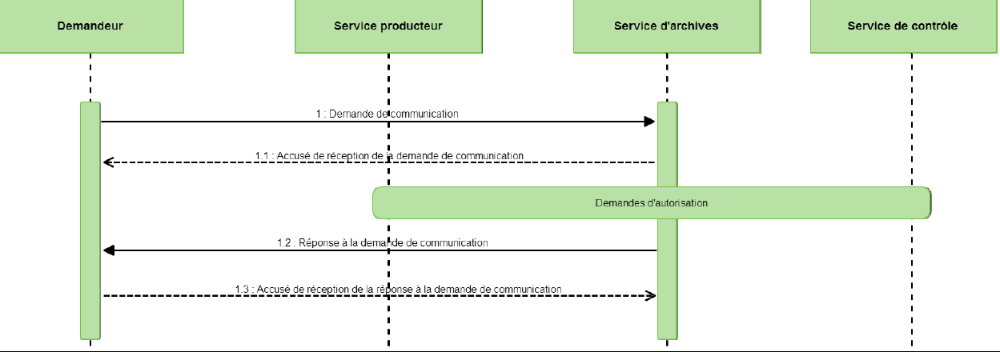
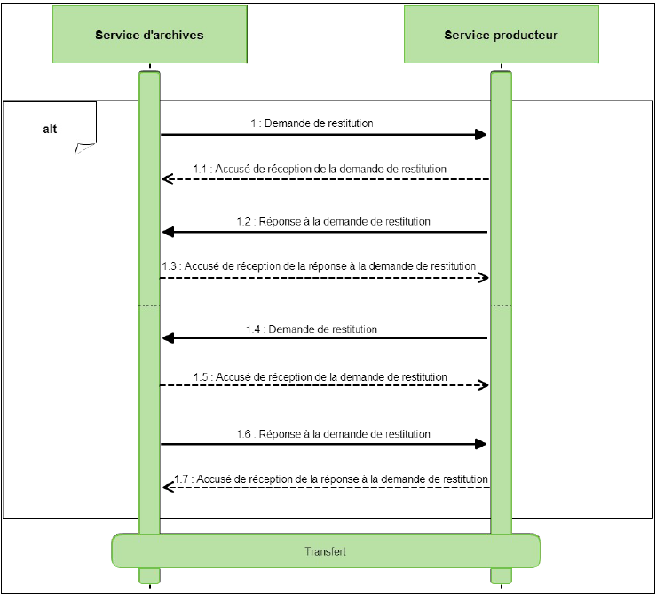
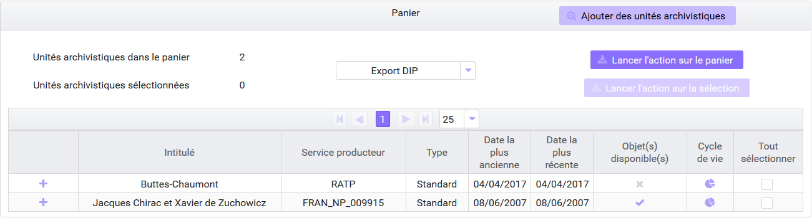
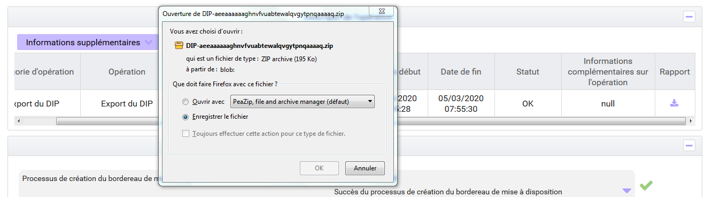
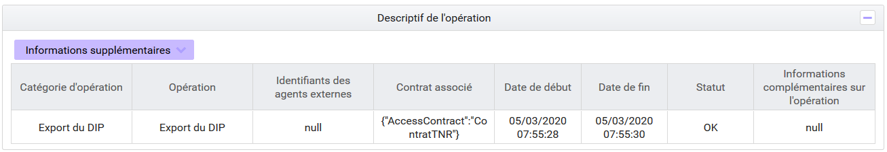
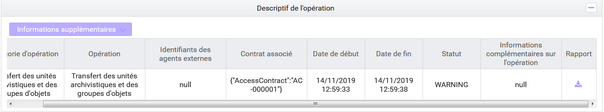
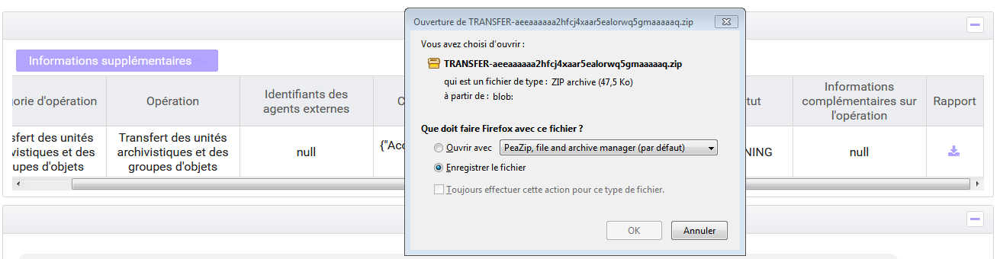

Structuration des *Dissemination Information Packages* (DIP)
=====

Introduction
------------

### Documents de référence


|**Document**|**Date de la version**|**Remarques**|
|:---------------:|:-----:|:-----:|
|NF Z 44022 – MEDONA – Modélisation des données pour l’archivage|18/01/2014||
|Standard d’échange de données pour l’archivage – SEDA – v. 2.1|06/2018||            
|Standard d’échange de données pour l’archivage – SEDA – v. 2.2|02/2022|Cette nouvelle version du SEDA est intégrée à la solution logicielle Vitam à partir de la V6.RC.|
|Référentiel général de sécurité (RGS) – v. 2.0|10/06/2015||
|ISO 14 721:2012 – Systèmes de transfert des informations et données spatiales -- Système ouvert d’archivage d’information (SOAI) -- Modèle de référence|01/09/2012||

### Présentation du document

Le présent document constitue une présentation des fonctionnalités associées au Dissemination Information Package dans la solution logicielle Vitam.  
Il décrit les fonctionnalités qui sont offertes par la solution logicielle Vitam au terme de la version 6 (mars 2023). Il a vocation à être amendé, complété et enrichi au fur et à mesure des développements de la solution logicielle Vitam et des retours et commentaires formulés par les ministères porteurs et les partenaires du programme.

Présentation du DIP
----

### Définition et cas d’usage

L’archivage a pour finalité la conservation de l’information en raison de sa valeur (administrative, juridique, historique, patrimoniale…), mais également sa mise à disposition. Ce processus permet au service d’archives de mettre à disposition de tiers (services producteurs, autres services d’archives, usagers sur place et à distance, etc.) les archives qu’il conserve, si besoin après vérification des droits des demandeurs.

Dans l’univers numérique, peuvent être mis à disposition les documents eux-mêmes et leurs métadonnées.

Les services ainsi délivrés sont de plusieurs ordres :
- transmission d’ensembles de métadonnées à partir desquelles le service d’archives pourra élaborer des instruments de recherche pour faire connaître les ressources dont il dispose,
- communication des archives pour consultation ou diffusion,
- réutilisation des archives sur les portails des services d’archives ou par des tiers,
- restitution d’archives au service producteur (sortie définitive en cas de réactivation d’un dossier ou de changement de prestataire d’archivage),
- transfert de responsabilité à un autre service d’archives, notamment à l’issue d’une phase d’archivage intermédiaire.

Tous ces services se traduisent par la constitution d’un lot d’archives à partir des éléments gérés par le service d’archives et la mise à disposition de ce lot. La solution logicielle Vitam offre plusieurs possibilités pour délivrer ces services :
- téléchargement des fichiers uniquement lorsque le demandeur n’a pas besoin des métadonnées associées,
- export des métadonnées lorsque le demandeur n’a pas besoin des objets binaires,
- constitution d’un lot d’archives (le Dissemination Information Package ou DIP) pour transmettre concomitamment les métadonnées et les objets binaires, notamment en cas de besoin de prise de responsabilité sur le paquet mis à disposition.

Le présent document décrit la manière de préparer ces paquets et de les mettre à disposition dans une plate-forme utilisant la solution logicielle Vitam.

### Contexte normatif

La constitution d’un paquet pour mise à disposition par une plate-forme utilisant la solution logicielle Vitam doit être réalisée conformément aux deux normes suivantes.

#### L’OAIS (Open Archival Information System)

L’OAIS est un modèle conceptuel de références décrivant dans les grandes lignes les fonctions, les responsabilités et l’organisation d’un système qui voudrait préserver sur le long terme de l’information, en particulier des données numériques.

Le modèle OAIS repose sur l’idée que l’information constitue des paquets, et que ces paquets ne sont pas les mêmes suivant qu’on est en train de produire l’information, de mettre en œuvre des opérations pour la conserver, ou de la communiquer à un utilisateur.

Il existe d’après cette norme trois sortes de paquets :
- les paquets pris en charge par le système ou Submission Information Packages (SIP) préparés par les producteurs à destination de la solution logicielle Vitam ;
- les paquets gérés par le système ou Archival Information Packages (AIP) transformés par la solution logicielle Vitam à partir du SIP dans une forme plus facile à conserver et à gérer dans le temps ;
- les paquets communiqués par le système ou Dissemination Information Packages (DIP) transformés par la solution logicielle Vitam à partir d’un ou plusieurs AIP.

Un paquet d’archives destiné à être mis à disposition de tiers par une plate-forme utilisant la solution logicielle Vitam constitue un DIP au sens du modèle OAIS.

#### Le SEDA (Standard d’Échange de Données pour l’Archivage) et la norme MEDONA (Modèle d’Échange de DONnées pour l’Archivage)

La norme MEDONA et le standard SEDA constituent des modèles standards pour les transactions d’échanges entre les acteurs de l’archivage, et notamment entre le service d’archives et le demandeur d’une communication.  
La norme AFNOR NF Z 44‑022, intitulée "Modèle d’Échange de DONnées pour l’Archivage" ou MEDONA a été publiée en 2014. Elle apporte un cadre normatif pour les différents échanges d’informations (données comme métadonnées) entre le service d’archives et ses partenaires comme le demandeur (toute personne physique ou morale qui souhaite consulter les informations conservées par le service d’archives dans le respect des conditions légales, réglementaires ou contractuelles en vigueur) et la façon dont s’organisent ces échanges. Elle définit des diagrammes d’activités et des modèles de données selon le formalisme UML. Les échanges se traduisent par des messages formalisés par des schémas XML.

Le SEDA est le « Standard d’Échange de Données pour l’Archivage » relatif aux données d’archives publiques. Créé en 2006 par la Direction des Archives de France et la Direction Générale pour la Modernisation de L’État, il a été révisé en 2010 (v0.2), en 2012 (v1.0), en 2015 (v2.0) pour assurer sa compatibilité avec la norme MEDONA et plus récemment en 2018 (v2.1) et 2022 (v.2.2). Il comporte à la fois le modèle fonctionnel et un modèle de données pour les échanges de données d’archives entre acteurs de la sphère publique : description, acteurs, règles de gestion, référentiels métier et techniques.

Selon ce standard, les fonctions de mise à disposition couvertes par le DIP correspondent à deux cas d’utilisation : la communication et la restitution.

- La communication  
La demande de communication d’archives (ArchiveDeliveryRequest) est effectuée par un demandeur (le producteur de ces informations, ou un tiers) qui souhaite consulter des informations. La communication peut concerner tant les données elles-mêmes que leurs métadonnées.  
À réception de la demande de communication, le service d’archives peut émettre un accusé de réception en direction du demandeur (Acknowledgement).  
Après instruction de la demande et, si nécessaire, une phase de demande d’autorisations, une réponse (ArchiveDeliveryRequestReply) est envoyée par le service d’archives au demandeur. Cette réponse peut être négative (par exemple dans le cas où l’information demandée n’existe pas ou si le service de contrôle s’y oppose) ou être positive, auquel cas elle comprend les données demandées accompagnées de leurs métadonnées.
Une fois la réponse reçue, le demandeur peut émettre un message d’accusé de réception (Acknowledgement).
Le schéma ci-dessous modélise les échanges associés à la requête et au transfert d’un ensemble d’archives à communiquer – le DIP au sens de la norme OAIS.  
  
**Point d’attention :** la phase de demande d’autorisation est du ressort du front-office et non du back-office.

- La restitution  
La transaction de restitution est découpée en deux séquences : une séquence de demande de restitution suivie d’une séquence de transfert.  
La demande de restitution (ArchiveRestitutionRequest) peut être à l’initiative soit du service d’archives qui détient les informations à restituer, soit du service producteur.  
La demande s’effectue en mentionnant les identifiants des données concernées (éventuellement accompagnées de leurs métadonnées). Le service qui reçoit la demande, en accuse la réception. S’ensuit l’envoi de sa réponse (acceptation ou refus de la demande de restitution – ArchiveRestitutionRequestReply) dont l’initiateur de la demande accuse la réception  (Acknowledgement).  
En cas d’acceptation de la demande de restitution, le transfert effectif des informations entre les acteurs suit le modèle normal d’un transfert (ArchiveTransfer).  

Cette transaction peut également s’appliquer pour des transferts entre deux SAE.

Si le SEDA explique de manière générale à quoi ressemblent les processus de communication ou de restitution de données numériques, ce standard ne spécifie pas les règles de constitution du paquet à mettre à disposition.

C’est pourquoi le présent document vise à :
- apporter des précisions sur la constitution des DIP qui seront mis à disposition par une plate-forme utilisant la solution logicielle Vitam ;
- expliciter les choix faits par l’équipe projet Vitam quand le standard SEDA en laissait la responsabilité aux implémentations.

À défaut de précision apportée par le présent document, la documentation accompagnant le standard SEDA  dans ses versions 2.1. et 2.2. et accessible sur le site internet du Service interministériel des Archives de France s’applique[^1].

Présentation du Dissemination Information Package (DIP)
----

D’après le SEDA, un DIP est constitué d’un bordereau et d’un ou plusieurs objets qui font l’objet de la demande de communication. Il peut être uniquement composé d’un bordereau, quand seules les métadonnées sont mises à disposition du demandeur. Toutefois, l’équipe Vitam recommande de ne pas passer par le DIP pour communiquer uniquement des métadonnées s’il n’y a pas de prise de responsabilité sur le paquet (par exemple, communication des métadonnées en vue de l’élaboration d’un instrument de recherche).

Le DIP exporté par une plate-forme utilisant la solution logicielle Vitam répond aux caractéristiques suivantes.

|Intitulé|Description|Niveau de recommandation|
|:---|:----|:----:|
|Structuration du DIP|Un DIP se compose :<br>- d’un bordereau nommé « manifest.xml »,<br>- d’un répertoire nommé « Content » rassemblant le cas échéant les objets numériques à transférer au demandeur ; chaque objet est nommé par son identifiant dans Vitam (GUID).<br>En l’absence d’objet (par exemple si la demande ne porte que sur des unités archivistiques sans groupes d’objets techniques associés), la présence du répertoire « Content » n’est pas obligatoire.|Obligatoire|
|Type de format du DIP|ZIP.|Obligatoire|
|Taille du DIP|La taille maximale du DIP est de 10 000 unités archivistiques.|Obligatoire|

Selon les options choisies (cf. infra), les informations contenues dans le manifeste différeront.

Il est possible d’exporter dans le manifeste les journaux du cycle de vie des unités archivistiques et des groupes d’objets techniques.

Si pour un usage donné le groupe d’objets techniques comprend plusieurs versions, c’est l’objet technique correspondant à la dernière version qui sera exporté.

Le DIP minimal
----

La solution logicielle Vitam permet d’exporter un DIP dit minimal, composé du répertoire contenant les objets numériques demandés et d’un manifeste simplifié, constitué autour du DataObjectPackage.

Ce bordereau minimal peut être enrichi par la suite par l’utilisateur applicatif qui l’a demandé pour constituer l’une des demandes d’autorisation prévues par le SEDA (AuthorizationOriginatingAgencyRequest, AuthorizationOriginatingAgencyRequestReply, AuthorizationControlAuthorityRequest et AuthorizationControlAuthorityRequestReply).

### Les modalités de lancement de l’opération de mise à disposition du DIP minimal

Depuis l’IHM standard accompagnant la solution logicielle Vitam, à partir de la page de détail d’une unité archivistique, il est possible de demander à générer un DIP minimal de l’unité archivistique uniquement ou de l’unité archivistique et de ses filles, ou bien un DIP correspondant à l’opération d’entrée (ingest) initiale.

Le DIP peut être filtré sur un type d’usage. Le ou les usages retenus doivent être cohérents avec les droits octroyés par le contrat d’accès associé à la demande de génération du DIP.


Depuis l’IHM standard, il est également possible de demander à générer un DIP du panier ou d’une sélection présente dans le panier. Le panier permet de constituer un DIP avec des unités archivistiques de services producteurs différents ; par défaut, le nom du service producteur figurant dans le bordereau du DIP (balise ManagementMetadata) sera une valeur définie par configuration.



Dans l’état actuel des développements de la solution logicielle, la fonctionnalité de filtre du DIP sur un type d’usage n’est pas présente dans le panier. Tous les usages autorisés par le contrat d’accès associé à la demande de génération du DIP sont exportés.

Via les API aux bornes de la solution logicielle Vitam, plusieurs critères de constitution du DIP sont utilisables : identifiant d’une opération d’entrée, unité archivistique précise, ensemble des unités archivistiques dépendant d’une unité archivistique précise, etc. Des filtres supplémentaires peuvent être demandés sur : 
- les usages. Ce filtre sera contrôlé par rapport aux droits octroyés par le contrat accès ;
- la version du SEDA. Ce filtre fonctionne de la manière suivante :
    - S’il n’est pas utilisé, le DIP généré sera déclaré en SEDA 2.2 ;
    - Un contrôle de compatibilité est effectué entre la version du SEDA demandée dans le DIP et celle des unités archivistiques devant intégrer ce dernier.

Au lancement de l’opération, la solution logicielle Vitam génère un identifiant de l’opération. Le DIP constitué a pour nom cet identifiant d’opération.

L’opération est journalisée. Suivant l’activation ou non de la fonctionnalité dans le contrat d’accès associé à la demande de génération du DIP, l’opération sera tracée dans les logs d’accès.

Elle peut aboutir aux statuts suivants :

|Statut|Motifs|
|:---|:---|
|Succès|Opération réalisée sans rencontrer de problèmes particuliers.|
|Avertissement|- Le lot d’archives sélectionné n’a pas d’objets binaires.<br>- Le poids du DIP est supérieur ou égal au seuil de tenant qui a été défini avec autorisation d’être dépassé.<br>- Le poids du DIP est supérieur ou égal au seuil de plate-forme qui a été défini sans qu’aucun seuil de tenant n’ait été défini.|
|Erreur|- Le poids du DIP est supérieur au seuil de requête.<br>- Le poids du DIP est supérieur ou égal au seuil de tenant qui a été défini sans autorisation d’être dépassé et dépasse le seuil de plate-forme.<br>- La version du SEDA des unités archivistiques est incompatible avec celle demandée pour le DIP.|
|Erreur technique|Erreur technique lors du déplacement des objets binaires de l'offre de stockage vers l'espace de travail interne.|

**Point d’attention :** 
- Dans le cas d’un DIP correspondant à une opération d’entrée, le paquet comprendra toutes les unités importées dans le système via cette opération d’entrée dans leur état au moment de la demande d’export du DIP : certaines unités archivistiques pourront avoir été modifiées ou éliminées depuis l’opération d’entrée initiale.
- Si pour un usage donné le groupe d’objets techniques comprend plusieurs versions, c’est l’objet technique correspondant à la dernière version qui sera exporté.

### Les modalités de récupération du DIP minimal

Lorsque l’opération d’export du DIP est terminée, le DIP peut être récupéré :
- depuis l’IHM standard, à partir du journal des opérations en cliquant sur la ligne de l’opération d’export du DIP pour accéder à l’écran de détail, puis en affichant le champ « rapport » (via le sélecteur « Informations supplémentaires »),




- par API, en utilisant le service fourni par le endpoint access-external/v1/dipexport, au moyen de l’identifiant de l’opération d’export ;
- depuis VitamUI, à partir de l’APP Journal des opérations.

Il est également possible de récupérer l’empreinte du DIP générée depuis le journal des opérations et disponible à la tâche de Création de l’archive et de son déplacement vers l’espace de stockage.

### Le bordereau du DIP minimal

À la racine du DIP se trouve le bordereau de mise à disposition qui décrit l’ensemble des métadonnées du paquet. Il est composé :
- d’une déclaration des objets binaires (DataObjectPackage > BinaryDataObject) ou des objets physiques (DataObjectPackage > PhysicalDataObject), le cas échéant avec les journaux du cycle de vie des objets ;
- d’une déclaration des unités archivistiques représentées par ces objets (DataObjectPackage > DescriptiveMetadata) :
    - avec leurs métadonnées de gestion, avec, le cas échéant, les journaux du cycle de vie associés ;
    - avec leurs métadonnées descriptives ;
- de métadonnées communes à toute l’arborescence d’unités archivistiques : déclaration du service producteur (hérité de la balise OriginatingAgencyIdentifier présente dans le ManagementMetadata du SIP à l’origine de l’entrée pour les DIP mono-producteurs ; pour les DIP multi-producteurs, la valeur de ce champ est « Export VITAM »[^2]).

Le DIP complet
----

La solution logicielle Vitam permet d’exporter un DIP dit complet, composé du répertoire contenant les objets numériques demandés et d’un manifeste correspondant au message SEDA  ArchiveDeliveryRequestReply.

### Les modalités de lancement de l’opération de mise à disposition du DIP complet

Depuis l’IHM standard accompagnant la solution logicielle Vitam, à partir de la page de détail d’une unité archivistique, il est possible de demander à générer un DIP complet de l’unité archivistique uniquement ou de l’unité archivistique et de ses filles, ou bien un DIP complet correspondant à l’opération d’entrée (ingest) initiale.

Le DIP complet peut être filtré sur un type d’usage. Le ou les usages retenus doivent être cohérents avec les droits octroyés par le contrat d’accès associé à la demande de génération du DIP.


Dans l’état actuel des développements, il n’est pas possible, depuis l’IHM standard, de demander à générer un DIP complet du panier ou d’une sélection présente dans le panier.

Depuis VitamUI, il est également possible de demander à générer un DIP dans l’APP Recherche et consultation des archives, après avoir préalablement sélectionné un lot d’archives.

Via les API aux bornes de la solution logicielle Vitam, plusieurs critères de constitution du DIP complet sont utilisables : identifiant d’une opération d’entrée, unité archivistique précise, ensemble des unités archivistiques dépendant d’une unité archivistique précise, etc. Des filtres supplémentaires peuvent être demandés sur : 
- les usages. Ce filtre sera contrôlé par rapport aux droits octroyés par le contrat accès ;
- la version du SEDA. Ce filtre fonctionne de la manière suivante :
    - S’il n’est pas utilisé, le DIP généré sera déclaré en SEDA 2.2 ;
    - Un contrôle de compatibilité est effectué entre la version du SEDA demandée dans le DIP et celle des unités archivistiques devant intégrer ce dernier.

La constitution du DIP complet nécessite de définir plusieurs paramètres qui seront utilisés pour renseigner le manifeste :
- informations obligatoires :
    - identifiant du service d’archives (sous-bloc Identifier inclus dans le bloc ArchivalAgency),
    - identifiant de la demande (MessageRequestIdentifier),
    - identifiant du demandeur (sous-bloc Identifier inclus dans le bloc Requester),
- informations facultatives :
    - identifiant de la réponse à une demande d’autorisation (AuthorizationRequestReply),
    - intitulé (Comment),
    - identifiant du service versant (SubmissionAgencyIdentifier).

Les valeurs de ces paramètres ne sont pas contrôlées par rapport aux référentiels présents dans la solution logicielle Vitam. Ainsi, il est tout à fait possible, par exemple, d’indiquer un identifiant de service d’archives qui ne figure pas dans le référentiel des services agents.

Au lancement de l’opération, la solution logicielle Vitam génère un identifiant de l’opération. Le DIP constitué a pour nom cet identifiant d’opération.

L’opération est journalisée. Suivant l’activation ou non de la fonctionnalité dans le contrat d’accès associé à la demande de génération du DIP, l’opération sera tracée dans les logs d’accès.

Elle peut aboutir aux statuts suivants :

|Statut|Motifs|
|:---|:---|
|Succès|Opération réalisée sans rencontrer de problèmes particuliers.|
|Avertissement|- Le lot d’archives sélectionné n’a pas d’objets binaires.<br>- Le poids du DIP est supérieur ou égal au seuil de tenant qui a été défini avec autorisation d’être dépassé.<br>- Le poids du DIP est supérieur ou égal au seuil de plate-forme qui a été défini sans qu’aucun seuil de tenant n’ait été défini.|
|Échec|- Au moins un des champs obligatoires (Requester, ArchivalAgency, MessageRequestIdentifier) n’a pas été renseigné.<br>- Le poids du DIP est supérieur au seuil de requête.<br>- Le poids du DIP est supérieur ou égal au seuil de tenant qui a été défini sans autorisation d’être dépassé et dépasse le seuil de plate-forme.<br>- La version du SEDA des unités archivistiques est incompatible avec celle demandée pour le DIP.|
|Erreur technique|Erreur technique lors du déplacement des objets binaires de l'offre de stockage vers l'espace de travail interne.|

**Point d’attention :** 
- Dans le cas d’un DIP correspondant à une opération d’entrée, le paquet comprendra toutes les unités importées dans le système via cette opération d’entrée dans leur état au moment de la demande d’export du DIP : certaines unités archivistiques pourront avoir été modifiées ou éliminées depuis l’opération d’entrée initiale.
- Si pour un usage donné le groupe d’objets techniques comprend plusieurs versions, c’est l’objet technique correspondant à la dernière version qui sera exporté.

### Les modalités de récupération du DIP complet

Lorsque l’opération d’export du DIP complet est terminée, le DIP peut être récupéré :
- depuis l’IHM standard, à partir du journal des opérations en cliquant sur la ligne de l’opération d’export du DIP pour accéder à l’écran de détail, puis en affichant le champ « rapport » (via le sélecteur « Informations supplémentaires »),

  


- par API, en utilisant le service fourni par le endpoint access-external/v2/dipexport, au moyen de l’identifiant de l’opération d’export ;
- depuis VitamUI, à partir de l’APP Journal des opérations.

Il est également possible de récupérer l’empreinte du DIP générée depuis le journal des opérations et disponible à la tâche de Création de l’archive et de son déplacement vers l’espace de stockage.

### Le bordereau du DIP complet

À la racine du DIP se trouve le bordereau de mise à disposition qui décrit l’ensemble des métadonnées du paquet. Ce bordereau répond aux caractéristiques définies par le SEDA pour le message ArchiveDeliveryRequestReply.

Il est composé :
- d’un en-tête comprenant un intitulé (Comment) alimenté à partir des informations fournies lors de la demande de constitution du DIP ; une date correspondant à la date de génération du DIP ; un identifiant (MessageIdentifier) correspondant à l’opération de constitution du DIP ; la référence aux listes de codes (CodeListVersions) ;
- d’une déclaration des objets binaires (DataObjectPackage > BinaryDataObject) ou des objets physiques (DataObjectPackage > PhysicalDataObject), le cas échéant avec les journaux du cycle de vie des objets ;
- d’une déclaration des unités archivistiques représentées par ces objets (DataObjectPackage > DescriptiveMetadata) : 
    - avec leurs métadonnées de gestion, avec, le cas échéant, les journaux du cycle de vie associés ;
    - avec leurs métadonnées descriptives ;
- de métadonnées communes à toute l’arborescence d’unités archivistiques : déclaration du service producteur (hérité de la balise OriginatingAgencyIdentifier) présente dans le ManagementMetadata du SIP à l’origine de l’entrée pour les DIP mono-producteurs ; pour les DIP multi-producteurs, la valeur de ce champ est « Export VITAM »[^3]; déclaration du service versant (SubmissionAgencyIdentifier), identifiant de la demande (MessageRequestIdentifier), identifiant du demandeur (sous-bloc Identifier inclus dans le bloc Requester) et identifiant du service d’archives (sous-bloc Identifier inclus dans le bloc ArchivalAgency) alimentés à partir des informations fournies lors de la demande de constitution du DIP.

Le DIP de transfert
----

Le DIP généré dans le cadre du transfert doit pouvoir être pris en charge sur une autre plate-forme utilisant la solution logicielle Vitam. Le bordereau correspond donc au message ArchiveTransfer du SEDA.

### Les modalités de lancement de l’opération de mise à disposition du DIP de transfert

Depuis l’IHM standard accompagnant la solution logicielle Vitam, à partir de la page de détail d’une unité archivistique, il est possible de demander à générer un DIP de transfert de l’unité archivistique uniquement ou de l’unité archivistique et de ses filles, ou bien un DIP de transfert correspondant à l’opération d’entrée (ingest) initiale[^4].

- Le DIP de transfert peut être filtré sur un type d’usage. Le ou les usages retenus doivent être cohérents avec les droits octroyés par le contrat d’accès associé à la demande de génération du DIP.  
  
Dans l’état actuel des développements, il n’est pas possible, depuis l’IHM standard, de demander à générer un DIP de transfert du panier ou d’une sélection présente dans le panier.
- Depuis VitamUI, il est également possible de demander à générer un DIP de transfert dans l’APP Recherche et consultation des archives, après avoir préalablement sélectionné un lot d’archives.
- Via les API aux bornes de la solution logicielle Vitam, plusieurs critères de constitution du DIP complet sont utilisables : identifiant d’une opération d’entrée, unité archivistique précise, ensemble des unités archivistiques dépendant d’une unité archivistique précise, etc. Des filtres supplémentaires peuvent être demandés sur : 
    - les usages. Ce filtre sera contrôlé par rapport aux droits octroyés par le contrat accès ;
    - la version du SEDA. Ce filtre fonctionne de la manière suivante :
        - S’il n’est pas utilisé, le DIP généré sera déclaré en SEDA 2.2 ;
        - Un contrôle de compatibilité est effectué entre la version du SEDA demandée dans le DIP et celle des unités archivistiques devant intégrer ce dernier.

La constitution du DIP de transfert nécessite de définir plusieurs paramètres qui seront utilisés pour renseigner le manifeste :
- informations obligatoires :
    - contrat d’entrée à utiliser pour la prise en charge dans la plate-forme de destination (ArchivalAgreement),
    - identifiant du service d’archives (sous-bloc Identifier du bloc ArchivalAgency),
    - identifiant du service producteur (OriginatingAgencyIdentifier),
- informations facultatives :
    - intitulé (Comment),
    - identifiant du service versant (SubmissionAgencyIdentifier),
    - identifiant d’un transfert associé (RelatedTransferReference),
    - identifiant de la réponse à une demande de transfert (TransferRequestReplyIdentifier),
    - identifiant du service de transfert (sous-bloc Identifier du bloc TransferringAgency). Si ce bloc obligatoire n’est pas renseigné, il sera automatiquement incrémenté par la valeur « Vitam ».

Les valeurs de ces paramètres ne sont pas contrôlées par rapport aux référentiels présents dans la solution logicielle Vitam. Ainsi, il est tout à fait possible, par exemple, d’indiquer un identifiant de service d’archives qui ne figure pas dans le référentiel des services agents.

Au lancement de l’opération, la solution logicielle Vitam génère un identifiant de l’opération. Le DIP de transfert constitué a pour nom cet identifiant d’opération.

L’opération est journalisée. Suivant l’activation ou non de la fonctionnalité dans le contrat d’accès associé à la demande de génération du DIP, l’opération sera tracée dans les logs d’accès.

Elle peut aboutir aux statuts suivants :

|Statut|Motifs|
|:---|:---|
|Succès|Opération réalisée sans rencontrer de problèmes particuliers.|
|Avertissement|- Le lot d’archives sélectionné n’a pas d’objets binaires.<br>- Au moins une des unités archivistiques sélectionnées a déjà fait l’objet d’une opération de demande de transfert.<br>- Le poids du DIP est supérieur ou égal au seuil de tenant qui a été défini avec autorisation d’être dépassé.<br>- Le poids du DIP est supérieur ou égal au seuil de plate-forme qui a été défini sans qu’aucun seuil de tenant n’ait été défini.|
|Échec|- Au moins un des champs obligatoires (ArchivalAgreement, ArchivalAgency, OriginatingAgencyIdentifier) n’a pas été renseigné.<br>- Le poids du DIP est supérieur au seuil de requête.<br>- Le poids du DIP est supérieur ou égal au seuil de tenant qui a été défini sans autorisation d’être dépassé et dépasse le seuil de plate-forme.<br>- La version du SEDA des unités archivistiques est incompatible avec celle demandée pour le DIP.|
|Erreur technique|Erreur technique lors du déplacement des objets binaires de l'offre de stockage vers l'espace de travail interne.|

**Point d’attention :** 
- Dans le cas d’un DIP de transfert correspondant à une opération d’entrée, le paquet comprendra toutes les unités importées dans le système via cette opération d’entrée dans leur état au moment de la demande d’export du DIP : certaines unités archivistiques pourront avoir été modifiées ou éliminées depuis l’opération d’entrée initiale.
- Si pour un usage donné le groupe d’objets techniques comprend plusieurs versions, c’est l’objet technique correspondant à la dernière version qui sera exporté.

### Les modalités de récupération du DIP de transfert

Lorsque l’opération d’export du DIP de transfert est terminée, le DIP peut être récupéré :
- depuis l’IHM standard, à partir du journal des opérations en cliquant sur la ligne de l’opération d’export du DIP pour accéder à l’écran de détail, puis en affichant le champ « rapport » (via le sélecteur « Informations supplémentaires »),  
  
  
- par API, en utilisant le service fourni par le endpoint access-external/v1/transfers, au moyen de l’identifiant de l’opération d’export.
- depuis VitamUI, à partir de l’APP Journal des opérations.

Il est également possible de récupérer l’empreinte du DIP générée depuis le journal des opérations et disponible à la tâche de Création de l’archive et de son déplacement vers l’espace de stockage.

### Le bordereau du DIP de transfert

À la racine du DIP de transfert se trouve le bordereau de mise à disposition qui décrit l’ensemble des métadonnées du paquet. Ce bordereau répond aux caractéristiques définies par le SEDA pour le message ArchiveTransfer, de manière à pouvoir être pris en charge par une plate-forme utilisant la solution logicielle Vitam.

Il est composé :
- d’un en-tête comprenant un intitulé (Comment) alimenté à partir des informations fournies lors de la demande de constitution du DIP ; une date correspondant à la date de génération du DIP ; un contrat d’entrée à utiliser lors de la prise en charge du DIP de transfert dans le SAE cible alimenté à partir des informations fournies lors de la demande de constitution du DIP ; un identifiant (MessageIdentifier) correspondant à l’opération de constitution du DIP ; la référence aux listes de codes ;
- d’une déclaration des objets binaires (DataObjectPackage > BinaryDataObject) ou des objets physiques (DataObjectPackage > PhysicalDataObject), le cas échéant avec les journaux du cycle de vie des objets ;
- d’une déclaration des unités archivistiques représentées par ces objets (DataObjectPackage > DescriptiveMetadata) : 
    - avec leurs métadonnées de gestion, avec, le cas échéant, les journaux du cycle de vie associés ;
    - avec leurs métadonnées descriptives ;
- de métadonnées communes à toute l’arborescence d’unités archivistiques alimentées à partir des informations fournies lors de la demande de constitution du DIP : identifiant du service producteur (OriginatingAgencyIdentifier) ; identifiant du service versant (SubmissionAgencyIdentifier) ; identifiant d’un transfert associé (RelatedTransferReference) ; identifiant de la réponse à une demande de transfert (TransferRequestReplyIdentifier) ; identifiant du service d’archives (sous-bloc Identifier inclus dans le bloc ArchivalAgency) ; identifiant du service de transfert (sous-bloc Identifier inclus dans le bloc TransferringAgency).

Configuration du service
----

### Suppression des DIP

Les DIP générés dans le cadre d’une demande de communication et les SIP générés dans le cadre d’une demande de transfert sont stockés dans des dossiers spécifiques.

Ils sont purgés automatiquement à l’expiration d’un délai paramétrable par l’administrateur technique.

Par défaut, la solution logicielle Vitam retient les DIP, quel que soit leur type :
- durant 7 jours, et les efface au moyen d’un batch qui est lancé chaque jour à 2h20 si l’espace libre du workspace représente plus de 25% de la taille totale du workspace ;
- durant 1 jour si ce dernier représente moins de 25% de la taille totale du workspace, et les efface au moyen d’un batch qui est lancé chaque heure à 0 minute 0 seconde.

Cette configuration par défaut peut être modifiée lors du paramétrage initial de la plate-forme par les administrateurs – fonctionnel pour la définition du besoin et technique[^5] pour la saisie réelle des informations – de chaque implémentation de la solution logicielle Vitam et définit, pour tous les tenants et pour chaque type de DIP – DIP générés dans le cadre d’une demande de communication et SIP générés dans le cadre d’une demande de transfert –  la durée de rétention minimale et maximale dans l’espace de stockage et la fréquence du batch permettant de les purger du système.

Le fichier de configuration[^6] se présente comme suit (paramétrage par défaut) :
```json
### global ###
[...]
vitam_timers:
[...]
    metadata:
        [...]
        - name: vitam-metadata-purge-dip
          frequency: "*-*-* *:00:00"
        - name: vitam-metadata-purge-transfers-SIP
          frequency: "*-*-* 02:25:00"
### Composants Vitam ###
vitam:
    [...]
    metadata :
     [...]
     # DIP cleanup delay (in minutes)
        dipTimeToLiveInMinutes: 10080 # 7 days
        criticalDipTimeToLiveInMinutes: 1440 # 1 day
        transfersSIPTimeToLiveInMinutes: 10080 # 7 days
        workspaceFreespaceThreshold: 25 # when below use critical time to live when above use normal time to live
```

### Limitation du poids des DIP

Afin de se prémunir contre une surcharge de l’espace de stockage, il est possible de configurer un seuil de plate-forme et un seuil propre à chaque tenant, en plus d’inclure un seuil dans la requête demandant à générer un DIP. La solution logicielle Vitam vérifie alors que le poids des DIP est inférieur ou égal au seuil défini.

Cette configuration, optionnelle, est établie lors du paramétrage initial de la plate-forme par les administrateurs – fonctionnel pour la définition du besoin et technique[^7] pour la saisie réelle des informations – de chaque implémentation de la solution logicielle Vitam et définit, pour la plate-forme et/ou chaque tenant, les seuils acceptables.

Le fichier de configuration[^8] se présente comme suit (exemple fictif) :
```json
binarySizePlatformThreshold:
 limit: 1
 sizeUnit: GIGABYTE

binarySizeTenantThreshold:
   - tenant: 0
      limit: 20
      sizeUnit: MEGABYTE
      authorize: false
   - tenant: 1
      limit: 100
      sizeUnit: MEGABYTE
      authorize: true
```

Dans l’exemple ci-dessus :
- au niveau de la plate-forme :
    - aucun DIP ne pourra dépasser 1 gigabytes ;
- sur le tenant 0 :
    - aucun DIP ne pourra dépasser 20 megabytes ;
    - l’utilisateur n’est pas autorisé à dépasser ce seuil ;
- sur le tenant 1 :
    - les DIP sont limités à 100 megabytes ;
    - l’utilisateur est autorisé à dépasser ce seuil, mais sera averti de son dépassement.


Annexes
---

### Annexe 1 : Exemple de bordereau de mise à disposition pour un DIP mono-producteur (DIP minimal)

```json
<ArchiveRestitutionRequest xmlns:xlink="http://www.w3.org/1999/xlink"
    xmlns:pr="info:lc/xmlns/premis-v2" xmlns="fr:gouv:culture:archivesdefrance:seda:v2.1"
    xmlns:xsi="http://www.w3.org/2001/XMLSchema-instance"
    xsi:schemaLocation="fr:gouv:culture:archivesdefrance:seda:v2.1 seda-vitam-2.1-main.xsd">
    <DataObjectPackage>
        <DataObjectGroup id="aebaaaaaayhjq73zabr2oaldu4kqq4qaaabq">
            <BinaryDataObject id="aeaaaaaaaahjq73zabr2oaldu4kqq4qaaaba">
                <DataObjectVersion>BinaryMaster_1</DataObjectVersion>
                <Uri>Content/aeaaaaaaaahjq73zabr2oaldu4kqq4qaaaba</Uri>
                <MessageDigest algorithm="SHA-512"
                    >664ac614a819df2a97d2a5df57dcad91d6ec38b0fffc793e80c56b4553a14ac7a5f0bce3bb71af419b0bb8f151ad3d512867454eeb818e01818a31989c13319b</MessageDigest>
                <Size>6</Size>
                <FormatIdentification>
                    <FormatLitteral>Plain Text File</FormatLitteral>
                    <MimeType>text/plain</MimeType>
                    <FormatId>x-fmt/111</FormatId>
                </FormatIdentification>
                <FileInfo>
                    <Filename>Pereire.txt</Filename>
                    <LastModified>2017-04-04T08:07:27.825+02:00</LastModified>
                </FileInfo>
            </BinaryDataObject>
        </DataObjectGroup>
        <DescriptiveMetadata>
            <ArchiveUnit id="aeaqaaaaayhjq73zabr2oaldu4kqq6iaaaga">
                <Management>
                    <DisseminationRule>
                        <Rule>DIS-00002</Rule>
                        <StartDate>2000-01-01</StartDate>
                        <RefNonRuleId>DIS-00001</RefNonRuleId>
                    </DisseminationRule>
                </Management>
                <Content>
                    <DescriptionLevel>RecordGrp</DescriptionLevel>
                    <Title>Gare du Nord</Title>
                    <Description>Cette unité de description hérite de son parent de la règle
                        ACC-00003 avec pour StartDate 01/01/2000, bloque l'héritage de la règle
                        DIS-00001 mais déclare la règle DIS-00002 avec pour StartDate
                        01/01/2000</Description>
                    <StartDate>2017-04-05T08:11:56</StartDate>
                    <EndDate>2017-04-05T08:11:56</EndDate>
                </Content>
                <ArchiveUnit id="aeaaaaaaaahi3waqabrz6aldwa2nx5iaaaaq">
                    <ArchiveUnitRefId>aeaqaaaaayhjq73zabr2oaldu4kqq6aaaada</ArchiveUnitRefId>
                </ArchiveUnit>
            </ArchiveUnit>
            <ArchiveUnit id="aeaqaaaaayhjq73zabr2oaldu4kqq6aaaaea">
                <Management/>
                <Content>
                    <DescriptionLevel>Item</DescriptionLevel>
                    <Title>Pereire.txt</Title>
                    <Description/>
                    <TransactedDate>2017-04-04T08:07:27</TransactedDate>
                </Content>
                <DataObjectReference>
                    <DataObjectGroupReferenceId>aebaaaaaayhjq73zabr2oaldu4kqq4qaaabq</DataObjectGroupReferenceId>
                </DataObjectReference>
            </ArchiveUnit>
            <ArchiveUnit id="aeaqaaaaayhjq73zabr2oaldu4kqq6aaaada">
                <Management>
                    <AccessRule>
                        <Rule>ACC-00001</Rule>
                        <StartDate>2000-01-01</StartDate>
                        <PreventInheritance>true</PreventInheritance>
                    </AccessRule>
                    <DisseminationRule>
                        <Rule>DIS-00001</Rule>
                        <StartDate>2000-01-01</StartDate>
                        <RefNonRuleId>DIS-00002</RefNonRuleId>
                    </DisseminationRule>
                </Management>
                <Content>
                    <DescriptionLevel>RecordGrp</DescriptionLevel>
                    <Title>Réaumur</Title>
                    <Description>Cette unité de description bloque l'héritage de toutes les règles
                        AccessRule et de la DIS-00002 mais déclare ACC-00001 avec pour StartDate
                        01/01/2000 et DIS-00001 avec pour StartDate 01/01/2000</Description>
                    <StartDate>2017-04-04T08:07:27</StartDate>
                    <EndDate>2017-04-04T08:07:27</EndDate>
                </Content>
                <ArchiveUnit id="aeaaaaaaaahi3waqabrz6aldwa2nx6iaaaaq">
                    <ArchiveUnitRefId>aeaqaaaaayhjq73zabr2oaldu4kqq6aaaaea</ArchiveUnitRefId>
                </ArchiveUnit>
            </ArchiveUnit>
            <ArchiveUnit id="aeaqaaaaayhjq73zabr2oaldu4kqq6iaaaeq">
                <Management>
                    <AccessRule>
                        <Rule>ACC-00003</Rule>
                        <StartDate>2000-01-01</StartDate>
                        <PreventInheritance>true</PreventInheritance>
                    </AccessRule>
                </Management>
                <Content>
                    <DescriptionLevel>RecordGrp</DescriptionLevel>
                    <Title>Château Rouge</Title>
                    <Description>Cette unité de description bloque l'héritage des règles AccessRule
                        mais déclare la règle ACC-00003 avec pour StartDate 01/01/2000 et hérite de
                        la règle DIS-00001 avec pour StartDate 01/01/2000</Description>
                    <StartDate>2017-04-05T08:11:56</StartDate>
                    <EndDate>2017-04-05T08:11:56</EndDate>
                </Content>
                <ArchiveUnit id="aeaaaaaaaahi3waqabrz6aldwa2nx7aaaaaq">
                    <ArchiveUnitRefId>aeaqaaaaayhjq73zabr2oaldu4kqq6iaaaga</ArchiveUnitRefId>
                </ArchiveUnit>
            </ArchiveUnit>
        </DescriptiveMetadata>
        <ManagementMetadata>
            <OriginatingAgencyIdentifier>RATP</OriginatingAgencyIdentifier>
        </ManagementMetadata>
    </DataObjectPackage>
</ArchiveRestitutionRequest>
```


### Annexe 2 : Exemple de bordereau de mise à disposition pour un DIP multi-producteurs (DIP minimal)

```json
<ArchiveRestitutionRequest xmlns:xlink="http://www.w3.org/1999/xlink"
    xmlns:pr="info:lc/xmlns/premis-v2" xmlns="fr:gouv:culture:archivesdefrance:seda:v2.1"
    xmlns:xsi="http://www.w3.org/2001/XMLSchema-instance"
    xsi:schemaLocation="fr:gouv:culture:archivesdefrance:seda:v2.1 seda-vitam-2.1-main.xsd">
    <DataObjectPackage>
        <DataObjectGroup id="aebaaaaaayhi3waqabrz6aldu4mgbeiaaaaq">
            <BinaryDataObject id="aeaaaaaaaahi3waqabrz6aldu4mgbeiaaaba">
                <DataObjectVersion>Dissemination_1</DataObjectVersion>
                <Uri>Content/aeaaaaaaaahi3waqabrz6aldu4mgbeiaaaba</Uri>
                <MessageDigest algorithm="SHA-512"
                    >461071d0c6f721ca8b9aeed434811293b987e6106cb25594072b3c2cd02f8fd9bb5ecf7d75f06b609ae74f253e2fb81bc81dfc4997eefd075a1fab78a9cdb8ff</MessageDigest>
                <Size>5779643</Size>
                <FormatIdentification>
                    <FormatLitteral>Exchangeable Image File Format (Compressed)</FormatLitteral>
                    <MimeType>image/jpeg</MimeType>
                    <FormatId>fmt/645</FormatId>
                </FormatIdentification>
                <FileInfo>
                    <Filename>chirac-zuchowic.JPG</Filename>
                    <LastModified>2007-06-08T11:30:30.000+02:00</LastModified>
                </FileInfo>
            </BinaryDataObject>
            <BinaryDataObject id="aeaaaaaaaahi3waqabrz6aldu4mgbeaaaabq">
                <DataObjectVersion>BinaryMaster_1</DataObjectVersion>
                <Uri>Content/aeaaaaaaaahi3waqabrz6aldu4mgbeaaaabq</Uri>
                <MessageDigest algorithm="SHA-512"
                    >461071d0c6f721ca8b9aeed434811293b987e6106cb25594072b3c2cd02f8fd9bb5ecf7d75f06b609ae74f253e2fb81bc81dfc4997eefd075a1fab78a9cdb8ff</MessageDigest>
                <Size>5779643</Size>
                <FormatIdentification>
                    <FormatLitteral>Exchangeable Image File Format (Compressed)</FormatLitteral>
                    <MimeType>image/jpeg</MimeType>
                    <FormatId>fmt/645</FormatId>
                </FormatIdentification>
                <FileInfo>
                    <Filename>chirac-zuchowicz.JPG</Filename>
                    <LastModified>2007-06-08T11:30:30.000+02:00</LastModified>
                </FileInfo>
            </BinaryDataObject>
        </DataObjectGroup>
        <DataObjectGroup id="aebaaaaaayhjq73zabr2oaldu4kqq4yaaabq">
            <BinaryDataObject id="aeaaaaaaaahjq73zabr2oaldu4kqq4yaaaba">
                <DataObjectVersion>BinaryMaster_1</DataObjectVersion>
                <Uri>Content/aeaaaaaaaahjq73zabr2oaldu4kqq4yaaaba</Uri>
                <MessageDigest algorithm="SHA-512"
                    >86c0bc701ef6b5dd21b080bc5bb2af38097baa6237275da83a52f092c9eae3e4e4b0247391620bd732fe824d18bd3bb6c37e62ec73a8cf3585c6a799399861b1</MessageDigest>
                <Size>6</Size>
                <FormatIdentification>
                    <FormatLitteral>Plain Text File</FormatLitteral>
                    <MimeType>text/plain</MimeType>
                    <FormatId>x-fmt/111</FormatId>
                </FormatIdentification>
                <FileInfo>
                    <Filename>Bolivar.txt</Filename>
                    <LastModified>2017-04-04T08:07:06.487+02:00</LastModified>
                </FileInfo>
            </BinaryDataObject>
        </DataObjectGroup>
        <DescriptiveMetadata>
            <ArchiveUnit id="aeaqaaaaayhjq73zabr2oaldu4kqq6yaaahq">
                <Management/>
                <Content>
                    <DescriptionLevel>Item</DescriptionLevel>
                    <Title>Bolivar.txt</Title>
                    <Description/>
                    <TransactedDate>2017-04-04T08:07:06</TransactedDate>
                </Content>
                <DataObjectReference>
                    <DataObjectGroupReferenceId>aebaaaaaayhjq73zabr2oaldu4kqq4yaaabq</DataObjectGroupReferenceId>
                </DataObjectReference>
            </ArchiveUnit>
            <ArchiveUnit id="aeaqaaaaayhjq73zabr2oaldu4kqq6yaaagq">
                <Management/>
                <Content>
                    <DescriptionLevel>RecordGrp</DescriptionLevel>
                    <Title>Buttes-Chaumont</Title>
                    <Description>Cette unité de description hérite de la même règle (DIS-00001 avec
                        pour StartDate 01/01/2000 par 2 chemins) et hérite de 2 règles
                        contradictoires de ses 2 parents (ACC-00001 et ACC-00036 toutes deux avec
                        pour StartDate 01/01/2000)</Description>
                    <StartDate>2017-04-04T08:07:06</StartDate>
                    <EndDate>2017-04-04T08:07:06</EndDate>
                </Content>
                <ArchiveUnit id="aeaaaaaaaahi3waqabrz6aldwa46kgaaaaaq">
                    <ArchiveUnitRefId>aeaqaaaaayhjq73zabr2oaldu4kqq6yaaahq</ArchiveUnitRefId>
                </ArchiveUnit>
            </ArchiveUnit>
            <ArchiveUnit id="aeaqaaaaayhi3waqabrz6aldu4mgbfqaaaeq">
                <Management/>
                <Content>
                    <DescriptionLevel>Item</DescriptionLevel>
                    <Title xml:lang="fr">Jacques Chirac et Xavier de Zuchowicz</Title>
                    <Title/>
                    <Description xml:lang="fr">Jacques Chirac serrant la main de Xavier de&#xa;
                        Zuchowicz, gouverneur militaire de Paris.</Description>
                    <Description/>
                    <OriginatingAgency>
                        <Identifier>FRAN_NP_009915</Identifier>
                    </OriginatingAgency>
                    <SubmissionAgency>
                        <Identifier>FRAN_NP_005061</Identifier>
                    </SubmissionAgency>
                    <TransactedDate>2007-06-08T11:30:30</TransactedDate>
                </Content>
                <DataObjectReference>
                    <DataObjectGroupReferenceId>aebaaaaaayhi3waqabrz6aldu4mgbeiaaaaq</DataObjectGroupReferenceId>
                </DataObjectReference>
            </ArchiveUnit>
        </DescriptiveMetadata>
        <ManagementMetadata>
            <OriginatingAgencyIdentifier>Export VITAM</OriginatingAgencyIdentifier>
        </ManagementMetadata>
    </DataObjectPackage>
</ArchiveRestitutionRequest>
```


### Annexe 3 : Exemple de bordereau de mise à disposition pour un DIP complet sans les journaux de cycle de vie

```json
<ArchiveDeliveryRequestReply xmlns:xlink="http://www.w3.org/1999/xlink"
            xmlns:pr="info:lc/xmlns/premis-v2" xmlns="fr:gouv:culture:archivesdefrance:seda:v2.1"
            xmlns:xsi="http://www.w3.org/2001/XMLSchema-instance"
            xsi:schemaLocation="fr:gouv:culture:archivesdefrance:seda:v2.1 seda-vitam-2.1-main.xsd">
            <Comment>DIP pour documentation</Comment>
            <Date>2019-11-21T15:37:53</Date>
            <MessageIdentifier>aeeaaaaaa2hfcj4xaar5ealor2onliiaaaaq</MessageIdentifier>
            <CodeListVersions>
                        <ReplyCodeListVersion>ReplyCodeListVersion6</ReplyCodeListVersion>
<MessageDigestAlgorithmCodeListVersion>MessageDigestAlgorithmCodeListVersion6</MessageDigestAlgorithmCodeListVersion>
                        <MimeTypeCodeListVersion>MimeTypeCodeListVersion6</MimeTypeCodeListVersion>
                        <EncodingCodeListVersion>EncodingCodeListVersion6</EncodingCodeListVersion>
                        <FileFormatCodeListVersion>FileFormatCodeListVersion6</FileFormatCodeListVersion>
<CompressionAlgorithmCodeListVersion>CompressionAlgorithmCodeListVersion6</CompressionAlgorithmCodeListVersion>
<DataObjectVersionCodeListVersion>DataObjectVersionCodeListVersion6</DataObjectVersionCodeListVersion>
<StorageRuleCodeListVersion>StorageRuleCodeListVersion6</StorageRuleCodeListVersion>
<AppraisalRuleCodeListVersion>AppraisalRuleCodeListVersion6</AppraisalRuleCodeListVersion>
<AccessRuleCodeListVersion>AccessRuleCodeListVersion6</AccessRuleCodeListVersion>
<DisseminationRuleCodeListVersion>DisseminationRuleCodeListVersion6</DisseminationRuleCodeListVersion>
<ReuseRuleCodeListVersion>ReuseRuleCodeListVersion6</ReuseRuleCodeListVersion>
<ClassificationRuleCodeListVersion>ClassificationRuleCodeListVersion6</ClassificationRuleCodeListVersion>
<AuthorizationReasonCodeListVersion>AuthorizationReasonCodeListVersion6</AuthorizationReasonCodeListVersion>
<RelationshipCodeListVersion>RelationshipCodeListVersion6</RelationshipCodeListVersion>
            </CodeListVersions>
            <DataObjectPackage>
                        <DataObjectGroup id="aebaaaaaayhnbfxgaavmgalonijd4rqaaaaq">
                                    <BinaryDataObject id="aeaaaaaaaahnbfxgaavmgalonijd4riaaaba">
                                                <DataObjectVersion>BinaryMaster_1</DataObjectVersion>
                                                <Uri>Content/aeaaaaaaaahnbfxgaavmgalonijd4riaaaba.odt</Uri>
                                                <MessageDigest algorithm="SHA-512">59cca81fb1b51e80f27b644f959e7e0c2a9cabca6c5e437ada8b6f6517d845da99059c4fabb8e59ac6dd791c7bd2c251149708b141f9a734cd144c5dfa0f4f70</MessageDigest>
                                                <Size>7405</Size>
                                                <FormatIdentification>
                                                  <FormatLitteral>OpenDocument Text</FormatLitteral>
                                                  <MimeType>application/vnd.oasis.opendocument.text</MimeType>
                                                  <FormatId>fmt/291</FormatId>
                                                </FormatIdentification>
                                                <FileInfo>
                                                  <Filename>Campagne_2018.odt</Filename>
                                                  <LastModified>2018-10-04T16:45:18.430+02:00</LastModified>
                                                </FileInfo>
                                    </BinaryDataObject>
                        </DataObjectGroup>
                        <DataObjectGroup id="aebaaaaaayhnbfxgaavmgalonijd4saaaaba">
                                    <BinaryDataObject id="aeaaaaaaaahnbfxgaavmgalonijd4saaaaaq">
                                                <DataObjectVersion>BinaryMaster_1</DataObjectVersion>
                                                <Uri>Content/aeaaaaaaaahnbfxgaavmgalonijd4saaaaaq.odt</Uri>
                                                <MessageDigest algorithm="SHA-512">59cca81fb1b51e80f27b644f959e7e0c2a9cabca6c5e437ada8b6f6517d845da99059c4fabb8e59ac6dd791c7bd2c251149708b141f9a734cd144c5dfa0f4f70</MessageDigest>
                                                <Size>7405</Size>
                                                <FormatIdentification>
                                                  <FormatLitteral>OpenDocument Text</FormatLitteral>
                                                  <MimeType>application/vnd.oasis.opendocument.text</MimeType>
                                                  <FormatId>fmt/291</FormatId>
                                                </FormatIdentification>
                                                <FileInfo>
                                                  <Filename>Rapport_2018_01.odt</Filename>
                                                  <LastModified>2018-10-04T16:35:53.757+02:00</LastModified>
                                                </FileInfo>
                                    </BinaryDataObject>
                        </DataObjectGroup>
                        <DataObjectGroup id="aebaaaaaayhnbfxgaavmgalonijd4siaaaba">
                                    <BinaryDataObject id="aeaaaaaaaahnbfxgaavmgalonijd4siaaaaq">
                                                <DataObjectVersion>BinaryMaster_1</DataObjectVersion>
                                                <Uri>Content/aeaaaaaaaahnbfxgaavmgalonijd4siaaaaq.odt</Uri>
                                                <MessageDigest algorithm="SHA-512">59cca81fb1b51e80f27b644f959e7e0c2a9cabca6c5e437ada8b6f6517d845da99059c4fabb8e59ac6dd791c7bd2c251149708b141f9a734cd144c5dfa0f4f70</MessageDigest>
                                                <Size>7405</Size>
                                                <FormatIdentification>
                                                  <FormatLitteral>OpenDocument Text</FormatLitteral>
                                                  <MimeType>application/vnd.oasis.opendocument.text</MimeType>
                                                  <FormatId>fmt/291</FormatId>
                                                </FormatIdentification>
                                                <FileInfo>
                                                  <Filename>Rapport_2018_03.odt</Filename>
                                                  <LastModified>2018-10-04T16:35:34.737+02:00</LastModified>
                                                </FileInfo>
                                    </BinaryDataObject>
                        </DataObjectGroup>
                        <DataObjectGroup id="aebaaaaaayhnbfxgaavmgalonijd4riaaaaq">
                                    <BinaryDataObject id="aeaaaaaaaahnbfxgaavmgalonijd4raaaaaq">
                                                <DataObjectVersion>BinaryMaster_1</DataObjectVersion>
                                                <Uri>Content/aeaaaaaaaahnbfxgaavmgalonijd4raaaaaq.odt</Uri>
                                                <MessageDigest algorithm="SHA-512">59cca81fb1b51e80f27b644f959e7e0c2a9cabca6c5e437ada8b6f6517d845da99059c4fabb8e59ac6dd791c7bd2c251149708b141f9a734cd144c5dfa0f4f70</MessageDigest>
                                                <Size>7405</Size>
                                                <FormatIdentification>
                                                  <FormatLitteral>OpenDocument Text</FormatLitteral>
                                                  <MimeType>application/vnd.oasis.opendocument.text</MimeType>
                                                  <FormatId>fmt/291</FormatId>
                                                </FormatIdentification>
                                                <FileInfo>
                                                  <Filename>Rapport_2018_02.odt</Filename>
                                                  <LastModified>2018-10-04T16:35:34.737+02:00</LastModified>
                                                </FileInfo>
                                    </BinaryDataObject>
                        </DataObjectGroup>
                        <DataObjectGroup id="aebaaaaaayhnbfxgaavmgalonijd4ryaaaaq">
                                    <BinaryDataObject id="aeaaaaaaaahnbfxgaavmgalonijd4rqaaaba">
                                                <DataObjectVersion>BinaryMaster_1</DataObjectVersion>
                                                <Uri>Content/aeaaaaaaaahnbfxgaavmgalonijd4rqaaaba.odt</Uri>
                                                <MessageDigest algorithm="SHA-512">59cca81fb1b51e80f27b644f959e7e0c2a9cabca6c5e437ada8b6f6517d845da99059c4fabb8e59ac6dd791c7bd2c251149708b141f9a734cd144c5dfa0f4f70</MessageDigest>
                                                <Size>7405</Size>
                                                <FormatIdentification>
                                                  <FormatLitteral>OpenDocument Text</FormatLitteral>
                                                  <MimeType>application/vnd.oasis.opendocument.text</MimeType>
                                                  <FormatId>fmt/291</FormatId>
                                                </FormatIdentification>
                                                <FileInfo>
                                                  <Filename>Liste_membres.odt</Filename>
                                                  <LastModified>2018-10-04T16:43:27.623+02:00</LastModified>
                                                </FileInfo>
                                    </BinaryDataObject>
                        </DataObjectGroup>
                        <DataObjectGroup id="aebaaaaaayhnbfxgaavmgalonijd4ryaaabq">
                                    <BinaryDataObject id="aeaaaaaaaahnbfxgaavmgalonijd4ryaaaba">
                                                <DataObjectVersion>BinaryMaster_1</DataObjectVersion>
                                                <Uri>Content/aeaaaaaaaahnbfxgaavmgalonijd4ryaaaba.odp</Uri>
                                                <MessageDigest algorithm="SHA-512">773db3fc2960832db44821c9b72a5178a843335724153058c6a257daad9790d86d5cd14dec51698dc4f6ed299390cb0fd2057af198cef387dde3f9367e8e4474</MessageDigest>
                                                <Size>8893</Size>
                                                <FormatIdentification>
                                                  <FormatLitteral>OpenDocument
                                                  Presentation</FormatLitteral>
                                                  <MimeType>application/vnd.oasis.opendocument.presentation</MimeType>
                                                  <FormatId>fmt/293</FormatId>
                                                </FormatIdentification>
                                                <FileInfo>
                                                  <Filename>Biographie_Bidule.odp</Filename>
                                                  <LastModified>2018-10-04T16:39:43.124+02:00</LastModified>
                                                </FileInfo>
                                    </BinaryDataObject>
                        </DataObjectGroup>
                        <DescriptiveMetadata>
                                    <ArchiveUnit id="aeaqaaaaayhnbfxgaavmgalonijd6liaaaba">
                                                <Management/>
                                                <Content>
                                                  <DescriptionLevel>RecordGrp</DescriptionLevel>
                                                  <Title>Service consulaire</Title>
                                                  <Description>C:\Users\mehdi.afnai\Desktop\Test Keep implicite\Test Keep implicite\Direction_des_français_à_l'étranger\Service consulaire</Description>
                                                  <StartDate>2018-10-04T16:45:18</StartDate>
                                                  <EndDate>2018-10-04T16:45:18</EndDate>
                                                </Content>
                                                <ArchiveUnit
                                                  id="aeaaaaaaaahnbfxgaavmgalor2onspyaaaaq">
<ArchiveUnitRefId>aeaqaaaaayhnbfxgaavmgalonijd4yaaaaba</ArchiveUnitRefId>
                                                </ArchiveUnit>
                                    </ArchiveUnit>
                                    <ArchiveUnit id="aeaqaaaaayhnbfxgaavmgalonijd5naaaaca">
                                                <Management/>
                                                <Content>
                                                  <DescriptionLevel>RecordGrp</DescriptionLevel>
                                                  <Title>Rapports mensuels</Title>
                                                  <Description>C:\Users\mehdi.afnai\Desktop\Test Keep implicite\Test Keep implicite\Service économique\Rapports mensuels</Description>
                                                  <StartDate>2018-10-04T16:35:34</StartDate>
                                                  <EndDate>2018-10-04T16:35:53</EndDate>
                                                </Content>
                                                <ArchiveUnit
                                                  id="aeaaaaaaaahnbfxgaavmgalor2onsqqaaaaq">
<ArchiveUnitRefId>aeaqaaaaayhnbfxgaavmgalonijd5viaaaaq</ArchiveUnitRefId>
                                                </ArchiveUnit>
                                                <ArchiveUnit
                                                  id="aeaaaaaaaahnbfxgaavmgalor2onsqqaaaba">
<ArchiveUnitRefId>aeaqaaaaayhnbfxgaavmgalonijd57iaaaaq</ArchiveUnitRefId>
                                                </ArchiveUnit>
                                                <ArchiveUnit
                                                  id="aeaaaaaaaahnbfxgaavmgalor2onsqqaaabq">
<ArchiveUnitRefId>aeaqaaaaayhnbfxgaavmgalonijd5pqaaaaq</ArchiveUnitRefId>
                                                </ArchiveUnit>
                                    </ArchiveUnit>
                                    <ArchiveUnit id="aeaqaaaaayhnbfxgaavmgalonijd4vaaaaba">
                                                <Management/>
                                                <Content>
                                                  <DescriptionLevel>RecordGrp</DescriptionLevel>
                                                  <Title>Pouvoir législatif</Title>
                                                  <Description>C:\Users\mehdi.afnai\Desktop\Test Keep implicite\Test Keep implicite\Pouvoir législatif</Description>
                                                  <StartDate>2018-10-04T16:43:27</StartDate>
                                                  <EndDate>2018-10-04T16:43:27</EndDate>
                                                </Content>
                                                <ArchiveUnit
                                                  id="aeaaaaaaaahnbfxgaavmgalor2onsqyaaaaq">
<ArchiveUnitRefId>aeaqaaaaayhnbfxgaavmgalonijd52qaaaba</ArchiveUnitRefId>
                                                </ArchiveUnit>
                                    </ArchiveUnit>
                                    <ArchiveUnit id="aeaqaaaaayhnbfxgaavmgalonijd44iaaaaq">
                                                <Management/>
                                                <Content>
                                                  <DescriptionLevel>Item</DescriptionLevel>
                                                  <Title>Liste des membres</Title>
                                                  <Description>Pseudo Archive Unit du fichier :C:\Users\mehdi.afnai\Desktop\Test Keep implicite\Test Keep implicite\Pouvoir législatif\Assemblée Parlementaire\Composition\Liste_membres.odt</Description>
                                                  <TransactedDate>2018-10-04T16:43:27</TransactedDate>
                                                </Content>
                                                <DataObjectReference>
<DataObjectGroupReferenceId>aebaaaaaayhnbfxgaavmgalonijd4ryaaaaq</DataObjectGroupReferenceId>
                                                </DataObjectReference>
                                    </ArchiveUnit>
                                    <ArchiveUnit id="aeaqaaaaayhnbfxgaavmgalonijd5kaaaaba">
                                                <Management/>
                                                <Content>
                                                  <DescriptionLevel>RecordGrp</DescriptionLevel>
                                                  <Title>Gouvernement</Title>
                                                  <Description>C:\Users\mehdi.afnai\Desktop\Test Keep implicite\Test Keep implicite\Ambassade_de_France_en_Ruritanie\Service_politique\Pouvoir_executif\Gouvernement</Description>
                                                  <StartDate>2018-10-04T16:39:43</StartDate>
                                                  <EndDate>2018-10-04T16:39:43</EndDate>
                                                </Content>
                                                <ArchiveUnit
                                                  id="aeaaaaaaaahnbfxgaavmgalor2onsrqaaaaq">
<ArchiveUnitRefId>aeaqaaaaayhnbfxgaavmgalonijd6niaaaba</ArchiveUnitRefId>
                                                </ArchiveUnit>
                                    </ArchiveUnit>
                                    <ArchiveUnit id="aeaqaaaaayhnbfxgaavmgalonijd52qaaaba">
                                                <Management/>
                                                <Content>
                                                  <DescriptionLevel>RecordGrp</DescriptionLevel>
                                                  <Title>Assemblée Parlementaire</Title>
                                                  <Description>C:\Users\mehdi.afnai\Desktop\Test Keep implicite\Test Keep implicite\Pouvoir législatif\Assemblée Parlementaire</Description>
                                                  <StartDate>2018-10-04T16:43:27</StartDate>
                                                  <EndDate>2018-10-04T16:43:27</EndDate>
                                                </Content>
                                                <ArchiveUnit
                                                  id="aeaaaaaaaahnbfxgaavmgalor2onsryaaaaq">
<ArchiveUnitRefId>aeaqaaaaayhnbfxgaavmgalonijd5hiaaaba</ArchiveUnitRefId>
                                                </ArchiveUnit>
                                    </ArchiveUnit>
                                    <ArchiveUnit id="aeaqaaaaayhnbfxgaavmgalonijd5viaaaaq">
                                                <Management/>
                                                <Content>
                                                  <DescriptionLevel>Item</DescriptionLevel>
                                                  <Title>Rapport 2018_02</Title>
                                                  <Description>Pseudo Archive Unit du fichier :C:\Users\mehdi.afnai\Desktop\Test Keep implicite\Test Keep implicite\Service économique\Rapports mensuels\Rapport_2018_02.odt</Description>
                                                  <TransactedDate>2018-10-04T16:35:34</TransactedDate>
                                                </Content>
                                                <DataObjectReference>
<DataObjectGroupReferenceId>aebaaaaaayhnbfxgaavmgalonijd4riaaaaq</DataObjectGroupReferenceId>
                                                </DataObjectReference>
                                    </ArchiveUnit>
                                    <ArchiveUnit id="aeaqaaaaayhnbfxgaavmgalonijd6hyaaaaq">
                                                <Management/>
                                                <Content>
                                                  <DescriptionLevel>Item</DescriptionLevel>
                                                  <Title>Biographie Bidule</Title>
                                                  <Description>Pseudo Archive Unit du fichier :C:\Users\mehdi.afnai\Desktop\Test Keep implicite\Test Keep implicite\Ambassade_de_France_en_Ruritanie\Service_politique\Pouvoir_executif\Gouvernement\Biographie_du_ministre_du_commerce\Biographie_Bidule.odp</Description>
                                                  <TransactedDate>2018-10-04T16:39:43</TransactedDate>
                                                </Content>
                                                <DataObjectReference>
<DataObjectGroupReferenceId>aebaaaaaayhnbfxgaavmgalonijd4ryaaabq</DataObjectGroupReferenceId>
                                                </DataObjectReference>
                                    </ArchiveUnit>
                                    <ArchiveUnit id="aeaqaaaaayhnbfxgaavmgalonijd4yaaaaba">
                                                <Management/>
                                                <Content>
                                                  <DescriptionLevel>RecordGrp</DescriptionLevel>
                                                  <Title>Attribution des bourses scolaires</Title>
                                                  <Description>C:\Users\mehdi.afnai\Desktop\Test Keep implicite\Test Keep implicite\Direction_des_français_à_l'étranger\Service consulaire\Attribution des bourses scolaires</Description>
                                                  <StartDate>2018-10-04T16:45:18</StartDate>
                                                  <EndDate>2018-10-04T16:45:18</EndDate>
                                                </Content>
                                                <ArchiveUnit
                                                  id="aeaaaaaaaahnbfxgaavmgalor2onstiaaaaq">
<ArchiveUnitRefId>aeaqaaaaayhnbfxgaavmgalonijd5tiaaaaq</ArchiveUnitRefId>
                                                </ArchiveUnit>
                                    </ArchiveUnit>
                                    <ArchiveUnit id="aeaqaaaaayhnbfxgaavmgalonijd57iaaaaq">
                                                <Management/>
                                                <Content>
                                                  <DescriptionLevel>Item</DescriptionLevel>
                                                  <Title>Rapport 2018_03</Title>
                                                  <Description>Pseudo Archive Unit du fichier :C:\Users\mehdi.afnai\Desktop\Test Keep implicite\Test Keep implicite\Service économique\Rapports mensuels\Rapport_2018_03.odt</Description>
                                                  <TransactedDate>2018-10-04T16:35:34</TransactedDate>
                                                </Content>
                                                <DataObjectReference>
<DataObjectGroupReferenceId>aebaaaaaayhnbfxgaavmgalonijd4siaaaba</DataObjectGroupReferenceId>
                                                </DataObjectReference>
                                    </ArchiveUnit>
                                    <ArchiveUnit id="aeaqaaaaayhnbfxgaavmgalonijd5tiaaaaq">
                                                <Management/>
                                                <Content>
                                                  <DescriptionLevel>Item</DescriptionLevel>
                                                  <Title>Campagne 2018</Title>
                                                  <Description>Pseudo Archive Unit du fichier :C:\Users\mehdi.afnai\Desktop\Test Keep implicite\Test Keep implicite\Direction_des_français_à_l'étranger\Service consulaire\Attribution des bourses scolaires\Campagne_2018.odt</Description>
                                                  <TransactedDate>2018-10-04T16:45:18</TransactedDate>
                                                </Content>
                                                <DataObjectReference>
<DataObjectGroupReferenceId>aebaaaaaayhnbfxgaavmgalonijd4rqaaaaq</DataObjectGroupReferenceId>
                                                </DataObjectReference>
                                    </ArchiveUnit>
                                    <ArchiveUnit id="aeaqaaaaayhnbfxgaavmgalonijd5pqaaaaq">
                                                <Management/>
                                                <Content>
                                                  <DescriptionLevel>Item</DescriptionLevel>
                                                  <Title>Rapport 2018_01</Title>
                                                  <Description>Pseudo Archive Unit du fichier :C:\Users\mehdi.afnai\Desktop\Test Keep implicite\Test Keep implicite\Service économique\Rapports mensuels\Rapport_2018_01.odt</Description>
                                                  <TransactedDate>2018-10-04T16:35:53</TransactedDate>
                                                </Content>
                                                <DataObjectReference>
<DataObjectGroupReferenceId>aebaaaaaayhnbfxgaavmgalonijd4saaaaba</DataObjectGroupReferenceId>
                                                </DataObjectReference>
                                    </ArchiveUnit>
                                    <ArchiveUnit id="aeaqaaaaayhnbfxgaavmgalonijd6niaaaba">
                                                <Management/>
                                                <Content>
                                                  <DescriptionLevel>RecordGrp</DescriptionLevel>
                                                  <Title>Biographie du ministre du commerce</Title>
                                                  <Description>C:\Users\mehdi.afnai\Desktop\Test Keep implicite\Test Keep implicite\Ambassade_de_France_en_Ruritanie\Service_politique\Pouvoir_executif\Gouvernement\Biographie_du_ministre_du_commerce</Description>
                                                  <StartDate>2018-10-04T16:39:43</StartDate>
                                                  <EndDate>2018-10-04T16:39:43</EndDate>
                                                </Content>
                                                <ArchiveUnit
                                                  id="aeaaaaaaaahnbfxgaavmgalor2onsxiaaaaq">
<ArchiveUnitRefId>aeaqaaaaayhnbfxgaavmgalonijd6hyaaaaq</ArchiveUnitRefId>
                                                </ArchiveUnit>
                                    </ArchiveUnit>
                                    <ArchiveUnit id="aeaqaaaaayhnbfxgaavmgalonijd5hiaaaba">
                                                <Management/>
                                                <Content>
                                                  <DescriptionLevel>RecordGrp</DescriptionLevel>
                                                  <Title>Composition</Title>
                                                  <Description>C:\Users\mehdi.afnai\Desktop\Test Keep implicite\Test Keep implicite\Pouvoir législatif\Assemblée Parlementaire\Composition</Description>
                                                  <StartDate>2018-10-04T16:43:27</StartDate>
                                                  <EndDate>2018-10-04T16:43:27</EndDate>
                                                </Content>
                                                <ArchiveUnit
                                                  id="aeaaaaaaaahnbfxgaavmgalor2onsxqaaaaq">
<ArchiveUnitRefId>aeaqaaaaayhnbfxgaavmgalonijd44iaaaaq</ArchiveUnitRefId>
                                                </ArchiveUnit>
                                    </ArchiveUnit>
                                    <ArchiveUnit id="aeaqaaaaayhnbfxgaavmgalonijd6paaaaba">
                                                <Management/>
                                                <Content>
                                                  <DescriptionLevel>RecordGrp</DescriptionLevel>
                                                  <Title>Pouvoir exécutif</Title>
                                                  <Description>C:\Users\mehdi.afnai\Desktop\Test Keep implicite\Test Keep implicite\Ambassade_de_France_en_Ruritanie\Service_politique\Pouvoir_executif</Description>
                                                  <StartDate>2018-10-04T16:39:43</StartDate>
                                                  <EndDate>2018-10-04T16:39:43</EndDate>
                                                </Content>
                                                <ArchiveUnit
                                                  id="aeaaaaaaaahnbfxgaavmgalor2onsyaaaaaq">
<ArchiveUnitRefId>aeaqaaaaayhnbfxgaavmgalonijd5kaaaaba</ArchiveUnitRefId>
                                                </ArchiveUnit>
                                    </ArchiveUnit>
                                    <ArchiveUnit id="aeaqaaaaayhnbfxgaavmgalonijd6diaaabq">
                                                <Management/>
                                                <Content>
                                                  <DescriptionLevel>RecordGrp</DescriptionLevel>
                                                  <Title>Service politique</Title>
                                                  <Description>C:\Users\mehdi.afnai\Desktop\Test Keep implicite\Test Keep implicite\Ambassade_de_France_en_Ruritanie\Service_politique</Description>
                                                  <StartDate>2018-10-04T16:39:43</StartDate>
                                                  <EndDate>2018-10-04T16:39:43</EndDate>
                                                </Content>
                                                <ArchiveUnit
                                                  id="aeaaaaaaaahnbfxgaavmgalor2onsyqaaaaq">
<ArchiveUnitRefId>aeaqaaaaayhnbfxgaavmgalonijd4vaaaaba</ArchiveUnitRefId>
                                                </ArchiveUnit>
                                                <ArchiveUnit
                                                  id="aeaaaaaaaahnbfxgaavmgalor2onsyqaaaba">
<ArchiveUnitRefId>aeaqaaaaayhnbfxgaavmgalonijd6paaaaba</ArchiveUnitRefId>
                                                </ArchiveUnit>
                                    </ArchiveUnit>
                                    <ArchiveUnit id="aeaqaaaaayhnbfxgaavmgalonijd6raaaaca">
                                                <Management/>
                                                <Content>
                                                  <DescriptionLevel>RecordGrp</DescriptionLevel>
                                                  <Title>Ambassade de France en Ruritanie</Title>
                                                  <Description>C:\Users\mehdi.afnai\Desktop\Test Keep implicite\Test Keep implicite\Ambassade_de_France_en_Ruritanie</Description>
                                                  <StartDate>2018-10-04T16:39:43</StartDate>
                                                  <EndDate>2018-10-04T16:39:43</EndDate>
                                                </Content>
                                                <ArchiveUnit
                                                  id="aeaaaaaaaahnbfxgaavmgalor2onsyyaaaaq">
<ArchiveUnitRefId>aeaqaaaaayhnbfxgaavmgalonijd6liaaaba</ArchiveUnitRefId>
                                                </ArchiveUnit>
                                                <ArchiveUnit
                                                  id="aeaaaaaaaahnbfxgaavmgalor2onsyyaaaba">
<ArchiveUnitRefId>aeaqaaaaayhnbfxgaavmgalonijd6diaaabq</ArchiveUnitRefId>
                                                </ArchiveUnit>
                                                <ArchiveUnit
                                                  id="aeaaaaaaaahnbfxgaavmgalor2onsyyaaabq">
<ArchiveUnitRefId>aeaqaaaaayhnbfxgaavmgalonijd42aaaaba</ArchiveUnitRefId>
                                                </ArchiveUnit>
                                    </ArchiveUnit>
                                    <ArchiveUnit id="aeaqaaaaayhnbfxgaavmgalonijd42aaaaba">
                                                <Management/>
                                                <Content>
                                                  <DescriptionLevel>RecordGrp</DescriptionLevel>
                                                  <Title>Service économique</Title>
                                                  <Description>C:\Users\mehdi.afnai\Desktop\Test Keep implicite\Test Keep implicite\Service économique</Description>
                                                  <StartDate>2018-10-04T16:35:34</StartDate>
                                                  <EndDate>2018-10-04T16:35:53</EndDate>
                                                </Content>
                                                <ArchiveUnit
                                                  id="aeaaaaaaaahnbfxgaavmgalor2onsziaaaaq">
<ArchiveUnitRefId>aeaqaaaaayhnbfxgaavmgalonijd5naaaaca</ArchiveUnitRefId>
                                                </ArchiveUnit>
                                    </ArchiveUnit>
                        </DescriptiveMetadata>
                        <ManagementMetadata>
                                    <OriginatingAgencyIdentifier>Vitam</OriginatingAgencyIdentifier>
                        </ManagementMetadata>
            </DataObjectPackage>
            <MessageRequestIdentifier>test de la fonctionnalité</MessageRequestIdentifier>
            <UnitIdentifier>Not Implemented</UnitIdentifier>
            <ArchivalAgency>
                        <Identifier>Vitam</Identifier>
            </ArchivalAgency>
            <Requester>
                        <Identifier>archiviste Vitam</Identifier>
            </Requester>
</ArchiveDeliveryRequestReply>
```

### Annexe 4 : Exemple de bordereau de mise à disposition avec export du journal du cycle de vie de l’unité archivistique (DIP minimal)

```json
<ArchiveDeliveryRequestReply xmlns:xlink="http://www.w3.org/1999/xlink"
    xmlns:pr="info:lc/xmlns/premis-v2" xmlns="fr:gouv:culture:archivesdefrance:seda:v2.1"
    xmlns:xsi="http://www.w3.org/2001/XMLSchema-instance"
    xsi:schemaLocation="fr:gouv:culture:archivesdefrance:seda:v2.1 seda-vitam-2.1-main.xsd">
    <DataObjectPackage>
        <DescriptiveMetadata>
            <ArchiveUnit id="aeaqaaaaayhnbfxgaavmgalonijd6raaaaca">
                <Management>
                    <LogBook>
                        <Event>
                            <EventIdentifier>aedqaaaaa2hnbfxgaavmgalonijd6ziaaaba</EventIdentifier>
                            <EventTypeCode>INGEST</EventTypeCode>
                            <EventType>LFC.CHECK_MANIFEST</EventType>
                            <EventDateTime>2019-11-14T13:20:11.109</EventDateTime>
                            <Outcome>OK</Outcome>
                            <OutcomeDetail>LFC.CHECK_MANIFEST.OK</OutcomeDetail>
                            <OutcomeDetailMessage>Succès de la vérification de la cohérence du
                                bordereau de transfert</OutcomeDetailMessage>
                            <EventDetailData>{ }</EventDetailData>
                            <AgentIdentifier>{"Name":"vitam-env-itrec-processing-01.vitam-env","Role":"worker","ServerId":1053857510,"SiteId":1,"GlobalPlatformId":248551142}</AgentIdentifier>
                            <ObjectIdentifier>aeaqaaaaayhnbfxgaavmgalonijd6raaaaca</ObjectIdentifier>
                        </Event>
                        <Event>
                            <EventIdentifier>aedqaaaaa2hnbfxgaavmgalonijd6ziaaabq</EventIdentifier>
                            <EventTypeCode>INGEST</EventTypeCode>
                            <EventType>LFC.CHECK_MANIFEST.LFC_CREATION</EventType>
                            <EventDateTime>2019-11-14T13:20:11.109</EventDateTime>
                            <Outcome>OK</Outcome>
                            <OutcomeDetail>LFC.CHECK_MANIFEST.LFC_CREATION.OK</OutcomeDetail>
                            <OutcomeDetailMessage>Succès de la création du journal du cycle de
                                vie</OutcomeDetailMessage>
                            <AgentIdentifier>{"Name":"vitam-env-itrec-processing-01.vitam-env","Role":"worker","ServerId":1053857510,"SiteId":1,"GlobalPlatformId":248551142}</AgentIdentifier>
                            <ObjectIdentifier>aeaqaaaaayhnbfxgaavmgalonijd6raaaaca</ObjectIdentifier>
                        </Event>
                        <Event>
                            <EventIdentifier>aeaaaaaaaahnbfxgaavmgalonijd6ziaaaca</EventIdentifier>
                            <EventTypeCode>INGEST</EventTypeCode>
                            <EventType>LFC.EXTERNAL_LOGBOOK</EventType>
                            <EventDateTime>2019-11-14T13:20:11.109</EventDateTime>
                            <Outcome>OK</Outcome>
                            <OutcomeDetail>LFC.EXTERNAL_LOGBOOK.OK</OutcomeDetail>
                            <OutcomeDetailMessage>Succès de la récupération des journaux de cycle de
                                vie de l’archive transférée</OutcomeDetailMessage>
                            <AgentIdentifier>{"Name":"vitam-env-itrec-processing-01.vitam-env","Role":"worker","ServerId":1053857510,"SiteId":1,"GlobalPlatformId":248551142}</AgentIdentifier>
                            <ObjectIdentifier>aeaqaaaaayhnbfxgaavmgalonijd6raaaaca</ObjectIdentifier>
                        </Event>
                        <Event>
                            <EventIdentifier>aedqaaaaa2hnbfxgaavmgalonev5ygiaaaaq</EventIdentifier>
                            <EventTypeCode>INGEST</EventTypeCode>
                            <EventType>LFC.CHECK_MANIFEST</EventType>
                            <EventDateTime>2019-11-14T09:08:32.409</EventDateTime>
                            <Outcome>OK</Outcome>
                            <OutcomeDetail>LFC.CHECK_MANIFEST.OK</OutcomeDetail>
                            <OutcomeDetailMessage>Succès de la vérification de la cohérence du
                                bordereau de transfert</OutcomeDetailMessage>
                            <AgentIdentifier>{"Name":"vitam-env-itrec-processing-01.vitam-env","Role":"worker","ServerId":1053857510,"SiteId":1,"GlobalPlatformId":248551142}</AgentIdentifier>
                            <ObjectIdentifier>aeaqaaaaayhnbfxgaavmgalonev5x2qaaaba</ObjectIdentifier>
                        </Event>
                        <Event>
                            <EventIdentifier>aedqaaaaa2hnbfxgaavmgalonev5ygiaaaba</EventIdentifier>
                            <EventTypeCode>INGEST</EventTypeCode>
                            <EventType>LFC.CHECK_MANIFEST.LFC_CREATION</EventType>
                            <EventDateTime>2019-11-14T09:08:32.409</EventDateTime>
                            <Outcome>OK</Outcome>
                            <OutcomeDetail>LFC.CHECK_MANIFEST.LFC_CREATION.OK</OutcomeDetail>
                            <OutcomeDetailMessage>Succès de la création du journal du cycle de
                                vie</OutcomeDetailMessage>
                            <AgentIdentifier>{"Name":"vitam-env-itrec-processing-01.vitam-env","Role":"worker","ServerId":1053857510,"SiteId":1,"GlobalPlatformId":248551142}</AgentIdentifier>
                            <ObjectIdentifier>aeaqaaaaayhnbfxgaavmgalonev5x2qaaaba</ObjectIdentifier>
                        </Event>
                        <Event>
                            <EventIdentifier>aedqaaaaa2hnbfxgaavmgalonev6ijyaaaaq</EventIdentifier>
                            <EventTypeCode>INGEST</EventTypeCode>
                            <EventType>LFC.CHECK_UNIT_SCHEMA</EventType>
                            <EventDateTime>2019-11-14T09:08:34.477</EventDateTime>
                            <Outcome>OK</Outcome>
                            <OutcomeDetail>LFC.CHECK_UNIT_SCHEMA.OK</OutcomeDetail>
                            <OutcomeDetailMessage>Succès de la vérification globale de l'unité
                                archivistique</OutcomeDetailMessage>
                            <AgentIdentifier>{"Name":"vitam-env-itrec-processing-01.vitam-env","Role":"worker","ServerId":1053857510,"SiteId":1,"GlobalPlatformId":248551142}</AgentIdentifier>
                            <ObjectIdentifier>aeaqaaaaayhnbfxgaavmgalonev5x2qaaaba</ObjectIdentifier>
                        </Event>
                        <Event>
                            <EventIdentifier>aedqaaaaa2hnbfxgaavmgalonev6ikyaaaaq</EventIdentifier>
                            <EventTypeCode>INGEST</EventTypeCode>
                            <EventType>LFC.CHECK_ARCHIVE_UNIT_PROFILE</EventType>
                            <EventDateTime>2019-11-14T09:08:34.477</EventDateTime>
                            <Outcome>OK</Outcome>
                            <OutcomeDetail>LFC.CHECK_ARCHIVE_UNIT_PROFILE.OK</OutcomeDetail>
                            <OutcomeDetailMessage>Succès de la vérification de la conformité aux
                                profils d'unité archivistique</OutcomeDetailMessage>
                            <AgentIdentifier>{"Name":"vitam-env-itrec-processing-01.vitam-env","Role":"worker","ServerId":1053857510,"SiteId":1,"GlobalPlatformId":248551142}</AgentIdentifier>
                            <ObjectIdentifier>aeaqaaaaayhnbfxgaavmgalonev5x2qaaaba</ObjectIdentifier>
                        </Event>
                        <Event>
                            <EventIdentifier>aedqaaaaa2hnbfxgaavmgalonev6ikyaaaba</EventIdentifier>
                            <EventTypeCode>INGEST</EventTypeCode>
                            <EventType>LFC.CHECK_CLASSIFICATION_LEVEL</EventType>
                            <EventDateTime>2019-11-14T09:08:34.477</EventDateTime>
                            <Outcome>OK</Outcome>
                            <OutcomeDetail>LFC.CHECK_CLASSIFICATION_LEVEL.OK</OutcomeDetail>
                            <OutcomeDetailMessage>Succès de la vérification du niveau de
                                classification</OutcomeDetailMessage>
                            <AgentIdentifier>{"Name":"vitam-env-itrec-processing-01.vitam-env","Role":"worker","ServerId":1053857510,"SiteId":1,"GlobalPlatformId":248551142}</AgentIdentifier>
                            <ObjectIdentifier>aeaqaaaaayhnbfxgaavmgalonev5x2qaaaba</ObjectIdentifier>
                        </Event>
                        <Event>
                            <EventIdentifier>aedqaaaaa2hnbfxgaavmgalonev6ilaaaaaq</EventIdentifier>
                            <EventTypeCode>INGEST</EventTypeCode>
                            <EventType>LFC.UNITS_RULES_COMPUTE</EventType>
                            <EventDateTime>2019-11-14T09:08:34.477</EventDateTime>
                            <Outcome>OK</Outcome>
                            <OutcomeDetail>LFC.UNITS_RULES_COMPUTE.OK</OutcomeDetail>
                            <OutcomeDetailMessage>Succès de l'application des règles de gestion et
                                du calcul des dates d'échéance</OutcomeDetailMessage>
                            <AgentIdentifier>{"Name":"vitam-env-itrec-processing-01.vitam-env","Role":"worker","ServerId":1053857510,"SiteId":1,"GlobalPlatformId":248551142}</AgentIdentifier>
                            <ObjectIdentifier>aeaqaaaaayhnbfxgaavmgalonev5x2qaaaba</ObjectIdentifier>
                        </Event>
                        <Event>
                            <EventIdentifier>aedqaaaaa2hnbfxgaavmgalonev66kqaaaaq</EventIdentifier>
                            <EventTypeCode>INGEST</EventTypeCode>
                            <EventType>LFC.UNIT_METADATA_INDEXATION</EventType>
                            <EventDateTime>2019-11-14T09:08:37.293</EventDateTime>
                            <Outcome>OK</Outcome>
                            <OutcomeDetail>LFC.UNIT_METADATA_INDEXATION.OK</OutcomeDetail>
                            <OutcomeDetailMessage>Succès de l'indexation des métadonnées de l'unité
                                archivistique</OutcomeDetailMessage>
                            <AgentIdentifier>{"Name":"vitam-env-itrec-processing-01.vitam-env","Role":"worker","ServerId":1053857510,"SiteId":1,"GlobalPlatformId":248551142}</AgentIdentifier>
                            <ObjectIdentifier>aeaqaaaaayhnbfxgaavmgalonev5x2qaaaba</ObjectIdentifier>
                        </Event>
                        <Event>
                            <EventIdentifier>aedqaaaaa2hnbfxgaavmgalonev5ygaaaada</EventIdentifier>
                            <EventTypeCode>INGEST</EventTypeCode>
                            <EventType>LFC.LFC_CREATION</EventType>
                            <EventDateTime>2019-11-14T09:08:32.408</EventDateTime>
                            <Outcome>OK</Outcome>
                            <OutcomeDetail>LFC.LFC_CREATION.OK</OutcomeDetail>
                            <OutcomeDetailMessage>Succès de l'alimentation du journal du cycle de
                                vie</OutcomeDetailMessage>
                            <AgentIdentifier>{"Name":"vitam-env-itrec-processing-01.vitam-env","Role":"worker","ServerId":1053857510,"SiteId":1,"GlobalPlatformId":248551142}</AgentIdentifier>
                            <ObjectIdentifier>aeaqaaaaayhnbfxgaavmgalonev5x2qaaaba</ObjectIdentifier>
                        </Event>
                        <Event>
                            <EventIdentifier>aedqaaaaa2hnbfxgaavmgalonijerxiaaaaq</EventIdentifier>
                            <EventTypeCode>INGEST</EventTypeCode>
                            <EventType>LFC.CHECK_UNIT_SCHEMA</EventType>
                            <EventDateTime>2019-11-14T13:20:13.543</EventDateTime>
                            <Outcome>OK</Outcome>
                            <OutcomeDetail>LFC.CHECK_UNIT_SCHEMA.OK</OutcomeDetail>
                            <OutcomeDetailMessage>Succès de la vérification globale de l'unité
                                archivistique</OutcomeDetailMessage>
                            <EventDetailData>{}</EventDetailData>
                            <AgentIdentifier>{"Name":"vitam-env-itrec-processing-01.vitam-env","Role":"worker","ServerId":1053857510,"SiteId":1,"GlobalPlatformId":248551142}</AgentIdentifier>
                            <ObjectIdentifier>aeaqaaaaayhnbfxgaavmgalonijd6raaaaca</ObjectIdentifier>
                        </Event>
                        <Event>
                            <EventIdentifier>aedqaaaaa2hnbfxgaavmgalonijeryyaaaaq</EventIdentifier>
                            <EventTypeCode>INGEST</EventTypeCode>
                            <EventType>LFC.CHECK_ARCHIVE_UNIT_PROFILE</EventType>
                            <EventDateTime>2019-11-14T13:20:13.543</EventDateTime>
                            <Outcome>OK</Outcome>
                            <OutcomeDetail>LFC.CHECK_ARCHIVE_UNIT_PROFILE.OK</OutcomeDetail>
                            <OutcomeDetailMessage>Succès de la vérification de la conformité aux
                                profils d'unité archivistique</OutcomeDetailMessage>
                            <EventDetailData>{}</EventDetailData>
                            <AgentIdentifier>{"Name":"vitam-env-itrec-processing-01.vitam-env","Role":"worker","ServerId":1053857510,"SiteId":1,"GlobalPlatformId":248551142}</AgentIdentifier>
                            <ObjectIdentifier>aeaqaaaaayhnbfxgaavmgalonijd6raaaaca</ObjectIdentifier>
                        </Event>
                        <Event>
                            <EventIdentifier>aedqaaaaa2hnbfxgaavmgalonijerzaaaaaq</EventIdentifier>
                            <EventTypeCode>INGEST</EventTypeCode>
                            <EventType>LFC.CHECK_CLASSIFICATION_LEVEL</EventType>
                            <EventDateTime>2019-11-14T13:20:13.543</EventDateTime>
                            <Outcome>OK</Outcome>
                            <OutcomeDetail>LFC.CHECK_CLASSIFICATION_LEVEL.OK</OutcomeDetail>
                            <OutcomeDetailMessage>Succès de la vérification du niveau de
                                classification</OutcomeDetailMessage>
                            <EventDetailData>{}</EventDetailData>
                            <AgentIdentifier>{"Name":"vitam-env-itrec-processing-01.vitam-env","Role":"worker","ServerId":1053857510,"SiteId":1,"GlobalPlatformId":248551142}</AgentIdentifier>
                            <ObjectIdentifier>aeaqaaaaayhnbfxgaavmgalonijd6raaaaca</ObjectIdentifier>
                        </Event>
                        <Event>
                            <EventIdentifier>aedqaaaaa2hnbfxgaavmgalonijerzaaaaba</EventIdentifier>
                            <EventTypeCode>INGEST</EventTypeCode>
                            <EventType>LFC.UNITS_RULES_COMPUTE</EventType>
                            <EventDateTime>2019-11-14T13:20:13.543</EventDateTime>
                            <Outcome>OK</Outcome>
                            <OutcomeDetail>LFC.UNITS_RULES_COMPUTE.OK</OutcomeDetail>
                            <OutcomeDetailMessage>Succès de l'application des règles de gestion et
                                du calcul des dates d'échéance</OutcomeDetailMessage>
                            <EventDetailData>{}</EventDetailData>
                            <AgentIdentifier>{"Name":"vitam-env-itrec-processing-01.vitam-env","Role":"worker","ServerId":1053857510,"SiteId":1,"GlobalPlatformId":248551142}</AgentIdentifier>
                            <ObjectIdentifier>aeaqaaaaayhnbfxgaavmgalonijd6raaaaca</ObjectIdentifier>
                        </Event>
                        <Event>
                            <EventIdentifier>aedqaaaaa2hnbfxgaavmgalonijfk7qaaaaq</EventIdentifier>
                            <EventTypeCode>INGEST</EventTypeCode>
                            <EventType>LFC.UNIT_METADATA_INDEXATION</EventType>
                            <EventDateTime>2019-11-14T13:20:16.770</EventDateTime>
                            <Outcome>OK</Outcome>
                            <OutcomeDetail>LFC.UNIT_METADATA_INDEXATION.OK</OutcomeDetail>
                            <OutcomeDetailMessage>Succès de l'indexation des métadonnées de l'unité
                                archivistique</OutcomeDetailMessage>
                            <EventDetailData>{}</EventDetailData>
                            <AgentIdentifier>{"Name":"vitam-env-itrec-processing-01.vitam-env","Role":"worker","ServerId":1053857510,"SiteId":1,"GlobalPlatformId":248551142}</AgentIdentifier>
                            <ObjectIdentifier>aeaqaaaaayhnbfxgaavmgalonijd6raaaaca</ObjectIdentifier>
                        </Event>
                        <Event>
                            <EventIdentifier>aedqaaaaa2hnbfxgaavmgalonijd6ziaaaaq</EventIdentifier>
                            <EventTypeCode>INGEST</EventTypeCode>
                            <EventType>LFC.LFC_CREATION</EventType>
                            <EventDateTime>2019-11-14T13:20:11.109</EventDateTime>
                            <Outcome>OK</Outcome>
                            <OutcomeDetail>LFC.LFC_CREATION.OK</OutcomeDetail>
                            <OutcomeDetailMessage>Succès de l'alimentation du journal du cycle de
                                vie</OutcomeDetailMessage>
                            <AgentIdentifier>{"Name":"vitam-env-itrec-processing-01.vitam-env","Role":"worker","ServerId":1053857510,"SiteId":1,"GlobalPlatformId":248551142}</AgentIdentifier>
                            <ObjectIdentifier>aeaqaaaaayhnbfxgaavmgalonijd6raaaaca</ObjectIdentifier>
                        </Event>
                    </LogBook>
                </Management>
                <Content>
                    <DescriptionLevel>RecordGrp</DescriptionLevel>
                    <Title>Ambassade de France en Ruritanie</Title>
                    <Description>C:\Users\mehdi.afnai\Desktop\Test Keep implicite\Test Keep
                        implicite\Ambassade_de_France_en_Ruritanie</Description>
                    <StartDate>2018-10-04T16:39:43</StartDate>
                    <EndDate>2018-10-04T16:39:43</EndDate>
                </Content>
            </ArchiveUnit>
        </DescriptiveMetadata>
        <ManagementMetadata>
            <OriginatingAgencyIdentifier>Vitam</OriginatingAgencyIdentifier>
        </ManagementMetadata>
    </DataObjectPackage>
</ArchiveDeliveryRequestReply>
```

[^1] : Disponible à l’adresse suivante (lien vérifié le 14/02/2023): [pour le SEDA 2.1](https://francearchives.fr/seda/) et [pour le SEDA 2.2](https://github.com/culturecommunication/seda).

[^2] : Cette valeur peut être modifiée en configuration.

[^3] : Cette valeur peut être modifiée en configuration.

[^4] : Pour plus d’information sur l’opération de transfert, consulter le [document VITAM - Le transfert avec la solution logicielle Vitam](./transfert.md).

[^5] :  Pour plus d’informations, consulter le document Document d’installation, chapitre 4.2.5.12 « Fichiers complémentaires » ; Document d’architecture, chapitre 5.13.2 « Stockage », Document d’exploitation, chapitre 5.25 « Suppression des DIP et des fichiers de transfert ».

[^6] : Il s’agit du fichier de configuration intitulé « environments /group_vars/all/vitam_vars.yml ».

[^7] : Pour plus d’informations, consulter le document  Document d’exploitation, chapitre 8.2.1.8 « Fichier /vitam/conf/<composant>/vitam.conf ».

[^8] : Il s’agit du fichier de configuration intitulé « vitam.conf ».