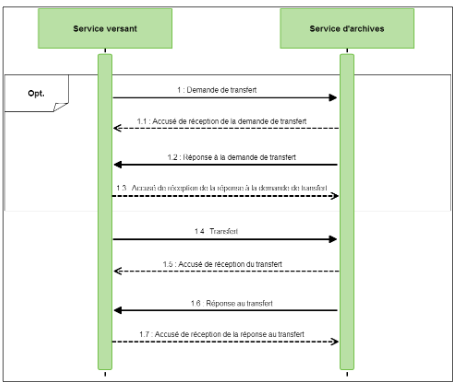

Structuration des *Submission Information Packages* (SIP)
=====

Introduction
------------

### Documents de référence


|**Document**|**Date de la version**|**Remarques**|
|:---------------:|:-----:|:-----:|
|NF Z 44022 – MEDONA – Modélisation des données pour l’archivage|18/01/2014||
|Standard d’échange de données pour l’archivage – SEDA – v. 2.1|06/2018||            
|Standard d’échange de données pour l’archivage – SEDA – v. 2.2|02/2022|Cette nouvelle version du SEDA est intégrée à la solution logicielle Vitam à partir de la V6.RC.|
|Référentiel général de sécurité (RGS) – v. 2.0.|10/06/2015||
|ISO 14 721:2012 – Systèmes de transfert des informations et données spatiales -- Système ouvert d'archivage d'information (SOAI) -- Modèle de référence|01/09/2012||
|[Vitam – Profils d’archivage](./profil_archivage.md)|||
|[Vitam – Profils d’unité archivistique](./profil_unite_archivistique.md)|||
|[Vitam – Ontologie](./ontologie.md)|||

### Présentation du document

Dans le milieu archivistique, le processus d’entrée d’archives au sein d’un service d’archives s’effectue traditionnellement par la rédaction d’un bordereau de versement accompagné des archives référencées dans ce dernier.

Dans l’univers numérique, peuvent être transférées à un service d’archives des archives nativement numériques, des versions numérisées d’archives papier, mais aussi des références à des archives physiques, chacune d’elles accompagnées de leurs métadonnées.

Le présent document décrit la manière de préparer des entrées d’archives destinées à être transférées dans une plate-forme utilisant la solution logicielle Vitam.

### Contexte normatif

Une entrée destinée à être transférée dans une plate-forme utilisant la solution logicielle Vitam doit être réalisée conformément aux deux normes suivantes.

#### L’OAIS (Open Archival Information System)

L’OAIS est un modèle conceptuel de référence décrivant dans les grandes lignes les fonctions, les responsabilités et l’organisation d’un système qui voudrait préserver sur le long terme de l’information, en particulier des données numériques.

Le modèle OAIS repose sur l’idée que l’information constitue des paquets, et que ces paquets ne sont pas les mêmes suivant qu’on est en train de produire l’information, de mettre en œuvre des opérations pour la conserver, ou de la communiquer à un utilisateur.

Il existe d’après cette norme trois sortes de paquets :
- les paquets pris en charge par le système ou Submission Information Packages (SIP) préparés par les producteurs à destination de la solution logicielle Vitam ;
- les paquets gérés par le système ou Archival Information Packages (AIP) transformés par la solution logicielle Vitam à partir du SIP dans une forme plus facile à conserver et à gérer dans le temps ;
- les paquets communiqués par le système ou Dissemination Information Packages (DIP) transformés par la solution logicielle Vitam à partir d’un ou plusieurs AIP.

Une entrée destinée à être transférée dans une plate-forme utilisant la solution logicielle Vitam constitue un SIP au sens du modèle OAIS.

#### Le SEDA (Standard d’Échange de Données pour l’Archivage) et la norme MEDONA (Modèle d’Échange de DONnées pour l'Archivage)

La norme MEDONA et le standard SEDA constituent des modèles standards pour les transactions d’échanges entre les acteurs de l’archivage, et notamment entre une entité souhaitant transférer une entrée à un service d’archives et le service d’archives lui-même.

La norme AFNOR NF Z 44‑022, intitulée « Modèle d’Échange de DONnées pour l’Archivage » ou MEDONA a été publiée en 2014. Elle apporte un cadre normatif pour les différents échanges d’informations (données comme métadonnées) entre le service d’archives et ses partenaires comme le service versant (entité qui transfère un ensemble d’informations) et la façon dont s’organisent ces échanges. Elle définit des diagrammes d’activités et des modèles de données selon le formalisme UML. Les échanges se traduisent par des messages formalisés par des schémas XML.

Le schéma ci-dessous modélise les échanges associés au transfert à un service d’archives d’un ensemble d’archives – un SIP au sens de la norme OAIS.



Le SEDA est le « Standard d’Échange de Données pour l’Archivage » relatif aux données d’archives publiques. Créé en 2006 par la Direction des Archives de France et la Direction Générale pour la Modernisation de l’État, il a été révisé en 2010 (v0.2), en 2012 (v1.0), en 2015 (2.0.) pour assurer sa compatibilité avec la norme MEDONA, et plus récemment en 2018 (v2.1.) et 2022 (v2.2.). Il comporte à la fois le modèle fonctionnel et un modèle de données pour les échanges de données d’archives entre acteurs de la sphère publique : description, acteurs, règles de gestion, référentiels métier et techniques.

Cependant, si le SEDA explique de manière générale à quoi ressemble le processus de transfert de données numériques, ce standard ne spécifie pas les règles de constitution du paquet à transférer.

C’est pourquoi le présent document vise à :
- apporter des recommandations complémentaires pour constituer les SIP qui entreront dans une plate-forme utilisant la solution logicielle Vitam ;
- expliciter les choix faits par l’équipe chargée de la réalisation de la solution logicielle Vitam quand le standard SEDA en laissait la responsabilité aux implémentations.

À défaut de précision apportée par le présent document, la documentation accompagnant le standard SEDA dans ses versions 2.1. et 2.2. et accessible sur le site internet du Service interministériel des Archives de France s’applique[^1].

Constitution d’un Submission Information Package (SIP) pour une plate-forme utilisant la solution logicielle Vitam
----

### Le paquet à archiver

D’après le SEDA, un SIP est constitué d’un bordereau de transfert et d’un ou plusieurs objets à archiver, qu’ils soient physiques ou numériques. Il peut être uniquement composé d’un bordereau, notamment dans le cadre d’un enrichissement de métadonnées ou d’un versement d’archives physiques.

Les directives de l’équipe projet Vitam sur l’implémentation sont les suivantes :

|Intitulé|Description|Niveau de recommandation|
|:---|:----|:---:|
|Structuration du SIP|Un SIP se compose :<br>- d’un bordereau de transfert suffixé « _manifest.xml » rassemblant les informations relatives aux objets numériques et aux unités archivistiques à transférer au service d’archives ;<br>- d’un répertoire nommé « content » (avec ou sans majuscules) rassemblant les objets numériques à transférer au service d’archives.
En l’absence d’objet, la présence du répertoire « content » n’est pas obligatoire.|Obligatoire|
|Type de format du SIP|ZIP ou TAR (tar, tar.gz, tar.bz21).|Obligatoire|
|Taille du SIP|La taille des SIP dépendra du mode de transfert (protocole https ou API)<br>- Poids (en octets) :<br>-> inférieur à 1 Go par SIP en cas d’utilisation du protocole https ;<br>-> supérieur à 1 Go par SIP en cas d’utilisation de transfert par API ;<br>- Taille (en nombre d’unités archivistiques et d’objets) : optimale à calculer en fonction du dimensionnement de la plate-forme, mais dans tous les cas, inférieure à 100 000 unités archivistiques et objets par SIP.|Recommandation|
|Nommage du SIP|Il est recommandé de reporter dans le champ <MessageIdentifier> du bordereau de transfert le nom du fichier correspondant au SIP.<br>Le nom du fichier doit respecter la REGEX (expression régulière) suivante : [a-zA-Z0-9.\\-\\/+=@_ ]*$|Recommandation|
|Formatage du ZIP|Si le format ZIP est utilisé, il est recommandé de faire le zip à l’intérieur du répertoire contenant le bordereau et le répertoire des objets (et non pas en faisant un zip du répertoire les contenant).<br>À l’unzip, le bordereau et le répertoire des objets seront directement visibles.|Recommandation|
|Formatage du TAR|Si le format TAR est utilisé (tar, tar.gz, tar.bz2), il est recommandé d’alimenter le conteneur dans l’ordre suivant :<br>1/ écriture du bordereau ;<br>2/ création du répertoire content avec les objets.<br>Cet ordre permettra d’accéder directement au bordereau. La commande sera du type tar cf SIP.tar manifest.xml content.<br>Tout comme le ZIP, à l’untar, le bordereau et le répertoire des objets seront directement visibles.|Recommandation|
       
### Le bordereau

À la racine du SIP se trouve le bordereau qui décrit l'ensemble des métadonnées du paquet à archiver. Il est composé :
- d’un en-tête (Identifiant du lot d’archives et celui de la convention de transfert) ;
- d’une déclaration des objets binaires (DataObjectPackage > BinaryDataObject) ou des objets physiques (DataObjectPackage > PhysicalDataObject) ;
- d’une description des archives représentées par ces objets :
    - métadonnées descriptives et métadonnées de gestion applicables à une partie seulement des archives archivées : DescriptiveMetadata contenant l’arborescence intellectuelle sous forme d’ArchiveUnits ;
    - métadonnées de gestion applicables à l’ensemble des archives archivées : ManagementMetadata ;
- des déclarations du service versant et du service d’archives (fin de message où figurent les identités du service d’archives et du service versant).

Ce bordereau est formalisé conformément au SEDA. Il est néanmoins possible d’ajouter des champs supplémentaires non définis par le standard. Les extensions possibles ainsi que celles utilisées dans la solution logicielle Vitam sont présentées dans la partie [annexe 1 du présent document](#annexe-1--extensions-du-schéma-seda).

#### La notion de groupe d’objets dans le SEDA

Un même document peut être représenté par plusieurs fichiers et prendre ainsi plusieurs formes tout en conservant une cohérence intellectuelle, par exemple :
- une photographie peut être transférée à un service d’archives sous deux formes différentes :
    - un fichier en basse définition pour des besoins de diffusion rapide,
    - un fichier ou master de conservation en haute définition.
      Ces deux fichiers correspondant à la même photographie répondent à deux usages différents de cette dernière ;
- le format des fichiers correspondant à la photographie peut avoir fait l’objet de transformations au cours du temps, via des migrations de formats. Il pourra être nécessaire de transférer au service d’archives tous les fichiers créés à l’occasion des différentes opérations de migration, en fonction de la politique de conservation du service, même si ces deux fichiers correspondent à la même photographie.

D’après le SEDA, ces différentes formes (fichiers) prises par une même archive doivent être regroupées dans un groupe d’objets représentant l’unité intellectuelle.

Le SEDA 2.1. représente ce groupe d’objets de deux manières différentes :
- création du groupe d’objets (DataObjectGroup) en utilisant la balise <DataObjectGroup> et création, dans cette balise <DataObjectGroup>, des objets qui le constituent. Chaque objet doit déclarer la version ou l’usage auquel il correspond via la balise <DataObjectVersion> (méthode propre au SEDA 2.1.) ;
- déclaration dans le bordereau du groupe d’objets (DataObjectGroup) par un seul des objets lui appartenant via la balise <DataObjectGroupId>, l’autre objet y fera référence via la balise <DataObjectGroupReferenceId>. Chaque objet doit déclarer la version ou l’usage auquel il correspond via la balise <DataObjectVersion> (méthode héritée du SEDA 2.0. mais dépréciée).

**Nota Bene :**
Il est obligatoire de déclarer un groupe d’objets dans le bordereau d’entrée si une archive est représentée par plusieurs fichiers. Quand l’archive n’est représentée que par un seul fichier, la déclaration d’un groupe d’objets n’est que recommandée.

À titre d’exemple, un répertoire d’une arborescence de fichiers contient 4 fichiers :
- si les 4 fichiers correspondent à des archives différentes, lors de la génération du bordereau à intégrer dans le SIP, une ArchiveUnit (ou unité archivistique) devra être créée pour le répertoire et 4 ArchiveUnits pour chacun des fichiers enregistrés dans le répertoire. Les ArchiveUnits correspondant aux fichiers référenceront dans le bordereau les BinaryDataObjects correspondant aux fichiers ;
- si 2 des fichiers correspondent à une même archive (par exemple une même photographie enregistrée en haute et basse définition), lors de la génération du bordereau à intégrer dans le SIP, une ArchiveUnit (ou unité archivistique) devra être créée pour le répertoire et seulement 2 ArchiveUnits pour les fichiers différents. Pour les 2 fichiers correspondant à la même archive, une seule ArchiveUnit pourra être créée et les fichiers seront regroupés dans un groupe d’objets techniques qui sera référencé par celle-ci.

#### Les outils de contrôle des descriptions

Pour automatiser les transferts de SIP depuis une application d’un service producteur au service d’archives et mettre en place un contrôle de la structure de l’entrée et/ou de la description des archives, il sera utile d’établir un profil d’archivage ou des profils d’unité archivistique SEDA[^2]. Le profil d’archivage permettra d’identifier les documents à transférer au service d’archives, de déterminer des métadonnées utiles, de définir les règles de gestion à associer aux archives (durées d’utilité administrative, délai de communicabilité, etc.) et de structurer l’information dans chaque versement. Lors de l’entrée, la structure du paquet et/ou les métadonnées décrivant les archives feront l’objet d’un contrôle au regard des exigences formulées par ces profils : en cas d’absence dans le bordereau d’un élément requis par le profil (ex. : une métadonnée particulière ou une valeur précise dans une énumération), l’entrée sera rejetée.

Le profil d’unité archivistique permettra d’identifier la manière de décrire une unité archivistique particulière (ex. : une facture), de déterminer ses métadonnées utiles, de définir les règles de gestion qui s’appliquent à elle (durée d’utilité administrative, délai de communicabilité, etc.). Lors de l’entrée, les unités archivistiques déclarant le profil d’unité archivistique feront l’objet d’un contrôle au regard des exigences formulées par celui-ci : en cas d’absence dans le bordereau d’un élément requis par le profil (ex. : une métadonnée particulière ou une valeur précise dans une énumération), l’entrée sera rejetée.

Les directives de l’équipe projet Vitam sur l’implémentation d’un bordereau de transfert sont les suivantes.

##### Bordereau

|Intitulé|Description|Niveau de recommandation|
|:---|:---|:---:|
|Nom du bordereau|Un fichier intitulé manifest.xml ou suffixé _manifest.xml.<br>Le nom du fichier doit respecter la REGEX (expression régulière) suivante : ^([a-zA-Z0-9_\\-]{0,56}[_-]{1}){0,1}(manifest.xml)\\b"|Obligatoire|
|Format du bordereau|xml|Obligatoire|
|Version du SEDA|SEDA 2.1 ou SEDA 2.2[^3].|Obligatoire|
|Nombre de bordereaux par SIP|Un seul bordereau|Obligatoire|
|Taille du SIP|La taille des SIP dépendra du mode de transfert (protocole https ou API)<br>- Poids (en octets) :<br>-> inférieur à 1 Go par SIP en cas d’utilisation du protocole https ;<br>-> supérieur à 1 Go par SIP en cas d’utilisation de transfert par API ;<br>- Taille (en nombre d’unités archivistiques et d’objets) : optimale à calculer en fonction du dimensionnement de la plate-forme, mais dans tous les cas, inférieure à 100 000 unités archivistiques et objets par SIP.|Recommandation|
|Normalisation des champs|Les champs « date » doivent être au format AAAA-MM-JJ.<br>Les champs « datetime » doivent être au format AAAA-MM-JJThh:mm:ss,nnnZ[^4] (format ISO 8601) ou l’équivalent en remplaçant Z par le décalage de fuseau horaire (+/-hh:mm).<br>Les noms des champs respectent la casse UpperCamelCase (Majuscule à chaque début de mot), uniquement avec des lettres de A à Z, de a à z et des chiffres de 0 à 9.<br>Aucun champ ne doit contenir de balise ou de caractère encodé html[^5].<br>Aucun champ et aucune valeur dans un champ ne doivent commencer par un underscore « _ » ou un dièse « # ».|Obligatoire|
|Encodage|L’encodage des contenus à privilégier est l’UTF-8.|Recommandation|
|Taille des champs|Les champs ne doivent pas dépasser 32 000 caractères.|Obligatoire|
|Métadonnées libres|Les champs libres du bordereau (ex. : ceux qui utilisent l’extension < ObjectGroupExtensionAbstract >) doivent respecter un certain nombre de règles :<br>**1/ Syntaxe et sémantique**<br>Ils doivent respecter la syntaxe et la sémantique définies pour eux lors de leur première utilisation.<br>À titre d’exemple, si la balise <Mabalise> est utilisée de la façon suivante lors de sa première utilisation :<br>< MaBalise >MonTexte</ MaBalise ><br>Alors, cette balise devra toujours comporter un texte simple.<br>Si, dans une nouvelle entrée, elle est renseignée de la manière suivante :<br>< MaBalise ><br>	< MaSousBalise >MonTexte</MaSousBalise><br>< /MaBalise ><br>Alors, l’opération d’entrée échouerait en erreur fatale.<br>**2/ Nommage des balises**<br>Il est fortement recommandé de ne pas utiliser les caractères suivants dans le nommage des balises :<br>- en préfixe (1er caractère de la balise), les caractères underscore (« _ ») ou (« # »)<br>- à quelque endroit que ce soit du nom de la balise, le caractère point (« . »)<br>**3/ Ajout préalable des champs libres dans l’ontologie**<br>Il est fortement recommandé de créer d’abord la métadonnée dans l’ontologie intégrée à la solution logicielle Vitam avant de l’utiliser dans un bordereau.|Obligatoire|
|Attributs supportés par la solution logicielle Vitam|Il est obligatoire de restreindre l’utilisation des attributs associés aux champs dans le SEDA aux attributs suivants, seuls supportés :<br>- Algorithme de hachage utilisé pour calculer l'empreinte d'un objet Attribut "algorithm" de type DigestAlgorithmCodeType dans la balise < MessageDigest > dans un < BinaryDataObject ><br>Exemple : < MessageDigest algorithm="SHA-512" ><br>- Algorithme de hachage utilisé pour calculer l'empreinte d'un objet signé<br>Attribut "algorithm" de type DigestAlgorithmCodeType dans la balise < SignedObjectDigest >, elle-même située dans un < ReferencedObject > d'une < Signature> dans le < Content > d'un objet<br>Exemple : < SignedObjectDigest algorithm="SHA-512" ><br>- Toutes les unités de mesure de poids et de dimensions des objets physiques<br>Attribut "unit" de type MeasurementType dans les balises < Width >, < Height >, < Depth >, <Diameter>, < Length >, < Thickness > et < Weight > situés dans la balise <PhysicalDimensions> elle-même dans <PhysicalDataObject><br>Exemples :< Width unit="CMT" ><br>< Height unit="INH" ><br>- Langage du titre d'une unité archivistique<br>Attribut "xml:lang" de type "union of(xs:language, restriction of xs:string)" dans la balise<br>< Title >, elle-même dans la balise < Content > de la balise < ArchiveUnit ><br>Exemple : < Title xml:lang="fr" ><br>- Langage d'une description d'une unité archivistique<br>Attribut "xml:lang" de type "union of(xs:language, restriction of xs:string)" dans la balise < Description >, elle-même dans la balise < Content > de la balise < ArchiveUnit ><br>Exemple : < Description xml:lang="en" ><br>Les attributs présents dans les autres balises ne sont pas enregistrés dans la solution logicielle Vitam.|Obligatoire|

##### En-tête du bordereau

|Intitulé|Description|Niveau de recommandation|
|:---|:---|:---:|
|Identifiant du message|Il est obligatoire d’indiquer l’identifiant du message.|Obligatoire|
|Comment|Il est recommandé d’utiliser le champ Comment pour attribuer un intitulé intelligible humainement au transfert réalisé.|Recommandation|
|ArchivalAgreement|Il est obligatoire d’indiquer l’identifiant du contrat d’entrée applicable au transfert réalisé (valeur du champ Identifier du contrat d’entrée).<br>Le contrat déclaré doit exister dans le référentiel interne de la solution logicielle Vitam et être au statut « actif ».|Obligatoire|
|CodeList Version|Il est recommandé d’utiliser le bloc CodeListVersion pour lister les identifiants et les versions de référentiels utilisés par l’implémentation de la solution logicielle dans le cadre des différentes transactions.<br>Néanmoins, à ce jour, ce bloc n’est pas géré dans la solution logicielle Vitam.|Recommandation|

##### Objets d’archives (DataObjectPackage)

|Intitulé|Description|Niveau de recommandation|
|:---|:---|:---:|
|Type de version ou d’usage correspondant au BinaryData Object ou PhysicalData Object|Lorsque plusieurs usages d’une même archive (un usage papier et un usage numérique par exemple) ou plusieurs versions d’un même usage (plusieurs originaux numériques résultant de différentes générations de conversion) doivent être transférés dans la plate-forme et qu’un groupe d’objets doit être créé, il est obligatoire d’utiliser les nomenclatures définies par l’implémentation de la solution logicielle Vitam.<br>Par défaut, la solution logicielle Vitam a défini les nomenclatures suivantes :<br>*Valeurs possibles pour la notion d’usage :*<br>- conservation papier : PhysicalMaster,<br>- conservation numérique : BinaryMaster,<br>- diffusion : Dissemination,<br>- vignette : Thumbnail,<br>- contenu brut : TextContent.<br>*Valeurs possibles pour les versions :*<br>- version initiale : 1,<br>- version suivante (après migration) : 2.<br>La notation dans le champ « DataObjectVersion » doit avoir la forme suivante :<br>- usage :<br>    - La version est implicitement à 1,<br>    - Exemple : PhysicalMaster,<br>- usage_version :<br>    - Exemple : BinaryMaster_1.<br>**Point d’attention :** il n’est possible de ne transférer à la fois qu’une version par usage. Il ne peut en conséquence pas y avoir deux versions de diffusion (Dissemination_1 et Dissemination_2) dans le même SIP.|Obligatoire|
|Création des groupes d’objets techniques (archivage de plusieurs usages d’une même archive)|Dans le cas où une archive est transférée sous plusieurs formes, il est obligatoire de créer un groupe d’objets (DataObjectGroup), selon l’une des deux méthodes suivantes.<br>**Point d’attention :**<br>- il est obligatoire de n’utiliser qu’une seule méthode par SIP. A noter qu’il est fortement recommandé d’utiliser la première méthode, dans la mesure où la seconde est en cours de dépréciation.<br>- seule une version par usage est acceptée dans un SIP créant un groupe d’objets techniques<br>**Méthode 1 :**<br>Une balise < DataObjectGroup > est créée dans le manifeste et comprend les autres DataObject.<br>**Méthode 2 :**<br>Un des DataObject doit déclarer le groupe d’objets auquel seront rattachés les autres fichiers, en utilisant la balise < DataObjectGroupId >. Les autres DataObject référenceront alors le groupe d’objets en utilisant la balise < DataObjectGroupReferenceId >.<br>**Point d’attention :**<br>- cette méthode risque d’être dépréciée dans une version ultérieure du SEDA. Il n’est pas recommandé de l’utiliser.<br>[Exemples en annexe 5](#annexe-5--création-des-groupes-dobjets-techniques-archivage-de-plusieurs-usages-dune-même-archive)|Obligatoire|
|Création des groupes d’objets techniques (archivage d’un seul usage pour une archive)|Dans le cas où un seul usage est transféré pour un document, la création d’un groupe d’objets (DataObjectGroup) est recommandée.|Recommandation|
|Rattachement d’un objet à un groupe d’objets existant|Afin de déclarer dans le bordereau le rattachement d’un nouvel objet (fichier binaire ou référence à un objet physique) à un groupe d’objets (DataObjectGroup) déjà présent dans la plate-forme utilisant la solution logicielle Vitam, il est obligatoire de :<br>- utiliser un contrat d’entrée autorisant l’ajout d’objets à un groupe d’objets existant ;<br>- créer les objets dans le bordereau, en veillant à ce que les types d’usages soient conformes à ceux décrits dans la ligne du présent tableau « Type de version ou d’usage correspondant au BinaryDataObject ou PhysicalDataObject » ;<br>- demander la mise à jour de l’ArchiveUnit déclarant le DataObjectGroup auquel rattacher l’objet dans la plate-forme (cf. sous-section « Description des archives »).<br>**Point d’attention :** seul le service producteur ayant provoqué la création du groupe d’objets dans la plate-forme utilisant la solution logicielle Vitam a le droit de rajouter des objets à ce groupe d’objets.|Obligatoire|
|Journalisation|Le contenu du bloc <Logbook> doit correspondre à une extraction des journaux du cycle de vie depuis une instance Vitam.<br>L’utilisation de ce bloc est recommandé dans le cadre de transferts d’archives depuis une instance Vitam. Celle-ci génère alors le contenu de ce bloc.<br>Il n’est donc pas possible d’alimenter soi-même ce bloc.|Obligatoire|
|Description des objets appartenant à un groupe d’objets|Si une entité transfère deux usages ou deux versions d’un même objet intellectuel, il est obligatoire que celui-ci soit décrit dans une seule ArchiveUnit référençant un groupe d’objets.<br>Si un même objet est versé par deux entités distinctes, il est obligatoire de le décrire dans deux ArchiveUnit qui référenceront le même groupe d’objets techniques.|Obligatoire|
|Emplacement de l’objet binaire|Il est obligatoire d’utiliser la balise <Uri> plutôt que la balise <Attachment>. Il n’est donc pas possible d’utiliser la balise <Attachment>.|Obligatoire|
|Format de l’Uri|L’Uri doit correspondre à un chemin relatif au format Unix (à l’intérieur du SIP) et non pas à un chemin absolu à partir de la racine.<br>Constitution du chemin :<br>- content/nomdufichier.extension,<br>- et non C:\[...]\content\nomdufichier.extension.<br>Le nommage du chemin doit suivre les recommandations de nommage des répertoires : il ne doit comprendre ni caractère accentué, ni virgule, ni apostrophe, ni parenthèse, ni espace. Il doit respecter la REGEX (expression régulière) suivante : ^[a-zA-Z0-9\-_@]+(\.[a-zA-Z0-9\-_@]+)*$<br>**Point d’attention :** l’orthographe du répertoire content doit être la même que celle du répertoire présente dans le SIP (avec ou sans majuscules).|Obligatoire|
|Empreinte|Il est obligatoire de fournir dans le bordereau une empreinte pour chaque objet présent dans le SIP, calculée lors de la phase de préparation des entrées. Cette empreinte doit être exprimée en minuscules.<br>Conformément aux recommandations actuelles du Référentiel général de sécurité, il est recommandé pour le calcul de cette empreinte l’utilisation des algorithmes suivants :<br>- MD5<br>- SHA-256 (préconisation actuelle du RGS)<br>- SHA-384<br>- SHA-512<br>Pour les objets destinés à être conservés plus de 10 ans, le SHA-512 est recommandé.<br>Les algorithmes d’empreinte doivent être déclarés de la manière suivante :<br>- « MD5 »<br>- « SHA-256 »<br>- « SHA-384 »<br>- « SHA-512 »|Recommandation|
|Profil d’objet|Il est fortement recommandé de ne pas référencer de profil d’objet introduit par le SEDA 2.2 à ce stade des développements.|Recommandation|
|Métadonnées libres|Il est fortement recommandé de ne pas utiliser les extensions permises par le SEDA à ce stade des développements de la solution logicielle Vitam pour décrire les groupes d’objets.|Recommandation|

##### Gestion des archives (ManagementMetadata)

|Intitulé|Description|Niveau de recommandation|
|:---|:---|:---:|
|Service producteur|Afin de faciliter le référencement de l’opération d’entrée, notamment dans le cas où plusieurs ArchiveUnits sont à la racine du bloc DescriptiveMetadata, le champ < OriginatingAgencyIdentifier > est obligatoire.<br>**Point d’attention :** le service producteur déclaré dans le bordereau est l’un des filtres utilisés pour restreindre les accès des utilisateurs applicatifs.<br>La valeur saisie dans le champ doit correspondre à celle de l’identifiant du service concerné dans le référentiel des services agents de la solution logicielle Vitam.|Obligatoire|
|Service versant|Afin de faciliter le référencement de l’opération d’entrée, notamment dans le cas où plusieurs ArchiveUnit sont à la racine du bloc DescriptiveMetadata, il est recommandé de placer cette information au niveau des métadonnées de gestion en utilisant le champ <SubmissionAgencyIdentifier>.<br>La valeur saisie dans le champ doit correspondre à celle de l’identifiant du service concerné dans le référentiel des services agents de la solution logicielle Vitam.|Recommandation|
|Journalisation|L’utilisation du bloc <Logbook> est déconseillée à ce jour, car la solution logicielle Vitam ne les enregistre pas.|Déconseillé|
|Demandes d’autorisation|Il est recommandé de renseigner ce champ NeedAuthorization avec la valeur « true » quand l’accès, la réutilisation, la diffusion ou la gestion du niveau de protection au titre du secret de la défense nationale nécessitent des demandes d’autorisation auprès du service producteur, du service émetteur, du service d’archives ou d’un titulaire de droits de propriété intellectuelle.|Recommandé|

##### Description des archives (DescriptiveMetadata/ArchiveUnit)

|Intitulé|Description|Niveau de recommandation|
|:---|:---|:---:|
|Métadonnées de gestion (bloc Management)|Par défaut une ArchiveUnit hérite des règles de gestion déclarées dans l’ArchiveUnit dont elle dépend.<br>Pour éviter que ces règles ne s’appliquent à une ArchiveUnit, deux solutions existent :<br>1/ annuler, pour une même catégorie de règle (StorageRule, AccessRule, AppraisalRule, DisseminationRule, ReuseRule, ClassificationRule, HoldRule), toutes les règles héritées. Dans ce cas, il convient de mettre la valeur « true » dans le champ PreventInheritance disponible dans chaque catégorie de règle ;<br>2/ annuler, pour une catégorie de règle donnée (StorageRule, AccessRule, AppraisalRule, DisseminationRule, ReuseRule, ClassificationRule, HoldRule), une règle en particulier. Dans ce cas, il convient d’indiquer l’identifiant de la règle concernée dans le champ RefNonRuleId disponible dans chaque catégorie de règle.<br>**Point d’attention :** la valeur saisie dans le champ doit correspondre à celle de l’identifiant de la règle concernée, pour la catégorie de règle concernée, dans le référentiel des règles de gestion de la solution logicielle Vitam.<br>Pour toute question complémentaire sur les règles de gestion, il est recommandé de consulter le document spécifique rédigé par l’équipe Vitam. (Vitam. Règles de gestion).|Obligatoire|
|Règle de classification (bloc Management)|Le champ niveau de classification (ClassificationLevel) du bloc ManagementMetadata ou des blocs Management des ArchiveUnits doit nécessairement :<br>- avoir une valeur quand la configuration de l’implémentation de la solution logicielle Vitam rend obligatoire la déclaration d’une règle de classification dans les ArchiveUnit.<br>- correspondre à l’une des valeurs déclarée dans la configuration, que la déclaration d’une règle de classification dans les ArchiveUnits soit rendue obligatoire ou non par cette même configuration.|Obligatoire|
|Journalisation (bloc Management)|Le contenu du bloc < Logbook > doit correspondre à une extraction des journaux du cycle de vie de chaque unité archivistique depuis une instance Vitam.<br>L’utilisation de ce bloc est recommandée dans le cadre de transferts d’archives depuis une instance Vitam. Celle-ci génère alors le contenu de ce bloc.<br>Il n’est donc pas possible d’alimenter soi-même ce bloc.|Déconseillé|
|Métadonnées descriptives (bloc Content)|Les métadonnées descriptives de chaque ArchiveUnit doivent utiliser les éléments présents dans l’ontologie SEDA (bloc Content de l’ArchiveUnit).<br>Ce bloc peut être étendu, pour répondre aux besoins propres des utilisateurs (cf. documentation accompagnant le SEDA 2.1. et [Annexe 1 du présent document](#annexe-1--extensions-du-schéma-seda)). La déclaration de ces vocabulaires complémentaires est obligatoire dans le cas de l’utilisation d’un profil d’unité archivistique et recommandé dans le cas contraire (cf. documentations Vitam relatives à l’ontologie et au profil d’unité archivistique).|Obligatoire|
|Titre (bloc Content)|Le champ titre (Title) est obligatoire, à tous les niveaux de description. Il doit donc être systématiquement renseigné.<br>Il est recommandé de ne déclarer plusieurs champs Titre que dans le cas de traduction dans différentes langues de ce titre, en utilisant l’attribut lang de la balise Title.<br>En fonction de la présence ou non de l’attribut lang, le champ Title est enregistré de manière différente dans la base de données de la solution logicielle Vitam :<br>- si le champ Title est unique et n’a pas d’attribut lang, il est enregistré sous forme de chaîne de caractères ;<br>- si le champ Title est unique et a un attribut lang et/ou est répété et dispose à chaque fois d’un attribut lang, il est enregistré sous forme d’objet et comprend les attributs comme propriétés (title.lang).<br>La solution logicielle Vitam ne permet pas de gérer plusieurs Title d’une unité archivistique ayant un attribut lang identique. Si un bordereau déclare 2 Titles ayant un attribut lang identique, seul l’un des deux sera enregistré dans la description de l’ArchiveUnit correspondante.<br>Cas particuliers :<br>1/ SIP constitué à partir d’une arborescence de fichiers bureautiques : le nom du fichier peut être récupéré pour alimenter le champ Title, même s’il est également récupéré pour alimenter le champ FileInfo/FileName du bloc des métadonnées techniques.<br>2/ Dans le cas où le profil d’archivage ou le profil d’unité archivistique prévoient une récupération riche de métadonnées dans le bloc Content (par exemple pour des dossiers individuels), il est recommandé de prêter une attention particulière à la manière dont ce champ doit être alimenté pour pouvoir être affiché dans des listes de résultats basées sur lui.|Obligatoire|
|Description (bloc Content)|Il est recommandé de ne déclarer plusieurs champs Description que dans le cas de traduction dans différentes langues de cette description, en utilisant l’attribut lang de la balise Description.|En fonction de la présence ou non de l’attribut lang, le champ Description est enregistré de manière différente dans la base de données de la solution logicielle Vitam :<br>- si le champ Description est unique et n’a pas d’attribut lang, il est enregistré sous forme de chaîne de caractères ;<br>- si le champ Description est unique et a un attribut lang et/ou est répété et dispose à chaque fois d’un attribut lang, il est enregistré sous forme d’objet et comprend les attributs comme propriétés (description.lang).<br>Dans le cas où le profil d’archivage ou le profil d’unité archivistique prévoient une récupération riche de métadonnées dans le bloc Content, il est recommandé de prêter une attention particulière à la manière dont ce champ doit être alimenté pour pouvoir être affiché dans des listes de résultats basées sur lui.<br>La solution logicielle Vitam ne permet pas de gérer plusieurs Descriptions d’une unité archivistique ayant un attribut lang identique. Si un bordereau d’entrée déclare 2 Descriptions ayant un attribut lang identique, seul l’une des deux sera enregistrée dans la description de l’ArchiveUnit correspondante.|Recommandation|
|Déclaration d’agents (AgentAbstract et Agent de type AgentType) (bloc Content)|Il est obligatoire de déclarer des agents supplémentaires sous forme d’extension au bloc Content.<br>Dans la version 2.2 du SEDA, il est obligatoire d’utiliser le bloc Agent, le bloc extensible AgentAbstract ayant été déprécié.|Obligatoire|
|Events (bloc Content)|Il est obligatoire de formaliser la valeur du champ EventDetailData au format json.|Obligatoire|
|Création de liens hiérarchiques entre ArchiveUnits et entre ArchiveUnits et groupes d’objets  (bloc Content)|Le bloc References (RelatedObjectReference) correspond à des métadonnées descriptives. Il peut par exemple être utilisé pour indiquer un lien entre 2 ArchiveUnits correspondant à des messages électroniques (champ ReplyTo des outils de messagerie).<br>Il ne permet en conséquence pas de créer un lien hiérarchique entre deux ArchiveUnits ou entre une ArchiveUnit et un groupe d’objets.<br>Afin de créer des liens hiérarchiques entre différents ArchiveUnits et groupes d’objets, il est obligatoire d’utiliser les méthodes suivantes :<br>- créer un lien hiérarchique entre deux ArchiveUnits à transférer : utiliser les balises <ArchiveUnit>, selon une des deux méthodes proposées par le SEDA 2.1. ;<br>- créer un lien hiérarchique entre une ArchiveUnit et un groupe d’objets : utiliser les balises < DataObjectReference > ;<br>- créer un lien hiérarchique entre une ArchiveUnit à transférer et une ArchiveUnit déjà prise en charge dans le système : utiliser les mécanismes de rattachement ci-dessous.|Obligatoire|
|Lien entre métadonnées descriptives et métadonnées techniques (ArchiveUnit et Groupe d’objets)|Il est obligatoire de référencer dans l’ArchiveUnit les objets physiques ou numériques accompagnant l’archive.<br>Le SEDA 2.1. offre la possibilité de référencer depuis l’ArchiveUnit :<br>- soit les groupes d’objets ;<br>- soit les objets eux-mêmes.<br>Si une archive est transférée avec plusieurs usages, l’ArchiveUnit doit référencer un groupe d’objets (utilisation de la balise < DataObjectGroupReferenceId >).<br>Si l’archive est transférée sous la forme d’un seul usage, deux implémentations sont possibles :<br>- implémentation 1 : un groupe d’objets a été systématiquement créé pour chaque objet (option recommandée) : dans ce cas, il est obligatoire de référencer le groupe d’objets en utilisant la balise < DataObjectGroupReferenceId >.<br> Exemple dans l'[annexe 8](#annexe-8--lien-entre-métadonnées-descriptives-et-métadonnées-techniques-archiveunit-et-groupe-dobjets)<br>- implémentation 2 : un groupe d’objets n’a pas été systématiquement créé pour chaque objet : dans ce cas, il est obligatoire de référencer l’objet en utilisant la balise < DataObjectReferenceId >.<br>Exemple dans l'[annexe 8](#annexe-8--lien-entre-métadonnées-descriptives-et-métadonnées-techniques-archiveunit-et-groupe-dobjets)|Obligatoire|
|Rattachement à une ArchiveUnit déjà présente  dans une plate-forme utilisant la solution logicielle Vitam|Afin de rattacher une ArchiveUnit présente dans le bordereau à une ArchiveUnit déjà présente dans la plate-forme utilisant la solution logicielle Vitam, il est obligatoire de :<br>- créer dans le bordereau une ArchiveUnit correspondant à l’ArchiveUnit déjà présente dans le système, renseignée avec les champs obligatoires dans le SEDA (Title, DescriptionLevel) et correspondant à ceux de l’ArchiveUnit déjà présente dans le système. Cette création est indispensable afin de respecter la logique du standard SEDA ;<br>- insérer dans le sous-bloc Management de l’ArchiveUnit correspondant à l’ArchiveUnit déjà présente dans le système un sous-bloc UpdateOperation (extension du schéma SEDA) ;<br>- déclarer dans ce sous-bloc la méthode qui permettra à la solution logicielle Vitam d’identifier l’ArchiveUnit déjà présente dans le système. Cette déclaration peut être faite selon 2 méthodes :<br>    - méthode 1 : insérer dans le sous-bloc < UpdateOperation> une balise < SystemId > comprenant l’identifiant unique attribué par la solution logicielle Vitam à l’ArchiveUnit déjà présente dans le système ;<br>    - méthode 2 : insérer dans le sous-bloc < UpdateOperation> un bloc < ArchiveUnitIdentifierKey> qui comprend lui-même 2 balises : < MetadataName > qui doit correspondre à une balise du bloc Content du schéma SEDA 2.1, et une balise < MetadataValue> qui doit correspondre à la valeur du champ pour l’ArchiveUnit à laquelle on veut rattacher l’ArchiveUnit du SIP ;<br>- faire la liste des ArchiveUnits à rattacher à cette ArchiveUnit déjà présente dans le système en utilisant les balises < ArchiveUnitRefId >.<br>Exemples pour les 2 méthodes dans l'[annexe 7](#annexe-7--rattachement-à-une-archiveunit-déjà-présente-dans-une-plate-forme-utilisant-la-solution-logicielle-vitam)<br>**Points d’attention :**<br>- le rattachement ne peut être réalisé qu’entre ArchiveUnits du même tenant de la plate-forme ;<br>- en cas d’utilisation de la méthode 1, l’identifiant attribué par la solution logicielle Vitam aux ArchiveUnits déjà présentes dans le système est fourni dans l’ArchiveTransferReply. Cette information est également récupérable via une requête ;<br>- en cas d’utilisation de la méthode 2, la balise et la valeur déclarées pour identifier l’ArchiveUnit à laquelle rattacher celle du bordereau doivent renvoyer un résultat unique dans la plate-forme ;<br>- l’ArchiveUnit déjà présente dans le système et la déclaration des ArchiveUnits à rattacher doivent avoir leurs propres xml Id ;<br>- la déclaration de l’ArchiveUnit déjà présente dans le système et signalée dans le bordereau n’entraîne que sa mise à jour dans le système ; <br>- le point de rattachement et le service producteur de celui-ci constituent deux des filtres utilisés pour restreindre les accès des utilisateurs applicatifs. Un rattachement peut donc avoir des conséquences sur l’accès ou non aux ArchiveUnits.<br>L’[annexe 4](#annexe-4--exemple-de-bordereau-«-complexe-»-permettant-le-rattachement-darchiveunits-à-des-éléments-déjà-présents-dans-le-système) donne un exemple de bordereau présentant les mécanismes de rattachement mis en œuvre par la solution logicielle Vitam.|Obligatoire|
|Ajout d’un objet à un groupe d’objets existant dans une plate-forme utilisant la solution logicielle Vitam|Afin de mettre à jour une ArchiveUnit présente dans la plate-forme utilisant la solution logicielle Vitam en rajoutant un objet au groupe d’objets que cette ArchiveUnit déclare, il est obligatoire de :<br>- créer dans le bordereau une ArchiveUnit correspondant à l’ArchiveUnit dont le groupe d’objets doit être mis à jour, renseignée avec les champs obligatoires dans le SEDA (Title, DescriptionLevel) et correspondant à ceux de l’ArchiveUnit déjà présente dans le système. Cette création est indispensable afin de respecter la logique du standard SEDA ;<br>- insérer dans le sous-bloc Management de l’ArchiveUnit correspondant à l’ArchiveUnit déjà présente dans le système un sous-bloc UpdateOperation (extension du schéma SEDA) ;<br>- déclarer dans ce bloc l’ArchiveUnit déjà présente dans le système à mettre à jour. Cette déclaration peut être faite selon 2 méthodes :<br>    - méthode 1 en utilisant le GUID attribué par Vitam : insérer dans le sous-bloc <UpdateOperation> une balise <SystemId> comprenant l’identifiant unique attribué par la solution logicielle Vitam à l’ArchiveUnit déjà présente dans le système ;<br>    - méthode 2 en utilisant d’autres éléments de description de l’AU : insérer dans le sous-bloc < UpdateOperation > un bloc <ArchiveUnitIdentifierKey> qui comprend lui-même 2 balises : < MetadataName > qui doit correspondre à une balise du bloc Content du schéma SEDA 2.1., et une balise <MetadataValue> qui doit correspondre à la valeur du champ pour l’ArchiveUnit à laquelle on veut rattacher l’ArchiveUnit du SIP ;<br>          Ex : mettre à jour en utilisant une balise correspondant à un identifiant ainsi que  son contenu (unique). Il est recommandé d’utiliser des champs et des valeurs uniques dans le système. L’utilisation du champ Titre est ainsi fortement déconseillé ;<br>- déclarer les objets à rajouter conformément aux spécifications de la ligne du présent tableau « Rattachement d’un objet à un groupe d’objet existants » de la section groupe d’objets.<br>Exemples en [annexe 9](#annexe-9--ajout-dun-objet-à-un-groupe-dobjets-existant-dans-une-plate-forme-utilisant-la-solution-logicielle-vitam)<br>**Points d’attention :**<br>- en cas d’utilisation de la méthode 1, l’identifiant attribué par la solution logicielle Vitam aux ArchiveUnits déjà présentes dans le système est fourni dans l’ArchiveTransferReply. Cette information est également récupérable via une requête ;<br>- en cas d’utilisation de la méthode 2, la balise et la valeur déclarées pour identifier l’ArchiveUnit à laquelle rattacher l’objet doivent cibler un résultat unique dans la plate-forme ;<br>- l’ArchiveUnit déjà présente dans le système doit avoir son propre xml Id dans le bordereau.<br>- le service producteur du bordereau doit être le même que celui du groupe d’objets déjà existant.<br>L’annexe 4 donne un exemple de bordereau présentant les mécanismes de rattachement mis en œuvre par la solution logicielle Vitam.|Obligatoire|
|Création d’un lien entre une ArchiveUnit transféré et un groupe d’objets techniques déjà présent dans une plate-forme utilisant la solution logicielle Vitam|Afin de créer un lien entre une ArchiveUnit présente dans le bordereau et un groupe d’objets déjà présent dans la plate-forme utilisant la solution logicielle Vitam, il est obligatoire de :<br>- ajouter un sous-bloc DataObjectGroup à l’ArchiveUnit (extension du schéma SEDA) ;<br>- ajouter dans ce bloc un élément <DataObjectGroupExistingReferenceId><br>- insérer dans l’élément < DataObjectGroupExistingReferenceId> une balise <SystemId> comprenant l’identifiant unique attribué par la solution logicielle Vitam au groupe d’objets déjà présent dans la solution logicielle Vitam.<br>< ArchiveUnit id="ID6"><br>    < Content><br>                < DescriptionLevel>Item< /DescriptionLevel><br>                < Title>20170125_tnr_KO_a_determiner.odt< /Title><br>        < /Content><br>        < DataObjectGroup><br>                < DataObjectGroupExistingReferenceId>ExistingGUID</DataObjectGroupExistingReferenceId><br>        < /DataObjectGroup><br>< /ArchiveUnit><br>L’[annexe 4](#annexe-4--exemple-de-bordereau-«-complexe-»-permettant-le-rattachement-darchiveunits-à-des-éléments-déjà-présents-dans-le-système) donne un exemple de bordereau présentant les mécanismes de rattachement mis en œuvre par la solution logicielle Vitam.|Obligatoire|

Trois exemples de bordereaux sont proposés en annexe :
- [annexe 2 : un exemple de bordereau correspondant à une arborescence de fichiers, avec quelques métadonnées descriptives et aucune métadonnée de gestion](#annexe-2--exemple-de-bordereau-«-simple-»-réalisé-pour-un-jeu-de-test-vitam) ;
- [annexe 3 : un exemple de bordereau complexe qui comprend 4 versions d’un même objet intellectuel (groupe d’objets), des métadonnées techniques riches, et quelques métadonnées de description et de gestion](#annexe-3--exemple-de-bordereau-«-complexe-»-réalisé-pour-un-jeu-de-test-vitam) ;
- [annexe 4 : un exemple de bordereau permettant le rattachement d’une ArchiveUnit à une ArchiveUnit existant dans le système et à un groupe d’objets existant dans le système](#annexe-4--exemple-de-bordereau-«-complexe-»-permettant-le-rattachement-darchiveunits-à-des-éléments-déjà-présents-dans-le-système).
      
### Le répertoire et ses objets

À la racine du SIP se trouve un répertoire nommé « Content » qui regroupe un ou plusieurs objets numériques.

Les directives de l’équipe projet Vitam sur son implémentation sont les suivantes :

|Intitulé|Description|Niveau de recommandation|
|:---|:----|:----:|
|Nom du répertoire|Content|Obligatoire|
|Nombre de répertoires à la racine du SIP|Un seul répertoire|Obligatoire|
|Structuration du répertoire|Il est recommandé de mettre tous les fichiers à plat dans le répertoire Content.<br>Répertoire portant une arborescence de sous-répertoires :<br>Si le répertoire Content porte une arborescence de sous-répertoires contenant des fichiers, cette arborescence sera ignorée lors de la prise en charge du SIP par le SAE.<br>C’est en effet l’arborescence décrite dans la partie DescriptiveMetadata du bordereau qui porte l’arborescence intellectuelle des fichiers, qui fait le lien entre les niveaux de description intellectuelle et les fichiers présents dans le SIP et qui permet a posteriori de reconstituer la structuration des fichiers définie par l’utilisateur ou l’archiviste avant la constitution du SIP. Dans cette optique, le maintien d’une structuration des fichiers dans le répertoire Content s’avère inutile.<br>Il est par ailleurs recommandé de limiter la profondeur des sous-répertoires pour éviter les problèmes de limitation de longueur des noms de fichiers sous certaines versions de Windows – limitation de la longueur des noms de fichier (répertoire + nom) à 256 caractères.<br>Le nommage des répertoires ne doit comprendre ni caractère accentué, ni virgule, ni apostrophe, ni parenthèse, ni espace. Il doit respecter la REGEX (expression régulière) suivante : ^[a-zA-Z0-9\-_@]+(\.[a-zA-Z0-9\-_@]+)*$<br>**Point d’attention :** en cas d’utilisation d’une structure arborescente du répertoire Content, il est obligatoire de répercuter cette arborescence dans les valeurs saisies dans le champ Uri, afin que le lien entre les fichiers et le bordereau transférés se fasse bien.|Recommandation|
|Nommage des fichiers|Il est obligatoire de renommer les fichiers en utilisant une règle systématique et « neutre » d’un point de vue transfert, pour :<br>- faciliter le transfert des fichiers,<br>- assurer une spécification d’emplacement sûre dans la balise Uri présente dans le bordereau,<br>- éviter les problèmes liés à la longueur de leur nom et à l’encodage des caractères de leur nom.<br>Le nommage utilisé pour le transfert des fichiers ne sera pas conservé par la solution logicielle Vitam.<br>Le nommage des fichiers ne doit comprendre ni caractère accentué, ni virgule, ni apostrophe, ni parenthèse, ni espace. Il doit respecter la REGEX (expression régulière) suivante : ^[a-zA-Z0-9\-_@]+(\.[a-zA-Z0-9\-_@]+)*$|Obligatoire|
|Mode de renommage des fichiers|Deux solutions sont recommandées :<br>1/ utiliser l’empreinte du fichier, plus son extension native. Cette solution a l’avantage de permettre un dédoublonnage automatique des objets numériques au moment de la constitution du SIP, une fois et une fois seulement le bordereau élaboré. Cette solution doit néanmoins être utilisée avec précaution dans le cas où des groupes d’objets doivent être générés lors de la phase de préparation du SIP, pour éviter des conflits :<br>- dans le cas de groupes d’objets différents utilisant partiellement de mêmes objets,<br>- dans le cas d’un même objet utilisé à la fois dans un groupe d’objets et hors groupe d’objets ;<br>2/ utiliser l’xml Id attribué au BinaryDataObject dans le bordereau. Il convient de signaler, cependant que le SEDA 2.1.et le SEDA 2.2. ne rendent pas cet identifiant obligatoire.|Recommandation|
|Formats de fichier|Au sein du répertoire, tous les formats de fichiers sont potentiellement acceptés, en fonction des options retenues dans le contrat d’entrée. Ainsi, on pourra trouver des formats bureautiques (PDF), des exports XML de bases de données, des images d’une GED (dossiers numérisés), etc.<br>Cependant, il est recommandé aux implémentations de restreindre les formats de fichiers acceptés en fonction de la politique du service d’archives.|Recommandation|
|Taille des objets|Si la taille d’un objet est supérieure à 10 Go, il est obligatoire de le transférer dans un SIP propre.|Obligation|

Import dans Vitam
---

Les SIP peuvent être transférés dans la plate-forme utilisant la solution logicielle Vitam :
- manuellement depuis le poste d’un utilisateur ou d’un administrateur ;
- par flux automatisés.

Les directives de l’équipe projet Vitam sur l’implémentation sont les suivantes :

|Intitulé|Description|Niveau de recommandation|
|:---|:---|:---:|
|Flux technique si SIP < 1 Go|Si le SIP est inférieur à 1 Go (zippé), l’utilisation d’un flux https est possible. Si le SIP est supérieur à 1 Go (zippé), l’utilisation d’un flux https est déconseillée.|Possible<br>Recommandation|
|Flux technique si SIP > 1 Go|Si le SIP est supérieur à 1 Go (zippé), il est recommandé d’utiliser l’API permettant l’entrée de fichiers volumineux dans la solution logicielle Vitam. Le SIP doit être enregistré sur un point de montage accessible par le serveur ingest external de la solution logicielle Vitam.<br>Le transport vers cet emplacement se fait par tout moyen de transfert (FTPS, SFTP, Waarp, etc.), à charge des implémentations d’utiliser ceux qui conviennent le mieux, en fonction de leurs contraintes de sécurité et des outils déployés sur leur système d’information.|Recommandation|

Annexes
----

### Annexe 1 : extensions du schéma SEDA

Les extensions techniquement possibles sont les suivantes :
- les extensions dont la définition est obligatoire pour que le schéma soit valide (extensions par substitution, de type abstract). Sont concernées :

|Bloc concerné|Balise|Signification / usage|
|:---|:----|:---|
|Métadonnées techniques|<OtherDimensionsAbstract>|Autres dimensions possibles pour un objet physique|
||<OtherCoreTechnicalMetadataAbstract>|Métadonnées techniques essentielles ne correspondant :<br>- ni à des fichiers de type texte,<br>- ni à des fichiers de type document,<br>- ni à des fichiers de type image,<br>- ni à des fichiers de type audio,<br>- ni à des fichiers de type vidéo<br>Ex. : bases de données, plans 2D, plans 3D|
|Métadonnées descriptives|<ObjectGroupExtensionAbstract>|Métadonnées descriptives complémentaires|
||<ArchiveUnitReferenceAbstract>|Requêtes permettant de gérer la récursivité et de pointer vers un objet-archives supposé être déjà géré par le SAE|
|Métadonnées de gestion|<OtherManagementAbstract>|Autres métadonnées de gestion|

- les extensions dont la définition n’est pas obligatoire pour que le schéma soit valide (extensions par redéfinition, de type OpenType). Leur type peut être défini selon les besoins des utilisateurs qui peuvent y mettre ce qu’ils veulent. Aucune vérification sur ces extensions ne pourra être faite lors des transactions tant que le type de ces extensions n’est pas défini. Sont concernées :

|Bloc concerné|Balise|Signification / usage|
|:---|:----|:---|
|Noyau du schéma (main)|<OrganizationDescriptiveMetadataType>|Métadonnées descriptives pour une organisation|
||<SignatureType>|Signature utilisée lors des échanges de messages|
|Métadonnées techniques|<XXXTechnicalMetadataType>|Métadonnées techniques essentielles correspondant à des fichiers de types texte, document, image, audio et vidéo|
||<DescriptiveTechnicalMetadataType>|Autres métadonnées techniques|

Le schéma utilisé dans la solution logicielle Vitam utilise à la date de publication de ce document les extensions suivantes :

|Bloc concerné|Balise|Signification / usage|
|:---|:----|:---|
|Métadonnées descriptives|<ObjectGroupExtensionAbstract>|Ajout de métadonnées descriptives complémentaires, y compris un agent.|
||<ArchiveUnitReferenceAbstract>|Déclaration d’une unité archivistique pouvant déjà être présente dans une plate-forme utilisant la solution logicielle Vitam|
|Métadonnées de gestion|<OtherManagementAbstract>|Modification d’ArchiveUnit déjà présentes dans une plate-forme utilisant la solution logicielle Vitam via un bloc UpdateOperation.<br>Ajout d’une règle de gel en vue de pouvoir déclarer des archives gelées.|

### Annexe 2 : exemple de bordereau « simple » réalisé pour un jeu de test Vitam

**Nota bene :** cet exemple a été généré à partir d’une arborescence de fichiers, en utilisant le générateur de SIP développé par l’équipe Vitam. Il n’a été procédé à aucun enrichissement des métadonnées de gestion, ce qui ne signifie aucunement qu’il ne soit pas possible de le faire.

```json
<?xml version="1.0" ?>
<ArchiveTransfer xmlns:xlink="http://www.w3.org/1999/xlink" xmlns:pr="info:lc/xmlns/premis-v2"
    xmlns="fr:gouv:culture:archivesdefrance:seda:v2.1"
    xmlns:xsi="http://www.w3.org/2001/XMLSchema-instance"
    xsi:schemaLocation="fr:gouv:culture:archivesdefrance:seda:v2.1 seda-2.1-main.xsd" xml:id="ID1">
    <Comment>Documentation sur la description archivistique</Comment>
    <Date>2016-09-28T11:17:34</Date>
    <MessageIdentifier>20160928001</MessageIdentifier>
    <ArchivalAgreement>ArchivalAgreement0</ArchivalAgreement>
    <CodeListVersions>
        <ReplyCodeListVersion>ReplyCodeListVersion0</ReplyCodeListVersion>
        <MessageDigestAlgorithmCodeListVersion>MessageDigestAlgorithmCodeListVersion0</MessageDigestAlgorithmCodeListVersion>
        <MimeTypeCodeListVersion>MimeTypeCodeListVersion0</MimeTypeCodeListVersion>
        <EncodingCodeListVersion>EncodingCodeListVersion0</EncodingCodeListVersion>
        <FileFormatCodeListVersion>FileFormatCodeListVersion0</FileFormatCodeListVersion>
        <CompressionAlgorithmCodeListVersion>CompressionAlgorithmCodeListVersion0</CompressionAlgorithmCodeListVersion>
        <DataObjectVersionCodeListVersion>DataObjectVersionCodeListVersion0</DataObjectVersionCodeListVersion>
        <StorageRuleCodeListVersion>StorageRuleCodeListVersion0</StorageRuleCodeListVersion>
        <AppraisalRuleCodeListVersion>AppraisalRuleCodeListVersion0</AppraisalRuleCodeListVersion>
        <AccessRuleCodeListVersion>AccessRuleCodeListVersion0</AccessRuleCodeListVersion>
        <DisseminationRuleCodeListVersion>DisseminationRuleCodeListVersion0</DisseminationRuleCodeListVersion>
        <ReuseRuleCodeListVersion>ReuseRuleCodeListVersion0</ReuseRuleCodeListVersion>
        <ClassificationRuleCodeListVersion>ClassificationRuleCodeListVersion0</ClassificationRuleCodeListVersion>
        <AuthorizationReasonCodeListVersion>AuthorizationReasonCodeListVersion0</AuthorizationReasonCodeListVersion>
        <RelationshipCodeListVersion>RelationshipCodeListVersion0</RelationshipCodeListVersion>
    </CodeListVersions>
    <DataObjectPackage xml:id="ID2">
        <BinaryDataObject id="ID7">
            <DataObjectGroupId>ID6</DataObjectGroupId>
            <DataObjectVersion>BinaryMaster</DataObjectVersion>
            <Uri>Content/ID7.pdf</Uri>
            <MessageDigest algorithm="SHA-512"
                >064b19fbfb4d8e8975a2c0fb8d4f50e06f75595af72b3faffa381a128bf582b7e6cf4858ab338af195c120e1530c49579da335ac593d4b52d8d141405b671329</MessageDigest>
            <Size>1831135</Size>
            <FormatIdentification>
                <FormatLitteral>Acrobat PDF 1.6 - Portable Document Format</FormatLitteral>
                <MimeType>application/pdf</MimeType>
                <FormatId>fmt/20</FormatId>
            </FormatIdentification>
            <FileInfo>
                <Filename>TagLibrary-VersionEAD3.pdf</Filename>
                <LastModified>2015-09-23T18:18:20.900+02:00</LastModified>
            </FileInfo>
        </BinaryDataObject>
        <BinaryDataObject id="ID13">
            <DataObjectGroupId>ID12</DataObjectGroupId>
            <DataObjectVersion>BinaryMaster_1</DataObjectVersion>
            <Uri>Content/ID13.pdf</Uri>
            <MessageDigest algorithm="SHA-512"
                >8293e8e6dbcb0d215119c15ce200ec4bf9ab65b9c828850368e7d5b708849490189c50d7d7f1fe7ea773b6751449c0f9bc9c5382bf822c31fcc507710218da8c</MessageDigest>
            <Size>397820</Size>
            <FormatIdentification>
                <FormatLitteral>Acrobat PDF 1.5 - Portable Document Format</FormatLitteral>
                <MimeType>application/pdf</MimeType>
                <FormatId>fmt/19</FormatId>
            </FormatIdentification>
            <FileInfo>
                <Filename>CBPS_Guidelines_ISAAR_Second-edition_FR[1].pdf</Filename>
                <LastModified>2013-12-19T16:05:10.000+01:00</LastModified>
            </FileInfo>
        </BinaryDataObject>
        <BinaryDataObject id="ID17">
            <DataObjectGroupId>ID16</DataObjectGroupId>
            <DataObjectVersion>BinaryMaster_1</DataObjectVersion>
            <Uri>Content/ID17.pdf</Uri>
            <MessageDigest algorithm="SHA-512"
                >226d69afccc3a801ad7ef8ec9028b16b7fd7527ce035a4cda36fb4b062a416704e8d7baa958597f5840b9b6d2c17b60c0744fa1d97efebb9dc01382ebb41d56a</MessageDigest>
            <Size>166112</Size>
            <FormatIdentification>
                <FormatLitteral>Acrobat PDF 1.4 - Portable Document Format</FormatLitteral>
                <MimeType>application/pdf</MimeType>
                <FormatId>fmt/18</FormatId>
            </FormatIdentification>
            <FileInfo>
                <Filename>ifla.pdf</Filename>
                <LastModified>2005-10-20T13:53:16.000+02:00</LastModified>
            </FileInfo>
        </BinaryDataObject>
        <BinaryDataObject id="ID23">
            <DataObjectGroupId>ID22</DataObjectGroupId>
            <DataObjectVersion>BinaryMaster_1</DataObjectVersion>
            <Uri>Content/ID23.pdf</Uri>
            <MessageDigest algorithm="SHA-512"
                >a27064d3a0db9c1ef9277c82a7a619b0867b8913a5c4829cf86bbddd2ee1e3dfb38d81f22b67a5b56465fc0ef6fe11302ac8e853c94821bce4bb1dff9bc40497</MessageDigest>
            <Size>484496</Size>
            <FormatIdentification>
                <FormatLitteral>Acrobat PDF 1.2 - Portable Document Format</FormatLitteral>
                <MimeType>application/pdf</MimeType>
                <FormatId>fmt/16</FormatId>
            </FormatIdentification>
            <FileInfo>
                <Filename>ISAD(G).pdf</Filename>
                <LastModified>2013-12-19T16:06:04.000+01:00</LastModified>
            </FileInfo>
        </BinaryDataObject>
        <BinaryDataObject id="ID29">
            <DataObjectGroupId>ID28</DataObjectGroupId>
            <DataObjectVersion>BinaryMaster_1</DataObjectVersion>
            <Uri>Content/ID29.pdf</Uri>
            <MessageDigest algorithm="SHA-512"
                >d179c65e5af63121c33d94414064fefa4cab8c846604a67a520cce20efbe2c6d0470338a3eeb6da19a2510001be481a11d1f053d2ad95feec2d5c20de199cca3</MessageDigest>
            <Size>396788</Size>
            <FormatIdentification>
                <FormatLitteral>Acrobat PDF 1.4 - Portable Document Format</FormatLitteral>
                <MimeType>application/pdf</MimeType>
                <FormatId>fmt/18</FormatId>
            </FormatIdentification>
            <FileInfo>
                <Filename>CBPS_2007_Guidelines_ISDF_First-edition_FR[1].pdf</Filename>
                <LastModified>2013-12-19T16:05:44.000+01:00</LastModified>
            </FileInfo>
        </BinaryDataObject>
        <DescriptiveMetadata>
            <ArchiveUnit id="ID3">
                <Content>
                    <DescriptionLevel>File</DescriptionLevel>
                    <Title>Description archivistique</Title>
                    <StartDate>2005-10-20T13:53:16</StartDate>
                    <EndDate>2015-09-23T18:18:20</EndDate>
                </Content>
                <ArchiveUnit id="ID5">
                    <ArchiveUnitRefId>ID4</ArchiveUnitRefId>
                </ArchiveUnit>
                <ArchiveUnit id="ID11">
                    <ArchiveUnitRefId>ID10</ArchiveUnitRefId>
                </ArchiveUnit>
                <ArchiveUnit id="ID21">
                    <ArchiveUnitRefId>ID20</ArchiveUnitRefId>
                </ArchiveUnit>
                <ArchiveUnit id="ID27">
                    <ArchiveUnitRefId>ID26</ArchiveUnitRefId>
                </ArchiveUnit>
            </ArchiveUnit>
            <ArchiveUnit id="ID4">
                <Content>
                    <DescriptionLevel>File</DescriptionLevel>
                    <Title>Documentation relative à l'Encoded Archival Description (EAD)</Title>
                    <EndDate>2015-09-23T18:18:20</EndDate>
                </Content>
                <ArchiveUnit id="ID9">
                    <ArchiveUnitRefId>ID8</ArchiveUnitRefId>
                </ArchiveUnit>
            </ArchiveUnit>
            <ArchiveUnit id="ID8">
                <Content>
                    <DescriptionLevel>Item</DescriptionLevel>
                    <Title>Tag Library</Title>
                    <TransactedDate>2015-09-23T18:18:20</TransactedDate>
                </Content>
                <DataObjectReference>
                    <DataObjectGroupReferenceId>ID6</DataObjectGroupReferenceId>
                </DataObjectReference>
            </ArchiveUnit>
            <ArchiveUnit id="ID10">
                <Content>
                    <DescriptionLevel>File</DescriptionLevel>
                    <Title>Documentation relative à la norme ISAAR (CPF)</Title>
                    <StartDate>2005-10-20T13:53:16</StartDate>
                    <EndDate>2013-12-19T16:05:10</EndDate>
                </Content>
                <ArchiveUnit id="ID15">
                    <ArchiveUnitRefId>ID14</ArchiveUnitRefId>
                </ArchiveUnit>
                <ArchiveUnit id="ID19">
                    <ArchiveUnitRefId>ID18</ArchiveUnitRefId>
                </ArchiveUnit>
            </ArchiveUnit>
            <ArchiveUnit id="ID14">
                <Content>
                    <DescriptionLevel>Item</DescriptionLevel>
                    <Title>Norme ISAAR (CPF) - 2e édition</Title>
                    <TransactedDate>2013-12-19T16:05:10</TransactedDate>
                </Content>
                <DataObjectReference>
                    <DataObjectGroupReferenceId>ID12</DataObjectGroupReferenceId>
                </DataObjectReference>
            </ArchiveUnit>
            <ArchiveUnit id="ID18">
                <Content>
                    <DescriptionLevel>Item</DescriptionLevel>
                    <Title>Présentation de la norme ISAAR (CPF) élaborée par l'IFLA</Title>
                    <TransactedDate>2005-10-20T13:53:16</TransactedDate>
                </Content>
                <DataObjectReference>
                    <DataObjectGroupReferenceId>ID16</DataObjectGroupReferenceId>
                </DataObjectReference>
            </ArchiveUnit>
            <ArchiveUnit id="ID20">
                <Content>
                    <DescriptionLevel>File</DescriptionLevel>
                    <Title>Documentation relative à la norme ISAD(G)</Title>
                    <StartDate>2013-12-19T16:06:04</StartDate>
                    <EndDate>2013-12-19T16:06:04</EndDate>
                </Content>
                <ArchiveUnit id="ID25">
                    <ArchiveUnitRefId>ID24</ArchiveUnitRefId>
                </ArchiveUnit>
            </ArchiveUnit>
            <ArchiveUnit id="ID24">
                <Content>
                    <DescriptionLevel>Item</DescriptionLevel>
                    <Title>Norme ISAD(G) - 2e édition</Title>
                    <TransactedDate>2013-12-19T16:06:04</TransactedDate>
                </Content>
                <DataObjectReference>
                    <DataObjectGroupReferenceId>ID22</DataObjectGroupReferenceId>
                </DataObjectReference>
            </ArchiveUnit>
            <ArchiveUnit id="ID26">
                <Content>
                    <DescriptionLevel>File</DescriptionLevel>
                    <Title>Documentation relative à la norme ISDF</Title>
                    <StartDate>2013-12-19T16:05:44</StartDate>
                    <EndDate>2013-12-19T16:05:44</EndDate>
                </Content>
                <ArchiveUnit id="ID31">
                    <ArchiveUnitRefId>ID30</ArchiveUnitRefId>
                </ArchiveUnit>
            </ArchiveUnit>
            <ArchiveUnit id="ID30">
                <Content>
                    <DescriptionLevel>Item</DescriptionLevel>
                    <Title>Norme ISDF - 1e édition</Title>
                    <TransactedDate>2013-12-19T16:05:44</TransactedDate>
                </Content>
                <DataObjectReference>
                    <DataObjectGroupReferenceId>ID28</DataObjectGroupReferenceId>
                </DataObjectReference>
            </ArchiveUnit>
        </DescriptiveMetadata>
        <ManagementMetadata>
            <ArchivalProfile>ArchivalProfile0</ArchivalProfile>
            <ServiceLevel>ServiceLevel0</ServiceLevel>
            <OriginatingAgencyIdentifier>OriginatingAgencyIdentifier 0</OriginatingAgencyIdentifier>
        </ManagementMetadata>
    </DataObjectPackage>
    <ArchivalAgency>
        <Identifier>Identifier4</Identifier>
    </ArchivalAgency>
    <TransferringAgency>
        <Identifier>Identifier5</Identifier>
    </TransferringAgency>
</ArchiveTransfer>
```

### Annexe 3 : exemple de bordereau « complexe » réalisé pour un jeu de test Vitam

**Nota bene :** cet exemple a été généré manuellement en utilisant un éditeur XML. Le bordereau est conforme au schéma SEDA 2.1. même si les valeurs ne sont pas représentatives.

```json
<ArchiveTransfer xmlns:xlink="http://www.w3.org/1999/xlink"
    xmlns:pr="info:lc/xmlns/premis-v2"
    xmlns="fr:gouv:culture:archivesdefrance:seda:v2.1"
    xmlns:xsi="http://www.w3.org/2001/XMLSchema-instance"
    xsi:schemaLocation="fr:gouv:culture:archivesdefrance:seda:v2.1 seda-2.1-main.xsd" xml:id="ID002">
    <Date>2016-06-23T09:45:51.0</Date>
    <MessageIdentifier>Entrée_avec_groupe_d_objet</MessageIdentifier>
    <ArchivalAgreement>ArchivalAgreement0</ArchivalAgreement>
    <CodeListVersions xml:id="ID005">
        <ReplyCodeListVersion>ReplyCodeListVersion0</ReplyCodeListVersion>
        <MessageDigestAlgorithmCodeListVersion>MessageDigestAlgorithmCodeListVersion0</MessageDigestAlgorithmCodeListVersion>
        <MimeTypeCodeListVersion>MimeTypeCodeListVersion0</MimeTypeCodeListVersion>      <EncodingCodeListVersion>EncodingCodeListVersion0</EncodingCodeListVersion>      <FileFormatCodeListVersion>FileFormatCodeListVersion0</FileFormatCodeListVersion>        <CompressionAlgorithmCodeListVersion>CompressionAlgorithmCodeListVersion0</CompressionAlgorithmCodeListVersion>      <DataObjectVersionCodeListVersion>DataObjectVersionCodeListVersion0</DataObjectVersionCodeListVersion>     <StorageRuleCodeListVersion>StorageRuleCodeListVersion0</StorageRuleCodeListVersion>     <AppraisalRuleCodeListVersion>AppraisalRuleCodeListVersion0</AppraisalRuleCodeListVersion>    <AccessRuleCodeListVersion>AccessRuleCodeListVersion0</AccessRuleCodeListVersion>      <DisseminationRuleCodeListVersion>DisseminationRuleCodeListVersion0</DisseminationRuleCodeListVersion>    <ReuseRuleCodeListVersion>ReuseRuleCodeListVersion0</ReuseRuleCodeListVersion>      <ClassificationRuleCodeListVersion>ClassificationRuleCodeListVersion0</ClassificationRuleCodeListVersion>  <AuthorizationReasonCodeListVersion>AuthorizationReasonCodeListVersion0</AuthorizationReasonCodeListVersion>
     <RelationshipCodeListVersion>RelationshipCodeListVersion0</RelationshipCodeListVersion>
    </CodeListVersions>
    
    <DataObjectPackage xml:id="ID007">
        <PhysicalDataObject id="ID009">
            <DataObjectGroupReferenceId>ID006</DataObjectGroupReferenceId>
            <DataObjectVersion>PhysicalMaster</DataObjectVersion>
            <PhysicalId>1500W03</PhysicalId>
            <PhysicalDimensions>
				<NumberOfPage>23</NumberOfPage>
            </PhysicalDimensions>
        </PhysicalDataObject>
        
        <BinaryDataObject id="ID011">
            <DataObjectGroupId>ID006</DataObjectGroupId>
            <DataObjectVersion>BinaryMaster_1</DataObjectVersion>
            <Uri>content/e726e114f302c871b64569a00acb3a19badb7ee8ce4aef72cc2a043ace4905b8e8fca6f4771f8d6f67e221a53a4bbe170501af318c8f2c026cc8ea60f66fa804.odp</Uri>
            <MessageDigest algorithm="SHA-512">e726e114f302c871b64569a00acb3a19badb7ee8ce4aef72cc2a043ace4905b8e8fca6f4771f8d6f67e221a53a4bbe170501af318c8f2c026cc8ea60f66fa804</MessageDigest>
            <Size>100646</Size>

            <FormatIdentification>
                <FormatLitteral>OpenDocument Presentation</FormatLitteral>
                <MimeType>application/vnd.oasis.opendocument.presentation</MimeType>
                <FormatId>fmt/293</FormatId>
            </FormatIdentification>
            <FileInfo>
                <Filename>Vitam-Sensibilisation-API-V1.0.odp</Filename>
                <CreatingApplicationName>LibreOffice/Impress</CreatingApplicationName>
                <CreatingApplicationVersion>5.0.5.2</CreatingApplicationVersion>
                <CreatingOs>Windows_X86_64</CreatingOs>
                <CreatingOsVersion>10</CreatingOsVersion>
                <LastModified>2016-05-05T20:45:20</LastModified>
            </FileInfo>
            <Metadata>
                <Document><!--  --></Document>
            </Metadata>
            <OtherMetadata><!--  --></OtherMetadata>
        </BinaryDataObject>
        <BinaryDataObject id="ID012">
            <DataObjectGroupReferenceId>ID006</DataObjectGroupReferenceId>
            <DataObjectVersion>Dissemination_1</DataObjectVersion>
            <Uri>content/abead17e841c937187270cb95b0656bf3f7a9e71c8ca95e7fc8efa38cfffcab9889f353a95136fa3073a422d825175bf1bef24dc355bfa081f7e48b106070fd5.pdf</Uri>
            <MessageDigest algorithm="SHA-512">abead17e841c937187270cb95b0656bf3f7a9e71c8ca95e7fc8efa38cfffcab9889f353a95136fa3073a422d825175bf1bef24dc355bfa081f7e48b106070fd5</MessageDigest>
            <Size>186536</Size>
            <FormatIdentification>
                <FormatLitteral>Acrobat PDF 1.4 - Portable Document Format</FormatLitteral>
                <MimeType>application/pdf</MimeType>
                <FormatId>fmt/18</FormatId>
            </FormatIdentification>
            <FileInfo>
                <Filename>Vitam-Sensibilisation-API-V1.0.pdf</Filename>
                <CreatingApplicationName>LibreOffice 5.0/Impress</CreatingApplicationName>
                <CreatingApplicationVersion>5.0.5.2</CreatingApplicationVersion>
                <CreatingOs>Windows_X86_64</CreatingOs>
                <CreatingOsVersion>10</CreatingOsVersion>
                <LastModified>2016-05-05T20:45:32</LastModified>
            </FileInfo>
            <Metadata>
                <Document><!--  --></Document>
            </Metadata>
            <OtherMetadata><!--  --></OtherMetadata>
        </BinaryDataObject>
        <BinaryDataObject id="ID013">
            <DataObjectGroupReferenceId>ID006</DataObjectGroupReferenceId>
            <DataObjectVersion>Thumbnail_1</DataObjectVersion>
            <Uri>content/fe2b0664fc66afd85f839be6ee4b6433b60a06b9a4481e0743c9965394fa0b8aa51b30df11f3281fef3d7f6c86a35cd2925351076da7abc064ad89369edf44f0.png</Uri>
            <MessageDigest algorithm="SHA-512">fe2b0664fc66afd85f839be6ee4b6433b60a06b9a4481e0743c9965394fa0b8aa51b30df11f3281fef3d7f6c86a35cd2925351076da7abc064ad89369edf44f0</MessageDigest>
            <Size>40740</Size>
            <FormatIdentification>
                <FormatLitteral>Portable Network Graphics</FormatLitteral>
                <MimeType>image/png</MimeType>
                <FormatId>fmt/11</FormatId>
            </FormatIdentification>
            <FileInfo>
                <Filename>Vitam-Sensibilisation-API-V1.0.png</Filename>
                <CreatingApplicationName>LibreOffice/Impress</CreatingApplicationName>
                <CreatingApplicationVersion>5.0.5.2</CreatingApplicationVersion>
                <CreatingOs>Windows_X86_64</CreatingOs>
                <CreatingOsVersion>10</CreatingOsVersion>
                <LastModified>2016-06-23T12:45:20</LastModified>
            </FileInfo>
            <Metadata>
                <Image><!--  --></Image>
            </Metadata>
            <OtherMetadata><!--  --></OtherMetadata>
        </BinaryDataObject>
        <BinaryDataObject id="ID014">
            <DataObjectGroupReferenceId>ID006</DataObjectGroupReferenceId>
            <DataObjectVersion>TextContent</DataObjectVersion>
            <Uri>content/cb27754e97d86e44dd5ac063afd8d25c4ebd89aa7c0f3e89ad72b5d4b0ccfea142ce505e231e8a3c56391546eaa4ea46a71869e59a6e07be01e1abb1f057feee.txt</Uri>
            <MessageDigest algorithm="SHA-512">cb27754e97d86e44dd5ac063afd8d25c4ebd89aa7c0f3e89ad72b5d4b0ccfea142ce505e231e8a3c56391546eaa4ea46a71869e59a6e07be01e1abb1f057feee</MessageDigest>
            <Size>17120</Size>
            <FormatIdentification>
                <FormatLitteral>Plain Text File</FormatLitteral>
                <MimeType>text/plain</MimeType>
                <FormatId>x-fmt/111</FormatId>
                <Encoding>UTF-8</Encoding>
            </FormatIdentification>
            <FileInfo>
                <Filename>Vitam-Sensibilisation-API-V1.0.txt</Filename>
                <LastModified>2016-06-23T12:50:20</LastModified>
            </FileInfo>
            <Metadata>
                <Text><!--  --></Text>
            </Metadata>
            <OtherMetadata><!--  --></OtherMetadata>
        </BinaryDataObject>
        
        <DescriptiveMetadata>
            <ArchiveUnit id="ID015">
                <ArchiveUnitProfile>PresentationType</ArchiveUnitProfile>
                <Management>
                    <StorageRule>
                        <Rule id="ID017">Rule0</Rule>
                        <FinalAction>RestrictAccess</FinalAction>
                    </StorageRule>
                    <AppraisalRule>
                        <Rule id="ID018">Rule2</Rule>
                        <FinalAction>Keep</FinalAction>
                    </AppraisalRule>
                    <AccessRule>
                        <Rule id="ID019">Rule4</Rule>
                    </AccessRule>
                    <DisseminationRule>
                        <Rule id="ID020">Rule6</Rule>
                    </DisseminationRule>
                    <ReuseRule>
                        <Rule id="ID022">Rule8</Rule>
                        <Rule id="ID023">Rule9</Rule>
                    </ReuseRule>
                    <ClassificationRule>
                        <Rule id="ID024">Rule10</Rule>
                        <Rule id="ID025">Rule11</Rule>
                        <ClassificationLevel>ClassificationLevel0</ClassificationLevel>
                        <ClassificationOwner>ClassificationOwner0</ClassificationOwner>
                    </ClassificationRule>
                    <NeedAuthorization>false</NeedAuthorization>
                </Management>
                <Content xml:id="ID026">
                    <DescriptionLevel>Item</DescriptionLevel>
                    <Title>Sensibilisation API</Title>
                    <FilePlanPosition>FilePlanPosition0</FilePlanPosition>
                    <OriginatingSystemId>OriginatingSystemId0</OriginatingSystemId>
                    <ArchivalAgencyArchiveUnitIdentifier>ArchivalAgencyArchiveUnitIdentifier0</ArchivalAgencyArchiveUnitIdentifier>
                    <OriginatingAgencyArchiveUnitIdentifier>OriginatingAgencyArchiveUnitIdentifier0</OriginatingAgencyArchiveUnitIdentifier>
                    <TransferringAgencyArchiveUnitIdentifier>TransferringAgencyArchiveUnitIdentifier0</TransferringAgencyArchiveUnitIdentifier>
                    <Description>Sensibilisation au Technical Design et à l'API Design Java et REST de la solution logicielle Vitam</Description>
                    <Language>fr-FR</Language>
                    <OriginatingAgency>
                        <Identifier>Identifier0</Identifier>
                    </OriginatingAgency>
                    <SubmissionAgency>
                        <Identifier>Identifier1</Identifier>
                    </SubmissionAgency>
                    <Writer>
                        <FirstName>FirstName0</FirstName>
                        <BirthName>BirthName0</BirthName>
                    </Writer>
                    <CreatedDate>2016-05-05T20:45:20</CreatedDate>
                    <TransactedDate>2016-05-05</TransactedDate>
                </Content>
                <DataObjectReference>
                    <DataObjectGroupReferenceId>ID006</DataObjectGroupReferenceId>
                </DataObjectReference>
            </ArchiveUnit>
        </DescriptiveMetadata>
        <ManagementMetadata xml:id="ID030">
            <ArchivalProfile>ArchivalProfile0</ArchivalProfile>
            <ServiceLevel>ServiceLevel0</ServiceLevel>
            <OriginatingAgencyIdentifier>OriginatingAgencyIdentifier 0</OriginatingAgencyIdentifier>
        </ManagementMetadata>
    </DataObjectPackage>

    <ArchivalAgency xml:id="ID031">
        <Identifier>ArchivalAgency1</Identifier>
    </ArchivalAgency>
    <TransferringAgency xml:id="ID032">
        <Identifier>TransferringAgency1</Identifier>
    </TransferringAgency>
</ArchiveTransfer>
```

### Annexe 4 : exemple de bordereau « complexe » permettant le rattachement d’ArchiveUnits à des éléments déjà présents dans le système

```json
<?xml version="1.0" encoding="UTF-8"?>
<ArchiveTransfer xmlns="fr:gouv:culture:archivesdefrance:seda:v2.1"
    xmlns:xsi="http://www.w3.org/2001/XMLSchema-instance"
    xsi:schemaLocation="fr:gouv:culture:archivesdefrance:seda:v2.1 file:/C:/Users/edouard.vasseur/Desktop/Documentation/SEDA/SEDA_2-1_draft_0.6/seda-2.1-main.xsd">
   <Comment>SIP montrant les différentes possibilités de rattachement offertes par la solution logicielle Vitam</Comment>
	<Date>2018-05-29T08:42:47</Date>
	<MessageIdentifier>MessageIdentifier0</MessageIdentifier>
	<ArchivalAgreement>IC-000001</ArchivalAgreement>
	<CodeListVersions>
		<ReplyCodeListVersion>ReplyCodeListVersion0</ReplyCodeListVersion>
		<MessageDigestAlgorithmCodeListVersion>MessageDigestAlgorithmCodeListVersion0</MessageDigestAlgorithmCodeListVersion>
		<MimeTypeCodeListVersion>MimeTypeCodeListVersion0</MimeTypeCodeListVersion>
		<EncodingCodeListVersion>EncodingCodeListVersion0</EncodingCodeListVersion>
		<FileFormatCodeListVersion>FileFormatCodeListVersion0</FileFormatCodeListVersion>
		<CompressionAlgorithmCodeListVersion>CompressionAlgorithmCodeListVersion0</CompressionAlgorithmCodeListVersion>
		<DataObjectVersionCodeListVersion>DataObjectVersionCodeListVersion0</DataObjectVersionCodeListVersion>
		<StorageRuleCodeListVersion>StorageRuleCodeListVersion0</StorageRuleCodeListVersion>
		<AppraisalRuleCodeListVersion>AppraisalRuleCodeListVersion0</AppraisalRuleCodeListVersion>
		<AccessRuleCodeListVersion>AccessRuleCodeListVersion0</AccessRuleCodeListVersion>
		<DisseminationRuleCodeListVersion>DisseminationRuleCodeListVersion0</DisseminationRuleCodeListVersion>
		<ReuseRuleCodeListVersion>ReuseRuleCodeListVersion0</ReuseRuleCodeListVersion>
		<ClassificationRuleCodeListVersion>ClassificationRuleCodeListVersion0</ClassificationRuleCodeListVersion>
		<AuthorizationReasonCodeListVersion>AuthorizationReasonCodeListVersion0</AuthorizationReasonCodeListVersion>
		<RelationshipCodeListVersion>RelationshipCodeListVersion0</RelationshipCodeListVersion>
	</CodeListVersions>
	<DataObjectPackage xml:id="ID2">
		<BinaryDataObject id="ID17">
			<DataObjectGroupId>ID16</DataObjectGroupId>
			<DataObjectVersion>BinaryMaster</DataObjectVersion>
			<Uri>Content/ID17.txt</Uri>
			<MessageDigest algorithm="SHA-512">ee26b0dd4af7e749aa1a8ee3c10ae9923f618980772e473f8819a5d4940e0db27ac185f8a0e1d5f84f88bc887fd67b143732c304cc5fa9ad8e6f57f50028a8ff</MessageDigest>
			<Size>4</Size>
			<FormatIdentification>
				<FormatLitteral>Plain Text File</FormatLitteral>
				<MimeType>text/plain</MimeType>
				<FormatId>x-fmt/111</FormatId>
			</FormatIdentification>
			<FileInfo>
				<Filename>vignette.txt</Filename>
				<LastModified>2018-05-29T08:41:16.284+02:00</LastModified>
			</FileInfo>
		</BinaryDataObject>
		<DescriptiveMetadata>
			
			<!-- Unité archivistique 1 existante dans le système à laquelle il faut rattacher l'unité archivistique correspondant à l'ID6 -->
			
			<ArchiveUnit id="ID4">
				<Management>
					
					<!-- Mécanisme à utiliser pour déclarer l'unité archivistique à laquelle rattacher l'unité archivistique correspondant à l'ID6 (déclarer le GUID de l'unité archivistique 1 présente dans le système) -->
					
					<UpdateOperation>
						<SystemId>aeaqaaaaauhi3waqabrz6aldsmvti4qaaaia</SystemId>
					</UpdateOperation>
				</Management>
				<Content>
					<DescriptionLevel>RecordGrp</DescriptionLevel>
					<Title>Titre de l'unité archivistique 1 existante dans le système</Title>
				</Content>
				<ArchiveUnit id="ID7">
					<ArchiveUnitRefId>ID6</ArchiveUnitRefId>
				</ArchiveUnit>
			</ArchiveUnit>
			
			<!-- Unité archivistique à rattacher à une unité archivistique présente dans le système (unité archivistique 1) via l'identifiant de cette unité dans le système -->
			
			<ArchiveUnit id="ID6">
				<Content>
					<DescriptionLevel>RecordGrp</DescriptionLevel>
					<Title>Titre de l'unité archivistique à rattacher à l'unité archivistique 1 présente dans le système</Title>
					<StartDate>2018-05-29T08:42:47</StartDate>
					<EndDate>2018-05-29T08:42:47</EndDate>
				</Content>
				<ArchiveUnit id="ID9">
					<ArchiveUnitRefId>ID8</ArchiveUnitRefId>
				</ArchiveUnit>
			</ArchiveUnit>
			
			<!-- Unité archivistique représentée par un groupe d'objets déjà présent dans le système -->
			
			<ArchiveUnit id="ID8">
				<Content>
					<DescriptionLevel>RecordGrp</DescriptionLevel>
					<Title>Titre de l'unité archivistique représentée par un groupe d'objet déjà présent dans le SAE</Title>
					<StartDate>2018-05-29T08:42:47</StartDate>
					<EndDate>2018-05-29T08:42:47</EndDate>
				</Content>
				
				<!-- Mécanisme à utiliser pour déclarer le groupe d'objets déjà présent dans le système et qui représente l'unité archivitique présente dans le SIP (déclarer le GUID du groupe d'objets présent dans le système) -->
				
				<DataObjectGroup>
                    <DataObjectGroupExistingReferenceId>aebaaaaaa4hjioeaabpgialca36skkqaaaaq</DataObjectGroupExistingReferenceId>
                </DataObjectGroup>
			</ArchiveUnit>
			
			<!-- Unité archivistique 2 existante dans le système à laquelle il faut rattacher l'unité archivistique correspondant à l'ID12 -->
			
			<ArchiveUnit id="ID10">
				<Management>
					
					<!-- Mécanisme à utiliser pour déclarer l'unité archivistique à laquelle rattacher l'unité archivistique correspondant à l'ID12 (déclarer l'intitulé du champ et la valeur du champ de l'unité archivistique 2 présente dans le système) -->
					
					<UpdateOperation>
						<ArchiveUnitIdentifierKey>
							<MetadataName>Intitulé du champ de l'unité archivistique 2 présente dans le système</MetadataName>
							<MetadataValue>Valeur du champ de l'unité archivistique 2 présente dans le système</MetadataValue>
						</ArchiveUnitIdentifierKey>
					</UpdateOperation>
				</Management>
				<Content>
					<DescriptionLevel>RecordGrp</DescriptionLevel>
					<Title>Titre de l'unité archivistique 2 présente dans le système</Title>
				</Content>
				<ArchiveUnit id="ID13">
					<ArchiveUnitRefId>ID12</ArchiveUnitRefId>
				</ArchiveUnit>
			</ArchiveUnit>
			
			<!-- Unité archivistique à rattacher à une unité archivistique présente dans le système (unité archivistique 2) via une recherche sur la valeur d'un champ -->
			
			<ArchiveUnit id="ID12">
				<Content>
					<DescriptionLevel>RecordGrp</DescriptionLevel>
					<Title>Titre de l'unité archivistique à rattacher à l'unité archivistique 2 présente dans le système</Title>
					<StartDate>2018-05-29T08:41:16</StartDate>
					<EndDate>2018-05-29T08:41:16</EndDate>
				</Content>
			</ArchiveUnit>
			
			<!-- Unité archivistique présente dans le système (unité archivistique 3), mais dont le groupe d'objets doit être complété par un objet présent dans le SIP -->
			
		<ArchiveUnit id="ID14">
			
			<!-- Mécanisme à utiliser pour déclarer l'unité archivistique dont le groupe d'objets doit être mis à jour (déclarer le GUID de l'unité archivistique 3 présente dans le système) -->
			
			<Management>
				<UpdateOperation>
					<SystemId>aeaqaaaaauhi3waqabrz6aldsmxjmkqaaaba</SystemId>
				</UpdateOperation>
			</Management>
			<Content>
				<DescriptionLevel>RecordGrp</DescriptionLevel>
				<Title>Titre de l'unité archivistique 3 présente dans le système</Title>
				<StartDate>2018-05-29T08:41:16</StartDate>
				<EndDate>2018-05-29T08:41:16</EndDate>
			</Content>
			<DataObjectReference>
				<DataObjectGroupReferenceId>ID16</DataObjectGroupReferenceId>
			</DataObjectReference>
		</ArchiveUnit>
		</DescriptiveMetadata>
		<ManagementMetadata>
			<OriginatingAgencyIdentifier>Vitam</OriginatingAgencyIdentifier>
			<SubmissionAgencyIdentifier>Vitam</SubmissionAgencyIdentifier>
		</ManagementMetadata>
	</DataObjectPackage>
	<ArchivalAgency>
		<Identifier>Identifier4</Identifier>
	</ArchivalAgency>
	<TransferringAgency>
		<Identifier>Identifier5</Identifier>
	</TransferringAgency>
</ArchiveTransfer>  
```

### Annexe 5 : création des groupes d’objets techniques (archivage de plusieurs usages d’une même archive)

#### Méthode 1 :Une balise < DataObjectGroup > est créée dans le manifeste et comprend les autres DataObject.

```json
<DataObjectGroup id="DOG8">
 <BinaryDataObject id="ID011">
 <DataObjectVersion>BinaryMaster_1</DataObjectVersion>
            <Uri>content/e726e114f302c871b64569a00acb3a19badb7ee8ce4aef72cc2a043ace4905b8e8fca6f4771f8d6f67e221a53a4bbe170501af318c8f2c026cc8ea60f66fa804.odp</Uri>
            <MessageDigest algorithm="SHA-512">e726e114f302c871b64569a00acb3a19badb7ee8ce4aef72cc2a043ace4905b8e8fca6f4771f8d6f67e221a53a4bbe170501af318c8f2c026cc8ea60f66fa804</MessageDigest>
            <Size>100646</Size>
            <FormatIdentification>
                <FormatLitteral>OpenDocument Presentation</FormatLitteral>
                <MimeType>application/vnd.oasis.opendocument.presentation</MimeType>
                <FormatId>fmt/293</FormatId>
            </FormatIdentification>
            <FileInfo>
                <Filename>Vitam-Sensibilisation-API-V1.0.odp</Filename>
                <CreatingApplicationName>LibreOffice/Impress</CreatingApplicationName>
                <CreatingApplicationVersion>5.0.5.2</CreatingApplicationVersion>
                <CreatingOs>Windows_X86_64</CreatingOs>
                <CreatingOsVersion>10</CreatingOsVersion>
                <LastModified>2016-05-05T20:45:20</LastModified>
            </FileInfo>
        </BinaryDataObject>
        <BinaryDataObject id="ID012">
            <DataObjectVersion>Dissemination_1</DataObjectVersion>
            <Uri>content/abead17e841c937187270cb95b0656bf3f7a9e71c8ca95e7fc8efa38cfffcab9889f353a95136fa3073a422d825175bf1bef24dc355bfa081f7e48b106070fd5.pdf</Uri>
            <MessageDigest algorithm="SHA-512">abead17e841c937187270cb95b0656bf3f7a9e71c8ca95e7fc8efa38cfffcab9889f353a95136fa3073a422d825175bf1bef24dc355bfa081f7e48b106070fd5</MessageDigest>
            <Size>186536</Size>
            <FormatIdentification>
                <FormatLitteral>Acrobat PDF 1.4 - Portable Document Format</FormatLitteral>
                <MimeType>application/pdf</MimeType>
                <FormatId>fmt/18</FormatId>
            </FormatIdentification>
            <FileInfo>
                <Filename>Vitam-Sensibilisation-API-V1.0.pdf</Filename>
                <CreatingApplicationName>LibreOffice 5.0/Impress</CreatingApplicationName>
                <CreatingApplicationVersion>5.0.5.2</CreatingApplicationVersion>
                <CreatingOs>Windows_X86_64</CreatingOs>
                <CreatingOsVersion>10</CreatingOsVersion>
                <LastModified>2016-05-05T20:45:32</LastModified>
            </FileInfo>
        </BinaryDataObject>
</DataObjectGroup>
```

#### Méthode 2 : Un des DataObject doit déclarer le groupe d’objets auquel seront rattachés les autres fichiers, en utilisant la balise

```json
 <BinaryDataObject id="ID011">
            <DataObjectGroupId>ID006</DataObjectGroupId>
            <DataObjectVersion>BinaryMaster_1</DataObjectVersion>
            <Uri>content/e726e114f302c871b64569a00acb3a19badb7ee8ce4aef72cc2a043ace4905b8e8fca6f4771f8d6f67e221a53a4bbe170501af318c8f2c026cc8ea60f66fa804.odp</Uri>
            <MessageDigest algorithm="SHA-512">e726e114f302c871b64569a00acb3a19badb7ee8ce4aef72cc2a043ace4905b8e8fca6f4771f8d6f67e221a53a4bbe170501af318c8f2c026cc8ea60f66fa804</MessageDigest>
            <Size>100646</Size>
            <FormatIdentification>
                <FormatLitteral>OpenDocument Presentation</FormatLitteral>
                <MimeType>application/vnd.oasis.opendocument.presentation</MimeType>
                <FormatId>fmt/293</FormatId>
            </FormatIdentification>
            <FileInfo>
                <Filename>Vitam-Sensibilisation-API-V1.0.odp</Filename>
                <CreatingApplicationName>LibreOffice/Impress</CreatingApplicationName>
                <CreatingApplicationVersion>5.0.5.2</CreatingApplicationVersion>
                <CreatingOs>Windows_X86_64</CreatingOs>
                <CreatingOsVersion>10</CreatingOsVersion>
                <LastModified>2016-05-05T20:45:20</LastModified>
            </FileInfo>
        </BinaryDataObject>
        <BinaryDataObject id="ID012">
            <DataObjectGroupReferenceId>ID006</DataObjectGroupReferenceId>
            <DataObjectVersion>Dissemination_1</DataObjectVersion>
            <Uri>content/abead17e841c937187270cb95b0656bf3f7a9e71c8ca95e7fc8efa38cfffcab9889f353a95136fa3073a422d825175bf1bef24dc355bfa081f7e48b106070fd5.pdf</Uri>
            <MessageDigest algorithm="SHA-512">abead17e841c937187270cb95b0656bf3f7a9e71c8ca95e7fc8efa38cfffcab9889f353a95136fa3073a422d825175bf1bef24dc355bfa081f7e48b106070fd5</MessageDigest>
            <Size>186536</Size>
            <FormatIdentification>
                <FormatLitteral>Acrobat PDF 1.4 - Portable Document Format</FormatLitteral>
                <MimeType>application/pdf</MimeType>
                <FormatId>fmt/18</FormatId>
            </FormatIdentification>
            <FileInfo>
                <Filename>Vitam-Sensibilisation-API-V1.0.pdf</Filename>
                <CreatingApplicationName>LibreOffice 5.0/Impress</CreatingApplicationName>
                <CreatingApplicationVersion>5.0.5.2</CreatingApplicationVersion>
                <CreatingOs>Windows_X86_64</CreatingOs>
                <CreatingOsVersion>10</CreatingOsVersion>
                <LastModified>2016-05-05T20:45:32</LastModified>
            </FileInfo>
        </BinaryDataObject>
```

### Annexe 6 : rattachement à une ArchiveUnit déjà présente  dans une plate-forme utilisant la solution logicielle Vitam

#### Méthode 1

Exemple pour la méthode 1 (demande de rattachement de l’ID3 à l’ArchiveUnit déjà présente dans le système et dont le GUID est aeaqaaaaaihnjdarabzvqak3m2b3qoqaaaaq) :
```json
<ArchiveUnit id="ID4">
        <Management>
                <UpdateOperation>
                            <SystemId>aeaqaaaaaihnjdarabzvqak3m2b3qoqaaaaq</SystemId>
                </UpdateOperation>
        </Management>
        <Content>
                <DescriptionLevel>RecordGrp</DescriptionLevel>
                <Title xml:lang="fr">Sénat</Title>
        </Content>
        <ArchiveUnit id="ID20">
                <ArchiveUnitRefId>ID3</ArchiveUnitRefId>
        </ArchiveUnit>
</ArchiveUnit>
<ArchiveUnit id="ID3">
        <Content>
                <DescriptionLevel>RecordGrp</DescriptionLevel>
                <Title>Discours et interventions de Michel Mercier, garde des sceaux de 2010 à 2012</Title>
                <ArchivalAgencyArchiveUnitIdentifier>20130456</ArchivalAgencyArchiveUnitIdentifier>
                <OriginatingAgency>
                          <Identifier>FRAN_NP_009734</Identifier>
                </OriginatingAgency>
                <StartDate>2010-11-25</StartDate>
                <EndDate>2012-05-02</EndDate>
        </Content>
        <ArchiveUnit id="ID5">
                <ArchiveUnitRefId>ID4</ArchiveUnitRefId>
        </ArchiveUnit>
        <ArchiveUnit id="ID619">
                <ArchiveUnitRefId>ID618</ArchiveUnitRefId>
        </ArchiveUnit>
</ArchiveUnit>
```

#### Méthode 2

Exemple pour la méthode 2 (demande de rattachement de l’ID3 à l’ArchiveUnit déjà présente dans le système et dont la valeur du champ FilePlanPosition est « 2.5.1.2. ») :
```json
<ArchiveUnit id="ID4">
        <Management>
                <UpdateOperation>
                            <ArchiveUnitIdentifierKey>
                                     <MetadataName>FilePlanPoition</MetadataName>
                                     <MetadataValue>2.5.1.2.</MetadataValue>
                            </ArchiveUnitIdentifierKey>
                </UpdateOperation>
        </Management>
        <Content>
                <DescriptionLevel>RecordGrp</DescriptionLevel>
                <Title>Sénat</Title>
        </Content>
        <ArchiveUnit id="ID9">
                <ArchiveUnitRefId>ID3</ArchiveUnitRefId>
        </ArchiveUnit>
</ArchiveUnit>
<ArchiveUnit id="ID3">
        <Content>
                <DescriptionLevel>RecordGrp</DescriptionLevel>
                <Title>Discours et interventions de Michel Mercier, garde des sceaux de 2010 à 2012</Title>
                <ArchivalAgencyArchiveUnitIdentifier>20130456</ArchivalAgencyArchiveUnitIdentifier>
                <OriginatingAgency>
                          <Identifier>FRAN_NP_009734</Identifier>
                </OriginatingAgency>
                <StartDate>2010-11-25</StartDate>
                <EndDate>2012-05-02</EndDate>
        </Content>
        <ArchiveUnit id="ID5">
                <ArchiveUnitRefId>ID4</ArchiveUnitRefId>
        </ArchiveUnit>
        <ArchiveUnit id="ID619">
                <ArchiveUnitRefId>ID618</ArchiveUnitRefId>
        </ArchiveUnit>
</ArchiveUnit>
```
### Annexe 7 : lien entre métadonnées descriptives et métadonnées techniques (ArchiveUnit et Groupe d’objets)

#### Exemple d'implémentation 1 :

```json
<BinaryDataObject id="ID011">
            <DataObjectGroupId>ID006</DataObjectGroupId>
            <DataObjectVersion>BinaryMaster</DataObjectVersion>
            <Uri>content/BAD0431E2C5E80E5BD42D547A3ED5966.odt</Uri>
            <MessageDigest algorithm="MD5">BAD0431E2C5E80E5BD42D547A3ED5966</MessageDigest>
            <Size>251686</Size>
            <FormatIdentification>
            </FormatIdentification>
            <FileInfo>
                <Filename>manuel_utilisateur_IHM.odt</Filename>
            </FileInfo>
        </BinaryDataObject>
<DescriptiveMetadata>
            <ArchiveUnit id="ID015">
                <Content>
                    <DescriptionLevel>Item</DescriptionLevel>
                    <Title>manuel utilisateur</Title>
                    <Description>Il existe une version papier et une version électronique du manuel utilisateur pour l'IHM minimale de la solution logicielle Vitam</Description>
                    <TransactedDate>2016-06-23</TransactedDate>
                </Content>
                <DataObjectReference> <DataObjectGroupReferenceId>ID006</DataObjectGroupReferenceId>
                </DataObjectReference>
            </ArchiveUnit>
        </DescriptiveMetadata>
```

#### Exemple d'implémentation 2 :

```json
<BinaryDataObject id="ID011">
<Uri>content/BAD0431E2C5E80E5BD42D547A3ED5966.odt</Uri>
            <MessageDigest algorithm="MD5">BAD0431E2C5E80E5BD42D547A3ED5966</MessageDigest>
            <Size>251686</Size>
            <FormatIdentification>
            </FormatIdentification>
            <FileInfo>
                <Filename>manuel_utilisateur_IHM.odt</Filename>
            </FileInfo>
        </BinaryDataObject>
<DescriptiveMetadata>
            <ArchiveUnit id="ID015">
                <Content>
                    <DescriptionLevel>Item</DescriptionLevel>
                    <Title>manuel utilisateur</Title>
                    <Description>Il existe une version papier et une version électronique du manuel utilisateur pour l'IHM minimale de la solution logicielle Vitam</Description>
                    <TransactedDate>2016-06-23</TransactedDate>
                </Content>
                <DataObjectReference> <DataObjectReferenceId>ID011</DataObjectReferenceId>
                </DataObjectReference>
            </ArchiveUnit>
        </DescriptiveMetadata>
```

### Annexe 8 : Ajout d’un objet à un groupe d’objets existant dans une plate-forme utilisant la solution logicielle Vitam

#### Exemple pour la méthode 1 :

```json
<ArchiveUnit id="ID4">
        <Management>
                <UpdateOperation>
                            <SystemId>aeaqaaaaaihnjdarabzvqak3m2b3qoqaaaaq</SystemId>
                </UpdateOperation>
        </Management>
        <Content>
                <DescriptionLevel>Item</DescriptionLevel>
                <Title xml:lang="fr">Discours prononcé lors de la discussion générale en deuxième lecture de la proposition de loi Warsmann de simplification et d'amélioration de la qualité du droit</Title>
        </Content>
        <DataObjectReference>
                <DataObjectGroupReferenceId>ID4</DataObjectGroupReferenceId>
        </DataObjectReference>
</ArchiveUnit>
```

#### Exemple pour la méthode 2 :

```json
<ArchiveUnit id="ID4">
        <Management>
                <UpdateOperation>
                            <ArchiveUnitIdentifierKey>
                                     <MetadataName>FilePlanPosition</MetadataName>
                                     <MetadataValue>2.5.1.2.</MetadataValue>
                            </ArchiveUnitIdentifierKey>
                </UpdateOperation>
        </Management>
        <Content>
                <DescriptionLevel>RecordGrp</DescriptionLevel>
                <Title>Sénat</Title>
        </Content>
        <DataObjectReference>
                <DataObjectGroupReferenceId>ID4</DataObjectGroupReferenceId>
        </DataObjectReference>
</ArchiveUnit>
```

[^1] : Disponible à l’adresse suivante (lien vérifié le 15/02/2023) : [pour le SEDA 2.1](https://francearchives.fr/seda/) et [pour le SEDA 2.2](https://github.com/culturecommunication/seda).

[^2] : Voir la documentation spécifique aux profils d’archivage et/ou aux profils d’unité archivistique. À noter que le SEDA 2.2. introduit la notion de profil d’objet, non implémentée par la solution logicielle Vitam au terme de la version 6.

[^3] : Pour les projets en phase d’initialisation, il est recommandé d’utiliser la version 2.2. du SEDA.

[^4] : Pour tous les formats acceptés dans la norme ISO 8601, il est possible de spécifier le fuseau horaire : https://fr.wikipedia.org/wiki/ISO_8601#Fuseau_horaire

[^5] : Si elles sont présentes et selon leur formalisation, les séquences de type « < !-- », « – !> », « <-- » ou encore « --> » provoqueront un rejet du SIP en entrée ou seront ignorées.