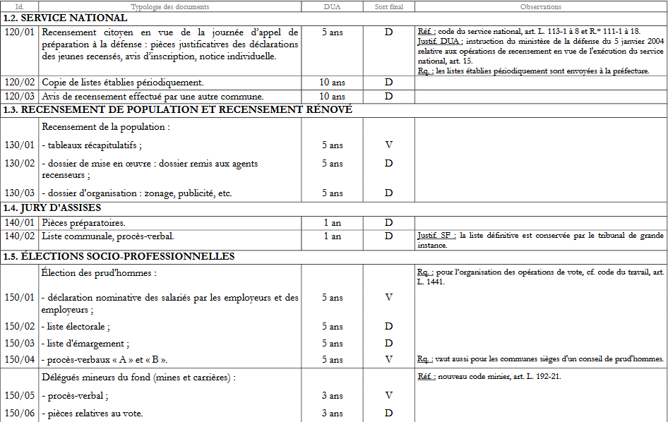
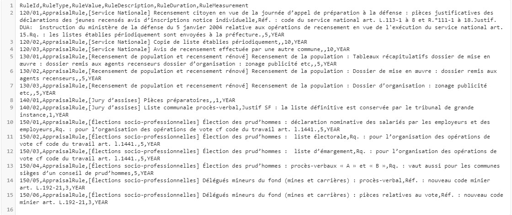
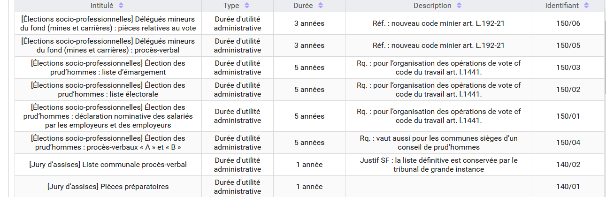

Le référentiel des règles de gestion dans la solution logicielle Vitam
===

Le référentiel des règles de gestion recense toutes les règles applicables aux archives. C’est un outil  structurant et essentiel pour la mise en œuvre dans le SAE de la politique d’archivage.<br>
En effet, il permet le calcul automatique des dates d’échéance ainsi que la mise en œuvre des traitements d’élimination, de transfert ou de déclassification.<br>
Il est structuré autour des six catégories de règles applicables aux archives définies par le SEDA : durée d’utilité courante (StorageRule), durée d’utilité administrative (AppraisalRule), délai de communicabilité (AccessRule), délai de réutilisation (ReuseRule), délai de diffusion (DisseminationRule), durée de classification (ClassificationRule), auxquelles s’ajoute le gel (HoldRule).


Présentation du référentiel des règles de gestion
---
### Périmètre du référentiel des règles de gestion
Un référentiel des règles de gestion est propre au tenant sur lequel il a été importé.


### Contrôles effectués à partir du référentiel des règles de gestion
Lors d’une entrée, la solution logicielle Vitam vérifie que les règles de gestion déclarées dans le bordereau, au niveau global ou au niveau de chaque unité archivistique, sont bien décrites dans le référentiel et relèvent de la bonne catégorie.
Si une date de départ pour le calcul de la règle est présente, la solution logicielle calcule automatiquement la date d’échéance.

*Point d’attention :* Si des règles de gestion sont déclarées dans le bordereau de transfert, un référentiel des règles de gestion permettant de les contrôler est obligatoire. En cas d’absence de ce référentiel, la vérification de la conformité des identifiants de règle présents dans le bordereau de transfert ne pourra être réalisée et l’entrée sera rejetée.

En cas de mise à jour des règles de gestion applicables à une ou plusieurs unités archivistiques, la solution logicielle Vitam effectue les actions suivantes :
- vérification que les identifiants de règle déclarés sont bien présents dans le référentiel des règles de gestion et sont dans la bonne catégorie ;
- si une date de départ est déclarée pour cette règle, calcul de la date d’échéance ;
- si la date de départ est modifiée, calcul de la nouvelle date d’échéance.


Configuration du référentiel des règles de gestion
---
### Constitution du référentiel des règles de gestion
L’administrateur fonctionnel constitue le référentiel des règles de gestion à partir du recensement des règles applicables dans son entité.
Par exemple :
- délais de communicabilité du code du patrimoine applicables au secret des délibérations du gouvernement, aux registres de l’état civil, aux dossiers d’agents ;
- durée d’utilité administrative applicable aux dossiers de marchés publics ou aux dossiers de travaux ;
- durée d’utilité courante applicable aux données personnelles d’une application recensant les bénéficiaires d’une allocation ;
- délai de diffusion des archives numérisées (état civil, recensement..) ;
- délai de réutilisation des archives publiques sur lequel un tiers a un droit de propriété intellectuelle ;
- durée de classification des documents relatifs aux opérations extérieures protégés au titre du secret de la défense nationale ;
- gel judiciaire…
À chaque motif, à l’exception du gel où c’est optionnel, l’administrateur fonctionnel associe une durée qui peut être exprimée en années, mais également en mois ou en jours

Le référentiel des règles de gestion peut être alimenté, pour chaque catégorie de règle :
- d’une manière très générique, en se focalisant uniquement sur les durées associées aux règles. À titre d’exemple, il est possible de déclarer, pour les règles d’utilité courante ou les règles d’utilité administrative, des règles correspondant à des durées d’1 an, de 2 ans, de 3 ans, etc. Dans ce cas, la règle pourra être utilisée pour différentes catégories de dossiers ;
- d’une manière plus spécifique, en distinguant finement, pour chaque catégorie, les différentes typologies ou motifs, ce qui facilitera les mises à jour ultérieures, par exemple en cas de changement de réglementation. Ainsi :
    - pour un délai de communicabilité dont la durée est de 25 ans, il est intéressant de créer autant de règles que de motifs définis par le code du patrimoine, de sorte que si ce délai changeait uniquement pour les documents relatifs à la recherche par les services compétents des infractions fiscales et douanières, par exemple, seule la règle concernant ces derniers serait à mettre à jour dans le référentiel en indiquant la nouvelle durée applicable, sans qu’une vérification systématique de tous les documents communicables à 25 ans soit nécessaire pour déterminer la catégorie de secret applicable ;
    - pour la catégorie « Durée d’utilité administrative », la création d’autant de règles que de motifs ou de typologies documentaires permet de discriminer plus facilement les documents lors d’une campagne d’évaluation des documents éliminables en permettant à l’archiviste de regrouper les documents par catégories documentaires (documents éliminables en application d’une règle concernant les offres rejetées, documents éliminables en application d’une règle concernant les bulletins de salaire, etc.).

La première solution présente l’avantage de limiter le nombre de règles à administrer ; la seconde, de permettre d’effectuer des mises à jour de règles plus ciblées et de faciliter l’évaluation d’archives éliminables.


### Transposition d’un référentiel existant dans un référentiel des règles de gestion conforme aux attendus de la solution logicielle Vitam
Pour constituer son référentiel des règles de gestion, l’administrateur fonctionnel peut reprendre, pour la catégorie « Durée d’utilité administrative », les tableaux de gestion/référentiels de conservation existants dans son entité.

*Exemple avec un extrait du tableau de gestion publié par le Service interministériel des archives de France « Préconisations relatives au tri et à la conservation des archives produites par les communes et structures intercommunales dans leurs domaines d’activité spécifiques » (DGP/SIAF/2014/006).*


Pour transposer ce document dans la formalisation attendue dans la solution logicielle Vitam (pour plus de détails, cf. infra Formalisation du référentiel des règles de gestion), l’administrateur fonctionnel reprendra pour chacune des règles :
- l’identifiant (« Id. ») pour renseigner la colonne « RuleId » du référentiel des règles de gestion (identifiant de la règle),
- le chiffre indiqué dans la DUA pour renseigner la colonne « RuleDuration » du référentiel (dans cet exemple, les valeurs sont 1, 3, 5 ou 10),
- l’unité de mesure de la DUA pour renseigner la colonne « RuleMeasurement » du référentiel (dans cet exemple, c’est systématiquement l’année),
- la typologie des documents pour renseigner la colonne « RuleValue » du référentiel (intitulé de la règle),
- les informations en observation pour alimenter si besoin la colonne « RuleDescription » du référentiel (description de la règle).
L’administrateur du référentiel devra ensuite ajouter un « RuleType » correspondant à la catégorie de la règle (ici, « Durée d’utilité administrative », soit « AppraisalRule » dans la solution logicielle Vitam).

Le fichier .csv se présentera comme suit :


Dans l’interface de démonstration de la solution logicielle Vitam, le référentiel des règles de gestion se présentera comme suit :


Dans cet exemple, on a fait le choix de reprendre les titres de rubrique (Service national, Jury d’assises…) comme préfixe de chaque intitulé de règle pour permettre un tri par intitulé.<br>
Le service d’archives peut également attribuer des identifiants signifiants aux règles de gestion. On pourrait par exemple attribuer à toutes les règles de durée d’utilité administrative concernant le recensement de la population un identifiant de type 1XXX, à toutes les règles de durée d’utilité administrative concernant les jurys d’assises un identifiant de type 2XXX, ce qui permettrait de grouper facilement les règles relatives à une même action administrative lors de l’affichage dans une interface graphique.

Le sort final pour les catégories « Durée d’utilité administrative » et « Durée d’utilité courante » ne fait pas partie de la règle : c’est une propriété qui sera déclarée au niveau de l’unité archivistique en plus de l’identifiant de la règle applicable.

*Exemple :* l’instruction « Préconisations relatives au tri et à la conservation des archives produites par les communes et structures intercommunales dans leurs domaines d’activité spécifiques » (DGP/SIAF/2014/006) distingue pour les rapports d’usage d’une arme le rapport adressé au maire (DUA de 3 ans et sort final Détruire) et le rapport du maire adressé au préfet et au procureur (DUA de 3 ans et Verser). Dans le référentiel des règles de gestion, il n’y aura qu’une règle de DUA de 3 ans pour cette typologie et chaque unité archivistique qui portera cette règle déclarera le sort final applicable.

*Nota bene :* Pour les délais de communicabilité, un référentiel validé par le Service interministériel des archives de France a été établi. Pour les délais de réutilisation et de diffusion, d’autres référentiels sont actuellement en cours de finalisation.


### Gestion des identifiants des règles de gestion
Le référentiel des règles de gestion fonctionne en mode « esclave ». Le plus souvent en effet, le référentiel du SAE sera constitué d’un export du référentiel maître applicable aux archives papier comme électroniques piloté par le SIA. Cela permet de garder une unité dans la dénomination (identifiant) des règles, quel que soit le support auquel elles s’appliquent.


### Configuration d’une durée minimale acceptable pour une catégorie de règle sur un tenant
Afin de se prémunir contre une alimentation du référentiel des règles de gestion avec des durées trop courtes susceptibles de déclencher des actions indésirables sur la plate-forme (ex. éliminations), la solution logicielle Vitam vérifie que la durée de chaque règle est supérieure ou égale à une durée minimale définie lors du paramétrage de la plate-forme, dans un fichier de configuration.
Cette configuration, optionnelle, est établie par les administrateurs – fonctionnel pour la définition du besoin et technique pour la saisie réelle des informations – de chaque implémentation de la solution logicielle Vitam et définit, pour chaque tenant et pour chaque catégorie de règle, les durées minimales acceptables.
Le fichier de configuration se présente comme suit (exemple fictif) :

```
listMinimumRuleDuration:
  2:
    AppraisalRule : 1 year
    DisseminationRule : 10 year

  3:
    AppraisaleRule : 5 year
    StorageRule : 5 year
    ReuseRule : 2 year
```
Dans cet exemple, il n’est pas possible d’importer sur le tenant 2 un référentiel des règles de gestion déclarant une règle dans la catégorie « Durée d’utilité administrative » dont la durée est égale ou inférieure à un an ni déclarant une règle dans la catégorie « Délai de diffusion » dont la durée est inférieure ou égale à dix ans. Pour les autres catégories de règle, aucune vérification sur une durée minimale n’est effectuée.<br>
Sur le tenant 3, les contrôles portent sur les catégories « Durée d’utilité administrative » (pas de règle dont la durée est inférieure ou égale à cinq ans), « Durée d’utilité courante » (pas de règle dont la durée est inférieure ou égale à cinq ans) et « Délai de réutilisation » (pas de règle dont la durée est inférieure ou égale à deux ans).

La tentative d’import ou de mise à jour d’un référentiel déclarant des règles dont la durée est inférieure ou égale aux données minimales saisies dans le fichier de configuration, déclenchera une alerte de sécurité qui sera transmise à l’administrateur technique de la plate-forme. L’import et la mise à jour seront alors rejetés.


### Formalisation du référentiel des règles de gestion
Le référentiel des règles de gestion est importé dans la solution logicielle Vitam sous la forme d’un fichier .csv comportant les colonnes suivantes :

|Nom de la colonne|Description de la colonne|Valeurs possibles|Observations|
|:-----|:-----|:-----|:-----|
|RuleId|Identifiant de la règle||Cet identifiant :<br>- doit être unique par catégorie de règle<br>- ne doit pas comprendre d’espace ou de caractère accentué|
|RuleType|Type de règle|AccessRule<br>AppraisalRule<br>ClassificationRule<br>DisseminationRule<br>ReuseRule<br>StorageRule<br>HoldRule||
|RuleValue|Intitulé de la règle|||
|RuleDescription|Description de la règle|||
|RuleDuration|Durée||La valeur de ce champ doit être un entier positif compris entre 0 et 999|
|RuleMeasurement|Unité de mesure de la durée|DAY<br>MONTH<br>YEAR||

Le fichier .csv à importer doit avoir les caractéristiques suivantes :
- encodage des caractères : UTF-8 ;
- séparateur de champ : la virgule ;
- séparateur de texte : guillemets simples ou doubles, espace vide.

Pour en savoir plus, consulter le [document VITAM. Modèle de données](./modele_de_donnees.md).

Les erreurs ou données en avertissement présentes dans le référentiel lors de la demande d’import initial sont retournées au demandeur sous la forme d’un fichier .json qui comprend les informations suivantes :
- indication du type d’opération concernée et date de celle-ci ;
- pour chaque ligne en erreur, le champ concerné, un message permettant à l’utilisateur de corriger l’erreur ainsi que la valeur erronée.


Modification du référentiel des règles de gestion
----
Le référentiel des règles de gestion ne peut pas être mis à jour unitairement (pour une règle uniquement). Il convient d’importer un nouveau fichier .csv contenant l’ensemble des règles de gestion en mode « annule et remplace ».

Lors d’une mise à jour du référentiel, des contrôles sont effectués sur les règles déjà utilisées dans la solution logicielle Vitam, c’est-à-dire les règles déclarées par des unités archivistiques.
Sont appliqués les cas suivants :
- échec de la mise à jour si celle-ci a demandé la suppression d’une règle déjà utilisée ;
- avertissement de la mise à jour si celle-ci a demandé la modification d’une règle déjà utilisée, que cette modification porte sur sa durée (valeur et/ou unité de mesure) ou sur sa description.

Le rapport indique :
- la liste des règles dont la suppression est demandée alors qu’elles sont utilisées dans le système ;
- la liste des règles dont la modification est demandée alors qu’elles sont utilisées dans le système.

La modification de la durée d’une règle de gestion (par exemple, une DUA qui passerait de trois à cinq ans) entraîne le recalcul automatique de toutes les dates d’échéance des unités archivistiques qui portent cette règle. L’opération est journalisée et les journaux de cycle de vie des unités archivistiques concernées sont mis à jour.

Les différentes versions du référentiel font l’objet d’une sauvegarde sur les offres de stockage utilisées par l’implémentation de la solution logicielle Vitam.


Pour aller plus loin, consulter le [document VITAM. Règles de gestion](./regles_gestion.md).