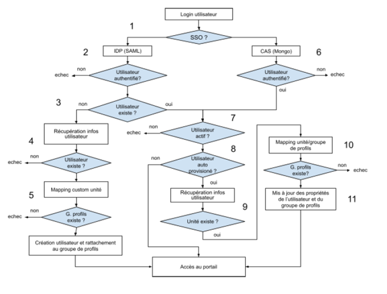
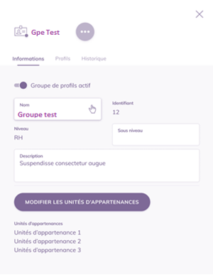
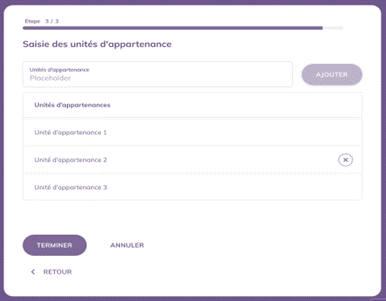
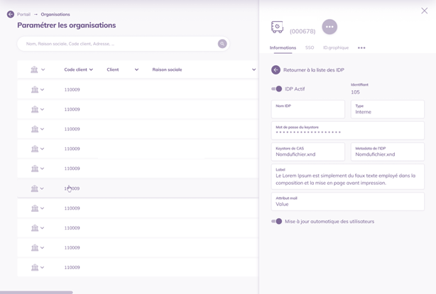
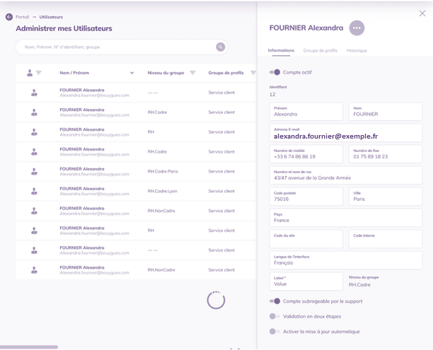

Vitam UI : présentation de la fonctionnalité d’auto-provisioning
===================

Besoins et contraintes actuelles
------

### Synthèse des trois besoins d’évolution des fonctions d’authentification
La road-map VITAM UI a planifié trois besoins d’évolutions des fonctions du portail, par ordre de priorité :
- Assurer les créations et modifications d’utilisateurs au moment de l'authentification (auto-provisioning), ainsi que de leurs droits selon deux cas d’usages :
    - le groupe de profils VITAM UI est préalablement connu dans le référentiel utilisateur tiers de l’organisation ;
    - le groupe de profils doit être déduit au moment de l’authentification, selon plusieurs critères du référentiel utilisateur de l’organisation.
- Permettre un nouveau mode d’authentification des utilisateurs par carte à puce portant un certificat d’identité de personne de type X509 ;
- Permettre à un utilisateur d’accéder à plusieurs organisations.

Cette première fonctionnalité est en particulier nécessaire pour le CEA, avec un mode d’authentification par certificat.

A noter que ces trois fonctions sont dépendantes :
- Le provisioning sera réalisé au moment de l’authentification (procédure synchrone) pour les opérations de création et de modification des utilisateurs. 
Ce système permet de provisionner uniquement les utilisateurs qui se sont authentifiés une première fois. Ceci permet de minimiser les charges d’administration.
- Le provisioning sera réalisé dans le processus d’authentification « délégué », soit en SSO, soit par certificat X509,
- En cas d’accès multi-organisation, le provisioning devra, à terme, permettre de provisionner des utilisateurs dans une ou plusieurs organisations.

Ce document spécifie l’auto-provisioning pour le premier lot de développement.

### Rappel du fonctionnement actuel
Les fonctions portail sont documentées dans la [documentation produit VITAM UI](http://www.programmevitam.fr/ressources/DocCourante/autres/fonctionnel/VitamUI_Doc_produit.pdf).

En synthèse, les modes d’authentification actuellement proposés sont :
- Login + mot de passe,
- OTP par validation d’un code SMS en option, paramétrable au niveau de l’organisation et/ou de l’utilisateur,
- SSO avec implémentation d’un protocole (OpenID, SAML V2 …).

Techniquement, en cas d’usage d’un login / mot de passe, la mire d’authentification VITAM UI prend le rôle d’un fournisseur d’identité (IdP), l'authentification externe est bien réalisée en SSO après la saisie du login / mot de passe par l’utilisateur.  
Après authentification au portail, l’accès à chaque APP est sécurisé par un cookie de session interne à l'écosystème VITAM UI.  
L’utilisateur peut accéder uniquement aux APPs dans lequel un profil de droits lui est attribué, via un groupe de profils.

L'administration des droits d’un utilisateur consiste à simplement lui affecter un groupe de profils préalablement configuré :
- Actuellement par une action d’administration dans l’APP Utilisateurs,
- Par une fonction de provisioning automatisé, lorsque l’IdP connait la référence du groupe de profil (nouvelle fonctionnalité, objet de ce document).

Ceci induit qu’en cas d’usage d’un système de fédération d’identité et de droits par une organisation, il est de la responsabilité de ce référentiel tiers de gérer l’attribution des groupes de profils aux utilisateurs. 

Paramétrage des modes d’authentification :
- Le mode d’authentification est paramétré au niveau de l’instance, dans l’APP Organisation.
- Chaque organisation peut disposer d’un ou plusieurs IdP (Identity provider), identifiés par un pattern email (domaine).

Administration des utilisateurs :
- Il est de la prérogative de l’administrateur d’une organisation d’attribuer des droits à ses utilisateurs
- Les groupes de profils sont spécifiques à chaque organisation
- Le groupe de profils est un concept cross-tenant à l’organisation : un utilisateur de l’organisation peut accéder à un ou plusieurs tenants de l’organisation
- Un utilisateur ne peut être affecté qu’à une organisation dans une instance, avec le même identifiant
- Un utilisateur doit disposer d’un email avec un des pattern email autorisés dans l’organisation (lié à un IdP de l’organisation)

Identification de l’utilisateur :
- La solution dispose d’un annuaire interne. Chaque utilisateur dispose d’un identifiant unique « VITAM UI »
- L’annuaire interne gère les attributs de l’utilisateur, notamment l’email lui permettant de s’authentifier. L’utilisateur peut également disposer d’un identifiant technique de l’IdP, utilisé dans certaines implémentations du SSO.
- L’annuaire interne ne peut pas être substitué par un annuaire tiers car certaines informations sont nécessaires au fonctionnement de l’application (paramètres de langues…).

Spécification fonctionnelle pour le provisioning automatisé des utilisateurs
-----

### Principes généraux

Le provisioning automatisé des utilisateurs sera réalisé de manière synchrone au processus d’authentification :
- Pour un nouvel utilisateur : création automatique d’un utilisateur
- Pour un utilisateur existant : modification automatisé en cas de changement des informations utilisateurs, dont ses droits.

Le processus d’élimination d’utilisateur n’est pas implémenté car aucun utilisateur n’est supprimé de l’annuaire VITAM UI pour conserver le lien de traçabilité des informations systèmes. Les informations nominatives sont anonymisées par l’administrateur fonctionnel au bout d’une durée paramétrable (72 mois par défaut). Un utilisateur peut être désactivé

### Concept d’unité

Pour octroyer des droits à un utilisateur, son identifiant est associé à un groupe de profil VITAM UI préalablement configuré.  
Chaque groupe de profil dispose d’un identifiant unique dans le modèle de données des groupes de profil VITAM UI.

Afin d’octroyer automatiquement les droits au moment du provisioning, VITAM UI doit disposer d’une information utilisateur qui permettra au système d’affecter un groupe de profil à l’utilisateur.  
A ce titre, le référentiel des utilisateurs doit fournir une information utilisateur appelée « Unité » qui déterminera quel groupe de profil utiliser :
- Pour des raisons de sécurité, car la base des groupes de profils n’est exposée qu'après authentification.
- Pour des raisons d’unicité d’identifiant « Groupe de profils » (maître VITAM UI) et unité (maître référentiel externe des utilisateurs)

Cardinalité :
- Une unité ne peut se référer qu’à un seul groupe de profils
- Un groupe de profils peut se référer à plusieurs unités
- Un utilisateur est affecté à un et un seul groupe de profils (et donc ne peut posséder qu’une seule unité)

### Processus d’auto-provisioning standard
Le processus d'auto-provisioning sera paramétré pour deux cas d’usages :
- Fournisseur d’identité (IdP) configuré en SSO
- Fournisseur d’identité (IdP) configuré en authentification X509

L’authentification par login et mot de passe ne permettra pas un auto-provisioning car pour provisionner un nouvel utilisateur, celui-ci doit préalablement être authentifié du côté de l’organisation pour des raisons de sécurité.

|Etape|Fonctionnel|Technique|
|:---|:----|:----|
|1|Authentification auprès du fournisseur d’identité de l’organisation, redirection vers Vitam UI et authentification dans Vitam UI|L’utilisateur accède à la page de l’authentification de l’IDP de son client, l’authentification se déroule via le mode fourni par le client (local ou SSO)|
|2|Vérification de l'authentification SAML|Le protocole CAS indique à VITAM UI si l'authentification a réussi|
|3|Vérification que l’utilisateur existe|Si l’ utilisateur n’existe pas dans Vitam UI et que le fournisseur d’identité autorise l’auto-provisioning, le processus de récupération des informations utilisateurs est exécuté|
|4|Accès aux informations de l’utilisateur via le service spécifique (développement à la charge des organisations)|Si le web service client connaît l’utilisateur, alors le mapping vers l’unité est exécuté|
|5|Une fois toutes les informations récupérées, déduction du groupe de profils à partir de l’unité et création de l’utilisateur|Vitam UI déduit le groupe de profils correspondant à l’unité d’appartenance de l’utilisateur, ensuite une opération d’ajout de l’utilisateur avec ce groupe de profils dans la base de Vitam UI est réalisé.|
|6|Si l’utilisateur existe déjà et qu’il est actif, vérification qu’il est géré par auto-provisioning|Lorsque l’utilisateur existe déjà dans VITAM UI, le système vérifie que l’utilisateur est actif|
|7|Si l’option auto-provisioning est désactivée, l’utilisateur est authentifié sans mise à jour|Le système vérifie que l’utilisateur est éligible à l’auto-provisioning.|
|8|Si l’option est activée, vérification que les informations ont besoin d’être mises à jour|Si l’auto-provisioning est activé pour un utilisateur, Vitam UI appelle les informations de l’utilisateur via le web-service spécifique de l’organisation|
|9|Si l’unité n’est pas fournie, exécution du module spécifique afin de vérifier si l’unité a changé|Si le web service client connaît l’utilisateur, alors le mapping vers l’unité est exécuté|
|10|Une fois toutes les informations récupérées, déduction du groupe de profils à partir de l’unité et création de l’utilisateur|Vitam UI déduit le groupe de profils correspondant à l’unité d’appartenance de l’utilisateur|
|11|Une fois le processus de mise à jour terminé, accès au portail|Le système met à jour les propriétés de l’utilisateur|

### Exemple

|Etape|Unité|Groupe de profil|Opération|
|:----|:----|:----|:----|
|L’utilisateur A se connecte pour la première fois à VITAM UI|Unité 1|Groupe 1|Création de l’utilisateur car il s’agit de sa première connexion |Association à un groupe de profils à l’aide de l’unité|
|L’utilisateur A se connecte les fois suivantes à VITAM UI|Unité 1|Groupe 1|Mise à jour du groupe de profils s’il a changé (dans ce cas précis non)|
|L’utilisateur A change de service|Unité 2|Groupe 1||
|L’utilisateur A se connecte à VITAM UI|Unité 2|Groupe 2|Mise à jour du groupe de profils et des habilitations en conséquence|
|L’administrateur fonctionnel de l’organisation de l’utilisateur A modifie manuellement le groupe de profils de A. Il ne désactive pas l’auto-provisioning.|Unité 2|Groupe 3||
|L’utilisateur A s’authentifie|Unité 2|Groupe 2|L’utilisateur A retrouve son groupe d’origine car l’auto-provisioning n’a pas été désactivé|
|L’administrateur fonctionnel de l’organisation de l’utilisateur A modifie manuellement le groupe de profils de A et désactive l’auto-provisioning pour l’utilisateur A|Unité 2|Groupe 3|L’auto-provisioning est désactivé|
|L’utilisateur A s’authentifie|Unité 2|Groupe 3|L’auto-provisioning est désactivé => pas de changement|
|L'administrateur fonctionnel de l’organisation de l’utilisateur A réactive la mise à jour automatique pour cet utilisateur|Unité 2|Groupe 3|L’auto-provisioning est activé|
|L’utilisateur A s’authentifie|Unité 2|Groupe 2|L’utilisateur A retrouve son groupe d’origine car l’auto-provisioning a été réactivé|

### Evolution des interfaces pour gérer l’auto-provisioning quand l’unité est fournie par un référentiel tiers

#### Paramétrages des unités dans les groupes de profils
L’évolution de l’APP « Groupe de profils » consiste à activer un champ unité, multi-valué. 
Cela nécessite l’ajout du champ unité dans le modèle MongoDB des groupes de profils VITAM UI.

Les écrans à faire évoluer sont les suivants :

 
Le composant « tag » multi-valué existant pourra être réutilisé avec la règle d’alimentation suivante : texte libre avec la syntaxe exacte de l’unité telle que fournie par l’API tiers dans la transaction de consultation du référentiel.

#### Paramétrages des fournisseurs d’identité (IdP) avec auto-provisioning
L’évolution de l’APP « Organisations » consiste à paramétrer le service de provisioning dans le paramétrage de l’IdP.

 

### Paramétrages de l’auto-provisioning au niveau de l’utilisateur
Si la fonction est utilisée, la plupart des utilisateurs seront auto-provisionnés. Cependant, pour plus de souplesse notamment au niveau de l’administration des utilisateurs à haut privilèges, il devra être possible de le provisionner « manuellement » via l’APP Utilisateur.

Si un utilisateur est auto-provisionné, les modifications d’informations utilisateurs et des groupes de profil ne sera pas possible dans l’APP Utilisateur

L’APP utilisateur évolue en ce sens avec l’ajout d’un toggle « autoprovisionné » automatiquement activé si l’IdP est configuré ainsi, mais débrayable.

 

Il devra être possible de :
- Désactiver l’auto-provisioning quand on crée un utilisateur manuellement
- Pouvoir désactiver à posteriori l’auto-provisioning d’un utilisateur automatiquement créé