Extraction des métadonnées techniques
=====

Introduction
------------

### Documents de référence

|**Document**|**Date de la version**|**Remarques**|
|:---------------:|:-----:|:-----:|
|[Vitam – Gestion de la préservation](./preservation.md)|||
|[Vitam – Identification des formats de fichiers](./chantier_identification_format.md)|||
|[Vitam – Validation du format des fichiers](./chantier_preservation_validation_format.md)|||

### Présentation du document

Le présent document constitue une présentation de la problématique des métadonnées associées aux fichiers numériques et de leur extraction automatisée, et de la manière dont elle est abordée par le programme Vitam, aux fins de permettre la pérennisation à moyen et long terme des archives électroniques.

Il fait partie d’un ensemble de documents liés aux questions d’identification et de validation de formats.

### Définitions

**Conversion de format :** opération qui consiste à convertir le document dans un format différent de celui dans lequel il était précédemment encodé. Elle doit préserver la fidélité du document (Source : NF Z 42-013).

**Format de fichier :** ensemble des règles et algorithmes permettant d’organiser l’information dans un objet numérique, par exemple : spécifier le codage des couleurs des pixels d’une image ; définir un algorithme de compression des données et l’organisation de ces données dans un fichier (formats PNG, TIFF…) ; spécifier l’organisation et la structuration d’informations textuelles à partir de l’encodage élémentaire des caractères (formats SGML, XML) ; définir comment les quatre informations élémentaires que sont la mantisse (nombre entier positif), l’exposant (nombre entier positif), le signe de l’exposant et le signe de la mantisse (caractères + et -) sont organisées pour représenter un nombre réel sous forme numérique (cf. standard ANSI/IEEE 754-1985) (Source : PIAF).

**Identification de format :** processus permettant de définir précisément le format d’un fichier numérique, qu’il s’agisse d’un conteneur ou non.

**Métadonnée :** du grec « méta », signifiant « ce qui dépasse, englobe ». Donnée à propos d’une autre donnée. Il s’agit d’un ensemble structuré d’informations attachées à un document, servant à en décrire les caractéristiques en vue de faciliter son repérage, sa gestion, son usage ou sa préservation.

**Pérennisation :** ensemble des opérations destinées à garantir qu’une information soit en mesure de traverser le temps durant tout son cycle de vie en préservant son intégrité (définition inspirée de la NF Z 42-013).

**Validation de format :** processus permettant de vérifier que le format d’un fichier respecte les spécifications publiées de celui-ci, en termes de structure comme de syntaxe.

Présentation de la problématique
----

### Contexte : métadonnée et standards de description

#### Qu’est-ce qu’une métadonnée interne ?
Les fichiers numériques sont accompagnés de métadonnées leur permettant d’être identifiés et utilisables, c’est-à-dire exécutés, interrogés, consultés, modifiés ou imprimés.

Ces métadonnées peuvent être de deux types :
- externes, c’est-à-dire que les métadonnées sont gérées dans un fichier ou une base de données annexe ;
-  internes, c’est-à-dire que les métadonnées sont encapsulées dans le fichier numérique qu’elles décrivent. Il s’agit des métadonnées dites techniques.
Elles peuvent être redondantes. Néanmoins, leur coexistence peut s’avérer utile, en cas d’absence ou de manque d’indexation de l’un de ces deux types de métadonnées[^1].

Métadonnées internes d’une photographie éditées avec l’outil XnView :

 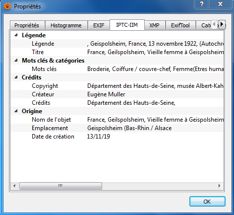

Ces métadonnées, externes comme internes, peuvent être :
-  saisies manuellement,
-  générées automatiquement par un outil d’édition ou une base de données annexe,
-  extraites automatiquement par ces mêmes outils.

Les métadonnées internes, associées à des fichiers numériques, font l’objet du présent document. Elles obéissent à des standards spécifiques, reconnus par un certain nombre d’outils permettant leur édition, leur exploitation et leur extraction.

#### Quels sont les standards existant pour la description des métadonnées internes ?

Les standards existants pour décrire les métadonnées internes varient en fonction des formats de fichiers.

##### Métadonnées internes des images fixes

Les formats correspondant à des images fixes ont fait l’objet de travaux de standardisation de leurs métadonnées internes dès les années 1990. De ces travaux se distinguent deux types de métadonnées internes :
-  des métadonnées appelées techniques, relatives à la prise de vue et fournies automatiquement par l’appareil numérique (fabricant et modèle de l’appareil, hauteur et largeur de l’image, date et heure de la prise de vue, orientation, résolution, temps d’exposition, ouverture, présence d’un flash, etc.). Ces métadonnées sont formalisées par le format EXIF (Exchangeable Image File), développé en 1995 par la JEIDA (Japan Electronic Industry Development Association) ; la version 2.3 actuelle date de 2010 et a été révisée en 2012[^2]. Ce format, quoique non standardisé et non maintenu par une organisation, est utilisé par la majeure partie des constructeurs d’appareils numériques.
-  des métadonnées appelées descriptives, relatives au contenu d’une image fixe et à ses droits et nécessitant une intervention humaine pour être renseignées. Ces métadonnées sont référencées dans deux standards désormais interopérables : IPTC/IIM (International Press Telecommunications Council/International Interchange Model) et XMP (Extensible Metadata Plateform).  
      Le premier standard, IPTC/IIM, développé en 1990 par l’International Press Telecommunications Council (IPTC), consiste en un standard normalisé en vue de stocker des métadonnées au sein même des images de presse et d’en faciliter l’échange. Il a pour objet la description de métadonnées administratives, descriptives et liées aux droits de l’image. Il n’inclut pas de métadonnées techniques.  
      Adobe reprend un sous-ensemble du standard pour son logiciel Photoshop et crée un outil, « Image Resource Block », permettant d’encapsuler les métadonnées dans l’en-tête (header) des fichiers images. À partir de là, des millions de photographes se mettent à utiliser le standard.  
      En septembre 2001, Adobe produit un nouveau socle de métadonnées techniques, « Extensible Metadata Plateform » (XMP), qui rend « Image Resource Block » plus ou moins obsolète. XMP est un standard s’exprimant en RDF et XML. Il utilise le schéma de métadonnées du Dublin Core, ainsi que des schémas propres à Adobe, auxquels peuvent s’ajouter un schéma étendu. Il est plus modulable, paramétrable et, de fait, peut répondre à des besoins particuliers. En 2012, le modèle de données et la syntaxe XML sont normalisés (ISO 16684-1)[^3].
      En 2004, IPTC et Adobe développent conjointement une redéfinition des propriétés IIM dans le contexte d’utilisation du standard XMP (« IPTC Core Schema for XMP »). Seules quelques propriétés ont été ajoutées.  
      En 2007, après une étude visant à faire évoluer le modèle de données, IPTC révise le standard IPTC Core et produit une extension au modèle, « IPTC Extension Schema ». Ces deux documents sont réunis en un seul document : « IPTC Photo Metadata Standard ».
Des mises à jour de l’IPTC ont été faites en 2009, 2014 et 2016 et 2017[^4].

Métadonnées EXIF d’une photographie éditées avec l’outil XnView :

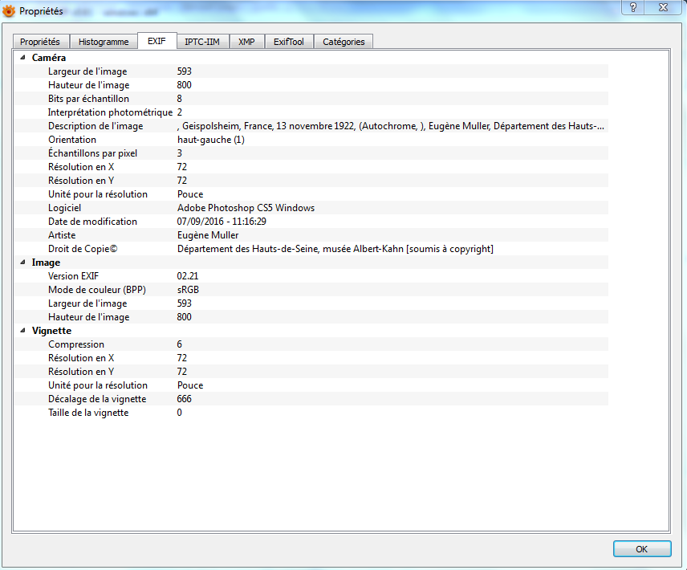

Métadonnées IPTC d’une photographie éditées avec l’outil XnView :


Métadonnées XMP d’une photographie éditées avec l’outil XnView :

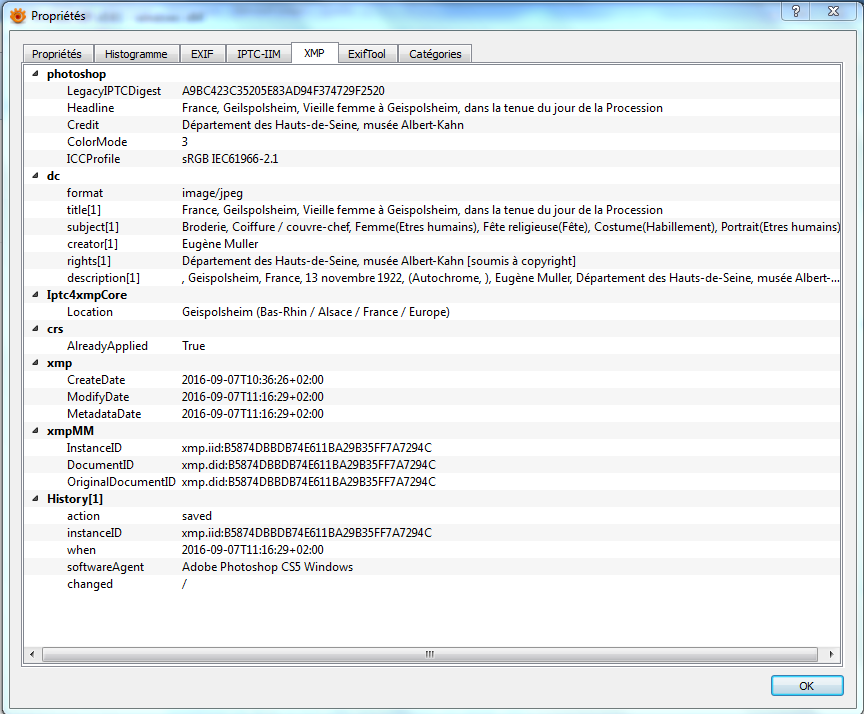

##### Métadonnées internes des fichiers bureautiques

Les fichiers de type bureautique embarquent également des métadonnées internes ou « propriétés ». Elles sont visibles et modifiables depuis l’onglet « Fichier > Propriétés du document », présent dans l’interface de l’outil permettant de consulter ce type de fichiers. La liste de ces métadonnées est souvent réduite à :
-  des propriétés standards telles que l’auteur, le titre et l’objet du document. Chacun est libre de renseigner ce type de métadonnées ;
-  des propriétés automatiquement renseignées et mises à jour, relatives au document en tant que tel (nom du fichier, taille du document, date de création et date de dernière modification)[^5].

Propriétés automatiquement générées pour un fichier ODT :

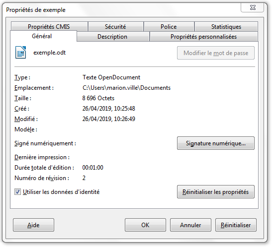

Propriétés standards à renseigner pour un fichier ODT :

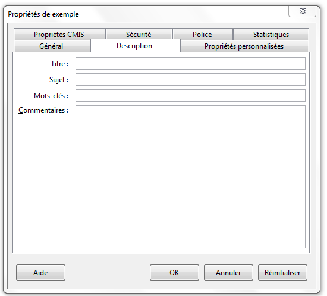

À noter que deux formats de fichiers bureautiques se démarquent par l’adoption d’un standard :
-  le format PDF supporte, depuis sa création en 1993, un nombre limité de métadonnées internes nommées « Document Info » au nombre de huit : Titre, Auteur, Sujet, Mots-clés, Producteur du PDF, Application, Date de création, Date de modification. À l’origine du modèle de métadonnées techniques XMP en 2001, Adobe l’introduit dans ses outils. De fait, un PDF peut contenir à la fois des métadonnées de type « Document Info » et des métadonnées XMP, beaucoup plus variées[^6].
-  le format ODF (OpenDocument), standardisé en 2005 et normalisé en 2006 sous la référence ISO 26300, dispose d’une liste prédéfinie de métadonnées, présente dans un fichier meta.xml : application, titre, description, sujet, mots-clés, auteur initial, auteur, imprimé par, date de création, date de dernière modification, date de dernière impression, durée d’édition, modèle utilisé, rechargement automatique, langue, nombre d’éditions, durée totale d’édition, statistiques sur le document.

##### Métadonnées internes des images animées

Les métadonnées internes d’images animées obéissent à des normes très variées, sans qu’une norme précise se distingue particulièrement.

Parmi elles, on peut distinguer :
-  la norme ISO MPEG-7, appelée « Multimedia Content Description Interface »[^7], fruit du travail du comité d’experts « Motion Picture Experts Group » (MPEG), à l’origine des normes MPEG 1, 2 et 4 portant sur les modes de compression de fichiers visuels et sonores et de la norme MPEG-21 portant sur le cadre d’application pour leur gestion intégrée. Cette norme, publiée en 2002 et régulièrement mise à jour, s’attache à fournir un ensemble de métadonnées, ainsi qu’une syntaxe décrivant leur structure et les relations entre elles, le tout exprimé et encapsulé dans un fichier XML, contrôlé par un schéma. Elle permet de décrire les fichiers avec plusieurs degrés d’abstraction[^8], en combinant :
    - des métadonnées sur le contenu (titre, créateur, droits, renseignements sur les personnes, les objets et les événements représentés dans le fichier, etc.) ;
    - des métadonnées techniques (forme, taille, texture, couleur, etc.)[^9].

Fonctionnement des trois composantes de la norme MPEG-7[^10] :


-  l’IPTC Video Metadata Hub, dont une première version est publiée en octobre 2016 par l’International Press Telecommunications Council (IPTC)[^11], afin de proposer une liste de métadonnées communes, largement utilisées et interopérables avec différents formats de métadonnées. En d’autres termes, le standard résout le problème de la variété des normes de description des images animées, sans imposer l’adoption de son modèle de données.
      Il identifie quatre types de métadonnées communes : descriptives, administratives, techniques et liées aux droits de l’image. Ces métadonnées peuvent porter sur l’ensemble d’un fichier ou sur une partie.
      Dans la dernière version du standard, en date du 25 avril 2018, elles ont des correspondances avec les normes de descriptions suivantes :
    - EBUCore, spécification définie par l’Union européenne de radio-diffusion pour les radio-diffuseurs et largement utilisée ;
    - XMP, initiée par Adobe et désormais maintenue par l’ISO, d’abord pour encapsuler des métadonnées dans des fichiers binaires (photographies numériques, fichiers audio), puis dans des fichiers vidéo ;
    - Quicktime, spécification réalisée par Apple pour son format Quicktime (.mov) ;
    - MPEG-7, norme ISO 15938-5 pour les métadonnées multimédias 7 ;
    - NewsML-G2, format d’échange d’informations d’IPTC pour tous les types de médias. Il est largement utilisé pour l’échange B2B de nouvelles et de médias ;
    - PBCore, schéma de métadonnées conçu pour l’audio et la vidéo. Développé à l’origine par la station de télévision WGBH, il est largement utilisé par les radiodiffuseurs publics aux États-Unis, ainsi que par un grand nombre de services d’archives cinématographiques et d’autres organisations médiatiques ;
    - Schema.org, modèle de données destiné à incorporer des métadonnées dans des pages web, en utilisant RDFa, Microdata et JSON-LD. Il a été fondé par et pour Google, Microsoft,Yahoo et Yandex.10.  
      L’IPTC ambitionne d’ajouter à cette liste de nouveaux formats et standards, comme le format propriétaire MXF de la Society of Motion Picture and Television Engineers (SMPTE), ou des métadonnées propres à des caméras telles que Sony, Panasonic et Canon. De la même façon, il promeut son travail auprès des professionnels, en vue de, peut-être un jour, standardiser son modèle de données[^12].

##### Métadonnées internes des enregistrements sonores

Chaque format correspondant à des enregistrements sonores dispose de son propre modèle de métadonnées. Parmi ces modèles de métadonnées, on peut citer :
-  le standard ID3, abréviation de « IDentify an MP3 », développé pour décrire les fichiers au format MPEG3[^13]. Conçu en 1996 par Eric Kemp, il se limite au départ à 7 métadonnées de taille fixe, disposées en fin de fichier sur 128 bits (identifiant « TAG », titre, nom de l’artiste, nom de l’album, année de parution, genre, commentaire). En 1997, Michael Mutschler ajoute une huitième métadonnée (le numéro de la piste) tout en conservant la longueur de 128 bits.  
      Les limitations de ce modèle, en termes de choix de métadonnées, de taille et de positionnement dans le train de bits, ont entraîné une refonte du modèle dans une nouvelle version du standard, dite « ID3v2 », non compatible avec la précédente. Désormais, les informations sont disposées en début de fichier dans un bloc de données extensible, supportant l’Unicode. De nouvelles métadonnées sont ajoutées (ex. image, paroles, support physique, propriété intellectuelle, liens externes, etc.). Libre aux utilisateurs de les utiliser ou de définir les leurs. La dernière version du standard, IDv2.4, date du 1er novembre 2000.  
      Le succès de ce standard se mesure à l’aune de son utilisation, puisque bon nombre de logiciels et lecteurs physiques le supportent (iTunes, Windows Media Player, Winamp, VLC pour les uns ; iPod, Creative Zen, Samsung Galaxy et Sony Walkman pour les autres).

Représentation des métadonnées ID3 dans un fichier MP3 :

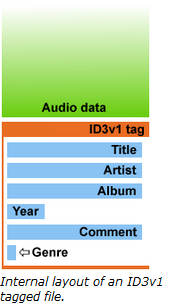 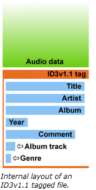 

-  le standard BWF, pour « Broadcast Wave Format », parfois appelé BWAVE[^14]. Il s’agit d’une évolution du format Microsoft WAVE, lui-même basé sur la spécification RIFF (Ressource Interchange File Format) développée par Microsoft et IBM. Défini pour la première fois en 1997 sous la référence Tech 3285, à l’initiative de l’Union européenne de radio-télévision (European Broadcast Union), ce standard consiste en un fichier WAVE auquel sont ajoutés des chunks contenant des métadonnées[^15] :
    - des métadonnées décrivant le format des données, nécessaires au décodage du fichier sonore (chunk fmt) ;
    - des métadonnées contenant les données audio elles-mêmes (chunk data) ;
    - des métadonnées considérées comme nécessaires à l’échange d’informations entre les diffuseurs (chunk bext pour « Broadcast audio EXTension »), telles qu’une description, le nom du producteur, l’identifiant attribué par le producteur, la date et l’heure de l’enregistrement, le nombre de samples, etc.  
      Le standard a connu deux révisions : l’une en 2001 avec l’ajout de l’UMID (Unique Material IDentifier ») et l’autre en 2010 avec l’ajout de métadonnées de mesures audio. Il a également été complété, entre 1997 et 2009, par des suppléments qui définissent chacun un chunk optionnel de métadonnées, pouvant correspondre aussi bien à des données techniques que descriptives.

Contenu d’un fichier au format BWF :


      Ce standard, compatible avec le format WAVE et très utilisé en production, est recommandé comme format pérenne par l’IASA (International Association of Sound and Audiovisuel Archives).

### Pourquoi et comment extraire des métadonnées internes ?

#### Pourquoi extraire les métadonnées internes ?

L’objectif de la préservation numérique est de conserver dans le temps des fichiers numériques dans une forme utilisable et exploitable, sans perte de métadonnées, internes ou externes. Dès lors qu’intervient une conversion ou transformation de format, il y a un risque de perte des métadonnées internes. Pour une plate-forme d’archivage, il est donc important de disposer de mécanismes permettant d’assurer la prise en charge et la conservation des métadonnées internes dans une forme utilisable et exploitable dans le temps.

L’extraction de métadonnées est un des mécanismes mis en œuvre pour effectuer cette prise en charge. Son objectif est d’extraire les métadonnées internes d’un fichier numérique afin de les exploiter et/ou de les conserver en dehors de celui-ci ou de les réintégrer dans la nouvelle version du fichier numérique, après conversion.

Cette action répond en outre à deux besoins supplémentaires :
-  elle est nécessaire à la caractérisation et à la validation de formats. En effet, la validation de formats, qui permet de vérifier si un fichier est conforme aux spécifications de son format, d’un point de vue syntaxique et sémantique, est basée, de fait, sur l’utilisation et l’analyse des métadonnées internes[^16];
-  si, une fois extraites, les métadonnées internes sont enregistrées dans une base de données, leur extraction sert à construire une interprétation significative du fichier numérique, au moyen de métadonnées externes au fichier numérique, et de la rendre directement disponible à l’utilisateur, sans passer par une réinterrogation du fichier numérique lui-même.  
      En revanche, si les métadonnées restent internes et doivent être interrogées, il faut systématiquement les extraire depuis les fichiers numériques pour être consultées et cette opération peut s’avérer coûteuse, puisque chaque fichier devra être chargé et analysé par le système à chaque consultation.
      L’extraction et le stockage des métadonnées internes comme métadonnées externes permettent d’éviter de réaliser à chaque besoin de consultation une nouvelle extraction[^17] .

Pour que l’extraction soit faisable et efficace, deux prérequis doivent naturellement être remplis :
-  le format, métadonnées internes incluses, doit disposer de spécifications écrites et disponibles, ce qui n’est pas nécessairement le cas ;
-  les spécifications du format des métadonnées ne doivent pas être sujettes à interprétation, ce qui est souvent le cas pour les formats les plus répandus et, partant, les plus perméables[^18]. Les logiciels utilisés pour représenter ce type de formats interprètent les spécifications et se révèlent capables de représenter des métadonnées internes :
    - non complètement conformes à ces dernières,
    - de manière non exhaustive,
    - selon un formatage et/ou un encodage qui leur est propre.
      La question est alors de savoir à quel point la non-conformité d’un fichier numérique par rapport aux spécifications de son format est gérée ou non par la flexibilité des logiciels.

L’extraction de métadonnées internes présente donc un degré de complexité proportionnel à celle des spécifications de ces dernières. Si certains formats disposent de modèles de métadonnées internes très simples, d’autres, comme les formats représentant des images fixes ou animées, sont en revanche très complexes, car ils permettent d’associer dans un même fichier une multitude de modèles de métadonnées internes, d’embarquer des fichiers (vidéo ou vignette), d’utiliser un encodage particulier ou des polices de caractères embarquées ou non.

#### Comment ça marche ?

L’extraction de métadonnées internes est réalisée au moyen d’outils logiciels, génériques ou spécifiques, conçus et réalisés par différents organismes – concepteurs de formats, éditeurs de logiciels, spécialistes de la préservation numérique – pour différents publics – développeurs, utilisateurs, spécialistes de la préservation numérique.

Ces outils lisent les fichiers numériques qui leur sont soumis, permettent d’éditer leurs métadonnées internes, de les modifier et de les extraire sous la forme d’un fichier au format pivot (par exemple, XML ou CSV) et selon un formalisme et un encodage propres à chaque outil (ex : ASCII, RDF, METS, etc.).

De là, découlent plusieurs conséquences :
-  tous les formats ne disposent pas d’outils d’édition et d’extraction de métadonnées ;
-  la mise en œuvre des opérations d’extraction de métadonnées internes par un outil présuppose que celui-ci est parvenu à identifier le format du fichier et à interpréter ses métadonnées internes ;
-  toutes les spécifications d’un format de métadonnées internes ne sont pas nécessairement implémentées par les outils, tout dépendant de l’effort consenti en termes de ressources dans leur programmation ;
-  les spécifications du format des métadonnées peuvent être sujettes à interprétation par les outils d’extraction[^19] ;
-  l’absence d’interprétation et d’extraction des métadonnées internes d’un fichier ne signifie pas nécessairement que le fichier n’est pas représentable par un quelconque logiciel ou qu’il ne le sera pas à l’avenir.

En cas de non-interprétation d’un fichier numérique ou de ses métadonnées internes, les outils d’extraction de métadonnées peuvent :
-  soit retourner des messages d’erreur ;
-  soit extraire le fichier avec succès, mais ne pas renvoyer de métadonnées.

Au contraire, en cas d’extraction des métadonnées internes réussie, il s’avère nécessaire de :
-  comprendre et interpréter la liste des métadonnées, fréquemment foisonnantes et redondantes, restituées selon un formalisme propre à l’outil ;
-  savoir si l’extraction a été exhaustive, c’est-à-dire si elle contient l’ensemble des métadonnées attendues à la suite de l’opération. Cela nécessite bien sûr une connaissance en amont des métadonnées contenues dans les fichiers numériques ;
-  connaître le périmètre couvert par l’outil en termes de formats et de type de métadonnées internes, ainsi que le modèle de données qu’il utilise pour restituer les métadonnées internes après extraction ;
-  savoir comment disposer de ces informations extraites, si elles sont destinées à intégrer une base de données en tant que métadonnées externes (avec quel modèle de données ?), à être réinjectées comme métadonnées internes dans un fichier numérique après conversion ou à être archivées sous la forme d’un fichier numérique.

Il est possible de distinguer deux grandes catégories d’outils d’extraction de métadonnées internes :
-  des outils génériques, permettant de procéder à la validation de plusieurs catégories de formats de fichiers ;
-  des outils spécifiques à un format de fichier donné (ex. Jpylizer pour le format JPEG2000).

Une des difficultés de la préservation numérique réside dans la difficulté à disposer, comme pour l’identification et la validation de formats, d’outils d’extraction génériques donnant des résultats satisfaisants pour un nombre important de formats. Il en résulte que seule une combinaison d’outils génériques et d’outils spécifiques peut garantir une couverture suffisante en termes d’extraction de métadonnées internes de formats, du moins pour les formats les plus fréquemment utilisés[^20].

### Les outils d’édition et d’extraction des métadonnées internes

#### Outils génériques

**Apache Tika**

Site web : <http://tika.apache.org/>  
Github : <https://github.com/apache/tika>  
Langage : JAVA  
Dernière mise à jour : 6 décembre 2019 (version 1.23., 3 à 4 mises à jour par an)  
Licence : Apache License (version 2.0.), compatible avec la licence GPL

Apache Tika est un outil développé par la fondation Apache dans le but de détecter et d’extraire des métadonnées et de structurer le contenu textuel de plus d’une centaine de types de formats de fichiers numériques (PDF, PPT, XLS, TAR, ZIP, etc.). Tous ces fichiers sont parsés au moyen d’une seule interface / API, ce qui facilite les traitements dont ils font l’objet.

*Formats supportés :*

|||
|:---|:---|
|Images|JPEG, TIFF, PNG, GIF, BMP, PSD, BPG|
|Documents bureautiques|Microsoft Office, OpenDocument, iWorks (Numbers, Pages, Keynote), WordPerfect, PDF, ePub, RTF, TXT, CSV|
|Audio|MP3, MP4, Vorbis, Speex, Opus, Flac|
|Vidéo|FLV, MP4, Quicktime, 3GPP, etc.|
|Langage balisé|HTML, XHTML, OOXML, ODF|
|Conteneurs|Tar, AR, ARJ, CPIO, Dump, Zip, 7Zip, Gzip, BZip2, XZ, LZMA, Z,  and Pack200|
|Autres|mails, formats scientifiques, CAD, etc.|

*Forme de l’extraction :*

|||
|:---|:---|
|Format de sortie|?|
|Contenu|ensemble des métadonnées internes|

**ExifTool**

Github : <https://www.sno.phy.queensu.ca/~phil/exiftool/>   
Langage : Perl  
Dernière mise à jour : 2 janvier 2020 (version 11.81.)  
Licence : GNU Licence

ExifTool est un utilitaire open source en ligne de commande développé par Phil Harvey. Il permet de lire, écrire et éditer des métadonnées provenant d’une grande variété de formats de fichiers. Il supporte plusieurs formats de métadonnées (EXIF, GPS, IPTC, XMP, JFIF, GeoTIFF, ICC Profile, Photoshop IRB, FlashPix, AFCP, ID3). Il est capable d’extraire la totalité ou une sélection de métadonnées sous forme de tabulation ou de liste avec un point virgule comme séparateur, mais également sous des formes plus complexes en XML/RDF ou JSON.

*Formats supportés :*

|||
|:---|:---|
|Images|JPEG, TIFF, PNG, GIF, BMP, PSD, BPG, etc.|
|Documents bureautiques|Microsoft Office, OpenDocument, iWorks (Numbers, Pages, Keynote), PDF, ePub, RTF|
|Audio|WAV, MP3, MP4, Opus, Flac, etc.|
|Vidéo|MPEG, FLV, MP4, 3GPP, etc.|
|Langage balisé|HTML, XHTML|
|Conteneurs|Zip, Gzip|

*Forme de l’extraction :*

|||
|:---|:---|
|Format de sortie|CSV, TXT, XML/RDF, JSON|
|Contenu|- ensemble des métadonnées parsées avec possibilité de filtrer par type de métadonnées (EXIF, GPS, IPTC, XMP, JFIF, GeoTIFF, ICC Profile, Photoshop IRB, FlashPix, AFCP, ID3) ;<br>- autre (l’outil permet de paramétrer les métadonnées de sortie).|

**JHOVE**

Site web : <http://jhove.openpreservation.org/>  
Github : <https://github.com/openpreserve/jhove>  
Langage : JAVA  
Dernière mise à jour : 18 avril 2019 (version 1.22.)  
Licence : GNU LGPL  
Clients : Archivematica, CINES, Rosetta

JHOVE est un cadre logiciel open source développé initialement par JSTOR et la Harvard University Library à partir de 2003, avec le soutien de la Andrew W. Mellon Foundation. Après avoir migré JHOVE sous GitHub en 2013, son concepteur, Gary McGath, a annoncé en 2014 qu’il n’était plus en mesure d’assurer seul la maintenance du logiciel. Celle-ci a donc été reprise en février 2015 par l’Open Preservation Foundation, ce qui a conduit à la migration du code sur son propre GitHub et à la mise en place d’un board autour du produit[^21].

Basé sur une logique modulaire et donc extensible[^22], JHOVE permet d’identifier le format des fichiers numériques, de valider et de caractériser ces derniers et d’extraire une large masse d’informations sur leurs propriétés techniques (métadonnées internes), mais pas de les éditer. JHOVE est utilisable soit via une interface graphique, soit en ligne de commande.

Les résultats de l’extraction sont consolidés dans un fichier plein texte ou un fichier au format XML paramétrable.

*Formats supportés :*

|||
|:---|:---|
|Images|GIF, JPEG, JPEG2000, TIFF|
|Documents bureautiques|PDF, TXT|
|Audio|AIFF, WAV|
|Vidéo|AIFF, WAV|
|Langage balisé|HTML, XHTML, XML|
|Additionnels|GZIP, PNG, WARC|

*Forme de l’extraction :*

|||
|:---|:---|
|Format de sortie|XML, texte/RTF|
|Contenu|- ensemble des métadonnées internes ;<br>- autre (l’outil permet de paramétrer son propre schéma XML de sortie).|

**Metadata Extraction Tool**

Site web : <http://meta-extractor.sourceforge.net/>  
Github : <https://github.com/DIA-NZ/Metadata-Extraction-Tool>  
Langage : JAVA et XML  
Dernière mise à jour : 11 février 2016 (version 3.6.)  
Licence : Apache License version 2  
Clients : Bibliothèque nationale de Nouvelle-Zélande

Metadata Extraction Tool est un outil libre développé par Sytec Resources pour la Bibliothèque nationale de Nouvelle-Zélande. Il permet d’extraire automatiquement et en masse des métadonnées de préservation à partir de fichiers numériques importés, après avoir préalablement identifiés ces derniers. Il est capable de prendre en charge une grande variété de formats de fichiers (PDF, fichiers bureautiques, fichiers images, fichiers sons, langages de balisage…) et produit en fin de traitement un fichier XML rassemblant les métadonnées extraites des fichiers, obéissant soit à un formalisme natif et paramétrable, rassemblant par défaut l’ensemble des métadonnées présentes, soit à un formalisme défini par la Bibliothèque nationale de Nouvelle-Zélande (nlnz-presmet.xsd). Il est utilisable à la fois via une interface pour Windows et des lignes de commande sous Linux, ce qui permet de lancer des traitements manuels ou automatisés (batch).

*Formats supportés :*

|||
|:---|:---|
|Images|BMP, GIF, JPEG, TIFF|
|Documents bureautiques|MS Word (version 2, 6), Word Perfect, Open Office (version 1), MS Works, MS Excel, MS PowerPoint, PDF|
|Audio et vidéo|WAV, MP3 (normal et incluant ID3Tags), BFW, FLAC|
|Langage balisé|HTML, XML|
|Fichiers internet|ARC|

*Forme de l’extraction :*

|||
|:---|:---|
|Format de sortie|XML|
|Contenu|- ensemble des métadonnées internes parsées ;<br>- schéma propre à la Bibliothèque nationale de Nouvelle-Zélande ;<br>- autre (l’outil permet de paramétrer son schéma XML de sortie).|

**Metadata Extractor**

Site web : <https://drewnoakes.com/code/exif/>  
Github : <https://github.com/drewnoakes/metadata-extractor>  
Langage : JAVA et C#  
Dernière mise à jour : 6 juillet 2019 (version 2.12.)  
Licence : Apache License version 2

Metadata Extractor est un outil développé par Drew Noakes, permettant d’accéder aux métadonnées contenues dans des fichiers image et vidéo au moyen d’une simple API. L’outil est en capacité d’interpréter des métadonnées issues de différents formats (EXIF, IPTC, XMP, JFIF, JFXX, ICC Profiles, 8BIM, champs Photoshop, propriétés WebP, Netpbm, PNG, PMP, GIF, ICO, PCX) et de différents fabricants (Agfa, Canon, Casio, Epson, Fujifilm, Foveon, Kodak, Kyocera, Nikon, Minolta, Olympus, Panasonic, Pentax, Sigma, Sony). Il dispose de plusieurs contributeurs depuis 2002 et est utilisé par plusieurs outils (Apache Tika) et organisations (IBM, Google, Oracle…).

*Formats supportés :*

|||
|:---|:---|
|Images|JPEG, PNG, WebP, GIF, ICO, BMP, TIFF, PSD, PCX, RAW, CRW, CR2, NEF, ORF, RAF, RW2, RWL, SRW, ARW, DNG, X3F|
|Vidéo|MOV, MP4, M4V, 3G2, 3GP|

*Forme de l’extraction :*

|||
|:---|:---|
|Format de sortie|CSV|
|Contenu|ensemble des métadonnées internes parsées.|

**XnView**

Site web : <https://www.xnview.com/fr>  
Langage : C, QT  
Dernière mise à jour : 12 décembre 2019 (version 2.49.2.)  
Licence : gratuiciel

XnView est un outil de visualisation, de retouche et de conversion d’images, développé par Pierre-Emmanuel Gougelet. Il existe en versions minimale, standard ou étendue, selon que l’on souhaite disposer d’add-ons particuliers.
Il permet d’éditer plus de 500 formats, tels que les formats GIF, TIFF, JPEG, PNG, BMP, ICO et RAW[^23]. Il est également utilisé pour éditer les métadonnées internes EXIF, IPTC, ICC, XMP, les modifier et les exporter.

*Forme de l’extraction :*

|||
|:---|:---|
|Format de sortie|XML, texte, CSV|
|Contenu|par type de métadonnées (IPTC, EXIF)|

#### Outils spécifiques

**BWF MetaEdit**

Site web : <https://mediaarea.net/BWFMetaEdit>  
Github : <https://github.com/MediaArea/BWFMetaEdit>  
Langage : ?  
Dernière mise à jour : 26 avril 2019 (version 1.3.8.)  
Licence : Open Source (Public domain)

BWF MetaEdit est un outil permettant d’éditer, valider et exporter les métadonnées internes des fichiers au format Broadcast WAVE Format (BWF). Il respecte les recommandations émises par la Federal Agencies Digital Guidelines Initiative (FADGI) concernant les métadonnées encapsulées dans des fichiers sonores[^24]. Il applique également les spécifications émanant de the European Broadcasting Union (EBU), de Microsoft et l’IBM. À l’initiative de la Bibliothèque du Congrès et des FADGI Broadcast WAVE Metadata Embedding Guidelines, le projet est mené par la société AVPreserve et développé par MediaArea.

Il est possible de :
-  importer, éditer, ajouter et exporter des métadonnées dans des fichiers WAVE ;
-  exporter les métadonnées techniques issues des chunks, ainsi que les métadonnées minimales issues de bext et des chunks INFO[^25] sous la forme de fichier CSV ou XML ;
-  évaluer, vérifier et ajouter l’empreinte MD5, telle qu’elle doit être appliquée aux données chunk d’un fichier WAVE ;
-  générer des rapports d’erreur lors de la construction de fichiers WAVE.

*Formats supportés :*

|||
|:---|:---|
|Audio|WAVE|

*Forme de l’extraction :*

|||
|:---|:---|
|Format de sortie|texte, CSV, XML|
|Contenu|XML chunks, BEXT, LIST-INFO.|

**Epubcheck**

Github : <https://github.com/idpf/epubcheck>  
Langage : JAVA  
Dernière mise à jour du code : 19 juillet 2019 (4.2.2.)  
Licence : 3-Clause BSD Licence (ou New BSD License)

EpubCheck est un outil libre développé et maintenu sous l’égide du W3C, avec des ressources de plus en plus limitées qui ne permettent plus d’assurer que la correction des bugs, sans aucune évolution fonctionnelle.
Il permet à la fois de valider un fichier au format EPUB et, depuis la version 3.0., d’extraire quelques métadonnées internes, soit en ligne de commande, soit au moyen d’une librairie JAVA.

*Formats supportés :*

|||
|:---|:---|
|Autre|EPUB|

*Forme de l’extraction :*

|||
|:---|:---|
|Format de sortie|XML|
|Contenu|- schéma correspondant à celui de l’outil JHOVE ;<br>- autre (l’outil permet de paramétrer son propre schéma XML de sortie).|

**Exifer**

Site web : <http://www.exifer.friedemann.info/>  
Langage : ?  
Dernière mise à jour : 18 septembre 2002 (version 2.1.5.)  
Licence : logiciel libre

Exifer est un outil développé par Friedemann Schmidt pour permettre la sauvegarde et la restauration de métadonnées internes appartenant à des fichiers numériques devant être exploités par des systèmes risquant de supprimer leurs métadonnées. Cet outil, qui dispose d’une interface graphique, n’est désormais plus maintenu par son auteur.
Il offre néanmoins un certain nombre de fonctionnalités :
-  prise en charge des données EXIF (jusqu’à la version 2.2) et IPTC dans les fichiers JPEG et TIFF ; 
-  lecture et affichage de notes produites par les appareils photographiques de différentes marques : Canon, Casio, Fuji, Minolta, Nikon et Olympus ;
-  sauvegarde, restauration et comparaison de métadonnées (EXIF/IPTC) ;
-  pour les seuls fichiers JPEG :
    - édition de métadonnées ;
    - insertion de données EXIF à partir de fichiers THM ;
    - création, insertion et rotation de miniatures EXIF ;
    - rotation sans perte ;
-  vue personnalisable des métadonnées ;
-  export et import de métadonnées (CSV, Canto Cumulus, fichiers descript.ion) ;
-  renommage et datation des fichiers ;
-  recadrage (avec rapport d'aspect) ;
-  génération de filigranes ;
-  diaporama.

*Formats supportés :*

|||
|:---|:---|
|Images|JPEG, TIFF|

*Forme de l’extraction :*

|||
|:---|:---|
|Format de sortie|CSV, Canto Cumulus, fichiers descript.ion|
|Contenu|?|

**Exiv2**

Site web : <http://www.exiv2.org/>  
Github : <https://github.com/Exiv2/exiv2>   
Langage : C++  
Dernière mise à jour : 29 juillet 2019 (version 0.27.2.)  
Licence : GNU General Public License

Exiv2 est un outil open source fonctionnant en ligne de commande. Il a été principalement développé par Andreas Huggel et est utilisé dans plusieurs projets (KDE et Gnome Desktops) et applications (GIMP, darktable, shotwell, GwenView, Luminance HDR). Il est capable de lire et écrire les métadonnées EXIF, IPTC, XMP et ICC Profile, de convertir ces métadonnées d’un format à un autre. Il les extrait également sous forme de fichier EXV, XMP ou de vignettes.

*Formats supportés :*

|||
|:---|:---|
|Images|JPEG, JP2, TIFF, PNG, GIF, BMP, PSD, XMP, EXV, CR2, CRW, MRW, WEBP, DNG, NEF, PEF, ARW, RW2, SR2, SRW, ORF, PGF, RAF, EPS, TGA|

*Forme de l’extraction :*

|||
|:---|:---|
|Format de sortie|XMP, EXV|
|Contenu|- ensemble des métadonnées internes ;<br>- par type de métadonnées (au choix : toutes, section EXIF, seulement les vignettes EXIF, IPTC Core, XMP, Commentaire JPEG, ICC Profile, IPTC Core + Extensions)|

**ImageMagick**

Site web : <https://www.imagemagick.org/script/index.php>  
Dépôt du code : <https://github.com/ImageMagick>  
Langage : C  
Dernière mise à jour du code : 1er janvier 2020 (version 7.0.9-13.)  
Licence : Apache License version 2.0.

ImageMagick est un outil libre, avant tout développé pour créer, modifier, composer et convertir des images. Capable de traiter 200 types de formats de fichiers[^26] – dont PNG, JPEG, GIF, HEIC, TIFF, DPX, EXR, WebP, Postscript, PDF, et SVG – il consiste en une suite d’outils permettant, en ligne de commande, de changer par exemple le format, l’échelle, l’orientation, de rajouter une bordure ou du texte, d’appliquer un filtre, de fusionner plusieurs images, d’animer une suite d’images, etc. Il détecte également si une image est incomplète ou corrompue, via son service d’identification, ce qui en fait de facto un outil de validation de formats, en plus d’être un outil de conversion de formats. Ce même service permet de restituer également une liste de métadonnées contenues dans les fichiers numériques.

*Forme de l’extraction :*

|||
|:---|:---|
|Format de sortie|?|
|Contenu|- par défaut, une liste de métadonnées : numéro d’image, nom du fichier, largeur et hauteur de l’image, si l’image est en couleur ou non, nombre de couleurs de l’image, nombre d’octets dans l’image, format de l’image (JPEG, PNM, etc.), nombre de secondes nécessaires à la lecture et au traitement de l’image ;<br>- possibilité d’extraire davantage de métadonnées.|

**Jpylizer**

Site web : <http://jpylyzer.openpreservation.org/>  
Github : <https://github.com/openpreserve/jpylyzer>  
Langage : Python  
Dernière mise à jour : 21 novembre 2019 (version 2.0.)  
Licence : GNU Lesser General Public Licence, version 3 et plus  
Clients : Bibliothèque nationale de France

Jpylizer est un outil permettant la validation de fichiers au format JP2 (JPEG2000 – partie 1) et l’extraction de leurs propriétés. Son développement a été partiellement supporté par le projet  SCAPE (SCAlable Preservation Environments), cofinancé par l’Union européenne.

*Formats supportés :*

|||
|:---|:---|
|Images|JP2 (JPEG2000 – partie 1)|

*Forme de l’extraction :*

|||
|:---|:---|
|Format de sortie|XML|
|Contenu|ensemble des métadonnées internes.|

**MediaInfo**

Site web : <https://mediaarea.net/fr/MediaInfo>  
Github : <https://github.com/MediaArea/MediaInfo> / <https://sourceforge.net/projects/mediainfo/>  
Langage : C++  
Dernière mise à jour : 10 septembre 2019 (version 19.09.)  
Licence : Licence BSD-2-Clause

MediaInfo est un outil open source fonctionnant au moyen d’une interface graphique, par ligne de commande ou par DLL. L’interface est intégrée avec le shell MS-Windows (drag'n'drop et menu contextuel) et peut être traduite en plusieurs langues. Développé par Jérôme Martinez, il est utilisé dans de nombreux programmes ( XMedia Recode, MediaCoder, eMule et K-Lite Codec Pack).  
Il permet de lire et d’exporter sous différentes formes les informations techniques des fichiers multimédias, ainsi que des informations issues de balises et tags présents dans de nombreux types de fichiers audio et vidéo.

*Formats supportés :*

|||
|:---|:---|
|Conteneurs|MPEG-4, QuickTime, Matroska, AVI, MPEG-PS (y compris les DVD non protégés), MPEG-TS (y compris les Blu-ray non protégés), MXF, GXF, LXF, WMV, FLV, Real, etc.|
|Tags|Id3v1, Id3v2, Vorbis comments, APE tags, etc.|
|Vidéo|MPEG-1/2 Video, H.263, MPEG-4 Visual (DivX, XviD compris), H.264/AVC, H.265/HEVC, FFV1, etc.|
|Audio|MPEG Audio (MP3 compris), AC3, DTS, AAC, Dolby E, AES3, FLAC, etc.
|Sous-titres|CEA-608, CEA-708, DTVCC, SCTE-20, SCTE-128, ATSC/53, CDP, DVB Subtitle, Teletext, SRT, SSA, ASS, SAMI, etc.|

*Forme de l’extraction :*

|||
|:---|:---|
|Format de sortie|texte, CSV, HTML, etc.|
|Contenu|-  Général : titre, auteur, réalisateur, album, numéro de piste, date, durée, etc. ;<br>-  Vidéo : codec, forme, images/s, débit, etc. ;<br>-  Audio : codec, Fréquence, nombre de canaux, langue, débit, etc. ;<br>-  Texte : codec, langue des sous-titres ;<br>-  Chapitres : nombre de chapitres, liste des chapitres.|

**PDF Metadata Editor**

Site web : <http://broken-by.me/pdf-metadata-editor/>  
Github : <https://github.com/zaro/pdf-metadata-editor>  
Langage : JAVA  
Dernière mise à jour du code : 27 mars 2019 (version 2.2.2.)

PDF Metadata Editor est un outil d’édition des métadonnées issues d’un fichier PDF, développé par Svetlozar Argirov. Il supporte les formats de métadonnées suivants :  XMP Pdf, XMP Dublin Core et XMP Rights.  
Il permet de :
-  définir des valeurs par défaut, si elles ne sont pas présentes dans un fichier PDF ;
-  renommer un fichier à l’aide d’un modèle prédéterminé ;
-  copier et enregistrer les métadonnées XMP définies dans l’outil d’édition en tant que métadonnées internes (« Document metadata »), et réciproquement.
Sont soumises à licence trois fonctionnalités :
-  éditer, supprimer et modifier les métadonnées au moyen d’un batch ;
-  éditer, supprimer et modifier les métadonnées au moyen de la ligne de commande ;
-  exporter les métadonnées dans un fichier au format JSON ou YAML.

*Formats supportés :*

|||
|:---|:---|
|Document PDF|PDF|

*Forme de l’extraction :*

|||
|:---|:---|
|Format de sortie|JSON ou YAML|
|Contenu|ensemble des métadonnées internes|

###  Les retours d’expériences

La finalité et le besoin de l’extraction de métadonnées dans le cadre d’une politique de préservation numérique peuvent porter à confusion et poser question. Voici six exemples de son utilité au sein d’institutions publiques.

#### BnF : l’extraction de métadonnées pour compléter les métadonnées de préservation

La Bibliothèque nationale de France (BnF) dispose d’un système d’archivage électronique nommé SPAR (Système de Préservation et d'Archivage Réparti) depuis mai 2010. En fonction de la provenance des lots d’archives, qu’elle maîtrise plus ou moins, et des formats contenus dans ces lots d’archives, elle a décliné un niveau de prise en charge, allant d’un simple stockage de fichiers à une conservation maîtrisée.

La BnF procède de manière systématique à une extraction de métadonnées internes seulement quand le format et la provenance des fichiers numériques sont maîtrisés. Cette extraction, ou étape de « caractérisation », est réalisée lors du processus d’analyse des fichiers, après leur identification et leur validation[^27].

En fonction du format, elle utilise des outils d’extraction différents, ainsi qu’un type de métadonnées à extraire :

|Type de contenu|Format géré|Format de métadonnées|Outil de validation et de caractérisation|
|:---|:----|:---|:---|
|Image|TIFF<br>JPEG<br>JPEG2000|MIX version 1.0.|JHOVE version 1.11.<br>Jpylyzer version 1.10.|
|Texte|XML<br>HTML<br>TXT|TextMD version 3.0.|JHOVE version 1.11.|
|Son|WAV|MPEG-7 version 2.0.|MediaInfo version 0.7.35.|
|Vidéo|MPEG-2|MPEG-7 version 2.0.|MediaInfo version 0.7.35.|
|Archives du Web|ARC|<br>WARC|containerMD version 1.0.|JWAT Tools|
|Livres numériques|EPUB|XMP|Epubcheck version 4.0.|
|Multiple|PDF|XMP|Apache Tika version 1.6.|

La BnF peut avoir recours au même outil pour identifier et valider un format et extraire des métadonnées, en sachant qu’elle procède d’abord à l’identification et à la validation de format avant de réaliser l’étape de « caractérisation », autre terme utilisé pour l’extraction de métadonnées internes.

Sont extraites des métadonnées spécifiques à chacun des formats :
-  pour le texte : l’encodage, la structure éventuelle en XML, etc. ;
-  pour l’image : la résolution, le profil colorimétrique, la profondeur d’encodage, etc. ;
-  pour le son : le débit, le codec, la fréquence d’échantillonnage, etc. ;
-  pour la vidéo : le nombre d’images par seconde, le profil colorimétrique, la durée, etc. ;
-  pour des contenus web : le format déclaré dans l’en-tête, la réponse du serveur collecté, etc.

La BnF extrait l’ensemble des métadonnées internes, sans présélection ni filtrage, sous une forme XML, qui obéit à un schéma propre à un type de fichier (ex : MIX pour les images, XMP pour les PDF, etc.). Le choix de ce schéma obéit à trois critères :
-  interopérabilité et pérennité : caractère standard du schéma ou format de métadonnées,
-  finesse de structuration : capacité du schéma ou format de métadonnées à exprimer toutes les informations souhaitées,
-  « sociabilité » du format ou schéma : large adoption par d’autres institutions, maintenance collaborative, présence d’une liste de diffusion, etc.
Cette extraction XML vient alimenter le bordereau de transfert exprimé au format METS.

Une fois dans le système, la BnF n’utilise pas ces métadonnées au même titre que les métadonnées externes qui sont également présentes dans le bordereau de transfert. Elles ne sont, en effet, pas exploitées dans le cadre des opérations de catalogage des fichiers numériques.
L’extraction de métadonnées est considérée comme une action de préservation, intégrée à la chaîne de traitement des fichiers. L’objectif de cette action est de récupérer des informations essentielles à la pérennisation, informations présentes dans les fichiers numériques.

Il est à noter que cette extraction ou « caractérisation » intervient uniquement quand le format et la chaîne de production sont bien connus et maîtrisés par la BnF, c’est-à-dire quand cette dernière est en mesure de savoir quelles métadonnées internes ont été systématiquement intégrées aux fichiers numériques. Elle procède ainsi par exemple à une caractérisation systématique des métadonnées internes des lots d’archives issus de ses campagnes de numérisation à des fins de préservation.

#### Huma-Num : l’extraction de métadonnées à des fins de conservation

Huma-Num est une très grande infrastructure de recherche (TGIR) visant à faciliter le tournant numérique de la recherche en sciences humaines et sociales. Elle accompagne en particulier les projets de préservation des données de la recherche et en finance l’archivage au CINES. C’est à ce titre qu’elle est intervenu sur les archives numériques de l’Institut de Recherche et d’Histoire des Textes (IRHT)[^28].  
Depuis 1979, cet institut a pour mission de reproduire les manuscrits sous forme de microfilm, puis sous forme numérique (format DNG), et de mettre à disposition des chercheurs ces copies (format TIFF). En 2013, ces données représentent plus de 40 To de données répartis sur plus de 2 millions de fichiers, conservés au format TIFF sur l’infrastructure de Huma-Num.

En 2015, il est décidé de procéder à l’archivage de ces données au CINES, non pas au format TIFF, mais au format JPEG2000, en utilisant l’outil de conversion KAKADU.

Lors des opérations de conversion, Huma-Num a constaté que la transformation s’appliquait sur la seule vignette, encapsulée dans chaque fichier, et pas sur l’image et que toutes les métadonnées internes d’origine n’étaient pas converties dans le nouveau format. Afin de conserver ces informations, Huma-Num a procédé à leur extraction au moyen de l’outil EXIFTool et à leur stockage, après reformatage, dans un fichier au format pivot. Ce dernier a évolué :
-  Au départ, l’extraction a été réalisée à partir des fichiers au format TIFF et transférée sur un fichier TXT. Mais, les métadonnées extraites comportaient des différences en termes d’encodage (UTF-8, Windows), rendant non transférables les fichiers numériques au CINES.
-  Partant de ce constat, Huma-Num a privilégié une extraction des métadonnées en RDF/XML depuis les fichiers numériques originels, avec un encodage en base 64, et a procédé elle-même au transcodage des fichiers TIFF vers le RDF/XML, avec l’accord de l’IRHT. En parallèle du fichier au format RDF, a été réalisé un schéma de contrôle assez souple, permettant notamment de contrôler l’encodage des métadonnées.

Les métadonnées internes sont ainsi extraites dans des fichiers à part, au format RDF/XML, répondant aux normes de description METS pour les informations relatives à la structure du manuscrit et TEI pour les informations documentaires et scientifiques.  
Elles n’ont pas été réinjectées sciemment dans les fichiers convertis en JPEG2000 pour les raisons suivantes :
-  lors d’une conversion ultérieure, se poserait la même question de la perte de ces informations. Si les métadonnées internes sont transposées dans un fichier annexe au fichier numérique archivé, le risque de perte de ces informations lors d’une opération de conversion de cet objet numérique est nul ;
-  aucun motif n’a été trouvé, nécessitant de réinjecter ces informations dans les fichiers numériques. Cela signifie que ces métadonnées internes n’ont pas d’usage particulier, une fois le fichier archivé, si elles demeurent dans le fichier numérique archivé.  
Toutes les métadonnées internes sont extraites, sans aucune sélection ni filtrage. Dans la mesure où elles émanent de campagnes de micro-filmage, de photographies et/ou de numérisation, elles sont documentées et relativement harmonisées.

Dans ce contexte, l’extraction de métadonnées internes vers un fichier XML/RDF, dont le modèle de description est basé sur METS et TEI, permet leur préservation dans un système d’archivage électronique. Elle a permis également de mettre au jour des problèmes d’encodage dans les fichiers numériques, problèmes qui seraient passés inaperçus sans cette opération d’extraction.

#### Norwegian Research Council : l’extraction de métadonnées pour planifier une migration[^29]

Quand on réalise une migration de plate-forme ou de données, la logique veut qu’on planifie l’opération, qu’on réalise des tests, puis qu’on la déploie. L’un des prérequis à cette réalisation est d’avoir à disposition les informations nécessaires sur l’infrastructure technique, les caractéristiques et la provenance des fichiers numériques, ainsi que les règles de préservation et de gestion.  
Pour obtenir ces informations, il est possible de recourir à une extraction de métadonnées au moyen d’outils d’extraction, mais le Norwegian Research Council a constaté que :
-  l’extraction de métadonnées prend du temps. Extraire des données de 100 000 fichiers avec PreScan prend environ 10 heures ;
-  les métadonnées extraites ne sont pas forcément précises ou suffisantes, ce qui peut s’avérer risqué dans le cadre d’une procédure de migration ;
-  ces outils ne couvrent qu’un nombre restreint de formats.

Ces outils d’extraction ont trois buts :
-  extraire des caractéristiques sur le contenu des fichiers numériques (ex : ExifTool, Apache Tika) ;
-  extraire des métadonnées relatives au format (ex : DROID) ;
-  extraire ces deux types d’informations (ex : JHOVE).

Mais leur utilisation n’a pas paru suffisante au Norwegian Research Council pour plusieurs raisons :
-  les métadonnées extraites ne correspondent pas aux métadonnées qu’il prescrit dans le cadre de ses recommandations en termes de métadonnées de préservation. En effet, le conseil propose un nombre de 24 métadonnées utiles à extraire, partant du principe que la qualité des spécifications en termes de métadonnées améliore le processus de migration et amenuise les risques d’échec de cette opération et des migrations futures. Ces métadonnées couvrent les domaines suivant : espace de stockage, composants, application, spécifications techniques, caractéristiques, provenance, règles de mise à jour et de rétention ;
-  s’il manque des métadonnées, si les fichiers sont invalides, la procédure peut échouer ;
-  la procédure d’extraction peut être longue.

C’est pourquoi, le Norwegian Research Council a mis au point MMET, un outil d’extraction de métadonnées utiles pour la migration, répondant à ses recommandations en termes de métadonnées de préservation. MMET extrait en effet les données en répondant à un mapping paramétrable, correspondant aux besoins de migration par rapport au type de fichiers traités. Il s’avère plus performant que JHOVE, en termes de temps de traitement des fichiers, et extrait davantage d’informations.

Mais le Norwegian Research Council reconnaît que l’utilisation des deux types d’outils, JHOVE et MMET, peut être complémentaire :
-  utiliser l’un en entrée du système ou pour de l’identification de formats, quand il y a peu de métadonnées en jeu ;
-  utiliser l’autre quand il est nécessaire de faire appel à davantage de métadonnées. Récupérer ces métadonnées permet d’éviter d’avoir à réinterroger les fichiers pour les lire et les utiliser, comme cela se fait quand on utilise un outil tel que JHOVE, qui analyse les fichiers. Cela permet d’affermir en outre la sécurité au sein du système, dans la mesure où, une fois les métadonnées récupérées, il n’est plus nécessaire d’y réaccéder.

Dans les deux cas, l’extraction de métadonnées prend du temps.

En conclusion, le Norwegian Research Council a privilégié le développement d’un outil d’extraction de métadonnées, qui permet d’extraire les métadonnées requises par l’organisme en vue de planifier ces opérations de migration et qui s’avère plus performant que d’autres outils concurrents (JHOVE). Ainsi, il conserve une maîtrise sur ces métadonnées et une uniformité, dans la mesure où un seul outil est utilisé.

De cette expérience, on peut retenir les points suivants :
-  l’extraction de métadonnées dans le but de les exploiter nécessite de filtrer les métadonnées à extraire, en ne retenant que les métadonnées utiles, et de les faire correspondre à un modèle de données en usage dans l’organisation ;
-  les métadonnées à extraire varient en fonction des types de fichiers numériques soumis. De même, l’outil d’extraction peut différer en fonction des formats de fichiers ;
-  l’extraction de métadonnées prend du temps, quel que soit l’outil. S’il est nécessaire d’accéder régulièrement aux métadonnées internes, mieux vaut les extraire, afin de les intégrer dans une base de données en tant que métadonnées externes.

#### National Library of Australia : l’analyse comparée des outils d’extraction pour identifier des recommandations

La National Library of Australia a réalisé une étude comparative sur des outils pouvant être utilisés dans le cadre d’activités portant sur la préservation numérique30. L’objectif était d’en retirer des bénéfices dans les spécifications et le développement de systèmes devant assurer des opérations de préservation au moyen d’outils logiciels.

En plus de quatre outils d’identification de formats, cinq outils d’extraction de métadonnées internes ont fait l’objet de cette étude :
-  File Investigator Engine (FIE),
-  ExifTool,
-  MediaInfo,
-  PDFInfo,
-  Apache Tika.

Ces outils ont été choisis en raison de leur facile et rapide intégration au framework utilisé pour la réalisation des tests et des formats qu’ils recouvrent.
Ont été écartés des tests certains outils, en raison d’une intégration au framework qui aurait été plus complexe et plus longue. Il s’agit des outils suivants :
-  The National Library of New Zealand Metadata Extractor, par ailleurs utilisé au sein de la National Library of Australia,
-  Outside-In Content Access,
-  Adobe XMP SDK,
-  ImageMagick.

Quatre catégories de fichiers ont été identifiées pour faire l’objet des tests : image (GIF, TIFF, JPEG, etc.), multimédia (fichiers sonores, vidéos, animation), Microsoft Office (Microsoft Word, Excel, PowerPoint) et PDF (Adobe Portable Document, PDF, PDF/A, PDF/X).

Contrairement à l’identification de formats, le succès d’une extraction de métadonnées dépend de la capacité de l’outil d’extraction à lire le contenu d’un fichier numérique. Dès qu’un fichier est corrompu ou invalide, l’extraction n’aboutit pas. Les quatre outils ont tous reportés des erreurs et des avertissements de toutes sortes :
-  Apache Tika a fréquemment fini avec des codes erreurs,
-  ExifTool et MediaInfo ont échoué au moins une fois à extraire les métadonnées d’un fichier.

Trois des outils (ExifTool, FIE, Apache Tika) ont pu fournir des métadonnées pour l’ensemble des quatre catégories de fichiers, tandis que MediaInfo ne couvre que les fichiers images et multimédias et PDFInfo les fichiers PDF.

ExifTool est l’outil qui a réussi à lire et extraire des métadonnées de la plupart des fichiers, quel que soit leur type. Les outils spécialisés, MediaInfo et PDFInfo, le sont également pour les formats qu’ils couvrent.

ExifTool l’emporte également en termes de nombre total et par fichier de métadonnées extraites, toutes catégories de fichiers confondues. Apache Tika vient en seconde position pour les images et les fichiers Microsoft Office, de même que MediaInfo pour les multimédias et PDFInfo pour les PDF. Concernant ce dernier, s’il extrait davantage de métadonnées sur l’ensemble des fichiers, il semble qu’il ne restitue pas l’ensemble des métadonnées par fichier, contrairement à Apache Tika qui est plus exhaustif.

En termes de métadonnées gérées, ExifTool l’emporte à nouveau, quelle que soit la catégorie de fichiers, suivi par Apache Tika, à l’exception des fichiers multimédias qui disposent d’une meilleure couverture par MediaInfo.

La quantité de métadonnées extraites dépend de plusieurs facteurs :
-  du type de format de fichiers,
-  de la présence ou non de métadonnées internes dans le fichier numérique,
-  de l’outil utilisé pour réaliser leur extraction.


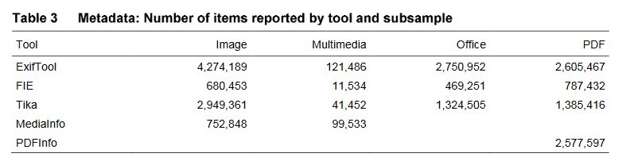


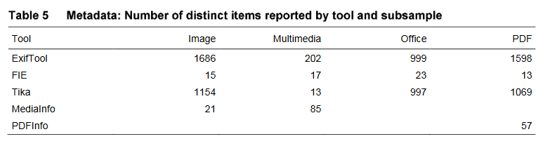

Le résultat de ces tests montre également que nombre de formats autorisent l’enregistrement de métadonnées internes sans aucun contrôle. La valeur et la qualité des données dépendent de la manière dont elles ont été renseignées. Par exemple, la métadonnée Author peut tour à tour correspondre à :
-  l’auteur du document,
-  le nom de l’utilisateur système,
-  un nom générique (ex : user),
-  le nom de l’auteur d’un autre document ou du template qui a été utilisé pour créer le présent document.  
Certaines métadonnées ne s’avèrent pas utiles ni utilisables dans le cadre d’un processus automatisé.  
De là découle la nécessité de filtrer les métadonnées extraites, afin de ne conserver que les métadonnées utiles, par exemple les métadonnées techniques qui forment un composant essentiel pour décrire un fichier (largeur, hauteur et profondeur d’une image).

Au regard des résultats obtenus, la National Library of Australia a émis les recommandations suivantes :
-  utiliser les outils d’extraction pour extraire des métadonnées internes aux fichiers, en utilisant des outils adaptés en fonction des formats de fichiers. Quant aux métadonnées externes, contenues dans des fichiers ou bases de données annexes, elles devront être générées ou reprises par un autre procédé ;
-  filtrer les métadonnées à extraire, afin d’éviter d’extraire la totalité des métadonnées internes, dont certaines sont inutiles et inutilisables[^31] ;
-  développer un processus d’extraction permettant aux outils d’échouer ou de ne pas finaliser une extraction de métadonnées dans le cas de fichiers mal formés ;
-  utiliser ExifTool pour des extractions génériques. Sur l’ensemble des outils testés, c’est l’outil qui extrait le plus d’items et la plus grande variété de métadonnées issues de formats très divers ;
-  définir des spécifications et exigences précises en matière de métadonnées à extraire pour chaque format rencontré et effectuer des tests d’extraction sur une large gamme d’outils, afin de déterminer l’outil (ou la combinaison d’outils) le plus approprié pour chacun de ces formats[^32].

#### Centre for Long-term Digital Preservation : l’analyse comparée des outils d’extraction pour identifier des recommandations

Le Centre for Long-term Digital Preservation (LDP Centre ou LDB-centrum) regroupe quatre organisations oeuvrant ensemble pour assurer la préservation et l’accès du numérique sur le long terme : Archives nationales de Suède, Bibliothèque nationale de Suède (National Library of Sweden), Université de Technologie de Lulea, ville de Boden. Depuis 2007, ces dernières coopèrent dans un programme nommé CODA.  
En 2008, le projet CODA-META a eu pour objectif de tester et évaluer des outils d’extraction de métadonnées[^33]. Contrairement à l’analyse pratiquée par la National Library of Australia, la demande était de confronter l’extraction réalisée au regard d’une liste de métadonnées utilisées par la National Library of Sweden, puis au regard des métadonnées techniques propres à un type de format (TIFF, format textuel, audio, vidéo).

Ont été testés les outils suivant :
-  ExifTool,
-  JHOVE,
-  Metadata Extraction Tool,
-  File Identifier.  
27 fichiers ont été utilisés :
-  7 fichiers de type textuel,
-  7 fichiers de type image,
-  2 fichiers de type son et vidéo,
-  11 fichiers utilisés pour réaliser des tests portant sur des métadonnées techniques spécifiques,
-  16 fichiers qui ont fait l’objet d’un enrichissement de métadonnées, afin de vérifier si ces dernières étaient bien extraites par les différents outils.

**Tests au regard des métadonnées de la National Library of Sweden :**

Au regard de la liste de métadonnées internes de la National Library of Sweden, ExifTool l’emporte, quel que soit le type de fichier ayant fait l’objet d’une extraction.  
Il semble, par ailleurs, plus facile d’extraire des métadonnées issues de fichiers image, que des métadonnées issues de fichiers audio et vidéo.

*Pourcentage de métadonnées extraites par catégorie de fichiers (somme de l’ensemble des métadonnées extraites par tous les outils pour une catégorie donnée / toutes les métadonnées extraites par un outil pour une catégorie donnée x nombre d’outils) :*  


ExifTool extrait autant de métadonnées techniques que de métadonnées descriptives, alors que Metadata Extraction Tool obtient à la fois le meilleur résultat pour l’extraction de métadonnées techniques et le pire pour celle des métadonnées descriptives requises par la National Library of Sweden.  

*Proportion de métadonnées techniques et descriptives extraites à partir de 16 fichiers :*
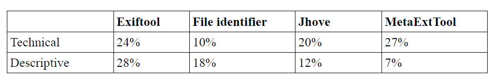

Si on analyse les métadonnées extraites par type de format (PDF/A, TIFF, MP3), on remarque que :
-  JHOVE peut extraire 82 % des métadonnées issues de fichiers TIFF et PDF/A, mais n’a pas de bons résultats pour le MP3. Il faut se rappeler que JHOVE ne gère que très peu de formats et que, dès qu’il ne valide pas un format, l’extraction de métadonnées échoue ;
-  ExifTool arrive en deuxième position. Néanmoins, il couvre davantage de formats que JHOVE ;
-  Metadata Extraction Tool permet d’extraire un grand nombre de métadonnées techniques, mais peu de métadonnées descriptives. Il couvre en outre davantage de formats que JHOVE ;
-  File Identifier réussit à lire la majeure partie des fichiers, mais produit peu de métadonnées internes.

*Pourcentage de métadonnées techniques et descriptives extraites par format :*

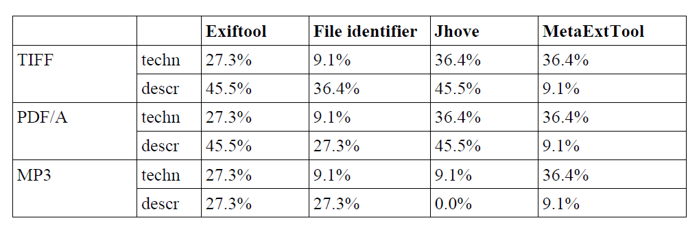

Tous les fichiers numériques ont pu faire l’objet de ces tests d’extraction, même s’ils n’ont pu être systématiquement lus par tous les outils. ExifTool et File Identifier ont réussi à lire le plus de fichiers numériques. Apparemment, tous les outils, à l’exception de Metadata Extraction Tool, ont échoué à lire le format Open Office Text.

*Liste de formats ayant pu être ouverts et lus par outil :*

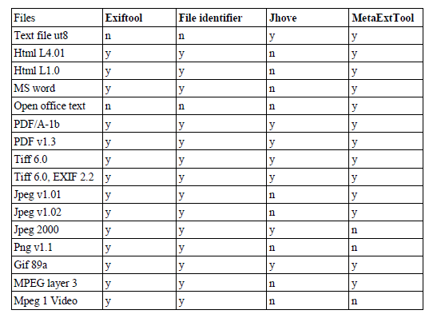

En conclusion, ExifTool réussit à lire le plus de fichiers et à extraire le plus de métadonnées, tant techniques que descriptives. JHOVE obtient de bons résultats, mais seulement sur les formats qu’il maîtrise et s’ils sont valides. Metadata Extraction Tool est le meilleur pour extraire les métadonnées techniques et est le seul à lire les fichiers Open Office Text, mais il extrait très peu de métadonnées descriptives.

**Tests d’extraction par format de fichier :**

Les métadonnées internes de 7 fichiers au format TIFF ont été comparées à une liste de métadonnées attendues, dont une partie, générique, est conforme aux métadonnées techniques de ce type de format et une partie a été étendue.

*Taux de réussite d’extraction d’une liste de métadonnées par outil :*

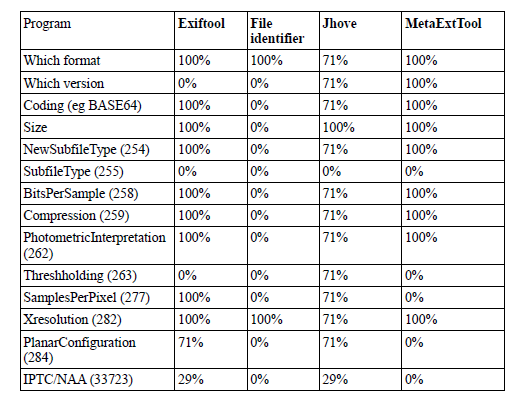

Metadata Extraction Tool réussit à extraire l’ensemble des métadonnées « génériques » attendues. ExifTool a rencontré des problèmes dans l’identification de la version du fichier, tandis que JHOVE peine à lire l’ensemble des fichiers.
En revanche, pour les métadonnées étendues, ExifTool obtient un meilleur score.  
Suite à un test identique sur les fichiers textuels, seuls deux outils, JHOVE et Metadata Extraction Tool, ont réussi à lire les fichiers. JHOVE extrait davantage de métadonnées, mais n’arrive pas à lire tous les fichiers.  

*Taux de réussite d’extraction d’une liste de métadonnées par outil :*

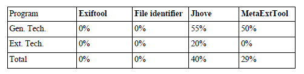

Seul ExifTool réussit à lire les fichiers audio et vidéo, File Identifier et Metadata Extraction Tool ne lisent que les fichiers vidéos. ExifTool est l’outil qui extrait le plus de métadonnées.  
En conclusion, ExifTool obtient les meilleurs résultats pour l’extraction de métadonnées issues de fichiers TIFF, audio et vidéo. JHOVE ne réussit pas à lire tous les fichiers, mais obtient des résultats convenables quand c’est le cas.

De cette étude, on constate que :
-  des fichiers images sont extraites le plus de métadonnées. En revanche, pour les fichiers audio et vidéo, il est nécessaire d’utiliser un outil propre à ces formats pour réaliser une extraction de métadonnées ;
-  ExifTool est le meilleur outil. Il couvre beaucoup de formats et extrait beaucoup de métadonnées ;
-  JHOVE obtient de bons résultats, en termes d’extraction de métadonnées, mais seulement sur un nombre restreint de formats. S’il rencontre un format invalide, il ne lit pas le fichier ;
-  Metadata Extraction Tool est le meilleur outil pour extraire des métadonnées techniques et lire les fichiers Open Office Text. En revanche, l’extraction de métadonnées descriptives et étendues sont son point faible ;
-  File Identifier extrait très peu de métadonnées internes.

#### ETH Zurich : que faire en cas d’échec de l’extraction ?

L’Institut fédéral suisse de technologie (ETH Zurich) a présenté en 2016 à la conférence iPRES une communication sous forme d’affiche sur les problèmes pratiques rencontrés par l’institution en termes d’identification et de validation de formats de fichiers, ainsi que d’extraction de métadonnées[^34].

Le système d’archivage électronique de l’ETH est basé sur la solution logicielle Rosetta qui intègre DROID pour l’identification de formats de fichiers et JHOVE pour la validation de formats et l’extraction de métadonnées. Ce SAE collecte des données de la recherche, des documents administratifs et des dons, qu’il s’agisse de documents/données nativement numériques ou de documents/données numérisés produits par le centre de numérisation de l’université. La durée de conservation de ces documents/données est variable, notamment pour les données de la recherche, de quelques années à une conservation sur le très long terme. 

L’ETH soulève un certain nombre de problèmes pratiques, rencontrés notamment lors du traitement de données de recherche ou de dons aux formats de fichiers hétérogènes. L’ETH a été conduit à prendre des décisions plus ou moins satisfaisantes pour maintenir gérable le volume de données traitées et ne pas obérer les capacités d’identification ou de préservation ultérieures.

En termes d’extraction de métadonnées internes, l’ETH constate qu’une erreur lors de cette extraction n’a pas de conséquence immédiate et qu’il est nécessaire de pondérer l’effort à fournir en vue de la corriger. En effet, si l’erreur provient des métadonnées internes ou des propriétés du fichier numérique, sa correction implique de toucher au fichier numérique lui-même, avec un risque d’introduire inconsciemment d’autres modifications, mais également une perte d’intégrité[^35].

En cas d’incapacité du système d’archivage électronique à extraire les métadonnées internes d’un fichier, la décision de conserver ou non le fichier est analysée au regard de la grille de critères suivants, qui vaut également pour les problèmes d’identification de format :
-  Le fichier peut-il être manipulé avec un logiciel « standard » ?
-  Le problème rencontré provient-il d’une erreur connue de l’outil d’extraction ?
-  Le problème rencontré est-il compréhensible ?
-  Le problème rencontré concerne-t-il les propriétés essentielles du format (significant properties) ?
-  Y a-t-il une solution simple ou documentée pour le problème rencontré ?
-  Quels sont les risques associés à corriger le problème rencontré ?
-  Quels sont les efforts nécessaires pour corriger le problème rencontré dans tous les fichiers ?
-  Y a-t-il des cas où l'authenticité du fichier est plus importante que l’extraction correcte de ses métadonnées ?
-  Est-ce que le producteur de la donnée est toujours disponible et est disposé à collaborer à la résolution du problème rencontré, notamment en cas de collectes futures ?
-  Quel est le niveau de service attendu pour ce fichier ? Si le service attendu est uniquement la conservation du train binaire, est-il nécessaire d’investir dans la résolution du problème ?
-  Combien de temps le fichier doit-il être conservé? Si c’est moins de 10 ans, la question de l’extraction de ses métadonnées n’est peut-être pas centrale.

L’ETH reconnaît qu’aucun de ces critères n’est facilement quantifiable et automatisable (notamment ceux qui relèvent de l’organisation), voire que certains sont même contradictoires.

La communication de l’ETH se conclut par des questions complémentaires que l’institution se pose sur la question de l’extraction des métadonnées internes :
-  À quel moment doit être réalisée cette extraction ? Pendant le processus de transfert ou pendant le processus de préparation des transferts ? Qui en est responsable ?
-  Si l’extraction est faite avant le transfert, comment documenter les mesures de conservation qui ont été prises pour corriger les problèmes rencontrés ?
-  À quelles conditions accepter des fichiers dont les métadonnées n’ont pas été extraites ?
-  Faut-il relancer régulièrement des campagnes d’extraction de métadonnées ? Si c’est le cas, comment peuvent-elles être réalisées d’une manière effective et efficiente ?
-  Faut-il exclusivement s’appuyer sur des modèles de données globaux ou faut-il disposer de définitions locales des métadonnées ?
-  Le risque 0 existe-t-il ?

Le programme Vitam et l’extraction de métadonnées internes
----

C’est sur la base des éléments présentés ci-dessus que l’équipe programme Vitam a lancé sa propre réflexion sur l’extraction de métadonnées internes aux fichiers numériques, afin de spécifier les services attendus de la solution logicielle Vitam et de réfléchir aux modalités de mise en œuvre de ceux-ci.

Cette réflexion s’est opérée en trois temps :
-  constitution d’un groupe de travail et réalisation d’une expérimentation ;
-  spécification des services mis en œuvre dans la solution logicielle Vitam ;
-  recensement des sujets restant à traiter par les organisations choisissant d’utiliser la solution logicielle Vitam.

### Les tests effectués dans le cadre du chantier préservation

#### Présentation du chantier préservation

L’équipe programme Vitam a mis en place, à partir du mois d’octobre 2017, un groupe de travail dédié à la question de la préservation numérique, afin de définir, avec les partenaires du programme Vitam, les services à développer en la matière dans la solution logicielle Vitam.

Ce groupe de travail s’est articulé autour de trois phases de travail :
-  une première phase, entre les mois d’octobre 2017 et de janvier 2018, a été consacrée à des retours d’expérience d’institutions, tant publiques que privées, tant nationales qu’internationales, sur leur politique de préservation et sa mise en œuvre ;
-  une deuxième phase, entre les mois de février et de septembre 2018, a été consacrée à l’expérimentation d’opérations de préservation (identification de formats, validation de formats, vérification de la lisibilité de formats, extraction de métadonnées techniques) ;
-  une troisième phase, initiée à partir de juillet 2018, a été consacrée aux spécifications et à la recette des services de préservation développés dans la solution logicielle Vitam.

*Éléments de chronologie :*


C’est dans le cadre de la deuxième phase que les participants du programme Vitam ont pu expérimenter la définition et la mise en œuvre d’opérations de préservation, notamment l’extraction de métadonnées internes. Chaque expérimentation était organisée de la manière suivante :
-  définition par l’équipe Vitam d’un protocole de recette accompagné d’un questionnaire. Le protocole de recette comprenait l’expérimentation d’un ou plusieurs outils. Ces outils étaient :
    - soit désignés aux participants (comme ce fut le cas pour l’identification de formats),
    - soit mis à disposition par l’équipe programme Vitam (comme ce fut le cas pour la validation de formats ou l’extraction de métadonnées techniques),
    - soit laissés au libre choix des participants (comme ce fut le cas pour la lisibilité des formats) ;
-  réalisation des tests par les participants – y compris les membres de l’équipe programme Vitam – et envoi des résultats et des réponses au questionnaire à l’équipe programme Vitam, avant la séance du groupe de travail consacrée à l’opération de préservation expérimentée ;
-  dépouillement des résultats et des réponses au questionnaire par l’équipe programme Vitam, en vue de l’établissement d’une synthèse à présenter lors de la séance du groupe de travail ;
-  présentation de la synthèse en séance et échange avec les partenaires autour des tests réalisés, des résultats obtenus et des réponses au questionnaire, en vue de la définition du service attendu de la solution logicielle Vitam pour l’opération concernée.

#### Le protocole de tests retenu

L’extraction de métadonnées internes a été la quatrième opération de préservation à faire l’objet d’une expérimentation dans le cadre du groupe de travail.

L’équipe programme Vitam a proposé aux participants d’appliquer le protocole d’expérimentation suivant :
-  sélection par chacun des participants d’un ou de plusieurs jeux de données représentatifs des archives collectées ou à collecter par l’organisation à laquelle ils appartenaient ;
-  extraction des métadonnées internes des fichiers compris dans les jeux de données sélectionnés au moyen de l’outil mis à disposition par l’équipe Vitam ;
-  exploitation des résultats obtenus avec l’outil et saisie des résultats dans le questionnaire proposé ;
-  sur la base des résultats obtenus, réponse aux questions posées dans le questionnaire.

Pour la sélection des jeux de données, l’équipe programme Vitam a recommandé aux participants de :
-  choisir des données qui reflétaient à la fois le stock conservé par chacun d’eux, mais aussi les flux attendus prochainement par ces derniers ;
-  intégrer dans les jeux de données, dans la mesure du possible, des fichiers dans des formats diversifiés ou couvrant une période chronologique suffisamment large pour refléter la succession des versions des formats concernés ;
-  disposer de jeux de données comprenant un nombre de fichiers numériques suffisant, pouvant aller de deux à trois fichiers numériques pour un ensemble donné (pour une catégorie de formats, pour un format de fichier en particulier, pour un service producteur, pour une période donnée).

RestMDExtractor, l’outil mis à disposition par l’équipe programme Vitam, permettait de :
-  importer les fichiers numériques ;
-  en extraire les métadonnées internes en utilisant, au choix, les outils Metadata Extractor, ExifTool, MediaInfo et/ou Apache Tika ;
-  prévisualiser, fichier par fichier, une liste de métadonnées ;
-  exporter un rapport sous forme de tableur. Il peut s’agir d’un rapport comportant :
    - l’ensemble des métadonnées extraites pour l’ensemble des fichiers importés dans l’outil,
    - les métadonnées extraites pour un fichier donné.

La proposition de formatage des résultats était axée sur les questions suivantes :
-  nombre total de fichiers utilisés par catégorie de fichiers (document PDF, image animée, image fixe, image vectorielle, présentation, son, tableur, traitement de texte) et par outil utilisé (MetadataExtractor, ExifTool, MediaInfo et/ou Apache Tika) ;
-  format des fichiers utilisés par catégorie de fichiers (document PDF, image animée, image fixe, image vectorielle, présentation, son, tableur, traitement de texte) et par outil utilisé (MetadataExtractor, ExifTool, MediaInfo et/ou Apache Tika) ;
-  nombre de fichiers dont l’extraction de métadonnées internes n’a pu être réalisée par catégorie de fichiers (document PDF, image animée, image fixe, image vectorielle, présentation, son, tableur, traitement de texte) et par outil utilisé (MetadataExtractor, ExifTool, MediaInfo et/ou Apache Tika) ;
-  nombre minimal de métadonnées internes extraites par catégorie de fichiers (document PDF, image animée, image fixe, image vectorielle, présentation, son, tableur, traitement de texte) et par outil utilisé (MetadataExtractor, ExifTool, MediaInfo et/ou Apache Tika) ;
-  nombre maximal de métadonnées internes extraites par catégorie de fichiers (document PDF, image animée, image fixe, image vectorielle, présentation, son, tableur, traitement de texte) et par outil utilisé (MetadataExtractor, ExifTool, MediaInfo et/ou Apache Tika).

Il était par ailleurs demandé aux participants de signaler les problèmes rencontrés, ainsi que les premiers constats effectués.

Le questionnaire joint au protocole invitait les participants, au regard des tests effectués, à s’interroger sur les points suivants :
-  quel était, selon eux, l’outil à privilégier parmi ceux utilisés par l’outil d’extraction de métadonnées internes fourni par l’équipe Vitam ;
-  quelles seraient les métadonnées internes à extraire en priorité ? Pour chacune de ces métadonnées :
    - de quelle nature sont-elles (descriptive, gestion, technique) ?
    - en quoi cette métadonnée serait utile à la recherche ?
    - quel est son type (texte, entier, décimal, booléen, date) ?
    - y a-t-il une métadonnée correspondante dans le SEDA ? Ou dans une autre norme de description des métadonnées (IPTC, XMP, etc.) ? Si ce n’est pas le cas, comment nommer cette métadonnée ?
-  quels services étaient attendus de la solution logicielle Vitam en cas de récupération d’une métadonnée extraite dans une métadonnée préexistante du SEDA ?

#### Résultats et enseignements

La taille et la représentativité des jeux de tests ont été variables en fonction des participants :
-  les Archives nationales (projet Adamant) se sont efforcées de constituer un échantillon représentatif des archives qui leur avaient été versées en termes de producteurs et de sélectionner des fichiers représentant les différentes catégories manipulées à l’exception des images vectorielles ;
-  le ministère de l’Europe et des Affaires étrangères (projet Saphir) s’est concentré sur les fichiers versés dans le cadre de la collecte des archives de la COP21 et de la cellule de presse du ministère, ainsi que sur des fichiers produits par son atelier de numérisation. Son corpus n’incluait ni tableurs, ni images vectorielles. Aux catégories proposées, il a ajouté une catégorie « Texte » pour isoler les fichiers numériques au format TXT ;
-  le ministère de la Transition écologique et solidaire (projet SIAM-AE) a sélectionné des archives parmi les versements en cours de traitement (cabinet Cuvillier) ou parmi les archives de la mission (notamment des vidéos). Celles-ci ne comportaient ni images vectorielles ni fichiers sonores ;
-  l’équipe programme Vitam a constitué des jeux de données à partir de ses fichiers de travail, stockés sur ses ressources partagées, mais également à partir d’images fixes librement accessibles sur Internet (data.gouv.fr, Wikimedia).

La représentativité des jeux de données n’est en conséquence pas parfaite, mais permet néanmoins de tirer des conclusions de cette expérimentation, dans la mesure où chaque fichier numérique, quelle que soit sa catégorie, a systématiquement fait l’objet d’une extraction de métadonnées avec les quatre outils proposés : MetadataExtractor, ExifTool, MediaInfo et Apache Tika.

Les résultats obtenus par les Archives nationales (projet Adamant), le Ministère de l’Europe et des Affaires étrangères (projet Saphir) et le Ministère de la Transition écologique et solidaire (projet SIAM-AE) peuvent être synthétisés de la manière suivante :

**Document PDF**

|Outil utilisé|Institution|Nombre de fichiers testés|Formats des fichiers testés|Nombre d’échecs|Pourcentage d’échecs|Nombre minimal de métadonnées extraites|Nombre maximal de métadonnées extraites|
|:---|:---|:---:|:---:|:---:| :---:| :---:| :---:|
|ExifTool|Archives nationales|3|PDF|0|0%|0|0|
||Ministère de l’Europe et des Affaires étrangères|27|PDF|0|0%|13|40|
||Ministère de la Transition écologique et solidaire|37|PDF|12|32,40%|19|42|
|MediaInfo|Archives nationales|3|PDF|3|100%|-|-|
||Ministère de l’Europe et des Affaires étrangères|27|PDF|27|100%|-|-|
||Ministère de la Transition écologique et solidaire|37|PDF|37|100%|-|-|
|Metadata Extractor|Archives nationales|3|PDF|3|100%|-|-|
||Ministère de l’Europe et des Affaires étrangères|27|PDF|27|100%|-|-|
||Ministère de la Transition écologique et solidaire|37|PDF|37|100%|-|-|
|Apache Tika|Archives nationales|3|PDF|0|0%|27|39|
||Ministère de l’Europe et des Affaires étrangères|27|PDF|4|14,80%|0|38|
||Ministère de la Transition écologique et solidaire|37|PDF|2|5,41 %|40|40|

**Image animée**

|Outil utilisé|Institution|Nombre de fichiers testés|Formats des fichiers testés|Nombre d’échecs|Pourcentage d’échecs|Nombre minimal de métadonnées extraites|Nombre maximal de métadonnées extraites|
|:---|:---|:---:|:---:|:---:| :---:| :---:| :---:|
|ExifTool|Archives nationales|3|WAV, MPEG, MP4|0|0%|0|0|
||Ministère de l’Europe et des Affaires étrangères|24|AVI, MPEG4, MOV, MXF, WMZ|0|0%|15|228|
||Ministère de la Transition écologique et solidaire|7|MP4, AVI|0[^36]|0%|35|65|
|MediaInfo|Archives nationales|3|WAV, MPEG, MP4|0|0 %|103|228|
||Ministère de l’Europe et des Affaires étrangères|24|AVI, MPEG4, MOV, MXF, WMZ|24|100%|-|-|
||Ministère de la Transition écologique et solidaire|7|MP4, AVI|7|100%|-|-|
|Metadata Extractor|Archives nationales|3|WAV, MPEG, MP4|0|0 %|9|31|
||Ministère de l’Europe et des Affaires étrangères|24|AVI, MPEG4, MOV, MXF, WMZ|2|8,30%|0|80|
||Ministère de la Transition écologique et solidaire|7|MP4, AVI|0[^37]|0%|10|26|
|Apache Tika|Archives nationales|3|WAV, MPEG, MP4|1[^38]|33,3 %|13|22|
||Ministère de l’Europe et des Affaires étrangères|24|AVI, MPEG4, MOV, MXF, WMZ|8|33,30%|0|16|
||Ministère de la Transition écologique et solidaire|7|MP4, AVI|0[^39]|0%|10|17|

**Image fixe**

|Outil utilisé|Institution|Nombre de fichiers testés|Formats des fichiers testés|Nombre d’échecs|Pourcentage d’échecs|Nombre minimal de métadonnées extraites|Nombre maximal de métadonnées extraites|
|:---|:---|:---:|:---:|:---:| :---:| :---:| :---:|
|ExifTool|Archives nationales|2|JPG|0|0%|0|0|
||Ministère de l’Europe et des Affaires étrangères|45|GIF, JPEG, JPG, PNG, TIF|0|0%|19|296|
||Ministère de la Transition écologique et solidaire|27|JPG|0|0%|ca. 115|ca. 115|
|MediaInfo|Archives nationales|2|JPG|0|0%|75|75|
||Ministère de l’Europe et des Affaires étrangères|45|GIF, JPEG, JPG, PNG, TIF|45|100%|-|-|
||Ministère de la Transition écologique et solidaire|27|JPG|27|100%|-|-|
|Metadata Extractor|Archives nationales|2|JPG|0|0%|0|187|
||Ministère de l’Europe et des Affaires étrangères|45|GIF, JPEG, JPG, PNG, TIF|0|0%|13|134|
||Ministère de la Transition écologique et solidaire|27|JPG|0|0%|ca. 91|ca. 91|
|Apache Tika|Archives nationales|2|JPG|0|0%|0|215|
||Ministère de l’Europe et des Affaires étrangères|45|GIF, JPEG, JPG, PNG, TIF|0|0%|17|175|
||Ministère de la Transition écologique et solidaire|27|JPG|0|0 %|ca. 112|ca. 112|

**Présentation**

|Outil utilisé|Institution|Nombre de fichiers testés|Formats des fichiers testés|Nombre d’échecs|Pourcentage d’échecs|Nombre minimal de métadonnées extraites|Nombre maximal de métadonnées extraites|
|:---|:---|:---:|:---:|:---:| :---:| :---:| :---:|
|ExifTool|Archives nationales|2|ODP, PPT|0|0%|0|0|
||Ministère de l’Europe et des Affaires étrangères|14|ODP, PPT, PPTM, PPTX, PUB, THMX|0|0%|18|45|
||Ministère de la Transition écologique et solidaire|34|PPT, PPTX|0|0%|36|42|
|MediaInfo|Archives nationales|2|ODP, PPT|0|0%|33|44|
||Ministère de l’Europe et des Affaires étrangères|14|ODP, PPT, PPTM, PPTX, PUB, THMX|14|100%|-|-|
||Ministère de la Transition écologique et solidaire|34|PPT, PPTX|34|100%|-|-|
|Metadata Extractor|Archives nationales|2|ODP, PPT|0|0%|2|4|
||Ministère de l’Europe et des Affaires étrangères|14|ODP, PPT, PPTM, PPTX, PUB, THMX|0|0%|2|4|
||Ministère de la Transition écologique et solidaire|34|PPT, PPTX|0|0%|2|4|
|Apache Tika|Archives nationales|2|ODP, PPT|0|0%|27|37|
||Ministère de l’Europe et des Affaires étrangères|14|ODP, PPT, PPTM, PPTX, PUB, THMX|0|0%|1|43|
||Ministère de la Transition écologique et solidaire|34|PPT, PPTX|4|11,76 %|25|45|

**Son**

|Outil utilisé|Institution|Nombre de fichiers testés|Formats des fichiers testés|Nombre d’échecs|Pourcentage d’échecs|Nombre minimal de métadonnées extraites|Nombre maximal de métadonnées extraites|
|:---|:---|:---:|:---:|:---:| :---:| :---:| :---:|
|ExifTool|Archives nationales|3|WAV, WMA, MP3|0|0%|0|0|
||Ministère de l’Europe et des Affaires étrangères|9|MP3, WAV|0|0%|16|21|
||Ministère de la Transition écologique et solidaire|-|-|-|-|-|-|
|MediaInfo|Archives nationales|3|WAV, WMA, MP3|0|0%|100|113|
||Ministère de l’Europe et des Affaires étrangères|9|MP3, WAV|9|100%|-|-|
||Ministère de la Transition écologique et solidaire|-|-|-|-|-|-|
|Metadata Extractor|Archives nationales|3|WAV, WMA, MP3|1[^40]|33,33%|4|11|
||Ministère de l’Europe et des Affaires étrangères|9|MP3, WAV|4|44,44%|0|11|
||Ministère de la Transition écologique et solidaire|-|-|-|-|-|-|
|Apache Tika|Archives nationales|3|WAV, WMA, MP3|0|0%|2|12|
||Ministère de l’Europe et des Affaires étrangères|9|MP3, WAV|0|0%|6|8|
||Ministère de la Transition écologique et solidaire|-|-|-|-|-|-|

**Tableur**

|Outil utilisé|Institution|Nombre de fichiers testés|Formats des fichiers testés|Nombre d’échecs|Pourcentage d’échecs|Nombre minimal de métadonnées extraites|Nombre maximal de métadonnées extraites|
|:---|:---|:---:|:---:|:---:| :---:| :---:| :---:|
|ExifTool|Archives nationales|3|XLS, XLSX, ODS|0|0%|0|0|
||Ministère de l’Europe et des Affaires étrangères|-|-|-|-|-|-|
||Ministère de la Transition écologique et solidaire|2|XLS|0|0 %|24|24|
|MediaInfo|Archives nationales|3|XLS, XLSX, ODS|3|100%|-|-|
||Ministère de l’Europe et des Affaires étrangères|-|-|-|-|-|-|
||Ministère de la Transition écologique et solidaire|2|XLS|2|100%|-|-|
|Metadata Extractor|Archives nationales|3|XLS, XLSX, ODS|0|0 %|0|4|
||Ministère de l’Europe et des Affaires étrangères|-|-|-|-|-|-|
||Ministère de la Transition écologique et solidaire|2|XLS|2|100%|2|2|
|Apache Tika|Archives nationales|3|XLS, XLSX, ODS|1[^41]|33,33%|25|34|
||Ministère de l’Europe et des Affaires étrangères|-|-|-|-|-|-|
||Ministère de la Transition écologique et solidaire|2|XLS|0|0 %|24|24|

**Traitement de texte**

|Outil utilisé|Institution|Nombre de fichiers testés|Formats des fichiers testés|Nombre d’échecs|Pourcentage d’échecs|Nombre minimal de métadonnées extraites|Nombre maximal de métadonnées extraites|
|:---|:---|:---:|:---:|:---:| :---:| :---:| :---:|
|ExifTool|Archives nationales|3|DOC, DOCX, RTF|0|0%|0|0|
||Ministère de l’Europe et des Affaires étrangères|35|DOC, DOCX, ODT, RTF|0|0%|12|48|
||Ministère de la Transition écologique et solidaire|86|DOC, DOCX|0|0%|42|45|
|MediaInfo|Archives nationales|3|DOC, DOCX, RTF|3|100%|-|-|
||Ministère de l’Europe et des Affaires étrangères|35|DOC, DOCX, ODT, RTF|35|100%|-|-|
||Ministère de la Transition écologique et solidaire|86|DOC, DOCX|86|100%|-|-|
|Metadata Extractor|Archives nationales|3|DOC, DOCX, RTF|0|0%|2|4|
||Ministère de l’Europe et des Affaires étrangères|35|DOC, DOCX, ODT, RTF|0|0%|2|4|
||Ministère de la Transition écologique et solidaire|86|DOC, DOCX|0|0%|2|4|
|Apache Tika|Archives nationales|3|DOC, DOCX, RTF|0|0%|22|50|
||Ministère de l’Europe et des Affaires étrangères|35|DOC, DOCX, ODT, RTF|2|5,71%|0|58|
||Ministère de la Transition écologique et solidaire|86|DOC, DOCX|7|8,14 %|37|52|

**Texte**

|Outil utilisé|Institution|Nombre de fichiers testés|Formats des fichiers testés|Nombre d’échecs|Pourcentage d’échecs|Nombre minimal de métadonnées extraites|Nombre maximal de métadonnées extraites|
|:---|:---|:---:|:---:|:---:| :---:| :---:| :---:|
|ExifTool|Archives nationales|-|-|-|-|-|-|
||Ministère de l’Europe et des Affaires étrangères|4|TXT|4|100%|-|-|
||Ministère de la Transition écologique et solidaire|-|-|-|-|-|-|
|MediaInfo|Archives nationales|-|-|-|-|-|-|
||Ministère de l’Europe et des Affaires étrangères|4|TXT|4|100%|-|-|
||Ministère de la Transition écologique et solidaire|-|-|-|-|-|-|
|Metadata Extractor|Archives nationales|-|-|-|-|-|-|
||Ministère de l’Europe et des Affaires étrangères|4|TXT|4|100%|-|-|
||Ministère de la Transition écologique et solidaire|-|
-|-|-|-|-|
|Apache Tika|Archives nationales|-|-|-|-|-|-|
||Ministère de l’Europe et des Affaires étrangères|4|TXT|0|0%|2|2|
||Ministère de la Transition écologique et solidaire|-|-|-|-|-|-|

Les tests ont permis de constater que, dans toutes les organisations, la grande majorité des fichiers a vu ses métadonnées extraites par au moins un outil, si ce n’est plus. Le taux de réussite par outil et par catégorie de fichiers varie d’une organisation à l’autre. En effet, les Archives nationales (AN) constatent qu’ExifTool n’extraie parfois aucune métadonnée, alors que, pour le Ministère de l’Europe et des Affaires étrangères (MEAE), l’outil permet d’obtenir des résultats constants, comparables à ceux de Apache Tika.

**Analyse des outils d’extraction de métadonnées :**

Si on reprend les résultats par outil et par catégorie de fichiers, on obtient les résultats suivants :

||ExifTool|MediaInfo|Metadata Extractor|Apache Tika|
|:---|:---:|:---:|:---:|:---:|
|Document PDF|82,10%|0%|0%|90,60%|
|Image animée|100%|8,82%|94,12%|73,13%|
|Image fixe|100%|2,70%|100%|100%|
|Présentation|100%|4%|100%|92%|
|Son|100%|0%|60,00%|80%|
|Tableur|100%|25%|58,33%|100%|
|Traitement de texte|100%|0%|100%|92,74%|
|Texte|0%|0%|0%|100%|
|MOYENNE|85,26%|5,07%|64,06%|91,07%|

Même si les jeux de tests ne sont pas exhaustifs et forcément représentatifs, on peut tirer les conclusions suivantes :
-  ExifTool semble identifier et traiter sans erreur une grande variété de formats, que ce soit des images animées ou fixes, des supports de présentation, des tableurs, des fichiers sonores ou de traitement de texte ;
-  Apache Tika, dont les résultats varient d’une catégorie à l’autre, est finalement l’outil le plus constant et le plus complet, puisqu’il s’avère capable d’extraire des métadonnées internes, quelle que soit la catégorie de fichiers concernée ;
-  Metadata Extractor obtient des résultats moins fiables, notamment pour les documents PDF et les fichiers texte. Ces résultats peuvent s’expliquer par le nombre de fichiers utilisés dans le cadre de l’expérimentation. En effet, cette dernière n’a porté que sur deux fichiers en tout et pour tout dans la catégorie « Texte ». Les résultats auraient peut-être été différents avec un échantillon plus large. En revanche, son absence de résultats concernant les documents PDF ne s’explique pas dans la mesure où l’échantillon comportait une sélection plus large de 67 fichiers.
-  MediaInfo semble un outil peu approprié pour l’extraction de métadonnées internes au vu de ses résultats. Néanmoins, il est possible de nuancer son fort taux d’échec :
    - l’outil a été développé pour extraire des métadonnées internes de fichiers multimédias (conteneurs, images animées, son). Dès lors, il est étonnant que, dans le cadre de l’expérimentation, il ait été possible d’extraire des métadonnées internes issues de fichiers numériques de type « Tableur », « Présentation » ou « Image fixe » ;
    - ces résultats peuvent aussi s’expliquer par le choix des fichiers utilisés dans le cadre de l’expérimentation. En effet, si, pour les images animées, le MEAE et le MTES ne réussissent pas à extraire des métadonnées avec l’outil, les Archives nationales, quoiqu’avec un échantillon réduit à deux fichiers, obtiennent de meilleurs résultats avec MediaInfo.

De cette expérimentation, on peut tirer ces premières conclusions :
-  en fonction de la catégorie de formats, un outil peut s’avérer meilleur qu’un autre ;
-  les cas d’erreur rencontrés sont en partie dus à l’absence d’identification ou de reconnaissance du format de fichiers par l’outil. De fait, il est recommandé d’adapter l’outil à utiliser en fonction des formats qu’il peut gérer ;
-  une extraction en succès ne signifie pas nécessairement extraction de métadonnées. En effet, à plusieurs reprises, les AN constatent qu’ExifTool n’extraie pas de métadonnées. Au MTES, c’est également le cas avec Metadata Extractor et MediaInfo pour les images animées, en plus d’ExifTool ;
-  il est nécessaire de procéder à des tests d’extraction de métadonnées internes sur un échantillon plus large de fichiers, afin d’obtenir des résultats plus fiables.

**Analyse de l’extraction de métadonnées :**
       
Les résultats précédemment obtenus peuvent également être nuancés par le nombre minimal et maximal de métadonnées extraites par outil et par catégorie de fichiers, présenté dans le tableau suivant :

||ExifTool|MediaInfo|Metadata Extractor|Apache Tika|
|:---|:---:|:---:|:---:|:---:|
|Document PDF|0 – 42|Rien[^42]|Rien|0 – 40|
|Image animée|0 – 228|Rien – 228|0 – 80|0 – 22|
|Image fixe|0 – 296|Rien – 75|0 – 187|0 – 215|
|Présentation|0 – 45| Rien – 44|2 – 4|1 – 45|
|Son|0 – 21|Rien – 113|0 – 11|2 – 12|
|Tableur|0 – 24|Rien|0 – 4|24 – 34|
|Traitement de texte|0 – 48|Rien|2 – 4|0 – 58|
|Texte|Rien|Rien|Rien|2 – 2|
|MOYENNE|0 – 88|Rien – 57,5|Rien – 36,25|3,625 – 53,5|
           
Les tests ont également permis de constater que :
-  pour un même fichier, en fonction de l’outil utilisé, on n’obtenait pas nécessairement le même nombre de métadonnées. ExifTool semble l’outil qui extrait le plus de métadonnées, suivi par MediaInfo et Apache Tika. De fait, chaque outil n’extrait pas forcément l’ensemble des métadonnées ;
-  le nombre de métadonnées varie également en fonction des catégories de fichiers. Les images fixes et animées semblent comporter davantage de métadonnées internes, contrairement aux fichiers bureautiques ;
-  même si une opération d’extraction de métadonnées n’a pas donné lieu à un échec, l’outil peut n’avoir extrait aucune métadonnée. Les Archives nationales en ont fait le constat avec ExifTool, mais on peut faire ce même constat avec les autres outils.
           
Il est difficile d’expliquer pourquoi un outil n’a pas réussi à extraire tout ou partie des métadonnées.

Il peut s’agir des raisons suivantes :
-  le MTES a constaté que l’extraction des documents PDF dépendait de la méthode d’encapsulage et de l’outil utilisé pour générer le fichier (ex. In-Design, pdfcreator, Psscript, MS) ;
-  l’outil ne gère pas tous les types de métadonnées internes et, de fait, n’en extrait que certains. C’est le cas d’ExifTool qui ne gère que les EXIF. Si un fichier contient des métadonnées de type IPTC, l’outil ne les extrait pas.

Une meilleure connaissance des fichiers numériques utilisés et des métadonnées qu’ils contiennent aurait permis de mieux confronter et interpréter les résultats obtenus, comme ont pu le faire les membres du LDP Centre dans le cadre de leurs tests.

*Analyse des métadonnées extraites :*

Les métadonnées extraites ne sont pas nommées de la même manière par les différents outils. Par exemple, le type MIME, présent dans les métadonnées internes d’une photographie dont on a extrait les métadonnées, est nommé de la manière suivante par les différents outils :
-  MIME_Type dans ExifTool,
-  File Type:Detected MIME Type dans Metadata Extractor,
-  Content-Type dans Apache Tika ;

De fait, il s’avère difficile d’établir une concordance entre le résultat des différents outils, y compris pour un même fichier, faute d’harmonisation de la restitution des informations extraites entre les différents outils (type de la valeur, encodage de la valeur, présence ou non des unités de mesure). Le temps d’exposition (Exposure Time), est ainsi exprimé de différentes manières en fonction des outils. Pour une photographie dont on a extrait les métadonnées :
-  la métadonnée Exposure_Time a pour valeur « 1/50 » dans ExifTool,
-  la métadonnée Exif SubIFD:Exposure Time a pour valeur « 0.02 » dans Metadata Extractor,
-  la métadonnée Exposure Time a pour valeur « 0.02 sec » dans Apache Tika.

Les informations extraites sont également redondantes, une même information pouvant être extraite plusieurs fois, sous des formes différentes. Par exemple, c’est le cas des dates, de création ou de mise à jour, qui peuvent être répétées sous des formes diverses :

*ExifTool*

|Métadonnée|Valeur|
|:---:|:---:|
|Modified_Date|2017:01:12 15:08:48|
|File_Modification_Date/Time|2018:08:20 14:17:45+02:00|

*Metadata Extractor*

|Métadonnée|Valeur|
|:---:|:---:|
|Temporal.File_Modified_Date-StreamG1|UTC 2018-08-20 12:18:30.543|

*Apache Tika*

|Métadonnée|Valeur|
|:---:|:---:|
|dcterms:modified|2017-01-12T15:08:48Z|
|Last-Modified|2017-01-12T15:08:48Z|
|modified|2017-01-12T15:08:48Z|

Les outils semblent finalement proposer un modèle de métadonnées extraites qui leur est propre et qui, au vu des résultats, n’est pas systématiquement exhaustif. De ce fait, il est difficile d’établir une concordance entre les métadonnées extraites et les métadonnées recommandées dans les schémas publics comme IPTC ou EXIF.

Enfin, ils génèrent des valeurs par défaut, voire des métadonnées qui leur sont propres. ExifTool, par exemple, rajoute systématiquement une métadonnée informant sur l’outil utilisé pour procéder à l’extraction.
La plupart des outils étant anglophones, il a fallu prendre en compte les problèmes posés par l’encodage des caractères.

**Bilan de l’expérimentation :**

Cette phase de tests a été l’occasion pour les participants de constater que le processus d’extraction de métadonnées internes n’est pas fiable en raison des résultats variables obtenus d’un outil à l’autre et d’une catégorie de formats à l’autre, ce qui amène à se demander si au moins un outil réussit vraiment à extraire l’ensemble des métadonnées internes contenues dans un fichier.

L’exploitation des résultats s’avère également difficile, en raison du foisonnement des métadonnées extraites. Le MTES se pose d’ailleurs la question de la pertinence de procéder à l’extraction de métadonnées internes dans la mesure où :
-  certaines sont déjà connues et référencées dans le bordereau de transfert en tant que « métadonnées externes » (ex : nom du fichier, date de création, etc.) ;
-  d’autres risquent d’engendrer du bruit. C’est le cas de la métadonnée Text-Content qui, dans les documents PDF, reprend sous forme textuelle l’ensemble du contenu déjà présent et lisible dans le fichier numérique.
Pour les Archives nationales, l’extraction de métadonnées internes est utile pour compléter les informations manquantes parmi les « métadonnées externes » présentes dans un bordereau de transfert.

Métadonnées internes à extraire (Archives nationales)[^43] :

```
Informations sur le fichier :
nom, chemin, taille (octet), date/heure de création, date/heure de modification, date/heure d’accès, note, libellé, couleur.
Informations sur le contenu :
-  généralités : format, appareil utilisé (information, modèle, date d’utilisation), profil couleur (description), copyright, licence d’utilisation ;
-  images fixes : taille de l’image (largeur, hauteur en pixels), dimension, nombre de bits, profondeur de couleur, profil colorimétrique PPI, taille d’impression, compression nombre d’images par page, origine, commentaire intégré ;
-  images animées : norme, taille de l’image (largeur, hauteur en pixels), proportion des images (format d’image à l’écran), débit, résolution, GOP, format vidéo, format codec, nombre et format des flux (cas d’encapsulation), format conteneur, durée du/des flux, compression, cadence (image par seconde), entrelacement (type de balayage), son, profondeur des couleurs, espace colorimétrique ;
-  fichiers audio : norme, type de débit, débit, canaux, échantillonnage, résolution, format audio, format codex, durée.
```

L’extraction de métadonnées internes répond ainsi à des besoins de :
-  préservation : extraire des métadonnées techniques, absente des bordereaux, telles que le format du codec, est nécessaire pour préparer des traitements de migration, d’encodage ou de transcodage ;
-  gestion : pour gérer ses fonds numérisés, le MEAE a notamment besoin d’extraire les données de compression pour connaître la qualité d’un fichier numérique (ex. un fichier vidéo MP4 peut être en haute définition ou en qualité très faible), ainsi que des informations relatives à la résolution et la taille des fichiers numériques (exprimée en pixels) ;
-  accès et réutilisation : certains fichiers contiennent des données liées à la gestion des droits (propriété intellectuelle, droit à l’image, droit d’auteur, réutilisation) ;
-  informations complémentaires : certains fichiers contenant des informations descriptives très détaillées, il peut s’avérer utile de les récupérer en vue d’améliorer la description intellectuelle associée au fichier numérique.
À ce stade et en raison de l’orientation des questions présentes dans le questionnaire, seul le CINES envisage et utilise l’extraction de certaines métadonnées internes non pas comme un moyen d’obtenir des informations à exploiter, mais comme un outil permettant de conserver une donnée susceptible de disparaître lors d’une opération de conversion de fichiers et de la réinjecter par la suite dans les fichiers convertis.

### L’extraction de métadonnées internes dans la solution logicielle Vitam et ses outils annexes

C’est sur la base de la présente étude et des expérimentations menées avec ses partenaires dans le cadre du groupe de travail sur la préservation que l’équipe programme Vitam et ses équipes de réalisation ont développé les services d’extraction de métadonnées internes disponibles dans la solution logicielle Vitam.

L’extraction de métadonnées internes y repose sur :
-  le choix d’outils d’extraction de métadonnées internes ;
-  la mise en œuvre des services d’extraction de métadonnées internes proprement dits.

L’équipe programme Vitam a par ailleurs intégré des opérations d’extraction de métadonnées dans un outil d’audit de ces métadonnées et de préparation de leur extraction qu’elle a développé.

#### Le choix de l’outil d’extraction de métadonnées internes

Au regard des tests effectués et au vu des développements relatifs aux opérations de préservation à réaliser dans la solution logicielle Vitam, l’équipe programme Vitam a retenu un outil d’extraction de métadonnées internes, ImageMagick, comme outil permettant d’initier les fonctionnalités d’extraction de métadonnées internes pour la solution logicielle développée.

Ce choix a été effectué pour plusieurs raisons :
-  modularité en termes d’opérations : l’outil permet, en effet, de réaliser de la conversion de formats, de la validation de formats, en plus de l’extraction de métadonnées internes ;
-  nombre de formats couverts : l’outil est capable de traiter 200 types de formats de fichiers – dont PNG, JPEG, GIF, HEIC, TIFF, DPX, EXR, WebP, Postscript, PDF, et SVG. Or, certains de ces formats de fichiers ont été identifiés comme prioritaires en termes d’extraction de métadonnées internes par les partenaires du programme Vitam.

La solution logicielle Vitam offre également la possibilité d’intégrer d’autres outils que ImageMagick par l’intermédiaire de l’intégration de plug-in ou « griffon »[^44]. Les API mises en place permettent de dialoguer avec ces outils au moyen de trois types de requêtes :
-  envoi de paramètres à l’outil ;
-  envoi de fichiers faisant l’objet de l’opération à l’outil pour qu’il les traite ;
-  récupération d’une liste de résultats en provenance de l’outil.

#### Les services d’extraction de métadonnées internes

La solution logicielle Vitam met en œuvre des services d’extraction de métadonnées internes lors d’opération de traitement de masse des fichiers numériques (opérations de préservation).

Ces opérations de traitement de masse des fichiers numériques (opérations de préservation) peuvent être effectuées par des utilisateurs habilités sur le périmètre qui leur est autorisé par un contrat d’accès. Elles ne sont pas automatisées. Elles sont spécifiées dans des scénarios de préservation s’appuyant eux-mêmes sur l’utilisation d’outils logiciels interfacés avec la solution logicielle Vitam et appelés des griffons.

L’opération d’extraction de métadonnées internes figure parmi les quatre types d’opération de traitement de masse des objets binaires (opérations de préservation) réalisables dans la solution logicielle Vitam :
-  ANALYSE : ces opérations entraînent un analyse des fichiers numériques en fonction des paramètres définis dans le scénario de préservation sélectionné, et entraînent la production d’un rapport. La validation de formats constitue, à proprement parler, une opération d’analyse ;
-  EXTRACT : ces opérations entraînent l’extraction de métadonnées, notamment techniques, des fichiers numériques. La solution logicielle Vitam intègre, par défaut, le griffon ImageMagick pour cette opération ;
-  GENERATE : ces opérations entraînent la production de nouveaux fichiers numériques, en fonction des paramètres définis dans le scénario de préservation sélectionné. La conversion de fichiers constitue, à proprement parler, une opération de génération ;
-  IDENTIFY : ces opérations entraînent une identification du format des fichiers numériques, en fonction des paramètres définis dans le scénario de préservation sélectionné. Par défaut, c’est l’outil Siegfried qui est proposé par la solution logicielle Vitam sous forme de griffon.
Elle peut également être combinée avec un ou plusieurs de ces types d’opération.

Les opérations d’extraction de métadonnées internes peuvent intervenir après la prise en charge de certains formats de fichiers ou avant leur conversion, afin de se prémunir de leur perte. La solution logicielle Vitam rend possible :
-  l’extraction de l’ensemble des métadonnées contenues dans un fichier numérique ;
-  l’extraction d’une sélection de métadonnées contenues dans un fichier numérique ;
-  leur enregistrement dans la base de données MongoDB en tant que métadonnées du groupe d’objets techniques, dites « métadonnées techniques ». Elles sont alors enregistrées soit de manière unitaire, soit sous la forme d’un ensemble unique de métadonnées. Cet enregistrement est alors journalisé dans le journal du cycle de vie du groupe d’objets techniques correspondant[^45]. À termes, il est prévu de pouvoir les enregistrer en tant que métadonnées de l’unité archivistique ou « métadonnées descriptives », afin de pouvoir les exploiter.

#### Les outils d’analyse de métadonnées internes
L’équipe programme Vitam a, en complément du développement de la solution logicielle Vitam proprement dite, conçu et réalisé un outil complémentaire, RestMDExtractor, destiné à extraire des métadonnées internes à des fichiers et à analyser ces extractions. Cet outil a uniquement été mis à disposition dans le cadre des tests réalisés dans le cadre du chantier préservation, en vue de réaliser des tests sur l’extraction de métadonnées.

Cet outil permet :
-  d’importer les fichiers numériques ;
-  d’en extraire les métadonnées internes en utilisant, au choix, les outils Metadata Extractor, ExifTool, MediaInfo et/ou Apache Tika ;
-  de prévisualiser, fichier par fichier, une liste de métadonnées ;
-  d’exporter un rapport sous forme de tableur. Il peut s’agir d’un rapport comportant :
    - l’ensemble des métadonnées extraites pour l’ensemble des fichiers importés dans l’outil,
    - les métadonnées extraites pour un fichier donné.

Il procède à l’extraction de métadonnées internes en s’appuyant sur les outils Metadata Extractor, ExifTool, MediaInfo et Apache Tika.

### Les réflexions à mener au niveau de l’implémentation de la solution logicielle Vitam, de sa mise en production et de son maintien en condition opérationnelle

La solution logicielle Vitam apporte des services d’extraction de métadonnées internes aux organisations qui souhaitent l’implémenter. Les modalités d’administration et de pilotage de ces services doivent cependant être définis par chacune de ces organisations ou faire l’objet d’une coordination entre les différents utilisateurs de la solution logicielle Vitam.

Trois points méritent de retenir l’attention des organisations souhaitant utiliser la solution logicielle Vitam :
-  les modalités d’administration du référentiel des griffons et d’installation des griffons utilisés dans la solution logicielle Vitam ;
-  le paramétrage des opérations d’extraction de métadonnées internes en traitement de masse des fichiers numériques (opérations de préservation) ;
-  la gestion opérationnelle de l’extraction de métadonnées.

#### L’administration du référentiel des griffons et l’extraction de métadonnées internes

La solution logicielle Vitam met à disposition un unique griffon permettant de réaliser des extractions de métadonnées internes : il s’agit d’ImageMagick. Néanmoins, son utilisation ne s’impose pas aux organisations choisissant d’utiliser les services de préservation. Les modalités d’administration du référentiel des griffons ne sont en aucune manière imposées aux utilisateurs.

Il revient à ces derniers de déterminer :
-  les modalités de formation des personnes chargées de :
    - l’administration de ce référentiel et de son enrichissement ;
    - l’installation de nouveaux griffons ;
-  les modalités d’administration de ce référentiel au sein de leur organisation ;
-  le rythme de mise à jour de ce référentiel ;
-  les modalités d’enrichissement de ce référentiel pour des formats qui ne seraient pas gérés par les griffons implémentés dans la solution logicielle Vitam.

S’agissant des modalités d’enrichissement du référentiel des griffons, les utilisateurs de la solution logicielle Vitam devront s’interroger sur les points suivants :
-  la définition et l’intégration de nouveaux outils d’extraction de métadonnées non gérés par la solution logicielle Vitam et le référentiel des griffons seront-t-elles faites par chacun d’eux ou collectivement par la cellule de maintenance et amélioration continue (MAC) ?
-  quels seront les ressources, moyens et compétences à mettre en œuvre pour opérer l’élaboration des outils d’extraction de métadonnées internes ? Comment seront-ils maintenus et par qui ?
-  comment seront choisis ces outils ? Sur quels critères ?

#### La définition d’une politique de préservation

Les organisations choisissant d’implémenter la solution logicielle Vitam doivent également définir la politique de préservation et, partant, celle d’extraction de métadonnées internes qu’elles souhaitent mettre en œuvre.

Les questions à étudier sont les suivantes :
-  quels sont les objectifs de l’extraction de métadonnées internes ? Veut-on sécuriser les métadonnées internes pour :
    - éviter de les perdre lors de futures conversions de formats ?
    - compléter les métadonnées internes et pouvoir rechercher directement ces métadonnées extraites dans le système ?
-  quand doit être effectuée l’extraction de métadonnées internes ?
    - lors du processus d’entrée dans la solution logicielle Vitam ? Avant, pendant la phase de pré-versement ?
    - lors d’autres processus liés à la préservation ? Notamment lors d’une transformation ou d’une correction de format ? Avant ou après cette phase ?
-  comment formaliser dans les niveaux de service offerts par des plate-formes utilisant la solution logicielle les problématiques d’extraction de métadonnées ?
-  faut-il procéder à des campagnes régulières d’extraction de métadonnées ou de vérification des métadonnées préalablement extraites, en fonction des mises à jour des outils ?
-  faut-il s’appuyer uniquement sur le griffon ImageMagick, mis à disposition par la solution logicielle Vitam, ou faut-il mettre en œuvre d’autres griffons ?
-  pour les métadonnées extraites, faut-il se contenter d’une simple extraction ou faut-il s’assurer de la qualité et du format des métadonnées extraites au regard de schémas utilisés à l’entrée ou en sortie de l’outil de production[^46] ? Si oui, comment récupérer et gérer ces schémas, selon que les métadonnées extraites sont enregistrées en base ou dans des fichiers numériques ?
-  comment garantir la lisibilité des métadonnées extraites pour lesquelles aucun standard de description n’existe, n’est maîtrisé ou n’est disponible (ex. format propriétaire) ?
-  pour les formats de fichiers spécifiques à un industriel (ex. formats spécifiques à des industriels fournisseurs de l’administration), faut-il demander la réalisation ou la mise à disposition d’outils d’extraction de métadonnées ? Dans quels cas ?
-  ces éléments de politique seront-ils propres à chaque implémentation ou communs aux différentes implémentations ?
-  concernant les données extraites :
    - comment extraire les métadonnées ? Ont-elles vocation à être enregistrées :
        - en base ou sous forme de fichier numérique ?
        - dans leur ensemble ou sous forme d’une simple sélection ?
        - sous quelle forme ? Un modèle imposé par l’outil d’extraction ? Le modèle en usage dans la solution logicielle Vitam (SEDA) ? Un modèle propre à son organisation ?
    - une modélisation des données extraites doit-elle être mise en place au niveau national ou faut-il s’appuyer sur des modèles de données existants (ex. SEDA, PREMIS, METS, IPTC, etc.) ? Si la réponse est positive, qui doit en être l’initiateur et le gestionnaire ?
    - en cas d’appui sur un modèle de données existant, quelle attitude avoir avec l’organisme chargé de l’administration de celui-ci : une attitude passive de « consommateur » ? une attitude plus active de contribution à l’enrichissement du référentiel et à la vie de la communauté qui s’est constituée autour de celui-ci ?
    - en cas de contribution active :
        - chaque projet d’implémentation contribuera-t-il ?
        - comment seront formalisés les échanges avec l’administrateur du modèle ?
        - quelles sont les ressources, les moyens et les compétences à mettre en œuvre pour réaliser cette contribution ?

#### La gestion opérationnelle de l’extraction de métadonnées internes

Dès lors que la solution logicielle Vitam dispose d’un service d’extraction de métadonnées internes et qu’il s’avère que l’identification à 100 % des métadonnées internes des fichiers conservés dans les collections d’un service d’archives est impossible et que leur extraction peut échouer, les questions à étudier sont les suivantes :
-  quels problèmes d’identification de métadonnées internes et d’extraction posent les fonds d’ores et déjà conservés par les futurs utilisateurs de la solution logicielle Vitam ?
-  avant toute procédure d’extraction de métadonnées internes, la réalisation d’un test ne serait-il pas pertinent afin de préparer la reprise des données dans la solution logicielle Vitam ?
-  que faire en cas d’échec du processus d’extraction de métadonnées ?
-  si l’extraction est faite à l’entrée, que faire en cas d’erreur d’extraction ? Refuser l’entrée ? l’accepter sous réserve pour permettre une extraction a posteriori ? Sur la base de quels critères ?
-  comment traiter le problème des fichiers enregistrés dans un container (type ZIP) ?
-  comment garder l’information relative à un problème rencontré ?

Dans le cas d’opérations d’extraction de métadonnées internes ou d’une intervention a posteriori sur ces métadonnées, les organisations doivent définir :
-  quoi faire dans les cas de répétition de métadonnées ;
-  comment interpréter des métadonnées extraites sous différentes formes et, le cas échéant, comment harmoniser les termes employés.

Elles doivent en outre réfléchir aux points suivants :
-  avec quels scénarios, quels outils et sur quel périmètre intervenir ? 
-  faut-il séquencer l’utilisation des différents outils d’extraction de métadonnées ? Quel est l’impact notamment en performance d’un tel séquencement ? Comment consolider les résultats qu’ils retournent, notamment si ceux-ci sont divergents ?
-  sur quels critères déclencher une extraction de métadonnées internes ?
-  faut-il mettre en place un processus d’extraction régulier pour prendre en compte l’affinage progressif des outils, des méthodes utilisées et des cas d’erreur rencontrés ? Dans ce cas, quel est l’impact ?
-  quand déclencher une opération d’extraction de métadonnées ? Sur la base d’une conversion de format ? De la génération d’un nouvel usage ?
-  comment l’articuler avec les tâches de conversion de formats ?

Annexes
-----

### Bibliographie

#### Généralités

Baldé Abdourahmane, Lechevallier Yves et Aufaure Marie-Aude. « Extraction de métadonnées sur les prototypes issus de la classification d’objets ». Consultable à l’adresse suivante : <http://www-sop.inria.fr/axis/papers/04sfc/balde-sfc2004.pdf>. Lien consulté le 2 janvier 2020.

Banat-Berger Françoise et Huc Claude. « Section 9 – Métadonnées », Version 2, 22 novembre 2011, in PIAF. Consultable à l’adresse suivante : <http://www.piaf-archives.org/sites/default/files/bulk_media/m07s09/co/section09_web.html>. Lien consulté le 72 janvier 2020 .

Bibliotheque nationale de France. « Données et métadonnées : formats et implémentation BnF ». Consultable à l’adresse suivante : <http://www.bnf.fr/fr/professionnels/preservation_numerique_boite_outils.html>. Lien consulté le 23 novembre 2018.

Egyed-Zsigmond Elöd. « Gestion des connaissances dans une base de documents multimédias ». Thèse, Institut national de Sciences appliquées de Lyon, 2003. Consultable à l’adresse suivante : <http://theses.insa-lyon.fr/publication/2003ISAL0055/these.pdf>. Lien consulté le 7 juin 2019.

Ford Kevin Michael. « The Application of File Identification, Validation, and Characterization Tools in Digital Curation », Thèse, Université de l’Illinois, Urbana [Illinois], 2011. Consultable à l’adresse suivante : <https://www.ideals.illinois.edu/handle/2142/24301> ou <https://www.ideals.illinois.edu/bitstream/handle/2142/24301/Ford_Kevin.pdf>. Lien consulté le 2 janvier 2020.

Gingras Patrick et Senécal François. « Métadonnées : plaidoyer pour des mal aimées et des incomprises », Revue du Barreau, tome 74, 2015, p.249-305. Lien consultable à l’adresse suivante :  <https://www.lccjti.ca/files/sites/105/2015/09/GingrasSenecal.pdf>. Lien consulté le 2 janvier 2020.

Jacobson Michel et Larrousse Nicolas. « Transmettre la connaissance sur le (très) long terme. Des manuscrits à l’âge moderne », Saint-Etienne, Forum des Archivistes, 3-5 avril 2019. Consultable à l’adresse suivante : <https://www.slideshare.net/AssociationAF/aafsaint19-transmettre-la-connaissance-sur-le-trs-long-terme-des-manuscrits-lge-moderne>. Lien consulté le 2 janvier 2020.

Luan Feng, Mestl Thomas, Nygard Mads. « Quality Requirements of Migration Metadata in Long-Term Digital Preservation Systems », dans Sanchez-Alonso Salvador, Athanasiadis Ioannis N. [dir.], Metadata and Semantic Research. MTSR 2010. Communications in Computer and Information Science, vol 108. Springer, Berlin, Heidelberg, 2010, p.172-182. Consultable en ligne à l’adresse suivante : <https://pdfs.semanticscholar.org/ab8c/9a71b7306a7644a0b53ca593675cc200ddd0.pdf>. Lien consulté le 2 janvier 2020.

Luan Feng, Nygard Mads, Gaustad Lars et Gustavsen Inger-Mette. « The Challenges of Migration as a Long-term Preservation Strategy : The Findings of TEAM Norway and LongRec ». Consultable en ligne à l’adresse suivante : <https://pdfs.semanticscholar.org/dff7/3d44d3a7019bc3e8871761200d0c71a57c09.pdf>. Lien consulté le 2 janvier 2020.

Observatoire de la culture et des communications du Québec. « État des lieux sur les métadonnées relatives aux contenus culturels », Québec, octobre 2017. Consultable à l’adresse suivante : <http://www.stat.gouv.qc.ca/statistiques/culture/etat-lieux-metadonnees.pdf>. Lien consulté le 2 janvier 2020.

Puimatto Gérard. « Les métadonnées : pourquoi et pour quoi faire ? », février 2009. Consultable à l’adresse suivante : <https://www.reseau-canope.fr/savoirscdi/fileadmin/fichiers_auteurs/Societe_de_l_information/Tic_et_documentation/Les_metadonnees_Puimatto.pdf> . Lien consulté le 2 janvier 2020.

Shala Lavdërim, Shala Ahmet. « File Formats – Characterization and Validation », dans Kopacek Peter, Hajrizi Edmond [dir.], 17th IFAC Conference on International Stability, Technology and Culture TECIS 2016 [Dürres, Albanie, 26-28 octobre 2016].
Consultable en ligne à l’adresse suivante :  <http://www.sciencedirect.com/science/article/pii/S2405896316324880> / <https://doi.org/10.1016/j.ifacol.2016.11.062>. Lien consulté le 2 janvier 2020.

TGE Adonis. « Le guide des bonnes pratiques numériques », version 1, décembre 2009.

TGE Adonis. « Le guide des bonnes pratiques numériques », version 2, 11 septembre 2011.

TGIR Huma-Num. « Le guide des bonnes pratiques numériques », dernière version, 13 janvier 2015. Consultable à l’adresse suivante : <http://www.huma-num.fr/sites/default/files/guide_des_bonnes_pratiques.pdf>. Lien consulté le 2 janvier 2020.

Töwe Matthias, Geisser Franziska, Suri Roland E.. « To Act ou Not to Act. Handling File Format Identification Issues in Practice », iPRES 2016 Proceedings, p. 288-289. Consultable à l’adresse suivante : <https://services.phaidra.univie.ac.at/api/object/o:503183/diss/Content/get>. Lien consulté le 2 janvier 2020.

#### Outils d’extraction

Archivematica. « DROID, JHOVE, NLNZ Metadata Extractor », dernière version, 3 juillet 2015. Consultable à l’adresse suivante : <https://wiki.archivematica.org/DROID,_JHOVE,_NLNZ_Metadata_Extractor>. Lien consulté le 2 janvier 2020.

Arvidson Allan [trad.]. « CODA-META. Curation of Digital Assets – Metadata », LDP Centrum, Boden, 2008 (version anglaise : 2009). Lien consultable à l’adresse suivante : <https://www.ltu.se/cms_fs/1.49845!/coda-meta_english.pdf>. Lien consulté le 2 janvier 2020.

Hutchins Matthew. « Testing Software Tools of Potential Interest for Digital Preservation Activities at the National Library of Australia », Camberra [Australie], 30 juillet 2012. Consultable à l’adresse suivante : <http://openpreservation.org/system/files/Digital%20Preservation%20Project%20Report%20-%20Testing%20Software%20Tools.pdf>. Lien consulté le 2 janvier 2020.

Luan Feng, Nygard Mads. « MMET : A Migration Metadata Extraction Tool for Long-term Preservation Systems », dans Cherifi Hocine, Zain Jasni Mohamad, El-Qawasmeh Eyas [dir.], Digital Information and Communication Technology and Its Applications. International Conference, DICTAP 2011. Dijon, France, June 21-23, 2011. Proceedings, Part II, p.579-590. Consultable en ligne à l’adresse suivante : <https://research.idi.ntnu.no/longrec/papers/DICTAP2011.pdf>. Lien consulté le 2 janvier 2020.

Nichele Baptiste. « Préparation des versements : Metadata Extraction Tool », 24 novembre 2016. Consultable à l’adresse suivante : <http://siaf.hypotheses.org/689>. Lien consulté le 2 janvier 2020.

#### Images fixes

Adobe. « XMP. Adding Intelligence to Media ». Consultable à l’adresse suivante :  <https://www.adobe.com/products/xmp.html>. Lien consulté le 2 janvier 2020.

CIPA et JEITA. « Exchangeable image file format for digital still cameras : Exif Version 2.3 »., avril 2010 (révisé en décembre 2012). Consultable à l’adresse suivante : <http://www.cipa.jp/std/documents/e/DC-008-2012_E.pdf>. Lien consulté le 2 janvier 2020.

IPTC. « IPTC Photo Metadata Standard ». Consultable à l’adresse suivante :  <https://iptc.org/standards/photo-metadata/iptc-standard/>. Lien consulté le 2 janvier 2020.

Peccate Patrick. « Métadonnées : une initiation. Dublin Core, IPTC, Exif, RDF, XMP, etc. », dernière version, 13 décembre 2007. Consultable à l’adresse suivante : <http://peccatte.karefil.com/Software/Metadata.htm>. Lien consulté le 2 janvier 2020.

Van Den Bergue Fabien. « L’indexation des documents iconographiques par les métadonnées internes », Mémoire de master, ENSSIB, Lyon, juin 2013. Consultable à l’adresse suivante : <https://www.enssib.fr/bibliotheque-numerique/documents/64111-l-indexation-des-documents-iconographiques-par-les-metadonnees-internes.pdf>. Lien consulté le 2 janvier 2020.

#### Fichiers bureautiques

Peccate Patrick. « Les métadonnées embarquées dans les documents PDF », 5 janvier 2010, in « Du bruit au signal (et inversement) ». Consultable à l’adresse suivante : <http://blog.tuquoque.com/post/2010/01/05/metadata-PDF<>. Lien consulté le 2 janvier 2020.

Microsoft Office. « Afficher ou modifier les propriétés d’un fichier Office ». Consultable à l’adresse suivante : <https://support.office.com/fr-fr/article/afficher-ou-modifier-les-propri%C3%A9t%C3%A9s-d-un-fichier-office-21d604c2-481e-4379-8e54-1dd4622c6b75>. Lien consulté le 2 janvier 2020.

#### Images animées

Amar Mama. « Métadonnées et processus pour l’archivage de données médiatiques », Mémoire présenté comme exigence partielle de la maîtrise en informatique, Université du Québec à Montréal, mars 2012. Consultable à l’adresse suivante : <https://archipel.uqam.ca/4593/1/M12351.pdf>. Lien consulté le 2 janvier 2020.

Bachimont Bruno. « L’indexation multimédia », in « Assistance intelligente à la recherche d’information », Hermès, 2003, chapitre 5, p.139-170. Consultable à l’adresse suivante : <http://cours.ebsi.umontreal.ca/sci6116/Ressources_files/07_Chapitre_5.pdf>. Lien consulté le 2 janvier 2020.

Baghdadi Siwar. « Extraction multimodale de métadonnées de séquences vidéo dans un cadre bayésien. Interface homme-machine ». Thèse, Université de Rennes 1, 2010. Consultable à l’adresse suivante : <https://tel.archives-ouvertes.fr/tel-00512706/document>. Lien consulté le 2 janvier 2020.

Bon Hugo. « Les métadonnées, un enjeu crucial pour la vidéo », La Revue des Médias, 24 février 2016 (mis en ligne : 25 avril 2019). Consultable à l’adresse suivante : <https://larevuedesmedias.ina.fr/les-metadonnees-un-enjeu-crucial-pour-la-video> . Lien consulté le 2 janvier 2020.

IPTC. « IPTC Video Metadata Hub. Recommandations 1.2 », 25 avril 2018. Consultable à l’adresse suivante :  <https://iptc.org/standards/video-metadata-hub/recommendation/>. Lien consulté le 2 janvier 2020.

IPTC. « IPTC Video Metadata Hub. A common ground for video management ». Consultable à l’adresse suivante :  <https://iptc.org/std/videometadatahub/information/IPTC%20Video%20Metadata%20Hub%20one-pager.pdf>. Lien consulté le 2 janvier 2020.

MEMORIAV. « L’archivage numérique des films et vidéos : fondements et orientations », Berne, avril – novembre 2015. Consultable à l’adresse suivante : <http://memoriav.ch/wp-content/uploads/2015/12/ArchivageNum%C3%A9riqueDesFilmsEtVid%C3%A9os_RecommandationsMemoriav_Web.pdf>. Lien consulté le 2 janvier 2020.

MPEG. « MPEG-7. ISO/IEC 15 938. Multimedia Content Description Interface ». Consultable à l’adresse suivante : <https://mpeg.chiariglione.org/standards/mpeg-7>. Lien consulté le 2 janvier 2020.

Myles Stuart. « TV News Archives and IPTC’s Video Metadata Hub », 1er mars 2018. Consultable à l’adresse suivante : <http://sustainingtelevision.news/assets/tvnews-and-metadata.pdf>. Lien consulté le 2 janvier 2020.

Paré François-Xavier. « Les normes MPEG : de la compression à la gestion intégrée des contenus multimédias », Documentation et bibliothèques, 49-1, janvier-mars 2003, p.13-21. Consultable à l’adresse suivante : <https://www.erudit.org/en/journals/documentation/2003-v49-n1-documentation01848/1030296ar.pdf>. Lien consulté le 2 janvier 2020.

Varra Jean. « Le stockage de la vidéo et de l’audio », Groupe PIN, 4 septembre 2003. Consultable à l’adresse suivante : <http://pin.association-aristote.fr/lib/exe/fetch.php/public/presentations/2003/pin20030904stockage_audio_video_ina.pdf>. Lien consulté le 2 janvier 2020.

Zaharia Titus, Vaucelle Alain, Laquet Thomas, Prêteux Françoise. « Les normes MPEG-7 et MPEG-21 pour la description des contenus multimédias : indexation et réutilisation en postproduction cinématographique », Evry, mai 2009. Consultable à l’adresse suivante : <http://www.alain-vaucelle.fr/wp/wp-content/uploads/2009/05/mpeg7-mpeg21_invenio_taima09-final.pdf>. Lien consulté le 2 janvier 2020.

Wikipedia. « MPEG-7 », 15 avril 2019 (dernière modification). Lien consultable à l’adresse suivante : <https://en.wikipedia.org/wiki/MPEG-7>. Lien consulté le 2 janvier 2020.

#### Fichiers sonores

The Audio Archive. « audio metadata primer ». Lien consultable à l’adresse suivante : <http://www.theaudioarchive.com/taa_resources_metadata.htm>. lien consulté le 2 janvier 2020.

Delezoide Bertrand. « Modèles d’indexation multimedia pour la description automatique de films de cinéma ». Thèse, Université de Paris VI – Pierre et Marie Curie, 24 avril 2006. Consultable à l’adresse suivante : <http://articles.ircam.fr/textes/Delezoide06c/index.pdf>. Lien consulté le 2 janvier 2020.

Federal Agencies Digital Guidelines Initiative. « Guidelines : Embedded Metadata in Broadcast WAVE Files ». Consultable à l’adresse suivante : <http://www.digitizationguidelines.gov/guidelines/digitize-embedding.html>. Lien consulté le 2 janvier 2020.

Iacinak Chris. « Embedded Metadata in WAVE Files. A look inside issues and tools », New York AVPreserve. Consultable à l’adresse suivante : <https://www.avpreserve.com/wp-content/uploads/2014/04/EmbeddedMetadata.pdf>. Lien consulté le 2 janvier 2020.
ID3. « ID3v2. The Audience is informed ». Consultable à l’adresse suivante : <http://id3.org/Home>. Lien consulté le 2 janvier 2020.
University of British Columbia. « Toolkit for the Digitization of First Nations Knowledge. Section D : Audio Digitization / D1 : Audio Cassette Tape / D1.1 : Planning : before starting an audio cassette digitization project », 17 mai 2012 (dernière modification). Consultable à l’adresse suivante : <https://wiki.ubc.ca/Documentation:Toolkit_for_the_Digitization_of_First_Nations_Knowledge/SECTION_D:_Audio_Digitization/D1:_Audio_Cassette_Tape/D1.1_Planning:_Before_starting_an_audio_cassette_digitization_project>. Lien consulté le 2 janvier 2020.
Wikipedia. « Broadcast Wave Format », 14 avril 2019 (dernière modification). Lien consultable à l’adresse suivante : <https://fr.wikipedia.org/wiki/Broadcast_Wave_Format>. Lien consulté le 2 janvier 2020.
Wikipedia. « ID3 (métadonnées MP3) », 24 décembre 2018 (dernière modification). Lien consultable à l’adresse suivante : <https://fr.wikipedia.org/wiki/ID3_(m%C3%A9tadonn%C3%A9es_MP3)>. Lien consulté le 2 janvier 2020.

[^1]: Peccate Patrick, « Métadonnées : une initiation. Dublin Core, IPTC, Exif, RDF, XMP, etc. », dernière version, 13 décembre 2007.

[^2]: CIPA et JEITA, « Exchangeable image file format for digital still cameras : Exif Version 2.3 »., avril 2010 (révisé en décembre 2012).

[^3]: Adobe, « XMP. Adding Intelligence to Media ».

[^4]: IPTC, « IPTC Photo Metadata Standard ».

[^5]: Microsoft Office, « Afficher ou modifier les propriétés d’un fichier Office ».

[^6]: Peccate Patrick, « Les métadonnées embarquées dans les documents PDF », 5 janvier 2010, in « Du bruit au signal (et inversement) ».

[^7]: MPEG, « MPEG-7. ISO/IEC 15 938. Multimedia Content Description Interface ».

[^8]: Paré François-Xavier, « Les normes MPEG : de la compression à la gestion intégrée des contenus multimédias », Documentation et bibliothèques, 49-1, janvier-mars 2003, p.17-19. Bachimont Bruno, « L’indexation multimédia », in « Assistance intelligente à la recherche d’information », Hermès, 2003, chapitre 5, p.163-168. Wikipedia, « MPEG-7 », 15 avril 2019 (dernière modification).

[^9]: TGE Adonis, « Le guide des bonnes pratiques numériques », Version 1, décembre 2009, p.20. Paré François-Xavier, « Les normes MPEG : de la compression à la gestion intégrée des contenus multimédias », Documentation et bibliothèques, 49-1, janvier-mars 2003, p.18.

[^10]: Paré François-Xavier, « Les normes MPEG : de la compression à la gestion intégrée des contenus multimédias », Documentation et bibliothèques, 49-1, janvier-mars 2003, p.18-19.

[^11]: IPTC, « IPTC Video Metadata Hub. Recommandations 1.2 », 25 avril 2018.

[^12]: Myles Stuart, « TV News Archives and IPTC’s Video Metadata Hub », 1er mars 2018. IPTC, « IPTC Video Metadata Hub. A common ground for video management ».

[^13]: ID3, « ID3v2. The Audience is informed ». Wikipedia, « ID3 (métadonnées MP3) », 24 décembre 2018 (dernière modification).

[^14]: Federal Agencies Digital Guidelines Initiative. « Guidelines : Embedded Metadata in Broadcast WAVE Files ». Wikipedia. « Broadcast Wave Format », 14 avril 2019 (dernière modification).

[^15]: Un chunk correspond à un fragment de fichier multimédia. Un format conteneur tel que le format BWF ou WAVE contient de facto plusieurs chunk, contenant en particulier les informations nécessaires au décodage de l’audio ou des données audio utiles. Le standard BWF complète ces informations par des chunks qu’il définit.

[^16]: Pour plus d’informations sur la validation de formats, consulter Equipe Vitam, « Validation des formats de fichiers », 6 février 2020.

[^17]: Shala Lavdërim, Shala Ahmet. « File Formats – Characterization and Validation », dans Kopacek Peter, Hajrizi Edmond [dir.], 17th IFAC Conference on International Stability, Technology and Culture TECIS 2016 [Dürres, Albanie, 26-28 octobre 2016], p.254.

[^18]: [Equipe Vitam, « Validation des formats de fichiers »](./chantier_preservation_validation_format.md), 6 février 2020, p.8.

[^19]: Shala Lavdërim, Shala Ahmet. « File Formats – Characterization and Validation », dans Kopacek Peter, Hajrizi Edmond [dir.], 17th IFAC Conference on International Stability, Technology and Culture TECIS 2016 [Dürres, Albanie, 26-28 octobre 2016], p.257.

[^20]: Shala Lavdërim, Shala Ahmet. « File Formats – Characterization and Validation », dans Kopacek Peter, Hajrizi Edmond [dir.], 17th IFAC Conference on International Stability, Technology and Culture TECIS 2016 [Dürres, Albanie, 26-28 octobre 2016], p. 255.

[^21]: Lindlar Michelle, Tunnat Yvonne, Wilson Carl. « A PDF Test-Set for Well-Formedness Validation in JHOVE – The Good, the Bad and the Ugly », Proceedings of iPRES Conference, Kyoto, Japan, September 2017 (iPRES 2017) , p. 113.

[^22]: Shala Lavdërim, Shala Ahmet. « File Formats – Characterization and Validation », dans Kopacek Peter, Hajrizi Edmond [dir.], 17th IFAC Conference on International Stability, Technology and Culture TECIS 2016 [Dürres, Albanie, 26-28 octobre 2016], p. 255.

[^23]: La liste des formats supportés est consultable à la page suivante : <https://www.xnview.com/en/xnview/#formats>. Lien vérifié le 2 janvier 2020.

[^24]: Federal Agencies Digital Guidelines Initiative. « Guidelines : Embedded Metadata in Broadcast WAVE Files ».

[^25]: Pour rappel, un chunk correspond à un fragment de fichier multimédia. Un format conteneur tel que le format BWF ou WAVE contient de facto plusieurs chunk, contenant en particulier les informations nécessaires au décodage de l’audio ou des données audio utiles. Le standard BWF complète ces informations par un chunk bext (pour « Broadcast audio Extension ») destiné à disposer des informations minimales considérées comme étant nécessaires à toute application de diffusion. Pour plus d’informations, consulter Wikipedia. « Broadcast Wave Format », 14 avril 2019 (dernière modification).

[^26]: La liste des formats supportés est consultable à la page suivante : <https://imagemagick.org/script/formats.php>. Lien vérifié le 2 janvier 2020.

[^27]: Bibliotheque nationale de France, « Données et métadonnées : formats et implémentation BnF ».

[^28]: Jacobson Michel et Larrousse Nicolas. « Transmettre la connaissance sur le (très) long terme. Des manuscrits à l’âge moderne », Saint-Etienne, Forum des archivistes, 3-5 avril 2019.

[^29]: Luan Feng, Nygard Mads, « MMET : A Migration Metadata Extraction Tool for Long-term Preservation Systems », dans Cherifi Hocine, Zain Jasni Mohamad, El-Qawasmeh Eyas [dir.], Digital Information and Communication Technology and Its Applications. International Conference, DICTAP 2011. Dijon, France, June 21-23, 2011. Proceedings, Part II, p.579-590. Luan Feng, Mestl Thomas, Nygard Mads, « Quality Requirements of Migration Metadata in Long-Term Digital Preservation Systems », dans Sanchez-Alonso Salvador, Athanasiadis Ioannis N. [dir.], Metadata and Semantic Research. MTSR 2010. Communications in Computer and Information Science, vol 108. Springer, Berlin, Heidelberg, 2010, p.172-182.

[^30]: Hutchins Matthew, « Testing Software Tools of Potential Interest for Digital Preservation Activities at the National Library of Australia », Camberra [Australie], 30 juillet 2012.

[^31]: Il faut par ailleurs tenir compte des métadonnées externes qui peuvent contenir les mêmes informations que les métadonnées internes. Il est recommandé de n’extraire que les métadonnées non disponibles par ailleurs et qu’à la condition qu’elles soient présentes dans le fichier numérique. Par exemple : Creating Application, Creating Application Version, Creation Date and Time, Encryption, Geo-tag Coordinates, Recording Equipement Information, Colour Profile, Colour Sub-sampling, CODEC, CODEC Version, Tracks / Channels, Track / Channel Relationships, Bitdepth, Alpha Channel, Bitrate, Sampling Rate, Frame Rate, Compression, Byte Order, Interlacing Picture Format, Aspect Ratio.

[^32]: L’objet du test n’ayant pas porté sur la confrontation des métadonnées extraites à un modèle de données particulier, il faudra ajouter ce critère lors de la sélection d’un outil d’extraction.

[^33]: Arvidson Allan [trad.], « CODA-META. Curation of Digital Assets – Metadata », LDP Centrum, Boden, 2008 (version anglaise : 2009).

[^34]: Töwe Matthias, Geisser Franziska, Suri Roland E., « To Act ou Not to Act. Handling File Format Identification Issues in Practice », iPRES 2016 Proceedings, p. 288-289.

[^35]: On peut aller plus loin en affirmant que la correction des métadonnées internes d’un fichier numérique impacte son intégrité et son authenticité.

[^36]: Trois fichiers n’ont aucune métadonnée extraite.

[^37]: Deux fichiers n’ont aucune métadonnée extraite.

[^38]: Un fichier MPEG.

[^39]: Quatre fichiers n’ont aucune métadonnée extraite.

[^40]: Un fichier MP3.

[^41]: Un fichier ODS.

[^42]: La mention « Rien » fait référence à une absence de résultats pour cause d’échec de l’extraction de métadonnées internes pour au moins un objet de la catégorie en question.

[^43]: La liste de ces métadonnées n’est pas exhaustive.

[^44]: Pour en savoir plus sur les griffons dans la solution logicielle Vitam, consulter les documentations spécifiques consacrées à la [préservation](./preservation.md), à l’installation et à l’exploitation de la solution logicielle Vitam.

[^45]: Pour en savoir plus sur les opérations de traitement de masse des fichiers numériques (opérations de préservation, consulter la [documentation spécifique consacrée à la préservation](./preservation.md)).

[^46]: Pour rappel, en fonction de l’outil de création, un fichier numérique peut voir ses métadonnées encodées de manière différente et, de fait, interprétées de manière différente par l’outil d’extraction.