Identification des formats de fichiers
=====

Introduction
------------

### Documents de référence


|**Document**|**Date de la version**|**Remarques**|
|:---------------:|:-----:|:-----:|
|[Vitam – Gestion de la préservation](./preservation.md)|||
|[Vitam – Validation du format des fichiers](./chantier_preservation_validation_format.md)|||
|Vitam – Extraction des métadonnées techniques|||


### Présentation du document

Le présent document constitue une présentation de la problématique de l’identification des formats de fichiers et de la manière dont elle est abordée par le programme Vitam, aux fins de permettre la préservation à moyen et long terme des archives électroniques.

Il ne traite pas des questions de validation de formats ou d’extraction de métadonnées techniques qui font l’objet de documents spécifiques.

### Définitions

**Conversion de format :** opération qui consiste à convertir un document dans un format différent de celui dans lequel il était précédemment encodé. Elle doit préserver la fidélité du document (Source : NF Z 42-013).

**Format de fichier :** ensemble des règles et algorithmes permettant d'organiser l'information dans un fichier numérique, par exemple : spécifier le codage des couleurs des pixels d'une image ; définir un algorithme de compression des données et l'organisation de ces données dans un fichier (formats PNG, TIFF…) ; spécifier l'organisation et la structuration d'informations textuelles à partir de l'encodage élémentaire des caractères (formats SGML, XML) ; définir comment les quatre informations élémentaires que sont la mantisse (nombre entier positif), l'exposant (nombre entier positif), le signe de l'exposant et le signe de la mantisse (caractères + et -) sont organisées pour représenter un nombre réel sous forme numérique (cf. standard ANSI/IEEE 754-1985) (Source : PIAF).

**Identification de format :** processus permettant de définir précisément le format d’un fichier numérique, qu’il s’agisse d’un conteneur ou non.

**Préservation :** ensemble des opérations destinées à garantir qu’une information soit en mesure de traverser le temps durant tout son cycle de vie en préservant son intégrité (définition inspirée de la NF Z 42-013).

**Validation de format :** processus permettant de vérifier que le format d’un fichier numérique respecte les spécifications publiées de celui-ci, en termes de structure comme de syntaxe.

Présentation de la problématique
---

Les fichiers numériques ont besoin de matériels ou de logiciels adaptés à leur format et en mesure de les identifier pour être utilisables, c’est-à-dire exécutés, consultés, modifiés ou imprimés.

Plusieurs outils et stratégies existent pour identifier la plupart des formats usuels. La plupart de ces outils sont génériques et mis en œuvre par les outils informatiques les plus courants : systèmes d’exploitation, serveurs et navigateurs internet.

Les spécialistes de la préservation numérique se sont rapidement mis d’accord sur le fait que ces méthodes génériques étaient insuffisantes pour déterminer précisément à quel type de fichier ils avaient à faire. Ils ont décidé de définir et de mettre en œuvre des méthodes plus sophistiquées[^1].

### Comment identifier le format des fichiers ?

Il existe trois moyens d’identifier le format d’un fichier numérique :
- son extension,
- les métadonnées techniques qu’il contient – et notamment son type MIME,
- des « signatures » qu’il embarque.

#### L’extension

La plupart des systèmes d’exploitation identifient le format d’un fichier numérique en se fondant sur la fin de son nom, en utilisant ce que l’on appelle son extension. L’extension est un suffixe identifié par un séparateur – le point, au niveau de sa dernière occurrence, pour les systèmes MS/DOS, CP/M et Windows ou l’espace pour les systèmes VM/CMS – suivi d’une chaîne de caractères. Aucune règle ou norme particulière ne précise comment une extension doit être formatée. Majoritairement, les extensions sont constituées de trois ou quatre caractères alphanumériques après le séparateur (ex. : .pdf, .docx).

Le système d’exploitation et les logiciels utilisent cette information pour appréhender le format du fichier numérique et l’associer à un logiciel capable de permettre la visualisation de son contenu, son impression ou sa modification. Chaque système d’exploitation a dans sa configuration une cartographie par défaut entre les extensions et les programmes. Quand l’extension est absente ou qu’aucune application n’est identifiée pour cette extension dans la cartographie par défaut du système d’exploitation, ce dernier propose à l’utilisateur de définir le programme à utiliser.

Les extensions n’étaient pas utilisées par les systèmes d’exploitation Mac OS jusqu’à la version 9. Ces systèmes recouraient aux métadonnées « code de type » et « code du logiciel créateur », métadonnées qui renseignent sur le format de fichier et le logiciel utilisé pour créer ce fichier, pour identifier le format des fichiers numériques. Les extensions n’étaient utilisées que pour faciliter l’échange de documents avec les autres systèmes d’exploitation. Depuis la version X, les documents comportent systématiquement une extension au nom du fichier, même si celle-ci n’est pas automatiquement visualisable, comme c’est déjà le cas pour le système d’exploitation Windows.

Se baser uniquement sur l’extension d’un fichier pour déterminer son format présente cependant un certain nombre d’inconvénients :
- les extensions ne sont pas normalisées et uniques. Une même extension peut ainsi être partagée par plusieurs versions d’un format de fichier voire entre plusieurs formats de fichier sans aucun rapport les uns avec les autres (ex. .jpeg, .jpg, .JPEG ou .pdf, extensions partagées entre plusieurs versions du format JPEG) ;
- les extensions d’un fichier numérique peuvent facilement être perdues ou modifiées par les utilisateurs, ce qui peut provoquer une confusion pour les logiciels. Certes, par défaut, Windows et Mac OS masquent l’extension à l’utilisateur et, en cas de demande de modification par l’utilisateur, des messages d’avertissement lui sont adressés. Cette manipulation n’en reste pas moins possible.

Plusieurs catalogues d’extensions sont disponibles sur Internet :
- File Extension Seeker[^2] ;
- File Extension[^3] ;
- FileInfo[^4] ;
- File-Extensions[^5].

#### Le type MIME

Le type MIME (Multipurpose Internet Mail Extensions) ou Internet Media Type constitue le deuxième moyen d’identification des formats de fichiers. Proposé en 1991 comme standard par les laboratoires Bell Communications pour permettre d’insérer des documents (image, son, texte, etc.) dans des messages électroniques, son utilisation a ensuite été étendue au typage des documents transférés via d’autres protocoles comme le protocole HTTP, à défaut d’utiliser l’extension. Lors d’une transaction entre un serveur web et un navigateur internet, le type MIME du fichier envoyé est indiqué dans l’en-tête de la réponse transmise par le serveur web au navigateur, ce qui permet à ce dernier de savoir de quelle manière afficher le document.

Le type MIME consiste dans un système normalisé d’identifiants, enregistrés par l’Internet Assigned Numbers Authority (IANA) et composés d’un type et d’un sous-type séparés par un slash :
- text/plain
- text/html
- image/jpeg
- image/png
- audio/mpeg
- audio/ogg
- audio/*
- video/mp4
- etc.

Certains sous-types, notamment pour le type text, ont un champ optionnel charset pour préciser l’encodage des caractères (ex : text/html; charset=utf-8). Les sous-types commençant par « x- » ne sont pas normalisés faute d’avoir été enregistrés par l'IANA (ex. audio/x-wav). D’autres, commençant par « vnd. », sont à l’origine la propriété de l’éditeur du logiciel auquel est associé le format (ex. application/vnd.ms-excel).

Le type MIME est également utilisé par certains systèmes d’exploitation comme BeOS, AmigaOS ou MorphOS.

Plusieurs organisations ont créé leurs propres types MIME sans les enregistrer auprès de l’IANA.

Se baser uniquement sur le type MIME d’un fichier numérique pour déterminer son format présente cependant un certain nombre d’inconvénients :
- le type MIME n’est pas unique. Un même type MIME peut ainsi être partagé par plusieurs versions d’un format de fichier voire entre plusieurs formats de fichiers numériques sans aucun rapport les uns avec les autres (ex. application/pdf) ;
- les erreurs d’identification ont été nombreuses sur Internet, en raison de problèmes d’interprétation des outils développés avec le langage PHP, par exemple pour des fonctions de téléchargement.

### Les « signatures »

Édition hexadécimale d’un fichier FAT12 :


La troisième méthode d’identification des formats de fichiers numériques, apparue dans les premières versions du code source de la version 7 d’Unix, repose sur ce que l’on appelle un « nombre magique » (magic number) ou une « signature de fichier ». Il s’agit d’une constante numérique ou d’un ensemble de caractères propre à un format de fichier, embarquée dans un fichier numérique, généralement positionnée à un endroit déterminé de celui-ci (souvent à son début mais pas uniquement) et utilisée pour désigner le format ou le protocole à utiliser. Cette séquence n’est pas directement visible de l’utilisateur, mais elle peut être récupérée en utilisant un éditeur hexadécimal.

À l’origine, il s’agissait d’une série d’identifiants composés de 2 octets stockés au début de chaque fichier. Pour les formats de fichiers les plus communs, les nombres correspondent à la traduction du nom du format en ASCII. C’est le cas pour :
- les fichiers GIF qui commencent avec la valeur hexadécimale « 47 49 46 38 39 61 », traduction en ASCII de « GIF89a » ;
- les fichiers PNG qui commencent avec la valeur « 89 50 4E 47 » correspondant à « .PNG] ».
La position de cette séquence varie cependant selon le type de fichiers :
- pour les fichiers GIF, elle occupe les 6 premiers octets du fichier ;
- pour les fichiers JPEG, elle commence en 7e position.

Les « signatures » n’équivalent également pas toujours à la traduction en ASCII du nom du format. Dans certains cas, elles reprennent les initiales ou la date de naissance du développeur du format.

Tous les types de fichiers ne disposent cependant pas de « signatures ». C’est notamment le cas des fichiers en plein texte, par exemple les fichiers HTML, XHTML et XML, ou celui des codes sources[^6]. Pour ces fichiers, d’autres moyens de déterminer leur format sont disponibles : analyse du jeu de caractères utilisé (ex. ASCII) ou du début du texte (<html> pour un fichier HTML).

Plusieurs programmes utilisent les « signatures » pour déterminer le format d’un fichier numérique, par exemple le programme file d’Unix en ligne de commande dont la seule finalité est de déterminer le format d’un fichier numérique.

Même si elle peut se révéler complexe, car elle implique d’analyser chaque fichier et ne se satisfait pas des index créés dans les répertoires des systèmes d’exploitation, l’identification des formats de fichiers au moyen des « signatures » offre de meilleures garanties que les deux autres méthodes d’identification de formats.

Plusieurs catalogues de « signatures » sont disponibles sur Internet :
- l’encyclopédie en ligne Wikipedia[^7] ;
- le site web File Signatures qui permet d’effectuer une recherche sur l’extension et le nombre magique de 518 formats de fichiers numériques[^8] ;
- le site de Gary Kessler[^9].

### Les outils d’identification de formats élaborés par les spécialistes de la préservation numérique

#### Les registres de formats[^10]

Afin d’améliorer leur connaissance des formats de fichiers et de faciliter leur identification, les spécialistes de la préservation numérique ont tout d’abord entrepris de rassembler la documentation la plus détaillée disponible sur les formats de fichiers ainsi que les informations nécessaires à leur identification dans des registres de formats qui constituent, au sens de la norme OAIS, une base de connaissance (KnowledgeBase) des informations de représentation (RepresentationInformation). Ces initiatives sont soit locales et propres à un système d’archivage électronique donné, soit génériques et partagées entre plusieurs systèmes. Elles n’ont cependant pas toutes connu le même succès et certaines ont même été abandonnées.

**PRONOM**[^11]

Première tentative majeure pour créer un registre de formats, développé à l’origine en mars 2002 pour faciliter l’accès et la préservation sur le long terme aux archives numériques conservées par The National Archives (UK), le registre PRONOM est désormais la principale ressource disponible en ligne sur les formats de fichiers connus ainsi que sur les produits logiciels qui sont capables de les créer et de les lire – y compris leur cycle de vie et leurs spécifications techniques. Mis en ligne à partir de février 2004, il continue de se développer et contient en mai 2019 1686 entrées. Des travaux ont été entrepris pour créer une version sémantique de PRONOM. Le prototype développé a cependant été retiré du site internet de The National Archives (UK) suite à la reconstruction de ce dernier.

Chaque format de fichier dispose d’un identifiant unique, le PRONOM Unique IDentifier (ou PUID) et est décrit avec les informations suivantes :
- un résumé des informations essentielles disponibles :
    - nom du format ;
    - version du format ;
    - identifiants (PUID, type MIME) ;
    - catégorie ;
    - description ;
    - formats de fichiers associés ;
    - date de mise à disposition ;
    - dates de création et de mise à jour de la notice ;
- la documentation disponible, notamment si le format a fait l’objet d’une normalisation ;
- les moyens d’identification disponibles :
    - extensions ;
    - nombres magiques ;
- les méthodes de compression utilisées, si elles existent ;
- les méthodes d’encodage des caractères, si nécessaire ;
- les droits de propriété intellectuelle associés ;
- les fichiers de référence ;
- les propriétés du format.
Les fiches correspondant aux formats de fichier[^12] sont :
- consultables sur le site internet de The National Archives (UK) ;
- récupérables dans leur intégralité uniquement en utilisant le script publié à l’adresse suivante : https://github.com/exponential-decay/pronom-xml-export [^13].

Le registre est principalement alimenté par le département de la conservation de The National Archives (UK). Mais The National Archives (UK) reçoit et suscite des contributions de nombreux acteurs extérieurs, que ce soit en termes de documentation des formats de fichier, des produits logiciels ou de génération des « signatures » permettant de mieux identifier les formats de fichiers[^14]. Plusieurs fois par an, le registre est mis à jour, de la même manière que sont publiés des fichiers XML annexes au registre, dits « fichiers de signatures », décrivant les formats de fichiers existant dans le registre et leurs moyens d’identification (signatures)[^15].

Plusieurs logiciels utilisent ces fichiers de signatures pour identifier automatiquement format et propriétés des fichiers numériques. Le plus connu de ces programmes est DROID (Digital Record Object Identification) qui, comme PRONOM, a été développé par The National Archives (UK). 

**Library of Congress Digital Formats**[^16]

Le deuxième registre majeur utilisé par la communauté de la préservation numérique est celui conçu par la Bibliothèque du Congrès (Library of Congress). Publié en 2004, ce registre a pour objectifs de :
- faciliter la planification stratégique en termes de conservation des fichiers numériques collectés par la Bibliothèque du Congrès ;
- fournir un inventaire des informations sur les formats de fichiers courants ou émergents, y compris sur leurs moyens d’identification, et rassembler la documentation détaillée nécessaire à la gestion sur le long terme des contenus créés ou reçus dans ces formats ;
- identifier et décrire les formats considérés comme durables et développer des stratégies pour maintenir ces formats, y compris des recommandations pour maintenir les outils et la documentation nécessaire à leur gestion ;
- identifier et décrire les formats qui ne sont pas considérés comme durables et développer des stratégies pour maintenir le contenu qu’ils contiennent.
L’administration de ce référentiel est un axe majeur de la stratégie numérique de la Bibliothèque (Library of Congress Digital strategic plannning).

Chaque format est décrit avec les informations suivantes :
- identifiant propre à la Bibliothèque du Congrès ;
- catégorie ;
- date de dernière mise à jour ;
- nom ;
- description ;
- relations avec d’autres formats ;
- utilisation au sein de la Bibliothèque du Congrès ;
- publicité du format ;
- degré d’adoption du format ;
- dépendances ;
- protection technique ;
- qualité : rendu, clarté, maintenance de la couleur ;
- extension ;
- type MIME ;
- nombres magiques ;
- PUID (Pronom Unique IDentifier) ;
- notes ;
- spécifications ;
- documentation.

Les descriptions sont présentées au format HTML et exportables au format XML. Elles sont en décembre 2019 au nombre de 512. Un exemple de fiche est fourni en annexe 2.

Des analyses et mises à jour complémentaires sont réalisées régulièrement, sans planification préalable. La Bibliothèque du Congrès encourage contributions et relectures externes, notamment pour faciliter la constitution des réseaux de représentation évoqués par la norme OAIS.

**WikiDP**[^17]

Wikidata for Digital Preservation (WikiDP) est un portail permettant de fédérer la description et l’enrichissement d’une base de connaissance dans les domaines de la préservation numérique, en s’appuyant sur les technologies sémantiques proposées par Wikidata.

Élaboré par l’université de Yale, The National Archives (UK), The Digital Preservation Coalition (DPC), Software Preservation Network (SPN), la Bibliothèque nationale de France, la Bibliothèque du Congrès, les archives de Nouvelles-Galles du Sud, the National Archives and Records Administration (NARA – États-Unis) et Open Preservation Foundation (OPF), il donne accès à un registre de formats décrivant, pour chacun d’eux :
- la famille de fichiers à laquelle il appartient ;
- son numéro de version ;
- son type MIME ;
- son extension ;
- son identifiant dans les différents registres : PRONOM, Bibliothèque du Congrès ;
- son éditeur ;
- son ou ses prédécesseurs (les formats auxquels il se substitue) ;
- son ou ses successeurs (les formats qui se sont substitués à lui) ;
- les moyens d’identification disponibles, notamment ceux fournis par le registre PRONOM (notamment les signatures) ;
- un lien vers sa documentation de référence.

En date du mois de décembre 2019, ce portail référence 4 471 formats de fichiers, pour lesquels 1 480 PUID et 200 signatures sont associés.

**Les autres registres existants**

Deux autres registres existent à ce jour :
- The Format Registry[^18] a été développé en novembre 2013 par un ancien employé de The National Archives (UK), Ross Spencer dont l’objectif était de faciliter le développement d’autres registres et de faciliter la sémantisation des registres existants ;
- The Planets Core Registry[^19] a été développé dans le cadre du projet européen PLANETS entre 2006 et 2010. Ce registre combine deux versions développées dans des phases précédentes du projet, le Preservation Characterisation Registry et le Preservation Action Registry. Il est désormais maintenu par la société Tessella et est intégré à l’outil Safery Deposit Box (SDB).

**Le National and State Libraries Australasia Digital Preservation Technical Registry project**[^20]

En juillet 2012, les directeurs des National and State Libraries of Australasia (NSLA) ont pris la décision de créer un autre registre : le Digital Preservation Technical Registry (DPTR). Le projet a été confié au Digital Preservation Working Group de la NSLA qui rassemble des experts de la NSLA et des experts internationaux – National Library of New Zealand Te Puna Mātauranga o Aotearoa (NLNZ), National Library of Australia (NLA), the National Archives and Records Administration (NARA – États-Unis), the University of Portsmouth (UoP) et Archives New Zealand Te Rua Mahara o te Kāwanatanga.

Le projet vise à rassembler les informations actuellement dispersées sur les formats de fichiers, les logiciels permettant de les créer ou de les restituer et les matériels et systèmes d’exploitation qui permettent de faire fonctionner ces applications ainsi que les risques associés.

Les travaux du groupe de travail ont commencé en novembre 2012 par la définition d’un modèle de données logique pour ce registre. Si le modèle de données a bien été défini et publié en 2014, aucune information ne laisse imaginer que la réalisation elle-même du registre a été mise en œuvre[^21].

**Les projets de registres abandonnés**

Deux projets de registres, initiés dans les années 2000 aux États-Unis, ont été abandonnés par les organismes qui les avaient initiés :
- le Global Digital Format Registry (GDFR) avait été lancé en 2005 par les Harvard University Libraries pour appuyer les services de préservation numérique qu’elles étaient en train de mettre en œuvre. Ce projet, réalisé avec l’appui du Online Computer Library Center (OCLC), a cependant été abandonné en 2008. La documentation élaborée reste néanmoins accessible[^22] ;
- l’Unified Digital Format Registry (UDFR) a été développé par l’University of California Curation Center (UC3) pour combiner les ressources de GDFR et de PRONOM dans une plate-forme open source. Livré en production en juillet 2012 sur le site http://udfr.org [^23], il a été abandonné en avril 2016 par la California Digital Library (CDL), sponsor du projet, faute d’implication suffisante de la communauté initialement réunie et suite à la volonté de la CDL de limiter le nombre de ressources disponibles sur son site. Le service expérimental a été supprimé du site de la CDL. Ce projet avait reçu le soutien de la Bibliothèque du Congrès dans le cadre de son National Digital Information Infrastructure Preservation Program (NDIIPP). La CDL recommande désormais l’utilisation de PRONOM.

#### Les outils d’identification

Plusieurs outils logiciels, présentés ci-dessous, ont été développés pour répondre aux besoins des spécialistes de la préservation numérique en termes d’identification fine des formats de fichiers. Parmi eux, trois logiciels dominent largement le secteur : DROID, développé par The National Archives (UK) ; FIDO, développé par la bibliothèque de l’université de Harvard et Siegfried. Des études comparant le fonctionnement et les performances de ces différents outils existent, mais commencent à être assez anciennes[^24].

**Apache Tika**

Site web : http://tika.apache.org/  
Langage : JAVA  
Dernière mise à jour : 6 décembre 2019 (version 1.23., 3 à 4 mises à jour par an)  
Licence : Apache License (version 2.0.), compatible avec la licence GPL  
Clients : Archivematica

Apache Tika est un logiciel open source lancé en mars 2007 et maintenu par The Apache software Foundation qui avait initialement pour but d’extraire le texte des documents afin de les indexer et d’offrir une fonctionnalité de recherche plein texte par l’intermédiaire du projet associé Lucene. Il permet de détecter et d’extraire des métadonnées et du texte structuré de différents types de documents, en utilisant les librairies de parsing existantes, et peut être utilisé concurremment avec d’autres outils d’extraction de métadonnées techniques (ExifTool) ou d’extraction d’entités nommées (Standford Core NLP, OpenNLP, NLTK, etc.). En termes d’identification de formats de fichiers, il détermine le format des fichiers en se fondant principalement sur les extensions et le type MIME. Il supporte une grande variété de formats, notamment :

|||
|:--|:--|
|Images|JPEG, TIFF, PNG, GIF, BMP, PSD, BPG|
|Documents bureautiques|Microsoft Office, Open Document, iWorks (Numbers, Pages, Keynote), WordPerfect, PDF, ePub, RTF, TXT, CSV|
|Audio|MP3, MP4, Vorbis, Speex, Opus, Flac|
|Vidéo|FLV, MP4, Quicktime, 3GPP, etc.|
|Langage balisé|HTML, XHTML, OOXML, ODF|
|Conteneurs|Tar, AR, ARJ, CPIO, Dump, Zip, 7Zip, Gzip, BZip2, XZ, LZMA, Z,  and Pack200|
|Autres|mails, formats scientifiques, CAD, etc.|

**Digital Record Object Identification (DROID)**

Site web : http://www.nationalarchives.gov.uk/information-management/manage-information/preserving-digital-records/droid/  
Github : http://digital-preservation.github.io/droid/  
Langage : JAVA 7 ou 8 à partir de la version 6.1.5.  
Dernière mise à jour : 13 novembre 2018 (version 6.4.)  
Licence : New BSD License  
Clients : FACILE (CINES), JHOVE

DROID (Digital Record Object Identification) est une application JAVA open source développée par The National Archives (UK) pour identifier précisément et de manière automatisée le format des fichiers conservés dans un système d’archivage électronique et pour relier cette identification à un registre de formats (PRONOM, fourni par The National Archives (UK). Elle est utilisable soit via une interface graphique, soit en ligne de commande.

Le processus d’identification mis en œuvre par DROID s’appuie sur :
- l’extension des fichiers numériques ;
- les signatures que DROID recherche dans la séquence d’octets des fichiers numériques, principalement dans leur en-tête mais pas uniquement. L’application s’appuie sur le fichier de signatures PRONOM pour comparer les signatures extraites des fichiers et les signatures présentes dans PRONOM et identifier ainsi les formats de fichiers. L’application peut être configurée pour récupérer automatiquement les mises à jour et les nouvelles signatures ajoutées par The National Archives (UK) ;
- les signatures propres aux containers. DROID identifie les formats de fichiers correspondant à des containers indépendamment du format des fichiers qu’ils contiennent (ex. Open Document).

En cas d’utilisation de l’interface graphique, DROID remonte à l’utilisateur les informations suivantes :
- identifiant unique et incrémental généré par DROID ;
- identifiant unique du dossier parent ;
- URI ;
- chemin d’accès au fichier ;
- nom du fichier ;
- méthode d’identification (nombres magiques, nombres magiques de container, extension) ;
- statut ;
- taille du fichier ;
- type (fichier, dossier ou container) ;
- extension ;
- date de dernière modification ;
- empreinte ;
- nombre de formats de fichiers identifiés :
    - 0 si aucun format n’est identifié ;
    - 1 si l’identification est claire ;
    - plus d’un si l’identification se base sur les extensions ou plusieurs signatures ;
- PUID ;
- type MIME ;
- nom du format de fichier ;
- version du format de fichier.

DROID a été intégré dans de multiples produits de préservation numérique, qu’ils soient open source ou non.

**Format Identification for Digital Objects (FIDO)**

Site web : http://openpreservation.org/technology/products/fido/  
Github : https://github.com/openpreserve/fido/releases  
Langage : Python  
Dernière mise à jour : 23 décembre 2019 (version 1.4.0.)  
Licence : Apache License (version 2.0.)  
Clients : Archivematica, As@lae

FIDO est une application open source destinée à identifier le format des fichiers et disposant de fonctionnalités similaires à celles offertes par DROID. Contrairement à DROID, FIDO n’est utilisable qu’en ligne de commande et ne dispose d’aucune interface graphique. Comme DROID, il base son identification de formats sur les nombres magiques via le fichier de signatures PRONOM, fourni par The National Archives (UK).

**File Information Tool Set (FITS)**

Site web : https://projects.iq.harvard.edu/fits/home  
Github : https://github.com/harvard-lts/fits  
Langage : JAVA 1.8 et au-delà  
Dernière mise à jour : 10 septembre 2019 (version 1.5.0.)  
Licence : GNU LGPL  
Clients : Archivematica

Développé par la bibliothèque de l’université de Harvard (Harvard University Library), FITS est un logiciel open source, disponible uniquement en ligne de commandes, permettant non seulement d’identifier le format des fichiers, mais aussi de les valider et d’extraire les métadonnées embarquées dans les fichiers. Il fédère les résultats des outils suivants[^25] :
- ADL Tools[^26] ;
- Apache Tika[^27] ;
- DROID[^28] ;
- ExifTool[^29] ;
- FFIdent[^30] ;
- File Utility[^31] ;
- JHOVE[^32] ;
- MediaInfo[^33] ;
- National Library of New Zealand Metadata Extractor[^34] ;
- OIS Audio Information[^35] ;
- OIS File Information[^36] ;
- OIS XML Information[^37].
Les résultats de l’analyse sont consolidés dans un fichier XML décomposé en grandes zones, dont l’une répertorie les outils utilisés, et contenant les différentes métadonnées identifiées. Le fichier XML peut néanmoins être édité pour permettre à l’utilisateur de récupérer les informations dans un autre format.

**JHOVE**

Site web : http://jhove.openpreservation.org/  
Github : https://github.com/openpreserve/jhove/  
Langage : JAVA  
Dernière mise à jour : 18 avril 2019 (version 1.22.)  
Licence : GNU LGPL  
Clients : Archivematica, CINES, solution logicielle Vitam

JHOVE est un logiciel open source développé initialement par JSTOR et la Harvard University Library et maintenu depuis février 2015 par l’Open Preservation Foundation. Extensible, il permet d’identifier le format de certaines catégories de fichiers (AIFF, ASCII, GIF, HTML, JPEG, JPEG 2000, PDF, TIFF, UTF-8, WAVE, XML), de les valider, de les caractériser et d’extraire une large masse d’informations sur les propriétés techniques des fichiers numériques. JHOVE est utilisable soit au moyen d’une interface graphique, soit en ligne de commande.

Un projet de refonte de l’outil a été mené par la California Digital Library (JHOVE 2). Mais aucune mise à jour n’a été effectuée sur cette nouvelle version depuis 2014[^38].

**Nanite**

Github : https://github.com/openpreserve/nanite  
Langage : JAVA  
Dernière mise à jour : 22 septembre 2018 (version 1.3.2.-94)  
Licence : non disponible

Développé grâce au soutien du programme européen SCAPE, basé sur Apache Tika[^39] et DROID[^40], Nanite permet d’identifier et de caractériser les formats de fichiers, en permettant de comparer et de combiner le résultat retourné par les différents outils.

**NZ Metadata Extraction Tool**

Site web : http://meta-extractor.sourceforge.net/  
Github : https://sourceforge.net/projects/meta-extractor  
Langage : JAVA  
Dernière mise à jour : 11 février 2016 (version 3.6.)  
Licence : Apache Public License (version 2.0.)

Développé par la National Library of New Zealand à partir de 2003, le NZ Metadata Extraction Tool est une application open source qui permet d’extraire automatiquement les métadonnées de préservation de différents types de fichiers (documents PDF, fichiers image, fichiers son, documents bureautiques) et de formater ces métadonnées dans un fichier XML. L’identification du format des fichiers est principalement basée sur l’extension et le type MIME du fichier. L’application est utilisable soit au moyen d’une interface graphique, soit en ligne de commande.

**Siegfried**

Site web : https://www.itforarchivists.com/siegfried  
Github: https://github.com/richardlehane/siegfried  
Langage : Go  
Version actuelle : 18 août 2019 (version 1.7.13.)  
Licence : Apache License (version 2.0.)  
Client : solution logicielle Vitam

Siegfried est une application open source permettant d’identifier le format des fichiers en se basant sur les fichiers de signatures PRONOM diffusés par The National Archives (UK), les fichiers de signatures MIME-info diffusés sur le site freedesktop.org et les fichiers de signatures diffusés par la Bibliothèque du Congrès[^41]. Disponible uniquement en ligne de commande, Siegfried ne dispose pas d’interface graphique.

### Les retours d’expérience

Peu de retours d’expérience sont disponibles sur les problématiques d’identification de formats rencontrées de manière opérationnelle par les plates-formes d’archivage électronique. Les quelques cas identifiés ci-dessous l’ont été grâce aux actes de la conférence annuelle iPRES ou grâce aux contacts et à la veille réalisés dans le cadre du programme Vitam.

#### CINES : l’identification de formats comme outil de contrôle de la collecte

Le Centre informatique national de l’enseignement supérieur (CINES), partenaire du programme Vitam, a mis en place un service intitulé FACILE, permettant à ses clients d’identifier le format d’un fichier, de vérifier son degré de conformité par rapport aux spécifications connues du CINES et de savoir si le fichier est conforme à la politique d’archivage du Centre. Si le format de fichiers n’est pas identifié ou conforme à la politique d’archivage du Centre, il revient à son client de convertir ce format en un format accepté par le Centre ou de le rendre conforme aux attentes du Centre.

FACILE est également utilisé par PAC, le système d’archivage électronique du CINES, pour contrôler les transferts effectués. L’utilisation de l’outil en amont des transferts, recommandée par le CINES, a pour avantage de réduire les rejets lors de ces transferts.

En termes d’identification de formats, FACILE repose sur l’application DROID, mais ne gère qu’une liste de formats supportés par le CINES, décrite sur la page d’accueil de la version web de l’application.

FACILE est accessible sur le site internet du CINES et propose également des API de connexion à distance[^42].

#### ETH Zurich : que faire en cas d’échec de l’identification ?

L’Institut fédéral suisse de technologie (ETH Zurich) a présenté en 2016, à la conférence iPRES, une communication sous forme d’affiche sur les problèmes pratiques qu’il a rencontrés en termes d’identification et de validation de formats de fichiers, ainsi que d’extraction de métadonnées techniques[^43].

Le système d’archivage électronique de l’ETH est basé sur la solution logicielle Rosetta qui intègre DROID pour l’identification de format de fichiers et JHOVE pour la validation de formats et l’extraction de métadonnées techniques. Ce système collecte des données de la recherche, des documents administratifs et des dons, qu’il s’agisse de documents/données nativement numériques ou de documents/données numérisés produits par le centre de numérisation de l’institut.
 La durée de conservation de ces documents/données est variable, notamment pour les données de la recherche, allant de quelques années à une conservation sur le très long terme.

En termes d’identification de format, l’ETH soulève un certain nombre de problèmes pratiques, rencontrés notamment lors du traitement de données de recherche ou de dons aux formats hétérogènes. L’ETH a été conduit à prendre des décisions plus ou moins satisfaisantes pour maintenir le volume de données traitées à un niveau raisonnable et ne pas obérer les capacités d’identification ou de préservation ultérieures.

Affiche présentée à la Conférence iPRES 2016 :
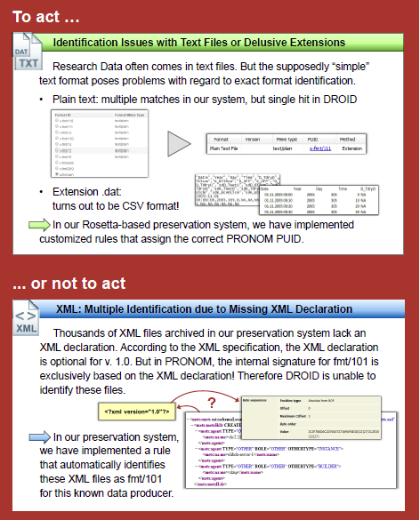

En cas d’incapacité du système à identifier le format d’un fichier numérique, la décision de conserver ou non le fichier est analysé au regard de la grille de critères suivants : 
- Le fichier peut-il être manipulé avec un logiciel « standard » ?
- Le problème rencontré provient-il d’une erreur connue de l’outil d’identification ?
- Le problème rencontré est-il compréhensible ?
- Le problème rencontré concerne-t-il les propriétés essentielles du format (significant properties) ?
- Y a-t-il une solution simple ou documentée pour le problème rencontré ?
- Quels sont les risques associés à corriger le problème rencontré ?
- Quels sont les efforts nécessaires pour corriger le problème rencontré dans tous les fichiers ?
- Y a-t-il des cas où l'authenticité du fichier est plus importante que son identification correcte ?
- Est-ce que le producteur de la donnée est toujours disponible et est disposé à collaborer à la résolution du problème rencontré, notamment en cas de collectes futures ?
- Quel est le niveau de service attendu pour ce fichier ? Si le service attendu est uniquement la conservation du train binaire, est-il nécessaire d’investir dans la résolution du problème ?
- Combien de temps le fichier doit-il être conservé ? Si c’est moins de 10 ans, la question de l’identification du format n’est peut-être pas centrale.
L’ETH reconnaît qu’aucun de ces critères n’est facilement quantifiable et automatisable (notamment ceux qui relèvent de l’organisation), voire que certains sont même contradictoires.

La communication de l’ETH se conclut par des questions complémentaires que l’institution se pose sur la question de l’identification des formats :
- à quel moment doit être réalisée cette identification ? Pendant le processus de transfert ou pendant le processus de préparation des transferts ? Qui en est responsable ?
- Si l’identification est faite avant le transfert, comment documenter les mesures de conservation qui ont été prises pour corriger les problèmes rencontrés ?
- À quelles conditions accepter des fichiers non identifiés/identifiables ?
- Faut-il relancer régulièrement des campagnes d’identification ? Si c’est le cas, comment peuvent-elles être réalisées d’une manière effective et efficiente ?
- Faut-il exclusivement s’appuyer sur des registres de formats génériques comme PRONOM ou faut-il disposer de définitions locales de moyens d’identification ?
- Le risque 0 existe-t-il ?

#### Universités et services d’archives britanniques : l’identification de formats au service de la catégorisation des collections et les problématiques posées par l’absence d’identification

Plusieurs institutions britanniques ont expérimenté l’utilisation de l’identification de formats pour améliorer la caractérisation des collections dont elles avaient la charge. Elles ont pour ce faire simplement analysé les fichiers en leur possession en :
- utilisant les fonctionnalités natives de l’application DROID ;
- exploitant les résultats obtenus exportés sous forme de rapport au format CSV.
Le protocole utilisé leur a ainsi permis d’identifier les problématiques de préservation génériques et spécifiques auxquelles elles étaient confrontées. Le résultat de ces analyses a été régulièrement publié sur le blog de l’université de York[^44]. Si leur objectif premier n’était pas de recenser les problèmes posés par l’identification des formats de fichiers, ces expériences permettent néanmoins de tirer un certain nombre de conclusions intéressantes sur cette problématique.

Les principales conclusions tirées par les institutions ayant mené ces expérimentations sont les suivantes :
- le nombre de fichiers analysés reste faible au regard des volumétries attendues dans les implémentations de la solution logicielle Vitam (entre 10 000 et 732 000 fichiers numériques) ;
- hors domaine particulier des fichiers numériques produits dans le cadre de la recherche scientifique, le taux d’identification des formats avoisine les 95 % ;
- à une exception près (données de recherche de l’université de York), l’identification est majoritairement effectuée en utilisant les « signatures » (entre 68 et 89 % des cas) ;
- quand une extension existe, elle est majoritairement conforme à celle attendue dans plus de 90 % des cas ;
- l’absence d’extension, notamment pour les fichiers numériques les plus anciens (années 1980) mais aussi pour les fichiers textuels, rend difficile l’identification du format du fichier ;
- de nombreux fichiers numériques ont été créés dans des formats spécifiques au monde de la recherche, ce qui rend leur identification particulièrement difficile.
Le tableau ci-dessous résume les différentes conclusions :

|Institution|Nombre de fichiers analysés|Pourcentage de fichiers dont le format a été identifié|Modalités d’identification du format|Pourcentage de fichiers présentant des anomalies d’extension|Nombre de formats identifiés|Principaux formats identifiés|Nombre de fichiers sans extension|Nombre d’extensions différentes pour les fichiers dont le format n’est pas identifié|Principales extensions des fichiers dont le format n’est pas identifié|
|:---|:---|:---|:---|:---|:---|:---|:---|:---|:---|
|York University[^45]|10 005|94 %|Signature : 68 %<br>Container : 27 %<br>extension : 5 %|< 1 %<br>fichiers avec une extension en .tmp ou .dot  identifiés comme des fichiers Microsoft Word, fichiers avec une extension en .doc identifiés comme des fichiers Rich Text Format, des fichiers avec une extension en .hmt alors qu’ils sont identifiés comme des fichiers JEPG et enfin des fichiers XML aux extensions diverses|90|Microsoft Word, PDF, JPEG|160<br>principalement de fichiers datant des années 1980|125|.scl, .tcl, .cpp, .h, .eml, .com.|
|Lancaster University[^46]|24 705|44,5 %|Nombre magique : 89,3 %<br>Nombre magique de container : 1,5 %<br>Extension : 9,2 %|0,3 %|59|GZIP, XML, Plain Text File|4 947|107|.dat, .data, .cell, .param, .castep|
|Norfolk Record Office[^47]|49 117|96,46 %|Signature : 83 %<br>Container : 15 %<br>extension : 2 %|< 1 %<br>Fichiers images (JPEG, PNG, TIFF), des fichiers de traitement de texte (Microsoft Word Document, ClarisWorks Word Processor) et des fichiers de publication (Adobe Illustrator, Adobe InDesign Document, Quark Xpress Data File)|107|JPEG, Bitmap, HTML, Microsoft Word, TIFF, EML, GIF||160|.cmp, .mov, .info, .eml, .mdb|
|Hull History Centre[^48]|270 867|97,96 %|||228|Microsoft Word, Microsoft Excel, GIF, PDF, JPEG||||
|Bentley Historical Library[^49]|731 949|89,9 %|Signature  : 88 %<br>Container : 10 %<br>Extension : 2 %|5,9 %<br>Principalement des fichiers HTML et XML, mais aussi quelques fichiers Microsoft Office|180|HTML, JPEG, XML, JPEG2000, GIF, Microsoft Word|1 888|851|.emlx, .h, .cpp, .htm, .pdf|
|York University – Research Data[^50]|3 752|37 %|Signature : 48 %<br>container : 5 %<br>Extension : 47 %|8 %<br>Principalement des fichiers XML disposant d’extensions variées comme .orig, .plot, .xpr, .sc, .svg, .xci, .hwh, .bxml, .history|34|XML, log file, Plain Text File|614|107|.dat, .crl, .sd, .jdf|

Il convient enfin de noter que le Norfolk Record Office a profité de cette analyse pour récupérer une représentation macroscopique de son fonds d’archives, en s’appuyant sur la classification des formats proposée par PRONOM qu’il estime très pertinente. Le graphique réalisé à cette occasion montre l’utilisation qui peut être faite de l’identification des formats de fichiers :

Répartition des fonds du Norfolk Record Office par catégorie d’archives :
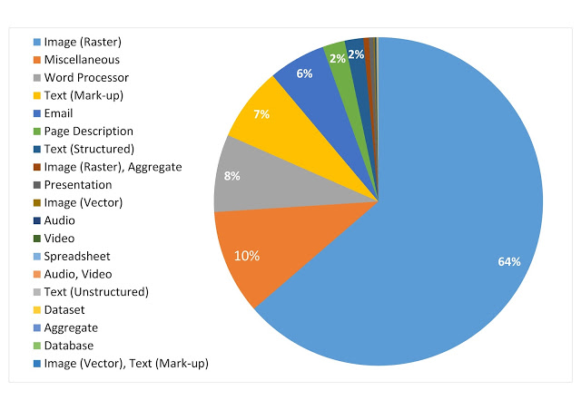

#### Université d’York : contribuer à enrichir PRONOM

Un des moyens de résoudre les problèmes d’identification de formats consiste à contribuer à l’enrichissement des registres de formats existants. Les administrateurs de ces registres, The National Archives (UK) et la Bibliothèque du Congrès, encouragent d’ailleurs toute personne intéressée par ces questions à le faire. 

L’université de York, après avoir effectué le travail de caractérisation de ses collections et avoir identifié les problèmes afférents, notamment pour les données de la recherche, a expérimenté ce travail de contribution à PRONOM en cherchant à identifier les nombres magiques des formats non identifiés dans ce registre. L’expérience a fait l’objet d’un billet sur le blog de l’université et de nombreux échanges avec l’équipe de The National Archives (UK)[^51].

De cette expérience, il est possible de tirer les conclusions suivantes :
- contribuer à l’enrichissement de PRONOM semble réalisable, même dans ses aspects les plus techniques (la génération de nombres magiques). La documentation fournie par The National Archives (UK) semble avoir été exploitable, même si un accompagnement par les équipes de The National Archives (UK) a été nécessaire pour ajouter un nouveau format au registre PRONOM. La collecte de la documentation disponible sur les formats analysés semble en revanche plus problématique, notamment pour ceux générés pour les données de la recherche ;
- il importe de traiter en priorité les fichiers ne posant pas de problèmes d’identification ; 
- disposer d’un échantillon suffisamment représentatif est indispensable pour pouvoir identifier un format en particulier et créer une nouvelle signature dans le référentiel PRONOM. Il semble essentiel de ne pas se cantonner aux fichiers présents dans ses propres collections et d’élargir le panel avec des exemples produits dans d’autres environnements.


Le programme Vitam et l’identification des formats
----

C’est sur la base des éléments présentés ci-dessus que l’équipe programme Vitam a lancé sa propre réflexion sur l’identification de formats de fichiers numériques, afin de spécifier les services attendus de la solution logicielle Vitam et de réfléchir aux modalités de mise en œuvre de ceux-ci.

Cette réflexion s’est opérée en trois temps :
- constitution d’un groupe de travail et réalisation d’une expérimentation ;
- spécification des services mis en œuvre dans la solution logicielle Vitam ;
- recensement des sujets restant à traiter par les organisations choisissant d’utiliser la solution logicielle Vitam.

### Les tests effectués dans le cadre du chantier préservation

#### Présentation du chantier préservation

L’équipe programme Vitam a mis en place, à partir du mois d’octobre 2017, un groupe de travail dédié à la question de la préservation numérique, afin de définir, avec les partenaires du programme Vitam, les services à développer en la matière dans la solution logicielle Vitam.

Ce groupe de travail s’est articulé autour de trois phases de travail :
- une première phase, entre les mois d’octobre 2017 et de janvier 2018, a été consacrée à des retours d’expérience d’institutions, tant publiques que privées, tant nationales qu’internationales, sur leur politique de préservation et sa mise en œuvre ;
- une deuxième phase, entre les mois de février et de septembre 2018, a été consacrée à l’expérimentation d’opérations de préservation (identification de formats, validation de formats, vérification de la lisibilité de formats, extraction de métadonnées techniques) ;
- une troisième phase, initiée à partir de juillet 2018, a été consacrée aux spécifications et à la recette des services de préservation développés dans la solution logicielle Vitam.

Éléments de chronologie :


C’est dans le cadre de la deuxième phase que les participants du programme Vitam ont pu expérimenter la définition et la mise en œuvre d’opérations de préservation, notamment l’identification de formats. Chaque expérimentation était organisée de la manière suivante :
- définition par l’équipe Vitam d’un protocole de tests accompagné d’un questionnaire. Le protocole de tests comprenait l’expérimentation d’un ou plusieurs outils. Ces outils étaient :
    - soit désignés aux participants (comme ce fut le cas pour l’identification de formats),
    - soit mis à disposition par l’équipe programme Vitam (comme ce fut le cas pour la validation de formats ou l’extraction de métadonnées techniques),
    - soit laissés au libre choix des participants (comme ce fut le cas pour la lisibilité des formats) ;
- réalisation des tests par les participants – y compris les membres de l’équipe programme Vitam – et envoi des résultats et des réponses au questionnaire à l’équipe programme Vitam, avant la séance du groupe de travail consacrée à l’opération de préservation faisant l’objet de l’expérimentation ;
- dépouillement des résultats et des réponses au questionnaire par l’équipe programme Vitam, en vue de l’établissement d’une synthèse à présenter lors de la séance du groupe de travail ;
- présentation de la synthèse en séance et échanges avec les partenaires autour des tests réalisés, des résultats obtenus et des réponses au questionnaire, en vue de la définition du service attendu de la solution logicielle Vitam pour l’opération concernée.

#### Le protocole de tests retenu

L’identification de formats a été la première opération de préservation à faire l’objet d’une expérimentation dans le cadre du groupe de travail.

L’équipe programme Vitam a proposé aux participants d’appliquer le protocole d’expérimentation suivant, basé sur la méthodologie utilisée par les universités et services d’archives britanniques :
- sélection par chacun des participants d’un ou de plusieurs jeux de données représentatifs des archives collectées ou à collecter par l’organisation à laquelle ils appartenaient ;
- identification du format des fichiers compris dans les jeux de données sélectionnés au moyen du logiciel DROID mis à disposition par The National Archives (UK) ;
- exploitation des résultats obtenus avec le logiciel DROID et saisie des résultats dans le questionnaire proposé ;
- sur la base des résultats obtenus, réponse aux questions posées dans le questionnaire.

Pour la sélection des jeux de données, l’équipe programme Vitam a recommandé aux participants de :
- choisir des données qui reflétaient à la fois le stock conservé par chacun d’eux, mais aussi les flux attendus prochainement par ces derniers ;
- intégrer dans les jeux de données, dans la mesure du possible, des fichiers dans des formats diversifiés ou couvrant une période chronologique suffisamment large pour refléter la succession des versions des formats concernés ;
- disposer de jeux de données comprenant un nombre de fichiers numériques suffisant, pouvant aller jusqu’à plusieurs dizaines de milliers de fichiers. En revanche, il était déconseillé de constituer des jeux de données contenant plusieurs centaines de milliers de fichiers, afin d’éviter que le rapport, exporté à partir du logiciel de DROID sous forme de tableur, ne soit inexploitable.

Le formatage des résultats proposé axait ceux-ci sur les questions suivantes :
- description sommaire des jeux de données utilisés : description, provenance, couverture chronologique, volumétrie ;
- quantification des catégories de formats identifiés par identifiant PRONOM (PUID), en prenant en compte la possibilité d’avoir plusieurs identifications ;
- quantification des identifications obtenues : pour chaque jeu de données, nombre de fichiers sans identification ; nombre de fichiers avec une seule identification ou avec plus d’une identification. Les résultats devaient être ventilés en fonction du mode d’identification utilisé par DROID (extension, signature, container) ;
- quantification des incompatibilités entre l’extension des fichiers numériques et les extensions associées dans le registre pour le format réellement identifié avec le logiciel DROID (ex. DROID identifie comme un fichier JPEG un fichier dont l’extension est .doc).

Il était par ailleurs demandé aux participants de signaler les problèmes rencontrés, ainsi que les premiers constats effectués.

Le questionnaire joint au protocole invitait les participants, au regard des tests effectués, à s’interroger sur les points suivants :
- quelle était, selon eux, la finalité du processus d’identification de formats ;
- quels services d’identification de formats étaient attendus de la solution logicielle Vitam ;
- si une catégorisation des formats de fichiers était nécessaire ;
- quels services étaient attendus de la solution logicielle Vitam en cas d’absence d’identification.

#### Résultats et enseignements

Cette première expérimentation a permis aux participants d’identifier des problèmes généraux qu’ils n’avaient pas nécessairement anticipés :
- constitution des jeux de données :
    - accessibilité des jeux de données : certaines données se sont révélées inacessibles dans les délais impartis par le protocole d’expérimentation, principalement en raison des contraintes imposées par la politique de stockage mise en œuvre par les différentes organisations (stockage à distance, gestion des droits d’accès aux offres de stockage) ;
    - représentativité des jeux de données : plusieurs participants ont eu des difficultés à constituer des jeux de données représentatifs de l’ensemble de l’activité de leur organisation, principalement en raison des problèmes rencontrés en termes d’accessibilité des données ;
    - volumétrie des jeux de données : certains participants, toujours en raison des problèmes d’accessibilité des données, ont eu des difficultés à constituer des jeux de données comprenant un nombre de fichiers significatifs. Ils se sont cependant efforcés, malgré la taille réduite des jeux de données constitués, d’expérimenter le protocole proposé ;
- installation du logiciel DROID : certains participants ont rencontré des difficultés à installer le logiciel DROID sur leur environnement de travail, en raison de la politique de sécurité de leur organisation. Des solutions de contournement ont alors dû être mises en œuvre sur des environnements de travail personnel.

Pour ces raisons, la taille et la représentativité des jeux de tests ont été variables en fonction des participants :
- les Archives nationales (projet ADAMANT) se sont efforcées de constituer un échantillon représentatif des archives qui leur avaient été versées depuis les années 1980 et de sélectionner des fichiers représentant les différentes catégories manipulées et ayant un intérêt à être étudiées dans le cadre du présent protocole de tests (fichiers audiovisuels, fichiers bureautiques, fichiers textuels, messageries) ;
- le ministère de l’Europe et des Affaires étrangères (projet Saphir) s’est concentré sur les fichiers versés dans le cadre de deux opérations de collecte récentes – archives du cabinet de Jean-Marc Ayrault et archives de la COP21 –, mais a également intégré dans son panel quelques photographies versées par la cellule de presse du ministère ;
- le Service historique de la Défense (projet ArchiPél) a eu le plus de difficultés à constituer ses jeux de données qui n’ont été constitués que de quelques fichiers, provenant principalement de ses campagnes de numérisation et de fichiers numériques produits par ses soins dans le cadre de collecte de témoignages oraux ;
- les ministères sociaux (projet ArchiFiltre) et le ministère de la Transition écologique et solidaire (projet SIAM-AE) ont sélectionné des archives versées par différents types de service producteur, incluant parfois des données anciennes (années 1990), ou des données qu’ils gèrent directement ;
- le Service interministériel des archives de France (SIAF) et l’équipe programme Vitam ont constitué leurs jeux de données à partir de leurs fichiers de travail stockés sur leurs ressources partagées.

La représentativité des jeux de données n’est en conséquence pas parfaite, ce qui a pu induire des biais dans les résultats obtenus :
- aux Archives nationales, les fichiers les plus anciens se sont trouvés sous-représentés, faute de pouvoir y accéder aisément ;
- au ministère de l’Europe et des Affaires étrangères, des pans entiers de la collecte d’ores et déjà réalisée par le service ont été laissés de côté (images fixes, télégrammes diplomatiques) ;
- au SIAF, les jeux de données, concentrés sur l’activité d’un bureau en particulier, se sont rapidement révélés disposer d’un biais avec une sur-représentation de fichiers structurés au format XML.

Les résultats obtenus par les participants peuvent être synthétisés de la manière suivante :

|Institution|Nombre de fichiers analysés|Pourcentage de fichiers dont le format a été identifié|Modalités d’identification du format|Pourcentage de fichiers présentant des anomalies d’extension|Nombre de formats identifiés|Principaux formats identifiés|Nombre de fichiers sans extension|Nombre d’extensions différentes pour les fichiers dont le format n’est pas identifié|Principales extensions des fichiers dont le format n’est pas identifié|
|:---|:---|:---|:---|:---|:---|:---|:---|:---|:---|
|Archives nationales (projet ADAMANT)|214 837|98,83%|Non disponible|0,17 %|112|Image fixe : 28,34 %<br>Traitement de texte : 17,45 %<br>Texte : 16,86 %<br>Documents PDF : 16,61 %<br>Messages : 15,22 %|Non disponible|Non disponible|Inconnu, sans  extension,  .artask, .conf, .dat, .db :encryptable, .dxf, .eml ; .gif, .htm, .html, .ics, .jpg, .manifest, .mdb, .mde, .ods, .p7s, .pdf, .png, .properties, .rtf, .svm, .tmp, .vcf, .xml|
|Ministère des Armées (projet ArchiPél)|85|100 %|Non disponible|0 %|16|Image fixe : 48,24 %<br>Document PDF : 22,35 %<br>Son : 14,12 %|0|0||
|Ministère de l’Europe et des Affaires étrangères (projet Saphir)|50 235|81,12 %|Extension : 91<br>Signature : 12 386<br>Container : 28 203|1,72 %|100|Traitement de texte : 61,99 %<br>Document PDF : 22,4 6 %|60|12|.eml : 9407<br>.ics : 8|
|Ministères sociaux (projet ArchiFiltre)|171 714|99,22 %|Extension : 1 844<br>Signature : 77 025<br>Container : 91 591|0,83 %|175|Traitement de texte : 54,49 %<br>Image fixe : 25,11 %<br>Document PDF : 11,02 %|331|64|.prc : 200<br>.pdb : 166<br>.jpg : 144<br>.dat : 131<br>.gif : 75<br>.as : 72<br>.pdf : 60|
|Ministère de la Transition écologique et solidaire (projet SIAM-AE)|81 131|73,22 %|Extension :  11 289<br>Signature :  39 417<br>Container : 10 164|6,50 %|144|Programme : 28,53 %<br>Données structurées : 15,90 %<br>Traitement de texte : 15,36 %<br>Image fixe : 10,57 %|5276|486|.dat : 2927<br>.cle : 2926<br>.h : 1070<br>.svg : 100|
|Service interministériel des archives de France (SIAF)|30 552|99,83 %|Extension : 132<br>Signature : 28 224<br>Container : 2 145|0,42 %|67|Données structurées : 81,41 %|10|14|.rtf : 13<br>.conf : 10<br>.eml : 8|
|Equipe programme Vitam|14 001|91,12 %|Extension : 1 466<br>Signature : 6 421<br>Container : 4 871|2,99 %|106|Programme : 25,66 %<br>Document PDF : 20,65 %<br>Image fixe : 12,90 %<br>Traitement de texte : 11,28 %|1342|36|.properties : 326<br>.au : 311<br>.jpg : 268<br>.png : 36<br>.odt# : 23<br>.manifest : 19<br>.pdf : 17|

Les tests ont permis de constater que, dans toutes les organisations, la grande majorité des fichiers numériques a vu son format identifié par le logiciel DROID. Le pourcentage de fichiers numériques dont le format a été identifié varie de 73 % au ministère de la Transition écologique et solidaire (MTES) à 100 % au Service historique de la Défense, certes sur un périmètre très restreint. Cependant, dans la très grande majorité des cas, le taux d’identification dépasse les 90 % des fichiers compris dans le périmètre. Ces résultats sont tout à fait similaires à ceux obtenus par les universités et services d’archives britanniques.

La quantité de fichiers numériques dont le format n’a pas pu être identifié reste cependant non négligeable au MTES (27%) et au ministère de l’Europe et des Affaires étrangères (19%). Les résultats diffèrent quelque peu de ceux obtenus par les universités et services d’archives britanniques. Les jeux de données rassemblées par les partenaires du programme Vitam ne couvraient en effet pas le domaine de la recherche universitaire, ce qui explique la faible représentation de formats spécifiques à celui-ci. En revanche, étaient sur-représentés, dans le cas du MTES, des fichiers de type exécutable (fichiers dont les extensions sont .cle et .dat) et, dans le cas du ministère de l’Europe et des Affaires étrangères (MEAE), des fichiers correspondant à des messages électroniques au format .eml et qui avaient été extraits de fichiers .pst au moyen d’un logiciel d’extraction de messagerie du marché. Pour tous les autres participants, le nombre de fichiers numériques dont le format n’a pas pu être pas identifié est resté limité aux quelques exemples ci-dessous :
- fichiers sans extension (Archives nationales) ;
- fichiers audiovisuels : .au, .mov, .mp3, .mp4 ;
- fichiers images : .jpg (photographies du MEAE), .png ;
- fichiers temporaires générés par LibreOffice : docx#, ods#, odt#, ppt# ;
- fichiers exportés de certains outils : PALM (ministères sociaux), GitHub (équipe programme Vitam), Bizagi (MTES).

Quand le format du fichier a pu être identifié, cette identification est dans plus de 98 % des cas unique. Cependant, dans un peu moins de 2 % des cas, le logiciel DROID a proposé plusieurs identifications possibles pour le fichier numérique. Il s’agissait plus particulièrement des fichiers numériques présentant les caractéristiques suivantes :
- fichiers bureautiques : .doc (jusquà 8 identifications possibles), .docx, .odp, .odt, .pptx, .rtf, .xls, .xlsx ;
- messages électroniques ;
- fichiers images, dans une moindre mesure.
Les difficultés sont par exemple apparues quand un fichier correspondant à une présentation (au format .odp) intégrait un tableur. Dans ce cas, le logiciel DROID proposait une double identification du fichier, comme une présentation ou un tableur.

S’agissant du mode d’identification, les résultats obtenus dans le cadre de cette expérimentation diffèrent quelque peu des résultats obtenus par les universités et services d’archives britanniques. Le nombre de fichiers identifiés au moyen de leur extension et de leur signature de container est en effet beaucoup plus important chez les participants au groupe de travail du programme Vitam, sans doute en raison du caractère plus récent des fichiers testés, ce qui implique une forte présence de fichiers produits avec les suites Microsoft Office dans des versions postérieures à 2007 ainsi que LibreOffice.

Comme ce fut le cas pour les universités et services d’archives britanniques, les incompatibilités entre l’extension du fichier numérique et le format identifié par le logiciel DROID se sont avérées peu nombreuses, jamais supérieures à 4 % des jeux de données sélectionnés. Il n’a pas été possible, au vu des résultats obtenus, d’identifier des catégories de fichiers posant particulièrement problème, les cas rencontrés ayant concerné des fichiers aux extensions suivantes : .ai, ~.doc, .docx, .dtd, .htlm, .odp, .php, .pdf, .rdf, .tmp, .txt, .xmind, .xul. Le nombre de fichiers sans extension a également été limité, sauf au MTES. Les difficultés causées en termes d’identification pour ce type de fichiers auraient pu être plus significatifs si les Archives nationales avaient pu accéder à leurs fichiers les plus anciens, ceux-ci ne disposant pas, en grande majorité, d’extension.

Enfin, d’un point de vue typologique, les participants ont pu constater que leurs jeux de données comprenaient principalement des fichiers PDF – avec une très faible présence de fichiers PDF/A –, des fichiers correspondant à des images fixes – qu’ils aient été produits dans le cadre de campagnes de numérisation ou qu’ils résultent d’une production nativement numérique, ainsi que des fichiers bureautiques – principalement des traitements de texte et des tableurs. Des fichiers dont le format était ancien voire obsolescent étaient présents, notamment des fichiers au format PDF – avec un nombre assez important de fichiers relevant d’une version antérieure à la version 1.4. – et des fichiers bureautiques, notamment au MTES et dans les ministères sociaux – présence de fichiers aux formats Word sous DOS, Word 2.0., Word95, WordPerfect, Multiplan, Excel 3.0., Excel 4.0.

Cette phase de tests a également été l’occasion pour les participants de constater que le processus d’identification de formats n’était pas complètement fiable, en raison de l’absence d’exhaustivité des registres de formats et des incertitudes en termes d’identification générée pour quelques formats. Ils ont également pu découvrir qu’identification fiable et lisibilité du contenu étaient décorrélés, notamment pour des images, des vidéos et des messages électroniques, lisibles sans aucun problème avec les logiciels disponibles sur leur environnement de travail, mais non identifiables de manière fiable par les outils d’identification les plus performants. Tous les participants ont cependant reconnu que le procédé présentait un intérêt certain pour profiler leurs fonds numériques et quantifier le nombre de fichiers numériques appartenant à une catégorie donnée, ce qui pouvait permettre de cibler plus précisément leur politique de préservation sur les catégories de formats les plus représentatives de leurs fonds numériques. Le ministère de l’Europe et des Affaires étrangères a d’ailleurs décidé, à l’issue de cette phase d’expérimentation, de systématiser les travaux d’identification pour disposer d’un profil fiable et complet de ses fonds numériques.

### L’identification de formats dans la solution logicielle Vitam et ses outils annexes

C’est sur la base de la présente étude et des expérimentations menées avec ses partenaires dans le cadre du groupe de travail sur la préservation que l’équipe programme Vitam et ses équipes de réalisation ont développé les services d’identification de formats disponibles dans la solution logicielle Vitam.

L’identification de formats y repose sur :
- le choix d’un registre des formats et d’un outil d’identification de formats ;
- la mise en œuvre des services d’identification proprement dits.

L’équipe programme Vitam a par ailleurs intégré des opérations d’identification de formats dans les outils de préparation des entrées qu’elle a développés.

#### Le choix du registre des formats et de l’outil d’identification des formats

**Le registre des formats**

C’est assez naturellement le registre PRONOM, maintenu par The National Archives (UK), que l’équipe programme Vitam a retenu comme registre des formats et donnée de référence pour la solution logicielle Vitam.

Ce registre présente en effet plusieurs avantages non négligeables :
- son ancienneté et sa bonne couverture en termes de formats référencés ;
- la fiabilité des mécanismes adoptés pour garantir l’identification des formats ;
- sa large adoption par de nombreuses solutions du marché, qu’il s’agisse de systèmes d’archivage électronique ou de logiciels venant en appui de systèmes d’archivage électronique ;
- son caractère extensible et ses mises à jour régulières ;
- le fait qu’il repose à la fois sur une institution pérenne et sur une communauté qui participe à son alimentation.

Le registre des formats est importé dans la solution logicielle Vitam au moment de son installation, sous la forme du fichier de signatures mis à disposition régulièrement par The National Archives (UK). Ce fichier de signatures alimente un référentiel interne, utilisé par la solution logicielle Vitam lors des opérations de préservation. Seules quelques-unes des informations disponibles dans le fichier de signatures (PUID, nom du format, extensions, type MIME, généalogie des formats) sont importées dans le référentiel de la solution logicielle Vitam. Les signatures, par exemple, ne sont pas récupérées.

Le référentiel est valable pour toute la plate-forme implémentée. Il ne peut être installé et mis à jour que par des administrateurs. La mise à jour peut être effectuée suite à la publication d’un nouveau fichier de signatures par The National Archives (UK), mais peut aussi intégrer des extensions supplémentaires, absentes du fichier fourni par l’institution, dans la mesure où celles-ci ont été générées avec les outils mis à disposition par The National Archives (UK) pour être conformes au schéma utilisé dans le fichier de signatures[^52].

**Attention :**  
- la mise à jour du référentiel des formats utilisé dans la solution logicielle Vitam nécessite également la mise à jour de la base de signatures utilisée par l’outil d’identification de format choisi par l’équipe programme Vitam ;
- le référentiel de la solution logicielle Vitam ne catégorise pas les formats par famille. Si des catégorisations existent dans le registre PRONOM[^53] – comme d’ailleurs dans celui de la Bibliothèque du Congrès[^54], elles ne sont pas présentes dans le fichier de signatures mis à disposition par The National Archives (UK) et ne sont donc pas reprises dans le référentiel Vitam ;
- le registre PRONOM, et donc le référentiel de la solution logicielle Vitam, n’intègre pas, pour les formats vidéos, de codecs[^55].

**L’outil d’identification de formats**

C’est l’outil Siegfried qui a été retenu par l’équipe programme Vitam comme outil d’identification de formats pour la solution logicielle développée.

Ce choix a été réalisé sur la base d’une analyse des avantages et des inconvénients de chaque outil, effectués par le Service interministériel des Archives de France (SIAF) ou l’équipe projet Vitam et référencés dans le tableau ci-dessous :

|Outil|Avantages|Inconvénients|
|:---|:---|:---|
|Apache Tika||Tests peu concluants, ne serait-ce que pour l’identification des types MIME.|
|DROID|Outil maintenu par une institution : The National Archives (UK).|Outil largement partagé et utilisé dans la communauté de la préservation numérique.<br>Lenteur d’exécution car DROID a été conçu et réalisé pour traiter un ensemble de fichiers avec une sortie sous forme de base de données.<br>Conçu pour disposer d’une interface graphique et non comme un service en ligne de commande.|
|FIDO||Par défaut, FIDO analyse seulement les 256 ko qui se situent au début du fichier numérique. Il est possible d’augmenter cette limite mais au prix d’une forte dégradation des performances.
Problèmes d’identification des formats correspondant à des containers (DOCX, PPTX, etc.) et des fichiers bureautiques antérieurs à 2000.|
|FITS|Capacité à fédérer différents outils.|Capacité à désactiver certaines fonctionnalités et certains outils (ex. DROID).||
|JHOVE||Résultats aléatoires pour l’identification des fichiers au format PDF lors des études réalisées par le CINES dans le cadre de l’étude commandée par le Service interministériel des archives de France (SIAF)[^56].|
|Nanite|Performance pour traiter un jeu de données important, grâce à une implémentation Hadoop de DROID[^57].|Hérite des défauts de DROID sur lequel il s’appuie.<br>Intégration native du fichier de signatures PRONOM, sans procédure explicite de mise à jour.|
|NZ Metadata Extraction Tool|Possibilité de réaliser des exports en XML.<br>Possibilité de créer ses propres profils.|Techniques d’identification moins fiables que celles proposées par d’autres outils.<br>Outil très orienté « bibliothèques ».|
|Siegfried|Capacité à identifier les formats correspondants à des containers (DOCX, PPTX, etc.) et des fichiers bureautiques antérieurs à 2000.<br>Se rapproche progressivement d’un outil comme FITS.<br>Existence d’une procédure de mise à jour du fichier de signatures PRONOM.<br>Bonnes performances, faute de buffer limit.<br>Application du principe des priorités PRONOM pendant le processus de contrôle plutôt qu’à la fin du processus d’identification.|Incapacité, via un appel API, de lister les formats connus et identifiables et de traiter une requête demandant si un PUID est connu de son référentiel interne.<br>Incapacité à remonter les codecs pour les formats audio et vidéo, contrairement à ExifTool qui permet de les extraire.<br>Outil réalisé et maintenu par une seule personne.|

La solution logicielle Vitam offre également la possibilité d’intégrer d’autres outils que Siegfried via l’intégration de plug-in. Les API mises en place permettent de dialoguer avec ces outils au moyen de trois types de requêtes :
- récupérer l’identification du format d’un fichier envoyé à l’outil ;
- récupérer la liste des PUID connus du référentiel interne à l’outil ;
- vérifier si un format est connu du référentiel interne de l’outil sur la base de son PUID[^58].

#### Les services d’identification de formats

La solution logicielle Vitam met en œuvre des services d’identification de formats :
- lors des opérations d’entrée ;
- lors d’opérations de traitement de masse des objets binaires (opérations de préservation).

**L’identification de formats lors des opérations d’entrée**

Lors de l’entrée d’un ensemble d’archives dans la solution logicielle Vitam, celle-ci procède à l’identification du format des fichiers présents dans l’ensemble soumis sous forme de Submission Information Package (SIP) au moyen de l’outil d’identification de formats Siegfried.

L’acceptation ou non des fichiers numériques et, par conséquent, du SIP qui les contient, est effectuée par la solution logicielle Vitam en fonction des paramètres définis dans le contrat d’entrée applicables. Celui-ci peut ainsi définir les comportements suivants :
- définition des formats de fichiers acceptés, sous la forme d’une liste de formats de fichiers présents dans le référentiel interne de la solution logicielle Vitam et correspondant au PUID de ces mêmes formats dans le registre des formats PRONOM ;
- définition du caractère acceptable ou non des fichiers dont le format n’est pas identifié lors de l’opération d’entrée par l’outil d’identification de formats Siegfried. Si le contrat d’entrée a été paramétré pour que les fichiers dont le format n’est pas identifié ne soient pas acceptés, tout SIP comprenant au moins un fichier numérique dont le format n’est pas accepté sera rejeté.

Pour tous les fichiers numériques considérés comme acceptables au regard des paramètres définis dans le contrat d’entrée, la solution logicielle Vitam :
- compare l’identification obtenue grâce à Siegfried avec l’identification proposée dans le manifeste du SIP ;
- enregistre l’identification obtenue grâce à Siegfried en conservant, dans le journal du cycle de vie des groupes d’objets techniques correspondant, l’identification transmise dans le bordereau de transfert si celle-ci est différente. En d’autres termes, si l’identification par Siegfried diffère de l’identification fournie dans le bordereau de transfert, la solution logicielle Vitam conserve et enregistre le résultat de cette réidentification.

**L’identification de formats lors des opérations de traitement de masse des fichiers numériques (opérations de préservation)**

La solution logicielle Vitam offre également la possibilité, pour les objets binaires déjà pris en charge, de procéder à une nouvelle identification de formats dans le cadre des opérations de traitement de masse des fichiers numériques (opérations de préservation).

Ces opérations de traitement de masse des fichiers numériques (opérations de préservation) peuvent être effectuées par des utilisateurs habilités sur le périmètre qui leur est autorisé par un contrat d’accès. Elles ne sont pas automatisées. Elles sont spécifiées dans des scénarios de préservation s’appuyant eux-mêmes sur l’utilisation d’outils logiciels interfacés avec la solution logicielle Vitam et appelés des griffons.

L’opération d’identification figure parmi les quatre types d’opération de traitement de masse des fichiers numériques (opérations de préservation) réalisables dans la solution logicielle Vitam :
- ANALYSE : ces opérations entraînent une analyse des fichiers numériques en fonction des paramètres définis dans le scénario de préservation sélectionné, suivie par la production d’un rapport. La validation de formats constitue, à proprement parler, une opération d’analyse ;
- EXTRACT : ces opérations entraînent l’extraction de métadonnées, notamment techniques, des fichiers numériques ;
- GENERATE : ces opérations entraînent la production de nouveaux fichiers numériques, en fonction des paramètres définis dans le scénario de préservation sélectionné. La conversion de fichiers constitue, à proprement parler, une opération de génération ;
- IDENTIFY : ces opérations entraînent une identification du format des fichiers numériques, en fonction des paramètres définis dans le scénario de préservation sélectionné. Par défaut, c’est une nouvelle fois l’outil Siegfried qui est proposé par la solution logicielle Vitam sous forme de griffon.
Elle peut également être combinée avec un ou plusieurs de ces types d’opération.

Les opérations de ré-identification du format de fichiers pris en charge par la solution logicielle Vitam peuvent notamment intervenir après une mise à jour significative des fichiers de signatures PRONOM mis à disposition par The National Archives (UK) et, par conséquent, du référentiel des formats interne à la solution logicielle Vitam. Si le format identifié lors d’une opération de ré-identification par le griffon Siegfried pour un fichier n’est pas identique à celui enregistré pour ce dernier avant le lancement de cette opération, c’est le nouveau format identifié qui sera enregistré dans la description technique du fichier. Cette mise à jour est alors journalisée dans le journal du cycle de vie du groupe d’objets techniques correspondant.

Les opérations de génération de nouveaux fichiers numériques intègrent une tâche d’identification du format des nouveaux fichiers numériques générés. Pour être pris en charge par la solution logicielle Vitam, ces nouveaux fichiers doivent avoir un format correspondant à celui défini dans le scénario de préservation utilisé pour les générer[^59].

#### Les outils de préparation des entrées

L’équipe programme Vitam a, en complément du développement de la solution logicielle Vitam proprement dite, conçu et réalisé un ensemble d’outils complémentaires destinés à faciliter la production de Submission information packages (SIP) transférables dans la solution logicielle Vitam. 

Cet ensemble d’outils, appelé SedaTools, comprend notamment :
- une bibliothèque JAVA SedaLib permettant de construire des Submission information packages (SIP) à partir d’une arborescence de fichiers et de fichiers d’indexation ;
- une bibliothèque JAVA Mailextract permettant d’extraire les contenus échangés au moyen des outils de messagerie électronique ;
- une interface ReSIP permettant, sur la base des deux bibliothèques ci-dessus :
    - d’importer des structures arborescentes d’archives et les fichiers qui les représentent ;
    - d’enrichir les métadonnées de description et de gestion des unités archivistiques (ArchiveUnits) ainsi que les métadonnées techniques des fichiers (BinaryObjects) ;
    - d’exporter les structures arborescentes d’archives et les fichiers qui les représentent sous une forme importable dans la solution logicielle Vitam ou sous la forme d’une arborescence de fichiers.

Ces bibliothèques et l’interface associée procèdent à l’identification du format des fichiers soumis, en s’appuyant sur le registre des formats PRONOM et sur l’outil d’identification des formats Siegfried, comme la solution logicielle Vitam[^60].

### Les réflexions à mener au niveau de l’implémentation de la solution logicielle Vitam, de sa mise en production et de son maintien en condition opérationnelle

La solution logicielle Vitam apporte par défaut des services d’identification de formats aux organisations qui souhaitent l’implémenter. Les modalités d’administration et de pilotage de ces services doivent cependant être définis par chacune de ces organisations ou faire l’objet d’une coordination entre les différents utilisateurs de la solution logicielle Vitam.

Deux points méritent de retenir l’attention des organisations souhaitant utiliser la solution logicielle Vitam :
- les modalités d’administration du référentiel des formats utilisé dans la solution logicielle Vitam ainsi que celles de dialogue avec The National Archives (UK) ;
- le paramétrage des opérations d’identification de formats, que ce soit en entrée ou en traitement de masse des fichiers numériques (opérations de préservation).

#### L’administration du référentiel des formats et l’identification des formats non couverts par le registre des formats PRONOM

Si le choix de s’appuyer sur le registre des formats PRONOM maintenu par The National Archives (UK) pour construire le référentiel des formats utilisé par la solution logicielle Vitam est structurant et s’impose aux organisations choisissant d’utiliser cette dernière, les modalités d’administration du référentiel ne sont en aucune manière imposées aux utilisateurs.

Il revient à ceux-ci de déterminer :
- les modalités de formation des personnes chargées de l’administration de ce référentiel et de son enrichissement ;
- les modalités d’administration de ce référentiel au sein de leur organisation ;
- le rythme de mise à jour de ce référentiel ;
- les modalités d’enrichissement de ce référentiel pour des formats qui ne seraient pas référencés dans le registre PRONOM.

S’agissant des modalités d’enrichissement du référentiel, les utilisateurs de la solution logicielle Vitam devront s’interroger sur les points suivants :
- la définition des moyens d’identifier des formats non référencés par le registre PRONOM sera-t-elle faite par chacun d’eux ou collectivement par l’équipe Vitam ?
- si chaque organisation décide d’élaborer des moyens d’identification pour des formats non référencés par le registre PRONOM, ceux-ci seront-ils ou non transmis à The National Archives (UK) pour intégration dans le registre PRONOM ? Si la réponse à cette première question est positive, la transmission des informations à The National Archives (UK) sera-t-elle faite par chaque organisation utilisatrice ou par l’équipe Vitam ?
- quelle que soit la solution retenue, quelles seront les ressources, moyens et compétences à mettre en œuvre pour opérer l’élaboration des moyens d’identification pour ces nouveaux formats ? Comment seront constitués les échantillons représentatifs de ces formats non référencés dans PRONOM et destinés à élaborer les moyens d’identification ? Comment seront-ils maintenus et par qui ?

#### La définition d’une politique de préservation, notamment dans les contrats d’entrée

Les organisations choisissant d’implémenter la solution logicielle Vitam doivent également définir la politique de préservation et, partant, celle d’identification de formats qu’elles souhaitent mettre en œuvre.

Elles doivent ainsi définir :
- si elles s’appuient uniquement sur l’outil d’identification de formats Siegfried proposé par l’équipe programme Vitam ou si elles doivent également mettre en œuvre, sous forme de plug-in pour les opérations d’entrée ou de griffon pour les opérations de traitement de masse des objets binaires (opérations de préservation) d’autres outils ;
- quel(s) contrôle(s) et exclusion(s) mettre en place lors des opérations d’entrée :
    - les formats inconnus doivent-ils être acceptés ou rejetés ?
    - s’agissant des formats identifiables, doivent-ils être tous acceptés ? Sinon, quels formats doivent être acceptés et quels formats doivent être exclus ?
- des campagnes régulières de réidentification du format des fichiers pris en charge dans la solution logicielle Vitam doivent-elles être mises en œuvre ? Si oui, par qui ? À quel rythme ? Sur quel périmètre ? Quelle politique adopter en cas d’échec du processus d’identification ?

Annexes
---

### Annexe 1 : Bibliographie

« File format identification at Norfolk Record Office ». Consultable à l’adresse suivante : http://digital-archiving.blogspot.fr/2016/09/file-format-identification-at-norfolk.html. Lien consulté le 16 décembre 2019

Digital Preservation Coalition. « File formats and standards » dans Digital Preservation Handbook. Consultable à l’adresse suivante : http://www.dpconline.org/handbook/technical-solutions-and-tools/file-formats-and-standards. Lien consulté le 16 décembre 2019

« File-format analysis tools for archivists ». Consultable à l’adresse suivante : https://lwn.net/Articles/688396/. Lien consulté le 16 décembre 2019

« Magic Number Definition », http://www.linfo.org/magic_number.html. Lien vérifié le 16 décembre 2019

« Siegfried – a PRONOM-based, file format identification tool ». Consultable à l’adresse suivante :  http://openpreservation.org/blog/2014/09/27/siegfried-pronom-based-file-format-identification-tool/. Lien consulté le 16 décembre 2019

Clipsham David, Krabbenhoeft Nick, Peltzmann Shira, Simpson Justin, Wilson Carl. « PRONOM in Practice: Creating File Format/System Signatures for Submission to PRONOM Technical Registry ». iPRES 2019. Consultable à l’adresse suivante : https://osf.io/2jbpe/. Lien consulté le 16 décembre 2019

Corrado Edward M., Sandy Heather Moulaison. Digital Preservation for Librairies, Archives & Museums. New York, London : Rowman & Littlefiels, 2017

Hoppenheit Martin. « Minimizing the DROID signature file », 8 janvier 2017. Consultable à l’adresse suivante : https://martin.hoppenheit.info/blog/2017/minimizing-the-droid-signature-file/. Lien consulté le 16 décembre 2019

Kessler Gary. « File signatures table », 22 juin 2017. Consultable à l’adresse suivante : http://www.garykessler.net/library/file_sigs.html. Lien consulté le 16 décembre 2019

McGath Gary. « The Format Registry Problem », The code{4}lib Journal, n° 19, 15 janvier 2013. Consultable à l’adresse suivante : http://journal.code4lib.org/articles/8029. Lien consulté le 16 décembre 2019

Nichele Baptiste. « Préparation des versements : identification et validation des formats de fichiers », 18 août 2016. Consultable à l’adresse suivante : http://siaf.hypotheses.org/676. Lien consulté le 16 décembre 2019

« Unified Digital Format Registry (UDFR) : a semantic registry for digital preservation ». Consultable à l’adresse suivante :  http://www.udfr.org/. Lien consulté le 16 décembre 2019

### Annexe 2 : Description d’un format par différents registres
 
La présente annexe fournit des exemples de description du format PNG par différents registres des formats.

#### PRONOM

```xml
<?xml version="1.0" encoding="utf-8"?>
<PRONOM-Report xmlns="http://pronom.nationalarchives.gov.uk">
	<report_format_detail>
		<FileFormat>
			<FormatID>666</FormatID>
			<FormatName>Portable Network Graphics</FormatName>
			<FormatVersion>1.2</FormatVersion>
			<FormatAliases>PNG (1.2)</FormatAliases>
			<FormatFamilies></FormatFamilies>
			<FormatTypes>Image (Raster)</FormatTypes>
			<FormatDisclosure></FormatDisclosure>
			<FormatDescription>Portable Network Graphics (PNG) was designed for the lossless, portable, compressed storage of raster images.  PNG provides a patent-free replacement for GIF and can also replace many common uses of TIFF. Indexed-color, grayscale, and truecolor images are supported, plus an optional alpha channel. Sample depths range from 1 to 16 bits. PNG is designed to work in online viewing applications, so it is fully streamable.  It can store gamma and chromaticity.  PNG also detects file corruption.</FormatDescription>
			<BinaryFileFormat>Binary</BinaryFileFormat>
			<ByteOrders>Big-endian (Motorola)</ByteOrders>
			<ReleaseDate></ReleaseDate>
			<WithdrawnDate></WithdrawnDate>
			<ProvenanceSourceID>1</ProvenanceSourceID>
			<ProvenanceName>Digital Preservation Department / The National Archives</ProvenanceName>
			<ProvenanceSourceDate>11 Mar 2005</ProvenanceSourceDate>
			<ProvenanceDescription></ProvenanceDescription>
			<LastUpdatedDate>02 Aug 2005</LastUpdatedDate>
			<FormatNote></FormatNote>
			<FormatRisk></FormatRisk>
			<TechnicalEnvironment></TechnicalEnvironment>
			<FileFormatIdentifier>
				<Identifier>fmt/13</Identifier>
				<IdentifierType>PUID</IdentifierType>
			</FileFormatIdentifier>
			<FileFormatIdentifier>
				<Identifier>image/png</Identifier>
				<IdentifierType>MIME</IdentifierType>
			</FileFormatIdentifier>
			<FileFormatIdentifier>
				<Identifier>public.png</Identifier>
				<IdentifierType>Apple Uniform Type Identifier</IdentifierType>
			</FileFormatIdentifier>
			<ExternalSignature>
				<ExternalSignatureID>634</ExternalSignatureID>
				<Signature>png</Signature>
				<SignatureType>File extension</SignatureType>
			</ExternalSignature>
			<InternalSignature>
				<SignatureID>186</SignatureID>
				<SignatureName>PNG 1.2</SignatureName>
				<SignatureNote>Signature + IHDR and iTXt chunks at BOF, IEND chunk at EOF</SignatureNote>
				<ByteSequence>
					<ByteSequenceID>226</ByteSequenceID>
					<PositionType>Absolute from BOF</PositionType>
					<Offset>0</Offset>
					<MaxOffset></MaxOffset>
					<IndirectOffsetLocation></IndirectOffsetLocation>
					<IndirectOffsetLength></IndirectOffsetLength>
					<Endianness></Endianness>
					<ByteSequenceValue>89504E470D0A1A0A0000000D49484452*69545874</ByteSequenceValue>
				</ByteSequence>
				<ByteSequence>
					<ByteSequenceID>227</ByteSequenceID>
					<PositionType>Absolute from EOF</PositionType>
					<Offset>0</Offset>
					<MaxOffset></MaxOffset>
					<IndirectOffsetLocation></IndirectOffsetLocation>
					<IndirectOffsetLength></IndirectOffsetLength>
					<Endianness></Endianness>
					<ByteSequenceValue>0000000049454E44AE426082</ByteSequenceValue>
				</ByteSequence>
			</InternalSignature>
				<RelatedFormat>
				<RelationshipType>Has priority over</RelationshipType>
				<RelatedFormatID>664</RelatedFormatID>
				<RelatedFormatName>Portable Network Graphics</RelatedFormatName>
				<RelatedFormatVersion>1.0</RelatedFormatVersion>
			</RelatedFormat>
			<RelatedFormat>
				<RelationshipType>Has priority over</RelationshipType>
				<RelatedFormatID>665</RelatedFormatID>
				<RelatedFormatName>Portable Network Graphics</RelatedFormatName>
				<RelatedFormatVersion>1.1</RelatedFormatVersion>
			</RelatedFormat>
			<RelatedFormat>
				<RelationshipType>Is subsequent version of</RelationshipType>
				<RelatedFormatID>665</RelatedFormatID>
				<RelatedFormatName>Portable Network Graphics</RelatedFormatName>
				<RelatedFormatVersion>1.1</RelatedFormatVersion>
			</RelatedFormat>
			<FormatProperties>
				<FormatProperty>
					<PropertyName>Image Width</PropertyName>
					<PropertyDescription></PropertyDescription>
					<PropertyType>Instance</PropertyType>
					<PropertyRiskScore></PropertyRiskScore>
					<PropertyHighRisk></PropertyHighRisk>
						<PropertyValueDescription></PropertyValueDescription>
					<PropertyRisks />
				</FormatProperty>
				<FormatProperty>
					<PropertyName>Image Height</PropertyName>
					<PropertyDescription></PropertyDescription>
					<PropertyType>Instance</PropertyType>
					<PropertyRiskScore></PropertyRiskScore>
					<PropertyHighRisk></PropertyHighRisk>
					<PropertyValueDescription></PropertyValueDescription>
					<PropertyRisks />
				</FormatProperty>
				<FormatProperty>
					<PropertyName>Bits Per Sample</PropertyName>
					<PropertyDescription></PropertyDescription>
					<PropertyType>Instance</PropertyType>
					<PropertyRiskScore></PropertyRiskScore>
					<PropertyHighRisk></PropertyHighRisk>
					<PropertyValueDescription></PropertyValueDescription>
					<PropertyRisks />
				</FormatProperty>
				<FormatProperty>
					<PropertyName>Samples Per Pixel</PropertyName>
					<PropertyDescription></PropertyDescription>
					<PropertyType>Instance</PropertyType>
					<PropertyRiskScore></PropertyRiskScore>
					<PropertyHighRisk></PropertyHighRisk>
					<PropertyValueDescription></PropertyValueDescription>
					<PropertyRisks />
				</FormatProperty>
				<FormatProperty>
					<PropertyName>Number Of Channels</PropertyName>
					<PropertyDescription></PropertyDescription>
					<PropertyType>Instance</PropertyType>
					<PropertyRiskScore></PropertyRiskScore>
					<PropertyHighRisk></PropertyHighRisk>
					<PropertyValueDescription></PropertyValueDescription>
					<PropertyRisks />
				</FormatProperty>
			</FormatProperties>
		</FileFormat>
		<SearchCriteria>Criteria</SearchCriteria>
	</report_format_detail>
</PRONOM-Report>
```

#### Library of Congress Digital Format Description

```xml
<?xml version="1.0" encoding="UTF-8"?>
<fdd:FDD id="fdd000153" titleName="PNG, Portable Network Graphics" shortName="PNG" xmlns:xsi="http://www.w3.org/2001/XMLSchema-instance" xmlns:fdd="http://www.loc.gov/preservation/digital/formats/schemas/fdd/v1" xsi:schemaLocation="http://www.loc.gov/preservation/digital/formats/schemas/fdd/v1 http://www.loc.gov/preservation/digital/formats/schemas/fdd/v1/fdd-v1-1.xsd">
	<fdd:properties>
		<fdd:gdfrGenreSelection>
			<fdd:gdfrGenre>still-image</fdd:gdfrGenre>
		</fdd:gdfrGenreSelection>
		<fdd:formatCategories>
			<fdd:category>file-format</fdd:category>
			<fdd:category>encoding</fdd:category>
		</fdd:formatCategories>
		<fdd:gdfrComposition>unitary</fdd:gdfrComposition>
		<fdd:gdfrForm>binary</fdd:gdfrForm>
		<fdd:gdfrConstraint>unstructured</fdd:gdfrConstraint>
		<fdd:gdfrBasis>sampled</fdd:gdfrBasis>
		<fdd:updates>
			<fdd:date>2009-03-08</fdd:date>
		</fdd:updates>
		<fdd:draftStatus>Partial</fdd:draftStatus>
	</fdd:properties>
	<fdd:identificationAndDescription>
		<fdd:fullName>PNG (Portable Network Graphics)</fdd:fullName>
		<fdd:keywords>
			<fdd:keyword>raster image formats</fdd:keyword>
		</fdd:keywords>
		<fdd:description>The PNG specification defines both a datastream and an associated file format for a lossless, portable, compressed, raster (bit-mapped) image. PNG is fully streamable with a progressive display option.  Indexed color, greyscale, and RGB color (referred to as <i>truecolor</i> in the specification) are supported, with optional transparency (alpha channel).  PNG can store gamma and chromaticity data as well as a full ICC color profile for accurate color matching on heterogenous platforms.  The PNG format was originally designed as an open standard to replace <fddLink id="fdd000133">GIF_89a</fddLink> for use on the Internet, but is not limited to that use.</fdd:description>
		<fdd:shortDescription>Defines both a datastream and an associated file format for a lossless, portable, compressed, raster (bit-mapped) image.  Non-proprietary, open standard from W3C.</fdd:shortDescription>
		<fdd:productionPhase>May be an initial-state or middle-state format; more often used as final-state format.</fdd:productionPhase>
		<fdd:relationships>
			<fdd:relationship>
				<fdd:typeOfRelationship>Has subtype</fdd:typeOfRelationship>
				<fdd:comment>Has versions not separately described.</fdd:comment>
			</fdd:relationship>
		</fdd:relationships>
	</fdd:identificationAndDescription>
	<fdd:localUse>
		<fdd:experience>None</fdd:experience>
		<fdd:preference> The Library of Congress Recommended Formats Statement (RFS) includes PNG as a preferred format for <a href="https://www.loc.gov/preservation/resources/rfs/stillimg.html">photographs in digital form</a> and <a href="https://www.loc.gov/preservation/resources/rfs/stillimg.html">other graphic images in digital form</a>. The RFS does not specify a version of PNG.</fdd:preference>
	</fdd:localUse>
	<fdd:sustainabilityFactors>
		<fdd:disclosure>Open standard.</fdd:disclosure>
		<fdd:documentation>
			<p>
				<a href="http://www.libpng.org/pub/png/spec/1.2/PNG-Contents.html">PNG (Portable Network Graphics) Specification, Version 1.2</a> (at http://www.libpng.org/pub/png/spec/1.2/PNG-Contents.html)</p>
			<p>ISO/IEC 15948:2004 Information technology -- Computer graphics and image processing -- Portable Network Graphics (PNG): Functional specification.</p>
			<p>W3C Portable Network Graphics (PNG) Specification (Second Edition), same text as ISO/IEC 15948:2004, at <a href="http://www.w3.org/TR/PNG/">http://www.w3.org/TR/PNG/</a>
			</p>
		</fdd:documentation>
		<fdd:adoption>
			<p>As of 2005, PNG was supported by most browsers.  However, Internet Explorer 6.x for Windows did not support the transparency feature.  Slow deployment of full browser support delayed, or even prevented widespread adoption.  With the expiration of the LZW patent, the original objective, a patent-free standard to replace GIF, is no longer significant.</p>
			<p>
				<a href="http://www.naa.gov.au/Images/Digital-Preservation-Software-Platform-v1_tcm16-47139.pdf">National Archives of Australia has chosen PNG</a> as the &quot;preservation format&quot; for bit-mapped images and converts images in other bit-map formats to PNG during its ingest process.  Library and Archives Canada has adopted PNG as a <a href="http://www.collectionscanada.gc.ca/obj/012018/f2/012018-2200-e.pdf">recommended format</a> for still images.
</p>
		</fdd:adoption>
		<fdd:licensingAndPatents>None.</fdd:licensingAndPatents>
		<fdd:transparency>Depends upon algorithms and tools for decompression to read; requires sophistication to build tools based on documentation.</fdd:transparency>
		<fdd:selfDocumentation>
			<p>The PNG specification allows labeled text (ASCII or UTF-8) elements to be embedded in text <i>chunks</i> and predefines a few standard keywords (element labels): Title, Author, Description, Copyright, Creation Time, Software, Disclaimer, Warning, Source, Comment.  The compilers of this resource are not able to assess the degree to which such metadata is found in practice or whether other keywords are in common use. An attempt in 2000 to develop open source tools to convert EXIF images (including EXIF metadata) to PNG seems to have been abandoned.  See <a href="http://pmt.sourceforge.net/exif/drafts/d020.html">http://pmt.sourceforge.net/exif/drafts/d020.html</a>.  Without such tools and agreed practices, PNG can not rank highly for self-documentation.
</p>
			<p>It is possible to embed XMP metadata in PNG files, according to the XMP specification.  However, the <a href="http://www.sno.phy.queensu.ca/~phil/exiftool/TagNames/PNG.html#TextualData">documentation for ExifTool for PNG tags</a> suggests that practices for storing XMP or EXIF metadata in PNG images have not been consistent.</p>
		</fdd:selfDocumentation>
		<fdd:externalDependencies>
			None
		</fdd:externalDependencies>
		<fdd:techProtection>
			None
		</fdd:techProtection>
	</fdd:sustainabilityFactors>
	<fdd:qualityAndFunctionalityFactors>
		<fdd:stillImageQF>
			<fdd:normalImage>Good support.</fdd:normalImage>
			<fdd:clarity>Excellent support, with support for progressive display for images retrieved over the Internet. The standard is flexible as to color space and bit depth, supporting indexed color, grayscale, and RGB color. RGB color data is often 8 bits-per-channel (24-bit RGB) but may be extended to 16 bits (48-bit RGB).  The term <i>truecolor</i> is often used to refer to RGB color images with 24-bit or greater data.</fdd:clarity>
			<fdd:colorMaint>A PNG image can include <i>chunks</i> for gamma and chromaticity data and for a full ICC color profile.</fdd:colorMaint>
			<fdd:graphics>An alpha channel, representing transparency information on a per-pixel basis, can be included in grayscale and color PNG images.  When transparency data is included in color images, the color space is sometimes called RGBA.</fdd:graphics>
			<fdd:beyondImage>None.  Related formats, MNG and JNG, have been defined to support multi-page images and animation.</fdd:beyondImage>
		</fdd:stillImageQF>
	</fdd:qualityAndFunctionalityFactors>
	<fdd:fileTypeSignifiers>
		<fdd:signifiersGroup>
			<fdd:filenameExtension>
				<fdd:sigValues>
					<fdd:sigValue>png</fdd:sigValue>
				</fdd:sigValues>
				<fdd:note>The PNG standard recommends the use of png as extension.</fdd:note>
			</fdd:filenameExtension>
			<fdd:internetMediaType>
				<fdd:sigValues>
					<fdd:sigValue>image/png</fdd:sigValue>
				</fdd:sigValues>
				<fdd:note>See <a href="http://www.iana.org/assignments/media-types/image/png">registration at IANA</a>.</fdd:note>
			</fdd:internetMediaType>
			<fdd:magicNumbers>
				<fdd:sigValues>
					<fdd:sigValue>Hex: 89 50 4e 47 0d 0a 1a 0a</fdd:sigValue>
					<fdd:sigValue>ASCII: \211 P N G \r \n \032 \n</fdd:sigValue>
				</fdd:sigValues>
				<fdd:note>Documented in PNG standard.</fdd:note>
			</fdd:magicNumbers>
			<fdd:other>
				<fdd:tag>Mac OS file type</fdd:tag>
				<fdd:values>
					<fdd:sigValues>
						<fdd:sigValue>PNGf</fdd:sigValue>
					</fdd:sigValues>
					<fdd:note>Documented in PNG standard.</fdd:note>
				</fdd:values>
			</fdd:other>
			<fdd:other>
				<fdd:tag>Pronom PUID</fdd:tag>
				<fdd:values>
					<fdd:sigValues>
						<fdd:sigValue>fmt/11</fdd:sigValue>
					</fdd:sigValues>
					<fdd:note>See <a href="http://www.nationalarchives.gov.uk/PRONOM/fmt/11">http://www.nationalarchives.gov.uk/PRONOM/fmt/11</a> for PNG 1.0.</fdd:note>
				</fdd:values>
			</fdd:other>
			<fdd:other>
				<fdd:tag>Pronom PUID</fdd:tag>
				<fdd:values>
					<fdd:sigValues>
						<fdd:sigValue>fmt/12</fdd:sigValue>
					</fdd:sigValues>
					<fdd:note>See <a href="http://www.nationalarchives.gov.uk/PRONOM/fmt/12">http://www.nationalarchives.gov.uk/PRONOM/fmt/12</a> for PNG 1.1.</fdd:note>
				</fdd:values>
			</fdd:other>
			<fdd:other>
				<fdd:tag>Pronom PUID</fdd:tag>
				<fdd:values>
					<fdd:sigValues>
						<fdd:sigValue>fmt/13</fdd:sigValue>
					</fdd:sigValues>
					<fdd:note>See <a href="http://www.nationalarchives.gov.uk/PRONOM/fmt/13">http://www.nationalarchives.gov.uk/PRONOM/fmt/13</a> for PNG 1.2.</fdd:note>
				</fdd:values>
			</fdd:other>
			<fdd:other>
				<fdd:tag>Wikidata Title ID</fdd:tag>
				<fdd:values>
					<fdd:sigValues>
						<fdd:sigValue>Q178051</fdd:sigValue>
					</fdd:sigValues>
					<fdd:note>See <a href="https://www.wikidata.org/wiki/Q178051">https://www.wikidata.org/wiki/Q178051</a>. No version information.
					</fdd:note>
				</fdd:values>
			</fdd:other>
		</fdd:signifiersGroup>
	</fdd:fileTypeSignifiers>
	<fdd:notes>
		<fdd:history>
			<p>The original specification for PNG, version 1.0, was developed by the independent PNG development group and released under the auspices of the World Wide Web Consortium (W3C) on 1 October 1996 as its first Recommendation.  On 15 January 1997 it was released by the IETF as <a href="http://www.ietf.org/rfc/rfc2083.txt">RFC 2083</a>.  The PNG specification was updated to version 1.1 on 31 December 1998. It included new chunks for cross-platform color correction (sRGB and iCCP), a revised and much more sensible description of gamma correction, and a number of other minor improvements and clarifications (all fully backward compatible, of course!). A second, more minor update (version 1.2) was released in August 1999; its only change was the addition of the iTXt chunk (international text).</p>
			<p>Version 1.2 was submitted to ISO/IEC as a proposed standard in 1999.  The ISO/IEC standard was published in March 2004 as ISO/IEC 15948:2004.  W3C published equivalent text as <i>Portable Network Graphics (PNG) Specification (Second Edition)</i> at <a href="http://www.w3.org/TR/PNG/">http://www.w3.org/TR/PNG/</a> in November 2003.</p>
		</fdd:history>
	</fdd:notes>
	<fdd:formatSpecifications>
		<fdd:urls>
			<fdd:url>
				<fdd:urlReference>
					<link>http://www.libpng.org/pub/png/spec/1.2/PNG-Contents.html</link>
					<tag>PNG (Portable Network Graphics) Specification, Version 1.2</tag>
					<comment/>
				</fdd:urlReference>
			</fdd:url>
			<fdd:url>
				<fdd:urlReference>
					<link>http://www.w3.org/TR/PNG/</link>
					<tag>Portable Network Graphics (PNG) Specification (Second Edition)</tag>
					<comment>From W3C.</comment>
				</fdd:urlReference>
			</fdd:url>
		</fdd:urls>
		<fdd:citations>
			<fdd:citation>
				<fdd:specReference>
					<specRefDetail rel="snum">ISO/IEC 15948:2004</specRefDetail>.  <specRefDetail rel="stitle">Information technology -- Computer graphics and image processing -- Portable Network Graphics (PNG): Functional specification</specRefDetail>
				</fdd:specReference>
			</fdd:citation>
		</fdd:citations>
	</fdd:formatSpecifications>
	<fdd:usefulReferences>
		<fdd:urls>
			<fdd:url>
				<fdd:urlReference>
					<link>http://www.libpng.org/pub/png/</link>
					<tag>Portable Network Graphics (PNG) Home Site</tag>
				</fdd:urlReference>
			</fdd:url>
			<fdd:url>
				<fdd:urlReference>
					<link>http://www.libpng.org/pub/png/book/</link>
					<tag>PNG, The Definitive Guide</tag>
					<comment>1999 book by Greg Roelofs, originally published by O&apos;Reilly.  Released online by the author in 2003 (after going out of print), with minor updates.</comment>
				</fdd:urlReference>
			</fdd:url>
			<fdd:url>
				<fdd:urlReference>
					<link>http://www.ietf.org/rfc/rfc2083.txt</link>
					<tag/>
				</fdd:urlReference>
			</fdd:url>
			<fdd:url>
				<fdd:urlReference>
					<link>http://www.w3.org/Graphics/PNG/</link>
				</fdd:urlReference>
			</fdd:url>
			<fdd:url>
				<fdd:urlReference>
					<link>http://www.sno.phy.queensu.ca/~phil/exiftool/TagNames/PNG.html</link>
					<tag>PNG Tags</tag>
					<comment>From documentation for ExifTool by Phil Harvey</comment>
				</fdd:urlReference>
			</fdd:url>
			<fdd:url>
				<fdd:urlReference>
					<link>http://pin.association-aristote.fr/lib/exe/fetch.php/public/presentations/2003/pin20030904format_png.pdf</link>
					<tag>Le Format PNG</tag>
					<comment>2003 presentation (in French) by Nicolas Lormant.  Covers history and objectives.</comment>
				</fdd:urlReference>
			</fdd:url>
			<fdd:url>
				<fdd:urlGroup>
					<fdd:intro>The Encyclopedia of Graphic File Formats, 2nd Edition, 1996 (EGFF) has information on this format.  See print citation below.  Online access is available at:</fdd:intro>
					<fdd:urlList>
						<fdd:urlReference>
							<link>http://www.fileformat.info/format/png/egff.htm</link>
							<tag>EGFF: PNG File Format Summary
</tag>
							<comment>From FileFormat.Info.  This presentation states that the work has been released under a Creative Commons Attribution license.</comment>
						</fdd:urlReference>
						<fdd:urlReference>
							<link>http://web.archive.org/web/20071210094024/http://www.fileformat.info/format/png/egff.htm</link>
							<tag>EGFF: PNG File Format Summary
</tag>
							<comment>From FileFormat.Info, via Internet Archive&apos;s Wayback Machine.  Included because FileFormat.info has not been updated recently (as of November 2012) and was not functioning for a period.</comment>
						</fdd:urlReference>
						<fdd:urlReference>
							<link>http://netghost.narod.ru/gff/graphics/summary/png.htm</link>
							<tag>EGFF: PNG</tag>
							<comment>Copy made available from a site in Russia.</comment>
						</fdd:urlReference>
					</fdd:urlList>
				</fdd:urlGroup>
			</fdd:url>
			<fdd:url>
				<fdd:urlReference>
					<link>http://www.collectionscanada.gc.ca/obj/012018/f2/012018-2200-e.pdf</link>
					<tag>Library and Archives Canada recommended formats</tag>
				</fdd:urlReference>
			</fdd:url>
			<fdd:url>
				<fdd:urlReference>
					<link>http://www.naa.gov.au/Images/Digital-Preservation-Software-Platform-v1_tcm16-47139.pdf</link>
					<tag>Dissecting the Digital Preservation Software Platform</tag>
					<comment>From National Archives of Australia.  NAA preservation formats are listed in chapter 3.</comment>
				</fdd:urlReference>
			</fdd:url>
			<fdd:url>
				<fdd:urlReference>
					<link>http://apps.nationalarchives.gov.uk/pronom/fmt/11</link>
					<tag>PRONOM entry for fmt/11</tag>
					<comment>Information in PRONOM from UK National Archives about PNG version 1. PUID: fmt/11.</comment>
				</fdd:urlReference>
			</fdd:url>
			<fdd:url>
				<fdd:urlReference>
					<link>http://apps.nationalarchives.gov.uk/pronom/fmt/12</link>
					<tag>PRONOM entry for fmt/12</tag>
					<comment>Information in PRONOM from UK National Archives about PNG version 1.1. PUID: fmt/12.</comment>
				</fdd:urlReference>
			</fdd:url>
			<fdd:url>
				<fdd:urlReference>
					<link>http://apps.nationalarchives.gov.uk/pronom/fmt/13</link>
					<tag>PRONOM entry for fmt/13</tag>
					<comment>Information in PRONOM from UK National Archives about PNG version 1.2. PUID: fmt/13.</comment>
				</fdd:urlReference>
			</fdd:url>
			<fdd:url>
				<fdd:urlReference>
					<link>https://www.wikidata.org/wiki/Q178051</link>
					<tag>Wikidata entry for Q178051</tag>
					<comment>Information in Wikidata about PNG - no version information. Wikidata Title ID: Q178051.</comment>
				</fdd:urlReference>
			</fdd:url>
		</fdd:urls>
		<fdd:citations>
			<fdd:citation>
				<fdd:bookReference>
					<bookRefDetail rel="au">Murray, James D.</bookRefDetail> and <bookRefDetail rel="au">William vanRyper</bookRefDetail>. <bookRefDetail rel="btitle">Encyclopedia of Graphics File Formats, 2nd Edition.</bookRefDetail> 
Sebastopol, CA. : O'Reilly &amp; Associates, <bookRefDetail rel="date">1996</bookRefDetail>. Includes CD-ROM with complete text of book, and copies of several file format specifications. </fdd:bookReference>
			</fdd:citation>
		</fdd:citations>
	</fdd:usefulReferences>
</fdd:FDD>
```

#### WikiDP

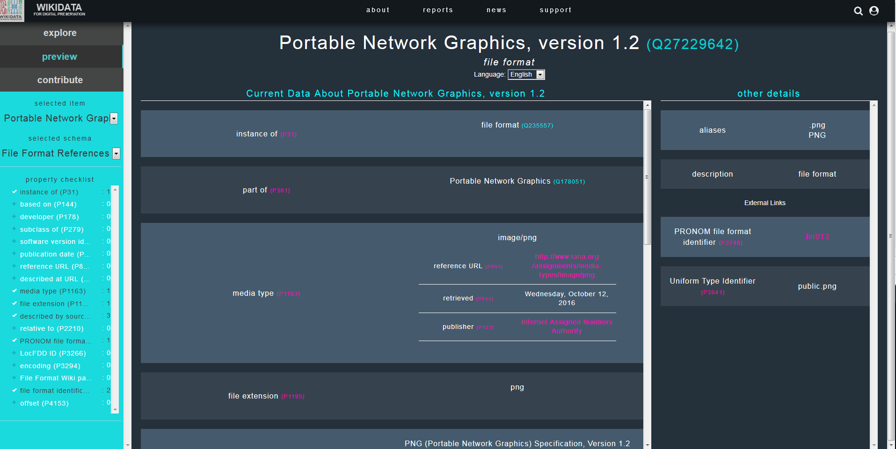

### Annexe 3 : Identification donnée par les différents outils

La présente annexe fournit des exemples de résultats et messages fournis par différents outils à la suite d’une identification portant sur un fichier DOCX.

#### Siegfried

ns: pronom  
id: fmt/412  
format: Microsoft Word for Windows  
version: 2007 onwards  
mime: application/vnd.openxmlformats-officedocument.wordprocessingml.document  
basis: extension match docx; container name [Content_Types].xml with byte match at 2401, 94 (signature 1/3)  
warning: 

ns: tika  
id: application/vnd.openxmlformats-officedocument.wordprocessingml.document  
format: Office Open XML Document  
mime: application/vnd.openxmlformats-officedocument.wordprocessingml.document  
basis: extension match docx; byte match at [[0 4] [30 11]] (signature 2/2)  
warning:  

ns: loc  
id: UNKNOWN  
format:   
full:   
mime:   
basis:   
warning: no match; possibilities based on extension are fdd000395, fdd000397, fdd000400

#### DROID

Method : container  
Statu : Done  
Size : 310033  
Type : File  
Ext. : docx  
Last Modified : 2018-01-24T22:42:49  
Extension Mismatch : false  
Format_Count : 1  
PUID : fmt/412  
Mime Type : application/vnd.openxmlformats-officedocument.wordprocessingml.document  
Format Name : Microsoft Word for Windows  
Format Version : 2007 onwards  


### Annexe 4 : Identifier un format inconnu du référentiel PRONOM

Le registre PRONOM ne décrit qu’environ 2000 formats de fichiers, ce qui représente un nombre réduit de formats par rapport à l’ensemble des formats existants et manipulés par les organisations.

The National Archives (UK) incite les organisations à contribuer à l’enrichissement de ce référentiel par la description de nouveaux formats et de leurs moyens d’identification[^61].

Le présent document vise à fournir un exemple de procédure à suivre pour décrire ce nouveau format et générer des moyens d’identification de celui-ci, testables avec des outils d’identification de formats comme DROID ou Siegfried. Il s’appuie sur la documentation fournie par The National Archives (UK) et sur une présentation faite lors de la conférence iPRES 2018 à Boston[^62].

Pour cela, nous utiliserons l’exemple suivant : des cartes heuristiques qui, par défaut, sont enregistrées dans un format dont l’extension est .mm, et qui ont été créées à partir du logiciel FreePlane que nous avons utilisé dans le cadre du programme Vitam. Les fichiers numériques produits avec ce logiciel, testés avec le logiciel DROID, ne sont pas identifiés.

DROID n’identifie pas les fichiers .mm :


Nous souhaitons obtenir de manière fiable un moyen d’identification des fichiers dans ce format et voici la marche à suivre, étape par étape.

**1/ Se documenter sur le format de fichier**

Avant d’entamer le travail de description et de génération du moyen d’identification adapté au format de fichier, il convient de se documenter sur celui-ci. Il convient pour ce faire de :
- rechercher si ce format de fichier est décrit dans des spécifications publiques ou non ;
- vérifier si d’autres formats de fichiers partagent la même extension que les fichiers qui nous intéressent.

Le format correspondant aux fichiers produits avec le logiciel FreePlane est intitulé FreeMind Mind Map. Une recherche sur ses spécifications sur Internet renvoie vers deux sources :
- le wiki mis à disposition par l’éditeur (http://freemind.sourceforge.net/wiki/index.php/File_format [^63]) qui précise que le format s’appuie sur une syntaxe XML, avec un profil spécifique. Le schéma est stabilisé depuis la version 0.6.5. du logiciel, sachant que la version actuellement publiée est la version 0.7.1. ;
- la forge sur laquelle l’éditeur met à disposition son logiciel (https://github.com/igor-go/mm_xslt_exports/blob/master/freeplane_1.3.x.xsd [^64]), qui permet de consulter le schéma XSD décrivant la syntaxe XML du fichier numérique.

Quant à l’extension utilisée pour le format, une recherche simple effectuée sur Internet, notamment sur les sites https://fileinfo.com/extension/mm [^65] et https://whatis.techtarget.com/fileformat/MM-Text-file-MultiMate-Advantage-II [^66], montre que plusieurs formats de fichiers partagent cette extension :
- fichiers FreeMind Mind Map qui correspondent à nos fichiers de carte heuristique produits avec le logiciel FreePlane ;
- fichiers NeXtMidas Macro File qui correspondent à des fichiers exécutables ;
- fichiers Objective-C++ Source File qui correspondent à des fichiers de code (langage de programmation) ;
- fichiers MultiMate Advantage II qui correspondent à des fichiers de traitement de texte.

De ce travail de documentation, il est possible de tirer les conclusions suivantes :
- l’extension ne peut constituer un moyen d’identification fiable des fichiers FreeMind Mind Map produits par le logiciel FreePlane ;
- les fichiers FreeMindMap ne sont pas des fichiers .xml comme les autres, car le logiciel DROID ne trouve aucune identification pour ces formats et ils nécessitent donc une méthode d’identification spécifique. Étant donné que le format est basé sur une syntaxe XML, il ne s’agit pas d’un format de type conteneur (par exemple un fichier au format .zip ou .docx qui encapsule d’autres fichiers numériques). Seule une signature peut être générée pour servir de moyen d’identification dans ce cas-là.

**2/ Définir la signature propre à un format de fichier**

The National Archive (UK) propose une procédure permettant de définir et de tester une signature valable pour un format de fichier. Cette procédure se base sur la comparaison, au moyen d’un éditeur hexadécimal, d’un corpus représentatif du format de fichier, afin d’identifier des séquences d’octets spécifiques à ce format et partagées entre tous les fichiers du corpus. Ces séquences, qui peuvent être uniques ou multiples, constituent les signatures en tant que telles.

*Qu’est-ce qu’un éditeur hexadécimal ?*

Un éditeur hexadécimal est un logiciel permettant de manipuler un fichier numérique afin de voir ou de modifier son contenu exact, sans que celui-ci soit interprété pour être restitué dans une forme intelligible par l’utilisateur.

Il existe plusieurs éditeurs hexadécimaux, soit disponibles sur Internet, soit téléchargeables et manipulables sur le poste de l’utilisateur, par exemple :
- Windows – HxD[^67]
- OS X – HexFiend[^68]
- Linux – Bless[^69]
- binvis.io[^70]
- HexEd.it[^71]
- IceBuddha[^72]

L’ouverture d’un fichier numérique avec un éditeur hexadécimal fait apparaître les données de manière codée. Dans la plupart des éditeurs, les données sont représentées sous forme :
- de valeurs hexadécimales par ligne de 16 octets, affichés un à un (deux symboles entre 0 et F : 0, 1, 2, 3, 4, 5, 6, 7, 8, 9, A, B, C, D, E, F) ou regroupés par deux pour des mots de 16 bits (quatre symboles entre 0 et F) ;
- pour chaque ligne, d’une interprétation textuelle de ces mêmes octets en ASCII ou en ISO/CEI 8859-1 (Latin-1 Europe occidentale, correspondant à l’alphabet latin numéro 1 composé de 191 caractères), les caractères non affichables étant remplacés par un point « . ».

Affichage des données dans un éditeur hexadécimal :

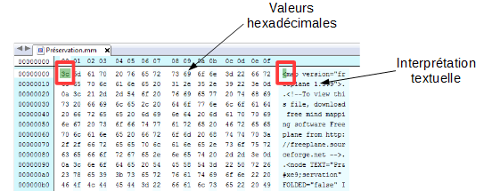

Si l’on prend l’exemple d’une carte heuristique produite avec le logiciel FreePlane et enregistrée sous la forme d’un fichier au format FreeMind Mind Map, FreePlane l’interprète comme suit :

Carte heuristique produite avec FreePlane :

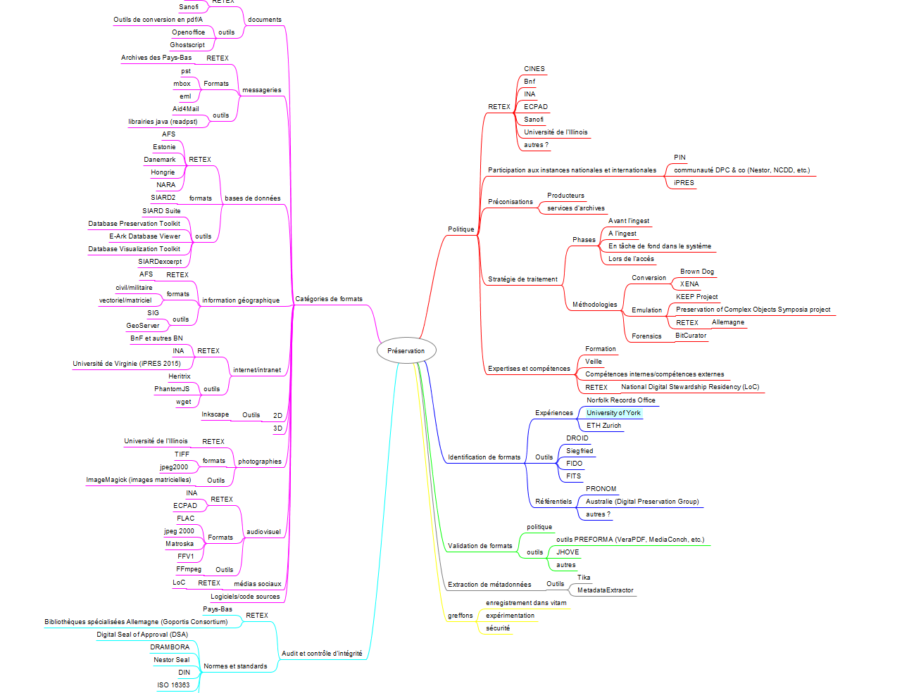

Quant à l’éditeur hexadécimal, il interprète le même fichier comme suit, en le restituant sous forme d’une séquence d’octets :

Carte heuristique éditée par un éditeur hexadécimal :

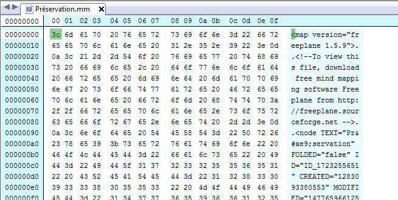

*Comment repérer des séquences communes à plusieurs fichiers d’un même format et exploitables sous forme de signatures ?*

Afin d’identifier les séquences propres au format de fichier FreeMind Mind Map, il convient de :
- analyser les spécifications du format de fichier pour repérer si des séquences d’octets propres à ce format sont décrites, ce qui n’est pas le cas pour le format de fichier qui nous intéresse ;
- importer dans l’éditeur hexadécimal plusieurs fichiers de ce format et procéder à une comparaison des séquences d’octets entre ces fichiers. Attention cependant au fait que des fonctions de comparaison automatiques existent, mais elles ne sont pas systématiquement incluses dans la version gratuite des logiciels.

La comparaison des séquences d’octets doit être opérée principalement :
- au début du fichier (les premières séquences d’octets), correspondant souvent à une forme d’en-tête du fichier ;
- à la fin du fichier.

Dans le cas qui nous intéresse, nous avons procédé à l’analyse avec un éditeur hexadécimal des trois fichiers qui ont fait l’objet d’une analyse avec le logiciel DROID.

S’agissant du début du fichier, nous obtenons le résultat suivant :  

Fichier 1 :

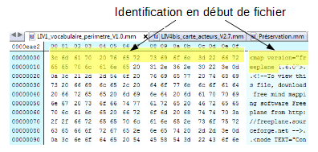

Fichier 2 :

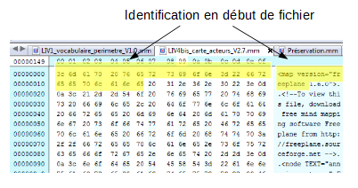

Fichier 3 :

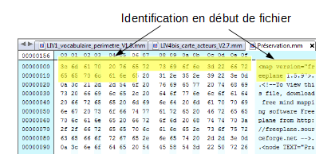

Dans les trois cas existe une séquence commune au début des trois fichiers numériques. Il est cependant prudent de retirer de la séquence les caractères hexadécimaux correspondant au numéro de version du logiciel FreeMind Map utilisé pour créer les fichiers, La signature peut donc se limiter à la représentation textuelle « <map version="freeplane » : « 3C 6D 61 70 20 76 65 72 73 69 6F 6E 3D 22 66 72 65 65 70 6C 61 6E 65 ». 

S’agissant de la fin du fichier, nous obtenons le résultat suivant :

Fichier 1 :

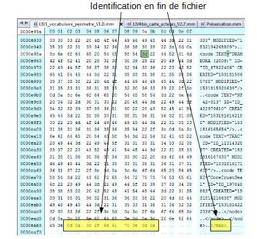

Fichier 2 :

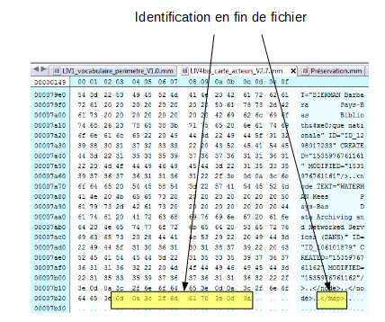

Fichier 3 :

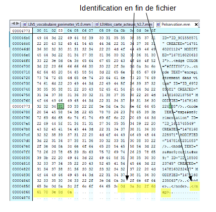

Dans les trois cas existe une séquence commune à la fin des trois fichiers, correspondant à la représentation textuelle « ..</map>.. » : « 0D 0A 3C 2F 6D 61 70 3E 0D 0A ».

**3/ Créer le fichier de signature**

*Concevoir la signature*

Pour retranscrire la séquence d’octets sous forme d’une signature, The National Archives (UK) impose la grammaire suivante :

|||||
|:---|:----|:----|:----|
|Joker (Wildcards)|??|n’importe quelle valeur est possible à la place des ?? (mais uniquement un byte)|0x0A FF ?? FE would match 0x0A FF 6C FE or 0x0A FF 11 FE|
||`*`|Il peut y avoir plusieurs bytes inconnus entre les deux séquences|0x0A FF `*` FE would match 0x0A FF 6C FE or 0x0A FF 6C 11 FE|
||{n}|Il y a un nombre fixe de bytes entre les deux séquences|0x1C 20 {2} 4E 12 would match 0x1C 20 FF 15 4E 12|
||{n-n}|Le nombre de bytes entre les deux séquences se situe entre les 2 n. `*` est possible pour indiquer l’infini|0x03 {1-2} 4D would match 0x03 3C 4D or 0x03 3C 88 4D <br>0x03 {2-`*`} 4D would match 0x03 3C 88 4D or 0x03 3C 88 3F 4D|
|Plage d’octets (Byte Range)|[hh:hh]|La valeur héxadécimale attendue doit être entre ces deux valeurs|0xFF [09:0B] FF would match 0xFF 09<br>FF, 0xFF 0A FF or 0xFF 0B FF|
|Option (Either/or)|(hhhh|hhhh)|Le byte concerné doit avoir une des deux valeurs|0x0E (FF|FE) 17 would match 0x0E FF 17 or 0x0E FE 17|
|Valeurs exclues (Not)|[!hh]|La valeur concernée ne doit pas être présente|0xFF [!09] FF would match 0xFF 0A FF, but not 0xFF 09 FF|
||[!hh:hh]|La valeur attendue ne doit pas être dans cette séquence|0xFF [!01:02] FF would match 0xFF<br>00 FF and 0xFF 03 FF, but not 0xFF 01<br>FF or 0xFF 02 FF|


a) Signature du format FAT12 :

Prenons l’exemple d’un autre format de fichiers (le format FAT12) et d’une signature élaborée par The National Archives (UK) pour celui-ci à partir d’une séquence complexe d’octets :

Édition hexadécimale d’un fichier FAT12 :

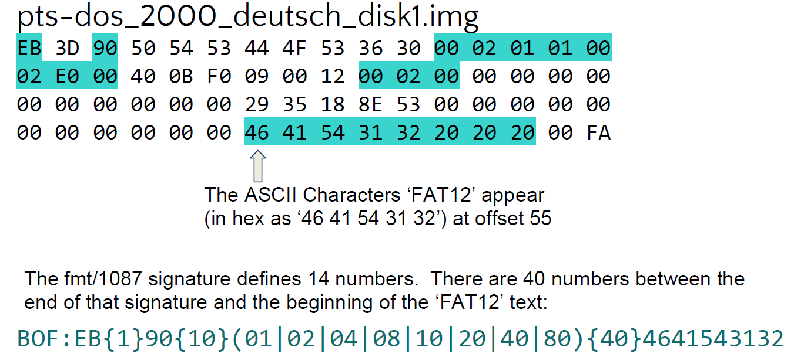

La séquence, partant du début du fichier (= BOF), peut être décrite de la manière suivante :
- le 1er caractère hexadécimal a obligatoirement pour valeur « EB » ;
- le 2e caractère hexadécimal est libre (ils peuvent avoir n’importe quelle valeur) ;
- le 3e caractère hexadécimal a obligatoirement pour valeur « 90 » ; 
- les 10 caractères hexadécimal sont libres (ils peuvent avoir n’importe quelle valeur) ;
- le 14e caractère hexadécimal peut avoir pour valeur soit « 01 », soit « 02 », soit « 04 », soit « 08 », soit « 10 », soit « 20 », soit « 40 » ou soit « 80 »
- les 40 caractères hexadécimaux sont libres (ils peuvent avoir n’importe quelle valeur) ;
- les 55e à 59e caractères ont nécessairement pour valeur la séquence d’octets suivante « 46 41 54 31 32 », ce qui en ASCII correspond à FAT12.

b) Signature du format FreeMind Mind Map :

Dans le cas des fichiers au format FreeMind Mind Map, nous avons identifié deux séquences très simples :
- une première, au début du fichier numérique, sous la forme de la séquence d’octets suivante : « 3C 6D 61 70 20 76 65 72 73 69 6F 6E 3D 22 66 72 65 65 70 6C 61 6E 65 » ;
- une seconde, à la fin du fichier, sous la forme de la séquence d’octets suivante : « 0D 0A 3C 2F 6D 61 70 3E 0D 0A ».

*Vérifier si la signature est partagée avec d’autres formats de fichiers*

Avant de créer le fichier de signature au moyen des utilitaires mis à disposition par The National Archives (UK), il est recommandé de vérifier si les séquences identifiées et exprimées selon la grammaire proposée par The National Archives (UK) sont partagées par d’autres formats de fichiers. Cette vérification peut être effectuée au moyen d’une recherche en plein texte dans les fichiers de signatures publiés à l’adresse suivante : https://www.nationalarchives.gov.uk/aboutapps/pronom/droid-signature-files.htm [^73].

Les résultats pour les deux séquences identifiées, suite à une recherche plein texte dans la version 94 du référentiel PRONOM, sont les suivants :
- la séquence identifiée pour le début du fichier n’est pas utilisée à ce jour :

Recherche de la séquence « 3C 6D 61 70 20 76 65 72 73 69 6F 6E 3D 22 66 72 65 65 70 6C 61 6E 65 » dans le fichier de signature :

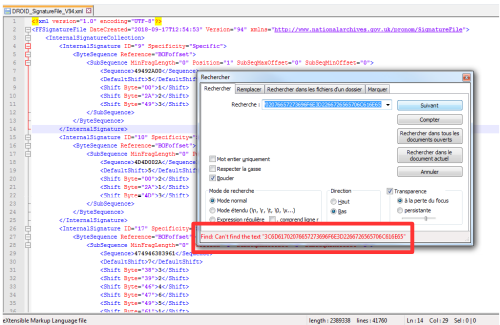

- de la même manière, la séquence identifiée pour la fin du fichier n’est pas utilisée à ce jour pour identifier un autre format :

Recherche de la séquence « 0D 0A 3C 2F 6D 61 70 3E 0D 0A » dans le fichier de signature :

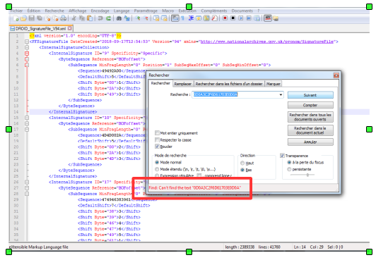

Si les séquences identifiées sont partagées par d’autres formats, en totalité ou en partie, cela signifie qu’il faut reprendre le travail d’identification de séquences d’octets jusqu’à obtenir des éléments spécifiques au format de fichier.

Dans le cas des fichiers au format FreeMind Mind Map, les deux séquences identifiées comme communes à tous les fichiers ne sont partagées par aucun autre format de fichier et peuvent donc servir de moyen d’identification fiable.

*Saisir les signatures dans l’utilitaire PRONOM pour obtenir un fichier de signature testable avec le logiciel DROID*

The National Archives (UK) fournit un utilitaire (Signature Development Utility) permettant de créer un fichier de signature correspondant au format à identifier, disponible à l’adresse suivante : PRONOM :  http://www.nationalarchives.gov.uk/pronom/sigdev/index.htm [^74]. Cet utilitaire permet de :
- nommer le format de fichier faisant l’objet de la description et de la production de moyens d’identification (champ Name) ; 
- indiquer la version de ce format (champ Version) ;
- indiquer l’extension de ce format (champ Extension) ;
- proposer un identifiant unique pour ce format (champ PUID) ;
- indiquer le type MIME de ce format (champ Mimetype) ;
- créer la description des signatures associées à ce format, sachant qu’il peut y en avoir plusieurs (il est possible à tout moment d’en ajouter ou d’en enlever une), avec comme informations :
    - la signature elle-même, c’est-à-dire la séquence d’octets identifiée, et décrite en utilisant la grammaire imposée par The National Archives (UK) (champ InternalSignature) ;
    - le positionnement de cette signature dans le fichier lui-même, avec trois options possibles (champ Anchor) : 
        - BOF = Beginning of File si la signature a été repérée au début du fichier ;
        - EOF = End of File si la signature a été repérée à la fin du fichier ;
        -  Var = Variable, si la signature se trouve positionnée au cœur du fichier ;
    - la position exacte de début ou de fin de la signature par rapport au début ou à la fin du fichier (champ Offset) ;
    - la position maximale de début ou de fin de la signature par rapport au début ou à la fin du fichier (champ Max Offset) ;
- exporter les éléments saisis sous la forme d’un fichier de signature importable dans le logiciel DROID et utilisable dans d’autres outils d’identification de formats comme Siegfried, pour vérifier la pertinence des résultats obtenus.

Dans le cas des fichiers au format FreeMind Mind Map, voici le résultat de la saisie effectuée avec l’utilitaire :
Saisie des informations correspondant à la signature du format FreeMind Mind Map :

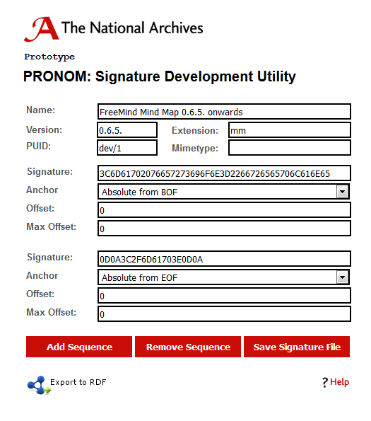

Un clic sur le bouton « Save Signature File » permet d’exporter le fichier de signature créé sous la forme d’un fichier au format XML similaire à ceux mis à disposition par The National Archives (UK). S’agissant du format de fichier FreeMind Mind Map, voici le fichier XML correspondant aux informations que nous avons saisies :

Fichier de signature propre au format FreeMind Mind Map :

```xml
<?xml version="1.0" encoding="UTF-8"?>
<FFSignatureFile xmlns="http://www.nationalarchives.gov.uk/pronom/SignatureFile" Version="1" DateCreated="2019-03-05T10:40:29+00:00">
  <InternalSignatureCollection>
  <InternalSignature ID="1" Specificity="Specific">
  <ByteSequence Reference="BOFoffset">
    <SubSequence MinFragLength="0" Position="1" SubSeqMaxOffset="0" SubSeqMinOffset="0">
      <Sequence>3C6D61702076657273696F6E3D2266726565706C616E65</Sequence>
      <DefaultShift>27</DefaultShift>
      <Shift Byte="3C">26</Shift>
      <Shift Byte="6D">25</Shift>
      <Shift Byte="61">6</Shift>
      <Shift Byte="70">8</Shift>
      <Shift Byte="20">3</Shift>
      <Shift Byte="76">21</Shift>
      <Shift Byte="65">4</Shift>
      <Shift Byte="72">11</Shift>
      <Shift Byte="73">18</Shift>
      <Shift Byte="69">17</Shift>
      <Shift Byte="6F">16</Shift>
      <Shift Byte="6E">5</Shift>
      <Shift Byte="3D">14</Shift>
      <Shift Byte="22">13</Shift>
      <Shift Byte="66">12</Shift>
      <Shift Byte="6C">7</Shift>
      <Shift Byte="31">2</Shift>
      <Shift Byte="2E">1</Shift>
    </SubSequence>
  </ByteSequence>
  <ByteSequence Reference="EOFoffset">
    <SubSequence MinFragLength="0" Position="1" SubSeqMaxOffset="0" SubSeqMinOffset="0">
      <Sequence>0D0A3C2F6D61703E0D0A</Sequence>
      <DefaultShift>-11</DefaultShift>
      <Shift Byte="0D">-1</Shift>
      <Shift Byte="0A">-2</Shift>
      <Shift Byte="3C">-3</Shift>
      <Shift Byte="2F">-4</Shift>
      <Shift Byte="6D">-5</Shift>
      <Shift Byte="61">-6</Shift>
      <Shift Byte="70">-7</Shift>
      <Shift Byte="3E">-8</Shift>
    </SubSequence>
  </ByteSequence>
</InternalSignature>
</InternalSignatureCollection>
<FileFormatCollection>
  <FileFormat ID="1" Name="FreeMind Mind Map 0.6.5. onwards" PUID="dev/1" Version="0.6.5." MIMEType="">
    <InternalSignatureID>1</InternalSignatureID>
    <Extension>mm</Extension>
  </FileFormat>
</FileFormatCollection></FFSignatureFile>
``` 

**4/ Tester le fichier de signature**

Une fois le fichier de signature créé, il convient de revenir dans le logiciel DROID pour l’importer et le tester avec l’échantillon de fichiers utilisé.

Pour importer le fichier de signature, il convient de lancer le logiciel DROID, d’aller, dans le menu, dans l’option « Tools » puis dans la sous-option « Install Signature Files ».

Une fenêtre de dialogue (cf. copie d’écran ci-dessous) s’ouvre alors et permet de :
- ouvrir le navigateur pour aller chercher le fichier de signature sur le poste de travail de l’utilisateur (bouton « Browse ») ;
- définir si le fichier de signature importé doit être utilisé comme référentiel par défaut pour procéder à l’identification des fichiers importés dans DROID (case à cocher « Use this signature file as default »).

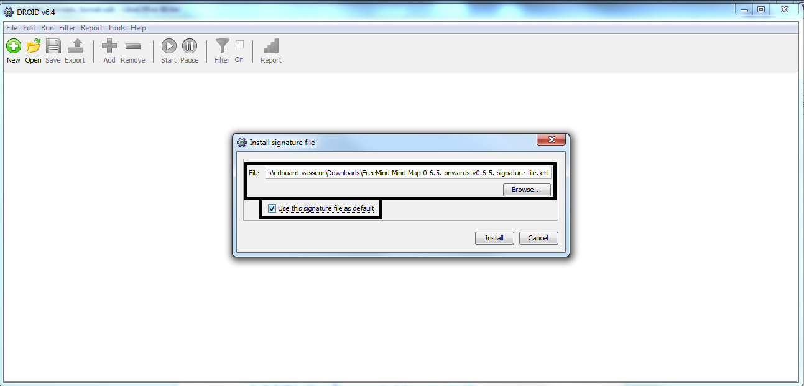

Un clic sur le bouton « Install » permet de clore l’opération et ouvre une nouvelle fenêtre de dialogue indiquant à l’utilisateur le succès ou l’échec du processus d’import du fichier de signature (cf. copie d’écran ci-dessous).

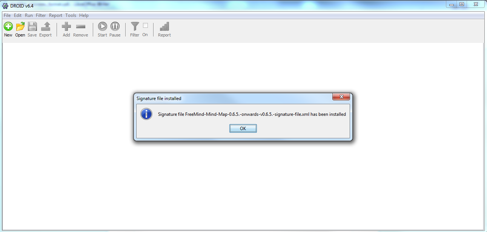

Une fois le fichier de signature référençant le format de fichier FreeMind Mind Map importé avec succès, il suffit de reprendre l’opération d’identification pour les trois fichiers ayant servi d’échantillon, en utilisant la méthodologie classique d’utilisation du logiciel DROID :
- création d’un environnement de test en cliquant sur le bouton « New » de la barre de tâches ;
- import des fichiers à tester en cliquant sur le bouton « Add » de la barre de tâches ;
- lancement de l’opération d’identification en cliquant sur le bouton « Start » de la barre de tâches ».

Grâce à la signature générée et au fichier de signature importé, les trois fichiers au format FreeMind Mind Map de notre échantillon sont désormais identifiables par le logiciel DROID (cf. copie d’écran ci-dessous).

Résultat de l’identification des trois fichiers par DROID : les fichiers sont identifiés au format FreeMind Mind Map

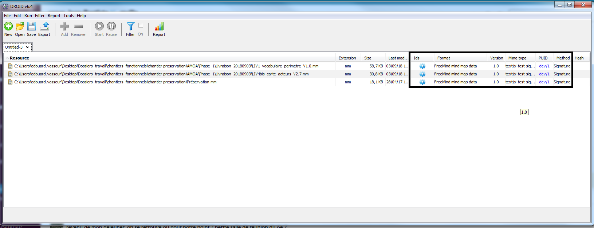

[^1]: Corrado Edward M., Sandy Heather Moulaison. Digital Preservation for Librairies, Archives & Museums. New York, London : Rowman & Littlefiels, 2017.

[^2]: http://file-extension.net/seeker/. Lien vérifié le 16 décembre 2019.

[^3]: http://filext.com/. Lien vérifié le 16 décembre 2019.

[^4]: https://fileinfo.com/. Lien vérifié le 16 décembre 2019.

[^5]: https://www.file-extensions.org/. Lien vérifié le 16 décembre 2019.

[^6]: Voir par exemple http://openpreservation.org/blog/2016/06/14/five-star-file-format-signature-development/. Lien vérifié le 16 décembre 2019.

[^7]: https://en.wikipedia.org/wiki/List_of_file_signatures. Lien vérifié le 16 décembre 2019.

[^8]: http://www.filesignatures.net/index.php?page=search. Lien vérifié le 16 décembre 2019.

[^9]: http://www.garykessler.net/library/file_sigs.html. Lien vérifié le 16 décembre 2019.

[^10]: L’annexe 2 « Description d’un format par différents registres » du présent document présente des exemples issus de plusieurs registres de formats.

[^11]: http://www.nationalarchives.gov.uk/PRONOM/Default.aspx. Lien vérifié le 16 décembre 2019.

[^12]: Un exemple de fiche est fourni dans l’annexe 2 « Description d’un format par différents registres » du présent document.

[^13]: Lien vérifié le 16 décembre 2019.

[^14]: http://www.nationalarchives.gov.uk/documents/information-management/pronom-file-signature-research.pdf. Lien vérifié le 16 décembre 2019. Une présentation de la méthodologie utilisable pour créer une « signature » est disponible dans l’annexe 4 « Identifier un format inconnu du référentiel PRONOM » du présent document.

[^15]: https://www.nationalarchives.gov.uk/aboutapps/pronom/droid-signature-files.htm. Lien vérifié le 16 décembre 2019.

[^16]: https://www.loc.gov/preservation/digital/formats/fdd/descriptions.shtml. Lien vérifié le 16 décembre 2019.

[^17]: http://wikidp.org/ . Lien vérifié le 16 décembre 2019.

[^18]: http://the-fr.org/, https://github.com/exponential-decay/the-format-registry. Liens vérifiés le 16 décembre 2019.

[^19]: http://justsolve.archiveteam.org/wiki/Planets_Core_Registry. Lien vérifié le 16 décembre 2019.

[^20]: https://digitalpreservation.natlib.govt.nz/current-projects/technical-registry/. Lien vérifié le 31 juillet 2017.

[^21]: https://digitalpreservation.natlib.govt.nz/assets/NDHA/Publications/2014/NSLA-Format-Model-NRIN-redraft.pdf. Lien vérifié le 16 décembre 2019.

[^22]: https://en.wikipedia.org/wiki/Global_Digital_Format_Registry et http://library.harvard.edu/preservation/digital-preservation_gdfr.html. Liens vérifiés le 31 juillet 2017.

[^23]: Lien vérifié le 16 décembre 2019.

[^24]: http://openpreservation.org/blog/2012/02/23/identification-tools-evaluation/. Lien vérifié le 16 décembre 2019.

[^25]: Les liens vers ces outils sont listés à la page suivante : https://projects.iq.harvard.edu/fits/tools#adl_tool. Lien vérifié le 16 décembre 2019.

[^26]: http://adlnet.github.io/xAPI-SCORM-Profile/dev/adl-tools.html. Lien vérifié le 16 décembre 2019.

[^27]: https://tika.apache.org/. Lien vérifié le 16 décembre 2019.

[^28]: http://digital-preservation.github.io/droid/. Lien vérifié le 16 décembre 2019.

[^29]: https://exiftool.org/. Lien vérifié le 16 décembre 2019.

[^30]: https://github.com/gmcgath/ffident. Lien vérifié le 16 décembre 2019.

[^31]: http://darwinsys.com/file/. Lien vérifié le 16 décembre 2019.

[^32]: https://github.com/openpreserve/jhove. Lien vérifié le 16 décembre 2019.

[^33]: https://mediaarea.net/en/MediaInfo. Lien vérifié le 16 décembre 2019.

[^34]: http://meta-extractor.sourceforge.net/. Lien vérifié le 16 décembre 2019.

[^35]: https://projects.iq.harvard.edu/fits/tools#ois_audio. Lien vérifié le 16 décembre 2019.

[^36]: https://projects.iq.harvard.edu/fits/tools#ois_file. Lien vérifié le 16 décembre 2019.

[^37]: https://projects.iq.harvard.edu/fits/tools#ois_xml. Lien vérifié le 16 décembre 2019.

[^38]: https://github.com/opf-labs/jhove2. Lien vérifié le 16 décembre 2019.

[^39]: https://tika.apache.org/. Lien vérifié le 16 décembre 2019.

[^40]: http://digital-preservation.github.io/droid/. Lien vérifié le 16 décembre 2019.

[^41]: https://www.loc.gov/preservation/digital/formats/index.html. Lien consulté le 16 décembre 2019.

[^42]: https://facile.cines.fr/. Lien vérifié le 16 décembre 2019.

[^43]: Matthias Töwe, Franziska Geisser, Roland E. Suri, « To Act ou Not to Act. Handling File Format Identification Issues in Practice », iPRES 2016 Proceedings, p. 288-289. Voir également https://www.ethz.ch/services/en/service/communication/corporate-design/templates-for-creative-design/research-poster.html. Lien vérifié le 16 décembre 2019.

[^44]: http://digital-archiving.blogspot.com/. Lien vérifié le 16 décembre 2019.

[^45]: http://digital-archiving.blogspot.fr/2017/02/what-have-we-got-in-our-digital-archive.html. Lien vérifié le 16 décembre 2019.

[^46]: http://digital-archiving.blogspot.fr/2016/11/every-little-bit-helps-file-format.html. Lien vérifié le 16 décembre 2019.

[^47]: http://digital-archiving.blogspot.fr/2016/09/file-format-identification-at-norfolk.html. Lien vérifié le 16 décembre 2019.

[^48]: http://digital-archiving.blogspot.fr/2016/08/research-data-is-different.html. Lien vérifié le 16 décembre 2019.

[^49]: http://archival-integration.blogspot.fr/2016/06/born-digital-data-what-does-it-really.html. Lien vérifié le 16 décembre 2019.

[^50]: http://digital-archiving.blogspot.fr/2016/05/research-data-what-does-it-really-look.html. Lien vérifié le 16 décembre 2019.

[^51]: http://digital-archiving.blogspot.fr/2016/08/my-first-file-format-signature.html. Lien vérifié le 16 décembre 2019.

[^52]: Voir annexe 4 « Identifier un format inconnu du référentiel PRONOM ».

[^53]: Les catégories identifiées dans le registre PRONOM sont les suivantes : Aggregate, Audio, Database, Dataset, Email, GIS, Image (Raster), Image (Vector), Model, Page Description, Presentation, Spreadsheet, Text (Mark-up), Text (Structured), Text (Unstructured), Video, Word Processor.

[^54]: Les catégories identifiées dans le registre de la Bibliothèque du Congrès (https://www.loc.gov/preservation/digital/formats/fdd/descriptions.shtml, lien vérifié le 16 décembre) sont les suivantes : Dataset, Generic, Geospatial, Moving Image, Sound, Still Image, Textual, Web Archive.

[^55]: Pour en savoir plus sur le mécanisme d’administration du référentiel des formats de la solution logicielle Vitam, consulter la [documentation VITAM.Gestion de la préservation](./preservation.md).

[^56]: Le résultat des études est disponible à l’adresse suivante :https://francearchives.fr/fr/article/88482504. Lien consulté le 16 décembre 2019.

[^57]: http://openpreservation.org/blog/2014/09/27/siegfried-pronom-based-file-format-identification-tool/. Lien consulté le 16 décembre 2019.

[^58]: Pour en savoir plus sur le mécanisme de plug-in dans la solution logicielle Vitam, consulter les documentations suivantes : [Gestion de la préservation](./preservation.md), [Documentation d’installation](https://www.programmevitam.fr/ressources/DocCourante/html/installation), [Documentation d’exploitation](https://www.programmevitam.fr/ressources/DocCourante/html/exploitation).

[^59]: Pour en savoir plus sur les opérations de traitement de masse des fichiers numériques (opérations de préservation), consulter la documentation spécifique à ce sujet, [Gestion de la préservation](./preservation.md).

[^60]: Pour en savoir plus sur les outils de préparation des entrées développés par l’équipe programme Vitam, consulter la [documentation Resip](./resip.md).

[^61]: À savoir une description minimale du format (ex : extension, type MIME, etc.) et, le cas échéant, sa signature.

[^62]: Clipsham David, Krabbenhoeft Nick, Peltzmann Shira, Simpson Justin, Wilson Carl. « PRONOM in Practice : Creating File Format/System Signatures for Submission to PRONOM Technical Registry ». iPRES 2019.

[^63]: Lien vérifié le 16 décembre 2019.

[^64]: Lien vérifié le 16 décembre 2019.

[^65]: Lien vérifié le 16 décembre 2019.

[^66]: Lien vérifié le 16 décembre 2019.

[^67]: L’outil est librement téléchargeable à l’adresse suivante : https://mh-nexus.de/en/hxd/ (Lien vérifié le 16 décembre 2019).

[^68]: L’outil est librement téléchargeable à l’adresse suivante : http://ridiculousfish.com/hexfiend/ (Lien vérifié le 16 décembre 2019).

[^69]: L’éditeur est disponible en ligne à l’adresse suivante : https://github.com/bwrsandman/Bless (lien vérifié le 16 décembre 2019).

[^70]: L’éditeur est disponible en ligne à l’adresse suivante : http://binvis.io (Lien vérifié le 16 décembre 2019).

[^71]: L’éditeur est disponible en ligne à l’adresse suivante : https://hexed.it/ (Lien vérifié le 16 décembre 2019).

[^72]: L’éditeur est disponible en ligne à l’adresse suivante : http://icebuddha.com/ (Lien vérifié le 16 décembre 2019).

[^73]: Lien vérifié le 16 décembre 2019.

[^74]: Lien vérifié le 16 décembre 2019.