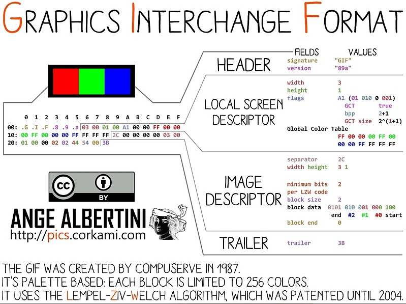
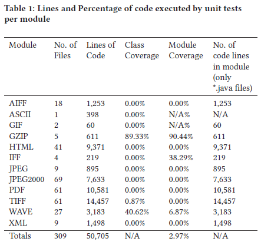
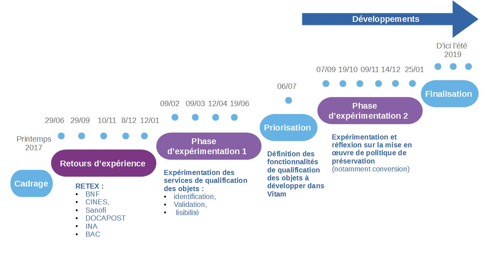

Validation du format des fichiers
=====

Introduction
------------

### Documents de référence

|**Document**|**Date de la version**|**Remarques**|
|:---------------:|:-----:|:-----:|
|Vitam – Gestion de la préservation|||
|[Vitam – Identification des formats de fichiers](./chantier_identification_format.md)|||
|Vitam – Extraction des métadonnées techniques|||

### Présentation du document

Le présent document constitue une présentation de la problématique de la validation des formats de fichiers et de la manière dont elle pourra être prise en compte dans la solution logicielle Vitam, aux fins de permettre la pérennisation à moyen et long terme des archives électroniques. 

Il ne traite pas des questions d’identification de formats ou d’extraction de métadonnées techniques qui font l’objet de documents spécifiques.

### Définitions

**Conversion de format :** opération qui consiste à convertir le document dans un format différent de celui dans lequel il était précédemment encodé. Elle doit préserver la fidélité du document (Source : NF Z 42-013).

**Faux négatif :** événement qui aurait dû générer une alerte et qui n’en a pas généré.

**Faux positif :** événement qui a généré une alerte à mauvais escient.

**Format de fichier :** ensemble des règles et algorithmes permettant d'organiser l'information dans un fichier numérique, par exemple : spécifier le codage des couleurs des pixels d'une image ; définir un algorithme de compression des données et l'organisation de ces données dans un fichier (formats PNG, TIFF…) ; spécifier l'organisation et la structuration d'informations textuelles à partir de l'encodage élémentaire des caractères (formats SGML, XML) ; définir comment les quatre informations élémentaires que sont la mantisse (nombre entier positif), l'exposant (nombre entier positif), le signe de l'exposant et le signe de la mantisse (caractères + et -) sont organisées pour représenter un nombre réel sous forme numérique (cf. standard ANSI/IEEE 754-1985) (Source : PIAF).

**Identification de format :** processus permettant de définir précisément le format d’un fichier numérique, qu’il s’agisse d’un conteneur ou non.

**Pérennisation :** ensemble des opérations destinées à garantir qu’une information soit en mesure de traverser le temps durant tout son cycle de vie en préservant son intégrité (définition inspirée de la NF Z 42-013).

**Validation de format :** processus permettant de vérifier que le format d’un fichier respecte les spécifications publiées de celui-ci, en termes de structure comme de syntaxe.

Présentation de la problématique
----

### Pourquoi et comment valider le format des fichiers ?

#### Qu’est-ce que la validation de format et à quoi sert-elle ?

**Présentation de la problématique**

L’objectif de la préservation numérique est de conserver dans le temps des fichiers numériques dans une forme utilisable et exploitable. Pour une plate-forme d’archivage, il est donc important de disposer de mécanismes permettant de vérifier que les fichiers numériques qui lui sont transmis, pour prise en charge sont dans une forme qui sera utilisable et exploitable dans le temps.

La validation des formats est un des mécanismes mis en œuvre pour effectuer cette vérification. Son objectif est de vérifier si un fichier numérique est conforme aux spécifications de son format, d’un point de vue syntaxique comme sémantique. Si le format du fichier est déclaré valide, la plate-forme d’archivage pourra être sûre que tout logiciel identifié comme capable de représenter un fichier de ce format sera capable de le faire. Contrairement à l’identification de format qui se base uniquement sur l’extension ou les « signatures de fichiers »[^1], la validation de format nécessite une analyse complète du train de bits et sa comparaison avec les spécifications. À ce titre, le coût en puissance de calcul de la validation est bien supérieur à celui de l’identification et se rapproche de celui d’une transformation.

Pour que la validation soit faisable et efficace, deux prérequis doivent naturellement être remplis :
- le format doit disposer de spécifications écrites et disponibles, ce qui n’est pas nécessairement le cas ; 
- les spécifications du format ne doivent pas être sujettes à interprétation, ce qui est souvent le cas pour les formats les plus répandus et, par conséquent, les plus perméables comme le PDF[^2]. Les logiciels utilisés pour représenter ce type de formats interprètent les spécifications et se révèlent capables de représenter des fichiers numériques non complètement conformes à ces dernières. La question est alors de savoir à quel point la non-conformité d’un fichier numérique par rapport aux spécifications de son format est gérée ou non par la flexibilité des logiciels[^3].
La validation de format présente donc un degré de complexité proportionnel à celle de ses spécifications. Si certains formats sont très simples, d’autres, comme le PDF, sont en revanche très complexes, car ils permettent d’associer dans un même fichier une multitude de contenus, d’embarquer des fichiers vidéo disposant eux-mêmes de leurs propres spécifications ou d’utiliser des polices de caractères embarquées ou non, rendant le fichier numérique plus difficile à identifier et à valider.

**Notion de well formed et de valid**

La validation de format se décompose souvent en deux niveaux :
- la vérification qu’un fichier est bien formé (well-formed), ce qui relève de la syntaxe ;
- la vérification qu’un fichier est valide (valid), ce qui relève de la sémantique.

Prenons tout d’abord l’exemple d’un fichier au format XML :
- pour être bien formé, il doit être conforme aux recommandations émises par le W3C[^4] :
    - il a toujours une et une seule racine, le nœud document ;
    - il consiste en un ou plusieurs noeuds éléments imbriqués et délimités, mais jamais entrecroisés ;
    - il dispose de commentaires délimités par <!-- et --> dont le contenu ne sera pas interprété ;
- pour être valide, il doit être conforme à un schéma qui définit le dictionnaire des noms d’éléments et d’attributs ainsi que la grammaire décrivant leur articulation (ex. schéma SEDA 2.1.)[^5].

Prenons ensuite l’exemple d’un fichier au format GIF qui, pour être valide, doit, quand on l’ouvre avec un éditeur hexadécimal :
- toujours commencer par une de ces deux chaînes de caractères ASCII : « GIF87 » ou « GIF89a » ;
- toujours s’achever par « 3B »[^6].

*Représentation hexadécimale d’un fichier au format GIF et interprétation de cette représentation*

Prenons enfin l’exemple d’un fichier au format PDF, qui démontre la complexité du sujet. Pour être conforme à ses spécifications, un fichier au format PDF doit disposer de la structure suivante :
- une en-tête (header) ;
- un corps (body) ;
- une table de références croisées (cross reference table) ;
- une « bande annonce » (trailer).

L’en-tête (header) correspond à la première ligne du fichier et doit contenir les cinq caractères « %PDF- », suivis du numéro de version. Or la manière dont le numéro de version est composé est sujette à interprétation :
- la norme ISO32000-1:2008 indique que le numéro de version doit prendre la forme « 1.N » où N est un nombre compris entre 0 et 7 ;
- la documentation fournie par Adobe indique simplement que le numéro de version doit avoir une forme M-m, où M est le numéro de version majeure et m le numéro de version mineure ;
- chaque spécification fournie par Adobe explicite le numéro de version (ex. 1.6. pour le PDF 1.6.) ;
- depuis la version 1.4., le numéro de version peut aussi être inclus dans le document’s catalog dictionary. Si ce dernier est présent, il sert de référence, de préférence à celui indiqué dans l’en-tête[^7].

#### Comment ça marche ?

La validation de format est réalisée au moyen d’outils logiciels, génériques ou spécifiques, conçus et réalisés par différents organismes – concepteurs de formats, éditeurs de logiciels, spécialistes de la préservation numérique – pour différents publics – développeurs, utilisateurs, spécialistes de la préservation numérique.

Ces outils analysent les fichiers qui leur sont soumis, identifient leur format (sur la base de leur extension ou de leurs signatures). Ils vérifient ensuite leur validité en s’appuyant sur la base de propriétés dont ils disposent. Cette base de propriétés consiste en un certain nombre  de tests considérés comme nécessaires et suffisants pour vérifier la conformité du format d’un fichier par rapport aux spécifications de son format. Préprogrammés dans chaque outil, ils sont propres à chaque type de format. Ce sont donc des semi-preuves (heuristiques) qui sont utilisées par les outils de validation de format.

On peut tirer de cette présentation des outils de validation plusieurs conséquences :
- seuls quelques formats, généralement les plus utilisés, disposent d’outils de validation ;
- la mise en œuvre des opérations de validation par un outil présuppose que celui-ci est parvenu à identifier le format des fichiers numériques qui lui sont soumis ;
- toutes les spécifications d’un format ne sont pas nécessairement testées par les outils, tout dépendant de l’effort consenti en termes de ressources dans leur programmation. Rien n’empêche qu’un outil de validation ne déclare valide un fichier numérique qui ne l’est pas, puisque le résultat dépend du périmètre de sa base de connaissances et par conséquent des tests qu’il effectue. Dès lors que toutes les spécifications d’un format ne sont pas systématiquement testées dans l’outil, rien n’empêche qu’une non-conformité à celles-ci ne soit pas détectée par l’outil de validation choisi. C’est ce que l’on appelle un « faux négatif » : un fichier déclaré comme valide par un outil, alors qu’il présente un défaut non vérifié par l’outil, parce que ce dernier n’a pas été programmé pour le détecter ;
- l’identification de la non-conformité d’un fichier numérique par rapport aux spécifications de son format ne signifie pas nécessairement que le fichier n’est pas représentable par un quelconque logiciel ou qu’il ne le sera pas à l’avenir[^8].

En cas de non-conformité d’un fichier par rapport à son format, les outils de validation de format peuvent :
- soit proposer des actions correctives permettant de réparer l’erreur identifiée dans les fichiers invalides ;
- soit se contenter de retourner des messages d’erreur.

Or il s’avère que :
- tous les outils de validation de format ne proposent pas d’actions correctives ;
- certains outils se contentent de détecter la non-conformité d’un fichier numérique sans générer de message d’erreur permettant de décrire celle-ci ou en générant un message dont l’interprétation n’est pas évidente pour un utilisateur ;
- la mise en œuvre d’actions correctives de manière automatique peut générer un fichier structurellement valide mais dont l’information est corrompue par l’action même de la correction. Tout utilisateur a en général pu constater cet effet dans la récupération de documents bureautiques. Cette fonctionnalité doit donc être envisagée avec prudence ;
- la mise en œuvre d’actions correctives avec une intervention humaine n’est pas évidente, car elle suppose une connaissance des spécifications du format de fichier concerné et la capacité à corriger l’erreur identifiée[^9]. Il s’agit d’un acte de restauration en tant que tel, qui n’est nécessaire que si la non-conformité empêche le traitement par les visualiseurs et les convertisseurs.

En croisant les critères d’efficacité, de qualité d’analyse, de richesse des retours d’anomalies, voire de propositions de corrections, il se peut que les outils de validation pertinents pour une validation automatique soient différents des outils de validation pertinents pour une validation et une correction par un humain.

Il est possible de distinguer deux grandes catégories d’outils de validation de format de fichiers :
- des outils génériques, permettant de procéder à la validation de plusieurs catégories de formats de fichiers (ex. JHOVE) ;
- des outils spécifiques à un format de fichier donné (ex. VeraPDF pour le format PDF/A ou les outils de validation de fichiers au format XML ou JSON).

Une des difficultés de la préservation numérique réside dans la difficulté à disposer, comme pour l’identification de formats, d’outils de validation génériques donnant des résultats satisfaisants pour un nombre important de formats. Il en résulte que seule une combinaison d’outils génériques et d’outils spécifiques peut garantir une couverture suffisante en termes de validation de format, du moins pour les formats les plus fréquemment utilisés[^10].

### Les outils de validation de format disponibles

#### Les outils génériques

##### ExifTool

Site web : (http://owl.phy.queensu.ca/~phil/exiftool/)  
Dépôt du code : (https://sourceforge.net/p/exiftool/code/ci/master/tree/)  
Licence : GNU GPL ou Artistic License  
Dernière mise à jour du code : 5 décembre 2019 (version 11.78)

Exiftool est avant tout un outil spécialisé dans l’extraction de métadonnées présentes dans les propriétés des fichiers numériques[^11]. Néanmoins, pour certains types de fichiers comme les fichiers au format TIFF, via les erreurs et avertissements détectés lors de l’opération d’extraction des métadonnées, il permet d’identifier des problèmes de conformité des fichiers par rapport aux spécifications de leur format[^12].

##### File Information Tool Set (FITS)

Site web : (https://projects.iq.harvard.edu/fits/home)
Dépôt du code : (https://github.com/harvard-lts/fits)
Langage : JAVA 1.7 et au-delà
Licence : GNU LGPL
Dernière mise à jour : 10 septembre 2019 (version 1.5.0.)
Clients : Archivematica

Développé par la Harvard University Library, FITS est un cadre logiciel open source, disponible uniquement en ligne de commande, permettant non seulement d’identifier le format des fichiers, mais aussi de le valider et d’extraire les métadonnées embarquées. FITS fédère les résultats des outils suivants :
- ADL Tools[^13] ;
- Apache Tika[^14] ;
- DROID[^15] ;
- ExifTool[^16] ;
- FFIdent[^17] ;
- File Utility[^18] ;
- JHOVE[^19] ;
- MediaInfo[^20] ;
- National Library of New Zealand Metadata Extractor[^21] ;
- OIS Audio Information[^22] ;
- OIS File Information[^23] ;
- OIS XML Information[^24].

Il inclut également les librairies open source suivantes :
- JDOM (Apache-like license, modified Apache version 1.1)[^25] ;
- StaxMate[^26] ;
- stax2[^27] ;
- woodstox[^28] ;
- xercesImpl[^29] ;
- xml-apis[^30] ;
- xmlunit[^31] ;
- JNA[^32].

Les résultats tirés de l’analyse de cet outil sont consolidés dans un fichier XML décomposé en grandes zones, dont l’une répertorie les outils utilisés, contenant les différentes métadonnées identifiées. Le fichier XML peut néanmoins être édité pour permettre à l’utilisateur de récupérer les informations dans un autre format.

##### JHOVE

Site web : (http://jhove.openpreservation.org/)  
Dépôt du code : (https://github.com/openpreserve/jhove)  
Langage : JAVA  
Licence : GNU LGPL  
Dernière mise à jour : 18 avril 2019 (version 1.22.)  
Clients : Archivematica, CINES, Rosetta

JHOVE est un cadre logiciel open source développé initialement par JSTOR et la Harvard University Library à partir de 2003, avec le soutien de la Andrew W. Mellon Foundation. Après avoir migré JHOVE sous GitHub en 2013, son concepteur, Gary McGath, a annoncé en 2014 qu’il n’était plus capable d’assurer seul la maintenance du logiciel. Celle-ci a donc été reprise en février 2015 par l’Open Preservation Foundation, ce qui a conduit à la migration du code sur son propre GitHub et à la mise en place d’un comité chargé de piloter la maintenance et les évolutions du produit[^33].

Basé sur une logique modulaire et donc extensible[^34], JHOVE permet d’identifier le format des fichiers numériques, de valider et de caractériser ces derniers et d’extraire une large masse d’informations sur les propriétés techniques des fichiers. JHOVE est utilisable soit via une interface graphique, soit en ligne de commande.

Formats supportés :

||||
|:---|:----|:----|
|Conteneur|En additionnel|GZIP|
|Document PDF|En standard|PDF|
|Document structuré|En standard|HTML, XML|
||En additionnel|WARC|
|Image fixe|En standard|GIF, JPEG, JPEG2000, TIFF|
||En additionnel|PNG|
|Son|En standard|AIFF, WAVE|
|Texte|En standard|ASCII, UTF-8|

Les résultats de l’analyse sont consolidés dans un fichier plein texte ou un fichier au format XML.

Un projet de refonte de l’outil a été mené par la California Digital Library (JHOVE 2). Mais aucune mise à jour n’a été effectuée sur cette nouvelle version depuis 2014[^35].

JHOVE est globalement considéré par la communauté de la préservation numérique comme un des rares outils capables de réellement valider le format des fichiers numériques[^36].  
Cependant, les résultats obtenus avec cet outil sont plus ou moins satisfaisants en fonction des modules et des formats concernés :
- pour le format GIF : le module de JHOVE est relativement simple, avec seulement 80 lignes de code et 10 types différents de non-conformité détectés. Des tests ont notamment été réalisés avec des fichiers corrompus à l’occasion d’une opération de téléchargement ou de chargement. Les résultats obtenus avec JHOVE (détection des faux positifs comme détection des faux négatifs) ont été comparés à ceux obtenus avec trois autres outils (ImageMagick, National Library of New Zealand Metadata Extractor et Bad Peggy). Si les résultats obtenus avec JHOVE sont globalement satisfaisants, ils restent de moins bonne qualité que ceux obtenus avec ImageMagick[^37] ;
- pour le format JPEG : le module de JHOVE est capable d’identifier 13 types différents de non-conformité – alors que l’outil Bad Peggy utilisé comme contre-point en identifie 30 –, chacune générant un message d’erreur spécifique. Des tests ont été réalisés à partir d’un échantillon de 3070 fichiers dont certains présentent des problèmes aisément détectables par simple analyse visuelle. Certaines erreurs détectées par Bad Peggy ne le sont aucunement par JHOVE qui considère les fichiers comme valides (7 cas sur 18) : absence de certaines parties du fichier (fin prématurée de certains segments), images qui semblent composées de plusieurs morceaux qui n’ont rien à faire ensemble. Dans d’autres cas, le message retourné par JHOVE (« marker not valid in context ») a été estimé trop générique, là où Bad Peggy renvoie des messages plus explicites (« corrupt data : 16 extraneous bytes before marker 0xe0 »). Les résultats de JHOVE en termes de validation de fichiers au format JPEG ont été estimés décevants[^38] ;
- pour le format PDF : avec 10 581 lignes de code et 152 types de non-conformité, le module PDF de JHOVE est le deuxième module le plus complexe de l’outil. Longtemps considéré comme le seul outil capable de valider les fichiers au format PDF, il fait cependant l’objet, depuis 2014, de tests et de critiques qui remettent en cause cette assertion mais conduisent également à son enrichissement :
    - une première analyse du module a été réalisée en 2014 sous l’égide de la PDF Association et a notamment montré que :
        - JHOVE multipliait les faux positifs sur l’arborescence des pages ;
        - la validation des fichiers au format PDF/A avait été développée tardivement, était instable et ne fonctionnait pas correctement ;
        - les tests menés avec les 204 fichiers invalides au format PDF/A (Isartor Test Suite) fournis par la PDF Association avaient conduit à la validation de 203 fichiers par JHOVE (faux négatifs) et de seulement 1 déclaration de non-conformité. Les tests complémentaires réalisés avec les 670 fichiers invalides fournis par la PDF Box ont uniquement conduit à la détection par JHOVE de 5 cas de non-conformité ;
        - JHOVE avait néanmoins prouvé son utilité dans la détection des erreurs des « bandes annonces » (trailers) des fichiers PDF ainsi que dans celles de structure, qui, dans la plupart des cas, empêchent l’ouverture du fichier ;
        - en conséquence, il était prudent de ne pas baser les décisions en termes de préservation uniquement sur JHOVE et que JHOVE ne pouvait pas être considéré comme un outil permettant de valider des fichiers au format PDF/A, sans qu’aucune autre alternative existât[^39] ;
    - une deuxième analyse du module a été réalisée en 2016-2017 par une équipe de chercheurs allemands et a fait l’objet d’une présentation détaillée à l’occasion de la conférence d’iPRES qui s’est tenue à Kyoto en 2017. Les tests ont été effectués au moyen d’un corpus de 90 fichiers créés à partir d’un fichier de référence pour illustrer les différents cas d’erreurs envisageables à partir des spécifications de la version 1.7. du format (ISO 32000-1:2008). Ces tests ont abouti aux résultats suivants :
        - certains fichiers non-conformes ont été représentés sans aucune difficulté par des outils de visualisation comme Adobe Acrobat. A contrario, plusieurs fichiers considérés par JHOVE comme non-conformes (mal formés et invalides) n’ont pas pu être représentés par des outils de visualisation ;
        - 18 tests ont échoué, avec 17 cas de faux négatifs (JHOVE déclarant les fichiers bien formés et valides alors qu’ils présentent des erreurs de syntaxe ou de sémantique) ;
        - les messages d’erreurs transmis par JHOVE sont parfois trop génériques – c’est le cas par exemple des messages retournés en cas de non-conformité de l’en-tête du fichier, avec un seul message d’erreur « no PDF header » couvrant à la fois des cas d’absence d’en-tête et des cas de problèmes sémantiques dans l’en-tête elle-même[^40] ;
- pour le format TIFF : le module de JHOVE est relativement complexe, avec 14 468 lignes de code et 70 types différents de non-conformité détectés. Des tests ont été réalisés avec 166 fichiers mis à disposition par Google, 83 n’étant affichables dans aucun logiciel de visualisation (comme Paint) et 119 ayant été modifiés. Les résultats obtenus avec JHOVE (détection des faux positifs comme détection des faux négatifs) ont été comparés à ceux obtenus avec 5 autres outils (ImageMagick, ExifTool, DPF Manager, checkit_tiff et LibTIFF). Il s’avère que JHOVE est un des deux seuls outils, avec ExifTool, à générer 2 faux négatifs, fichiers qui ne sont pas affichables par un logiciel de visualisation, mais qu’il considère comme valides. JHOVE reste néanmoins un choix acceptable pour la validation des fichiers au format TIFF, notamment grâce à l’intelligibilité de ses messages d’erreur[^41] ;
- pour le format WAVE : des tests ont été réalisés avec 4 fichiers, dont un fichier original qui a servi à générer 3 fichiers délibérément corrompus au moyen d’un éditeur hexadécimal. Le module WAVE de JHOVE a considéré les 4 fichiers comme étant parfaitement bien formés et valides, là où d’autres outils comme Shntool ou FFmpeg détectent tout ou partie des erreurs. Des améliorations ont été apportées à ce module de JHOVE après la réalisation de ces tests[^42].

Ces études ont également montré que JHOVE présentait des manques non négligeables en termes de documentation des règles de validation et de messages d’erreur – au point que la Open Preservation Foundation a mis en place dès 2015 un groupe d’intérêt dédié pour améliorer ces points. Ce groupe a documenté les messages d’erreur sous la forme d’un wiki et organisé un « JHOVE hack day » en 2016 pour cataloguer de manière systématique les messages d’erreur – ainsi que de couverture par des tests (cf. tableau ci-dessous)[^43].

Ces études ne remettent pas fondamentalement en cause la pertinence de JHOVE et son rôle central comme outil de validation de format au service d’une politique de préservation numérique. En revanche, elles concluent, d’une part, que JHOVE n’est pas un outil infaillible et qu’il est difficile de construire une politique de préservation sur la base de ses résultats et, d’autre part, que le développement d’outils de validation de format, leur documentation et leur test régulier constituent des enjeux pour la communauté de la préservation numérique.

  
*Indicateurs de qualité du code de JHOVE*

#### Les outils spécifiques

##### Les formats audiovisuels

**MediaConch (CONformance CHecking for audiovisual files)**

Site web : (https://mediaarea.net/MediaConch/)  
Dépôt du code : (https://github.com/MediaArea/MediaConch)  
Dernière mise à jour : 10 avril 2018 (version 18.03.2.)  
Licence : GNU GPL 3.0 ou plus récente, MPLv2 ou plus récente

MediaConch est un outil développé pour les institutions culturelles dans le cadre du projet PREFORMA. Il a pour objectif de permettre la validation de fichiers et codecs audiovisuels Matroska, Linear Pulse Code Modulation (LPCM) et FF Video Codec 1 (FFV1). Ce périmètre reste limité à ce jour, mais devrait s’étendre à l’avenir, étant donné que le logiciel s’appuie sur le logiciel MediaInfo. Utilisable soit en ligne de commande, soit via une interface homme-machine, soit via un shell web, MediaConch fournit ses retours sous forme d’un fichier XML.

##### Les formats bureautiques

**BFFValidator**

Site web : (https://msdn.microsoft.com/en-us/library/office/gg649868(v=office.14).aspx)  
Dernière mise à jour : 7 juillet 2011  
Licence : à préciser (possible usage libre, mais code propriétaire)

BFFValidator est un outil développé par Microsoft pour analyser les fichiers au format binaire  dit Office 97-2003 (DOC, XLS, PPT et modèles associés). Il a été mis au point pour permettre à ceux qui veulent créer des documents à partir de ces formats d’identifier toute divergence. Généré à partir du code source de la suite Office, il est voulu strictement conforme au format[^44]. Cet outil produit un log sous forme XML avec la liste précise de toutes les anomalies de format.  
Le code n’étant pas public, l’usage de l’outil est conditionné au maintien de son usage sur les nouveaux systèmes Windows. Il fonctionne actuellement encore sur Windows 10.

**OpenXML SDK**

Site web : (https://blogs.msdn.microsoft.com/officeinteroperability/2018/01/05/open-xml-sdk-version-2-8-1-is-available/)  
Dépôt du code : (https://github.com/OfficeDev/Open-XML-SDK)  
Dernière mise à jour : 13 mars 2019 (version 2.9.1.)  
Licence : MIT License

OpenXML SDK est une bibliothèque .Net mise à disposition sous licence libre par Microsoft pour manipuler les formats OpenXML 2007. Elle comporte une fonction de validation qui renvoie un rapport sans forme structurée listant l’ensemble des anomalies.
Il convient de noter qu’elle ne valide pas le format OpenXML2003 qui a existé de manière transitoire.

**ODF Validator**

Site web : (https://incubator.apache.org/odftoolkit/conformance/ODFValidator.html)  
Dépôt du code : (http://svn.apache.org/viewvc/incubator/odf/trunk/) (dépôt Apache)  
Langage : JAVA  
Dernière mise à jour : 10 avril 2017  
Licence : Apache License version 2.0.

ODF Validator est une bibliothèque JAVA faisant partie de l’Apache ODF Toolkit, qui permet de manipuler les formats Open Document Format 1.0, 1.1, 1.2 et leurs extensions, utilisés nativement par Open Office et LibreOffice. Elle génère un rapport avec l’ensemble des anomalies.  
Elle est développée par une communauté indépendante (13 développeurs) incubée par la fondation Apache. La phase d’incubation signifie l’intérêt de la fondation, mais sans prise en charge à ce stade. La date de dernière mise à jour indique simplement que la bibliothèque est en phase stable, et n’a plus besoin que d’évoluer pour suivre les changements dans le SDK JAVA.  
Il convient de noter qu’elle ne prend pas en compte les anciens formats d’Open Office (SXW, SXC, SXI…).

**Le format ePub**

Le format ePub dispose de plusieurs outils de validation, dont un est disponible en ligne : (http://validator.idpf.org/).

**EpubCheck**

Dépôt du code : (https://github.com/idpf/epubcheck)  
Dernière mise à jour : 19 juillet 2019 (4.2.2.)  
Licence : GNU GPL 3.0 ou plus récente, MPLv2 ou plus récente

EpubCheck est un outil développé sous l’égide du W3C, avec des ressources de plus en plus limitées qui ne permettent plus d’assurer que la correction des bugs, sans aucune évolution fonctionnelle.

##### Les formats images

Il existe de nombreux outils utilisés pour valider les fichiers aux formats images. Les plus connus sont ImageMagick et Jpylyzer.

**DPF Manager**

Site web : (http://dpfmanager.org/ et http://www.preforma-project.eu/dpf-manager.html)  
Dépôt du code : (https://github.com/EasyinnovaSL/DPFManager)  
Dernière mise à jour : 1er septembre 2017 (version 3.5.1.)  
Licences : GNU GPL 3.0 ou plus récente, MPLv2 ou plus récente

DPF Manager est un outil open source destiné à valider la conformité des fichiers au format TIFF, en se basant sur la TIFF Baseline Specification Revision 6. Il a été développé par Easy Innova, le laboratoire d’humanités numériques de l’université de Bâle, en parallèle avec la réalisation de la bibliothèque JAVA TIFF Library 4J. Il a bénéficié du soutien du projet PREFORMA.

DPF Manager est utilisable comme application autonome, en mode client-serveur ou ligne de commande. Il permet d’utiliser des profils de validation préenregistrés ou de créer son propre profil. Une interface de test est disponible en ligne à l’adresse suivante : (http://dpfmanager.org/application.html). L’outil est jugé rapide et performant, avec des résultats disponibles sous forme HTML, METS ou XML. Il peut être un sérieux candidat à concurrencer JHOVE pour la validation de ce format de fichier[^45].

**ImageMagick**

Site web : (https://www.imagemagick.org/script/index.php)  
Dépôt du code : (https://github.com/ImageMagick)  
Dernière mise à jour du code : 1er janvier 2020 (version 7.0.9-13.)  
Licence : compatible GPL 3.0.  
Clients : CINES

ImageMagick n’est pas à proprement parler un outil de validation de format de fichiers images. Ce logiciel a avant tout été développé pour créer, modifier, composer et convertir des images. Capable de traiter 200 types de formats de fichier – dont PNG, JPEG, GIF, HEIC, TIFF, DPX, EXR, WebP, Postscript, PDF, et SVG – il détecte si une image est incomplète ou corrompue, via son service d’identification, ce qui en fait de facto un outil de validation de format. 

Les résultats obtenus avec cet outil sont légèrement meilleurs que ceux obtenus avec JHOVE pour le format GIF, mais la forme de ses retours est considérée comme difficilement exploitable[^46].

**Jpylyzer**

Site web : (http://jpylyzer.openpreservation.org/)  
Dépôt du code : (https://github.com/openpreserve/jpylyzer)  
Dernière mise à jour : 21 novembre 2019 (version 2.0.)  
Licence : GNU LGPL 3.0.

Jpylyzer est un outil de validation et d’extraction de métadonnées techniques pour les fichiers au format JP2, correspondant à des images fixes définies dans la partie 1 de la norme JPEG2000 (ISO/IEC 15444-1). Son développement a été partiellement financé par l’Union européenne, via le projet SCAPE.

D’autres outils peuvent également être utilisés pour la validation de ce type de fichier :
- pour le format GIF : National Library of New Zealand Metadata Extractor,
- pour le format JPEG : Bad Peggy,
- pour le format TIFF : check_tiff, LibTIFF.

##### Les formats PDF

Les outils de validation de fichiers au format PDF sont nombreux, notamment pour le format PDF/A, qu’ils soient libres ou payants. Seul l’outil veraPDF fait l’objet d’une présentation détaillée ci-dessous. Pour en savoir plus sur d’autres outils, nous renvoyons vers l’étude réalisée conjointement par le CINES, Huma-Num et le Service interministériel des Archives de France en 2015[^47].

**veraPDF**

Site web: (http://docs.verapdf.org/cli/validation/)  
Dépôt du code : (https://github.com/verapdf)  
Dernière mise à jour : 10 décembre 2019 (pour le module contenant des outils)  
Licence : GPL 3.0. ou plus récente, MPLv2 ou plus récente

veraPDF est un des trois outils développés avec le soutien du projet PREFORMA. 

Spécialement conçu pour les fichiers au format PDF/A (PDF/A-1, PDF/A-2 et PDF/A-3) via une collaboration entre industriels spécialistes du format PDF, l’Open Preservation Foundation, la PDF Association et Digital Preservation Coalition, veraPDF comprend 4 modules :
- validation de format par rapport aux spécifications ;
- validation par rapport à une politique préalablement définie (excluant notamment le PDF/A-3) ;
- reporting, au format TXT ou XML ;
- réparation de métadonnées, en conformité avec les spécifications du format.

L’association entre industriels et spécialistes de la préservation a été, pour les concepteurs du projet, un atout essentiel pour garantir une bonne interprétation des spécifications du format, ainsi qu’une approbation des règles de validation et des fichiers de test. Le logiciel a été revu par Keep Solutions qui a également réalisé un travail d’intégration de veraPDF dans RODA.

En 2017, veraPDF est devenu un projet open source indépendant, uniquement financé par l’Open Preservation Foundation et des dons. Le développement de nouvelles fonctionnalités, et notamment l’ouverture du produit à la validation d’autres types de fichiers PDF, est soumis à l’obtention de nouveaux financements[^48].

Autres types de formats

D’autres formats de fichiers disposent de nombreux outils de validation de format. En voici quelques exemples :
- HTML : Markup Validation Service[^49];
- JSON ;
- XML : woodstox[^50], Xerces[^51], etc.

### Les retours d’expérience

Au-delà de l’analyse des outils effectuée dans la section précédente, deux retours d’expériences comparatives sur des outils de validation de format semblent utiles à partager pour illustrer les problèmes posés par les opérations de validation de format :
- l’analyse comparative des outils de validation du format PDF/A réalisée en 2015 par le CINES, Huma-Num et le Service interministériel des Archives de France ;
- l’étude des outils de validation de format pour des fichiers au format TIFF réalisée en 2016 dans le cadre des travaux de l’Open Preservation Foundation.

#### Exemple de l’analyse comparée des outils de validation du format PDF/A[^52]

En 2013, le Service interministériel des Archives de France, le TGIR Huma-Num et le CINES se sont associés pour lancer une étude du format PDF, comprenant trois parties :
- la première avait pour objectif d’expliquer les fonctionnalités des versions du PDF, et le lien entre ces versions et les différentes normes ISO publiées à partir d’elles ;
- la deuxième étudiait les outils de conversion de fichiers au format PDF ;
- la troisième s’intéressait aux outils de validation du format PDF/A.

Cette dernière partie de l’étude comportait plusieurs objectifs :
- rechercher et sélectionner des outils de validation, libres comme propriétaires, disponibles en mode batch ou non ;
- définir les fonctionnalités à tester ;
- élaborer les jeux de tests ;
- réaliser les tests ;
- analyser les résultats.

Sur une vingtaine de solutions logicielles existantes, huit outils qui permettent de générer des fichiers au format PDF/A et qui disposent d’un module de validation ont été retenus, dans leur version d’évaluation.

Afin de donner une idée de la qualité de ces outils et notamment de leur capacité à vérifier tous les aspects de la norme, l’étude s’est efforcée d’élaborer des cas de tests représentatifs de celle-ci (problèmes de police, de métadonnées, de couleur, de transparence, de structure logique, de compression) – en élargissant la problématique aux cas spécifiques des fichiers au format PDF/A-2 ou A-3 (insertion de fichiers au format JPEG2000, capacité à embarquer des fichiers dans d’autres formats) – et s’est intéressée aussi bien à la détection des erreurs, qu’à la présence de faux négatifs et de faux positifs, à la précision des messages, à l’aide qu’ils apportent à l’utilisateur pour corriger les erreurs.

Il ressort des tests effectués sur 56 fichiers que les résultats sont extrêmement variables en fonction des outils – le nom des outils est disponible dans le rapport lui-même :

||Adobe Acrobat Pro XI|Seal System – PDF Long Life Suite|Solid PDF/A Express|3Heights PDF validator shell|Intarsys PDF/A Live|Callas PDF/A Pilot|Apache PDF Box|Luratech PDF Validator|
|:---|:---:|:---:|:---:|:---:|:---:|:---:|:---:|:---:|
|Vrai négatif (erreur convenablement détectée)|26 (46%)|26 (46%)|25 (45%)|27 (48%)|20 (36%)|26 (46%)|16 (29%)|31 (55%)|
|Faux positif (détection d’une erreur inexistante)|2 (4%)|2 (4%)|7 (12%)|1 (2%)|2 (4%)|3 (5%)|9 (16%)|0|
|Faux négatifs (erreur existante non détectée)|27 (48%)|27 (48%)|20 (36%)|28 (50%)|20 (36%)|26 (46%)|20 (36%)|25 (45%)|
|Autres cas (ouverture impossible, message d’erreur incompréhensible)|1 (2%)|1 (2%)|4 (7%)|0|14 (25%)|1 (2%)|11 (20%)|0|

Par ailleurs, seules 5 erreurs sur 56 (soit moins de 9 %) sont correctement détectées par tous les outils.

L’étude déplore le manque de précision des messages d’erreur, ce qui rend difficile leur correction.

Au regard des résultats obtenus, l’étude conclut à l’absence d’outil de validation de format parfait et recommande de combiner les différents outils afin de faire plusieurs validations successives, et de constituer et maintenir une base de connaissances suffisante sur les conflits entre outils.

#### Exemple de l’analyse comparée des outils de validation de format pour des fichiers au format TIFF [^53]

L’analyse comparée des outils de validation des fichiers au format TIFF réalisée par Yvonne Tunnat constitue un autre exemple de la complexité de la problématique.

L’objectif de l’étude consistait à tester les résultats obtenus avec le module mis en œuvre par JHOVE pour la validation de ce format (cf. supra), et de comparer les résultats obtenus sur un corpus de 166 fichiers avec ceux retournés par d’autres outils :

##### Résultats obtenus sur l’ensemble du corpus (166 fichiers)

||JHOVE|ImageMagick|ExifTool|DPF Manager (Baseline)|DPF Manager (Extended TIFF)|checkit_tiff|LibTiff|Renderable in a viewer|
|:---|:----:|:----:|:----:|:----:|:----:|:----:|:----:|:----:|
|valid / error free|29|18|56|4|15|0|21|83|
|invalid / errors reported|129|148|109|151|140|131|145|83|
|could not be analysed|8|–|1|11|11|35|–||
|% valid|17,5%|11%|34%|2,4%|9%|0%|13%|50%|

##### Résultats obtenus sur les 47 fichiers qui n’avaient pas fait l’objet de modifications

||JHOVE|ImageMagick|ExifTool|DPF Manager (Baseline)|DPF Manager (Extended TIFF)|checkit_tiff|LibTiff|Renderable in a viewer|
|:---|:----:|:----:|:----:|:----:|:----:|:----:|:----:|:----:|
|valid|27|18|44|3|14|0|21|47|
|invalid|20|29|3|44|33|47|26|0|
|could not be analysed|–|–|–|–|–|–|–||
|% valid|57%|38%|94%|6%|30%|0%|44%|100%|

##### Résultats obtenus sur les 119 fichiers qui avaient fait l’objet d’une modification

||JHOVE|ImageMagick|ExifTool|DPF Manager (Baseline)|DPF Manager (Extended TIFF)|checkit_tiff|LibTiff|Renderable in a viewer|
|:---|:----:|:----:|:----:|:----:|:----:|:----:|:----:|:----:|
|valid|2|0|12|0|1|0|0|36|
|invalid|109|119|106|108|107|84|119|83|
|could not be analysed|8|–|1|11|11|35|–||
|% valid|1,6%|0%|10%|0%|1%|0%|0%|30%|

##### Résultats obtenus pour les 83 fichiers non lisibles

||JHOVE|ImageMagick|ExifTool|DPF Manager (Baseline)|DPF Manager (Extended TIFF)|checkit_tiff|LibTiff|Renderable in a viewer|
|:---|:----:|:----:|:----:|:----:|:----:|:----:|:----:|:----:|
|valid|2|0|7|0|0|0|0|0|
|invalid|75|83|75|72|72|80|83|83|
|could not be analysed|5|–|1|11|11|3|–||
|% valid|2,4%|0%|8,4%|0%|0%|0%|0%|0%|

L’étude tire de ces résultats les conclusions suivantes :
- la validation des fichiers au format TIFF n’a rien d’évident, surtout en comparaison des tests effectués par la même équipe de recherche avec des fichiers au format JPEG pour lesquels il a été plus facile de déterminer les cas correspondant à des faux positifs et les cas correspondant à des faux négatifs[^54] ;
- la plupart des outils – à l’exception de DPF Manager – considèrent invalides un nombre important de fichiers numériques qui n’avaient pas fait l’objet de modification et qui étaient tous lisibles dans un outil de visualisation ;
- il est nécessaire d’être relativement tolérant dans l’acceptation des fichiers au format TIFF considérés comme invalides, sous réserve de disposer d’un processus interne de réparation de ces fichiers.

La validation des formats dans le cadre du programme Vitam
----

C’est sur la base des éléments présentés ci-dessus que l’équipe programme Vitam a lancé sa propre réflexion sur la validation de format de fichiers numériques, afin de spécifier les services attendus de la solution logicielle Vitam et de réfléchir aux modalités de mise en œuvre de ceux-ci.

Cette réflexion s’est opérée en trois temps :
- constitution d’un groupe de travail et réalisation d’une expérimentation ;
- spécification des services mis en œuvre dans la solution logicielle Vitam ;
- recensement des sujets restant à traiter par les organisations choisissant d’utiliser la solution logicielle Vitam.

### Les tests effectués dans le cadre du chantier préservation

#### Présentation du chantier préservation

L’équipe programme Vitam a mis en place, à partir du mois d’octobre 2017, un groupe de travail dédié à la question de la préservation numérique, afin de définir, avec les partenaires du programme Vitam, les services à développer en la matière dans la solution logicielle Vitam.

Ce groupe de travail s’est articulé autour de trois phases de travail :
- une première phase, entre les mois d’octobre 2017 et de janvier 2018, a été consacrée à des retours d’expérience d’institutions, tant publiques que privées, tant nationales qu’internationales, sur leur politique de préservation et sa mise en œuvre ;
- une deuxième phase, entre les mois de février et de septembre 2018, a été consacrée à l’expérimentation d’opérations de préservation (identification de formats, validation de format, vérification de la lisibilité de formats, extraction de métadonnées techniques) ;
- une troisième phase, initiée à partir de juillet 2018, a été consacrée aux spécifications et à la recette des services de préservation développés dans la solution logicielle Vitam.

*Éléments de chronologie*

C’est dans le cadre de la deuxième phase que les participants du programme Vitam ont pu expérimenter la définition et la mise en œuvre d’opérations de préservation, notamment la validation de format. Chaque expérimentation était organisée de la manière suivante :
- définition par l’équipe programme Vitam d’un protocole de tests accompagné d’un questionnaire. Le protocole de tests comprenait l’expérimentation d’un ou plusieurs outils. Ces outils étaient :
    - soit désignés aux participants (comme ce fut le cas pour l’identification de formats),
    - soit mis à disposition par l’équipe programme Vitam (comme ce fut le cas pour la validation de format ou l’extraction de métadonnées techniques),
    - soit laissés au libre choix des participants (comme ce fut le cas pour la lisibilité des formats) ;
- réalisation des tests par les participants – y compris les membres de l’équipe programme Vitam – et envoi des résultats et des réponses au questionnaire à l’équipe programme Vitam, avant la séance du groupe de travail consacrée à l’opération de préservation faisant l’objet de l’expérimentation ;
- dépouillement des résultats et des réponses au questionnaire par l’équipe programme Vitam, en vue de l’établissement d’une synthèse à présenter lors de la séance du groupe de travail ;
- présentation de la synthèse en séance et échanges avec les partenaires autour des tests réalisés, des résultats obtenus et des réponses au questionnaire, en vue de la définition du service attendu de la solution logicielle Vitam pour l’opération concernée.

#### Le protocole de tests retenu

La validation de format a été la deuxième opération de préservation à faire l’objet d’une expérimentation dans le cadre du groupe de travail.

L’équipe programme Vitam a proposé aux participants d’appliquer le protocole d’expérimentation suivant :
- sélection par chacun des participants d’un ou de plusieurs jeux de données représentatifs des archives collectées ou à collecter par les participants ;
- utilisation sur le(s) jeu(x) de données sélectionné(s) d’une moulinette conçue par l’équipe programme Vitam et permettant l’utilisation concomitante de plusieurs outils de validation de format (BFFOffice, ImageMagick, JHOVE, ODF Toolkit, OpenXML, veraPDF). Cette moulinette renvoyait les statuts suivants :
    - UNKNOWN : le validateur identifié n’est pas capable de procéder à une validation du fichier numérique ;
    - FORMED : le validateur estime que la structure principale du fichier numérique existe, mais qu’elle présente quelques erreurs ; 
    - WELL FORMED : le validateur estime que le fichier numérique est syntaxiquement correct, mais que d’autres erreurs subsistent, notamment de nature sémantique ;
    - VALID : le validateur estime que le fichier numérique est valide au regard des spécifications de son format ;
- transmission des résultats obtenus avec cette moulinette à l’équipe programme Vitam pour exploitation statistique, accompagnée d’une description sommaire des jeux de données utilisés (description, provenance, couverture chronologique, volumétrie) et d’un signalement des problèmes rencontrés ;
- sur la base des résultats obtenus, réponse au questionnaire.

Pour la sélection des jeux de données, l’équipe programme Vitam a recommandé aux participants de :
- choisir des données qui reflétaient à la fois le stock conservé par chacun d’eux, mais aussi les flux attendus prochainement par ces derniers ;
- intégrer dans les jeux de données, dans la mesure du possible, des fichiers dans des formats diversifiés ou couvrant une période chronologique suffisamment large pour refléter la succession des versions des formats concernés ;
- disposer de jeux de données comprenant un nombre de fichiers numériques suffisant, pouvant aller jusqu’à plusieurs dizaines de milliers de fichiers numériques.
En revanche, il était déconseillé de constituer des jeux de données contenant plusieurs centaines de milliers de fichiers numériques, afin d’éviter que le rapport, exporté à partir de la moulinette fournie par l’équipe programme Vitam sous forme de tableur, ne soit inexploitable.

Le questionnaire joint au protocole invitait les participants, au regard des tests effectués, à s’interroger sur les points suivants :
- quelle était, selon eux, la finalité du processus de validation de format ;
- quels services de validation de format étaient attendus de la solution logicielle Vitam ;
- quels services étaient attendus de la solution logicielle Vitam en cas d’absence de validation ou de problèmes de validation ;
- quelle place devait tenir l’intervention humaine dans le processus de validation ;
- quels outils de validation la solution logicielle Vitam devait mettre à disposition.

#### Résultats et enseignements

La taille et la représentativité des jeux de tests ont été variables en fonction des participants :
- les Archives nationales (projet ADAMANT) se sont efforcées de constituer un échantillon représentatif des archives qui leur avaient été versées depuis les années 1980 et de sélectionner des fichiers numériques représentant les différentes catégories manipulées et ayant un intérêt à être étudiées dans le cadre du présent protocole de tests (fichiers audiovisuels, fichiers bureautiques, fichiers textuels, messageries) ;
- le ministère de l’Europe et des Affaires étrangères (projet Saphir) s’est concentré sur les fichiers versés dans le cadre d’une opération de collecte récente – archives de la COP21 –, mais a également intégré dans son panel quelques photographies versées par la cellule de presse du ministère ;
- le Service historique de la Défense (projet ArchiPél) s’est efforcé de constituer des jeux de tests représentatifs, quoique composés d’un nombre limité de fichiers numériques, provenant de ses ressources bureautiques, de ses campagnes de numérisation et de fichiers numériques produits par ses soins dans le cadre de collecte de témoignages oraux ;
- le ministère de la Transition écologique et solidaire (projet SIAM-AE) a concentré ses tests sur des fichiers versés dans le cadre de collectes récentes – Débat national sur la transition énergétique ;
- le Service interministériel des archives de France (SIAF) et l’équipe programme Vitam ont constitué leurs jeux de données à partir de leurs fichiers de travail stockés sur leurs ressources partagées.

Les résultats obtenus montrent que la quantité de fichiers numériques dont le format n’a pas pu être validé varie entre 26 % (ministère de la Transition écologique et solidaire – MTES) et 84 % (ministère de l’Europe et des affaires étrangères – MEAE). Les différences constatées entre institutions dépendent principalement de la manière dont les échantillons ont été composés. Plus un échantillon comprend de fichiers pour lesquels aucun outil de validation de format n’était disponible – comme c’était le cas au Service historique de la Défense ou au ministère de l’Europe et des Affaires étrangères où le nombre de fichiers au format EML était important –, moins le pourcentage de fichiers validés d’un point de vue global est important
Le tableau ci-dessous détaille les résultats obtenus par chaque participant.

|Institution|Nombre de fichiers analysés|Fichiers dont la validation est impossible : pourcentage|Fichiers dont la validation est impossible : Catégorie de fichiers concernés|Fichiers invalides : pourcentage|Fichiers invalides : Catégorie de fichiers concernés|Fichiers valides : pourcentage|Fichiers valides : Catégorie de fichiers concernés|
|:---|:---:|:---:|:---:|:---:|:---:|:---:|:---:|
|Archives nationales (projet ADAMANT)|150 370|31 %|.rtf|21 %|.odt, .ods, .doc, pdf/a|48 %|.jpeg, .pdf|
|Service historique de la Défense (projet ArchiPél)|2 501|50 %|.exe, .wav|16 %|.html, .docx|34 %|.pdf, .png|
|Ministère de l’Europe et des Affaires étrangères (projet Saphir)|24 232|43 %|.eml, .pdf|41 %|.jpeg, .html, .xls, .docx, .doc|16 %|.doc, .pdf, .xls|
|Ministère de la Transition écologique et solidaire (projet SIAM-AE)|2 442|11 %|.pdf|15 %|.ppt, .pptx, .doc|74 %|.doc, .pdf|
|Service interministériel des archives de France (SIAF)|17 532|13 %|.eml|6 %|.ppt, .odt , .doc|81 %|.doc, .pdf, .xml|
|Equipe programme Vitam|8 705|20 %|.pdf|33 %|.docx, .html, .ods, .odt|47 %|.jpeg, .pdf|

Si on restreint l’analyse aux seuls fichiers numériques pour lesquels une validation a été rendue possible par l’existence d’au moins un outil, on constate que les résultats se resserrent et que l’on obtient un taux de validation compris entre 59 % (équipe programme Vitam) et 93 % (SIAF). La majorité des participants obtiennent un taux d’invalidation compris entre 28 % et 31 %, ce qui est loin d’être négligeable.

Le tableau ci-dessous détaille les résultats obtenus par chaque participant :

|Institution|Nombre de fichiers analysés et validables|Fichiers invalides (en%)|Fichiers valides (en%)|
|:---|:---:|:---:|:---:|
|Archives nationales (projet ADAMANT)|104 222|31 %|69 %|
|Ministère des Armées (projet ArchiPél)|1227|30 %|70 %|
|Ministère de l’Europe et des Affaires étrangères (projet Saphir)|13 694|29 %|81 %|
|Ministère de la Transition écologique et solidaire (projet SIAM-AE)|2 178|28 %|82  %|
|Service interministériel des archives de France (SIAF)|15 260|7 %|93  %|
|Equipe programme Vitam|6 933|41 %|59  %|

La moulinette proposée par l’équipe programme Vitam était programmée pour utiliser, pour un même fichier donné, tous les outils de validation de format existants. Ainsi, un fichier image pouvait faire l’objet d’une validation conjointe par ImageMagick et par JHOVE et, un fichier PDF, par ImageMagick, JHOVE et éventuellement veraPDF s’il s’agissait d’un fichier au format PDF/A. Cette fonctionnalité permettait d’identifier d’éventuelles divergences d’appréciation entre outils.

Des tests réalisés, il résulte que :
- le nombre de fichiers numériques pour lesquels existe une divergence d’appréciation sur le caractère validable ou non du format d’un fichier reste faible. Le cas n’a concerné que 28 622 fichiers sur 205 782 testés, soit un peu moins de 14 % des fichiers numériques ;
- la majeure partie des fichiers concernés faisait partie de l’échantillon proposé par les Archives nationales (28 114 fichiers pour lesquels l’analyse a été divergente), et plus particulièrement d’un versement de fichiers images correspondant à des courriers numérisés. Chez tous les autres participants, le taux de divergence entre outils a été extrêmement faible, inférieur à 1 % des fichiers testés avec plusieurs outils, et ces divergences ont concerné à la fois des fichiers au format JPEG, au format PDF et au format TIFF.

Le tableau ci-dessous détaille les résultats obtenus par chaque participant :

|Institution|Nombre de fichiers analysés|Nombre de fichiers testés avec plusieurs outils|Fichiers pour lesquels les résultats ont été concordants|Fichiers pour lesquels les résultats n’ont pas été concordants|Catégorie de fichiers concernés|
|:---|:---:|:---:|:---:|:---:|:---:|
|Archives nationales (projet ADAMANT)|150 370|56 %|37 %|19 %|.pdf, .tiff|
|Ministère des Armées (projet ArchiPél)|2 501|23 %|22 %|1 %|
|Ministère de l’Europe et des Affaires étrangères (projet Saphir)|24 232|31 %|30 %|1 %|.jpeg, .pdf, .png, .tiff|
|Ministère de la Transition écologique et solidaire (projet SIAM-AE)|2 442|32 %|31 %|1 %||
|Service interministériel des archives de France (SIAF)|17 532|6 %|5 %|1 %|.pdf|
|Equipe programme Vitam|8 705|24 %|24 %|< 1 %|.pdf|

Une analyse par catégorie de formats de fichier permet d’affiner les résultats et de mieux identifier les problèmes :
- les catégories de formats de fichiers ne disposant pas d’outil de validation de format sont principalement les bases de données, les conteneurs (ZIP, TAR, etc.), les images animées, les images vectorielles, les messages électroniques (EML), les programmes, les fichiers sonores, les tableurs (CSV) et certains fichiers texte (TXT) ;
- les meilleurs taux de validation sont obtenus avec les documents au format PDF et les images fixes, ce dernier cas reflétant bien souvent l’existence d’une production résultant d’une chaîne de numérisation contrôlée ;
- les fichiers bureautiques (présentations, tableurs et traitements de texte) présentent de nombreux cas de non-conformité, dus par exemple à la présence d’animations, de macros, de commentaires ou d’annotations dans les fichiers numériques. Les présentations posent sans doute le plus de problème, notamment les fichiers les plus anciens ;
- les résultats obtenus pour une même catégorie de formats de fichier peuvent être fortement divergents entre participants :
    - fichiers structurés (ex. XML) : le taux de validation n’est que de 4 % au MEAE mais de quasiment 100 % au SIAF ;
    - images fixes : le taux de validation n’est que de 2 % pour l’équipe programme Vitam mais de 100 % au MTES ;
    - présentations : le taux de validation n’est que de 17 % au SIAF mais de quasiment 71 % aux Archives nationales ;
    - tableurs : le taux de validation n’est que de 17 % aux Archives nationales mais de 69 % au MEAE ;
    - traitements de texte : le taux de validation n’est que de 7 % aux Archives nationales mais de 84 % au MTES.
- les documents au format PDF ont certes un taux d’invalidation moindre que d’autres catégories de format de fichiers, mais celui-ci reste non négligeable chez certains participants comme les Archives nationales (24%).

Le tableau ci-dessous détaille les résultats obtenus par chaque catégorie de formats de fichiers.

|||Archives nationales (projet ADAMANT)(en%)|Ministère des Armées (projet ArchiPél) (en%)|Ministère de l’Europe et des Affaires étrangères (projet Saphir) (en%)|Ministère de la Transition écologique et solidaire (projet SIAM-AE) (en%)|Service interministériel des archives de France (SIAF)(en%)|Equipe programme Vitam (en%)|
|:--|:---|:---:|:---:|:---:|:---:|:---:|:---:|
|Document PDF|Validation impossible|22 %|11 %|6 %|8 %|11 %|15 %|
|Document PDF|Invalide|2 %|5 %|2 %|2 %|5 %|2 %|
|Document PDF|Valide|76  %|84 %|92 %|90 %|84 %|83 %|
|Données structurées|Validation impossible|s.o.|1 %|6 %|s.o.|< 1 %|1 %|
|Données structurées|Invalide|s.o.|48 %|90 %|s.o.|0 %|99 %|
|Données structurées|Valide|s.o.|51 %|4 %|s.o.|< 100 %|0 %|
|Données web|Validation impossible|0 %|0 %|0 %|0 %|0 %|0 %|
|Données web|Invalide|100 %|100 %|100 %|100 %|100 %|100 %|
|Données web|Valide|0 %|0 %|0 %|0 %|0 %|0 %|
|Image fixe|Validation impossible|< 1 %|< 1 %|< 1 %|0 %|0 %|< 1 %|
|Image fixe|Invalide|36 %|22 %|5 %|0 %|5 %|98 %|
|Image fixe|Valide|64 %|78 %|95 %|100 %|95 %|2 %|
|Image vectorielle|Validation impossible|100 %|100 %|100 %|s.o.|97 %|57 %|
|Image vectorielle|Invalide|0 %|0 %|0 %|s.o.|3 %|43 %|
|Image vectorielle|Valide|0 %|0 %|0 %|s.o.|0 %|0 %|
|Présentation|Validation impossible|6 %|6 %|1 %|0 %|2 %|0 %|
|Présentation|Invalide|22 %|74 %|37 %|61 %|81 %|77 %|
|Présentation|Valide|71 %|20 %|62 %|39 %|17 %|23 %|
|Son|Validation impossible|97 %|97 %|100 %|100 %|100 %|100 %|
|Son|Invalide|1 %|0 %|0 %|0 %|0 %|0 %|
|Son|Valide|2 %|3 %|0 %|0 %|0 %|0 %|
|Tableur|Validation impossible|16 %|30 %|<1 %|0 %|1 %|3 %|
|Tableur|Invalide|67 %|26 %|31 %|39 %|59 %|33 %|
|Tableur|Valide|17 %|44 %|69 %|61 %|40 %|65 %|
|Texte|Validation impossible|99 %|100 %|100 %|s.o.|0 %|100 %|
|Texte|Invalide|0 %|0 %|0 %|s.o.|0 %|0 %|
|Texte|Valide|1 %|0 %|0 %|s.o.|100 %|0 %|
|Traitement de texte|Validation impossible|89 %|22 %|0 %|1 %|9 %|0 %|
|Traitement de texte|Invalide|4 %|40 %|28 %|15 %|45 %|64 %|
|Traitement de texte|Valide|7 %|38 %|72 %|84 %|46 %|36|
 
Il n’a pas été possible, dans le temps imparti pour la réalisation des différents tests, d’identifier plus précisément les causes des erreurs obtenues. Cette opération aurait en effet nécessité des compétences techniques et une capacité d’investigation que les participants n’avaient pas. 

Les résultats obtenus ont cependant permis aux participants de tirer les conclusions suivantes :
- l’existence d’un taux incompressible d’invalidation du format des fichiers autour de 20 % à 30 %, ainsi que les divergences de résultats constatés entre outils provoquent une certaine perplexité à l’égard de la fiabilité de la fonction ; 
- la non-conformité d’un fichier numérique par rapport à ses spécifications n’induit aucune conséquence sur la capacité des utilisateurs à accéder à son contenu. Les tests de lisibilité effectués sur ces mêmes fichiers numériques avec les logiciels disponibles sur les postes de travail des utilisateurs ont été parfaitement concluants et ont permis d’accéder sans aucune difficulté au contenu. Il en résulte que conformité d’un format à ses spécifications et capacité à restituer et à rendre intelligible le contenu d’un fichier numérique au moyen d’un logiciel sont totalement décorrélés. En revanche, il est impossible d’affirmer à ce stade, faute de recherche approfondie, que la non-conformité n’aura pas de conséquence à long terme sur la conservation des fichiers numériques invalides ;
- la validation de format est une opération gourmande en ressources techniques – le CINES utilise ainsi son super calculateur pour procéder à certaines validations – et peut se révéler rapidement chronophage. L’intégrer dans le processus d’entrée peut ralentir les performances de la plate-forme d’archivage d’environ 50 % ;
- la finalité de la validation des formats mérite réflexion. Il semble difficile de rejeter systématiquement tout transfert en cas de non-conformité – comme le fait à ce jour le CINES – , notamment pour les versements bureautiques provenant d’autorités décisionnelles comme les cabinets ministériels. Aussi les participants s’accordent-ils pour dire que la validation de format fournit une indication sur la qualité des fichiers numériques qui sont transmis par un service versant et permet d’affecter à ceux-ci un niveau de service, précisant les engagements que le service d’archives peut prendre vis-à-vis du service versant au regard de la qualité des fichiers numériques qu’il lui a transmis ;
- la validation de format n’a pas nécessairement vocation à être réalisée de manière systématique. Travailler par échantillonnage mérite sans doute réflexion ;
- se pose la question de l’action à entreprendre en cas de constatation d’une non-conformité sur des fichiers numériques déjà pris en charge. La mise en œuvre de services de restauration, permettant de rendre conforme le fichier aux spécifications de son format implique en effet de porter atteinte à son intégrité binaire, mais pourrait être envisageable pour la réalisation d’une génération documentée d’un nouvel usage ou d’une nouvelle version d’un fichier numérique.

### La validation de format dans la solution logicielle Vitam

C’est sur la base de la présente étude et des expérimentations menées avec ses partenaires dans le cadre du groupe de travail sur la préservation que l’équipe programme Vitam et ses équipes de réalisation ont développé les services de validation de format disponibles dans la solution logicielle Vitam.

La solution logicielle Vitam met en œuvre des services de validation de format lors d’opérations de traitement de masse des fichiers numériques déjà pris en charge (opérations de préservation).

Ces opérations de traitement de masse des fichiers numériques (opérations de préservation) peuvent être effectuées par des utilisateurs habilités sur le périmètre qui leur est autorisé par un contrat d’accès. Elles ne sont pas automatisées. Elles sont spécifiées dans des scénarios de préservation s’appuyant eux-mêmes sur l’utilisation d’outils logiciels interfacés avec la solution logicielle Vitam et appelés des griffons.

L’opération de validation de format figure parmi les quatre types d’opération de traitement de masse des fichiers numériques (opérations de préservation) réalisables dans la solution logicielle Vitam :
- ANALYSE : ces opérations entraînent une analyse des fichiers numériques en fonction des paramètres définis dans le scénario de préservation sélectionné, suivie par la production d’un rapport. La validation de format constitue, à proprement parler, une opération d’analyse ;
- EXTRACT : ces opérations entraînent l’extraction de métadonnées, notamment techniques, des fichiers numériques ;
- GENERATE : ces opérations entraînent la production de nouveaux fichiers numériques, en fonction des paramètres définis dans le scénario de préservation sélectionné. La conversion de fichiers constitue, à proprement parler, une opération de génération ;
- IDENTIFY : ces opérations entraînent une identification du format des fichiers numériques, en fonction des paramètres définis dans le scénario de préservation sélectionné. Par défaut, c’est une nouvelle fois l’outil Siegfried qui est proposé par la solution logicielle Vitam sous forme de griffon.
Une opération de validation de format peut également être combinée avec un ou plusieurs de ces types d’opération. Elle donne lieu à la génération d’un rapport dans le journal des opérations[^55].

### Les réflexions à mener au niveau de l’implémentation de la solution logicielle Vitam, de sa mise en production et de son maintien en condition opérationnelle

La solution logicielle Vitam permet de mettre en œuvre des services de validation de format pour les organisations qui souhaitent les implémenter. Les modalités d’administration et de pilotage de ces services doivent cependant être définies par chacune de ces organisations ou faire l’objet d’une coordination entre les différents utilisateurs de la solution logicielle Vitam.

Trois points méritent de retenir l’attention des organisations souhaitant utiliser la solution logicielle Vitam :
- la définition d’une politique de préservation et notamment l’utilisation des informations retournées par les services de validation de format ;
- les outils de validation de format à utiliser et leur interfaçage avec la solution logicielle Vitam ;
- la mise en place d’une expertise sur les problématiques de validation de format.

#### La définition d’une politique de préservation

Les organisations choisissant d’implémenter la solution logicielle Vitam doivent tout d’abord définir quelle place la validation de format tient dans leur politique de préservation.

Elles doivent ainsi définir :
- à quels besoins vont répondre les opérations de validation de format si elles décident de les mettre en œuvre ;
- comment elles vont articuler les opérations de validation de format avec les autres opérations de préservation qu’elles mettent en œuvre ;
- à quelle périodicité elles doivent effectuer ces opérations de validation de format, et sur quel périmètre ;
- comment interpréter les divergences de résultats entre outils ou entre les résultats obtenus entre différentes opérations de validation ;
- dans le cas où elles estiment que la validation de format contribue à la formalisation des engagements du service d’archives, comment formaliser des niveaux de service ainsi que la part à attribuer au caractère conforme ou non des fichiers à leurs spécifications dans ceux-ci ;
- s’il convient de mettre en œuvre des opérations de restauration des fichiers numériques pour lesquels une non-conformité aura été détectée ou si la mise en œuvre de ces opérations de restauration est considérée comme portant atteinte à l’intégrité des fichiers numériques ;
- pour les fichiers au format XML, si elles doivent se contenter d’une validation de la bonne formation du fichier ou si elles doivent également s’assurer de la validité du fichier numérique au regard d’un schéma propre au type de donnée concerné.

#### Le choix des outils et leur interfaçage avec la solution logicielle Vitam

Dans le cas où les organisations décidant d’implémenter la solution logicielle Vitam choisissent de mettre en œuvre des opérations de validation de format, elles doivent ensuite s’interroger sur les outils qu’elles souhaitent utiliser pour les réaliser :
- quels outils choisir pour mettre en œuvre les opérations de validation de format ? Faut-il avoir un seul outil par format ou plusieurs outils ?
- dans le cas où plusieurs organisations décident concomitamment d’utiliser un outil pour réaliser ces opérations, laquelle d’entre elles doit réaliser la transformation de celui-ci en griffon au sens de la solution logicielle Vitam ? Cette responsabilité doit-elle être déléguée à la cellule chargée de la maintenance et de l’amélioration continue de la solution logicielle Vitam ?
- dans le cas où un format de fichier est la propriété d’un industriel mais où il est fréquemment répandu dans une organisation, celle-ci peut-elle exiger de cet industriel la réalisation d’un outil de validation de format ?

Il convient de noter que l’équipe programme Vitam met d’ores et déjà à disposition plusieurs outils sous forme de griffons : ImageMagick, JHOVE, veraPDF.

#### Le développement d’une expertise sur la validation de format

Enfin, les organisations choisissant d’implémenter la solution logicielle Vitam doivent s’interroger sur la meilleure manière de développer une expertise sur cette problématique, afin de ne pas être uniquement dépendantes d’expertises et d’outils étrangers.

Les questions à étudier sont les suivantes :
- jusqu’à quel point doivent-elles acquérir et développer cette expertise au niveau national et au sein de chacune d’entre elles ?
- quand et comment recourir à des expertises extérieures sur ce sujet ? Auprès de quel organisme ?
- comment tester les outils existants sur la validation de format ? Avec quels jeux de tests ?
- faut-il partager avec les autres professionnels de la préservation numérique les cas de tests (et notamment les cas d’erreurs) identifiés lors des opérations de reprise de données ou de collecte ?
- faut-il contribuer à l’enrichissement des outils de validation de format développés par les spécialistes de la préservation numérique ? Si oui, comment ?

La mise en place d’une cellule nationale de veille dans le cadre du groupe PIN hébergé par l’association Aristote constitue une première forme de réponse à ce besoin.

Annexe : bibliographie
---

Boumda Frankin, Granier Alexandre, Parker Nick. Guide méthodologique. Les outils de validation du format pdf/a. Paris/Montpellier : Numen/SIAF/Humanum/CINES, 2015. 28 p. Consultable à l’adresse suivante : (https://francearchives.fr/file/595088560e531d3836eaf6cedee639c45f36e883/static_8196.pdf). Lien consulté le 12 décembre 2019

Brown Adrian. Practical Digital Preservation : a how-to guide for organizations of any side. Londres : Facet Publishing, 2013. 336 p.

Corrado Edward M., Sandy Heather Moulaison. Digital Preservation for Librairies, Archives & Museums. New York, London : Rowman & Littlefiels, 2017. 402 p.

Digital Preservation Coalition. Digital Preservation Handbook. Londres : DPC, 2016. Consultable à l’adresse suivante : (http://www.dpconline.org/handbook). Lien consulté le 12 décembre 2019

Endignoux Guillaume, Levillain Olivier, Migeon Jean-Yves. « Caradoc: A Pragmatic Approach to PDF Parsing and Validation », dans 2016 IEEE Security and Privacy Workshops (SPW), 2016, p. 126–139. Consultable à l’adresse suivante : (https://doi.org/10.1109/SPW.2016.39). Lien consulté le 12 décembre 2019

Endignoux Guillaume, Levillain Olivier. « Caradoc : une boîte à outils pour décortiquer et analyser sereinement les fichiers PDF ». Consultable à l’adresse suivante : (https://www.sstic.org/media/SSTIC2017/SSTIC-actes/caradoc/SSTIC2017-Article-caradoc-endignoux_levillain.pdf). Lien consulté le 12 décembre 2019

Friese Yvonne. « Ensuring long-term access : Pdf validation with JHOVE ? », PDF Association Blog Post, 2014. Consultable à l’adresse suivante : (https://www.pdfa.org/ensuring-long-term-access-pdf-validation-with-jhove/). Lien consulté le 12 décembre 2019

Klindt Marco. « PDF/A considered harmful for digital preservation », Proceedings of iPRES Conference, Kyoto, Japan, September 2017 (iPRES 2017), p. 122-131. Consultable à l’adresse suivante : https://ipres2017.jp/wp-content/uploads/ver09.pdf. Lien consulté le 12 décembre 2019

Lindlar Michelle, Tunnat Yvonne, Wilson Carl. « A PDF Test-Set for Well-Formedness Validation in JHOVE – The Good, the Bad and the Ugly », Proceedings of iPRES Conference, Kyoto, Japan, September 2017 (iPRES 2017), p. 111-121. Consultable à l’adresse suivante : (https://ipres2017.jp/wp-content/uploads/35.pdf). Lien consulté le 12 décembre 2019

Lindlar Michelle, Tunnat Yvonne. « How valid is your validation ? A closer look behind the curtain of JHOVE », Internation Journal of Digital Curation, 2017, vol. 12, n°2, p. 268-298. Consultable à l’adresse suivante : (http://www.ijdc.net/article/view/578/505). Lien consulté le 12 décembre 2019

Lindlar Michelle. « How valid is your validation ? JHOVE as the go-to validator within Rosetta », Rosetta Advisory Group Meeting, 13 mai 2017. Consultable à l’adresse suivante : (https://knowledge.exlibrisgroup.com/@api/deki/files/57261/10_How_Valid_is_your_Validation_-_JHOVE_as_the_Go-to-Validator_within_Rosetta_-_Michelle_Lindlar.pptx.pdf?revision=1/). Lien consulté le 12 décembre 2019

May Peter. « Testing JHOVE PDF Module : the good, the bad, and the not well-formed », OPF Blog Post, 10 mars 2017. Consultable à l’adresse suivante : (http://openpreservation.org/blog/2017/03/10/testing-jhove-pdf-module-the-good-the-bad-and-the-not-well-formed). Lien consulté le 12 décembre 2019

McGuinness, Wilson C., Johnson D., Doubrov B., « veraPDF : open source PDF/A validation through pragmatic partneship », Proceedings of iPRES Conference, Kyoto, Japan, September 2017 (iPRES 2017), p. 151-154. Consultable à l’adresse suivante : (https://ipres2017.jp/wp-content/uploads/ver09.pdf). Lien consulté le 12 décembre 2019

Nichele Baptiste. « Préparation des versements : identification et validation des formats de fichiers », 18 août 2016. Consultable à l’adresse suivante : (http://siaf.hypotheses.org/676). Lien consulté le 12 décembre 2019

Shala Lavdërim, Shala Ahmet. « File Formats – Characterization and Validation », dans Kopacek Peter, Hajrizi Edmond [dir.], 17th IFAC Conference on International Stability, Technology and Culture TECIS 2016 [Dürres, Albanie, 26-28 octobre 2016]. Consultable à l’adresse suivante :  (http://www.sciencedirect.com/science/article/pii/S2405896316324880). Lien consulté le 12 décembre 2019

Töwe Matthias, Geisser Franziska, Suri Roland E.. « To Act ou Not to Act. Handling File Format Identification Issues in Practice », iPRES 2016 Proceedings, p. 288-289. Consultable à l’adresse suivante : (https://ipr16.organizers-congress.org/ipr16.organizers-congress.org/frontend/organizers/media/iPRES2016/_PDF/IPR16.Proceedings_4_Web_Broschuere_Link.pdf). Lien consulté le 12 décembre 2019

Tunnat Yvonne, « Error detection of JPEG files with JHOVE and Bad Peggy – so who’s the real Sherlock Holmes here? », OPF Blog Post, 29 novembre 2016. Consultable à l’adresse suivante : (http://openpreservation.org/blog/2016/11/29/jpegvalidation/). Lien consulté le 12 décembre 2019

Tunnat Yvonne, « Good GIF hunting: JHOVE’s GIF validation skills », OPF Blog Post, 5 décembre 2017. Consultable à l’adresse suivante : (http://openpreservation.org/blog/2017/12/05/good-gif-hunting/). Lien consulté le 12 décembre 2019

Tunnat Yvonne, « JHOVE – the one and only PDF validator », OPF Blog Post, 17 décembre 2017. Consultable à l’adresse suivante : (http://openpreservation.org/blog/2017/12/19/jhove-the-one-and-only-pdf-validator/). Lien consulté le 12 décembre 2019

Tunnat Yvonne, « TIFF format validation: easy-peasy ? », OPF Blog Post, 17 janvier 2017. Consultable à l’adresse suivante : (http://openpreservation.org/blog/2017/01/17/tiff-format-validation-easy-peasy/). Lien consulté le 12 décembre 2019

Van der Knijff Johan. « Breaking WAVEs (and some FLACs) », OPF Blog Post, 4 janvier 2017. Consultable à l’adresse suivante :  (http://openpreservation.org/blog/2017/01/04/breaking-waves-and-some-flacs/). Lien consulté le 12 décembre 2019

[^1]: Il s’agit d’une constante numérique ou d’un ensemble de caractères propre à un format de fichier, embarquée dans un fichier numérique, généralement positionnée à un endroit déterminé de celui-ci (souvent à son début mais pas uniquement) et utilisée pour désigner le format ou le protocole à utiliser.

[^2]: Lindlar Michelle, Tunnat Yvonne. « How valid is your validation? A closer look behind the curtain of JHOVE », dans 12th International Digital Curation Conference: Upstream, Downstream: embedding digital curation workflows for data science, scholarship and society, 2017, 2.1.

[^3]: Shala Lavdërim, Shala Ahmet. « File Formats – Characterization and Validation », dans Kopacek Peter, Hajrizi Edmond [dir.], 17th IFAC Conference on International Stability, Technology and Culture TECIS 2016 [Dürres, Albanie, 26-28 octobre 2016].

[^4]: World Wide Web Consortium

[^5]: Lindlar Michelle, Tunnat Yvonne. « How valid is your validation? A closer look behind the curtain of JHOVE », dans 12th International Digital Curation Conference: Upstream, Downstream: embedding digital curation workflows for data science, scholarship and society, 2017, 2.1. et page Wikipedia consacrée au XML : (https://fr.wikipedia.org/wiki/Extensible_Markup_Language#Composants_et_syntaxe).

[^6]: Tunnat  Yvonne, « Good GIF hunting: JHOVE’s GIF validation skills », OPF Blog Post, 5 décembre 2017.

[^7]: Lindlar Michelle, Tunnat Yvonne. « How valid is your validation? A closer look behind the curtain of JHOVE », dans 12th International Digital Curation Conference: Upstream, Downstream: embedding digital curation workflows for data science, scholarship and society, 2017, 4.1.

[^8]: Töwe Matthias, Geisser Franziska, Suri Roland E.. « To Act ou Not to Act. Handling File Format Identification Issues in Practice », iPRES 2016 Proceedings, p. 289.

[^9]: Boumda Frankin, Granier Alexandre, Parker Nick. Guide méthodologique. Les outils de validation du format pdf/a. Paris/Montpellier : Numen/SIAF/Humanum/CINES, 2015. p. 16 et 21.

[^10]: Shala Lavdërim, Shala Ahmet. « File Formats – Characterization and Validation », dans Kopacek Peter, Hajrizi Edmond [dir.], 17th IFAC Conference on International Stability, Technology and Culture TECIS 2016 [Dürres, Albanie, 26-28 octobre 2016], p. 255.

[^11]: Shala Lavdërim, Shala Ahmet. « File Formats – Characterization and Validation », dans Kopacek Peter, Hajrizi Edmond [dir.], 17th IFAC Conference on International Stability, Technology and Culture TECIS 2016 [Dürres, Albanie, 26-28 octobre 2016], p. 256.

[^12]: Tunnat  Yvonne, « TIFF format validation: easy-peasy? », OPF Blog Post, 17 janvier 2017.

[^13]: (http://adlnet.github.io/xAPI-SCORM-Profile/dev/adl-tools.html). Lien vérifié le 12 décembre 2019.

[^14]: (https://tika.apache.org/). Lien vérifié le 12 décembre 2019.

[^15]: (http://digital-preservation.github.io/droid/). Lien vérifié le 12 décembre 2019.

[^16]: (https://exiftool.org/). Lien vérifié le 12 décembre 2019.

[^17]: (https://github.com/gmcgath/ffident). Lien vérifié le 12 décembre 2019.

[^18]: (http://darwinsys.com/file/). Lien vérifié le 12 décembre 2019.

[^19]: (https://github.com/openpreserve/jhove). Lien vérifié le 12 décembre 2019.

[^20]: (https://mediaarea.net/en/MediaInfo). Lien vérifié le 12 décembre 2019.

[^21]: (http://meta-extractor.sourceforge.net/). Lien vérifié le 12 décembre 2019.

[^22]: (https://projects.iq.harvard.edu/fits/tools#ois_audio). Lien vérifié le 12 décembre 2019.

[^23]: (https://projects.iq.harvard.edu/fits/tools#ois_file). Lien vérifié le 12 décembre 2019.

[^24]: (https://projects.iq.harvard.edu/fits/tools#ois_xml). Lien vérifié le 12 décembre 2019.

[^25]: (http://www.jdom.org/). Lien vérifié le 12 décembre 2019.

[^26]: (https://github.com/FasterXML/StaxMate). Lien vérifié le 12 décembre 2019.

[^27]: (https://github.com/FasterXML/stax2-api). Lien vérifié le 12 décembre 2019.

[^28]: (https://github.com/FasterXML/woodstox). Lien vérifié le 12 décembre 2019.

[^29]: (http://xerces.apache.org/xerces2-j/). Lien vérifié le 12 décembre 2019.

[^30]: (http://xerces.apache.org/xml-commons/). Lien vérifié le 12 décembre 2019.

[^31]: (http://xerces.apache.org/xml-commons/). Lien vérifié le 12 décembre 2019.

[^32]: (https://github.com/java-native-access/jna). Lien vérifié le 12 décembre 2019.

[^33]: Lindlar Michelle, Tunnat Yvonne, Wilson Carl. « A PDF Test-Set for Well-Formedness Validation in JHOVE – The Good, the Bad and the Ugly », Proceedings of iPRES Conference, Kyoto, Japan, September 2017 (iPRES 2017) , p. 113.

[^34]: Shala Lavdërim, Shala Ahmet. « File Formats – Characterization and Validation », dans Kopacek Peter, Hajrizi Edmond [dir.], 17th IFAC Conference on International Stability, Technology and Culture TECIS 2016 [Dürres, Albanie, 26-28 octobre 2016], p. 255.

[^35]: (https://github.com/opf-labs/jhove2). Lien vérifié le  12 décembre 2019.

[^36]: Digital Preservation Coalition. Digital Preservation Handbook. Londres : DPC, 2016. Voir (http://www.dpconline.org/handbook/technical-solutions-and-tools/file-formats-and-standards). Lien vérifié le 12 décembre 2019.

[^37]: Tunnat Yvonne, « Good GIF hunting: JHOVE’s GIF validation skills », OPF Blog Post, 5 décembre 2017.

[^38]: Tunnat Yvonne, « Error detection of JPEG files with JHOVE and Bad Peggy – so who’s the real Sherlock Holmes here? », OPF Blog Post, 29 novembre 2016.

[^39]: Friese Yvonne. « Ensuring long-term access : Pdf validation with JHOVE ? », PDF Association Blog Post, 2014.

[^40]: Lindlar Michelle. « How valid is your validation? JHOVE as the go-to validator within Rosetta », Rosetta Advisory Group Meeting, 13 mai 2017. Lindlar Michelle, Tunnat Yvonne, Wilson Carl. « A PDF Test-Set for Well-Formedness Validation in JHOVE – The Good, the Bad and the Ugly », Proceedings of iPRES Conference, Kyoto, Japan, September 2017 (iPRES 2017) , p. 115-121.

[^41]: Tunnat Yvonne, « TIFF format validation: easy-peasy? », OPF Blog Post, 17 janvier 2017.

[^42]: Tunnat Yvonne, « TIFF format validation: easy-peasy? », OPF Blog Post, 17 janvier 2017.

[^43]: Lindlar Michelle, Tunnat Yvonne, Wilson Carl. « A PDF Test-Set for Well-Formedness Validation in JHOVE – The Good, the Bad and the Ugly », Proceedings of iPRES Conference, Kyoto, Japan, September 2017 (iPRES 2017), p. 113-115.

[^44]: « BFF Validator Tool goes public », (https://blogs.msdn.microsoft.com/openspecification/2011/07/13/bffvalidator-tool-goes-public/). Lien vérifié le 12 décembre 2019.

[^45]: Tunnat Yvonne, « TIFF format validation: easy-peasy? », OPF Blog Post, 17 janvier 2017.

[^46]: Tunnat Yvonne, « TIFF format validation: easy-peasy? », OPF Blog Post, 17 janvier 2017. Tunnat Yvonne, « Good GIF hunting: JHOVE’s GIF validation skills », OPF Blog Post, 5 décembre 2017.

[^47]: Boumda Frankin, Granier Alexandre, Parker Nick. Guide méthodologique. Les outils de validation du format pdf/a. Paris/Montpellier : Numen/SIAF/Humanum/CINES, 2015.

[^48]: McGuinness, Wilson C., Johnson D., Doubrov B., « veraPDF : open source PDF/A validation through pragmatic partneship », Proceedings of iPRES Conference, Kyoto, Japan, September 2017 (iPRES 2017), p. 151-154

[^49]: (https://validator.w3.org/). Lien vérifié le 12 décembre 2019.

[^50]: (https://github.com/FasterXML/woodstox). Lien vérifié le 12 décembre 2019.

[^51]: (https://xerces.apache.org/). Lien vérifié le 12 décembre 2019.

[^52]: Boumda Frankin, Granier Alexandre, Parker Nick. Guide méthodologique. Les outils de validation du format pdf/a. Paris/Montpellier : Numen/SIAF/Humanum/CINES, 2015.

[^53]: Tunnat Yvonne, « TIFF format validation: easy-peasy? », OPF Blog Post, 17 janvier 2017.

[^54]: Tunnat Yvonne, « Error detection of JPEG files with JHOVE and Bad Peggy – so who’s the real Sherlock Holmes here? », OPF Blog Post, 29 novembre 2016.

[^55]: Pour en savoir plus sur les opérations de traitement de masse des fichiers numériques (opérations de préservation, consulter la documentation spécifique consacrée à la préservation).