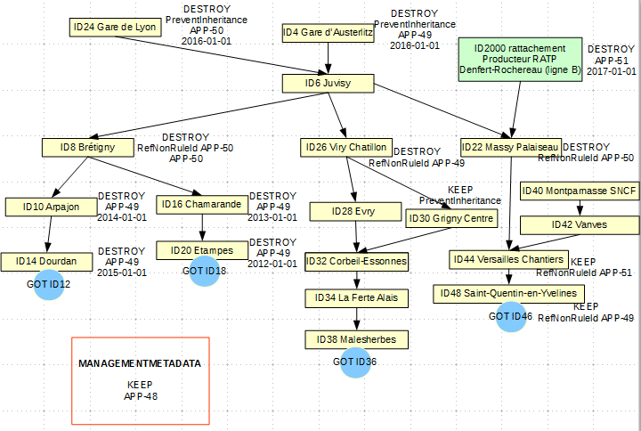
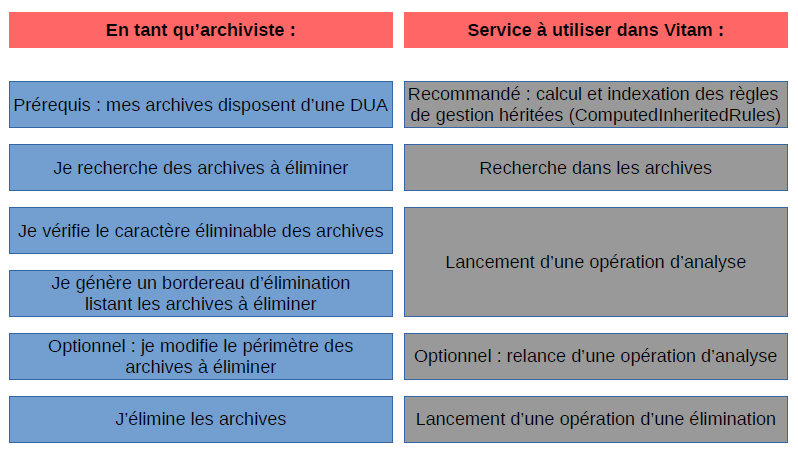
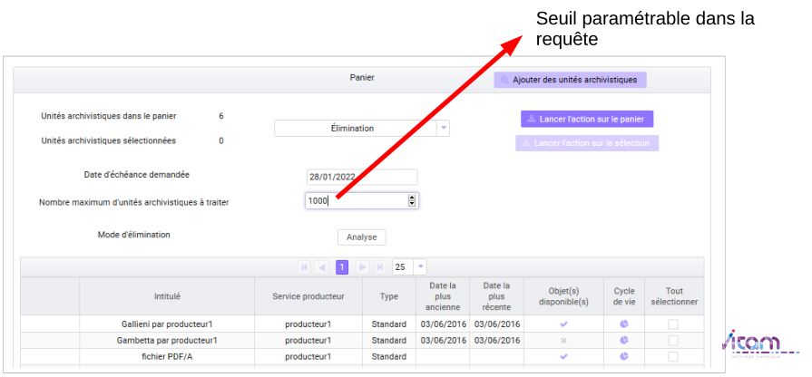
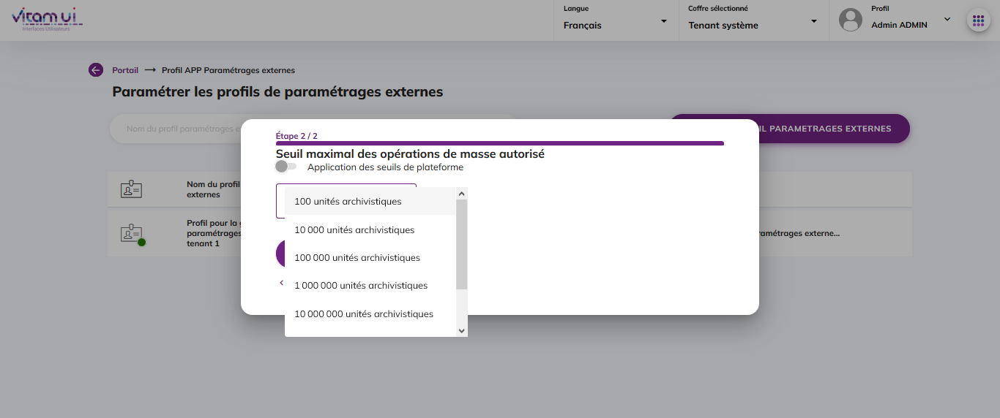

Les éliminations avec la solution logicielle Vitam
=====

Introduction
------------

### Documents de référence

------------------------------------------------------------------ -------------------- --------------------------------------------------------------------------------------------------
  Document                                                           Date de la version   Remarques
  NF Z 44022 – MEDONA – Modélisation des données pour l’archivage    18/01/2014           
  Standard d’échange de données pour l’archivage – SEDA – v. 2.1     06/2018              
  Standard d’échange de données pour l’archivage – SEDA – v. 2.2     02/2022              Cette nouvelle version du SEDA est intégrée à la solution logicielle Vitam à partir de la V6.RC.          
  ------------------------------------------------------------------ -------------------- --------------------------------------------------------------------------------------------------

### Présentation du document

L’élimination réglementaire des archives en fonction de leur durée d’utilité administrative fait partie des processus archivistiques mis en œuvre dans la solution logicielle Vitam.
Dans un contexte d’archivage électronique, cette fonctionnalité est mise en œuvre en tenant compte des particularités liées au calcul et à l’héritage des règles de gestion et au graphe.
Ce document s’articule autour des axes suivants :
- calcul des règles et détermination du caractère éliminable des unités archivistiques,
- modalités d’une campagne d’évaluation du caractère éliminable des unités archivistiques (analyse),
- modalités d’une campagne de mise en œuvre de l’élimination (action).
Le présent document décrit les fonctionnalités qui sont offertes par la solution logicielle Vitam au terme de la version 6 (mars 2023). Il a vocation à être amendé, complété et enrichi au fur et à mesure de la réalisation de la solution logicielle Vitam et des retours et commentaires formulés par les ministères porteurs et les partenaires du programme.

Détermination du caractère éliminable d’une unité archivistique avec la solution logicielle Vitam
----

### Qu’est-ce qu’une unité archivistique éliminable ?


Pour être éliminable, une unité archivistique doit définir ou hériter d’une règle de durée d’utilité administrative dont la date d’échéance est dans le passé par rapport à une date donnée et avoir un sort final « détruire ».
Si l’unité archivistique n’a qu’un sort final « détruire » sans règle associée permettant de calculer une date d’échéance, elle ne sera pas considérée comme éliminable.  
Si l’unité archivistique est éliminable, c’est-à-dire qu’elle dispose d’une date d’échéance dans le passé par rapport à une date donnée et d’un sort final dont la valeur est « détruire », et si elle contient une règle de gel dont la date de fin n’est pas échue ou exprimée, elle ne sera pas considérée comme éliminable, dans la mesure où le gel empêche son élimination.

### Calcul des règles de gestion applicables à une unité archivistique

La solution logicielle Vitam permet de déclarer des informations de gestion au niveau de l’entrée (SIP) comme au niveau des unités archivistiques (voir documentation sur les règles de gestion).  
En l’absence d’information de gestion sur une unité archivistique, cette unité archivistique hérite des règles et des propriétés définies par son ou ses parents.  
Une unité archivistique peut bloquer l’héritage de toutes les règles d’une catégorie donnée (PreventInheritance). En ce cas, les règles et les propriétés de cette catégorie ne sont pas héritées et, dans le cas de la durée d’utilité administrative, un sort final (FinalAction) doit être redéfini pour l’unité.
De même, une unité archivistique peut bloquer une règle en particulier (RefNonRuleId). Là encore, cela implique de redéfinir localement un sort final.
Une propriété définie localement l’emporte sur les propriétés héritées. Ainsi, si une unité archivistique hérite de son parent une règle de durée d’utilité administrative « 5 ans » avec un sort final « détruire » et définit localement une autre règle « 10 ans » avec un sort final « conserver », cette unité aura deux durées d’utilité administrative, mais un seul sort final (« conserver »), au titre du service producteur principal de l’unité archivistique.  

Dans le schéma ci-dessus, Massy-Palaiseau (service producteur : SNCF) bloque l’héritage de la règle APP-00050 de gare de Lyon (service producteur SNCF) et redéfinit à cette occasion un sort final « détruire ». Elle hérite de gare d’Austerlitz (service producteur SNCF) la règle APP-00049, mais pas le sort final, puisqu’elle en a défini un localement. Massy-Palaiseau hérite également de Denfert-Rochereau (service producteur : RATP) à laquelle elle est rattachée une règle APP-00051, mais pas la propriété définie pour ce producteur car c’est celle définie localement qui l’emporte. 

  
En base, les règles applicables pour l’unité Massy-Palaiseau sont les suivantes :
- au titre du service producteur SNCF : une règle applicable APP-00049 et un sort final défini localement (détruire) ;
- au titre du service producteur RATP : une règle applicable APP-00051, mais pas de sort final (le sort final défini localement bloquant l’héritage d’un sort final).  
Dans ces conditions, aucun sort final n’étant associé à la règle APP-00051 pour Massy-Palaiseau au titre du producteur RATP, l’unité archivistique ne pourra pas être considérée comme éliminable, même une fois la règle APP-00051 expirée.

Rattacher des unités archivistiques à d’autres unités archivistiques peut entraîner des héritages complexes et empêcher la mise en œuvre des opérations d’élimination. L’archiviste devra identifier ces cas et procéder à des mises à jour des règles applicables à l’unité et/ou à des réorganisations d’arborescence pour pouvoir éliminer effectivement les unités archivistiques concernées.  
Dans le cas spécifique de la durée d’utilité administrative, si l’unité archivistique ne déclare pas de sort final et n’en hérite pas non plus, elle est implicitement considérée par la solution logicielle Vitam comme devant être conservée et cette propriété implicite peut être héritée par ses descendants.  
Ainsi, le premier niveau d’un plan de classement, sauf s’il définit une information contraire, est considéré comme devant implicitement être conservé (propriété « KEEP » implicite). Cette propriété implicite est alors définie localement par la solution logicielle Vitam et est héritée par les éventuelles unités archivistiques filles de la même entrée.  
Une unité archivistique rattachée lors de l’entrée à une unité archivistique de même service producteur qui portait un sort final de durée d’utilité administrative implicite hérite également de ce sort final dans la mesure où elle n’en définit pas elle-même.  
Une unité archivistique rattachée lors de l’entrée à une unité archivistique de service producteur différent, qui portait un sort final de durée d’utilité administrative implicite, définit localement, au titre de son service producteur, un sort final et cette définition locale bloque l’héritage du sort final du service producteur de rattachement.  
Enfin, une unité archivistique rattachée lors de l’entrée à une unité archivistique, de même service producteur, qui portait un sort final implicite et à une unité archivistique de service producteur différent, portant également un sort final implicite, hérite les deux propriétés et n’en redéfinit pas localement.

Nota bene : cette propriété implicite est calculée à l’affichage des règles de gestion, mais n’est pas enregistrée en base. Elle ne sera donc pas exportée lors de la génération d’un DIP par exemple.


Réalisation d’une élimination avec la solution logicielle Vitam
---

### Lancement d’une campagne d’évaluation des éliminables (analyse)


#### Lancement de l’opération
La solution logicielle permet d’étudier le caractère éliminable d’ensembles d’unités archivistiques.  
- Par API,
- Par l’IHM démo, cette opération se fait via le panier et peut porter sur des unités isolées, sur des unités et leur descendance, sur des entrées.
- Par l’IHM VitamUI, elle se fait depuis l’APP « Recherche et consultation des archives » et peut porter sur un lot d’archives sélectionnées à partir de critères descriptifs ou de filtres relatifs à leur durée d’utilité administrative.

Point d’attention : 
- dans l’IHM démo, le panier a une taille limitée, il est préférable d’y placer des unités archivistiques avec leur descendance (une unité comptabilisée dans le panier) plutôt que des entrées (autant d’unités comptabilisées que d’unités dans le SIP).
- Avant de lancer une opération d’analyse, il est recommandé de sélectionner les unités archivistiques appropriées, c’est-à-dire de constituer un lot d’archives à partir de critères visant à isoler les meilleures candidates à une élimination (ex. recherche sur des unités archivistiques dont le sort final est égal à « DESTROY » et dont la date de fin est échue).
- Il n’est pas recommandé de lancer un nombre trop important d’opérations d’analyse sur un même lot d’archives, l’analyse n’étant pas un service d’audit.

La date par rapport à laquelle se fait l’analyse peut se situer dans le passé ou le futur ou être la date du jour.  
Il est possible d’indiquer un seuil d’unités archivistiques traitées au cours de l’opération. Si ce seuil est dépassé (par exemple, le seuil est de 15 alors que l’analyse est lancée sur 17 unités archivistiques), l’opération sera en échec.  
En analyse, il est recommandé d’avoir un seuil maximal de 100 000 unités archivistiques parcourues[^1].

L’analyse permet de définir le statut des unités archivistiques concernées :
- KEEP (à conserver),
- DESTROY (éliminable),
- CONFLICT (non décidable).
Les unités archivistiques de statut DESTROY et CONFLICT sont indexées en base de données.   

L’analyse permet également d’établir la liste des services producteurs pour lesquels les unités archivistiques sont éliminables et la liste des services producteurs pour lesquels les unités archivistiques doivent être conservées pour les unités archivistiques de statut CONFLICT.

Pour les cas de conflits également, certaines informations supplémentaires sont indexées dans l’unité archivistique pour apporter des précisions sur la nature de certains conflits :
- KEEP_ACCESS_SP : le service producteur principal (producteur de l’entrée) demande la suppression de l’unité archivistique et un ou plusieurs services de rattachement demandent sa conservation ; en effet, la suppression du service producteur principal d’une unité archivistique et la conservation des services de rattachement entraînerait des incohérences dans la base de données ;
- ACCESS_LINK_INCONSISTENCY : deux règles passent par le même chemin ce qui rend impossible de couper le lien pour un parent et pas pour un autre ; la solution logicielle indexe également le nœud posant problème (ParentUnitId) et les services producteurs concernés ;
- FINAL_ACTION_INCONSISTENCY : l’unité archivistique a, par héritage, deux sorts finaux différents pour un même service producteur ; la solution logicielle indexe également le service producteur concerné (OriginatingAgenciesInConflict) ;
- BLOCKED_BY_HOLD_RULE : l’unité archivistique ne peut être éliminée, car elle déclare en propre ou hérite d’une règle de gel qui interdit son élimination.

Point d’attention :
- Un conflit résulte d’une situation où la solution logicielle ne dispose pas des éléments permettant de conclure de manière certaine au caractère éliminable ou non éliminable de l’unité archivistique.
- Une intervention humaine est nécessaire pour décider du sort final de l’unité archivistique. L’archiviste doit alors revoir les règles posées sur l’unité archivistique ou procéder à une réorganisation d’arborescence de sorte que, lorsqu’il relancera une phase d’analyse, la solution logicielle puisse interpréter les règles applicables à cette unité.
- Pour éliminer une unité archivistique gelée, une intervention humaine sera également nécessaire. L’archiviste doit dégeler l’unité archivistique ou, s’il en a le droit, procéder à une réorganisation d’arborescence, avant de relancer la phase d’analyse, pour que la solution logicielle Vitam puisse interpréter à nouveau les règles applicables à cette unité.

#### Consultation des résultats de l’analyse d’élimination sur l’IHM démo de la solution logicielle
En allant dans le menu « Gestion des archives », le résultat de l’opération d’analyse (indexation) peut être consulté sur l’IHM démo en entrant l’identifiant de l’opération d’analyse.  
Il est possible d’ajouter également un intitulé d’unité archivistique ou une description pour limiter les réponses à certaines unités.  
Les informations qui ont été indexées sont remontées et peuvent, pour certaines, être filtrées par des facettes afin de permettre une évaluation des résultats d’analyse pour que l’archiviste décide de prendre en compte ou non les unités archivistiques dans une campagne d’élimination :
- services producteurs éliminables,
- services producteurs non éliminables,
- statut global d’élimination,
- informations étendues d’élimination,
- niveau de description,
- date de début,
- date de fin.

L’archiviste peut mettre au panier des listes filtrées des résultats de l’analyse des unités archivistiques éliminables, afin de les exporter sous forme de DIP, pour permettre la génération, depuis son front office, des bordereaux de demande d’élimination destinés aux services producteurs.

#### Consultation des résultats de l’analyse d’élimination sur l’IHM VitamUI  de la solution logicielle
Au terme de la version 5, il n’est pas possible de consulter le résultat de l’opération d’analyse (indexation), unité archivistique par unité archivistique.  
L’APP « Recherche et consultation des archives » permet de retrouver l’ensemble des unités archivistiques analysées en entrant l’identifiant de l’opération d’analyse dans l’onglet de recherche spécifique aux recherches sur la DUA.    
L’archiviste peut partir des listes filtrées des résultats de l’analyse des unités archivistiques éliminables, afin de :
- les exporter sous forme de DIP ou de fichier CSV, pour permettre la génération, depuis son front office, des bordereaux de demande d’élimination destinés aux services producteurs ;
- lancer une opération d’élimination.

 #### Consultation des résultats de l’analyse d’élimination en base de données
Les résultats de l’analyse d’élimination sont indexés dans les métadonnées des unités archivistiques.

Pour une unité archivistique éliminable (statut DESTROY) :
```
"_elimination": [
        {
            "OperationId": "aeeaaaaaa2hfba5wabzviallxabcdriaaaaq",
            "GlobalStatus": "DESTROY",
            "DestroyableOriginatingAgencies": [
                "SNCF"
            ],
            "NonDestroyableOriginatingAgencies": [],
            "ExtendedInfo": []
```
        

Pour une unité archivistique en conflit, sans information supplémentaire (statut CONFLICT) :
```
"_elimination": [
        {
            "OperationId": "aeeaaaaaa2hfba5wabzviallxai2wsqaaaaq",
            "GlobalStatus": "CONFLICT",
            "DestroyableOriginatingAgencies": [
                "Identifier2"
            ],
            "NonDestroyableOriginatingAgencies": [
                "Identifier1"
            ],
            "ExtendedInfo": []
```


Pour une unité archivistique en conflit, car le service producteur principal demande son élimination alors que les services producteurs de rattachement demandent sa conservation (statut CONFLICT, KEEP_ACCESS_SP) :

```
"_elimination": [
        {
            "OperationId": "aeeaaaaaa2hfba5wabzviallxalf3eiaaaaq",
            "GlobalStatus": "CONFLICT",
            "DestroyableOriginatingAgencies": [
                "Identifier1"
            ],
            "NonDestroyableOriginatingAgencies": [
                "Identifier2"
            ],
            "ExtendedInfo": [
                {
                    "ExtendedInfoType": "KEEP_ACCESS_SP"
                }
            ]
```


Pour une unité archivistique en conflit en raison de règles en conflit par un même chemin (statut CONFLICT, ACCESS_LINK_INCONSISTENCY) et en raison de la nécessité de conservation pour le service producteur de l’entrée (statut CONFLICT, KEEP_ACCESS_SP) :

```
"_elimination": [
        {
            "OperationId": "aeeaaaaaa2hfba5wabzviallxanrpzqaaaaq",
            "GlobalStatus": "CONFLICT",
            "DestroyableOriginatingAgencies": [
                "FRAN_NP_050634_elim"
            ],
            "NonDestroyableOriginatingAgencies": [
                "FRAN_NP_051587_elim"
            ],
            "ExtendedInfo": [
                {
                    "ExtendedInfoType": "KEEP_ACCESS_SP"
                },
                {
                    "ExtendedInfoType": "ACCESS_LINK_INCONSISTENCY",
                    "ExtendedInfoDetails": {
                        "ParentUnitId": "aeaqaaaaayhhvwgpaaca2allw7wbhkiaaaba",
                        "DestroyableOriginatingAgencies": [
                            "FRAN_NP_050634_elim"
                        ],
                        "NonDestroyableOriginatingAgencies": [
                            "FRAN_NP_051587_elim"
                        ]
                    }
```


Pour une unité archivistique en conflit en raison d’un conflit de sort final (statut CONFLICT, FINAL_ACTION_INCONSISTENCY) :
```
"_elimination": [
        {
            "OperationId": "aeeaaaaaa2hfba5wabzviallw7xjlsqaaaaq",
            "GlobalStatus": "CONFLICT",
            "DestroyableOriginatingAgencies": [],
            "NonDestroyableOriginatingAgencies": [],
            "ExtendedInfo": [
                {
                    "ExtendedInfoType": "FINAL_ACTION_INCONSISTENCY",
                    "ExtendedInfoDetails": {
                        "OriginatingAgenciesInConflict": [
                            "SNCF"
                        ]
```

Pour une unité archivistique en conflit en raison de son caractère gelé (statut CONFLICT, BLOCKED_BY_HOLD_RULE) :
```
"_elimination": [
        {
            "OperationId": "aeeaaaaaa2hfba5wabzviallw7xjlsqaaaaq",
            "GlobalStatus": "CONFLICT",
            "DestroyableOriginatingAgencies": [],
            "NonDestroyableOriginatingAgencies": [],
            "ExtendedInfo": [
                {
                    "ExtendedInfoType": "BLOCKED_BY_HOLD_RULE",
                    "ExtendedInfoDetails": {
                        "HoldRuleIds": [
                            "HOL-00001"
                        ]
```


### Lancement d’une opération d’élimination (action)

La solution logicielle permet de lancer par :
- l’IHM démo une opération d’élimination des unités archivistiques placées dans le panier ;
- l’IHM VitamUI une opération d’élimination sur un lot d’archives depuis l’APP « Recherche et consultation des archives ».  
Cette opération peut être lancée indépendamment d’une campagne d’évaluation des éliminables et porter sur des unités archivistiques n’ayant encore jamais été analysées par la solution logicielle.

Point d’attention : dans l’IHM démo, le panier a une taille limitée, il est préférable d’y placer des unités archivistiques avec leur descendance (une unité comptabilisée dans le panier) plutôt que des entrées (autant d’unités comptabilisées que d’unités dans le SIP).

L’opération d’élimination peut être lancée par rapport à une date située dans le passé ou à la date du jour. Elle ne peut pas être lancée par rapport à une date située dans le futur.  
Pour des raisons liées aux problématiques de calcul de graphe, il n’est pas possible de lancer cette action si une autre action d’élimination est en cours (ou en pause) ou en parallèle d’une action de modification d’arborescence. La solution logicielle vérifie si des processus concurrents ne sont pas en cours au lancement du processus d’élimination.  
Il est possible d’indiquer un seuil d’unités archivistiques traitées au cours de l’opération. Si ce seuil est dépassé (par exemple, le seuil est de 15 alors que l’analyse est lancée sur 17 unités archivistiques), l’opération sera en échec.    
En mise en œuvre de l’élimination, il est recommandé d’avoir un seuil maximal de 10 000 unités archivistiques parcourues[^2].  
Seules les unités archivistiques dont la solution logicielle peut déterminer le sort final applicable, en fonction des règles de gestion portées par les unités archivistiques (échéance expirée et sort final « détruire »), sont effectivement éliminées.  
L’opération d’élimination implique donc que la mise en œuvre de l’élimination proprement dite soit immédiatement précédée dans la solution logicielle d’une phase d’analyse du caractère éliminable des unités archivistiques. Cette phase d’analyse systématique calcule les mêmes statuts qu’une campagne d’évaluation des unités archivistiques éliminables (cf. ci-dessus), mais sans indexation des résultats dans les métadonnées des unités archivistiques :
- unités archivistiques dont le statut est « à conserver » (Global Status : KEEP),
- unités archivistiques dont le statut ne peut être déterminé (Global Status : CONFLICT),
- unités archivistiques dont le statut est « éliminable » (Global Status : DESTROY).
La présence d’unités archivistiques de statut KEEP conduira à une opération en avertissement, mais n’interrompt pas le processus.

Une vérification supplémentaire est effectuée sur les unités archivistiques éliminables : celles qui ont des enfants encore à conserver ne sont pas éliminées afin de ne pas créer des unités archivistiques orphelines qui auraient perdu leurs parents et ne seraient plus accessibles par leurs grands-parents (statut spécifique à cette phase : NON_DESTROYABLE_HAS_CHILD_UNITS).  
Ainsi, sur toutes les unités archivistiques soumises, seules celles dont le sort final est « détruire », qui ont une règle de gestion expirée, qui n’ont pas d’enfants encore à conserver et qui ne sont pas gelées sont donc effectivement éliminées.  
La présence d’unités archivistiques de statut DESTROY qui ne peuvent être effectivement éliminées conduira à une opération en avertissement, mais n’interrompt pas le processus.

Points d’attention :
- pour pouvoir éliminer une unité archivistique qui a encore un enfant à conserver (par exemple, un sous-dossier éliminable qui contient encore une pièce), l’archiviste doit procéder à une réorganisation d’arborescence (par exemple, placer la pièce à la racine du dossier) et relancer l’opération d’élimination sur cette unité archivistique.
- Pour pouvoir éliminer une unité archivistique qui hérite ou dispose d’une règle de gel, l’archiviste doit soit bloquer ou supprimer cette règle de gel, soit procéder à une réorganisation d’arborescence, s’il en a les droits, et relancer l’opération d’élimination sur cette unité archivistique.

Une fois le statut des unités archivistiques déterminé, la solution logicielle étudie les groupes d’objets techniques associés aux unités archivistiques :
- si l’unité archivistique est conservée, le groupe d’objets techniques est conservé (KEEP),
- si le groupe d’objets techniques n’est associé qu’à une unité archivistique et que celle-ci est éliminée, le groupe d’objets techniques est éliminé (statut DELETED),
- si le groupe d’objets techniques est associé à une unité archivistique éliminée et à une unité archivistique non éliminée, le groupe d’objets techniques est détaché de la première unité (statut PARTIAL_DETACHMENT).

Le statut de l’opération à l’issue de la mise en œuvre de l’élimination pourra être :
- succès : toutes les unités archivistiques soumises ont été éliminées ;
- avertissement : parmi les unités archivistiques soumises, la phase d’analyse a permis de déterminer que certaines ne devaient pas être éliminées ou ne pouvaient pas l’être ;
- fatal : une erreur technique s’est produite lors du processus de mise en œuvre de l’élimination.

Le rapport de l’opération de mise en œuvre de l’élimination, consultable via le journal des opérations, permet de retrouver :
- les unités archivistiques dont le statut est « à conserver »   (GLOBAL_STATUS_KEEP),
- les unités archivistiques dont le statut ne peut être déterminé (GLOBAL_STATUS_CONFLICT),
- les unités archivistiques dont le statut est « à éliminer », mais qui ne peuvent pas être supprimées car elles ont des enfants (NON_DESTROYABLE_HAS_CHILD_UNITS),
- les unités archivistiques qui ont pu être supprimées (DELETED),
- les groupes d’objets techniques qui ont été supprimés (DELETED),
- les groupes d’objets techniques qui ont été détachés (PARTIAL_DETACHMENT).  

Les groupes d’objets techniques des unités archivistiques conservées ne sont pas listés dans le rapport.

Point d’attention : on a considéré pour le développement de la fonctionnalité d’élimination que la phase de mise en œuvre de l’élimination serait déclenchée par l’archiviste sur la base d’une évaluation préalable du caractère éliminable des unités archivistiques. Dans ces conditions, la présence de documents non éliminables est une anomalie et c’est pour cette raison que le rapport liste les unités archivistiques dont le statut est « à conserver » au lieu de les ignorer comme en phase d’évaluation.

### Mise à jour du registre des fonds

Les éliminations d’unités archivistiques ont des conséquences sur le registre des fonds propres et symboliques.
Pour les fonds propres, les totaux d’unités archivistiques (AU), groupes d’objets techniques (GOT), objets techniques (OT) et la volumétrie sont mis à jour immédiatement. 
Le détail de l’opération d’entrée concernée est également mis à jour.
- Dans l’IHM démo, en cliquant sur la ligne de cette opération, l’utilisateur peut connaître toutes les opérations qui ont affecté cette entrée et le nombre d’AU, GOT et OT ainsi que la volumétrie concernée pour chacune des opérations, celle de l’entrée initiale comme celles des éliminations qui ont ensuite affecté cette entrée ;
- dans l’IHM VitamUI, ces opérations d’élimination sont visibles en cliquant sur la ligne de cette opération au terme de la version 6.RC.  
Il en va de même pour le détail d’une opération de préservation dans le cas où des objets éliminés ont préalablement fait l’objet d’une opération de préservation. Peut lui être associée une à plusieurs opérations d’élimination, référençant chacune le nombre d’objets et la volumétrie retirés du système. Le détail d’une opération de préservation est par ailleurs mis à jour pour tenir compte de ces éliminations.  
Pour les fonds symboliques, au moment du calcul périodique des fonds symboliques de la base, les AU, GOT et OT éliminés seront décomptés et la volumétrie sera mise à jour. Depuis la notice du service agent, l’utilisateur peut accéder à l’historique des rattachements et consulter sur une période donnée les variations à la hausse ou à la baisse des fonds symboliques pour ce producteur.  

Point d’attention : le calcul des AU, GOT et OT rattachés à un producteur au titre de son fonds symbolique n’est effectué qu’une fois par vingt-quatre heures (sauf paramétrage différent de la plate-forme). Dans ces conditions, si sur la même période de vingt-quatre heures l’archiviste effectue un ingest pour 3 AU et une élimination pour 3 AU, le total des symboliques entre deux calculs n’aura pas évolué.

Conseils de mise en œuvre
---

À l’issue de la réalisation de fonctionnalités concernant l’élimination des archives, l’équipe projet Vitam est en mesure de fournir quelques recommandations de mise en œuvre.


### Comment procéder à une élimination ?

En vue de procéder à une élimination, on peut suivre les étapes suivantes :


Avant toute chose, pour pouvoir éliminer des archives, celles-ci doivent déclarer ou hériter d’une durée d’utilité administrative, sans quoi la solution logicielle Vitam considérera ces archives comme non éliminables et ne les intégrera pas dans ses opérations d’analyse et d’action d’élimination.

#### Rechercher des archives à éliminer
En préalable de l’élimination, il est recommandé de rechercher les archives candidates à l’élimination au moyen des règles de gestion qui leur ont été affectées, en utilisant notamment une recherche sur les règles de gestion calculées (ComputedInheritedRules). Par exemple, il s’agit de :
- rechercher et d’isoler les seules archives dont le sort final est égal à « DESTROY »,
- rechercher et d’isoler les seules archives dont la date de fin ou la date de fin maximale est arrivée à échéance.
Lors de cette recherche, il est également fortement conseillé de :
- vérifier si ces archives candidates à l’élimination :
    - héritent et/ou portent des règles ou sorts finaux contradictoires,
    - héritent et/ou portent une ou plusieurs règles de gel,
- le cas échéant, modifier ces règles, de manière à rendre véritablement éliminables ces archives ou à les exclure de la sélection d’archives à éliminer.  

Cette phase peut être réalisée depuis l’APP VitamUI « Recherche et consultation des archives » qui dispose de filtres de recherche sur la DUA.

#### Analyser des archives à éliminer
Une fois un lot cohérent d’archives à éliminer constitué, il est possible de lancer une opération d’analyse. Cette opération permet de vérifier si des conflits demeurent et, le cas échéant, de les corriger.  
Elle permet aussi de rassembler un lot d’archives autour d’un identifiant unique d’opération, rendant ainsi possible de rechercher a posteriori les archives analysées au moyen de cet identifiant technique.  
De ce lot, on peut réaliser soit un export DIP, soit un export CSV, deux services proposés notamment par l’IHM VitamUI, en vue de réaliser un bordereau de demande d’élimination à soumettre au service producteur concerné.  
Point d’attention : Il n’est pas recommandé de :
- réaliser un grand nombre d’opérations d’analyse sur un même lot d’archives. C’est pourquoi, il est recommandé d’avoir au préalable bien vérifier le caractère éliminable des archives au moyen des services de recherche ;
- réaliser une opération d’analyse sur un trop grand nombre d’unités archivistiques. Il est en effet recommandé d’avoir un seuil maximal de 100 000 unités archivistiques parcourues lors de cette phase.

#### Éliminer des archives
Suite à la validation du bordereau d’élimination, il est possible de retrouver les archives candidates à l’élimination au moyen de l’identifiant de l’opération d’analyse. Cette action est possible dans VitamUI, depuis l’APP « Recherche et consultation des archives », via l’onglet des filtres de recherche sur la DUA.  
Point d’attention : la solution logicielle Vitam ne met pas à disposition le résultat de l’analyse, unité archivistique par unité archivistique, sous la forme d’un rapport JSONL, disponible dans le journal des opérations.  
Si des archives, faisant partie du lot analysé, doivent être exclues de l’élimination, il est toujours possible de les retirer de la sélection. Une fois le lot à éliminer finalisé, il est possible de lancer l’opération d’action d’élimination. Celle-ci aboutit aux statuts suivants :
- succès : toutes les archives ont été éliminées ;
- avertissement : une partie des archives n’a pas été éliminée. Il s’agit alors de :
    - consulter le rapport d’élimination qui liste les unités archivistiques n’ayant pas été éliminées et les raisons associées,
    - corriger les cas d’erreur remontés, en modifiant notamment les potentiels conflits liés aux règles de gestion,
    - procéder à une nouvelle opération d’action d’élimination.

Cette opération d’élimination produit un rapport sous forme JSON, disponible depuis le journal des opérations.  
Point d’attention : Il n’est pas recommandé de réaliser une opération d’analyse sur un trop grand nombre d’unités archivistiques. Il est en effet recommandé d’avoir un seuil maximal de 10 000 unités archivistiques parcourues lors de cette phase.

### Comment supprimer des archives entrées par erreur dans le système ?

Il peut arriver qu’un paquet d’archives soit entré par erreur dans le système ou nécessite des corrections hors système. Il faut alors supprimer ces archives, avant, le cas échéant, de les transférer à nouveau dans la solution logicielle Vitam.  

#### Pour des unités de type « Standard » et « Plan de classement »
Avant toute procédure de suppression, le référentiel des règles de gestion doit disposer en prérequis d’une règle de type « AppraisalRule », avec pour caractéristiques :
- RuleType : AppraisalRule,
- RuleDuration : 0
- RuleMeasurement : YEAR
Il est recommandé d’avoir une règle spécifique pour gérer ces cas de suppression suite à une erreur. 
Ensuite, il est recommandé de procéder comme suit :
- mettre à jour en masse des règles de gestion qui :
    - supprime toutes les règles de gestion de type « AppraisalRule » portées par les unités archivistiques en erreur,
    - ajoute la règle de type « AppraisalRule » spécifique à la suppression d’éléments en erreur ;
- calculer les échéances de manière à obtenir l’éliminabilité des archives ;
- procéder à l’action d’élimination.

#### Pour des unités archivistiques de type « Arbre de positionnement »
Avant toute procédure de suppression d’une unité de type « Arbre de positionnement », il faut veiller à déplacer vers un autre niveau de description les unités archivistiques qui lui sont associées à des niveaux inférieurs.  

Point d’attention : Contrairement aux unités archivistiques de type « Standard » et « Plan de classement », une unité archivistique de type « Arbre de positionnement » ne dispose pas de règles de gestion. Il est de fait possible de traiter ce type d’unité archivistique via les opérations d’analyse et d’action d’élimination sans lui avoir au préalable ajouté des règles de gestion.  

Il est ensuite possible de procéder à l’action d’élimination. Le seul contrôle effectué par cette opération est la vérification de l’absence d’unités archivistiques de niveau inférieur à l’unité qu’on souhaite supprimer. 

### Quelles sont les limitations pour les opérations d’analyse et d’action d’élimination ?

#### Définition des seuils
La solution logicielle Vitam propose deux moyens de limiter le nombre d’unités archivistiques lors des phases d’analyse et d’action d’élimination :
- un seuil de requête,
- un seuil de plate-forme.
Les seuils de plate-forme sont définis dans un fichier de configuration. Par défaut, ils sont paramétrés comme suit :
- 100 000 unités archivistiques parcourues lors de la phase d’analyse d’élimination ;
- 10 000 unités archivistiques parcourues lors de la phase d’action d’élimination.

Le seuil de requête est facultatif. S’il est présent, son chiffre est :
- soit écrit en dur dans la requête envoyée par le front-office au back-office,
- soit laissé à la main de l’utilisateur, comme cela est le cas dans l’IHM démo. En effet, dans le panier, l’utilisateur a la possibilité d’indiquer le nombre maximum d’archives à traiter lors de l’envoi de la requête d’analyse ou d’action d’élimination.

- soit paramétrable, comme cela est le cas dans l’IHM VitamUI, où il est possible, depuis l’APP « ProfilsAPP Paramétrages externes », de :
    - se conformer aux seuils de plate-forme, dont ceux relatifs à l’analyse et à l’action d’élimination ;
    - sélectionner un seuil de 100, 10 000, 100 000, 1 000 000,  10 000 000.


Point d’attention :
- Il est recommandé d’avoir un seuil maximal de :
    - 100 000 unités archivistiques parcourues lors de la phase d’analyse d’élimination ;
    - 10 000 unités archivistiques parcourues lors de la phase d’action d’élimination.
- Dans un projet d’implémentation de la solution logicielle Vitam, il est fortement conseillé de connaître les limitations qui ont été définies au niveau du front-office, au moment où il envoie une demande d’analyse ou d’action d’élimination au front-office.

#### Fonctionnement des seuils
Les seuils mis à disposition par la solution logicielle Vitam fonctionne de la manière suivante :
- si un seuil a été défini dans la requête :
    - si le nombre d’unités archivistiques sélectionnées est supérieur au seuil de requête, alors le traitement est en erreur et l'opération est interrompue ;
    - si le nombre d’unités sélectionnées est inférieur ou égal au seuil de requête, le traitement est en succès ;
- si un seuil de plate-forme a été défini :
    - si le nombre d’unités archivistiques sélectionnées est inférieur ou égal au seuil de plate-forme alors l'opération est lancée et aura un statut en succès en cas de réussite ;
    - sinon elle est lancée mais aura un statut en avertissement ;
- si aucun seuil n’a été défini dans la requête, le seuil de plate-forme s’applique :
    - si le nombre d’unités archivistiques sélectionnées est inférieur ou égal au seuil de plate-forme alors l'opération est lancée et aura un statut en succès en cas de réussite
    - sinon elle est lancée mais aura un statut en erreur.

[^1] Des précisions sur les seuils sont apportées dans le présent document, [chapitre « Quelles sont les limitations pour les opérations d’analyse et d’action d’élimination ? »](#quelles-sont-les-limitations-pour-les-opérations-danalyse-et-daction-délimination).
[^2] Des précisions sur les seuils sont apportées dans le présent document, [chapitre « Quelles sont les limitations pour les opérations d’analyse et d’action d’élimination ? »](#quelles-sont-les-limitations-pour-les-opérations-danalyse-et-daction-délimination).