Gestion des archives et des arborescences
=====

Introduction
------------

### Documents de référence

| Document|Date de la version|Remarques|
|:----|:----:|:----:|
|NF Z 44022 – MEDONA – Modélisation des données pour l’archivage|18/01/2014||
|Standard d’échange de données pour l’archivage – SEDA – v. 2.1|06/2018||
|Standard d’échange de données pour l’archivage – SEDA – v. 2.2|02/2022|Cette nouvelle version du SEDA est intégrée à la solution logicielle Vitam à partir de la V6.RC.|
|[Vitam – Structuration des Submission Information Package (SIP)](./SIP.md)|||
|[Vitam – Structuration des Dissemination Information Package (DIP)](./DIP.md|||
|[Vitam – Guide d’utilisation de ReSIP](./resip.md)|||
|[Vitam – Module de collecte](./module_de_collecte.md)|||
|[Vitam – Les éliminations dans la solution logicielle Vitam](./eliminations.md)|||
|[Vitam – Le transfert avec la solution logicielle Vitam](./transfert.md)|||
|[Vitam – Gestion de la préservation](./preservation.md)|||
|[Vitam – Modèle de workflow](./modele_de_workflow.md)|||

### Présentation du document

Le présent document décrit les fonctionnalités associées à l’utilisation des arborescences et des unités archivistiques – arbres de positionnement, plans de classement, unités standards – dans la solution logicielle Vitam.

Il s’articule autour des axes suivants :
- une présentation des différents types d’arborescences et de la manière dont le Standard d’échanges de données pour l’archivage (SEDA) est utilisé pour les formaliser ;
- une présentation des mécanismes mis en œuvre dans la solution logicielle Vitam pour gérer ces arborescences ;
- des recommandations aux utilisateurs de la solution logicielle Vitam sur la manière d’utiliser les fonctionnalités associées aux arbres et plans.

Le présent document décrit les fonctionnalités qui sont offertes par la solution logicielle Vitam au terme de la Version 7.0 (automne 2023). Il a vocation à être amendé, complété et enrichi au fur et à mesure de la réalisation de la solution logicielle Vitam et des retours et commentaires formulés par les ministères porteurs et les partenaires du programme.

Présentation
----

### Description

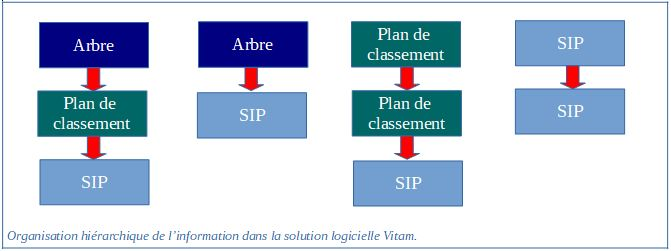

#### Les arbres de positionnement

Les arbres de positionnement correspondent à des ensembles logiques hiérarchisés sous forme arborescente. Ils permettent à un service d’archives d’organiser des fonds. Ils s’apparentent à la notion de cadre de classement.

Ils sont destinés à faciliter la navigation et la recherche dans les fonds d’archives placés sous la responsabilité d’un service d’archives. Ils permettent en effet de situer et de rechercher un ensemble d’archives au sein d’une organisation plus globale.

Les principes retenus par l’équipe du programme Vitam dans la spécification des arbres de positionnement sont les suivants :
-  un arbre de positionnement constitue une arborescence d’unités archivistiques d’un type spécifique ;
-  l’import d’un arbre est une opération d’administration de la solution logicielle Vitam ;
-  un arbre de positionnement peut inclure plusieurs plans de classement et/ou unités archivistiques issues d’un SIP ;
-  un arbre de positionnement ne peut être rattaché à un plan de classement ou à des unités archivistiques issues d’un SIP.

#### Les plans de classement

Les plans de classement correspondent à des ensembles logiques hiérarchisés sous forme arborescente. Ils s’apparentent à la notion définie par la norme ISO 15 489 utilisée dans les organisations pour la gestion des documents d’activité/records management.

Ils sont destinés à faciliter l’organisation et la recherche des dossiers, documents et données produits ou reçus par un service producteur dans l’exercice de ses activités.

Ils permettent en effet de situer et de rechercher des unités archivistiques au sein d’une organisation.

Les principes retenus par l’équipe du programme Vitam dans la spécification des plans de classement sont les suivants :
-  un plan de classement est une arborescence d’unités archivistiques d’un type spécifique ;
-  l’import d’un plan est une opération d’entrée et peut être effectué dans la solution logicielle Vitam depuis les applications métiers productrices d’archives ;
-  un plan de classement est associé à un service producteur ;
-  un plan de classement peut porter des règles de gestion ;
-  un plan de classement peut être rattaché à un plan de classement de niveau supérieur ou à un arbre de positionnement ;
-  un plan de classement ne peut pas être rattaché à des unités archivistiques issues d’un SIP ;
-  un plan de classement peut avoir pour niveaux inférieurs des unités archivistiques issues d’un SIP.

#### Les unités archivistiques standards

Les unités archivistiques standards correspondent, au sens de l’OAIS, à des paquets d’informations transférés à un service d’archives en vue de leur prise en charge par celui-ci.

Ces unités archivistiques, issues d’un SIP[^1], peuvent être constituées d’objets, de leurs informations de représentation, de description et de préservation.

Elles peuvent être représentées sous la forme d’une arborescence d’unités archivistiques d’un type spécifique.

Quel que soit leur niveau de description, elles peuvent être rattachées à des arbres de positionnement, à des plans de classement, ainsi qu’à d’autres archives déjà prises en charge.

Des unités archivistiques issues d’un même SIP peuvent être rattachées à plusieurs arbres de positionnement, plusieurs plans de classement et/ou plusieurs archives déjà prises en charge.

### Formalisation

#### Dans le Standard d’échanges de données pour l’archivage (SEDA)

##### à des fins de transfert

Les arbres de positionnement et les plans de classement sont importés dans la solution logicielle VITAM sous la forme de SIP contenant un bordereau de transfert (message ArchiveTransfer), mais sans aucun objet associé, contrairement aux unités archivistiques standards[^2].
Le SIP peut être exprimé en SEDA 2.1 ou en SEDA 2.2.

Chaque niveau d’arborescence est signalé et décrit dans une unité archivistique (ou <ArchiveUnit>). Pour chacun, il est possible de renseigner les éléments suivants :
-  dans le sous-bloc Management : 
    - Lien vers un niveau d’un plan de classement ou d’un arbre de positionnement, matérialisé :
        - soit par l’identifiant de l’unité archivistique de niveau supérieur (UpdateOperation / SystemeId),
        -  soit par la valeur d’un champ utilisé pour décrire l’unité archivistique de niveau supérieur, cette valeur devant être unique dans la solution logicielle Vitam (UpdateOperation / ArchiveUnitIdentifierKey) :
            - champ utilisé pour associer une unité archivistique à une autre (MetadataName),
            - valeur du champ de l’unité archivistique de niveau supérieur à laquelle on souhaite associer une unité archivistique, cette valeur devant être unique (MetadataValue)[^3].
-  dans le sous-bloc Content :
    -  niveau de description (DescriptionLevel),
    - titre (Title),
    - identifiant (ArchivalAgencyArchiveUnitIdentifier)
    - description (Description),
    - date de création de l’arbre ou du plan (StartDate),
    - date de fin d’utilisation de l’arbre ou du plan (EndDate).

Un arbre de positionnement ne peut pas contenir de règle de gestion.  

En revanche, un plan de classement et un SIP peuvent déclarer dans le bloc ManagementMetadata et le sous-bloc Management des unités archivistiques :
-  des sous-blocs correspondants à chaque catégorie de règle : 
    - durée d’utilité courante (StorageRule),
    - durée d’utilité administrative (AppraisalRule),
    - délai de communicabilité (AccessRule),
    - délai de réutilisation (ReuseRule),
    - délai de diffusion (DisseminationRule),
    - durée de classification (ClassificationRule),
    - gel (HoldRule) ;
-  un élément NeedAuthorization qui permet d’indiquer si la mise en œuvre des actions prévues à l’échéance de toutes les règles nécessitera une autorisation de la part des acteurs impliqués dans la procédure (Service d’archives, Service producteur, Service de contrôle au sens du SEDA).

Un plan de classement doit nécessairement déclarer un service producteur dans le champ OriginatingAgencyIdentifier du bloc <ManagementMetadata> du message ArchiveTransfer.

Un arbre de positionnement ne déclare pas de service producteur.

##### à des fins de diffusion

Quel que soit leur type, les unités archivistiques sont exportables depuis la solution logicielle VITAM sous la forme de DIP contenant un message ArchiveDeliveryRequestReply[^4].

Si on n’exporte que des unités archivistiques de type « arbre de positionnement » ou « plan de classement », aucun objet ne sera associé. Mais, si l’export inclut des unités archivistiques standards, il peut y en avoir.

L’export peut être exprimé en SEDA 2.1 ou en SEDA 2.2.

Chaque niveau d’arborescence est signalé et décrit dans une unité archivistique (ou <ArchiveUnit>). Pour chacun, il est possible de renseigner les éléments suivants :
-  dans le sous-bloc Management : 
    - un élément de journalisation (LogBook) qui permet d’enregistrer les événements associés au cycle de vie des archives après leur création et avant le transfert vers le service d’archivage électronique cible ;
-  dans le sous-bloc Content :
    - niveau de description (DescriptionLevel),
    - titre (Title),
    - identifiant (ArchivalAgencyArchiveUnitIdentifier)
    - description (Description),
    - date de création de l’arbre ou du plan (StartDate),
    - date de fin d’utilisation de l’arbre ou du plan (EndDate).

Un arbre de positionnement ne peut pas contenir de règle de gestion.

En revanche, un plan de classement et un SIP peuvent déclarer dans le sous-bloc Management des unités archivistiques :
-  des sous-blocs correspondants à chaque catégorie de règle : 
    - durée d’utilité courante (StorageRule),
    - durée d’utilité administrative (AppraisalRule),
    - délai de communicabilité (AccessRule),
    - délai de réutilisation (ReuseRule),
    - délai de diffusion (DisseminationRule),
    - durée de classification (ClassificationRule),
    - gel (HoldRule) ;
-  un élément NeedAuthorization qui permet d’indiquer si la mise en œuvre des actions prévues à l’échéance de toutes les règles nécessitera une autorisation de la part des acteurs impliqués dans la procédure (Service d’archives, Service producteur, Service de contrôle au sens du SEDA).

L’export ne distinguant pas les notions d’arbre de positionnement, de plan de classement et d’unité archivistique standard, la solution logicielle Vitam générera automatiquement un service producteur dans le champ OriginatingAgencyIdentifier du bloc <ManagementMetadata> du message ArchiveDeliveryRequestReply :
-  pour l’export des seuls arbres de positionnement ou d’arborescences de plusieurs types multi-producteurs, la valeur de ce champ est « Export VITAM »[^5],
-  pour l’export des plans de classement ou d’arborescences de plusieurs types mono-producteurs, la valeur de ce champ sera héritée du service présent dans le champ OriginatingAgencyIdentifier présent dans le SIP à l’origine de l’entrée.

##### à des fins de réversibilité

Quel que soit leur type, les unités archivistiques sont transférables depuis la solution logicielle VITAM vers une autre solution d’archivage électronique sous la forme de DIP/SIP de transfert contenant un message ArchiveTransfer[^6].

Si on n’exporte que des unités archivistiques de type « arbre de positionnement » ou « plan de classement », aucun objet ne sera associé. Mais, si l’export inclut des unités archivistiques standards, il peut y en avoir.

L’export peut être exprimé en SEDA 2.1 ou en SEDA 2.2.

Chaque niveau d’arborescence est signalé et décrit dans une unité archivistique (ou <ArchiveUnit>). Pour chacun, il est possible de renseigner les éléments suivants :
-  dans le sous-bloc Management : 
    - un élément de journalisation (LogBook) qui permet d’enregistrer les événements associés au cycle de vie des archives après leur création et avant le transfert vers le service d’archivage électronique cible ;
-  dans le sous-bloc Content :
    - niveau de description (DescriptionLevel),
    - titre (Title),
    - identifiant (ArchivalAgencyArchiveUnitIdentifier)
    - description (Description),
    - date de création de l’arbre ou du plan (StartDate),
    - date de fin d’utilisation de l’arbre ou du plan (EndDate).

Un arbre de positionnement ne peut pas contenir de règle de gestion.

En revanche, un plan de classement et un SIP peuvent déclarer dans le sous-bloc Management des unités archivistiques :
-  des sous-blocs correspondants à chaque catégorie de règle : 
    - durée d’utilité courante (StorageRule),
    - durée d’utilité administrative (AppraisalRule),
    - délai de communicabilité (AccessRule),
    - délai de réutilisation (ReuseRule),
    - délai de diffusion (DisseminationRule),
    - durée de classification (ClassificationRule),
    - gel (HoldRule) ;
-  un élément NeedAuthorization qui permet d’indiquer si la mise en œuvre des actions prévues à l’échéance de toutes les règles nécessitera une autorisation de la part des acteurs impliqués dans la procédure (Service d’archives, Service producteur, Service de contrôle au sens du SEDA).

L’export ne distingue pas les notions d’arbre de positionnement, de plan de classement et d’unité archivistique standard.

#### Dans la solution logicielle Vitam

Les unités archivistiques sont enregistrées dans la base de données MongoDB, dans la collection « Unit », sous la forme d’enregistrements au format JSON.

Chaque enregistrement est construit comme suit[^7] :
-  de champs issus du sous-bloc Content du message ArchiveTransfer et repris tels quels :
    - niveau de description (DescriptionLevel),
    - titre (Title),
    - identifiant (ArchivalAgencyArchiveUnitIdentifier)
    - description (Description),
    - date de création de l’arbre ou du plan (StartDate),
    - date de fin d’utilisation de l’arbre ou du plan (EndDate) ;
-  de champs issus du sous-bloc Management ou du sous-bloc ManagementMetadata, du message ArchiveTransfer, pour les seules unités archivistiques standards ou de plan de classement (_mgt) ;
-  de champs internes à la solution logicielle Vitam qui les calcule, dont :
    - type d’unité archivistique (_unitType), dont la valeur peut être :
        -  « INGEST » pour les unités archivistiques standards,
        -  « FILING_UNIT » pour les unités archivistiques de plan de classement,
        -  « HOLDING_UNIT » pour les unités archivistiques d’arbre de positionnement,
    - service producteur responsable du versement de l’unité archivistique (_sp, récupéré du champ OriginatingAgencyIdentifier),
    - service(s) producteur(s) responsable(s) des unités archivistiques déjà transférées auxquelles sont rattachées les unités archivistiques faisant l’objet du transfert (_sps),
    - références à des unités archivistiques parentes (_us, _up, _graph, _us_sp, _uds),
    - identifiant de l’opération d’entrée (_opi) et des opérations liées à l’unité archivistique (_ops).

Les éléments de journalisation, issus du sous-bloc Management, sont enregistrées dans la base de données MongoDB, dans la collection « LogbookLifeCycleUnit », sous la forme d’enregistrements au format JSON[^8].

Si des objets accompagnaient des unités archivistiques standards, leurs métadonnées techniques sont enregistrées dans la base de données MongoDB, dans la collection « ObjectGroup », sous la forme d’enregistrements au format JSON[^9].

## Mécanismes mis en œuvre dans la solution logicielle Vitam

La solution logicielle Vitam offre à un service d’archives plusieurs fonctionnalités lui permettant de gérer les arbres de positionnement, les plans de classement et les unités archivistiques standards :
-  leur import dans le système ;
-  leur recherche et leur consultation ;
-  la modification de leurs métadonnées ;
-  leur gestion dans le système.

Les fonctionnalités ont été conçues et réalisées pour prendre en compte toutes les situations susceptibles d’être rencontrées par les services d’archives, notamment possibilités d’avoir :
-  1 à n enfants (arbres de positionnement, plans de classement ou unités archivistiques issues d’un SIP) pour un arbre de positionnement ;
-  1 à n enfants (plans de classement ou unités archivistiques issues d’un SIP) pour un plan de classement ;
-  0 à 1 parent (plans de classement ou arbre de positionnement) pour un plan de classement ;
-  0 à n parents (archives déjà prises en charge, plans de classement ou arbre de positionnement) pour les unités archivistiques issues d’un SIP.

La solution logicielle Vitam dissocie les unités archivistiques d’arbres de positionnement et de  plans de classement par des qualificatifs propres à chacune dans les collections correspondantes :
-  HOLDINGSCHEME pour les unités archivistiques d’arbres de positionnement ;
-  FILINGSCHEME pour les unités archivistiques de plans de classement ;
-  INGEST pour les unités archivistiques issues d’un SIP.

### Import

#### Préparation de l’import

Dans la solution logicielle Vitam, il est possible de préparer le versement d’un SIP au moyen du module de collecte[^10].

Ce module permet de :
-  créer un projet de versement, définissant optionnellement :
    - des métadonnées d’en-tête génériques,
    - un rattachement du versement à une unité archivistique déjà transférée dans la solution logicielle Vitam en déclarant l’identifiant du niveau auquel l’/les unité(s) archivistique(s)  doi(ven)t être rattachée(s),
    - un rattachement automatique à une(des) unité(s) archivistique(s) déjà transférée(s) dans la solution logicielle Vitam en fonction de conditions à respecter,
-  recevoir sous forme d’enregistrement JSON les informations relatives à :
    -  des métadonnées d’en-tête,
    -  des métadonnées descriptives et de gestion associées à des unités archivistiques,
    -  le cas échéant, des métadonnées techniques,
    - les objets associés ;
-  associer au projet de versement une arborescence bureautique zippée, optionnellement accompagnée d’un fichier .csv contenant des métadonnées descriptives et de gestion.

L’opération n’est pas journalisée dans le journal des opérations.

Après réception, le module formate ces différentes informations sous la forme de SIP conformes au standard SEDA, puis les envoie vers le back-office de la solution logicielle Vitam (opération d’INGEST).

#### Processus d’import

Dans la solution logicielle Vitam, il est possible d’importer un SIP, un plan de classement et un arbre de positionnement.

Il s’agit :
-  d’une opération MASTERDATA pour les arbres de positionnement ;
-  d’une opération d’INGEST pour les plans de classement et les SIP.

La solution logicielle Vitam permet également de :
-  rattacher des unités archivistiques présentes dans un SIP, un plan de classement ou un arbre de positionnement à une unité archivistique déjà transférée dans la solution logicielle Vitam en déclarant soit l’identifiant du niveau auquel l’/les unité(s) archivistique(s)  doi(ven)t être rattachée(s), soit la valeur d’un champ utilisé pour décrire l’unité archivistique de niveau supérieur à laquelle l’/les unité(s) archivistique(s)  doi(ven)t être rattachée(s)[^11] ;
-  déclarer l’identifiant d’un niveau d’arbre ou de plan dans un contrat d’entrée. Ainsi, les unités archivistiques disposées à la racine d’un bordereau de transfert lié à ce contrat seront versées automatiquement sous le niveau déclaré dans le contrat et seront, de fait, des sous-niveaux à celui qui a été signalé dans le contrat ;
-  déclarer un périmètre de rattachement autorisé dans un contrat d’entrée, afin de faire des contrôles sur les rattachements déclarés dans les SIP et plans de classement.

Toutes ces opérations sont tracées dans le journal des opérations (opération de type « MASTERDATA » ou « INGEST »).

**Point d’attention :** Pour les SIP volumineux, la solution logicielle Vitam propose une API spécifique permettant d’importer ce type de SIP[^12].

#### Gestion des imports

Un contrat d’entrée, obligatoirement défini dans un SIP, un plan de classement ou un arbre de positionnement détermine les droits associés à leur entrée dans le système.

Il détermine en option :
-  la destination ou point de rattachement des archives transférées dans le système (correspond à une unité archivistique issue d’un bordereau de transfert (unité archivistique dite « standard ») ou correspondant à un niveau de plan de classement ou d’arbre de positionnement) ;
-  l’/les unité(s) archivistique(s)sous le(s)quelle(s) une unité archivistique présente dans un bordereau de transfert et déclarant un nœud de rattachement peut se rattacher ;
-  si les unités archivistiques contenues dans un bordereau de transfert peuvent, doivent ou ne doivent pas déclarer un nœud de rattachement ;
-  si la solution logicielle Vitam doit enregistrer automatiquement en base de données dans un champ spécifique les règles de gestion héritées par l’/les unité(s) archivistique(s) contenue(s) dans un bordereau de transfert ;
-  le(s) profil(s) d’archivage attendu(s) pour les transferts d’archives (messages ArchiveTransfer au sens de la norme NF Z44-022) effectués en application de ce contrat (facultatif) ;
-  si le bordereau doit obligatoirement contenir des objets binaires de type « Master » ;
-  le(s) type(s) d’usage(s) autorisé(s) dans un bordereau de transfert, dans le cas d’ajout(s) ultérieur(s) d’objet(s) binaire(s) à un groupe d’objets techniques ;
-  le(s) format(s) des objets binaires autorisé(s) dans un bordereau de transfert ;
-  si le bordereau peut contenir des objets binaires dont le format n’est pas identifié ;
-  la stratégie de stockage à utiliser pour les unités archivistiques, les groupes d’objets techniques et/ou les objets binaires (fichier numériques) au moyen de la déclaration d’un contrat de gestion[^13].

### Accès

#### Dans les unités archivistiques

##### Recherche et affichage

Par défaut, l’utilisateur peut rechercher un niveau d’un arbre de positionnement ou d’un plan de classement et accéder à son détail, de la même manière qu’il le ferait pour les unités archivistiques issues d’un SIP. 

Il est possible de :
-  limiter le nombre de résultats retournés au moyen d’un seuil de requête ;
-  obtenir :
    - une liste de résultats, incluant l’ensemble des métadonnées des unités archivistiques ou une sélection,
    - un résultat par facettes (nombre d’occurrences pour une métadonnée donnée),
    - le nombre exact de résultats, s’il dépasse les 10 000 unités d’archives, au moyen d’un paramétrage de la plate-forme.

La solution logicielle Vitam permet également de rechercher au-delà de 10 000 unités archivistiques au moyen d’un service de « scroll ». Ce service est configurable en termes de nombre de nombre de résultats retournés et de nombre de requêtes quotidiennes. Un suivi de son utilisation (nombre de requêtes passées et date de dernière utilisation) est disponible dans la base de données MongoDB, dans la collection « Snapshot », sous la forme d’enregistrements au format JSON.  

**Point d’attention :** le seuil de résultats supporté par le moteur d’indexation Elastic Search est de 10 000 unités archivistiques. Il est de fait recommandé d’utiliser des requêtes ne dépassant pas les 10 000 résultats.

Il est également possible de rechercher des archives en fournissant leur identifiant pérenne en paramètre de recherche.

L’affichage des unités archivistiques dans l’IHM standard fournie avec la solution logicielle Vitam ne diffère en rien à ce jour de celui des autres unités archivistiques. L’IHM indique seulement leur type spécifique :
-  « Standard » pour les unités archivistiques issues d’un SIP ;
-  « Arbre de positionnement » pour les arbres de positionnement ;
-  « Plan de classement » pour les plans de classement.

Au terme de la Version 6, l’APP Vitam UI « Recherche et consultation des archives » fournie avec la solution logicielle Vitam propose un affichage différent et une gestion différente en fonction du type des unités archivistiques :
-  les unités archivistiques de type « Standard » (avec ou sans groupe d’objets techniques associé), « Plan de classement » et « Arbre de positionnement » peuvent être recherchées au moyen des filtres de recherche et s’affichent sous forme de liste de résultats ;
-  les unités archivistiques de type « Arbre de positionnement » et « Plan de classement » sont restituées sous forme arborescentes et sont utilisables pour une recherche par facette ;
-  les unités archivistiques de type « Standard », précédées de leur unité archivistique parente de type « Arbre de positionnement » ou « plan de classement » sont restituées sous forme arborescentes et sont utilisables pour une recherche par facette.

Il est bien sûr envisageable de les afficher différemment, dans la mesure où les unités archivistiques des arbres de positionnement et plans de classement sont identifiables dans la collection Unit de la solution logicielle Vitam par leur type spécifique :
-  INGEST pour les unités archivistiques issues d’un SIP ;
-  HOLDING_UNIT pour les arbres de positionnement ;
-  FILING_UNIT pour les plans de classement.

##### Génération de Dissemination Information Packages

La solution logicielle Vitam permet de générer un Dissemination Information Package (ou DIP) au sens de l’OAIS à partir d’une sélection d’unités archivistiques, quel que soit leur type.

Ce DIP prend la forme d’un message ArchiveDeliveryRequestReply[^14], contenant :
-  soit l’ensemble du message : on parle alors de « DIP full »,
-  soit uniquement le paquet d’archives (ou DataObjectPackage) : il s’agit d’un « DIP minimal ».

Il peut contenir :
-  soit l’ensemble des métadonnées des unités archivistiques et, le cas échéant, des groupes d’objets techniques associés, journaux du cycle de vie compris,
-  soit une sélection de métadonnées.

Il s’agit d’une opération d’administration de type « EXPORT_DIP », tracée dans le journal des opérations de la solution logicielle Vitam[^15]. Au terme de la version 6, cette opération inclut l’empreinte du DIP calculée en SHA-512.

Elle peut également être journalisée dans le log des accès, si l’option est activée dans le contrat d’accès utilisé.

**Point d’attention :** 
-  le DIP ne distingue pas les unités archivistiques standards des unités archivistiques de plan de classement et d’arbre de positionnement ; l’export de groupes d’objets techniques n’est possible que dans les cas où l’export inclus des unités archivistiques standards.
-  Il est possible de limiter le poids des DIP au moyen de la définition d’un seuil au niveau de la requête ou au moyen d’un paramétrage de seuil de plate-forme et/ou de tenant dans un fichier de configuration.

##### Droits d’accès aux unités archivistiques

Dans la solution logicielle Vitam, il est possible de filtrer les accès aux unités archivistiques  au moyen d’un contrat d’accès, qui permet de déterminer :
-  le(s) niveau(x) de l’arborescence à partir du(es)quel(s) un service externe pourra effectuer des recherches ou obtenir des résultats ;
-  le(s) niveau(x) de l’arborescence à partir du(es)quel(s) un service externe n’aura pas accès.
Dans les deux cas, il peut s’agir de tout ou partie d’un arbre de positionnement, d’un plan de classement ou d’unités archivistiques issues d’un bordereau de transfert (dites « standard »).

Il est également possible de restreindre les accès aux archives en fonction des critères suivants, paramétrés dans un contrat d’accès :
-  services producteurs,
-  catégories de règles de gestion échues[^16].

Un contrat d’accès permet également de :
-  octroyer des droits de lecture et d’écriture. Les droits d’écriture correspondent, par exemple, aux possibilités de modifier les métadonnées de description et de gestion des unités archivistiques,
-  restreindre le droit d’écriture aux seules métadonnées de description,
-  activer la génération de logs en cas d’accès aux objets binaires conservés sur la plate-forme[^17].

#### Dans le registre des fonds

Dans le registre des fonds, les SIP correspondant à des plans de classement sont comptabilisés au même titre que les autres SIP : les unités archivistiques contenues dans un plan de classement y sont enregistrées et s’ajoutent au nombre des unités archivistiques déjà transférées par un producteur donné.

Cette fonctionnalité n’est pas utilisée pour les unités archivistiques des arbres de positionnement, dans la mesure où ces derniers ne déclarent pas de service producteur[^18].

Dans le registre des fonds, il est possible de rechercher :
-  les fonds propres à un service producteur ;
-  parmi les entrées qui y sont enregistrées au moyen d’une recherche par service producteur, par date, par contrat d’entrée, par identifiant du message ou toute autre information pouvant être enregistrée dans le détail d’un fonds[^19] ;
-  des opérations de préservation liées à un service producteur ou à une entrée[^20].

À titre d’exemple :
-  L’IHM démo permet d’y accéder via un service producteur et affiche, pour ce service producteur, son fonds propre, le cas échéant ses fonds symboliques, ainsi que le détail des opérations qui lui sont associées, entrées comme traitements de préservation.

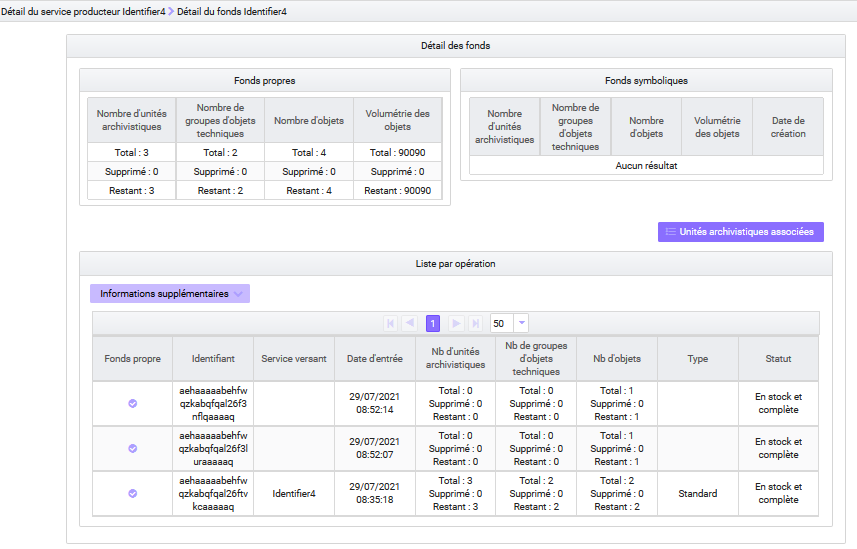

-  Au terme de la Version 6, l’APP VitamUI « Registre des fonds », quant à elle, donne accès, à la liste et au détail des entrées, quels que soient les services producteurs concernés, afin de se présenter comme un registre des entrées. Des filtres de recherche permettent d’en affiner la liste : recherche par date, par service producteur, etc. et des facettes permettent d’apprécier l’ensemble des archives conservées en fonction de ces filtres.

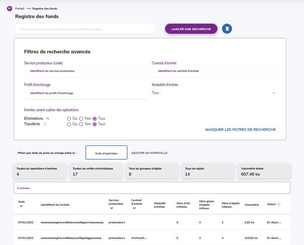

### Gestion des archives

#### Modification des archives

##### Modification des métadonnées

La solution logicielle Vitam permet de modifier les métadonnées associées à une unité archivistique issue d’un SIP, d’un plan de classement ou d’un arbre de positionnement, déjà entrées dans le système. Il est possible de :
-  modifier la valeur d’une métadonnée déjà renseignée dans l’unité archivistique,
-  ajouter une métadonnée à une unité archivistique,
-  supprimer une métadonnée contenue dans une unité archivistique.

Cette modification peut être réalisée de différentes manières (unitairement, en masse) et sur des types de métadonnées différentes (métadonnées descriptives, règles de gestion) :
- elle peut porter sur une unité archivistique en particulier et concerner aussi bien des métadonnées descriptives que des métadonnées de gestion. Il s’agit alors d’une opération de type « UPDATE », tracée dans le journal des opérations de la solution logicielle Vitam[^21] ;
- elle peut porter sur un lot d’unités archivistiques en particulier. On parle alors de mise à jour en masse et permet d’opérer une même action sur le lot d’archives sélectionnées.
    -  si elle porte sur des métadonnées descriptives, il s’agit alors d’une opération de type « MASS_UPDATE_UNIT_DESC », tracée dans le journal des opérations de la solution logicielle Vitam[^22],
    -  si elle est réalisée sur des métadonnées de gestion, il s’agit alors d’une opération de type « MASS_UPDATE_UNIT_RULE », tracée dans le journal des opérations de la solution logicielle Vitam[^23] ;
- elle peut porter sur un lot d’unités archivistiques en particulier en vue d’opérer une modification différente sur chacune des unités archivistiques sélectionnées. On parle alors de mise à jour unitaire en masse.Il s’agit d’une opération de type « BULK_UPDATE_UNIT_DESC » qui agit uniquement sur les métadonnées descriptives[^24].

Elle est également journalisée dans le journal du cycle de vie de l’unité archivistique ayant été modifiée.

**Point d’attention :** l’opération de type « UPDATE » a vocation à être dépréciée dans les prochaines versions de la solution logicielle Vitam. Il est recommandé d’utiliser à partir de la version 4 les autres services de mise à jour proposés par la solution logicielle Vitam.

##### Calcul des échéances

La solution logicielle Vitam enregistre également en base à la demande pour chaque unité archivistique les règles de gestion applicables et les échéances de ces règles, que les règles soient déclarées par l’unité archivistique ou héritées d’unités archivistiques parentes[^25].

Il s’agit d’une opération de type « COMPUTE_INHERITED_RULES », tracée dans le journal des opérations de la solution logicielle Vitam[^26].

Ce service, optionnel, est configurable lors du paramétrage initial de la plate-forme par les administrateurs – fonctionnel pour la définition du besoin et technique[^27] pour la saisie réelle des informations – de chaque implémentation de la solution logicielle Vitam et définit, pour chaque tenant le type d’indexation requis.

Il est également possible d’automatiser cet enregistrement au moyen du contrat d’entrée. Cette automatisation donne lieu à une tâche dans le processus d’entrée d’un SIP.

Cette indexation en base peut enfin être supprimée au moyen d’une opération de type « COMPUTE_INHERITED_RULES_DELETE », tracée dans le journal des opérations de la solution logicielle Vitam[^28].

**Point d’attention :** les arbres de positionnement n’utilisant pas de règles de gestion, ce service vaut uniquement pour les unités archivistiques de type « plan de classement » et « standard », qui acceptent des règles de gestion.

##### Réorganisation d’arborescence

La solution logicielle Vitam permet également de modifier l’arborescence d’unités archivistiques issues d’un SIP, d’un plan de classement ou d’un arbre de positionnement, déjà entrées dans le système[^29]. Il est possible de :
-  rattacher une unité archivistique à une unité archivistique, en respectant l’organisation hiérarchique de l’information, à savoir :
    - rattacher une unité archivistique issue d’un SIP à une unité archivistique issue d’un SIP, d’un plan de classement ou d’un arbre de positionnement,
    - rattacher une unité archivistique de plan de classement à un plan de classement ou à un arbre de positionnement,
    - rattacher une unité archivistique d’arbre de positionnement à un arbre de positionnement ;
-  supprimer un lien hiérarchique entre une unité archivistique et une autre, ce qui signifie qu’on peut supprimer un sous-niveau à un niveau de description parent.

Il s’agit d’une opération d’administration de type « RECLASSIFICATION », tracée dans le journal des opérations de la solution logicielle Vitam[^30].

Elle est également journalisée dans le journal du cycle de vie de l’unité archivistique ayant été rattachée, déplacée ou supprimée.

#### Élimination

##### Analyse d’élimination

L’utilisateur peut lancer une opération d’analyse d’élimination, en vue d’étudier le caractère éliminable d’ensembles d’unités archivistiques.   Son résultat permet de définir le statut des unités archivistiques concernées :
-  KEEP (à conserver),
-  DESTROY (éliminable),
-  CONFLICT (non décidable).

Il s’agit d’une opération d’administration de type « ELIMINATION_ANALYSIS », tracée dans le journal des opérations de la solution logicielle Vitam.

Elle donne lieu à un enregistrement de ses résultats dans les métadonnées des unités archivistiques[^31].

Au terme de la Version 5.RC toutes les unités archivistiques, qu’elles soient standards, de plan de classement, qui disposent de règles de gestion, ou d’arbre de positionnement peuvent être analysées.

##### Opération d’élimination

La solution logicielle Vitam permet d’éliminer :
-  des archives standards et de plan de classement dont la durée d’utilité administrative est échue et qui ne sont pas gelées,
-  des archives d’arbre de positionnement qui ne disposent pas de niveaux de description inférieurs non éliminables.

Il s’agit d’une opération d’administration de type « ELIMINATION_ACTION », tracée dans le journal des opérations de la solution logicielle Vitam. Elle peut aboutir aux résultats suivants :
-  l’opération est en succès si toutes les archives ont été éliminées ;
-  si certaines archives ne sont pas éliminables ou si le caractère éliminable d’une archives n’est pas décidable, l’opération sera en avertissement, mais le processus d’élimination ne sera pas interrompu.

Le rapport d’élimination, associé à l’opération, énumère les motifs liés à l’absence d’élimination de certaines archives.  
L’opération donne lieu à l’élimination des unités archivistiques et des groupes d’objets techniques associés.  
Cette élimination est retranscrite dans le registre des fonds[^32].

Toutes les unités archivistiques standards et de plan de classement, qui disposent de règles de gestion, ou d’arbre de positionnement peuvent être éliminées.

#### Transfert d’archives

La solution logicielle Vitam permet de constituer, à partir d’une sélection d’unités archivistiques, des DIP de transfert destinés à être pris en charge par une plate-forme.

Ce DIP prend la forme d’un message ArchiveTransfer[^33], contenant métadonnées et journaux du cycle de vie.

Il s’agit d’une opération d’administration de type « ARCHIVE_TRANSFER », tracée dans le journal des opérations de la solution logicielle Vitam[^34]. Au terme de la version 6, cette opération inclut l’empreinte du DIP calculée en SHA-512.

**Point d’attention :** Il est possible de limiter le poids des DIP de transfert au moyen de la définition d’un seuil au niveau de la requête ou au moyen d’un paramétrage de seuil de plate-forme et/ou de tenant dans un fichier de configuration.  
Le transfert génère un accusé de prise en charge dans le système d’archivage de destination et un effacement des données dans le système d’origine.  
Il s’agit d’une opération d’administration de type « TRANSFER_REPLY », tracée dans le journal des opérations de la solution logicielle Vitam[^35].

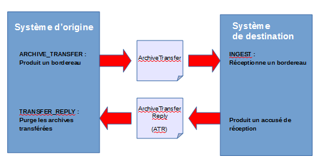

#### Sécurité et préservation des archives

##### Audit de cohérence

L’audit de cohérence consiste en des actions d’évaluation, de vérification de l’existence et, le cas échéant, de l’intégrité d’une liste d’objets binaires, de groupes d’objets techniques et d’unités archivistiques, de leurs journaux de cycle de vie, ainsi que de leur cohérence par rapport aux journaux sécurisés. Il permet ainsi de contrôler l’intégrité des unités archivistiques et de leurs journaux, quel que soit leur type.

Suite à cette analyse, une action corrective peut être lancée afin de rétablir l’accessibilité des objets absents ou corrompus, et ce à des fins de préservation numérique[^36].

L’audit de cohérence et l’opération corrective sont tous deux tracés dans le journal des opérations de la solution logicielle Vitam,
-  l’un comme une opération de type « EVIDENCE_AUDIT »,
-  l’autre comme une opération de type « RECTIFICATION_AUDIT »[^37].

##### Restauration des métadonnées essentielles

La solution logicielle Vitam permet de rétablir l’état antérieur des métadonnées dites essentielles d’une à plusieurs unités archivistiques.

Les métadonnées restaurées sont les suivantes :
-  niveau de description,
-  titre
-  description.

Il s’agit d’une opération d’administration de type « REVERT_ESSENTIAL_METADATA », tracée dans le journal des opérations de la solution logicielle Vitam[^38].

Elle donne également lieu à une trace dans le journal du cycle de vie de(s) unité(s) archivistique(s) ayant fait l’objet de l’opération.

##### Extraction de métadonnées descriptives

Parmi les fonctionnalités associées à la préservation numérique, la solution logicielle Vitam permet d’extraire des métadonnées issues des métadonnées techniques encapsulées dans les objets binaires en vue d’enrichir les métadonnées des unités archivistiques[^39].

Ces nouvelles métadonnées sont enregistrées et indexées en tant que métadonnées de l’unité archivistique.

Il s’agit d’une opération d’administration de type « PRESERVATION », tracée dans le journal des opérations de la solution logicielle Vitam[^40].

**Point d’attention :**
-  cet enrichissement fonctionne uniquement avec des unités archivistiques standards disposant d’objets techniques ;
-  l’extraction de métadonnées fonctionne actuellement avec le griffon Tesseract et, de fait, n’est possible que pour les formats de fichiers supportés par cet outil.

## Conseils de mise en œuvre

### Quand faut-il créer un arbre de positionnement ou un plan de classement ?

Avant de commencer à réaliser des transferts, il est fortement recommandé de travailler sur l’organisation hiérarchique des arbres et des plans au sein de la solution logicielle Vitam, et ceci pour trois raisons :
-  contextualiser les archives consultées et se conformer à la norme générale et internationale de description archivistique (ISAD/G) qui prescrit une structuration hiérarchique de l’information ;
-  préparer une restitution arborescente des archives, afin de permettre une recherche arborescente et une navigation soit dans un fonds particulier, soit dans l’ensemble des fonds pris en charge par un service d’archives ;
-  de fait, prévenir une restitution non maîtrisée des lots d’archives représentés par les seuls SIP, dont la granularité et le niveau de description peuvent varier.

En fonction des choix effectués, il est recommandé d’intégrer un arbre de positionnement ou un plan de classement « maître » dans la solution logicielle Vitam avant le premier transfert d’archives, en tenant compte des spécificités des arbres de positionnement et des plans de classement :
-  pour les premiers, on ne peut déclarer de service producteur, car un arbre de positionnement est, par essence, multi-producteurs ;
-  pour les seconds, on ne peut déclarer qu’un unique service producteur.

**Cas n°1.** L’utilisation d’un arbre de positionnement est recommandée dans les cas suivants :
-  quand on doit fournir une vision multi-producteurs des fonds d’archives ;
-  si on souhaite une structuration arborescente ne contenant pas de service producteur et ne portant pas de règles de gestion et à laquelle rattacher des SIP qui, eux, déclareront des services producteurs ;
-  la gestion des archives par un arbre de positionnement est recommandée s’il s’agit d’archives définitives, mais rien ne l’interdit en archivage intermédiaire, notamment dans le cas d’un service qui opère l’archivage de l’administration centrale et de ses opérateurs ;
-  l’usage d’un arbre de positionnement est également recommandé quand les premiers niveaux de l’arborescence sont consacrés à des termes génériques, et les services producteurs sont déclarés à des niveaux plus fins, par exemple dans des plans de classement.

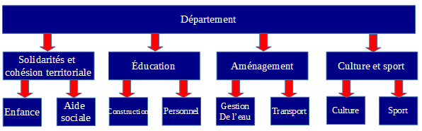

Néanmoins, si cette arborescence a vocation à être ultérieurement transférée dans un autre système d’archivage électronique, il n’est pas recommandé d’intégrer un arbre de positionnement.

**Cas n°2.** L’utilisation d’un plan de classement est recommandée dans les cas suivants :
-  si on souhaite une structure arborescente désignant un service producteur, entendu comme responsable et à l’origine de la production des archives transférées, il est recommandé de créer un plan de classement racine ;
-  dans le cadre de la gestion d’archives courantes ou intermédiaires par les normes de gestion des documents d’activités, MoReq et ISO 15489 ;
-  dans la mesure où il peut être amené à être transféré dans un autre système d’archivage électronique.

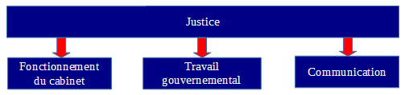

### Faut-il associer des règles de gestion à un plan de classement ?

La solution logicielle Vitam permet d’associer des règles de gestion à des unités archivistiques d’un plan de classement. Cependant, cette association peut être inadéquate dans certains cas.

**Cas n°1.** Les unités archivistiques à rattacher au plan de classement ont toutes la même date de départ pour calculer la durée de conservation.  
Dans ce cas-là, il peut être envisagé de placer des règles de gestion au niveau d’une unité archivistique de plan de classement quand, à ce niveau, on attend des SIP pour lesquels on est en mesure de qualifier et la règle et sa date de début. Cette date peut correspondre soit au début d’une année civile, soit à la date de fin d’année civile.  
Dans l’exemple ci-dessous, dans le plan de classement de comptabilité, on peut prévoir et planifier des transferts par année comptable. Ainsi, les documents de dépenses et recettes sont classés par année. Le niveau du plan de classement correspondant à l’année peut donc comporter des règles de gestion partant de la date de clôture de l’année comptable, soit le 31 décembre de l’année concernée.

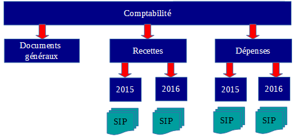

**Cas n°2.** Les unités archivistiques à rattacher au plan de classement ont chacune une date spécifique de départ pour calculer la durée de conservation.  
Dans ce cas-là, il n’est pas recommandé de déclarer des règles de gestion dans un plan de classement et de les faire hériter aux SIP rattachés à ce plan de classement.  
Dans l’exemple ci-dessous, il n’est pas pertinent d’énoncer une règle de gestion et une date de début de calcul au niveau « Dossier individuel », car la date de début s’appliquerait à l’ensemble des SIP, « Dossier A. B. » et « Dossier X. Y. », alors que ceux-ci ont une date spécifique de départ.

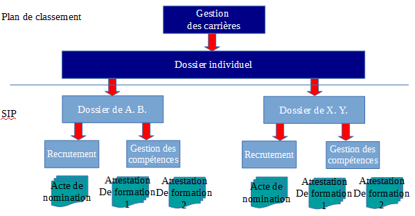

### Peut-on mettre à jour un arbre de positionnement ou un plan de classement ?

Un arbre de positionnement ou un plan de classement peuvent être mis à jour. Actuellement, la solution logicielle Vitam permet d’ajouter des niveaux inférieurs à ces deux types de structures arborescentes :
-  par l’import d’unité(s) archivistique(s) ;
-  par la mise à jour de la hiérarchie entre deux unités archivistiques déjà entrées dans la solution.

#### Mise à jour au moyen d’une opération d’import

##### Rattachement déclaré dans un bordereau de transfert

Cette opération peut s’effectuer par l’import d’un SIP de plan de classement ou d’arbre de positionnement où l’on va définir l’unité archivistique à laquelle le rattacher. Dans le bloc Management de l’unité archivistique destinée à être rattachée à un niveau supérieur, il faut ajouter un sous-bloc UpdateOperation dans lequel on dispose :
-  soit un SystemId correspondant au GUID de l’unité archivistique de rattachement ;
-  soit un ArchiveUnitIdentifierKey indiquant le champ d’une unité archivistique (par exemple le champ title) et sa valeur, sur lesquels on souhaite se baser pour associer une unité archivistique à une unité archivistique de niveau supérieur.

Consulter la [documentation « Structuration des SIP »](./structuration_SIP) pour plus d’exemples sur les déclarations de rattachements dans un bordereau de transfert.

Dans l’exemple ci-dessous, on ajoute au plan de classement deux sous-niveaux « 2017 ». Cette opération s’effectue par l’import d’un plan de classement dans lequel on déclare un nœud de rattachement, au moyen d’un identifiant ou en indiquant un rattachement à une unité dont le titre est égal à « Recette ».

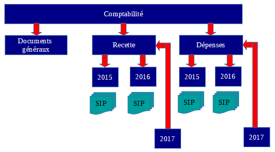

Si l’on souhaite éviter qu’une unité archivistique déclare un nœud de rattachement ne convenant pas, il est recommandé d’ajouter dans le contrat d’entrée un nœud pour déclarer un périmètre de rattachement autorisé.

##### Rattachement déclaré dans un contrat d’entrée

Le contrat d’entrée permet d’automatiser la mise à jour d’un niveau d’un plan de classement ou d’un arbre de positionnement en déclarant ce dernier comme nœud de rattachement. L’unité archivistique racine d’un SIP ou d’un plan de classement sera alors automatiquement placée sous ce nœud.

**Point d’attention :** cette option ne permet actuellement pas de contrôler si des unités archivistiques contenues dans le bordereau de transfert déclarent des rattachements à d’autres unités archivistiques n’ayant aucun lien avec le nœud de rattachement présent dans le contrat d’entrée.

#### Mise à jour au moyen d’une opération de réorganisation de l’arborescence

Au sein de la solution logicielle Vitam, il est également possible de :
-  supprimer des niveaux d’arbre de positionnement ou de plan de classement.
Par exemple, on peut supprimer le niveau « Documents généraux » qui ne semble pas utilisé dans le plan de classement ci-dessus.
-  déplacer un niveau de plan de classement déjà entré dans le système vers un autre niveau de plan de classement.

**Point d’attention :**
-  Aucun contrôle de cohérence n’est effectué par la solution logicielle Vitam sur les niveaux de description archivistique (champ DescriptionLevel). Dans le cas d’ajouts de nouveaux niveaux, la cohérence entre le niveau déclaré dans ces derniers par rapport à ceux des unités déjà présentes dans la solution logicielle Vitam doit être faite avant l’import.  
Par exemple, si « 2017 » détermine un niveau « Series », alors que « Recettes » ou « Dépenses » ont un niveau inférieur « Subseries », la solution logicielle Vitam acceptera leur rattachement hiérarchique.
-  Le déplacement d’un niveau de description vers un autre niveau de description doit respecter l’organisation hiérarchique de l’information.  
On peut déplacer :
    - une unité archivistique issue d’un SIP vers une autre unité archivistique issue d’un SIP, d’un plan de classement ou d’un arbre de positionnement,
    - une unité archivistique de plan de classement vers une autre unité archivistique de plan de classement ou d’arbre de positionnement,
    - une unité archivistique d’arbre de positionnement vers une autre unité archivistique d’arbre de positionnement.
-  La réorganisation d’une arborescence peut entraîner une mise à jour des règles de gestion héritées, ainsi que des services agents dits « symboliques » (_sps). Il est recommandé de modifier des arborescences :
    - en ayant ajouté au préalable des règles de gestion dans l’unité archivistique racine que l’on va déplacer ou dans l’unité archivistique de destination s’il n’y en a pas ;
    - en vérifiant au préalable les services agents ayant accès aux unités archivistiques à déplacer et, le cas échéant, à l’unité archivistique de destination.
-  La modification d’arborescence peut avoir un impact en termes d’accès. Il est recommandé de vérifier que les unités archivistiques modifiées restent accessibles et que les filtres du contrat d’accès dont elles dépendent restent cohérents avec le résultat souhaité. Il est conseillé de contrôler en particulier les filtres sur les nœuds d’accès et d’exclusion, ainsi que le filtre sur les services agents.

### Comment gérer la mise à jour d’unités archivistiques initiée par un système d’information métier ?

La solution logicielle Vitam permet à un applicatif qui crée des dossiers et les verse dès leur création alors qu’ils ne sont pas encore clos de :
-  ajouter des fichiers aux dossiers,
-  ajouter de nouveaux répertoires, correspondant à autant d’unités archivistiques,
-  modifier des métadonnées de description de certaines unités archivistiques.
    - soit il ajoute une même métadonnée dans plusieurs unités archivistiques,
    - soit il supprime une même métadonnée dans plusieurs unités archivistiques,
    - soit il effectue une même modification sur plusieurs unités archivistiques.
-  apporter des modifications différentes sur différents répertoires (par exemple, tantôt changer une date, tantôt ajouter ou supprimer un paiement, un document, etc.),
-  modifier des arborescences.

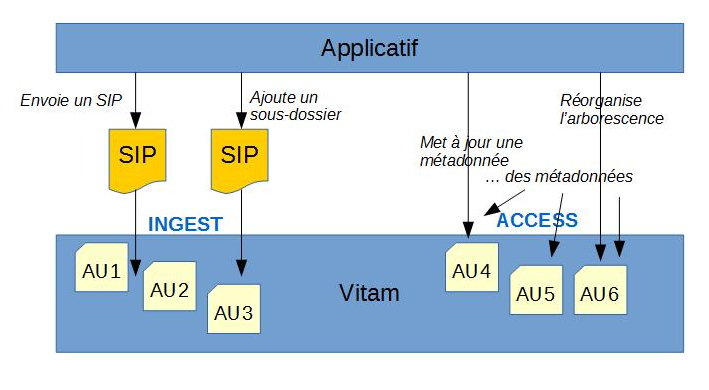

Ces modifications peuvent être :
-  soit réalisées automatiquement dans la solution logicielle Vitam, c’est-à-dire qu’elles sont directement envoyées dans la solution logicielle dès qu’elles sont faites côté front-office,
-  soit envoyées dans la solution logicielle Vitam à des échéances régulières (batch de nuit, une fois par mois, etc.).

**Cas d’usage :**
-  Un hôpital ouvre un dossier patient dès qu’un patient se présente au guichet, sans que ne soit vérifié si ce patient ne dispose pas déjà d’un dossier dans le système. On ne vérifie qu’a posteriori que le patient disposait déjà d’un dossier et on fusionne les documents du dossier ouvert avec ceux du dossier précédemment ouvert. En outre, on complète a posteriori les informations liées au patient.  
Il est alors nécessaire de :
    - réorganiser les arborescences après versement et supprimer les éléments inutiles,
    - mettre à jour des métadonnées concernant les patients pris en charge. Ces mises à jour sont réalisées et envoyées une fois par jour dans Vitam.
-  Un SIRH verse des dossiers du personnel dans Vitam. Dans cet applicatif, les agents continuent à modifier des métadonnées, ajouter des pièces. Celles-ci doivent être à leur tour modifiées dans la solution logicielle Vitam.
Ces mises à jour sont réalisées instantanément dans la solution logicielle Vitam.
      
**Point d’attention :** le nombre de mises à jour unitaires a un impact sur les performances, car il y a autant de sécurisations qu’il y a de mises à jour d’unités archivistiques modifiées. Si une unité archivistique est modifiée à plusieurs reprises, elle est sécurisée plusieurs fois.

Pour résumer :

|JE VEUX...|API|FONCTIONNALITE|
|:---|:---:|:----|
|ajouter de nouveaux répertoires, correspondant à autant d’unités archivistiques|INGEST|Entrée avec rattachement (ingests:create)|
|ajouter des fichiers|INGEST|Entrée avec rattachement (ingests:create)|
|modifier des métadonnées de description de certaines unités archivistiques. -  Soit il ajoute une même métadonnée dans plusieurs unités archivistiques, -  Soit il supprime une même métadonnée dans plusieurs unités archivistiques, -  Soit il effectue une même modification sur plusieurs unités archivistiques.|ACCESS|Mise à jour en masse de métadonnées descriptives (units:update)|
|modifier des métadonnées de gestion de certaines unités archivistiques. -  Soit il ajoute une même métadonnée dans plusieurs unités archivistiques, -  Soit il supprime une même métadonnée dans plusieurs unités archivistiques, -  Soit il effectue une même modification sur plusieurs unités archivistiques.|ACCESS|Mise à jour en masse de métadonnées de gestion (units:rules:update)|
|apporter des modifications différentes sur différents répertoires (par exemple, tantôt changer une date, tantôt ajouter un paiement, un document, etc.)|ACCESS|Mises à jour unitaire (units:id:update) A terme : mise à jour de masse|
|modifier des arborescences|ACCESS|Réorganisation d’arborescence (reclassification:update)

### Est-il possible de faire cohabiter plusieurs arbres de positionnement et plusieurs plans de classement ?

La solution logicielle Vitam permet de faire cohabiter plusieurs arbres de positionnement et plusieurs plans de classement.

Dans le cas des arbres de positionnement, il est tout à fait envisageable de créer un arbre de positionnement par grand domaine.

Par exemple, pour les Archives nationales, plutôt que d’avoir un seul arbre, on pourrait avoir un arbre par type d’archives : « Archives privées », « Archives publiques », « Archives audiovisuelles » ; etc.

Cet exemple vaut également pour les implémentations ayant retenu un plan de classement racine, en lieu et place d’un arbre de positionnement.

On peut également choisir de maintenir plusieurs versions d’un arbre de positionnement ou d’un plan de classement à des fins de processus interne d’un service d’archives et de gestion des accès :
-  un arbre (ou un plan) contient l’ensemble des plans de classement et des archives,
-  la réplique ne contient des liens que vers les plans de classement et les archives « traités » et, de fait, consultables par un plus grand public.

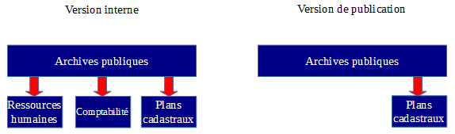

Si on choisit de faire cohabiter plusieurs versions d’un arbre ou d’un plan, il est néanmoins recommandé qu’un critère les distingue :
- l’intitulé au niveau racine de l’arbre de positionnement ou du plan de classement,

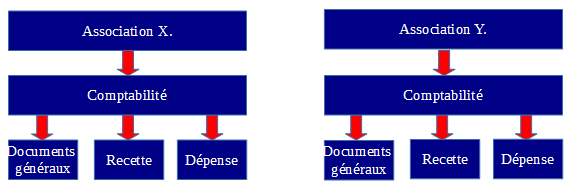

- l’année de transfert, date de début et de fin, dans le cas où l’on a transféré à plusieurs reprises le même plan de classement pour un producteur donné,

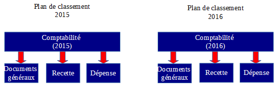

- le service producteur, dans le cas où un même plan est utilisé pour plusieurs services producteurs,

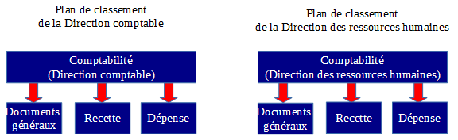

- les versions de conservation ou de publication, si on maintient deux arbres ou plans à des fins de gestion de processus interne.

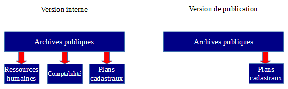

### Comment articuler plan de classement et profil d’archivage ?

La solution logicielle Vitam permet de contrôler un plan de classement au moyen d’un profil d’archivage.

Si on souhaite réaliser un profil d’archivage pour un plan de classement, il faudra veiller à ce que sa structure soit uniforme et n’évolue pas dans le temps, de même que la périodicité des transferts soit pertinente[^41]. À cet effet, il peut être intéressant de créer des profils d’archivage pour :
-  effectuer des contrôles d’administration fonctionnelle et s’assurer que les plans de classement transférés correspondent aux plans de classement attendus en termes de métadonnées ;
-  dans le cas d’une application gérant plusieurs séries de dossiers, s’assurer que son plan de classement est uniforme et contraint par l’intermédiaire d’un profil d’archivage.

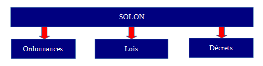

Par exemple, on a un plan de classement correspondant à un transfert de SOLON, contrôlé par un profil d’archivage. Les SIP correspondant au niveau « Item » y seront rattachés par la suite.

### Comment restituer graphiquement des arbres de positionnement et des plans de classement ?

L’IHM standard fournie avec la solution logicielle Vitam ne propose pas, en accès, de restitution arborescente de l’ensemble des fonds. Au terme de la Version 5.RC, l’APP VitamUI « Recherche et consultation des archives » propose une arborescence limitée aux unités archivistiques de type « Arbre de positionnement » et « Plan de classement » et à un fonctionnement par facette.

Il est conseillé d’ajouter des fonctionnalités dans l’interface d’accès aux archives :
-  ajouter, en plus de la recherche simple et de la recherche avancée, une restitution arborescente de l’ensemble des unités archivistiques, correspondant à une vision métier de l’ensemble des fonds ;
-  dans la liste des résultats, afficher, en dessous de l’intitulé de l’unité archivistique, les niveaux supérieurs de l’arborescence sous forme de fil d’Ariane ou, du moins, l’intitulé de l’unité archivistique racine de l’opération ou le titre de l’opération.

La consultation passe par :
-  pour les fonds : une liste des services producteurs ;
-  pour les archives : une liste de résultats à l’issue d’une recherche simple ou avancée.

### Comment supprimer des archives entrées par erreur dans le système ?

Il peut arriver qu’un paquet d’archives soit entré par erreur dans le système ou nécessite des corrections hors système. Il faut alors supprimer ces archives, avant, le cas échéant, de les transférer à nouveau dans la solution logicielle Vitam.

#### Pour des unités de type « Standard » et « Plan de classement »

Avant toute procédure de suppression, le référentiel des règles de gestion doit disposer en prérequis d’une règle de type « AppraisalRule », avec pour caractéristiques :
-  RuleType : AppraisalRule,
-  RuleDuration : 0
-  RuleMeasurement : YEAR

Il est recommandé d’avoir une règle spécifique pour gérer ces cas de suppression suite à une erreur.

Ensuite, il est recommandé de procéder comme suit :
-  mettre à jour en masse des règles de gestion qui :
    - supprime toutes les règles de gestion de type « AppraisalRule » portées par les unités archivistiques en erreur,
    - ajoute la règle de type « AppraisalRule » spécifique à la suppression d’éléments en erreur ;
-  calculer les échéances de manière à obtenir l’éliminabilité des archives ;
-  procéder à l’action d’élimination.

#### Pour des unités archivistiques de type « Arbre de positionnement »

Avant toute procédure de suppression d’une unité de type « Arbre de positionnement », il faut veiller à déplacer vers un autre niveau de description les unités archivistiques qui lui sont associées à des niveaux inférieurs.

**Point d’attention :** Contrairement aux unités archivistiques de type « Standard » et « Plan de classement », une unité archivistique de type « Arbre de positionnement » ne dispose pas de règles de gestion. Il est de fait possible de traiter ce type d’unité archivistique via les opérations d’analyse et d’action d’élimination sans lui avoir au préalable ajouté des règles de gestion.

Il est ensuite possible de procéder à l’action d’élimination. Le seul contrôle effectué par cette opération est la vérification de l’absence d’unités archivistiques de niveau inférieur à l’unité qu’on souhaite supprimer.

### Faut-il archiver des journaux en plus des archives ?

Dans le cadre d’un projet de transfert d’archives, les unités archivistiques peuvent être associées à des éléments de journalisation, issus d’un applicatif à archiver, d’un SAE en cours de décommissionnement, d’un SAE gérant de l’archivage intermédiaire.

La solution logicielle Vitam permet de les récupérer lors du transfert d’archives sous plusieurs formes en fonction de la manière dont on souhaite les exploiter :

|||
|:---|:---|
|Récupération du contenu des journaux sous forme de fichiers -  Une unité archivistique les décrit, -  Granularité : un fichier par versement, un fichier associé à chaque unité archivistique de bas niveau -  Peu de besoin d’accès / de consultation de ces journaux -  Nécessité de conserver la trace des anciennes actions ayant touché les archives|
|Récupération des journaux pour enregistrement en base de données|*Dans les journaux du cycle de vie :* -  Ils sont identifiés comme « Logbook » et propres à une unité archivistique (bloc Management) ou à un groupe d’objets techniques (bloc DataObjectgroup) -  Continuité des journaux depuis l’ancien SI et le SAE -  Permanence du lien avec les archives qu’ils référencent -  Enregistrement sous forme de journaux externes (« EXTERNAL_LOGBOOK ») -  Accès indirect via ces archives  >*En tant que métadonnées descriptives :* -  Ils sont identifiés comme une liste d’événements (sous-bloc Event présent dans le bloc Content) et peuvent être modifiés. -  Répond à un besoin d’accès régulier.|

**Point d’attention :**
-  En cas d’enregistrement comme traces dans au moins un des journaux du cycle de vie de la solution logicielle Vitam, cette dernière les fera précéder d’une opération de type « journalisation externe » (« EXTERNAL_LOGBOOK »).
-  Par ailleurs, il est attendu que les journaux à récupérer correspondent à la modélisation attendue par le standard SEDA et la solution logicielle Vitam :
    -  « EventIdentifier » pour « evId »,
    -  « EventTypeCode » pour « evTypeProc »,
    -  « EventType » pour « evType »,
    -  « EventDateTime » pour « evDateTime »,
    -  « EventDetail » pour « evTypeDetail »,
    -  « Outcome » pour « outcome »,
    -  « OutcomeDetail » pour « outDetail »,
    -  « OutcomeDetailMessage » pour « outMessg »,
    -  « EventDetailData » pour  « evDetData ».

Exemple d’enregistrement dans un journal du cycle de vie d’une trace externe :

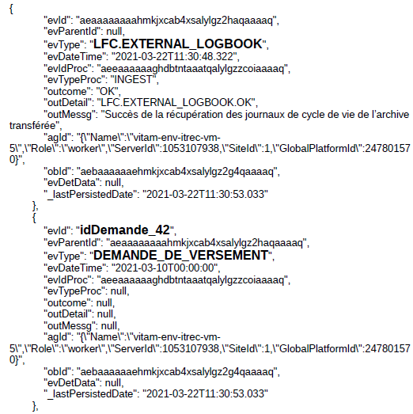

[^1] Les principes retenus par l’équipe du programme Vitam dans la spécification des SIP sont détaillés dans le document intitulé : [VITAM - Structuration des Submission Information Package (SIP)]:(./structuration_SIP). 

[^2]: Pour plus d’informations, consulter le document [VITAM - Structuration des Submission Information Package (SIP)](./structuration_SIP). 

[^3]: Le fonctionnement des rattachements est précisé dans la [section « Rattachement déclaré dans un bordereau de transfert »](#rattachement-déclaré-dans-un-bordereau-de-transfert) du présent document.

[^4]: Pour plus d’informations, consulter le document [VITAM - Structuration des Dissemination Information Package (DIP)](./structuration_DIP). 

[^5]: Cette valeur peut être modifiée en configuration.

[^6]: Pour plus d’informations, consulter le document [VITAM - Structuration des  Submission Information Package (SIP)](.structuration_SIP). 

[^7]: Pour plus d’informations, consulter [VITAM - Modèle de données](./modele_de_donnees.md), chapitre 4.1, « Collection Unit ».

[^8]: Pour plus d’informations, consulter [VITAM - Modèle de données](./modele_de_donnees.md), chapitre 3.2, « Collection LogbookLifeCycleUnit ».

[^9]: Pour plus d’informations, consulter [VITAM - Modèle de données](./modele_de_donnees.md), chapitre 4.2, « Collection ObjectGroup ».

[^10]: Pour plus d’informations sur le module de collecte, consulter le document [VITAM – Module de collecte](./module_de_collecte.md).

[^11]: Pour plus d’informations sur la déclaration d’un rattachement dans un SIP, consulter la [section « Rattachement déclaré dans un bordereau de transfert »](#rattachement-déclaré-dans-un-bordereau-de-transfert) du présent document ou le document [VITAM - Structuration des Submission Information Packages (SIP)](./structuration_SIP). Concernant les étapes à réaliser, consulter VITAM- Cahier de tests.

[^12]: Ce service, davantage technique, est détaillé dans les documentations : Documentation d’exploitation, chapitre 8.2.10.2.2.1 « Fichier ingest-external.conf » ; Documentation d’API externes, chapitre « Ingest ».

[^13]: Pour plus d’informations, consulter la documentation [VITAM - Gestion des habilitations](./gestion_habilitations.md), chapitre « Contrat d’entrée ».

[^14]:  Pour plus d’informations, consulter le document [VITAM - Structuration des Dissemination Information Package (DIP)](./structuration_DIP). 

[^15]: Les étapes liées à cette opération sont décrites dans la documentation [VITAM - Modèle de workflow](./modele_de_workflow.md), chapitre « Export d’un DIP ».

[^16]: Ce service fonctionne uniquement avec les règles de gestion indexées au moyen du calcul des règles de gestion héritées.

[^17]: Pour plus d’informations, consulter la documentation [VITAM - Gestion des habilitations](./gestion_habilitations.md), chapitre « Contrat d’accès ».

[^18]: Pour plus d’informations sur le registre des fonds, consulter la documentation [VITAM - Services producteurs](./services_prod.md), chapitre « Registre des fonds ».

[^19]: La date de l’opération d’entrée, le contrat d’entrée, le service producteur et l’identifiant du message, obligatoires dans le bordereau de transfert, sont systématiquement enregistrés dans le registre des fonds. Y figurent également commentaires, profil d’archivage, modalités d’entrée, statut des archives, s’ils sont présents dans le bordereau de transfert.

[^20]: Pour plus d’informations sur le registre des fonds, consulter la documentation [VITAM - Services producteurs](./services_prod.md), chapitre « Registre des fonds ».

[^21]: Les étapes liées à cette opération sont décrites dans la documentation [VITAM - Modèle de workflow](./modele_de_workflow.md), chapitre « Mise à jour unitaire ».

[^22]: Les étapes liées à cette opération sont décrites dans la documentation [VITAM - Modèle de workflow](./modele_de_workflow.md), chapitre « Mise à jour de masse (Mass Update) ».

[^23]: Les étapes liées à cette opération sont décrites dans la documentation [VITAM - Modèle de workflow](./modele_de_workflow.md), chapitre « Mise à jour de masse (Mass Update) ».

[^24]: Les étapes liées à cette opération sont décrites dans la documentation [VITAM - Modèle de workflow](./modele_de_workflow.md), chapitre « Mise à jour unitaire  de masse (Bulk Update) ».

[^25]: Pour plus d’informations, consulter le document [VITAM - Règles de gestion](./regles_gestion.md).

[^26]: Les étapes liées à cette opération sont décrites dans la documentation [VITAM - Modèle de workflow](./modele_de_workflow.md), chapitre « Workflow de calcul des règles de gestion héritées des unités archivistiques pour faciliter les requêtes ».

[^27]: Pour plus d’informations, consulter le document Document d’installation, chapitres 4.2.5.10 « Paramétrage du batch de calcul pour l’indexation des règles héritées » et 4.2.5.12 « Fichiers complémentaires » ; « Document d’exploitation », chapitre 8.2.6.2.3 « Paramétrage du batch de calcul pour l’indexation des règles héritées ».

[^28]: Les étapes liées à cette opération sont décrites dans la documentation [VITAM - Modèle de workflow](./modele_de_workflow.md), chapitre « Workflow de suppression des règles de gestion héritées et calculées des unités archivistiques ».

[^29]: Cette opération est réalisable depuis l’IHM de recette de la solution logicielle Vitam et l’APP « Recherche et consultation des archives » de Vitam UI.

[^30]: Les étapes liées à cette opération sont décrites dans la documentation [VITAM - Modèle de workflow](./modele_de_workflow.md), chapitre « Modification d’arborescence ».

[^31]: Pour plus d’informations, consulter la documentation [VITAM - Les éliminations avec la solution logicielle Vitam](./eliminations.md).

[^32]: Pour plus d’informations, consulter la documentation [VITAM - Les éliminations avec la solution logicielle Vitam](./eliminations.md).

[^33]: Pour plus d’informations, consulter les documents [VITAM - Structuration des Dissemination Information Package (DIP)](./structuration_DIP) et [Le transfert avec la solution logicielle Vitam](./transfert.md).

[^34]: Les étapes liées à cette opération sont décrites dans la documentation [VITAM - Modèle de workflow](./modele_de_workflow.md), chapitre « Transfert ». Pour plus d’informations sur le transfert, consulter la documentation [VITAM - Le transfert avec la solution logicielle Vitam](./transfert.md).

[^35]: Les étapes liées à cette opération sont décrites dans la documentation [VITAM - Modèle de workflow](./modele_de_workflow.md), chapitre « Transfert ». Pour plus d’informations sur le transfert, consulter la documentation [VITAM - Le transfert avec la solution logicielle Vitam](./transfert.md).

[^36]: Pour plus d’informations, consulter le document [VITAM - Gestion de la préservation](./preservation.md).

[^37]: Les étapes liées à cette opération sont décrites dans la documentation [VITAM - Modèle de workflow](./modele_de_workflow.md), chapitre « Workflow d’audit de cohérence des fichiers » et chapitre « Workflow de l’audit correctif ».

[^38]: Les étapes liées à cette opération sont décrites dans la documentation [VITAM - Modèle de workflow](./modele_de_workflow.md), chapitre « Workflow d’audit de cohérence des fichiers » et chapitre « Workflow de l’audit correctif ».

[^39]: Pour plus d’informations, consulter le document [VITAM - Gestion de la préservation](./preservation.md).

[^40]: Les étapes liées à cette opération sont décrites dans la documentation [VITAM - Modèle de workflow](/modele_de_workflow.md), chapitre « Préservation ».