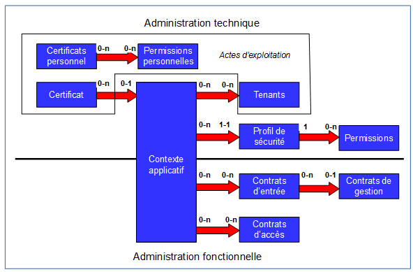
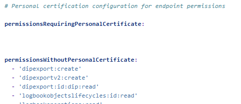
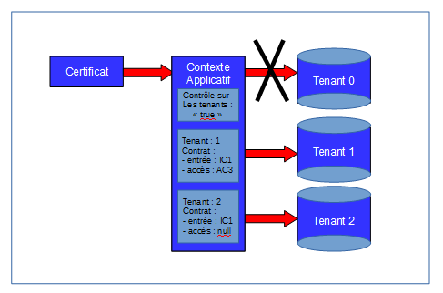
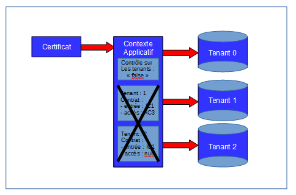
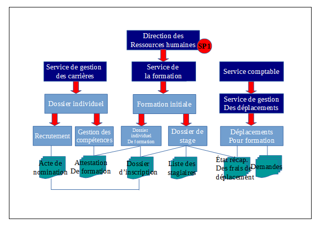
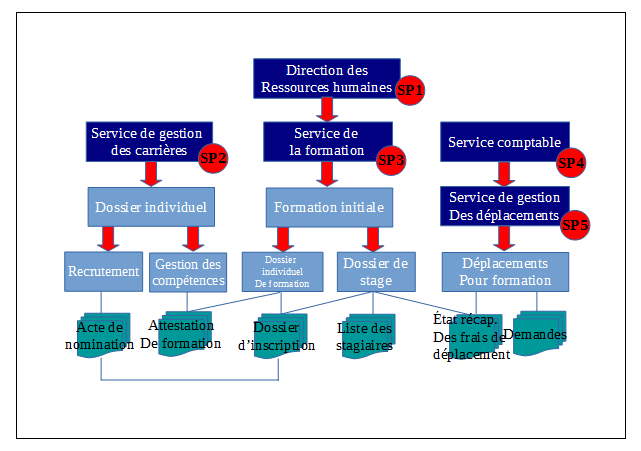

Gestion des habilitations
=====

Introduction
------------

### Documents de référence

| Document|Date de la version|Remarques|
|:----|:----:|:----:|
|NF Z 44022 – MEDONA – Modélisation des données pour l’archivage|18/01/2014||
|Standard d’échange de données pour l’archivage – SEDA – v. 2.1|06/2018||
|Standard d’échange de données pour l’archivage – SEDA – v. 2.2|02/2022|Cette nouvelle version du SEDA est intégrée à la solution logicielle Vitam à partir de la V6.RC.|        


### Présentation du document

Le document présente les fonctionnalités associées à la gestion et à l’utilisation des habilitations dans la solution logicielle Vitam.

Il s’articule autour des axes suivants :
- une présentation des différentes habilitations : certificat applicatif, certificat personnel, profil de sécurité, contexte applicatif, contrat d’entrée, contrat d’accès, et de la manière dont le Standard d’échanges de données pour l’archivage (SEDA) et le modèle de données de la solution logicielle Vitam sont utilisés pour les formaliser ;
- une présentation des mécanismes mis en œuvre dans la solution logicielle Vitam pour gérer ces habilitations ;
- des recommandations aux ministères porteurs, partenaires et utilisateurs de la solution logicielle Vitam sur la manière d’utiliser les fonctionnalités associées à ces habilitations.
Le présent document décrit les fonctionnalités qui seront offertes par la première version de production de la solution logicielle Vitam au terme de la version 6 (mars 2023). Il a vocation à être amendé, complété et enrichi au fur et à mesure de la réalisation de la solution logicielle Vitam et des retours et commentaires formulés par les ministères porteurs et les partenaires du programme.

Administration des habilitations
---

Les habilitations sont l’ensemble des droits et permissions attribués par la solution logicielle Vitam à une application externe et permettant à cette dernière d’accéder aux différents services proposés par la solution logicielle Vitam.



La solution logicielle Vitam met à disposition un ensemble d’outils permettant de gérer les habilitations :
- les certificats applicatifs et les certificats personnels ;
- les contextes applicatifs, les profils de sécurité, les contrats d’entrée et les contrats d’accès.

### Certificat applicatif

#### Description

Le certificat applicatif correspond à une carte d’identité numérique. Il permet d’identifier et d’authentifier une application souhaitant accéder aux services de la solution logicielle Vitam.

Pour ce faire, il doit être obligatoirement :
- déclaré dans la solution logicielle Vitam ;
- associé à au moins un contexte applicatif.

#### Formalisation

Les certificats applicatifs sont enregistrés dans la base de données MongoDB, dans la collection « Certificate », sous la forme d’enregistrements au format JSON.
Enregistrement d’un certificat :
```json
{
    "_id": "aeaaaaaaaahgnmn7aac46almhn4jtsiaaaaq",
    "SubjectDN": "EMAILADDRESS=support@programmevitam.fr, CN=vitam-vitam, OU=Vitam, O=Vitam, L=Paris, ST=IDF, C=FR",
    "ContextId": "CT-000001",
    "SerialNumber": "4",
    "Certificate": "LS0tLS1CRUdJTiBDRVJUSUZJQ0FURS0tLS0tCk1JSUdJVENDQkFtZ0F3SUJBZ0lCQkRBTkJna3Foa2lHOXcwQkFRc0ZBRENCa3pFTE1Ba0dBMVVFQmhNQ1JsSXgKRERBS0JnTl[...]ZZRXR0RXdCS0c3dTgyQ0FjUVE2cS9JQWQxV0gvTS9sbDM1Qwo3NGVqSWxSSWk0YmRxcklaYlFjdVB4UEpQRTZEdE5nNDlYemlQUWJuWnhFREtBNE1zQT09Ci0tLS0tRU5EIENFUlRJRklDQVRFLS0tLS0=",
    "IssuerDN": "EMAILADDRESS=support@programmevitam.fr, CN=vitam-root-ca-vitam, OU=Vitam, O=Vitam, L=Paris, ST=IDF, C=FR",
    "Status": "VALID",
   "ExpirationDate": "2025-01-30T22:13:43.000"
}
```
Un certificat applicatif doit comporter les éléments suivants[^1] :
|Champ|Description|
|:----|:-----|
|_id|identifiant unique dans l’ensemble du système, fourni par ce dernier (champ obligatoire).|
|SubjectDN|identifiant unique du certificat applicatif ou Distinguished Name (champ obligatoire).|
|ContextId|identifiant signifiant du contexte applicatif associé au certificat applicatif (champ obligatoire).|
|SerialNumber|numéro de série du certificat applicatif (champ obligatoire).|
|IssuerDN|identifiant unique ou Distinguished Name de l’autorité de certification (champ obligatoire).|
|Certificate|clé du certificat applicatif (champ obligatoire).|
|Status|statut du certificat applicatif (champ obligatoire) :<br>- Si le certificat est valide et actif, le statut a pour valeur « VALID » ;<br>- Si le certificat a été révoqué, le statut a pour valeur « REVOKED »,<br>- Si le certificat est expiré, le statut a pour valeur « EXPIRED ».|
|ExpirationDate|date d’expiration du certificat (champ obligatoire).|

#### Mécanismes mis en œuvre par la solution logicielle Vitam

La solution logicielle Vitam intègre un référentiel des certificats applicatifs, administrable par un utilisateur doté des droits adéquats (administrateur technique) et géré dans une collection particulière[^2].

Il est possible de réaliser les opérations présentées ci-dessous.

##### Import

**Au moment de l’installation de la solution logicielle Vitam**

La solution logicielle Vitam intègre par défaut des habilitations, automatiquement importées lors de l’initialisation de la plate-forme, dans le but de permettre un accès direct à l’ensemble de ses services. En plus d’un contexte applicatif, donnant accès à l’ensemble des tenants, et d’un profil de sécurité, référençant l’ensemble des permissions, elle fournit un certificat applicatif, utilisé pour déployer la solution logicielle Vitam[^3].  
Cette action, relevant d’un acte d’administration technique, fait l’objet d’une journalisation dans les logs, contrairement aux actions d’import du contexte applicatif et du profil de sécurité fournis par défaut par la solution logicielle Vitam, qui sont tracées dans le journal des opérations du tenant d’administration.
**Points d’attention :** le certificat applicatif fourni par défaut par la solution logicielle Vitam n’est pas destiné à être utilisé par une plate-forme en production. Il a vocation à :
- faciliter le déploiement d’une plate-forme et précéder l’utilisation d’un certificat de production ;
- être utilisé par une plate-forme de tests.

**Après installation de la solution logicielle Vitam**

Dans la solution logicielle Vitam, il est possible de générer 1 à n certificat(s) applicatif(s). Cet ajout relève d’opérations d’administration technique et s’effectue au moyen des API.

Par cette génération, 1 à n certificat(s) applicatif(s) sont ajoutés au référentiel des certificats applicatifs[^4].

Cette action, relevant d’un acte d’administration technique, fait l’objet d’une journalisation dans les logs, contrairement aux actions d’import du contexte applicatif et du profil de sécurité fournis par défaut par la solution logicielle Vitam, qui sont tracées dans le journal des opérations du tenant d’administration.

##### Recherche

La solution logicielle Vitam permet à un exploitant d’accéder à la liste des certificats, ainsi qu’aux habilitations qui lui sont associées. Pour un certificat donné, elle renvoie l’ensemble des informations relatives au :
- contexte applicatif qui lui est attribué, 
- profil de sécurité déclaré dans ce dernier[^5].

Cette action relève d’un acte d’administration technique et ne fait pas l’objet d’une journalisation.

##### Mise à jour

La solution logicielle permet de mettre à jour unitairement des certificats[^6]. Cette mise à jour consiste à remplacer un certificat en fin de vie par un nouveau certificat et, de fait, entraîne la suppression du certificat en fin de vie.
Cette mise à jour peut avoir un impact sur les interactions entre l’application versante et/ou accédante et la solution logicielle Vitam. Cette opération ne s’effectue qu’au moyen des API et relève d’une opération d’administration technique.

Cette action, relevant d’un acte d’administration technique, fait l’objet d’une journalisation dans les logs fournis par défaut par la solution logicielle Vitam.

##### Suppression

La solution logicielle permet de supprimer unitairement des certificats[^7].
Cette suppression peut avoir un impact sur les interactions entre l’application versante et/ou accédante et la solution logicielle Vitam. Cette opération ne s’effectue qu’au moyen des API et relève d’une opération d’administration technique.

Cette action, relevant d’un acte d’administration technique, fait l’objet d’une journalisation dans les logs fournis par défaut par la solution logicielle Vitam.

#### Conseils de mise en œuvre

À l’issue de cette dernière phase de réalisation de fonctionnalités concernant les habilitations, l’équipe projet Vitam est en mesure de fournir quelques recommandations de mise en œuvre. La solution logicielle permet de créer, modifier et supprimer les certificats applicatifs. Certaines actions peuvent avoir un impact sur les interactions entre l’application versante et/ou accédante et la solution logicielle Vitam.

##### Quand et comment créer un certificat applicatif ?
Un service externe souhaitant utiliser les services de la solution logicielle Vitam doit avoir déclaré son certificat applicatif dans la solution logicielle Vitam. Ce certificat doit être associé à un contexte dès la création de celui-ci, sans quoi l’application cherchant à s’authentifier à la solution logicielle Vitam ne pourra accéder à aucun de ses services.

La création d’un certificat applicatif peut intervenir à différents moments :
- lors de l’initialisation de la plate-forme : il est obligatoire de disposer d’un certificat applicatif, en plus d’un contexte applicatif et d’un profil de sécurité, pour pouvoir utiliser les services de la solution logicielle Vitam.
Cette dernière propose un certificat par défaut, destiné à être utilisé dans deux cas :
    - pour le déploiement de la plate-forme, afin de faciliter son installation, ainsi que le paramétrage du certificat applicatif de production, ayant vocation à remplacer ce certificat par défaut ;
    - sur une plate-forme de tests ;
- lors de l’intégration d’une nouvelle application devant accéder aux services de la solution logicielle Vitam.

La déclaration d’un certificat applicatif dans la solution logicielle Vitam relève d’une opération d’administration technique[^8].
De fait, au moment de l’initialisation d’un nouveau certificat, il est recommandé de suivre les étapes suivantes :

|Qui ?|Quoi ?|Via l’IHM Vitam ?|
|:----:|:----:|:----:|
|Administrateur fonctionnel/ technique|- définit ses besoins en termes d’habilitation :<br>Quel contexte applicatif utiliser ? quels droits associer à ce contexte applicatif ? quel profil de sécurité utiliser ? quels contrats associer ?<br>Les habilitations nécessaires existent-elles déjà ? Faut-il créer de nouvelles habilitations ?<br>Y a-t-il des besoins de sécurité particulier ?<br>- le cas échéant, liste les habilitations dont il a besoin[^9].|Oui / Non|
|Administrateur technique|Le cas échéant, crée un profil de sécurité.|Non|
|Administrateur fonctionnel/ technique|Le cas échéant, crée un contexte applicatif, en l’associant à un profil de sécurité, créé pour l’occasion ou déjà existant.|Oui|
|Administrateur technique|Crée le nouveau certificat applicatif, en l’associant au contexte applicatif, créé pour l’occasion ou déjà existant.|Non|
|Administrateur fonctionnel|Le cas échéant :<br>- crée des contrats, d’entrée et/ou d’accès ;<br>- associe au contexte applicatif des contrats d’entrée et/ou d’accès.|Oui|
|Administrateur fonctionnel/ technique|Activation du contexte applicatif.|Oui|
|Administrateur technique / fonctionnel|Test avant utilisation courante.|Oui|

**Points d’attention :**
- La solution logicielle Vitam rend obligatoire l’intégration d’un certificat applicatif par défaut, afin de pouvoir initialiser et paramétrer la plate-forme. Ce certificat n’a pas vocation à être utilisé en production et doit, dans ce cas-là, être remplacé par un certificat de production.
- Dans la mesure où un certificat doit être associé à un contexte, lui-même nécessitant un profil de sécurité, il est obligatoire de disposer au préalable d’un profil de sécurité et d’un contexte à associer à ce certificat applicatif.
- Un même certificat ne peut être utilisé que par un contexte applicatif.

##### Comment mettre à jour un certificat applicatif ?
Un certificat applicatif a une durée de vie limitée et nécessite d’être ponctuellement mis à jour, voire remplacé[^10]. On peut procéder de la manière suivante :
|Qui ?|Quoi ?|Via l’IHM Vitam ?|Commentaires|
|:----:|:----:|:----:|:----|
|Administrateur fonctionnel/ technique|Désactivation du contexte associé au certificat applicatif à changer.|Oui||
|Administrateur  technique|Création d’un nouveau certificat applicatif, destiné à remplacer le certificat en production.|Non|NB : déclaration du contexte désactivé.|
|Administrateur  technique|Révocation du précédent certificat applicatif.|Non|But : éviter un conflit de certificats lors de la réactivation du contexte.|
|Administrateur fonctionnel/ technique|Activation du contexte applicatif.|Oui||
|Administrateur technique / fonctionnel|Test avant utilisation courante.|Oui||

##### Quand et comment supprimer un certificat applicatif ?
La suppression ou révocation d’un certificat applicatif peut intervenir à plusieurs occasions :
- l’application souhaitant s’authentifier à la solution logicielle Vitam est décommissionnée ;
- son certificat est obsolète et doit être remplacé.

La solution logicielle Vitam permet de le révoquer de la manière suivante :
-  en transmettant à la solution logicielle Vitam la liste des certificats révoqués par une autorité fournissant des certificats applicatifs ;
- en changeant son statut, de « VALID » à « REVOKED » ou « EXPIRED ». Cela a pour conséquence le rejet de tout accès aux API de la solution logicielle Vitam au moyen de ce certificat révoqué.

La révocation d’un certificat applicatif dans la solution logicielle Vitam relève d’une opération d’administration technique[^11].

**Point d’attention :** la révocation d’un certificat peut être temporaire et la suppression de l’usage du certificat est alors temporaire, tandis qu’un certificat expiré n’est plus utilisable.

### Certificat personnel

#### Description
Le certificat personnel correspond à un certificat propre à une personne physique utilisatrice en particulier de l’application souhaitant accéder aux services de la solution logicielle Vitam. Le certificat personnel ne se substitue pas au certificat applicatif qui authentifie une application, et il sert juste à identifier et non à authentifier une personne qui se connecte derrière une application. Le principe de délégation de la phase d’authentification des utilisateurs humains par les front-offices est conservé même dans ce cas, et ce certificat est simplement transmis par le front-office dans les appels REST. À minima, la solution logicielle Vitam vérifie que ce certificat est présent dans la liste des certificats connus.

Son utilisation répond à un besoin de sécurité supplémentaire, associé aux fonctions d’administration avancées ou considérées comme sensibles. L’accès à certaines fonctions (EndPoints) est soumis d’une part à l’autorisation de l’application par son contexte applicatif et d’autre part à la présence d’un certificat personnel connu pour identification de l’utilisateur.

#### Formalisation
Les certificats personnels sont enregistrés dans la base de données MongoDB, dans la collection « PersonalCertificate », sous la forme d’enregistrements au format JSON.

Enregistrement d’un certificat personnel :
```json
{
    "_id": "aeaaaaaaaahgnmn7aacg4allwxzmb6qaaaaq",
    "SubjectDN": "O=VITAM, L=Paris, C=FR",
    "SerialNumber": "2",
    "Certificate": "MIIFRjCCAy6gAwIBAgIBAjANBgkqhkiG9w0BAQsFADAtMQswCQYDVQQGEwJGUjEOMAwGA1UEBxMFUGFyaXMxDjAMBgNVBAoTBVZJVEFNMCAXDTE3MDgwMTExMTcwMFoYDzk5OTkxMjMxMjM1OTU5WjAtMQswCQYDVQQGEwJGUjEOMAwGA1UEBxMFUGFyaXMxDjAMBgN[...]I49Maz5W87bKqNyecYtrBlvML7k5UeOLtgNuUsTBlzFTxMkaQHOSpMyrHZ/yVPNVfuP3cCKvzMPHFGHzJZK0qvz4zdFdx7YzBq+I6YLvRES9b+DkvdrTOpZI2GjKuP5m13kcUjsFeqJR6rb+o1kJuCj/QMC2OjMXMlDqNa8mL5ooGQmYOzHkfq4vdKLG/Fvbpw2DDrwv9jKmw2l6eWLYzuIpvz7sqUHwi30wScXSm/FCKF9DjzODUpSkBvDiaA==",
    "IssuerDN": "O=VITAM, L=Paris, C=FR",
    "Status": "VALID",
    "Hash": "6088f19bc7d328f301168c064d6fda93a6c4ced9d5c56810c4f70e21e77d841d",
   "ExpirationDate": "2025-01-30T22:13:43.000"
}
```
Un certificat personnel doit comporter les éléments suivants[^12] :
|Champ|Description|
|:----|:----|
|_id|identifiant unique dans l’ensemble du système, fourni par ce dernier (champ obligatoire).|
|SubjectDN|identifiant unique du certificat personnel ou Distinguished Name (champ obligatoire).|
|SerialNumber|numéro de série du certificat personnel (champ obligatoire).|
|IssuerDN|identifiant unique ou Distinguished Name de l'autorité de certification (champ obligatoire).|
|Certificate|clé du certificat personnel (champ obligatoire).|
|Hash|empreinte du certificat personnel (champ obligatoire).|
|Status|statut du certificat personnel (champ obligatoire) :<br>- Si le certificat est valide et actif, le statut a pour valeur « VALID » ;<br>- Si le certificat a été révoqué, le statut a pour valeur « REVOKED »,<br>- Si le certificat est expiré, le statut a pour valeur « EXPIRED ».|
|ExpirationDate|date d’expiration du certificat (champ obligatoire).|

Au niveau de la plate-forme un fichier de configuration définit les services qui peuvent être rendus accessibles aux seuls détenteurs d’un certificat personnel[^13].
Par ailleurs, le certificat personnel est enregistré dans le journal des opérations sous forme d’identifiant (agIdPers).

#### Mécanismes mis en œuvre par la solution logicielle Vitam
La solution logicielle Vitam intègre un référentiel des certificats personnels, administrable par un utilisateur doté des droits adéquats (administrateur technique) et géré dans une collection particulière[^14].

Il est possible de réaliser les opérations présentées ci-dessous.

##### Import

Dans la solution logicielle Vitam, il est possible de générer 0 à n certificat(s) personnel(s). Cet ajout relève d’opérations d’administration technique et s’effectue au moyen des API.

Lors d’un import, 1 à n certificat(s) personnel(s) sont ajoutés au référentiel des certificats personnels[^15].
Cette action, relevant d’un acte d’administration technique, fait l’objet d’une journalisation dans les logs de la solution logicielle Vitam.

Point d’attention : cette action requiert au préalable le paramétrage d’un fichier de configuration définissant les services qui peuvent être rendus accessibles aux seuls détenteurs du certificat personnel[^16].

##### Suppression
La solution logicielle permet de supprimer unitairement des certificats personnels[^17].
Cette suppression peut avoir un impact sur les interactions entre l’application versante et/ou accédante et la solution logicielle Vitam. Cette opération ne s’effectue qu’au moyen des API et relève d’une opération d’administration technique.

Cette action, relevant d’un acte d’administration technique, fait l’objet d’une journalisation dans les logs de la solution logicielle Vitam.

#### Conseils de mise en œuvre

À l’issue de cette dernière phase de réalisation de fonctionnalités concernant les habilitations, l’équipe projet Vitam est en mesure de fournir quelques recommandations de mise en œuvre. La solution logicielle permet de créer, paramétrer et supprimer les certificats personnels. Certaines actions peuvent avoir un impact sur les interactions entre l’application versante et/ou accédante et la solution logicielle Vitam.

##### Quand et comment créer un certificat personnel ?
Un service externe souhaitant utiliser les services de la solution logicielle Vitam peut disposer de certificats personnels pour tracer les actions de certains utilisateurs.

La création d’un certificat personnel et l’attribution des privilèges qui lui sont associés relèvent d’une opération d’administration technique[^18].
La création d’un certificat personnel peut intervenir à différents moments :
- lors de l’initialisation de la plate-forme : il n’est pas obligatoire de disposer d’un certificat personnel pour pouvoir utiliser les services de la solution logicielle Vitam, mais sa création répond à des besoins supplémentaires d’authentification ;
- lors de l’intégration d’une nouvelle application devant accéder aux services de la solution logicielle Vitam avec des habilitations particulières pour certains de ses utilisateurs.

Tout comme les droits octroyés par un profil de sécurité, les privilèges accordés par un certificat personnel correspondent aux services proposés par la solution logicielle Vitam (EndPoint). Ils doivent en outre se conformer aux droits définis dans le profil de sécurité du contexte applicatif utilisé[^19].

Cette liste de privilèges, associée à un certificat personnel, est unique sur l’ensemble de la plate-forme[^20].

Il est recommandé de n’utiliser ce type de certificat que pour des utilisateurs en nombre restreint :
- des administrateurs de la solution logicielle Vitam, ayant vocation à accéder à l’ensemble des services mis à disposition par cette dernière ;
- des personnes ayant des droits d’accès à certains services en particulier (on pourrait envisager d’utiliser un certificat personnel dans le cas de la gestion des archives protégées au titre du secret de la défense nationale, sur une instance classifiée).

De fait, au moment de l’initialisation d’une plate-forme ou de l’intégration d’une nouvelle application, il est recommandé de suivre les étapes suivantes :
|Qui ?|Quoi ?|Via l’IHM Vitam ?|
|:----|:----|:----|
|Administrateur fonctionnel/ technique|- définit ses besoins en termes d’habilitation :<br>Quel contexte applicatif utiliser ? quels droits associer à ce contexte applicatif ? quel profil de sécurité utiliser ? quels contrats associer ?<br>Les habilitations nécessaires existent-elles déjà ? Faut-il créer de nouvelles habilitations ?<br>Y a-t-il des besoins de sécurité particulier ?<br>Faut-il un certificat personnel pour authentifier un certain groupe d’utilisateurs ?<br>- le cas échéant, liste les habilitations dont il a besoin, ainsi que les privilèges à associer au certificat personnel.|Oui / Non|
|Administrateur technique|Le cas échéant, crée un profil de sécurité.|Non|
|Administrateur technique|Le cas échéant, met à jour le fichier de configuration des permissions associées au certificat personnel et génère le certificat personnel.|Non|
|Administrateur fonctionnel/ technique|Le cas échéant, crée un contexte applicatif, en l’associant à un profil de sécurité, créé pour l’occasion ou déjà existant.|Oui|
|Administrateur technique|Crée le nouveau certificat applicatif, en l’associant au contexte applicatif, créé pour l’occasion ou déjà existant.|Non|
|Administrateur fonctionnel|Le cas échéant :<br>- crée des contrats, d’entrée et/ou d’accès ;<br>- associe au contexte applicatif des contrats d’entrée et/ou d’accès.|Oui|
|Administrateur fonctionnel/ technique|Activation du contexte applicatif.|Oui|
|Administrateur technique / fonctionnel|Test avant utilisation courante.|Oui|

**Points d’attention :**
- Les permissions associées à un certificat personnel doivent se conformer aux droits accordés par un profil de sécurité à un contexte donné.
- Les permissions associées à un certificat personnel sont uniques sur une plate-forme donnée. De fait, elles ne peuvent être accordées qu’à un groupe particulier d’utilisateurs.

##### Comment paramétrer les permissions associées à un certificat personnel ?

Au niveau de la plate-forme, un fichier de configuration définit les services qui peuvent être rendus accessibles aux seuls détenteurs d’un certificat personnel : il s’agit du fichier « personal-certificate-permissions.conf »[^21].

  
*Fichier de configuration listant les permissions avec et sans certificat personnel*

Ce fichier distingue :
- les services accessibles sans certificat personnel (« permissionsWithoutPersonalCertificate »). Par défaut, y sont listés l’ensemble des services mis à disposition par la solution logicielle Vitam[^22] ;
- les services accessibles avec certificat personnel (« permissionsRequiringPersonalCertificate »). Par défaut, la solution logicielle Vitam ne générant pas nativement de certificats personnels, cette liste est vide.

Il est possible de :
- associer des permissions à un certificat personnel, en ajoutant à cette dernière liste vide les services souhaités ;
- supprimer des permissions accessibles sans certificat personnel.
Cette opération relève d’un acte d’exploitation technique.

**Points d’attention :**
- Les permissions associées à un certificat personnel doivent se conformer aux droits accordés par un profil de sécurité à un contexte donné.
- Les permissions associées à un certificat personnel sont uniques sur une plate-forme donnée. De fait, elles ne peuvent être accordées qu’à un groupe particulier d’utilisateurs.

##### Comment mettre à jour un certificat personnel ?

Un certificat personnel a une durée de vie limitée et nécessite d’être ponctuellement mis à jour, voire remplacé[^23]. On peut procéder de la manière suivante :

|Qui ?|Quoi ?|Via l’IHM Vitam ?|Commentaires|
|:---|:---|:---|:---|
|Administrateur fonctionnel/ technique|Arrêt momentané d’accès aux services de la solution logicielle Vitam pour le groupe d’utilisateurs concerné.|Oui|Communication externe.|
|Administrateur  technique|Création d’un nouveau certificat personnel, destiné à remplacer le certificat en production.|Non||
|Administrateur technique|Révocation du précédent certificat personnel.|Non|But : éviter un conflit de certificats lors de la réactivation du service.|
|Administrateur technique/ fonctionnel|Test avant utilisation courante.|Oui||

##### Quand et comment supprimer un certificat personnel ?
La suppression ou révocation d’un certificat personnel peut intervenir à plusieurs occasions :
- l’application souhaitant s’authentifier au moyen d’un certificat personnel à la solution logicielle Vitam est décommissionnée ;
- ce certificat est obsolète et doit être remplacé.

La solution logicielle Vitam permet de le révoquer de la manière suivante[^24]:
- en transmettant à la solution logicielle Vitam la liste des certificats révoqués par une autorité fournissant des certificats personnels ;
- en changeant son statut, de « VALID » à « REVOKED » ou « EXPIRED ». Cela a pour conséquence le rejet de tout accès aux API de la solution logicielle Vitam au moyen de ce certificat révoqué.

**Point d’attention :** la révocation d’un certificat peut être temporaire et la suppression de l’usage du certificat est alors temporaire, tandis qu’un certificat expiré n’est plus utilisable.

### Profil de sécurité

#### Description

Pour un contexte applicatif donné, le profil de sécurité formalise les privilèges ou droits octroyés à un service externe par la solution logicielle Vitam, et par conséquent les points d’accès (EndPoints) par lesquels ce service, une fois authentifié, pourra transmettre des requêtes à la solution logicielle Vitam.
Un profil de sécurité applicatif détermine les droits suivants :
- soit un accès à tous les services proposés par la solution logicielle Vitam ;
- soit une liste de services définis auxquels le profil de sécurité donne accès[^25].

#### Formalisation

Les profils de sécurité sont enregistrés dans la base de données MongoDB, dans la collection « SecurityProfile », sous la forme d’enregistrements au format JSON.
Enregistrement d’un profil de sécurité :
```json
{
    "_id": "aegqaaaaaahn6o5iab5z6almhpd24eaaaaba",
    "Identifier": "TNR_SEC_PROFILE_OK_2",
    "Name": "TNR_SEC_PROFILE_OK_2",
    "FullAccess": false,
    "Permissions": [
        "contexts:read"
    ],
    "_v": 1
}
```
Le profil de sécurité est modélisé en JSON comme suit[^26] :

|Champ|Description|
|:----|:----|
|_id|identifiant unique dans l’ensemble du système, fourni par ce dernier (champ obligatoire).|
|Identifier|identifiant donné au profil de sécurité, généré automatiquement par le système (champ obligatoire).<br>- S’il est généré par la solution logicielle Vitam, cet identifiant se compose du préfixe SEC_PROFILE, suivi d’un tiret et d’une suite de 6 chiffres incrémentés automatiquement.<br>- Il peut également être généré par l’application à l’origine de sa création[^27]. S’il est généré par une application externe, il ne doit comprendre ni caractère accentué, ni virgule, ni apostrophe, ni parenthèse, ni espace, ni slash, ni élément de ponctuation, ou tout autre caractère spécial. Ne sont recommandés que l’underscore et le tiret comme séparateurs.|
|Name|nom du profil de sécurité, qui doit être obligatoirement renseigné et unique sur la plate-forme (champ obligatoire)|
|FullAccess|droit(s) au(x)quel(s) le profil de sécurité donne accès (champ obligatoire). Il peut s’agir de :<br>- tous les accès (FullAccess = « true »),<br>- une liste de privilèges ou droits octroyés (FullAccess = « false »).|
|Permissions|dans le cas où tous les accès ne sont pas octroyés (FullAccess = « false »), liste de privilèges ou droits octroyés, sélectionnés parmi l’ensemble des services proposés par la solution logicielle Vitam au sein d’une liste de permissions (champ facultatif).<br>Pour chaque service, cette liste précise le type de service concerné et les droits associés (lecture, écriture, suppression).|
|_v|version du profil de sécurité, fournie par le système (champ obligatoire).|

#### Mécanismes mis en œuvre par la solution logicielle Vitam
La solution logicielle Vitam intègre un référentiel des profils de sécurité, administrable par un utilisateur doté des droits adéquats (administrateur fonctionnel et/ou technique) et géré dans une collection particulière[^28].
Ce référentiel est multi-tenant. Il est administrable et journalisé depuis le tenant d’administration.

Il est possible de réaliser les opérations présentées ci-dessous.

##### Import

**Au moment de l’installation de la solution logicielle Vitam**

La solution logicielle Vitam intègre par défaut des habilitations, automatiquement importés lors de l’initialisation de la plate-forme, dans le but de permettre un accès direct à l’ensemble de ses services. En plus d’un certificat applicatif, utilisé pour déployer la solution logicielle Vitam, ainsi que d’un contexte applicatif, donnant accès à l’ensemble des tenants, elle fournit un profil de sécurité, référençant l’ensemble des permissions.

Il s’agit d’une opération d’administration, tracée dans le journal des opérations du tenant d’administration (« MASTERDATA »)[^29].

**Après installation de la solution logicielle Vitam**
Dans la solution logicielle Vitam, il est possible d’importer uniquement sur le tenant d’administration 1 à n profil(s) de sécurité. Cet ajout relève d’opérations d’administration technique et s’effectue au moyen des API[^30].
Par cet import, 1 à n profil(s) de sécurité sont ajoutés au référentiel des profils de sécurité.

Il est également possible de créer un profil de sécurité depuis l’APP VitamUI « Profils de sécurité » .

Il s’agit d’une opération d’administration, tracée dans le journal des opérations du tenant d’administration (« MASTERDATA »)[^31].
Lors de cet import, l’opération peut aboutir aux statuts suivants :

|Statut|Motifs|
|:----|:----|
|Succès|Opération réalisée sans rencontrer de problèmes particuliers.|
|Échec[^32]|Avec journalisation :<br>- import d’un profil de sécurité déclarant à la fois une liste de permissions et autorisant en même temps tous les accès ;<br>- import d’un profil de sécurité dont l’identifiant existe déjà dans le système ;<br>- import d’un profil de sécurité dans lequel des champs sont absents. Il peut s’agir des champs : Identifier, Name ;<br>- import d’un profil de sécurité dans lequel une permission n’existe pas ;<br>- import d’un profil de sécurité dans lequel une valeur ne correspond pas au type d’indexation du champ défini dans l’ontologie (ex : valeur textuelle dans le champ « FullAccess » de type « BOOLEAN »).|

##### Recherche
La solution logicielle Vitam permet de rechercher et d’accéder :
- soit aux seuls profils de sécurité ;
- soit aux profils de sécurité dans une forme plus contextualisée, c’est-à-dire avec les certificats applicatifs et les contextes applicatifs auxquels ils sont associés[^33].

Cette action relève d’un acte d’administration technique et ne fait pas l’objet d’une journalisation.

##### Modification
La modification des champs des profils de sécurité est possible au moyen des API depuis le tenant d’administration[^34].

Les champs modifiables sont :
- le nom du profil de sécurité (Name) ;
- le(s) droit(s) sur les accès, correspondant aux valeurs « true » et « false » dans le système (FullAccess) ;
- la liste des permissions (Permissions).

Concernant la liste des permissions, il est possible de :
- ajouter ou supprimer une permission, dans le cas où tous les accès ne sont pas octroyés (FullAccess = « false ») ;
- octroyer tous les accès, en passant le statut du contrôle sur les droits (FullAccess) de « false » à « true », tout en supprimant la liste de permissions (Permissions) ;
- restreindre les accès à une liste de permissions, en passant le statut du contrôle sur les droits (FullAccess) de « true » à « false », tout en ajoutant 1 à n permission(s) (Permissions) ;
- supprimer l’ensemble des permissions (Permissions), et, de fait, octroyer tous les accès en passant le statut du contrôle sur les droits (FullAccess) de « false » à « true ».

Il est également possible de modifier un profil de sécurité depuis l’APP VitamUI « Profils de sécurité » . Les champs modifiables sont :
- le(s) droit(s) sur les accès, correspondant aux valeurs « ON » et « OFF » dans l’APP (Gérer les accès) ;
- la liste des permissions (Permissions), pour lesquelles on peut activer ou désactiver des droits de lecture, de modification et de suppression.

**Points d’attention :**
- Lors d’une mise à jour de permissions dans un profil de sécurité, le contrôle sur les accès (FullAccess) du profil de sécurité doit toujours être présent. En revanche, en fonction de son statut, la liste de permissions ne doit pas l’être. 
    - dans le cas où tous les accès ne sont pas octroyés (FullAccess = « false »), la liste de privilèges ou droits octroyés, sélectionnés parmi l’ensemble des services proposés par la solution logicielle Vitam au sein d’une liste de permissions (Permissions) doit être obligatoirement renseignée ;
    - dans le cas où tous les accès sont octroyés (FullAccess = « true »), la liste de permissions doit être supprimée.

Cette action provoque la création d’une nouvelle version du profil de sécurité modifié. Les différentes versions du référentiel font l’objet d’une sauvegarde sur les offres de stockage utilisées par la solution logicielle Vitam.

Il s’agit d’une opération d’administration (« MASTERDATA »), tracée dans le journal des opérations du tenant d’administration[^35].

Lors de cette mise à jour, l’opération peut aboutir aux statuts suivants :
|Statut|Motifs|
|:---|:----|
|Succès|Opération réalisée sans rencontrer de problèmes particuliers.|
|Échec[^36]|Avec journalisation :<br>- suppression d’un champ obligatoire, tel que : Identifier, Name ;<br>- suppression de l’ensemble de la liste des permissions, alors que le contrôle sur les accès requiert une liste de permissions (FullAccess = false) ;<br>- ajout d’une permission qui n’existe pas ;<br>- autorisation donnée sur tous les accès (FullAccess = true), alors que le profil de sécurité définit une liste de permissions ;<br>- autorisation donnée sur un accès restreint (FullAccess = false), sans avoir défini de liste de permissions ;<br>- ajout d’un champ inconnu et non défini pour un profil de sécurité.|

##### Suppression

La solution logicielle permet de supprimer unitairement des profils de sécurité.
Cette suppression peut avoir un impact sur les interactions entre l’application versante et/ou accédante et la solution logicielle Vitam. Cette opération ne s’effectue qu’au moyen des API et relève d’une opération d’administration technique[^37].
Il s’agit d’une opération d’administration (« MASTERDATA »), tracée dans le journal des opérations du tenant d’administration[^38].

##### Autorisation d’accès

La solution logicielle Vitam permet d’activer ou de désactiver une autorisation d’accès depuis un profil de sécurité (FullAccess).

- si la valeur du contrôle est égale à « true », le profil de sécurité autorise une application externe à accéder à l’ensemble des services de la solution logicielle Vitam ;
- si la valeur du contrôle est égale à « false », le profil de sécurité autorise une application externe à accéder à une liste précise de services. L’application externe accède alors à la solution logicielle Vitam, avec pour seules restrictions les permissions qui lui sont attribuées dans le profil de sécurité associé au contexte applicatif.

**Point d’attention :** le profil de sécurité, fourni par défaut par la solution logicielle Vitam ne fait aucune restriction d’accès sur les permissions (« true ») et donne accès à l’ensemble des services de la solution logicielle Vitam.

#### Conseils de mise en œuvre
À l’issue de cette dernière phase de réalisation de fonctionnalités concernant les habilitations, l’équipe projet Vitam est en mesure de fournir quelques recommandations de mise en œuvre. La solution logicielle permet de créer et de modifier les profils de sécurité. Certaines actions peuvent avoir un impact sur les interactions entre l’application versante et/ou accédante et la solution logicielle Vitam.

##### Quand et comment créer un profil de sécurité ?
Un service externe souhaitant utiliser les services de la solution logicielle Vitam doit disposer d’un profil de sécurité. Ce profil doit être associé à un contexte dès sa création, sans quoi l’application cherchant à s’authentifier à la solution logicielle Vitam ne pourra accéder à aucun de ses services.

La création d’un profil de sécurité peut intervenir à différents moments :
- lors de l’initialisation de la plate-forme : il est obligatoire de disposer d’un profil de sécurité, en plus d’un contexte applicatif et d’un certificat applicatif, pour pouvoir utiliser les services de la solution logicielle Vitam.
Cette dernière propose un profil de sécurité par défaut, destiné à être utilisé dans deux cas :
    - pour le déploiement de la plate-forme, afin de faciliter son installation, ainsi que le paramétrage du profil de sécurité de production, ayant vocation à remplacer ce profil de sécurité par défaut ;
    - sur une plate-forme de tests ;
- lors de l’intégration d’une nouvelle application devant accéder aux services de la solution logicielle Vitam.

La création d’un profil de sécurité et l’attribution des privilèges qui lui sont associés relèvent d’une opération d’administration technique.

De fait, au moment de l’initialisation d’un nouveau profil de sécurité, il est recommandé de suivre les étapes suivantes :
|Qui ?|Quoi ?|Via l’IHM Vitam ?|
|:-----|:------|:------|
|Administrateur fonctionnel/ technique|- définit ses besoins en termes d’habilitation :<br>Quel contexte applicatif utiliser ? quels droits associer à ce contexte applicatif ? quel profil de sécurité utiliser ? quels contrats associer ?<br>Les habilitations nécessaires existent-elles déjà ? Faut-il créer de nouvelles habilitations ?<br>Y a-t-il des besoins de sécurité particulier ?<br>- le cas échéant, liste les habilitations dont il a besoin[^39].|Oui / Non|
|Administrateur technique|Le cas échéant, crée un profil de sécurité.|Non|
|Administrateur fonctionnel/ technique|Le cas échéant, crée un contexte applicatif, en l’associant à un profil de sécurité, créé pour l’occasion ou déjà existant.|Oui|
|Administrateur technique|Crée le nouveau certificat applicatif, en l’associant au contexte applicatif, créé pour l’occasion ou déjà existant.|Non|
|Administrateur fonctionnel|Le cas échéant :<br>- crée des contrats, d’entrée et/ou d’accès ;<br>- associe au contexte applicatif des contrats d’entrée et/ou d’accès.|Oui|
|Administrateur fonctionnel/ technique|Activation du contexte applicatif.|Oui|
|Administrateur technique / fonctionnel|Test avant utilisation courante.|Oui|

**Points d’attention :**
- La solution logicielle Vitam rend obligatoire l’intégration d’un profil de sécurité par défaut, afin de pouvoir initialiser et paramétrer la plate-forme. Ce profil de sécurité n’a pas vocation à être utilisé en production et doit, dans ce cas-là, être remplacé par un certificat de production. Néanmoins, il peut être utilisé par un système d’information archivistique (SIA) ou une application ayant des droits d’administration de la solution logicielle Vitam.
- Le profil de sécurité fourni par défaut par la solution logicielle Vitam n’a pas vocation à être supprimé ou à être modifié.
- Dans la mesure où un certificat doit être associé à un contexte, lui-même nécessitant un profil de sécurité, il est obligatoire de disposer au préalable d’un profil de sécurité et d’un contexte à associer à ce certificat applicatif.

##### Comment nommer un profil de sécurité ?

Une application externe dispose d’un certificat applicatif, d’un profil de sécurité, d’un contexte applicatif et d’un à plusieurs contrats, d’entrée et/ou d’accès.

Au travers de ces différents référentiels, il s’agira de paramétrer les habilitations de ce seul service externe. C’est pourquoi, il est recommandé d’adopter des règles de nommage identiques dans les différents référentiels, en utilisant les éléments suivants :
- nom de l’application versante ou accédante,
-  nom ou type d’objet archivé,
-  nom du service producteur,
-  code métier.
En sachant que :
-  un profil de sécurité peut être utilisé par des contextes applicatifs différents ;
-  un contexte applicatif peut être appelé par plusieurs certificats applicatifs ;
-  un contexte applicatif peut déterminer plusieurs tenants, ainsi que plusieurs contrats, d’entrée comme d’accès ;
-  un service producteur peut avoir plusieurs contrats différents ;
-  une application versante ou accédante peut détenir plusieurs contrats.

##### Comment paramétrer l’identifiant d’un profil de sécurité ?

*Comportement par défaut*

Par défaut, la solution logicielle Vitam génère les identifiants des habilitations de la manière suivante (mode « maître ») :
|Type d’habilitation|Paramétrage de l’identifiant|
|:----:|:-----:|
|Profil de sécurité|préfixe SEC_PROFILE, suivi d’un tiret et d’une suite de 6 chiffres incrémentés automatiquement|
|Contexte applicatif|préfixe CT, suivi d’un tiret et d’une suite de 6 chiffres incrémentés automatiquement|
|Contrat d’entrée|préfixe IC, suivi d’un tiret et d’une suite de 6 chiffres incrémentés automatiquement|
|Contrat d’accès|préfixe AC, suivi d’un tiret et d’une suite de 6 chiffres incrémentés automatiquement|

Ce fonctionnement par défaut diffère pour les tenants 0 et 1, où la solution logicielle Vitam est paramétrée par défaut pour ne pas générer d’identifiants pour :
-  les contrats d’entrée et d’accès, les profils d’archivage, les profils de sécurité et les contextes sur le tenant 1, dit « tenant d’administration »,
-  les contrats d’entrée et d’accès sur le tenant 0[^40].
Il est, bien sûr, possible de modifier ce paramétrage par défaut.

*Paramétrage des identifiants*

Il est possible de paramétrer les identifiants, afin qu’ils soient générés par l’application à l’origine de la création des différentes habilitations concernées (mode « esclave »). Cette opération peut avoir lieu :
-  soit au moment de l’installation de la plate-forme,
-  soit après installation, sur une plate-forme en activité. Dans ce cas-là, une interruption temporaire de service sera à prévoir, car l’opération nécessite le redémarrage du service « vitam-functional-administration ».

Pour ce faire, il faut modifier le fichier de configuration « functional-administration.conf », qui définit, entre autres, par tenant, les habilitations dont la solution logicielle Vitam ne génère pas d’identifiant[^41].

  
*Fichier de configuration listant, par tenant, les habilitations dont l’identifiant n’est pas généré par Vitam*

Il est possible d’associer à un tenant l’habilitation pour laquelle on souhaite voir généré l’identifiant par une application externe, en ajoutant au tenant concerné le nom de l’habilitation concerné.

Le nom de l’habilitation concernée doit être écrit de la manière suivante :
-  « INGEST_CONTRACT » pour les contrats d’entrée ;
-  « ACCESS_CONTRACT » pour les contrats d’accès ;
-  « SECURITY_PROFILE » pour les profils de sécurité (utile seulement sur le tenant d’administration) ;
-  « CONTEXT » pour les contextes applicatifs (utile seulement sur le tenant d’administration).

La gestion des identifiants peut varier d’un tenant à l’autre, comme c’est le cas dans le tableau où :
-  le tenant 1, d’administration, est esclave pour les contrats d’entrée et d’accès, les profils d’archivage, les profils de sécurité et les contextes ;
-  le tenant 0 ne l’est que pour les contrats d’entrée et d’accès.

Cette opération relève d’un acte d’exploitation technique. Elle implique le redémarrage du/des composant(s), selon qu’il soit mono-instance ou multi-instances.

**Points d’attention :**
-  En mode « esclave », il est fortement recommandé de faire débuter les référentiels avec d’autres chaînes de caractères que celle définies en mode « maître » ;
-  Par ailleurs, en mode « esclave », l’identifiant ne doit comprendre ni caractère accentué, ni virgule, ni apostrophe, ni parenthèse, ni espace, ni slash, ni élément de ponctuation, ou tout autre caractère spécial. Ne sont recommandés que l’underscore et le tiret comme séparateurs ;
-  Il ne faut pas oublier de répercuter cette modification sur le site secondaire.

##### Quel accès aux profils de sécurité ?

*Gestion des droits*

La gestion des habilitations relève d’opérations d’administration. Il est donc recommandé d’en limiter l’accès :
-  un administrateur fonctionnel et/ou technique peut avoir accès à l’exhaustivité de ces référentiels et les mettre à jour ;
-  seul un administrateur technique a vocation à gérer les certificats applicatifs et les certificats personnels ;
-  une application versante et/ou accédante pourra, le cas échéant, avoir accès aux seules habilitations la concernant, en lecture seule ;
-  un tiers n’a pas vocation a prendre connaissance des contextes applicatifs et des profils de sécurité, pour des raisons de sécurité.

*Restitution sur une IHM*

Dans un projet d’implémentation, il est possible d’envisager la restitution de cette fonctionnalité sur une IHM dédiée.

Dans VitamUI, l’APP « Profils de sécurité » permet de :
-  accéder à :
-  la liste des profils de sécurité créés sur un tenant donné,
-  au détail d’un profil de sécurité ;
-  créer un nouveau profil,
-  modifier un profil.

Profil de sécurité, contrats d’entrée et d’accès sont obligatoirement associés à un contexte applicatif. S’il y a conception d’écrans permettant d’afficher contextes, profils de sécurité, contrats d’entrée et d’accès, il est recommandé de prendre en considération les liens entre eux.

##### Comment modifier un profil de sécurité ?

Il est possible de modifier un profil de sécurité utilisé dans un ou plusieurs contexte(s) applicatif(s). Il est conseillé de suivre les étapes suivantes en fonction du contexte d’utilisation du profil de sécurité :
|Contexte|Action|
|:----|:---|
|Avec un contexte applicatif|Désactivation du contexte applicatif, le temps de procéder à la modification, puis réactivation du contexte applicatif.|
|Avec plusieurs contextes applicatifs|Désactivation de l’ensemble des contextes applicatifs, le temps de procéder à la modification du profil de sécurité, puis réactivation des contextes applicatifs.<br>**Point d’attention :** le profil de sécurité ainsi modifié doit toujours convenir à l’ensemble des contextes auxquels il est associé. Si ce n’est pas le cas, il faudra créer un nouveau profil de sécurité et l’associer aux contextes souhaités.|

### Contexte applicatif

#### Description

Le contexte applicatif formalise les interactions entre un service externe et la solution logicielle Vitam. Il permet notamment d’authentifier une application et de lui affecter des droits dans la solution logicielle Vitam.

Afin qu’une application externe puisse utiliser les services fournis par la solution logicielle Vitam, son contexte applicatif doit être associé à :
- 1 certificat applicatif ;
-  1 à n tenant(s) ;
-  0 à n contrat(s) d’entrées, selon que l’application doit réaliser ou non des entrées ;
-  0 à n contrat(s) d’accès, selon que l’application doit accéder ou non à la solution logicielle Vitam ;
-  1 profil de sécurité.

Un paramètre permet de désactiver ce contrôle sur les tenants et les contrats : le contexte applicatif permet alors à l’application externe d’accéder à l’ensemble des services mis à disposition par la solution logicielle Vitam.

#### Formalisation

##### Dans un fichier JSON

Un contexte applicatif prend la forme d’un fichier JSON, pouvant contenir 1 à n contexte(s) applicatif(s)[^42].

Exemple de contexte applicatif à importer dans la solution logicielle Vitam :
```json
[
  {
    "Identifier": "CT-00001",
    "Name": "Contexte_du_SIA",
    "SecurityProfile": "admin-security-profile"
 }
 ]
```
Un contexte applicatif donné doit obligatoirement comporter les informations suivantes :
- identifiant signifiant (Identifier). Ce champ est obligatoire seulement s’il est généré par l’application à l’origine de sa création. Si cet identifiant est généré par la solution logicielle Vitam, il n’est pas nécessaire de le renseigner dans le fichier JSON ;
- nom du contexte (Name) ;
- identifiant du profil de sécurité associé au contexte (SecurityProfile).

Une liste des permissions (Permissions), une date d’activation (ActivationDate) et de désactivation (DeactivationDate), un statut (Status) et un contrôle sur les tenants (EnableControl), facultatifs, peuvent venir compléter ces informations. Concernant les deux derniers items :
- Le premier peut contenir les valeurs « ACTIVE » ou « INACTIVE » ;
- Le deuxième les valeurs « true » ou « false ».

S’ils ne sont pas renseignés, la solution logicielle Vitam fournira automatiquement une valeur par défaut pour ces deux items :
- valeur «  INACTIVE » pour le statut ;
- valeur « false » pour le contrôle sur les tenants.

##### Dans la solution logicielle Vitam

Les contextes applicatifs sont enregistrés dans la base de données MongoDB, dans la collection « Context », sous la forme d’enregistrements au format JSON.
Le contexte applicatif est modélisé en JSON comme suit[^43] :

|Champ|Description|
|:----|:---|
|_id|identifiant unique dans l’ensemble du système, fourni par ce dernier (champ obligatoire).|
|Name|nom du contexte, qui doit être obligatoirement renseigné sur la plate-forme (champ obligatoire).|
|Identifier|identifiant unique donné au contexte (champ obligatoire).<br>-  S’il est généré par la solution logicielle Vitam, cet identifiant se compose du préfixe CT, suivi d’un tiret et d’une suite de 6 chiffres incrémentés automatiquement.<br>-  Il peut également être généré par l’application à l’origine de sa création[^44]. S’il est généré par une application externe, il ne doit comprendre ni caractère accentué, ni virgule, ni apostrophe, ni parenthèse, ni espace, ni slash, ni élément de ponctuation, ou tout autre caractère spécial. Ne sont recommandés que l’underscore et le tiret comme séparateurs.|
|_v||version du contexte, fournie par le système (champ obligatoire).|
|SecurityProfile|identifiant du profil de sécurité associé au contexte (champ obligatoire).|
|EnableControl|contrôle sur les tenants (champ obligatoire) :<br>-  si la valeur est « true », un contrôle est effectué sur le(s) tenant(s) et contrat(s) défini(s) dans le contexte applicatif quand une application externe accède aux services de la solution logicielle Vitam ;<br>-  si la valeur est « false », aucun contrôle n’est effectué sur le(s) tenant(s) et contrat(s) défini(s) dans le contexte applicatif quand une application externe accède aux services de la solution logicielle Vitam ;<br>-  si la valeur est « null » ou si le champ n’est pas présent dans le contexte applicatif importé, la solution logicielle Vitam la gère comme la valeur précédente et enregistre la valeur « false » : aucun contrôle n’est effectué sur le(s) tenant(s) et contrat(s) défini(s) dans le contexte applicatif quand une application externe accède aux services de la solution logicielle Vitam.|
|Status|statut « ACTIVE » ou « INACTIVE » (champ obligatoire).<br>Si le contexte applicatif importé ne contient pas de statut, la solution logicielle Vitam enregistre par défaut la valeur « INACTIVE ».|
|CreationDate|date de création du contexte, fournie par le système (champ obligatoire).|
|LastUpdate|dernière date de modification du contexte, fournie et mise à jour par le système (champ obligatoire).|
|ActivationDate|date d’activation (champ facultatif).|
|DeactivationDate|date de désactivation (champ facultatif).|
|Permissions|Un bloc Permissions (champ facultatif), pouvant être vide, détaille le périmètre du contexte, tenant par tenant. Il comprend :<br>-  le tenant dans lequel vont s’appliquer un ou plusieurs contrats (tenant – champ obligatoire si le bloc Permissions n’est pas vide) ;<br>-  le(s) identifiant(s) de(s) contrat(s) d’accès appliqué(s) sur le tenant (AccessContracts – champ facultatif) ;<br>-  le(s) identifiant(s) de(s) contrat(s) d’entrée appliqué(s) sur le tenant (IngestContracts – champ facultatif).|

Le contexte applicatif n’est pas déclaré dans le message ArchiveTransfer du SEDA.

En revanche, il est enregistré dans le journal des opérations sous forme d’identifiant de l’opération (agIdApp).

#### Mécanismes mis en œuvre par la solution logicielle Vitam
La solution logicielle Vitam intègre un référentiel des contextes applicatifs, administrable par un utilisateur doté des droits adéquats (administrateur fonctionnel et/ou technique) et géré dans une collection particulière[^45].

Ce référentiel est multi-tenant. Il est administrable et journalisé depuis le tenant d’administration.

Il est possible de réaliser les opérations présentées ci-dessous.

##### Import

*Au moment de l’installation de la solution logicielle Vitam*

La solution logicielle Vitam intègre par défaut des habilitations, automatiquement importés lors de l’initialisation de la plate-forme, dans le but de permettre un accès direct à l’ensemble de ses services. En plus d’un certificat applicatif, utilisé pour déployer la solution logicielle Vitam, et d’un profil de sécurité, référençant l’ensemble des permissions, elle fournit un contexte applicatif, donnant accès à l’ensemble des tenants.

Il s’agit d’une opération d’administration, tracée dans le journal des opérations du tenant d’administration (« MASTERDATA »)[^46].

*Après installation de la solution logicielle Vitam*

Dans la solution logicielle Vitam, il est possible d’importer uniquement sur le tenant d’administration 1 à n contexte(s) applicatif(s) sous la forme d’un fichier JSON.  
Par cet import, 1 à n contexte(s) applicatif(s) sont ajoutés au référentiel des contextes applicatifs.  
Il est également possible de créer un contexte applicatif depuis l’APP VitamUI « Contextes applicatifs ».  
Il s’agit d’une opération d’administration (« MASTERDATA »), tracée dans le journal des opérations du tenant d’administration[^47].

Lors de cet import, l’opération peut aboutir aux statuts suivants :

|Statut|Motifs|
|:----|:-----|
|Succès|Opération réalisée sans rencontrer de problèmes particuliers.|
|Échec[^48]|Sans journalisation :<br>- Import d’un référentiel sous la forme d’un fichier qui n’est pas au format JSON ;<br>- Import d’un référentiel sous la forme d’un fichier qui n’est pas correctement formaté au format JSON ;<br>- Import d’un référentiel dont au moins un des champs contient une injection HTML ;<br>- import d’un contexte applicatif dans lequel une valeur ne correspond pas au type d’indexation du champ défini dans l’ontologie (ex : valeur textuelle dans un champ de type « DATE »).|
||Avec journalisation :<br>- import d’un contexte applicatif dont l’identifiant existe déjà dans le système sur un tenant en mode « esclave » ;<br>- import d’un fichier JSON dans lequel un contexte ne déclare pas d’identifiant[^49], d’intitulé, de profil de sécurité, de permissions[^50] ;<br>- import d’un contexte applicatif dans lequel un champ ne contient pas de valeur. Il peut s’agir des champs : Identifier[^51], Name, SecurityProfile, Status, IngestContracts et AccessContracts[^52] ;<br>- import d’un contexte applicatif qui déclare un contrat d’entrée et/ou d’accès non référencé(s) dans la solution logicielle Vitam.|

**Point d’attention :**  
Il est possible d’importer un référentiel complet, comprenant plusieurs items, en une seule fois. La solution logicielle Vitam ne comptabilisera qu’une seule opération, et ne prend pas en compte dans le journal des opérations la création unitaire des différents items compris dans le référentiel importé. Afin d’optimiser la traçabilité de la création des différents référentiels d’habilitations, il est donc recommandé de créer ces derniers un par un.

##### Recherche

La solution logicielle Vitam permet de rechercher et d’accéder :
-  soit aux seuls contextes applicatifs ;
-  soit aux contextes applicatifs dans une forme plus contextualisée, c’est-à-dire avec les certificats applicatifs et le profil de sécurité auxquels ils sont associés[^53].
Cette action relève d’un acte d’administration technique et ne fait pas l’objet d’une journalisation.

##### Modification

La modification des champs des contextes applicatifs est possible au moyen des API, de l’IHM standard et de l’APP VitamUI « Contextes applicatifs »  depuis le tenant d’administration.
Les champs modifiables sont :
-  depuis l’IHM standard :
    -  le nom du contexte applicatif (Name) ;
    -  le statut « Actif » ou « Inactif », correspondant aux valeurs « ACTIVE » et « INACTIVE » dans le système (Status) ;
    -  le contrôle sur les tenants « Actif » ou « Inactif », correspondant aux valeurs « true » et « false » dans le système (EnableControl) ;
    -  les dates d’activation (ActivationDate) et de désactivation (DeactivationDate) ;
-  depuis les API :
    -  le profil de sécurité (SecurityProfile) ;
-  depuis l’APP VitamUI « Contextes applicatifs » :
    -  le statut « ON » ou « OFF » ;
    -  le profil de sécurité ;
    -  le contrôle sur les tenants « ON » ou « OFF »
Concernant la liste des permissions, il est possible de :
-  ajouter ou supprimer un tenant ;
-  pour un tenant donné :
    -  ajouter ou supprimer un contrat d’entrée,
    -  ajouter ou supprimer un contrat d’accès.

**Points d’attention :**
-  le statut du contexte applicatif doit être « Actif » (« ACTIVE ») pour pouvoir procéder à n’importe quelle action sur un tenant donné ou sur l’ensemble des tenants de la solution logicielle Vitam.
-  le contrôle sur les tenants du contexte applicatif doit être :
    -  « Inactif » (« false ») pour pouvoir procéder à n’importe quelle action sur l’ensemble des tenants de la solution logicielle Vitam ;
    -  « Actif » (« true »), complété par la définition de permissions sur au moins un tenant pour pouvoir procéder à des actions sur au moins un tenant de la solution logicielle Vitam.

Cette action provoque la création d’une nouvelle version du contexte applicatif modifié. Les différentes versions du référentiel font l’objet d’une sauvegarde sur les offres de stockage utilisées par la solution logicielle Vitam.

Il s’agit d’une opération d’administration (« MASTERDATA »), tracée dans le journal des opérations du tenant d’administration[^54].

Lors de cette mise à jour, l’opération peut aboutir aux statuts suivants :
|Statut|Motifs|
|:----|:----|
|Succès|Opération réalisée sans rencontrer de problèmes particuliers.|
|Échec[^55]|- mise à jour d’un contexte applicatif dans lequel une valeur ne correspond pas au type d’indexation du champ défini dans l’ontologie (ex : valeur textuelle dans un champ de type « DATE ») ;<br>- ajout d’un contrat d’entrée et/ou d’accès non référencé(s) dans la solution logicielle Vitam ;<br>- suppression du profil de sécurité sans le remplacer par un autre profil de sécurité.|

##### Suppression

La solution logicielle permet de supprimer unitairement des contextes applicatifs.
Cette suppression peut avoir un impact sur les interactions entre l’application versante et/ou accédante et la solution logicielle Vitam. Cette opération ne s’effectue qu’au moyen des API et relève d’une opération d’administration technique.

Il s’agit d’une opération d’administration (« MASTERDATA »), tracée dans le journal des opérations du tenant d’administration[^56].

##### Activation / Désactivation

La solution logicielle Vitam permet de rendre actif ou inactif un contexte applicatif, un contrat d’entrée ou un contrat d’accès.

En fonction du statut du contexte applicatif et de celui du contrat d’entrée associé, un versement de SIP sera autorisé ou non :

|Contexte applicatif|Contrat d’entrée|Résultat|
|:---|:-----|:-----|
|CAS 1|ACTIF|ACTIF|Transfert de SIP dans le système autorisé.|
|CAS 2|ACTIF|INACTIF|Transfert de SIP dans le système non autorisé.|
|CAS 3|INACTIF|ACTIF|Transfert de SIP dans le système non autorisé.|
|CAS 4|INACTIF|INACTIF|Transfert de SIP dans le système non autorisé.|

En fonction du statut du contexte applicatif et de celui du contrat d’accès associé, un accès au système sera autorisé ou non :

|Contexte applicatif|Contrat d’accès|Résultat|
|:---|:----|:----|
|CAS 1|ACTIF|ACTIF|Accès au système autorisé.|
|CAS 2|ACTIF|INACTIF|Accès au système non autorisé.|
|CAS 3|INACTIF|ACTIF|Accès au système non autorisé.|
|CAS 4|INACTIF|INACTIF|Accès au système non autorisé.|

La modification du statut engendre la mise à jour des champs :
-  Date de mise à jour ;
-  Date d’activation OU date de désactivation (service non encore implémenté).

##### Contrôle sur les tenants et les contrats
La solution logicielle Vitam permet d’activer ou de désactiver un contrôle sur les tenants et les contrats depuis un contexte applicatif.
-  si la valeur du contrôle est égale à « true », un contrôle est effectué sur le(s) tenant(s) et contrat(s) défini(s) dans le contexte applicatif quand une application externe accède aux services de la solution logicielle Vitam ;
-  si la valeur du contrôle est égale à « false » (valeur par défaut), aucun contrôle n’est effectué sur le(s) tenant(s) et contrat(s) défini(s) dans le contexte applicatif quand une application externe accède aux services de la solution logicielle Vitam. L’application externe accède alors à l’ensemble des tenants de la solution logicielle Vitam, avec pour seules restrictions les permissions qui lui sont attribuées dans le profil de sécurité associé au contexte applicatif.

*Exemple 1 :* L’application externe accédant aux services de la solution logicielle Vitam au moyen du contexte ci-dessous accédera aux seuls tenants 1 et 2, car le contexte applicatif définit un accès à ces deux tenants et impose un contrôle sur les tenants et les contrats associés.



*Exemple 2 :* L’application externe accédant aux services de la solution logicielle Vitam au moyen du contexte ci-dessous accédera à tous les tenants, car le contexte applicatif n’impose pas de contrôle sur les tenants et les contrats associés.



**Point d’attention :** le contexte d’administration, fourni par défaut par la solution logicielle Vitam ne fait aucun contrôle sur les tenants et les contrats (« false ») et donne accès à l’ensemble des services de la solution logicielle Vitam.

#### Conseils de mise en œuvre

À l’issue de cette dernière phase de réalisation de fonctionnalités concernant les habilitations, l’équipe projet Vitam est en mesure de fournir quelques recommandations de mise en œuvre. La solution logicielle permet de créer et de modifier les contextes applicatifs. Certaines actions peuvent avoir un impact sur les interactions entre l’application versante et/ou accédante et la solution logicielle Vitam.

##### Quand et comment créer un contexte applicatif ?

La création du contexte applicatif est un préalable à l’octroi de droits supplémentaires, d’entrée comme d’accès, dans la solution logicielle Vitam :
-  une application souhaitant réaliser des entrées ou accéder à des archives doit nécessairement être authentifiée au moyen d’un contexte applicatif déclarant un profil de sécurité ;
-  une application souhaitant réaliser des entrées ou accéder à des archives ne peut effectuer ces actions au moyen des seuls contrats, d’entrée comme d’accès.
Dès qu’on souhaite connecter une application à la solution logicielle Vitam, il faut, avant toute chose, l’authentifier au moyen d’un certificat applicatif qui détermine un contexte applicatif, avant de lui associer un profil de sécurité et des contrats, préexistants ou créés à cette occasion.

La création d’un contexte applicatif peut intervenir à différents moments :
-  lors de l’initialisation de la plate-forme : il est obligatoire de disposer d’un contexte applicatif, en plus d’un certificat applicatif et d’un profil de sécurité, pour pouvoir utiliser les services de la solution logicielle Vitam.
Cette dernière propose un contexte par défaut, destiné à être utilisé dans deux cas :
    - pour le déploiement de la plate-forme, afin de faciliter son installation ;
    -  sur une plate-forme de tests ;
-  lors de l’intégration d’une nouvelle application devant accéder aux services de la solution logicielle Vitam.
La déclaration d’un contexte applicatif dans la solution logicielle Vitam relève d’une opération d’administration technico-fonctionnelle.
De fait, au moment de l’initialisation d’un nouveau contexte, il est recommandé de suivre les étapes suivantes :

|Qui ?|Quoi ?|Via l’IHM Vitam ?|
|:----|:----|:-----|
|Administrateur fonctionnel/ technique|- définit ses besoins en termes d’habilitation :<br>Quel contexte applicatif utiliser ? quels droits associer à ce contexte applicatif ? quel profil de sécurité utiliser ? quels contrats associer ?<br>Les habilitations nécessaires existent-elles déjà ? Faut-il créer de nouvelles habilitations ?<br>Y a-t-il des besoins de sécurité particulier ?<br>- le cas échéant, liste les habilitations dont il a besoin[^57].|Oui / Non|
|Administrateur technique|Le cas échéant, crée un profil de sécurité.|Non|
|Administrateur fonctionnel/ technique|Le cas échéant, crée un contexte applicatif, en l’associant à un profil de sécurité, créé pour l’occasion ou déjà existant.|Oui|
|Administrateur technique|Crée le nouveau certificat applicatif, en l’associant au contexte applicatif, créé pour l’occasion ou déjà existant.|Non|
|Administrateur fonctionnel|Le cas échéant :<br>- crée des contrats, d’entrée et/ou d’accès ;<br>- associe au contexte applicatif des contrats d’entrée et/ou d’accès.|Oui|
|Administrateur fonctionnel/ technique|Activation du contexte applicatif.|Oui|
|Administrateur technique / fonctionnel|Test avant utilisation courante.|Oui|

**Points d’attention :**
-  La solution logicielle Vitam rend obligatoire l’intégration d’un contexte applicatif par défaut, afin de pouvoir initialiser et paramétrer la plate-forme. Ce contexte n’a pas vocation à être utilisé en production et doit, dans ce cas-là, être remplacé par un contexte de production.
-  Dans la mesure où un contexte doit être associé à un profil de sécurité, puis associé à un certificat applicatif, il est obligatoire de disposer au préalable d’un profil de sécurité à associer à ce contexte applicatif.
-  Pour assurer une étanchéité entre les tenants, il est préconisé d’associer un seul tenant par contexte. De cette manière, le mécanisme d’authentification d’une application externe à un tenant ne permet de verser et d’accéder qu’à ce seul tenant.
-  Le mécanisme de multi-tenant pour le contexte applicatif est mis en place pour le cas d’un système d’information des archives (SIA) qui devrait pouvoir accéder à plusieurs tenants.
-  Un même certificat ne peut être utilisé que par un contexte applicatif.

##### Comment nommer un contexte applicatif ?

Une application externe dispose d’un certificat applicatif, d’un profil de sécurité, d’un contexte applicatif et d’un à plusieurs contrats, d’entrée et/ou d’accès.  
Au travers de ces différents référentiels, il s’agira de paramétrer les habilitations de ce seul service externe. C’est pourquoi, il est recommandé d’adopter des règles de nommage identiques dans les différents référentiels, en utilisant les éléments suivants :
-  nom de l’application versante ou accédante,
-  nom ou type d’objet archivé,
-  nom du service producteur,
-  code métier.

En sachant que :
-  un profil de sécurité peut être utilisé par des contextes applicatifs différents ;
-  un contexte applicatif peut être appelé par plusieurs certificats applicatifs ;
-  un contexte applicatif peut déterminer plusieurs tenants, ainsi que plusieurs contrats, d’entrée comme d’accès ;
-  un service producteur peut avoir plusieurs contrats différents ;
-  une application versante ou accédante peut détenir plusieurs contrats.

##### Comment paramétrer l’identifiant d’un contexte applicatif ?

*Comportement par défaut*

Par défaut, la solution logicielle Vitam génère les identifiants des habilitations de la manière suivante (mode « maître ») :
|Type d’habilitation|Paramétrage de l’identifiant|
|:---|:---|
|Profil de sécurité|préfixe SEC_PROFILE, suivi d’un tiret et d’une suite de 6 chiffres incrémentés automatiquement|
|Contexte applicatif|préfixe CT, suivi d’un tiret et d’une suite de 6 chiffres incrémentés automatiquement|
|Contrat d’entrée|préfixe IC, suivi d’un tiret et d’une suite de 6 chiffres incrémentés automatiquement|
|Contrat d’accès|préfixe AC, suivi d’un tiret et d’une suite de 6 chiffres incrémentés automatiquement|

Ce fonctionnement par défaut diffère pour les tenants 0 et 1, où la solution logicielle Vitam est paramétrée par défaut pour ne pas générer d’identifiants pour :
-  les contrats d’entrée et d’accès, les profils d’archivage, les profils de sécurité et les contextes sur le tenant 1, dit « tenant d’administration »,
-  les contrats d’entrée et d’accès sur le tenant 0[^58].

Il est, bien sûr, possible de modifier ce paramétrage par défaut.

*Paramétrage des identifiants*

Il est possible de paramétrer les identifiants, afin qu’ils soient générés par l’application à l’origine de la création des différentes habilitations concernées (mode « esclave »). Cette opération peut avoir lieu :
-  soit au moment de l’installation de la plate-forme,
-  soit après installation, sur une plate-forme en activité. Dans ce cas-là, une interruption temporaire de service sera à prévoir, car l’opération nécessite le redémarrage du service « vitam-functional-administration ».
Pour ce faire, il faut modifier le fichier de configuration « functional-administration.conf », qui définit, entre autres, par tenant, les habilitations dont la solution logicielle Vitam ne génère pas d’identifiant[^59].

  
Fichier de configuration listant, par tenant, les habilitations dont l’identifiant n’est pas généré par Vitam

Il est possible d’associer à un tenant l’habilitation pour laquelle on souhaite voir généré l’identifiant par une application externe, en ajoutant au tenant concerné le nom de l’habilitation concerné.
Le nom de l’habilitation concernée doit être écrit de la manière suivante :
-  « INGEST_CONTRACT » pour les contrats d’entrée ;
-  « ACCESS_CONTRACT » pour les contrats d’accès ;
-  « SECURITY_PROFILE » pour les profils de sécurité (utile seulement sur le tenant d’administration) ;
-  « CONTEXT » pour les contextes applicatifs (utile seulement sur le tenant d’administration)
.
La gestion des identifiants peut varier d’un tenant à l’autre, comme c’est le cas dans le tableau où :
-  le tenant 1, d’administration, est esclave pour les contrats d’entrée et d’accès, les profils d’archivage, les profils de sécurité et les contextes ;
-  le tenant 0 ne l’est que pour les contrats d’entrée et d’accès.
Cette opération relève d’un acte d’exploitation technique. Elle implique le redémarrage du/des composant(s), selon qu’il soit mono-instance ou multi-instances.

**Points d’attention :**
-  En mode « esclave », il est fortement recommandé de faire débuter les référentiels avec d’autres chaînes de caractères que celle définies en mode « maître » ;
-  Par ailleurs, en mode « esclave », l’identifiant ne doit comprendre ni caractère accentué, ni virgule, ni apostrophe, ni parenthèse, ni espace, ni slash, ni élément de ponctuation, ou tout autre caractère spécial. Ne sont recommandés que l’underscore et le tiret comme séparateurs ;
-  Il ne faut pas oublier de répercuter cette modification sur le site secondaire.

##### Quel accès aux contextes applicatifs ?

*Gestion des droits*
La gestion des habilitations relève d’opérations d’administration. Il est donc recommandé d’en limiter l’accès :
-  un administrateur fonctionnel et/ou technique peut avoir accès à l’exhaustivité de ces référentiels et les mettre à jour ;
-  seul un administrateur technique a vocation à gérer les certificats applicatifs et les certificats personnels ;
-  une application versante et/ou accédante pourra, le cas échéant, avoir accès aux seules habilitations la concernant, en lecture seule ;
-  un tiers n’a pas vocation a prendre connaissance des contextes applicatifs et des profils de sécurité, pour des raisons de sécurité.

*Restitution sur une IHM*

Dans un projet d’implémentation, il est possible d’envisager la restitution de cette fonctionnalité sur une IHM dédiée.
Dans VitamUI, l’APP « Contextes applicatifs » permet de :
-  accéder à :
-  la liste des contextes créés sur un tenant donné,
-  au détail d’un contexte applicatif ;
-  créer un nouveau contexte,
-  modifier un contexte.

Profil de sécurité, contrats d’entrée et d’accès sont obligatoirement associés à un contexte applicatif. S’il y a conception d’écrans permettant d’afficher contextes, profils de sécurité, contrats d’entrée et d’accès, il est recommandé de prendre en considération les liens entre eux.

##### Conseils d’utilisation du contexte applicatif

|Intitulé|Description|Niveau de recommandation|
|:----|:----|:----|
|Accès aux services de la solution logicielle Vitam à l’initialisation de la plate-forme|Lors de l’installation de la plate-forme, la solution logicielle Vitam crée automatiquement un contexte par défaut, permettant de déployer la plate-forme et d’y effectuer les premiers paramétrages.|Obligatoire|
|Désactiver ou supprimer le contexte par défaut|Il est interdit de désactiver ou de supprimer le contexte par défaut, sans quoi on risque de ne plus pouvoir accéder aux services de la solution logicielle Vitam au moment de son initialisation ou à l’occasion d’actes d’exploitation.|Interdit|
|Application devant accéder aux services de la solution logicielle Vitam|Dès qu’on souhaite connecter une application à la solution logicielle Vitam, il faut, avant toute chose, l’authentifier au moyen d’un certificat applicatif qui détermine un contexte applicatif, avant de lui associer un profil de sécurité et des contrats, préexistants ou créés à cette occasion.|Obligatoire|
|Application devant accéder aux services de la solution logicielle Vitam|Pour assurer une étanchéité entre les tenants, il est préconisé d’associer un seul tenant par contexte applicatif. De cette manière, le mécanisme d’authentification d’une application externe à un tenant ne permet de verser et d’accéder qu’à ce seul tenant.|Conseillé|
|Système d’information des archives (SIA) devant accéder à tous les tenants et services de la solution logicielle Vitam|Le SIA devant pouvoir accéder à plusieurs tenants et à l’ensemble des services disponibles, il est recommandé de lui attribuer un contexte applicatif lui permettant d’accéder à l’ensemble des tenants et des services de la solution logicielle Vitam.|Recommandé|

### Contrat d’entrée

#### Description

Le contrat d’entrée formalise les interactions correspondant à des transferts d’archives entre un fournisseur d’archives ou service producteur au sens de la norme NF Z44-022, son opérateur ou service versant au sens de la norme NF Z44-022 et la solution logicielle Vitam ou service d’archives au sens de la norme NF Z44-022.

Il détermine en option :
-  la destination ou point de rattachement des archives transférées dans le système (correspond à une unité archivistique issue d’un bordereau de transfert (unité archivistique dite « standard ») ou correspondant à un niveau de plan de classement ou d’arbre de positionnement) ;
-  l’/les unité(s) archivistique(s)sous le(s)quelle(s) une unité archivistique présente dans un bordereau de transfert et déclarant un nœud de rattachement peut se rattacher ;
-  si les unités archivistiques contenues dans un bordereau de transfert peuvent, doivent ou ne doivent pas déclarer un nœud de rattachement ;
-  si la solution logicielle Vitam doit enregistrer automatiquement en base de données dans un champ spécifique les règles de gestion héritées par l’/les unité(s) archivistique(s) contenue(s) dans un bordereau de transfert ;
-  le(s) profil(s) d’archivage attendu(s) pour les transferts d’archives (messages ArchiveTransfer au sens de la norme NF Z44-022) effectués en application de ce contrat (facultatif) ;
-  si le bordereau doit obligatoirement contenir des objets binaires de type « Master » ;
-  le(s) type(s) d’usage(s) autorisé(s) dans un bordereau de transfert, dans le cas d’ajout(s) ultérieur(s) d’objet(s) binaire(s) à un groupe d’objets techniques ;
-  le(s) format(s) des objets binaires autorisé(s) dans un bordereau de transfert ;
-  si le bordereau peut contenir des objets binaires dont le format n’est pas identifié ;
-  la stratégie de stockage à utiliser pour les unités archivistiques, les groupes d’objets techniques et/ou les objets binaires (fichier numériques) au moyen de la déclaration d’un contrat de gestion.

#### Formalisation

##### Dans un fichier JSON

Un contrat d’entrée prend la forme d’un fichier JSON, pouvant contenir 1 à n contrat(s) d’entrée[^60].

Exemple de contrat d’entrée à importer dans la solution logicielle Vitam :

```json
[
  {
    "Identifier": "IC-00001",
    "Name": "Contrat d’entrée_du_SIA"
 }
 ]
 ```

Un contrat d’entrée donné doit obligatoirement comporter les informations suivantes :
-  identifiant signifiant. Ce champ est obligatoire seulement s’il est généré par l’application à l’origine de sa création (Identifier). Si cet identifiant est généré par la solution logicielle Vitam, il n’est pas nécessaire de le renseigner dans le fichier JSON ;
-  nom du contrat (Name).

D’autres informations, facultatives – une description (Description), un statut (Status), une date d’activation (ActivationDate) et de désactivation (DeactivationDate), une liste de profils d’archivage (ArchiveProfiles), des options de contrôles sur les rattachements des unités archivistiques (LinkParentId, CheckParentId et CheckParentLink), des options de contrôles sur les objets binaires entrants (MasterMandatory, EveryDataObjectVersion ou DataObjectVersion, EveryFormatType ou FormatType, FormatUnidentifiedAuthorized), des options de contrôle sur les documents signés (SignaturePolicy), des paramétrages sur l’enregistrement des règles de gestion héritées dans un champ spécifique (ComputeInheritedRulesAtIngest) et sur la gestion du stockage (ManagementContractId) –  peuvent venir compléter ces informations.

À noter pour certaines d’entre elles que, si elles ne sont pas renseignées, la solution logicielle Vitam fournira automatiquement une valeur par défaut :
-  valeur «  INACTIVE » pour le statut ;
-  valeur « AUTHORIZED » relative à l’option permettant à un bordereau de transfert à contenir des nœuds de rattachement, sans que cela soit obligatoire (CheckParentLink) ;
-  valeur « true » pour l’option rendant obligatoire la présence d’un objet binaire de type « Master » dans un transfert (MasterMandatory) ;
-  valeur « false » pour l’option autorisant un à plusieurs usage(s) dans le cas de l’ajout d’un objet binaire à un groupe d’objets techniques existant (EveryDataObjectVersion) ;
-  valeur « false » pour l’option autorisant le transfert d’objets binaires dont le format n’est pas identifié (FormatUnidentifiedAuthorized) ;
-  valeur « true » pour l’option permettant d’accepter tous les formats des objets binaires dans un bordereau de transfert (EveryFormatType) ;
-  valeur « false » pour l’option permettant d’activer l’enregistrement en base de données des règles de gestion héritées dans un champ spécifique (ComputeInheritedRulesAtIngest),
- valeur « false » pour les contrôles sur les signatures (DeclaredSignature), le jeton d'horodatage (DeclaredTimestamp), les preuves complémentaires (DeclaredAdditionalProof) si le contrôle sur les documents signés (SignedDocument) a pour valeur « ALLOWED » ou « MANDATORY ».
Ces informations sont détaillées dans la section suivante du présent document.
La solution appliquera par ailleurs une stratégie par défaut, si aucun contrat de gestion n’est défini dans le contrat d’entrée.

##### Dans la solution logicielle Vitam

Les contrats d’entrée sont enregistrés dans la base de données MongoDB, dans la collection « IngestContract », sous la forme d’enregistrements au format JSON.
Le contrat d’entrée est modélisé en JSON comme suit[^61] :

|Champ|Description|
|:---|:----|
|_id|identifiant unique par tenant, fourni par le système (champ obligatoire).|
|Identifier|identifiant unique donné au contrat, généré automatiquement par le système (champ obligatoire).<br>-  S’il est généré par la solution logicielle Vitam, cet identifiant se compose du préfixe IC, suivi d’un tiret et d’une suite de 6 chiffres incrémentés automatiquement.<br>-  Il peut également être généré par l’application à l’origine de sa création[^62]. S’il est généré par une application externe, il ne doit comprendre ni caractère accentué, ni virgule, ni apostrophe, ni parenthèse, ni espace, ni slash, ni élément de ponctuation, ou tout autre caractère spécial. Ne sont recommandés que l’underscore et le tiret comme séparateurs.|
|_tenant|tenant dans lequel le contrat s’applique (champ obligatoire).|
|Name|nom du contrat, qui doit être obligatoirement renseigné sur la plate-forme (champ obligatoire).|
|Description|description du contrat (champ obligatoire).|
|_v|version du contrat (champ obligatoire).|
|Status|statut « ACTIVE » ou « INACTIVE » (champ obligatoire).<br>Si le contrat d’entrée importé ne contient pas de statut, la solution logicielle Vitam enregistre par défaut la valeur « INACTIVE ».|
|CreationDate|date de création du contrat, fournie par le système  (champ obligatoire).|
|LastUpdate|dernière date de modification du contrat, fournie et mise à jour par le système  (champ obligatoire).|
|ActivationDate|si le contrat est actif, date d’activation du contrat, fournie par le système   (champ obligatoire).|
|DeactivationDate|si le contrat est inactif, date de désactivation du contrat (champ facultatif).|
|ArchiveProfiles|identifiant du(des) profil(s) d’archivage associé(s) au contrat (champ facultatif).|
|ManagementContractId|identifiant du contrat de gestion associé au contrat (champ facultatif).<br>Si ce champ n’est pas renseigné, une stratégie par défaut sera appliquée, sans qu’elle soit définie dans le contrat d’entrée.|
|LinkParentId|identifiant du nœud auquel on souhaite rattacher les SIP versés (champ facultatif).|
|CheckParentId|identifiant(s) du/des noeud(s) sous le(s)quel(s) une unité archivistique présente dans un bordereau de transfert et déclarant un nœud de rattachement peut se rattacher (champ facultatif).|
|CheckParentLink|option permettant de contrôler la déclaration de nœuds de rattachement dans un bordereau de transfert (valeur par défaut : « AUTHORIZED » – champ obligatoire).<br>Ce champ peut avoir comme valeurs :<br>-  « AUTHORIZED » : autorise un bordereau de transfert à contenir des nœuds de rattachement, sans que cela soit obligatoire ;<br>-  « REQUIRED » : rend obligatoire la présence d’au moins un nœud de rattachement dans un bordereau de transfert ;<br>-  « UNAUTHORIZED » : interdit la présence de nœuds de rattachement dans un bordereau de transfert.|
|ComputeInheritedRulesAtIngest|paramètre permettant d’activer l’enregistrement automatique des règles de gestion héritées par une unité archivistique en base de données dans un champ spécifique (valeur par défaut : « false » – champ obligatoire).|
|MasterMandatory|option permettant de rendre obligatoire ou non la présence d’un objet binaire de type « Master » dans un transfert (valeur par défaut : « true » – champ obligatoire).|
|EveryDataObjectVersion /  DataObjectVersion|usage(s) autorisé(s) dans le cas de l’ajout d’un objet binaire à un groupe d’objets techniques existant. Il peut s’agir de :<br>-  tous les usages (EveryDataObjectVersion, valeur par défaut : « false » – champ obligatoire),<br>-  une sélection d’usages (DataObjectVersion – champ facultatif). Ces usages peuvent être : archives physiques (PhysicalMaster), archives numériques originales (BinaryMaster), copies de diffusion (Dissemination), contenu textuel (TextContent), vignettes (Thumbnail).|
|EveryFormatType /  FormatType|format(s) des objets binaires autorisé(s) dans un bordereau de transfert. Il peut s’agir de :<br>-  tous les formats (EveryFormatType, valeur par défaut : « true » – champ obligatoire),<br>-  une sélection de formats (FormatType – champ facultatif), correspondant à une liste de PUID de format(s) autorisé(s) lors du transfert d’objets binaires.|
|FormatUnidentifiedAuthorized|option autorisant le transfert d’objets binaires dont le format n’est pas identifié (valeur par défaut : « false » – champ obligatoire).|
|SignaturePolicy|contrôles sur les documents signés électroniquement (champ facultatif) pour :<br>- contrôler la présence de documents signés (champ SignedDocument – champ obligatoire). Ce champ peut avoir comme valeurs :<br> -  « ALLOWED » : autorise un bordereau de transfert à contenir des archives signées, sans que cela soit obligatoire ;<br> -  « MANDATORY » : rend obligatoire la présence d’archives signées dans un bordereau de transfert ;<br> -  « FORBIDDEN » : interdit la présence de documents signés<br>- si les documents signés sont autorisés ou obligatoires, vérifier la présence de la signature (DeclaredSignature - valeur par défaut : « false » – champ facultatif), d'un jeton d'horodatage (DeclaredTimestamp - valeur par défaut : « false » – champ facultatif) et de preuves complémentaires (DeclaredAdditionalProof - valeur par défaut : « false » – champ facultatif).|

La solution logicielle Vitam impose de déclarer un contrat d’entrée, au moment de la demande de transfert à un service d’archives (message ArchiveTransfer), dans le bloc ArchivalAgreement.

Par ailleurs, dans le journal des opérations, le contrat d’entrée est enregistré dans le champ rightsStatementIdentifier pour toute opération de transfert (INGEST).

#### Mécanismes mis en œuvre par la solution logicielle Vitam
La solution logicielle Vitam intègre un référentiel des contrats d’entrée, administrable par un utilisateur doté des droits adéquats (administrateur fonctionnel ou technique) et géré dans une collection particulière[^63].  
Ce référentiel est propre à chaque tenant de la solution logicielle Vitam.
Il est possible de réaliser les opérations présentées ci-dessous.

##### Import

Dans la solution logicielle Vitam, il est possible d’importer sur n’importe quel tenant 1 à n contrat(s) d’entrée sous la forme d’un fichier JSON.
Par cet import, 1 à n contrat(s) d’entrée sont ajoutés au référentiel des contrats d’entrée.

Il est également possible de créer un contrat d’entrée depuis l’APP VitamUI « Contrats d’entrée ».

Il s’agit d’une opération d’administration (« MASTERDATA »), tracée dans le journal des opérations du tenant sur lequel a eu lieu l’opération[^64].
Lors de cet import, l’opération peut aboutir aux statuts suivants :

|Statut|Motifs|
|:---|:----|
|Succès|Opération réalisée sans rencontrer de problèmes particuliers.|
|Échec[^65]|Sans journalisation :<br>- Import d’un référentiel sous la forme d’un fichier qui n’est pas au format JSON ;<br>- Import d’un référentiel sous la forme d’un fichier qui n’est pas correctement formaté au format JSON ;<br>- Import d’un référentiel dont au moins un des champs contient une injection HTML ;<br>- import d’un contrat d’entrée dans lequel une valeur ne correspond pas au type d’indexation du champ défini dans l’ontologie (ex : valeur textuelle dans un champ de type « DATE »).<br>Avec journalisation :<br>- import d’un contrat d’entrée dont l’identifiant existe déjà dans le système sur un tenant en mode « esclave » ;<br>- import d’un fichier JSON dans lequel un contrat d’entrée ne déclare pas d’identifiant[^66] ou d’intitulé ;<br>- import d’un contrat d’entrée dans lequel un champ ne contient pas de valeur. Il peut s’agir des champs : Identifier[^67] ou Name ;<br>- import d’un contrat d’entrée qui déclare un(des) profil(s) d’archivage non référencé(s) dans la solution logicielle Vitam ;<br>- import d’un contrat d’entrée qui déclare un contrat de gestion non référencé dans la solution logicielle Vitam ;<br>- import d’un contrat d’entrée acceptant à la fois tous les formats et n’en autorisant qu’une liste ;<br>- import d’un contrat d’entrée ne listant pas les formats autorisés, alors qu’il n’accepte pas tous les formats ;<br>- import d’un contrat d’entrée n’acceptant qu’une liste de formats, mais ne déclarant aucun format ;<br>- import d’un contrat d’entrée déclarant une liste de formats autorisés, mais dont au moins un format n’est pas référencé dans le référentiel des formats ;<br>- import d’un contrat d’entrée dont l’une des unités archivistiques présentes dans les options de rattachement n’existe pas dans la solution logicielle Vitam;<br>- import d’un contrat d’entrée interdisant les documents signés (SignedDocument = FORBIDDEN) et émettant d'autres contrôles sur les documents signés (DeclaredSignature, DeclaredTimestamp, DeclaredAdditionalProof),<br>- import d’un contrat d’entrée avec contrôle sur les documents signés sans paramètres (champ SignaturePolicy vide).|

**Point d’attention :**
Il est possible d’importer un référentiel complet, comprenant plusieurs items, en une seule fois. La solution logicielle Vitam ne comptabilisera qu’une seule opération, et ne prend pas en compte dans le journal des opérations la création unitaire des différents items compris dans le référentiel importé. Afin d’optimiser la traçabilité de la création des différents référentiels d’habilitations, **il est donc recommandé de créer ces derniers un par un**.

##### Modification
La modification des champs des contrats d’entrée est possible au moyen des API, de l’IHM standard et de l’APP VitamUI « Contrats d’entrée » depuis le tenant où ces derniers ont été importés.

Les champs modifiables sont :
-  depuis l’IHM standard et depuis l’APP VitamUI « Contrats d’entrée » :
    -  le nom du contrat d’entrée (Name) ;
    -  la description (Description) ;
    -  le statut « Actif » ou « Inactif », correspondant aux valeurs « ACTIVE » et « INACTIVE » dans le système (Status) ;
-  depuis les API :
    -  les dates d’activation (ActivationDate) et de désactivation (DeactivationDate).

Concernant les différentes options contenues dans un contrat d’entrée, il est possible de :
-  ajouter ou supprimer un à plusieurs profil(s) d’archivage (ArchiveProfiles) ;
-  ajouter ou supprimer un nœud auquel on souhaite rattacher les SIP versés  (LinkParentId) ;
-  ajouter ou supprimer un à plusieurs noeud(s) sous le(s)quel(s) une unité archivistique présente dans un bordereau de transfert et déclarant un nœud de rattachement peut se rattacher (CheckParentId) ;
-  modifier l’option permettant de contrôler la déclaration de nœuds de rattachement dans un bordereau de transfert et devant correspondre à l’une de ces trois valeurs : « AUTHORIZED », « REQUIRED » et « UNAUTHORIZED » (CheckParentLink) ;
-  modifier l’option permettant d’enregistrer automatiquement en base de données les règles de gestion héritées et devant correspondre à l’une de ces deux valeurs : « true » ou « false » (ComputeInheritedRulesAtIngest) ;
-  modifier l’option permettant de rendre obligatoire ou non la présence d’un objet binaire de type « Master » dans un transfert et devant correspondre à l’une de ces deux valeurs : « true » ou « false » (MasterMandatory) ;
-  modifier l’option autorisant le transfert d’objets binaires dont le format n’est pas identifié et devant correspondre à l’une de ces deux valeurs : « true » ou « false » (FormatUnidentifiedAuthorized) ;
-  modifier l’(es) usage(s) autorisé(s) dans le cas de l’ajout d’un objet binaire à un groupe d’objets techniques existant. Il peut s’agir de :
    -  modifier l’option autorisant tous les usages et devant correspondre à l’une de ces deux valeurs : « true » ou « false » (EveryDataObjectVersion) ;
    -  ajouter ou supprimer une sélection d’usages (DataObjectVersion), correspondant aux valeurs suivantes : « Original papier » (PhysicalMaster), « Original numérique » (BinaryMaster), « Diffusion » (Dissemination), « Contenu brut » (TextContent), « Vignette » (Thumbnail) ;
-  modifier les format(s) des objets binaires autorisé(s) dans un bordereau de transfert. Il peut s’agir de :
    -  modifier l’option autorisant tous les formats (EveryFormatType) et devant correspondre à l’une de ces deux valeurs : « true » ou « false »,
    -  ajouter ou supprimer une sélection de formats (FormatType), correspondant à une liste de PUID de format(s) autorisé(s) lors du transfert d’objets binaires.
-  modifier la stratégie de stockage à utiliser (ManagementContractId). Il peut s’agir de :
    - modifier la stratégie de stockage en remplaçant un contrat de gestion par un autre,
    -  ajouter ou supprimer un contrat de gestion.
-  modifier, ajouter ou supprimer les contrôles sur les documents signés (SignaturePolicy). Il peut s’agir de :
    - modifier le contrôle sur les documents signés, devant correspondre à l’une de ces trois valeurs : « ALLOWED », « MANDATORY » et « FORBIDDEN » (SignedDocument),
    - modifier le contrôle sur les signatures (DeclaredSignature), le jeton d'horodatage (DeclaredTimestamp), les preuves complémentaires (DeclaredAdditionalProof).

**Points d’attention :**
-  Le statut du contrat d’entrée doit être « Actif » (« ACTIVE ») pour pouvoir procéder à des transferts d’archives sur un tenant donné.
-  Concernant l’option sur les formats autorisés dans un bordereau de transfert :
    -  si l’option autorise tous les formats (« true »), alors la liste des formats devra être vide ;
    -  si l’option n’autorise pas tous les formats (« false »), alors le contrat devra obligatoirement définir une liste de formats autorisés.
-  Si l’option sur la stratégie de stockage est supprimée, alors la stratégie par défaut sera implicitement appliquée pour tout transfert utilisant le contrat d’entrée.
- Concernant le contrôle sur les archives signées électroniquement :
	- si le contrôle interdit les documents signés, alors le contrat ne peut pas définir de contrôles sur les signatures, jetons d'horodatage et preuves complémentaires ;
	- si le contrôle autorise ou rend obligatoires les documents signés, alors le contrat doit définir de contrôles sur les signatures, jetons d'horodatage et preuves complémentaires. Si ces contrôles ne sont pas définis, ils auront "false" comme valeur par défaut.

Cette action provoque la création d’une nouvelle version du contrat d’entrée modifié. Les différentes versions du référentiel font l’objet d’une sauvegarde sur les offres de stockage utilisées par la solution logicielle Vitam.
Il s’agit d’une opération d’administration (« MASTERDATA »), tracée dans le journal des opérations du tenant sur lequel a eu lieu l’opération[^68].

Lors de cette mise à jour, l’opération peut aboutir aux statuts suivants :
|Statut|Motifs|
|Succès|Opération réalisée sans rencontrer de problèmes particuliers.|
|Échec[^69]|Avec journalisation : (section à venir)|

##### Activation / Désactivation
La solution logicielle Vitam permet de rendre actif ou inactif un contexte applicatif, un contrat d’entrée ou un contrat de gestion.
En fonction du statut du contexte applicatif et de celui du contrat d’entrée associé, un versement de SIP sera autorisé ou non :
-  avec une stratégie de stockage par défaut :

||Contexte applicatif|Contrat d’entrée|Résultat|
|:---|:---|:----|:---|
|CAS 1|ACTIF|ACTIF|Transfert de SIP dans le système autorisé.|
|CAS 2|ACTIF|INACTIF|Transfert de SIP dans le système non autorisé.|
|CAS 3|INACTIF|ACTIF|Transfert de SIP dans le système non autorisé.|
|CAS 4|INACTIF|INACTIF|Transfert de SIP dans le système non autorisé.|

-  avec un contrat de gestion définissant une stratégie de stockage particulière :

||Contexte applicatif|Contrat d’entrée|Contrat de gestion|Résultat|
|:---|:---|:----|:---|:---|
|CAS 1|ACTIF|ACTIF|ACTIF|Transfert de SIP dans le système autorisé.|
|CAS 2|ACTIF|ACTIF|INACTIF|Transfert de SIP dans le système non autorisé.|
|CAS 3|ACTIF|INACTIF|ACTIF|Transfert de SIP dans le système non autorisé.|
|CAS 4|ACTIF|INACTIF|INACTIF|Transfert de SIP dans le système non autorisé.|
|CAS 5|INACTIF|ACTIF|ACTIF|Transfert de SIP dans le système non autorisé.|
|CAS 6|INACTIF|ACTIF|INACTIF|Transfert de SIP dans le système non autorisé.|
|CAS 7|INACTIF|INACTIF|ACTIF|Transfert de SIP dans le système non autorisé.|
|CAS 8|INACTIF|INACTIF|INACTIF|Transfert de SIP dans le système non autorisé.|


La modification du statut engendre la mise à jour des champs :
-  Date de mise à jour ;
-  Date d’activation OU date de désactivation (service non encore implémenté).

#### Conseils de mise en œuvre

À l’issue de cette dernière phase de réalisation de fonctionnalités concernant les habilitations, l’équipe projet Vitam est en mesure de fournir quelques recommandations de mise en œuvre. La solution logicielle permet de créer et de modifier les contrats d’entrée. Certaines actions peuvent avoir un impact sur les interactions entre l’application versante et/ou accédante et la solution logicielle Vitam.

##### Quand et comment créer un contrat d’entrée ?

Tout SIP qui doit être transféré dans la solution logicielle Vitam doit obligatoirement renseigner un contrat d’entrée dans son bordereau de transfert (ArchivalAgreement), sans quoi son transfert échouera.

De fait, avant tout transfert, il est recommandé de :
-  vérifier si le contrat d’entrée déclaré dans le SIP existe dans le système mettant en œuvre la solution logicielle Vitam ;
-  créer un nouveau contrat d’entrée s’il n’existe pas ;
-  le cas échéant, utiliser un contrat d’entrée préalablement créé, destiné à être utilisé par l’application ;
-  vérifier que le contrat d’entrée est actif ;
-  vérifier que le contrat d’entrée est bien déclaré dans le contexte de l’application et que ce dernier est actif ;
-  le cas échéant, vérifier que le(s) profil(s) d’archivage déclaré(s) dans le contrat d’entrée est(sont) actif(s) ;
-  le cas échéant, vérifier que le contrat de gestion déclaré dans le contrat d’entrée est(sont) actif(s).

Quand on crée un contrat d’entrée déclarant un nœud de rattachement ou des cônes de positionnement des rattachements, il faut veiller à ce que ces nœuds déclarés existent dans la solution logicielle Vitam sur le tenant, sans quoi ils ne pourront être enregistrés dans le contrat.

##### Comment nommer un contrat d’entrée ?

Une application externe dispose d’un certificat applicatif, d’un profil de sécurité, d’un contexte applicatif et d’un à plusieurs contrats, d’entrée et/ou d’accès.

Au travers de ces différents référentiels, il s’agira de paramétrer les habilitations de ce seul service externe. C’est pourquoi, il est recommandé d’adopter des règles de nommage identiques dans les différents référentiels, en utilisant les éléments suivants :
-  nom de l’application versante ou accédante,
-  nom ou type d’objet archivé,
-  nom du service producteur,
-  code métier.

En sachant que :
-  un profil de sécurité peut être utilisé par des contextes applicatifs différents ;
-  un contexte applicatif peut être appelé par plusieurs certificats applicatifs ;
-  un contexte applicatif peut déterminer plusieurs tenants, ainsi que plusieurs contrats, d’entrée comme d’accès ;
-  un service producteur peut avoir plusieurs contrats différents ;
-  une application versante ou accédante peut détenir plusieurs contrats.

##### Comment paramétrer l’identifiant d’un contrat d’entrée ?

*Comportement par défaut*

Par défaut, la solution logicielle Vitam génère les identifiants des habilitations de la manière suivante (mode « maître ») :

|Type d’habilitation|Paramétrage de l’identifiant|
|:---|:----|
|Profil de sécurité|préfixe SEC_PROFILE, suivi d’un tiret et d’une suite de 6 chiffres incrémentés automatiquement|
|Contexte applicatif|préfixe CT, suivi d’un tiret et d’une suite de 6 chiffres incrémentés automatiquement|
|Contrat d’entrée|préfixe IC, suivi d’un tiret et d’une suite de 6 chiffres incrémentés automatiquement|
|Contrat d’accès|préfixe AC, suivi d’un tiret et d’une suite de 6 chiffres incrémentés automatiquement|
|Contrat de gestion|préfixe MC, suivi d’un tiret et d’une suite de 6 chiffres incrémentés automatiquement|

Ce fonctionnement par défaut diffère pour les tenants 0 et 1, où la solution logicielle Vitam est paramétrée par défaut pour ne pas générer d’identifiants pour :
-  les contrats d’entrée et d’accès, les profils d’archivage, les profils de sécurité et les contextes sur le tenant 1, dit « tenant d’administration »,
-  les contrats d’entrée et d’accès sur le tenant 0[^70].
Il est, bien sûr, possible de modifier ce paramétrage par défaut.

*Paramétrage des identifiants*

Il est possible de paramétrer les identifiants, afin qu’ils soient générés par l’application à l’origine de la création des différentes habilitations concernées (mode « esclave »). Cette opération peut avoir lieu :
-  soit au moment de l’installation de la plate-forme,
-  soit après installation, sur une plate-forme en activité. Dans ce cas-là, une interruption temporaire de service sera à prévoir, car l’opération nécessite le redémarrage du service « vitam-functional-administration ».

Pour ce faire, il faut modifier le fichier de configuration « functional-administration.conf », qui définit, entre autres, par tenant, les habilitations dont la solution logicielle Vitam ne génère pas d’identifiant[^71].

  
Fichier de configuration listant, par tenant, les habilitations dont l’identifiant n’est pas généré par Vitam

Il est possible d’associer à un tenant l’habilitation pour laquelle on souhaite voir généré l’identifiant par une application externe, en ajoutant au tenant concerné le nom de l’habilitation concerné.
Le nom de l’habilitation concernée doit être écrit de la manière suivante :
-  « INGEST_CONTRACT » pour les contrats d’entrée ;
-  « ACCESS_CONTRACT » pour les contrats d’accès ;
-  « MANAGEMENT_CONTRACT » pour les contrats de gestion ;
-  « SECURITY_PROFILE » pour les profils de sécurité (utile seulement sur le tenant d’administration) ;
-  « CONTEXT » pour les contextes applicatifs (utile seulement sur le tenant d’administration).
La gestion des identifiants peut varier d’un tenant à l’autre, comme c’est le cas dans le tableau où :
-  le tenant 1, d’administration, est esclave pour les contrats d’entrée et d’accès, les profils d’archivage, les profils de sécurité et les contextes ;
-  le tenant 0 ne l’est que pour les contrats d’entrée et d’accès.
Cette opération relève d’un acte d’exploitation technique. Elle implique le redémarrage du/des composant(s), selon qu’il soit mono-instance ou multi-instances.

**Points d’attention :**

-  En mode « esclave », il est fortement recommandé de faire débuter les référentiels avec d’autres chaînes de caractères que celle définies en mode « maître » ;
-  Par ailleurs, en mode « esclave », l’identifiant ne doit comprendre ni caractère accentué, ni virgule, ni apostrophe, ni parenthèse, ni espace, ni slash, ni élément de ponctuation, ou tout autre caractère spécial. Ne sont recommandés que l’underscore et le tiret comme séparateurs ;
-  Il ne faut pas oublier de répercuter cette modification sur le site secondaire.

##### Quel accès aux contrats d’entrée ?

*Gestion des droits*
La gestion des habilitations relève d’opérations d’administration. Il est donc recommandé d’en limiter l’accès :
-  un administrateur fonctionnel et/ou technique peut avoir accès à l’exhaustivité de ces référentiels et les mettre à jour ;
-  seul un administrateur technique a vocation à gérer les certificats applicatifs et les certificats personnels ;
-  une application versante et/ou accédante pourra, le cas échéant, avoir accès aux seules habilitations la concernant, en lecture seule ;
-  un tiers n’a pas vocation a prendre connaissance des contextes applicatifs et des profils de sécurité, pour des raisons de sécurité.

*Restitution sur une IHM*

Dans un projet d’implémentation, il est possible d’envisager la restitution de cette fonctionnalité sur une IHM dédiée.

Dans VitamUI, l’APP « Contrats d’entrée » permet de :
-  accéder à :
-  la liste des contrats d’entrée créés sur un tenant donné,
-  au détail d’un contrat d’entrée ;
-  créer un nouveau contrat,
-  modifier un contrat.
Profil de sécurité, contrats d’entrée et d’accès sont obligatoirement associés à un contexte applicatif. S’il y a conception d’écrans permettant d’afficher contextes, profils de sécurité, contrats d’entrée et d’accès, il est recommandé de prendre en considération les liens entre eux.

##### Comment modifier un contrat d’entrée ?
Il est possible de modifier un contrat d’entrée utilisé dans un contexte applicatif particulier. Il est conseillé de suivre les étapes suivantes en fonction du contexte d’utilisation du contrat :

|Contexte|Action|
|:---|:---|
|Avec un contrat d’entrée|Désactivation du contexte applicatif ou du seul contrat d’entrée, le temps de procéder à la modification.|
|Avec un contrat d’entrée et un contrat d’accès|Désactivation du seul contrat d’entrée, le temps de procéder à la modification, de manière à ne pas interrompre l’accès associé au contexte applicatif.|
|Avec plusieurs contrats d’entrée|Désactivation d’un seul contrat d’entrée, le temps de procéder à la modification, de manière à ne pas interrompre l’utilisation des autres contrats d’entrée associés au contexte applicatif.|
|Avec un ou plusieurs contrats d’entrée|-  Création d’un nouveau contrat d’entrée contenant les modifications à apporter.<br>-  Association de ce contrat d’entrée au contexte applicatif.<br>-  Activation de ce contrat d’entrée.<br>-  Déclaration de ce nouveau contrat d’entrée dans les bordereaux de transfert.<br>-  Désactivation de l’ancien contrat d’entrée.<br>-  Suppression du lien entre l’ancien contrat d’entrée et le contexte applicatif.|

### Contrat d’accès

#### Description

Le contrat d’accès formalise les interactions correspondant à des accès aux fonds et aux archives entre un service externe et la solution logicielle Vitam.
Il détermine les filtres suivants :
-  le tenant à utiliser, obligatoirement déclaré et correspondant au tenant sur lequel a été importé le contrat ;
-  0 à n catégorie(s) de règle de gestion arrivée(s) à échéance ;
-  tous ou 0 à n service(s) producteur(s) ;
-  tous ou 0 à n nœud(s) au(x)quel(s) il aura accès ;
-  tous ou 0 à n nœud(s) au(x)quel(s) il n’aura pas accès ;
-  tous ou 0 à n usage(s) au(x)quel(s) il aura accès.

Il permet de :
-  octroyer des droits de lecture et d’écriture. Les droits d’écriture correspondent, par exemple, aux possibilités de modifier les métadonnées de description et de gestion des unités archivistiques ;
-  restreindre le droit d’écriture aux seules métadonnées de description ;
-  activer la génération de logs en cas d’accès aux objets binaires conservés sur la plate-forme.

#### Formalisation

##### Dans un fichier JSON
Un contrat d’accès prend la forme d’un fichier JSON, pouvant contenir 1 à n contrat(s) d’accès[^72].

Exemple de contexte applicatif à importer dans la solution logicielle Vitam :
```json
[
  {
    "Identifier": "AC-00001",
    "Name": "Contrat d’accès_du_SIA"
 }
 ]
 ```

Un contrat d’accès donné doit obligatoirement comporter les informations suivantes :
-  identifiant signifiant. Ce champ est obligatoire seulement s’il est généré par l’application à l’origine de sa création (Identifier). Si cet identifiant est généré par la solution logicielle Vitam, il n’est pas nécessaire de le renseigner dans le fichier JSON ;
-  nom du contrat (Name).

D’autres informations, facultatives – une description (Description), un statut (Status), une date d’activation (ActivationDate) et de désactivation (DeactivationDate), des options d’accès en fonction des services producteurs (EveryOriginatingAgency ou OriginatingAgencies), de l’usage des objets binaires (EveryDataObjectVersion ou DataObjectVersion), de filtre sur des catégories de règle de gestion arrivées à échéance (RuleCategoryToFilter) ou de niveaux de description (RootUnits et ExcludeRootUnits), des droits d’écriture (WritingPermission et WritingRestrictedDesc) ou encore une option de génération de logs d’accès (AccessLog) –, peuvent venir compléter ces informations.

À noter pour certaines d’entre elles que, si elles ne sont pas renseignées, la solution logicielle Vitam fournira automatiquement une **valeur par défaut** :
-  valeur « INACTIVE » pour le statut ;
-  valeur « false » pour l’option autorisant l’accès tous les usage(s) (EveryDataObjectVersion) ;
-  valeur « false » pour les droits d’écriture sur les archives (WritingPermission) ;
-  valeur « false » pour les droits permettant de modifier l’ensemble des métadonnées d’une unité archivistique ou ses seules métadonnées descriptives (WritingRestrictedDesc) ;
-  valeur « INACTIVE » pour l’option permettant de générer automatiquement des logs sur les accès.

Ces informations sont détaillées dans la section suivante du présent document.
La solution n’appliquera pas, par ailleurs, de filtre sur les règles de gestion arrivées à échéance, si aucun filtre sur le sujet n’est défini dans le contrat d’accès.

##### Dans la solution logicielle Vitam
Les contrats d’accès sont enregistrés dans la base de données MongoDB, dans la collection « AccessContract », sous la forme d’enregistrements au format JSON.
Le contrat d’accès est composé des éléments suivants[^73] :

|Champ|Description|
|:---|:---|
|_id|identifiant unique par tenant, fourni par le système (champ obligatoire).|
|Identifier|identifiant unique donné au contrat, généré automatiquement par le système (champ obligatoire).<br>-  S’il est généré par la solution logicielle Vitam, cet identifiant se compose du préfixe AC, suivi d’un tiret et d’une suite de 6 chiffres incrémentés automatiquement. <br>-  Il peut également être généré par l’application à l’origine de sa création[^74]. S’il est généré par une application externe, il ne doit comprendre ni caractère accentué, ni virgule, ni apostrophe, ni parenthèse, ni espace, ni slash, ni élément de ponctuation, ou tout autre caractère spécial. Ne sont recommandés que l’underscore et le tiret comme séparateurs.|
|_tenant|tenant dans lequel le contrat s’applique, fourni par le système ( champ obligatoire).|
|Name|nom du contrat, qui doit être obligatoirement renseigné sur la plate-forme (champ obligatoire).|
|Description|description du contrat (champ facultatif).|
|_v|version du contrat, fournie par le système (champ obligatoire).|
|Status|statut « ACTIVE » ou « INACTIVE » (obligatoire).<br>Si le contrat d’accès importé ne contient pas de statut, la solution logicielle Vitam enregistre par défaut la valeur « INACTIVE ».|
|CreationDate|date de création du contrat, fournie par le système (champ obligatoire).|
|LastUpdate|dernière date de modification du contrat, fournie et mise à jour par le système (champ obligatoire).|
|ActivationDate|si le contrat est actif, date d’activation du contrat, fournie par le système (champ obligatoire).|
|DeactivationDate|si le contrat est inactif, date de désactivation du contrat (champ facultatif).|
|EveryOriginatingAgency /  OriginatingAgencies|service(s) producteur(s) associé(s) au contrat et accédant de fait au(x) fonds et archives déclarant ce(s) même(s) service(s) producteur(s). Il peut s’agir de :<br>-  tous les services producteurs (EveryOriginatingAgency, valeur par défaut : « false » – champ obligatoire),<br>-  une sélection de services producteurs (OriginatingAgencies – champ facultatif).|
|EveryDataObjectVersion /  DataObjectVersion|usage(s) au(x)quel(s) le contrat donne accès. Il peut s’agir de :<br>-  tous les usages (EveryDataObjectVersion, valeur par défaut : « false » – champ obligatoire),<br>-  une sélection d’usages (DataObjectVersion – champ facultatif). Ces usages peuvent être : archives physiques (PhysicalMaster), archives numériques originales (BinaryMaster), copies de diffusion (Dissemination), contenu textuel (TextContent), vignettes (Thumbnail).|
|RootUnits|identifiant du nœud ou des nœuds au(x)quel(x) et à partir des/duquel(s) on souhaite donner accès (champ facultatif).|
|ExcludeRootUnits|identifiant du nœud ou des nœuds au(x)quel(s) et à partir de(s)quel(s) on souhaite interdire l’accès (champ facultatif).|
|WritingPermission|droit d’écriture sur les archives (valeur par défaut : « false » – champ obligatoire).|
|WritingRestrictedDesc|droit de modification de l’ensemble des métadonnées d’une unité archivistique ou de ses seules métadonnées descriptives (valeur par défaut : « false » – champ obligatoire).|
|AccessLog|droit d’enregistrer les accès sur les objets binaires dans un log (valeur par défaut : « INACTIVE » – champ obligatoire).|
|RuleCategoryToFilter|catégorie(s) de règle de gestion arrivée(s) à échéance à filtrer (pas de valeur par défaut – champ facultatif).|

Le contrat d’accès n’est actuellement pas déclaré dans le message ArchiveTransfer du SEDA.

La solution logicielle Vitam n’impose pas l’utilisation d’un contrat d’accès pour filtrer les accès à ses services au moyen des API.

Dans le journal des opérations, il est désormais enregistré dans le champ rightsStatementIdentifier pour toute opération de mise à jour des métadonnées de description et de gestion des unités archivistiques (UPDATE).

#### Mécanismes mis en œuvre par la solution logicielle Vitam

La solution logicielle Vitam intègre un référentiel des contrats d’accès, administrable par un utilisateur doté des droits adéquats (administrateur fonctionnel ou technique) et géré dans une collection particulière[^75].
Ce référentiel est propre à chaque tenant de la solution logicielle Vitam.
Il est possible de réaliser les opérations présentées ci-dessous.

##### Import

Dans la solution logicielle Vitam, il est possible d’importer sur n’importe quel tenant 1 à n contrat(s) d’accès sous la forme d’un fichier JSON.  
Par cet import, 1 à n contrat(s) d’accès sont ajoutés au référentiel des contrats d’accès.  
Il est également possible de créer un contrat d’accès depuis l’APP VitamUI « Contrats d’accès ».  
Il s’agit d’une opération d’administration (« MASTERDATA »), tracée dans le journal des opérations du tenant sur lequel a eu lieu l’opération[^76].
Lors de cet import, l’opération peut aboutir aux statuts suivants :

|Statut|Motifs|
|:---|:----|
|Succès|Opération réalisée sans rencontrer de problèmes particuliers.|
|Échec[^77]|Sans journalisation :<br>- Import d’un référentiel sous la forme d’un fichier qui n’est pas au format JSON ;<br>- Import d’un référentiel sous la forme d’un fichier qui n’est pas correctement formaté au format JSON ;<br>- Import d’un référentiel dont au moins un des champs contient une injection HTML ;<br>- import d’un contrat d’accès dans lequel une valeur ne correspond pas au type d’indexation du champ défini dans l’ontologie (ex : valeur textuelle dans un champ de type « DATE »).|
|Échec|Avec journalisation :<br>- import d’un contrat d’accès dont l’identifiant existe déjà dans le système sur un tenant en mode « esclave » ;<br>- import d’un fichier JSON dans lequel un contrat d’accès ne déclare pas d’identifiant[^78] ou d’intitulé ;<br>- import d’un contrat d’accès dans lequel un champ ne contient pas de valeur. Il peut s’agir des champs : Identifier[^79] ou Name.<br>*(section à compléter)*|

**Point d’attention :**
Il est possible d’importer un référentiel complet, comprenant plusieurs items, en une seule fois. La solution logicielle Vitam ne comptabilisera qu’une seule opération, et ne prend pas en compte dans le journal des opérations la création unitaire des différents items compris dans le référentiel importé. Afin d’optimiser la traçabilité de la création des différents référentiels d’habilitations, il est donc recommandé de créer ces derniers un par un.

##### Modification
La modification des champs des contrats d’accès est possible au moyen des API, de l’IHM standard et l’APP VitamUI « Contrat d’accès » depuis le tenant où ces derniers ont été importés.

Les champs modifiables sont :
-  depuis l’IHM standard et l’APP VitamUI « Contrats d’accès » :
    -  le nom du contrat d’accès (Name) ;
    -  la description (Description) ;
    -  le statut « Actif » ou « Inactif », correspondant aux valeurs « ACTIVE » et « INACTIVE » dans le système (Status).
-  depuis les API :
    -  les dates d’activation (ActivationDate) et de désactivation (DeactivationDate).

Concernant les différentes options contenues dans un contrat d’accès, il est possible de :
-  ajouter ou supprimer 1 à n nœuds de consultation (RootUnits) et/ou d’exclusion (ExcludeRootUnits) ;
-  ajouter, modifier ou supprimer 1 à n catégories de règle de gestion à filtrer (RuleCategoryToFilter) ;
-  modifier les usage(s) au(x)quel(s) l’accès est autorisé(s). Il peut s’agir de :
    -  modifier l’option autorisant l’accès à tous les usages et devant correspondre à l’une de ces deux valeurs : « true » ou « false » (EveryDataObjectVersion) ;
    -  ajouter ou supprimer une sélection d’usages (DataObjectVersion), correspondant aux valeurs suivantes : « Original papier » (PhysicalMaster), « Original numérique » (BinaryMaster), « Diffusion » (Dissemination), « Contenu brut » (TextContent), « Vignette » (Thumbnail) ;
-  modifier les service(s) producteur(s) au(x)quel(s) l’accès est autorisé(s). Il peut s’agir de :
    -  modifier l’option autorisant l’accès à tous les services producteurs et devant correspondre à l’une de ces deux valeurs : « true » ou « false » (EveryOriginatingAgency) ;
    -  ajouter ou supprimer une sélection de services producteurs (OriginatingAgencies), devant correspondre à des identifiants de services producteurs référencés dans le référentiel des services producteurs ;
-  modifier l’option permettant d’octroyer des droits d’écriture aux unités archivistiques et devant correspondre à l’une de ces deux valeurs : « true » ou « false » (WritingPermission) ;
-  modifier l’option permettant d’octroyer des droits de modification de l’ensemble des métadonnées d’une unité archivistique ou de ses seules métadonnées descriptives et devant correspondre à l’une de ces deux valeurs : « true » ou « false » (WritingRestrictedDesc) ;
-  modifier l’option permettant d’activer la génération de logs des accès et devant correspondre à l’une de ces deux valeurs : « true » ou « false » (AccessLog).

**Points d’attention :**
-  Le statut du contrat d’accès doit être « Actif » (« ACTIVE ») pour pouvoir accéder à des archives sur un tenant donné.
-  Il est obligatoire d’indiquer dans un contrat d’accès actif si le service externe, une fois authentifié par la solution logicielle Vitam, a accès :
    -  à tous les services producteurs ou au moins à l’un d’entre eux,
    -  à tous les usages ou au moins à l’un d’entre eux.
      Si aucun de ces éléments n’est renseigné, même si le contrat d’accès est actif, le service externe ne pourra accéder à aucun service de la solution logicielle Vitam.

Cette action provoque la création d’une nouvelle version du contrat d’accès modifié. Les différentes versions du référentiel font l’objet d’une sauvegarde sur les offres de stockage utilisées par la solution logicielle Vitam.
Il s’agit d’une opération d’administration (« MASTERDATA »), tracée dans le journal des opérations du tenant sur lequel a eu lieu l’opération[^80].

Lors de cette mise à jour, l’opération peut aboutir aux statuts suivants :

|Statut|Motifs|
|:---|:---|
|Succès|Opération réalisée sans rencontrer de problèmes particuliers.|
|Échec[^81]|Avec journalisation : (section à venir)|

##### Activation / Désactivation
La solution logicielle Vitam permet de rendre actif ou inactif un contexte applicatif, un contrat d’entrée, un contrat de gestion ou un contrat d’accès.
En fonction du statut du contexte applicatif et de celui du contrat d’accès associé, un accès au système sera autorisé ou non :

||Contexte applicatif|Contrat d’accès|Résultat|
|:---|:---|:---|:---|
|CAS 1|ACTIF|ACTIF|Accès au système autorisé.|
|CAS 2|ACTIF|INACTIF|Accès au système non autorisé.|
|CAS 3|INACTIF|ACTIF|Accès au système non autorisé.|
|CAS 4|INACTIF|INACTIF|Accès au système non autorisé.|

La modification du statut engendre la mise à jour des champs :
-  Date de mise à jour ;
-  Date d’activation OU date de désactivation (service non encore implémenté).

#### Conseils de mise en œuvre

##### Quand et comment créer un contrat d’accès ?

Pour accéder aux données conservées dans la solution logicielle Vitam, un service externe peut disposer :
-  soit d’un contexte applicatif, n’effectuant aucun contrôle sur le(s) tenant(s) et les contrat(s) (EnableControl = false),
-  soit d’un contrat d’accès, associé à un contexte applicatif et formalisant d’un point de vue fonctionnel ses accès.

Dans le cas de l’utilisation d’un contrat d’accès, une application ayant des droits d’administration de la solution logicielle Vitam, par exemple un système d’information archivistique (SIA), doit détenir un contrat d’accès lui permettant d’accéder à l’ensemble des fonds conservés dans la solution logicielle Vitam (EveryOriginatingAgency = true).

Pour une application transférant des archives dans la solution logicielle Vitam, la situation est la suivante :
-  si elle ne doit pas nécessairement consulter ses archives, une fois ces dernières transférées, il ne sera pas utile de lui attribuer un contrat d’accès ;
-  si elle a besoin de consulter ses archives et les journaux de transferts (journal du cycle de vie des unités archivistiques et des groupes d’objets techniques), il faudra créer un contrat d’accès lui permettant d’accéder à ses seules archives.

**Points d’attention :**
-  Il est obligatoire d’indiquer dans un contrat d’accès actif si le service externe, une fois authentifié par la solution logicielle Vitam, a accès :
    -  à tous les services producteurs ou au moins à l’un d’entre eux,
    -  à tous les usages ou à au moins l’un d’entre eux.
      Si aucun de ces éléments n’a été renseigné, même si le contrat d’accès est actif, le service externe ne pourra accéder à aucun service de la solution logicielle Vitam.
-  Le(s) nœud(s) déclaré(s) dans un contrat d’accès pour autoriser ou interdire l’accès doivent exister dans la solution logicielle Vitam, sans quoi il(s) ne pourra/ont être enregistré(s) dans le contrat.
-  Si on n’utilise pas de contrat d’accès pour filtrer les accès d’un service externe à la solution logicielle Vitam, il reviendra au front office d’assurer ces filtres.

##### Comment nommer un contrat d’accès ?

Une application externe dispose d’un certificat applicatif, d’un profil de sécurité, d’un contexte applicatif et d’un à plusieurs contrats, d’entrée et/ou d’accès.

Au travers de ces différents référentiels, il s’agira de paramétrer les habilitations de ce seul service externe. C’est pourquoi, il est recommandé d’adopter des règles de nommage identiques dans les différents référentiels, en utilisant les éléments suivants :
-  nom de l’application versante ou accédante,
-  nom ou type d’objet archivé,
-  nom du service producteur,
-  code métier.

En sachant que :
-  un profil de sécurité peut être utilisé par des contextes applicatifs différents ;
-  un contexte applicatif peut être appelé par plusieurs certificats applicatifs ;
-  un contexte applicatif peut déterminer plusieurs tenants, ainsi que plusieurs contrats, d’entrée comme d’accès ;
-  un service producteur peut avoir plusieurs contrats différents ;
-  une application versante ou accédante peut détenir plusieurs contrats.

##### Comment paramétrer l’identifiant d’un contrat d’accès ?

*Comportement par défaut*

Par défaut, la solution logicielle Vitam génère les identifiants des habilitations de la manière suivante (mode « maître ») :

|Type d’habilitation|Paramétrage de l’identifiant|
|:----|:----|
|Profil de sécurité|préfixe SEC_PROFILE, suivi d’un tiret et d’une suite de 6 chiffres incrémentés automatiquement|
|Contexte applicatif|préfixe CT, suivi d’un tiret et d’une suite de 6 chiffres incrémentés automatiquement|
|Contrat d’entrée|préfixe IC, suivi d’un tiret et d’une suite de 6 chiffres incrémentés automatiquement|
|Contrat d’accès|préfixe AC, suivi d’un tiret et d’une suite de 6 chiffres incrémentés automatiquement|
|Contrat de gestion|préfixe MC, suivi d’un tiret et d’une suite de 6 chiffres incrémentés automatiquement|

Ce fonctionnement par défaut diffère pour les tenants 0 et 1, où la solution logicielle Vitam est paramétrée par défaut pour ne pas générer d’identifiants pour :
-  les contrats d’entrée et d’accès, les profils d’archivage, les profils de sécurité et les contextes sur le tenant 1, dit « tenant d’administration »,
-  les contrats d’entrée et d’accès sur le tenant 0[^82].
Il est, bien sûr, possible de modifier ce paramétrage par défaut.

*Paramétrage des identifiants*

Il est possible de paramétrer les identifiants, afin qu’ils soient générés par l’application à l’origine de la création des différentes habilitations concernées (mode « esclave »). Cette opération peut avoir lieu :
-  soit au moment de l’installation de la plate-forme,
-  soit après installation, sur une plate-forme en activité. Dans ce cas-là, une interruption temporaire de service sera à prévoir, car l’opération nécessite le redémarrage du service « vitam-functional-administration ».

Pour ce faire, il faut modifier le fichier de configuration « functional-administration.conf », qui définit, entre autres, par tenant, les habilitations dont la solution logicielle Vitam ne génère pas d’identifiant[^83].

  
*Fichier de configuration listant, par tenant, les habilitations dont l’identifiant n’est pas généré par Vitam*

Il est possible d’associer à un tenant l’habilitation pour laquelle on souhaite voir généré l’identifiant par une application externe, en ajoutant au tenant concerné le nom de l’habilitation concerné.
Le nom de l’habilitation concernée doit être écrit de la manière suivante :
-  « INGEST_CONTRACT » pour les contrats d’entrée ;
-  « ACCESS_CONTRACT » pour les contrats d’accès ;
-  « MANAGEMENT_CONTRACT » pour les contrats de gestion ;
-  « SECURITY_PROFILE » pour les profils de sécurité (utile seulement sur le tenant d’administration) ;
-  « CONTEXT » pour les contextes applicatifs (utile seulement sur le tenant d’administration).

La gestion des identifiants peut varier d’un tenant à l’autre, comme c’est le cas dans le tableau où :
-  le tenant 1, d’administration, est esclave pour les contrats d’entrée et d’accès, les profils d’archivage, les profils de sécurité et les contextes ;
-  le tenant 0 ne l’est que pour les contrats d’entrée et d’accès.

Cette opération relève d’un acte d’exploitation technique. Elle implique le redémarrage du/des composant(s), selon qu’il soit mono-instance ou multi-instances.

**Points d’attention :**
-  En mode « esclave », il est fortement recommandé de faire débuter les référentiels avec d’autres chaînes de caractères que celle définies en mode « maître » ;
-  Par ailleurs, en mode « esclave », l’identifiant ne doit comprendre ni caractère accentué, ni virgule, ni apostrophe, ni parenthèse, ni espace, ni slash, ni élément de ponctuation, ou tout autre caractère spécial. Ne sont recommandés que l’underscore et le tiret comme séparateurs ;
-  Il ne faut pas oublier de répercuter cette modification sur le site secondaire.

##### Quel accès aux contrats d’accès ?

*Gestion des droits*

La gestion des habilitations relève d’opérations d’administration. Il est donc recommandé d’en limiter l’accès :
-  un administrateur fonctionnel et/ou technique peut avoir accès à l’exhaustivité de ces référentiels et les mettre à jour ;
-  seul un administrateur technique a vocation à gérer les certificats applicatifs et les certificats personnels ;
-  une application versante et/ou accédante pourra, le cas échéant, avoir accès aux seules habilitations la concernant, en lecture seule ;
-  un tiers n’a pas vocation a prendre connaissance des contextes applicatifs et des profils de sécurité, pour des raisons de sécurité.

*Restitution sur une IHM*

Dans un projet d’implémentation, il est possible d’envisager la restitution de cette fonctionnalité sur une IHM dédiée.  
Dans VitamUI, l’APP « Contrats d’accès » permet de :
-  accéder à :
-  la liste des contrats d’accès créés sur un tenant donné,
-  au détail d’un contrat d’accès ;
-  créer un nouveau contrat,
-  modifier un contrat.

Profil de sécurité, contrats d’entrée et d’accès sont obligatoirement associés à un contexte applicatif. S’il y a conception d’écrans permettant d’afficher contextes, profils de sécurité, contrats d’entrée et d’accès, il est recommandé de prendre en considération les liens entre eux.

##### Comment modifier un contrat d’accès ?

Il est possible de modifier un contrat d’accès utilisé dans un contexte applicatif particulier. Il est conseillé de suivre les étapes suivantes en fonction du contexte d’utilisation du contrat :

|Contexte|Action|
|:----|:----|
|Avec un contrat d’accès|Désactivation du contexte ou du seul contrat d’accès, le temps de procéder à la modification|
|Avec un contrat d’accès et un contrat d’entrée|Désactivation du seul contrat d’accès, le temps de procéder à la modification, de manière à ne pas interrompre les transferts du contrat d’entrées associé au contexte applicatif.|
|Avec plusieurs contrats d’accès|Désactivation d’un seul contrat d’accès, le temps de procéder à la modification, de manière à ne pas interrompre l’utilisation des autres contrats d’accès associés au contexte applicatif.|
|Avec un ou plusieurs contrats d’accès|-  Création d’un nouveau contrat d’accès contenant les modifications à apporter.<br>-  Association de ce contrat d’accès au contexte applicatif.<br>-  Activation de ce contrat d’accès.<br>-  Désactivation de l’ancien contrat d’accès.<br>-  Suppression du lien entre l’ancien contrat d’accès et le contexte applicatif.|

### Contrat de gestion

#### Description

Le contrat de gestion permet de définir une stratégie de stockage, voire de mettre en place une stratégie différenciée, dite multi-stratégie, pour les unités archivistiques, les groupes d’objets techniques et les objets binaires (fichiers numériques)[^84].

Il détermine une stratégie de stockage déterminée pour :
-  les métadonnées correspondant aux unités archivistiques,
-  les métadonnées correspondant aux groupes d’objets techniques,
-  les objets binaires (fichiers numériques).

Il définit également une politique de préservation des objets numériques de manière générique ou de manière spécifique.

**Point d’attention :** 
Au terme de la version 5.RC, les paramètres liés à la définition d’une politique de préservation ne sont qu’informatifs. En effet, ils ne sont actuellement pas applicables dans des workflows existants (opérations de préservation, opérations de suppression de versions d’objets à la demande).

#### Formalisation

##### Dans un fichier JSON

Un contrat de gestion prend la forme d’un fichier JSON, pouvant contenir 1 à n contrat(s) de gestion[^85].
Exemple de contrat de gestion à importer dans la solution logicielle Vitam :
```json
[
  {
    "Identifier": "MC-00001",
    "Name": "Contrat de gestion_du_SIA"
 }
 ]
 ```
Un contrat de gestion donné doit obligatoirement comporter les informations suivantes :
- identifiant signifiant. Ce champ est obligatoire seulement s’il est généré par l’application à l’origine de sa création (Identifier). Si cet identifiant est généré par la solution logicielle Vitam, il n’est pas nécessaire de le renseigner dans le fichier JSON ;
- nom du contrat (Name).

D’autres informations, facultatives – une description (Description), un statut (Status), une date d’activation (ActivationDate) et de désactivation (DeactivationDate), une définition de la gestion du stockage (Storage) et de la politique de préservation (VersionRetentionPolicy) –  peuvent venir compléter ces informations.

À noter pour certaines d’entre elles que, si elles ne sont pas renseignées, la solution logicielle Vitam fournira automatiquement une valeur par défaut :
-  valeur «  INACTIVE » pour le statut,
-  valeur « true » pour la conservation de la version initiale de tous les usages d’objets et valeur « LAST » pour la conservation des versions intermédiaires quel que soit l’usage des objets.

Ces informations sont détaillées dans la section suivante du présent document.

##### Dans la solution logicielle Vitam

Les contrats de gestion sont enregistrés dans la base de données MongoDB, dans la collection « ManagementContract », sous la forme d’enregistrements au format JSON.
Le contrat de gestion est modélisé en JSON comme suit[^86] :
|Champ|Description|
|:---|:---|
|_id|identifiant unique par tenant, fourni par le système (champ obligatoire).|
|Identifier|identifiant unique donné au contrat, généré automatiquement par le système (champ obligatoire).<br>-  S’il est généré par la solution logicielle Vitam, cet identifiant se compose du préfixe MC, suivi d’un tiret et d’une suite de 6 chiffres incrémentés automatiquement.<br>-  Il peut également être généré par l’application à l’origine de sa création[^87]. S’il est généré par une application externe, il ne doit comprendre ni caractère accentué, ni virgule, ni apostrophe, ni parenthèse, ni espace, ni slash, ni élément de ponctuation, ou tout autre caractère spécial. Ne sont recommandés que l’underscore et le tiret comme séparateurs.|
|_tenant|tenant dans lequel le contrat s’applique (champ obligatoire).|
|Name|nom du contrat, qui doit être obligatoirement renseigné sur la plate-forme (champ obligatoire).|
|Description|description du contrat (champ obligatoire).|
|_v|version du contrat (champ obligatoire).|
|Status|statut « ACTIVE » ou « INACTIVE » (champ obligatoire).<br>Si le contrat de gestion importé ne contient pas de statut, la solution logicielle Vitam enregistre par défaut la valeur « INACTIVE ».|
|CreationDate|date de création du contrat, fournie par le système  (champ obligatoire).|
|LastUpdate|dernière date de modification du contrat, fournie et mise à jour par le système  (champ obligatoire).|
|ActivationDate|si le contrat est actif, date d’activation du contrat, fournie par le système   (champ obligatoire).|
|DeactivationDate|si le contrat est inactif, date de désactivation du contrat (champ facultatif).|
|Storage|définition d’une stratégie de stockage (champ facultatif) pour :<br>-  les métadonnées correspondant aux unités archivistiques (UnitStrategy – champ facultatif) ;<br>-  les métadonnées correspondant aux groupes d’objets techniques (ObjectGroupStrategy – champ facultatif) ;<br>-  les métadonnées correspondant aux objets binaires (ObjectStrategy – champ facultatif).|
|VersionRetentionPolicy|définition d’une politique de préservation (champ obligatoire) pour :<br>-  tous les usages :<br>-> conservation de la valeur initiale des objets (InitialVersion – champ obligatoire), dont la valeur est obligatoirement égale à « true » (valeur par défaut : « true » ;<br>-> conservation des versions intermédiaires des objets (IntermediaryVersion  – champ obligatoire), dont la valeur peut être égale à « ALL » ou à « LAST » (valeur par défaut : « LAST) ;<br>-  un usage en particulier (Usages – champ facultatif) :<br>-> nom de l’usage d’objet concerné (UsageName – champ facultatif), dont la valeur peut être égale à « BinaryMaster, Dissemination, TextContent, Thumbnail, PhysicalMaster) ;<br>-> conservation de la valeur initiale des objets (InitialVersion – champ facultatif), dont la valeur est obligatoirement égale à « true » pour les objets d’usage « BinaryMaster » ;<br>-> conservation des versions intermédiaires des objets (IntermediaryVersion  – champ facultatif), dont la valeur peut être égale à « ALL », à « LAST » ou « NONE », ce dernier n’étant pas accepté pour les objets d’usage « BinaryMaster ».|

La solution logicielle Vitam n’impose pas l’utilisation d’un contrat de gestion, en proposant une stratégie de stockage active par défaut.

#### Mécanismes mis en œuvre par la solution logicielle Vitam

La solution logicielle Vitam intègre un référentiel des contrats de gestion, administrable par un utilisateur doté des droits adéquats (administrateur fonctionnel ou technique) et géré dans une collection particulière[^88].

Ce référentiel est propre à chaque tenant de la solution logicielle Vitam.  
Il est possible de réaliser les opérations présentées ci-dessous.

##### Import
Dans la solution logicielle Vitam, il est possible d’importer sur n’importe quel tenant 1 à n contrat(s) de gestion sous la forme d’un fichier JSON.
Par cet import, 1 à n contrat(s) de gestion sont ajoutés au référentiel des contrats de gestion.

Il est également possible de créer un contrat d’accès depuis l’APP VitamUI « Contrats de gestion ».

Il s’agit d’une opération d’administration (« MASTERDATA »), tracée dans le journal des opérations du tenant sur lequel a eu lieu l’opération[^89].

Lors de cet import, l’opération peut aboutir aux statuts suivants :

|Statut|Motifs|
|:---|:---|
|Succès|Opération réalisée sans rencontrer de problèmes particuliers.|
|Échec[^90]|Sans journalisation :<br>- Import d’un référentiel sous la forme d’un fichier qui n’est pas au format JSON ;<br>- Import d’un référentiel sous la forme d’un fichier qui n’est pas correctement formaté au format JSON ;<br>- Import d’un référentiel dont au moins un des champs contient une injection HTML ;<br>- Import d’un contrat de gestion dont le champ « Status » ne contient pas de valeur ou contient une valeur ne correspondant ni à « ACTIVE », ni à « INACTIVE » ;<br>- Import d’un contrat de gestion dans lequel une valeur ne correspond pas au type d’indexation du champ défini dans l’ontologie (ex : valeur textuelle dans un champ de type « DATE »).|
|Échec|Avec journalisation :<br>- import d’un contrat de gestion dont l’identifiant existe déjà dans le système sur un tenant en mode « esclave » ;<br>- import d’un fichier JSON dans lequel un contrat de gestion ne déclare pas d’identifiant[^91] ou d’intitulé ;<br>- import d’un contrat de gestion dans lequel un champ obligatoire ne contient pas de valeur. Il peut s’agir des champs : Identifier[^92] ou Name ;<br>- import d’un contrat de gestion qui déclare une(des) stratégie(s) de stockage non référencée(s) ou invalide(s) dans la solution logicielle Vitam ;<br>- import d’un contrat de gestion qui déclare un usage inconnu ou mal écrit dans la politique de préservation ;<br>- import d’un contrat de gestion qui demande la conservation d’aucune version intérmédiaire d’un objet d’usage « BinaryMaster » ;<br>- import d’un contrat de gestion qui demande la conservation d’aucune version intermédiare d’un objet d’usage « BinaryMaster ».|

**Point d’attention :** il est possible d’importer un référentiel complet, comprenant plusieurs items, en une seule fois. La solution logicielle Vitam ne comptabilisera qu’une seule opération, et ne prend pas en compte dans le journal des opérations la création unitaire des différents items compris dans le référentiel importé. Afin d’optimiser la traçabilité de la création des différents référentiels d’habilitations, il est donc recommandé de créer ces derniers un par un.

##### Modification

La modification des champs des contrats de gestion est possible au moyen des API,de l’IHM standard et l’APP VitamUI « Contrat de gestion » depuis le tenant où ces derniers ont été importés.
Les champs modifiables sont :
-  depuis l’IHM standard et l’APP VitamUI « Contrats de gestion » :
    -  le nom du contrat de gestion (Name) ;
    -  la description (Description) ;
    -  le statut « Actif » ou « Inactif », correspondant aux valeurs « ACTIVE » et « INACTIVE » dans le système (Status) ;
-  depuis les API :
    -  les dates d’activation (ActivationDate) et de désactivation (DeactivationDate).
Concernant les options contenues dans un contrat de gestion, il est possible de :
-  ajouter, modifier ou supprimer une stratégie de stockage appliquées aux unités archivistiques (UnitStrategy) ;
-  ajouter, modifier ou supprimer une stratégie de stockage appliquées aux groupes d’objets techniques (ObjectGroupStrategy) ;
-  ajouter, modifier ou supprimer une stratégie de stockage appliquées aux objets binaires (ObjectStrategy).

**Point d’attention :** Le statut du contrat de gestion doit être « Actif » (« ACTIVE ») pour pouvoir appliquer la stratégie de stockage qu’il définit.
Cette action provoque la création d’une nouvelle version du contrat de gestion modifié. Les différentes versions du référentiel font l’objet d’une sauvegarde sur les offres de stockage utilisées par la solution logicielle Vitam.

Il s’agit d’une opération d’administration (« MASTERDATA »), tracée dans le journal des opérations du tenant sur lequel a eu lieu l’opération[^93].

Lors de cette mise à jour, l’opération peut aboutir aux statuts suivants :
|Statut|Motifs|
|:---|:---|
|Succès|Opération réalisée sans rencontrer de problèmes particuliers.|
|Échec[^94]|Avec journalisation :<br>- mise à jour d’un contrat de gestion dans lequel une valeur ne correspond pas au type d’indexation du champ défini dans l’ontologie (ex : valeur textuelle dans un champ de type « DATE ») ;<br>- mise à jour d’une valeur par une valeur ne correspondant pas à la valeur attendu par le champ (ex : dans le champ « Status », remplacement de la valeur « ACTIVE » par la valeur « TOTO » au lieu de « INACTIVE ») ;<br>- ajout d’une stratégie de stockage non référencée par la solution logicielle Vitam ;<br>- mise à jour de l’identifiant d’un contrat de gestion par un identifiant existant déjà dans le système sur un tenant en mode « esclave » ;<br>- ajout d’un usage inconnu ou mal écrit dans la politique de préservation ;<br>- modification d’un contrat de gestion qui demande la conservation d’aucune version intérmédiaire d’un objet d’usage « BinaryMaster » ;<br>- modification d’un contrat de gestion qui demande la conservation d’aucune version intermédiare d’un objet d’usage « BinaryMaster ».|

##### Activation / Désactivation

La solution logicielle Vitam permet de rendre actif ou inactif un contexte applicatif, un contrat d’entrée ou un contrat de gestion.  
En fonction du statut du contexte applicatif et de celui du contrat d’entrée associé, un versement de SIP sera autorisé ou non :  
-  avec une stratégie de stockage par défaut :

||Contexte applicatif|Contrat d’entrée|Résultat|
|:---|:---|:---|:---|
|CAS 1|ACTIF|ACTIF|Transfert de SIP dans le système autorisé.|
|CAS 2|ACTIF|INACTIF|Transfert de SIP dans le système non autorisé.|
|CAS 3|INACTIF|ACTIF|Transfert de SIP dans le système non autorisé.|
|CAS 4|INACTIF|INACTIF|Transfert de SIP dans le système non autorisé.|

-  avec un contrat de gestion définissant une stratégie de stockage particulière :

||Contexte applicatif|Contrat d’entrée|Contrat de gestion|Résultat|
|:---|:---|:---|:---|:---|
|CAS 1|ACTIF|ACTIF|ACTIF|Transfert de SIP dans le système autorisé.|
|CAS 2|ACTIF|ACTIF|INACTIF|Transfert de SIP dans le système non autorisé.|
|CAS 3|ACTIF|INACTIF|ACTIF|Transfert de SIP dans le système non autorisé.|
|CAS 4|ACTIF|INACTIF|INACTIF|Transfert de SIP dans le système non autorisé.|
|CAS 5|INACTIF|ACTIF|ACTIF|Transfert de SIP dans le système non autorisé.|
|CAS 6|INACTIF|ACTIF|INACTIF|Transfert de SIP dans le système non autorisé.|
|CAS 7|INACTIF|INACTIF|ACTIF|Transfert de SIP dans le système non autorisé.|
|CAS 8|INACTIF|INACTIF|INACTIF|Transfert de SIP dans le système non autorisé.|


La modification du statut engendre la mise à jour des champs :
-  Date de mise à jour ;
-  Date d’activation OU date de désactivation (service non encore implémenté).

#### Conseils de mise en œuvre

##### Quand et comment créer un contrat de gestion ?

La création d’un contrat de gestion n’est pas obligatoire quand un service externe se connectant à la solution logicielle Vitam n’utilise qu’une seule stratégie de stockage. En effet, la solution logicielle Vitam n’impose pas l’utilisation d’un contrat de gestion. Par défaut, sera utilisée la stratégie configurée lors de l’installation de la plate-forme.

En revanche, quand on souhaite assurer un stockage particulier, différent de la stratégie par défaut, pour un type d’archives en particulier, que ce soient des unités archivistiques, des groupes d’objets techniques et/ou des objets binaires, il sera nécessaire de créer un contrat de gestion. Le choix d’une multi-stratégie peut s’expliquer par le souhait d’offrir des niveaux de service différents, en termes de stockage, pour des raisons :
-  de coûts,
-  de gestion des risques (mettre à disposition davantage de copies pour des données dont on veut garantir à tout prix la pérennité et moins de copies pour des documents éliminables à court terme),
-  d’accès (déporter sur des offres froides des objets binaires peu consultés et conserver les objets très consultés sur des offres chaudes),
-  de contexte (tiers-archivage).

La création de contrats de gestion peut intervenir à différents moments :
-  lors de l’initialisation de la plate-forme : si l’on souhaite mettre en place différents niveaux de service de stockage en définissant plusieurs stratégies de stockage, en plus de la stratégie par défaut, il est recommandé de créer des contrats de gestion utilisant ces différentes stratégies de stockage, correspondant à autant de niveaux de service ;
-  lors de l’intégration d’une nouvelle application requérant un stockage particulier, différent de la stratégie de stockage par défaut.

**Point d’attention :** Au terme de la version 5.RC, les paramètres liés à la définition d’une politique de préservation ne sont qu’informatifs. En effet, ils ne sont actuellement pas applicables dans des workflows existants (opérations de préservation, opérations de suppression de versions d’objets à la demande).
La déclaration d’un contrat de gestion dans la solution logicielle Vitam relève d’une opération d’administration technico-fonctionnelle. Elle nécessite la configuration préalable d’une à plusieurs stratégie(s) de stockage.

De fait, au moment de la création d’un nouveau contrat de gestion, il est recommandé de suivre les étapes suivantes :

|Qui ?|Quoi ?|Via l’IHM Vitam ?|
|:---|:---|:---|
|Administrateur fonctionnel/ technique|- définit ses besoins en termes de stockage :<br>Quelles offres de stockage utiliser ? Combien d’offres ? de copies (unités archivistiques, groupes d’objets techniques, objets binaires) ? De stratégies de stockage appliquer ?<br>Les habilitations nécessaires existent-elles déjà ? Faut-il créer de nouvelles habilitations ?<br>Y a-t-il des besoins de sécurité particulier ?<br>- le cas échéant, liste les habilitations dont il a besoin.|Oui / Non|
|Administrateur technique|Le cas échéant, configurer une à plusieurs stratégie(s) de stockage|Non|
|Administrateur fonctionnel/ technique|Le cas échéant, crée un à plusieurs contrat(s) de gestion|Oui|
|Administrateur fonctionnel/ technique|Le cas échéant, documente les stratégies de stockage en usage, ainsi que les contrats de gestion associés.|Non|
|Administrateur fonctionnel|Le cas échéant, crée un contrat d’entrée et y associe un contrat de gestion|Oui|
|Administrateur fonctionnel/ technique|Activation des services (contrat de gestion, contrat d’entrée).|Oui|
|Administrateur technique / fonctionnel|Test avant utilisation courante.|Oui|

**Points d’attention :**

-  La solution logicielle Vitam rend obligatoire l’intégration d’une stratégie de stockage par défaut, afin de pouvoir initialiser la plate-forme.
-  Afin de conserver une cohérence de stockage, il est recommandé d’utiliser une stratégie identique pour le stockage des métadonnées des unités archivistiques et des groupes d’objets techniques. Seuls les objets binaires (fichiers numériques) peuvent disposer d’une stratégie différente. Néanmoins, cette stratégie devra nécessairement déclarer une offre de stockage identique à celle des métadonnées[^95].

##### Comment nommer un contrat de gestion ?

Une application externe dispose d’un certificat applicatif, d’un profil de sécurité, d’un contexte applicatif et d’un à plusieurs contrats, d’entrée, de gestion et/ou d’accès.

Au travers de ces différents référentiels, il s’agira de paramétrer les habilitations de ce seul service externe. C’est pourquoi, il est recommandé d’adopter des règles de nommage identiques dans les différents référentiels, en utilisant les éléments suivants :
-  nom de l’application versante ou accédante,
-  nom ou type d’objet archivé,
-  nom du service producteur,
-  code métier.

En sachant que :
-  un profil de sécurité peut être utilisé par des contextes applicatifs différents ;
-  un contexte applicatif peut être appelé par plusieurs certificats applicatifs ;
-  un contexte applicatif peut déterminer plusieurs tenants, ainsi que plusieurs contrats, d’entrée comme d’accès ;
-  un contrat de gestion peut être utilisé par plusieurs contrats d’entrée ;
-  un service producteur peut avoir plusieurs contrats différents ;
-  une application versante ou accédante peut détenir plusieurs contrats.

##### Comment paramétrer l’identifiant d’un contrat de gestion ?

*Comportement par défaut*

Par défaut, la solution logicielle Vitam génère les identifiants des habilitations de la manière suivante (mode « maître ») :
|Type d’habilitation|Paramétrage de l’identifiant|
|:---|:---|
|Profil de sécurité|préfixe SEC_PROFILE, suivi d’un tiret et d’une suite de 6 chiffres incrémentés automatiquement|
|Contexte applicatif|préfixe CT, suivi d’un tiret et d’une suite de 6 chiffres incrémentés automatiquement|
|Contrat d’entrée|préfixe IC, suivi d’un tiret et d’une suite de 6 chiffres incrémentés automatiquement|
|Contrat d’accès|préfixe AC, suivi d’un tiret et d’une suite de 6 chiffres incrémentés automatiquement|
|Contrat de gestion|préfixe MC, suivi d’un tiret et d’une suite de 6 chiffres incrémentés automatiquement|

Ce fonctionnement par défaut diffère pour les tenants 0 et 1, où la solution logicielle Vitam est paramétrée par défaut pour ne pas générer d’identifiants pour :
-  les contrats d’entrée, de gestion et d’accès, les profils d’archivage, les profils de sécurité et les contextes sur le tenant 1, dit « tenant d’administration »,
-  les contrats d’entrée et d’accès sur le tenant 0[^96].
Il est, bien sûr, possible de modifier ce paramétrage par défaut.

*Paramétrage des identifiants*

Il est possible de paramétrer les identifiants, afin qu’ils soient générés par l’application à l’origine de la création des différentes habilitations concernées (mode « esclave »). Cette opération peut avoir lieu :
-  soit au moment de l’installation de la plate-forme,
-  soit après installation, sur une plate-forme en activité. Dans ce cas-là, une interruption temporaire de service sera à prévoir, car l’opération nécessite le redémarrage du service « vitam-functional-administration ».

Pour ce faire, il faut modifier le fichier de configuration « functional-administration.conf », qui définit, entre autres, par tenant, les habilitations dont la solution logicielle Vitam ne génère pas d’identifiant[^97].

  
*Fichier de configuration listant, par tenant, les habilitations dont l’identifiant n’est pas généré par Vitam*

Il est possible d’associer à un tenant l’habilitation pour laquelle on souhaite voir généré l’identifiant par une application externe, en ajoutant au tenant concerné le nom de l’habilitation concerné.
Le nom de l’habilitation concernée doit être écrit de la manière suivante :
-  « INGEST_CONTRACT » pour les contrats d’entrée ;
-  « ACCESS_CONTRACT » pour les contrats d’accès ;
-  « MANAGEMENT_CONTRACT » pour les contrats de gestion ;
-  « SECURITY_PROFILE » pour les profils de sécurité (utile seulement sur le tenant d’administration) ;
-  « CONTEXT » pour les contextes applicatifs (utile seulement sur le tenant d’administration).
La gestion des identifiants peut varier d’un tenant à l’autre, comme c’est le cas dans le tableau où :
-  le tenant 1, d’administration, est esclave pour les contrats d’entrée et d’accès, les profils d’archivage, les profils de sécurité et les contextes ;
-  le tenant 0 ne l’est que pour les contrats d’entrée et d’accès.

Cette opération relève d’un acte d’exploitation technique. Elle implique le redémarrage du/des composant(s), selon qu’il soit mono-instance ou multi-instances.

**Points d’attention :**

-  En mode « esclave », il est fortement recommandé de faire débuter les référentiels avec d’autres chaînes de caractères que celle définies en mode « maître » ;
-  Par ailleurs, en mode « esclave », l’identifiant ne doit comprendre ni caractère accentué, ni virgule, ni apostrophe, ni parenthèse, ni espace, ni slash, ni élément de ponctuation, ou tout autre caractère spécial. Ne sont recommandés que l’underscore et le tiret comme séparateurs ;
-  Il ne faut pas oublier de répercuter cette modification sur le site secondaire.

##### Quel accès aux contrats de gestion ?

*Gestion des droits*

La gestion des habilitations relève d’opérations d’administration. Il est donc recommandé d’en limiter l’accès :
-  un administrateur fonctionnel et/ou technique peut avoir accès à l’exhaustivité de ces référentiels et les mettre à jour ;
-  seul un administrateur technique a vocation à gérer les certificats applicatifs et les certificats personnels, voire les contrats de gestion ;
-  une application versante et/ou accédante pourra, le cas échéant, avoir accès aux seules habilitations la concernant, en lecture seule ;
-  un tiers n’a pas vocation a prendre connaissance des contextes applicatifs et des profils de sécurité, pour des raisons de sécurité.

*Restitution sur une IHM*

Dans un projet d’implémentation, il est possible d’envisager la restitution de cette fonctionnalité sur une IHM dédiée.

Dans VitamUI, l’APP « Contrats de gestion » permet de :
-  accéder à :
-  la liste des contrats de gestion créés sur un tenant donné,
-  au détail d’un contrat de gestion ;
-  créer un nouveau contrat,
-  modifier un contrat.Profil de sécurité, contrats d’entrée et d’accès sont obligatoirement associés à un contexte applicatif. En outre, un contrat de gestion peut être associé à un contrat d’entrée. S’il y a conception d’écrans permettant d’afficher contextes, profils de sécurité, contrats d’entrée, de gestion et d’accès, il est recommandé de prendre en considération les liens entre eux.


##### Conseils d’utilisation d’un contrat de gestion
|Intitulé|Description|Niveau de recommandation|
|:---|:---|:---|
|Système d’archivage numérique ne définissant qu’une stratégie de stockage|Si le système utilise seulement la stratégie de stockage par défaut, initialisée lors de l’installation de la solution logicielle Vitam, il n’est pas nécessaire de créer de contrats de gestion.<br>En effet, l’utilisation d’un contrat de gestion n’est requise que si le système d’archivage numérique utilise plusieurs stratégies de stockage.|Recommandé|
|Système d’archivage numérique définissant plusieurs stratégies de stockage|Si le système utilise plusieurs stratégies de stockage, il est  obligatoire de créer autant de contrats de gestion qu’il y a de stratégies envisagées.|Obligatoire|
|Système d’archivage numérique définissant plusieurs stratégies de stockage|Dans un contrat de gestion, il est recommandé de déclarer la même stratégie pour les métadonnées des unités archivistiques et des groupes d’objets techniques, afin de ne pas rompre la cohérence du stockage des données.|Recommandé|
|Système d’archivage numérique définissant plusieurs stratégies de stockage|Dans un contrat de gestion, il est possible de déclarer une stratégie différente pour, d’un côté, les métadonnées des unités archivistiques et des groupes d’objets techniques et, de l’autre, les objets binaires.|Possible|

##### Comment modifier un contrat de gestion ?

Il est possible de modifier un contrat de gestion utilisé dans au moins un contrat d’entrée et contexte applicatif particuliers. Il est conseillé de suivre les étapes suivantes en fonction du contexte d’utilisation du contrat :

|Contexte|Action|
|:---|:---|
|Avec un seul contrat d’entrée|Désactivation du seul contrat d’entrée déclarant le contrat de gestion, le temps de procéder à la modification, de manière à ne pas interrompre l’utilisation des autres contrats d’entrée associé au contexte applicatif.|
|Avec plusieurs contrats d’entrée|Désactivation du contexte applicatif et/ou interruption des services de transfert, le temps de procéder à la modification.|
|Avec un ou plusieurs contrats d’entrée|-  Création d’un nouveau contrat de gestion contenant les modifications à apporter.<br>-  Association de ce nouveau contrat de gestion au(x) contrat(s) d’entrée.<br>-  Activation de ce contrat de gestion.<br>-  Désactivation de l’ancien contrat de gestion.|

Authentification
---

### Mécanismes mis en œuvre par la solution logicielle Vitam

Un service externe doit toujours s’authentifier à la solution logicielle Vitam au moyen de son certificat applicatif qui détermine un contexte applicatif.

La solution logicielle Vitam effectuera les tâches et traitements suivants au niveau de l’API externe :
-  vérification que le certificat applicatif du service externe qui cherche à se connecter à la solution logicielle Vitam dispose d’un contexte applicatif qui existe bien dans le référentiel des contextes applicatifs et qui est actif ;
-  si un certificat personnel a été mis en place, vérification que le certificat personnel utilisé par le service externe pour se connecter à la solution logicielle Vitam est dans la liste des certificats personnels déclarés dans la solution logicielle Vitam ;
-  vérification sur le(s) tenant(s) déclaré(s) dans le contexte applicatif ;
-  vérification de l’existence de(s) contrat(s) d’entrée ou d’accès déclaré(s) dans le contexte applicatif ;
-  vérification de l’existence du profil de sécurité déclaré dans le contexte applicatif.

Le contrôle de cohérence entre le(s) contrat(s) d’entrée et le contexte applicatif s’effectuera au niveau de l’API interne, au moment du transfert d’un SIP.
L’authentification est une étape préalable à toute opération d’entrée ou d’accès.

Si un élément fait défaut, le service externe ne pourra pas accéder aux services de la solution logicielle Vitam.

### Conseils de mise en œuvre

À l’issue de cette dernière phase de réalisation de fonctionnalités concernant les habilitations, l’équipe projet Vitam est en mesure de fournir quelques recommandations de mise en œuvre.

#### Que faire lors de l’initialisation de la plate-forme ?

##### Comportement par défaut

La création d’un certificat applicatif, d’un profil de sécurité et d’un contexte applicatif est un préalable à l’accès aux services de la solution logicielle Vitam. C’est pourquoi, lors de l’installation de la solution logicielle Vitam, sont initialisés par défaut :
-  un profil de sécurité, référençant l’ensemble des permissions ;
-  un contexte applicatif, donnant accès à l’ensemble des tenants ;
-  un certificat applicatif.

Un administrateur fonctionnel n’a pas besoin, a priori, de créer de profil de sécurité ou de contexte applicatif pour accéder aux services de la solution logicielle Vitam récemment installée. Il s’agit d’un acte d’exploitation technique.

**Points d’attention :** après initialisation de la plate-forme, il n’est pas recommandé :
-  à l’administrateur fonctionnel de modifier ces habilitations par défaut, sous peine de se voir interdire l’accès aux services de la solution logicielle Vitam en raison d’une mauvaise manipulation ;
-  à l’administrateur technique et/ou fonctionnel de supprimer l’une de ces habilitations par défaut, pour la même raison.

##### Paramétrage de la plate-forme

Après ou au moment de l’initialisation de la plate-forme, il est recommandé de configurer les modalités de génération d’identifiant, tenant par tenant, pour chacune des habilitations concernées (profil de sécurité, contexte applicatif, contrat d’entrée, contrat d’accès).

Si la plate-forme a pour vocation une mise en production, il est nécessaire de :
-  utiliser un certificat applicatif propre,
-  créer un contexte applicatif propre, qui ne sont pas les certificat et contexte applicatifs fournis par défaut par la solution logicielle Vitam. Il peut être judicieux de faire de même avec le profil de sécurité, mais cette action n’est en rien obligatoire, si le profil de sécurité par défaut n’a pas vocation à être modifié.

Il s’agit d’un acte d’exploitation technique.

##### à quoi servent les habilitations par défaut ?

Les habilitations par défaut (certificat, contexte, profil de sécurité) sont nécessaires pour :
-  déployer la solution logicielle Vitam, notamment pour initialiser le référentiel des formats ;
-  lancer certains actes d’exploitation, tels que :
    -  la configuration des identifiants des référentiels ;
    -  des migrations, nécessitant des appels aux points d’API externes.

De fait, il est obligatoire de disposer d’un certificat client nommé « vitam-admin-int », créé à l’installation de la plate-forme[^98]. Ce certificat peut correspondre à :
-  la PKI (certificat) de tests de la solution logicielle Vitam, si la plate-forme est installée à des fins de recette ;
-  une PKI (certificat) mise en place par l’exploitant et propre à son organisation, si la plate-forme a pour finalité un usage en production.

En raison de leur utilisation pour des actes d’exploitation, il n’est pas recommandé de :
-  modifier ces habilitations par défaut ;
-  supprimer ces habilitations par défaut.

#### Comment gérer une nouvelle application ?

Pour connecter une application à la solution logicielle Vitam, il est recommandé de suivre les étapes suivantes :
|Qui ?|Quoi ?|Via l’IHM Vitam ?|Commentaires|
|:---|:---|:---|:---|
|Administrateur fonctionnel/ technique|- Définition des privilèges à octroyer à une application et à associer ultérieurement à un profil de sécurité,<br>- Définition des profils utilisateurs à mettre en place dans le Front Office et définition de leur mode de connexion (LDAP, certificat personnel, authentification gérée par le Front Office).|Non||
|Administrateur technique|Création d’un profil de sécurité|Non|Préalable à la création d’un contexte|
|Administrateur fonctionnel/ technique|Création d’un contexte :<br>- sans permission<br>- avec un profil de sécurité<br>- statut « Inactif »|Oui|Préalable à la création d’un certificat|
|Administrateur technique|Création d’un certificat applicatif|Non|Déclare le contexte précédemment créé|
|Administrateur technique|Création de certificat(s) personnel(s)|Non|Étape facultative.|
|Administrateur fonctionnel|Création et paramétrages des contrats d’entrée et/ou d’accès|Oui||
|Administrateur fonctionnel|Association des contrats d’entrée et/ou d’accès au contexte applicatif|Oui||
|Administrateur fonctionnel|Activation du contexte|Oui|À la date souhaitée pour commencer les interactions entre l’application versante et/ou accédante et la solution logicielle Vitam|
|Administrateur technique / fonctionnel|Test avant utilisation courante|Oui||

Entrées
---

### Mécanismes mis en œuvre par la solution logicielle Vitam

#### Processus d’entrée

Un SIP doit toujours déclarer un contrat d’entrée.

Dans le cadre du processus d’entrée d’un ensemble d’archives, suite à la réception d’un message ArchiveTransfer du SEDA, la solution logicielle Vitam effectue les tâches et traitements de contrôles internes suivants pour les archives déclarant un contrat d’entrée :
-  authentification de l’application versante à la solution logicielle Vitam par l’intermédiaire d’un certificat applicatif qui vérifie la validité de son contexte ;
-  vérification que le contrat d’entrée déclaré dans le SIP est conforme au contexte applicatif qui le déclare dans le référentiel des contextes applicatifs ;
-  vérification que le contrat déclaré dans le SIP (ArchivalAgreement) existe bien dans le référentiel des contrats d’entrée et est actif.

**Point d’attention :** un contrat d’entrée ne donne pas accès au registre des fonds et aux archives. Si le service externe doit verser des archives et y accéder, il doit nécessairement disposer d’un contrat d’entrée et d’un contrat d’accès.

#### Options de contrôle des métadonnées

La solution logicielle Vitam permet de contrôler, au moyen d’un profil d’archivage, la conformité des bordereaux de transfert qui lui sont adressés.

**Points d’attention :** pour que le contrôle soit effectif :
-  le profil d’archivage doit être associé au contrat d’entrée déclaré dans le bordereau de transfert ;
-  le profil d’archivage doit également être déclaré dans le bordereau de transfert.

Dans le cadre du processus d’entrée d’un ensemble d’archives, suite à la réception d’un bordereau de transfert (message ArchiveTransfer du SEDA) et après l’étape vérifiant que le contrat d’entrée déclaré dans le SIP (ArchivalAgreement) existe bien dans le référentiel des contrats d’entrée et est actif, la solution logicielle Vitam effectue les tâches et traitements internes suivants pour les archives déclarant ce contrat d’entrée disposant d’une option de contrôle de métadonnées :
-  vérification que le profil d’archivage déclaré dans le SIP (ArchivalProfile) est conforme au contrat d’entrée qui le déclare dans le référentiel des contrats d’entrée et est actif ;
-  vérification que le SIP est conforme à son profil d’archivage.
Lors de l’étape de vérification de la conformité entre le profil d’archivage déclaré dans le bordereau de transfert et le contrat d’entrée :
-  Si le bordereau de transfert déclare un profil d’archivage et un contrat d’entrée qui référence ce même profil d’archivage, la tâche de vérification aura un statut « OK » et la solution logicielle Vitam passera à la tâche suivante de vérification de la conformité du bordereau au profil d’archivage ;
-  Si le bordereau de transfert déclare un profil d’archivage et un contrat d’entrée qui ne sont pas conformes pour les raisons suivantes :
    -  le profil d’archivage n’est pas déclaré dans le contrat d’entrée,
    -  il ne correspond pas au profil d’archivage déclaré dans le contrat d’entrée,
    -  la notice descriptive du profil d’archivage est inactive,
          Alors le transfert du SIP échouera à la tâche de vérification entre le contrat d’entrée et le profil d’archivage et ne passera pas à la tâche suivante[^99].

Exemple : message d’erreur sur la tâche de contrôle de conformité entre un contrat d’entrée et un profil d’archivage.
```json
<Operation>
        <Event>
            <EventTypeCode>STP_INGEST_CONTROL_SIP</EventTypeCode>
            <EventType>Processus de contrôle du SIP</EventType>
            <EventDateTime>2018-05-25T13:19:27.570</EventDateTime>
            <Outcome>KO</Outcome>
            <OutcomeDetail>STP_INGEST_CONTROL_SIP.KO</OutcomeDetail>
            <OutcomeDetailMessage>Échec du processus du contrôle du bordereau du
                SIP</OutcomeDetailMessage>
        </Event>
        <Event>
            <EventTypeCode>CHECK_HEADER</EventTypeCode>
            <EventType>Vérification générale du bordereau de transfert</EventType>
            <EventDateTime>2018-05-25T13:19:27.570</EventDateTime>
            <Outcome>KO</Outcome>
            <OutcomeDetail>CHECK_HEADER.DIFF.KO</OutcomeDetail>
            <OutcomeDetailMessage>Échec de la vérification générale du bordereau de transfert :
                différence entre le profil déclaré dans le bordereau de transfert et celui déclaré
                dans le contrat Detail= OK:2 KO:1</OutcomeDetailMessage>
            <EventDetailData>{"evDetTechData":"The profile PR-000018 was not found in the ingest
                contract","ArchivalProfile":"PR-000018","EvDetailReq":"Catherine JABLASY :
                mails","ArchivalAgreement":"IC-000001"}</EventDetailData>
        </Event>
        <Event>
            <EventTypeCode>CHECK_HEADER.CHECK_IC_AP_RELATION</EventTypeCode>
            <EventType>Vérification de la relation entre le contrat d'entrée et le profil
                d'archivage</EventType>
            <EventDateTime>2018-05-25T13:19:27.572</EventDateTime>
            <Outcome>KO</Outcome>
            <OutcomeDetail>CHECK_HEADER.CHECK_IC_AP_RELATION.DIFF.KO</OutcomeDetail>
            <OutcomeDetailMessage>Échec du contrôle de cohérence entre le profil d'archivage déclaré
                dans le bordereau de transfert et celui déclaré dans le contrat d'entrée Detail=
                KO:1</OutcomeDetailMessage>
        </Event>
    </Operation>
```

Lors de l’étape de vérification de la conformité du bordereau de transfert à son profil d’archivage :
-  Si le bordereau de transfert est conforme à son profil d’archivage, c’est-à-dire s’il correspond au modèle de données défini dans le profil d’archivage, la tâche de vérification de la conformité au profil d’archivage aura un statut « OK » et la solution logicielle Vitam passera au traitement suivant, à savoir la vérification de la conformité du SIP au SEDA ;
-  Si le bordereau de transfert n’est pas conforme à son profil d’archivage, son transfert dans la solution logicielle Vitam n’aboutira pas. Un message de réponse (ArchiveTransferReply ou ATR) indique que le transfert a échoué à la tâche de vérification de la conformité au profil d’archivage et précise la première erreur rencontrée dans le détail de l’événement (EventDetailData).

Exemple : message d’erreur sur la tâche de contrôle de conformité entre un bordereau de transfert et un profil d’archivage.
```json
<Operation>
        <Event>
            <EventTypeCode>STP_INGEST_CONTROL_SIP</EventTypeCode>
            <EventType>Processus de contrôle du SIP</EventType>
            <EventDateTime>2018-05-25T13:37:19.300</EventDateTime>
            <Outcome>KO</Outcome>
            <OutcomeDetail>STP_INGEST_CONTROL_SIP.KO</OutcomeDetail>
            <OutcomeDetailMessage>Échec du processus du contrôle du bordereau du
                SIP</OutcomeDetailMessage>
        </Event>
        <Event>
            <EventTypeCode>CHECK_HEADER</EventTypeCode>
            <EventType>Vérification générale du bordereau de transfert</EventType>
            <EventDateTime>2018-05-25T13:37:19.300</EventDateTime>
            <Outcome>KO</Outcome>
            <OutcomeDetail>CHECK_HEADER.KO</OutcomeDetail>
            <OutcomeDetailMessage>Échec de la vérification générale du bordereau de transfert
                Detail= OK:3 KO:1</OutcomeDetailMessage>
            <EventDetailData>{"evDetTechData":"character content of element \"Rule\" invalid; must
                be equal to \"APP-00001\"","ArchivalProfile":"PR-000018","EvDetailReq":"Catherine
                JABLASY : mails","ArchivalAgreement":"IC-000001"}</EventDetailData>
        </Event>
        <Event>
            <EventTypeCode>CHECK_HEADER.CHECK_ARCHIVEPROFILE</EventTypeCode>
            <EventType>Vérification de la conformité au profil d'archivage</EventType>
            <EventDateTime>2018-05-25T13:37:19.300</EventDateTime>
            <Outcome>KO</Outcome>
            <OutcomeDetail>CHECK_HEADER.CHECK_ARCHIVEPROFILE.KO</OutcomeDetail>
            <OutcomeDetailMessage>Échec de la vérification de la conformité au profil d'archivage
                Detail= KO:1</OutcomeDetailMessage>
        </Event>
    </Operation>
```

**Point d’attention :**  
Le profil d’archivage ne sert pas à générer automatiquement le contenu d’un bordereau de transfert lors de son transfert dans la solution logicielle Vitam. Il n’est utilisé que pour effectuer des contrôles de conformité du bordereau par rapport à ses attentes. De facto, le bordereau de transfert, associé à un profil d’archivage, doit avoir été conçu, en amont du transfert, conformément aux attentes du profil d’archivage.

#### Options de rattachement

La solution logicielle Vitam permet :
-  de rattacher systématiquement des SIP à un arbre de positionnement, un plan de classement ou une unité archivistique issue d’un bordereau de transfert (dite « standard ») préalablement versés dans la solution logicielle Vitam, en déclarant, dans un contrat d’entrée, l’identifiant système (le GUID) de l’unité archivistique auquel le SIP doit être rattaché. Si cette option est activée, l’/les unité(s) archivistique(s) racine(s) du SIP seront disposées sous cette unité archivistique ;
-  de contrôler les nœuds de rattachement contenus dans les bordereaux de transfert, en déclarant un/des identifiant(s) système (le GUID) de l’/des unité(s) archivistique(s) racine(s) déterminant un périmètre autorisé pour les rattachements. Si un ou plusieurs nœuds sont déclarés, un bordereau de transfert ne pourra pas déclarer un nœud de rattachement positionné à un niveau supérieur de l’arborescence par rapport à celui(ceux) qui est(sont) déclaré(s) dans son contrat ou à un tout autre niveau sans lien avec ce(s) dernier(s). La solution logicielle Vitam empêchera alors l’import.
-  d’autoriser ou non les rattachements par bordereau de transfert d’unités archivistiques à des unités archivistiques déjà présentes dans la solution logicielle Vitam :
    -  si l’option « AUTHORIZED » est retenue, , le bordereau de transfert peut contenir des unités archivistiques déclarant un rattachement, sans que cela soit un prérequis obligatoire pour pouvoir être transféré avec succès dans la solution logicielle Vitam ;
    -  si l’option « REQUIRED » est retenue, le bordereau de transfert doit obligatoirement contenir au moins une unité archivistique déclarant un rattachement pour pouvoir être transféré avec succès dans la solution logicielle Vitam ;
    -  si l’option « UNAUTHORIZED » est retenue, le bordereau de transfert ne doit pas contenir d’unités archivistiques déclarant un rattachement pour pouvoir être transféré avec succès dans la solution logicielle Vitam.

En fonction de ces trois filtres, un versement de SIP sera autorisé ou non :

||Contrat d’entrée|||Bordereau de transfert sans nœud de rattachement||Bordereau de transfert avec au moins un nœud de rattachement||
|:---|:---:|:---:|:---:|:---:|:---:|:---:|:---:|
||Déclaration d’un nœud de rattachement|Présence d’au moins un rattachement dans le bordereau de transfert|Déclaration d’un ou plusieurs cônes de positionnement des rattachements|Dans l’unité archivistique racine|Dans l’unité archivistique non racine|Dans l’unité archivistique racine|Dans l’unité archivistique non racine|
|CAS 1|présent|AUTHORIZED|/|Entrée en succès<br>Rattachement au nœud présent dans le contrat|Entrée en succès<br>Pas de rattachement|Entrée en succès<br>Rattachement au nœud présent dans le contrat et, le cas échéant, au nœud du bordereau.|Entrée en succès<br>Rattachement, le cas échéant, au nœud du bordereau.|
|CAS 2|présent|AUTHORIZED|présent(s)|Entrée en succès<br>Rattachement au nœud présent dans le contrat|Entrée en succès<br>Pas de rattachement|Entrée en succès, seulement si la position du nœud est conforme au(x) cône(s) du contrat<br>Rattachement au nœud présent dans le contrat et, le cas échéant, au nœud du bordereau.|Entrée en succès, seulement si la position du nœud est conforme au(x) cône(s) du contrat<br>Rattachement, le cas échéant, au nœud du bordereau.|
|CAS 3|présent|REQUIRED|/|Entrée en échec|Entrée en échec|Entrée en succès<br>Rattachement au nœud présent dans le contrat et, le cas échéant, au nœud du bordereau.|Entrée en succès<br>Rattachement, le cas échéant, au nœud du bordereau.|
|CAS 4|présent|REQUIRED|présent(s)|Entrée en échec|Entrée en échec|Entrée en succès, seulement si la position du nœud est conforme au(x) cône(s) du contrat<br>Rattachement au nœud présent dans le contrat et, le cas échéant, au nœud du bordereau.|Entrée en succès, seulement si la position du nœud est conforme au(x) cône(s) du contrat<br>Rattachement, le cas échéant, au nœud du bordereau.|
|CAS 5|présent|UNAUTHORIZED|/|Entrée en succès<br>Rattachement au nœud présent dans le contrat|Entrée en succès<br>Pas de rattachement|Entrée en échec|Entrée en échec|
|CAS 6|présent|UNAUTHORIZED|présent(s)|Cas impossible : dans un contrat, il n’est pas possible de déclarer conjointement « UNAUTHORIZED » et un cône de positionnement.|Cas impossible : dans un contrat, il n’est pas possible de déclarer conjointement « UNAUTHORIZED » et un cône de positionnement.|Cas impossible : dans un contrat, il n’est pas possible de déclarer conjointement « UNAUTHORIZED » et un cône de positionnement.|Cas impossible : dans un contrat, il n’est pas possible de déclarer conjointement « UNAUTHORIZED » et un cône de positionnement.|
|CAS 7|/|AUTHORIZED|/|Entrée en succès<br>Pas de rattachement|Entrée en succès<br>Pas de rattachement|Entrée en succès<br>Rattachement, le cas échéant, au nœud du bordereau.|Entrée en succès<br>Rattachement, le cas échéant, au nœud du bordereau.|
|CAS 8|/|AUTHORIZED|présent(s)|Entrée en succès<br>Pas de rattachement|Entrée en succès<br>Pas de rattachement|Entrée en succès, seulement si la position du nœud est conforme au(x) cône(s) du contrat<br>Rattachement, le cas échéant, au nœud du bordereau.|Entrée en succès, seulement si la position du nœud est conforme au(x) cône(s) du contrat<br>Rattachement, le cas échéant, au nœud du bordereau.|
|CAS 9|/|REQUIRED|/|Entrée en échec|Entrée en échec|Entrée en succès<br>Rattachement, le cas échéant, au nœud du bordereau.|Entrée en succès<br>Rattachement, le cas échéant, au nœud du bordereau.|
|CAS 10|/|REQUIRED|présent(s)|Entrée en échec|Entrée en échec|Entrée en succès, seulement si la position du nœud est conforme au(x) cône(s) du contrat<br>Rattachement, le cas échéant, au nœud du bordereau.|Entrée en succès, seulement si la position du nœud est conforme au(x) cône(s) du contrat<br>Rattachement, le cas échéant, au nœud du bordereau.|
|CAS 11|/|UNAUTHORIZED|/|Entrée en succès<br>Pas de rattachement|Entrée en succès<br>Pas de rattachement|Entrée en échec|Entrée en échec|
|CAS 12|/|UNAUTHORIZED|présent(s)|Cas impossible : dans un contrat, il n’est pas possible de déclarer conjointement « UNAUTHORIZED » et un cône de positionnement.|Cas impossible : dans un contrat, il n’est pas possible de déclarer conjointement « UNAUTHORIZED » et un cône de positionnement.|Cas impossible : dans un contrat, il n’est pas possible de déclarer conjointement « UNAUTHORIZED » et un cône de positionnement.|Cas impossible :dans un contrat, il n’est pas possible de déclarer conjointement « UNAUTHORIZED » et un cône de positionnement.|

#### Options sur les groupes d’objets techniques

Le contrat d’entrée permet également d’effectuer des contrôles sur les groupes d’objets techniques transférés dans la solution logicielle Vitam au moyen de trois fonctionnalités :
-  Une première option permet d’autoriser ou non le transfert de groupes d’objets techniques ne contenant pas d’objets de type « Master » :
    -  Si sa valeur est égale à « true », le bordereau de transfert devra nécessairement contenir des objets binaires de type « Master », qu’ils soient binaires (« BinaryMaster ») ou physiques (« PhysicalMaster ») ;
    -  Si sa valeur est égale à « false », le bordereau de transfert sera autorisé à contenir des groupes d’objets techniques sans objet binaire de type « Master » ;
    -  Si le contrat d’entrée, lors de son initialisation, ne détermine pas l’option retenue, la solution logicielle Vitam appliquera par défaut une valeur égale à « true » et imposera la présence d’objets binaires de type « Master » dans les bordereaux de transfert.
-  Une deuxième option permet de déterminer quel(s) type(s) ou usage(s) d’objets sont attendus dans les bordereaux de transfert, dans le cas où l’on souhaite rattacher un objet binaire à un groupe d’objets techniques déjà conservé dans la solution logicielle Vitam :
    -  Si le contrat d’entrée permet le transfert de n’importe quel type d’usage, le bordereau de transfert pourra contenir n’importe quel type d’usage ;
    -  Si le contrat d’entrée précise quel(s) usage(s) il autorise à rajouter dans un groupe d’objets techniques déjà conservé dans la solution logicielle Vitam, le bordereau de transfert devra nécessairement contenir le(s) seul(s) usage(s) déclaré(s) dans le contrat d’entrée, sans quoi le transfert échouera ;
    -  Si le contrat d’entrée, lors de son initialisation, ne détermine pas l’option retenue, la solution logicielle Vitam n’acceptera aucun usage en entrée et, de fait, aucun bordereau de transfert contenant des fichiers numériques destinés à compléter des groupes d’objets techniques déjà conservés.
-  Une troisième option permet de déterminer quel(s) format(s) d’objets binaires sont attendus dans les bordereaux de transfert :
    -  Si le contrat d’entrée permet le transfert de n’importe quel format, le bordereau de transfert pourra contenir des objets binaires de n’importe quel format possible ;
    -  Si le contrat d’entrée précise quel(s) format(s) il autorise, le bordereau de transfert devra nécessairement contenir des objets binaires conformes au(x) seul(s) format(s) déclaré(s) dans le contrat d’entrée, sans quoi le transfert échouera ;
    -  Si le contrat d’entrée, lors de son initialisation, ne détermine pas l’option retenue, la solution logicielle Vitam acceptera n’importe quel format en entrée.

Il est également possible d’autoriser le transfert d’objets binaires dont le format n’est pas identifié au moyen d’un paramétrage :
-  Si sa valeur est égale à « true », il sera possible de transférer des objets binaires non identifiés dans la solution logicielle Vitam malgré cette absence d’identification ;
-  Si sa valeur est égale à « false » (valeur par défaut), il ne sera possible de transférer dans la solution logicielle Vitam que des objets binaires dont le format est identifié.

#### Options de stockage

Le contrat d’entrée permet de spécifier un stockage particulier pour des archives au moyen de la définition d’un contrat de gestion.

Ce stockage particulier est, de fait, paramétré dans un contrat de gestion qui permet de déclarer une stratégie de stockage particulière pour :
-  les métadonnées des unités archivistiques,
-  les métadonnées des groupes d’objets techniques,
-  les objets binaires (fichiers numériques).

**Points d’attention :**
-  Pour pouvoir associer un contrat de gestion à un contrat d’entrée, il va de soi que le contrat de gestion doit exister dans le système.
-  Pour pouvoir être utilisé, un contrat de gestion doit définir une stratégie de stockage pour les métadonnées des unités archivistiques, les métadonnées des groupes d’objets techniques et/ou des objets binaires (fichiers numériques). Afin de ne pas rompre la cohérence du stockage des données, il est recommandé de déclarer une stratégie identique pour le stockage des unités archivistiques et des groupes d’objets techniques.
-  Les stratégies définies dans un contrat de gestion doivent avoir été préalablement configurées dans la solution logicielle Vitam.

Dans le cadre du processus d’entrée d’un ensemble d’archives, suite à la réception d’un bordereau de transfert (message ArchiveTransfer du SEDA), à l’étape vérifiant que le contrat d’entrée déclaré dans le SIP (ArchivalAgreement) existe bien dans le référentiel des contrats d’entrée et est actif, la solution logicielle Vitam effectue également les tâches et traitements suivants pour les archives déclarant ce contrat d’entrée déclarant un contrat de gestion :
-  vérification que le contrat de gestion est actif ;
-  vérification que la stratégie de stockage définie dans le contrat de gestion existe.
Lors de cette étape :
-  Si le contrat de gestion est actif et si la stratégie qu’il déclare existe, la solution logicielle Vitam passera à la tâche ou traitement suivant, puis à l’étape suivante ;
-  Si le contrat de gestion est inactif ou si la stratégie de stockage qu’il déclare n’existe pas, alors le transfert du SIP échouera à la tâche de vérification de la présence et du contrôle du contrat d’entrée.
Exemple : message d’erreur sur la tâche de contrôle du contrat d’entrée.
```json
    <Operation>
        <Event>
            <EventTypeCode>STP_INGEST_CONTROL_SIP</EventTypeCode>
            <EventType>Processus de contrôle du SIP</EventType>
            <EventDateTime>2019-10-15T15:08:24.999</EventDateTime>
            <Outcome>KO</Outcome>
            <OutcomeDetail>STP_INGEST_CONTROL_SIP.KO</OutcomeDetail>
            <OutcomeDetailMessage>Échec du processus du contrôle du bordereau du
                SIP</OutcomeDetailMessage>
        </Event>
        <Event>
            <EventTypeCode>CHECK_HEADER</EventTypeCode>
            <EventType>Vérification générale du bordereau de transfert</EventType>
            <EventDateTime>2019-10-15T15:08:24.999</EventDateTime>
            <Outcome>KO</Outcome>
            <OutcomeDetail>CHECK_HEADER.MANAGEMENT_CONTRACT_INACTIVE.KO</OutcomeDetail>
            <OutcomeDetailMessage>!CHECK_HEADER.MANAGEMENT_CONTRACT_INACTIVE.KO! Detail= OK:1
                KO:1</OutcomeDetailMessage>
            <EventDetailData>{"ArchivalAgreement":"IC-000001","evDetTechData":"Management Contract
                inactive","EvDetailReq":"2 images de lac"}</EventDetailData>
        </Event>
        <Event>
            <EventTypeCode>CHECK_HEADER.CHECK_CONTRACT_INGEST</EventTypeCode>
            <EventType>Vérification de la présence et du contrôle du contrat d'entrée</EventType>
            <EventDateTime>2019-10-15T15:08:25</EventDateTime>
            <Outcome>KO</Outcome>
            <OutcomeDetail>CHECK_HEADER.CHECK_CONTRACT_INGEST.MANAGEMENT_CONTRACT_INACTIVE.KO</OutcomeDetail>
            <OutcomeDetailMessage>!CHECK_HEADER.CHECK_CONTRACT_INGEST.MANAGEMENT_CONTRACT_INACTIVE.KO!
                Detail= KO:1</OutcomeDetailMessage>
        </Event>
    </Operation>
```

**Point d’attention :** Au terme de la version 5.RC, les paramètres liés à la définition d’une politique de préservation ne sont qu’informatifs. De facto, aucun contrôle n’est réalisé en entrée par rapport à cette politique.

#### Option de génération automatique des règles de gestion héritées

Il est également possible d’enregistrer automatiquement les règles de gestion héritées par une unité archivistique en base de données, dans un champ spécifique, au moyen d’un paramétrage :
-  Si sa valeur est égale à « true », la solution logicielle Vitam enregistrera automatiquement les règles de gestion héritées par une unité archivistique en base de données ;
-  Si sa valeur est égale à « false » (valeur par défaut), la solution logicielle Vitam n’enregistrera pas automatiquement les règles de gestion héritées par une unité archivistique en base de données.

**Point d’attention :** si la valeur est égale à « true », la solution logicielle Vitam enregistre dans un champ spécifique les règles de gestion héritées par une unité archivistique seulement si des règles de gestion ont été positionnées dans des niveaux de description supérieurs à cette unité archivistique. Si cette dernière n’hérite pas de règles de gestion et si elle n’en déclare pas, elle ne disposera d’aucune règle de gestion permettant de gérer son cycle de vie dans la solution logicielle Vitam.

### Conseils de mise en œuvre

|Intitulé|Description|Niveau de recommandation|
|:---|:---|:---|
|Application versante disposant d’un unique profil d’archivage|Cette application nécessite un unique contrat d’entrée, dans lequel on définira le profil d’archivage la concernant.|Recommandé|
|Application versante disposant de plusieurs profils d’archivage|Une application versante peut générer des données nécessitant plus d’un profil d’archivage.<br>-  Ces profils peuvent être déclarés dans un même contrat d’entrée. Il reviendra au SIP de signaler le profil correspondant aux données qu’il contient.<br>-  Il est également possible de créer un contrat d’entrée par profil utilisé.<br>Il est recommandé de créer un contrat d’entrée par profil. En effet, un contrat unique ne permettrait pas a posteriori, s’il déclare plusieurs profils, de déclarer pour chacun d’eux un nœud de rattachement particulier.|Recommandé|
|Application devant verser ses archives à un niveau particulier d’arbre de positionnement, de plan de classement ou d’unité archivistique standard|Un contrat d’entrée suffit pour déclarer un nœud unique de rattachement.|Recommandé|
|Application devant verser ses archives dans plusieurs niveaux d’arbre de positionnement, de plan de classement ou d’unités archivistiques standards|Il est recommandé de créer autant de contrats d’entrée qu’il y aura de nœuds de rattachement où transférer les SIP. Le contrat d’entrée déclaré dans chaque SIP orientera ce dernier vers son nœud de rattachement.<br>Si on souhaite ne pas multiplier les contrats d’entrée pour cette seule raison, il est recommandé de gérer les rattachements au niveau des unités archivistiques de chaque bordereau de transfert.|Recommandé|
|Application versante disposant de plusieurs profils d’archivage et devant verser ses archives à un niveau particulier d’un arbre de positionnement, d’un plan de classement ou d’une unité archivistique standard|Il est recommandé d’utiliser un contrat d’entrée unique, contenant à la fois les profils d’archivage et le nœud de rattachement.|Recommandé|
|Application versante disposant de plusieurs profils d’archivage et devant verser ses archives dans plusieurs niveaux d’arbre de positionnement, de plan de classement ou d’unités archivistiques standards|Il est recommandé de créer autant de contrats d’entrée que de profils d’archivage. Chaque contrat d’entrée fera référence aux profils d’archivage et au nœud de rattachement.|Recommandé|
|Application versant des originaux numériques|Pour une application devant transférer uniquement des originaux numériques, il est recommandé de contrôler au moyen du contrat d’entrée que les groupes d’objets techniques qu’elle transfère contiennent obligatoirement un objet binaire de type « Master » (« BinaryMaster »)|Recommandé|
|Application versant des objets binaires d’un même usage à ajouter à des groupes d’objets techniques déjà présents dans le système|Il est recommandé d’indiquer dans le contrat d’entrée quel est l’usage des objets binaires à ajouter à des groupes d’objets techniques déjà existant dans le système, si ces usages sont connus.<br>Par exemple, un Portail Archives qui diffuse des copies numériques de diffusion pourrait ne devoir verser que des objets de type « Dissemination » pour compléter les groupes d’objets techniques contenant les originaux.|Recommandé|
|Application versant des objets binaires de différents usages à ajouter à des groupes d’objets techniques déjà présents dans le système|Quand on ne connaît pas les usages des objets binaires qui pourraient être transférés dans la solution logicielle pour compléter les groupes d’objets techniques déjà présents dans le système ou quand on ne souhaite pas imposer un contrôle sur les usages des objets à transférer, il est recommandé d’autoriser le transfert d’objets de tous les types d’usage.|Recommandé|
|Application versant des objets binaires au(x) format(s) connu(s)|Il est recommandé d’indiquer dans le contrat d’entrée quel(s) est(sont) le(s) format(s) des archives à transférer par une application versante, si ce(s) format(s) sont connus ou si l’on souhaite imposer une liste de formats propre à l’archivage.<br>Par exemple :<br>-  un Portail Archives qui diffuse des copies numériques de diffusion pourrait ne devoir verser que des objets binaires au format JPEG ;<br>-  un système d’archivage électronique ne souhaitant garantir la conservation d’objets binaires qu’aux formats ODT, ODS, ODP, PDF, TIFF pourrait ne déclarer que des contrats d’entrée n’acceptant que ces seuls formats.|Recommandé|
|Application versant des objets binaires aux formats différents et non connus à l’avance|Quand on ne connaît pas les formats des archives qui pourraient être transférées dans la solution logicielle ou quand on ne souhaite pas imposer des formats pour les archives à transférer et quand on souhaite, néanmoins, que ces formats soient identifiés par la solution logicielle Vitam lors du transfert des archives, il est recommandé d’autoriser le transfert de groupes d’objets techniques contenant tous les formats possibles.|Recommandé|
|Application versant des objets binaires aux formats différents et non connus à l’avance|Quand on ne connaît pas les formats des archives qui pourraient être transférées dans la solution logicielle ou quand on ne souhaite pas imposer des formats pour les archives à transférer et quand on souhaite n’effectuer aucun contrôle d’identification de format sur elles au moment de leur transfert dans la solution logicielle Vitam, il est recommandé d’autoriser le transfert de groupes d’objets techniques contenant tous les formats possibles et de désactiver le contrôle d’identification des objets binaires.|Recommandé|
|Application versante devant filtrer les accès  sur ses archives en fonction de leurs règles de gestion après transfert|Il est recommandé d’activer l’enregistrement automatique des règles de gestion héritées lorsque l’application versante a vocation à donner accès aux archives en fonction de leurs règles de gestion, héritées ou non. Il peut s’agir par exemple d’un système d’archivage électronique ou d’un Portail Archives.<br>L’activation de cette fonctionnalité en entrée du système permet d’anticiper et d’activer dès l’entrée les accès autorisés ou non en fonction des règles de gestion, et, de fait, de ne pas avoir à rechercher a posteriori les archives qui ne portent aucune règle de gestion.|Recommandé|
|Application versante ne devant pas accéder à ses archives après transfert|Une application versante peut avoir vocation à uniquement transférer ses archives dans la solution logicielle Vitam, mais n’y accédera pas. Il est alors possible de définir dans son contrat d’entrée un contrat de gestion particulier, configurant une stratégie de stockage particulière pour ces archives, par exemple sur offre froide ou sur une offre tiède (disponible non automatiquement).<br>**Point d’attention :** si un autre applicatif, par exemple un système d’archivage électronique, a besoin d’accéder à ces archives, notamment aux objets binaires (fichiers numériques), il est nécessaire de proposer une offre de stockage disponible.|Possible|
|Application versante pouvant accéder à ses  métadonnées, mais pas à ses fichiers numériques après transfert|Une application versante peut avoir vocation à transférer ses archives dans la solution logicielle Vitam, mais à n’accéder qu’à ses métadonnées. Il est alors possible de définir dans son contrat d’entrée un contrat de gestion particulier, configurant une stratégie de stockage particulière pour ces archives, lui permettant d’accéder aux métadonnées, mais pas aux objets binaires transférés (fichiers numériques).<br>**Point d’attention :** si un autre applicatif, par exemple un système d’archivage électronique, a besoin d’accéder à ces objets binaires, il est nécessaire de proposer une offre de stockage disponible.|Possible|

Accès
---

### Mécanismes mis en œuvre par la solution logicielle Vitam

#### Description

Les contrats d’accès permettent à un service externe authentifié d’accéder aux collections suivantes :
-  unités archivistiques (collection Unit),
-  groupes d’objets techniques (collection ObjectGroup),
-  registre des fonds (collection AccessionRegisterSummary et AccessionRegisterDetail).

Un contrat d’accès filtre les réponses envoyées au service externe en fonction de ce qui a été autorisé dans le contrat.

Par ailleurs, d’autres services de la solution logicielle Vitam faisant appel à la recherche par les unités archivistiques et/ou les groupes d’objets techniques (module « AccessInternal ») pour leur appliquer des traitements sont, par défaut, soumis aux paramétrages du contrat d’accès en activité lors de leur utilisation. Il s’agit des services suivants :
-  audits d’existence, d’intégrité, de cohérence et correctif,
-  relevé de valeur probante,
-  réorganisation des arborescences,
-  préservation,
-  élimination d’archives,
-  consultation des journaux du cycle de vie des unités archivistiques et des groupes d’objets techniques.

**Point d’attention :** un contrat d’accès ne permet pas de réaliser des transferts d’archives. Si le service externe doit verser des archives et y accéder, il doit nécessairement disposer d’un contrat d’entrée et d’un contrat d’accès.

#### Filtre sur les services producteurs

Un contrat d’accès peut limiter la consultation dans le registre des fonds et les archives au(x) seul(s) producteur(s) qu’il déclare. Ainsi, un service externe ne pourra accéder qu’au(x) fonds et archives du ou des service(s) producteur(s) inscrit(s) dans son contrat d’accès.

Ce filtre permet les usages suivants :
-  Si le contrat d’accès autorise un accès à tous les services producteurs, l’application accédante pourra consulter l’ensemble des unités archivistiques, des groupes d’objets techniques et du registre des fonds, présents dans la solution logicielle Vitam ;
-  Si le contrat d’accès autorise un accès à un à plusieurs services producteurs, l’application accédante pourra consulter uniquement les unités archivistiques, les groupes d’objets techniques et le registre des fonds correspondant à ce(s) service(s) producteur(s) ;
-  Si le contrat d’accès autorise un accès à aucun service producteur, l’application accédante ne pourra consulter aucune unité archivistique, aucun groupe d’objets techniques et aucun registre des fonds.

**Points d’attention :**
-  Ne peuvent être signalés dans un contrat d’accès que des services producteurs figurant dans le référentiel des services agents.
-  Il est obligatoire d’indiquer dans un contrat d’accès actif si le service externe, une fois authentifié par la solution logicielle Vitam, a accès à tous les services producteurs ou au moins à l’un d’entre eux. Si aucun élément n’a été renseigné, même si le contrat d’accès est actif, le service externe ne pourra accéder à aucune archives conservée dans la solution logicielle Vitam.

#### Filtre sur les usages autorisés

Le contrat d’accès permet de limiter l’accès à certains usages : archives physiques (PhysicalMaster), archives numériques originales (BinaryMaster), copies de diffusion (Dissemination), contenu textuel (TextContent), vignettes (Thumbnail).

Ce filtre permet les usages suivants :
-  Si le contrat d’accès autorise un accès à tous les usages, l’application accédante pourra consulter l’ensemble des objets binaires, présents dans la solution logicielle Vitam, quel que soit leur usage ;
-  Si le contrat d’accès autorise un accès à un à plusieurs usages, l’application accédante pourra consulter uniquement les objets binaires dont l’usage correspond à celui qui est autorisé dans le contrat d’accès ;
-  Si le contrat d’accès autorise un accès à aucun usage, l’application accédante ne pourra consulter aucun objet binaire.

**Points d’attention :**
-  Ne peuvent être signalés dans un contrat d’accès que les usages figurant dans le SEDA.
-  Il est obligatoire d’indiquer dans un contrat d’accès actif si le service externe, une fois authentifié par la solution logicielle Vitam, a accès :
    -  à tous les services producteurs ou au moins à l’un d’entre eux,
    -  à tous les usages ou à au moins l’un d’entre eux.
      Si aucun élément n’a été renseigné, même si le contrat d’accès est actif, le service externe ne pourra accéder à aucun objet binaire conservé dans la solution logicielle Vitam.

#### Filtres sur les niveaux de description accessibles

Le contrat d’accès peut déterminer :
-  le(s) nœud(s) ou niveau(x) de l’arborescence à partir du(es)quel(s) un service externe pourra effectuer des recherches ou obtenir des résultats ;
-  le(s) nœud(s) ou niveau(x) de l’arborescence à partir du(es)quel(s) un service externe n’aura pas accès.

Dans les deux cas, il peut s’agir de tout ou partie d’un arbre de positionnement, d’un plan de classement ou d’unités archivistiques issues d’un bordereau de transfert (dites « standard »).

#### Filtre sur les catégories de règle de gestion

Un contrat de gestion peut imposer des filtres à appliquer sur les unités archivistiques dont une règle de gestion n’est pas échue. Ce filtre peut s’appliquer sur une à plusieurs catégorie(s) de règle de gestion.

Ce filtre permet les usages suivants :
-  Si le contrat d’accès n’applique aucun filtre sur des catégories de règle de gestion (fonctionnement par défaut), que ce filtre soit absent du contrat ou ne contienne aucune information, l’application accédante pourra consulter l’ensemble des unités archivistiques et des groupes d’objets techniques, présents dans la solution logicielle Vitam, quelles que soient les échéances des règles de gestion qui leur sont associées ;
-  Si le contrat d’accès applique un filtre sur une à plusieurs catégorie(s) de règle de gestion, l’application accédante pourra consulter uniquement les unités archivistiques et les groupes d’objets techniques dont la(les) règle(s) de gestion, correspondant à la(aux) catégorie(s) indiquée(s) dans le contrat d’accès, est(sont) arrivée(s) à échéance.
S’il est activé pour une à plusieurs catégorie(s) de règle de gestion, la solution logicielle Vitam retourne les unités archivistiques dont la date de fin correspondant à la(aux) catégorie(s) sélectionnée(s) est antérieure ou égale à la date de la requête, que ces unités archivistiques héritent de cette(ces) règle(s) ou la(les) définissent.

**Point d’attention :** le filtre ne s’applique que si les unités archivistiques ont fait l’objet d’un enregistrement automatique de règle(s) de gestion dont elles héritent, car il s’effectue au moyen des informations enregistrées au moyen de cet enregistrement. De fait, il est recommandé d’effectuer un enregistrement automatique en base de données des règles de gestion héritées dès l’entrée des unités archivistiques dans la solution logicielle Vitam, sans quoi le filtre ne fonctionnera pas.

#### Droits sur les archives accessibles
Un contrat d’accès peut octroyer des droits d’écriture et de modification sur :
-  les unités archivistiques (collection Unit),
-  les groupes d’objets techniques (collection ObjectGroup).

Il peut également attribuer des droits de modification sur les métadonnées associées aux unités archivistiques (collection Unit) au moyen d’une restriction des droits d’écriture :
-  Si sa valeur est égale à « true », le détenteur du contrat peut effectuer des mises à jour seulement sur les métadonnées descriptives ;
-  Si sa valeur est égale à « false » (valeur par défaut), le détenteur du contrat peut effectuer des mises à jour sur les métadonnées descriptives, ainsi que sur les métadonnées de gestion et de contrôle de métadonnées (mise à jour du profil d’unité archivistique).
Point d’attention : la solution logicielle Vitam ne fait aucun contrôle de cohérence entre l’octroi d’un droit d’écriture et le paramétrage des droits de mise à jour sur les métadonnées associées aux unités archivistiques. En d’autres termes, il est possible qu’un contrat d’accès déclare à la fois un droit de lecture seule et un droit de révision de l’ensemble des métadonnées d’une unité archivistique. Le premier droit l’emporte sur le second.

#### Activation du log des accès
Une option permet enfin d’activer la génération d’un enregistrement ou log des accès sur les objets binaires conservés dans la solution logicielle Vitam :
-  Si sa valeur est égale à « ACTIVE », tout téléchargement des objets binaires ou toute intégration d’un objet binaire dans un DIP sera enregistré dans un fichier d’enregistrement ou de log des accès ;
-  Si sa valeur est égale à « INACTIVE » (valeur par défaut), aucun enregistrement ou log des accès ne sera généré lors de téléchargement d’objets binaires ou de l’intégration d’un objet binaire dans un DIP[^100].

###  Conseils de mise en œuvre

|Intitulé|Description|Niveau de recommandation|
|:---|:---|:---|
|Application devant filtrer les accès en fonction de profils utilisateurs|L’utilisation d’un contrat d’accès unique peut ne pas être suffisante pour filtrer les accès. En effet, pour un SIA, on peut vouloir n’octroyer des accès limités qu’à certains types d’archives : des archives de certains domaines fonctionnels par exemple.<br>Option 1 : Il reviendra à l’application accédante d’ajouter des filtres d’accès supplémentaires afin de réduire le périmètre des archives consultables.<br>Option 2 : L’autre solution est d’attribuer plusieurs contrats d’accès à l’application.|Recommandé|
|Application devant accéder à certaines versions des objets archivés|Il est recommandé de créer un seul contrat d’accès comportant les droits d’accès suivants :<br>-  une partie des usages seulement<br>-  tout ou partie des services producteurs.<br>L’avantage est de ne pas multiplier les contrats d’accès dans son référentiel. Par exemple :<br>-  un Portail Archives détenteur d’un contrat d’accès pourra accéder aux seuls objets binaires de certains producteurs dont l’usage est la diffusion.|Recommandé|
|Application devant accéder à une liste déterminée de services producteurs|Deux options sont possibles :<br>-  créer un contrat unique,<br>-  créer autant de contrats que de services producteurs.<br>Option 1 : On peut choisir de ne créer qu’un contrat d’accès par application portant les droits suivants :<br>-  certains services producteurs,<br>-  tout usage,<br>-  le cas échéant, des droits d’écriture.<br>Par exemple :<br>-  Un SIRH détenteur d’un contrat d’accès pourra accéder aux archives dont le service producteur est la Direction des ressources humaines.<br>Option 2 : Une application accédante peut disposer de plusieurs contrats d’accès, qui lui servent alors de filtre pour accéder à différents types d’archives. Ainsi, un SIA ou une GED transverse pourront détenir plusieurs contrats qui leur permettront de cibler, dans chacun de ces contrats, les services producteurs ou les types d’objets binaires accessibles.<br>Dans ce choix d’implémentation, les contrats d’accès servent d’éléments filtrants.<br>**Points d’attention :**<br>-  L’utilisation d’un contrat d’accès unique peut ne pas être suffisante pour filtrer les accès. En effet, pour un SIRH, on peut vouloir n’octroyer des accès limités qu’à certains types d’archives : des archives produites par le SIRH qui peuvent n’être qu’une partie des archives versées par la Direction des ressources humaines. Il sera alors nécessaire d’ajouter des filtres d’accès supplémentaires (ex : accès à un ou plusieurs nœuds) afin de réduire le périmètre des archives consultables Si cette solution ne suffit pas, il est recommandé d’attribuer plusieurs contrats d’accès à l’application.<br>-  Le choix de la granularité du service producteur est un élément déterminant. Si on reprend l’exemple du SIRH, plutôt que de lui donner accès à l’ensemble des archives de la Direction, il peut être judicieux de lui octroyer des droits sur les archives d’un service particulier tel que le Service de Gestion des Carrières. Cela est possible si les archives versées l’ont été par service et non pas par direction.|Recommandé|
|Application devant accéder à un niveau particulier d’arbre de positionnement, de plan de classement ou d’unité archivistique standard|Un seul contrat d’accès suffit pour déclarer un nœud unique auquel l’application doit accéder, mais ce filtre devra nécessairement être couplé avec la déclaration d’un à plusieurs services producteurs, sans quoi l’application n’accédera pas aux contenus de la solution logicielle Vitam.<br>Déclarer un nœud permet en effet de réduire le périmètre d’accès aux archives relatives à un ou plusieurs services producteurs.<br>Par exemple :<br>-  Un Portail Agent pourra accéder aux seuls bulletins de paie, préalablement versés par la Direction des ressources humaines au moyen de son contrat, tandis qu’un SIRH aura accès à l’ensemble des archives produites par cette même direction au moyen de son contrat qui, lui, ne précisera pas de nœud en particulier.<br>L’application accédera ainsi au nœud en question et à son arborescence descendante.<br>**Points d’attention :**<br>-  Les nœuds déclarés dans un contrat d’accès doivent obligatoirement exister dans la solution logicielle Vitam sur le tenant concerné.<br>-  L’usage de ce filtre peut s’avérer nécessaire si on souhaite restreindre les accès d’archives d’un service producteur (ex : Bureau des carrières) qui ont été rattachées à un plan de classement d’un autre service producteur (ex : Direction des ressources humaines). Sans filtre sur ses archives, le premier service producteur peut accéder à l’ensemble des archives de l’autre service producteur.<br>-  À des fins de maintien d’une bonne visibilité sur la gestion des nœuds d’accès, il est conseillé d’adopter, dans la mesure du possible, une pratique uniforme sur la déclaration des nœuds. Par exemple, il n’est pas recommandé, pour un service producteur donné, de créer autant de contrat qu’il y a de nœuds de description.|Recommandé|
|Application devant accéder à un niveau particulier d’arbre de positionnement, de plan de classement ou d’unité archivistique standard|Il est possible de permettre à une application d’accéder à un niveau particulier d’arborescence en excluant l’accès à tous les autres nœuds de même niveau.<br>Néanmoins, si on crée a posteriori de nouveaux niveaux d’arborescence, il s’avérera nécessaire de rajouter ces nouveaux niveaux dans le périmètre d’exclusion du contrat d’accès, faute de quoi ces nouveaux niveaux seront accessibles.|Déconseillé|
|Application devant accéder à un niveau particulier d’arbre de positionnement, de plan de classement ou d’unité archivistique standard, mais ne devant pas avoir accès à un sous-niveau|Le contrat d’accès déclarera un niveau d’arborescence accessible. Il indiquera en outre comme inaccessible le répertoire disposé à un niveau inférieur à ce niveau accessible.|Recommandé|
|Application devant accéder à plusieurs nœuds|Un contrat d’accès unique permet de déclarer plusieurs nœuds auxquels l’application doit accéder, mais ce filtre devra nécessairement être couplé avec la déclaration d’un à plusieurs services producteurs, sans quoi l’application n’accédera pas aux contenus de la solution logicielle Vitam.<br>La détermination de plusieurs nœuds d’accès permet réellement d’affiner la granularité des accès.|Recommandé|
|Application devant accéder à plusieurs nœuds|Il est possible de permettre à une application d’accéder à plusieurs niveaux d’arborescence en excluant l’accès à tous les autres nœuds de même niveau.<br>Néanmoins, si on crée a posteriori de nouveaux niveaux d’arborescence, il s’avérera nécessaire de rajouter ces nouveaux niveaux dans le périmètre d’exclusion du contrat d’accès, faute de quoi ces nouveaux niveaux seront accessibles.|Déconseillé|
|Application devant accéder à plusieurs nœuds, mais ne devant pas avoir accès à plusieurs sous-niveaux|Le contrat d’accès déclarera les niveaux d’arborescence accessibles. Il indiquera en outre comme inaccessibles les répertoires disposés à un niveau inférieur à ces niveaux accessibles.|Recommandé|
|Application devant accéder à un seul tenant et pouvant y télécharger un objet binaire ou intégrer un objet binaire à un DIP|Si une application unique doit accéder à un seul tenant de la solution logicielle Vitam et si :<br>-  elle ne requiert pas de besoins particuliers en matière de consultation des objets binaires,<br>-  elle dispose déjà de paramétrages propres de traçabilité (ex : module de reporting, de statistiques, d’audit),<br>il n’est pas recommandé d’activer la génération des logs d’accès dans son contrat d’accès.|Non recommandé|
|SIA et/ou SAE devant télécharger un objet binaire ou intégrer un objet binaire à un DIP|Un système d’information archivistique (SIA) et/ou un système d’archivage électronique (SAE) nécessitant un journal des consultations, il est recommandé d’activer la génération d’un log des accès.|Recommandé|
|Applications diverses devant accéder aux mêmes archives et pouvant télécharger un objet binaire ou intégrer un objet binaire à un DIP|Si plusieurs applications doivent accéder aux mêmes archives et, de fait, aux mêmes objets binaires, il est recommandé d’activer la génération d’un log des accès dans leur contrat d’accès respectif, afin de pouvoir vérifier a posteriori quelle application a accédé à quels objets binaires.|Recommandé|
|Instance classifiée devant télécharger un objet binaire ou intégrer un objet binaire à un DIP|En vue d’ajouter une garantie supplémentaire de traçabilité, il est recommandé d’activer la génération d’un log des accès dans le contrat d’accès d’une instance classifiée.|Recommandé|
|Application devant accéder à plusieurs tenants et pouvant y télécharger un objet binaire ou intégrer un objet binaire à un DIP|Si une application peut accéder à plusieurs tenants, il est recommandé d’activer la génération d’un log des accès dans son contrat d’accès, afin de pouvoir vérifier a posteriori quels objets binaires ont été téléchargés ou ont été intégrés dans un DIP sur quel tenant en particulier.|Recommandé|
|Application devant accéder aux archives pour simple consultation|Une application devant accéder à la solution logicielle Vitam pour la seule consultation d’archives, un portail par exemple, peut disposer d’un contrat d’accès lui attribuant des droits de lecture et non des droits d’écriture.|Recommandé|
|Application devant accéder aux archives en fonction de profils utilisateurs|L’utilisation d’un contrat d’accès unique peut ne pas être suffisante pour filtrer les droits d’accès. En effet, pour un SIA, on peut vouloir n’octroyer que des accès limités à certains droits : lecture, modification des seules métadonnées descriptives, administration.<br>Option 1 : Il reviendra à l’application accédante d’ajouter des filtres d’accès supplémentaires afin de réduire le périmètre des droits des utilisateurs sur les archives.<br>Option 2 : L’autre solution est d’attribuer plusieurs contrats d’accès à l’application, chacun d’eux déterminant une permission particulière :<br>-  l’un, un droit de lecture sur les archives,<br>-  un autre, un droit d’écriture et de mise à jour des seules métadonnées descriptives,<br>-  un dernier, un droit d’écriture et de mise à jour sur l’ensemble des métadonnées associées à une unité archivistique.|Recommandé|
|Application disposant d’un contrat d’entrée et d’un contrat d’accès|Une application peut être à la fois versante et accédante.<br>Ce qu’il faut retenir, qu’une application n’ait qu’un ou plusieurs contrats d’accès, avec ou sans contrat d’entrée, est qu’elle est dépendante de la manière dont les archives, quelles qu’elles soient, ont été versées.<br>Le choix du service producteur est déterminant en entrée. Si une GED transverse multi-producteurs verse des SIP en ne déterminant qu’un seul service producteur, en accès, il ne sera pas possible de créer des contrats d’accès par sous-producteur, dans la mesure où les SIP ne les désignent pas nommément.<br>Une des solutions pour éviter cet écueil est de rattacher ces SIP à des nœuds déclarant des producteurs différents. Ainsi, on pourra désigner ces derniers dans les contrats d’accès à associer au contexte de la GED transverse. Et en fonction de ces contrats, il sera possible d’accéder à un sous-producteur.|Recommandé|
|Application devant accéder aux archives en fonction des règles de gestion|Une application peut n’avoir accès qu’à des archives dont une règle de gestion est échue, c’est-à-dire que sa date d’échéance est égale ou antérieure à la date d’aujourd’hui. Par exemple, un Portail Archives ne pouvant diffuser que des archives communicables et diffusables ne doit accèder qu’à des archives dont les règles de communicabilité et de diffusion sont échues.<br>Il est alors recommandé d’utiliser le filtre sur les catégories de règle de gestion pour paramétrer les catégories de règles de gestion échues sur lesquelles faire porter l’accès.|Recommandé|
|Une application peut avoir accès à l’ensemble des archives, quelles que soient leurs règles de gestion et qu’elles soient échues ou non. Il peut s’agir par exemple d’un système d’archivage électronique.|Il n’est alors pas nécessaire d’utiliser le filtre sur les catégories de règle de gestion, puisque l’application a vocation à accéder à l’ensemble des archives conservées dans le système.|Non recommandé|

Annexes
----

### Annexe 1 : exemples d’habilitations

*Nota bene :* les cas présentés ci-dessous sont des exemples fictifs et visent simplement à vérifier la bonne mise en œuvre des mécanismes relatifs aux habilitations dans la solution logicielle Vitam.

#### Certificat applicatif
```json
{
    "_id": "aeaaaaaaaaftuvruabdvkalafg6qe5yaaaaq",
    "SubjectDN": "CN=ihm-demo, O=vitam, L=paris, ST=idf, C=fr",
    "ContextId": "CT-000001",
    "SerialNumber": 252,
    "IssuerDN": "CN=ca_intermediate_client-external, OU=authorities, O=vitam, L=paris, ST=idf, C=fr",
    "Certificate": "Q2VydGlmaWNhdGU6CiA […] 0tLQ==",
    "Status": "VALID"
}
```
#### Certificat personnel
```json
{
    "_id": "aeaaaaaaaaftuvruabdvkalafg6q2yqaaaaq",
    "SubjectDN": "O=VITAM, L=Paris, C=FR",
    "SerialNumber": 2,
    "IssuerDN": "O=VITAM, L=Paris, C=FR",
    "Certificate": "MIIFRjCCAy6gAwIBAgIBAjANBgkqhkiG9 […] w0BAQsFADAtM",
    "Hash": "6088f19bc7d328f301168c064d6fda93a6c4ced9d5c56810c4f70e21e77d841d"
    "Status": "VALID"
}
```
#### Contexte applicatif
```json
{
    "Name": "Contexte pour application 1",
    "Status": "ACTIVE",
    "Permissions": [
        {
            "_tenant": 1,
            "AccessContracts": [
                "AC-000017",
                "AC-000060"
            ],
            "IngestContracts": [
                "IC-000060"
            ]
        },
        {
            "_tenant": 2,
            "AccessContracts": [AC-000001],
            "IngestContracts": [IC-000001]
        }
    ],
    "Identifier": "CT-000001",
    "SecurityProfile": "admin-security-profile"
},
{
    "Name": "Contexte pour application 2",
    "Status": "ACTIVE",
    "Permissions": [
        {
            "_tenant": 1,
            "AccessContracts": [
                "AC-000017",
                "AC-000060"
            ]
        },
        {
            "_tenant": 2
        }
    ],
    "Identifier": "CT-000002",
    "SecurityProfile": "admin-security-profile"
},
{
    "Name": "Contexte pour application 3",
    "Status": "ACTIVE",
    "Permissions": [],
    "Identifier": "CT-000003",
    "SecurityProfile": "admin-security-profile"
}
```

#### Contrat d’entrée

##### Avec profil d’archivage
```json
[
    {
        "Name":"Contrat Archives Départementales",
        "Description":"Test entrée - Contrat Archives Départementales",
        "Status" : "ACTIVE",
    },
    {
        "Name":"Contrat Archives Nationales",
        "Description":"Test entrée - Contrat Archives Nationales",
        "Status" : "INACTIVE",
        "ArchiveProfiles": [
          "PR-000001"
        ]
    }
]
```

##### Avec nœud de rattachement, cône de positionnement des rattachements et autorisation de rattachement
```json
[
	{
		"Name":"3328_IC_INVALID",
		"Identifier":"3328_IC_INVALID",
		"Description":"3328_IC_INVALID",
		"Status" : "ACTIVE",
		"LinkParentId": "aeaaaaaaaahejegaabxyyalfwx45ejyaaaaq",
		"CheckParentLink": "AUTHORIZED",
		"CheckParentId": "aeaaaaaaaahejegaabxyyalfwx45ejyaaaaq2",
	}

]
```
##### Avec filtres sur les types d’objets attendus
```json
[
	{
		"Name":"Contrat_FormatUnidentified_EveryFormatType_plus_autres",
		"Identifier":"Contrat_FormatUnidentified_EveryFormatType_plus_autres",
		"Description":"Contrat de test",
		"Status":"ACTIVE",
		"MasterMandatory": false,
		"EveryDataObjectVersion": true,
		"FormatUnidentifiedAuthorized":true,
		"EveryFormatType": false,
		"FormatType":["fmt/17", "x-fmt/279"]
	}
]
```
##### Avec définition d’un contrat de gestion
```json
[
	{
		"Name":"Contrat d’entrée pour stockage particulier",
		"Identifier":"IC-01",
		"Status" : "ACTIVE",
		"ManagementContractId": "MC-000012"
	}
]
```
##### Avec option d’activation de l’enregistrement en base des règles de gestion héritées
```json
[
	{
		"Name":"Contrat d’entrée pour stockage particulier",
		"Identifier":"IC-01",
		"Status" : "ACTIVE",
		"ComputeInheritedRulesAtIngest": true
	}
]
```

#### Contrat d’accès

##### Avec filtre sur les services producteurs
```json
[
    {
        "Name":"Archives du Doubs",
        "Description":"Accès Archives du Doubs",
        "Status" : "ACTIVE",
        "ActivationDate":"10/12/2016",
        "OriginatingAgencies":["FRA-56","FRA-47"]
    },
    {
        "Name":"Archives du Calvados",
        "Description":"Accès Archives du Calvados",
        "Status" : "ACTIVE",
        "ActivationDate":"10/12/2016",
        "DeactivationDate":"10/12/2016",
        "OriginatingAgencies":["FRA-54","FRA-64"]
        "EveryOriginatingAgency": false,
        "EveryDataObjectVersion": true,    },
  
{
	"Name":"Archives de Paris",
	 "Description":"Accès Archives de Paris",
	 "Status" : "INACTIVE",
	 "EveryOriginatingAgency": true
   }
]
```

##### Avec filtre sur les usages

```json
[
	{
		"Name":"Archives du Haut-Rhin",
             "Description":"Accès Archives du Haut-Rhin",
		"Status":"ACTIVE",
		"OriginatingAgencies":["Identifier0"],
		"DataObjectVersion": ["BinaryMaster", "Dissemination"]
	},
    {
        "Name":"Archives du Bas-Rhin",
        "Description":"Accès Archives du Bas-Rhin",
        "Status" : "ACTIVE",
        "OriginatingAgencies":["FRA-54","FRA-64"]
        "EveryOriginatingAgency": false,
        "EveryDataObjectVersion": true
    }
]
```

##### Avec filtre sur les nœuds d’accès et d’exclusion

```json
{
		"Name":"Archives du Vaucluse",
		"Description":"Accès Archives du Vaucluse",
		"Status" : "ACTIVE",
		"EveryOriginatingAgency": true,
		"EveryDataObjectVersion": true,
		"ExcludedRootUnits": ["aeaaaaaaaahejegaabxyyalfwx45ejyaaaaq"],
		"RootUnits": ["aeaaaaaaaahejegaabxyyalfwx45ejyaaaaq ?"]
	}
```

##### Avec filtre sur les catégories de règle de gestion

```json
{
		"Name":"Archives du Vaucluse",
		"Description":"Accès Archives du Vaucluse",
		"Status" : "ACTIVE",
		"RuleCategoryToFilter": ["DisseminationRule", AccessRule"]
	}
```

##### Avec filtre sur les droits
```json
[
    {
        "Name":"NoUpdatesAllowed",
	"Identifier": "NoUpdatesAllowed",
        "Description":"Contrat d'accès - Sans droits de modification des unités archivistiques",
        "Status" : "ACTIVE",
	"EveryOriginatingAgency": true,
	"WritingPermission": false,
	"WritingRestrictedDesc": false
    }, {
        "Name":"AllUpdatesAllowed",
	"Identifier": "AllUpdatesAllowed",
        "Description":"Contrat d'accès - Droit de mise à jour complet",
        "Status" : "ACTIVE",
	"EveryOriginatingAgency": true,
	"WritingPermission": true,
	"WritingRestrictedDesc": false
    }, {
        "Name":"OnlyDescUpdateAllowed",
	"Identifier": "OnlyDescUpdateAllowed",
        "Description":"Contrat d'accès - Droit de modification restraint aux unités archivistiques",
        "Status" : "ACTIVE",
	"EveryOriginatingAgency": true,
	"WritingPermission": true,
	"WritingRestrictedDesc": true
    }, {
        "Name":"DefaultWritePermissions",
	"Identifier": "DefaultWritePermissions",
        "Description":"Contrat d’accès - Modifications autorisées sans précisions supplémentaires",
        "Status" : "ACTIVE",
	"EveryOriginatingAgency": true,
	"WritingPermission": true
    }
]
```

#### Profil de sécurité

##### Avec permissions

```json
{ 
“_id”: “aegqaaaaaaeucszwabglyak64gjmgbyaaaba”, “Identifier”: “SEC_PROFILE-000002”, 
“Name”: “demo-security-profile”, 
“FullAccess”: false, 
“Permissions”: [
“securityprofiles:create”, “securityprofiles:read”, “securityprofiles:id:read”, “securityprofiles:id:update”, “accesscontracts:read”, “accesscontracts:id:read”, “contexts:id:update”
],
"_v": 0
}
```

##### Avec toutes les permissions

```json
{
    "_id": "aegqaaaaaahe4mtkaa4vwak7ysw3jdyaaaaq",
    "Identifier": "admin-security-profile",
    "Name": "admin-security-profile",
    "FullAccess": true,
    "_v": 0
}
```

#### Contrat de gestion

##### Avec stratégies de stockage

```json
{
    "_id": "aefqaaaaaahjy6rtaahlsalm75wl6waaaaaq",
    "Name": "Contrat de gestion avec stockage",
    "Identifier": "MCDefaultStorageAll",
    "Description": "Contrat de gestion valide déclarant pas de surcharge pour le stockage avec la stratégie par défaut",
    "Status": "ACTIVE",
    "Storage": {
        "UnitStrategy": "default",
        "ObjectGroupStrategy": "default",
        "ObjectStrategy": "default"
    }
}
```

##### Sans stratégie de stockage

```json
{
    "_id": "aefqaaaaaahjy6rtaahlsalm75wl6jqaaaaq",
    "Name": "Contrat de gestion sans stockage",
    "Identifier": "MCNoStorage",
    "Description": "Contrat de gestion valide ne déclarant pas de surcharge pour le stockage",
    "Status": "ACTIVE"
}
```

##### Avec politique de préservation générique

```json
{
		"Name": "Contrat de gestion avec politique de conservation : conservation générale de toutes les versions / aucun cas spécifique par usage",
		"Identifier": "MCDefaultStorageAll-1",
		"Description": "Contrat de gestion valide ne déclarant pas de surcharge pour le stockage avec la stratégie par défaut",
		"Status": "ACTIVE",
		"VersionRetentionPolicy": 
			{
			"InitialVersion": true,
			"IntermediaryVersion": "ALL"
			}
	}
```

##### Avec politique de préservation spécifique

```json
{
		"Name": "Contract with conservation policy 20",
		"Description": "contractWithPolicy20",
		"Identifier": "contractWithPolicy-20",
		"Status": "ACTIVE",
		"VersionRetentionPolicy": {
			"InitialVersion": true,
			"IntermediaryVersion": "LAST",
			"Usages": [
			{
				"UsageName": "BinaryMaster",
				"InitialVersion": true,
				"IntermediaryVersion": "LAST"
			},
			{
				"UsageName": "Dissemination",
				"InitialVersion": false,
				"IntermediaryVersion": "ALL"
			}
			]
		}
	}
```

### Annexe 2 : cas d’utilisation des habilitations

*Nota bene :* les cas présentés ci-dessous sont des exemples fictifs. Ils visent simplement à vérifier la bonne mise en œuvre des mécanismes relatifs aux habilitations dans la solution logicielle Vitam.

#### Cas 1


L’ensemble du plan de classement et des SIP ont pour unique producteur « Direction des Ressources humaines ».
-  Contrat d’entrée
    -  1 / Une application comptable devant transférer des états récapitulatifs aura un contrat d’entrée lui permettant de verser des SIP dans le répertoire « État récapitulatif des frais de déplacement ».
    -  2 / Un SIRH doit transférer pour archivage courant des SIP dans les différents dossiers du plan de classement : il faudra créer autant de contrat d’entrée qu’il y a de dossiers de destination dans le plan de classement. Le SIP déclarera le contrat d’entrée mentionnant le nœud de rattachement adéquat.
-  Contrat d’accès
    -  1 / Une application comptable devra accéder aux états récapitulatifs. Son contrat d’accès aura pour paramètres :
        - service producteur = « Direction des ressources humaines »
        - nœud : « État récapitulatif des frais de déplacement »
        La déclaration du nœud est obligatoire, sans quoi l’application accéderait à l’ensemble des archives de la direction.
    -  2 / Un SIRH doit accéder à l’ensemble des archives de la direction. Son contrat d’accès doit déclarer les éléments suivants :
        - service producteur = « Direction des ressources humaines »
    -  3 / Un SIRH doit accéder à l’ensemble des archives de la direction, sauf à celle du « Service comptable ». Son contrat d’accès doit déclarer les éléments suivants :
        - service producteur = « Direction des ressources humaines »
        - nœuds = « Service de gestion des carrières », « Service de la formation ».
    -  4 / Un SIRH veut filtrer ses accès par service. Il aura autant de contrat d’accès qu’il y a de services, soit 3. Chaque contrat devra déterminer :
        - service producteur = « Direction des ressources humaines »
        - nœud : chaque contrat déterminera le nœud à partir duquel un service pourra consulter ses archives. Dans le cas présent, le nœud correspond au niveau « Service... ».

#### Cas 2


Un plan de classement ayant pour producteur « Direction des Ressources humaines » englobe des plans de classement propres à chaque service, ayant chacun leur propre service producteur. L’un d’eux, « Service comptable », dispose d’un nouveau plan de classement inférieur, pour le « Service de gestion des déplacements ».
Ce cas d’usage vaut également si les plans de classement de niveau « Service » sont remplacés par des SIP.
-  Contrat d’entrée
    -  Rien ne change dans la déclaration des contrats d’entrée. Les exemples définis précédemment fonctionnent.
-  Contrat d’accès
    -  1 / Une application comptable devra accéder aux états récapitulatifs. Son contrat d’accès aura pour paramètres :
        - service producteur = « Direction des ressources humaines » ou « Service comptable » ou « Service de gestion des déplacements ».
        - nœud : « État récapitulatif des frais de déplacement »
        La déclaration du nœud est obligatoire, sans quoi l’application accéderait à l’ensemble des archives de la direction ou des services.
    -  2 / Un SIRH doit accéder à l’ensemble des archives de la direction. Son contrat d’accès doit déclarer les éléments suivants :
        - service producteur = « Direction des ressources humaines »
    -  3 / Un SIRH doit accéder à l’ensemble des archives de la direction, sauf à celle du « Service comptable ». Son contrat d’accès doit déclarer les éléments suivants :
        - service producteur = « Service de gestion des carrières » et « Service de la formation ».
    -  4 / Un SIRH veut filtrer ses accès par service. Il aura autant de contrat d’accès qu’il y a de services, soit 3. Chaque contrat devra déterminer :
        - service producteur = le service concerné par le contrat.
    -  5 / Un portail « Ordre de mission » doit accéder au « Dossier de stage » et aux archives du « Service de gestion des déplacements ». Son contrat d’accès comportera les paramètres suivants :
        - service producteur = « Service de la formation » et « Service de gestion des déplacements ».
        - nœud = « Dossier de stage ». Si on ne déclare pas ce nœud, le portail accédera à l’ensemble des archives du Service de la formation.

### Annexe 3 : liste des permissions et privilèges

Liste des permissions qui peuvent être associées à :
-  un profil de sécurité,
-  un certificat personnel (à l’exception des trois permissions écrites en italiques).

*Nota bene :* Cette liste n’est pas forcément exhaustive.

|Service|Fonctionnalité|Permission correspondante|
|:----|:----|:---|
|Contextes applicatifs|Importer des contextes dans le référentiel|contexts:create:json|
||Lister le contenu du référentiel des contextes|contexts:read|
||Lire un contexte donné|contexts:id:read|
||Effectuer une mise à jour sur un contexte|contexts:id:update|
|Contrats d’entrée|Importer des contrats d'entrée dans le référentiel|ingestcontracts:create:json|
||Lister le contenu du référentiel des contrats d'entrée|ingestcontracts:read|
||Lire un contrat d'entrée donné|ingestcontracts:id:read|
||Effectuer une mise à jour sur un contrat d'entrée|ingestcontracts:id:update|
|Contrats d’accès|Importer des contrats d'accès dans le référentiel|accesscontracts:create:json|
||Lister le contenu du référentiel des contrats d'accès|accesscontracts:read|
||Lire un contrat d'accès donné|accesscontracts:id:read|
||Effectuer une mise à jour sur un contrat d'accès|accesscontracts:id:update|
|Contrat de gestion|Importer des contrats de gestion dans le référentiel|managementcontracts:create:json|
||Lister le contenu du référentiel des contrats de gestion|managementcontracts:read|
||Lire un contrat de gestion donné|managementcontracts:id:read|
||Effectuer une mise à jour sur un contrat de gestion|managementcontracts:id:update|
|Profils de sécurité|Importer des profils de sécurité dans le référentiel|securityprofiles:create:json|
||Lister le contenu du référentiel des profils de sécurité|securityprofiles:read|
||Lire un profil de sécurité donné|securityprofiles:id:read|
||Effectuer une mise à jour sur un profil de sécurité|securityprofiles:id:update|
|Ontologie|Importer le référentiel ontologique|ontologies:create:json|
||Lister le contenu du référentiel ontologique|ontologies:read|
||Lire un vocabulaire|ontologies:id:read:json|
|Profils d’unité archivistique|Importer un ou plusieurs profils d’unité archivistique dans le référentiel|archiveunitprofiles:create:binary|
||Ecrire un ou plusieurs profils d’unité archivistique dans le référentiel|archiveunitprofiles:create:json|
||Lister le contenu du référentiel des profils d’unité archivistique|archiveunitprofiles:read|
||Lire un profil d’unité archivistique donné|archiveunitprofiles:id:read:json|
||Effectuer une mise à jour sur un profil d’unité archivistique|archiveunitprofiles:id:update:json|
|Profils d’archivage|Importer des profils dans le référentiel|profiles:create:binary|
||Écrire un profil dans le référentiel|profiles:create:json|
||Lister le contenu du référentiel des profils|profiles:read|
||Importer un fichier xsd ou rng dans un profil|profiles:id:update:binaire|
||Télécharger le fichier xsd ou rng attaché à un profil|profiles:id:read:binary|
||Lire un profil donné|profiles:id:read:json|
||Effectuer une mise à jour sur un profil|profiles:id:update:json|
|Formats|Importer un référentiel des formats|formats:create|
||Lister le contenu du référentiel des formats|formats:read|
||Lire un format donné|formats:id:read|
||Vérifier si le référentiel des formats que l'on souhaite importer est valide|formatsfile:check|
|Règles de gestion|Lister le contenu du référentiel des règles de gestion|rules:read|
||Vérifier si le référentiel de règles de gestion que l'on souhaite importer est valide|rulesfile:check|
||Lire une règle de gestion donnée|rules:id:read|
||Importer un référentiel des règles de gestion|rules:create|
||Récupérer le rapport pour une opération d'import de règles de gestion|rulesreport:id:read|
||Récupérer le référentiel pour une opération d’import de référentiel de règles de gestion|rulesreferential:id:read|
|Services agents|Vérifier si le référentiel de services agents que l'on souhaite importer est valide|agenciesfile:check|
||Importer un référentiel des services agents|agencies:create|
||Trouver un service agents avec son identifier|agencies:id:read|
||Lister le contenu du référentiel des services agents|agencies:read|
||Récupérer le référentiel pour une opération d’import de référentiel des services agents|agenciesreferential:id:read|
||Création d’un projet de versement|project:create|
||Récupère la liste des projets de versement|project:read|
||Récupère la liste des projets de versement par critère de recherche|project:query:read|
||Récupère un projet de versement|project:id:read|
||Récupérer la liste des transactions du projet|project:id:transactions|
||Mise à jour d’un projet de versement|project:update|
||Supprime un projet de versement|project:id:delete|
||Récupère toutes les unités archivistiques associées à un projet|project:id:units|
|Collect|Création de la transaction|transaction:create|
||Mise à jour d’une transaction|transaction:update|
||Clôture de la transaction|transaction:close|
||Envoi de la transaction|transaction:send|
||Abandonner une transaction|transaction:abort|
||Rouvrir une transaction|transaction:reopen|
||Récupère une transaction|transaction:id:read|
||Supprime une transaction|transaction:id:delete|
||Charge les binaires en lot|transaction:zip:create|
||Créer une unité archivistique|transaction:unit:create|
||Verser une archive arborescente ZIP à un projet de versement automatique sans transaction|createproject:id:zip:create|
||Récupère toutes les unités archivistiques|transaction:unit:read|
||Récupère les unités archivistiques d’une transaction|transaction:id:units|
||Récupère une unité archivistique|transaction:unit:id:read|
||Mettre à jour les unités archivistiques|transaction:id:units:update|
||Créer un groupe d’objets techniques|transaction:object:upsert|
||Insérer un objet binaire|transaction:binary:upsert|
||Récupère un groupe d’objets techniques|transaction:object:read|
||Télécharge un usage/version du binaire d'un groupe d'objets|transaction:binary:read|
||Mise à jour unitaire en masse des métadonnées descriptives|transaction:id:units:bulk:update|
|Entrées|Récupérer l'accusé de réception pour une opération d'entrée donnée|ingests:id:archivetransfertreply:read|
||Récupérer le bordereau de versement pour une opération d'entrée donnée|ingests:id:manifests:read|
||Envoyer un SIP à Vitam afin qu'il en réalise l'entrée|ingests:create|
||Envoyer un SIP en local à Vitam afin qu'il en réalise l'entrée|ingests:local:create|
|Registre des fonds|Lister le contenu du référentiel des registres des fonds|accessionregisters:read|
||Lister les détails d'un registre de fonds|accessionregisters:id:accessionregisterdetails:read|
||Lister les détails d'un registre de fonds symbolique|accessionregisterssymbolic:read|
||Lister le contenu du référentiel détails des registres des fonds|accessionregisterdetails:read|
|Unités archivistiques et objets|Récupérer la liste des unités archivistiques|units:read|
||Récupérer une liste de plus de 10 000 unités archivistiques|units:stream|
||Récupérer une unité archivistique par identifiant pérenne|units:unitsbypersistentidentifier:id:read|
||Récupérer la liste des unités archivistiques avec leurs règles de gestion héritées|unitsWithInheritedRules:read|
||Lancer le processus de calcul des règles héritées à des fins de recherche|computeInheritedRules:action|
||Lancer la suppression du calcul des règles héritées à des fins de recherche|computeInheritedRules:delete|
||Récupérer la liste des unités archivistiques avec leurs règles de gestion héritées|unitsWithInheritedRules:read|
||Récupérer la liste des groupes d'objets techniques|objects:read|
||Obtenir le détail d'une unité archivistique au format JSON|units:id:read:json|
||Réaliser la mise à jour d'une unité archivistique|units:id:update|
||Mise à jour en masse des unités archivistiques|units:update|
||Mise à jour en masse des règles de gestion des unités archivistiques|units:rules:update|
||Restauration des métadonnées essentielles|units:update:revert|
||Mise à jour unitaire des métadonnées descriptives au moyen d’une opération de masse|units:bulk:update|
||Téléchargement de rapports liés aux mises à jour de masse|distributionreport:id:read|
||Reclassification d'unités archivistiques|reclassification:update|
||Télécharger le groupe d'objets techniques de l'unité archivistique donnée|units:id:objects:read:json|
||Télécharger un objet binaire|units:id:objects:read:binary|
||Télécharger un objet binaire avec l'identifiant pérenne d'une unité archivistique|objects:unitsbypersistentidentifier:id:objects:read:binary|
||Télécharger un objet binaire avec identifiant pérenne|objects:objectsbypersistentidentifier:id:read:binary|
||Créer une demande d'accès à un objet persisté sur une offre froide (bande magnétique)|
units:id:objects:accessrequests:create|
||Vérifier l'état d'un ensemble de demandes d'accès sur une offre froide (bande magnétique)|
accessrequests:check|
||Supprimer une demande d'accès à un objet persisté sur une offre froide (bande magnétique)|
accessrequests:remove|
|DIP|Générer le DIP à partir d'un DSL|dipexport:create|
||Récupérer le DIP|dipexport:id:dip:read|
|Journaux|Créer une opération externe|logbookoperations:create|
||Lister toutes les opérations|logbookoperations:read|
||Récupérer le journal de cycle de vie d'une unité archivistique|logbookunitlifecycles:id:read|
||Récupérer le journal de cycle de vie d'un groupe d'objets techniques|logbookobjectslifecycles:id:read|
||Récupérer le journal d'une opération donnée|logbookoperations:id:read|
||Télécharger les journaux d'accès|storageaccesslog:read:binary|
|Traçabilité|Télécharger le logbook sécurisé attaché à une opération de sécurisation|traceability:id:read|
||Tester l'intégrité d'un journal sécurisé|traceabilitychecks:create|
||Audit de vérification des journaux sécurisés|traceabilitylinkedchecks:create|
||Génère un relevé de valeur probante|probativevalue:create|
|Audit|Lancer un audit de l'existence des objets binaires|audits:create|
||Audit de traçabilité d'unités archivistiques|evidenceaudit:check|
||Rectification de données suite à un audit|rectificationaudit:check|
||Télécharger le rapport d’audit|batchreport:id:read|
||Lancer un audit de l’existence de référentiel|referentialaudit:check|
|Élimination|Lance la phase d’analyse dans le cadre d’une élimination|elimination:analysis|
||Lance la phase d’action dans le cadre d’une élimination|elimination:action|
||Télécharger le rapport d’élimination|batchreport:id:read|
|Suppression d’objets|Supprimer des versions d’usage d’objets|objects:deleteGotVersions|
|Transfert|Générer le SIP à transférer à partir d’une requête DSL|transfers:create|
||Récupérer le SIP transféré|transfers:id:sip:read|
||Lance un acquittement de transfert|transfers:reply|
|Griffons|Importer un référentiel des griffons|griffins:create|
||Récupérer la liste des griffons|griffins:read|
||Lire un griffon donné|griffin:read|
|Scénarios de préservation|Importer un référentiel des scénarios de préservation|preservationScenarios:create|
||Récupérer la liste des scénarios de préservation|preservationScenarios:read|
||Lire un scénario de préservation donné|preservationScenario:read|
|Préservation|Lance le processus de préservation|preservation:update|
||Télécharger le rapport de préservation|batchreport:id:read|
|Gestion des opérations|Récupérer les informations sur une opération donnée|operations:read|
||Récupérer le code HTTP d'une opération donnée|operations:id:read:status|
||Récupérer le statut d'une opération donnée|operations:id:read|
||Changer le statut d'une opération donnée|operations:id:update|
||Annuler une opération donnée|operations:id:delete|
||Récupérer la liste des tâches des workflows|workflows:read|
||Force la pause sur un type d'opération et/ou sur un tenant|forcepause:check|
||Retire la pause sur un type d'opération et/ou sur un tenant|removeforcepause:check|
|Index|Réindexer une collection|reindex:create|
||Switch indexes|switchindex:create|

### Annexe 4 : fonctionnement du log des accès

#### Description

Le contrat d’accès permet de préciser si des logs d’accès doivent être générés. Par défaut, cette option n’est pas activée.

Le log des accès est généré lors d’un accès à l’objet binaire (fichier numérique), que ce soit par téléchargement de l’objet binaire ou export d’un DIP. Les accès à l’unité archivistique ne sont pas concernés.

Les logs de l’heure en cours peuvent être consultés sur les machines hébergeant le composant **storage** sous l’arborescence « /vitam/log/storage/access-log/ ». Chaque fichier de log est nommé « <tenant>_<date>_<id opération>.log ».
Toutes les heures, les logs sont archivés et sont alors accessibles dans des `containers` nommés ``<environnement>_<tenant>_storageaccesslog``.

#### Structure des logs
-  "eventDateTime" : date et heure de l’accès au format AAAA-MM-JJTHH:MM:SS:[3 digits de millisecondes]
-  "xRequestId" : identifiant de l’opération d’export du DIP
-  "applicationId" : identifiant de l’application ayant demandé l’export du DIP
-  "objectIdentifier" : identifiant de l’objet binaire auquel on a accédé
-  "size" : taille en octets de l’objet binaire
-  "qualifier" : usage de l’objet binaire
-  "version" : version de l’usage de l’objet binaire
-  "contextId" : identifiant du contexte utilisé pour l’accès
-  "contractId" : identifiant du contrat utilisé pour l’accès
-  "archivesId" : identifiant de l’unité archivistique dont dépend le groupe d’objets techniques contenant l’objet binaire auquel on a accédé

#### Exemple de log généré lors de l’export d’un DIP d’une unité archivistique ayant un GOT contenant un objet
```json
{"eventDateTime":"2019-01-11T12:50:53.344",
"xRequestId":"aeeaaaaaachfmo4dabyw6aliht3q74aaaaaq",
"applicationId":"MyApplicationId-ChangeIt",
"objectIdentifier":"aeaaaaaaaahk2vrsabz26alhywthyoaaaaba",
"size":"11",
"qualifier":"BinaryMaster",
"version":"1",
"contextId":"CT-000001",
"contractId":"ContratTNR",
"archivesId":"aeaqaaaaaahk2vrsabz26alhywthzbaaaaea"}
```

##### Exemple de logs généré lors de l’export d’un DIP de sept unités archivistiques dont quatre seulement avaient un GOT contenant un objet
```json
{"eventDateTime":"2019-01-11T12:51:46.185",
"xRequestId":"aeeaaaaaachfmo4dabyw6aliht36c6qaaaaq",
"applicationId":"MyApplicationId-ChangeIt",
"objectIdentifier":"aeaaaaaaaaherlfzabz5salhywpmhkaaaaba",
"size":"29403",
"qualifier":"BinaryMaster",
"version":"1",
"contextId":"CT-000001",
"contractId":"ContratTNR",
"archivesId":"aeaqaaaaaaherlfzabz5salhywpmhlyaaaaq"}

{"eventDateTime":"2019-01-11T12:51:46.200",
"xRequestId":"aeeaaaaaachfmo4dabyw6aliht36c6qaaaaq",
"applicationId":"MyApplicationId-ChangeIt",
"objectIdentifier":"aeaaaaaaaaherlfzabz5salhywpmhkiaaaaq",
"size":"68438",
"qualifier":"BinaryMaster",
"version":"1",
"contextId":"CT-000001",
"contractId":"ContratTNR",
"archivesId":"aeaqaaaaaaherlfzabz5salhywpmhlyaaabq"}

{"eventDateTime":"2019-01-11T12:51:46.208",
"xRequestId":"aeeaaaaaachfmo4dabyw6aliht36c6qaaaaq",
"applicationId":"MyApplicationId-ChangeIt",
"objectIdentifier":"aeaaaaaaaaherlfzabz5salhywpmhjyaaaaq",
"size":"29403",
"qualifier":"BinaryMaster",
"version":"1",
"contextId":"CT-000001",
"contractId":"ContratTNR",
"archivesId":"aeaqaaaaaaherlfzabz5salhywpmhliaaaba"}

{"eventDateTime":"2019-01-11T12:51:46.221",
"xRequestId":"aeeaaaaaachfmo4dabyw6aliht36c6qaaaaq",
"applicationId":"MyApplicationId-ChangeIt",
"objectIdentifier":"aeaaaaaaaaherlfzabz5salhywpmhjyaaabq",
"size":"29403",
"qualifier":"BinaryMaster",
"version":"1",
"contextId":"CT-000001",
"contractId":"ContratTNR",
"archivesId":"aeaqaaaaaaherlfzabz5salhywpmhlqaaaba"}
```

#### Exemple de logs générés lors de l’export d’une unité archivistique ayant un GOT comprenant trois objets

```json
{"eventDateTime":"2019-01-11T13:22:12.686",
"xRequestId":"aeeaaaaaachfmo4dabyw6alihuj4btqaaaaq",
"applicationId":"MyApplicationId-ChangeIt",
"objectIdentifier":"aeaaaaaaaaherlfzabz5salhywnsvrqaaabq",
"size":"44266",
"qualifier":"Thumbnail",
"version":"1",
"contextId":"CT-000001",
"contractId":"ContratTNR",
"archivesId":"aeaqaaaaaaherlfzabz5salhywnsvsaaaaaq"}

{"eventDateTime":"2019-01-11T13:22:12.700",
"xRequestId":"aeeaaaaaachfmo4dabyw6alihuj4btqaaaaq",
"applicationId":"MyApplicationId-ChangeIt",
"objectIdentifier":"aeaaaaaaaaherlfzabz5salhywnsvraaaaaq",
"size":"127244",
"qualifier":"BinaryMaster",
"version":"1",
"contextId":"CT-000001",
"contractId":"ContratTNR",
"archivesId":"aeaqaaaaaaherlfzabz5salhywnsvsaaaaaq"}

{"eventDateTime":"2019-01-11T13:22:12.718",
"xRequestId":"aeeaaaaaachfmo4dabyw6alihuj4btqaaaaq",
"applicationId":"MyApplicationId-ChangeIt",
"objectIdentifier":"aeaaaaaaaaherlfzabz5salhywnsvrqaaaaq",
"size":"57850",
"qualifier":"Dissemination",
"version":"1",
"contextId":"CT-000001",
"contractId":"ContratTNR",
"archivesId":"aeaqaaaaaaherlfzabz5salhywnsvsaaaaaq"}
```

#### Exemple de log généré lors de l’export d’un seul des usages de la même unité archivistique que ci-dessus

```json
{"eventDateTime":"2019-01-11T14:17:52.472",
"xRequestId":"aeeaaaaaachfmo4dabyw6alihvdlm5aaaaaq",
"applicationId":"MyApplicationId-ChangeIt",
"objectIdentifier":"aeaaaaaaaaherlfzabz5salhywnsvrqaaaaq",
"size":"57850",
"qualifier":"Dissemination",
"version":"1",
"contextId":"CT-000001",
"contractId":"ContratTNR",
"archivesId":"aeaqaaaaaaherlfzabz5salhywnsvsaaaaaq"}
```

### Annexe 5 : Messages d’erreur

*Nota bene :* 
-  les cas présentés ci-dessous n’ont pas vocation à être exhaustif. 
-  cette annexe étant encore en construction, des messages d’erreur lors de l’import et/ou de la mise à jour de certaines habilitations ne sont pas encore couverts.

#### Contexte applicatif

##### Import d’un contexte

||Message retourné par la solution logicielle Vitam|Explication|Résolution|
|:--:|:---|:---|:---|
|1|{ "contextCheck" : "Import contexts error > fr.gouv.vitam.common.json.JsonSchemaValidationException: Document schema validation failed : \n{\"validateJson\":[{\"level\":\"error\",\"schema\":{\"loadingURI\":\"#\",\"pointer\":\"\"},\"instance\":{\"pointer\":\"\"},\"domain\":\"validation\",\"keyword\":\"required\",\"message\":\"object has missing required properties ([\\\"Permissions\\\"])\",\"required\":[\"CreationDate\",\"EnableControl\",\"Identifier\",\"LastUpdate\",\"Name\",\"Permissions\",\"SecurityProfile\",\"Status\",\"_id\",\"_v\"],\"missing\":[\"Permissions\"]}]}" }|Le contexte applicatif ne contient pas de champ « Permissions », pourtant obligatoire, ce qui génère une erreur de validité du contexte applicatif par rapport aux champs attendus par le schéma de contrôle des contextes.|Il est nécessaire de rajouter dans le contexte applicatif un champ « Permissions », tableau pouvant être vide.|
|2|"outDetail": "STP_IMPORT_CONTEXT.IDENTIFIER_DUPLICATION.KO",<br>"outMessg":<br>"Échec de l'import du contexte applicatif : l'identifiant est déjà utilisé"<br>"evDetData":<br>{ "Duplicate field" : "The context Contexte_de_test already exists in database" } |L’utilisateur a importé à deux reprises un contexte applicatif ayant le même identifiant, sur une plate-forme où l’identifiant est géré par le front-office.|Modifier l’identifiant du second contexte applicatif.|
|3|"outDetail": "STP_IMPORT_CONTEXT.EMPTY_REQUIRED_FIELD.KO",<br>"outMessg":<br>"Échec de l'import du contexte : au moins un des champs obligatoires n'est pas renseigné"<br>"evDetData": <br>{ "Mandatory fields" : "The field Name is mandatory" }|Deux possibilités :<br>-  soit le contexte applicatif ne contient pas le champ obligatoire Name ;<br>-  soit le contexte applicatif contient un champ Name sans aucune valeur.|Deux possibilités :<br>-  rajouter dans le fichier JSON correspondant au contexte applicatif le champ obligatoire Name ;<br>-  rajouter une valeur au champ Name présent dans le fichier JSON correspondant au contexte applicatif.|
|4|"outDetail": "STP_IMPORT_CONTEXT.EMPTY_REQUIRED_FIELD.KO",<br>"outMessg":<br>"Échec de l'import du contexte : au moins un des champs obligatoires n'est pas renseigné"<br>"evDetData":<br>{ "Mandatory fields" : "The field Identifier is mandatory" }|Deux possibilités :<br>-  soit le contexte applicatif ne contient pas le champ obligatoire Identifier ;<br>-  soit le contexte applicatif contient un champ Identifier sans aucune valeur.|Deux possibilités :<br>-  rajouter dans le fichier JSON correspondant au contexte applicatif le champ obligatoire Identifier ;<br>-  rajouter une valeur au champ Identifier présent dans le fichier JSON correspondant au contexte applicatif.|
|5|"outDetail": "STP_IMPORT_CONTEXT.EMPTY_REQUIRED_FIELD.KO",<br>"outMessg": <br>"Échec de l'import du contexte : au moins un des champs obligatoires n'est pas renseigné"<br>"evDetData": <br>{ "Mandatory fields" : "The field SecurityProfile is mandatory" } |Deux possibilités :<br>-  soit le contexte applicatif ne contient pas le champ obligatoire SecurityProfile ;<br>-  soit le contexte applicatif contient un champ SecurityProfile sans aucune valeur.|Deux possibilités :<br>-  rajouter dans le fichier JSON correspondant au contexte applicatif le champ obligatoire SecurityProfile ;<br>-  rajouter une valeur au champ SecurityProfile présent dans le fichier JSON correspondant au contexte applicatif.|
|6|"outDetail": "STP_IMPORT_CONTEXT.EMPTY_REQUIRED_FIELD.KO",<br>"outMessg": <br>"Échec de l'import du contexte : au moins un des champs obligatoires n'est pas renseigné"<br>"evDetData": <br>{ "Mandatory fields" : "The field Permissions is mandatory" }|Le contexte applicatif ne contient pas le champ obligatoire Permissions. À noter que l’élément peut être vide, mais doit obligatoirement être présent.|Rajouter dans le fichier JSON correspondant au contexte applicatif le champ obligatoire Permissions.|
|7|"outDetail":<br>"STP_IMPORT_CONTEXT.UNKNOWN_VALUE.KO"<br>"outMessg": <br>"Échec de l'import du contexte applicatif : au moins un objet déclare une valeur inconnue"<br>"evDetData": <br>{ "Incorrect field" : "The access contract XYZ does not exist" } |Le contexte applicatif contient un contrat d’accès non référencé dans la solution logicielle Vitam, c’est-à-dire qu’il n’existe pas sur le tenant requis.|Importer sur le tenant requis le contrat d’accès, avant de réimporter le contexte applicatif déclarant le contrat d’accès jusque-là en erreur.|
|8|"outDetail":<br>"STP_IMPORT_CONTEXT.UNKNOWN_VALUE.KO"<br>"outMessg": <br>"Échec de l'import du contexte applicatif : au moins un objet déclare une valeur inconnue"<br>"evDetData": <br>{ "Incorrect field" : "The ingest contract XYZ does not exist" } |Le contexte applicatif contient un contrat d’entrée non référencé dans la solution logicielle Vitam, c’est-à-dire qu’il n’existe pas sur le tenant requis.|Importer sur le tenant requis le contrat d’entrée, avant de réimporter le contexte applicatif déclarant le contrat d’entrée jusque-là en erreur.|

##### Mise à jour d’un contexte applicatif

||Message retourné par la solution logicielle Vitam|Explication|Résolution|
|:--:|:---|:---|:---|
|1|"outDetail":<br>"STP_UPDATE_CONTEXT.UNKNOWN_VALUE.KO"<br>"outMessg": <br>"Échec du processus de mise à jour du contexte applicatif : au moins un objet déclare une valeur inconnue"<br>"evDetData": <br>{ "Incorrect field" : "The access contract XYZ does not exist" } <br>OU<br>{ "contextCheck" : "Invalid identifier of the access contract:XYZ" } |Le contexte applicatif contient un contrat d’accès non référencé dans la solution logicielle Vitam, c’est-à-dire qu’il n’existe pas sur le tenant requis.|Vérifier l’existence du contrat d’accès que l’on souhaite ajouter dans le contexte applicatif, ainsi que son identifiant, avant de retenter la mise à jour du contexte applicatif déclarant le contrat d’accès jusque-là en erreur.|
|2|"outDetail":<br>"STP_UPDATE_CONTEXT.UNKNOWN_VALUE.KO"<br>"outMessg": <br>"Échec du processus de mise à jour du contexte applicatif : au moins un objet déclare une valeur <br>nconnue"<br>"evDetData": <br>{ "Incorrect field" : "The ingest contract XYZ does not exist" } <br>OU<br>{ "contextCheck" : "Invalid identifier of the ingest contract:XYZ" } |Le contexte applicatif contient un contrat d’entrée non référencé dans la solution logicielle Vitam, c’est-à-dire qu’il n’existe pas sur le tenant requis.|Vérifier l’existence du contrat d’entrée que l’on souhaite ajouter dans le contexte applicatif, ainsi que son identifiant, avant de retenter la mise à jour du contexte applicatif déclarant le contrat d’entrée jusque-là en erreur.|


#### Profil de sécurité

##### Import d’un profil de sécurité

||Message retourné par la solution logicielle Vitam|Explication|Résolution|
|:--:|:---|:---|:---|
|1|outDetail":<br>"STP_IMPORT_SECURITY_PROFILE.KO"<br>"outMessg": <br>"Échec du processus d'import du profil de sécurité "<br>"evDetData": <br>{ "errors" : "SecurityProfile service error" } |Le profil de sécurité contient à la fois une liste de permissions et une autorisation d’accès à tous les services (« FullAccess » = « true »), alors qu’on ne peut déclarer que :<br>-  une liste de permissions seule, si et seulement si « FullAccess » a pour valeur « false » ;<br>-  « FullAccess » avec pour valeur « true », sans aucune liste de permissions.|Choisir entre ces deux options dans le profil de sécurité : <br>-  déclarer une liste de permissions, et  , de fait,  « FullAccess » a pour valeur « false » ;<br>-  autoriser tous les accès (« FullAccess »  = « true »), et, de fait, ne placer aucune liste de permissions dans le profil de sécurité.|
|2|"outDetail": "STP_IMPORT_SECURITY_PROFILE.KO",<br>"outMessg": "Échec du processus d'import du profil de sécurité"<br>"evDetData": "{\n  \"errors\" : \"Au moins une permission n'existe pas.\"\n}"|Le profil de sécurité importé contient au moins une permission qui n’existe pas dans le système.|Supprimer ou modifier la permission qui n’est pas reconnue lors de l’import.|

##### Mise à jour d’un profil de sécurité

||Message retourné par la solution logicielle Vitam|Explication|Résolution|
|:--:|:---|:---|:---|
|1|outDetail":<br>"STP_UPDATE_SECURITY_PROFILE.KO"<br>"outMessg": <br>"Échec du processus de mise à jour du profil de sécurité "<br>"evDetData": <br>{ "errors" : "Security profile update failed > fr.gouv.vitam.common.json.JsonSchemaValidationException: Document schema validation failed : \n{\"validateJson\":[{\"level\":\"error\",\"schema\":{\"loadingURI\":\"#\",\"pointer\":\"\"},\"instance\":{\"pointer\":\"\"},\"domain\":\"validation\",\"keyword\":\"additionalProperties\",\"message\":\"object instance has properties which are not allowed by the schema: [\\\"toto\\\"]\",\"unwanted\":[\"toto\"]}]}" }|La modification a consisté à ajouter un champ inconnu et non attendu pour décrire un profil de sécurité (dans l’exemple, il s’agit d’un champ « toto »).|Il n’est possible d’ajouter dans un profil de sécurité que des champs attendu par son modèle de données.|
|2|outDetail":<br>"STP_UPDATE_SECURITY_PROFILE.KO"<br>"outMessg": <br>"Échec du processus de mise à jour du profil de sécurité "<br>"evDetData": <br>{ "errors" : "Security profile update failed > fr.gouv.vitam.common.json.JsonSchemaValidationException: Document schema validation failed : \n{\"validateJson\":[{\"level\":\"error\",\"schema\":{\"loadingURI\":\"#\",\"pointer\":\"\"},\"instance\":{\"pointer\":\"\"},\"domain\":\"validation\",\"keyword\":\"anyOf\",\"message\":\"instance failed to match at least one required schema among 2\",\"nrSchemas\":2,\"reports\":{\"/anyOf/0\":[{\"level\":\"error\",\"schema\":{\"loadingURI\":\"#\",\"pointer\":\"/anyOf/0\"},\"instance\":{\"pointer\":\"\"},\"domain\":\"validation\",\"keyword\":\"required\",\"message\":\"object has missing required properties ([\\\"FullAccess\\\",\\\"Permissions\\\"])\",\"required\":[\"FullAccess\",\"Identifier\",\"Name\",\"Permissions\",\"_id\",\"_v\"],\"missing\":[\"FullAccess\",\"Permissions\"]}],\"/anyOf/1\":[{\"level\":\"error\",\"schema\":{\"loadingURI\":\"#\",\"pointer\":\"/anyOf/1\"},\"instance\":{\"pointer\":\"\"},\"domain\":\"validation\",\"keyword\":\"required\",\"message\":\"object has missing required properties ([\\\"FullAccess\\\"])\",\"required\":[\"FullAccess\",\"Identifier\",\"Name\",\"_id\",\"_v\"],\"missing\":[\"FullAccess\"]}]}}]}" } |La modification a certainement consisté à supprimer un champ obligatoire (dans l’exemple, il s’agit du champ « FullAccess » et  du champ « Permissions »).|Il est interdit de supprimer un champ obligatoire.|
|3|outDetail":<br>"STP_UPDATE_SECURITY_PROFILE.KO"<br>"outMessg": <br>"Échec du processus de mise à jour du profil de sécurité "<br>"evDetData": <br>{ "errors" : "Security profile update failed > Document was not updated as there is no changes" } |La modification a porté sur un élément, une permission par exemple, déjà présent dans le profil de sécurité, et n’a en rien modifié le profil de sécurité.||
|4|"outDetail": "STP_UPDATE_SECURITY_PROFILE.KO",<br>"outMessg": "Échec du processus de mise à jour du profil de sécurité "<br>"evDetData": "{\n  \"errors\" : \"Au moins une permission n'existe pas.\"\n}"|Le profil de sécurité mis à jour contient au moins une permission qui n’existe pas dans le système.||

#### Contrat d’entrée

##### Import d’un contrat d’entrée

||Message retourné par la solution logicielle Vitam|Explication|Résolution|
|:--:|:---|:---|:---|
|1|"outDetail": "STP_IMPORT_INGEST_CONTRACT.IDENTIFIER_DUPLICATION.KO",<br>"outMessg": <br>"Échec de l'import du contrat d’entrée : l'identifiant est déjà utilisé"<br>"evDetData":<br>{ "Duplicate Field" : "The contract ID1 already exists in database" }|L’utilisateur a importé à deux reprises un contrat d’entrée ayant le même identifiant, sur une plate-forme où l’identifiant est géré par le front-office.|Modifier l’identifiant du second contrat d’entrée.|

[^1]: Pour plus d’informations, consulter le [document Modèle de données](./modele_de_donnees.md), chapitre 2.I, « Collection Certificate ». Un exemple de certificat se trouve dans l’[annexe 1](#annexe-1--exemples-dhabilitations) du présent document.  
[^2]: Pour plus d’informations sur la modélisation de cette collection, consulter le [document Modèle de données](./modele_de_donnees.md), chapitre 2.I, « Collection Certificate ».  
[^3]: La procédure est décrite dans le [document Documentation d’installation](https://www.programmevitam.fr/ressources/DocCourante/html/installation/), chapitre 4.2.3, « Gestion des certificats ».  
[^4]: La procédure est décrite dans le [document Documentation d’exploitation](https://www.programmevitam.fr/ressources/DocCourante/html/exploitation/), chapitre 9 « Intégration d’une application externe dans Vitam » et chapitre 12.1 « Cycle de vie des certificats », ainsi que dans le document Documentation d’installation, chapitre 4.2.3, « Gestion des certificats ».
[^5]: La procédure est décrite dans le [document Documentation d’exploitation](https://www.programmevitam.fr/ressources/DocCourante/html/exploitation/), chapitre 5.10.1 « Hiérarchie : profils de sécurité, contextes et certificats ».  
[^6]: La procédure est décrite dans le [document Documentation d’exploitation](https://www.programmevitam.fr/ressources/DocCourante/html/exploitation/), chapitre 5.28 « Procédure d’exploitation pour la révocation des certificats SIA et Personae », chapitre 9 « Intégration d’une application externe dans Vitam » et chapitre 12.1 « Cycle de vie des certificats ».  
[^7]: La procédure est décrite dans le [document Documentation d’exploitation](https://www.programmevitam.fr/ressources/DocCourante/html/exploitation/), chapitre 5.28 « Procédure d’exploitation pour la révocation des certificats SIA et Personae », chapitre 9 « Intégration d’une application externe dans Vitam » et chapitre 12.1 « Cycle de vie des certificats ».  
[^8]: La procédure est détaillée dans le [document Documentation d’exploitation](https://www.programmevitam.fr/ressources/DocCourante/html/exploitation/), chapitre 9 « Intégration d’une application externe dans Vitam ». Il est également possible de se référer au [document Documentation d’installation](https://www.programmevitam.fr/ressources/DocCourante/html/installation/), chapitre 4.2.3, « Gestion des certificats » et chapitre 12.1 « Cycle de vie des certificats ».  
[^9]: Pour ce faire, il est possible d’effectuer une recherche sur les habilitations existantes, la procédure est décrite dans le [document Documentation d’exploitation](https://www.programmevitam.fr/ressources/DocCourante/html/exploitation/), chapitre 5.10.1 « Hiérarchie : profils de sécurité, contextes et certificats ».  
[^10]: La procédure est décrite dans le [document Documentation d’exploitation](https://www.programmevitam.fr/ressources/DocCourante/html/exploitation/), chapitre 5.4 « Déploiement / mises à jour », chapitre 9 « Intégration d’une application externe dans Vitam » et chapitre 12.1 « Cycle de vie des certificats », chapitre 5.28 « Procédure d’exploitation pour la révocation des certificats SIA et Personae », ainsi que dans le document Documentation d’installation, chapitre 4.2.3, « Gestion des certificats ».  
[^11]: La procédure est détaillée dans le [document Documentation d’exploitation](https://www.programmevitam.fr/ressources/DocCourante/html/exploitation/), chapitre 5.28 « Procédure d’exploitation pour la révocation des certificats SIA et Personae » et chapitre 9 « Intégration d’une application externe dans Vitam ». Se référer également au chapitre 12.1 « Cycle de vie des certificats ».  
[^12]: Pour plus d’informations, consulter le [document Modèle de données](./modele_de_donnees.md), chapitre 2.II, « Collection PersonalCertificate ». Un exemple de certificat personnel se trouve dans l’[annexe 1](#annexe-1--exemples-dhabilitations) du présent document.  
[^13]: Le fonctionnement de ce fichier de configuration est précisé dans la [section 2.2.4.2 « Comment paramétrer les permissions associées à un certificat personnel » du présent document](#comment-paramétrer-les-permissions-associées-à-un-certificat-personnel). Une liste non exhaustive de ces services est présente dans l’[annexe 3](#annexe-3--liste-des-permissions-et-privilèges) du présent document.  
[^14]: Pour plus d’informations sur la modélisation de cette collection, consulter le [document Modèle de données](./modele_de_donnees.md), chapitre 2.II, « Collection PersonalCertificate ».  
[^15]: La procédure est décrite dans le [document Documentation d’exploitation](https://www.programmevitam.fr/ressources/DocCourante/html/exploitation/), chapitre 12.1 « Cycle de vie des certificats », et surtout chapitre 9.2.2 « Authentification personae ».  
[^16]: Le fonctionnement de ce fichier de configuration est précisé dans la [section 2.2.4.2 « Comment paramétrer les permissions associées à un certificat personnel » du présent document](#comment-paramétrer-les-permissions-associées-à-un-certificat-personnel). Une liste non exhaustive de ces services est présente dans l’[annexe 3](#annexe-3--liste-des-permissions-et-privilèges) du présent document.  
[^17]: La procédure est décrite dans le [document Documentation d’exploitation](https://www.programmevitam.fr/ressources/DocCourante/html/exploitation/), chapitre 5.27 « Procédure d’exploitation pour la révocation des certificats SIA et Personae », chapitre 9.2.2 « Authentification personae » et chapitre 12.1 « Cycle de vie des certificats ».  
[^18]: La procédure est détaillée dans le [document Documentation d’exploitation](https://www.programmevitam.fr/ressources/DocCourante/html/exploitation/), chapitre 9.2.2 « Authentification personae » et chapitre 5.10 « Certificats personae ».  
[^19]: Une liste non exhaustive de ces services est présentée dans l’[annexe 3](#annexe-3--liste-des-permissions-et-privilèges) du présent document.  
[^20]: Le paramétrage de cette liste de privilèges est précisé dans la [section 2.2.4.2 « Comment paramétrer les permissions associées à un certificat personnel » du présent document](#comment-paramétrer-les-permissions-associées-à-un-certificat-personnel).  
[^21]: Cf. [Documentation d’exploitation](https://www.programmevitam.fr/ressources/DocCourante/html/exploitation/), chapitre 8.2.11.2.2 « Fichier personal-certificate-permissions.conf » et chapitre 5.10 .1 « Configuration des permissions des certificats personae ».  
[^22]: Une liste non exhaustive de ces services est présentée dans l’[annexe 3](#annexe-3--liste-des-permissions-et-privilèges) du présent document. 
[^23]: La procédure est décrite dans le document Documentation d’exploitation, chapitre 5.27 « Procédure d’exploitation pour la révocation des certificats SIA et Personae », chapitre 9.2.2 « Authentification personae » et chapitre 12.1 « Cycle de vie des certificats ».  
[^24]: La procédure est décrite dans le [document Documentation d’exploitation](https://www.programmevitam.fr/ressources/DocCourante/html/exploitation/), chapitre 5.27 « Procédure d’exploitation pour la révocation des certificats SIA et Personae », chapitre 9.2.2 « Authentification personae » et chapitre 12.1 « Cycle de vie des certificats ».  
[^25]: Une liste non exhaustive de ces services est présentée dans l’[annexe 3](#annexe-3--liste-des-permissions-et-privilèges) du présent document.  
[^26]: Pour plus d’informations, consulter le [document Modèle de données](./modele_de_donnees.md), chapitre 5.XV, « Collection SecurityProfile ». Un exemple de profil de sécurité se trouve dans l’annexe 1 du présent document. 
[^27]: Un complément d’informations est donné dans la [section « Paramétrage des identifiants » du présent document](#comment-paramétrer-lidentifiant-dun-profil-de-sécurité).  
[^28]: Pour plus d’informations sur la modélisation de cette collection, consulter le [document Modèle de données](./modele_de_donnees.md), chapitre 5.XV « Collection SecurityProfile ».  
[^29]: Pour plus d’informations sur le processus d’import du référentiel, consulter le [document Modèle de workflow](./modele_de_workflow.md), chapitre 5.8 « Workflow d’administration d’un référentiel des profils de sécurité ».
[^30]: L’utilisation des API est décrite dans la [documentation des interfaces externes de VITAM](http://www.programmevitam.fr/ressources/DocCourante/raml/externe/functional-administration.html#securityprofiles).  
[^31]: Pour plus d’informations sur le processus d’import du référentiel, consulter le [document Modèle de workflow](./modele_de_workflow.md), chapitre 5.8 « Workflow d’administration d’un référentiel des profils de sécurité ».  
[^32]: Des précisions sur les messages d’erreur sont apportées dans l’[annexe 5](#annexe-5--messages-derreur) « Messages d’erreur » du présent document.  
[^33]: La procédure est décrite dans le [document Documentation d’exploitation](https://www.programmevitam.fr/ressources/DocCourante/html/exploitation/), chapitre 5.10.1 « Hiérarchie : profils de sécurité, contextes et certificats ».  
[^34]: L’utilisation des API est décrite dans la [documentation des interfaces externes de VITAM](http://www.programmevitam.fr/ressources/DocCourante/raml/externe/functional-administration.html#securityprofiles).  
[^35]: Pour plus d’informations sur le processus d’import du référentiel, consulter le [document Modèle de workflow](./modele_de_workflow.md), chapitre 5.8 « Workflow d’administration d’un référentiel des profils de sécurité ».  
[^36]: Des précisions sur les messages d’erreur sont apportées dans l’[annexe 5](#annexe-5--messages-derreur) « Messages d’erreur » du présent document.  
[^37]: L’utilisation des API est décrite dans la [documentation des interfaces externes de VITAM](http://www.programmevitam.fr/ressources/DocCourante/raml/externe/functional-administration.html#securityprofiles).  
[^38]: Pour plus d’informations sur le processus d’import du référentiel, consulter le [document Modèle de workflow](./modele_de_workflow.md), chapitre 5.8 « Workflow d’administration d’un référentiel des profils de sécurité ».  
[^39]: Pour ce faire, il est possible d’effectuer une recherche sur les habilitations existantes, la procédure est décrite dans le [document Documentation d’exploitation](https://www.programmevitam.fr/ressources/DocCourante/html/exploitation/), chapitre 5.10.1 « Hiérarchie : profils de sécurité, contextes et certificats ».  
[^40]: Le choix a été fait de ne pas générer d’identifiant en mode « maître » sur ces deux tenants en raison du fait que des tests de non régression y sont effectués et que la génération d’identifiants par la solution logicielle Vitam engendrerait des erreurs sur ces tests.  
[^41]: Cf. [Documentation d’exploitation](https://www.programmevitam.fr/ressources/DocCourante/html/exploitation/), chapitre 8.2.6.2.2 « Passage des identifiants des référentiels en mode esclave ».  
[^42]: Pour plus d’informations, consulter le [document Modèle de données](./modele_de_donnees.md), chapitre 5.7, « Collection Context ». Un exemple de contexte applicatif se trouve dans l’[annexe 1](#annexe-1--exemples-dhabilitations) du présent document.  
[^43]: Pour plus d’informations, consulter le [document Modèle de données](./modele_de_donnees.md), chapitre 5.7, « Collection Context ». Un exemple de contexte applicatif se trouve dans l’[annexe 1](#annexe-1--exemples-dhabilitations) du présent document.  
[^44]: Par défaut, la solution logicielle Vitam attribue automatiquement un identifiant métier. Un complément d’informations est donné sur le sujet dans la [section 4.1.2 « Comment paramétrer les identifiants des différentes habilitations ? » du présent document](#comment-paramétrer-lidentifiant-dun-contexte-applicatif).  
[^45]: Pour plus d’informations sur la modélisation de cette collection, consulter le [document Modèle de données](./modele_de_donnees.md), chapitre 5.7 « Collection Context ».  
[^46]: Pour plus d’informations sur le processus d’import du référentiel, consulter le [document Modèle de workflow](./modele_de_workflow.md), chapitre 5.9 « Workflow d’administration d’un référentiel des contextes applicatifs ».  
[^47]: Pour plus d’informations sur le processus d’import du référentiel, consulter le [document Modèle de workflow](./modele_de_workflow.md), chapitre 5.9 « Workflow d’administration d’un référentiel des contextes applicatifs ».  
[^48]: Des précisions sur les messages d’erreur sont apportées dans l’[annexe 5](#annexe-5--messages-derreur) « Messages d’erreur » du présent document.  
[^49]: Ce champ est obligatoire seulement s’il est généré par l’application à l’origine de sa création.  
[^50]: À noter que le champ « Permissions » est obligatoire, mais peut ne contenir aucune information.  
[^51]: Seulement quand l’identifiant est généré par l’application à l’origine de la création du contexte.  
[^52]: Dans ces deux derniers cas, l’erreur se produit lorsque le champ « tenant » est renseigné, mais pas l’un des deux champs « IngestContracts » et/ou « AccessContracts ».  
[^53]: La procédure est décrite dans le [document Documentation d’exploitation](https://www.programmevitam.fr/ressources/DocCourante/html/exploitation/), chapitre 5.10.1 « Hiérarchie : profils de sécurité, contextes et certificats ».  
[^54]: Pour plus d’informations sur le processus d’import du référentiel, consulter le [document Modèle de workflow](./modele_de_workflow.md), chapitre 5.9 « Workflow d’administration d’un référentiel des contextes applicatifs ».  
[^55]: Des précisions sur les messages d’erreur sont apportées dans l’[annexe 5](#annexe-5--messages-derreur) « Messages d’erreur » du présent document.  
[^56]:Pour plus d’informations sur le processus d’import du référentiel, consulter le [document Modèle de workflow](./modele_de_workflow.md), chapitre 5.9 « Workflow d’administration d’un référentiel des contextes applicatifs ».  
[^57]: Pour ce faire, il est possible d’effectuer une recherche sur les habilitations existantes, la procédure est décrite dans le [document Documentation d’exploitation](https://www.programmevitam.fr/ressources/DocCourante/html/exploitation/), chapitre 5.10.1 « Hiérarchie : profils de sécurité, contextes et certificats ».  
[^58]: Le choix a été fait de ne pas générer d’identifiant en mode « maître » sur ces deux tenants en raison du fait que des tests de non régression y sont effectués et que la génération d’identifiants par la solution logicielle Vitam engendrerait des erreurs sur ces tests.  
[^59]: Cf. [Documentation d’exploitation](https://www.programmevitam.fr/ressources/DocCourante/html/exploitation/), chapitre 8.2.6.2.2 « Passage des identifiants des référentiels en mode esclave ».  
[^60]: Pour plus d’informations, consulter le [document Modèle de données](./modele_de_donnees.md), chapitre 5.11 « Collection IngestContract ». Des exemples de contrats d’entrée se trouvent dans l’[annexe 1](#annexe-1--exemples-dhabilitations) du présent document.  
[^61]: Pour plus d’informations, consulter le [document Modèle de données](./modele_de_donnees.md), chapitre 5.11 « Collection IngestContract ». Des exemples de contrats d’entrée se trouvent dans l’[annexe 1](#annexe-1--exemples-dhabilitations) du présent document.  
[^62]: Par défaut, la solution logicielle Vitam attribue automatiquement un identifiant métier. Un complément d’informations est donné sur le sujet dans la [section 2.5.4.3 « Comment paramétrer l’identifiant d’un contrat d’entrée ? » du présent document](#comment-paramétrer-lidentifiant-dun-contrat-dentrée).  
[^63]: Pour plus d’informations sur la modélisation de cette collection, consulter le [document Modèle de données](./modele_de_donnees.md), chapitre 5.11 « Collection IngestContract ».  
[^64]: Pour plus d’informations sur le processus d’import du référentiel, consulter le [document Modèle de workflow](./modele_de_workflow.md), chapitre 5.5 « Workflow d’administration d’un référentiel des contrats d’entrée ».  
[^65]: Des précisions sur les messages d’erreur sont apportées dans l’[annexe 5](#annexe-5--messages-derreur) « Messages d’erreur » du présent document.  
[^66]: Ce champ est obligatoire seulement s’il est généré par l’application à l’origine de sa création.  
[^67]: Seulement quand l’identifiant est généré par l’application à l’origine de la création du contrat d’entrée.  
[^68]: Pour plus d’informations sur le processus d’import du référentiel, consulter le [document Modèle de workflow](./modele_de_workflow.md), chapitre 5.5 « Workflow d’administration d’un référentiel des contrats d’entrée ».  
[^69]: Des précisions sur les messages d’erreur sont apportées dans l’[annexe 5](#annexe-5--messages-derreur) « Messages d’erreur » du présent document.  
[^70]: Le choix a été fait de ne pas générer d’identifiant en mode « maître » sur ces deux tenants en raison du fait que des tests de non régression y sont effectués et que la génération d’identifiants par la solution logicielle Vitam engendrerait des erreurs sur ces tests.  
[^71]: Cf. [Documentation d’exploitation](https://www.programmevitam.fr/ressources/DocCourante/html/exploitation/), chapitre 8.2.6.2.2 « Passage des identifiants des référentiels en mode esclave ».  
[^72]: Pour plus d’informations, consulter le [document Modèle de données](./modele_de_donnees.md), chapitre 5.1 « Collection AccessContract ». Des exemples de contrats d’accès se trouvent dans l’[annexe 1](#annexe-1--exemples-dhabilitations) du présent document.  
[^73]: Pour plus d’informations, consulter le [document Modèle de données](./modele_de_donnees.md), chapitre 5.1 « Collection AccessContract ». Des exemples de contrats d’accès se trouvent dans l’[annexe 1](#annexe-1--exemples-dhabilitations) du présent document.  
[^74]: Par défaut, la solution logicielle Vitam attribue automatiquement un identifiant métier. Un complément d’informations est donné sur le sujet dans la [section 2.6.4.3 « Comment paramétrer l’identifiant d’un contrat d’accès ? » du présent document](#comment-paramétrer-lidentifiant-dun-contrat-daccès).  
[^75]: Pour plus d’informations sur la modélisation de cette collection, consulter le [document Modèle de données](./modele_de_donnees.md), chapitre 5.1 « Collection AccessContract ».  
[^76]: Pour plus d’informations sur le processus d’import du référentiel, consulter le [document Modèle de workflow](./modele_de_workflow.md), chapitre 5.6 « Workflow d’administration d’un référentiel des contrats d’accès ».  
[^77]: Des précisions sur les messages d’erreur sont apportées dans l’[annexe 5](#annexe-5--messages-derreur) « Messages d’erreur » du présent document.  
[^78]: Ce champ est obligatoire seulement s’il est généré par l’application à l’origine de sa création.  
[^79]: Seulement quand l’identifiant est généré par l’application à l’origine de la création du contrat d’entrée.  
[^80]: Pour plus d’informations sur le processus d’import du référentiel, consulter le [document Modèle de workflow](./modele_de_workflow.md), chapitre 5.6 « Workflow d’administration d’un référentiel des contrats d’accès ».  
[^81]: Des précisions sur les messages d’erreur sont apportées dans l’[annexe 5](#annexe-5--messages-derreur) « Messages d’erreur » du présent document.  
[^82]: Le choix a été fait de ne pas générer d’identifiant en mode « maître » sur ces deux tenants en raison du fait que des tests de non régression y sont effectués et que la génération d’identifiants par la solution logicielle Vitam engendrerait des erreurs sur ces tests.  
[^83]: Cf. [Documentation d’exploitation](https://www.programmevitam.fr/ressources/DocCourante/html/exploitation/), chapitre 8.2.6.2.2 « Passage des identifiants des référentiels en mode esclave ».  
[^84]: Des explications sur les stratégies de stockage sont fournies dans le [document Gestion de multiples stratégies de stockage](./stockage).  
[^85]: Pour plus d’informations, consulter le [document Modèle de données](./modele_de_donnees.md), chapitre 5..12 « Collection ManagementContract ». Des exemples de contrats de gestion se trouvent dans l’[annexe 1](#annexe-1--exemples-dhabilitations) du présent document.  
[^86]: Pour plus d’informations, consulter le [document Modèle de données](./modele_de_donnees.md), chapitre 5..12 « Collection ManagementContract ». Des exemples de contrats de gestion se trouvent dans l’[annexe 1](#annexe-1--exemples-dhabilitations) du présent document.  
[^87]: Par défaut, la solution logicielle Vitam attribue automatiquement un identifiant métier. Un complément d’informations est donné sur le sujet dans la [section 2.7.4.3 « Comment paramétrer l’identifiant d’un contrat de gestion ? » du présent document](#comment-paramétrer-lidentifiant-dun-contrat-de-gestion).  
[^88]: Pour plus d’informations sur la modélisation de cette collection, consulter le [document Modèle de données](./modele_de_donnees.md), chapitre 5.12 « Collection ManagementContract ».  
[^89]: Pour plus d’informations sur le processus d’import du référentiel, consulter le [document Modèle de workflow](./modele_de_workflow.md), chapitre 5.7 « Workflow d’administration d’un référentiel des contrats de gestion ».  
[^90]: Des précisions sur les messages d’erreur sont apportées dans l’[annexe 5](#annexe-5--messages-derreur) « Messages d’erreur » du présent document.  
[^91]: Ce champ est obligatoire seulement s’il est généré par l’application à l’origine de sa création.  
[^92]: Seulement quand l’identifiant est généré par l’application à l’origine de la création du contrat d’entrée.  
[^93]: Pour plus d’informations sur le processus d’import du référentiel, consulter le [document Modèle de workflow](./modele_de_workflow.md), chapitre 5.7 « Workflow d’administration d’un référentiel des contrats de gestion ».
[^94]: Des précisions sur les messages d’erreur sont apportées dans l’[annexe 5](#annexe-5--messages-derreur) « Messages d’erreur » du présent document.  
[^95]: Pour plus d’informations, consulter le [document Gestion de multiples stratégies de stockage](./stockage).  
[^96]: Le choix a été fait de ne pas générer d’identifiant en mode « maître » sur ces deux tenants en raison du fait que des tests de non régression y sont effectués et que la génération d’identifiants par la solution logicielle Vitam engendrerait des erreurs sur ces tests.  
[^97]: Cf. [Documentation d’exploitation](https://www.programmevitam.fr/ressources/DocCourante/html/exploitation/), chapitre 8.2.6.2.2 « Passage des identifiants des référentiels en mode esclave ».  
[^98]:  Durant l'installation de la solution logicielle Vitam, il est nécessaire de créer un certificat « vitam-admin-int » (à placer sous « deployment/environments/certs/client-external/clients/vitam-admin-int »).  
[^99]: L’[annexe 4](#annexe-4--fonctionnement-du-log-des-accès) de ce document précise les messages d’erreur remontés par la solution logicielle Vitam lors de ce contrôle.  
[^100]: Des précisions sur le log des accès se trouvent dans l’[annexe 4 « Fonctionnement du log des accès »](#annexe-4--fonctionnement-du-log-des-accès) du présent document.