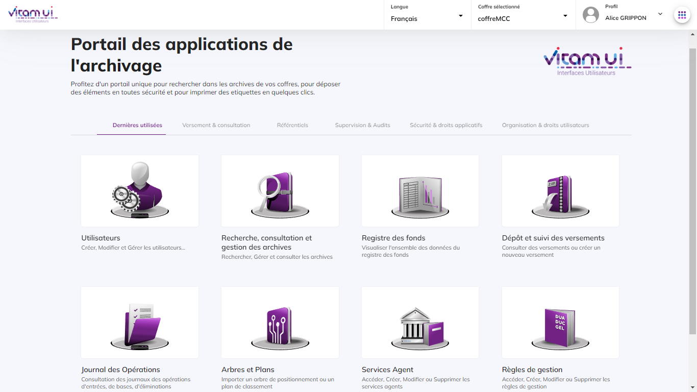
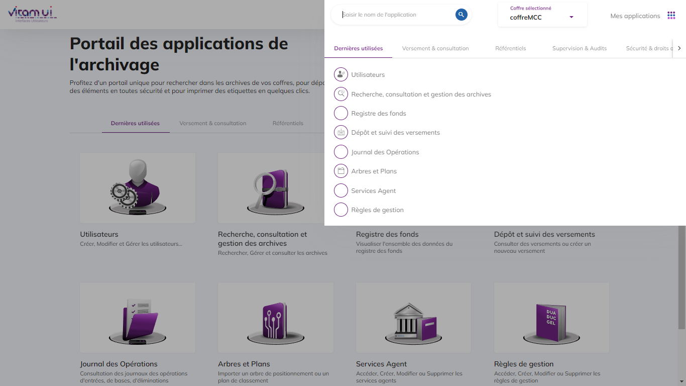
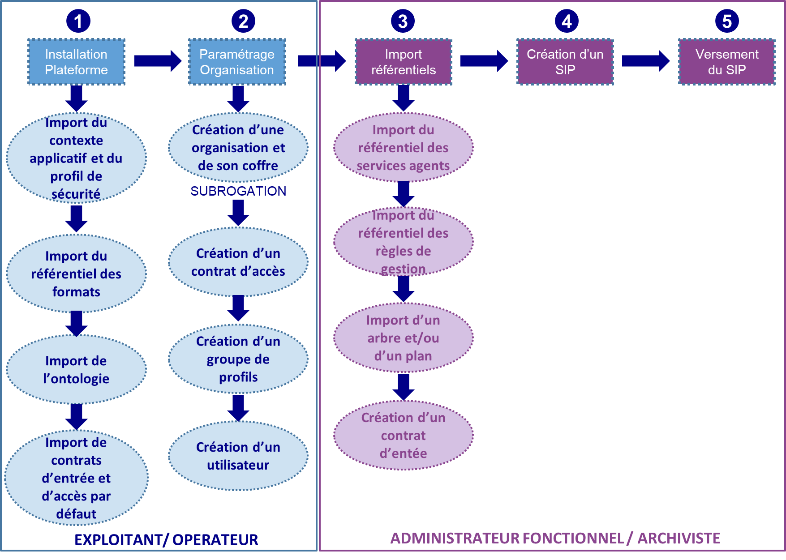
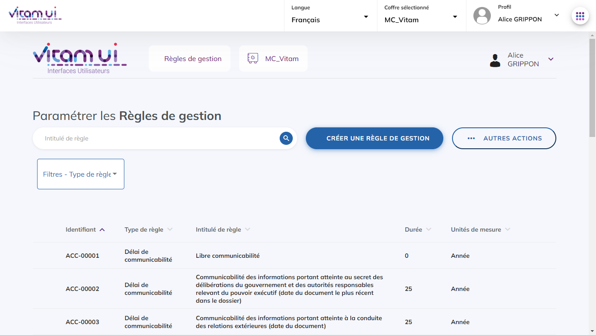
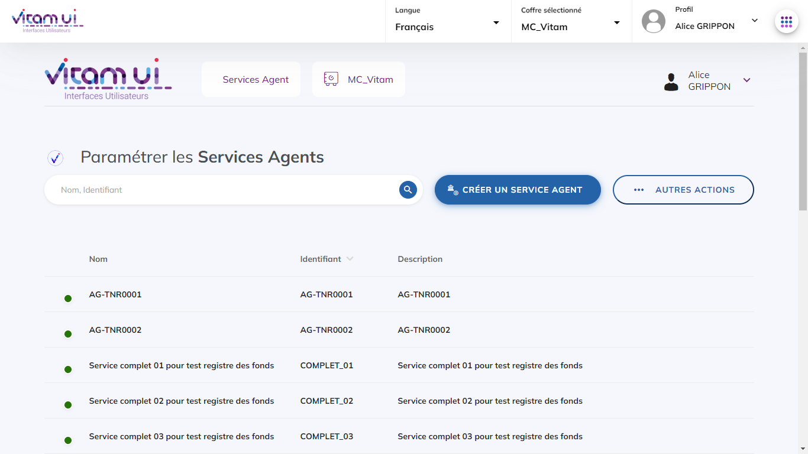
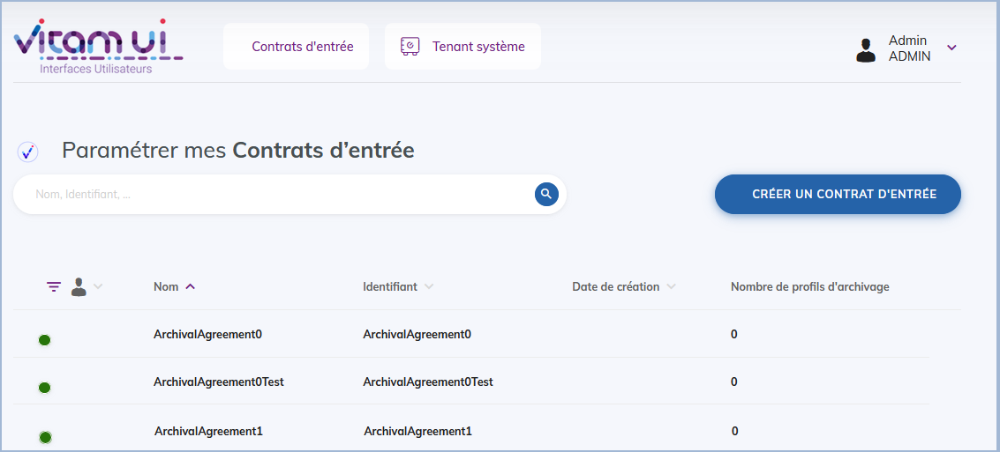
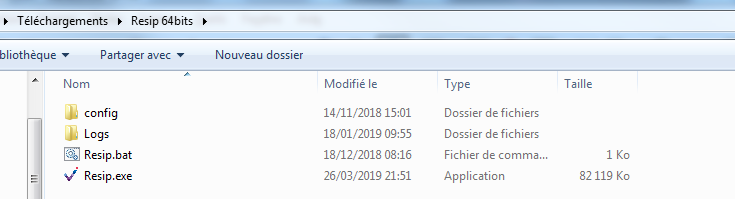
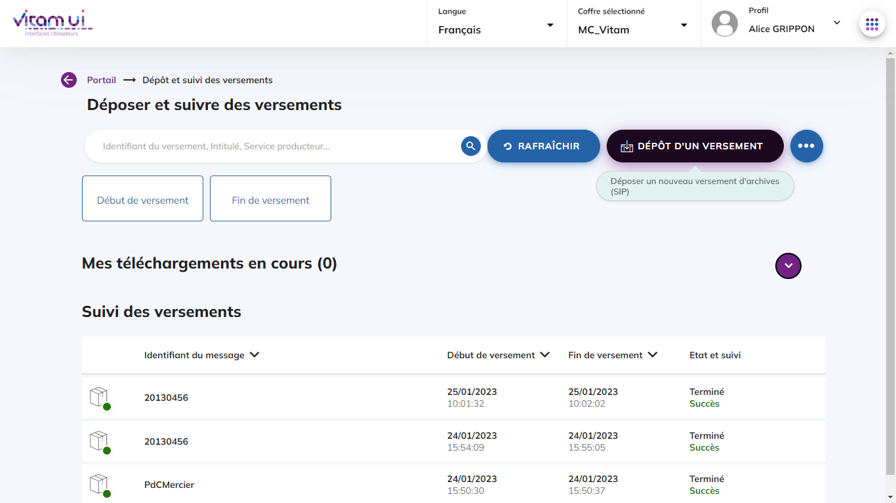
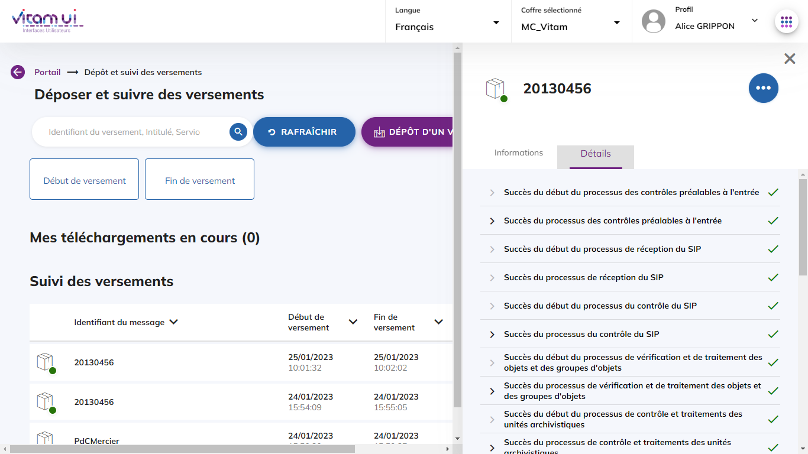
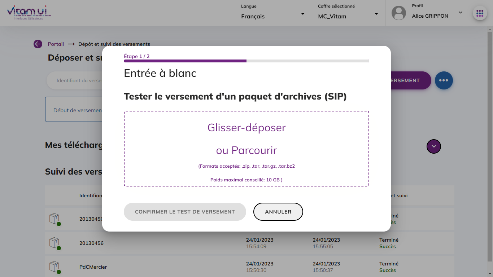

Guide de prise en main de la solution logicielle Vitam – Vitam UI 
*Réaliser une première entrée*
====

### Introduction

#### Documents de référence

|Document|Date de la version|Remarques|
|:---|:----|:----|
|NF Z 44022 – MEDONA – Modélisation des données pour l’archivage|18/01/2014||
|Standard d’échange de données pour l’archivage – SEDA – v. 2.1|06/2018||
|Standard d’échange de données pour l’archivage – SEDA – v. 2.2|02/2022|Cette nouvelle version du SEDA est intégrée à la solution logicielle Vitam à partir de la V6.RC.|
|Vitam – Organisation de l’information|Décembre 2023||
|Vitam – Manuel Utilisateur|Décembre 2023||
|[Vitam – Services producteurs](./services_prod.md)|Décembre 2023||
|[Vitam – Règles de gestion](./regles_gestion.md)|Décembre 2023||
|[Vitam – Gestion des habilitations](./gestion_habilitations.md)|Décembre 2023||
|Vitam – Structuration des Submission Information Package (SIP)|Décembre 2023||
|Vitam – Structuration des Dissemination Information Package (DIP)|Décembre 2023||

#### Présentation du document

Le présent document décrit comment effectuer une première entrée dans la solution logicielle Vitam adossée au front-office Vitam UI. Il explicite les étapes obligatoires de paramétrage et de préparation des lots d’archives pour un utilisateur archiviste. Le pré-requis est que les actes d’installation et d’administration technique aient été réalisés pour configurer la plateforme et les coffres (tenants), comme par exemple sur les environnements partenaires de Vitam.

Un lexique en annexe explicite et détaille les principaux objets métiers signalés dans le texte par un astérisque*. Pour chaque terme, il donne une description, un statut obligatoire ou facultatif pour l’opération d’entrée et renvoie vers un document permettant d’approfondir cette notion (« manuel utilisateur » par exemple).

*Nota bene :* Les captures d’écran du présent document sont issues de l’IHM Vitam UI. Toutefois les principes et fonctionnalités présentées ici sont valables également pour l’IHM démo. 

### Avertissements

#### Jeux de tests disponibles

Un dossier de jeux test spécifique « Jeu_de_tests_Guide_de_prise_en_main_V7.zip » a été établi pour accompagner la documentation « Guide de prise en main », il comporte tous les éléments cités dans le document (contrats d’entrée et d’accès, référentiels des services agents et des règles de gestion). Il est publié sur le site www.programmevitam.fr.

Il est également possible d’effectuer des tests fonctionnels se rapportant au « Cahier de tests métier » à partir des jeux de données mis à disposition dans le dossier « Jeux_de_tests_fonctionnels_V7.zip ». Le dossier zippé comporte les jeux de tests : paquets d’information à archiver (SIP) et objets de référence : contrats d’entrée et d’accès, référentiels des services agents et des règles de gestion, arbres de positionnement, plans de classement, etc. Ce ZIP est publié sur le site www.programmevitam.fr.

Enfin, il existe également des tests système automatisés accessibles via le projet Git « Vitam-itests ».1 Cet espace comporte des tests de non-régression, des exemples de paquets d’information à archiver (SIP) et d’objets de référence : contrats d’entrée et d’accès, référentiels des services agents et des règles de gestion. Ces tests peuvent être lancés depuis l’IHM de recette et sont décrits dans la documentation « IHM Recette ».

#### Utilisation des jeux de tests

Les jeux de tests comportant la mention _TC doivent être complétés (identifiant de contrats, de profils, d’unités archivistiques de rattachement…).
En cas de purge totale d’un tenant à l’aide de l’IHM de recette (vidé de tous ses référentiels et contenus), ou selon le paramétrage de l’installation de la solution logicielle, il sera nécessaire de modifier les jeux de tests pour que les identifiants des contrats (contrats d’entrée et d’accès), coïncident. Quand la solution logicielle Vitam a le pouvoir de déterminer les identifiants, les identifiants des nouveaux contrats importés après une purge, ne reprennent pas à 1 (Ex : IC-00001) mais suivent les identifiants des anciens contrats.

#### Contexte applicatif et profil de sécurité*

Les modifications de contextes applicatifs et de profils de sécurité peuvent déstabiliser le système et empêcher toute action de la solution logicielle, il est recommandé de ne pas les modifier let de réserver cette fonction à un « administrateur technique ».

#### Sélection des tenants*

Il est nécessaire de sélectionner un tenant2, espace réservé à une entité utilisatrice, qui sera paramétré et qui recevra les référentiels et archives versées (certains référentiels sont valables pour toute la plate-forme tandis que d’autres ne concernent qu’un seul tenant).

Il existe des tenants d’administration, dont le numéro varie selon le paramétrage de l’installation. Dans l’environnement partenaires de Vitam (part.programmevitam.fr), les tenants 0, 1 et 2 sont des tenants d’administration ou réservés aux tests de non régression (TNR) qui ne doivent pas être utilisés pour la réalisation de tests utilisateurs.

#### Contrats d’entrée* et contrat d’accès*
Les contrats d’entrée et d’accès diffèrent suivant le paramétrage initial de la plate-forme (et l’utilisation ou non d’un tenant d’administration). En effet, l’identifiant de ces contrats peut être généré par la solution logicielle Vitam, ou défini par les utilisateurs lors de leur création dans Vitam UI. Par défaut, les jeux de tests cités dans le présent document comportent des identifiants dont la forme est celle fixée par la solution logicielle Vitam. Les environnements partenaires sont aussi paramétrés dans ce mode-là.

### Utilisation des interfaces

#### Le portail d’APPs Vitam UI

La solution front-office Vitam UI propose une interface modulaire composée de différentes APP  dont chacune porte une des fonctionnalités métiers proposées par le système. Afin de faciliter la navigation des utilisateurs, une catégorisation métier a été proposée à partir de la page d’accueil du portail.  
Chaque APP dispose d’un documentation d’utilisation disponible sur le site du Programme Vitam.  

#### Launcher de navigation entre les APPs

Le Launcher, situé en haut à droite, permet d’accéder à la visualisation de la catégorisation des APPs à tout moment et d’améliorer la navigation entre les APPs sans avoir à passer systématiquement par l’accueil du portail.

### Processus

Étapes du processus de premier import dans une plate-forme utilisant la solution logicielle Vitam.

Sur les environnements partenaires, les étapes 1 et 2 sont réalisées par l’équipe Vitam. Les jeux de tests mis à disposition permettent de réaliser les étapes 3 à 5.

#### Etape 1 : Installation de la plateforme

L’étape d’installation et de paramétrage de Vitam et de Vitam UI est réalisée par un administrateur technique ou un exploitant.

Le référentiel des formats est obligatoire, mais il figure par défaut dans la solution logicielle Vitam lors de l’installation. Il est valable pour l’ensemble de la plate-forme.

Le contexte applicatif est obligatoire, mais un contexte « type », dit « d’administration », figure par défaut dans la solution logicielle Vitam lors de l’installation. Il est valable pour l’ensemble de la plate-forme et est associé à un profil de sécurité. Tous deux permettent d’accéder aux services de la solution logicielle Vitam.

L’ontologie est obligatoire, mais une ontologie est configurée par défaut dans la solution logicielle Vitam. Cette ontologie contient l’ensemble des vocabulaires de type interne, c’est-à-dire les vocabulaires issus du SEDA et les vocabulaires propres à la solution. Elle est valable pour l’ensemble de la plate-forme.

#### Etape 2 : Paramétrage des organisations et coffres associés

Suite à l’installation du logiciel, l’opérateur d’instance procède à la création des organisations et de leurs coffres associés (tenant). Plusieurs coffres peuvent être associés à une organisation.
La présence d’un contrat d’accès est nécessaire pour accéder aux données des unités archivistiques versées dans la solution logicielle Vitam. Des contrats par défaut sont générés par la solution front office Vitam UI lors de la création du coffre d’une organisation (IC-000001 et IC-000002). 

L’administrateur de la plateforme se connecte en subrogation sur le portail Vitam UI d’une organisation afin de configurer les accès et les droits de l’administrateur fonctionnel du ou des coffres de l’organisation. 
Pour cela il réalise :
- la création d’un contrat d’accès (s’il y a nécessité de créer un contrat d’accès spécifique) s’effectue dans l’APP « Contrats d’accès » mais des contrats d’accès par défaut sont générés dès la création de l’organisation. 
- la création du groupe de profils de l’administrateur fonctionnel permettant de lui donner les accès aux APPs qui lui sont nécessaires ;
- la création du compte utilisateur de l’administrateur fonctionnel.

Suite à cette dernière étape, un mail automatique est transmis à l’utilisateur qui lui permet de configurer son mot de passe et d’accéder directement au coffre principal de son organisation.

#### Etape 3 : Pré-requis fonctionnels : import des référentiels métiers

Avant de pouvoir importer un paquet d’information à archiver (SIP) dans la solution logicielle Vitam, l’utilisateur doit, dans un premier temps, importer les référentiels métiers et contrats qui permettront le contrôle du SIP.

##### Import du référentiel des règles de gestion*
L’utilisateur doit importer un référentiel des règles de gestion via l’APP Règles de gestion. Le référentiel des règles de gestion est propre à chaque coffre de la plate-forme.

- Pour les tests effectués à partir du jeu de tests « Jeu_de_tests_Guide_de_prise_en_main_V7 », il faut utiliser le fichier nommé « jeu_donnees_OK_regles_CSV.csv » 3 en cliquant sur le bouton « Autres actions » et en sélectionnant l’action « Importer ».
- L’utilisateur peut également constituer son propre référentiel des règles de gestion au format .csv sur le même modèle. 
- Il peut également créer unitairement une règle de gestion en cliquant sur le bouton « Créer une règle de gestion » et en renseignant les champs obligatoires.

##### Import d’un référentiel des services agents*
La deuxième étape consiste à importer un référentiel des services agents* au format .csv dans la solution logicielle Vitam via l’APP Services agents. Ce référentiel a pour vocation d’être utilisé par la solution logicielle Vitam pour effectuer localement les contrôles des services (producteurs ou versants) déclarés par les administrateurs et les utilisateurs en entrée et en accès. Le référentiel des services agents est propre à chaque coffre de la plate-forme.

- Pour les tests effectués à partir du jeu de données « Jeu_de_tests_Guide_de_prise_en_main_V7 », il faut utiliser le fichier nommé « agencies_init.csv » 4 en cliquant sur le bouton « Autres actions » et en sélectionnant l’action « Importer ».
- L’utilisateur peut également constituer son propre référentiel des services agents au format .csv sur le même modèle. 
- Il peut également créer unitairement un service agent en cliquant sur le bouton « Créer un service agent » et en renseignant les champs obligatoires.
 
##### Import d’un arbre de positionnement et/ou d’un plan de classement*
Dans un troisième temps, il est nécessaire d’importer un référentiel d’arbre de positionnement* et/ou de plan de classement* au format .zip  via l’APP VitamUI « Arbres et plans ». L’arbre de positionnement et/ou le plan de classement importés sont propres à chaque coffre.

-  Pour les tests effectués à partir du jeu de données « Jeu_de_tests_Guide_de_prise_en_main_V7 », il faut importer successivement le fichier nommé « Import_arbre.zip » et le fichier intitulé « Import_plan.zip » 5  en cliquant respectivement sur les boutons « Nouvel arbre de positionnement » et « Nouveau plan de classement » puis en téléchargeant les jeux de tests fournis.
-  L’utilisateur peut également constituer son propre arbre de positionnement et/ou son propre plan de classement au format .xml.

##### Création du contrat d’entrée*

Enfin, ce dernier point, facultatif, consiste à créer un contrat d’entrée* via l’APP VitamUI « Contrats d’entrée ». Un contrat d’entrée est propre à un coffre.

Le bordereau de transfert du SIP doit, par défaut, déclarer l’identifiant du contrat enregistré dans la solution logicielle Vitam.

**Point important :**

Selon le paramétrage initial de la plateforme et l’utilisation ou non d’un tenant d’administration :
- Soit l’utilisateur attribue l’identifiant du contrat avant import,
- Soit la solution logicielle Vitam le générera automatiquement lors de l’import, sous la forme IC-0000x.

Certains SIP fournis dans les jeux de tests (Jeux_de_tests_fonctionnels_V7.zip) spécifient des contrats d’entrée qui leur sont propres dans la balise <ArchivalAgreement>. Pour pouvoir effectuer une entrée avec ces SIP, il faut :
- soit créer le contrat d’entrée correspondant, désigné dans la balise ArchivalAgreement du bordereau de transfert,
-  soit modifier le bordereau de transfert, en remplaçant la valeur de la balise ArchivalAgreement par « IC-000001 » par exemple ou l’identifiant d’un contrat d’entrée déjà importé dans la solution logicielle Vitam.

Dans l’APP Vitam UI « Contrats d’entrée », le statut du contrat d’entrée utilisé doit être actif. Le contrat d’entrée permet de définir des contrôles supplémentaires à l’entrée (sur les usages et/ou formats de fichiers attendus, sur le périmètre de rattachement déclaré dans le SIP) ou de définir une position de rattachement systématique sans qu’elle soit déclarée dans le SIP. Ces éléments sont à paramétrer dans les différentes étapes du contrat d’entrée.

#### Etape 4 : Construire un SIP* grâce à ReSIP

La moulinette ReSIP conçue et développée par l’équipe programme Vitam, a pour objectifs :
- d’importer des structures arborescentes d’archives et les fichiers qui les représentent ;
- d’enrichir les métadonnées de description et de gestion des unités archivistiques (ArchiveUnits) ainsi que les métadonnées techniques des fichiers (BinaryObjects) ;
- d’exporter les structures arborescentes d’archives et les fichiers qui les représentent sous une forme importable dans la solution logicielle Vitam ou sous la forme d’une arborescence de fichiers.

Pour en savoir plus sur l’utilisation de la moulinette ReSIP, se référer à la [documentation ReSIP](./resip.md), Partie 2.3. : « Lancement de la moulinette ReSIP ».

ReSIP permet également d’importer des SIP déjà créés pour les modifier. Il est donc possible de modifier ou compléter les jeux de tests joints. 

#### Etape 5 : Versement d’un SIP* dans la solution logicielle Vitam

L’utilisateur peut ensuite importer le SIP dans la solution logicielle Vitam, via l’APP « Dépôt et suivi des versements ».
- En cliquant sur le bouton « Dépôt d’un versement » ;
- Puis en sélectionnant le SIP à verser. Pour les tests effectués à partir du jeu de données « Jeu_de_tests_Guide_de_prise_en_main_V7 », il faut utiliser le fichier nommé « SIP-Kit_de_prise_en_main.zip ».

    • Le suivi du versement s’affiche dans le tableau du bas. L’utilisateur doit cliquer sur le bouton rafraîchir pour afficher la mise à jour des informations.
    • Lorsque l’opération de versement est terminée (en échec ou en succès), l’utilisateur peut consulter le détail de l’opération dans le panneau latéral de droite en cliquant sur la ligne de l’opération souhaitée.
      

L’utilisateur peut également tester le processus, en effectuant une entrée « à blanc ». Cette fonctionnalité est disponible depuis le bouton d’actions secondaires « ... ».

**Point important :**
En cas d’échec de l’import, vérifier que les identifiants du contrat d’entrée et du service producteur déclarés dans le manifeste (bordereau de versement) existent dans la solution logicielle Vitam.

Les causes les plus fréquentes d’échec de l’import peuvent être les suivantes :
- mauvais identifiant du contrat d’entrée,
- services producteur et versant absents du référentiel des services agents,
- déclaration de règles de gestion qui ne sont pas présentes dans le référentiel des règles de gestion,
- absence d’un exemplaire « original » (master), alors que le contrat d’entrée le rend obligatoire.

#### Etape 6 : Effectuer une recherche

Afin de rechercher une archive, l’utilisateur doit accéder à l’APP « Recherche, consultation et gestion des archives ». 

L’utilisateur saisit un ou plusieurs critère(s) de recherche (par exemple l’identifiant technique du versement copié-collé depuis l’APP « Dépôt et suivi des versements »). La solution logicielle Vitam effectuera la recherche dans le périmètre désigné par le contrat d’accès.

**Point important :**
Dans le détail du contrat d’accès, le statut du contrat doit être actif, les producteurs sélectionnés et des droits autorisés, sans quoi la recherche dans les archives ne retournera aucun résultat.

## Lexique

|Objet|Définition|Obligatoire/facultatif|Renvois vers la documentation Vitam|
|:----|:----|:----|:----|
|Contexte applicatif|Formalise les interactions entre un service externe et la solution logicielle Vitam. Il permet notamment d’authentifier une application et de lui affecter des droits dans la solution logicielle Vitam. Un paramètre permet de désactiver ce contrôle sur les tenants et les contrats : le contexte applicatif permet alors à l’application externe d’accéder à l’ensemble des services mis à disposition par la solution logicielle Vitam.|Obligatoire|– Manuel utilisateur, chapitre 6, Partie 6.1.6 – Organisation de l’information Partie 4.2 – [Gestion des habilitations](./gestion_habilitations.md) Partie 2.2.4|
|Tenant|Espace réservé à une entité utilisatrice au sein d’une implémentation, disposant d’une configuration adaptée à ses besoins et d’une partition propre des archives versées. Certains référentiels sont valables pour toute la plate-forme tandis que d’autres ne concernent qu’un seul tenant. Certains tenants sont spécifiques et permettent de réaliser des taches de « super administration » : import du référentiel des formats, de contextes applicatifs ou de l’ontologie. Dans Vitam UI, le tenant est également appelé « coffre ».|Obligatoire|– Manuel utilisateur, chapitre 1 Partie XII – Organisation de l’information|
|Référentiel des règles de gestion|Décrit les règles de gestion (durée d’utilité administrative, communicabilité, diffusion…) applicables aux unités archivistiques transférées dans la solution logicielle Vitam. Ces règles seront utilisées pour calculer les échéances auxquelles sont soumises les unités archivistiques correspondantes et déclencher les opérations correspondantes. Ce référentiel est un fichier au format .csv.|Obligatoire|– Manuel utilisateur, chapitre 6. Partie 1.B – [Règles de gestion](./regles_gestion.md) – Organisation de l’information Partie 4.1|
|Référentiel des services agents|Décrit les services agents (service producteur, service versant) applicables aux entrées de SIP dans la solution logicielle Vitam. Il permet d’effectuer des contrôles des services déclarés lors de l’entrée ou de l’accès.|Obligatoire|– Manuel utilisateur, chapitre 6. Partie 1.C – [Services Agents](./services_prod.md) – Organisation de l’information Partie 4.1|
|Contrat d’entrée|Définit les droits d’une application connectée à la solution logicielle Vitam en termes de transfert d’archives, Précise le contenu et la forme des archives que ces utilisateurs souhaitent transférer dans la solution logicielle Vitam, Définit les modalités de transfert de ces archives à la solution logicielle Vitam Précise les services mis en œuvre par la solution logicielle Vitam pour les archives à transférer.|Obligatoire|– Manuel utilisateur, chapitre 6. Partie 1.D – Organisation de l’information Partie 4.2 – [Gestion des habilitations](./gestion_habilitations.md) Partie 2.2.5|
|Contrat d’accès|Définit les droits d’une application connectée à la solution logicielle Vitam en termes de recherche, de consultation, de mise à jour et de gestion des archives prises en charge par la solution logicielle Vitam.|Obligatoire|– Manuel utilisateur, chapitre 6. Partie 1.E – Organisation de l’information Partie 4.2 – [Gestion des habilitations](./gestion_habilitations.md) Partie 2.2.6|
|SIP *Submission Information Package*|Il s’agit des paquets informationnels transférés au système d’archivage<b>Il s’agit d’un conteneur (de format .zip ou .tar) comprenant tous les objets à archiver (quel que soit leur format), ainsi qu’un bordereau les accompagnant (fichier xml conforme au schéma de la norme NF Z44-022 et au SEDA 2.0.).|Obligatoire|– Manuel utilisateur, chapitre 3 – Organisation de l’information Partie 3.1 – Structuration des SIP|
|DIP *Dissemination Information Packages*|Il s’agit des paquets informationnels générés par le système d’archivage mis à disposition pour consultation. Il s’agit d’un conteneur (de format .zip ou .tar) comprenant tous les objets archivés (quel que soit leur format), ainsi qu’un bordereau les accompagnant.|Obligatoire|– Manuel utilisateur, chapitre 4 Partie V – Organisation de l’information Partie 3.3 – Structuration des DIP|