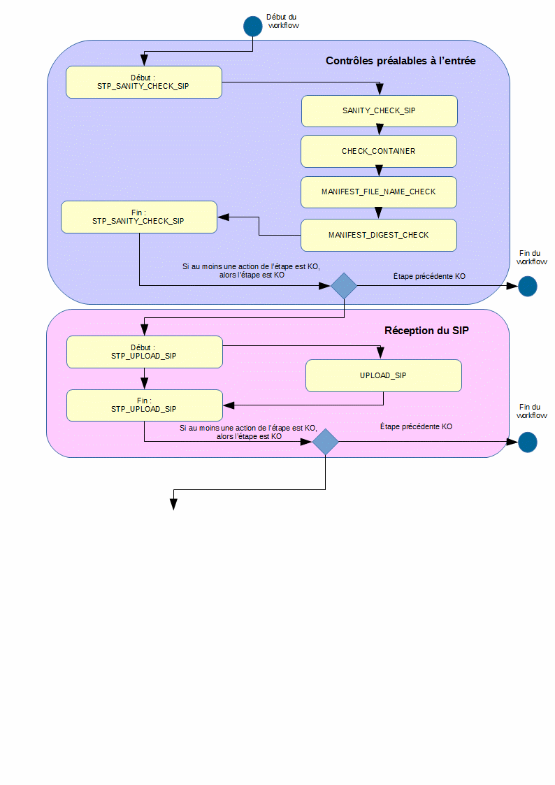
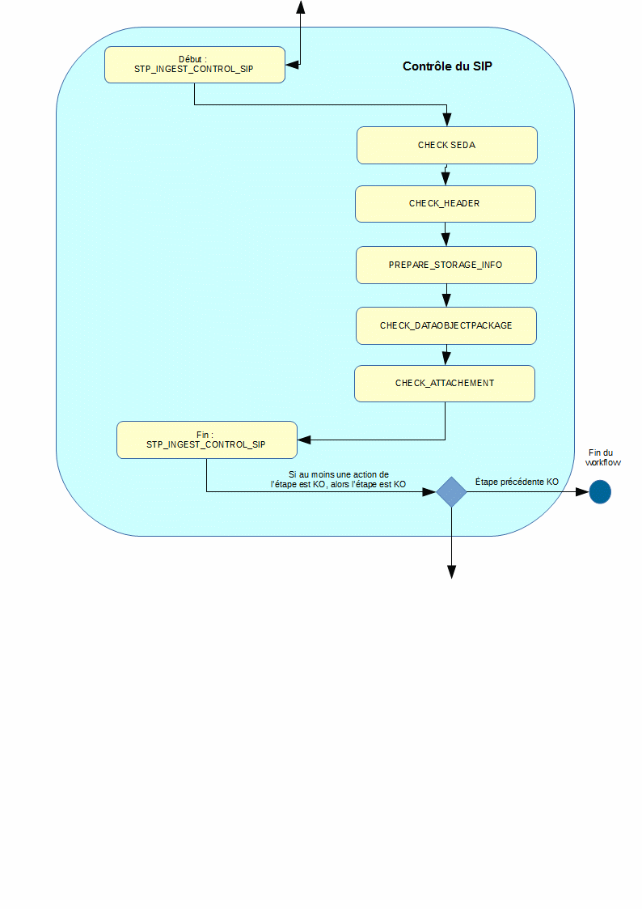
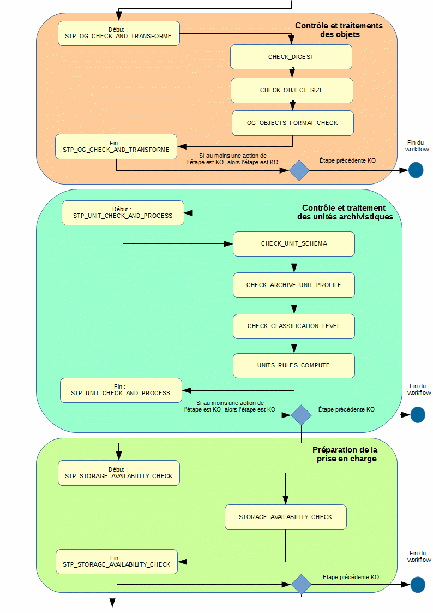
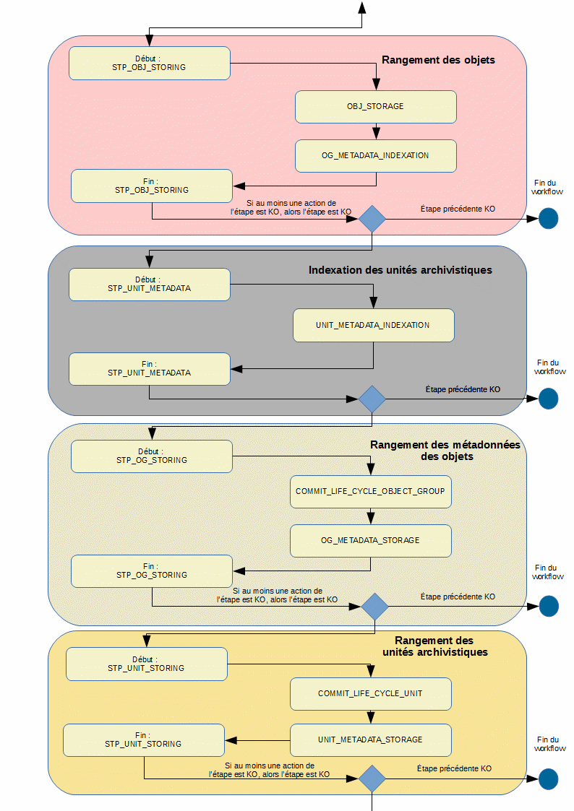
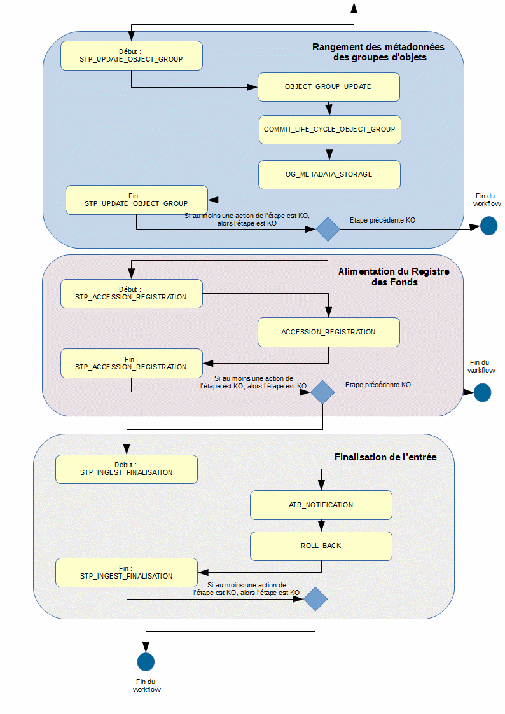

Description des workflows et des opérations
===========================================

Objectif du document
--------------------

Ce document a pour objectif de présenter les différents processus employés par la solution logicielle Vitam. Il est destiné aux administrateurs aussi bien techniques que fonctionnels, aux archivistes souhaitant avoir une connaissance plus avancée du logiciel ainsi qu’aux développeurs.

Il explicite chaque processus (appelé également « workflow »), et pour chacun leurs tâches, traitements et actions.

Ce document comprend du matériel additionnel pour faciliter la compréhension des processus comme des fiches récapitulatives et des schémas. Il explique également la manière dont est formée la structure des fichiers de workflow.

gestion du cycle de vie des archives
------------------------------------

Cette seconde partie du document détail les workflows suivants :

-   Entrée
-   Mise à jour unitaire
-   Mise à jour de masse
-   Mise à jour unitaire de masse (bulk update)
-   Export DIP
-   Élimination
-   Modification d’arborescence
-   Transfert
-   Restauration de métadonnées essentielles

### Ingest

Cette section décrit le processus (workflow) d’entrée, utilisé lors du transfert d’un Submission Information Package (SIP) dans la solution logicielle Vitam. Ce workflow se décompose en deux grandes catégories : le processus d’entrée externe dit « ingest externe » et le processus d’entrée interne dit « ingest interne ». Le premier prend en charge le SIP et effectue des contrôles techniques préalables, tandis que le second débute dès le premier traitement métier. Ex: Le processus d’entrée externe
comprend l’étape : STP_SANITY_CHECK_SIP (Contrôle sanitaire du SIP). Les autres étapes font partie du processus d’entrée interne.

Toutes les étapes, tâches et traitements sont journalisés dans le journal des opérations et décrivent le processus (clé et description de la clé associée dans le journal des opérations) tel qu’implémenté dans la version actuelle de la solution logicielle Vitam.

#### Processus des contrôles préalables à l’entrée (STP_SANITY_CHECK_SIP)

##### Contrôle sanitaire du SIP SANITY_CHECK_SIP (IngestExternalImpl.java)

-   **Règle** : tâche consistant à vérifier l’absence de virus dans le SIP

-   **Type** : bloquant

-   **Statuts** :

    -   OK : aucun virus n’a été détecté dans le SIP (SANITY\_CHECK\_SIP.OK = Succès du processus des contrôles préalables à l’entrée)

    -   KO : un ou plusieurs virus ont été détectés dans le SIP (SANITY\_CHECK\_SIP.KO = Échec du processus des contrôles préalables à l’entrée)

    -   FATAL : une erreur technique est survenue lors de la vérification de la présence de virus dans le SIP (SANITY\_CHECK\_SIP.FATAL = Erreur technique lors du processus des contrôles préalables à l’entrée)

##### Contrôle du format du conteneur du SIP CHECK_CONTAINER (IngestExternalImpl.java)

-   **Règle** : tâche consistant à vérifier le format du SIP via un outil d’identification de format qui se base sur le référentiel des formats qu’il intègre

    **Formats acceptés** : .zip, .tar, .tar.gz, .tar.bz2 et tar.gz2

-   **Type** : bloquant

-   **Statuts** :

    -   OK : le conteneur du SIP est au bon format (CHECK\_CONTAINER.OK = Succès du contrôle du format du conteneur du SIP)

    -   KO : le conteneur du SIP n’est pas au bon format (CHECK\_CONTAINER.KO = Échec du contrôle du format du conteneur du SIP)

    -   FATAL : une erreur technique est survenue lors de la vérification du format du conteneur du SIP, liée à l’outil d’identification des formats (CHECK\_CONTAINER.FATAL = Erreur technique lors du contrôle du format du conteneur du SIP)

##### Contrôle du nom du bordereau de transfert MANIFEST_FILE_NAME_CHECK (IngestExternalImpl.java)

-   **Règle** : tâche consistant à vérifier le nom du bordereau de transfert. Le nom du bordereau doit être conforme avec l’expression régulière suivante :

    \^((\[a-zA-Z0-9\]{1,56}\[\_-\]{1}){0,1}|\_{0,1})(manifest.xml)\\b »} A savoir : une chaîne de caractères débutant par des caractères alphanumériques sans accent, jusqu’à 56 caractères, suivi d’un « - » ou d’un « \_ » puis suivi de « manifest.xml ». Exemples valides : « MonNouveau-manifest.xml », « UnAutreBordereau\_manifest.xml ». « manifest.xml » tout court est également valide. Un SIP ne possédant pas du tout de bordereau de transfert verra également son entrée terminer en KO à cette
    tâche.

-   **Type** : bloquant

-   **Statuts** :

    -   OK : le nom du bordereau de transfert est conforme (MANIFEST\_FILE\_NAME\_CHECK.OK = Succès du contrôle du nom du bordereau de transfert : nom du fichier conforme)

    -   KO : le nom du bordereau de transfert n’est pas conforme (MANIFEST\_FILE\_NAME\_CHECK.KO = Échec du contrôle du nom du bordereau de transfert : nom du fichier non conforme)

    -   FATAL : une erreur technique est survenue lors de la vérification du nom du bordereau de transfert (MANIFEST\_FILE\_NAME\_CHECK.FATAL = Erreur technique lors du contrôle du nom du bordereau de transfert)

##### Vérification de l’intégrité du bordereau de transfert MANIFEST\_DIGEST\_CHECK (IngestExternalImpl.java)

-   **Règle** : tâche consistant à vérifier l’empreinte du bordereau de transfert calculée par la solution logicielle Vitam et celle déclarée dans le bordereau. Si l’empreinte déclarée dans le bordereau de transfert n’a pas été calculée avec l’algorithme SHA-512, alors l’empreinte est recalculée avec cet algorithme. Elle sera alors enregistrée dans la solution logicielle Vitam.

    **Algorithmes autorisés en entrée** : MD5, SHA-1, SHA-256, SHA-512

-   **Type** : bloquant

-   **Statuts** :

    -   KO : L’empreinte du bordereau de transfert n’est pas conforme (MANIFEST\_DIGEST\_CHECK.KO=Échec du contrôle de l''empreinte du bordereau de transfert : fichier non conforme)

    -   FATAL : Une erreur technique est survenue lors du contrôle de l’empreinte (MANIFEST\_DIGEST\_CHECK.FATAL=Erreur technique lors du contrôle de l''empreinte du bordereau de transfert)

#### Processus de réception du SIP dans Vitam STP\_UPLOAD\_SIP (IngestInternalResource.java)

-   **Règle** : étape consistant à vérifier la bonne réception du SIP sur l’espace de travail interne (« workspace »)

-   **Type** : bloquant

-   **Statuts** :

    -   OK : le SIP a été réceptionné sur l’espace de travail interne (STP\_UPLOAD\_SIP.OK = Succès du processus de réception du SIP)

    -   KO : le SIP n’a pas été réceptionné sur l’espace de travail interne (STP\_UPLOAD\_SIP.KO = Échec du processus de réception du SIP)

    -   FATAL : une erreur technique est survenue lors de la réception du SIP dans la solution logicielle Vitam, par exemple suite à une indisponibilité du serveur (STP\_UPLOAD\_SIP.FATAL = Erreur technique lors du processus de réception du SIP)

#### Processus de contrôle du SIP (STP\_INGEST\_CONTROL\_SIP)

##### Vérification globale du CHECK\_SEDA (CheckSedaActionHandler.java)

-   **Règle** : tâche consistant à vérifier la cohérence physique du SIP reçu par rapport au modèle de SIP accepté

    **Type de SIP accepté** : le bordereau de transfert, obligatoire dans le SIP, doit être conforme au schéma xsd par défaut fourni avec le standard SEDA v. 2.1, le SIP doit satisfaire les exigences du document « Structuration des SIP » et doit posséder un répertoire unique nommé « Content ».

-   **Type** : bloquant

-   **Statuts** :

    -   OK : le SIP est présent et conforme au schéma xsd par défaut fourni avec le standard SEDA v.2.1. il satisfait aux exigences de « structuration des SIP » et possède un repertoire unique « Content » (CHECK\_SEDA.OK = Succès de la vérification globale du SIP)

    -   KO :

        -   Cas 1 : le bordereau de transfert est introuvable dans le SIP ou n’est pas au format XML (CHECK\_SEDA.NO\_FILE.KO = Absence du bordereau de transfert ou bordereau de transfert au mauvais format)

        -   Cas 2 : le bordereau de transfert n’est pas au format XML (CHECK\_SEDA.NOT\_XML\_FILE.KO = Échec de la vérification globale du SIP : bordereau de transfert non conforme aux caractéristiques d’un fichier xml)

        -   Cas 3 : le bordereau de transfert ne respecte pas le schéma par défaut fourni avec le standard SEDA 2.1 (CHECK\_SEDA.NOT\_XSD\_VALID.KO = Échec de la vérification globale du SIP : bordereau de transfert non conforme au schéma SEDA 2.1)

        -   Cas 4 : le SIP contient plus d’un dossier « Content » (CHECK\_SEDA.CONTAINER\_FORMAT.DIRECTORY.KO = Échec de la vérification globale du SIP : le SIP contient plus d’un dossier ou un dossier dont le nommage est invalide)

        -   Cas 5 : le SIP contient plus d’un seul fichier à la racine (CHECK\_SEDA.CONTAINER\_FORMAT.FILE.KO = Échec de la vérification globale du SIP : le SIP contient plus d’un fichier à sa racine)

        -   Cas 6 : l’action est déjà exécutée CHECK\_SEDA.ALREADY\_EXECUTED = Action déjà exécutée : Pas de vérification globale du SIP

    -   FATAL :

        -   Cas 1 : une erreur technique est survenue lors de la vérification globale du SIP (CHECK\_SEDA.FATAL = Erreur technique lors de la vérification globale du SIP)

        -   Cas 2 : une erreur technique est survenue lors de la vérification globale du SIP (CHECK\_SEDA.NOT\_XML\_FILE.FATAL=Erreur technique lors de la vérification globale du SIP)

        -   Cas 3 : une erreur technique est survenue lors de la vérification globale du SIP (CHECK\_SEDA.NOT\_XSD\_VALID.FATAL=Erreur technique lors de la vérification globale du SIP)

##### Vérification de l’en-tête du bordereau de transfert CHECK\_HEADER (CheckHeaderActionHandler.java)

-   **Règles** : tâche permettant de vérifier les informations générales du bordereau de transfert (nommées « header » dans le fichier « manifest.xml ») et de l’existence du service producteur (OriginatingAgencyIdentifier)

-   **Type** : bloquant

-   **Statuts** :

    -   OK : les informations du bordereau de transfert sont conformes et le service producteur est déclaré (CHECK\_HEADER.OK = Succès de la vérification générale du bordereau de transfert)

    -   KO :

        -   Cas 1 : les informations du bordereau de transfert ne sont pas conformes ou il n’y a pas de service producteur déclaré (CHECK\_HEADER.KO = Échec de la vérification générale du bordereau de transfert)

        -   Cas 2 : les données référentielles sont inactives (CHECK\_HEADER.INACTIVE.KO = Échec de la vérification générale du bordereau de transfert : donnée référentielle inactive)

        -   Cas 3 : les données référentielles sont inconnues (CHECK\_HEADER.UNKNOWN.KO = Échec de la vérification générale du bordereau de transfert : donnée référentielle inconnue)

        -   Cas 4 : il y a une différence entre le profil déclaré dans le bordereau de transfert et celui déclaré dans le contrat (CHECK\_HEADER.DIFF.KO = Échec de la vérification générale du bordereau de transfert : différence entre le profil déclaré dans le bordereau de transfert et celui déclaré dans le contrat)

        -   Cas 5 : un des champs obligatoires n’est pas remplie (CHECK\_HEADER.EMPTY\_REQUIRED\_FIELD.KO = Vérification générale du bordereau de transfert : champ obligatoire vide)

        -   Cas 6 : la vérification a déjà été effectuée (CHECK\_HEADER.ALREADY\_EXECUTED = Action déjà exécutée : pas de vérification générale du bordereau de transfert)

    -   FATAL : une erreur technique est survenue lors des contrôles sur les informations générales du bordereau de transfert (CHECK\_HEADER.FATAL = Erreur technique lors de la vérification générale du bordereau de transfert)

**La tâche check\_header contient les traitements suivants :**

##### Vérification de la présence et contrôle des services agents CHECK_HEADER.CHECK_AGENT

Ce traitement n’est exécuté que si la valeur IN de *checkOriginatingAgency* est « true ».

-   **Règle** : traitement consistant à vérifier le service producteur ainsi que le service versant déclarés dans le SIP par rapport au référentiel des services agents présent dans la solution logicielle Vitam

-   **Type** : bloquant

-   **Statuts** :

    -   OK : le service producteur et, le cas échéant, le service versant déclarés dans le SIP est valide (service agent existant dans le référentiel des services agents)(CHECK\_HEADER.CHECK\_AGENT.OK = Succès de la vérification de la présence et du contrôle des services agents)

    -   KO :

        -   Cas 1 : aucun service producteur n’est déclaré dans la balise dédiée dans le bordereau de transfert (CHECK\_HEADER.CHECK\_AGENT.EMPTY\_REQUIRED\_FIELD.KO = Échec de la vérification de la présence et du contrôle des services agents : champ obligatoire vide)

        -   Cas 2 : le service producteur et, le cas échéant, le service versant déclarés dans le SIP n’est pas connu du référentiel des services agents (CHECK\_HEADER.CHECK\_AGENT.UNKNOWN.KO = Échec de la vérification de la présence et du contrôle des services agents : services agents inconnus du référentiel des services agents)

        -   Cas 3 : la balise permettant de déclarer un service producteur est absente du bordereau de tranfert (CHECK\_HEADER.CHECK\_AGENT.KO = Échec de la vérification de la présence et du contrôle des services agents)

    -   FATAL : une erreur technique est survenue lors de la vérification de la présence et du contrôle des services agents (CHECK\_HEADER.CHECK\_AGENT.FATAL = Erreur technique lors de la vérification de la présence et du contrôle des services agents)

##### Vérification de la présence et contrôle du contrat d’entrée CHECK\_HEADER.CHECK\_CONTRACT\_INGEST

Ce traitement n’est exécuté que si la valeur IN de *checkContract* est « true ».

-   **Règle** : traitement consistant à vérifier le contrat d’entrée déclaré dans le SIP par rapport au référentiel des contrats d’entrée présent dans la solution logicielle Vitam

-   **Type** : bloquant

-   **Statuts** :

    -   OK : le contrat déclaré dans le SIP existant dans le référentiel des contrats d’entrée de la solution logicielle Vitam et est actif (CHECK\_HEADER.CHECK\_CONTRACT\_INGEST.OK = Succès de la vérification de la présence et du contrôle du contrat d’entrée)

    -   KO :

        -   Cas 1 : le contrat d’entrée déclaré dans le SIP est inexistant (CHECK\_HEADER.CHECK\_CONTRACT\_INGEST.CONTRACT\_UNKNOWN.KO = Échec de la vérification de la présence du contrat d’entrée : contrat d’entrée inconnu du référentiel des contrats d’entrée)

        -   Cas 2 : le contrat d’entrée déclaré dans le SIP est inactif (CHECK\_HEADER.CHECK\_CONTRACT\_INGEST.CONTRACT\_INACTIVE.KO = Échec de la vérification du caractère actif du contrat d’entrée)

        -   Cas 3 : aucun contrat d’entrée n’a été trouvé dans le manifeste (CHECK\_HEADER.CHECK\_CONTRACT\_INGEST.CONTRACT\_NOT\_IN\_MANIFEST.KO = Échec de la vérification de la présence du contrat d’entrée : le champ ArchivalAgreement est absent du bordereau de transfert)

        -   Cas 4 : le contrat d’entrée déclaré dans le SIP n’existe pas dans le contexte applicatif (CHECK\_HEADER.CHECK\_CONTRACT\_INGEST.CONTRACT\_NOT\_IN\_CONTEXT.KO = Échec du contrôle de la présence du contrat d’entrée dans le contexte applicatif)

        -   Cas 5 : le contexte applicatif est inexistant (CHECK\_HEADER.CHECK\_CONTRACT\_INGEST.CONTEXT\_UNKNOWN.KO = Échec du contrôle de la présence du contexte applicatif : contexte inconnu du référentiel des contextes)

        -   Cas 6 : le contexte applicatif est inactif (CHECK\_HEADER.CHECK\_CONTRACT\_INGEST.CONTEXT\_INACTIVE.KO = Échec du contrôle du caractère actif du contexte applicatif)

        -   Cas 7 : erreur lors de la récupération du contexte applicatif (CHECK\_HEADER.CHECK\_CONTRACT\_INGEST.CONTEXT\_CHECK\_ERROR.KO = Échec de la vérification de la présence et du contrôle du contexte applicatif)

        -   Cas 8 : le contrat de gestion déclaré est inexistant CHECK\_HEADER.CHECK\_CONTRACT\_INGEST.MANAGEMENT\_CONTRACT\_UNKNOWN.KO = Échec de la vérification de la présence du contrat de gestion déclaré dans le contrat d’entrée: contrat de gestion connu dans le référentiel des contrats de gestion

        -   Cas 9 : le contrat de gestion déclaré est inactif CHECK\_HEADER.CHECK\_CONTRACT\_INGEST.MANAGEMENT\_CONTRACT\_INACTIVE.KO = Échec de la vérification de la présence du contrat de gestion déclaré dans le contrat d’entrée: contrat de gestion au statut inactif dans le référentiel des contrats de gestion

        -   Cas 10 : le contrat de gestion déclaré est invalide CHECK\_HEADER.CHECK\_CONTRACT\_INGEST.MANAGEMENT\_CONTRACT\_INVALID.KO = Échec de la vérification de la présence du contrat de gestion déclaré dans le contrat d’entrée: échec de validation des stratégies de stockage déclarées dans le contrat de gestion

    -   FATAL : une erreur technique est survenue lors de la vérification de la présence et du contrôle du contrat d’entrée ou du contexte applicatif (CHECK\_HEADER.CHECK\_CONTRACT\_INGEST.FATAL = Erreur technique lors de la vérification de la présence et du contrôle du contrat d’entrée ou du contexte applicatif)

##### Vérification de la relation entre le contrat d’entrée et le profil d’archivage CHECK\_HEADER.CHECK\_IC\_AP\_RELATION

Ce traitement n’est exécuté que si la valeur IN de *checkProfile* est « true ».

-   **Règle** : traitement consistant à vérifier que le profil d’archivage déclaré dans le contrat d’entrée du SIP est le même que celui déclaré dans le bordereau de transfert.

-   **Type** : bloquant

-   **Statuts** :

    -   OK : le profil d’archivage déclaré dans le contrat d’entrée et celui déclaré dans le bordereau de transfert sont les mêmes (CHECK\_HEADER.CHECK\_IC\_AP\_RELATION.OK = Succès de la vérification de la relation entre le contrat d’entrée et le profil)

    -   KO :

        -   Cas 1 : le profil d’archivage déclaré dans le SIP est inexistant (CHECK\_HEADER.CHECK\_IC\_AP\_RELATION.UNKNOWN.KO = Échec du contrôle de la présence du profil d’archivage dans le référentiel des profils d’archivage)

        -   Cas 2 : le profil d’archivage déclaré dans le SIP est inactif (CHECK\_HEADER.CHECK\_IC\_AP\_RELATION.INACTIVE.KO = Échec du contrôle du caractère actif du profil d’archivage)

        -   Cas 3 : le profil d’archivage déclaré dans le contrat d’entrée et celui déclaré dans le bordereau de transfert ne sont pas les mêmes (CHECK\_HEADER.CHECK\_IC\_AP\_RELATION.DIFF.KO = Échec du contrôle de cohérence entre le profil d’archivage déclaré dans le bordereau de transfert et celui déclaré dans le contrat d’entrée)

    -   FATAL : une erreur technique est survenue lors de la vérification de la relation entre le contrat d’entrée et le profil d’archivage (CHECK\_HEADER.CHECK\_IC\_AP\_RELATION.FATAL = Erreur technique lors de la vérification de la relation entre le contrat d’entrée et le profil d’archivage)

##### Vérification de la conformité du bordereau de transfert par le profil d’archivage CHECK\_HEADER.CHECK\_ARCHIVEPROFILE

-   **Règle** : traitement consistant à vérifier que le bordereau de transfert du SIP est conforme aux exigences du profil d’archivage. Si aucun profil d’archivage ne s’applique au SIP, ce traitement est ignoré

-   **Type** : bloquant

-   **Statuts** :

    -   OK : le bordereau de transfert est conforme aux exigences du profil d’archivage (CHECK\_HEADER.CHECK\_ARCHIVEPROFILE.OK = Succès de la vérification de la conformité au profil d’archivage)

    -   KO : le bordereau de transfert n’est pas conforme aux exigences du profil d’archivage (CHECK\_HEADER.CHECK\_ARCHIVEPROFILE.KO = Échec de la vérification de la conformité au profil d’archivage)

    -   FATAL : une erreur technique est survenue lors de la vérification du bordereau de transfert par rapport au profil d’archivage (CHECK\_HEADER.CHECK\_ARCHIVEPROFILE.FATAL = Erreur technique lors de la vérification de la conformité au profil d’archivage)

##### Préparation des informations de stockage PREPARE\_STORAGE\_INFO (PrepareStorageInfoActionHandler.java)

-   **Règle** : tâche consistant à récupérer les informations liées aux offres de stockage à partir des stratégies

-   **Type** : bloquant

-   **Statuts** :

    -   OK : la récupération des informations de stockage a bien été effectuée (PREPARE\_STORAGE\_INFO.OK = Succès de la préparation des informations de stockage)

    -   KO : la récupération des informations de stockage n’a pas pu être effectuée (PREPARE\_STORAGE\_INFO.KO = Échec de la préparation des informations de stockage)

    -   FATAL : une erreur technique est survenue lors de la récupération des informations de stockage (PREPARE\_STORAGE\_INFO.FATAL = Erreur technique lors de la récupération des informations de stockage)

##### Vérification des objets et groupes d’objets CHECK\_DATAOBJECTPACKAGE

-   **Règle** : tâche consistant à vérifier les objets et groupes d’objets

-   **Type** : bloquant

-   **Statuts** :

    -   OK : la vérification des objets et groupes d’objets à été effectué avec succès (CHECK\_DATAOBJECTPACKAGE.OK=Succès de la vérification des objets et groupes d’objets)

    -   KO : la vérification des objets et groupes d’objets n’a pu être effectué (CHECK\_DATAOBJECTPACKAGE.KO=Échec de la vérification des objets et groupes d’objets)

    -   FATAL : une erreur technique est servenue lors de la vérification des objets et groupes d’objets (CHECK\_DATAOBJECTPACKAGE.FATAL=Erreur technique lors de la vérification des objets et groupes d’objets)

        La tâche Check\_DataObjectPackage contient les traitements suivants :

##### Vérification des usages des groupes d’objets CHECK\_DATAOBJECTPACKAGE.CHECK\_MANIFEST\_DATAOBJECT\_VERSION (CheckVersionActionHandler.java)

-   **Règle** : traitement consistant à vérifier que tous les objets décrits dans le bordereau de transfert du SIP déclarent un usage conforme à la liste des usages acceptés dans la solution logicielle Vitam ainsi qu’un numéro de version respectant la norme de ce champ

-   **Types d’usages acceptés : **

    -   original papier (PhysicalMaster),

    -   original numérique (BinaryMaster),

    -   diffusion (Dissemination),

    -   vignette (Thumbnail),

    -   contenu brut (TextContent).

        Les numéros de versions sont optionnels, il s'agit d'un entier positif ou nul (0, 1, 2…).

        La grammaire est : « usage\_version ». Exemples : « BinaryMaster\_2 », « TextContent\_10 » ou sans numéro de versions « PhysicalMaster ».

-   **Type** : bloquant

-   **Statuts** :

    -   OK : les objets contenus dans le SIP déclarent tous dans le bordereau de transfert un usage cohérent avec ceux acceptés et optionnellement un numéro de version respectant la norme de ce champ usage, par exemple « BinaryMaster\_2 » (CHECK\_DATAOBJECTPACKAGE.CHECK\_MANIFEST.DATAOBJECT.VERSION.OK = Succès de la vérification des usages des objets)

    -   KO :

        -   Cas 1 : un ou plusieurs BinaryMaster sont déclarés dans un ou plusieurs objets physiques (CHECK\_DATAOBJECTPACKAGE.CHECK\_MANIFEST\_DATAOBJECT\_VERSION.PDO\_DATAOBJECTIONVERSION\_BINARYMASTER.KO = L’objet physique déclare un usage « BinaryMaster ». Cet usage n’est pas autorisé pour les objets physiques

        -   Cas 2 : un ou plusieurs PhysicalMaster sont déclarés dans un ou plusieurs objets binaires (CHECK\_DATAOBJECTPACKAGE.BDO\_DATAOBJECTIONVERSION\_PHYSICALMASTER.KO = Au moins un objet binaire déclare un usage « PhysicalMaster ». Cet usage n’est pas autorisé pour les objets binaires)

        -   Cas 3 : un ou plusieurs objets contenus dans le SIP déclarent dans le bordereau de transfert un usage ou un numéro de version incohérent avec ceux acceptés (CHECK\_DATAOBJECTPACKAGE.CHECK\_MANIFEST\_DATAOBJECT\_VERSION.INVALID\_DATAOBJECTVERSION.KO = Cet objet déclare un usage incorrect. L’usage doit s’écrire sous la forme \[usage\] ou \[usage\]\_\[version\]. « Usage » doit être parmi l’énumération DataObjectVersion définie pour Vitam, « version » doit être un entier positif)

        -   Cas 4 : une ou plusieurs URI sont vides (CHECK\_DATAOBJECTPACKAGE.CHECK\_MANIFEST\_DATAOBJECT\_VERSION.EMPTY\_REQUIRED\_FIELD.KO = Il existe au moins un champ non renseigné dont la valeur est obligatoire)

    -   FATAL : une erreur technique est survenue lors du contrôle des usages déclarés dans le bordereau de transfert pour les objets contenus dans le SIP (CHECK\_MANIFEST\_DATAOBJECT\_VERSION.FATAL = Erreur technique lors de la vérification des usages des objets)

##### Vérification du nombre d’objets CHECK\_DATAOBJECTPACKAGE.CHECK\_MANIFEST\_OBJECTNUMBER (CheckObjectsNumberActionHandler.java)

-   **Règle** : traitement consistant à vérifier que le nombre d’objets binaires reçus dans la solution logicielle Vitam et stocké dans l’espace de travail interne (« workspace ») est strictement égal au nombre d’objets binaires déclaré dans le manifeste du SIP

-   **Type** : bloquant

-   **Statuts** :

    -   OK : le nombre d’objets reçus dans la solution logicielle Vitam est strictement égal au nombre d’objets déclarés dans le bordereau de transfert du SIP (CHECK\_DATAOBJECTPACKAGE.CHECK\_MANIFEST\_OBJECTNUMBER.OK = Succès de la vérification du nombre d’objets)

    -   KO :

        -   Cas 1 : le nombre d’objets reçus dans la solution logicielle Vitam est supérieur au nombre d’objets déclaré dans le bordereau de transfert du SIP (CHECK\_DATAOBJECTPACKAGE.CHECK\_MANIFEST\_OBJECTNUMBER.MANIFEST\_INFERIOR\_BDO.KO = Le bordereau de transfert déclare moins d’objets binaires qu’il n’en existe dans le répertoire Content du SIP)

        -   Cas 2 : le nombre d’objets reçus dans la solution logicielle Vitam est inférieur au nombre d’objets déclaré dans le bordereau de transfert du SIP (CHECK\_DATAOBJECTPACKAGE.CHECK\_MANIFEST\_OBJECTNUMBER.MANIFEST\_SUPERIOR\_BDO.KO = Le bordereau de transfert déclare plus d’objets binaires qu’il n’en existe dans le répertoire Content du SIP)

        -   Cas 3 : une ou plusieurs balises URI déclarent un chemin invalide (CHECK\_DATAOBJECTPACKAGE.CHECK\_MANIFEST\_OBJECTNUMBER.INVALID\_URI.KO = Au moins un objet déclare une URI à laquelle ne correspond pas de fichier ou déclare une URI déjà utilisée par un autre objet)

    -   FATAL : une erreur technique est survenue lors de la vérification du nombre d’objets (CHECK\_DATAOBJECTPACKAGE.CHECK\_MANIFEST\_OBJECTNUMBER.FATAL = Erreur technique lors de la vérification du nombre d’objets)

##### Vérification de la cohérence du bordereau de transfert CHECK\_DATAOBJECTPACKAGE.CHECK\_MANIFEST (ExtractSedaActionHandler.java)

-   **Règle** : traitement consistant à :

    -   créer les journaux du cycle de vie des unités archivistiques et des groupes d’objets,

    -   extraire les unités archivistiques, objets binaires et objets physiques du bordereau de transfert,

    -   vérifier la présence de récursivité dans les arborescences des unités archivistiques et à créer l’arbre d’ordre d’indexation,

    -   extraire les métadonnées contenues dans la balise ManagementMetadata du bordereau de transfert pour le calcul des règles de gestion,

    -   vérifier la validité des rattachements des unités du SIP aux unités présentes dans la solution logicielle Vitam si demandés,

    -   détecter des problèmes d’encodage dans le bordereau de transfert et vérifier que les objets ne font pas référence directement à des unités si ces objets possèdent des groupes d’objets,

    -   vérifier la présence obligatoire d’un objet de type Master pour une entrée, et vérifier les usages d’objets autorisés pour les rattachements.

-   **Type** : bloquant

-   **Statuts** :

    -   OK : les journaux du cycle de vie des unités archivistiques et des groupes d’objets ont été créés avec succès, aucune récursivité n’a été détectée dans l’arborescence des unités archivistiques, la structure de rattachement déclarée existe, le type de structure de rattachement est autorisé, (par exemple, un SIP peut être rattaché à un plan de classement, mais pas l’inverse) aucun problème d’encodage n’a été détecté et les objets avec groupe d’objets ne référencent pas directement les
        > unités. L’extraction des unités archivistiques, objets binaires et physiques, la création de l’arbre d’indexation et l’extraction des métadonnées des règles de gestion ont été effectuées avec succès, les vérifications au niveau des types d’usages autorisés ont bien été effectués. (CHECK\_DATAOBJECTPACKAGE.CHECK\_MANIFEST.OK = Succès du contrôle de cohérence du bordereau de transfert).

    -   KO :

        -   Cas 1 : au moins une demande de rattachement à des unités archivistiques existantes dans le système a échoué, car le nœud de rattachement déclaré dans le contrat d’entrées a pour valeur « null » (CHECK\_DATAOBJECTPACKAGE.CHECK\_MANIFEST.NULL\_LINK\_PARENT\_ID\_ATTACHMENT.KO = Le rattachement n’a pas été effectué : le contrat d’entrée ne déclare pas de nœud de rattachement)

        -   Cas 2 : au moins une demande de rattachement à des unités archivistiques existantes dans le système a échoué, car le contrat d’entrée requiert un rattachement à au moins une unité archivistique (CHECK\_DATAOBJECTPACKAGE.CHECK\_MANIFEST.ATTACHMENT\_REQUIRED.KO = Le contrat d’entrée requiert un rattachement à au moins une unité archivistique)

        -   Cas 3 : au moins une demande de rattachement à des unités archivistiques existantes dans le système a échoué, car le contrat d’entrée n’autorise pas les rattachements (CHECK\_DATAOBJECTPACKAGE.CHECK\_MANIFEST.UNAUTHORIZED\_ATTACHMENT\_BY\_CONTRACT.KO = Le rattachement n’a pas été effectué : le contrat d’entrée n’autorise pas les rattachements)

        -   Cas 4 : au moins une demande de rattachement à des unités archivistiques existantes dans le système a échoué en raison d’un nombre d’unités archivistiques répondant à la requête effectuée supérieur à 1 (CHECK\_DATAOBJECTPACKAGE.CHECK\_MANIFEST.TOO\_MANY\_FOUND\_ATTACHMENT.KO = Le rattachement n’a pas été effectué : l’élément de rattachement n’est pas unique dans le système)

        -   Cas 5 : au moins un objet binaire dans le bordereau de transfert déclare plusieurs version d’un même usage (CHECK\_DATAOBJECTPACKAGE.CHECK\_MANIFEST.TOO\_MANY\_VERSION\_BY\_USAGE.KO = Le transfert de plusieurs versions d’un même usage dans un même versement est interdit)

        -   Cas 6 : au moins une demande de rattachement à des unités archivistiques existantes dans le système a échoué en raison d’un nombre d’unités archivistiques répondant à la requête, égal à 0 (CHECK\_DATAOBJECTPACKAGE.CHECK\_MANIFEST.NOT\_FOUND\_ATTACHMENT.KO = Le rattachement n’a pas été effectué : l’élément de rattachement n’existe pas dans le système)

        -   Cas 7 : au moins une demande de rattachement à des unités archivistiques existantes dans le système a échoué, car le rattachement demandé n’est pas autorisé (CHECK\_DATAOBJECTPACKAGE.CHECK\_MANIFEST.UNAUTHORIZED\_ATTACHMENT.KO = Le rattachement n’a pas été effectué : le rattachement n’est pas situé dans le périmètre autorisé)

        -   Cas 8 : au moins une demande de rattachement à des unités archivistiques existantes dans le système a échoué, car le GUID déclaré n’est pas valide (CHECK\_DATAOBJECTPACKAGE.CHECK\_MANIFEST.INVALID\_GUID\_ATTACHMENT.KO = Le rattachement n’a pas été effectué : l’élément de rattachement est incorrect)

        -   Cas 9 : au moins une demande de rattachement à des unités archivistiques existantes dans le système a échoué, car elle provoquerait une récursivité de l’arborescence (CHECK\_DATAOBJECTPACKAGE.CHECK\_MANIFEST.MODIFY\_PARENT\_EXISTING\_UNIT\_UNAUTHORIZED.KO = Le rattachement n’a pas été effectué : impossibilité de rattacher une unité archivistique existante à une unité archivistique parente)

        -   Cas 10 : une ou plusieurs balises de rattachement vers un groupe d'objets techniques existant déclarent autre chose que le GUID d’un groupe d'objets techniques existant (CHECK\_DATAOBJECTPACKAGE.CHECK\_MANIFEST.EXISTING\_OG\_NOT\_DECLARED.KO = Une unité archivistique déclare un objet à la place du groupe d’objets correspondant)

        -   Cas 11 : une récursivité a été détectée dans l’arborescence des unités archivistiques (CHECK\_DATAOBJECTPACKAGE.CHECK\_MANIFEST.CHECK\_MANIFEST\_LOOP.KO = Le bordereau de transfert présente une récursivité dans l’arborescence de ses unités archivistiques)

        -   Cas 12 : il y a un problème d’encodage ou des objets référencent directement des unités archivistiques (CHECK\_DATAOBJECTPACKAGE.CHECK\_MANIFEST.KO = Échec du contrôle de cohérence du bordereau de transfert)

        -   Cas 13 : présence attendue d’un objet de type Master: Binary ou physical CHECK\_DATAOBJECTPACKAGE.CHECK\_MANIFEST.MASTER\_MANDATORY\_REQUIRED.KO = Absence d’un BinaryMaster ou PhysicalMaster dans le groupe d’objet

        -   Cas 14 : le contrat d’entrée n’autorise pas un ou plusieurs usages d’objets (CHECK\_DATAOBJECTPACKAGE.CHECK\_MANIFEST.ATTACHMENT\_OBJECTGROUP.KO = Le contrat d’entrée n’autorise pas le rattachement d’un objet à un groupe d’objets existant)

        -   Cas 15 : il y a une donnée malformatée (CHECK\_DATAOBJECTPACKAGE.CHECK\_MANIFEST\_MALFORMED\_DATA.KO = Le bordereau de transfert possède une donnée malformée)

    -   FATAL : une erreur technique est survenue lors de la vérification de la cohérence du bordereau, par exemple les journaux du cycle de vie n’ont pu être créés (CHECK\_MANIFEST.FATAL = Erreur technique lors du contrôle de cohérence du bordereau de transfert)

##### Vérification de la cohérence entre objets, groupes d’objets et unités archivistiques CHECK\_DATAOBJECTPACKAGE.CHECK\_CONSISTENCY (CheckObjectUnitConsistencyActionHandler.java)

-   **Règle** : traitement consistant à vérifier que chaque objet ou groupe d’objets est référencé par une unité archivistique, à rattacher à un groupe d’objets les objets sans groupe d’objets mais référencés par une unité archivistique, à créer la table de concordance (MAP) entre les identifiants des objets et des unités archivistiques du SIP et à générer leurs identifiants pérennes dans la solution logicielle Vitam (GUID)

-   **Type** : bloquant

-   **Statuts** :

    -   OK : aucun objet ou groupe d’objets n’est orphelin (c’est-à-dire non référencé par une unité archivistique) et tous les objets sont rattachés à un groupe d’objets. La table de concordance est créée et les identifiants des objets et unités archivistiques ont été générés (CHECK\_DATAOBJECTPACKAGE.CHECK\_CONSISTENCY.OK = Succès de la vérification de la cohérence entre objets, groupes d’objets et unités archivistiques)

    -   KO : au moins un objet ou groupe d’objets est orphelin (c’est-à-dire non référencé par une unité archivistique) (CHECK\_DATAOBJECTPACKAGE.CHECK\_CONSISTENCY.KO = Échec de la vérification de la cohérence entre objets, groupes d’objets et unités archivistiques)

    -   FATAL : une erreur technique est survenue lors de la vérification de la cohérence entre objets, groupes d’objets et unités archivistiques (CHECK\_DATAOBJECTPACKAGE.CHECK\_CONSISTENCY.FATAL = Erreur technique lors de la vérification de la cohérence entre objets, groupes d’objets et unités archivistiques)

##### Vérification du rattachement à un groupe d’objets ou une unité archivistique entrés sans erreur CHECK\_ATTACHEMENT (CheckAttachementActionHandler.java)

-   **Règle** : tâche consistant à vérifier le rattachement à des groupes d’objets techniques et des unités archivistiques entrés sans erreur dans le système.

-   **Type** : bloquant

-   **Statuts** :

    -   OK : la vérification des objets et groupes d’objets à été effectué avec succès (CHECK\_ATTACHEMENT.OK=Succès de la vérification du rattachement entre objets, groupes d'objets et unités archivistiques existantes et les nouveaux)

    -   KO : la vérification des objets et groupes d’objets n’a pu être effectuée, car le groupe d’objets techniques ou l’unité archivistique devant faire l’objet d’un rattachement dans le système sont entrés en erreur (CHECK\_ATTACHEMENT.KO=Échec de la vérification du rattachement entre objets, groupes d'objets et unités archivistiques existantes et les nouveaux)

    -   FATAL : une erreur technique est survenue lors de la vérification des objets et groupes d’objets (CHECK\_ATTACHEMENT.FATAL=Erreur technique lors de la vérification du rattachement entre objets, groupes d'objets et unités archivistiques existantes et les nouveaux)

#### Processus de contrôle et traitement des objets (STP\_OG\_CHECK\_AND\_TRANSFORME)

##### Vérification de l’intégrité des objets CHECK\_DIGEST (CheckConformityActionPlugin.java)

-   **Règle** : tâche consistant à vérifier la cohérence entre l’empreinte de l’objet binaire calculée par la solution logicielle Vitam et celle déclarée dans le bordereau de transfert. Si l’empreinte déclarée dans le bordereau de transfert n’a pas été calculée avec l’algorithme SHA-512, alors l’empreinte est recalculée avec cet algorithme. Elle sera alors enregistrée dans la solution logicielle Vitam.

    **Algorithmes autorisés en entrée** : MD5, SHA-1, SHA-256, SHA-512

-   **Type** : bloquant

-   **Statuts** :

    -   OK : tous les objets binaires reçus sont identiques aux objets binaires attendus. Tous les objets binaires disposent désormais d’une empreinte calculée avec l’algorithme SHA-512 (CHECK\_DIGEST.OK = Succès de la vérification de l’empreinte des objets)

    -   KO :

        -   Cas 1 : au moins un objet reçu n’a pas d’empreinte dans le bordereau (CHECK\_DIGEST.EMPTY.KO = Échec lors de la vérification de l’empreinte des objets : Il existe au moins un objet dont l’empreinte est absente dans le bordereau de transfert)

        -   Cas 2 : au moins une empreinte d’un objet reçu n’est pas conforme à son empreinte dans le bordereau (CHECK\_DIGEST.INVALID.KO = Échec lors de la vérification de l’empreinte des objets : Il existe au moins un objet dont l’empreinte est invalide dans le bordereau de transfert)

        -   Cas 3 : le SIP soumis à la solution logicielle Vitam contient à la fois le cas 1 et le cas 2 (CHECK\_DIGEST.KO = Échec de la vérification de l’empreinte des objets)

    -   FATAL : une erreur technique est survenue lors de la vérification de l’intégrité des objets binaires, par exemple lorsque l’algorithme est inconnu (CHECK\_DIGEST.FATAL = Erreur technique lors de la vérification de l’empreinte des objets)

        1.  []{#__RefHeading___Toc86357_2252739535 .anchor}Calcul de la taille des fichiers CHECK\_OBJECT\_SIZE

            (CheckObjectSizeActionPlugin.java)

-   **Règle** : tâche vérifier la taille de chaque objet binaire présent dans le SIP, à vérifier que la taille des objets correspond à la taille des fichiers renseignée pour chacun d’eux dans le manifeste. Le poids des fichiers est calculé en octets et comparé à la taille renseignée dans le manifeste. En cas d’incohérence entre la déclaration dans le manifeste et la taille du fichier, le SIP sera accepté, générant un avertissement. La solution logicielle Vitam se servira alors des informations
    > qu’elle a identifiées et non de celles fournies dans le SIP

-   **Type** : bloquant

-   **Statuts** :

    -   OK (CHECK\_OBJECT\_SIZE.OK = Succès de la vérification de la taille des objets) :

        -   la taille des fichiers correspond à celle qui est renseignée dans le manifeste et aucune incohérence n’a été trouvée ;

        -   la taille des fichiers n’est pas renseignée dans le manifeste et la solution logicielle Vitam enregistre la taille des fichiers qu’elle a calculée.

    -   WARNING (CHECK\_OBJECT\_SIZE.WARNING = Avertissement de la vérification de la taille des objets) : au moins un objet reçu a une taille renseignée dans le manifeste qui n’est pas identique à celle des fichiers numériques.

    -   FATAL : une erreur technique est survenue lors de la vérification de la taille des objets (CHECK\_OBJECT\_SIZE .FATAL = Erreur technique lors de la vérification de la taille des objets)

        1.  []{#__RefHeading___Toc18926_1669085364 .anchor}Identification des formats OG\_OBJECTS\_FORMAT\_CHECK (FormatIdentificationActionPlugin.java)

-   **Règle** : tâche consistant à identifier le format de chaque objet binaire présent dans le SIP, à vérifier que le format identifié des objets correspond à la liste des formats acceptés dans le contrat d’entrée et à vérifier que le format identifié des objets est référencé dans le référentiel des formats de la solution logicielle Vitam. Cette action met en œuvre un outil d’identification prenant l’objet en entrée et fournissant des informations de format en sortie. Ces informations sont
    > comparées avec les formats enregistrés dans le référentiel des formats interne à la solution logicielle Vitam et avec celles déclarées dans le bordereau de transfert. En cas d’incohérence entre la déclaration dans le SIP et le format identifié, le SIP sera accepté, générant un avertissement. La solution logicielle Vitam se servira alors des informations qu’elle a identifiées et non de celles fournies dans le SIP

-   **Type** : bloquant

-   **Statuts** :

    -   OK : l’identification s’est bien passée, les formats ont tous été identifiés, sont référencés dans le référentiel interne et sont soit dans la liste des formats autorisés du contrat d’entrée, soit ce contrat autorise tous les formats. De plus les informations de formats trouvées par la solution logicielle Vitam sont cohérentes avec celles déclarées dans le manifeste (OG\_OBJECTS\_FORMAT\_CHECK.OK = Succès de la vérification des formats)

    -   KO :

        -   Cas 1 : au moins un objet reçu a un format qui n’a pas été trouvé et le contrat d’entrée utilisé interdit le versement d’objets aux formats non identifiés (OG\_OBJECTS\_FORMAT\_CHECK.KO = Échec de l’identification des formats)

        -   Cas 2 : au moins un objet reçu a un format qui n’est pas référencé dans le référentiel interne (OG\_OBJECTS\_FORMAT\_CHECK.UNCHARTED.KO = Échec de l’identification des formats, le format de ou des objet(s) est identifié mais est inconnu du référentiel des formats)

        -   Cas 3 : au moins objet reçu possède un format qui n’est pas indiqué dans la liste des formats autorisés du contrat d’entrée du SIP (OG\_OBJECTS\_FORMAT\_CHECK.REJECTED\_FORMAT.KO = Échec de l’identification des formats : le contrat d’entrée interdit le versement d’objet au format inconnu et le SIP versé contient au moins un objet au format inconnu, ou bien le SIP contient un format interdit par le contrat d’entrée)

    -   WARNING :

        -   Cas 1 : l’identification s’est bien passée, les formats identifiés sont référencés dans le référentiel interne mais les informations ne sont pas cohérentes avec celles déclarées dans le manifeste (OG\_OBJECTS\_FORMAT\_CHECK.WARNING = Avertissement lors de l’identification des formats)

        -   Cas 2 : au moins un objet reçu a un format qui n’a pas été trouvé mais le contrat d’entrée utilisé autorise le versement d’objets aux formats non identifiés. Dans ce cas Vitam remplace le champ « FormatId » du manifest.xml par le mot « unknown » (OG\_OBJECTS\_FORMAT\_CHECK.WARNING = Avertissement lors de l’identification des formats)

    -   FATAL : une erreur technique est survenue lors de l’identification des formats (OG\_OBJECTS\_FORMAT\_CHECK.FATAL = Erreur technique lors de l’identification des formats)

    1.  []{#__RefHeading___Toc18928_1669085364 .anchor}Processus de contrôle et traitement des unités archivistiques (STP\_UNIT\_CHECK\_AND\_PROCESS)

        1.  []{#__RefHeading___Toc18930_1669085364 .anchor}Vérification globale de l’unité archivistique CHECK\_UNIT\_SCHEMA (CheckArchiveUnitSchemaActionPlugin.java)

-   **Règle** : tâche consistant à :

    -   contrôler que la valeur des champs déclarés dans le bordereau de transfert est d’un type conforme à celui déclaré dans l’ontologie ;

    -   contrôler la validité des champs de l’unité archivistique par rapport au schéma prédéfini dans la solution logicielle Vitam. Par exemple, les champs obligatoires, comme les titres des unités archivistiques, ne doivent pas être vides. Lorsque le manifeste déclare une personne (Person) et non une société (Entity), alors au moins un champ entre « Firstname » et « Birthname » est obligatoire,

    -   vérifier que la date de fin est bien supérieure ou égale à la date de début de l’unité archivistique.

-   **Type** : bloquant

-   **Statuts** :

    -   OK : tous les champs de l’unité archivistique sont conformes à ce qui est attendu (CHECK\_UNIT\_SCHEMA.OK = Succès de la vérification globale de l’unité archivistique)

    -   KO :

        -   Cas 1 : au moins un champ d’une unité archivistique déclare un champ dont la valeur n’est pas conforme au type défini dans l’ontologie (CHECK\_UNIT\_SCHEMA.KO = Échec de la vérification globale de l’unité archivistique)

        -   Cas 2 : au moins un champ d’une unité archivistique dont le schéma n’est pas conforme par rapport au schéma par défaut des unités archivistiques défini pour la solution logicielle Vitam. (CHECK\_UNIT\_SCHEMA.INVALID\_UNIT.KO = Échec lors de la vérification globale de l’unité archivistique : champs non conformes)

        -   Cas 3 : au moins un champ obligatoire d’une unité archivistique est vide (CHECK\_UNIT\_SCHEMA.EMPTY\_REQUIRED\_FIELD.KO = Échec lors de la vérification globale de l’unité archivistique : champs obligatoires vides)

        -   Cas 4 : au moins un champ date d’une unité archivistique est supérieur à 9000 ou la date de fin des dates extrêmes est strictement inférieure à la date de début (CHECK\_UNIT\_SCHEMA.RULE\_DATE\_THRESHOLD.KO = Échec du calcul des dates d’échéance, la date ne peut être gérée)

        -   Cas 5 : au moins un champ date d’une unité archivistique déclare une valeur non conforme au type attendu (CHECK\_UNIT\_SCHEMA.RULE\_DATE\_FORMAT.KO = Échec du calcul des dates d’échéance, la date ne peut être gérée)

        -   Cas 6 : au moins une valeur de l’unité archivistique n’est pas conforme à son schéma en raison d’un problème de cohérence entre champs. Par exemple, la valeur contenue dans le champ « StartDate » est postérieure à la date définie dans la « EndDate » (CHECK\_UNIT\_SCHEMA.CONSISTENCY.KO = Au moins une unité archivistique n’est pas conforme à son schéma en raison d’un problème de cohérence entre champs)

    -   FATAL : une erreur technique est survenue lors de la vérification de l’unité archivistique (CHECK\_UNIT\_SCHEMA.FATAL = Erreur technique lors de la vérification globale de l’unité archivistique)

        1.  []{#__RefHeading___Toc18932_1669085364 .anchor}Vérification du profil d’unité archivistique CHECK\_ARCHIVE\_UNIT\_PROFILE (CheckArchiveUnitProfileActionPlugin.java)

-   **Règle** : tâche consistant à vérifier la conformité des unités archivistiques au schéma défini dans les profils d’unités archivistiques qu’elles déclarent dans la balise « ArchiveUnitProfile ». Les profils d’unités archivistiques référencés doivent être en état « Actif » et ne pas avoir un schéma de contrôle vide

-   **Type** : non bloquant

-   **Statuts** :

    -   OK : les unités archivistiques déclarant un profil d’unité archivistique de référence sont bien conformes au schéma décrit dans le profil d’unité archivistique, et le profil et le schéma existent bien dans le système en état actif (CHECK\_ARCHIVE\_UNIT\_PROFILE.OK = Succès de la vérification de la conformité au profil d’unité archivistique)

    -   KO :

        -   Cas 1 : au moins une unité archivistique n’est pas conforme au schéma décrit dans le profil d’unité archivistique associé (CHECK\_ARCHIVE\_UNIT\_PROFILE.KO = Échec de la vérification de la conformité au profil d’unité archivistique)

        -   Cas 2 : au moins une unité archivistique qui déclare un lien avec un profil d’unité archivistique inexistant dans le référentiel (CHECK\_ARCHIVE\_UNIT\_PROFILE.PROFILE\_NOT\_FOUND.KO = Échec de la vérification de la conformité au profil d’unité archivistique : profil d’unité archivistique non trouvé)

        -   Cas 3 : au moins une unité archivistique qui n’est pas conforme au schéma décrit dans le profil d’unité archivistique associé (CHECK\_ARCHIVE\_UNIT\_PROFILE.INVALID\_UNIT.KO = Échec de la vérification de la conformité au profil d’unité archivistique : champs non conformes)

        -   Cas 4 : le profil d’unité archivistique cité dans le référentiel est mal formaté (CHECK\_ARCHIVE\_UNIT\_PROFILE.INVALID\_AU\_PROFILE.KO = Échec de la vérification de la conformité aux documents type : profil d’unité archivistique non conforme)

        -   Cas 5 : le profil d’unité archivistique est dans l’état « inactif » (CHECK\_ARCHIVE\_UNIT\_PROFILE.INACTIVE\_STATUS.KO = Échec de la vérification de la conformité aux documents type : profil d’unité archivistique au statut « inactif »

        -   Cas 6 : le profil d’unité archivistique possède un schéma de contrôle qui est vide (CHECK\_ARCHIVE\_UNIT\_PROFILE.EMPTY\_CONTROL\_SCHEMA.KO = Échec de la vérification de la conformité aux documents type : schéma de contrôle du profil d’unité archivistique vide)

        1.  []{#__RefHeading___Toc18934_1669085364 .anchor}Vérification du niveau de classification CHECK\_CLASSIFICATION\_LEVEL (CheckClassificationLevelActionPlugin.java)

-   **Règle** : tâche consistant à vérifier les niveaux de classification associés, s’il en existe, aux unités archivistiques. Ces niveaux doivent exister dans la liste des niveaux de classification autorisés par la plateforme (paramètre configuré dans la configuration des workers). Pour les unités archivistiques sans niveau de classification, la vérification contrôle que la plateforme autorise le versement d’unités archivistiques ne déclarant pas de niveau de classification.

-   **Type** : bloquant

-   **Statuts** :

    -   OK : les unités archivistiques versées ont un niveau de classification autorisé par la plateforme. S’il existe dans le SIP des unités archivistiques sans niveau de classification, il faut que la plateforme autorise le versement d’unités archivistiques sans niveau de classification. (CHECK\_CLASSIFICATION\_LEVEL.OK = Succès de la vérification du niveau de classification)

    -   KO : au moins une unité archivistique du SIP possède un niveau de classification qui n’est pas un niveau de classification autorisé par la plateforme, ou une unité archivistique n’a pas de niveau de classification alors que la plateforme requiert que toutes les unités archivistiques possèdent un niveau de classification. (CHECK\_CLASSIFICATION\_LEVEL.KO = Échec de la vérification du niveau de classification, non autorisé par la plateforme : le bordereau de transfert déclare un niveau de
        > classification non autorisé par la plateforme)

    -   FATAL : une erreur technique est survenue lors de la vérification des niveaux de classification (CHECK\_CLASSIFICATION\_LEVEL.FATAL = Erreur technique lors de la vérification du niveau de classification)

        1.  []{#__RefHeading___Toc18936_1669085364 .anchor}Application des règles de gestion et calcul des dates d’échéances UNITS\_RULES\_COMPUTE (UnitsRulesComputePlugin.java)

-   **Règle** : tâche consistant à calculer les dates d’échéances des unités archivistiques du SIP. Pour les unités racines, c’est-à-dire les unités déclarées dans le SIP et n’ayant aucun parent dans l’arborescence, la solution logicielle Vitam utilise les règles de gestion incluses dans le bloc Management de chacune de ces unités ainsi que celles présentes dans le bloc ManagementMetadata. La solution logicielle Vitam effectue également ce calcul pour les autres unités archivistiques du SIP
    > possédant des règles de gestion déclarées dans leurs balises Management, sans prendre en compte le ManagementMetadata. Le référentiel utilisé pour ces calculs est le référentiel des règles de gestion de la solution logicielle Vitam.

-   **Type** : bloquant

-   **Statuts** :

    -   OK : les règles de gestion sont référencées dans le référentiel interne et ont été appliquées avec succès (UNITS\_RULES\_COMPUTE.OK = Succès de l’application des règles de gestion et du calcul des dates d’échéance)

    -   KO :

        -   Cas 1 : au moins une unité archivistique déclare un champ dont la valeur nest pas conforme à celle attendue (UNITS\_RULES\_COMPUTE.KO=Au moins une unité archivistique déclare un champ dont la valeur n”“est pas conforme à celle attendue)

        -   Cas 2 : au moins une unité archivistique déclare une règle non référencée dans le référentiel interne (UNITS\_RULES\_COMPUTE.UNKNOWN.KO = Échec lors de l’application des règles de gestion et du calcul des dates d’échéance : règle de gestion inconnue)

        -   Cas 3 : au moins une unité archivistique déclare une règle non cohérente avec sa catégorie (UNITS\_RULES\_COMPUTE.CONSISTENCY.KO = Échec lors de l’application des règles de gestion et du calcul des dates d’échéance : Au moins une unité archivistique déclare une règle non cohérente avec sa catégorie)

        -   Cas 4 : au moins une unité archivistique déclare dans le champ RefNonRuleId une règle non cohérente avec sa catégorie (UNITS\_RULES\_COMPUTE.REF\_INCONSISTENCY.KO = Échec lors de l’application des règles de gestion et du calcul des dates d’échéance : exclusion d’héritage incohérente)

    -   FATAL : une erreur technique est survenue lors du calcul des dates d’échéances (UNITS\_RULES\_COMPUTE.FATAL = Erreur technique lors de l’application des règles de gestion et du calcul des dates d’échéance)

    1.  []{#__RefHeading___Toc18938_1669085364 .anchor}Processus de vérification préalable à la prise en charge (STP\_STORAGE\_AVAILABILITY\_CHECK)

        1.  []{#__RefHeading___Toc18940_1669085364 .anchor}Vérification de la disponibilité de toutes les offres de stockage STORAGE\_AVAILABILITY\_CHECK (CheckStorageAvailabilityActionHandler.java)

-   **Règle** : tâche consistant à vérifier la disponibilité des offres de stockage et de l’espace disponible pour y stocker le contenu du SIP compte tenu de la taille des objets à stocker

-   **Type** : bloquant

-   **Statuts** :

    -   OK : les offres de stockage sont accessibles et disposent d’assez d’espace pour stocker le contenu du SIP (STORAGE\_AVAILABILITY\_CHECK.OK = Succès de la vérification de la disponibilité de toutes les offres de stockage)

    -   KO :

        -   Cas 1 : les offres de stockage ne sont pas disponibles (STORAGE\_AVAILABILITY\_CHECK.STORAGE\_OFFER\_KO\_UNAVAILABLE.KO = Échec de la vérification de la disponibilité d’au moins une offre de stockage)

        -   Cas 2 : les offres ne disposent pas d’assez d’espace pour stocker le contenu du SIP (STORAGE\_AVAILABILITY\_CHECK.STORAGE\_OFFER\_SPACE\_KO.KO = Échec de la vérification de l’espace disponible)

    -   FATAL : une erreur technique est survenue lors de la vérification de la disponibilité de l’offre de stockage (STORAGE\_AVAILABILITY\_CHECK.FATAL = Erreur technique lors de la vérification de la disponibilité d’au moins une offre de stockage)

        La tâche Check\_Availability\_Check contient le traitement suivant :

        1.  []{#__RefHeading___Toc18942_1669085364 .anchor}Vérification de la disponibilité de l’offre de stockage STORAGE\_AVAILABILITY\_CHECK.STORAGE\_AVAILABILITY\_CHECK (CheckStorageAvailabilityActionHandler.java)

-   **Règle** : traitement consistant à vérifier la disponibilité de l’offre de stockage et de l’espace disponible pour y stocker le contenu du SIP compte tenu de la taille des objets à stocker

-   **Type** : bloquant

-   **Statuts** :

    -   OK : l’offre de stockage est accessible et dispose d’assez d’espace pour stocker le contenu du SIP (STORAGE\_AVAILABILITY\_CHECK.STORAGE\_AVAILABILITY\_CHECK.OK = Succès de la vérification de la disponibilité de l’offre de stockage)

    -   KO :

        -   Cas 1 : l’offre de stockage n’est pas disponible (STORAGE\_AVAILABILITY\_CHECK.STORAGE\_AVAILABILITY\_CHECK.STORAGE\_OFFER\_KO\_UNAVAILABLE.KO = L’offre de stockage n’est pas disponible)

        -   Cas 2 : l’offre de stockage ne dispose pas d’assez d’espace pour stocker le contenu du SIP (STORAGE\_AVAILABILITY\_CHECK.STORAGE\_AVAILABILITY\_CHECK.STORAGE\_OFFER\_SPACE\_KO.KO = Disponibilité de l’offre de stockage insuffisante)

    -   FATAL : une erreur technique est survenue lors de la vérification de la disponibilité de l’offre de stockage (STORAGE\_AVAILABILITY\_CHECK.STORAGE\_AVAILABILITY\_CHECK.FATAL = Erreur technique lors de la vérification de la disponibilités de l’offre de stockage)

    1.  []{#__RefHeading___Toc18944_1669085364 .anchor}Processus d’écriture et indexation des objets et groupes d’objets (STP\_OBJ\_STORING)

        1.  []{#__RefHeading___Toc18946_1669085364 .anchor}Écriture des objets sur l’offre de stockage OBJ\_STORAGE (StoreObjectActionHandler.java)

-   **Règle** : tâche consistant à écrire les objets contenus dans le SIP sur les offres de stockage en fonction de la stratégie de stockage applicable

-   **Type** : Bloquant

-   **Statuts** :

    -   OK : tous les objets binaires contenus dans le SIP ont été écrits sur les offres de stockage (OBJ\_STORAGE.OK = Succès de l’écriture des objets et des groupes d’objets sur les offres de stockage)

    -   KO : au moins un des objets binaires contenus dans le SIP n’a pas pu être écrit sur les offres de stockage (OBJ\_STORAGE.KO = Échec de l’écriture des objets et des groupes d’objets sur les offres de stockage)

    -   WARNING : le SIP ne contient pas d’objet (OBJECTS\_LIST\_EMPTY.WARNING = Avertissement lors de l’établissement de la liste des objets : il n’y a pas d’objet pour cette étape)

    -   FATAL : une erreur technique est survenue lors de l’écriture des objets binaires sur les offres de stockage (OBJ\_STORAGE.FATAL = Erreur technique lors de l’écriture des objets et des groupes d’objets sur les offres de stockage)

        1.  []{#__RefHeading___Toc18948_1669085364 .anchor}Indexation des métadonnées des groupes d’objets et objets OG\_METADATA\_INDEXATION (IndexObjectGroupActionPlugin.java)

-   **Règle** : tâche consistant à indexer les métadonnées des groupes d’objets et objets dans les bases internes de la solution logicielle Vitam, comme la taille des objets, les métadonnées liées aux formats (Type MIME, PUID, etc.), l’empreinte des objets, etc.

-   **Type** : bloquant

-   **Statuts** :

    -   OK : les métadonnées des groupes d’objets et objets ont été indexées avec succès (OG\_METADATA\_INDEXATION.OK = Succès de l’indexation des métadonnées des objets et des groupes d’objets)

    -   KO : au moins une des métadonnées des groupes d’objets et objets n’a pas été indexée (OG\_METADATA\_INDEXATION.KO = Échec de l’indexation des métadonnées des objets et des groupes d’objets)

    -   FATAL : une erreur technique est survenue lors de l’indexation des métadonnées des groupes d’objets (OG\_METADATA\_INDEXATION.FATAL = Erreur technique lors de l’indexation des métadonnées des objets et des groupes d’objets)

    1.  []{#__RefHeading___Toc18950_1669085364 .anchor}Processus d’indexation des unités archivistiques (STP\_UNIT\_METADATA)

        []{#__RefHeading___Toc18952_1669085364 .anchor}Indexation des métadonnées des unités archivistiques UNIT\_METADATA\_INDEXATION (IndexUnitActionPlugin.java)

-   **Règle** : tâche consistant à indexer les métadonnées des unités archivistiques dans les bases internes de la solution logicielle Vitam, c’est-à-dire le titre des unités, leurs descriptions, leurs dates extrêmes, etc.

-   **Type** : bloquant

-   **Statuts** :

    -   OK : les métadonnées des unités archivistiques ont été indexées avec succès (UNIT\_METADATA\_INDEXATION.OK = Succès de l’indexation des métadonnées de l’unité archivistique)

    -   KO : au moins une des métadonnées des unités archivistiques n’a pas été indexée (UNIT\_METADATA\_INDEXATION.KO = Échec de l’indexation des métadonnées de l’unité archivistique)

    -   FATAL : une erreur technique est survenue lors de l’indexation des métadonnées des unités archivistiques (UNIT\_METADATA\_INDEXATION.FATAL = Erreur technique lors de l’indexation des métadonnées de l’unité archivistique)

    1.  []{#__RefHeading___Toc18954_1669085364 .anchor}Processus d’enregistrement et écriture des métadonnées des objets et groupes d’objets (STP\_OG\_STORING)

        1.  []{#__RefHeading___Toc18956_1669085364 .anchor}Enregistrement des journaux du cycle de vie des groupes d’objets COMMIT\_LIFE\_CYCLE\_OBJECT\_GROUP (CommitLifeCycleObjectGroupActionHandler.java)

-   **Règle** : tâche consistant à sécuriser en base les journaux du cycle de vie des groupes d’objets. Avant cette étape, les journaux du cycle de vie des groupes d’objets sont dans une collection temporaire afin de garder une cohérence entre les métadonnées indexées et les journaux lors d’une entrée en succès ou en échec, il n’y a pas d’évènement créée dans le journal du cycle de vie.

-   **Type** : bloquant

-   **Statuts** :

    -   OK : la sécurisation des journaux du cycle de vie s’est correctement déroulée (COMMIT\_LIFE\_CYCLE\_OBJECT\_GROUP.OK = Succès de l’enregistrement des journaux du cycle de vie des groupes d’objets)

    -   FATAL : une erreur technique est survenue lors de la sécurisation du journal du cycle de vie (COMMIT\_LIFE\_CYCLE\_OBJECT\_GROUP.FATAL = Erreur technique lors de l’enregistrement des journaux du cycle de vie des groupes d’objets)

        1.  []{#__RefHeading___Toc18958_1669085364 .anchor}Écriture des métadonnées du groupe d’objets et objets sur l’offre de stockage OG\_METADATA\_STORAGE (StoreMetaDataObjectGroupActionPlugin)

-   **Règle** : tâche consistant à sauvegarder les métadonnées liées aux groupes d’objets ainsi que leurs journaux de cycle de vie sur les offres de stockage en fonction de la stratégie de stockage

-   **Type** : bloquant

-   **Statuts** :

    -   OK : les métadonnées des groupes d’objets et objets ont été sauvegardées avec succès (OG\_METADATA\_STORAGE.OK = Succès de l’écriture des métadonnées des objets et groupes d’objets sur l’offre de stockage)

    -   KO : les métadonnées des groupes d’objets et objets n’ont pas été sauvegardées (OG\_METADATA\_STORAGE.KO = Échec de l’écriture des métadonnées des objets et groupes d’objets sur l’offre de stockage)

    -   FATAL : une erreur technique est survenue lors de l’écriture des métadonnées du groupe d’objets sur les offres de stockage (OG\_METADATA\_STORAGE.FATAL = Erreur technique lors de l’écriture des métadonnées du groupe d’objets sur les offres de stockage)

    1.  []{#__RefHeading___Toc18960_1669085364 .anchor}Processus d’enregistrement et écriture des unités archivistiques (STP\_UNIT\_STORING)

        1.  []{#__RefHeading___Toc18962_1669085364 .anchor}Enregistrement du journal du cycle de vie des unités archivistiques COMMIT\_LIFE\_CYCLE\_UNIT (AccessInternalModuleImpl.java)

-   **Règle** : tâche consistant à sécuriser en base les journaux du cycle de vie des unités archivistiques. Avant cette étape, les journaux du cycle de vie des unités archivistiques sont dans une collection temporaire afin de garder une cohérence entre les métadonnées indexées et les journaux lors d’une entrée en succès ou en échec.

-   **Type** : bloquant

-   **Statuts** :

    -   OK : la sécurisation des journaux du cycle de vie s’est correctement déroulée (COMMIT\_LIFE\_CYCLE\_UNIT.OK = Succès de l’enregistrement des journaux du cycle de vie des unités archivistiques)

    -   FATAL : une erreur technique est survenue lors de la sécurisation des journaux du cycle de vie (COMMIT\_LIFE\_CYCLE\_UNIT.FATAL = Erreur technique lors de l’enregistrement des journaux du cycle de vie des unités archivistiques)

        1.  []{#__RefHeading___Toc18964_1669085364 .anchor}Écriture des métadonnées de l’unité archivistique sur l’offre de stockage UNIT\_METADATA\_STORAGE (AccessInternalModuleImpl.java)

-   **Règle** : tâche consistant à sauvegarder les métadonnées et des journaux de cycle de vie des unités archivistiques sur les offres de stockage en fonction de la stratégie de stockage. Pas d’évènements stockés dans le journal de cycle de vie

-   **Type** : bloquant

-   **Statuts** :

    -   OK : l’écriture des métadonnées de l’unité archivistique sur les offres de stockage s’est correctement déroulée (UNIT\_METADATA\_STORAGE.OK = Succès de l’écriture des métadonnées de l’unité archivistique sur les offres de stockage)

    -   KO : l’écriture des métadonnées de l’unité archivistique sur les offres de stockage n’a pas été effectuée (UNIT\_METADATA\_STORAGE.KO = Échec de l’écriture des métadonnées de l’unité archivistique sur les offres de stockage)

    -   FATAL : une erreur technique est survenue lors de la sécurisation du journal du cycle de vie (UNIT\_METADATA\_STORAGE.FATAL = Erreur technique lors de l’écriture des métadonnées de l’unité archivistique sur les offres de stockage)

    1.  []{#__RefHeading___Toc23548_796248267 .anchor}Processus de mise à jour des groupes d’objets (STP\_UPDATE\_OBJECT\_GROUP)

        1.  []{#__RefHeading___Toc23758_796248267 .anchor}Mise à jour des groupes d’objets []{#_Hlk64278925 .anchor}OBJECT\_GROUP\_UPDATE (AccessInternalModuleImpl.java)

-   **Règle** : Tâche consistant à mettre à jour les groupes d’objet techniques

-   **Type** : bloquant

    -   OK=Succès de la mise à jour des groupes d''objets existants

    -   KO=Échec lors de la mise à jour des groupes d'objets existants

    -   FATAL=Erreur fatale lors de la mise à jour des groupes d'objets existants

    -   WARNING=Avertissement lors de la mise à jour des groupes d'objets existants

        1.  []{#__RefHeading___Toc86359_2252739535 .anchor}Enregistrement du journal du cycle de vie des groupes d’objets COMMIT\_LIFE\_CYCLE\_OBJECT\_GROUP (CommitLifeCycleObjectGroupActionHandler.java)

-   **Règle** : tâche consistant à sécuriser en base les journaux du cycle de vie des groupes d’objets. Avant cette étape, les journaux du cycle de vie des groupes d’objets sont dans une collection temporaire afin de garder une cohérence entre les métadonnées indexées et les journaux lors d’une entrée en succès ou en échec, et il n’y a pas d’évènement créée dans le journal du cycle de vie.

-   **Type** : bloquant

-   **Statuts** :

    -   OK : la sécurisation des journaux du cycle de vie s’est correctement déroulée (COMMIT\_LIFE\_CYCLE\_OBJECT\_GROUP.OK = Succès de l’enregistrement des journaux du cycle de vie des groupes d’objets)

    -   FATAL : une erreur technique est survenue lors de la sécurisation du journal du cycle de vie (COMMIT\_LIFE\_CYCLE\_OBJECT\_GROUP.FATAL = Erreur technique lors de l’enregistrement des journaux du cycle de vie des groupes d’objets)

        1.  []{#__RefHeading___Toc86361_2252739535 .anchor}Écriture des métadonnées des groupes d’objets sur l’offre de stockage OG\_METADATA\_STORAGE (StoreMetaDataObjectGroupActionPlugin)

-   **Règle** : tâche consistant à sauvegarder les métadonnées liées aux groupes d’objets ainsi que leurs journaux de cycle de vie sur les offres de stockage en fonction de la stratégie de stockage

-   **Type** : bloquant

-   **Statuts** :

    -   OK : les métadonnées des groupes d’objets et objets ont été sauvegardées avec succès (OG\_METADATA\_STORAGE.OK = Succès de l’écriture des métadonnées des objets et groupes d’objets sur l’offre de stockage)

    -   KO : les métadonnées des groupes d’objets et objets n’ont pas été sauvegardées (OG\_METADATA\_STORAGE.KO = Échec de l’écriture des métadonnées des objets et groupes d’objets sur l’offre de stockage)

    -   FATAL : une erreur technique est survenue lors de l’écriture des métadonnées du groupe d’objets sur les offres de stockage (OG\_METADATA\_STORAGE.FATAL = Erreur technique lors de l’écriture des métadonnées du groupe d’objets sur les offres de stockage)

    1.  []{#__RefHeading___Toc18966_1669085364 .anchor}Processus d’alimentation du registre des fonds (STP\_ACCESSION\_REGISTRATION)

        []{#__RefHeading___Toc23760_796248267 .anchor}Alimentation du registre des fonds ACCESSION\_REGISTRATION

-   **Règle** : tâche consistant à enregistrer dans le registre des fonds des informations concernant la nouvelle entrée (nombre d’objets, volumétrie...). Ces informations viennent s’ajouter aux informations existantes pour un même service producteur. Si aucune information n’existait préalablement, alors un nouveau document est créé dans la base de données concernant ce producteur. Une fois cette action d’ajout ou de mise à jour effectuée, la solution logicielle Vitam calcule et enregistre une
    > information agrégée de l’état des stocks du service producteur concerné (dans la collection AccessionRegisterDetail).

-   **Type** : bloquant

-   **Statuts** :

    -   OK : le registre des fonds est correctement alimenté (ACCESSION\_REGISTRATION.OK = Succès de l’alimentation du registre des fonds)

    -   KO : le registre des fonds n’a pas pu être alimenté (ACCESSION\_REGISTRATION.KO = Échec de l’alimentation du registre des fonds)

    -   FATAL : une erreur technique est survenue lors de l’alimentation du registre des fonds (ACCESSION\_REGISTRATION.FATAL = Erreur technique lors de l’alimentation du registre des fonds)

    1.  []{#__RefHeading___Toc18968_1669085364 .anchor}Processus de finalisation de l’entrée (STP\_INGEST\_FINALISATION)

        1.  []{#__RefHeading___Toc18970_1669085364 .anchor}Notification de la fin de l’opération d’entrée ATR\_NOTIFICATION (TransferNotificationActionHandler.java)

-   **Règle** : tâche consistant à générer la notification de réponse (ArchiveTransferReply ou ATR) une fois toutes les étapes passées, en succès, avertissement ou échec, puis écriture de cette notification dans l’offre de stockage et envoi au service versant

-   **Type** : non bloquant

-   **Statuts** :

    -   OK : le message de réponse a été correctement généré, écrit sur l’offre de stockage et envoyé au service versant (ATR\_NOTIFICATION.OK = Succès de la notification de la fin de l’opération d’entrée à l’opérateur de versement)

    -   KO : le message de réponse n’a pas été correctement généré, écrit sur l’offre de stockage ou envoyé au service versant (ATR\_NOTIFICATION.KO = Échec de la notification de la fin de l’opération d’entrée à l’opérateur de versement)

    -   FATAL : une erreur technique est survenue lors de la notification de la fin de l’opération (ATR\_NOTIFICATION.FATAL = Erreur technique lors de la notification de la fin de l’opération d’entrée à l’opérateur de versement)

        1.  []{#__RefHeading___Toc18972_1669085364 .anchor}Mise en cohérence des journaux du cycle de vie ROLL\_BACK (RollBackActionHandler.java)

-   **Règle** : Purge des collections temporaires des journaux du cycle de vie

-   **Type** : bloquant

-   **Statuts** :

    -   OK : la purge s’est correctement déroulée (ROLL\_BACK.OK = Succès de la mise en cohérence des journaux du cycle de vie)

    -   FATAL : une erreur technique est survenue lors de la purge (ROLL\_BACK.FATAL = Erreur technique lors de la mise en cohérence des journaux du cycle de vie)

    1.  []{#__RefHeading___Toc18974_1669085364 .anchor}Le cas du processus d’entrée « test à blanc »

Il est possible de procéder à un versement dit « à blanc », pour tester la conformité du SIP par rapport à la forme attendue par la solution logicielle Vitam sans pour autant le prendre en charge. Dans ce cas, le processus d’entrée à blanc diffère du processus d’entrée « classique » en ignorant un certain nombre d’étapes.

Les étapes non exécutées dans le processus d’entrée à blanc sont les suivantes :

-   Écriture et indexation des objets et groupes d’objets (STP\_OBJ\_STORING)

-   Indexation des unités archivistiques (STP\_UNIT\_METADATA)

-   Enregistrement et écriture des métadonnées des objets et groupes d’objets (STP\_OG\_STORING)

-   Enregistrement et écriture des unités archivistiques (STP\_UNIT\_STORING)

-   Rangement des métadonnées des objets (STP\_UPDATE\_OBJECT\_GROUP)

-   Alimentation du registre des fonds (STP\_ACCESSION\_REGISTRATION)

    Les tâches et traitements relatifs à toutes ces étapes sont donc également ignorés.

    1.  []{#__RefHeading___Toc18976_1669085364 .anchor}Structure du Workflow de l’entrée

Le workflow mis en place dans la solution logicielle Vitam est défini dans l’unique fichier *« DefaultIngestWorkflow.json »*. Ce fichier est disponible dans /sources/processing/processing-management/src/main/resources/workflows. Il décrit le processus d’entrée (hors Ingest externe) pour entrer un SIP, indexer les métadonnées et stocker les objets contenus dans le SIP.

D’une façon synthétique, le workflow est décrit de cette façon :

{width="5.905555555555556in" height="4.992361111111111in"}

{width="5.905555555555556in" height="8.354166666666666in"}

{width="5.731944444444444in" height="8.350694444444445in"}

{width="5.735416666666667in" height="8.046527777777778in"}

{width="5.905555555555556in" height="7.472222222222222in"}

{width="5.905555555555556in" height="7.622222222222222in"}

4.  []{#__RefHeading___Toc19210_1669085364 .anchor}Mise à jour unitaire (Update)

    1.  []{#__RefHeading___Toc19212_1669085364 .anchor}Workflow de mise à jour unitaire des unités archivistiques

Cette section décrit le processus permettant la mise à jour unitaire des unités archivistiques.

Toutes les étapes, tâches et traitements sont journalisés dans le journal des opérations et décrivent le processus (clé et description de la clé associée dans le journal des opérations) tel qu’implémenté dans la version actuelle de la solution logicielle Vitam.

1.  []{#__RefHeading___Toc19216_1669085364 .anchor}Mise à jour d’une unité archivistique (vision métier)

Le processus de mise à jour unitaire des unités archivistiques est lancé lors d’une mise à jour de n’importe quelle métadonnée d’une unité archivistique. On distingue cependant deux cas de modifications, liés à des droits gérés via les contrats d’accès : soit les utilisateurs disposent d’un droit de modification sur métadonnées descriptives seulement, soit ils disposent des droits pour modifier les métadonnées descriptives et les métadonnées de gestion (profil d’unité archivistiques et règles de
gestion).

Un certain nombre d’étapes, tâches et traitements sont journalisés dans le journal des opérations et décrivent ce processus de mise à jour (clé et description de la clé associée dans le journal des opérations).

1.  []{#__RefHeading___Toc19218_1669085364 .anchor}Processus de mise à jour unitaire des métadonnées descriptives d’une unité archivistique STP\_UPDATE\_UNIT\_DESC

-   **Règle** : étape consistant à mettre à jour de manière unitaire les métadonnées descriptives d’une unité archivistique

-   **Type** : bloquant

-   **Statuts** :

    -   OK : la mise à jour de l’unité archivistique a bien été effectuée (STP\_UPDATE\_UNIT\_DESC.OK = Succès du processus de mise à jour des métadonnées descriptives de l’unité archivistique)

    -   KO : la mise à jour de l’unité archivistique n’a pas été effectuée en raison d’une erreur (STP\_UPDATE\_UNIT\_DESC.KO = Échec du processus de mise à jour des métadonnées descriptives de l’unité archivistique)

    -   FATAL : une erreur technique est survenue lors de la mise à jour de l’unité archivistique (STP\_UPDATE\_UNIT\_DESC.FATAL = Erreur technique lors du processus de mise à jour des métadonnées descriptives de l’unité archivistique)

        1.  []{#__RefHeading___Toc19220_1669085364 .anchor}Vérification des droits de mise à jour des métadonnées descriptives des unités archivistiques UNIT\_METADATA\_UPDATE\_CHECK\_PERMISSION

-   **Règle** : tâche consistant à contrôler les droits d’écriture donnés par le contrat d’accès

-   **Type** : bloquant

-   **Statuts** :

    -   OK : succès de la vérification des droits de mise à jour des métadonnées des unités archivistiques (UNIT\_METADATA\_UPDATE\_CHECK\_PERMISSION.OK = Succès de la vérification des droits de mise à jour des métadonnées des unités archivistiques)

    -   KO : échec de la vérification des droits de mise à jour des métadonnées des unités archivistiques (UNIT\_METADATA\_UPDATE\_CHECK\_PERMISSION.KO = Échec de la vérification des droits de mise à jour des métadonnées des unités archivistiques)

    -   FATAL : erreur technique lors de la vérification des droits de mise à jour des métadonnées des unités archivistiques (UNIT\_METADATA\_UPDATE\_CHECK\_PERMISSION.FATAL = Erreur technique lors de la vérification des droits de mise à jour des métadonnées des unités archivistiques)

    -   WARNING : avertissement lors de la vérification des droits de mise à jour des métadonnées des unités archivistiques (UNIT\_METADATA\_UPDATE\_CHECK\_PERMISSION.WARNING = Avertissement lors de la vérification des droits de mise à jour des métadonnées des unités archivistiques)

        1.  []{#__RefHeading___Toc19222_1669085364 .anchor}Vérification de l’association à un profil d’unité archivistique UNIT\_METADATA\_UPDATE\_CHECK\_DT

-   **Règle** : tâche consistant à vérifier la conformité des unités archivistiques mise à jour vis-à-vis des profils d’unités archivistiques qu’elles déclarent. Les profils associés doivent être actifs et leur schéma de contrôle ne doit pas être vide.

-   **Type** : bloquant

-   **Statuts** :

    -   OK : la mise à jour de l’unité archivistique est conforme au profil d’unité archivistique (document type) (UNIT\_METADATA\_UPDATE\_CHECK\_DT.OK = Succès de la vérification de l’association à un profil unité archivistique)

    -   KO : la mise à jour de l’unité archivistique n’a pas été effectuée en raison de la non-conformité vis-à-vis du profil d’unité archivistique (document type) (UNIT\_METADATA\_UPDATE\_CHECK\_DT.KO = Échec de la vérification de l’association à un profil d’unité archivistique)

    -   FATAL : une erreur technique est survenue lors de la vérification de la conformité à un profil d’unité archivistique (UNIT\_METADATA\_UPDATE\_CHECK\_DT.FATAL = Erreur technique lors de la vérification de l’association à un profil d’unité archivistique)

        1.  []{#__RefHeading___Toc19224_1669085364 .anchor}Indexation des métadonnées UNIT\_METADATA\_UPDATE (ArchiveUnitUpdateUtils.java)

-   **Règle** : tâche consistant à indexer dans les bases internes de la solution logicielle Vitam les métadonnées de l’unité archivistique modifiée, ainsi qu’à mettre à jour son journal du cycle de vie de l’unité archivistique. Si la modification touche une métadonnée à historiser, alors un historique est créé.

-   **Type** : bloquant

-   **Statuts** :

    -   OK : succès de la mise à jour des métadonnées de l’unité archivistique (UNIT\_METADATA\_UPDATE.OK = Succès de la mise à jour des métadonnées de l’unité archivistique)

    -   KO : échec de la mise à jour des métadonnées de l’unité archivistique (UNIT\_METADATA\_UPDATE.KO = Échec de la mise à jour des métadonnées de l’unité archivistique)

    -   FATAL : une erreur technique est survenue lors de la mise à jour des métadonnées de l’unité archivistique (UNIT\_METADATA\_UPDATE.FATAL = Erreur technique lors dela mise à jour des métadonnées de l’unité archivistique)

    -   WARNING : avertissement lors de la mise à jour des métadonnées de l’unité archivistique (UNIT\_METADATA\_UPDATE.WARNING = Avertissement lors dela mise à jour des métadonnées de l’unité archivistique)

**À propos de l’historique des données** : Il existe un fichier permettant de configurer les métadonnées à historiser dans : vitam/sources/metadata/metadata-core/src/main/resources/history-triggers.json

Ce fichier contient deux variables par objet :

-   FieldPathTriggeredForHistory : champ dont la modification déclenche une historisation

-   ObjectPathForHistory : champ à historiser

Quand ce champ correspondant à FieldPathTriggeredForHistory est modifié, alors le champ contenu dans « ObjectPathForHistory » est enregistré dans un bloc nommé « history » dans le modèle de données.

Par défaut dans la solution logicielle Vitam, la configuration de history-triggers.json est :

> \[\
> {\
> "FieldPathTriggeredForHistory": "\_mgt.ClassificationRule.ClassificationLevel",\
> "ObjectPathForHistory": "\_mgt.ClassificationRule"\
> }\
> \]

Ainsi lorsqu’un niveau de classification est modifié, alors l’intégralité de la catégorie de règle de classification est enregistré dans le bloc \_history de l’unité archivistique.

1.  []{#__RefHeading___Toc19226_1669085364 .anchor}Enregistrement du journal du cycle de vie des unités archivistiques COMMIT\_LIFE\_CYCLE\_UNIT

-   **Règle** : tâche consistant à sécuriser en base le journal du cycle de vie de l’unité archivistique (avant cette étape, les journaux du cycle de vie des unités archivistiques sont dans une collection temporaire afin de garder une cohérence entre les métadonnées indexées et les journaux lors d’une entrée en succès ou en échec)

-   **Type** : bloquant

-   **Statuts** :

    -   OK : le journal du cycle de vie de l’unité archivistique a été enregistré avec succès (COMMIT\_LIFE\_CYCLE\_UNIT.OK = Succès de l’enregistrement du journal du cycle de vie de l’unité archivistique)

    -   FATAL : une erreur technique est survenue lors de l’enregistrement du journal du cycle de vie de l’unité archivistique (COMMIT\_LIFE\_CYCLE\_UNIT.FATAL = Erreur technique lors de l’enregistrement du journal du cycle de vie de l’unité archivistique)

        1.  []{#__RefHeading___Toc19228_1669085364 .anchor}Écriture des métadonnées de l’unité archivistique sur l’offre de stockage UNIT\_METADATA\_STORAGE (AccessInternalModuleImpl.java)

-   **Règle** : tâche consistant à sauvegarder les métadonnées de l’unité archivistique sur les offres de stockage en fonction de la stratégie de stockage.

-   **Type** : bloquant

-   **Statuts** :

    -   OK : les métadonnées de l’unité archivistique ont été sauvegardées sur les offres de stockage (UNIT\_METADATA\_STORAGE.OK = Succès de l’enregistrement des métadonnées de l’unité archivistique)

    -   WARNING : avertissement lors de la sauvegarde des métadonnées de l’unité archivistique (UNIT\_METADATA\_STORAGE.ALREADY\_EXECUTED = Action déjà exécutée : Pas d’enregistrement des métadonnées de l’unité archivistique)

    -   FATAL : une erreur technique est survenue lors de la sauvegarde des métadonnées de l’unité archivistique (UNIT\_METADATA\_STORAGE.FATAL = Erreur technique lors de l’enregistrement des métadonnées de l’unité archivistique)

        1.  []{#__RefHeading___Toc19232_1669085364 .anchor}Structure de workflow de mise à jour des métadonnées descriptives

D’une façon synthétique, le workflow est décrit de cette façon :

{width="5.905555555555556in" height="5.74375in"}

1.  []{#__RefHeading___Toc19234_1669085364 .anchor}Mise à jour unitaire des règles de gestion d’une unité archivistique STP\_UPDATE\_UNIT (AccessInternalModuleImpl.java)

-   **Règle** : étape consistant à mettre à jour de manière unitaire les métadonnées de gestion d’une unité archivistique

-   **Type** : bloquant

-   **Statuts** :

    -   OK : la mise à jour de l’unité archivistique a bien été effectuée. (STP\_UPDATE\_UNIT.OK = Succès du processus de mise à jour des métadonnées de l’unité archivistique)

    -   KO : la mise à jour de l’unité archivistique n’a pas été effectuée en raison d’une erreur (STP\_UPDATE\_UNIT.KO = Échec du processus de mise à jour des métadonnées de l’unité archivistique)

    -   FATAL : une erreur technique est survenue lors de la mise à jour de l’unité archivistique (STP\_UPDATE\_UNIT.FATAL = Erreur technique lors du processus de mise à jour des métadonnées de l’unité archivistique)

        1.  []{#__RefHeading___Toc19236_1669085364 .anchor}Vérification des droits de mise à jour des métadonnées descriptives et de gestion des unités archivistiques UNIT\_METADATA\_UPDATE\_CHECK\_PERMISSION

-   **Règle** : tâche consistant à contrôler les droits d’écriture donnés par le contrat d’accès et à vérifier que l’utilisateur a bien des droits d’écriture des métadonnées descriptives et des métadonnées de gestion

-   **Type** : bloquant

-   **Statuts** :

    -   OK : succès de la vérification des droits de mise à jour des métadonnées de l’unité archivistique (UNIT\_METADATA\_UPDATE\_CHECK\_PERMISSION.OK = Succès de la vérification des droits de mise à jour des métadonnées de l’unité archivistique)

    -   KO : échec de la vérification des droits de mise à jour des métadonnées de l’unité archivistique (UNIT\_METADATA\_UPDATE\_CHECK\_PERMISSION.KO = Échec de la vérification des droits de mise à jour des métadonnées de l’unité archivistique)

    -   FATAL : erreur technique lors de la vérification des droits de mise à jour des métadonnées de l’unité archivistique (UNIT\_METADATA\_UPDATE\_CHECK\_PERMISSION.FATAL = Erreur technique lors de la vérification des droits de mise à jour des métadonnées de l’unité archivistique)

    -   WARNING : avertissement lors de la vérification des droits de mise à jour des métadonnées de l’unité archivistique (UNIT\_METADATA\_UPDATE\_CHECK\_PERMISSION.WARNING = Avertissement lors de la vérification des droits de mise à jour des métadonnées de l’unité archivistique)

        1.  []{#__RefHeading___Toc19238_1669085364 .anchor}Vérification des règles de gestion UNIT\_METADATA\_UPDATE\_CHECK\_RULES (AccessInternalModuleImpl.java)

-   **Règle** : tâche consistant à vérifier les modifications apportées aux règles de gestion de l’unité archivistique

-   **Type** : bloquant

-   **Statuts** :

    -   OK : succès de la vérification des métadonnées de gestion de l’unité archivistique ont été vérifiées (UNIT\_METADATA\_UPDATE\_CHECK\_RULES.OK = Succès de la vérification des métadonnées de gestion de l’unité archivistique )

    -   KO : oéchec de la vérification des métadonnées de gestion de l’unité archivistique (UNIT\_METADATA\_UPDATE\_CHECK\_RULES.KO = Échec de la vérification des métadonnées de gestionde l’unité archivistique )

    -   FATAL : une erreur technique est survenue lors de la vérification des métadonnées de gestion (UNIT\_METADATA\_UPDATE\_CHECK\_RULES.FATAL = Erreur technique lors de la vérification des métadonnées de gestion de l’unité archivistique)

        1.  []{#__RefHeading___Toc19240_1669085364 .anchor}Vérification de l’association à un profil d’unité archivistique UNIT\_METADATA\_UPDATE\_CHECK\_DT

-   **Règle** : cette tâche permet de vérifier la conformité des unités archivistiques mise à jour vis-à-vis de leurs profils d’unités archivistiques. Les identifiants de profils archivistiques renseignés dans les unités archivistiques doivent exister dans le référentiel des profils. Les profils associés doivent être actif et leur schéma de contrôle ne doit pas être vide.

-   **Type** : bloquant

-   **Statuts** :

    -   OK : succès de la vérification de la conformité au profil unités archivistiques (document type) ((UNIT\_METADATA\_UPDATE\_CHECK\_DT.OK = Succès de la vérification de l’association à un profil unité archivistique)

    -   KO : la mise à jour de l’unité archivistique n’a pas été effectuée en raison de la non-conformité vis-à-vis du profil d’unité archivistique (document type) (UNIT\_METADATA\_UPDATE\_CHECK\_DT.KO = Échec de la vérification de l’association à un profil unité archivistique)

    -   FATAL : une erreur technique est survenue lors de la vérification de la conformité aux profils d’unités archivistiques (UNIT\_METADATA\_UPDATE\_CHECK\_DT.FATAL = Erreur technique lors de la vérification de l’association à un profil unité archivistique)

        1.  []{#__RefHeading___Toc23784_796248267 .anchor}Indexation des métadonnées UNIT\_METADATA\_UPDATE (ArchiveUnitUpdateUtils.java)

-   **Règle** : tâche consistant à indexer dans les bases internes de la solution logicielle Vitam les métadonnées de l’unité archivistique modifiée, ainsi qu’à mettre à jour son journal du cycle de vie. Si la modification touche une métadonnée à historiser, alors un historique est créé.

-   **Type** : bloquant

-   **Statuts** :

    -   OK : succès de la mise à jour des métadonnées de l’unité archivistique (UNIT\_METADATA\_UPDATE.OK = Succès de la mise à jour des métadonnées de l’unité archivistique)

    -   KO : échec de la mise à jour des métadonnées de l’unité archivistique (UNIT\_METADATA\_UPDATE.KO = Échec de la mise à jour des métadonnées de l’unité archivistique)

    -   FATAL : une erreur technique est survenue lors de la mise à jour des métadonnées de l’unité archivistique (UNIT\_METADATA\_UPDATE.FATAL = Erreur technique lors dela mise à jour des métadonnées de l’unité archivistique)

    -   WARNING : avertissement lors de la mise à jour des métadonnées de l’unité archivistique (UNIT\_METADATA\_UPDATE.WARNING = Avertissement lors dela mise à jour des métadonnées de l’unité archivistique)

**À propos de l’historique des données** : Il existe un fichier permettant de configurer les métadonnées à historiser dans : vitam/sources/metadata/metadata-core/src/main/resources/history-triggers.json

Ce fichier contient deux variables par objet :

-   FieldPathTriggeredForHistory : champ dont la modification déclenche une historisation

-   ObjectPathForHistory : champ à historiser

Quand ce champ correspondant à FieldPathTriggeredForHistory est modifié, alors le champ contenu dans « ObjectPathForHistory » est enregistré dans un bloc nommé « history » dans le modèle de données.

Par défaut dans la solution logicielle Vitam, la configuration de history-triggers.json est :

\[\
{\
"FieldPathTriggeredForHistory": "\_mgt.ClassificationRule.ClassificationLevel",\
"ObjectPathForHistory": "\_mgt.ClassificationRule"\
}\
\]

Ainsi, lorsqu’un niveau de classification est modifié, alors l’intégralité de la catégorie de règle de classification est enregistré dans le bloc \_history de l’unité archivistique.

1.  []{#__RefHeading___Toc19226_16690853641 .anchor}Enregistrement du journal du cycle de vie des unités archivistiques COMMIT\_LIFE\_CYCLE\_UNIT

-   **Règle** : tâche consistant à sécuriser en base le journal du cycle de vie de l’unité archivistique (avant cette étape, les journaux du cycle de vie des unités archivistiques sont dans une collection temporaire afin de garder une cohérence entre les métadonnées indexées et les journaux lors d’une entrée en succès ou en échec).

-   **Type** : bloquant

-   **Statuts** :

    -   OK : le journal du cycle de vie de l’unité archivistique a été enregistré avec succès (COMMIT\_LIFE\_CYCLE\_UNIT.OK = Succès de l’enregistrement du journal du cycle de vie de l’unité archivistique)

    -   FATAL : une erreur technique est survenue lors de l’enregistrement du journal du cycle de vie de l’unité archivistique (COMMIT\_LIFE\_CYCLE\_UNIT.FATAL = Erreur technique lors de l’enregistrement du journal du cycle de vie de l’unité archivistique)

        1.  []{#__RefHeading___Toc19228_16690853641 .anchor}Écriture des métadonnées de l’unité archivistique sur l’offre de stockage UNIT\_METADATA\_STORAGE (AccessInternalModuleImpl.java)

-   **Règle** : tâche consistant à sauvegarder les métadonnées de l’unité archivistique sur les offres de stockage en fonction de la stratégie de stockage

-   **Type** : bloquant

-   **Statuts** :

    -   OK : les métadonnées de l’unité archivistique ont été sauvegardées sur les offres de stockage (UNIT\_METADATA\_STORAGE.OK = Succès de l’enregistrement des métadonnées de l’unité archivistique)

    -   WARNING : avertissement lors de la sauvegarde des métadonnées de l’unité archivistique (UNIT\_METADATA\_STORAGE.ALREADY\_EXECUTED = Action déjà exécutée : Pas d’enregistrement des métadonnées de l’unité archivistique)

    -   FATAL : une erreur technique est survenue lors de la sauvegarde des métadonnées de l’unité archivistique (UNIT\_METADATA\_STORAGE.FATAL = Erreur technique lors de l’enregistrement des métadonnées de l’unité archivistique)

        1.  []{#__RefHeading___Toc19250_1669085364 .anchor}Structure de workflow de mise à jour des métadonnées de gestion des unités archivistiques

D’une façon synthétique, le workflow est décrit de cette façon :

{width="5.905555555555556in" height="6.9527777777777775in"}

1.  []{#__RefHeading___Toc19252_1669085364 .anchor}Workflow de mise à jour des règles de gestion des unités archivistiques lors de l’import d’un nouveau référentiel

Cette section décrit le processus (workflow) permettant la mise à jour des règles de gestion des unités archivistiques suite à l’import d’un nouveau référentiel des règles de gestion.

Le workflow mis en place dans la solution logicielle Vitam est défini dans le fichier « DefaultRulesUpdateWorkflow.json ». Ce fichier est disponible dans : sources/processing/processing-management/src/main/resources/workflows.

Toutes les étapes, tâches et traitements sont journalisés dans le journal des opérations et décrivent le processus (clé et description de la clé associée dans le journal des opérations) tel qu’implémenté dans la version actuelle de la solution logicielle Vitam.

1.  []{#__RefHeading___Toc19256_1669085364 .anchor}Mise à jour des règles de gestion des unités archivistiques (UPDATE\_RULES\_ARCHIVE\_UNITS)

Le processus de mise à jour des règles de gestion des unités archivistiques est lancé à la suite d’une mise à jour des règles de gestion lorsque la solution logicielle Vitam détecte qu’une règle de gestion a été modifiée et est utilisée par une ou plusieurs unités archivistiques. Toutes les étapes et actions sont journalisées dans le journal des opérations.

1.  []{#__RefHeading___Toc19258_1669085364 .anchor}Processus de préparation des listes d’unités archivistiques à mettre à jour STP\_PREPARE\_LISTS (updatedRules.json)

    1.  []{#__RefHeading___Toc23786_796248267 .anchor}Établissement de la liste des entrées en cours d’exécution – LIST\_RUNNING\_INGESTS – fichier de sortie : GUID/PROCESSING/runningIngests.json

-   **Règle** : étape consistant à vérifier si des entrées sont en cours d’exécution. Un fichier runningIngests.json est rempli avec les identifiants des entrées en cours. Le fichier est vide si aucune entrée n’est en cours.

-   **Type :** bloquant

-   **Statuts** :

    -   OK : le fichier listant les entrées (qu’il soit vide ou non) a bien été créé (LIST\_RUNNING\_INGESTS.OK = Succès du processus de préparation des listes des unités archivistiques à mettre à jour).

    -   KO : la liste des entrées en cours n’a pas pu être récupéré, ou alors la liste des entrées n’a pas pu être enregistrée sur l’espace de travail interne (LIST\_RUNNING\_INGESTS.KO = Échec du processus de préparation des listes des unités archivistiques à mettre à jour)

    -   FATAL : une erreur technique est survenue lors de la préparation de la liste des entrées (LIST\_RUNNING\_INGESTS.FATAL = Erreur technique lors du processus de préparation des listes des unités archivistiques à mettre à jour)

        1.  []{#__RefHeading___Toc23788_796248267 .anchor}Établissement de la liste des unités archivistiques à mettre à jour – LIST\_ARCHIVE\_UNITS (fichier de sortie : GUID/PROCESSING/auToBeUpdated.json)

-   **Règle** : tâche consistant à établir la liste des unités archivistiques à mettre à jour. Pour chaque unité archivistique concernée, un fichier est créé et déposé sur l’espace de travail interne (le workspace) pour pouvoir être traité plus tard dans le workflow.

-   **Type** : bloquant

-   **Statuts** :

    -   OK : la liste des unités archivistiques et les fichiers associés ont bien pu être créés. Les fichiers associés ont bien été créés (LIST\_ARCHIVE\_UNITS.OK = Succès lors du processus de l’établissement de la liste des unités archivistiques à mettre à jour)

    -   FATAL : une erreur technique est survenue lors d’établissement de la liste des unités archivistiques à mettre à jour (LIST\_ARCHIVE\_UNITS.FATAL = Erreur technique lors du processus d’établissement de la liste des unités archivistiques à mettre à jour)

        1.  []{#__RefHeading___Toc23790_796248267 .anchor}Établissement de la liste des unités archivistiques à mettre à jour – COMPUTE\_INHERITED\_RULES\_PROGENY\_IDENTIFIER\
            (fichier de sortie : GUID/PROCESSING/unitsToInvalidate.json)

-   **Règle** : tâche consistant à établir la liste des unités archivistiques dont les règles de gestion applicables sont à invalider. Pour chaque unité archivistique concernée, un fichier est créé et déposé sur l’espace de travail interne (le workspace) pour pouvoir être traité plus tard dans le workflow.

-   **Type** : bloquant

-   **Statuts** :

    -   OK : la liste des unités archivistiques et les fichiers associés ont bien pu être créés. Les fichiers associés ont bien été créés (COMPUTE\_INHERITED\_RULES\_PROGENY\_IDENTIFIER .OK = Succès lors du processus d’identification des unités archivistiques dont les règles de gestion applicables sont à invalider)

    -   FATAL : une erreur technique est survenue lors d’établissement de la liste des unités archivistiques à mettre à jour (COMPUTE\_INHERITED\_RULES\_PROGENY\_IDENTIFIER .FATAL = Erreur technique lors du processus d’identification des unités archivistiques dont les règles de gestion applicables sont à invalider)

    1.  []{#__RefHeading___Toc23622_796248267 .anchor}Invalidation des unités archivistiques dont les règles de gestion sont à invalider STP\_INVALIDATE (Distribution sur LIST GUID/unitsToInvalidate.jsonl)

        1.  []{#__RefHeading___Toc23792_796248267 .anchor}Invalidation des règles de gestion applicables dans les unités archivistiques à invalider COMPUTE\_INHERITED\_RULES\_INVALIDATOR

-   **Règle** : traitement consistant, pour chaque unité archivistique à invalider, à supprimer les règles de gestion applicable.

-   **Type** : bloquant

-   **Statuts** :

    -   OK : les règles de gestion applicables ont bien été invalidés dans les unités archivistiques (COMPUTE\_INHERITED\_RULES\_INVALIDATOR.OK = Succès de la mise à jour des règles de gestion applicables des unités archivistiques).

    -   FATAL : une erreur technique est survenue lors de la mise à jour de l’unité archivistique (COMPUTE\_INHERITED\_RULES\_INVALIDATOR .FATAL = Erreur technique lors de la mise à jour des règles de gestion des unités archivistiques)

    1.  []{#__RefHeading___Toc23624_796248267 .anchor}Mise à jour des unités archivistiques STP\_UNIT\_UPDATE (Distribution sur LIST GUID/UnitsWithoutLevel)

        1.  []{#__RefHeading___Toc23794_796248267 .anchor}Mise à jour des règles de gestion d’une unité archivistique - UPDATE\_UNIT\_RULES

-   **Règle** : traitement consistant, pour chaque unité archivistique à mettre à jour, à vérifier les règles de gestion impactées et à recalculer les échéances des règles

-   **Type** : bloquant

-   **Statuts** :

    -   OK : l’unité archivistique a bien été mise à jour (UPDATE\_UNIT\_RULES.OK = Succès de la mise à jour des règles de gestion des unités archivistiques).

    -   KO : l’unité archivistique n’a pas été trouvée, ou n’a pas pu être mise à jour (UPDATE\_UNIT\_RULES.KO = Échec de la mise à jour des règles de gestion des unités archivistiques)

    -   FATAL : une erreur technique est survenue lors de la mise à jour de l’unité archivistique (UPDATE\_UNIT\_RULES.FATAL = Erreur technique lors de la mise à jour des règles de gestion des unités archivistiques)

        1.  []{#__RefHeading___Toc23796_796248267 .anchor}Écriture des métadonnées de l’unité archivistique sur l’offre de stockage UNIT\_METADATA\_STORAGE (AccessInternalModuleImpl.java)

<!-- -->

-   **Règle** : tâche consistant à sauvegarder les métadonnées de l’unité archivistique sur les offres de stockage en fonction de la stratégie de stockage

-   **Type** : bloquant

-   **Statuts** :

    -   OK : les métadonnées de l’unité archivistique ont été sauvegardées sur les offres de stockage (UNIT\_METADATA\_STORAGE.OK = Succès de l’enregistrement des métadonnées de l’unité archivistique)

    -   WARNING : avertissement lors de la sauvegarde des métadonnées de l’unité archivistique (UNIT\_METADATA\_STORAGE.ALREADY\_EXECUTED = Action déjà exécutée : Pas d’enregistrement des métadonnées de l’unité archivistique)

    -   FATAL : une erreur technique est survenue lors de la sauvegarde des métadonnées de l’unité archivistique (UNIT\_METADATA\_STORAGE.FATAL = Erreur technique lors de l’enregistrement des métadonnées de l’unité archivistique)

        1.  []{#__RefHeading___Toc19264_16690853641 .anchor}**Mise à jour des processus d’entrée en cours** – STP\_UPDATE\_RUNNING\_INGESTS (updatedRules.json).

            1.  []{#__RefHeading___Toc23798_796248267 .anchor}Mise à jour des entrées en cours – UPDATE\_RUNNING\_INGESTS (runningIngests.json)

-   **Règle** : traitement consistant, pour une liste d’entrées en cours, à vérifier que chaque entrée est finalisée, à vérifier les règles de gestion impactées, et à recalculer les échéances des règles.

-   **Type **: bloquant

-   **Statuts** :

    -   OK : les entrées en cours ont été finalisées, et les unités archivistiques ont bien été mises à jour (STP\_UPDATE\_RUNNING\_INGESTS.OK = Succès de la mise à jour des entrées en cours).

    -   KO : un problème a été rencontré avec le fichier des règles de gestion mises à jour (STP\_UPDATE\_RUNNING\_INGESTS.KO = Échec de la mise à jour des entrées en cours)

    -   FATAL : une erreur technique est survenue lors de la mise à jour des processus d’entrées (STP\_UPDATE\_RUNNING\_INGESTS.FATAL = Erreur technique lors de la mise à jour des entrées en cours)

        1.  []{#__RefHeading___Toc23626_796248267 .anchor}Structure de workflow du processus de mise à jour des règles de gestion des unités archivistiques

D’une façon synthétique, le workflow est décrit de cette façon :

{width="5.905555555555556in" height="7.7875in"}

4.  []{#__RefHeading___Toc270221_1829957054 .anchor}Mise à jour de masse (Mass update)

    1.  []{#__RefHeading___Toc19270_1669085364 .anchor}Workflow de mise à jour de masse des métadonnées descriptives des unités archivistiques

Cette section décrit le processus permettant d’effectuer des actions sur un grand nombre d’unités archivistiques stockées dans la solution logicielle Vitam. Cette fonctionnalité nécessite d’avoir les droits requis pour pouvoir intervenir sur les métadonnées. Les autorisations de modifications en masse portent soit sur les métadonnées descriptives soit sur les métadonnées de gestion.

Toutes les étapes, tâches et traitements sont journalisés dans le journal des opérations et décrivent le processus (clé et description de la clé associée dans le journal des opérations) tel qu’implémenté dans la version actuelle de la solution logicielle Vitam.

1.  []{#__RefHeading___Toc19274_1669085364 .anchor}Processus de mise à jour en masse des métadonnées descriptives des unités archivistiques (MASS\_UPDATE\_UNIT\_DESC)

Le processus de mise à jour en masse des métadonnées descriptives des unités archivistiques permet d’effectuer des modifications sur un ensemble conséquent d’archives en une seule opération.

-   **Règle** : opération consistant à mettre à jour en masse les métadonnées descriptives des unités archivistiques

-   **Type** : bloquant

-   **Statuts** :

    -   OK : la mise à jour en masse des métadonnées descriptives des unités archivistiques a bien été effectuée (MASS\_UPDATE\_UNIT\_DESC.OK = Succès de la mise à jour en masse des métadonnées descriptives des unités archivistiques)

    -   KO : la mise à jour en masse des métadonnées descriptives des unités archivistiques n’a pas été effectuée en raison d’une erreur (MASS\_UPDATE\_UNIT\_DESC.KO = Échec de la mise à jour en masse des métadonnées descriptives des unités archivistiques)

    -   FATAL : une erreur technique est survenue lors de la mise à jour en masse des métadonnées descriptives des unités archivistiques (MASS\_UPDATE\_UNIT\_DESC.FATAL = Erreur technique lors de la mise à jour en masse des métadonnées descriptives des unités archivistiques)

        1.  []{#__RefHeading___Toc19276_1669085364 .anchor}Processus de préparation de la liste des unités archivistiques à mettre à jour et des autorisations de modification STP\_CHECK\_AND\_COMPUTE

-   **Règle** : étape consistant à préparer la liste des unités archivistiques à mettre à jour et à vérifier les autorisations de modification

-   **Type** : bloquant

-   **Statuts** :

    -   OK : le processus de préparation de la liste des unités archivistiques à mettre à jour et de vérification des droits de modification a bien été effectué (STP\_CHECK\_AND\_COMPUTE.OK = Succès du processus de préparation de la liste des unités archivistiques à mettre à jour et de vérification des autorisations de modification)

    -   KO : le processus de préparation de la liste des unités archivistiques à mettre à jour et de vérification des droits de modification n’a pas été effectué en raison d’une erreur (STP\_CHECK\_AND\_COMPUTE.KO = Échec du processus de préparation de la liste des unités archivistiques à mettre à jour et de vérification des autorisations de modification)

    -   FATAL : une erreur technique est survenue lors du processus de préparation de la liste des unités archivistiques à mettre à jour et de vérification des autorisations de modification (STP\_CHECK\_AND\_COMPUTE.FATAL = Erreur technique lors du processus de préparation de la liste des unités archivistiques à mettre à jour et de vérification des autorisations de modification)

        1.  []{#__RefHeading___Toc19278_1669085364 .anchor}Vérification des droits de mise à jour des métadonnées descriptives des unités archivistiques MASS\_UPDATE\_CHECK

-   **Règle** : tâche consistant à contrôler les droits d’écriture donnés par le contrat d’accès et à vérifier que l’utilisateur a bien des droits d’écriture des métadonnées descriptives

-   **Type** : bloquant

-   **Statuts** :

    -   OK : la vérification des droits de mise à jour des métadonnées des unités archivistiques a bien été effectuée (MASS\_UPDATE\_CHECK.OK = Succès de la vérification des droits de mise à jour des métadonnées descriptives des unités archivistiques)

    -   KO : l’utilisateur n’a pas les droits de mise à jour des métadonnées descriptives des unités archivistiques (MASS\_UPDATE\_CHECK.KO = Échec de la vérification des droits de mise à jour des métadonnées descriptives des unités archivistiques)

    -   FATAL : une erreur technique est survenue lors de la vérification des droits de mise à jour des métadonnées descriptives des unités archivistiques (MASS\_UPDATE\_CHECK.FATAL = Erreur technique lors de la vérification des droits de mise à jour des métadonnées descriptives des unités archivistiques)

        1.  []{#__RefHeading___Toc19280_1669085364 .anchor}Vérification des seuils de limitation de traitement des unités archivistiques CHECK\_DISTRIBUTION\_THRESHOLD

-   **Règle** : tâche consistant à vérifier les seuils de limitation de traitement des unités archivistiques

-   **Type** : bloquant

-   **Statuts** :

    -   OK : la vérification des seuils de limitation de traitement des unités archivistiques a bien été effectuée (CHECK\_DISTRIBUTION\_THRESHOLD.OK = Succès de la vérification des seuils de limitation de traitement des unités archivistiques)

    -   KO : une incohérence à été détectée entre le seuil et le nombre d’unités archivistiques à traiter (CHECK\_DISTRIBUTION\_THRESHOLD.KO = Échec de la vérification des seuils de limitation de traitement des unités archivistiques)

    -   FATAL : une erreur technique est survenue lors de la vérification des seuils de limitation de traitement des unités archivistiques (CHECK\_DISTRIBUTION\_THRESHOLD.FATAL = Erreur technique lors de la vérification des seuils de limitation de traitement des unités archivistiques)

        1.  []{#__RefHeading___Toc19282_1669085364 .anchor}Préparation de la liste des unités archivistiques à mettre à jour PREPARE\_UPDATE\_UNIT\_LIST

-   **Règle** : tâche consistant à préparer la liste des unités archivistiques à mettre à jour

-   **Type** : bloquant

-   **Statuts** :

    -   OK : la préparation de la liste des unités archivistiques à mettre à jour a bien été effectuée (PREPARE\_UPDATE\_UNIT\_LIST.OK = Succès de la préparation de la liste des unités archivistiques à mettre à jour)

    -   KO : la préparation de la liste des unités archivistiques à mettre à jour n’a pas été effectuée en raison d’une erreur (PREPARE\_UPDATE\_UNIT\_LIST.KO = Échec de la préparation de la liste des unités archivistiques à mettre à jour)

    -   FATAL : une erreur technique est survenue lors de la préparation de la liste des unités archivistiques à mettre à jour (PREPARE\_UPDATE\_UNIT\_LIST.FATAL = Erreur technique lors de la préparation de la liste des unités archivistiques à mettre à jour)

        1.  []{#__RefHeading___Toc19284_1669085364 .anchor}Processus de traitement de mise à jour des unités archivistiques STP\_UPDATE

            []{#__RefHeading___Toc19286_1669085364 .anchor}Préparation de la liste des unités archivistiques à mettre à jour MASS\_UPDATE\_UNIT

-   **Règle** : tâche et traitement consistant à mettre à jour les métadonnées descriptives des unités archivistiques

-   **Type** : bloquant

-   **Statuts** :

    -   OK : la mise à jour des métadonnées descriptives des unités archivistiques a bien été effectué (MASS\_UPDATE\_UNITS.OK = Succès de la mise à jour des métadonnées descriptives des unités archivistiques)

    -   KO : la mise à jour des métadonnées descriptives des unités archivistiques n’a pas été effectuée en raison d’une erreur (MASS\_UPDATE\_UNITS.KO = Échec de la mise à jour des métadonnées descriptives des unités archivistiques)

    -   FATAL : une erreur technique est survenue lors de la mise à jour des métadonnées descriptives des unités archivistiques (MASS\_UPDATE\_UNITS.FATAL = Erreur technique lors de la mise à jour des métadonnées descriptives des unités archivistiques)

        1.  []{#__RefHeading___Toc19288_1669085364 .anchor}Processus de génération du rapport de mise à jour des métadonnées descriptives des unités archivistiques STP\_MASS\_UPDATE\_FINALIZE

            []{#__RefHeading___Toc19290_1669085364 .anchor}Génération du rapport de mise à jour des métadonnées descriptives des unités archivistiques MASS\_UPDATE\_FINALIZE

-   **Règle** : tâche consistant à générer le rapport de mise à jour des métadonnées descriptives des unités archivistiques

-   **Type** : bloquant

-   **Statuts** :

    -   OK : le processus de génération du rapport de mise à jour des métadonnées descriptives des unités archivistiques a bien été effectué (MASS\_UPDATE\_FINALIZE.OK = Succès du processus de génération du rapport de mise à jour des métadonnées descriptives des unités archivistiques)

    -   KO : le processus de génération du rapport de mise à jour des métadonnées descriptives des unités archivistiques à mettre à jour n’a pas été effectuée en raison d’une erreur (MASS\_UPDATE\_FINALIZE.KO = Échec du processus de génération du rapport de mise à jour des métadonnées descriptives des des unités archivistiques)

    -   FATAL : une erreur technique est survenue lors du processus de génération du rapport de mise à jour des métadonnées descriptives des des unités archivistiques à mettre à jour (MASS\_UPDATE\_FINALIZE.FATAL = Erreur technique lors du processus de génération du rapport de mise à jour des métadonnées descriptives des unités archivistiques)

        1.  []{#__RefHeading___Toc19292_1669085364 .anchor}Structure du workflow de mise à jour en masse des métadonnées descriptives des unités archivistiques

D’une façon synthétique, le workflow est décrit de cette façon :

{width="5.708333333333333in" height="8.346527777777778in"}

1.  []{#__RefHeading___Toc34880_1805319175 .anchor}Rapport de modification en masse des métadonnées descriptives des unités archivistiques.

Le rapport de modification en masse des métadonnées descriptives des unités archivistiques est un fichier JSONL généré par la solution logicielle Vitam lorsqu’une opération de modification en masse des métadonnées descriptives se termine. Cette section décrit la manière dont ce rapport est structuré.

1.  Exemple de JSONL : rapport de modification en masse des métadonnées descriptives des unités archivistiques

{width="6.745138888888889in" height="7.878472222222222in"}

{width="6.549305555555556in" height="7.6819444444444445in"}

1.  Détails du rapport

La partie « OperationSummary » c’est-à-dire le bloc racine du rapport et correspondant au résumé de l’opération est composé des champs suivants :

-   « Tenant » : tenant sur lequel l’opération de modification en masse a été lancée

-   « evId »:identifiant de l’événement

-   « outcome » : statut de l’événement

-   « outMsg » : détail du résultat des données de l’événement

-   « rightsStatementIdentifier » : identifiant des données référentielles en vertu desquelles l’opération peut s’exécuter.

-   « evDetData » : détails des données de l’événement

La partie « ReportSUmmary » c’est-à-dire le bloc situé sous la racine du rapport et correspondant au résumé du rapport est composé des champs suivants :

-   « evStartDateTime »:date du début de l’opération (evDateTime de l’event master de l’opération dans le journal des opérations)

-   « evEndDateTime » : date de fin de l’opération (dernier evDateTime de l’event master de l’opération dans le journal des opérations)

-   « reportType » : corresponds au modèle du rapport.

-   « vitamResults » : corresponds au nombre de OK, KO et warning de l’opération ainsi que le total de ces 3 statuts.

-   « extendedInfo » : partie libre où chaque type de rapport contient des informations qui lui est propre. Ici ce champ est vide.

La partie « Context » correspond à la requête DSL utilisée pour créer la distribution sur chaque unité archivistique.

La partie « ReportDetail » contient les détails de l’opération de modification en masse effectuée sur chacune des unités archivistiques, uniquement quand ces dernières sont aux statuts « KO » ou « Warning ».

-   « \_id » : identifiant de la ligne d’erreur dans la base MongoDB

-   « resultKey » : information sur le problème lié au KO

-   « processId » : identifiant de l’opération

-   « \_tenant » : tenant sur lequel l’opération de modification en masse a été lancée

-   « status » : statut l’opération

-   « message » message exacte de l’erreur

-   « outcome » : statut de l’événement

-   « detailType » : type de rapport dans la base de données MongoDB

-   « id » : identifiant de l’unité archivistique

    1.  []{#__RefHeading___Toc20466_318069045 .anchor}Workflow de mise à jour de masse des métadonnées de gestion des unités archivistiques

Cette section décrit le processus permettant d’effectuer des actions sur un grand nombre d’unités archivistiques stockées dans la solution logicielle Vitam. Cette fonctionnalité nécessite d’avoir les droits requis pour pouvoir intervenir sur les métadonnées. Les autorisations de modifications en masse portent soit sur les métadonnées descriptives soit sur les métadonnées de gestion.

Toutes les étapes, tâches et traitements sont journalisés dans le journal des opérations et décrivent le processus (clé et description de la clé associée dans le journal des opérations) tel qu’implémenté dans la version actuelle de la solution logicielle Vitam.

Toutes les étapes, tâches et traitements sont journalisés dans le journal des opérations et décrivent le processus (clé et description de la clé associée dans le journal des opérations) tel qu’implémenté dans la version actuelle de la solution logicielle Vitam.

1.  []{#__RefHeading___Toc19294_1669085364 .anchor}Processus de mise à jour en masse des métadonnées de gestion des unités archivistiques (MASS\_UPDATE\_UNIT\_RULE)

Le processus de mise à jour en masse des métadonnées descriptives des unités archivistiques permet d’effectuer des modifications sur un ensemble conséquent d’archives en une seule opération.

-   **Règle** : opération consistant à mettre à jour en masse les métadonnées descriptives et de gestion des unités archivistiques

-   **Type** : bloquant

-   **Statuts** :

    -   OK : la mise à jour en masse des métadonnées descriptives et de gestion des unités archivistiques a bien été effectuée (MASS\_UPDATE\_UNIT\_RULE.OK = Succès de la mise à jour en masse des métadonnées descriptives et de gestion des unités archivistiques)

    -   KO : la mise à jour en masse des métadonnées descriptives et de gestion des unités archivistiques n’a pas été effectuée en raison d’une erreur (MASS\_UPDATE\_UNIT\_RULE.KO = Échec de la mise à jour en masse des métadonnées descriptives et de gestion des unités archivistiques)

    -   FATAL : une erreur technique est survenue lors de la mise à jour en masse des métadonnées descriptives et de gestion des unités archivistiques (MASS\_UPDATE\_UNIT\_RULE.FATAL = Erreur technique lors de la mise à jour en masse des métadonnées descriptives et de gestion des unités archivistiques)

        1.  []{#__RefHeading___Toc19296_1669085364 .anchor}Processus de préparation de la liste des unités archivistiques à mettre à jour et des autorisations de modification STP\_CHECK\_AND\_COMPUTE

-   **Règle** : étape consistant à préparer le processus de préparation de la liste des unités archivistiques à mettre à jour et à vérifier les autorisations de modification

-   **Type** : bloquant

-   **Statuts** :

    -   OK : le processus de préparation de la liste des unités archivistiques à mettre à jour et de vérification des droits de modification a bien été effectué (STP\_CHECK\_AND\_COMPUTE.OK = Succès du processus de préparation de la liste des unités archivistiques à mettre à jour et de vérification des autorisations de modification)

    -   KO : le processus de préparation de la liste des unités archivistiques à mettre à jour et de vérification des droits de modification n’a pas été effectué en raison d’une erreur (STP\_CHECK\_AND\_COMPUTE.KO = Échec du processus de préparation de la liste des unités archivistiques à mettre à jour et de vérification des autorisations de modification)

    -   FATAL : une erreur technique est survenue lors du processus de préparation de la liste des unités archivistiques à mettre à jour et de vérification des droits de modification (STP\_CHECK\_AND\_COMPUTE.FATAL = Erreur technique lors du processus de préparation de la liste des unités archivistiques à mettre à jour et de vérification des autorisations de modification)

        1.  []{#__RefHeading___Toc19298_1669085364 .anchor}Vérification des droits de mise à jour des métadonnées descriptives des unités archivistiques MASS\_UPDATE\_RULES\_CHECK

-   **Règle** : tâche consistant à contrôler les droits d’écriture donnés par le contrat d’accès et à vérifier que l’utilisateur a bien des droits d’écriture des métadonnées descriptives et de gestion

-   **Type** : bloquant

-   **Statuts** :

    -   OK : la vérification des droits de mise à jour des métadonnées des unités archivistiques a bien été effectuée (MASS\_UPDATE\_RULES\_CHECK.OK = Succès de la vérification des droits de mise à jour des métadonnées des unités archivistiques)

    -   KO : l’utilisateur n’a pas les droits de mise à jour des métadonnées descriptives et de gestion des unités archivistiques (MASS\_UPDATE\_RULES\_CHECK.KO = Échec de la vérification des droits de mise à jour des métadonnées descriptives et de gestion des unités archivistiques)

    -   FATAL : une erreur technique est survenue lors de la vérification des droits de mise à jour des métadonnées descriptives et de gestion des unités archivistiques (MASS\_UPDATE\_RULES\_CHECK.FATAL = Erreur technique lors de la vérification des droits de mise à jour des métadonnées descriptives et de gestion des unités archivistiques)

        1.  []{#__RefHeading___Toc19300_1669085364 .anchor}Vérification de cohérence des actions lors de la mise à jour des métadonnées descriptives et de gestion des unités archivistiques UNIT\_METADATA\_CHECK\_CONSISTENCY

-   **Règle** : tâche consistant à :

    -   vérifier l’existence des métadonnées de gestion demandées ainsi que leur cohérence avec leur catégorie de règle

    -   vérifier les niveaux de classification associés aux unités archivistiques. Ces niveaux doivent exister dans la liste des niveaux de classifications autorisés par la plateforme (paramètre configuré dans la configuration des workers). Pour les unités archivistiques sans niveau de classification, la vérification contrôle que la plateforme autorise le versement d’unités archivistiques ne déclarant pas de niveau de classification.

    -   vérifier que le profil d’unité archivistique existe dans le référentiel interne, est référencé au statut « Actif » et n’a pas un schéma de contrôle vide

-   **Type** : bloquant

-   **Statuts** :

    -   OK : la vérification de cohérence des actions lors de la mise à jour des métadonnées descriptives et de gestion des unités archivistiques a bien été effectuée (UPDATE\_UNIT\_RULES\_CONSISTENCY.OK = Succès de la vérification de cohérence des actions lors de la mise à jour des métadonnées descriptives et de gestion des unités archivistiques)

    -   KO : la vérification de cohérence des actions lors de la mise à jour des métadonnées descriptives et de gestion udes nités archivistiques n’a pas été effectuée en raison d’une erreur (UPDATE\_UNIT\_RULES\_CONSISTENCY.KO = Échec de la vérification de cohérence des actions lors de la mise à jour des métadonnées descriptives et de gestion des unités archivistiques)

    -   FATAL : une erreur technique est survenue lors de la vérification de cohérence des actions lors de la mise à jour des métadonnées descriptives et de gestion des unités archivistiques (UPDATE\_UNIT\_RULES\_CONSISTENCY.FATAL = Erreur technique lors de la vérification de cohérence des actions lors de la mise à jour des métadonnées descriptives et de gestion des unités archivistiques)

        1.  []{#__RefHeading___Toc19302_1669085364 .anchor}Vérification des seuils de limitation de traitement des unités archivistiques CHECK\_DISTRIBUTION\_THRESHOLD

-   **Règle** : Vérification des seuils de limitation de traitement des unités archivistiques

-   **Type** : bloquant

-   **Statuts** :

    -   OK : la vérification des seuils de limitation de traitement des unités archivistiques a bien été effectué (CHECK\_DISTRIBUTION\_THRESHOLD.OK = Succès de la vérification des seuils de limitation de traitement des unités archivistiques)

    -   KO : une incohérence à été détectée entre le seuil et le nombre d’unités archivistiques à traiter (CHECK\_DISTRIBUTION\_THRESHOLD.KO = Échec de la vérification des seuils de limitation de traitement des unités archivistiques)

    -   FATAL : une erreur technique est survenue lors de la vérification des seuils de limitation de traitement des unités archivistiques (CHECK\_DISTRIBUTION\_THRESHOLD.FATAL = Erreur technique lors de la vérification des seuils de limitation de traitement des unités archivistiques)

        1.  []{#__RefHeading___Toc19304_1669085364 .anchor}Préparation de la liste des unités archivistiques à mettre à jour PREPARE\_UPDATE\_UNIT\_LIST

-   **Règle** : tâche consistant à préparer la liste des unités archivistiques à mettre à jour

-   **Type** : bloquant

-   **Statuts** :

    -   OK : la préparation de la liste des unités archivistiques à mettre à jour a bien été effectuée (PREPARE\_UPDATE\_UNIT\_LIST.OK = Succès de la préparation de la liste des unités archivistiques à mettre à jour)

    -   KO : la préparation de la liste des unités archivistiques à mettre à jour n’a pas été effectuée en raison d’une erreur (PREPARE\_UPDATE\_UNIT\_LIST.KO = Échec de la préparation de la liste des unités archivistiques à mettre à jour)

    -   FATAL : une erreur technique est survenue lors de la préparation de la liste des unités archivistiques à mettre à jour (PREPARE\_UPDATE\_UNIT\_LIST.FATAL = Erreur technique lors de la préparation de la liste des unités archivistiques à mettre à jour)

        1.  []{#__RefHeading___Toc23800_796248267 .anchor}Établissement de la liste des unités archivistiques à mettre à jour – COMPUTE\_INHERITED\_RULES\_PROGENY\_IDENTIFIER\
            (fichier de sortie : GUID/PROCESSING/unitsToInvalidate.json)

    -   **Règle** : tâche consistant à établir la liste des unités archivistiques dont les règles de gestion applicables sont à invalider. Pour chaque unité archivistique concernée, un fichier est créé et déposé sur l’espace de travail interne (le workspace) pour pouvoir être traité plus tard dans le workflow.

    -   **Type** : bloquant

    -   **Statuts** :

        -   OK : la liste des unités archivistiques et les fichiers associés ont bien pu être créés. Les fichiers associés ont bien été créés (COMPUTE\_INHERITED\_RULES\_PROGENY\_IDENTIFIER .OK = Succès lors du processus d’identification des unités archivistiques dont les règles de gestion applicables sont à invalider)

            FATAL : une erreur technique est survenue lors d’établissement de la liste des unités archivistiques à mettre à jour (COMPUTE\_INHERITED\_RULES\_PROGENY\_IDENTIFIER .FATAL = Erreur technique lors du processus d’identification des unités archivistiques dont les règles de gestion applicables sont à invalider)

        1.  []{#__RefHeading___Toc23628_796248267 .anchor}Invalidation des unités archivistiques dont les règles de gestion sont à invalider STP\_INVALIDATE (Distribution sur LIST GUID/unitsToInvalidate.jsonl)

            1.  []{#__RefHeading___Toc23802_796248267 .anchor}Invalidation des règles de gestion applicables dans les unités archivistiques à invalider COMPUTE\_INHERITED\_RULES\_INVALIDATOR

    -   **Règle** : traitement consistant, pour chaque unité archivistique à invalider, à supprimer les règles de gestion applicable.

    -   **Type** : bloquant

    -   **Statuts** :

        -   []{#__RefHeading___Toc19306_1669085364 .anchor}OK : les règles de gestion applicables ont bien été invalidés dans les unités archivistiques (COMPUTE\_INHERITED\_RULES\_INVALIDATOR.OK = Succès de la mise à jour des règles de gestion applicables des unités archivistiques).

        -   FATAL : une erreur technique est survenue lors de la mise à jour de l’unité archivistique (COMPUTE\_INHERITED\_RULES\_INVALIDATOR .FATAL = Erreur technique lors de la mise à jour des règles de gestion des unités archivistiques)Processus de traitement de mise à jour des unités archivistiques STP\_UPDATE

            1.  []{#__RefHeading___Toc19308_1669085364 .anchor}Préparation de la liste des unités archivistiques à mettre à jour MASS\_UPDATE\_UNIT\_RULES

-   **Règle** : tâche et traitement consistant à mettre à jour les métadonnées descriptives et de gestion des unités archivistiques

-   **Type** : bloquant

-   **Statuts** :

    -   OK : la mise à jour des métadonnées descriptives et de gestion des unités archivistiques a bien été effectué (MASS\_UPDATE\_UNITS\_RULES.OK = Succès de la mise à jour des métadonnées descriptives et de gestion des unités archivistiques)

    -   KO : la mise à jour des métadonnées descriptives et de gestion des unités archivistiques n’a pas été effectuée en raison d’une erreur (MASS\_UPDATE\_UNITS\_RULES.KO = Échec de la mise à jour des métadonnées descriptives et de gestion des unités archivistiques)

    -   WARNING : avertissement lors de la mise à jour des métadonnées descriptives et de gestion des unités archivistiques (MASS\_UPDATE\_UNITS\_RULES.WARNING = Avertissement lors de la mise à jour des métadonnées descriptives et de gestion des unités archivistiques)

    -   FATAL : une erreur technique est survenue lors de la mise à jour des métadonnées descriptives et de gestion des unités archivistiques (MASS\_UPDATE\_UNITS\_RULES.FATAL = Erreur technique lors de la mise à jour des métadonnées descriptives et de gestion des unités archivistiques)

        1.  []{#__RefHeading___Toc19310_1669085364 .anchor}Processus de génération du rapport de mise à jour des métadonnées descriptives et de gestion des unités archivistiques STP\_MASS\_UPDATE\_FINALIZE

            1.  []{#__RefHeading___Toc19312_1669085364 .anchor}Génération du rapport de mise à jour des métadonnées descriptives et de gestion des unités archivistiques MASS\_UPDATE\_FINALIZE

-   **Règle** : tâche consistant à générer le rapport de mise à jour des métadonnées descriptives et de gestion des unités archivistiques

-   **Type** : bloquant

-   **Statuts** :

    -   OK : le processus de génération du rapport de mise à jour des métadonnées descriptives et de gestion des unités archivistiques à mettre à jour a bien été effectué (MASS\_UPDATE\_FINALIZE.OK = Succès du processus de génération du rapport de mise à jour des métadonnées descriptives et de gestion des unités archivistiques)

    -   KO : le processus de génération du rapport de mise à jour des métadonnées descriptives et de gestion des unités archivistiques à mettre à jour n’a pas été effectuée (MASS\_UPDATE\_FINALIZE.KO = Échec du processus de génération du rapport de mise à jour des métadonnées descriptives et de gestion des unités archivistiques)

    -   FATAL : une erreur technique est survenue lors du processus de génération du rapport de mise à jour des métadonnées descriptives et de gestion des unités archivistiques à mettre à jour (MASS\_UPDATE\_FINALIZE.FATAL = Erreur technique lors du processus de génération du rapport de mise à jour des métadonnées descriptives et de gestion des unités archivistiques

        1.  []{#__RefHeading___Toc19316_1669085364 .anchor}Structure de workflow de mise à jour en masse des métadonnées de gestion des unités archivistiques

D’une façon synthétique, le workflow est décrit de cette façon :

{width="5.827083333333333in" height="8.456944444444444in"}

{width="5.905555555555556in" height="7.7875in"}

1.  []{#__RefHeading___Toc34882_1805319175 .anchor}Rapport de modification en masse des métadonnées de gestion des unités archivistiques.

Le rapport de modification en masse des métadonnées de gestion des unités archivistiques est un fichier JSONL généré par la solution logicielle Vitam lorsqu’une opération de modification en masse des métadonnées de gestion se termine. Cette section décrit la manière dont ce rapport est structuré.

1.  Exemple de JSONL : rapport de modification en masse des métadonnées descriptives des unités archivistiques

{width="6.745833333333334in" height="7.895138888888889in"}

1.  {width="6.674305555555556in" height="6.622916666666667in"}Détails du rapport

La partie « OperationSummary » c’est-à-dire le bloc racine du rapport et correspondant au résumé de l’opération est composé des champs suivants :

-   « Tenant » : tenant sur lequel l’opération de modification en masse a été lancée

-   « evId »:identifiant de l’événement

-   « outcome » : statut de l’événement

-   « outMsg » : détail du résultat des données de l’événement

-   « rightsStatementIdentifier » : identifiant des données référentielles en vertu desquelles l’opération peut s’exécuter.

-   « evDetData » : détails des données de l’événement

La partie « ReportSUmmary » c’est-à-dire le bloc situé sous la racine du rapport et correspondant au résumé du rapport est composé des champs suivants :

-   « evStartDateTime »:date du début de l’opération (evDateTime de l’event master de l’opération dans le journal des opérations)

-   « evEndDateTime » : date de fin de l’opération (dernier evDateTime de l’event master de l’opération dans le journal des opérations)

-   « reportType » : corresponds au modèle du rapport.

-   « vitamResults » : corresponds au nombre de OK, KO et warning de l’opération ainsi que le total de ces 3 statuts.

-   « extendedInfo » : partie libre où chaque type de rapport contient des informations qui lui est propre. Ici ce champ est vide.

La partie « Context » correspond à la requête DSL utilisée pour créer la distribution sur chaque unité archivistique.

La partie « ReportDetail » contient les détails de l’opération de modification en masse effectuée sur chacune des unités archivistiques, uniquement quand ces dernières sont aux statuts « KO » ou « Warning ».

-   « \_id » : identifiant de la ligne d’erreur dans la base MongoDB

-   « resultKey » : information sur le problème lié au KO

-   « processId » : identifiant de l’opération

-   « \_tenant » : tenant sur lequel l’opération de modification en masse a été lancée

-   « status » : statut l’opération

-   « message » message exacte de l’erreur

-   « outcome » : statut de l’événement

-   « detailType » : type de rapport dans la base de données MongoDB

-   « id » : identifiant de l’unité archivistique

    1.  []{#__RefHeading___Toc23271_796248267 .anchor}Workflow de calcul des règles de gestion hérités des unités archivistiques pour faciliter les requêtes

Cette section décrit le processus (workflow) permettant le calcul des règles de gestion des unités archivistiques afin de faciliter et d’accélérer les requêtes des unités archivistiques en fonction des règles de gestions effectifs.

Le workflow mis en place dans la solution logicielle Vitam est défini dans le fichier « ComputedInheritedRuleWorkflow.json ». Ce fichier est disponible dans : sources/processing/processing-management/src/main/resources/workflows.

Toutes les étapes, tâches et traitements ne sont pas journalisés dans le journal des opérations et décrivent le processus (clé et description de la clé associée dans le journal des opérations) tel qu’implémenté dans la version actuelle de la solution logicielle Vitam.

1.  []{#__RefHeading___Toc23632_796248267 .anchor}Processus de préparation des règles de gestion applicables d’unités archivistiques à mettre à jour STP\_COMPUTE\_INHERITED\_RULES\_PREPARATION

    1.  []{#__RefHeading___Toc23804_796248267 .anchor}Vérification des seuils de limitation de traitement des unités archivistiques CHECK\_DISTRIBUTION\_THRESHOLD

-   **Règle** : tâche consistant à vérifier les seuils de limitation de traitement des unités archivistiques

-   **Type** : bloquant

-   **Statuts** :

    -   OK : la vérification des seuils de limitation de traitement des unités archivistiques a bien été effectuée (CHECK\_DISTRIBUTION\_THRESHOLD.OK = Succès de la vérification des seuils de limitation de traitement des unités archivistiques)

    -   KO : une incohérence à été détectée entre le seuil et le nombre d’unités archivistiques à traiter. (CHECK\_DISTRIBUTION\_THRESHOLD.KO = Échec de la vérification des seuils de limitation de traitement des unités archivistiques)

    -   FATAL : une erreur technique est survenue lors de la vérification des seuils de limitation de traitement des unités archivistiques (CHECK\_DISTRIBUTION\_THRESHOLD.FATAL = Erreur technique lors de la vérification des seuils de limitation de traitement des unités archivistiques)

        1.  []{#__RefHeading___Toc23806_796248267 .anchor}Préparation du calcul des règles de gestion applicables des unités archivistiques COMPUTE\_INHERITED\_RULES\_PREPARATION

    -   **Règle** : étape consistant à préparer le calcul des règles de gestion applicables des unités archivistiques.

    -   **Type :** bloquant

    -   **Statuts** :

        -   OK : la préparation du calcul les règles de gestion applicables des unités archivistiques a bien été effectuée (COMPUTE\_INHERITED\_RULES\_PREPARATION.OK = Succès du processus de préparation du calcul des règles de gestion applicables).

        -   FATAL : la préparation du calcul les règles de gestion applicables des unités archivistiques n’a pas pu être effectué. (COMPUTE\_INHERITED\_RULES\_PREPARATION.FATAL = Erreur technique lors du processus de préparation du calcul des règles de gestion applicables)

        1.  []{#__RefHeading___Toc23634_796248267 .anchor}Processus de calcul des règles de gestion applicables. STP\_COMPUTE\_INHERITED\_RULES

            1.  []{#__RefHeading___Toc23808_796248267 .anchor}Calcul des règles de gestion applicables des unités archivistiques – COMPUTE\_INHERITED\_RULES (pas journalisé dans la base de données MongoDB)

    -   **Règle** : étape consistant à calculer et persister les règles de gestion applicables des unités archivistiques.

    -   **Type :** bloquant

    -   **Statuts** :

        -   OK : les règles de gestion applicables des unités archivistiques ont bien été calculées et persistées. (COMPUTE\_INHERITED\_RULES.OK = Succès du calcul des règles de gestion applicables).

        -   KO : les règles de gestion applicables des unités archivistiques n’ont pas pu être calculées ou persistées. (COMPUTE\_INHERITED\_RULES.KO = Échec du calcul des règles de gestion applicables)

        1.  []{#__RefHeading___Toc23636_796248267 .anchor}Processus de finalisation du calcul des règles de gestion applicables. STP\_COMPUTE\_INHERITED\_RULES\_FINALIZATION

            1.  []{#__RefHeading___Toc23810_796248267 .anchor}Finalisation du calcul des règles de gestion applicables – COMPUTE\_INHERITED\_RULES\_FINALIZATION

    -   **Règle** : étape consistant à finaliser le calcul des règles de gestion applicables des unités archivistiques.

    -   **Type :** bloquant

    -   **Statuts** :

        -   OK : la finalisation du calcul des règles de gestion applicables a bien été effectuée (COMPUTE\_INHERITED\_RULES\_FINALIZATION .OK = Succès du processus de finalisation du calcul des règles de gestion applicables).

        -   FATAL : une erreur technique est survenue lors de la finalisation du calcul des règles de gestion applicables (COMPUTE\_INHERITED\_RULES\_FINALIZATION .FATAL = Erreur technique lors du processus de finalisation du calcul des règles de gestion applicables).

        1.  []{#__RefHeading___Toc34884_1805319175 .anchor}Structure de workflow de mise à jour du calcul des règles de gestion hérités des unités archivistiques.

D’une façon synthétique, le workflow est décrit de cette façon :

{width="6.53125in" height="9.166666666666666in"}

1.  []{#__RefHeading___Toc23273_796248267 .anchor}Workflow de suppression des règles de gestion hérités et calculés des unités archivistiques

Cette section décrit le processus (workflow) permettant la suppression des règles de gestion des unités archivistiques applicables dans les unités archivistiques.

Le workflow mis en place dans la solution logicielle Vitam est défini dans le fichier « ComputedInheritedRulesDeleteWorkflow.json ». Ce fichier est disponible dans : sources/processing/processing-management/src/main/resources/workflows.

Toutes les étapes, tâches et traitements sont journalisés dans le journal des opérations et décrivent le processus (clé et description de la clé associée dans le journal des opérations) tel qu’implémenté dans la version actuelle de la solution logicielle Vitam.

1.  []{#__RefHeading___Toc23640_796248267 .anchor}Processus de préparation des règles de gestion applicables d’unités archivistiques à mettre à jour STP\_COMPUTE\_INHERITED\_RULES\_PREPARATION

    1.  Vérification des seuils de limitation de traitement des unités archivistiques CHECK\_DISTRIBUTION\_THRESHOLD

-   **Règle** : tâche consistant à vérifier les seuils de limitation de traitement des unités archivistiques

-   **Type** : bloquant

-   **Statuts** :

    -   OK : la vérification des seuils de limitation de traitement des unités archivistiques a bien été effectuée (CHECK\_DISTRIBUTION\_THRESHOLD.OK = Succès de la vérification des seuils de limitation de traitement des unités archivistiques)

    -   KO : une incohérence à été détectée entre le seuil et le nombre d’unités archivistiques à traiter. (CHECK\_DISTRIBUTION\_THRESHOLD.KO = Échec de la vérification des seuils de limitation de traitement des unités archivistiques)

    -   FATAL : une erreur technique est survenue lors de la vérification des seuils de limitation de traitement des unités archivistiques (CHECK\_DISTRIBUTION\_THRESHOLD.FATAL = Erreur technique lors de la vérification des seuils de limitation de traitement des unités archivistiques)

        1.  Préparation du calcul des règles de gestion applicables des unités archivistiques COMPUTE\_INHERITED\_RULES\_PREPARATION[]{#__RefHeading___Toc23814_796248267 .anchor}

    -   **Règle** : étape consistant à préparer le calcul des règles de gestion applicables des unités archivistiques.

    -   **Type :** bloquant

    -   **Statuts** :

        -   OK : la préparation du calcul les règles de gestion applicables des unités archivistiques a bien été effectuée (COMPUTE\_INHERITED\_RULES\_PREPARATION.OK = Succès du processus de préparation du calcul des règles de gestion applicables).

        -   FATAL : la préparation du calcul les règles de gestion applicables des unités archivistiques n’a pas pu être effectué. (COMPUTE\_INHERITED\_RULES\_PREPARATION.FATAL = Erreur technique lors du processus de préparation du calcul des règles de gestion applicables

        -   

        1.  []{#__RefHeading___Toc23642_796248267 .anchor}Processus de suppression des règles de gestion applicables. STP\_COMPUTE\_INHERITED\_RULES\_DELETE

            1.  []{#__RefHeading___Toc23816_796248267 .anchor}suppression des règles de gestion applicables des unités archivistiques – COMPUTE\_INHERITED\_RULES\_DELETE

    -   **Règle** : étape consistant supprimer les règles de gestion applicables des unités archivistiques.

    -   **Type :** bloquant

    -   **Statuts** :

        -   OK : les règles de gestion applicables des unités archivistiques ont bien été supprimés. (COMPUTE\_INHERITED\_RULES\_DELETE.OK = Succès du processus de suppression du calcul des règles de gestion applicables

        -   ).

        -   KO : les règles de gestion applicables des unités archivistiques n’ont pas pu être suppression. (COMPUTE\_INHERITED\_RULES\_DELETE.KO = Échec du calcul des règles de gestion applicables)

        1.  []{#__RefHeading___Toc23644_796248267 .anchor}Processus de finalisation de la suppession des règles de gestion applicables. STP\_COMPUTE\_INHERITED\_RULES\_FINALIZATION

            -   []{#__RefHeading___Toc23818_796248267 .anchor}Finalization du calcul des règles de gestion applicables – COMPUTE\_INHERITED\_RULES\_FINALIZATION

    -   **Règle** : étape consistant à finaliser la suppresion des règles de gestion applicables des unités archivistiques.

    -   **Type :** bloquant

    -   **Statuts** :

        -   OK : la finalisation du calcul des règles de gestion applicables a bien été effectuée (COMPUTE\_INHERITED\_RULES\_FINALIZATION .OK = Succès du processus de finalisation du calcul des règles de gestion applicables

        -   ).

        -   FATAL : une erreur technique est survenue lors de la finalisation du calcul des règles de gestion applicables (COMPUTE\_INHERITED\_RULES\_FINALIZATION .FATAL = Erreur technique lors du processus de finalisation du calcul des règles de gestion applicables)

        1.  []{#__RefHeading___Toc34886_1805319175 .anchor}Structure de workflow de suppression du calcul des règles de gestion hérités des unités archivistiques.

D’une façon synthétique, le workflow est décrit de cette façon :

{width="6.552083333333333in" height="9.1875in"}

4.  []{#__RefHeading___Toc86638_2252739535 .anchor}Mise à jour unitaire de masse (Bulk update)

[]{#__RefHeading___Toc19270_16690853641 .anchor}**Workflow de mise à jour unitaire de masse des métadonnées descriptives des unités archivistiques**

Cette section décrit le processus permettant d’effectuer des actions unitaires sur un grand nombre d’unités archivistiques stockées dans la solution logicielle Vitam. Cette fonctionnalité nécessite d’avoir les droits requis pour pouvoir intervenir sur les métadonnées. Les autorisations de modifications en masse portent sur les métadonnées descriptives.

Toutes les étapes, tâches et traitements sont journalisés dans le journal des opérations et décrivent le processus (clé et description de la clé associée dans le journal des opérations) tel qu’implémenté dans la version actuelle de la solution logicielle Vitam.

1.  []{#__RefHeading___Toc19274_16690853641 .anchor}Processus de mise à jour unitaire en masse des métadonnées descriptives des unités archivistiques (BULK\_ATOMIC\_UPDATE\_UNIT\_DESC)

Le processus de mise à jour unitaire en masse des métadonnées descriptives des unités archivistiques permet d’effectuer des modifications unitaires différenciées sur plusieurs unités archivistiques en une seule opération.

-   **Règle** : opération consistant à mettre à jour unitairement en masse les métadonnées descriptives des unités archivistiques

-   **Type** : bloquant

-   **Statuts** :

    -   OK: le mise à jour unitaire en masse des métadonnées descriptives des unités archivistiques ont bien été effectuées (BULK\_ATOMIC\_UPDATE\_UNIT\_DESC.OK = Succès du processus de mise à jour unitaire en masse des métadonnées descriptives des unités archivistiques)

    -   KO: la mise à jour unitaire en masse des métadonnées descriptives des unités archivistiques n’a pas été effectuée en raison d’une erreur (BULK\_ATOMIC\_UPDATE\_UNIT\_DESC.KO = Échec du processus de mise à jour unitaire en masse des métadonnées descriptives des unités archivistiques)

    -   FATAL: une erreur technique est survenue lors de la mise à jour atomique en masse des métadonnées descriptives des unités archivistiques (BULK\_ATOMIC\_UPDATE\_UNIT\_DESC.FATAL = Erreur technique lors du début du processus de mise à jour unitaire en masse des métadonnées descriptives des unités archivistiques)

    1.  []{#__RefHeading___Toc19276_16690853641 .anchor}Processus de préparation de la liste des unités archivistiques à mettre à jour et des autorisations de modification STP\_CHECK\_AND\_COMPUTE

-   **Règle** : étape consistant à préparer la liste des unités archivistiques à mettre à jour et à vérifier les autorisations de modification

-   **Type** : bloquant

-   **Statuts** :

    -   OK : le processus de préparation de la liste des unités archivistiques à mettre à jour et de vérification des droits de modification a bien été effectué (STP\_CHECK\_AND\_COMPUTE.OK = Succès du processus de préparation de la liste des unités archivistiques à mettre à jour et de vérification des autorisations de modification)

    -   KO : le processus de préparation de la liste des unités archivistiques à mettre à jour et de vérification des droits de modification n’a pas été effectué en raison d’une erreur (STP\_CHECK\_AND\_COMPUTE.KO = Échec du processus de préparation de la liste des unités archivistiques à mettre à jour et de vérification des autorisations de modification)

    -   FATAL : une erreur technique est survenue lors du processus de préparation de la liste des unités archivistiques à mettre à jour et de vérification des autorisations de modification (STP\_CHECK\_AND\_COMPUTE.FATAL = Erreur technique lors du processus de préparation de la liste des unités archivistiques à mettre à jour et de vérification des autorisations de modification)

        1.  []{#__RefHeading___Toc86642_2252739535 .anchor}Vérification des seuils de limitation des requêtes de traitement des unités archivistiques CHECK\_QUERIES\_TRESHOLD

-   **Règle** : tâche consistant à vérifier les seuils de limitation des requêtes de traitement des unités archivistiques.

-   **Type** : bloquant

-   **Statuts** :

    -   OK: la vérification des seuils de limitation de traitement des requêtes de mise à jour des unités archivistiques a bien été effectuée (CHECK\_DISTRIBUTION\_THRESHOLD.OK = Succès de la vérification des seuils de limitation des requêtes de traitement des unités archivistiques)

    -   KO: une incohérence à été détectée entre le seuil et le nombre de requêtes de mise à jour des unités archivistiques à traiter (CHECK\_DISTRIBUTION\_THRESHOLD.KO = Échec de la vérification des seuils de limitation des requêtes de traitement des unités archivistiques)

    -   WARNING: une incohérence à été détectée entre le seuil fourni en entrée et le seuil par défaut (CHECK\_DISTRIBUTION\_THRESHOLD.WARNING = Avertissement lors de la vérification des seuils de limitation des requêtes de traitement des unités archivistiques)

    -   FATAL: une erreur technique est survenue lors de la vérification des seuils de limitation de traitement des requêtes de mise à jour des unités archivistiques (CHECK\_DISTRIBUTION\_THRESHOLD.FATAL =Erreur technique lors de la vérification des seuils de limitation des requêtes de traitement des unités archivistiques)

        1.  []{#__RefHeading___Toc19280_16690853641 .anchor}Préparation de la liste des unités archivistiques à mettre à jour unitairement PREPARE\_BULK\_ATOMIC\_UPDATE\_UNIT\_LIST

-   **Règle** : tâche consistant à préparer la liste des unités archivistiques à mettre à jour. Lors de cette préparation vont être vérifiées pour chaque requête de mise à jour sa validité (pas de champ interdit “\_”, valide selon le DSL) et que son nombre de résultats n’est pas EXACTEMENT égal à 1 unité archivistique.

-   **Type** : bloquant

-   **Statuts** :

    -   OK: la préparation de la liste des unités archivistiques à mettre à jour unitairement a bien été effectuée (PREPARE\_BULK\_ATOMIC\_UPDATE\_UNIT\_LIST.OK = Succès de la préparation de la liste des unités archivistiques à mettre à jour unitairement)

    -   KO: la préparation de la liste des unités archivistiques à mettre à jour unitairement n’a pas été effectuée en raison d’une erreur (PREPARE\_BULK\_ATOMIC\_UPDATE\_UNIT\_LIST.KO = Échec de la préparation de la liste des unités archivistiques à mettre à jour unitairement)

    -   WARNING: un avertissement est survenu lors de la préparation de la liste des unités archivistiques à mettre à jour unitairement (PREPARE\_BULK\_ATOMIC\_UPDATE\_UNIT\_LIST.WARNING = Avertissement lors de la préparation de la liste des unités archivistiques à mettre à jour unitairement)

    -   FATAL: une erreur technique est survenue lors de la préparation de la liste des unités archivistiques à mettre à jour unitairement (PREPARE\_BULK\_ATOMIC\_UPDATE\_UNIT\_LIST.FATAL = Erreur technique lors de la préparation de la liste des unités archivistiques à mettre à jour unitairement)

    1.  []{#__RefHeading___Toc19284_16690853641 .anchor}Processus de traitement de mise à jour unitaire des unités archivistiques STP\_UPDATE

        []{#__RefHeading___Toc19286_16690853641 .anchor}Mise à jour unitaire des métadonnées descriptives BULK\_ATOMIC\_UPDATE\_UNITS

-   **Règle** : tâche et traitement consistant à mettre à jour les métadonnées descriptives des unités archivistiques

-   **Type** : non bloquant

-   **Statuts** :

    -   OK: la mise à jour unitaire des métadonnées descriptives des unités archivistiques a bien été effectué (BULK\_ATOMIC\_UPDATE\_UNITS.OK = Succès de la mise à jour unitaire des unités archivistiques)

    -   KO: la mise à jour unitaire des métadonnées descriptives des unités archivistiques n’a pas été effectuée en raison d’une erreur (BULK\_ATOMIC\_UPDATE\_UNITS.KO = Échec de la mise à jour des métadonnées descriptives des unités archivistiques)

    -   WARNING: un avertissement est survenu lors de la mise à jour unitaire des métadonnées descriptives des unités archivistiques (BULK\_ATOMIC\_UPDATE\_UNITS.WARNING = Avertissement lors de la mise à jour unitaire des unités archivistiques)

    -   FATAL: une erreur technique est survenue lors de la mise à jour unitaire des métadonnées descriptives des unités archivistiques (BULK\_ATOMIC\_UPDATE\_UNITS.FATAL = Erreur technique lors de la mise à jour des métadonnées descriptives des unités archivistiques)

    1.  []{#__RefHeading___Toc19288_16690853641 .anchor}Processus de génération du rapport de mise à jour unitaire des métadonnées descriptives des unités archivistiques STP\_BULK\_ATOMIC\_UPDATE\_FINALIZE

        []{#__RefHeading___Toc19290_16690853641 .anchor}Génération du rapport de mise à jour unitaire des métadonnées descriptives des unités archivistiques BULK\_ATOMIC\_UPDATE\_FINALIZE

-   **Règle** : tâche consistant à générer le rapport de mise à jour unitaire des métadonnées descriptives des unités archivistiques

-   **Type** : bloquant

-   **Statuts** :

    -   OK: le processus de génération du rapport de mise à jour unitaire des métadonnées descriptives des unités archivistiques a bien été effectué (BULK\_ATOMIC\_UPDATE\_FINALIZE.OK = Succès du processus de génération du rapport de mise à jour des métadonnées descriptives des unités archivistiques)

    -   KO: le processus de génération du rapport de mise à jour unitaire des métadonnées descriptives des unités archivistiques à mettre à jour n’a pas été effectuée en raison d’une erreur (BULK\_ATOMIC\_UPDATE\_FINALIZE.KO = Échec du processus de génération du rapport de mise à jour des métadonnées descriptives des des unités archivistiques)

    -   FATAL: une erreur technique est survenue lors du processus de génération du rapport de mise à jour unitaire des métadonnées descriptives des des unités archivistiques à mettre à jour (BULK\_ATOMIC\_UPDATE\_FINALIZE.FATAL = Erreur technique lors du processus de génération du rapport de mise à jour des métadonnées descriptives des unités archivistiques). Toutes les lignes de détail sont exportées

    1.  []{#__RefHeading___Toc132115_1565939095 .anchor}**Structure du Workflow de mise à jour unitaire des métadonnées descriptive**

D’une façon synthétique, le workflow est décrit de cette façon :

{width="7.0875in" height="8.654861111111112in"}

1.  []{#__RefHeading___Toc132117_1565939095 .anchor}Rapport de modification unitaire en masse des métadonnées descriptives des unités archivistiques.

Le rapport de modification unitaire en masse des métadonnées descriptives des unités archivistiques est un fichier JSONL généré par la solution logicielle Vitam lorsqu’une opération de modification unitaire en masse des métadonnées descriptives se termine. Cette section décrit la manière dont ce rapport est structuré.

1.  []{#__RefHeading___Toc18722_1669085364111 .anchor}Exemple de fichier JSONL : rapport de modification unitaire en masse de métadonnées descriptives

{width="6.772222222222222in" height="4.263888888888889in"}

[[]{#refheading___toc18724_1669085364211 .anchor}]{#__RefHeading___Toc18724_1669085364211 .anchor}

1.  []{#__RefHeading___Toc86644_2252739535 .anchor}**Détail du rapport**

La partie **OperationSummary,** c’est-à-dire le bloc racine du rapport et correspondant au résumé de l’opération est composé des champs suivants :

-   Tenant : tenant sur lequel l’opération de modification unitaire en masse a été lancée

-   evId : identifiant de l’événement

-   outcome : statut de l’événement

-   outMsg : détail du résultat des données de l’événement

-   rightsStatementIdentifier : identifiants des données référentielles en vertu desquelles l’opération peut s’exécuter.

-   EvDetData : détails des données de l’événement

La partie **ReportSummary,** c’est-à-dire le bloc situé sous la racine du rapport et correspondant au résumé du rapport est composé des champs suivants :

-   evStartDateTime : date du début de l’opération (evDateTime de l’event master de l’opération dans le journal des opérations)

-   evEndDateTime : date de fin de l’opération (dernier evDateTime de l’event master de l’opération dans le journal des opérations)

-   reportType : correspond au modèle du rapport.

-   vitamResults: correspond au nombre de OK, KO et WARNING de l’opération ainsi que le total de ces 3 statuts.

-   ExtendedInfo : partie libre où chaque type de rapport contient des informations qui lui est propre. Ici ce champ est vide.

La partie **Context** est vide.

La partie **ReportDetail** contient les détails de l’opération de modification en masse effectuée sur chacune des unités archivistiques pour chaque requête fournie en entrée, et ce que le statut soit OK, KO ou WARNING. Les résultats sont ordonnés selon la criticité du statut (KO, puis WARNING, puis OK)

-   \_id : identifiant de la ligne d’erreur dans la base MongoDB

-   resultKey : information sur le statut de résultat

-   processId : identifiant de l’opération

-   \_tenant : tenant sur lequel l’opération de modification en masse a été lancée

-   status : statut l’opération

-   message : message exact de l’erreur ou du résultat d'exécution

-   outcome : statut de l’événement

-   detailType : type de rapport dans la base de données MongoDB

-   query : requête liée au détail de résultat au format “String”

-   id : index de la requête dans la list des requêtes

-   unitId : unité archivistique impactée à la requête (présent uniquement si outcome commencer par BULK\_ATOMIC\_UPDATE\_UNITS)

4.  []{#__RefHeading___Toc86640_2252739535 .anchor}Export d’un DIP

[]{#__RefHeading___Toc18860_1669085364 .anchor}***Workflow d’export d’un DIP***

Cette section décrit le processus (workflow) d’export, utilisé lors de l’export d’un Dissemination Information Package (DIP) dans la solution logicielle Vitam.

Le workflow d’export de DIP actuel mis en place dans la solution logicielle Vitam est défini dans l’unique fichier *“ExportUnitWorkflow.json”*. Ce fichier est disponible dans /sources/processing/processing-management/src/main/resources/workflows.

Toutes les étapes, tâches et traitements sont journalisés dans le journal des opérations.et décrivent le processus (clé et description de la clé associée dans le journal des opérations) tel qu’implémenté dans la version actuelle de la solution logicielle Vitam.

1.  []{#__RefHeading___Toc18864_1669085364 .anchor}Processus de création du bordereau de mise à disposition (STP\_CREATE\_MANIFEST)

    1.  []{#__RefHeading___Toc18866_1669085364 .anchor}Vérification des seuils de limitation de traitement des unités archivistiques CHECK\_DISTRIBUTION\_THRESHOLD

-   **Règle** : tâche consistant à vérifier les seuils de limitation de traitement des unités archivistiques

-   **Type** : bloquant

-   **Statuts** :

    -   OK : la vérification des seuils de limitation de traitement des unités archivistiques a bien été effectuée (CHECK\_DISTRIBUTION\_THRESHOLD.OK = Succès de la vérification des seuils de limitation de traitement des unités archivistiques)

    -   KO : une incohérence à été détectée entre le seuil et le nombre d’unités archivistiques à traiter. (CHECK\_DISTRIBUTION\_THRESHOLD.KO = Échec de la vérification des seuils de limitation de traitement des unités archivistiques)

    -   FATAL : une erreur technique est survenue lors de la vérification des seuils de limitation de traitement des unités archivistiques (CHECK\_DISTRIBUTION\_THRESHOLD.FATAL = Erreur technique lors de la vérification des seuils de limitation de traitement des unités archivistiques)

        1.  []{#__RefHeading___Toc18868_1669085364 .anchor}Création du bordereau CREATE\_MANIFEST (CreateManifest.java)

-   **Règle** : tâche consistant à créer le bordereau contenant les unités archivistiques soumises au service d’export de DIP, ainsi que les groupes d’objets techniques et objets qui leur sont associés

-   **Type** : bloquant

-   **Statuts** :

    -   OK : le bordereau contenant les descriptions des unités archivistiques, groupes d’objets techniques et objets-données a été créé avec succès (CREATE\_MANIFEST.OK = Succès de la création du bordereau de mise à disposition)

    -   KO : la création du bordereau contenant les descriptions des unités archivistiques, groupes d’objets techniques et objets-données a échouée, car des informations étaient manquantes, erronées ou inconnues (CREATE\_MANIFEST.KO = Échec de la création du bordereau de mise à disposition)

    -   FATAL : une erreur technique est survenue lors de la création du bordereau (CREATE\_MANIFEST.FATAL = Erreur technique lors de la création du bordereau de mise à disposition)

    1.  []{#__RefHeading___Toc18870_1669085364 .anchor}Processus de déplacement des objets binaires vers l’espace de travail interne (STP\_PUT\_BINARY\_ON\_WORKSPACE)

        1.  []{#__RefHeading___Toc33801_3432574644 .anchor}Vérification de la disponibilité des ressources EXPORT\_CHECK\_RESOURCE\_AVAILABILITY (ExportCheckResourceAvailability.java)

-   **Règle** : tâche consistant à vérifier la disponibilité synchrone en lecture des objets binaires. En cas d'indisponibilité d'un ou plusieurs objets binaires l’exécution de l'étape courante est renvoyée au moteur de stockage pour ré-exécution ultérieure quand les données seront disponibles.

-   **Type** : bloquant

-   **Statuts** :

    -   OK : les objets binaires sont disponibles (EXPORT\_CHECK\_RESOURCE\_AVAILABILITY.OK = Succès de la vérification de la disponibilité des objets binaires sur l''offre de stockage)

    -   FATAL : une erreur technique est survenue lors de la vérification de la disponibilité des objets binaires (EXPORT\_CHECK\_RESOURCE\_AVAILABILITY.FATAL = Erreur technique lors de la vérification de la disponibilité des objets binaires sur l''offre de stockage)

        1.  []{#__RefHeading___Toc18872_1669085364 .anchor}Déplacement des objets binaires vers le workspace PUT\_BINARY\_ON\_WORKSPACE (PutBinaryOnWorkspace.java)

-   **Règle** : tâche consistant à déplacer les objets binaires mentionnés dans le bordereau vers l’espace de travail interne (« workspace »)

-   **Type** : bloquant

-   **Statuts** :

    -   OK : les objets binaires ont été déplacés vers le workspace avec succès (PUT\_BINARY\_ON\_WORKSPACE.OK = Succès du déplacement des objets binaires de l’offre de stockage vers l’espace de travail interne

    -   KO : le déplacement des objets binaires vers le workspace a échoué car un ou plusieurs de ces objets étaient introuvables (PUT\_BINARY\_ON\_WORKSPACE.KO = Échec du déplacement des objets binaires de l’offre de stockage vers l’espace de travail interne)

    -   FATAL : une erreur technique est survenue lors du déplacement des objets binaires de l’offre de stockage vers le workspace (PUT\_BINARY\_ON\_WORKSPACE.FATAL = Erreur technique lors du déplacement des objets binaires de l’offre de stockage vers l’espace de travail interne)

    1.  []{#__RefHeading___Toc18874_1669085364 .anchor}Processus de création du DIP et de son déplacement vers l’offre de stockage (STP\_STORE\_MANIFEST)

[]{#__RefHeading___Toc18876_1669085364 .anchor}***Stockage du DIP STORE\_MANIFEST (StoreDIP.java)***

-   **Règle** : tâche consistant à créer le DIP et à le déplacer vers l’offre de stockage

-   **Type** : bloquant

-   **Statuts** :

    -   OK : le DIP a été créé et enregistré sur les offres de stockage avec succès (STORE\_MANIFEST.OK = Succès du processus de la création du DIP et de son déplacement vers l’offre de stockage)

    -   FATAL : une erreur technique est survenue lors de la création et de l’enregistrement du DIP sur les offres de stockage déplacement des objets binaires de stockage vers l’espace de travail interne (STORE\_MANIFEST.FATAL = Erreur technique lors de la création du DIP et de son déplacement vers l’offre de stockage)

    1.  []{#__RefHeading___Toc18878_1669085364 .anchor}Structure du Workflow d’export de DIP

D’une façon synthétique, le workflow est décrit de cette façon :

{width="7.0875in" height="10.02361111111111in"}

4.  []{#__RefHeading___Toc19318_1669085364 .anchor}Élimination

L’élimination est un traitement de masse permettant d’évaluer dans un lot conséquent d’unités archivistiques, celles qui sont éliminables (la durée d’utilité administrative est échue et le sort final déclaré est « Détruire », arbre de positionnement, workflow d’analyse) et de procéder à leur élimination du système (workflow d’action).

Ces deux étapes ne sont pas liées, l’action d’élimination peut être exécutée sans avoir lancé préalablement de phase d’analyse. La phase d’analyse peut servir à déterminer une liste d’unités archivistiques potentiellement éliminables.

Toutes les étapes, tâches et traitements sont journalisées dans le journal des opérations et décrivent le processus (clé et description de la clé associée dans le journal des opérations) tel qu’implémenté dans la version actuelle de la solution logicielle Vitam.

1.  []{#__RefHeading___Toc19320_1669085364 .anchor}Workflow d’analyse de l’élimination des unités archivistiques

Lors de la phase d’analyse, le système procède à une analyse du caractère éliminable ou non des unités archivistiques, en vérifiant les règles de gestion de celles-ci, qu’elles soient déclarées ou héritées. Le résultat de l’analyse consiste à calculer un statut global de l’unité archivistique au regard de son caractère éliminable, et à l’indexer, si son statut est DESTROY ou CONFLICT

1.  []{#__RefHeading___Toc19322_1669085364 .anchor}Processus de préparation de l’analyse de l’élimination des unités archivistiques (STP\_ELIMINATION\_ANALYSIS\_PREPARATION)

-   **Règle** : tâche consistant à préparer l’analyse du caractère éliminable ou non des unités archivistiques

-   **Type** : bloquant

-   **Statuts** :

    -   OK : la préparation de l’analyse du caractère éliminable ou non des unités archivistiques a bien été effectuée (STP\_ELIMINATION\_ANALYSIS\_PREPARATION.OK = Succès de la préparation de l’analyse du caractère éliminable ou non des unités archivistiques)

    -   KO : la préparation de l’analyse du caractère éliminable ou non des unités archivistiques n’a pas été effectuée (STP\_ELIMINATION\_ANALYSIS\_PREPARATION.KO = Échec de la préparation de l’analyse du caractère éliminable ou non des unités archivistiques)

    -   FATAL : une erreur technique est survenue lors de la préparation de l’analyse du caractère éliminable ou non des unités archivistiques (STP\_ELIMINATION\_ANALYSIS\_PREPARATION.FATAL = Erreur technique lors de la préparation de l’analyse du caractère éliminable ou non des unités archivistiques)

        1.  []{#__RefHeading___Toc19326_1669085364 .anchor}Vérification des seuils de l’analyse de l’élimination des unités archivistiques ELIMINATION\_ANALYSIS\_CHECK\_DISTRIBUTION\_THRESHOLD

-   **Règle** : tâche consistant à vérifier les seuils de l’élimination définitive des unités archivistiques

-   **Type** : bloquant

-   **Statuts** :

    -   OK : la vérification des seuils de l’analyse de l’élimination des unités archivistiques a bien été effectuée (ELIMINATION\_ANALYSIS\_CHECK\_DISTRIBUTION\_THRESHOLD.OK = Succès de la vérification des seuils de l’analyse de l’élimination des unités archivistiques)

    -   KO : une incohérence à été détectée entre le seuil et le nombre d’unités archivistiques à traiter (ELIMINATION\_ANALYSIS\_CHECK\_DISTRIBUTION\_THRESHOLD.KO = Échec de la vérification des seuils de l’analyse de l’élimination des unités archivistiques)

    -   FATAL : une erreur technique est survenue lors de la vérification des seuils de l’analyse de l’élimination des unités archivistiques (ELIMINATION\_ANALYSIS\_CHECK\_DISTRIBUTION\_THRESHOLD.FATAL = Erreur technique lors de la vérification des seuils de l’analyse de l’élimination des unités archivistiques)

        1.  []{#__RefHeading___Toc19328_1669085364 .anchor}Préparation de l’analyse de l’élimination des unités archivistiques ELIMINATION\_ANALYSIS\_PREPARATION

-   **Règle** : tâche consistant à établir la liste des unités archivistiques concernées par l’analyse en prenant en compte les règles de gestion héritées et à créer le fichier de distribution

-   **Type** : bloquant

-   **Statuts** :

    -   OK : l’établissement de la liste des unités archivistiques concernées par l’analyse a bien été effectuée (ELIMINATION\_ANALYSIS\_PREPARATION.OK = Succès de la préparation de l’analyse de l’élimination des unités archivistiques)

    -   KO : l’établissement de la liste des unités archivistiques concernées par l’analyse n’a pas été effectuée (ELIMINATION\_ANALYSIS\_PREPARATION.KO = Échec de la préparation de l’analyse de l’élimination des unités archivistiques)

    -   FATAL : une erreur technique est survenue lors de l’établissement de la liste des unités archivistiques concernées par l’analyse (ELIMINATION\_ANALYSIS\_PREPARATION.FATAL = Erreur technique lors de la préparation de l’analyse de l’élimination des unités archivistiques)

        1.  []{#__RefHeading___Toc19330_1669085364 .anchor}Processus d’indexation de l’élimination des unités archivistiques (STP\_ELIMINATION\_ANALYSIS\_UNIT\_INDEXATION)

            1.  Indexation de l’analyse d’élimination des unités archivistiques ELIMINATION\_ANALYSIS\_UNIT\_INDEXATION

-   **Règle** : tâche et traitement consistant à indexer les unités archivistiques éliminables au regard de la requête lancée (échéance de la règle de durée d’utilité administrative antérieure à la date saisie dans la requête)

-   **Type** : bloquant

-   **Statuts** :

    -   OK : l’indexation des unités archivistiques a bien été effectuée (ELIMINATION\_ANALYSIS\_UNIT\_INDEXATION.OK = Succès de l’indexation de l’analyse du caractère éliminable ou non des unités archivistiques)

    -   KO : l’indexation des unités archivistiques n’a pas été effectuée (ELIMINATION\_ANALYSIS\_UNIT\_INDEXATION.KO = Échec lors de l’indexation de l’analyse du caractère éliminable ou non des unités archivistiques)

    -   FATAL : une erreur technique est survenue lors de l’indexation des unités archivistiques (ELIMINATION\_ANALYSIS\_UNIT\_INDEXATION.FATAL = Erreur technique lors de l’indexation du caractère éliminable ou non d’élimination des unités archivistiques)

        1.  Établissement de la liste des objets OBJECTS\_LIST\_EMPTY

-   **Règle** : tâche consistant à établir la liste des objets

-   **Statuts** :

    -   OK : la liste des objets a été établie avec succès (OBJECTS\_LIST\_EMPTY.OK = Succès lors de l’établissement de la liste des objets : il n’y a pas d’objet pour cette étape)

        FATAL : une erreur technique est survenue lors de l’établissement de la liste des objets (OBJECTS\_LIST\_EMPTY.FATAL = Erreur technique lors de l’établissement de la liste des objets)

        1.  []{#__RefHeading___Toc19334_1669085364 .anchor}Processus de finalisation de l’analyse de l’élimination des unités archivistiques (STP\_ELIMINATION\_ANALYSIS\_FINALIZATION)

            1.  []{#__RefHeading___Toc19336_1669085364 .anchor}Finalisation de l’analyse de l’élimination des unités archivistiques ELIMINATION\_ANALYSIS\_FINALIZATION

-   **Règle** : tâche consistant à finaliser l’analyse du caractère éliminable ou non des unités archivistiques

-   **Type** : bloquant

-   **Statuts** :

    -   OK : la finalisation de l’analyse du caractère éliminable ou non des unités archivistiques a bien été effectuée (ELIMINATION\_ANALYSIS\_FINALIZATION.OK = Succès de la finalisation de l’analyse du caractère éliminable ou non des unités archivistiques)

    -   KO : la finalisation de l’analyse du caractère éliminable ou non des unités archivistiques n’a pas été effectuée (ELIMINATION\_ANALYSIS\_FINALIZATION.KO = Échec lors de la finalisation de l’analyse du caractère éliminable ou non des unités archivistiques)

    -   FATAL : une erreur technique est survenue lors de l’analyse du caractère éliminable ou non des unités archivistiques (ELIMINATION\_ANALYSIS\_FINALIZATION.FATAL = Erreur technique lors de la finalisation de l’analyse du caractère éliminable ou non des unités archivistiques)

        1.  []{#__RefHeading___Toc23646_796248267 .anchor}Structure de workflow d’analyse de l’élimination des unités archivistiques

D’une façon synthétique, le workflow est décrit de cette façon :

{width="6.489583333333333in" height="8.5625in"}

1.  []{#__RefHeading___Toc19340_1669085364 .anchor}Workflow d’élimination définitive des unités archivistiques

Lors de la phase d’analyse, le système procède d’une part à la vérification du caractère éliminable des unités archivistiques – toutes doivent avoir un statut « DESTROY » et ne pas d’avoir d’unités archivistiques non éliminables dans leur descendance –, et d’autre part à mettre en œuvre à proprement parler l’élimination.

1.  []{#__RefHeading___Toc19342_1669085364 .anchor}Processus de préparation de l’élimination définitive des unités archivistiques (STP\_ELIMINATION\_ACTION\_PREPARATION)

    1.  []{#__RefHeading___Toc19344_1669085364 .anchor}Vérification des processus concurrents (CHECK\_CONCURRENT\_WORKFLOW\_LOCK)

-   **Règle** : tâche consistant à détecter s’il n’y a pas d’autre processus d’élimination en cours. Si tel est le cas, le processus n’est pas lancé.

-   **Type** : bloquant

-   **Statuts** :

    -   OK : aucun processus concurrent d’élimination n’a été détecté (CHECK\_CONCURRENT\_WORKFLOW\_LOCK.OK = Succès de la détection de processus concurrents d’élimination)

    -   KO : un processus concurrent d’élimination a été détecté (CHECK\_CONCURRENT\_WORKFLOW\_LOCK.KO = Échec de la détection de processus concurrents d’élimination)

    -   WARNING : avertissement lors de la détection de processus concurrents d’élimination (CHECK\_CONCURRENT\_WORKFLOW\_LOCK.WARNING = Avertissement lors de la détection de processus concurrents d’élimination)

    -   FATAL : une erreur technique est survenue lors de la détection de processus concurrents d’élimination (CHECK\_CONCURRENT\_WORKFLOW\_LOCK.FATAL = Erreur technique lors de la détection de processus concurrents d’élimination)

        1.  []{#__RefHeading___Toc19346_1669085364 .anchor}Vérification des seuils de l’élimination définitive des unités archivistiques ELIMINATION\_ACTION\_CHECK\_DISTRIBUTION\_THRESHOLD

-   **Règle** : tâche consistant à vérifier les seuils de traitement des unités archivistiques par rapport à la liste des unités archivistiques à traiter

-   **Type** : bloquant

-   **Statuts** :

    -   OK : la vérification des seuils de l’élimination définitive des unités archivistiques a bien été effectuée (ELIMINATION\_ACTION\_CHECK\_DISTRIBUTION\_THRESHOLD.OK = Succès de la vérification des seuils de l’élimination définitive des unités archivistiques)

    -   KO : une incohérence à été détectée entre le seuil et le nombre d’unités archivistiques à traiter (ELIMINATION\_ACTION\_CHECK\_DISTRIBUTION\_THRESHOLD.KO = Échec de la vérification des seuils de l’élimination définitive des unités archivistiques)

    -   WARNING : avertissement lors de la vérification des seuils de l’élimination définitive des unités archivistiques (ELIMINATION\_ACTION\_CHECK\_DISTRIBUTION\_THRESHOLD.WARNING = Avertissement lors de la vérification des seuils de l’élimination définitive des unités archivistiques)

    -   FATAL : une erreur technique est survenue lors de la vérification des seuils de l’élimination définitive des unités archivistiques (ELIMINATION\_ACTION\_CHECK\_DISTRIBUTION\_THRESHOLD.FATAL = Erreur technique lors de la vérification des seuils de l’élimination définitive des unités archivistiques)

        1.  []{#__RefHeading___Toc19348_1669085364 .anchor}Préparation de l’élimination définitive des unités archivistiques ELIMINATION\_ACTION\_UNIT\_PREPARATION

-   **Règle** : tâche consistant à établir la liste des unités archivistiques concernées par l’analyse en prenant en compte les règles de gestion héritées – toutes doivent avoir un statut « DESTROY » et ne pas d’avoir d’unités archivistiques non éliminables dans leur descendance – et à créer le fichier de distribution

-   **Type** : bloquant

-   **Statuts** :

    -   OK : la préparation de l’élimination définitive des unités archivistiques a bien été effectuée (ELIMINATION\_ACTION\_UNIT\_PREPARATION.OK = Succès de la préparation de l’élimination définitive des unités archivistiques)

    -   KO : la préparation de l’élimination définitive des unités archivistiques n’a pas été effectuée (ELIMINATION\_ACTION\_UNIT\_PREPARATION.KO = Échec de la préparation de l’élimination définitive des unités archivistiques)

    -   WARNING : avertissement lors de la préparation de l’élimination définitive des unités archivistiques suite à la détection d’unités archivistiques à conserver (ELIMINATION\_ACTION\_UNIT\_PREPARATION.WARNING = Avertissement lors de la préparation de l’élimination définitive des unités archivistiques suite à la détection d’unités archivistiques à conserver)

    -   FATAL : une erreur technique est survenue lors de la préparation de l’élimination définitive des unités archivistiques (ELIMINATION\_ACTION\_UNIT\_PREPARATION.FATAL = Erreur technique lors de la préparation de l’élimination définitive des unités archivistiques)

        1.  []{#__RefHeading___Toc19350_1669085364 .anchor}Processus d’élimination définitive des unités archivistiques éliminables (STP\_ELIMINATION\_ACTION\_DELETE\_UNIT)

            1.  []{#__RefHeading___Toc19352_1669085364 .anchor}Élimination définitive des unités archivistiques éliminables ELIMINATION\_ACTION\_DELETE\_UNIT

-   **Règle** : tâche consistant à éliminer définitivement les unités archivistiques éliminables

-   **Type** : bloquant

-   **Statuts** :

    -   OK : l’élimination définitive des unités archivistiques éliminables a bien été effectuée (ELIMINATION\_ACTION\_DELETE\_UNIT.OK = Succès de l’élimination définitive des unités archivistiques éliminables)

    -   KO : l’élimination définitive des unités archivistiques éliminables n’a pas été effectuée (ELIMINATION\_ACTION\_DELETE\_UNIT.KO = Échec de l’élimination définitive des unités archivistiques éliminables)

    -   WARNING : avertissement lors de l’élimination définitive des unités archivistiques éliminables (STP\_ELIMINATION\_ACTION\_DELETE\_UNIT.WARNING = Avertissement lors de l’élimination définitive des unités archivistiques éliminables)

    -   FATAL : une erreur technique est survenue lors de l’élimination définitive des unités archivistiques éliminables (STP\_ELIMINATION\_ACTION\_DELETE\_UNIT.FATAL = Erreur technique lors de l’élimination définitive des unités archivistiques éliminables

        1.  []{#__RefHeading___Toc19354_1669085364 .anchor}Établissement de la liste des objets OBJECTS\_LIST\_EMPTY

-   **Règle** : tâche consistant à établir la liste des objets

-   **Statuts** :

    -   OK : la liste des objets a été établie avec succès (OBJECTS\_LIST\_EMPTY.OK = Succès lors de l’établissement de la liste des objets : il n’y a pas d’objet pour cette étape)

    -   FATAL : une erreur technique est survenue lors de l’établissement de la liste des objets (OBJECTS\_LIST\_EMPTY.FATAL = Erreur technique lors de l’établissement de la liste des objets)

        1.  []{#__RefHeading___Toc19356_1669085364 .anchor}Processus de préparation de l’élimination définitive des groupes d’objets techniques dont toutes les unités archivistiques parentes ont été éliminées (STP\_ELIMINATION\_ACTION\_OBJECT\_GROUP\_PREPARATION)

            1.  []{#__RefHeading___Toc19358_1669085364 .anchor}Préparation de l’élimination définitive des groupes d’objets techniques dont toutes les unités archivistiques parentes ont été éliminées ELIMINATION\_ACTION\_OBJECT\_GROUP\_PREPARATION

-   **Règle** : tâche et traitement consistant à préparer l’élimination définitive des groupes d’objets techniques dont les unités archivistiques parentes ont été éliminées

-   **Type** : bloquant

-   **Statuts** :

    -   OK : la préparation de l’élimination définitive des groupes d’objets techniques a bien été effectuée (ELIMINATION\_ACTION\_OBJECT\_GROUP\_PREPARATION.OK = Succès de la préparation de l’élimination définitive des groupes d’objets techniques)

    -   KO : la préparation de l’élimination définitive des groupes d’objets techniques n’a pas été effectuée (ELIMINATION\_ACTION\_OBJECT\_GROUP\_PREPARATION.KO = Échec de la préparation de l’élimination définitive des groupes d’objets techniques)

    -   WARNING : la préparation de l’élimination définitive des groupes d’objets techniques est en warning (ELIMINATION\_ACTION\_OBJECT\_GROUP\_PREPARATION.WARNING = Avertissement lors de la préparation de l’élimination définitive des groupes d’objets techniques)

    -   FATAL : une erreur technique est survenue lors de la préparation de l’élimination définitive des groupes d’objets techniques (ELIMINATION\_ACTION\_OBJECT\_GROUP\_PREPARATION.FATAL = Erreur technique lors de la préparation de l’élimination définitive des groupes d’objets techniques

        1.  []{#__RefHeading___Toc19360_1669085364 .anchor}Processus d’élimination définitive des groupes d’objets techniques dont toutes les unités archivistiques parentes sont éliminées (STP\_ELIMINATION\_ACTION\_DELETE\_OBJECT\_GROUP)

            1.  []{#__RefHeading___Toc19362_1669085364 .anchor}Élimination définitive des groupes d’objets techniques dont toutes les unités archivistiques parentes ont été éliminées ELIMINATION\_ACTION\_DELETE\_OBJECT\_GROUP

-   **Règle** : tâche et traitement consistant à éliminer définitivement les groupes d’objets techniques dont toutes les unités archivistiques parentes ont été éliminées

-   **Type** : bloquant

-   **Statuts** :

    -   OK : l’élimination définitive des groupes d’objets techniques dont les unités archivistiques parentes sont éliminées a bien été effectuée (ELIMINATION\_ACTION\_DELETE\_OBJECT\_GROUP.OK = Succès de l’élimination définitive des groupes d’objets techniques dont les unités archivistiques parentes sont éliminées)

    -   KO : l’élimination définitive des groupes d’objets techniques dont les unités archivistiques parentes sont éliminées n’a pas été effectuée (ELIMINATION\_ACTION\_DELETE\_OBJECT\_GROUP.KO = Échec de l’élimination définitive des groupes d’objets techniques dont les unités archivistiques parentes sont éliminées)

    -   WARNING : avertissement lors de l’élimination définitive des groupes d’objets techniques dont les unités archivistiques parentes sont éliminées (ELIMINATION\_ACTION\_DELETE\_OBJECT\_GROUP.WARNING = Avertissement lors de l’élimination définitive des groupes d’objets techniques dont les unités archivistiques parentes sont éliminées)

    -   FATAL : une erreur technique est survenue lors de l’élimination définitive des groupes d’objets techniques dont les unités archivistiques parentes sont éliminées (ELIMINATION\_ACTION\_DELETE\_OBJECT\_GROUP.FATAL = Erreur technique lors de l’élimination définitive des groupes d’objets techniques dont les unités archivistiques parentes sont éliminées)

        1.  []{#__RefHeading___Toc19364_1669085364 .anchor}Établissement de la liste des objets OBJECTS\_LIST\_EMPTY

-   **Règle** : tâche consistant à établir la liste des objets

-   **Statuts** :

    -   OK : le processus d’établissement de la liste des objets a été établie avec succès (OBJECTS\_LIST\_EMPTY.OK = Succès lors de l’établissement de la liste des objets : il n’y a pas d’objet pour cette étape)

    -   FATAL : une erreur technique est survenue lors de l’établissement de la liste des objets (OBJECTS\_LIST\_EMPTY.FATAL = Erreur technique lors de l’établissement de la liste des objets)

        1.  []{#__RefHeading___Toc19366_1669085364 .anchor}Processus de détachement des groupes d’objets techniques dont certaines unités archivistiques parentes sont éliminées (STP\_ELIMINATION\_ACTION\_DETACH\_OBJECT\_GROUP)

            1.  []{#__RefHeading___Toc19368_1669085364 .anchor}Détachement des groupes d’objets techniques dont certaines unités archivistiques parentes ont été éliminées ELIMINATION\_ACTION\_DETACH\_OBJECT\_GROUP

-   **Règle** : tâche et traitement consistant à détacher les groupes d’objets techniques des unités archivistiques parentes qui ont été éliminées

-   **Type** : bloquant

-   **Statuts** :

    -   OK : le détachement des groupes d’objets techniques dont certaines unités archivistiques parentes sont éliminées a bien été effectué (ELIMINATION\_ACTION\_DETACH\_OBJECT\_GROUP.OK = Succès du détachement des groupes d’objets techniques dont certaines unités archivistiques parentes sont éliminées)

    -   KO : le détachement des groupes d’objets techniques dont certaines unités archivistiques parentes sont éliminées n’a pas été effectuée (ELIMINATION\_ACTION\_DETACH\_OBJECT\_GROUP.KO = Échec du détachement des groupes d’objets techniques dont certaines unités archivistiques parentes sont éliminées)

    -   WARNING : avertissement lors du détachement des groupes d’objets techniques dont certaines unités archivistiques parentes sont éliminées (ELIMINATION\_ACTION\_DETACH\_OBJECT\_GROUP.WARNING = Avertissement lors du processus de détachement des groupes d’objets techniques dont certaines unités archivistiques parentes sont éliminées)

    -   FATAL : une erreur technique est survenue lors du détachement des groupes d’objets techniques dont certaines unités archivistiques parentes sont éliminées (ELIMINATION\_ACTION\_DETACH\_OBJECT\_GROUP.FATAL = Erreur technique lors du processus de détachement des groupes d’objets techniques dont certaines unités archivistiques parentes sont éliminées)

        1.  []{#__RefHeading___Toc23820_796248267 .anchor}Écriture des métadonnées des groupes d’objets techniques sur les offres de stockage (OG\_METADATA\_STORAGE)

-   **Règle** : tâche et traitement consistant, en cas de détachement de groupes d’objets techniques, à écrire les métadonnées des groupes d’objets techniques sur les offres de stockage

-   **Type** : bloquant

-   **Statuts**

    -   OK : succès de l’écriture des métadonnées des groupes d’objets techniques sur les offres de stockage (OG\_METADATA\_STORAGE.OK = Succès de de l’écriture des métadonnées des groupes d’objets techniques sur les offres de stockage)

    -   KO : échec de l’écriture des métadonnées des groupes d’objets techniques sur les offres de stockage (OG\_METADATA\_STORAGE.KO = Échec de l’écriture des métadonnées des groupes d’objets techniques sur les offres de stockage)

    -   FATAL : erreur technique lors de de l’écriture des métadonnées des groupes d’objets techniques sur les offres de stockage (OG\_METADATA\_STORAGE.FATAL = Erreur technique lors de l’écriture des métadonnées des groupes d’objets techniques sur les offres de stockage)

        1.  []{#__RefHeading___Toc23822_796248267 .anchor}Recalcul des graphes des groupes d’objets techniques (OBJECT\_GROUP\_GRAPH\_COMPUTE)

-   **Règle** : tâche et traitement consistant, en cas de détachement de groupes d’objets techniques, à recalculer les graphes des groupes d’objets techniques.

-   **Type** : bloquant

-   **Statuts**

    -   OK : succès de la mise à jour des graphes des groupes d’objets techniques (OBJECT\_GROUP\_GRAPH\_COMPUTE.OK = Succès de l’étape de mise à jour des graphes des groupes d’objets techniques)

    -   KO : échec de la mise à jour des graphes du groupe d’objets techniques (OBJECT\_GROUP\_GRAPH\_COMPUTE.KO = Échec de la mise à jour des graphes des groupes d’objets techniques)

        FATAL : erreur technique lors de la mise à jour des graphes des groupes d’objets techniques (OBJECT\_GROUP\_GRAPH\_COMPUTE.FATAL = Erreur technique lors de l’étape de mise à jour des graphes des groupes d’objets techniques)

        1.  []{#__RefHeading___Toc19370_1669085364 .anchor}Établissement de la liste des objets OBJECTS\_LIST\_EMPTY

-   **Règle** : tâche consistant à établir la liste des objets

-   **Statuts** :

    -   OK : le processus d’établissement de la liste des objets a été établie avec succès (OBJECTS\_LIST\_EMPTY.OK = Succès lors de l’établissement de la liste des objets : il n’y a pas d’objet pour cette étape)

    -   FATAL : une erreur technique est survenue lors de l’établissement de la liste des objets (OBJECTS\_LIST\_EMPTY.FATAL = Erreur technique lors de l’établissement de la liste des objets)

        1.  []{#__RefHeading___Toc19372_1669085364 .anchor}Processus de mise à jour du registre des fonds suite à l’élimination définitive des unités archivistiques (STP\_ELIMINATION\_ACTION\_ACCESSION\_REGISTER\_PREPARATION)

            1.  []{#__RefHeading___Toc19374_1669085364 .anchor}Préparation de la mise à jour du registre des fonds suite à l’élimination définitive des unités archivistiques ELIMINATION\_ACTION\_ACCESSION\_REGISTER\_PREPARATION

-   **Règle** : tâche consistant à préparer la mise à jour du registre des fonds suite à l’élimination définitive d’unités archivistiques

-   **Type** : bloquant

-   **Statuts** :

    -   OK : la préparation du registre des fonds suite à l’élimination définitive d’unités archivistiques a bien été effectuée (ELIMINATION\_ACTION\_ACCESSION\_REGISTER\_PREPARATION.OK = Succès de la préparation du registre des fonds suite à l’élimination définitive des unités archivistiques)

    -   KO : la préparation du registre des fonds suite à l’élimination définitive d’unités archivistiques n’a pas été effectuée (ELIMINATION\_ACTION\_ACCESSION\_REGISTER\_PREPARATION.KO = Échec de la préparation du registre des fonds suite à l’élimination définitive des unités archivistiques)

    -   WARNING : avertissement lors de la préparation du registre des fonds suite à l’élimination définitive d’unités archivistiques (ELIMINATION\_ACTION\_ACCESSION\_REGISTER\_PREPARATION.WARNING = Avertissement lors de la préparation du registre des fonds suite à l’élimination définitive des unités archivistiques)

    -   FATAL : une erreur technique est survenue lors de la préparation du registre des fonds suite à l’élimination définitive d’unités archivistiques (ELIMINATION\_ACTION\_ACCESSION\_REGISTER\_PREPARATION.FATAL = Erreur technique lors de la préparation du registre des fonds suite à l’élimination définitive des unités archivistiques)

        1.  []{#__RefHeading___Toc19376_1669085364 .anchor}Processus de mise à jour du registre des fonds suite à l’élimination définitive des unités archivistiques (STP\_ELIMINATION\_ACTION\_ACCESSION\_REGISTER\_UPDATE)

            1.  []{#__RefHeading___Toc19378_1669085364 .anchor}Mise à jour du registre des fonds suite à l’élimination définitive des unités archivistiques ELIMINATION\_ACTION\_ACCESSION\_REGISTER\_UPDATE

-   **Règle** : tâche consistant à mettre à jour le registre des fonds suite à l’élimination définitive d’unités archivistiques

-   **Type** : bloquant

-   **Statuts** :

    -   OK : la mise à jour du registre des fonds suite à l’élimination définitive d’unités archivistiques a bien été effectuée (ELIMINATION\_ACTION\_ACCESSION\_REGISTER\_UPDATE.OK = Succès de la mise à jour du registre des fonds suite à l’élimination définitive d’unités archivistiques)

    -   KO : la mise à jour du registre des fonds suite à l’élimination définitive d’unités archivistiques n’a pas été effectuée (ELIMINATION\_ACTION\_ACCESSION\_REGISTER\_UPDATE.KO = Échec de la mise à jour du registre des fonds suite à l’élimination définitive d’unités archivistiques)

    -   WARNING : avertissement lors de la mise à jour du registre des fonds suite à l’élimination définitive d’unités archivistiques (ELIMINATION\_ACTION\_ACCESSION\_REGISTER\_UPDATE.WARNING = Avertissement lors de la mise à jour du registre des fonds suite à l’élimination définitive d’unités archivistiques)

    -   FATAL : une erreur technique est survenue lors de la mise à jour du registre des fonds suite à l’élimination définitive d’unités archivistiques (ELIMINATION\_ACTION\_ACCESSION\_REGISTER\_UPDATE.FATAL = Erreur technique lors de la mise à jour du registre des fonds suite à l’élimination définitive d’unités archivistiques)

        1.  []{#__RefHeading___Toc19380_1669085364 .anchor}Établissement de la liste des objets OBJECTS\_LIST\_EMPTY

-   **Règle** : tâche consistant à établir la liste des objets

-   **Statuts** :

    -   OK : le processus d’établissement de la liste des objets a été établie avec succès (OBJECTS\_LIST\_EMPTY.OK = Succès lors de l’établissement de la liste des objets : il n’y a pas d’objet pour cette étape)

    -   FATAL : une erreur technique est survenue lors de l’établissement de la liste des objets (OBJECTS\_LIST\_EMPTY.FATAL = Erreur technique lors de l’établissement de la liste des objets)

        1.  []{#__RefHeading___Toc19382_1669085364 .anchor}Processus de génération du rapport d’élimination définitive des unités archivistiques (STP\_ELIMINATION\_ACTION\_REPORT\_GENERATION)

            1.  []{#__RefHeading___Toc19384_1669085364 .anchor}Génération du rapport d’élimination définitive des unités archivistiques ELIMINATION\_ACTION\_REPORT\_GENERATION

-   **Règle** : tâche consistant à générer le rapport d’élimination définitive des unités archivistiques

-   **Type** : bloquant

-   **Statuts** :

    -   OK : la génération du rapport d’élimination définitive des unités archivistiques a bien été effectuée (ELIMINATION\_ACTION\_REPORT\_GENERATION.OK = Succès de la génération du rapport d’élimination définitive des unités archivistiques)

    -   KO : la génération du rapport d’élimination définitive des unités archivistiques n’a pas été effectuée (ELIMINATION\_ACTION\_REPORT\_GENERATION.KO = Échec de la génération du rapport d’élimination définitive des unités archivistiques)

    -   WARNING : avertissement lors de la génération du rapport d’élimination définitive des unités archivistiques (ELIMINATION\_ACTION\_REPORT\_GENERATION.WARNING = Avertissement lors de la génération du rapport d’élimination définitive des unités archivistiques)

    -   FATAL : une erreur technique est survenue lors de la génération du rapport d’élimination définitive des unités archivistiques (ELIMINATION\_ACTION\_REPORT\_GENERATION.FATAL = Erreur technique lors de la génération du rapport d’élimination définitive des unités archivistiques)

        1.  []{#__RefHeading___Toc19386_1669085364 .anchor}Processus de finalisation de l’élimination définitive des unités archivistiques (STP\_ELIMINATION\_ACTION\_FINALIZATION)

            1.  []{#__RefHeading___Toc19388_1669085364 .anchor}Finalisation de l’élimination définitive des unités archivistiques ELIMINATION\_ACTION\_FINALIZATION

-   **Règle** : tâche consistant à finaliser l’élimination définitive des unités archivistiques

-   **Type** : bloquant

-   **Statuts** :

    -   OK : La finalisation de l’élimination définitive des unités archivistiques a bien été effectuée (ELIMINATION\_ACTION\_FINALIZATION.OK = Succès de la finalisation de l’élimination définitive des unités archivistiques)

    -   KO : La finalisation de l’élimination définitive des unités archivistiques n’a pas été effectuée (ELIMINATION\_ACTION\_FINALIZATION.KO = Échec de la finalisation de l’élimination définitive des unités archivistiques)

    -   WARNING : avertissement lors de la finalisation de l’élimination définitive des unités archivistiques (ELIMINATION\_ACTION\_FINALIZATION.WARNING = Avertissement lors de la finalisation de l’élimination définitive des unités archivistiques)

    -   FATAL : une erreur technique est survenue lors de la finalisation de l’élimination définitive des unités archivistiques (ELIMINATION\_ACTION\_FINALIZATION.FATAL = Erreur technique lors de la finalisation de l’élimination définitive des unités archivistiques)

        1.  []{#__RefHeading___Toc19390_1669085364 .anchor}Structure du workflow d’analyse des éliminables et action d’élimination

D’une façon synthétique, le workflow est décrit de cette façon :

{width="5.905555555555556in" height="8.488194444444444in"}

{width="5.905555555555556in" height="8.10138888888889in"}

{width="5.905555555555556in" height="2.9722222222222223in"}

1.  []{#__RefHeading___Toc19392_1669085364 .anchor}Rapport d’élimination

Le rapport d’élimination est un fichier JSON généré par la solution logicielle Vitam lorsqu’une opération d’élimination se termine. Cette section décrit la manière dont ce rapport est structuré.

1.  []{#__RefHeading___Toc19394_1669085364 .anchor}Exemple de JSON : rapport d’élimination

{width="6.813194444444444in" height="8.447222222222223in"}

1.  []{#__RefHeading___Toc19396_1669085364 .anchor}{width="6.697222222222222in" height="5.79375in"}Détails du rapport

La partie « OperationSummary » c’est-à-dire le bloc racine du rapport et correspondant au résumé de l’opération est composé des champs suivants :

-   « Tenant » : tenant sur lequel l’opération de modification en masse a été lancée

-   « evId »:identifiant de l’événement

-   « outcome » : statut de l’événement

-   « outMsg » : détail du résultat des données de l’événement

-   « rightsStatementIdentifier » : identifiant des données référentielles en vertu desquelles l’opération peut s’exécuter.

-   « evDetData » : détails des données de l’événement

La partie « ReportSummary » c’est-à-dire le bloc situé sous la racine du rapport et correspondant au résumé du rapport est composé des champs suivants :

-   « evStartDateTime »:date du début de l’opération (evDateTime de l’event master de l’opération dans le journal des opérations)

-   « evEndDateTime » : date de fin de l’opération (dernier evDateTime de l’event master de l’opération dans le journal des opérations)

-   « reportType » : corresponds au modèle du rapport.

-   « vitamResults » : corresponds au nombre de OK, KO et warning de l’opération ainsi que le total de ces 3 statuts.

-   « extendedInfo » : partie libre où chaque type de rapport contient des informations qui lui est propre. Ici ce champ est vide.

La partie « ReportDetail » contient les détails de l’opération d’élimination effectuée sur chacune des unités archivistiques.

-   « \_id » : identifiant de l’unité archivistique ou de l’objet sur lequel l’action d’élimination s’est effectuée.

-   « params » : informations sur l’unité archivistique ou le groupe d’objet

    -   « id » : identifiant de l’unité archivistique ou de l’objet

    -   « type » : collection sur laquelle l’opération à été réalisée (UNIT ou OBJECTGROUP)

    -   « status » : statut au regard de l’action d’élimination :

        -   **GLOBAL\_STATUS\_KEEP** : unité archivistique non éliminable au regard des règles de gestion.

        -   **GLOBAL\_STATUS\_CONFLICT** : unité archivistique portant des règles contradictoires

        -   **NOT\_DESTROYABLE\_HAS\_CHILD\_UNITS** : unité non supprimable, car elle a des enfants et sa suppression entraînerait une incohérence dans le graphe.

        -   **DELETED** : l’unité a effectivement été supprimée

    -   « opi » : identifiant de l’opération d’entrée

    -   « originatingAgency » : service producteur

    -   « objectIds » : identifiant du groupe d'objets techniques rattaché à l’unité archivistique

<!-- -->

-   

4.  []{#__RefHeading___Toc19398_1669085364 .anchor}Modification d’arborescence (Reclassification)

[]{#__RefHeading___Toc19400_1669085364 .anchor}**Workflow de modification d’arborescence**

Cette section décrit le processus permettant la modification d’arborescence d’archives, c’est-à-dire de modifier les rattachements d’une unité archivistique présente dans le système.

Le processus de modification d’arborescence est lié à des ajouts et des suppressions de liens de parenté, en sachant que les unités archivistiques modifiées ou rattachées doivent être accessibles par le même contrat d’accès.

Toutes les étapes, tâches et traitements sont journalisés dans le journal des opérations et décrivent le processus (clé et description de la clé associée dans le journal des opérations) tel qu’implémenté dans la version actuelle de la solution logicielle Vitam.

1.  []{#__RefHeading___Toc19404_1669085364 .anchor}Étape de préparation de la modification d’arborescence des unités archivistiques STP\_RECLASSIFICATION\_PREPARATION

-   **Règle** : étape de préparation de la modification d’arborescence des unités archivistiques

-   **Type** : bloquant

-   **Statuts**

    -   OK : l’étape de préparation de la modification d’arborescence des unités archivistiques a bien été effectué (STP\_RECLASSIFICATION\_PREPARATION.OK = Succès du processus de préparation de la modification d “arborescence des unités archivistiques)

    -   KO : erreur lors de la préparation de la modification d’arborescence des unités archivistiques n’a pas été effectué (STP\_RECLASSIFICATION\_PREPARATION.KO = Échec du processus de préparation de la modification d’arborescence des unités archivistiques)

    -   FATAL : erreur technique a eu lieu lors de l’étape de préparation de la modification d’arborescence des unités archivistiques (STP\_RECLASSIFICATION\_PREPARATION.FATAL = Erreur technique lors du processus de préparation de la modification d’arborescence des unités archivistiques)

        1.  []{#__RefHeading___Toc19406_1669085364 .anchor}Vérification des processus concurrents CHECK\_CONCURRENT\_WORKFLOW\_LOCK

-   **Règle** : tâche ayant pour but de détecter s’il n’y a pas d’autre processus de modification d’arborescence en cours. Si tel est le cas, le processus n’est pas lancé afin d’éviter les cycles rattachements/détachements concernant plusieurs unités archivistiques.

-   **Type** : bloquant

-   **Statuts** :

    -   OK : aucun processus concurrent de modification d’arborescence n’a été détecté (CHECK\_CONCURRENT\_WORKFLOW\_LOCK.OK = Succès de la vérification des processus concurrents)

    -   KO : un processus concurrent de modification d’arborescence a été détecté (CHECK\_CONCURRENT\_WORKFLOW\_LOCK.KO = Échec lors de la vérification des processus concurrents)

    -   FATAL : une erreur technique est survenue lors de la détection de processus concurrents de modification d’arborescence (CHECK\_CONCURRENT\_WORKFLOW\_LOCK.FATAL = Erreur technique lors de la détection de processus concurrents de modification d’arborescence)

        1.  []{#__RefHeading___Toc19408_1669085364 .anchor}Chargement des unités archivistiques : RECLASSIFICATION\_PREPARATION\_LOAD\_REQUEST

-   **Règle** : tâche consistant à charger les unités archivistiques

-   **Type** : bloquant

-   **Statuts** :

    -   OK : le chargement des unités archivistiques a bien été effectué (RECLASSIFICATION\_PREPARATION\_LOAD\_REQUEST.OK = Succès du chargement des unités archivistiques au moment de la modification d’arborescence des unités archivistiques)

    -   KO : le chargement des unités archivistiques n’a pas pu s’effectuer (RECLASSIFICATION\_PREPARATION\_LOAD\_REQUEST.KO = Échec du chargement des unités archivistiques au moment de la modification d’arborescence des unités archivistiques)

    -   FATAL : une erreur technique est survenue lors du chargement des unités archivistiques (RECLASSIFICATION\_PREPARATION\_LOAD\_REQUEST.FATAL = Erreur technique lors du chargement des unités archivistiques au moment de la modification d’arborescence des unités archivistiques)

        1.  []{#__RefHeading___Toc19410_1669085364 .anchor}Vérification de la cohérence du graphe : RECLASSIFICATION\_PREPARATION\_CHECK\_GRAPH

-   **Règle** : tâche consistant à vérifier que le graphe est cohérent, c’est-à-dire à vérifier que les rattachements s’effectuent de façon cohérente entre les différents types d’unités archivistiques : arbre de positionnement, plan de classement, unités simples

-   **Type** : bloquant

-   **Statuts** :

    -   OK : le graphe des unités archivistiques est cohérent (RECLASSIFICATION\_PREPARATION\_CHECK\_GRAPH.OK = Succès du contrôle de cohérence du graphe au moment de la modification d’arborescence des unités archivistiques)

    -   KO : le graphe de l’arborescence des unités archivistiques est incohérent (RECLASSIFICATION\_PREPARATION\_CHECK\_GRAPH.KO = Échec du contrôle de cohérence du graphe au moment de la modification d’arborescence des unités archivistiques)

    -   FATAL : une erreur technique est survenue lors du contrôle de cohérence du graphe des unités archivistiques (RECLASSIFICATION\_PREPARATION\_CHECK\_GRAPH.FATAL = Erreur technique lors du contrôle de cohérence du graphe au moment de la modification d’arborescence des unités archivistiques)

        1.  []{#__RefHeading___Toc19412_1669085364 .anchor}Préparation de la mise à jour du graphe : RECLASSIFICATION\_PREPARATION\_UPDATE\_DISTRIBUTION

-   **Règle** : tâche consistant à préparer la mise à jour du graphe des unités archivistiques

-   **Type** : bloquant

-   **Statuts** :

    -   OK : la mise à jour du graphe au moment de la modification d’arborescence des unités a bien été préparée (RECLASSIFICATION\_PREPARATION\_UPDATE\_DISTRIBUTION.OK = Succès de la préparation de la mise à jour du graphe au moment de la modification d’arborescence des unités archivistiques)

    -   KO : la mise à jour du graphe au moment de la modification d’arborescence des unités n’a pas pu être préparée (RECLASSIFICATION\_PREPARATION\_UPDATE\_DISTRIBUTION.KO = Échec lors de la préparation de la mise à jour du graphe au moment de la modification d’arborescence des unités archivistiques)

    -   FATAL : une erreur technique est survenue lors de la préparation de la mise à jour du graphe (RECLASSIFICATION\_PREPARATION\_UPDATE\_DISTRIBUTION.FATAL = Erreur technique lors de la préparation de la mise à jour du graphe au moment de la modification d’arborescence des unités archivistiques)

    1.  []{#__RefHeading___Toc19414_1669085364 .anchor}Étape de détachement des unités archivistiques (STP\_UNIT\_DETACHMENT)

-   **Règle** : étape consistant à supprimer des liens entre unités archivistiques

-   **Type** : bloquant

-   **Statuts**

    -   OK : la suppression de liens entre unités archivistiques a bien été effectué (STP\_UNIT\_DETACHMENT.OK = Succès de l’étape de suppression de liens entre unités archivistiques)

    -   KO : la suppression de liens entre unités archivistiques n’a pas pu s’effectuer (STP\_UNIT\_DETACHMENT.KO = Échec lors de l’étape de suppression de liens entre unités archivistiques)

    -   FATAL : une erreur technique est survenue lors de la la suppression de liens entre unités archivistiques (STP\_UNIT\_DETACHMENT.FATAL = Erreur technique lors de l’étape de suppression de liens entre unités archivistiques)

        1.  []{#__RefHeading___Toc19416_1669085364 .anchor}Détachement des unités archivistiques UNIT\_DETACHMENT

-   **Règle** : tâche ou traitement consistant à supprimer des liens entre unités archivistiques

-   **Type** : bloquant

-   **Statuts** :

    -   OK : la suppression de liens entre unités archivistiques a bien été effectué (UNIT\_DETACHMENT.OK = Succès de la suppression de liens entre unités archivistiques)

    -   KO : la suppression de liens entre des unités archivistiques n’a pas pu s’effectuer (UNIT\_DETACHMENT.KO = Échec lors de la suppression de liens entre les unités archivistiques)

    -   FATAL : une erreur technique est survenue lors de la suppression de liens entre unités archivistiques (UNIT\_DETACHMENT.FATAL = Erreur technique lors de la suppression de liens entre unités archivistiques)

        1.  []{#__RefHeading___Toc19418_1669085364 .anchor}Enregistrement des métadonnées des unités archivistiques sur l’offre de stockage UNIT\_METADATA\_STORAGE

-   **Règle** : tâche consistant à enregistrer les métadonnées des unités archivistiques sur les offres de stockage

-   **Type** : bloquant

-   **Statuts** :

    -   OK : l’enregistrement des métadonnées des unités archivistiques sur les offres de stockage a bien été effectué (UNIT\_METADATA\_STORAGE.OK = Succès de l’enregistrement des métadonnées des unités archivistiques sur les offres de stockage)

    -   KO : l’enregistrement des métadonnées des unités archivistiques sur les offres de stockage n’a pas pu s’effectuer (UNIT\_METADATA\_STORAGE.KO = Échec de l’enregistrement des métadonnées des unités archivistiques sur les offres de stockage)

    -   FATAL : une erreur technique est survenue lors de l’enregistrement des métadonnées des unités archivistiques sur les offres de stockage (UNIT\_METADATA\_STORAGE.FATAL = Erreur technique lors de l’enregistrement des métadonnées des unités archivistiques sur les offres de stockage)

        1.  []{#__RefHeading___Toc23828_796248267 .anchor}Établissement de la liste des objets OBJECTS\_LIST\_EMPTY

-   **Règle** : tâche consistant à établir la liste des objets, en cas d’absence de liens à supprimer

-   **Statuts** :

    -   OK : la liste des objets a été établie avec succès (OBJECTS\_LIST\_EMPTY.OK = Succès lors de l’établissement de la liste des objets : il n’y a pas d’objet pour cette étape)

    -   FATAL : une erreur technique est survenue lors de l’établissement de la liste des objets (OBJECTS\_LIST\_EMPTY.FATAL = Erreur technique lors de l’établissement de la liste des objets)

    1.  []{#__RefHeading___Toc19420_1669085364 .anchor}Processus de rattachement des unités archivistiques STP\_UNIT\_ATTACHMENT

-   **Règle** : étape consistant à établir des liens entre unités archivistiques

-   **Type** : bloquant

-   **Statuts**

    -   OK : l’établissement de liens entre unités archivistiques a bien été effectué (STP\_UNIT\_ATTACHMENT.OK = Succès du processus d’établissement de liens entre unités archivistiques)

    -   KO : l’établissement de liens entre unités archivistiques n’a pas pu s’effectuer (STP\_UNIT\_ATTACHMENT.KO = Échec du processus d’établissement de liens entre unités archivistiques)

    -   FATAL : Erreur technique lors de l’établissement de liens entre unités archivistiques (STP\_UNIT\_ATTACHMENT.FATAL = Erreur technique lors du processus d’établissement de liens entre unités archivistiques)

        1.  []{#__RefHeading___Toc19422_1669085364 .anchor}Processus de rattachement des unités archivistiques : UNIT\_ATTACHMENT

-   **Règle** : tâche et traitement consistant à établir des liens entre unités archivistiques

-   **Type** : bloquant

-   **Statuts** :

    -   OK : l’établissement de liens entre unités archivistiques a bien été effectué (UNIT\_ATTACHMENT.OK = Succès de l’’établissement de liens entre unités archivistiques)

    -   KO : l’établissement de liens entre unités archivistiques n’a pas pu s’effectuer (UNIT\_ATTACHMENT.KO = Échec lors de l’’établissement de liens entre unités archivistiques)

    -   FATAL : Erreur technique lors de l’établissement de liens entre unités archivistiques (UNIT\_ATTACHMENT.FATAL = Erreur technique lors de l’établissement de liens entre unités archivistiques)

        1.  []{#__RefHeading___Toc19424_1669085364 .anchor}Enregistrement des métadonnées des unités archivistiques sur l’offre de stockage UNIT\_METADATA\_STORAGE

-   **Règle** : tâche consistant à enregistrer les métadonnées des unités archivistiques sur les offres de stockage

-   **Type** : bloquant

-   **Statuts** :

    -   OK : l’enregistrement des métadonnées des unités archivistiques sur les offres de stockage a bien été effectué (UNIT\_METADATA\_STORAGE.OK = Succès de l’enregistrement des métadonnées des unités archivistiques sur les offres de stockage)

    -   KO : l’enregistrement des métadonnées des unités archivistiques n’a pas pu s’effectuer sur les offres de stockage (UNIT\_METADATA\_STORAGE.KO = Échec de l’enregistrement des métadonnées des unités archivistiques sur les offres de stockage)

    -   FATAL : une erreur technique est survenue lors de l’enregistrement des métadonnées des unités archivistiques sur les offres de stockage (UNIT\_METADATA\_STORAGE.FATAL = Erreur technique lors de l’enregistrement des métadonnées des unités archivistiques sur les offres de stockage)

        1.  []{#__RefHeading___Toc23830_796248267 .anchor}Établissement de la liste des objets OBJECTS\_LIST\_EMPTY

-   **Règle** : tâche consistant à établir la liste des objets, en cas d’absence de liens à ajouter

-   **Statuts** :

    -   OK : la liste des objets a été établie avec succès (OBJECTS\_LIST\_EMPTY.OK = Succès lors de l’établissement de la liste des objets : il n’y a pas d’objet pour cette étape)

    -   FATAL : une erreur technique est survenue lors de l’établissement de la liste des objets (OBJECTS\_LIST\_EMPTY.FATAL = Erreur technique lors de l’établissement de la liste des objets)

    1.  []{#__RefHeading___Toc19426_1669085364 .anchor}Mise à jour des graphes des unités archivistiques STP\_UNIT\_GRAPH\_COMPUTE

-   **Règle** : étape consistant à recalculer le graphe des unités archivistiques

-   **Type** : bloquant

-   **Statuts**

    -   OK : la mise à jour des graphes des unités archivistiques a bien été effectuée (STP\_UNIT\_GRAPH\_COMPUTE.OK = Succès du processus de mise à jour des graphes des unités archivistiques)

    -   KO : la mise à jour des graphes des unités archivistiques n’a pas pu s’effectuer (STP\_UNIT\_GRAPH\_COMPUTE.KO = Échec lors du processus de mise à jour des graphes des unités archivistiques)

    -   FATAL : une erreur technique est survenue lors de la mise à jour des graphes des unités archivistiques (STP\_UNIT\_GRAPH\_COMPUTE.FATAL = Erreur technique lors du processus de mise à jour des graphes des unités archivistiques)

        []{#__RefHeading___Toc19428_1669085364 .anchor}Calcul du graphe des unités archivistiques : UNIT\_GRAPH\_COMPUTE

-   **Règle** : tâche consistant à recalculer le graphe des unités archivistiques

-   **Type** : bloquant

-   **Statuts** :

    -   OK : la mise à jour des graphes des unités archivistiques a bien été effectuée (UNIT\_GRAPH\_COMPUTE.OK = Succès de la mise à jour des graphes des unités archivistiques)

    -   KO : la mise à jour des graphes des unités archivistiques n’a pas pu s’effectuer (UNIT\_GRAPH\_COMPUTE.KO = échec de la mise à jour des graphes des unités archivistiques)

    -   FATAL : une erreur technique est survenue lors de la mise à jour des graphes des unités archivistiques (UNIT\_GRAPH\_COMPUTE.FATAL = Erreur technique lors de la mise à jour des graphes des unités archivistiques)

    1.  []{#__RefHeading___Toc19430_1669085364 .anchor}Mise à joue des graphes des groupes d’objets STP\_OBJECT\_GROUP\_GRAPH\_COMPUTE

-   **Règle** : étape consistant à recalculer le graphe des groupes d’objets.

-   **Type** : bloquant

-   **Statuts**

    -   OK : le processus de mise à jour des graphes des groupes d’objets techniques a bien été effectué (STP\_OBJECT\_GROUP\_GRAPH\_COMPUTE.OK = Succès de l’étape de mise à jour des graphes des groupes d’objets techniques)

    -   KO : le processus de mise à jour de mise à jour des graphes du groupe d’objets techniques n’a pas pu s’effectuer (STP\_OBJECT\_GROUP\_GRAPH\_COMPUTE.KO = Échec de l’étape de mise à jour des graphes du groupe d’objets techniques)

    -   FATAL : erreur technique lors du processus de mise à jour des graphes du groupe d’objets techniques (STP\_OBJECT\_GROUP\_GRAPH\_COMPUTE.FATAL = Erreur technique lors de l’étape de mise à jour des graphes du groupe d’objets techniques)

        []{#__RefHeading___Toc19432_1669085364 .anchor}Calcul des graphes des groupes d’objets (OBJECT\_GROUP\_GRAPH\_COMPUTE)

-   **Règle** : tâche ou traitement consistant à recalculer le graphe des groupes d’objets.

-   **Type** : bloquant

-   **Statuts**

    -   OK : la mise à jour des graphes du groupe d’objets techniques a bien été effectuée (OBJECT\_GROUP\_GRAPH\_COMPUTE.OK = Succès de l’étape de mise à jour des graphes des groupes d’objets techniques)

    -   KO : la mise à jour des graphes du groupe d’objets techniques n’a pas pu s’effectuer (OBJECT\_GROUP\_GRAPH\_COMPUTE.KO = Échec de l’étape de mise à jour des graphes des groupes d’objets techniques)

    -   FATAL : erreur technique lors de la mise à jour des graphes des groupes d’objets techniques (OBJECT\_GROUP\_GRAPH\_COMPUTE.FATAL = Erreur technique lors de l’étape de mise à jour des graphes du groupe d’objets techniques)

    1.  []{#__RefHeading___Toc19434_1669085364 .anchor}Finalisation de la modification d’arborescence des unités archivistiques (STP\_RECLASSIFICATION\_FINALIZATION)

-   **Règle** : étape consistant à finaliser le processus de modification d’arborescence pour des unités archivistiques présentes dans le système

-   **Type** : bloquant

-   **Statuts**

    -   OK : le processus de finalisation de la modification d’arborescence des unités archivistiques a été effectué (STP\_RECLASSIFICATION\_FINALIZATION.OK = Succès du processus de finalisation de la modification d’arborescence des unités archivistiques)

    -   KO : le processus de finalisation de la modification d’arborescence des unités archivistiques n’a pas pu être effectué (STP\_RECLASSIFICATION\_FINALIZATION.KO = Échec du processus de finalisation de la modification d’arborescence des unités archivistiques)

    -   FATAL : erreur technique lors du processus de finalisation de la modification d’arborescence des unités archivistiques (STP\_RECLASSIFICATION\_FINALIZATION.FATAL = Erreur technique lors du processus de finalisation de la modification d’arborescence des unités archivistiques)

        []{#__RefHeading___Toc19436_1669085364 .anchor}Finalisation de la modification d’arborescence des unités archivistiques (RECLASSIFICATION\_FINALIZATION)

-   **Règle** : tâche consistant à finaliser le processus de modification d’arborescence pour des unités archivistiques existantes dans le système.

-   **Type** : bloquant

-   **Statuts**

    -   OK : la finalisation de la modification d’arborescence des unités archivistiques a bien été effectuée (RECLASSIFICATION\_FINALIZATION.OK = Succès de la finalisation de la modification d’arborescence des unités archivistiques)

    -   KO : la finalisation de la modification d’arborescence des unités archivistiques n’a pas pu être effectuée (RECLASSIFICATION\_FINALIZATION.KO = Échec lors de la finalisation de la modification d’arborescence des unités archivistiques)

    -   FATAL : erreur technique lors de la mise à jour des graphes du groupe d’objets (RECLASSIFICATION\_FINALIZATION.FATAL = Erreur technique lors de la finalisation de la modification d’arborescence des unités archivistiques)

    1.  []{#__RefHeading___Toc19438_1669085364 .anchor}Structure de workflow de modification d’arborescence

D’une façon synthétique, le workflow est décrit de cette façon :

{width="5.905555555555556in" height="8.582638888888889in"}

{width="5.905555555555556in" height="7.358333333333333in"}

4.  []{#__RefHeading___Toc34888_1805319175 .anchor}Transfert

    1.  []{#__RefHeading___Toc34890_1805319175 .anchor}Workflow de préparation du transfert des unités archivistiques et des groupes d’objets

Cette section décrit le processus (workflow) de préparation du transfert mis en œuvre dans la solution logicielle Vitam.

Toutes les étapes, tâches et traitements sont journalisées dans le journal des opérations et décrivent le processus (clé et description de la clé associée dans le journal des opérations) tel qu’implémenté dans la version actuelle de la solution logicielle Vitam.

1.  []{#__RefHeading___Toc34892_1805319175 .anchor}Processus de création du bordereau de mise à disposition (STP\_CREATE\_MANIFEST)

    1.  Vérification du seuil de limitation de traitement des unités archivistiques CHECK\_DISTRIBUTION\_THRESHOLD

-   **Règle** : tâche consistant à vérifier les seuils de limitation de traitement des unités archivistiques

-   **Type** : bloquant

-   **Statuts** :

    -   OK : la vérification des seuils de limitation de traitement des unités archivistiques a bien été effectuée (CHECK\_DISTRIBUTION\_THRESHOLD.OK = Succès de la vérification des seuils de limitation de traitement des unités archivistiques)

    -   KO : une incohérence à été détectée entre le seuil et le nombre d’unités archivistiques à traiter. (CHECK\_DISTRIBUTION\_THRESHOLD.KO = Échec de la vérification des seuils de limitation de traitement des unités archivistiques)

    -   FATAL : une erreur technique est survenue lors de la vérification des seuils de limitation de traitement des unités archivistiques (CHECK\_DISTRIBUTION\_THRESHOLD.FATAL = Erreur technique lors de la vérification des seuils de limitation de traitement des unités archivistiques)

        1.  Création du bordereau CREATE\_MANIFEST (CreateManifest.java)

-   **Règle** : tâche consistant à créer le bordereau contenant les unités archivistiques soumises au service de préparation du transfert, ainsi que les groupes d’objets techniques et objets qui leur sont associés

-   **Type** : bloquant

-   **Statuts** :

    -   OK : le bordereau contenant les descriptions des unités archivistiques, groupes d’objets techniques et objets-données a été créé avec succès (CREATE\_MANIFEST.OK = Succès de la création du bordereau de mise à disposition)

    -   KO : la création du bordereau contenant les descriptions des unités archivistiques, groupes d’objets techniques et objets-données a échouée, car des informations étaient manquantes, erronées ou inconnues (CREATE\_MANIFEST.KO = Échec de la création du bordereau de mise à disposition)

    -   FATAL : une erreur technique est survenue lors de la création du bordereau (CREATE\_MANIFEST.FATAL = Erreur technique lors de la création du bordereau de mise à disposition)

        1.  []{#__RefHeading___Toc34894_1805319175 .anchor}Processus de déplacement des objets binaires vers l’espace de travail interne (STP\_PUT\_BINARY\_ON\_WORKSPACE)

            1.  Vérification de la disponibilité des ressources EXPORT\_CHECK\_RESOURCE\_AVAILABILITY (ExportCheckResourceAvailability.java)

<!-- -->

-   **Règle** : tâche consistant à vérifier la disponibilité synchrone en lecture des objets binaires. En cas d'indisponibilité d'un ou plusieurs objets binaires l’exécution de l'étape courante est renvoyée au moteur de stockage pour ré-exécution ultérieure quand les données seront disponibles.

-   **Type** : bloquant

-   **Statuts** :

    -   OK : les objets binaires sont disponibles (EXPORT\_CHECK\_RESOURCE\_AVAILABILITY.OK = Succès de la vérification de la disponibilité des objets binaires sur l'offre de stockage)

    -   FATAL : une erreur technique est survenue lors de la vérification de la disponibilité des objets binaires (EXPORT\_CHECK\_RESOURCE\_AVAILABILITY.FATAL = Erreur technique lors de la vérification de la disponibilité des objets binaires sur l'offre de stockage)

        1.  []{#__RefHeading___Toc18872_16690853641 .anchor}Déplacement des objets binaires vers le workspace PUT\_BINARY\_ON\_WORKSPACE (PutBinaryOnWorkspace.java)

-   **Règle** : tâche consistant à déplacer les objets binaires mentionnés dans le bordereau vers l’espace de travail interne (« workspace »)

-   **Type** : bloquant

-   **Statuts** :

    -   OK : les objets binaires ont été déplacés vers le workspace avec succès (PUT\_BINARY\_ON\_WORKSPACE.OK = Succès du déplacement des objets binaires de l’offre de stockage vers l’espace de travail interne

    -   KO : le déplacement des objets binaires vers le workspace a échoué car un ou plusieurs de ces objets étaient introuvables (PUT\_BINARY\_ON\_WORKSPACE.KO = Échec du déplacement des objets binaires de l’offre de stockage vers l’espace de travail interne)

    -   FATAL : une erreur technique est survenue lors du déplacement des objets binaires de l’offre de stockage vers le workspace (PUT\_BINARY\_ON\_WORKSPACE.FATAL = Erreur technique lors du déplacement des objets binaires de l’offre de stockage vers l’espace de travail interne)

        1.  []{#__RefHeading___Toc18874_16690853641 .anchor}Processus de création du SIP de transfert et de son déplacement vers l’offre de stockage (STP\_STORE\_MANIFEST)

-   **Règle** : tâche consistant à créer le SIP de transfert et à le déplacer vers l’offre de stockage

-   **Type** : bloquant

-   **Statuts** :

    -   OK : le SIP de transfert a été créé et enregistré sur les offres de stockage avec succès (STP\_STORE\_MANIFEST.OK = Succès du processus de création de l’archive et de son déplacement vers l’offre de stockage)

    -   FATAL : une erreur technique est survenue lors de la création et de l’enregistrement du SIP de transfert sur les offres de stockage déplacement des objets binaires de stockage vers l’espace de travail interne (STORE\_MANIFEST.FATAL = Erreur technique lors du processus de création de l’archive et de son déplacement vers l’offre de stockage)

        1.  []{#__RefHeading___Toc34896_1805319175 .anchor}**Structure du Workflow de préparation du transfert des unités archivistiques et des groupes d’objets**

D’une façon synthétique, le workflow est décrit de cette façon :

{width="6.489583333333333in" height="8.291666666666666in"}

1.  []{#__RefHeading___Toc34898_1805319175 .anchor}Rapport de préparation du transfert

    1.  Exemple de fichier JSONL : rapport de préparation du transfert

> {}\
> {"DslQuery":{"\$roots":\[\],"\$query":\[{"\$eq":{"\#operations":"aeeaaaaaa2hfcj4xaa3s6alonev5kgiaaaaq"},"\$depth":1000}\],"\$filter":{},"\$projection":{},"\$facets":\[\]}}
>
> {"id":"aeaqaaaaayhnbfxgaavmgalonev5x4iaaabq","status":"ALREADY\_IN\_TRANSFER"}\
> {"id":"aeaqaaaaayhnbfxgaavmgalonev5x4iaaada","status":"ALREADY\_IN\_TRANSFER"}\
> {"id":"aeaqaaaaayhnbfxgaavmgalonev5x4aaaabq","status":"ALREADY\_IN\_TRANSFER"}\
> {"id":"aeaqaaaaayhnbfxgaavmgalonev5x4iaaaea","status":"ALREADY\_IN\_TRANSFER"}\
> {"id":"aeaqaaaaayhnbfxgaavmgalonev5x4aaaada","status":"ALREADY\_IN\_TRANSFER"}\
> {"id":"aeaqaaaaayhnbfxgaavmgalonijd6hyaaaaq","status":"OK"}

1.  Détail du rapport

La partie « Context » correspond au contexte dans lequel l’opération de préparation du transfert a été effectué sur un lot et destiné à créer la distribution sur chaque unité archivistique.

La partie « ReportDetail » contient les détails de l’opération de préparation du transfert sur les unités archivistiques.

-   « \_id » : identifiant de l’unité archivistique ayant fait l’objet d’une demande de transfert;

-   « status » : statut au regard de l’action de préparation du transfert :

    -   **ALREADY\_IN\_TRANSFER** : unité archivistique ayant déjà subi une demande de transfert.

    -   **OK :** unité archivistique faisant bien partie du paquet à transférer.

    1.  []{#__RefHeading___Toc34900_1805319175 .anchor}Workflow d’acquittement du transfert des unités archivistiques et des groupes d’objets

Cette section décrit le processus (workflow) d’acquittement du transfert mis en œuvre dans la solution logicielle Vitam.

Toutes les étapes, tâches et traitements sont journalisées dans le journal des opérations et décrivent le processus (clé et description de la clé associée dans le journal des opérations) tel qu’implémenté dans la version actuelle de la solution logicielle Vitam.

1.  []{#__RefHeading___Toc34902_1805319175 .anchor}Processus de préparation de l'acquittement du transfert (STP\_TRANSFER\_REPLY\_PREPARATION)

    1.  Vérification de l'ATR de l’acquittement du transfert VERIFY\_ARCHIVAL\_TRANSFER\_REPLY

-   **Règle** : tâche consistant à vérifier l'ATR de l’acquittement du transfert

-   **Type** : bloquant

-   **Statuts** :

    -   OK : la vérification de l'ATR de l’acquittement du transfert a bien été effectuée. (VERIFY\_ARCHIVAL\_TRANSFER\_REPLY.OK = Succès de la vérification de l'ATR de l’acquittement du transfert)

    -   KO : la vérification de l'ATR de l’acquittement du transfert n’a pas été effectuée. (VERIFY\_ARCHIVAL\_TRANSFER\_REPLY.KO = Échec de la vérification de l'ATR de l’acquittement du transfert)

    -   FATAL : une erreur technique est survenue lors de la vérification de l'ATR de l’acquittement du transfert (VERIFY\_ARCHIVAL\_TRANSFER\_REPLY..FATAL = Erreur technique lors de la vérification de l'ATR de l’acquittement du transfert)

        1.  Sauvegarde de l'ATR de l'acquittement du transfert SAVE\_ARCHIVAL\_TRANSFER\_REPLY

-   **Règle** : tâche consistant à sauvegarder l'ATR de l’acquittement du transfert

-   **Type** : bloquant

-   **Statuts** :

    -   OK : la sauvegarde de l'ATR de l’acquittement du transfert a bien été effectuée. (SAVE\_ARCHIVAL\_TRANSFER\_REPLY.OK = Succès de la sauvegarde de l'ATR de l’acquittement du transfert)

    -   KO : la sauvegarde de l'ATR de l’acquittement du transfert n’a pas été effectuée. (SAVE\_ARCHIVAL\_TRANSFER\_REPLY.KO = Échec de la sauvegarde de l'ATR de l’acquittement du transfert)

    -   FATAL : une erreur technique est survenue lors de la sauvegarde de l'ATR de l’acquittement du transfert (SAVE\_ARCHIVAL\_TRANSFER\_REPLY.FATAL = Erreur technique lors de la sauvegarde de l'ATR de l’acquittement du transfert)

        1.  **Vérification du statut de l’ATR et stockage sur l’espace de travail CHECK\_ATR\_AND\_ADD\_IT\_TO\_WORKSPACE**

-   **Règle** : tâche consistant à vérifier le statut de l’ATR et procéder au stockage sur l’espace de travail.

-   **Type** : bloquant

-   **Statuts** :

    -   OK : la vérification du statut de l’ATR et le stockage sur l’espace de travail à bien été effectué (CHECK\_ATR\_AND\_ADD\_IT\_TO\_WORKSPACE.OK = Succès de la vérification du statut de l’ATR et du stockage sur l’espace de travail)

    -   KO : la vérification du statut de l’ATR et le stockage sur l’espace de travail n’a pas été effectuée. (CHECK\_ATR\_AND\_ADD\_IT\_TO\_WORKSPACE.KO = Échec de la vérification du statut de l’ATR et du stockage sur l’espace de travail)

    -   FATAL : une erreur technique est survenue lors de la vérification du statut de l’ATR et du stockage sur l’espace de travail (CHECK\_ATR\_AND\_ADD\_IT\_TO\_WORKSPACE.FATAL = Erreur technique lors de la vérification du statut de l’ATR et du stockage sur l’espace de travail)

        1.  Préparation des unités archivistiques à purger TRANSFER\_REPLY\_UNIT\_PREPARATION

-   **Règle** : tâche consistant préparer les unités archivistiques à purger

-   **Type** : bloquant

-   **Statuts** :

    -   OK : la préparation des unités archivistiques à purger à bien été effectué (TRANSFER\_REPLY\_UNIT\_PREPARATION.OK = Succès de la préparation des unités archivistiques à purger)

    -   KO : la préparation des unités archivistiques à purger n’a pas été effectué (TRANSFER\_REPLY\_UNIT\_PREPARATION.KO = Échec de la préparation des unités archivistiques à purger

    -   FATAL : une erreur technique est survenue lors de la préparation des unités archivistiques à purger (TRANSFER\_REPLY\_UNIT\_PREPARATION.FATAL = Erreur technique lors de la la préparation des unités archivistiques à purger)

        1.  Suppression du SIP de transfert TRANSFER\_REPLY\_DELETE\_SIP

-   **Règle** : tâche consistant à supprimer le SIP de transfert

-   **Type** : bloquant

-   **Statuts** :

    -   OK : la suppression du SIP de transfert à bien été effectué (TRANSFER\_REPLY\_DELETE\_SIP.OK = Succès de la suppression du SIP de transfert)

    -   KO : la suppression du SIP de transfert n’a pas été effectué (TRANSFER\_REPLY\_DELETE\_SIP.KO = Échec de la suppression du SIP de transfert)

    -   FATAL : une erreur technique est survenue lors de la suppression du SIP de transfert (TRANSFER\_REPLY\_DELETE\_SIP.FATAL = Erreur technique lors de la suppression du SIP de transfert)

        1.  []{#__RefHeading___Toc34904_1805319175 .anchor}Processus de purge des unités archivistiques (STP\_TRANSFER\_REPLY\_DELETE\_UNIT)

            Purge des unités archivistiques TRANSFER\_REPLY\_DELETE\_UNIT

-   **Règle** : tâche consistant à supprimer les unités archivistiques

-   **Type** : bloquant

-   **Statuts** :

    -   OK : la suppression des unités archivistiques à bien été effectué (TRANSFER\_REPLY\_DELETE\_UNIT.OK = Succès de la suppression des unités archivistiques)

    -   KO : la suppression des unités archivistiques n’a pas été effectué (TRANSFER\_REPLY\_DELETE\_SIP.KO = Échec de la suppression des unités archivistiques)

    -   FATAL : une erreur technique est survenue lors de la suppression du SIP de transfert (TRANSFER\_REPLY\_DELETE\_SIP.FATAL = Erreur technique lors de la suppression des unités archivistiques)

        1.  []{#__RefHeading___Toc34906_1805319175 .anchor}Processus de préparation de la purge des groupes d’objets techniques (STP\_TRANSFER\_REPLY\_OBJECT\_GROUP\_PREPARATION)

            Préparation de la purge des groupes d'objets techniques TRANSFER\_REPLY\_OBJECT\_GROUP\_PREPARATION

-   **Règle** : tâche consistant à préparer la purge des groupes d’objets techniques.

-   **Type** : bloquant

-   **Statuts** :

    -   OK : la préparation de la purge des groupes d’objets techniques à bien été effectué (TRANSFER\_REPLY\_OBJECT\_GROUP\_PREPARATION.OK = Succès de la préparation de la purge des groupes d’objets techniques)

    -   KO : la préparation de la purge des groupes d’objets techniques n’a pas été effectué (TRANSFER\_REPLY\_OBJECT\_GROUP\_PREPARATION.KO = Échec de la préparation de la purge des groupes d’objets techniques)

    -   FATAL : une erreur technique est survenue lors de la préparation de la purge des groupes d’objets techniques (TRANSFER\_REPLY\_OBJECT\_GROUP\_PREPARATION.FATAL = Erreur technique lors de la suppression des unités archivistiques)

        1.  []{#__RefHeading___Toc34908_1805319175 .anchor}Processus de purge des groupes d'objets techniques dont les unités archivistiques parentes sont purgées (STP\_TRANSFER\_REPLY\_DELETE\_OBJECT\_GROUP)

            Purge des groupes d’objets techniques dont les unités archivistiques parentes sont purgées TRANSFER\_REPLY\_DELETE\_OBJECT\_GROUP

-   **Règle** : tâche consistant à purger les groupes d’objets techniques dont les unités archivistiques parentes sont purgées

-   **Type** : bloquant

-   **Statuts** :

    -   OK : la purge des groupes d’objets techniques dont les unités archivistiques parentes sont purgées à bien été effectué (TRANSFER\_REPLY\_DELETE\_OBJECT\_GROUP.OK = Succès de la purge des groupes d’objets techniques dont les unités archivistiques parentes sont purgées)

    -   KO : la purge des groupes d’objets techniques dont les unités archivistiques parentes sont purgées n’a pas été effectué (TRANSFER\_REPLY\_DELETE\_OBJECT\_GROUP.KO = Échec de la purge des groupes d’objets techniques dont les unités archivistiques parentes sont purgées)

    -   FATAL : une erreur technique est survenue lors de la purge des groupes d’objets techniques dont les unités archivistiques parentes sont purgées (TRANSFER\_REPLY\_OBJECT\_GROUP\_PREPARATION.FATAL = Erreur technique lors de la purge des groupes d’objets techniques dont les unités archivistiques parentes sont purgées)

        1.  []{#__RefHeading___Toc34910_1805319175 .anchor}Processus de détachement des groupes d’objets techniques dont certaines unités archivistiques parentes sont purgées (STP\_TRANSFER\_REPLY\_DETACH\_OBJECT\_GROUP)

            Établissement de la liste des éléments OBJECTS\_LIST\_EMPTY

-   **Règle** : tâche consistant à établir la liste des objets

-   **Type** : bloquant

-   **Statuts** :

    -   OK : l’établissement de la liste des objets a été réalisé avec succès (OBJECTS\_LIST\_EMPTY.OK = Succès de l’établissement de la liste des objets)

    -   KO : l’établissement de la liste des objets n’a pas été réalisé (OBJECTS\_LIST\_EMPTY.KO = Échec de l’établissement de la liste des objets)

    -   FATAL : une erreur technique est survenue lors de l’établissement de la liste des objets (OBJECTS\_LIST\_EMPTY.FATAL = Erreur technique lors de l’établissement de la liste des objets)

    -   WARNING : il n’a pas d’objet dans le SIP (Avertissement lors de l’établissement de la liste des objets : il n’y a pas d’objet pour cette étape)

        1.  []{#__RefHeading___Toc34912_1805319175 .anchor}Processus de préparation du Registre des Fonds suite à l’acquittement du transfert (STP\_TRANSFER\_REPLY\_ACCESSION\_REGISTER\_PREPARATION)

            Préparation du Registre des Fonds suite à l'acquittement du transfert TRANSFER\_REPLY\_ACCESSION\_REGISTER\_PREPARATION

-   **Règle** : tâche consistant à préparer le Registre des Fonds suite à l’acquittement du transfert

-   **Type** : bloquant

-   **Statuts** :

    -   OK : la préparation du Registre des Fonds suite à l’acquittement du transfert a été réalisé avec succès (TRANSFER\_REPLY\_ACCESSION\_REGISTER\_PREPARATION.OK = Succès de la préparation du Registre des Fonds suite à l’acquittement du transfert)

    -   KO : la préparation du Registre des Fonds suite à l’acquittement du transfert n’a pas été réalisé (TRANSFER\_REPLY\_ACCESSION\_REGISTER\_PREPARATION.KO = Échec de la préparation du Registre des Fonds suite à l’acquittement du transfert)

    -   FATAL : une erreur technique est survenue lors de la préparation du Registre des Fonds suite à l’acquittement de transfert (TRANSFER\_REPLY\_ACCESSION\_REGISTER\_PREPARATION.FATAL = Erreur technique lors de la préparation du Registre des Fonds suite à l’acquittement de transfert)

        1.  []{#__RefHeading___Toc34914_1805319175 .anchor}Processus de mise à jour du Registre des Fonds suite à l’acquittement du transfert (STP\_TRANSFER\_REPLY\_ACCESSION\_REGISTER\_UPDATE)

            Mise à jour du Registre des Fonds suite à l'acquittement du transfert TRANSFER\_REPLY\_ACCESSION\_REGISTER\_UPDATE

-   **Règle** : tâche consistant à mettre à jour le Registre des Fonds suite à l’acquittement du transfert

-   **Type** : bloquant

-   **Statuts** :

    -   OK : la mise à jour du Registre des Fonds suite à l’acquittement du transfert a été réalisé avec succès (TRANSFER\_REPLY\_ACCESSION\_REGISTER\_UPDATE.OK = Succès de la mise à jour du Registre des Fonds suite à l’acquittement du transfert)

    -   KO : la mise à jour du Registre des Fonds suite à l’acquittement du transfert n’a pas été réalisé (TRANSFER\_REPLY\_ACCESSION\_REGISTER\_UPDATE.KO = Échec de la mise à jour du Registre des Fonds suite à l’acquittement du transfert)

    -   FATAL : une erreur technique est survenue lors de la mise à jour du Registre des Fonds suite à l’acquittement du transfert (TRANSFER\_REPLY\_ACCESSION\_REGISTER\_UPDATE.FATAL = Erreur technique lors de la mise à jour du Registre des Fonds suite à l’acquittement du transfert)

        1.  []{#__RefHeading___Toc34916_1805319175 .anchor}Processus de génération du rapport d’acquittement du transfert (STP\_TRANSFER\_REPLY\_REPORT\_GENERATION)

            Génération du rapport d’acquittement du transfert TRANSFER\_REPLY\_REPORT\_GENERATION

-   **Règle** : tâche consistant à générer le rapport d’acquittement du transfert

-   **Type** : bloquant

-   **Statuts** :

    -   OK : la génération du rapport d’acquittement du transfert a été réalisé avec succès (TRANSFER\_REPLY\_REPORT\_GENERATION.OK = Succès de la génération du rapport d'acquittement du transfert)

    -   KO : la génération du rapport d’acquittement du transfert n’a pas été réalisé (TRANSFER\_REPLY\_REPORT\_GENERATION.KO = Échec de la génération du rapport d’acquittement du transfert)

    -   FATAL : une erreur technique est survenue lors de la génération du rapport d’acquittement du transfert (TRANSFER\_REPLY\_REPORT\_GENERATION.FATAL = Erreur technique lors de la génération du rapport d’acquittement du transfert)

    -   WARNING : avertissement lors de la génération du rapport d’acquittement du transfert (TRANSFER\_REPLY\_REPORT\_GENERATION.WARNING = Avertissement lors de la génération du rapport d’acquittement du transfert)

        1.  []{#__RefHeading___Toc34918_1805319175 .anchor}Processus de finalisation de l'acquittement du transfert (STP\_TRANSFER\_REPLY\_FINALIZATION)

            Finalisation de l’acquittement de transfert TRANSFER\_REPLY\_FINALIZATION

-   **Règle** : tâche consistant à finaliser l’acquittement du transfert

-   **Type** : bloquant

-   **Statuts** :

    -   OK : la finalisation de l’acquittement du transfert a été réalisé avec succès (TRANSFER\_REPLY\_FINALIZATION.OK = Succès de la finalisation de l’acquittement du transfert)

    -   KO : la finalisation de l’acquittement du transfert n’a pas été réalisé (TRANSFER\_REPLY\_FINALIZATION.KO = Échec de la finalisation de l’acquittement du transfert)

    -   FATAL : une erreur technique est survenue lors de la finalisation de l’acquittement du transfert (TRANSFER\_REPLY\_FINALIZATION.FATAL = Erreur technique lors de la finalisation de l’acquittement du transfert)

        1.  []{#__RefHeading___Toc34920_1805319175 .anchor}**Structure du Workflow d’acquittement du transfert des unités archivistiques et des groupes d’objets**

D’une façon synthétique, le workflow est décrit de cette façon :

{width="6.166666666666667in" height="9.135416666666666in"}

{width="6.34375in" height="8.59375in"}

{width="7.299305555555556in" height="6.601388888888889in"}

1.  []{#__RefHeading___Toc34922_1805319175 .anchor}Rapport d’acquittement du transfert

Le rapport d’acquittement du transfert est un fichier JSONL généré par la solution logicielle Vitam lorsqu’une opération d’acquittement du transfert se termine. Cette section décrit la manière dont ce rapport est structuré.

1.  []{#__RefHeading___Toc18722_166908536411 .anchor}Exemple de fichier JSONL : rapport d’acquittement du transfert

    {width="5.920138888888889in" height="7.278472222222222in"}

    {width="6.271527777777778in" height="9.096527777777778in"}

{width="7.0875in" height="4.11875in"}[[]{#refheading___toc18724_166908536421 .anchor}]{#__RefHeading___Toc18724_166908536421 .anchor}

1.  **Détail du rapport**

La partie « OperationSummary » c’est-à-dire le bloc racine du rapport et correspondant au résumé de l’opération est composé des champs suivants :

-   « Tenant » : tenant sur lequel l’opération de modification en masse a été lancée

-   « evId »:identifiant de l’événement

-   « outcome » : statut de l’événement

-   « outMsg » : détail du résultat des données de l’événement

-   « rightsStatementIdentifier » : identifiant des données référentielles en vertu desquelles l’opération peut s’exécuter.

-   « evDetData » : détails des données de l’événement

La partie « ReportSummary » c’est-à-dire le bloc situé sous la racine du rapport et correspondant au résumé du rapport est composé des champs suivants :

-   « evStartDateTime »:date du début de l’opération (evDateTime de l’event master de l’opération dans le journal des opérations)

-   « evEndDateTime » : date de fin de l’opération (dernier evDateTime de l’event master de l’opération dans le journal des opérations)

-   « reportType » : corresponds au modèle du rapport.

-   « vitamResults » : corresponds au nombre de OK, KO et warning de l’opération ainsi que le total de ces 3 statuts.

-   « extendedInfo » : partie libre où chaque type de rapport contient des informations qui lui est propre. Ici ce champ est vide.

La partie « ReportDetail » contient les détails de l’opération d’acquittement du transfert effectuée sur chacune des unités archivistiques.

-   « \_id » : identifiant de l’unité archivistique ou de l’objet sur lequel l’action d’acquittement du transfert s’est effectuée.

-   « params » : informations sur l’unité archivistique ou le groupe d’objet

    -   « id » : identifiant de l’unité archivistique ou de l’objet

    -   « type » : collection sur laquelle l’opération à été réalisée (UNIT ou OBJECTGROUP)

    -   « status » : statut au regard de l’action d’acquittement du transfert :

        -   **ALREADY\_IN\_TRANSFER** : unité archivistique ayant déjà subi une demande de transfert.

        -   **NOT\_DESTROYABLE\_HAS\_CHILD\_UNITS** : unité non supprimable, car elle a des enfants et sa suppression entraînerait une incohérence dans le graphe.

        -   **DELETED** : l’unité a effectivement été supprimée

    -   « opi » : identifiant de l’opération d’entrée

    -   « originatingAgency » : service producteur

    -   « objectIds » : identifiant du groupe d’objets techniques rattaché à l’unité archivistique

4.  []{#__RefHeading___Toc132119_1565939095 .anchor}Restauration de métadonnées essentielles (Revert Essential Metadata)

Cette section décrit le processus (workflow REVERT\_ESSENTIAL\_METADATA) utilisé lors d’une opération de restauration de métadonnées essentielles. Cette fonctionnalité nécessite d’avoir les droits requis pour pouvoir intervenir sur les métadonnées.

Cette restauration peut être demandée suite à la perte de métadonnées consécutive à une erreur métier (et non technique) car ces métadonnées ont vocation à être conservées dans le temps. Il s’agit de restaurer les métadonnées enregistrées dans la collection Unit, telle qu’existantes avant une opération particulière caractérisée par son identifiant. Les métadonnées concernées sont limitées pour l’instant au titre (Title ou Title\_.\*), au niveau de description (DescriptionLevel) et à la
description (Description ou Description\_.\*).

Les étapes, tâches et traitements sont journalisés dans le journal des opérations et décrivent le processus (clé et description de la clé associée dans le journal des opérations) tel qu’implémenté dans la version actuelle de la solution logicielle Vitam.

[]{#__RefHeading___Toc19270_166908536411 .anchor}**Workflow de restauration de métadonnées essentielles (REVERT\_ESSENTIAL\_METADATA)**

La restauration des métadonnées essentielles peut être demandée suite à la perte de données et/ou de métadonnées consécutive à une erreur métier (et non technique).

**Règle :** opération consistant restaurer les métadonnées essentielles d’une ou plusieurs AU à partir d’un identifiant d’opération et éventuellement de la liste des métadonnées concernées.

**Type :** bloquant

**Statuts :**

-   OK : la restauration des métadonnées essentielles a bien été effectuée (REVERT\_ESSENTIAL\_METADATA.OK=Succès de la restauration des métadonnées essentielles)

-   KO : la restauration des métadonnées essentielles n’a pas été effectuée en raison d’une erreur (REVERT\_ESSENTIAL\_METADATA.KO=Échec de la restauration des métadonnées essentielles)

-   FATAL : une erreur technique est survenue lors de la restauration des métadonnées essentielles (REVERT\_ESSENTIAL\_METADATA.FATAL=Erreur technique lors de la restauration des métadonnées essentielles)

-   WARNING : la restauration des métadonnées essentielles n’a pas été effectuée en raison d’une erreur de mise à jour d’une ou plusieurs unités archivistiques (REVERT\_ESSENTIAL\_METDATA.WARNING=Avertissement lors de la restauration des métadonnées essentielles)

1.  []{#__RefHeading___Toc19274_166908536411 .anchor}**Processus de préparation de la restauration des métadonnées essentielles (STP\_CHECK\_REVERT)**

**Préparation de la restauration des métadonnées essentielles REVERT\_CHECK**

-   **Règle** : Etape de contrôle des droits d’écriture donnés par le contrat d’accès et de vérification que l’utilisateur a bien des droits d’écriture sur les métadonnées descriptives. Préparation de la requête de restauration des métadonnées essentielles à partir de l’identifiant de l’opération et des éléments de la requête.

-   **Type** : bloquant

-   **Statuts :**

    -   OK : La liste des requêtes de restauration a été constituée avec succès à partir des éléments renseignés dans la requête (REVERT\_CHECK.OK=Succès de la préparation de la restauration des métadonnées essentielles)

    -   KO : Il n’y a pas d’unités archivistiques concernées par la demande de restauration ou une opération plus récente a déjà modifié les métadonnées dont on a demandé la restauration dans le cas où l’option « Force » est à « false » (REVERT\_CHECK.KO=Échec de la préparation de la restauration des métadonnées essentielles)

    -   FATAL : Une erreur technique est survenue lors de la préparation de la requête de restauration des métadonnées essentielles (REVERT\_CHECK.FATAL=Erreur technique lors de la préparation de la restauration des métadonnées essentielles)

    1.  []{#__RefHeading___Toc19276_166908536411 .anchor} Processus de traitement de la restauration des métadonnées essentielles (STP\_REVERT\_UPDATE)

        **Restauration des métadonnées essentielles REVERT\_UPDATE\_UNITS**

<!-- -->

-   **Règle **: Exécution de la liste des requêtes de restauration des métadonnées et enregistrement des mises à jour des unités archivistiques en base, dans les index et dans les journaux de cycle de vie.

-   **Type** : Non bloquant

-   **Statuts** :

    -   OK : la restauration des métadonnées essentielles des unités archivistiques a bien été effectuée (REVERT\_UPDATE\_UNITS.OK=Succès de la restauration des métadonnées essentielles)

    -   WARNING : la restauration des métadonnées des unités archivistiques n’a pas été effectuée ou a été effectuée partiellement (REVERT\_UPDATE\_UNITS.WARNING=Avertissement lors de la restauration des métadonnées essentielles)

    -   FATAL : une erreur technique est survenue lors de la restauration des métadonnées essentielles (REVERT\_UPDATE\_UNITS.FATAL=Erreur technique lors de la restauration des métadonnées essentielles)

    1.  []{#__RefHeading___Toc19284_166908536411 .anchor} Processus de finalisation de la restauration des métadonnées essentielles (STP\_REVERT\_UPDATE\_FINALIZE)

        []{#__RefHeading___Toc19286_166908536411 .anchor}**Finalisation de la restauration des métadonnées essentielles REVERT\_UPDATE\_FINALIZE**

-   **Règle** : Tâche consistant à générer le rapport de restauration des métadonnées essentielles des unités archivistiques concernées par la requête.

-   **Type** : bloquant

-   **Statuts** :

    -   OK : la génération du rapport de restauration des métadonnées essentielles a bien été effectuée (REVERT\_UPDATE\_FINALIZE.OK=Succès de la finalisation de la restauration des métadonnées essentielle)

    -   KO : la génération du rapport de restauration des métadonnées essentielles n’a pas été effectuée en raison d’une erreur (REVERT\_UPDATE\_FINALIZE.KO=Échec de la finalisation de la restauration des métadonnées essentielles)

    -   WARNING : pas de résultats dans le rapport de restauration des métadonnées essentielles (REVERT\_UPDATE\_FINALIZE.WARNING=Avertissement lors de la finalisation de la restauration des métadonnées essentielles)

    -   FATAL : une erreur technique est survenue lors de la génération du rapport de restauration des métadonnées essentielles (REVERT\_UPDATE\_FINALIZE.FATAL=Erreur technique lors de la finalisation de la restauration des métadonnées essentielles)

    1.  []{#__RefHeading___Toc132121_1565939095 .anchor}**Structure du Workflow de mise à jour unitaire des métadonnées descriptive**

D’une façon synthétique, le workflow est décrit de cette façon :

{width="6.495833333333334in" height="8.165277777777778in"}

1.  []{#__RefHeading___Toc132123_1565939095 .anchor}Rapport de restauration de métadonnées essentielles des unités archivistiques.

Le rapport de restauration de métadonnées essentielles des unités archivistiques est un fichier JSONL généré par la solution logicielle Vitam lorsqu’une opération de restauration de métadonnées essentielles se termine. Cette section décrit la manière dont ce rapport est structuré.

1.  []{#__RefHeading___Toc18722_16690853641111 .anchor}Exemple de fichier JSONL : rapport de restauration de métadonnées essentielles

{width="7.0875in" height="2.5055555555555555in"}

[[]{#refheading___toc18724_16690853642111 .anchor}]{#__RefHeading___Toc18724_16690853642111 .anchor}

1.  []{#__RefHeading___Toc86726_2252739535 .anchor}**Détail du rapport**

La partie **OperationSummary,** c’est-à-dire le bloc racine du rapport et correspondant au résumé de l’opération est composé des champs suivants :

-   tenant : tenant sur lequel l’opération de restauration de métadonnées essentielles a été lancée

-   evId : identifiant de l’événement

-   evType : type d’opération

-   outcome : statut de l’événement

-   outDetail : détail de l’opération

-   outMsg : détail du résultat des données de l’événement

-   rightsStatementIdentifier : identifiants des données référentielles en vertu desquelles l’opération peut s’exécuter.

-   EvDetData : détails des données de l’événement

La partie **ReportSummary,** c’est-à-dire le bloc situé sous la racine du rapport et correspondant au résumé du rapport est composé des champs suivants :

-   evStartDateTime : date du début de l’opération (evDateTime de l’event master de l’opération dans le journal des opérations)

-   evEndDateTime : date de fin de l’opération (dernier evDateTime de l’event master de l’opération dans le journal des opérations)

-   reportType : correspond au modèle du rapport.

-   vitamResults: correspond au nombre de OK, KO et WARNING de l’opération ainsi que le total de ces 3 statuts.

-   ExtendedInfo : partie libre où chaque type de rapport contient des informations qui lui est propre. Ici ce champ est vide.

La partie **Context** est vide.

La partie **ReportDetail** contient les détails de l’opération de modification en masse effectuée sur chacune des unités archivistiques.

-   \$root : identifiant de l’unité archivistique impactée à la requête

-   \$query : requête liée au détail de résultat au format “String”

