Description des workflows et des opérations
===========================================

Présentation du document
--------------------

### Objectifs du document

Ce document a pour objectif de présenter les différents processus employés par la solution logicielle Vitam. Il est destiné aux administrateurs aussi bien techniques que fonctionnels, aux archivistes souhaitant avoir une connaissance plus avancée du logiciel ainsi qu’aux développeurs.

Il explicite chaque processus (appelé également « workflow »), et pour chacun leurs tâches, traitements et actions.

Ce document comprend du matériel additionnel pour faciliter la compréhension des processus comme des fiches récapitulatives et des schémas. Il explique également la manière dont est formée la structure des fichiers de workflow.

### Description d’un processus

Un workflow est un processus composé d’étapes (macro-workflow), elles-mêmes composées d’une liste de tâches et d’actions à exécuter de manière séquentielle, unitairement ou de manière itérative sur une liste d’éléments (micro-workflow).

Pour chacun de ces éléments, le document décrit :
- La règle générale qui s’applique à cet élément,
- Les statuts de sortie possibles (OK, KO…), avec les raisons de ces sorties et les clés associées,
- Des informations complémentaires, selon le type d’élément traité.

Un « traitement » désigne ci-dessous une opération, une étape ou une tâche. Chaque traitement peut avoir à son issue un des statuts suivant :
- OK : le traitement s’est déroulé comme attendu et le système a été modifié en conséquence.
- Warning : le traitement a atteint son objectif mais le système émet une réserve. Soit :
    - Le système suspecte une anomalie lors du déroulement du traitement sans pouvoir le confirmer lui-même et lève une alerte à destination de l’utilisateur afin que celui-ci puisse valider qu’il s’agit du comportement souhaité.<br>
    Exemple : un SIP versé sans objet provoque une opération en warning, car le fait de ne verser qu’une arborescence d’unités archivistiques sans aucun objet peut être suspect (au sens métier).
    - Le système a effectué un traitement entraînant une modification de données initialement non prévue par l’utilisateur.<br>
    Exemple : la solution logicielle Vitam a détecté un format de fichier en contradiction avec le format décrit dans le bordereau de transfert. Elle enregistre alors ses propres valeurs en base de données au lieu de prendre celles du bordereau et utilise le warning pour en avertir l’utilisateur.
    - Le système a effectué un traitement dont seule une partie a entraîné une modification de données. L’autre partie de ce traitement s’est terminée en échec sans modification (KO).<br>
    Exemple : une modification de métadonnées en masse d’unités archivistiques dont une partie de la modification est OK et une partie est KO : le statut de l’étape et de l’opération sera Warning.
- KO : le traitement s’est terminé en échec et le système n’a pas été modifié en dehors des éléments de traçabilités tels que les journaux et les logs. L’intégralité du traitement pourrait être rejouée sans provoquer l’insertion de doublons.
- Fatal : le traitement s’est terminé en échec a cause d’un problème technique. L’état du système dépend de la nature du traitement en fatal et une intervention humaine est requise pour expertiser et résoudre la situation. Lorsque le statut FATAL survient à l’intérieur d’une étape (par exemple dans une des tâches ou une des actions de l’étape), c’est toute l’étape qui est mise en pause. Si cette étape est rejouée, les objets déjà traités avant le problème technique ne sont pas traités à nouveau : le workflow reprend exactement là où il s’était arrêté et commence par rejouer l’action sur l’objet qui a provoqué l’erreur.

Un workflow peut être terminé, en cours d’exécution ou être en pause. Un workflow en pause représente le processus arrêté à une étape donnée. Chaque étape peut être mise en pause : ce choix dépend du mode de versement (le mode pas à pas marque une pause à chaque étape), ou du statut (le statut FATAL met l’étape en pause). Les workflows en pause sont visibles dans l’IHM dans l’écran « Gestion des opérations ».

Chaque action peut avoir les modèles d’exécutions suivants (toutes les étapes sont par défaut bloquantes) :
- Bloquant
    - Si une action bloquante est identifiée en erreur, le workflow est alors arrêté en erreur. Seules les actions nécessaires à l’arrêt du workflow sont alors exécutées.
- Non bloquant
    - Si une action non bloquante est identifiée en erreur, elle seule sera en erreur et le workflow continuera normalement.

### Structure d’un fichier Properties du Workflow
Les fichiers Properties (par exemple DefaultIngestWorkflow.json) permettent de définir la structure du Workflow pour les étapes, tâches et traitements réalisés dans le module d’Ingest Interne, en excluant les étapes et traitements réalisés dans le module d’Ingest externe.

Un Workflow est défini en JSON avec la structure suivante :
- un bloc en-tête contenant :
    - ID : identifiant unique du workflow,
    - Identifier : clé du workflow,
    - Name : nom du workflow,
    - TypeProc : catégorie du workflow,
    - Comment : description du workflow ou toutes autres informations utiles concernant le workflow.
- une liste d’étapes dont la structure est la suivante :
    - WorkerGroupId : identifiant de famille de Workers,
    - StepName : nom de l’étape, servant de clé pour identifier l’étape,
    - Behavior : modèle d’exécution pouvant avoir les types suivants :
        - BLOCKING : le traitement est bloqué en cas d’erreur, il est nécessaire de recommencer à la tâche en erreur. Les étapes FINALLY (définition ci-dessous) sont tout de même exécutées,
        - NOBLOCKING : le traitement peut continuer malgré les éventuelles erreurs ou avertissements,
        - FINALLY : le traitement correspondant est toujours exécuté, même si les étapes précédentes se sont terminées en échec.
    - Distribution : modèle de distribution, décrit comme suit :
        - Kind : un type pouvant être REF (un élément unique) ou LIST (une liste d’éléments hiérarchisés) ou encore LIST_IN_FILE (liste d’éléments),
        - Element : l’élément de distribution indiquant l’élément unique sous forme d’URI (REF) ou la liste d’éléments en pointant vers un dossier (LIST),
        - Type : le type des objets traités (ObjectGroup uniquement pour le moment),
        - StatusOnEmptyDistribution : permet dans le cas d’un traitement d’une liste vide, de surcharger le statut WARNING par un statut prédéfini,
        - BulkSize: taille de la liste, valeur à spécifier ex: « bulkSize » : 1000. La valeur par défault est de 16.
- une liste d’Actions :
    - ActionKey : nom de l’action
    - Behavior : modèle d’exécution pouvant avoir les types suivants :
        - BLOCKING : l’action est bloquante en cas d’erreur. Les actions suivantes (de la même étape) ne seront pas exécutées,
        - NOBLOCKING : l’action peut continuer malgré les éventuels erreurs ou avertissements.
    - LifecycleLog: action indiquant le calcul sur les LFC. Valeur du champ « DISABLED ».
    - In : liste de paramètres d’entrées :
        - Name : nom utilisé pour référencer cet élément entre différents handlers d’une même étape,
        - URI : cible comportant un schéma (WORKSPACE, MEMORY, VALUE) et un path où chaque handler peut accéder à ces valeurs via le handlerIO :
            - WORKSPACE : path indiquant le chemin relatif sur le workspace (implicitement un File),
            - MEMORY : path indiquant le nom de la clef de valeur (implicitement un objet mémoire déjà alloué par un handler précédent),
            - VALUE : path indiquant la valeur statique en entrée (implicitement une valeur String).
- Out : liste de paramètres de sorties :
    - Name : nom utilisé pour référencer cet élément entre différents handlers d’une même étape,
    - URI : cible comportant un schéma (WORKSPACE, MEMORY) et un path où chaque handler peut stocker les valeurs finales via le handlerIO :
        - WORKSPACE : path indiquant le chemin relatif sur le workspace (implicitement un File local),
        - MEMORY : path indiquant le nom de la clé de valeur (implicitement un objet mémoire).


Ingest de plan de classement
-----
### Workflow d’entrée d’un plan de classement
Cette section décrit le processus d’entrée d’un plan de classement dans la solution logicielle Vitam. 

Le processus d’entrée d’un plan de classement est identique au workflow d’entrée d’un SIP. Il débute lors du lancement du téléchargement d’un plan de classement dans la solution logicielle Vitam. Toutes les étapes, tâches et traitements sont journalisés dans le journal des opérations.

Les étapes, tâches et traitements associées ci-dessous décrivent le processus d’entrée d’un plan (clé et description de la clé associée dans le journal des opérations), non encore abordées dans la description de l’entrée d’un SIP.

Toutes les étapes, tâches et traitements sont journalisées dans le journal des opérations. Les étapes et actions associées ci-dessous décrivent le processus (clé et description de la clé associée dans le journal des opérations) tel qu’implémenté dans la version actuelle de la solution logicielle Vitam.

#### Processus d’entrée d’un plan de classement (vision métier)
La structure d’un plan de classement diffère de celle d’un SIP par l’absence d’objet et de vérification de l’offre de stockage. Il s’agit plus simplement d’une arborescence représentée par des unités archivistiques. Ce processus partage donc certaines étapes avec celui du transfert d’un SIP classique, en ignore certaines et rajoute des tâches additionnelles.
#####  Traitement additionnel dans la tâche CHECK_DATAOBJECTPACKAGE
Vérification de la non-existence d’objets (CHECK_NO_OBJECT)
- ****Règle**** : traitement consistant à vérifier qu’il n’y a pas d’objet binaire dans le bordereau de transfert du plan de classement
- **Type** : bloquant
- **Statuts** :
    - OK : aucun objet binaire n’est présent dans le bordereau de transfert (CHECK_DATAOBJECTPACKAGE.CHECK_NO_OBJECT.OK = Succès de la vérification de l’absence d’objet)
    - KO : des objets binaires sont présents dans le bordereau de transfert (CHECK_DATAOBJECTPACKAGE.CHECK_NO_OBJECT.KO = Échec de la vérification de l’absence d’objet : objet(s) trouvé(s))
    - FATAL : une erreur technique est survenue lors de la vérification de la non-existence d’objet binaire (CHECK_DATAOBJECTPACKAGE.CHECK_NO_OBJECT.FATAL = Erreur technique lors de la vérification de l’absence d’objet)
          

#### Structure de workflow d’entrée d’un plan de classement
Le workflow actuel mis en place dans la solution logicielle Vitam est défini dans le fichier « DefaultFilingSchemeWorkflow.json ». Ce fichier est disponible dans : sources/processing/processing-management/src/main/resources/workflows.
D’une façon synthétique, le workflow est décrit de cette façon :


## Masterdata

Cette section décrit les processus (workflows) d’administration des différents référentiels de la solution logicielle Vitam. Ceux-ci se construisent sur la base de fichiers à importer. La structure de ces fichiers et la description de leurs contenus sont décrites dans la documentation relative au modèle de données. Si un des fichiers importés contient des balises HTML, son contenu sera considéré comme dangereux et l’import sera rejeté. Ce rejet ne fera pas l’objet d’une opération et ne sera donc pas enregistré dans le journal des opérations. En revanche, une alerte de sécurité sera émise dans un log de sécurité de la solution logicielle Vitam, pour informer l’administrateur de cette tentative.

### Workflow d’import d’un arbre de positionnement
Cette section décrit le processus permettant d’importer un arbre de positionnement dans la solution logicielle Vitam. La structure d’un arbre de positionnement diffère de celle d’un SIP en plusieurs points.

Un arbre ne doit pas avoir d’objet, ni de service producteur, ni de règle de gestion associée. Il s’agit plus simplement d’une arborescence représentée par des unités archivistiques. Ce processus partage donc certaines étapes avec celui du transfert d’un SIP classique, en ignore certaines et rajoute des tâches additionnelles.

Toutes les étapes, tâches et traitements sont journalisés dans le journal des opérations et décrivent le processus (clé et description de la clé associée dans le journal des opérations) tel qu’implémenté dans la version actuelle de la solution logicielle Vitam.
#### Processus d’import d’un arbre (HOLDINGSCHEME - vision métier)
Le processus d’import d’un arbre est identique au workflow d’entrée d’un SIP. Il débute lors du lancement du téléchargement de l’arbre dans la solution logicielle Vitam. Par ailleurs, toutes les étapes, tâches et traitements sont journalisés dans le journal des opérations.

La fin du processus peut prendre plusieurs statuts :
- **Statuts** :
    - OK : l’arbre de positionnement a été importé (HOLDINGSCHEME.OK = Succès de l’import de l’arbre de positionnement)
    - KO : l’arbre de positionnement n’a pas été importé (HOLDINGSCHEME.KO = Échec de l’import de l’arbre de positionnement)
    - FATAL : une erreur technique est survenue lors de l’import de l’arbre de positionnement (HOLDINGSCHEME.FATAL = Erreur technique lors de l’import de l’arbre de positionnement)
      Les étapes, tâches et traitements associées ci-dessous décrivent le processus d’import d’un arbre de positionnement (clé et description de la clé associée dans le journal des opérations), non encore abordées dans la description de l’entrée d’un SIP.

**Traitement additionnel dans la tâche CHECK_DATAOBJECTPACKAGE (CheckDataObjectPackageActionHandler.java)**

*Vérification de la non-existence d’objets CHECK_NO_OBJECT (CheckDataObjectPackageActionHandler)*

- ****Règle**** : traitement consistant à vérifier qu’il n’y a pas d’objet binaire dans le bordereau de transfert de l’arbre de positionnement.
    - **Statuts** :
        - OK : aucun objet binaire n’est présent dans le bordereau de transfert (CHECK_DATAOBJECTPACKAGE.CHECK_NO_OBJECT.OK = Succès de la vérification de l’absence d’objet)
        - KO : des objets binaires sont présents dans le bordereau de transfert (CHECK_DATAOBJECTPACKAGE.CHECK_NO_OBJECT.KO = Échec de la vérification de l’absence d’objet : objet(s) trouvé(s))
        - FATAL : une erreur technique est survenue lors de la vérification de la non-existence d’objet binaire (CHECK_DATAOBJECTPACKAGE.CHECK_NO_OBJECT.FATAL = Erreur technique lors de la vérification de l’absence d’objet)
              
#### Structure du Workflow d’import d’un arbre de positionnement
D’une façon synthétique, le workflow est décrit de cette façon :


### Workflow d’administration d’un référentiel de règles de gestion
Cette section décrit le processus (workflow) permettant d’importer et de mettre à jour un référentiel de règles de gestion dans la solution logicielle Vitam.

Toutes les étapes, tâches et traitements sont journalisés dans le journal des opérations et décrivent le processus (clé et description de la clé associée dans le journal des opérations) tel qu’implémenté dans la version actuelle de la solution logicielle Vitam.

#### Processus d’administration d’un référentiel de règles de gestion (STP_IMPORT_RULES)
L’import d’un référentiel de règles de gestion permet de vérifier le formalisme de ce dernier, notamment que les données obligatoires sont bien présentes pour chacune des règles. Tous les éléments réalisés au cours de ce processus sont exécutés dans une seule étape. Cet import concerne aussi bien l’import initial (aucune règle de gestion pré-existante) que la mise à jour du référentiel. 

Ce processus d’import débute lors du lancement du téléchargement dans la solution logicielle Vitam du fichier CSV contenant le référentiel.

La fin du processus peut prendre plusieurs statuts :
- **Statuts** :
    - OK : le référentiel des règles de gestion a été importé (STP_IMPORT_RULES.OK = Succès du processus d’import du référentiel des règles de gestion)
    - WARNING : le référentiel des règles de gestion a été importé et ce nouvel import modifie des règles de gestions préalablement utilisées par des unités archivistiques dans la solution logicielle Vitam (STP_IMPORT_RULES.WARNING = Avertissement lors du processus d’import des règles de gestion, des règles de gestions ont été modifiées et sont utilisées par des unités archivistiques existantes)
    - KO : le référentiel des règles de gestion n’a pas été importé (STP_IMPORT_RULES.KO = Échec du processus d’import du référentiel des règles de gestion)
    - FATAL : une erreur technique est survenue lors de l’import du référentiel des règles de gestion (STP_IMPORT_RULES.FATAL = Erreur technique lors du processus d’import du référentiel des règles de gestion)

#####  Contrôle de la conformité du fichier des règles de gestion CHECK_RULES (UnitsRulesComputePlugin.java)
- **Règle** : tâche consistant à 
    - contrôler qu’aucune règle supprimée du référentiel n’est utilisée par une unité archivistique déjà présente dans le système,
    - contrôler les règles modifiées utilisées par des unités archivistiques déjà présentes dans le système,
    - vérifier que les informations obligatoires minimales ont bien été remplies pour chacune des règles, conformément aux exigences du référentiel des règles de gestion. La liste de ces exigences est décrite dans le document modèle de données.<br>
    De plus le fichier remplit les conditions suivantes :
    - il est au format CSV
    - les informations suivantes sont toutes décrites dans cet ordre
        - RuleId
        - RuleType
        - RuleValue
        - RuleDescription
        - RuleDuration
        - RuleMeasurement
    - Aucune règle supprimée n’est utilisée par une unité archivistique
    - Aucune opération d’import de référentiel de règle de gestion n’a lieu en même temps
    - Si le tenant définit des durées minimales pour des catégories de règles de gestion (configuration de sécurité), les règles de gestion importées doivent avoir des durées supérieures ou égales à ces durées minimales de sécurité
- **Type** : bloquant
- **Statuts** :
    - OK : les règles ci-dessus sont respectées (CHECK_RULES.OK = Succès du contrôle de la conformité du fichier des règles de gestion)
    - WARNING : une règle modifiée par l’import du référentiel est actuellement utilisée par une unité archivistique (CHECK_RULES.WARNING = Avertissement lors du contrôle de la conformité du fichier des règles de gestion)
    - KO :
        - Cas 1 : une des règles ci-dessus n’est pas respectée. Le détail des erreurs est inscrit dans le rapport d’import du référentiel (CHECK_RULES.KO = Échec du contrôle de la conformité du fichier des règles de gestion)
        - Cas 2 : le fichier CSV n’est pas reconnu comme un CSV valide (CHECK_RULES.INVALID_CSV.KO = Échec du contrôle de la conformité du fichier des règles de gestion : fichier CSV invalide)
        - Cas 3 : une opération de mise à jour du référentiel est déjà en cours (CHECK_RULES.IMPORT_IN_PROCESS.KO = Échec du contrôle de la conformité du fichier car une mise à jour du référentiel est déjà en cours
        - Cas 4 : au moins une règle de gestion a une durée qui est inférieure à la durée minimale requise sur ce tenant. Selon la configuration de la solution logicielle Vitam, ce cas peut provoquer une alerte de sécurité, enregistrée dans les logs de sécurité. (CHECK_RULES.MAX_DURATION_EXCEEDS.KO = Échec lors du contrôle de sécurité des règles de gestion. Les durées des règles de gestion doivent être supérieures ou égales aux durées minimales requises par le tenant)
    - FATAL : une erreur technique est survenue lors du contrôle des règles de gestion (CHECK_RULES.FATAL = Erreur technique lors du contrôle des règles de gestion)
- Dans le rapport de l’import du référentiel des règles de gestion, des clés plus détaillées peuvent y être inscrites, selon les erreurs rencontrées :
    - Le fichier importé n’est pas au format CSV (STP_IMPORT_RULES_NOT_CSV_FORMAT.KO = Le fichier importé n’est pas au format CSV)
    - Il existe plusieurs fois le même RuleId (STP_IMPORT_RULES_RULEID_DUPLICATION.KO = Il existe plusieurs fois le même RuleId. Ce RuleId doit être unique dans l’ensemble du référentiel)
    - Au moins une RuleType est incorrecte (STP_IMPORT_RULES_WRONG_RULETYPE_UNKNOW.KO = Au moins une RuleType est incorrecte. RuleType autorisés : AppraisalRule, AccessRule, StorageRule, DisseminationRule, ReuseRule, ClassificationRule)
    - Au moins une valeur obligatoire est manquante (STP_IMPORT_RULES_MISSING_INFORMATION.KO = Au moins une valeur obligatoire est manquante. Valeurs obligatoires : RuleID, RuleType, RuleValue, RuleDuration, RuleMeasurement)
    - Des valeurs de durée sont incorrectes pour RuleMeasurement (STP_IMPORT_RULES_WRONG_RULEMEASUREMENT.KO = Au moins un champ RuleDuration a une valeur incorrecte. La valeur doit être un entier positif ou nul, ou être indiquée unlimited)
    - Au moins un champ RuleDuration a une valeur incorrecte (STP_IMPORT_RULES_WRONG_RULEDURATION.KO = Au moins un champ RuleDuration a une valeur incorrecte. La valeur doit être un entier positif ou nul, ou être indiquée unlimited)
    - L’association de RuleDuration et de RuleMeasurement n’est pas inférieure ou égale à 999 ans (STP_IMPORT_RULES_WRONG_TOTALDURATION.KO = L’association de RuleDuration et de RuleMeasurement doit être inférieure ou égale à 999 ans)
    - Des règles supprimées sont actuellement utilisées (STP_IMPORT_RULES_DELETE_USED_RULES.KO = Des régles supprimées sont actuellement utilisées)
    - Des durées sont inférieures ou égales aux durées minimales autorisées dans la configuration de la plateforme (STP_IMPORT_RULES_RULEDURATION_EXCEED.KO = Échec lors du contrôle de sécurité des règles de gestion. Les durées des règles de gestion doivent être supérieures ou égales aux durées minimales requises par le tenant)
    - FATAL : une erreur technique est survenue lors du contrôle des règles de gestion (CHECK_RULES.FATAL=Erreur technique lors du contrôle de la conformité du fichier de règles de gestion)
#####  Génération du rapport d’analyse du référentiel des règles de gestion RULES_REPORT (RulesManagerFileImpl.java)
- **Règle** : tâche consistant à créer le rapport d’import des règles
- **Type** : bloquant
- **Statuts** :
    - OK : le rapport est généré (RULES_REPORT.OK = Succès de la génération du rapport d’analyse du référentiel des règles de gestion)
    - KO : pas de cas KO
    - FATAL : une erreur technique est survenue lors de la création du rapport (RULES_REPORT.FATAL = Erreur technique lors de la génération du rapport d’analyse du référentiel des règles de gestion)
#####  Persistance des données en base COMMIT_RULES (RulesManagerFileImpl.java)
- **Règle** : tâche consistant à enregistrer les données du référentiel en base
- **Type** : bloquant
- **Statuts** :
    - OK : les données sont persistées en base (COMMIT_RULES.OK = Succès de la persistance des données en base)
    - FATAL : une erreur technique est survenue lors de la persistance des données en base (COMMIT_RULES.FATAL = Erreur technique lors de la persistance des données en base)
#####  Enregistrement du fichier d’import du référentiel des règles de gestion STP_IMPORT_RULES_BACKUP_CSV (RulesManagerFileImpl.java)
- **Règle** : tâche consistant à écrire le fichier .csv d’import du référentiel des règles de gestion sur les offres de stockage
- ****Type**** : bloquant
- **Statuts** :
    - OK : le CSV d’import est enregistré (STP_IMPORT_RULES_BACKUP_CSV.OK = Succès du processus d’enregistrement du fichier d’import du référentiel des règles de gestion)
    - KO : pas de cas KO
    - FATAL : une erreur technique est survenue lors de l’enregistrement du CSV d’import (STP_IMPORT_RULES_BACKUP_CSV.FATAL = Erreur technique lors du processus d’enregistrement du fichier d’import du référentiel des règles de gestion)
##### Sauvegarde du JSON STP_IMPORT_RULES_BACKUP (RulesManagerFileImpl.java)
- **Règle** : tâche consistant à écrire le fichier .json correspondant à une copie de la base de données sur les offres de stockage
- ****Type**** : bloquant
- **Statuts** :
    - OK : une copie de la base de donnée nouvellement importée est enregistrée (STP_IMPORT_RULES_BACKUP.OK = Succès du processus de sauvegarde du référentiel des règles de gestion)
    - KO : pas de cas KO
    - FATAL : une erreur technique est survenue lors de la copie de la base de donnée nouvellement importée (STP_IMPORT_RULES_BACKUP.FATAL = Erreur technique lors du processus de sauvegarde du référentiel des règles de gestion)

#### Structure du Workflow d’import d’un référentiel des règles de gestion
D’une façon synthétique, le workflow est décrit de cette façon :


#### Structure du rapport d’entrée du référentiel des règles de gestion
Lorsqu’un nouveau référentiel est importé, la solution logicielle Vitam génère un rapport de l’opération. Ce rapport est en 2 parties :
- « Operation » contient :
    - « evId » : l’identifiant de l’opération.
    - « evDateTime » : la date et l’heure de l’opération d’import.
    - « evType » : le type d’opération. Dans le cadre de ce rapport, il s’agit toujours de « STP_IMPORT_RULES ».
    - « outMessg » : message final de l’opération (Succès/Avertissement/Échec du processus d’import du référentiel des règles de gestion)
- Le détail des opérations effectuées :
    - « updatedRules » : contient l’intégralité des règles dont une mise à jour a été effectuée.
    - « deletedRules » : contient l’intégralité des règles dont une mise à jour a été effectuée.
    - « usedFileRulesToUpdate » : contient l’intégralité des règles en cours d’utilisation dont une mise à jour a été effectuée. Chaque détail précise en plus l’ensemble des informations relatives aux règles de gestion mises à jour, dans la version mise à jour de la règle (identifiant, type, intitulé, description, durée et mesure).
    - « usedFileRulesToDelete » : contient l’intégralité des règles en cours d’utilisation dont la suppression a été demandée lors de la mise à jour du référentiel des règles de gestion. Chaque détail précise en plus l’ensemble des informations relatives aux règles de gestion mises à jour, dans la version mise à jour de la règle (identifiant, type, intitulé, description, durée et mesure).
    - « error » : liste des erreurs rencontrées lors d’un import ou d’une mise à jour, ligne par ligne. Pour chaque ligne du fichier en erreur, le rapport détaille les éléments suivants :
        - « Code » : type de rapport dans la base de données MongoDB
        - « Message » : message exact de l’erreur ou du résultat d'exécution
        - « Information additionnelle » : précision supplémentaire concernant l’erreur rencontrée.

#####  Exemples

*Exemple 1 : import initial d’un référentiel en succès*
Le rapport généré est :
``````
"FileRulesToImport": ["APP-00001", "APP-00002", "APP-09002", "APP-09048", "APP-09049", "APP-09050", "APP-09051", "ACC-00001", "ACC-00002", "ACC-00003", "ACC-00004", "ACC-00005", "ACC-00006", "ACC-00007", "ACC-00008", "ACC-00009", "ACC-00010", "ACC-00011", "ACC-00012", "ACC-00013", "ACC-00014", "ACC-00015", "ACC-00016", "ACC-00017", "ACC-00018", "ACC-00019", "ACC-00020", "ACC-00021", "ACC-00022", "ACC-00023", "ACC-00024", "ACC-00025", "ACC-00026", "ACC-00027", "ACC-00028", "ACC-00029", "ACC-00030", "ACC-00031", "ACC-00032", "ACC-00033", "ACC-00034", "ACC-00035", "ACC-00036", "STO-00001", "STO-00002", "STO-00003", "R1", "R2", "R3", "R4", "R5", "R6", "DIS-00001", "DIS-00002", "DIS-00003", "DIS-00004", "REU-00001", "CLASS-00001", "APP-1069001", "APP-1069002", "APP-1069003", "APP-1069004", "DIS-1069001"],
	"Operation": {
		"evId": "aeeaaaaabchia7juabddealol3qdydiaaaaq",
		"evDateTime": "2019-11-12T09:09:50.676",
		"evType": "STP_IMPORT_RULES",
		"outMessg": "Succès du processus d’enregistrement de la copie du référentiel des règles de gestion"
``````
*Exemple 2 : mise à jour d’un référentiel existant en échec*
Dans cet exemple, la mise à jour :
- Essaye de modifier une RuleType d’une règle en lui mettant « AccessRulez » au lieu de « AccessRule »
- Met à jour une règle de gestion en cours d’utilisation
Le rapport généré est :
``````
{
      "Operation": {
		"evId": "aeeaaaaabchia7juabddealol42lhiaaaaaq",
		"evDateTime": "2019-11-12T10:42:01.394",
		"evType": "STP_IMPORT_RULES",
		"outMessg": "Échec du processus d'import du référentiel des règles de gestion"
      },
      "error": {
              "line 6": [{
                      "Code": "STP_IMPORT_RULES_WRONG_RULETYPE_UNKNOW.KO",
                      "Message": "Au moins une RuleType est incorrecte. RuleType autorisés : AppraisalRule, AccessRule, StorageRule, DisseminationRule, ReuseRule, ClassificationRule",
                      "Information additionnelle": "AccessRulez"
              }]
      }
}
``````

### Workflow d’administration d’un référentiel des formats
Cette section décrit le processus (workflow) permettant d’administrer un référentiel des formats. Cette opération n’est réalisable que sur le tenant d’administration.

Toutes les étapes, tâches et traitements sont journalisés dans le journal des opérations et décrivent le processus (clé et description de la clé associée dans le journal des opérations) tel qu’implémenté dans la version actuelle de la solution logicielle Vitam.

#### Processus d’import et de mise à jour d’un référentiel de formats (STP_REFERENTIAL_FORMAT_IMPORT)
L’import du référentiel des formats permet de vérifier le formalise de ce dernier, notamment que le fichier doit être au format xml et respecter le formalisme du référentiel PRONOM publié par the National Archives (UK) c’est-à-dire que chaque format contient bien le nombre d’informations minimales attendues. Tous les éléments réalisés au cours de ce processus sont exécutés dans une seule étape.

Ce processus d’import débute lors du lancement du téléchargement dans la solution logicielle Vitam du fichier XML contenant le référentiel. 

La fin du processus peut prendre plusieurs statuts 
- **Statuts** :
    - OK : les informations correspondant à chaque format sont décrites conformément aux règles émises pour décrire le référentiel PRONOM (STP_REFERENTIAL_FORMAT_IMPORT.OK = Succès du processus d’import du référentiel des formats).
    - KO : la condition ci-dessus n’est pas respectée (STP_REFERENTIAL_FORMAT_IMPORT.KO = Échec du processus d’import du référentiel des formats).
    - WARNING : la version et/ou la date du référentiel PRONOM est/sont validée(s) mais un avertissement signale que la version et/ou la date du référentiel est/sont antérieure(s) à celle(s) du référentiel présent dans la solution logicielle Vitam ou que celle(s)-ci est/sont identique(s) (STP_REFERENTIAL_FORMAT_IMPORT.WARNING = Avertissement lors du processus d’import du référentiel des formats version (n°) du fichier de signature PRONOM)
    - FATAL : une erreur technique est survenue lors de l’import du référentiel des formats (STP_REFERENTIAL_FORMAT_IMPORT.FATAL = Erreur technique lors du processus d’import du référentiel des formats)

#####  Processus de sauvegarde du référentiel des formats STP_BACKUP_REFERENTIAL_FORMAT
- **Règle** : tâche consistant à sauvegarder le référentiel des formats sur les offres de stockage.
- **Type** : bloquant
- **Statuts** :
    - OK : la sauvegarde du référentiel des formats a bien été effectuée (STP_BACKUP_REFERENTIAL_FORMAT.OK = Succès du processus de sauvegarde du référentiel des formats)
    - KO : la sauvegarde du référentiel des formats n’a pas été effectuée (STP_BACKUP_REFERENTIAL_FORMAT.KO = Échec du processus de sauvegarde du référentiel des formats)
    - FATAL : une erreur technique est survenue lors de la sauvegarde du référentiel des formats (STP_BACKUP_REFERENTIAL_FORMAT.FATAL = Erreur technique lors du processus de sauvegarde du référentiel des formats)
#####  Processus de génération du rapport d’import du référentiel des formats FILE_FORMAT_REPORT
- **Règle** : tâche consistant à créer le rapport d’import du référentiel des formats.
- **Type** : bloquant
- **Statuts** :
    - OK : le rapport d’import du référentiel des formats a bien été créé (FILE_FORMAT_REPORT.OK = Succès du processus de génération du rapport d’import du référentiel des formats)
    - KO : pas de KO
    - FATAL : une erreur technique est survenue lors de la création du rapport d’import référentiel des formats (FILE_FORMAT_REPORT.FATAL = Erreur technique lors du processus de génération du rapport du référentiel des formats)
          
#### Structure du Workflow d’import d’un référentiel des formats
D’une façon synthétique, le workflow est décrit de cette façon :


#### Structure du rapport d’administration d’un référentiel des formats
Lorsqu’un nouveau référentiel est importé, la solution logicielle Vitam génère un rapport de l’opération. Ce rapport est en plusieurs parties :
- « Operation » contient :
    - evType : le type d’opération. Dans le cadre de ce rapport, il s’agit toujours de « STP_REFERENTIAL_FORMAT_IMPORT »
    - evDateTime : la date et l’heure du début de la génération du rapport
    - evId : l’identifiant de l’opération
- « StatusCode » : le statut de l’opération (OK, KO, WARNING)
- « PreviousPronomVersion » : le numéro de la version du référentiel précédemment installé dans la solution logicielle Vitam
- « PreviousPronomCreationDate » : la date de créationdu référentiel précédemment installé dans la solution logicielle Vitam
- « NewPronomVersion » : le numéro de version du référentiel désormais installé
- « NewPronomCreationDate » : la date de création du référentieldésormais installé
- « RemovedPUIDs » : la liste des PUID qui ont été supprimés
- « AddedPUID »s : la liste des PUID qui ont été ajoutés
- « UpdatedPUIDs » : la liste des PUID qui ont été mis à jour, accompagnés d’un différentiel entre les métadonnées précédemment importées et les nouvelles
- « Warnings » : le message concernant le warning : le référentiel des formats importé est plus ancien, en termes de numéro de version et/ou de date de création, que la version du référentiel présente dans la solution, le référentiel des formats importé est identique, en termes de numéro de version et/ou de date de création, à la version précédemment installée dans la solution.
*Exemple :*
``````
« Operation » ({)
« evType » : « STP_REFERENTIAL_FORMAT_IMPORT », « evDateTime » : « 2018-12-11T14:46:43.856 », « evId » : « aeeaaaaaaghg7kglaboimalhtw57z7qaaaaq »
}, « StatusCode » : « WARNING », « PreviousPronomVersion » : « 94 », « PreviousPronomCreationDate » : « 2018-09-17T12:54:53.000 », « NewPronomVersion » : « 88 », « NewPronomCreationDate » : « 2016-09-27T15:37:53.000 », « RemovedPUIDs » : [ « fmt/1216 », « fmt/1217 », « fmt/1214 », « fmt/1215 », « fmt/1212 », « fmt/1213 », « fmt/1210 », « fmt/1211 », « fmt/1108 », « fmt/1109 », « fmt/1106 », « fmt/1107 », « fmt/1104 », « fmt/1105 », « fmt/1102 », « fmt/1103 », « fmt/1100 », « fmt/1101 », « fmt/985 », « fmt/986 », « fmt/987 », « fmt/988 », « fmt/981 », « fmt/982 », « fmt/983 », « fmt/984 », « fmt/989 », « fmt/980 », « fmt/975 », « fmt/976 », « fmt/977 », « fmt/978 », « fmt/979 », « fmt/1209 », « fmt/1207 », « fmt/1208 », « fmt/1205 », « fmt/1206 », « fmt/1203 », « fmt/1204 », « fmt/1201 », « fmt/1202 », « fmt/1200 », « fmt/1140 », « fmt/1020 », « fmt/1141 », « fmt/1018 », « fmt/1139 », « fmt/1019 », « fmt/1016 », « fmt/1137 », « fmt/1017 », « fmt/1138 », « fmt/1014 », « fmt/1135 », « fmt/1015 », « fmt/1136 », « fmt/1012 », « fmt/1133 », « fmt/1013 », « fmt/1134 », « fmt/1010 », « fmt/1131 », « fmt/1011 », « fmt/1132 », « fmt/1030 », « fmt/1151 », « fmt/996 », « fmt/1031 », « fmt/1152 », « fmt/997 », « fmt/998 », « fmt/1150 », « fmt/999 », « fmt/992 », « fmt/993 », « fmt/994 », « fmt/995 », « fmt/1029 », « fmt/1027 », « fmt/1148 », « fmt/1028 », « fmt/1149 », « fmt/1025 », « fmt/1146 », « fmt/990 », « fmt/1026 », « fmt/1147 », « fmt/991 », « fmt/1023 », « fmt/1144 », « fmt/1024 », « fmt/1145 », « fmt/1021 », « fmt/1142 », « fmt/1022 », « fmt/1143 », « fmt/1119 », « fmt/1117 », « fmt/1118 », « fmt/1115 », « fmt/1116 », « fmt/1113 », « fmt/1114 », « fmt/1111 », « fmt/1112 », « fmt/1110 », « fmt/1130 », « fmt/1009 », « fmt/1007 », « fmt/1128 », « fmt/1008 », « fmt/1129 », « fmt/1005 », « fmt/1126 », « fmt/1006 », « fmt/1127 », « fmt/1003 », « fmt/1124 », « fmt/1004 », « fmt/1125 », « fmt/1001 », « fmt/1122 », « fmt/1002 », « fmt/1123 », « fmt/1120 », « fmt/1000 », « fmt/1121 », « fmt/1063 », « fmt/1184 », « fmt/1064 », « fmt/1185 », « fmt/1061 », « fmt/206 », « fmt/1182 », « fmt/1062 », « fmt/1183 », « fmt/1180 », « fmt/1060 », « fmt/1181 », « fmt/1058 », « fmt/1179 », « fmt/1059 », « fmt/1056 », « fmt/1177 », « fmt/1057 », « fmt/1178 », « fmt/1054 », « fmt/1175 », « fmt/1055 », « fmt/1176 », « fmt/1074 », « fmt/1195 », « fmt/1075 », « fmt/1196 », « fmt/1072 », « fmt/1193 », « fmt/1073 », « fmt/1194 », « fmt/1070 », « fmt/1191 », « fmt/1071 », « fmt/1192 », « fmt/1190 », « fmt/1069 », « fmt/1067 », « fmt/1188 », « fmt/1068 », « fmt/1189 », « fmt/1065 », « fmt/1186 », « fmt/1066 », « fmt/1187 », « fmt/1041 », « fmt/1162 », « fmt/1042 », « fmt/1163 », « fmt/1160 », « fmt/1040 », « fmt/1161 », « fmt/1038 », « fmt/1159 », « fmt/1039 », « fmt/1036 », « fmt/1157 », « fmt/1037 », « fmt/1158 », « fmt/1034 », « fmt/1155 », « fmt/1035 », « fmt/1156 », « fmt/1032 », « fmt/1153 », « fmt/1033 », « fmt/1154 », « fmt/1052 », « fmt/1173 », « fmt/1053 », « fmt/1174 », « fmt/1050 », « fmt/1171 », « fmt/1051 », « fmt/1172 », « fmt/1170 », « fmt/1049 », « fmt/1047 », « fmt/1168 », « fmt/1048 », « fmt/1169 », « fmt/1045 », « fmt/1166 », « fmt/1046 », « fmt/1167 », « fmt/1043 », « fmt/1164 », « fmt/1044 », « fmt/1165 », « fmt/1098 », « fmt/1099 », « fmt/1085 », « fmt/1086 », « fmt/1083 », « fmt/1084 », « fmt/1081 », « fmt/1082 », « fmt/1080 », « fmt/1078 », « fmt/1199 », « fmt/1079 », « fmt/1076 », « fmt/1197 », « fmt/1077 », « fmt/1198 », « fmt/1096 », « fmt/1097 », « fmt/1094 », « fmt/1095 », « fmt/1092 », « fmt/1093 », « fmt/1090 », « fmt/1091 », « fmt/1089 », « fmt/1087 », « fmt/1088 » ], « AddedPUIDs » : [ ], « UpdatedPUIDs » : {
« fmt/563 » : [ « + MimeType : « , « - MimeType : application/postscript » ], « fmt/641 » : [ « + HasPriorityOverFileFormatID : [ fmt/154 ] », « - HasPriorityOverFileFormatID : [ fmt/154, fmt/353 ] » ], « fmt/245 » : [ « + Extension : [ \n ] », « - Extension : [ ] » ], « fmt/899 » : [ « + MimeType : application/octet-stream », « - MimeType : application/vnd.microsoft.portable-executable » ], « x-fmt/430 » : [ « + Extension : [ msg ] », « - Extension : [ msg, oft ] » ], « fmt/417 » : [ « + MimeType : « , « - MimeType : application/postscript » ], « fmt/616 » : [ « + MimeType : application/font-woff », « + Version : « , « - MimeType : font/woff », « - Version : 1.0 » ], « fmt/418 » : [ « + MimeType : « , « - MimeType : application/postscript » ], « fmt/419 » : [ « + MimeType : « , « - MimeType : application/postscript » ], « fmt/570 » : [ « + HasPriorityOverFileFormatID : [ ] », « - HasPriorityOverFileFormatID : [ fmt/986 ] » ]
}, « Warnings » : [ "Same referential version: 94", "Same referential date: 2018-09-17T12:54:53.000", "1669 puids removed." ]
}
``````

### Workflow d’administration d’un référentiel des services agents
Cette section décrit le processus (workflow) permettant d’importer un référentiel de services agents.

Toutes les étapes, tâches et traitements sont journalisées dans le journal des opérations. Et décrivent le processus (clé et description de la clé associée dans le journal des opérations) tel qu’implémenté dans la version actuelle de la solution logicielle Vitam.

L’import d’un référentiel de services agents permet de vérifier le formalisme de ce dernier, notamment que les données obligatoires sont bien présentes pour chacun des agents. Tous les éléments réalisés au cours de ce processus sont exécutés dans une seule étape. Cet import concerne aussi bien l’import initial (pas de services agents pré-existant) que la mise à jour du référentiel.

Ce processus d’import débute lors du lancement du téléchargement dans la solution logicielle Vitam du fichier CSV contenant le référentiel. 

La fin du processus peut prendre plusieurs statuts : 

#### Processus d’import et mise à jour d’un référentiel de services agents (STP_IMPORT_AGENCIES)
      
- **Règle** : étape consistant à vérifier que le fichier importé remplit les conditions suivantes : 
    - il est au format CSV
    - les informations suivantes sont toutes décrites dans l’ordre exact pour chacun des services agents :
        - Identifier
        - Name
        - Description (optionnel)
        - L’identifiant doit être unique
- **Type** : bloquant
- **Statuts** :
    - OK : le fichier respecte les règles (STP_IMPORT_AGENCIES.OK = Succès du processus d’import du référentiel des services agents)
    - KO :
        - Cas 1 : une information concernant les services agents est manquante (Identifier, Name, Description) (STP_IMPORT_AGENCIES.KO = Échec du processus d’import du référentiel des services agents)
        - Cas 2 : un service agent qui était présent dans la base a été supprimé (STP_IMPORT_AGENCIES.DELETION.KO = Échec du processus d’import du référentiel des services agents : Des services agents absents du fichier d’import sont utilisés par au moins une unité archivistique présente dans le système)
        - Cas 3 : une autre opération d’import de référentiel des services agents est en cours (STP_IMPORT_AGENCIES.CONCURRENCE.KO = Échec du processus d’import du référentiel des services agents : une autre opération d'import des services agents est en cours) 
    - FATAL : une erreur technique est survenue lors de l’import du référentiel des services agents (STP_IMPORT_AGENCIES.FATAL = Erreur technique lors du processus d’import du référentiel des services agents) 

##### Vérification des contrats utilisés IMPORT_AGENCIES.USED_CONTRACT
- **Règle** : tâche consistant à contrôler les contrats d’accès utilisant des services agents modifiés
- **Type** : bloquant
- **Statuts** :
    - OK : aucun des services agents utilisés par des contrats d’accès n’a été modifié (STP_IMPORT_AGENCIES.USED_CONTRACT.OK = Succès du processus de vérification des services agents utilisés dans les contrats d’accès)
    - WARNING : un ou plusieurs services agents utilisés par des contrats d’accès ont été modifiés (STP_IMPORT_AGENCIES.USED_CONTRACT.WARNING = Avertissement lors du processus de vérification des services agents utilisés dans les contrats d’accès)
    - KO : pas de cas KO
    - FATAL : une erreur technique est survenue lors de la vérification des services agents utilisés dans les contrats d’accès (STP_IMPORT_AGENCIES.USED_CONTRACT.FATAL = Erreur technique lors du processus de vérification des services agents utilisés dans les contrats d’accès)

#####  Vérification des unités archivistiques IMPORT_AGENCIES.USED_AU
- **Règle** : tâche consistant à contrôler les unités archivistiques référençant des services agents modifiés
- **Type** : bloquant
- **Statuts** :
    - OK : aucun service agent référencé par les unités archivistiques n’a été modifié (STP_IMPORT_AGENCIES.USED_AU.OK = Succès du processus de vérification des services agents référencés par les unités archivistiques)
    - WARNING : au moins un service agent référencé par une unité archivistique a été modifié (STP_IMPORT_AGENCIES.USED_AU.WARNING = Avertissement lors du processus de vérification des services agents référencés par les unités archivistiques)
    - KO : pas de cas KO
    - FATAL : une erreur technique est survenue lors de la vérification des services agents utilisés par les unités archivistiques (STP_IMPORT_AGENCIES.USED_AU.FATAL = Erreur technique lors du processus de vérification des services agents référencés par les unités archivistiques)

##### Création du rapport au format JSON AGENCIES_REPORT (AgenciesService.java)
- **Règle** : tâche consistant à créer le rapport d’import de référentiel des services agents
- **Type** : bloquant
- **Statuts** :
    - OK : le rapport d’import du référentiel des services agents a bien été créé (STP_AGENCIES_REPORT.OK = Succès du processus de génération du rapport d’import du référentiel des services agents)
    - KO : pas de cas KO
    - FATAL : une erreur technique est survenue lors de la création du rapport d’import du référentiel des services agents (STP_AGENCIES_REPORT.FATAL = Erreur technique lors du processus de génération du rapport d’import du référentiel des services agents)

#####  Sauvegarde du CSV d’import IMPORT_AGENCIES_BACKUP_CSV (AgenciesService.java)
- **Règle** : tâche consistant à sauvegarder le fichier d’import de référentiel des services agents sur les offres de stockage
- **Type** : bloquant
- **Statuts** :
    - OK : le fichier d’import du référentiel des services agent a bien été sauvegardé (STP_IMPORT_AGENCIES_BACKUP_CSV.OK = Succès du processus de sauvegarde du fichier d’import du référentiel des services agents)
    - KO : pas de cas KO
    - FATAL : une erreur technique est survenue lors de la sauvegarde de fichier d’import du référentiel des services agents (STP_AGENCIES_REPORT.FATAL = Erreur technique lors du processus de sauvegarde du fichier d’import du référentiel des services agents)

#####  Sauvegarde d’une copie de la base de données BACKUP_AGENCIES (AgenciesService.java)
- **Règle** : tâche consistant à créer une copie de la base de données contenant le référentiel des services agents sur les offres de stockage
- **Type** : bloquant
- **Statuts** :
    - OK : la copie de la base de donnée contenant le référentiel des services agents a été créé avec succès (STP_BACKUP_AGENCIES.OK = Succès du processus de sauvegarde du référentiel des services agents)
    - KO : pas de cas KO
    - FATAL : une erreur technique est survenue lors de la création d’une copie de la base de données contenant le référentiel des services agent (STP_BACKUP_AGENCIES.FATAL = Erreur technique lors du processus de sauvegarde du référentiel des services agents)

#### Structure du Workflow d’import d’un référentiel des services agents
D’une façon synthétique, le workflow est décrit de cette façon :


#### Structure du rapport d’import du référentiel des services agents
Lorsqu’un nouveau référentiel est importé, la solution logicielle Vitam génère un rapport de l’opération. Ce rapport est en plusieurs parties :
- « Operation » contient :
    - evType : le type d’opération. Dans le cadre de ce rapport, il s’agit toujours de « STP_IMPORT_AGENCIES »
    - evDateTime : la date et l’heure de l’opération d’import
    - evId : l’identifiant de l’opération
- « AgenciesToImport » : contient la liste des identifiants contenue dans le fichier
- « InsertAgencies » : contient les identifiants des services agents ajoutés
- « UpdatedAgencies » : liste les identifiants des services agents modifiés
- « UsedAgencies By Contrat » : liste les identifiants des services agents modifiés qui sont ou pas utilisés par des contrats d’accès
- « UsedAgencies By AU » : liste les identifiants des services agents modifiés qui sont ou pas ont utilisés dans des unités archivistiques
- « UsedAgencies to Delete » : liste les identifiants des services agents supprimés qui sont pas non utilisés dans des unités archivistiques
      
- *Exemple 1 : modification et suppression d’un service agent*
Le rapport généré est :
``````
{
	"AgenciesToImport": ["test", "Identifier0", "Identifier1", "Identifier2", "Identifier3", "Identifier4", "Identifier5", "Identifier6", "Identifier7", "Identifier8", "Identifier9", "Identifier10", "Vitam", "FRAN_NP_009913", "FRAN_NP_009941", "producteur1", "FRAN_NP_050500", "FRAN_NP_050770", "BBBBBB", "FRAN_NP_050758", "FRAN_NP_050056", "FRAN_NP_005568", "ABCDEFG", "OAIAJJAZ", "ZAJFKNNDSC", "Service_producteur", "SOC_ARCHEO_TOURRAINE", "EEEEEE", "FRAN_NP_050392", "FRAN_NP_050313", "FRAN_NP_051314", "FR_ORG_AGEN", "FRAAA", "CCCCC", "ASP", "producteur2", "FRAN_NP_000001", "FRAN_NP_005061", "FRAN_NP_009915", "KARINE_GILBERT", "MICHEL_MERCIER", "DGFIP", "FRAN_NP_005164", "SOC_ARCHEO_TOURAINE", "Service_versant", "XXXXXXX", "YYYYYYY", "FRAN_NP_009196", "FRAN_NP_005761", "FFFFFF", "FRAN_NP_005479", "FRAN_NP_000992", "FRAN_NP_000002", "FRAN_NP_000013", "FRAN_NP_000015", "FRAN_NP_000008", "FRAN_NP_000017", "FRAN_NP_000024", "FRAN_NP_000018", "FRAN_NP_000023", "FRAN_NP_000010", "FRAN_NP_000019", "FRAN_NP_000020", "FRAN_NP_000021", "FRAN_NP_000022", "FRAN_NP_000009", "RATP"],
	"UsedAgencies to Delete": ["FRAN_NP_009734", "Test_VITAM"],
	"Operation": {
		"evId": "aeeaaaaabchia7juabddealol5nlueaaaaaq",
		"evDateTime": "2019-11-12T11:23:36.061",
		"evType": "IMPORT_AGENCIES"
	}
}
``````
- *Exemple 2 : ajout en erreur d’un service agent, causé par un champ obligatoire qui est manquant*
Le rapport généré est :
``````
{
      "Operation": {
    "evId":"aecaaaaaacflvhgbabrs6alb6vdoehyaaaaq",
              "evType": "STP_IMPORT_AGENCIES",
              "evDateTime": "2017-11-02T15:36:03.976"
      },
      "AgenciesToImport": ["AG-TNR0002"],
      "UsedAgencies to Delete":["AG-TNR0002"]
}
``````
### Workflow d’administration d’un référentiel des contrats d’entrée
Cette section décrit le processus (workflow) permettant d’importer et de mettre à jour un contrat d’entrée.

Toutes les étapes, tâches et traitements sont journalisées dans le journal des opérations et décrivent le processus (clé et description de la clé associée dans le journal des opérations) tel qu’implémenté dans la version actuelle de la solution logicielle Vitam.

#### Processus d’import d’un contrat d’entrée (STP_IMPORT_INGEST_CONTRACT)
Le processus d’import d’un contrat d’entrée permet à la fois de vérifier qu’il contient les informations minimales obligatoires, que l’ensemble des informations sont cohérentes, et de lui affecter des éléments peuplés automatiquement.

Tous les éléments réalisés au cours de ce processus sont exécutés dans une seule étape.

- **Règle** : étape consistant à vérifier la présence des informations minimales dans le contrat d’entrée, à s’assurer de la cohérence des informations saisies, à affecter des données aux champs peuplés par la solution logicielle Vitam et à enregistrer le contrat :
    - Le champ « Name » est peuplé d’une chaîne de caractères
    - Si le tenant concerné est en mode « esclave », le champ « Identifier » doit être rempli. Sinon, il est automatiquement complété par la solution logicielle Vitam
    - Les données suivantes optionnelles si elles sont remplies le sont en respectant les règles énoncées pour chacune :
        - Le champ « Description » doit être une chaîne de caractères
        - Le champ « Status » doit avoir la valeur ACTIVE ou INACTIVE
        - Le champ « ArchiveProfile » doit être un tableau d’une ou plusieurs chaînes de caractère. Chacune de ces chaînes de caractère doit correspondre au champ « Identifier » d’un profil d’archivage contenu dans le référentiel des profils
        - Le champ « CheckParentLink » : doit avoir la valeur ACTIVE ou INACTIVE
        - Le champ « LinkedParentId » doit être une chaîne de caractères devant correspondre au GUID d’une AU de plan de classement ou d’arbre de positionnement déjà pris en charge par la solution logicielle Vitam sur le même tenant
        - Le champ « MasterMandatory » doit avoir la valeur « true » ou « false »
        - Le champ « EveryDataObjectVersion » doit avoir la valeur « true » ou « false »
        - Le champ « DataObjectVersion » devrait être un tableau dont chaque élément est dans l’énumération suivante (ou être vide) : « BinaryMaster », « TextContent », « Thumbnail », « PhysicalMaster », « Dissemination »
        - Le champ « FormatUnidentifiedAuthorized » doit avoir la valeur « true » ou « false »
        - Le champ « EveryFormatType » doit avoir la valeur « true » ou « false »
        - Le champ « FormatType » doit être un tableau dont chaque élément est une PUID du référentiel des formats (exemple : « fmt/17 »)
        - Le champ « ManagementContractId » est soit vide soit un « Identifier » de contrat de gestion existant dans le référentiel de contrats de gestion
- **Type** : bloquant
- **Statuts** :
    - OK : le contrat répond aux exigences des règles (STP_IMPORT_INGEST_CONTRACT.OK = Succès du processus d’import du contrat d’entrée)
    - KO : une des règles ci-dessus n’a pas été respectée (STP_IMPORT_INGEST_CONTRACT.KO = Échec du processus d’import du contrat d’entrée)
        - Cas n°1 : l’identifiant utilisé existe déjà (STP_IMPORT_INGEST_CONTRACT.IDENTIFIER_DUPLICATION.KO = Échec de l’import : l’identifiant est déjà utilisé)
        - Cas n°2 : un champ obligatoire n’est pas renseigné (STP_IMPORT_INGEST_CONTRACT.EMPTY_REQUIRED_FIELD.KO = Échec de l’import : au moins un des champs obligatoires n’est pas renseigné)
        - Cas n°3 : le profil d’archivage mentionné n’existe pas (STP_IMPORT_INGEST_CONTRACT.PROFILE_NOT_FOUND.KO = Échec de l’import : profil d’archivage non trouvé)
        - Cas n°4 : le contrat d’entrée autorise tous les formats mais déclare des formats dans la liste des formats autorisés (STP_IMPORT_INGEST_CONTRACT.FORMAT_MUST_BE_EMPTY.KO= Échec de l’import : la liste blanche des formats doit être vide lorsque tous les formats sont autorisés) ;
        - Cas n°5 : un ou plusieurs formats déclarés ne sont pas référencés dans le référentiel des formats (STP_IMPORT_INGEST_CONTRACT.FORMAT_NOT_FOUND.KO = Échec de l’import : un ou plusieurs formats ne sont pas référencés dans le référentiel des formats) ;
        - Cas n°6 : le contrat d’entrée n’autorise pas tous les formats mais ne déclare pas de formats dans la liste des formats autorisés (STP_IMPORT_INGEST_CONTRACT.FORMAT_MUST_NOT_BE_EMPTY.KO = Échec de l’import : la liste blanche des formats ne peut pas être vide lorsque tous les formats ne sont pas autorisés)
        - Cas n°7 : le contrat de gestion déclaré n’est pas référencé dans le référentiel des contrats de gestion (STP_IMPORT_INGEST_CONTRACT.MANAGEMENT_CONTRAT_NOT_FOUND.KO = Échec de l’import : le contrat de gestion n’est pas référencé dans le référentiel des contrats de gestion) ;
    - FATAL : une erreur technique est survenue lors de l’import du contrat (STP_IMPORT_INGEST_CONTRACT.FATAL = Erreur technique du processus d’import du contrat d’entrée)
    - WARNING : avertissement lors du processus d’import du contrat d’entrée (STP_IMPORT_INGEST_CONTRACT.WARNING = Avertissement lors du processus d’import du contrat d’entrée)
Sauvegarde du JSON (STP_BACKUP_INGEST_CONTRACT)
- **Règle** : étape consistant à enregistrer une copie de la base de données des contrats d’entrée sur les offres de stockage
- **Type** : bloquant
- **Statuts** :
    - OK : une copie de la base de données nouvellement importée est enregistrée (STP_BACKUP_INGEST_CONTRACT.OK = Succès du processus de sauvegarde des contrats d’entrée)
    - KO : pas de cas KO
    - FATAL : une erreur technique est survenue lors de la copie de la base de données nouvellement importée (STP_BACKUP_INGEST_CONTRACT.FATAL = Erreur technique lors du processus de sauvegarde des contrats d’entrée)

#### Structure du Workflow d’import d’un référentiel des contrats d’entrée
D’une façon synthétique, le workflow est décrit de cette façon :


#### Processus de mise à jour d’un contrat d’entrée (STP_UPDATE_INGEST_CONTRACT)
Le processus de mise d’un contrat d’entrée permet à la fois de vérifier qu’il contient les informations minimales obligatoires, que de vérifier la cohérence de l’ensemble des informations sont cohérentes, et de lui affecter des éléments peuplés automatiquement.

Tous les éléments réalisés au cours de ce processus sont exécutés dans une seule étape.
- **Règle** : opération consistant à modifier un contrat d’entrée, selon un processus identique à celui de l’import initial
- **Type** : bloquant
- **Statuts** :
    - OK : la mise à jour du contrat d’entrée a bien été effectuée (STP_UPDATE_INGEST_CONTRACT.OK = Succès du processus de mise à jour du contrat d’entrée)
    - KO : la mise à jour du contrat d’entrée n’a pas été effectuée (STP_UPDATE_INGEST_CONTRACT.KO = Échec du processus de mise à jour du contrat d’entrée)
        - Cas n°1 : l’identifiant du contrat d’entrée est inconnu (STP_UPDATE_INGEST_CONTRACT.CONTRACT_NOT_FOUND.KO = Échec du processus de mise à jour du contrat d’entrée : contrat d''entrée non trouvé)
        - Cas °2 : l’identifiant du contrat d’entrée mis à jour est déjà utilisé STP_UPDATE_INGEST_CONTRACT.IDENTIFIER_DUPLICATION.KO = Échec du processus de mise à jour du contrat d’entrée : l’identifiant est déjà utilisé
        - Cas n°3 : une des valeurs saisies dans le contrat d’entrée ne correspond pas aux valeurs attendues (STP_UPDATE_INGEST_CONTRACT.NOT_IN_ENUM.KO = Échec du processus de mise à jour du contrat d’entrée : une valeur ne correspond pas aux valeurs attendues)
        - Cas n°4 : le profil d’archivage mentionné n’existe pas (STP_UPDATE_INGEST_CONTRACT.PROFILE_NOT_FOUND.KO = Échec du processus de mise à jour du contrat d’entrée : au moins un profil d’archivage est inconnu)
        - Cas n°5 : la requête de mise à jour du contrat d’entrée est mal formatée (STP_UPDATE_INGEST_CONTRACT.BAD_REQUEST.KO = Échec du processus de mise à jour du contrat d’entrée : mauvaise requête)
        - Cas n°6 : un ou plusieurs formats déclarés ne sont pas référencés dans le référentiel des formats (STP_UPDATE_INGEST_CONTRACT.FILEFORMAT_NOT_FOUND.KO = Échec du processus de mise à jour du contrat d’entrée : au moins un identifiant de format est inconnu)
        - Cas n°7 : le contrat de gestion déclaré n’est pas référencé dans le référentiel des contrats de gestion (STP_UPDATE_INGEST_CONTRACT.MANAGEMENT_CONTRAT_NOT_FOUND.KO = Échec du processus de mise à jour : le contrat de gestion est inconnu)
    - FATAL : une erreur technique est survenue lors du processus de mise à jour du contrat d’entrée (STP_UPDATE_INGEST_CONTRACT.FATAL = Erreur technique lors du processus de mise à jour du contrat d’entrée)
#####  Sauvegarde du JSON (STP_BACKUP_INGEST_CONTRACT)
- **Règle** : tâche consistant à enregistrer une copie de la base de données des contrats d’entrée sur les offres de stockage
- **Type** : bloquant
- **Statuts** :
    - OK : une copie de la base de données nouvellement importée est enregistrée (STP_BACKUP_INGEST_CONTRACT.OK = Succès du processus de sauvegarde des contrats d’entrée)
    - KO : pas de cas KO
    - FATAL : une erreur technique est survenue lors de la copie de la base de données nouvellement importée (STP_BACKUP_INGEST_CONTRACT.FATAL = Erreur technique lors du processus de sauvegarde des contrats d’entrée)

#### Structure du Workflow de mise à jour d’un référentiel des contrats d’entrée
D’une façon synthétique, le workflow est décrit de cette façon :


### Workflow d’administration d’un référentiel des contrats d’accès
Cette section décrit le processus (workflow) permettant d’importer et de mettre à jour un contrat d’accès.

Toutes les étapes, tâches et traitements sont journalisés dans le journal des opérations et décrivent le processus (clé et description de la clé associée dans le journal des opérations) tel qu’implémenté dans la version actuelle de la solution logicielle Vitam.

#### Processus d’import et mise à jour d’un contrat d’accès (STP_IMPORT_ACCESS_CONTRACT)
Le processus d’import d’un contrat d’accès permet à la fois de vérifier qu’il contient les informations minimales obligatoires, de vérifier la cohérence de l’ensemble des informations et de lui affecter des éléments peuplés automatiquement.

Tous les éléments réalisés au cours de ce processus sont exécutés dans une seule étape.
- **Règle** : opération consistant à vérifier la présence des informations minimales dans le contrat d’accès, à s’assurer de la cohérence des informations saisies, à affecter des données aux champs peuplés par la solution logicielle Vitam et et à enregistrer le contrat
    - Les données suivantes sont obligatoirement remplies :
        - Le champ « Name » est peuplé d’une chaîne de caractères
        - Le champ « Identifier » est peuplé d’une chaîne de caractères si le référentiel des contrats d’accès est configuré en mode esclave sur le tenant sélectionné
        - Le champ « _tenant » : identifiant du tenant.
        - Le champ « Status » est peuplé avec la valeur « ACTIVE » ou la valeur « INACTIVE »
        - Le champ « AccessLog » peut être renseigné avec la valeur « ACTIVE » ou la valeur « INACTIVE »
    - Les données suivantes optionnelles, si elles sont remplies, le sont en respectant les règles énoncées pour chacune :
        - Le champ « Description » est peuplé avec une chaîne de caractères
        - Le champ « DataObjectVersion » est soit vide, soit peuplé avec un tableau d’une ou plusieurs chaînes de caractères. Chacune de ces chaînes de caractères doit correspondre à un des usages définis dans les groupe d’objets techniques pris en charge dans la solution logicielle Vitam, « BinaryMaster », « TextContent », « Thumbnail », « PhysicalMaster », « Dissemination »
        - Le champ « OriginatingAgencies » est soit vide soit peuplé avec un tableau d’une ou plusieurs chaînes de caractères. Chacune de ces chaînes de caractères doit correspondre au champ « Identifier » d’un service agent contenu dans le référentiel des services agents.
        - Le champ « WritingPermission » doit être à « true » ou « false »
        - Le champ « EveryOriginatingAgency » doit être à « true » ou « false »
        - Le champ « EveryDataObjectVersion » doit être à « true » ou « false »
        - Le champ « WritingRestrictedDesc » : droit de modification des métadonnées descriptives seulement
        - Le champ « RootUnit » est soit vide, soit peuplé avec un tableau d’une ou plusieurs chaînes de caractère. Chacune des chaînes de caractère doit correspondre au GUID d’une unité archivistique prise en charge dans la solution logicielle Vitam
- **Type** : bloquant
- **Statuts** :
    - OK : le contrat répond aux exigences des règles (STP_IMPORT_ACCESS_CONTRACT.OK = Succès du processus d’import du contrat d’accès)
    - KO : une des règles ci-dessus n’a pas été respectée (STP_IMPORT_ACCESS_CONTRACT.KO = Échec du processus d’import du contrat d’accès)
        - Cas n°1 : l’identifiant du contrat est déjà utilisé (STP_IMPORT_ACCESS_CONTRACT.IDENTIFIER_DUPLICATION.KO = Échec de l’import du contrat d’accès : l’identifiant est déjà utilisé)
        - Cas n°2 : au moins un des champs obligatoires n’est pas renseigné (STP_IMPORT_ACCESS_CONTRACT.EMPTY_REQUIRED_FIELD.KO = Échec de l’import du contrat d’accès : au moins un des champs obligatoires n’est pas renseigné)
        - Cas n°3 : service producteur inconnu (STP_IMPORT_ACCESS_CONTRACT.AGENCY_NOT_FOUND.KO = Échec de l’import du contrat d’accès : au moins un service producteur est inconnu)
        - Cas n°4 : erreur de validation du contrat (STP_IMPORT_ACCESS_CONTRACT.VALIDATION_ERROR.KO = Échec de l’import du contrat d’accès : erreur de validation du contrat du contrat d’accès)
    - FATAL : une erreur technique est survenue lors de la vérification de l’import du contrat d’accès (STP_IMPORT_ACCESS_CONTRACT.FATAL = Erreur technique lors du processus d’import du contrat d’accès)
    - WARNING : avertissement lors du processus d’import du contrat d’accès (STP_IMPORT_ACCESS_CONTRACT.WARNING = Avertissement lors du processus d’import du contrat d’accès)

#####  Sauvegarde du JSON STP_BACKUP_ACCESS_CONTRACT (IngestContractImpl.java)
- **Règle** : tâche consistant à enregistrer une copie de la base de données des contrats d’accès sur les offres de stockage
- **Type** : bloquant
- **Statuts** :
    - OK : une copie de la base de données nouvellement importée est enregistrée (STP_BACKUP_ACCESS_CONTRACT.OK = Succès du processus de sauvegarde des contrats d’accès)
    - KO : pas de cas KO
    - FATAL : une erreur technique est survenue lors de la copie de la base de données nouvellement importée (STP_BACKUP_ACCESS_CONTRACT.FATAL = Erreur technique lors du processus de sauvegarde des contrats d’accès)

#### Structure du Workflow d’import du référentiel des contrats d’accès
D’une façon synthétique, le workflow est décrit de cette façon :


#### Processus de mise à jour d’un contrat d’accès  STP_UPDATE_ACCESS_CONTRACT
- **Règle** : opération consistant à modifier un contrat d’accès, selon un processus identique à celui de l’import initial
- **Type** : bloquant
- **Statuts** : 
    - OK : le contrat répond aux exigences des règles (STP_UPDATE_ACCESS_CONTRACT.OK = Succès du processus de mise à jour du contrat d’accès)
    - KO : une des règles ci-dessus n’a pas été respectée (STP_UPDATE_ACCESS_CONTRACT.KO = Échec du processus de mise à jour du contrat d’accès)
        - Cas n° 1 : l’identifiant du contrat d’entrée est inconnu (STP_UPDATE_ACCESS_CONTRACT.CONTRACT_NOT_FOUND.KO = Échec du processus de mise à jour du contrat d’accès : contrat d’accès non trouvé)
        - Cas n°2 : une des valeurs saisies dans le contrat d’accès ne correspond pas aux valeurs attendues (STP_UPDATE_ACCESS_CONTRACT.NOT_IN_ENUM.KO = Échec du processus de mise à jour du contrat d’accès : une valeur ne correspond pas aux valeurs attendues)
        - Cas n°3 : service producteur inconnu (STP_UPDATE_ACCESS_CONTRACT.AGENCY_NOT_FOUND.KO = Échec du processus de mise à jour du contrat d’accès : au moins un service agent est inconnu)
        - Cas n°4 : la requête de mise à jour du contrat d’accès est mal formatée (STP_UPDATE_ACCESS_CONTRACT.BAD_REQUEST.KO = Échec du processus de mise à jour du contrat d’accès : mauvaise requête)
    - FATAL : une erreur technique est survenue lors de la vérification de l’import du contrat d’accès (STP_UPDATE_ACCESS_CONTRACT.FATAL = Erreur technique lors du processus de mise à jour du contrat d’accès)
#####  Sauvegarde du JSON STP_BACKUP_ACCESS_CONTRACT (IngestContractImpl.java)
- **Règle** : tâche consistant à enregistrer une copie de la base de données des contrats d’accès sur les offres de stockage
- **Type** : bloquant
- **Statuts** :
    - OK : une copie de la base de données nouvellement importée est enregistrée (STP_BACKUP_ACCESS_CONTRACT.OK = Succès du processus de sauvegarde des contrats d’accès)
    - KO : pas de cas KO
    - FATAL : une erreur technique est survenue lors de la copie de la base de données nouvellement importée (STP_BACKUP_ACCESS_CONTRACT.FATAL = Erreur technique lors du processus de sauvegarde des contrats d’accès)

#### Structure du Workflow de mise à jour d’un référentiel des contrats d’accès
D’une façon synthétique, le workflow est décrit de cette façon :


### Workflow d’administration d’un référentiel des contrats de gestion
Cette section décrit le processus (workflow) permettant d’importer et de mettre à jour un contrat de gestion.

Toutes les étapes, tâches et traitements sont journalisés dans le journal des opérations et décrivent le processus (clé et description de la clé associée dans le journal des opérations) tel qu’implémenté dans la version actuelle de la solution logicielle Vitam.

#### Processus d’import et mise à jour d’un contrat de gestion (STP_IMPORT_MANAGEMENT_CONTRACT)
Le processus d’import d’un contrat de gestion permet à la fois de vérifier qu’il contient les informations minimales obligatoires, de vérifier la cohérence de l’ensemble des informations et de lui affecter des éléments peuplés automatiquement.

Tous les éléments réalisés au cours de ce processus sont exécutés dans une seule étape.
- **Règle** : opération consistant à vérifier la présence des informations minimales dans le contrat de gestion, à s’assurer de la cohérence des informations saisies, à affecter des données aux champs peuplés par la solution logicielle Vitam et et à enregistrer le contrat
    - Les données suivantes sont obligatoirement remplies :
        - Le champ « Name » est peuplé d’une chaîne de caractères
        - Le champ « Identifier » est peuplé d’une chaîne de caractères si le référentiel des contrats de gestion est configuré en mode esclave sur le tenant sélectionné
        - Le champ « _tenant » : identifiant du tenant.
        - Le champ « Status » est peuplé avec la valeur « ACTIVE » ou la valeur « INACTIVE »
    - Les données suivantes optionnelles, si elles sont remplies, le sont en respectant les règles énoncées pour chacune :
        - Le champ « Description » est peuplé avec une chaîne de caractères
        - Le sous-objet « Storage » est soit vide, soit peuplé avec les champs suivants
            - Le champ « UnitStrategy » est soit vide soit peuplé avec un identifiant de stratégie de stockage déployé sur la plateforme VITAM et contenant l’offre de référence définie dans la stratégie de plateforme VITAM (« default »)
            - Le champ « ObjectGroupStrategy » est soit vide soit peuplé avec un identifiant de stratégie de stockage déployé sur la plateforme VITAM et contenant l’offre de référence définie dans la stratégie de plateforme VITAM (« default »)
            - Le champ « ObjectStrategy » est soit vide soit peuplé avec un identifiant de stratégie de stockage déployé sur la plateforme VITAM
- **Type** : bloquant
- **Statuts** :
    - OK : le contrat répond aux exigences des règles (STP_IMPORT_MANAGEMENT_CONTRACT.OK = Succès du processus d’import du contrat de gestion)
    - KO : une des règles ci-dessus n’a pas été respectée (STP_IMPORT_MANAGEMENT_CONTRACT.KO = Échec du processus d’import du contrat de gestion)
        - Cas n°1 : l’identifiant du contrat est déjà utilisé (STP_IMPORT_MANAGEMENT_CONTRACT.IDENTIFIER_DUPLICATION.KO = Échec de l’import du contrat de gestion : l’identifiant est déjà utilisé)
        - Cas n°2 : au moins un des champs obligatoires n’est pas renseigné (STP_IMPORT_MANAGEMENT_CONTRACT.EMPTY_REQUIRED_FIELD.KO = Échec de l’import du contrat de gestion : au moins un des champs obligatoires n’est pas renseigné)
        - Cas n°3 : une des stratégies est invalide (STP_IMPORT_MANAGEMENT_CONTRACT.STRATEGY_VALIDATION_ERROR.KO = Échec de l’import du contrat de gestion : au moins une stratégie est invalide)
        - Cas n°4 : erreur de validation du contrat (STP_IMPORT_MANAGEMENT_CONTRACT.VALIDATION_ERROR.KO = Échec de l’import du contrat de gestion : erreur de validation du contrat du contrat de gestion)
    - FATAL : une erreur technique est survenue lors de la vérification de l’import du contrat de gestion (STP_IMPORT_MANAGEMENT_CONTRACT.FATAL = Erreur technique lors du processus d’import du contrat de gestion)
    - WARNING : avertissement lors du processus d’import du contrat de gestion (STP_IMPORT_MANAGEMENT_CONTRACT.WARNING = Avertissement lors du processus d’import du contrat de gestion)
#####  Sauvegarde du JSON STP_BACKUP_MANAGEMENT_CONTRACT (ManagementContractImpl.java)
- **Règle** : tâche consistant à enregistrer une copie de la base de données des contrats d’accès sur les offres de stockage
- **Type** : bloquant
- **Statuts** :
    - OK : une copie de la base de données nouvellement importée est enregistrée (STP_BACKUP_MANAGEMENT_CONTRACT.OK = Succès du processus de sauvegarde des contrats de gestion)
    - KO : pas de cas KO
    - FATAL : une erreur technique est survenue lors de la copie de la base de données nouvellement importée (STP_BACKUP_MANAGEMENT_CONTRACT.FATAL = Erreur technique lors du processus de sauvegarde des contrats de gestion)

### Structure du Workflow d’import du référentiel des contrats de gestion
D’une façon synthétique, le workflow est décrit de cette façon :


#### Processus de mise à jour d’un contrat de gestion  (STP_UPDATE_MANAGEMENT_CONTRACT)
- **Règle** : opération consistant à modifier un contrat de gestion, selon un processus identique à celui de l’import initial
- **Type** : bloquant
- **Statuts** : 
    - OK : le contrat répond aux exigences des règles (STP_UPDATE_MANAGEMENT_CONTRACT.OK = Succès du processus de mise à jour du contrat de gestion)
    - KO : une des règles ci-dessus n’a pas été respectée (STP_UPDATE_MANAGEMENT_CONTRACT.KO = Échec du processus de mise à jour du contrat de gestion)
        - Cas n° 1 : l’identifiant du contrat d’entrée est inconnu (STP_UPDATE_MANAGEMENT_CONTRACT.CONTRACT_NOT_FOUND.KO = Échec du processus de mise à jour du contrat de gestion : contrat de gestion non trouvé)
        - Cas n°2 : une des valeurs saisies dans le contrat de gestion ne correspond pas aux valeurs attendues (STP_UPDATE_MANAGEMENT_CONTRACT.NOT_IN_ENUM.KO = Échec du processus de mise à jour du contrat de gestion : une valeur ne correspond pas aux valeurs attendues)
        - Cas n°3 : une des stratégies est invalide (STP_UPDATE_MANAGEMENT_CONTRACT.STRATEGY_VALIDATION_ERROR.KO = Échec du processus de mise à jour du contrat de gestion : erreur de validation du contrat du contrat de gestion)
        - Cas n°4 : la requête de mise à jour du contrat de gestion est mal formatée (STP_UPDATE_MANAGEMENT_CONTRACT.BAD_REQUEST.KO = Échec du processus de mise à jour du contrat de gestion : mauvaise requête)
    - FATAL : une erreur technique est survenue lors de la vérification de l’import du contrat de gestion (STP_UPDATE_MANAGEMENT_CONTRACT.FATAL = Erreur technique lors du processus de mise à jour du contrat de gestion)
#####  Sauvegarde du JSON STP_BACKUP_MANAGEMENT_CONTRACT (ManagementContractImpl.java)
- **Règle** : tâche consistant à enregistrer une copie de la base de données des contrats de gestion sur les offres de stockage
- **Type** : bloquant
- **Statuts** :
    - OK : une copie de la base de données nouvellement importée est enregistrée (STP_BACKUP_MANAGEMENT_CONTRACT.OK = Succès du processus de sauvegarde des contrats de gestion)
    - KO : pas de cas KO
    - FATAL : une erreur technique est survenue lors de la copie de la base de données nouvellement importée (STP_BACKUP_MANAGEMENT_CONTRACT.FATAL = Erreur technique lors du processus de sauvegarde des contrats de gestion)

#### Structure du Workflow de mise à jour d’un référentiel des contrats de gestion
D’une façon synthétique, le workflow est décrit de cette façon :


### Workflow d’administration d’un référentiel des profils d’archivage
Cette section décrit le processus (workflow) permettant d’importer et de mettre à jour un profil d’archivage.

Toutes les étapes, tâches et traitements sont journalisées dans le journal des opérations et décrivent le processus (clé et description de la clé associée dans le journal des opérations) tel qu’implémenté dans la version actuelle de la solution logicielle Vitam.

#### Processus d’import d’une notice de profil d’archivage (STP_IMPORT_PROFILE_JSON)
Le processus d’import d’une notice de profil d’archivage permet à la fois de vérifier qu’il contient les informations minimales obligatoires, de vérifier la cohérence de l’ensemble des informations, et de lui affecter des éléments peuplés automatiquement. Tous les éléments réalisés au cours de ce processus sont exécutés dans une seule étape.

- **Règle** : opération consistant à vérifier la présence des informations minimales dans la notice de profil d’archivage, à s’assurer de la cohérence des informations saisies, à affecter des données aux champs peuplés par la solution logicielle Vitam et à enregistrer le profil
    - Les données suivantes sont obligatoirement remplies :
        - Le champ « Name » est peuplé d’une chaîne de caractères
        - Le champ « Identifier » est peuplé d’une chaîne de caractère si le référentiel des profils d’archivage est configuré en mode esclave sur le tenant séléctionné
        - Le champ « Format » doit être renseigné avec la valeur RNG ou XSD
    - Les données suivantes optionnelles si elles sont remplies le sont en respectant les règles énoncées pour chacune :
        - Le champ « Description » est peuplé avec une chaîne de caractères
        - Le champ « Status » est peuplé avec la valeur ACTIVE ou la valeur INACTIVE
- **Type** : bloquant
- **Statuts** :
    - OK : les règles ci-dessus sont respectées (STP_IMPORT_PROFILE_JSON.OK=Succès du processus d’import du profil d’archivage)
    - KO :
        - Cas n°1 : une des règles ci-dessus n’a pas été respectée (STP_IMPORT_PROFILE_JSON.KO = Échec du processus d’import du profil d’archivage)
        - Cas n°2 : l’identifiant est déjà utilisé (STP_IMPORT_PROFILE_JSON.IDENTIFIER_DUPLICATION.KO = Échec de l’import du profil d’archivage : l’identifiant est déjà utilisé)
        - Cas n°3 : au moins un des champs obligatoires n’est pas renseigné (STP_IMPORT_PROFILE_JSON.EMPTY_REQUIRED_FIELD.KO = Échec de l’import du profil d’archivage : au moins un des champs obligatoires n’est pas renseigné)
        - Cas n°4 : le profil d’archivage est inconnu (STP_IMPORT_PROFILE_JSON.PROFILE_NOT_FOUND.KO = Échec de l’import du profil d’archivage : profil d’archivage non trouvé)
    - WARNING : avertissement lors du processus d’import du profil d’archivage ( STP_IMPORT_PROFILE_JSON.WARNING = Avertissement lors du processus d’import du profil d’archivage)
    - FATAL : une erreur technique est survenue lors de la vérification de l’import du profil d’archivage (STP_IMPORT_PROFILE_JSON.FATAL = Erreur technique lors du processus d’import du profil d’archivage)
#####  Sauvegarde du JSON BACKUP_PROFILE (ProfileServiceImpl.java)
- **Règle** : tâche consistant à enregistrer une copie de la base de données des métadonnées de profils d’archivage sur les offres de stockage
- **Type** : bloquant
- **Statuts** :
    - OK : une copie de la base de données nouvellement importée est enregistrée (BACKUP_PROFILE.OK = Succès du processus de sauvegarde des profils d’archivage)
    - KO : pas de cas KO
    - FATAL : une erreur technique est survenue lors de la copie de la base de données nouvellement importée (BACKUP_PROFILE.FATAL = Erreur technique lors du processus de sauvegarde des profils d’archivage)
#### Structure du Workflow d’import d’une notice de profil d’archivage
D’une façon synthétique, le workflow est décrit de cette façon :


#### Processus de mise à jour d’une notice de profil d’archivage  (STP_UPDATE_PROFILE_JSON)
Le processus de mise à jour d’une notice de profil d’archivage permet à la fois de vérifier qu’il contient les informations minimales obligatoires, de vérifier la cohérence de l’ensemble des informations, et de lui affecter des éléments peuplés automatiquement.

Tous les éléments réalisés au cours de ce processus sont exécutés dans une seule étape.
- **Règle** : opération consistant à mettre à jour la notice d’un profil d’archivage, selon les mêmes règles que celles décrites pour la création. 
L’association d’un fichier de profil avec les métadonnées d’un profil provoque également une opération de mise à jour du profil d’archivage.
- **Type** : bloquant
- **Statuts** :
    - OK : le fichier importé est au même format que celui décrit dans le champ « Format » (STP_UPDATE_PROFILE_JSON.OK = Succès du processus du processus de mise à jour du profil d’archivage (fichier xsd ou rng)
    - KO :
        - Cas n°1 : le fichier importé n’est pas au même format que celui décrit dans le champ « Format » (STP_UPDATE_PROFILE_JSON.KO = Échec du processus de mise à jour du profil d’archivage (fichier xsd ou rng)
        - Cas n°2 : le profil d’archivage est inconnu (STP_UPDATE_PROFILE_JSON.PROFILE_NOT_FOUND.KO = Échec du processus de mise à jour du profil d’archivage : profil non trouvé)
        - Cas n°3 : une des valeurs saisies dans le profil d’archivage ne correspond pas aux valeurs attendues (STP_UPDATE_PROFILE_JSON.NOT_IN_ENUM.KO = Échec du processus de mise à jour du profil d’archivage : une valeur ne correspond pas aux valeurs attendues)
        - Cas n°4 : l’identifiant du profil d’archivage est déjà utilisé (STP_UPDATE_PROFILE_JSON.IDENTIFIER_DUPLICATION.KO = Échec du processus de mise à jour du profil d’archivage : l’identifiant est déjà utilisé
    - FATAL : une erreur technique est survenue lors de la vérification de l’import du profil d’archivage (STP_UPDATE_PROFILE_JSON.FATAL = Erreur technique lors du processus de mise à jour du profil d’archivage (fichier xsd ou rng))

#####  Sauvegarde du JSON BACKUP_PROFILE (ProfileServiceImpl.java)
Cette tâche est appelée que ce soit en import initial ou lors de la modification des métadonnées de profils
- **Règle** : tâche consistant à enregistrer enregistrement d’une copie de la base de données des métadonnées de profils d’archivage sur les offres de stockage
- **Type** : bloquant
- **Statuts** :
    - OK : une copie de la base de données nouvellement importée est enregistrée (BACKUP_PROFILE.OK = Succès du processus de sauvegarde des profils d’archivage)
    - KO : pas de cas KO
    - FATAL : une erreur technique est survenue lors de la copie de la base de données nouvellement importée (BACKUP_PROFILE.FATAL = Erreur technique lors du processus de sauvegarde des profils d’archivage)

#### Structure du Workflow de mise à jour d’une notice de profil d’archivage
D’une façon synthétique, le workflow est décrit de cette façon :


### Workflow d’administration d’un référentiel des profils de sécurité
Cette section décrit le processus (workflow) de création et de mise à jour d’un profil de sécurité. Cette opération n’est réalisable que sur le tenant d’administration. 

Toutes les étapes, tâches et traitements sont journalisées dans le journal des opérations et décrivent le processus (clé et description de la clé associée dans le journal des opérations) tel qu’implémenté dans la version actuelle de la solution logicielle Vitam.

#### Processus d’import d’un référentiel des profils de sécurité (STP_IMPORT_SECURITY_PROFILE)
Le processus d’import d’un profil de sécurité permet à la fois de vérifier qu’il contient les informations minimales obligatoires, de vérifier la cohérence de l’ensemble des informations, et de lui affecter des éléments peuplés automatiquement.

Tous les éléments réalisés au cours de ce processus sont exécutés dans une seule étape.
- **Règle** : étape consistant à vérifier la présence des informations minimales dans le profil de sécurité, à s’assurer de la cohérence des informations saisies, à affecter des données aux champs peuplés par la solution logicielle Vitam et et à enregistrer le profil de sécurité. Les données suivantes sont obligatoirement remplies :
    - Le champ « Name » doit être peuplé avec une chaîne de caractères unique
    - Le champ « Identifier » doit être unique
    - Le champ « FullAccess » doit être à « true » ou « false »
- **Type** : bloquant
- **Statuts** :
    - OK : les règles ci-dessus sont respectées (STP_IMPORT_SECURITY_PROFILE.OK = Succès du processus d’import du profil de sécurité)
    - KO : une des règles ci-dessus n’est pas respectée (STP_IMPORT_SECURITY_PROFILE.KO = Échec du processus d’import du profil de sécurité)
    - FATAL : une erreur technique est survenue lors de l’import du profil de sécurité (STP_IMPORT_SECURITY_PROFILE.FATAL = Erreur technique lors du processus d’import du profil de sécurité)
#####  Sauvegarde du JSON STP_BACKUP_SECURITY_PROFILE (SecurityProfileService.java)
- **Règle** : tâche consistant à enregistrer une copie de la base de données des profils de sécurité sur le stockage
- **Type** : bloquant
- **Statuts** :
    - OK : une copie de la base de données nouvellement importée est enregistrée (STP_BACKUP_SECURITY_PROFILE.OK = Succès du processus de sauvegarde des profils de sécurité)
    - KO : pas de cas KO
    - FATAL : une erreur technique est survenue lors de la copie de la base de données nouvellement importée (STP_BACKUP_SECURITY_PROFILE.FATAL = Erreur technique lors du processus de sauvegarde des profils de sécurité)
#### Structure du Workflow d’import d’un référentiel des profils de sécurité
D’une façon synthétique, le workflow est décrit de cette façon :


#### Processus de mise à jour d’un référentiel des profils de sécurité (STP_UPDATE_SECURITY_PROFILE)
Le processus de mise à jour d’un profil de sécurité permet à la fois de vérifier qu’il contient les informations minimales obligatoires, de vérifier la cohérence de l’ensemble des informations, et de lui affecter des éléments peuplés automatiquement.

Tous les éléments réalisés au cours de ce processus sont exécutés dans une seule étape.
- **Règle** : opération consistant à mettre à jour le profil de sécurité, selon les mêmes règles que celles décrites pour la création
- **Type** : bloquant
- **Statuts** :
    - OK : les règles ci-dessus sont respectées (STP_UPDATE_SECURITY_PROFILE.OK = Succès du processus de mise à jour du profil de sécurité)
    - KO : une des règles ci-dessus n’est pas respectée (STP_UPDATE_SECURITY_PROFILE.KO = Échec du processus de mise à jour du profil de sécurité)
    - FATAL : une erreur technique est survenue lors de l’import du profil de sécurité (STP_UPDATE_SECURITY_PROFILE.FATAL = Erreur technique lors du processus de mise à jour du profil de sécurité)
#####  Sauvegarde du JSON STP_BACKUP_SECURITY_PROFILE (SecurityProfileService.java)
Cette tâche est appelée que ce soit en import initial ou en modification.

- **Règle** : tâche consistant à enregistrer une copie de la base de données des profils de sécurité sur le stockage
- **Type** : bloquant
- **Statuts** :
    - OK : une copie de la base de données nouvellement importée est enregistrée (STP_BACKUP_SECURITY_PROFILE.OK = Succès du processus de sauvegarde des profils de sécurité)
    - KO : pas de cas KO
    - FATAL : une erreur technique est survenue lors de la copie de la base de données nouvellement importée (STP_BACKUP_SECURITY_PROFILE.FATAL = Erreur technique lors du processus de sauvegarde des profils de sécurité)

#### Structure du Workflow de mise à jour du référentiel des profils de sécurité
D’une façon synthétique, le workflow est décrit de cette façon :


### Workflow d’administration d’un référentiel des contextes applicatifs
Cette section décrit le processus (workflow) d’import et de mise à jour du référentiel des contextes. Cette opération n’est réalisable que sur le tenant d’administration.

Toutes les étapes, tâches et traitements sont journalisés dans le journal des opérations et décrivent le processus (clé et description de la clé associée dans le journal des opérations) tel qu’implémenté dans la version actuelle de la solution logicielle Vitam.

#### Processus d’import d’un référentiel des contextes applicatifs (STP_IMPORT_CONTEXT)
Le processus d’import d’un référentiel des contextes applicatifs permet à la fois de vérifier qu’il contient les informations minimales obligatoires, de vérifier la cohérence de l’ensemble des informations, et de lui affecter des éléments peuplés automatiquement.

Tous les éléments réalisés au cours de ce processus sont exécutés dans une seule étape.
- **Règle** : opération consistant à vérifier la présence des informations minimales dans le contexte applicatif, à s’assurer de la cohérence des informations saisies, à affecter des données aux champs peuplés par la solution logicielle Vitam et et à enregistrer le contexte applicatif :
    - Le champ « Name » doit être peuplé avec une chaîne de caractères unique
    - Le champ « Status » doit être à « ACTIVE » ou « INACTIVE »
    - Le champ « EnableControl » doit être à « true » ou « false »
    - Le champ « Permissions » doit être peuplé avec un tableau contenant des fichiers JSON
    - Le champ « SecurityProfile » doit être peuplé avec une chaîne de caractères
    - Le champ « Identifier » doit être unique
- **Type** : bloquant
- **Statuts** :
    - OK : Les règles ci-dessus sont respectées (STP_IMPORT_CONTEXT.OK = Succès du processus d’import du contexte)
    - KO :
        - Cas n°1 : une des règles ci-dessus n’est pas respectée (STP_IMPORT_CONTEXT.KO = Échec du processus d’import du contexte)
        - Cas n°2 : l’identifiant est déjà utilisé (STP_IMPORT_CONTEXT.IDENTIFIER_DUPLICATION.KO = Échec de l’import : l’identifiant est déjà utilisé)
        - Cas n°3 : un des champs obligatoires n’est pas renseigné (STP_IMPORT_CONTEXT.EMPTY_REQUIRED_FIELD.KO = Échec de l’import : au moins un des champs obligatoires n’est pas renseigné)
        - Cas n°4 : le profil de sécurité mentionné est inconnu du système (STP_IMPORT_CONTEXT.SECURITY_PROFILE_NOT_FOUND.KO = Échec de l’import : profil de sécurité non trouvé)
        - Cas n°5 : au moins un objet déclare une valeur inconnue (STP_IMPORT_CONTEXT.UNKNOWN_VALUE.KO = Échec de l’import : au moins un objet déclare une valeur inconnue )
    - FATAL : une erreur technique est survenue lors de l’import du contexte (STP_IMPORT_CONTEXT.FATAL=Erreur technique lors du processus d’import du contexte)
##### Sauvegarde du JSON STP_BACKUP_CONTEXT (ContextServiceImpl.java)
- **Règle** : tâche consistant à enregistrer une copie de la base de données des contextes applicatifs sur le stockage
- **Type** : bloquant
- **Statuts** :
    - OK : une copie de la base de données nouvellement importée est enregistrée (STP_BACKUP_CONTEXT.OK = Succès du processus de sauvegarde des contextes)
    - KO : pas de cas KO
    - FATAL : une erreur technique est survenue lors de la copie de la base de données nouvellement importée (STP_BACKUP_CONTEXT.FATAL = Erreur technique lors du processus de sauvegarde des contextes)
          
#### Structure du Workflow d’import d’un référentiel des contextes applicatifs
D’une façon synthétique, le workflow est décrit de cette façon :


#### Processus de mise à jour d’un référentiel des contextes applicatifs (STP_UPDATE_CONTEXT)
Le processus de mise à jour d’un contexte applicatif permet à la fois de vérifier qu’il contient les informations minimales obligatoires, de vérifier la cohérence de l’ensemble des informations, et de lui affecter des éléments peuplés automatiquement.

Tous les éléments réalisés au cours de ce processus sont exécutés dans une seule étape.
- **Règle** : opération consistant à mettre à jour le contexte applicatif, selon les mêmes règles que celles décrites pour la création
- **Type** : bloquant
- **Statuts** :
    - OK : les règles ci-dessus sont respectées (STP_UPDATE_CONTEXT.OK = Succès du processus de mise à jour du contexte)
    - KO : une des règles ci-dessus n’est pas respectée (STP_UPDATE_CONTEXT.KO = Échec du processus mise à jour du contexte)
        - Cas n°1 : une des valeurs saisies dans le contexte applicatif ne correspond pas aux valeurs attendues (STP_UPDATE_CONTEXT.UNKNOWN_VALUE.KO = Échec du processus de mise à jour du contexte : au moins un objet déclare une valeur inconnue)
    - FATAL : une erreur technique est survenue lors de l’import du contexte (STP_UPDATE_CONTEXT.FATAL = Erreur technique lors du processus de mise à jour du contexte)
#####  Sauvegarde du JSON STP_BACKUP_CONTEXT (ContextServiceImpl.java)
Cette tâche est appelée que ce soit en import initial ou en modification.
- **Règle** : enregistrement d’une copie de la base de données des contextes applicatifs sur le stockage
- **Type** : bloquant
- **Statuts** :
    - OK : une copie de la base de données nouvellement importée est enregistrée (STP_BACKUP_CONTEXT.OK = Succès du processus de sauvegarde des contextes)
    - KO : pas de cas KO
    - FATAL : une erreur technique est survenue lors de la copie de la base de données nouvellement importée (STP_BACKUP_CONTEXT.FATAL = Erreur technique lors du processus de sauvegarde des contextes)

#### Structure du Workflow de mise à jour du référentiel des contextes applicatifs
D’une façon synthétique, le workflow est décrit de cette façon :


### Workflow d’administration du référentiel des profils d’unités archivistiques
Cette section décrit le processus (workflow) permettant d’importer et de mettre à jour un profil d’unité archivistique (documents type).

Toutes les étapes, tâches et traitements sont journalisés dans le journal des opérations et décrivent le processus (clé et description de la clé associée dans le journal des opérations) tel qu’implémenté dans la version actuelle de la solution logicielle Vitam.

#### Processus d’import d’un référentiel des profils d’unité archivistique (IMPORT_ARCHIVEUNITPROFILE )
Le processus d’import d’un profil d’unité archivistique (document type) permet à la fois de vérifier qu’il contient les informations minimales obligatoires, de vérifier la cohérence de l’ensemble des informations, et de lui affecter des éléments peuplés automatiquement.

Tous les éléments réalisés au cours de ce processus sont exécutés dans une seule étape.
- **Règle** : opération consistant à vérifier la présence des informations minimales dans le profil d’unité archivistique, à s’assurer de la cohérence des informations saisies, à affecter des données aux champs peuplés par la solution logicielle Vitam et à enregistrer le profil d’unité archivistique :
Les données suivantes sont obligatoirement remplies :
    - Le champ « Name » est peuplé d’une chaîne de caractères
    - Le champ « Identifier » est peuplé d’une chaîne de caractères si le référentiel des profils d’unité archivistique est configuré en mode esclave sur le tenant sélectionné
Les données suivantes, optionnelles, si elles sont remplies, le sont en respectant les règles énoncées pour chacune :
    - Le champ « Description » est peuplé avec une chaîne de caractères
    - Le champ « Status » est peuplé avec la valeur « ACTIVE » ou la valeur « INACTIVE »
- **Type** : bloquant
- **Statuts** :
- OK : les règles ci-dessus sont respectées (IMPORT_ARCHIVEUNITPROFILE.OK = Succès du processus d’import du profil d’unité archivistique)
- KO :
    - Cas n°1 : une des règles ci-dessus n’a pas été respectée (IMPORT_ARCHIVEUNITPROFILE.KO = Échec du processus d’import du profil d’unité archivistique
    - Cas n°2 : l’identifiant est déjà utilisé (IMPORT_ARCHIVEUNITPROFILE.IDENTIFIER_DUPLICATION.KO = Échec de l’import du profil d’unité archivistique  : l’identifiant est déjà utilisé)
    - Cas n°3 : au moins un des champs obligatoires n’est pas renseigné (IMPORT_ARCHIVEUNITPROFILE.EMPTY_REQUIRED_FIELD.KO = Échec de l’import du profil d’unité archivistique  : au moins un des champs obligatoires n’est pas renseigné)
    - Cas n°4 : Schéma JSON invalide (IMPORT_ARCHIVEUNITPROFILE.INVALID_JSON_SCHEMA.KO = Échec de l’import du profil d’unité archivistique  : schéma JSON non valide)
- FATAL : une erreur technique est survenue lors de la vérification de l’import du profil d’unité archivistique (document type) (IMPORT_ARCHIVEUNITPROFILE.FATAL = Erreur technique lors du processus d’import du profil d’unité archivistique (document type)
#####  Sauvegarde du JSON STP_BACKUP_ARCHIVEUNITPROFILE (ArchiveUnitProfileManager.java)
- **Règle** : tâche consistant à enregistrer une copie de la base de données des profils d’unités archivistiques sur les offres de stockage
- **Type** : bloquant
- **Statuts** :
    - OK : une copie de la base de données nouvellement importée est enregistrée (BACKUP_ARCHIVEUNITPROFILE.OK = Succès du processus de sauvegarde des profils d’unité archivistique (document type)
    - KO : pas de cas KO
    - FATAL : une erreur technique est survenue lors de la copie de la base de données des profils d’unités archivistiques (document type) (BACKUP_ARCHIVEUNITPROFILE.FATAL = Erreur technique lors du processus de sauvegarde des profils d’unité archivistique (document type)

#### Structure du Workflow d’import d’un référentiel des profils d’unité archivistique
D’une façon synthétique, le workflow est décrit de cette façon :


#### Processus de mise à jour d’un profil d’unité archivistique (UPDATE_ARCHIVEUNITPROFILE)
Le processus d’import d’un profil d’unité archivistique (document type) permet à la fois de vérifier qu’il contient les informations minimales obligatoires, de vérifier la cohérence de l’ensemble des informations, et de lui affecter des éléments peuplés automatiquement.

Tous les éléments réalisés au cours de ce processus sont exécutés dans une seule étape.
- **Règle** : opération consistant à mettre à jour le profil d’unité archivistique, selon les mêmes règles que celles décrites pour la création
- **Type** : bloquant
- **Statuts** :
    - OK : les règles ci-dessus sont respectées (UPDATE_ARCHIVEUNITPROFILE.OK = Succès du processus de mise à jour du profil d’unité archivistique (document type)
    - KO : une des règles ci-dessus n’a pas été respectée (UPDATE_ARCHIVEUNITPROFILE.KO = Échec du processus d’import du profil d’unité archivistique (document type)
        - Cas n°1 : l’identifiant du profil d’unité archivistique est inconnu (UPDATE_ARCHIVEUNITPROFILE.AUP_NOT_FOUND.KO = Échec du processus de mise à jour du profil d’unité archivistique : profil d’unité archivistique non trouvé)
        - Cas n°2 : une des valeurs saisies dans le profil d’unité archivistique ne correspond pas aux valeurs attendues (UPDATE_ARCHIVEUNITPROFILE.NOT_IN_ENUM.KO = Échec du processus de mise à jour du profil d’unité archivistique : une valeur ne correspond pas aux valeurs attendues)
        - Cas n°3 : l’identifiant est déjà utilisé (UPDATE_ARCHIVEUNITPROFILE.IDENTIFIER_DUPLICATION.KO = Échec du processus de mise à jour du profil d’unité archivistique : l’identifiant est déjà utilisé)
    - FATAL : une erreur technique est survenue lors du processus de mise à jour du profil d’unité archivistique (UPDATE_ARCHIVEUNITPROFILE.FATAL = Erreur technique lors du processus de mise à jour du profil d’unité archivistique (document type)
#####  Sauvegarde du JSON STP_BACKUP_ARCHIVEUNITPROFILE (ArchiveUnitProfileManager.java)
Cette tâche est appelée que ce soit en import initial ou lors de la modification des métadonnées de profil d’unité archivistique (document type).
- **Règle** : tâche consistant à enregistrer un enregistrement d’une copie de la base de données des métadonnées des profils d’unités archivistiques sur le stockage les offres de stockage
- **Type** : bloquant
- **Statuts** :
    - OK : une copie de la base de données nouvellement importée est enregistrée (BACKUP_ARCHIVEUNITPROFILE.OK = Succès du processus de sauvegarde des profils d’unité archivistique (document type)
    - KO : pas de cas KO
    - FATAL : une erreur technique est survenue lors de la copie de la base de données échec du processus de sauvegarde dudes profils d’unités archivistiques (document type) (BACKUP_ARCHIVEUNITPROFILE.KOFATAL = Erreur technique lors du processus de sauvegarde des profils d’unité archivistique (document type)

#### Structure du Workflow de mise à jour du référentiel des profils d’unité archivistique
D’une façon synthétique, le workflow est décrit de cette façon :


### Workflow d’administration d’un référentiel des vocabulaires de l’ontologie
Cette section décrit le processus permettant d’importer des vocabulaires de l’ontologie. Cette opération n’est réalisable que sur le tenant d’administration.

Toutes les étapes, tâches et traitements sont journalisés dans le journal des opérations et décrivent le processus (clé et description de la clé associée dans le journal des opérations) tel qu’implémenté dans la version actuelle de la solution logicielle Vitam.

#### Processus d’import et mise à jour des vocabulaires de l’ontologie (STP_IMPORT_ONTOLOGY)
Le processus d’import d’une ontologie permet d’ajouter des vocabulaires qui seront utilisés dans les profils d’unité archivistique (documents types) Tous les éléments réalisés au cours de ce processus sont exécutés dans une seule étape.

- **Règle** : opération consistant à vérifier la présence des informations minimales dans le référentiel des vocabulaires de l’ontologie, à s’assurer de la cohérence des informations saisies, à affecter des données aux champs peuplés par la solution logicielle Vitam et à enregistrer le référentiel des vocabulaires de l’ontologie.
L’ontologie répond aux exigences suivantes :
    - Le fichier est au format Json.
    - Les données suivantes sont obligatoires :
        - Le champ « Identifier » est peuplé d’une chaîne de caractères
        - Le champ « Type » est peuplé par une valeur comprise dans la liste :
            - TEXT
            - KEYWORD
            - DATE
            - LONG
            - DOUBLE
            - BOOLEAN
            - GEO_POINT
            - ENUM
        - Le champ « Origin » est peuplé par la valeur « EXTERNAL » ou « INTERNAL ». L’INTERNAL correspond à l’ontologie interne de la solution logicielle Vitam
    - Les données suivantes sont facultatives; si elles sont remplies, elles respectent les règles énoncées pour chacune :
        - Le champ « SedaField » est peuplé d’une chaîne de caractères
        - Le champ « ApiField » est peuplé d’une chaîne de caractères
        - Le champ « Description » est peuplé d’une chaîne de caractères
        - Le champ « ShortName » correspond au champ traduction, il est peuplé par une chaîne de valeur
        - Le champ « Collections » indique la collection dans laquelle le vocabulaire est rattaché, ex : « Unit »
              Exemple d’ontologie :
``````
          [ {
"Identifier" : "AcquiredDate",
"SedaField" : "AcquiredDate",
"ApiField" : "AcquiredDate",
"Description" : "unit-es-mapping.json",
"Type" : "DATE",
"Origin" : "INTERNAL",
"ShortName" : "AcquiredDate",
"Collections" : [ "Unit" ]
}, {
"Identifier" : "BirthDate",
"SedaField" : "BirthDate",
"ApiField" : "BirthDate",
"Description" : "unit-es-mapping.json",
"Type" : "DATE",
"Origin" : "INTERNAL",
"ShortName" : "BirthDate",
"Collections" : [ "Unit" ]
}]
``````
- **Type** : bloquant
- **Statuts** :
    - OK : les règles ci-dessus sont respectées (IMPORT_ONTOLOGY.OK = Succès du processus d’import de l’ontologie)
    - KO : une des règles ci-dessus n’a pas été respectée (IMPORT_ONTOLOGY.KO = Échec du processus d’import de l’ontologie)
    - FATAL : une erreur technique est survenue lors de la vérification de l’import de l’ontologie (IMPORT_ONTOLOGY.FATAL = Erreur technique lors du processus d’import de l’ontologie)
    - WARNING : avertissement lors du processus d’import de l’ontologie (IMPORT_ONTOLOGY.WARNING = Avertissement lors du processus d’import de l’ontologie )

La modification d’une ontologie s’effectue par ré-import du fichier JSON. Le nouvel import annule et remplace l’ontologie précédente. Ce ré-import observe les règles décrites dans le processus d’import, décrit plus haut.

**Note** : la mise à jour des vocabulaires de l’ontologie doit respecter certaines règles de compatibilité concernant la valeur du « Type » :
- Le champ Type TEXT peut être modifié en KEYWORD, TEXT
- Le champ Type KEYWORD peut être modifié en KEYWORD, TEXT
- Le champ Type DATE peut être modifié en KEYWORD, TEXT
- Le champ Type LONG peut être modifié en KEYWORD, TEXT, DOUBLE
- Le champ Type DOUBLE peut être modifié en KEYWORD, TEXT
- Le champ Type BOOLEAN peut être modifié en KEYWORD, TEXT
- Le champ Type GEO-POINT peut être modifié en KEYWORD, TEXT
- Le champ Type ENUM de valeur peut être modifié en KEYWORD, TEXT

#####  Sauvegarde du JSON STP_BACKUP_ONTOLOGY
- **Règle** : tâche consistant à enregistrer une copie de la base de données des métadonnées des ontologies sur les offres de stockage
- **Type** : bloquant
- **Statuts** :
    - OK : une copie de la base de données nouvellement importée est enregistrée (STP_BACKUP_ONTOLOGY.OK = Succès du processus de sauvegarde du référentiel des ontologies)
    - KO : pas de cas KO
    - FATAL : une erreur technique est survenue lors de la copie de la base de données (STP_BACKUP_ONTOLOGY.FATAL = Erreur technique lors du processus de sauvegarde du référentiel des ontologies)

#####  Processus de génération du rapport d’import du référentiel des vocabulaires de l’ontologie ONTOLOGY_REPORT
- **Règle** : tâche consistant à créer le rapport d’import du référentiel des vocabulaires de l’ontologie
- **Type** : bloquant
- **Statuts** :
    - OK : le rapport d’import du référentiel des vocabulaires de l’ontologie a bien été créé (ONTOLOGY_REPORT.OK = Succès du processus de génération du rapport d’import du référentiel des vocabulaires de l’ontologie)
    - KO : pas de KO
    - FATAL : une erreur technique est survenue lors de la création du rapport d’import du référentiel des vocabulaires de l’ontologie (ONTOLOGY_REPORT .FATAL = Erreur technique lors du processus de génération du rapport d’import du référentiel des vocabulaires de l’ontologie)
              
#### Structure du Workflow d’import et de mise à jour d’un référentiel des vocabulaires de l’ontologie
D’une façon synthétique, le workflow est décrit de cette façon :


#### Structure du rapport d’administration des vocabulaires de l’ontologie
Lorsqu’un référentiel est importé ou mis à jour, la solution logicielle Vitam génère un rapport de l’opération. 

Ce rapport est en plusieurs parties :
- « Operation » contient :
    - « evType » : le type d’opération. Dans le cadre de ce rapport, il s’agit toujours de « IMPORT_ONTOLOGY »
    - « evDateTime » : la date et l’heure de l’opération d’import
    - « evId » : l’identifiant de l’opération
    - « outMessage » : le type d’opération. Dans le cadre de ce rapport, il s’agit toujours de « IMPORT_ONTOLOGY »
- « deteledOntologies » : liste des vocabulaires supprimés
- « updatedOntologies » : liste des vocabulaires mis à jour
- « createdOntologies » : liste des vocabulaires ajoutés
Exemple :
``````
{
	"Operation": {
		"evType": "IMPORT_ONTOLOGY",
		"evDateTime": "2019-11-09T18:54:23.097",
		"evId": "aeeaaaaaaghia7juabddealokgb75gyaaaaq",
		"outMessg": "IMPORT_ONTOLOGY"
	},
	"deletedOntologies": [],
	"updatedOntologies": ["AcquiredDate", "BirthDate", "BirthName", "Address", "City", "Country", "Geogname", "PostalCode", "Region", "Corpname", "DeathDate", "FirstName", "Gender", "GivenName", "Identifier", "Nationality", "ArchivalAgencyArchiveUnitIdentifier", "ArchiveUnitProfile", "Juridictional", "Spatial", "Temporal", "CreatedDate", "DataObjectGroupReferenceId", "CustodialHistoryItem", "Description", "DescriptionLanguage", "DescriptionLevel", "DocumentType", "EndDate", "evTypeDetail", "FilePlanPosition", "GpsAltitude", "GpsAltitudeRef", "GpsDateStamp", "GpsLatitude", "GpsLatitudeRef", "GpsLongitude", "GpsLongitudeRef", "GpsVersionID", "KeywordContent", "KeywordReference", "KeywordType", "Language", "OriginatingAgencyArchiveUnitIdentifier", "OriginatingSystemId", "ReceivedDate", "RegisteredDate", "ArchiveUnitRefId", "DataObjectReferenceId", "RepositoryArchiveUnitPID", "RepositoryObjectPID", "ExternalReference", "Activity", "ExecutableName", "ExecutableVersion", "Function", "Position", "Role", "Mandate", "SentDate", "Algorithm", "SignedObjectId", "FullName", "SigningTime", "ValidationTime", "Source", "StartDate", "Status", "SystemId", "Tag", "Title", "TransactedDate", "TransferringAgencyArchiveUnitIdentifier", "Type", "Version", "_glpd", "_graph", "_max", "PreventInheritance", "PreventRulesId", "Rule", "FinalAction", "ClassificationLevel", "ClassificationOwner", "ClassificationAudience", "ClassificationReassessingDate", "NeedReassessingAuthorization", "NeedAuthorization", "_min", "_nbc", "_og", "_opi", "_ops", "_opts", "_sp", "_sps", "offerIds", "strategyId", "_tenant", "_unitType", "_up", "_us", "_v", "_av", "CreatingApplicationName", "CreatingApplicationVersion", "CreatingOs", "CreatingOsVersion", "DateCreatedByApplication", "Filename", "LastModified", "_profil", "qualifier", "DataObjectGroupId", "DataObjectVersion", "Encoding", "FormatId", "FormatLitteral", "MimeType", "MessageDigest", "dValue", "unit", "NumberOfPage", "Shape", "PhysicalId", "Size", "Uri", "_id", "AccessLog", "ActivationDate", "CreationDate", "DeactivationDate", "EveryDataObjectVersion", "EveryOriginatingAgency", "ExcludedRootUnits", "LastUpdate", "Name", "OriginatingAgencies", "RuleCategoryToFilter", "RootUnits", "WritingPermission", "WritingRestrictedDesc", "AcquisitionInformation", "ArchivalAgreement", "deleted", "ActionList", "FormatList", "GriffinIdentifier", "Timeout", "MaxSize", "Debug", "Args", "ingested", "remained", "Opi", "Opc", "OpType", "Gots", "Units", "Objects", "ObjSize", "OperationIds", "OriginatingAgency", "SubmissionAgency", "LegalStatus", "ControlSchema", "Fields", "EnableControl", "AccessContracts", "IngestContracts", "tenant", "SecurityProfile", "Alert", "Comment", "Extension", "Group", "HasPriorityOverFileFormatID", "PUID", "VersionPronom", "ArchiveProfiles", "CheckParentLink", "EveryFormatType", "FormatType", "FormatUnidentifiedAuthorized", "ComputeInheritedRulesAtIngest", "LinkParentId", "MasterMandatory", "ManagementContractId", "_lastPersistedDate", "agId", "evDateTime", "evId", "evDetData", "evIdProc", "SecurisationVersion", "MaxEntriesReached", "ServiceLevel", "evIdReq", "evParentId", "evType", "evTypeProc", "ArchivalAgency", "TransferringAgency", "AgIfTrans", "EvDateTimeReq", "EvDetailReq", "Hash", "LogType", "MinusOneMonthLogbookTraceabilityDate", "MinusOneYearLogbookTraceabilityDate", "NumberOfElements", "PreviousLogbookTraceabilityDate", "TimeStampToken", "diff", "errors", "reports", "loadingURI", "pointer", "obId", "outDetail", "outMessg", "outcome", "ApiField", "Collections", "Origin", "SedaField", "ShortName", "Format", "Path", "RuleDescription", "RuleDuration", "RuleId", "RuleMeasurement", "RuleType", "RuleValue", "UpdateDate", "FullAccess", "Permissions", "ud", "OperationId", "GlobalStatus", "DestroyableOriginatingAgencies", "NonDestroyableOriginatingAgencies", "ExtendedInfoType", "ParentUnitId", "OriginatingAgenciesInConflict", "_sedaVersion", "_implementationVersion", "Compressed", "RawMetadata", "BinaryObjectSize", "BinaryObject", "ObjectGroup", "ArchiveUnit", "FilteredExtractedObjectGroupData", "FilteredExtractedUnitData", "CheckParentId", "ArchivalProfile", "DataObjectSystemId", "DataObjectGroupSystemId", "_validComputedInheritedRules", "MaxEndDate", "indexationDate", "UnitStrategy", "ObjectGroupStrategy", "ObjectStrategy"],
	"createdOntologies": ["MyKeyword", "MyText", "MyDate", "MyBoolean", "MyLong", "MyDouble", "MyGeoPoint", "MyEnum"]
}
``````

### Workflow d’administration d’un référentiel des griffons
Cette section décrit le processus permettant d’importer des griffons. Cette opération n’est réalisable que sur le tenant d’administration.

Toutes les étapes, tâches et traitements sont journalisées dans le journal des opérations et décrivent le processus (clé et description de la clé associée dans le journal des opérations) tel qu’implémenté dans la version actuelle de la solution logicielle Vitam.

#### Processus d’import et mise à jour des griffons (STP_IMPORT_GRIFFIN)
Le processus d’import d’un référentiel des griffons permet d’ajouter des griffons qui seront utilisés dans les opérations de préservation. Tous les éléments réalisés au cours de ce processus sont exécutés dans une seule étape.

- **Règle** : opération consistant à vérifier la présence des informations minimales dans le référentiel des griffons, à s’assurer de la cohérence des informations saisies, à affecter des données aux champs peuplés par la solution logicielle Vitam et à enregistrer le référentiel des griffons.
Les données suivantes sont obligatoirement remplies :
    - Le champ « Name » est peuplé d’une chaîne de caractères ;
    - Le champ « Identifier » est peuplé d’une chaîne de caractères devant correspondre à un identifiant signifiant donné au griffon ;
    - Le champ « ExecutableName » est peuplé d’une chaîne de caractères devant correspondre au nom technique du griffon utilisé pour lancer l’exécutable dans le système ;
    - Le champ « ExecutableVersion » est peuplé d’une valeur devant correspondre à la version du griffon utilisé. Un même exécutable (ExecutableName) peut être associé à plusieurs versions.
    - Les données suivantes optionnelles si elles sont remplies le sont en respectant les règles énoncées pour chacune :
        - Le champ « Description » doit être une chaîne de caractères,
        - Le champ « CreationDate » doit être une date est au format ISO 8601,
        - Le champ « LastUpdate » doit être une date est au format ISO 8601,
        - Le champ « _tenant » doit être un entier,
        - Le champ « _v » doit être un entier.

La modification d’un référentiel des griffons s’effectue par ré-import du fichier Json. Le nouvel import annule et remplace le référentiel précédent. Ce ré-import observe les règles décrites dans le processus d’import.

#####  Sauvegarde du JSON STP_BACKUP_GRIFFIN
- **Règle** : tâche consistant à enregistrer une copie de la base de données des métadonnées des griffons sur les offres de stockage
- **Type** : bloquant
- **Statuts** :
    - OK : une copie de la base de données nouvellement importée est enregistrée (STP_BACKUP_GRIFFIN.OK = Succès du processus de sauvegarde des griffons)
    - KO : pas de cas KO
    - FATAL : une erreur technique est survenue lors de la copie de la base de données (STP_BACKUP_GRIFFIN.FATAL = Erreur technique lors du processus de sauvegarde des griffons
          
#####  Processus de génération du rapport d’import du référentiel des griffons GRIFFIN_REPORT
- **Règle** : tâche consistant à créer le rapport d’import du référentiel des griffons
- **Type** : bloquant
- **Statuts** :
    - OK : le rapport d’import du référentiel des griffons a bien été créé (GRIFFIN_REPORT.OK = Succès du processus de génération du rapport d’import du référentiel des griffons)
    - KO : pas de KO
    - FATAL : une erreur technique est survenue lors de la création du rapport d’import du référentiel des griffons (GRIFFIN_REPORT.FATAL = Erreur technique lors du processus de génération du rapport d’import du référentiel des griffons)

#### Structure du Workflow d’import d’un référentiel des griffons
D’une façon synthétique, le workflow est décrit de cette façon :


#### Structure du rapport d’administration du référentiel des griffons
Lorsqu’un référentiel des griffons est importé ou mis à jour, la solution logicielle Vitam génère un rapport de l’opération.

Ce rapport est en plusieurs parties :
- « Operation » contient :
    - « evType » : le type d’opération. Dans le cadre de ce rapport, il s’agit toujours de « IMPORT_GRIFFIN » ;
    - « evDateTime » : la date et l’heure de l’opération d’import ;
    - « evId » : l’identifiant de l’opération ;
- « StatusCode » : le statut de l’opération OK, KO, WARNING ;
- « PreviousGriffinsVersion » : le numéro de la version précédemment installée dans le référentiel ;
- « PreviousGriffinCreationDate » : la date de la version précédemment installée dans le référentiel ;
- « NewGriffinsVersion » : le numéro de version désormais installée ;
- « RemovedIdentifiers » : la liste des griffons qui ont été supprimés ;
- « AddedIdentifiers » : la liste des griffons qui ont été ajoutés ;
- « UpdatedIdentifiers » : la liste des griffons qui ont été mis à jour ;
- « Warnings » : les messages d’avertissement.
*Exemple* :
``````
{  "Operation" : {"evType" : "IMPORT_GRIFFIN","evDateTime" : "2019-01-30T12:58:05.176","evId" : "aeeaaaaaaghfj4pcabeloalit3lip3yaaaaq"},
  "StatusCode" : "WARNING",
  "PreviousGriffinsVersion" : "V1",
  "PreviousGriffinsCreationDate" : "2019-01-30T12:58:05.377",
  "NewGriffinsVersion" : "V1.0.0",
  "RemovedIdentifiers" : [ "GRIFFIN2", "GRIFFIN1", "GRI-000005", "GRIFFIN3" ],
  "AddedIdentifiers" : [ ],
  "UpdatedIdentifiers" : {"GRI-000002" : [ ],"GRI-000001" : [ ]},
  "Warnings" : [ "4 identifiers removed." ]}
``````

### Workflow d’administration d’un référentiel des scénarios de préservation
Cette section décrit le processus permettant d’importer un référentiel des scénarios de préservation.

Toutes les étapes, tâches et traitements sont journalisées dans le journal des opérations et décrivent le processus (clé et description de la clé associée dans le journal des opérations) tel qu’implémenté dans la version actuelle de la solution logicielle Vitam.

#### Processus d’import et de mise à jour des scénarios de préservation (STP_IMPORT_ SCENARIO)
Le processus d’import d’un référentiel de scénarios de préservation permet d’ajouter des scénarios de préservation qui seront utilisés dans les opérations de préservation. Tous les éléments réalisés au cours de ce processus sont exécutés dans une seule étape.

- **Règle** : opération consistant à vérifier la présence des informations minimales dans le référentiel des scénarios de préservation, à s’assurer de la cohérence des informations saisies, à affecter des données aux champs peuplés par la solution logicielle Vitam et à enregistrer le référentiel des scénarios de préservation.
Les données suivantes sont obligatoirement remplies :
    - Le champ « Name » doit être peuplé avec une chaîne de caractères unique ;
    - Le champ « Identifier » doit être unique ;
    - Les champs « ActionList » et « Type » doivent avoir pour valeur « ANALYSE », « GENERATE », « IDENTIFY », « EXTRACT » ou « EXTRACT » ;
    - Le champ « FormatList » doit avoir pour valeur une suite de chaînes de caractères correspondant à une valeur valide issue du champ « PUID » du référentiel des formats ;
    - le champ « GriffinIdentifier » doit avoir pour valeur une chaîne de caractère correspondant à une valeur valide issue du champ « Identifier » du référentiel des griffons ;
    - Les champs « Timeout » et « MaxSize » doivent avoir pour valeur un entier ;
    - Le champ « Debug » doit être un booléen et avoir pour valeur « true » ou « false » ;
    - Le champ « Extension » doit avoir pour valeur une chaîne de caractères ;
    - Le champ « Args » doit avoir pour valeur une chaîne de caractères ;
    - Les données suivantes sont facultatives ; si elles sont remplies, elles respectent les règles énoncées pour chacune :
        - Le champ « Description » est peuplé d’une chaîne de caractères.
Exemple :
``````
[
  {
    "Identifier": "PSC-000002",
    "Name": "Transformation en GIF MINI",
    "Description": "Ce scenario transforme une image JPEG en GIF mini",
    "CreationDate": "2018-11-16T15:55:30.721",
    "LastUpdate": "2018-11-20T15:34:21.542",
    "ActionList": [
      "GENERATE"
    ],
    "GriffinByFormat": [
      {
        "FormatList": ["fmt/41", "fmt/43"],
        "GriffinIdentifier": "GRI-000001",
        "TimeOut": 20,
        "MaxSize": 10000000,
        "Debug":true,
        "ActionDetail": [
          {
            "Type": "GENERATE",
            "Values": {
              "Extension": "GIF",
              "Args": [
                "-thumbnail",
                "100x100"
              ]
            }
          }
        ]
      }
    ],
    "DefaultGriffin": null
  }
]
``````

#####  Sauvegarde du JSON STP_BACKUP_SCENARIO
- **Règle** : tâche consistant à enregistrer une copie de la base de données des scénarios de préservation sur les offres de stockage
- **Type** : bloquant
- **Statuts** :
    - OK : une copie de la base de données nouvellement importée est enregistrée (STP_BACKUP_SCENARIO.OK = Succès du processus de sauvegarde des scénarios de préservation)
    - KO : pas de KO
    - FATAL : une erreur technique est survenue lors de la sauvegarde des scénarios de préservation (BACKUP_SCENARIO.FATAL = Erreur technique lors du processus de sauvegarde des scénarios de préservation)
#####  Processus de génération du rapport d’import du référentiel des scénarios de préservation SCENARIO_REPORT
- **Règle** : tâche consistant à créer le rapport d’import du référentiel des scénarios de préservation
- **Type** : bloquant
- **Statuts** :
    - OK : le rapport d’import du référentiel des scénarios de préservation a bien été créé (SCENARIO_REPORT.OK = Succès du processus de génération du rapport d’import du référentiel des scénarios de préservation)
    - KO : pas de KO
    - FATAL : une erreur technique est survenue lors de la création du rapport d’import du référentiel des scénarios de préservation (SCENARIO_REPORT .FATAL = Erreur technique lors du processus de génération du rapport d’import du référentiel des scénarios de préservation)

#### Structure du Workflow d’import d’un référentiel des scénarios de préservation
D’une façon synthétique, le workflow est décrit de cette façon :


#### Structure du rapport d’administration du référentiel des scénarios de préservation
Lorsqu’un référentiel des scénarios de préservation est importé ou mis à jour, la solution logicielle Vitam génère un rapport de l’opération.

Ce rapport est en plusieurs parties :
- « Operation » contient :
    - « evType » : le type d’opération. Dans le cadre de ce rapport, il s’agit toujours de « STP_IMPORT_PRESERVATION_SCENARIO » ;
    - « evDateTime » : la date et l’heure de l’opération d’import ;
    - « evId » : l’identifiant de l’opération ;
- « StatusCode » : le statut de l’opération OK, KO, WARNING ;
- « PreviousScenariosCreationDate » : la date de la version précédemment installée dans le référentiel ;
- « NewScenariosCreationDate » : la date de la version installée dans le référentiel ;
- « RemovedIdentifiers » : la liste des scénarios qui ont été supprimés ;
- « AddedIdentifiers » : la liste des scénarios qui ont été ajoutés ;
- « UpdatedIdentifiers » : la liste des scénarios qui ont été mis à jour ;
- « Warnings » : les messages d’avertissement.
*Exemple* :
``````
{  "Operation" : {"evType" : "IMPORT_GRIFFIN","evDateTime" : "2019-01-30T12:58:05.176","evId" : "aeeaaaaaaghfj4pcabeloalit3lip3yaaaaq"},
  "StatusCode" : "WARNING",
  "PreviousScenariosCreationDate" : "2019-01-30T12:58:05.377",
  "NewScenariosCreationDate" : "2019-01-30T12:58:05.377",
  "RemovedIdentifiers" : [ "SC2", "SC1", "SCENARIO5", "SCENARIO3" ],
  "AddedIdentifiers" : [ ],
  "UpdatedIdentifiers" : {"SCE-000002" : [ ],"SCE-000001" : [ ]},
  "Warnings" : [ "4 identifiers removed." ]}
``````

Ingest
----

Cette section décrit le processus (workflow) d’entrée, utilisé lors du transfert d’un Submission Information Package (SIP) dans la solution logicielle Vitam. Ce workflow se décompose en deux grandes catégories : le processus d’entrée externe dit « ingest externe » et le processus d’entrée interne dit « ingest interne ». Le premier prend en charge le SIP et effectue des contrôles techniques préalables, tandis que le second débute dès le premier traitement métier. Ex: Le processus d’entrée externe
comprend l’étape : STP_SANITY_CHECK_SIP (Contrôle sanitaire du SIP). Les autres étapes font partie du processus d’entrée interne.

Toutes les étapes, tâches et traitements sont journalisés dans le journal des opérations et décrivent le processus (clé et description de la clé associée dans le journal des opérations) tel qu’implémenté dans la version actuelle de la solution logicielle Vitam.


### Processus des contrôles préalables à l’entrée (STP_SANITY_CHECK_SIP)

#### Contrôle sanitaire du SIP SANITY_CHECK_SIP (IngestExternalImpl.java)

-   **Règle** : tâche consistant à vérifier l’absence de virus dans le SIP

-   **Type** : bloquant

-   **Statuts** :

    -   OK : aucun virus n’a été détecté dans le SIP (SANITY\_CHECK\_SIP.OK = Succès du processus des contrôles préalables à l’entrée)

    -   KO : un ou plusieurs virus ont été détectés dans le SIP (SANITY\_CHECK\_SIP.KO = Échec du processus des contrôles préalables à l’entrée)

    -   FATAL : une erreur technique est survenue lors de la vérification de la présence de virus dans le SIP (SANITY\_CHECK\_SIP.FATAL = Erreur technique lors du processus des contrôles préalables à l’entrée)

#### Contrôle du format du conteneur du SIP CHECK_CONTAINER (IngestExternalImpl.java)

-   **Règle** : tâche consistant à vérifier le format du SIP via un outil d’identification de format qui se base sur le référentiel des formats qu’il intègre

    **Formats acceptés** : .zip, .tar, .tar.gz, .tar.bz2 et tar.gz2

-   **Type** : bloquant

-   **Statuts** :

    -   OK : le conteneur du SIP est au bon format (CHECK\_CONTAINER.OK = Succès du contrôle du format du conteneur du SIP)

    -   KO : le conteneur du SIP n’est pas au bon format (CHECK\_CONTAINER.KO = Échec du contrôle du format du conteneur du SIP)

    -   FATAL : une erreur technique est survenue lors de la vérification du format du conteneur du SIP, liée à l’outil d’identification des formats (CHECK\_CONTAINER.FATAL = Erreur technique lors du contrôle du format du conteneur du SIP)

#### Contrôle du nom du bordereau de transfert MANIFEST_FILE_NAME_CHECK (IngestExternalImpl.java)

-   **Règle** : tâche consistant à vérifier le nom du bordereau de transfert. Le nom du bordereau doit être conforme avec l’expression régulière suivante :

    \^((\[a-zA-Z0-9\]{1,56}\[\_-\]{1}){0,1}|\_{0,1})(manifest.xml)\\b »} A savoir : une chaîne de caractères débutant par des caractères alphanumériques sans accent, jusqu’à 56 caractères, suivi d’un « - » ou d’un « \_ » puis suivi de « manifest.xml ». Exemples valides : « MonNouveau-manifest.xml », « UnAutreBordereau\_manifest.xml ». « manifest.xml » tout court est également valide. Un SIP ne possédant pas du tout de bordereau de transfert verra également son entrée terminer en KO à cette
    tâche.

-   **Type** : bloquant

-   **Statuts** :

    -   OK : le nom du bordereau de transfert est conforme (MANIFEST\_FILE\_NAME\_CHECK.OK = Succès du contrôle du nom du bordereau de transfert : nom du fichier conforme)

    -   KO : le nom du bordereau de transfert n’est pas conforme (MANIFEST\_FILE\_NAME\_CHECK.KO = Échec du contrôle du nom du bordereau de transfert : nom du fichier non conforme)

    -   FATAL : une erreur technique est survenue lors de la vérification du nom du bordereau de transfert (MANIFEST\_FILE\_NAME\_CHECK.FATAL = Erreur technique lors du contrôle du nom du bordereau de transfert)

#### Vérification de l’intégrité du bordereau de transfert MANIFEST\_DIGEST\_CHECK (IngestExternalImpl.java)

-   **Règle** : tâche consistant à vérifier l’empreinte du bordereau de transfert calculée par la solution logicielle Vitam et celle déclarée dans le bordereau. Si l’empreinte déclarée dans le bordereau de transfert n’a pas été calculée avec l’algorithme SHA-512, alors l’empreinte est recalculée avec cet algorithme. Elle sera alors enregistrée dans la solution logicielle Vitam.

    **Algorithmes autorisés en entrée** : MD5, SHA-1, SHA-256, SHA-512

-   **Type** : bloquant

-   **Statuts** :

    -   KO : L’empreinte du bordereau de transfert n’est pas conforme (MANIFEST\_DIGEST\_CHECK.KO=Échec du contrôle de l''empreinte du bordereau de transfert : fichier non conforme)

    -   FATAL : Une erreur technique est survenue lors du contrôle de l’empreinte (MANIFEST\_DIGEST\_CHECK.FATAL=Erreur technique lors du contrôle de l''empreinte du bordereau de transfert)

### Processus de réception du SIP dans Vitam STP\_UPLOAD\_SIP (IngestInternalResource.java)

-   **Règle** : étape consistant à vérifier la bonne réception du SIP sur l’espace de travail interne (« workspace »)

-   **Type** : bloquant

-   **Statuts** :

    -   OK : le SIP a été réceptionné sur l’espace de travail interne (STP\_UPLOAD\_SIP.OK = Succès du processus de réception du SIP)

    -   KO : le SIP n’a pas été réceptionné sur l’espace de travail interne (STP\_UPLOAD\_SIP.KO = Échec du processus de réception du SIP)

    -   FATAL : une erreur technique est survenue lors de la réception du SIP dans la solution logicielle Vitam, par exemple suite à une indisponibilité du serveur (STP\_UPLOAD\_SIP.FATAL = Erreur technique lors du processus de réception du SIP)

### Processus de contrôle du SIP (STP\_INGEST\_CONTROL\_SIP)

#### Vérification globale du CHECK\_SEDA (CheckSedaActionHandler.java)

-   **Règle** : tâche consistant à vérifier la cohérence physique du SIP reçu par rapport au modèle de SIP accepté

    **Type de SIP accepté** : le bordereau de transfert, obligatoire dans le SIP, doit être conforme au schéma xsd par défaut fourni avec le standard SEDA v. 2.1, le SIP doit satisfaire les exigences du document « Structuration des SIP » et doit posséder un répertoire unique nommé « Content ».

-   **Type** : bloquant

-   **Statuts** :

    -   OK : le SIP est présent et conforme au schéma xsd par défaut fourni avec le standard SEDA v.2.1. il satisfait aux exigences de « structuration des SIP » et possède un repertoire unique « Content » (CHECK\_SEDA.OK = Succès de la vérification globale du SIP)

    -   KO :

        -   Cas 1 : le bordereau de transfert est introuvable dans le SIP ou n’est pas au format XML (CHECK\_SEDA.NO\_FILE.KO = Absence du bordereau de transfert ou bordereau de transfert au mauvais format)

        -   Cas 2 : le bordereau de transfert n’est pas au format XML (CHECK\_SEDA.NOT\_XML\_FILE.KO = Échec de la vérification globale du SIP : bordereau de transfert non conforme aux caractéristiques d’un fichier xml)

        -   Cas 3 : le bordereau de transfert ne respecte pas le schéma par défaut fourni avec le standard SEDA 2.1 (CHECK\_SEDA.NOT\_XSD\_VALID.KO = Échec de la vérification globale du SIP : bordereau de transfert non conforme au schéma SEDA 2.1)

        -   Cas 4 : le SIP contient plus d’un dossier « Content » (CHECK\_SEDA.CONTAINER\_FORMAT.DIRECTORY.KO = Échec de la vérification globale du SIP : le SIP contient plus d’un dossier ou un dossier dont le nommage est invalide)

        -   Cas 5 : le SIP contient plus d’un seul fichier à la racine (CHECK\_SEDA.CONTAINER\_FORMAT.FILE.KO = Échec de la vérification globale du SIP : le SIP contient plus d’un fichier à sa racine)

        -   Cas 6 : l’action est déjà exécutée CHECK\_SEDA.ALREADY\_EXECUTED = Action déjà exécutée : Pas de vérification globale du SIP

    -   FATAL :

        -   Cas 1 : une erreur technique est survenue lors de la vérification globale du SIP (CHECK\_SEDA.FATAL = Erreur technique lors de la vérification globale du SIP)

        -   Cas 2 : une erreur technique est survenue lors de la vérification globale du SIP (CHECK\_SEDA.NOT\_XML\_FILE.FATAL=Erreur technique lors de la vérification globale du SIP)

        -   Cas 3 : une erreur technique est survenue lors de la vérification globale du SIP (CHECK\_SEDA.NOT\_XSD\_VALID.FATAL=Erreur technique lors de la vérification globale du SIP)

#### Vérification de l’en-tête du bordereau de transfert CHECK\_HEADER (CheckHeaderActionHandler.java)

-   **Règles** : tâche permettant de vérifier les informations générales du bordereau de transfert (nommées « header » dans le fichier « manifest.xml ») et de l’existence du service producteur (OriginatingAgencyIdentifier)

-   **Type** : bloquant

-   **Statuts** :

    -   OK : les informations du bordereau de transfert sont conformes et le service producteur est déclaré (CHECK\_HEADER.OK = Succès de la vérification générale du bordereau de transfert)

    -   KO :

        -   Cas 1 : les informations du bordereau de transfert ne sont pas conformes ou il n’y a pas de service producteur déclaré (CHECK\_HEADER.KO = Échec de la vérification générale du bordereau de transfert)

        -   Cas 2 : les données référentielles sont inactives (CHECK\_HEADER.INACTIVE.KO = Échec de la vérification générale du bordereau de transfert : donnée référentielle inactive)

        -   Cas 3 : les données référentielles sont inconnues (CHECK\_HEADER.UNKNOWN.KO = Échec de la vérification générale du bordereau de transfert : donnée référentielle inconnue)

        -   Cas 4 : il y a une différence entre le profil déclaré dans le bordereau de transfert et celui déclaré dans le contrat (CHECK\_HEADER.DIFF.KO = Échec de la vérification générale du bordereau de transfert : différence entre le profil déclaré dans le bordereau de transfert et celui déclaré dans le contrat)

        -   Cas 5 : un des champs obligatoires n’est pas remplie (CHECK\_HEADER.EMPTY\_REQUIRED\_FIELD.KO = Vérification générale du bordereau de transfert : champ obligatoire vide)

        -   Cas 6 : la vérification a déjà été effectuée (CHECK\_HEADER.ALREADY\_EXECUTED = Action déjà exécutée : pas de vérification générale du bordereau de transfert)

    -   FATAL : une erreur technique est survenue lors des contrôles sur les informations générales du bordereau de transfert (CHECK\_HEADER.FATAL = Erreur technique lors de la vérification générale du bordereau de transfert)

**La tâche check\_header contient les traitements suivants :**


#### Vérification de la présence et contrôle des services agents CHECK_HEADER.CHECK_AGENT

Ce traitement n’est exécuté que si la valeur IN de *checkOriginatingAgency* est « true ».

-   **Règle** : traitement consistant à vérifier le service producteur ainsi que le service versant déclarés dans le SIP par rapport au référentiel des services agents présent dans la solution logicielle Vitam

-   **Type** : bloquant

-   **Statuts** :

    -   OK : le service producteur et, le cas échéant, le service versant déclarés dans le SIP est valide (service agent existant dans le référentiel des services agents)(CHECK\_HEADER.CHECK\_AGENT.OK = Succès de la vérification de la présence et du contrôle des services agents)

    -   KO :

        -   Cas 1 : aucun service producteur n’est déclaré dans la balise dédiée dans le bordereau de transfert (CHECK\_HEADER.CHECK\_AGENT.EMPTY\_REQUIRED\_FIELD.KO = Échec de la vérification de la présence et du contrôle des services agents : champ obligatoire vide)

        -   Cas 2 : le service producteur et, le cas échéant, le service versant déclarés dans le SIP n’est pas connu du référentiel des services agents (CHECK\_HEADER.CHECK\_AGENT.UNKNOWN.KO = Échec de la vérification de la présence et du contrôle des services agents : services agents inconnus du référentiel des services agents)

        -   Cas 3 : la balise permettant de déclarer un service producteur est absente du bordereau de tranfert (CHECK\_HEADER.CHECK\_AGENT.KO = Échec de la vérification de la présence et du contrôle des services agents)

    -   FATAL : une erreur technique est survenue lors de la vérification de la présence et du contrôle des services agents (CHECK\_HEADER.CHECK\_AGENT.FATAL = Erreur technique lors de la vérification de la présence et du contrôle des services agents)

#### Vérification de la présence et contrôle du contrat d’entrée CHECK\_HEADER.CHECK\_CONTRACT\_INGEST

Ce traitement n’est exécuté que si la valeur IN de *checkContract* est « true ».

-   **Règle** : traitement consistant à vérifier le contrat d’entrée déclaré dans le SIP par rapport au référentiel des contrats d’entrée présent dans la solution logicielle Vitam

-   **Type** : bloquant

-   **Statuts** :

    -   OK : le contrat déclaré dans le SIP existant dans le référentiel des contrats d’entrée de la solution logicielle Vitam et est actif (CHECK\_HEADER.CHECK\_CONTRACT\_INGEST.OK = Succès de la vérification de la présence et du contrôle du contrat d’entrée)

    -   KO :

        -   Cas 1 : le contrat d’entrée déclaré dans le SIP est inexistant (CHECK\_HEADER.CHECK\_CONTRACT\_INGEST.CONTRACT\_UNKNOWN.KO = Échec de la vérification de la présence du contrat d’entrée : contrat d’entrée inconnu du référentiel des contrats d’entrée)

        -   Cas 2 : le contrat d’entrée déclaré dans le SIP est inactif (CHECK\_HEADER.CHECK\_CONTRACT\_INGEST.CONTRACT\_INACTIVE.KO = Échec de la vérification du caractère actif du contrat d’entrée)

        -   Cas 3 : aucun contrat d’entrée n’a été trouvé dans le manifeste (CHECK\_HEADER.CHECK\_CONTRACT\_INGEST.CONTRACT\_NOT\_IN\_MANIFEST.KO = Échec de la vérification de la présence du contrat d’entrée : le champ ArchivalAgreement est absent du bordereau de transfert)

        -   Cas 4 : le contrat d’entrée déclaré dans le SIP n’existe pas dans le contexte applicatif (CHECK\_HEADER.CHECK\_CONTRACT\_INGEST.CONTRACT\_NOT\_IN\_CONTEXT.KO = Échec du contrôle de la présence du contrat d’entrée dans le contexte applicatif)

        -   Cas 5 : le contexte applicatif est inexistant (CHECK\_HEADER.CHECK\_CONTRACT\_INGEST.CONTEXT\_UNKNOWN.KO = Échec du contrôle de la présence du contexte applicatif : contexte inconnu du référentiel des contextes)

        -   Cas 6 : le contexte applicatif est inactif (CHECK\_HEADER.CHECK\_CONTRACT\_INGEST.CONTEXT\_INACTIVE.KO = Échec du contrôle du caractère actif du contexte applicatif)

        -   Cas 7 : erreur lors de la récupération du contexte applicatif (CHECK\_HEADER.CHECK\_CONTRACT\_INGEST.CONTEXT\_CHECK\_ERROR.KO = Échec de la vérification de la présence et du contrôle du contexte applicatif)

        -   Cas 8 : le contrat de gestion déclaré est inexistant CHECK\_HEADER.CHECK\_CONTRACT\_INGEST.MANAGEMENT\_CONTRACT\_UNKNOWN.KO = Échec de la vérification de la présence du contrat de gestion déclaré dans le contrat d’entrée: contrat de gestion connu dans le référentiel des contrats de gestion

        -   Cas 9 : le contrat de gestion déclaré est inactif CHECK\_HEADER.CHECK\_CONTRACT\_INGEST.MANAGEMENT\_CONTRACT\_INACTIVE.KO = Échec de la vérification de la présence du contrat de gestion déclaré dans le contrat d’entrée: contrat de gestion au statut inactif dans le référentiel des contrats de gestion

        -   Cas 10 : le contrat de gestion déclaré est invalide CHECK\_HEADER.CHECK\_CONTRACT\_INGEST.MANAGEMENT\_CONTRACT\_INVALID.KO = Échec de la vérification de la présence du contrat de gestion déclaré dans le contrat d’entrée: échec de validation des stratégies de stockage déclarées dans le contrat de gestion

    -   FATAL : une erreur technique est survenue lors de la vérification de la présence et du contrôle du contrat d’entrée ou du contexte applicatif (CHECK\_HEADER.CHECK\_CONTRACT\_INGEST.FATAL = Erreur technique lors de la vérification de la présence et du contrôle du contrat d’entrée ou du contexte applicatif)

#### Vérification de la relation entre le contrat d’entrée et le profil d’archivage CHECK\_HEADER.CHECK\_IC\_AP\_RELATION

Ce traitement n’est exécuté que si la valeur IN de *checkProfile* est « true ».

-   **Règle** : traitement consistant à vérifier que le profil d’archivage déclaré dans le contrat d’entrée du SIP est le même que celui déclaré dans le bordereau de transfert.

-   **Type** : bloquant

-   **Statuts** :

    -   OK : le profil d’archivage déclaré dans le contrat d’entrée et celui déclaré dans le bordereau de transfert sont les mêmes (CHECK\_HEADER.CHECK\_IC\_AP\_RELATION.OK = Succès de la vérification de la relation entre le contrat d’entrée et le profil)

    -   KO :

        -   Cas 1 : le profil d’archivage déclaré dans le SIP est inexistant (CHECK\_HEADER.CHECK\_IC\_AP\_RELATION.UNKNOWN.KO = Échec du contrôle de la présence du profil d’archivage dans le référentiel des profils d’archivage)

        -   Cas 2 : le profil d’archivage déclaré dans le SIP est inactif (CHECK\_HEADER.CHECK\_IC\_AP\_RELATION.INACTIVE.KO = Échec du contrôle du caractère actif du profil d’archivage)

        -   Cas 3 : le profil d’archivage déclaré dans le contrat d’entrée et celui déclaré dans le bordereau de transfert ne sont pas les mêmes (CHECK\_HEADER.CHECK\_IC\_AP\_RELATION.DIFF.KO = Échec du contrôle de cohérence entre le profil d’archivage déclaré dans le bordereau de transfert et celui déclaré dans le contrat d’entrée)

    -   FATAL : une erreur technique est survenue lors de la vérification de la relation entre le contrat d’entrée et le profil d’archivage (CHECK\_HEADER.CHECK\_IC\_AP\_RELATION.FATAL = Erreur technique lors de la vérification de la relation entre le contrat d’entrée et le profil d’archivage)

#### Vérification de la conformité du bordereau de transfert par le profil d’archivage CHECK\_HEADER.CHECK\_ARCHIVEPROFILE

-   **Règle** : traitement consistant à vérifier que le bordereau de transfert du SIP est conforme aux exigences du profil d’archivage. Si aucun profil d’archivage ne s’applique au SIP, ce traitement est ignoré

-   **Type** : bloquant

-   **Statuts** :

    -   OK : le bordereau de transfert est conforme aux exigences du profil d’archivage (CHECK\_HEADER.CHECK\_ARCHIVEPROFILE.OK = Succès de la vérification de la conformité au profil d’archivage)

    -   KO : le bordereau de transfert n’est pas conforme aux exigences du profil d’archivage (CHECK\_HEADER.CHECK\_ARCHIVEPROFILE.KO = Échec de la vérification de la conformité au profil d’archivage)

    -   FATAL : une erreur technique est survenue lors de la vérification du bordereau de transfert par rapport au profil d’archivage (CHECK\_HEADER.CHECK\_ARCHIVEPROFILE.FATAL = Erreur technique lors de la vérification de la conformité au profil d’archivage)

#### Préparation des informations de stockage PREPARE\_STORAGE\_INFO (PrepareStorageInfoActionHandler.java)

-   **Règle** : tâche consistant à récupérer les informations liées aux offres de stockage à partir des stratégies

-   **Type** : bloquant

-   **Statuts** :

    -   OK : la récupération des informations de stockage a bien été effectuée (PREPARE\_STORAGE\_INFO.OK = Succès de la préparation des informations de stockage)

    -   KO : la récupération des informations de stockage n’a pas pu être effectuée (PREPARE\_STORAGE\_INFO.KO = Échec de la préparation des informations de stockage)

    -   FATAL : une erreur technique est survenue lors de la récupération des informations de stockage (PREPARE\_STORAGE\_INFO.FATAL = Erreur technique lors de la récupération des informations de stockage)

#### Vérification des objets et groupes d’objets CHECK\_DATAOBJECTPACKAGE

-   **Règle** : tâche consistant à vérifier les objets et groupes d’objets

-   **Type** : bloquant

-   **Statuts** :

    -   OK : la vérification des objets et groupes d’objets à été effectué avec succès (CHECK\_DATAOBJECTPACKAGE.OK=Succès de la vérification des objets et groupes d’objets)

    -   KO : la vérification des objets et groupes d’objets n’a pu être effectué (CHECK\_DATAOBJECTPACKAGE.KO=Échec de la vérification des objets et groupes d’objets)

    -   FATAL : une erreur technique est servenue lors de la vérification des objets et groupes d’objets (CHECK\_DATAOBJECTPACKAGE.FATAL=Erreur technique lors de la vérification des objets et groupes d’objets)

        La tâche Check\_DataObjectPackage contient les traitements suivants :

#### Vérification des usages des groupes d’objets CHECK\_DATAOBJECTPACKAGE.CHECK\_MANIFEST\_DATAOBJECT\_VERSION (CheckVersionActionHandler.java)

-   **Règle** : traitement consistant à vérifier que tous les objets décrits dans le bordereau de transfert du SIP déclarent un usage conforme à la liste des usages acceptés dans la solution logicielle Vitam ainsi qu’un numéro de version respectant la norme de ce champ

-   **Types d’usages acceptés : **

    -   original papier (PhysicalMaster),

    -   original numérique (BinaryMaster),

    -   diffusion (Dissemination),

    -   vignette (Thumbnail),

    -   contenu brut (TextContent).

        Les numéros de versions sont optionnels, il s'agit d'un entier positif ou nul (0, 1, 2…).

        La grammaire est : « usage\_version ». Exemples : « BinaryMaster\_2 », « TextContent\_10 » ou sans numéro de versions « PhysicalMaster ».

-   **Type** : bloquant

-   **Statuts** :

    -   OK : les objets contenus dans le SIP déclarent tous dans le bordereau de transfert un usage cohérent avec ceux acceptés et optionnellement un numéro de version respectant la norme de ce champ usage, par exemple « BinaryMaster\_2 » (CHECK\_DATAOBJECTPACKAGE.CHECK\_MANIFEST.DATAOBJECT.VERSION.OK = Succès de la vérification des usages des objets)

    -   KO :

        -   Cas 1 : un ou plusieurs BinaryMaster sont déclarés dans un ou plusieurs objets physiques (CHECK\_DATAOBJECTPACKAGE.CHECK\_MANIFEST\_DATAOBJECT\_VERSION.PDO\_DATAOBJECTIONVERSION\_BINARYMASTER.KO = L’objet physique déclare un usage « BinaryMaster ». Cet usage n’est pas autorisé pour les objets physiques

        -   Cas 2 : un ou plusieurs PhysicalMaster sont déclarés dans un ou plusieurs objets binaires (CHECK\_DATAOBJECTPACKAGE.BDO\_DATAOBJECTIONVERSION\_PHYSICALMASTER.KO = Au moins un objet binaire déclare un usage « PhysicalMaster ». Cet usage n’est pas autorisé pour les objets binaires)

        -   Cas 3 : un ou plusieurs objets contenus dans le SIP déclarent dans le bordereau de transfert un usage ou un numéro de version incohérent avec ceux acceptés (CHECK\_DATAOBJECTPACKAGE.CHECK\_MANIFEST\_DATAOBJECT\_VERSION.INVALID\_DATAOBJECTVERSION.KO = Cet objet déclare un usage incorrect. L’usage doit s’écrire sous la forme \[usage\] ou \[usage\]\_\[version\]. « Usage » doit être parmi l’énumération DataObjectVersion définie pour Vitam, « version » doit être un entier positif)

        -   Cas 4 : une ou plusieurs URI sont vides (CHECK\_DATAOBJECTPACKAGE.CHECK\_MANIFEST\_DATAOBJECT\_VERSION.EMPTY\_REQUIRED\_FIELD.KO = Il existe au moins un champ non renseigné dont la valeur est obligatoire)

    -   FATAL : une erreur technique est survenue lors du contrôle des usages déclarés dans le bordereau de transfert pour les objets contenus dans le SIP (CHECK\_MANIFEST\_DATAOBJECT\_VERSION.FATAL = Erreur technique lors de la vérification des usages des objets)

#### Vérification du nombre d’objets CHECK\_DATAOBJECTPACKAGE.CHECK\_MANIFEST\_OBJECTNUMBER (CheckObjectsNumberActionHandler.java)

-   **Règle** : traitement consistant à vérifier que le nombre d’objets binaires reçus dans la solution logicielle Vitam et stocké dans l’espace de travail interne (« workspace ») est strictement égal au nombre d’objets binaires déclaré dans le manifeste du SIP

-   **Type** : bloquant

-   **Statuts** :

    -   OK : le nombre d’objets reçus dans la solution logicielle Vitam est strictement égal au nombre d’objets déclarés dans le bordereau de transfert du SIP (CHECK\_DATAOBJECTPACKAGE.CHECK\_MANIFEST\_OBJECTNUMBER.OK = Succès de la vérification du nombre d’objets)

    -   KO :

        -   Cas 1 : le nombre d’objets reçus dans la solution logicielle Vitam est supérieur au nombre d’objets déclaré dans le bordereau de transfert du SIP (CHECK\_DATAOBJECTPACKAGE.CHECK\_MANIFEST\_OBJECTNUMBER.MANIFEST\_INFERIOR\_BDO.KO = Le bordereau de transfert déclare moins d’objets binaires qu’il n’en existe dans le répertoire Content du SIP)

        -   Cas 2 : le nombre d’objets reçus dans la solution logicielle Vitam est inférieur au nombre d’objets déclaré dans le bordereau de transfert du SIP (CHECK\_DATAOBJECTPACKAGE.CHECK\_MANIFEST\_OBJECTNUMBER.MANIFEST\_SUPERIOR\_BDO.KO = Le bordereau de transfert déclare plus d’objets binaires qu’il n’en existe dans le répertoire Content du SIP)

        -   Cas 3 : une ou plusieurs balises URI déclarent un chemin invalide (CHECK\_DATAOBJECTPACKAGE.CHECK\_MANIFEST\_OBJECTNUMBER.INVALID\_URI.KO = Au moins un objet déclare une URI à laquelle ne correspond pas de fichier ou déclare une URI déjà utilisée par un autre objet)

    -   FATAL : une erreur technique est survenue lors de la vérification du nombre d’objets (CHECK\_DATAOBJECTPACKAGE.CHECK\_MANIFEST\_OBJECTNUMBER.FATAL = Erreur technique lors de la vérification du nombre d’objets)

#### Vérification de la cohérence du bordereau de transfert CHECK\_DATAOBJECTPACKAGE.CHECK\_MANIFEST (ExtractSedaActionHandler.java)

-   **Règle** : traitement consistant à :

    -   créer les journaux du cycle de vie des unités archivistiques et des groupes d’objets,

    -   extraire les unités archivistiques, objets binaires et objets physiques du bordereau de transfert,

    -   vérifier la présence de récursivité dans les arborescences des unités archivistiques et à créer l’arbre d’ordre d’indexation,

    -   extraire les métadonnées contenues dans la balise ManagementMetadata du bordereau de transfert pour le calcul des règles de gestion,

    -   vérifier la validité des rattachements des unités du SIP aux unités présentes dans la solution logicielle Vitam si demandés,

    -   détecter des problèmes d’encodage dans le bordereau de transfert et vérifier que les objets ne font pas référence directement à des unités si ces objets possèdent des groupes d’objets,

    -   vérifier la présence obligatoire d’un objet de type Master pour une entrée, et vérifier les usages d’objets autorisés pour les rattachements.

-   **Type** : bloquant

-   **Statuts** :

    -   OK : les journaux du cycle de vie des unités archivistiques et des groupes d’objets ont été créés avec succès, aucune récursivité n’a été détectée dans l’arborescence des unités archivistiques, la structure de rattachement déclarée existe, le type de structure de rattachement est autorisé, (par exemple, un SIP peut être rattaché à un plan de classement, mais pas l’inverse) aucun problème d’encodage n’a été détecté et les objets avec groupe d’objets ne référencent pas directement les
        > unités. L’extraction des unités archivistiques, objets binaires et physiques, la création de l’arbre d’indexation et l’extraction des métadonnées des règles de gestion ont été effectuées avec succès, les vérifications au niveau des types d’usages autorisés ont bien été effectués. (CHECK\_DATAOBJECTPACKAGE.CHECK\_MANIFEST.OK = Succès du contrôle de cohérence du bordereau de transfert).

    -   KO :

        -   Cas 1 : au moins une demande de rattachement à des unités archivistiques existantes dans le système a échoué, car le nœud de rattachement déclaré dans le contrat d’entrées a pour valeur « null » (CHECK\_DATAOBJECTPACKAGE.CHECK\_MANIFEST.NULL\_LINK\_PARENT\_ID\_ATTACHMENT.KO = Le rattachement n’a pas été effectué : le contrat d’entrée ne déclare pas de nœud de rattachement)

        -   Cas 2 : au moins une demande de rattachement à des unités archivistiques existantes dans le système a échoué, car le contrat d’entrée requiert un rattachement à au moins une unité archivistique (CHECK\_DATAOBJECTPACKAGE.CHECK\_MANIFEST.ATTACHMENT\_REQUIRED.KO = Le contrat d’entrée requiert un rattachement à au moins une unité archivistique)

        -   Cas 3 : au moins une demande de rattachement à des unités archivistiques existantes dans le système a échoué, car le contrat d’entrée n’autorise pas les rattachements (CHECK\_DATAOBJECTPACKAGE.CHECK\_MANIFEST.UNAUTHORIZED\_ATTACHMENT\_BY\_CONTRACT.KO = Le rattachement n’a pas été effectué : le contrat d’entrée n’autorise pas les rattachements)

        -   Cas 4 : au moins une demande de rattachement à des unités archivistiques existantes dans le système a échoué en raison d’un nombre d’unités archivistiques répondant à la requête effectuée supérieur à 1 (CHECK\_DATAOBJECTPACKAGE.CHECK\_MANIFEST.TOO\_MANY\_FOUND\_ATTACHMENT.KO = Le rattachement n’a pas été effectué : l’élément de rattachement n’est pas unique dans le système)

        -   Cas 5 : au moins un objet binaire dans le bordereau de transfert déclare plusieurs version d’un même usage (CHECK\_DATAOBJECTPACKAGE.CHECK\_MANIFEST.TOO\_MANY\_VERSION\_BY\_USAGE.KO = Le transfert de plusieurs versions d’un même usage dans un même versement est interdit)

        -   Cas 6 : au moins une demande de rattachement à des unités archivistiques existantes dans le système a échoué en raison d’un nombre d’unités archivistiques répondant à la requête, égal à 0 (CHECK\_DATAOBJECTPACKAGE.CHECK\_MANIFEST.NOT\_FOUND\_ATTACHMENT.KO = Le rattachement n’a pas été effectué : l’élément de rattachement n’existe pas dans le système)

        -   Cas 7 : au moins une demande de rattachement à des unités archivistiques existantes dans le système a échoué, car le rattachement demandé n’est pas autorisé (CHECK\_DATAOBJECTPACKAGE.CHECK\_MANIFEST.UNAUTHORIZED\_ATTACHMENT.KO = Le rattachement n’a pas été effectué : le rattachement n’est pas situé dans le périmètre autorisé)

        -   Cas 8 : au moins une demande de rattachement à des unités archivistiques existantes dans le système a échoué, car le GUID déclaré n’est pas valide (CHECK\_DATAOBJECTPACKAGE.CHECK\_MANIFEST.INVALID\_GUID\_ATTACHMENT.KO = Le rattachement n’a pas été effectué : l’élément de rattachement est incorrect)

        -   Cas 9 : au moins une demande de rattachement à des unités archivistiques existantes dans le système a échoué, car elle provoquerait une récursivité de l’arborescence (CHECK\_DATAOBJECTPACKAGE.CHECK\_MANIFEST.MODIFY\_PARENT\_EXISTING\_UNIT\_UNAUTHORIZED.KO = Le rattachement n’a pas été effectué : impossibilité de rattacher une unité archivistique existante à une unité archivistique parente)

        -   Cas 10 : une ou plusieurs balises de rattachement vers un groupe d'objets techniques existant déclarent autre chose que le GUID d’un groupe d'objets techniques existant (CHECK\_DATAOBJECTPACKAGE.CHECK\_MANIFEST.EXISTING\_OG\_NOT\_DECLARED.KO = Une unité archivistique déclare un objet à la place du groupe d’objets correspondant)

        -   Cas 11 : une récursivité a été détectée dans l’arborescence des unités archivistiques (CHECK\_DATAOBJECTPACKAGE.CHECK\_MANIFEST.CHECK\_MANIFEST\_LOOP.KO = Le bordereau de transfert présente une récursivité dans l’arborescence de ses unités archivistiques)

        -   Cas 12 : il y a un problème d’encodage ou des objets référencent directement des unités archivistiques (CHECK\_DATAOBJECTPACKAGE.CHECK\_MANIFEST.KO = Échec du contrôle de cohérence du bordereau de transfert)

        -   Cas 13 : présence attendue d’un objet de type Master: Binary ou physical CHECK\_DATAOBJECTPACKAGE.CHECK\_MANIFEST.MASTER\_MANDATORY\_REQUIRED.KO = Absence d’un BinaryMaster ou PhysicalMaster dans le groupe d’objet
		
		-   Cas 14 : présence d’un objet sans version au côté d'un objet de version initiale CHECK\_DATAOBJECTPACKAGE.CHECK\_MANIFEST.KO = Échec du contrôle de cohérence du bordereau de transfert

        -   Cas 15 : le contrat d’entrée n’autorise pas un ou plusieurs usages d’objets (CHECK\_DATAOBJECTPACKAGE.CHECK\_MANIFEST.ATTACHMENT\_OBJECTGROUP.KO = Le contrat d’entrée n’autorise pas le rattachement d’un objet à un groupe d’objets existant)

        -   Cas 16 : il y a une donnée malformatée (CHECK\_DATAOBJECTPACKAGE.CHECK\_MANIFEST\_MALFORMED\_DATA.KO = Le bordereau de transfert possède une donnée malformée)

    -   FATAL : une erreur technique est survenue lors de la vérification de la cohérence du bordereau, par exemple les journaux du cycle de vie n’ont pu être créés (CHECK\_MANIFEST.FATAL = Erreur technique lors du contrôle de cohérence du bordereau de transfert)

#### Vérification de la cohérence entre objets, groupes d’objets et unités archivistiques CHECK\_DATAOBJECTPACKAGE.CHECK\_CONSISTENCY (CheckObjectUnitConsistencyActionHandler.java)

-   **Règle** : traitement consistant à vérifier que chaque objet ou groupe d’objets est référencé par une unité archivistique, à rattacher à un groupe d’objets les objets sans groupe d’objets mais référencés par une unité archivistique, à créer la table de concordance (MAP) entre les identifiants des objets et des unités archivistiques du SIP et à générer leurs identifiants pérennes dans la solution logicielle Vitam (GUID)

-   **Type** : bloquant

-   **Statuts** :

    -   OK : aucun objet ou groupe d’objets n’est orphelin (c’est-à-dire non référencé par une unité archivistique) et tous les objets sont rattachés à un groupe d’objets. La table de concordance est créée et les identifiants des objets et unités archivistiques ont été générés (CHECK\_DATAOBJECTPACKAGE.CHECK\_CONSISTENCY.OK = Succès de la vérification de la cohérence entre objets, groupes d’objets et unités archivistiques)

    -   KO : au moins un objet ou groupe d’objets est orphelin (c’est-à-dire non référencé par une unité archivistique) (CHECK\_DATAOBJECTPACKAGE.CHECK\_CONSISTENCY.KO = Échec de la vérification de la cohérence entre objets, groupes d’objets et unités archivistiques)

    -   FATAL : une erreur technique est survenue lors de la vérification de la cohérence entre objets, groupes d’objets et unités archivistiques (CHECK\_DATAOBJECTPACKAGE.CHECK\_CONSISTENCY.FATAL = Erreur technique lors de la vérification de la cohérence entre objets, groupes d’objets et unités archivistiques)

#### Vérification du rattachement à un groupe d’objets ou une unité archivistique entrés sans erreur CHECK\_ATTACHEMENT (CheckAttachementActionHandler.java)

-   **Règle** : tâche consistant à vérifier le rattachement à des groupes d’objets techniques et des unités archivistiques entrés sans erreur dans le système.

-   **Type** : bloquant

-   **Statuts** :

    -   OK : la vérification des objets et groupes d’objets à été effectué avec succès (CHECK\_ATTACHEMENT.OK=Succès de la vérification du rattachement entre objets, groupes d'objets et unités archivistiques existantes et les nouveaux)

    -   KO : la vérification des objets et groupes d’objets n’a pu être effectuée, car le groupe d’objets techniques ou l’unité archivistique devant faire l’objet d’un rattachement dans le système sont entrés en erreur (CHECK\_ATTACHEMENT.KO=Échec de la vérification du rattachement entre objets, groupes d'objets et unités archivistiques existantes et les nouveaux)

    -   FATAL : une erreur technique est survenue lors de la vérification des objets et groupes d’objets (CHECK\_ATTACHEMENT.FATAL=Erreur technique lors de la vérification du rattachement entre objets, groupes d'objets et unités archivistiques existantes et les nouveaux)

### Processus de contrôle et traitement des objets (STP\_OG\_CHECK\_AND\_TRANSFORME)

#### Vérification de l’intégrité des objets CHECK\_DIGEST (CheckConformityActionPlugin.java)

-   **Règle** : tâche consistant à vérifier la cohérence entre l’empreinte de l’objet binaire calculée par la solution logicielle Vitam et celle déclarée dans le bordereau de transfert. Si l’empreinte déclarée dans le bordereau de transfert n’a pas été calculée avec l’algorithme SHA-512, alors l’empreinte est recalculée avec cet algorithme. Elle sera alors enregistrée dans la solution logicielle Vitam.

    **Algorithmes autorisés en entrée** : MD5, SHA-1, SHA-256, SHA-512

-   **Type** : bloquant

-   **Statuts** :

    -   OK : tous les objets binaires reçus sont identiques aux objets binaires attendus. Tous les objets binaires disposent désormais d’une empreinte calculée avec l’algorithme SHA-512 (CHECK\_DIGEST.OK = Succès de la vérification de l’empreinte des objets)

    -   KO :

        -   Cas 1 : au moins un objet reçu n’a pas d’empreinte dans le bordereau (CHECK\_DIGEST.EMPTY.KO = Échec lors de la vérification de l’empreinte des objets : Il existe au moins un objet dont l’empreinte est absente dans le bordereau de transfert)

        -   Cas 2 : au moins une empreinte d’un objet reçu n’est pas conforme à son empreinte dans le bordereau (CHECK\_DIGEST.INVALID.KO = Échec lors de la vérification de l’empreinte des objets : Il existe au moins un objet dont l’empreinte est invalide dans le bordereau de transfert)

        -   Cas 3 : le SIP soumis à la solution logicielle Vitam contient à la fois le cas 1 et le cas 2 (CHECK\_DIGEST.KO = Échec de la vérification de l’empreinte des objets)

    -   FATAL : une erreur technique est survenue lors de la vérification de l’intégrité des objets binaires, par exemple lorsque l’algorithme est inconnu (CHECK\_DIGEST.FATAL = Erreur technique lors de la vérification de l’empreinte des objets)

        1.  []{#__RefHeading___Toc86357_2252739535 .anchor}Calcul de la taille des fichiers CHECK\_OBJECT\_SIZE

            (CheckObjectSizeActionPlugin.java)

-   **Règle** : tâche vérifier la taille de chaque objet binaire présent dans le SIP, à vérifier que la taille des objets correspond à la taille des fichiers renseignée pour chacun d’eux dans le manifeste. Le poids des fichiers est calculé en octets et comparé à la taille renseignée dans le manifeste. En cas d’incohérence entre la déclaration dans le manifeste et la taille du fichier, le SIP sera accepté, générant un avertissement. La solution logicielle Vitam se servira alors des informations
    > qu’elle a identifiées et non de celles fournies dans le SIP

-   **Type** : bloquant

-   **Statuts** :

    -   OK (CHECK\_OBJECT\_SIZE.OK = Succès de la vérification de la taille des objets) :

        -   la taille des fichiers correspond à celle qui est renseignée dans le manifeste et aucune incohérence n’a été trouvée ;

        -   la taille des fichiers n’est pas renseignée dans le manifeste et la solution logicielle Vitam enregistre la taille des fichiers qu’elle a calculée.

    -   WARNING (CHECK\_OBJECT\_SIZE.WARNING = Avertissement de la vérification de la taille des objets) : au moins un objet reçu a une taille renseignée dans le manifeste qui n’est pas identique à celle des fichiers numériques.

    -   FATAL : une erreur technique est survenue lors de la vérification de la taille des objets (CHECK\_OBJECT\_SIZE .FATAL = Erreur technique lors de la vérification de la taille des objets)

#### Identification des formats OG\_OBJECTS\_FORMAT\_CHECK (FormatIdentificationActionPlugin.java)

-   **Règle** : tâche consistant à identifier le format de chaque objet binaire présent dans le SIP, à vérifier que le format identifié des objets correspond à la liste des formats acceptés dans le contrat d’entrée et à vérifier que le format identifié des objets est référencé dans le référentiel des formats de la solution logicielle Vitam. Cette action met en œuvre un outil d’identification prenant l’objet en entrée et fournissant des informations de format en sortie. Ces informations sont
    > comparées avec les formats enregistrés dans le référentiel des formats interne à la solution logicielle Vitam et avec celles déclarées dans le bordereau de transfert. En cas d’incohérence entre la déclaration dans le SIP et le format identifié, le SIP sera accepté, générant un avertissement. La solution logicielle Vitam se servira alors des informations qu’elle a identifiées et non de celles fournies dans le SIP

-   **Type** : bloquant

-   **Statuts** :

    -   OK : l’identification s’est bien passée, les formats ont tous été identifiés, sont référencés dans le référentiel interne et sont soit dans la liste des formats autorisés du contrat d’entrée, soit ce contrat autorise tous les formats. De plus les informations de formats trouvées par la solution logicielle Vitam sont cohérentes avec celles déclarées dans le manifeste (OG\_OBJECTS\_FORMAT\_CHECK.OK = Succès de la vérification des formats)

    -   KO :

        -   Cas 1 : au moins un objet reçu a un format qui n’a pas été trouvé et le contrat d’entrée utilisé interdit le versement d’objets aux formats non identifiés (OG\_OBJECTS\_FORMAT\_CHECK.KO = Échec de l’identification des formats)

        -   Cas 2 : au moins un objet reçu a un format qui n’est pas référencé dans le référentiel interne (OG\_OBJECTS\_FORMAT\_CHECK.UNCHARTED.KO = Échec de l’identification des formats, le format de ou des objet(s) est identifié mais est inconnu du référentiel des formats)

        -   Cas 3 : au moins objet reçu possède un format qui n’est pas indiqué dans la liste des formats autorisés du contrat d’entrée du SIP (OG\_OBJECTS\_FORMAT\_CHECK.REJECTED\_FORMAT.KO = Échec de l’identification des formats : le contrat d’entrée interdit le versement d’objet au format inconnu et le SIP versé contient au moins un objet au format inconnu, ou bien le SIP contient un format interdit par le contrat d’entrée)

    -   WARNING :

        -   Cas 1 : l’identification s’est bien passée, les formats identifiés sont référencés dans le référentiel interne mais les informations ne sont pas cohérentes avec celles déclarées dans le manifeste (OG_OBJECTS_FORMAT_CHECK.WARNING = Avertissement lors de l’identification des formats)

        -   Cas 2 : au moins un objet reçu a un format qui n’a pas été trouvé mais le contrat d’entrée utilisé autorise le versement d’objets aux formats non identifiés. Dans ce cas Vitam remplace le champ « FormatId » du manifest.xml par le mot « unknown » (OG_OBJECTS_FORMAT_CHECK.WARNING = Avertissement lors de l’identification des formats)

    -   FATAL : une erreur technique est survenue lors de l’identification des formats (OG_OBJECTS_FORMAT_CHECK.FATAL = Erreur technique lors de l’identification des formats)

####  Vérification globale des groupes d’objets techniques
- **Règle** : tâche consistant à contrôler que la valeur des champs déclarés dans le bordereau de transfert est d’un type conforme à celui déclaré dans l’ontologie pour les métadonnées techniques associées aux groupes d’objets techniques.  
- **Type** : bloquant  
- **Statut** :
    - OK : tous les champs de l’unité archivistique sont conformes à ce qui est attendu (CHECK_OBJECT_GROUP_SCHEMA.OK = Succès de la vérification globale du groupe d’objet)  
    - KO :  au moins un champ d’un groupe d’objets techniques déclare un champ dont la valeur n’est pas conforme au type défini dans l’ontologie (CHECK_OBJECT_GROUP_SCHEMA.KO = Erreur lors de la vérification globale du groupe d’objet)
    - FATAL : une erreur technique est survenue lors de la vérification du groupe d’objets techniques (CHECK_OBJECT_GROUP_SCHEMA.FATAL = Erreur technique lors de la vérification globale du groupe d’objets techniques)

### Processus de contrôle et traitement des unités archivistiques (STP_UNIT_CHECK_AND_PROCESS)
<br>

#### Vérification globale de l’unité archivistique CHECK_UNIT_SCHEMA (CheckArchiveUnitSchemaActionPlugin.java)
<br>

- **Règle** : tâche consistant à :
    - contrôler que la valeur des champs déclarés dans le bordereau de transfert est d’un type conforme à celui déclaré dans l’ontologie,  
    - contrôler la validité des champs de l’unité archivistique par rapport au schéma prédéfini dans la solution logicielle Vitam. Par exemple, les champs obligatoires, comme les titres des unités archivistiques, ne doivent pas être vides. Lorsque le manifeste déclare une personne (Person) et non une société (Entity), alors au moins un champ entre « Firstname » et « Birthname » est obligatoire,  
    - vérifier que la date de fin est bien supérieure ou égale à la date de début de l’unité archivistique.

-   **Type** : bloquant

-   **Statuts** :

    -   OK : tous les champs de l’unité archivistique sont conformes à ce qui est attendu (CHECK\_UNIT\_SCHEMA.OK = Succès de la vérification globale de l’unité archivistique)

    -   KO :

        -   Cas 1 : au moins un champ d’une unité archivistique déclare un champ dont la valeur n’est pas conforme au type défini dans l’ontologie (CHECK\_UNIT\_SCHEMA.KO = Échec de la vérification globale de l’unité archivistique)

        -   Cas 2 : au moins un champ d’une unité archivistique dont le schéma n’est pas conforme par rapport au schéma par défaut des unités archivistiques défini pour la solution logicielle Vitam. (CHECK\_UNIT\_SCHEMA.INVALID\_UNIT.KO = Échec lors de la vérification globale de l’unité archivistique : champs non conformes)

        -   Cas 3 : au moins un champ obligatoire d’une unité archivistique est vide (CHECK\_UNIT\_SCHEMA.EMPTY\_REQUIRED\_FIELD.KO = Échec lors de la vérification globale de l’unité archivistique : champs obligatoires vides)

        -   Cas 4 : au moins un champ date d’une unité archivistique est supérieur à 9000 ou la date de fin des dates extrêmes est strictement inférieure à la date de début (CHECK\_UNIT\_SCHEMA.RULE\_DATE\_THRESHOLD.KO = Échec du calcul des dates d’échéance, la date ne peut être gérée)

        -   Cas 5 : au moins un champ date d’une unité archivistique déclare une valeur non conforme au type attendu (CHECK\_UNIT\_SCHEMA.RULE\_DATE\_FORMAT.KO = Échec du calcul des dates d’échéance, la date ne peut être gérée)

        -   Cas 6 : au moins une valeur de l’unité archivistique n’est pas conforme à son schéma en raison d’un problème de cohérence entre champs. Par exemple, la valeur contenue dans le champ « StartDate » est postérieure à la date définie dans la « EndDate » (CHECK\_UNIT\_SCHEMA.CONSISTENCY.KO = Au moins une unité archivistique n’est pas conforme à son schéma en raison d’un problème de cohérence entre champs)

    -   FATAL : une erreur technique est survenue lors de la vérification de l’unité archivistique (CHECK\_UNIT\_SCHEMA.FATAL = Erreur technique lors de la vérification globale de l’unité archivistique)

#### Vérification du profil d’unité archivistique CHECK\_ARCHIVE\_UNIT\_PROFILE (CheckArchiveUnitProfileActionPlugin.java)

-   **Règle** : tâche consistant à vérifier la conformité des unités archivistiques au schéma défini dans les profils d’unités archivistiques qu’elles déclarent dans la balise « ArchiveUnitProfile ». Les profils d’unités archivistiques référencés doivent être en état « Actif » et ne pas avoir un schéma de contrôle vide

-   **Type** : non bloquant

-   **Statuts** :

    -   OK : les unités archivistiques déclarant un profil d’unité archivistique de référence sont bien conformes au schéma décrit dans le profil d’unité archivistique, et le profil et le schéma existent bien dans le système en état actif (CHECK\_ARCHIVE\_UNIT\_PROFILE.OK = Succès de la vérification de la conformité au profil d’unité archivistique)

    -   KO :

        -   Cas 1 : au moins une unité archivistique n’est pas conforme au schéma décrit dans le profil d’unité archivistique associé (CHECK\_ARCHIVE\_UNIT\_PROFILE.KO = Échec de la vérification de la conformité au profil d’unité archivistique)

        -   Cas 2 : au moins une unité archivistique qui déclare un lien avec un profil d’unité archivistique inexistant dans le référentiel (CHECK\_ARCHIVE\_UNIT\_PROFILE.PROFILE\_NOT\_FOUND.KO = Échec de la vérification de la conformité au profil d’unité archivistique : profil d’unité archivistique non trouvé)

        -   Cas 3 : au moins une unité archivistique qui n’est pas conforme au schéma décrit dans le profil d’unité archivistique associé (CHECK\_ARCHIVE\_UNIT\_PROFILE.INVALID\_UNIT.KO = Échec de la vérification de la conformité au profil d’unité archivistique : champs non conformes)

        -   Cas 4 : le profil d’unité archivistique cité dans le référentiel est mal formaté (CHECK\_ARCHIVE\_UNIT\_PROFILE.INVALID\_AU\_PROFILE.KO = Échec de la vérification de la conformité aux documents type : profil d’unité archivistique non conforme)

        -   Cas 5 : le profil d’unité archivistique est dans l’état « inactif » (CHECK\_ARCHIVE\_UNIT\_PROFILE.INACTIVE\_STATUS.KO = Échec de la vérification de la conformité aux documents type : profil d’unité archivistique au statut « inactif »

        -   Cas 6 : le profil d’unité archivistique possède un schéma de contrôle qui est vide (CHECK\_ARCHIVE\_UNIT\_PROFILE.EMPTY\_CONTROL\_SCHEMA.KO = Échec de la vérification de la conformité aux documents type : schéma de contrôle du profil d’unité archivistique vide)

#### Vérification du niveau de classification CHECK_CLASSIFICATION_LEVEL (CheckClassificationLevelActionPlugin.java)

-   **Règle** : tâche consistant à vérifier les niveaux de classification associés, s’il en existe, aux unités archivistiques. Ces niveaux doivent exister dans la liste des niveaux de classification autorisés par la plateforme (paramètre configuré dans la configuration des workers). Pour les unités archivistiques sans niveau de classification, la vérification contrôle que la plateforme autorise le versement d’unités archivistiques ne déclarant pas de niveau de classification.

-   **Type** : bloquant

-   **Statuts** :

    -   OK : les unités archivistiques versées ont un niveau de classification autorisé par la plateforme. S’il existe dans le SIP des unités archivistiques sans niveau de classification, il faut que la plateforme autorise le versement d’unités archivistiques sans niveau de classification. (CHECK\_CLASSIFICATION\_LEVEL.OK = Succès de la vérification du niveau de classification)

    -   KO : au moins une unité archivistique du SIP possède un niveau de classification qui n’est pas un niveau de classification autorisé par la plateforme, ou une unité archivistique n’a pas de niveau de classification alors que la plateforme requiert que toutes les unités archivistiques possèdent un niveau de classification. (CHECK\_CLASSIFICATION\_LEVEL.KO = Échec de la vérification du niveau de classification, non autorisé par la plateforme : le bordereau de transfert déclare un niveau de
        > classification non autorisé par la plateforme)

    -   FATAL : une erreur technique est survenue lors de la vérification des niveaux de classification (CHECK\_CLASSIFICATION\_LEVEL.FATAL = Erreur technique lors de la vérification du niveau de classification)

#### Application des règles de gestion et calcul des dates d’échéances UNITS\_RULES\_COMPUTE (UnitsRulesComputePlugin.java)

-   **Règle** : tâche consistant à calculer les dates d’échéances des unités archivistiques du SIP. Pour les unités racines, c’est-à-dire les unités déclarées dans le SIP et n’ayant aucun parent dans l’arborescence, la solution logicielle Vitam utilise les règles de gestion incluses dans le bloc Management de chacune de ces unités ainsi que celles présentes dans le bloc ManagementMetadata. La solution logicielle Vitam effectue également ce calcul pour les autres unités archivistiques du SIP
    > possédant des règles de gestion déclarées dans leurs balises Management, sans prendre en compte le ManagementMetadata. Le référentiel utilisé pour ces calculs est le référentiel des règles de gestion de la solution logicielle Vitam.

-   **Type** : bloquant

-   **Statuts** :

    -   OK : les règles de gestion sont référencées dans le référentiel interne et ont été appliquées avec succès (UNITS\_RULES\_COMPUTE.OK = Succès de l’application des règles de gestion et du calcul des dates d’échéance)

    -   KO :

        -   Cas 1 : au moins une unité archivistique déclare un champ dont la valeur nest pas conforme à celle attendue (UNITS\_RULES\_COMPUTE.KO=Au moins une unité archivistique déclare un champ dont la valeur n”“est pas conforme à celle attendue)

        -   Cas 2 : au moins une unité archivistique déclare une règle non référencée dans le référentiel interne (UNITS\_RULES\_COMPUTE.UNKNOWN.KO = Échec lors de l’application des règles de gestion et du calcul des dates d’échéance : règle de gestion inconnue)

        -   Cas 3 : au moins une unité archivistique déclare une règle non cohérente avec sa catégorie (UNITS\_RULES\_COMPUTE.CONSISTENCY.KO = Échec lors de l’application des règles de gestion et du calcul des dates d’échéance : Au moins une unité archivistique déclare une règle non cohérente avec sa catégorie)

        -   Cas 4 : au moins une unité archivistique déclare dans le champ RefNonRuleId une règle non cohérente avec sa catégorie (UNITS\_RULES\_COMPUTE.REF\_INCONSISTENCY.KO = Échec lors de l’application des règles de gestion et du calcul des dates d’échéance : exclusion d’héritage incohérente)

    -   FATAL : une erreur technique est survenue lors du calcul des dates d’échéances (UNITS\_RULES\_COMPUTE.FATAL = Erreur technique lors de l’application des règles de gestion et du calcul des dates d’échéance)

### Processus de vérification préalable à la prise en charge (STP\_STORAGE\_AVAILABILITY\_CHECK)

#### Vérification de la disponibilité de toutes les offres de stockage STORAGE\_AVAILABILITY\_CHECK (CheckStorageAvailabilityActionHandler.java)

-   **Règle** : tâche consistant à vérifier la disponibilité des offres de stockage et de l’espace disponible pour y stocker le contenu du SIP compte tenu de la taille des objets à stocker

-   **Type** : bloquant

-   **Statuts** :

    -   OK : les offres de stockage sont accessibles et disposent d’assez d’espace pour stocker le contenu du SIP (STORAGE\_AVAILABILITY\_CHECK.OK = Succès de la vérification de la disponibilité de toutes les offres de stockage)

    -   KO :

        -   Cas 1 : les offres de stockage ne sont pas disponibles (STORAGE\_AVAILABILITY\_CHECK.STORAGE\_OFFER\_KO\_UNAVAILABLE.KO = Échec de la vérification de la disponibilité d’au moins une offre de stockage)

        -   Cas 2 : les offres ne disposent pas d’assez d’espace pour stocker le contenu du SIP (STORAGE\_AVAILABILITY\_CHECK.STORAGE\_OFFER\_SPACE\_KO.KO = Échec de la vérification de l’espace disponible)

    -   FATAL : une erreur technique est survenue lors de la vérification de la disponibilité de l’offre de stockage (STORAGE\_AVAILABILITY\_CHECK.FATAL = Erreur technique lors de la vérification de la disponibilité d’au moins une offre de stockage)

        La tâche Check\_Availability\_Check contient le traitement suivant :

#### Vérification de la disponibilité de l’offre de stockage STORAGE\_AVAILABILITY\_CHECK.STORAGE\_AVAILABILITY\_CHECK (CheckStorageAvailabilityActionHandler.java)

-   **Règle** : traitement consistant à vérifier la disponibilité de l’offre de stockage et de l’espace disponible pour y stocker le contenu du SIP compte tenu de la taille des objets à stocker

-   **Type** : bloquant

-   **Statuts** :

    -   OK : l’offre de stockage est accessible et dispose d’assez d’espace pour stocker le contenu du SIP (STORAGE\_AVAILABILITY\_CHECK.STORAGE\_AVAILABILITY\_CHECK.OK = Succès de la vérification de la disponibilité de l’offre de stockage)

    -   KO :

        -   Cas 1 : l’offre de stockage n’est pas disponible (STORAGE\_AVAILABILITY\_CHECK.STORAGE\_AVAILABILITY\_CHECK.STORAGE\_OFFER\_KO\_UNAVAILABLE.KO = L’offre de stockage n’est pas disponible)

        -   Cas 2 : l’offre de stockage ne dispose pas d’assez d’espace pour stocker le contenu du SIP (STORAGE\_AVAILABILITY\_CHECK.STORAGE\_AVAILABILITY\_CHECK.STORAGE\_OFFER\_SPACE\_KO.KO = Disponibilité de l’offre de stockage insuffisante)

    -   FATAL : une erreur technique est survenue lors de la vérification de la disponibilité de l’offre de stockage (STORAGE\_AVAILABILITY\_CHECK.STORAGE\_AVAILABILITY\_CHECK.FATAL = Erreur technique lors de la vérification de la disponibilités de l’offre de stockage)

### Processus d’écriture et indexation des objets et groupes d’objets (STP\_OBJ\_STORING)

#### Écriture des objets sur l’offre de stockage OBJ\_STORAGE (StoreObjectActionHandler.java)

-   **Règle** : tâche consistant à écrire les objets contenus dans le SIP sur les offres de stockage en fonction de la stratégie de stockage applicable

-   **Type** : Bloquant

-   **Statuts** :

    -   OK : tous les objets binaires contenus dans le SIP ont été écrits sur les offres de stockage (OBJ\_STORAGE.OK = Succès de l’écriture des objets et des groupes d’objets sur les offres de stockage)

    -   KO : au moins un des objets binaires contenus dans le SIP n’a pas pu être écrit sur les offres de stockage (OBJ\_STORAGE.KO = Échec de l’écriture des objets et des groupes d’objets sur les offres de stockage)

    -   WARNING : le SIP ne contient pas d’objet (OBJECTS\_LIST\_EMPTY.WARNING = Avertissement lors de l’établissement de la liste des objets : il n’y a pas d’objet pour cette étape)

    -   FATAL : une erreur technique est survenue lors de l’écriture des objets binaires sur les offres de stockage (OBJ\_STORAGE.FATAL = Erreur technique lors de l’écriture des objets et des groupes d’objets sur les offres de stockage)

#### Indexation des métadonnées des groupes d’objets et objets OG\_METADATA\_INDEXATION (IndexObjectGroupActionPlugin.java)

-   **Règle** : tâche consistant à indexer les métadonnées des groupes d’objets et objets dans les bases internes de la solution logicielle Vitam, comme la taille des objets, les métadonnées liées aux formats (Type MIME, PUID, etc.), l’empreinte des objets, etc.

-   **Type** : bloquant

-   **Statuts** :

    -   OK : les métadonnées des groupes d’objets et objets ont été indexées avec succès (OG\_METADATA\_INDEXATION.OK = Succès de l’indexation des métadonnées des objets et des groupes d’objets)

    -   KO : au moins une des métadonnées des groupes d’objets et objets n’a pas été indexée (OG\_METADATA\_INDEXATION.KO = Échec de l’indexation des métadonnées des objets et des groupes d’objets)

    -   FATAL : une erreur technique est survenue lors de l’indexation des métadonnées des groupes d’objets (OG\_METADATA\_INDEXATION.FATAL = Erreur technique lors de l’indexation des métadonnées des objets et des groupes d’objets)

### Processus d’indexation des unités archivistiques (STP\_UNIT\_METADATA)

#### Indexation des métadonnées des unités archivistiques UNIT\_METADATA\_INDEXATION (IndexUnitActionPlugin.java)

-   **Règle** : tâche consistant à indexer les métadonnées des unités archivistiques dans les bases internes de la solution logicielle Vitam, c’est-à-dire le titre des unités, leurs descriptions, leurs dates extrêmes, etc.

-   **Type** : bloquant

-   **Statuts** :

    -   OK : les métadonnées des unités archivistiques ont été indexées avec succès (UNIT\_METADATA\_INDEXATION.OK = Succès de l’indexation des métadonnées de l’unité archivistique)

    -   KO : au moins une des métadonnées des unités archivistiques n’a pas été indexée (UNIT\_METADATA\_INDEXATION.KO = Échec de l’indexation des métadonnées de l’unité archivistique)

    -   FATAL : une erreur technique est survenue lors de l’indexation des métadonnées des unités archivistiques (UNIT\_METADATA\_INDEXATION.FATAL = Erreur technique lors de l’indexation des métadonnées de l’unité archivistique)

### Processus d’enregistrement et écriture des métadonnées des objets et groupes d’objets (STP\_OG\_STORING)

#### Enregistrement des journaux du cycle de vie des groupes d’objets COMMIT\_LIFE\_CYCLE\_OBJECT\_GROUP (CommitLifeCycleObjectGroupActionHandler.java)

-   **Règle** : tâche consistant à sécuriser en base les journaux du cycle de vie des groupes d’objets. Avant cette étape, les journaux du cycle de vie des groupes d’objets sont dans une collection temporaire afin de garder une cohérence entre les métadonnées indexées et les journaux lors d’une entrée en succès ou en échec, il n’y a pas d’évènement créée dans le journal du cycle de vie.

-   **Type** : bloquant

-   **Statuts** :

    -   OK : la sécurisation des journaux du cycle de vie s’est correctement déroulée (COMMIT\_LIFE\_CYCLE\_OBJECT\_GROUP.OK = Succès de l’enregistrement des journaux du cycle de vie des groupes d’objets)

    -   FATAL : une erreur technique est survenue lors de la sécurisation du journal du cycle de vie (COMMIT\_LIFE\_CYCLE\_OBJECT\_GROUP.FATAL = Erreur technique lors de l’enregistrement des journaux du cycle de vie des groupes d’objets)

#### Écriture des métadonnées du groupe d’objets et objets sur l’offre de stockage OG\_METADATA\_STORAGE (StoreMetaDataObjectGroupActionPlugin)

-   **Règle** : tâche consistant à sauvegarder les métadonnées liées aux groupes d’objets ainsi que leurs journaux de cycle de vie sur les offres de stockage en fonction de la stratégie de stockage

-   **Type** : bloquant

-   **Statuts** :

    -   OK : les métadonnées des groupes d’objets et objets ont été sauvegardées avec succès (OG\_METADATA\_STORAGE.OK = Succès de l’écriture des métadonnées des objets et groupes d’objets sur l’offre de stockage)

    -   KO : les métadonnées des groupes d’objets et objets n’ont pas été sauvegardées (OG\_METADATA\_STORAGE.KO = Échec de l’écriture des métadonnées des objets et groupes d’objets sur l’offre de stockage)

    -   FATAL : une erreur technique est survenue lors de l’écriture des métadonnées du groupe d’objets sur les offres de stockage (OG\_METADATA\_STORAGE.FATAL = Erreur technique lors de l’écriture des métadonnées du groupe d’objets sur les offres de stockage)

### Processus d’enregistrement et écriture des unités archivistiques (STP\_UNIT\_STORING)

#### Enregistrement du journal du cycle de vie des unités archivistiques COMMIT\_LIFE\_CYCLE\_UNIT (AccessInternalModuleImpl.java)

-   **Règle** : tâche consistant à sécuriser en base les journaux du cycle de vie des unités archivistiques. Avant cette étape, les journaux du cycle de vie des unités archivistiques sont dans une collection temporaire afin de garder une cohérence entre les métadonnées indexées et les journaux lors d’une entrée en succès ou en échec.

-   **Type** : bloquant

-   **Statuts** :

    -   OK : la sécurisation des journaux du cycle de vie s’est correctement déroulée (COMMIT\_LIFE\_CYCLE\_UNIT.OK = Succès de l’enregistrement des journaux du cycle de vie des unités archivistiques)

    -   FATAL : une erreur technique est survenue lors de la sécurisation des journaux du cycle de vie (COMMIT\_LIFE\_CYCLE\_UNIT.FATAL = Erreur technique lors de l’enregistrement des journaux du cycle de vie des unités archivistiques)

#### Écriture des métadonnées de l’unité archivistique sur l’offre de stockage UNIT\_METADATA\_STORAGE (AccessInternalModuleImpl.java)

-   **Règle** : tâche consistant à sauvegarder les métadonnées et des journaux de cycle de vie des unités archivistiques sur les offres de stockage en fonction de la stratégie de stockage. Pas d’évènements stockés dans le journal de cycle de vie

-   **Type** : bloquant

-   **Statuts** :

    -   OK : l’écriture des métadonnées de l’unité archivistique sur les offres de stockage s’est correctement déroulée (UNIT\_METADATA\_STORAGE.OK = Succès de l’écriture des métadonnées de l’unité archivistique sur les offres de stockage)

    -   KO : l’écriture des métadonnées de l’unité archivistique sur les offres de stockage n’a pas été effectuée (UNIT\_METADATA\_STORAGE.KO = Échec de l’écriture des métadonnées de l’unité archivistique sur les offres de stockage)

    -   FATAL : une erreur technique est survenue lors de la sécurisation du journal du cycle de vie (UNIT\_METADATA\_STORAGE.FATAL = Erreur technique lors de l’écriture des métadonnées de l’unité archivistique sur les offres de stockage)

### Processus de mise à jour des groupes d’objets (STP\_UPDATE\_OBJECT\_GROUP)

#### Mise à jour des groupes d’objets OBJECT\_GROUP\_UPDATE (AccessInternalModuleImpl.java)

-   **Règle** : Tâche consistant à mettre à jour les groupes d’objet techniques

-   **Type** : bloquant

    -   OK=Succès de la mise à jour des groupes d''objets existants

    -   KO=Échec lors de la mise à jour des groupes d'objets existants

    -   FATAL=Erreur fatale lors de la mise à jour des groupes d'objets existants

    -   WARNING=Avertissement lors de la mise à jour des groupes d'objets existants

#### Enregistrement du journal du cycle de vie des groupes d’objets COMMIT\_LIFE\_CYCLE\_OBJECT\_GROUP (CommitLifeCycleObjectGroupActionHandler.java)

-   **Règle** : tâche consistant à sécuriser en base les journaux du cycle de vie des groupes d’objets. Avant cette étape, les journaux du cycle de vie des groupes d’objets sont dans une collection temporaire afin de garder une cohérence entre les métadonnées indexées et les journaux lors d’une entrée en succès ou en échec, et il n’y a pas d’évènement créée dans le journal du cycle de vie.

-   **Type** : bloquant

-   **Statuts** :

    -   OK : la sécurisation des journaux du cycle de vie s’est correctement déroulée (COMMIT\_LIFE\_CYCLE\_OBJECT\_GROUP.OK = Succès de l’enregistrement des journaux du cycle de vie des groupes d’objets)

    -   FATAL : une erreur technique est survenue lors de la sécurisation du journal du cycle de vie (COMMIT\_LIFE\_CYCLE\_OBJECT\_GROUP.FATAL = Erreur technique lors de l’enregistrement des journaux du cycle de vie des groupes d’objets)

#### Écriture des métadonnées des groupes d’objets sur l’offre de stockage OG\_METADATA\_STORAGE (StoreMetaDataObjectGroupActionPlugin)

-   **Règle** : tâche consistant à sauvegarder les métadonnées liées aux groupes d’objets ainsi que leurs journaux de cycle de vie sur les offres de stockage en fonction de la stratégie de stockage

-   **Type** : bloquant

-   **Statuts** :

    -   OK : les métadonnées des groupes d’objets et objets ont été sauvegardées avec succès (OG\_METADATA\_STORAGE.OK = Succès de l’écriture des métadonnées des objets et groupes d’objets sur l’offre de stockage)

    -   KO : les métadonnées des groupes d’objets et objets n’ont pas été sauvegardées (OG\_METADATA\_STORAGE.KO = Échec de l’écriture des métadonnées des objets et groupes d’objets sur l’offre de stockage)

    -   FATAL : une erreur technique est survenue lors de l’écriture des métadonnées du groupe d’objets sur les offres de stockage (OG\_METADATA\_STORAGE.FATAL = Erreur technique lors de l’écriture des métadonnées du groupe d’objets sur les offres de stockage)

### Processus d’alimentation du registre des fonds (STP\_ACCESSION\_REGISTRATION)

#### Alimentation du registre des fonds ACCESSION\_REGISTRATION

-   **Règle** : tâche consistant à enregistrer dans le registre des fonds des informations concernant la nouvelle entrée (nombre d’objets, volumétrie...). Ces informations viennent s’ajouter aux informations existantes pour un même service producteur. Si aucune information n’existait préalablement, alors un nouveau document est créé dans la base de données concernant ce producteur. Une fois cette action d’ajout ou de mise à jour effectuée, la solution logicielle Vitam calcule et enregistre une
    > information agrégée de l’état des stocks du service producteur concerné (dans la collection AccessionRegisterDetail).

-   **Type** : bloquant

-   **Statuts** :

    -   OK : le registre des fonds est correctement alimenté (ACCESSION\_REGISTRATION.OK = Succès de l’alimentation du registre des fonds)

    -   KO : le registre des fonds n’a pas pu être alimenté (ACCESSION\_REGISTRATION.KO = Échec de l’alimentation du registre des fonds)

    -   FATAL : une erreur technique est survenue lors de l’alimentation du registre des fonds (ACCESSION\_REGISTRATION.FATAL = Erreur technique lors de l’alimentation du registre des fonds)

### Processus de finalisation de l’entrée (STP\_INGEST\_FINALISATION)

#### Notification de la fin de l’opération d’entrée ATR\_NOTIFICATION (TransferNotificationActionHandler.java)

-   **Règle** : tâche consistant à générer la notification de réponse (ArchiveTransferReply ou ATR) une fois toutes les étapes passées, en succès, avertissement ou échec, puis écriture de cette notification dans l’offre de stockage et envoi au service versant

-   **Type** : non bloquant

-   **Statuts** :

    -   OK : le message de réponse a été correctement généré, écrit sur l’offre de stockage et envoyé au service versant (ATR\_NOTIFICATION.OK = Succès de la notification de la fin de l’opération d’entrée à l’opérateur de versement)

    -   KO : le message de réponse n’a pas été correctement généré, écrit sur l’offre de stockage ou envoyé au service versant (ATR\_NOTIFICATION.KO = Échec de la notification de la fin de l’opération d’entrée à l’opérateur de versement)

    -   FATAL : une erreur technique est survenue lors de la notification de la fin de l’opération (ATR\_NOTIFICATION.FATAL = Erreur technique lors de la notification de la fin de l’opération d’entrée à l’opérateur de versement)

#### Mise en cohérence des journaux du cycle de vie ROLL\_BACK (RollBackActionHandler.java)

-   **Règle** : Purge des collections temporaires des journaux du cycle de vie

-   **Type** : bloquant

-   **Statuts** :

    -   OK : la purge s’est correctement déroulée (ROLL\_BACK.OK = Succès de la mise en cohérence des journaux du cycle de vie)

    -   FATAL : une erreur technique est survenue lors de la purge (ROLL\_BACK.FATAL = Erreur technique lors de la mise en cohérence des journaux du cycle de vie)

### Le cas du processus d’entrée « test à blanc »

Il est possible de procéder à un versement dit « à blanc », pour tester la conformité du SIP par rapport à la forme attendue par la solution logicielle Vitam sans pour autant le prendre en charge. Dans ce cas, le processus d’entrée à blanc diffère du processus d’entrée « classique » en ignorant un certain nombre d’étapes.

Les étapes non exécutées dans le processus d’entrée à blanc sont les suivantes :

-   Écriture et indexation des objets et groupes d’objets (STP\_OBJ\_STORING)

-   Indexation des unités archivistiques (STP\_UNIT\_METADATA)

-   Enregistrement et écriture des métadonnées des objets et groupes d’objets (STP\_OG\_STORING)

-   Enregistrement et écriture des unités archivistiques (STP\_UNIT\_STORING)

-   Rangement des métadonnées des objets (STP\_UPDATE\_OBJECT\_GROUP)

-   Alimentation du registre des fonds (STP\_ACCESSION\_REGISTRATION)

    Les tâches et traitements relatifs à toutes ces étapes sont donc également ignorés.

### Structure du Workflow de l’entrée

Le workflow mis en place dans la solution logicielle Vitam est défini dans l’unique fichier *« DefaultIngestWorkflow.json »*. Ce fichier est disponible dans /sources/processing/processing-management/src/main/resources/workflows. Il décrit le processus d’entrée (hors Ingest externe) pour entrer un SIP, indexer les métadonnées et stocker les objets contenus dans le SIP.

D’une façon synthétique, le workflow est décrit de cette façon :


Mise à jour unitaire (Update)
----

### Workflow de mise à jour unitaire des unités archivistiques

Cette section décrit le processus permettant la mise à jour unitaire des unités archivistiques.

Toutes les étapes, tâches et traitements sont journalisés dans le journal des opérations et décrivent le processus (clé et description de la clé associée dans le journal des opérations) tel qu’implémenté dans la version actuelle de la solution logicielle Vitam.

#### Mise à jour d’une unité archivistique (vision métier)

Le processus de mise à jour unitaire des unités archivistiques est lancé lors d’une mise à jour de n’importe quelle métadonnée d’une unité archivistique. On distingue cependant deux cas de modifications, liés à des droits gérés via les contrats d’accès : soit les utilisateurs disposent d’un droit de modification sur métadonnées descriptives seulement, soit ils disposent des droits pour modifier les métadonnées descriptives et les métadonnées de gestion (profil d’unité archivistiques et règles de gestion).

Un certain nombre d’étapes, tâches et traitements sont journalisés dans le journal des opérations et décrivent ce processus de mise à jour (clé et description de la clé associée dans le journal des opérations).


#### Processus de mise à jour unitaire des métadonnées descriptives d’une unité archivistique STP_UPDATE_UNIT_DESC
- **Règle** : étape consistant à mettre à jour de manière unitaire les métadonnées descriptives d’une unité archivistique
- **Type** : bloquant
- **Statuts** :
    - OK : la mise à jour de l’unité archivistique a bien été effectuée (STP_UPDATE_UNIT_DESC.OK = Succès du processus de mise à jour des métadonnées descriptives de l’unité archivistique)
    - KO : la mise à jour de l’unité archivistique n’a pas été effectuée en raison d’une erreur (STP_UPDATE_UNIT_DESC.KO = Échec du processus de mise à jour des métadonnées descriptives de l’unité archivistique)
    - FATAL : une erreur technique est survenue lors de la mise à jour de l’unité archivistique (STP_UPDATE_UNIT_DESC.FATAL = Erreur technique lors du processus de mise à jour des métadonnées descriptives de l’unité archivistique)
##### Vérification des droits de mise à jour des métadonnées descriptives des unités archivistiques UNIT_METADATA_UPDATE_CHECK_PERMISSION
- **Règle** : tâche consistant à contrôler les droits d’écriture donnés par le contrat d’accès
- **Type** : bloquant
- **Statuts** :
    - OK : succès de la vérification des droits de mise à jour des métadonnées des unités archivistiques (UNIT_METADATA_UPDATE_CHECK_PERMISSION.OK = Succès de la vérification des droits de mise à jour des métadonnées des unités archivistiques)
    - KO : échec de la vérification des droits de mise à jour des métadonnées des unités archivistiques (UNIT_METADATA_UPDATE_CHECK_PERMISSION.KO = Échec de la vérification des droits de mise à jour des métadonnées des unités archivistiques)
    - FATAL : erreur technique lors de la vérification des droits de mise à jour des métadonnées des unités archivistiques (UNIT_METADATA_UPDATE_CHECK_PERMISSION.FATAL = Erreur technique lors de la vérification des droits de mise à jour des métadonnées des unités archivistiques)
    - WARNING : avertissement lors de la vérification des droits de mise à jour des métadonnées des unités archivistiques (UNIT_METADATA_UPDATE_CHECK_PERMISSION.WARNING = Avertissement lors de la vérification des droits de mise à jour des métadonnées des unités archivistiques)
##### Vérification de l’association à un profil d’unité archivistique UNIT_METADATA_UPDATE_CHECK_DT
- **Règle** : tâche consistant à vérifier la conformité des unités archivistiques mise à jour vis-à-vis des profils d’unités archivistiques qu’elles déclarent. Les profils associés doivent être actifs et leur schéma de contrôle ne doit pas être vide.
- **Type** : bloquant
- **Statuts** :
    - OK : la mise à jour de l’unité archivistique est conforme au profil d’unité archivistique (document type) (UNIT_METADATA_UPDATE_CHECK_DT.OK = Succès de la vérification de l’association à un profil unité archivistique)
    - KO : la mise à jour de l’unité archivistique n’a pas été effectuée en raison de la non-conformité vis-à-vis du profil d’unité archivistique (document type) (UNIT_METADATA_UPDATE_CHECK_DT.KO = Échec de la vérification de l’association à un profil d’unité archivistique)
    - FATAL : une erreur technique est survenue lors de la vérification de la conformité à un profil d’unité archivistique (UNIT_METADATA_UPDATE_CHECK_DT.FATAL = Erreur technique lors de la vérification de l’association à un profil d’unité archivistique)
##### Indexation des métadonnées UNIT_METADATA_UPDATE (ArchiveUnitUpdateUtils.java)
- **Règle** : tâche consistant à indexer dans les bases internes de la solution logicielle Vitam les métadonnées de l’unité archivistique modifiée, ainsi qu’à mettre à jour son journal du cycle de vie de l’unité archivistique. Si la modification touche une métadonnée à historiser, alors un historique est créé.
- **Type** : bloquant
- **Statuts** :
    - OK : succès de la mise à jour des métadonnées de l’unité archivistique (UNIT_METADATA_UPDATE.OK = Succès de la mise à jour des métadonnées de l’unité archivistique)
    - KO : échec de la mise à jour des métadonnées de l’unité archivistique (UNIT_METADATA_UPDATE.KO = Échec de la mise à jour des métadonnées de l’unité archivistique)
    - FATAL : une erreur technique est survenue lors de la mise à jour des métadonnées de l’unité archivistique (UNIT_METADATA_UPDATE.FATAL = Erreur technique lors dela mise à jour des métadonnées de l’unité archivistique)
    - WARNING : avertissement lors de la mise à jour des métadonnées de l’unité archivistique (UNIT_METADATA_UPDATE.WARNING = Avertissement lors dela mise à jour des métadonnées de l’unité archivistique)<br>
À propos de l’historique des données : Il existe un fichier permettant de configurer les métadonnées à historiser dans : vitam/sources/metadata/metadata-core/src/main/resources/history-triggers.json<br>
Ce fichier contient deux variables par objet :
    - FieldPathTriggeredForHistory : champ dont la modification déclenche une historisation
    - ObjectPathForHistory : champ à historiser<br>
Quand ce champ correspondant à FieldPathTriggeredForHistory est modifié, alors le champ contenu dans « ObjectPathForHistory » est enregistré dans un bloc nommé « history » dans le modèle de données.<br>
Par défaut dans la solution logicielle Vitam, la configuration de history-triggers.json est :
``````
[
 {
   "FieldPathTriggeredForHistory": "_mgt.ClassificationRule.ClassificationLevel",
   "ObjectPathForHistory": "_mgt.ClassificationRule"
 }
]
``````
Ainsi lorsqu’un niveau de classification est modifié, alors l’intégralité de la catégorie de règle de classification est enregistré dans le bloc _history de l’unité archivistique.<br>
##### Enregistrement du journal du cycle de vie des unités archivistiques COMMIT_LIFE_CYCLE_UNIT
- **Règle** : tâche consistant à sécuriser en base le journal du cycle de vie de l’unité archivistique (avant cette étape, les journaux du cycle de vie des unités archivistiques sont dans une collection temporaire afin de garder une cohérence entre les métadonnées indexées et les journaux lors d’une entrée en succès ou en échec)
- **Type** : bloquant
- **Statuts** :
    - OK : le journal du cycle de vie de l’unité archivistique a été enregistré avec succès (COMMIT_LIFE_CYCLE_UNIT.OK = Succès de l’enregistrement du journal du cycle de vie de l’unité archivistique)
    - FATAL : une erreur technique est survenue lors de l’enregistrement du journal du cycle de vie de l’unité archivistique (COMMIT_LIFE_CYCLE_UNIT.FATAL = Erreur technique lors de l’enregistrement du journal du cycle de vie de l’unité archivistique)
##### Écriture des métadonnées de l’unité archivistique sur l’offre de stockage UNIT_METADATA_STORAGE (AccessInternalModuleImpl.java)
- **Règle** : tâche consistant à sauvegarder les métadonnées de l’unité archivistique sur les offres de stockage en fonction de la stratégie de stockage.
- **Type** : bloquant
- **Statuts** :
    - OK : les métadonnées de l’unité archivistique ont été sauvegardées sur les offres de stockage (UNIT_METADATA_STORAGE.OK = Succès de l’enregistrement des métadonnées de l’unité archivistique)
    - WARNING : avertissement lors de la sauvegarde des métadonnées de l’unité archivistique (UNIT_METADATA_STORAGE.ALREADY_EXECUTED = Action déjà exécutée : Pas d’enregistrement des métadonnées de l’unité archivistique)
    - FATAL : une erreur technique est survenue lors de la sauvegarde des métadonnées de l’unité archivistique (UNIT_METADATA_STORAGE.FATAL = Erreur technique lors de l’enregistrement des métadonnées de l’unité archivistique)
#### Structure de workflow de mise à jour des métadonnées descriptives
D’une façon synthétique, le workflow est décrit de cette façon :

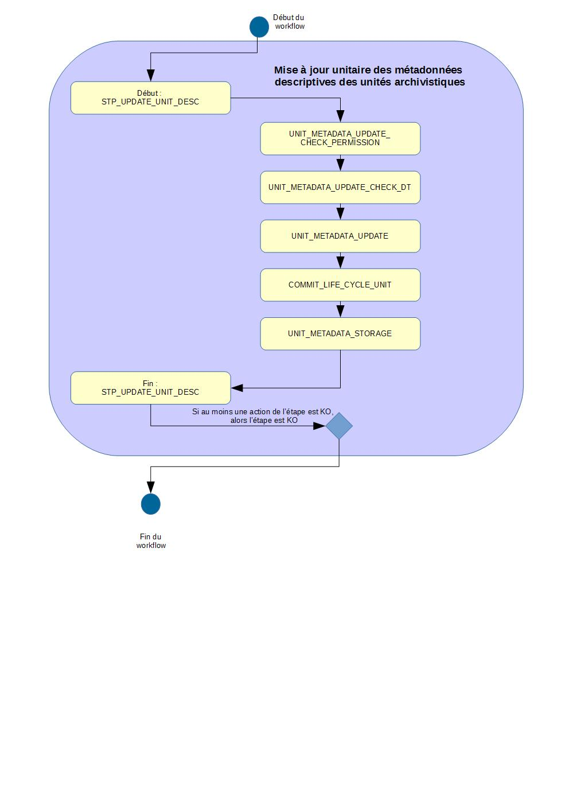

#### Mise à jour unitaire des règles de gestion d’une unité archivistique STP_UPDATE_UNIT (AccessInternalModuleImpl.java)
- **Règle** : étape consistant à mettre à jour de manière unitaire les métadonnées de gestion d’une unité archivistique
- **Type** : bloquant
- **Statuts** :
    - OK : la mise à jour de l’unité archivistique a bien été effectuée. (STP_UPDATE_UNIT.OK = Succès du processus de mise à jour des métadonnées de l’unité archivistique)
    - KO : la mise à jour de l’unité archivistique n’a pas été effectuée en raison d’une erreur (STP_UPDATE_UNIT.KO = Échec du processus de mise à jour des métadonnées de l’unité archivistique)
    - FATAL : une erreur technique est survenue lors de la mise à jour de l’unité archivistique (STP_UPDATE_UNIT.FATAL = Erreur technique lors du processus de mise à jour des métadonnées de l’unité archivistique)
##### Vérification des droits de mise à jour des métadonnées descriptives et de gestion des unités archivistiques UNIT_METADATA_UPDATE_CHECK_PERMISSION
- **Règle** : tâche consistant à contrôler les droits d’écriture donnés par le contrat d’accès et à vérifier que l’utilisateur a bien des droits d’écriture des métadonnées descriptives et des métadonnées de gestion
- **Type** : bloquant
- **Statuts** :
    - OK : succès de la vérification des droits de mise à jour des métadonnées de l’unité archivistique (UNIT_METADATA_UPDATE_CHECK_PERMISSION.OK = Succès de la vérification des droits de mise à jour des métadonnées de l’unité archivistique)
    - KO : échec de la vérification des droits de mise à jour des métadonnées de l’unité archivistique (UNIT_METADATA_UPDATE_CHECK_PERMISSION.KO = Échec de la vérification des droits de mise à jour des métadonnées de l’unité archivistique)
    - FATAL : erreur technique lors de la vérification des droits de mise à jour des métadonnées de l’unité archivistique (UNIT_METADATA_UPDATE_CHECK_PERMISSION.FATAL = Erreur technique lors de la vérification des droits de mise à jour des métadonnées de l’unité archivistique)
    - WARNING : avertissement lors de la vérification des droits de mise à jour des métadonnées de l’unité archivistique (UNIT_METADATA_UPDATE_CHECK_PERMISSION.WARNING = Avertissement lors de la vérification des droits de mise à jour des métadonnées de l’unité archivistique)
##### Vérification des règles de gestion UNIT_METADATA_UPDATE_CHECK_RULES (AccessInternalModuleImpl.java)
- **Règle** : tâche consistant à vérifier les modifications apportées aux règles de gestion de l’unité archivistique
- **Type** : bloquant
- **Statuts** :
    - OK : succès de la vérification des métadonnées de gestion de l’unité archivistique ont été vérifiées  (UNIT_METADATA_UPDATE_CHECK_RULES.OK = Succès de la vérification des métadonnées de gestion de l’unité archivistique )
    - KO : oéchec de la vérification des métadonnées de gestion de l’unité archivistique (UNIT_METADATA_UPDATE_CHECK_RULES.KO = Échec de la vérification des métadonnées de gestionde l’unité archivistique )
    - FATAL : une erreur technique est survenue lors de la vérification des métadonnées de gestion (UNIT_METADATA_UPDATE_CHECK_RULES.FATAL = Erreur technique lors de la vérification des métadonnées de gestion de l’unité archivistique)
##### Vérification de l’association à un profil d’unité archivistique UNIT_METADATA_UPDATE_CHECK_DT
- **Règle** : cette tâche permet de vérifier la conformité des unités archivistiques mise à jour vis-à-vis de leurs profils d’unités archivistiques. Les identifiants de profils archivistiques renseignés dans les unités archivistiques doivent exister dans le référentiel des profils. Les profils associés doivent être actif et leur schéma de contrôle ne doit pas être vide.
- **Type** : bloquant
- **Statuts** :
    - OK : succès de la vérification de la conformité au profil unités archivistiques (document type) ((UNIT_METADATA_UPDATE_CHECK_DT.OK = Succès de la vérification de l’association à un profil unité archivistique)
    - KO : la mise à jour de l’unité archivistique n’a pas été effectuée en raison de la non-conformité vis-à-vis du profil d’unité archivistique (document type) (UNIT_METADATA_UPDATE_CHECK_DT.KO = Échec de la vérification de l’association à un profil unité archivistique)
    - FATAL : une erreur technique est survenue lors de la vérification de la conformité aux profils d’unités archivistiques (UNIT_METADATA_UPDATE_CHECK_DT.FATAL = Erreur technique lors de la vérification de l’association à un profil unité archivistique)
##### Indexation des métadonnées UNIT_METADATA_UPDATE (ArchiveUnitUpdateUtils.java)
- **Règle** : tâche consistant à indexer dans les bases internes de la solution logicielle Vitam les métadonnées de l’unité archivistique modifiée, ainsi qu’à mettre à jour son journal du cycle de vie. Si la modification touche une métadonnée à historiser, alors un historique est créé.
- **Type** : bloquant
- **Statuts** :
    - OK : succès de la mise à jour des métadonnées de l’unité archivistique (UNIT_METADATA_UPDATE.OK = Succès de la mise à jour des métadonnées de l’unité archivistique)
    - KO : échec de la mise à jour des métadonnées de l’unité archivistique (UNIT_METADATA_UPDATE.KO = Échec de la mise à jour des métadonnées de l’unité archivistique)
    - FATAL : une erreur technique est survenue lors de la mise à jour des métadonnées de l’unité archivistique (UNIT_METADATA_UPDATE.FATAL = Erreur technique lors dela mise à jour des métadonnées de l’unité archivistique)
    - WARNING : avertissement lors de la mise à jour des métadonnées de l’unité archivistique (UNIT_METADATA_UPDATE.WARNING = Avertissement lors dela mise à jour des métadonnées de l’unité archivistique)
À propos de l’historique des données : Il existe un fichier permettant de configurer les métadonnées à historiser dans : vitam/sources/metadata/metadata-core/src/main/resources/history-triggers.json
Ce fichier contient deux variables par objet :
- FieldPathTriggeredForHistory : champ dont la modification déclenche une historisation
- ObjectPathForHistory : champ à historiser

Quand ce champ correspondant à FieldPathTriggeredForHistory est modifié, alors le champ contenu dans « ObjectPathForHistory » est enregistré dans un bloc nommé « history » dans le modèle de données.

Par défaut dans la solution logicielle Vitam, la configuration de history-triggers.json est :
`````
[
 {
   "FieldPathTriggeredForHistory": "_mgt.ClassificationRule.ClassificationLevel",
   "ObjectPathForHistory": "_mgt.ClassificationRule"
 }
]
``````

Ainsi, lorsqu’un niveau de classification est modifié, alors l’intégralité de la catégorie de règle de classification est enregistré dans le bloc _history de l’unité archivistique.

##### Enregistrement du journal du cycle de vie des unités archivistiques COMMIT_LIFE_CYCLE_UNIT
- **Règle** : tâche consistant à sécuriser en base le journal du cycle de vie de l’unité archivistique (avant cette étape, les journaux du cycle de vie des unités archivistiques sont dans une collection temporaire afin de garder une cohérence entre les métadonnées indexées et les journaux lors d’une entrée en succès ou en échec).
- **Type** : bloquant
- **Statuts** :
    - OK : le journal du cycle de vie de l’unité archivistique a été enregistré avec succès (COMMIT_LIFE_CYCLE_UNIT.OK = Succès de l’enregistrement du journal du cycle de vie de l’unité archivistique)
    - FATAL : une erreur technique est survenue lors de l’enregistrement du journal du cycle de vie de l’unité archivistique (COMMIT_LIFE_CYCLE_UNIT.FATAL = Erreur technique lors de l’enregistrement du journal du cycle de vie de l’unité archivistique)

##### Écriture des métadonnées de l’unité archivistique sur l’offre de stockage UNIT_METADATA_STORAGE (AccessInternalModuleImpl.java)
- **Règle** : tâche consistant à sauvegarder les métadonnées de l’unité archivistique sur les offres de stockage en fonction de la stratégie de stockage
- **Type** : bloquant
- **Statuts** :
    - OK : les métadonnées de l’unité archivistique ont été sauvegardées sur les offres de stockage (UNIT_METADATA_STORAGE.OK = Succès de l’enregistrement des métadonnées de l’unité archivistique)
    - WARNING : avertissement lors de la sauvegarde des métadonnées de l’unité **archivistique** (UNIT_METADATA_STORAGE.ALREADY_EXECUTED = Action déjà exécutée : Pas d’enregistrement des métadonnées de l’unité archivistique)
    - FATAL : une erreur technique est survenue lors de la sauvegarde des métadonnées de l’unité archivistique (UNIT_METADATA_STORAGE.FATAL = Erreur technique lors de l’enregistrement des métadonnées de l’unité archivistique)

### Processus de mise à jour des groupes d’objets (STP_UPDATE_OBJECT_GROUP)
#### Mise à jour des groupes d’objets OBJECT_GROUP_UPDATE (AccessInternalModuleImpl.java)
- **Règle** : Tâche consistant à mettre à jour les groupes d’objet techniques
- **Type** : bloquant
    - OK=Succès de la mise à jour des groupes d''objets existants
    - KO=Échec lors de la mise à jour des groupes d'objets existants
    - FATAL=Erreur fatale lors de la mise à jour des groupes d'objets existants
    - WARNING=Avertissement lors de la mise à jour des groupes d'objets existants

#### Enregistrement du journal du cycle de vie des groupes d’objets COMMIT_LIFE_CYCLE_OBJECT_GROUP (CommitLifeCycleObjectGroupActionHandler.java)
- **Règle** : tâche consistant à sécuriser en base les journaux du cycle de vie des groupes d’objets. Avant cette étape, les journaux du cycle de vie des groupes d’objets sont dans une collection temporaire afin de garder une cohérence entre les métadonnées indexées et les journaux lors d’une entrée en succès ou en échec, et il n’y a pas d’évènement créée dans le journal du cycle de vie.
- **Type** : bloquant
- **Statuts** :
    - OK : la sécurisation des journaux du cycle de vie s’est correctement déroulée (COMMIT_LIFE_CYCLE_OBJECT_GROUP.OK = Succès de l’enregistrement des journaux du cycle de vie des groupes d’objets)
    - FATAL : une erreur technique est survenue lors de la sécurisation du journal du cycle de vie (COMMIT_LIFE_CYCLE_OBJECT_GROUP.FATAL = Erreur technique lors de l’enregistrement des journaux du cycle de vie des groupes d’objets)

#### Écriture des métadonnées des groupes d’objets sur l’offre de stockage OG_METADATA_STORAGE (StoreMetaDataObjectGroupActionPlugin)
- **Règle** : tâche consistant à sauvegarder les métadonnées liées aux groupes d’objets ainsi que leurs journaux de cycle de vie sur les offres de stockage en fonction de la stratégie de stockage
- **Type** : bloquant
- **Statuts** :
    - OK : les métadonnées des groupes d’objets et objets ont été sauvegardées avec succès (OG_METADATA_STORAGE.OK = Succès de l’écriture des métadonnées des objets et groupes d’objets sur l’offre de stockage)
    - KO : les métadonnées des groupes d’objets et objets n’ont pas été sauvegardées (OG_METADATA_STORAGE.KO = Échec de l’écriture des métadonnées des objets et groupes d’objets sur l’offre de stockage)
    - FATAL : une erreur technique est survenue lors de l’écriture des métadonnées du groupe d’objets sur les offres de stockage (OG_METADATA_STORAGE.FATAL = Erreur technique lors de l’écriture des métadonnées du groupe d’objets sur les offres de stockage)

### Processus d’alimentation du registre des fonds (STP_ACCESSION_REGISTRATION)
Alimentation du registre des fonds ACCESSION_REGISTRATION
- **Règle** : tâche consistant à enregistrer dans le registre des fonds des informations concernant la nouvelle entrée (nombre d’objets, volumétrie...). Ces informations viennent s’ajouter aux informations existantes pour un même service producteur. Si aucune information n’existait préalablement, alors un nouveau document est créé dans la base de données concernant ce producteur. Une fois cette action d’ajout ou de mise à jour effectuée, la solution logicielle Vitam calcule et enregistre une information agrégée de l’état des stocks du service producteur concerné (dans la collection AccessionRegisterDetail).
- **Type** : bloquant
- **Statuts** :
    - OK : le registre des fonds est correctement alimenté (ACCESSION_REGISTRATION.OK = Succès de l’alimentation du registre des fonds)
    - KO : le registre des fonds n’a pas pu être alimenté (ACCESSION_REGISTRATION.KO = Échec de l’alimentation du registre des fonds)
    - FATAL : une erreur technique est survenue lors de l’alimentation du registre des fonds (ACCESSION_REGISTRATION.FATAL = Erreur technique lors de l’alimentation du registre des fonds)

### Processus de finalisation de l’entrée (STP_INGEST_FINALISATION)
#### Notification de la fin de l’opération d’entrée ATR_NOTIFICATION (TransferNotificationActionHandler.java)
- **Règle** : tâche consistant à générer la notification de réponse (ArchiveTransferReply ou ATR) une fois toutes les étapes passées, en succès, avertissement ou échec, puis écriture de cette notification dans l’offre de stockage et envoi au service versant
- **Type** : non bloquant
- **Statuts** :
    - OK : le message de réponse a été correctement généré, écrit sur l’offre de stockage et envoyé au service versant (ATR_NOTIFICATION.OK = Succès de la notification de la fin de l’opération d’entrée à l’opérateur de versement)
    - KO : le message de réponse n’a pas été correctement généré, écrit sur l’offre de stockage ou envoyé au service versant (ATR_NOTIFICATION.KO = Échec de la notification de la fin de l’opération d’entrée à l’opérateur de versement)
    - FATAL : une erreur technique est survenue lors de la notification de la fin de l’opération (ATR_NOTIFICATION.FATAL = Erreur technique lors de la notification de la fin de l’opération d’entrée à l’opérateur de versement)
#### Mise en cohérence des journaux du cycle de vie ROLL_BACK (RollBackActionHandler.java)
- **Règle** : Purge des collections temporaires des journaux du cycle de vie
- **Type** : bloquant
- **Statuts** :
    - OK : la purge s’est correctement déroulée (ROLL_BACK.OK = Succès de la mise en cohérence des journaux du cycle de vie)
    - FATAL : une erreur technique est survenue lors de la purge (ROLL_BACK.FATAL = Erreur technique lors de la mise en cohérence des journaux du cycle de vie)

### Le cas du processus d’entrée « test à blanc »
Il est possible de procéder à un versement dit « à blanc », pour tester la conformité du SIP par rapport à la forme attendue par la solution logicielle Vitam sans pour autant le prendre en charge. Dans ce cas, le processus d’entrée à blanc diffère du processus d’entrée « classique » en ignorant un certain nombre d’étapes.

Les étapes non exécutées dans le processus d’entrée à blanc sont les suivantes :
- Écriture et indexation des objets et groupes d’objets (STP_OBJ_STORING)
- Indexation des unités archivistiques (STP_UNIT_METADATA)
- Enregistrement et écriture des métadonnées des objets et groupes d’objets (STP_OG_STORING)
- Enregistrement et écriture des unités archivistiques (STP_UNIT_STORING)
- Rangement des métadonnées des objets (STP_UPDATE_OBJECT_GROUP)
- Alimentation du registre des fonds (STP_ACCESSION_REGISTRATION)

Les tâches et traitements relatifs à toutes ces étapes sont donc également ignorés.

### Structure du Workflow de l’entrée
Le workflow mis en place dans la solution logicielle Vitam est défini dans l’unique fichier « DefaultIngestWorkflow.json ». Ce fichier est disponible dans /sources/processing/processing-management/src/main/resources/workflows. Il décrit le processus d’entrée (hors Ingest externe) pour entrer un SIP, indexer les métadonnées et stocker les objets contenus dans le SIP.

D’une façon synthétique, le workflow est décrit de cette façon :


Mise à jour unitaire (Update)
-----
### Workflow de mise à jour unitaire des unités archivistiques
Cette section décrit le processus permettant la mise à jour unitaire des unités archivistiques.<br>
Toutes les étapes, tâches et traitements sont journalisés dans le journal des opérations et décrivent le processus (clé et description de la clé associée dans le journal des opérations) tel qu’implémenté dans la version actuelle de la solution logicielle Vitam.

#### Mise à jour d’une unité archivistique (vision métier)
Le processus de mise à jour unitaire des unités archivistiques est lancé lors d’une mise à jour de n’importe quelle métadonnée d’une unité archivistique. On distingue cependant deux cas de modifications, liés à des droits gérés via les contrats d’accès : soit les utilisateurs disposent d’un droit de modification sur métadonnées descriptives seulement, soit ils disposent des droits pour modifier les métadonnées descriptives et les métadonnées de gestion (profil d’unité archivistiques et règles de gestion).<br>
Un certain nombre d’étapes, tâches et traitements sont journalisés dans le journal des opérations et décrivent ce processus de mise à jour (clé et description de la clé associée dans le journal des opérations).

#### Processus de mise à jour unitaire des métadonnées descriptives d’une unité archivistique STP_UPDATE_UNIT_DESC
- **Règle** : étape consistant à mettre à jour de manière unitaire les métadonnées descriptives d’une unité archivistique
- **Type** : bloquant
- **Statuts** :
    - OK : la mise à jour de l’unité archivistique a bien été effectuée (STP_UPDATE_UNIT_DESC.OK = Succès du processus de mise à jour des métadonnées descriptives de l’unité archivistique)
    - KO : la mise à jour de l’unité archivistique n’a pas été effectuée en raison d’une erreur (STP_UPDATE_UNIT_DESC.KO = Échec du processus de mise à jour des métadonnées descriptives de l’unité archivistique)
    - FATAL : une erreur technique est survenue lors de la mise à jour de l’unité archivistique (STP_UPDATE_UNIT_DESC.FATAL = Erreur technique lors du processus de mise à jour des métadonnées descriptives de l’unité archivistique)

##### Vérification des droits de mise à jour des métadonnées descriptives des unités archivistiques UNIT_METADATA_UPDATE_CHECK_PERMISSION
- **Règle** : tâche consistant à contrôler les droits d’écriture donnés par le contrat d’accès
- **Type** : bloquant
- **Statuts** :
    - OK : succès de la vérification des droits de mise à jour des métadonnées des unités archivistiques (UNIT_METADATA_UPDATE_CHECK_PERMISSION.OK = Succès de la vérification des droits de mise à jour des métadonnées des unités archivistiques)
    - KO : échec de la vérification des droits de mise à jour des métadonnées des unités archivistiques (UNIT_METADATA_UPDATE_CHECK_PERMISSION.KO = Échec de la vérification des droits de mise à jour des métadonnées des unités archivistiques)
    - FATAL : erreur technique lors de la vérification des droits de mise à jour des métadonnées des unités archivistiques (UNIT_METADATA_UPDATE_CHECK_PERMISSION.FATAL = Erreur technique lors de la vérification des droits de mise à jour des métadonnées des unités archivistiques)
    - WARNING : avertissement lors de la vérification des droits de mise à jour des métadonnées des unités archivistiques (UNIT_METADATA_UPDATE_CHECK_PERMISSION.WARNING = Avertissement lors de la vérification des droits de mise à jour des métadonnées des unités archivistiques)

##### Vérification de l’association à un profil d’unité archivistique UNIT_METADATA_UPDATE_CHECK_DT
- **Règle** : tâche consistant à vérifier la conformité des unités archivistiques mise à jour vis-à-vis des profils d’unités archivistiques qu’elles déclarent. Les profils associés doivent être actifs et leur schéma de contrôle ne doit pas être vide.
- **Type** : bloquant
- **Statuts** :
    - OK : la mise à jour de l’unité archivistique est conforme au profil d’unité archivistique (document type) (UNIT_METADATA_UPDATE_CHECK_DT.OK = Succès de la vérification de l’association à un profil unité archivistique)
    - KO : la mise à jour de l’unité archivistique n’a pas été effectuée en raison de la non-conformité vis-à-vis du profil d’unité archivistique (document type) (UNIT_METADATA_UPDATE_CHECK_DT.KO = Échec de la vérification de l’association à un profil d’unité archivistique)
    - FATAL : une erreur technique est survenue lors de la vérification de la conformité à un profil d’unité archivistique (UNIT_METADATA_UPDATE_CHECK_DT.FATAL = Erreur technique lors de la vérification de l’association à un profil d’unité archivistique)

##### Indexation des métadonnées UNIT_METADATA_UPDATE (ArchiveUnitUpdateUtils.java)
- **Règle** : tâche consistant à indexer dans les bases internes de la solution logicielle Vitam les métadonnées de l’unité archivistique modifiée, ainsi qu’à mettre à jour son journal du cycle de vie de l’unité archivistique. Si la modification touche une métadonnée à historiser, alors un historique est créé.
- **Type** : bloquant
- **Statuts** :
    - OK : succès de la mise à jour des métadonnées de l’unité archivistique (UNIT_METADATA_UPDATE.OK = Succès de la mise à jour des métadonnées de l’unité archivistique)
    - KO : échec de la mise à jour des métadonnées de l’unité archivistique (UNIT_METADATA_UPDATE.KO = Échec de la mise à jour des métadonnées de l’unité archivistique)
    - FATAL : une erreur technique est survenue lors de la mise à jour des métadonnées de l’unité archivistique (UNIT_METADATA_UPDATE.FATAL = Erreur technique lors dela mise à jour des métadonnées de l’unité archivistique)
    - WARNING : avertissement lors de la mise à jour des métadonnées de l’unité archivistique (UNIT_METADATA_UPDATE.WARNING = Avertissement lors dela mise à jour des métadonnées de l’unité archivistique)

À propos de l’historique des données : Il existe un fichier permettant de configurer les métadonnées à historiser dans : vitam/sources/metadata/metadata-core/src/main/resources/history-triggers.json

Ce fichier contient deux variables par objet :
    - FieldPathTriggeredForHistory : champ dont la modification déclenche une historisation
    - ObjectPathForHistory : champ à historiser

Quand ce champ correspondant à FieldPathTriggeredForHistory est modifié, alors le champ contenu dans « ObjectPathForHistory » est enregistré dans un bloc nommé « history » dans le modèle de données.<br>
Par défaut dans la solution logicielle Vitam, la configuration de history-triggers.json est :
``````
[
 {
   "FieldPathTriggeredForHistory": "_mgt.ClassificationRule.ClassificationLevel",
   "ObjectPathForHistory": "_mgt.ClassificationRule"
 }
]
``````

Ainsi lorsqu’un niveau de classification est modifié, alors l’intégralité de la catégorie de règle de classification est enregistré dans le bloc _history de l’unité archivistique.

##### Enregistrement du journal du cycle de vie des unités archivistiques COMMIT_LIFE_CYCLE_UNIT
- **Règle** : tâche consistant à sécuriser en base le journal du cycle de vie de l’unité archivistique (avant cette étape, les journaux du cycle de vie des unités archivistiques sont dans une collection temporaire afin de garder une cohérence entre les métadonnées indexées et les journaux lors d’une entrée en succès ou en échec)
- **Type** : bloquant
- **Statuts** :
    - OK : le journal du cycle de vie de l’unité archivistique a été enregistré avec succès (COMMIT_LIFE_CYCLE_UNIT.OK = Succès de l’enregistrement du journal du cycle de vie de l’unité archivistique)
    - FATAL : une erreur technique est survenue lors de l’enregistrement du journal du cycle de vie de l’unité archivistique (COMMIT_LIFE_CYCLE_UNIT.FATAL = Erreur technique lors de l’enregistrement du journal du cycle de vie de l’unité archivistique)

##### Écriture des métadonnées de l’unité archivistique sur l’offre de stockage UNIT_METADATA_STORAGE (AccessInternalModuleImpl.java)
- **Règle** : tâche consistant à sauvegarder les métadonnées de l’unité archivistique sur les offres de stockage en fonction de la stratégie de stockage.
- **Type** : bloquant
- **Statuts** :
    - OK : les métadonnées de l’unité archivistique ont été sauvegardées sur les offres de stockage (UNIT_METADATA_STORAGE.OK = Succès de l’enregistrement des métadonnées de l’unité archivistique)
    - WARNING : avertissement lors de la sauvegarde des métadonnées de l’unité archivistique (UNIT_METADATA_STORAGE.ALREADY_EXECUTED = Action déjà exécutée : Pas d’enregistrement des métadonnées de l’unité archivistique)
    - FATAL : une erreur technique est survenue lors de la sauvegarde des métadonnées de l’unité archivistique (UNIT_METADATA_STORAGE.FATAL = Erreur technique lors de l’enregistrement des métadonnées de l’unité archivistique)

#### Structure de workflow de mise à jour des métadonnées descriptives
D’une façon synthétique, le workflow est décrit de cette façon :

#### Mise à jour unitaire des règles de gestion d’une unité archivistique STP_UPDATE_UNIT (AccessInternalModuleImpl.java)
- **Règle** : étape consistant à mettre à jour de manière unitaire les métadonnées de gestion d’une unité archivistique
- **Type** : bloquant
- **Statuts** :
    - OK : la mise à jour de l’unité archivistique a bien été effectuée. (STP_UPDATE_UNIT.OK = Succès du processus de mise à jour des métadonnées de l’unité archivistique)
    - KO : la mise à jour de l’unité archivistique n’a pas été effectuée en raison d’une erreur (STP_UPDATE_UNIT.KO = Échec du processus de mise à jour des métadonnées de l’unité archivistique)
    - FATAL : une erreur technique est survenue lors de la mise à jour de l’unité archivistique (STP_UPDATE_UNIT.FATAL = Erreur technique lors du processus de mise à jour des métadonnées de l’unité archivistique)
##### Vérification des droits de mise à jour des métadonnées descriptives et de gestion des unités archivistiques UNIT_METADATA_UPDATE_CHECK_PERMISSION
- **Règle** : tâche consistant à contrôler les droits d’écriture donnés par le contrat d’accès et à vérifier que l’utilisateur a bien des droits d’écriture des métadonnées descriptives et des métadonnées de gestion
- **Type** : bloquant
- **Statuts** :
    - OK : succès de la vérification des droits de mise à jour des métadonnées de l’unité archivistique (UNIT_METADATA_UPDATE_CHECK_PERMISSION.OK = Succès de la vérification des droits de mise à jour des métadonnées de l’unité archivistique)
    - KO : échec de la vérification des droits de mise à jour des métadonnées de l’unité archivistique (UNIT_METADATA_UPDATE_CHECK_PERMISSION.KO = Échec de la vérification des droits de mise à jour des métadonnées de l’unité archivistique)
    - FATAL : erreur technique lors de la vérification des droits de mise à jour des métadonnées de l’unité archivistique (UNIT_METADATA_UPDATE_CHECK_PERMISSION.FATAL = Erreur technique lors de la vérification des droits de mise à jour des métadonnées de l’unité archivistique)
    - WARNING : avertissement lors de la vérification des droits de mise à jour des métadonnées de l’unité archivistique (UNIT_METADATA_UPDATE_CHECK_PERMISSION.WARNING = Avertissement lors de la vérification des droits de mise à jour des métadonnées de l’unité archivistique)
##### Vérification des règles de gestion UNIT_METADATA_UPDATE_CHECK_RULES (AccessInternalModuleImpl.java)
- **Règle** : tâche consistant à vérifier les modifications apportées aux règles de gestion de l’unité archivistique
- **Type** : bloquant
- **Statuts** :
    - OK : succès de la vérification des métadonnées de gestion de l’unité archivistique ont été vérifiées  (UNIT_METADATA_UPDATE_CHECK_RULES.OK = Succès de la vérification des métadonnées de gestion de l’unité archivistique )
    - KO : oéchec de la vérification des métadonnées de gestion de l’unité archivistique (UNIT_METADATA_UPDATE_CHECK_RULES.KO = Échec de la vérification des métadonnées de gestionde l’unité archivistique )
    - FATAL : une erreur technique est survenue lors de la vérification des métadonnées de gestion (UNIT_METADATA_UPDATE_CHECK_RULES.FATAL = Erreur technique lors de la vérification des métadonnées de gestion de l’unité archivistique)
##### Vérification de l’association à un profil d’unité archivistique UNIT_METADATA_UPDATE_CHECK_DT
- **Règle** : cette tâche permet de vérifier la conformité des unités archivistiques mise à jour vis-à-vis de leurs profils d’unités archivistiques. Les identifiants de profils archivistiques renseignés dans les unités archivistiques doivent exister dans le référentiel des profils. Les profils associés doivent être actif et leur schéma de contrôle ne doit pas être vide.
- **Type** : bloquant
- **Statuts** :
    - OK : succès de la vérification de la conformité au profil unités archivistiques (document type) ((UNIT_METADATA_UPDATE_CHECK_DT.OK = Succès de la vérification de l’association à un profil unité archivistique)
    - KO : la mise à jour de l’unité archivistique n’a pas été effectuée en raison de la non-conformité vis-à-vis du profil d’unité archivistique (document type) (UNIT_METADATA_UPDATE_CHECK_DT.KO = Échec de la vérification de l’association à un profil unité archivistique)
    - FATAL : une erreur technique est survenue lors de la vérification de la conformité aux profils d’unités archivistiques (UNIT_METADATA_UPDATE_CHECK_DT.FATAL = Erreur technique lors de la vérification de l’association à un profil unité archivistique)
##### Indexation des métadonnées UNIT_METADATA_UPDATE (ArchiveUnitUpdateUtils.java)
- **Règle** : tâche consistant à indexer dans les bases internes de la solution logicielle Vitam les métadonnées de l’unité archivistique modifiée, ainsi qu’à mettre à jour son journal du cycle de vie. Si la modification touche une métadonnée à historiser, alors un historique est créé.
- **Type** : bloquant
- **Statuts** :
    - OK : succès de la mise à jour des métadonnées de l’unité archivistique (UNIT_METADATA_UPDATE.OK = Succès de la mise à jour des métadonnées de l’unité archivistique)
    - KO : échec de la mise à jour des métadonnées de l’unité archivistique (UNIT_METADATA_UPDATE.KO = Échec de la mise à jour des métadonnées de l’unité archivistique)
    - FATAL : une erreur technique est survenue lors de la mise à jour des métadonnées de l’unité archivistique (UNIT_METADATA_UPDATE.FATAL = Erreur technique lors dela mise à jour des métadonnées de l’unité archivistique)
    - WARNING : avertissement lors de la mise à jour des métadonnées de l’unité archivistique (UNIT_METADATA_UPDATE.WARNING = Avertissement lors dela mise à jour des métadonnées de l’unité archivistique)

À propos de l’historique des données : Il existe un fichier permettant de configurer les métadonnées à historiser dans : vitam/sources/metadata/metadata-core/src/main/resources/history-triggers.json

Ce fichier contient deux variables par objet :
- FieldPathTriggeredForHistory : champ dont la modification déclenche une historisation
- ObjectPathForHistory : champ à historiser
Quand ce champ correspondant à FieldPathTriggeredForHistory est modifié, alors le champ contenu dans « ObjectPathForHistory » est enregistré dans un bloc nommé « history » dans le modèle de données.<br>
Par défaut dans la solution logicielle Vitam, la configuration de history-triggers.json est :
``````
[
 {
   "FieldPathTriggeredForHistory": "_mgt.ClassificationRule.ClassificationLevel",
   "ObjectPathForHistory": "_mgt.ClassificationRule"
 }
]
``````
Ainsi, lorsqu’un niveau de classification est modifié, alors l’intégralité de la catégorie de règle de classification est enregistré dans le bloc _history de l’unité archivistique.

##### Enregistrement du journal du cycle de vie des unités archivistiques COMMIT_LIFE_CYCLE_UNIT

- **Règle** : tâche consistant à sécuriser en base le journal du cycle de vie de l’unité archivistique (avant cette étape, les journaux du cycle de vie des unités archivistiques sont dans une collection temporaire afin de garder une cohérence entre les métadonnées indexées et les journaux lors d’une entrée en succès ou en échec).
- **Type** : bloquant
- **Statuts** :
    - OK : le journal du cycle de vie de l’unité archivistique a été enregistré avec succès (COMMIT_LIFE_CYCLE_UNIT.OK = Succès de l’enregistrement du journal du cycle de vie de l’unité archivistique)
    - FATAL : une erreur technique est survenue lors de l’enregistrement du journal du cycle de vie de l’unité archivistique (COMMIT_LIFE_CYCLE_UNIT.FATAL = Erreur technique lors de l’enregistrement du journal du cycle de vie de l’unité archivistique)

##### Écriture des métadonnées de l’unité archivistique sur l’offre de stockage UNIT_METADATA_STORAGE (AccessInternalModuleImpl.java)

- **Règle** : tâche consistant à sauvegarder les métadonnées de l’unité archivistique sur les offres de stockage en fonction de la stratégie de stockage
- **Type** : bloquant
- **Statuts** :
    - OK : les métadonnées de l’unité archivistique ont été sauvegardées sur les offres de stockage (UNIT_METADATA_STORAGE.OK = Succès de l’enregistrement des métadonnées de l’unité archivistique)
    - WARNING : avertissement lors de la sauvegarde des métadonnées de l’unité archivistique (UNIT_METADATA_STORAGE.ALREADY_EXECUTED = Action déjà exécutée : Pas d’enregistrement des métadonnées de l’unité archivistique)
    - FATAL : une erreur technique est survenue lors de la sauvegarde des métadonnées de l’unité archivistique (UNIT_METADATA_STORAGE.FATAL = Erreur technique lors de l’enregistrement des métadonnées de l’unité archivistique)

#### Structure de workflow de mise à jour des métadonnées de gestion des unités archivistiques

D’une façon synthétique, le workflow est décrit de cette façon :


### Workflow de mise à jour des règles de gestion des unités archivistiques lors de l’import d’un nouveau référentiel
Cette section décrit le processus (workflow) permettant la mise à jour des règles de gestion des unités archivistiques suite à l’import d’un nouveau référentiel des règles de gestion.<br>
Le workflow mis en place dans la solution logicielle Vitam est défini dans le fichier « DefaultRulesUpdateWorkflow.json ». Ce fichier est disponible dans : sources/processing/processing-management/src/main/resources/workflows.<br>
Toutes les étapes, tâches et traitements sont journalisés dans le journal des opérations et décrivent le processus (clé et description de la clé associée dans le journal des opérations) tel qu’implémenté dans la version actuelle de la solution logicielle Vitam.
#### Mise à jour des règles de gestion des unités archivistiques (UPDATE_RULES_ARCHIVE_UNITS)
Le processus de mise à jour des règles de gestion des unités archivistiques est lancé à la suite d’une mise à jour des règles de gestion lorsque la solution logicielle Vitam détecte qu’une règle de gestion a été modifiée et est utilisée par une ou plusieurs unités archivistiques. Toutes les étapes et actions sont journalisées dans le journal des opérations.

#### Processus de préparation des listes d’unités archivistiques à mettre à jour STP_PREPARE_LISTS (updatedRules.json)
##### Établissement de la liste des entrées en cours d’exécution – LIST_RUNNING_INGESTS – fichier de sortie : GUID/PROCESSING/runningIngests.json
- **Règle** : étape consistant à vérifier si des entrées sont en cours d’exécution. Un fichier runningIngests.json est rempli avec les identifiants des entrées en cours. Le fichier est vide si aucune entrée n’est en cours.
- **Type** : bloquant
- **Statuts** :
    - OK : le fichier listant les entrées (qu’il soit vide ou non) a bien été créé (LIST_RUNNING_INGESTS.OK = Succès du processus de préparation des listes des unités archivistiques à mettre à jour).
    - KO : la liste des entrées en cours n’a pas pu être récupéré, ou alors la liste des entrées n’a pas pu être enregistrée sur l’espace de travail interne (LIST_RUNNING_INGESTS.KO = Échec du processus de préparation des listes des unités archivistiques à mettre à jour)
    - FATAL : une erreur technique est survenue lors de la préparation de la liste des entrées (LIST_RUNNING_INGESTS.FATAL = Erreur technique lors du processus de préparation des listes des unités archivistiques à mettre à jour)
##### Établissement de la liste des unités archivistiques à mettre à jour – LIST_ARCHIVE_UNITS (fichier de sortie : GUID/PROCESSING/auToBeUpdated.json)
- **Règle** : tâche consistant à établir la liste des unités archivistiques à mettre à jour. Pour chaque unité archivistique concernée, un fichier est créé et déposé sur l’espace de travail interne (le workspace) pour pouvoir être traité plus tard dans le workflow.
- **Type** : bloquant
- **Statuts** :
    -OK : la liste des unités archivistiques et les fichiers associés ont bien pu être créés. Les fichiers associés ont bien été créés (LIST_ARCHIVE_UNITS.OK = Succès lors du processus de l’établissement de la liste des unités archivistiques à mettre à jour)
    -FATAL : une erreur technique est survenue lors d’établissement de la liste des unités archivistiques à mettre à jour (LIST_ARCHIVE_UNITS.FATAL = Erreur technique lors du processus d’établissement de la liste des unités archivistiques à mettre à jour)
##### Établissement de la liste des unités archivistiques à mettre à jour – COMPUTE_INHERITED_RULES_PROGENY_IDENTIFIER
(fichier de sortie : GUID/PROCESSING/unitsToInvalidate.json)
- **Règle** : tâche consistant à établir la liste des unités archivistiques dont les règles de gestion applicables sont à invalider. Pour chaque unité archivistique concernée, un fichier est créé et déposé sur l’espace de travail interne (le workspace) pour pouvoir être traité plus tard dans le workflow.
- **Type** : bloquant
- **Statuts** :
    - OK : la liste des unités archivistiques et les fichiers associés ont bien pu être créés. Les fichiers associés ont bien été créés (COMPUTE_INHERITED_RULES_PROGENY_IDENTIFIER .OK = Succès lors du processus d’identification des unités archivistiques dont les règles de gestion applicables sont à invalider)
    - FATAL : une erreur technique est survenue lors d’établissement de la liste des unités archivistiques à mettre à jour (COMPUTE_INHERITED_RULES_PROGENY_IDENTIFIER .FATAL = Erreur technique lors du processus d’identification des unités archivistiques dont les règles de gestion applicables sont à invalider)

#### Invalidation des unités archivistiques dont les règles de gestion sont à invalider STP_INVALIDATE (Distribution sur LIST GUID/unitsToInvalidate.jsonl)
##### Invalidation des  règles de gestion applicables dans les unités archivistiques à invalider COMPUTE_INHERITED_RULES_INVALIDATOR
- **Règle** : traitement consistant, pour chaque unité archivistique à invalider, à supprimer les règles de gestion applicable.
- **Type** : bloquant
- **Statuts** :
    - OK : les règles de gestion applicables ont bien été invalidés dans les unités archivistiques (COMPUTE_INHERITED_RULES_INVALIDATOR.OK = Succès de la mise à jour des règles de gestion applicables des unités archivistiques).
    - FATAL : une erreur technique est survenue lors de la mise à jour de l’unité archivistique (COMPUTE_INHERITED_RULES_INVALIDATOR .FATAL = Erreur technique lors de la mise à jour des règles de gestion des unités archivistiques)

#### Mise à jour des unités archivistiques STP_UNIT_UPDATE (Distribution sur LIST GUID/UnitsWithoutLevel)
##### Mise à jour des règles de gestion d’une unité archivistique - UPDATE_UNIT_RULES
- **Règle** : traitement consistant, pour chaque unité archivistique à mettre à jour, à vérifier les règles de gestion impactées et à recalculer les échéances des règles
- **Type** : bloquant
- **Statuts** :
    - OK : l’unité archivistique a bien été mise à jour (UPDATE_UNIT_RULES.OK = Succès de la mise à jour des règles de gestion des unités archivistiques).
    - KO : l’unité archivistique n’a pas été trouvée, ou n’a pas pu être mise à jour (UPDATE_UNIT_RULES.KO = Échec de la mise à jour des règles de gestion des unités archivistiques)
    - FATAL : une erreur technique est survenue lors de la mise à jour de l’unité archivistique (UPDATE_UNIT_RULES.FATAL = Erreur technique lors de la mise à jour des règles de gestion des unités archivistiques)
##### Écriture des métadonnées de l’unité archivistique sur l’offre de stockage UNIT_METADATA_STORAGE (AccessInternalModuleImpl.java)
- **Règle** : tâche consistant à sauvegarder les métadonnées de l’unité archivistique sur les offres de stockage en fonction de la stratégie de stockage
- **Type** : bloquant
- **Statuts** :
    - OK : les métadonnées de l’unité archivistique ont été sauvegardées sur les offres de stockage (UNIT_METADATA_STORAGE.OK = Succès de l’enregistrement des métadonnées de l’unité archivistique)
    - WARNING : avertissement lors de la sauvegarde des métadonnées de l’unité archivistique (UNIT_METADATA_STORAGE.ALREADY_EXECUTED = Action déjà exécutée : Pas d’enregistrement des métadonnées de l’unité archivistique)
    - FATAL : une erreur technique est survenue lors de la sauvegarde des métadonnées de l’unité archivistique (UNIT_METADATA_STORAGE.FATAL = Erreur technique lors de l’enregistrement des métadonnées de l’unité archivistique)

#### Mise à jour des processus d’entrée en cours – STP_UPDATE_RUNNING_INGESTS (updatedRules.json).
##### Mise à jour des entrées en cours – UPDATE_RUNNING_INGESTS (runningIngests.json)
- **Règle** : traitement consistant, pour une liste d’entrées en cours, à vérifier que chaque entrée est finalisée, à vérifier les règles de gestion impactées, et à recalculer les échéances des règles.
- **Type** : bloquant
- **Statuts** :
    - OK : les entrées en cours ont été finalisées, et les unités archivistiques ont bien été mises à jour (STP_UPDATE_RUNNING_INGESTS.OK = Succès de la mise à jour des entrées en cours).
    - KO : un problème a été rencontré avec le fichier des règles de gestion mises à jour (STP_UPDATE_RUNNING_INGESTS.KO = Échec de la mise à jour des entrées en cours)
    - FATAL : une erreur technique est survenue lors de la mise à jour des processus d’entrées (STP_UPDATE_RUNNING_INGESTS.FATAL = Erreur technique lors de la mise à jour des entrées en cours)
#### Structure de workflow du processus de mise à jour des règles de gestion des unités archivistiques
D’une façon synthétique, le workflow est décrit de cette façon :

Mise à jour de masse (Mass update)
----
### Workflow de mise à jour de masse des métadonnées descriptives des unités archivistiques
Cette section décrit le processus permettant d’effectuer des actions sur un grand nombre d’unités archivistiques stockées dans la solution logicielle Vitam. Cette fonctionnalité nécessite d’avoir les droits requis pour pouvoir intervenir sur les métadonnées. Les autorisations de modifications en masse portent soit sur les métadonnées descriptives soit sur les métadonnées de gestion.<br>
Toutes les étapes, tâches et traitements sont journalisés dans le journal des opérations et décrivent le processus (clé et description de la clé associée dans le journal des opérations) tel qu’implémenté dans la version actuelle de la solution logicielle Vitam.

#### Processus de mise à jour en masse des métadonnées descriptives des unités archivistiques (MASS_UPDATE_UNIT_DESC)

Le processus de mise à jour en masse des métadonnées descriptives des unités archivistiques permet d’effectuer des modifications sur un ensemble conséquent d’archives en une seule opération.<br>
- **Règle** : opération consistant à mettre à jour en masse les métadonnées descriptives des unités archivistiques
- **Type** : bloquant
- **Statuts** :
    - OK : la mise à jour en masse des métadonnées descriptives des unités archivistiques a bien été effectuée (MASS_UPDATE_UNIT_DESC.OK = Succès de la mise à jour en masse des métadonnées descriptives des unités archivistiques)
    - KO : la mise à jour en masse des métadonnées descriptives des unités archivistiques n’a pas été effectuée en raison d’une erreur (MASS_UPDATE_UNIT_DESC.KO = Échec de la mise à jour en masse des métadonnées descriptives des unités archivistiques)
    - FATAL : une erreur technique est survenue lors de la mise à jour en masse des métadonnées descriptives des unités archivistiques (MASS_UPDATE_UNIT_DESC.FATAL = Erreur technique lors de la mise à jour en masse des métadonnées descriptives des unités archivistiques)

#### Processus de préparation de la liste des unités archivistiques à mettre à jour et des autorisations de modification STP_CHECK_AND_COMPUTE
- **Règle** : étape consistant à préparer la liste des unités archivistiques à mettre à jour et à vérifier les autorisations de modification
- **Type** : bloquant
- **Statuts** :
    - OK : le processus de préparation de la liste des unités archivistiques à mettre à jour et de vérification des droits de modification a bien été effectué (STP_CHECK_AND_COMPUTE.OK = Succès du processus de préparation de la liste des unités archivistiques à mettre à jour et de vérification des autorisations de modification)
    - KO : le processus de préparation de la liste des unités archivistiques à mettre à jour et de vérification des droits de modification n’a pas été effectué en raison d’une erreur (STP_CHECK_AND_COMPUTE.KO = Échec du processus de préparation de la liste des unités archivistiques à mettre à jour et de vérification des autorisations de modification)
    - FATAL : une erreur technique est survenue lors du processus de préparation de la liste des unités archivistiques à mettre à jour et de vérification des autorisations de modification (STP_CHECK_AND_COMPUTE.FATAL = Erreur technique lors du processus de préparation de la liste des unités archivistiques à mettre à jour et de vérification des autorisations de modification)

##### Vérification des droits de mise à jour des métadonnées descriptives des unités archivistiques MASS_UPDATE_CHECK

- **Règle** : tâche consistant à contrôler les droits d’écriture donnés par le contrat d’accès et à vérifier que l’utilisateur a bien des droits d’écriture des métadonnées descriptives
- **Type** : bloquant
- **Statuts** :
    - OK : la vérification des droits de mise à jour des métadonnées des unités archivistiques a bien été effectuée (MASS_UPDATE_CHECK.OK = Succès de la vérification des droits de mise à jour des métadonnées descriptives des unités archivistiques)
    - KO : l’utilisateur n’a pas les droits de mise à jour des métadonnées descriptives des unités archivistiques (MASS_UPDATE_CHECK.KO = Échec de la vérification des droits de mise à jour des métadonnées descriptives des unités archivistiques)
    - FATAL : une erreur technique est survenue lors de la vérification des droits de mise à jour des métadonnées descriptives des unités archivistiques (MASS_UPDATE_CHECK.FATAL = Erreur technique lors de la vérification des droits de mise à jour des métadonnées descriptives des unités archivistiques)

##### Vérification des seuils de limitation de traitement des unités archivistiques CHECK_DISTRIBUTION_THRESHOLD

- **Règle** : tâche consistant à vérifier les seuils de limitation de traitement des unités archivistiques
- **Type** : bloquant
- **Statuts** :
    - OK : la vérification des seuils de limitation de traitement des unités archivistiques a bien été effectuée (CHECK_DISTRIBUTION_THRESHOLD.OK = Succès de la vérification des seuils de limitation de traitement des unités archivistiques)
    - KO : une incohérence à été détectée entre le seuil et le nombre d’unités archivistiques à traiter (CHECK_DISTRIBUTION_THRESHOLD.KO = Échec de la vérification des seuils de limitation de traitement des unités archivistiques)
    - FATAL : une erreur technique est survenue lors de la vérification des seuils de limitation de traitement des unités archivistiques (CHECK_DISTRIBUTION_THRESHOLD.FATAL = Erreur technique lors de la vérification des seuils de limitation de traitement des unités archivistiques)

##### Préparation de la liste des unités archivistiques à mettre à jour PREPARE_UPDATE_UNIT_LIST

- **Règle** : tâche consistant à préparer la liste des unités archivistiques à mettre à jour
- **Type** : bloquant
- **Statuts** :
    - OK : la préparation de la liste des unités archivistiques à mettre à jour a bien été effectuée (PREPARE_UPDATE_UNIT_LIST.OK = Succès de la préparation de la liste des unités archivistiques à mettre à jour)
    - KO : la préparation de la liste des unités archivistiques à mettre à jour n’a pas été effectuée en raison d’une erreur (PREPARE_UPDATE_UNIT_LIST.KO = Échec de la préparation de la liste des unités archivistiques à mettre à jour)
    - FATAL : une erreur technique est survenue lors de la préparation de la liste des unités archivistiques à mettre à jour (PREPARE_UPDATE_UNIT_LIST.FATAL = Erreur technique lors de la préparation de la liste des unités archivistiques à mettre à jour)

#### Processus de traitement de mise à jour des unités archivistiques STP_UPDATE

Préparation de la liste des unités archivistiques à mettre à jour MASS_UPDATE_UNIT
- **Règle** : tâche et traitement consistant à mettre à jour les métadonnées descriptives des unités archivistiques
- **Type** : bloquant
- **Statuts** :
    - OK : la mise à jour des métadonnées descriptives des unités archivistiques a bien été effectué (MASS_UPDATE_UNITS.OK = Succès de la mise à jour des métadonnées descriptives des unités archivistiques)
    - KO : la mise à jour des métadonnées descriptives des unités archivistiques n’a pas été effectuée en raison d’une erreur (MASS_UPDATE_UNITS.KO = Échec de la mise à jour des métadonnées descriptives des unités archivistiques)
    - FATAL : une erreur technique est survenue lors de la mise à jour des métadonnées descriptives des unités archivistiques (MASS_UPDATE_UNITS.FATAL = Erreur technique lors de la mise à jour des métadonnées descriptives des unités archivistiques)

#### Processus de génération du rapport de mise à jour des métadonnées descriptives des unités archivistiques STP_MASS_UPDATE_FINALIZE

Génération du rapport de mise à jour des métadonnées descriptives des unités archivistiques MASS_UPDATE_FINALIZE
- **Règle** : tâche consistant à générer le rapport de mise à jour des métadonnées descriptives des unités archivistiques
- **Type** : bloquant
- **Statuts** :
    - OK : le processus de génération du rapport de mise à jour des métadonnées descriptives des unités archivistiques a bien été effectué (MASS_UPDATE_FINALIZE.OK = Succès du processus de  génération du rapport de mise à jour des métadonnées descriptives des unités archivistiques)
    - KO : le processus de  génération du rapport de mise à jour des métadonnées descriptives des unités archivistiques à mettre à jour n’a pas été effectuée en raison d’une erreur (MASS_UPDATE_FINALIZE.KO = Échec du processus de  génération du rapport de mise à jour des métadonnées descriptives des des unités archivistiques)
    - FATAL : une erreur technique est survenue lors du processus de  génération du rapport de mise à jour des métadonnées descriptives des des unités archivistiques à mettre à jour (MASS_UPDATE_FINALIZE.FATAL = Erreur technique lors du processus de  génération du rapport de mise à jour des métadonnées descriptives des unités archivistiques)

#### Structure du workflow de mise à jour en masse des métadonnées descriptives des unités archivistiques
D’une façon synthétique, le workflow est décrit de cette façon :
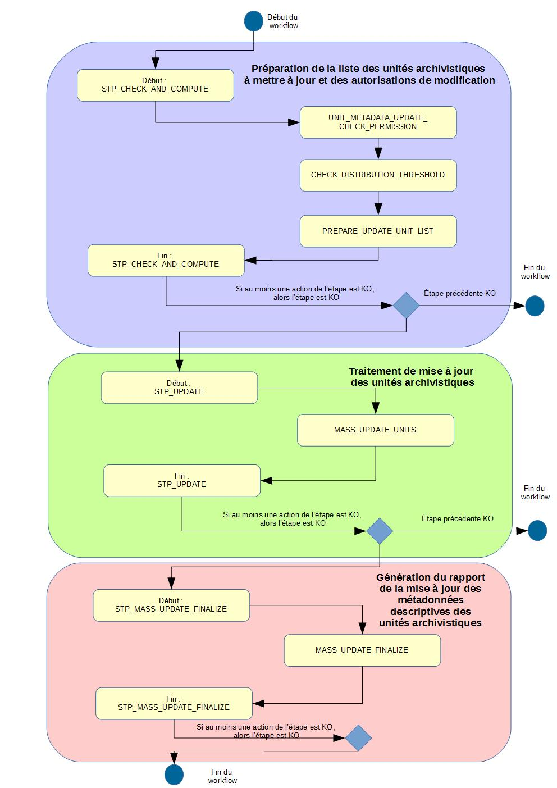
#### Rapport de modification en masse des métadonnées descriptives des unités archivistiques

Le rapport de modification en masse des métadonnées descriptives des unités archivistiques est un fichier JSONL généré par la solution logicielle Vitam lorsqu’une opération de modification en masse des métadonnées descriptives se termine. Cette section décrit la manière dont ce rapport est structuré.

##### Exemple de JSONL : rapport de modification en masse des métadonnées descriptives des unités archivistiques

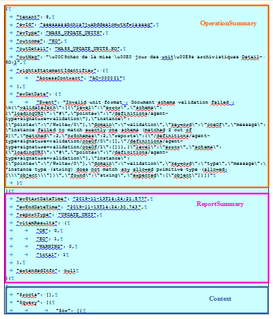


##### Détails du rapport

La partie « OperationSummary » c’est-à-dire le bloc racine du rapport et correspondant au résumé de l’opération est composé des champs suivants : 
- « Tenant » : tenant sur lequel l’opération de modification en masse a été lancée
- « evId »:identifiant de l’événement
- « outcome » : statut de l’événement
- « outMsg » : détail du résultat des données de l’événement
- « rightsStatementIdentifier » : identifiant des données référentielles en vertu desquelles l’opération peut s’exécuter. 
- « evDetData » : détails des données de l’événement

La partie « ReportSUmmary » c’est-à-dire le bloc situé sous la racine du rapport et correspondant au résumé du rapport est composé des champs suivants : 
- « evStartDateTime »:date du début de l’opération (evDateTime de l’event master de l’opération dans le journal des opérations)
- « evEndDateTime » : date de fin de l’opération (dernier evDateTime de l’event master de l’opération dans le journal des opérations)
- « reportType » : corresponds au modèle du rapport.
- « vitamResults » : corresponds au nombre de OK, KO et warning de l’opération ainsi que le total de ces 3 statuts.
- « extendedInfo » : partie libre où chaque type de rapport contient des informations qui lui est propre. Ici ce champ est vide. 

La partie « Context » correspond à la requête DSL utilisée pour créer la distribution sur chaque unité archivistique. 

La partie « ReportDetail » contient les détails de l’opération de modification en masse effectuée sur chacune des unités archivistiques, uniquement quand ces dernières sont aux statuts « KO » ou « Warning ».
- « _id » : identifiant de la ligne d’erreur dans la base MongoDB
- « resultKey » : information sur le problème lié au KO
- « processId » : identifiant de l’opération
- « _tenant » : tenant sur lequel l’opération de modification en masse a été lancée
- « status » : statut l’opération
- « message » message exacte de l’erreur
- « outcome » : statut de l’événement 
- « detailType » : type de rapport dans la base de données MongoDB
- « id » : identifiant de l’unité archivistique

### Workflow de mise à jour de masse des métadonnées de gestion des unités archivistiques

Cette section décrit le processus permettant d’effectuer des actions sur un grand nombre d’unités archivistiques stockées dans la solution logicielle Vitam. Cette fonctionnalité nécessite d’avoir les droits requis pour pouvoir intervenir sur les métadonnées. Les autorisations de modifications en masse portent soit sur les métadonnées descriptives soit sur les métadonnées de gestion.<br>
Toutes les étapes, tâches et traitements sont journalisés dans le journal des opérations et décrivent le processus (clé et description de la clé associée dans le journal des opérations) tel qu’implémenté dans la version actuelle de la solution logicielle Vitam.<br>
Toutes les étapes, tâches et traitements sont journalisés dans le journal des opérations et décrivent le processus (clé et description de la clé associée dans le journal des opérations) tel qu’implémenté dans la version actuelle de la solution logicielle Vitam.<br>

#### Processus de mise à jour en masse des métadonnées de gestion des unités archivistiques (MASS_UPDATE_UNIT_RULE)
Le processus de mise à jour en masse des métadonnées descriptives des unités archivistiques permet d’effectuer des modifications sur un ensemble conséquent d’archives en une seule opération.

- **Règle** : opération consistant à mettre à jour en masse les métadonnées descriptives et de gestion des unités archivistiques
- **Type** : bloquant
- **Statuts** :
    - OK : la mise à jour en masse des métadonnées descriptives et de gestion des unités archivistiques a bien été effectuée (MASS_UPDATE_UNIT_RULE.OK = Succès de la mise à jour en masse des métadonnées descriptives et de gestion des unités archivistiques)
    - KO : la mise à jour en masse des métadonnées descriptives et de gestion des unités archivistiques n’a pas été effectuée en raison d’une erreur (MASS_UPDATE_UNIT_RULE.KO = Échec de la mise à jour en masse des métadonnées descriptives et de gestion des unités archivistiques)
    - FATAL : une erreur technique est survenue lors de la mise à jour en masse des métadonnées descriptives et de gestion des unités archivistiques (MASS_UPDATE_UNIT_RULE.FATAL = Erreur technique lors de la mise à jour en masse des métadonnées descriptives et de gestion des unités archivistiques)

#### Processus de préparation de la liste des unités archivistiques à mettre à jour et des autorisations de modification STP_CHECK_AND_COMPUTE
- **Règle** : étape consistant à préparer le processus de préparation de la liste des unités archivistiques à mettre à jour et à vérifier les autorisations de modification
- **Type** : bloquant
- **Statuts** :
    - OK : le processus de préparation de la liste des unités archivistiques à mettre à jour et de vérification des droits de modification a bien été effectué (STP_CHECK_AND_COMPUTE.OK = Succès du processus de préparation de la liste des unités archivistiques à mettre à jour et de vérification des autorisations de modification)
    - KO : le processus de préparation de la liste des unités archivistiques à mettre à jour et de vérification des droits de modification n’a pas été effectué en raison d’une erreur (STP_CHECK_AND_COMPUTE.KO = Échec du processus de préparation de la liste des unités archivistiques à mettre à jour et de vérification des autorisations de modification)
    - FATAL : une erreur technique est survenue lors du processus de préparation de la liste des unités archivistiques à mettre à jour et de vérification des droits de modification (STP_CHECK_AND_COMPUTE.FATAL = Erreur technique lors du processus de préparation de la liste des unités archivistiques à mettre à jour et de vérification des autorisations de modification)

##### Vérification des droits de mise à jour des métadonnées descriptives des unités archivistiques MASS_UPDATE_RULES_CHECK

- **Règle** : tâche consistant à contrôler les droits d’écriture donnés par le contrat d’accès et à vérifier que l’utilisateur a bien des droits d’écriture des métadonnées descriptives et de gestion
- **Type** : bloquant
- **Statuts** :
    - OK : la vérification des droits de mise à jour des métadonnées des unités archivistiques a bien été effectuée (MASS_UPDATE_RULES_CHECK.OK = Succès de la vérification des droits de mise à jour des métadonnées des unités archivistiques)
    - KO : l’utilisateur n’a pas les droits de mise à jour des métadonnées descriptives et de gestion des unités archivistiques (MASS_UPDATE_RULES_CHECK.KO = Échec de la vérification des droits de mise à jour des métadonnées descriptives et de gestion des unités archivistiques)
    - FATAL : une erreur technique est survenue lors de la vérification des droits de mise à jour des métadonnées descriptives et de gestion des unités archivistiques (MASS_UPDATE_RULES_CHECK.FATAL = Erreur technique lors de la vérification des droits de mise à jour des métadonnées descriptives et de gestion des unités archivistiques)

##### Vérification de cohérence des actions lors de la mise à jour des métadonnées descriptives et de gestion des unités archivistiques UNIT_METADATA_CHECK_CONSISTENCY
- **Règle** : tâche consistant à :
    - vérifier l’existence des métadonnées de gestion demandées ainsi que leur cohérence avec leur catégorie de règle 
    - vérifier les niveaux de classification associés aux unités archivistiques. Ces niveaux doivent exister dans la liste des niveaux de classifications autorisés par la plateforme (paramètre configuré dans la configuration des workers). Pour les unités archivistiques sans niveau de classification, la vérification contrôle que la plateforme autorise le versement d’unités archivistiques ne déclarant pas de niveau de classification.
    - vérifier que le profil d’unité archivistique existe dans le référentiel interne, est référencé au statut « Actif » et n’a pas un schéma de contrôle vide
- **Type** : bloquant
- **Statuts** :
    - OK : la vérification de cohérence des actions lors de la mise à jour des métadonnées descriptives et de gestion des unités archivistiques a bien été effectuée (UPDATE_UNIT_RULES_CONSISTENCY.OK = Succès de la vérification de cohérence des actions lors de la mise à jour des métadonnées descriptives et de gestion des unités archivistiques)
    - KO : la vérification de cohérence des actions lors de la mise à jour des métadonnées descriptives et de gestion udes nités archivistiques n’a pas été effectuée en raison d’une erreur (UPDATE_UNIT_RULES_CONSISTENCY.KO = Échec de la vérification de cohérence des actions lors de la mise à jour des métadonnées descriptives et de gestion des unités archivistiques)
    - FATAL : une erreur technique est survenue lors de la vérification de cohérence des actions lors de la mise à jour des métadonnées descriptives et de gestion des unités archivistiques (UPDATE_UNIT_RULES_CONSISTENCY.FATAL = Erreur technique lors de la vérification de cohérence des actions lors de la mise à jour des métadonnées descriptives et de gestion des unités archivistiques)

##### Vérification des seuils de limitation de traitement des unités archivistiques CHECK_DISTRIBUTION_THRESHOLD
- **Règle** : Vérification des seuils de limitation de traitement des unités archivistiques
- **Type** : bloquant
- **Statuts** :
    - OK : la vérification des seuils de limitation de traitement des unités archivistiques a bien été effectué (CHECK_DISTRIBUTION_THRESHOLD.OK = Succès de la vérification des seuils de limitation de traitement des unités archivistiques)
    - KO : une incohérence à été détectée entre le seuil et le nombre d’unités archivistiques à traiter (CHECK_DISTRIBUTION_THRESHOLD.KO = Échec de la vérification des seuils de limitation de traitement des unités archivistiques)
    - FATAL : une erreur technique est survenue lors de la vérification des seuils de limitation de traitement des unités archivistiques (CHECK_DISTRIBUTION_THRESHOLD.FATAL = Erreur technique lors de la vérification des seuils de limitation de traitement des unités archivistiques)

##### Préparation de la liste des unités archivistiques à mettre à jour PREPARE_UPDATE_UNIT_LIST
- **Règle** : tâche consistant à préparer la liste des unités archivistiques à mettre à jour
- **Type** : bloquant
- **Statuts** :
    - OK : la préparation de la liste des unités archivistiques à mettre à jour a bien été effectuée (PREPARE_UPDATE_UNIT_LIST.OK = Succès de la préparation de la liste des unités archivistiques à mettre à jour)
    - KO : la préparation de la liste des unités archivistiques à mettre à jour n’a pas été effectuée en raison d’une erreur (PREPARE_UPDATE_UNIT_LIST.KO = Échec de la préparation de la liste des unités archivistiques à mettre à jour)
    - FATAL : une erreur technique est survenue lors de la préparation de la liste des unités archivistiques à mettre à jour (PREPARE_UPDATE_UNIT_LIST.FATAL = Erreur technique lors de la préparation de la liste des unités archivistiques à mettre à jour)

##### Établissement de la liste des unités archivistiques à mettre à jour – COMPUTE_INHERITED_RULES_PROGENY_IDENTIFIER
(fichier de sortie : GUID/PROCESSING/unitsToInvalidate.json)
- **Règle** : tâche consistant à établir la liste des unités archivistiques dont les règles de gestion applicables sont à invalider. Pour chaque unité archivistique concernée, un fichier est créé et déposé sur l’espace de travail interne (le workspace) pour pouvoir être traité plus tard dans le workflow.
- **Type** : bloquant
- **Statuts** :
    - OK : la liste des unités archivistiques et les fichiers associés ont bien pu être créés. Les fichiers associés ont bien été créés (COMPUTE_INHERITED_RULES_PROGENY_IDENTIFIER .OK = Succès lors du processus d’identification des unités archivistiques dont les règles de gestion applicables sont à invalider)
    - FATAL : une erreur technique est survenue lors d’établissement de la liste des unités archivistiques à mettre à jour (COMPUTE_INHERITED_RULES_PROGENY_IDENTIFIER .FATAL = Erreur technique lors du processus d’identification des unités archivistiques dont les règles de gestion applicables sont à invalider)
#### Invalidation des unités archivistiques dont les règles de gestion sont à invalider STP_INVALIDATE (Distribution sur LIST GUID/unitsToInvalidate.jsonl)
##### Invalidation des  règles de gestion applicables dans les unités archivistiques à invalider COMPUTE_INHERITED_RULES_INVALIDATOR
- **Règle** : traitement consistant, pour chaque unité archivistique à invalider, à supprimer les règles de gestion applicable.
- **Type** : bloquant
- **Statuts** :
    - OK : les règles de gestion applicables ont bien été invalidés dans les unités archivistiques (COMPUTE_INHERITED_RULES_INVALIDATOR.OK = Succès de la mise à jour des règles de gestion applicables des unités archivistiques).
    - FATAL : une erreur technique est survenue lors de la mise à jour de l’unité archivistique (COMPUTE_INHERITED_RULES_INVALIDATOR .FATAL = Erreur technique lors de la mise à jour des règles de gestion des unités archivistiques)Processus de traitement de mise à jour des unités archivistiques STP_UPDATE

##### Préparation de la liste des unités archivistiques à mettre à jour MASS_UPDATE_UNIT_RULES
- **Règle** : tâche et traitement consistant à mettre à jour les métadonnées descriptives et de gestion des unités archivistiques
- **Type** : bloquant
- **Statuts** :
    - OK : la mise à jour des métadonnées descriptives et de gestion des unités archivistiques a bien été effectué (MASS_UPDATE_UNITS_RULES.OK = Succès de la mise à jour des métadonnées descriptives et de gestion des unités archivistiques)
    - KO : la mise à jour des métadonnées descriptives et de gestion des unités archivistiques n’a pas été effectuée en raison d’une erreur (MASS_UPDATE_UNITS_RULES.KO = Échec de la mise à jour des métadonnées descriptives et de gestion des unités archivistiques)
    - WARNING : avertissement lors de la mise à jour des métadonnées descriptives et de gestion des unités archivistiques (MASS_UPDATE_UNITS_RULES.WARNING = Avertissement lors de la mise à jour des métadonnées descriptives et de gestion des unités archivistiques)
    - FATAL : une erreur technique est survenue lors de la mise à jour des métadonnées descriptives et de gestion des unités archivistiques (MASS_UPDATE_UNITS_RULES.FATAL = Erreur technique lors de la mise à jour des métadonnées descriptives et de gestion des unités archivistiques)

#### Processus de génération du rapport de mise à jour des métadonnées descriptives et de gestion des unités archivistiques STP_MASS_UPDATE_FINALIZE
##### Génération du rapport de mise à jour des métadonnées descriptives et de gestion des unités archivistiques MASS_UPDATE_FINALIZE
- **Règle** : tâche consistant à générer le rapport de mise à jour des métadonnées descriptives et de gestion des unités archivistiques
- **Type** : bloquant
- **Statuts** :
    - OK : le processus de génération du rapport de mise à jour des métadonnées descriptives et de gestion des unités archivistiques à mettre à jour a bien été effectué (MASS_UPDATE_FINALIZE.OK = Succès du processus de génération du rapport de mise à jour des métadonnées descriptives et de gestion des unités archivistiques)
    - KO : le processus de génération du rapport de mise à jour des métadonnées descriptives et de gestion des unités archivistiques à mettre à jour n’a pas été effectuée (MASS_UPDATE_FINALIZE.KO = Échec du processus de génération du rapport de mise à jour des métadonnées descriptives et de gestion des unités archivistiques)
    - FATAL : une erreur technique est survenue lors du processus de génération du rapport de mise à jour des métadonnées descriptives et de gestion des unités archivistiques à mettre à jour (MASS_UPDATE_FINALIZE.FATAL = Erreur technique lors du processus de génération du rapport de mise à jour des métadonnées descriptives et de gestion des unités archivistiques)
          
#### Structure de workflow de mise à jour en masse des métadonnées de gestion des unités archivistiques
D’une façon synthétique, le workflow est décrit de cette façon :


#### Rapport de modification en masse des métadonnées de gestion des unités archivistiques.
Le rapport de modification en masse des métadonnées de gestion des unités archivistiques est un fichier JSONL généré par la solution logicielle Vitam lorsqu’une opération de modification en masse des métadonnées de gestion se termine. Cette section décrit la manière dont ce rapport est structuré.

##### Exemple de JSONL : rapport de modification en masse des métadonnées descriptives des unités archivistiques


##### Détails du rapport
La partie « OperationSummary » c’est-à-dire le bloc racine du rapport et correspondant au résumé de l’opération est composé des champs suivants : 
- « Tenant » : tenant sur lequel l’opération de modification en masse a été lancée
- « evId »:identifiant de l’événement
- « outcome » : statut de l’événement
- « outMsg » : détail du résultat des données de l’événement
- « rightsStatementIdentifier » : identifiant des données référentielles en vertu desquelles l’opération peut s’exécuter.
- « evDetData » : détails des données de l’événement

La partie « ReportSUmmary » c’est-à-dire le bloc situé sous la racine du rapport et correspondant au résumé du rapport est composé des champs suivants : 
- « evStartDateTime »:date du début de l’opération (evDateTime de l’event master de l’opération dans le journal des opérations)
- « evEndDateTime » : date de fin de l’opération (dernier evDateTime de l’event master de l’opération dans le journal des opérations)
- « reportType » : corresponds au modèle du rapport.
- « vitamResults » : corresponds au nombre de OK, KO et warning de l’opération ainsi que le total de ces 3 statuts.
- « extendedInfo » : partie libre où chaque type de rapport contient des informations qui lui est propre. Ici ce champ est vide. 

La partie « Context » correspond à la requête DSL utilisée pour créer la distribution sur chaque unité archivistique. 

La partie « ReportDetail » contient les détails de l’opération de modification en masse effectuée sur chacune des unités archivistiques, uniquement quand ces dernières sont aux statuts « KO » ou « Warning ».<br>
- « _id » : identifiant de la ligne d’erreur dans la base MongoDB
- « resultKey » : information sur le problème lié au KO
- « processId » : identifiant de l’opération
- « _tenant » : tenant sur lequel l’opération de modification en masse a été lancée
- « status » : statut l’opération
- « message » message exacte de l’erreur
- « outcome » : statut de l’événement 
- « detailType » : type de rapport dans la base de données MongoDB
- « id » : identifiant de l’unité archivistique

### Workflow de calcul des règles de gestion hérités des unités archivistiques pour faciliter les requêtes
Cette section décrit le processus (workflow) permettant le calcul des règles de gestion des unités archivistiques afin de faciliter et d’accélérer les requêtes des unités archivistiques en fonction des règles de gestions effectifs.<br> 
Le workflow mis en place dans la solution logicielle Vitam est défini dans le fichier « ComputedInheritedRuleWorkflow.json ». Ce fichier est disponible dans : sources/processing/processing-management/src/main/resources/workflows.<br>
Toutes les étapes, tâches et traitements ne sont pas journalisés dans le journal des opérations et décrivent le processus (clé et description de la clé associée dans le journal des opérations) tel qu’implémenté dans la version actuelle de la solution logicielle Vitam.

#### Processus de préparation des règles de gestion applicables d’unités archivistiques à mettre à jour STP_COMPUTE_INHERITED_RULES_PREPARATION 

##### Vérification des seuils de limitation de traitement des unités archivistiques CHECK_DISTRIBUTION_THRESHOLD

- **Règle** : tâche consistant à vérifier les seuils de limitation de traitement des unités archivistiques
- **Type** : bloquant
- **Statuts** :
    - OK : la vérification des seuils de limitation de traitement des unités archivistiques a bien été effectuée (CHECK_DISTRIBUTION_THRESHOLD.OK = Succès de la vérification des seuils de limitation de traitement des unités archivistiques)
    - KO : une incohérence à été détectée entre le seuil et le nombre d’unités archivistiques à traiter. (CHECK_DISTRIBUTION_THRESHOLD.KO = Échec de la vérification des seuils de limitation de traitement des unités archivistiques)
    - FATAL : une erreur technique est survenue lors de la vérification des seuils de limitation de traitement des unités archivistiques (CHECK_DISTRIBUTION_THRESHOLD.FATAL = Erreur technique lors de la vérification des seuils de limitation de traitement des unités archivistiques)

##### Préparation du calcul des règles de gestion applicables des unités archivistiques COMPUTE_INHERITED_RULES_PREPARATION
- **Règle** : étape consistant à préparer le calcul des règles de gestion applicables des unités archivistiques.
- **Type** : bloquant
- **Statuts** :
    - OK : la préparation du calcul les règles de gestion applicables des unités archivistiques a bien été effectuée (COMPUTE_INHERITED_RULES_PREPARATION.OK = Succès du processus de préparation du calcul des règles de gestion applicables).
    - FATAL : la préparation du calcul les règles de gestion applicables des unités archivistiques n’a pas pu être effectué. (COMPUTE_INHERITED_RULES_PREPARATION.FATAL = Erreur technique lors du processus de préparation du calcul des règles de gestion applicables)

#### Processus de calcul des règles de gestion applicables. STP_COMPUTE_INHERITED_RULES
##### Calcul des règles de gestion applicables des unités archivistiques – COMPUTE_INHERITED_RULES (pas journalisé dans la base de données MongoDB)
- **Règle** : étape consistant à calculer et persister les règles de gestion applicables des unités archivistiques.
- **Type** : bloquant
- **Statuts** :
    - OK : les règles de gestion applicables des unités archivistiques ont bien été calculées et persistées. (COMPUTE_INHERITED_RULES.OK = Succès du calcul des règles de gestion applicables).
    - KO : les règles de gestion applicables des unités archivistiques n’ont pas pu être calculées ou persistées. (COMPUTE_INHERITED_RULES.KO = Échec du calcul des règles de gestion applicables)

#### Processus de finalisation du calcul des règles de gestion applicables. STP_COMPUTE_INHERITED_RULES_FINALIZATION
##### Finalisation du calcul des règles de gestion applicables – COMPUTE_INHERITED_RULES_FINALIZATION
- **Règle** : étape consistant à finaliser le calcul des règles de gestion applicables des unités archivistiques.
- **Type** : bloquant
- **Statuts** :
    - OK : la finalisation du calcul des règles de gestion applicables a bien été effectuée (COMPUTE_INHERITED_RULES_FINALIZATION .OK = Succès du processus de finalisation du calcul des règles de gestion applicables).
    - FATAL : une erreur technique est survenue lors de la finalisation du calcul des règles de gestion applicables (COMPUTE_INHERITED_RULES_FINALIZATION .FATAL = Erreur technique lors du processus de finalisation du calcul des règles de gestion applicables).
#### Structure de workflow de mise à jour du calcul des règles de gestion hérités des unités archivistiques.
D’une façon synthétique, le workflow est décrit de cette façon :

### Workflow de suppression des règles de gestion hérités et calculés des unités archivistiques
Cette section décrit le processus (workflow) permettant la suppression des règles de gestion des unités archivistiques applicables dans les unités archivistiques.<br>
Le workflow mis en place dans la solution logicielle Vitam est défini dans le fichier « ComputedInheritedRulesDeleteWorkflow.json ». Ce fichier est disponible dans : sources/processing/processing-management/src/main/resources/workflows.<br>
Toutes les étapes, tâches et traitements sont journalisés dans le journal des opérations et décrivent le processus (clé et description de la clé associée dans le journal des opérations) tel qu’implémenté dans la version actuelle de la solution logicielle Vitam.

#### Processus de préparation des règles de gestion applicables d’unités archivistiques à mettre à jour STP_COMPUTE_INHERITED_RULES_PREPARATION 
##### Vérification des seuils de limitation de traitement des unités archivistiques CHECK_DISTRIBUTION_THRESHOLD
- **Règle** : tâche consistant à vérifier les seuils de limitation de traitement des unités archivistiques
- **Type** : bloquant
- **Statuts** :
    - OK : la vérification des seuils de limitation de traitement des unités archivistiques a bien été effectuée (CHECK_DISTRIBUTION_THRESHOLD.OK = Succès de la vérification des seuils de limitation de traitement des unités archivistiques)
    - KO : une incohérence à été détectée entre le seuil et le nombre d’unités archivistiques à traiter. (CHECK_DISTRIBUTION_THRESHOLD.KO = Échec de la vérification des seuils de limitation de traitement des unités archivistiques)
    - FATAL : une erreur technique est survenue lors de la vérification des seuils de limitation de traitement des unités archivistiques (CHECK_DISTRIBUTION_THRESHOLD.FATAL = Erreur technique lors de la vérification des seuils de limitation de traitement des unités archivistiques)
##### Préparation du calcul des règles de gestion applicables des unités archivistiques COMPUTE_INHERITED_RULES_PREPARATION
- **Règle** : étape consistant à préparer le calcul des règles de gestion applicables des unités archivistiques.
- **Type** : bloquant
- **Statuts** :
    - OK : la préparation du calcul les règles de gestion applicables des unités archivistiques a bien été effectuée (COMPUTE_INHERITED_RULES_PREPARATION.OK = Succès du processus de préparation du calcul des règles de gestion applicables).
    - FATAL : la préparation du calcul les règles de gestion applicables des unités archivistiques n’a pas pu être effectué. (COMPUTE_INHERITED_RULES_PREPARATION.FATAL = Erreur technique lors du processus de préparation du calcul des règles de gestion applicables).

#### Processus de suppression  des règles de gestion applicables. STP_COMPUTE_INHERITED_RULES_DELETE
##### suppression des règles de gestion applicables des unités archivistiques – COMPUTE_INHERITED_RULES_DELETE
- **Règle** : étape consistant supprimer les règles de gestion applicables des unités archivistiques.
- **Type** : bloquant
- **Statuts** :
    - OK : les règles de gestion applicables des unités archivistiques ont bien été supprimés. (COMPUTE_INHERITED_RULES_DELETE.OK = Succès du processus de suppression du calcul des règles de gestion applicables).
    - KO : les règles de gestion applicables des unités archivistiques n’ont pas pu être suppression. (COMPUTE_INHERITED_RULES_DELETE.KO = Échec du calcul des règles de gestion applicables)

#### Processus de finalisation de la suppession des règles de gestion applicables. STP_COMPUTE_INHERITED_RULES_FINALIZATION
*Finalisation du calcul des règles de gestion applicables – COMPUTE_INHERITED_RULES_FINALIZATION*
- **Règle** : étape consistant à finaliser la  suppresion des règles de gestion applicables des unités archivistiques.
- **Type** : bloquant
- **Statuts** :
    - OK : la finalisation du calcul des règles de gestion applicables a bien été effectuée (COMPUTE_INHERITED_RULES_FINALIZATION .OK = Succès du processus de finalisation du calcul des règles de gestion applicables).
    - FATAL : une erreur technique est survenue lors de la finalisation du calcul des règles de gestion applicables (COMPUTE_INHERITED_RULES_FINALIZATION .FATAL = Erreur technique lors du processus de finalisation du calcul des règles de gestion applicables)

#### Structure de workflow de suppression du calcul des règles de gestion hérités des unités archivistiques.
D’une façon synthétique, le workflow est décrit de cette façon :
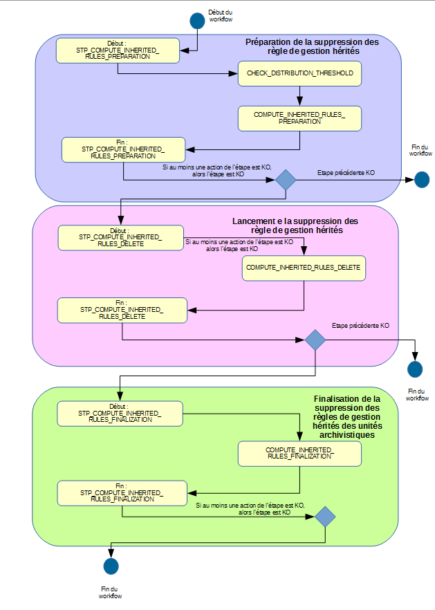

Mise à jour unitaire de masse (Bulk update)
----

**Workflow de mise à jour unitaire de masse des métadonnées descriptives des unités archivistiques**

Cette section décrit le processus permettant d’effectuer des actions unitaires sur un grand nombre d’unités archivistiques stockées dans la solution logicielle Vitam. Cette fonctionnalité nécessite d’avoir les droits requis pour pouvoir intervenir sur les métadonnées. Les autorisations de modifications en masse portent sur les métadonnées descriptives.<br>
Toutes les étapes, tâches et traitements sont journalisés dans le journal des opérations et décrivent le processus (clé et description de la clé associée dans le journal des opérations) tel qu’implémenté dans la version actuelle de la solution logicielle Vitam.

### Processus de mise à jour unitaire en masse des métadonnées descriptives des unités archivistiques (BULK_ATOMIC_UPDATE_UNIT_DESC)

Le processus de mise à jour unitaire en masse des métadonnées descriptives des unités archivistiques permet d’effectuer des modifications unitaires différenciées sur plusieurs unités archivistiques en une seule opération.

- **Règle** : opération consistant à mettre à jour unitairement en masse les métadonnées descriptives des unités archivistiques
- **Type** : bloquant
- **Statuts** :
    - OK: le mise à jour unitaire en masse des métadonnées descriptives des unités archivistiques ont bien été effectuées (BULK_ATOMIC_UPDATE_UNIT_DESC.OK = Succès du processus de mise à jour unitaire en masse des métadonnées descriptives des unités archivistiques)
    - KO: la mise à jour unitaire en masse des métadonnées descriptives des unités archivistiques n’a pas été effectuée en raison d’une erreur (BULK_ATOMIC_UPDATE_UNIT_DESC.KO = Échec du processus de mise à jour unitaire en masse des métadonnées descriptives des unités archivistiques)
    - FATAL: une erreur technique est survenue lors de la mise à jour atomique en masse des métadonnées descriptives des unités archivistiques (BULK_ATOMIC_UPDATE_UNIT_DESC.FATAL = Erreur technique lors du début du processus de mise à jour unitaire en masse des métadonnées descriptives des unités archivistiques)

### Processus de préparation de la liste des unités archivistiques à mettre à jour et des autorisations de modification STP_CHECK_AND_COMPUTE
- **Règle** : étape consistant à préparer la liste des unités archivistiques à mettre à jour et à vérifier les autorisations de modification
- **Type** : bloquant
- **Statuts** :
    - OK : le processus de préparation de la liste des unités archivistiques à mettre à jour et de vérification des droits de modification a bien été effectué (STP_CHECK_AND_COMPUTE.OK = Succès du processus de préparation de la liste des unités archivistiques à mettre à jour et de vérification des autorisations de modification)
    - KO : le processus de préparation de la liste des unités archivistiques à mettre à jour et de vérification des droits de modification n’a pas été effectué en raison d’une erreur (STP_CHECK_AND_COMPUTE.KO = Échec du processus de préparation de la liste des unités archivistiques à mettre à jour et de vérification des autorisations de modification)
    - FATAL : une erreur technique est survenue lors du processus de préparation de la liste des unités archivistiques à mettre à jour et de vérification des autorisations de modification (STP_CHECK_AND_COMPUTE.FATAL = Erreur technique lors du processus de préparation de la liste des unités archivistiques à mettre à jour et de vérification des autorisations de modification)

#### Vérification des seuils de limitation des requêtes de traitement des unités archivistiques CHECK_QUERIES_TRESHOLD
- **Règle** : tâche consistant à vérifier les seuils de limitation des requêtes de traitement des unités archivistiques.
- **Type** : bloquant
- **Statuts** :
    - OK: la vérification des seuils de limitation de traitement des requêtes de mise à jour des unités archivistiques a bien été effectuée (CHECK_DISTRIBUTION_THRESHOLD.OK = Succès de la vérification des seuils de limitation des requêtes de traitement des unités archivistiques)
    - KO: une incohérence à été détectée entre le seuil et le nombre de requêtes de mise à jour des unités archivistiques à traiter (CHECK_DISTRIBUTION_THRESHOLD.KO = Échec de la vérification des seuils de limitation des requêtes de traitement des unités archivistiques)
    - WARNING: une incohérence à été détectée entre le seuil fourni en entrée et le seuil par défaut (CHECK_DISTRIBUTION_THRESHOLD.WARNING = Avertissement lors de la vérification des seuils de limitation des requêtes de traitement des unités archivistiques)
    - FATAL: une erreur technique est survenue lors de la vérification des seuils de limitation de traitement des requêtes de mise à jour des unités archivistiques (CHECK_DISTRIBUTION_THRESHOLD.FATAL =Erreur technique lors de la vérification des seuils de limitation des requêtes de traitement des unités archivistiques)

#### Préparation de la liste des unités archivistiques à mettre à jour unitairement PREPARE_BULK_ATOMIC_UPDATE_UNIT_LIST
- **Règle** : tâche consistant à préparer la liste des unités archivistiques à mettre à jour. Lors de cette préparation vont être vérifiées pour chaque requête de mise à jour sa validité (pas de champ interdit “_”, valide selon le DSL) et que son nombre de résultats n’est pas EXACTEMENT égal à 1 unité archivistique.
- **Type** : bloquant
- **Statuts** :
    - OK: la préparation de la liste des unités archivistiques à mettre à jour unitairement a bien été effectuée (PREPARE_BULK_ATOMIC_UPDATE_UNIT_LIST.OK = Succès de la préparation de la liste des unités archivistiques à mettre à jour unitairement)
    - KO: la préparation de la liste des unités archivistiques à mettre à jour unitairement n’a pas été effectuée en raison d’une erreur (PREPARE_BULK_ATOMIC_UPDATE_UNIT_LIST.KO = Échec de la préparation de la liste des unités archivistiques à mettre à jour unitairement)
    - WARNING: un avertissement est survenu lors de la préparation de la liste des unités archivistiques à mettre à jour unitairement (PREPARE_BULK_ATOMIC_UPDATE_UNIT_LIST.WARNING = Avertissement lors de la préparation de la liste des unités archivistiques à mettre à jour unitairement)
    - FATAL: une erreur technique est survenue lors de la préparation de la liste des unités archivistiques à mettre à jour unitairement (PREPARE_BULK_ATOMIC_UPDATE_UNIT_LIST.FATAL = Erreur technique lors de la préparation de la liste des unités archivistiques à mettre à jour unitairement)

### Processus de traitement de mise à jour unitaire des unités archivistiques STP_UPDATE
Mise à jour unitaire des métadonnées descriptives BULK_ATOMIC_UPDATE_UNITS
- **Règle** : tâche et traitement consistant à mettre à jour les métadonnées descriptives des unités archivistiques
- **Type** : non bloquant
- **Statuts** :
    - OK: la mise à jour unitaire des métadonnées descriptives des unités archivistiques a bien été effectué (BULK_ATOMIC_UPDATE_UNITS.OK = Succès de la mise à jour unitaire des unités archivistiques)
    - KO: la mise à jour unitaire des métadonnées descriptives des unités archivistiques n’a pas été effectuée en raison d’une erreur (BULK_ATOMIC_UPDATE_UNITS.KO = Échec de la mise à jour des métadonnées descriptives des unités archivistiques)
    - WARNING: un avertissement est survenu lors de la mise à jour unitaire des métadonnées descriptives des unités archivistiques (BULK_ATOMIC_UPDATE_UNITS.WARNING = Avertissement lors de la mise à jour unitaire des unités archivistiques)
    - FATAL: une erreur technique est survenue lors de la mise à jour unitaire des métadonnées descriptives des unités archivistiques (BULK_ATOMIC_UPDATE_UNITS.FATAL = Erreur technique lors de la mise à jour des métadonnées descriptives des unités archivistiques)

### Processus de génération du rapport de mise à jour unitaire des métadonnées descriptives des unités archivistiques STP_BULK_ATOMIC_UPDATE_FINALIZE
Génération du rapport de mise à jour unitaire des métadonnées descriptives des unités archivistiques BULK_ATOMIC_UPDATE_FINALIZE
- **Règle** : tâche consistant à générer le rapport de mise à jour unitaire des métadonnées descriptives des unités archivistiques
- **Type** : bloquant
- **Statuts** :
    - OK: le processus de génération du rapport de mise à jour unitaire des métadonnées descriptives des unités archivistiques a bien été effectué (BULK_ATOMIC_UPDATE_FINALIZE.OK = Succès du processus de génération du rapport de mise à jour des métadonnées descriptives des unités archivistiques)
    - KO: le processus de génération du rapport de mise à jour unitaire des métadonnées descriptives des unités archivistiques à mettre à jour n’a pas été effectuée en raison d’une erreur (BULK_ATOMIC_UPDATE_FINALIZE.KO = Échec du processus de génération du rapport de mise à jour des métadonnées descriptives des des unités archivistiques)
    - FATAL: une erreur technique est survenue lors du processus de génération du rapport de mise à jour unitaire des métadonnées descriptives des des unités archivistiques à mettre à jour (BULK_ATOMIC_UPDATE_FINALIZE.FATAL = Erreur technique lors du processus de génération du rapport de mise à jour des métadonnées descriptives des unités archivistiques). Toutes les lignes de détail sont exportées

### Structure du Workflow de mise à jour unitaire des métadonnées descriptive
D’une façon synthétique, le workflow est décrit de cette façon :


### Rapport de modification unitaire en masse des métadonnées descriptives des unités archivistiques.
Le rapport de modification unitaire en masse des métadonnées descriptives des unités archivistiques est un fichier JSONL généré par la solution logicielle Vitam lorsqu’une opération de modification unitaire en masse des métadonnées descriptives se termine. Cette section décrit la manière dont ce rapport est structuré.

#### Exemple de fichier JSONL : rapport de modification unitaire en masse de métadonnées descriptives
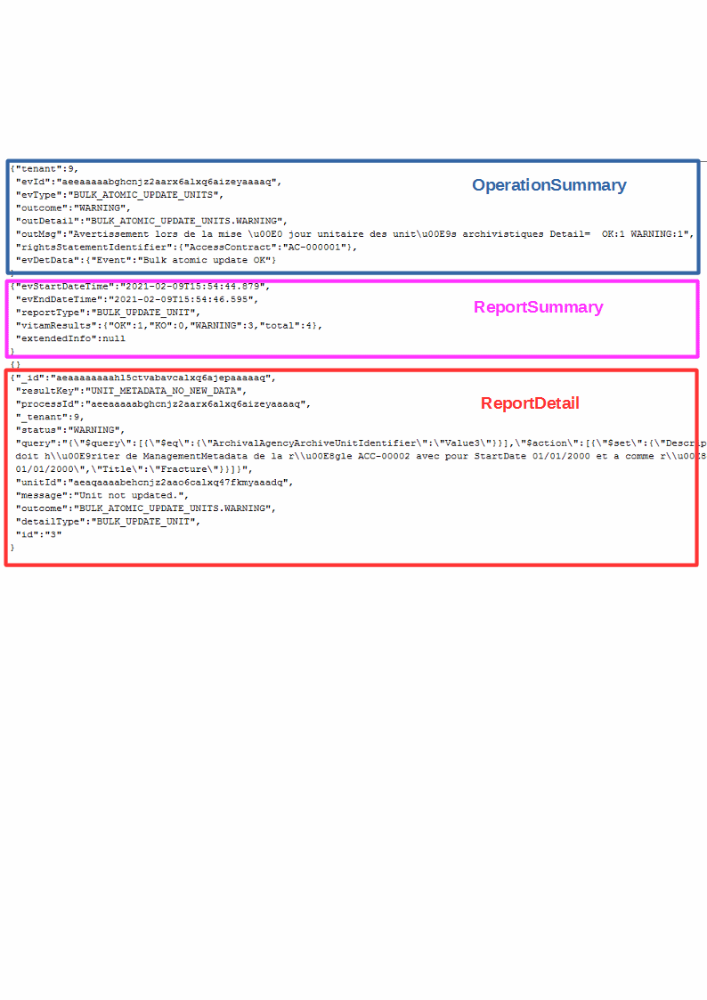

#### Détail du rapport
La partie OperationSummary, c’est-à-dire le bloc racine du rapport et correspondant au résumé de l’opération est composé des champs suivants :
- Tenant : tenant sur lequel l’opération de modification unitaire en masse a été lancée
- evId : identifiant de l’événement
- outcome : statut de l’événement
- outMsg : détail du résultat des données de l’événement
- rightsStatementIdentifier : identifiants des données référentielles en vertu desquelles l’opération peut s’exécuter.
- EvDetData : détails des données de l’événement

La partie ReportSummary, c’est-à-dire le bloc situé sous la racine du rapport et correspondant au résumé du rapport est composé des champs suivants :
- evStartDateTime : date du début de l’opération (evDateTime de l’event master de l’opération dans le journal des opérations)
- evEndDateTime : date de fin de l’opération (dernier evDateTime de l’event master de l’opération dans le journal des opérations)
- reportType : correspond au modèle du rapport. 
- vitamResults: correspond au nombre de OK, KO et WARNING de l’opération ainsi que le total de ces 3 statuts.
- ExtendedInfo : partie libre où chaque type de rapport contient des informations qui lui est propre. Ici ce champ est vide.

La partie Context est vide.

La partie ReportDetail contient les détails de l’opération de modification en masse effectuée sur chacune des unités archivistiques pour chaque requête fournie en entrée, et ce que le statut soit OK, KO ou WARNING. Les résultats sont ordonnés selon la criticité du statut (KO, puis WARNING, puis OK)
- _id : identifiant de la ligne d’erreur dans la base MongoDB
- resultKey : information sur le statut de résultat
- processId : identifiant de l’opération
- _tenant : tenant sur lequel l’opération de modification en masse a été lancée
- status : statut l’opération
- message : message exact de l’erreur ou du résultat d'exécution
- outcome : statut de l’événement
- detailType : type de rapport dans la base de données MongoDB
- query : requête liée au détail de résultat au format “String”
- id : index de la requête dans la list des requêtes
- unitId : unité archivistique impactée à la requête (présent uniquement si outcome commencer par BULK_ATOMIC_UPDATE_UNITS)

Export d’un DIP
-----
*Workflow d’export d’un DIP*

Cette section décrit le processus (workflow) d’export, utilisé lors de l’export d’un Dissemination Information Package (DIP) dans la solution logicielle Vitam.<br>
Le workflow d’export de DIP actuel mis en place dans la solution logicielle Vitam est défini dans l’unique fichier “ExportUnitWorkflow.json”. Ce fichier est disponible dans /sources/processing/processing-management/src/main/resources/workflows.<br>
Toutes les étapes, tâches et traitements sont journalisés dans le journal des opérations.et décrivent le processus (clé et description de la clé associée dans le journal des opérations) tel qu’implémenté dans la version actuelle de la solution logicielle Vitam.<br>
### Processus de création du bordereau de mise à disposition (STP_CREATE_MANIFEST)
#### Vérification des seuils de limitation de traitement des unités archivistiques CHECK_DISTRIBUTION_THRESHOLD
- **Règle** : tâche consistant à vérifier les seuils de limitation de traitement des unités archivistiques
- **Type** : bloquant
- **Statuts** :
    - OK : la vérification des seuils de limitation de traitement des unités archivistiques a bien été effectuée (CHECK_DISTRIBUTION_THRESHOLD.OK = Succès de la vérification des seuils de limitation de traitement des unités archivistiques)
    - KO : une incohérence à été détectée entre le seuil et le nombre d’unités archivistiques à traiter. (CHECK_DISTRIBUTION_THRESHOLD.KO = Échec de la vérification des seuils de limitation de traitement des unités archivistiques)
    - FATAL : une erreur technique est survenue lors de la vérification des seuils de limitation de traitement des unités archivistiques (CHECK_DISTRIBUTION_THRESHOLD.FATAL = Erreur technique lors de la vérification des seuils de limitation de traitement des unités archivistiques)
#### Création du bordereau CREATE_MANIFEST (CreateManifest.java)
- **Règle** : tâche consistant à créer le bordereau contenant les unités archivistiques soumises au service d’export de DIP, ainsi que les groupes d’objets techniques et objets qui leur sont associés
- **Type** : bloquant
- **Statuts** :
    - OK : le bordereau contenant les descriptions des unités archivistiques, groupes d’objets techniques et objets-données a été créé avec succès (CREATE_MANIFEST.OK = Succès de la création du bordereau de mise à disposition)
    - KO : la création du bordereau contenant les descriptions des unités archivistiques, groupes d’objets techniques et objets-données a échouée, car des informations étaient manquantes, erronées ou inconnues, la version du SEDA demandée est incompatible (CREATE_MANIFEST.KO = Échec de la création du bordereau de mise à disposition)
    - FATAL : une erreur technique est survenue lors de la création du bordereau (CREATE_MANIFEST.FATAL = Erreur technique lors de la création du bordereau de mise à disposition)
### Processus de déplacement des objets binaires vers l’espace de travail interne (STP_PUT_BINARY_ON_WORKSPACE)
#### Vérification de la disponibilité des ressources EXPORT_CHECK_RESOURCE_AVAILABILITY (ExportCheckResourceAvailability.java)
- **Règle** : tâche consistant à vérifier la disponibilité synchrone en lecture des objets binaires. En cas d'indisponibilité d'un ou plusieurs objets binaires l’exécution de l'étape courante est renvoyée au moteur de stockage pour ré-exécution ultérieure quand les données seront disponibles.
- **Type** : bloquant
- **Statuts** :
    - OK : les objets binaires sont disponibles (EXPORT_CHECK_RESOURCE_AVAILABILITY.OK = Succès de la vérification de la disponibilité des objets binaires sur l''offre de stockage)
    - FATAL : une erreur technique est survenue lors de la vérification de la disponibilité des objets binaires (EXPORT_CHECK_RESOURCE_AVAILABILITY.FATAL = Erreur technique lors de la vérification de la disponibilité des objets binaires sur l''offre de stockage)

#### Déplacement des objets binaires vers le workspace PUT_BINARY_ON_WORKSPACE (PutBinaryOnWorkspace.java)
- **Règle** : tâche consistant à déplacer les objets binaires mentionnés dans le bordereau vers l’espace de travail interne (« workspace »)
- **Type** : bloquant
- **Statuts** :
    - OK : les objets binaires ont été déplacés vers le workspace avec succès (PUT_BINARY_ON_WORKSPACE.OK = Succès du déplacement des objets binaires de l’offre de stockage vers l’espace de travail interne
    - KO : le déplacement des objets binaires vers le workspace a échoué car un ou plusieurs de ces objets étaient introuvables (PUT_BINARY_ON_WORKSPACE.KO = Échec du déplacement des objets binaires de l’offre de stockage vers l’espace de travail interne)
    - FATAL : une erreur technique est survenue lors du déplacement des objets binaires de l’offre de stockage vers le workspace (PUT_BINARY_ON_WORKSPACE.FATAL = Erreur technique lors du déplacement des objets binaires de l’offre de stockage vers l’espace de travail interne)

### Processus de création du DIP et de son déplacement vers l’offre de stockage (STP_STORE_MANIFEST)
Stockage du DIP STORE_MANIFEST (StoreDIP.java)
- **Règle** : tâche consistant à créer le DIP et à le déplacer vers l’offre de stockage
- **Type** : bloquant
- **Statuts** :
    - OK : le DIP a été créé et enregistré sur les offres de stockage avec succès (STORE_MANIFEST.OK = Succès du processus de la création du DIP et de son déplacement vers l’offre de stockage)
    - FATAL : une erreur technique est survenue lors de la création et de l’enregistrement du DIP sur les offres de stockage déplacement des objets binaires de stockage vers l’espace de travail interne (STORE_MANIFEST.FATAL = Erreur technique lors de la création du DIP et de son déplacement vers l’offre de stockage)
### Structure du Workflow d’export de DIP
D’une façon synthétique, le workflow est décrit de cette façon :


Élimination
----
L’élimination est un traitement de masse permettant d’évaluer dans un lot conséquent d’unités archivistiques, celles qui sont éliminables (la durée d’utilité administrative est échue et le sort final déclaré est « Détruire », arbre de positionnement, workflow d’analyse) et de procéder à leur élimination du système (workflow d’action).<br>
Ces deux étapes ne sont pas liées, l’action d’élimination peut être exécutée sans avoir lancé préalablement de phase d’analyse. La phase d’analyse peut servir à déterminer une liste d’unités archivistiques potentiellement éliminables.<br>
Toutes les étapes, tâches et traitements sont journalisées dans le journal des opérations et décrivent le processus (clé et description de la clé associée dans le journal des opérations) tel qu’implémenté dans la version actuelle de la solution logicielle Vitam.<br>

### Workflow d’analyse de l’élimination des unités archivistiques
Lors de la phase d’analyse, le système procède à une analyse du caractère éliminable ou non des unités archivistiques, en vérifiant les règles de gestion de celles-ci, qu’elles soient déclarées ou héritées. Le résultat de l’analyse consiste à calculer un statut global de l’unité archivistique au regard de son caractère éliminable, et à l’indexer, si son statut est DESTROY ou CONFLICT

#### Processus de préparation de l’analyse de l’élimination des unités archivistiques (STP_ELIMINATION_ANALYSIS_PREPARATION)
- **Règle** : tâche consistant à préparer l’analyse du caractère éliminable ou non des unités archivistiques
- **Type** : bloquant
- **Statuts** :
    - OK : la préparation de l’analyse du caractère éliminable ou non des unités archivistiques a bien été effectuée (STP_ELIMINATION_ANALYSIS_PREPARATION.OK = Succès de la préparation de l’analyse du caractère éliminable ou non des unités archivistiques)
    - KO : la préparation de l’analyse du caractère éliminable ou non des unités archivistiques n’a pas été effectuée (STP_ELIMINATION_ANALYSIS_PREPARATION.KO = Échec de la préparation de l’analyse du caractère éliminable ou non des unités archivistiques)
    - FATAL : une erreur technique est survenue lors de la préparation de l’analyse du caractère éliminable ou non des unités archivistiques (STP_ELIMINATION_ANALYSIS_PREPARATION.FATAL = Erreur technique lors de la préparation de l’analyse du caractère éliminable ou non des unités archivistiques)

##### Vérification des seuils de l’analyse de l’élimination des unités archivistiques ELIMINATION_ANALYSIS_CHECK_DISTRIBUTION_THRESHOLD
- **Règle** : tâche consistant à vérifier les seuils de l’élimination définitive des unités archivistiques
- **Type** : bloquant
- **Statuts** :
    - OK : la vérification des seuils de l’analyse de l’élimination des unités archivistiques a bien été effectuée (ELIMINATION_ANALYSIS_CHECK_DISTRIBUTION_THRESHOLD.OK = Succès de la vérification des seuils de l’analyse de l’élimination des unités archivistiques)
    - KO : une incohérence à été détectée entre le seuil et le nombre d’unités archivistiques à traiter (ELIMINATION_ANALYSIS_CHECK_DISTRIBUTION_THRESHOLD.KO = Échec de la vérification des seuils de l’analyse de l’élimination des unités archivistiques)
    - FATAL : une erreur technique est survenue lors de la vérification des seuils de l’analyse de l’élimination des unités archivistiques (ELIMINATION_ANALYSIS_CHECK_DISTRIBUTION_THRESHOLD.FATAL = Erreur technique lors de la vérification des seuils de l’analyse de l’élimination des unités archivistiques)
##### Préparation de l’analyse de l’élimination des unités archivistiques ELIMINATION_ANALYSIS_PREPARATION
- **Règle** : tâche consistant à établir la liste des unités archivistiques concernées par l’analyse en prenant en compte les règles de gestion héritées et à créer le fichier de distribution
- **Type** : bloquant
- **Statuts** :
    - OK : l’établissement de la liste des unités archivistiques concernées par l’analyse a bien été effectuée (ELIMINATION_ANALYSIS_PREPARATION.OK = Succès de la préparation de l’analyse de l’élimination des unités archivistiques)
    - KO : l’établissement de la liste des unités archivistiques concernées par l’analyse n’a pas été effectuée (ELIMINATION_ANALYSIS_PREPARATION.KO = Échec de la préparation de l’analyse de l’élimination des unités archivistiques)
    - FATAL : une erreur technique est survenue lors de l’établissement de la liste des unités archivistiques concernées par l’analyse (ELIMINATION_ANALYSIS_PREPARATION.FATAL = Erreur technique lors de la préparation de l’analyse de l’élimination des unités archivistiques)

#### Processus d’indexation de l’élimination des unités archivistiques (STP_ELIMINATION_ANALYSIS_UNIT_INDEXATION)
##### Indexation de l’analyse d’élimination des unités archivistiques ELIMINATION_ANALYSIS_UNIT_INDEXATION
- **Règle** : tâche et traitement consistant à indexer les unités archivistiques éliminables au regard de la requête lancée (échéance de la règle de durée d’utilité administrative antérieure à la date saisie dans la requête)
- **Type** : bloquant
- **Statuts** :
    - OK : l’indexation des unités archivistiques a bien été effectuée (ELIMINATION_ANALYSIS_UNIT_INDEXATION.OK = Succès de l’indexation de l’analyse du caractère éliminable ou non des unités archivistiques)
    - KO : l’indexation des unités archivistiques n’a pas été effectuée (ELIMINATION_ANALYSIS_UNIT_INDEXATION.KO = Échec lors de l’indexation de l’analyse du caractère éliminable ou non des unités archivistiques)
    - FATAL : une erreur technique est survenue lors de l’indexation des unités archivistiques (ELIMINATION_ANALYSIS_UNIT_INDEXATION.FATAL = Erreur technique lors de l’indexation du caractère éliminable ou non d’élimination des unités archivistiques)
##### Établissement de la liste des objets OBJECTS_LIST_EMPTY
- **Règle** : tâche consistant à établir la liste des objets
- **Statuts** :
    - OK : la liste des objets a été établie avec succès (OBJECTS_LIST_EMPTY.OK = Succès lors de l’établissement de la liste des objets : il n’y a pas d’objet pour cette étape)
          FATAL : une erreur technique est survenue lors de l’établissement de la liste des objets (OBJECTS_LIST_EMPTY.FATAL = Erreur technique lors de l’établissement de la liste des objets)

#### Processus de finalisation de l’analyse de l’élimination des unités archivistiques (STP_ELIMINATION_ANALYSIS_FINALIZATION)
##### Finalisation de l’analyse de l’élimination des unités archivistiques ELIMINATION_ANALYSIS_FINALIZATION
- **Règle** : tâche consistant à finaliser l’analyse du caractère éliminable ou non des unités archivistiques
- **Type** : bloquant
- **Statuts** :
    - OK : la finalisation de l’analyse du caractère éliminable ou non des unités archivistiques a bien été effectuée (ELIMINATION_ANALYSIS_FINALIZATION.OK = Succès de la finalisation de l’analyse du caractère éliminable ou non des unités archivistiques)
    - KO : la finalisation de l’analyse du caractère éliminable ou non des unités archivistiques n’a pas été effectuée (ELIMINATION_ANALYSIS_FINALIZATION.KO = Échec lors de la finalisation de l’analyse du caractère éliminable ou non des unités archivistiques)
    - FATAL : une erreur technique est survenue lors de l’analyse du caractère éliminable ou non des unités archivistiques (ELIMINATION_ANALYSIS_FINALIZATION.FATAL = Erreur technique lors de la finalisation de l’analyse du caractère éliminable ou non des unités archivistiques)
#### Structure de workflow d’analyse de l’élimination des unités archivistiques
D’une façon synthétique, le workflow est décrit de cette façon :
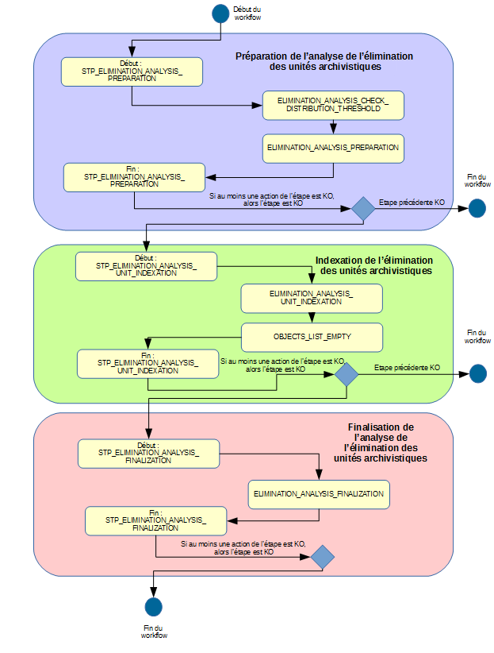

### Workflow d’élimination définitive des unités archivistiques
Lors de la phase d’analyse, le système procède d’une part à la vérification du caractère éliminable des unités archivistiques – toutes doivent avoir un statut « DESTROY » et ne pas d’avoir d’unités archivistiques non éliminables dans leur descendance –, et d’autre part à mettre en œuvre à proprement parler l’élimination.
#### Processus de préparation de l’élimination définitive des unités archivistiques (STP_ELIMINATION_ACTION_PREPARATION)
##### Vérification des processus concurrents (CHECK_CONCURRENT_WORKFLOW_LOCK)
- **Règle** : tâche consistant à détecter s’il n’y a pas d’autre processus d’élimination en cours. Si tel est le cas, le processus n’est pas lancé.
- **Type** : bloquant
- **Statuts** :
    - OK : aucun processus concurrent d’élimination n’a été détecté (CHECK_CONCURRENT_WORKFLOW_LOCK.OK = Succès de la détection de processus concurrents d’élimination)
    - KO : un processus concurrent d’élimination a été détecté (CHECK_CONCURRENT_WORKFLOW_LOCK.KO = Échec de la détection de processus concurrents d’élimination)
    - WARNING : avertissement lors de la détection de processus concurrents d’élimination (CHECK_CONCURRENT_WORKFLOW_LOCK.WARNING = Avertissement lors de la détection de processus concurrents d’élimination)
    - FATAL : une erreur technique est survenue lors de la détection de processus concurrents d’élimination (CHECK_CONCURRENT_WORKFLOW_LOCK.FATAL = Erreur technique lors de la détection de processus concurrents d’élimination)

##### Vérification des seuils de l’élimination définitive des unités archivistiques ELIMINATION_ACTION_CHECK_DISTRIBUTION_THRESHOLD
- **Règle** : tâche consistant à vérifier les seuils de traitement des unités archivistiques par rapport à la liste des unités archivistiques à traiter
- **Type** : bloquant
- **Statuts** :
    - OK : la vérification des seuils de l’élimination définitive des unités archivistiques a bien été effectuée (ELIMINATION_ACTION_CHECK_DISTRIBUTION_THRESHOLD.OK = Succès de la vérification des seuils de l’élimination définitive des unités archivistiques)
    - KO : une incohérence à été détectée entre le seuil et le nombre d’unités archivistiques à traiter (ELIMINATION_ACTION_CHECK_DISTRIBUTION_THRESHOLD.KO = Échec de la vérification des seuils de l’élimination définitive des unités archivistiques)
    - WARNING : avertissement lors de la vérification des seuils de l’élimination définitive des unités archivistiques  (ELIMINATION_ACTION_CHECK_DISTRIBUTION_THRESHOLD.WARNING = Avertissement lors de la vérification des seuils de l’élimination définitive des unités archivistiques)
    - FATAL : une erreur technique est survenue lors de la vérification des seuils de l’élimination définitive des unités archivistiques (ELIMINATION_ACTION_CHECK_DISTRIBUTION_THRESHOLD.FATAL = Erreur technique lors de la vérification des seuils de l’élimination définitive des unités archivistiques)
##### Préparation de l’élimination définitive des unités archivistiques ELIMINATION_ACTION_UNIT_PREPARATION
- **Règle** : tâche consistant à établir la liste des unités archivistiques concernées par l’analyse en prenant en compte les règles de gestion héritées – toutes doivent avoir un statut « DESTROY » et ne pas d’avoir d’unités archivistiques non éliminables dans leur descendance – et à créer le fichier de distribution 
- **Type** : bloquant
- **Statuts** :
    - OK : la préparation de l’élimination définitive des unités archivistiques a bien été effectuée (ELIMINATION_ACTION_UNIT_PREPARATION.OK = Succès de la préparation de l’élimination définitive des unités archivistiques)
    - KO : la préparation de l’élimination définitive des unités archivistiques n’a pas été effectuée (ELIMINATION_ACTION_UNIT_PREPARATION.KO = Échec de la préparation de l’élimination définitive des unités archivistiques)
    - WARNING : avertissement lors de la préparation de l’élimination définitive des unités archivistiques suite à la détection d’unités archivistiques à conserver (ELIMINATION_ACTION_UNIT_PREPARATION.WARNING = Avertissement lors de la préparation de l’élimination définitive des unités archivistiques suite à la détection d’unités archivistiques à conserver)
    - FATAL : une erreur technique est survenue lors de la préparation de l’élimination définitive des unités archivistiques (ELIMINATION_ACTION_UNIT_PREPARATION.FATAL = Erreur technique lors de la préparation de l’élimination définitive des unités archivistiques)

#### Processus d’élimination définitive des unités archivistiques éliminables (STP_ELIMINATION_ACTION_DELETE_UNIT)
##### Élimination définitive des unités archivistiques éliminables ELIMINATION_ACTION_DELETE_UNIT
- **Règle** : tâche consistant à éliminer définitivement les unités archivistiques éliminables
- **Type** : bloquant
- **Statuts** :
    - OK : l’élimination définitive des unités archivistiques éliminables a bien été effectuée (ELIMINATION_ACTION_DELETE_UNIT.OK = Succès de l’élimination définitive des unités archivistiques éliminables)
    - KO : l’élimination définitive des unités archivistiques éliminables n’a pas été effectuée (ELIMINATION_ACTION_DELETE_UNIT.KO = Échec de l’élimination définitive des unités archivistiques éliminables)
    - WARNING : avertissement lors de l’élimination définitive des unités archivistiques éliminables (STP_ELIMINATION_ACTION_DELETE_UNIT.WARNING = Avertissement lors de l’élimination définitive des unités archivistiques éliminables)
    - FATAL : une erreur technique est survenue lors de l’élimination définitive des unités archivistiques éliminables (STP_ELIMINATION_ACTION_DELETE_UNIT.FATAL = Erreur technique lors de l’élimination définitive des unités archivistiques éliminables

##### Établissement de la liste des objets OBJECTS_LIST_EMPTY
- **Règle** : tâche consistant à établir la liste des objets
- **Statuts** :
    - OK : la liste des objets a été établie avec succès (OBJECTS_LIST_EMPTY.OK = Succès lors de l’établissement de la liste des objets : il n’y a pas d’objet pour cette étape)
    - FATAL : une erreur technique est survenue lors de l’établissement de la liste des objets (OBJECTS_LIST_EMPTY.FATAL = Erreur technique lors de l’établissement de la liste des objets)

#### Processus de préparation de l’élimination définitive des groupes d’objets techniques dont toutes les unités archivistiques parentes ont été éliminées (STP_ELIMINATION_ACTION_OBJECT_GROUP_PREPARATION)

##### Préparation de l’élimination définitive des groupes d’objets techniques dont toutes les unités archivistiques parentes ont été éliminées ELIMINATION_ACTION_OBJECT_GROUP_PREPARATION

- **Règle** : tâche et traitement consistant à préparer l’élimination définitive des groupes d’objets techniques dont les unités archivistiques parentes ont été éliminées
- **Type** : bloquant
- **Statuts** :
    - OK : la préparation de l’élimination définitive des groupes d’objets techniques a bien été effectuée (ELIMINATION_ACTION_OBJECT_GROUP_PREPARATION.OK = Succès de la préparation de l’élimination définitive des groupes d’objets techniques)
    - KO : la préparation de l’élimination définitive des groupes d’objets techniques n’a pas été effectuée (ELIMINATION_ACTION_OBJECT_GROUP_PREPARATION.KO = Échec de la préparation de l’élimination définitive des groupes d’objets techniques)
    - WARNING : la préparation de l’élimination définitive des groupes d’objets techniques est en warning (ELIMINATION_ACTION_OBJECT_GROUP_PREPARATION.WARNING = Avertissement lors de la préparation de l’élimination définitive des groupes d’objets techniques)
    - FATAL : une erreur technique est survenue lors de la préparation de l’élimination définitive des groupes d’objets techniques (ELIMINATION_ACTION_OBJECT_GROUP_PREPARATION.FATAL = Erreur technique lors de la préparation de l’élimination définitive des groupes d’objets techniques

#### Processus d’élimination définitive des groupes d’objets techniques dont toutes les unités archivistiques parentes sont éliminées (STP_ELIMINATION_ACTION_DELETE_OBJECT_GROUP)
##### Élimination définitive des groupes d’objets techniques dont toutes les unités archivistiques parentes ont été éliminées ELIMINATION_ACTION_DELETE_OBJECT_GROUP
- **Règle** : tâche et traitement consistant à éliminer définitivement les groupes d’objets techniques dont toutes les unités archivistiques parentes ont été éliminées
- **Type** : bloquant
- **Statuts** :
    - OK : l’élimination définitive des groupes d’objets techniques dont les unités archivistiques parentes sont éliminées a bien été effectuée (ELIMINATION_ACTION_DELETE_OBJECT_GROUP.OK = Succès de l’élimination définitive des groupes d’objets techniques dont les unités archivistiques parentes sont éliminées)
    - KO : l’élimination définitive des groupes d’objets techniques dont les unités archivistiques parentes sont éliminées n’a pas été effectuée (ELIMINATION_ACTION_DELETE_OBJECT_GROUP.KO = Échec de l’élimination définitive des groupes d’objets techniques dont les unités archivistiques parentes sont éliminées)
    - WARNING : avertissement lors de l’élimination définitive des groupes d’objets techniques dont les unités archivistiques parentes sont éliminées (ELIMINATION_ACTION_DELETE_OBJECT_GROUP.WARNING = Avertissement lors de l’élimination définitive des groupes d’objets techniques dont les unités archivistiques parentes sont éliminées)
    - FATAL : une erreur technique est survenue lors de l’élimination définitive des groupes d’objets techniques dont les unités archivistiques parentes sont éliminées (ELIMINATION_ACTION_DELETE_OBJECT_GROUP.FATAL = Erreur technique lors de l’élimination définitive des groupes d’objets techniques dont les unités archivistiques parentes sont éliminées)
##### Établissement de la liste des objets OBJECTS_LIST_EMPTY
- **Règle** : tâche consistant à établir la liste des objets
- **Statuts** :
    - OK : le processus d’établissement de la liste des objets a été établie avec succès (OBJECTS_LIST_EMPTY.OK = Succès lors de l’établissement de la liste des objets : il n’y a pas d’objet pour cette étape)
    - FATAL : une erreur technique est survenue lors de l’établissement de la liste des objets (OBJECTS_LIST_EMPTY.FATAL = Erreur technique lors de l’établissement de la liste des objets)

#### Processus de détachement des groupes d’objets techniques dont certaines unités archivistiques parentes sont éliminées (STP_ELIMINATION_ACTION_DETACH_OBJECT_GROUP)
##### Détachement des groupes d’objets techniques dont certaines unités archivistiques parentes ont été éliminées ELIMINATION_ACTION_DETACH_OBJECT_GROUP
- **Règle** : tâche et traitement consistant à détacher les groupes d’objets techniques des unités archivistiques parentes qui ont été éliminées
- **Type** : bloquant
- **Statuts** :
    - OK : le détachement des groupes d’objets techniques dont certaines unités archivistiques parentes sont éliminées a bien été effectué (ELIMINATION_ACTION_DETACH_OBJECT_GROUP.OK = Succès du détachement des groupes d’objets techniques dont certaines unités archivistiques parentes sont éliminées)
    - KO : le détachement des groupes d’objets techniques dont certaines unités archivistiques parentes sont éliminées n’a pas été effectuée (ELIMINATION_ACTION_DETACH_OBJECT_GROUP.KO = Échec du détachement des groupes d’objets techniques dont certaines unités archivistiques parentes sont éliminées)
    - WARNING : avertissement lors du détachement des groupes d’objets techniques dont certaines unités archivistiques parentes sont éliminées (ELIMINATION_ACTION_DETACH_OBJECT_GROUP.WARNING = Avertissement lors du processus de détachement des groupes d’objets techniques dont certaines unités archivistiques parentes sont éliminées)
    - FATAL : une erreur technique est survenue lors du détachement des groupes d’objets techniques dont certaines unités archivistiques parentes sont éliminées (ELIMINATION_ACTION_DETACH_OBJECT_GROUP.FATAL = Erreur technique lors du processus de détachement des groupes d’objets techniques dont certaines unités archivistiques parentes sont éliminées)
##### Écriture des métadonnées des groupes d’objets techniques sur les offres de stockage (OG_METADATA_STORAGE)
- **Règle** : tâche et traitement consistant, en cas de détachement de groupes d’objets techniques, à écrire les métadonnées des groupes d’objets techniques sur les offres de stockage
- **Type** : bloquant
- **Statuts**
    - OK : succès de l’écriture des métadonnées des groupes d’objets techniques sur les offres de stockage (OG_METADATA_STORAGE.OK = Succès de de l’écriture des métadonnées des groupes d’objets techniques sur les offres de stockage)
    - KO : échec de l’écriture des métadonnées des groupes d’objets techniques sur les offres de stockage (OG_METADATA_STORAGE.KO = Échec de l’écriture des métadonnées des groupes d’objets techniques sur les offres de stockage)
    - FATAL : erreur technique lors de de l’écriture des métadonnées des groupes d’objets techniques sur les offres de stockage (OG_METADATA_STORAGE.FATAL = Erreur technique lors de l’écriture des métadonnées des groupes d’objets techniques sur les offres de stockage)
##### Recalcul des graphes des groupes d’objets techniques (OBJECT_GROUP_GRAPH_COMPUTE)
- **Règle** : tâche et traitement consistant, en cas de détachement de groupes d’objets techniques, à recalculer les graphes des groupes d’objets techniques.
- **Type** : bloquant
- **Statuts**
    - OK : succès de la mise à jour des graphes des groupes d’objets techniques (OBJECT_GROUP_GRAPH_COMPUTE.OK = Succès de l’étape de mise à jour des graphes des groupes d’objets techniques)
    - KO : échec de la mise à jour des graphes du groupe d’objets techniques (OBJECT_GROUP_GRAPH_COMPUTE.KO = Échec de la mise à jour des graphes des groupes d’objets techniques)
          FATAL : erreur technique lors de la mise à jour des graphes des groupes d’objets techniques (OBJECT_GROUP_GRAPH_COMPUTE.FATAL = Erreur technique lors de l’étape de mise à jour des graphes des groupes d’objets techniques)
##### Établissement de la liste des objets OBJECTS_LIST_EMPTY
- **Règle** : tâche consistant à établir la liste des objets
- **Statuts** :
    - OK : le processus d’établissement de la liste des objets a été établie avec succès (OBJECTS_LIST_EMPTY.OK = Succès lors de l’établissement de la liste des objets : il n’y a pas d’objet pour cette étape)
    - FATAL : une erreur technique est survenue lors de l’établissement de la liste des objets (OBJECTS_LIST_EMPTY.FATAL = Erreur technique lors de l’établissement de la liste des objets)

#### Processus de mise à jour du registre des fonds suite à l’élimination définitive des unités archivistiques (STP_ELIMINATION_ACTION_ACCESSION_REGISTER_PREPARATION)
##### Préparation de la mise à jour du registre des fonds suite à l’élimination définitive des unités archivistiques ELIMINATION_ACTION_ACCESSION_REGISTER_PREPARATION
- **Règle** : tâche consistant à préparer la mise à jour du registre des fonds suite à l’élimination définitive d’unités archivistiques
- **Type** : bloquant
- **Statuts** :
    - OK : la préparation du registre des fonds suite à l’élimination définitive d’unités archivistiques a bien été effectuée (ELIMINATION_ACTION_ACCESSION_REGISTER_PREPARATION.OK = Succès de la préparation du registre des fonds suite à l’élimination définitive des unités archivistiques)
    - KO : la préparation du registre des fonds suite à l’élimination définitive d’unités archivistiques n’a pas été effectuée (ELIMINATION_ACTION_ACCESSION_REGISTER_PREPARATION.KO = Échec de la préparation du registre des fonds suite à l’élimination définitive des unités archivistiques)
    - WARNING : avertissement lors de la préparation du registre des fonds suite à l’élimination définitive d’unités archivistiques (ELIMINATION_ACTION_ACCESSION_REGISTER_PREPARATION.WARNING = Avertissement lors de la préparation du registre des fonds suite à l’élimination définitive des unités archivistiques)
    - FATAL : une erreur technique est survenue lors de la préparation du registre des fonds suite à l’élimination définitive d’unités archivistiques (ELIMINATION_ACTION_ACCESSION_REGISTER_PREPARATION.FATAL = Erreur technique lors de la préparation du registre des fonds suite à l’élimination définitive des unités archivistiques)

#### Processus de mise à jour du registre des fonds suite à l’élimination définitive des unités archivistiques (STP_ELIMINATION_ACTION_ACCESSION_REGISTER_UPDATE)
##### Mise à jour du registre des fonds suite à l’élimination définitive des unités archivistiques ELIMINATION_ACTION_ACCESSION_REGISTER_UPDATE
- **Règle** : tâche consistant à mettre à jour le registre des fonds suite à l’élimination définitive d’unités archivistiques
- **Type** : bloquant
- **Statuts** :
    - OK : la mise à jour du registre des fonds suite à l’élimination définitive d’unités archivistiques a bien été effectuée (ELIMINATION_ACTION_ACCESSION_REGISTER_UPDATE.OK = Succès de la mise à jour du registre des fonds suite à l’élimination définitive d’unités archivistiques)
    - KO : la mise à jour du registre des fonds suite à l’élimination définitive d’unités archivistiques n’a pas été effectuée (ELIMINATION_ACTION_ACCESSION_REGISTER_UPDATE.KO = Échec de la mise à jour du registre des fonds suite à l’élimination définitive d’unités archivistiques)
    - WARNING : avertissement lors de la mise à jour du registre des fonds suite à l’élimination définitive d’unités archivistiques (ELIMINATION_ACTION_ACCESSION_REGISTER_UPDATE.WARNING = Avertissement lors de la mise à jour du registre des fonds suite à l’élimination définitive d’unités archivistiques)
    - FATAL : une erreur technique est survenue lors de la mise à jour du registre des fonds suite à l’élimination définitive d’unités archivistiques (ELIMINATION_ACTION_ACCESSION_REGISTER_UPDATE.FATAL = Erreur technique lors de la mise à jour du registre des fonds suite à l’élimination définitive d’unités archivistiques)
##### Établissement de la liste des objets OBJECTS_LIST_EMPTY
- **Règle** : tâche consistant à établir la liste des objets
- **Statuts** :
    - OK : le processus d’établissement de la liste des objets a été établie avec succès (OBJECTS_LIST_EMPTY.OK = Succès lors de l’établissement de la liste des objets : il n’y a pas d’objet pour cette étape)
    - FATAL : une erreur technique est survenue lors de l’établissement de la liste des objets (OBJECTS_LIST_EMPTY.FATAL = Erreur technique lors de l’établissement de la liste des objets)

#### Processus de génération du rapport d’élimination définitive des unités archivistiques (STP_ELIMINATION_ACTION_REPORT_GENERATION)
##### Génération du rapport d’élimination définitive des unités archivistiques ELIMINATION_ACTION_REPORT_GENERATION
- **Règle** : tâche consistant à générer le rapport d’élimination définitive des unités archivistiques
- **Type** : bloquant
- **Statuts** :
    - OK : la génération du rapport d’élimination définitive des unités archivistiques a bien été effectuée (ELIMINATION_ACTION_REPORT_GENERATION.OK = Succès de la génération du rapport d’élimination définitive des unités archivistiques)
    - KO : la génération du rapport d’élimination définitive des unités archivistiques n’a pas été effectuée (ELIMINATION_ACTION_REPORT_GENERATION.KO = Échec de la génération du rapport d’élimination définitive des unités archivistiques)
    - WARNING : avertissement lors de la génération du rapport d’élimination définitive des unités archivistiques (ELIMINATION_ACTION_REPORT_GENERATION.WARNING = Avertissement lors de la génération du rapport d’élimination définitive des unités archivistiques)
    - FATAL : une erreur technique est survenue lors de la génération du rapport d’élimination définitive des unités archivistiques (ELIMINATION_ACTION_REPORT_GENERATION.FATAL = Erreur technique lors de la génération du rapport d’élimination définitive des unités archivistiques)

#### Processus de finalisation de l’élimination définitive des unités archivistiques (STP_ELIMINATION_ACTION_FINALIZATION)
##### Finalisation de l’élimination définitive des unités archivistiques ELIMINATION_ACTION_FINALIZATION
- **Règle** : tâche consistant à finaliser l’élimination définitive des unités archivistiques
- **Type** : bloquant
- **Statuts** :
    - OK : La finalisation de l’élimination définitive des unités archivistiques a bien été effectuée (ELIMINATION_ACTION_FINALIZATION.OK = Succès de la finalisation de l’élimination définitive des unités archivistiques)
    - KO : La finalisation de l’élimination définitive des unités archivistiques n’a pas été effectuée (ELIMINATION_ACTION_FINALIZATION.KO = Échec de la finalisation de l’élimination définitive des unités archivistiques)
    - WARNING : avertissement lors de la finalisation de l’élimination définitive des unités archivistiques (ELIMINATION_ACTION_FINALIZATION.WARNING = Avertissement lors de la finalisation de l’élimination définitive des unités archivistiques)
    - FATAL : une erreur technique est survenue lors de la finalisation de l’élimination définitive des unités archivistiques (ELIMINATION_ACTION_FINALIZATION.FATAL = Erreur technique lors de la finalisation de l’élimination définitive des unités archivistiques)
#### Structure du workflow d’analyse des éliminables et action d’élimination
D’une façon synthétique, le workflow est décrit de cette façon :
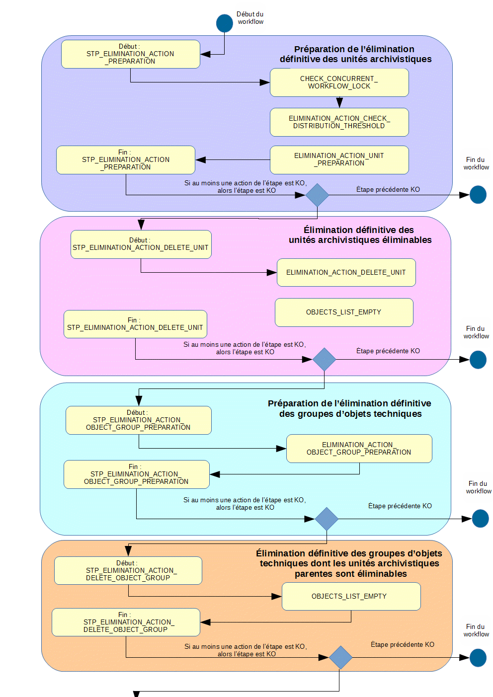
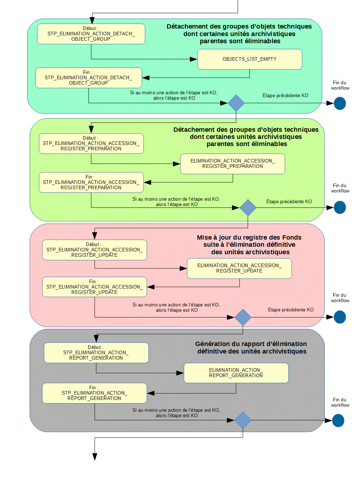


#### Rapport d’élimination
Le rapport d’élimination est un fichier JSON généré par la solution logicielle Vitam lorsqu’une opération d’élimination se termine. Cette section décrit la manière dont ce rapport est structuré.
##### Exemple de JSON : rapport d’élimination
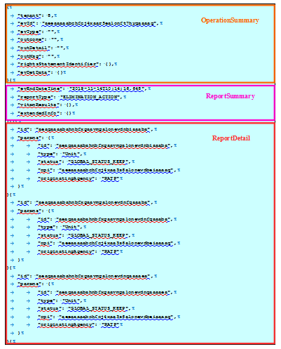


##### Détails du rapport
La partie « OperationSummary » c’est-à-dire le bloc racine du rapport et correspondant au résumé de l’opération est composé des champs suivants : 
-« Tenant » : tenant sur lequel l’opération de modification en masse a été lancée
-« evId »:identifiant de l’événement
-« outcome » : statut de l’événement
-« outMsg » : détail du résultat des données de l’événement
-« rightsStatementIdentifier » : identifiant des données référentielles en vertu desquelles l’opération peut s’exécuter. 
-« evDetData » : détails des données de l’événement

La partie « ReportSummary » c’est-à-dire le bloc situé sous la racine du rapport et correspondant au résumé du rapport est composé des champs suivants : 
-« evStartDateTime »:date du début de l’opération (evDateTime de l’event master de l’opération dans le journal des opérations)
-« evEndDateTime » : date de fin de l’opération (dernier evDateTime de l’event master de l’opération dans le journal des opérations)
-« reportType » : corresponds au modèle du rapport.
-« vitamResults » : corresponds au nombre de OK, KO et warning de l’opération ainsi que le total de ces 3 statuts.
-« extendedInfo » : partie libre où chaque type de rapport contient des informations qui lui est propre. Ici ce champ est vide. 

La partie « ReportDetail » contient les détails de l’opération d’élimination effectuée sur chacune des unités archivistiques.<br>
- « _id » : identifiant de l’unité archivistique ou de l’objet sur lequel l’action d’élimination s’est effectuée.
- « params » : informations sur l’unité archivistique ou le groupe d’objet
    - « id » : identifiant de l’unité archivistique ou de l’objet
    - « type » : collection sur laquelle l’opération à été réalisée (UNIT ou OBJECTGROUP)
    - « status » : statut au regard de l’action d’élimination :
        - GLOBAL_STATUS_KEEP : unité archivistique non éliminable au regard des règles de gestion.
        - GLOBAL_STATUS_CONFLICT : unité archivistique portant des règles contradictoires
        - NOT_DESTROYABLE_HAS_CHILD_UNITS : unité non supprimable, car elle a des enfants et sa suppression entraînerait une incohérence dans le graphe.
        - DELETED : l’unité a effectivement été supprimée
    - « opi » : identifiant de l’opération d’entrée
    - « originatingAgency » : service producteur
    - « objectIds » : identifiant du groupe d'objets techniques rattaché à l’unité archivistique
-
Modification d’arborescence (Reclassification)
-----
Workflow de modification d’arborescence 

Cette section décrit le processus permettant la modification d’arborescence d’archives, c’est-à-dire de modifier les rattachements d’une unité archivistique présente dans le système.<br>
Le processus de modification d’arborescence est lié à des ajouts et des suppressions de liens de parenté, en sachant que les unités archivistiques modifiées ou rattachées doivent être accessibles par le même contrat d’accès.<br>
Toutes les étapes, tâches et traitements sont journalisés dans le journal des opérations et décrivent le processus (clé et description de la clé associée dans le journal des opérations) tel qu’implémenté dans la version actuelle de la solution logicielle Vitam.<br>
### Étape de préparation de la modification d’arborescence des unités archivistiques STP_RECLASSIFICATION_PREPARATION
- **Règle** : étape de préparation de la modification d’arborescence des unités archivistiques
- **Type** : bloquant
- **Statuts**
    - OK : l’étape de préparation de la modification d’arborescence des unités archivistiques a bien été effectué (STP_RECLASSIFICATION_PREPARATION.OK = Succès du processus de préparation de la modification d “arborescence des unités archivistiques)
    - KO : erreur lors de la préparation de la modification d’arborescence des unités archivistiques n’a pas été effectué (STP_RECLASSIFICATION_PREPARATION.KO = Échec du processus de préparation de la modification d’arborescence des unités archivistiques)
    - FATAL : erreur technique a eu lieu lors de l’étape de préparation de la modification d’arborescence des unités archivistiques (STP_RECLASSIFICATION_PREPARATION.FATAL = Erreur technique lors du processus de préparation de la modification d’arborescence des unités archivistiques)
#### Vérification des processus concurrents CHECK_CONCURRENT_WORKFLOW_LOCK
- **Règle** : tâche ayant pour but de détecter s’il n’y a pas d’autre processus de modification d’arborescence en cours. Si tel est le cas, le processus n’est pas lancé afin d’éviter les cycles rattachements/détachements concernant plusieurs unités archivistiques.
- **Type** : bloquant
- **Statuts** :
    - OK : aucun processus concurrent de modification d’arborescence n’a été détecté (CHECK_CONCURRENT_WORKFLOW_LOCK.OK = Succès de la vérification des processus concurrents)
    - KO : un processus concurrent de modification d’arborescence a été détecté (CHECK_CONCURRENT_WORKFLOW_LOCK.KO = Échec lors de la vérification des processus concurrents)
    - FATAL : une erreur technique est survenue lors de la détection de processus concurrents de modification d’arborescence  (CHECK_CONCURRENT_WORKFLOW_LOCK.FATAL = Erreur technique lors de la détection de processus concurrents de modification d’arborescence)
#### Chargement des unités archivistiques : RECLASSIFICATION_PREPARATION_LOAD_REQUEST
- **Règle** : tâche consistant à charger les unités archivistiques
- **Type** : bloquant
- **Statuts** :
    - OK : le chargement des unités archivistiques a bien été effectué (RECLASSIFICATION_PREPARATION_LOAD_REQUEST.OK = Succès du chargement des unités archivistiques au moment de la modification d’arborescence des unités archivistiques)
    - KO : le chargement des unités archivistiques n’a pas pu s’effectuer (RECLASSIFICATION_PREPARATION_LOAD_REQUEST.KO = Échec du chargement des unités archivistiques au moment de la modification d’arborescence des unités archivistiques)
    - FATAL : une erreur technique est survenue lors du chargement des unités archivistiques (RECLASSIFICATION_PREPARATION_LOAD_REQUEST.FATAL = Erreur technique lors du chargement des unités archivistiques au moment de la modification d’arborescence des unités archivistiques)
#### Vérification de la cohérence du graphe : RECLASSIFICATION_PREPARATION_CHECK_GRAPH
- **Règle** : tâche consistant à vérifier que le graphe est cohérent, c’est-à-dire à vérifier que les rattachements s’effectuent de façon cohérente entre les différents types d’unités archivistiques : arbre de positionnement, plan de classement,  unités simples
- **Type** : bloquant
- **Statuts** :
    - OK : le graphe des unités archivistiques est cohérent  (RECLASSIFICATION_PREPARATION_CHECK_GRAPH.OK = Succès du contrôle de cohérence du graphe au moment de la modification d’arborescence des unités archivistiques)
    - KO : le graphe de l’arborescence des unités archivistiques est incohérent (RECLASSIFICATION_PREPARATION_CHECK_GRAPH.KO = Échec du contrôle de cohérence du graphe au moment de la modification d’arborescence des unités archivistiques)
    - FATAL : une erreur technique est survenue lors du contrôle de cohérence du graphe des unités archivistiques (RECLASSIFICATION_PREPARATION_CHECK_GRAPH.FATAL = Erreur technique lors du contrôle de cohérence du graphe au moment de la modification d’arborescence des unités archivistiques)
#### Préparation de la mise à jour du graphe : RECLASSIFICATION_PREPARATION_UPDATE_DISTRIBUTION
- **Règle** : tâche consistant à préparer la mise à jour du graphe des unités archivistiques
- **Type** : bloquant
- **Statuts** :
    - OK : la mise à jour du graphe au moment de la modification d’arborescence des unités a bien été préparée (RECLASSIFICATION_PREPARATION_UPDATE_DISTRIBUTION.OK = Succès de la préparation de la mise à jour du graphe au moment de la modification d’arborescence des unités archivistiques)
    - KO : la mise à jour du graphe au moment de la modification d’arborescence des unités n’a pas pu être préparée (RECLASSIFICATION_PREPARATION_UPDATE_DISTRIBUTION.KO = Échec lors de la préparation de la mise à jour du graphe au moment de la modification d’arborescence des unités archivistiques)
    - FATAL : une erreur technique est survenue lors de la préparation de la mise à jour du graphe (RECLASSIFICATION_PREPARATION_UPDATE_DISTRIBUTION.FATAL = Erreur technique lors de la préparation de la mise à jour du graphe au moment de la modification d’arborescence des unités archivistiques)

### Étape de détachement des unités archivistiques (STP_UNIT_DETACHMENT)
- **Règle** : étape consistant à supprimer des liens entre unités archivistiques
- **Type** : bloquant
- **Statuts**
    - OK : la suppression de liens entre unités archivistiques a bien été effectué (STP_UNIT_DETACHMENT.OK = Succès de l’étape de suppression de liens entre unités archivistiques)
    - KO :  la suppression de liens entre unités archivistiques n’a pas pu s’effectuer (STP_UNIT_DETACHMENT.KO = Échec lors de l’étape de suppression de liens entre unités archivistiques)
    - FATAL : une erreur technique est survenue lors de la la suppression de liens entre unités archivistiques (STP_UNIT_DETACHMENT.FATAL = Erreur technique lors de l’étape de suppression de liens entre unités archivistiques)
#### Détachement des unités archivistiques UNIT_DETACHMENT
- **Règle** : tâche ou traitement consistant à supprimer des liens entre unités archivistiques
- **Type** : bloquant
- **Statuts** :
    - OK : la suppression de liens entre unités archivistiques a bien été effectué (UNIT_DETACHMENT.OK = Succès de la suppression de liens entre unités archivistiques)
    - KO : la suppression de liens entre des unités archivistiques n’a pas pu s’effectuer (UNIT_DETACHMENT.KO = Échec lors de la suppression de liens entre les unités archivistiques)
    - FATAL : une erreur technique est survenue lors de la suppression de liens entre unités archivistiques (UNIT_DETACHMENT.FATAL = Erreur technique lors de la suppression de liens entre unités archivistiques)
#### Enregistrement des métadonnées des unités archivistiques sur l’offre de stockage UNIT_METADATA_STORAGE
- **Règle** : tâche consistant à enregistrer les métadonnées des unités archivistiques sur les offres de stockage
- **Type** : bloquant
- **Statuts** :
    - OK : l’enregistrement des métadonnées des unités archivistiques sur les offres de stockage a bien été effectué (UNIT_METADATA_STORAGE.OK = Succès de l’enregistrement des métadonnées des unités archivistiques sur les offres de stockage)
    - KO : l’enregistrement des métadonnées des unités archivistiques sur les offres de stockage n’a pas pu s’effectuer (UNIT_METADATA_STORAGE.KO = Échec de l’enregistrement des métadonnées des unités archivistiques sur les offres de stockage)
    - FATAL : une erreur technique est survenue lors de l’enregistrement des métadonnées des unités archivistiques sur les offres de stockage (UNIT_METADATA_STORAGE.FATAL = Erreur technique lors de l’enregistrement des métadonnées des unités archivistiques sur les offres de stockage)
#### Établissement de la liste des objets OBJECTS_LIST_EMPTY
- **Règle** : tâche consistant à établir la liste des objets, en cas d’absence de liens à supprimer
- **Statuts** :
    - OK : la liste des objets a été établie avec succès (OBJECTS_LIST_EMPTY.OK = Succès lors de l’établissement de la liste des objets : il n’y a pas d’objet pour cette étape)
    - FATAL : une erreur technique est survenue lors de l’établissement de la liste des objets (OBJECTS_LIST_EMPTY.FATAL = Erreur technique lors de l’établissement de la liste des objets)

### Processus de rattachement des unités archivistiques STP_UNIT_ATTACHMENT
- **Règle** : étape consistant à établir des liens entre unités archivistiques
- **Type** : bloquant
- **Statuts**
    - OK : l’établissement de liens entre unités archivistiques a bien été effectué (STP_UNIT_ATTACHMENT.OK = Succès du processus d’établissement de liens entre unités archivistiques)
    - KO : l’établissement de liens entre unités archivistiques n’a pas pu s’effectuer (STP_UNIT_ATTACHMENT.KO = Échec du processus d’établissement de liens entre unités archivistiques)
    - FATAL : Erreur technique lors de l’établissement de liens entre unités archivistiques (STP_UNIT_ATTACHMENT.FATAL = Erreur technique lors du processus d’établissement de liens entre unités archivistiques)
#### Processus de rattachement des unités archivistiques : UNIT_ATTACHMENT
- **Règle** : tâche et traitement consistant à établir des liens entre unités archivistiques
- **Type** : bloquant
- **Statuts** :
    - OK : l’établissement de liens entre unités archivistiques a bien été effectué (UNIT_ATTACHMENT.OK = Succès de l’’établissement de liens entre unités archivistiques)
    - KO : l’établissement de liens entre unités archivistiques n’a pas pu s’effectuer (UNIT_ATTACHMENT.KO = Échec lors de l’’établissement de liens entre unités archivistiques)
    - FATAL : Erreur technique lors de l’établissement de liens entre unités archivistiques (UNIT_ATTACHMENT.FATAL = Erreur technique lors de l’établissement de liens entre unités archivistiques)
#### Enregistrement des métadonnées des unités archivistiques sur l’offre de stockage UNIT_METADATA_STORAGE
- **Règle** : tâche consistant à enregistrer les métadonnées des unités archivistiques sur les offres de stockage
- **Type** : bloquant
- **Statuts** :
    - OK : l’enregistrement des métadonnées des unités archivistiques sur les offres de stockage a bien été effectué (UNIT_METADATA_STORAGE.OK = Succès de l’enregistrement des métadonnées des unités archivistiques sur les offres de stockage)
    - KO : l’enregistrement des métadonnées des unités archivistiques n’a pas pu s’effectuer sur les offres de stockage  (UNIT_METADATA_STORAGE.KO = Échec de l’enregistrement des métadonnées des unités archivistiques sur les offres de stockage)
    - FATAL : une erreur technique est survenue lors de l’enregistrement des métadonnées des unités archivistiques sur les offres de stockage (UNIT_METADATA_STORAGE.FATAL = Erreur technique lors de l’enregistrement des métadonnées des unités archivistiques sur les offres de stockage)
#### Établissement de la liste des objets OBJECTS_LIST_EMPTY
- **Règle** : tâche consistant à établir la liste des objets, en cas d’absence de liens à ajouter
- **Statuts** :
    - OK : la liste des objets a été établie avec succès (OBJECTS_LIST_EMPTY.OK = Succès lors de l’établissement de la liste des objets : il n’y a pas d’objet pour cette étape)
    - FATAL : une erreur technique est survenue lors de l’établissement de la liste des objets (OBJECTS_LIST_EMPTY.FATAL = Erreur technique lors de l’établissement de la liste des objets)

### Mise à jour des graphes des unités archivistiques STP_UNIT_GRAPH_COMPUTE
- **Règle** : étape consistant à recalculer le graphe des unités archivistiques
- **Type** : bloquant
- **Statuts**
    - OK : la mise à jour des graphes des unités archivistiques a bien été effectuée (STP_UNIT_GRAPH_COMPUTE.OK = Succès du processus de mise à jour des graphes des unités archivistiques)
    - KO : la mise à jour des graphes des unités archivistiques n’a pas pu s’effectuer (STP_UNIT_GRAPH_COMPUTE.KO = Échec lors du processus de mise à jour des graphes des unités archivistiques)
    - FATAL : une erreur technique est survenue lors de la mise à jour des graphes des unités archivistiques (STP_UNIT_GRAPH_COMPUTE.FATAL = Erreur technique lors du processus de mise à jour des graphes des unités archivistiques)
Calcul du graphe des unités archivistiques : UNIT_GRAPH_COMPUTE
- **Règle** : tâche consistant à recalculer le graphe des unités archivistiques
- **Type** : bloquant
- **Statuts** :
    - OK : la mise à jour des graphes des unités archivistiques a bien été effectuée (UNIT_GRAPH_COMPUTE.OK = Succès de la mise à jour des graphes des unités archivistiques)
    - KO : la mise à jour des graphes des unités archivistiques n’a pas pu s’effectuer (UNIT_GRAPH_COMPUTE.KO = échec de la mise à jour des graphes des unités archivistiques)
    - FATAL : une erreur technique est survenue lors de la mise à jour des graphes des unités archivistiques (UNIT_GRAPH_COMPUTE.FATAL = Erreur technique lors de la mise à jour des graphes des unités archivistiques)

### Mise à joue des graphes des groupes d’objets STP_OBJECT_GROUP_GRAPH_COMPUTE
- **Règle** : étape consistant à recalculer le graphe des groupes d’objets.
- **Type** : bloquant
- **Statuts**
    - OK : le processus  de mise à jour des graphes des groupes d’objets techniques a bien été effectué (STP_OBJECT_GROUP_GRAPH_COMPUTE.OK = Succès de l’étape de mise à jour des graphes des groupes d’objets techniques)
    - KO : le processus de mise à jour de mise à jour des graphes du groupe d’objets techniques n’a pas pu s’effectuer (STP_OBJECT_GROUP_GRAPH_COMPUTE.KO = Échec de l’étape de mise à jour des graphes du groupe d’objets techniques)
    - FATAL : erreur technique lors du processus de mise à jour des graphes du groupe d’objets techniques (STP_OBJECT_GROUP_GRAPH_COMPUTE.FATAL = Erreur technique lors de l’étape de mise à jour des graphes du groupe d’objets techniques)
Calcul des graphes des groupes d’objets (OBJECT_GROUP_GRAPH_COMPUTE)
- **Règle** : tâche ou traitement consistant à recalculer le graphe des groupes d’objets.
- **Type** : bloquant
- **Statuts**
    - OK : la mise à jour des graphes du groupe d’objets techniques a bien été effectuée (OBJECT_GROUP_GRAPH_COMPUTE.OK = Succès de l’étape de mise à jour des graphes des groupes d’objets techniques)
    - KO : la mise à jour des graphes du groupe d’objets techniques n’a pas pu s’effectuer (OBJECT_GROUP_GRAPH_COMPUTE.KO = Échec de l’étape de mise à jour des graphes des groupes d’objets techniques)
    - FATAL : erreur technique lors de la mise à jour des graphes des groupes d’objets techniques (OBJECT_GROUP_GRAPH_COMPUTE.FATAL = Erreur technique lors de l’étape de mise à jour des graphes du groupe d’objets techniques)
### Finalisation de la modification d’arborescence des unités archivistiques (STP_RECLASSIFICATION_FINALIZATION)
- **Règle** : étape consistant à finaliser le processus de modification d’arborescence pour des unités archivistiques présentes dans le système
- **Type** : bloquant
- **Statuts**
    - OK : le processus de finalisation de la modification d’arborescence des unités archivistiques a été effectué (STP_RECLASSIFICATION_FINALIZATION.OK = Succès du processus de finalisation de la modification d’arborescence des unités archivistiques)
    - KO : le processus de finalisation de la modification d’arborescence des unités archivistiques n’a pas pu être effectué (STP_RECLASSIFICATION_FINALIZATION.KO = Échec du processus de finalisation de la modification d’arborescence des unités archivistiques)
    - FATAL : erreur technique lors du processus de finalisation de la modification d’arborescence des unités archivistiques (STP_RECLASSIFICATION_FINALIZATION.FATAL = Erreur technique lors du processus de finalisation de la modification d’arborescence des unités archivistiques)
Finalisation de la modification d’arborescence des unités archivistiques (RECLASSIFICATION_FINALIZATION)
- **Règle** : tâche consistant à finaliser le processus de modification d’arborescence pour des unités archivistiques existantes dans le système.
- **Type** : bloquant
- **Statuts**
    - OK : la finalisation de la modification d’arborescence des unités archivistiques a bien été effectuée (RECLASSIFICATION_FINALIZATION.OK = Succès de la finalisation de la modification d’arborescence des unités archivistiques)
    - KO : la finalisation de la modification d’arborescence des unités archivistiques n’a pas pu être effectuée (RECLASSIFICATION_FINALIZATION.KO = Échec lors de la finalisation de la modification d’arborescence des unités archivistiques)
    - FATAL : erreur technique lors de la mise à jour des graphes du groupe d’objets (RECLASSIFICATION_FINALIZATION.FATAL = Erreur technique lors de la finalisation de la modification d’arborescence des unités archivistiques)

### Structure de workflow de modification d’arborescence
D’une façon synthétique, le workflow est décrit de cette façon :


Transfert
----
### Workflow de préparation du transfert des unités archivistiques et des groupes d’objets
Cette section décrit le processus (workflow) de préparation du transfert mis en œuvre dans la solution logicielle Vitam.
Toutes les étapes, tâches et traitements sont journalisées dans le journal des opérations et décrivent le processus (clé et description de la clé associée dans le journal des opérations) tel qu’implémenté dans la version actuelle de la solution logicielle Vitam.
#### Processus de création du bordereau de mise à disposition (STP_CREATE_MANIFEST)
##### Vérification du seuil de limitation de traitement des unités archivistiques CHECK_DISTRIBUTION_THRESHOLD
- **Règle** : tâche consistant à vérifier les seuils de limitation de traitement des unités archivistiques
- **Type** : bloquant
- **Statuts** :
    - OK : la vérification des seuils de limitation de traitement des unités archivistiques a bien été effectuée (CHECK_DISTRIBUTION_THRESHOLD.OK = Succès de la vérification des seuils de limitation de traitement des unités archivistiques)
    - KO : une incohérence à été détectée entre le seuil et le nombre d’unités archivistiques à traiter. (CHECK_DISTRIBUTION_THRESHOLD.KO = Échec de la vérification des seuils de limitation de traitement des unités archivistiques)
    - FATAL : une erreur technique est survenue lors de la vérification des seuils de limitation de traitement des unités archivistiques (CHECK_DISTRIBUTION_THRESHOLD.FATAL = Erreur technique lors de la vérification des seuils de limitation de traitement des unités archivistiques)
##### Création du bordereau CREATE_MANIFEST (CreateManifest.java)
- **Règle** : tâche consistant à créer le bordereau contenant les unités archivistiques soumises au service de préparation du transfert, ainsi que les groupes d’objets techniques et objets qui leur sont associés
- **Type** : bloquant
- **Statuts** :
    - OK : le bordereau contenant les descriptions des unités archivistiques, groupes d’objets techniques et objets-données a été créé avec succès (CREATE_MANIFEST.OK = Succès de la création du bordereau de mise à disposition)
    - KO : la création du bordereau contenant les descriptions des unités archivistiques, groupes d’objets techniques et objets-données a échouée, car des informations étaient manquantes, erronées ou inconnues, la version du SEDA demandée est incompatible (CREATE_MANIFEST.KO = Échec de la création du bordereau de mise à disposition)
    - FATAL : une erreur technique est survenue lors de la création du bordereau (CREATE_MANIFEST.FATAL = Erreur technique lors de la création du bordereau de mise à disposition)

#### Processus de déplacement des objets binaires vers l’espace de travail interne (STP_PUT_BINARY_ON_WORKSPACE)
##### Vérification de la disponibilité des ressources EXPORT_CHECK_RESOURCE_AVAILABILITY (ExportCheckResourceAvailability.java)
- **Règle** : tâche consistant à vérifier la disponibilité synchrone en lecture des objets binaires. En cas d'indisponibilité d'un ou plusieurs objets binaires l’exécution de l'étape courante est renvoyée au moteur de stockage pour ré-exécution ultérieure quand les données seront disponibles.
- **Type** : bloquant
- **Statuts** :
    - OK : les objets binaires sont disponibles (EXPORT_CHECK_RESOURCE_AVAILABILITY.OK = Succès de la vérification de la disponibilité des objets binaires sur l'offre de stockage)
    - FATAL : une erreur technique est survenue lors de la vérification de la disponibilité des objets binaires (EXPORT_CHECK_RESOURCE_AVAILABILITY.FATAL = Erreur technique lors de la vérification de la disponibilité des objets binaires sur l'offre de stockage)

##### Déplacement des objets binaires vers le workspace PUT_BINARY_ON_WORKSPACE (PutBinaryOnWorkspace.java)
- **Règle** : tâche consistant à déplacer les objets binaires mentionnés dans le bordereau vers l’espace de travail interne (« workspace »)
- **Type** : bloquant
- **Statuts** :
    - OK : les objets binaires ont été déplacés vers le workspace avec succès (PUT_BINARY_ON_WORKSPACE.OK = Succès du déplacement des objets binaires de l’offre de stockage vers l’espace de travail interne)
    - KO : le déplacement des objets binaires vers le workspace a échoué car un ou plusieurs de ces objets étaient introuvables (PUT_BINARY_ON_WORKSPACE.KO = Échec du déplacement des objets binaires de l’offre de stockage vers l’espace de travail interne)
    - FATAL : une erreur technique est survenue lors du déplacement des objets binaires de l’offre de stockage vers le workspace (PUT_BINARY_ON_WORKSPACE.FATAL = Erreur technique lors du déplacement des objets binaires de l’offre de stockage vers l’espace de travail interne)

#### Processus de création du SIP de transfert et de son déplacement vers l’offre de stockage (STP_STORE_MANIFEST)
- **Règle** : tâche consistant à créer le SIP de transfert et à le déplacer vers l’offre de stockage
- **Type** : bloquant
- **Statuts** :
    - OK : le SIP de transfert a été créé et enregistré sur les offres de stockage avec succès (STP_STORE_MANIFEST.OK = Succès du processus de création de l’archive et de son déplacement vers l’offre de stockage)
    - FATAL : une erreur technique est survenue lors de la création et de l’enregistrement du SIP de transfert sur les offres de stockage déplacement des objets binaires de stockage vers l’espace de travail interne (STORE_MANIFEST.FATAL = Erreur technique lors du processus de création de l’archive et de son déplacement vers l’offre de stockage)

#### Structure du Workflow de préparation du transfert des unités archivistiques et des groupes d’objets
D’une façon synthétique, le workflow est décrit de cette façon :


#### Rapport de préparation du transfert
##### Exemple de fichier JSONL : rapport de préparation du transfert
``````
{}
{"DslQuery":{"$roots":[],"$query":[{"$eq":{"#operations":"aeeaaaaaa2hfcj4xaa3s6alonev5kgiaaaaq"},"$depth":1000}],"$filter":{},"$projection":{},"$facets":[]}}

{"id":"aeaqaaaaayhnbfxgaavmgalonev5x4iaaabq","status":"ALREADY_IN_TRANSFER"}
{"id":"aeaqaaaaayhnbfxgaavmgalonev5x4iaaada","status":"ALREADY_IN_TRANSFER"}
{"id":"aeaqaaaaayhnbfxgaavmgalonev5x4aaaabq","status":"ALREADY_IN_TRANSFER"}
{"id":"aeaqaaaaayhnbfxgaavmgalonev5x4iaaaea","status":"ALREADY_IN_TRANSFER"}
{"id":"aeaqaaaaayhnbfxgaavmgalonev5x4aaaada","status":"ALREADY_IN_TRANSFER"}
{"id":"aeaqaaaaayhnbfxgaavmgalonijd6hyaaaaq","status":"OK"} 
``````

##### Détail du rapport
La partie « Context » correspond au contexte dans lequel l’opération de préparation du transfert a été effectué sur un lot et destiné à créer la distribution sur chaque unité archivistique.

La partie « ReportDetail » contient les détails de l’opération de préparation du transfert sur les unités archivistiques.
- « _id » : identifiant de l’unité archivistique ayant fait l’objet d’une demande de transfert;
- « status » : statut au regard de l’action de préparation du transfert :
    - ALREADY_IN_TRANSFER : unité archivistique ayant déjà subi une demande de transfert.
    - OK : unité archivistique faisant bien partie du paquet à transférer.

### Workflow d’acquittement du transfert des unités archivistiques et des groupes d’objets
Cette section décrit le processus (workflow) d’acquittement du transfert mis en œuvre dans la solution logicielle Vitam.
Toutes les étapes, tâches et traitements sont journalisées dans le journal des opérations et décrivent le processus (clé et description de la clé associée dans le journal des opérations) tel qu’implémenté dans la version actuelle de la solution logicielle Vitam.

#### Processus de préparation de l'acquittement du transfert (STP_TRANSFER_REPLY_PREPARATION)
##### Vérification de l'ATR de l’acquittement du transfert VERIFY_ARCHIVAL_TRANSFER_REPLY
- **Règle** : tâche consistant à vérifier l'ATR de l’acquittement du transfert
- **Type** : bloquant
- **Statuts** :
    - OK : la vérification de l'ATR de l’acquittement du transfert a bien été effectuée. (VERIFY_ARCHIVAL_TRANSFER_REPLY.OK = Succès de la vérification de l'ATR de l’acquittement du transfert)
    - KO : la vérification de l'ATR de l’acquittement du transfert n’a pas été effectuée. (VERIFY_ARCHIVAL_TRANSFER_REPLY.KO = Échec de la vérification de l'ATR de l’acquittement du transfert)
    - FATAL : une erreur technique est survenue lors de la vérification de l'ATR de l’acquittement du transfert (VERIFY_ARCHIVAL_TRANSFER_REPLY..FATAL = Erreur technique lors de la vérification de l'ATR de l’acquittement du transfert)
##### Sauvegarde de l'ATR de l'acquittement du transfert SAVE_ARCHIVAL_TRANSFER_REPLY
- **Règle** : tâche consistant à sauvegarder l'ATR de l’acquittement du transfert
- **Type** : bloquant
- **Statuts** :
    - OK : la sauvegarde de l'ATR de l’acquittement du transfert a bien été effectuée. (SAVE_ARCHIVAL_TRANSFER_REPLY.OK = Succès de la sauvegarde de l'ATR de l’acquittement du transfert)
    - KO : la sauvegarde de l'ATR de l’acquittement du transfert n’a pas été effectuée. (SAVE_ARCHIVAL_TRANSFER_REPLY.KO = Échec de la sauvegarde de l'ATR de l’acquittement du transfert)
    - FATAL : une erreur technique est survenue lors de la sauvegarde de l'ATR de l’acquittement du transfert (SAVE_ARCHIVAL_TRANSFER_REPLY.FATAL = Erreur technique lors de la sauvegarde de l'ATR de l’acquittement du transfert)
##### Vérification du statut de l’ATR et stockage sur l’espace de travail CHECK_ATR_AND_ADD_IT_TO_WORKSPACE
- **Règle** : tâche consistant à vérifier le statut de l’ATR et procéder au stockage sur l’espace de travail.
- **Type** : bloquant
- **Statuts** :
    - OK : la vérification du statut de l’ATR et le stockage sur l’espace de travail à bien été effectué (CHECK_ATR_AND_ADD_IT_TO_WORKSPACE.OK = Succès de la vérification du statut de l’ATR et du stockage sur l’espace de travail)
    - KO : la vérification du statut de l’ATR et le stockage sur l’espace de travail n’a pas été effectuée. (CHECK_ATR_AND_ADD_IT_TO_WORKSPACE.KO = Échec de la vérification du statut de l’ATR et du stockage sur l’espace de travail)
    - FATAL : une erreur technique est survenue lors de la vérification du statut de l’ATR et du stockage sur l’espace de travail (CHECK_ATR_AND_ADD_IT_TO_WORKSPACE.FATAL = Erreur technique lors de la vérification du statut de l’ATR et du stockage sur l’espace de travail)
##### Préparation des unités archivistiques à purger TRANSFER_REPLY_UNIT_PREPARATION
- **Règle** : tâche consistant préparer les unités archivistiques à purger
- **Type** : bloquant
- **Statuts** :
    - OK : la préparation des unités archivistiques à purger à bien été effectué (TRANSFER_REPLY_UNIT_PREPARATION.OK = Succès de la préparation des unités archivistiques à purger)
    - KO : la préparation des unités archivistiques à purger n’a pas été effectué (TRANSFER_REPLY_UNIT_PREPARATION.KO = Échec de la préparation des unités archivistiques à purger
    - FATAL : une erreur technique est survenue lors de la préparation des unités archivistiques à purger (TRANSFER_REPLY_UNIT_PREPARATION.FATAL = Erreur technique lors de la la préparation des unités archivistiques à purger)
##### Suppression du SIP de transfert TRANSFER_REPLY_DELETE_SIP
- **Règle** : tâche consistant à supprimer le SIP de transfert
- **Type** : bloquant
- **Statuts** :
    - OK : la suppression du SIP de transfert à bien été effectué (TRANSFER_REPLY_DELETE_SIP.OK = Succès de la suppression du SIP de transfert)
    - KO : la suppression du SIP de transfert n’a pas été effectué (TRANSFER_REPLY_DELETE_SIP.KO = Échec de la suppression du SIP de transfert)
    - FATAL : une erreur technique est survenue lors de la suppression du SIP de transfert (TRANSFER_REPLY_DELETE_SIP.FATAL = Erreur technique lors de la suppression du SIP de transfert)

#### Processus de purge des unités archivistiques (STP_TRANSFER_REPLY_DELETE_UNIT)
Purge des unités archivistiques TRANSFER_REPLY_DELETE_UNIT
- **Règle** : tâche consistant à supprimer les unités archivistiques
- **Type** : bloquant
- **Statuts** :
    - OK : la suppression des unités archivistiques à bien été effectué (TRANSFER_REPLY_DELETE_UNIT.OK = Succès de la suppression des unités archivistiques)
    - KO : la suppression des unités archivistiques n’a pas été effectué (TRANSFER_REPLY_DELETE_SIP.KO = Échec de la suppression des unités archivistiques)
    - FATAL : une erreur technique est survenue lors de la suppression du SIP de transfert (TRANSFER_REPLY_DELETE_SIP.FATAL = Erreur technique lors de la suppression des unités archivistiques)

#### Processus de préparation de la purge des groupes d’objets techniques (STP_TRANSFER_REPLY_OBJECT_GROUP_PREPARATION)
Préparation de la purge des groupes d'objets techniques TRANSFER_REPLY_OBJECT_GROUP_PREPARATION
- **Règle** : tâche consistant à préparer la purge des groupes d’objets techniques.
- **Type** : bloquant
- **Statuts** :
    - OK : la préparation de la purge des groupes d’objets techniques à bien été effectué (TRANSFER_REPLY_OBJECT_GROUP_PREPARATION.OK = Succès de la préparation de la purge des groupes d’objets techniques)
    - KO : la préparation de la purge des groupes d’objets techniques n’a pas été effectué (TRANSFER_REPLY_OBJECT_GROUP_PREPARATION.KO = Échec de la préparation de la purge des groupes d’objets techniques)
    - FATAL : une erreur technique est survenue lors de la préparation de la purge des groupes d’objets techniques (TRANSFER_REPLY_OBJECT_GROUP_PREPARATION.FATAL = Erreur technique lors de la suppression des unités archivistiques)

#### Processus de purge des groupes d'objets techniques dont les unités archivistiques parentes sont purgées (STP_TRANSFER_REPLY_DELETE_OBJECT_GROUP)
Purge des groupes d’objets techniques dont les unités archivistiques parentes sont purgées TRANSFER_REPLY_DELETE_OBJECT_GROUP
- **Règle** : tâche consistant à purger les groupes d’objets techniques dont les unités archivistiques parentes sont purgées
- **Type** : bloquant
- **Statuts** :
    - OK : la purge des groupes d’objets techniques dont les unités archivistiques parentes sont purgées à bien été effectué (TRANSFER_REPLY_DELETE_OBJECT_GROUP.OK = Succès de la purge des groupes d’objets techniques dont les unités archivistiques parentes sont purgées)
    - KO : la purge des groupes d’objets techniques dont les unités archivistiques parentes sont purgées n’a pas été effectué (TRANSFER_REPLY_DELETE_OBJECT_GROUP.KO = Échec de la purge des groupes d’objets techniques dont les unités archivistiques parentes sont purgées)
    - FATAL : une erreur technique est survenue lors de la purge des groupes d’objets techniques dont les unités archivistiques parentes sont purgées (TRANSFER_REPLY_OBJECT_GROUP_PREPARATION.FATAL = Erreur technique lors de la purge des groupes d’objets techniques dont les unités archivistiques parentes sont purgées)

#### Processus de détachement des groupes d’objets techniques dont certaines unités archivistiques parentes sont purgées (STP_TRANSFER_REPLY_DETACH_OBJECT_GROUP)
Établissement de la liste des éléments OBJECTS_LIST_EMPTY
- **Règle** : tâche consistant à établir la liste des objets
- **Type** : bloquant
- **Statuts** :
    - OK : l’établissement de la liste des objets a été réalisé avec succès (OBJECTS_LIST_EMPTY.OK = Succès de l’établissement de la liste des objets)
    - KO : l’établissement de la liste des objets n’a pas été réalisé (OBJECTS_LIST_EMPTY.KO = Échec de l’établissement de la liste des objets)
    - FATAL : une erreur technique est survenue lors de l’établissement de la liste des objets (OBJECTS_LIST_EMPTY.FATAL = Erreur technique lors de l’établissement de la liste des objets)
    - WARNING : il n’a pas d’objet dans le SIP (Avertissement lors de l’établissement de la liste des objets : il n’y a pas d’objet pour cette étape)

#### Processus de préparation du Registre des Fonds suite à l’acquittement du transfert (STP_TRANSFER_REPLY_ACCESSION_REGISTER_PREPARATION)
Préparation du Registre des Fonds suite à l'acquittement du transfert TRANSFER_REPLY_ACCESSION_REGISTER_PREPARATION
- **Règle** : tâche consistant à préparer le Registre des Fonds suite à l’acquittement du transfert
- **Type** : bloquant
- **Statuts** :
    - OK : la préparation du Registre des Fonds suite à l’acquittement du transfert a été réalisé avec succès (TRANSFER_REPLY_ACCESSION_REGISTER_PREPARATION.OK = Succès de la préparation du Registre des Fonds suite à l’acquittement du transfert)
    - KO : la préparation du Registre des Fonds suite à l’acquittement du transfert n’a pas été réalisé (TRANSFER_REPLY_ACCESSION_REGISTER_PREPARATION.KO = Échec de la préparation du Registre des Fonds suite à l’acquittement du transfert)
    - FATAL : une erreur technique est survenue lors de la préparation du Registre des Fonds suite à l’acquittement de transfert (TRANSFER_REPLY_ACCESSION_REGISTER_PREPARATION.FATAL = Erreur technique lors de la préparation du Registre des Fonds suite à l’acquittement de transfert)

#### Processus de mise à jour du Registre des Fonds suite à l’acquittement du transfert (STP_TRANSFER_REPLY_ACCESSION_REGISTER_UPDATE)
Mise à jour du Registre des Fonds suite à l'acquittement du transfert TRANSFER_REPLY_ACCESSION_REGISTER_UPDATE
- **Règle** : tâche consistant à mettre à jour le Registre des Fonds suite à l’acquittement du transfert
- **Type** : bloquant
- **Statuts** :
    - OK : la mise à jour du Registre des Fonds suite à l’acquittement du transfert a été réalisé avec succès (TRANSFER_REPLY_ACCESSION_REGISTER_UPDATE.OK = Succès de la mise à jour du Registre des Fonds suite à l’acquittement du transfert)
    - KO : la mise à jour du Registre des Fonds suite à l’acquittement du transfert n’a pas été réalisé (TRANSFER_REPLY_ACCESSION_REGISTER_UPDATE.KO = Échec de la mise à jour du Registre des Fonds suite à l’acquittement du transfert)
    - FATAL : une erreur technique est survenue lors de la mise à jour du Registre des Fonds suite à l’acquittement du transfert (TRANSFER_REPLY_ACCESSION_REGISTER_UPDATE.FATAL = Erreur technique lors de la mise à jour du Registre des Fonds suite à l’acquittement du transfert)

#### Processus de génération du rapport d’acquittement du transfert (STP_TRANSFER_REPLY_REPORT_GENERATION)
Génération du rapport d’acquittement du transfert TRANSFER_REPLY_REPORT_GENERATION
- **Règle** : tâche consistant à générer le rapport d’acquittement du transfert
- **Type** : bloquant
- **Statuts** :
    - OK : la génération du rapport d’acquittement du transfert a été réalisé avec succès (TRANSFER_REPLY_REPORT_GENERATION.OK = Succès de la génération du rapport d'acquittement du transfert)
    - KO : la génération du rapport d’acquittement du transfert n’a pas été réalisé (TRANSFER_REPLY_REPORT_GENERATION.KO = Échec de la génération du rapport d’acquittement du transfert)
    - FATAL : une erreur technique est survenue lors de la génération du rapport d’acquittement du transfert (TRANSFER_REPLY_REPORT_GENERATION.FATAL = Erreur technique lors de la génération du rapport d’acquittement du transfert)
    - WARNING : avertissement lors de la génération du rapport d’acquittement du transfert (TRANSFER_REPLY_REPORT_GENERATION.WARNING = Avertissement lors de la génération du rapport d’acquittement du transfert)

#### Processus de finalisation de l'acquittement du transfert (STP_TRANSFER_REPLY_FINALIZATION)
Finalisation de l’acquittement de transfert TRANSFER_REPLY_FINALIZATION
- **Règle** : tâche consistant à finaliser l’acquittement du transfert
- **Type** : bloquant
- **Statuts** :
    - OK : la finalisation de l’acquittement du transfert a été réalisé avec succès (TRANSFER_REPLY_FINALIZATION.OK = Succès de la finalisation de l’acquittement du transfert)
    - KO : la finalisation de l’acquittement du transfert n’a pas été réalisé (TRANSFER_REPLY_FINALIZATION.KO = Échec de la finalisation de l’acquittement du transfert)
    - FATAL : une erreur technique est survenue lors de la finalisation de l’acquittement du transfert (TRANSFER_REPLY_FINALIZATION.FATAL = Erreur technique lors de la finalisation de l’acquittement du transfert)
#### Structure du Workflow d’acquittement du transfert des unités archivistiques et des groupes d’objets
D’une façon synthétique, le workflow est décrit de cette façon :

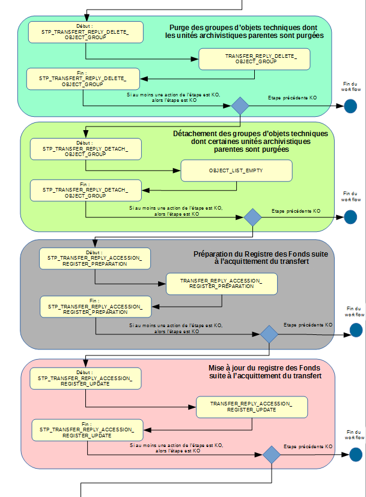
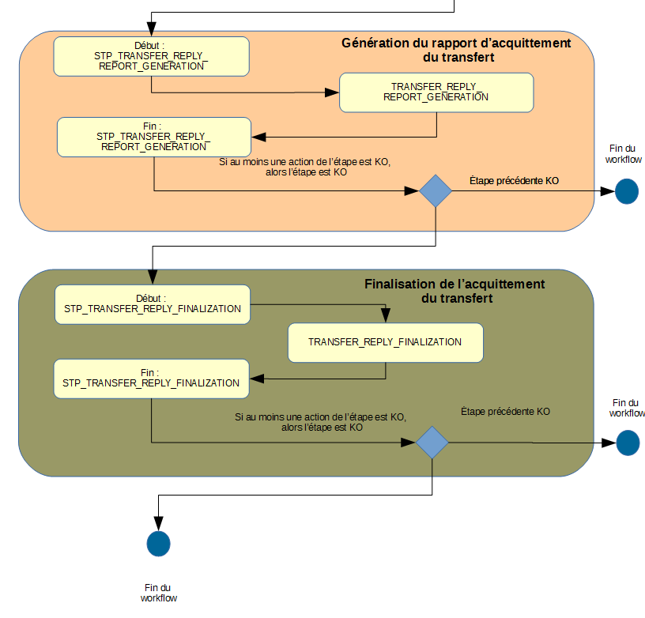

#### Rapport d’acquittement du transfert
Le rapport d’acquittement du transfert est un fichier JSONL généré par la solution logicielle Vitam lorsqu’une opération d’acquittement du transfert se termine. Cette section décrit la manière dont ce rapport est structuré.

##### Exemple de fichier JSONL : rapport d’acquittement du transfert
<br>
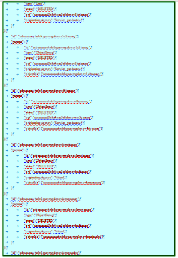<br>
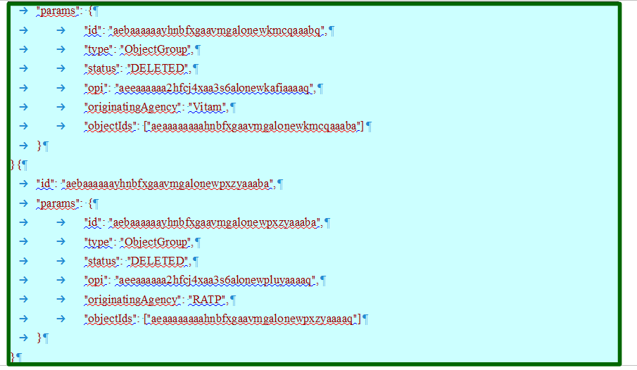

##### Détail du rapport
La partie « OperationSummary » c’est-à-dire le bloc racine du rapport et correspondant au résumé de l’opération est composé des champs suivants : 
-« Tenant » : tenant sur lequel l’opération de modification en masse a été lancée
-« evId »:identifiant de l’événement
-« outcome » : statut de l’événement
-« outMsg » : détail du résultat des données de l’événement
-« rightsStatementIdentifier » : identifiant des données référentielles en vertu desquelles l’opération peut s’exécuter. 
-« evDetData » : détails des données de l’événement

La partie « ReportSummary » c’est-à-dire le bloc situé sous la racine du rapport et correspondant au résumé du rapport est composé des champs suivants : 
-« evStartDateTime »:date du début de l’opération (evDateTime de l’event master de l’opération dans le journal des opérations)
-« evEndDateTime » : date de fin de l’opération (dernier evDateTime de l’event master de l’opération dans le journal des opérations)
-« reportType » : corresponds au modèle du rapport.
-« vitamResults » : corresponds au nombre de OK, KO et warning de l’opération ainsi que le total de ces 3 statuts.
-« extendedInfo » : partie libre où chaque type de rapport contient des informations qui lui est propre. Ici ce champ est vide.

La partie « ReportDetail » contient les détails de l’opération d’acquittement du transfert effectuée sur chacune des unités archivistiques.
-« _id » : identifiant de l’unité archivistique ou de l’objet sur lequel l’action d’acquittement du transfert s’est effectuée.
-« params » : informations sur l’unité archivistique ou le groupe d’objet
    - « id » : identifiant de l’unité archivistique ou de l’objet
    - « type » : collection sur laquelle l’opération à été réalisée (UNIT ou OBJECTGROUP)
    - « status » : statut au regard de l’action d’acquittement du transfert :
        - ALREADY_IN_TRANSFER : unité archivistique ayant déjà subi une demande de transfert.
        - NOT_DESTROYABLE_HAS_CHILD_UNITS : unité non supprimable, car elle a des enfants et sa suppression entraînerait une incohérence dans le graphe.
        - DELETED : l’unité a effectivement été supprimée
    - « opi » : identifiant de l’opération d’entrée
    - « originatingAgency » : service producteur
    - « objectIds » : identifiant du groupe d’objets techniques rattaché à l’unité archivistique


Restauration de métadonnées essentielles (Revert Essential Metadata)
-----
Cette section décrit le processus (workflow REVERT_ESSENTIAL_METADATA) utilisé lors d’une opération de restauration de métadonnées essentielles. Cette fonctionnalité nécessite d’avoir les droits requis pour pouvoir intervenir sur les métadonnées.  
Cette restauration peut être demandée suite à la perte de métadonnées consécutive à une erreur métier (et non technique) car ces métadonnées ont vocation à être conservées dans le temps. Il s’agit de restaurer les métadonnées enregistrées dans la collection Unit, telle qu’existantes avant une opération particulière caractérisée par son identifiant. Les métadonnées concernées sont limitées pour l’instant au titre (Title ou Title_.*), au niveau de description (DescriptionLevel) et à la description (Description ou Description_.*).  
Les étapes, tâches et traitements sont journalisés dans le journal des opérations et décrivent le processus (clé et description de la clé associée dans le journal des opérations) tel qu’implémenté dans la version actuelle de la solution logicielle Vitam.

**Workflow de restauration de métadonnées essentielles (REVERT_ESSENTIAL_METADATA)**  
La restauration des métadonnées essentielles peut être demandée suite à la perte de données et/ou de métadonnées consécutive à une erreur métier (et non technique).

- **Règle** : opération consistant restaurer les métadonnées essentielles d’une ou plusieurs AU à partir d’un identifiant d’opération et éventuellement de la liste des métadonnées concernées.
- **Type** : bloquant
**Statuts** :
    - OK : la restauration des métadonnées essentielles a bien été effectuée (REVERT_ESSENTIAL_METADATA.OK=Succès de la restauration des métadonnées essentielles)
    - KO : la restauration des métadonnées essentielles n’a pas été effectuée en raison d’une erreur (REVERT_ESSENTIAL_METADATA.KO=Échec de la restauration des métadonnées essentielles)
    - FATAL : une erreur technique est survenue lors de la restauration des métadonnées essentielles (REVERT_ESSENTIAL_METADATA.FATAL=Erreur technique lors de la restauration des métadonnées essentielles)
    - WARNING : la restauration des métadonnées essentielles n’a pas été effectuée en raison d’une erreur de mise à jour d’une ou plusieurs unités archivistiques (REVERT_ESSENTIAL_METDATA.WARNING=Avertissement lors de la restauration des métadonnées essentielles)
### Processus de préparation de la restauration des métadonnées essentielles (STP_CHECK_REVERT)
Préparation de la restauration des métadonnées essentielles REVERT_CHECK
- **Règle** : Etape de contrôle des droits d’écriture donnés par le contrat d’accès et de vérification que l’utilisateur a bien des droits d’écriture sur les métadonnées descriptives. Préparation de la requête de restauration des métadonnées essentielles à partir de l’identifiant de l’opération et des éléments de la requête.
- **Type** : bloquant
- ****Statuts**** :
    - OK : La liste des requêtes de restauration a été constituée avec succès à partir des éléments renseignés dans la requête (REVERT_CHECK.OK=Succès de la préparation de la restauration des métadonnées essentielles)
    - KO : Il n’y a pas d’unités archivistiques concernées par la demande de restauration ou une opération plus récente a déjà modifié les métadonnées dont on a demandé la restauration dans le cas où l’option « Force » est à « false » (REVERT_CHECK.KO=Échec de la préparation de la restauration des métadonnées essentielles)
    - FATAL : Une erreur technique est survenue lors de la préparation de la requête de restauration des métadonnées essentielles (REVERT_CHECK.FATAL=Erreur technique lors de la préparation de la restauration des métadonnées essentielles)

###  Processus de traitement de la restauration des métadonnées essentielles (STP_REVERT_UPDATE)
Restauration des métadonnées essentielles REVERT_UPDATE_UNITS
- **Règle** : Exécution de la liste des requêtes de restauration des métadonnées et enregistrement des mises à jour des unités archivistiques en base, dans les index et dans les journaux de cycle de vie.
- **Type** : Non bloquant
- ****Statuts**** :
    - OK : la restauration des métadonnées essentielles des unités archivistiques a bien été effectuée (REVERT_UPDATE_UNITS.OK=Succès de la restauration des métadonnées essentielles)
    - WARNING : la restauration des métadonnées des unités archivistiques n’a pas été effectuée ou a été effectuée partiellement (REVERT_UPDATE_UNITS.WARNING=Avertissement lors de la restauration des métadonnées essentielles)
    - FATAL : une erreur technique est survenue lors de la restauration des métadonnées essentielles (REVERT_UPDATE_UNITS.FATAL=Erreur technique lors de la restauration des métadonnées essentielles)

###  Processus de finalisation de la restauration des métadonnées essentielles (STP_REVERT_UPDATE_FINALIZE)
Finalisation de la restauration des métadonnées essentielles REVERT_UPDATE_FINALIZE
- **Règle** : Tâche consistant à générer le rapport de restauration des métadonnées essentielles des unités archivistiques concernées par la requête.
- **Type** : bloquant
- ****Statuts**** :
    - OK : la génération du rapport de restauration des métadonnées essentielles a bien été effectuée (REVERT_UPDATE_FINALIZE.OK=Succès de la finalisation de la restauration des métadonnées essentielle)
    - KO : la génération du rapport de restauration des métadonnées essentielles n’a pas été effectuée en raison d’une erreur (REVERT_UPDATE_FINALIZE.KO=Échec de la finalisation de la restauration des métadonnées essentielles)
    - WARNING : pas de résultats dans le rapport de restauration des métadonnées essentielles (REVERT_UPDATE_FINALIZE.WARNING=Avertissement lors de la finalisation de la restauration des métadonnées essentielles)
    - FATAL : une erreur technique est survenue lors de la génération du rapport de restauration des métadonnées essentielles (REVERT_UPDATE_FINALIZE.FATAL=Erreur technique lors de la finalisation de la restauration des métadonnées essentielles)

### Structure du Workflow de mise à jour unitaire des métadonnées descriptives
D’une façon synthétique, le workflow est décrit de cette façon :


### Rapport de restauration de métadonnées essentielles des unités archivistiques.
Le rapport de restauration de métadonnées essentielles des unités archivistiques est un fichier JSONL généré par la solution logicielle Vitam lorsqu’une opération de restauration de métadonnées essentielles se termine. Cette section décrit la manière dont ce rapport est structuré.

#### Exemple de fichier JSONL : rapport de restauration de métadonnées essentielles
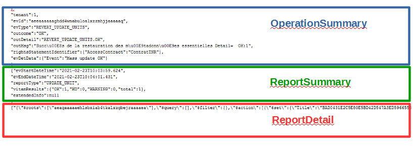

#### Détail du rapport
La partie OperationSummary, c’est-à-dire le bloc racine du rapport et correspondant au résumé de l’opération est composé des champs suivants :
-tenant : tenant sur lequel l’opération de restauration de métadonnées essentielles a été lancée
-evId : identifiant de l’événement
-evType : type d’opération
-outcome : statut de l’événement
-outDetail : détail de l’opération
-outMsg : détail du résultat des données de l’événement
-rightsStatementIdentifier : identifiants des données référentielles en vertu desquelles l’opération peut s’exécuter.
-EvDetData : détails des données de l’événement

La partie ReportSummary, c’est-à-dire le bloc situé sous la racine du rapport et correspondant au résumé du rapport est composé des champs suivants :
-evStartDateTime : date du début de l’opération (evDateTime de l’event master de l’opération dans le journal des opérations)
-evEndDateTime : date de fin de l’opération (dernier evDateTime de l’event master de l’opération dans le journal des opérations)
-reportType : correspond au modèle du rapport. 
-vitamResults: correspond au nombre de OK, KO et WARNING de l’opération ainsi que le total de ces 3 statuts.
-ExtendedInfo : partie libre où chaque type de rapport contient des informations qui lui est propre. Ici ce champ est vide.

La partie Context est vide.

La partie ReportDetail contient les détails de l’opération de modification en masse effectuée sur chacune des unités archivistiques.
-$root : identifiant de  l’unité archivistique impactée à la requête
-$query : requête liée au détail de résultat au format “String”

Traceability
----

### Workflow du processus de sécurisation du journal des opérations
Cette section décrit le processus (workflow) de sécurisation des journaux mis en place dans la solution logicielle Vitam pour le journal des opérations.

Celui-ci est défini dans le fichier « LogbookAdministration.java » situé ici : sources/logbook/logbook-administration/src/main/java/fr/gouv/vitam/logbook/administration/core/

Toutes les étapes, tâches et traitements sont journalisées dans le journal des opérations et décrivent le processus (clé et description de la clé associée dans le journal des opérations) tel qu’implémenté dans la version actuelle de la solution logicielle Vitam.

#### Processus de sécurisation des journaux des opérations (STP_OP_SECURISATION)

Le processus de sécurisation des journaux consiste en la création d’un fichier .zip contenant l’ensemble des journaux à sécuriser, ainsi que le tampon d’horodatage calculé à partir de l’arbre de Merkle de la liste de ces mêmes journaux. Les journaux concernés par cette sécurisation sont le journal des opérations et le journal des écritures.
Ce fichier zip est ensuite enregistré sur les offres de stockage, en fonction de la stratégie de stockage.
-  **Règle** : opération consistant à sécuriser le journal des opérations
-  **Type** : bloquant
-  **Statuts** :
    - OK : le journal des opérations a été sécurisé (STP_OP_SECURISATION.OK = Succès du processus de sécurisation du journal des opérations)
    - KO : pas de cas KO
    - FATAL : une erreur technique est survenue lors de la sécurisation du journal des opérations (STP_OP_SECURISATION.FATAL = Erreur technique lors du processus de sécurisation du journal des opérations)
#####  Calcul du tampon d’horodatage OP_SECURISATION_TIMESTAMP (LogbookAdministration.java)
-  **Règle** : tâche consistant à calculer le tampon d’horodatage à partir de la racine de l’arbre de Merkle constitué de la liste des journaux qui sont en train d’être sécurisés
-  **Type** : bloquant
-  **Statuts** :
    - OK : le tampon d’horodatage est calculé (OP_SECURISATION_TIMESTAMP.OK = Succès de la création du tampon d’horodatage de l’ensemble des journaux)
    - FATAL : une erreur technique est survenue lors de l’horodatage (OP_SECURISATION_TIMESTAMP.FATAL = Erreur technique lors de la création du tampon d’horodatage de l’ensemble des journaux)
#####  Stockage des journaux sécurisés (OP_SECURISATION_STORAGE) (LogbookAdministration.java)
-  **Règle** : tâche consistant à écrire les journaux sécurisés sur les offres de stockage, en fonction de la stratégie de stockage
-  **Type** : bloquant
-  **Statuts** :
    - OK : le journal sécurisé est écrit sur les offres de stockage (OP_SECURISATION_STORAGE.OK = Succès de l’enregistrement des journaux sur les offres de stockage)
    - FATAL : une erreur technique est survenue lors de l’écriture du journal sécurisé (OP_SECURISATION_STORAGE.FATAL = Erreur technique lors de l’enregistrement des journaux sur les offres de stockage)
          
#### Structure de workflow de sécurisation du journal des opérations
D’une façon synthétique, le workflow est décrit de cette façon :


### Workflow de sécurisation des journaux du cycle de vie des groupes d’objets
Cette section décrit le processus (workflow) permettant la sécurisation des journaux du cycle de vie des groupes d’objets mis en place dans la solution logicielle Vitam. Le workflow mis en place dans la solution logicielle Vitam est défini dans le fichier « DefaultObjectGroupLifecycleTraceability.json ». Ce fichier est disponible dans : sources/processing/processing-management/src/main/resources/workflows.

Note : Le traitement permettant la sécurisation des journaux du cycle de vie procède par des tranches de lots de 100 K. La solution Vitam à la fin de ce premier lot enclenche un autre traitement de 100K et ce jusqu’à avoir traités l’ensemble des groupes d’objets.

Toutes les étapes, tâches et traitements sont journalisés dans le journal des opérations et décrivent le processus (clé et description de la clé associée dans le journal des opérations) tel qu’implémenté dans la version actuelle de la solution logicielle Vitam.
#### Sécurisation des journaux  du cycle de vie des groupes d’objets (LOGBOOK_OBJECTGROUP_LFC_TRACEABILITY)
Le processus de sécurisation des journaux  du cycle de vie consiste en la création d’un fichier .zip contenant l’ensemble des journaux du cycle de vie à sécuriser, ainsi que le tampon d’horodatage.

Ce fichier zip est ensuite enregistré sur les offres de stockage, en fonction de la stratégie de stockage.

-  **Règle** : opération consistant à sécuriser les journaux du cycle de vie des groupes d’objets
-  **Type** : bloquant
-  **Statuts** :
    - OK : les journaux du cycle de vie ont été sécurisés (LOGBOOK_OBJECTGROUP_LFC_TRACEABILITY.OK = Succès de la sécurisation des journaux du cycle de vie des groupes d’objets)
    - WARNING : il n’y pas de nouveaux journaux à sécuriser depuis la dernière sécurisation (LOGBOOK_OBJECTGROUP_LFC_TRACEABILITY.WARNING = Avertissement lors de la sécurisation des journaux du cycle de vie des groupes d’objets)
    - KO : pas de cas KO
    - FATAL : une erreur technique est survenue lors de la sécurisation des journaux du cycle de vie des groupes d’objets (LOGBOOK_OBJECTGROUP_LFC_TRACEABILITY.FATAL = Erreur technique lors de la sécurisation des journaux du cycle de vie des groupes d’objets)

#### Processus de la sécurisation des journaux du cycle de vie des groupes d’objets STP_OG_LFC_TRACEABILITY
#####  Vérification des processus concurrents CHECK_CONCURRENT_WORKFLOW_LOCK
-  **Règle** : tâche consistant à vérifier s’il n’y a pas d’autres processus de traçabilité des journaux de cycle de vie des groupes d’objets concurrents
-  **Type** : bloquant
-  **Statuts** :
    - OK : le contrôle de processus de traçabilité des journaux du cycle de vie des groupes d’objets concurrents s’est terminé avec succès (CHECK_CONCURRENT_WORKFLOW_LOCK.OK = Succès de la vérification des processus concurrents)
    - KO : des processus concurrents de traçabilité des groupes d’objets sont en cours d’exécution (CHECK_CONCURRENT_WORKFLOW_LOCK.KO = Échec lors de la vérification des processus concurrents)
    - FATAL : une erreur technique est survenue lors de la vérification des processus concurrents (CHECK_CONCURRENT_WORKFLOW_LOCK.FATAL = Erreur technique lors de la vérification des processus concurrents)
#####  Préparation de la liste des journaux du cycle de vie et des métadonnées des groupes d’objets PREPARE_OG_LFC_TRACEABILITY
-  **Règle** : tâche consistant à récupérer les journaux du cycle de vie à sécuriser et récupération des informations concernant les dernières opérations de sécurisation
-  **Type** : bloquant
-  **Statuts** :
    - OK : les fichiers des journaux du cycle de vie ont été exportés (dans ObjectGroup) ainsi que les informations concernant les dernières opérations de sécurisation (PREPARE_OG_LFC_TRACEABILITY.OK = Succès de la préparation des journaux du cycle de vie et des métadonnées des groupes d’objets)
    - KO : les informations sur la dernière opération de sécurisation n’ont pas pu être obtenues / exportées, ou un problème a été rencontré avec un journal du cycle de vie (PREPARE_OG_LFC_TRACEABILITY.KO = Échec de la préparation des journaux du cycle de vie et des métadonnées des groupes d’objets)
    - FATAL : une erreur technique est survenue (PREPARE_LC_TRACEABILITY.FATAL = Erreur technique lors de la préparation des journaux du cycle de vie et des métadonnées des groupes d’objets)
#####  Sécurisation des journaux du cycle de vie des groupes d’objets BUILD_OG_LFC_TRACEABILITY
-  **Règle** : tâche consistant à appliquer  l’algorithme pour créer les fichiers sécurisés des journaux du cycle de vie des groupes d’objets, journal par journal, et à générer le fichier sécurisé
-  **Type** : bloquant
-  **Statuts** :
    - OK : le fichier sécurisé pour le journal du cycle de vie en cours a été généré (BUILD_OG_LFC_TRACEABILITY.STARTED.OK = Succès de la sécurisation des journaux du cycle de vie des groupes d’objets)
    - WARNING : il n’y a pas de nouveaux journaux à sécuriser (BUILD_OG_LFC_TRACEABILITY.WARNING = Avertissement lors de la sécurisation des journaux du cycle de vie des groupes d’objets)
    - KO : le fichier pour le groupe d’objet n’a pas pu être trouvé (BUILD_OG_LFC_TRACEABILITY.KO = Échec de la sécurisation des journaux du cycle de vie des groupes d’objets)
    - FATAL : une erreur technique est survenue lors de la génération des fichiers sécurisés (BUILD_OG_LFC_TRACEABILITY.FATAL = Erreur technique lors de la sécurisation des journaux du cycle de vie des groupes d’objets)
#####  Finalisation de la sécurisation des journaux du cycle de vie des groupes d’objets FINALIZE_OG_LFC_TRACEABILITY
-  **Règle** : tâche consistant à récupérer les différents fichiers générés puis à  calculer le tampon d’horodatage
-  **Type** : non applicable
-  **Statuts** :
    - OK : la finalisation de la sécurisation des journaux du cycle de vie des groupes d’objets a bien été effectuée (FINALIZE_OG_LFC_TRACEABILITY.OK = Succès de la finalisation de la sécurisation des journaux du cycle de vie des groupes d’objets)
    - KO : la finalisation de la sécurisation des journaux du cycle de vie des groupes d’objets n’a pas été effectuée (FINALIZE_OG_LFC_TRACEABILITY.KO = Échec de la finalisation de la sécurisation des journaux du cycle de vie des groupes d’objets)
    - FATAL : une erreur technique est survenue lors de la finalisation de la la sécurisation des journaux du cycle de vie des groupes d’objets (FINALIZE_OG_LFC_TRACEABILITY.FATAL = Erreur technique lors de la finalisation de la sécurisation des journaux du cycle de vie des groupes d’objets)

#### Structure du workflow du processus de sécurisation des journaux des cycles de vie des groupes d’objets
D’une façon synthétique, le workflow est décrit de cette façon :
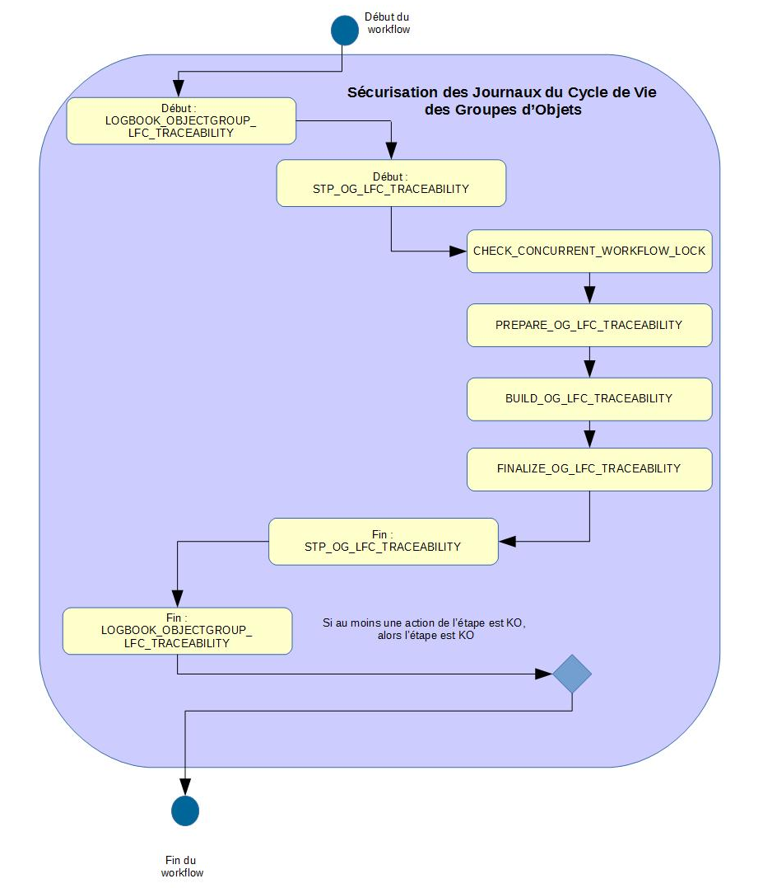

### Workflow de sécurisation des journaux du cycle de vie des unités archivistiques
Cette section décrit le processus (workflow) permettant la sécurisation des journaux du cycle de vie des unités archivistiques mis en place dans la solution logicielle Vitam des unités archivistiques. Le workflow mis en place dans la solution logicielle Vitam est défini dans le fichier « DefaultUnitLifecycleTraceability.json ». Ce fichier est disponible dans : sources/processing/processing-management/src/main/resources/workflows.

Note : Le traitement permettant la sécurisation des journaux du cycle de vie procède par des tranches de lots de 100 K. La solution Vitam à la fin de ce premier lot enclenche un autre traitement de 100 K et ce jusqu’à avoir traité l’ensemble des unités archivistiques.

Toutes les étapes, tâches et traitements sont journalisés dans le journal des opérations et décrivent le processus (clé et description de la clé associée dans le journal des opérations) tel qu’implémenté dans la version actuelle de la solution logicielle Vitam.

#### Sécurisation des journaux du cycle de vie des unités archivistiques (LOGBOOK_UNIT_LFC_TRACEABILITY)
Le processus de sécurisation des journaux du cycle de vie consiste en la création d’un fichier .zip contenant l’ensemble des journaux du cycle de vie à sécuriser, ainsi que le tampon d’horodatage.

Ce fichier zip est ensuite enregistré sur les offres de stockage, en fonction de la stratégie de stockage.

-  **Règle** : opération consistant à sécuriser les journaux du cycle de vie des unités archivistiques
-  **Type** : bloquant
-  **Statuts** :
    - OK : les journaux du cycle de vie ont été sécurisés (LOGBOOK_UNIT_LFC_TRACEABILITY.OK = Succès de la sécurisation des journaux du cycle de vie des unités archivistiques)
    - WARNING : il n’y pas de nouveaux journaux à sécuriser depuis la dernière sécurisation (LOGBOOK_UNIT_LFC_TRACEABILITY.WARNING = Avertissement lors de la sécurisation des journaux du cycle de vie des unités archivistiques)
    - KO : pas de cas KO
    - FATAL : une erreur technique est survenue lors de la sécurisation du journal des opérations (LOGBOOK_UNIT_LFC_TRACEABILITY.FATAL = Erreur technique lors de la sécurisation des journaux du cycle de vie des unités archivistiques)

#### Processus de la sécurisation des journaux du cycle de vie des unités archivistiques STP_UNIT_LFC_TRACEABILITY
#####  Vérification des processus concurrents CHECK_CONCURRENT_WORKFLOW_LOCK
-  **Règle** : tâche consistant à vérifier s’il n’y a pas d’autres processus de traçabilité des journaux du cycle de vie des unités archivistiques concurrents.
-  **Type** : bloquant
-  **Statuts** :
    - OK : le contrôle de processus de traçabilité des journaux du cycle de vies des unités archivistiques concurrents s’est terminé avec succès (CHECK_CONCURRENT_WORKFLOW_LOCK.OK = Succès de la vérification des processus concurrents)
    - KO : des processus concurrents de traçabilité des unités archivistiques sont en cours d’exécution (CHECK_CONCURRENT_WORKFLOW_LOCK.KO = Échec lors de la vérification des processus concurrents)
    - FATAL : une erreur technique est survenue lors de la vérification des processus concurrents (CHECK_CONCURRENT_WORKFLOW_LOCK.FATAL = Erreur technique lors de la vérification des processus concurrents)
#####  Préparation de la liste des journaux du cycle de vie et des métadonnées des unités archivistiques PREPARE_UNIT_LFC_TRACEABILITY
-  **Règle** : tâche consistant à récupérer les journaux des cycles de vie à sécuriser et à récupérer les informations concernant les dernières opérations de sécurisation
-  **Type** : bloquant
-  **Statuts** :
    - OK : les fichiers des journaux des cycles de vie ont été exportés ainsi que les informations concernant les dernières opérations de sécurisation (PREPARE_UNIT_LFC_TRACEABILITY.OK = Succès de la préparation des journaux du cycle de vie et des métadonnées des unités archivistiques)
    - KO : les informations sur la dernière opération de sécurisation n’ont pas pu être obtenues / exportées, ou un problème a été rencontré avec un journal de cycle de vie (PREPARE_UNIT_LFC_TRACEABILITY.KO = Échec de la préparation des journaux du cycle de vie et des métadonnées des unités archivistiques)
    - FATAL : une erreur technique est survenue (PREPARE_UNIT_LFC_TRACEABILITY.FATAL = Erreur technique lors de la préparation des journaux du cycle de vie et des métadonnées des unités archivistiques)
#####  Sécurisation des journaux du cycle de vie des groupes d’objets BUILD_UNIT_LFC_TRACEABILITY
-  **Règle** : application de l’algorithme pour créer les fichiers sécurisés des journaux du cycle de vie des unités archivistiques, journal par journal, et génération du fichier sécurisé
-  **Type** : bloquant
-  **Statuts** :
    - OK : le fichier sécurisé pour le journal du cycle de vie en cours a été généré (BUILD_UNIT_LFC_TRACEABILITY.STARTED.OK = Succès de la sécurisation des journaux du cycle de vie des unités archivistiques)
    - WARNING : il n’y a pas de nouveaux journaux à sécuriser (BUILD_UNIT_LFC_TRACEABILITY.WARNING = Avertissement lors de la sécurisation des journaux du cycle de vie des unités archivistiques)
    - KO : le fichier pour le groupe d’objet n’a pas pu être trouvé (BUILD_UNIT_LFC_TRACEABILITY.KO = Échec de la sécurisation des journaux du cycle de vie des unités archivistiques)
    - FATAL : une erreur technique est survenue lors de la génération des fichiers sécurisés (BUILD_UNIT_LFC_TRACEABILITY.FATAL = Erreur technique lors de la sécurisation des journaux du cycle de vie des unités archivistiques)
#####  Finalisation de la sécurisation des journaux du cycle de vie des groupes d’objets FINALIZE_UNIT_LFC_TRACEABILITY
-  **Règle** : tâche consistant à récupérer les différents fichiers générés puis à calculer le tampon d’horodatage
-  **Type** : non applicable
-  **Statuts** :
    - OK : la finalisation de la sécurisation des journaux du cycle de vie des unités archivistiques a bien été effectuée (FINALIZE_UNIT_LFC_TRACEABILITY.OK = Succès de la finalisation de la sécurisation des journaux du cycle de vie des unités archivistiques)
    - KO : la finalisation de la sécurisation des journaux du cycle de vie des unités archivistiques n’a pas été effectuée (FINALIZE_UNIT_LFC_TRACEABILITY.KO = Échec de la finalisation de la sécurisation des journaux du cycle de vie des unités archivistiques)
    - FATAL : une erreur technique est survenue lors de la finalisation de la la sécurisation des journaux du cycle de vie des unités archivistiques (FINALIZE_UNIT_LFC_TRACEABILITY.FATAL = Erreur technique lors de la finalisation de la sécurisation des journaux du cycle de vie des unités archivistiques)
#### Structure du workflow du processus de sécurisation des journaux des cycles de vie des unités archivistiques
D’une façon synthétique, le workflow est décrit de cette façon :

### Workflow de sécurisation des journaux des écritures
Cette section décrit la sécurisation des journaux des écritures mis en place dans la solution logicielle Vitam.

Toutes les étapes, tâches et traitements sont journalisés dans le journal des opérations et décrivent le processus (clé et description de la clé associée dans le journal des opérations) tel qu’implémenté dans la version actuelle de la solution logicielle Vitam.
#### Processus de sécurisation des journaux des écritures (STP_STORAGE_SECURISATION)
Le processus de sécurisation des journaux des écritures consiste en la création d’un fichier .zip contenant :
-  Des logs des journaux sécurisés (logFile.log). Ces logs comportent un certain nombre d’informations comme la date des écritures, l’empreinte des fichiers concernés, le tenant, l’adresse des offres…<br>
Ces logs sont un extrait des logs du moteur de stockage, sélectionnés entre deux intervalles de dates.
-  Un fichier d’information décrivant le périmètre du fichier des logs des journaux sécurisés associé : date de début et date de fin définissant l’intervalle de sélection des logs à sécuriser, ainsi que l’empreinte du fichier logFile et la date de création du .zip<br>
Au niveau du journal des écritures, cette action est entièrement réalisée dans une seule étape (STP_STORAGE_SECURISATION)
-  **Règle** : opération consistant à sécuriser le journal des écritures
-  **Type** : bloquant
-  **Statuts** :
    - OK : le journal des écritures ont été sécurisés (STP_STORAGE_SECURISATION.OK = Succès du processus de sécurisation du journal des écritures)
    - WARNING : il n’y a pas de nouveaux journaux à sécuriser (STP_STORAGE_SECURISATION.WARNING = Avertissement lors du processus de sécurisation du journal des écritures)
    - KO : pas de cas KO
    - FATAL : une erreur technique est survenue lors de la sécurisation du journal des écritures (STP_STORAGE_SECURISATION.FATAL = Erreur technique lors du processus de sécurisation du journal des écritures)
          
#####  Création du tampon d’horodatage de l’ensemble des journaux d’écriture STORAGE_SECURISATION_TIMESTAMP
-  **Règle** : tâche consistant à calculer le tampon d’horodatage à partir de la racine de l’arbre de Merkle constitué de la liste des journaux qui sont en train d’être sécurisés
-  **Type** : bloquant
-  **Statuts** :
    - OK : la création du tampon d’horodatage de l’ensemble des journaux d’écriture à été réalisé avec succès (STORAGE_SECURISATION_TIMESTAMP.OK = Succès de la création du tampon d’horodatage de l’ensemble des journaux d’écriture)
    - FATAL : une erreur technique est survenue lors de l’horodatage de l’ensemble des journaux d’écriture (STORAGE_SECURISATION_TIMESTAMP.FATAL = Erreur technique lors de la création du tampon d’horodatage de l’ensemble des journaux d’écriture)
#####  Stockage des journaux d’écriture STORAGE_SECURISATION_STORAGE
-  **Règle** : tâche consistant à écrire les journaux d’écriture sur les offres de stockage, en fonction de la stratégie de stockage
-  **Type** : bloquant
-  **Statuts** :
    - OK : les journaux d’écriture ont été écrits sur les offres de stockage (STORAGE_SECURISATION_STORAGE.OK = Succès du stockage des journaux d’écriture)
    - FATAL : une erreur technique est survenue lors de l’écriture des journaux des écritures sur les offres de stockage (STORAGE_SECURISATION_STORAGE.FATAL = Erreur technique lors du stockage des journaux d’écriture)

#### Structure du workflow du processus de sécurisation des journaux des écritures
D’une façon synthétique, le workflow est décrit de cette façon :

### Sauvegarde des journaux des écritures
Cette section décrit la sauvegarde des journaux des écritures. Contrairement aux autres sécurisations de journaux du cycle de vie des groupes d’objets et des unités archivistiques ou du journal des opérations, celle-ci n’est pas utilisée au sein d’un workflow.

Toutes les étapes, tâches et traitements sont journalisés dans le journal des opérations et décrivent le processus (clé et description de la clé associée dans le journal des opérations) tel qu’implémenté dans la version actuelle de la solution logicielle Vitam.
#### Processus de sauvegarde des journaux des écritures (STORAGE_BACKUP)
Le processus de sauvegarde des journaux des écritures consiste en la création de fichier.log contenant un certain nombre d’informations.

Ces logs sont un extrait des logs du moteur de stockage, sélectionnés entre deux intervalles de dates.

Lors de la copie du Moteur de stockage vers les Offres, les fichiers sont renommés pour utiliser en date de début la date de début de chaque fichier de log et en date de fin la date du traitement.

Au niveau du journal des opérations, cette action est entièrement réalisée dans une seule étape
-  **Règle** : opération consistant à sauvegarder les journaux des écritures
-  **Type** : bloquant
-  **Statuts** :
    - OK : la sauvegarde des journaux des écritures réalisée avec succès (STORAGE_BACKUP.OK = Succès de la sauvegarde des journaux des écritures)
    - WARNING : avertissement lors de la sauvegarde des journaux des écritures (STORAGE_BACKUP.WARNING = Avertissement lors de la sauvegarde des journaux des écritures)
    - KO : échec de la sauvegarde des journaux des écritures (STORAGE_ACCESS_BACKUP.KO = Échec de la sauvegarde des journaux des écritures)
    - FATAL : une erreur technique est survenue lors de la sauvegarde des journaux des écritures (STORAGE_ACCESS_BACKUP.FATAL = Erreur technique lors de la sauvegarde des journaux des écritures)
#### Structure du workflow du processus de sauvegarde des journaux des écritures
D’une façon synthétique, le workflow est décrit de cette façon :

### Sauvegarde des logs des accès
Cette section décrit la sauvegarde des logs des accès aux binaires mis en place dans la solution logicielle Vitam.<br> Contrairement aux autres sécurisations de journaux du cycle de vie des groupes d’objets et des unités archivistiques ou du journal des opérations, celle-ci n’est pas utilisée au sein d’un workflow.

Toutes les étapes, tâches et traitements sont journalisées dans le journal des opérations et décrivent le processus (clé et description de la clé associée dans le journal des opérations) tel qu’implémenté dans la version actuelle de la solution logicielle Vitam.
#### Processus de sauvegarde des logs des accès (STORAGE_ACCESS_BACKUP)
Le processus de sauvegarde des logs des accès aux objets binaires consiste en la création d’un fichier.log contenant un certain nombre d’informations comme la date des accès, l’identifiant du document récupéré, le contrat utilisé, l’unité archivistique donnant accès à l’objet binaire, et l’identifiant de la requête d’accès.

Ces logs sont un extrait des logs du moteur de stockage, sélectionnés entre deux intervalles de dates.

Lors de la copie du Moteur de stockage vers les Offres, les fichiers sont renommés pour utiliser en date de début la date de début de chaque fichier de log et en date de fin la date du traitement.

Au niveau du journal des opérations, cette action est entièrement réalisée dans une seule étape
-  **Règle** : opération consistant à sauvegarder les logs des accès
-  **Type** : bloquant
-  **Statuts** :
    - OK : sauvegarde des logs d’accès avec succès (STORAGE_ACCESS_BACKUP = Sauvegarde des logs des accès)
    - WARNING : avertissement lors de la sauvegarde des logs des accès (STORAGE_ACCESS_BACKUP.WARNING = Avertissement lors de la sauvegarde des logs des accès)
    - KO : échec de la sauvegarde des logs des accès (STORAGE_ACCESS_BACKUP.KO = Échec de la sauvegarde des logs des accès)
    - FATAL : une erreur technique est survenue lors de la sauvegarde des logs des accès (STORAGE_ACCESS_BACKUP.FATAL = Erreur technique lors de la sauvegarde des logs des accès)

#### Structure du workflow du processus de sauvegarde des logs des accès
D’une façon synthétique, le workflow est décrit de cette façon :


Audit
----
### Workflow de contrôle d’intégrité d’un journal sécurisé
Cette section décrit le processus (workflow) de contrôle d’intégrité d’un journal sécurisé mis en place dans la solution logicielle Vitam.

Celui-ci est défini dans le fichier “DefaultCheckTraceability.json” (situé ici : sources/processing/processing-management/src/main/resources/workflows).

Toutes les étapes, tâches et traitements sont journalisés dans le journal des opérations, et décrivent le processus (clé et description de la clé associée dans le journal des opérations) tel qu’implémenté dans la version actuelle de la solution logicielle Vitam.

#### Processus de contrôle d’intégrité d’un journal sécurisé (vision métier)
Le processus de contrôle d’intégrité débute lorsqu’un identifiant d’opération de sécurisation des journaux d’opération, des journaux du cycle de vie ou du journal des écritures est soumis au service de contrôle d’intégrité des journaux sécurisés. Le service permet de récupérer le journal sécurisé, d’extraire son contenu et de valider que son contenu n’a pas été altéré.

Pour cela, le service calcule un arbre de Merkle à partir des journaux d’opérations que contient le journal sécurisé, puis en calcule un second à partir des journaux correspondants disponibles dans la solution logicielle Vitam. Une comparaison est ensuite effectuée entre ces deux arbres et celui contenu dans les métadonnées du journal sécurisé.

Ensuite, dans une dernière étape, le tampon d’horodatage est vérifié et validé.

#### Processus de préparation de la vérification des journaux sécurisés (STP_PREPARE_TRACEABILITY_CHECK)
Préparation de la vérification des journaux sécurisés PREPARE_TRACEABILITY_CHECK (PrepareTraceabilityCheckProcessActionHandler.java)
-  **Règle** : tâche permettant de vérifier que l’opération donnée en entrée est de type TRACEABILITY et à récupérer le fichier au format .zip associé à cette opération et à extraire son contenu
-  **Type** : bloquant
-  **Statuts** :
    - OK : l’opération donnée en entrée est une opération de type TRACEABILITY, le zip a été trouvé et son contenu extrait (PREPARE_TRACEABILITY_CHECK.OK = Succès de la préparation de la vérification des journaux sécurisés)
    - KO : l’opération donnée en entrée n’est pas une opération de type TRACEABILITY (PREPARE_TRACEABILITY_CHECK.KO = Échec de la préparation de la vérification des journaux sécurisés)
    - FATAL : une erreur technique est survenue lors du processus de préparation de vérification (PREPARE_TRACEABILITY_CHECK.FATAL = Erreur technique lors de la préparation de la vérification des journaux sécurisés)

#### Processus de vérification de l’arbre de Merkle (STP_MERKLE_TREE)
#####  Vérification de l’arbre de Merkle CHECK_MERKLE_TREE (VerifyMerkleTreeActionHandler.java)
-  **Règle** : tâche consistant à recalculer l’arbre de Merkle des journaux contenus dans le journal sécurisé, à calculer un autre arbre à partir des journaux indexés correspondants et à vérifier que tous deux correspondent à celui stocké dans les métadonnées du journal sécurisé
-  **Type** : bloquant
-  **Statuts** :
    - OK : les arbres de Merkle correspondent (CHECK_MERKLE_TREE.OK = Succès de la vérification de l’arbre de MERKLE)
    - KO : les arbres de Merkle ne correspondent pas (CHECK_MERKLE_TREE.KO = Échec de la vérification de l’arbre de MERKLE)
    - FATAL : une erreur technique est survenue lors de la vérification des arbres de Merkle (CHECK_MERKLE_TREE.FATAL = Erreur technique lors de la vérification de l’arbre de MERKLE)
La tâche Check_Merkle_Tree contient les traitements suivants :
#####  Comparaison de l’arbre de Merkle avec le Hash enregistré CHECK_MERKLE_TREE.COMPARE_MERKLE_HASH_WITH_SAVED_HASH
-  **Règle** : traitement consistant à vérifier que l’arbre de Merkle calculé à partir des journaux contenus dans le journal sécurisé est identique à celui stocké dans les métadonnées du journal sécurisé
-  **Type** : bloquant
-  **Statuts** :
    - OK : l’arbre de Merkle des journaux contenus dans le journal sécurisé correspond à celui stocké dans les métadonnées du journal sécurisé (CHECK_MERKLE_TREE.COMPARE_MERKLE_HASH_WITH_SAVED_HASH.OK = Succès de la comparaison de l’arbre de MERKLE avec le Hash enregistré)
    - KO : l’arbre de Merkle des journaux contenus dans le journal sécurisé ne correspond pas à celui stocké dans les métadonnées du journal sécurisé (CHECK_MERKLE_TREE.COMPARE_MERKLE_HASH_WITH_SAVED_HASH.KO = Échec de la comparaison de l’arbre de MERKLE avec le Hash enregistré)
    - FATAL : une erreur technique est survenue lors de la comparaison de l’arbre de MERKLE avec le Hash enregistré (CHECK_MERKLE_TREE.COMPARE_MERKLE_HASH_WITH_SAVED_HASH.FATAL = Erreur technique lors de la comparaison de l’arbre de MERKLE avec le Hash enregistré)
#####  Comparaison de l’arbre de Merkle avec le Hash indexé CHECK_MERKLE_TREE.COMPARE_MERKLE_HASH_WITH_INDEXED_HASH 
-  **Règle** : traitement consistant à vérifier que l’arbre de Merkle calculé à partir des journaux indexés est identique à celui stocké dans les métadonnées du journal sécurisé
-  **Type** : bloquant
-  **Statuts** :
    - OK : l’arbre de Merkle des journaux indexés correspond à celui stocké dans les métadonnées du journal sécurisé (CHECK_MERKLE_TREE.COMPARE_MERKLE_HASH_WITH_INDEXED_HASH.OK = Succès de la comparaison de l’arbre de MERKLE avec le Hash indexé)
    - KO : l’arbre de Merkle des journaux indexés ne correspond pas à celui stocké dans les métadonnées du journal sécurisé (CHECK_MERKLE_TREE.COMPARE_MERKLE_HASH_WITH_INDEXED_HASH.KO = Échec de la comparaison de l’arbre de MERKLE avec le Hash indexé)
    - FATAL : une erreur technique est survenue lors de la comparaison de l’arbre de Merkle des journaux indexés avec celui stocké dans les métadonnées du journal sécurisé (CHECK_MERKLE_TREE.COMPARE_MERKLE_HASH_WITH_INDEXED_HASH.FATAL = Erreur technique lors de la comparaison de l’arbre de MERKLE avec le Hash indexé)
#### Processus de vérification de l’horodatage (STP_VERIFY_STAMP)
#####  Vérification et validation du tampon d’horodatage VERIFY_TIMESTAMP (VerifyTimeStampActionHandler.java)
-  **Règle** : tâche consistant à vérifier et à valider le tampon d’horodatage
-  **Type** : bloquant
-  **Statuts** :
    - OK : le tampon d’horadatage est correct (VERIFY_TIMESTAMP.OK = Succès de la vérification de l’horodatage)
    - KO : le tampon d’horadatage est incorrect (VERIFY_TIMESTAMP.KO = Échec de la vérification de l’horodatage)
    - FATAL : une erreur technique est survenue lors de la vérification du tampon d’horodatage (VERIFY_TIMESTAMP.FATAL = Erreur technique lors de la vérification de l’horodatage)
La tâche Verify_Timestamp contient les traitements suivants :
##### Comparaison du tampon du fichier (token.tsp) par rapport au tampon enregistré dans le logbook VERIFY_TIMESTAMP.COMPARE_TOKEN_TIMESTAMP 
-  **Règle** : traitement consistant à vérifier que le tampon enregistré dans la collection logbookOperation est le même que celui présent dans le fichier zip généré
-  **Type** : bloquant
-  **Statuts** :
    - OK : les tampons sont identiques (VERIFY_TIMESTAMP.COMPARE_TOKEN_TIMESTAMP.OK = Succès de la comparaison des tampons d’horodatage)
    - KO : les tampons sont différents (VERIFY_TIMESTAMP.COMPARE_TOKEN_TIMESTAMP.KO = Échec de la comparaison des tampons d’horodatage)
    - FATAL : erreur technique lors de la vérification des tampons (VERIFY_TIMESTAMP.COMPARE_TOKEN_TIMESTAMP.FATAL = Erreur technique lors de la comparaison des tampons d’horodatage)
#####  Validation du tampon d’horodatage VERIFY_TIMESTAMP.VALIDATE_TOKEN_TIMESTAMP
-  **Règle** : traitement consistant à vérifier cryptographiquement le tampon et à vérifier la chaîne de certification
-  **Type** : bloquant
-  **Statuts** :
    - OK : le tampon est validé (VERIFY_TIMESTAMP.VALIDATE_TOKEN_TIMESTAMP.OK = Succès de la validation du tampon d’horodatage)
    - KO : le tampon est invalidé (VERIFY_TIMESTAMP.VALIDATE_TOKEN_TIMESTAMP.KO = Échec de la validation du tampon d’horodatage)
    - FATAL : erreur technique lors de la validation du tampon d’horodatage (VERIFY_TIMESTAMP.VALIDATE_TOKEN_TIMESTAMP.FATAL = Erreur technique lors de la validation du tampon d’horodatage)
#### Structure du workflow de contrôle d’intégrité d’un journal sécurisé
D’une façon synthétique, le workflow est décrit de cette façon :


### Workflow d’audit de vérification des journaux sécurisés
Cette section décrit le processus (workflow) d’audit de vérification des sécurisations en masse mis en place afin de s'assurer de la non perte et de la validité des données conservées dans la solution logicielle Vitam.

Celui-ci est défini dans le fichier « LinkedCheckTraceability.json » (situé ici : sources/processing/processing-management/src/main/resources/workflows/LinkedCheckTraceability.json)
Toutes les étapes, tâches et traitements sont journalisés dans le journal des opérations, et décrivent le processus (clé et description de la clé associée dans le journal des opérations) tel qu’implémenté dans la version actuelle de la solution logicielle Vitam.

#### Processus d’audit de vérification des journaux sécurisés (vision métier)
L'audit de sécurisation doit permettre de vérifier que les journaux de sécurisation existent, pour chaque type de journal, sur une période définie, et être effectué sur chaque offre selon la stratégie par défaut.

#### Processus de préparation de la vérification des journaux sécurisés (STP_PREPARE_TRACEABILITY_LINKED_CHECK)
- **Règle** : Étape qui permet de retrouver la liste des journaux de sécurisation tels que définis dans la requête DSL (type de journal et intervalle de temps) et de récupérer la liste des stratégies de stockage.
- **Type** : Bloquant
- **Statuts** :
    -  OK : Tous les journaux demandés par la requête ont bien été récupérés et les stratégies également (PREPARE_TRACEABILITY_CHECK.OK = Succès de la préparation de la vérification des journaux sécurisés)
    -  FATAL : une erreur technique est survenue lors du processus de préparation de vérification (PREPARE_TRACEABILITY_CHECK.FATAL = Erreur technique lors de la préparation de la vérification des journaux sécurisés)
    -  WARNING : Avertissement lors du processus de préparation de la vérification des journaux sécurisés (STP_PREPARE_TRACEABILITY_CHECK.WARNING =Avertissement lors du processus de préparation de la vérification des journaux sécurisés)

#####  Préparation de la vérification des journaux sécurisés TRACEABILITY_LINKED_CHECK_PREPARE (TraceabilityLinkedCheckPreparePlugin.java)
-  **Règle** : Tâche permettant de retrouver la liste des journaux de sécurisation tels que définis dans la requête DSL (type de journal et intervalle de temps).
-  **Type** : Bloquant
-  **Statuts** :
    -  OK : Tous les journaux demandés par la requête ont bien été récupérés (TRACEABILITY_LINKED_CHECK_PREPARE.OK= Succès de la préparation de la vérification des journaux sécurisés)
    - FATAL : Erreur technique dans la récupération des journaux demandés (TRACEABILITY_LINKED_CHECK_PREPARE.FATAL= Erreur technique lors de la préparation de la vérification des journaux sécurisés)
    - WARNING : Pas de journaux trouvés ou certains journaux ne possède pas de données (TRACEABILITY_LINKED_CHECK_PREPARE.WARNING= Avertissement lors de la préparation de la vérification des journaux sécurisés)

##### Récupération de la liste des stratégies de stockage PREPARE_STORAGE_STRATEGIES 
(PrepareStorageStrategiesPlugin.java)
-  **Règle** : Tâche consistant à récupérer la configuration des stratégies de stockage définies pour la plateforme.
-  **Type** : Bloquant
-  **Statuts** :
    - OK : Les données ont été récupérées et enregistrées dans un fichier de travail avec succès (PREPARE_STORAGE_STRATEGIES.OK=Succès de la récupération de la liste des stratégies de stockage)
    - FATAL : Erreur technique lors de la récupération de la liste des stratégies de stockage (PREPARE_STORAGE_STRATEGIES.FATAL=Erreur technique lors de la récupération de la liste des stratégies de stockage)

#### Processus de la vérification des journaux sécurisés (STP_TRACEABILITY_LINKED_CHECKS)
- **Règle** : Étape permettant de vérifier que les journaux de sécurisation sont bien sur toutes les offres attendues et de vérifier leur intégrité.
- **Type** : Non bloquant
- **Statuts** :
    -  OK : Tous les journaux ont été trouvés sur les offres définies par la stratégie par défaut et leur intégrité est bien vérifiée (STP_TRACEABILITY_LINKED_CHECKS.OK=Succès du processus de la vérification des journaux sécurisés)
    - KO : Tous les journaux n’ont été trouvés sur les offres définies par la stratégie par défaut OU leur intégrité n’est vérifiée (STP_TRACEABILITY_LINKED_CHECKS.KO=Échec du processus de la vérification des journaux sécurisés)
    - FATAL : Erreur technique lors de la vérification du stockage et de l’intégrité des journaux de sécurisation (STP_TRACEABILITY_LINKED_CHECKS.FATAL=Erreur technique lors du processus de la vérification des journaux sécurisés)
    - WARNING : Aucun journal de sécurisation correspondant à la requête (type de journal et intervalle de temps) n’a été trouvé (STP_TRACEABILITY_LINKED_CHECKS.WARNING=Avertissement lors du processus de la vérification des journaux sécurisés)

#####  Vérification d'existence de fichier de sécurisation dans les offres de stockage et récupération du hash correspondant RETRIEVE_SECURE_TRACEABILITY_DATA_FILE
(RetrieveSecureTraceabilityDataFilePlugin.java)

-  **Règle** : Tâche de vérification de l’existence des fichiers de sécurisation dans les offres de stockage par défaut et récupération du hash correspondant.
-  **Type** : Non bloquant
-  **Statuts** :
    - OK : Succès de la vérification d'existence de fichier de sécurisation dans les offres de stockage et récupération du hash correspondant (RETRIEVE_SECURE_TRACEABILITY_DATA_FILE.OK=Succès de la vérification d''existence de fichier de sécurisation dans les offres de stockage et récupération du hash correspondant)
    -   KO : Au moins un fichier sécurisation n’a pas été trouvé sur l’une des offres de stockage (RETRIEVE_SECURE_TRACEABILITY_DATA_FILE.KO=Échec de la vérification d''existence de fichier de sécurisation dans les offres de stockage et récupération du hash correspondant
    -   FATAL : Erreur technique sur au moins une offre au moment de la vérification de l’existence des fichiers de sécurisation(RETRIEVE_SECURE_TRACEABILITY_DATA_FILE.FATAL=Erreur technique lors de la vérification d''existence de fichier de sécurisation dans les offres de stockage)

#####  Vérification de l'intégrité du fichier de sécurisation CHECKS_SECURE_TRACEABILITY_DATA_HASHES
(ChecksSecureTraceabilityDataHashesPlugin.java)
-  **Règle** : Comparaison du hash du fichier de sécurisation présent dans l’offre référente avec les hash des fichiers de sécurisation obtenus par la tâche précédente.
-  **Type** : Non bloquant
-  **Statuts** :
    - OK : L’intégrité du fichier de sécurisation est vérifiée (CHECKS_SECURE_TRACEABILITY_DATA_HASHES.OK=Succès de la v    érification de l''intégrité du fichier de sécurisation)
    - KO : L’intégrité du fichier de sécurisation est n’est pas vérifiée (CHECKS_SECURE_TRACEABILITY_DATA_HASHES.KO=Échec de la vérification de l''intégrité du fichier de sécurisation)
    - FATAL : Erreur technique lors du contrôle de l’intégrité du fichier de sécurisation (CHECKS_SECURE_TRACEABILITY_DATA_HASHES.FATAL=Erreur technique lors de la vérification de l''intégrité du fichier de sécurisation)

#####  Récupération du fichier de sécurisation EXTRACT_SECURE_TRACEABILITY_DATA_FILE
(ExtractSecureTraceabilityDataFilePlugin.java)

-  **Règle** : Récupération et décompression du contenu du fichier compressé de sécurisation en vue de son traitement.
-  **Type** : Non bloquant
-  **Statuts** :
    - OK : Succès de la décompression du fichier de sécurisation (EXTRACT_SECURE_TRACEABILITY_DATA_FILE.OK=Succès de l''extraction du fichier de sécurisation)
    - FATAL : Erreur technique au moment de la décompression du fichier de sécurisation (EXTRACT_SECURE_TRACEABILITY_DATA_FILE.FATAL=Erreur technique lors de l''extraction du fichier de sécurisation)

#####  Vérification de l'arbre de MERKLE 
CHECK_MERKLE_TREE

-  **Règle** : Tâche consistant à recalculer l’arbre de Merkle des journaux contenus dans le journal sécurisé, à calculer un autre arbre à partir des journaux indexés correspondants et à vérifier que tous deux correspondent à celui stocké dans les métadonnées du journal sécurisé.
-  **Type** : Non bloquant
-  **Statuts** :
    - OK : les arbres de Merkle correspondent (CHECK_MERKLE_TREE.OK=Succès de la vérification de l''arbre de MERKLE)
    - KO : les arbres de Merkle ne correspondent pas (CHECK_MERKLE_TREE.KO=Échec de la vérification de l''arbre de MERKLE)
    - FATAL : une erreur technique est survenue lors de la vérification des arbres de Merkle (CHECK_MERKLE_TREE.FATAL=Erreur technique lors de la vérification de l''arbre de MERKLE)
Cette tache contient les traitements suivants :

#####  Comparaison de l’arbre de Merkle avec le hash enregistré
CHECK_MERKLE_TREE.COMPARE_MERKLE_HASH_WITH_SAVED_HASH
-  **Règle** : Traitement consistant à vérifier que l’arbre de Merkle calculé à partir des journaux contenus dans le journal sécurisé est identique à celui stocké dans le fichier de sécurisation.
-  **Type** : Non bloquant
-  **Statuts** :
    - OK : L’arbre de Merkle des journaux contenus dans le journal sécurisé correspond à celui stocké dans le fichier de sécurisation. (CHECK_MERKLE_TREE.COMPARE_MERKLE_HASH_WITH_SAVED_HASH.OK=Succès de la comparaison de l''arbre de MERKLE avec le Hash enregistré)
    - KO : L’arbre de Merkle des journaux contenus dans le journal sécurisé ne correspond pas à celui stocké dans le fichier de sécurisation. (CHECK_MERKLE_TREE.COMPARE_MERKLE_HASH_WITH_SAVED_HASH.KO=Échec de la comparaison de l''arbre de MERKLE avec le Hash enregistré)
    - FATAL : Une erreur technique est survenue lors de la comparaison de l’arbre de MERKLE avec le hash enregistré (CHECK_MERKLE_TREE.COMPARE_MERKLE_HASH_WITH_SAVED_HASH.FATAL=Erreur technique lors de la comparaison de l''arbre de MERKLE avec le Hash enregistré)

#####  Comparaison de l’arbre de Merkle avec le hash indexé
CHECK_MERKLE_TREE.COMPARE_MERKLE_HASH_WITH_INDEXED_HASH
-  **Règle** : Traitement consistant à vérifier que l’arbre de Merkle calculé à partir des journaux contenus dans le journal sécurisé est identique à celui stocké dans les métadonnées du journal sécurisé.
-  **Type** : Non bloquant
-  **Statuts** :
    - OK : l’arbre de Merkle des journaux indexés correspond à celui stocké dans les métadonnées du journal sécurisé (CHECK_MERKLE_TREE.COMPARE_MERKLE_HASH_WITH_INDEXED_HASH.OK =Succès de la comparaison de l''arbre de MERKLE avec le Hash enregistré)
    - KO : l’arbre de Merkle des journaux indexés correspond à celui stocké dans les métadonnées du journal sécurisé (CHECK_MERKLE_TREE.COMPARE_MERKLE_HASH_WITH_INDEXED_HASH.KO =Échec de la comparaison de l''arbre de MERKLE avec le Hash enregistré)
    - FATAL : une erreur technique est survenue lors de la comparaison de l’arbre de Merkle des journaux indexés avec celui stocké dans les métadonnées du journal sécurisé (CHECK_MERKLE_TREE.COMPARE_MERKLE_HASH_WITH_INDEXED_HASH.FATAL =Erreur technique lors de la comparaison de l''arbre de MERKLE avec le Hash enregistré)

#####  Vérification des journaux des écritures (journal des offres de stockage)
CHECKS_SECURE_TRACEABILITY_DATA_STORAGELOG 
-  **Règle** : Ce traitement vérifie que le (ou les) journaux des écritures sur les offres de stockage existent et sont intègres.
-  **Type** : Bloquant
-  **Statuts** :
    -  OK : Le ou les journaux des offres de stockage existent et leur intégrité est vérifiée (CHECKS_SECURE_TRACEABILITY_DATA_STORAGELOG.OK=Succès de la vérification des journaux des écritures)
    - KO : Le ou les journaux des offres de stockage n’existent pas et/ou leur intégrité est n’est pas vérifiée (CHECKS_SECURE_TRACEABILITY_DATA_STORAGELOG.KO=Échec de la vérification des journaux des écritures)
    - FATAL : Erreur technique lots de la vérification des journaux des écritures sur les offres de stockage (CHECKS_SECURE_TRACEABILITY_DATA_STORAGELOG.FATAL=Erreur technique lors de la vérification des journaux des écritures)


####  Processus de la finalisation de la vérification des journaux sécurisés STP_FINALIZE_TRACEABILITY_LINKED_CHECKS
- **Règle** : Étape d’utilisation des résultats d’analyse et création du rapport d’audit des sécurisations
- **Type** : Bloquant
- **Statuts** :
    -  OK : Le rapport d’audit des sécurisations a été généré avec succès (STP_FINALIZE_TRACEABILITY_LINKED_CHECKS
    - KO=Échec du processus de la finalisation de la vérification des journaux sécurisés)
    - FATAL : Erreur technique lors de la génération du rapport d’audit des sécurisations (STP_FINALIZE_TRACEABILITY_LINKED_CHECKS.FATAL=Erreur technique lors du processus de la finalisation de la vérification des journaux sécurisés)

#####  Finalisation de la vérification des journaux sécurisés
TRACEABILITY_FINALIZATION
(TraceabilityFinalizationPlugin.java)
-  **Règle** : Utilisation des résultats d’analyse et création du rapport d’audit des sécurisations.
-  **Type** : Bloquant
-  **Statuts** :
    - OK : Le rapport d’audit des sécurisations a été généré avec succès (TRACEABILITY_FINALIZATION.OK=Succès de la finalisation de la vérification des journaux sécurisés)
    - FATAL : Erreur technique lors de la génération du rapport d’audit des sécurisations (TRACEABILITY_FINALIZATION.FATAL=Erreur technique lors de la finalisation de la vérification des journaux sécurisés)
      
#### Audit de la vérification des journaux sécurisés
LINKED_CHECK_SECURISATION
- **Règle** : Affichage du résultat du workflow d’audit des sécurisations dans l’IHM démo
- **Type** : N/A
- **Statuts** :
    - OK : Le résultat global de l’audit des sécurisations est conforme à l’attendu (LINKED_CHECK_SECURISATION.OK=Succès d''audit de la vérification des journaux sécurisés)
    - KO : Le résultat global de l’audit des sécurisations n’est pas conforme à l’attendu (LINKED_CHECK_SECURISATION.KO=Échec d''audit de la vérification des journaux sécurisés)
    - FATAL : Erreur fatal lors de l’exécution du workflow d’audit des sécurisations (LINKED_CHECK_SECURISATION.FATAL=Erreur technique lors d''audit de la vérification des journaux sécurisés)
    - WARNING : Le résultat du workflow d’audit des sécurisations est en avertissement (LINKED_CHECK_SECURISATION.WARNING=Avertissement lors d''audit de la vérification des journaux sécurisés)

####  Structure du workflow
D’une façon synthétique, le workflow est décrit de cette façon :
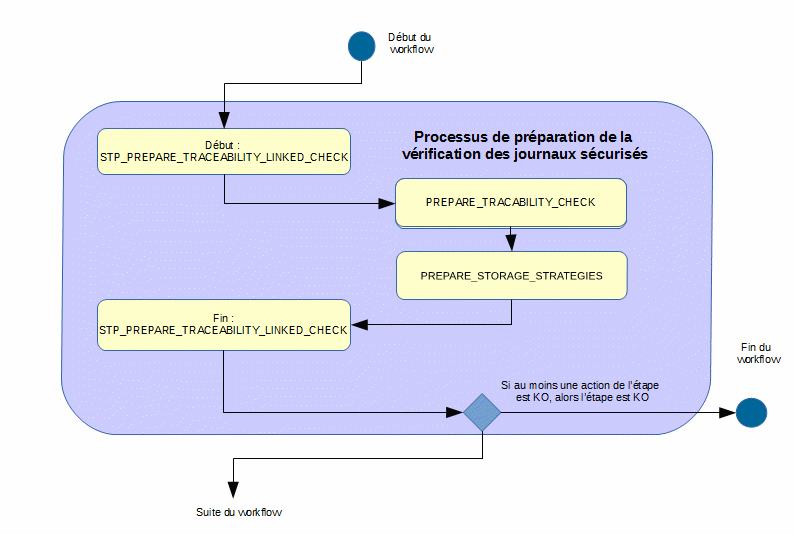

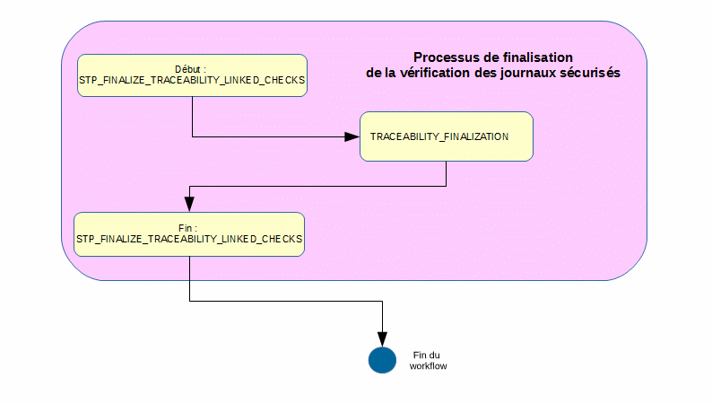
### Workflow de l’audit de l’existence et de l’intégrité des fichiers
Cette section décrit le processus (workflow) d’audit de l’existence et de l’intégrité des fichiers mis en place dans la solution logicielle Vitam.

Celui-ci est défini dans le fichier « DefaultAuditWorkflow.json » (situé ici : sources/processing/processing-management/src/main/resources/workflows).

Toutes les étapes, tâches et traitements sont journalisés dans le journal des opérations et décrivent le processus (clé et description de la clé associée dans le journal des opérations) tel qu’implémenté dans la version actuelle de la solution logicielle Vitam.

Le processus d’audit prend comme point d’entrée l’identifiant d’un tenant, l’identifiant d’un service producteur ou une requête DSL sur des Units. Il est possible de lancer un audit de l’existence des fichiers uniquement, ou de lancer un audit vérifiant l’existence et l’intégrité des fichiers en même temps.
#### Processus d’audit d’existence des fichiers (vision métier)
Pour chaque objet du tenant choisi ou chaque objet appartenant au service producteur, l’audit va vérifier :
-  Que la stratégie de stockage définie dans le groupe d’objet existe bien sur la plateforme
-  Que tous les fichiers correspondant aux objets existent sur les offres déclarées dans la stratégie, dans un nombre de copie spécifié via la stratégie de stockage

#### Processus d’audit d’intégrité des fichiers (vision métier)
Si l’audit d’intégrité des objets est lancé, le processus va également vérifier que les empreintes des objets stockés en base de données sont bien les mêmes que les empreintes fournies par les espaces de stockage, alors recalculées à la demande de l’audit.
Dans une première étape technique, le processus prépare la liste des groupes d’objets à auditer afin de paralléliser la tâche. Dans un second temps, il effectue la vérification elle-même. A la fin du processus d’audit, un rapport est généré.

#### Processus de préparation de l’audit (STP_PREPARE_AUDIT)
##### Vérification des seuils de limitation de traitement des unités archivistiques CHECK_DISTRIBUTION_THRESHOLD
-  **Règle** : tâche consistant à vérifier les seuils de limitation de traitement des unités archivistiques
-  **Type** : bloquant
-  **Statuts** :
    - OK : la vérification des seuils de limitation de traitement des unités archivistiques a bien été effectuée (CHECK_DISTRIBUTION_THRESHOLD.OK = Succès de la vérification des seuils de limitation de traitement des unités archivistiques)
    - KO : une incohérence à été détectée entre le seuil et le nombre d’unités archivistiques à traiter. (CHECK_DISTRIBUTION_THRESHOLD.KO = Échec de la vérification des seuils de limitation de traitement des unités archivistiques)
    - FATAL : une erreur technique est survenue lors de la vérification des seuils de limitation de traitement des unités archivistiques (CHECK_DISTRIBUTION_THRESHOLD.FATAL = Erreur technique lors de la vérification des seuils de limitation de traitement des unités archivistiques)

##### Récupération de la configuration des stratégie de stockage de la plateforme PREPARE_STORAGE_STRATEGIES (PrepareStorageStrategiesPlugin.java)
-  **Règle** : tâche consistant à charger la configuration des stratégies de la plateforme
-  **Type** : bloquant
-  **Statuts** :
    - OK : les données ont été récupérées et enregistrées dans un fichier de travail avec succès (PREPARE_STORAGE_STRATEGIES,OK = Succès de la récupération de la liste des stratégies de stockage)
    - FATAL : une erreur technique est survenue lors de la création de la liste (PREPARE_STORAGE_STRATEGIE.FATAL = Erreur technique lors de la récupération de la liste des stratégies de stockage)

##### Création de la liste des groupes d’objets LIST_OBJECTGROUP_ID (PrepareAuditActionHandler.java)
-  **Règle** : tâche consistant à créer la liste des groupes d’objets à auditer
-  **Type** : bloquant
-  **Statuts** :
    - OK : la liste a été créée avec succès (LIST_OBJECTGROUP_ID.OK = Succès de la création de la liste des groupes d’objets à auditer)
    - FATAL : une erreur technique est survenue lors de la création de la liste (LIST_OBJECTGROUP_ID.FATAL = Erreur technique lors de la création de la liste des groupes d’objets à auditer)

#### Processus d’exécution de l’audit (STP_AUDIT)
##### Audit de la vérification des objets AUDIT_CHECK_OBJECT (AuditCheckObjectPlugin.java)
-  **Règle** : tâche consistant à organiser et lancer l’action d’audit de la vérification des objets. 
-  **Type** : bloquant
-  **Statuts** :
    - OK : l’action d’audit de la vérification des objets s’est terminée en OK (AUDIT_CHECK_OBJECT.OK = Succès de l’audit de la vérification des objets)
    - KO : l’action d’audit de la vérification des objets s’est terminée en KO (AUDIT_CHECK_OBJECT.KO = Échec de l’audit de la vérification des objets : au moins un objet demandé n’existe pas ou des stratégies de stockage n’existent pas sur la plateforme)
    - FATAL : une erreur technique est survenue lors du lancement de l’action d’audit (AUDIT_CHECK_OBJECT.FATAL = Erreur technique lors de l’audit de la vérification des objets)
La tâche Audit_Check_Object contient le traitement suivant : 
##### Audit de l’existence et de l’intégrité des objets AUDIT_CHECK_OBJECT.AUDIT_CHECK_OBJECT
-  **Règle** : traitement consistant à auditer l’existence et l’intégrité des objets
    - La stratégie de stockage du groupe d’objets est conforme à celle du moteur de stockage
    - Les fichiers correspondant aux objets, déclarés dans le groupe d’objets, existent bien sous le même nom dans les offres de stockage
-  **Type** : bloquant
-  **Statuts** :
    - OK : tous les objets de tous les groupes d’objet audités existent bien sur les offres de stockage et leurs empreintes sont identiques entre celles enregistrées en base de données et celles recalculées par les offres de stockage (AUDIT_CHECK_OBJECT.AUDIT_CHECK_OBJECT.OK = Succès de l’audit de l’existence et de l’intégrité des objets)
    - KO : au moins un objet n’est pas intègre pour les groupes d’objets, audités (AUDIT_CHECK_OBJECT.AUDIT_CHECK_OBJECT.KO = Échec de l’audit de l’existence de fichiers)
    - Warning : il n’y a aucun objet à auditer (cas par exemple d’un producteur sans objets) (AUDIT_CHECK_OBJECT.AUDIT_CHECK_OBJECT.WARNING = Avertissement lors de l’audit de l’existence et de l’intégrité des objets : au moins un élément n’a pas d’objet binaire à vérifier)
    - FATAL : une erreur technique est survenue lors de l’audit de l’existence et de l’intégrité des objets (AUDIT_CHECK_OBJECT.AUDIT_FILE_EXISTING.FATAL = Erreur technique lors de l’audit de l’existence et de l’intégrité des objets)

#### Processus de finalisation de l’audit (STP_FINALISE_AUDIT)
Notification de la fin d’audit REPORT_AUDIT (GenerateAuditReportActionHandler.java)
-  **Règle** : tâche consistant à générer le rapport d’audit
-  **Type** : bloquant
-  **Statuts** :
    - OK : le rapport a été créé avec succès (REPORT_AUDIT.OK = Succès de la notification de la fin de l’audit)
    - FATAL : une erreur technique est survenue lors de la création du rapport d’audit (REPORT_AUDIT.OK.FATAL = Erreur technique lors de la notification de la fin de l’audit)
#### Structure du workflow de l’audit de l’existence et de l’intégrité des fichiers
D’une façon synthétique, le workflow est décrit de cette façon :

#### Rapport d’audit
Le rapport d’audit est un fichier JSON généré par la solution logicielle Vitam lorsqu’une opération d’audit se termine. Cette section décrit la manière dont ce rapport est structuré.
##### Exemple de JSON : rapport d’audit d’intégrité et d’existence KO

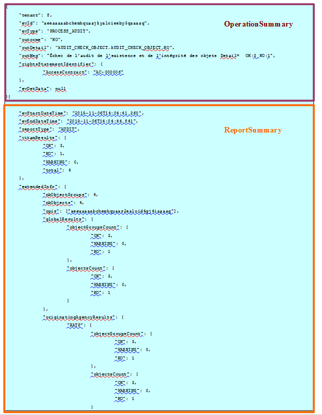


##### Détail du rapport
La partie « OperationSummary », c’est-à-dire le bloc à la racine du rapport et correspondant au résumé de l’opération (sans indentation) est composée des champs suivants :
-  « tenant » : tenant sur lequel l’opération d’audit a été lancée
-  « evId » : identifiant de l’événement
-  « evType » : code du type de l’opération
-  « outcome »: statut de l’événement
-  « outcomeMsg » : détail du résultat de l’événement.
-  « rightsStatementIdentifier »:identifiant des données référentielles en vertu desquelles l’opération peut s’exécuter.
-  « evDetData » : détails des données l’événement

La partie « ReportSummary », c’est-à-dire le bloc situé sous la racine du rapport et correspondant au résumé du rapport est composée des champs suivants :
-  « evStartDateTime » : date du début de l’opération (evDateTime de l'event master de l’opération dans le Journal des Opérations)
-  « evEndDateTime » : date de fin d’opération (dernier evDateTime dans l’opération dans le Journal des Opérations) 
-  « reportType »: corresponds au modèle du rapport. Chaque opération de masse (audit, élimination…) aura un « reportType » associé 
-  « vitamResults » : est le nombre de OK, KO, WARNING de l’opération ainsi que le total de ces 3 statuts.
-  « extendedInfo » : partie libre où chaque type de rapport pourra ajouter des informations qui lui est propre. Ici on y trouve :
    - le nombre total de groupes d’objets et d’objets audités pour l’ensemble de l’opération (« nbObjectGroups », « nbObjects »)
    - les identifiants des opérations d’entrée concernant ces groupes d’objets et objets (« opis »)
    - un résultat global (« globalResults ») remontant le nombre de groupes d’objets et d’objets aux statuts « OK », « KO » et « WARNING » (« objectGroupsCount » et « objectsCount »)
    - Un résultat par service producteur (« originatingAgencyResultats ») remontant le nombre de groupes d’objets et d’objets aux statuts « OK », « KO » et « WARNING » « objectGroupsCount » et « objectsCount »).

La partie « Context » correspond à la requête DSL utilisée pour créer la distribution sur chaque unité archivistique.On y retrouve outre la requête elle-même le type d’audit réalisée (« auditActions », ici AUDIT_FILE_INTEGRITY), l’élément sur lequel l’audit à été lancé. Celui-ci peut-être par « tenant », ou par « originatingagency » (« auditType », ici ORIGINATINGAGENCY) et enfin, identifiant de l’élément (tenant ou service producteur), (« objectId », ici « RATP ).
La partie « ReportDetail » contient les détails pour chaque groupe d’objets et objets audités dont le statut est « KO »
La liste des éléments singuliers générant un avertissement « auditWarning » décrit les identifiants des services producteurs ayant généré un avertissement. Dans le cas de l’audit de l’existence des fichiers, une alerte correspond au fait qu’un service producteur n’a aucun objet à auditer. Cette liste est donc l’ensemble des services producteurs concernés par l’audit mais dont il n’existe aucun objet à auditer.

### Workflow d’audit de cohérence des fichiers
Cette section décrit le processus (workflow) d’audit de cohérence des fichiers mis en place dans la solution logicielle Vitam.
Celui-ci est défini dans le fichier « EvidenceAuditWorkflow.json » (situé ici : sources/processing/processing-management/src/main/resources/workflows).
Toutes les étapes, tâches et traitements sont journalisées dans le journal des opérations et décrivent le processus (clé et description de la clé associée dans le journal des opérations) tel qu’implémenté dans la version actuelle de la solution logicielle Vitam.
#### Processus d’audit de cohérence des fichiers (vision métier)
Le processus d’audit de cohérence permet de vérifier la cohérence entre les signatures calculées pour chaque élément audité, en comparant celle présente dans le journal sécurisé, avec celle présente dans la base de donnée, et celle de l’offre de stockage.
L’audit s’applique au niveau des unités archivistiques, des objets et des groupes d’objets.

#### Processus de préparation d’audit (STP_EVIDENCE_AUDIT_PREPARE)
##### Vérification des seuils de limitation de traitement des unités archivistiques CHECK_DISTRIBUTION_THRESHOLD
-  **Règle** : tâche consistant à vérifier les seuils de limitation de traitement des unités archivistiques
-  **Type** : bloquant
-  **Statuts** :
    - OK : la vérification des seuils de limitation de traitement des unités archivistiques a bien été effectuée (CHECK_DISTRIBUTION_THRESHOLD.OK = Succès de la vérification des seuils de limitation de traitement des unités archivistiques)
    - KO : une incohérence à été détectée entre le seuil et le nombre d’unités archivistiques à traiter. (CHECK_DISTRIBUTION_THRESHOLD.KO = Échec de la vérification des seuils de limitation de traitement des unités archivistiques)
    - FATAL : une erreur technique est survenue lors de la vérification des seuils de limitation de traitement des unités archivistiques (CHECK_DISTRIBUTION_THRESHOLD.FATAL = Erreur technique lors de la vérification des seuils de limitation de traitement des unités archivistiques)

##### Récupération de la configuration des stratégie de stockage de la plateforme PREPARE_STORAGE_STRATEGIES (PrepareStorageStrategiesPlugin.java)
-  **Règle** : tâche consistant à charger la configuration des stratégies de la plateforme
-  **Type** : bloquant
-  **Statuts** :
    - OK : les données ont été récupérées et enregistrées dans un fichier de travail avec succès (PREPARE_STORAGE_STRATEGIES,OK = Succès de la récupération de la liste des stratégies de stockage)
    - FATAL : une erreur technique est survenue lors de la création de la liste (PREPARE_STORAGE_STRATEGIE.FATAL = Erreur technique lors de la récupération de la liste des stratégies de stockage)
##### Création de la liste à auditer EVIDENCE_AUDIT_LIST_OBJECT (EvidenceAuditPrepare.java)
-  **Règle** : tâche consistant à établir la liste des objets à auditer
-  **Type** : bloquant
-  **Statuts** :
    - OK : la liste a été créée avec succès (EVIDENCE_AUDIT_LIST_OBJECT.OK = Succès de la création de la liste à auditer)
    - KO : échec de la création de la liste à auditer (EVIDENCE_AUDIT_LIST_OBJECT.KO = Échec de la création de la liste à auditer)
    - FATAL : une erreur technique est survenue lors de la création de la liste (EVIDENCE_AUDIT_LIST_OBJECT.FATAL = Erreur technique lors de la création de la liste à auditer)

#### Processus de récupération des données de la base (STP_EVIDENCE_AUDIT_CHECK_DATABASE)
##### Récupération des données dans la base de données EVIDENCE_AUDIT_CHECK_DATABASE (EvidenceAuditDatabaseCheck.java)
-  **Règle** : tâche consistant à récupérer les informations nécessaires à l’audit dans la base de données
-  **Type** : bloquant
-  **Statuts** :
    - OK : la récupération des données dans la base de données est un succès (EVIDENCE_AUDIT_CHECK_DATABASE.OK = Succès de la récupération des données dans la base de données)
    - KO : la récupération des données dans la base de donnée est un échec (EVIDENCE_AUDIT_CHECK_DATABASE.KO = Échec de la récupération des données dans la base de données)
    - FATAL : une erreur technique est survenue dans la récupération des données dans la base de données (EVIDENCE_AUDIT_CHECK_DATABASE.FATAL = Erreur technique lors de la récupération des données dans la base de données)
    - WARNING : avertissement lors de la récupération des données dans la base de données (EVIDENCE_AUDIT_CHECK_DATABASE.WARNING = Avertissement lors de la récupération des données dans la base de données)

#### Processus de préparation des signatures à partir des fichiers sécurisés (STP_EVIDENCE_AUDIT_LIST_SECURED_FILES_TO_DOWNLOAD)
#####  Préparation de la liste des signatures dans les fichiers sécurisés EVIDENCE_AUDIT_LIST_SECURED_FILES_TO_DOWNLOAD (EvidenceAuditListSecuredFiles.java)
-  **Règle** : tâche consistant à préparer la liste des signatures des objets, groupes d’objets ou unités archivistiques archivées, dans les fichiers sécurisés
-  **Type** : bloquant
-  **Statuts** :
    - OK : la préparation de la liste des signatures dans les fichiers sécurisés est un succès (EVIDENCE_AUDIT_LIST_SECURED_FILES_TO_DOWNLOAD.OK = Succès de la préparation de la liste des signatures dans les fichiers sécurisés)
    - KO : la préparation de la liste des signatures dans les fichiers sécurisés est un échec (EVIDENCE_AUDIT_LIST_SECURED_FILES_TO_DOWNLOAD.KO = Échec de la préparation de la liste des signatures dans les fichiers sécurisés)
    - WARNING : avertissement lors de la préparation de la liste des signatures (EVIDENCE_AUDIT_LIST_SECURED_FILES_TO_DOWNLOAD.WARNING = Avertissement lors de la préparation de la liste des signatures dans les fichiers sécurisés)
    - FATAL : une erreur technique est survenue lors de la préparation de la liste des signatures dans les fichiers sécurisés (EVIDENCE_AUDIT_LIST_SECURED_FILES_TO_DOWNLOAD.FATAL = Erreur technique lors de la préparation de la liste des signatures dans les fichiers sécurisés)

#### Processus d’extraction des signatures à partir des fichiers sécurisés (STP_EVIDENCE_AUDIT_EXTRACT_ZIP_FILE)
##### Extraction des signatures à partir des fichiers sécurisés EVIDENCE_AUDIT_EXTRACT_ZIP_FILE (EvidenceAuditExtractFromZip.java)
-  **Règle** : tâche consistant à extraire les signatures des objets, groupes d’objets ou unités archivistiques archivées, dans les fichiers sécurisés
-  **Type** : bloquant
-  **Statuts** :
    - OK : l’extraction des signatures à partir des fichiers sécurisés est un succès (EVIDENCE_AUDIT_EXTRACT_ZIP_FILE.OK = Succès de l’extraction des signatures à partir des fichiers sécurisés)
    - KO : l’extraction des signatures à partir des fichiers sécurisés est un échec (EVIDENCE_AUDIT_EXTRACT_ZIP_FILE.KO = Échec de l’extraction des signatures à partir des fichiers sécurisés)
    - WARNING : avertissement lors de l’extraction des signatures à partir des fichiers sécurisés (STP_EVIDENCE_AUDIT_EXTRACT_ZIP_FILE.WARNING = Avertissement lors de l’extraction des signatures à partir des fichiers sécurisés)
    - FATAL : une erreur technique est survenue lors de l’extraction des signatures à partir des fichiers sécurisés (EVIDENCE_AUDIT_EXTRACT_ZIP_FILE.FATAL = Erreur technique lors de l’extraction des signatures à partir des fichiers sécurisés)

#### Processus de préparation des rapports pour chaque objet, groupe d’objets ou unité audité (STP_EVIDENCE_AUDIT_PREPARE_GENERATE_REPORTS)
#####  Création du rapport pour chaque unité archivistique ou objet ou groupe d’objets EVIDENCE_AUDIT_PREPARE_GENERATE_REPORTS (EvidenceAuditGenerateReports.java)
-  **Règle** : tâche consistant à créer le rapport pour chaque unité archivistique, objet ou groupe d’objets audité
-  **Type** : bloquant
-  **Statuts** :
    - OK : La création du rapport pour chaque unité archivistique ou objet ou groupe d’objets est un succès (EVIDENCE_AUDIT_PREPARE_GENERATE_REPORTS.OK = Succès de la création du rapport pour chaque unité archivistique ou objet ou groupe d’objets)
    - KO : la création du rapport pour chaque unité archivistique ou objet ou groupe d’objets est un échec (EVIDENCE_AUDIT_PREPARE_GENERATE_REPORTS.KO = Échec de la création du rapport pour chaque unité archivistique ou objet ou groupe d’objets)
    - FATAL : une erreur technique est survenue de la création du rapport pour chaque unité archivistique ou objet ou groupe d’objets (EVIDENCE_AUDIT_PREPARE_GENERATE_REPORTS.FATAL = Erreur technique lors de la création du rapport pour chaque unité archivistique ou objet ou groupe d’objets)
    - WARNING : avertissement lors de la création du rapport pour chaque unité archivistique ou objet ou groupe d’objets (EVIDENCE_AUDIT_PREPARE_GENERATE_REPORTS.WARNING = Avertissement lors de la création du rapport pour chaque unité archivistique ou objet ou groupe d’objets)
#### Processus de finalisation d’audit et génération du rapport final (STP_EVIDENCE_AUDIT_FINALIZE)
##### Création du rapport d’audit de cohérence EVIDENCE_AUDIT_FINALIZE (EvidenceAuditFinalize.java)
-  **Règle** : tâche consistant à créer le rapport permettant de comparer les signatures extraites des fichiers sécurisés avec les données de la base de données et de l’offre de stockage
-  **Type** : bloquant
-  **Statuts** :
    - OK : la création du rapport d’audit de cohérence est un succès (EVIDENCE_AUDIT_FINALIZE.OK = Succès de la création du rapport d’audit de cohérence)
    - KO : la création du rapport d’audit de cohérence est un échec (EVIDENCE_AUDIT_FINALIZE.KO = Échec de la création du rapport d’audit de cohérence)
    - FATAL : une erreur technique est survenue lors de la création du rapport d’audit de cohérence) (EVIDENCE_AUDIT_FINALIZE.FATAL = Erreur technique lors de la création du rapport d’audit de cohérence)
#### Structure du workflow d’audit de cohérence des fichiers
D’une façon synthétique, le workflow est décrit de cette façon :
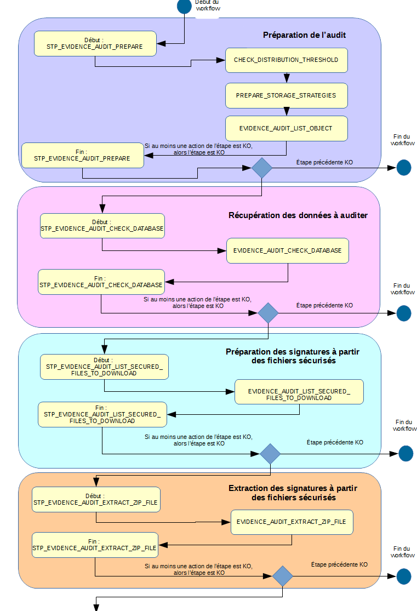
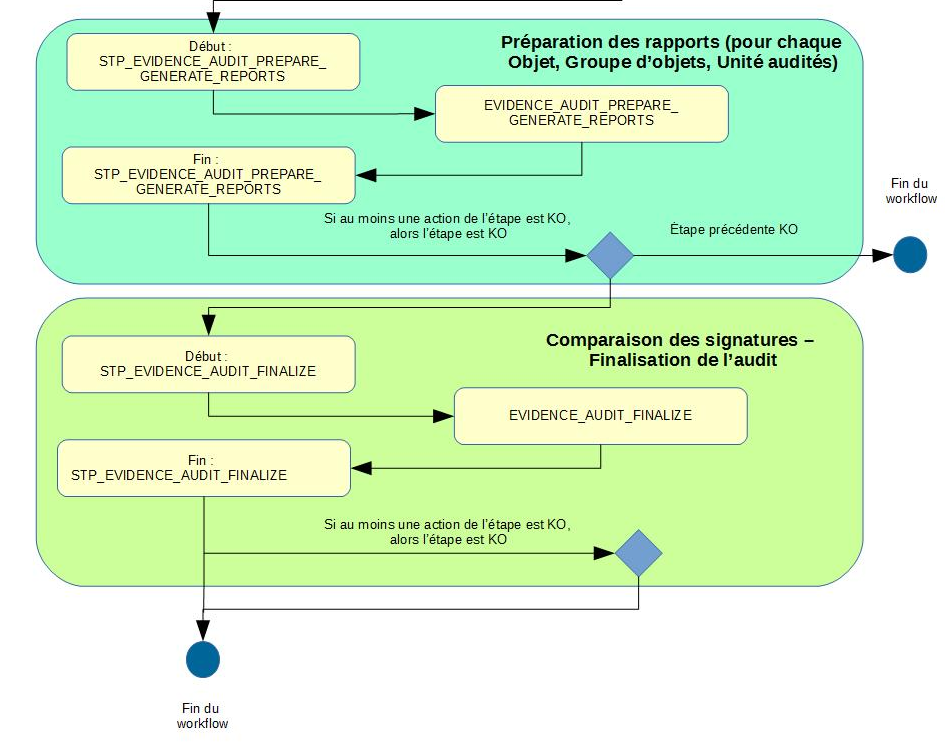

#### Rapport d’audit de cohérence
Le rapport d’audit de cohérence est un fichier JSONL généré par la solution logicielle Vitam lorsqu’une opération d’audit se termine. En cas de succès (EVIDENCE_AUDIT.OK), le rapport ne précise pas les unités archivistiques, les groupes d’objets techniques et les objets techniques qui ont fait l’objet de l’audit. Dans les cas de KO et de WARNING le rapport retourne les informations détaillées ci-dessous.
##### Exemple de JSON : rapport d’audit de cohérence d’un objet technique KO

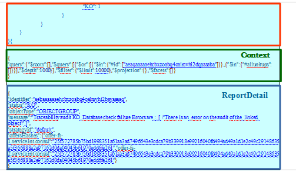

##### Détail du rapport
La partie « OperationSummary », c’est-à-dire le bloc à la racine du rapport et correspondant au résumé de l’opération (sans indentation) est composée des champs suivants :
-  « tenant » : tenant sur lequel l’opération d’audit a été lancée
-  « evId » : identifiant de l’événement
-  « evType » : code du type de l’opération
-  « outcome »: statut de l’événement
-  « outcomeMsg » : détail du résultat de l’événement.
-  « rightsStatementIdentifier »:identifiant des données référentielles en vertu desquelles l’opération peut s’exécuter.
-  « evDetData » : détails des données l’événement
      
La partie « ReportSummary », c’est-à-dire le bloc situé sous la racine du rapport et correspondant au résumé du rapport est composée des champs suivants :
-  « evStartDateTime » : date du début de l’opération (evDateTime de l'event master de l’opération dans le journal des opérations) ;
-  « evEndDateTime » : date de fin d’opération (dernier evDateTime dans l’opération dans le journal des opérations) ;
-  « reportType »: corresponds au modèle du rapport. Chaque opération de masse (audit, élimination…) a un « reportType » associé. Dans le cas d’un audit de cohérence, la valeur du champ est égale à « EVIDENCE_AUDIT » ;
-  « vitamResults » : est le nombre de OK, KO, WARNING de l’opération ainsi que le total de ces 3 statuts ;
-  « extendedInfo » : partie libre où chaque type de rapport contient des informations qui lui est propre. Ici on y trouve :
    - le nombre total d’unités archivistiques auditées pour l’ensemble de l’opération (« nbArchiveUnits »),
    - le nombre total de groupes d’objets audités pour l’ensemble de l’opération (« nbObjectGroups »),
    - le nombre total d’objets audités pour l’ensemble de l’opération (« nbObjects »),
    - un résultat global (« globalResults ») remontant le nombre d’unités archivistiques, de groupes d’objets et d’objets aux statuts « OK », « KO » et « WARNING » (« objectGroupsCount », « archiveUnitsCount » et « objectsCount »)
La partie « Context » correspond à la requête DSL utilisée pour créer la distribution sur chaque unité archivistique. Dans le rapport d’un audit de cohérence, on y retrouve uniquement la requête.

La partie « ReportDetail » contient les détails de l’opération d’audit de cohérence effectuée sur chacune des unités archivistiques, des groupes d’objets techniques et/ou des objets techniques, uniquement quand ces derniers sont aux statuts « KO » ou « WARNING ».
-  « identifier » : identifiant de l’objet, groupe d’objets ou unité archivistique audité ;
-  « status » : résultat de l’opération pour le groupe d’objets, l’objet ou l’unité archivistique concerné, pouvant correspondre aux valeurs suivantes : « KO » ou « WARNING » ;
-  « objectType » : type de l’objet audité, pouvant correspondre aux valeurs suivantes : « UNIT », « OBJECTGROUP » ou « OBJECT » ;
-  « message » : message qui signale une incohérence entre les signatures des fichiers sécurisés, des offres de stockage et de la base de données ;
-  « securedHash » : empreindre du journal sécurisé de l’unité archivistique, objet ou groupe d’objets ;
-  « offersHashes » : signatures de l’élément audité (unité archivistique ou groupes d’objets techniques) dans les différentes offres de stockage ;
-  « strategyId » : identifiant de la stratégie de stockage.

### Workflow de l’audit correctif
Cette section décrit le processus (workflow) de l’audit correctif des fichiers mis en place dans la solution logicielle Vitam. Cette opération peut être effectuée suite à l’audit de cohérence. Cette action est effectuée via API. Cependant, dans un souci de démonstration et à titre d’écran expérimental un lancement de l’audit correctif peut-être effectué à partir de l’IHM recette (cf 2.4 Test Audit correctif).

Toutes les étapes, tâches et traitements sont journalisées dans le journal des opérations et décrivent le processus (clé et description de la clé associée dans le journal des opérations) tel qu’implémenté dans la version actuelle de la solution logicielle Vitam.
#### Processus d’audit correctif des fichiers (vision métier)
Cette action a pour but de corriger des objets défaillants. Cette correction fait suite à l’audit de cohérence. L’audit correctif veut résoudre une situation anormale : l’empreinte des fichiers ne correspond plus à l’empreinte enregistrée en base et sur les espaces de stockage. Afin de corriger et de rectifier ces erreurs, l’audit correctif va supprimer la copie défaillante (si cela est possible) et restaurer à partir de la stratégie de stockage une copie saine (copie dont l’empreinte est OK). Les premières parties du workflow de correction de l’audit suivent les mêmes étapes que l’audit de cohérence, le traitement de correction et de récupération des données dans les offres de stockage ou la base de données intervient dans la seconde partie du workflow.

#### Processus de préparation d’audit (STP_EVIDENCE_AUDIT_PREPARE)
##### Vérification des seuils de limitation de traitement des unités archivistiques CHECK_DISTRIBUTION_THRESHOLD
-  **Règle** : étape consistant à vérifier les seuils de limitation de traitement des unités archivistiques
-  **Type** : bloquant
-  **Statuts** :
    - OK : la vérification des seuils de limitation de traitement des unités archivistiques a bien été effectuée (CHECK_DISTRIBUTION_THRESHOLD.OK = Succès de la vérification des seuils de limitation de traitement des unités archivistiques)
    - KO : une incohérence à été détectée entre le seuil et le nombre d’unités archivistiques à traiter (CHECK_DISTRIBUTION_THRESHOLD.KO = Échec de la vérification des seuils de limitation de traitement des unités archivistiques)
    - FATAL : une erreur technique est survenue lors de la vérification des seuils de limitation de traitement des unités archivistiques (CHECK_DISTRIBUTION_THRESHOLD.FATAL = Erreur technique lors de la vérification des seuils de limitation de traitement des unités archivistiques)

#####  Récupération de la configuration des stratégie de stockage de la plateforme PREPARE_STORAGE_STRATEGIES (PrepareStorageStrategiesPlugin.java)
-  **Règle** : tâche consistant à charger la configuration des stratégies de la plateforme
-  **Type** : bloquant
-  **Statuts** :
    - OK : les données ont été récupérées et enregistrées dans un fichier de travail avec succès (PREPARE_STORAGE_STRATEGIES.OK = Succès de la récupération de la liste des stratégies de stockage)
    - FATAL : une erreur technique est survenue lors de la création de la liste (PREPARE_STORAGE_STRATEGIES.FATAL = Erreur technique lors de la récupération de la liste des stratégies de stockage)
#####  Création de la liste à auditer EVIDENCE_AUDIT_LIST_OBJECT (EvidenceAuditPrepare.java)
-  **Règle** : tâche consistant à établir la liste des objets à auditer
-  **Type** : bloquant
-  **Statuts** :
    - OK : la liste a été créée avec succès (EVIDENCE_AUDIT_LIST_OBJECT.OK = Création de la liste à auditer)
    - KO : échec de la création de la liste à auditer (EVIDENCE_AUDIT_LIST_OBJECT.KO = Échec lors de la création de la liste à auditer)
    - FATAL : une erreur technique est survenue lors de la création de la liste (EVIDENCE_AUDIT_LIST_OBJECT.FATAL = Erreur technique lors de la création de la liste à auditer)

#### Processus de récupération des données de la base (STP_EVIDENCE_AUDIT_CHECK_DATABASE)
##### Récupération des données dans la base de donnée EVIDENCE_AUDIT_CHECK_DATABASE (EvidenceAuditDatabaseCheck.java)
-  **Règle** : tâche consistant à récupérer les informations nécessaires à l’audit dans la base de données
-  **Type** : bloquant
-  **Statuts** :
    - OK : la récupération des données dans la base de données est un succès (EVIDENCE_AUDIT_CHECK_DATABASE.OK = Succès de la récupération des données dans la base de données)
    - KO : la récupération des données dans la base de données est un échec (EVIDENCE_AUDIT_CHECK_DATABASE.KO = Échec de la récupération des données dans la base de données)
    - FATAL : une erreur technique est survenue dans la récupération des données dans la base de données (EVIDENCE_AUDIT_CHECK_DATABASE.FATAL = Erreur technique lors de la récupération des données dans la base de données)
    - WARNING : avertissement lors de la récupération des données dans la base de données (EVIDENCE_AUDIT_CHECK_DATABASE.WARNING = Avertissement lors de la récupération des données dans la base de données)

#### Processus de préparation des signatures à partir des fichiers sécurisés (STP_EVIDENCE_AUDIT_LIST_SECURED_FILES_TO_DOWNLOAD)
#####  Préparation de la liste des signatures dans les fichiers sécurisés EVIDENCE_AUDIT_LIST_SECURED_FILES_TO_DOWNLOAD (EvidenceAuditListSecuredFiles.java)
-  **Règle** : tâche consistant à préparer la liste des signatures des objets, groupes d’objets ou unités archivistiques archivées, dans les fichiers sécurisés
-  **Type** : bloquant
-  **Statuts** :
    - OK : la préparation de la liste des signatures dans les fichiers sécurisés est un succès (EVIDENCE_AUDIT_LIST_SECURED_FILES_TO_DOWNLOAD.OK = Succès de la préparation de la liste des signatures dans les fichiers sécurisés)
    - KO : la préparation de la liste des signatures dans les fichiers sécurisés est un échec (EVIDENCE_AUDIT_LIST_SECURED_FILES_TO_DOWNLOAD.KO = Échec de la préparation de la liste des signatures dans les fichiers sécurisés)
    - WARNING : avertissement lors de la préparation de la liste des signatures (EVIDENCE_AUDIT_LIST_SECURED_FILES_TO_DOWNLOAD.WARNING = Avertissement lors de la préparation de la liste des signatures dans les fichiers sécurisés)
    - FATAL : une erreur technique est survenue lors de la préparation de la liste des signatures dans les fichiers sécurisés (EVIDENCE_AUDIT_LIST_SECURED_FILES_TO_DOWNLOAD.FATAL = Erreur technique lors de la préparation de la liste des signatures dans les fichiers sécurisés)

#### Processus d’extraction des signatures à partir des fichiers sécurisés (STP_EVIDENCE_AUDIT_EXTRACT_ZIP_FILE)
##### Extraction des signatures à partir des fichiers sécurisés EVIDENCE_AUDIT_EXTRACT_ZIP_FILE (EvidenceAuditExtractFromZip.java)
-  **Règle** : tâche consistant à extraire les signatures des objets, groupes d’objets ou unités archivistiques archivées, dans les fichiers sécurisés
-  **Type** : bloquant
-  **Statuts** :
    - OK : l’extraction des signatures à partir des fichiers sécurisés est un succès (EVIDENCE_AUDIT_EXTRACT_ZIP_FILE.OK = Succès de l’extraction des signatures à partir des fichiers sécurisés)
    - KO : l’extraction des signatures à partir des fichiers sécurisés est un échec (EVIDENCE_AUDIT_EXTRACT_ZIP_FILE.KO = Échec de l’extraction des signatures à partir des fichiers sécurisés)
    - WARNING : avertissement lors de l’extraction des signatures à partir des fichiers sécurisés (STP_EVIDENCE_AUDIT_EXTRACT_ZIP_FILE.WARNING = Avertissement lors de l’extraction des signatures à partir des fichiers sécurisés )
    - FATAL : Une erreur technique est survenue lors de l’extraction des signatures à partir des fichiers sécurisés (EVIDENCE_AUDIT_EXTRACT_ZIP_FILE.FATAL = Erreur technique lors de l’extraction des signatures à partir des fichiers sécurisés)

#### Processus de préparation des rapports pour chaque objet, groupe d’objets ou unité audité (STP_EVIDENCE_AUDIT_PREPARE_GENERATE_REPORTS)
##### Création du rapport pour chaque unité archivistique ou objet ou groupe d’objets EVIDENCE_AUDIT_PREPARE_GENERATE_REPORTS (EvidenceAuditGenerateReports.java)
-  **Règle** : tâche consistant à créer le rapport pour chaque unité archivistique, objet ou groupe d’objets audité
-  **Type** : bloquant
-  **Statuts** :
    - OK : la création du rapport pour chaque unité archivistique ou objet ou groupe d’objets est un succès (EVIDENCE_AUDIT_PREPARE_GENERATE_REPORTS.OK = Succès de la création du rapport pour chaque unité archivistique ou objet ou groupe d’objets)
    - KO : la création du rapport pour chaque unité archivistique ou objet ou groupe d’objets est un échec (EVIDENCE_AUDIT_PREPARE_GENERATE_REPORTS.KO = Échec de la création du rapport pour chaque unité archivistique ou objet ou groupe d’objets)
    - FATAL : une erreur technique est survenue de la création du rapport pour chaque unité archivistique ou objet ou groupe d’objets (EVIDENCE_AUDIT_PREPARE_GENERATE_REPORTS.FATAL = Erreur technique lors de la création du rapport pour chaque unité archivistique ou objet ou groupe d’objets)
    - WARNING : avertissement lors de la création du rapport pour chaque unité archivistique ou objet ou groupe d’objets (EVIDENCE_AUDIT_PREPARE_GENERATE_REPORTS.WARNING = Avertissement lors de la création du rapport pour chaque unité archivistique ou objet ou groupe d’objets)

#### Processus de correction des signatures pour chaque objet, groupe d’objets ou unité auditée défaillante (STP_CORRECTIVE_AUDIT)
##### Vérification de la disponibilité des ressources CORRECTIVE_AUDIT_CHECK_RESOURCE_AVAILABILITY (DataRectificationCheckResourceAvailability.java)
-  **Règle** : tâche consistant à vérifier la disponibilité synchrone en lecture des objets, groupe d’objets ou unité auditée défaillante. En cas d'indisponibilité d'un ou plusieurs objets l’exécution de l'étape courante est renvoyée au moteur de stockage pour ré-exécution ultérieure quand les données seront disponibles.
-  **Type** : bloquant
-  **Statuts** :
    - OK : les objets sont disponibles (CORRECTIVE_AUDIT_CHECK_RESOURCE_AVAILABILITY.OK = Succès de la vérification de la disponibilité des objets sur l'offre de stockage)
    - FATAL : une erreur technique est survenue lors de la vérification de la disponibilité des objets (CORRECTIVE_AUDIT_CHECK_RESOURCE_AVAILABILITY.FATAL = Erreur technique lors de la vérification de la disponibilité des objets sur l'offre de stockage)
#####  Correction des signatures pour chaque objet, groupe d’objets ou unité auditée défaillante (CORRECTIVE_AUDIT)
-  **Règle** : tâche consistant à récupérer les données du/des fichiers corrompus auprès de la base de données ou d’une offre de stockage valide
-  **Type** : bloquant
-  **Statuts** :
    - OK : La correction des signatures de chaque unité archivistique ou objet ou groupe d’objets corrompue a bien été effectuée (CORRECTIVE_AUDIT.OK = Succès de la correction des signatures de chaque unité archivistique ou objet ou groupe d’objets corrompue)
    - KO : la correction des signatures de chaque unité archivistique ou objet ou groupe d’objets corrompue n’a pas été effectuée (CORRECTIVE_AUDIT.KO = Échec de la correction des signatures de chaque unité archivistique ou objet ou groupe d’objets corrompue)
    - FATAL : une erreur technique est survenue lors de la correction des signatures de chaque unité archivistique ou objet ou groupe d’objets corrompu (CORRECTIVE_AUDIT.FATAL = Erreur technique lors de la correction des signatures de chaque unité archivistique ou objet ou groupe d’objets corrompue)
    - WARNING : avertissement lors de la correction des signatures de chaque unité archivistique ou objet ou groupe d’objets corrompu (CORRECTIVE_AUDIT.WARNING = Avertissement lors de la correction des signatures de chaque unité archivistique ou objet ou groupe d’objets corrompue)

#### Processus de finalisation des corrections des signatures pour chaque objet, groupe d’objets ou unité auditée défaillante (STP_CORRECTION_FINALIZE)
##### Finalisation des corrections des signatures pour chaque objet, groupe d’objets ou unité auditée, défaillante (CORRECTION_FINALIZE)
-  **Règle** : tâche consistant à finaliser la correction des signatures sur les données du/des fichiers corrompus auprès de la base de données ou d’une offre de stockage valide
-  **Type** : bloquant
-  **Statuts** :
    - OK : la finalisation des corrections des signatures pour chaque objet, groupe d’objets ou unité auditée défaillante a bien été effectuée (CORRECTION_FINALIZE.OK = Succès du processus de finalisation des corrections des signatures pour chaque objet, groupe d’objets ou unité auditée défaillante)
    - KO : la finalisation des corrections des signatures pour chaque objet, groupe d’objets ou unité auditée défaillante n’a pas été effectuée (CORRECTION_FINALIZE.KO = Échec du processus de finalisation des corrections des signatures pour chaque objet, groupe d’objets ou unité auditée défaillante)
    - FATAL : une erreur technique est survenue lors de la finalisation des corrections des signatures pour chaque objet, groupe d’objets ou unité auditée défaillante (CORRECTION_FINALIZE.FATAL = erreur technique est survenue lors du processus de finalisation des corrections des signatures pour chaque objet, groupe d’objets ou unité auditée défaillante)
    - WARNING : avertissement lors de la finalisation des corrections des signatures pour chaque objet, groupe d’objets ou unité auditée défaillante (CORRECTION_FINALIZE.WARNING = Avertissement lors du processus de finalisation des corrections des signatures pour chaque objet, groupe d’objets ou unité auditée défaillante)
#### Structure du workflow de correction suite à audit
D’une façon synthétique, le workflow est décrit de cette façon :

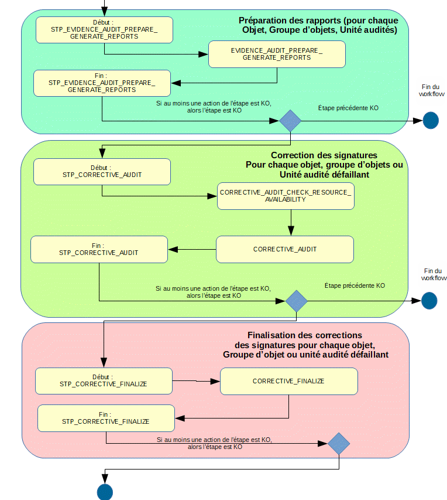


#### Rapport d’audit correctif
Le rapport d’audit correctif est un fichier JSON généré par la solution logicielle Vitam lorsqu’une opération d’audit se termine. En cas de succès (RECTIFICATION_AUDIT.OK), le rapport précise uniquement l’identifiant des unités archivistiques qui ont fait l’objet de l’audit.

#####  Exemple de JSON : rapport d’audit correctif

[{"Id":"aeaqaaaaaehgynv2aamukalojeze6iiaaaaq","Type":"UNIT"}]'

### Workflow de relevé de valeur probante
Cette section décrit le processus (workflow) de relevé de valeur probante. L’objectif est de rendre prouvable toute opération effectuée sur toute unité archivistique ou tout objet qui lui est associé. Ce relevé de valeur probante réunit les éléments permettant de fournir à un auditeur externe une présomption de confiance dans ce qui lui est communiqué.  
Toutes les étapes, tâches et traitement sont journalisées dans le journal des opérations et décrivent le processus (clé et description de la clé associée dans le journal des opérations) tel qu’implémenté dans la version actuelle de la solution logicielle Vitam.
#### Processus de préparation du relevé de valeur probante (STP_PROBATIVE_VALUE_PREPARE)
##### Vérification des seuils de limitation de traitement des unités archivistiques CHECK_DISTRIBUTION_THRESHOLD
-  **Règle** : étape consistant à vérifier les seuils de limitation de traitement des unités archivistiques
-  **Type** : bloquant
-  **Statuts** :
    - OK : la vérification des seuils de limitation de traitement des unités archivistiques a bien été effectuée (CHECK_DISTRIBUTION_THRESHOLD.OK = Succès de la vérification des seuils de limitation de traitement des unités archivistiques)
    - KO : une incohérence à été détectée entre le seuil et le nombre d’unités archivistiques à traiter. (CHECK_DISTRIBUTION_THRESHOLD.KO = Échec de la vérification des seuils de limitation de traitement des unités archivistiques)
    - FATAL : une erreur technique est survenue lors de la vérification des seuils de limitation de traitement des unités archivistiques (CHECK_DISTRIBUTION_THRESHOLD.FATAL = Erreur technique lors de la vérification des seuils de limitation de traitement des unités archivistiques)
#####  Création du fichier de distribution permettant de réaliser le relevé de valeur probante (PROBATIVE_VALUE__CREATE_DISTRIBUTION_FILE)
-  **Règle** : étape consistant à créer un fichier de distribution permettant de réaliser le relevé de valeur probante
-  **Type** : bloquant
-  **Statuts** :
    - OK : la création du fichier de distribution a bien effectué (PROBATIVE_VALUE_CREATE_DISTRIBUTION_FILE.OK = Succès de la création du fichier de distribution permettant de réaliser le  relevé de valeur probante)
    - KO : la création du fichier de distribution n’a pas été effectué (PROBATIVE_VALUE_CREATE_DISTRIBUTION_FILE.KO = Échec lors de la création du fichier de distribution permettant de réaliser le relevé de valeur probante)
    - FATAL : une erreur technique est survenue lors de la création du fichier de distribution (PROBATIVE_VALUE_CREATE_DISTRIBUTION_FILE.FATAL = Une erreur technique est survenue lors de la création du fichier de distribution permettant de réaliser le relevé de valeur probante)
#### Processus d’alimentation du relevé de valeur probante (STP_PROBATIVE_VALUE_ACTION)
##### Ajout d’une entrée dans le relevé de valeur probante (PROBATIVE_VALUE_CREATE_PROBATIVE_REPORT_ENTRY)
-  **Règle** : tâche consistant à créer une entrée dans le relevé de valeur probante
-  **Type** : bloquant
-  **Statuts** :
    - OK : la création d’une entrée dans le relevé de valeur probante à bien été effectué (PROBATIVE_VALUE_CREATE_PROBATIVE_REPORT_ENTRY.OK = Succès de la création d’une entrée dans le relevé de valeur probante)
    - KO : la création d’une entrée dans le relevé de valeur probante n’a pas été effectué (PROBATIVE_VALUE_CHECK_OBJECT_GROUP.KO = Échec de la création d’une entrée dans le relevé de valeur probante)
    - WARNING : avertissement lors de la création d’une entrée dans le relevé de valeur probante (PROBATIVE_VALUE_CHECK_OBJECT_GROUP.WARNING = Avertissement lors de la création d’une entrée dans le relevé de valeur probante)
    - FATAL : une erreur technique est survenue lors de la création d’une entrée dans le relevé de valeur probante (PROBATIVE_VALUE_CHECK_OBJECT_GROUP.FATAL = Erreur technique lors de la création d’une entrée dans le  relevé de valeur probante)

#### Processus de finalisation du relevé de valeur probante (STP_PROBATIVE_VALUE_GENERATE_REPORT)
##### Finalisation du relevé de valeur probante (PROBATIVE_VALUE_CREATE_REPORT)
-  **Règle** : tâche consistant à finaliser le relevé de valeur probante
-  **Type** : bloquant
-  **Statuts** :
    - OK : Finalisation du relevé de valeur probante à été effectué avec succès. (PROBATIVE_VALUE_CREATE_REPORT.OK = Succès de la création du relevé de valeur probante pour chaque unité archivistique, objet ou groupe d’objets audité)
    - KO : Finalisation du relevé de valeur probante n’a pas été effectué. (PROBATIVE_VALUE_CREATE_REPORT.KO = Échec de la création du relevé de valeur probante pour chaque unité archivistique, objet ou groupe d’objets audité)
    - WARNING : avertissement lors de la finalisation du relevé de valeur probante (PROBATIVE_VALUE_CREATE_REPORT.WARNING = Avertissement lors de la création du relevé de valeur probante pour chaque unité archivistique, objet ou groupe d’objets audité)
    - FATAL : une erreur technique est survenue lors de la finalisation du relevé de valeur probante (PROBATIVE_VALUE_CREATE_REPORT.FATAL = Erreur technique lors de la création du relevé de valeur probante pour chaque unité archivistique, objet ou groupe d’objets audité)
#### Structure de workflow du relevé de valeur probante
D’une façon synthétique, le workflow est décrit de cette façon :


### Rapport du relevé de valeur probante
Le relevé de valeur probante est un fichier JSON généré par la solution logicielle Vitam. Le relevé de valeur probante réunit les éléments permettant de fournir à un auditeur externe une présomption de confiance dans ce qui lui est communiqué.
#### Exemple de JSON : rapport de valeur probante
``````
{
  "operationSummary" : {
    "tenant" : 0,
    "evId" : "aeeaaaaaachemhquabmugaloiuua7xaaaaaq",
    "evType" : "EXPORT_PROBATIVE_VALUE",
    "outcome" : "OK",
    "outDetail" : "EXPORT_PROBATIVE_VALUE.OK",
    "outMsg" : "Succès lors du processus d'export du relevé de valeur probante",
    "rightsStatementIdentifier" : {
      "AccessContract" : "ContratTNR"
    }
  },

  "reportSummary" : {
    "evStartDateTime" : "2019-11-07T09:18:05.178",
    "evEndDateTime" : "2019-11-07T09:18:06.640",
    "reportType" : "PROBATIVE_VALUE",
    "vitamResults" : {
      "OK" : 1,
      "KO" : 0,
      "WARNING" : 0,
      "total" : 1
    }
  },

  "context" : {
    "dslQuery" : {
      "$query" : [ {
        "$or" : [ {
          "$in" : {
            "#id" : [ "aeaqaaaaaahgynv2aa3oealoiqpvbraaaaba" ]
          }
        }, {
          "$in" : {
            "#allunitups" : [ ]
          }
        } ]
      } ],
      "$filter" : { },
      "$projection" : { }
    },
    "usage" : "BinaryMaster",
    "version" : "1"
  },

  "reportEntries" : [ {
    "unitIds" : [ "aeaqaaaaaahgynv2aa3oealoiqpvbraaaaba" ],
    "objectGroupId" : "aebaaaaaaahgynv2aa3oealoiqpva2qaaaaq",
    "objectId" : "aeaaaaaaaahgynv2aa3oealoiqpvazyaaaaq",
    "usageVersion" : "BinaryMaster_1",
    "operations" : [ {
      "id" : "aecaaaaaachnaqi7abbwqaloirpkzpiaaaaq",
      "evTypeProc" : "STP_OP_SECURISATION",
      "evDateTime" : "2019-11-07T05:38:05.629"
    }, {
      "id" : "aecaaaaaachnaqi7abbwqaloirpsv3qaaaaq",
      "evTypeProc" : "LOGBOOK_OBJECTGROUP_LFC_TRACEABILITY",
      "evDateTime" : "2019-11-07T05:38:37.934"
    }, {
      "id" : "aeeaaaaaachemhquabwdcaloiqpuvhiaaaaq",
      "evTypeProc" : "PROCESS_SIP_UNITARY",
      "rightsStatementIdentifier" : "{\"ArchivalAgreement\":\"ArchivalAgreement0\"}",
      "agIdApp" : "CT-000001",
      "evDateTime" : "2019-11-07T04:28:51.829"
    } ],
    "checks" : [ {
      "name" : "TIMESTAMP_OPERATION_DATABASE_TRACEABILITY_VALIDATION",
      "details" : "Validating timestamp operation found in database 'AND' timestamp operation found in traceability secured file.",
      "type" : "TIMESTAMP_CHECKING",
      "source" : "DATABASE",
      "destination" : "TRACEABILITY_FILE",
      "sourceComparable" : "MIILITAVAgEAMBAMDk9wZXJhdGlvbiBPa2F5MIILBgYJKoZIhvcNAQcCoIIK9zCCCvMCAQMxDzANBglghkgBZQMEAgMFADCBgAYLKoZIhvcNAQkQAQSgcQRvMG0CAQEGASkwUTANBglghkgBZQMEAgMFAARA4fpDituDLaS2w6jnrd31fi/4VyJQ9uzEyVvngUM2IybKkVjZzTNLwnO3lZb+ZHrjvYoc2+2gzJ8Rw93deFzAtgIBARgPMjAxOTExMDcwNTM4MDdaoIIGhzCCBoMwggRroAMCAQICAgDUMA0GCSqGSIb3DQEBCwUAMHgxCzAJBgNVBAYTAmZyMQwwCgYDVQQIDANpZGYxDjAMBgNVBAcMBXBhcmlzMQ4wDAYDVQQKDAV2aXRhbTEUMBIGA1UECwwLYXV0aG9yaXRpZXMxJTAjBgNVBAMMHGNhX2ludGVybWVkaWF0ZV90aW1lc3RhbXBpbmcwHhcNMTkxMTA3MDIzMzA1WhcNMjIxMTA2MDIzMzA1WjBUMQswCQYDVQQGEwJmcjEMMAoGA1UECAwDaWRmMQ4wDAYDVQQHDAVwYXJpczEOMAwGA1UECgwFdml0YW0xFzAVBgNVBAMMDnNlY3VyZS1sb2dib29rMIICIjANBgkqhkiG9w0BAQEFAAOCAg8AMIICCgKCAgEA09lqSj5nvYlemZC4CHCzTpHNgK1WzA/ILRjVL4ho2vfT6yx9TstAQqsVARrsknmAGJ2KMillffIOEZ00ph3H0oo7auWOuGDytsfteRMdFSVOxUfM/1jBUXgqhg6VSHVka1ueAu0kg4g0ADvWrJbtVKHxps9vrEA+H4tEiTT3mfKEdWBAyLz4cGOln4ip3s1GMSjmVgDwVgbzPnHvD1VUDLij6dYHbkAQaLSRh9hl47dPVbzOe1qZAUPDML6kVUI6fM9jxAzQJqub0jL+vEGvMUmJTqSTnFXAUC5GOf3LU5iV/cwyGUWY0rz5kKS1XLT9jvYteijxYe4nf0y/V5Yzp/6F/52esT4rqI5x9QGfv9TxSHiymcu316au14uFw+M+qLy4khC1BhNbsHojjnGhR33KuRa/QAZltPJ3KyFC3NLSfGrJSi+JbZV5yS5yybkd1F25TdyUSFxk+0lQEvmL6ngsjKQHqSNdsTWmAHdBuE614ErrySxGwjnFBMOfsPK2HKe3dc7iZUZYhPPUyBq8RVWDvHVFtQuXBCkCMSVNK6rVjmYMuSiI8oAy0TK7ixfAqMmE2yZwoJt7hMYbo0Adrfjg7Bf95uP2LDC8LkWsALhIJdFOJT5ANXsWxGM0LmFmGTRoPFOb2E0G/QQKAc0GEgRiG4qGihCLiZSGJ81CYw0CAwEAAaOCATkwggE1MCUGCWCGSAGG+EIBDQQYFhZDZXJ0aWZpY2F0IFNlcnZldXIgU1NMMB0GA1UdDgQWBBRpel2gJ6UBuGBr8LG5d7Sa8kfmazCBmwYDVR0jBIGTMIGQgBQHzKjBQYoL+UCSHcYIsFk+rST006F0pHIwcDELMAkGA1UEBhMCZnIxDDAKBgNVBAgMA2lkZjEOMAwGA1UEBwwFcGFyaXMxDjAMBgNVBAoMBXZpdGFtMRQwEgYDVQQLDAthdXRob3JpdGllczEdMBsGA1UEAwwUY2Ffcm9vdF90aW1lc3RhbXBpbmeCAgDTMAkGA1UdEgQCMAAwDAYDVR0TAQH/BAIwADALBgNVHQ8EBAMCBsAwEQYJYIZIAYb4QgEBBAQDAgZAMBYGA1UdJQEB/wQMMAoGCCsGAQUFBwMIMA0GCSqGSIb3DQEBCwUAA4ICAQAwjDb7PvGAmqgW62+mXQHHo6hh8ikJyyz6kT10jLaRVUou77ZMoUqF5GlS6d+tSpvGL5cdrs2Z5WqZPny3DyOxBBsGnIY9FM0herQAr6mY6xyTB+TrQDfqZeaqL0m1I/PAWiQNwjDUJCDGEhvaoOm046fJNKcXrPjb9cQ/CEsWdOJ4ERBZnUV8nOyVjCPQeW2yrY1hZrtYrfpTGl7thy0INGBz/zySHl5ArF1lbD75Z3o9ABMtRTqPjJ5R/FeEzOYXZdpdc5C7UqQwyZXcQpRQlYJvedBDrBqGQ5AZ9KMnQEmQEHoE1zyxWoxpo2I1C/G/X/nvBIiqgVUgsxTdh/btOIQPvKS/PuvmuqUeCb1KKwS7txgY4g5387q8NuV
MrhUc6iux3J1mcX7ismaAk/1AZPojzbNNxFwW5N/4+q2TM8Q+0q3lxO9wyiGQqoCuP76ZvO0REukpFgUsBf+Yot1qyTxFYxpwgW1hX9ed8VsWJPHUNOy97Cd8MOPfgj+CefBemvMa8zQH958KWtkjLlYKAhQuXHM5E6CuDUpE98090+ulNp4g7lSSJBaLOCMZWplji0syFRIGuirNloDruhilX/NOuGvBk5AUtvVvsbfFm3gOCpx+ijUMLcaBd5e6J0+xyvK2v0a+/x25hPjuLp/weXmiMGtANyzbgmvJrNkgUDGCA80wggPJAgEBMH4weDELMAkGA1UEBhMCZnIxDDAKBgNVBAgMA2lkZjEOMAwGA1UEBwwFcGFyaXMxDjAMBgNVBAoMBXZpdGFtMRQwEgYDVQQLDAthdXRob3JpdGllczElMCMGA1UEAwwcY2FfaW50ZXJtZWRpYXRlX3RpbWVzdGFtcGluZwICANQwDQYJYIZIAWUDBAIDBQCgggEgMBoGCSqGSIb3DQEJAzENBgsqhkiG9w0BCRABBDAcBgkqhkiG9w0BCQUxDxcNMTkxMTA3MDUzODA3WjAtBgkqhkiG9w0BCTQxIDAeMA0GCWCGSAFlAwQCAwUAoQ0GCSqGSIb3DQEBDQUAME8GCSqGSIb3DQEJBDFCBECZFLQlPJunF7t9ueEP12tiDJ31dsEAWDnL/6UUUi+duet24AvfKjtOOlwlEeJrR0oHeYnUadXZwGQo7/+Qs5a0MGQGCyqGSIb3DQEJEAIvMVUwUzBRME8wCwYJYIZIAWUDBAIDBEAeduVLSR3MT88jYzzAMR8nbaiHoZPSUfMPxK/1Ekh3DXK7z46X0bKIs87kWN8Rjacz7QuF7nDQmPRcETZHjUjoMA0GCSqGSIb3DQEBDQUABIICAF6U4lAIlcQTEJGOXIQinnZ4clRer9SW91s9WDWzCxyOq4d60vnq3rTgKdNiIYBeLomRujr3DjUI6Byt57mHJe/AWqvAb+1BBhUWkPKjbWadkXPyeMxMTHhgUUKd4OBMMBITK0g9WWR7Vz5ouB2AOV2XMcKce5B17N5Rlv5mH5J9EgHFfp+osLE2GM5jtw5L8nOxA+U9056vxXvKRMNCKk8X6cKGJCL9uUkq+UiZQu1sQEAlQC+7x6YMvfL51RXy+oRzD5W85InR5IqGFjjdazD1wbONBODrVFn4t0PI6PqW56KFsJDYXhP4xiyY9s+O857blP3rMfiDrPDCEcJzTc6ChOmn2XD/5F6958w9x/3LqOCI1c7grLLuCk28ndgiS5nuQ4k/yOEnLbGhlZuFKDxpAZctRCS3gDz4hLcbJmiCns0trQ29BybHddwzqUQf2LHuzrciZgWjpB+MYOBTfUu+ifau8pSB1wctAe6GSczKDYS/E0tLd9NFzXayxDwgslqvxdV6FdstLGb6LHe8xFNf/KfNzgzeQN8K6xE76qc3/dvqmIKUWqzndBjc/6tl3zDxOBnyFITcnCWJZFTLbCPA+ZUaw4yiWC26Gz7BxOUtTvurZoyB5VkCdMHb4IQdrR1GhG1hRH9v7ES8dBHcZdHnflX5igjqPJrEpZVDeZfM",
      "destinationComparable" : "MIILITAVAgEAMBAMDk9wZXJhdGlvbiBPa2F5MIILBgYJKoZIhvcNAQcCoIIK9zCCCvMCAQMxDzANBglghkgBZQMEAgMFADCBgAYLKoZIhvcNAQkQAQSgcQRvMG0CAQEGASkwUTANBglghkgBZQMEAgMFAARA4fpDituDLaS2w6jnrd31fi/4VyJQ9uzEyVvngUM2IybKkVjZzTNLwnO3lZb+ZHrjvYoc2+2gzJ8Rw93deFzAtgIBARgPMjAxOTExMDcwNTM4MDdaoIIGhzCCBoMwggRroAMCAQICAgDUMA0GCSqGSIb3DQEBCwUAMHgxCzAJBgNVBAYTAmZyMQwwCgYDVQQIDANpZGYxDjAMBgNVBAcMBXBhcmlzMQ4wDAYDVQQKDAV2aXRhbTEUMBIGA1UECwwLYXV0aG9yaXRpZXMxJTAjBgNVBAMMHGNhX2ludGVybWVkaWF0ZV90aW1lc3RhbXBpbmcwHhcNMTkxMTA3MDIzMzA1WhcNMjIxMTA2MDIzMzA1WjBUMQswCQYDVQQGEwJmcjEMMAoGA1UECAwDaWRmMQ4wDAYDVQQHDAVwYXJpczEOMAwGA1UECgwFdml0YW0xFzAVBgNVBAMMDnNlY3VyZS1sb2dib29rMIICIjANBgkqhkiG9w0BAQEFAAOCAg8AMIICCgKCAgEA09lqSj5nvYlemZC4CHCzTpHNgK1WzA/ILRjVL4ho2vfT6yx9TstAQqsVARrsknmAGJ2KMillffIOEZ00ph3H0oo7auWOuGDytsfteRMdFSVOxUfM/1jBUXgqhg6VSHVka1ueAu0kg4g0ADvWrJbtVKHxps9vrEA+H4tEiTT3mfKEdWBAyLz4cGOln4ip3s1GMSjmVgDwVgbzPnHvD1VUDLij6dYHbkAQaLSRh9hl47dPVbzOe1qZAUPDML6kVUI6fM9jxAzQJqub0jL+vEGvMUmJTqSTnFXAUC5GOf3LU5iV/cwyGUWY0rz5kKS1XLT9jvYteijxYe4nf0y/V5Yzp/6F/52esT4rqI5x9QGfv9TxSHiymcu316au14uFw+M+qLy4khC1BhNbsHojjnGhR33KuRa/QAZltPJ3KyFC3NLSfGrJSi+JbZV5yS5yybkd1F25TdyUSFxk+0lQEvmL6ngsjKQHqSNdsTWmAHdBuE614ErrySxGwjnFBMOfsPK2HKe3dc7iZUZYhPPUyBq8RVWDvHVFtQuXBCkCMSVNK6rVjmYMuSiI8oAy0TK7ixfAqMmE2yZwoJt7hMYbo0Adrfjg7Bf95uP2LDC8LkWsALhIJdFOJT5ANXsWxGM0LmFmGTRoPFOb2E0G/QQKAc0GEgRiG4qGihCLiZSGJ81CYw0CAwEAAaOCATkwggE1MCUGCWCGSAGG+EIBDQQYFhZDZXJ0aWZpY2F0IFNlcnZldXIgU1NMMB0GA1UdDgQWBBRpel2gJ6UBuGBr8LG5d7Sa8kfmazCBmwYDVR0jBIGTMIGQgBQHzKjBQYoL+UCSHcYIsFk+rST006F0pHIwcDELMAkGA1UEBhMCZnIxDDAKBgNVBAgMA2lkZjEOMAwGA1UEBwwFcGFyaXMxDjAMBgNVBAoMBXZpdGFtMRQwEgYDVQQLDAthdXRob3JpdGllczEdMBsGA1UEAwwUY2Ffcm9vdF90aW1lc3RhbXBpbmeCAgDTMAkGA1UdEgQCMAAwDAYDVR0TAQH/BAIwADALBgNVHQ8EBAMCBsAwEQYJYIZIAYb4QgEBBAQDAgZAMBYGA1UdJQEB/wQMMAoGCCsGAQUFBwMIMA0GCSqGSIb3DQEBCwUAA4ICAQAwjDb7PvGAmqgW62+mXQHHo6hh8ikJyyz6kT10jLaRVUou77ZMoUqF5GlS6d+tSpvGL5cdrs2Z5WqZPny3DyOxBBsGnIY9FM0herQAr6mY6xyTB+TrQDfqZeaqL0m1I/PAWiQNwjDUJCDGEhvaoOm046fJNKcXrPjb9cQ/CEsWdOJ4ERBZnUV8nOyVjCPQeW2yrY1hZrtYrfpTGl7thy0INGBz/zySHl5ArF1lbD75Z3o9ABMtRTqPjJ5R/FeEzOYXZdpdc5C7UqQwyZXcQpRQlYJvedBDrBqGQ5AZ9KMnQEmQEHoE1zyxWoxpo2I1C/G/X/nvBIiqgVUgsxTdh/btOIQPvKS/PuvmuqUeCb1KKwS7txgY4g5387q8NuVMrhUc6iux3J1mcX7ismaAk/1AZPojzbNNxFwW5N/4+q2TM8Q+0q3lxO9wyiGQqoCuP76ZvO0REukpFgUsBf+Yot1qyTxFYxpwgW1hX9ed8VsWJPHUNOy97Cd8MOPfgj+CefBemvMa8zQH958KWtkjLlYKAhQuXHM5E6CuDUpE98090+ulNp4g7lSSJBaLOCMZWplji0syFRIGuirNloDruhilX/NOuGvBk5AUtvVvsbfFm3gOCpx+ijUMLcaBd5e6J0+xyvK2v0a+/x25hPjuLp/weXmiMGtANyzbgmvJrNkgUDGCA80wggPJAgEBMH4weDELMAkGA1UEBhMCZnIxDDAKBgNVBAgMA2lkZjEOMAwGA1UEBwwFcGFyaXMxDjAMBgNVBAoMBXZpdGFtMRQwEgYDVQQLDAthdXRob3JpdGllczElMCMGA1UEAwwcY2FfaW50ZXJtZWRpYXRlX3RpbWVzdGFtcGluZwICANQwDQYJYIZIAWUDBAIDBQCgggEgMBoGCSqGSIb3DQEJAzENBgsqhkiG9w0BCRABBDAcBgkqhkiG9w0BCQUxDxcNMTkxMTA3MDUzODA3WjAtBgkqhkiG9w0BCTQxIDAeMA0GCWCGSAFlAwQCAwUAoQ0GCSqGSIb3DQEBDQUAME8GCSqGSIb3DQEJBDFCBECZFLQlPJunF7t9ueEP12tiDJ31dsEAWDnL/6UUUi+duet24AvfKjtOOlwlEeJrR0oHeYnUadXZwGQo7/+Qs5a0MGQGCyqGSIb3DQEJEAIvMVUwUzBRME8wCwYJYIZIAWUDBAIDBEAeduVLSR3MT88jYzzAMR8nbaiHoZPSUfMPxK/1Ekh3DXK7z46X0bKIs87kWN8Rjacz7QuF7nDQmPRcETZHjUjoMA0GCSqGSIb3DQEBDQUABIICAF6U4lAIlcQTEJGOXIQinnZ4clRer9SW91s9WDWzCxyOq4d60vnq3rTgKdNiIYBeLomRujr3DjUI6Byt57mHJe/AWqvAb+1BBhUWkPKjbWadkXPyeMxMTHhgUUKd4OBMMBITK0g9WWR7Vz5ouB2AOV2XMcKce5B17N5Rlv5mH5J9EgHFfp+osLE2GM5jtw5L8nOxA+U9056vxXvKRMNCKk8X6cKGJCL9uUkq+UiZQu1sQEAlQC+7x6YMvfL51RXy+oRzD5W85InR5IqGFjjdazD1wbONBODrVFn4t0PI6PqW56KFsJDYXhP4xiyY9s+O857blP3rMfiDrPDCEcJzTc6ChOmn2XD/5F6958w9x/3LqOCI1c7grLLuCk28ndgiS5nuQ4k/yOEnLbGhlZuFKDxpAZctRCS3gDz4hLcbJmiCns0trQ29BybHddwzqUQf2LHuzrciZgWjpB+MYOBTfUu+ifau8pSB1wctAe6GSczKDYS/E0tLd9NFzXayxDwgslqvxdV6FdstLGb6LHe8xFNf/KfNzgzeQN8K6xE76qc3/dvqmIKUWqzndBjc/6tl3zDxOBnyFITcnCWJZFTLbCPA+ZUaw4yiWC26Gz7BxOUtTvurZoyB5VkCdMHb4IQdrR1GhG1hRH9v7ES8dBHcZdHnflX5igjqPJrEpZVDeZfM",
      "action" : "VALIDATION",
      "item" : "TIMESTAMP_OPERATION",
      "status" : "OK"
    }, {
      "name" : "TIMESTAMP_OPERATION_DATABASE_TRACEABILITY_COMPARISON",
      "details" : "Comparing timestamp operation found in database with timestamp operation found in traceability secured file.",
      "type" : "TIMESTAMP_CHECKING",
      "source" : "DATABASE",
      "destination" : "TRACEABILITY_FILE",
      "sourceComparable" : "MIILITAVAgEAMBAMDk9wZXJhdGlvbiBPa2F5MIILBgYJKoZIhvcNAQcCoIIK9zCCCvMCAQMxDzANBglghkgBZQMEAgMFADCBgAYLKoZIhvcNAQkQAQSgcQRvMG0CAQEGASkwUTANBglghkgBZQMEAgMFAARA4fpDituDLaS2w6jnrd31fi/4VyJQ9uzEyVvngUM2IybKkVjZzTNLwnO3lZb+ZHrjvYoc2+2gzJ8Rw93deFzAtgIBARgPMjAxOTExMDcwNTM4MDdaoIIGhzCCBoMwggRroAMCAQICAgDUMA0GCSqGSIb3DQEBCwUAMHgxCzAJBgNVBAYTAmZyMQwwCgYDVQQIDANpZGYxDjAMBgNVBAcMBXBhcmlzMQ4wDAYDVQQKDAV2aXRhbTEUMBIGA1UECwwLYXV0aG9yaXRpZXMxJTAjBgNVBAMMHGNhX2ludGVybWVkaWF0ZV90aW1lc3RhbXBpbmcwHhcNMTkxMTA3MDIzMzA1WhcNMjIxMTA2MDIzMzA1WjBUMQswCQYDVQQGEwJmcjEMMAoGA1UECAwDaWRmMQ4wDAYDVQQHDAVwYXJpczEOMAwGA1UECgwFdml0YW0xFzAVBgNVBAMMDnNlY3VyZS1sb2dib29rMIICIjANBgkqhkiG9w0BAQEFAAOCAg8AMIICCgKCAgEA09lqSj5nvYlemZC4CHCzTpHNgK1WzA/ILRjVL4ho2vfT6yx9TstAQqsVARrsknmAGJ2KMillffIOEZ00ph3H0oo7auWOuGDytsfteRMdFSVOxUfM/1jBUXgqhg6VSHVka1ueAu0kg4g0ADvWrJbtVKHxps9vrEA+H4tEiTT3mfKEdWBAyLz4cGOln4ip3s1GMSjmVgDwVgbzPnHvD1VUDLij6dYHbkAQaLSRh9hl47dPVbzOe1qZAUPDML6kVUI6fM9jxAzQJqub0jL+vEGvMUmJTqSTnFXAUC5GOf3LU5iV/cwyGUWY0rz5kKS1XLT9jvYteijxYe4nf0y/V5Yzp/6F/52esT4rqI5x9QGfv9TxSHiymcu316au14uFw+M+qLy4khC1BhNbsHojjnGhR33KuRa/QAZltPJ3KyFC3NLSfGrJSi+JbZV5yS5yybkd1F25TdyUSFxk+0lQEvmL6ngsjKQHqSNdsTWmAHdBuE614ErrySxGwjnFBMOfsPK2HKe3dc7iZUZYhPPUyBq8RVWDvHVFtQuXBCkCMSVNK6rVjmYMuSiI8oAy0TK7ixfAqMmE2yZwoJt7hMYbo0Adrfjg7Bf95uP2LDC8LkWsALhIJdFOJT5ANXsWxGM0LmFmGTRoPFOb2E0G/QQKAc0GEgRiG4qGihCLiZSGJ81CYw0CAwEAAaOCATkwggE1MCUGCWCGSAGG+EIBDQQYFhZDZXJ0aWZpY2F0IFNlcnZldXIgU1NMMB0GA1UdDgQWBBRpel2gJ6UBuGBr8LG5d7Sa8kfmazCBmwYDVR0jBIGTMIGQgBQHzKjBQYoL+UCSHcYIsFk+rST006F0pHIwcDELMAkGA1UEBhMCZnIxDDAKBgNVBAgMA2lkZjEOMAwGA1UEBwwFcGFyaXMxDjAMBgNVBAoMBXZpdGFtMRQwEgYDVQQLDAthdXRob3JpdGllczEdMBsGA1UEAwwUY2Ffcm9vdF90aW1lc3RhbXBpbmeCAgDTMAkGA1UdEgQCMAAwDAYDVR0TAQH/BAIwADALBgNVHQ8EBAMCBsAwEQYJYIZIAYb4QgEBBAQDAgZAMBYGA1UdJQEB/wQMMAoGCCsGAQUFBwMIMA0GCSqGSIb3DQEBCwUAA4ICAQAwjDb7PvGAmqgW62+mXQHHo6hh8ikJyyz6kT10jLaRVUou77ZMoUqF5GlS6d+tSpvGL5cdrs2Z5WqZPny3DyOxBBsGnIY9FM0herQAr6mY6xyTB+TrQDfqZeaqL0m1I/PAWiQNwjDUJCDGEhvaoOm046fJNKcXrPjb9cQ/CEsWdOJ4ERBZnUV8nOyVjCPQeW2yrY1hZrtYrfpTGl7thy0INGBz/zySHl5ArF1lbD75Z3o9ABMtRTqPjJ5R/FeEzOYXZdpdc5C7UqQwyZXcQpRQlYJvedBDrBqGQ5AZ9KMnQEmQEHoE1zyxWoxpo2I1C/G/X/nvBIiqgVUgsxTdh/btOIQPvKS/PuvmuqUeCb1KKwS7txgY4g5387q8NuVMrhUc6iux3J1mcX7ismaAk/1AZPojzbNNxFwW5N/4+q2TM8Q+0q3lxO9wyiGQqoCuP76ZvO0REukpFgUsBf+Yot1qyTxFYxpwgW1hX9ed8VsWJPHUNOy97Cd8MOPfgj+CefBemvMa8zQH958KWtkjLlYKAhQuXHM5E6CuDUpE98090+ulNp4g7lSSJBaLOCMZWplji0syFRIGuirNloDruhilX/NOuGvBk5AUtvVvsbfFm3gOCpx+ijUMLcaBd5e6J0+xyvK2v0a+/x25hPjuLp/weXmiMGtANyzbgmvJrNkgUDGCA80wggPJAgEBMH4weDELMAkGA1UEBhMCZnIxDDAKBgNVBAgMA2lkZjEOMAwGA1UEBwwFcGFyaXMxDjAMBgNVBAoMBXZpdGFtMRQwEgYDVQQLDAthdXRob3JpdGllczElMCMGA1UEAwwcY2FfaW50ZXJtZWRpYXRlX3RpbWVzdGFtcGluZwICANQwDQYJYIZIAWUDBAIDBQCgggEgMBoGCSqGSIb3DQEJAzENBgsqhkiG9w0BCRABBDAcBgkqhkiG9w0BCQUxDxcNMTkxMTA3MDUzODA3WjAtBgkqhkiG9w0BCTQxIDAeMA0GCWCGSAFlAwQCAwUAoQ0GCSqGSIb3DQEBDQUAME8GCSqGSIb3DQEJBDFCBECZFLQlPJunF7t9ueEP12tiDJ31dsEAWDnL/6UUUi+duet24AvfKjtOOlwlEeJrR0oHeYnUadXZwGQo7/+Qs5a0MGQGCyqGSIb3DQEJEAIvMVUwUzBRME8wCwYJYIZIAWUDBAIDBEAeduVLSR3MT88jYzzAMR8nbaiHoZPSUfMPxK/1Ekh3DXK7z46X0bKIs87kWN8Rjacz7QuF7nDQmPRcETZHjUjoMA0GCSqGSIb3DQEBDQUABIICAF6U4lAIlcQTEJGOXIQinnZ4clRer9SW91s9WDWzCxyOq4d60vnq3rTgKdNiIYBeLomRujr3DjUI6Byt57mHJe/AWqvAb+1BBhUWkPKjbWadkXPyeMxMTHhgUUKd4OBMMBITK0g9WWR7Vz5ouB2AOV2XMcKce5B17N5Rlv5mH5J9EgHFfp+osLE2GM5jtw5L8nOxA+U9056vxXvKRMNCKk8X6cKGJCL9uUkq+UiZQu1sQEAlQC+7x6YMvfL51RXy+oRzD5W85InR5IqGFjjdazD1wbONBODrVFn4t0PI6PqW56KFsJDYXhP4xiyY9s+O857blP3rMfiDrPDCEcJzTc6ChOmn2XD/5F6958w9x/3LqOCI1c7grLLuCk28ndgiS5nuQ4k/yOEnLbGhlZuFKDxpAZctRCS3gDz4hLcbJmiCns0trQ29BybHddwzqUQf2LHuzrciZgWjpB+MYOBTfUu+ifau8pSB1wctAe6GSczKDYS/E0tLd9NFzXayxDwgslqvxdV6FdstLGb6LHe8xFNf/KfNzgzeQN8K6xE76qc3/dvqmIKUWqzndBjc/6tl3zDxOBnyFITcnCWJZFTLbCPA+ZUaw4yiWC26Gz7BxOUtTvurZoyB5VkCdMHb4IQdrR1GhG1hRH9v7ES8dBHcZdHnflX5igjqPJrEpZVDeZfM",
      "destinationComparable" : "MIILITAVAgEAMBAMDk9wZXJhdGlvbiBPa2F5MIILBgYJKoZIhvcNAQcCoIIK9zCCCvMCAQMxDzANBglghkgBZQMEAgMFADCBgAYLKoZIhvcNAQkQAQSgcQRvMG0CAQEGASkwUTANBglghkgBZQMEAgMFAARA4fpDituDLaS2w6jnrd31fi/4VyJQ9uzEyVvngUM2IybKkVjZzTNLwnO3lZb+ZHrjvYoc2+2gzJ8Rw93deFzAtgIBARgPMjAxOTExMDcwNTM4MDdaoIIGhzCCBoMwggRroAMCAQICAgDUMA0GCSqGSIb3DQEBCwUAMHgxCzAJBgNVBAYTAmZyMQwwCgYDVQQIDANpZGYxDjAMBgNVBAcMBXBhcmlzMQ4wDAYDVQQKDAV2aXRhbTEUMBIGA1UECwwLYXV0aG9yaXRpZXMxJTAjBgNVBAMMHGNhX2ludGVybWVkaWF0ZV90aW1lc3RhbXBpbmcwHhcNMTkxMTA3MDIzMzA1WhcNMjIxMTA2MDIzMzA1WjBUMQswCQYDVQQGEwJmcjEMMAoGA1UECAwDaWRmMQ4wDAYDVQQHDAVwYXJpczEOMAwGA1UECgwFdml0YW0xFzAVBgNVBAMMDnNlY3VyZS1sb2dib29rMIICIjANBgkqhkiG9w0BAQEFAAOCAg8AMIICCgKCAgEA09lqSj5nvYlemZC4CHCzTpHNgK1WzA/ILRjVL4ho2vfT6yx9TstAQqsVARrsknmAGJ2KMillffIOEZ00ph3H0oo7auWOuGDytsfteRMdFSVOxUfM/1jBUXgqhg6VSHVka1ueAu0kg4g0ADvWrJbtVKHxps9vrEA+H4tEiTT3mfKEdWBAyLz4cGOln4ip3s1GMSjmVgD
wVgbzPnHvD1VUDLij6dYHbkAQaLSRh9hl47dPVbzOe1qZAUPDML6kVUI6fM9jxAzQJqub0jL+vEGvMUmJTqSTnFXAUC5GOf3LU5iV/cwyGUWY0rz5kKS1XLT9jvYteijxYe4nf0y/V5Yzp/6F/52esT4rqI5x9QGfv9TxSHiymcu316au14uFw+M+qLy4khC1BhNbsHojjnGhR33KuRa/QAZltPJ3KyFC3NLSfGrJSi+JbZV5yS5yybkd1F25TdyUSFxk+0lQEvmL6ngsjKQHqSNdsTWmAHdBuE614ErrySxGwjnFBMOfsPK2HKe3dc7iZUZYhPPUyBq8RVWDvHVFtQuXBCkCMSVNK6rVjmYMuSiI8oAy0TK7ixfAqMmE2yZwoJt7hMYbo0Adrfjg7Bf95uP2LDC8LkWsALhIJdFOJT5ANXsWxGM0LmFmGTRoPFOb2E0G/QQKAc0GEgRiG4qGihCLiZSGJ81CYw0CAwEAAaOCATkwggE1MCUGCWCGSAGG+EIBDQQYFhZDZXJ0aWZpY2F0IFNlcnZldXIgU1NMMB0GA1UdDgQWBBRpel2gJ6UBuGBr8LG5d7Sa8kfmazCBmwYDVR0jBIGTMIGQgBQHzKjBQYoL+UCSHcYIsFk+rST006F0pHIwcDELMAkGA1UEBhMCZnIxDDAKBgNVBAgMA2lkZjEOMAwGA1UEBwwFcGFyaXMxDjAMBgNVBAoMBXZpdGFtMRQwEgYDVQQLDAthdXRob3JpdGllczEdMBsGA1UEAwwUY2Ffcm9vdF90aW1lc3RhbXBpbmeCAgDTMAkGA1UdEgQCMAAwDAYDVR0TAQH/BAIwADALBgNVHQ8EBAMCBsAwEQYJYIZIAYb4QgEBBAQDAgZAMBYGA1UdJQEB/wQMMAoGCCsGAQUFBwMIMA0GCSqGSIb3DQEBCwUAA4ICAQAwjDb7PvGAmqgW62+mXQHHo6hh8ikJyyz6kT10jLaRVUou77ZMoUqF5GlS6d+tSpvGL5cdrs2Z5WqZPny3DyOxBBsGnIY9FM0herQAr6mY6xyTB+TrQDfqZeaqL0m1I/PAWiQNwjDUJCDGEhvaoOm046fJNKcXrPjb9cQ/CEsWdOJ4ERBZnUV8nOyVjCPQeW2yrY1hZrtYrfpTGl7thy0INGBz/zySHl5ArF1lbD75Z3o9ABMtRTqPjJ5R/FeEzOYXZdpdc5C7UqQwyZXcQpRQlYJvedBDrBqGQ5AZ9KMnQEmQEHoE1zyxWoxpo2I1C/G/X/nvBIiqgVUgsxTdh/btOIQPvKS/PuvmuqUeCb1KKwS7txgY4g5387q8NuVMrhUc6iux3J1mcX7ismaAk/1AZPojzbNNxFwW5N/4+q2TM8Q+0q3lxO9wyiGQqoCuP76ZvO0REukpFgUsBf+Yot1qyTxFYxpwgW1hX9ed8VsWJPHUNOy97Cd8MOPfgj+CefBemvMa8zQH958KWtkjLlYKAhQuXHM5E6CuDUpE98090+ulNp4g7lSSJBaLOCMZWplji0syFRIGuirNloDruhilX/NOuGvBk5AUtvVvsbfFm3gOCpx+ijUMLcaBd5e6J0+xyvK2v0a+/x25hPjuLp/weXmiMGtANyzbgmvJrNkgUDGCA80wggPJAgEBMH4weDELMAkGA1UEBhMCZnIxDDAKBgNVBAgMA2lkZjEOMAwGA1UEBwwFcGFyaXMxDjAMBgNVBAoMBXZpdGFtMRQwEgYDVQQLDAthdXRob3JpdGllczElMCMGA1UEAwwcY2FfaW50ZXJtZWRpYXRlX3RpbWVzdGFtcGluZwICANQwDQYJYIZIAWUDBAIDBQCgggEgMBoGCSqGSIb3DQEJAzENBgsqhkiG9w0BCRABBDAcBgkqhkiG9w0BCQUxDxcNMTkxMTA3MDUzODA3WjAtBgkqhkiG9w0BCTQxIDAeMA0GCWCGSAFlAwQCAwUAoQ0GCSqGSIb3DQEBDQUAME8GCSqGSIb3DQEJBDFCBECZFLQlPJunF7t9ueEP12tiDJ31dsEAWDnL/6UUUi+duet24AvfKjtOOlwlEeJrR0oHeYnUadXZwGQo7/+Qs5a0MGQGCyqGSIb3DQEJEAIvMVUwUzBRME8wCwYJYIZIAWUDBAIDBEAeduVLSR3MT88jYzzAMR8nbaiHoZPSUfMPxK/1Ekh3DXK7z46X0bKIs87kWN8Rjacz7QuF7nDQmPRcETZHjUjoMA0GCSqGSIb3DQEBDQUABIICAF6U4lAIlcQTEJGOXIQinnZ4clRer9SW91s9WDWzCxyOq4d60vnq3rTgKdNiIYBeLomRujr3DjUI6Byt57mHJe/AWqvAb+1BBhUWkPKjbWadkXPyeMxMTHhgUUKd4OBMMBITK0g9WWR7Vz5ouB2AOV2XMcKce5B17N5Rlv5mH5J9EgHFfp+osLE2GM5jtw5L8nOxA+U9056vxXvKRMNCKk8X6cKGJCL9uUkq+UiZQu1sQEAlQC+7x6YMvfL51RXy+oRzD5W85InR5IqGFjjdazD1wbONBODrVFn4t0PI6PqW56KFsJDYXhP4xiyY9s+O857blP3rMfiDrPDCEcJzTc6ChOmn2XD/5F6958w9x/3LqOCI1c7grLLuCk28ndgiS5nuQ4k/yOEnLbGhlZuFKDxpAZctRCS3gDz4hLcbJmiCns0trQ29BybHddwzqUQf2LHuzrciZgWjpB+MYOBTfUu+ifau8pSB1wctAe6GSczKDYS/E0tLd9NFzXayxDwgslqvxdV6FdstLGb6LHe8xFNf/KfNzgzeQN8K6xE76qc3/dvqmIKUWqzndBjc/6tl3zDxOBnyFITcnCWJZFTLbCPA+ZUaw4yiWC26Gz7BxOUtTvurZoyB5VkCdMHb4IQdrR1GhG1hRH9v7ES8dBHcZdHnflX5igjqPJrEpZVDeZfM",
      "action" : "COMPARISON",
      "item" : "TIMESTAMP_OPERATION",
      "status" : "OK"
    }, {
      "name" : "MERKLE_OPERATION_DIGEST_DATABASE_TRACEABILITY_COMPARISON",
      "details" : "Comparing operation merkle digest found in database with operation merkle digest found in traceability secured file.",
      "type" : "MERKLE_INTEGRITY",
      "source" : "DATABASE",
      "destination" : "TRACEABILITY_FILE",
      "sourceComparable" : "JI89QHGLjTANLgYByeJ2NY21JOQTMnL3UOmvRICW7Oe8e+0fXSK6CPyLDXXnt1/9KyphZaKXODZvgnrV+PsJww==",
      "destinationComparable" : "JI89QHGLjTANLgYByeJ2NY21JOQTMnL3UOmvRICW7Oe8e+0fXSK6CPyLDXXnt1/9KyphZaKXODZvgnrV+PsJww==",
      "action" : "COMPARISON",
      "item" : "MERKLE_TREE_ROOT_OPERATION_DIGEST",
      "status" : "OK"
    }, {
      "name" : "MERKLE_OPERATION_DIGEST_COMPUTATION_TRACEABILITY_COMPARISON",
      "details" : "Comparing operation merkle digest computed from secured data with operation merkle digest found in traceability secured file.",
      "type" : "MERKLE_INTEGRITY",
      "source" : "COMPUTATION",
      "destination" : "TRACEABILITY_FILE",
      "sourceComparable" : "JI89QHGLjTANLgYByeJ2NY21JOQTMnL3UOmvRICW7Oe8e+0fXSK6CPyLDXXnt1/9KyphZaKXODZvgnrV+PsJww==",
      "destinationComparable" : "JI89QHGLjTANLgYByeJ2NY21JOQTMnL3UOmvRICW7Oe8e+0fXSK6CPyLDXXnt1/9KyphZaKXODZvgnrV+PsJww==",
      "action" : "COMPARISON",
      "item" : "MERKLE_TREE_ROOT_OPERATION_DIGEST",
      "status" : "OK"
    }, {
      "name" : "MERKLE_OPERATION_DIGEST_COMPUTATION_ADDITIONAL_TRACEABILITY_COMPARISON",
      "details" : "Comparing operation merkle digest computed from secured data with operation merkle digest found in additional traceability secured file.",
      "type" : "MERKLE_INTEGRITY",
      "source" : "COMPUTATION",
      "destination" : "ADDITIONAL_TRACEABILITY",
      "sourceComparable" : "JI89QHGLjTANLgYByeJ2NY21JOQTMnL3UOmvRICW7Oe8e+0fXSK6CPyLDXXnt1/9KyphZaKXODZvgnrV+PsJww==",
      "destinationComparable" : "JI89QHGLjTANLgYByeJ2NY21JOQTMnL3UOmvRICW7Oe8e+0fXSK6CPyLDXXnt1/9KyphZaKXODZvgnrV+PsJww==",
      "action" : "COMPARISON",
      "item" : "MERKLE_TREE_ROOT_OPERATION_DIGEST",
      "status" : "OK"
    }, {
      "name" : "PREVIOUS_TIMESTAMP_OPERATION_DATABASE_TRACEABILITY_VALIDATION",
      "details" : "Validating previous timestamp operation found in database 'AND' previous timestamp operation found in traceability secured file.",
      "type" : "CHAIN",
      "source" : "DATABASE",
      "destination" : "TRACEABILITY_FILE",
      "sourceComparable" : "MIILITAVAgEAMBAMDk9wZXJhdGlvbiBPa2F5MIILBgYJKoZIhvcNAQcCoIIK9zCCCvMCAQMxDzANBglghkgBZQMEAgMFADCBgAYLKoZIhvcNAQkQAQSgcQRvMG0CAQEGASkwUTANBglghkgBZQMEAgMFAARACPaKQZakyyhRDnsAhDWafWC2tL1A1Wg0AZIk2ycySfEFppfp1hY6Zpy0c82fZ7srdKPl+uWyqxH6a5q5lDbl5AIBARgPMjAxOTExMDcwNDAwMDlaoIIGhzCCBoMwggRroAMCAQICAgDUMA0GCSqGSIb3DQEBCwUAMHgxCzAJBgNVBAYTAmZyMQwwCgYDVQQIDANpZGYxDjAMBgNVBAcMBXBhcmlzMQ4wDAYDVQQKDAV2aXRhbTEUMBIGA1UECwwLYXV0aG9yaXRpZXMxJTAjBgNVBAMMHGNhX2ludGVybWVkaWF0ZV90aW1lc3RhbXBpbmcwHhcNMTkxMTA3MDIzMzA1WhcNMjIxMTA2MDIzMzA1WjBUMQswCQYDVQQGEwJmcjEMMAoGA1UECAwDaWRmMQ4wDAYDVQQHDAVwYXJpczEOMAwGA1UECgwFdml0YW0xFzAVBgNVBAMMDnNlY3VyZS1sb2dib29rMIICIjANBgkqhkiG9w0BAQEFAAOCAg8AMIICCgKCAgEA09lqSj5nvYlemZC4CHCzTpHNgK1WzA/ILRjVL4ho2vfT6yx9TstAQqsVARrsknmAGJ2KMillffIOEZ00ph3H0oo7auWOuGDytsfteRMdFSVOxUfM/1jBUXgqhg6VSHVka1ueAu0kg4g0ADvWrJbtVKHxps9vrEA+H4tEiTT3mfKEdWBAyLz4cGOln4ip3s1GMSjmVgDwVgbzPnHvD1VUDLij6dYHbkAQaLSRh9hl47dPVbzOe1qZAUPDML6kVUI6fM9jxAzQJqub0jL+vEGvMUmJTqSTnFXAUC5GOf3LU5iV/cwyGUWY0rz5kKS1XLT9jvYteijxYe4nf0y/V5Yzp/6F/52esT4rqI5x9QGfv9TxSHiymcu316au14uFw+M+qLy4khC1BhNbsHojjnGhR33KuRa/QAZltPJ3KyFC3NLSfGrJSi+JbZV5yS5yybkd1F25TdyUSFxk+0lQEvmL6ngsjKQHqSNdsTWmAHdBuE614ErrySxGwjnFBMOfsPK2HKe3dc7iZUZYhPPUyBq8RVWDvHVFtQuXBCkCMSVNK6rVjmYMuSiI8oAy0TK7ixfAqMmE2yZwoJt7hMYbo0Adrfjg7Bf95uP2LDC8LkWsALhIJdFOJT5ANXsWxGM0LmFmGTRoPFOb2E0G/QQKAc0GEgRiG4qGihCLiZSGJ81CYw0CAwEAAaOCATkwggE1MCUGCWCGSAGG+EIBDQQYFhZDZXJ0aWZpY2F0IFNlcnZldXIgU1NMMB0GA1UdDgQWBBRpel2gJ6UBuGBr8LG5d7Sa8kfmazCBmwYDVR0jBIGTMIGQgBQHzKjBQYoL+UCSHcYIsFk+rST006F0pHIwcDELMAkGA1UEBhMCZnIxDDAKBgNVBAgMA2lkZjEOMAwGA1UEBwwFcGFyaXMxDjAMBgNVBAoMBXZpdGFtMRQwEgYDVQQLDAthdXRob3JpdGllczEdMBsGA1UEAwwUY2Ffcm9vdF90aW1lc3RhbXBpbmeCAgDTMAkGA1UdEgQCMAAwDAYDVR0TAQH/BAIwADALBgNVHQ8EBAMCBsAwEQYJYIZIAYb4QgEBBAQDAgZAMBYGA1UdJQEB/wQMMAoGCCsGAQUFBwMIMA0GCSqGSIb3DQEBCwUAA4ICAQAwjDb7PvGAmqgW62+mXQHHo6hh8ikJyyz6kT10jLaRVUou77ZMoUqF5GlS6d+tSpvGL5cdrs2Z5WqZPny3DyOxBBsGnIY9FM0herQAr6mY6xyTB+TrQDfqZeaqL0m1I/PAWiQNwjDUJCDGEhvaoOm046fJNKcXrPjb9cQ/CEsWdOJ4ERBZnUV8nOyVjCPQeW2yrY1hZrtYrfpTGl7thy0INGBz/zySHl5ArF1lbD75Z3o9ABMtRTqPjJ5R/FeEzOYXZdpdc5C7UqQwyZXcQpRQlYJvedBDrBqGQ5A
Z9KMnQEmQEHoE1zyxWoxpo2I1C/G/X/nvBIiqgVUgsxTdh/btOIQPvKS/PuvmuqUeCb1KKwS7txgY4g5387q8NuVMrhUc6iux3J1mcX7ismaAk/1AZPojzbNNxFwW5N/4+q2TM8Q+0q3lxO9wyiGQqoCuP76ZvO0REukpFgUsBf+Yot1qyTxFYxpwgW1hX9ed8VsWJPHUNOy97Cd8MOPfgj+CefBemvMa8zQH958KWtkjLlYKAhQuXHM5E6CuDUpE98090+ulNp4g7lSSJBaLOCMZWplji0syFRIGuirNloDruhilX/NOuGvBk5AUtvVvsbfFm3gOCpx+ijUMLcaBd5e6J0+xyvK2v0a+/x25hPjuLp/weXmiMGtANyzbgmvJrNkgUDGCA80wggPJAgEBMH4weDELMAkGA1UEBhMCZnIxDDAKBgNVBAgMA2lkZjEOMAwGA1UEBwwFcGFyaXMxDjAMBgNVBAoMBXZpdGFtMRQwEgYDVQQLDAthdXRob3JpdGllczElMCMGA1UEAwwcY2FfaW50ZXJtZWRpYXRlX3RpbWVzdGFtcGluZwICANQwDQYJYIZIAWUDBAIDBQCgggEgMBoGCSqGSIb3DQEJAzENBgsqhkiG9w0BCRABBDAcBgkqhkiG9w0BCQUxDxcNMTkxMTA3MDQwMDA5WjAtBgkqhkiG9w0BCTQxIDAeMA0GCWCGSAFlAwQCAwUAoQ0GCSqGSIb3DQEBDQUAME8GCSqGSIb3DQEJBDFCBECaBL12eV9W7T0Y2Qbm43JWJDlmeXFeRgiwCTSfh91uIPdxavc8huFSy5UuP9xeJ8gX7/NQ5ftuNy4SHxRM60YyMGQGCyqGSIb3DQEJEAIvMVUwUzBRME8wCwYJYIZIAWUDBAIDBEAeduVLSR3MT88jYzzAMR8nbaiHoZPSUfMPxK/1Ekh3DXK7z46X0bKIs87kWN8Rjacz7QuF7nDQmPRcETZHjUjoMA0GCSqGSIb3DQEBDQUABIICALZUqEjXV7rYVWAgJ31YxJHADF3mYOv3aehjQlGMIuCzzmdzgW9V3FagQvQB60rJg/sApdwgvRM4uAX9TG0sVKigsZ/sxhnhEEg5CEdP93R16y47/TZYXs37Vqa3Qycd5xiEvL4zmJUl2ZA2SKptweiqt3VmWID4cZkYonTgwTgFIwev3YpDXd/1Dy1zV5AnAs65bO37jVqxjVRUA2PUwxAvvOxG6uQLXj7GlbncTaQpSYhMErR1H0lpNvQ1F3D3O/RpVSWnVjbToLTeADDsk4fJjsIU1fZeC3Im/OZw1rKVzEDZdtuRvCr7LIst1JtxEcZTHDgiKmQXN4t39h+S49nBOldFq/V43IdqMT+bjKxQlOG0x4dtnIvfDnH0eu93KuHr9ivGDp3GnDBLzePTX99kzM2Ky1vBeVL2+MzN27CIdceuZlQ1zpahXDgi+iOERhIf1GS+P2iR4vF4GKbUvsYQUrB2WNNaG/naffGFDPVcd4tB6rJDOBR1TzgwaSEwUamlVebSkZBgvDIalzB12CuefhY+bMUPGbtQlWrrr6HizPTL2/KrPakCoZk5nw9/MICO+20eU6gP+s69TsV32CCTIpKxK87QD0NHz2ZBj5Ejte4h1sYxtR+3HvQYITaHlYxHMvy0KZVytMqCMVM/Fyf2LGN9XjPd+ddDvyA7htRT",
      "destinationComparable" : "MIILITAVAgEAMBAMDk9wZXJhdGlvbiBPa2F5MIILBgYJKoZIhvcNAQcCoIIK9zCCCvMCAQMxDzANBglghkgBZQMEAgMFADCBgAYLKoZIhvcNAQkQAQSgcQRvMG0CAQEGASkwUTANBglghkgBZQMEAgMFAARACPaKQZakyyhRDnsAhDWafWC2tL1A1Wg0AZIk2ycySfEFppfp1hY6Zpy0c82fZ7srdKPl+uWyqxH6a5q5lDbl5AIBARgPMjAxOTExMDcwNDAwMDlaoIIGhzCCBoMwggRroAMCAQICAgDUMA0GCSqGSIb3DQEBCwUAMHgxCzAJBgNVBAYTAmZyMQwwCgYDVQQIDANpZGYxDjAMBgNVBAcMBXBhcmlzMQ4wDAYDVQQKDAV2aXRhbTEUMBIGA1UECwwLYXV0aG9yaXRpZXMxJTAjBgNVBAMMHGNhX2ludGVybWVkaWF0ZV90aW1lc3RhbXBpbmcwHhcNMTkxMTA3MDIzMzA1WhcNMjIxMTA2MDIzMzA1WjBUMQswCQYDVQQGEwJmcjEMMAoGA1UECAwDaWRmMQ4wDAYDVQQHDAVwYXJpczEOMAwGA1UECgwFdml0YW0xFzAVBgNVBAMMDnNlY3VyZS1sb2dib29rMIICIjANBgkqhkiG9w0BAQEFAAOCAg8AMIICCgKCAgEA09lqSj5nvYlemZC4CHCzTpHNgK1WzA/ILRjVL4ho2vfT6yx9TstAQqsVARrsknmAGJ2KMillffIOEZ00ph3H0oo7auWOuGDytsfteRMdFSVOxUfM/1jBUXgqhg6VSHVka1ueAu0kg4g0ADvWrJbtVKHxps9vrEA+H4tEiTT3mfKEdWBAyLz4cGOln4ip3s1GMSjmVgDwVgbzPnHvD1VUDLij6dYHbkAQaLSRh9hl47dPVbzOe1qZAUPDML6kVUI6fM9jxAzQJqub0jL+vEGvMUmJTqSTnFXAUC5GOf3LU5iV/cwyGUWY0rz5kKS1XLT9jvYteijxYe4nf0y/V5Yzp/6F/52esT4rqI5x9QGfv9TxSHiymcu316au14uFw+M+qLy4khC1BhNbsHojjnGhR33KuRa/QAZltPJ3KyFC3NLSfGrJSi+JbZV5yS5yybkd1F25TdyUSFxk+0lQEvmL6ngsjKQHqSNdsTWmAHdBuE614ErrySxGwjnFBMOfsPK2HKe3dc7iZUZYhPPUyBq8RVWDvHVFtQuXBCkCMSVNK6rVjmYMuSiI8oAy0TK7ixfAqMmE2yZwoJt7hMYbo0Adrfjg7Bf95uP2LDC8LkWsALhIJdFOJT5ANXsWxGM0LmFmGTRoPFOb2E0G/QQKAc0GEgRiG4qGihCLiZSGJ81CYw0CAwEAAaOCATkwggE1MCUGCWCGSAGG+EIBDQQYFhZDZXJ0aWZpY2F0IFNlcnZldXIgU1NMMB0GA1UdDgQWBBRpel2gJ6UBuGBr8LG5d7Sa8kfmazCBmwYDVR0jBIGTMIGQgBQHzKjBQYoL+UCSHcYIsFk+rST006F0pHIwcDELMAkGA1UEBhMCZnIxDDAKBgNVBAgMA2lkZjEOMAwGA1UEBwwFcGFyaXMxDjAMBgNVBAoMBXZpdGFtMRQwEgYDVQQLDAthdXRob3JpdGllczEdMBsGA1UEAwwUY2Ffcm9vdF90aW1lc3RhbXBpbmeCAgDTMAkGA1UdEgQCMAAwDAYDVR0TAQH/BAIwADALBgNVHQ8EBAMCBsAwEQYJYIZIAYb4QgEBBAQDAgZAMBYGA1UdJQEB/wQMMAoGCCsGAQUFBwMIMA0GCSqGSIb3DQEBCwUAA4ICAQAwjDb7PvGAmqgW62+mXQHHo6hh8ikJyyz6kT10jLaRVUou77ZMoUqF5GlS6d+tSpvGL5cdrs2Z5WqZPny3DyOxBBsGnIY9FM0herQAr6mY6xyTB+TrQDfqZeaqL0m1I/PAWiQNwjDUJCDGEhvaoOm046fJNKcXrPjb9cQ/CEsWdOJ4ERBZnUV8nOyVjCPQeW2yrY1hZrtYrfpTGl7thy0INGBz/zySHl5ArF1lbD75Z3o9ABMtRTqPjJ5R/FeEzOYXZdpdc5C7UqQwyZXcQpRQlYJvedBDrBqGQ5AZ9KMnQEmQEHoE1zyxWoxpo2I1C/G/X/nvBIiqgVUgsxTdh/btOIQPvKS/PuvmuqUeCb1KKwS7txgY4g5387q8NuVMrhUc6iux3J1mcX7ismaAk/1AZPojzbNNxFwW5N/4+q2TM8Q+0q3lxO9wyiGQqoCuP76ZvO0REukpFgUsBf+Yot1qyTxFYxpwgW1hX9ed8VsWJPHUNOy97Cd8MOPfgj+CefBemvMa8zQH958KWtkjLlYKAhQuXHM5E6CuDUpE98090+ulNp4g7lSSJBaLOCMZWplji0syFRIGuirNloDruhilX/NOuGvBk5AUtvVvsbfFm3gOCpx+ijUMLcaBd5e6J0+xyvK2v0a+/x25hPjuLp/weXmiMGtANyzbgmvJrNkgUDGCA80wggPJAgEBMH4weDELMAkGA1UEBhMCZnIxDDAKBgNVBAgMA2lkZjEOMAwGA1UEBwwFcGFyaXMxDjAMBgNVBAoMBXZpdGFtMRQwEgYDVQQLDAthdXRob3JpdGllczElMCMGA1UEAwwcY2FfaW50ZXJtZWRpYXRlX3RpbWVzdGFtcGluZwICANQwDQYJYIZIAWUDBAIDBQCgggEgMBoGCSqGSIb3DQEJAzENBgsqhkiG9w0BCRABBDAcBgkqhkiG9w0BCQUxDxcNMTkxMTA3MDQwMDA5WjAtBgkqhkiG9w0BCTQxIDAeMA0GCWCGSAFlAwQCAwUAoQ0GCSqGSIb3DQEBDQUAME8GCSqGSIb3DQEJBDFCBECaBL12eV9W7T0Y2Qbm43JWJDlmeXFeRgiwCTSfh91uIPdxavc8huFSy5UuP9xeJ8gX7/NQ5ftuNy4SHxRM60YyMGQGCyqGSIb3DQEJEAIvMVUwUzBRME8wCwYJYIZIAWUDBAIDBEAeduVLSR3MT88jYzzAMR8nbaiHoZPSUfMPxK/1Ekh3DXK7z46X0bKIs87kWN8Rjacz7QuF7nDQmPRcETZHjUjoMA0GCSqGSIb3DQEBDQUABIICALZUqEjXV7rYVWAgJ31YxJHADF3mYOv3aehjQlGMIuCzzmdzgW9V3FagQvQB60rJg/sApdwgvRM4uAX9TG0sVKigsZ/sxhnhEEg5CEdP93R16y47/TZYXs37Vqa3Qycd5xiEvL4zmJUl2ZA2SKptweiqt3VmWID4cZkYonTgwTgFIwev3YpDXd/1Dy1zV5AnAs65bO37jVqxjVRUA2PUwxAvvOxG6uQLXj7GlbncTaQpSYhMErR1H0lpNvQ1F3D3O/RpVSWnVjbToLTeADDsk4fJjsIU1fZeC3Im/OZw1rKVzEDZdtuRvCr7LIst1JtxEcZTHDgiKmQXN4t39h+S49nBOldFq/V43IdqMT+bjKxQlOG0x4dtnIvfDnH0eu93KuHr9ivGDp3GnDBLzePTX99kzM2Ky1vBeVL2+MzN27CIdceuZlQ1zpahXDgi+iOERhIf1GS+P2iR4vF4GKbUvsYQUrB2WNNaG/naffGFDPVcd4tB6rJDOBR1TzgwaSEwUamlVebSkZBgvDIalzB12CuefhY+bMUPGbtQlWrrr6HizPTL2/KrPakCoZk5nw9/MICO+20eU6gP+s69TsV32CCTIpKxK87QD0NHz2ZBj5Ejte4h1sYxtR+3HvQYITaHlYxHMvy0KZVytMqCMVM/Fyf2LGN9XjPd+ddDvyA7htRT",
      "action" : "VALIDATION",
      "item" : "PREVIOUS_TIMESTAMP_OPERATION",
      "status" : "OK"
    }, {
      "name" : "TIMESTAMP_OPERATION_COMPUTATION_TRACEABILITY_COMPARISON",
      "details" : "Comparing timestamp operation computed from computing information traceability file with timestamp operation found in traceability secured file.",
      "type" : "TIMESTAMP_CHECKING",
      "source" : "COMPUTATION",
      "destination" : "TRACEABILITY_FILE",
      "sourceComparable" : "4fpDituDLaS2w6jnrd31fi/4VyJQ9uzEyVvngUM2IybKkVjZzTNLwnO3lZb+ZHrjvYoc2+2gzJ8Rw93deFzAtg==",
      "destinationComparable" : "4fpDituDLaS2w6jnrd31fi/4VyJQ9uzEyVvngUM2IybKkVjZzTNLwnO3lZb+ZHrjvYoc2+2gzJ8Rw93deFzAtg==",
      "action" : "COMPARISON",
      "item" : "TIMESTAMP_OPERATION",
      "status" : "OK"
    }, {
      "name" : "PREVIOUS_TIMESTAMP_OPERATION_DATABASE_TRACEABILITY_COMPARISON",
      "details" : "Comparing previous timestamp operation found in database with previous timestamp operation found in traceability secured file.",
      "type" : "CHAIN",
      "source" : "DATABASE",
      "destination" : "TRACEABILITY_FILE",
      "sourceComparable" : "MIILITAVAgEAMBAMDk9wZXJhdGlvbiBPa2F5MIILBgYJKoZIhvcNAQcCoIIK9zCCCvMCAQMxDzANBglghkgBZQMEAgMFADCBgAYLKoZIhvcNAQkQAQSgcQRvMG0CAQEGASkwUTANBglghkgBZQMEAgMFAARACPaKQZakyyhRDnsAhDWafWC2tL1A1Wg0AZIk2ycySfEFppfp1hY6Zpy0c82fZ7srdKPl+uWyqxH6a5q5lDbl5AIBARgPMjAxOTExMDcwNDAwMDlaoIIGhzCCBoMwggRroAMCAQICAgDUMA0GCSqGSIb3DQEBCwUAMHgxCzAJBgNVBAYTAmZyMQwwCgYDVQQIDANpZGYxDjAMBgNVBAcMBXBhcmlzMQ4wDAYDVQQKDAV2aXRhbTEUMBIGA1UECwwLYXV0aG9yaXRpZXMxJTAjBgNVBAMMHGNhX2ludGVybWVkaWF0ZV90aW1lc3RhbXBpbmcwHhcNMTkxMTA3MDIzMzA1WhcNMjIxMTA2MDIzMzA1WjBUMQswCQYDVQQGEwJmcjEMMAoGA1UECAwDaWRmMQ4wDAYDVQQHDAVwYXJpczEOMAwGA1UECgwFdml0YW0xFzAVBgNVBAMMDnNlY3VyZS1sb2dib29rMIICIjANBgkqhkiG9w0BAQEFAAOCAg8AMIICCgKCAgEA09lqSj5nvYlemZC4CHCzTpHNgK1WzA/ILRjVL4ho2vfT6yx9TstAQqsVARrsknmAGJ2KMillffIOEZ00ph3H0oo7auWOuGDytsfteRMdFSVOxUfM/1jBUXgqhg6VSHVka1ueAu0kg4g0ADvWrJbtVKHxps9vrEA+H4tEiTT3mfKEdWBAyLz4cGOln4ip3s1GMSjmVgDwVgbzPnHvD1VUDLij6dYHbkAQaLSRh9hl47dPVbzOe1qZAUPDML6kVUI6fM9jxAzQJqub0jL+vEGvMUmJTqSTnFXAUC5GOf3LU5iV/cwyGUWY0rz5kKS1XLT9jvYteijxYe4nf0y/V5Yzp/6F/52esT4rqI5x9QGfv9TxSHiymcu316au14uFw+M+qLy4khC1BhNbsHojjnGhR33KuRa/QAZltPJ3KyFC3NLSfGrJSi+JbZV5yS5yybkd1F25TdyUSFxk+0lQEvmL6ngsjKQHqSNdsTWmAHdBuE614ErrySxGwjnFBMOfsPK2HKe3dc7iZUZYhPPUyBq8RVWDvHVFtQuXBCkCMSVNK6rVjmYMuSiI8oAy0TK7ixfAqMmE2yZwoJt7hMYbo0Adrfjg7Bf95uP2LDC8LkWsALhIJdFOJT5ANXsWxGM0LmFmGTRoPFOb2E0G/QQKAc0GEgRiG4qGihCLiZSGJ81CYw0CAwEAAaOCATkwggE1MCUGCWCGSAGG+EIBDQQYFhZDZXJ0aWZpY2F0IFNlcnZldXIgU1NMMB0GA1UdDgQWBBRpel2gJ6UBuGBr8LG5d7Sa8kfmazCBmwYDVR0jBIGTMIGQgBQHzKjBQYoL+UCSHcYIsFk+rST006F0pHIwcDELMAkGA1UEBhMCZnIxDDAKBgNVBAgMA2lkZjEOMAwGA1UEBwwFcGFyaXMxDjAMBgNVBAoMBXZpdGFtMRQwEgYDVQQLDAthdXRob3JpdGllczEdMBsGA1UEAwwUY2Ffcm9vdF90aW1lc3RhbXBpbmeCAgDTMAkGA1UdEgQCMAAwDAYDVR0TAQH/BAIwADALBgNVHQ8EBAMCBsAwEQYJYIZIAYb4QgEBBAQDAgZAMBYGA1UdJQEB/wQMMAoGCCsGAQUFBwMIMA0GCSqGSIb3DQEBCwUAA4ICAQAwjDb7PvGAmqgW62+mXQHHo6hh8ikJyyz6kT10jLaRVUou77ZMoUqF5GlS6d+tSpvGL5cdrs2Z5WqZPny3DyOxBBsGnIY9FM0herQAr6mY6xyTB+TrQDfqZeaqL0m1I/PAWiQNwjDUJCDGEhvaoOm046fJNKcXrPjb9cQ/CEsWdOJ4ERBZnUV8nOyVjCPQeW2yrY1hZrtYrfpTGl7thy0INGBz/zySHl5ArF1lbD75Z3o9ABMtRTqPjJ5R/FeEzOYXZdpdc5C7UqQwyZXcQpRQlYJvedBDrBqGQ5AZ9KMnQEmQEHoE1zyxWoxpo2I1C/G/X/nvBIiqgVUgsxTdh/btOIQPvKS/PuvmuqUeCb1KKwS7txgY4g5387q8NuVMrhUc6iux3J1mcX7ismaAk/1AZPojzbNNxFwW5N/4+q2TM8Q+0q3lxO9wyiGQqoCuP76ZvO0REukpFgUsBf+Yot1qyTxFYxpwgW1hX9ed8VsWJPHUNOy97Cd8MOPfgj+CefBemvMa8zQH958KWtkjLlYKAhQuXHM5E6CuDUpE98090+ulNp4g7lSSJBaLOCMZWplji0syFRIGuirNloDruhilX/NOuGvBk5AUtvVvsbfFm3gOCpx+ijUMLcaBd5e6J0+xyvK2v0a+/x25hPjuLp/weXmiMGtANyzbgmvJrNkgUDGCA80wggPJAgEBMH4weDELMAkGA1UEBhMCZnIxDDAKBgNVBAgMA2lkZjEOMAwGA1UEBwwFcGFyaXMxDjAMBgNVBAoMBXZpdGFtMRQwEgYDVQQLDAthdXRob3JpdGllczElMCMGA1UEAwwcY2FfaW50ZXJtZWRpYXRlX3RpbWVzdGFtcGluZwICANQwDQYJYIZIAWUDBAIDBQCgggEgMBoGCSqGSIb3DQEJAzENBgsqhkiG9w0BCRABBDAcBgkqhkiG9w0BCQUxDxcNMTkxMTA3MDQwMDA5WjAtBgkqhkiG9w0BCTQxIDAeMA0GCWCGSAFlAwQCAwUAoQ0GCSqGSIb3DQEBDQUAME8GCSqGSIb3DQEJBDFCBECaBL12eV9W7T0Y2Qbm43JWJDlmeXFeRgiwCTSfh91uIPdxavc8huFSy5UuP9xeJ8gX7/NQ5ftuNy4SHxRM60YyMGQGCyqGSIb3DQEJEAIvMVUwUzBRME8
wCwYJYIZIAWUDBAIDBEAeduVLSR3MT88jYzzAMR8nbaiHoZPSUfMPxK/1Ekh3DXK7z46X0bKIs87kWN8Rjacz7Qu
F7nDQmPRcETZHjUjoMA0GCSqGSIb3DQEBDQUABIICALZUqEjXV7rYVWAgJ31YxJHADF3mYOv3aehjQlGMIuCzzmdzgW9V3FagQvQB60rJg/sApdwgvRM4uAX9TG0sVKigsZ/sxhnhEEg5CEdP93R16y47/TZYXs37Vqa3Qycd5xiEvL4zmJUl2ZA2SKptweiqt3VmWID4cZkYonTgwTgFIwev3YpDXd/1Dy1zV5AnAs65bO37jVqxjVRUA2PUwxAvvOxG6uQLXj7GlbncTaQpSYhMErR1H0lpNvQ1F3D3O/RpVSWnVjbToLTeADDsk4fJjsIU1fZeC3Im/OZw1rKVzEDZdtuRvCr7LIst1JtxEcZTHDgiKmQXN4t39h+S49nBOldFq/V43IdqMT+bjKxQlOG0x4dtnIvfDnH0eu93KuHr9ivGDp3GnDBLzePTX99kzM2Ky1vBeVL2+MzN27CIdceuZlQ1zpahXDgi+iOERhIf1GS+P2iR4vF4GKbUvsYQUrB2WNNaG/naffGFDPVcd4tB6rJDOBR1TzgwaSEwUamlVebSkZBgvDIalzB12CuefhY+bMUPGbtQlWrrr6HizPTL2/KrPakCoZk5nw9/MICO+20eU6gP+s69TsV32CCTIpKxK87QD0NHz2ZBj5Ejte4h1sYxtR+3HvQYITaHlYxHMvy0KZVytMqCMVM/Fyf2LGN9XjPd+ddDvyA7htRT",
      "destinationComparable" : "MIILITAVAgEAMBAMDk9wZXJhdGlvbiBPa2F5MIILBgYJKoZIhvcNAQcCoIIK9zCCCvMCAQMxDzANBglghkgBZQMEAgMFADCBgAYLKoZIhvcNAQkQAQSgcQRvMG0CAQEGASkwUTANBglghkgBZQMEAgMFAARACPaKQZakyyhRDnsAhDWafWC2tL1A1Wg0AZIk2ycySfEFppfp1hY6Zpy0c82fZ7srdKPl+uWyqxH6a5q5lDbl5AIBARgPMjAxOTExMDcwNDAwMDlaoIIGhzCCBoMwggRroAMCAQICAgDUMA0GCSqGSIb3DQEBCwUAMHgxCzAJBgNVBAYTAmZyMQwwCgYDVQQIDANpZGYxDjAMBgNVBAcMBXBhcmlzMQ4wDAYDVQQKDAV2aXRhbTEUMBIGA1UECwwLYXV0aG9yaXRpZXMxJTAjBgNVBAMMHGNhX2ludGVybWVkaWF0ZV90aW1lc3RhbXBpbmcwHhcNMTkxMTA3MDIzMzA1WhcNMjIxMTA2MDIzMzA1WjBUMQswCQYDVQQGEwJmcjEMMAoGA1UECAwDaWRmMQ4wDAYDVQQHDAVwYXJpczEOMAwGA1UECgwFdml0YW0xFzAVBgNVBAMMDnNlY3VyZS1sb2dib29rMIICIjANBgkqhkiG9w0BAQEFAAOCAg8AMIICCgKCAgEA09lqSj5nvYlemZC4CHCzTpHNgK1WzA/ILRjVL4ho2vfT6yx9TstAQqsVARrsknmAGJ2KMillffIOEZ00ph3H0oo7auWOuGDytsfteRMdFSVOxUfM/1jBUXgqhg6VSHVka1ueAu0kg4g0ADvWrJbtVKHxps9vrEA+H4tEiTT3mfKEdWBAyLz4cGOln4ip3s1GMSjmVgDwVgbzPnHvD1VUDLij6dYHbkAQaLSRh9hl47dPVbzOe1qZAUPDML6kVUI6fM9jxAzQJqub0jL+vEGvMUmJTqSTnFXAUC5GOf3LU5iV/cwyGUWY0rz5kKS1XLT9jvYteijxYe4nf0y/V5Yzp/6F/52esT4rqI5x9QGfv9TxSHiymcu316au14uFw+M+qLy4khC1BhNbsHojjnGhR33KuRa/QAZltPJ3KyFC3NLSfGrJSi+JbZV5yS5yybkd1F25TdyUSFxk+0lQEvmL6ngsjKQHqSNdsTWmAHdBuE614ErrySxGwjnFBMOfsPK2HKe3dc7iZUZYhPPUyBq8RVWDvHVFtQuXBCkCMSVNK6rVjmYMuSiI8oAy0TK7ixfAqMmE2yZwoJt7hMYbo0Adrfjg7Bf95uP2LDC8LkWsALhIJdFOJT5ANXsWxGM0LmFmGTRoPFOb2E0G/QQKAc0GEgRiG4qGihCLiZSGJ81CYw0CAwEAAaOCATkwggE1MCUGCWCGSAGG+EIBDQQYFhZDZXJ0aWZpY2F0IFNlcnZldXIgU1NMMB0GA1UdDgQWBBRpel2gJ6UBuGBr8LG5d7Sa8kfmazCBmwYDVR0jBIGTMIGQgBQHzKjBQYoL+UCSHcYIsFk+rST006F0pHIwcDELMAkGA1UEBhMCZnIxDDAKBgNVBAgMA2lkZjEOMAwGA1UEBwwFcGFyaXMxDjAMBgNVBAoMBXZpdGFtMRQwEgYDVQQLDAthdXRob3JpdGllczEdMBsGA1UEAwwUY2Ffcm9vdF90aW1lc3RhbXBpbmeCAgDTMAkGA1UdEgQCMAAwDAYDVR0TAQH/BAIwADALBgNVHQ8EBAMCBsAwEQYJYIZIAYb4QgEBBAQDAgZAMBYGA1UdJQEB/wQMMAoGCCsGAQUFBwMIMA0GCSqGSIb3DQEBCwUAA4ICAQAwjDb7PvGAmqgW62+mXQHHo6hh8ikJyyz6kT10jLaRVUou77ZMoUqF5GlS6d+tSpvGL5cdrs2Z5WqZPny3DyOxBBsGnIY9FM0herQAr6mY6xyTB+TrQDfqZeaqL0m1I/PAWiQNwjDUJCDGEhvaoOm046fJNKcXrPjb9cQ/CEsWdOJ4ERBZnUV8nOyVjCPQeW2yrY1hZrtYrfpTGl7thy0INGBz/zySHl5ArF1lbD75Z3o9ABMtRTqPjJ5R/FeEzOYXZdpdc5C7UqQwyZXcQpRQlYJvedBDrBqGQ5AZ9KMnQEmQEHoE1zyxWoxpo2I1C/G/X/nvBIiqgVUgsxTdh/btOIQPvKS/PuvmuqUeCb1KKwS7txgY4g5387q8NuVMrhUc6iux3J1mcX7ismaAk/1AZPojzbNNxFwW5N/4+q2TM8Q+0q3lxO9wyiGQqoCuP76ZvO0REukpFgUsBf+Yot1qyTxFYxpwgW1hX9ed8VsWJPHUNOy97Cd8MOPfgj+CefBemvMa8zQH958KWtkjLlYKAhQuXHM5E6CuDUpE98090+ulNp4g7lSSJBaLOCMZWplji0syFRIGuirNloDruhilX/NOuGvBk5AUtvVvsbfFm3gOCpx+ijUMLcaBd5e6J0+xyvK2v0a+/x25hPjuLp/weXmiMGtANyzbgmvJrNkgUDGCA80wggPJAgEBMH4weDELMAkGA1UEBhMCZnIxDDAKBgNVBAgMA2lkZjEOMAwGA1UEBwwFcGFyaXMxDjAMBgNVBAoMBXZpdGFtMRQwEgYDVQQLDAthdXRob3JpdGllczElMCMGA1UEAwwcY2FfaW50ZXJtZWRpYXRlX3RpbWVzdGFtcGluZwICANQwDQYJYIZIAWUDBAIDBQCgggEgMBoGCSqGSIb3DQEJAzENBgsqhkiG9w0BCRABBDAcBgkqhkiG9w0BCQUxDxcNMTkxMTA3MDQwMDA5WjAtBgkqhkiG9w0BCTQxIDAeMA0GCWCGSAFlAwQCAwUAoQ0GCSqGSIb3DQEBDQUAME8GCSqGSIb3DQEJBDFCBECaBL12eV9W7T0Y2Qbm43JWJDlmeXFeRgiwCTSfh91uIPdxavc8huFSy5UuP9xeJ8gX7/NQ5ftuNy4SHxRM60YyMGQGCyqGSIb3DQEJEAIvMVUwUzBRME8wCwYJYIZIAWUDBAIDBEAeduVLSR3MT88jYzzAMR8nbaiHoZPSUfMPxK/1Ekh3DXK7z46X0bKIs87kWN8Rjacz7QuF7nDQmPRcETZHjUjoMA0GCSqGSIb3DQEBDQUABIICALZUqEjXV7rYVWAgJ31YxJHADF3mYOv3aehjQlGMIuCzzmdzgW9V3FagQvQB60rJg/sApdwgvRM4uAX9TG0sVKigsZ/sxhnhEEg5CEdP93R16y47/TZYXs37Vqa3Qycd5xiEvL4zmJUl2ZA2SKptweiqt3VmWID4cZkYonTgwTgFIwev3YpDXd/1Dy1zV5AnAs65bO37jVqxjVRUA2PUwxAvvOxG6uQLXj7GlbncTaQpSYhMErR1H0lpNvQ1F3D3O/RpVSWnVjbToLTeADDsk4fJjsIU1fZeC3Im/OZw1rKVzEDZdtuRvCr7LIst1JtxEcZTHDgiKmQXN4t39h+S49nBOldFq/V43IdqMT+bjKxQlOG0x4dtnIvfDnH0eu93KuHr9ivGDp3GnDBLzePTX99kzM2Ky1vBeVL2+MzN27CIdceuZlQ1zpahXDgi+iOERhIf1GS+P2iR4vF4GKbUvsYQUrB2WNNaG/naffGFDPVcd4tB6rJDOBR1TzgwaSEwUamlVebSkZBgvDIalzB12CuefhY+bMUPGbtQlWrrr6HizPTL2/KrPakCoZk5nw9/MICO+20eU6gP+s69TsV32CCTIpKxK87QD0NHz2ZBj5Ejte4h1sYxtR+3HvQYITaHlYxHMvy0KZVytMqCMVM/Fyf2LGN9XjPd+ddDvyA7htRT",
      "action" : "COMPARISON",
      "item" : "PREVIOUS_TIMESTAMP_OPERATION",
      "status" : "OK"
    }, {
      "name" : "EVENTS_OPERATION_DATABASE_TRACEABILITY_COMPARISON",
      "details" : "Comparing operation ID found in database with operation ID found in traceability secured file.",
      "type" : "LOCAL_INTEGRITY",
      "source" : "DATABASE",
      "destination" : "TRACEABILITY_FILE",
      "sourceComparable" : "aeeaaaaaachemhquabwdcaloiqpuvhiaaaaq",
      "destinationComparable" : "aeeaaaaaachemhquabwdcaloiqpuvhiaaaaq",
      "action" : "COMPARISON",
      "item" : "EVENT_OPERATION",
      "status" : "OK"
    }, {
      "name" : "TIMESTAMP_OBJECT_GROUP_DATABASE_TRACEABILITY_VALIDATION",
      "details" : "Validating timestamp object group found in database 'AND' timestamp object group found in traceability secured file.",
      "type" : "TIMESTAMP_CHECKING",
      "source" : "DATABASE",
      "destination" : "TRACEABILITY_FILE",
      "sourceComparable" : "MIILITAVAgEAMBAMDk9wZXJhdGlvbiBPa2F5MIILBgYJKoZIhvcNAQcCoIIK9zCCCvMCAQMxDzANBglghkgBZQMEAgMFADCBgAYLKoZIhvcNAQkQAQSgcQRvMG0CAQEGASkwUTANBglghkgBZQMEAgMFAARAihHQjJ81c0AFrgQw145Wkds5E2849TF7x0QrgWS3Z/Q6l1p7d0HIYU/N0rAIGzUdqfaBONIvAjk99UL+XVol8QIBARgPMjAxOTExMDcwNTM4NDBaoIIGhzCCBoMwggRroAMCAQICAgDUMA0GCSqGSIb3DQEBCwUAMHgxCzAJBgNVBAYTAmZyMQwwCgYDVQQIDANpZGYxDjAMBgNVBAcMBXBhcmlzMQ4wDAYDVQQKDAV2aXRhbTEUMBIGA1UECwwLYXV0aG9yaXRpZXMxJTAjBgNVBAMMHGNhX2ludGVybWVkaWF0ZV90aW1lc3RhbXBpbmcwHhcNMTkxMTA3MDIzMzA1WhcNMjIxMTA2MDIzMzA1WjBUMQswCQYDVQQGEwJmcjEMMAoGA1UECAwDaWRmMQ4wDAYDVQQHDAVwYXJpczEOMAwGA1UECgwFdml0YW0xFzAVBgNVBAMMDnNlY3VyZS1sb2dib29rMIICIjANBgkqhkiG9w0BAQEFAAOCAg8AMIICCgKCAgEA09lqSj5nvYlemZC4CHCzTpHNgK1WzA/ILRjVL4ho2vfT6yx9TstAQqsVARrsknmAGJ2KMillffIOEZ00ph3H0oo7auWOuGDytsfteRMdFSVOxUfM/1jBUXgqhg6VSHVka1ueAu0kg4g0ADvWrJbtVKHxps9vrEA+H4tEiTT3mfKEdWBAyLz4cGOln4ip3s1GMSjmVgDwVgbzPnHvD1VUDLij6dYHbkAQaLSRh9hl47dPVbzOe1qZAUPDML6kVUI6fM9jxAzQJqub0jL+vEGvMUmJTqSTnFXAUC5GOf3LU5iV/cwyGUWY0rz5kKS1XLT9jvYteijxYe4nf0y/V5Yzp/6F/52esT4rqI5x9QGfv9TxSHiymcu316au14uFw+M+qLy4khC1BhNbsHojjnGhR33KuRa/QAZltPJ3KyFC3NLSfGrJSi+JbZV5yS5yybkd1F25TdyUSFxk+0lQEvmL6ngsjKQHqSNdsTWmAHdBuE614ErrySxGwjnFBMOfsPK2HKe3dc7iZUZYhPPUyBq8RVWDvHVFtQuXBCkCMSVNK6rVjmYMuSiI8oAy0TK7ixfAqMmE2yZwoJt7hMYbo0Adrfjg7Bf95uP2LDC8LkWsALhIJdFOJT5ANXsWxGM0LmFmGTRoPFOb2E0G/QQKAc0GEgRiG4qGihCLiZSGJ81CYw0CAwEAAaOCATkwggE1MCUGCWCGSAGG+EIBDQQYFhZDZXJ0aWZpY2F0IFNlcnZldXIgU1NMMB0GA1UdDgQWBBRpel2gJ6UBuGBr8LG5d7Sa8kfmazCBmwYDVR0jBIGTMIGQgBQHzKjBQYoL+UCSHcYIsFk+rST006F0pHIwcDELMAkGA1UEBhMCZnIxDDAKBgNVBAgMA2lkZjEOMAwGA1UEBwwFcGFyaXMxDjAMBgNVBAoMBXZpdGFtMRQwEgYDVQQLDAthdXRob3JpdGllczEdMBsGA1UEAwwUY2Ffcm9vdF90aW1lc3RhbXBpbmeCAgDTMAkGA1UdEgQCMAAwDAYDVR0TAQH/BAIwADALBgNVHQ8EBAMCBsAwEQYJYIZIAYb4QgEBBAQDAgZAMBYGA1UdJQEB/wQMMAoGCCsGAQUFBwMIMA0GCSqGSIb3DQEBCwUAA4ICAQAwjDb7PvGAmqgW62+mXQHHo6hh8ikJyyz6kT10jLaRVUou77ZMoUqF5GlS6d+tSpvGL5cdrs2Z5WqZPny3DyOxBBsGnIY9FM0herQAr6mY6xyTB+TrQDfqZeaqL0m1I/PAWiQNwjDUJCDGEhvaoOm046fJNKcXrPjb9cQ/CEsWdOJ4ERBZnUV8nOyVjCPQeW2yrY1hZrtYrfpTGl7thy0INGBz/zySHl5ArF1lbD75Z3o9ABMtRTqPjJ5R/FeEzOYXZdpdc5C7UqQwyZXcQpRQlYJvedBDrBqGQ5AZ9KMnQEmQEHoE1zyxWoxpo2I1C/G/X/nvBIiqgVUgsxTdh/btOIQPvKS/PuvmuqUeCb1KKwS7txgY4g5387q8NuVMrhUc6iux3J1mcX7ismaAk/1AZPojzbNNxFwW5N/4+q2TM8Q+0q3lxO9wyiGQqoCuP76ZvO0REukpFgUsBf+Yot1qyTxFYxpwgW1hX9ed8VsWJPHUNOy97Cd8MOPfgj+CefBemvMa8zQH958KWtkjLlYKAhQuXHM5E6CuDUpE98090+ulNp4g7lSSJBaLOCMZWplji0syFRIGuirNloDruhilX/NOuGvBk5AUtvVvsbfFm3gOCpx+ijUMLcaBd5e6J0+xyvK2v0a+/x25hPjuLp/weXmiMGtANyzbgmvJrNkgUDGCA80wggPJAgEBMH4weDELMAkGA1UEBhMCZnIxDDAKBgNVBAgMA2lkZjEOMAwGA1UEBwwFcGFyaXMxDjAMBgNVBAoMBXZpdGFtMRQwEgYDVQQLDAthdXRob3JpdGllczElMCMGA1UEAwwcY2FfaW50ZXJtZWRpYXRlX3RpbWVzdGFtcGluZwICANQwDQYJYIZIAWUDBAIDBQCgggEgMBoGCSqGSIb3DQEJAzENBgsqhkiG9w0BCRABBDAcBgkqhkiG9w0BCQUxDxcNMTkxMTA3MDUzODQwWjAtBgkqhkiG9w0BCTQxIDAeMA0GCWCGSAFlAwQCAwUAoQ0GCSqGSIb3DQEBDQUAME8GCSqGSIb3DQEJBDFCBEA8CxI4X4tNwBuejeHjuy8XzJ9BntyIAJU9hqh+JySsyL5qsU89ZOxMZhgTEfWEeVGMCvhPqiSdWn7dRZvzRNnfMGQGCyqGSIb3DQEJEAIvMVUwUzBRME8wCwYJYIZIAWUDBAIDBEAeduVLSR3MT88jYzzAMR8nbaiHoZPSUfMPxK/1Ekh3DXK7z46X0bKIs87kWN8Rjacz7QuF7nDQmPRcETZHjUjoMA0GCSqGSIb3DQEBDQUABIICAC73jsTyXRCDvxU9EV/0U4CrLR/y04wNlF3m+/LAFuJNXANo7OVTjyj8zEyG+s2X4/uyQ6pSTI67yTAECFT6CnUqtaX2tGgDJHEvv16qMNsrEwKNFb8PnjiEj1mZf5E715hTOP+L0B/EFZw7wr2yX5YvAECYBf2o/row9lS1MK590uMbkMcM6Eu/yU6nOwY58ehiO2tAeRR6cF9Io6EeVOqQNfbMUpCSEVAT3f6+CiGON30nhK3bCuX7w9TG287IKE57CWmQcwyPi5N9A5WBBIEzITxOstEeu1lHaq3GE0yjoi/vv4dQeDrtfwi7Uywv1irxpaRzvel8UANM9peZxJ4an0ev4QbY43XZ1FsntOTNBHnGGHsnZlHED6r+CX59kjL8uTO4dCljvcrGyrDw4g5i90SINjxtjteZ6746y2lXGnuOrdOTPRkQy22BWdf63eP4m5IvkCT4vK1dZbOmPklhDMSLvKbpfqsJ14e5o5a7osNj3XYR+HklmajZFzD9Q6OvFgMtLcY4Bpob7pDKqim4XBdb1AasDYESleAhI4X8Oivx5Mh0iD2vfBrINbLAAFn6UphpjOaWtVZgeK5NDwpTe0E9Rop2fqEnS9Zak9zIwtI8/bLXtVnnNxE3SX+h6MovQ8QW8cK8vvcSQQbt9IyxLvXAcUD8gjOUoVwzkzmm",
      "destinationComparable" : "MIILITAVAgEAMBAMDk9wZXJhdGlvbiBPa2F5MIILBgYJKoZIhvcNAQcCoIIK9zCCCvMCAQMxDzANBglghkgBZQMEAgMFADCBgAYLKoZIhvcNAQkQAQSgcQRvMG0CAQEGASkwUTANBglghkgBZQMEAgMFAARAihHQjJ81c0AFrgQw145
Wkds5E2849TF7x0QrgWS3Z/Q6l1p7d0HIYU/N0rAIGzUdqfaBONIvAjk99UL+XVol8QIBARgPMjAxOTExMDcwNTM4NDBaoIIGhzCCBoMwggRroAMCAQICAgDUMA0GCSqGSIb3DQEBCwUAMHgxCzAJBgNVBAYTAmZyMQwwCgYDVQQIDANpZGYxDjAMBgNVBAcMBXBhcmlzMQ4wDAYDVQQKDAV2aXRhbTEUMBIGA1UECwwLYXV0aG9yaXRpZXMxJTAjBgNVBAM
MHGNhX2ludGVybWVkaWF0ZV90aW1lc3RhbXBpbmcwHhcNMTkxMTA3MDIzMzA1WhcNMjIxMTA2MDIzMzA1WjBUMQswCQYDVQQGEwJmcjEMMAoGA1UECAwDaWRmMQ4wDAYDVQQHDAVwYXJpczEOMAwGA1UECgwFdml0YW0xFzAVBgNVBAMMDnNlY3VyZS1sb2dib29rMIICIjANBgkqhkiG9w0BAQEFAAOCAg8AMIICCgKCAgEA09lqSj5nvYlemZC4CHCzTpHNgK1WzA/ILRjVL4ho2vfT6yx9TstAQqsVARrsknmAGJ2KMillffIOEZ00ph3H0oo7auWOuGDytsfteRMdFSVOxUfM/1jBUXgqhg6VSHVka1ueAu0kg4g0ADvWrJbtVKHxps9vrEA+H4tEiTT3mfKEdWBAyLz4cGOln4ip3s1GMSjmVgDwVgbzPnHvD1VUDLij6dYHbkAQaLSRh9hl47dPVbzOe1qZAUPDML6kVUI6fM9jxAzQJqub0jL+vEGvMUmJTqSTnFXAUC5GOf3LU5iV/cwyGUWY0rz5kKS1XLT9jvYteijxYe4nf0y/V5Yzp/6F/52esT4rqI5x9QGfv9TxSHiymcu316au14uFw+M+qLy4khC1BhNbsHojjnGhR33KuRa/QAZltPJ3KyFC3NLSfGrJSi+JbZV5yS5yybkd1F25TdyUSFxk+0lQEvmL6ngsjKQHqSNdsTWmAHdBuE614ErrySxGwjnFBMOfsPK2HKe3dc7iZUZYhPPUyBq8RVWDvHVFtQuXBCkCMSVNK6rVjmYMuSiI8oAy0TK7ixfAqMmE2yZwoJt7hMYbo0Adrfjg7Bf95uP2LDC8LkWsALhIJdFOJT5ANXsWxGM0LmFmGTRoPFOb2E0G/QQKAc0GEgRiG4qGihCLiZSGJ81CYw0CAwEAAaOCATkwggE1MCUGCWCGSAGG+EIBDQQYFhZDZXJ0aWZpY2F0IFNlcnZldXIgU1NMMB0GA1UdDgQWBBRpel2gJ6UBuGBr8LG5d7Sa8kfmazCBmwYDVR0jBIGTMIGQgBQHzKjBQYoL+UCSHcYIsFk+rST006F0pHIwcDELMAkGA1UEBhMCZnIxDDAKBgNVBAgMA2lkZjEOMAwGA1UEBwwFcGFyaXMxDjAMBgNVBAoMBXZpdGFtMRQwEgYDVQQLDAthdXRob3JpdGllczEdMBsGA1UEAwwUY2Ffcm9vdF90aW1lc3RhbXBpbmeCAgDTMAkGA1UdEgQCMAAwDAYDVR0TAQH/BAIwADALBgNVHQ8EBAMCBsAwEQYJYIZIAYb4QgEBBAQDAgZAMBYGA1UdJQEB/wQMMAoGCCsGAQUFBwMIMA0GCSqGSIb3DQEBCwUAA4ICAQAwjDb7PvGAmqgW62+mXQHHo6hh8ikJyyz6kT10jLaRVUou77ZMoUqF5GlS6d+tSpvGL5cdrs2Z5WqZPny3DyOxBBsGnIY9FM0herQAr6mY6xyTB+TrQDfqZeaqL0m1I/PAWiQNwjDUJCDGEhvaoOm046fJNKcXrPjb9cQ/CEsWdOJ4ERBZnUV8nOyVjCPQeW2yrY1hZrtYrfpTGl7thy0INGBz/zySHl5ArF1lbD75Z3o9ABMtRTqPjJ5R/FeEzOYXZdpdc5C7UqQwyZXcQpRQlYJvedBDrBqGQ5AZ9KMnQEmQEHoE1zyxWoxpo2I1C/G/X/nvBIiqgVUgsxTdh/btOIQPvKS/PuvmuqUeCb1KKwS7txgY4g5387q8NuVMrhUc6iux3J1mcX7ismaAk/1AZPojzbNNxFwW5N/4+q2TM8Q+0q3lxO9wyiGQqoCuP76ZvO0REukpFgUsBf+Yot1qyTxFYxpwgW1hX9ed8VsWJPHUNOy97Cd8MOPfgj+CefBemvMa8zQH958KWtkjLlYKAhQuXHM5E6CuDUpE98090+ulNp4g7lSSJBaLOCMZWplji0syFRIGuirNloDruhilX/NOuGvBk5AUtvVvsbfFm3gOCpx+ijUMLcaBd5e6J0+xyvK2v0a+/x25hPjuLp/weXmiMGtANyzbgmvJrNkgUDGCA80wggPJAgEBMH4weDELMAkGA1UEBhMCZnIxDDAKBgNVBAgMA2lkZjEOMAwGA1UEBwwFcGFyaXMxDjAMBgNVBAoMBXZpdGFtMRQwEgYDVQQLDAthdXRob3JpdGllczElMCMGA1UEAwwcY2FfaW50ZXJtZWRpYXRlX3RpbWVzdGFtcGluZwICANQwDQYJYIZIAWUDBAIDBQCgggEgMBoGCSqGSIb3DQEJAzENBgsqhkiG9w0BCRABBDAcBgkqhkiG9w0BCQUxDxcNMTkxMTA3MDUzODQwWjAtBgkqhkiG9w0BCTQxIDAeMA0GCWCGSAFlAwQCAwUAoQ0GCSqGSIb3DQEBDQUAME8GCSqGSIb3DQEJBDFCBEA8CxI4X4tNwBuejeHjuy8XzJ9BntyIAJU9hqh+JySsyL5qsU89ZOxMZhgTEfWEeVGMCvhPqiSdWn7dRZvzRNnfMGQGCyqGSIb3DQEJEAIvMVUwUzBRME8wCwYJYIZIAWUDBAIDBEAeduVLSR3MT88jYzzAMR8nbaiHoZPSUfMPxK/1Ekh3DXK7z46X0bKIs87kWN8Rjacz7QuF7nDQmPRcETZHjUjoMA0GCSqGSIb3DQEBDQUABIICAC73jsTyXRCDvxU9EV/0U4CrLR/y04wNlF3m+/LAFuJNXANo7OVTjyj8zEyG+s2X4/uyQ6pSTI67yTAECFT6CnUqtaX2tGgDJHEvv16qMNsrEwKNFb8PnjiEj1mZf5E715hTOP+L0B/EFZw7wr2yX5YvAECYBf2o/row9lS1MK590uMbkMcM6Eu/yU6nOwY58ehiO2tAeRR6cF9Io6EeVOqQNfbMUpCSEVAT3f6+CiGON30nhK3bCuX7w9TG287IKE57CWmQcwyPi5N9A5WBBIEzITxOstEeu1lHaq3GE0yjoi/vv4dQeDrtfwi7Uywv1irxpaRzvel8UANM9peZxJ4an0ev4QbY43XZ1FsntOTNBHnGGHsnZlHED6r+CX59kjL8uTO4dCljvcrGyrDw4g5i90SINjxtjteZ6746y2lXGnuOrdOTPRkQy22BWdf63eP4m5IvkCT4vK1dZbOmPklhDMSLvKbpfqsJ14e5o5a7osNj3XYR+HklmajZFzD9Q6OvFgMtLcY4Bpob7pDKqim4XBdb1AasDYESleAhI4X8Oivx5Mh0iD2vfBrINbLAAFn6UphpjOaWtVZgeK5NDwpTe0E9Rop2fqEnS9Zak9zIwtI8/bLXtVnnNxE3SX+h6MovQ8QW8cK8vvcSQQbt9IyxLvXAcUD8gjOUoVwzkzmm",
      "action" : "VALIDATION",
      "item" : "TIMESTAMP_OBJECT_GROUP",
      "status" : "OK"
    }, {
      "name" : "TIMESTAMP_OBJECT_GROUP_DATABASE_TRACEABILITY_COMPARISON",
      "details" : "Comparing timestamp object group found in database with timestamp object group found in secured file.",
      "type" : "TIMESTAMP_CHECKING",
      "source" : "DATABASE",
      "destination" : "TRACEABILITY_FILE",
      "sourceComparable" : "MIILITAVAgEAMBAMDk9wZXJhdGlvbiBPa2F5MIILBgYJKoZIhvcNAQcCoIIK9zCCCvMCAQMxDzANBglghkgBZQMEAgMFADCBgAYLKoZIhvcNAQkQAQSgcQRvMG0CAQEGASkwUTANBglghkgBZQMEAgMFAARAihHQjJ81c0AFrgQw145Wkds5E2849TF7x0QrgWS3Z/Q6l1p7d0HIYU/N0rAIGzUdqfaBONIvAjk99UL+XVol8QIBARgPMjAxOTExMDcwNTM4NDBaoIIGhzCCBoMwggRroAMCAQICAgDUMA0GCSqGSIb3DQEBCwUAMHgxCzAJBgNVBAYTAmZyMQwwCgYDVQQIDANpZGYxDjAMBgNVBAcMBXBhcmlzMQ4wDAYDVQQKDAV2aXRhbTEUMBIGA1UECwwLYXV0aG9yaXRpZXMxJTAjBgNVBAMMHGNhX2ludGVybWVkaWF0ZV90aW1lc3RhbXBpbmcwHhcNMTkxMTA3MDIzMzA1WhcNMjIxMTA2MDIzMzA1WjBUMQswCQYDVQQGEwJmcjEMMAoGA1UECAwDaWRmMQ4wDAYDVQQHDAVwYXJpczEOMAwGA1UECgwFdml0YW0xFzAVBgNVBAMMDnNlY3VyZS1sb2dib29rMIICIjANBgkqhkiG9w0BAQEFAAOCAg8AMIICCgKCAgEA09lqSj5nvYlemZC4CHCzTpHNgK1WzA/ILRjVL4ho2vfT6yx9TstAQqsVARrsknmAGJ2KMillffIOEZ00ph3H0oo7auWOuGDytsfteRMdFSVOxUfM/1jBUXgqhg6VSHVka1ueAu0kg4g0ADvWrJbtVKHxps9vrEA+H4tEiTT3mfKEdWBAyLz4cGOln4ip3s1GMSjmVgD

wVgbzPnHvD1VUDLij6dYHbkAQaLSRh9hl47dPVbzOe1qZAUPDML6kVUI6fM9jxAzQJqub0jL+vEGvMUmJTqSTnFXAUC5GOf3LU5iV/cwyGUWY0rz5kKS1XLT9jvYteijxYe4nf0y/V5Yzp/6F/52esT4rqI5x9QGfv9TxSHiymcu316au14uFw+M+qLy4khC1BhNbsHojjnGhR33KuRa/QAZltPJ3KyFC3NLSfGrJSi+JbZV5yS5yybkd1F25TdyUSFxk+0lQEvmL6ngsjKQHqSNdsTWmAHdBuE614ErrySxGwjnFBMOfsPK2HKe3dc7iZUZYhPPUyBq8RVWDvHVFtQuXBCkCMSV
NK6rVjmYMuSiI8oAy0TK7ixfAqMmE2yZwoJt7hMYbo0Adrfjg7Bf95uP2LDC8LkWsALhIJdFOJT5ANXsWxGM0LmFmGTRoPFOb2E0G/QQKAc0GEgRiG4qGihCLiZSGJ81CYw0CAwEAAaOCATkwggE1MCUGCWCGSAGG+EIBDQQYFhZDZXJ0aWZpY2F0IFNlcnZldXIgU1NMMB0GA1UdDgQWBBRpel2gJ6UBuGBr8LG5d7Sa8kfmazCBmwYDVR0jBIGTMIGQgBQHzKjBQYoL+UCSHcYIsFk+rST006F0pHIwcDELMAkGA1UEBhMCZnIxDDAKBgNVBAgMA2lkZjEOMAwGA1UEBwwFcGFyaXMxDjAMBgNVBAoMBXZpdGFtMRQwEgYDVQQLDAthdXRob3JpdGllczEdMBsGA1UEAwwUY2Ffcm9vdF90aW1lc3RhbXBpbmeCAgDTMAkGA1UdEgQCMAAwDAYDVR0TAQH/BAIwADALBgNVHQ8EBAMCBsAwEQYJYIZIAYb4QgEBBAQDAgZAMBYGA1UdJQEB/wQMMAoGCCsGAQUFBwMIMA0GCSqGSIb3DQEBCwUAA4ICAQAwjDb7PvGAmqgW62+mXQHHo6hh8ikJyyz6kT10jLaRVUou77ZMoUqF5GlS6d+tSpvGL5cdrs2Z5WqZPny3DyOxBBsGnIY9FM0herQAr6mY6xyTB+TrQDfqZeaqL0m1I/PAWiQNwjDUJCDGEhvaoOm046fJNKcXrPjb9cQ/CEsWdOJ4ERBZnUV8nOyVjCPQeW2yrY1hZrtYrfpTGl7thy0INGBz/zySHl5ArF1lbD75Z3o9ABMtRTqPjJ5R/FeEzOYXZdpdc5C7UqQwyZXcQpRQlYJvedBDrBqGQ5AZ9KMnQEmQEHoE1zyxWoxpo2I1C/G/X/nvBIiqgVUgsxTdh/btOIQPvKS/PuvmuqUeCb1KKwS7txgY4g5387q8NuVMrhUc6iux3J1mcX7ismaAk/1AZPojzbNNxFwW5N/4+q2TM8Q+0q3lxO9wyiGQqoCuP76ZvO0REukpFgUsBf+Yot1qyTxFYxpwgW1hX9ed8VsWJPHUNOy97Cd8MOPfgj+CefBemvMa8zQH958KWtkjLlYKAhQuXHM5E6CuDUpE98090+ulNp4g7lSSJBaLOCMZWplji0syFRIGuirNloDruhilX/NOuGvBk5AUtvVvsbfFm3gOCpx+ijUMLcaBd5e6J0+xyvK2v0a+/x25hPjuLp/weXmiMGtANyzbgmvJrNkgUDGCA80wggPJAgEBMH4weDELMAkGA1UEBhMCZnIxDDAKBgNVBAgMA2lkZjEOMAwGA1UEBwwFcGFyaXMxDjAMBgNVBAoMBXZpdGFtMRQwEgYDVQQLDAthdXRob3JpdGllczElMCMGA1UEAwwcY2FfaW50ZXJtZWRpYXRlX3RpbWVzdGFtcGluZwICANQwDQYJYIZIAWUDBAIDBQCgggEgMBoGCSqGSIb3DQEJAzENBgsqhkiG9w0BCRABBDAcBgkqhkiG9w0BCQUxDxcNMTkxMTA3MDUzODQwWjAtBgkqhkiG9w0BCTQxIDAeMA0GCWCGSAFlAwQCAwUAoQ0GCSqGSIb3DQEBDQUAME8GCSqGSIb3DQEJBDFCBEA8CxI4X4tNwBuejeHjuy8XzJ9BntyIAJU9hqh+JySsyL5qsU89ZOxMZhgTEfWEeVGMCvhPqiSdWn7dRZvzRNnfMGQGCyqGSIb3DQEJEAIvMVUwUzBRME8wCwYJYIZIAWUDBAIDBEAeduVLSR3MT88jYzzAMR8nbaiHoZPSUfMPxK/1Ekh3DXK7z46X0bKIs87kWN8Rjacz7QuF7nDQmPRcETZHjUjoMA0GCSqGSIb3DQEBDQUABIICAC73jsTyXRCDvxU9EV/0U4CrLR/y04wNlF3m+/LAFuJNXANo7OVTjyj8zEyG+s2X4/uyQ6pSTI67yTAECFT6CnUqtaX2tGgDJHEvv16qMNsrEwKNFb8PnjiEj1mZf5E715hTOP+L0B/EFZw7wr2yX5YvAECYBf2o/row9lS1MK590uMbkMcM6Eu/yU6nOwY58ehiO2tAeRR6cF9Io6EeVOqQNfbMUpCSEVAT3f6+CiGON30nhK3bCuX7w9TG287IKE57CWmQcwyPi5N9A5WBBIEzITxOstEeu1lHaq3GE0yjoi/vv4dQeDrtfwi7Uywv1irxpaRzvel8UANM9peZxJ4an0ev4QbY43XZ1FsntOTNBHnGGHsnZlHED6r+CX59kjL8uTO4dCljvcrGyrDw4g5i90SINjxtjteZ6746y2lXGnuOrdOTPRkQy22BWdf63eP4m5IvkCT4vK1dZbOmPklhDMSLvKbpfqsJ14e5o5a7osNj3XYR+HklmajZFzD9Q6OvFgMtLcY4Bpob7pDKqim4XBdb1AasDYESleAhI4X8Oivx5Mh0iD2vfBrINbLAAFn6UphpjOaWtVZgeK5NDwpTe0E9Rop2fqEnS9Zak9zIwtI8/bLXtVnnNxE3SX+h6MovQ8QW8cK8vvcSQQbt9IyxLvXAcUD8gjOUoVwzkzmm",
      "destinationComparable" : "MIILITAVAgEAMBAMDk9wZXJhdGlvbiBPa2F5MIILBgYJKoZIhvcNAQcCoIIK9zCCCvMCAQMxDzANBglghkgBZQMEAgMFADCBgAYLKoZIhvcNAQkQAQSgcQRvMG0CAQEGASkwUTANBglghkgBZQMEAgMFAARAihHQjJ81c0AFrgQw145Wkds5E2849TF7x0QrgWS3Z/Q6l1p7d0HIYU/N0rAIGzUdqfaBONIvAjk99UL+XVol8QIBARgPMjAxOTExMDcwNTM4NDBaoIIGhzCCBoMwggRroAMCAQICAgDUMA0GCSqGSIb3DQEBCwUAMHgxCzAJBgNVBAYTAmZyMQwwCgYDVQQIDANpZGYxDjAMBgNVBAcMBXBhcmlzMQ4wDAYDVQQKDAV2aXRhbTEUMBIGA1UECwwLYXV0aG9yaXRpZXMxJTAjBgNVBAMMHGNhX2ludGVybWVkaWF0ZV90aW1lc3RhbXBpbmcwHhcNMTkxMTA3MDIzMzA1WhcNMjIxMTA2MDIzMzA1WjBUMQswCQYDVQQGEwJmcjEMMAoGA1UECAwDaWRmMQ4wDAYDVQQHDAVwYXJpczEOMAwGA1UECgwFdml0YW0xFzAVBgNVBAMMDnNlY3VyZS1sb2dib29rMIICIjANBgkqhkiG9w0BAQEFAAOCAg8AMIICCgKCAgEA09lqSj5nvYlemZC4CHCzTpHNgK1WzA/ILRjVL4ho2vfT6yx9TstAQqsVARrsknmAGJ2KMillffIOEZ00ph3H0oo7auWOuGDytsfteRMdFSVOxUfM/1jBUXgqhg6VSHVka1ueAu0kg4g0ADvWrJbtVKHxps9vrEA+H4tEiTT3mfKEdWBAyLz4cGOln4ip3s1GMSjmVgDwVgbzPnHvD1VUDLij6dYHbkAQaLSRh9hl47dPVbzOe1qZAUPDML6kVUI6fM9jxAzQJqub0jL+vEGvMUmJTqSTnFXAUC5GOf3LU5iV/cwyGUWY0rz5kKS1XLT9jvYteijxYe4nf0y/V5Yzp/6F/52esT4rqI5x9QGfv9TxSHiymcu316au14uFw+M+qLy4khC1BhNbsHojjnGhR33KuRa/QAZltPJ3KyFC3NLSfGrJSi+JbZV5yS5yybkd1F25TdyUSFxk+0lQEvmL6ngsjKQHqSNdsTWmAHdBuE614ErrySxGwjnFBMOfsPK2HKe3dc7iZUZYhPPUyBq8RVWDvHVFtQuXBCkCMSVNK6rVjmYMuSiI8oAy0TK7ixfAqMmE2yZwoJt7hMYbo0Adrfjg7Bf95uP2LDC8LkWsALhIJdFOJT5ANXsWxGM0LmFmGTRoPFOb2E0G/QQKAc0GEgRiG4qGihCLiZSGJ81CYw0CAwEAAaOCATkwggE1MCUGCWCGSAGG+EIBDQQYFhZDZXJ0aWZpY2F0IFNlcnZldXIgU1NMMB0GA1UdDgQWBBRpel2gJ6UBuGBr8LG5d7Sa8kfmazCBmwYDVR0jBIGTMIGQgBQHzKjBQYoL+UCSHcYIsFk+rST006F0pHIwcDELMAkGA1UEBhMCZnIxDDAKBgNVBAgMA2lkZjEOMAwGA1UEBwwFcGFyaXMxDjAMBgNVBAoMBXZpdGFtMRQwEgYDVQQLDAthdXRob3JpdGllczEdMBsGA1UEAwwUY2Ffcm9vdF90aW1lc3RhbXBpbmeCAgDTMAkGA1UdEgQCMAAwDAYDVR0TAQH/BAIwADALBgNVHQ8EBAMCBsAwEQYJYIZIAYb4QgEBBAQDAgZAMBYGA1UdJQEB/wQMMAoGCCsGAQUFBwMIMA0GCSqGSIb3DQEBCwUAA4ICAQAwjDb7PvGAmqgW62+mXQHHo6hh8ikJyyz6kT10jLaRVUou77ZMoUqF5GlS6d+tSpvGL5cdrs2Z5WqZPny3DyOxBBsGnIY9FM0herQAr6mY6xyTB+TrQDfqZeaqL0m1I/PAWiQNwjDUJCDGEhvaoOm046fJNKcXrPjb9cQ/CEsWdOJ4ERBZnUV8nOyVjCPQeW2yrY1hZrtYrfpTGl7thy0INGBz/zySHl5ArF1lbD75Z3o9ABMtRTqPjJ5R/FeEzOYXZdpdc5C7UqQwyZXcQpRQlYJvedBDrBqGQ5AZ9KMnQEmQEHoE1zyxWoxpo2I1C/G/X/nvBIiqgVUgsxTdh/btOIQPvKS/PuvmuqUeCb1KKwS7txgY4g5387q8NuVMrhUc6iux3J1mcX7ismaAk/1AZPojzbNNxFwW5N/4+q2TM8Q+0q3lxO9wyiGQqoCuP76ZvO0REukpFgUsBf+Yot1qyTxFYxpwgW1hX9ed8VsWJPHUNOy97Cd8MOPfgj+CefBemvMa8zQH958KWtkjLlYKAhQuXHM5E6CuDUpE98090+ulNp4g7lSSJBaLOCMZWplji0syFRIGuirNloDruhilX/NOuGvBk5AUtvVvsbfFm3gOCpx+ijUMLcaBd5e6J0+xyvK2v0a+/x25hPjuLp/weXmiMGtANyzbgmvJrNkgUDGCA80wggPJAgEBMH4weDELMAkGA1UEBhMCZnIxDDAKBgNVBAgMA2lkZjEOMAwGA1UEBwwFcGFyaXMxDjAMBgNVBAoMBXZpdGFtMRQwEgYDVQQLDAthdXRob3JpdGllczElMCMGA1UEAwwcY2FfaW50ZXJtZWRpYXRlX3RpbWVzdGFtcGluZwICANQwDQYJYIZIAWUDBAIDBQCgggEgMBoGCSqGSIb3DQE
JAzENBgsqhkiG9w0BCRABBDAcBgkqhkiG9w0BCQUxDxcNMTkxMTA3MDUzODQwWjAtBgkqhkiG9w0BCTQxIDAeMA0
GCWCGSAFlAwQCAwUAoQ0GCSqGSIb3DQEBDQUAME8GCSqGSIb3DQEJBDFCBEA8CxI4X4tNwBuejeHjuy8XzJ9BntyIAJU9hqh+JySsyL5qsU89ZOxMZhgTEfWEeVGMCvhPqiSdWn7dRZvzRNnfMGQGCyqGSIb3DQEJEAIvMVUwUzBRME8wCwYJYIZIAWUDBAIDBEAeduVLSR3MT88jYzzAMR8nbaiHoZPSUfMPxK/1Ekh3DXK7z46X0bKIs87kWN8Rjacz7QuF7nDQmPRcETZHjUjoMA0GCSqGSIb3DQEBDQUABIICAC73jsTyXRCDvxU9EV/0U4CrLR/y04wNlF3m+/LAFuJNXAN
7OVTjyj8zEyG+s2X4/uyQ6pSTI67yTAECFT6CnUqtaX2tGgDJHEvv16qMNsrEwKNFb8PnjiEj1mZf5E715hTOP+L0B/EFZw7wr2yX5YvAECYBf2o/row9lS1MK590uMbkMcM6Eu/yU6nOwY58ehiO2tAeRR6cF9Io6EeVOqQNfbMUpCSEVAT3f6+CiGON30nhK3bCuX7w9TG287IKE57CWmQcwyPi5N9A5WBBIEzITxOstEeu1lHaq3GE0yjoi/vv4dQeDrtfwi7Uywv1irxpaRzvel8UANM9peZxJ4an0ev4QbY43XZ1FsntOTNBHnGGHsnZlHED6r+CX59kjL8uTO4dCljvcrGyrDw4g5i90SINjxtjteZ6746y2lXGnuOrdOTPRkQy22BWdf63eP4m5IvkCT4vK1dZbOmPklhDMSLvKbpfqsJ14e5o5a7osNj3XYR+HklmajZFzD9Q6OvFgMtLcY4Bpob7pDKqim4XBdb1AasDYESleAhI4X8Oivx5Mh0iD2vfBrINbLAAFn6UphpjOaWtVZgeK5NDwpTe0E9Rop2fqEnS9Zak9zIwtI8/bLXtVnnNxE3SX+h6MovQ8QW8cK8vvcSQQbt9IyxLvXAcUD8gjOUoVwzkzmm",
      "action" : "COMPARISON",
      "item" : "TIMESTAMP_OBJECT_GROUP",
      "status" : "OK"
    }, {
      "name" : "MERKLE_OBJECT_GROUP_DIGEST_DATABASE_TRACEABILITY_COMPARISON",
      "details" : "Comparing object group merkle digest found in database with object group merkle digest found in traceability secured file.",
      "type" : "MERKLE_INTEGRITY",
      "source" : "DATABASE",
      "destination" : "TRACEABILITY_FILE",
      "sourceComparable" : "CK8TOSHFhaw20w9veL19mg/6If9ogkJayMrWP11yY9u157YseSO97wnpJA3MaW6eoV2Mn9LjO6LxY86Gv1Roiw==",
      "destinationComparable" : "CK8TOSHFhaw20w9veL19mg/6If9ogkJayMrWP11yY9u157YseSO97wnpJA3MaW6eoV2Mn9LjO6LxY86Gv1Roiw==",
      "action" : "COMPARISON",
      "item" : "MERKLE_TREE_ROOT_OBJECT_GROUP_DIGEST",
      "status" : "OK"
    }, {
      "name" : "MERKLE_OBJECT_GROUP_DIGEST_COMPUTATION_TRACEABILITY_COMPARISON",
      "details" : "Comparing object group merkle digest computed from secured data with object group merkle digest found in traceability secured file.",
      "type" : "MERKLE_INTEGRITY",
      "source" : "COMPUTATION",
      "destination" : "TRACEABILITY_FILE",
      "sourceComparable" : "CK8TOSHFhaw20w9veL19mg/6If9ogkJayMrWP11yY9u157YseSO97wnpJA3MaW6eoV2Mn9LjO6LxY86Gv1Roiw==",
      "destinationComparable" : "CK8TOSHFhaw20w9veL19mg/6If9ogkJayMrWP11yY9u157YseSO97wnpJA3MaW6eoV2Mn9LjO6LxY86Gv1Roiw==",
      "action" : "COMPARISON",
      "item" : "MERKLE_TREE_ROOT_OBJECT_GROUP_DIGEST",
      "status" : "OK"
    }, {
      "name" : "MERKLE_OBJECT_GROUP_DIGEST_COMPUTATION_ADDITIONAL_TRACEABILITY_COMPARISON",
      "details" : "Comparing object group merkle digest computed from secured data with object group merkle digest found in additional traceability secured file.",
      "type" : "MERKLE_INTEGRITY",
      "source" : "COMPUTATION",
      "destination" : "ADDITIONAL_TRACEABILITY",
      "sourceComparable" : "CK8TOSHFhaw20w9veL19mg/6If9ogkJayMrWP11yY9u157YseSO97wnpJA3MaW6eoV2Mn9LjO6LxY86Gv1Roiw==",
      "destinationComparable" : "CK8TOSHFhaw20w9veL19mg/6If9ogkJayMrWP11yY9u157YseSO97wnpJA3MaW6eoV2Mn9LjO6LxY86Gv1Roiw==",
      "action" : "COMPARISON",
      "item" : "MERKLE_TREE_ROOT_OBJECT_GROUP_DIGEST",
      "status" : "OK"
    }, {
      "name" : "TIMESTAMP_OBJECT_GROUP_COMPUTATION_TRACEABILITY_COMPARISON",
      "details" : "Comparing timestamp object group computed from computing information traceability file with timestamp object group found in secured file.",
      "type" : "TIMESTAMP_CHECKING",
      "source" : "COMPUTATION",
      "destination" : "TRACEABILITY_FILE",
      "sourceComparable" : "ihHQjJ81c0AFrgQw145Wkds5E2849TF7x0QrgWS3Z/Q6l1p7d0HIYU/N0rAIGzUdqfaBONIvAjk99UL+XVol8Q==",
      "destinationComparable" : "ihHQjJ81c0AFrgQw145Wkds5E2849TF7x0QrgWS3Z/Q6l1p7d0HIYU/N0rAIGzUdqfaBONIvAjk99UL+XVol8Q==",
      "action" : "COMPARISON",
      "item" : "TIMESTAMP_OBJECT_GROUP",
      "status" : "OK"
    }, {
      "name" : "PREVIOUS_TIMESTAMP_OBJECT_GROUP_DATABASE_TRACEABILITY_VALIDATION",
      "details" : "Validating previous timestamp object group found in database 'AND' previous timestamp object group found in traceability secured file.",
      "type" : "CHAIN",
      "source" : "DATABASE",
      "destination" : "TRACEABILITY_FILE",
      "sourceComparable" : "ihHQjJ81c0AFrgQw145Wkds5E2849TF7x0QrgWS3Z/Q6lFp7d0HIYU/N0rAIGzUdqfaBONIvAjk99UL+XVol8F==",
      "destinationComparable" : "ihHQjJ81c0AFrgQw145Wkds5E2849TF7x0QrgWS3Z/Q6lFp7d0HIYU/N0rAIGzUdqfaBONIvAjk99UL+XVol8F==",
      "action" : "VALIDATION",
      "item" : "PREVIOUS_TIMESTAMP_OBJECT_GROUP",
      "status" : "OK"
    }, {
      "name" : "PREVIOUS_TIMESTAMP_OBJECT_GROUP_DATABASE_TRACEABILITY_COMPARISON",
      "details" : "Comparing previous timestamp object group found in database with previous timestamp object group found in traceability secured file.",
      "type" : "CHAIN",
      "source" : "DATABASE",
      "destination" : "TRACEABILITY_FILE",
      "sourceComparable" : "ihHQjJ81c0AFrgQw145Wkds5E2849TF7x0QrgWS3Z/Q6lFp7d0HIYU/N0rAIGzUdqfaBONIvAjk99UL+XVol8Q==",
      "destinationComparable" : 
"ihHQjJ81c0AFrgQw145Wkds5E2849TF7x0QrgWS3Z/Q6lFp7d0HIYU/N0rAIGzUdqfaBONIvAjk99UL+XVol8Q==",
      "action" : "COMPARISON",
      "item" : "PREVIOUS_TIMESTAMP_OBJECT_GROUP",
      "status" : "OK"
    }, {
      "name" : "FILE_DIGEST_DATABASE_TRACEABILITY_COMPARISON",
      "details" : "Comparing binary file digest found in object group database with binary file digest found in traceability secured file.",
      "type" : "LOCAL_INTEGRITY",
      "source" : "DATABASE",
      "destination" : "TRACEABILITY_FILE",
      "sourceComparable" : "9fe79f5153bd0b6996a23de06544d2af966dcc9e39cc46b49ae05bf6429bb88ff8d34b9bd0e6fd23a1b0681136a9767976b6fb65cea41393e54a167e0752d620",
      "destinationComparable" : "9fe79f5153bd0b6996a23de06544d2af966dcc9e39cc46b49ae05bf6429bb88ff8d34b9bd0e6fd23a1b0681136a9767976b6fb65cea41393e54a167e0752d620",
      "action" : "COMPARISON",
      "item" : "FILE_DIGEST",
      "status" : "OK"
    }, {
      "name" : "EVENTS_OBJECT_GROUP_DIGEST_DATABASE_TRACEABILITY_COMPARISON",
      "details" : "Comparing object group lfc digest computed from logbook lifecycle object group database with object group lfc digest found in traceability secured file.",
      "type" : "LOCAL_INTEGRITY",
      "source" : "DATABASE",
      "destination" : "TRACEABILITY_FILE",
      "sourceComparable" : "UqMkFb5S2HCa/DJ92kadPX4ertC0IssWStvpA18UKEwYyYekTzFAeqIJPETGDeh6VBHLJsXWyvAGfwnqA36qCw==",
      "destinationComparable" : "UqMkFb5S2HCa/DJ92kadPX4ertC0IssWStvpA18UKEwYyYekTzFAeqIJPETGDeh6VBHLJsXWyvAGfwnqA36qCw==",
      "action" : "COMPARISON",
      "item" : "EVENT_OBJECT_GROUP",
      "status" : "OK"
    }, {
      "name" : "FILE_DIGEST_OFFER_DATABASE_COMPARISON",
      "details" : "Comparing binary file digest stored in offers with binary file digest found in object group database.",
      "type" : "LOCAL_INTEGRITY",
      "source" : "OFFER",
      "destination" : "DATABASE",
      "sourceComparable" : "9fe79f5153bd0b6996a23de06544d2af966dcc9e39cc46b49ae05bf6429bb88ff8d34b9bd0e6fd23a1b0681136a9767976b6fb65cea41393e54a167e0752d620",
      "destinationComparable" : "9fe79f5153bd0b6996a23de06544d2af966dcc9e39cc46b49ae05bf6429bb88ff8d34b9bd0e6fd23a1b0681136a9767976b6fb65cea41393e54a167e0752d620",
      "action" : "COMPARISON",
      "item" : "FILE_DIGEST",
      "status" : "OK"
    }, {
      "name" : "FILE_DIGEST_LFC_DATABASE_COMPARISON",
      "details" : "Comparing binary file digest found in object group database with binary file digest found in logbook lifecycle object group database.",

      "type" : "LOCAL_INTEGRITY",
      "source" : "DATABASE",
      "destination" : "DATABASE",
      "sourceComparable" : "9fe79f5153bd0b6996a23de06544d2af966dcc9e39cc46b49ae05bf6429bb88ff8d34b9bd0e6fd23a1b0681136a9767976b6fb65cea41393e54a167e0752d620",
      "destinationComparable" : "9fe79f5153bd0b6996a23de06544d2af966dcc9e39cc46b49ae05bf6429bb88ff8d34b9bd0e6fd23a1b0681136a9767976b6fb65cea41393e54a167e0752d620",
      "action" : "COMPARISON",
      "item" : "FILE_DIGEST",
      "status" : "OK"
    } ],
    "evStartDateTime" : "2019-11-07T09:18:05.178",
    "evEndDateTime" : "2019-11-07T09:18:06.640",
    "status" : "OK"
  } ],
  "ReportVersion" : 2
}
``````

#### Détails du rapport
La première partie du rapport « operationSummary » fait état des informations essentielles sur l’opération :
-  « tenant » : le tenant sur lequel a été lancée l’opération consistant à générer le relevé de valeur probant
-  « evId » : l’identifiant unique (GUID ) de l’opération ;
-  « evType » : le type de l’opération, ici EXPORT_PROBATIVE_VALUE ;
-  « outcome » : le code de résultat global de l’opération (OK, KO ou WARNING) ;
-  « outDetail » : le code de résultat propre à l’opération ;
-  « outMsg » : le message explicite de résultat ;
-  « rightsStatementIdentifier » : le contrat d’accès utilisé pour lancer l’opération.

La deuxième partie « reportSummary » est constituée du résumé du rapport :
-  « evStartDateTime » : la date de l’enregistrement du premier statut dans le rapport ;
-  « evStartDateTime »: la date de l’enregistrement du dernier statut dans le rapport, postérieure à la d’enregistrement du premier statut dans le rapport ;
-  « reportType »: le type de rapport, ici PROBATIVE_VALUE
-  « vitamResults » : la liste des valeurs de statut d’exécution sur chaque objet, ici OK, KO et WARNING, ainsi que le total
La quatrième et dernière partie « reportEntries » rend compte des vérifications faites sur chaque objet binaire concerné, avec, pour chacun, un objet json contenant :
-  « unitIds » : le tableau des unités archivistiques sélectionnées par la requête et contenant cet objet binaire (dans le cas général un seul) ;
-  « objectGroupId » : l’identifiant unique du groupe d’objets techniques contenant cet objet binaire (GUID du GOT)
-  « objectId » : l’identifiant unique de l’objet binaire concerné (GUID d’objet)
-  « usageVersion » : le couple « usage_version » de l’objet concerné (ex. BinaryMaster₁) ;
-  « operations » : un tableau contenant les opérations à vérifier sur l’objet binaire concerné, à savoir :
    - l’opération (entrée/INGEST ou préservation/PRESERVATION) qui a conduit à la prise en charge de cet objet binaire dans le système, 
    - l’opération de sécurisation de cette opération de création ;
    - l’opération de sécurisation du journal de cycle de vie au moment de la création. 
-  Pour chacune de ces opérations sont fournies le type de l’opération, la date de fin de l’opération, ainsi que des éléments de contexte spécifiques aux opérations d’entrée/INGEST, à savoir :
    - le contrat d’entrée « rightsStatementIdentifier », 
    - le contexte applicatif d’entrée « agIdApp » et 
    - le jeton fourni par l’applicatif d’entrée « evIdAppSession »
-  « checks » : le tableau de toutes les vérifications faites sur l’objet binaire concerné. Ces vérifications sont toutes décrites selon le même modèle qui permet de comparer les deux valeurs provenant de sources différentes :
    - « name » : le code de la vérification ;
    - « details » : le libellé explicite de la vérification ;
    - « type » : le type de la vérification à savoir « TIMESTAMP_CHECKING », « MERKLE_INTEGRITY », « CHAIN » ou « LOCAL_INTEGRITY »
    - « source » : l’origine de l’information à vérifier à savoir « DATABASE » (base de données Mongo), « TRACEABILITY_FILE » (fichier de sécurisation) ou « OFFER » (offres de stockage)
    - « destination » : l’origine de l’information permettant d’assurer la vérification à savoir « DATABASE », « TRACEABILITY_FILE » ou « OFFER »
    - « sourceComparable » : la valeur à comparer venant de la source ;
    - « destinationComparable » : la valeur à comparer venant de la destination ;
    - « action » : l’action faite lors de la vérification, en général « COMPARAISON » mais peut être aussi « VALIDATION » si, outre la comparaison il est possible de vérifier le contenu de la valeur, ce qui est le cas pour un tampon d’horodatage ;
    - « item » : la partie d’information de l’objet qui est vérifiée ;
    - « status » : le résultat de la vérification
    - « SecuredOperationId » : identifiant de l’opération de sécurisation
    - « SecureOperationIdForOpId » : sécurisation de l’opération de sécurisation
-  « Checks » : tableau retraçant les contrôles effectués sur les logbooks en question, conformité à la sécurisation et arbre de Merkle
    - « Name » : nom du logbook concerné « checkLogbookSecureInfoForOpi »
    - « Status » : statut du contrôle
    - « Name » : « CheckObjectHash », vérification du hash de l’objet
    - « Status » : statut du contrôle
    - « Name » : « checkLfcStorageEvent », vérification de la sécurisation des événements  à la date de la dernière sauvegarde
    - « Status » : statut du contrôle
-  « Operations Reports » : tableaux rassemblant les différents journaux des opérations logbooks, liste des opérations et vérification des logbooks en question
    - « EvTypeProc » : type d’opération, toujours « TRACEABILITY » 
    - « Id » : identifiant de l’opération
    - « OperationCheckStatus » : le résultat du check de l’opération
    - « Details » : message de vérification de l’opération en question par rapport à la sécurisation
    - Dans le cas d’une opération d’entrée
            ▪ « EvIdAppSession » : mention du contrat d’entrée utilisé lors de l’opération d’entrée
            ▪ « agIdApp » : mention du contexte applicatif utilisé pour réaliser l’opération d’entrée
Et finalement le statut final de la vérification de l’objet.

Préservation
-----
Cette section décrit le processus (workflow) de préservation mis en œuvre dans la solution logicielle Vitam. Ce workflow permet d’effectuer quatre types actions sur un lot d'objets binaires pris en charge dans la solution logicielle Vitam : analyse (ex. Validation de format), extraction de métadonnées tant techniques que descriptives, génération d’objets binaires et ré-identification du format des fichiers.

Toutes les étapes, tâches et traitements sont journalisées dans le journal des opérations et décrivent le processus (clé et description de la clé associée dans le journal des opérations) tel qu’implémenté dans la version actuelle de la solution logicielle Vitam.

Workflow de Préservation
### Processus de préparation du traitement de la préservation (STP_PREPARATION)
#### Vérification des seuils de limitation des traitements CHECK_DISTRIBUTION_THRESHOLD (CheckDistributionThreshold.java)
-  **Règle** : tâche consistant à vérifier les seuils de traitement des unités archivistiques 
-  **Type** : bloquant
-  **Statuts** :
    - OK : la vérification des seuils de limitation de traitement des unités archivistiques a été effectuée (CHECK_DISTRIBUTION_THRESHOLD.OK = Succès de la vérification des seuils de limitation de traitement des unités archivistiques)
    - KO : une incohérence à été détectée entre le seuil et le nombre d’unités archivistiques à traiter (CHECK_DISTRIBUTION_THRESHOLD.KO = Échec de la vérification des seuils de limitation de traitement des unités archivistiques)
    - FATAL : une erreur technique est survenue lors de la vérification du nombre d'unités archivistiques (CHECK_DISTRIBUTION_THRESHOLD.FATAL = Erreur technique lors de la vérification des seuils de limitation de traitement des unités archivistiques)
#### Préparation du traitement de préservation PRESERVATION_PREPARATION (PreservationPreparationPlugin.java)
-  **Règle** : tâche consistant à récupérer la liste des groupes d'objets techniques à traiter, ainsi qu’à récupérer le scénario de préservation et à créer le fichier de distribution
-  **Type** : bloquant
-  **Statuts** :
    - OK : succès de la récupération des groupes d'objets techniques  et du scénario de préservation ainsi que de la création du fichier de distribution (PRESERVATION_PREPARATION.OK = Succès de la préparation du traitement de préservation)
    - KO : échec de la récupération des groupes d'objets techniques et du scénario de préservation ainsi que de la création du fichier de distribution impossible (PRESERVATION_PREPARATION.KO = Échec de la préparation du traitement de préservation)
    - FATAL : une erreur technique est survenue lors de récupération des groupes d’objets techniques et du scénario de préservation ainsi que de la création du fichier de distribution. (PRESERVATION_PREPARATION.FATAL = Erreur technique lors de la préparation du traitement de préservation)

### Processus de lancement du griffon de la préservation (STP_PRESERVATION_ACTION)
####  Vérification de la disponibilité des ressources PRESERVATION_CHECK_RESOURCE_AVAILABILITY (PreservationCheckResourceAvailability.java)
-  **Règle** : tâche consistant à vérifier la disponibilité synchrone en lecture des objets binaires. En cas d'indisponibilité d'un ou plusieurs objets binaires l’exécution de l'étape courante est renvoyée au moteur de stockage pour ré-exécution ultérieure quand les données seront disponibles.
-  **Type** : bloquant
-  **Statuts** :
    - OK : les objets binaires sont disponibles (PRESERVATION_CHECK_RESOURCE_AVAILABILITY.OK = Succès de la vérification de la disponibilité des objets binaires sur l'offre de stockage)
    - FATAL : une erreur technique est survenue lors de la vérification de la disponibilité des objets binaires (PRESERVATION_CHECK_RESOURCE_AVAILABILITY.FATAL = Erreur technique lors de la vérification de la disponibilité des objets binaires sur l'offre de stockage)
#### Lancement du griffon PRESERVATION_ACTION (PreservationActionPlugin.java)
-  **Règle** : tâche consistant à lancer le griffon
-  **Type** : bloquant
-  **Statuts** :
    - OK : succès de lancement du griffon (STP_PRESERVATION_ACTION.OK = Succès du lancement du griffon)
    - KO : échec du lancement du griffon  (STP_PRESERVATION_ACTION.KO = Échec du lancement du griffon)
    - FATAL : une erreur technique est survenue lors du lancement du griffon (STP_PRESERVATION_ACTION.FATAL = Erreur technique lors du lancement du griffon)
#### Identification du format des objets binaires PRESERVATION_SIEGFRIED_IDENTIFICATION (PreservationSiegfriedPlugin.java)
-  **Règle** : tâche et traitement consistant à identifier le format des objets binaires créés lors d’une action de génération de binaire et à vérifier que le format identifié est bien référencé dans le référentiel interne
-  **Type** : bloquant
-  **Statuts** :
    - OK : l'identification des objets binaires générés a bien été effectuée (PRESERVATION_SIEGFRIED_IDENTIFICATION.OK = Succès de l’identification du format des objets binaires)
    - KO : échec de l'identification des objets binaires générés (PRESERVATION_SIEGFRIED_IDENTIFICATION.KO = Échec de l’identification du format des objets binaires)
    - FATAL : une erreur technique est survenue lors de l’identification des objets binaires générés (PRESERVATION_SIEGFRIED_IDENTIFICATION.FATAL = Erreur technique lors de l’identification des objets binaires)
#### Calcul de l’empreinte des nouveaux objets binaires PRESERVATION_BINARY_HASH (PreservationGenerateBinaryHash.java)
-  **Règle** : traitement consistant à calculer l’empreinte pour les objets binaires
-  **Type** : bloquant
-  **Statuts** :
    - OK : succès du calcul d’une empreinte pour les objets binaires générés (PRESERVATION_BINARY_HASH.OK = Succès du calcul d’empreinte pour les objets binaires générés)
    - KO : échec du calcul d’empreinte pour les objets binaires générés (PRESERVATION_BINARY_HASH.KO = Échec du calcul d’empreinte pour les objets binaires générés)
    - FATAL : une erreur technique est survenue lors du calcul d’une empreinte pour les objets binaires générés (PRESERVATION_BINARY_HASH.FATAL = Erreur technique lors du calcul d’empreinte pour les objets binaires générés)
#### Écriture des objets binaires générés sur les offres de stockage PRESERVATION_STORAGE_BINARY (PreservationStorageBinaryPlugin.java)
-  **Règle** : tâche consistant à écrire les objets binaires générés sur les offres de stockage
-  **Type** : bloquant
-  **Statuts** :
    - OK : succès de l’écriture des objets binaires générés sur les offres de stockage (PRESERVATION_STORAGE_BINARY.OK = Succès de l’écriture des objets binaires sur les offres de stockage)
    - KO : échec de l’écriture des objets binaires générés sur les offres de stockage (PRESERVATION_STORAGE_BINARY.KO = Échec de l’écriture des objets binaires sur les offres de stockage)
    - FATAL : une erreur technique est survenue lors de l’écriture des objets binaires sur les offres de stockage (PRESERVATION_STORAGE_BINARY.FATAL = Erreur technique lors de l’écriture des objets et des groupes d’objets techniques sur les offres de stockage)

#### Vérification de la sécurité des unités archivistiques PRESERVATION_OBJECTGROUP_METADATA_SECURITY_CHECKS
(PreservationObjectGroupMetadataSecurityChecks.java)
-  **Règle** : tâche consistant à vérifier la sécurité des groupes d’objets techniques dans le cadre d’une opération d’extraction de métadonnées afin d’alimenter les métadonnées techniques des groupes d’objets techniques
-  **Type** : bloquant
-  **Statuts** :
    - OK : la vérification de la sécurité des groupes d’objets techniques a bien été effectuée (PRESERVATION_OBJECTGROUP_METADATA_SECURITY_CHECKS.OK = Succès de la vérification de la sécurité des groupes d’objets techniques)
    - KO : la vérification de la sécurité des groupes d’objets techniques n’a pas pu s’effectuer (PRESERVATION_OBJECTGROUP_METADATA_SECURITY_CHECKS.KO = Échec de la vérification de la sécurité des groupes d’objets techniques)
    - FATAL : une erreur technique est survenue lors de la vérification de la sécurité des groupes d’objets techniques (PRESERVATION_OBJECTGROUP_METADATA_SECURITY_CHECKS.FATAL = Erreur technique lors de la vérification de la sécurité des groupes d’objets techniques)
#### Indexation des métadonnées de préservation PRÉSERVATION_INDEXATION_METADATA (PreservationUpdateObjectGroupPlugin.java)
-  **Règle** : tâche consistant à indexer les métadonnées des unités archivistiques et des groupes d’objets techniques modifiées ou générées lors des actions de préservation. A la fin de cette étape, les journaux du cycle de vie des unités archivistiques et des groupes d’objets techniques seront sauvegardées dans la base de données.
-  **Type** : bloquant
-  **Statuts** :
    - OK : succès de l'indexation des métadonnées générées lors des actions de préservation (PRESERVATION_INDEXATION_METADATA.OK = Succès de l’indexation des métadonnées générées lors des actions de préservation)
    - KO : échec de l'indexation des métadonnées générées lors des actions de préservation (PRESERVATION_INDEXATION_METADATA.KO = Échec de l’indexation des métadonnées générées lors des actions de préservation)
    - FATAL : une erreur technique est survenue lors de l’indexation des métadonnées générées lors des actions de préservation (PRESERVATION_INDEXATION_METADATA.FATAL = Erreur technique lors de l’indexation des métadonnées générées lors des actions de préservation)
#### Sauvegarde des métadonnées et des journaux de cycle de vie sur les offres de stockage PRESERVATION_STORAGE_METADATA_LFC (PreservationStorageMetadataAndLfc.java)
-  **Règle** : tâche consistant à sauvegarder les métadonnées et les journaux du cycle de vie sur les offres de stockage
-  **Type** : bloquant
-  **Statuts** :
    - OK : Succès de la sauvegarde des métadonnées et des journaux du cycle de vie sur les offres de stockage (PRESERVATION_STORAGE_METADATA_LFC.OK = Succès de la sauvegarde des métadonnées du des journaux du cycle de vie sur les offres de stockage)
    - KO : Échec de la sauvegarde des métadonnées et des journaux du cycle de vie sur les offres de stockage (PRESERVATION_STORAGE_METADATA_LFC.KO = Échec de la sauvegarde des métadonnées du des journaux du cycle de vie sur les offres de stockage)
    - FATAL : une erreur technique est survenue lors de la sauvegarde des métadonnées et des journaux du cycle de vie sur les offres de stockage (PRESERVATION_STORAGE_METADATA_LFC.FATAL = Erreur technique lors de la sauvegarde des métadonnées du des journaux du cycle de vie sur les offres de stockage)

#### Vérification de la sécurité des unités archivistiques UNIT_METADATA_SECURITY_CHECKS
(PreservationUnitMetadataSecurityChecks.java)
-  **Règle** : tâche consistant à vérifier la sécurité des unités archivistiques dans le cadre d’une opération d’extraction de métadonnées afin d’alimenter les métadonnées descriptives des unités archivistiques
-  **Type** : bloquant
-  **Statuts** :
    - OK : la vérification de la sécurité des unités archivistiques a bien été effectuée (UNIT_METADATA_SECURITY_CHECKS.OK = Succès de la vérification de la sécurité des unités archivistiques)
    - KO : la vérification de la sécurité des unités archivistiques n’a pas pu s’effectuer (UNIT_METADATA_SECURITY_CHECKS.KO = Échec de la vérification de la sécurité des unités archivistiques)
    - FATAL : une erreur technique est survenue lors de la vérification de la sécurité des unités archivistiques   (UNIT_METADATA_SECURITY_CHECKS.FATAL = Erreur technique lors de la vérification de la sécurité des unités archivistiques)

#### Extraction des métadonnées descriptives au moyen du griffon PRESERVATION_EXTRACTION_AU
(PreservationExtractionAUPlugin.java)
-  **Règle** : tâche consistant à extraire les métadonnées descriptives au moyen du griffon dans le cadre d’une opération d’extraction de métadonnées afin d’alimenter les métadonnées descriptives des unités archivistiques
-  **Type** : bloquant
-  **Statuts** :
    - OK : l’extraction des métadonnées descriptives a bien été effectuée (PRESERVATION_EXTRACTION_AU.OK = Succès de l’extraction des métadonnées descriptives)
    - KO : l’extraction des métadonnées descriptives n’a pas pu s’effectuer (PRESERVATION_EXTRACTION_AU .KO = Échec de l’extraction des métadonnées descriptives)
    - FATAL : une erreur technique est survenue lors de l’extraction des métadonnées descriptives   (PRESERVATION_EXTRACTION_AU .FATAL = Erreur technique lors de l’extraction des métadonnées descriptives)

### Processus de préparation de l’insertion de métadonnées descriptives (STP_PRESERVATION_PREPARATION_INSERTION_AU_METADATA)(PreservationPreparationInsertionAuMetadata.java)
-  **Règle** : processus consistant à préparer l’insertion des métadonnées descriptives dans les unités archivistiques
-  **Type** : bloquant
-  **Statuts** :
    - OK : la préparation de l’insertion de métadonnées descriptives dans les unités archivistiques a bien été effectuée (STEP_PRESERVATION_PREPARATION_INSERTION_AU_METADATA.OK = Succès du processus de préparation de l’insertion des métadonnées descriptives dans les unités archivistiques)
    - KO : la préparation de l’insertion de métadonnées descriptives dans les unités archivistiques n’a pas pu s’effectuer (STEP_PRESERVATION_PREPARATION_INSERTION_AU_METADATA .KO = Échec du processus de préparation de l’insertion des métadonnées descriptives dans les unités archivistiques)
    - FATAL : une erreur technique est survenue lors de la préparation de l’insertion de métadonnées descriptives dans les unités archivistiques (STEP_PRESERVATION_PREPARATION_INSERTION_AU_METADATA..FATAL = Erreur technique lors du processus de préparation de l’insertion des métadonnées descriptives dans les unités archivistiques)

### Processus d’insertion de métadonnées descriptives dans les unités archivistiques (STP_PRESERVATION_INSERTION_AU_METADATA)
Insertion de métadonnées descriptives PRESERVATION_INSERTION_AU_METADATA (PreservationInsertionAuMetadata.java)
-  **Règle** : tâche consistant à indexer les métadonnées descriptives dans les unités archivistiques
-  **Type** : bloquant
-  **Statuts** :
    - OK : l’indexation des métadonnées descriptives dans les unités archivistiques a bien été effectuée (PRESERVATION_INSERTION_AU_METADATA.OK = Succès de l’indexation des métadonnées des unités archivistiques)
    - KO : l’indexation de métadonnées descriptives dans les unités archivistiques n’a pas pu s’effectuer (PRESERVATION_INSERTION_AU_METADATA.KO = Échec de l’insertion des métadonnées des unités archivistiques)
    - FATAL : une erreur technique est survenue lors de l’indexation de métadonnées descriptives dans les unités archivistiques (PRESERVATION_INSERTION_AU_METADATA.FATAL = Erreur technique lors de l’indexation des métadonnées des unités archivistiques)

                  Enregistrement des métadonnées des unités archivistiques dans l’offre de stockage
                  UNIT_METADATA_STORAGE (StoreMetaDataUnitActionPlugin.java)
-  **Règle** : tâche consistant à enregistrer les métadonnées descriptives des unités archivistiques dans les offres de stockage
-  **Type** : bloquant
-  **Statuts** :
    - OK : l’enregistrement des métadonnées des unités archivistiques dans les offres de stockage a bien été effectuée (UNIT_METADATA_STORAGE.OK = Succès de l’insertion des métadonnées dans les unités archivistiques)
    - KO : l’enregistrement des métadonnées des unités archivistiques dans les offres de stockage n’a pas pu s’effectuer (UNIT_METADATA_STORAGE.KO = Échec de l’insertion des métadonnées dans les unités archivistiques)
    - FATAL : une erreur technique est survenue lors de l’enregistrement des métadonnées des unités archivistiques dans les offres de stockage  (UNIT_METADATA_STORAGE.FATAL = Erreur technique lors de l’enregistrement des métadonnées des unités archivistiques)

                  
### Processus d’alimentation du registre des fonds (STP_ACCESSION_REGISTRATION)
Mise à jour du registre des fonds PRESERVATION_ACCESSION_REGISTRATION (PreservationAccessionRegistrationHandler.java)
-  **Règle** : tâche consistant à mettre à jour le registre des fonds suite à la réalisation d’actions de préservation
-  **Type** : bloquant
-  **Statuts** :
    - OK : la mise à jour du registre des fonds a bien été effectuée (PRESERVATION_ACCESSION_REGISTRATION.OK = Succès de la mise à jour du registre des fonds)
    - KO : la mise à jour du registre des fonds n’a pas pu s’effectuer (PRESERVATION_ACCESSION_REGISTRATION.KO = Échec de la mise à jour du registre des fonds)
    - FATAL : une erreur technique est survenue lors de la mise à jour du registre des fonds (PRESERVATION_ACCESSION_REGISTRATION.FATAL = Erreur technique lors de la mise à jour du registre des fonds)

### Processus de création du rapport de préservation (STP_PRESERVATION_FINALIZATION)
Création du rapport de préservation PRESERVATION_FINALIZATION (PreservationFinalizationPlugin.java)
-  **Règle** : tâche consistant à finaliser la préservation
-  **Type** : bloquant
-  **Statuts** :
    - OK : la finalisation de la préservation a bien été effectuée (PRESERVATION_FINALIZATION.OK = Succès de la finalisation du traitement de préservation)
    - KO : la finalisation de la préservation n’a pas pu s’effectuer (PRESERVATION_FINALIZATION.KO = Échec de la finalisation du traitement de préservation)
    - FATAL : une erreur technique est survenue lors de la finalisation de la préservation (PRESERVATION_FINALIZATION.FATAL = Erreur technique lors de la finalisation du traitement de préservation)
### Structure du workflow de préservation
D’une façon synthétique, le workflow est décrit de cette façon :


### Rapport de préservation
Le rapport de préservation est un fichier JSONL généré par la solution logicielle Vitam lorsqu’une opération de préservation se termine. Cette section décrit la manière dont ce rapport est structuré.
#### Exemple de fichier JSONL : rapport de préservation OK


#### Détail du rapport
La partie « OperationSummary », c’est-à-dire le bloc à la racine du rapport et correspondant au résumé de l’opération (sans indentation) est composée des champs suivants :
-  « tenant » : tenant sur lequel l’opération d’audit a été lancée ;
-  « evId » : identifiant de l’événement ;
-  « evType » : code du type de l’opération ;
-  « outcome »: statut de l’événement, pouvant correspondre aux valeurs « OK », « KO » ou « WARNING » ;
-  « outDetail » : code correspondant au  résultat de l’événement ;
-  « outMsg » : détail du résultat de l’événement ;
-  « rightsStatementIdentifier »:identifiant des données référentielles en vertu desquelles l’opération peut s’exécuter ;
-  « evDetData » : détails des données l’événement.

La partie « ReportSummary », c’est-à-dire le bloc situé sous la racine du rapport et correspondant au résumé du rapport est composée des champs suivants :
-  « evStartDateTime » : date du début de l’opération (evDateTime de l'event master de l’opération dans le journal des opérations) ;
-  « evEndDateTime » : date de fin d’opération (dernier evDateTime dans l’opération dans le journal des opérations) ;
-  « reportType »: corresponds au modèle du rapport. Chaque opération de masse (audit, élimination…) aura un « reportType » associé ;
-  « vitamResults » : indique le nombre total d’objets traités lors de l’opération de préservation et correspondant pour chacun des trois statuts, « OK », « KO », « WARNING » ;
-  « extendedInfo » : partie libre où chaque type de rapport pourra ajouter des informations qui lui est propre. Ici on y trouve :
    - « nbUnits » : nombre total d’unités archivistiques ayant fait l’objet de l’opération de préservation,
    - « nbObjectGroups » : nombre total de groupes d’objets techniques ayant fait l’objet de l’opération de préservation,
    - « nbStatusKo » : nombre total d’objets techniques en erreur,
    - « nbStatusWarning » :  nombre total d’objets techniques en avertissement,
    - « nbActionAnalyses » : nombre total d’objets techniques ayant fait l’objet d’une opération d’analyse,
    - « nbActionGenerates » : nombre total d’objets techniques ayant fait l’objet d’une opération de génération d’objet binaire,
    - « nbActionIdentifys » : nombre total d’objets techniques ayant fait l’objet d’une opération de réidentification de format,
    - « nbActionExtracts » : nombre total d’objets techniques ayant fait l’objet d’une opération d’extraction de métadonnées techniques,
    - « analyseResults » : résultat d’une opération d’analyse, pouvant contenir les valeurs suivantes :
        - « VALID_ALL » : nombre d’objets techniques dont le format est valide et non corrompu,
        - « NOT_VALID » : nombre d’objets techniques dont le format est identifié, mais n’est pas valide ;
        - « WRONG_FORMAT » : nombre d’objets techniques dont le format est faux et corrompu,

La partie « Context » correspond au contexte dans lequel l’opération de préservation a été effectué et destiné à créer la distribution sur chaque unité archivistique. On y retrouve les éléments suivants :
-  « dslQuery » : requête DSL utilisée pour l’opération de préservation ;
-  « preservationScenarioModel » : contenu du scénario de préservation utilisé pour l’opération de préservation ;
-  « griffinModel » : contenu du (des) griffon(s) utilisé(s) pour l’opération de préservation.

La partie « ReportDetail » contient les détails de l’opération de préservation effectuée sur chacun des objets techniques, que ces derniers soient aux statuts « OK », « KO » ou « WARNING ».
-  « _id » : identifiant de l’objet technique ayant fait l’objet de l’opération de préservation ;
-  « preservationReportId » : identifiant du rapport de préservation ;
-  « processId » : identifiant de l’opération de préservation, correspondant à « EvIdProc » ;
-  « creationDateTime » : date de l’opération ;
-  « unitId » : identifiant de l’unité archivistique dont dépend l’objet technique ayant fait l’objet de l’opération de préservation ;
-  « objectGroupId » : identifiant du groupe d’objets techniques auquel appartient d’objet technique ayant fait l’objet de l’opération de préservation ;
-  « status » : résultat de l’opération de préservation pour l’objet technique concerné, pouvant correspondre aux valeurs suivantes : « OK », « KO », « WARNING » ;
-  « inputObjectId » : identifiant de l’objet technique faisant l’objet de l’opération de préservation ;
-  « outputObjectId » : dans le cas d’une génération d’objets binaires, identifiant du nouvel objet technique généré ;
-  « griffinId » : identifiant du scénario de préservation utilisé pour cet objet technique en particulier ;
-  « preservationScenarioId » : identifiant du scénario de préservation utilisé pour l’opération.


Suppression des versions des GOT 
----
Cette section décrit le workflow de suppression des versions d’objets techniques.

Lors des opérations de préservation, des versions supplémentaires d'usages / version peuvent être créées. Si des usages / version ainsi généré sont illisibles ou non conformes et qu'une nouvelle opération de préservation est envisageable pour créer une nouvelle version lisible et/ou conforme, il convient de pouvoir supprimer l'usage / version défectueux afin de ne pas présenter un objet en défaut.

Le workflow mis en place dans la solution logicielle Vitam est défini dans le fichier « DeleteGotVersionsWorkflow.json ». Ce fichier est disponible dans : sources/processing/processing-management/src/main/resources/workflows.

Workflow de suppression des versions de GOT

###  Processus de préparation de la suppression des versions des GOT (STP_DELETE_GOT_VERSIONS_PREPARATION )
- **Règle** : tâche consistant à préparer la suppression des versions des GOT.
- **Type** : bloquant
- **Statuts** :
    - OK : la préparation de la suppression des versions de GOT a bien été effectuée (STP_DELETE_GOT_VERSIONS_PREPARATION.OK = Succès du processus de préparation de la suppression des versions des groupes d'objets)
    - KO : la préparation de la suppression des versions de GOT n’a pas bien été effectuée (STP_DELETE_GOT_VERSIONS_PREPARATION.KO = Échec du processus de la préparation de la suppression des versions des groupes d'objets)
    - FATAL : une erreur technique est survenue lors de la  la préparation de la suppression des versions de GOT (STP_DELETE_GOT_VERSIONS_PREPARATION.FATAL=Erreur technique lors du processus de la préparation de la suppression des versions des groupes d'objets)
    - WARNING : (STP_DELETE_GOT_VERSIONS_PREPARATION.WARNING=Avertissement lors du processus de préparation de la suppression des versions des groupes d'objets)

#### Vérification des seuils de la suppression des versions des GOT (CHECK_DISTRIBUTION_THRESHOLD :CheckDistributionThreshold.java)
-  **Règle** : tâche consistant à vérifier les seuils de la suppression des versions des GOT.
-  **Type** : bloquant
-  **Statuts** :
    - OK : la vérification des seuils de la suppression des versions des GOT a bien été effectuée (CHECK_DISTRIBUTION_THRESHOLD.OK= Succès de la vérification des seuils de limitation de traitement des unités archivistiques)
    - KO : la vérification des seuils de la suppression des versions des GOT n’a pas bien été effectuée  (CHECK_DISTRIBUTION_THRESHOLD.KO= Échec de la vérification des seuils de limitation de traitement des unités archivistiques)
    - FATAL : une erreur technique est survenue lors de la vérification des seuils  limitation de traitement des unités archivistiques (CHECK_DISTRIBUTION_THRESHOLD.FATAL= Erreur technique lors de la vérification des seuils de limitation de traitement des unités archivistiques)
          
#### Préparation de la suppression des versions des GOT (DELETE_GOT_VERSIONS_PREPARATION :DeleteGotVersionsPreparationPlugin.java) 
-  **Règle** : tâche consistant à établir la préparation de la suppression des versions des objets et préparer l’output "distributionFileOG" 
-  **Type** : bloquant
-  **Statuts** :
    - OK : la préparation de la suppression des versions des objets a bien été effectuée (DELETE_GOT_VERSIONS_PREPARATION.OK = Succès de la préparation de la suppression des versions des groupes d'objets )
    - KO : la préparation de la suppression des version des objets n’a pas été effectuée (DELETE_GOT_VERSIONS_PREPARATION.KO = Échec de la préparation de la suppression des versions des groupes d'objets)
    - FATAL : une erreur technique est survenue lors de la préparation de la suppression des versions des objets (DELETE_GOT_VERSIONS_PREPARATION.FATAL = Erreur technique lors de la préparation de la suppression des versions des groupes d''objets)
          
###  Processus de suppression des versions des GOT (STP_DELETE_GOT_VERSIONS_ACTION ) (Distribution sur LIST GUID/distributionFileOG.jsonl
#### Action de suppression (DELETE_GOT_VERSIONS_ACTION : DeleteGotVersionsActionPlugin.java)
-  **Règle** : tâche consistant à l’action de la suppression des versions des GOT.
-  **Type** : bloquant
-  **Statuts** :
    - OK : l’action de la suppression des versions de GOT a bien été effectuée (STP_DELETE_GOT_VERSIONS_ACTION.OK = Succès du processus de la suppression des versions des groupes d''objets)
    - KO : l’action de la suppression des versions de GOT n’a pas bien été effectuée (STP_DELETE_GOT_VERSIONS_ACTION.KO = Échec du processus de la suppression des versions des groupes d'objets)
    - FATAL : une erreur technique est survenue lors de l’action de la suppression des versions de GOT (STP_DELETE_GOT_VERSIONS_ACTION.FATAL=Erreur technique lors de la suppression des versions des groupes d''objets)
    - WARNING :(STP_DELETE_GOT_VERSIONS_ACTION.WARNING=Avertissement lors du processus de l’action de la suppression des versions des groupes d''objets)
          
#### Stockage des groupes d’objets dans workspace (STORE_METADATA_AND_LFC_WORKSPACE : DeleteGotVersionsStoreMetadataAndLfcPlugin.java)
- **Règle** : tâche consistant au stockage des groupes d’objets dans workspace.
- **Type** : bloquant
- **Statuts** :
    - OK : l’action de stockage des groupes d’objets a bien été effectuée (STORE_METADATA_AND_LFC_WORKSPACE.OK = Succès du stockage des groupes d''objets dans workspace)
    - KO : l’action de stockage des groupes d’objets n’a pas bien été effectuée (STORE_METADATA_AND_LFC_WORKSPACE.KO = Échec du stockage des groupes d''objets dans workspace)
    - FATAL : une erreur technique est survenue lors de l’action de stockage des groupes d’objets (STORE_METADATA_AND_LFC_WORKSPACE.FATAL=Erreur technique lors du stockage des groupes d''objets dans workspace )
    - WARNING : Avertissement lors de l’action de stockage des groupes d’objets (STORE_METADATA_AND_LFC_WORKSPACE.WARNING= Avertissement lors du stockage des groupes d''objets dans workspace)

#### Suppression des groupes d’objets depuis les offres (DELETE_GOT_VERSIONS_STORAGE : DeleteGotVersionsStoragePlugin.java)

- Règle : tâche consistant à la suppression des groupes d'objets depuis les offres.
- **Type** : bloquant
- **Statuts** :
    - OK : la suppression des groupes d’objets depuis les offres a bien été effectuée (DELETE_GOT_VERSIONS_STORAGE.OK = Succès du stockage des groupes d''objets dans workspace)
    - KO : la suppression des groupes d’objets depuis les offres n’a pas bien été effectuée (DELETE_GOT_VERSIONS_STORAGE.KO = Échec du stockage des groupes d''objets dans workspace)
    - FATAL : une erreur technique est survenue lors de l la suppression des groupes d’objets depuis les offres (DELETE_GOT_VERSIONS_STORAGE.FATAL=Erreur technique lors du stockage des groupes d''objets dans workspace)
          WARNING : Avertissement lors de la suppression des groupes d’objets depuis les offres (DELETE_GOT_VERSIONS_STORAGE.WARNING= Avertissement lors du stockage des groupes d''objets dans workspace)

### Processus de mise à jour du registre des fonds (STP_DELETE_GOT_VERSIONS_ACCESSION_REGISTER_UPDATE)

- **Règle** : tâche consistant à l’alimentation du Registre des Fonds.
- **Type** : bloquant
- **Statuts** :
    - OK : l’alimentation du Registre des Fonds a bien été effectuée (STP_DELETE_GOT_VERSIONS_ACCESSION_REGISTER_UPDATE.OK = Succès du processus l''alimentation du Registre des Fonds)
    - KO : l’alimentation du Registre des Fonds n’a pas bien été effectuée (STP_DELETE_GOT_VERSIONS_ACCESSION_REGISTER_UPDATE.KO = Échec du processus de l''alimentation du Registre des Fonds)
    - FATAL : une erreur technique est survenue lors de l’alimentation du Registre des Fonds (STP_DELETE_GOT_VERSIONS_ACCESSION_REGISTER_UPDATE .FATAL=Erreur technique lors du processus de l''alimentation du Registre des Fonds)
    - WARNING : Avertissement lors de l’alimentation du Registre des Fonds (STP_DELETE_GOT_VERSIONS_ACCESSION_REGISTER_UPDATE.WARNING= Avertissement lors du processus de l''alimentation du Registre des Fonds)

Alimentation du Registre des Fonds (DELETE_GOT_VERSIONS_ACCESSION_REGISTER_UPDATE : DeleteGotVersionsAccessionRegisterUpdatePlugin,java)
- **Règle** : tâche consistant à l’alimentation du Registre des Fonds.
- **Type** : bloquant
- **Statuts** :
    - OK : l’alimentation du Registre des Fonds a bien été effectuée (DELETE_GOT_VERSIONS_ACCESSION_REGISTER_UPDATE.OK = Succès de l''alimentation du Registre des Fonds)
    - KO : l’alimentation du Registre des Fonds n’a pas bien été effectuée (DELETE_GOT_VERSIONS_ACCESSION_REGISTER_UPDATE.KO = Échec de l''alimentation du Registre des Fonds)
    - FATAL : une erreur technique est survenue lors de l’alimentation du Registre des Fonds (DELETE_GOT_VERSIONS_ACCESSION_REGISTER_UPDATE .FATAL=Erreur technique lors du processus de l''alimentation du Registre des Fonds)
          WARNING : Avertissement lors de l’alimentation du Registre des Fonds (DELETE_GOT_VERSIONS_ACCESSION_REGISTER_UPDATE.WARNING= Avertissement lors de l''alimentation du Registre des Fonds)

### Processus de finalisation de la suppression des versions des groupes d'objets (STP_DELETE_GOT_VERSIONS_FINALIZATION)
 
- **Règle** : tâche consistant à la finalisation de la suppression des versions des groupes d'objets
- **Type** : bloquant
- **Statuts** :
    - OK : Le process de la finalisation de la suppression des versions des groupes d'objets a bien été effectuée (STP_DELETE_GOT_VERSIONS_FINALIZATION.OK = Succès du processus de finalisation de la suppression des versions des groupes d''objets)
    - KO : Le process de la finalisation de la suppression des versions des groupes d'objets n’a pas bien été effectuée (STP_DELETE_GOT_VERSIONS_FINALIZATION .KO = Échec du processus de finalisation de la suppression des versions des groupes d''objets)
    - FATAL : une erreur technique est survenue lors de process de la finalisation de la suppression des versions des groupes d'objets (STP_DELETE_GOT_VERSIONS_FINALIZATION .FATAL=Erreur technique lors du processus de la finalisation de la suppression des versions des groupes d''objets)
    - WARNING : Avertissement lors de l’alimentation du Registre des Fonds (STP_DELETE_GOT_VERSIONS_FINALIZATION .WARNING= Avertissement lors du processus de finalisation de la suppression des versions des groupes d''objets)
          
Finalisation de la suppression des versions des groupes d'objets (DELETE_GOT_VERSIONS_FINALIZATION : handlers.DeleteGotVersionsFinalizationPlugin.java)

- **Règle** : tâche consistant à la finalisation de la suppression des versions des groupes d'objets
- **Type** : bloquant
- **Statuts** :
    - OK : La finalisation de la suppression des versions des groupes d'objets a bien été effectuée (DELETE_GOT_VERSIONS_FINALIZATION.OK = Succès de la finalisation de la suppression des versions des groupes d''objets)
    - KO : La finalisation de la suppression des versions des groupes d'objets n’a pas bien été effectuée (DELETE_GOT_VERSIONS_FINALIZATION .KO = Échec de la finalisation de la suppression des versions des groupes d''objets)
    - FATAL : une erreur technique est survenue lors de finalisation de la suppression des versions des groupes d'objets (DELETE_GOT_VERSIONS_FINALIZATION .FATAL=Erreur technique lors de la finalisation de la suppression des versions des groupes d''objets)
    - WARNING : Avertissement lors de l’alimentation du Registre des Fonds (DELETE_GOT_VERSIONS_FINALIZATION .WARNING= Avertissement lors de la finalisation de la suppression des versions des groupes d''objets)


### Structure du Workflow  de suppression des versions des GOTS
D’une façon synthétique, le workflow est décrit de cette façon :


### Rapport de suppression des versions des groupes d’objets
Le rapport de suppression des versions des groupes d’objets (got) est un fichier JSON généré par la solution logicielle Vitam lorsqu’une opération suppression des versions des groupes d’objets se termine. 
Cette section décrit la manière dont ce rapport est structuré.
#### Exemple de JSON : rapport de suppression des versions des got


####  Détail du rapport
Le rapport de suppression des versions des groupes d’objets (GOT) est composé de quatre parties :

La partie « OperationSummary », c’est-à-dire le bloc à la racine du rapport et correspondant au résumé de l’opération (sans indentation) est composée des champs suivants :
-  « tenant » : tenant sur lequel l’opération a été lancée ;
-  « evId » : identifiant de l’événement (l’opération) ;
-  « evType » : code du type de l’opération (avant la dernière step);
-  « outcome »: statut de l’événement, pouvant correspondre aux valeurs « OK », « KO » ou « WARNING » ;
-  « outDetail » : code correspondant au résultat de l’événement ;
-  « outMsg » : détail du résultat de l’événement ;
-  « rightsStatementIdentifier »:identifiant des données référentielles en vertu desquelles l’opération peut s’exécuter ;
-  « evDetData » : détails des données l’événement.

La partie « ReportSummary », c’est-à-dire le bloc situé sous la racine du rapport et correspondant au résumé du rapport est composée des champs suivants :
-  « evStartDateTime » : date du début de l’opération (evDateTime de l'event master de l’opération dans le journal des opérations) ; 
-  « evEndDateTime » : date de fin d’opération (dernier evDateTime dans l’opération dans le journal des opérations) ;
-  « reportType »: corresponds au modèle du rapport. Chaque opération de masse (audit, élimination…) aura un « reportType » associé . Ici pour le rapport de suppression des versions des got est égale au "DELETE_GOT_VERSIONS"
-  « vitamResults » : indique le nombre total d’objets traités lors de l’opération de suppression des versions des got et correspondant pour chacun des trois statuts, « OK », « KO » et « WARNING » et le « total » ;
-  « extendedInfo » : partie libre où chaque type de rapport pourra ajouter des informations qui lui est propre. Ici pas d’information complémentaire ajoutée

La partie « Context » correspond à la requête DSL d’entrée utilisé pour supprimer des versions des gots:
-  « UsageName » : Nom d’usage de la version de got à supprimer. Prend comme valeur "BinaryMaster", "Dissemination", "Thumbnail", "TextContent" et "PhysicalMaster".
-  « SpecificVersion » : un tableau des versions qu’on souhaite les supprimer
-  « dslQuery » : requête DSL utilisée pour l’opération de suppression des version des gots ;
      
La partie « ReportDetail » contient les détails de l’opération de suppression des version des gots :
-  « _id » : id de l’opération ;
-  « id » : id de got ;
-  « processId » : id de rapport ;
-  « _tenant » : tenant sur lequel l’opération a été lancée ;
-  «creationDateTime » : le temps et la date de création de rapport ;
-  « detailType » : type de rapport="DELETE_GOT_VERSIONS"
-  « objectGroupGlobal » : tableau pour chaque objet (version) à supprimer
-  «  status » : résultat de suppression
-  «  deletedVersions » : tableau des versions à supprimer avec le détail de chaque version : id (id de GOT), DataObjectVersion, Size, strategyId, opi (ingest original ou préservation qui a crée le GOT) et opc 
-  «  objectGroupId » : Id de l’objet groupe
-  «  unitIds » : une liste des unités archivistiques associées à la version de GOT
