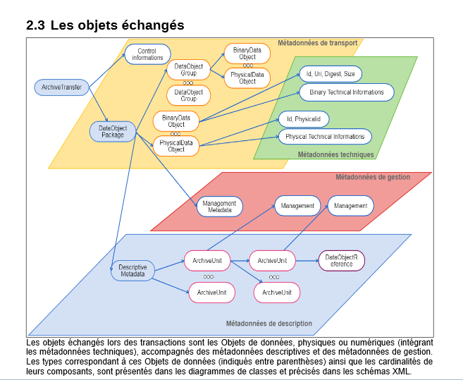

Le gel d’archives avec la solution logicielle Vitam
===================================================

Résumé
------

Jusqu’à présent, pour la gestion, la conservation, la préservation et la
consultation des archives numériques, les acteurs du secteur public
étatique ont utilisé des techniques d’archivage classiques, adaptées aux
volumes limités dont la prise en charge leur était proposée. Cette
situation évolue désormais rapidement et les acteurs du secteur public
étatique doivent se mettre en capacité de traiter les volumes croissants
d’archives numériques qui doivent être archivés, grâce à un saut
technologique. TEST

