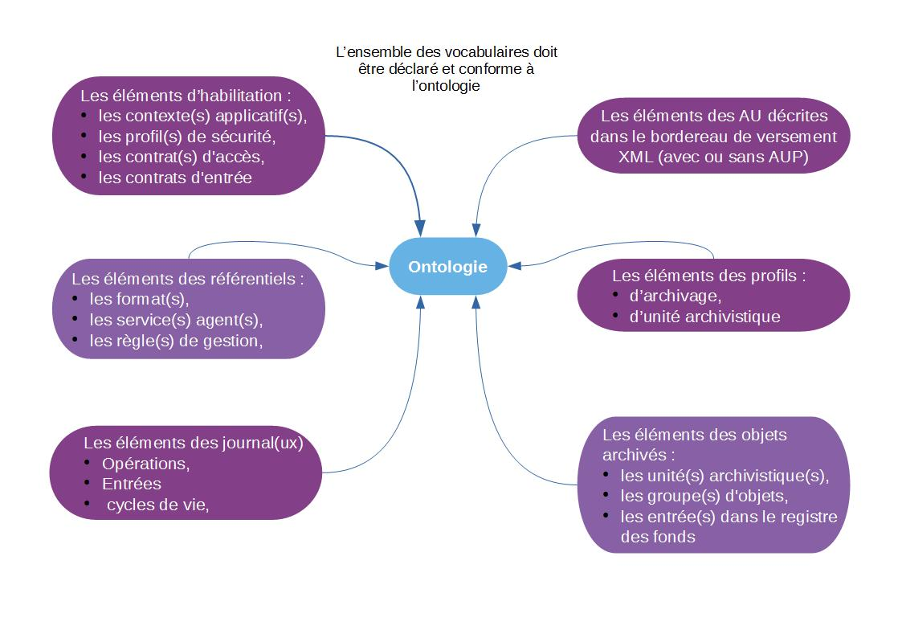

Ontologie
=========

Introduction
---------

### Documents de référence

|**Document**|**Date de la version**|**Remarques**|
|:-----------:|:-----:|:-----:|
|NF Z 44022 – MEDONA - Modélisation des données pour l’archivage|18/01/2014||
|Standard d’échange de données pour l’archivage – SEDA – v. 2.1|06/2018||
|[Vitam – Structuration des *Submission Information Package* (SIP)](./SIP.md)|||
|[Vitam – Profils d’unité archivistique](./profil_unite_archivistique.md)||Ce document est complémentaire du présent document qui fait référence, ponctuellement, aux profils d’unité archivistique.|
|[Vitam – Documentation d’exploitation](https://www.programmevitam.fr/ressources/DocCourante/html/exploitation_VitamUI/)|||

### Présentation du document

Le document présente les fonctionnalités associées à la prise en compte
de la notion d'ontologie dans la solution logicielle Vitam.

Il s’articule autour des axes suivants :

- une présentation de la notion d’ontologie ;

- une présentation de la manière dont la solution logicielle Vitam la
  formalise ;

- une présentation des mécanismes mis en œuvre dans la solution
  logicielle Vitam pour prendre en compte cette notion ;

- quelques conseils complémentaires de mise en œuvre.

Le présent document décrit les fonctionnalités qui sont offertes par la
solution logicielle Vitam au terme de la version 5.RC (septembre 2021).
Il a vocation a être amendé, complété et enrichi au fur et à mesure de
la réalisation de la solution logicielle Vitam et des retours et
commentaires formulés par les ministères porteurs et les partenaires du
programme.

Présentation de la notion d’ontologie
-------------------------------------

### Qu’est-ce qu’une ontologie ?

L’ontologie référence l’**ensemble des vocabulaires** ou métadonnées acceptés dans la solution logicielle Vitam. Pour chacun de ces vocabulaires, elle définit un intitulé et un type d’indexation particulier (par exemple : texte, décimal, entier), ainsi que la(les) collection(s) de la solution logicielle Vitam qui l'(les) utilise(nt)[^1].



-   des vocabulaires définis dans le Standard d’échanges de données pour l’archivage (SEDA), inclus par défaut. Ces vocabulaires correspondent aux éléments XML présents dans les messages du SEDA (ArchiveTransfer en particulier) ;
-   des vocabulaires propres à la solution logicielle Vitam, inclus par défaut[^2] ;
-   de vocabulaires non gérés par les deux précédents items et ajoutés pour répondre à un besoin particulier du service utilisateur, en particulier enrichir les descriptions, en entrée ou en accès.

Ces vocabulaires peuvent être utilisés pour décrire :

-   0 à n contexte(s) applicatif(s),
-   0 à n contrat(s) d’accès,
-   0 à n contrat(s) d’entrée,
-   0 à n contrat(s) de gestion,
-   0 à n entrée(s) dans le registre des fonds (fonds propres et symboliques, détail des fonds),
-   0 à n format(s),
-   0 à n griffon(s),
-   0 à n groupe(s) d’objets,
-   0 à n journal(ux) (opérations, cycles de vie),
-   0 à n profil(s) d’archivage,
-   0 à n profil(s) de sécurité,
-   0 à n profil(s) d’unité archivistique,
-   0 à n règle(s) de gestion,
-   0 à n scénario(s) de préservation,
-   0 à n service(s) agent(s),
-   0 à n unité(s) archivistique(s),
-   0 à n vocabulaire(s).

Points d'attention :

-   les vocabulaires sont uniques dans la solution logicielle Vitam ;
-   les vocabulaires utilisés par la solution logicielle Vitam de type « objet », c’est-à-dire ne contenant pas de valeurs informationnelles, ne sont pas référencés dans l’ontologie. Il peut s’agir de :

    -   vocabulaires conformes au SEDA de type « objet », c'est-à-dire correspondant à un élément XML englobant un sous-élément XML (par exemple, Writer ou Management) ;

        Exemple : ne sont pas présents dans l’ontologie les éléments XML <ManagementMetadata>, <StorageRule> et <AccessRule>. Les autres, qui contiennent des valeurs informationnelles, le sont.

	```xml
	<ManagementMetadata>
      		<AcquisitionInformation>Versement</AcquisitionInformation>
      		<LegalStatus>Public Archive</LegalStatus>
      		<OriginatingAgencyIdentifier>RATP</OriginatingAgencyIdentifier>
      		<SubmissionAgencyIdentifier>RATP</SubmissionAgencyIdentifier>
      		<StorageRule>
           		<FinalAction>Copy</FinalAction>
      		</StorageRule>
      		<AccessRule>
           		<Rule>ACC-00002</Rule>
           		<StartDate>2000-01-01</StartDate>
      		</AccessRule>
	 </ManagementMetadata>
	```

    -   vocabulaires générés par la solution logicielle Vitam, correspondant à un élément JSON de type « objet ».

         Exemple : ne sont pas présents dans l’ontologie les éléments JSON \_mgt, AccessRule, Rules, CustodialHistory. Les autres, qui contiennent des valeurs informationnelles, le sont.
  
```json
"_mgt": {
        "AccessRule": {
            "Rules": [
                {
                    "Rule": "ACC-00001",
                    "StartDate": "1914-01-01",
                    "EndDate": "1914-01-01"
                }
            ]
        }
    },
    "DescriptionLevel": "Item",
    "Description": "Cabinet de Michel Mercier : correspondances.",
    "CustodialHistory": {
        "CustodialHistoryItem": [
            "Fonds provenant des archives du cabinet du ministre Michel Mercier",
            "
        ]
    }	
```

En d’autres termes, l’ontologie **référence seulement les vocabulaires pouvant contenir des valeurs** (ou métadonnées) quand ils sont utilisés.


### Pourquoi une ontologie ?

L’ontologie répond à plusieurs besoins :

-   regrouper toutes les façons de nommer un même objet intellectuel et disposer d’une liste de l’ensemble des vocabulaires gérés nativement par la solution logicielle Vitam, précisant :

    -   leur dénomination lorsqu’ils sont exposés via l’API externe (ex : \#originating\_agency),
    -   leur dénomination interne au système (\_sp),
    -   leur dénomination dans un bordereau de transfert conforme au SEDA (OriginatingAgencyIdentifier) ;

-   éviter les conflits en interdisant la définition d’un nouveau vocabulaire avec le même identifiant et intitulé qu’un vocabulaire préexistant ;
-   connaître le type d’indexation des différents vocabulaires proposé par défaut par la solution logicielle Vitam et, le cas échéant, s’il ne correspond pas aux choix d’implémentation, le modifier ;
-   pour un profil d’unité archivistique, connaître les vocabulaires et leur type, afin de rédiger un profil conforme aux éléments indexés et gérés par la solution logicielle Vitam ;
-   le cas échéant, ajouter des vocabulaires afin d’enrichir la description des unités archivistiques et/ou des groupes d’objets techniques[^3] ;
-   éviter la multiplication des vocabulaires déclarés dans les profils d’unité archivistique faisant référence à une même entité ;
-   attribuer un type d’indexation particulier pour chacun d’entre eux, et ainsi :

    -   améliorer leur indexation dans le moteur de recherche Elastic Search et, de fait, procéder à des recherches plus fines selon leur type d’indexation,
    -   contrôler les valeurs des unités archivistiques déclarant un profil d’unité archivistique, en entrée comme en accès.

Formalisation des vocabulaires ontologiques
-------------------------------------------

### Dans un fichier JSON

Un référentiel ontologique, ou ontologie, liste l’ensemble des vocabulaires pouvant être utilisés par la solution logicielle Vitam. Ce référentiel est importé sous la forme d’un fichier JSON, contenant systématiquement l’ensemble des vocabulaires utilisés.

Exemple : deux vocabulaires contenant uniquement les informations obligatoires pour être importés avec succès.                                                                                                                                                                                                                                                                                                                                                                                                    |
```json
[
{
 "Identifier": "Vocabulaire1",
 "Type": "LONG"
 },
{
 "Identifier": "Vocabulaire2",
 "Type": "TEXT"
 }
]
```

Un vocabulaire donné doit nécessairement être décrit avec les informations suivantes :

-   identifiant devant être unique dans le fichier JSON (Identifier) ;
-   type d'indexation du vocabulaire, correspondant à un type attendu par le moteur Elastic Search. Les valeurs acceptées sont : DATE, TEXT, KEYWORD, BOOLEAN, LONG, DOUBLE, GEO_POINT, ENUM[^4] ;

Un nom (SedaField et/ou ApiField), une traduction (ShortName), une description (Description), une origine (Origin) et une référence à des collections utilisant le vocabulaire décrit (Collections), facultatifs, peuvent venir compléter ces informations.

Les valeurs acceptées pour référencer une collection (Collections) sont :

-   pour les métadonnées : Unit, ObjectGroup ;
-   pour le registre des fonds : AccessionRegisterSummary, AccessionRegisterDetail, AccessionRegisterSymbolic ;
-   pour les référentiels : Context, SecurityProfile, ManagementContract, IngestContract, AccessContract, FileFormat, PreservationScenario, Griffin, FileRules, Agencies, Profile, ArchiveUnitProfile, Ontology ;
-   pour les journaux : LogbookOperation, LogbookLifeCycleUnit, LogbookLifeCycleObjectGroup.

### Dans la solution logicielle Vitam

Les vocabulaires sont enregistrés dans la base de données MongoDB, dans la collection « Ontology », sous la forme d’enregistrements au format JSON.

Chaque enregistrement est modélisé comme suit[^5] :

| Champs                | Description                                                                                                                                                                                                                                                                                                                                                                                                                                                                                                                                                                                                                                                                                                                                |
| --------------------- | ------------------------------------------------------------------------------------------------------------------------------------------------------------------------------------------------------------------------------------------------------------------------------------------------------------------------------------------------------------------------------------------------------------------------------------------------------------------------------------------------------------------------------------------------------------------------------------------------------------------------------------------------------------------------------------------------------------------------------------------ |
| _id                  | **identifiant** unique, fourni par le système (champ obligatoire)                                                                                                                                                                                                                                                                                                                                                                                                                                                                                                                                                                                                                                                                          |
| Identifier            | **identifiant** unique dans l’ensemble du système (champ obligatoire).</br>- Pour les vocabulaires internes, cet identifiant correspond au nom de la métadonnée telle qu’elle est définie dans le modèle de données de la solution logicielle Vitam. </br>Pour un vocabulaire interne issu du SEDA, l’identifiant peut prendre deux formes différentes: </br>1. une dénomination interne au système (ex :\_sp, équivalent du bloc OriginatingAgencyIdentifier),</br> 2. une dénomination correspondant à la nomenclature du SEDA (ex : Tag) ;</br> -   Pour les vocabulaires externes, cet identifiant correspond au nom de la métadonnée telle qu'elle est nommée dans un bordereau de transfert ou dans un profil d'unité archivistique. |
| SedaField et ApiField | **nom** du vocabulaire : </br>-   tel qu’il est défini dans la nomenclature du SEDA (champ facultatif). Ce champ est utilisé uniquement pour les vocabulaires référençant une unité archivistique et un groupe d'objets ; </br>-   tel qu’il est retourné via le DSL (champ facultatif. Exemple : \#sp).                                                                                                                                                                                                                                                                                                                                                                                                                                   |
| ShortName             | **traduction** du vocabulaire, explicitant de manière intelligible le nom du vocabulaire (champ facultatif).                                                                                                                                                                                                                                                                                                                                                                                                                                                                                                                                                                                                                               |
| Description           | **description** (champ facultatif).                                                                                                                                                                                                                                                                                                                                                                                                                                                                                                                                                                                                                                                                                                        |
| Type                  | **type d’indexation** du vocabulaire, correspondant à un type attendu par le moteur Elastic Search (champ obligatoire).</br> Les valeurs acceptées sont : DATE, TEXT, KEYWORD, BOOLEAN, LONG, DOUBLE, GEO\_POINT, ENUM[^6].                                                                                                                                                                                                                                                                                                                                                                                                                                                                                                                |
| Origin                | **origine** du vocabulaire, précisant la provenance du vocabulaire (champ facultatif). Sa valeur peut être égale à :</br>-   INTERNAL : pour les vocabulaires conformes au SEDA et les vocabulaires propres à la solution logicielle Vitam ;</br>-   EXTERNAL : pour les vocabulaires non gérés nativement par les deux précédents items et ajoutés pour répondre à un besoin particulier.                                                                                                                                                                                                                                                                                                                                                 |
| Collections           | **collection(s)** de la base de données MongoDB qui utilise(nt) le vocabulaire en question (champ facultatif). </br>   Les valeurs acceptées sont : </br>   -   pour les métadonnées : Unit, ObjectGroup ; </br>   -   pour le registre des fonds : AccessionRegisterSummary, AccessionRegisterDetail, AccessionRegisterSymbolic ; </br>   -   pour les référentiels : Context, SecurityProfile, ManagementContract, IngestContract, AccessContract, FileFormat, PreservationScenario, Griffin, FileRules, Agencies, Profile, ArchiveUnitProfile, Ontology ;</br>-   pour les journaux : LogbookOperation, LogbookLifeCycleUnit, LogbookLifeCycleObjectGroup.                                                                              |

### Dans le Standard d’échange de données pour l’archivage (SEDA)

L’ontologie reprend des éléments définis dans la norme NF Z 44‑022 et dans sa déclinaison pour les acteurs du service public, le Standard d’échanges de données pour l’archivage (SEDA).

Un bordereau de transfert utilise de fait les vocabulaires définis dans l’ontologie de la solution logicielle Vitam.

La norme NF Z 44‑022 offre la possibilité d’ajouter des éléments supplémentaires, appelés « extensions » :

-   Des extensions dont la définition est obligatoire pour que le schéma soit valide (extensions par substitution, de type abstract). Sont concernés :

| Bloc concerné                              | Elément XML          | Signification / usage |
| --- | --- | --- |
| Métadonnées techniques | &lt;OrganizationDescriptiveMetadataType&gt; | Autres dimensions possibles pour un objet physique |
| | &lt;OtherCoreTechnicalMetadataAbstract&gt; |  Métadonnées techniques essentielles ne correspondant :<br> • ni à des fichiers de type texte,<br>• ni à des fichiers de type document,<br>• ni à des fichiers de type image,<br>• ni à des fichiers de type audio,<br>• ni à des fichiers de type vidéo<br>Ex. : bases de données, plans 2D, plans 3D|
| Métadonnées descriptives | &lt;ObjectGroupExtensionAbstract&gt; | Métadonnées descriptives complémentaires |
| | &lt;ArchiveUnitReferenceAbstract&gt; | Requêtes permettant de gérer la récursivité et de pointer vers un objet-archives supposé être déjà géré par le SAE |
| Métadonnées de gestion | &lt;OtherManagementAbstract&gt; | Autres métadonnées de gestion |

-   Des extensions dont la définition n’est pas obligatoire pour que le schéma soit valide (extensions par redéfinition, de type OpenType). Leur type peut être défini selon les besoins des utilisateurs qui peuvent y mettre ce qu’ils veulent. Aucune vérification sur ces extensions ne pourra être faite lors des transactions tant que le type de ces extensions n’est pas défini. Sont concernés :

| Bloc concerné                              | Elément XML          | Signification / usage |
| --- | --- | --- |
| Noyau du schéma (main)                   | &lt;OrganizationDescriptiveMetadataType&gt;      | Métadonnées descriptives pour une organisation |
|                                          | &lt;SignatureType&gt;                            | Signature utilisée lors des échanges de messages |
| Métadonnées techniques                   | &lt;XXXTechnicalMetadataType&gt;                 | Métadonnées techniques essentielles correspondant à des fichiers de types texte, document, image, audio et vidéo |
|                                          | &lt;DescriptiveTechnicalMetadataType&gt;         | Autres métadonnées techniques |

Ces extensions doivent être qualifiées d’origine « EXTERNAL » dans l’ontologie.

### Mécanismes mis en œuvre dans la solution logicielle Vitam

La solution logicielle Vitam offre à un service d’archives ou à un service externe plusieurs fonctionnalités lui permettant de mettre en œuvre des vocabulaires ontologiques :

-   en termes d’administration :

    -   la **gestion d’un référentiel **appelé « Ontologie » ;
    -   une vérification que les **profils d’unité archivistique** (ou documents type) **déclarent des vocabulaires conformément à leur référencement** dans l'ontologie ;

-   en entrée du système :

    -   une **vérification que les unités archivistiques** présentes dans le SIP et déclarant un profil d’unité archivistique **sont conformes à l’ontologie et à leur profil d’unité archivistique** (ou document type) ;
    -   une **vérification que les unités archivistiques** présentes dans le SIP sont conformes à leur type d’indexation dans l’ontologie, si les vocabulaires qu’elles contiennent y sont référencés ;
    -   une **vérification que les groupes d’objets techniques** présents dans le SIP sont conformes à leur type d’indexation dans l’ontologie, si les vocabulaires qu’ils contiennent y sont référencés ;

-   en accès, **une traduction et une indexation** propre à chaque vocabulaire, induisant des règles à suivre en recherche et lors de la mise à jour des unités archivistiques.

### Administration de l'ontologie

La solution logicielle Vitam intègre une ontologie, administrable par un utilisateur doté des droits adéquats (**administrateur fonctionnel et administrateur technique**) et gérée dans une collection particulière[^7].

Ce référentiel interne à la solution logicielle Vitam a pour vocation d’être une copie locale d’un référentiel administré dans le front office des plates-formes d’archivage implémentant cette dernière.

L'ontologie est multi-tenant. Elle est administrable et journalisée depuis le **tenant d’administration**.

Il est possible de réaliser les opérations présentées ci-dessous.

#### Import de l’ontologie

La solution logicielle Vitam intègre une ontologie, **automatiquement importée lors de l’initialisation de la plate-forme,** et comportant les vocabulaires internes à la solution.

Il est possible d’importer l'ontologie sous la forme d’un fichier JSON, fonctionnant en mode « esclave », depuis le tenant d’administration. Cette opération peut s’effectuer depuis l’APP VitamUI «  Ontologie ».

Il s’agit d’une opération d’administration (« MASTERDATA »), tracée dans le journal des opérations de la solution logicielle Vitam[^8].

#### Modification de l'ontologie

La modification de l'ontologie est possible :

-   au moyen des API et de l’IHM standard fournie avec la solution logicielle Vitam et s'effectue par un réimport complet de l'ontologie, en mode « annule et remplace ». De fait, la solution logicielle Vitam permet de :

    -   ajouter un nouveau vocabulaire ;
    -   modifier les informations associées à un vocabulaire ;
    -   supprimer un vocabulaire ;

-   depuis l’APP VitamUI « Ontologie ». Cette dernière permet, depuis le tenant d’instance (ou tenant d’administration) de :

    -   ajouter unitairement un nouveau vocabulaire ;
    -   modifier unitairement les informations associées à un vocabulaire externe ;
    -   supprimer unitairement un vocabulaire externe ;
    -   ajouter, modifier et supprimer des vocabulaires depuis l’import de l’ontologie dans sa forme JSON.

Cette action provoque la création d’une nouvelle version du référentiel. Elle fait l’objet d’une journalisation dans le journal des opérations (opération d’administration de type « MASTERDATA »)[^9].

Au moyen d’un paramétrage technique, la solution logicielle Vitam permet de paramétrer les possibilités de mise à jour de l’ontologie :

-   elle peut interdire toute modification des vocabulaires internes, qui ont vocation à ne pas être modifiés ni surtout supprimés en production ;
-   elle peut forcer la mise à jour des types d’indexation, sans tenir compte des règles prédéfinies[^10].

Au moyen d’un acte d’exploitation, elle permet en outre de modifier, d’ajouter ou de supprimer les seuls vocabulaires internes[^11].

Pour un vocabulaire externe et, si le paramétrage de l’ontologie le permet, pour un vocabulaire interne, les champs modifiables sont :

-   le nom du vocabulaire :

    -   tel qu'il est défini dans la nomenclature du SEDA (SedaField) ;
    -   tel qu'il est retourné via le DSL (ApiField) ;

-   la traduction du vocabulaire (ShortName) ;
-   la description (Description) ;
-   le type d'indexation du vocabulaire, correspondant à un type attendu par le moteur Elastic Search (Type). Les valeurs acceptées sont : DATE, TEXT, KEYWORD, BOOLEAN, LONG, DOUBLE, ENUM, GEO\_POINT[^12] ;
-   l'origine du vocabulaire (Origin – facultatif). Les valeurs acceptées sont : INTERNAL, EXTERNAL ;
-   la collection de la base de données MongoDB qui utilise le vocabulaire en question (Collections). Ce champ doit toujours contenir une référence à au moins une collection. Les valeurs acceptées sont Unit et/ou ObjectGroup[^13].

Lors de ce ré-import ou de cette mise à jour, l’opération peut aboutir aux statuts suivants :

| Statut | Motifs |
| --- | --- |
| Succès | Opération réalisée sans rencontrer de problèmes particuliers. |
| Échec  | Sans journalisation :<br>– ré-import d’un référentiel sous la forme d’un fichier qui n’est pas au format JSON ;<br>– import d’un référentiel dont au moins un des champs contient une injection HTML. |
|        | Avec journalisation :<br>– ajout d’un vocabulaire dont l’identifiant est déjà utilisé par un autre vocabulaire de l’ontologie ;<br>– ajout d’un vocabulaire dont l’identifiant ne correspond pas aux règles imposées par la solution logicielle Vitam[^14] ;<br>– incompatibilité entre le nouveau et l’ancien type d’indexation ;<br>– suppression d’un vocabulaire utilisé dans un profil d’unité archivistique. |

Les différentes versions du référentiel font l’objet d’une sauvegarde sur les offres de stockage utilisées par la solution logicielle Vitam.

Ces opérations de modification des types d’indexation doivent obligatoirement être accompagnées d’un acte technique d’exploitation, afin que la nouvelle indexation soit effective et prise en compte par le moteur de recherche Elastic Search[^15].

### Contrôle de l'ontologie sur les profils d’unité archivistique

Lors de la création ou de la mise à jour de profils d’unité archivistique (ou documents type), la solution logicielle Vitam vérifie que les profils d’unité archivistique déclarent des vocabulaires existant dans l’ontologie.

L’import ou la mise à jour d’un profil d’unité archivistique peut échouer pour les motifs suivants :

-   le schéma de contrôle contient un vocabulaire inconnu de l’ontologie,
-   le schéma de contrôle contient un vocabulaire de type « objet » que l’on a oublié de qualifier comme tel.

Point d’attention :

-   La solution logicielle Vitam n’effectue pas de contrôle sur la conformité des vocabulaires par rapport à leur type d’indexation dans l’ontologie, lors de la création de profils d’unité archivistique. Néanmoins, il est obligatoire que le type du vocabulaire défini dans le schéma de contrôle corresponde au type d’indexation du vocabulaire tel qu’il est défini dans l’ontologie[^16].

#### Processus d’entrée

Dans le cadre du processus d’entrée d’un ensemble d’archives, suite à la réception d’un message ArchiveTransfer du SEDA, parmi les tâches et traitements internes qu’elle effectue, la solution logicielle Vitam **vérifie :**

-   pour les unités archivistiques, que :

    -   celles déclarant un profil d’unité archivistique sont conformes

        -   **au type d’indexation défini dans l’ontologie pour l’ensemble des vocabulaires qu’elles contiennent,**
        -   **au profil d’unité archivistique ;**

    -   **celles ne déclarant pas de profil d’unité archivistique sont conformes au type d’indexation défini dans l’ontologie pour les vocabulaires qu’elles contiennent et qui y sont référencés.**

    Ce contrôle s’effectue lors du processus de contrôle et traitements des unités archivistiques, avant les vérifications portant sur les règles de classification et de gestion.

-   **pour les groupes d’objets techniques, qu’ils sont conformes au type d’indexation défini dans l’ontologie pour les vocabulaires qu’ils contiennent et qui y sont référencés.**

    Ce contrôle s’effectue lors du processus de vérification et de traitement des objets et des groupes d'objets, après les vérifications portant sur l’empreinte des objets, leur taille et l’identification des formats.

    

    À la suite des différents contrôles effectués en entrée, la solution logicielle Vitam enregistre les unités archivistiques, ainsi que les métadonnées techniques associées à leurs objets en base, en se conformant au type d’indexation défini pour elles dans l’ontologie.

### Accès

#### Affichage dynamique des traductions

L’ontologie contenant la traduction des différents vocabulaires supportés par la solution logicielle Vitam, il est possible, en accès :

-   d’utiliser ce référentiel comme un fichier de propriétés pour récupérer les traductions, plutôt que ce soit l’IHM qui porte ces informations. Ainsi, cela évitera de constater des absences de traduction des vocabulaires externes récemment créés ;
-   d’utiliser et d’afficher la traduction des vocabulaires dans les IHM, rendue administrable dans ce référentiel, afin qu’un administrateur fonctionnel ait la possibilité de modifier les intitulés (ou traductions) de certains vocabulaires (par exemple, modifier « Description », traduction textuelle du bloc Description du SEDA, par « Présentation du contenu », terme issu de la norme ISAD/G, davantage usité par les archivistes).

À titre d’exemple, l’IHM de démonstration de la solution logicielle Vitam dispose de vocabulaires écrits en dur dans l’IHM de démonstration. Dès qu’on transfère un bordereau contenant des vocabulaires externes, l’IHM ne les traduit pas. Il est alors nécessaire de demander un acte d’exploitation en vue de corriger ces éléments.a

Exemple illustration 2 :
*« Prénom », « Nom de naissance », « Identifiant », « Date d’envoi », « Date de réception », qui correspondent à des vocabulaires internes, sont des intitulés gravés en dur. « Licence », également gravé en dur, correspond à un vocabulaire externe. Dans l’ontologie, on a introduit une traduction conforme à la norme ISAD/G : « 3.4.2. Conditions de reproduction ».*


#### Optimisation de la recherche

L’ontologie définit les types d’indexation des différents vocabulaires, sur lesquels il faut s’appuyer afin de pouvoir optimiser les modalités de recherche.

#### Contrôle lors de la mise à jour des unités archivistiques

La solution logicielle Vitam permet en outre de modifier :

-   les métadonnées d’une **unité archivistique déclarant un profil d’unité archivistique**, à la condition que l’unité archivistique reste conforme à ce profil d’unité archivistique et, de fait, aux vocabulaires définis dans le profil d’unité archivistique. Cette conformité vaut aussi bien pour les vocabulaires utilisés que pour les valeurs utilisées[^17]. Par exemple, un vocabulaire de type « entier » tel que « AgeDuCapitaine » ne peut être mis à jour pour inclure une valeur textuelle s’il est
    indexé comme entier ;
-   les métadonnées d’une **unité archivistique ne déclarant pas de profil d’unité archivistique**.

    -   Si le vocabulaire est enregistré dans l’ontologie, la solution logicielle Vitam vérifie que la mise à jour est conforme au type d’indexation du vocabulaire dans l’ontologie ;
    -   Si le vocabulaire n’est pas référencé dans l’ontologie, il sera mis à jour et interprété comme une chaîne de caractères textuels répétable.

**Point d’attention :** Au terme de la version 6, lors d’extractions de métadonnées techniques, la solution logicielle Vitam ne fait pas de contrôle de conformité entre les métadonnées techniques de la collection ObjectGroup référencées dans l’ontologie et les métadonnées extraites.

Conseils de mise en œuvre
-------------------------

À l’issue de cette première phase de réalisation de fonctionnalités concernant l’ontologie, l’équipe projet Vitam est en mesure de fournir quelques recommandations de mise en œuvre :

### Quand et comment créer une ontologie ?

La création d’une ontologie est un préalable à l’utilisation des vocabulaires dans la solution logicielle Vitam. C’est pourquoi, lors de l’installation de la solution logicielle Vitam, une ontologie est initialisée par défaut. Elle contient l’ensemble des vocabulaires supportés par la solution logicielle Vitam, c’est-à-dire des vocabulaires internes. Leur type d’indexation est conforme à l’indexation réalisée dans le moteur de recherche Elastic Search.

**Un administrateur fonctionnel n’a pas besoin, *****a priori*****, de créer une ontologie**. Il s’agit d’un acte d’exploitation technique.

### Quand et comment créer un vocabulaire ?

La création d’un nouveau vocabulaire s’effectue :

-   au moyen des l’API et de l’IHM standard fournie avec la solution logicielle Vitam, par un réimport complet du référentiel, auquel a été ajouté un vocabulaire supplémentaire, d’origine externe.
-   depuis l’APP VitamUI « Ontologie », par :

    -   la création unitaire d’un vocabulaire,
    -   le réimport complet du référentiel, auquel a été ajouté un vocabulaire supplémentaire, d’origine externe.

    Cette action renvoie une nouvelle version du référentiel dans la solution logicielle Vitam.

Cette opération s’effectue uniquement sur le tenant d’administration.

Elle obéit à des règles strictes :

-   un nouveau vocabulaire doit obligatoirement avoir une **origine externe**, à moins de correspondre à un vocabulaire nécessaire à la mise à jour du modèle de données géré par la solution logicielle Vitam ou engendré par la publication d’une nouvelle version du SEDA ;
-   un nouveau vocabulaire doit détenir un **identifiant** :

    -   unique,
    -   ne commençant pas par un underscore (par exemple \_bibref) ou un dièse (\#bibref), qui sont des caractères réservés par la solution logicielle Vitam,
    -   ne contenant pas d’espace,
    -   étant insensible à la casse (il ne peut y avoir un nouveau vocabulaire intitulé « identifier » si un vocabulaire intitulé « Identifier » existe déjà dans l’ontologie) ;

-   un nouveau vocabulaire doit être obligatoirement associé à, au moins, une **collection**. S’il s’agit d’un vocabulaire externe, créé pour répondre à des besoins liés à l’entrée (par exemple, ajout d’extensions dans le bordereau de transfert), la collection à renseigner doit être :

    -   soit Unit si on ajoute des métadonnées descriptives aux unités archivistiques,
    -   soit ObjectGroup si on étend les métadonnées liées au groupe d’objets techniques ;

-   un nouveau vocabulaire doit nécessairement avoir un **type d’indexation**. Les types d’indexation pris en charge par la solution logicielle Vitam sont :

| Type d’indexation initiale | Signification   | Valeur correspondante | Commentaires |
|---|---|---|---|
| TEXT                       | Texte           | Paris, anciennement appelée Lutèce, est la capitale de la France. | La recherche sur un vocabulaire de type TEXT est effectuée en mode « full text ». |
| KEYWORD                    | Mot-clé         | Paris \[Ville\]       | La recherche sur un vocabulaire de type KEYWORD correspond à une recherche exacte. |
| DATE                       | Date            | 2016-10-12T16:28:40a=<br>2018-06-06  | |                                             
| LONG                       | Entier          | 9999                  | |                                            
| DOUBLE                     | Décimal         | 1.1111111<br>20.00001<br>3.0 | |                                              
| BOOLEAN                    | Booléen         | true<br>false         | |                                                                 
| GEO_POINT                  | Géolocalisation |  /                    | L’équipe Vitam n’a pas investigué sur les usages de ces deux types d’indexation.|
| ENUM                       | Énumération     |  /                    | |

**Points d’attention :**

-   Un élément de type objet ne doit pas être référencé dans l’ontologie[^18].
-   L’indexation de ce nouveau vocabulaire dans le moteur de recherche Elastic Search correspond par défaut à un type TEXT (= texte). Si le type d’indexation du nouveau vocabulaire diffère, il est obligatoire de procéder à un acte d’exploitation technique visant à mettre en cohérence l’indexation du vocabulaire dans le moteur de recherche Elastic Search par rapport à l’ontologie[^19].
-   Seules les collections Unit et ObjectGroup peuvent faire l’objet d’ajout de nouveaux vocabulaires. Il n’est pas possible d’étendre les autres collections.

La création d’un nouveau vocabulaire n’est pas un acte anodin. Avant de procéder à sa création, il est recommandé de prendre en considération les éléments suivants :

-   est-ce qu’un vocabulaire existant peut couvrir le même champ sémantique et signifiant que le vocabulaire que l’on souhaite ajouter dans l’ontologie ?
-   peut-on envisager une utilisation possible de ce nouveau vocabulaire pour un autre domaine d’utilisation ?

    Par exemple, on souhaite utiliser un vocabulaire permettant de gérer un titre de recette.

    -   veut-on créer un vocabulaire « SommeTitreDeRecette » qui ne sera utilisable que dans un contexte particulier de recette ?
    -   ou veut-on créer un vocabulaire qui sera plus générique, afin de l’utiliser dans un contexte plus large ? Dans ce cas précis, on pourrait choisir d’intituler le vocabulaire « Somme », afin de l’utiliser pour des titres de recette, mais aussi pour qualifier une dépense, le coût de frais de déplacement, une somme à payer indiquée dans les bulletins de salaire, etc.

-   a-t-on besoin d’ajouter ce nouveau vocabulaire ? Pour quels usages ?

Pour créer un nouveau vocabulaire, il est recommandé de suivre les étapes suivantes :

| Qui ? | Quoi ? | Via l’IHM démo Vitam ? |
|---|---|---|
| Administrateur fonctionnel                 | émet le souhait d’ajouter un nouveau vocabulaire, **externe**, dans l’ontologie | Non |
| Administrateur fonctionnel                 | vérifie au préalable si ce nouveau vocabulaire n’existe pas ou si un vocabulaire préexistant ne correspond pas à son besoin. | Oui |
| Administrateur fonctionnel et/ou technique | ajoute le nouveau vocabulaire dans l’ontologie. | Non |
| Administrateur fonctionnel et/ou technique | met à jour l’ontologie sur le tenant d’administration. | Oui |
| Administrateur technique                   | Indexe le nouveau vocabulaire dans le moteur de recherche Elastic Search. | Non |

### Quand et comment modifier un type d’indexation ?

La mise à jour du type d’indexation d’un vocabulaire s’effectue, depuis le tenant d’administration :

-   de l’IHM standard par un réimport complet du référentiel, après avoir modifié le type d’indexation d’un à plusieurs vocabulaires ;
-   de VitamUI, dans l’APP Ontologie, par :

    -   la mise à jour unitaire d’un vocabulaire,
    -   le réimport complet du référentiel, après avoir modifié le type d’indexation d’un à plusieurs vocabulaires.

Cette modification doit **obligatoirement** être suivie d’un acte technique d’exploitation en vue de la rendre effective dans le moteur de recherche Elastic Search[^20].

La modification du type d’indexation n’est pas un acte anodin. Elle peut entraîner :

-   des incohérences d’indexation si elle n’est pas mûrement réfléchie,
-   une réindexation totale de la base de données, voire nécessiter des actions de migration et de sauvegarde.

La solution logicielle Vitam supporte les modifications suivantes :

| Type d’indexation initiale | Compatibilité supportée | Compatibilité non supportée,<br>mais possible | Compatibilité non recommandée |
|---|---|---|---|
| TEXT                       | KEYWORD                 | DATE[^21]                    | LONG, DOUBLE, BOOLEAN |
| KEYWORD                    | TEXT                    | DATE[^22]                    | / |
| DATE                       | TEXT, KEYWORD           | /                            | / |
| LONG                       | /                       | DOUBLE[^23]                  | TEXT, KEYWORD |
| DOUBLE                     | /                       | LONG[^24]                    | TEXT, KEYWORD |
| BOOLEAN                    | /                       | /                            | TEXT, KEYWORD |
| GEO_POINT                  | TEXT, KEYWORD           | /                            | / |
| ENUM                       | TEXT, KEYWORD           | /                            | / |

Certaines modifications ne sont pas supportées, mais restent possibles (3ème colonne du tableau ci-dessus), après analyse des données. En effet, si les données en base sont conformes au type que l’on souhaite leur attribuer, par exemple des données identifiées comme textuelles sont en fait des dates, il est possible d’envisager la mise à jour du vocabulaire pour passer d’un type TEXT à un type DATE.

En revanche, il n’est pas cohérent de modifier des valeurs initialement identifiées comme des entiers par un type d’indexation TEXT. C’est pourquoi, il n’est pas recommandé de procéder à des modifications de ce type, sauf si le vocabulaire en question vient d’être initialisé et qu’aucune donnée ne l’utilise.

La mise à jour du type d’indexation d’un vocabulaire doit nécessairement être effectuée de concert avec un administrateur technique.

Pour modifier un type d’indexation, il est recommandé de suivre les étapes suivantes :

| Qui ? | Quoi ? | Via l’IHM démo Vitam ? |
|---|---|---|
| Administrateur fonctionnel et/ou technique | émet le souhait de modifier un type d’indexation dans l’ontologie. | Non |
| Administrateur technique                   | vérifie au préalable si ce nouveau type d’indexation est compatible avec le précédent type d’indexation du vocabulaire dans l’ontologie. | Oui |
| Administrateur fonctionnel et/ou technique | met à jour le type d’indexation dans l’ontologie. | Non |
| | <font color="navy">**Compatibilité supportée**</font> | |
| Administrateur fonctionnel et/ou technique | si le nouveau type d’indexation a une compatibilité supportée,<br> met à jour l’ontologie sur le tenant d’administration. | Oui |
| Administrateur technique                   | indexe le nouveau vocabulaire dans le moteur de recherche Elastic Search. | Non |
| | <font color="navy">**Compatibilité non supportée**</font> | |
| Administrateur technique                   | – arrête pour un temps donné les traitements en cours (en entrée comme en accès) dans la solution logicielle Vitam. <br> – procède à une réindexation de la base de données et du moteur de recherche Elastic Search pour intégrer le nouveau type d’indexation | Non |
| Administrateur technique                   | met à jour l’ontologie sur le tenant d’administration. | Oui |
| Administrateur technique                   | rétablit les traitements et accès dans la solution logicielle Vitam. | Non |

### Quels sont les types d’indexation compatibles entre un profil d’unité archivistique et des vocabulaires ontologiques ?

La solution logicielle Vitam n’effectue pas de contrôles de conformité entre un vocabulaire défini dans l’ontologie et la manière dont il est décrit dans un profil d’unité archivistique au moment de la création de celui-ci.

Mais elle effectue des contrôles en entrée et à la mise à jour des unités archivistiques, ce qui rend nécessaire de maintenir une cohérence entre les types définis dans l’ontologie et ceux définis dans un profil d’unité archivistique.

De fait, en fonction de son type d’indexation, il est fortement recommandé de décrire un vocabulaire dans un schéma de contrôle avec les types suivants[^25] :

| Type d’indexation dans l’ontologie | Type correspondant<br>dans un profil d’unité archivistique<br>Vocabulaire interne | Type correspondant<br>dans un profil d’unité archivistique<br>Vocabulaire externe | Commentaires |
|---|---|---|---|
| TEXT                               | string ou [string]                 | [string] | |
| KEYWORD                            | string ou [string]                 | [string] | |
| DATE                               | string ou [string] + pattern date  | [string] + pattern date | |
| LONG                               | number ou integer<br>[number] ou [integer]                   | [number] ou [integer] | |
| DOUBLE                             | number ou [number]                 | [number] | |
| BOOLEAN                            | boolean ou [boolean]               | [boolean] | |
| GEO_POINT                          | string                             | [string] | L’équipe Vitam n’a pas investigué sur les usages de ces deux types d’indexation. | |
| ENUM                               | [string] + pattern énumératif      | [string] + pattern énumératif| " |
  ------------------------------------ -------------------------------------- --------------------------------- ----------------------------------------------------------------------------------

### Quand et comment supprimer un vocabulaire ?

La suppression d’un vocabulaire s’effectue :

-   depuis l’IHM standard et les API, par un réimport complet du référentiel, duquel a été supprimé ce vocabulaire ;
-   depuis l’APP VitamUI « Ontologie », par :

    -   la suppression unitaire d’un vocabulaire,
    -   le réimport complet du référentiel, duquel a été supprimé ce vocabulaire .

Cet acte n’est pas anodin. Avant de procéder à cette suppression, il est recommandé de vérifier les éléments suivants :

-   le vocabulaire devant être supprimé doit obligatoirement être un vocabulaire d’origine externe, à moins de correspondre à un vocabulaire supprimé à l’occasion d’une mise à jour du modèle de données géré par la solution logicielle Vitam ou la publication d’une nouvelle version du SEDA ;
-   le vocabulaire ne doit pas être utilisé en base de données et contenir des valeurs enregistrées en base de données ;
-   le vocabulaire ne doit pas être utilisé dans un profil d’unité archivistique.

**Point d’attention :** la suppression d’un vocabulaire doit être accompagnée d’un acte d’exploitation technique visant à supprimer l’indexation du vocabulaire concerné dans le moteur de recherche Elastic Search, sans quoi le vocabulaire ne sera pas complètement supprimé de la solution logicielle Vitam[^26].

Pour supprimer vocabulaire, il est recommandé de suivre les étapes suivantes :

| Qui ? | Quoi ? | Via l’IHM démo Vitam ? |
|---|---|---|
| Administrateur fonctionnel                 | émet le souhait de supprimer un vocabulaire, **externe**, dans l’ontologie. | Non |
| Administrateur fonctionnel                 | vérifie au préalable si ce vocabulaire n’est pas utilisé par une unité archivistique ou un profil d’unité archivistique ;<br>si ce vocabulaire est utilisé par des unités archivistiques, procède à une mise à jour de ces unités archivistiques, afin de modifier l’utilisation ;<br>si ce vocabulaire est utilisé par un profil d’unité archivistique, ôter la référence au profil d’unité archivistique dans l’(les) unité(s) archivistique(s) concernée(s). | Oui |
| Administrateur fonctionnel et/ou technique | – vérifient qu’aucun traitement en cours (en entrée comme en accès) n’utilise le vocabulaire à supprimer;<br>– le cas échéant, arrêtent pour un temps donné les traitements en cours (en entrée comme en accès) dans la solution logicielle Vitam. | Oui / Non |  
| Administrateur fonctionnel et/ou technique | supprime le vocabulaire dans l’ontologie. | Non |
| Administrateur fonctionnel et/ou technique | met à jour l’ontologie sur le tenant d’administration. | Oui |
| Administrateur technique                   | supprime l’indexation du vocabulaire dans le moteur de recherche Elastic Search. | Non |
| Administrateur fonctionnel et/ou technique | rétablissent les traitements en cours (en entrée comme en accès). | Oui / Non |

### Comment mettre à jour une unité archivistique associée ou non à un profil d’unité archivistique ?

Les métadonnées d’une unité archivistique déclarant un profil d’unité archivistique sont modifiables, à la condition que l’unité archivistique reste conforme à ce profil d’unité archivistique et, de fait, aux vocabulaires définis dans le profil d’unité archivistique. Cette conformité vaut aussi bien pour les vocabulaires utilisés que pour les valeurs utilisées. En d’autres termes :

-   le vocabulaire utilisé, mis à jour ou ajouté, doit être présent dans le profil d’unité archivistique associé à l’unité archivistique ;
-   la nouvelle valeur doit être conforme au type d’indexation défini pour le vocabulaire auquel elle est associée.

Les métadonnées d’une unité archivistique ne déclarant pas de profil d’unité archivistique sont modifiables à condition que la nouvelle valeur soit conforme au type d’indexation défini pour le vocabulaire auquel elle est associée.

Valeurs acceptées par type d'indexation:
| Type d’indexation initiale | Texte | Date | Entier | Décimal | Booléen | Données GPS |
|---|---|---|---|---|---|---|
| TEXT     | oui | oui | oui | oui | oui | oui |
| KEYWORD  | oui | oui | oui | oui | oui | oui |
| DATE     | oui |     |     |     |     |     |
| LONG     |     |     | oui |     |     |     |
| DOUBLE   |     |     |     | oui |     |     |
| BOOLEAN  |     |     |     |     | oui |     |
| GEO_POINT| oui | oui | oui | oui | oui | oui |
| ENUM     | oui | oui | oui | oui | oui | oui |

**Point d’attention :** l’enregistrement des vocabulaires dans la base de données Mongo diffère, selon que le vocabulaire est de type TEXT, KEYWORD, DATE, GEO\_POINT, ENUM ou de type LONG, DOUBLE, BOOLEAN :
   - dans le premier cas, les valeurs sont enregistrées entre des *double quotes* (guillemets),
   - dans le second cas, les valeurs ne sont pas signalées par des *double quotes* (guillemets).

Il est recommandé d’utiliser ces vocabulaires conformément à leur type d’indexation. Si ce n’est pas le cas (par exemple, on renseigne systématiquement des valeurs booléennes en utilisant un vocabulaire indexé comme texte), mieux vaut choisir une autre indexation pour le vocabulaire en question.

Dans le cas d’une réindexation a posteriori des vocabulaires, cela peut engendrer des conflits.

### Quand et comment modifier des vocabulaires internes ?

La solution logicielle Vitam permet d’ajouter, de modifier ou de supprimer des vocabulaires internes, de transformer des vocabulaires externes en vocabulaires internes, de modifier leur indexation par un réimport complet du référentiel au moyen d’un **acte d’exploitation**, ou suite à une procédure de montée de version de la solution logicielle VITAM. L’import de l’ontologie à cet étape ne remet pas à jour les vocabulaires externes et veille à ce que cet import réussisse sans conflits entre les
deux vocabulaires internes et externes [^27]. En d’autres termes, cet acte ne met à jour que les vocabulaires internes et pas les vocabulaires externes.

Cette procédure d’exploitation peut avoir lieu dans les cas suivants :

-   lors d’une montée de version du modèle de données interne à la solution logicielle Vitam,
-   lors d’une mise à jour du SEDA, qui décrit les unités archivistiques et les groupes d’objets techniques.

Elle obéit aux mêmes règles strictes que celles relatives aux vocabulaires externes[^28].

***Point d’attention :*** Suite à un import par acte d’exploitation ou par procédure de montée de version une phase préliminaire permet de vérifier d’éventuelles incohérences entre les vocabulaires internes et les vocabulaires externes. En cas de présence d’erreurs, il reviendra à l’exploitant de les analyser et de les corriger avant de procéder à la montée de version de l’ontologie[^29].

### Quel accès à l’ontologie ?

#### Gestion des droits

La gestion de l’ontologie relève d’opérations d’administration technico-fonctionnelle. Il est donc recommandé d’en limiter l’accès de la manière suivante :

-   des administrateurs fonctionnel et technique peuvent avoir accès à l’ontologie et la mettre à jour (Create, Read, Update, Delete) ;
-   seul un administrateur technique a vocation à gérer la mise à jour des types d’indexation et leur mise en cohérence avec le moteur de recherche Elastic Search ;
-   un tiers n’a pas vocation à prendre connaissance de l’ensemble de l’ontologie, mais peut avoir accès aux vocabulaires utilisés lors d’un transfert et avec des profils d’unité archivistique, à savoir les vocabulaires internes issus du SEDA et les vocabulaires externes créés pour des besoins de transfert particuliers (Read).

#### Restitution sur une IHM

La solution logicielle Vitam propose une IHM pour représenter l’ontologie. Elle permet :

-   depuis l’IHM démo, d’importer une ontologie et de la consulter, d’accéder à un vocabulaire ;
-   depuis l’APP « Ontologie » de VitamUI, de :

    -   consulter l’ontologie,
    -   importer une ontologie,
    -   accéder au détail d’un vocabulaire interne,
    -   créer, modifier et accéder à un vocabulaire externe.

Étant donné les liens étroits de l’ontologie avec les profils d’unité archivistique, il est possible d’envisager d’associer pour chaque vocabulaire la liste des profils d’unité archivistique l’utilisant.

### Comment utiliser l’ontologie ?

| Intitulé | Niveau de recommandation |  Description  |
|---|---|---|
| |<font color="navy"> Administration de l’ontologie</font>| |
| Import ou modification de l’ontologie | Obligatoire | Les opérations d’import et de mise à jour de l’ontologie s’effectuent obligatoirement sur le tenant d’administration.<br/>L’indexation des vocabulaires dans le moteur de recherche Elastic Search se fait tenant par tenant. | 
| Import initial de l’ontologie | Obligatoire | Il est obligatoire d’importer l’ontologie lors de l’installation de la solution logicielle Vitam.<br>Cette ontologie, fournie avec la solution logicielle Vitam, inclut par défaut l’ensemble des vocabulaires internes gérés par la solution.|
| Ajout d’un vocabulaire externe | Recommandé |  La solution logicielle Vitam rend possible l’ajout d’un vocabulaire externe par un renvoi complet de l’ontologie depuis le tenant d’administration.<br/>Il peut s’agir d’un acte d’administration fonctionnelle, qui doit néanmoins être accompagné<br/> d’un acte d’exploitation visant à réindexer le nouveau vocabulaire dans le moteur de recherche Elastic Search.<br/>Il faut veiller à ce que le vocabulaire présent dans l’ontologie et les mappings du moteur de recherche Elastic Search soient cohérents.<br/>Exemple : si j’ajoute un vocabulaire sur les unités archivistiques,<br/> le mapping de la collection Unit Elastic Search devra être mise à jour. |
| Ajout d’un vocabulaire interne pour évolution<br/> du modèle de données ou évolution du SEDA | Recommandé | La solution logicielle Vitam rend possible l’ajout d’un vocabulaire interne au moyen d’un acte d’exploitation, qui permet en outre de ne pas mettre à jour les vocabulaires externes du référentiel.<br/>Cette opération ne peut avoir lieu qu’à deux occasions :</br>- évolution du modèle de données de la solution.<br/>- publication d'une nouvelle version du SEDA.<br/> Elle est alors initiée et réalisée par un administrateur technique, car elle nécessite en plus un acte d’exploitation technique sur le moteur de recherche Elastic Search (réindexation).<br/>En dehors de ces deux cas, il n’est pas recommandé d’ajouter un vocabulaire interne.|
| Modification de l’identifiant des vocabulaires internes | Interdit | Selon son paramétrage, la solution logicielle Vitam permet de modifier les vocabulaires internes de l’ontologie.</br>Néanmoins, il est interdit de modifier leur identifiant. |
| Modification du type d’indexation des vocabulaires internes par un administrateur fonctionnel | Non recommandé | Selon son paramétrage, la solution logicielle Vitam permet de modifier le type d’indexation des vocabulaires internes de l’ontologie.<br/>Néanmoins, cette action pouvant avoir un impact sur l’indexation des enregistrements en base de données et devant être accompagnée d’un acte d’exploitation pour être effective, il n’est pas recommandé qu’un administrateur fonctionnel seul l’effectue.|                                   
| Modification du type d’indexation des vocabulaires internes par un administrateur technique | Recommandé | Selon son paramétrage, la solution logicielle Vitam permet de modifier le type d’indexation des vocabulaires internes de l’ontologie.<br/>Mais cette action peut avoir un impact sur l’indexation des enregistrements en base de données et doit être accompagnée d’un acte d’exploitation pour être effective.<br/>Il est recommandé que cet acte soit effectué par un administrateur technique, en accord avec un administrateur fonctionnel.|
| Modification du type d’indexation des vocabulaires externes par un administrateur fonctionnel | Non recommandé | La modification du type d’indexation des vocabulaires externes est possible, mais obéit à des règles précises.<br/>Cette action pouvant avoir un impact sur l’indexation des enregistrements en base de données et devant être accompagnée d’un acte d’exploitation pour être effective, il n’est pas recommandé qu’un administrateur fonctionnel seul l’effectue.| 
| Suppression d’un vocabulaire externe inutilisé par un profil d’unité archivistique | Possible | Si un vocabulaire externe n’est pas utilisé par un profil d’unité archivistique, il est possible de le supprimer de l’ontologie.<br/><br/>*Point d’attention :* il est ensuite nécessaire de procéder à une suppression de ce vocabulaire dans le moteur de recherche Elastic Search au moyen d’une opération technique d’exploitation|
| Paramétrage d’interdiction de la Suppression d’un vocabulaire interne par un administrateur fonctionnel | Recommandé | La solution logicielle Vitam rend possible la suppression d’un vocabulaire interne au moyen d’un paramétrage visant à forcer cette suppression.<br/>Néanmoins, il est recommandé d’activer le paramétrage technique interdisant cette suppression. En effet, un vocabulaire interne n’a pas vocation a être supprimé en production.|
| Suppression d’un vocabulaire interne par un administrateur fonctionnel | Interdit | Il est interdit de supprimer un vocabulaire interne. |
| Suppression d’un vocabulaire interne pour évolution du modèle de données ou évolution du SEDA | Recommandé | La solution logicielle Vitam rend possible la suppression d’un vocabulaire interne au moyen d’un paramétrage visant à forcer cette suppression, qui permet en outre de ne pas mettre à jour les vocabulaires externes du référentiel.<br/>Cette opération ne peut avoir lieu qu’à deux occasions :<br/>- évolution du modèle de données de la solution logicielle Vitam,<br/>publication d’une nouvelle version du SEDA.<br/>Elle est alors initiée et réalisée par un administrateur technique, car elle nécessite un acte d’exploitation technique sur le moteur de recherche Elastic Search (réindexation).<br/>En dehors de ces deux cas, il n’est pas recommandé de supprimer un vocabulaire interne.|  
| Suppression d’un vocabulaire externe utilisé par un profil d’unité archivistique | Interdit | Si un vocabulaire externe est utilisé par un profil d’unité archivistique, il est interdit de le supprimer de l’ontologie. |
| Suppression d’un vocabulaire externe utilisé par un profil d’unité archivistique | Recommandé | Si un vocabulaire externe est utilisé par un profil d’unité archivistique, la solution logicielle Vitam ne permet pas de le supprimer de l’ontologie. <br/>Si l’on souhaite vraiment le supprimer, il est alors conseiller de procéder comme suit :<br/>- vérifier que le profil d’unité archivistique n’est pas utilisé par des unités archivistiques ;<br/>- le cas échéant, modifier le profil d’unité archivistique déclaré par ces unités archivistiques, l’objectif étant que le profil d’unité archivistique ne soit plus utilisé en accès ;<br/>- modifier le profil d’unité archivistique et supprimer le vocabulaire externe ;<br/>- supprimer le vocabulaire externe de l’ontologie.|
| |<font color="navy">Entrée</font>| |
| Transfert d’un SIP déclarant un profil d’unité archivistique et contenant des vocabulaires externes | Obligatoire | Le transfert d’un SIP déclarant un profil d’unité archivistique et comportant des extensions au SEDA nécessite en préalable les opérations suivantes : <br/>- création des vocabulaires externes correspondant à ces extensions,<br/>- création du profil d’unité archivistique.|
| Transfert d’un SIP ne déclarant pas de profil d’unité archivistique et contenant des vocabulaires externes | Recommandé | La solution logicielle Vitam autorise le transfert de bordereau contenant des extensions au SEDA.<br/> Ces extensions sont alors automatiquement indexées sous un type TEXT et peuvent *a posteriori* entrer en confliti<br/> avec des vocabulaires externes de l’ontologie.<br/>Avant un transfert de bordereau contenant des extensions, il est fortement recommandé de créer les vocabulaires correspondant dans l’ontologie.|
| |<font color="navy">Accès</font>| |
| Modification des traductions des vocabulaires internes | Recommandé | L’ontologie permet de gérer une traduction explicite des vocabulaires internes.<br/>La solution logicielle Vitam est livrée avec une traduction par défaut, notamment reprise du SEDA pour les vocabulaires issus du standard.<br/>Afin de rendre intelligible ces vocabulaires par les futurs utilisateurs de la solution logicielle Vitam, il est recommandé de modifier ces vocabulaires (par exemple, traduire « Description » non pas par « Description », mais par « Présentation du contenu »).| 
| Utilisation de l’ontologie pour afficher les vocabulaires internes et externes dans l’IHM | Recommandé | Dans les différentes IHM, il est recommandé de récupérer au moyen d’une requête la traduction des vocabulaires de l’ontologie, plutôt que d’afficher des intitulés en dur, afin de faciliter leur modification par un administrateur fonctionnel.|
| Accès à l’ontologie par un administrateur fonctionnel | Obligatoire | Un administrateur fonctionnel peut avoir accès à l’ontologie et détenir des droits d’ajout et de modification de vocabulaires.<br/>Il est obligatoire que son intervention sur l’ontologie, **surtout sur l’indexation**, soit réalisée de concert avec l’administrateur technique.<br/>En outre, il est recommandé de lui interdire de supprimer de son propre chef des vocabulaires internes.|
| Accès à l’ontologie par un administrateur technique | Recommandé | Un administrateur technique doit avoir accès à l’ontologie et détenir des droits d’ajout et de modification de vocabulaire. Il a également la possibilité de supprimer des vocabulaires, internes et externes.<br/>Il est recommandé de réaliser cette action de concert avec l’administrateur fonctionnel.| 
| Accès à l’ontologie par un tiers | Recommandé | Il est recommandé, pour des tiers, de restreindre leur accès aux seuls vocabulaires utilisés lors d’un transfert et avec des profils d’unité archivistique,<br/> à savoir les vocabulaires internes issus du SEDA et les vocabulaires externes créés pour des besoins de transfert particuliers.|

## Annexes

### Annexe 1 : Vocabulaires internes de l’ontologie

Liste des vocabulaires internes présents dans l’ontologie.

*Nota bene* : cette liste n’est pas forcément exhaustive.
```json
[
{
 "Identifier": "AcquiredDate",
 "SedaField": "AcquiredDate",
 "Description": "Mapping : unit-es-mapping.json. Références : ARKMS.DateAcquired",
 "Type": "DATE",
 "Origin": "INTERNAL",
 "ShortName": "Date de numérisation",
 "Collections": [
 "Unit"
 ]
},
{
 "Identifier": "BirthDate",
 "SedaField": "BirthDate",
 "Description": "Mapping : unit-es-mapping.json",
 "Type": "DATE",
 "Origin": "INTERNAL",
 "ShortName": "Date de naissance",
 "Collections": [
 "Unit"
 ]
},
{
 "Identifier": "BirthName",
 "SedaField": "BirthName",
 "Description": "Mapping : unit-es-mapping.json",
 "Type": "TEXT",
 "Origin": "INTERNAL",
 "ShortName": "Nom de naissance",
 "Collections": [
 "Unit"
 ]
},
{
 "Identifier": "Address",
 "SedaField": "Address",
 "Description": "Mapping : unit-es-mapping.json. En plus des balises Tag et Keyword, il est possible d'indexer les objets avec des éléments pré-définis : Adresse. Références : ead.address",
 "Type": "TEXT",
 "Origin": "INTERNAL",
 "ShortName": "Addresse",
 "Collections": [
 "Unit"
 ]
},
{
 "Identifier": "City",
 "SedaField": "City",
 "Description": "Mapping : unit-es-mapping.json. En plus des balises Tag et Keyword, il est possible d'indexer les objets avec des éléments pré-définis : Ville.",
 "Type": "TEXT",
 "Origin": "INTERNAL",
 "ShortName": "Ville",
 "Collections": [
 "Unit"
 ]
},
{
 "Identifier": "Country",
 "SedaField": "Country",
 "Description": "Mapping : unit-es-mapping.json. En plus des balises Tag et Keyword, il est possible d'indexer les objets avec des éléments pré-définis : Pays.",
 "Type": "TEXT",
 "Origin": "INTERNAL",
 "ShortName": "Pays",
 "Collections": [
 "Unit"
 ]
},
{
 "Identifier": "Geogname",
 "SedaField": "Geogname",
 "Description": "Mapping : unit-es-mapping.json. En plus des balises Tag et Keyword, il est possible d'indexer les objets avec des éléments pré-définis : Nom géographique. Références : ead.geogname",
 "Type": "TEXT",
 "Origin": "INTERNAL",
 "ShortName": "Nom géographique",
 "Collections": [
 "Unit"
 ]
},
{
 "Identifier": "PostalCode",
 "SedaField": "PostalCode",
 "Description": "Mapping : unit-es-mapping.json. En plus des balises Tag et Keyword, il est possible d'indexer les objets avec des éléments pré-définis : Code postal.",
 "Type": "KEYWORD",
 "Origin": "INTERNAL",
 "ShortName": "Code postal",
 "Collections": [
 "Unit"
 ]
},
{
 "Identifier": "Region",
 "SedaField": "Region",
 "Description": "Mapping : unit-es-mapping.json. En plus des balises Tag et Keyword, il est possible d'indexer les objets avec des éléments pré-définis : Région.",
 "Type": "TEXT",
 "Origin": "INTERNAL",
 "ShortName": "Région",
 "Collections": [
 "Unit"
 ]
},
{
 "Identifier": "Corpname",
 "SedaField": "Corpname",
 "Description": "Mapping : unit-es-mapping.json",
 "Type": "TEXT",
 "Origin": "INTERNAL",
 "ShortName": "Nom d'une entité",
 "Collections": [
 "Unit"
 ]
},
{
 "Identifier": "DeathDate",
 "SedaField": "DeathDate",
 "Description": "Mapping : unit-es-mapping.json. Date de décès d'une personne.",
 "Type": "DATE",
 "Origin": "INTERNAL",
 "ShortName": "Date de décès",
 "Collections": [
 "Unit"
 ]
},
{
 "Identifier": "FirstName",
 "SedaField": "FirstName",
 "Description": "Mapping : unit-es-mapping.json. Prénom d'une personne.",
 "Type": "TEXT",
 "Origin": "INTERNAL",
 "ShortName": "Prénom",
 "Collections": [
 "Unit"
 ]
},
{
 "Identifier": "Gender",
 "SedaField": "Gender",
 "Description": "Mapping : unit-es-mapping.json. Sexe de la personne.",
 "Type": "TEXT",
 "Origin": "INTERNAL",
 "ShortName": "Sexe",
 "Collections": [
 "Unit"
 ]
},
{
 "Identifier": "GivenName",
 "SedaField": "GivenName",
 "Description": "Mapping : unit-es-mapping.json. Nom d'usage d'une personne.",
 "Type": "TEXT",
 "Origin": "INTERNAL",
 "ShortName": "Nom d'usage",
 "Collections": [
 "Unit"
 ]
},
{
 "Identifier": "Identifier",
 "SedaField": "Identifier",
 "Description": "Mapping : unit-es-mapping.json. UNITE ARCHIVISTIQUE : Dans le PersonGroup, Identifiant de type numéro matricule. Dans le EntityGroup, Identifiant de l'entité. REFERENTIELS : identifiant.",
 "Type": "KEYWORD",
 "Origin": "INTERNAL",
 "ShortName": "Identifiant",
 "Collections": [
 "Unit",
 "AccessContract",
 "Agencies",
 "ArchiveUnitProfile",
 "Context",
 "IngestContract",
 "Ontology",
 "Profile",
 "SecurityProfile",
 "Griffin",
 "PreservationScenario",
 "ManagementContract"
 ]
},
{
 "Identifier": "Nationality",
 "SedaField": "Nationality",
 "Description": "Mapping : unit-es-mapping.json",
 "Type": "TEXT",
 "Origin": "INTERNAL",
 "ShortName": "Nationalité",
 "Collections": [
 "Unit"
 ]
},
{
 "Identifier": "ArchivalAgencyArchiveUnitIdentifier",
 "SedaField": "ArchivalAgencyArchiveUnitIdentifier",
 "Description": "Mapping : unit-es-mapping.json. Identifiant métier attribué à l'ArchiveUnit par le service d'archives. Peut être comparé à une cote.",
 "Type": "KEYWORD",
 "Origin": "INTERNAL",
 "ShortName": "Identifiant métier (Service d'archives)",
 "Collections": [
 "Unit"
 ]
},
{
 "Identifier": "ArchiveUnitProfile",
 "SedaField": "ArchiveUnitProfile",
 "Description": "Mapping : unit-es-mapping.json",
 "Type": "KEYWORD",
 "Origin": "INTERNAL",
 "ShortName": "Profil d'unité archivistique",
 "Collections": [
 "Unit"
 ]
},
{
 "Identifier": "Juridictional",
 "SedaField": "Juridictional",
 "Description": "Mapping : unit-es-mapping.json",
 "Type": "TEXT",
 "Origin": "INTERNAL",
 "ShortName": "Couverture administrative",
 "Collections": [
 "Unit"
 ]
},
{
 "Identifier": "Spatial",
 "SedaField": "Spatial",
 "Description": "Mapping : unit-es-mapping.json",
 "Type": "TEXT",
 "Origin": "INTERNAL",
 "ShortName": "Couverture géographique",
 "Collections": [
 "Unit"
 ]
},
{
 "Identifier": "Temporal",
 "SedaField": "Temporal",
 "Description": "Mapping : unit-es-mapping.json",
 "Type": "TEXT",
 "Origin": "INTERNAL",
 "ShortName": "Couverture temporelle",
 "Collections": [
 "Unit"
 ]
},
{
 "Identifier": "CreatedDate",
 "SedaField": "CreatedDate",
 "Description": "Mapping : unit-es-mapping.json",
 "Type": "DATE",
 "Origin": "INTERNAL",
 "ShortName": "Date de création",
 "Collections": [
 "Unit",
 "FileFormat"
 ]
},
{
 "Identifier": "DataObjectGroupReferenceId",
 "SedaField": "DataObjectGroupReferenceId",
 "Description": "Mapping : unit-es-mapping.json. Référence à un groupe d'objets-données listé dans les métadonnées de transport.",
 "Type": "KEYWORD",
 "Origin": "INTERNAL",
 "ShortName": "Référence à un groupe d'objets",
 "Collections": [
 "Unit"
 ]
},
{
 "Identifier": "CustodialHistoryItem",
 "SedaField": "CustodialHistoryItem",
 "Description": "Mapping : unit-es-mapping.json",
 "Type": "TEXT",
 "Origin": "INTERNAL",
 "ShortName": "Historique de propriété, de responsabilité et de conservation",
 "Collections": [
 "Unit"
 ]
},
{
 "Identifier": "Description",
 "SedaField": "Description",
 "Description": "Mapping : unit-es-mapping.json",
 "Type": "TEXT",
 "Origin": "INTERNAL",
 "ShortName": "Description",
 "Collections": [
 "Unit",
 "AccessContract",
 "Agencies",
 "ArchiveUnitProfile",
 "IngestContract",
 "Ontology",
 "Profile",
 "Griffin",
 "PreservationScenario",
 "ManagementContract"
 ]
},
{
 "Identifier": "DescriptionLanguage",
 "SedaField": "DescriptionLanguage",
 "Description": "Mapping : unit-es-mapping.json",
 "Type": "KEYWORD",
 "Origin": "INTERNAL",
 "ShortName": "Langue des descriptions",
 "Collections": [
 "Unit"
 ]
},
{
 "Identifier": "DescriptionLevel",
 "SedaField": "DescriptionLevel",
 "Description": "Mapping : unit-es-mapping.json",
 "Type": "KEYWORD",
 "Origin": "INTERNAL",
 "ShortName": "Niveau de description",
 "Collections": [
 "Unit"
 ]
},
{
 "Identifier": "DocumentType",
 "SedaField": "DocumentType",
 "Description": "Mapping : unit-es-mapping.json",
 "Type": "TEXT",
 "Origin": "INTERNAL",
 "ShortName": "Type de document",
 "Collections": [
 "Unit"
 ]
},
{
 "Identifier": "EndDate",
 "SedaField": "EndDate",
 "Description": "Mapping : unit-es-mapping.json",
 "Type": "DATE",
 "Origin": "INTERNAL",
 "ShortName": "Date de fin",
 "Collections": [
 "Unit",
 "AccessionRegisterDetail",
 "LogbookOperation"
 ]
},
{
 "Identifier": "evTypeDetail",
 "SedaField": "EventDetail",
 "Description": "Mapping : unit-es-mapping.json",
 "Type": "TEXT",
 "Origin": "INTERNAL",
 "ShortName": "Détail",
 "Collections": [
 "Unit"
 ]
},
{
 "Identifier": "FilePlanPosition",
 "SedaField": "FilePlanPosition",
 "Description": "Mapping : unit-es-mapping.json",
 "Type": "KEYWORD",
 "Origin": "INTERNAL",
 "ShortName": "Position dans le plan de classement",
 "Collections": [
 "Unit"
 ]
},
{
 "Identifier": "GpsAltitude",
 "SedaField": "GpsAltitude",
 "Description": "Mapping : unit-es-mapping.json",
 "Type": "LONG",
 "Origin": "INTERNAL",
 "ShortName": "Altitude",
 "Collections": [
 "Unit"
 ]
},
{
 "Identifier": "GpsAltitudeRef",

 "SedaField": "GpsAltitudeRef",
 "Description": "Mapping : unit-es-mapping.json",
 "Type": "KEYWORD",
 "Origin": "INTERNAL",
 "ShortName": "Niveau de la mer",
 "Collections": [
 "Unit"
 ]
},
{
 "Identifier": "GpsDateStamp",
 "SedaField": "GpsDateStamp",
 "Description": "Mapping : unit-es-mapping.json",
 "Type": "KEYWORD",
 "Origin": "INTERNAL",
 "ShortName": "Heure et date",
 "Collections": [
 "Unit"
 ]
},
{
 "Identifier": "GpsLatitude",
 "SedaField": "GpsLatitude",
 "Description": "Mapping : unit-es-mapping.json",
 "Type": "KEYWORD",
 "Origin": "INTERNAL",
 "ShortName": "Latitude",
 "Collections": [
 "Unit"
 ]
},
{
 "Identifier": "GpsLatitudeRef",
 "SedaField": "GpsLatitudeRef",
 "Description": "Mapping : unit-es-mapping.json",
 "Type": "KEYWORD",
 "Origin": "INTERNAL",
 "ShortName": "Référence",
 "Collections": [
 "Unit"
 ]
},
{
 "Identifier": "GpsLongitude",
 "SedaField": "GpsLongitude",
 "Description": "Mapping : unit-es-mapping.json",
 "Type": "KEYWORD",
 "Origin": "INTERNAL",
 "ShortName": "Longitude",
 "Collections": [
 "Unit"
 ]
},
{
 "Identifier": "GpsLongitudeRef",
 "SedaField": "GpsLongitudeRef",
 "Description": "Mapping : unit-es-mapping.json",
 "Type": "KEYWORD",
 "Origin": "INTERNAL",
 "ShortName": "Référence",
 "Collections": [
 "Unit"
 ]
},
{
 "Identifier": "GpsVersionID",
 "SedaField": "GpsVersionID",
 "Description": "Mapping : unit-es-mapping.json",
 "Type": "KEYWORD",
 "Origin": "INTERNAL",
 "ShortName": "Identifiant de version du GPS",
 "Collections": [
 "Unit"
 ]
},
{
 "Identifier": "HoldEndDate",
 "SedaField": "HoldEndDate",
 "Description": "Mapping : unit-es-mapping.json",
 "Type": "DATE",
 "Origin": "INTERNAL",
 "ShortName": "Date de fin de gel",
 "Collections": [
 "Unit"
 ]
},
{
 "Identifier": "HoldOwner",
 "SedaField": "HoldOwner",
 "Description": "Mapping : unit-es-mapping.json. Propriétaire de la demande de gel.",
 "Type": "TEXT",
 "Origin": "INTERNAL",
 "ShortName": "Propriétaire de la demande de gel",
 "Collections": [
 "Unit"
 ]
},
{
 "Identifier": "HoldReassessingDate",
 "SedaField": "HoldReassessingDate",
 "Description": "Mapping : unit-es-mapping.json. Date de réévaluation du gel.",
 "Type": "DATE",
 "Origin": "INTERNAL",
 "ShortName": "Date de réévaluation",
 "Collections": [
 "Unit"
 ]
},
{
 "Identifier": "HoldReason",
 "SedaField": "HoldReason",
 "Description": "Mapping : unit-es-mapping.json. Motif de gel.",
 "Type": "TEXT",
 "Origin": "INTERNAL",
 "ShortName": "Motif de gel",
 "Collections": [
 "Unit"
 ]
},
{
 "Identifier": "HoldRuleIds",
 "ApiField": "HoldRuleIds",
 "Description": "Mapping : unit-es-mapping.json. Identifiants des règles de gel",
 "Type": "KEYWORD",
 "Origin": "INTERNAL",
 "ShortName": "HoldRuleIds",
 "Collections": [
 "Unit"
 ]
},
{
 "Identifier": "KeywordContent",
 "SedaField": "KeywordContent",
 "Description": "Mapping : unit-es-mapping.json",
 "Type": "KEYWORD",
 "Origin": "INTERNAL",
 "ShortName": "Mot clé",
 "Collections": [
 "Unit"
 ]
},
{
 "Identifier": "KeywordReference",
 "SedaField": "KeywordReference",
 "Description": "Mapping : unit-es-mapping.json",
 "Type": "KEYWORD",
 "Origin": "INTERNAL",
 "ShortName": "Référence",
 "Collections": [
 "Unit"
 ]
},
{
 "Identifier": "KeywordType",
 "SedaField": "KeywordType",
 "Description": "Mapping : unit-es-mapping.json",
 "Type": "KEYWORD",
 "Origin": "INTERNAL",
 "ShortName": "Type",
 "Collections": [
 "Unit"
 ]
},
{
 "Identifier": "Language",
 "SedaField": "Language",
 "Description": "Mapping : unit-es-mapping.json",
 "Type": "KEYWORD",
 "Origin": "INTERNAL",
 "ShortName": "Langue des documents",
 "Collections": [
 "Unit"
 ]
},
{
 "Identifier": "OriginatingAgencyArchiveUnitIdentifier",
 "SedaField": "OriginatingAgencyArchiveUnitIdentifier",
 "Description": "Mapping : unit-es-mapping.json",
 "Type": "KEYWORD",
 "Origin": "INTERNAL",
 "ShortName": "Identifiant métier (Service producteur)",
 "Collections": [
 "Unit"
 ]
},
{
 "Identifier": "OriginatingSystemId",
 "SedaField": "OriginatingSystemId",
 "Description": "Mapping : unit-es-mapping.json",
 "Type": "KEYWORD",
 "Origin": "INTERNAL",
 "ShortName": "Identifiant système (Service producteur)",
 "Collections": [
 "Unit"
 ]
},
{
 "Identifier": "ReceivedDate",
 "SedaField": "ReceivedDate",
 "Description": "Mapping : unit-es-mapping.json",
 "Type": "DATE",
 "Origin": "INTERNAL",
 "ShortName": "Date de réception",
 "Collections": [
 "Unit"
 ]
},
{
 "Identifier": "RegisteredDate",
 "SedaField": "RegisteredDate",
 "Description": "Mapping : unit-es-mapping.json",
 "Type": "DATE",
 "Origin": "INTERNAL",
 "ShortName": "Date d'enregistrement",
 "Collections": [
 "Unit"
 ]
},
{
 "Identifier": "ArchiveUnitRefId",
 "SedaField": "ArchiveUnitRefId",
 "Description": "Mapping : unit-es-mapping.json. Référence à une ArchiveUnit interne.",
 "Type": "KEYWORD",
 "Origin": "INTERNAL",
 "ShortName": "Référence à une ArchiveUnit interne",
 "Collections": [
 "Unit"
 ]
},
{
 "Identifier": "DataObjectReferenceId",
 "SedaField": "DataObjectReferenceId",
 "Description": "Mapping : unit-es-mapping.json. Référence à un objet-données ou à un groupe d'objets-données interne(s).",
 "Type": "KEYWORD",
 "Origin": "INTERNAL",
 "ShortName": "Référence à un objet ou à un groupe d'objets interne(s)",
 "Collections": [
 "Unit"
 ]
},
{
 "Identifier": "RepositoryArchiveUnitPID",
 "SedaField": "RepositoryArchiveUnitPID",
 "Description": "Mapping : unit-es-mapping.json. Référence à un ArchiveUnit déjà conservé dans un système d'archivage.",
 "Type": "KEYWORD",
 "Origin": "INTERNAL",
 "ShortName": "Référence à une ArchiveUnit déjà conservée",
 "Collections": [
 "Unit"
 ]
},
{
 "Identifier": "RepositoryObjectPID",
 "SedaField": "RepositoryObjectPID",
 "Description": "Mapping : unit-es-mapping.json. Référence à un un objet-données ou à un groupe d'objets-données déjà conservé(s) dans un système d'archivage.",
 "Type": "KEYWORD",
 "Origin": "INTERNAL",
 "ShortName": "Référence à un objet ou à un groupe d'objets déjà conservé(s)",
 "Collections": [
 "Unit"
 ]
},
{
 "Identifier": "ExternalReference",
 "SedaField": "ExternalReference",
 "Description": "Mapping : unit-es-mapping.json. Référence à un objet externe, présent ni dans le message, ni dans le SAE",
 "Type": "TEXT",
 "Origin": "INTERNAL",
 "ShortName": "Référence à un objet externe, présent ni dans le message, ni dans le SAE",
 "Collections": [
 "Unit"
 ]
},
{
 "Identifier": "Activity",
 "SedaField": "Activity",
 "Description": "Mapping : unit-es-mapping.json. En plus des balises Tag et Keyword, il est possible d'indexer les objets avec des éléments pré-définis : Activité.",
 "Type": "TEXT",
 "Origin": "INTERNAL",
 "ShortName": "Activité",
 "Collections": [
 "Unit"
 ]
},
{
 "Identifier": "ExecutableName",
 "SedaField": "ExecutableName",
 "Description": "Mapping : griffin-es-mapping.json. En plus des balises Tag et Keyword, il est possible d'indexer les objets avec des éléments pré-définis : ExecutableName.",
 "Type": "KEYWORD",
 "Origin": "INTERNAL",
 "ShortName": "ExecutableName",
 "Collections": [
 "Griffin"
 ]
},
{
 "Identifier": "ExecutableVersion",
 "SedaField": "ExecutableVersion",
 "Description": "Mapping : griffin-es-mapping.json. En plus des balises Tag et Keyword, il est possible d'indexer les objets avec des éléments pré-définis : ExecutableVersion.",
 "Type": "KEYWORD",
 "Origin": "INTERNAL",
 "ShortName": "ExecutableVersion",
 "Collections": [
 "Griffin"
 ]
},
{
 "Identifier": "Function",
 "SedaField": "Function",
 "Description": "Mapping : unit-es-mapping.json. En plus des balises Tag et Keyword, il est possible d'indexer les objets avec des éléments pré-définis : Fonction.",
 "Type": "TEXT",
 "Origin": "INTERNAL",
 "ShortName": "Fonction",
 "Collections": [
 "Unit"
 ]
},
{
 "Identifier": "Position",
 "SedaField": "Position",
 "Description": "Mapping : unit-es-mapping.json. Intitulé du poste de travail occupé par la personne.",
 "Type": "TEXT",
 "Origin": "INTERNAL",
 "ShortName": "Intitulé du poste",
 "Collections": [
 "Unit"
 ]
},
{
 "Identifier": "Role",
 "SedaField": "Role",
 "Description": "Mapping : unit-es-mapping.json. Droits avec lesquels un utilisateur a réalisé une opération, notamment dans une application.",
 "Type": "TEXT",
 "Origin": "INTERNAL",
 "ShortName": "Droits",
 "Collections": [
 "Unit"
 ]
},
{
 "Identifier": "Mandate",
 "SedaField": "Mandate",
 "Description": "Mapping : unit-es-mapping.json. Mandat octroyé à la personne.",
 "Type": "TEXT",
 "Origin": "INTERNAL",
 "ShortName": "Mandat octroyé à la personne",
 "Collections": [
 "Unit"
 ]
},
{
 "Identifier": "SentDate",
 "SedaField": "SentDate",
 "Description": "Mapping : unit-es-mapping.json",
 "Type": "DATE",
 "Origin": "INTERNAL",
 "ShortName": "Date d'envoi",
 "Collections": [
 "Unit"
 ]
},
{
 "Identifier": "Algorithm",
 "SedaField": "Algorithm",
 "Description": "Mapping : unit-es-mapping.json.

 Attribut SEDA.",
 "Type": "KEYWORD",
 "Origin": "INTERNAL",
 "ShortName": "Algorithme",
 "Collections": [
 "Unit",
 "ObjectGroup"
 ]
},
{
 "Identifier": "SignedObjectId",
 "SedaField": "SignedObjectId",
 "Description": "Mapping : unit-es-mapping.json. Identifiant de l'objet-données signé.",
 "Type": "KEYWORD",
 "Origin": "INTERNAL",
 "ShortName": "Identifiant",
 "Collections": [
 "Unit"
 ]
},
{
 "Identifier": "FullName",
 "SedaField": "FullName",
 "Description": "Mapping : unit-es-mapping.json",
 "Type": "TEXT",
 "Origin": "INTERNAL",
 "ShortName": "Nom g Nom + Prénom",
 "Collections": [
 "Unit"
 ]
},
{
 "Identifier": "SigningTime",
 "SedaField": "SigningTime",
 "Description": "Mapping : unit-es-mapping.json. Date de signature",
 "Type": "DATE",
 "Origin": "INTERNAL",
 "ShortName": "Date",
 "Collections": [
 "Unit"
 ]
},
{
 "Identifier": "ValidationTime",
 "SedaField": "ValidationTime",
 "Description": "Mapping : unit-es-mapping.json. Date de la validation de la signature.",
 "Type": "DATE",
 "Origin": "INTERNAL",
 "ShortName": "Date",
 "Collections": [
 "Unit"
 ]
},
{
 "Identifier": "Source",
 "SedaField": "Source",
 "Description": "Mapping : unit-es-mapping.json. En cas de substitution numérique, permet de faire référence au papier.",
 "Type": "TEXT",
 "Origin": "INTERNAL",
 "ShortName": "Source",
 "Collections": [
 "Unit"
 ]
},
{
 "Identifier": "StartDate",
 "SedaField": "StartDate",
 "Description": "Mapping : unit-es-mapping.json",
 "Type": "DATE",
 "Origin": "INTERNAL",
 "ShortName": "Date de début",
 "Collections": [
 "Unit",
 "AccessionRegisterDetail",
 "LogbookOperation"
 ]
},
{
 "Identifier": "Status",
 "SedaField": "Status",
 "Description": "Mapping : unit-es-mapping.json",
 "Type": "KEYWORD",
 "Origin": "INTERNAL",
 "ShortName": "Statut",
 "Collections": [
 "Unit",
 "AccessContract",
 "AccessionRegisterDetail",
 "ArchiveUnitProfile",
 "Context",
 "IngestContract",
 "Profile",
 "ManagementContract"
 ]
},
{
 "Identifier": "SystemId",
 "SedaField": "SystemId",
 "Description": "Mapping : unit-es-mapping.json. Identifiant attribué aux objets. Il est attribué par le SAE et correspond à un identifiant interne.",
 "Type": "KEYWORD",
 "Origin": "INTERNAL",
 "ShortName": "GUID",
 "Collections": [
 "Unit"
 ]
},
{
 "Identifier": "Tag",
 "SedaField": "Tag",
 "Description": "Mapping : unit-es-mapping.json",
 "Type": "KEYWORD",
 "Origin": "INTERNAL",
 "ShortName": "Tag",
 "Collections": [
 "Unit"
 ]
},
{
 "Identifier": "Title",
 "SedaField": "Title",
 "Description": "Mapping : unit-es-mapping.json",
 "Type": "TEXT",
 "Origin": "INTERNAL",
 "ShortName": "Intitulé",
 "Collections": [
 "Unit"
 ]
},
{
 "Identifier": "TextContent",
 "SedaField": "TextContent",
 "Description": "Mapping : unit-es-mapping.json",
 "Type": "TEXT",
 "Origin": "INTERNAL",
 "ShortName": "TextContent",
 "Collections": [
 "Unit"
 ]
},
{
 "Identifier": "LinkingAgentIdentifierType",
 "SedaField": "LinkingAgentIdentifierType",
 "Description": "Mapping : unit-es-mapping.json. LinkingAgentIdentifierType ",
 "Type": "KEYWORD",
 "Origin": "INTERNAL",
 "ShortName": "LinkingAgentIdentifierType",
 "Collections": [
 "Unit"
 ]
},
{
 "Identifier": "LinkingAgentIdentifierValue",
 "SedaField": "LinkingAgentIdentifierValue",
 "Description": "Mapping : unit-es-mapping.json. LinkingAgentIdentifierValue",
 "Type": "TEXT",
 "Origin": "INTERNAL",
 "ShortName": "LinkingAgentIdentifierValue",
 "Collections": [
 "Unit"
 ]
},
{
 "Identifier": "LinkingAgentRole",
 "SedaField": "LinkingAgentRole",
 "Description": "Mapping : unit-es-mapping.json. LinkingAgentRole",
 "Type": "KEYWORD",
 "Origin": "INTERNAL",
 "ShortName": "LinkingAgentRole",
 "Collections": [
 "Unit"
 ]
},
{
 "Identifier": "OriginatingSystemIdReplyTo",
 "SedaField": "OriginatingSystemIdReplyTo",
 "Description": "Mapping : unit-es-mapping.json. OriginatingSystemIdReplyTo",
 "Type": "TEXT",
 "Origin": "INTERNAL",
 "ShortName": "OriginatingSystemIdReplyTo",
 "Collections": [
 "Unit"
 ]
},
{
 "Identifier": "DateLitteral",
 "SedaField": "DateLitteral",
 "Description": "Mapping : unit-es-mapping.json. DateLitteral",
 "Type": "TEXT",
 "Origin": "INTERNAL",
 "ShortName": "DateLitteral",
 "Collections": [
 "Unit"
 ]
},
{
 "Identifier": "DataObjectProfile",
 "SedaField": "DataObjectProfile",
 "Description": "Mapping : og-es-mapping.json",
 "Type": "KEYWORD",
 "Origin": "INTERNAL",
 "ShortName": "DataObjectProfile",
 "Collections": [
 "ObjectGroup"
 ]
},
{
 "Identifier": "TransactedDate",
 "SedaField": "TransactedDate",
 "Description": "Mapping : unit-es-mapping.json",
 "Type": "DATE",
 "Origin": "INTERNAL",
 "ShortName": "Date de la transaction",
 "Collections": [
 "Unit"
 ]
},
{
 "Identifier": "TransferringAgencyArchiveUnitIdentifier",
 "SedaField": "TransferringAgencyArchiveUnitIdentifier",
 "Description": "Mapping : unit-es-mapping.json",
 "Type": "KEYWORD",
 "Origin": "INTERNAL",
 "ShortName": "ID métier (Service versant)",
 "Collections": [
 "Unit"
 ]
},
{
 "Identifier": "Type",
 "SedaField": "Type",
 "Description": "Mapping : unit-es-mapping.json",
 "Type": "KEYWORD",
 "Origin": "INTERNAL",
 "ShortName": "Type",
 "Collections": [
 "Unit",
 "Ontology",
 "PreservationScenario"
 ]
},
{
 "Identifier": "Version",
 "SedaField": "Version",
 "Description": "Mapping : unit-es-mapping.json",
 "Type": "KEYWORD",
 "Origin": "INTERNAL",
 "ShortName": "Version",
 "Collections": [
 "Unit",
 "FileFormat"
 ]
},
{
 "Identifier": "_glpd",
 "ApiField": "#graph_last_persisted_date",
 "Description": "Mapping : unit-es-mapping.json",
 "Type": "DATE",
 "Origin": "INTERNAL",
 "ShortName": "_glpd",
 "Collections": [
 "Unit",
 "ObjectGroup"
 ]
},
{
 "Identifier": "_graph",
 "ApiField": "#graph",
 "Description": "Mapping : unit-es-mapping.json",
 "Type": "KEYWORD",
 "Origin": "INTERNAL",
 "ShortName": "_graph",
 "Collections": [
 "Unit"
 ]
},
{
 "Identifier": "_max",
 "ApiField": "#max",
 "Description": "Mapping : unit-es-mapping.json. Profondeur maximale de l’unité archivistique par rapport à une racine.",
 "Type": "LONG",
 "Origin": "INTERNAL",
 "ShortName": "Profondeur maximale",
 "Collections": [
 "Unit"
 ]
},
{
 "Identifier": "PreventInheritance",
 "SedaField": "PreventInheritance",
 "Description": "Mapping : unit-es-mapping.json. Indique si les règles de gestion héritées des ArchiveUnit parents doivent être ignorées pour l'ArchiveUnit concerné.",
 "Type": "BOOLEAN",
 "Origin": "INTERNAL",
 "ShortName": "Ignorer l'héritage",
 "Collections": [
 "Unit"
 ]
},
{
 "Identifier": "PreventRearrangement",
 "SedaField": "PreventRearrangement",
 "Description": "Mapping : unit-es-mapping.json. Blocage de la reclassification de l'ArchiveUnit lorsque la restriction de gel est effective.",
 "Type": "BOOLEAN",
 "Origin": "INTERNAL",
 "ShortName": "Blocage de la reclassification.",
 "Collections": [
 "Unit"
 ]
},
{
 "Identifier": "PreventRulesId",
 "SedaField": "RefNonRuleId",
 "Description": "Mapping : unit-es-mapping.json",
 "Type": "KEYWORD",
 "Origin": "INTERNAL",
 "ShortName": "Bloquer la règle",
 "Collections": [
 "Unit"
 ]
},
{
 "Identifier": "Rule",
 "SedaField": "Rule",
 "Description": "Mapping : unit-es-mapping.json",
 "Type": "KEYWORD",
 "Origin": "INTERNAL",
 "ShortName": "Règle de gestion",
 "Collections": [
 "Unit"
 ]
},
{
 "Identifier": "FinalAction",
 "SedaField": "FinalAction",
 "Description": "Mapping : unit-es-mapping.json",
 "Type": "KEYWORD",
 "Origin": "INTERNAL",
 "ShortName": "Sort final",
 "Collections": [
 "Unit"
 ]
},
{
 "Identifier": "ClassificationLevel",
 "SedaField": "ClassificationLevel",
 "Description": "Mapping : unit-es-mapping.json",
 "Type": "KEYWORD",
 "Origin": "INTERNAL",
 "ShortName": "Niveau de classification",
 "Collections": [
 "Unit"
 ]
},
{
 "Identifier": "ClassificationOwner",
 "SedaField": "ClassificationOwner",
 "Description": "Mapping : unit-es-mapping.json. Propriétaire de la classification. Service émetteur au sens de l'IGI 1300.",
 "Type": "TEXT",
 "Origin": "INTERNAL",
 "ShortName": "Service émetteur g Propriétaire de la classification",
 "Collections": [
 "Unit"
 ]
},
{
 "Identifier": "ClassificationAudience",
 "SedaField": "ClassificationAudience",
 "Description": "Mapping : unit-es-mapping.json. Permet de gérer les questions de 'diffusion restreinte', de 'spécial France' et de 'Confidentiel Industrie'.",
 "Type": "TEXT",
 "Origin": "INTERNAL",
 "ShortName": "Audience de la classification",
 "Collections": [
 "Unit"
 ]
},
{
 "Identifier": "ClassificationReassessingDate",
 "SedaField": "ClassificationReassessingDate",
 "Description": "Mapping : unit-es-mapping.json. Date de réévaluation de la classification.",
 "Type": "DATE",
 "Origin": "INTERNAL",
 "ShortName": "Date de réévaluation",
 "Collections": [
 "Unit"
 ]
},
{
 "Identifier":

 "NeedReassessingAuthorization",
 "SedaField": "NeedReassessingAuthorization",
 "Description": "Mapping : unit-es-mapping.json. Indique si une autorisation humaine est nécessaire pour réévaluer la classification.",
 "Type": "BOOLEAN",
 "Origin": "INTERNAL",
 "ShortName": "Autorisation",
 "Collections": [
 "Unit"
 ]
},
{
 "Identifier": "NeedAuthorization",
 "SedaField": "NeedAuthorization",
 "Description": "Mapping : unit-es-mapping.json. Indique si une autorisation humaine est nécessaire pour vérifier ou valider les opérations de gestion des ArchiveUnit.",
 "Type": "BOOLEAN",
 "Origin": "INTERNAL",
 "ShortName": "Autorisation",
 "Collections": [
 "Unit"
 ]
},
{
 "Identifier": "_min",
 "ApiField": "#min",
 "Description": "Mapping : unit-es-mapping.json. Profondeur minimum de l’unité archivistique par rapport à une racine.",
 "Type": "LONG",
 "Origin": "INTERNAL",
 "ShortName": "Profondeur minimale",
 "Collections": [
 "Unit"
 ]
},
{
 "Identifier": "_nbc",
 "ApiField": "_nbc",
 "Description": "Mapping : unit-es-mapping.json. Nombre d’objets correspondant à un usage ou à un groupe d'objets.",
 "Type": "LONG",
 "Origin": "INTERNAL",
 "ShortName": "Nombre d’objets",
 "Collections": [
 "Unit",
 "ObjectGroup"
 ]
},
{
 "Identifier": "_og",
 "ApiField": "#object",
 "Description": "Mapping : unit-es-mapping.json. Identifiant du groupe d’objets représentant cette unité archivistique.",
 "Type": "KEYWORD",
 "Origin": "INTERNAL",
 "ShortName": "Identifiant du groupe d’objets",
 "Collections": [
 "Unit"
 ]
},
{
 "Identifier": "_opi",
 "ApiField": "#opi",
 "Description": "Mapping : unit-es-mapping.json. Identifiant de l’opération à l’origine de la création de cette unité archivistique.",
 "Type": "KEYWORD",
 "Origin": "INTERNAL",
 "ShortName": "Opération initiale",
 "Collections": [
 "Unit",
 "ObjectGroup"
 ]
},
{
 "Identifier": "_opts",
 "ApiField": "#opts",
 "Description": "Mapping : unit-es-mapping.json. Identifiants de l’opération dans laquelle l'unité archivistique est en cours de transfert",
 "Type": "KEYWORD",
 "Origin": "INTERNAL",
 "ShortName": "Opérations de transfert",
 "Collections": [
 "Unit"
 ]
},
{
 "Identifier": "_ops",
 "ApiField": "#operations",
 "Description": "Mapping : unit-es-mapping.json. Identifiants d’opérations auxquelles cette unité archivistique a participé.",
 "Type": "KEYWORD",
 "Origin": "INTERNAL",
 "ShortName": "Opérations",
 "Collections": [
 "Unit",
 "ObjectGroup"
 ]
},
{
 "Identifier": "_sp",
 "SedaField": "OriginatingAgencyIdentifier",
 "ApiField": "#originating_agency",
 "Description": "Mapping : unit-es-mapping.json. Service producteur d’origine déclaré lors de la prise en charge de l’unité archivistique par la solution logicielle Vitam.",
 "Type": "KEYWORD",
 "Origin": "INTERNAL",
 "ShortName": "Service producteur",
 "Collections": [
 "Unit",
 "ObjectGroup"
 ]
},
{
 "Identifier": "_sps",
 "ApiField": "#originating_agencies",
 "Description": "Mapping : unit-es-mapping.json. Services producteurs liés à l’unité archivistique suite à un rattachement et ayant des droits d’accès sur celle-ci.",
 "Type": "KEYWORD",
 "Origin": "INTERNAL",
 "ShortName": "Services producteurs liés à l’unité archivistique",
 "Collections": [
 "Unit",
 "ObjectGroup"
 ]
},
{
 "Identifier": "offerIds",
 "ApiField": "offerIds",
 "Description": "Mapping : unit-es-mapping.json. Deprecated.",
 "Type": "KEYWORD",
 "Origin": "INTERNAL",
 "ShortName": "offerIds",
 "Collections": [
 "Unit",
 "ObjectGroup"
 ]
},
{
 "Identifier": "strategyId",
 "ApiField": "strategyId",
 "Description": "Mapping : unit-es-mapping.json",
 "Type": "KEYWORD",
 "Origin": "INTERNAL",
 "ShortName": "strategyId",
 "Collections": [
 "Unit",
 "ObjectGroup"
 ]
},
{
 "Identifier": "_tenant",
 "ApiField": "#tenant",
 "Description": "Mapping : unit-es-mapping.json. Identifiant du tenant.",
 "Type": "LONG",
 "Origin": "INTERNAL",
 "ShortName": "Tenant",
 "Collections": [
 "Unit",
 "ObjectGroup",
 "AccessContract",
 "AccessionRegisterDetail",
 "AccessionRegisterSummary",
 "AccessionRegisterSymbolic",
 "Agencies",
 "ArchiveUnitProfile",
 "IngestContract",
 "Ontology",
 "Profile",
 "FileRules",
 "LogbookOperation",
 "Griffin",
 "PreservationScenario",
 "ManagementContract"
 ]
},
{
 "Identifier": "_unitType",
 "ApiField": "#unitType",
 "Description": "Mapping : unit-es-mapping.json. Type d’unité archivistique concerné : SIP, plan de classement, arbre de positionnement.",
 "Type": "KEYWORD",
 "Origin": "INTERNAL",
 "ShortName": "Type d'unité archivistique",
 "Collections": [
 "Unit"
 ]
},
{
 "Identifier": "_up",
 "ApiField": "#unitups",
 "Description": "Mapping : unit-es-mapping.json. Pour une unité archivistique, identifiant(s) des unités archivistiques parentes (parents immédiats). Pour un groupe d'objets, identifiant(s) des unités archivistiques représentées par ce groupe d’objets.",
 "Type": "KEYWORD",
 "Origin": "INTERNAL",
 "ShortName": "Identifiant(s) des unités archivistiques parentes (parents immédiats)",
 "Collections": [
 "Unit",
 "ObjectGroup"
 ]
},
{
 "Identifier": "_us",
 "ApiField": "#allunitups",
 "Description": "Mapping : unit-es-mapping.json. Tableau contenant la parentalité, c’est à dire l’ensemble des unités archivistiques parentes, indexé de la manière suivante : [ GUID1, GUID2, … ].",
 "Type": "KEYWORD",
 "Origin": "INTERNAL",
 "ShortName": "Identifiant(s) des unités archivistiques parentes",
 "Collections": [
 "Unit",
 "ObjectGroup"
 ]
},
{
 "Identifier": "_v",
 "ApiField": "#version",
 "Description": "Mapping : unit-es-mapping.json. Version de l’enregistrement décrit.",
 "Type": "LONG",
 "Origin": "INTERNAL",
 "ShortName": "Version",
 "Collections": [
 "Unit",
 "ObjectGroup",
 "AccessContract",
 "AccessionRegisterDetail",
 "AccessionRegisterSummary",
 "AccessionRegisterSymbolic",
 "Agencies",
 "ArchiveUnitProfile",
 "Context",
 "FileFormat",
 "IngestContract",
 "Ontology",
 "Profile",
 "FileRules",
 "SecurityProfile",
 "LogbookOperation",
 "Griffin",
 "PreservationScenario",
 "ManagementContract"
 ]
},
{
 "Identifier": "_av",
 "ApiField": "_av",
 "Description": "Version interne de l’enregistrement décrit.",
 "Type": "LONG",
 "Origin": "INTERNAL",
 "ShortName": "Version",
 "Collections": [
 "Unit",
 "ObjectGroup"
 ]
},
{
 "Identifier": "CreatingApplicationName",
 "SedaField": "CreatingApplicationName",
 "Description": "Mapping : og-es-mapping.json. Version de l'application utilisée pour créer le fichier.",
 "Type": "TEXT",
 "Origin": "INTERNAL",
 "ShortName": "Nom de l'application",
 "Collections": [
 "ObjectGroup"
 ]
},
{
 "Identifier": "CreatingApplicationVersion",
 "SedaField": "CreatingApplicationVersion",
 "Description": "Mapping : og-es-mapping.json",
 "Type": "TEXT",
 "Origin": "INTERNAL",
 "ShortName": "Version de l'application",
 "Collections": [
 "ObjectGroup"
 ]
},
{
 "Identifier": "CreatingOs",
 "SedaField": "CreatingOs",
 "Description": "Mapping : og-es-mapping.json. Système d'exploitation utilisé pour créer le fichier.",
 "Type": "TEXT",
 "Origin": "INTERNAL",
 "ShortName": "Système d'exploitation",
 "Collections": [
 "ObjectGroup"
 ]
},
{
 "Identifier": "CreatingOsVersion",
 "SedaField": "CreatingOsVersion",
 "Description": "Mapping : og-es-mapping.json. Version du système d'exploitation utilisé pour créer le fichier.",
 "Type": "TEXT",
 "Origin": "INTERNAL",
 "ShortName": "Version du système d'exploitation",
 "Collections": [
 "ObjectGroup"
 ]
},
{
 "Identifier": "DateCreatedByApplication",
 "SedaField": "DateCreatedByApplication",
 "Description": "Mapping : og-es-mapping.json. Date de création du fichier.",
 "Type": "DATE",
 "Origin": "INTERNAL",
 "ShortName": "Date de création",
 "Collections": [
 "ObjectGroup"
 ]
},
{
 "Identifier": "Filename",
 "SedaField": "Filename",
 "Description": "Mapping : og-es-mapping.json. Nom du fichier d'origine.",
 "Type": "TEXT",
 "Origin": "INTERNAL",
 "ShortName": "Nom du fichier",
 "Collections": [
 "ObjectGroup",
 "LogbookOperation"
 ]
},
{
 "Identifier": "LastModified",
 "SedaField": "LastModified",
 "Description": "Mapping : og-es-mapping.json",
 "Type": "DATE",
 "Origin": "INTERNAL",
 "ShortName": "Dernière modification",
 "Collections": [
 "ObjectGroup"
 ]
},
{
 "Identifier": "_profil",
 "ApiField": "_profil",
 "Description": "Mapping : og-es-mapping.json. Catégorie de l’objet. Valeurs possibles : Audio, Document, Text, Image et Video. Des extensions seront possibles (Database, Plan3D, …).",
 "Type": "KEYWORD",
 "Origin": "INTERNAL",
 "ShortName": "Catégorie d'objet",
 "Collections": [
 "ObjectGroup"
 ]
},
{
 "Identifier": "qualifier",
 "ApiField": "qualifier",
 "Description": "Mapping : og-es-mapping.json",
 "Type": "KEYWORD",
 "Origin": "INTERNAL",
 "ShortName": "Usage",
 "Collections": [
 "ObjectGroup"
 ]
},
{
 "Identifier": "DataObjectGroupId",
 "SedaField": "DataObjectGroupId",
 "Description":

 "Mapping : og-es-mapping.json",
 "Type": "KEYWORD",
 "Origin": "INTERNAL",
 "ShortName": "Identifiant du groupe d'objets techniques",
 "Collections": [
 "ObjectGroup"
 ]
},
{
 "Identifier": "DataObjectVersion",
 "SedaField": "DataObjectVersion",
 "Description": "Mapping : og-es-mapping.json",
 "Type": "KEYWORD",
 "Origin": "INTERNAL",
 "ShortName": "Usage",
 "Collections": [
 "ObjectGroup",
 "AccessContract",
 "IngestContract"
 ]
},
{
 "Identifier": "Encoding",
 "SedaField": "Encoding",
 "Description": "Mapping : og-es-mapping.json",
 "Type": "KEYWORD",
 "Origin": "INTERNAL",
 "ShortName": "Encodage",
 "Collections": [
 "ObjectGroup"
 ]
},
{
 "Identifier": "FormatId",
 "SedaField": "FormatId",
 "Description": "Mapping : og-es-mapping.json",
 "Type": "KEYWORD",
 "Origin": "INTERNAL",
 "ShortName": "PUID du format",
 "Collections": [
 "ObjectGroup"
 ]
},
{
 "Identifier": "FormatLitteral",
 "SedaField": "FormatLitteral",
 "Description": "Mapping : og-es-mapping.json",
 "Type": "KEYWORD",
 "Origin": "INTERNAL",
 "ShortName": "Nom litteral",
 "Collections": [
 "ObjectGroup"
 ]
},
{
 "Identifier": "MimeType",
 "SedaField": "MimeType",
 "Description": "Mapping : og-es-mapping.json",
 "Type": "KEYWORD",
 "Origin": "INTERNAL",
 "ShortName": "Type Mime",
 "Collections": [
 "ObjectGroup",
 "FileFormat"
 ]
},
{
 "Identifier": "MessageDigest",
 "SedaField": "MessageDigest",
 "Description": "Mapping : og-es-mapping.json",
 "Type": "KEYWORD",
 "Origin": "INTERNAL",
 "ShortName": "Empreinte",
 "Collections": [
 "Unit",
 "ObjectGroup"
 ]
},
{
 "Identifier": "dValue",
 "SedaField": "Value",
 "ApiField": "dValue",
 "Description": "Mapping : og-es-mapping.json",
 "Type": "DOUBLE",
 "Origin": "INTERNAL",
 "ShortName": "Valeur",
 "Collections": [
 "ObjectGroup"
 ]
},
{
 "Identifier": "unit",
 "SedaField": "unit",
 "Description": "Mapping : og-es-mapping.json",
 "Type": "KEYWORD",
 "Origin": "INTERNAL",
 "ShortName": "Unité",
 "Collections": [
 "ObjectGroup"
 ]
},
{
 "Identifier": "NumberOfPage",
 "SedaField": "NumberOfPage",
 "Description": "Mapping : og-es-mapping.json",
 "Type": "LONG",
 "Origin": "INTERNAL",
 "ShortName": "Nombre de pages",
 "Collections": [
 "ObjectGroup"
 ]
},
{
 "Identifier": "Shape",
 "SedaField": "Shape",
 "Description": "Mapping : og-es-mapping.json",
 "Type": "KEYWORD",
 "Origin": "INTERNAL",
 "ShortName": "Forme",
 "Collections": [
 "ObjectGroup"
 ]
},
{
 "Identifier": "PhysicalId",
 "SedaField": "PhysicalId",
 "Description": "Mapping : og-es-mapping.json",
 "Type": "KEYWORD",
 "Origin": "INTERNAL",
 "ShortName": "Identifiant d'objet physique",
 "Collections": [
 "ObjectGroup"
 ]
},
{
 "Identifier": "Size",
 "SedaField": "Size",
 "Description": "Mapping : og-es-mapping.json",
 "Type": "LONG",
 "Origin": "INTERNAL",
 "ShortName": "Taille (en octets)",
 "Collections": [
 "ObjectGroup",
 "LogbookOperation"
 ]
},
{
 "Identifier": "Uri",
 "SedaField": "Uri",
 "Description": "Mapping : og-es-mapping.json",
 "Type": "KEYWORD",
 "Origin": "INTERNAL",
 "ShortName": "Uri",
 "Collections": [
 "ObjectGroup"
 ]
},
{
 "Identifier": "_id",
 "ApiField": "#id",
 "Description": "Mapping : og-es-mapping.json. Identifiant du groupe d’objets",
 "Type": "KEYWORD",
 "Origin": "INTERNAL",
 "ShortName": "Identifiant du groupe d'objets",
 "Collections": [
 "ObjectGroup",
 "Griffin",
 "PreservationScenario",
 "Unit",
 "AccessContract",
 "ArchiveUnitProfile",
 "Profile",
 "Ontology",
 "Context",
 "IngestContract",
 "LogbookOperation",
 "LogbookLifeCycleUnit",
 "LogbookLifeCycleObjectGroup",
 "AccessionRegisterDetail",
 "AccessionRegisterSummary",
 "AccessionRegisterSymbolic",
 "Agencies",
 "SecurityProfile",
 "FileRules",
 "FileFormat",
 "ManagementContract"
 ]
},
{
 "Identifier": "AccessLog",
 "ApiField": "AccessLog",
 "Description": "Mapping : accesscontract-es-mapping.json",
 "Type": "KEYWORD",
 "Origin": "INTERNAL",
 "ShortName": "Log des accès",
 "Collections": [
 "AccessContract"
 ]
},
{
 "Identifier": "ActivationDate",
 "ApiField": "ActivationDate",
 "Description": "Mapping : accesscontract-es-mapping.json",
 "Type": "DATE",
 "Origin": "INTERNAL",
 "ShortName": "Date d'activation",
 "Collections": [
 "AccessContract",
 "ArchiveUnitProfile",
 "Context",
 "IngestContract",
 "Profile",
 "ManagementContract"
 ]
},
{
 "Identifier": "CreationDate",
 "ApiField": "CreationDate",
 "Description": "Mapping : accesscontract-es-mapping.json",
 "Type": "DATE",
 "Origin": "INTERNAL",
 "ShortName": "Date de création",
 "Collections": [
 "AccessContract",
 "AccessionRegisterSummary",
 "AccessionRegisterDetail",
 "AccessionRegisterSymbolic",
 "ArchiveUnitProfile",
 "Context",
 "IngestContract",
 "Ontology",
 "Profile",
 "FileRules",
 "Griffin",
 "PreservationScenario",
 "ManagementContract"
 ]
},
{
 "Identifier": "DeactivationDate",
 "ApiField": "DeactivationDate",
 "Description": "Mapping : accesscontract-es-mapping.json",
 "Type": "DATE",
 "Origin": "INTERNAL",
 "ShortName": "Date de désactivation",
 "Collections": [
 "AccessContract",
 "ArchiveUnitProfile",
 "Context",
 "IngestContract",
 "Profile",
 "ManagementContract"
 ]
},
{
 "Identifier": "EveryDataObjectVersion",
 "ApiField": "EveryDataObjectVersion",
 "Description": "Mapping : accesscontract-es-mapping.json",
 "Type": "BOOLEAN",
 "Origin": "INTERNAL",
 "ShortName": "Tous les usages",
 "Collections": [
 "AccessContract",
 "IngestContract"
 ]
},
{
 "Identifier": "EveryOriginatingAgency",
 "ApiField": "EveryOriginatingAgency",
 "Description": "Mapping : accesscontract-es-mapping.json",
 "Type": "BOOLEAN",
 "Origin": "INTERNAL",
 "ShortName": "Tous les services producteurs",
 "Collections": [
 "AccessContract"
 ]
},
{
 "Identifier": "ExcludedRootUnits",
 "ApiField": "ExcludedRootUnits",
 "Description": "Mapping : accesscontract-es-mapping.json",
 "Type": "KEYWORD",
 "Origin": "INTERNAL",
 "ShortName": "Noeuds inaccessibles",
 "Collections": [
 "AccessContract"
 ]
},
{
 "Identifier": "LastUpdate",
 "ApiField": "LastUpdate",
 "Description": "Mapping : accesscontract-es-mapping.json",
 "Type": "DATE",
 "Origin": "INTERNAL",
 "ShortName": "Dernière modification",
 "Collections": [
 "AccessContract",
 "AccessionRegisterDetail",
 "ArchiveUnitProfile",
 "Context",
 "IngestContract",
 "Ontology",
 "Profile",
 "Griffin",
 "PreservationScenario",
 "ManagementContract"
 ]
},
{
 "Identifier": "_aud",
 "ApiField": "#approximate_update_date",
 "Description": "Approximative updated date, Mapping : unit-es-mapping.json",
 "Type": "DATE",
 "Origin": "INTERNAL",
 "ShortName": "_aud",
 "Collections": [
 "Unit", "ObjectGroup"
 ]
},
{
 "Identifier": "_acd",
 "ApiField": "#approximate_creation_date",
 "Description": "Approximative created date, Mapping : unit-es-mapping.json",
 "Type": "DATE",
 "Origin": "INTERNAL",
 "ShortName": "_acd",
 "Collections": [
 "Unit", "ObjectGroup"
 ]
},
{
 "Identifier": "Name",
 "ApiField": "Name",
 "Description": "Mapping : accesscontract-es-mapping.json",
 "Type": "TEXT",
 "Origin": "INTERNAL",
 "ShortName": "Intitulé",
 "Collections": [
 "AccessContract",
 "Agencies",
 "ArchiveUnitProfile",
 "Context",
 "FileFormat",
 "IngestContract",
 "Profile",
 "SecurityProfile",
 "Griffin",
 "PreservationScenario",
 "ManagementContract"
 ]
},
{
 "Identifier": "OriginatingAgencies",
 "ApiField": "OriginatingAgencies",
 "Description": "Mapping : accesscontract-es-mapping.json",
 "Type": "KEYWORD",
 "Origin": "INTERNAL",
 "ShortName": "Liste blanche des services producteurs",
 "Collections": [
 "AccessContract"
 ]
},
{
 "Identifier": "RuleCategoryToFilter",
 "ApiField": "RuleCategoryToFilter",
 "Description": "Mapping : accesscontract-es-mapping.json",
 "Type": "KEYWORD",
 "Origin": "INTERNAL",
 "ShortName": "Liste des catégories de règles à filtrer",
 "Collections": [
 "AccessContract"
 ]
},
{
 "Identifier": "RootUnits",
 "ApiField": "RootUnits",
 "Description": "Mapping : accesscontract-es-mapping.json",
 "Type": "KEYWORD",
 "Origin": "INTERNAL",
 "ShortName": "Noeuds de consultation",
 "Collections": [
 "AccessContract"
 ]
},
{
 "Identifier": "WritingPermission",
 "ApiField": "WritingPermission",
 "Description": "Mapping : accesscontract-es-mapping.json",
 "Type": "BOOLEAN",
 "Origin": "INTERNAL",
 "ShortName": "Droit d'écriture",
 "Collections": [
 "AccessContract"
 ]
},
{
 "Identifier": "WritingRestrictedDesc",
 "ApiField": "WritingRestrictedDesc",
 "Description": "Mapping : accesscontract-es-mapping.json",
 "Type": "BOOLEAN",
 "Origin": "INTERNAL",
 "ShortName": "Restriction d'écriture aux métadonnées de description",
 "Collections": [
 "AccessContract"
 ]
},

 {
 "Identifier": "AcquisitionInformation",
 "SedaField": "AcquisitionInformation",
 "ApiField": "AcquisitionInformation",
 "Description": "Mapping : accessionregisterdetail-es-mapping.json",
 "Type": "TEXT",
 "Origin": "INTERNAL",
 "ShortName": "Modalités d'entrée",
 "Collections": [
 "AccessionRegisterDetail"
 ]
},
{
 "Identifier": "ArchivalAgreement",
 "SedaField": "ArchivalAgreement",
 "Description": "Mapping : accessionregisterdetail-es-mapping.json",
 "Type": "KEYWORD",
 "Origin": "INTERNAL",
 "ShortName": "Contrat d'entrée",
 "Collections": [
 "AccessionRegisterDetail",
 "LogbookOperation"
 ]
},
{
 "Identifier": "deleted",
 "ApiField": "deleted",
 "Description": "Mapping : accessionregisterdetail-es-mapping.json",
 "Type": "LONG",
 "Origin": "INTERNAL",
 "ShortName": "Supprimé",
 "Collections": [
 "AccessionRegisterDetail",
 "AccessionRegisterSummary"
 ]
},
{
 "Identifier": "ActionList",
 "SedaField": "ActionList",
 "Description": "Mapping : preservationscenario-es-mapping.json",
 "Type": "KEYWORD",
 "Origin": "INTERNAL",
 "ShortName": "ActionList",
 "Collections": [
 "PreservationScenario"
 ]
},
{
 "Identifier": "FormatList",
 "SedaField": "FormatList",
 "Description": "Mapping : preservationscenario-es-mapping.json",
 "Type": "KEYWORD",
 "Origin": "INTERNAL",
 "ShortName": "FormatList",
 "Collections": [
 "PreservationScenario"
 ]
},
{
 "Identifier": "GriffinIdentifier",
 "SedaField": "GriffinIdentifier",
 "Description": "Mapping : preservationscenario-es-mapping.json",
 "Type": "KEYWORD",
 "Origin": "INTERNAL",
 "ShortName": "GriffinIdentifier",
 "Collections": [
 "PreservationScenario"
 ]
},
{
 "Identifier": "Timeout",
 "SedaField": "Timeout",
 "Description": "Mapping : preservationscenario-es-mapping.json",
 "Type": "LONG",
 "Origin": "INTERNAL",
 "ShortName": "Timeout",
 "Collections": [
 "PreservationScenario"
 ]
},
{
 "Identifier": "MaxSize",
 "SedaField": "MaxSize",
 "Description": "Mapping : preservationscenario-es-mapping.json",
 "Type": "LONG",
 "Origin": "INTERNAL",
 "ShortName": "MaxSize",
 "Collections": [
 "PreservationScenario"
 ]
},
{
 "Identifier": "Debug",
 "SedaField": "Debug",
 "Description": "Mapping : preservationscenario-es-mapping.json",
 "Type": "BOOLEAN",
 "Origin": "INTERNAL",
 "ShortName": "Debug",
 "Collections": [
 "PreservationScenario"
 ]
},
{
 "Identifier": "Args",
 "SedaField": "Args",
 "Description": "Mapping : preservationscenario-es-mapping.json",
 "Type": "KEYWORD",
 "Origin": "INTERNAL",
 "ShortName": "Extension",
 "Collections": [
 "PreservationScenario"
 ]
},
{
 "Identifier": "ingested",
 "ApiField": "ingested",
 "Description": "Mapping : accessionregisterdetail-es-mapping.json",
 "Type": "LONG",
 "Origin": "INTERNAL",
 "ShortName": "Total",
 "Collections": [
 "AccessionRegisterDetail",
 "AccessionRegisterSummary"
 ]
},
{
 "Identifier": "remained",
 "ApiField": "remained",
 "Description": "Mapping : accessionregisterdetail-es-mapping.json",
 "Type": "LONG",
 "Origin": "INTERNAL",
 "ShortName": "Restant",
 "Collections": [
 "AccessionRegisterDetail",
 "AccessionRegisterSummary"
 ]
},
{
 "Identifier": "Opi",
 "ApiField": "Opi",
 "Description": "Mapping : accessionregisterdetail-es-mapping.json. Identifiant de l’opération d’entrée ayant versé les archives recensées dans ce détail du registre des fonds",
 "Type": "KEYWORD",
 "Origin": "INTERNAL",
 "ShortName": "Identifiant de l'opération",
 "Collections": [
 "AccessionRegisterDetail"
 ]
},
{
 "Identifier": "Opc",
 "ApiField": "Opc",
 "Description": "Mapping : accessionregisterdetail-es-mapping.json. Identifiant de l’opération courante (Ingest, Elimination,...) ayant modifié les archives recensées dans ce détail du registre des fonds",
 "Type": "KEYWORD",
 "Origin": "INTERNAL",
 "ShortName": "Identifiant de l'opération courante",
 "Collections": [
 "AccessionRegisterDetail"
 ]
},
{
 "Identifier": "OpType",
 "ApiField": "OpType",
 "Description": "Mapping : accessionregisterdetail-es-mapping.json. Le type de l'opération (Ingest, Elimination, ...)",
 "Type": "KEYWORD",
 "Origin": "INTERNAL",
 "ShortName": "Type de l'opération",
 "Collections": [
 "AccessionRegisterDetail"
 ]
},
{
 "Identifier": "Gots",
 "ApiField": "Gots",
 "Description": "Mapping : accessionregisterdetail-es-mapping.json. Total des groupes d'objets modifiant le register des fonds suite à une opération (ingest, élimination, ...)",
 "Type": "LONG",
 "Origin": "INTERNAL",
 "ShortName": "Total des groupes d'objets",
 "Collections": [
 "AccessionRegisterDetail"
 ]
},
{
 "Identifier": "Units",
 "ApiField": "Units",
 "Description": "Mapping : accessionregisterdetail-es-mapping.json. Total des unités archivistiques modifiant le register des fonds suite à une opération (ingest, élimination, ...)",
 "Type": "LONG",
 "Origin": "INTERNAL",
 "ShortName": "Total des unités archivistiques",
 "Collections": [
 "AccessionRegisterDetail"
 ]
},
{
 "Identifier": "Objects",
 "ApiField": "Objects",
 "Description": "Mapping : accessionregisterdetail-es-mapping.json. Total des objets modifiant le register des fonds suite à une opération (ingest, élimination, ...)",
 "Type": "LONG",
 "Origin": "INTERNAL",
 "ShortName": "Total des objets",
 "Collections": [
 "AccessionRegisterDetail"
 ]
},
{
 "Identifier": "ObjSize",
 "ApiField": "ObjSize",
 "Description": "Mapping : accessionregisterdetail-es-mapping.json. Total de poids d'objets modifiant le register des fonds suite à une opération (ingest, élimination, ...)",
 "Type": "LONG",
 "Origin": "INTERNAL",
 "ShortName": "Total des poids d'objets",
 "Collections": [
 "AccessionRegisterDetail"
 ]
},
{
 "Identifier": "OperationIds",
 "ApiField": "OperationIds",
 "Description": "Mapping : accessionregisterdetail-es-mapping.json",
 "Type": "KEYWORD",
 "Origin": "INTERNAL",
 "ShortName": "Identifiant de l'opération",
 "Collections": [
 "AccessionRegisterDetail"
 ]
},
{
 "Identifier": "OriginatingAgency",
 "SedaField": "OriginatingAgencyIdentifier",
 "Description": "Mapping : accessionregisterdetail-es-mapping.json",
 "Type": "KEYWORD",
 "Origin": "INTERNAL",
 "ShortName": "Service producteur",
 "Collections": [
 "AccessionRegisterDetail",
 "AccessionRegisterSummary",
 "AccessionRegisterSymbolic"
 ]
},
{
 "Identifier": "SubmissionAgency",
 "SedaField": "SubmissionAgencyIdentifier",
 "Description": "Mapping : accessionregisterdetail-es-mapping.json",
 "Type": "KEYWORD",
 "Origin": "INTERNAL",
 "ShortName": "Service versant",
 "Collections": [
 "AccessionRegisterDetail"
 ]
},
{
 "Identifier": "LegalStatus",
 "SedaField": "LegalStatus",
 "Description": "Mapping : accessionregisterdetail-es-mapping.json",
 "Type": "KEYWORD",
 "Origin": "INTERNAL",
 "ShortName": "Statut légal",
 "Collections": [
 "AccessionRegisterDetail",
 "LogbookOperation"
 ]
},
{
 "Identifier": "ControlSchema",
 "ApiField": "ControlSchema",
 "Description": "Mapping : archiveunitprofile-es-mapping.json",
 "Type": "KEYWORD",
 "Origin": "INTERNAL",
 "ShortName": "Schéma de contrôle",
 "Collections": [
 "ArchiveUnitProfile"
 ]
},
{
 "Identifier": "Fields",
 "ApiField": "Fields",
 "Description": "Mapping : archiveunitprofile-es-mapping.json",
 "Type": "KEYWORD",
 "Origin": "INTERNAL",
 "ShortName": "Fields",
 "Collections": [
 "ArchiveUnitProfile"
 ]
},
{
 "Identifier": "EnableControl",
 "ApiField": "EnableControl",
 "Description": "Mapping : context-es-mapping.json",
 "Type": "BOOLEAN",
 "Origin": "INTERNAL",
 "ShortName": "Activation des contrôles",
 "Collections": [
 "Context"
 ]
},
{
 "Identifier": "AccessContracts",
 "ApiField": "AccessContracts",
 "Description": "Mapping : context-es-mapping.json",
 "Type": "KEYWORD",
 "Origin": "INTERNAL",
 "ShortName": "Liste contrats d'accès",
 "Collections": [
 "Context"
 ]
},
{
 "Identifier": "IngestContracts",
 "ApiField": "IngestContracts",
 "Description": "Mapping : context-es-mapping.json",
 "Type": "KEYWORD",
 "Origin": "INTERNAL",
 "ShortName": "Liste contrats d'entrée",
 "Collections": [
 "Context"
 ]
},
{
 "Identifier": "tenant",
 "ApiField": "tenant",
 "Description": "Mapping : context-es-mapping.json",
 "Type": "LONG",
 "Origin": "INTERNAL",
 "ShortName": "Tenant",
 "Collections": [
 "Context"
 ]
},
{
 "Identifier": "SecurityProfile",
 "ApiField": "SecurityProfile",
 "Description": "Mapping : context-es-mapping.json",
 "Type": "KEYWORD",
 "Origin": "INTERNAL",
 "ShortName": "Profil de sécurité",
 "Collections": [
 "Context"
 ]
},
{
 "Identifier": "Alert",
 "ApiField": "Alert",
 "Description": "Mapping : format-es-mapping.json",
 "Type": "BOOLEAN",
 "Origin": "INTERNAL",
 "ShortName": "Alerte",
 "Collections": [
 "FileFormat"
 ]
},
{
 "Identifier": "Comment",
 "SedaField": "Comment",
 "Description": "Mapping : format-es-mapping.json / accessionregisterdetail-es-mapping.json",
 "Type": "TEXT",
 "Origin": "INTERNAL",
 "ShortName": "Commentaire",
 "Collections": [

 "FileFormat",
 "AccessionRegisterDetail"
 ]
},
{
 "Identifier": "obIdIn",
 "SedaField": "MessageIdentifier",
 "Description": "Mapping : accessionregisterdetail-es-mapping.json",
 "Type": "TEXT",
 "Origin": "INTERNAL",
 "ShortName": "Object identifier income",
 "Collections": [
 "AccessionRegisterDetail"
 ]
},
{
 "Identifier": "Extension",
 "ApiField": "Extension",
 "Description": "Mapping : format-es-mapping.json",
 "Type": "KEYWORD",
 "Origin": "INTERNAL",
 "ShortName": "Extension(s)",
 "Collections": [
 "FileFormat",
 "PreservationScenario"
 ]
},
{
 "Identifier": "Group",
 "ApiField": "Group",
 "Description": "Mapping : format-es-mapping.json",
 "Type": "TEXT",
 "Origin": "INTERNAL",
 "ShortName": "Groupe",
 "Collections": [
 "FileFormat"
 ]
},
{
 "Identifier": "HasPriorityOverFileFormatID",
 "ApiField": "HasPriorityOverFileFormatID",
 "Description": "Mapping : format-es-mapping.json",
 "Type": "KEYWORD",
 "Origin": "INTERNAL",
 "ShortName": "Priorité sur les versions précédentes",
 "Collections": [
 "FileFormat"
 ]
},
{
 "Identifier": "PUID",
 "ApiField": "PUID",
 "Description": "Mapping : format-es-mapping.json",
 "Type": "KEYWORD",
 "Origin": "INTERNAL",
 "ShortName": "PUID",
 "Collections": [
 "FileFormat"
 ]
},
{
 "Identifier": "VersionPronom",
 "ApiField": "VersionPronom",
 "Description": "Mapping : format-es-mapping.json",
 "Type": "KEYWORD",
 "Origin": "INTERNAL",
 "ShortName": "Version de Pronom",
 "Collections": [
 "FileFormat"
 ]
},
{
 "Identifier": "ArchiveProfiles",
 "ApiField": "ArchiveProfiles",
 "Description": "Mapping : ingestcontract-es-mapping.json",
 "Type": "KEYWORD",
 "Origin": "INTERNAL",
 "ShortName": "Profils d'archivage",
 "Collections": [
 "IngestContract"
 ]
},
{
 "Identifier": "CheckParentLink",
 "ApiField": "CheckParentLink",
 "Description": "Mapping : ingestcontract-es-mapping.json",
 "Type": "KEYWORD",
 "Origin": "INTERNAL",
 "ShortName": "Contrôle sur noeud de rattachement",
 "Collections": [
 "IngestContract"
 ]
},
{
 "Identifier": "EveryFormatType",
 "ApiField": "EveryFormatType",
 "Description": "Mapping : ingestcontract-es-mapping.json",
 "Type": "BOOLEAN",
 "Origin": "INTERNAL",
 "ShortName": "Tous les formats",
 "Collections": [
 "IngestContract"
 ]
},
{
 "Identifier": "FormatType",
 "ApiField": "FormatType",
 "Description": "Mapping : ingestcontract-es-mapping.json",
 "Type": "KEYWORD",
 "Origin": "INTERNAL",
 "ShortName": "Liste blanche des formats",
 "Collections": [
 "IngestContract"
 ]
},
{
 "Identifier": "FormatUnidentifiedAuthorized",
 "ApiField": "FormatUnidentifiedAuthorized",
 "Description": "Mapping : ingestcontract-es-mapping.json",
 "Type": "BOOLEAN",
 "Origin": "INTERNAL",
 "ShortName": "Formats non identifiés autorisés",
 "Collections": [
 "IngestContract"
 ]
},
{
 "Identifier": "ComputeInheritedRulesAtIngest",
 "ApiField": "ComputeInheritedRulesAtIngest",
 "Description": "Mapping : ingestcontract-es-mapping.json",
 "Type": "BOOLEAN",
 "Origin": "INTERNAL",
 "ShortName": "Execute ComputedInheritedRules at ingest",
 "Collections": [
 "IngestContract"
 ]
},
{
 "Identifier": "LinkParentId",
 "ApiField": "LinkParentId",
 "Description": "Mapping : ingestcontract-es-mapping.json",
 "Type": "KEYWORD",
 "Origin": "INTERNAL",
 "ShortName": "Noeud de rattachement",
 "Collections": [
 "IngestContract"
 ]
},
{
 "Identifier": "MasterMandatory",
 "ApiField": "MasterMandatory",
 "Description": "Mapping : ingestcontract-es-mapping.json",
 "Type": "BOOLEAN",
 "Origin": "INTERNAL",
 "ShortName": "Présence obligatoire d'un Master",
 "Collections": [
 "IngestContract"
 ]
},
{
 "Identifier": "ManagementContractId",
 "ApiField": "ManagementContractId",
 "Description": "Mapping : ingestcontract-es-mapping.json.",
 "Type": "KEYWORD",
 "Origin": "INTERNAL",
 "ShortName": "Identifiant du contrat de gestion",
 "Collections": [
 "IngestContract"
 ]
},
{
 "Identifier": "_lastPersistedDate",
 "ApiField": "#lastPersistedDate",
 "Description": "Mapping : logbook-es-mapping.json. Date technique de sauvegarde en base.",
 "Type": "DATE",
 "Origin": "INTERNAL",
 "ShortName": "Date de sauvegarde",
 "Collections": [
 "LogbookOperation"
 ]
},
{
 "Identifier": "agId",
 "ApiField": "agId",
 "Description": "Mapping : logbook-es-mapping.json. Identifiant de l’agent interne réalisant l’évènement.",
 "Type": "TEXT",
 "Origin": "INTERNAL",
 "ShortName": "Identifiant de l'agent interne",
 "Collections": [
 "LogbookOperation"
 ]
},
{
 "Identifier": "evDateTime",
 "SedaField": "EventDateTime",
 "ApiField": "evDateTime",
 "Description": "Mapping : logbook-es-mapping.json. Date de lancement de l’opération",
 "Type": "DATE",
 "Origin": "INTERNAL",
 "ShortName": "Date",
 "Collections": [
 "LogbookOperation",
 "Unit"
 ]
},
{
 "Identifier": "evId",
 "SedaField": "EventIdentifier",
 "ApiField": "evId",
 "Description": "Mapping : logbook-es-mapping.json",
 "Type": "KEYWORD",
 "Origin": "INTERNAL",
 "ShortName": "Identifiant de l'événement",
 "Collections": [
 "LogbookOperation",
 "Unit"
 ]
},
{
 "Identifier": "evDetData",
 "SedaField": "eventDetailData",
 "ApiField": "evDetData",
 "Description": "Mapping : unit-es-mapping.json",
 "Type": "KEYWORD",
 "Origin": "INTERNAL",
 "ShortName": "Détails techniques",
 "Collections": [
 "Unit"
 ]
},
{
 "Identifier": "evIdProc",
 "ApiField": "evIdProc",
 "Description": "Mapping : logbook-es-mapping.json",
 "Type": "KEYWORD",
 "Origin": "INTERNAL",
 "ShortName": "Identifiant du processus",
 "Collections": [
 "LogbookOperation"
 ]
},
{
 "Identifier": "SecurisationVersion",
 "ApiField": "SecurisationVersion",
 "Description": "Mapping : logbook-es-mapping.json",
 "Type": "TEXT",
 "Origin": "INTERNAL",
 "ShortName": "SecurisationVersion",
 "Collections": [
 "LogbookOperation"
 ]
},
{
 "Identifier": "MaxEntriesReached",
 "ApiField": "MaxEntriesReached",
 "Description": "Mapping : logbook-es-mapping.json",
 "Type": "BOOLEAN",
 "Origin": "INTERNAL",
 "ShortName": "MaxEntriesReached",
 "Collections": [
 "LogbookOperation"
 ]
},
{
 "Identifier": "ServiceLevel",
 "SedaField": "ServiceLevel",
 "Description": "Mapping : logbook-es-mapping.json",
 "Type": "KEYWORD",
 "Origin": "INTERNAL",
 "ShortName": "Niveau de service",
 "Collections": [
 "LogbookOperation"
 ]
},
{
 "Identifier": "evIdReq",
 "ApiField": "evIdReq",
 "Description": "Mapping : logbook-es-mapping.json. Identifiant de la requête déclenchant l’opération",
 "Type": "KEYWORD",
 "Origin": "INTERNAL",
 "ShortName": "Identifiant de la requête",
 "Collections": [
 "LogbookOperation"
 ]
},
{
 "Identifier": "evParentId",
 "ApiField": "evParentId",
 "Description": "Mapping : logbook-es-mapping.json",
 "Type": "KEYWORD",
 "Origin": "INTERNAL",
 "ShortName": "Identifiant de l'événement parent",
 "Collections": [
 "LogbookOperation"
 ]
},
{
 "Identifier": "evType",
 "SedaField": "EventType",
 "ApiField": "evType",
 "Description": "Mapping : logbook-es-mapping.json. Code du type de l’opération",
 "Type": "KEYWORD",
 "Origin": "INTERNAL",
 "ShortName": "Type d'opération",
 "Collections": [
 "LogbookOperation",
 "Unit"
 ]
},
{
 "Identifier": "evTypeProc",
 "SedaField": "EventTypeCode",
 "ApiField": "evTypeProc",
 "Description": "Mapping : logbook-es-mapping.json. Type de processus. Equivaut à la traduction du code du type de l'opération.",
 "Type": "KEYWORD",
 "Origin": "INTERNAL",
 "ShortName": "Catégorie d'opération",
 "Collections": [
 "LogbookOperation",
 "Unit"
 ]
},
{
 "Identifier": "ArchivalAgency",
 "SedaField": "ArchivalAgency",
 "ApiField": "ArchivalAgency",
 "Description": "Mapping : logbook-es-mapping.json",
 "Type": "KEYWORD",
 "Origin": "INTERNAL",
 "ShortName": "Service d'archives",
 "Collections": [
 "LogbookOperation"
 ]
},
{
 "Identifier": "TransferringAgency",
 "SedaField": "TransferringAgency",
 "Description": "Mapping : logbook-es-mapping.json. Service en charge du transfert.",
 "Type": "KEYWORD",
 "Origin": "INTERNAL",
 "ShortName": "Service versant",
 "Collections": [
 "LogbookOperation"
 ]
},
{
 "Identifier": "AgIfTrans",
 "ApiField": "AgIfTrans",
 "Description": "Mapping : logbook-es-mapping.json",
 "Type": "KEYWORD",
 "Origin": "INTERNAL",
 "ShortName": "AgIfTrans",
 "Collections": [
 "LogbookOperation"
 ]
},
{
 "Identifier": "EvDateTimeReq",
 "ApiField": "EvDateTimeReq",
 "Description": "Mapping : logbook-es-mapping.json. Date de la demande de transfert inscrit dans le champ evDetData",
 "Type": "DATE",
 "Origin": "INTERNAL",
 "ShortName": "Date de la demande de transfert",
 "Collections": [
 "LogbookOperation"
 ]
},
{
 "Identifier": "EvDetailReq",
 "ApiField": "EvDetailReq",
 "Description": "Mapping : logbook-es-mapping.json. Précisions sur la demande de transfert. Chaîne de caractères. Reprend le champ « Comment » du message ArchiveTransfer.",
 "Type": "TEXT",
 "Origin": "INTERNAL",
 "ShortName": "Précisions",

 "Collections": [
 "LogbookOperation"
 ]
},
{
 "Identifier": "Hash",
 "ApiField": "Hash",
 "Description": "Mapping : logbook-es-mapping.json. Empreinte de la racine de l’arbre de Merkle.",
 "Type": "KEYWORD",
 "Origin": "INTERNAL",
 "ShortName": "Empreinte",
 "Collections": [
 "LogbookOperation"
 ]
},
{
 "Identifier": "LogType",
 "ApiField": "LogType",
 "Description": "Mapping : logbook-es-mapping.json. Type de logbook sécurisé : OPERATION ou LIFECYCLE.",
 "Type": "KEYWORD",
 "Origin": "INTERNAL",
 "ShortName": "Type de journal",
 "Collections": [
 "LogbookOperation"
 ]
},
{
 "Identifier": "MinusOneMonthLogbookTraceabilityDate",
 "ApiField": "MinusOneMonthLogbookTraceabilityDate",
 "Description": "Mapping : logbook-es-mapping.json",
 "Type": "DATE",
 "Origin": "INTERNAL",
 "ShortName": "Date de l’opération de sécurisation passée d’un mois",
 "Collections": [
 "LogbookOperation"
 ]
},
{
 "Identifier": "MinusOneYearLogbookTraceabilityDate",
 "ApiField": "MinusOneYearLogbookTraceabilityDate",
 "Description": "Mapping : logbook-es-mapping.json",
 "Type": "DATE",
 "Origin": "INTERNAL",
 "ShortName": "date de l’opération de sécurisation passée d’un an",
 "Collections": [
 "LogbookOperation"
 ]
},
{
 "Identifier": "NumberOfElements",
 "ApiField": "NumberOfElements",
 "Description": "Mapping : logbook-es-mapping.json",
 "Type": "LONG",
 "Origin": "INTERNAL",
 "ShortName": "Nombre d'éléments",
 "Collections": [
 "LogbookOperation"
 ]
},
{
 "Identifier": "PreviousLogbookTraceabilityDate",
 "ApiField": "PreviousLogbookTraceabilityDate",
 "Description": "Mapping : logbook-es-mapping.json",
 "Type": "DATE",
 "Origin": "INTERNAL",
 "ShortName": "Date de la précédente opération de sécurisation",
 "Collections": [
 "LogbookOperation"
 ]
},
{
 "Identifier": "TimeStampToken",
 "ApiField": "TimeStampToken",
 "Description": "Mapping : logbook-es-mapping.json",
 "Type": "KEYWORD",
 "Origin": "INTERNAL",
 "ShortName": "Tampon d'horodatage",
 "Collections": [
 "LogbookOperation"
 ]
},
{
 "Identifier": "diff",
 "ApiField": "diff",
 "Description": "Mapping : logbook-es-mapping.json",
 "Type": "KEYWORD",
 "Origin": "INTERNAL",
 "ShortName": "Différentiel",
 "Collections": [
 "LogbookOperation"
 ]
},
{
 "Identifier": "errors",
 "ApiField": "errors",
 "Description": "Mapping : logbook-es-mapping.json",
 "Type": "KEYWORD",
 "Origin": "INTERNAL",
 "ShortName": "Erreurs",
 "Collections": [
 "LogbookOperation"
 ]
},
{
 "Identifier": "reports",
 "ApiField": "reports",
 "Description": "Mapping : logbook-es-mapping.json",
 "Type": "KEYWORD",
 "Origin": "INTERNAL",
 "ShortName": "reports",
 "Collections": [
 "LogbookOperation"
 ]
},
{
 "Identifier": "loadingURI",
 "ApiField": "loadingURI",
 "Description": "Mapping : logbook-es-mapping.json",
 "Type": "TEXT",
 "Origin": "INTERNAL",
 "ShortName": "loadingURI",
 "Collections": [
 "LogbookOperation"
 ]
},
{
 "Identifier": "pointer",
 "SedaField": "pointer",
 "ApiField": "pointer",
 "Description": "Mapping : logbook-es-mapping.json",
 "Type": "TEXT",
 "Origin": "INTERNAL",
 "ShortName": "pointer",
 "Collections": [
 "LogbookOperation"
 ]
},
{
 "Identifier": "obId",
 "ApiField": "obId",
 "Description": "Mapping : logbook-es-mapping.json. Identifiant Vitam du lot d’objets auquel s’applique l’opération (lot correspondant à une liste).",
 "Type": "KEYWORD",
 "Origin": "INTERNAL",
 "ShortName": "Identifiant du lot d'objets",
 "Collections": [
 "LogbookOperation"
 ]
},
{
 "Identifier": "outDetail",
 "SedaField": "OutcomeDetail",
 "ApiField": "outDetail",
 "Description": "Mapping : logbook-es-mapping.json. Code correspondant au résultat de l’événement.",
 "Type": "KEYWORD",
 "Origin": "INTERNAL",
 "ShortName": "Code technique",
 "Collections": [
 "LogbookOperation",
 "Unit"
 ]
},
{
 "Identifier": "outMessg",
 "SedaField": "OutcomeDetailMessage",
 "ApiField": "outMessg",
 "Description": "Mapping : logbook-es-mapping.json. Détail du résultat de l’événement.",
 "Type": "TEXT",
 "Origin": "INTERNAL",
 "ShortName": "Message",
 "Collections": [
 "LogbookOperation",
 "Unit"
 ]
},
{
 "Identifier": "outcome",
 "SedaField": "Outcome",
 "ApiField": "outcome",
 "Description": "Mapping : logbook-es-mapping.json. Statut de l’événement",
 "Type": "KEYWORD",
 "Origin": "INTERNAL",
 "ShortName": "Statut",
 "Collections": [
 "LogbookOperation",
 "Unit"
 ]
},
{
 "Identifier": "ApiField",
 "ApiField": "ApiField",
 "Description": "Mapping : ontology-es-mapping.json. Correspond au nom donné au vocabulaire ontologique côté API.",
 "Type": "KEYWORD",
 "Origin": "INTERNAL",
 "ShortName": "Intitulé",
 "Collections": [
 "Ontology"
 ]
},
{
 "Identifier": "Collections",
 "ApiField": "Collections",
 "Description": "Mapping : ontology-es-mapping.json. Collection(s) de la base de données associée(s) à un vocabulaire ontologique",
 "Type": "KEYWORD",
 "Origin": "INTERNAL",
 "ShortName": "Collections",
 "Collections": [
 "Ontology"
 ]
},
{
 "Identifier": "Origin",
 "ApiField": "Origin",
 "Description": "Mapping : ontology-es-mapping.json. Liste de valeurs : Interne (élément défini par VITAM) ou Externe (extension au SEDA)",
 "Type": "KEYWORD",
 "Origin": "INTERNAL",
 "ShortName": "Contexte de création",
 "Collections": [
 "Ontology"
 ]
},
{
 "Identifier": "SedaField",
 "ApiField": "SedaField",
 "Description": "Mapping : ontology-es-mapping.json. Elémént XML issu du SEDA.",
 "Type": "KEYWORD",
 "Origin": "INTERNAL",
 "ShortName": "Intitulé",
 "Collections": [
 "Ontology"
 ]
},
{
 "Identifier": "ShortName",
 "ApiField": "ShortName",
 "Description": "Mapping : ontology-es-mapping.json. Correspond au label, ou traduction d'un enregistrement de la base de données.",
 "Type": "KEYWORD",
 "Origin": "INTERNAL",
 "ShortName": "Traduction",
 "Collections": [
 "Ontology"
 ]
},
{
 "Identifier": "Format",
 "ApiField": "Format",
 "Description": "Mapping : profile-es-mapping.json. Liste de valeurs : RNG ou XSD.",
 "Type": "KEYWORD",
 "Origin": "INTERNAL",
 "ShortName": "Format",
 "Collections": [
 "Profile"
 ]
},
{
 "Identifier": "Path",
 "ApiField": "Path",
 "Description": "Mapping : profile-es-mapping.json. Lien vers le profil d'archivage RNG ou XSD.",
 "Type": "KEYWORD",
 "Origin": "INTERNAL",
 "ShortName": "Fichier",
 "Collections": [
 "Profile"
 ]
},
{
 "Identifier": "RuleDescription",
 "ApiField": "RuleDescription",
 "Description": "Mapping : rule-es-mapping.json. Description associée à une règle de gestion.",
 "Type": "TEXT",
 "Origin": "INTERNAL",
 "ShortName": "Description",
 "Collections": [
 "FileRules"
 ]
},
{
 "Identifier": "RuleDuration",
 "ApiField": "RuleDuration",
 "Description": "Mapping : rule-es-mapping.json. Durée associée à une règle de gestion, correspond à un entier.",
 "Type": "KEYWORD",
 "Origin": "INTERNAL",
 "ShortName": "Durée",
 "Collections": [
 "FileRules"
 ]
},
{
 "Identifier": "RuleId",
 "ApiField": "RuleId",
 "Description": "Mapping : rule-es-mapping.json. Identifiant associé à une règle de gestion.",
 "Type": "KEYWORD",
 "Origin": "INTERNAL",
 "ShortName": "Identifiant",
 "Collections": [
 "FileRules"
 ]
},
{
 "Identifier": "RuleMeasurement",
 "ApiField": "RuleMeasurement",
 "Description": "Mapping : rule-es-mapping.json. Mesure associée à une règle de gestion. Correspond aux valeurs : année, mois, jour. Mesure devant être associée à une durée.",
 "Type": "KEYWORD",
 "Origin": "INTERNAL",
 "ShortName": "Mesure",
 "Collections": [
 "FileRules"
 ]
},
{
 "Identifier": "RuleType",
 "ApiField": "RuleType",
 "Description": "Mapping : rule-es-mapping.json. Type associé à une règle de gestion.",
 "Type": "KEYWORD",
 "Origin": "INTERNAL",
 "ShortName": "Type",
 "Collections": [
 "FileRules"
 ]
},
{
 "Identifier": "RuleValue",
 "ApiField": "RuleValue",
 "Description": "Mapping : rule-es-mapping.json. Identifiant, code ou clé définissant une règle de gestion. Doit être unique.",
 "Type": "TEXT",
 "Origin": "INTERNAL",
 "ShortName": "Identifiant",
 "Collections": [
 "FileRules"
 ]
},
{
 "Identifier": "UpdateDate",
 "ApiField": "UpdateDate",
 "Description": "Mapping : rule-es-mapping.json",
 "Type": "DATE",
 "Origin": "INTERNAL",
 "ShortName": "Dernière modification",
 "Collections": [
 "FileRules",
 "FileFormat"
 ]
},
{
 "Identifier": "FullAccess",
 "ApiField": "FullAccess",
 "Description": "Mapping : securityprofile-es-mapping.json. Mode super-administrateur donnant toutes les permissions.",
 "Type": "BOOLEAN",
 "Origin": "INTERNAL",
 "ShortName": "Tous les droits",
 "Collections": [
 "SecurityProfile"
 ]
},
{
 "Identifier": "Permissions",
 "ApiField": "Permissions",
 "Description": "Mapping : securityprofile-es-mapping.json",
 "Type": "KEYWORD",
 "Origin": "INTERNAL",
 "ShortName": "Permissions",
 "Collections": [
 "SecurityProfile"
 ]
},
{
 "Identifier": "ud",
 "ApiField": "ud",
 "Description": "Mapping : unit-es-mapping.json",
 "Type":

 "DATE",
 "Origin": "INTERNAL",
 "ShortName": "Dernière modification",
 "Collections": [
 "Unit"
 ]
},
{
 "Identifier": "OperationId",
 "ApiField": "OperationId",
 "Description": "Mapping : unit-es-mapping.json. Identifiant de l'operation.",
 "Type": "KEYWORD",
 "Origin": "INTERNAL",
 "ShortName": "OperationId",
 "Collections": [
 "Unit"
 ]
},
{
 "Identifier": "GlobalStatus",
 "ApiField": "GlobalStatus",
 "Description": "Mapping : unit-es-mapping.json. Statut global de l'indexation.",
 "Type": "KEYWORD",
 "Origin": "INTERNAL",
 "ShortName": "GlobalStatus",
 "Collections": [
 "Unit"
 ]
},
{
 "Identifier": "DestroyableOriginatingAgencies",
 "ApiField": "DestroyableOriginatingAgencies",
 "Description": "Mapping : unit-es-mapping.json. Services producteurs éliminables",
 "Type": "KEYWORD",
 "Origin": "INTERNAL",
 "ShortName": "DestroyableOriginatingAgencies",
 "Collections": [
 "Unit"
 ]
},
{
 "Identifier": "NonDestroyableOriginatingAgencies",
 "ApiField": "NonDestroyableOriginatingAgencies",
 "Description": "Mapping : unit-es-mapping.json. Services producteurs non éliminables",
 "Type": "KEYWORD",
 "Origin": "INTERNAL",
 "ShortName": "NonDestroyableOriginatingAgencies",
 "Collections": [
 "Unit"
 ]
},
{
 "Identifier": "ExtendedInfoType",
 "ApiField": "ExtendedInfoType",
 "Description": "Mapping : unit-es-mapping.json. Type d'informations étendues",
 "Type": "KEYWORD",
 "Origin": "INTERNAL",
 "ShortName": "ExtendedInfoType",
 "Collections": [
 "Unit"
 ]
},
{
 "Identifier": "ParentUnitId",
 "ApiField": "ParentUnitId",
 "Description": "Mapping : unit-es-mapping.json. Identifiant de l'unité parente",
 "Type": "KEYWORD",
 "Origin": "INTERNAL",
 "ShortName": "ParentUnitId",
 "Collections": [
 "Unit"
 ]
},
{
 "Identifier": "OriginatingAgenciesInConflict",
 "ApiField": "OriginatingAgenciesInConflict",
 "Description": "Mapping : unit-es-mapping.json. Services producteurs en conflit",
 "Type": "KEYWORD",
 "Origin": "INTERNAL",
 "ShortName": "OriginatingAgenciesInConflict",
 "Collections": [
 "Unit"
 ]
},
{
 "Identifier": "_sedaVersion",
 "ApiField": "#sedaVersion",
 "Description": "Mapping : unit-es-mapping.json",
 "Type": "KEYWORD",
 "Origin": "INTERNAL",
 "ShortName": "_sedaVersion",
 "Collections": [
 "Unit"
 ]
},
{
 "Identifier": "_implementationVersion",
 "ApiField": "#implementationVersion",
 "Description": "Mapping : unit-es-mapping.json",
 "Type": "KEYWORD",
 "Origin": "INTERNAL",
 "ShortName": "_implementationVersion",
 "Collections": [
 "Unit"
 ]
},
{
 "Identifier": "Compressed",
 "SedaField": "Compressed",
 "Description": "Indique si l’objet-données est compressé et doit être décompressé.",
 "Type": "TEXT",
 "Origin": "INTERNAL",
 "ShortName": "Objet compressé",
 "Collections": [
 "ObjectGroup"
 ]
},
{
 "Identifier": "RawMetadata",
 "ApiField": "RawMetadata",
 "Description": "Métadonnées brutes, issues d'une extraction de métadonnées",
 "Type": "TEXT",
 "Origin": "INTERNAL",
 "ShortName": "Métadonnées extraites",
 "Collections": [
 "ObjectGroup"
 ]
},
{
 "Identifier": "BinaryObjectSize",
 "ApiField": "BinaryObjectSize",
 "Description": "Volumétrie des objets de fonds symboliques",
 "Type": "DOUBLE",
 "Origin": "INTERNAL",
 "ShortName": "Volumétrie des objets",
 "Collections": [
 "AccessionRegisterSymbolic"
 ]
},
{
 "Identifier": "BinaryObject",
 "ApiField": "BinaryObject",
 "Description": "Nombre d'objets de fonds symboliques",
 "Type": "LONG",
 "Origin": "INTERNAL",
 "ShortName": "Nombre d'objets",
 "Collections": [
 "AccessionRegisterSymbolic"
 ]
},
{
 "Identifier": "ObjectGroup",
 "ApiField": "ObjectGroup",
 "Description": "Nombre de groupes d'objets techniques de fonds symboliques",
 "Type": "LONG",
 "Origin": "INTERNAL",
 "ShortName": "Nombre de groupes d'objets techniques",
 "Collections": [
 "AccessionRegisterSymbolic"
 ]
},
{
 "Identifier": "ArchiveUnit",
 "ApiField": "ArchiveUnit",
 "Description": "Nombre d'unités archivistiques de fonds symboliques",
 "Type": "LONG",
 "Origin": "INTERNAL",
 "ShortName": "Nombre d'unités archivistiques",
 "Collections": [
 "AccessionRegisterSymbolic"
 ]
},
{
 "Identifier": "FilteredExtractedObjectGroupData",
 "ApiField": "FilteredExtractedObjectGroupData",
 "Description": "Métadonnées à extraire dans le groupe d'objets techniques",
 "Type": "KEYWORD",
 "Origin": "INTERNAL",
 "ShortName": "Métadonnées à extraire dans le groupe d'objets techniques",
 "Collections": [
 "PreservationScenario"
 ]
},
{
 "Identifier": "FilteredExtractedUnitData",
 "ApiField": "FilteredExtractedUnitData",
 "Description": "Métadonnées à extraire dans les unités archivistiques",
 "Type": "KEYWORD",
 "Origin": "INTERNAL",
 "ShortName": "Métadonnées à extraire dans les unités archivistiques",
 "Collections": [
 "PreservationScenario"
 ]
},
{
 "Identifier": "CheckParentId",
 "ApiField": "CheckParentId",
 "Description": "Déclaration d’un ou plusieurs cônes de positionnement des rattachements",
 "Type": "KEYWORD",
 "Origin": "INTERNAL",
 "ShortName": "Déclaration d’un ou plusieurs cônes de positionnement des rattachements",
 "Collections": [
 "IngestContract"
 ]
},
{
 "Identifier": "ArchivalProfile",
 "SedaField": "ArchivalProfile",
 "Description": "Mapping : accessionregisterdetail-es-mapping.json.",
 "Type": "KEYWORD",
 "Origin": "INTERNAL",
 "ShortName": "Profile d'archivage",
 "Collections": [
 "AccessionRegisterDetail"
 ]
},
{
 "Identifier": "DataObjectSystemId",
 "SedaField": "DataObjectSystemId",
 "Description": "Mapping : og-es-mapping.json.",
 "Type": "KEYWORD",
 "Origin": "INTERNAL",
 "ShortName": "Identifiant de l'objet",
 "Collections": [
 "ObjectGroup"
 ]
},
{
 "Identifier": "DataObjectGroupSystemId",
 "SedaField": "DataObjectGroupSystemId",
 "Description": "Mapping : og-es-mapping.json.",
 "Type": "KEYWORD",
 "Origin": "INTERNAL",
 "ShortName": "Identifiant du groupe d'objet",
 "Collections": [
 "ObjectGroup"
 ]
},
{
 "Identifier": "_validComputedInheritedRules",
 "Description": "Indique si les règles calculées sont valides",
 "Type": "BOOLEAN",
 "Origin": "INTERNAL",
 "ShortName": "validComputedInheritedRules",
 "Collections": [
 "Unit"
 ]
},
{
 "Identifier": "InheritanceOrigin",
 "Description": "Origine de définition des règles de gestion",
 "Type": "KEYWORD",
 "Origin": "INTERNAL",
 "ShortName": "InheritanceOrigin",
 "Collections": [
 "Unit"
 ]
},
{
 "Identifier": "InheritedRuleIds",
 "Description": "Identifiant des règles héritées applicables",
 "Type": "KEYWORD",
 "Origin": "INTERNAL",
 "ShortName": "InheritedRuleIds",
 "Collections": [
 "Unit"
 ]
},
{
 "Identifier": "MaxEndDate",
 "Description": "Date de fin maximale",
 "Type": "DATE",
 "Origin": "INTERNAL",
 "ShortName": "MaxEndDate",
 "Collections": [
 "Unit"
 ]
},
{
 "Identifier": "indexationDate",
 "Description": "Date d'indexation'",
 "Type": "DATE",
 "Origin": "INTERNAL",
 "ShortName": "indexationDate",
 "Collections": [
 "Unit"
 ]
},
{
 "Identifier": "UnitStrategy",
 "ApiField": "UnitStrategy",
 "Description": "Mapping : managementcontract-es-mapping.json. Stratégie de stockage pour les métadonnées de type unité archivistique",
 "Type": "KEYWORD",
 "Origin": "INTERNAL",
 "ShortName": "UnitStrategy",
 "Collections": [
 "ManagementContract"
 ]
},
{
 "Identifier": "ObjectGroupStrategy",
 "ApiField": "ObjectGroupStrategy",
 "Description": "Mapping : managementcontract-es-mapping.json. Stratégie de stockage pour les métadonnées de type groupe d'objet technique",
 "Type": "KEYWORD",
 "Origin": "INTERNAL",
 "ShortName": "ObjectGroupStrategy",
 "Collections": [
 "ManagementContract"
 ]
},
{
 "Identifier": "ObjectStrategy",
 "ApiField": "ObjectStrategy",
 "Description": "Mapping : managementcontract-es-mapping.json. Stratégie de stockage pour les objets",
 "Type": "KEYWORD",
 "Origin": "INTERNAL",
 "ShortName": "ObjectStrategy",
 "Collections": [
 "ManagementContract"
 ]
},
{
 "Identifier": "InitialVersion",
 "ApiField": "InitialVersion",
 "Description": "Mapping : managementcontract-es-mapping.json. Politique de conservation des versions initiales",
 "Type": "BOOLEAN",
 "Origin": "INTERNAL",
 "ShortName": "InitialVersion",
 "Collections": [
 "ManagementContract"
 ]
},
{
 "Identifier": "IntermediaryVersion",
 "ApiField": "IntermediaryVersion",
 "Description": "Mapping : managementcontract-es-mapping.json. Politique de conservation des versions intermédiaries",
 "Type": "KEYWORD",
 "Origin": "INTERNAL",
 "ShortName": "IntermediaryVersion",
 "Collections": [
 "ManagementContract"
 ]
},
{
 "Identifier": "UsageName",
 "ApiField": "UsageName",
 "Description": "Mapping : managementcontract-es-mapping.json. Nom d'usage pour la politique de conservation des versions",
 "Type": "KEYWORD",
 "Origin": "INTERNAL",
 "ShortName": "UsageName",
 "Collections": [
 "ManagementContract"
 ]
}
]
```

### Annexe 2 : Types JSON conformes au type d’indexation des vocabulaires internes

Pour les éléments propres au SEDA, le tableau suivant précise les types de certains d’entre eux, tels qu’ils doivent être dans un schéma de contrôle, conformément au type d’indexation du vocabulaire déclaré dans l’ontologie :

|                                         | string | number | boolean | object | array |
|-----------------------------------------|--------|--------|---------|--------|-------|
|  up                                     | x      |        |         |        |       |
|  og                                     | x      |        |         |        |       |
|  ArchiveUnitProfile                     | x      |        |         |        |       |
|  Management                             |        |        |         | x      |       |
|  AccessRule                             |        |        |         | x      |       |
|  AppraisalRule                          |        |        |         | x      |       |
|  StorageRule                            |        |        |         | x      |       |
|  ReuseRule                              |        |        |         | x      |       |
|  ClassificationRule                     |        |        |         | x      |       |
|  HoldRule                               |        |        |         | x      |       |
|  Rule                                   | x      |        |         |        |       |
|  StartDate                              | x[^30] |        |         |        |       |
|  EndDate                                | x[^31] |        |         |        |       |
|  FinalAction[^32]                       | x      |        |         |        |       |
|  Inheritance                            |        |        |         | x      |       |
|  PreventInheritance                     |        |        | x       |        |       |
|  PreventRulesId                         |        |        |         |        | x[^33]|
|  HoldEndDate                            | x[^34] |        |         |        |       |
|  HoldOwner                              | x      |        |         |        |       |
|  HoldReason                             | x      |        |         |        |       |
|  HoldReassessingDate                    | x[^35] |        |         |        |       |
|  PreventRearrangement                   |        |        | x       |        |       |
|  ClassificationOwner                    | x      |        |         |        |       |
|  ClassificationReassessingDate          | x[^36] |        |         |        |       |
|  NeedReassessingAuthorization           |        |        | x       |        |       |
|  ClassificationLevel                    | x      |        |         |        |       |
|  ClassificationAudience                 | x      |        |         |        |       |
|  Logbook                                |        |        |         |        | x     |
|  NeedAuthorization                      |        |        | x       |        |       |
|  DescriptionLevel                       | x      |        |         |        |       |
|  Title                                  | x      |        |         |        | x     |
|  FilePlanPosition                       | x      |        |         |        | x     |
|  SystemId                               | x      |        |         |        | x     |
|  OriginatingSystemId                    | x      |        |         |        | x     |
|  ArchivalAgencyArchiveUnitIdentifier    | x      |        |         |        | x     |
|  OriginatingAgencyArchiveUnitIdentifier | x      |        |         |        | x     |
|  TransferringAgencyArchiveUnitIdentifier| x      |        |         |        | x     |
|  Description                            | x      |        |         |        | x     |
|  CustodialHistory                       |        |        |         | x      |       |
|  CustodialHistoryItem                   | x      |        |         |        | x     |
|  Type                                   | x      |        |         |        |       |
|  DocumentType                           | x      |        |         |        |       |
|  Language                               | x[^37] |        |         |        | x     |
|  DescriptionLanguage                    | x[^38] |        |         |        |       |
|  Status                                 | x      |        |         |        |       |
|  Version                                | x      |        |         |        |       |
|  Tag                                    | x      |        |         |        | x     |
|  Keyword                                |        |        |         | x      | x     |
|  KeywordContent                         | x      |        |         |        |       | 
|  KeywordReference                       | x      |        |         |        |       |
|  KeywordType                            | x      |        |         |        |       |
|  Coverage                               |        |        |         | x      |       |
|  Spatial                                | x      |        |         |        | x     |
|  Temporal                               | x      |        |         |        | x     |
|  Juridictional                          | x      |        |         |        | x     |
|  OriginatingAgency                      |        |        |         | x      |       |
|  SubmissionAgency                       |        |        |         | x      |       |
|  Identifier                             | x      |        |         |        |       |
|  Agent                                  |        |        |         | x      | x     |
|  AuthorizedAgent                        |        |        |         | x      | x     |
|  Writer                                 |        |        |         | x      | x     |
|  Addressee                              |        |        |         | x      | x     |
|  Recipient                              |        |        |         | x      | x     |
|  Transmitter                            |        |        |         | x      | x     |
|  Sender                                 |        |        |         | x      | x     |
|  FirstName                              | x      |        |         |        |       |
|  BirthName                              | x      |        |         |        |       |
|  FullName                               | x      |        |         |        |       |
|  GivenName                              | x      |        |         |        |       |
|  Gender                                 | x      |        |         |        |       |
|  BirthDate                              | x[^39] |        |         |        |       |
|  DeathDate                              | x[^40] |        |         |        |       |
|  BirthPlace                             |        |        |         | x      |       |
|  DeathPlace                             |        |        |         | x      |       |
|  Geogname                               | x      |        |         |        |       |
|  Address                                | x      |        |         |        |       |
|  PostalCode                             | x      |        |         |        |       |
|  City                                   | x      |        |         |        |       |
|  Region                                 | x      |        |         |        |       |
|  Country                                | x      |        |         |        |       |
|  Nationality                            | x      |        |         |        |       |
|  Corpname                               | x      |        |         |        |       |
|  Identifier                             | x      |        |         |        |       |
|  Function                               | x      |        |         |        |       |
|  Activity                               | x      |        |         |        |       |
|  Position                               | x      |        |         |        |       |
|  Role                                   | x      |        |         |        |       |
|  Mandate                                | x      |        |         |        |       |
|  RelatedObjectReference                 |        |        |         | x      |       |
|  IsVersionOf                            |        |        |         | x      |       |
|  Replaces                               |        |        |         | x      |       |
|  Requires                               |        |        |         | x      |       |
|  IsPartOf                               |        |        |         | x      |       |
|  References                             |        |        |         | x      |       |
|  ArchiveUnitRefId                       | x      |        |         |        |       |
|  DataObjectReference                    |        |        |         | x      |       |
|  DataObjectReferenceId                  | x      |        |         |        |       |
|  DataObjectGroupReferenceId             | x      |        |         |        |       |
|  RepositoryArchiveUnitPID               | x      |        |         |        |       |
|  RepositoryObjectPID                    | x      |        |         |        |       |
|  CreatedDate                            | x      |        |         |        |       |
|  TransactedDate                         | x      |        |         |        |       |
|  AcquiredDate                           | x      |        |         |        |       |
|  SentDate                               | x      |        |         |        |       |
|  ReceivedDate                           | x      |        |         |        |       |
|  RegisteredDate                         | x      |        |         |        |       |
|  StartDate                              | x      |        |         |        |       |
|  EndDate                                | x      |        |         |        |       |
|  DateLitteral                           | x      |        |         |        |       |
|  Event                                  |        |        |         | x      |       |
|  evId[^41]                              | x      |        |         |        |       |
|  evTypeProc[^42]                        | x      |        |         |        |       |
|  evType[^43]                            | x      |        |         |        |       |
|  EvDateTime[^44]                        | x      |        |         |        |       |
|  evTypeDetail[^45]                      | x      |        |         |        |       |
|  outcome[^46]                           | x      |        |         |        |       |
|  outDetail[^47]                         | x      |        |         |        |       |
|  outMessg[^48]                          | x      |        |         |        |       |
|  evDetData[^49]                         | x      |        |         |        |       |
|  LinkingAgentIdentifier                 | x      |        |         |        |       |
|  LinkingAgentIdentifierType             | x      |        |         |        |       |
|  LinkingAgentIdentifierValue            | x      |        |         |        |       |
|  LinkingAgentRole                       | x      |        |         |        |       |
|  Signature                              |        |        |         | x      |       |
|  Signer                                 |        |        |         | x      |       |
|  Validator                              |        |        |         | x      |       |
|  ValidationTime                         | x      |        |         |        |       |
|  MasterData                             | x      |        |         |        |       |
|  ReferencedObject                       |        |        |         | x      |       |
|  SignedObjectId                         | x      |        |         |        |       |
|  SignedObjectDigest                     | x      |        |         |        |       |
|  Gps                                    |        |        |         | x      |       |
|  GpsVersionId                           | x      |        |         |        |       |
|  GpsAltitude                            | x      |        |         |        |       |
|  GpsAltitudeRef                         | x      |        |         |        |       |
|  GpsLatitude                            | x      |        |         |        |       |
|  GpsLongitude                           | x      |        |         |        |       |
|  GpsLongitudeRef                        | x      |        |         |        |       |
|  GpsDateStamp                           | x      |        |         |        |       |
|  OriginatingSystemIdReplyTo             | x      |        |         |        |       |
|  TextContent                            | x      |        |         |        | x     |

## Notes

[^1]:  Pour plus de précisions, consulter la section 3. « Formalisation des vocabulaires ontologiques » du présent document.

[^2]:  Ces vocabulaires sont détaillés dans la documentation *Modèle de données*.

[^3]:  Seules les collections Unit et ObjectGroup peuvent faire l’objet d’ajout de nouveaux vocabulaires. Il n’est pas possible d’étendre les autres collections.

[^4]:  Des précisions sur les types d’indexation supportés par la solution logicielle Vitam sont apportées dans la partie 5.2. « Quand et comment créer un vocabulaire ? ».

[^5]:  Pour plus d’informations, consulter le document *Modèle de données*, chapitre « Collection Ontology ». Un exemple d’ontologie se trouve dans l’annexe 1 du présent document.

[^6]:  Des précisions sur les types d’indexation supportés par la solution logicielle Vitam sont apportées dans la partie 5.2. « Quand et comment créer un vocabulaire ? ».

[^7]:  Pour plus d’informations sur la modélisation de cette collection, consulter le document *Modèle de données*, chapitre « Collection Ontology ».

[^8]:  Pour plus d’informations sur le processus d’import du référentiel, consulter le document *Modèle de workflow*, chapitre 5.11 « Workflow d’administration d’un référentiel des vocabulaires de l’ontologie ».

[^9]:  Pour plus d’informations sur le processus d’import du référentiel, consulter le document *Modèle de workflow*, chapitre 5.11 « Workflow d’administration d’un référentiel des vocabulaires de l’ontologie ».

[^10]:  Les règles propres à la mise à jour du type d’indexation d’un vocabulaire sont définies dans la partie 5.3. « Quand et comment modifier un type d’indexation ? » du présent document.

[^11]:  La procédure est détaillée dans la documentation d’exploitation, chapitre 5.19. « L’ontologie externe suite à la montée de version de Vitam ». Ce service permet de ne pas mettre à jour les vocabulaires externes. Il s’applique notamment lors des montées de version du modèle de données interne à la solution logicielle Vitam ou du SEDA.

[^12]:  Les règles propres à la mise à jour du type d’indexation d’un vocabulaire sont définies dans la partie 5.3. « Quand et comment modifier un type d’indexation ? » du présent document.

[^13]:  Un utilisateur externe n’a pas vocation à modifier, ajouter ou supprimer les autres collections qui référencent uniquement des vocabulaires internes.

[^14]:  Les règles propres au nommage d’un vocabulaire sont définies dans la partie « Conseils de mise en œuvre » du présent document.

[^15]:  Pour plus d’informations, consulter la documentation d’exploitation, chapitre 5.11. « Procédure d’exploitation suite à la création ou la modification d’une ontologie ».

[^16]:  Les règles propres à la cohérence des types définis dans un profil d’unité archivistique et dans l’ontologie sont définies dans la partie 5.4. « Quels sont les types d’indexation compatibles entre un profil d’unité archivistique et des vocabulaires ontologiques ? » du présent document.

[^17]:  Les règles de mise à jour d’une unité archivistique associée à un profil d’unité archivistique sont précisées dans la partie 5.5. « Comment modifier une unité archivistique associée à un profil d’unité archivistique ? » du présent document.

[^18]:  Pour plus de précisions sur ce qu’est un élément de type objet, se référer à la présente documentation, section 2.1. « Qu’est-ce qu’une ontologie ? ».

[^19]:  Pour plus d’informations, consulter la documentation d’exploitation, chapitre 5.11. « Procédure d’exploitation suite à la création ou la modification d’une ontologie ».

[^20]:  Pour plus d’informations, consulter la documentation d’exploitation, chapitre 5.11 « Procédure d’exploitation suite à la création ou la modification d’une ontologie ».

[^21]:  Ce type est compatible si et seulement si les données en base correspondent à des dates.

[^22]:  Ce type est compatible si et seulement si les données en base correspondent à des dates.

[^23]:  Ce type est compatible si et seulement si les données en base correspondent à des décimaux.

[^24]:  Ce type est compatible si et seulement si les données en base correspondent à des entiers.

[^25]:  La présence de crochets dans le tableau de correspondances indique que le vocabulaire employé dans le profil d’unité archivistique doit se présenter sous la forme d’un tableau. Pour plus d’informations, consulter le document *Profil d’unité archivistique*. L’annexe 2 « Types JSON conformes au type d’indexation des vocabulaires internes » du présent document précise les types attendus dans un schéma de contrôle pour définir un vocabulaire interne, conformément à son type dans l’ontologie.

[^26]:  Pour plus d’informations, consulter la documentation d’exploitation, chapitre 5.11 « Procédure d’exploitation suite à la création ou la modification d’une ontologie ».

[^27]:  La procédure est détaillée dans la documentation d’exploitation, chapitre 5.19. « L’ontologie externe suite à la montée de version de Vitam » et la documentation de montée de version, chapitre 4.3.7.1.1. « Gestion du référentiel de l’ontologie ».

[^28]:  Pour plus d’informations, se référer aux chapitres précédents du présent document : chapitre 5.2. « Quand et comment créer un vocabulaire ? », chapitre 5.3. « Quand et comment modifier un type d’indexation ? », chapitre 5.5. « Quand et comment supprimer un vocabulaire ? ».

[^29]:  Consulter la documentation de montée de version, chapitre 4.3.7.1.1. « Gestion du référentiel de l’ontologie ».

[^30]:  Avec un pattern date.

[^31]:  Idem.

[^32]:  Simple énumération.

[^33]:  Tableau contenant des éléments de type string.

[^34]:  Avec un pattern date.

[^35]:  Avec un pattern date.

[^36]:  Avec un pattern date.

[^37]:  Le SEDA attend plus précisément un pattern langue.

[^38]:  Idem.

[^39]:  Avec un pattern date.

[^40]:  Idem.

[^41]:  evId est à employer en lieu et place de la balise EventIdentifier dans un schéma de contrôle pour se conformer aux attendus de la solution logicielle Vitam.

[^42]:  evTypeProc est à employer en lieu et place de la balise EventTypeCode dans un schéma de contrôle pour se conformer aux attendus de la solution logicielle Vitam.

[^43]:  evType est à employer en lieu et place de la balise EventType dans un schéma de contrôle pour se conformer aux attendus de la solution logicielle Vitam.

[^44]:  evDateTime est à employer en lieu et place de la balise EventDateTime dans un schéma de contrôle pour se conformer aux attendus de la solution logicielle Vitam.

[^45]:  evTypeDetail est à employer en lieu et place de la balise EventDetail dans un schéma de contrôle pour se conformer aux attendus de la solution logicielle Vitam.

[^46]:  outcome est à employer en lieu et place de la balise Outcome dans un schéma de contrôle pour se conformer aux attendus de la solution logicielle Vitam.

[^47]:  outDetail est à employer en lieu et place de la balise OutcomeDetail dans un schéma de contrôle pour se conformer aux attendus de la solution logicielle Vitam.

[^48]:  outMessg est à employer en lieu et place de la balise OutcomeDetailMessage dans un schéma de contrôle pour se conformer aux attendus de la solution logicielle Vitam.

[^49]:  evDetData est à employer en lieu et place de la balise EventDetailData dans un schéma de contrôle pour se conformer aux attendus de la solution logicielle Vitam.
