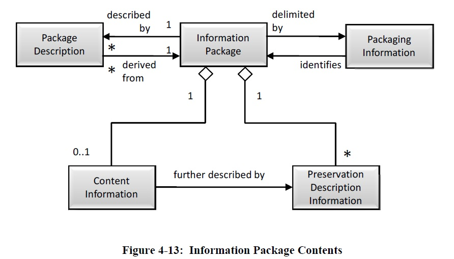
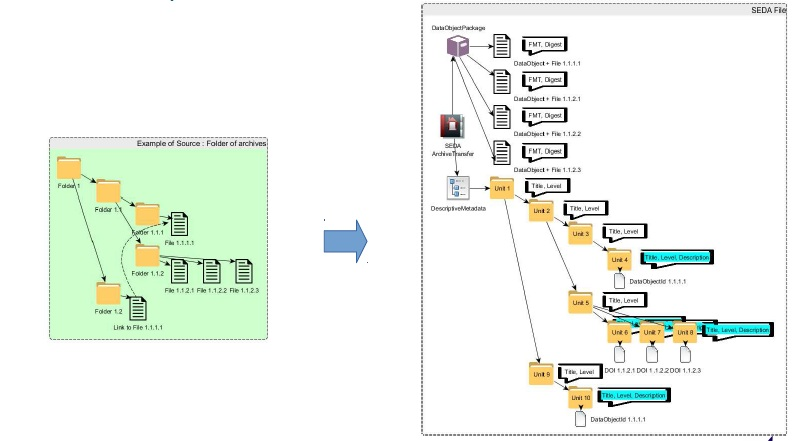
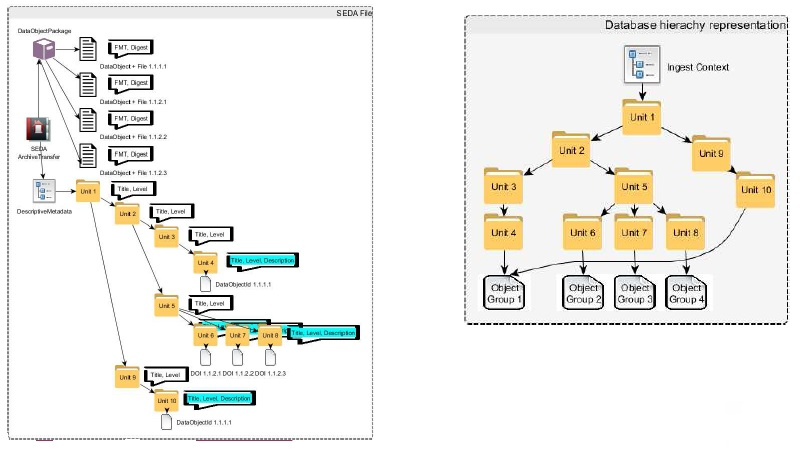
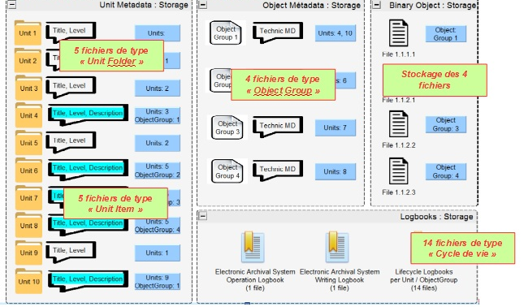
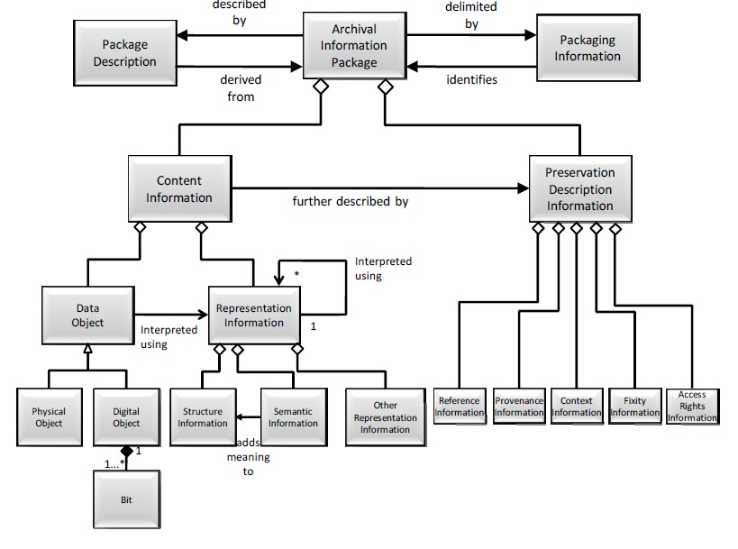

Organisation de l'information
=====

Introduction
------------

### Documents de référence

|**Document**|**Date de la version**|**Remarques**|
|:---------------:|:-----:|:-----:|
|Code du patrimoine|01/07/2017|Livre II sur les archives (réglementation des archives et de leurs règles de gestion, notamment en termes de gestion du cycle de vie et de communicabilité)|
|Code civil|01/11/2017|Droit de la preuve|
|Code des relations entre l’administration et le citoyen|01/09/2017|Livre III sur l’accès aux documents administratifs et la réutilisation des informations publiques (réglementation en termes d’accès et de réutilisation)|
|Loi n° 78-17 du 3 janvier 1978 relative à l’informatique, aux fichiers et aux libertés|20/06/2018 03/08/2018|Réglementation de la gestion et de la conservation des données à caractère personnel|
|Instruction générale interministérielle n° 1300 sur la protection du secret de la défense nationale|13/11/2020|Réglementation de la protection du secret de la défense nationale et de la protection des informations sur support classifié|
|Référentiel général de sécurité – version 2.0.|13/06/2014||
|Référentiel général d’interopérabilité – version 2.0.|22/04/2016||
|ISO 14 721:2012 – Systèmes de transfert des informations et données spatiales – Système ouvert d’archivage d’information (SOAI) – Modèle de référence|01/09/2012||
|ISO 16 363:2012 – Space data and information transfer systems – Audit and certification of trustworthy digital repositories|15/02/2012||
|ISO 20 614:2017 – Information et documentation -- Protocole d’échange de données pour l’interopérabilité et la préservation|2018||
|NF Z 42‑013 – Archivage électronique – recommandations et exigences|30/09/2020||
|NF Z 42‑019 – Guide d’application de la NF Z 42‑013 version 2009|06/2010||
|NF Z 42‑020 – Spécifications fonctionnelles d’un composant Coffre-Fort Numérique destiné à la conservation d’informations numériques dans des conditions de nature à en garantir leur intégrité dans le temps|07/2012||
|NF Z 44‑022 – MEDONA – Modélisation des données pour l’archivage|18/01/2014||
|Standard d’échange de données pour l’archivage – SEDA – v. 2.1|06/2018||
|Standard d’échange de données pour l’archivage – SEDA – v. 2.2|02/2022|Cette nouvelle version du SEDA est intégrée à la solution logicielle Vitam à partir de la V6.RC.|
|Standard d’échange de données pour l’archivage – SEDA – v. 2.3|06/2024|Cette nouvelle version du SEDA est intégrée à la solution logicielle Vitam à partir de la V7.1.|
|ISAD(G) – Norme générale et internationale de description archivistique. Deuxième édition.|2000||
|PREservation Metadata International Standard – PREMIS – v 3.0|01/11/2015|Dictionnaire de données, liste hiérarchique des unités sémantiques, diagrammes, schéma|
|CCSDS 650.0-M-2 : Reference Model for an Open Archival Information System (OAIS) – Magenta Book|06/2012||
|CCSDS 652.0-M-1 : Audit and Certification of Trustworthy Digital Repository – Magenta Book|09/2011||
|Note d’information DGP/SIAF/2014/005 du 8 juillet 2014 relative à la journalisation des événements|08/07/2014||
|[Vitam – Structuration des Submission Information Package (SIP)](./SIP.md)|||
|[Vitam – Modèle de données](./modele_de_donnees.md)|||

### Présentation du document

Ce document présente l’organisation de l’information retenue pour la solution logicielle Vitam.

Il s’articule autour de trois grands axes :
- une présentation des exigences fonctionnelles impactant cette organisation de l’information ;
- une présentation de la manière dont la solution logicielle Vitam adapte les spécifications de la norme OAIS pour répondre aux exigences fonctionnelles identifiées précédemment, notamment dans la conception de ce que la norme OAIS désigne sous l’expression d’Archival Information Packages (AIP) ;
- une présentation de l’organisation de l’information dans la solution logicielle Vitam en tant que telle.
Le présent document doit permettre aux ministères porteurs, aux partenaires, ainsi qu’à toute implémentation de la solution logicielle Vitam d’alimenter le dossier de description technique du système tel qu’exigé par les normes NF Z 42‑013 et NF Z 42‑020.

Le présent document a vocation à être amendé, complété et enrichi au fur et à mesure de la réalisation de la solution logicielle Vitam et des retours et commentaires formulés par les ministères porteurs et les partenaires du programme. Il contextualise les autres documents produits par l’équipe projet Vitam, notamment le document « modèle de données ».

Exigences
-----

Cette première section du document a pour objectif de recenser les exigences fonctionnelles ayant un impact sur la manière dont l’information doit être organisée dans la solution logicielle Vitam. Ces exigences ont été recensées en utilisant deux sources différentes :
-  la réglementation et les normes en vigueur dans le domaine du records management/gestion des documents d’activités et dans celui de la gestion des archives, qu’il s’agisse de réglementations et normes nationales ou internationales. Un accent tout particulier a été mis sur les normes OAIS, NF Z 42‑013 et NF Z 42‑020 ;
-  la pratique des ministères porteurs et des partenaires du programme Vitam, ainsi que les besoins exprimés par ceux-ci dans le cadre des séminaires, ateliers et échanges intervenus entre eux et l’équipe projet Vitam.

Le tableau ci-dessous recense l’ensemble des textes législatifs et réglementaires utilisés pour le recensement des exigences.

|Document|Date de la version|Remarques|
|:---:|:---:|:---:|
|Code du patrimoine|01/07/2017|Livre II sur les archives (réglementation des archives et de leurs règles de gestion, notamment en termes de gestion du cycle de vie et de communicabilité) Implique pour les implémentations la capacité à prendre en charge et à gérer : -  des documents comme des données, -  des archives publiques comme des archives privées, -  des archives courantes, intermédiaires comme définitives, -  des archives produites ou reçues dans le cadre de fonctions « support » (finances, comptabilité, ressources humaines, juridique, logistique, immobilier, informatique, etc.) comme de fonctions « métier ».|
|Code civil|01/11/2017|Droit de la preuve|
|Code des relations entre l’administration et le citoyen|01/09/2017|Livre III sur l’accès aux documents administratifs et la réutilisation des informations publiques (réglementation en termes d’accès et de réutilisation) Implique pour les implémentations la capacité à prendre en charge et à gérer des documents administratifs et des informations publiques|
|Code de la santé publique|04/11/2016|Implique pour les implémentations la capacité à prendre en charge et à gérer des données de santé|
|Loi n° 78-17 du 3 janvier 1978 relative à l’informatique, aux fichiers et aux libertés|20/06/2018 03/08/2018|Réglementation de la gestion et de la conservation des données à caractère personnel Implique pour les implémentations la capacité à prendre en charge et à gérer des données à caractère personnel|
|Instruction générale interministérielle n° 1300 sur la protection du secret de la défense nationale|13/11/2020|Réglementation de la protection du secret de la défense nationale et de la protection des informations sur support classifié Implique pour les implémentations la capacité à prendre en charge et à gérer des documents protégés au titre du secret de la défense nationale|
|Référentiel général de sécurité – version 2.0.|13/06/2014||
|Référentiel général d’interopérabilité – version 2.0.|22/04/2016||
|ISO 14 721:2012 – Systèmes de transfert des informations et données spatiales -- Système ouvert d’archivage d’information (SOAI) - Modèle de référence|01/09/2012||
|ISO 16 363:2012 – Space data and information transfer systems – Audit and certification of trustworthy digital repositories|15/02/2012|CCSDS 652.0-M-1 : Audit and Certification of Trustworthy Digital Repository – Magenta Book|
|NF Z 42‑013 – Archivage électronique – recommandations et exigences|30/09/2020||
|NF Z 42‑020 – Spécifications fonctionnelles d’un composant Coffre-Fort Numérique destiné à la conservation d’informations numériques dans des conditions de nature à en garantir leur intégrité dans le temps|07/2012||
|NF Z 44‑022 – MEDONA – Modélisation des données pour l’archivage|18/01/2014||
|Standard d’échange de données pour l’archivage – SEDA – v. 2.1|06/2018||
|Standard d’échange de données pour l’archivage – SEDA – v. 2.2|02/2022||
|Standard d’échange de données pour l’archivage – SEDA – v. 2.3|06/2024||
|ISAD(G): Norme générale et internationale de description archivistique. Deuxième édition.|2000||
|PREservation Metadata International Standard – PREMIS – v 3.0|01/11/2015|Dictionnaire de données, liste hiérarchique des unités sémantiques, diagrammes, schéma|
|Note d’information DGP/SIAF/2014/005 du 8 juillet 2014 relative à la journalisation des événements|08/07/2014||

Les différentes exigences identifiées ont été regroupées de la manière suivante :
-  [exigences transverses applicables à la solution logicielle](#exigences-transverses) ;
-  [exigences applicables à la prise en charge d’objets par la solution logicielle](#transfert-entrees-et-prise-en-charge-des-objets-archives) ;
-  [exigences applicables à l’accès aux objets pris en charge par la solution logicielle](#recherche-acces-et-consultation-des-objets-archives-et-des-fichiers-qui-leur-sont-associes1) ;
-  [exigences applicables à la gestion des objets pris en charge par la solution logicielle](#gestion-des-objets-archives-pris-en-charge-et-des-fichiers-qui-leur-sont-associes).

Chaque exigence est présentée de la manière suivante :
-  une numérotation purement arbitraire ;
-  une description ;
-  une priorisation
    - P = exigence formulée par la réglementation ou par une norme ;
    - I = exigence héritée de la pratique ou des besoins fonctionnels ;
-  des observations permettant de renvoyer les lecteurs aux références ayant servi à l’élaboration du présent document et de fournir des précisions nécessaires à la compréhension de l’exigence.

La terminologie suivante est utilisée dans la présente section :

|Terme|Définition|
|:---|:---|
|Contrat|Formalisation des engagements d’un système vis-à-vis de tiers|
|Entité|Élément intellectuel ou physique géré par la solution logicielle Vitam et auquel est attribué un identifiant unique par le système Ex. : format de fichier, règle de gestion, unité archivistique, fichier, etc.|
|Fichier|Ensemble de bits constituant la représentation unitaire de tout ou partie d’un objet archivé, quel que soit l’usage auquel il correspond (usage de conservation, usage de diffusion, etc.)|
|Objet archivé|Entité intellectuelle comprenant un ensemble d’objets physiques ou numériques accompagnés de leur description|
|Système|Implémentation utilisant la solution logicielle Vitam|
|Tenant|Utilisateur des moyens d’une implémentation et disposant d’une configuration adaptée à ses besoins et d’une partition propre de ses données|

### Exigences transverses

#### Périmètre d’archivage

|N° d’exigence|Intitulé de l’exigence|Priorité de l’exigence|Observations|
|:---:|:---|:---:|:---|
|1.1.1.|Les implémentations doivent pouvoir prendre en charge et gérer un nombre d’archives supérieur ou égal à une centaine de millions, et à plusieurs milliards d’ici 10 ans|I|Exemples : -  MEAE, application Diplomatie : 1,2 M d’objets/an ; -  MinArm, application NeMO : 1,2 M d’objets/an|
|1.1.2.|Les implémentations doivent pouvoir prendre en charge et gérer tous types d’archives numériques (texte, document, image, audiovisuel, bases de données, plans 2D, plans 3D, etc.)|I|Exemples : -  photothèques -  documentation technique des armées -  systèmes d’information géographique|

#### Identification des entités gérées par le système

|N° d’exigence|Intitulé de l’exigence|Priorité de l’exigence|Observations|
|:---:|:---|:---:|:---|
|1.2.1.|Un identifiant unique et pérenne doit être associé à chaque entité (agent, objet, événement) gérée par le système|P|NF Z 42‑013, 5.6.2 (transformation des SIP en AIP) CCSDS 652-0-M-1, 4.2.4. (convention that generates persistent, unique identifiers for AIP’s)|
|1.2.2.|Les fichiers enregistrés sur les offres de stockage doivent être identifiés par un identifiant unique et pérenne|P|NF Z 42‑013, 4.6.2. (enregistrements (données de trace ou log))|
|1.2.3.|Des identifiants externes doivent pouvoir être associés aux objets archivés. Ces identifiants doivent pouvoir être requêtés|I|Exemple : cote/numéro d’article, lien Ark, identifiant ISNI|
|1.2.4.|L’identifiant unique et pérenne attribué à un objet archivé doit être réutilisable, notamment dans une optique de citation dans un document|I|Exemple : demande de consultation par dérogation aux règles de communicabilité|

#### Contractualisation des services rendus par le système

|N° d’exigence|Intitulé de l’exigence|Priorité de l’exigence|Observations|
|:---:|:---|:---:|:---|
|1.3.1.|Les engagements du système vis-à-vis de ses utilisateurs applicatifs (fournisseurs comme clients) doivent être formalisés dans des contrats|P|CCSDS 650.0-M-2,2.3.2. (Producer Interaction), 2.3.3. (Consumer Interaction) CCSDS 652-0-M-1, 3.5.1. (contracts, licences and liabilities)|
|1.3.2.|Les contrats formalisant les engagements du système vis-à-vis de tiers doivent permettre de spécifier le modèle de données utilisé dans le cadre de leurs interactions effectuées (structuration logique d’un SIP ou d’un DIP)|P|CCSDS 650.0-M-2,2.3.2. (Producer Interaction), 2.3.3. (Consumer Interaction)|
|1.3.3.|Les contrats formalisant les engagements du système vis-à-vis de tiers doivent permettre de spécifier la périodicité des interactions mises en œuvre|P|CCSDS 650.0-M-2,2.3.2. (Producer Interaction)|
|1.3.4.|Les contrats formalisant les engagements du système vis-à-vis de tiers doivent permettre de connaître les règles et procédures applicables aux objets archivés (droits de propriété intellectuelle et autres restrictions légales, capacité à modifier les contenus, implication des clients dans la gestion et la préservation de l’information, capacité à conclure des contrats avec d’autres clients)|P|CCSDS 652-0-M-1, 3.2.2. (Obtains sufficient control for Preservation) CCSDS 652-0-M-1, 3.5.1. (contracts, licences and liabilities), 3.5.2.|
|1.3.5.|Les contrats formalisant les engagements du système vis-à-vis de tiers doivent permettre de définir les modalités de conservation des métadonnées et journaux des objets éliminés|P|NF Z 42‑013, 7.7.1. (processus d’élimination)|

#### Description des objets archivés

|N° d’exigence|Intitulé de l’exigence|Priorité de l’exigence|Observations|
|:---:|:---|:---:|:---|
|1.4.1.|Les objets archivés doivent pouvoir être décrits au moyen de métadonnées|P|NF Z 42‑013, 5.2.2. (organisation des métadonnées dans le SIP)|
|1.4.2.|Un AIP au sens de la norme OAIS doit pouvoir associer de manière physique ou logique un Data object, son Content Information, sa Representation Information et sa Preservation Description Information|P|CCSDS 652-0-M-1, 3.2.4. (ensures Information is independently understandable), 4.2.1. (logical model for archival information)|
|1.4.3.|La description des objets archivés doit pouvoir être enrichie tout au long du cycle de vie des objets archivés, de manière manuelle comme automatique|P|NF Z 42‑013, 7.5.1 (ajout et modification de métadonnées)|
|1.4.4.|Le lien entre un Data object, son Content Information, sa Representation Information et sa Preservation Description Information au sens de la norme OAIS doit pouvoir être préservé pendant toute la période où l’objet est géré par le système|P|CCSDS 652-0-M-1, 4.5.3.1.|
|1.4.5.|Dans le cas de la prise en charge de fichiers contenant des éléments textuels et/ou non textuels structurés par des balises et conformes au standard xml, le fichier doit pouvoir être associé à l’ensemble des éléments le constituant : schémas de description technique, tables de codification, documents liés, etc.|P|NF Z 42‑013, 5.1.1. (recommandations pour la production de documents numériques)|
|1.4.6.|La description des objets archivés doit pouvoir être hiérarchisée|I|Exemple : utilisation d’un plan de classement|
|1.4.7.|La description des objets archivés doit pouvoir être adaptée au contexte de ceux-ci (schéma de métadonnées adapté)|I|Exemple : message électronique, dossier individuel de carrière d’un agent|
|1.4.8.|Un même objet archivé doit pouvoir disposer de différentes descriptions adaptées à ses différents contextes de production|I|Exemple : un objet produit dans l’application Diplomatie du MEAE dispose d’autant de descriptions que de communautés ayant partagé cet objet (communautés émettrices, communautés destinataires)|
|1.4.9.|Un même objet archivé doit pouvoir disposer de descriptions arborescentes produites et/ou enrichies successivement pour différents usages (description élaborée par l’émetteur/producteur de l’objet, description revue par le service d’archives, description enrichie de manière manuelle ou automatique)|I|

#### Règles de gestion applicables aux objets archivés

|N° d’exigence|Intitulé de l’exigence|Priorité de l’exigence|Observations|
|:---:|:---|:---:|:---|
|1.5.1.|Des règles de gestion applicables aux objets archivés – notamment la durée de conservation et les droits d’accès – doivent pouvoir être définies, soit en les enregistrant dans les métadonnées de chaque objet archivé, soit en référençant chaque objet archivé par rapport à une table des règles de gestion définies par type d’objet|P|NF Z 42‑013, 7.1.2. (paramétrage des règles de conservation) CCSDS 650.0-M-2,2.2.2. (Information Package Definition)|
|1.5.2.|Les règles de gestion doivent pouvoir être appliquées à un niveau global (un ensemble d’objets archivés) comme à un niveau fin (un objet archivé en particulier)|I||
|1.5.3.|Dans le cas d’une description arborescente, les règles de gestion doivent pouvoir être héritées du niveau supérieur|I||
|1.5.4.|Des objets archivés doivent pouvoir disposer de différentes règles de gestion, adaptées aux différents contextes de production et d’archivage, même s’ils sont représentés par les mêmes fichiers|I|Exemple : un objet produit dans l’application Diplomatie du MEAE peut disposer d’autant de règles de gestion que de communautés ayant partagé cet objet (communautés émettrices, communautés destinataires)|
|1.5.5.|Les modifications des règles de gestion appliquées à des objets archivés doivent pouvoir être réalisées à l’unité ou par lots|I|Exemple : modification des délais de communicabilité définis par le code du patrimoine|

#### Journalisation et traçabilité

|N° d’exigence|Intitulé de l’exigence|Priorité de l’exigence|Observations|
|:---:|:---|:---:|:---|
|1.6.1.|Toutes les opérations effectuées sur les objets archivés et les fichiers qui leur sont associés doivent être tracées de manière synchrone. Cette traçabilité doit commencer dès leur réception dans le système et se poursuivre pendant toute la durée de leur prise en charge|P|NF Z 42‑013, 4.6.1. (traçabilité) et 4.6.3. (journalisation) NF Z 42‑020, 5.1.1. (description des fonctions) OAIS 3.2.5. (follows established preservation policies and procedures) CCSDS 652-0-M-1, 3.3.4. (transparency and accountability in all actions supporting the operation and management of the repository), 3.3.5. (definition, tracking and provinding of its information integrity measurements), 4.2.3. (document the final disposition), 4.2.10. et 4.4.2. (contemporaneous records of actions and administration processes)|
|1.6.2.|Chaque événement lié à l’exploitation du système doit être enregistré|P|NF Z 42-013, 4.6.3 (journalisation)|
|1.6.3.|Toute création, modification ou suppression d’un profil d’archivage doit être enregistrée|P|NF Z 42‑013, 4.6.3 (journalisation)(journal du cycle de vie des archives)|
|1.6.4.|La journalisation du cycle de vie des archives doit pouvoir être gérée de manière globale ou spécifique par entité|P|NF Z 42‑013, 4.6.3. (journalisation)|
|1.6.5.|Des attestations opposables mises en œuvre doivent pouvoir être générées, notamment des attestations de conformité, relatives aux actions|P|NF Z 42‑013, 4.6.4 (attestations)|
|1.6.6.|Des enregistrements auditables dans le cadre de procédures d’audit de certification ou de conformité doivent pouvoir être générés|P|NF Z 42‑019, 4.3.6 (audits du système d’archivage électronique)|
|1.6.7.|Dans le cas où les opérations effectuées sur les objets archivés et sur le système sont stockées dans un même journal, le contenu requis pour chacun doit être respecté, afin de fournir une vue propre à chacune des catégories d’opérations|P|NF Z 42‑019, FAQ n° 8|
|1.6.8.|La mise en forme des dates et des heures doit être conforme à la norme ISO 8601|P|NF Z 42‑020, 5.9. (format des dates)|

#### Sécurité

|N° d’exigence|Intitulé de l’exigence|Priorité de l’exigence|Observations|
|:---:|:---|:---:|:---|
|1.7.1.|Les implémentations doivent pouvoir être reconstruites intégralement en cas de défaillance totale ou partielle du système, qu’elle soit matérielle ou logicielle|P|NF Z 42‑013, 6.1.5 (disponibilité et copies de sécurité) CCSDS 652-0-M-1, 4.5.3.|
|1.7.2.|Les objets archivés doivent pouvoir être cloisonnés par client en cas de partage d’une même plate-forme|P|NF Z 42‑013, 6.1.3 (cloisonnement) CCSDS 652-0-M-1, 6.1.4. (archives with shared functional areas)|
|1.7.3.|Les opérations sur les objets archivés et les fichiers qui leur sont associés doivent être réalisées par des utilisateurs autorisés et habilités|I||

### Exigences associées aux différentes étapes du cycle de vie des objets archivés

#### Transfert, entrées et prise en charge des objets archivés

|N° d’exigence|Intitulé de l’exigence|Priorité de l’exigence|Observations|
|:---:|:---|:---:|:---|
|2.1.1.|Les règles de gestion applicables à chaque transfert ou à chaque objet archivé dans ce transfert doivent pouvoir être définies dès le transfert|P|NF Z 42‑013, 5.3. (transfert entre le service versant et le SA NF Z 42‑019, 2.2.2. (profils d’archivage)|
|2.1.2.|Les implémentations doivent pouvoir contrôler que les transferts sont réalisés par des utilisateurs autorisés|P|CCSDS 652-0-M-1, 4.1.4. (verify the identity of the Producer of all materials)|
|2.1.3.|Les implémentations doivent pouvoir contrôler que les fichiers associés aux objets archivés sont enregistrés dans un format accepté en entrée|P|NF Z 42‑013, 5.5.2. (conformité des documents)|
|2.1.4.|Les implémentations doivent pouvoir contrôler la structuration, la syntaxe et la sémantique des archives transférées|P|CCSDS 652-0-M-1, 4.1.5. (verify each SIP for completeness and correctness)|
|2.1.5.|Les archives transférées doivent pouvoir être rattachées à une ou plusieurs Archival Information Collections (AIC) au sens de la norme OAIS, sur la base de critères définis par les utilisateurs (origine, descriptions)|P|CCSDS 652-0-M-1, 4.2.2.7. (Archival Information Collections), 4.3.2. (Data Transformations in the Ingest Functional Area), 4.3.2. (Data Transformations in the Ingest Functional Area)|
|2.1.6.|Les implémentations doivent être en mesure de prendre en charge non seulement des entrées correspondant à des ensembles cohérents mais aussi des entrées correspondant à des parties d’ensembles cohérents|I|Exemple : un dossier transféré dans son intégralité vs. un dossier transféré pièce à pièce|

####	Recherche, accès et consultation des objets archivés et des fichiers qui leur sont associés[^1]

#####	Recherche

|N° d’exigence|Intitulé de l’exigence|Priorité de l’exigence|Observations|
|:---:|:---|:---:|:---|
|2.2.1.|Les recherches sur les objets archivés doivent pouvoir être restreintes en fonction des droits et habilitations des utilisateurs|P|CCSDS 652-0-M-1, 3.2.6. (makes the information available)|
|2.2.2.|Les recherches sur les objets archivés doivent pouvoir être effectuées à un niveau global (un ensemble d’objets archivés) comme à un niveau fin (un objet archivé), en fonction du choix de l’utilisateur|P|NF Z 42‑013, 7.4. (indexation par les composants d’indexation des outils de recherche)|
|2.2.3.|Les recherches sur les objets archivés doivent pouvoir utiliser les critères définis (origine, descriptions) par les utilisateurs pour constituer des Archival Information Collections (AIC) au sens de la norme OAIS|P|CCSDS 652-0-M-1, 4.2.2.7. (Archival Information Collections)|
|2.2.4.|Les utilisateurs doivent pouvoir effectuer des recherches pour : -  trouver des informations ; -  gérer les archives prises en charge (éliminations, modification de métadonnées, etc.) ; -  administrer et effectuer le reporting sur le fonctionnement de l’implémentation|I||
|2.2.5.|Les recherches sur les objets archivés doivent pouvoir être faites indépendamment des entrées ayant permis de transférer et prendre en charge ceux-ci|I||
|2.2.6.|Les utilisateurs doivent pouvoir effectuer des recherches sur toutes les catégories de métadonnées associées aux objets archivés (descriptives, techniques, de gestion)|I||
|2.2.7.|Les implémentations doivent pouvoir construire des interfaces de recherche adaptées à certaines catégories d’objets archivés|I|Exemple : interfaces dédiées à la recherche dans les matrices cadastrales ou dans les dossiers nominatifs|
|2.2.8.|Les utilisateurs doivent pouvoir construire, a posteriori et à partir des métadonnées associées aux objets archivés, tout type d’instruments de recherche, notamment des instruments de recherche conformes à la DTD EAD|I||
|2.2.9.|Les utilisateurs doivent être en mesure d’effectuer des recherches à partir de référentiels du type plans de classement, référentiels producteurs ou référentiels de fonctions/activités|I||
|2.2.10.|Les utilisateurs doivent être en mesure d’effectuer des recherches sur des objets archivés mais produits par différentes générations d’outils (papier, applications)|I||

#####	Consultation des résultats

|N° d’exigence|Intitulé de l’exigence|Priorité de l’exigence|Observations|
|:---:|:---|:---:|:---|
|2.3.1.|Les résultats fournis en réponse à une recherche doivent pouvoir être restreints en fonction des droits et habilitations des utilisateurs|P|CCSDS 652-0-M-1, 3.2.6. (makes the information available)|
|2.3.2.|Les utilisateurs doivent pouvoir obtenir des résultats à leurs recherches, quel que soit le contexte de production et d’archivage des objets archivés|I|Exemple : recherche d’une affaire par titre, indépendamment du service producteur|
|2.3.3.|Les utilisateurs doivent pouvoir récupérer des réponses à leurs recherches dans un délai adapté à leurs besoins|I|Exemple : archivage courant avec besoin d’une réponse rapide pour les services instruisant les dossiers|
|2.3.4.|Les utilisateurs doivent pouvoir connaître les différentes formes disponibles d’un même objet archivé, permettant des usages différents|I|Exemple : papier, numérisée, numérique natif (conservation, diffusion, vignette, texte brut)|
|2.3.5.|Les utilisateurs doivent pouvoir disposer d’un affichage des résultats à un niveau de description pertinent et correspondant à leur besoin|I|Exemple : niveaux des : -  dossiers, même si des objets archivés de niveau pièce existent également dans le système -  pièces, si l’utilisateur n’a pas besoin d’obtenir au préalable un résultat au niveau dossier|
|2.3.6.|Les utilisateurs doivent pouvoir naviguer de manière arborescente – à la fois ascendante comme descendante – dans les résultats obtenus|I||
|2.3.7.|Les utilisateurs doivent pouvoir affiner leurs recherches au moyen de filtres|I|Exemple : dates ou période chronologique, contexte, typologie documentaire, format|
|2.3.8.|Les utilisateurs doivent pouvoir obtenir des informations sur les restrictions d’accès et de réutilisation associées à un objet archivé, afin de connaître leurs droits et d’effectuer les démarches associées|I||
|2.3.9.|Les utilisateurs doivent pouvoir disposer d’une prévisualisation des objets archivés|I||

##### Consultation et exploitation des archives

|N° d’exigence|Intitulé de l’exigence|Priorité de l’exigence|Observations|
|:---:|:---|:---:|:---|
|2.4.1.|La consultation des objets archivés doit pouvoir être restreinte en fonction des droits et habilitations des utilisateurs|P|CCSDS 652-0-M-1, 3.2.6. (makes the information available)|
|2.4.2.|Les implémentations doivent pouvoir tracer la consultation des objets archivés soumis à des restrictions de communication/consultation|P|CCSDS 652-0-M-1, 4.6.1. (compliance with Access Policies)|
|2.4.3.|Les utilisateurs doivent pouvoir consulter les objets archivés dans une des formes disponibles|P|NF Z 42‑013, 7.6.2. (communication)|
|2.4.4.|Les utilisateurs doivent pouvoir consulter les objets archivés sans avoir au préalable à récupérer l’intégralité de l’entrée qui a permis de les transférer et de les prendre en charge|I||
|2.4.5.|Les utilisateurs doivent pouvoir contribuer à l’enrichissement des métadonnées des objets archivés|I||
|2.4.6.|Les utilisateurs doivent pouvoir consulter les traces des opérations effectuées sur un objet archivé|I||

#### Gestion des objets archivés pris en charge et des fichiers qui leur sont associés

##### Mise en œuvre des actions à échéance

|N° d’exigence|Intitulé de l’exigence|Priorité de l’exigence|Observations|
|:---:|:---|:---:|:---|
|2.5.1.|Les actions à échéance doivent pouvoir être mises en œuvre au même moment pour des objets archivés transférés par différents services versants|I||
|2.5.2.|Les actions à échéance doivent pouvoir être mises en œuvre de manière séparée, notamment pour des objets archivés différents, dotés de règles de gestion différentes, mais représentés par les mêmes fichiers|I||
|2.5.3.|Les actions à échéance doivent pouvoir être effectuées automatiquement ou après une validation humaine|I||

#####	Préservation et intégrité

|N° d’exigence|Intitulé de l’exigence|Priorité de l’exigence|Observations|
|:---:|:---|:---:|:---|
|2.6.1.|Le système doit pouvoir s’appuyer sur un registre des formats externes|P|CCSDS 652-0-M-1, 4.3.3.1. (mechanisms for creating, identifying or gathering any extra Representation information required)|
|2.6.2.|Les implémentations doivent pouvoir définir des formats acceptés en entrée et gérés par le système|P|NF Z 42‑013, 5.4. (conversion des objets numériques en amont du dépôt) et 6.4. (migration et conversion durant la conservation)|
|2.6.3.|Les fichiers pris en charge dans des formats normalisés ou standardisés selon des spécifications publiées et utilisables librement doivent pouvoir être identifiés tout au long de leur durée de vie|P|NF Z 42‑013, 6.4. (migration et conversion durant la conservation)|
|2.6.4.|Les fichiers archivés dans leur format d’origine, même s’il n’est pas dans un format normalisé ou standardisé selon des spécifications publiées et utilisables librement, doivent pouvoir être identifiés tout au long de leur durée de vie|P|NF Z 42‑013, 6.4. (migration et conversion durant la conservation)|
|2.6.5.|L’obsolescence d’un format de fichier doit pouvoir être signalée pour déclencher des actions en utilisant cette information|P|NF Z 42‑013, 6.4. (migration et conversion durant la conservation) CCSDS 652-0-M-1, 4.3.3.1. (mechanisms for creating, identifying or gathering any extra Representation information required)|
|2.6.6.|Les modifications des fichiers doivent impacter uniquement les métadonnées techniques associées à ceux-ci, et non la description des objets archivés|P|CCSDS 650.0-M-2,5.1.3. (Migrations Types)|
|2.6.7.|L’intégrité des fichiers numériques doit pouvoir être contrôlée périodiquement|P|NF Z 42‑020, 5.1.1. (description des fonctions)|
|2.6.8.|Les opérations de préservation des différents fichiers associés à un même objet archivé doivent pouvoir être mises en œuvre de manière disjointe|I||
|2.6.9.|Les actions à échéances (préservation, contrôle d’intégrité) sur les fichiers qui représentent les objets archivés doivent pouvoir être mises en œuvre de manière disjointe aux actions effectuées sur ceux-ci, notamment dans le cas où les objets archivés associés à un même ensemble de fichiers ont des stratégies de préservation et de contrôle d’intégrité différentes en fonction de leur contexte de production|I||

#####	Stockage

|N° d’exigence|Intitulé de l’exigence|Priorité de l’exigence|Observations|
|:---:|:---|:---:|:---|
|2.7.1.|Le système doit réaliser les fonctions dévolues à un Composant Coffre-fort Numérique au sens de la norme NF Z 42‑020|P|NF Z 42‑020, 5.1.1. (description des fonctions)|
|2.7.2.|Les implémentations doivent être en mesure d’enregistrer plusieurs  exemplaires d’un même fichier sur différentes offres de stockage|P|NF Z 42‑013, 6.1.5. (disponibilité et copies de sécurité)|
|2.7.3.|Les implémentations doivent être en mesure de contrôler la cohérence des objets stockés sur les différentes offres de stockage|P|CCSDS 652-0-M-1, 5.1.2. (number and location of copies of all digital objects)|
|2.7.4.|Les implémentations doivent être en mesure de vérifier la synchronisation des écritures sur les différentes offres de stockage sur lesquelles elles s’appuient|P|CCSDS 652-0-M-1, 5.1.2.1 (synchronization of copies)|
|2.7.5.|Les implémentations doivent être en mesure de s’appuyer sur différents types d’offres de stockage (chaudes, froides)|I||
|2.7.6.|Les implémentations doivent maîtriser les offres de stockage sur lesquelles elles s’appuient|I||
|2.7.7.|Les implémentations doivent être en mesure de gérer les anomalies associées aux écritures sur les offres de stockage|I||

#####	Réversibilité

|N° d’exigence|Intitulé de l’exigence|Priorité de l’exigence|Observations|
|:---:|:---|:---:|:---|
|2.8.1.|Les objets archivés (Content Information, Representation Information, Preservation Description Information, Package Descriptions et Packaging Information au sens de la norme OAIS) doivent pouvoir être restitués ou transmis à un tiers au terme de leur durée de prise en charge|P|CCSDS 650.0-M-2,4.2.1.4.3. (Packaging Information) NF Z 42‑013, 9.restitution)|

Implémentation de la norme OAIS dans la solution logicielle Vitam
-----

Cette deuxième section du document présente la manière dont la solution logicielle Vitam met en œuvre les concepts formulés par la norme OAIS, afin de répondre aux exigences fonctionnelles précédemment identifiées.

La norme OAIS décrit les types d’information qui sont échangés et gérés dans des systèmes d’archivage et définit un modèle de données conceptuel (logical model of informations) centré autour de la notion d’objets informationnels (Information Objects) nécessaire pour la préservation sur le long terme des contenus informationnels (Content Information).
La norme OAIS (section 4.2.2. Logical Model of Information in an Open Archival Information System) précise que la préservation sur le long terme des objets à archiver (Data Objects) et de l’ensemble des informations qui leur sont associées (Representation Information, Preservation Description Information, Package Description), nécessite de réfléchir en termes de paquets informationnels (Information Packages) :

Ces paquets informationnels sont de trois types en fonction de leur place dans le processus d’archivage :
-  les paquets transférés par les fournisseurs au système d’archivage : les Submission Information Packages (SIP) ;
-  les paquets gérés par le système d’archivage : les Archival Information Packages (AIP) ;
-  les paquets transmis aux clients par le système d’archivage : les Dissemination Information Packages (DIP).
La norme précise enfin qu’aucune équivalence n’est obligatoire entre les différents types de paquets informationnels.

### Les paquets transmis au système d’archivage : les Submission Information Packages (SIP)

Selon la norme OAIS, les SIP correspondent aux paquets informationnels transférés au système d’archivage par le producteur des objets à archiver.

**Les SIP en tant que tels**

La norme OAIS indique que la forme et le contenu des SIP doivent faire l’objet d’une négociation entre le service versant et le service d’archives. S’agissant des systèmes d’archivage basés sur la solution logicielle Vitam, ils suivent les prescriptions de la norme NF Z 44‑022 et de sa déclinaison pour le secteur public, le Standard d’échanges de données pour l’archivage (SEDA), dans sa version 2.3[^2]. L’implémentation de cette norme et de ce standard est décrite dans le document « Structuration des Submission Information Packages (SIP) » mis à disposition par l’équipe projet Vitam.

En application de cette norme, de ce standard et de son projet d’implémentation, les SIP transférés à un système d’archivage utilisant la solution logicielle Vitam prennent la forme d’un conteneur (de format .zip ou .tar) comprenant tous les fichiers représentant les objets à archiver, ainsi qu’un bordereau les accompagnant. Ce dernier prend la forme d’un fichier xml conforme au schéma défini dans la norme NF Z 44‑022 et le standard SEDA, dans sa version 2.3[^3]. Ce bordereau contient :
-  la liste des fichiers à archiver, avec leur description technique (les DataObjects). Dans le cas où plusieurs fichiers constituent des représentations différentes d’un même objet à archiver, ils doivent être liés logiquement sous la forme d’un groupe d’objets (DataObjectGroup) ;
-  la liste des objets à archiver (les unités archivistiques ou ArchiveUnit), qu’ils soient physiques ou binaires, dans une arborescence, avec leur description fonctionnelle et leurs règles de gestion ;
-  le lien entre objets et fichiers à archiver.

Ces SIP permettent de transférer au système d’archivage aussi bien des descriptions que des fichiers correspondant aux informations nécessaires pour représenter et interpréter ces objets informationnels (Representation Information, Preservation Description Information).

Chaque SIP est doté, lors de sa réception pour contrôle et traitement avant prise en charge par la solution logicielle Vitam, d’un identifiant unique et pérenne qui prend la forme d’un Globally Unique Identifier (GUID).

#### La transformation des SIP en AIP

La norme OAIS (section 4.3.2.) précise qu’une fois reçu par un système d’archivage, un SIP peut être modifié dans sa forme et son contenu pour rendre possible et gérable la préservation de l’information transmise. Le SIP prend alors la forme d’un Archival Information Package (AIP).
La norme précise ensuite que quatre types de transformation sont possibles lors du traitement du SIP dans l’entité « entrées » du système :
-  l’équivalence stricte entre SIP et AIP ;
-  la transformation de plusieurs SIP en un AIP ;
-  la transformation d’un SIP en plusieurs AIP ;
-  la transformation de plusieurs SIP en plusieurs AIP.

La solution retenue par l’équipe projet Vitam consiste à ne pas établir d’équivalence stricte entre SIP et AIP, afin de permettre :
-  une gestion différenciée des différents objets archivés et des fichiers qui leur sont associés ;
-  une préservation et un audit différenciés des différents objets archivés et des fichiers qui leur sont associés ;
-  une recherche et une consultation des objets archivés et des fichiers qui leur sont associés indépendantes du SIP par lesquels ils ont été transférés au système d’archivage.

Pour ce faire, l’entité « entrées » de la solution logicielle Vitam :
-  indexe dans une base de données NoSQL les descriptions et les règles de gestion des objets archivés et des fichiers qui leur sont associés ;
-  écrit sur les offres de stockage, en fonction de stratégies définies contractuellement, et identifie par un identifiant unique et pérenne (GUID) :
    - les fichiers transférés dans le SIP ;
    - les fichiers produits par la solution logicielle dans le cadre de traitement mis en œuvre lors de l’opération d’entrée, conformément aux contrats passés entre le fournisseur et le système d’archivage ;
    - les fichiers correspondant aux descriptions et aux règles de gestion des objets archivés et des fichiers qui leur sont associés ;
    - le bordereau transféré dans le SIP ;
    - les journaux des opérations, notamment des opérations d’entrée ;
    - les journaux enregistrant les opérations effectuées sur les objets archivés et les fichiers qui leur sont associés (journaux du cycle de vie) ;
    - les attestations produites à l’occasion de la prise en charge et pendant la gestion des objets archivés et des fichiers qui leur sont associés.

Les identifiants uniques et pérennes, ainsi que les indexations, permettent de faire le lien entre les différents éléments constituant l’AIP.

#### Illustration via une étude de cas

Une étude de cas va permettre d’illustrer les transformations opérées par la solution logicielle Vitam sur les SIP et la manière dont l’Archival Information Package est conçu dans la solution logicielle Vitam.

Le cas étudié (cf. illustration dans le schéma ci-dessous) concerne une arborescence de fichiers comprenant :
-  un dossier racine (Répertoire 1) ;
-  4 sous-dossiers (Répertoires 1.1, 1.2, 1.1.1 et 1.1.2) ;
-  5 fichiers dont deux sont identiques (Fichiers 1.1.1.1, en double 1.1.2.1, 1.1.2.2, 1.1.2.3).

Conformément à la norme NF Z 44‑022 et au SEDA 2.X, le Submission Information Package correspondant à cette arborescence de fichiers se présente comme suit :
-  le bloc DataObjectPackage comprend 4 objets numériques (BinaryDataObject) correspondant aux 5 fichiers existants dans l’arborescence (groupe d’objets 1.1.1.1, 1.1.2.1, 1.1.2.2, 1.1.2.3). Le fichier présent à 2 endroits dans l’arborescence a fait l’objet d’un dédoublonnement (Fichier 1.1.1.1). Chaque objet numérique (BinaryDataObject) se voit intégré à un groupe d’objets (DataObjectGroup) qui permettrait de lier ensemble différentes représentations d’une même entité intellectuelle (une version de conservation et une version de diffusion par exemple) ;
-  l’arborescence d’unités archivistiques dans le bloc DescriptiveMetadata reprend la structuration de l’arborescence de fichiers avec son dossier racine (Unit 1 correspondant au Folder 1), ses sous-dossiers (Units 2, 3, 5 et 9 correspondants aux Folders 1.1, 1.2, 1.1.1. et 1.1.2.) mais aussi les unités de description correspondant aux fichiers eux-mêmes (Units 4, 6, 7, 8, 10 correspondants aux fichiers 1.1.1.1., 1.1.2.1., 1.1.2.2. et 1.1.2.3.). À chaque unité archivistique correspondant à un fichier est lié le groupe d’objets correspondant à l’objet numérique lui-même. Il convient de noter que le fichier présent à 2 endroits dans l’arborescence initiale (le fichier 1.1.1.1) fait l’objet de 2 unités archivistiques dans le bordereau (Units 4 et 10) mais d’un seul groupe d’objets. Si le train binaire est unique, l’indexation dépend, elle, de la position dans l’arborescence de fichiers.

Une fois pris en charge, après contrôles et traitements, par la solution logicielle Vitam, l’arborescence de fichiers fait l’objet d’une gestion double, en base de données NoSQL et en stockage.

Dans la base de données sont alimentées deux collections ([voir ci-dessous](#descriptions)) :
-  la collection Unit, qui indexe les métadonnées associées aux unités archivistiques ;
-  la collection ObjectGroup qui indexe les métadonnées associées aux groupes d’objets.

Dans la collection Unit, chaque unité archivistique fait l’objet d’une indexation séparée, mais la structuration initiale est préservée et restituable de la manière suivante :
-  chaque unité archivistique identifie ses unités archivistiques parentes (champ _up) ;
-  chaque unité archivistique liée à un groupe d’objets référence celui-ci (champ _og).

Chaque unité archivistique est dotée d’un identifiant unique (un Globally Unique Identifier – GUID).  
Dans la collection ObjectGroup, chaque groupe d’objets fait l’objet d’une indexation séparée, décrivant l’ensemble des objets binaires qu’il lie, et référence les unités archivistiques qu’il représente (champ _up).  
Chaque ObjectGroup est doté d’un identifiant unique (un Globally Unique Identifier – GUID).  
L’arborescence initiale est donc préservée dans l’indexation de la solution logicielle Vitam et permet, a posteriori, de restituer cette structuration à l’utilisateur sous la forme d’un Dissemination Information Package.

Par ailleurs, chaque unité archivistique et chaque groupe d’objets sont dotés d’un journal du cycle de vie propre, qui recense l’ensemble des événements majeurs survenus pendant la période de prise en charge et de gestion de ceux-ci par la solution logicielle Vitam ([voir section](#journaux-et-registres)). Le GUID de chaque unité archivistique et de chaque groupe d’objets constitue la clé primaire de ces journaux.

Sur les offres de stockage sur lesquelles s’appuie la solution logicielle Vitam, sont stockés et sécurisés :
-  les objets numériques (file 1.1.1.1, 1.1.2.1, 1.1.2.2, 1.1.2.3) transférés ;
-  les journaux du cycle de vie de chaque unité archivistique et de chaque groupe d’objets ;
-  des fichiers numériques correspondant aux métadonnées de chaque unité archivistique et de chaque groupe d’objets.

Aussi, même en cas d’incident majeur sur la base de données MongoDB, est-il possible de reconstituer l’arborescence de fichiers initiale en utilisant les objets numériques stockés sur les offres de stockage :
-  les fichiers correspondant aux unités archivistiques permettent de reconstituer l’arborescence intellectuelle originelle, chaque unité archivistique identifiant son ou ses parents, et d’identifier les groupes d’objets qui représentent certaines unités archivistiques ;
-  les fichiers correspondant aux groupes d’objets permettent d’identifier les objets numériques représentant les unités archivistiques ;
-  les fichiers correspondant aux journaux du cycle de vie permettent de reconstituer les événements survenus sur les unités archivistiques et les groupes d’objets pendant la durée de leur prise en charge par la solution logicielle Vitam.

#### La restitution des SIP

La transformation des SIP reçus par la solution logicielle Vitam n’empêche donc pas le maintien d’un lien logique entre les différents éléments constituant le SIP d’origine :
-  le SIP est identifié dans la solution logicielle en utilisant l’identifiant de l’opération d’entrée à l’occasion de laquelle il a été reçu et pris en charge ;
-  l’opération qui a abouti à la prise en charge de chaque objet ou fichier archivé est tracée dans les journaux associés à ceux-ci ;
-  le bordereau accompagnant le SIP dispose d’une description identifiant l’opération d’entrée à laquelle il est associé et est écrit sur les offres de stockage ;
-  l’attestation de prise en charge dispose d’une description identifiant l’opération d’entrée à laquelle elle est associée, est écrite sur les offres de stockage et fait le lien entre l’identifiant des objets et fichiers archivés et les identifiants uniques et pérennes attribués par la solution logicielle Vitam lors de la réception de ces derniers.

Le SIP peut par conséquent être reconstitué a posteriori, à l’exception des objets archivés et les fichiers qui leur sont associés parvenus à échéance et dont le sort final a été mis en œuvre (élimination ou réversibilité).

### Les paquets gérés par le système d’archivage : les Archival Information Packages (AIP)

Selon la norme OAIS, les AIP correspondent aux paquets informationnels gérés par le système d’archivage.

####	Représentation dans la solution logicielle Vitam des entités constituant un AIP au sens de la norme OAIS

Le schéma ci-dessous donne une vue détaillée des relations logiques entre informations constituant un AIP au sens de la norme OAIS (section 4.2.2.3.).

Le tableau ci-dessous fournit une correspondance entre ces différents types d’information et les objets et informations gérés à ce jour dans la solution logicielle Vitam – la description des différents types d’objets et d’informations est fournie dans le chapitre 4 du présent document. Ce tableau sera amené à évoluer en fonction des nouveaux concepts et objets métiers mis en œuvre dans la solution logicielle Vitam.

##### *Content information*

|Intitulé|Description d’après la norme OAIS|Représentation dans Vitam|
|:---:|:---|:---|
|Physical Object|Objet (roche lunaire, spécimen biologique, préparation pour microscope, etc) présentant des propriétés physiques observables qui sont autant d’informations qu’il convient de documenter pour la pérennisation, la diffusion et l’usage indépendant|-  Groupes d’objets techniques et ses objets associés|
|Digital Object|Objet constitué de séquences de bits|-  Groupes d’objets techniques et ses objets associés|

##### *Representation Information*

|Intitulé|Description d’après la norme OAIS|Représentation dans Vitam|
|:---:|:---|:---|
|Structure Information|Information qui explique la façon dont d’autres informations sont organisées. Elle établit, par exemple, une correspondance entre les trains de bits et les types de données courants sur ordinateurs (tels que caractères, nombres, pixels ou agrégats de ces types tels que chaînes de caractères et tableaux)|-  Métadonnées techniques associées aux groupes d’objets techniques et aux objets -  Référentiel des formats alimenté à partir du référentiel PRONOM maintenu par The National Archives (UK)|
|Semantic Information|Information complémentaire sur la langue dans laquelle l’objet est exprimé|-  Métadonnées descriptives (langue des objets) -  Métadonnées techniques (encodage des caractères) -  Objets archivés (dictionnaire de données, fichiers de structure) et leurs fichiers associés|

##### Preservation Description Information

|Intitulé|Description d’après la norme OAIS|Représentation dans Vitam|
|:---:|:---|:---|
|Reference Information|Information qui identifie, et si nécessaire, décrit le ou les mécanismes d’attribution des identificateurs au Contenu d’information. Elle inclut aussi les identificateurs qui permettent à un système externe de se référer sans équivoque à un Contenu d’information particulier Exemple : un ISBN (International Standard Book Number)|-  Identifiant unique et pérenne attribué par le système (GUID) -  Identifiants externes enregistrés dans les métadonnées descriptives des objets archivés -  Métadonnées descriptives (statut, numéro de version) -  Identifiant unique des formats de fichiers – PUID attribué par The National Archives (UK)|
|Provenance Information|Information qui documente l’historique du Contenu d’information. Cette information renseigne sur l’origine ou la source du Contenu d’information, sur toute modification intervenue depuis sa création et sur ceux qui en ont eu la responsabilité. Exemple : nom du principal responsable de l’enregistrement des données, informations relatives au stockage, à la manipulation et à la migration des données|-  Métadonnées descriptives (service producteur, service versant, historique de la conservation et autres métadonnées spécifiques) -  Journal des opérations -  Journal du cycle de vie|
|Context Information|Information qui décrit les liens entre un Contenu d’information et son environnement. Elle inclut entre autres les raisons de la création de ce Contenu d’information et son rapport avec d’autres Objets-contenu d’information|-  Liens entre unités archivistiques et groupes d’objets techniques -  Métadonnées descriptives (producteur, auteurs, destinataires, position dans le plan de classement, fonction, signature, etc.) -  Contrats -  Identifiant unique et pérenne attribué par le système (GUID) aux opérations|
|Fixity Information|Description des mécanismes et des clés d’authentification garantissant que le Contenu d’information n’a pas subi de modification sans que celle-ci ait été tracée. 
Exemple : le code CRC (contrôle de redondance cyclique) pour un fichier|- Empreintes - Journaux (opérations, cycle de vie, écritures)|
|Access Rights Information||-  Métadonnées de gestion|

##### Package Description

|Intitulé|Description d’après la norme OAIS|Représentation dans Vitam|
|:---:|:---|:---|
|Package Description|Information destinée aux Outils d’accès qui est utilisée pour identifier le paquet dont le Contenu d’information est intéressant. En fonction du contexte, il peut s’agir d’un simple titre descriptif du Paquet d’informations apparaissant dans un libellé, ou bien d’un jeu complet d’attributs pour effectuer une recherche dans un catalogue|-  Métadonnées descriptives|

##### Packaging Information

|Intitulé|Description d’après la norme OAIS|Représentation dans Vitam|
|:---:|:---|:---|
|Packaging Information|Information qui, de façon réelle ou logique, permet de relier et identifier les composants d’un Paquet d’informations Exemple : les informations de volume et de répertoire dans un CD-ROM conforme à la norme ISO 9660, permettant d’accéder aux fichiers supports du Contenu d’information et de l’Information de pérennisation (PDI)|-  Identifiants uniques et pérennes attribués par le système (GUID) -  Liens entre les différents objets métiers (unités archivistiques, groupes d’objets techniques, fichiers)|

#### La mise à jour des AIP

La norme OAIS (section 5.1.3.4.) précise que les AIP – en tout cas leur Content Information et leur Preservation Description Information (PDI) – peuvent faire l’objet de transformations à l’occasion d’opérations de conversion (Digital Migrations), ce qui entraîne la création de nouvelles versions de ces AIP.  
Si les opérations de conversion constituent des opérations importantes de mise à jour des AIP, ce ne sont pas nécessairement les seules qui peuvent impacter les AIP. Les modifications des AIP peuvent en effet concerner toutes les catégories d’information au sens de la norme OAIS :
-  Content Information : création d’un nouvel usage d’un objet (version de diffusion, vignette) suite à un traitement technique ; création d’une nouvelle version d’un objet (quel que soit son usage) suite à une opération de conversion ;
-  Representation Information : modification des métadonnées techniques associées aux groupes d’objets techniques, par exemple suite à une actualisation de l’identification de format ou au calcul d’une nouvelle empreinte ;
-  Preservation Description Information :
    - Reference Information : enrichissement des métadonnées descriptives suite à la mise à jour des identifiants, notamment externes ;
    - Provenance Information : enrichissement des métadonnées descriptives de l’unité archivistique suite à une intervention manuelle ou automatique (notamment services producteurs, services versants, historique de la conservation) ;
    - Context Information : ajout ou suppression de liens entre unités archivistiques ou entre unités archivistiques et groupes d’objets ; enrichissement des métadonnées descriptives de l’unité archivistique suite à une intervention manuelle ou automatique (notamment auteurs, expéditeurs, destinataires, services producteurs, position dans le plan de classement, etc.) ;
    - Fixity Information : modification de l’empreinte suite à un recalcul utilisant un nouvel algorithme ;
    - Access Rights Information : mise à jour des règles de gestion associées à une unité archivistique ;
-  Package Description : enrichissement des métadonnées descriptives de l’unité archivistique suite à une intervention manuelle ou automatique ;
-  Packaging Information : ajout ou suppression de liens entre unités archivistiques ou entre unités archivistiques et groupes d’objets.

La solution retenue par l’équipe projet Vitam consiste à :
-  versionner les enregistrements correspondants aux métadonnées des unités archivistiques et des groupes d’objets ;
-  tracer dans les journaux du cycle de vie des unités archivistiques et des groupes d’objets toutes les modifications majeures impactant le cycle de vie de ces deux catégories d’entités, y compris le différentiel entre les situations qui précèdent et qui suivent les mises à jour ;
-  sauvegarder sur les offres de stockage les métadonnées des unités archivistiques et des groupes d’objets, ainsi que les journaux du cycle de vie associés.

### Les paquets générés par le système d’archivage : les Dissemination Information Packages (DIP)

Selon la norme OAIS, les DIP correspondent aux paquets informationnels transmis de quelque manière que ce soit par le système d’archivage à un demandeur, générés à partir d’un ou de plusieurs AIP conservés par le système d’archivage.

#### Les DIP en tant que tels

La norme OAIS indique que le DIP comprend tout ou partie d’un ou plusieurs AIP et peut également contenir une Preservation Description Information (PDI) plus ou moins complète. Elle précise également qu’en cas d’empaquetage, l’information d’empaquetage, même si elle peut prendre des formes variées, doit nécessairement être présente sous une forme permettant au demandeur de distinguer clairement l’information recherchée. S’agissant des systèmes d’archivage basés sur la solution logicielle Vitam, ils suivent les prescriptions de la norme NF Z 44‑022 et de sa déclinaison pour le secteur public, le Standard d’échanges de données pour l’archivage (SEDA), dans sa version 2.3.[^4].

En application de cette norme, de ce standard et de son projet d’implémentation, les DIP émis par un système d’archivage utilisant la solution logicielle Vitam prennent la forme d’un conteneur (de format .zip) comprenant tous les fichiers représentant les archives demandées, ainsi qu’un bordereau les accompagnant. Ce dernier prend la forme d’un fichier XML conforme au schéma défini dans la norme NF Z 44‑022 et le standard SEDA, dans sa version 2.3.[^5]. Ce bordereau contient :
-  la liste des fichiers demandés, avec leur description technique (les DataObjects). Dans le cas où plusieurs fichiers constituent des représentations différentes d’un même objet, ils peuvent être liés logiquement sous la forme d’un groupe d’objets (DataObjectGroup) ;
-  la liste des archives demandées (les unités archivistiques ou ArchiveUnits), qu’elles soient physiques ou binaires, dans une arborescence, avec leur description fonctionnelle et leurs règles de gestion ;
-  le lien entre archives et fichiers.

Ces DIP permettent de communiquer aux demandeurs aussi bien des descriptions que des fichiers correspondant aux informations nécessaires pour représenter et interpréter ces objets informationnels (Representation Information, Preservation Description Information).

Chaque DIP est doté, lors de son émission par la solution logicielle Vitam, d’un identifiant unique et pérenne qui prend la forme d’un GUID.

Avertissement : Dans le cadre de la release 7 (juin 2018), l’équipe chargée de la réalisation de la solution logicielle Vitam a développé les fonctionnalités de base d’export d’un DIP : constitution du paquet d’objets-données (DataObjectPackage). Les messages d’échanges prévus par le SEDA ont été implémentées dans le cadre de la release 13 (mars 2020).

####	La transformation des AIP en DIP

La norme OAIS (section 4.3.4.) précise que le DIP est constitué par l’entité « accès » sur la base d’une commande d’un utilisateur, en mobilisant les AIP et les descriptions associées gérées par les entités « Gestion de la donnée » et « Stockage ».

La norme précise ensuite que les DIP résultent de la transformation par l’entité « Accès » des AIP et des descriptions de paquets et que la complexité du processus de transformation peut varier selon le niveau de service proposé par le système d’archivage et les demandes des utilisateurs :
-  duplicata simple des AIP et des descriptions associées ;
-  extraction de contenus des AIP et des descriptions associées ;
-  extraction de sous-ensembles des AIP et des descriptions associées, à une granularité plus fine, aboutissant à la création de plusieurs DIP issus d’un seul AIP ou d’un seul DIP à partir de la combinaison de plusieurs AIP.

La solution retenue par l’équipe projet Vitam consiste à ne pas établir d’équivalence stricte entre AIP et DIP, afin de :
-  répondre aux différents usages auxquels peut servir un DIP :
    - transmission de descriptions et d’objets en masse pour répondre à des demandes d’accès complexes,
    - élaborer des instruments de recherche ou permettre d’alimenter un portail (par exemple via un moissonnage),
    - mise en œuvre du sort final des archives, à l’issue d’une des échéances qui leur sont associées (achèvement du contrat avec le système d’archivage, export depuis un système d’archivage intermédiaire pour transfert vers un système d’archivage définitif) ; etc. ;
-  combiner objets archivés et fichiers de différentes provenances pour répondre à une même demande ;
-  permettre au demandeur, en fonction de son besoin, soit de récupérer uniquement les objets archivés (ex. : élaboration d’instruments de recherche), soit de récupérer les objets archivés et les fichiers qui leur sont associés (ex. : demandes de réutilisation, publication sur des portails), soit de récupérer les objets archivés, les fichiers qui leur sont associés et les enregistrements associés à la gestion de leur cycle de vie dans le système d’archivage (journaux enregistrant les opérations effectuées sur les objets archivés et les fichiers qui leur sont associés, attestations produites à l’occasion de la prise en charge et pendant la gestion des objets archivés et des fichiers qui leur sont associés) ;
-  récupérer tout ou partie des descriptions associées aux objets archivés et des versions des fichiers qui leur sont associés (exemple : récupération uniquement des versions de diffusion mais pas des versions de conservation).
Pour ce faire, l’entité « accès » de la solution logicielle Vitam :
-  extrait de la base de données tout ou partie des descriptions des objets archivés, en fonction du périmètre demandé par l’utilisateur et des droits dont il dispose ;
-  récupère sur les offres de stockage les fichiers associés aux objets archivés, en fonction du périmètre demandé par l’utilisateur et des droits dont il dispose.

Structuration proposée
-----

Le présent chapitre décrit la structuration de l’information retenue dans la solution logicielle Vitam.

Sont successivement décrits :
-  [les données de référence](#donnees-de-reference) ;
-  [les objets permettant la gestion des droits](#objets-permettant-la-gestion-des-droits) ;
-  [les stratégies de gestion](#strategies-liees-a-la-gestion) ;
-  [les modèles d’objets métiers](#modeles-et-structuration-des-objets-metiers) ;
-  [les descriptions des objets archivés et des fichiers qui leur sont associés](#descriptions) ;
-  [les journaux et registres](#journaux-et-registres).
Chaque entité composant le modèle de données fait l’objet d’une présentation précisant :
-  la définition et les objectifs de cette entité ;
-  les exigences fonctionnelles que cette entité permet de satisfaire ;
-  les grandes lignes de la structuration de l’information au sein de cette entité. Pour connaître le détail du modèle physique de données, il convient de consulter le document « modèle de données » fourni comme documentation technique de la solution logicielle ;
-  la section correspondant à cette entité dans le modèle de données.

### Données de référence

#### Référentiel des règles de gestion du cycle de vie

##### Définition et objectifs

Le référentiel de règles de gestion a pour objectif de décrire les règles de gestion applicables aux unités archivistiques transférées dans la solution logicielle Vitam et prises en charge par celle-ci. Ces règles seront utilisées pour calculer les échéances auxquelles sont soumises les unités archivistiques correspondantes et déclencher les opérations correspondantes.  
Ce référentiel est alimenté à partir de fichiers au format .csv définis par chaque utilisateur. Il peut constituer une version d’un référentiel maintenu à l’extérieur de la solution logicielle Vitam, permettant de faciliter les opérations mises en œuvre par celle-ci (référentiel en mode « esclave »).  
Il est propre à chaque tenant partageant une même implémentation de la solution logicielle Vitam.

##### Exigences associées

1.2.1., 1.5.1., 1.5.5., 2.1.1., 2.2.4.

##### Structuration

Ce référentiel comprend :
-  des champs d’identification : identification système et identification métier, qui peut correspondre à l’identification d’un référentiel externe dont la version de la solution logicielle Vitam est esclave ;
-  le type de règle (durée d’utilité courante, durée d’utilité administrative, délai de communicabilité, délai de réutilisation, délai de diffusion, délai de classification) ;
-  des champs textuels de description de la règle ;
-  une durée et une unité de mesure, permettant à la solution logicielle Vitam d’effectuer des calculs d’échéances.

L’identifiant métier permet de faire le lien entre le référentiel et la description des unités archivistiques (cf. 4.5.).

##### Section correspondante dans le modèle de données

Base MasterData – collection Règles de gestion (FileRules)

##### Documentation associée

[Vitam. Règles de gestion.](./regles_gestion.md)

#### Référentiel des formats de fichiers

##### Définition et objectifs

Le référentiel des formats a pour objectif de décrire et documenter les formats de fichier susceptibles d’avoir été utilisés pour créer des objets transférés et pris en charge par la solution logicielle Vitam.  
Ce référentiel est alimenté à partir des fichiers de signature DROID publiés par The National Archives[^6].
L’identifiant métier permet de faire le lien entre le référentiel, les contrats d’entrée (cf. 4.2.) et les scénarios de préservation (cf. 4.3.), mais aussi les groupes d’objets (cf. 4.5.).  
Le référentiel des formats est unique par implémentation de la solution logicielle Vitam.

##### Exigences associées

1.2.1., 2.1.3., 2.2.4., 2.6.1., 2.6.2., 2.6.3., 2.6.4., 2.6.5.

##### Structuration

Ce référentiel comprend :
-  des champs d’identification : un identifiant système et un identifiant métier correspondant au PUID attribué par The National Archives (UK) ;
-  des champs de description du format : intitulé, version, extensions, type MIME, groupe auquel il appartient (ex. texte, documents, images fixes, images animées, etc.) ;
-  un champ permettant aux outils d’identification de format d’identifier les versions antérieures du format sur lesquelles la présente version a priorité ;
-  des champs permettant aux administrateurs de la solution logicielle de signaler l’obsolescence de ce format ;
-  des champs contextualisant la création de la notice, précisant à partir de quelle version des signatures DROID publiées par The National Archives l’enregistrement a été créé.

L’identifiant métier permet de faire le lien entre le référentiel et la description des objets dans les groupes d’objets techniques (cf. 4.5.).

##### Section correspondante dans le modèle de données

Base MasterData – collection Formats (FileFormat)

##### Documentation associée

[Vitam. Gestion de la préservation.](./preservation.md)

#### Référentiel des services agents

##### Définition et objectifs

Le référentiel des services agents a pour objectif de décrire les acteurs des opérations d’archivage effectuées avec la solution logicielle Vitam, notamment les services producteurs (OriginatingAgencies) et les services versants (SubmissionAgencies) au sens de la norme NF Z 44‑022. Ces services sont utilisés pour vérifier la valeur des informations transmises à la solution logicielle Vitam lors du transfert d’un SIP ou lors de la création d’un contrat d’accès.  
Ce référentiel est alimenté à partir de fichiers au format .csv définis par chaque utilisateur. Il peut constituer une version d’un référentiel maintenu à l’extérieur de la solution logicielle Vitam, permettant de faciliter les opérations mises en œuvre par celle-ci (référentiel en mode « esclave »).  
Il est propre à chaque tenant partageant une même implémentation de la solution logicielle Vitam.

##### Exigences associées

1.2.1., 1.2.3., 1.4.2., 2.2.9., 2.3.7.

##### Structuration

Ce référentiel comprend :
-  des champs d’identification : identification système et identification métier, qui peut correspondre à l’identification d’un référentiel externe dont la version de la solution logicielle Vitam est esclave ;
-  des champs textuels de description du service. 

L’identifiant métier permet de faire le lien entre le référentiel, la description des unités archivistiques, le registre des fonds, les contrats d’accès et éventuellement les profils d’archivage.

##### Section correspondante dans le modèle de données

Base MasterData – collection Services agents (Agencies)

##### Documentation associée

[Vitam. Services producteurs.](./services_prod.md)

#### Référentiel des griffons

##### Définition et objectifs

Le référentiel des griffons a pour objectifs de décrire un outil (logiciel ou bibliothèque) exécutable par la solution logicielle Vitam, après programmation, pour mettre en œuvre des scénarios de préservation.  
L’identifiant du griffon permet de faire le lien entre celui-ci et les scénarios de préservation mis en œuvre par la solution logicielle Vitam.  
Le référentiel des griffons est unique par implémentation de la solution logicielle Vitam.

##### Exigences associées

1.2.1., 2.6.3., 2.6.4., 2.6.6., 2.6.8.

##### Structuration

Le référentiel des griffons comprend :
-  des champs d’identification : un identifiant système et un identifiant métier du griffon ;
-  des champs de description du griffon : nom, nom et version de l’exécutable correspondant.

##### Section correspondante dans le modèle de données

Base MasterData – collection Griffons (Griffin)

##### Documentation associée

[Vitam. Gestion de la préservation.](./preservation.md)

### Objets permettant la gestion des droits

#### Contextes applicatifs et certificats

##### Définition et objectifs

Le contexte applicatif a pour objectif de formaliser les interactions entre une application connectée à la solution logicielle Vitam (ou service externe) et la solution logicielle Vitam.

##### Exigences associées

1.7.2., 1.7.3., 2.1.2., 2.2.1., 2.3.1., 2.4.1.

##### Structuration

Le contexte applicatif comprend :
-  des champs d’identification : identifiant du contexte applicatif, nom du contexte applicatif, date de création du contexte applicatif, date d’activation/désactivation du contexte applicatif, date de dernière mise à jour du contexte applicatif ;
-  le statut du contexte applicatif ;
-  le profil de sécurité associé au contexte applicatif ;
-  des champs définissant le périmètre sur lequel l’application a des droits : tenants ; contrats d’entrée et d’accès utilisables pour chaque tenant.

Est également associé à chaque contexte applicatif un mécanisme d’authentification (certificat).

##### Section correspondante dans le modèle de données

Base MasterData – collection Contextes applicatifs (Context)
Base Identity – collection Certificats (Certificate)

##### Documentation associée

[Vitam. Gestion des habilitations.](./gestion_habilitations.md)

#### Profils de sécurité

##### Définition et objectifs

Le profil de sécurité identifie les droits octroyés à une application connectée à la solution logicielle Vitam et, par conséquent, les points d’accès (endpoints) par lesquels l’application connectée pourra transmettre des requêtes à la solution logicielle Vitam.

##### Exigences associées

1.7.2., 1.7.3., 2.1.2., 2.2.1., 2.3.1., 2.4.1.

##### Structuration

Le profil de sécurité comprend :
-  des champs d’identification : identifiant du profil de sécurité, nom du profil de sécurité ;
-  la liste des droits octroyés à l’application connectée à la solution logicielle Vitam. Cette liste peut prendre deux formes : soit une autorisation globale, soit une liste des services octroyés.

##### Section correspondante dans le modèle de données
Base MasterData – collection Profils de sécurité (SecurityProfile)

##### Documentation associée

[Vitam. Gestion des habilitations.](./gestion_habilitations.md)

####	Contrats d’accès

##### Définition et objectifs

Le contrat d’accès a pour objectif de définir les droits d’une application connectée à la solution logicielle Vitam en termes de recherche, de consultation, de mise à jour et de gestion des archives prises en charge par la solution logicielle Vitam.

##### Exigences associées

1.3.1., 1.3.2., 1.3.3., 1.3.4., 2.2.1., 2.2.3., 2.2.4., 2.2.5., 2.2.9., 2.2.10., 2.3.1., 2.3.2., 2.3.7., 2.4.1., 2.4.3., 2.4.5.

##### Structuration
Le contrat d’accès comprend :
-  des champs d’identification : identifiant du contrat, nom du contrat, description du contrat, date de création du contrat, date d’activation/désactivation du contrat, date de dernière mise à jour du contrat ;
-  le statut du contrat ;
-  des champs définissant le périmètre des données sur lequel l’application a des droits : tenant ; service(s) producteur(s) ; unité(s) archivistique(s) – qu’elle soit de type arbre de positionnement, plan de classement ou standard – à partir de laquelle les accès sont autorisés ; unité(s) archivistique(s) – qu’elle soit de type arbre de positionnement, plan de classement ou standard – à partir de laquelle les accès sont interdits ; unité(s) archivistique(s) – qu’elle soit de type plan de classement ou standard – dont les règles sont arrivées à échéance ;
-  des champs définissant des exceptions au périmètre des données sur lequel l'application a des droits : unité(s) archivistique(s) de type plan de classement et arbre de positionnement ; unité(s) archivistique(s) librement communicable(s)  quel que soit le service producteur ;
-  des champs définissant les droits de l’application sur ce périmètre : lecture seule, modification de toutes les métadonnées des unités archivistiques ou des seules métadonnées descriptives ;
-  des champs définissant les modalités de dialogue entre l’application et la solution logicielle Vitam : nature des objets qui lui sont retournés (tous les objets ? Uniquement certaines versions des objets ?) ; traçabilité ou non des accès dans un log.

L’identifiant du contrat permet de faire le lien entre le contrat et les opérations associées aux requêtes adressées par son titulaire à la solution logicielle Vitam.

##### Section correspondante dans le modèle de données

Base MasterData – collection Contrats d’accès (AccessContract)

##### Documentation associée

[Vitam. Gestion des habilitations.](./gestion_habilitations.md)

####	Contrats d’entrée

##### Définition et objectifs

Le contrat d’entrée a pour objectifs de définir les droits d’une application connectée à la solution logicielle Vitam en termes de transfert d’archives, de préciser le contenu et la forme des archives que les utilisateurs souhaitent transférer, de définir les modalités de transfert, ainsi que de préciser les services mis en œuvre par la solution logicielle Vitam pour les archives à transférer.

##### Exigences associées

1.3.1., 1.3.2., 1.3.3., 1.3.4., 1.3.5., 2.1.1., 2.1.2., 2.1.3., 2.1.4., 2.1.5., 2.6.2., 2.6.3.

##### Structuration

Le contrat d’entrée comprend :
-  des champs d’identification : identifiant du contrat, nom du contrat, description du contrat, date de création du contrat, date d’activation/désactivation du contrat, date de dernière mise à jour du contrat ;
-  le statut du contrat ;
-  des champs définissant la forme et la structure des archives destinées à être transférées dans la solution logicielle Vitam en application de ce contrat : identifiant du profil d’archivage ;
-  un champ permettant d’identifier le périmètre sur lequel l’application a des droits : tenant ;
-  des champs permettant d’identifier les modalités de traitement des archives transférées en application du contrat : présence obligatoire ou non d’un original numérique (BinaryMaster) dans le groupe d’objets techniques – que ce soit lors de la création ou de l’enrichissement de celui-ci – ; liste des usages autorisés dans le groupe d’objets techniques ; liste de formats de fichiers acceptés ; acceptation ou non des fichiers dont le format n’est pas identifiable ; unité(s) archivistique(s) – qu’elle soit de type arbre de positionnement ou plan de classement – à laquelle rattacher les unités archivistiques positionnées à la racine du SIP ; activation ou non d’un contrôle sur les demandes de rattachements d’unités archivistiques déclarés dans le SIP ; stratégies de stockage à appliquer et génération d’identifiants pérennes en conformité avec un contrat de gestion ; contrôles sur les archives signées électroniquement.

Le contrat d’entrée correspond à la notion d’ArchivalAgreement définie dans la norme NF Z 44‑022 et dans le Standard d’échanges de données pour l’archivage (SEDA).

L’identifiant du contrat permet de faire le lien entre le contrat et les opérations associées aux requêtes adressées par son titulaire à la solution logicielle Vitam.

##### Section correspondante dans le modèle de données

Base MasterData – collection Contrats d’entrée (IngestContract)

##### Documentation associée

[Vitam. Gestion des habilitations.](./gestion_habilitations.md)

### Stratégies liées à la gestion

#### Scénario de préservation

##### Définition et objectifs

Le scénario de préservation a pour objectifs de décrire les actions de préservation à appliquer à un lot d’objets numériques pris en charge par la solution logicielle Vitam, ainsi que les éléments entrants et sortants attendus de la mise en œuvre de ces actions.

##### Exigences associées

1.2.1., 1.3.1., 2.6.3., 2.6.4., 2.6.6., 2.6.8., 2.6.9.

##### Structuration

Le scénario de préservation comprend :
-  des champs d’identification : identifiant système et métier du scénario, date de création et date de dernière mise à jour du scénario ;
-  des champs de description : intitulé du scénario ;
-  un champ permettant d’identifier le périmètre sur lequel le scénario peut être mis en œuvre : tenant ;
-  la ou les action(s) mise en œuvre dans le cadre du scénario ;
-  pour un lot de formats de fichiers défini par l’utilisateur :
    - le greffon à utiliser ;
    - le temps maximal avant déconnexion ;
    - la taille maximale des objets à traiter dans le cadre des actions ;
    - pour chaque action, les arguments à utiliser et les éléments sortants attendus (exemple : extension des fichiers attendus en cas de génération de binaires) ;
-  pour les objets binaires dont le format n’est pas présent dans la ou les liste(s) définies par l’utilisateur, l’action à entreprendre et le greffon à utiliser par défaut.

##### Section correspondante dans le modèle de données

Base MasterData – collection Scénarios de préservation (PreservationScenario)

##### Documentation associée

[Vitam. Gestion de la préservation.](./preservation.md)

####	Stratégie de stockage

##### Définition et objectifs

La stratégie de stockage a pour objectif de définir les offres de stockage sur lesquelles écrire les objets numériques et les autres fichiers gérés par la solution logicielle Vitam et le nombre de copies à réaliser.

##### Exigences associées
1.2.1., 2.7.2., 2.7.3., 2.7.4., 2.7.5., 2.7.6., 2.7.7.

##### Structuration

La stratégie de stockage comprend :
-  des champs d’identification : identifiant de la stratégie ;
-  une description des offres de stockage associées : identifiant de l’offre ; indication si l’offre est référente ou non ; statut de l’offre.

##### Documentation associée
[Vitam. Gestion de multiples stratégies de stockage.](./stockage.md)
[Vitam. Document d’installation (DIN)](https://www.programmevitam.fr/ressources/DocCourante/html/installation), [Document d’architecture technique (DAT)](https://www.programmevitam.fr/ressources/DocCourante/html/archi), [Document d’exploitation (DEX)](https://www.programmevitam.fr/ressources/DocCourante/html/exploitation)

#### Contrat de gestion

##### Définition et objectifs

Le contrat de gestion a pour objectif de définir :
-  une stratégie de stockage, voire de mettre en place une stratégie différenciée, dite multi-stratégie, pour les unités archivistiques, les groupes d’objets techniques et les objets binaires.
      Il définit une stratégie de stockage déterminée pour :
    - les métadonnées correspondant aux unités archivistiques,
    - les métadonnées correspondant aux groupes d’objets techniques,
    - les objets binaires (fichiers numériques).
-  la configuration d’identifiants pérennes (type ARK uniquement).

##### Exigences associées

1.2.1., 1.2.3., 2.7.2., 2.7.3., 2.7.4., 2.7.5., 2.7.6., 2.7.7.

##### Structuration

Le contrat de gestion comprend :
-  des champs d’identification : identifiant système et métier du contrat, date de création et date de dernière mise à jour du contrat ;
-  des champs de description : intitulé du contrat ;
-  le statut du contrat ;
-  un champ permettant d’identifier le périmètre sur lequel le contrat peut être mis en œuvre : tenant ;
-  un champ permettant de définir la stratégie de stockage pour :
    - les métadonnées correspondant aux unités archivistiques ;
    - les métadonnées correspondant aux groupes d’objets techniques ;
    - les métadonnées correspondant aux objets binaires.
-  un champ permettant de définir les éléments nécessaires à la génération automatique d’identifiants pérennes :
    - l’autorité nommante ;
    - l’objet à identifier, qu’il s’agisse d’une unité archivistique et/ou d’un à plusieurs objets.

##### Section correspondante dans le modèle de données

Base MasterData – collection Contrats de gestion (ManagementContract)

##### Documentation associée

[Vitam. Gestion des habilitations.](./gestion_habilitations.md)
[Vitam. Gestion de multiples stratégies de stockage.](./stockage.md)

### Modèles et structuration des objets métiers

#### Ontologie

##### Définition et objectifs

L’ontologie a pour objectifs de :
-  décrire les métadonnées utilisées dans la solution logicielle Vitam, quelle que soit la collection concernée et lister les collections et profils d’unités archivistiques (ArchiveUnitProfile) qui les utilisent ;
-  garantir la cohérence de l’indexation des métadonnées entre les collections MongoDB et le moteur de recherche ElasticSearch ;
-  permettre à des administrateurs de créer des métadonnées supplémentaires à celles définies dans la norme NF Z 44-022 et dans le Standard d’échanges de données pour l’archivage (SEDA), pour répondre à des besoins de description et de recherche d’archives prise en charge dans la solution logicielle Vitam.

##### Exigences associées

1.4.1., 1.4.3., 1.4.7., 1.4.8., 2.1.4., 2.2.6., 2.2.7.

##### Structuration

L’ontologie comprend :
-  des champs d’identification : identifiant de la métadonnée, nom de la métadonnée dans le Standard d’échanges de données pour l’archivage (SEDA) si c’est dans ce cadre qu’elle a été créée, nom de la métadonnée telle qu’exposée dans les interfaces de programmation applicatives (API) ; une description de la métadonnée ;
-  la traduction possible de cette métadonnée dans une interface homme-machines ;
-  le formatage attendu de la métadonnée dans le moteur de recherche ElasticSearch (BOOLEAN, DATE, DOUBLE, GEO-POINT, KEYWORD, LONG, TEXT) ;
-  l’origine de la métadonnée :
    - INTERNAL si elle est héritée du Standard d’échanges de données pour l’archivage (SEDA) ou si elle correspond à une métadonnée du modèle de données de la solution logicielle Vitam ;
    - EXTERNAL si elle correspond à une métadonnée créée par les administrateurs ;
-  l’utilisation faite dans la solution logicielle Vitam de cette métadonnée : nom des collections MongoDB utilisant cette métadonnée.

##### Section correspondante dans le modèle de données

Base MasterData – collection Ontologie (Ontology)

##### Documentation associée

[Vitam. Ontologie.](./ontologie.md)

#### Schéma

##### Définition et objectifs

Le schéma a pour objectifs de :
-  décrire les métadonnées et leur chemin utilisés dans la solution logicielle Vitam, pour les collections « Unit » et « ObjectGroup » ;
-  permettre à des administrateurs de créer des métadonnées supplémentaires à celles définies dans la norme NF Z 44-022 et dans le Standard d’échanges de données pour l’archivage (SEDA), pour répondre à des besoins de description et de recherche d’archives prise en charge dans la solution logicielle Vitam et de les utiliser dans un front-office.

##### Exigences associées

1.4.1., 1.4.3., 1.4.7., 1.4.8., 2.1.4., 2.2.6., 2.2.7.

##### Structuration

L’ontologie comprend :
-  des champs d’identification : identifiant de la métadonnée, nom de la métadonnée dans le Standard d’échanges de données pour l’archivage (SEDA) si c’est dans ce cadre qu’elle a été créée, nom de la métadonnée telle qu’exposée dans les interfaces de programmation applicatives (API) ; une description de la métadonnée ;
-  la traduction possible de cette métadonnée dans une interface homme-machines ;
-  le formatage attendu de la métadonnée dans le moteur de recherche ElasticSearch (BOOLEAN, DATE, DOUBLE, GEO-POINT, KEYWORD, LONG, TEXT) ;
-  l’origine de la métadonnée :
    - INTERNAL si elle est héritée du Standard d’échanges de données pour l’archivage (SEDA) ou si elle correspond à une métadonnée du modèle de données de la solution logicielle Vitam ;
    - EXTERNAL si elle correspond à une métadonnée créée par les administrateurs ;
-  l’utilisation faite dans la solution logicielle Vitam de cette métadonnée : nom des collections MongoDB utilisant cette métadonnée.

Le schéma comprend :
-  des champs d’identification : chemin et identifiant de la métadonnée, nom de la métadonnée dans le Standard d’échanges de données pour l’archivage (SEDA) si c’est dans ce cadre qu’elle a été créée, nom et chemin de la métadonnée telle qu’exposée dans les interfaces de programmation applicatives (API) ; une description de la métadonnée ;
-  la traduction possible de cette métadonnée dans une interface homme-machines ;
-  le formatage attendu de la métadonnée dans le moteur de recherche ElasticSearch (BOOLEAN, DATE, DOUBLE, ENUM, KEYWORD, LONG, TEXT) ;
-  le détail du formatage (STRING, ENUM, DATETIME, BOOLEAN, LONG, DOUBLE) ;
-  la taille possible des métadonnées de type STRING dans une interface homme-machines  (SHORT, MEDIUM, LONG) ;
-  la catégorie de la métadonnée (DESCRIPTIVE, MANAGEMENT, OTHER) ;
-  l’origine de la métadonnée :
    - INTERNAL si elle est héritée du Standard d’échanges de données pour l’archivage (SEDA) ou si elle correspond à une métadonnée du modèle de données de la solution logicielle Vitam ;
    - EXTERNAL si elle correspond à une métadonnée créée par les administrateurs ;
-  la version du SEDA utilisée pour une métadonnée d’origine INTERNAL ;
-  l’utilisation faite dans la solution logicielle Vitam de cette métadonnée : nom des collections MongoDB utilisant cette métadonnée (Unit, ObjectGroup).

##### Section correspondante dans le modèle de données

Base MasterData – collection Schéma (Schema)

##### Documentation associée

[Vitam. Schéma.](./schema.md)

#### Profils d’archivage et d’unité archivistique

#####	Profil d’archivage

###### Définition et objectifs

Un profil d’archivage a pour objectifs de :
-  permettre le contrôle structurel, syntaxique et sémantique d’un SIP lors du processus d’entrée ;
-  contrôler les règles de gestion à appliquer aux unités archivistiques lors du processus d’entrée.

Le profil d’archivage correspond à la notion d’ArchiveProfile définie dans la norme NF Z 44-022 et dans le Standard d’échanges de données pour l’archivage (SEDA).

L’identifiant du profil d’archivage permet de faire le lien avec le champ ArchiveProfile enregistré dans les journaux des opérations correspondant aux opérations d’entrée, ainsi que dans le registre des fonds (cf. 4.6.).

###### Exigences associées

1.3.2., 1.3.4., 1.4.1., 1.4.7., 1.5.1., 1.5.2., 1.6.3., 2.1.1., 2.1.4., 2.1.5., 2.1.6.

###### Structuration

Le profil d’archivage et sa description comprennent :
-  des champs d’identification : identifiant du profil d’archivage, nom du profil d’archivage, description du profil d’archivage, date de création du profil d’archivage, date d’activation/désactivation du profil d’archivage, date de dernière mise à jour de la description du profil d’archivage ;
-  le statut du profil d’archivage ;
-  la version du SEDA utilisée par le profil d'archivage ;
-  les profils d’unité archivistique (documents types) utilisés dans le profil ;
-  les métadonnées de gestion applicables à l’ensemble du SIP ;
-  la structure attendue du SIP ;
-  la liste des champs obligatoires, qui ne doit pas être restrictive par rapport à ce qui est défini dans le Standard d’échanges de données pour l’archivage (SEDA) ;
-  la liste des champs facultatifs, que ces champs existent actuellement dans l’ontologie définie dans le Standard d’échange de données pour l’archivage (SEDA) ou qu’ils nécessitent d’être ajoutés à cette ontologie ;
-  la cardinalité des champs obligatoires et facultatifs, qui ne peut être que restrictive par rapport à ce qui est défini dans le Standard d’échanges de données pour l’archivage (SEDA) ;
-  le formatage attendu des champs obligatoires et facultatifs (alphanumérique, date, identifiant, énumération, etc.) ;
-  les valeurs attendues pour certains champs, par exemple les champs correspondant à une énumération ou certaines valeurs attendues par défaut, par exemple pour les champs correspondant aux métadonnées de gestion (bloc Management des unités archivistiques).

###### Section correspondante dans le modèle de données

Base MasterData – collection Profils d’archivage (Profile)

###### Documentation associée

[Vitam. Profils d’archivage.](./profil_archivage.md)

#####	Profil d’unité archivistique

###### Définition et objectifs

Un profil d’unité archivistique (ou document type) a pour objectifs de :
-  permettre le contrôle structurel, syntaxique et sémantique d’une unité archivistique lors du processus d’entrée ou lors du processus de mise à jour ;
-  contrôler les règles de gestion à appliquer aux unités archivistiques lors du processus d’entrée.
Le profil d’unité archivistique correspond à la notion d’ArchiveUnitProfile définie dans la norme NF Z 44‑022 et dans le Standard d’échanges de données pour l’archivage (SEDA).

L’identifiant du profil d’unité archivistique ou document type permet de faire le lien avec le champ ArchiveUnitProfile enregistré dans les unités archivistiques.

###### Exigences associées

1.4.1., 1.4.7., 1.5.1., 1.5.2., 1.6.3., 2.1.1., 2.1.4., 2.1.5., 2.1.6., 2.2.7., 2.4.5.

###### Structuration

Le profil d’unité archivistique comprend :
-  des champs d’identification : identifiant du profil, nom du profil, description du profil, date de création du profil, date d’activation/désactivation du profil, date de dernière mise à jour de la description du profil ;
-  le statut du profil ;
-  la version du SEDA utilisée par le profil d'unité archivistique ;
-  les métadonnées de gestion applicables à l’unité archivistique ;
-  la liste des champs obligatoires, qui ne doit pas être restrictive par rapport à ce qui est défini dans le Standard d’échanges de données pour l’archivage (SEDA) ;
-  la liste des champs facultatifs, que ces champs existent actuellement dans l’ontologie définie dans le Standard d’échange de données pour l’archivage (SEDA) ou qu’ils nécessitent d’être ajoutés à cette ontologie ;
-  la cardinalité des champs obligatoires et facultatifs, qui ne peut être que restrictive par rapport à ce qui est défini dans le Standard d’échanges de données pour l’archivage (SEDA) ;
-  le cas échéant, le formatage attendu des champs obligatoires et facultatifs (alphanumérique, date, identifiant, énumération, etc.) ;
-  les valeurs attendues pour certains champs, par exemple les champs correspondant à une énumération ou certaines valeurs attendues par défaut, par exemple pour les champs correspondant aux métadonnées de gestion (bloc Management des unités archivistiques).

###### Section correspondante dans le modèle de données

Base MasterData – collection Profils d’unité archivistique ou documents types (ArchiveUnitProfile)

###### Documentation associée

[Vitam. Profils d’archivage.](./profil_archivage.md)
[Vitam. Profils d’unité archivistique.](./profil_unite_archivistique.md)

### Descriptions

#### Unité archivistique

##### Définition et objectifs

Les unités archivistiques correspondent aux entités archivistiques transférées et prises en charge par la solution logicielle Vitam et  à des niveaux de description au sens de la norme ISAD(G). Elles répondent à la Description Unit de l’EAD.

Une unité archivistique peut :
-  être rattachée à 1 ou n unités archivistiques (multi héritage) ;
-  avoir 0 à n unités archivistiques dépendantes ;
-  être représentée par 0 ou 1 groupe d’objets.

Il convient de noter qu’une unité archivistique peut correspondre à :
-  une base de données (contenu de données au sens de l’OAIS) comme à sa documentation (information de représentation au sens de l’OAIS) ;
-  un document comme à sa signature (information d’identification au sens de l’OAIS) ;
-  une page d’un registre comme à un registre lui-même.

Chaque unité archivistique est décrite au moyen de :
-  son positionnement dans une arborescence d’unités archivistiques ;
-  son type ;
-  ses métadonnées descriptives ;
-  des règles de gestion qui lui sont associées, qui lui sont propres ou dont elle a hérité.

La description des unités archivistiques est, par défaut, celle fournie par le service producteur. Elle est néanmoins modifiable et historisable dans son journal du cycle de vie tout au long de sa prise en charge par la solution logicielle.

##### Exigences associées

1.2.1., 1.2.3., 1.2.4., 1.3.5., 1.4.1., 1.4.2., 1.4.3., 1.4.4., 1.4.5., 1.4.6., 1.4.7., 1.4.8., 1.4.9., 1.5.1., 1.5.2., 1.5.3., 1.5.4., 1.5.5., 1.7.2., 2.1.1., 2.1.4., 2.1.6., 2.2.1., 2.2.2., 2.2.3., 2.2.4., 2.2.5., 2.2.6., 2.2.7., 2.2.8., 2.2.9., 2.2.10., 2.3.1., 2.3.2., 2.3.4., 2.3.5., 2.3.6., 2.3.7., 2.3.8., 2.3.9., 2.4.3., 2.4.4., 2.4.5., 2.4.6., 2.5.1., 2.5.2., 2.8.1.

##### Structuration

La description des unités archivistiques comprend :
-  des champs d’identification : identifiant système, identifiants fournis par le service producteur – qu’il s’agisse d’identifiants système ou d’identifiants métiers (ex. numéro de dossier, numéro de marché, etc.) –, identifiants métiers fournis par le service d’archives (cotation) ;
-  le niveau de description associé à l’unité archivistique ;
-  l’identification des « acteurs » de l’unité archivistique : service producteur, service versant ;
-  des champs de description correspondant soit à une description minimale conforme à la norme ISAD (G), soit à une description enrichie conformément aux besoins du service producteur (par exemple en utilisant les champs proposés dans l’ontologie et/ou proposés dans le SEDA v. 2.1, 2.2 et 2.3). Conformément à la norme ISAD (G), un intitulé est obligatoire ;
-  la ou les dates associées à l’unité archivistique ;
-  les règles de gestion associées à cette unité archivistique telles que décrites dans le référentiel des règles de gestion : identifiant de la règle associée, date de départ du calcul, date d’échéance de la règle, action à mettre en œuvre au terme de l’échéance, etc. ;
-  l’identification du schéma de métadonnées utilisé pour spécifier les caractéristiques de cette unité archivistique ;
-  des champs permettant d’associer l’unité archivistique au tenant dont elle dépend, aux opérations d’entrées qui ont permis sa création ou sa mise à jour, à ses unités archivistiques parentes et enfin au groupe d’objet technique qui la représente ;
-  pour les unités archivistiques correspondant à des archives dont le niveau de protection du secret de la défense nationale a été modifié (déclassement/déclassification/reclassement), des champs indiquant l’historique des précédents niveaux de protections attachés à ces archives ;
-  des champs permettant d’indexer les règles de gestion et échéances déclarées et héritées, afin de faciliter les recherches et le filtrage des accès sur les archives correspondantes ;
-  des champs d’optimisation technique interne.

##### Section correspondante dans le modèle de données

Base MetaData – collection Unités archivistiques (Unit)

##### Documentation associée

[Vitam. Gestion des archives et des arborescences.](./gestion_archives_arbo.md)
[Vitam. Structuration des Submission Information Packages (SIP).](./SIP.md)
[Vitam. Structuration des Dissemination Information Packages (DIP).](./DIP.md)

####	Unité archivistique de type arbre de positionnement

##### Définition et objectifs

Un arbre de positionnement a pour objectif de faciliter la navigation et la recherche dans les fonds d’archives placés sous la responsabilité d’un service d’archives. Il permet donc de pouvoir situer et de rechercher un fonds au sein d’une organisation plus globale et correspond à la notion de cadre de classement utilisée par les services d’archives.

Il est constitué d’une arborescence d’unités archivistiques qui peuvent :
-  être rattachées à 0 à n unités archivistiques de type arbre de positionnement ;
-  avoir 0 à n unités archivistiques de type arbre de positionnement dépendantes ;
-  avoir 0 à n unités archivistiques de type plan de classement dépendantes ;
-  avoir 0 à n unités archivistiques dépendantes.

Chaque unité archivistique de type arbre de positionnement est décrite au moyen de :
-  son positionnement dans une arborescence d’unités archivistiques ;
-  son type ;
-  ses métadonnées descriptives.

La description des unités archivistiques correspondant à des arbres de positionnement est modifiable et historisable dans leur journal du cycle de vie tout au long de l’utilisation de l’arbre par le service d’archives.  
L’arbre de positionnement est propre à un tenant.

##### Exigences associées

1.4.1., 1.4.6., 1.4.7., 1.4.8., 1.4.9., 2.1.5., 2.2.3., 2.2.9., 2.3.6.

##### Structuration

La description des unités archivistiques de type arbre de positionnement comprend :
-  des champs d’identification : identifiant système, identifiants fournis par le service d’archives (cotation) ;
-  le type (arbre de positionnement) ;
-  le niveau de description associé à l’unité archivistique ;
-  des champs de description correspondant soit à une description minimale conforme à la norme ISAD (G) soit à une description enrichie conformément aux besoins du service producteur (par exemple en utilisant les champs proposés dans l’ontologie et/ou proposés dans le SEDA v. 2.1, 2.2 et 2.3). Conformément à la norme ISAD (G), un intitulé est obligatoire.

##### Section correspondante dans le modèle de données

Base MetaData – collection Unités archivistiques (Unit)

##### Documentation associée

[Vitam. Gestion des archives et des arborescences.](./gestion_archives_arbo.md)

#### Unité archivistique de type plan de classement

##### Définition et objectifs

Un plan de classement a pour objectif de faciliter l’organisation et la recherche des unités archivistiques produites ou reçues par un service producteur. Il permet donc de pouvoir situer et de rechercher des unités archivistiques au sein d’une organisation plus globale et correspond à la notion définie par la norme ISO 15 489 utilisée dans les organisations pour la gestion des documents d’activité/records management.

Il est constitué d’une arborescence d’unités archivistiques qui peuvent :
-  être rattachées à 0 à n unités archivistiques de type arbre de positionnement ;
-  être rattachée à 0 à n unités archivistiques de type plan de classement ;
-  avoir 0 à n unités archivistiques de type plan de classement dépendantes ;
-  avoir 0 à n unités archivistiques dépendantes.

Chaque unité archivistique de type plan de classement est décrite au moyen de :
-  son positionnement dans une arborescence d’unités archivistiques ;
-  son type ;
-  ses métadonnées descriptives.

La description des unités archivistiques correspondant à des plans de classement est modifiable et historisable dans leur journal du cycle de vie tout au long de l’utilisation du plan par le service producteur.

Le plan de classement est propre à un service producteur et à un tenant.

##### Exigences associées

1.4.1., 1.4.6., 1.4.7., 1.4.8., 1.4.9., 2.1.5., 2.2.3., 2.2.9., 2.3.6.

##### Structuration

La description des unités archivistiques de type plan de classement comprend :
-  des champs d’identification : identifiant système, identifiants fournis par le service producteur (cotation) ;
-  son type (plan de classement) ;
-  le niveau de description associé à l’unité archivistique ;
-  des champs de description correspondant soit à une description minimale conforme à la norme ISAD (G) soit à une description enrichie conformément aux besoins du service producteur (par exemple en utilisant les champs proposés dans l’ontologie et/ou proposés dans le SEDA v. 2.1, 2.2 et 2.3). Conformément à la norme ISAD (G), un intitulé est obligatoire.

##### Section correspondante dans le modèle de données

Base MetaData – collection Unités archivistiques (Unit)

##### Documentation associée

[Vitam. Gestion des archives et des arborescences.](./gestion_archives_arbo.md)

#### Groupe d’objets et objets

##### Définition et objectifs

Les groupes d’objets correspondent au regroupement d’un ensemble d’objets physiques ou binaires représentant différentes représentations d’une même unité archivistique selon :
-  les usages (conservation, diffusion, vignette, etc.) ;
-  les générations (dans le temps, liées aux transformations de format) ;
-  les copies de sécurité.

Les objets correspondent aux contenus de données transférés et pris en charge par la solution logicielle Vitam. 
Les objets peuvent être :
-  numériques (BinaryDataObjectType) : par exemple un fichier informatique, c’est-à-dire une séquence de bits nommée et ordonnée manipulable par le système de fichiers d’un système d’exploitation comme une unité ;
-  physiques (PhysicalDataObjectType) : par exemple un dossier, une boîte, un CD-Rom, etc.

La description des groupes d’objets est, par défaut, celle fournie par le service producteur. Elle s’enrichit néanmoins au fur et à mesure du processus d’entrée (calcul d’une empreinte selon l’algorithme utilisé par la solution logicielle, identification du format, calcul du poids des objets) ainsi qu’au fur et à mesure des opérations de préservation mises en œuvre par la solution logicielle (création de nouvelles générations d’usages, recalcul d’empreintes).

##### Exigences associées

1.2.1., 1.2.2., 1.4.1., 1.4.2., 1.4.4., 1.7.2., 2.2.2., 2.2.3., 2.2.4., 2.2.6., 2.2.7., 2.2.10., 2.3.4., 2.3.9., 2.4.3., 2.6.3., 2.6.4., 2.6.6., 2.6.7., 2.6.8., 2.6.9., 2.8.1.

##### Structuration

La description des groupes d’objets comprend :
-  des champs d’identification : identifiant système du groupe d’objets, identifiant système des objets compris dans le groupe d’objets ;
-  le type de ce groupe d’objets (exemples : texte, document, image fixe, etc.) ;
-  l’usage des objets faisant partie du groupe d’objets (original physique ou numérique, diffusion, vignette, texte brut) et la génération auquel correspond cet usage (génération d’origine, génération suivante après conversion de format) ;
-  des champs de description des objets compris dans le groupe d’objets : identifiant et description du format, type MIME, date de dernière modification du fichier, nom d’origine du fichier, contexte de création du fichier (informations sur le système d’exploitation et le logiciel ayant permis la création du fichier), autres métadonnées de description ;
-  l’empreinte de chaque objet, calculée par la solution logicielle (avec son algorithme associé) ;
-  la taille de chaque objet ;
-  des champs permettant d’associer le groupe d’objets au tenant dont il dépend, aux opérations d’entrées qui ont permis sa création ou sa mise à jour et enfin aux unités archivistiques qu’il représente ;
-  des champs d’optimisation interne.

##### Section correspondante dans le modèle de données

Base MetaData – collection Groupes d’objets (ObjectGroup)

### Journaux et registres

#### Journal des opérations

##### Définition et objectifs

Le journal des opérations a pour objectif d’enregistrer toutes les opérations effectuées par la solution logicielle ayant un impact significatif sur les unités archivistiques, groupes d’objets et objets pris en charge par celle-ci.

À titre d’illustration, au terme de la version 7.1, sont enregistrées les opérations suivantes :
-  réalisation d’une opération d’entrée ;
-  réalisation d’une opération d’élimination ;
-  réalisation d’une opération de préservation ;
-  réalisation d’une opération de transfert et d’acquittement du transfert ;
-  réalisation d’une opération d’export de DIP ;
-  réalisation d’une opération de suppression de versions d’objets ;
-  restauration de métadonnées essentielles ;
-  mise à jour des métadonnées des unités archivistiques ;
-  import et mise à jour de données dans le référentiel des formats ;
-  import et mise à jour de données dans le référentiel des griffons ;
-  import et mise à jour de données dans le référentiel des scénarios de préservation ;
-  import et mise à jour de données dans le référentiel des services agents ;
-  import et mise à jour de données dans le référentiel des règles de gestion ;
-  import et mise à jour de données dans le référentiel des contrats d’entrée ;
-  import et mise à jour de données dans le référentiel des contrats d’accès ;
-  import et mise à jour de données dans le référentiel des contrats de gestion ;
-  import et mise à jour de données dans le référentiel des contextes ;
-  import et mise à jour de données dans le référentiel des profils de sécurité ;
-  import et mise à jour de données dans l’ontologie ;
-  import, mise à jour et suppression de données dans le schéma ;
-  import et mise à jour de données dans le référentiel des profils d’archivage ;
-  import et mise à jour de données dans le référentiel des profils d’unité archivistique ;
-  réalisation d’une opération d’audit ;
-  réalisation d’une opération de sécurisation des journaux ;
-  réalisation d’une opération de vérification des journaux sécurisés.

##### Exigences associées

1.2.1., 1.6.1., 1.6.2., 1.6.3., 1.6.4., 1.6.5., 1.6.6., 1.6.7., 1.6.8., 2.8.1.

##### Structuration

Chaque opération dispose d’un journal comprenant :
-  des champs d’identification : identifiant système de l’opération, identifiants système des actions mises en œuvre dans le cadre de l’opération – étapes (1er niveau), tâches (2e niveau) et traitements (3e niveau) ;
-  des champs de description de l’opération et des actions mises en œuvre : catégorie d’opération (exemples : entrée, accès, mise à jour, données de référence, etc.), codification des actions ;
-  des champs de datation de l’opération et des actions mises en œuvre ;
-  des champs d’identification des acteurs internes (modules techniques, greffons) ou externes (ex. : front office ayant ordonné l’opération) ayant contribué à l’opération et aux actions ;
-  des champs d’identification des objets traités lors de l’opération et des actions : identifiant d’une unité archivistique, identifiant d’un groupe d’objets, identifiant d’un lot d’unités archivistiques, identifiant d’un lot de groupes d’objets, etc. Ces identifiants peuvent être internes ou externes (ex. : identifiant attribué par le front office ayant ordonné l’opération). Pour une opération d’entrée, l’identifiant du lot correspondant à l’entrée est celui de l’opération elle-même ;
-  des champs indiquant le statut de l’opération et des actions mises en œuvre : statut final, codification du message associé au statut final pour chaque action, intitulé du message associé au statut final pour chaque action, modifications apportées pendant l’action ;
-  un champ permettant d’associer le journal à un tenant.

L’intitulé des champs a été défini en s’appuyant sur le standard PREMIS, et plus particulièrement sur les champs définis pour l’entité « event ». Dans le cas où un même champ dans le standard PREMIS pouvait être utilisé pour plusieurs notions dans Vitam, un suffixe a été rajouté. À titre d’illustration, le champ eventIdentifier est utilisé deux fois dans Vitam :
-  la première fois, pour fournir l’identifiant de l’opération en tant que telle (eventIdentifierProcess) ;
-  la seconde fois, pour fournir l’identifiant des événements survenus pendant cette opération (eventIdentifier).

##### Section correspondante dans le modèle de données

Base Logbook – collection Journal des opérations (LogbookOperation)

#### Journal du cycle de vie

##### Définition et objectifs

Les journaux du cycle de vie ont pour objectif d’enregistrer toutes les actions significatives effectuées par la solution logicielle sur les unités archivistiques, les groupes d’objets techniques et les objets qui les composent. Est considérée comme une action significative toute action modifiant l’entité concernée ou apportant une information significative sur son cycle de vie. Ces journaux sont créés lors de la réception des unités archivistiques et des groupes d’objets dans la solution logicielle Vitam.

À titre d’illustration, sont enregistrées les actions suivantes :
-  unités archivistiques
    - entrées :
        - rattachement à des unités archivistiques déjà présentes dans le système ;
        - calcul des échéances ;
        - indexation en base des métadonnées ;
        - sauvegarde des métadonnées ;
    - modification des métadonnées ;
-  groupes d’objets techniques :
    - entrées :
        - rattachement à des unités archivistiques transférées dans la solution logicielle postérieurement à la création du groupe d’objets dans la solution ;
        - calcul d’une empreinte en SHA-512 ;
        - identification du format ;
        - stockage sur les offres de stockage ;
        - indexation en base des métadonnées ;
        - sauvegarde des métadonnées ;
    - modification des métadonnées dans le cadre d’une opération de préservation ;
    - suppression de versions d’objets.

Les journaux de cycle de vie sont créés pendant le processus d’entrée, lors de l’étape de traitement du bordereau de transfert SEDA (message ArchiveTransfer).

##### Exigences associées

1.2.1., 1.3.5., 1.6.1., 1.6.5., 1.6.6., 1.6.8., 2.4.5., 2.4.6., 2.8.1.

##### Structuration

Chaque opération dispose d’un journal comprenant :
-  des champs d’identification : identifiant système de l’unité archivistique ou du groupe d’objets, identifiants système des actions effectuées sur l’unité archivistique ou le groupe d’objets ;
-  des champs de description des actions effectuées sur l’unité archivistique ou le groupe d’objets : catégorie d’opération (ex. : entrée, accès, mise à jour, données de référence, etc.), codification des actions ;
-  des champs de datation des actions effectuées sur l’unité archivistique ou le groupe d’objets ;
-  des champs d’identification des acteurs internes (modules techniques, greffons) ou externes (ex. : front-office ayant ordonné l’opération) ayant contribué aux actions effectuées sur l’unité archivistique ou le groupe d’objets ;
-  des champs d’identification des objets traités lors des actions effectuées sur l’unité archivistique ou le groupe d’objets : identifiant de l’unité archivistique, identifiant du groupe d’objets ou d’un des objets le composant, identifiant d’un lot d’unités archivistiques, identifiant d’un lot de groupe d’objets, etc. Ces identifiants peuvent être internes ou externes (ex. : identifiant attribué par le front office ayant ordonné l’opération). Pour une opération d’entrée, l’identifiant du lot correspondant à l’entrée est celui de l’opération elle-même ;
-  des champs indiquant le statut des actions effectuées sur l’unité archivistique ou le groupe d’objets : statut final, codification du message associé au statut final pour chaque action, intitulé du message associé au statut final pour chaque action, modifications apportées pendant l’action ;
-  un champ permettant d’associer le journal à un tenant.
L’intitulé des champs a été défini en s’appuyant sur le standard PREMIS, et plus particulièrement sur les champs définis pour l’entité « event ». Dans le cas où un même champ dans le standard PREMIS pouvait être utilisé pour plusieurs notions dans Vitam, un suffixe a été rajouté. À titre d’illustration, le champ eventIdentifier est utilisé deux fois dans Vitam :
-  la première fois, pour fournir l’identifiant de l’opération en tant que telle (eventIdentifierProcess) ;
-  la seconde fois, pour fournir l’identifiant des événements survenus pendant cette opération (eventIdentifier).
Section correspondante dans le modèle de données
Base Logbook – collections Journal du cycle de vie des unités archivistiques et Journal du cycle de vie des groupes d’objets (LogbookLifeCycleUnit et LogbookLifeCycleObjectGroup)

#### Journal des écritures

##### Définition et objectifs

Le journal des écritures a pour objectifs de :
-  tracer les opérations d’écriture effectuées par la solution logicielle sur les offres de stockage ;
-  assurer la vision systémique de l’irrépudiabilité du système.

##### Exigences fonctionnelles

1.2.1., 1.2.2., 1.3.5., 1.6.5., 1.6.6., 1.6.8., 2.6.7., 2.7.1., 2.7.2., 2.7.3., 2.7.4., 2.7.6., 2.7.7., 2.8.1.

##### Structuration

Le journal des écritures comprend :
-  des champs d’identification des objets traités lors de l’opération d’écriture ;
-  des champs d’identification des agents ayant contribué à l’opération d’écriture, qu’ils soient internes (module interne de la solution logicielle) ou externes (offre de stockage) ;
-  la date de l’opération d’écriture réalisée ;
-  l’empreinte de l’objet écrit et l’algorithme utilisé pour calculer celle-ci ;
-  la taille de l’objet écrit ;
-  le statut de l’opération d’écriture.

#### Log des accès

##### Définition et objectifs

Le log des accès a pour objectif de tracer les accès aux objets, qu’il s’agisse d’une consultation ou d’une génération de DIP.

##### Exigences fonctionnelles

1.6.1., 1.6.8., 2.4.2.

##### CStructuration

Le log des accès comprend :
-  la date et l’heure de l’accès ;
-  l’identifiant de la requête d’accès transmise par l’application qui a demandé l’accès ;
-  l’identifiant de l’objet qui a fait l’objet de l’accès ;
-  la taille de l’objet qui a fait l’objet de l’accès ;
-  l’usage et la version de l’objet qui a fait l’objet de l’accès ;
-  l’identifiant du contexte de l’application qui a demandé l’accès ;
-  l’identifiant du contrat d’accès utilisé dans la requête ;
-  l’identifiant de l’unité archivistique correspondant à l’objet demandé.

#### Registre des fonds

##### Objectif

Le registre des fonds a pour but de :
-  fournir une vue globale des archives sous la responsabilité du service d’archives, pour chaque tenant ;
-  permettre de suivre l’évolution des fonds d’archives pris en charge par le service d’archives, en fonction des traitements qui sont effectués sur celui-ci (éliminations, transferts, opérations de préservation, suppression de versions d’objets).

##### Exigences associées

1.2.1., 1.3.5., 2.1.5., 2.2.3., 2.2.4., 2.2.9., 2.8.1.

##### Structuration

Le registre des fonds comprend, pour chaque service producteur :
-  un état actualisé de son fond, indiquant :
    - des champs d’identification : identifiant interne et métier du service producteur, date de dernière mise à jour ;
    - un champ permettant d’associer le producteur à un tenant ;
    - le nombre d’unités archivistiques, de groupes d’objets et d’objets associés à ce service producteur (nombre initial, nombre d’entités sorties du système après élimination ou réversibilité, nombre d’entités restantes sous la responsabilité du système) ;
    - la volumétrie des objets associés à ce service producteur (initiale, sortie du système, restante) ;
    - la date ;
-  une liste :
    - des entrées effectuées par chaque service producteur, actualisées suite aux traitements qui ont été effectués sur celles-ci (éliminations et transferts d’archives à ce stade de la réalisation de la solution logicielle Vitam), avec pour chaque entrée :
        - des champs d’identification : identifiant interne de l’entrée, identifiant du message, identifiant du service producteur, date de dernière mise à jour ;
        - un champ permettant d’associer le producteur à un tenant ;
        - l’identifiant du service versant associé ;
        - le statut juridique de l’entrée ;
        - le mode d’acquisition de l’entrée ;
        - l’identifiant du contrat d’entrée associé ;
        - des éléments de datation : date du premier transfert, date du dernier transfert, date de dernière modification de l’entrée ;
        - le nombre d’unités archivistiques, de groupes d’objets et d’objets associés à cette entrée (nombre initial, nombre d’entités sorties du système après élimination ou réversibilité, nombre d’entités restantes sous la responsabilité du système) ;
        - la volumétrie des objets associés à ce service producteur (initiale, sortie du système, restante) ;
        - le statut (en stock et complète, en stock et incomplète, sortie du stock) ;
        - les identifiants des opérations ayant eu un impact sur l’entrée : identifiants des opérations de transfert, identifiant et nature de la dernière opération ayant eu un impact sur l’entrée ;
        - le détail de chaque opération, quelle que soit sa nature, ayant eu un impact sur l’entrée, avec la volumétrie associée ;
    - des opérations de préservation effectués par chaque service producteur, actualisées suite aux traitements qui ont été effectués sur celles-ci (éliminations et suppression de versions d’objets à ce stade de la réalisation de la solution logicielle Vitam), avec pour chaque enregistrement :
        - des champs d’identification : identifiant interne de l’entrée, identifiant du service producteur, date de dernière mise à jour ;
        - un champ permettant d’associer le producteur à un tenant ;
        - des éléments de datation : date de la première opération, date de la dernière opération, date de dernière modification de l’enregistrement ;
        - le nombre d’unités archivistiques, de groupes d’objets et d’objets associés à cette enregistrement (nombre initial, nombre d’entités sorties du système après élimination ou suppression, nombre d’entités restantes sous la responsabilité du système) ;
        - la volumétrie des objets associés à ce service producteur (initiale, sortie du système ou supprimée, restante) ;
        - le statut (en stock et complète, en stock et incomplète, sortie du stock) ;
        - les identifiants des opérations ayant eu un impact sur l’enregistrement : identifiants des opérations de suppression de versions d’objets ou d’élimination, identifiant et nature de la dernière opération ayant eu un impact sur l’enregistrement ;
        - le détail de chaque opération, quelle que soit sa nature, ayant eu un impact sur l’enregistrement, avec la volumétrie associée ;
-  des états périodiques des unités archivistiques, groupes d’objets, objets et de leur volumétrie qui lui sont rattachés.
    - des champs d’identification : identifiant interne de l’état, identifiant du service producteur ;
    - un champ permettant d’associer le producteur à un tenant ;
    - la date de création de l’état ;
    - le nombre d’unités archivistiques, de groupes d’objets et d’objets rattachés à ce service producteur au moment de la constitution de l’état ;
    - la volumétrie des objets associés rattachés à ce service producteur au moment de la constitution de l’état. À ce jour, toutes les opérations d’entrées associées au service producteur sont référencées. À terme, il devra être possible, pour des opérations d’entrées récurrentes et cohérentes (même service producteur, même contrat, même profil d’archivage) de synthétiser ces opérations d’entrées selon une périodicité définie par l’utilisateur (ex. : un enregistrement par semaine/mois/année).

##### Section correspondante dans le modèle de données

Base MasterData – collections Registre des fonds (AccessionRegisterSummary, AccessionRegisterDetail et AccessionRegisterSymbolic)

##### Documentation associée

[Vitam. Services producteurs.](./services_prod.md)

[^1]: Voir également le rapport final du groupe de travail sur l’accès aux archives numériques élaboré par l’équipe projet Vitam [Vitam. Accès aux archives numériques. Rapport final du groupe de travail. v. 0.2. du 14 juin 2016].

[^2]:  La solution logicielle Vitam est également compatible avec le SEDA 2.1 et le SEDA 2.2.

[^3]:  La solution logicielle Vitam est également compatible avec le SEDA 2.1 et le SEDA 2.2.

[^4]: La solution logicielle Vitam est également compatible avec le SEDA 2.1 et le SEDA 2.2.

[^5]: La solution logicielle Vitam est également compatible avec le SEDA 2.1 et le SEDA 2.2.

[^6]: [Disponibles à l’adresse suivante (lien vérifié le 16 février 2023)](http://www.nationalarchives.gov.uk/aboutapps/pronom/droid-signature-files.htm)