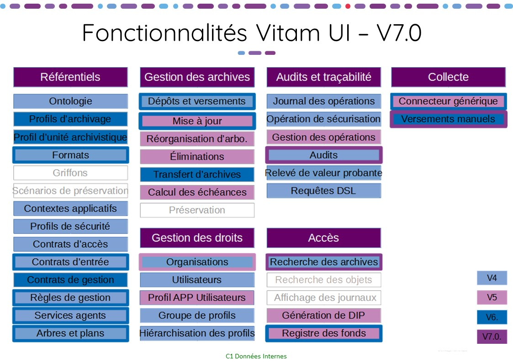
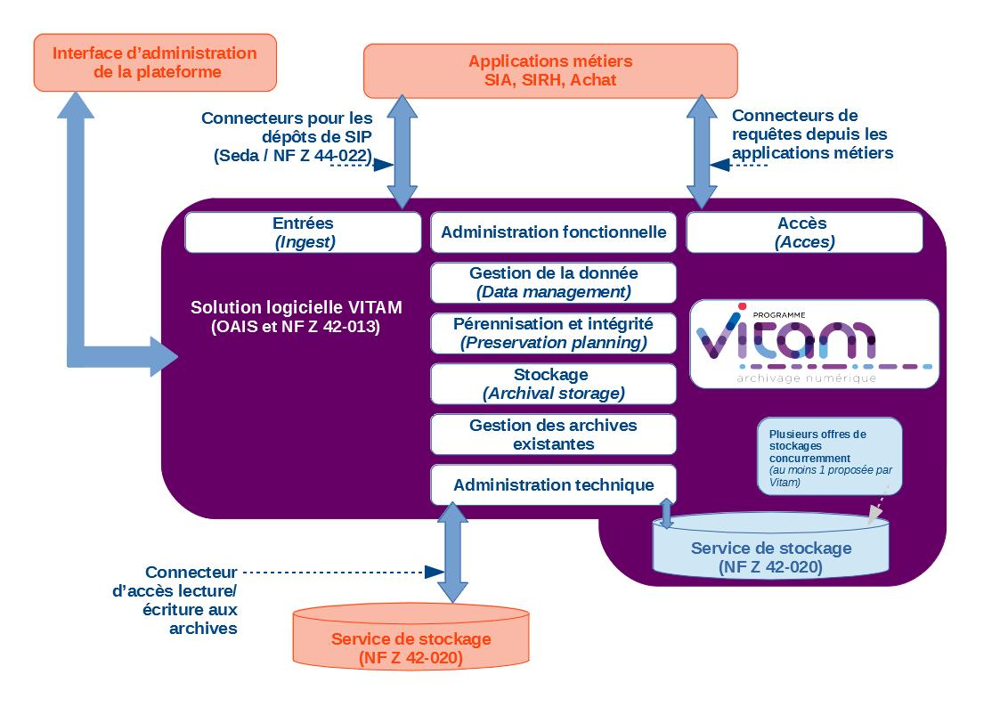
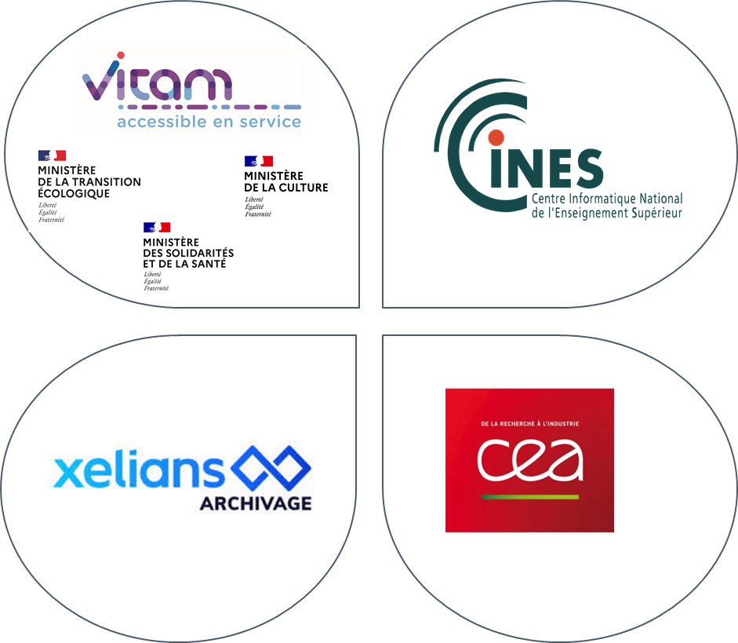
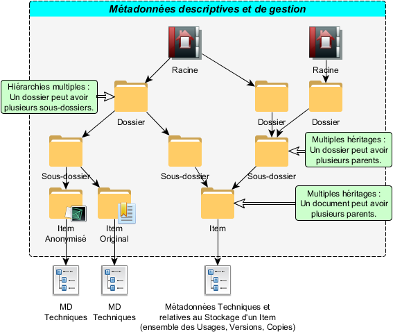
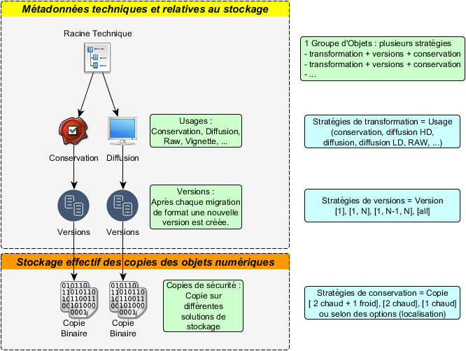

# Présentation de la solution logicielle Vitam
      
## Solution logicielle Vitam

### Manifeste
La solution logicielle Vitam permet la prise en charge, la conservation, la pérennisation et la consultation sécurisée de très gros volumes d’archives numériques. Elle assure la gestion complète du cycle de vie des archives et donc la garantie de leur valeur probante. Elle peut être utilisée pour tout type d’archive, y compris pour des documents classifiés de défense.  
Cette solution est développée en logiciel libre pour faciliter sa réutilisation, son évolution, son adaptation à des contextes particuliers si nécessaire, sa maintenance et donc globalement sa pérennité.  
Cette solution est développée en mode Agile[^1] pour faire intervenir les archivistes au cœur du processus de développement, optimiser la production de valeur métier et permettre des adaptations même importantes pour prendre en compte l’évolution des pratiques professionnelles naissantes de l’archivage numérique. La méthode utilisée est dite « Scrum de Scrum ».  
Le « manifeste[^2] » de la solution logicielle Vitam est :

*
« Pour les services de l’administration,  
Afin de satisfaire les enjeux d’accès dans le temps à leurs informations numériques,  
Vitam propose une solution logicielle libre d’archivage, évolutive, simple et facilement interfaçable,  
Qui permet la gestion unitaire et sécurisée de milliards d’objets  
Et vise son adoption par le plus grand nombre d’acteurs[^3] »
*

### Une solution back-office…

L’obligation de mettre en œuvre une solution d’archivage numérique dans les contextes très différents des trois ministères porteurs, tant en termes de pratiques archivistiques qu’en termes de production informatique, a orienté notre choix vers la réalisation d’un back-office. L’objectif est de prendre en compte dans la solution logicielle Vitam, le maximum de fonctions mutualisables et technologiquement complexes, d’autant plus quand elles s’appliquent à de très grands nombres d’objets, et de laisser chaque entité porter ses propres spécificités de processus. Cette vision permet ainsi la réutilisation la plus large, tout en assurant la réalisation d’un outil générique intégrable selon les besoins d’acteurs variés dans leur système d’information.

Positionnée comme une brique d’infrastructure, la solution logicielle Vitam prend en charge toutes les opérations nécessaires pour garantir le maintien de leur valeur probante et pour assurer la pérennisation des documents numériques versés.

Pour permettre un usage mutualisé à plusieurs organisations, elle est multi-tenants avec un cloisonnement systématique de toutes les archives et informations du système par organisation utilisatrice.

Elle permet la prise en charge de tous les documents numériques (bureautique, audio, vidéo, image, plan, bases de données, etc.) que l’administration souhaite conserver à des fins d’archivage courant[^4], intermédiaire[^5] ou définitif[^6].

Elle assure, pour de très gros volumes de documents numériques, des fonctionnalités :
-  d’indexation,
-  de gestion des métadonnées,
-  de gestion des infrastructures de stockage,
-  de transformation des fichiers,
-  de recherche et de consultation,
-  et de gestion sécurisée de l’ensemble du cycle vie des archives.

Elle offre des interfaces applicatives (API) permettant principalement :
-  le versement de documents,
-  la recherche sur les méta-données et les journaux,
-  l’accès aux documents,
-  la mise à jour des référentiels internes.

La solution logicielle contient également des interfaces de démonstration permettant aux entités ne disposant pas de front-office de réaliser des opérations de base (import des référentiels, entrées de SIP, recherche et accès aux documents, gestion des archives). Depuis la version 4 de la solution logicielle, les interfaces de démonstration sont complétées par l’initiative Vitam UI grâce à laquelle des utilisateurs de la solution logicielle Vitam ont mutualisé leurs réflexions et développements pour proposer à la communauté des interfaces pensées par et pour les archivistes, designés et ergonomiques.

Enfin toujours dans un esprit de facilité de réutilisation, la solution logicielle Vitam est aussi neutre technologiquement que possible. La solution logicielle Vitam :
-  n’impose pas d’infrastructures particulières, comme des baies de stockages adaptées ou des matériels spécifiques ;
-  s’installe sur un environnement serveur x86 physique, virtualisé ou en Cloud, au choix de ceux qui l’implémentent, avec plus ou moins d’automatisation selon le degré de virtualisation ;
-  est développée pour s’exécuter sur un environnement Linux et distribuée pour un déploiement CentOS ;
-  amène une solution de stockage déployable sur toute infrastructure serveurs en lien avec une capacité de stockage disque ou, quand ils existent, peut utiliser des moyens existants de stockage Objet (Swift) ou de stockage à froid (cf partie 4 – vision technique).

###  … enrichie d’un front-office

Lancée en 2019 par des membres du Club utilisateurs du Programme Vitam, l’initiative Vitam UI (User Interface) vise à doter la solution logicielle Vitam d’un front-office de référence.
Construit de manière mutualisée par le CEA, le CINES, Xelians et les acteurs du projet VaS[^7], ce front-office propose un portail d’applications (appelées APP) dédiées à une fonctionnalité métier. Destiné à être enrichi à chaque version, le portail a pour objectif en V6.RC (fin 2022) de permettre à :
-  des administrateurs de plateforme de gérer techniquement et fonctionnellement celle-ci ;
-  à des archivistes de procéder à des versements et de rechercher des archives en vue de les consulter.
      

### Parties prenantes et méthodes Agile

Le développement Agile a pour objectif de prendre en considération les besoins des « parties prenantes ». Dans le cadre de la solution logicielle Vitam, trois types de parties prenantes sont clairement pris en compte :
-  Les archivistes  
Ce sont des experts de la gestion de l’information à long terme. Cette expertise qui s’est appliquée pendant des siècles au papier, peut se transposer sur bien des points au numérique. Ils sont donc porteurs du besoin fonctionnel, des concepts archivistiques manipulés et dans certains cas, de leur évolution ou de leur enrichissement pour tirer tout le profit possible du numérique. Leur objectif est que la solution logicielle Vitam puisse prendre en charge des archives, en assurer la pérennisation, en faciliter l’accès dans les contextes d’usage connus et en garantir la valeur probante, dans le respect des pratiques et normes archivistiques.
-  Les informaticiens chargés de production  
La solution logicielle Vitam est porteuse de fonctionnalités archivistiques, mais c’est aussi un objet technique qui vient s’intégrer dans un système de production. Plus la volumétrie prise en charge doit être importante, plus les exigences de sécurité et résilience sont élevées, plus le système sera complexe. Il convient pourtant de maîtriser cette complexité et de faciliter la mise en œuvre du logiciel. Les informaticiens chargés de production sont porteurs de besoins de simplicité d’intégration sur un socle existant, y compris pour la supervision et la sauvegarde, et de besoins d’automatisation des tâches techniques comme l’installation ou la mise à jour. Leur objectif est que la solution logicielle Vitam puisse être intégrée et exploitée de manière sûre avec un minimum de charge.
-  Les développeurs utilisant les API  
La solution logicielle Vitam, en tant que back-office, offre de multiples API à l’usage d’autres applications versant ou consultant des archives. Toutefois intégrer l’usage d’API dans des applications existantes n’est pas toujours simple. L’objectif des développeurs en charge de ces applications pouvant utiliser les API de la solution logicielle Vitam est que celles-ci soient facilement manipulables avec des concepts clairs, et mobilisables dans des contextes technologiques variés.  
Des interfaces de recette peuvent également être installées sur des environnements de développement pour effectuer des tests automatiques, des tests de performance et pour faire « simplement » la purge de référentiels.  
Il est évident que le besoin fonctionnel archivistique est fondamental. C’est à ce titre que des archivistes travaillent au sein de l’équipe Vitam, pour le définir et le traduire en « User Stories »[^8] sur l’essentiel des sujets. Reste que, pour assurer l’adoption de la solution logicielle, il ne faut pas négliger les besoins techniques. Ceux-ci sont relayés par les architectes et gestionnaires de plateforme de l’équipe Vitam au travers d’« Items techniques » définissant des contraintes de développement ou des « User Stories » pour les utilisateurs informaticiens.

### Planning

Les développements ont commencé le 13 avril 2016. Les grands jalons du planning sont les suivants :
-  Pour faciliter l’appropriation par les développeurs et l’ensemble des acteurs concernés par l’intégration applicative de la solution logicielle Vitam, les API principales ont été publiées en juillet 2016. Une documentation, des fichiers de descriptions et des interfaces « bouchonnées » sont mises à disposition à l’adresse api.programmevitam.fr ;
-  Pour permettre l’appropriation par les équipes de production en avance de phase, une version dite « Bêta » de la solution logicielle Vitam a été mise à disposition des ministères porteurs et des partenaires du programme en novembre 2016 et publiée sur Internet en janvier 2017 ;
-  La première version utilisable en production est la V1 publiée en mars 2018 ;
-  Ensuite la V2 a été finalisée en décembre 2018 et publiée sur internet début 2019 ;
-  Et la V3, version finale de la phase projet, a été publiée en mars 2020 ;
-  La V4, première version de la phase produit, a été publiée en mars 2021. Elle propose pour la première fois les interfaces homme-machine issues de la contribution Vitam UI ;
-  La V5 a été publiée en mars 2022. En plus de proposer une version plus aboutie de l’IHM Vitam UI, elle offre la possibilité de gérer des stratégies de stockage avec une offre froide en offre unique ;
-  La V6 a été publiée en avril 2023. Le SEDA 2.2 est dorévavant pris en charge. Des améliorations sur l’exploitation et la supervision facilitent la gestion des plateformes. Le front-office Vitam UI est enrichi de nombreuses fonctionnalités et en particulier des APP Profils documentaires et Collecte et préparation des versements. 
      
Un nouveau rythme de publication a été acté avec la livraison d’une version « release candidate » en fin d’année, initiant la version « long time support » publiée au début de l’année suivante.

###  Contenu des versions

La version 1 utilisable en production assurait les fonctions permettant de réaliser des entrées unitaires ou par flux applicatif, des recherches et consultations et de gérer le cycle de vie des archives pour garantir le maintien de la valeur probante.

La version 2 apporte un enrichissement fonctionnel en particulier sur les processus de traitements internes dont ceux de préservation (gestion des transformations), gestion du cycle de vie (mise en œuvre des éliminations) et du classifié de défense.

La version 3 apporte des améliorations fonctionnelles pour la gestion des archives existantes (transfert), fait l’objet d’une optimisation technique prenant en compte les possibilités des technologies Cloud, si elles sont mises en œuvre pour le déploiement de la solution logicielle. La V3 permet la mise en œuvre d’une offre de stockage sur bande, par exemple LTO (la Release 10 apporte une version Beta de l’offre froide) pour plus de sécurité et ouvre des voies prospectives sur l’enrichissement sémantique automatique.

La version 4 offre de nouveaux services tels que le gel et la mise à jour unitaires et différentes de métadonnées sur un ensemble d’archives. Elle propose également des services permettant d’optimiser l’exploitation du système et la sauvegarde des données (outil de supervision, restauration de l’état antérieur de métadonnées essentielles, audits du système).
La version 5 poursuit ce travail d’amélioration du produit, en apportant un service de suppression de versions d’objets, des services de recherche sur un très grand nombre d’archives et sur les détails du registre des fonds. Elle permet la mise en œuvre d’une offre de stockage complètement sur bande. Elle propose enfin, dans une version Beta, un module de collecte et de préparation des versements.

La version 6.RC implémente la version 2.2 du SEDA et ajoute des services supplémentaires de recherche sur un très grand nombre d’archives, ainsi que sur le module de collecte.
La version 6 permet d’utiliser le module de collecte, tant pour la préparation de projets de versements de flux automatisés que de versements manuels, ainsi que la gestion des profils documentaires grâce au front-office. 

Une définition plus fine des fonctions de la « StoryMap » portées par chaque version est le fruit du raffinement du « backlog » (liste des unités à développer) au cours du développement Agile, dans le respect de la vision globale donnée ci-dessus.

###  Normes et textes pris en compte

La conception de la solution logicielle Vitam s’appuie sur l’analyse du cadre normatif et réglementaire régissant l’archivage numérique.  
Certaines normes ont accompagné la réflexion, elles guident le choix des concepts utilisés dans la définition fonctionnelle et technique, mais ne sont pas contraignantes. On citera en particulier :
-  Open Archival Information System (OAIS – ISO 14 721) : modèle conceptuel destiné à la gestion, à l'archivage et à la préservation à long terme de documents numériques, élaboré pour le pilotage du Consultative Committee for Space Data Systems (US) ;
-  ICA-Req (ISO 16 175) : principes et exigences fonctionnels pour l’archivage dans un environnement électronique, élaboré dans le cadre du Conseil International des Archives ;
-  Modular Requirements for Records Systems 2010 (MoReq2010) : recueil d’exigences pour l'organisation de l'archivage numérique, élaboré dans le cadre de l’Union européenne.
D’autres normes, établissant les exigences et bonnes pratiques de l’archivage numérique en France, sont prises en compte directement dans la conception :
-  NF Z 42‑013  : Archivage électronique, recommandations et exigences ;
-  GA Z42-019 : guide d’application de la NF Z 42‑013 (ancienne version) ;
-  NF Z 42‑020 : spécifications fonctionnelles d’un composant Coffre-Fort Numérique destiné à la conservation d’informations numériques dans des conditions de nature à en garantir leur intégrité dans le temps ;
-  NF Z 44‑022 (MEDONA) : modélisation des échanges de données pour l’archivage ;
-  SEDA : standard d’échange de données pour l'archivage, donnant une implémentation XML des échanges MEDONA.
Enfin des textes réglementaires s’imposent :
-  Code du patrimoine : rassemble l’ensemble des lois s’appliquant entre autres à l’archivage, y compris numérique ;
-  IGI 1300 : Instruction Générale Interministérielle sur la protection du secret de la défense nationale, la solution logicielle Vitam devant être capable de gérer des documents classifiés ;
-  eIdas : règlement européen sur l’identification électronique et les services de confiance pour les transactions électroniques au sein du marché intérieur ;
-  RGPD : règlement général sur la protection des données, texte de référence en matière de protection des données à caractère personnel.

###  Sécurité

La sécurité est une caractéristique essentielle d’un système d’archivage électronique (SAE) et donc de la solution logicielle Vitam. La réalisation doit la prendre en charge au plus tôt. Qui plus est, il faut apporter aux utilisateurs une garantie sur laquelle ils puissent s’appuyer.

####   Agilité et sécurité

L’organisation traditionnelle du cycle projet en V s’appuie sur l’alliance de travaux de sécurité en cours de conception et d’audits en phase de recette. En mode Agile, qui multiplie les phases de conception et livraison, cette organisation n’est pas adaptée.

Il a été retenu une organisation prenant en compte le rythme Agile :
-  une analyse de sécurité a été élaborée à partir de la « StoryMap » et des premiers éléments de conception technique,
-  un outil d’analyse automatique de faille de sécurité est mis en œuvre sur le code dans la plate-forme d’intégration continue,
-  lors de chaque Release, l’analyse de risques est revue pour prendre en compte les éventuelles évolutions de conception,
-  à la finalisation de chaque version majeure, un audit de sécurité poussé est mené par des experts sur l’application pour relever des problèmes résiduels, ainsi qu’à chaque version release candidate.

####  Homologation de sécurité

L’homologation d’un système est, dans le contexte réglementaire actuel, applicable uniquement à un système dans son contexte de production, pour prendre en compte tous les aspects de la sécurité. La solution logicielle Vitam, fournie à des organisations devant la mettre en œuvre dans leur propre contexte, ne peut donc pas faire l’objet d’une homologation au sens strict. Toutefois, un ensemble d’éléments utiles à l’homologation du système peut être constitué dans le cadre du projet.

Dans le cadre d’un chantier piloté par le ministère des Armées, en concertation avec l’ANSSI, il a donc été décidé de faire une homologation dite de « référence » du logiciel, réunissant tous les éléments utiles à l’homologation d’un système utilisant le logiciel. Cette homologation est traitée par la commission d’homologation mise en place pour le Programme Vitam réunissant les acteurs de la sécurité des ministères porteurs et partenaires.

L’homologation s’appuie sur le référentiel documentaire suivant :
-  stratégie d’homologation, explicitant les acteurs et le processus de gestion de l’homologation,
-  analyse de risques,
-  dossier d’architecture,
-  préconisations d’implémentation, pointant des points particuliers à prendre en compte lors de la mise en œuvre du logiciel,
-  résultats d’audits de sécurité et plans d’action associés.

Cette homologation de référence de la V1 de production de la solution logicielle a été validée par la commission le 12 avril 2018.

À la suite de la tenue de la commission d’homologation le 14 février 2019, l’homologation de référence de la version 2 de la solution logicielle a été prononcée par le DINum. Elle s’accompagne d’une réserve formulée comme ceci : « cette version de Vitam ne mettant pas encore en œuvre de mesure d’isolation particulière des griffons, il est recommandé de veiller à ce que l’usage de chaque griffon soit en conformité avec la politique de sécurité de l’entité. Il est en particulier déconseillé d’utiliser un griffon qui utiliserait un outil externe qui n’est plus maintenu. »

Ainsi, une réunion s’est tenue sur ce sujet de l’isolation des griffons le 7 juin 2019 afin de déterminer comment réaliser un compromis entre les moyens matériels, les besoins de développement, la complexité d’exploitation et les contraintes de sécurité. Il a été décidé tout d’abord de mettre en place le service d’exploitation Linux sur tous les griffons et, ensuite, de réaliser une expérimentation sur une isolation totale du griffon dans une autre machine virtuelle. Cette dernière solution a l’inconvénient d’augmenter les besoins en ressources mais présente l’avantage de permettre l’exécution des griffons sur des systèmes différents (Windows, Mac OS).

Suite à une réunion en mars 2020, la version 3 a également été homologuée le 2 juin 2020 par une note du DINnum pour une durée de 2 ans, soit jusqu’au 30 mars 2022. Une attention particulière est portée sur l’importance des montées de version régulières à opérer par les utilisateurs.
L’homologation de la version 4 a été prononcée en mai 2021, puis celle de la 5.RC en décembre 2021. L’homologation de la version 5 a été prononcée en octobre 2022.

### Maintenance

Pendant la phase projet, une maintenance est d’ores et déjà assurée sur certaines versions, pour permettre aux porteurs et partenaires du programme d’utiliser la solution logicielle en production avant la fin du projet.

Le cycle de développement est le suivant :
-  Les développements sont séquencés en itérations pouvant aller de 2 à 4 semaines, mais durant en général 3 semaines. Chaque itération donne lieu à une version mineure en interne.
-  Chaque année, une version majeure est construite pour publication au printemps et une version mineure, dite « release candidate » est publiée et homologuée elle aussi à l’automne.

## Vision fonctionnelle

### « StoryMap »

La méthode Agile exclut la rédaction de spécifications préalables au développement. Toutefois une approche générale de l’objectif à atteindre et des fonctionnalités souhaitées est nécessaire pour donner une vision aux parties prenantes et garder un cap sans se perdre dans la fragmentation des développements en « User Stories ».

L’outil utilisé à cette fin en mode Agile est la « StoryMap ». Elle identifie et répartit en grandes thématiques toutes les « User stories », vues de très haut, qui doivent, devraient ou pourraient être prises en compte. Elle permet aussi de les ordonner par priorité et de définir une Roadmap.

Dans une première phase, en avril 2015, dans le cadre d’une formation sur la méthodologie Agile, les membres de l’équipe interministérielle Vitam et les responsables des projets ministériels ont réalisé une première ébauche de Storymap. Ce travail s’est notamment alimenté de l’expression de besoins formulée par l’équipe de préfiguration du programme Vitam entre l’automne 2013 et l’automne 2014, et du résultat des échanges avec les équipes projets ministériels sur l’interfaçage entre les frontaux et la solution logicielle Vitam ainsi que sur la répartition des fonctions entre les deux applicatifs.

Dans une seconde phase, entre octobre 2015 et février 2016, l’équipe interministérielle a repris le travail d’élaboration de la Storymap, et a partagé cette vision lors d’ateliers collaboratifs avec des archivistes des projets ministériels et d’autres horizons. Des actualisations et priorisations ont été faites en janvier 2017 et janvier 2018, avec les porteurs et partenaires.
Dans le cadre de la MAC Vitam, une nouvelle ébauche de Storymap a été réalisée, entre juillet et décembre 2020, en se basant sur une expression libre des besoins des utilisateurs de la solution logicielle Vitam et sur une co-construction en ateliers. Elle a abouti en l’identification d’une quinzaine d’axes de travail, validés début 2021.

### Principe d’élaboration de la « StoryMap »

Par définition, les méthodes Agiles positionnent les utilisateurs au centre de la réflexion. La logique de back-office de la solution logicielle Vitam complique cette approche. Les seuls utilisateurs du back-office sont en effet des applications. Pour partager efficacement la vision avec les archivistes, il fallait sortir de ce point de vue technique.

Il a été fait le choix d’étendre le périmètre couvert par la « StoryMap », au-delà d’une simple vue back-office, jusqu’aux bornes des interfaces pour les utilisateurs humains. Ainsi construite, la « StoryMap » permet au plus grand nombre de bien percevoir ce qu’il sera possible de faire au travers des frontaux utilisant comme back-office la solution logicielle Vitam.

### Contenu de la « StoryMap »

Dans ses travaux, l’équipe Vitam s’était efforcée de respecter le modèle OAIS[^9] et avait donc repris ce modèle fonctionnel pour découper la « StoryMap » en six grandes thématiques : entrées, stockage, gestion de la donnée, administration, préservation, accès.

Mais à l’usage, il s’est avéré que le modèle OAIS présente un certain nombre de manques liés à une vision anglo-saxonne des archives qui distinguent nettement deux missions : le records management (gestion des archives courantes et intermédiaires) et l’archivage historique portant sur des archives « définitives », « mortes ». Cette vision fait donc porter l’archivage numérique sur la conservation à long terme d’objets numérique et exclut notamment la prise en compte des activités liées à la gestion du cycle de vie des archives et à la mise en œuvre de leur sort final (destruction ou conservation) aujourd’hui assurées par les services d’archives français.

En conséquence, il a été décidé de regrouper dans un domaine fonctionnel spécifique, intitulé « gestion des archives existantes », toutes les activités de gestion du cycle de vie des archives.

Par ailleurs, le domaine fonctionnel « administration » qui rassemble toutes les fonctions transverses de pilotage de la solution logicielle Vitam a été éclaté entre l’administration fonctionnelle et l’administration technique pour marquer une séparation forte de l’objectif et des pouvoirs.

Les domaines couverts par la « StoryMap » sont donc :
-  Les entrées : réception, contrôle et validation des objets à archiver. À l’issue de cette étape, les objets sont stockés, les métadonnées et autres informations nécessaires à leur description et à leur gestion dans le temps sont indexées, toutes ces opérations sont journalisées.
-  Le stockage : conservation binaire des objets archivés. Ceci prend en compte la gestion d’offres multiples de stockage, de stratégies de stockage différentes par lots d’objets archivés ainsi que leur évolution dans le temps.
-  La gestion de la donnée : indexation et recherche de toutes les informations internes nécessaires au système d’archivage notamment métadonnées et journaux.[^10]
-  La gestion des archives existantes : gestion du cycle de vie des archives et mise en œuvre de leur sort final, notamment élimination, modification des métadonnées (y compris de gestion), reclassement/retraitement, déclassification, préparation d’un transfert vers un autre service d’archives ou sortie définitive, etc.
-  La préservation : planification et gestion des opérations de conversion de formats et d’audit interne, au travers de stratégies applicables par lots d’objets archivés.
-  L’accès : recherche et consultation des objets archivés.
-  L’administration fonctionnelle : coordination fonctionnelle du système, dont la gestion des règles internes, le suivi de la qualité globale du service rendu et son amélioration.
-  L’administration technique : surveillance et gestion du maintien en condition opérationnelle de l’application (supervision, processus, mise à jour applicative…) et des interconnexions avec d’autres applications.

Le contenu détaillé est consultable en annexe 1. Cette vision détaillée en date de juillet 2016 a évolué dans le cadre des arbitrages (MoSCoW[^11]) et au cours des développements (actualisation effectuée début 2017 et début 2018).

Un nouveau travail de construction d’une storymap pour la phase produit à partir de 2020 a été entamé en 2 temps : tout d’abord, des développements fonctionnels et techniques pour les releases 15 et 16 ont été proposés et arbitrés par les ministères porteurs et le représentant du club utilisateurs, avant une phase plus classique de construction pour les prochaines années.
Cette deuxième phase a abouti début 2021 en l’identification d’une quinzaine d’axes de travail. Le contenu détaillé est consultable en annexe 2.

###  Interfaces Homme Machine (IHM)

####  IHM Démo et IHM Recette

Même si en tant que back-office, la solution logicielle Vitam n’avait, a priori, pas d’interface utilisateur, à l’exception de celle d’administration, le mode de développement Agile impliquait une visibilité des fonctions par les parties prenantes, que de simples API ne peuvent pas assurer. Il a donc été nécessaire d’avoir des interfaces homme-machine qui permettent de mettre en œuvre toutes les fonctionnalités et de constater leur bonne adéquation au besoin.

Qui plus est, hors d’un contexte ayant permis de mettre en place un frontal archivistique[^12], qui aura une visibilité complète sur les archives contenues dans le back-office et leur gestion, ou avant que celui-ci n’ait pu être finalisé, il peut être utile d’avoir accès à toutes les fonctionnalités du back-office. Il a donc été décidé de développer une interface dite « de démonstration ». Celle-ci complétait une IHM d’administration fonctionnelle et technique, devant être pérenne et ergonomique, dont le développement et l’implémentation restaient à la charge des utilisateurs.
      
L’IHM, fournie par l’équipe programme Vitam, dite « de démonstration », permet aux utilisateurs :
- à défaut d’un frontal archivistique connecté à leur back-office Vitam, de réaliser, a minima, les activités utilisateurs associées aux domaines fonctionnels « entrées », « accès » et « gestion des archives existantes ». Cette interface est dotée d’une ergonomie limitée et ne permettra pas de mettre en place des workflows ou une gestion des droits fine en fonction de différents profils. Elle ne pourra être utilisée que par un faible nombre d’utilisateurs, et ne sera pérenne que dans les implémentations non dotées de frontaux archivistiques ;
- d’expérimenter des modalités de réalisation innovantes des activités utilisateurs dans des environnements de recette et de démonstration.

Enfin, dans le processus de développement, une IHM adaptée aux tâches de recette utilisée par les équipes de développement s’est avérée nécessaire. Faiblement ergonomique, elle permet aux testeurs de vérifier que les tâches réalisées par la solution logicielle Vitam s’exécutent bien, par exemple, au travers de l’analyse des logs ou de la vérification de paramétrages.

####  L’initiative Vitam UI

Mi-2019, des partenaires du Programme Vitam ont fait le constat de besoins communs pour des interfaces aussi bien d’administration que fonctionnel. Ils se sont mis d’accord pour mutualiser les réflexions, se répartir les fonctionnalités à développer et organiser les procédures permettant de mettre en commun leurs travaux. 

Ainsi, le CINES, le CEA, la société Xelians-Locarchives et le projet Vitam accessible en service[^13], ont mis en place :
- une gouvernance organisée avec un comité de cohérence et un comité technique auxquels sont associés un représentant de chaque projet contributeur, ainsi qu’un représentant de Vitam muni d’un droit de veto au titre de son engagement dans la durée pour la maintenabilité et la correction de tous les outils Vitam ;
- un accord contributeur qui fixe les règles de contribution. Le texte établit une copropriété du code et la délégation des droits intellectuels et de gestion de ce code au Programme Vitam ;
- la mutualisation du design system ;
- la publication des sources avec la livraison de code vers le Programme Vitam par un processus de pull-request (ou demande de versement) de code, avec analyse par le Programme Vitam et un contributeur autre que celui qui a livré le code, et une action finale de merge-request (ou acceptation de versement) par le Programme ;
- la mutualisation des tests.

Vitam UI est construit autour d’un portail d’applications (appelées APP). 

Une APP c’est :
-  Une IHM centrée sur un objet métier et un type d’utilisateur
-  Les fonctions d’accès humaines et techniques
-  Des API de communication avec le back-office

La version 6 de Vitam est livrée au printemps 2023 avec les fonctionnalités suivantes pour Vitam UI :

## Vision technique

###  Architecture générale

Une plate-forme d’archivage utilisant la solution logicielle Vitam comprend :
-  des applications tierces versant et consultant des objets dans la plate-forme,
-  des applications de front office, permettant à des utilisateurs d’accéder aux objets archivés à des fins de recherche, consultation, gestion du cycle de vie ou préservation :
    - le frontal de gestion et administration de la plateforme, voir le frontal archivistique (IHM Système d’Information Archivistique),
    - des applications tierces, notamment les applications métier des services producteurs,
-  le back-office appuyé sur des offres de stockage, dont certaines sont potentiellement tierces, qui assurent la conservation binaire des objets archivés.

L’ensemble fourni par l’équipe programme Vitam comprend le code, sous licence libre, nécessaire pour mettre en œuvre :
-  le cœur Vitam, le back-office proprement dit. Il n’a que des API (de type REST/JSON), y compris pour son administration. Il se doit d’être intégrable complètement, et que toute fonction puisse être mobilisée via les API par un frontal non Vitam,
-  le front-office VitamUI,
-  une couche de gestion des offres de stockage.
Il est possible d’utiliser des offres externes de stockage objet, ou d’en mettre en œuvre avec la solution logicielle logiciel Vitam.

###  Modules du Cœur Vitam

Parmi les différents modules internes du cœur Vitam, l’essentiel des fonctionnalités de l’application est porté par quatre modules :
-  moteur de traitement,
-  moteur de données,
-  gestion des journaux,
-  gestion des offres de stockage.

#### Moteur de traitement

Ce module permet l’exécution de processus pour un lot d’archives en fonction de paramètres additionnels (contrats, stratégies…), utilisant in fine les ressources d’exécution de serveurs effectuant des tâches élémentaires, dits « Workers ». Un processus peut tout aussi bien concerner un processus d’entrée, de transformations de formats, d’audit, d’élimination…
Le moteur de traitement prend en charge la gestion des processus concurrents, ainsi que l’affectation in fine au « Workers », et masque leur gestion fine. Il doit par contre globalement (en fonction des niveaux dans des strates différentes) fournir des informations d’avancement du processus pour assurer le suivi, tant d’un point de vue humain que d’activité du système global (priorisation, équilibrage…).

Un objectif majeur de la solution logicielle Vitam est de pouvoir traiter de grandes volumétries d’archives. Par exemple, lors d’une campagne de transformation bureautique, on peut s’attendre à des centaines de millions d’objets à traiter. Toutefois, il est important de garder une vision macroscopique des processus, l’enjeu sera donc d’allier celle-ci à la gestion unitaire de grands nombres d’opérations élémentaires.

Pour l’ajout de nouveaux types d’opérations, il sera possible d’ajouter des greffons. Ceux-ci pourront, par exemple, prendre en charge une transformation d’un format A en un format B, traiter un format de fichier pour en extraire le texte brut, calculer un nouveau type d’empreinte… L’ajout de fonctions par greffons permet aussi de mobiliser des logiciels propriétaires, ce qui est par exemple indispensable pour certaines transformations de formats fermés.

Les « Workers » sont des serveurs (physiques ou logiques) hébergeant les outils permettant d’exécuter les opérations élémentaires (identification de format, transformations, conversion XML/JSON/PDF et contrôle pour les métadonnées, écriture suivant une stratégie de conservation/stockage/… et autre appel de greffons). Les outils peuvent être isolés dans des conteneurs (type Docker) pour respecter leur contexte d’exécution particulier, voire obsolète.

Le moteur de traitement, associé à cette logique de greffons, permet d’appliquer toutes sortes d’opérations sur de très grands volumes d’archives. On peut envisager à terme des opérations d’extraction sémantique de thématiques, d’entités nommées, des expérimentations seront faites en ce sens d’ici la version 3 de la solution logicielle.

#### Moteur de données
Ce module permet l’indexation et la recherche des métadonnées des archives, des journaux et de certains référentiels complexes. Il constitue une couche d’abstraction avec les moteurs réels de manipulation des données (métadonnées), de façon à avoir un couplage lâche et permettre des évolutions facilitées.

L’efficacité de ce moteur est au centre de l’efficacité de tous les traitements puisqu’il est utilisé aussi par les processus internes pour rechercher les archives sur lesquels appliquer les traitements et pour manipuler les journaux.

Il est à noter qu’en aucun cas ce moteur n’est considéré comme un espace de conservation. Il est toujours possible de perdre un index et de devoir le reconstruire. Aussi toutes les métadonnées et informations (notamment journaux) qui y sont indexées pour les utiliser en recherche, sont aussi conservées dans le stockage de manière sûre.

L’objectif de gérer des milliards d’objets étant primordial, une « preuve de concept » reposant sur les technologies MongoDB et ElasticSearch a permis d’en prouver la faisabilité sur un nombre de serveurs raisonnable[^14]. L’alliance des deux technologies permet, grâce à MongoDB, d’assurer des opérations de type transactionnel (incrément, manipulation de listes…) et de gérer les aspects arborescences précis et, grâce à ElasticSearch, d’améliorer les capacités de recherche de type plein texte sur les métadonnées et les journaux.

#### Gestion des journaux

Ce module permet la journalisation des différents types d’événements fonctionnels et techniques survenus dans le SAE, avec trois buts :
-  sur les aspects archivistiques : suivre et contrôler des activités du SAE,
-  sur les aspects de valeur probante : assurer l’établissement des preuves de bonne gestion et de pérennisation,
-  sur les aspects SI : superviser et exploiter le système.

Les journaux métiers, portant sur les archives et traçant les opérations à portée archivistique, et leur bonne gestion sont la base du maintien de la valeur probante des archives contenues dans le SAE. Pour marquer leur différence de nature, les journaux à usage technique seront qualifiés de « logs ».

En journaux métiers sont notamment prévus :
-  le journal des opérations : il conserve la trace de toutes les opérations générales effectuées par le SAE (entrée, modifications de méta-données, transformation…),
-  le journal du cycle de vie des archives : il est défini pour chaque archives, individuellement et porte la trace de toutes les opérations ayant été effectuées sur celle-ci,
-  le journal des écritures : il porte la trace de toutes les opérations de stockage et l’empreinte des écritures. Il s’agit d’un journal en profondeur, accessibles uniquement par les applications environnantes ayant pouvoir d’administration et dont la consultation permettra de renforcer la valeur probante.

La sécurisation, avec horodatage, chaînage et conservation, dans le respect des normes archivistiques, de ces journaux permet de garantir le traçage et le croisement de tous les événements ayant un effet sur les archives contenues dans le SAE et ainsi d’apporter une preuve « systémique »[^15] du maintien de la valeur probante de son contenu.

####  Gestion des offres de stockage

Ce module permet de gérer les différentes offres de stockage et de les utiliser au mieux pour réaliser les opérations demandées (lecture, écriture, effacement, mise à jour, check, lister, compter…).

La première fonction de ce module est l’abstraction du stockage via son API. Un client ne demande pas une opération sur une offre mais sur une « stratégie » de stockage (qui précise les offres sous-jacentes à utiliser). Il peut aussi, par ce biais, demander des contrôles de conformité par rapport à une stratégie de stockage (nombre de copies conformes pour chaque stratégie de transformation, version, stockage).

Sa deuxième fonction est la gestion de ces offres de stockage :
-  Écriture : décision des opérations à mener, gestion de l’asynchronisme,
-  Lecture : décision de la « meilleure » offre pour répondre rapidement aux demandes,
-  Fournitures d’informations transverses : journaux, multi-tenant, statistiques…

Sa troisième fonction est d’assurer la liaison avec les offres via le principe d’un SPI (Service Provider Interface). Chaque offre de stockage propose un driver (pilote) qui est conforme aux API spécifiées par Vitam pour une offre de stockage. Ce driver est ajouté à la configuration de Vitam. L’ajout d’une offre réelle de stockage consiste ensuite à déclarer qu’une offre de stockage utilise tel driver et avec tels paramètres (connexions, adresses, spécificités…).

Il est possible de connecter une offre de stockage objet externe, soit à travers une interface Swift standard, soit en développant un connecteur sur l’API « client stockage ». Il est aussi prévu dans le cadre du projet Vitam de fournir le logiciel nécessaire pour monter une offre de stockage dite « chaude » sur disque, et une autre dite « froide » sur bandes.

L’ensemble du module « gestion des offres de stockage » et des offres de stockage elles-mêmes répond aux attentes de la norme NF Z 42‑020 Composant Coffre-Fort Numérique[^16].

###  Principes d’organisation des archives

Pour permettre une organisation souple des archives, y compris en mutualisant certains objets, le modèle de données permet un classement multi-hiérarchique dans des dossiers et sous-dossiers de pièces, représentant des unités intellectuelles d’archives.

Chacun des niveaux représentant un dossier, un sous-dossier ou une pièce, nommés génériquement « unités archivistiques » ou « Archive Units », peut être porteur de méta-données descriptives (nature du document, titre, identifiant, dates, personne concernée…) et de gestion (DUA, sort final, communicabilité…).

Par ailleurs, chaque unité archivistique correspondant à une pièce peut contenir un groupe d’objets réunissant différentes formes techniques d’une même unité intellectuelle, des objets se différenciant par leur usage (pour conservation, pour diffusion, en référence papier…) et par leur version dans le temps.

Cette structuration est de fait reprise dans les collections exposées par les API.

## Annexe 1 : Contenu de la « StoryMap » de la phase projet (juillet 2016)

|Colonne|Description|
|:---|:---|
|Activité utilisateur|Action élémentaire lancée volontairement par un acteur qui veut la voir réalisée comme un tout ayant un sens métier. Quand cela est pertinent elle sera découpée en tâches dans le processus de rédaction des users stories. Cette action est destinée à être réalisée depuis les front offices ou les IHM du back office Vitam|
|Description et présentation|Présentation détaillée de l’activité utilisateur|

### Domaine « Entrées »

|Activité utilisateur|Description|
|:---|:---|
|Tester un nouveau flux d’entrée applicatif à blanc|Tester en ayant les résultats des différentes étapes de l’entrée mais sans stocker les archives dans le SAE. Il s’agit bien du test en vision métier des flux, l’interconnexion technique sera, quant à elle, d’abord testée sur une plate-forme de recette.|
|Effectuer une entrée par flux applicatif d’un ensemble d’archives|Réaliser une entrée d’un ensemble d'archives transférées par une application métier selon le formalisme SEDA, depuis l’initialisation jusqu’à la clôture de l’opération|
|Effectuer une entrée unitaire d’un ensemble d’archives|Réaliser une entrée unitaire d’un ensemble d’archives selon le formalisme SEDA, depuis l’initialisation jusqu’à la clôture de l’opération|
|Gérer les entrées en anomalie|Gérer les anomalies détectées lors du processus de transfert et d’entrée|
|Gérer les contrats d’entrées|Gérer les contrats d’entrées correspondant à des filières d’archives (création, modification, désactivation, suppression de contrats, des filières et des profils associés)|
|Prendre en charge une entrée d’un ensemble d’archives venant d’un autre SAE|Importer un ensemble d’archives venant d'un autre SAE avec l’ensemble des données associées (journaux, éléments de valeur probante…)|
|Prendre en charge une entrée d’un ensemble de références d’archives externes|Effectuer une entrée de références à des archives qui ne sont pas stockées dans le SAE (version papier ou archive stockée dans un autre SAE, comme le classifié)|

### Domaine « Stockage »

|Activité utilisateur|Description|
|:---|:---|
|Gérer les offres de stockage|Ajouter, modifier et supprimer les offres de stockage|*
|Gérer les stratégies de stockage|Ajouter, modifier et supprimer des regroupements d’offres de stockage en fonction de la politique de stockage (ex. : groupes d’offres de stockage de conservation, de diffusion…)|
|Débrancher en urgence/rebrancher une offre de stockage|Arrêter en urgence toutes les opérations sur une offre de stockage et la remettre en œuvre|

### Domaine « Gestion de la donnée »

|Activité utilisateur|Description|
|:---|:---|
|Gérer les types et modes d’indexation|Gérer les types et les modes d’indexation des champs de l’ontologie commune et des métadonnées particulières à certaines filières|

### Domaine « Gestion des archives existantes »

|Activité utilisateur|Description|
|:---|:---|
|Reprendre l’organisation de l'ensemble d’archives d’une entrée effectuée|Reprendre le tri, le classement et l'édition des métadonnées de l'ensemble des archives d’une entrée déjà effectuée sans reprendre les fichiers de données|
|Modifier des métadonnées d’archives|Modifier les métadonnées d’archives|
|Modifier l’organisation de classement|Modifier les structures arborescentes dans lesquelles sont placées les archives|
|Enrichir les métadonnées par analyse automatique des contenus|Enrichir les métadonnées d’un ensemble d’archives en lançant une analyse automatique des données et métadonnées existantes|
|Administrer les référentiels métiers partagés (producteurs, fonctions)|Rechercher dans les référentiels métiers SIA et SAE (services producteurs, services par fonction…)|
|Auditer des archives en croisant les informations du SAE|Croiser l’ensemble des informations internes sur un ensemble d’archives (journaux d’entrée, de sortie, base de métadonnées)|
|Construire un état de référence d’un ensemble d’archives|Établir un état de référence dans un objectif de récolement|
|Récoler des archives par rapport à un état de référence|Croiser l’ensemble des informations internes sur un ensemble d’archives avec un état de référence externe au système|
|Administrer les référentiels de règles de gestion|Gérer les règles de gestion dans le temps (création, modification, désactivation, suppression)|
|Éliminer selon les règles de gestion|Éliminer les archives dont le calcul sur les règles de gestion induit un sort final en élimination|
|Transférer un ensemble d’archives vers un autre SAE|Exporter un ensemble d’archives avec les métadonnées et autres informations associées (journaux, éléments de valeur probante…) vers un autre SAE|
|Classifier/déclassifier un ensemble d’archives|Changer le niveau de classification d’un ensemble d’archives|
|Geler un ensemble d’archives|Empêcher l’élimination et la modification d’un ensemble d’archives|
|Dégeler un ensemble d’archives|Remettre des archives gelées dans le circuit de gestion standard des éliminations et modifications|
|Gérer un instrument de recherche|Créer, modifier, détruire un instrument de recherche|

### Domaine « Préservation »

|Activité utilisateur|Description|
|:---|:---|
|Gérer les stratégies de conversion|Gérer les stratégies de conversion à mettre en œuvre et précisant par domaines définis (a priori filières d’entrées) les méthodes de conversion retenues et les actions à effectuer (génération d’une nouvelle version, conservation ou non des anciennes…)|
|Gérer les méthodes de conversion|Gérer les méthodes permettant de valider un format ou de passer d'un format à un autre en utilisant des greffons de conversion de formats (à noter un greffon est un module technique interfaçable de manière standardisée en anglais « plug-in »)|
|Tester les méthodes de conversion|Tester sur des fichiers réels le bon fonctionnement de méthodes de conversion|
|Administrer le référentiel des formats|Gérer les formats avec leurs caractéristiques techniques, ainsi que les liens avec les outils d’identification et les greffons de conversion|
|Définir la date d'obsolescence d'un format|Enregistrer dans le SAE à quelle date un format sera considéré comme obsolescent|
|Identifier des archives aux formats obsolètes|Identifier les archives concernées par l'obsolescence de format dans un ensemble d’archives|
|Convertir pour cause d’obsolescence|Convertir pour cause d’obsolescence de format les archives concernées selon des stratégies de conversion|
|Gérer les stratégies d’audit d’intégrité|Définir les modalités d’audit applicables à un ensemble d’archives défini (empreintes, répartition adéquate sur les offres de stockage, fréquence, profondeur, caractère aléatoire, échantillonnage, etc.)|
|Auditer selon les stratégies d’audit|Auditer les archives conformément aux stratégies d’audit|
|Traiter les fichiers infectés|Traiter les fichiers détectés comme infectés après entrée dans le système|

### Domaine « Accès »

|Activité utilisateur|Description|
|:---|:---|
|Rechercher une unité d’archives bien définie dans une transaction automatique|Obtenir une unité d’archives correspondant à une requête ciblée faite par une application connectée au SAE|
|Rechercher des archives par recherche complexe manuelle sur les archives|Obtenir la liste des archives correspondant à une requête complexe composée par un humain|
|Rechercher des archives via le journal des entrées|Identifier une entrée et obtenir la liste des archives associées avec leurs métadonnées|
|Consulter un ensemble d’archives|Obtenir le contenu des archives identifiées, pour export, visualisation, transmission…|
|Exporter des métadonnées d’un ensemble d’archives|Obtenir les métadonnées des archives identifiées|
|Exporter un relevé de valeur probante pour un ensemble d’archives|Obtenir un relevé établissant la bonne conservation de la valeur probante d’un ensemble d’archives|
|Gérer les contrats d’accès|Gérer les contrats d’accès correspondant à des filières archives (création, modification, désactivation, suppression)|
|Rendre un ensemble d’archives plus rapidement accessible de manière temporaire|Rapatrier un ensemble d’archives le temps d’une opération particulière demandant un accès fréquent (principe du « petit dépôt »). L’ensemble d’archives est mis dans un espace de stockage rapide/facilement accessible.|

### Domaine « Administration fonctionnelle »

|Activité utilisateur|Description|
|:---|:---|
|Gérer les actions en attente de décisions|Identifier et statuer sur les tâches fonctionnelles nécessitant une intervention humaine|
|Gérer et consulter les journaux|Interroger les différents journaux du SAE→ export des données brutes selon sélection|
|Consulter les statistiques fonctionnelles|Consulter les statistiques : sur les objets gérés, sur les actions effectuées par le SAE|
|Suivre l’avancée des opérations en masse et de fond|Lister et vérifier l’avancée des opérations de masse (migration de format, audit d’intégrité, maintien de valeur probante…) en cours|
|Surveiller les valeurs atypiques des flux|Identifier les comportements anormaux par rapport à une norme définie à l’avance (ex. Flux d’entrée ou d’accès anormaux en nombre ou en taille, requêtes de longue durée, etc.)|
|Surveiller les événements de sécurité|Identifier les comportements anormaux par rapport aux règles de sécurité (ex. Requêtes ne correspondant pas aux droits accordés, erreurs d’authentification…)|
|Gérer les « autres » référentiels archivistiques du SAE|Créer les référentiels internes non pris en compte dans d’autres domaines et les mettre à jour (par exemple ontologie…)|
|Gérer les espaces de stockage rapide/facilement accessibles (« petit dépôt »)|Vérifier la capacité et la disponibilité dans les espaces de stockage temporaire, réaliser des opérations de purge, placer des copies d’objets dans ces espaces|
|Gérer les droits archivistiques des applications connectées au SAE|Attribuer un périmètre et des droits aux applications pour les entrées et les accès aux archives dans le SAE, en lien avec les contrats d’entrée et d'accès sur des filières d’archives|
|Planifier et prioriser les types de tâches|Gérer la priorité des différentes tâches (entrées, accès, etc.) en cours ou à venir|
|Gérer les utilisateurs des IHM||Enregistrer les utilisateurs individuels, leur attribuer un périmètre et des droits dans les IHM du SAE|

### Domaine « Administration technique »

|Activité utilisateur|Description|
|:---|:---|
|Tester l’interconnexion technique entre une application et le SAE|Se connecter au SAE et vérifier que le SAE répond|
|Gérer les applications connectées au SAE|Enregistrer les applications avec les informations techniques nécessaires aux échanges (IP, moyens d’authentification…)|
|Gestion et consultation des logs|Accéder aux différents logs techniques du SAE|
|Consulter les statistiques techniques|Consulter les statistiques : performance en nombre et en bande passante, nombre d’objets traités, en CPU, etc.|
|Mettre à jour la solution logicielle|Ajouter, supprimer ou installer une nouvelle version d’un module applicatif ou d’une configuration|
|Gérer les greffons|Ajouter, mettre à jour, activer/désactiver un greffon|
|Effectuer la supervision technique|Vérifier qu’un service technique est actif/inactif, lancer une surveillance des réseaux par des sondes, etc.|
|Lancer/arrêter les services|Lancer ou arrêter des services applicatifs ou d’infrastructure|
|Gérer l’élasticité|Déployer des nouvelles capacités de traitement technique, en fonction de l’évolution du volume d’activité, de manière à les rendre opérables et supervisables|
|Assurer le PCA/PRA|Gérer la continuité et la reprise d’activité, notamment en cas de maintenance ou de sinistre|
|Accéder aux informations techniques d’un ensemble d’archives|Effectuer des recherches et obtenir les informations techniques sur un ensemble d’archives|

## Annexe 2 : Contenu de la « StoryMap » de la phase produit (février 2021)

|Colonne|Description|
|:---|:---|
|Activité utilisateur|Action élémentaire lancée volontairement par un acteur qui veut la voir réalisée comme un tout ayant un sens métier. Quand cela est pertinent elle sera découpée en tâches dans le processus de rédaction des users stories. Cette action est destinée à être réalisée depuis les front offices ou les IHM du back office Vitam|
|Description et présentation|Présentation détaillée de l’activité utilisateur|

### Domaine « Collecte / Entrée »

|Activité utilisateur|Description et précision|
|:---|:---|
|Faciliter le versement d’archives  Planification et organisation de la prise en charge des entrées dans le SAE  Faciliter le versement et la consultation d’archives liées a des formats conteneurs (messageries, bases de données)|Faciliter la collecte et le versement d’archives par l’intégration de connecteurs pour : - la collecte de vracs numériques (SEDAccord) ; - la collecte, la gestion et l’accès à des formats conteneur, en particulier les messageries ; - l’intégration de flux applicatifs : -> d’applications de référence de la fonction publique (RH), -> de produits leaders du marché ayant vocation à produire des archives (GED, etc.), -> d’applications spécifiques en isolant la part des traitements « communs » (structuration d’une filière de collecte / versement, traitement des métadonnées/SEDA, création de SIP, contrôle du transport) ; - fluidifier le transport de collecte et d’entrée par des moyens de supervision, d’administration et le contrôle sur un ensemble de flux.|

### Domaine « Accès / Recherche »

|Activité utilisateur|Description et précision|
|:---|:---|
|Optimiser et personnaliser la recherche d’archives|Améliorer les capacités de recherche : - Optimiser, enrichir de manière automatique et personnaliser la recherche d’archives suivant les contextes,  - Faciliter l’interopérabilité des recherches|
|Recherche sur les « méta » données non structurées et capacité à corréler (Approche « lac de données ») et à faciliter la description à l’entrée|Développer la possibilité d’usage de Vitam comme « data lake » Permettre la découverte des métadonnées Permettre la recherche sur des données non structurées Lever les contraintes dans la description des archives (facilitation de l’entrée)|

### Domaine « Gestion des archives »

|Activité utilisateur|Description et précision|
|:---|:---|
|Prise en charge et gestion des archives physiques|Prise en charge et gestion des archives physiques - Faciliter l’intégration dans les SIA - Intégrer des fonctions liées spécifiquement à la gestion des archives papier (fonctions SIA)|
|Améliorer les possibilités d’enrichissement et de traitement des métadonnées de manière semi-automatisée|Faciliter la gestion des archives par l’intégration de moyens d’automatiser l’analyse et les traitements en support du métier de e-archiviste, afin de : .  Faciliter la gestion des archives : notamment des règles de gestion de manière aussi automatisée que possible - Open Data : faciliter l’identification et les actes de gestion (RGPD,...) afin de rendre des archives diffusables et permettre un accès et des moyens d’analyse « en masse » et « avec une approche data » qui soit en lien avec les usages de l’open data et de manière aussi automatisée que possible - Faciliter les recherches dans différents contextes (l’interopérabilité) en permettant d’uniformiser l’usage de descriptions par des métadonnées de référence pour des types de documents de manière aussi automatisée que possible|
|Transfert d’archives entre instances ou SAE|Faciliter l’interconnexion et l’interopérabilité entre SAE - Gérer l’interopérabilité en particulier entre un SAE intermédiaire et un SAE définitif (notamment par rapport aux référentiels) - Faciliter le transfert entre instances plus ou moins sensibles (médicales, classifiées)|

### Domaine « Préservation »
|Activité utilisateur|Description et précision|
|:---|:---|
|Préservation par émulation|Préservation par émulation - Archivage d’une collection d’outils permettant la lecture de formats. - Utiliser ces outils pour relire des fichiers numériques.|
|Améliorer l’identification des formats et gérer leur obsolescence|Faciliter le développement de politiques de préservation de manière concrète et exploitable - Faciliter et automatiser la mise en place de scénarios/ stratégies de préservation - Ceci vient en complément de la poursuite de développement et d’intégration de nouveaux griffons de préservation, liés aux stratégie de préservation par transformation|

### Domaine « Administration des référentiels »

|Activité utilisateur|Description et précision|
|:---|:---|
|Gestion des services producteurs|Permettre la vision dans le temps de l’évolution des services producteurs - Interopérabilité des référentiels (listes de valeurs / codes de référence) - Faciliter l’intégration avec des référentiels de services producteurs externes - Intégrer les liens hiérarchiques et chronologiques des référentiels de services producteurs|

### Domaine « Exploitation »

|Activité utilisateur|Description et précision|
|:---|:---|
|Faciliter l’exploitation de Vitam et la rationaliser à des fins écologiques|Rationaliser Vitam à des fins écologiques et économiques - Prendre en compte différentes qualités de service en consultation, - Diminuer les coûts et l’empreinte carbone de la solution logicielle Vitam par une rationalisation de l’usage des différents types de stockage.|
|Gérer et exploiter plus simplement des très grands volumes de données|Mettre en œuvre des améliorations et les changements nécessaires afin de gérer simplement le milliard d’archives et au-delà. - Améliorer et faciliter l’exploitabilité du logiciel dans le cadre de la gestion du milliards d’archives - Permettre d’adresser dans le logiciel Vitam des contextes de 5 à 10 milliards d’archives|
|Faciliter les montées de version Vitam|Faciliter l’exploitation de Vitam et améliorer sa maintenabilité dans le temps - Faciliter les montées de version - Simplifier l’exploitation par la documentation et l’orchestration des tâches|

### Domaine « Stockage »

|Activité utilisateur|Description et précision|
|:---|:---|
|Gérer de nouvelles configurations de stockage|Proposer de nouvelles configurations de stockage|

### Domaine « Supervision »

|Activité utilisateur|Description et précision|
|:---|:---|
|Mettre en place des outils d’aide à la décision et statistiques|Permettre une approche data analytique pour la recherche et l’analyse d’un grand volume d’archives.|

### Domaine « IHM du produit »

|Activité utilisateur|Description et précision|
|:---|:---|
|Disposer d’un front-office de référence|Améliorer la diffusion du produit vitam en simplifiant son adoption et son utilisabilité - Pour les fonctions d’administration technique et fonctionnelle - Pour les fonctions archivistiques, dans le but d’une plus grande diffusion de la solution, afin d’avoir des processus de référence sur lesquels échanger|

[^1] Les méthodes Agiles sont des méthodes de gestion de projets fonctionnant sur une base itérative et incrémentale, visant à créer de la valeur métier rapidement même sur des contours réduits, dans une interaction permanente avec les porteurs de besoins fonctionnels, tant pour l’expression de leurs attentes que pour le contrôle de l’adéquation avec ce qui est réalisé. (Voir [« Manifeste pour le développement Agile de logiciels – Agile Manifesto »](https://agilemanifesto.org/iso/fr/manifesto.html))

[^2] Le « Manifeste » est une phrase résumant l’essentiel d’un projet, utilisée comme fondement dans les méthodes Agiles.

[^3] A l’origine, le manifeste s’achevait par cette ligne : « Et vise son adoption par le plus grand nombre d’acteurs publics ». Elle a été mise à jour en 2020 suite au passage en phase produit.

[^4] Avant la clôture d’une affaire ou d’un dossier, par exemple, le dossier RH d’un agent travaillant toujours dans le service.

[^5] Avant l’expiration de la durée d’utilité administrative (DUA), les données peuvent faire l’objet d’un contrôle, d’un recours contentieux ou d’une demande du public à des fins administratives.

[^6] À l’issue de la DUA, les données n’ont plus d’utilité administrative mais sont conservées pour des raisons historiques, statistiques mais aussi juridiques. Les données ayant un effet de droit sans limite dans le temps, par exemple l’état-civil, sont aussi archivées à titre définitif. À ce stade, elles doivent pouvoir être communiquées au public, en conformité avec les délais légaux de communicabilité.

[^7] Pour Vitam accessible en service

[^8] Dans les méthodes Agiles, une « User Story » (traduisible par « Récit Utilisateur ») est un énoncé simple dans le langage de tous les jours permettant de décrire avec suffisamment de précision le contenu d'une fonctionnalité à développer. Elle est complétée d’éléments plus techniques au fur et à mesure des échanges avec les membres de l’équipe Agile pour obtenir une formulation suffisamment claire pour engager les développements.

[^9] L’Open Archival Information System ou OAIS (Système ouvert d’archivage d’information) est un modèle conceptuel destiné à la gestion, à l’archivage et à la préservation à long terme de documents numériques. La mise au point de l'OAIS a été pilotée par le Consultative Committee for Space Data Systems. L'OAIS est enregistré comme norme ISO sous la référence 14 721:2003. (source Wikipedia).

[^10] Peu visibles de l’utilisateur ces fonctions sont en fait appelées au travers des autres domaines.

[^11] La méthode MoSCoW est une technique visant à prioriser des besoins ou des exigences en matière d'assistance à maîtrise d'ouvrage et de développement logiciel. L’objectif est que le maître d'œuvre et le maître d'ouvrage s'accordent sur l'importance des tâches à réaliser par rapport aux délais prévus.

[^12] Le frontal archivistique (ou encore Système d’Information Archivistique - SIA) gère tous les aspects métiers d’un service d’archives y compris dans le domaine papier. Il assure donc des fonctions comme la gestion des salles de lecture, des localisations physiques, des processus de dérogation… qui n’ont aucun lien avec le back-office d’archivage numérique.

[^13] Le projet Vitam accessible en service vise à proposer une solution cloud Vitam pour l'archivage intermédiaire interministériel. Il est porté par le ministère de la Culture, le ministère de la Transition écologique et les ministères sociaux, conjointement par les missions archives et les services du numérique.

[^14] Dans le cadre du POC réalisé en 2013, 200 millions d’items ont pu être pris en charge sur un serveur de type 2 cœurs/16 Go avec des temps de réponse de recherche de l’ordre de la seconde sur des requêtes simples. Qui plus est, la linéarité par ajout de serveurs a été excellente : 8 serveurs amenant à des temps similaires pour 1,5 milliards d’archives.

[^15] Une vision globale du système, soit « systémique », permet non seulement d’apporter les éléments de preuves, mais de vérifier leur cohérence à partir de sources multiples et relativement indépendantes.

[^16] Le sous-titre explicite de la norme est « Spécifications fonctionnelles d’un composant Coffre-Fort Numérique destiné à la conservation d’informations numériques dans des conditions de nature à en garantir leur intégrité dans le temps. »