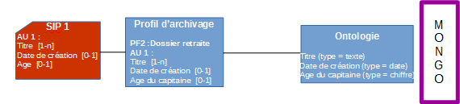
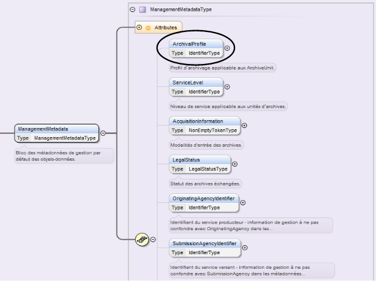
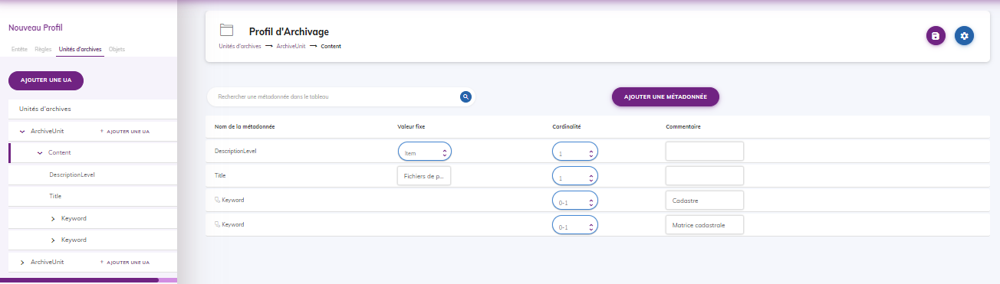
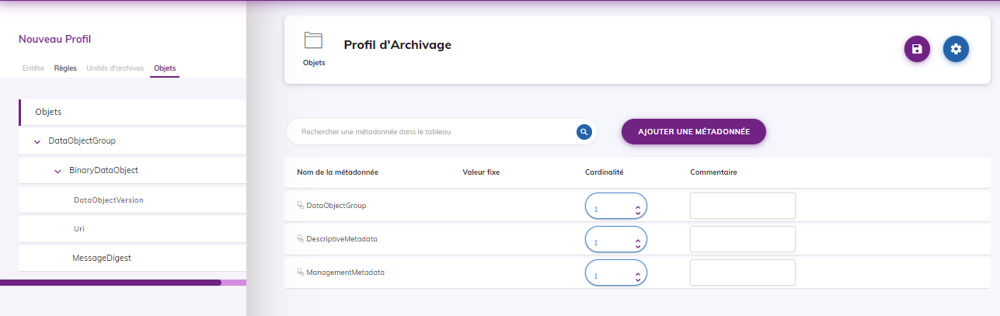
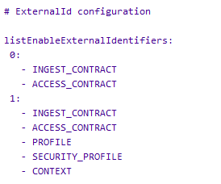
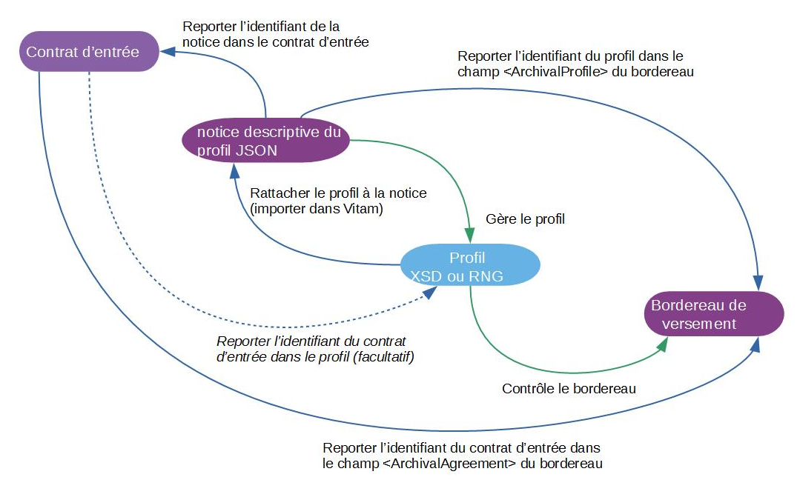
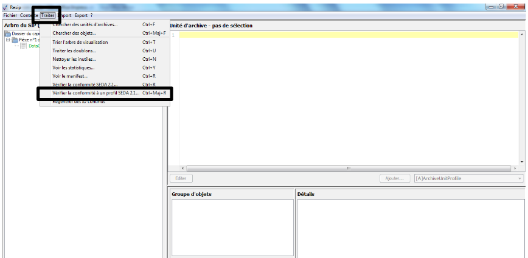
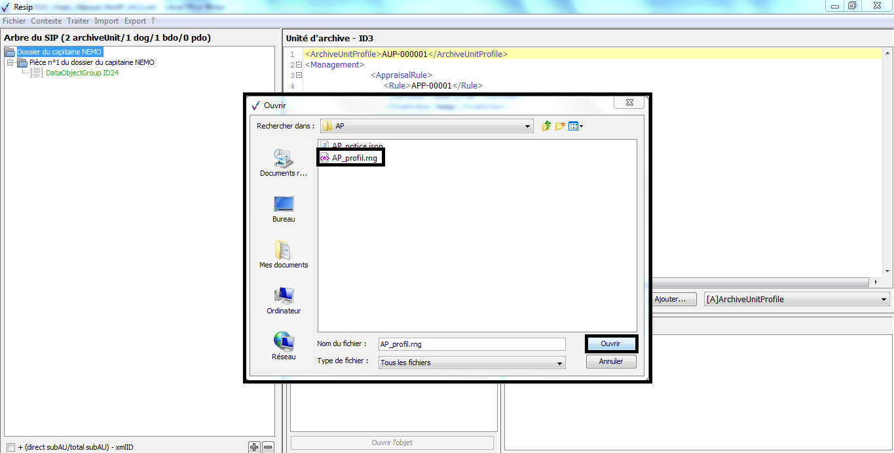
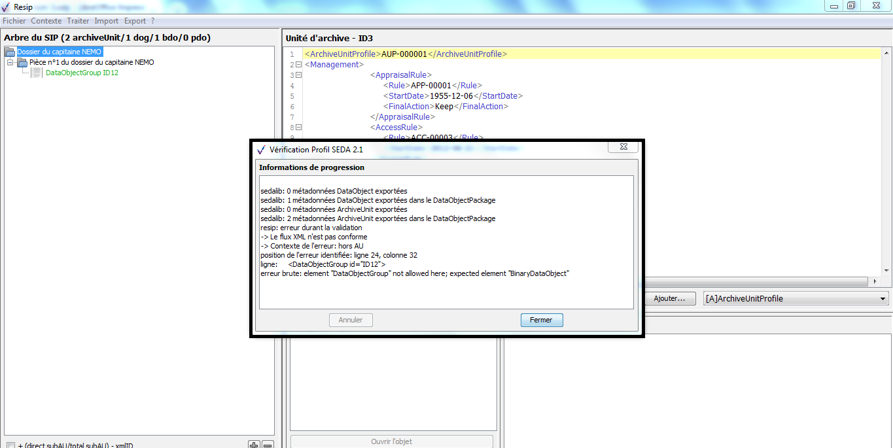
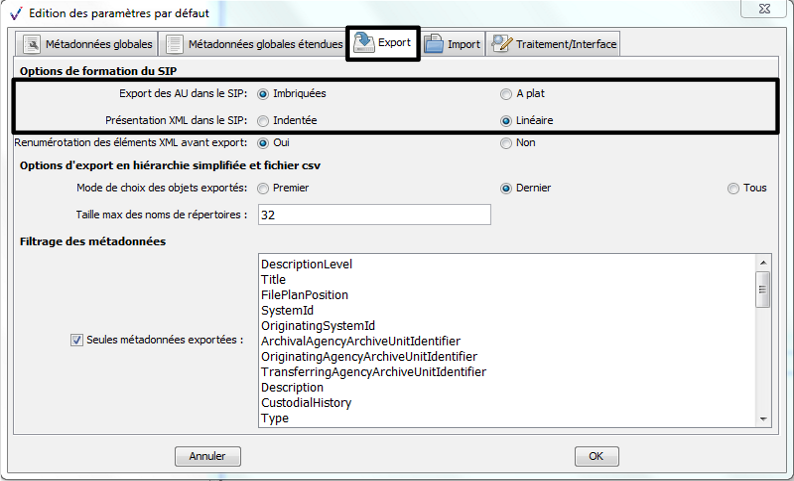

Profils d'archivage
====

Introduction
----

### Documents de référence

|Document |Date de la version|Remarques|
|:---------------:|:-----:|:-----:|
|NF Z 44022 – MEDONA – Modélisation des données pour l’archivage|18/01/2014||
|Standard d’échange de données pour l’archivage – SEDA – v. 2.1|06/2018||
|Standard d’échange de données pour l’archivage – SEDA – v. 2.2|02/2022|Cette nouvelle version du SEDA est intégrée à la solution logicielle Vitam à partir de la V6.RC.|
|[Vitam – Structuration des Submission Information Package (SIP)](./SIP.md)|||
|[Vitam – Ontologie](./ontologie.md)||Ce document doit être lu dans le cas où un profil d’archivage doit contenir des extensions au SEDA.|
|[Vitam – Profils d’unité archivistique](./profil_unite_archivistique.md)||Ce document doit être lu dans les cas où :<br>- un profil d’archivage doit contenir des profils d’unité archivistique ;<br>- en phase d’analyse, on souhaite évaluer quel est le meilleur type de profil à utiliser.|


### Présentation du document

Le présent document décrit les fonctionnalités associées à la prise en compte de la notion de profil d’archivage dans la solution logicielle Vitam. 

Il s’articule autour des axes suivants :
- une présentation de la notion de profil d’archivage ;
- une présentation de la manière dont le Standard d’échanges de données pour l’archivage (SEDA) la formalise ;
- une présentation des mécanismes mis en œuvre dans la solution logicielle Vitam pour prendre en compte cette notion, en application du SEDA ;
- des recommandations aux utilisateurs de la solution logicielle Vitam sur la manière d’élaborer un profil d’archivage ;
- quelques conseils complémentaires de mise en œuvre.

Le présent document décrit les fonctionnalités qui sont offertes par la solution logicielle Vitam au terme de la version 7.0 (octobre 2023) : il comprend particulièrement la présentation des fonctionnalités offertes par le projet PASTIS (Profil d’Archivage Simple pour le Traitement de l’Information en SEDA) intégré à l’IHM Vitam UI par l’APP Profils documentaires et également accessible par un exécutable. Il a vocation à être amendé, complété et enrichi au fur et à mesure de la réalisation de la solution logicielle Vitam et des retours et commentaires formulés par les ministères porteurs et les partenaires du programme.

Présentation de la notion de profil d’archivage
----

### Qu’est-ce qu’un profil d’archivage ?

Un profil d’archivage permet de définir précisément la manière dont des archives destinées à être transférées dans un système d’archivage électronique doivent être structurées et décrites. Il constitue une déclinaison du modèle de description propre au Standard d’échanges de données pour l’archivage (SEDA).

Pour un ensemble de données à transférer, archiver et conserver par un service d’archives, un profil d’archivage précise :
- leur nature et leur structuration ; 
- la structure du message, ou bordereau, de transfert correspondant (description des dossiers à verser);
- les règles de gestion qui leur sont associées ;
- le niveau de service requis.

*Exemple : le profil d’archivage « Dossier de retraite » précise qu’un SIP contenant un dossier de retraite devra contenir une unité archivistique avec au moins un titre, le cas échéant une date de création et un âge*



À titre d’exemple, un bordereau de transfert conforme au SEDA et non associé à un profil d’archivage n’aura ses métadonnées contrôlées que par rapport au schéma par défaut associé au SEDA et pourra présenter une grande hétérogénéité de description, même pour une même catégorie d’archives (ex : photographies numériques, dossiers de subventions, comptes-rendus de réunion, etc).

En revanche, un bordereau de transfert pour lequel un profil d’archivage aura été défini ne pourra contenir que les métadonnées décrivant les unités archivistiques et les objets imposées par celui-ci. Si le profil d’archivage est, par exemple, spécifique au transfert de dossiers de marchés, le bordereau de transfert devra décrire ce type d’archives pour être en conformité avec le profil.

### Pourquoi élaborer un profil d’archivage ?

Définir un profil d’archivage permet de :
- faciliter, voire automatiser, les contrôles sur les transferts d'archives d'un service producteur à un service d'archives, depuis un service externe vers la solution logicielle Vitam ;
- effectuer un contrôle supplémentaire sur les transferts reçus et leur contenu, s’ajoutant à l’ensemble des tâches visant à s’assurer de la conformité des données reçues par rapport à celles qui ont été transférées. Toutes ces actions sont gages de qualité des données, au moment de leur réception dans un système d’archivage électronique ;
- définir la structuration attendue des lots d’archives à transférer, permettant ainsi une meilleure connaissance de celles-ci et la rédaction de spécifications sur les lots à exporter à fournir à un prestataire externe (tiers-archiveur, éditeur de solutions logicielles, etc.) ;
- imposer un modèle de description identique sur un ensemble d’archives ;
- le cas échéant, structurer de manière identique des lots d’archives produits dans différents contextes, mais correspondant à des séries de dossiers homogènes (ex. : dossiers de carrières, structurés conformément à l’arrêté de 2011 pour un transfert aux Archives nationales, indépendamment de la manière dont ils ont été produits dans leur système d’information d’origine).

### Quand et comment élaborer un profil d’archivage ?

L’élaboration d’un profil d’archivage précède l’ouverture d’un transfert à destination d’un système d’archivage électronique. Elle doit être envisagée dans les cas suivants :
- transferts de flux applicatifs, afin de les automatiser ;
- transferts de dossiers ou de documents dits « sériels », obéissant strictement à des règles de classement, de nommage et de description uniforme (par exemple, des images numérisées par un service d’archives) ;
- transferts réguliers et récurrents d’un même type d’archives et donc volonté de disposer d’une description homogène, y compris pour faciliter les recherches sur celles-ci.

A contrario, il ne s’avère pas utile de rédiger un profil d’archivage pour des lots ou catégories d’archives qui sont :
- très rarement ou très ponctuellement transférées (par exemple, un récolement de bibliothèque, un annuaire de service sous forme de tableur) ;
- structurées et décrites de manière non uniforme (par exemple, des boîtes mail).
      
La rédaction d’un profil d’archivage suppose un important travail préparatoire, adapté à chaque lot ou catégorie d’archives concerné (identification des documents à transférer en tenant compte des calendriers de conservation ou des circulaires de tri existants, détermination des métadonnées utiles à la recherche, structuration de l'information dans chaque transfert, etc.).

Elle résulte d’un travail entre les différents acteurs définis dans le Standard d’échange de données pour l’archivage (SEDA), à savoir :
- le service d’archives (administrateurs fonctionnels du système d’archivage électronique, archivistes en charge de la collecte),
- le service producteur (responsables de l’administration fonctionnelle et technique de l’application concernée quand il s’agit de l’archivage d’une application),
- le service de contrôle quand il existe.

Formalisation des profils d’archivage
----

### Dans un fichier propre

Les profils d’archivage prennent la forme de fichiers au format XSD ou Relax NG. Les deux formats diffèrent en termes de syntaxe et de grammaire, mais leur finalité est identique : permettre de valider un fichier écrit en XML[^1].

Les profils d’archivage doivent être élaborés conformément au schéma imposé par le Standard d’échange de données pour l’archivage (SEDA). 

Ils peuvent :
- émettre des règles plus strictes que celles du SEDA (ex. : rendre unique un titre, alors que le standard rend possible sa répétabilité), mais pas des règles moins strictes (ex : rendre répétable le niveau de description n’est pas conforme au SEDA) ;
- rendre obligatoire l’utilisation de certains éléments et/ou valeurs ;
- imposer une structure hiérarchique des données (ex : un dossier doit contenir deux sous-dossiers, et non trois).

### Dans le Standard d’échange de données pour l’archivage (SEDA)

La manière de déclarer un profil d’archivage est définie dans la norme NF Z44-022 et dans sa déclinaison pour les acteurs du service public, le Standard d’échanges de données pour l’archivage (SEDA).

La norme NF Z44-022 offre la possibilité de déclarer un profil d’archivage dans un bordereau de transfert, au moment de la demande de transfert à un service d’archives (message ArchiveTransfer, bloc DataObjectPackage) dans le bloc ManagementMetadata pour toute une entrée.
Dans le sous-bloc ArchivalProfile, est indiqué l’identifiant du profil d’archivage utilisé par le bordereau de transfert. Cet identifiant renvoie au référentiel des profils d’archivage dans la solution logicielle Vitam et correspond à l’identifiant de la notice détaillée du profil d’archivage qui doit être associée au bordereau de transfert, si celui-ci a vocation à être contrôlé par un profil d’archivage[^2].

Le schéma ci-dessous précise le positionnement du sous-bloc ArchivalProfile dans le bloc ManagementMetadata :


Mécanismes mis en œuvre dans la solution logicielle Vitam
-----

La solution logicielle Vitam offre à un service d’archives ou à un service externe plusieurs fonctionnalités lui permettant de mettre en œuvre des profils d’archivage :
- l’administration d’un référentiel des profils d’archivage, ainsi que sa préservation ;
- l’association d’un profil d’archivage à un contrat d’entrée ;
- en entrée du système, un double contrôle de cohérence :
    - vérification que le profil d’archivage déclaré dans le SIP (ArchivalProfile) est conforme au contrat d’entrée qui le déclare dans le référentiel des contrats d’entrée et que ce profil d’archivage est actif ;
    - vérification que le bordereau de transfert est conforme à son profil d’archivage.

### Administration d’un référentiel des profils d’archivage

La solution logicielle Vitam intègre un référentiel des profils d’archivage, administrable par un utilisateur doté des droits adéquats (administrateur fonctionnel) et géré dans une collection particulière[^3].

Ce référentiel est propre à chaque tenant de la solution logicielle Vitam.

Il se compose de notices descriptives au format JSON, auxquelles il est possible d’associer un profil d’archivage au format XSD ou RNG.
Il est possible de réaliser les opérations présentées ci-dessous.

#### Import de la notice descriptive du profil d’archivage

##### Dans un fichier JSON

Il est possible d’importer 1 à n notice(s) descriptive(s) de profil(s) d’archivage sous la forme d’un fichier JSON depuis les API ou l’IHM standard fournies avec la solution logicielle Vitam.

L’APP « Profils documentaires » accessible depuis l’IHM VitamUI permet quant à elle de créer une notice depuis ses interfaces.
Exemple : notice descriptive de profil d’archivage contenant uniquement les informations obligatoires pour être importée avec succès.

```json
[
	{
		"Name":"ProfilRNG_mail",
		"Format":"RNG"
	}
]
```

Une notice de profil d’archivage doit obligatoirement comporter les informations suivantes :
- identifiant signifiant (Identifier). Ce champ est obligatoire seulement s’il est généré par l’application à l’origine de sa création. Si cet identifiant est généré par la solution logicielle Vitam, il n’est pas nécessaire de le renseigner dans le fichier JSON ;
- nom de la notice (Name) ;
- format du profil d’archivage. Il correspond au format du profil d’archivage associé à la notice, à savoir :
    - XSD si le profil d’archivage a été écrit en XSD,
    - RNG si le profil d’archivage a été généré conformément au langage Relax NG.

D’autres informations, facultatives, peuvent venir compléter ces informations. Elles sont détaillées dans la section suivante du présent document.

Il s’agit d’une opération d’administration (« MASTERDATA »), tracée dans le journal des opérations du tenant sur lequel a eu lieu l’opération[^4].

Lors de cet import, l’opération peut aboutir aux statuts suivants :
|Statut|Motifs|
|:-----|:-----|
|Succès|Opération réalisée sans rencontrer de problèmes particuliers.|
|Échec[^5]|Sans journalisation :<br>- Import d’un référentiel sous la forme d’un fichier qui n’est pas au format JSON ;<br>- Import d’un référentiel sous la forme d’un fichier qui n’est pas correctement formaté au format JSON ;<br>- Import d’un référentiel dont au moins un des champs contient une injection HTML ;<br>- import d’une notice de profil d’archivage dans laquelle le statut n’est pas renseigné ou est mal renseigné ;<br>- import d’une notice de profil d’archivage dans laquelle une valeur ne correspond pas au type d’indexation du champ défini dans l’ontologie (ex : valeur textuelle dans un champ de type « DATE »).<br><br>Avec journalisation :<br>- import d’une notice de profil d’archivage dont l’identifiant existe déjà dans le système sur un tenant en mode « esclave » ;<br>- import d’un fichier JSON dans lequel une notice de profil d’archivage ne déclare pas d’identifiant[^6], d’intitulé, de format ;<br>- import d’une notice de profil d’archivage dans laquelle un champ ne contient pas de valeur. Il peut s’agir des champs : Identifier[^7], Name, Format ;<br>- import d’une notice de profil d’archivage qui déclare un profil d’archivage non préalablement téléchargé dans la solution logicielle Vitam.|

**Points d’attention :**
- Il est possible d’importer en une seule fois un référentiel complet, comprenant plusieurs notices décrivant chacune un profil d’archivage. La solution logicielle Vitam ne comptabilisera qu’une seule opération, et ne prendra pas en compte dans le journal des opérations la création unitaire des différents items compris dans le référentiel importé. Afin d’optimiser la traçabilité de la création des différentes notices, il est recommandé de créer ces dernières une par une.
- L’import d’une notice ne suffit pas pour utiliser un profil d’archivage dans la solution logicielle Vitam. Il est nécessaire, après cette opération, d’importer le fichier .xsd ou .rng correspondant au profil d’archivage lui-même et de l’associer à la notice qui le référence, afin qu’il soit pris en compte dans la solution logicielle Vitam[^8].
- S’il est généré par une application externe, l’identifiant de la notice ne doit comprendre ni caractère accentué, ni virgule, ni apostrophe, ni parenthèse, ni espace, ni slash, ni élément de ponctuation, ou tout autre caractère spécial. Ne sont recommandés que l’underscore et le tiret comme séparateurs.

##### Dans la solution logicielle Vitam

Les notices de profil d’archivage sont enregistrées dans la base de données MongoDB, dans la collection « Profile », sous la forme d’enregistrements au format JSON.

Une notice descriptive peut comprendre les informations suivantes pour un profil d’archivage donné[^9] :

|Champ|Description|
|:-----|:-----|
|_id|identifiant système unique de la notice correspondant à un GUID attribué automatiquement par la solution logicielle Vitam (champ obligatoire).|
|Identifier|identifiant de la notice qui peut être généré par la solution logicielle Vitam ou par l’application à l’origine de sa création  (champ obligatoire).<br>S’il est généré par la solution logicielle Vitam, cet identifiant se compose du préfixe PR, suivi d’un tiret et d’une suite de 6 chiffres incrémentés automatiquement.<br>S’il est généré par une application externe, il ne doit comprendre ni caractère accentué, ni virgule, ni apostrophe, ni parenthèse, ni espace, ni slash, ni élément de ponctuation, ou tout autre caractère spécial. Ne sont recommandés que l’underscore et le tiret comme séparateurs.|
|Name|nom du profil d’archivage, qui doit être obligatoirement renseigné dans la solution logicielle Vitam (champ obligatoire).|
|Description|description du profil d’archivage, pouvant être vide (champ facultatif).|
|Status|statut « ACTIVE » pour « actif » ou « INACTIVE » pour inactif (champ obligatoire).<br>Si la notice importée ne contient pas de statut, la solution logicielle Vitam enregistre par défaut la valeur « INACTIVE ».|
|Format|format du profil d’archivage (champ obligatoire).<br>Il correspond au format du profil d’archivage associé à la notice, à savoir :<br>- XSD si le profil d’archivage a été écrit en XSD,<br>- RNG si le profil d’archivage a été généré conformément au langage Relax NG.|
|CreationDate|date de création de la notice descriptive, fournie par la solution logicielle Vitam (champ obligatoire).|
|LastUpdate|dernière date de modification de la notice descriptive, fournie par la solution logicielle Vitam (champ obligatoire).|
|ActivationDate|si la notice descriptive est active, date d’activation de la notice (champ facultatif).|
|DeactivationDate|si la notice descriptive est inactive, date de désactivation de la notice (champ facultatif).|
|_tenant|tenant dans lequel le profil d’archivage s’applique, fourni par la solution logicielle Vitam (champ obligatoire).|
|_v|version du profil d’archivage, fournie par la solution logicielle Vitam (champ obligatoire).|
|Path|chemin d’accès au profil d’archivage associé à la notice détaillée (champ facultatif).|

#### Import du profil d’archivage lui-même

À chaque notice descriptive, il n’est possible d’associer qu’un seul profil d’archivage depuis les API ou l’IHM standard fournies avec la solution logicielle Vitam.

L’APP « Profils documentaires » accessible depuis l’IHM VitamUI permet quant à elle d’importer un profil d’archivage depuis son poste ou de le créer depuis ses interfaces.

Le profil d’archivage doit être conforme au format déclaré dans la notice et doit prendre la forme de :
- un fichier XSD si la notice déclare un format XSD,
- un fichier RNG si la notice déclare un format Relax NG.

Si le profil d’archivage n’est pas conforme au format annoncé dans la notice, il n’est pas possible de l’importer dans la solution logicielle Vitam.

L’import d’un profil d’archivage dans la collection est un des prérequis indispensable pour pouvoir réaliser des contrôles entre un profil d’archivage et des bordereaux de transfert au moment de leur versement dans la solution logicielle Vitam.
Cette action provoque la création d’une nouvelle version de la notice modifiée. Elle fait l’objet d’une journalisation dans le journal des opérations du tenant sur lequel a eu lieu l’opération (opération d’administration de type « MASTERDATA »)[^10].

#### Modification de la notice descriptive d’un profil d’archivage

La modification des champs des notices décrivant les profils d’archivage est possible au moyen :
- des API,
- de l’IHM standard fournies avec la solution logicielle Vitam,
- de l’APP « Profils documentaires » accessible depuis l’IHM VitamUI.

Les champs modifiables sont :
- depuis l’IHM standard :
    - le nom du profil d’archivage (Name) ;
    - la description du profil d’archivage (Description) ;
    - le statut « Actif » ou « Inactif », correspondant aux valeurs « ACTIVE » et « INACTIVE » dans le système (Status) ;
    - le chemin d’accès au profil d’archivage associé à la notice détaillée (Path) ;
- Depuis les API :
    - le format, devant correspondre aux valeurs « XSD » ou « RNG ».

**Points d’attention :**
- Le statut de la notice descriptive doit être « Actif » (« ACTIVE ») pour pouvoir procéder à des transferts de SIP devant se conformer au profil d’archivage associé ;
- La solution logicielle Vitam permet de modifier le fichier au format XSD ou Relax RNG correspondant au profil d’archivage. Néanmoins, cette action requiert des précautions d’usage, dans la mesure où le profil d’archivage peut être utilisé pour des transferts en cours. Avant de modifier un profil d’archivage dans une notice descriptive, il est recommandé de :
  - vérifier qu’aucun transfert nécessitant ce profil d’archivage n’est en cours ou programmé ;
  - désactiver la notice descriptive ;
  - modifier le profil d’archivage en téléchargeant un nouveau profil qui prend la forme :
    - d’un fichier XSD si la notice déclare un format XSD,
    - d’un fichier RNG si la notice déclare un format Relax NG ;
  - rétablir les services désactivés.
- Il est possible de modifier le format exprimé, mais il est fortement recommandé de le faire avant d’avoir téléchargé un profil d’archivage dans la notice.
Cette action provoque la création d’une nouvelle version de la notice modifiée. Les différentes versions du référentiel font l’objet d’une sauvegarde sur les offres de stockage utilisées par la solution logicielle Vitam.

Elle fait l’objet d’une journalisation dans le journal des opérations du tenant sur lequel a eu lieu l’opération (opération d’administration de type « MASTERDATA »)[^11].
Lors de cette mise à jour, l’opération peut aboutir aux statuts suivants :

|Statut|Motifs|
|:----|:-----|
|Succès|Opération réalisée sans rencontrer de problèmes particuliers.|
|Échec[^12]|- téléchargement d’un profil d’archivage qui n’est ni au format XSD ni au format RNG ;<br>- mise à jour du format par une valeur ne correspondant ni à « XSD » ni à « RNG » ;<br>- mise à jour du statut par une valeur ne correspondant ni à « ACTIVE » ni à « INACTIVE ».|

#### Activation / Désactivation d’un profil d’archivage

La solution logicielle Vitam permet de rendre active ou inactive une notice détaillant un profil d’archivage.
Cette action est possible depuis :
- les API,
- l’IHM standard fournies avec la solution logicielle Vitam,
- l’APP « Profils documentaires » accessible depuis l’IHM VitamUI.

En fonction du statut du contexte applicatif, de celui du contrat d’entrée et du profil d’archivage associé, le versement de SIP déclarant un profil d’archivage sera autorisé ou non :

||Contexte|Contrat d’entrée|Profil|Résultat|
|:-----|:-----|:-----|:-----|:-----|
|CAS 1|ACTIF|ACTIF|ACTIF|Transfert de SIP dans le système autorisé.|
|CAS 2|ACTIF|INACTIF|ACTIF|Transfert de SIP dans le système non autorisé.|
|CAS 3|INACTIF|ACTIF|ACTIF|Transfert de SIP dans le système non autorisé.|
|CAS 4|INACTIF|INACTIF|ACTIF|Transfert de SIP dans le système non autorisé.|
|CAS 5|ACTIF|ACTIF|INACTIF|Transfert de SIP dans le système non autorisé.|

La modification du statut engendre la mise à jour des champs :
- date de mise à jour ;
- date d'activation OU date de désactivation.

La date d'activation correspond à la date à laquelle la notice et, par conséquent, le profil d’archivage sont rendus actifs. Il peut s'agir de :
- sa date d'import, si la notice a un statut « Actif » au moment de son import ;
- la date correspondant à l'action d'activation, si celle-ci est postérieure à l’import de la notice dans la solution logicielle Vitam.

La date de désactivation correspond à la date où la notice et par conséquent le profil d’archivage sont rendus inactifs. Il peut s'agir de :
- sa date d'import, si elle a un statut « Inactif » ou non renseigné au moment de son import ;
- la date correspondant à l'action de désactivation, si celle-ci est postérieure à l’import de la notice dans la solution logicielle Vitam.

#### Audit d’intégrité du référentiel

La solution logicielle Vitam permet de réaliser un audit sur le référentiel des profils d’archivage. Cet audit se lance depuis un tenant donné et vérifie que les profils d’archivage déclarés dans la base de données sont bien stockés dans les offres de stockage[^13].

Il s’agit d’un acte technique. Il donne lieu à un log et non pas à une opération journalisée.
À l’issue de l’audit, le log peut aboutir aux statuts suivants :

|Statut|Motifs|
|:---|:---|
|Succès|opération réalisée sans rencontrer de problèmes particuliers.|
|Avertissement|opération réalisée, présentant une incohérence, notamment :<br>- quand un fichier est absent sur au moins une des offres,<br>- quand l'empreinte n'est pas conforme sur une des offres,<br>- quand un fichier (avec la même empreinte qu'en base) présent sur au moins une des offres à été recopié sur les offres,<br>- quand au moins un fichier est manquant ou son empreinte est différente.|
|Échec|Au moins un profil d’archivage est incohérent entre la base de données MongoDB et toutes les offres de stockage.|
   
### Processus d’entrée

#### Déclaration d’un profil d’archivage dans un contrat d’entrée

Pour contrôler, au moyen d’un profil d’archivage, la conformité des bordereaux de transfert qui lui sont adressés, la solution logicielle Vitam rend obligatoire la déclaration de ce profil d’archivage dans le contrat d’entrée utilisé.

Un contrat d’entrée permet de déclarer 0 à n profils d’archivage.

Ce contrat devra être déclaré dans le bordereau de transfert, de même que le profil d’archivage utilisé.

#### Processus de contrôles d’une entrée

Dans le cadre du processus d’entrée d’un ensemble d’archives, suite à la réception d’un bordereau de transfert (message ArchiveTransfer du SEDA), la solution logicielle Vitam effectue les tâches et traitements internes suivants pour les archives déclarant ce contrat d’entrée :
- authentification de l’application versante à la solution logicielle Vitam par l’intermédiaire d’un certificat qui vérifie la validité de son contexte ;
- vérification que le contrat d’entrée déclaré dans le SIP est conforme au contexte applicatif qui le déclare dans le référentiel des contextes applicatifs ;
- vérification que le contrat d’entrée déclaré dans le SIP (ArchivalAgreement) existe bien dans le référentiel des contrats d’entrée et est actif ;
- vérification que le profil d’archivage déclaré dans le SIP (ArchivalProfile) est conforme au contrat d’entrée qui le déclare dans le référentiel des contrats d’entrée et est actif ;
- vérification que le SIP est conforme à son profil d’archivage.

Lors de l’étape de vérification de la conformité entre le profil d’archivage déclaré dans le bordereau de transfert et le contrat d’entrée :
- si le bordereau de transfert déclare un profil d’archivage et un contrat d’entrée qui référence ce même profil d’archivage, la tâche de vérification aura un statut « OK » et la solution logicielle Vitam passera à la tâche suivante de vérification de la conformité du bordereau au profil d’archivage ;
- si le bordereau de transfert déclare un profil d’archivage et un contrat d’entrée qui ne sont pas conformes pour les raisons suivantes :
    - le profil d’archivage n’est pas déclaré dans le contrat d’entrée,
    - il ne correspond pas au profil d’archivage déclaré dans le contrat d’entrée,
    - la notice descriptive du profil d’archivage est inactive,
          alors le transfert du SIP échouera à la tâche de vérification entre le contrat d’entrée et le profil d’archivage et ne passera pas à la tâche suivante[^14].

Exemple : message d’erreur sur la tâche de contrôle de conformité entre un contrat d’entrée et un profil d’archivage.

```json
<Operation>
        <Event>
            <EventTypeCode>STP_INGEST_CONTROL_SIP</EventTypeCode>
            <EventType>Processus de contrôle du SIP</EventType>
            <EventDateTime>2018-05-25T13:19:27.570</EventDateTime>
            <Outcome>KO</Outcome>
            <OutcomeDetail>STP_INGEST_CONTROL_SIP.KO</OutcomeDetail>
            <OutcomeDetailMessage>Échec du processus du contrôle du bordereau du
                SIP</OutcomeDetailMessage>
        </Event>
        <Event>
            <EventTypeCode>CHECK_HEADER</EventTypeCode>
            <EventType>Vérification générale du bordereau de transfert</EventType>
            <EventDateTime>2018-05-25T13:19:27.570</EventDateTime>
            <Outcome>KO</Outcome>
            <OutcomeDetail>CHECK_HEADER.DIFF.KO</OutcomeDetail>
            <OutcomeDetailMessage>Échec de la vérification générale du bordereau de transfert :
                différence entre le profil déclaré dans le bordereau de transfert et celui déclaré
                dans le contrat Detail= OK:2 KO:1</OutcomeDetailMessage>
            <EventDetailData>{"evDetTechData":"The profile PR-000018 was not found in the ingest
                contract","ArchivalProfile":"PR-000018","EvDetailReq":"Catherine JABLASY :
                mails","ArchivalAgreement":"IC-000001"}</EventDetailData>
        </Event>
        <Event>
            <EventTypeCode>CHECK_HEADER.CHECK_IC_AP_RELATION</EventTypeCode>
            <EventType>Vérification de la relation entre le contrat d'entrée et le profil
                d'archivage</EventType>
            <EventDateTime>2018-05-25T13:19:27.572</EventDateTime>
            <Outcome>KO</Outcome>
            <OutcomeDetail>CHECK_HEADER.CHECK_IC_AP_RELATION.DIFF.KO</OutcomeDetail>
            <OutcomeDetailMessage>Échec du contrôle de cohérence entre le profil d'archivage déclaré
                dans le bordereau de transfert et celui déclaré dans le contrat d'entrée Detail=
                KO:1</OutcomeDetailMessage>
        </Event>
    </Operation>
```

Lors de l’étape de vérification de la conformité du bordereau de transfert à son profil d’archivage :
- si le bordereau de transfert est conforme à son profil d’archivage, c’est-à-dire s’il correspond au modèle de données défini dans le profil d’archivage, la tâche de vérification de la conformité au profil d’archivage aura un statut « OK » et la solution logicielle Vitam passera au traitement suivant, à savoir la vérification de la conformité du SIP au SEDA ;
- si le bordereau de transfert n’est pas conforme à son profil d’archivage ou si la notice de profil d’archivage ne contient pas de profil d’archivage au format RNG ou XSD, son transfert dans la solution logicielle Vitam n’aboutira pas. Un message de réponse (ArchiveTransferReply ou ATR) indique que le transfert a échoué à la tâche de vérification de la conformité au profil d’archivage et précise la première erreur rencontrée dans le détail de l’événement (EventDetailData)[^15].

Exemple : message d’erreur sur la tâche de contrôle de conformité entre un bordereau de transfert et un profil d’archivage.

```json
<Operation>
        <Event>
            <EventTypeCode>STP_INGEST_CONTROL_SIP</EventTypeCode>
            <EventType>Processus de contrôle du SIP</EventType>
            <EventDateTime>2018-05-25T13:37:19.300</EventDateTime>
            <Outcome>KO</Outcome>
            <OutcomeDetail>STP_INGEST_CONTROL_SIP.KO</OutcomeDetail>
            <OutcomeDetailMessage>Échec du processus du contrôle du bordereau du
                SIP</OutcomeDetailMessage>
        </Event>
        <Event>
            <EventTypeCode>CHECK_HEADER</EventTypeCode>
            <EventType>Vérification générale du bordereau de transfert</EventType>
            <EventDateTime>2018-05-25T13:37:19.300</EventDateTime>
            <Outcome>KO</Outcome>
            <OutcomeDetail>CHECK_HEADER.KO</OutcomeDetail>
            <OutcomeDetailMessage>Échec de la vérification générale du bordereau de transfert
                Detail= OK:3 KO:1</OutcomeDetailMessage>
            <EventDetailData>{"evDetTechData":"character content of element \"Rule\" invalid; must
                be equal to \"APP-00001\"","ArchivalProfile":"PR-000018","EvDetailReq":"Catherine
                JABLASY : mails","ArchivalAgreement":"IC-000001"}</EventDetailData>
        </Event>
        <Event>
            <EventTypeCode>CHECK_HEADER.CHECK_ARCHIVEPROFILE</EventTypeCode>
            <EventType>Vérification de la conformité au profil d'archivage</EventType>
            <EventDateTime>2018-05-25T13:37:19.300</EventDateTime>
            <Outcome>KO</Outcome>
            <OutcomeDetail>CHECK_HEADER.CHECK_ARCHIVEPROFILE.KO</OutcomeDetail>
            <OutcomeDetailMessage>Échec de la vérification de la conformité au profil d'archivage
                Detail= KO:1</OutcomeDetailMessage>
        </Event>
    </Operation>
```

**Point d’attention :** le profil d’archivage ne sert pas à générer automatiquement le contenu d’un bordereau de transfert lors de son transfert dans la solution logicielle Vitam. Il n’est utilisé que pour effectuer des contrôles de conformité du bordereau par rapport à ses attentes. De facto, le bordereau de transfert, associé à un profil d’archivage, doit avoir été conçu, en amont du transfert, conformément aux attentes du profil d’archivage.

Étapes d’élaboration d’un profil d’archivage
----

### Analyse des données

Un profil d’archivage nécessite une analyse et une modélisation préalables des données à archiver. Cette étape est un prérequis essentiel permettant d’aboutir à la structuration d’un bordereau de transfert type.

Il s’agit de connaître :
- l’organisation structurelle des données à archiver (plan de classement) ;
- les métadonnées associées à ces données, permettant de les identifier, de les gérer et de les retrouver après transfert dans le système d’archivage électronique (métadonnées de pérennisation, de représentation et de description au sens de la norme OAIS) ;
- le contenu de données, à savoir la nature des données à archiver (catégorie ou typologie d’archives).

En prenant l’exemple d’un projet de dématérialisation d’archives, il est recommandé, lors de ce travail préparatoire, de se poser les questions suivantes[^16] :

|||
|:----|:-----|
|Identifier le contexte|Quels sont les documents à archiver ? Pourquoi ? Existe-il un besoin légal ? La reprise de l’existant a-t-elle été prévue ?|
|Identifier le périmètre|Y a-t-il une seule ou plusieurs séries de dossiers gérées dans l’application ? Quelle est la structuration de chaque série de dossiers ? Y a-t-il un plan de classement ? Quels documents y trouve-t-on ?<br>Exemple de la dématérialisation des pièces comptables des collectivités territoriales. Concerne-t-elle :<br>- Les flux PESV2 sans signature électronique ?<br>- Les flux PESV2 et la dématérialisation des pièces justificatives ?<br>- Ou encore les flux PESV2, les pièces justificatives et la signature électronique des bordereaux récapitulatifs ?|
|Identifier les documents dématérialisés|Quelles sont les typologies concernées ? Quels sont les usages ? Les documents et données sont-ils nativement numériques ou ont-ils été numérisés ? Une impression papier est-elle prévue en fin de procédure ? De quelle(s) base(s) de données les données et documents sont-ils issus ? Quels sont les formats des documents ? Quelles sont les possibilités d’exports et le modèle des données ? Les documents ont-ils une valeur probante (ex. signature électronique) ?|
|Identifier les outils techniques|Dans le cadre d’une numérisation, s’agit-il d’une opération interne ? Le recours à un prestataire externe est-il prévu ? Une reprise du stock a-t-elle été envisagée ? L’application a-t-elle été développée en interne ? L’acquisition d’un logiciel est-elle prévue ? Quelles métadonnées ont été intégrées ? Quelles métadonnées peut-on extraire de l’application ? L’organisation a-t-elle recours à un tiers de télétransmission ? Un parapheur électronique est-il en place ? Les agents disposent-ils de la signature électronique ? Est-elle systématiquement utilisée ?|
|Stockage, archivage et sort final|Quelles sont les règles de gestion et plus particulièrement les règles de conservation et le sort final des documents ? Comment sont conservées les pièces dématérialisées ? Où ? Par qui (organisation, tiers archiveur)? Existe-t-il un système d’archivage électronique ? Un coffre-fort ? Des serveurs répliqués ? Un système de gestion électronique de documents ? Quelles sont les modalités d’accès ? La destruction est-elle possible ? Quelles sont les modalités ?|

À l’issue de cette première analyse, l’archiviste doit être en mesure d’avoir à sa disposition :
- un plan de classement ou une structure hiérarchique des données ;
- une liste des métadonnées,
- une liste des documents à transférer avec leur format,
- les règles de gestion associées.
Le résultat de ce travail peut prendre la forme du tableau suivant :

|Structure de la description||Métadonnées|||Contenu de données|
|:-----|:-----|:-----|:-----|:-----|:-----|
|Niveau 1|Niveau n|Informations de description (métadonnées)|Informations techniques|Règles de gestion|Documents versés en pièces jointes ou encapsulés|
|||||||


La liste des métadonnées peut prendre la forme du tableau suivant :

|Nom de la métadonnée|Type|Cardinalité|Obligatoire ?|Valeurs imposées|Commentaires|À récupérer ?|
|:-----|:-----|:-----|:-----|:-----|:-----|:-----|
||Texte, Date, Chiffres, etc.|1-1, 0-1, 0-n|OUI / NON|Ex : liste, valeur héritée.||OUI / NON|
||||||||

Il est nécessaire de bien évaluer les informations à retenir dans le profil d’archivage, leur degré de précision (formes, valeurs, cardinalités) et leur structuration, afin de faciliter les recherches et la gestion futures des données dans la solution logicielle Vitam.

### Structuration des données à verser

À partir de ce travail préliminaire, il est désormais possible de réaliser un bordereau de transfert type et un profil d’archivage propre aux données à archiver, tous deux conformes au SEDA.

Il est conseillé de procéder par étape :
- création d’un profil d’archivage à l’aide d’un des outils suivants :
    - le Service hébergé pour la rédaction de profils d’archivage (SHERPA)[^17], mis à disposition par le Service interministériel des Archives de France,
    - l’outil Profil d’Archivage Simple pour le Traitement de l’Information en SEDA (PASTIS), utilisable sous forme d’exécutable ou d’APP intégrée aux interfaces de VitamUI (APP Profils documentaires),
    - un éditeur XML,
- le cas échéant, en parallèle, documentation du profil d’archivage sous forme de tableur ou de document,
- modifications manuelles sur le profil d’archivage extrait de SHERPA, à l’aide d’un éditeur XML,
- génération d’un bordereau conforme au SEDA et conforme au profil d’archivage préalablement réalisé.

#### Rédaction d’un profil d’archivage avec SHERPA

##### Étapes de rédaction d’un profil d’archivage

Pour rédiger un profil d’archivage, il est possible d’utiliser le Service hébergé pour la rédaction de profils d’archivage (SHERPA)[^18]. L’outil permet de générer des profils d’archivage au format Relax NG, ainsi qu’une documentation au format HTML.

*Étape 1* - l’outil requiert dans un premier temps de créer :
- des notices d’autorité, à l’unité ou en lots par l’intermédiaire d’import de fichiers EAC-CPF,
- des vocabulaires, à l’unité ou en lots par l’intermédiaire d’import de fichiers CSV.
Si l’outil SHERPA n’est pas intégré au système d’archivage électronique, il est uniquement recommandé d’importer un référentiel des règles de gestion, identique à celui qui a été importé dans la solution logicielle Vitam.

*Étape 2* - lors de la rédaction du profil d’archivage :
- SHERPA auto-incrémente les champs qui sont obligatoires, uniques et variables, tels que le référentiel des formats. De fait, il n’est pas nécessaire de chercher à les saisir.
- Si aucune notice d’autorité ou aucun vocabulaire n’ont été créés, il faut sélectionner une valeur par défaut, issue des thesauri implémentés dans SHERPA. Celle-ci sera modifiée ultérieurement[^19]. Cette recommandation vaut pour les éléments suivants :
    - Service versant (TransferringAgency),
    - Service producteur (OriginatingAgency),
    - Service d’archives (ArchivalAgency),
    - Toutes les références aux listes de code (CodeListVersions).
- Si indexation il y a, il est recommandé de créer des descripteurs libres et non des descripteurs contrôlés, issus des thesauri implémentés dans SHERPA.
- Les champs d’aide à la saisie permettent d’ajouter des commentaires sur les restrictions choisies. Dans le cas de champs dont la valeur n’est pas imposée, ces champs peuvent être utilisés pour expliciter la manière de les renseigner.

- SHERPA permet de créer des profils d’archivage sous forme arborescente ou « râteau » :
    - dans le premier cas, il faut créer une nouvelle unité d’archives à partir de l’unité d’archives de niveau supérieur,
    - dans le second cas, il faut veiller à créer les liens entre les différentes unités archivistiques (onglet « Unités d’archives », sélectionner « Faire référence à une unité d’archives existante »).<br>
      **Point d’attention :** le choix de la forme de la description (arborescente ou « râteau ») a un impact sur la modélisation à venir du bordereau de transfert, qui devra adopter la même forme que celle définie dans son profil.
- Pour rattacher un objet à une unité d’archives, il faut : 
    - avoir préalablement créé un objet dans SHERPA. Cette opération n’est possible qu’à partir de la page racine du profil d’archivage, onglet « objets-données ».
    - Ensuite, il faut se positionner sur l’unité d’archives à laquelle on souhaite rattacher l’objet.

##### Corrections d’un profil d’archivage

Une fois la rédaction du profil d’archivage réalisée, il est possible de l’exporter au format Relax NG depuis la page racine du profil d’archivage.

**Point d’attention :**  
SHERPA, s’il est utilisé hors système intégré d’archivage, ne livre pas un profil d’archivage complètement utilisable et conforme au schéma attendu par la solution logicielle Vitam, car :
- il ne gère pas d’export de fichier RNG au SEDA 2.1[^20] ou au SEDA 2.2 ;
- il génère des liens vers des listes d’autorité non supportées par cette dernière ;
- il ne génère pas certains éléments (notamment les extensions que l’outil ne connaît pas a priori, les éléments ArchivalProfile et ArchiveUnitProfile).

###### Corrections

Il faut apporter quelques corrections au fichier exporté.
Pour ce faire, il faut :
- Ouvrir le fichier dans un éditeur de texte (ex : Notepad ++, Oxygen).
- Corriger les éléments suivants :

    - Corrections au niveau de l’en-tête

Au niveau de l’en-tête, déclarant les espaces de nom et autres références, il faut remplacer les références au SEDA 2.0 par des références au SEDA 2.1 ou au SEDA 2.2.

*Exemple : modifications à apporter au niveau de l’en-tête.*

*Ancienne version :*
```xml
<?xml version='1.0' encoding='utf-8' standalone='no'?>
<rng:grammar xmlns:a="http://relaxng.org/ns/compatibility/annotations/1.0" xmlns:rng="http://relaxng.org/ns/structure/1.0" xmlns:seda="fr:gouv:culture:archivesdefrance:seda:v2.0" xmlns:xlink="http://www.w3.org/1999/xlink" xmlns:xsd="http://www.w3.org/2001/XMLSchema" xmlns="fr:gouv:culture:archivesdefrance:seda:v2.0" datatypeLibrary="http://www.w3.org/2001/XMLSchema-datatypes" ns="fr:gouv:culture:archivesdefrance:seda:v2.0" seda:warnings="">
[...]
```

*Nouvelle Version :*
```xml
<?xml version='1.0' encoding='utf-8' standalone='no'?>
<rng:grammar xmlns:a="http://relaxng.org/ns/compatibility/annotations/1.0" xmlns:rng="http://relaxng.org/ns/structure/1.0" xmlns:seda="fr:gouv:culture:archivesdefrance:seda:v2.1" xmlns:xlink="http://www.w3.org/1999/xlink" xmlns:xsd="http://www.w3.org/2001/XMLSchema" xmlns="fr:gouv:culture:archivesdefrance:seda:v2.1" datatypeLibrary="http://www.w3.org/2001/XMLSchema-datatypes" ns="fr:gouv:culture:archivesdefrance:seda:v2.1" seda:warnings="">
[…]
```

OU
```xml
<?xml version='1.0' encoding='utf-8' standalone='no'?>
<rng:grammar xmlns:a="http://relaxng.org/ns/compatibility/annotations/1.0" xmlns:rng="http://relaxng.org/ns/structure/1.0" xmlns:seda="fr:gouv:culture:archivesdefrance:seda:v2.2" xmlns:xlink="http://www.w3.org/1999/xlink" xmlns:xsd="http://www.w3.org/2001/XMLSchema" xmlns="fr:gouv:culture:archivesdefrance:seda:v2.2" datatypeLibrary="http://www.w3.org/2001/XMLSchema-datatypes" ns="fr:gouv:culture:archivesdefrance:seda:v2.2" seda:warnings="">
[...]
```

    - Corrections au niveau des références aux listes de codes
Au niveau des références aux listes de codes (CodeListVersions), il faut remplacer les mentions de liens externes (url) par des valeurs textuelles standardisées. 

*Exemple : modifications à apporter au niveau des références aux listes de codes.*

*Ancienne version :*
```json
<rng:element name="MessageDigestAlgorithmCodeListVersion">
          <rng:optional>
            <rng:attribute name="listName"><rng:data type="string"/></rng:attribute>
          </rng:optional>
          <rng:optional>
            <rng:attribute name="listAgencyID"><rng:data type="token"/></rng:attribute>
          </rng:optional>
          <rng:optional>
            <rng:attribute name="listSchemeURI"><rng:data type="anyURI"/></rng:attribute>
          </rng:optional>
          <rng:optional>
            <rng:attribute name="listID"><rng:data type="token"/></rng:attribute>
          </rng:optional>
          <rng:optional>
            <rng:attribute name="listAgencyName"><rng:data type="string"/></rng:attribute>
          </rng:optional>
          <rng:optional>
            <rng:attribute name="listURI"><rng:data type="anyURI"/></rng:attribute>
          </rng:optional>
          <rng:optional>
            <rng:attribute name="listVersionID"><rng:data type="token"/></rng:attribute>
          </rng:optional>
          <rng:value type="token">https://francearchives.fr/sherpa/43214</rng:value>
        </rng:element>
```
*Nouvelle version :*
```json
<rng:element name="MessageDigestAlgorithmCodeListVersion">
          <rng:optional>
            <rng:attribute name="listName"><rng:data type="string"/></rng:attribute>
          </rng:optional>
          <rng:optional>
            <rng:attribute name="listAgencyID"><rng:data type="token"/></rng:attribute>
          </rng:optional>
          <rng:optional>
            <rng:attribute name="listSchemeURI"><rng:data type="anyURI"/></rng:attribute>
          </rng:optional>
          <rng:optional>
            <rng:attribute name="listID"><rng:data type="token"/></rng:attribute>
          </rng:optional>
          <rng:optional>
            <rng:attribute name="listAgencyName"><rng:data type="string"/></rng:attribute>
          </rng:optional>
          <rng:optional>
            <rng:attribute name="listURI"><rng:data type="anyURI"/></rng:attribute>
          </rng:optional>
          <rng:optional>
            <rng:attribute name="listVersionID"><rng:data type="token"/></rng:attribute>
          </rng:optional>
          <rng:value type="token">MessageDigestAlgorithmCodeListVersion0</rng:value>
        </rng:element>
```

À cette fin, il est possible de copier l’[annexe 3](#annexe-3--déclaration-des-références-aux-listes-de-codes-codelistversions) de ce document et de l’insérer dans le profil d’archivage en lieu et place de l’élément englobant <rng:element name="CodeListVersions">…</rng:element>.

    - Corrections au niveau des règles de gestion

Au niveau des règles de gestion, si aucun référentiel des règles de gestion n’a été importé dans SHERPA, il faut rechercher les éléments inclus dans les éléments <rng:element name="Management"> ou <rng:element name="ManagementMetadata"> et remplacer la valeur de la règle de gestion issue de SHERPA par l’identifiant de la règle tel qu’il est géré dans le référentiel des règles de gestion de la solution logicielle Vitam.

*Exemple : modifications à apporter au niveau des règles de gestion.*

*Ancienne version :*
```json
                        <rng:element name="Rule">
                          <rng:value type="token">P20Y</rng:value>
                        </rng:element>
                        ...
                       <rng:choice>
                        <rng:element name="PreventInheritance">
                          <rng:value type="boolean">true</rng:value>
                        </rng:element>
                      </rng:choice>
                        …
                        <rng:element name="RefNonRuleId">
                          <rng:value type="token">AR038</rng:value>
                        </rng:element>
```

*Nouvelle version :*
```json
                        <rng:element name="Rule">
                          <rng:value type="token">DIS-00001</rng:value>
                        </rng:element>
                        ...
                       <rng:choice>
                        <rng:element name="PreventInheritance">
                          <rng:value type="boolean">true</rng:value>
                        </rng:element>
                      </rng:choice>
                        …
                        <rng:element name="RefNonRuleId">
                          <rng:value type="token">ACC-00006</rng:value>
                        </rng:element>
```

    - Corrections au niveau des acteurs

Au niveau des acteurs – service d’archives (ArchivalAgency), service versant (TransferringAgency), service producteur (OriginatingAgency) –, il faut remplacer les mentions de liens externes (url) par les identifiants des acteurs, tels qu’ils sont gérés dans la solution logicielle Vitam.

*Exemple : modifications à apporter au niveau des acteurs.*

*Ancienne version :*
```json
       <rng:element name="ArchivalAgency">
        <rng:element name="Identifier">
          <rng:value>https://demo.logilab.fr/seda/174489</rng:value>
        </rng:element>
      </rng:element>
      …
      <rng:element name="TransferringAgency">
        <rng:element name="Identifier">
          <rng:value>https://demo.logilab.fr/seda/213139</rng:value>
        </rng:element>
       ….
                   <rng:element name="OriginatingAgency">
                      <rng:element name="Identifier">
                        <rng:value>https://demo.logilab.fr/seda/213139</rng:value>
                      </rng:element>
                    </rng:element>
```

*Nouvelle version :*

```json
       <rng:element name="ArchivalAgency">
        <rng:element name="Identifier">
          <rng:value>FRAD-0000001</rng:value>
        </rng:element>
      </rng:element>
      …
      <rng:element name="TransferringAgency">
        <rng:element name="Identifier">
          <rng:value>FR-EAC-0005863</rng:value>
        </rng:element>
       ….
                   <rng:element name="OriginatingAgency">
                      <rng:element name="Identifier">
                        <rng:value>FR-EAC-0034009</rng:value>
                      </rng:element>
                    </rng:element>
```

###### Ajouts

La solution logicielle Vitam impose des règles par rapport au modèle initial du SEDA. Ces règles ne sont pas gérées dans SHERPA. De fait, il faut intégrer au profil d’archivage la déclaration des éléments suivants :

- Mention du profil d’archivage

Dans le bloc ManagementMetadata, il faut ajouter l’identifiant du profil d’archivage ou, du moins, la mention de l’existence du profil d’archivage, en fonction du contrôle que l’on souhaite effectuer.

*Exemple : ajout de la mention du profil d’archivage.*

```json
 < !-- Élément précédent et englogant --> 
                <rng:element name="ManagementMetadata">
                    <rng:optional>
                        <rng:attribute name="id">
                            <rng:data type="ID"/>
                        </rng:attribute>
                    </rng:optional>
< !-- Option 1 : on rend obligatoire cet identifiant et on impose sa valeur -->
                    <rng:element name="ArchivalProfile">
                        <rng:value>PR_000001</rng:value>
                    </rng:element>
< !-- Option 2 : on rend obligatoire cet identifiant et on n’impose pas sa valeur -->
                   <rng:element name="ArchivalProfile">
                        <rng:data type="token"></rng:data>
                    </rng:element>
< !-- Option 3 : on rend facultatif cet identifiant et on n’impose pas sa valeur  -->
                    <rng:optional>
                        <rng:element name="ArchivalProfile">
                            <rng:data type="token"></rng:data>
                        </rng:element>
                    </rng:optional>
 < !-- Option 4 : on rend facultatif cet identifiant et on impose sa valeur  -->    
                    <rng:optional>
                        <rng:element name="ArchivalProfile">
                            <rng:value>PR_000001</rng:value>
                        </rng:element>
                    </rng:optional>               
< !-- Élément suivant --> 
                    <rng:element name="OriginatingAgencyIdentifier">
                        <rng:value>OA-000001</rng:value>
                    </rng:element>
                </rng:element>
            </rng:element>
```

- Mention du profil d’unité archivistique

Si l’on souhaite contrôler une unité archivistique au moyen d’un profil d’unité archivistique, il faut ajouter dans le profil d’archivage l’identifiant du profil d’unité archivistique ou, du moins, la mention de l’existence du profil d’unité archivistique[^21].

*Exemple : ajout de la mention du profil d’unité archivistique.*

```json
 < !-- Élément précédent et englogant --> 
                <rng:element name="ArchiveUnit">
                    <rng:attribute name="id">
                            <rng:data type="ID"/>
                 </rng:attribute>
< !-- Option 1 : on rend obligatoire cet identifiant et on impose sa valeur -->
                    <rng:element name="ArchiveUnitProfile" seda:profid="id386134">
                        <rng:value>AUP-000001</rng:value>
                    </rng:element>
< !-- Option 2 : on rend obligatoire cet identifiant et on n’impose pas sa valeur -->
                   <rng:element name="ArchiveUnitProfile">
                        <rng:data type="token"></rng:data>
                    </rng:element>
< !-- Option 3 : on rend facultatif cet identifiant et on n’impose pas sa valeur  -->
                    <rng:optional>
                        <rng:element name="ArchiveUnitProfile">
                            <rng:data type="token"></rng:data>
                        </rng:element>
                    </rng:optional>
 < !-- Option 4 : on rend facultatif cet identifiant et on impose sa valeur  -->    
                    <rng:optional>
                        <rng:element name="ArchiveUnitProfile">
                            <rng:value>PR_000001</rng:value>
                        </rng:element>
                    </rng:optional>
< !-- Éléments suivants à corriger afin de déporter le contrôle sur le profil d’unité archivistique -->
< !-- remplacer rng:value ou rng:data par rng:ref name="any_content -->
              <rng:optional>
                <rng:element name="Management">
                  <rng:ref name="any_content"/>
                </rng:element>
              </rng:optional>
              <rng:optional>
                <rng:element name="Content">
                  <rng:ref name="any_content"/>
                </rng:element>
              </rng:optional>
              <rng:element name="DataObjectReference">
                <rng:optional>
                  <rng:attribute name="id">
                    <rng:data type="ID"/>
                  </rng:attribute>
                </rng:optional>
                <rng:element name="DataObjectGroupReferenceId" a:defaultValue="id294071">
                  <rng:data type="NCName"/>
                </rng:element>
              </rng:element>

            </rng:element>
< !-- Éléments à ajouter en fin de profil afin de déporter le contrôle sur le profil d’unité archivistique -->
<rng:define name="any_content">
    <rng:interleave>
      <rng:zeroOrMore>
        <rng:ref name="any_element"/>
      </rng:zeroOrMore>
      <rng:text/>
    </rng:interleave>
  </rng:define>
  <rng:define name="any_element">
    <rng:element>
      <rng:anyName/>
      <rng:ref name="any_attributes"/>
      
      <rng:zeroOrMore>
        <rng:ref name="any_content"/>
      </rng:zeroOrMore>
    </rng:element>
  </rng:define>
  <rng:define name="any_attributes">
    <rng:zeroOrMore>
      <rng:attribute>
        <rng:anyName/>
      </rng:attribute>
    </rng:zeroOrMore>
  </rng:define>
< !-- Élément suivant -->
</rng:grammar>
```

- Mention du groupe d’objets

Il peut s’avérer nécessaire, dans le cas où l’on souhaite contrôler un groupe d’objets d’ajouter l’identifiant du groupe d’objets dans le profil d’archivage.

*Exemple : ajout de la mention du groupe d’objets au moyen d’un identifiant.*

```json
 < !-- Élément précédent et englogant --> 
                    <rng:element name="BinaryDataObject">
                        <xsd:annotation>
                            <xsd:documentation>Journal_Transmission</xsd:documentation>
                        </xsd:annotation>
                        <rng:attribute name="id" seda:profid="id386183">
                            <rng:data type="ID"/>
                        </rng:attribute>
< !-- Option 1 : on rend facultatif cet élément -->                       
                       <rng:optional>
                            <rng:element name="DataObjectGroupId">
                                <rng:data type="string"/>
                            </rng:element>
                        </rng:optional>
< !-- Option 2 : on rend obligatoire cet élément -->    
                            <rng:element name="DataObjectGroupId">
                                <rng:data type="string"/>
                            </rng:element>
< !-- Élément suivant --> 
                        <rng:choice>
                            <rng:element name="Uri">
                                <rng:data type="anyURI"/>
                            </rng:element>
                        </rng:choice>
```

Il est possible de mentionner le groupe d’objets techniques d’une autre manière, non pas par son identifiant, mais en déclarant directement le groupe dans le profil d’archivage.

*Exemple : ajout de la mention du groupe d’objets, englobant un objet technique.*

```json
 < !-- Option 1 : Élément obligatoire englogant -->
             <rng:element name="DataObjectGroup">
            <rng:attribute name="id" seda:profid="id2940711">
              <rng:data type="ID"/>
            </rng:attribute>
                      <rng:element name="BinaryDataObject">
                        <xsd:annotation>
                            <xsd:documentation>Journal_Transmission</xsd:documentation>
                        </xsd:annotation>
                        <rng:attribute name="id" seda:profid="id386183">
                            <rng:data type="ID"/>
                        </rng:attribute>
                       ….
                      </rng:element>
             </rng:element>
< !-- Option 2 : Élément optionnel englogant -->
    <rng:optional>
          <rng:element name="DataObjectGroup">
            <rng:attribute name="id" seda:profid="id2940711">
              <rng:data type="ID"/>
            </rng:attribute>
                      <rng:element name="BinaryDataObject">
                        <xsd:annotation>
                            <xsd:documentation>Journal_Transmission</xsd:documentation>
                        </xsd:annotation>
                        <rng:attribute name="id" seda:profid="id386183">
                            <rng:data type="ID"/>
                        </rng:attribute>
                       ….
                      </rng:element>
             </rng:element>
    </rng:optional>
< !-- Option 3 : Élément englobant optionnel et répétable -->    
    <rng:zeroOrMore>
        <rng:element name="DataObjectGroup">
            <rng:attribute name="id" seda:profid="id2940711">
              <rng:data type="ID"/>
            </rng:attribute>
                      <rng:element name="BinaryDataObject">
                        <xsd:annotation>
                            <xsd:documentation>Journal_Transmission</xsd:documentation>
                        </xsd:annotation>
                        <rng:attribute name="id" seda:profid="id386183">
                            <rng:data type="ID"/>
                        </rng:attribute>
                       ….
                      </rng:element>
             </rng:element>
    </rng:zeroOrMore>
```

**Points d’attention :**

- La mention d’un groupe d’objets techniques englobant est nécessaire quand on compte vérifier la conformité d’un bordereau de transfert à un profil d’archivage en utilisant l’outil ReSIP, car ce dernier génère des bordereaux contenant des objets techniques englobés dans des groupes d’objets techniques.

- Mention de l’usage de l’objet

En cas de présence d’objets, il faut également vérifier la présence d’un contrôle sur l’usage de l’objet : archives physiques (PhysicalMaster), archives numériques originales (BinaryMaster), copies de diffusion (Dissemination), contenu textuel (TextContent), vignettes (Thumbnail).

*Exemple : ajout de la mention de l’usage de l’objet.*

```json
 < !-- Élément précédent et englogant --> 
                    <rng:element name="BinaryDataObject">
                        <xsd:annotation>
                            <xsd:documentation>Journal_Transmission</xsd:documentation>
                        </xsd:annotation>
                        <rng:attribute name="id" seda:profid="id386183">
                            <rng:data type="ID"/>
                        </rng:attribute>                   
                       <rng:optional>
                            <rng:element name="DataObjectGroupId">
                                <rng:data type="string"/>
                            </rng:element>
                        </rng:optional>

< !-- Option 1 : on rend obligatoire et on impose sa valeur -->
                    <rng:element name="DataObjectVersion">
                        <rng:value>BinaryMaster</rng:value>
                    </rng:element>
< !-- Option 2 : on rend obligatoire et on n’impose pas sa valeur -->
                   <rng:element name="DataObjectVersion">
                        <rng:data type="token"></rng:data>
                    </rng:element>
< !-- Option 3 : on rend facultative et on n’impose pas sa valeur  -->
                    <rng:optional>
                        <rng:element name="DataObjectVersion">
                            <rng:data type="token"></rng:data>
                        </rng:element>
                    </rng:optional>

 < !-- Option 4 : on rend facultative et on impose sa valeur  -->    
                    <rng:optional>
                        <rng:element name="DataObjectVersion">
                            <rng:value>BinaryMaster</rng:value>
                        </rng:element>
                    </rng:optional>    

< !-- Élément suivant --> 
                        <rng:choice>
                            <rng:element name="Uri">
                                <rng:data type="anyURI"/>
                            </rng:element>
                        </rng:choice>
```

- Mention de vocabulaires externes

En cas de présence de vocabulaires externes, c’est-à-dire de métadonnées non gérées nativement par le SEDA[^22], il faut les ajouter dans le profil SEDA, en les positionnant aux endroits permis par le standard.

*Exemple : ajout de la mention d’un vocabulaire externe intitulé « TOTO ».*
```json
< !-- Option 1 : on rend obligatoire et on impose sa valeur -->
                    <rng:element name="TOTO">
                        <rng:value>TOTO</rng:value>
                    </rng:element>
< !-- Option 2 : on rend obligatoire et on n’impose pas sa valeur -->
                   <rng:element name="TOTO">
                        <rng:data type="token"></rng:data>
                    </rng:element>
< !-- Option 3 : on rend facultative et on n’impose pas sa valeur  -->
                    <rng:optional>
                        <rng:element name="TOTO">
                            <rng:data type="token"></rng:data>
                        </rng:element>
                    </rng:optional>
 < !-- Option 4 : on rend facultative et on impose sa valeur  -->    
                    <rng:optional>
                        <rng:element name="TOTO">
                            <rng:value>TOTO</rng:value>
                        </rng:element>
                    </rng:optional> 
```

**Point d’attention :** il est recommandé de vérifier que le(s) vocabulaire(s) externe(s) mentionné(s) dans le profil d’archivage sont référencés dans l’ontologie. Si ce n’est pas le cas, il est recommandé d’ajouter ces vocabulaires à l’ontologie, en tant que vocabulaires externes.

- Mention de règles de gel

En cas d’archives gelées, il faut ajouter les références à la règle de gel dans le profil SEDA, en positionnant la catégorie à l’endroit autorisé par le standard pour étendre les règles dans les éléments <rng:element name="Management"> ou <rng:element name="ManagementMetadata">.

*Exemple : modélisation d’une règle de gel au format RNG*
```json
<rng:element name="HoldRule">
            <rng:group>
              <rng:element name="Rule">
                <rng:value type="token">HOL-00001</rng:value>
              </rng:element>
              <rng:element name="StartDate">
                <rng:data type="date"/>
              </rng:element>
            </rng:group>
            <rng:element name="PreventRearrangement">
              <rng:value>true</rng:value>
            </rng:element>
          </rng:element>
```
   
- Mention d’un agent générique

Dans la version 5, la solution logicielle Vitam supporte un bloc Agent générique au niveau de l’extension AgentAbstract, alors que dans les versions précédentes ce bloc ne pouvait être déclaré qu’au niveau de l’extension ObjectGroupExtenstionAbstract.

Le bloc Agent doit être positionné :
    - entre les blocs SubmissionAgency et AuthorizedAgent, s’ils sont présents dans la version 5 de la solution,

*Exemple : positionnement du bloc Agent dans la version 5*

```json
                  <rng:element name="Content">

                    <rng:element name="DescriptionLevel">
                      <rng:data type="token"></rng:data>
                    </rng:element>
                    <rng:element name="Title">
                      <rng:data type="string"/>
                    </rng:element>
                    <rng:element name="SubmissionAgency">
                      <rng:element name="Identifier">
                        <rng:value>DGFIP</rng:value>
                      </rng:element>
                     </rng:element>
                    
	    <rng:optional>
                    <rng:element name="Agent">
                      <rng:group>
                        <rng:element name="FirstName">
                          <rng:data type="string"/>
                        </rng:element>
                        <rng:element name="BirthName">
                          <rng:data type="string"/>
                        </rng:element>
                        <rng:element name="Identifier">
                          <rng:data type="string"/>
                        </rng:element>
                      </rng:group>
                    </rng:element></rng:optional>

                    <rng:zeroOrMore>
                      <rng:element name="AuthorizedAgent">
                        <rng:group>
                          <rng:element name="FirstName">
                            <rng:data type="string"/>
                          </rng:element>
                          <rng:element name="BirthName">
                            <rng:data type="string"/>
                          </rng:element>
                          <rng:element name="Identifier">
                            <rng:data type="string"/>
                          </rng:element>
                        </rng:group>
                      </rng:element>
                    </rng:zeroOrMore>
                  </rng:element>
```

    - en fin de bloc Content dans les versions antérieures à la version 5.

*Exemple : positionnement du bloc Agent dans les versions antérieures à la version 5*
```json
                  <rng:element name="Content">

                    <rng:element name="DescriptionLevel">
                      <rng:data type="token"></rng:data>
                    </rng:element>
                    <rng:element name="Title">
                      <rng:data type="string"/>
                    </rng:element>
                    <rng:optional>
                      <rng:element name="DescriptionLanguage">
                        <rng:data type="language"/>
                      </rng:element>
                    </rng:optional>
                    <rng:optional>
                      <rng:element name="Status">
                        <rng:data type="token"/>
                      </rng:element>
                    </rng:optional>
                    <rng:optional>
                      <rng:element name="Version">
                        <rng:data type="string"/>
                      </rng:element>
                    </rng:optional>
                    
	    <rng:optional>
                    <rng:element name="Agent">
                      <rng:group>
                        <rng:element name="FirstName">
                          <rng:data type="string"/>
                        </rng:element>
                        <rng:element name="BirthName">
                          <rng:data type="string"/>
                        </rng:element>
                        <rng:element name="Identifier">
                          <rng:data type="string"/>
                        </rng:element>
                      </rng:group>
                    </rng:element></rng:optional>

                  </rng:element>
```

**Point d’attention :** il est recommandé de vérifier que le(s) vocabulaire(s) externe(s) mentionné(s) dans le profil d’archivage sont indexés dans le moteur d’indexation Elastic Search. Si ce n’est pas le cas, il est recommandé de les indexer.

Il est recommandé aux utilisateurs de :
- créer un bloc AuthorizedAgent, ainsi que ses sous-blocs, avec les cardinalités attendues pour le bloc Agent ;
- après export du profil au format RNG, modifier le nommage du bloc AuthorizedAgent par Agent.

*Exemple : modifications à apporter au niveau  du bloc Agent.*

*Ancienne version :*

```json
                        <rng:element name="AuthorizedAgent">
                      <rng:group>
                        <rng:element name="FirstName">
                          <rng:data type="string"/>
                        </rng:element>
                        <rng:element name="BirthName">
                          <rng:data type="string"/>
                        </rng:element>
                        <rng:element name="Identifier">
                          <rng:data type="string"/>
                        </rng:element>
                      </rng:group>
                    </rng:element>
```

*Nouvelle version :*

```json
                        <rng:element name="Agent">
                      <rng:group>
                        <rng:element name="FirstName">
                          <rng:data type="string"/>
                        </rng:element>
                        <rng:element name="BirthName">
                          <rng:data type="string"/>
                        </rng:element>
                        <rng:element name="Identifier">
                          <rng:data type="string"/>
                        </rng:element>
                      </rng:group>
                    </rng:element>
```

#### Rédaction d’un profil d’archivage avec PASTIS

##### Étapes de rédaction

Pour rédiger un profil d’archivage, il est également possible d’utiliser l’outil PASTIS (Profil d’Archivage Simple pour le Traitement de l’Information en SEDA), qui permet de générer des profils d’archivage au format Relax NG. Cet outil est utilisable sous forme d’exécutable ou d’APP intégrée aux interfaces de VitamUI (APP Profils documentaires),

**Étape 1** - l’outil requiert dans un premier temps de créer un profil d’archivage (PA).

**Étape 2** - lors de la rédaction du profil d’archivage :
- PASTIS auto-incrémente un certain nombre de champs qu’il n’est pas nécessaire, de fait, saisir.  
**Point d’attention :**  
Cette auto-incrémentation ne prend pas en compte les champs rendus obligatoires par la solution logicielle Vitam ou qu’il s’avère nécessaire de spécifier dans un profil d’archivage. De fait, il est recommandé :<br>
    - d’ajouter les champs suivants :<br>
        - dans l’onglet « En-tête » : <br>
            - ArchivalAgreement (Contrat d’entrée), obligatoire dans la solution logicielle Vitam (cardinalité : 1-1) ;<br>
            - tous les sous-éléments au bloc CodeListVersions, uniquement dans le cas d’un usage du profil depuis le module de collecte. S’il n’y a pas usage du module de collecte, il n’est pas nécessaire de déclarer des sous-éléments au bloc CodeListVersions[^23] ;<br>
        - dans l’onglet « Règles » :<br>
            - ArchivalProfile (Profil d’archivage), pouvant être facultatif ou obligatoire ;<br>
    - de modifier les cardinalités des champs suivants :
        - dans l’onglet « Règles » :<br>
            - OriginatingAgencyIdentifier (Service producteur) : modifier la cardinalité 0-1 en 1-1 ;<br>
        - dans une unité archivistique :<br>
            - DescriptionLevel  (Niveau de description) : modifier la cardinalité 0-1 en 1-1 ;<br>
            - Title (Niveau de description) : modifier la cardinalité 0-1 en 1-1.<br>
            **Point d’attention :** La solution logicielle Vitam rend obligatoire le champ Title. S’il doit être répété (cardinalité 1-N) ou dupliqué, il est nécessaire d’ajouter un attribut lang. Il en va de même pour le champ Description.<br>
- La valeur des vocabulaires correspondant à des référentiels doit reprendre des valeurs issues des référentiels utilisés dans la solution logicielle Vitam (règles de gestion, services agents, contrat d’entrée).<br>
- Les champs de commentaires permettent d’ajouter des précisions sur les restrictions choisies. Dans le cas de champs dont la valeur n’est pas imposée, ces champs peuvent être utilisés pour expliciter la manière de les renseigner.<br>
- Il est recommandé de créer des profils d’archivage sous forme arborescente. Pour ce faire, il faut créer une nouvelle unité d’archives :<br>
    - soit en se positionnant au niveau de l’unité d’archives de niveau supérieur dans le panneau latéral de gauche ;<br>
    - soit en sélectionnant « Ajouter une métadonnée » dans une page correspondant au niveau « ArchiveUnit » et choisir la métadonnée « ArchiveUnit ».<br>

    **Point d’attention :**<br>
        - Il n’est pas recommandé de créer un profil d’archivage en mode « râteau » avec l’APP Profils documentaires, car l’outil ne gère pas les liaisons entre unités archivistiques comme peut le faire SHERPA.
        - Le choix de la forme de la description (arborescente ou « râteau ») a un impact sur la modélisation à venir du bordereau de transfert, qui devra adopter la même forme que celle définie dans son profil.
- Pour rattacher un objet à une unité d’archives, il faut : 
    - avoir préalablement créé un objet dans l’APP Profils documentaires. Cette opération est possible à partir de l’onglet « Objets », dans une page correspondant au niveau « Objets ».

    - Ensuite, il faut se positionner sur l’unité d’archives à laquelle on souhaite rattacher l’objet et sélectionner « Ajouter une métadonnée » dans une page correspondant au niveau « ArchiveUnit » et choisir la métadonnée « DataObjectReference », puis « DataObjectGroupReferenceId ».<br>
    **Point d’attention :** l’APP Profils documentaires génère automatiquement un groupe d’objets techniques, visible dans l’onglet « Objets », mais ne gère pas le lien entre ce groupe d’objets techniques et l’unité archivistique associée. Si usage d’objets il y a dans les bordereaux à transférer, il est recommandé de :
        - conserver ce groupe d’objets générique ;
        - ne pas signaler dans le bloc DataObjectGroupReferenceId la référence à l’objet (que ce soit un titre ou un identifiant).

##### Corrections et ajouts

Une fois la rédaction du profil d’archivage réalisée, il est possible de :
- l’exporter au format Relax NG depuis l’exécutable ou depuis l’APP Profils documentaires,
- finaliser le processus de création d’un profil d’archivage et d’insertion dans le référentiel des profils d’archivage de la solution logicielle Vitam.
L’export s’avère nécessaire en vue de :
- corriger une coquille au niveau du bloc CodeListVersions ;
- obtenir un fichier RNG conforme au SEDA 2.2 ;
- intégrer un certain nombre d’éléments non supportés par l’APP Profils documentaires au terme de la version 7.0 (notamment les extensions, des champs du SEDA 2.2).
Point d’attention : Au terme de la version 6.0, PASTIS ne gère pas d’import de fichier RNG au SEDA 2.2. Il est recommandé de réimporter le fichier depuis l’IHM de démonstration pour pouvoir l’exploiter.

Pour apporter ces corrections au fichier exporté, il faut :
- Ouvrir le fichier dans un éditeur de texte (ex : Notepad ++, Oxygen).
- Corriger les éléments suivants :

**Corrections au niveau de l’en-tête**

Au niveau de l’en-tête, déclarant les espaces de nom et autres références, il faut remplacer les références au SEDA 2.1 par des références au SEDA 2.2.
*Exemple : modifications à apporter au niveau de l’en-tête.*

*Ancienne version :*

```json
<rng:grammar datatypeLibrary="http://www.w3.org/2001/XMLSchema-datatypes" ns="fr:gouv:culture:archivesdefrance:seda:v2.1" xmlns="fr:gouv:culture:archivesdefrance:seda:v2.1" xmlns:xsd="http://www.w3.org/2001/XMLSchema" xmlns:a="http://relaxng.org/ns/compatibility/annotations/1.0" xmlns:seda="fr:gouv:culture:archivesdefrance:seda:v2.1" xmlns:rng="http://relaxng.org/ns/structure/1.0" xmlns:xs="http://www.w3.org/2001/XMLSchema" xmlns:xlink="http://www.w3.org/1999/xlink">
[...]
```

*Nouvelle Version :*

```json
<rng:grammar datatypeLibrary="http://www.w3.org/2001/XMLSchema-datatypes" ns="fr:gouv:culture:archivesdefrance:seda:v2.1" xmlns="fr:gouv:culture:archivesdefrance:seda:v2.2" xmlns:xsd="http://www.w3.org/2001/XMLSchema" xmlns:a="http://relaxng.org/ns/compatibility/annotations/1.0" xmlns:seda="fr:gouv:culture:archivesdefrance:seda:v2.2" xmlns:rng="http://relaxng.org/ns/structure/1.0" xmlns:xs="http://www.w3.org/2001/XMLSchema" xmlns:xlink="http://www.w3.org/1999/xlink">
[...]
```

**Point d’attention :**  
Au terme de la version 6, l’APP Profils documentaires ne permet pas d’importer un fichier RNG référençant le SEDA 2.2. Il est recommandé de réimporter le fichier depuis l’IHM de démonstration.
    
**Mention du profil d’unité archivistique**

Si l’on souhaite contrôler une unité archivistique au moyen d’un profil d’unité archivistique, il faut ajouter dans le profil d’archivage l’identifiant du profil d’unité archivistique ou, du moins, la mention de l’existence du profil d’unité archivistique[^24].
Au terme de la version 7.0, l’APP Profils documentaires ne permet pas de déporter le contrôle des métadonnées vers le profil d’unité archivistique. En effet, il est nécessaire de déclarer dans le profil d’archivage, en plus du profil d’unité archivistique, l’ensemble des métadonnées qui feront également l’objet du contrôle dans le profil d’unité archivistique.

Si on souhaite déporter le contrôle vers le profil d’unité archivistique, il faudra modifier les éléments suivant dans le fichier RNG :
*Exemple : ajout de la mention du profil d’unité archivistique.*

```json

< !-- Élément précédent et englogant --> 
                <rng:element name="ArchiveUnit">
                    <rng:attribute name="id">
                            <rng:data type="ID"/>
                 </rng:attribute>
< !-- Déclaration du profil d’unité archivistique -->
                    <rng:element name="ArchiveUnitProfile" seda:profid="id386134">
                        <rng:value>AUP-000001</rng:value>
                    </rng:element>
< !-- Éléments suivants à corriger afin de déporter le contrôle sur le profil d’unité archivistique -->
< !-- remplacer rng:value ou rng:data par rng:ref name="any_content -->
              <rng:optional>
                <rng:element name="Management">
                  <rng:ref name="any_content"/>
                </rng:element>
              </rng:optional>
              <rng:optional>
                <rng:element name="Content">
                  <rng:ref name="any_content"/>
                </rng:element>
              </rng:optional>
              <rng:element name="DataObjectReference">
                <rng:optional>
                  <rng:attribute name="id">
                    <rng:data type="ID"/>
                  </rng:attribute>
                </rng:optional>
                <rng:element name="DataObjectGroupReferenceId" a:defaultValue="id294071">
                  <rng:data type="NCName"/>
                </rng:element>
              </rng:element>
            </rng:element>
< !-- Éléments à ajouter en fin de profil afin de déporter le contrôle sur le profil d’unité archivistique -->
<rng:define name="any_content">
    <rng:interleave>
      <rng:zeroOrMore>
        <rng:ref name="any_element"/>
      </rng:zeroOrMore>
      <rng:text/>
    </rng:interleave>
  </rng:define>
  <rng:define name="any_element">
    <rng:element>
      <rng:anyName/>
      <rng:ref name="any_attributes"/>
      <rng:zeroOrMore>
        <rng:ref name="any_content"/>
      </rng:zeroOrMore>
    </rng:element>
  </rng:define>
  <rng:define name="any_attributes">
    <rng:zeroOrMore>
      <rng:attribute>
        <rng:anyName/>
      </rng:attribute>
    </rng:zeroOrMore>
  </rng:define>
< !-- Élément suivant -->
</rng:grammar>
```

**Mention de vocabulaires externes**

En cas de présence de vocabulaires externes, c’est-à-dire de métadonnées non gérées nativement par le SEDA[^25], il faut les ajouter dans le profil SEDA, en les positionnant aux endroits permis par le standard.

*Exemple : ajout de la mention d’un vocabulaire externe intitulé « TOTO ».*

```json
< !-- Option 1 : on rend obligatoire et on impose sa valeur -->
                    <rng:element name="TOTO">
                        <rng:value>TOTO</rng:value>
                    </rng:element>
< !-- Option 2 : on rend obligatoire et on n’impose pas sa valeur -->
                   <rng:element name="TOTO">
                        <rng:data type="token"></rng:data>
                    </rng:element>
< !-- Option 3 : on rend facultative et on n’impose pas sa valeur  -->
                    <rng:optional>
                        <rng:element name="TOTO">
                            <rng:data type="token"></rng:data>
                        </rng:element>
                    </rng:optional>
 < !-- Option 4 : on rend facultative et on impose sa valeur  -->    
                    <rng:optional>
                        <rng:element name="TOTO">
                            <rng:value>TOTO</rng:value>
                        </rng:element>
                    </rng:optional> 
```

**Point d’attention :** il est recommandé de vérifier que le(s) vocabulaire(s) externe(s) mentionné(s) dans le profil d’archivage sont référencés dans l’ontologie. Si ce n’est pas le cas, il est recommandé d’ajouter ces vocabulaires à l’ontologie, en tant que vocabulaires externes.

**Mention de règles de gel**

En cas d’archives gelées, il faut ajouter les références à la règle de gel dans le profil SEDA, en positionnant la catégorie à l’endroit autorisé par le standard pour étendre les règles dans les éléments <rng:element name="Management"> ou <rng:element name="ManagementMetadata">.

*Exemple : modélisation d’une règle de gel au format RNG*

```json
<rng:element name="HoldRule">
            <rng:group>
              <rng:element name="Rule">
                <rng:value type="token">HOL-00001</rng:value>
              </rng:element>
              <rng:element name="StartDate">
                <rng:data type="date"/>
              </rng:element>
            </rng:group>
            <rng:element name="PreventRearrangement">
              <rng:value>true</rng:value>
            </rng:element>
          </rng:element>
```

**Mention d’un agent générique**

Dans la version 5, la solution logicielle Vitam supporte un bloc Agent générique au niveau de l’extension AgentAbstract, alors que dans les versions précédentes ce bloc ne pouvait être déclaré qu’au niveau de l’extension ObjectGroupExtenstionAbstract.

Le bloc Agent doit être positionné :
- entre les blocs SubmissionAgency et AuthorizedAgent, s’ils sont présents dans la version 5 de la solution,

*Exemple : positionnement du bloc Agent dans la version 5*
```json
                  <rng:element name="Content">

                    <rng:element name="DescriptionLevel">
                      <rng:data type="token"></rng:data>
                    </rng:element>
                    <rng:element name="Title">
                      <rng:data type="string"/>
                    </rng:element>
                    <rng:element name="SubmissionAgency">
                      <rng:element name="Identifier">
                        <rng:value>DGFIP</rng:value>
                      </rng:element>
                     </rng:element>
                    
	    <rng:optional>
                    <rng:element name="Agent">
                      <rng:group>
                        <rng:element name="FirstName">
                          <rng:data type="string"/>
                        </rng:element>
                        <rng:element name="BirthName">
                          <rng:data type="string"/>
                        </rng:element>
                        <rng:element name="Identifier">
                          <rng:data type="string"/>
                        </rng:element>
                      </rng:group>
                    </rng:element></rng:optional>

                    <rng:zeroOrMore>
                      <rng:element name="AuthorizedAgent">
                        <rng:group>
                          <rng:element name="FirstName">
                            <rng:data type="string"/>
                          </rng:element>
                          <rng:element name="BirthName">
                            <rng:data type="string"/>
                          </rng:element>
                          <rng:element name="Identifier">
                            <rng:data type="string"/>
                          </rng:element>
                        </rng:group>
                      </rng:element>
                    </rng:zeroOrMore>
                  </rng:element>
```

- en fin de bloc Content dans les versions antérieures à la version 5.

*Exemple : positionnement du bloc Agent dans les versions antérieures à la version 5*

```json
                  <rng:element name="Content">

                    <rng:element name="DescriptionLevel">
                      <rng:data type="token"></rng:data>
                    </rng:element>
                    <rng:element name="Title">
                      <rng:data type="string"/>
                    </rng:element>
                    <rng:optional>
                      <rng:element name="DescriptionLanguage">
                        <rng:data type="language"/>
                      </rng:element>
                    </rng:optional>
                    <rng:optional>
                      <rng:element name="Status">
                        <rng:data type="token"/>
                      </rng:element>
                    </rng:optional>
                    <rng:optional>
                      <rng:element name="Version">
                        <rng:data type="string"/>
                      </rng:element>
                    </rng:optional>
                    
	    <rng:optional>
                    <rng:element name="Agent">
                      <rng:group>
                        <rng:element name="FirstName">
                          <rng:data type="string"/>
                        </rng:element>
                        <rng:element name="BirthName">
                          <rng:data type="string"/>
                        </rng:element>
                        <rng:element name="Identifier">
                          <rng:data type="string"/>
                        </rng:element>
                      </rng:group>
                    </rng:element></rng:optional>

                  </rng:element>
```

**Point d’attention :** il est recommandé de vérifier que le(s) vocabulaire(s) externe(s) mentionné(s) dans le profil d’archivage sont indexés dans le moteur d’indexation Elastic Search. Si ce n’est pas le cas, il est recommandé de les indexer.

Il est recommandé aux utilisateurs de :
- créer un bloc AuthorizedAgent, ainsi que ses sous-blocs, avec les cardinalités attendues pour le bloc Agent ;
- après export du profil au format RNG, modifier le nommage du bloc AuthorizedAgent par Agent.

*Exemple : modifications à apporter au niveau  du bloc Agent.*

*Ancienne version :*

```json
                        <rng:element name="AuthorizedAgent">
                      <rng:group>
                        <rng:element name="FirstName">
                          <rng:data type="string"/>
                        </rng:element>
                        <rng:element name="BirthName">
                          <rng:data type="string"/>
                        </rng:element>
                        <rng:element name="Identifier">
                          <rng:data type="string"/>
                        </rng:element>
                      </rng:group>
                    </rng:element>
```

*Nouvelle version :*

```json
                        <rng:element name="Agent">
                      <rng:group>
                        <rng:element name="FirstName">
                          <rng:data type="string"/>
                        </rng:element>
                        <rng:element name="BirthName">
                          <rng:data type="string"/>
                        </rng:element>
                        <rng:element name="Identifier">
                          <rng:data type="string"/>
                        </rng:element>
                      </rng:group>
                    </rng:element>
```

#### Documentation d’un profil d’archivage

Il est fortement recommandé de documenter le profil d’archivage réalisé :
- soit en utilisant l’export HTML du profil d’archivage proposé par SHERPA. Ce document est très exhaustif ;
- soit en réalisant sa propre modélisation26, au moyen d’un schéma UML et d’un tableau récapitulatif :

**ArchiveTransfer**
|Élément|Cardinalité|Type|Définitions et commentaires|Exemple|Obligatoire / Recommandé|
|:-----|:-----|:-----|:-----|:-----|:-----|
|Comment|1.1|string||<Comment>Transfert de dossiers individuels de revenu minimum d’insertion</Comment>||
|Date|1.1|dateTime|Date du transfert|Date au format ISO 8601<br><Date>aaaa-mmjjThh:mm:ssZ</Date>||
|...|||||

**ArchiveUnit 1**
|Élément|Cardinalité|Type|Définitions et commentaires|Exemple|Obligatoire / Recommandé|
|:-----|:-----|:-----|:-----|:-----|:-----|
|DescriptionLevel|1.1|token|Pièce||||
|Title|1.1|string|Journal des transmissions|||
|...|||||

**Objet rattaché à ArchiveUnit 1**
|Élément|Cardinalité|Type|Définitions et commentaires|Exemple|Obligatoire / Recommandé|
|:-----|:-----|:-----|:-----|:-----|:-----|
|...|||||
|Filename|1.1|string|Journal_Transmission|||

#### Réalisation d’un bordereau de transfert conforme au profil d’archivage

À des fins de recette, il est conseillé de réaliser un bordereau de transfert conforme au profil d’archivage ou de demander au prestataire en charge de concevoir des exports de le faire.

Ce travail permet de :
- vérifier la structuration des données, et, le cas échéant, de corriger le profil d’archivage ;
- vérifier la conformité au SEDA du bordereau de transfert conforme au profil d’archivage.
Point d’attention : La forme du bordereau de transfert devra nécessairement se conformer à la forme de la description choisie dans le profil d’archivage (arborescente ou « râteau »).

Conseils de mise en œuvre
----

À l’issue de cette première phase de réalisation de fonctionnalités concernant les profils d’archivage, l’équipe projet Vitam est en mesure de fournir quelques recommandations de mise en œuvre.

### Comment nommer les différentes notices de profil d’archivage ?

La solution logicielle Vitam met à disposition un référentiel des profils d’archivage. Afin de distinguer les différents profils contenus dans ce référentiel, il est recommandé d’adopter des règles de nommage, en utilisant, par exemple, les éléments suivants :
- nom de l’application versante faisant l’objet du profil d’archives,
- nom ou type d’archives décrit dans le profil d’archivage,
- nom du service producteur, associé à un type d’archives en particulier,
- code métier.
En sachant que :
- un service producteur peut avoir plusieurs profils d’archivage différents ;
- une application versante peut détenir plusieurs profils d’archivage.

### Comment paramétrer les identifiants des notices de profil d’archivage ?

Par défaut, la solution logicielle Vitam génère les identifiants des notices de profil d’archivage de la manière suivante (mode « maître) :

|Type d’habilitation|Paramétrage de l’identifiant|
|:-----:|:-----:|
|Profil d’archivage|préfixe PR, suivi d’un tiret et d’une suite de 6 chiffres incrémentés automatiquement|

Il est, néanmoins, possible de paramétrer ces identifiants, afin qu’ils soient générés par l’application à l’origine de la création du référentiel (mode « esclave »). Cette opération peut avoir lieu :
- soit au moment de l’installation de la plate-forme,
- soit après installation, sur une plate-forme en activité. Dans ce cas-là, une interruption temporaire de service sera à prévoir.
Pour ce faire, il faut modifier le fichier de configuration « functional-administration.conf », qui définit, entre autres, par tenant, les collections dont la solution logicielle Vitam ne génère pas d’identifiant[^27].

*Exemple : fichier de configuration « functional-administration.conf ».*


Il est possible d’associer à un tenant la collection pour laquelle on souhaite voir généré l’identifiant par une application externe, en ajoutant au tenant concerné le nom de la collection concernée, dans le cas présent : « PROFILE ».
La gestion des identifiants peut varier d’un tenant à l’autre, comme c’est le cas dans le tableau où :
- le tenant 1, d’administration, est esclave pour les profils d’archivage, ainsi que pour les contrats d’entrée et d’accès, les profils de sécurité et les contextes ;
- le tenant 0 ne l’est que pour les contrats d’entrée et d’accès.
Cette opération relève d’un acte d’exploitation technique. Elle implique le redémarrage du/des composant(s), selon qu’il soit mono-instance ou multi-instances.
Points d’attention :
- En mode « esclave », il est fortement recommandé de faire débuter les référentiels avec d’autres chaînes de caractères que celle définies en mode « maître ».
- Cette chaîne de caractères ne doit comprendre ni caractère accentué, ni virgule, ni apostrophe, ni parenthèse, ni espace, ni slash, ni élément de ponctuation, ou tout autre caractère spécial. Ne sont recommandés que l’underscore et le tiret comme séparateurs.
- Il ne faut pas oublier de répercuter cette modification sur le site secondaire.

### Quand et comment mettre à jour le référentiel des profils d’archivage ?

La mise à jour du référentiel des profils d’archivage s’avère nécessaire pour répondre aux besoins suivants :
- mise à jour des informations relatives à une ou plusieurs notices descriptives (ex : modification d’une description, ajout d’un fichier XSD ou RNG[^28], etc.) ;
- ajout d’une nouvelle notice.
La solution logicielle Vitam permet de mettre à jour le référentiel, en procédant à :
- une opération de mise à jour unitaire d’une notice descriptive en particulier ;
- une opération d’import d’une à plusieurs notices descriptives.
Points d’attention : il est possible d’importer en une seule fois un référentiel complet, comprenant plusieurs notices décrivant chacune un profil d’archivage. La solution logicielle Vitam ne comptabilisera qu’une seule opération, et ne prendra pas en compte dans le journal des opérations la création unitaire des différents items compris dans le référentiel importé. Afin d’optimiser la traçabilité de la création des différentes notices, il est recommandé de créer ces dernières une par une.

### Quand et comment mettre à jour un profil d’archivage ?

La solution logicielle Vitam permet de mettre à jour un fichier XSD ou RNG associé à une notice descriptive.
La mise à jour d’un profil d’archivage s’avère nécessaire pour répondre aux besoins suivants :
- le profil d’archivage est obsolète et nécessite l’import d’une version plus récente. Plutôt que de créer une deuxième notice pour y insérer cette nouvelle version et, de fait, de maintenir deux notices contenant deux versions différentes d’un même profil d’archivage dans le référentiel, on préfère remplacer la version initiale du fichier par une nouvelle version dans la notice d’origine ;
- il y a eu erreur de saisie dans le profil importé et on souhaite le remplacer par une version corrigée.
La solution logicielle Vitam permet de mettre à jour le référentiel, en procédant à une opération de mise à jour unitaire d’une notice descriptive en particulier.
Points d’attention :
- Un profil d’archivage pouvant être utilisé dans un ou plusieurs contrat(s) d’entrée et faire l’objet de contrôles dans des opérations d’entrée en cours, il est recommandé de désactiver le service (contrat d’entrée et/ou notice descriptive de profil d’archivage), avant de procéder à la modification du profil d’archivage.
- Le nouveau profil d’archivage, remplaçant un profil d’archivage déjà présent dans une notice, devra obligatoirement être au même format que le profil qu’il remplace.
Pour mettre à jour un profil d’archivage, il est recommandé de suivre les étapes suivantes :

|Qui ?|Quoi ?|Via l’IHM démo Vitam ?|
|:----:|:----|:----:|
|Administrateur fonctionnel|- émet le souhait de modifier un profil d’archivage ;<br>- si le profil d’archivage est utilisé dans des opérations d’entrée en cours, demande à l’administrateur technique d’arrêter pour un temps donné les transferts concernés dans la solution logicielle Vitam.|Non|
|Administrateur technique|si le profil d’archivage est utilisé dans des opérations d’entrée en cours, arrête pour un temps donné les transferts concernés dans la solution logicielle Vitam.|Non|
|Administrateur fonctionnel ou technique|désactive le contrat d’entrée et/ou la notice descriptive de profil d’archivage.|Oui|
|Administrateur fonctionnel|met à jour le profil d’archivage dans la notice descriptive concernée.|Oui|
|Administrateur fonctionnel|active le contrat d’entrée et/ou la notice descriptive de profil d’archivage.|Oui|
|Administrateur technique|s’ils ont été arrêtés, rétablit les transferts concernés dans la solution logicielle Vitam.|Non|

### Quand et comment supprimer un profil d’archivage ?

La solution logicielle Vitam ne permet pas de supprimer un profil d’archivage, que ce soit la notice descriptive ou le fichier XSD ou RNG associé à cette dernière.
Si on souhaite ne plus utiliser un profil d’archivage, il faut :
- l’ôter du(des) contrat(s) d’entrée au(x)quel(s) il est associé ;
- désactiver la notice descriptive du profil d’archivage.
Ainsi, il n’est plus utilisé et utilisable dans une opération d’entrée.
À des fins de clarté, il peut être envisagé de signaler dans le titre de la notice que le profil d’archivage a été décommissionné (ex : ajout de la mention « [supprimé] » dans un titre de notice).

### Quel accès au référentiel des profils d’archivage ?

#### Gestion des droits

La gestion du référentiel des profils d’archivage relève d’opérations d’administration. Il est donc recommandé d’en limiter l’accès :
- un administrateur fonctionnel et/ou technique peut avoir accès à l’exhaustivité de ce référentiel et le mettre à jour ;
- un archiviste en charge de la collecte peut être amené à consulter le référentiel des profils d’archivage, voire à créer une notice et à y insérer un profil d’archivage ;
- une application versante pourra, le cas échéant, avoir accès aux seuls profils la concernant, en lecture seule.
Point d’attention : la création d’un profil d’archivage nécessitant des tests préalables, il est recommandé de proposer l’alimentation du référentiel à des utilisateurs avertis, agissant de concert avec l’administrateur fonctionnel et/ou technique de la plate-forme.

#### Restitution sur une IHM

La solution logicielle Vitam propose  :
- depuis l’IHM démo, de consulter le référentiel des profils d’archivage, d’accéder à une notice de profil d’archivage et de lui associer un fichier RNG ou XSD depuis l’IHM démo ;
- depuis l’APP « Profils documentaires » de VitamUI, de :
    - consulter le référentiel des profils d’archivage,
    - créer, modifier et accéder à une notice et associer à cette dernière un fichier RNG,
    - créer, importer, modifier, exporter et accéder à un profil d’archivage depuis des interfaces dédiées.
Elle propose d’associer un identifiant de profil d’archivage dans un contrat d’entrée. S’il y a conception d’écrans pour les contrats d’entrée, il est conseillé que cet écran permette de sélectionner la notice descriptive au moyen d’un sélecteur affichant les intitulés des notices descriptives de profil d’archivage.

### Comment procéder pour paramétrer un contrôle au moyen d’un profil d’archivage ?



Pour réaliser un profil d’archivage et un bordereau de transfert conforme à celui-ci, voici quelques recommandations sur les étapes à suivre pour les intégrer dans la solution logicielle Vitam :
- dans la solution logicielle Vitam :
    - créer un contrat d’entrée ;
    - créer une notice descriptive au format JSON, destinée à gérer le profil d’archivage lui-même au format XSD ou Relax NG,
    - reporter dans le contrat d’entrée l’identifiant de la notice détaillée précédemment importée dans la solution logicielle Vitam ;
- dans le profil d’archivage :
    - reporter l’identifiant du contrat d’entrée, si la valeur de cet identifiant est obligatoire dans le profil d’archivage. Si cette valeur n’est pas imposée dans le profil, il n’est pas nécessaire de l’y reporter ;
    - reporter l’identifiant du profil d’archivage, si la valeur de cet identifiant est obligatoire dans le profil d’archivage. Si cette valeur n’est pas imposée dans le profil, il n’est pas nécessaire de la reporter dans le profil d’archivage ;
- dans le bordereau de transfert :
    - reporter l’identifiant du contrat d’entrée dans le champ <ArchivalAgreement> ;
    - reporter l’identifiant du profil d’archivage dans le champ <ArchivalProfile>.

### Comment utiliser les profils d’archivage ?

**Élaboration d’une notice descriptive de profil d’archivage**

|Intitulé|Description|Niveau de recommandation|
|:---:|:-----|:-----:|
|Import des notices descriptives|Afin d’optimiser la traçabilité de la création des différentes notices, il est recommandé de créer ces dernières une par une.|Recommandé|
|Adopter des règles de nommage|Il est recommandé d’adopter des règles de nommage pour distinguer les différentes notices contenues dans le référentiel.|Recommandé|
|Identification externe des notices derscriptives|Si l’identifiant des notices est généré par une application externe, il ne doit comprendre ni caractère accentué, ni virgule, ni apostrophe, ni parenthèse, ni espace, ni slash, ni élément de ponctuation, ou tout autre caractère spécial. Ne sont autorisés que l’underscore et le tiret comme séparateurs.|Obligatoire|
|Ajout d’un profil d’archivage au format XSD ou RNG|La solution logicielle Vitam ne permet pas d’importer directement un profil d’archivage généré au format XSD ou RNG.|Interdit|
|Ajout d’un profil d’archivage au format XSD ou RNG|Il est obligatoire d’avoir importé une notice descriptive au format JSON pour pouvoir lui associer un profil d’archivage au format RNG et XSD et, ensuite, déclarer ce profil dans un contrat d’entrée.|Obligatoire|
|Ajout d’un profil d’archivage au format XSD ou RNG|Pour pouvoir effectuer un contrôle de conformité entre un bordereau de transfert et un profil d’archivage, il est obligatoire d’avoir préalablement :<br>- importé une notice descriptive de profil d’archivage active ;<br>- associé un fichier XSD ou RNG à cette notice ;<br>- déclaré l’identifiant de la notice dans un contrat d’entrée actif ;<br>- reporté l’identifiant du contrat d’entrée et du profil d’archivage dans le bordereau de transfert.|Obligatoire|
|Ajout d’un profil d’archivage au format RNG|La notice descriptive doit obligatoirement déclarer un format de type « RNG » pour être associée à un profil d’archivage au format RNG.|Obligatoire|
|Ajout d’un profil d’archivage au format XSD|La notice descriptive doit obligatoirement déclarer un format de type « XSD » pour être associée à un profil d’archivage au format XSD.|Obligatoire|
|Modification des Profils d’archivage en cours d’utilisation pour des transferts|La solution logicielle Vitam permet de modifier un profil d’archivage au format XSD ou Relax NG, associé à une notice descriptive. 
Cette action n’est pas recommandée quand le profil est en cours d’utilisation pour des transferts de flux applicatifs.|Non recommandé|
|Modification des Profils d’archivage sans transfert en cours|La solution logicielle Vitam permet de modifier le profil d’archivage au format XSD ou Relax RNG. Néanmoins, cette action requiert des précautions d’usage, dans la mesure où le profil d’archivage peut être utilisé pour des transferts en cours. Avant de modifier un profil d’archivage dans une notice descriptive, il est recommandé de :<br>- vérifier qu’aucun transfert nécessitant ce profil d’archivage n’est en cours ou programmé ;<br>- désactiver la notice descriptive ;<br>- modifier le profil d’archivage en téléchargeant un nouveau profil qui prend la forme de :<br>    - un fichier XSD si la notice déclare un format XSD,<br>    - un fichier RNG si la notice déclare un format Relax NG ;<br>- rétablir les services désactivés.|Envisageable|
|Activer une notice descriptive|Pour pouvoir procéder à un contrôle de conformité entre un bordereau de transfert et un profil d’archivage, la notice de profil d’archivage doit obligatoirement avoir un statut « actif ».|Obligatoire|
|Désactiver des notices descriptives|La solution logicielle Vitam permet de désactiver une notice descriptive. Cette action n’est pas recommandée quand le profil est en cours d’utilisation pour des transferts.|Non recommandé|
|Désactiver des notices descriptives|La solution logicielle Vitam permet de désactiver une notice descriptive. Néanmoins, cette action requiert des précautions d’usage, dans la mesure où le profil d’archivage peut être utilisé pour des transferts en cours. Avant de désactiver une notice descriptive, il est recommandé de vérifier qu’aucun transfert nécessitant le profil d’archivage contenu dans cette notice n’est en cours ou programmé.|Envisageable|
|Supprimer une notice descriptive et/ou un profil d’archivage|La solution logicielle Vitam ne permet pas de supprimer une notice descriptive enregistrée dans le référentiel. De la même manière, il n’est pas possible de supprimer le profil d’archivage qui lui est associé.|Non réalisé|
|Supprimer une notice descriptive et/ou un profil d’archivage|Si on souhaite ne plus utiliser un profil d’archivage, il est recommandé de désactiver la notice descriptive qui le référence, et de supprimer sa mention dans le(s) contrat(s) d’entrée qui le déclare(nt).|Recommandé|

**Besoin d’un profil d’archivage**

|Intitulé|Description|Niveau de recommandation|
|:---:|:-----|:-----:|
|Transfert d’archives depuis une application|Dans le cadre d’un transfert d’archives sérielles produites par une application métier : l’élaboration de profils d’archivage est fortement recommandée.|Recommandé|
|Transfert d’archives sérielles|Dans le cadre d’un transfert de dossiers ou de documents dits « sériels », obéissant strictement à des règles de classement, de nommage et de description uniformes (par exemple, des images numérisées par un service d’archives), non nécessairement produits par une application métier : l’élaboration de profils d’archivage est envisageable.|Envisageable|
|Transfert ponctuel d’un type d’archives|Dans le cadre d’un transfert de dossiers ou documents très rarement ou très ponctuellement archivés (par exemple, un récolement de bibliothèque, un annuaire de service sous forme de tableur) : l’élaboration d’un profil d’archivage est déconseillée.|Déconseillé|
|Transfert d’archives non structurées|Dans le cadre d’un transfert de dossiers ou documents structurés ou décrits de manière non uniforme (par exemple, des boîtes mail) : l’élaboration d’un profil d’archivage est déconseillée.|Déconseillé|

**Élaboration d’un profil d’archivage**

|Intitulé|Description|Niveau de recommandation|
|:---:|:-----|:-----:|
|Analyse des données|Avant de concevoir un profil d’archivage, il est recommandé d’avoir préalablement analysé :<br>- l’organisation structurelle des données à archiver (plan de classement) ;<br>- les métadonnées associées à ces données ;<br>- le contenu de données, à savoir la nature des données à archiver (catégorie ou type d’archives).|Recommandé|
|Structuration des données à verser|Il est recommandé de procéder par étape dans le but de rédiger un bordereau de transfert et un profil d’archivage :<br>- création d’un profil d’archivage :<br>    - à l’aide du Service hébergé pour la rédaction de profils d’archivage (SHERPA)[^29], mis à disposition par le Service interministériel des Archives de France, <br>    - en utilisant l’outil PASTIS (Profil d’Archivage Simple pour le Traitement de l’Information en SEDA),<br>    - depuis l’APP « Profils documentaires » de VitamUI qui intègre l’outil PASTIS,<br>    - depuis un éditeur XML,<br>- le cas échéant, en parallèle, documentation du profil d’archivage sous forme de tableur ou de document,<br>- modifications manuelles sur le profil d’archivage extrait de SHERPA ou de PASTIS, à l’aide d’un éditeur XML,<br>- génération d’un bordereau conforme au SEDA et conforme au profil d’archivage préalablement réalisé.|Recommandé|
|Rédaction d’un profil d’archivage|Pour rédiger un profil d’archivage, il est recommandé d’utiliser :<br>- le Service hébergé pour la rédaction de profils d’archivage (SHERPA)[^30], mis à disposition par le Service interministériel des Archives de France, <br>- en utilisant l’outil PASTIS (Profil d’Archivage Simple pour le Traitement de l’Information en SEDA),<br>- depuis l’APP « Profils documentaires » de VitamUI qui intègre l’outil PASTIS,<br>- depuis un éditeur XML, <br>puis un éditeur XML afin d’apporter manuellement les modifications nécessaires au profil d’archivage.|Recommandé|

Annexes
----
### Annexe 1 : Exemple de notice détaillée d’un profil d’archivage

```json
{
		"Name":"Matrice",
		"Description":"Ce contrat d'entrée attend un profil RNG et est actif",
		"Status":"ACTIVE",
		"Format":"RNG"
}
```

### Annexe 2 : Exemples de profil d’archivage

Nota bene : les cas présentés ci-dessous sont des exemples fictifs.

#### Profil d’archivage sans profil d’unité archivistique

```json
<?xml version='1.0' encoding='utf-8' standalone='no'?>
<rng:grammar xmlns:a="http://relaxng.org/ns/compatibility/annotations/1.0"
  xmlns:rng="http://relaxng.org/ns/structure/1.0"
  xmlns:seda="fr:gouv:culture:archivesdefrance:seda:v2.1" xmlns:xlink="http://www.w3.org/1999/xlink"
  xmlns:xsd="http://www.w3.org/2001/XMLSchema" xmlns="fr:gouv:culture:archivesdefrance:seda:v2.1"
  datatypeLibrary="http://www.w3.org/2001/XMLSchema-datatypes"
  ns="fr:gouv:culture:archivesdefrance:seda:v2.1">
  <rng:start>
    <rng:element name="ArchiveTransfer">
      <xsd:annotation>
        <xsd:documentation>Boîte mail.</xsd:documentation>
      </xsd:annotation>
      <rng:zeroOrMore>
        <rng:attribute>
          <rng:anyName>
            <rng:except>
              <rng:nsName/>
              <rng:nsName ns=""/>
            </rng:except>
          </rng:anyName>
        </rng:attribute>
      </rng:zeroOrMore>
      <rng:optional>
        <rng:attribute name="id">
          <rng:data type="ID"/>
        </rng:attribute>
      </rng:optional>
      <rng:element name="Comment">
        <rng:data type="string"/>
      </rng:element>
      <rng:element name="Date">
        <rng:data type="dateTime"/>
      </rng:element>
      <rng:element name="MessageIdentifier">
        <rng:optional>
          <rng:attribute name="schemeDataURI">
            <rng:data type="anyURI"/>
          </rng:attribute>
        </rng:optional>
        <rng:optional>
          <rng:attribute name="schemeID">
            <rng:data type="token"/>
          </rng:attribute>
        </rng:optional>
        <rng:optional>
          <rng:attribute name="schemeAgencyName">
            <rng:data type="string"/>
          </rng:attribute>
        </rng:optional>
        <rng:optional>
          <rng:attribute name="schemeAgencyID">
            <rng:data type="token"/>
          </rng:attribute>
        </rng:optional>
        <rng:optional>
          <rng:attribute name="schemeName">
            <rng:data type="string"/>
          </rng:attribute>
        </rng:optional>
        <rng:optional>
          <rng:attribute name="schemeVersionID">
            <rng:data type="token"/>
          </rng:attribute>
        </rng:optional>
        <rng:optional>
          <rng:attribute name="schemeURI">
            <rng:data type="anyURI"/>
          </rng:attribute>
        </rng:optional>
        <rng:data type="token"/>
      </rng:element>
      <rng:element name="ArchivalAgreement">
        <rng:optional>
          <rng:attribute name="schemeDataURI">
            <rng:data type="anyURI"/>
          </rng:attribute>
        </rng:optional>
        <rng:optional>
          <rng:attribute name="schemeID">
            <rng:data type="token"/>
          </rng:attribute>
        </rng:optional>
        <rng:optional>
          <rng:attribute name="schemeAgencyName">
            <rng:data type="string"/>
          </rng:attribute>
        </rng:optional>
        <rng:optional>
          <rng:attribute name="schemeAgencyID">
            <rng:data type="token"/>
          </rng:attribute>
        </rng:optional>
        <rng:optional>
          <rng:attribute name="schemeName">
            <rng:data type="string"/>
          </rng:attribute>
        </rng:optional>
        <rng:optional>
          <rng:attribute name="schemeVersionID">
            <rng:data type="token"/>
          </rng:attribute>
        </rng:optional>
        <rng:optional>
          <rng:attribute name="schemeURI">
            <rng:data type="anyURI"/>
          </rng:attribute>
        </rng:optional>
        <rng:data type="token"/>
      </rng:element>
      <!-- ArchiveTransfer / CodeListVersions -->
      <rng:element name="CodeListVersions">
        <rng:optional>
          <rng:attribute name="id">
            <rng:data type="ID"/>
          </rng:attribute>
        </rng:optional>
        <rng:optional>
          <rng:element name="ReplyCodeListVersion">
            <rng:optional>
              <rng:attribute name="listName">
                <rng:data type="string"/>
              </rng:attribute>
            </rng:optional>
            <rng:optional>
              <rng:attribute name="listAgencyID">
                <rng:data type="token"/>
              </rng:attribute>
            </rng:optional>
            <rng:optional>
              <rng:attribute name="listSchemeURI">
                <rng:data type="anyURI"/>
              </rng:attribute>
            </rng:optional>
            <rng:optional>
              <rng:attribute name="listID">
                <rng:data type="token"/>
              </rng:attribute>
            </rng:optional>
            <rng:optional>
              <rng:attribute name="listAgencyName">
                <rng:data type="string"/>
              </rng:attribute>
            </rng:optional>
            <rng:optional>
              <rng:attribute name="listURI">
                <rng:data type="anyURI"/>
              </rng:attribute>
            </rng:optional>
            <rng:optional>
              <rng:attribute name="listVersionID">
                <rng:data type="token"/>
              </rng:attribute>
            </rng:optional>
            <rng:value type="token">ReplyCodeListVersion0</rng:value>
          </rng:element>
        </rng:optional>
        <rng:optional>
          <rng:element name="MessageDigestAlgorithmCodeListVersion">
            <rng:optional>
              <rng:attribute name="listName">
                <rng:data type="string"/>
              </rng:attribute>
            </rng:optional>
            <rng:optional>
              <rng:attribute name="listAgencyID">
                <rng:data type="token"/>
              </rng:attribute>
            </rng:optional>
            <rng:optional>
              <rng:attribute name="listSchemeURI">
                <rng:data type="anyURI"/>
              </rng:attribute>
            </rng:optional>
            <rng:optional>
              <rng:attribute name="listID">
                <rng:data type="token"/>
              </rng:attribute>
            </rng:optional>
            <rng:optional>
              <rng:attribute name="listAgencyName">
                <rng:data type="string"/>
              </rng:attribute>
            </rng:optional>
            <rng:optional>
              <rng:attribute name="listURI">
                <rng:data type="anyURI"/>
              </rng:attribute>
            </rng:optional>
            <rng:optional>
              <rng:attribute name="listVersionID">
                <rng:data type="token"/>
              </rng:attribute>
            </rng:optional>
            <rng:value type="token">MessageDigestAlgorithmCodeListVersion0</rng:value>
          </rng:element>
        </rng:optional>
        <rng:optional>
          <rng:element name="MimeTypeCodeListVersion">
            <rng:optional>
              <rng:attribute name="listName">
                <rng:data type="string"/>
              </rng:attribute>
            </rng:optional>
            <rng:optional>
              <rng:attribute name="listAgencyID">
                <rng:data type="token"/>
              </rng:attribute>
            </rng:optional>
            <rng:optional>
              <rng:attribute name="listSchemeURI">
                <rng:data type="anyURI"/>
              </rng:attribute>
            </rng:optional>
            <rng:optional>
              <rng:attribute name="listID">
                <rng:data type="token"/>
              </rng:attribute>
            </rng:optional>
            <rng:optional>
              <rng:attribute name="listAgencyName">
                <rng:data type="string"/>
              </rng:attribute>
            </rng:optional>
            <rng:optional>
              <rng:attribute name="listURI">
                <rng:data type="anyURI"/>
              </rng:attribute>
            </rng:optional>
            <rng:optional>
              <rng:attribute name="listVersionID">
                <rng:data type="token"/>
              </rng:attribute>
            </rng:optional>
            <rng:value type="token">MimeTypeCodeListVersion0</rng:value>
          </rng:element>
        </rng:optional>
        <rng:optional>
          <rng:element name="EncodingCodeListVersion">
            <rng:optional>
              <rng:attribute name="listName">
                <rng:data type="string"/>
              </rng:attribute>
            </rng:optional>
            <rng:optional>
              <rng:attribute name="listAgencyID">
                <rng:data type="token"/>
              </rng:attribute>
            </rng:optional>
            <rng:optional>
              <rng:attribute name="listSchemeURI">
                <rng:data type="anyURI"/>
              </rng:attribute>
            </rng:optional>
            <rng:optional>
              <rng:attribute name="listID">
                <rng:data type="token"/>
              </rng:attribute>
            </rng:optional>
            <rng:optional>
              <rng:attribute name="listAgencyName">
                <rng:data type="string"/>
              </rng:attribute>
            </rng:optional>
            <rng:optional>
              <rng:attribute name="listURI">
                <rng:data type="anyURI"/>
              </rng:attribute>
            </rng:optional>
            <rng:optional>
              <rng:attribute name="listVersionID">
                <rng:data type="token"/>
              </rng:attribute>
            </rng:optional>
            <rng:value type="token">EncodingCodeListVersion0</rng:value>
          </rng:element>
        </rng:optional>
        <rng:optional>
          <rng:element name="FileFormatCodeListVersion">
            <rng:optional>
              <rng:attribute name="listName">
                <rng:data type="string"/>
              </rng:attribute>
            </rng:optional>
            <rng:optional>
              <rng:attribute name="listAgencyID">
                <rng:data type="token"/>
              </rng:attribute>
            </rng:optional>
            <rng:optional>
              <rng:attribute name="listSchemeURI">
                <rng:data type="anyURI"/>
              </rng:attribute>
            </rng:optional>
            <rng:optional>
              <rng:attribute name="listID">
                <rng:data type="token"/>
              </rng:attribute>
            </rng:optional>
            <rng:optional>
              <rng:attribute name="listAgencyName">
                <rng:data type="string"/>
              </rng:attribute>
            </rng:optional>
            <rng:optional>
              <rng:attribute name="listURI">
                <rng:data type="anyURI"/>
              </rng:attribute>
            </rng:optional>
            <rng:optional>
              <rng:attribute name="listVersionID">
                <rng:data type="token"/>
              </rng:attribute>
            </rng:optional>
            <rng:value type="token">FileFormatCodeListVersion0</rng:value>
          </rng:element>
        </rng:optional>
        <rng:optional>
          <rng:element name="CompressionAlgorithmCodeListVersion">
            <rng:optional>
              <rng:attribute name="listName">
                <rng:data type="string"/>
              </rng:attribute>
            </rng:optional>
            <rng:optional>
              <rng:attribute name="listAgencyID">
                <rng:data type="token"/>
              </rng:attribute>
            </rng:optional>
            <rng:optional>
              <rng:attribute name="listSchemeURI">
                <rng:data type="anyURI"/>
              </rng:attribute>
            </rng:optional>
            <rng:optional>
              <rng:attribute name="listID">
                <rng:data type="token"/>
              </rng:attribute>
            </rng:optional>
            <rng:optional>
              <rng:attribute name="listAgencyName">
                <rng:data type="string"/>
              </rng:attribute>
            </rng:optional>
            <rng:optional>
              <rng:attribute name="listURI">
                <rng:data type="anyURI"/>
              </rng:attribute>
            </rng:optional>
            <rng:optional>
              <rng:attribute name="listVersionID">
                <rng:data type="token"/>
              </rng:attribute>
            </rng:optional>
            <rng:value type="token">CompressionAlgorithmCodeListVersion0</rng:value>
          </rng:element>
        </rng:optional>
        <rng:optional>
          <rng:element name="DataObjectVersionCodeListVersion">
            <rng:optional>
              <rng:attribute name="listName">
                <rng:data type="string"/>
              </rng:attribute>
            </rng:optional>
            <rng:optional>
              <rng:attribute name="listAgencyID">
                <rng:data type="token"/>
              </rng:attribute>
            </rng:optional>
            <rng:optional>
              <rng:attribute name="listSchemeURI">
                <rng:data type="anyURI"/>
              </rng:attribute>
            </rng:optional>
            <rng:optional>
              <rng:attribute name="listID">
                <rng:data type="token"/>
              </rng:attribute>
            </rng:optional>
            <rng:optional>
              <rng:attribute name="listAgencyName">
                <rng:data type="string"/>
              </rng:attribute>
            </rng:optional>
            <rng:optional>
              <rng:attribute name="listURI">
                <rng:data type="anyURI"/>
              </rng:attribute>
            </rng:optional>
            <rng:optional>
              <rng:attribute name="listVersionID">
                <rng:data type="token"/>
              </rng:attribute>
            </rng:optional>
            <rng:value type="token">DataObjectVersionCodeListVersion0</rng:value>
          </rng:element>
        </rng:optional>
        <rng:optional>
          <rng:element name="StorageRuleCodeListVersion">
            <rng:optional>
              <rng:attribute name="listName">
                <rng:data type="string"/>
              </rng:attribute>
            </rng:optional>
            <rng:optional>
              <rng:attribute name="listAgencyID">
                <rng:data type="token"/>
              </rng:attribute>
            </rng:optional>
            <rng:optional>
              <rng:attribute name="listSchemeURI">
                <rng:data type="anyURI"/>
              </rng:attribute>
            </rng:optional>
            <rng:optional>
              <rng:attribute name="listID">
                <rng:data type="token"/>
              </rng:attribute>
            </rng:optional>
            <rng:optional>
              <rng:attribute name="listAgencyName">
                <rng:data type="string"/>
              </rng:attribute>
            </rng:optional>
            <rng:optional>
              <rng:attribute name="listURI">
                <rng:data type="anyURI"/>
              </rng:attribute>
            </rng:optional>
            <rng:optional>
              <rng:attribute name="listVersionID">
                <rng:data type="token"/>
              </rng:attribute>
            </rng:optional>
            <rng:value type="token">StorageRuleCodeListVersion0</rng:value>
          </rng:element>
        </rng:optional>
        <rng:optional>
          <rng:element name="AppraisalRuleCodeListVersion">
            <rng:optional>
              <rng:attribute name="listName">
                <rng:data type="string"/>
              </rng:attribute>
            </rng:optional>
            <rng:optional>
              <rng:attribute name="listAgencyID">
                <rng:data type="token"/>
              </rng:attribute>
            </rng:optional>
            <rng:optional>
              <rng:attribute name="listSchemeURI">
                <rng:data type="anyURI"/>
              </rng:attribute>
            </rng:optional>
            <rng:optional>
              <rng:attribute name="listID">
                <rng:data type="token"/>
              </rng:attribute>
            </rng:optional>
            <rng:optional>
              <rng:attribute name="listAgencyName">
                <rng:data type="string"/>
              </rng:attribute>
            </rng:optional>
            <rng:optional>
              <rng:attribute name="listURI">
                <rng:data type="anyURI"/>
              </rng:attribute>
            </rng:optional>
            <rng:optional>
              <rng:attribute name="listVersionID">
                <rng:data type="token"/>
              </rng:attribute>
            </rng:optional>
            <rng:value type="token">AppraisalRuleCodeListVersion0</rng:value>
          </rng:element>
        </rng:optional>
        <rng:optional>
          <rng:element name="AccessRuleCodeListVersion">
            <rng:optional>
              <rng:attribute name="listName">
                <rng:data type="string"/>
              </rng:attribute>
            </rng:optional>
            <rng:optional>
              <rng:attribute name="listAgencyID">
                <rng:data type="token"/>
              </rng:attribute>
            </rng:optional>
            <rng:optional>
              <rng:attribute name="listSchemeURI">
                <rng:data type="anyURI"/>
              </rng:attribute>
            </rng:optional>
            <rng:optional>
              <rng:attribute name="listID">
                <rng:data type="token"/>
              </rng:attribute>
            </rng:optional>
            <rng:optional>
              <rng:attribute name="listAgencyName">
                <rng:data type="string"/>
              </rng:attribute>
            </rng:optional>
            <rng:optional>
              <rng:attribute name="listURI">
                <rng:data type="anyURI"/>
              </rng:attribute>
            </rng:optional>
            <rng:optional>
              <rng:attribute name="listVersionID">
                <rng:data type="token"/>
              </rng:attribute>
            </rng:optional>
            <rng:value type="token">AccessRuleCodeListVersion0</rng:value>
          </rng:element>
        </rng:optional>
        <rng:optional>
          <rng:element name="DisseminationRuleCodeListVersion">
            <rng:optional>
              <rng:attribute name="listName">
                <rng:data type="string"/>
              </rng:attribute>
            </rng:optional>
            <rng:optional>
              <rng:attribute name="listAgencyID">
                <rng:data type="token"/>
              </rng:attribute>
            </rng:optional>
            <rng:optional>
              <rng:attribute name="listSchemeURI">
                <rng:data type="anyURI"/>
              </rng:attribute>
            </rng:optional>
            <rng:optional>
              <rng:attribute name="listID">
                <rng:data type="token"/>
              </rng:attribute>
            </rng:optional>
            <rng:optional>
              <rng:attribute name="listAgencyName">
                <rng:data type="string"/>
              </rng:attribute>
            </rng:optional>
            <rng:optional>
              <rng:attribute name="listURI">
                <rng:data type="anyURI"/>
              </rng:attribute>
            </rng:optional>
            <rng:optional>
              <rng:attribute name="listVersionID">
                <rng:data type="token"/>
              </rng:attribute>
            </rng:optional>
            <rng:value type="token">DisseminationRuleCodeListVersion0</rng:value>
          </rng:element>
        </rng:optional>
        <rng:optional>
          <rng:element name="ReuseRuleCodeListVersion">
            <rng:optional>
              <rng:attribute name="listName">
                <rng:data type="string"/>
              </rng:attribute>
            </rng:optional>
            <rng:optional>
              <rng:attribute name="listAgencyID">
                <rng:data type="token"/>
              </rng:attribute>
            </rng:optional>
            <rng:optional>
              <rng:attribute name="listSchemeURI">
                <rng:data type="anyURI"/>
              </rng:attribute>
            </rng:optional>
            <rng:optional>
              <rng:attribute name="listID">
                <rng:data type="token"/>
              </rng:attribute>
            </rng:optional>
            <rng:optional>
              <rng:attribute name="listAgencyName">
                <rng:data type="string"/>
              </rng:attribute>
            </rng:optional>
            <rng:optional>
              <rng:attribute name="listURI">
                <rng:data type="anyURI"/>
              </rng:attribute>
            </rng:optional>
            <rng:optional>
              <rng:attribute name="listVersionID">
                <rng:data type="token"/>
              </rng:attribute>
            </rng:optional>
            <rng:value type="token">ReuseRuleCodeListVersion0</rng:value>
          </rng:element>
        </rng:optional>
        <rng:optional>
          <rng:element name="ClassificationRuleCodeListVersion">
            <rng:optional>
              <rng:attribute name="listName">
                <rng:data type="string"/>
              </rng:attribute>
            </rng:optional>
            <rng:optional>
              <rng:attribute name="listAgencyID">
                <rng:data type="token"/>
              </rng:attribute>
            </rng:optional>
            <rng:optional>
              <rng:attribute name="listSchemeURI">
                <rng:data type="anyURI"/>
              </rng:attribute>
            </rng:optional>
            <rng:optional>
              <rng:attribute name="listID">
                <rng:data type="token"/>
              </rng:attribute>
            </rng:optional>
            <rng:optional>
              <rng:attribute name="listAgencyName">
                <rng:data type="string"/>
              </rng:attribute>
            </rng:optional>
            <rng:optional>
              <rng:attribute name="listURI">
                <rng:data type="anyURI"/>
              </rng:attribute>
            </rng:optional>
            <rng:optional>
              <rng:attribute name="listVersionID">
                <rng:data type="token"/>
              </rng:attribute>
            </rng:optional>
            <rng:value type="token">ClassificationRuleCodeListVersion0</rng:value>
          </rng:element>
        </rng:optional>
        <rng:optional>
          <rng:element name="AuthorizationReasonCodeListVersion">
            <rng:optional>
              <rng:attribute name="listName">
                <rng:data type="string"/>
              </rng:attribute>
            </rng:optional>
            <rng:optional>
              <rng:attribute name="listAgencyID">
                <rng:data type="token"/>
              </rng:attribute>
            </rng:optional>
            <rng:optional>
              <rng:attribute name="listSchemeURI">
                <rng:data type="anyURI"/>
              </rng:attribute>
            </rng:optional>
            <rng:optional>
              <rng:attribute name="listID">
                <rng:data type="token"/>
              </rng:attribute>
            </rng:optional>
            <rng:optional>
              <rng:attribute name="listAgencyName">
                <rng:data type="string"/>
              </rng:attribute>
            </rng:optional>
            <rng:optional>
              <rng:attribute name="listURI">
                <rng:data type="anyURI"/>
              </rng:attribute>
            </rng:optional>
            <rng:optional>
              <rng:attribute name="listVersionID">
                <rng:data type="token"/>
              </rng:attribute>
            </rng:optional>
            <rng:value type="token">AuthorizationReasonCodeListVersion0</rng:value>
          </rng:element>
        </rng:optional>
        <rng:optional>
          <rng:element name="RelationshipCodeListVersion">
            <rng:optional>
              <rng:attribute name="listName">
                <rng:data type="string"/>
              </rng:attribute>
            </rng:optional>
            <rng:optional>
              <rng:attribute name="listAgencyID">
                <rng:data type="token"/>
              </rng:attribute>
            </rng:optional>
            <rng:optional>
              <rng:attribute name="listSchemeURI">
                <rng:data type="anyURI"/>
              </rng:attribute>
            </rng:optional>
            <rng:optional>
              <rng:attribute name="listID">
                <rng:data type="token"/>
              </rng:attribute>
            </rng:optional>
            <rng:optional>
              <rng:attribute name="listAgencyName">
                <rng:data type="string"/>
              </rng:attribute>
            </rng:optional>
            <rng:optional>
              <rng:attribute name="listURI">
                <rng:data type="anyURI"/>
              </rng:attribute>
            </rng:optional>
            <rng:optional>
              <rng:attribute name="listVersionID">
                <rng:data type="token"/>
              </rng:attribute>
            </rng:optional>
            <rng:value type="token">RelationshipCodeListVersion0</rng:value>
          </rng:element>
        </rng:optional>
      </rng:element>
      <!-- fin de CodeListVersions -->
      <!-- ArchiveTransfer / DataObjectPackage -->
      <rng:element name="DataObjectPackage">
        <rng:optional>
          <rng:attribute name="xml:id">
            <rng:data type="ID"/>
          </rng:attribute>
        </rng:optional>
        <!-- ArchiveTransfer / DescriptiveMetadata -->
        <rng:element name="DescriptiveMetadata">
          <!-- Niveau 1 : boite mail -->
          <rng:zeroOrMore>
            <rng:element name="ArchiveUnit">
              <xsd:annotation>
                <xsd:documentation>Prénom NOM : mails</xsd:documentation>
              </xsd:annotation>
              <rng:attribute name="id" seda:profid="id292849">
                <rng:data type="ID"/>
              </rng:attribute>
              <rng:choice>
                <rng:group>
                  <rng:element name="Content">
                    <rng:element name="DescriptionLevel">
                      <rng:value type="token">RecordGrp</rng:value>
                    </rng:element>
                    <rng:element name="Title">
                      <rng:data type="string"/>
                    </rng:element>
                  </rng:element>
                </rng:group>
              </rng:choice>
              <rng:zeroOrMore>
                <rng:element name="ArchiveUnit">
                  <rng:attribute name="id" seda:profid="id294404">
                    <rng:data type="ID"/>
                  </rng:attribute>
                      <rng:element name="ArchiveUnitRefId" a:defaultValue="id386134">
                        <rng:data type="NCName"/>
                      </rng:element>
                </rng:element>
              </rng:zeroOrMore>
            </rng:element>
          </rng:zeroOrMore>
          <!-- Niveau 2 : mail / repertoire -->
          <rng:zeroOrMore>
            <rng:element name="ArchiveUnit" seda:profid="id386134">
              <xsd:annotation>
                <xsd:documentation>mail / répertoire</xsd:documentation>
              </xsd:annotation>
              <rng:attribute name="id" seda:profid="id292849">
                <rng:data type="ID"/>
              </rng:attribute>
              <rng:choice>
                <rng:group>
                  <rng:optional>
                  <rng:element name="Management">
                    <rng:optional>
                    <rng:element name="AppraisalRule">
                      <rng:group>
                        <rng:element name="Rule">
                          <rng:value type="token">APP-00001</rng:value>
                        </rng:element>
                        <rng:element name="StartDate">
                          <rng:data type="date"/>
                        </rng:element>
                        <rng:element name="FinalAction">
                          <rng:value type="string">Keep</rng:value>
                        </rng:element>
                      </rng:group>
                    </rng:element>
                    </rng:optional>
                    <rng:optional>
                      <rng:element name="StorageRule">
                        <rng:group>
                          <rng:element name="Rule">
                            <rng:value type="token">STO-00001</rng:value>
                          </rng:element>
                          <rng:element name="StartDate">
                            <rng:data type="date"/>
                          </rng:element>
                          <rng:element name="FinalAction">
                            <rng:data type="string"/>
                          </rng:element>
                        </rng:group>
                      </rng:element>
                    </rng:optional>
                    <rng:optional>
                    <rng:element name="AccessRule">
                      <rng:group>
                        <rng:element name="Rule">
                          <rng:value type="token">ACC-00001</rng:value>
                        </rng:element>
                        <rng:element name="StartDate">
                          <rng:data type="date"/>
                        </rng:element>
                      </rng:group>
                    </rng:element>
                    </rng:optional>
                  </rng:element>
                  </rng:optional>
                  <rng:element name="Content">
                    <rng:element name="DescriptionLevel">
                      <rng:data type="token"></rng:data>
                    </rng:element>
                    <rng:element name="Title">
                      <rng:data type="string"/>
                    </rng:element>
                    <rng:optional>
                    <rng:element name="OriginatingSystemId">
                      <rng:data type="string"/>
                    </rng:element></rng:optional>
                    <rng:optional>
                    <rng:element name="Description">
                      <rng:data type="string"/>
                    </rng:element></rng:optional>
                    <rng:optional>
                    <rng:element name="Writer">
                      <rng:group>
                        <rng:element name="FirstName">
                          <rng:data type="string"/>
                        </rng:element>
                        <rng:element name="BirthName">
                          <rng:data type="string"/>
                        </rng:element>
                        <rng:element name="Identifier">
                          <rng:data type="string"/>
                        </rng:element>
                      </rng:group>
                    </rng:element></rng:optional>
                    <rng:zeroOrMore>
                      <rng:element name="Addressee">
                        <rng:group>
                          <rng:element name="FirstName">
                            <rng:data type="string"/>
                          </rng:element>
                          <rng:element name="BirthName">
                            <rng:data type="string"/>
                          </rng:element>
                          <rng:element name="Identifier">
                            <rng:data type="string"/>
                          </rng:element>
                        </rng:group>
                      </rng:element>
                    </rng:zeroOrMore>
                    <rng:optional>
                    <rng:element name="SentDate">
                      <rng:data type="dateTime"/>
                    </rng:element></rng:optional>
                    <rng:optional>
                    <rng:element name="ReceivedDate">
                      <rng:data type="dateTime"/>
                    </rng:element></rng:optional>
                  </rng:element>
                </rng:group>
              </rng:choice>
              <rng:zeroOrMore>
                <rng:element name="ArchiveUnit">
                  <rng:attribute name="id" seda:profid="id294407">
                    <rng:data type="ID"/>
                  </rng:attribute>
                  <rng:element name="ArchiveUnitRefId" a:defaultValue="id386137">
                    <rng:data type="NCName"/>
                  </rng:element>
                </rng:element>
              </rng:zeroOrMore>
            </rng:element>
          </rng:zeroOrMore>
        </rng:element>
<!-- ArchiveTransfer / ManagementMetadata -->
        <rng:element name="ManagementMetadata">
          <rng:optional>
            <rng:attribute name="id">
              <rng:data type="ID"/>
            </rng:attribute>
          </rng:optional>
          <rng:optional>
            <rng:element name="ArchivalProfile">
              <rng:data type="token"></rng:data>
            </rng:element>
          </rng:optional>
          <rng:optional>
            <rng:element name="ServiceLevel">
              <rng:data type="token"></rng:data>
            </rng:element>
          </rng:optional>
          <rng:optional>
            <rng:element name="AcquisitionInformation">
              <rng:data type="token"></rng:data>
            </rng:element>
          </rng:optional>
          <rng:optional>
            <rng:element name="LegalStatus">
              <rng:data type="token"></rng:data>
            </rng:element>
          </rng:optional>
          <rng:element name="OriginatingAgencyIdentifier">
            <rng:value>Service_producteur</rng:value>
          </rng:element>
          <rng:element name="SubmissionAgencyIdentifier">
            <rng:value>Service_versant</rng:value>
          </rng:element>
        </rng:element>
      </rng:element>
      <!-- ArchiveTransfer / ArchivalAgency -->
      <rng:element name="ArchivalAgency">
        <rng:element name="Identifier">
          <rng:value>Identifier4</rng:value>
        </rng:element>
      </rng:element>
      <!-- ArchiveTransfer /TransferringAgency -->
      <rng:element name="TransferringAgency">
        <rng:element name="Identifier">
          <rng:value>Identifier5</rng:value>
        </rng:element>
      </rng:element>
    </rng:element>
  </rng:start>
  <rng:define name="OpenType">
    <rng:zeroOrMore>
      <rng:element>
        <rng:anyName/>
        <rng:zeroOrMore>
          <rng:attribute>
            <rng:anyName/>
          </rng:attribute>
        </rng:zeroOrMore>
      </rng:element>
    </rng:zeroOrMore>
  </rng:define>
</rng:grammar>
```

#### Profil d’archivage avec profil d’unité archivistique

```json
<?xml version='1.0' encoding='utf-8' standalone='no'?>
<rng:grammar xmlns:a="http://relaxng.org/ns/compatibility/annotations/1.0"
  xmlns:rng="http://relaxng.org/ns/structure/1.0"
  xmlns:seda="fr:gouv:culture:archivesdefrance:seda:v2.1" xmlns:xlink="http://www.w3.org/1999/xlink"
  xmlns:xsd="http://www.w3.org/2001/XMLSchema" xmlns="fr:gouv:culture:archivesdefrance:seda:v2.1"
  datatypeLibrary="http://www.w3.org/2001/XMLSchema-datatypes"
  ns="fr:gouv:culture:archivesdefrance:seda:v2.1">
  <rng:start>
    <rng:element name="ArchiveTransfer">
      <xsd:annotation>
        <xsd:documentation>Boîte mail.</xsd:documentation>
      </xsd:annotation>
      <rng:zeroOrMore>
        <rng:attribute>
          <rng:anyName>
            <rng:except>
              <rng:nsName/>
              <rng:nsName ns=""/>
            </rng:except>
          </rng:anyName>
        </rng:attribute>
      </rng:zeroOrMore>
      <rng:optional>
        <rng:attribute name="id">
          <rng:data type="ID"/>
        </rng:attribute>
      </rng:optional>
      <rng:element name="Comment">
        <rng:data type="string"/>
      </rng:element>
      <rng:element name="Date">
        <rng:data type="dateTime"/>
      </rng:element>
      <rng:element name="MessageIdentifier">
        <rng:optional>
          <rng:attribute name="schemeDataURI">
            <rng:data type="anyURI"/>
          </rng:attribute>
        </rng:optional>
        <rng:optional>
          <rng:attribute name="schemeID">
            <rng:data type="token"/>
          </rng:attribute>
        </rng:optional>
        <rng:optional>
          <rng:attribute name="schemeAgencyName">
            <rng:data type="string"/>
          </rng:attribute>
        </rng:optional>
        <rng:optional>
          <rng:attribute name="schemeAgencyID">
            <rng:data type="token"/>
          </rng:attribute>
        </rng:optional>
        <rng:optional>
          <rng:attribute name="schemeName">
            <rng:data type="string"/>
          </rng:attribute>
        </rng:optional>
        <rng:optional>
          <rng:attribute name="schemeVersionID">
            <rng:data type="token"/>
          </rng:attribute>
        </rng:optional>
        <rng:optional>
          <rng:attribute name="schemeURI">
            <rng:data type="anyURI"/>
          </rng:attribute>
        </rng:optional>
        <rng:data type="token"/>
      </rng:element>
      <rng:element name="ArchivalAgreement">
        <rng:optional>
          <rng:attribute name="schemeDataURI">
            <rng:data type="anyURI"/>
          </rng:attribute>
        </rng:optional>
        <rng:optional>
          <rng:attribute name="schemeID">
            <rng:data type="token"/>
          </rng:attribute>
        </rng:optional>
        <rng:optional>
          <rng:attribute name="schemeAgencyName">
            <rng:data type="string"/>
          </rng:attribute>
        </rng:optional>
        <rng:optional>
          <rng:attribute name="schemeAgencyID">
            <rng:data type="token"/>
          </rng:attribute>
        </rng:optional>
        <rng:optional>
          <rng:attribute name="schemeName">
            <rng:data type="string"/>
          </rng:attribute>
        </rng:optional>
        <rng:optional>
          <rng:attribute name="schemeVersionID">
            <rng:data type="token"/>
          </rng:attribute>
        </rng:optional>
        <rng:optional>
          <rng:attribute name="schemeURI">
            <rng:data type="anyURI"/>
          </rng:attribute>
        </rng:optional>
        <rng:data type="token"/>
      </rng:element>
      <!-- ArchiveTransfer / CodeListVersions -->
      <rng:element name="CodeListVersions">
        <rng:optional>
          <rng:attribute name="id">
            <rng:data type="ID"/>
          </rng:attribute>
        </rng:optional>
        <rng:optional>
          <rng:element name="ReplyCodeListVersion">
            <rng:optional>
              <rng:attribute name="listName">
                <rng:data type="string"/>
              </rng:attribute>
            </rng:optional>
            <rng:optional>
              <rng:attribute name="listAgencyID">
                <rng:data type="token"/>
              </rng:attribute>
            </rng:optional>
            <rng:optional>
              <rng:attribute name="listSchemeURI">
                <rng:data type="anyURI"/>
              </rng:attribute>
            </rng:optional>
            <rng:optional>
              <rng:attribute name="listID">
                <rng:data type="token"/>
              </rng:attribute>
            </rng:optional>
            <rng:optional>
              <rng:attribute name="listAgencyName">
                <rng:data type="string"/>
              </rng:attribute>
            </rng:optional>
            <rng:optional>
              <rng:attribute name="listURI">
                <rng:data type="anyURI"/>
              </rng:attribute>
            </rng:optional>
            <rng:optional>
              <rng:attribute name="listVersionID">
                <rng:data type="token"/>
              </rng:attribute>
            </rng:optional>
            <rng:value type="token">ReplyCodeListVersion0</rng:value>
          </rng:element>
        </rng:optional>
        <rng:optional>
          <rng:element name="MessageDigestAlgorithmCodeListVersion">
            <rng:optional>
              <rng:attribute name="listName">
                <rng:data type="string"/>
              </rng:attribute>
            </rng:optional>
            <rng:optional>
              <rng:attribute name="listAgencyID">
                <rng:data type="token"/>
              </rng:attribute>
            </rng:optional>
            <rng:optional>
              <rng:attribute name="listSchemeURI">
                <rng:data type="anyURI"/>
              </rng:attribute>
            </rng:optional>
            <rng:optional>
              <rng:attribute name="listID">
                <rng:data type="token"/>
              </rng:attribute>
            </rng:optional>
            <rng:optional>
              <rng:attribute name="listAgencyName">
                <rng:data type="string"/>
              </rng:attribute>
            </rng:optional>
            <rng:optional>
              <rng:attribute name="listURI">
                <rng:data type="anyURI"/>
              </rng:attribute>
            </rng:optional>
            <rng:optional>
              <rng:attribute name="listVersionID">
                <rng:data type="token"/>
              </rng:attribute>
            </rng:optional>
            <rng:value type="token">MessageDigestAlgorithmCodeListVersion0</rng:value>
          </rng:element>
        </rng:optional>
        <rng:optional>
          <rng:element name="MimeTypeCodeListVersion">
            <rng:optional>
              <rng:attribute name="listName">
                <rng:data type="string"/>
              </rng:attribute>
            </rng:optional>
            <rng:optional>
              <rng:attribute name="listAgencyID">
                <rng:data type="token"/>
              </rng:attribute>
            </rng:optional>
            <rng:optional>
              <rng:attribute name="listSchemeURI">
                <rng:data type="anyURI"/>
              </rng:attribute>
            </rng:optional>
            <rng:optional>
              <rng:attribute name="listID">
                <rng:data type="token"/>
              </rng:attribute>
            </rng:optional>
            <rng:optional>
              <rng:attribute name="listAgencyName">
                <rng:data type="string"/>
              </rng:attribute>
            </rng:optional>
            <rng:optional>
              <rng:attribute name="listURI">
                <rng:data type="anyURI"/>
              </rng:attribute>
            </rng:optional>
            <rng:optional>
              <rng:attribute name="listVersionID">
                <rng:data type="token"/>
              </rng:attribute>
            </rng:optional>
            <rng:value type="token">MimeTypeCodeListVersion0</rng:value>
          </rng:element>
        </rng:optional>
        <rng:optional>
          <rng:element name="EncodingCodeListVersion">
            <rng:optional>
              <rng:attribute name="listName">
                <rng:data type="string"/>
              </rng:attribute>
            </rng:optional>
            <rng:optional>
              <rng:attribute name="listAgencyID">
                <rng:data type="token"/>
              </rng:attribute>
            </rng:optional>
            <rng:optional>
              <rng:attribute name="listSchemeURI">
                <rng:data type="anyURI"/>
              </rng:attribute>
            </rng:optional>
            <rng:optional>
              <rng:attribute name="listID">
                <rng:data type="token"/>
              </rng:attribute>
            </rng:optional>
            <rng:optional>
              <rng:attribute name="listAgencyName">
                <rng:data type="string"/>
              </rng:attribute>
            </rng:optional>
            <rng:optional>
              <rng:attribute name="listURI">
                <rng:data type="anyURI"/>
              </rng:attribute>
            </rng:optional>
            <rng:optional>
              <rng:attribute name="listVersionID">
                <rng:data type="token"/>
              </rng:attribute>
            </rng:optional>
            <rng:value type="token">EncodingCodeListVersion0</rng:value>
          </rng:element>
        </rng:optional>
        <rng:optional>
          <rng:element name="FileFormatCodeListVersion">
            <rng:optional>
              <rng:attribute name="listName">
                <rng:data type="string"/>
              </rng:attribute>
            </rng:optional>
            <rng:optional>
              <rng:attribute name="listAgencyID">
                <rng:data type="token"/>
              </rng:attribute>
            </rng:optional>
            <rng:optional>
              <rng:attribute name="listSchemeURI">
                <rng:data type="anyURI"/>
              </rng:attribute>
            </rng:optional>
            <rng:optional>
              <rng:attribute name="listID">
                <rng:data type="token"/>
              </rng:attribute>
            </rng:optional>
            <rng:optional>
              <rng:attribute name="listAgencyName">
                <rng:data type="string"/>
              </rng:attribute>
            </rng:optional>
            <rng:optional>
              <rng:attribute name="listURI">
                <rng:data type="anyURI"/>
              </rng:attribute>
            </rng:optional>
            <rng:optional>
              <rng:attribute name="listVersionID">
                <rng:data type="token"/>
              </rng:attribute>
            </rng:optional>
            <rng:value type="token">FileFormatCodeListVersion0</rng:value>
          </rng:element>
        </rng:optional>
        <rng:optional>
          <rng:element name="CompressionAlgorithmCodeListVersion">
            <rng:optional>
              <rng:attribute name="listName">
                <rng:data type="string"/>
              </rng:attribute>
            </rng:optional>
            <rng:optional>
              <rng:attribute name="listAgencyID">
                <rng:data type="token"/>
              </rng:attribute>
            </rng:optional>
            <rng:optional>
              <rng:attribute name="listSchemeURI">
                <rng:data type="anyURI"/>
              </rng:attribute>
            </rng:optional>
            <rng:optional>
              <rng:attribute name="listID">
                <rng:data type="token"/>
              </rng:attribute>
            </rng:optional>
            <rng:optional>
              <rng:attribute name="listAgencyName">
                <rng:data type="string"/>
              </rng:attribute>
            </rng:optional>
            <rng:optional>
              <rng:attribute name="listURI">
                <rng:data type="anyURI"/>
              </rng:attribute>
            </rng:optional>
            <rng:optional>
              <rng:attribute name="listVersionID">
                <rng:data type="token"/>
              </rng:attribute>
            </rng:optional>
            <rng:value type="token">CompressionAlgorithmCodeListVersion0</rng:value>
          </rng:element>
        </rng:optional>
        <rng:optional>
          <rng:element name="DataObjectVersionCodeListVersion">
            <rng:optional>
              <rng:attribute name="listName">
                <rng:data type="string"/>
              </rng:attribute>
            </rng:optional>
            <rng:optional>
              <rng:attribute name="listAgencyID">
                <rng:data type="token"/>
              </rng:attribute>
            </rng:optional>
            <rng:optional>
              <rng:attribute name="listSchemeURI">
                <rng:data type="anyURI"/>
              </rng:attribute>
            </rng:optional>
            <rng:optional>
              <rng:attribute name="listID">
                <rng:data type="token"/>
              </rng:attribute>
            </rng:optional>
            <rng:optional>
              <rng:attribute name="listAgencyName">
                <rng:data type="string"/>
              </rng:attribute>
            </rng:optional>
            <rng:optional>
              <rng:attribute name="listURI">
                <rng:data type="anyURI"/>
              </rng:attribute>
            </rng:optional>
            <rng:optional>
              <rng:attribute name="listVersionID">
                <rng:data type="token"/>
              </rng:attribute>
            </rng:optional>
            <rng:value type="token">DataObjectVersionCodeListVersion0</rng:value>
          </rng:element>
        </rng:optional>
        <rng:optional>
          <rng:element name="StorageRuleCodeListVersion">
            <rng:optional>
              <rng:attribute name="listName">
                <rng:data type="string"/>
              </rng:attribute>
            </rng:optional>
            <rng:optional>
              <rng:attribute name="listAgencyID">
                <rng:data type="token"/>
              </rng:attribute>
            </rng:optional>
            <rng:optional>
              <rng:attribute name="listSchemeURI">
                <rng:data type="anyURI"/>
              </rng:attribute>
            </rng:optional>
            <rng:optional>
              <rng:attribute name="listID">
                <rng:data type="token"/>
              </rng:attribute>
            </rng:optional>
            <rng:optional>
              <rng:attribute name="listAgencyName">
                <rng:data type="string"/>
              </rng:attribute>
            </rng:optional>
            <rng:optional>
              <rng:attribute name="listURI">
                <rng:data type="anyURI"/>
              </rng:attribute>
            </rng:optional>
            <rng:optional>
              <rng:attribute name="listVersionID">
                <rng:data type="token"/>
              </rng:attribute>
            </rng:optional>
            <rng:value type="token">StorageRuleCodeListVersion0</rng:value>
          </rng:element>
        </rng:optional>
        <rng:optional>
          <rng:element name="AppraisalRuleCodeListVersion">
            <rng:optional>
              <rng:attribute name="listName">
                <rng:data type="string"/>
              </rng:attribute>
            </rng:optional>
            <rng:optional>
              <rng:attribute name="listAgencyID">
                <rng:data type="token"/>
              </rng:attribute>
            </rng:optional>
            <rng:optional>
              <rng:attribute name="listSchemeURI">
                <rng:data type="anyURI"/>
              </rng:attribute>
            </rng:optional>
            <rng:optional>
              <rng:attribute name="listID">
                <rng:data type="token"/>
              </rng:attribute>
            </rng:optional>
            <rng:optional>
              <rng:attribute name="listAgencyName">
                <rng:data type="string"/>
              </rng:attribute>
            </rng:optional>
            <rng:optional>
              <rng:attribute name="listURI">
                <rng:data type="anyURI"/>
              </rng:attribute>
            </rng:optional>
            <rng:optional>
              <rng:attribute name="listVersionID">
                <rng:data type="token"/>
              </rng:attribute>
            </rng:optional>
            <rng:value type="token">AppraisalRuleCodeListVersion0</rng:value>
          </rng:element>
        </rng:optional>
        <rng:optional>
          <rng:element name="AccessRuleCodeListVersion">
            <rng:optional>
              <rng:attribute name="listName">
                <rng:data type="string"/>
              </rng:attribute>
            </rng:optional>
            <rng:optional>
              <rng:attribute name="listAgencyID">
                <rng:data type="token"/>
              </rng:attribute>
            </rng:optional>
            <rng:optional>
              <rng:attribute name="listSchemeURI">
                <rng:data type="anyURI"/>
              </rng:attribute>
            </rng:optional>
            <rng:optional>
              <rng:attribute name="listID">
                <rng:data type="token"/>
              </rng:attribute>
            </rng:optional>
            <rng:optional>
              <rng:attribute name="listAgencyName">
                <rng:data type="string"/>
              </rng:attribute>
            </rng:optional>
            <rng:optional>
              <rng:attribute name="listURI">
                <rng:data type="anyURI"/>
              </rng:attribute>
            </rng:optional>
            <rng:optional>
              <rng:attribute name="listVersionID">
                <rng:data type="token"/>
              </rng:attribute>
            </rng:optional>
            <rng:value type="token">AccessRuleCodeListVersion0</rng:value>
          </rng:element>
        </rng:optional>
        <rng:optional>
          <rng:element name="DisseminationRuleCodeListVersion">
            <rng:optional>
              <rng:attribute name="listName">
                <rng:data type="string"/>
              </rng:attribute>
            </rng:optional>
            <rng:optional>
              <rng:attribute name="listAgencyID">
                <rng:data type="token"/>
              </rng:attribute>
            </rng:optional>
            <rng:optional>
              <rng:attribute name="listSchemeURI">
                <rng:data type="anyURI"/>
              </rng:attribute>
            </rng:optional>
            <rng:optional>
              <rng:attribute name="listID">
                <rng:data type="token"/>
              </rng:attribute>
            </rng:optional>
            <rng:optional>
              <rng:attribute name="listAgencyName">
                <rng:data type="string"/>
              </rng:attribute>
            </rng:optional>
            <rng:optional>
              <rng:attribute name="listURI">
                <rng:data type="anyURI"/>
              </rng:attribute>
            </rng:optional>
            <rng:optional>
              <rng:attribute name="listVersionID">
                <rng:data type="token"/>
              </rng:attribute>
            </rng:optional>
            <rng:value type="token">DisseminationRuleCodeListVersion0</rng:value>
          </rng:element>
        </rng:optional>
        <rng:optional>
          <rng:element name="ReuseRuleCodeListVersion">
            <rng:optional>
              <rng:attribute name="listName">
                <rng:data type="string"/>
              </rng:attribute>
            </rng:optional>
            <rng:optional>
              <rng:attribute name="listAgencyID">
                <rng:data type="token"/>
              </rng:attribute>
            </rng:optional>
            <rng:optional>
              <rng:attribute name="listSchemeURI">
                <rng:data type="anyURI"/>
              </rng:attribute>
            </rng:optional>
            <rng:optional>
              <rng:attribute name="listID">
                <rng:data type="token"/>
              </rng:attribute>
            </rng:optional>
            <rng:optional>
              <rng:attribute name="listAgencyName">
                <rng:data type="string"/>
              </rng:attribute>
            </rng:optional>
            <rng:optional>
              <rng:attribute name="listURI">
                <rng:data type="anyURI"/>
              </rng:attribute>
            </rng:optional>
            <rng:optional>
              <rng:attribute name="listVersionID">
                <rng:data type="token"/>
              </rng:attribute>
            </rng:optional>
            <rng:value type="token">ReuseRuleCodeListVersion0</rng:value>
          </rng:element>
        </rng:optional>
        <rng:optional>
          <rng:element name="ClassificationRuleCodeListVersion">
            <rng:optional>
              <rng:attribute name="listName">
                <rng:data type="string"/>
              </rng:attribute>
            </rng:optional>
            <rng:optional>
              <rng:attribute name="listAgencyID">
                <rng:data type="token"/>
              </rng:attribute>
            </rng:optional>
            <rng:optional>
              <rng:attribute name="listSchemeURI">
                <rng:data type="anyURI"/>
              </rng:attribute>
            </rng:optional>
            <rng:optional>
              <rng:attribute name="listID">
                <rng:data type="token"/>
              </rng:attribute>
            </rng:optional>
            <rng:optional>
              <rng:attribute name="listAgencyName">
                <rng:data type="string"/>
              </rng:attribute>
            </rng:optional>
            <rng:optional>
              <rng:attribute name="listURI">
                <rng:data type="anyURI"/>
              </rng:attribute>
            </rng:optional>
            <rng:optional>
              <rng:attribute name="listVersionID">
                <rng:data type="token"/>
              </rng:attribute>
            </rng:optional>
            <rng:value type="token">ClassificationRuleCodeListVersion0</rng:value>
          </rng:element>
        </rng:optional>
        <rng:optional>
          <rng:element name="AuthorizationReasonCodeListVersion">
            <rng:optional>
              <rng:attribute name="listName">
                <rng:data type="string"/>
              </rng:attribute>
            </rng:optional>
            <rng:optional>
              <rng:attribute name="listAgencyID">
                <rng:data type="token"/>
              </rng:attribute>
            </rng:optional>
            <rng:optional>
              <rng:attribute name="listSchemeURI">
                <rng:data type="anyURI"/>
              </rng:attribute>
            </rng:optional>
            <rng:optional>
              <rng:attribute name="listID">
                <rng:data type="token"/>
              </rng:attribute>
            </rng:optional>
            <rng:optional>
              <rng:attribute name="listAgencyName">
                <rng:data type="string"/>
              </rng:attribute>
            </rng:optional>
            <rng:optional>
              <rng:attribute name="listURI">
                <rng:data type="anyURI"/>
              </rng:attribute>
            </rng:optional>
            <rng:optional>
              <rng:attribute name="listVersionID">
                <rng:data type="token"/>
              </rng:attribute>
            </rng:optional>
            <rng:value type="token">AuthorizationReasonCodeListVersion0</rng:value>
          </rng:element>
        </rng:optional>
        <rng:optional>
          <rng:element name="RelationshipCodeListVersion">
            <rng:optional>
              <rng:attribute name="listName">
                <rng:data type="string"/>
              </rng:attribute>
            </rng:optional>
            <rng:optional>
              <rng:attribute name="listAgencyID">
                <rng:data type="token"/>
              </rng:attribute>
            </rng:optional>
            <rng:optional>
              <rng:attribute name="listSchemeURI">
                <rng:data type="anyURI"/>
              </rng:attribute>
            </rng:optional>
            <rng:optional>
              <rng:attribute name="listID">
                <rng:data type="token"/>
              </rng:attribute>
            </rng:optional>
            <rng:optional>
              <rng:attribute name="listAgencyName">
                <rng:data type="string"/>
              </rng:attribute>
            </rng:optional>
            <rng:optional>
              <rng:attribute name="listURI">
                <rng:data type="anyURI"/>
              </rng:attribute>
            </rng:optional>
            <rng:optional>
              <rng:attribute name="listVersionID">
                <rng:data type="token"/>
              </rng:attribute>
            </rng:optional>
            <rng:value type="token">RelationshipCodeListVersion0</rng:value>
          </rng:element>
        </rng:optional>
      </rng:element>
      <!-- fin de CodeListVersions -->
      <!-- ArchiveTransfer / DataObjectPackage -->
      <rng:element name="DataObjectPackage">
        <rng:optional>
          <rng:attribute name="xml:id">
            <rng:data type="ID"/>
          </rng:attribute>
        </rng:optional>
        <!-- ArchiveTransfer / DescriptiveMetadata -->
        <rng:element name="DescriptiveMetadata">
          <!-- Niveau 1 : boite mail -->
          <rng:zeroOrMore>
            <rng:element name="ArchiveUnit">
              <xsd:annotation>
                <xsd:documentation>Prénom NOM : mails</xsd:documentation>
              </xsd:annotation>
              <rng:attribute name="id" seda:profid="id292849">
                <rng:data type="ID"/>
              </rng:attribute>
              <rng:optional>
                <rng:element name="ArchiveUnitProfile">
                  <rng:data type="token"/>
                </rng:element>
              </rng:optional>
              <rng:optional>
                <rng:element name="Management">
                  <rng:ref name="any_content"/>
                </rng:element>
              </rng:optional>
              <rng:optional>
                <rng:element name="Content">
                  <rng:ref name="any_content"/>
                </rng:element>
              </rng:optional>
              <rng:zeroOrMore>
                <rng:element name="ArchiveUnit">
                  <rng:attribute name="id" seda:profid="id294404">
                    <rng:data type="ID"/>
                  </rng:attribute>
                      <rng:element name="ArchiveUnitRefId" a:defaultValue="id386134">
                        <rng:data type="NCName"/>
                      </rng:element>
                </rng:element>
              </rng:zeroOrMore>
            </rng:element>
          </rng:zeroOrMore>
          <!-- Niveau 2 : mail / repertoire -->
          <rng:zeroOrMore>
            <rng:element name="ArchiveUnit" seda:profid="id386134">
              <xsd:annotation>
                <xsd:documentation>mail / répertoire</xsd:documentation>
              </xsd:annotation>
              <rng:attribute name="id" seda:profid="id292849">
                <rng:data type="ID"/>
              </rng:attribute>
              <rng:optional>
                <rng:element name="ArchiveUnitProfile">
                  <rng:data type="token"/>
                </rng:element>
              </rng:optional>
              <rng:optional>
                <rng:element name="Management">
                  <rng:ref name="any_content"/>
                </rng:element>
              </rng:optional>
              <rng:optional>
                <rng:element name="Content">
                  <rng:ref name="any_content"/>
                </rng:element>
              </rng:optional>
              <rng:zeroOrMore>
                <rng:element name="ArchiveUnit">
                  <rng:attribute name="id" seda:profid="id294407">
                    <rng:data type="ID"/>
                  </rng:attribute>
                  <rng:element name="ArchiveUnitRefId" a:defaultValue="id386137">
                    <rng:data type="NCName"/>
                  </rng:element>
                </rng:element>
              </rng:zeroOrMore>
            </rng:element>
          </rng:zeroOrMore>
        </rng:element>
        <!-- ArchiveTransfer / ManagementMetadata -->
        <rng:element name="ManagementMetadata">
          <rng:optional>
            <rng:attribute name="id">
              <rng:data type="ID"/>
            </rng:attribute>
          </rng:optional>
          <rng:optional>
            <rng:element name="ArchivalProfile">
              <rng:data type="token"></rng:data>
            </rng:element>
          </rng:optional>
          <rng:element name="OriginatingAgencyIdentifier">
            <rng:value>Service_producteur</rng:value>
          </rng:element>
          <rng:element name="SubmissionAgencyIdentifier">
            <rng:value>Service_versant</rng:value>
          </rng:element>
        </rng:element>
      </rng:element>
      <!-- ArchiveTransfer / ArchivalAgency -->
      <rng:element name="ArchivalAgency">
        <rng:element name="Identifier">
          <rng:value>Identifier4</rng:value>
        </rng:element>
      </rng:element>
      <!-- ArchiveTransfer /TransferringAgency -->
      <rng:element name="TransferringAgency">
        <rng:element name="Identifier">
          <rng:value>Identifier5</rng:value>
        </rng:element>
      </rng:element>
    </rng:element>
  </rng:start>
  <rng:define name="any_content">
    <rng:interleave>
      <rng:zeroOrMore>
        <rng:ref name="any_element"/>
      </rng:zeroOrMore>
      <rng:text/>
    </rng:interleave>
  </rng:define>
  <rng:define name="any_element">
    <rng:element>
      <rng:anyName/>
      <rng:ref name="any_attributes"/>
      <rng:zeroOrMore>
        <rng:ref name="any_content"/>
      </rng:zeroOrMore>
    </rng:element>
  </rng:define>
  <rng:define name="any_attributes">
    <rng:zeroOrMore>
      <rng:attribute>
        <rng:anyName/>
      </rng:attribute>
    </rng:zeroOrMore>
  </rng:define>
  <rng:define name="OpenType">
    <rng:zeroOrMore>
      <rng:element>
        <rng:anyName/>
        <rng:zeroOrMore>
          <rng:attribute>
            <rng:anyName/>
          </rng:attribute>
        </rng:zeroOrMore>
      </rng:element>
    </rng:zeroOrMore>
  </rng:define>
</rng:grammar>
```

### Annexe 3 : Déclaration des références aux listes de codes (CodeListVersions)

La portion de code RNG ci-dessous fait référence aux listes de codes (CodeListVersions) qui doivent être déclarées dans un profil d’archivage. Cette portion est générique et correspond aux attentes de la solution logicielle Vitam. De fait, elle est reproductible à l’identique dans n’importe quel profil d’archivage utilisé dans la solution logicielle Vitam.

```json

            <rng:element name="CodeListVersions">
                <rng:optional>
                    <rng:attribute name="id">
                        <rng:data type="ID"/>
                    </rng:attribute>
                </rng:optional>
                <rng:optional>
                    <rng:element name="ReplyCodeListVersion">
                        <rng:optional>
                            <rng:attribute name="listName">
                                <rng:data type="string"/>
                            </rng:attribute>
                        </rng:optional>
                        <rng:optional>
                            <rng:attribute name="listAgencyID">
                                <rng:data type="token"/>
                            </rng:attribute>
                        </rng:optional>
                        <rng:optional>
                            <rng:attribute name="listSchemeURI">
                                <rng:data type="anyURI"/>
                            </rng:attribute>
                        </rng:optional>
                        <rng:optional>
                            <rng:attribute name="listID">
                                <rng:data type="token"/>
                            </rng:attribute>
                        </rng:optional>
                        <rng:optional>
                            <rng:attribute name="listAgencyName">
                                <rng:data type="string"/>
                            </rng:attribute>
                        </rng:optional>
                        <rng:optional>
                            <rng:attribute name="listURI">
                                <rng:data type="anyURI"/>
                            </rng:attribute>
                        </rng:optional>
                        <rng:optional>
                            <rng:attribute name="listVersionID">
                                <rng:data type="token"/>
                            </rng:attribute>
                        </rng:optional>
                        <rng:value type="token">ReplyCodeListVersion0</rng:value>
                    </rng:element>
                </rng:optional>
                <rng:optional>
                    <rng:element name="MessageDigestAlgorithmCodeListVersion">
                        <rng:optional>
                            <rng:attribute name="listName">
                                <rng:data type="string"/>
                            </rng:attribute>
                        </rng:optional>
                        <rng:optional>
                            <rng:attribute name="listAgencyID">
                                <rng:data type="token"/>
                            </rng:attribute>
                        </rng:optional>
                        <rng:optional>
                            <rng:attribute name="listSchemeURI">
                                <rng:data type="anyURI"/>
                            </rng:attribute>
                        </rng:optional>
                        <rng:optional>
                            <rng:attribute name="listID">
                                <rng:data type="token"/>
                            </rng:attribute>
                        </rng:optional>
                        <rng:optional>
                            <rng:attribute name="listAgencyName">
                                <rng:data type="string"/>
                            </rng:attribute>
                        </rng:optional>
                        <rng:optional>
                            <rng:attribute name="listURI">
                                <rng:data type="anyURI"/>
                            </rng:attribute>
                        </rng:optional>
                        <rng:optional>
                            <rng:attribute name="listVersionID">
                                <rng:data type="token"/>
                            </rng:attribute>
                        </rng:optional>
                        <rng:value type="token">MessageDigestAlgorithmCodeListVersion0</rng:value>
                    </rng:element>
                </rng:optional>
                <rng:optional>
                    <rng:element name="MimeTypeCodeListVersion">
                        <rng:optional>
                            <rng:attribute name="listName">
                                <rng:data type="string"/>
                            </rng:attribute>
                        </rng:optional>
                        <rng:optional>
                            <rng:attribute name="listAgencyID">
                                <rng:data type="token"/>
                            </rng:attribute>
                        </rng:optional>
                        <rng:optional>
                            <rng:attribute name="listSchemeURI">
                                <rng:data type="anyURI"/>
                            </rng:attribute>
                        </rng:optional>
                        <rng:optional>
                            <rng:attribute name="listID">
                                <rng:data type="token"/>
                            </rng:attribute>
                        </rng:optional>
                        <rng:optional>
                            <rng:attribute name="listAgencyName">
                                <rng:data type="string"/>
                            </rng:attribute>
                        </rng:optional>
                        <rng:optional>
                            <rng:attribute name="listURI">
                                <rng:data type="anyURI"/>
                            </rng:attribute>
                        </rng:optional>
                        <rng:optional>
                            <rng:attribute name="listVersionID">
                                <rng:data type="token"/>
                            </rng:attribute>
                        </rng:optional>
                        <rng:value type="token">MimeTypeCodeListVersion0</rng:value>
                    </rng:element>
                </rng:optional>
                <rng:optional>
                    <rng:element name="EncodingCodeListVersion">
                        <rng:optional>
                            <rng:attribute name="listName">
                                <rng:data type="string"/>
                            </rng:attribute>
                        </rng:optional>
                        <rng:optional>
                            <rng:attribute name="listAgencyID">
                                <rng:data type="token"/>
                            </rng:attribute>
                        </rng:optional>
                        <rng:optional>
                            <rng:attribute name="listSchemeURI">
                                <rng:data type="anyURI"/>
                            </rng:attribute>
                        </rng:optional>
                        <rng:optional>
                            <rng:attribute name="listID">
                                <rng:data type="token"/>
                            </rng:attribute>
                        </rng:optional>
                        <rng:optional>
                            <rng:attribute name="listAgencyName">
                                <rng:data type="string"/>
                            </rng:attribute>
                        </rng:optional>
                        <rng:optional>
                            <rng:attribute name="listURI">
                                <rng:data type="anyURI"/>
                            </rng:attribute>
                        </rng:optional>
                        <rng:optional>
                            <rng:attribute name="listVersionID">
                                <rng:data type="token"/>
                            </rng:attribute>
                        </rng:optional>
                        <rng:value type="token">EncodingCodeListVersion0</rng:value>
                    </rng:element>
                </rng:optional>
                <rng:optional>
                    <rng:element name="FileFormatCodeListVersion">
                        <rng:optional>
                            <rng:attribute name="listName">
                                <rng:data type="string"/>
                            </rng:attribute>
                        </rng:optional>
                        <rng:optional>
                            <rng:attribute name="listAgencyID">
                                <rng:data type="token"/>
                            </rng:attribute>
                        </rng:optional>
                        <rng:optional>
                            <rng:attribute name="listSchemeURI">
                                <rng:data type="anyURI"/>
                            </rng:attribute>
                        </rng:optional>
                        <rng:optional>
                            <rng:attribute name="listID">
                                <rng:data type="token"/>
                            </rng:attribute>
                        </rng:optional>
                        <rng:optional>
                            <rng:attribute name="listAgencyName">
                                <rng:data type="string"/>
                            </rng:attribute>
                        </rng:optional>
                        <rng:optional>
                            <rng:attribute name="listURI">
                                <rng:data type="anyURI"/>
                            </rng:attribute>
                        </rng:optional>
                        <rng:optional>
                            <rng:attribute name="listVersionID">
                                <rng:data type="token"/>
                            </rng:attribute>
                        </rng:optional>
                        <rng:value type="token">FileFormatCodeListVersion0</rng:value>
                    </rng:element>
                </rng:optional>
                <rng:optional>
                    <rng:element name="CompressionAlgorithmCodeListVersion">
                        <rng:optional>
                            <rng:attribute name="listName">
                                <rng:data type="string"/>
                            </rng:attribute>
                        </rng:optional>
                        <rng:optional>
                            <rng:attribute name="listAgencyID">
                                <rng:data type="token"/>
                            </rng:attribute>
                        </rng:optional>
                        <rng:optional>
                            <rng:attribute name="listSchemeURI">
                                <rng:data type="anyURI"/>
                            </rng:attribute>
                        </rng:optional>
                        <rng:optional>
                            <rng:attribute name="listID">
                                <rng:data type="token"/>
                            </rng:attribute>
                        </rng:optional>
                        <rng:optional>
                            <rng:attribute name="listAgencyName">
                                <rng:data type="string"/>
                            </rng:attribute>
                        </rng:optional>
                        <rng:optional>
                            <rng:attribute name="listURI">
                                <rng:data type="anyURI"/>
                            </rng:attribute>
                        </rng:optional>
                        <rng:optional>
                            <rng:attribute name="listVersionID">
                                <rng:data type="token"/>
                            </rng:attribute>
                        </rng:optional>
                        <rng:value type="token">CompressionAlgorithmCodeListVersion0</rng:value>
                    </rng:element>
                </rng:optional>
                <rng:optional>
                    <rng:element name="DataObjectVersionCodeListVersion">
                        <rng:optional>
                            <rng:attribute name="listName">
                                <rng:data type="string"/>
                            </rng:attribute>
                        </rng:optional>
                        <rng:optional>
                            <rng:attribute name="listAgencyID">
                                <rng:data type="token"/>
                            </rng:attribute>
                        </rng:optional>
                        <rng:optional>
                            <rng:attribute name="listSchemeURI">
                                <rng:data type="anyURI"/>
                            </rng:attribute>
                        </rng:optional>
                        <rng:optional>
                            <rng:attribute name="listID">
                                <rng:data type="token"/>
                            </rng:attribute>
                        </rng:optional>
                        <rng:optional>
                            <rng:attribute name="listAgencyName">
                                <rng:data type="string"/>
                            </rng:attribute>
                        </rng:optional>
                        <rng:optional>
                            <rng:attribute name="listURI">
                                <rng:data type="anyURI"/>
                            </rng:attribute>
                        </rng:optional>
                        <rng:optional>
                            <rng:attribute name="listVersionID">
                                <rng:data type="token"/>
                            </rng:attribute>
                        </rng:optional>
                        <rng:value type="token">DataObjectVersionCodeListVersion0</rng:value>
                    </rng:element>
                </rng:optional>
                <rng:optional>
                    <rng:element name="StorageRuleCodeListVersion">
                        <rng:optional>
                            <rng:attribute name="listName">
                                <rng:data type="string"/>
                            </rng:attribute>
                        </rng:optional>
                        <rng:optional>
                            <rng:attribute name="listAgencyID">
                                <rng:data type="token"/>
                            </rng:attribute>
                        </rng:optional>
                        <rng:optional>
                            <rng:attribute name="listSchemeURI">
                                <rng:data type="anyURI"/>
                            </rng:attribute>
                        </rng:optional>
                        <rng:optional>
                            <rng:attribute name="listID">
                                <rng:data type="token"/>
                            </rng:attribute>
                        </rng:optional>
                        <rng:optional>
                            <rng:attribute name="listAgencyName">
                                <rng:data type="string"/>
                            </rng:attribute>
                        </rng:optional>
                        <rng:optional>
                            <rng:attribute name="listURI">
                                <rng:data type="anyURI"/>
                            </rng:attribute>
                        </rng:optional>
                        <rng:optional>
                            <rng:attribute name="listVersionID">
                                <rng:data type="token"/>
                            </rng:attribute>
                        </rng:optional>
                        <rng:value type="token">StorageRuleCodeListVersion0</rng:value>
                    </rng:element>
                </rng:optional>
                <rng:optional>
                    <rng:element name="AppraisalRuleCodeListVersion">
                        <rng:optional>
                            <rng:attribute name="listName">
                                <rng:data type="string"/>
                            </rng:attribute>
                        </rng:optional>
                        <rng:optional>
                            <rng:attribute name="listAgencyID">
                                <rng:data type="token"/>
                            </rng:attribute>
                        </rng:optional>
                        <rng:optional>
                            <rng:attribute name="listSchemeURI">
                                <rng:data type="anyURI"/>
                            </rng:attribute>
                        </rng:optional>
                        <rng:optional>
                            <rng:attribute name="listID">
                                <rng:data type="token"/>
                            </rng:attribute>
                        </rng:optional>
                        <rng:optional>
                            <rng:attribute name="listAgencyName">
                                <rng:data type="string"/>
                            </rng:attribute>
                        </rng:optional>
                        <rng:optional>
                            <rng:attribute name="listURI">
                                <rng:data type="anyURI"/>
                            </rng:attribute>
                        </rng:optional>
                        <rng:optional>
                            <rng:attribute name="listVersionID">
                                <rng:data type="token"/>
                            </rng:attribute>
                        </rng:optional>
                        <rng:value type="token">AppraisalRuleCodeListVersion0</rng:value>
                    </rng:element>
                </rng:optional>
                <rng:optional>
                    <rng:element name="AccessRuleCodeListVersion">
                        <rng:optional>
                            <rng:attribute name="listName">
                                <rng:data type="string"/>
                            </rng:attribute>
                        </rng:optional>
                        <rng:optional>
                            <rng:attribute name="listAgencyID">
                                <rng:data type="token"/>
                            </rng:attribute>
                        </rng:optional>
                        <rng:optional>
                            <rng:attribute name="listSchemeURI">
                                <rng:data type="anyURI"/>
                            </rng:attribute>
                        </rng:optional>
                        <rng:optional>
                            <rng:attribute name="listID">
                                <rng:data type="token"/>
                            </rng:attribute>
                        </rng:optional>
                        <rng:optional>
                            <rng:attribute name="listAgencyName">
                                <rng:data type="string"/>
                            </rng:attribute>
                        </rng:optional>
                        <rng:optional>
                            <rng:attribute name="listURI">
                                <rng:data type="anyURI"/>
                            </rng:attribute>
                        </rng:optional>
                        <rng:optional>
                            <rng:attribute name="listVersionID">
                                <rng:data type="token"/>
                            </rng:attribute>
                        </rng:optional>
                        <rng:value type="token">AccessRuleCodeListVersion0</rng:value>
                    </rng:element>
                </rng:optional>
                <rng:optional>
                    <rng:element name="DisseminationRuleCodeListVersion">
                        <rng:optional>
                            <rng:attribute name="listName">
                                <rng:data type="string"/>
                            </rng:attribute>
                        </rng:optional>
                        <rng:optional>
                            <rng:attribute name="listAgencyID">
                                <rng:data type="token"/>
                            </rng:attribute>
                        </rng:optional>
                        <rng:optional>
                            <rng:attribute name="listSchemeURI">
                                <rng:data type="anyURI"/>
                            </rng:attribute>
                        </rng:optional>
                        <rng:optional>
                            <rng:attribute name="listID">
                                <rng:data type="token"/>
                            </rng:attribute>
                        </rng:optional>
                        <rng:optional>
                            <rng:attribute name="listAgencyName">
                                <rng:data type="string"/>
                            </rng:attribute>
                        </rng:optional>
                        <rng:optional>
                            <rng:attribute name="listURI">
                                <rng:data type="anyURI"/>
                            </rng:attribute>
                        </rng:optional>
                        <rng:optional>
                            <rng:attribute name="listVersionID">
                                <rng:data type="token"/>
                            </rng:attribute>
                        </rng:optional>
                        <rng:value type="token">DisseminationRuleCodeListVersion0</rng:value>
                    </rng:element>
                </rng:optional>
                <rng:optional>
                    <rng:element name="ReuseRuleCodeListVersion">
                        <rng:optional>
                            <rng:attribute name="listName">
                                <rng:data type="string"/>
                            </rng:attribute>
                        </rng:optional>
                        <rng:optional>
                            <rng:attribute name="listAgencyID">
                                <rng:data type="token"/>
                            </rng:attribute>
                        </rng:optional>
                        <rng:optional>
                            <rng:attribute name="listSchemeURI">
                                <rng:data type="anyURI"/>
                            </rng:attribute>
                        </rng:optional>
                        <rng:optional>
                            <rng:attribute name="listID">
                                <rng:data type="token"/>
                            </rng:attribute>
                        </rng:optional>
                        <rng:optional>
                            <rng:attribute name="listAgencyName">
                                <rng:data type="string"/>
                            </rng:attribute>
                        </rng:optional>
                        <rng:optional>
                            <rng:attribute name="listURI">
                                <rng:data type="anyURI"/>
                            </rng:attribute>
                        </rng:optional>
                        <rng:optional>
                            <rng:attribute name="listVersionID">
                                <rng:data type="token"/>
                            </rng:attribute>
                        </rng:optional>
                        <rng:value type="token">ReuseRuleCodeListVersion0</rng:value>
                    </rng:element>
                </rng:optional>
                <rng:optional>
                    <rng:element name="ClassificationRuleCodeListVersion">
                        <rng:optional>
                            <rng:attribute name="listName">
                                <rng:data type="string"/>
                            </rng:attribute>
                        </rng:optional>
                        <rng:optional>
                            <rng:attribute name="listAgencyID">
                                <rng:data type="token"/>
                            </rng:attribute>
                        </rng:optional>
                        <rng:optional>
                            <rng:attribute name="listSchemeURI">
                                <rng:data type="anyURI"/>
                            </rng:attribute>
                        </rng:optional>
                        <rng:optional>
                            <rng:attribute name="listID">
                                <rng:data type="token"/>
                            </rng:attribute>
                        </rng:optional>
                        <rng:optional>
                            <rng:attribute name="listAgencyName">
                                <rng:data type="string"/>
                            </rng:attribute>
                        </rng:optional>
                        <rng:optional>
                            <rng:attribute name="listURI">
                                <rng:data type="anyURI"/>
                            </rng:attribute>
                        </rng:optional>
                        <rng:optional>
                            <rng:attribute name="listVersionID">
                                <rng:data type="token"/>
                            </rng:attribute>
                        </rng:optional>
                        <rng:value type="token">ClassificationRuleCodeListVersion0</rng:value>
                    </rng:element>
                </rng:optional>
                <rng:optional>
                    <rng:element name="AuthorizationReasonCodeListVersion">
                        <rng:optional>
                            <rng:attribute name="listName">
                                <rng:data type="string"/>
                            </rng:attribute>
                        </rng:optional>
                        <rng:optional>
                            <rng:attribute name="listAgencyID">
                                <rng:data type="token"/>
                            </rng:attribute>
                        </rng:optional>
                        <rng:optional>
                            <rng:attribute name="listSchemeURI">
                                <rng:data type="anyURI"/>
                            </rng:attribute>
                        </rng:optional>
                        <rng:optional>
                            <rng:attribute name="listID">
                                <rng:data type="token"/>
                            </rng:attribute>
                        </rng:optional>
                        <rng:optional>
                            <rng:attribute name="listAgencyName">
                                <rng:data type="string"/>
                            </rng:attribute>
                        </rng:optional>
                        <rng:optional>
                            <rng:attribute name="listURI">
                                <rng:data type="anyURI"/>
                            </rng:attribute>
                        </rng:optional>
                        <rng:optional>
                            <rng:attribute name="listVersionID">
                                <rng:data type="token"/>
                            </rng:attribute>
                        </rng:optional>
                        <rng:value type="token">AuthorizationReasonCodeListVersion0</rng:value>
                    </rng:element>
                </rng:optional>
                <rng:optional>
                    <rng:element name="RelationshipCodeListVersion">
                        <rng:optional>
                            <rng:attribute name="listName">
                                <rng:data type="string"/>
                            </rng:attribute>
                        </rng:optional>
                        <rng:optional>
                            <rng:attribute name="listAgencyID">
                                <rng:data type="token"/>
                            </rng:attribute>
                        </rng:optional>
                        <rng:optional>
                            <rng:attribute name="listSchemeURI">
                                <rng:data type="anyURI"/>
                            </rng:attribute>
                        </rng:optional>
                        <rng:optional>
                            <rng:attribute name="listID">
                                <rng:data type="token"/>
                            </rng:attribute>
                        </rng:optional>
                        <rng:optional>
                            <rng:attribute name="listAgencyName">
                                <rng:data type="string"/>
                            </rng:attribute>
                        </rng:optional>
                        <rng:optional>
                            <rng:attribute name="listURI">
                                <rng:data type="anyURI"/>
                            </rng:attribute>
                        </rng:optional>
                        <rng:optional>
                            <rng:attribute name="listVersionID">
                                <rng:data type="token"/>
                            </rng:attribute>
                        </rng:optional>
                        <rng:value type="token">RelationshipCodeListVersion0</rng:value>
                    </rng:element>
                </rng:optional>
            </rng:element>
```

### Annexe 4 : Liste de messages d’erreur

Liste des messages d’erreur remontés par la solution logicielle Vitam lors :
- de l’import ou de la mise à jour d’une notice de profil d’archivage ;
- du versement d’un bordereau de transfert déclarant un profil d’archivage.

Nota bene : Cette liste n’est pas forcément exhaustive.
Messages d’erreur concernant le référentiel des profils d’archivage

#### Message retourné par la solution logicielle Vitam

**Import d’une notice de profil d’archivage**

||Message retourné par la solution logicielle Vitam|Explication|Résolution|
|:-----:|:----|:----|:----|
|1|"outDetail":<br>"STP_IMPORT_PROFILE_JSON.<br>IDENTIFIER_DUPLICATION.KO",<br>"outMessg":<br>"Échec du processus d'import du profil d'archivage : l'identifiant est déjà utilisé"<br>"evDetData":<br>{ "Duplicate Field" : "The profile ProfilRNG_mail already exists in database" }|L’utilisateur a importé à deux reprises une notice descriptive ayant le même identifiant, sur une plateforme où l’identifiant est géré par le front-office.|Modifier l’identifiant de la seconde notice descriptive de profil d’unité archivistique.|
|2|"outDetail": "STP_IMPORT_PROFILE_JSON.<br>EMPTY_REQUIRED_FIELD.KO",<br>"outMessg":<br>"Échec du processus d'import du profil d'archivage : au moins un des champs obligatoires n'est pas renseigné"<br>"evDetData":<br>{ "Mandatory Fields" : "The field Identifier is mandatory." }|La notice de profil d’unité archivistique ne contient pas le champ Identifier (= identifiant), obligatoire quand il est généré par  l’application à l’origine de la création des notices de profil d’archivage, ou bien ce champ Identifier ne contient aucune valeur.|Soit rajouter dans le fichier JSON correspondant à la notice l’élément obligatoire Identifier.<br>Soit rajouter une valeur unique dans le champ Identifier.|
|3|"outDetail": "STP_IMPORT_PROFILE_JSON.<br>EMPTY_REQUIRED_FIELD.KO",<br>"outMessg":<br>"Échec du processus d'import du profil d'archivage : au moins un des champs obligatoires n'est pas renseigné"<br>"evDetData":<br>{ "Mandatory Fields" : "The field Name is mandatory." }|Soit la notice de profil d’archivage ne contient pas le champ obligatoire Name (= intitulé), soit son champ Name ne contient aucune valeur.|Soit rajouter dans le fichier JSON correspondant à la notice l’élément obligatoire Name.<br>Soit compléter le champ Name par une valeur textuelle.|
|4|"outDetail": "STP_IMPORT_PROFILE_JSON.<br>EMPTY_REQUIRED_FIELD.KO",<br>"outMessg":<br>"Échec du processus d'import du profil d'archivage : au moins un des champs obligatoires n'est pas renseigné"<br>"evDetData":<br>{ "Mandatory Fields" : "The field Format is mandatory." }|Soit la notice de profil d’archivage ne contient pas le champ obligatoire Format (= format), soit son champ Format ne contient aucune valeur.|Soit rajouter dans le fichier JSON correspondant à la notice l’élément obligatoire Format, avec une valeur égale à « RNG » ou « XSD ».<br>Soit rajouter une valeur égale à « RNG » ou « XSD » dans ce champ.|

**Mise à jour d’une notice de profil d’archivage**

||Message retourné par la solution logicielle Vitam|Explication|Résolution|
|:-----:|:----|:----|:----|
|5| "outDetail": "STP_IMPORT_PROFILE_JSON.KO",
"outMessg": "Échec du processus d'import du profil d'archivage"<br>"evDetData":<br>{ "profileCheck" : "Profile file validate error : " }|Le fichier téléchargé n’est pas au format XSD ou RNG.|Télécharger un fichier XSD ou RNG.|
|6|"outDetail": "STP_UPDATE_PROFILE_JSON.KO",<br>"outMessg": "Échec du processus de mise à jour du profil d'archivage"<br>"evDetData":<br>{ "profileCheck" : "Profile Format should be XSD or RNG : JPEG" }|Le format a été modifié par une valeur ne correspondant ni à « XSD » ni à « RNG ».|Modifier la valeur du statut par l’une de ces deux valeurs : « XSD » ou « RNG ».|
|7|"outDetail": "STP_UPDATE_PROFILE_JSON.NOT_IN_ENUM.KO",<br>"outMessg": "Échec du processus de mise à jour  du profil d'archivage : une valeur ne correspond pas aux valeurs attendues",<br>"evDetData":<br>{ "Not in Enum" : "The profile status must be ACTIVE or INACTIVE but not Blabla" }|Le statut a été modifié par une valeur ne correspondant ni à « ACTIVE » ni à « INACTIVE ».|Modifier la valeur du statut par l’une de ces deux valeurs : « ACTIVE » ou « INACTIVE ».|

#### Messages d’erreur concernant le versement d’un bordereau de transfert

**Tâche de contrôle de relation entre le contrat d’entrée et le profil d’archivage**

|Cas rencontré|Détails des données de l’événement|Résolution du problème|
|:-----:|:----|:----|
|Profil d’archivage inactif|{"evDetTechData":"The profile PR-000001 has not the status ACTIVE","ArchivalProfile":"PR000001","EvDetailReq":"Matrice cadastrale num\u00E9rique."<br>"ArchivalAgreement":"IC-000002"}|- Se rendre sur la notice de profil d’archivage indiquée dans le message d’erreur.<br>- Activer la notice.|
|Profil d’archivage non déclaré dans le contrat d’entrée|{"evDetTechData":"The profile PR-000001 was not found in the ingest contract","ArchivalProfile":"PR-000001","EvDetailReq":"Matrice cadastrale  num\u00E9rique.","ArchivalAgreement":"IC-000001"}|- Se rendre dans le contrat d’entrée déclaré dans le bordereau de transfert.<br>- Y reporter l’identifiant du profil d’archivage et enregistrer la modification.|
|Profil d’archivage absent du bordereau de transfert|{"evDetTechData":"The profile null was not found in the ingest contract","ArchivalProfile":null,<br>"EvDetailReq":"Matrice cadastrale num\u00E9rique.","ArchivalAgreement":"IC-000002"}|- Se rendre dans le bordereau de transfert.<br>- Vérifier la présence d’un sous-bloc ArchiveProfile dans le bloc ManagementMetadata.<br>- En cas d’absence constatée, dans le bloc ManagementMetadata, ajouter un sous-bloc ArchiveProfile, y reporter l’identifiant du profil d’archivage et enregistrer la modification.<br>- Réimporter le bordereau de transfert.|
|Profil d’archivage inexistant|{"evDetTechData":"Profile_Not_Found PR-000020","ArchivalProfile":"PR-000020","EvDetailReq":"Matrice cadastrale  num\u00E9rique.",<br>"ArchivalAgreement":"IC-000001"}|- Se rendre dans le référentiel des profils d’archivage et vérifier la présence de la notice du profil d’archivage déclarée dans le bordereau de transfert.<br>- En cas d’absence constatée, importer une notice, y associer le profil d’archivage au format RNG ou XSD.<br>- Dans le bordereau de transfert, reporter l’identifiant de cette notice dans le sous-bloc ArchiveProfile.<br>- Se rendre dans le référentiel des contrats d’entrée et vérifier que le contrat d’entrée déclaré dans le bordereau de transfert contient la mention du profil d’archivage.|

**Tâche de contrôle de conformité au profil d’archivage**

|Cas rencontré|Détails des données de l’événement|Résolution du problème|
|:-----:|:----|:----|
|Bordereau de transfert non conforme au profil d’archivage|{"evDetTechData":"character content of element \"Title\" invalid; must be equal to \"Fichiers sources\"","ArchivalProfile":"PR-000001","EvDetailReq":"Matrice cadastrale num\u00E9rique.","ArchivalAgreement":"IC-000002"}|- Le profil d’archivage attend une valeur précise dans le bloc Title.<br>- Dans le bordereau de transfert, corriger le bloc Title conformément aux attendus du profil d’archivage et enregistrer la modification.<br>- Réimporter le bordereau de transfert.|
|Absence de profil d’archivage au format RNG ou XSD|Erreur lors de la vérification générale du bordereau de transfert.<br><br>{\"evDetTechData\":\"There is no Profile path file for Matrice\",\"ArchivalProfile\":\"Matrice\",\"EvDetailReq\":\"Matrice cadastrale num\\u00E9rique.\",\"ArchivalAgreement\":\"Matrice\"}|- Se rendre dans le référentiel des profils d’archivage et vérifier la présence d’un fichier au format RNG ou XSD associé à la notice du profil d’archivage déclarée dans le bordereau de transfert.<br>- En cas d’absence constatée, associer le profil d’archivage au format RNG ou XSD à la notice.|

### Annexe 5 : Contrôle de conformité à un profil d’archivage avec ReSIP

ReSIP permet de contrôler le manifeste chargé sur l’interface par rapport à un profil d’archivage au format XSD ou RNG. La présente annexe a pour vocation à expliquer comment réaliser ce contrôle de conformité avec ReSIP et quels sont les écueils à éviter lorsque l’on manipule un profil d’archivage au format RNG.

#### Procédure de contrôle

Afin de vérifier la conformité d’une structure arborescente d’archives et de sa description par rapport à un profil d’archivage conforme au SEDA 2.1., il convient, dans la moulinette ReSIP, de cliquer sur l’action « Traiter » puis sur la sous-action « Vérifier la conformité à un profil SEDA 2.1 » (cf. copie d’écran ci-dessous).


Le clic sur la sous-action « Vérifier la conformité à un profil SEDA 2.1 », ouvre l’explorateur Windows de l’utilisateur et permet à celui-ci de sélectionner un fichier correspondant à un profil d’archivage – au format XSD ou RNG – et de l’importer dans la moulinette ReSIP en cliquant sur le bouton d’action « Ouvrir » (cf. copie d’écran ci-dessous).

Attention : il n’est possible de sélectionner qu’un seul fichier.


Le clic sur le bouton d’action « Ouvrir » lance une fenêtre de dialogue « Vérification profil SEDA 2.1 », indiquant que l’opération de vérification est lancée. Cette opération peut être annulée en cliquant sur le bouton d’action « Annuler » de la fenêtre de dialogue. Une fois l’opération de vérification, la fenêtre de dialogue indique son résultat et les éventuelles non conformités identifiées31. La fenêtre de dialogue peut être fermée en cliquant sur le bouton d’action « Fermer » (cf. copie d’écran ci-dessous).


**Attention :**
- La moulinette ReSIP génère systématiquement des groupes d’objets. Le profil d’archivage doit prendre en compte cette structuration.
- Par ailleurs, il est recommandé de structurer le manifeste dans la moulinette ReSIP en mode arborescent et de disposer d’un profil d’archivage arborescent également. La vérification par rapport à un profil d’archivage en mode râteau ne fonctionne pas avec la moulinette ReSIP.

#### Recommandations

##### Dans la rédaction du profil d’archivage

Il est recommandé de créer un profil d’archivage à l’aide du Service hébergé pour la rédaction de profils d’archivage (SHERPA)32, mis à disposition par le Service interministériel des Archives de France, ou depuis un éditeur XML, puis de procéder à des modifications manuelles sur le profil d’archivage extrait de SHERPA, à l’aide d’un éditeur XML33.
Pour utiliser le profil d’archivage dans ReSIP, il faut prendre en compte deux spécificités :
**La déclaration des groupes d’objets techniques**
Le SEDA permet de déclarer les objets techniques de deux manières :
- soit une liste d’objets techniques qui déclarent chacun leur appartenance à un groupe d’objets techniques (au moyen de l’élément DataObjectGroupId)
- soit une liste de groupes d’objets techniques qui englobent un à plusieurs objets techniques.
La moulinette ReSIP ne supporte que cette dernière méthode. Il est nécessaire que le profil d’archivage déclare des objets techniques inclus dans des groupes d’objets techniques, sans quoi ReSIP constatera une non conformité entre le manifeste chargé et le profil d’archivage.
Mention d’un groupe d’objets techniques dans le profil d’archivage :

```json
<rng:group>
          <!-- DataObjectGroup -->
          <rng:element name="DataObjectGroup">
            <rng:attribute name="id" seda:profid="id2940711">
              <rng:data type="ID"/>
            </rng:attribute>
          <!-- BinaryDataObject inclus dans le groupe d’objets techniques-->
          <rng:element name="BinaryDataObject">
            <xsd:annotation>
              <xsd:documentation>cad_2005_010_BATI</xsd:documentation>
            </xsd:annotation>
            <rng:attribute name="id" seda:profid="id294071">
              <rng:data type="ID"/>
            </rng:attribute>
            <rng:optional>
              <rng:element name="DataObjectVersion">
                <rng:data type="token"/>
              </rng:element>
            </rng:optional>
            <rng:choice>
              <rng:element name="Uri">
                <rng:data type="anyURI"/>
              </rng:element>
            </rng:choice>
            <rng:element name="MessageDigest">
              <rng:choice>
                <rng:data type="base64Binary"/>
                <rng:data type="hexBinary"/>
              </rng:choice>
              <rng:attribute name="algorithm">
                <rng:data type="token"/>
              </rng:attribute>
            </rng:element>
            <rng:element name="Size">
              <rng:data type="positiveInteger"/>
            </rng:element>
            <rng:element name="FormatIdentification">
              <rng:optional>
                <rng:element name="FormatLitteral">
                  <rng:data type="string"/>
                </rng:element>
              </rng:optional>
              <rng:optional>
                <rng:element name="MimeType">
                  <rng:data type="token"/>
                </rng:element>
              </rng:optional>
              <rng:optional>
                <rng:element name="FormatId">
                  <rng:data type="token"/>
                </rng:element>
              </rng:optional>
              <rng:optional>
                <rng:element name="Encoding">
                  <rng:data type="token"/>
                </rng:element>
              </rng:optional>
            </rng:element>
            <rng:element name="FileInfo">
              <rng:element name="Filename">
                <rng:value type="string">cad_2005_010.pdf</rng:value>
              </rng:element>
              <rng:element name="CreatingApplicationName">
                <rng:value type="string">Majic 3</rng:value>
              </rng:element>
            </rng:element>
          </rng:element>
          </rng:element>
```

**La hiérarchisation des unités archivistiques**
Le SEDA permet également de reproduire la hiérarchie entre les unités archivistiques de deux manières :
- soit cette hiérarchie est matérialisée par une arborescence d’unités archivistiques, les unes s’emboîtant directement aux unités archivistiques de niveau supérieur,
- soit cette arborescence est exprimée par des liens entre unités archivistiques, déclarés au moyen de l’élément ArchiveUnitRefId.
Le contrôle de conformité par rapport à un profil d’archivage ne fonctionnera dans ReSIP qu’à la condition que le profil d’archivage ne déclare les liens entre unités archivistiques sous forme arborescente, c’est-à-dire emboîtées les unes à la suite des autres.

##### Dans ReSIP

Dans ReSIP, il faut veiller à paramétrer le mode d’enregistrement des unités archivistiques avant leur import dans l’outil.
Pour ce faire, depuis l’interface d’édition des paramètres, ouverte par un clic sur la sous-action « Préférences », depuis l’onglet « Export » (cf. copie d’écran ci-dessous) :
- les unités archivistiques doivent être exportées de manière **imbriquée** (les unités archivistiques sont exportées de manière « arborescente » et sont imbriquées les unes dans les autres, en utilisant le champ ArchiveUnit du SEDA 2.1.), et non pas « à plat » (toutes les unités archivistiques sont exportées au même niveau et la structure arborescente est restituée par l’utilisation du champ ArchiveUnitRefId du SEDA 2.1.) ;
- dans le SIP, les unités archivistiques doivent se présenter sous forme **linéaire** et non pas indentée.


#### Messages d’erreur rencontrés

Lors d’un contrôle de conformité à un profil d’archivage, les erreurs retournées par ReSIP peuvent provenir :
- du manifeste chargé dans ReSIP : au moins un élément n’est pas conforme au profil d’archivage ;
- du profil d’archivage : celui-ci n’est pas conforme à la manière attendue par ReSIP et/ou à la manière de cet outil d’enregistrer les métadonnées importées.
C’est pourquoi, en cas d’erreur de conformité, il est recommandé de vérifier le contenu du manifeste et celui du profil d’archivage.

**Nota bene :** Cette liste n’est pas forcément exhaustive.

- **Message retourné par ReSIP** : position de l'erreur identifiée: ligne 1, colonne 334<br>

```xml
ligne: <?xml version='1.0' encoding='UTF-8'?><ArchiveTransfer xmlns:xlink="http://www.w3.org/1999/xlink" xmlns:pr="info:lc/xmlns/premis-v2" xmlns="fr:gouv:culture:archivesdefrance:seda:v2.1" xmlns:xsi="http://www.w3.org/2001/XMLSchema-instance" xsi:schemaLocation="fr:gouv:culture:archivesdefrance:seda:v2.1 seda-2.1-main.xsd" xml:id="ID1"><br>erreur brute: attribute "xsi:schemaLocation" not allowed here; expected attribute "id"
```

- Explication : L’erreur semble pointer l’attribut xml:id présent dans l’élément ArchiveTransfer du manifeste.xml.<br>En réalité, dans le profil d’archivage, à l’emplacement de l’élément rng:grammar, on a déclaré un namespace. Ce namespace doit être déclaré comme attribut de l’élément ArchiveTransfer.<br>En réalité, l’élément ArchiveTransfer présent dans le manifeste déclare un attribut correspondant à un namespace qui n’est pas déclaré dans le profil d’archivage. C’est pourquoi, le message précise qu’un attribut id est attendu dans le manifeste et non pas xsi:schemaLocation.
- Résolution : Dans le profil d’archivage, rajouter un attribut correspondant au namespace :
```json
<br><rng:zeroOrMore>
        <rng:attribute>
          <rng:anyName>
            <rng:except>
              <rng:nsName/>
              <rng:nsName ns=""/>
            </rng:except>
          </rng:anyName>
        </rng:attribute>
      </rng:zeroOrMore>
```

- **Message retourné par ReSIP** : position de l'erreur identifiée: ligne 24, colonne 32<br>
```xml
ligne:     <DataObjectGroup id="ID15"><br>erreur brute: element "DataObjectGroup" not allowed anywhere; expected element "BinaryDataObject"
```

- Explication : Le profil d’archivage attend un élément BinaryDataObject en lieu et place d’un élément DataObjectGroup à l’emplacement de l’élément <DataObjectGroup id="ID15"> dans le manifeste.
- Résolution : Avec ce cas d’erreur-là, on peut se demander si le profil d’archivage n’est pas erroné.  
Pour rappel, ReSIP génère des objets binaires encapsulés dans un groupe d’objets techniques. Le message retourné par ReSIP suggère que le profil d’archivage attend un objet binaire en lieu et place du groupe d’objets.
Il est recommandé d’ouvrir le manifeste pour vérifier comment sont déclarés les groupes d’objets techniques, puis de faire de même dans le profil d’archivage et de corriger l’erreur.

- **Message retourné par ReSIP** : position de l'erreur identifiée: ligne 7, colonne 27<br>
```json
ligne:     <ReplyCodeListVersion>ReplyCodeListVersion0</ReplyCodeListVersion><br>erreur brute: element "ReplyCodeListVersion" not allowed anywhere; expected the element end-tag
```

- Explication : L’élément ReplyCodeListVersion n’est pas autorisé par le profil d’archivage, alors qu’il est présent dans le manifeste généré par ReSIP.
- Résolution : Il faut vérifier si ReplyCodeListVersion n’est pas un champ obligatoire du SEDA (option « Vérifier la conformité SEDA 2.1 »).<br>
S’il n’est pas obligatoire, ce qui est le cas pour cet élément-là, retirer le champ de la liste des champs contextuels générés par ReSIP, en cliquant sur Contexte > Editer les informations d’export > Métadonnées globales étendues.

- **Message retourné par ReSIP** : position de l'erreur identifiée: ligne 6, colonne 22<br>
```json
ligne:   <DataObjectPackage>
erreur brute: element "DataObjectPackage" not allowed yet; missing required element "CodeListVersions"
```

- Explication : L’élément CodeListVersions, obligatoire dans le SEDA, est absent.
- Résolution : 
    - Il faut rajouter l’élément CodeListVersions, obligatoire dans le SEDA, en cliquant sur Contexte > Editer les informations d’export > Métadonnées globales étendues.
    - Si l’erreur persiste, il faut également vérifier que le profil d’archivage intègre bien un élément CodeListVersions.

- **Message retourné par ReSIP** : position de l'erreur identifiée: ligne 2, colonne 78<br>
```json
ligne:   <Comment>Matrice</Comment>
erreur brute: character content of element "Comment" invalid; must be equal to "Matrice cadastrale numérique."
```

- Explication : La valeur de l’élément Comment présent dans le manifeste ne correspond pas à la valeur définie dans le profil d’archivage.
- Résolution : Dans le manifeste, il faut corriger la valeur de l’élément Comment par la valeur attendue dans le profil d’archivage pour cette balise-là.

*Exemple de profil d’archivage*

**Nota bene :** le cas présenté ci-dessous est un exemple fictif, ne comportant pas de référence à un groupe d’objets techniques.
```xml
<?xml version='1.0' encoding='utf-8' standalone='no'?>
<rng:grammar xmlns:a="http://relaxng.org/ns/compatibility/annotations/1.0" xmlns:rng="http://relaxng.org/ns/structure/1.0" xmlns:seda="fr:gouv:culture:archivesdefrance:seda:v2.1" xmlns:xlink="http://www.w3.org/1999/xlink" xmlns:xsd="http://www.w3.org/2001/XMLSchema" xmlns="fr:gouv:culture:archivesdefrance:seda:v2.1" datatypeLibrary="http://www.w3.org/2001/XMLSchema-datatypes" ns="fr:gouv:culture:archivesdefrance:seda:v2.1">
  <rng:start>
    <rng:element name="ArchiveTransfer">
      <xsd:annotation>
        <xsd:documentation>Matrice cadastrale numérique.</xsd:documentation>
      </xsd:annotation>
      <rng:zeroOrMore>
        <rng:attribute>
          <rng:anyName>
            <rng:except>
              <rng:nsName/>
              <rng:nsName ns=""/>
            </rng:except>
          </rng:anyName>
        </rng:attribute>
      </rng:zeroOrMore>
      <rng:optional>
        <rng:attribute name="id">
          <rng:data type="ID"/>
        </rng:attribute>
      </rng:optional>
      <rng:element name="Comment">
        <rng:value type="string">Matrice cadastrale numérique.</rng:value>
      </rng:element>
      <rng:element name="Date">
        <rng:data type="dateTime"/>
      </rng:element>
      <rng:element name="MessageIdentifier">
        <rng:optional>
          <rng:attribute name="schemeDataURI">
            <rng:data type="anyURI"/>
          </rng:attribute>
        </rng:optional>
        <rng:optional>
          <rng:attribute name="schemeID">
            <rng:data type="token"/>
          </rng:attribute>
        </rng:optional>
        <rng:optional>
          <rng:attribute name="schemeAgencyName">
            <rng:data type="string"/>
          </rng:attribute>
        </rng:optional>
        <rng:optional>
          <rng:attribute name="schemeAgencyID">
            <rng:data type="token"/>
          </rng:attribute>
        </rng:optional>
        <rng:optional>
          <rng:attribute name="schemeName">
            <rng:data type="string"/>
          </rng:attribute>
        </rng:optional>
        <rng:optional>
          <rng:attribute name="schemeVersionID">
            <rng:data type="token"/>
          </rng:attribute>
        </rng:optional>
        <rng:optional>
          <rng:attribute name="schemeURI">
            <rng:data type="anyURI"/>
          </rng:attribute>
        </rng:optional>
        <rng:data type="token"/>
      </rng:element>
      <rng:element name="ArchivalAgreement">
        <rng:optional>
          <rng:attribute name="schemeDataURI">
            <rng:data type="anyURI"/>
          </rng:attribute>
        </rng:optional>
        <rng:optional>
          <rng:attribute name="schemeID">
            <rng:data type="token"/>
          </rng:attribute>
        </rng:optional>
        <rng:optional>
          <rng:attribute name="schemeAgencyName">
            <rng:data type="string"/>
          </rng:attribute>
        </rng:optional>
        <rng:optional>
          <rng:attribute name="schemeAgencyID">
            <rng:data type="token"/>
          </rng:attribute>
        </rng:optional>
        <rng:optional>
          <rng:attribute name="schemeName">
            <rng:data type="string"/>
          </rng:attribute>
        </rng:optional>
        <rng:optional>
          <rng:attribute name="schemeVersionID">
            <rng:data type="token"/>
          </rng:attribute>
        </rng:optional>
        <rng:optional>
          <rng:attribute name="schemeURI">
            <rng:data type="anyURI"/>
          </rng:attribute>
        </rng:optional>
        <rng:data type="token"></rng:data>
      </rng:element>
      
      <!-- ArchiveTransfer / CodeListVersions -->
      <rng:element name="CodeListVersions">
        <rng:optional>
          <rng:attribute name="id">
            <rng:data type="ID"/>
          </rng:attribute>
        </rng:optional>
        <rng:optional>
          <rng:element name="ReplyCodeListVersion">
            <rng:optional>
              <rng:attribute name="listName">
                <rng:data type="string"/>
              </rng:attribute>
            </rng:optional>
            <rng:optional>
              <rng:attribute name="listAgencyID">
                <rng:data type="token"/>
              </rng:attribute>
            </rng:optional>
            <rng:optional>
              <rng:attribute name="listSchemeURI">
                <rng:data type="anyURI"/>
              </rng:attribute>
            </rng:optional>
            <rng:optional>
              <rng:attribute name="listID">
                <rng:data type="token"/>
              </rng:attribute>
            </rng:optional>
            <rng:optional>
              <rng:attribute name="listAgencyName">
                <rng:data type="string"/>
              </rng:attribute>
            </rng:optional>
            <rng:optional>
              <rng:attribute name="listURI">
                <rng:data type="anyURI"/>
              </rng:attribute>
            </rng:optional>
            <rng:optional>
              <rng:attribute name="listVersionID">
                <rng:data type="token"/>
              </rng:attribute>
            </rng:optional>
            <rng:value type="token">ReplyCodeListVersion0</rng:value>
          </rng:element>
        </rng:optional>
        <rng:optional>
          <rng:element name="MessageDigestAlgorithmCodeListVersion">
            <rng:optional>
              <rng:attribute name="listName">
                <rng:data type="string"/>
              </rng:attribute>
            </rng:optional>
            <rng:optional>
              <rng:attribute name="listAgencyID">
                <rng:data type="token"/>
              </rng:attribute>
            </rng:optional>
            <rng:optional>
              <rng:attribute name="listSchemeURI">
                <rng:data type="anyURI"/>
              </rng:attribute>
            </rng:optional>
            <rng:optional>
              <rng:attribute name="listID">
                <rng:data type="token"/>
              </rng:attribute>
            </rng:optional>
            <rng:optional>
              <rng:attribute name="listAgencyName">
                <rng:data type="string"/>
              </rng:attribute>
            </rng:optional>
            <rng:optional>
              <rng:attribute name="listURI">
                <rng:data type="anyURI"/>
              </rng:attribute>
            </rng:optional>
            <rng:optional>
              <rng:attribute name="listVersionID">
                <rng:data type="token"/>
              </rng:attribute>
            </rng:optional>
            <rng:value type="token">MessageDigestAlgorithmCodeListVersion0</rng:value>
          </rng:element>
        </rng:optional>
        <rng:optional>
          <rng:element name="MimeTypeCodeListVersion">
            <rng:optional>
              <rng:attribute name="listName">
                <rng:data type="string"/>
              </rng:attribute>
            </rng:optional>
            <rng:optional>
              <rng:attribute name="listAgencyID">
                <rng:data type="token"/>
              </rng:attribute>
            </rng:optional>
            <rng:optional>
              <rng:attribute name="listSchemeURI">
                <rng:data type="anyURI"/>
              </rng:attribute>
            </rng:optional>
            <rng:optional>
              <rng:attribute name="listID">
                <rng:data type="token"/>
              </rng:attribute>
            </rng:optional>
            <rng:optional>
              <rng:attribute name="listAgencyName">
                <rng:data type="string"/>
              </rng:attribute>
            </rng:optional>
            <rng:optional>
              <rng:attribute name="listURI">
                <rng:data type="anyURI"/>
              </rng:attribute>
            </rng:optional>
            <rng:optional>
              <rng:attribute name="listVersionID">
                <rng:data type="token"/>
              </rng:attribute>
            </rng:optional>
            <rng:value type="token">MimeTypeCodeListVersion0</rng:value>
          </rng:element>
        </rng:optional>
        <rng:optional>
          <rng:element name="EncodingCodeListVersion">
            <rng:optional>
              <rng:attribute name="listName">
                <rng:data type="string"/>
              </rng:attribute>
            </rng:optional>
            <rng:optional>
              <rng:attribute name="listAgencyID">
                <rng:data type="token"/>
              </rng:attribute>
            </rng:optional>
            <rng:optional>
              <rng:attribute name="listSchemeURI">
                <rng:data type="anyURI"/>
              </rng:attribute>
            </rng:optional>
            <rng:optional>
              <rng:attribute name="listID">
                <rng:data type="token"/>
              </rng:attribute>
            </rng:optional>
            <rng:optional>
              <rng:attribute name="listAgencyName">
                <rng:data type="string"/>
              </rng:attribute>
            </rng:optional>
            <rng:optional>
              <rng:attribute name="listURI">
                <rng:data type="anyURI"/>
              </rng:attribute>
            </rng:optional>
            <rng:optional>
              <rng:attribute name="listVersionID">
                <rng:data type="token"/>
              </rng:attribute>
            </rng:optional>
            <rng:value type="token">EncodingCodeListVersion0</rng:value>
          </rng:element>
        </rng:optional>
        <rng:optional>
          <rng:element name="FileFormatCodeListVersion">
            <rng:optional>
              <rng:attribute name="listName">
                <rng:data type="string"/>
              </rng:attribute>
            </rng:optional>
            <rng:optional>
              <rng:attribute name="listAgencyID">
                <rng:data type="token"/>
              </rng:attribute>
            </rng:optional>
            <rng:optional>
              <rng:attribute name="listSchemeURI">
                <rng:data type="anyURI"/>
              </rng:attribute>
            </rng:optional>
            <rng:optional>
              <rng:attribute name="listID">
                <rng:data type="token"/>
              </rng:attribute>
            </rng:optional>
            <rng:optional>
              <rng:attribute name="listAgencyName">
                <rng:data type="string"/>
              </rng:attribute>
            </rng:optional>
            <rng:optional>
              <rng:attribute name="listURI">
                <rng:data type="anyURI"/>
              </rng:attribute>
            </rng:optional>
            <rng:optional>
              <rng:attribute name="listVersionID">
                <rng:data type="token"/>
              </rng:attribute>
            </rng:optional>
            <rng:value type="token">FileFormatCodeListVersion0</rng:value>
          </rng:element>
        </rng:optional>
        <rng:optional>
          <rng:element name="CompressionAlgorithmCodeListVersion">
            <rng:optional>
              <rng:attribute name="listName">
                <rng:data type="string"/>
              </rng:attribute>
            </rng:optional>
            <rng:optional>
              <rng:attribute name="listAgencyID">
                <rng:data type="token"/>
              </rng:attribute>
            </rng:optional>
            <rng:optional>
              <rng:attribute name="listSchemeURI">
                <rng:data type="anyURI"/>
              </rng:attribute>
            </rng:optional>
            <rng:optional>
              <rng:attribute name="listID">
                <rng:data type="token"/>
              </rng:attribute>
            </rng:optional>
            <rng:optional>
              <rng:attribute name="listAgencyName">
                <rng:data type="string"/>
              </rng:attribute>
            </rng:optional>
            <rng:optional>
              <rng:attribute name="listURI">
                <rng:data type="anyURI"/>
              </rng:attribute>
            </rng:optional>
            <rng:optional>
              <rng:attribute name="listVersionID">
                <rng:data type="token"/>
              </rng:attribute>
            </rng:optional>
            <rng:value type="token">CompressionAlgorithmCodeListVersion0</rng:value>
          </rng:element>
        </rng:optional>
        <rng:optional>
          <rng:element name="DataObjectVersionCodeListVersion">
            <rng:optional>
              <rng:attribute name="listName">
                <rng:data type="string"/>
              </rng:attribute>
            </rng:optional>
            <rng:optional>
              <rng:attribute name="listAgencyID">
                <rng:data type="token"/>
              </rng:attribute>
            </rng:optional>
            <rng:optional>
              <rng:attribute name="listSchemeURI">
                <rng:data type="anyURI"/>
              </rng:attribute>
            </rng:optional>
            <rng:optional>
              <rng:attribute name="listID">
                <rng:data type="token"/>
              </rng:attribute>
            </rng:optional>
            <rng:optional>
              <rng:attribute name="listAgencyName">
                <rng:data type="string"/>
              </rng:attribute>
            </rng:optional>
            <rng:optional>
              <rng:attribute name="listURI">
                <rng:data type="anyURI"/>
              </rng:attribute>
            </rng:optional>
            <rng:optional>
              <rng:attribute name="listVersionID">
                <rng:data type="token"/>
              </rng:attribute>
            </rng:optional>
            <rng:value type="token">DataObjectVersionCodeListVersion0</rng:value>
          </rng:element>
        </rng:optional>
        <rng:optional>
          <rng:element name="StorageRuleCodeListVersion">
            <rng:optional>
              <rng:attribute name="listName">
                <rng:data type="string"/>
              </rng:attribute>
            </rng:optional>
            <rng:optional>
              <rng:attribute name="listAgencyID">
                <rng:data type="token"/>
              </rng:attribute>
            </rng:optional>
            <rng:optional>
              <rng:attribute name="listSchemeURI">
                <rng:data type="anyURI"/>
              </rng:attribute>
            </rng:optional>
            <rng:optional>
              <rng:attribute name="listID">
                <rng:data type="token"/>
              </rng:attribute>
            </rng:optional>
            <rng:optional>
              <rng:attribute name="listAgencyName">
                <rng:data type="string"/>
              </rng:attribute>
            </rng:optional>
            <rng:optional>
              <rng:attribute name="listURI">
                <rng:data type="anyURI"/>
              </rng:attribute>
            </rng:optional>
            <rng:optional>
              <rng:attribute name="listVersionID">
                <rng:data type="token"/>
              </rng:attribute>
            </rng:optional>
            <rng:value type="token">StorageRuleCodeListVersion0</rng:value>
          </rng:element>
        </rng:optional>
        <rng:optional>
          <rng:element name="AppraisalRuleCodeListVersion">
            <rng:optional>
              <rng:attribute name="listName">
                <rng:data type="string"/>
              </rng:attribute>
            </rng:optional>
            <rng:optional>
              <rng:attribute name="listAgencyID">
                <rng:data type="token"/>
              </rng:attribute>
            </rng:optional>
            <rng:optional>
              <rng:attribute name="listSchemeURI">
                <rng:data type="anyURI"/>
              </rng:attribute>
            </rng:optional>
            <rng:optional>
              <rng:attribute name="listID">
                <rng:data type="token"/>
              </rng:attribute>
            </rng:optional>
            <rng:optional>
              <rng:attribute name="listAgencyName">
                <rng:data type="string"/>
              </rng:attribute>
            </rng:optional>
            <rng:optional>
              <rng:attribute name="listURI">
                <rng:data type="anyURI"/>
              </rng:attribute>
            </rng:optional>
            <rng:optional>
              <rng:attribute name="listVersionID">
                <rng:data type="token"/>
              </rng:attribute>
            </rng:optional>
            <rng:value type="token">AppraisalRuleCodeListVersion0</rng:value>
          </rng:element>
        </rng:optional>
        <rng:optional>
          <rng:element name="AccessRuleCodeListVersion">
            <rng:optional>
              <rng:attribute name="listName">
                <rng:data type="string"/>
              </rng:attribute>
            </rng:optional>
            <rng:optional>
              <rng:attribute name="listAgencyID">
                <rng:data type="token"/>
              </rng:attribute>
            </rng:optional>
            <rng:optional>
              <rng:attribute name="listSchemeURI">
                <rng:data type="anyURI"/>
              </rng:attribute>
            </rng:optional>
            <rng:optional>
              <rng:attribute name="listID">
                <rng:data type="token"/>
              </rng:attribute>
            </rng:optional>
            <rng:optional>
              <rng:attribute name="listAgencyName">
                <rng:data type="string"/>
              </rng:attribute>
            </rng:optional>
            <rng:optional>
              <rng:attribute name="listURI">
                <rng:data type="anyURI"/>
              </rng:attribute>
            </rng:optional>
            <rng:optional>
              <rng:attribute name="listVersionID">
                <rng:data type="token"/>
              </rng:attribute>
            </rng:optional>
            <rng:value type="token">AccessRuleCodeListVersion0</rng:value>
          </rng:element>
        </rng:optional>
        <rng:optional>
          <rng:element name="DisseminationRuleCodeListVersion">
            <rng:optional>
              <rng:attribute name="listName">
                <rng:data type="string"/>
              </rng:attribute>
            </rng:optional>
            <rng:optional>
              <rng:attribute name="listAgencyID">
                <rng:data type="token"/>
              </rng:attribute>
            </rng:optional>
            <rng:optional>
              <rng:attribute name="listSchemeURI">
                <rng:data type="anyURI"/>
              </rng:attribute>
            </rng:optional>
            <rng:optional>
              <rng:attribute name="listID">
                <rng:data type="token"/>
              </rng:attribute>
            </rng:optional>
            <rng:optional>
              <rng:attribute name="listAgencyName">
                <rng:data type="string"/>
              </rng:attribute>
            </rng:optional>
            <rng:optional>
              <rng:attribute name="listURI">
                <rng:data type="anyURI"/>
              </rng:attribute>
            </rng:optional>
            <rng:optional>
              <rng:attribute name="listVersionID">
                <rng:data type="token"/>
              </rng:attribute>
            </rng:optional>
            <rng:value type="token">DisseminationRuleCodeListVersion0</rng:value>
          </rng:element>
        </rng:optional>
        <rng:optional>
          <rng:element name="ReuseRuleCodeListVersion">
            <rng:optional>
              <rng:attribute name="listName">
                <rng:data type="string"/>
              </rng:attribute>
            </rng:optional>
            <rng:optional>
              <rng:attribute name="listAgencyID">
                <rng:data type="token"/>
              </rng:attribute>
            </rng:optional>
            <rng:optional>
              <rng:attribute name="listSchemeURI">
                <rng:data type="anyURI"/>
              </rng:attribute>
            </rng:optional>
            <rng:optional>
              <rng:attribute name="listID">
                <rng:data type="token"/>
              </rng:attribute>
            </rng:optional>
            <rng:optional>
              <rng:attribute name="listAgencyName">
                <rng:data type="string"/>
              </rng:attribute>
            </rng:optional>
            <rng:optional>
              <rng:attribute name="listURI">
                <rng:data type="anyURI"/>
              </rng:attribute>
            </rng:optional>
            <rng:optional>
              <rng:attribute name="listVersionID">
                <rng:data type="token"/>
              </rng:attribute>
            </rng:optional>
            <rng:value type="token">ReuseRuleCodeListVersion0</rng:value>
          </rng:element>
        </rng:optional>
        <rng:optional>
          <rng:element name="ClassificationRuleCodeListVersion">
            <rng:optional>
              <rng:attribute name="listName">
                <rng:data type="string"/>
              </rng:attribute>
            </rng:optional>
            <rng:optional>
              <rng:attribute name="listAgencyID">
                <rng:data type="token"/>
              </rng:attribute>
            </rng:optional>
            <rng:optional>
              <rng:attribute name="listSchemeURI">
                <rng:data type="anyURI"/>
              </rng:attribute>
            </rng:optional>
            <rng:optional>
              <rng:attribute name="listID">
                <rng:data type="token"/>
              </rng:attribute>
            </rng:optional>
            <rng:optional>
              <rng:attribute name="listAgencyName">
                <rng:data type="string"/>
              </rng:attribute>
            </rng:optional>
            <rng:optional>
              <rng:attribute name="listURI">
                <rng:data type="anyURI"/>
              </rng:attribute>
            </rng:optional>
            <rng:optional>
              <rng:attribute name="listVersionID">
                <rng:data type="token"/>
              </rng:attribute>
            </rng:optional>
            <rng:value type="token">ClassificationRuleCodeListVersion0</rng:value>
          </rng:element>
        </rng:optional>
        <rng:optional>
          <rng:element name="AuthorizationReasonCodeListVersion">
            <rng:optional>
              <rng:attribute name="listName">
                <rng:data type="string"/>
              </rng:attribute>
            </rng:optional>
            <rng:optional>
              <rng:attribute name="listAgencyID">
                <rng:data type="token"/>
              </rng:attribute>
            </rng:optional>
            <rng:optional>
              <rng:attribute name="listSchemeURI">
                <rng:data type="anyURI"/>
              </rng:attribute>
            </rng:optional>
            <rng:optional>
              <rng:attribute name="listID">
                <rng:data type="token"/>
              </rng:attribute>
            </rng:optional>
            <rng:optional>
              <rng:attribute name="listAgencyName">
                <rng:data type="string"/>
              </rng:attribute>
            </rng:optional>
            <rng:optional>
              <rng:attribute name="listURI">
                <rng:data type="anyURI"/>
              </rng:attribute>
            </rng:optional>
            <rng:optional>
              <rng:attribute name="listVersionID">
                <rng:data type="token"/>
              </rng:attribute>
            </rng:optional>
            <rng:value type="token">AuthorizationReasonCodeListVersion0</rng:value>
          </rng:element>
        </rng:optional>
        <rng:optional>
          <rng:element name="RelationshipCodeListVersion">
            <rng:optional>
              <rng:attribute name="listName">
                <rng:data type="string"/>
              </rng:attribute>
            </rng:optional>
            <rng:optional>
              <rng:attribute name="listAgencyID">
                <rng:data type="token"/>
              </rng:attribute>
            </rng:optional>
            <rng:optional>
              <rng:attribute name="listSchemeURI">
                <rng:data type="anyURI"/>
              </rng:attribute>
            </rng:optional>
            <rng:optional>
              <rng:attribute name="listID">
                <rng:data type="token"/>
              </rng:attribute>
            </rng:optional>
            <rng:optional>
              <rng:attribute name="listAgencyName">
                <rng:data type="string"/>
              </rng:attribute>
            </rng:optional>
            <rng:optional>
              <rng:attribute name="listURI">
                <rng:data type="anyURI"/>
              </rng:attribute>
            </rng:optional>
            <rng:optional>
              <rng:attribute name="listVersionID">
                <rng:data type="token"/>
              </rng:attribute>
            </rng:optional>
            <rng:value type="token">RelationshipCodeListVersion0</rng:value>
          </rng:element>
        </rng:optional>
      </rng:element><!-- fin de CodeListVersions -->
      
      <!-- ArchiveTransfer / DataObjectPackage -->
      <rng:element name="DataObjectPackage">
        <rng:optional>
          <rng:attribute name="id">
            <rng:data type="ID"/>
          </rng:attribute>
        </rng:optional>
        
        <!-- ArchiveTransfer / DataObjectPackage / BinaryDataObject -->

        
        <!-- ArchiveTransfer / DescriptiveMetadata -->
        <rng:element name="DescriptiveMetadata">
          <rng:zeroOrMore>
            <rng:element name="ArchiveUnit">
              <xsd:annotation>
                <xsd:documentation>Versement de la matrice cadastrale numérique</xsd:documentation>
              </xsd:annotation>
              <rng:attribute name="id" seda:profid="id292849">
                <rng:data type="ID"/>
              </rng:attribute>
              <rng:optional>
                <rng:element name="ArchiveUnitProfile">
                  <rng:value type="token"></rng:value>
                </rng:element>
              </rng:optional>
              <rng:choice>
                <rng:group>
                  <rng:element name="Content">
                    <rng:element name="DescriptionLevel">
                      <rng:value type="token">RecordGrp</rng:value>
                    </rng:element>
                    <rng:element name="Title">
                      <rng:value type="string">Versement de la matrice cadastrale numérique</rng:value>
                    </rng:element>
                    <rng:element name="Description">
                      <rng:value type="string">Matrice cadastrale des communes du département.</rng:value>
                    </rng:element>
                    <rng:optional>
                      <rng:element name="CustodialHistory">
                        <rng:element name="CustodialHistoryItem">
                          <rng:value type="string">Les données ont été récupérées par le SIAF à la DGFIP en 2010, retravaillées et documentées par le SIAF pour versement aux Archives départementales avec les applications de conversion et de visualisation.</rng:value>
                        </rng:element>
                      </rng:element>
                    </rng:optional>
                    <rng:optional>
                      <rng:element name="Type">
                        <rng:data type="string"/>
                      </rng:element>
                    </rng:optional>
                    <rng:optional>
                      <rng:element name="DocumentType">
                        <rng:data type="string"/>
                      </rng:element>
                    </rng:optional>
                    <rng:optional>
                      <rng:element name="Language">
                        <rng:data type="language"/>
                      </rng:element>
                    </rng:optional>
                    <rng:optional>
                      <rng:element name="DescriptionLanguage">
                        <rng:data type="language"/>
                      </rng:element>
                    </rng:optional>
                    <rng:optional>
                      <rng:element name="Status">
                        <rng:data type="token"/>
                      </rng:element>
                    </rng:optional>
                    <rng:optional>
                      <rng:element name="Version">
                        <rng:data type="string"/>
                      </rng:element>
                    </rng:optional>
                    <rng:optional>
                    <rng:element name="Keyword">
                      <rng:optional>
                        <rng:attribute name="id">
                          <rng:data type="ID"/>
                        </rng:attribute>
                      </rng:optional>
                      <rng:optional>
                      <rng:element name="KeywordContent">
                        <rng:value type="string">matrice cadastrale</rng:value>
                      </rng:element>
                      </rng:optional>
                      <rng:optional>
                      <rng:element name="KeywordType">
                        <rng:optional>
                          <rng:attribute name="listVersionID">
                            <rng:value type="token">SEDA : Types de mot-clé</rng:value>
                          </rng:attribute>
                        </rng:optional>
                        <rng:value type="token">subject</rng:value>
                      </rng:element>
                      </rng:optional>
                    </rng:element></rng:optional>
                    <rng:element name="OriginatingAgency">
                      <rng:element name="Identifier">
                        <rng:value>DGFIP</rng:value>
                      </rng:element>
                    </rng:element>
                    <!-- ObjectGroupExtenstionAbstract -->
                    <rng:optional>
                      <rng:element name="Otherfindaid">
                        <rng:element name="p">
                          <rng:value>Matrices cadastrales napoléoniennes et rénovées, liste dactylographiée des documents classés par commune et par date.</rng:value>
                        </rng:element>
                      </rng:element>
                    </rng:optional>
                    <!-- fin de ObjectGroupExtenstionAbstract -->
                  </rng:element>
                  <rng:element name="ArchiveUnit">
                    <xsd:annotation>
                      <xsd:documentation>Fichiers sources</xsd:documentation>
                    </xsd:annotation>
                    <rng:attribute name="id" seda:profid="id293004">
                      <rng:data type="ID"/>
                    </rng:attribute>
                    <rng:choice>
                      <rng:group>
                        <rng:element name="Content">
                          <rng:element name="DescriptionLevel">
                            <rng:value type="token">Series</rng:value>
                          </rng:element>
                          <rng:element name="Title">
                            <rng:value type="string">Fichiers sources</rng:value>
                          </rng:element>
                          <rng:element name="Description">
                            <rng:value type="string">La matrice cadastrale numérique est composée de six fichiers encodés en ASCII : - BAT : contient les informations sur les propriétés bâties - PROP : contient les informations sur les propriétaires - NBAT : contient les informations sur les propriétés non-bâties - FANTOIR : contient l'annuaire topographique initialisé réduit - LLL : contient les informations sur les lots/locaux. - PDL : contient les informations sur les parties d'évaluation. Chaque fichier est accompagné d'un fichier de documentation au format odt. Enfin, la matrice cadastrale changeant de structure chaque année, un fichier au format liste les modifications de la structuration.</rng:value>
                          </rng:element>
                        </rng:element>
                        <rng:element name="ArchiveUnit">
                          <xsd:annotation>
                            <xsd:documentation>Propriétés bâties</xsd:documentation>
                          </xsd:annotation>
                          <rng:attribute name="id" seda:profid="id293016">
                            <rng:data type="ID"/>
                          </rng:attribute>
                          <rng:choice>
                            <rng:group>
                              <rng:element name="Content">
                                <rng:element name="DescriptionLevel">
                                  <rng:value type="token">File</rng:value>
                                </rng:element>
                                <rng:element name="Title">
                                  <rng:value type="string">Propriétés bâties</rng:value>
                                </rng:element>
                              </rng:element>
                              <rng:element name="ArchiveUnit">
                                <xsd:annotation>
                                  <xsd:documentation>Fichier ASCII des propriétés bâties</xsd:documentation>
                                </xsd:annotation>
                                <rng:attribute name="id" seda:profid="id293028">
                                  <rng:data type="ID"/>
                                </rng:attribute>
                                <rng:choice>
                                  <rng:group>
                                    <rng:element name="Content">
                                      <rng:element name="DescriptionLevel">
                                        <rng:value type="token">Item</rng:value>
                                      </rng:element>
                                      <rng:element name="Title">
                                        <rng:value type="string">Fichier ASCII des propriétés bâties</rng:value>
                                      </rng:element>
                                      <rng:zeroOrMore>
                                        <rng:element name="Description">
                                          <rng:data type="string"/>
                                        </rng:element>
                                        
                                      </rng:zeroOrMore>
                                    </rng:element>
                                    
                                  </rng:group>
                                </rng:choice>
                              </rng:element>
                              <rng:element name="ArchiveUnit">
                                <xsd:annotation>
                                  <xsd:documentation>Fichier ASCII des propriétés bâties</xsd:documentation>
                                </xsd:annotation>
                                <rng:attribute name="id" seda:profid="id293033">
                                  <rng:data type="ID"/>
                                </rng:attribute>
                                <rng:choice>
                                  <rng:group>
                                    <rng:element name="Content">
                                      <rng:element name="DescriptionLevel">
                                        <rng:value type="token">Item</rng:value>
                                      </rng:element>
                                      <rng:element name="Title">
                                        <rng:value type="string">Fichier ASCII des propriétés bâties</rng:value>
                                      </rng:element>
                                      <rng:element name="Description">
                                        <rng:value type="string">Documentation</rng:value>
                                      </rng:element>
                                    </rng:element>
                                    
                                  </rng:group>
                                </rng:choice>
                              </rng:element>
                            </rng:group>
                          </rng:choice>
                        </rng:element>
                      </rng:group>
                    </rng:choice>
                  </rng:element>
                </rng:group>
              </rng:choice>
            </rng:element>
          </rng:zeroOrMore>
        </rng:element>
        
        <!-- ArchiveTransfer / ManagementMetadata -->
        <rng:element name="ManagementMetadata">
          <rng:optional>
            <rng:attribute name="id">
              <rng:data type="ID"/>
            </rng:attribute>
          </rng:optional>
		      <rng:optional>
              <rng:element name="ArchivalProfile">
                <rng:data type="token"></rng:data>
              </rng:element>
            </rng:optional>
          
            <rng:element name="OriginatingAgencyIdentifier">
              <rng:value>DGFIP</rng:value>
            </rng:element>
          <rng:optional>
            <!-- StorageRule -->
            <rng:element name="StorageRule">
              <rng:optional>
                <rng:group>
                  <rng:element name="Rule">
                    <rng:optional>
                      <rng:attribute name="id">
                        <rng:data type="ID"/>
                      </rng:attribute>
                    </rng:optional>
                    <rng:data type="token"/>
                  </rng:element>
                  <rng:optional>
                    <rng:element name="StartDate">
                      <rng:data type="date"/>
                    </rng:element>
                  </rng:optional>
                </rng:group>
              </rng:optional>
              <rng:element name="FinalAction">
                <rng:value type="token">Transfer</rng:value>
              </rng:element>
            </rng:element><!-- fin de StorageRule -->
          </rng:optional>
          
          <!-- AppraisalRule -->
          <rng:element name="AppraisalRule">
            <rng:group>
              <rng:element name="Rule">
                <rng:value type="token">APP-00001</rng:value>
              </rng:element>
              <rng:element name="StartDate">
                <rng:data type="date"/>
              </rng:element>
            </rng:group>
            <rng:element name="FinalAction">
              <rng:value type="token">Keep</rng:value>
            </rng:element>
          </rng:element><!-- fin de AppraisalRule -->
          
          
        </rng:element>
      </rng:element>
      
      <!-- ArchiveTransfer / ArchivalAgency -->
      <rng:element name="ArchivalAgency">
        <rng:element name="Identifier">
          <rng:value>FRAD01</rng:value>
        </rng:element>
      </rng:element>
      <!-- ArchiveTransfer /TransferringAgency -->
      <rng:element name="TransferringAgency">
        <rng:element name="Identifier">
          <rng:value>DGFIP</rng:value>
        </rng:element>
      </rng:element>
    </rng:element>
  </rng:start>
  
  <rng:define name="OpenType">
    <rng:zeroOrMore>
      <rng:element>
        <rng:anyName/>
        <rng:zeroOrMore>
          <rng:attribute>
            <rng:anyName/>
          </rng:attribute>
        </rng:zeroOrMore>
      </rng:element>
    </rng:zeroOrMore>
  </rng:define>
</rng:grammar>
```

[^1]: Un exemple de profil d’archivage est présenté dans l’[annexe 2 « Exemples de profil d’archivage »](#annexe-2--exemples-de-profil-darchivage) du présent document.

[^2]: Pour plus d’informations sur le référentiel des profils d’archivage, consulter le [chapitre « 4.1. Administration d’un référentiel des profils d’archivage »](#administration-dun-référentiel-des-profils-darchivage).

[^3]: Pour plus d’informations sur la modélisation de cette collection, consulter le [document VITAM. Modèle de données](./modele_de_donnees.md), chapitre 5.14 « Collection Profile ».

[^4]: Pour plus d’informations sur le processus d’import du référentiel, consulter le [document VITAM. Modèle de workflow](./modele_de_workflow.md), chapitre 5.7 « Workflow d’administration d’un référentiel des profils d’archivage ».

[^5]: Des précisions sur les messages d’erreur sont apportées dans l’[annexe 4 « Liste de messages d’erreur »](#annexe-4--liste-de-messages-derreur) du présent document.

[^6]: Ce champ est obligatoire seulement s’il est généré par l’application à l’origine de sa création.

[^7]: Seulement quand l’identifiant est généré par l’application à l’origine de la création de la notice de profil d’archivage.

[^8]: Cf [chapitre 4.1.2 « Import du profil d’archivage lui-même »](#import-du-profil-darchivage-lui-même) du présent document.

[^9]: Pour plus d’informations sur la modélisation de cette collection, consulter le [document VITAM. Modèle de données](./modele_de_donnees.md), chapitre « 5.14. Collection Profile ».

[^10]: Pour plus d’informations sur le processus d’import du référentiel, consulter le [document VITAM. Modèle de workflow](./modele_de_workflow.md), chapitre 5.7 « Workflow d’administration d’un référentiel des profils d’archivage ».

[^11]: Pour plus d’informations sur le processus d’import du référentiel, consulter le [document VITAM. Modèle de workflow](./modele_de_workflow.md), chapitre 5.7 « Workflow d’administration d’un référentiel des profils d’archivage ».

[^12]: Des précisions sur les messages d’erreur sont apportées dans l’[annexe 4 « Liste des messages d’erreur »](#annexe-4--liste-de-messages-derreur) du présent document.

[^13]: Pour plus d’informations sur cet audit, consulter le document Documentation d’exploitation, chapitre 6.5.2 « Audit sur les collections d’administration ».

[^14]: L’[annexe 4 de ce document](#annexe-4--liste-de-messages-derreur) précise les messages d’erreur remontés par la solution logicielle Vitam lors de ce contrôle.

[^15]: L’[annexe 4 de ce document](#annexe-4--liste-de-messages-derreur) précise les messages d’erreur remontés par la solution logicielle Vitam lors de ce contrôle.

[^16]: Le tableau suivant est une libre adaptation du tableau présenté dans « Fiche pratique n°13 : positionnement de l’archiviste face à un projet de dématérialisation », Association des archivistes français – Groupe AM@E

[^17]: Le service et sa documentation sont disponibles à l’adresse suivante : https://sherpa.francearchives.fr/ (Lien consulté le 16 février 2023).

[^18]: Le service est disponible en ligne à l’adresse suivante : https://sherpa.francearchives.fr/ (Lien consulté le 16 février 2023).

[^19]: Il s’agira alors de modifier a posteriori la valeur sélectionnée. Une autre manière de procéder est de ne rien saisir dans SHERPA. Néanmoins, la modification ultérieure nécessitera de retravailler le langage RNG et de rajouter la valeur attendue.

[^20]: Néanmoins, le service prend en compte les nouveautés présentes dans le SEDA 2.1 et, de fait, produit des fichiers compatibles avec le SEDA 2.1.

[^21]: Pour plus d’informations sur les profils d’unité archivistique, consulter le [document VITAM. Profil d’unité archivistique](./profil_ua).

[^22]: Cf. [document VITAM. Ontologie](./ontologie.md), chapitre 3.2 « Dans le Standard d’échange des données pour l’archivage (SEDA) ».

[^23]: Se référer à la [section « Corrections au niveau des références aux listes de codes »](#corrections-et-ajouts) du chapitre 5.2.2.2 « Corrections et ajouts » pour plus de précisions.

[^24]: Pour plus d’informations sur les profils d’unité archivistique, consulter le [document VITAM. Profil d’unité archivistique](./profil_ua).

[^25]: Cf. [document VITAM. Ontologie](./ontologie.md), chapitre 3.2 « Dans le Standard d’échange des données pour l’archivage (SEDA) ».

[^26]: On peut se référer aux profils d’archivage mis en ligne sur le site des Archives de France : https://francearchives.fr/seda/profils.html (Lien consulté le 9 février 2021).

[^27]: Cf. Documentation d’exploitation, chapitre 8.2.6.2.2 « Passage des identifiants des référentiels en mode esclave ».

[^28]: Le cas particulier de la modification du fichier RNG ou XSD est traité dans le [chapitre 6.4 « Quand et comment mettre à jour un profil d’archivage »](#quand-et-comment-mettre-à-jour-un-profil-darchivage) du présent document.

[^29]: Le service et sa documentation sont disponibles à l’adresse suivante : https://sherpa.francearchives.fr/ (Lien consulté le  18 février 2022 ).

[^30]: Le service et sa documentation sont disponibles à l’adresse suivante : https://sherpa.francearchives.fr/ (Lien consulté le 18 février 2022 ).