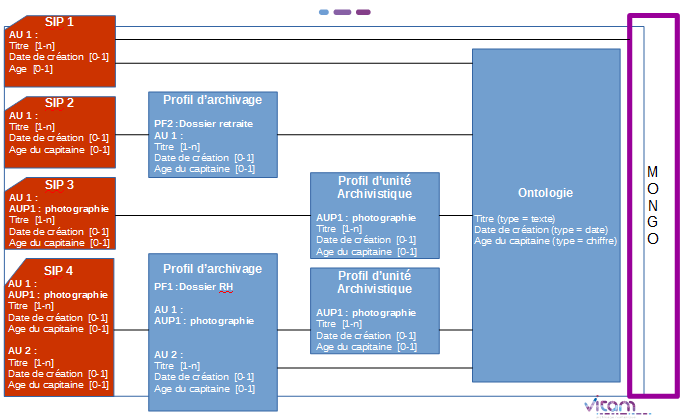
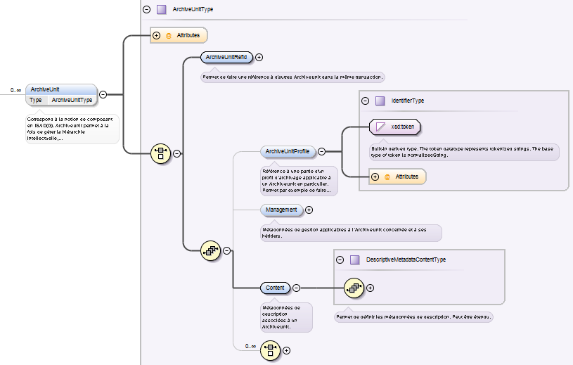
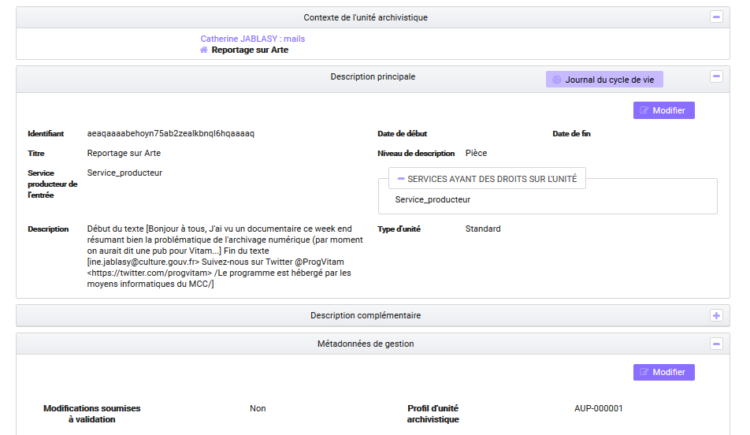
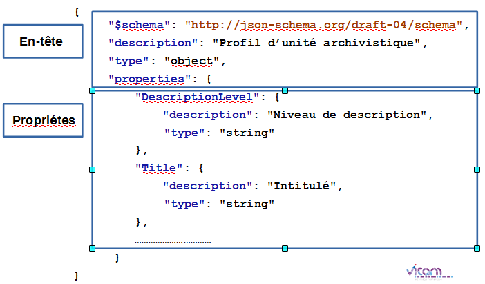
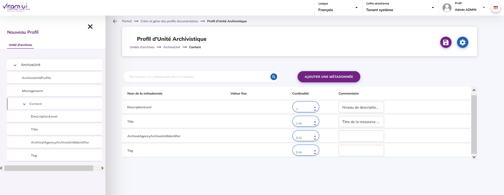
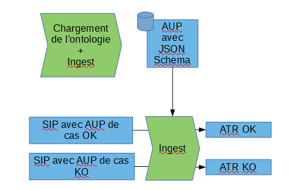
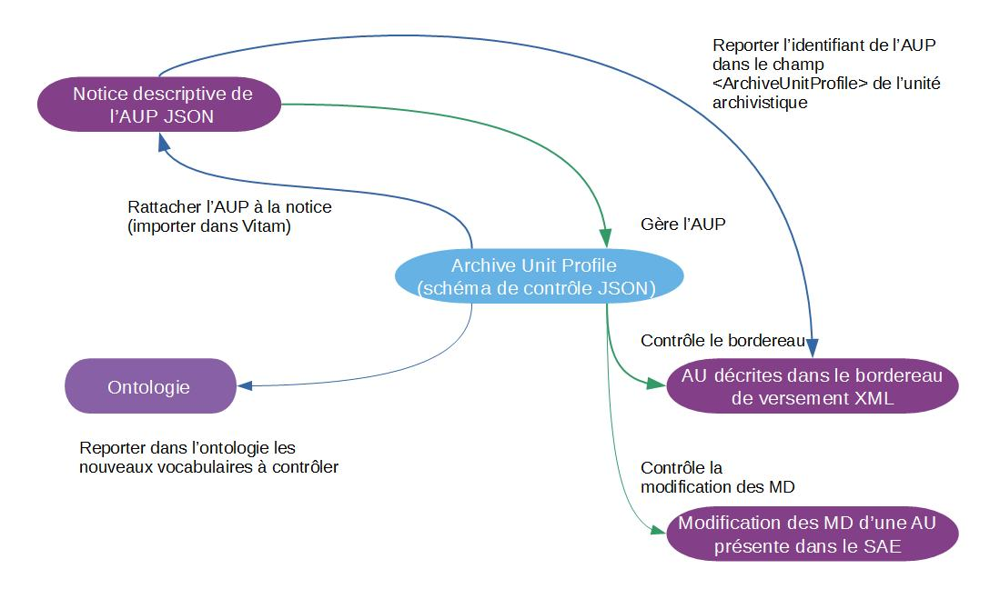

Profils d'unité archivistique
====

Introduction
----

### Documents de référence

|Document |Date de la version|Remarques|
|:---------------:|:-----:|:-----:|
|NF Z 44022 – MEDONA – Modélisation des données pour l’archivage|18/01/2014||
|Standard d’échange de données pour l’archivage – SEDA – v. 2.1|06/2018||
|Standard d’échange de données pour l’archivage – SEDA – v. 2.2|02/2022|Cette nouvelle version du SEDA est intégrée  à la solution logicielle Vitam à partir de la V6.RC.|
|[Vitam – Structuration des Submission Information Package (SIP)](./SIP.md)|||
|[Vitam – Ontologie](./ontologie.md)||Ce document doit être lu en préalable au présent document.|
|[Vitam – Profils d’archivage](./profil_archivage.md)||Ce document doit être lu dans les cas où, en phase d’analyse, on souhaite évaluer quel est le meilleur type de profil à utiliser.|

### Présentation du document
Le document présente les fonctionnalités associées à la prise en compte de la notion de profil d’unité archivistique dans la solution logicielle Vitam.

Il s’articule autour des axes suivants :
- une présentation de la notion de profil d’unité archivistique ;
- une présentation de la manière dont la solution logicielle Vitam et le Standard d’échanges de données pour l’archivage (SEDA) la formalisent ;
- une présentation des mécanismes mis en œuvre dans la solution logicielle Vitam pour prendre en compte cette notion, en application du SEDA ;
- une présentation des modalités de création d’un profil d’unité archivistique et de son schéma de contrôle ;
- des recommandations aux utilisateurs de la solution logicielle Vitam sur l’élaboration d’un profil d’unité archivistique ;
- quelques conseils complémentaires de mise en œuvre.

Le présent document décrit les fonctionnalités qui sont offertes par la solution logicielle Vitam au terme de la version 7.0 (octobre 2023) :  : il comprend particulièrement la présentation des fonctionnalités offertes par le projet PASTIS (Profil d’Archivage Simple pour le Traitement de l’Information en SEDA) intégré à l’IHM Vitam UI par l’APP Profils documentaires et également accessible par un exécutable. Il a vocation à être amendé, complété et enrichi au fur et à mesure de la réalisation de la solution logicielle Vitam et des retours et commentaires formulés par les ministères porteurs et les partenaires du programme.

Présentation de la notion de profil d’unité archivistique
----

### Qu’est-ce qu’un profil d’unité archivistique ?

Le profil d’unité archivistique permet de définir la syntaxe, la sémantique et les règles de gestion applicables à une unité archivistique. Il constitue une déclinaison du modèle de description propre au Standard d’échanges de données pour l’archivage (SEDA) à l’échelle d’une unité archivistique.
En d’autres termes, pour une unité archivistique, il précise :
-  les éléments de description (ou vocabulaires) attendus, ainsi que leur cardinalité,
-  le cas échéant, les valeurs requises,
-  les règles de gestion qui lui sont associées.

*Exemple :* le profil d’unité archivistique « photographie » précise qu’une unité archivistique présente dans un SIP et déclarant ce profil devra contenir au moins un titre, le cas échéant une date de création et un âge. Ce profil d’unité archivistique peut lui-même être déclaré dans un profil d’archivage.



À titre d’exemple, un bordereau de transfert conforme au SEDA et non associé à un profil d’archivage ou à des profils d’unité archivistique n’aura ses métadonnées contrôlées que par rapport au schéma par défaut associé au SEDA et pourra présenter une grande hétérogénéité de description, même pour une même catégorie d’archives (ex : photographies numériques, dossiers de subventions, comptes rendus de réunion, etc.).  
En revanche, un bordereau de transfert pour lequel des profils d’unité archivistique auront été définis disposera d’unités archivistiques dont la description sera homogène et propre à un type d’archives ou à une typologie documentaire en particulier, par exemple : des photographies numériques.  
Le profil d’unité archivistique est spécifique à une unité archivistique, contrairement au profil d’archivage qui impose une structuration à l’ensemble des unités archivistiques présentes dans un bordereau de transfert.  
Il peut également être utilisé dans un profil d’archivage pour spécifier des types particuliers d’unité archivistique, en plus du contrôle effectué par le profil d’archivage.  
Il accompagne l’unité archivistique tout au long de sa prise en charge par le système d’archivage électronique en permettant de contrôler ses métadonnées aussi bien à l’entrée que lors de toute modification. Le profil d’archivage n’est utilisable qu’en entrée, tandis que le profil d’unité archivistique est utilisable en entrée et en accès.  

### Pourquoi élaborer un profil d’unité archivistique ?

Comme pour un profil d’archivage, définir un profil d’unité archivistique permet de :
-  faciliter, voire automatiser, les contrôles sur les transferts d'archives (à l’échelle des unités archivistiques) d’un service producteur à un service d'archives, depuis un service externe vers la solution logicielle Vitam ;
-  effectuer un contrôle supplémentaire sur les transferts reçus et leur contenu, s’ajoutant à l’ensemble des tâches visant à s’assurer de la conformité des données reçues par rapport à celles qui ont été transférées. Toutes ces actions sont gages de qualité des données, au moment de leur réception dans un système d’archivage électronique ;
-  définir la sémantique et la syntaxe attendue pour des unités archivistiques à transférer, permettant ainsi une meilleure connaissance de celles-ci et la rédaction de spécifications sur les lots à exporter à fournir à un prestataire externe (tiers-archiveur, éditeur de solutions logicielles, etc.) ;
-  imposer un modèle de description identique sur une typologie particulière d’archives, produites dans différents contextes ;
-  faciliter la recherche d’unités archivistiques, voire spécifier un filtre de recherche propre à un profil d’unité archivistique en particulier.

Contrairement au profil d’archivage, les profils d’unité archivistique accompagnent les unités archivistiques tout au long de leur prise en charge dans la solution logicielle Vitam et permettent de contrôler les données, leur sémantique et leur syntaxe, lors d’une éventuelle mise à jour des unités archivistiques ou de leurs règles de gestion associées.

### Quand et comment élaborer un profil d’unité archivistique ?

L’élaboration d’un profil d’unité archivistique précède l’ouverture d’un transfert à destination d’un système d’archivage électronique.

Elle peut être envisagée dans les cas suivants :
-  transferts de flux applicatifs, afin de les automatiser ;
-  transferts de dossiers ou de documents dits « sériels », obéissant strictement à des règles de nommage et de description uniformes (par exemple, des images numérisées par un service d’archives) ;
-  transferts réguliers et récurrents d’un même type d’archives par différents services producteurs et donc volonté de disposer d’une description homogène, y compris pour faciliter les recherches sur celles-ci.

Dans ces cas-là, son utilisation peut entrer en concurrence avec celle d’un profil d’archivage.

En revanche, contrairement au profil d’archivage, qui requiert de connaître la hiérarchie des données et leur structuration, un profil d’unité archivistique peut être utilisé pour des types ou catégories d’archives dont la structuration précise ne peut être définie par défaut (absence de connaissance a priori du nombre de niveaux dans l’arborescence) et qui sont :
-  des documents bureautiques, pris isolément,
-  des documents structurés et décrits de manière non uniforme (par exemple, des boîtes mail).

Un profil d’unité archivistique peut s’utiliser indifféremment dans différents contextes. Par exemple, un profil détaillant un modèle d’« acte de naissance » peut être utilisé pour un transfert d’archives d’un SIRH, mais également d’une application de demande de retraite. Il peut alors répondre à un besoin plus transverse de contrôle et de gestion des données dans la solution logicielle Vitam.

La rédaction d’un profil d’unité archivistique, en fonction de l’usage que l’on souhaite en faire, suppose un travail préparatoire, adapté à chaque lot ou catégorie d’archives concerné (identification des documents à transférer en tenant compte des calendriers de conservation ou des circulaires de tri existants, détermination des métadonnées utiles à la recherche, structuration de l'information dans chaque transfert, etc.).

Elle résulte d’un travail entre les différents acteurs définis dans le Standard d’échange de données pour l’archivage (SEDA), à savoir :
-  le service d’archives (administrateurs fonctionnels et techniques du système d’archivage électronique, archivistes en charge de la collecte),
-  le service producteur (responsables de l’administration fonctionnelle et technique de l’application concernée quand il s’agit de l’archivage d’une application),
-  le service de contrôle quand il existe.

## Formalisation des profils d’unité archivistique

### Dans un fichier propre

Les profils d’unité archivistique prennent la forme de fichiers au format JSON[^1]. En termes de syntaxe et de grammaire, ils correspondent plus exactement à des schémas de contrôle, permettant de valider des contenus exprimés au format JSON, qui est le format de structuration des données utilisé dans la solution logicielle Vitam[^2].

Ces profils d’unité archivistique doivent se conformer :
-  aux règles émises par le Standard d’échange de données pour l’archivage (SEDA). Ainsi, ils peuvent :
  - émettre des règles plus strictes que celles du SEDA (ex. : rendre unique un titre, alors que le standard rend possible sa répétabilité), mais pas des règles moins strictes (ex : rendre répétable le niveau de description alors qu’il est unique dans le SEDA) ;
  - rendre obligatoire l’utilisation de certains éléments et/ou valeurs. Il peut s’agir de :
    - métadonnées descriptives,
    - métadonnées de contrôle et de gestion (profil d’unité archivistique et règles de gestion) ;
-  aux vocabulaires définis dans l’ontologie[^3]. Ils doivent en effet définir des éléments et types compatibles avec ceux référencés dans l’ontologie[^4].

### Dans le Standard d’échange de données pour l’archivage (SEDA)

La manière de déclarer un profil d’unité archivistique est définie dans le Standard d’échanges de données pour l’archivage (SEDA).  
Le SEDA offre la possibilité de déclarer un profil d’unité archivistique dans un bordereau de transfert, au moment de la demande de transfert à un service d’archives (message ArchiveTransfer, bloc DataObjectPackage) dans les blocs ArchiveUnit pour chaque unité archivistique qui le nécessite.  
Dans le sous-bloc ArchiveUnitProfile est indiqué l’identifiant du profil d’unité archivistique correspondant à l’unité archivistique que l’on souhaite contrôler, tel qu’il figure dans le référentiel des profils d’unité archivistique (dit des documents-type) de la solution logicielle Vitam. Cet identifiant renvoie au référentiel des profils d’unité archivistique et correspond à l’identifiant de la notice détaillée du profil d’unité archivage qui doit être associée à une unité archivistique[^5].

Le schéma ci-dessous montre la structuration des informations pour une unité archivistique :



## Mécanismes mis en œuvre dans la solution logicielle Vitam

La solution logicielle Vitam offre à un service d’archives ou à un service externe plusieurs fonctionnalités lui permettant de mettre en œuvre des profils d’unité archivistique :
-  l’administration d’un référentiel des profils d’unité archivistique ;
-  en entrée du système, une vérification que les unités archivistiques présentes dans le SIP et déclarant un profil d’unité archivistique sont conformes à celui-ci ;
-  lors de la mise à jour des unités archivistiques, la déclaration a posteriori d’un profil d’unité archivistique et la vérification que les unités archivistiques modifiées et déclarant un profil d’unité archivistique restent conformes à celui-ci.

### Administration d’un référentiel des profils d’unité archivistique

La solution logicielle Vitam intègre un référentiel des profils d’unité archivistique, administrable par un utilisateur doté des droits adéquats (administrateur fonctionnel et/ou technique) et géré dans une collection particulière[^6].

Ce référentiel est propre à chaque tenant de la solution logicielle Vitam. Il se compose de notices descriptives au format JSON, qui incluent nativement un schéma de contrôle au format JSON ou auxquelles il est possible d’associer a posteriori un schéma.

Il est possible de réaliser les opérations présentées ci-dessous.

#### Import de la notice descriptive du profil d’unité archivistique

##### Dans un fichier JSON

Il est possible d’importer 1 à n notice(s) descriptive(s) de profil(s) d’unité archivage sous la forme d’un fichier JSON depuis les API ou l’IHM standard fournies avec la solution logicielle Vitam.  
L’APP « Profils documentaires » accessible depuis l’IHM VitamUI permet quant à elle de créer une notice depuis ses interfaces.

*Exemple :* notice descriptive de profil d’archivage contenant uniquement les informations obligatoires pour être importée avec succès.
```json
[
	{
		"Name":"ProfilJSON_mail",
		"ControlSchema": "{}"
	}
]
```

Une notice de profil d’archivage doit obligatoirement comporter les informations suivantes :
-  identifiant signifiant (Identifier). Ce champ est obligatoire seulement s’il est généré par l’application à l’origine de sa création. Si cet identifiant est généré par la solution logicielle Vitam, il n’est pas nécessaire de le renseigner dans le fichier JSON ;
-  nom de la notice (Name) ;
-  schéma de contrôle, destiné à contenir le profil d’unité archivistique. Ce champ peut être vide lors de l’import du fichier JSON.

D’autres informations, facultatives, peuvent venir compléter ces informations. Elles sont détaillées dans la section suivante du présent document.

Il s’agit d’une opération d’administration (« MASTERDATA »), tracée dans le journal des opérations du tenant sur lequel a eu lieu l’opération[^7].

Lors de cet import, l’opération peut aboutir aux statuts suivants :

|Statut|Motifs|
|:---|:---|
|Succès|Opération réalisée sans rencontrer de problèmes particuliers.|
|Échec[^8]|Sans journalisation :<br>- import d’un référentiel sous la forme d’un fichier qui n’est pas au format JSON ;<br>- import d’un référentiel sous la forme d’un fichier qui n’est pas correctement formaté au format JSON ;<br>- import d’un référentiel dont au moins un des champs contient une injection HTML ;<br>- import d’une notice de profil d’unité archivistique dans laquelle le statut n’est pas renseigné ou est mal renseigné.|
||Avec journalisation :<br>- import d’une notice de profil d’unité archivistique dont l’identifiant existe déjà dans le système sur un tenant en mode « esclave » ;<br>- import d’un fichier JSON dans lequel une notice de profil d’unité archivistique ne déclare pas d’identifiant[^9], d’intitulé, de schéma de contrôle[^10] ;<br>- import d’une notice de profil d’unité archivistique dans laquelle un champ ne contient pas de valeur. Il peut s’agir des champs : Identifier[^11], Name ;<br>- import d’une notice de profil d’unité archivistique contenant un schéma de contrôle détaillé, déclarant en particulier un vocabulaire externe non référencé dans l’ontologie ;<br>- import d’une notice de profil d’unité archivistique contenant un schéma de contrôle détaillé, non conforme par rapport au format JSON attendu pour un schéma de contrôle ;<br>- import d’une notice de profil d’unité archivistique dans laquelle une valeur ne correspond pas au type d’indexation du champ défini dans l’ontologie (ex : valeur textuelle dans un champ de type « DATE »).|

**Points d’attention :**
-  Il est possible d’importer en une seule fois un référentiel complet, comprenant plusieurs notices décrivant chacune un profil d’unité archivistique. La solution logicielle Vitam ne comptabilisera qu’une seule opération, et ne prendra pas en compte dans le journal des opérations la création unitaire des différents items compris dans le référentiel importé. Afin d’optimiser la traçabilité de la création des différentes notices, il est recommandé de créer ces dernières une par une.
-  La solution logicielle Vitam permet d’importer une notice détaillée avec un schéma de contrôle déjà détaillé ou vide de tout contenu[^12]. Dans ce dernier cas, l’import d’une notice ne suffit pas pour utiliser un profil d’unité archivistique dans la solution logicielle Vitam. Il est nécessaire, après cette opération, d’ajouter le schéma de contrôle correspondant au profil d’unité archivistique lui-même et de l’associer à la notice qui le référence, afin qu’il soit pris en compte dans la solution logicielle Vitam[^13].
-  S’il est généré par une application externe, l’identifiant de la notice ne doit comprendre ni caractère accentué, ni virgule, ni apostrophe, ni parenthèse, ni espace, ni slash, ni élément de ponctuation, ou tout autre caractère spécial. Ne sont recommandés que l’underscore et le tiret comme séparateurs.

##### Dans la solution logicielle Vitam

Les notices de profil d’archivage sont enregistrées dans la base de données MongoDB, dans la collection « ArchiveUnitProfile », sous la forme d’enregistrements au format JSON.
Cette notice descriptive comprend les informations suivantes pour un profil d’unité archivistique donné :

|Champ|Description|
|:---|:---|
|_id|identifiant système unique de la notice correspondant à un GUID attribué automatiquement par la solution logicielle Vitam (champ obligatoire)|
|Identifier|identifiant de la notice qui peut être attribué au profil d’unité archivistique, généré automatiquement par la solution logicielle Vitam ou par l’application à l’origine de sa création (champ obligatoire)[^14].<br>S’il est généré par la solution logicielle Vitam, cet identifiant se compose du préfixe AUP, suivi d’un tiret et d’une suite de 6 chiffres incrémentés automatiquement.<br>S’il est généré par une application externe, l’identifiant de la notice ne doit comprendre ni caractère accentué, ni virgule, ni apostrophe, ni parenthèse, ni espace, ni slash, ni élément de ponctuation, ou tout autre caractère spécial. Ne sont recommandés que l’underscore et le tiret comme séparateurs.|
|Name|nom du profil d’unité archivistique, qui doit être obligatoirement renseigné dans la solution logicielle Vitam (champ obligatoire)|
|Description|description du profil d’unité archivistique, obligatoire (champ facultatif)|
|Status|statut « ACTIVE » pour « actif » ou « INACTIVE » pour inactif (champ obligatoire).
Si la notice importée ne contient pas de statut, la solution logicielle Vitam enregistre par défaut la valeur « INACTIVE »|
|ControlSchema|schéma de contrôle, obligatoire, mais pouvant être vide<br>-  il est destiné à contenir l’ensemble des éléments qui feront l’objet d’un contrôle en entrée ou en mise à jour<br>-  les éléments (ou propriétés) qu’il définit doivent se conformer aux vocabulaires définis dans l’ontologie, que ce soit en termes de nommage ou de typage|
|CreationDate|date de création de la notice descriptive du profil d’unité archivistique, fournie par la solution logicielle Vitam (champ obligatoire)|
|LastUpdate|dernière date de modification de la notice descriptive du profil d’unité archivistique, fournie par la solution logicielle Vitam (champ obligatoire)|
|ActivationDate|si la notice descriptive du profil d’unité archivistique est active, date d’activation du profil (champ facultatif)|
|DeactivationDate|si la notice descriptive du profil d’unité archivistique est inactive, date de désactivation du profil (champ facultatif)|
|_tenant|tenant dans lequel le profil d’unité archivistique s’applique, fourni par la solution logicielle Vitam (champ obligatoire)|
|_v|version du profil d’unité archivistique, fournie par la solution logicielle Vitam (champ obligatoire)|
|Fields|liste des vocabulaires de l’ontologie référencés dans le schéma de contrôle, générée par la solution logicielle Vitam quand le schéma de contrôle contient des informations à contrôler (champ facultatif)|

#### Ajout du profil d’unité archivistique lui-même

À chaque notice descriptive, il est possible d’associer un seul profil d’unité archivistique ou schéma de contrôle.
-  Dès son import, la notice détaillée peut inclure un schéma de contrôle détaillé, dans la mesure où tous deux sont au format JSON. Il s’agit d’une opération d’import (opération d’administration de type « MASTERDATA »).
-  Néanmoins, la notice peut être importée sans schéma détaillé. Il est alors possible, a posteriori, de lui adjoindre ce schéma de contrôle et de vérifier sa validité par rapport au format JSON. Il s’agit alors d’une opération de mise à jour (opération d’administration de type « MASTERDATA »).

Cet ajout peut s’effectuer depuis les API ou l’IHM standard fournies avec la solution logicielle Vitam. L’APP « Profils documentaires » accessible depuis l’IHM VitamUI permet quant à elle d’importer un profil d’unité archivistique, intégré dans une notice depuis son poste ou de le créer depuis ses interfaces.

L’ajout d’un schéma de contrôle dans la collection est un des prérequis indispensable pour pouvoir réaliser des contrôles entre un profil d’unité archivistique et des unités archivistiques présentes dans des bordereaux de transfert au moment de leur transfert dans la solution logicielle Vitam ou déjà prises en charge dans la solution logicielle Vitam et en cours de modification.

Lors de cette opération, la solution logicielle Vitam vérifie que les vocabulaires déclarés dans le schéma de contrôle existent dans l’ontologie.

**Point d’attention :** la solution logicielle ne vérifie pas que, si des types sont associés aux vocabulaires dans le schéma, ces types correspondent au type de chacun de ces vocabulaires dans l’ontologie[^15].

Cette action provoque la création d’une nouvelle version de la notice modifiée. Elle fait l’objet d’une journalisation dans le journal des opérations du tenant sur lequel a eu lieu l’opération (opération d’administration de type « MASTERDATA »)[^16].

L’import ou la mise à jour d’un profil d’unité archivistique peut échouer pour les motifs suivants :
-  le schéma de contrôle est invalide, c’est-dire qu’il n’est pas conforme au format attendu pour un schéma JSON. À noter que la solution logicielle Vitam ne vérifie pas si le schéma de contrôle est cohérent :
  - d’un point de vue métier. Par exemple, on peut rendre obligatoire un élément qui n’est pas défini dans les propriétés d’un même schéma ou imposer des cardinalités telles que 10 – 5. La solution logicielle Vitam enregistrera le schéma de contrôle en l’état.
  - par rapport au SEDA. Par exemple, la solution logicielle Vitam enregistrera le schéma de contrôle sans contrôler si ce dernier respecte les cardinalités imposées par le SEDA.
-  le schéma de contrôle contient un vocabulaire inconnu de l’ontologie[^17].

#### Modification de la notice descriptive d’un profil d’unité archivistique

La modification des champs des notices décrivant les profils d’unité archivistique est possible au moyen :
-  des API,
-  de l’IHM standard fournies avec la solution logicielle Vitam,
-  de l’APP « Profils documentaires » accessible depuis l’IHM VitamUI.
Les champs modifiables sont :
-  le nom du profil d’unité archivistique (Name) ;
-  la description du profil d’unité archivistique (Description) ;
-  le statut « Actif » ou « Inactif », correspondant aux valeurs « ACTIVE » et « INACTIVE » dans le système (Status) ;
-  le schéma de contrôle (ControlSchema).

**Points d’attention :**
-  le statut de la notice descriptive doit être « Actif » (« ACTIVE ») pour pouvoir procéder à des transferts de SIP comprenant des unités archivistiques devant se conformer à un profil d’unité archivistique ;
-  la solution logicielle Vitam permet de modifier le  schéma de contrôle associée à la notice descriptive, tant que cette dernière n’est pas utilisée par une unité archivistique en entrée ou déjà transférée dans la solution logicielle Vitam. S’il l’est, il n’est plus possible de le modifier[^18]. En revanche, il est toujours possible de mettre à jour l’intitulé, la description ou le statut de la notice descriptive.

Cette action provoque la création d’une nouvelle version de la notice modifiée. Les différentes versions du référentiel font l’objet d’une sauvegarde sur les offres de stockage utilisées par la solution logicielle Vitam.
Elle fait l’objet d’une journalisation dans le journal des opérations du tenant sur lequel a eu lieu l’opération (opération d’administration de type « MASTERDATA »)[^19].

Lors de cette mise à jour, l’opération peut aboutir aux statuts suivants :

|Statut|Motifs|
|:---|:---|
|Succès|Opération réalisée sans rencontrer de problèmes particuliers.|
|Échec[^20]|Sans journalisation :<br>– mise à jour qui n’est pas correctement formatée au format JSON ;<br>– mise à jour d’une notice dont au moins un des champs contient une injection HTML ;<br>– mise à jour d’une notice de profil d’unité archivistique dans laquelle le statut n’est pas renseigné ou est mal renseigné.|
||Avec journalisation :<br>– modification de l’identifiant par un identifiant existant déjà dans le système sur un tenant en mode « esclave » ;<br>– suppression d’un champ obligatoire. Il peut s’agir des champs suivants : identifiant, d’intitulé, schéma de contrôle[^21] ;<br>– suppression d’un champ dont la valeur est obligatoire. Il peut s’agir des champs : Identifier, Name ;<br>– ajout d’un schéma de contrôle détaillé, déclarant en particulier un vocabulaire externe non référencé dans l’ontologie ;<br>– ajout d’un schéma de contrôle détaillé non conforme par rapport au format JSON attendu pour un schéma de contrôle ou contenant des champs erronés ;<br>– modification du schéma de contrôle contenu dans une notice de profil d’unité archivistique, alors que celle-ci est déclarée dans au moins une unité archivistique ;<br>- mise à jour d’un champ d’une notice de profil d’unité archivistique par  une valeur ne correspondant pas au type d’indexation attendu pour ce champ dans l’ontologie (ex : valeur textuelle dans un champ de type « DATE »).|

#### Activation / désactivation d’un profil d’unité archivistique

La solution logicielle Vitam permet de rendre active ou inactive une notice détaillant un profil d’unité archivistique.

Cette action est possible depuis :
-  les API,
-  l’APP « Profils documentaires » accessible depuis l’IHM VitamUI.
En fonction du statut, seront autorisés ou non :
-  le transfert de SIP dont au moins une unité archivistique déclare un profil d’unité archivistique ;
-  la modification d’une unité archivistique déclarant un profil d’unité archivistique.

||Catégorie d’opération|Profil d’unité archivistique|Schéma de contrôle|Résultat|
|:---:|:----|:----:|:---:|:---|
|CAS 1|Transfert|ACTIF|vide|Transfert de SIP dans le système non autorisé.|
|CAS 2|Transfert|ACTIF|renseigné|Transfert de SIP dans le système autorisé.|
|CAS 3|Transfert|INACTIF|vide|Transfert de SIP dans le système non autorisé.|
|CAS 4|Transfert|INACTIF|renseigné|Transfert de SIP dans le système non autorisé.|
|CAS 5|Modification|ACTIF|vide|Modification d’unité archivistique non autorisée.|
|CAS 6|Modification|ACTIF|renseigné|Modification d’unité archivistique autorisée.|
|CAS 7|Modification|INACTIF|vide|Modification d’unité archivistique non autorisée.|
|CAS 8|Modification|INACTIF|renseigné|Modification d’unité archivistique non autorisée.|

La modification du statut engendre la mise à jour des champs :
-  date de mise à jour ;
-  date d'activation OU date de désactivation.

La date d’activation correspond à la date à laquelle la notice et, par conséquent, le profil d’unité archivistique sont rendus actifs. Il peut s’agir de :
-  sa date d’import, si elle a un statut « Actif » au moment de son import ;
-  la date correspondant à l’action d’activation, si celle-ci est postérieure à l’import de la notice dans la solution logicielle Vitam.

La date de désactivation correspond à la date à laquelle la notice et par conséquent le profil d’unité archivistique sont rendus inactifs. Il peut s’agir de :
-  sa date d’import, si elle a un statut « Inactif » ou non renseigné au moment de son import ;
-  la date correspondant à l’action de désactivation, si celle-ci est postérieure à l’import de la notice dans la solution logicielle Vitam.

#### Audit d’intégrité du référentiel

La solution logicielle Vitam permet de réaliser un audit sur le référentiel des profils d’unité archivistique. Cet audit se lance depuis un tenant donné et vérifie que les profils d’unité archivistique déclarés dans la base de données sont bien stockés dans les offres de stockage[^22].

Il s’agit d’un acte technique. Il donne lieu à un log et non pas à une opération journalisée.
À l’issue de l’audit, le log peut aboutir aux statuts suivants :

|Statut|Motifs|
|:---|:---|
|Succès|opération réalisée sans rencontrer de problèmes particuliers.|
|Avertissement|opération réalisée, présentant une incohérence, notammant :<br>- quand un fichier est absent sur au moins une des offres,<br>- quand l'empreinte n'est pas conforme sur une des offres,<br>- quand un fichier (avec la même empreinte qu'en base) présent sur au moins une des offres à été recopié sur les offres,<br>- quand au moins un fichier est manquant ou son empreinte est différente.|
|Échec|Au moins un profil d’unité archivistique est incohérent entre la base de données MongoDB et toutes les offres de stockage.|
   
### Processus d’entrée

Dans le cadre du processus d’entrée d’un ensemble d’archives, suite à la réception d’un message ArchiveTransfer du SEDA, parmi les tâches et traitements internes qu’elle effectue, la solution logicielle Vitam vérifie que les unités archivistiques déclarant un profil d’unité archivistique sont conformes à ce dernier.

Ce contrôle s’effectue lors du processus de contrôle et traitements des unités archivistiques
-  après la vérification de la conformité du type des vocabulaires présents dans les unités archivistiques présentes dans le bordereau de transfert par rapport à leur type d’indexation dans l’ontologie,
-  avant les vérifications portant sur les règles de classification et de gestion.

Lors de cette étape de vérification de la conformité entre le profil d’unité archivistique déclaré dans au moins une unité archivistique présente dans le bordereau de transfert et cette dernière :
-  si l’unité archivistique est conforme à son profil d’unité archivistique, si elle correspond au modèle de données défini dans le profil d’unité archivistique, la tâche de vérification aura un statut « OK » et la solution logicielle Vitam passera à la tâche suivante, de vérification du niveau de classification ;
-  si au moins une unité archivistique n’est pas conforme à son profil d’unité archivistique pour les raisons suivantes :
  - elle ne correspond pas au profil d’unité archivistique qu’elle déclare,
  - le profil d’unité archivistique déclaré est inconnu,
  - le profil d’unité archivistique déclaré est inactif,
  - la notice descriptive du profil d’unité archivistique est active, mais son schéma de contrôle est vide,

	-> alors le transfert du SIP échouera à la tâche de vérification de conformité aux profils d’unité archivistique, passera à la tâche suivante, mais n’aboutira pas. Un message de réponse (ArchiveTransferReply ou ATR) indiquera que le transfert a échoué à la tâche de vérification de la conformité au profil d’unité archivistique et précisera la première erreur rencontrée dans le détail de l’événement (EventDetailData)[^23].

*Exemple :* message d’erreur sur la tâche de contrôle de conformité au profil d’unité archivistique.
```xml
<ArchiveUnit id="ID3">
                <Management>
                    <LogBook>
                        <Event>
                            <EventTypeCode>LFC.CHECK_ARCHIVE_UNIT_PROFILE</EventTypeCode>
                            <EventType>Vérification de la conformité aux profils d’unité archivistique</EventType>
                            <EventDateTime>2018-04-27T10:37:30.404</EventDateTime>
                            <Outcome>KO</Outcome>
                            <OutcomeDetail>LFC.CHECK_ARCHIVE_UNIT_PROFILE.KO</OutcomeDetail>
                            <OutcomeDetailMessage>Échec de la vérification de la conformité aux
                                profils d’unité archivistique</OutcomeDetailMessage>
                            <EventDetailData>{"ArchiveUnit":"ID3","ArchiveUnitProfile":"AUP-220001","evDetTechData":"Archive Unit Profile not
                                found"}</EventDetailData>
                        </Event>
                    </LogBook>
                </Management>
                <Content>
                    <SystemId>aeaqaaaabehc7dlhabspualda2w5tlyaaaba</SystemId>
                </Content>
            </ArchiveUnit>
```

**Point d’attention :** le profil d’unité archivistique ne sert pas à générer automatiquement le contenu d’une unité archivistique le déclarant lors de son transfert dans la solution logicielle Vitam. Il n’est utilisé que pour effectuer des contrôles de conformité de l’unité archivistique par rapport à ses attentes. De facto, l’unité archivistique présente dans un bordereau de transfert, associée à un profil d’unité archivistique, doit avoir été conçue, en amont du transfert, conformément aux attentes du profil d’unité archivistique.

### Accès

#### Consultation des unités archivistiques déclarant un profil d’unité archivistique

Par défaut, lorsque l’utilisateur demande à accéder au détail d’une unité archivistique, la solution logicielle Vitam retourne l’identifiant du profil d’unité archivistique associé à celle-ci.

*Exemple :* Détail d’une unité archivistique intitulée « Reportage sur Arte », associée à un profil d’unité archivistique dont l’identifiant est « AUP-000001 ».



#### Mise à jour des unités archivistiques

##### Modification d’un profil d’unité archivistique déclaré dans une unité archivistique

En mise à jour, la solution logicielle Vitam permet :
-  d’ajouter un profil d’unité archivistique à une unité archivistique préalablement transférée dans le système sans profil d’unité archivistique associé ;
-  de remplacer un profil d’unité archivistique associé à une unité archivistique par un autre ;
-  d’ôter un profil d’unité archivistique associé à une unité archivistique.
Cette opération de mise à jour n’est possible qu’aux conditions suivantes :
-  l’unité archivistique doit être conforme au profil d’unité archivistique à laquelle on souhaite l’associer ;
-  le profil d’unité archivistique doit être actif et disposer d’un schéma de contrôle détaillé.

Si l’une de ces conditions n’est pas présente, la modification n’aura pas lieu.
Cette opération fait l’objet d’un enregistrement dans le journal des opérations en tant qu’opération de mise à jour des règles de gestion.

**Point d’attention :** le profil d’unité archivistique ne sert pas à générer automatiquement le contenu d’une unité archivistique le déclarant lors d’une mise à jour dans la solution logicielle Vitam. Il n’est utilisé que pour effectuer des contrôles de conformité de l’unité archivistique par rapport à ses attentes. De facto, l’unité archivistique mise à jour, associée à un profil d’unité archivistique, doit avoir être conforme aux attentes du profil d’unité archivistique.

##### Droits sur la modification d’un profil d’unité archivistique déclaré dans une unité archivistique

Le droit de mise à jour d’un profil d’unité archivistique est paramétrable dans le contrat d’accès via la possibilité de restreindre les droits d’écriture :
-  si la valeur du champ « WritingRestrictedDesc » est égale à « true », le détenteur du contrat ne peut pas effectuer des mises à jour sur le profil d’unité archivistique déclaré dans une unité archivistique ;
-  si sa valeur est égale à « false » (valeur par défaut), le détenteur du contrat peut effectuer des mises à jour sur les métadonnées descriptives, ainsi que sur les métadonnées de gestion et de contrôle de métadonnées dont la mise à jour du profil d’unité archivistique déclaré dans une unité archivistique.

**Point d’attention :** Ce paramètre sert également à restreindre les droits d’écriture sur les règles de gestion. En d’autres termes, si on interdit la possibilité de mettre à jour un profil d’unité archivistique au moyen du contrat d’accès, on interdit en même temps la possibilité de mettre à jour les règles de gestion associées aux unités archivistiques.

##### Modification des métadonnées d’une unité archivistique déclarant un profil d’unité archivistique

La solution logicielle Vitam permet de modifier les métadonnées d’une unité archivistique déclarant un profil d’unité archivistique, à condition que :
-  l’unité archivistique reste conforme au profil d’unité archivistique qu’elle déclare,
-  le profil d’unité archivistique soit actif et dispose d’un schéma de contrôle détaillé.
Il s’agit d’une opération de mise à jour, faisant l’objet d’une journalisation dans le journal des opérations.

Lors de cette opération, la solution logicielle Vitam effectue les vérifications suivantes :
-  vérification de l’association d’un profil d’unité archivistique à l’unité archivistique que l’on souhaite modifier ;
-  vérification de la conformité de l’unité archivistique par rapport au profil d’unité archivistique qu’elle déclare.

**Point d’attention :** le profil d’unité archivistique ne sert pas à générer automatiquement le contenu d’une unité archivistique le déclarant lors d’une mise à jour dans la solution logicielle Vitam. Il n’est utilisé que pour effectuer des contrôles de conformité de l’unité archivistique par rapport à ses attentes. De facto, l’unité archivistique mise à jour, associée à un profil d’unité archivistique, doit avoir être conforme aux attentes du profil d’unité archivistique.

## Étapes d’élaboration d’un profil d’unité archivistique et de son schéma de contrôle

### Phase d’analyse

#### Analyse des données

Définir un profil d’unité archivistique nécessite une analyse préalable des données à archiver, type de document par type de document. Il s’agit de connaître :
-  les types de documents rencontrés (ex : documents bureautiques, factures, mails, etc.) ;
-  les métadonnées associées à ces données, permettant de les identifier, de les gérer et de les retrouver après transfert dans le système d’archivage électronique (métadonnées de pérennisation, de représentation et de description au sens de la norme OAIS) ;
-  le contenu de données, à savoir la nature des données à archiver (catégorie ou typologie d’archives).

En prenant l’exemple d’un projet de dématérialisation d’archives, il est recommandé, lors de ce travail préparatoire, de se poser les questions suivantes[^24] :

|Etapes|Questions|
|:----|:----|
|Identifier le contexte|Quels sont les documents à archiver ? Pourquoi ? Existe-il un besoin légal ? La reprise de l’existant a-t-elle été prévue ?|
|Identifier les documents dématérialisés|Quelles sont les typologies concernées ? Quels sont les usages ? Les documents et données sont-ils nativement numériques ou ont-ils été numérisés ? Une impression papier est-elle prévue en fin de procédure ? De quelle(s) base(s) de données les données et documents sont-ils issus ? Quels sont les formats des documents ? Quelles sont les possibilités d’exports et le modèle des données ? Les documents ont-ils une valeur probante (ex. signature électronique) ?|
|Identifier les outils techniques|Dans le cadre d’une numérisation, s’agit-il d’une opération interne ? Le recours à un prestataire externe est-il prévu ? Une reprise du stock a-t-elle été envisagée ? L’application a-t-elle été développée en interne ? L’acquisition d’un logiciel est-elle prévue ? Quelles métadonnées ont été intégrées ? Quelles métadonnées peut-on extraire de l’application ? L’organisation a-t-elle recours à un tiers de télétransmission ? Un parapheur électronique est-il en place ? Les agents disposent-ils de la signature électronique ? Est-elle systématiquement utilisée ?|
|Stockage, archivage et sort final|Quelles sont les règles de gestion et plus particulièrement les règles de conservation et le sort final des documents ? Comment sont conservées les pièces dématérialisées ? Où ? Par qui (organisation, tiers archiveur)? Existe-t-il un système d’archivage électronique ? Un coffre-fort ? Des serveurs répliqués ? Un système de gestion électronique de documents ? Quelles sont les modalités d’accès ? La destruction est-elle possible ? Quelles sont les modalités ?|

À l’issue de cette première analyse, l’archiviste doit être en mesure d’avoir à sa disposition :
-  une liste des métadonnées liées à chaque type de document ;
-  les règles de gestion associées.
      
Le résultat de ce travail peut prendre la forme du tableau suivant :
|Type de document ou d’unité archivistique|Métadonnées|Contenu de données|
|:---:|:-----:|:----:|
||Informations de description (métadonnées) / Règles de gestion|Documents versés en pièces jointes (oui/non)|
| .. | ... / ... |...|

La liste des métadonnées peut prendre la forme du tableau suivant :
|Nom de la métadonnée dans le système d’origine|type|cardinalité|Valeurs imposées|Commentaires|À récupérer ?|
|:---:|:---:|:---:|:---:|:---:|:---:|
||Texte, Date, Chiffres, etc.|1-1, 0-1, 0-n|Ex : liste, valeur héritée.||OUI / NON|
|Age du capitaine|Numérique|0-1||Entier entre 0 et 150|OUI|

Il est nécessaire de bien évaluer les informations à retenir dans le profil d’unité archivistique, leur degré de précision (formes, valeurs, cardinalités), afin de faciliter les recherches et la gestion futures des données dans la solution logicielle Vitam.

#### Modélisation des données

À la suite de cette première analyse, il est nécessaire de se poser les questions suivantes :
-  Est-il utile de récupérer l’ensemble des métadonnées et de leur valeur dans un bordereau de transfert ?
-  Quelles sont les métadonnées qui sont systématiquement renseignées ?
-  Quelles sont les métadonnées qui pourraient faire l’objet d’une interrogation par le moteur de recherche de la solution logicielle Vitam ?
-  Quelles sont les métadonnées qu’il faudrait voir afficher dans une notice détaillant une unité archivistique ?
-  Quelles sont les métadonnées que l’on souhaite contrôler en entrée comme en accès ?

Les réponses à ces questions doivent orienter les choix de correspondance (ou mapping) entre les métadonnées initiales et le modèle de données du SEDA. La solution logicielle Vitam prenant en charge un bordereau de transfert conforme au SEDA, il est nécessaire de :
-  faire correspondre les métadonnées à prendre en charge avec celles du SEDA ;
-  le cas échéant, si aucune métadonnées proposée par le SEDA ne correspond au modèle initial, de créer une ou plusieurs métadonnée(s) supplémentaire(s) qu’il faudra ajouter dans l’ontologie.

Le résultat de ce travail peut prendre la forme du tableau suivant :
|Nom de la métadonnée dans une unité archivistique|type|cardinalité|Nom de la métadonnée dans le système d’origine|Valeurs imposées|Commentaires|
|:---:|:---:|:---:|:---:|:---:|:---:|
||Texte, Date, Chiffres, etc.|1-1, 0-1, 0-n|Métadonnées ou concaténation de plusieurs métadonnées|Ex : liste, valeur héritée.||
|Title|Texte|1-1|Nom + Prénom||Nom en majuscules|
|Description|Texte|0-1|Commentaires|||
|Age du capitaine|Numérique|0-1|AgeCapitaine||Entier entre 0 et 150<br>Métadonnée non référencée par le SEDA et à ajouter dans l’ontologie|

### Phase de réalisation

#### Réalisation d’un bordereau de transfert
Suite à ce travail préliminaire, il est recommandé de réaliser un bordereau de transfert contenant :
-  soit une unité archivistique conforme à la modélisation préalablement réalisée,
-  soit plusieurs unités archivistiques, chacune faisant état de différentes propositions de modélisation.
Cette étape peut être réalisée par un informaticien ou par un prestataire en charge de concevoir des exports.

Ce travail permet de :
-  confirmer le besoin exprimé à la suite de l’analyse des données et de leur modélisation,
-  vérifier la structuration des données, et, le cas échéant, de corriger l’unité archivistique, le profil d’unité archivistique, ainsi que les spécifications ;
-  vérifier la conformité au SEDA du bordereau de transfert, avant même de vérifier la conformité d’une de ses unités par rapport à un profil d’unité archivistique ;
-  aider à la rédaction du schéma de contrôle. En effet, il est recommandé de transférer ce bordereau dans une plate-forme de tests de la solution logicielle Vitam et de récupérer l’unité archivistique enregistrée au format JSON dans la base de données MongoDB au moyen d’une requête DSL.

#### Récupération de l’unité archivistique au format JSON

Avant de schématiser les données à contrôler et en vue de procéder à cette schématisation dans les meilleures conditions, il est recommandé de récupérer l’unité archivistique enregistrée au format JSON dans la base de données MongoDB au moyen d’une requête DSL.

Il s’agit de récupérer non pas l’ensemble des éléments retournés par l’API, mais une partie du résultat de la requête, à savoir les éléments contenus dans la commande « $results ». 

Parmi ces éléments, il ne faudra retenir en outre uniquement :
-  les éléments qui ne sont pas préfixés par un dièse qui n’ont pas vocation à faire l’objet d’un contrôle au moyen d’un profil d’unité archivistique. Ainsi, on retiendra « Title » ou « Description », mais pas « #id » et #tenant ;
-  s’il est présent, #management, seul élément précédé par un dièse que le profil d’unité archivistique supporte.
Exemple : résultat d’une requête DSL sur une unité archivistique intitulée « Gallieni ». Figurent en gras les éléments qu’on récupère pour schématiser les données.
```json
{
  "httpCode": 200,
  "$hits": {
    "total": 1,
    "offset": 0,
    "limit": 10000,
    "size": 1
  },
  "$results": [
    {
      "DescriptionLevel": "RecordGrp",
      "Title": "Gallieni",
      "Description": "Station Gambetta ligne 3 Paris",
      "StartDate": "2016-06-03T15:28:00",
      "EndDate": "2016-06-03T15:28:00",
      "#id": "aeaqaaaaaehnbfxgaavmgalom2npzbqaaaaq",
      "#tenant": 1,
      "#object": "aebaaaaaaehnbfxgaavmgalom2npzbaaaaaq",
      "#unitups": [
        "aeaqaaaaaehnbfxgaavmgalom2npzeiaaaba"
      ],
      "#min": 1,
      "#max": 3,
      "#allunitups": [
        "aeaqaaaaaehnbfxgaavmgalom2npzeiaaaca",
        "aeaqaaaaaehnbfxgaavmgalom2npzeiaaaba"
      ],
      "#management": {},
      "#unitType": "INGEST",
      "#operations": [
        "aeeaaaaaaghfcj4xaa3s6alom2npmgyaaaaq"
      ],
      "#opi": "aeeaaaaaaghfcj4xaa3s6alom2npmgyaaaaq",
      "#originating_agency": "producteur1",
      "#originating_agencies": [
        "producteur1"
      ],
      "#storage": {
        "offerIds": [
          "offer-fs-1.service.itrec.consul"
        ],
        "strategyId": "default",
        "#nbc": 1
      },
      "#version": 0,
      "#sedaVersion": "2.1",
      "#implementationVersion": "2.15.0"
    }
  ],
  "$facetResults": [],
  "$context": {
    "$roots": [
      "aeaqaaaaaehnbfxgaavmgalom2npzbqaaaaq"
    ],
    "$query": [],
    "$filter": {},
    "$projection": {},
    "$facets": []
  }
}
```

#### Schématisation des données à contrôler

Un schéma de contrôle peut être écrit à partir et au moyen de :
-  un éditeur acceptant le format JSON ;
-  l’outil Profil d’Archivage Simple pour le Traitement de l’Information en SEDA (PASTIS), utilisable sous forme d’exécutable ou d’APP intégrée aux interfaces de VitamUI (APP Profils documentaires).

##### Méthode de rédaction d’un schéma de contrôle au format JSON

Un schéma de contrôle peut être écrit à partir et au moyen d’un éditeur acceptant le format JSON.

Pour en rédiger un, il est conseillé de :
-  créer un fichier dans un outil de validation de schéma JSON (ex : Visual Studio Code, Oxygen) et de l’enregistrer en tant que fichier JSON ;
-  en parallèle, transférer le bordereau de transfert dans la solution logicielle Vitam et récupérer l’unité archivistique enregistrée au format JSON dans la base de données MongoDB au moyen d’une requête DSL, puis enregistrer le résultat de la réponse dans un fichier au format JSON ;
-  ouvrir cette unité archivistique dans l’outil de validation de schéma JSON et l’associer au schéma de contrôle.
-  rédiger au fur et à mesure le schéma de contrôle, en contrôlant sa validité par rapport à l’unité archivistique.

Cette méthode permet de vérifier directement la conformité du profil d’unité archivistique par rapport à une unité archivistique dès la phase de conception du schéma de contrôle.

*Structure d’un schéma de contrôle*
Un schéma de contrôle associé à un profil d’unité archivistique comprend deux parties[^25] :
-  une partie déclarative ou en-tête (obligatoire),
-  une partie listant les propriétés du schéma de contrôle (obligatoire), c’est-à-dire énumérant les éléments du SEDA ou de l’ontologie qui feront l’objet d’un contrôle[^26]. Le contenu de la liste est laissé à l’appréciation de chacun.
      Cette partie peut elle-même être décomposée en deux ou trois sous-parties :
  - contexte d’utilisation de l’unité archivistique,
  - règles de gestion à contrôler au moyen du profil d’unité archivistique (équivalent au contenu du bloc Management du SEDA),
  - énumération des métadonnées descriptives à contrôler (équivalent au contenu du bloc Content du SEDA).



Le schéma ci-dessous distingue l’en-tête des propriétés d’un schéma de contrôle.

*En-tête d’un schéma de contrôle*
Comme dans un fichier au format XML, le schéma de contrôle JSON comporte des éléments d’information propres au fichier, permettant :
-  d’identifier son format :
  - $schema : référence au schéma JSON. La solution logicielle Vitam supportant la version 4 du schéma JSON, la référence doit être égale à « http://json-schema.org/draft-04/schema » ;
  - type : toujours égal à « object » dans l’en-tête. Le type « object » est assimilable à un dictionnaire, possédant des propriétés. En langage XML, il correspondrait à un élément englobant des sous-éléments et ne pouvant contenir de valeurs ;
  - properties : dictionnaire listant les propriétés associées au schéma de contrôle, et, de fait, au profil d’unité archivistique. On y énumère les éléments à contrôler ;

*Exemple :*
```json
{
"$schema": "http://json-schema.org/draft-04/schema",
  "type": "object",
  "properties": {
         ……..
  }
}
```
-  de déterminer des règles propres aux objets (notion de type « object » JSON) à appliquer aux propriétés qui vont être définies dans le schéma. La solution logicielle Vitam supporte seulement la règle additionalProperties , de type booléen :
  - si sa valeur est égale à « true », une unité archivistique pourra contenir des éléments (métadonnées) supplémentaires, non définis dans le schéma de contrôle, pouvant être aussi bien des métadonnées de gestion, des métadonnées descriptives, internes ou externes ;
  - si sa valeur est égale à « false », une unité archivistique contenant des éléments supplémentaires, non définis dans le schéma de contrôle, ne sera pas conforme à son profil et ne pourra pas être versée dans la solution logicielle Vitam.
          Point d’attention : si additionnalProperties est absent du schéma de contrôle, une valeur par défaut, égale à « true », s’applique ;

-  de déterminer des règles génériques à appliquer aux propriétés qui vont être définies dans le schéma :
  - required : liste d’éléments de type texte (= string) obligatoires. Ces éléments doivent ensuite être définis en tant que propriétés du schéma de contrôle.
          S’il s’agit de sous-propriétés (ex : KeywordContent, sous-élément et sous-propriété du bloc Keyword), la règle ne s’appliquera pas.

*Exemple :* pour se conformer au profil, l’unité archivistique devra contenir obligatoirement les éléments DescriptionLevel et Title. En revanche, l’élément Description y est facultatif, car il n’est pas listé comme requis.
```json
  {
  "$schema": "http://json-schema.org/draft-04/schema",
  "type": "object",
  "additionalProperties": false,
  "required": ["DescriptionLevel", "Title"],
  "properties": {
   "DescriptionLevel": {"type": "string"},
   "Title": {"type": "string"},
   "Description": {"type": "string"}
  }
}
```
-  definitions : liste permettant de définir des expressions à utiliser dans les propriétés du schéma de contrôle. L’équipe projet Vitam recommande son utilisation dans l’en-tête des schémas afin de déterminer :
  - les différentes cardinalités possibles ;
  - des patterns particuliers (ex : date).
      Ces expressions sont destinées à être ensuite déclarées comme références dans les propriétés du schéma de contrôle qui ne sont pas de type objet[^27].

*Exemple :* ont été définies :
-  différentes cardinalités pour des éléments SEDA nativement répétables : 1-1, 1-n, 0-1, 0-n ;
-  une expression permettant d’empêcher la création de sous-objets dans un vocabulaire de type objet ;
-  une expression précisant comment écrire une date.
```json
{
    "$schema": "http://json-schema.org/draft-04/schema",
    "type": "object",
    "additionalProperties": false,
    "definitions": {
    "one-one": {"type": "array", "minItems": 1, "maxItems": 1},
    "one-many": {"type": "array", "minItems": 1},
    "zero-one": {"type": "array", "minItems": 0, "maxItems": 1},
    "zero-many": {"type": "array", "minItems": 0},
    "closed-object": {"type": "object", "additionalProperties": false},
    "simple-date": {"type": "string", "pattern": "[0-9]{4}-[0-9]{2}-[0-9]{2}"}
}
   "properties": {
      "DescriptionLevel": {"type": "string"},
     "Title": {"type": "string"}
  }
}
```

-  de déterminer des propriétés à exclure du schéma de contrôle, que ce soit lors d’un transfert ou lors d’une mise à jour :
  - patternProperties : liste les vocabulaires à exclure du contrôle qui sera effectué par le schéma de contrôle. 
    - Dans la solution logicielle Vitam, il est obligatoire de référencer le bloc Management, si aucune règle de gestion n’est définie dans le schéma de contrôle.
    - Si on souhaite contrôler des titres ou des descriptions avec des attributs, il faudra également utiliser patternProperties et y déclarer l’expression régulière « _^ ».
      Si additionnalProperties est égal à « false » et si aucune règle de gestion ne doit être contrôlée, il est obligatoire d’utiliser patternProperties, sans quoi les unités archivistiques ne seront pas conformes au profil d’unité archivistique qui leur est associé.  
      Si additionalProperties est égal à « true », il n’est pas obligatoire d’utiliser patternProperties, car la valeur « true » annule le contrôle effectué sur les règles de gestion non référencées dans le schéma de contrôle.
      Point d’attention : patternProperties ne permet pas d’interdire une liste de vocabulaires. Cette propriété définit uniquement des vocabulaires destinés à ne pas être contrôlés lors d’une vérification de conformité entre une unité archivistique et un profil d’unité archivistique.
*Exemple 1 :* sont autorisés et ne feront pas l’objet d’un contrôle par le profil d’unité archivistique les vocabulaires du bloc Management.
```json
{
    "$schema": "http://json-schema.org/draft-04/schema",
    "type": "object",
    "additionalProperties": false,
    "patternProperties": {
    "#management": {}
  }
   "properties": {
     "DescriptionLevel": {"type": "string"},
     "Title": {"type": "string"},
     "Description": {"type": "string"}
  }
}
```
*Exemple 2 :* sont autorisés les vocabulaires Title et Description avec attributs, avec une cardinalité 1 – n.
```json
{
 "$schema": "http://json-schema.org/draft-04/schema",
 "type": "object",
 "patternProperties": {
 "^_": {"description": "autorise tous les champs techniques"},
 "^DataObjectReference$": {},
 "^ImplementationVersion$": {},
 "^SedaVersion$": {},
 "^#management$": {}
 },
 "additionalProperties": false,
 "required": ["ArchiveUnitProfile"],
 "anyOf": [
 {"required": ["Title_"]},
 {"required": ["Description_"]}
 ],
 "properties": {
 "ArchiveUnitProfile": {"type": "string"},
"DescriptionLevel": {"enum": ["Item"]},
"Title_": {"type": "object",
 "patternProperties": {
 "^[a-zA-Z]{1,8}(-[a-zA-Z0-9]{1,8})*$": {
 "type": "string",
 "minLength": 1
 }
 }
 },
"Description_": {
 "type": "object",
 "patternProperties": {
 "^[a-zA-Z]{1,8}(-[a-zA-Z0-9]{1,8})*$": {
 "type": "string",
 "minLength": 1
 }
      }
    }
}
```

**Point d’attention :** à l’exception des items précédemment cités, la solution logicielle Vitam ne supporte actuellement pas les règles suivantes au niveau de l’en-tête :
  - minProperties : entier indiquant le nombre minimum d’éléments attendus dans une unité archivistique ;  
  S’il n’est pas renseigné, le nombre minimum d’éléments attendus est égal à 0.
  - maxProperties : entier indiquant le nombre maximum d’éléments attendus dans une unité archivistique ;
  - dependencies : liste permettant de définir des relations de dépendance entre éléments ;
  - additionnalProperties : liste permettant de préciser et contrôler les éléments qui ne sont pas définis dans la liste des propriétés du schéma de contrôle ;
  - anyOf : liste imposant qu’au moins l'une des configurations déclarées soit vérifiée, quelle qu’elle soit ;
  - allOf : liste d’éléments devant être vérifiés. Tous les éléments doivent faire l’objet d’un contrôle ;
  - oneOf : liste imposant que les données soient exactement conformes à l’une des configurations proposées ;
  - not : liste déclarant des éléments ne devant pas être présents dans l’unité archivistique déclarant le profil d’unité archivistique ou excluant un paramétrage en particulier.

*Propriétés d’un schéma de contrôle*

Après l’en-tête, viennent les propriétés associées au schéma de contrôle. Ces propriétés correspondent à une liste d’éléments, clés ou vocabulaires que l’on souhaite contrôler.
Si certains éléments du SEDA ne doivent pas faire l’objet d’un contrôle, il n’est pas nécessaire de les référencer dans le profil d’unité archivistique.

*Généralités*

Un élément (ou vocabulaire) présent dans un schéma de contrôle doit toujours avoir été préalablement créé dans l’ontologie. Dans un schéma de contrôle, il est désigné par son nom, qui peut être explicité par un titre et/ou une description, tous deux facultatifs et, s’ils sont utilisés, devant obligatoirement contenir des éléments textuels.  
*Exemple :* l’élément suivant se nomme Description. Il dispose d’un titre et d’une description apportant des précisions sur son origine.
```json
"Description": {
      "title": "Description",
      "description": "Element du SEDA, faisant partie du groupe DescriptionGroup."
    }
```

**Point d’attention :** 
-  Les vocabulaires issus du SEDA sont nommés de la même manière qu’ils le sont dans le standard (ex. l’élément « Tag » défini dans le SEDA est référencé sous ce nom dans l’ontologie et doit être indiqué comme tel dans un schéma de contrôle).
-  Il existe néanmoins quelques exceptions à cette règle :
  - le bloc Management doit être déclaré sous le nom #management,
  - si le bloc Event porte le nom « Event », ses sous-blocs doivent être renommés dans le schéma de contrôle pour se conformer à l’ontologie :
    - « EventIdentifier » en « evId »,
    - « EventTypeCode » en « evTypeProc »,
    - « EventType » en « evType »,
    - « EventDateTime » en « evDateTime »,
    - « EventDetail » en « evTypeDetail »,
    - « Outcome » en « outcome »,
    - « OutcomeDetail » en « outDetail »,
    - « OutcomeDetailMessage » en « outMessg »,
    - « EventDetailData » en « evDetData ».
-  les éléments Title et Description, s’ils contiennent des attributs, seront intitulés « Title_ » et « Description_ » et devront définir des propriétés.

*Types*

L’élément (ou vocabulaire) est associé à un type particulier[^28].
*Exemple :* l’élément Description attend une chaîne de caractères, car il est de type string.
```json
"Description": {
      "type": "string"
    }
```

On distingue plusieurs types JSON possibles :
-  « string » : texte ;
-  « number » : nombre, entier ou décimal ;
-  « integer » : nombre entier ;
-  « boolean » : booléen dont la valeur est true ou false ;
-  « object » : objet ;
-  « array » : liste ou tableau de valeurs textuelles.

Leur usage est facultatif dans un schéma de contrôle, dans la mesure où l’ontologie référence un type d’indexation particulier pour chacun des vocabulaires.  
Néanmoins, si un type est déclaré dans le schéma de contrôle, il doit alors être cohérent avec celui du vocabulaire tel qu’il est déclaré dans l’ontologie[^29] :

|Type d’indexation dans l’ontologie|Type correspondant dans |un profil d’unité archivistique|Commentaires|
|:---|:---|:---|:---|
||Vocabulaire interne|Vocabulaire externe||
|TEXT|string ou [string]|[string]||
|KEYWORD|string ou [string]|[string]||
|DATE|string ou [string] + pattern date|[string] + pattern date||
|LONG|number ou integer [number] ou [integer]|[number] ou [integer]||
|DOUBLE|number ou [number]|[number]||
|BOOLEAN|boolean ou [boolean]|[boolean]||
|GEO_POINT|string|[string]|L’équipe Vitam n’a pas investigué sur les usages de ces deux types d’indexation.|
|ENUM|[string] + pattern énumératif|[string] + pattern énumératif|L’équipe Vitam n’a pas investigué sur les usages de ces deux types d’indexation.|

Par analogie au SEDA et au langage XML, il convient de prêter attention aux éléments suivants :
-  sera qualifié en objet (« object ») un élément contenant des sous-éléments, par exemple : Management, Writer, Keyword ;
-  sera qualifié en tableau (ou « array ») :
  - un élément répétable, tel que Tag ou OriginatingAgencyArchiveUnitIdentifier,
  - un vocabulaire externe ;
-  certains éléments du SEDA (PreventInheritance, NeedAuthorization, NeedReassessingAuthorization) doivent contenir un booléen.
Dans une unité archivistique, on trouvera essentiellement les types suivants :
-  pour les vocabulaires internes, propres au SEDA, les principaux types rencontrés sont : « string », « array » et « object », auxquels s’ajoute un unique « boolean »[^30].
-  quant aux vocabulaires externes, ajoutés pour répondre à des besoins et transferts spécifiques, la solution logicielle Vitam les identifie systématiquement comme des « array » (ou tableaux), c’est-à-dire des éléments répétables. Ces tableaux peuvent inclure ensuite un type particulier de chaînes : texte, entier, décimal ou booléen.

Les éléments de type « array » et « object » ont une structuration plus complexe qu’un type simple :
-  un élément de type « array » peut contenir une liste ou un tableau de valeurs textuelles (les items). Cette liste est obligatoire quand l’élément ne correspond pas à une chaîne de caractères textuelles (type par défaut d’un tableau). La liste permet alors de caractériser un type particulier au tableau (un entier ou un objet par exemple).

*Exemple :* le vocabulaire externe AgeDuCapitaine est doté d’un type « array » dans le schéma de contrôle d’une unité archivistique. Attendant un entier, il est caractérisé par un item de type « integer ».
```json
"AgeDuCapitaine" : {
     "type" : "array",
      "items" : {
           "type" : "integer"
           }
       }
```

-  un élément de type « object » définit des sous-propriétés (properties).

*Exemple :* l’élément ou vocabulaire externe RegisteredAgent est un objet qui contient les sous-propriétés ou sous-éléments FirstName, FullName, BirthName.
```json
"RegisteredAgent": {
      "items": {
        "properties": {
          "FirstName": {
            "description": "C'est un string comme indiqué dans l'ontologie. Inutile de le redire ici",
          },
          "FullName": {
          },
          "BirthName": {
          }
          }
        }
      }
```

**Point d’attention :** les éléments « Title » et « Description », s’ils définissent un attribut ou sont répétables, définissent un pattern (patternProperties).

*Exemple :* sont autorisés les vocabulaires Title et Description avec attributs, avec une cardinalité 1 – n.
```json
"Title_": {
     "type": "object",
     "patternProperties": {
         "^[a-zA-Z]{1,8}(-[a-zA-Z0-9]{1,8})*$": {
             "type": "string",
             "minLength": 1
 }
 }
 },
"Description_": {
     "type": "object",
     "patternProperties": {
         "^[a-zA-Z]{1,8}(-[a-zA-Z0-9]{1,8})*$": {
             "type": "string",
             "minLength": 1
 }
      }
    }
```

*Règles*

Un élément peut également définir les règles suivantes :
-  $ref : référence à une définition déclarée dans l’en-tête du schéma de contrôle[^31]. Cette règle permet de pointer exactement vers une expression pouvant caractériser :
  - les différentes cardinalités possibles ;
  - des patterns particuliers (ex : date).
      Seules les propriétés du schéma de contrôle qui ne sont pas de type objet peuvent utiliser cette règle.
*Exemple :* l’élément Tag fait référence à l’expression one-one précisant qu’il a une cardinalité 1 – 1, tandis que Description est facultatif ou unique car sa cardinalité correspond à l’expression zero-one.
```json
{
    "$schema": "http://json-schema.org/draft-04/schema",
    "type": "object",
    "additionalProperties": false,
    "definitions": {
    "one-one": {"type": "array", "minItems": 1, "maxItems": 1},
    "one-many": {"type": "array", "minItems": 1},
    "zero-one": {"type": "array", "minItems": 0, "maxItems": 1},
    "zero-many": {"type": "array", "minItems": 0},
    "closed-object": {"type": "object", "additionalProperties": false},
    "simple-date": {"type": "string", "pattern": "[0-9]{4}-[0-9]{2}-[0-9]{2}"}
}
   "properties": {
     "Title": {"type": "string"},
     "Description": {"$ref": "#/definitions/zero-one"},
     "Tag": {"$ref": "#/definitions/one-one"}
  }
}
```
-  enum : liste, permettant de signaler les valeurs autorisées. Au moins, l’une d’entre elle devra être présente pour se conformer au profil d’unité archivistique.

*Exemple :* l’élément DescriptionLevel requiert l’utilisation d’une valeur égale à : RecordGrp, SubGrp ou File. Si l’unité archivistique contient une autre valeur, elle ne sera pas valide.
```json
"DescriptionLevel": {
      "type": "string",
      "enum": [
        "RecordGrp",
        "SubGrp",
        "File"
      ]
    }
```

Certains types d’éléments peuvent spécifier des règles particulières :
-  Un élément de type « string », correspondant à une chaîne de caractères, peut contenir les règles suivantes :
  - pattern : texte exprimant une expression régulière. Le type date n’existant pas dans le format JSON, cette règle est notamment utilisée pour préciser le format de date attendu.

*Exemple :* l’élément SigningTime attend une valeur correspondant à une expression régulière. Cette dernière désigne trois séries de chiffres compris entre 0 et 9, une série de 4 chiffres et deux de 2 chiffres, séparés par des tirets et se traduit par une date de type AAAA-MM-JJ.
```json      
"SigningTime": {
                  "description": "pattern: Date","type": "string",
                      "pattern": "^[0-9]{4}-[0-9]{2}-[0-9]{2}"    
                }
```

  - minLength, maxLength : nombres entiers permettant de spécifier le minimum de caractères attendus comme valeur dans un champ et le maximum de caractères attendus dans un champ. Cette règle est notamment utile pour forcer à ce qu’un champ ait au moins une valeur renseignée (ex. champ Title du bordereau de transfert).

*Exemple :* l’élément DescriptionLanguage requiert l’utilisation d’une valeur ayant un minimum de un caractère. Si, dans le bordereau de transfert, le champ est vide (aucune valeur n’est renseignée), l’unité archivistique ne sera pas validée.
```json 
"DescriptionLanguage": {
      "description": "End of LanguageGroup",
      "type": "string",
      "minLength": 1
    }
```

-  format : liste permettant d’effectuer des contrôles prédéfinis pour un certain nombre de valeurs, notamment une date (vérification de la conformité de la valeur saisie par rapport au standard RFC3339[^32]) ou une adresse électronique (vérification de la conformité de la valeur saisie par rapport au standard RFC5322[^33])

*Exemple :* L’élément EventDateTime attend une valeur correspondant à une date conforme à la RFC3339, c’est-à-dire se présentant sous la forme AAAA-MM-JJThh:mm:ss. Tout unité archivistique déclarant dans l’élément EventDateTime une date non exprimée sous ce format ne sera pas validée.
```json 
"EventDateTime": {
          "description": "pattern: Date",
          "type": "string",
          "format": "date-time"
          }
```

-  Un élément de type « number », correspondant à une valeur numérique, peut contenir les règles suivantes :
-  minimum, maximum : nombres entiers permettant de spécifier la valeur minimale et la valeur maximale attendues comme valeur dans un champ numérique.
Exemple : l’élément ChildrenNumber (exemple fictif) attend une valeur numérique comprise entre 0 et 22. Toute unité archivistique déclarant une valeur supérieure à 22 ne sera pas validée. En revanche, une unité archivistique déclarant une valeur de 0 ou de 22 sera acceptée.
```json 
	"ChildrenNumber": {
                   "type": "array",
                   "items": {
		"type": "number",
	              "minimum": 0,
	              "maximum": 22
                   }
	}
```

-  exclusiveMinimum, exclusiveMaximum : booléen dont la valeur est « true » (en minuscules) si on veut que la valeur attendue dans un champ numérique soit strictement supérieure à la valeur minimale définie ou strictement inférieure à la valeur supérieure définie.

*Exemple :* l’élément ChildrenNumber (exemple fictif) attend une valeur numérique structurellement comprise entre 0 et 22. Toute unité archivistique déclarant une valeur égale à 0, à 22 ou supérieure à 22 ne sera pas validée. En revanche, une unité archivistique déclarant une valeur de 1 ou de 21 sera acceptée.
```json 
	"ChildrenNumber": 	{
                   "type": "array",
                   "items": {
		"type": "number",
		"minimum": 0,
		"exclusiveMinimum": true,
		"maximum": 22,
		"exclusiveMaximum": true
                    }
	}
```

-  Un élément de type « object » pourra contenir les règles :
  - required : liste d’éléments de type texte (= string) obligatoires dans un élément de type « object ». Ces éléments doivent ensuite être définis en tant que sous-propriétés de cet élément.
  - additionalProperties, de type booléen :
    -  Si sa valeur est égale à « true », l’élément présent dans une unité archivistique pourra contenir des sous-éléments (métadonnées) supplémentaires, non définis dans le schéma de contrôle,
    -  Si sa valeur est égale à « false », des sous-éléments non définis comme sous-propriétés d’un élément de type « object » et présents dans une unité archivistique ne seront pas conformes au profil d’unité archivistique.

La solution logicielle Vitam ne supporte actuellement pas les règles suivantes au niveau des propriétés :
-  anyOf : liste imposant qu’au moins l'une des configurations déclarées soit vérifiée, quelle qu’elle soit.
-  allOf : liste d’éléments devant être vérifiés. Tous les éléments doivent faire l’objet d’un contrôle.
-  oneOf : liste imposant que les données soient exactement conformes à l’une des configurations proposées.
-  not : liste déclarant des éléments ne devant pas être présent dans l’unité archivistique déclarant le profil d’unité archivistique ou excluant un paramétrage en particulier.

*Cardinalités*

La gestion des cardinalités diffère en fonction du type de l’élément :

||Type(s)|Cardinalité(s) possible(s)|
|:---:|:---|:---|
|Vocabulaires internes|string, boolean, object|0 – 1, 1 – 1|
||array (pouvant définir un sous-type particulier)|0 – 1, 1 – 1, 0 – n, 1 – n|
|Vocabulaires externes|array (pouvant définir un sous-type particulier)|0 – 1, 1 – 1, 0 – n, 1 – n|

Pour un élément de type array (ou tableau), correspondant à un élément répétable dans le SEDA ou à un vocabulaire externe, la cardinalité se paramètre au moyen de minItems et maxItems, nombres entiers permettant de spécifier le nombre minimal et le nombre maximal d’entrées attendues dans le tableau ou la liste de valeurs.
Exemple : la métadonnée OriginatingAgencyArchiveUnitIdentifier pourra être absente ou présente une fois dans le bordereau. Une unité archivistique qui déclarera plus de 2 fois la métadonnée OriginatingAgencyArchiveUnitIdentifier ne sera pas acceptée.
```json 
    "OriginatingAgencyArchiveUnitIdentifier": {
      "description": "Part of IdentifierGroup – cardinalité = 0 – 1",
      "type": "array",
      "minItems": "0",
      "maxItems": "1"
      }
```

La métadonnée ArchivalAgencyIArchiveUnitdentifier devra être présente une fois dans le bordereau. Une unité archivistique qui déclarera plus de 2 fois la métadonnée ArchivalAgencyIArchiveUnitdentifier ou qui n’en a pas ne sera pas acceptée.
```json 
    "ArchivalAgencyIArchiveUnitdentifier": {
      "description": "Part of IdentifierGroup – cardinalité = 1 – 1",
      "type": "array",
      "minItems": "1",
      "maxItems": "1"
      }
```
La métadonnée OriginatingAgencyArchiveUnitIdentifier devra être présente au moins une fois dans le bordereau.
```json 
    "OriginatingAgencyArchiveUnitIdentifier": {
      "description": "Part of IdentifierGroup – cardinalité = 1 – n",
      "type": "array",
      "minItems": "1"
      }
```
La métadonnée ArchivalAgencyIArchiveUnitdentifier pourra être absente ou présente une fois ou plusieurs fois dans le bordereau.
```json 
    "ArchivalAgencyIArchiveUnitdentifier": {
      "description": "Part of IdentifierGroup – cardinalité = 0 – n",
      "type": "array"
      }
```
Il est également possible de faire référence à une définition présente dans l’en-tête pour qualifier la cardinalité souhaitée. Cela vaut uniquement pour les propriétés qui ne sont pas incluses dans des objets[^34].

*Exemple :* language a pour cardinalité 0 – 1 et Tag 0 – n.
```json 
{
    "$schema": "http://json-schema.org/draft-04/schema",
    "type": "object",
    "additionalProperties": false,
    "definitions": {
    "one-one": {"type": "array", "minItems": 1, "maxItems": 1},
    "one-many": {"type": "array", "minItems": 1},
    "zero-one": {"type": "array", "minItems": 0, "maxItems": 1},
    "zero-many": {"type": "array", "minItems": 0},
    "closed-object": {"type": "object", "additionalProperties": false},
    "simple-date": {"type": "string", "pattern": "[0-9]{4}-[0-9]{2}-[0-9]{2}"}
}
   "properties": {
     "DescriptionLevel": {"type": "string"},
     "Title": {"type": "string"},
     "Language": {"description": "Langue des documents", "$ref": "#/definitions/zero-one"}, 
     "Tag": {"description": "Tag", "$ref": "#/definitions/zero-many"},
  }
}
```

**Point d’attention :** 
-  Si l’élément initial dispose d’une cardinalité 0 – n dans le SEDA, il s’agira d’un tableau dans le schéma de contrôle. Si l’on ne souhaite pas le restreindre dans le schéma de contrôle, il n’est pas nécessaire de définir de cardinalités dans le schéma de contrôle.
-  En revanche, si l’élément dispose d’une cardinalité initiale 1 – n dans le SEDA ou si l’on souhaite définir des cardinalités plus restrictives dans le schéma de contrôle, il sera nécessaire de définir des cardinalités dans le schéma de contrôle, d’une manière ou d’une autre.

Pour les éléments de type « string », « object » ou « boolean », leur seule déclaration en tant que propriétés vaut pour une cardinalité 0 – 1. S’il faut les rendre obligatoire (cardinalité 1 – 1), il est nécessaire de les lister dans la règle required : 
-  présente dans l’en-tête pour les éléments listés comme propriétés du schéma de contrôle ;
-  s’il s’agit de sous-propriétés (ex : KeywordContent, sous-élément et sous-propriété du bloc Keyword), la règle ne s’appliquera pas. Il faut alors déclarer une règle required au niveau de l’objet Keyword.

*Exemple :* pour se conformer au profil, l’unité archivistique devra contenir obligatoirement les éléments DescriptionLevel et Title. En revanche, l’élément Description y est facultatif, car il n’est pas listé comme requis.

```json
  {
  "$schema": "http://json-schema.org/draft-04/schema",
  "type": "object",
  "additionalProperties": false,
   "required": ["DescriptionLevel", "Title"],
  "properties": {
  "DescriptionLevel": {"type": "string"},
   "Title": {"type": "string"},
   "Description": {"type": "string"}
   
  }
}
```
##### Méthode de rédaction d’un schéma de contrôle avec PASTIS

*Étapes de rédaction*

Pour rédiger un profil d’unité archivistique, il est également possible d’utiliser l’outil PASTIS (Profil d’Archivage Simple pour le Traitement de l’Information en SEDA), qui permet de générer des profils d’unité archivistique au format JSON.

Étape 1 - l’outil requiert dans un premier temps de créer un profil d’unité archivistique (PUA).

Étape 2 - lors de la rédaction du profil d’unité archivistique :
-  PASTIS auto-incrémente un certain nombre de champs qu’il n’est pas nécessaire, de fait, saisir.
Point d’attention : 
-  Cette auto-incrémentation ne prend pas en compte les champs rendus obligatoires par la solution logicielle Vitam ou qu’il s’avère nécessaire de spécifier dans un profil d’unité archivistique. De fait, il est recommandé :
  - de vérifier la cardinalité souhaitée pour le champ « ArchiveUnitProfile », dont la cardinalité par défaut est 1-1 ;
  - de maintenir le bloc « Management », même si on ne déclare pas de règles de gestion dans le profil d’unité archivistique ;
  - de modifier les cardinalités des champs suivants dans une unité archivistique : 
    - DescriptionLevel  (Niveau de description) : modifier la cardinalité 0-1 en 1-1 ;
    - Title  (Niveau de description) : modifier la cardinalité 0-1 en 1-1[^35].
-  La valeur des vocabulaires correspondant à des référentiels doit reprendre des valeurs issues des référentiels utilisés dans la solution logicielle Vitam (règles de gestion, services agents, contrat d’entrée).
-  Lors de la saisie d’un élément englobant (ex. Writer), il est obligatoire de saisir au moins un sous-élément, sans quoi le profil d’unité archivistique ne sera pas créé.
-  Les champs de commentaires permettent d’ajouter des précisions sur les restrictions choisies. Dans le cas de champs dont la valeur n’est pas imposée, ces champs peuvent être utilisés pour expliciter la manière de les renseigner.



PASTIS permet un certain nombre d’actions :
-  ajouter des métadonnées ;
-  supprimer des métadonnées ;
-  ajouter des contrôles sur une valeur ou une liste de valeurs sur une métadonnée. Pour ce faire, il suffit de se positionner sur la métadonnée en question et sélectionner « ... », puis « Contrôles de métadonnées » et ajouter le contrôle « Enumération » ;
-  vérifier la conformité d’une date par rapport à un format de  type « AAAA-MM-JJ »,  « AAAA », « AAAA-MM » ou « AAAA-MM-JJTHH:MM:SS ». Pour ce faire, il suffit de se positionner sur la métadonnée en question et sélectionner « ... », puis « Contrôles de métadonnées » et ajouter le contrôle « Expression régulière ».
-  ajouter des contrôles sur la valeur d’une métadonnée par rapport à une expression régulière. Pour ce faire, il suffit de se positionner sur la métadonnée en question et sélectionner « ... », puis « Contrôles de métadonnées » et ajouter le contrôle « Expression régulière ».

**Points d’attention :** 
-  Au terme de la version 6, ne sont pas supportés :
  - les attributs lang. De fait, il n’est pas recommandé de rendre répétable les champs « Title » et « Description » ;
  - la répétabilité des champs, notamment les règles de gestion. De fait, il est recommandé de ne déclarer qu’une seule règle par catégorie de règle de gestion et il faut veiller à ne pas avoir saisi à plusieurs reprises un même champ ;
  - le blocage des règles de gestion par catégorie ou par identifiant de règle ;
  - le bloc « Logbook » ;
  - le bloc « DataObjectReference », et son sous-élément « DataObjectGroupReferenceId ». De fait, on ne peut contrôler si l’unité archivistique est associée ou non à un objet numérique.
-  Pour les champs attendant une liste de valeurs contrôlées par le SEDA, il est interdit de rajouter une valeur en utilisant le contrôle « Enumération ».

*Corrections et ajouts*

Une fois la rédaction du profil d’archivage réalisée, il est possible de :
-  l’exporter au format JSON, intégré dans une notice au format JSON, depuis l’exécutable de l’APP Profils documentaires,
-  finaliser le processus de création d’un profil d’unité archivistique et d’insertion dans le référentiel des profils d’archivage de la solution logicielle Vitam.

L’export s’avère nécessaire en vue de :
-  corriger d’éventuelles coquilles ;
-  intégrer certains éléments non supportés par l’APP Profils documentaires au terme de la version 7.0 (notamment les extensions, des champs du SEDA 2.2) ;
-  vérifier la conformité du schéma de contrôle à une unité archivistique au moyen d’un validateur de schéma JSON.
Point d’attention : Au terme de la version 6.0, PASTIS ne gère pas d’import de fichier JSON au SEDA 2.2. Il est recommandé de réimporter le fichier depuis l’IHM de démonstration pour pouvoir l’exploiter.

Pour apporter ces corrections au fichier exporté, il faut :
-  Ouvrir le fichier dans un éditeur de texte (ex : Notepad ++, Oxygen).
-  Ôter les éléments relatifs à la notice JSON et les antislashs, soit :

*Exemple :* export local du schéma de contrôle au format JSON, encapsulé dans une notice dont on a rayé les références. Reste à supprimer les antislashs.
```json
{
  "id" : "aegaaaaabafbmai5aa2d2alwatqvahqaaaaq",
  "identifier" : "AUP-000007",
  "name" : "AUP default PASTIS",
  "description" : "Import d'un AUP default pour PASTIS",
  "status" : "ACTIVE",
  "creationDate" : "2000-09-01T00:00:00.000",
  "lastUpdate" : "2020-11-26T14:08:20.987",
  "activationDate" : "2016-12-10T00:00:00.000",
  "deactivationDate" : "2016-12-10T00:00:00.000",
  "controlSchema" : "{\"$schema\":\"http://json-schema.org/draft-04/schema\",\"type\":\"object\",\"additionalProperties\":false,\"required\":[\"ArchiveUnitProfile\",\"DescriptionLevel\",\"Title\"],\"properties\":{\"ArchiveUnitProfile\":{\"description\":\"Identifiant du PUA : cardinalité 1\",\"type\":\"string\"},\"#management\":{\"additionalProperties\":false,\"properties\":{\"StorageRule\":{\"additionalProperties\":false,\"type\":\"object\",\"properties\":{\"Rules\":{\"maxItems\":1,\"type\":\"array\",\"items\":{\"additionalProperties\":false,\"type\":\"object\",\"properties\":{\"EndDate\":{\"type\":\"string\"},\"Rule\":{\"type\":\"string\"}}}},\"Inheritance\":{\"additionalProperties\":false,\"type\":\"object\",\"properties\":{\"PreventInheritance\":{\"minItems\":0,\"maxItems\":1,\"type\":\"boolean\"}}},\"FinalAction\":{\"type\":\"string\"}},\"required\":[\"FinalAction\"]}}},\"DescriptionLevel\":{\"description\":\"Niveau de description : cardinalité 1\",\"type\":\"string\"},\"Title\":{\"description\":\"Titre de la ressource : cardinalité 1-N\",\"type\":\"string\"},\"ArchivalAgencyArchiveUnitIdentifier\":{\"type\":\"array\"},\"Tag\":{\"type\":\"array\"},\"SentDate\":{\"type\":\"string\"},\"ReceivedDate\":{\"pattern\":\"^[0-9]{4}-[0-9]{2}$\",\"type\":\"string\"},\"RegisteredDate\":{\"pattern\":\"^[0-9]{4}$\",\"type\":\"string\"},\"StartDate\":{\"pattern\":\"^[0-9]{4}-[0-9]{2}-[0-9]{2}T[0-9]{2}:[0-9]{2}:[0-9]{2}$\",\"type\":\"string\"},\"EndDate\":{\"pattern\":\"^[0-9]{4}-[0-9]{2}-[0-9]{2}$\",\"type\":\"string\"}}}",
  "tenant" : 8,
  "version" : 1,
  "fields" : [ "ArchiveUnitProfile", "DescriptionLevel", "Title" ]
}
```
-  Corriger et/ou ajouter les éléments souhaités.

#### Validation d’un schéma de contrôle

*Processus de vérification de la validation d’une unité archivistique déclarant un profil d’unité archivistique.*



Après avoir rédigé le schéma de contrôle, conforme à une unité archivistique, il est conseillé de procéder comme suit, sur une plate-forme de tests dans un premier temps :
-  création et import d’une notice descriptive de profil d’unité archivistique ;
-  le cas échéant, mise à jour de l’ontologie avec création de nouveaux vocabulaires ;
-  dans la notice descriptive du profil d’unité archivistique, ajout du schéma de contrôle ayant fait l’objet du précédent travail.  

**Point d’attention :** si cela n’a pas déjà été fait, il faudra veiller à ajouter un élément ArchiveUnitProfile dans les propriétés du schéma de contrôle ;
-  mise à jour du bordereau de transfert pour renseigner, au niveau de chaque unité archivistique devant faire l’objet d’un contrôle, l’élément ArchiveUnitProfile avec l’identifiant attribué à ce dernier par la solution logicielle Vitam ;
-  transfert du bordereau dans la solution logicielle Vitam.

Cette méthode permet de vérifier la conformité du profil d’unité archivistique créé par rapport à une unité archivistique « témoin ».  
Il est conseillé de prévoir, dans cette phase de tests, des unités archivistiques non conformes, afin de vérifier la conformité du profil d’unité archivistique à l’expression des besoins initiale.

#### Documentation d’un profil d’unité archivistique

Il est fortement recommandé de documenter le profil d’unité archivistique réalisé en réalisant sa propre modélisation, au moyen d’un schéma UML et d’un tableau récapitulatif :

|Élément|Cardinalité|Type|Définitions et commentaires|Exemple|Obligatoire / Recommandé|
|:---|:---:|:---|:---|:---|:---:|
|DescriptionLevel|1.1|token|Pièce|||
|Title|1.1|string|Journal des transmissions|||
|...|...|...|...|...|...|

## Conseils de mise en œuvre

À l’issue de cette première phase de réalisation de fonctionnalités concernant les profils d’unité archivistique, l’équipe projet Vitam est en mesure de fournir quelques recommandations de mise en œuvre.

### Comment nommer les différentes notices de profil d’unité archivistique ?

La solution logicielle Vitam met à disposition un référentiel des profils d’unité archivistique. Afin de distinguer les différents profils contenus dans ce référentiel, il est recommandé d’adopter des règles de nommage, en utilisant, par exemple, les éléments suivants :
-  nom de l’application versante faisant l’objet du profil d’unité archivistique,
-  nom ou type d’archives décrit dans le profil d’unité archivistique,
-  nom du service producteur, associé à un type d’archives en particulier,
-  code métier.

En sachant que :
-  un service producteur peut avoir plusieurs profils d’unité archivistique différents ;
-  une application versante peut détenir plusieurs profils d’unité archivistique ;
-  un même type d’archives peut être décrit dans plusieurs profils d’unité archivistique.

### Comment paramétrer les identifiants des notices de profil d’unité archivistique ?

Par défaut, la solution logicielle Vitam génère les identifiants des notices de profil d’unité archivistique de la manière suivante (mode « maître) :

|Type de référentiel|Paramétrage de l’identifiant|
|:---:|:---:|
|Profil d’unité archivistique|préfixe AUP, suivi d’un tiret et d’une suite de 6 chiffres incrémentés automatiquement|

Il est, néanmoins, possible de paramétrer ces identifiants, afin qu’ils soient générés par l’application à l’origine de la création du référentiel (mode « esclave »). Cette opération peut avoir lieu :
-  soit au moment de l’installation de la plate-forme,
-  soit après installation, sur une plate-forme en activité. 

Dans ce cas-là, une interruption temporaire de service sera à prévoir.

Pour ce faire, il faut modifier le fichier de configuration « functional-administration.conf », qui définit, entre autres, par tenant, les collections dont la solution logicielle Vitam ne génère pas d’identifiant[^36].

*Exemple :* fichier de configuration « functional-administration.conf ».


Il est possible d’associer à un tenant la collection pour laquelle on souhaite voir généré l’identifiant par une application externe, en ajoutant au tenant concerné le nom de la collection concernée, dans le cas présent : « ARCHIVEUNITPROFILE ».

La gestion des identifiants peut varier d’un tenant à l’autre, comme c’est le cas dans le tableau où :
-  le tenant 1, d’administration, est esclave pour les profils d’archivage, ainsi que pour les contrats d’entrée et d’accès, les profils de sécurité et les contextes ;
-  le tenant 0 ne l’est que pour les contrats d’entrée et d’accès.

Cette opération relève d’un acte d’exploitation technique. Elle implique le redémarrage du/des composant(s), selon qu’il soit mono-instance ou multi-instances.

**Points d’attention :**
-  En mode « esclave », il est fortement recommandé de faire débuter les référentiels avec d’autres chaînes de caractères que celle définies en mode « maître » ;
-  S’il est généré par une application externe, l’identifiant de la notice ne doit comprendre ni caractère accentué, ni virgule, ni apostrophe, ni parenthèse, ni espace, ni slash, ni élément de ponctuation, ou tout autre caractère spécial. Ne sont recommandés que l’underscore et le tiret comme séparateurs ;
-  Il ne faut pas oublier de répercuter cette modification sur le site secondaire.

### Quand et comment mettre à jour le référentiel des profils d’unité archivistique ?

La mise à jour du référentiel des profils d’unité archivistique s’avère nécessaire pour répondre aux besoins suivants :
-  mise à jour des informations relatives à une ou plusieurs notices descriptives (ex : modification d’une description, changement de statut, ajout d’un schéma de contrôle[^37]) ;
-  ajout d’une nouvelle notice.
La solution logicielle Vitam permet de mettre à jour le référentiel, en procédant à :
-  une opération de mise à jour unitaire d’une notice descriptive en particulier ;
-  une opération d’import d’une à plusieurs notices descriptives.

**Points d’attention :**
-  Il est possible d’importer en une seule fois un référentiel complet, comprenant plusieurs notices décrivant chacune un profil d’archivage. La solution logicielle Vitam ne comptabilisera qu’une seule opération, et ne prendra pas en compte dans le journal des opérations la création unitaire des différents items compris dans le référentiel importé. Afin d’optimiser la traçabilité de la création des différentes notices, il est recommandé de créer ces dernières une par une.

### Quand et comment mettre à jour un schéma de contrôle ?

La solution logicielle Vitam permet de mettre à jour un schéma de contrôle associé à une notice descriptive, tant que cette dernière n’est pas déclarée dans au moins une unité archivistique.

De fait, il est possible de modifier le schéma de contrôle avant son utilisation.

Après utilisation, la mise à jour d’un schéma de contrôle peut s’avérer nécessaire pour répondre aux besoins suivants :
-  le profil d’unité archivistique est obsolète et nécessite l’import d’une version plus récente. Plutôt que de créer une deuxième notice avec pour y insérer cette nouvelle version et, de fait, de maintenir deux notices contenant deux versions différentes d’un même profil d’unité archivistique dans le référentiel, on préfère remplacer la version initiale du schéma par une nouvelle version dans la notice d’origine ;
-  il y a eu erreur de saisie dans le schéma importé et on souhaite le remplacer par une version corrigée.

La solution logicielle Vitam permet de mettre à jour le référentiel, en procédant à une opération de mise à jour unitaire d’une notice descriptive en particulier.

**Points d’attention :**
-  Un profil d’unité archivistique pouvant être utilisé dans un ou plusieurs unité(s) archivistique(s) et faire l’objet de contrôles dans des opérations d’entrée ou de mise à jour en cours, il est recommandé de désactiver le service (entrées, notice descriptive de profil d’unité archivistique), avant de procéder à la modification du schéma de contrôle.

Pour mettre à jour un profil d’unité archivistique, il est recommandé de suivre les étapes suivantes :

|Qui ?|Quoi ?|Via l’IHM démo Vitam ?|
|:----|:---|:-----|
|Administrateur fonctionnel|- émet le souhait de modifier un profil d’unité archivistique ;<br>- si le profil d’unité archivistique est utilisé dans des opérations d’entrée en cours, demande à l’administrateur technique d’arrêter pour un temps donné les transferts concernés dans la solution logicielle Vitam ;<br>- si le profil d’unité archivistique est utilisé dans des opérations de mise à jour en cours, demande aux utilisateurs d’arrêter pour un temps donné les traitements en cours sur les unités archivistiques concernées dans la solution logicielle Vitam.|Non|
|Administrateur technique|si le profil d’unité archivistique est utilisé dans des opérations d’entrée en cours, arrête pour un temps donné les transferts concernés dans la solution logicielle Vitam.|Non|
|Utilisateurs|si le profil d’unité archivistique est utilisé dans des opérations de mise à jour en cours, arrêtent pour un temps donné les traitements en cours sur les unités archivistiques concernées dans la solution logicielle Vitam.|Oui|
|Administrateur fonctionnel ou technique|- sélectionne les unités archivistiques associées au profil d’unité archivistique et enlève la référence à ce dernier ;<br>- désactive la notice descriptive de profil d’unité archivistique.|Oui|
|Administrateur fonctionnel|- met à jour le profil d’unité archivistique dans la notice descriptive concernée, s’il s’agit de corriger le schéma de contrôle ;<br>- active la notice descriptive de profil d’unité archivistique.|Oui|
|Administrateur fonctionnel|Sélectionne les unités archivistiques à associer à ce profil d’unité archivistique ainsi mis à jour.|Oui|
|Administrateur technique|s’ils ont été arrêtés, rétablit les transferts concernés dans la solution logicielle Vitam.|Non|

### Quand et comment supprimer un profil d’unité archivistique ?

#### Supprimer une notice descriptive

La solution logicielle Vitam ne permet pas de supprimer une notice descriptive de profil d’unité archivistique.

Or, la suppression d’une notice descriptive de profil d’unité archivistique peut s’avérer nécessaire pour répondre, notamment, aux besoins suivants :
-  le profil d’unité archivistique est obsolète ;
-  la notice descriptive n’est pas utilisée ;
-  il y a eu erreur de saisie, ayant entraîné la création d’une notice.

Si on souhaite ne plus utiliser une notice descriptive de profil d’unité archivistique, on peut :
-  l’ôter du(des) unité(s) archivistique(s) au(x)quelle(s) il est associé ;
-  désactiver la notice descriptive du profil d’unité archivistique ;
-  le cas échéant, ôter le schéma de contrôle associé à la notice descriptive.

Ainsi, la notice et le schéma ne sont plus utilisés et utilisables dans une opération d’entrée ou de mise à jour.
À des fins de clarté, il peut être envisagé de signaler dans le titre de la notice que la notice de profil d’unité archivistique a été décommissionnée (ex : ajout de la mention « [supprimé] » dans un titre de notice).

**Point d’attention :**  
On pourrait envisager de seulement désactiver la notice descriptive afin de plus réaliser de contrôles sur les unités archivistiques associées au profil d’unité archivistique. Cependant, cette action a un impact sur la gestion des unités archivistiques qui ne peuvent alors plus être modifiées, en raison du caractère inactif de leur profil d’unité archivistique.

-  Il est recommandé de seulement désactiver la notice descriptive, si on souhaite ne plus intervenir sur les unités archivistiques.
-  En revanche, si on souhaite continuer à modifier les unités archivistiques, il est recommandé de retirer préalablement le profil d’unité archivistique qui leur est associé, avant de désactiver sa notice.

#### Supprimer un schéma de contrôle

La solution logicielle Vitam ne permet pas de supprimer un schéma de contrôle associé à une notice descriptive s’il est utilisé par au moins une unité archivistique. Mais il est possible de le faire si elle ne l’est plus.

Or, la suppression d’un schéma de contrôle peut s’avérer nécessaire pour répondre, notamment, aux besoins suivants :
-  le profil d’unité archivistique est obsolète et doit être remplacé par une version plus récente au sein d’une même notice ;
-  la notice descriptive n’est pas utilisée ;
-  il y a eu erreur de saisie dans le schéma de contrôle, nécessitant sa suppression.

Si on souhaite ne plus utiliser ce schéma de contrôle, il faut :
-  ôter l’identifiant de la notice descriptive du(des) unité(s) archivistique(s) au(x)quelle(s) il est associé ;
-  désactiver la notice descriptive du profil d’unité archivistique ;
-  supprimer le schéma de contrôle associé à la notice descriptive.

Ainsi, il n’est plus utilisé et utilisable dans une opération d’entrée ou de mise à jour.

Il peut être ensuite :
-  soit remplacé par un nouveau schéma ;
-  soit ne pas être remplacé et la notice décommissionnée, afin de ne plus être utilisée.

À des fins de clarté, il peut être alors envisagé de signaler dans le titre de la notice que le profil d’unité archivistique a été décommissionné (ex : ajout de la mention « [supprimé] » dans un titre de notice).

### Quel accès au référentiel des profils d’unité archivistique ?

#### Gestion des droits

La gestion du référentiel des profils d’unité archivistique relève d’opérations d’administration. Il est donc recommandé d’en limiter l’accès :
-  un administrateur fonctionnel et/ou technique peut avoir accès à l’exhaustivité de ce référentiel et le mettre à jour ;
-  un archiviste en charge de la collecte peut être amené à consulter le référentiel des profils d’unité archivistique et à travailler à la réalisation d’un profil d’unité archivistique de concert avec l’administrateur fonctionnel et l’administrateur technique ;
-  un archiviste en charge de classement peut être amené à consulter le référentiel des profils d’unité archivistique et à associer des unités archivistiques à des profils d’unité archivistique ;
-  une application versante pourra, le cas échéant, avoir accès aux seuls profils la concernant, en lecture seule.

**Point d’attention :** la création d’un profil d’unité archivistique nécessitant des tests préalables, il est recommandé de proposer l’alimentation du référentiel à des utilisateurs avertis, agissant de concert avec l’administrateur fonctionnel et/ou technique de la plate-forme.

#### Restitution sur une IHM

La solution logicielle Vitam propose de :
-  depuis l’IHM démo :
  - consulter le référentiel des profils d’unité archivistique, 
  - accéder à une notice de profil d’unité archivistique,
  - lui associer un schéma de contrôle,
  - contrôler la validité de ce dernier par rapport au schéma JSON ;
-  depuis l’APP Profils documentaires :
  - consulter le référentiel des profils d’unité archivistique, 
  - accéder à une notice de profil d’unité archivistique,
  - lui associer un schéma de contrôle,
  - importer un schéma de contrôle,
  - créer un schéma de contrôle,
  - le modifier s’il n’est pas référencé par une unité archivistique,
  - créer une notice de profil d’unité archivistique,
  - exporter un schéma de contrôle et sa notice au format JSON ;

Elle propose également, depuis l’IHM démo, d’afficher et d’associer un identifiant de profil d’unité archivistique dans le détail d’une unité archivistique. Ces actions ne sont pas possibles depuis l’IHM VitamUI au terme de la version 7.0.

S’il y a conception d’écrans, il est conseillé que cet écran permette d’afficher ou d’associer un profil d’unité archivistique au moyen d’un sélecteur affichant les intitulés des notices descriptives de profil d’unité archivistique plutôt que son identifiant.

### Comment procéder pour paramétrer un contrôle au moyen d’un profil d’unité archivistique ?

Pour réaliser un profil d’unité archivistique et un bordereau de transfert conforme à celui-ci, voici quelques recommandations sur les étapes à suivre pour les intégrer dans la solution logicielle Vitam :



-  Dans la solution logicielle Vitam :
  - créer une notice descriptive au format JSON, destinée à gérer le profil d’unité archivistique lui-même au format JSON,
  - si le schéma de contrôle contient des vocabulaires externes, ajouter ces derniers dans l’ontologie et mettre à jour l’ontologie sur le tenant d’administration,
  - une fois le schéma de contrôle réalisé, l’insérer dans la notice descriptive ;
-  Dans le schéma de contrôle :
  - ajouter une propriété contrôlant le profil d’unité archivistique (propriété « ArchiveUnitProfile »), et y reporter l’identifiant du profil d’unité archivistique, si la valeur de cet identifiant est obligatoire dans le profil d’unité archivistique. Si cette valeur n’est pas imposée dans le profil, il n’est pas nécessaire de la reporter dans le schéma de contrôle ;
-  Dans le bordereau de transfert :
  - reporter l’identifiant du profil d’unité archivistique dans le champ <ArchiveUnitProfile> des unités archivistiques devant faire l’objet d’un contrôle par un profil d’unité archivistique.

### Comment utiliser les profils d’unité archivistique ?

#### Élaboration d’une notice descriptive de profil d’unité archivistique

|Intitulé|Description|Niveau de recommandation|
|:---|:---|:---|
|Import des notices descriptives|Afin d’optimiser la traçabilité de la création des différentes notices, il est recommandé de créer ces dernières une par une.|Recommandé|
|Identification externe des notices descriptives|Si l’identifiant des notices est généré par une application externe, il ne doit comprendre ni caractère accentué, ni virgule, ni apostrophe, ni parenthèse, ni espace, ni slash, ni élément de ponctuation, ou tout autre caractère spécial. Ne sont autorisés que l’underscore et le tiret comme séparateurs.|Obligatoire|
|Import des notices descriptives incluant un schéma de contrôle|La solution logicielle Vitam permet d’importer une notice descriptive incluant un schéma de contrôle.<br>Néanmoins, ce schéma doit alors comporter des caractères d’échappement (« / »), ce qui rend son inclusion dans la notice peu pratique.<br>De fait, il n’est pas recommandé d’importer une notice descriptive incluant un schéma de contrôle.|Non recommandé|
|Import du schéma de contrôle dans une notice descriptive||Il est obligatoire d’importer une notice descriptive dans la solution logicielle Vitam, puis de lui adjoindre un schéma de contrôle valide et dont les vocabulaires sont conformes à ceux qui sont déclarés dans l’ontologie.|Obligatoire|
|Modification des profils d’unité archivistique : notice descriptive|La solution logicielle Vitam permet de modifier les notices descriptives des profils d’unité archivistique.<br>Cette action n’est pas recommandée quand au moins une unité archivistique déclare ce profil d’unité archivistique dans la solution logicielle Vitam.|Non recommandé|
|Modification des profils d’unité archivistique : désactivation des profils|La solution logicielle Vitam permet de désactiver un profil d’unité archivistique. Avant de désactiver un profil d’unité archivistique, il est recommandé de vérifier que :<br>-  aucun transfert nécessitant un contrôle par rapport à celui-ci n’est en cours ou programmé ;<br>-  aucune unité archivistique déjà présente dans le système ne déclare ce profil et ne fait l’objet de modifications en cours.<br>Cette action n’est pas recommandée quand le profil d’unité archivistique a déjà été utilisé en transfert comme en mise à jour.<br>En effet, la désactivation des profils a les effets suivants :<br>-  elle rend impossible la mise à jour des unités archivistiques associées au profil désactivé ;<br>-  elle met en échec les bordereaux de transfert contenant des unités archivistiques déclarant le profil désactivé.|Recommandé|
|Modification des profils d’unité archivistique : schéma de contrôle|La solution logicielle Vitam permet de modifier les schémas de contrôle associés aux notices descriptives.<br>Cette action est possible tant que le profil d’unité archivistique n’est pas déclaré par une unité archivistique.|Autorisé|
|Modification des profils d’unité archivistique : schéma de contrôle|Il est interdit de modifier les schémas de contrôle associés aux notices descriptives quand au moins une unité archivistique déclare ce profil d’unité archivistique dans la solution logicielle Vitam.|Interdit|
|Modification des profils d’unité archivistique : schéma de contrôle|Si l’on souhaite modifier un schéma de contrôle déjà utilisé par au moins une unité archivistique, il est recommandé de :<br>-  créer un nouveau profil d’unité archivistique, comportant les modifications souhaitées ;<br>-  rechercher les unités archivistiques utilisant le profil d’unité archivistique obsolète ;<br>-  remplacer ce profil par le nouveau profil dans les unités archivistiques sélectionnées.|Recommandé|

#### Besoin d’un profil d’unité archivistique

|Intitulé|Description|Niveau de recommandation|
|:---|:---|:---|
|Transfert d’archives sérielles depuis une application|Dans le cadre d’un transfert de documents dits « sériels », non arborescents, produits par une application métier : il est fortement recommandé d’élaborer des profils d’unité archivistique.|Recommandé|
|Transfert d’archives sérielles<br>(autres cas)|Dans le cadre d’un transfert de documents dits « sériels », obéissant strictement à des règles de description uniformes (par exemple, des images numérisées par un service d’archives), non nécessairement produits par une application métier : il est recommandé d’élaborer des profils d’unité archivistique.|Recommandé|
|Transfert ponctuel d’un type d’archives|Dans le cadre d’un transfert de documents très rarement ou très ponctuellement archivés (par exemple, un récolement de bibliothèque, un annuaire de service sous forme de tableur), il est déconseillé d’élaborer des profils d’unités archivistiques.|Déconseillé|
|Transfert d’archives issues de différents services producteurs|Un profil d’unité archivistique peut s’utiliser indifféremment dans différents contextes. Par exemple, un profil détaillant un modèle d’« acte de naissance » peut être utilisé pour un transfert d’archives d’un SIRH, mais également d’une application de demande de retraite. Il peut alors répondre à un besoin plus transverse de contrôle et de gestion des données dans la solution logicielle Vitam.<br>Dans ces cas-là, il est conseillé de faire attention à ne pas trop restreindre le profil d’unité archivistique, afin de l’adapter au mieux à ses différents cas d’utilisation.|Conseillé|

#### Élaboration d’un schéma de contrôle

|Intitulé|Description|Niveau de recommandation|
|:---|:---|:---|
|Modélisation des données|Lors de la phase d’analyse et de modélisation des données, il est conseillé de chercher des correspondances (ou mapping) entre les métadonnées initiales et le modèle de données du SEDA, pris en charge nativement par la solution logicielle Vitam, avant de chercher à créer des métadonnées supplémentaires dans l’ontologie.|Recommandé|
|Modélisation des données|Si le profil d’unité archivistique a vocation à être utilisé dans différents contextes, il est recommandé d’adopter un modèle assez souple, notamment au niveau des cardinalités, afin que le profil d’unité archivistique puisse s’adapter à ces différents contextes.|Recommandé|
|Modélisation des données|Lors de la modélisation des données, il faut prendre en compte la possibilité de la mise à jour des unités archivistiques déclarant le profil d’unité archivistique.
Si l’on sait que les modifications à apporter seront importantes, il est recommandé de prévoir une modélisation assez souple, notamment au niveau des cardinalités, afin que les unités archivistiques restent conformes au même profil d’unité archivistique.|Recommandé|
|Modélisation des données|Après avoir analysé les données à contrôler et avant de commencer à rédiger un schéma de contrôle, il est recommandé de réaliser un bordereau de transfert contenant :<br>-  soit une unité archivistique conforme à la modélisation préalablement réalisée,<br>-  soit plusieurs unités archivistiques, chacune faisant état de différentes propositions de modélisation.<br>Puis, il est conseillé de le transférer sur une plate-forme de tests et de récupérer un enregistrement d’unité archivistique dans la base de données MongoDB au moyen d’une requête DSL, afin qu’il serve de base de contrôle lors de la rédaction du schéma de contrôle.|Recommandé|
|Éléments à déclarer dans un schéma de contrôle – en-tête|L’unité archivistique enregistrée dans la base de données MongoDB dispose d’informations techniques, signalées par un préfixe (undescore dans la base de données et dièse dans la requête DSL). Ces informations n’ont aucune vocation à être contrôlées par un schéma de contrôle.<br>De fait, il n’est pas recommandé de les référencer dans un schéma de contrôle.|Non recommandé|
|Éléments à déclarer dans un schéma de contrôle – en-tête|La solution logicielle Vitam effectue un contrôle sur le bloc Management d’une unité archivistique enregistré dans la base de données, qu’il déclare ou non des règles de gestion.<br>Pour l’écarter de son contrôle, il est obligatoire de le détailler dans une règle « patternProperties », d’autant plus si « additionnalProperties » est égal à « false ».<br>Est donc à déclarer le bloc Management s’il n’est pas précisé en tant que propriété dans le schéma de contrôle.|Obligatoire|
|Éléments à déclarer dans un schéma de contrôle – en-tête|Dans l’en-tête du schéma de contrôle, il est recommandé de déclarer une règle « additionalProperties » avec une valeur égale à « false », sans quoi le schéma de contrôle permettra à une unité archivistique de contenir des éléments supplémentaires qu’il ne définit pas.|Recommandé|
|Éléments à déclarer dans un schéma de contrôle – en-tête|L’équipe projet Vitam recommande l’utilisation des définitions dans l’en-tête des schémas afin de déterminer :<br>-  les différentes cardinalités possibles ;<br>-  des patterns particuliers (ex : date).<br>Ces expressions sont destinées à être ensuite déclarées comme références dans les propriétés du schéma de contrôle qui ne sont pas de type objet. Elles évitent ainsi de répéter une même information à plusieurs endroits dans le schéma de contrôle.|Recommandé|
|Éléments à déclarer dans un schéma de contrôle – en-tête|La solution logicielle Vitam ne supporte actuellement pas les règles suivantes au niveau de l’en-tête : minProperties, maxProperties, dependencies, additionnalProperties  (liste), anyOf, allOf, oneOf, not.<br>De fait, leur utilisation dans un schéma de contrôle n’est pas recommandée.|Non recommandé|
|Éléments à déclarer dans un schéma de contrôle – propriétés|Il est recommandé de déclarer dans un profil d’unité archivistique la liste des propriétés (= éléments XML du bordereau de transfert) que l’on souhaite voir contrôler.<br>Si certains éléments du SEDA ne doivent pas faire l’objet d’un contrôle, il n’est pas nécessaire de les référencer parmi les propriétés définies dans le profil d’unité archivistique.|Recommandé|
|Éléments à déclarer dans un schéma de contrôle – propriétés|Il est obligatoire de déclarer dans un profil d’unité archivistique les éléments rendus obligatoires en entrée du système, à savoir : le titre et le niveau de description.<br>-  Si « additionnalProperties » est égal à « false », le contrôle entre l’unité archivistique et le profil d’unité archivistique sera en erreur ;<br>-  Si « additionnalProperties » est égal à « true »,<br>-> si l’unité archivistique contient néanmoins un titre et un niveau de description, son transfert ou sa mise à jour seront en succès ;<br>-> si l’unité archivistique ne contient pas de titre et de niveau de description, son transfert ou sa mise à jour seront en échec, car ce sont des éléments rendus obligatoires.|Obligatoire|
|Éléments à déclarer dans un schéma de contrôle – propriétés|L’usage des types d’indexation est facultatif dans un schéma de contrôle, dans la mesure où l’ontologie référence un type d’indexation particulier pour chacun des vocabulaires.|Recommandé|
|Éléments à déclarer dans un schéma de contrôle – propriétés|Un vocabulaire externe doit être préalablement créé dans l’ontologie avant d’être utilisé dans un profil d’unité archivistique.<br>Dans ce profil, si on indique son type, il faut obligatoirement le qualifier de tableau (ou array). Ce tableau peut ensuite contenir des valeurs de type texte ou autre (entier, décimal, booléen…), voire définir un contrôle sur une liste de valeurs prédéterminées (au moyen de la règle « enum »).|Obligatoire|
|Éléments à déclarer dans un schéma de contrôle – propriétés|Le type date n’existant pas dans le format JSON, il est recommandé d’utiliser un pattern pour préciser le format de date attendu, dans le cas où l’on veut indiquer un type particulier pour une propriété donnée.|Recommandé|
|Éléments à déclarer dans un schéma de contrôle – propriétés|Si on souhaite forcer à ce qu’un élément de type textuel ait au moins une valeur renseignée dans une unité archivistique, en entrée ou lors d’une mise à jour, il est recommandé d’utiliser la règle « minLength » et de lui associer une valeur égale à 1.|Recommandé|
|Éléments à déclarer dans un schéma de contrôle – propriétés|La solution logicielle Vitam ne supporte actuellement pas les règles suivantes au niveau des propriétés : anyOf, allOf, oneOf, not.<br>De fait, leur utilisation dans un schéma de contrôle n’est pas recommandée.|Non recommandé|

Annexes
---

### Annexe 1 : Schéma de contrôle par défaut dans la solution logicielle Vitam (état au 07/08/2023)

```json
{
  "$schema": "http://json-schema.org/draft-04/schema#",
  "definitions": {
    "date": {
      "type": "string",
      "pattern": "^([0-8][0-9]{3}-(0[1-9]|1[0-2])-(0[1-9]|[12][0-9]|3[01]))$"
    },
    "date-time": {
      "type": "string",
      "format": "date-time-vitam"
    },
    "SigningRoleType": {
      "type": "string",
      "enum": [
        "SignedDocument",
        "Timestamp",
        "Signature",
        "AdditionalProof"
      ]
    },
    "date-time-opt": {
      "anyOf": [
        {
          "$ref": "#/definitions/date"
        },
        {
          "$ref": "#/definitions/date-time"
        }
      ]
    },
    "string-array": {
      "type": "array",
      "items": {
        "type": "string"
      }
    },
    "token": {
      "type": "string"
    },
    "id": {
      "type": "string",
      "pattern": "^[\\w_\u00C0-\uFFFF][\\w\\d_\\.\\-\u00C0-\uFFFF]*$"
    },
    "lang": {
      "type": "string",
      "pattern": "^[a-zA-Z]{1,8}(-[a-zA-Z0-9]{1,8})*$"
    },
    "non-empty-token": {
      "type": [
        "string"
      ],
      "minLength": 1
    },
    "non-empty-token-array": {
      "type": [
        "array"
      ],
      "items": {
        "type": "string",
        "minLength": 1
      }
    },
    "agent-type": {
      "$ref": "#/definitions/agent-type+signature+validation",
      "not": {
        "anyOf": [
          {
            "required": [
              "SigningTime"
            ]
          },
          {
            "required": [
              "ValidationTime"
            ]
          }
        ]
      }
    },
    "persistent-id-type": {
      "additionalProperties": false,
      "type": "object",
      "properties": {
        "PersistentIdentifierType": {
          "$ref": "#/definitions/non-empty-token"
        },
        "PersistentIdentifierOrigin": {
          "$ref": "#/definitions/non-empty-token"
        },
        "PersistentIdentifierReference": {
          "$ref": "#/definitions/non-empty-token"
        },
        "PersistentIdentifierContent": {
          "$ref": "#/definitions/non-empty-token"
        }
      },
      "required": [
        "PersistentIdentifierType",
        "PersistentIdentifierContent"
      ]
    },
    "linking-agent-identifier-type": {
      "additionalProperties": false,
      "type": "object",
      "properties": {
        "LinkingAgentIdentifierType": {
          "type": "string"
        },
        "LinkingAgentIdentifierValue": {
          "type": "string"
        },
        "LinkingAgentRole": {
          "type": "string"
        }
      }
    },
    "agent-type+signature+validation": {
      "additionalProperties": false,
      "type": "object",
      "properties": {
        "FirstName": {
          "type": "string"
        },
        "BirthName": {
          "type": "string"
        },
        "FullName": {
          "type": "string"
        },
        "GivenName": {
          "type": "string"
        },
        "Gender": {
          "type": "string"
        },
        "BirthDate": {
          "$ref": "#/definitions/date"
        },
        "BirthPlace": {
          "$ref": "#/definitions/location-group"
        },
        "DeathDate": {
          "$ref": "#/definitions/date"
        },
        "DeathPlace": {
          "$ref": "#/definitions/location-group"
        },
        "Nationality": {
          "$ref": "#/definitions/string-array",
          "items": {
            "minLength": 1
          }
        },
        "Corpname": {
          "type": "string"
        },
        "Identifier": {
          "$ref": "#/definitions/string-array",
          "items": {
            "minLength": 1
          }
        },
        "Function": {
          "$ref": "#/definitions/string-array"
        },
        "Activity": {
          "$ref": "#/definitions/string-array"
        },
        "Position": {
          "$ref": "#/definitions/string-array"
        },
        "Role": {
          "$ref": "#/definitions/string-array"
        },
        "Mandate": {
          "$ref": "#/definitions/string-array"
        },
        "SigningTime": {
          "$ref": "#/definitions/date-time-opt"
        },
        "ValidationTime": {
          "$ref": "#/definitions/date-time-opt"
        }
      },
      "oneOf": [
        {
          "anyOf": [
            {
              "required": [
                "FirstName"
              ]
            },
            {
              "required": [
                "BirthName"
              ]
            },
            {
              "required": [
                "FullName"
              ]
            },
            {
              "required": [
                "GivenName"
              ]
            },
            {
              "required": [
                "Gender"
              ]
            },
            {
              "required": [
                "BirthDate"
              ]
            },
            {
              "required": [
                "BirthPlace"
              ]
            },
            {
              "required": [
                "DeathDate"
              ]
            },
            {
              "required": [
                "DeathPlace"
              ]
            },
            {
              "required": [
                "Nationality"
              ]
            },
            {
              "not": {
                "required": [
                  "Corpname"
                ]
              }
            }
          ]
        },
        {
          "required": [
            "Corpname"
          ]
        }
      ]
    },
    "location-group": {
      "type": "object",
      "additionalProperties": false,
      "properties": {
        "Geogname": {
          "type": "string"
        },
        "Address": {
          "type": "string"
        },
        "PostalCode": {
          "type": "string"
        },
        "City": {
          "type": "string"
        },
        "Region": {
          "type": "string"
        },
        "Country": {
          "type": "string"
        }
      }
    },
    "inheritance": {
      "type": "object",
      "additionalProperties": false,
      "properties": {
        "PreventInheritance": {
          "type": "boolean"
        },
        "PreventRulesId": {
          "$ref": "#/definitions/string-array"
        }
      },
      "not": {
        "properties": {
          "PreventInheritance": {
            "enum": [
              true
            ]
          },
          "PreventRulesId": {
            "minItems": 1
          }
        },
        "required": [
          "PreventInheritance",
          "PreventRulesId"
        ]
      }
    },
    "data-object-or-archive-unit-reference-type-array": {
      "type": "array",
      "items": {
        "additionalProperties": false,
        "type": "object",
        "properties": {
          "ArchiveUnitRefId": {
            "type": "string"
          },
          "DataObjectReference": {
            "additionalProperties": false,
            "type": "object",
            "properties": {
              "DataObjectReferenceId": {
                "$ref": "#/definitions/id"
              },
              "DataObjectGroupReferenceId": {
                "$ref": "#/definitions/id"
              }
            }
          },
          "RepositoryArchiveUnitPID": {
            "type": "string"
          },
          "RepositoryObjectPID": {
            "type": "string"
          },
          "ExternalReference": {
            "type": "string"
          }
        },
        "oneOf": [
          {
            "required": [
              "ArchiveUnitRefId"
            ]
          },
          {
            "required": [
              "DataObjectReference"
            ]
          },
          {
            "required": [
              "RepositoryArchiveUnitPID"
            ]
          },
          {
            "required": [
              "RepositoryObjectPID"
            ]
          },
          {
            "required": [
              "ExternalReference"
            ]
          }
        ]
      }
    },
    "event": {
      "additionalProperties": false,
      "type": "object",
      "properties": {
        "evId": {
          "$ref": "#/definitions/non-empty-token"
        },
        "evTypeProc": {
          "$ref": "#/definitions/non-empty-token"
        },
        "evType": {
          "$ref": "#/definitions/non-empty-token"
        },
        "evDateTime": {
          "$ref": "#/definitions/date-time-opt"
        },
        "evTypeDetail": {
          "type": "string"
        },
        "outcome": {
          "$ref": "#/definitions/non-empty-token"
        },
        "outDetail": {
          "$ref": "#/definitions/non-empty-token"
        },
        "outMessg": {
          "$ref": "#/definitions/non-empty-token"
        },
        "evDetData": {
          "type": "string"
        },
        "linkingAgentIdentifier": {
          "type": "array",
          "items": {
            "$ref": "#/definitions/linking-agent-identifier-type"
          }
        }
      },
      "required": [
        "evDateTime"
      ]
    }
  },
  "properties": {
    "ArchiveUnitProfile": {
      "$ref": "#/definitions/token"
    },
    "_mgt": {
      "type": "object",
      "properties": {
        "StorageRule": {
          "type": "object",
          "additionalProperties": false,
          "properties": {
            "Rules": {
              "type": "array",
              "items": {
                "type": "object",
                "additionalProperties": false,
                "properties": {
                  "Rule": {
                    "type": "string"
                  },
                  "StartDate": {
                    "$ref": "#/definitions/date"
                  },
                  "EndDate": {
                    "$ref": "#/definitions/date"
                  }
                },
                "required": [
                  "Rule"

                ]
              }
            },
            "FinalAction": {
              "enum": [
                "RestrictAccess",
                "Transfer",
                "Copy"
              ]
            },
            "Inheritance": {
              "$ref": "#/definitions/inheritance"
            }
          },
          "required": [
            "FinalAction"
          ]
        },
        "AppraisalRule": {
          "type": "object",
          "additionalProperties": false,
          "properties": {
            "Rules": {
              "type": "array",
              "items": {
                "type": "object",
                "additionalProperties": false,
                "properties": {
                  "Rule": {
                    "type": "string"
                  },
                  "StartDate": {
                    "$ref": "#/definitions/date"
                  },
                  "EndDate": {
                    "$ref": "#/definitions/date"
                  }
                },
                "required": [
                  "Rule"
                ]
              }
            },
            "FinalAction": {
              "enum": [
                "Keep",
                "Destroy"
              ]
            },
            "Inheritance": {
              "$ref": "#/definitions/inheritance"
            }
          },
          "required": [
            "FinalAction"
          ]
        },
        "AccessRule": {
          "type": "object",
          "additionalProperties": false,
          "properties": {
            "Rules": {
              "type": "array",
              "items": {
                "type": "object",
                "additionalProperties": false,
                "properties": {
                  "Rule": {
                    "type": "string"
                  },
                  "StartDate": {
                    "$ref": "#/definitions/date"
                  },
                  "EndDate": {
                    "$ref": "#/definitions/date"
                  }
                },
                "required": [
                  "Rule"
                ]
              }
            },
            "Inheritance": {
              "$ref": "#/definitions/inheritance"
            }
          }
        },
        "DisseminationRule": {
          "type": "object",
          "additionalProperties": false,
          "properties": {
            "Rules": {
              "type": "array",
              "items": {
                "type": "object",
                "additionalProperties": false,
                "properties": {
                  "Rule": {
                    "type": "string"
                  },
                  "StartDate": {
                    "$ref": "#/definitions/date"
                  },
                  "EndDate": {
                    "$ref": "#/definitions/date"
                  }
                },
                "required": [
                  "Rule"
                ]
              }
            },
            "Inheritance": {
              "$ref": "#/definitions/inheritance"
            }
          }
        },
        "ReuseRule": {
          "type": "object",
          "additionalProperties": false,
          "properties": {
            "Rules": {
              "type": "array",
              "items": {
                "type": "object",
                "additionalProperties": false,
                "properties": {
                  "Rule": {
                    "type": "string"
                  },
                  "StartDate": {
                    "$ref": "#/definitions/date"
                  },
                  "EndDate": {
                    "$ref": "#/definitions/date"
                  }
                },
                "required": [
                  "Rule"
                ]
              }
            },
            "Inheritance": {
              "$ref": "#/definitions/inheritance"
            }
          }
        },
        "ClassificationRule": {
          "type": "object",
          "additionalProperties": false,
          "properties": {
            "Rules": {
              "type": "array",
              "items": {
                "type": "object",
                "additionalProperties": false,
                "properties": {
                  "Rule": {
                    "type": "string"
                  },
                  "StartDate": {
                    "$ref": "#/definitions/date"
                  },
                  "EndDate": {
                    "$ref": "#/definitions/date"
                  }
                },
                "required": [
                  "Rule"
                ]
              }
            },
            "ClassificationLevel": {
              "type": "string"
            },
            "ClassificationOwner": {
              "type": "string"
            },
            "ClassificationAudience": {
              "type": "string"
            },
            "ClassificationReassessingDate": {
              "$ref": "#/definitions/date-time-opt"
            },
            "NeedReassessingAuthorization": {
              "type": "boolean"
            },
            "Inheritance": {
              "$ref": "#/definitions/inheritance"
            }
          },
          "required": [
            "ClassificationLevel",
            "ClassificationOwner"
          ]
        },
        "HoldRule": {
          "type": "object",
          "additionalProperties": false,
          "properties": {
            "Rules": {
              "type": "array",
              "items": {
                "type": "object",
                "additionalProperties": false,
                "properties": {
                  "Rule": {
                    "type": "string"
                  },
                  "StartDate": {
                    "$ref": "#/definitions/date"
                  },
                  "EndDate": {
                    "$ref": "#/definitions/date"
                  },
                  "HoldEndDate": {
                    "$ref": "#/definitions/date"
                  },
                  "HoldOwner": {
                    "type": "string",
                    "minLength": 1
                  },
                  "HoldReason": {
                    "type": "string",
                    "minLength": 1
                  },
                  "HoldReassessingDate": {
                    "$ref": "#/definitions/date-time-opt"
                  },
                  "PreventRearrangement": {
                    "type": "boolean"
                  }
                },
                "required": [
                  "Rule"
                ]
              }
            },
            "Inheritance": {
              "$ref": "#/definitions/inheritance"
            }
          }
        },
        "LogBook": {
          "type": "object",
          "additionalProperties": false,
          "properties": {
            "Event": {
              "type": "array",
              "items": {
                "$ref": "#/definitions/event"
              }
            }
          }
        },
        "NeedAuthorization": {
          "type": "boolean"
        },
        "UpdateOperation": {}
      }
    },
    "DescriptionLevel": {
      "type": "string",
      "enum": [
        "Fonds",
        "Subfonds",
        "Class",
        "Collection",
        "Series",
        "Subseries",
        "RecordGrp",
        "SubGrp",
        "File",
        "Item",
        "OtherLevel"
      ]
    },
    "Title": {
      "type": "string",
      "minLength": 1
    },
    "Title_": {
      "type": "object",
      "additionalProperties": false,
      "patternProperties": {
        "^[a-zA-Z]{1,8}(-[a-zA-Z0-9]{1,8})*$": {
          "type": "string",
          "minLength": 1
        }
      }
    },
    "FilePlanPosition": {
      "$ref": "#/definitions/non-empty-token-array"
    },
    "SystemId": {
      "$ref": "#/definitions/non-empty-token-array"
    },
    "OriginatingSystemId": {
      "$ref": "#/definitions/non-empty-token-array"
    },
    "ArchivalAgencyArchiveUnitIdentifier": {
      "$ref": "#/definitions/non-empty-token-array"
    },
    "OriginatingAgencyArchiveUnitIdentifier": {
      "$ref": "#/definitions/non-empty-token-array"
    },
    "TransferringAgencyArchiveUnitIdentifier": {
      "$ref": "#/definitions/non-empty-token-array"
    },
    "Description": {
      "type": "string",
      "minLength": 1
    },
    "Description_": {
      "type": "object",
      "patternProperties": {
        "^[a-zA-Z]{1,8}(-[a-zA-Z0-9]{1,8})*$": {
          "type": "string",
          "minLength": 1
        }
      }
    },
    "CustodialHistory": {
      "type": "object",
      "additionalProperties": false,
      "properties": {
        "CustodialHistoryItem": {
          "$ref": "#/definitions/string-array"
        },
        "CustodialHistoryFile": {
          "type": "object",
          "additionalProperties": false,
          "properties": {
            "DataObjectReferenceId": {
              "$ref": "#/definitions/id"
            },
            "DataObjectGroupReferenceId": {
              "$ref": "#/definitions/id"
            }
          },
          "oneOf": [
            {
              "required": [
                "DataObjectReferenceId"
              ]
            },
            {
              "required": [
                "DataObjectGroupReferenceId"
              ]
            }
          ]
        }
      },
      "required": [
        "CustodialHistoryItem"
      ]
    },
    "Type": {
      "type": "string"
    },
    "DocumentType": {
      "type": "string"
    },
    "Language": {
      "$ref": "#/definitions/string-array",
      "items": {
        "$ref": "#/definitions/lang"
      }
    },
    "DescriptionLanguage": {
      "$ref": "#/definitions/lang"
    },
    "Status": {
      "type": "string"
    },
    "Version": {
      "type": "string"

    },
    "Tag": {
      "$ref": "#/definitions/string-array"
    },
    "Keyword": {
      "type": "array",
      "items": {
        "type": "object",
        "additionalProperties": false,
        "properties": {
          "KeywordContent": {
            "type": "string"
          },
          "KeywordReference": {
            "type": "string"
          },
          "KeywordType": {
            "enum": [
              "corpname",
              "famname",
              "geogname",
              "name",
              "occupation",
              "persname",
              "subject",
              "genreform",
              "function"
            ]
          }
        },
        "required": [
          "KeywordContent"
        ]
      }
    },
    "Coverage": {
      "type": "object",
      "additionalProperties": false,
      "properties": {
        "Spatial": {
          "$ref": "#/definitions/string-array"
        },
        "Temporal": {
          "$ref": "#/definitions/string-array"
        },
        "Juridictional": {
          "$ref": "#/definitions/string-array"
        }
      }
    },
    "OriginatingAgency": {
      "type": "object",
      "additionalProperties": false,
      "properties": {
        "Identifier": {
          "type": "string"
        },
        "OrganizationDescriptiveMetadata": {
          "type": "object"
        }
      },
      "required": [
        "Identifier"
      ]
    },
    "SubmissionAgency": {
      "type": "object",
      "additionalProperties": false,
      "properties": {
        "Identifier": {
          "type": "string"
        },
        "OrganizationDescriptiveMetadata": {
          "type": "object"
        }
      },
      "required": [
        "Identifier"
      ]
    },
    "AuthorizedAgent": {
      "type": "array",
      "items": {
        "$ref": "#/definitions/agent-type"
      }
    },
    "Agent": {
      "type": "array",
      "items": {
        "$ref": "#/definitions/agent-type"
      }
    },
    "Writer": {
      "type": "array",
      "items": {
        "$ref": "#/definitions/agent-type"
      }
    },
    "Addressee": {
      "type": "array",
      "items": {
        "$ref": "#/definitions/agent-type"
      }
    },
    "Recipient": {
      "type": "array",
      "items": {
        "$ref": "#/definitions/agent-type"
      }
    },
    "Transmitter": {
      "type": "array",
      "items": {
        "$ref": "#/definitions/agent-type"
      }
    },
    "Sender": {
      "type": "array",
      "items": {
        "$ref": "#/definitions/agent-type"
      }
    },
    "Source": {
      "type": "string"
    },
    "RelatedObjectReference": {
      "type": "object",
      "properties": {
        "IsVersionOf": {
          "$ref": "#/definitions/data-object-or-archive-unit-reference-type-array"
        },
        "Replaces": {
          "$ref": "#/definitions/data-object-or-archive-unit-reference-type-array"
        },
        "Requires": {
          "$ref": "#/definitions/data-object-or-archive-unit-reference-type-array"
        },
        "IsPartOf": {
          "$ref": "#/definitions/data-object-or-archive-unit-reference-type-array"
        },
        "References": {
          "$ref": "#/definitions/data-object-or-archive-unit-reference-type-array"
        }
      }
    },
    "CreatedDate": {
      "$ref": "#/definitions/date-time-opt"
    },
    "TransactedDate": {
      "$ref": "#/definitions/date-time-opt"
    },
    "AcquiredDate": {
      "$ref": "#/definitions/date-time-opt"
    },
    "SentDate": {
      "$ref": "#/definitions/date-time-opt"
    },
    "ReceivedDate": {
      "$ref": "#/definitions/date-time-opt"
    },
    "RegisteredDate": {
      "$ref": "#/definitions/date-time-opt"
    },
    "StartDate": {
      "$ref": "#/definitions/date-time-opt"
    },
    "EndDate": {
      "$ref": "#/definitions/date-time-opt"
    },
    "DateLitteral": {
      "type": "string"
    },
    "Event": {
      "type": "array",
      "items": {
        "$ref": "#/definitions/event"
      }
    },
    "SigningInformation": {
      "type": "object",
      "additionalProperties": false,
      "properties": {
        "SigningRole": {
          "type": "array",
          "minItems": 1,
          "items": {
            "$ref": "#/definitions/SigningRoleType"
          }
        },
        "DetachedSigningRole": {
          "type": "array",
          "items": {
            "$ref": "#/definitions/SigningRoleType"
          }
        },
        "Signature": {
          "type": "array",
          "items": {
            "additionalProperties": false,
            "type": "object",
            "properties": {
              "Signer": {
                "$ref": "#/definitions/agent-type+signature+validation",
                "not": {
                  "required": [
                    "ValidationTime"
                  ]
                }
              },
              "Validator": {
                "$ref": "#/definitions/agent-type+signature+validation",
                "not": {
                  "required": [
                    "SigningTime"
                  ]
                }
              },
              "SigningType": {
                "$ref": "#/definitions/non-empty-token"
              }
            }
          }
        },
        "TimestampingInformation": {
          "type": "array",
          "items": {
            "additionalProperties": false,
            "type": "object",
            "properties": {
              "TimeStamp": {
                "$ref": "#/definitions/date-time"
              },
              "AdditionalTimestampingInformation": {
                "$ref": "#/definitions/non-empty-token"
              }
            }
          }
        },
        "AdditionalProof": {
          "type": "array",
          "items": {
            "additionalProperties": false,
            "type": "object",
            "properties": {
              "AdditionalProofInformation": {
                "$ref": "#/definitions/non-empty-token-array"
              }
            }
          }
        },
        "Extended": {
          "type": "object"
        }
      },
      "required": [
        "SigningRole"
      ]
    },
    "Gps": {
      "type": "object",
      "additionalProperties": false,
      "properties": {
        "GpsVersionID": {
          "type": "string"
        },
        "GpsAltitude": {
          "type": "integer"
        },
        "GpsAltitudeRef": {
          "type": "string"
        },
        "GpsLatitude": {
          "type": "string"
        },
        "GpsLatitudeRef": {
          "type": "string"
        },
        "GpsLongitude": {
          "type": "string"
        },
        "GpsLongitudeRef": {
          "type": "string"
        },
        "GpsDateStamp": {
          "type": "string"
        }
      }
    },
    "TextContent": {
      "$ref": "#/definitions/string-array"
    },
    "OriginatingSystemIdReplyTo": {
      "type": "string"
    },
    "PersistentIdentifier": {
      "type": "array",
      "items": {
        "$ref": "#/definitions/persistent-id-type"
      }
    }
  },
  "required": [
    "_id",
    "_mgt",
    "DescriptionLevel"
  ],
  "not": { "required": [ "Signature" ] },
  "anyOf": [
    {
      "required": [
        "Title"
      ]
    },
    {
      "required": [
        "Title_"
      ]
    }
  ]
}
```

### Annexe 2 : Exemples de notice détaillée d’un profil d’unité archivistique

*Nota bene :* les cas présentés ci-dessous visent à vérifier la bonne mise en œuvre des mécanismes relatifs aux profils d’unité archivistique dans la solution logicielle Vitam.

#### Notice sans schéma de contrôle

```json
{
    "Name":"Facture",
    "Description":"Document type d’une facture associée à un dossier de marché",
    "Status":"ACTIVE",
    "ControlSchema":"{}"
}
```

#### Notice incluant un schéma de contrôle

```json
{ 	"Identifier":"AUP_NoticeANDschema_1", 
		"Name":"AUP_NoticeANDschema", 
		"Description":"Ce document type définit le schéma de contrôle d'une unité archivistique incluant un schéma de contrôle avec des vocabulaires externes", "Status":"ACTIVE", 
		"ControlSchema":"{ \"$schema\": \"http://vitam-json-schema.org/draft-04/schema#\", \"id\": \"http://example.com/root.json\", \"type\": \"object\", \"additionalProperties\": false, \"properties\": { \"ArchiveUnitProfile\": { \"description\": \"champ obligatoire\", \"type\": [ \"string\", \"array\" ] }, \"DescriptionLevel\": { \"description\": \"champ obligatoire - valeur = item\", \"type\": \"string\", \"enum\": [\"Item\"], \"minItems\": 1, \"maxItems\": 1 }, \"Title\": { \"description\": \"champ obligatoire - valeur non imposee\", \"type\": \"string\", \"minLength\": 1, \"minItems\": 1, \"maxItems\": 1 }, \"MyKeyword\": { \"description\": \"mapping ES initial = KEYWORD, mises à jour possibles = TEXT\", \"type\": [\"array\"], \"items\": {\"type\": \"string\"} }, \"MyText\": { \"description\": \"mapping ES initial = TEXT, mises à jour possibles = KEYWORD\", \"type\": [\"string\"] }, \"MyDate\": { \"description\": \"mapping ES initial = DATE, mises à jour possibles = KEYWORD ou TEXT\", \"anyOf\": [ { \"type\": \"string\", \"pattern\": \"^[0-9]{4}-[0-9]{2}-[0-9]{2}$\" }, { \"type\": \"string\", \"format\": \"date-time\" }, { \"type\": \"string\", \"format\": \"date-time-vitam\" } ] }, \"MyBoolean\": { \"description\": \"mapping ES initial = BOOLEAN, mises à jour possibles = KEYWORD ou TEXT\", \"type\": [\"array\"], \"items\": {\"type\": \"boolean\"} }, \"MyLong\": { \"description\": \"mapping ES initial = LONG, mises à jour possibles = KEYWORD ou TEXT ou DOUBLE\", \"type\": [\"array\"], \"items\": {\"type\": \"number\"} }, \"MyDouble\": { \"description\": \"mapping ES initial = DOUBLE, mises à jour possibles = KEYWORD ou TEXT\", \"type\": [\"array\"], \"items\": {\"type\": \"number\"} }, \"MyGeoPoint\": { \"description\": \"mapping ES initial = GEO_POINT, mises à jour possibles = KEYWORD ou TEXT\", \"type\": [\"string\"] }, \"MyEnum\": { \"description\": \"mapping ES initial = ENUM, mises à jour possibles = KEYWORD ou TEXT\", \"type\": [\"array\"], \"items\": {\"type\": \"string\"} } } }" 
	} 
```

### Annexe 3 : Exemples de profil d’unité archivistique

*Nota bene :* les cas présentés ci-dessous sont des exemples fictifs.

#### Profil d’unité archivistique 1

```json
{
    "$schema": "http://json-schema.org/draft-04/schema",
    "type": "object",
    "additionalProperties": false,
    "required": [
        "ArchiveUnitProfile", "#management", "DescriptionLevel", "Title", "OriginatingSystemId", "Description", "Writer", "Addressee", "SentDate", "ReceivedDate"
    ],
    "properties": {
        "ArchiveUnitProfile": {
            "type": "string"
        },
        "#management": {
            "additionalProperties": false,
            "properties": {
                "AppraisalRule": {
                    "type":"object",
                    "description": "AppraisalRule : cardinalité 1-1 / contient obligatoirement Rule, StartDate, FinalAction",
                    "additionalProperties": false,
                    "properties": {
                        "Rules": {
                            "type": "array",
                            "maxItems": 1,
                            "items": {
                                "properties": {
                                    "Rule": {
                                        "description": "Rule : cardinalité 1-1 / valeur = APP-0001",
                                        "enum": [
                                            "APP-00001"
                                        ]
                                    },
                                    "StartDate": {
                                        "description": "StartDate : cardinalité 1-1 / valeur date libre"
                                    },
                                    "EndDate": {
                                        "description": "EndDate : cardinalité 0-1 / valeur calculée par Vitam"
                                    }
                                },
                                "additionalProperties": false,
                                "required": [
                                    "Rule",
                                    "StartDate"
                                ]
                            }
                        },
                        "FinalAction": {
                            "description": "FinalAction : cardinalité 1-1 / valeur = Keep",
                            "enum": [
                                "Keep"
                            ]
                        }
                    },
                    "required": [
                        "FinalAction"
                    ]
                },
                "StorageRule": {
                    "description": "AppraisalRule : cardinalité 0-1 / contient obligatoirement FinalAction",
                    "additionalProperties": false,
                    "properties": {
                        "Rules": {
                            "items": {
                                "properties": {
                                    "Rule": {
                                        "description": "Rule : cardinalité 0-1 / valeur = APP-0001",
                                        "enum": [
                                            "APP-00001"
                                        ]
                                    },
                                    "StartDate": {
                                        "description": "StartDate : cardinalité 0-1 / valeur date libre"
                                    },
                                    "EndDate": {
                                        "description": "EndDate : cardinalité 0-1 / valeur calculée par Vitam"
                                    }
                                },
                                "additionalProperties": false
                            }
                        },
                        "FinalAction": {
                            "description": "FinalAction : cardinalité 1-1 / valeur au choix",
                            "enum": [
                                "RestrictAccess",
                                "Copy",
                                "Transfer"
                            ]
                        }
                    },
                    "required": [
                        "FinalAction"
                    ]
                },
                "AccessRule": {
                    "additionalProperties": false,
                    "properties": {
                        "Rules": {
                            "items": {
                                "additionalProperties": false,
                                "properties": {
                                    "Rule": {
                                        "description": "Rule : cardinalité 0-1 / valeur = ACC-00001",
                                        "enum": [
                                            "ACC-00001"
                                        ]
                                    },
                                    "StartDate": {
                                        "description": "StartDate : cardinalité 0-1 / valeur date libre"
                                    },
                                    "EndDate": {
                                        "description": "EndDate : cardinalité 0-1 / valeur calculée par Vitam"
                                    }
                                }
                            }
                        }
                    }
                }
            },
            "required": [
                "AppraisalRule",
                "AccessRule"
            ]
        },
        "DescriptionLevel": {
            "description": "DescriptionLevel : cardinalité 1-1 / valeur = Item",
            "enum": [
                "Item"
            ]
        },
        "Title": {
            "description": "Title : cardinalité 1-1 / valeur libre",
            "type": "string"
        },
        "OriginatingSystemId": {
            "description": "OriginatingSystemId : cardinalité 1-1 / valeur libre",
            "maxItems": 1, "minItems": 1
        },
        "Description": {
            "description": "Description (si = 1) : cardinalité 1-0 / valeur libre",
            "type": "string"
        },
		"CustodialHistory": {
			"type":"object",
			"properties":{
				"CustodialHistoryItem":{
					"type": "array"
				}
			}
		},
		"Tag": {
            "description": "Tag : cardinalité 0-n / valeur libre",
            "type": "array",
            "maxItems": 1
        },
		"Keyword": {
            "description": "Keyword : cardinalité 1-n / valeur libre",
            "items": {
				"type": "object",
				"properties":{
					"KeywordContent": {
					"description": "KeywordContent : cardinalité 1-1 / valeur libre",
					"type": "string"
					},
					"KeywordType": {
					"description": "KeywordType : cardinalité 1-1 / valeur libre",
					"type": "string",
					"enum": ["persname", "subject"]
					}
				},
				"required": ["KeywordContent", "KeywordType"],
				"additionalProperties": false
				}
			},
        "Writer": {
            "description": "Writer : cardinalité 1-1 / contient obligatoirement BirthName, FirstName et Identifier",
            "type": "array",
            "items": {
                "additionalProperties": false,
                "required": [
                    "BirthName", "FirstName", "Identifier"
                ],    
                "properties": {
                    "FirstName": {
                        "description": "FirstName : cardinalité 1-1 / valeur libre",
                        "type": "string"
                    },
                    "BirthName": {
                        "description": "BirthName : cardinalité 1-1 / valeur libre",
                        "type": "string"
                    },
                    "Identifier": {
                        "description": "Identifier : cardinalité 1-1 / valeur libre",
                        "type": "array",
                        "maxItems": 1, "minItems": 1
                    }
                }
            },
            "maxItems": 1, "minItems": 1
        },
        "Addressee": {
            "description": "Adresse : cardinalité 1-n / contient obligatoirement BirthName, FirstName et Identifier",
            "items":  {
                "additionalProperties": false,
                "required": [
                    "BirthName", "FirstName", "Identifier"
                ],    
                "properties": {
                    "FirstName": {
                        "description": "FirstName : cardinalité 1-1 / valeur libre",
                        "type": "string"
                    },
                    "BirthName": {
                        "description": "BirthName : cardinalité 1-1 / valeur libre",
                        "type": "string"
                    },
                    "Identifier": {
                        "description": "Identifier : cardinalité 1-1 / valeur libre",
                        "type": "array",
                        "maxItems": 1, "minItems": 1
                    }
                }
            },
            "minItems": 1
        },
        "StartDate": {
            "description": "StartDate : cardinalité 0-1 / valeur date libre"
        },
        "EndDate": {
            "description": "EndDate : cardinalité 0-1 / valeur date libre"
        },
        "SentDate": {
            "description": "SentDate : cardinalité 1-1 / valeur date libre"
        },
        "ReceivedDate": {
            "description": "ReceivedDate : cardinalité 1-1 / valeur date libre"
        } 
   }
}
```

#### Profil d’unité archivistique 2

```json
{
  "$schema": "http://json-schema.org/draft-04/schema",
  "definitions": {
    "one-one": {
      "type": "array",
      "minItems": 1,
      "maxItems": 1
    },
    "one-many": {
      "type": "array",
      "minItems": 1
    },
    "closed-object": {
      "type": "object",
      "additionalProperties": false
    },
    "simple-date": {
      "type": "string",
      "pattern": "[0-9]{4}-[0-9]{2}-[0-9]{2}"
    }
  },
  "type": "object",
  "patternProperties": {
    "#management": {
    }
  },
  "additionalProperties": false,
  "required": [
    "Title",
    "Keyword",
    "RegisteredAgent"
  ],
  "properties": {
    "DescriptionLevel": {
      "enum": [
        "Item"
      ]
    },
    "Title": {
      "type": "string"
    },
    "ArchivalAgencyArchiveUnitIdentifier": {},
    "Keyword": {
      "type": "array",
      "items": {
        "anyOf": [
          {
            "enum": [
              {
                "KeywordContent": "Guerre 1914-1918",
                "KeywordType": "subject"
              }
            ]
          },
          {
            "type": "object",
            "properties": {
              "KeywordContent": {},
              "KeywordType": {
                "enum": [
                  "persname"
                ]
              }
            }
          },
          {
            "type": "object",
            "properties": {
              "KeywordContent": {
                "pattern": "\\([0-9]+\\)"
              },
              "KeywordType": {
                "enum": [
                  "geogname"
                ]
              }
            }
          }
        ]
      }
    },
    "StartDate": {
      "description": "Similar to simple-date",
      "pattern": "\\d\\d\\d\\d-\\d\\d-\\d\\d"
    },
    "EndDate": {
      "pattern": "[0-9]{4}-[0-9][0-9]-[0-9]{2}"
    },
    "RegisteredAgent": {
      "$ref": "#/definitions/one-one",
      "items": {
        "$ref": "#/definitions/closed-object",
        "required": [
          "FirstName",
          "FullName",
          "BirthName",
          "BirthDate",
          "DeathDate",
          "Position"
        ],
        "properties": {
          "FirstName": {
            "description": "C'est une string comme indiqué dans l'ontologie. Inutile de le redire ici",
            "$ref": "#/definitions/one-one"
          },
          "FullName": {
            "$ref": "#/definitions/one-one"
          },
          "BirthName": {
            "$ref": "#/definitions/one-one"
          },
          "BirthDate": {
            "$ref": "#/definitions/one-one",
            "items": {
              "$ref": "#/definitions/simple-date"
            }
          },
          "DeathDate": {
            "$ref": "#/definitions/one-one",
            "items": {
              "$ref": "#/definitions/simple-date"
            }
          },
          "Position": {
            "description": "Plusieurs positions sont possible ! Nécessairement des string contenant des chiffres",
            "$ref": "#/definitions/one-many",
            "items": {
              "pattern": "^[0-9]+$"
            }
          },
          "BirthPlace": {
            "$ref": "#/definitions/one-one",
            "items": {
              "$ref": "#/definitions/closed-object",
              "required": [
                "Geogname",
                "Region",
                "City"
              ],
              "properties": {
                "Geogname": {
                  "$ref": "#/definitions/one-one"
                },
                "Region": {
                  "$ref": "#/definitions/one-one",
                  "items": {
                    "description": "Les noms de régions doivent être : n°dept - nom",
                    "pattern": "^[0-9][0-9] - .*$"
                  }
                },
                "City": {
                  "$ref": "#/definitions/one-one"
                }
              }
            }
          },
          "DeathPlace": {
            "description": "Similar to BirthPlace",
            "$ref": "#/properties/RegisteredAgent/items/properties/BirthPlace"
          }
        }
      }
    }
  }
}
```

#### Profil d’unité archivistique 3

```json
{
    "$schema": "http://json-schema.org/draft-04/schema",
    "type": "object",
    "patternProperties": {
        "^_": {
            "description": "autorise tous les champs techniques"
        },
        "^DataObjectReference$": {},
        "^ImplementationVersion$": {},
        "^SedaVersion$": {},
		"^#management$": {}
    },
    "additionalProperties": false,
    "required": [
        "ArchiveUnitProfile",
        "#management",
        "DescriptionLevel",
        "OriginatingSystemId",
        "Writer",
        "Addressee",
        "SentDate",
        "ReceivedDate"
    ],
  "anyOf": [
    {
      "required": [
		"Title_"
      ]
    },
    {
      "required": [
		"Description_"
      ]
    }
  ],
    "properties": {
        "ArchiveUnitProfile": {
            "type": "string"
        },
        "#management": {
            "additionalProperties": false,
            "properties": {
                "AppraisalRule": {
                    "type":"object",
                    "description": "AppraisalRule : cardinalité 1-1 / contient obligatoirement Rule, StartDate, FinalAction",
                    "additionalProperties": false,
                    "properties": {
                        "Rules": {
                            "type": "array",
                            "maxItems": 1,
                            "items": {
                                "properties": {
                                    "Rule": {
                                        "description": "Rule : cardinalité 1-1 / valeur = APP-0001",
                                        "enum": [
                                            "APP-00001"
                                        ]
                                    },
                                    "StartDate": {
                                        "description": "StartDate : cardinalité 1-1 / valeur date libre"
                                    },
                                    "EndDate": {
                                        "description": "EndDate : cardinalité 0-1 / valeur calculée par Vitam"
                                    }
                                },
                                "additionalProperties": false,
                                "required": [
                                    "Rule",
                                    "StartDate"
                                ]
                            }
                        },
                        "FinalAction": {
                            "description": "FinalAction : cardinalité 1-1 / valeur = Keep",
                            "enum": [
                                "Keep"
                            ]
                        }
                    },
                    "required": [
                        "FinalAction"
                    ]
                },
                "StorageRule": {
                    "description": "AppraisalRule : cardinalité 0-1 / contient obligatoirement FinalAction",
                    "additionalProperties": false,
                    "properties": {
                        "Rules": {
                            "items": {
                                "properties": {
                                    "Rule": {
                                        "description": "Rule : cardinalité 0-1 / valeur = APP-0001",
                                        "enum": [
                                            "APP-00001"
                                        ]
                                    },
                                    "StartDate": {
                                        "description": "StartDate : cardinalité 0-1 / valeur date libre"
                                    },
                                    "EndDate": {
                                        "description": "EndDate : cardinalité 0-1 / valeur calculée par Vitam"
                                    }
                                },
                                "additionalProperties": false
                            }
                        },
                        "FinalAction": {
                            "description": "FinalAction : cardinalité 1-1 / valeur au choix",
                            "enum": [
                                "RestrictAccess",
                                "Copy",
                                "Transfer"
                            ]
                        }
                    },
                    "required": [
                        "FinalAction"
                    ]
                },
                "AccessRule": {
                    "additionalProperties": false,
                    "properties": {
                        "Rules": {
                            "items": {
                                "additionalProperties": false,
                                "properties": {
                                    "Rule": {
                                        "description": "Rule : cardinalité 0-1 / valeur = ACC-00001",
                                        "enum": [
                                            "ACC-00001"
                                        ]
                                    },
                                    "StartDate": {
                                        "description": "StartDate : cardinalité 0-1 / valeur date libre"
                                    },
                                    "EndDate": {
                                        "description": "EndDate : cardinalité 0-1 / valeur calculée par Vitam"
                                    }
                                }
                            }
                        }
                    }
                }
            },
            "required": [
                "AppraisalRule",
                "AccessRule"
            ]
        },
        "DescriptionLevel": {
            "description": "DescriptionLevel : cardinalité 1-1 / valeur = Item",
            "enum": [
                "Item"
            ]
        },
        "Title": {
            "description": "Title : cardinalité 1-1 / valeur libre",
            
            "type": "string"
		},
		"Title_": {
		  "type": "object",
		  "patternProperties": {
			"^[a-zA-Z]{1,8}(-[a-zA-Z0-9]{1,8})*$": {
				"type": "string",
				"minLength": 1
        }
      }
    },
        "OriginatingSystemId": {
            "description": "OriginatingSystemId : cardinalité 1-1 / valeur libre",
            "maxItems": 1,
            "minItems": 1
        },
    "Description": {
      "type": "string",
      "minLength": 1
    },
    "Description_": {
      "type": "object",
      "patternProperties": {
        "^[a-zA-Z]{1,8}(-[a-zA-Z0-9]{1,8})*$": {
          "type": "string",
          "minLength": 1
        }
      }
    },
		"CustodialHistory": {
			"type":"object",
			"properties":{
				"CustodialHistoryItem":{
					"type": "array"
				}
			}
		},
		"Tag": {
            "description": "Tag : cardinalité 0-n / valeur libre",
            "type": "array",
			"maxItems": 1
        },
		"Keyword": {
            "description": "Keyword : cardinalité 1-n / valeur libre",
            "items": {
				"type": "object",
				"properties":{
					"KeywordContent": {
					"description": "KeywordContent : cardinalité 1-1 / valeur libre",
					"type": "string"
					},
					"KeywordType": {
					"description": "KeywordType : cardinalité 1-1 / valeur libre",
					"type": "string",
					"enum": ["persname", "subject"]
					}
				},
				"required": ["KeywordContent", "KeywordType"],
				"additionalProperties": false
				}
			},
        "Writer": {
            "description": "Writer : cardinalité 1-1 / contient obligatoirement BirthName, FirstName et Identifier",
            "type": "array",
            "items": {
                "additionalProperties": false,
                "required": [
                    "BirthName",
                    "FirstName",
                    "Identifier"
                ],    
                "properties": {
                    "FirstName": {
                        "description": "FirstName : cardinalité 1-1 / valeur libre",
                        "type": "string"
                    },
                    "BirthName": {
                        "description": "BirthName : cardinalité 1-1 / valeur libre",
                        "type": "string"
                    },
                    "Identifier": {
                        "description": "Identifier : cardinalité 1-1 / valeur libre",
                        "type": "array",
                        "maxItems": 1,
                        "minItems": 1
                    }
                }
            },
            "maxItems": 1,
            "minItems": 1
        },
        "Addressee": {
            "description": "Adresse : cardinalité 1-n / contient obligatoirement BirthName, FirstName et Identifier",
            "items":  {
                "additionalProperties": false,
                "required": [
                    "BirthName",
                    "FirstName",
                    "Identifier"
                ],    
                "properties": {
                    "FirstName": {
                        "description": "FirstName : cardinalité 1-1 / valeur libre",
                        "type": "string"
                    },
                    "BirthName": {
                        "description": "BirthName : cardinalité 1-1 / valeur libre",
                        "type": "string"
                    },
                    "Identifier": {
                        "description": "Identifier : cardinalité 1-1 / valeur libre",
                        "type": "array",
                        "maxItems": 1,
                        "minItems": 1
                    }
                }
            },
            "minItems": 1
        },
        "StartDate": {
            "description":
 "StartDate : cardinalité 0-1 / valeur date libre"
        },
        "EndDate": {
            "description": "EndDate : cardinalité 0-1 / valeur date libre"
        },
        "SentDate": {
            "description": "SentDate : cardinalité 1-1 / valeur date libre"
        },
        "ReceivedDate": {
            "description": "ReceivedDate : cardinalité 1-1 / valeur date libre"
        }
    }
}
```

### Annexe 4 : Types JSON

Pour les éléments propres au SEDA, le tableau suivant précise les types de certains d’entre eux :

||string|number|boolean|object|array|
|:---|:---:|:---:|:---:|:---:|:---:|
|ArchiveUnitProfile|x|||||
|#management[^38]||||x||
|AccessRule||||x||
|AppraisalRule||||x||
|StorageRule||||x||
|ReuseRule||||x||
|ClassificationRule||||x||
|HoldRule||||x||
|Rule|x|||||
|StartDate|x[^39]|||||
|EndDate|x[^40]|||||
|FinalAction[^41]|x|||||
|Inheritance||||x||
|PreventInheritance|||x|||
|PreventRulesId|||||x[^42]|
|HoldEndDate|x[^43]|||||
|HoldOwner|x|||||
|HoldReason|x|||||
|HoldReassessingDate|x[^44]|||||
|PreventRearrangement|||x|||
|ClassificationOwner|x|||||
|ClassificationReassessingDate|x[^45]|||||
|NeedReassessingAuthorization|||x|||
|ClassificationLevel|x|||||
|ClassificationAudience|x|||||
|Logbook|||||x|
|NeedAuthorization|||x|||
|DescriptionLevel|x|||||
|Title|x||||x|
|FilePlanPosition|x||||x|
|SystemId|x||||x|
|OriginatingSystemId|x||||x|
|ArchivalAgencyArchiveUnitIdentifier|x||||x|
|OriginatingAgencyArchiveUnitIdentifier|x||||x|
|TransferringAgencyArchiveUnitIdentifier|x||||x|
|Description|x||||x|
|CustodialHistory||||x||
|CustodialHistoryItem|x||||x|
|Type|x|||||
|DocumentType|x|||||
|Language|x[^46]||||x|
|DescriptionLanguage|x[^47]|||||
|Status|x|||||
|Version|x|||||
|Tag|x||||x|
|Keyword||||x|x|
|KeywordContent|x|||||
|KeywordReference|x|||||
|KeywordType|x|||||
|Coverage||||x||
|Spatial|x||||x|
|Temporal|x||||x|
|Juridictional|x||||x|
|OriginatingAgency||||x||
|SubmissionAgency||||x||
|Identifier|x|||||
|AuthorizedAgent||||x|x|
|Writer||||x|x|
|Addressee||||x|x|
|Recipient||||x|x|
|Transmitter||||x|x|
|Sender||||x|x|
|FirstName|x|||||
|BirthName|x|||||
|FullName|x|||||
|GivenName|x|||||
|Gender|x|||||
|BirthDate|x[^48]|||||
|DeathDate|x[^49]|||||
|BirthPlace||||x||
|DeathPlace||||x||
|Geogname|x|||||
|Address|x|||||
|PostalCode|x|||||
|City|x|||||
|Region|x|||||
|Countryx|||||
|Nationality|x|||||
|Corpname|x|||||
|Identifier|x|||||
|Function|x|||||
|Activity|x|||||
|Position|x|||||
|Role|x|||||
|Mandate|x|||||
|RelatedObjectReference||||x||
|IsVersionOf||||x||
|Replaces||||x||
|Requires||||x||
|IsPartOf||||x||
|References||||x||
|ArchiveUnitRefId|x|||||
|DataObjectReference||||x||
|DataObjectReferenceId|x|||||
|DataObjectGroupReferenceId|x|||||
|RepositoryArchiveUnitPID|x|||||
|RepositoryObjectPID|x|||||
|CreatedDate|x|||||
|TransactedDate|x|||||
|AcquiredDate|x|||||
|SentDate|x|||||
|ReceivedDate|x|||||
|RegisteredDate|x||||
|StartDate|x|||||
|EndDate|x|||||
|Event||||x||
|evId[^50]|x|||||
|evTypeProc[^51]|x|||||
|evType[^52]|x|||||
|EvDateTime[^53]|x|||||
|evTypeDetail[^54]|x|||||
|outcome[^55]|x|||||
|outDetail[^56]|x|||||
|outMessg[^57]|x|||||
|evDetData[^58]|x|||||
|Signature||||x||
|Signer||||x||
|Validator||||x||
|ValidationTime|x|||||
|MasterData|x|||||
|ReferencedObject||||x||
|SignedObjectId|x|||||
|SignedObjectDigest|x|||||
|Gps||||x||
|GpsVersionId|x|||||
|GpsAltitude|x|||||
|GpsAltitudeRef|x|||||
|GpsLatitude|x|||||
|GpsLongitude|x|||||
|GpsLongitudeRef|x|||||
|GpsDateStamp|x|||||

### Annexe 5 : messages d’erreur

*Nota bene :* les cas présentés ci-dessous n’ont pas vocation à être exhaustif.

#### Import ou mise à jour d’un profil d’unité archivistique

||Message retourné par la solution logicielle Vitam|Explication|Résolution|
|:---:|:----|:---|:----|
|1|{ "Duplicate Field" : "The archive unit profile identifier AUP_IDENTIFIER_0 already exists in database" }|L’utilisateur a importé à deux reprises une notice descriptive ayant le même identifiant, sur une plateforme où l’identifiant est géré par le front-office.|Modifier l’identifiant de la seconde notice descriptive de profil d’unité archivistique.|
|2|{ "Mandatory Fields" : "The field Name is mandatory,The field ControlSchema is mandatory" } |La notice de profil d’unité archivistique ne contient pas deux champs obligatoires, qui sont :<br>-  Name (= intitulé)<br>-  ControlSchema (schéma de contrôle). À noter que l’élément peut être vide, mais doit obligatoirement être présent.|Rajouter dans le fichier JSON correspondant à la notice les deux éléments obligatoires : Name et ControlSchema, ce dernier pouvant ne contenir aucune valeur.|
|3|{ "archiveUnitProfileCheck" : "The field AgeDuCapitaine specified in the schema is not declared in ontology" } |La notice du profil d’unité archivistique contient un schéma de contrôle. Ce dernier définit un vocabulaire externe qui n’a pas été signalé dans l’ontologie.|Ajouter dans l’ontologie le vocabulaire externe avant d’importer notice et schéma de contrôle où ce vocabulaire externe est présent.|
|4|{ "Invalid JSON schema" : "The field ControlSchema is not a json schema" } |La notice du profil d’unité archivistique contient un schéma de contrôle. Ce dernier n’est pas valide par rapport au format JSON attendu.|Il faut corriger le schéma de contrôle et vérifier sa validité par rapport au format JSON, avant de réimporter notice et schéma de contrôle.|
|5|{ "archiveUnitProfileCheck" : "The field ControlSchema is not a json schema,The archive unit profile name contains bad fields in its schema" } |Lors de l’ajout d’un schéma de contrôle à une notice descriptive, cette erreur indique que le schéma n’est pas valide par rapport au format JSON.|Il faut corriger le schéma de contrôle et vérifier sa validité par rapport au format JSON, avant de réimporter le schéma de contrôle dans la notice descriptive.|
|6|{ "archiveUnitProfileCheck" : "The field AUP_mail is used by an archiveUnit" }|Le schéma de contrôle n’est plus modifiable dès qu’il est utilisé par au moins une unité archivistique enregistrée dans le système.||

#### Import d’une unité archivistique déclarant un profil d’unité archivistique

||Message retourné par la solution logicielle Vitam|Explication|Résolution|
|:---:|:----|:---|:----|
|7|{"ArchiveUnit":"ID3","ArchiveUnitProfile":"The declared manifest<br>Photographies ArchiveUnitProfile status is not active","evDetTechData":"The declared manifest Photographies ArchiveUnitProfile status is not active"}|Le profil d’unité archivistique de l’unité archivistique dont l’identifiant est ID3 est inactif.|Activer le profil d’unité archivistique intitulé « Photographies ».|
|8|{"ArchiveUnit":"ID3","ArchiveUnitProfile":"The declared manifest<br>Photographies ArchiveUnitProfile does not have a controlSchema","evDetTechData":"The declared manifest Photographies ArchiveUnitProfile does not have a ControlSchema"}|Le profil d’unité archivistique de l’unité archivistique dont l’identifiant est ID3 ne contient pas de schéma de contrôle.|Ajouter un schéma de contrôle au profil d’unité archivistique intitulé « Photographies ».|
|9|{"ArchiveUnit":"ID3","ArchiveUnitProfile":"TOBECOMPLETED","evDetTechData":"Archive Unit Profile not found"}|Le profil d’unité archivistique de l’unité archivistique dont l’identifiant est ID3 n’a pas été trouvé dans le référentiel de la solution logicielle Vitam.<br>Il y a eu :<br>-  soit une erreur de saisie,<br>-  soit un oubli d’intégrer le profil d’unité archivistique dans la solution logicielle Vitam.|Il faut :<br>-  soit corriger l’identifiant du profil d’unité archivistique déclaré pour l’unité archivistique dont l’identifiant est ID3,<br>-  soit ajouter dans le référentiel le profil d’unité archivistique, puis saisir son identifiant dans l’unité archivistique en erreur.|
|10|{"ArchiveUnit":"ID3","ArchiveUnitProfile":"AUP-000001","evDetTechData":"{\"validateUnitReport\":[{\"level\":\"error\",\"schema\":{\"loadingURI\":\"#\",\"pointer\":\"/properties/DescriptionLevel\"},\"instance\":{\"pointer\":\"/DescriptionLevel\"},\"domain\":\"validation\",\"keyword\":\"enum\",\"message\":\"instance value (\\\"RecordGrp\\\") not found in enum (possible values:[\\\"Item\\\"])\",\"value\":\"RecordGrp\",\"enum\":[\"Item\"]}]}"}|L’unité archivistique dont l’identifiant est ID3 contient une propriété ou élément DescriptionLevel avec « RecordGrp » pour valeur, alors que son profil d’archivage impose une valeur égale à « Item » pour cet élément.|Modifier l’élément DescriptionLevel de l’unité archivistique en remplaçant « RecordGrp » par « Item », qui est la valeur attendue et contrôlée par le profil d’unité archivistique.|
|11|{"ArchiveUnit":"ID3","ArchiveUnitProfile":"AUP-000001","evDetTechData":"{\"validateUnitReport\":[{\"level\":\"error\",\"schema\":{\"loadingURI\":\"#\",\"pointer\":\"/properties/Writer/items\"},\"instance\":{\"pointer\":\"/Writer/0\"},\"domain\":\"validation\",\"keyword\":\"required\",\"message\":\"object has missing required properties ([\\\"Identifier\\\"])\",\"required\":[\"BirthName\",\"FirstName\",\"Identifier\"],\"missing\":[\"Identifier\"]}]}"}|Absence d’une métadonnée attendue (Identifier).|Corriger le bordereau de transfert pour rajouter la métadonnée attendue.|
|12|{"ArchiveUnit":"ID3","ArchiveUnitProfile":"AUP-000001","evDetTechData":"{\"validateUnitReport\":[{\"level\":\"error\",\"schema\":{\"loadingURI\":\"#\",\"pointer\":\"\"},\"instance\":{\"pointer\":\"\"},\"domain\":\"validation\",\"keyword\":\"additionalProperties\",\"message\":\"object instance has properties which are not allowed by the schema:  [\\\"ArchivalAgencyArchiveUnitIdentifier\\\"]\",\"unwanted\":[\"ArchivalAgencyArchiveUnitIdentifier\"]}]}"}|Présence dans le bordereau de transfert d’une métadonnée non autorisée dans le schéma ( ArchivalAgencyArchiveUnitIdentifier)|3 solutions :<br>-  modifier la valeur du champ additionalProperties dans l’en-tête du schéma de contrôle pour autoriser les métadonnées supplémentaires<br>-  déclarer dans le schéma de contrôle l’objet correspondant à la métadonnée  ArchivalAgencyArchiveUnitIdentifier<br>-  modifier le manifeste du SIP pour retirer la métadonnée correspondante|
|13|{"ArchiveUnit":"ID3","ArchiveUnitProfile":"AUP-000003","evDetTechData":"{\"validateUnitReport\":[{\"level\":\"error\",\"schema\":{\"loadingURI\":\"#\",\"pointer\":\"/properties/Tag\"},\"instance\":{\"pointer\":\"/Tag\"},\"domain\":\"validation\",\"keyword\":\"maxItems\",\"message\":\"array is too long: must have at most 1 elements but instance has 3 elements\",\"maxItems\":1,\"found\":3}]}"}|L’élément Tag, présent dans l’uniitulé archivistique dont l’identifiant est ID3 est répété à trois reprises, alors que le profil d’unité archivistique n’en requiert qu’une seule occurrence.|Enlever au moins deux des trois éléments Tag dans l’unité archivistique.|
|14|{"ArchiveUnit":"ID6","ArchiveUnitProfile":"AUP-000018","evDetTechData":"{\"validateUnitReport\":[{\"level\":\"error\",\"schema\":{\"loadingURI\":\"#\",\"pointer\":\"/properties/Age/items\"},\"instance\":{\"pointer\":\"/Age/0\"},\"domain\":\"validation\",\"keyword\":\"maximum\",\"message\":\"numeric instance is greater than the required maximum (maximum: 150, found:158)\",\"maximum\":150,\"found\":158}]}"}|L’unité archivistique doit l’identifiant est ID6 contient un vocabulaire Age avec une valeur égale à « 158 », alors que sa valeur maximale doit être égale à 150.|Corriger l’unité archivistique, en précisant un âge inférieur à 150.|
|15|{"ArchiveUnit":"ID6","ArchiveUnitProfile":"AUP-000018","evDetTechData":"{\"validateUnitReport\":[{\"level\":\"error\",\"schema\":{\"loadingURI\":\"#\",\"pointer\":\"/properties/Beneficiary\"},\"instance\":{\"pointer\":\"/Beneficiary\"},\"domain\":\"validation\",\"keyword\":\"minItems\",\"message\":\"array is too short: must have at least 1 elements but instance has 0 elements\",\"minItems\":1,\"found\":0}]}"}|Le vocabulaire Beneficiary présent dans l’unité archivistique dont l’identifiant est ID6 est absent, alors que le profil d’unité archivistique attend au moins une occurrence de ce vocabulaire, ainsi qu’un nombre minimal de caractères.
Ajouter au moins un vocabulaire Beneficiary dans l’unité archivistique, contenant une chaîne de caractères minimale.|
|16|{"ArchiveUnit":"ID26","ArchiveUnitProfile":"AUP-000002","evDetTechData":"{\"validateUnitReport\":[{\"level\":\"error\",\"schema\":{\"loadingURI\":\"#\",\"pointer\":\"\"},\"instance\":{\"pointer\":\"\"},\"domain\":\"validation\",\"keyword\":\"additionalProperties\",\"message\":\"object instance has properties which are not allowed by the schema: [\\\"DataObjectReference\\\",\\\"Management\\\"]\",\"unwanted\":[\"DataObjectReference\",\"Management\"]}]}"} |L’en-tête du profil déclare la valeur « false » dans le champ additionalProperties.<br>Or l’objet JSON correspondant au bloc DataObjectReference du schéma SEDA n’est pas déclaré dans le schéma de contrôle et l’unité archivistique déclare un groupe d’objets dans le bordereau de transfert.<br>Donc le schéma de l’unité archivistique n’est pas conforme à son schéma de contrôle.|2 solutions :<br>-  modifier la valeur du champ additionalProperties dans l’en-tête du schéma de contrôle<br>-  déclarer dans le schéma de contrôle l’objet correspondant au bloc DataObjectReference du schéma SEDA|
|17|{"ArchiveUnit":"ID3","ArchiveUnitProfile":"AUP-000005","evDetTechData":"{\"validateUnitReport\":[{\"level\":\"warning\",\"schema\":{\"loadingURI\":\"#\",\"pointer\":\"/properties/Management/properties/AppraisalRule\"},\"domain\":\"syntax\",\"message\":\"the following keywords are unknown and will be ignored: [FinalAction]\",\"ignored\":[\"FinalAction\"]},{\"level\":\"error\",\"schema\":{\"loadingURI\":\"#\",\"pointer\":\"\"},\"instance\":{\"pointer\":\"\"},\"domain\":\"validation\",\"keyword\":\"additionalProperties\",\"message\":\"object instance has properties which are not allowed by the schema: [\\\"ChildrenNumber\\\"]\",\"unwanted\":[\"ChildrenNumber\"]}]}"}|Présence dans le bordereau de transfert d’une métadonnée non autorisée dans le schéma|3 solutions :<br>-  modifier la valeur du champ additionalProperties dans l’en-tête du schéma de contrôle pour autoriser les métadonnées supplémentaires<br>-  déclarer dans le schéma de contrôle l’objet correspondant à la métadonnée ChildrenNumber<br>-  modifier le manifeste du SIP pour retirer la métadonnée correspondante|
|18|{"ArchiveUnit":"ID3","ArchiveUnitProfile":"AUP-000005","evDetTechData":"{\"validateUnitReport\":[{\"level\":\"warning\",\"schema\":{\"loadingURI\":\"#\",\"pointer\":\"/properties/Management/properties/AppraisalRule\"},\"domain\":\"syntax\",\"message\":\"the following keywords are unknown and will be ignored: [FinalAction]\",\"ignored\":[\"FinalAction\"]},{\"level\":\"error\",\"schema\":{\"loadingURI\":\"#\",\"pointer\":\"\"},\"instance\":{\"pointer\":\"\"},\"domain\":\"validation\",\"keyword\":\"anyOf\",\"message\":\"instance failed to match at least one required schema among 1\",\"nrSchemas\":1,\"reports\":{\"/anyOf/0\":[{\"level\":\"error\",\"schema\":{\"loadingURI\":\"#\",\"pointer\":\"/anyOf/0\"},\"instance\":{\"pointer\":\"\"},\"domain\":\"validation\",\"keyword\":\"required\",\"message\":\"object has missing required properties ([\\\"ChildrenNumber\\\"])\",\"required\":[\"ChildrenNumber\",\"DescriptionLevel\",\"Management\",\"RecruitmentDate\",\"StartDate\",\"Title\"],\"missing\":[\"ChildrenNumber\"]}]}}]}"}|Absence d’une métadonnée attendue (ChildrenNumber).|Corriger le bordereau de transfert pour rajouter la métadonnée attendue.|
|19|{"ArchiveUnit":"ID3","ArchiveUnitProfile":"AUP-000005","evDetTechData":"{\"validateUnitReport\":[{\"level\":\"warning\",\"schema\":{\"loadingURI\":\"#\",\"pointer\":\"/properties/Management/properties/AppraisalRule\"},\"domain\":\"syntax\",\"message\":\"the following keywords are unknown and will be ignored: [FinalAction]\",\"ignored\":[\"FinalAction\"]},{\"level\":\"error\",\"schema\":{\"loadingURI\":\"#\",\"pointer\":\"/properties/ChildrenNumber\"},\"instance\":{\"pointer\":\"/ChildrenNumber\"},\"domain\":\"validation\",\"keyword\":\"type\",\"message\":\"instance type (array) does not match any allowed primitive type (allowed: [\\\"integer\\\",\\\"number\\\"])\",\"found\":\"array\",\"expected\":[\"integer\",\"number\"]},{\"level\":\"warning\",\"schema\":{\"loadingURI\":\"#\",\"pointer\":\"/properties/Management/properties/AppraisalRule\"},\"domain\":\"syntax\",\"message\":\"the following keywords are unknown and will be ignored: [FinalAction]\",\"ignored\":[\"FinalAction\"]}]}"}|La valeur du champ ChildrenNumber est incompatible avec le type déclaré dans le profil d’unité archivistique.|Corriger le manifeste du SIP pour rendre la valeur du champ ChildrenNumber compatible avec le type déclaré dans le profil d’unité archivistique.|

[^1]: Un exemple de profil d’unité archivistique est présenté dans l’[annexe 3 « Exemples de profil d’unité archivistique » du présent document](#annexe-3--exemples-de-profil-dunité-archivistique).

[^2]: Pour plus d’informations sur la rédaction d’un schéma de contrôle, [consulter la section « Schématisation des données à contrôler » du présent document](#schématisation-des-données-à-contrôler).

[^3]: Pour plus d’informations sur les vocabulaires, se référer au [document VITAM.Ontologies](./ontologie.md)

[^4]: Un tableau de concordance entre les types définis dans l’ontologie et ceux présents dans un schéma de contrôle JSON est présent dans la [section « Rédaction d’un schéma de contrôle »](#méthode-de-rédaction-dun-schéma-de-contrôle-au-format-json).

[^5]: Pour plus d’informations sur le référentiel des profils d’unité archivistique, [consulter la partie « Administration d’un référentiel des profils d’unité archivistique »](#administration-dun-référentiel-des-profils-dunité-archivistique).

[^6]: Pour plus d’informations sur la modélisation de cette collection, consulter le [document VITAM. Modèle de données](./modele_de_donnees.md), chapitre « Collection ArchiveUnitProfile ».

[^7]: Pour plus d’informations sur le processus d’import du référentiel, consulter le [document VITAM. Modèle de workflow](./modele_de_workflow.md), chapitre « Workflow d’administration d’un référentiel des profils d’unité archivistique ».

[^8]: Des précisions sur les messages d’erreur sont apportées dans l’[annexe 5 « Messages d’erreur » du présent document](#annexe-5--messages-derreur).

[^9]: Ce champ est obligatoire seulement s’il est généré par l’application à l’origine de sa création.

[^10]: À noter que ce champ doit être obligatoirement présent, mais peut être vide, c’est-à-dire ne contenir aucune information.

[^11]: Seulement quand l’identifiant est généré par l’application à l’origine de la création du contexte.

[^12]:  Un exemple de chacun de ces deux cas est présenté dans l’[annexe 2 « Exemples de notice détaillée d’un profil d’unité archivistique » du présent document](#annexe-2--exemples-de-notice-détaillée-dun-profil-dunité-archivistique).

[^13]: Cf [section « Ajout du profil d’unité archivistique lui-même »](#ajout-du-profil-dunité-archivistique-lui-même).

[^14]:  Le paramétrage de l’identifiant est décrit dans le [chapitre « Comment paramétrer les identifiants des notices de profil d’unité archivistique ? »](#comment-paramétrer-les-identifiants-des-notices-de-profil-dunité-archivistique).

[^15]: Les règles propres à la cohérence des types définis dans un profil d’unité archivistique et dans l’ontologie sont définies dans la [partie « Elaboration d’un schéma de contrôle »](#élaboration-dun-schéma-de-contrôle).

[^16]: Pour plus d’informations sur le processus d’import du référentiel, consulter le [document VITAM.Modèle de workflow](./modele_de_workflow.md), chapitre « Workflow d’administration d’un référentiel des profils d’unité archivistique ».

[^17]: Des précisions sur les messages d’erreur sont apportées dans l’[annexe 5 « Messages d’erreur » du présent document](#annexe-5--messages-derreur).

[^18]: Si on a besoin de modifier un profil d’unité archivistique déjà utilisé par au moins une unité archivistique, [consulter la section « Conseils de mise en œuvre » du présent document](#conseils-de-mise-en-œuvre).

[^19]: Pour plus d’informations sur le processus d’import du référentiel, consulter le [document VITAM.Modèle de workflow](./modele_de_workflow.md), chapitre « Workflow d’administration d’un référentiel des profils d’unité archivistique ».

[^20]: Des précisions sur les messages d’erreur sont apportées dans l’[annexe 5 « Messages d’erreur » du présent document](#annexe-5--messages-derreur).

[^21]: À noter que ce champ doit être obligatoirement présent, mais peut être vide, c’est-à-dire ne contenir aucune information.

[^22]: Pour plus d’informations sur cet audit, consulter le document Documentation d’exploitation, chapitre 6.5.2 « Audit sur les collections d’administration ».

[^23]: Des précisions sur les messages d’erreur sont apportées dans l’[annexe 5 « Messages d’erreur » du présent document](#annexe-5--messages-derreur).

[^24]:  Le tableau suivant est une libre adaptation du tableau présenté dans « Fiche pratique n°13 : positionnement de l’archiviste face à un projet de dématérialisation », Association des archivistes françcais – groupe AM@E.

[^25]: Pour plus d’informations sur la manière de rédiger un schéma de contrôle JSON, consulter l’ouvrage suivant : [DROETTBOOM Michael Understanding JSON Schema](https://json-schema.org/understanding-json-schema/index.html), Space Telescope Science Institute, 2013, 2018 (dernière version).

[^26]: En d’autres termes, le schéma de contrôle ne contient que les éléments du SEDA ou de l’ontologie qui feront l’objet d’un contrôle. Il n’est donc pas nécessaire d’y déclarer l’ensemble des éléments attendus par le SEDA et l’ontologie avec des cardinalités 0 – 0 s’ils n’ont pas vocation à être présents dans une unité archivistique à contrôler par un profil d’unité archivistique.

[^27]: Cf [chapitre « Elaboration d'un schéma de contrôle » du présent document](#élaboration-dun-schéma-de-contrôle).

[^28]: Les types des éléments propres au SEDA sont listés dans l’[annexe 4 « Types JSON »](#annexe-4--types-json). Il est conseillé de se reporter à cette annexe, afin de typer correctement les propriétés d’un schéma de contrôle.

[^29]: La présence de crochets dans le tableau de correspondances indique que le vocabulaire employé dans le profil d’unité archivistique peut ou doit se présenter sous la forme d’un tableau ou « array », pouvant contenir un type de valeur en particulier. Le vocabulaire représenté entre crochets est également répétable.

[^30]: Les types des éléments propres au SEDA sont listés dans l’[annexe 4 « Types JSON ». du présent document](#annexe-4--types-json).

[^31]: Cf. supra : mention de la règle générique « definitions », in [chapitre « En-tête d’un schéma de contrôle » du présent document](#élaboration-dun-schéma-de-contrôle).

[^32]: IETF, RFC3339. Date and Time on the Internet : Timestamps, in : https://www.ietf.org/rfc/rfc3339.txt (Dernière consultation : 25 septembre 2018).

[^33]: IETF, RFC5322. Internet Message Format, in : https://tools.ietf.org/html/rfc5322 (Dernière consultation : 25 septembre 2018).

[^34]: Cf. supra : mention de la règle générique « definitions », in chapitre « En-tête d’un schéma de contrôle » et des références à cette règle, in chapitre « Règles ».

[^35]: La solution logicielle Vitam rend obligatoire le champ Title. S’il doit être répété (cardinalité 1-N) ou dupliqué, il est nécessaire d’ajouter un attribut lang. Il en va de même pour le champ Description. L’attribut lang n’est pas supporté par Pastis au terme de la version 6.

[^36]: Documentation d’exploitation, chapitre 8.2.6.2.2 « Passage des identifiants des référentiels en mode esclave ».

[^37]: Le cas particulier de la modification du fichier RNG ou XSD est traité dans le [chapitre « Quand et comment mettre à jour un profil d’unité archivistique » du présent document](#modification-dun-profil-dunité-archivistique-déclaré-dans-une-unité-archivistique).

[^38]: #management est à employer en lieu et place de la balise Management dans un schéma de contrôle pour se conformer aux attendus de la solution logicielle Vitam.

[^39]: Avec un pattern date.

[^40]: Avec un pattern date.

[^41]: Simple énumération.

[^42]: Tableau contenant des éléments de type string.

[^43]: Avec un pattern date.

[^44]: Avec un pattern date.

[^45]: Avec un pattern date.

[^46]: Le SEDA attend plus précisément un pattern langue.

[^47]: Le SEDA attend plus précisément un pattern langue.

[^48]: Avec un pattern date.

[^49]: Avec un pattern date.

[^50]: evId est à employer en lieu et place de la balise EventIdentifier dans un schéma de contrôle pour se conformer aux attendus de la solution logicielle Vitam.

[^51]: evTypeProc est à employer en lieu et place de la balise EventTypeCode dans un schéma de contrôle pour se conformer aux attendus de la solution logicielle Vitam.

[^52]: evType est à employer en lieu et place de la balise EventType dans un schéma de contrôle pour se conformer aux attendus de la solution logicielle Vitam. 

[^53]: evDateTime est à employer en lieu et place de la balise EventDateTime dans un schéma de contrôle pour se conformer aux attendus de la solution logicielle Vitam.

[^54]: evTypeDetail est à employer en lieu et place de la balise EventDetail dans un schéma de contrôle pour se conformer aux attendus de la solution logicielle Vitam.

[^55]: outcome est à employer en lieu et place de la balise Outcome dans un schéma de contrôle pour se conformer aux attendus de la solution logicielle Vitam.

[^56]: outDetail est à employer en lieu et place de la balise OutcomeDetail dans un schéma de contrôle pour se conformer aux attendus de la solution logicielle Vitam.

[^57]: outMessg est à employer en lieu et place de la balise OutcomeDetailMessage dans un schéma de contrôle pour se conformer aux attendus de la solution logicielle Vitam.

[^58]: evDetData est à employer en lieu et place de la balise EventDetailData dans un schéma de contrôle pour se conformer aux attendus de la solution logicielle Vitam.
