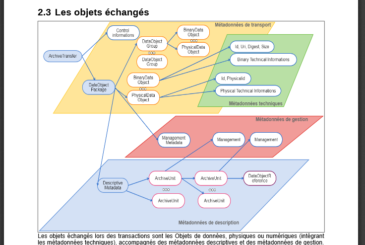
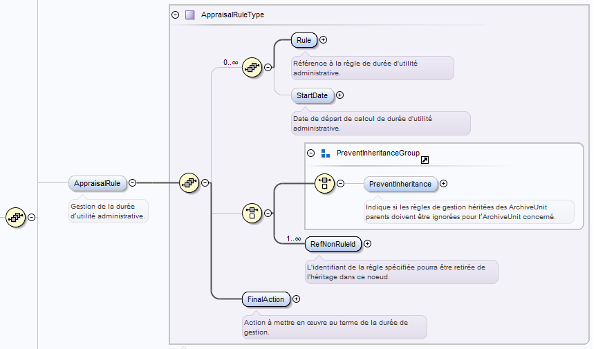
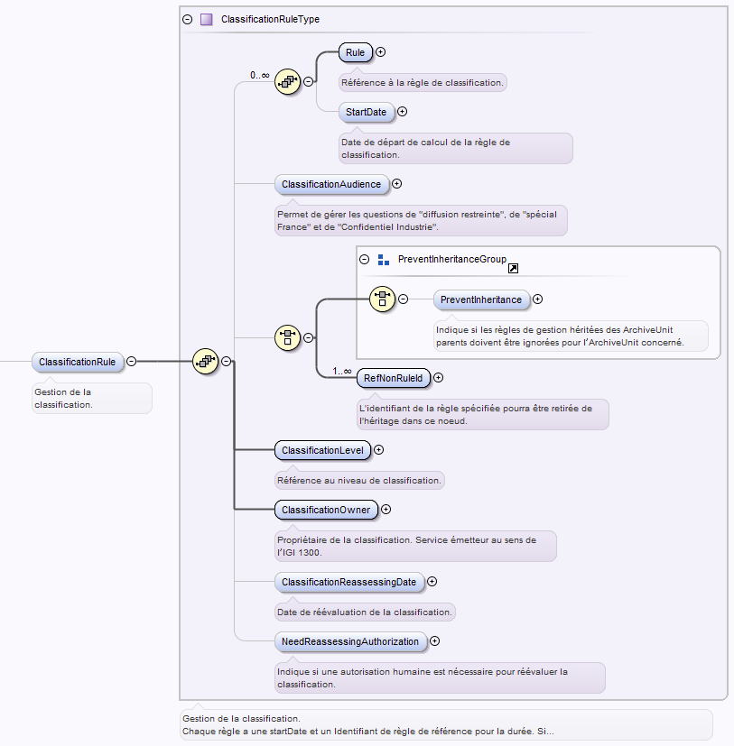

Règles de gestion
====

Introduction
----

### Documents de référence

|Document |Date de la version|Remarques|
|:---------------:|:-----:|:-----:|
|NF Z 44022 – MEDONA – Modélisation des données pour l’archivage|18/01/2014||
|Standard d’échange de données pour l’archivage – SEDA – v. 2.1|06/2018||
|Standard d’échange de données pour l’archivage – SEDA – v. 2.2|02/2022|Cette nouvelle version du SEDA est intégrée à la solution logicielle Vitam à partir de la V6.RC.|
|[Vitam - Structuration des Submission Information Package (SIP)](./SIP.md)|||


### Présentation du document

Le présent document présente les fonctionnalités associées à l’utilisation des règles de gestion dans la solution logicielle Vitam.
Il s’articule autour des axes suivants :
- une présentation des règles de gestion associées aux archives et de la manière dont le Standard d’échanges de données pour l’archivage (SEDA) les formalise ;
- une présentation des mécanismes mis en œuvre dans la solution logicielle Vitam pour gérer ces règles de gestion, en application du SEDA ;
- des recommandations aux ministères porteurs, partenaires et utilisateurs de la solution logicielle Vitam sur la manière d’utiliser les fonctionnalités associées aux règles de gestion.
Le présent document décrit les fonctionnalités qui sont offertes par la solution logicielle Vitam dans l’état actuel des développements. Il a vocation à être amendé, complété et enrichi au fur et à mesure de la réalisation de la solution logicielle Vitam, et des retours et commentaires formulés par les ministères porteurs et les partenaires du programme.
Il ne décrit pas les services mis en œuvre en application des règles, notamment les services d’élimination, de déclassification, de gel et de transfert qui font l’objet de documentations séparées.


Présentation des règles de gestion
----

### Description des règles de gestion

Sept catégories de règles de gestion peuvent être associées aux archives destinées à être prises en charge par une plate-forme d’archivage électronique :
|Catégorie de règle|Description de la règle|Réglementation associée|Dénomination de la catégorie dans le SEDA|
|:---------------:|:-----:|:-----:|:-----:|
|Durée d’utilité courante (DUC)|Durée de « conservation » définie dans les autorisations de création de traitement automatisé|Loi n° 78-17 du 6 janvier 1978 modifiée relative à l’informatique, aux fichiers et aux libertés (loi CNIL), notamment son article 6|StorageRule|
|Durée d’utilité administrative (DUA)|Durée de conservation des archives définie dans le cadre d’un accord entre les services producteurs d’archives et les services d’archives|Code du patrimoine, livre II, art. L212-2|AppraisalRule|
|Délai de communicabilité|Délai pendant lequel la communication d’archives publiques à des tiers est soumise à une autorisation de l’administration des archives sur demande motivée|Code du patrimoine, livre II, art. L213-1 et suivants|AccessRule|
|Durée de réutilisation|Durée pendant laquelle la réutilisation des informations publiques est soumise à restriction :<br>- soit parce qu’un tiers a obtenu un droit d’exclusivité,<br>- soit parce que la communication de ces données ne constitue pas un droit pour toute personne en application du titre Ier du code ou d’autres dispositions législatives, sauf si ces informations font l’objet d’une diffusion publique conforme aux prescriptions des articles L. 312-1 à L. 312-1-2,<br>- soit parce qu’un tiers détient des droits de propriété intellectuelle sur ces informations|Code des relations entre le public et l’administration, livre III, titre II|ReuseRule|
|Délai de diffusion|Délai pendant lequel la diffusion en ligne de données personnelles est soumise à une autorisation de l’administration|Loi n° 78-17 du 6 janvier 1978 modifiée relative à l’informatique, aux fichiers et aux libertés (loi CNIL)|DisseminationRule|
|Durée de classification|Durée pendant laquelle une information ou un support est protégé au titre du secret de la défense nationale.|Arrêté du 30 novembre 2011 portant approbation de l’instruction générale interministérielle n°1300 sur la protection du secret de la défense nationale, notamment son article 46|ClassificationRule|
|Durée de gel|Période pendant laquelle une information ou un support ne doit faire l’objet d’une élimination et peut être soumis à des droits particuliers|Loi n°2005-750 du 4 juillet 2005 portant diverses dispositions d’adaptation au droit communautaire dans le domaine de la justice, article 6|HoldRule|

### Formalisation des règles dans le Standard d’échanges de données pour l’archivage (SEDA)

La manière de déclarer les règles de gestion applicables aux archives est définie dans la norme NF Z 44‑022, intitulée « Modèle d’Échange de DONnées pour l’Archivage » ou MEDONA, et dans sa déclinaison pour les acteurs du service public, le Standard d’Échanges de Données pour l’Archivage (SEDA).

La norme NF Z 44‑022 offre la possibilité, pour une unité archivistique donnée, de :
- déclarer la ou les règles de gestion qui s’appliquent à elle et aux unités archivistiques qui dépendent d’elles (ses « filles ») ;
- hériter de la ou des règles de gestions déclarées par les unités archivistiques dont elle dépend (ses « parentes »).
Si elles sont déclarées, les règles de gestion peuvent être décrites, au moment de la demande de transfert à un service d’archives (message ArchiveTransfer, bloc DataObjectPackage) :
- dans le bloc ManagementMetadata pour toute une entrée ;
- dans le sous-bloc Management de chaque unité archivistique pour une unité archivistique ou un ensemble d’unités archivistiques décrites dans le bloc DescriptiveMetadata.
Le schéma ci-après, issu de la documentation publiée par le Service interministériel des archives de France (SIAF), illustre ces différentes possibilités.


Le bloc ManagementMetadata et le sous-bloc Management des unités archivistiques ont une structure identique :
- des sous-blocs correspondant à chaque catégorie de règle :
    - durée d’utilité courante (StorageRule),
    - durée d’utilité administrative (AppraisalRule),
    - délai de communicabilité (AccessRule),
    - délai de réutilisation (ReuseRule),
    - délai de diffusion (DisseminationRule),
    - durée de classification (ClassificationRule) ;
    - gel (HoldRule)[^1] ;
- un élément LogBook qui permet d’enregistrer les événements associés au cycle de vie des archives après leur création par le service producteur et avant le transfert vers le service d’archivage électronique cible ;
- un élément NeedAuthorization qui permet d’indiquer si la mise en œuvre des actions prévues à l’échéance de toutes les règles nécessitera une autorisation de la part des acteurs impliqués dans la procédure (Service d’archives, Service producteur, Service de contrôle au sens du SEDA).

Pour chaque catégorie de règle, il est possible de préciser :
- la ou les règles applicables, décrites par :
    - l’identifiant de la règle applicable (RuleId) ;
    - la date de départ, à partir de laquelle la règle s’applique (StartDate).
          Cette information est facultative et peut être renseignée a posteriori, ce qui permet de commencer l’archivage d’un dossier et de ses composants dès le début de la procédure associée (voir infra section 3.3.).
          Par exemple, un dossier d’exécution d’un marché public peut être archivé dès le début de l’exécution, alors que la durée d’utilité administrative débute à partir du solde comptable du marché, lequel, par essence, n’est pas connu au lancement de la procédure d’exécution du marché ;
- des propriétés spécifiques à certaines catégories de règle[^2] :
    - l’action à mettre en œuvre au terme de l’échéance. Cette information n’est à renseigner que pour :
        - la durée d’utilité courante (DUC), les actions possibles sont :
            - « restreindre/couper l’accès » (RestrictAccess) ;
            - « transférer dans un autre SAE » (Transfer) ;
            - « copier dans un autre SAE » (Copy) ;
        - la durée d’utilité administrative (DUA), les actions possibles sont :
            - « conserver » (Keep) ;
            - « détruire » (Destroy)
    - les informations liées à la protection du secret de la défense national (cf. ci-dessous) ;
- des attributs spécifiques à une règle de gel : la date de fin du gel (HoldEndDate), l’émetteur du gel (HoldOwner), la raison du gel (HoldReason), la date de réévaluation du gel (HoldReassessingDate), le blocage du reclassement de l’archives gelée (PreventRearrangement) ;
- des métadonnées de gestion d’héritage, avec indication des règles héritées des unités archivistiques parentes qui ne doivent pas s’appliquer à l’unité archivistique concernée et à ses unités archivistiques filles.<br>
      Ce blocage de règle peut être :<br>
        - global (blocage de toutes les règles héritées dans une catégorie via l’élément PreventInheritance) ;<br>
        - ou partiel (blocage d’une ou plusieurs règles de la catégorie concernée via l’élément RefNonRuleId).

Le schéma ci-dessous montre la structuration des informations pour la règle AppraisalRule, qu’elle soit déclarée dans le bloc ManagementMetadata ou dans le sous-bloc Management d’une unité archivistique :


**Nota bene :**
- il est possible pour une unité archivistique, dans une même catégorie de règle, de déclarer plusieurs règles. Cette possibilité est presque uniquement utile pour la durée de communicabilité (AccessRule), une même unité archivistique pouvant contenir plusieurs types d’informations protégées par la loi ;
- la déclaration d’un blocage d’héritage implique de déclarer une propriété « FinalAction » pour les catégories durée d’utilité courante et durée d’utilité administrative ;
- le schéma correspondant à la durée de classification est spécifique et plus riche en termes d’informations. Il est possible d’indiquer :
    - le niveau de protection au titre du secret de la défense nationale (Confidentiel Défense, Secret Défense, Très Secret Défense) ;
    - les mentions additionnelles de limitation du champ de diffusion (Diffusion restreinte, Spécial France, Secret Industrie) ;
    - l’identité de l’émetteur responsable de la protection de l’information ;
    - la date de révision indiquée par l’émetteur au moment de la protection. Il est recommandé de ne renseigner aucune règle si cette date de révision est renseignée.
- le schéma correspondant à la règle de gel, extension du SEDA, est également spécifique et plus riche en termes d’informations. Il est possible d’indiquer :
    - une date de fin de gel ;
    - l’identité de l’émetteur responsable du gel ;
    - la raison ou le motif ayant amené au gel d’une archives ;
    - la date de révision indiquée par l’émetteur au moment du gel,
    - le blocage d’une réorganisation d’arborescence.

Le schéma ci-dessous montre la structuration spécifique des informations pour la règle ClassificationRule.

- Enfin, certaines informations sont associées à :
    - l’ensemble des catégories de règles :
        - traces (LogBook),
        - besoin d’une autorisation humaine (NeedAuthorization) ;
    - la catégorie de règle :
        - action à échéance (FinalAction),
        - pour les règles de classification :
            - mentions additionnelles de limitation du champ de diffusion (ClassificationAudience),
            - niveau de protection au titre du secret de la défense nationale (ClassificationLevel),
            - émetteur (ClassificationOwner),
            - date de révision indiquée par l’émetteur (ClassificationReassesingDate),
            - besoin d’une autorisation pour procéder à la révision (NeedReassessingAuthorization) ;
    - chaque règle applicable :
        - identifiant de la règle (Rule),
        - date de départ du calcul de l’échéance (StartDate),
        - pour la règle de gel :
            - date de fin du gel (HoldEndDate),
            - émetteur (HoldOwner),
            - raison du gel (HoldReason),
            - date de révision indiquée par l’émetteur (HoldReassesingDate),
            - blocage du reclassement de l’archives gelée (PreventRearrangement).

Un exemple de bordereau exploitant les différents cas de figures utilisables pour l’expression des règles de gestion et conforme au SEDA 2.1. est fourni en [annexe](#annexes).

### Formalisation des règles dans la solution logicielle Vitam

#### Enregistrement générique

Les règles de gestion déclarées dans une unité archivistique sont enregistrées, au même titre que les métadonnées décrivant cette unité, dans la collection « Unit », sous la forme d’enregistrements au format JSON.

Elles sont enregistrées dans un enregistrement correspondant aux métadonnées d’une unité archivistique en fonction de la manière dont elles sont déclarées dans le bordereau de transfert :
- elles sont déclarées dans le bloc Management de l’unité en question ;
- l’unité archivistique correspond à une unité archivistique racine et, de fait, enregistre les règles de gestion déclarées dans le bloc ManagementMetadata du bordereau de transfert.

Dans les autres cas, l’unité archivistique ne contiendra pas de règles enregistrées en base. Elles seront calculées automatiquement par la solution logicielle Vitam.

Exemple d’enregistrement de règles de gestion pour une unité archivistique :

```json
"_mgt": {
        "AppraisalRule": {
            "Rules": [
                {
                    "Rule": "APP-00001",
                    "StartDate": "2015-01-01",
                    "EndDate": "2095-01-01"
                },
                {
                    "Rule": "APP-00002"
                }
            ],
            "Inheritance": {
                "PreventInheritance": true,
                "PreventRulesId": []
            },
            "FinalAction": "Keep"
        },
        "AccessRule": {
            "Rules": [
                {
                    "Rule": "ACC-00001",
                    "StartDate": "2016-06-03",
                    "EndDate": "2016-06-03"
                }
            ]
        },
        "DisseminationRule": {
            "Inheritance": {
                "PreventInheritance": true,
                "PreventRulesId": []
            }
        },
        "ReuseRule": {
            "Inheritance": {
                "PreventRulesId": [
                    "REU-00001", "REU-00002"
                ]
            }
        },
        "ClassificationRule": {
            "ClassificationLevel": "Secret Défense",
            "ClassificationOwner": "Projet_Vitam",
            "Rules": [
                {
                    "ClassificationReassessingDate": "2025-06-03",
                    "NeedReassessingAuthorization": true,
                    "Rule": "CLASS-00001"
                }
            ]
        }
}
```

Chaque enregistrement est modélisé comme suit pour ce qui les concerne[^3] :
- ensemble de règles pour une unité archivistique, héritant des règles présentes dans le bloc ManagementMetadata et/ou dans le sous-bloc Management (_mgt – obligatoire, mais pouvant être vide).<br>
Il peut contenir les éléments suivants :
    - booléen correspondant à la nécessité d’une autorisation humaine (NeedAuthorization – facultatif) ;
    - une liste de catégories de règles de gestion appliquées à cette unité archivistique (facultatif), pouvant prendre les valeurs suivantes :
        - AccessRule (délai de communicabilité),
        - AppraisalRule (durée d’utilité administrative),
        - ClassificationRule (durée de classification),
        - DisseminationRule (durée de diffusion),
        - HoldRule (gel),
        - ReuseRule (durée de réutilisation),
        - StorageRule (durée d’utilité courante).

Chaque catégorie peut contenir :
- une à plusieurs règles particulières, énumérées dans un tableau (Rules – facultatif).<br>
Chacune des règles de ce tableau est elle-même composée de plusieurs informations :
    - l’identifiant de la règle, correspondant à l’identifiant d’une des règles définies dans le référentiel des règles de gestion (Rule – obligatoire) ;
    - la date de début du calcul de l’échéance (StartDate – facultatif) ;
    - la date de fin d’application de la règle (EndDate – facultatif). Cette valeur est issue d’un calcul réalisé par la solution logicielle Vitam. Celui-ci consiste en l’ajout du délai correspondant à la règle dans la collection FileRules à la valeur du champ startDate (EndDate = StartDate + Durée)[^4] ;
- des données spécifiques à certaines catégories :
    - Pour les catégories « StorageRule » et « AppraisalRule » uniquement : le sort final des règles dans ces catégories (FinalAction – obligatoire), dont la valeur peut être au choix :
        - Pour StorageRule : « Transfer », « Copy » ou « RestrictAccess »,
        - Pour AppraisalRule : « Keep » ou « Destroy » ;
    - Pour la catégorie « ClassificationRule » uniquement :
        - le niveau de classification, paramétrable au niveau de la plate-forme (ClassificationLevel – obligatoire),
        - le propriétaire de la classification (ClassificationOwner – obligatoire) ;
        - les mentions additionnelles de limitation du champ de diffusion (ClassificationAudience – facultatif),
        - date de réévaluation de la classification (ClassificationReassessingDate – facultatif),
        - besoin d’une autorisation humaine pour réévaluer la classification (NeedReassessingAuthorization – facultatif) ;
    - Pour la catégorie « HoldRule » uniquement :
        - la date de fin de gel, pour les règles de gel ne déclarant pas de durée générique (HoldEndDate – facultatif),
        - le propriétaire de la règle de gel (HoldOwner – facultatif) ;
        - la raison de la règle de gel (HoldReason – facultatif) ;
        - la date de réévaluation de la règle de gel (HoldReassessingDate – facultatif),
        - blocage du reclassement de l’archives gelée  (PreventRearrangement – facultatif) ;
- des paramètres de gestion d’héritage de règles (Inheritance[^5] – facultatif), pouvant contenir les deux éléments suivants :
    - booléen permettant de bloquer l’héritage de toutes les règles de gestion de la même catégorie (PreventInheritance – obligatoire),
    - règles de gestion qui ne doivent pas être héritées d’un parent, correspondant au champ « RefNonRuleId » du SEDA (PreventRulesId – obligatoire, mais pouvant être vide).

#### Enregistrement paramétrable

La solution logicielle Vitam enregistre également en base à la demande pour chaque unité archivistique les règles de gestion applicables et les échéances de ces règles, que les règles soient déclarées par l’unité archivistique ou héritées d’unités archivistiques parentes.

Par défaut, sont enregistrés les éléments suivants :
- ensemble de catégories de règle indexées par défaut pour une unité archivistique (computedInheritedRule – facultatif).<br>
      Il peut contenir les éléments suivants :
    - une liste de catégories de règles de gestion appliquées à cette unité archivistique (facultatif), pouvant prendre les valeurs suivantes :
        - AccessRule (délai de communicabilité),
        - AppraisalRule (durée d’utilité administrative),
        - ClassificationRule (durée de classification),
        - DisseminationRule (durée de diffusion),
        - ReuseRule (durée de réutilisation),
        - StorageRule (durée d’utilité courante),
        - HoldRule (règle de gel).
Chaque catégorie peut contenir :
- la date d’échéance la plus lointaine pour la catégorie de règle (MaxEndDate – facultatif)
- des données spécifiques à certaines catégories :
    - Pour les catégories « StorageRule » et « AppraisalRule » uniquement : le sort final des règles dans ces catégories (FinalAction – obligatoire), dont la valeur peut être :
        - Pour StorageRule : « Transfer », « Copy » ou « RestrictAccess »,
        - Pour AppraisalRule : « Keep » ou « Destroy » ;
    - Pour la catégorie « ClassificationRule » uniquement :
        - le niveau de classification, paramétrable au niveau de la plate-forme (ClassificationLevel – obligatoire, mais pouvant être vide),
        - le propriétaire de la classification (ClassificationOwner – obligatoire, mais pouvant être vide) ;
        - les mentions additionnelles de limitation du champ de diffusion (ClassificationAudience – obligatoire, mais pouvant être vide),
        - date de réévaluation de la classification (ClassificationReassessingDate – facultatif),
        - besoin d’une autorisation humaine pour réévaluer la classification (NeedReassessingAuthorization – obligatoire, mais pouvant être vide) ;
    - Pour la catégorie « HoldRule » uniquement :
        - la date de fin de gel, pour les règles de gel ne déclarant pas de durée générique (HoldEndDate – facultatif),
        - le propriétaire de la règle de gel (HoldOwner – facultatif) ;
        - la raison de la règle de gel (HoldReason – facultatif) ;
        - la date de réévaluation de la règle de gel (HoldReassessingDate – facultatif),
        - blocage du reclassement de l’archives gelée  (PreventRearrangement – facultatif).

Exemple d’enregistrement par défaut des catégories de règle de gestion :
```json
"_computedInheritedRules": {
        "StorageRule": {
            "FinalAction": [
                "Copy"
            ]
        },
        "AppraisalRule": {
            "MaxEndDate": "2007-01-01",
            "FinalAction": [
                "Keep"
            ]
        },
        "DisseminationRule": {},
        "AccessRule": {
            "MaxEndDate": "2027-01-01"
        },
        "ReuseRule": {
            "MaxEndDate": "2047-01-01"
        },
        "ClassificationRule": {
            "MaxEndDate": "2025-06-03",
            "ClassificationAudience": [
                "Spécial France"
            ],
            "ClassificationLevel": [
                "Secret Défense"
            ],
            "ClassificationOwner": [
                "Emetteur0"
            ],
            "ClassificationReassessingDate": [
                "2016-06-03"
            ],
            "NeedReassessingAuthorization": [
                true,
                true
            ]
        },
        "indexationDate": "2019-07-17"
    }
```

Pour une configuration indexant en plus, pour chaque règle, les dates d’échéance maximales (indexInheritedRulesWithRulesIdByTenant), sont enregistrés les éléments suivants :
- ensemble de catégories de règle indexées pour une unité archivistique (computedInheritedRule – facultatif).<br>
      Il peut contenir les éléments suivants :
    - une liste de catégories de règles de gestion appliquées à cette unité archivistique (facultatif), pouvant prendre les valeurs suivantes :
        - AccessRule (délai de communicabilité),
        - AppraisalRule (durée d’utilité administrative),
        - ClassificationRule (durée de classification),
        - DisseminationRule (durée de diffusion),
        - ReuseRule (durée de réutilisation),
        - StorageRule (durée d’utilité courante),
        - HoldRule (règle de gel).

Chaque catégorie peut contenir :
- la date d’échéance la plus lointaine pour la catégorie de règle (MaxEndDate – facultatif) ;
- l’origine des règles, qu’elles soient portées, héritées ou les deux (InheritanceOrigin – obligatoire). Les valeurs peuvent être : « Inherited », « Local », « LocalAndInherited » ;
- l’identifiant des règles héritées (InheritedRuleIds – facultatif) ;
- la date d’échéance la plus lointaine par règle de gestion (EndDates – facultatif).<br>
      Ce champ contient une à plusieurs règles de gestion, caractérisée(s) par son(leur) identifiant et ayant pour valeur associée la date de fin de validité la plus longue.
      Point d’attention : ce champ, ainsi que ses sous-éléments, sont en cours de dépréciation. Ils ont été désindexés et, de fait, ne sont plus requêtables.
- une à plusieurs règles de gel (Rules – facultatif).<br>
      Chacune d’elle est modélisée comme suit :
    - identifiant de la règle, correspondant au champ « RuleId » du référentiel des règles de gestion (Rule – obligatoire, mais pouvant être vide),
    - date de fin de validité la plus longue (EndDate – facultatif) ;
- des données spécifiques à certaines catégories :
    - Pour les catégories « StorageRule » et « AppraisalRule » uniquement : le sort final des règles dans ces catégories (FinalAction – obligatoire), dont la valeur peut être :
        - Pour StorageRule : « Transfer », « Copy » ou « RestrictAccess »,
        - Pour AppraisalRule : « Keep » ou « Destroy » ;
    - Pour la catégorie « ClassificationRule » uniquement :
        - le niveau de classification, paramétrable au niveau de la plate-forme (ClassificationLevel – obligatoire, mais pouvant être vide),
        - le propriétaire de la classification (ClassificationOwner – obligatoire, mais pouvant être vide) ;
        - les mentions additionnelles de limitation du champ de diffusion (ClassificationAudience – obligatoire, mais pouvant être vide),
        - date de réévaluation de la classification (ClassificationReassessingDate – facultatif),
        - besoin d’une autorisation humaine pour réévaluer la classification (NeedReassessingAuthorization – obligatoire, mais pouvant être vide) ;
    - Pour la catégorie « HoldRule » uniquement :
        - la date de fin de gel, pour les règles de gel ne déclarant pas de durée générique (HoldEndDate – facultatif),
        - le propriétaire de la règle de gel (HoldOwner – facultatif) ;
        - la raison de la règle de gel (HoldReason – facultatif) ;
        - la date de réévaluation de la règle de gel (HoldReassessingDate – facultatif),
        - blocage du reclassement de l’archives gelée  (PreventRearrangement – facultatif).

Exemple d’enregistrement par défaut des catégories de règle de gestion :
```json
"_computedInheritedRules": {
        "StorageRule": {
            "FinalAction": [
                "Copy"
            ]
        },
        "AppraisalRule": {
            "MaxEndDate": "2007-01-01",
           "InheritanceOrigin": "Local",
           "EndDates": {
                "APP-00001": "2007-01-01"
            },
           "Rules": [
                {
                    "Rule": "APP-00001",
                    "EndDate": "2007-01-01"
                }
            ],
            "FinalAction": [
                "Keep"
            ]
        },
        "DisseminationRule": {},
        "AccessRule": {
            "MaxEndDate": "2025-01-01",
            "InheritanceOrigin": "Inherited",
            "InheritanceRuleIds": ["DIS-00001"],
            "EndDates": {
                "DIS-00001": "2025-01-01"
            },
           "Rules": [
                {
                    "Rule": "DIS-00001",
                    "EndDate": "2025-01-01"
                }
            ],
        },
        "ReuseRule": {
            "MaxEndDate": "2047-01-01",
            "InheritanceOrigin": "LocalAndInherited",
            "InheritanceRuleIds": ["REU-00001"],
            "EndDates": {
                "REU-00001": "2023-01-01",
                "REU-00004": "2040-01-01"
            },
           "Rules": [
                {
                    "Rule": "REU-00001",
                    "EndDate": "2023-01-01"
                },
               {
                    "Rule": "REU-00004",
                    "EndDate": "2040-01-01"
                }
            ],
        },
        "indexationDate": "2019-07-17"
    }
```

Pour une configuration indexant toutes les catégories de règle, ainsi que leur contexte (indexInheritedRulesWithAPIV2OutputByTenant), sont enregistrés les éléments suivants :
- ensemble de catégories de règle indexées pour une unité archivistique, incluant leur contexte (inheritedRulesAPIOutput – facultatif).<br>
      Il peut contenir les éléments suivants :
    - des propriétés génériques (Global Properties – facultatif).<br>
          Chacune d’elle est modélisée comme suit :
        - identifiant unique de l’unité archivistique, généré par la solution logicielle Vitam (UnitId – obligatoire),
        - identifiant du service producteur, correspondant au champ « Identifier » du référentiel des services agents (OriginatingAgency – obligatoire),
        - identifiant de l’(des) unité(s) archivistique(s) d’où provient la propriété (Paths – obligatoire),
        - nom de la propriété décrite (PropertyName – obligatoire, mais pouvant être vide),
        - valeur de la propriété décrite, pouvant varier en fonction de la propriété décrite (PropertyValue – obligatoire, mais pouvant être vide) ;
    - une liste de catégories de règles de gestion appliquées à cette unité archivistique (facultatif), pouvant prendre les valeurs suivantes :
        - AccessRule (délai de communicabilité),
        - AppraisalRule (durée d’utilité administrative),
        - ClassificationRule (durée de classification),
        - DisseminationRule (durée de diffusion),
        - ReuseRule (durée de réutilisation),
        - StorageRule (durée d’utilité courante),
        - HoldRule (règle de gel).

Chaque catégorie peut contenir :
- une à plusieurs règles de gestion (Rules – obligatoire, mais pouvant être vide).<br>
      Chacune d’elle est modélisée comme suit :
    - identifiant unique de l’unité archivistique, généré par la solution logicielle Vitam (UnitId – obligatoire),
    - identifiant du service producteur, correspondant au champ « Identifier » du référentiel des services agents (OriginatingAgency – obligatoire),
    - identifiant de l’(des) unité(s) archivistique(s) d’où provient la règle de gestion (Paths – obligatoire),
    - identifiant de la règle, correspondant au champ « RuleId » du référentiel des règles de gestion (Rule – obligatoire, mais pouvant être vide),
    - date de début du calcul de l’échéance (StartDate – facultatif),
    - date de fin d’application de la règle (EndDate – facultatif) ;
- des propriétés propres à la règle décrite (Properties – obligatoire, mais pouvant être vide).
      Chacune d’elle est modélisée comme suit :
    - identifiant unique de l’unité archivistique, généré par la solution logicielle Vitam (UnitId – obligatoire),
    - identifiant du service producteur, correspondant au champ « Identifier » du référentiel des services agents (OriginatingAgency – obligatoire),
    - identifiant de l’(des) unité(s) archivistique(s) d’où provient la propriété (Paths – obligatoire),
    - nom de la propriété décrite (PropertyName – obligatoire, mais pouvant être vide),
    - valeur de la propriété décrite, pouvant varier en fonction de la propriété décrite (PropertyValue – obligatoire, mais pouvant être vide).<br>
      Ces propriétés sont spécifiques à certaines catégories de règles de gestion :
        - Pour les catégories « StorageRule » et « AppraisalRule » uniquement : le sort final des règles dans ces catégories (FinalAction – obligatoire), dont la valeur peut être :
            - Pour StorageRule : « Transfer », « Copy » ou « RestrictAccess »,
            - Pour AppraisalRule : « Keep » ou « Destroy » ;
        - Pour la catégorie « ClassificationRule » uniquement :
            - le niveau de classification, paramétrable au niveau de la plate-forme (ClassificationLevel – facultatif),
            - le propriétaire de la classification (ClassificationOwner – facultatif) ;
            - les mentions additionnelles de limitation du champ de diffusion (ClassificationAudience – facultatif),
            - date de réévaluation de la classification (ClassificationReassessingDate – facultatif),
            - besoin d’une autorisation humaine pour réévaluer la classification (NeedReassessingAuthorization – facultatif) ;
        - Pour la catégorie « HoldRule » uniquement :
            - la date de fin de gel, pour les règles de gel ne déclarant pas de durée générique (HoldEndDate – facultatif),
            - le propriétaire de la règle de gel (HoldOwner – facultatif) ;
            - la raison de la règle de gel (HoldReason – facultatif) ;
            - la date de réévaluation de la règle de gel (HoldReassessingDate – facultatif),
            - blocage du reclassement de l’archives gelée  (PreventRearrangement – facultatif).

Exemple d’enregistrement par défaut des catégories de règle de gestion :
```json
"inheritedRulesAPIOutput": {
            "GlobalProperties": [
                {
                    "UnitId": "aeaqaaaaaehi7u6oabuokalqki5qvziaaabq",
                    "OriginatingAgency": "RATP",
                    "Paths": [
                        [
                            "aeaqaaaaaehi7u6oabuokalqki5qv2aaaaaq",
                            "aeaqaaaaaehi7u6oabuokalqki5qvzyaaaba",
                            "aeaqaaaaaehi7u6oabuokalqki5qvziaaabq"
                        ]
                    ],
                    "PropertyName": "NeedAuthorization",
                    "PropertyValue": "true"
                }
            ],
            "StorageRule": {
                "Rules": [],
                "Properties": [
                    {
                        "UnitId": "aeaqaaaaaehi7u6oabuokalqki5qv2aaaaaq",
                        "OriginatingAgency": "RATP",
                        "Paths": [
                            [
                                "aeaqaaaaaehi7u6oabuokalqki5qv2aaaaaq"
                            ]
                        ],
                        "PropertyName": "FinalAction",
                        "PropertyValue": "Copy"
                    }
                ]
            },
            "AppraisalRule": {
                "Rules": [],
                "Properties": [
                    {
                        "UnitId": "aeaqaaaaaehi7u6oabuokalqki5qv2aaaada",
                        "OriginatingAgency": "RATP",
                        "Paths": [
                            [
                                "aeaqaaaaaehi7u6oabuokalqki5qv2aaaaaq",
                                "aeaqaaaaaehi7u6oabuokalqki5qv2iaaabq",
                                "aeaqaaaaaehi7u6oabuokalqki5qv2aaaaeq",
                                "aeaqaaaaaehi7u6oabuokalqki5qv2aaaada"
                            ]
                        ],
                        "PropertyName": "FinalAction",
                        "PropertyValue": "Keep"
                    },
                    {
                        "UnitId": "aeaqaaaaaehi7u6oabuokalqki5qvyaaaaba",
                        "OriginatingAgency": "RATP",
                        "Paths": [
                            [
                                "aeaqaaaaaehi7u6oabuokalqki5qv2aaaaaq",
                                "aeaqaaaaaehi7u6oabuokalqki5qvzyaaaba",
                                "aeaqaaaaaehi7u6oabuokalqki5qvziaaabq",
                                "aeaqaaaaaehi7u6oabuokalqki5qvyaaaaba"
                            ]
                        ],
                        "PropertyName": "FinalAction",
                        "PropertyValue": "Keep"
                    }
                ]
            },
            "DisseminationRule": {
                "Rules": [],
                "Properties": []
            },
            "ReuseRule": {
                "Rules": [
                    {
                        "UnitId": "aeaqaaaaaehi7u6oabuokalqki5qvzyaaaba",
                        "OriginatingAgency": "RATP",
                        "Paths": [
                            [
                                "aeaqaaaaaehi7u6oabuokalqki5qv2aaaaaq",
                                "aeaqaaaaaehi7u6oabuokalqki5qvzyaaaba"
                            ]
                        ],
                        "Rule": "REU-00001",
                        "StartDate": "2000-01-01",
                        "EndDate": "2010-01-01"
                    }
                ],
                "Properties": []
            },
            "ClassificationRule": {
                "Rules": [],
                "Properties": []
            },
            "AccessRule": {
                "Rules": [
                    {
                        "UnitId": "aeaqaaaaaehi7u6oabuokalqki5qvyaaaaba",
                        "OriginatingAgency": "RATP",
                        "Paths": [
                            [
                                "aeaqaaaaaehi7u6oabuokalqki5qv2aaaaaq",
                                "aeaqaaaaaehi7u6oabuokalqki5qvzyaaaba",
                                "aeaqaaaaaehi7u6oabuokalqki5qvziaaabq",
                                "aeaqaaaaaehi7u6oabuokalqki5qvyaaaaba"
                            ]
                        ],
                        "Rule": "ACC-00002",
                        "StartDate": "2000-01-01",
                        "EndDate": "2025-01-01"
                    },
                    {
                        "UnitId": "aeaqaaaaaehi7u6oabuokalqki5qv2aaaaeq",
                        "OriginatingAgency": "RATP",
                        "Paths": [
                            [
                                "aeaqaaaaaehi7u6oabuokalqki5qv2aaaaaq",
                                "aeaqaaaaaehi7u6oabuokalqki5qv2iaaabq",
                                "aeaqaaaaaehi7u6oabuokalqki5qv2aaaaeq"
                            ]
                        ],
                        "Rule": "ACC-00002",
                        "StartDate": "2002-01-01",
                        "EndDate": "2027-01-01"
                    }
                ],
                "Properties": []
            }
        },
        "indexationDate": "2020-02-17",
        "NeedAuthorization": [
            true
        ]
    }
```

Mécanismes mis en œuvre dans la solution logicielle Vitam
-----

La solution logicielle Vitam offre à un service d’archives plusieurs fonctionnalités lui permettant de gérer les règles de gestion associées aux archives :
- la configuration des règles de gestion au niveau de la plate-forme ;
- l’administration d’un référentiel de règles de gestion ;
- en entrée du système, le calcul des échéances associées aux unités archivistiques qui déclarent des règles de gestion et l’indexation des métadonnées de gestion associées à ces unités archivistiques ;
- en gestion des archives existantes :
    - la modification des règles de gestion et l’indexation des règles de gestion et échéances héritées par les unités archivistiques ;
    - à la demande, le calcul des échéances applicables aux unités archivistiques et l’indexation du résultat dans un champ spécifique permettant des recherches et des filtres sur les résultats ;
- en accès, le calcul des échéances pour toutes les unités archivistiques conservées dans le système, ainsi qu’un filtre sur les catégories de règles échues au moyen d’un contrat d’accès.

Les fonctionnalités ont été conçues et réalisées pour prendre en compte toutes les situations susceptibles d’être rencontrées par les services d’archives[^6], notamment en termes de structuration des archives prises en charge, avec la possibilité d’avoir :
- 0 à n unités archivistiques à la racine du bloc DescriptionMetadata du message de transfert d’archives (ArchiveTransfer) ;
- 0 à n parents pour une unité archivistique ;
- 0 à n enfants pour une unité archivistique.

### Configuration d’une plate-forme utilisant la solution logicielle Vitam

#### Configuration des durées minimales autorisées dans le référentiel des règles de gestion

Afin de se prémunir contre une alimentation du référentiel des règles de gestion avec des durées trop courtes susceptibles de déclencher des actions indésirables sur la plate-forme (ex. : éliminations) – que cette tentative soit intentionnelle ou non –, il est possible de configurer une durée minimale pour chaque catégorie de règle. La solution logicielle Vitam vérifie alors que la durée saisie pour chaque champ du référentiel des règles de gestion est supérieure ou égale à la durée minimale définie.

Cette configuration, optionnelle, est établie lors du paramétrage initial de la plate-forme par les administrateurs – fonctionnel pour la définition du besoin et technique[^7] pour la saisie réelle des informations – de chaque implémentation de la solution logicielle Vitam et définit, pour chaque tenant et pour chaque catégorie de règle, les durées minimales acceptables.

Le fichier de configuration[^8] se présente comme suit (exemple fictif) :
```yaml
listMinimumRuleDuration:
  2:
    AppraisalRule : 1 year
    DisseminationRule : 10 year

  3:
    AppraisaleRule : 5 year
    StorageRule : 5 year
    ReuseRule : 2 year
```

Dans l’exemple ci-dessus :
- sur le tenant 2 :
    - aucune DUA ne pourra avoir une durée inférieure à 1 an ;
    - aucun délai de diffusion ne pourra avoir une durée inférieure à 10 ans ;
- sur le tenant 3 :
    - aucune DUA ne pourra avoir une durée inférieure à 5 ans ;
    - aucune DUC ne pourra avoir une durée inférieure à 5 ans ;
    - aucun délai de réutilisation ne pourra avoir une durée inférieure à 2 ans.
          
#### Configuration des niveaux de protection du secret acceptés sur une implémentation de la solution logicielle Vitam

Afin de se conformer à la réglementation relative à la protection du secret de la défense nationale et d’éviter les risques de compromission, la solution logicielle Vitam permet de définir, pour une implémentation donnée, les niveaux de protection du secret tolérés sur celle-ci.

C’est au moment du déploiement de la solution logicielle Vitam que doivent être définis en configuration les niveaux de protection acceptés, notamment si l’implémentation ne doit pas pouvoir prendre en charge des archives classifiées. Cette liste des niveaux de protection acceptés peut être modifiée par la suite par l’administrateur technique[^9].

Le fichier de configuration se présente comme suit (exemple fictif)[^10] :
```
classificationLevel :
allowList :  [Non protégé,Secret Défense,Confidentiel Défense]
authorizeNotDefined: True
```

Dans l’exemple ci-dessus, l’implémentation n’acceptera que des unités archivistiques déclarant soit « Non protégé », soit « Confidentiel Défense », soit « Secret Défense » comme niveau de protection du secret (champ ClassificationLevel des métadonnées de gestion). Elle acceptera des unités archivistiques ne déclarant aucune information de classification.

**Points d’attention :**
- une plate-forme doit toujours accepter le ou les niveaux de protection inférieurs à ceux correspondant à la plate-forme pour rendre possible la réalisation des opérations de déclassement/déclassification :une plate-forme destinée à accueillir des documents de niveau « Secret défense » doit autoriser les documents de niveau « Confidentiel défense » ou « Non protégé » ;une plate-forme destinée à accueillir des documents de niveau « Confidentiel défense » doit autoriser les documents de niveau « Non protégé ».
- une plate-forme devant obliger chaque unité archivistique à déclarer un niveau de classification, dont la valeur doit être présente dans la liste des niveaux acceptés par la plate-forme (« AllowList »), doit être paramétrée avec un champ « authorizedNotDefined » ayant pour valeur « False ».

#### Configuration des indexations en base des règles de gestion

Afin de faciliter la gestion des droits d’accès aux unités archivistiques prises en charge sur la plate-forme, la solution logicielle Vitam offre un service paramétrable permettant d’indexer en base à la demande pour chaque unité archivistique les règles de gestion applicables et les échéances de ces règles, que les règles soient déclarées par l’unité archivistique ou héritées d’unités archivistiques parentes.
Cette configuration, optionnelle, est établie lors du paramétrage initial de la plate-forme par les administrateurs – fonctionnel pour la définition du besoin et technique[^11] pour la saisie réelle des informations – de chaque implémentation de la solution logicielle Vitam et définit, pour chaque tenant le type d’indexation requis.

Par défaut, ce service indexe en base, pour chaque unité archivistique[^12] :
- les propriétés de chaque catégorie de règle (ex. : sort final pour la DUA, service émetteur pour la classification) ;
- les échéances maximales applicables à chaque catégorie de règle (ex. : la date de libre communicabilité la plus éloignée dans le temps) ;
- les propriétés globales de gestion applicables à l’unité archivistique (nécessité ou non de demander une autorisation pour effectuer des actions de gestion sur celle-ci).

Il est aussi possible, en configurant la plate-forme, de compléter ce service pour :
- indexer également les échéances maximales applicables, dans chaque catégorie de règle, à chaque règle en particulier au moyen du paramètre « indexInheritedRulesWithAPIV2OutputByTenant » (ex. : la date de libre communicabilité en fonction de la règle A et celle en fonction de la règle B) ;
- rendre requêtables toutes les règles retournées en cas de demande d’accès à l’unité archivistique au moyen du paramètre « indexInheritedRulesWithRulesIdByTenant » (cf. service décrit dans la section 3.5.)[^13].
Le fichier de configuration se présente comme suit (exemple fictif)[^14] :

```
indexInheritedRulesWithAPIV2OutputByTenant: ["0", "1", "2", "3"]
indexInheritedRulesWithRulesIdByTenant: ["0", "1", "2", "4"]
```

Dans l’exemple ci-dessus :
- sur les tenants 0, 1 et 2, le service d’indexation sera complet ;
- sur le tenant 3, le service d’indexation consistera en la restitution de la liste des règles utilisées ;
- sur le tenant 4, le service d’indexation restituera toutes les règles, ainsi que leur origine (unité archivistique, service producteur) ;
- sur les autres tenants, le service d’indexation sera limité au service par défaut.

### Administration du référentiel des règles de gestion

#### Présentation générale du référentiel

La solution logicielle Vitam intègre un référentiel des règles de gestion administrable (import initial ou mise à jour) par un utilisateur doté des droits adéquats (administrateur fonctionnel). Ce référentiel fonctionne en mode « esclave ». Il a pour vocation à être utilisé par la solution logicielle Vitam pour effectuer localement les calculs d’échéances associées aux unités archivistiques prises en charge par le système. Il est propre à chaque tenant de la plate-forme. Il est importé dans la solution logicielle Vitam sous la forme d’un fichier .csv comprenant les colonnes suivantes :

|Nom de la colonne|Description de la colonne|Valeurs possibles|Observations|
|:---------------:|:-----:|:-----:|:----:|
|RuleId|Identifiant de la règle||Cet identifiant :<br>- doit être unique par catégorie de règle,<br> - ne doit pas comprendre d’espace ou de caractère accentué, de virgule, d’apostrophe, de parenthèse, de slash, d’élément de ponctuation, ou tout autre caractère spécial. Ne sont recommandés que l’underscore et le tiret comme séparateurs.|
|RuleType|Type de règle|AccessRule<br>AppraisalRule<br>ClassificationRule<br>DisseminationRule<br>ReuseRule<br>StorageRule<br>HoldRule||
|RuleValue|Intitulé de la règle|||
|RuleDescription|Description de la règle|||
|RuleDuration|Durée||La valeur de ce champ doit être un entier positif compris entre 0 et 999.<br>La valeur est facultative pour les règles de gel.|
|RuleMeasurement|Unité de mesure de la durée|DAY<br>MONTH<br>YEAR|La valeur est facultative pour les règles de gel.|

Le fichier CSV à importer doit avoir les caractéristiques suivantes :
- encodage des caractères : UTF-8 ;
- séparateur de champ : la virgule ;
- séparateur de texte : guillemets simples ou doubles, espace vide.

Note : Pour en savoir plus, consulter le document [VITAM. Modèle de données](./modele_de_donnees.md). Chapitre 5. Section 9. Pour plus de précisions sur l’élaboration des fichiers .csv, consulter l’[annexe 1](#annexe-1-preparer-un-fichier-csv).

#### Contrôles effectués lors de l’import et de la mise à jour du référentiel

Lors de l’import initial ou de la mise à jour du référentiel, la solution logicielle Vitam procède aux contrôles suivants :
- vérification de la syntaxe du fichier : toutes les colonnes sont-elles présentes ?
- vérification du caractère unique de chaque identifiant dans le fichier ;
- vérification de la sémantique des différents champs :
    - toutes les informations obligatoires sont-elles présentes ?
    - la valeur renseignée dans un champ correspond-elle bien au type défini (une date dans un champ date) ?
    - si un champ ne peut avoir qu’une valeur prise dans une énumération, la valeur saisie dans le champ respecte-t-elle cette énumération (notamment dans les champs RuleType et RuleMeasurement) ?
- vérification que l’association de la durée et de l’unité de mesure saisies pour chaque règle est bien inférieure ou égale à 999 ans (1000 YEAR sera rejeté comme 370 000 DAY).

La tentative d’import ou de mise à jour d’un référentiel déclarant des associations durées et unité de valeur inférieures ou égales aux données minimales saisies dans le fichier de configuration décrit dans la section 3.1.1, déclenchera une alerte de sécurité qui sera transmise à l’administrateur technique de la plate-forme. L’import et la mise à jour seront alors rejetés.

L’import ou la mise à jour du référentiel peut se réaliser :
- via les API de la solution logicielle Vitam ;
- depuis l’APP VitamUI « Règles de gestion », sous forme unitaire ou par un (ré)import complet du référentiel sous la forme d’un fichier CSV. Cette APP permet aussi d’effectuer une recherche dans le référentiel et d’en exporter son contenu sous la forme d’un fichier CSV.

#### Mise à jour du référentiel

Lors d’une mise à jour du référentiel sont appliqués les principes suivants :
- échec de la mise à jour si :
    - celle-ci a demandé la suppression d’une règle déjà utilisée ;
    - celle-ci a demandé l’ajout d’une durée et d’une mesure pour une règle de gel déjà utilisée ou la suppression d’une durée et d’une mesure pour une règle de gel déjà utilisée ;
- succès avec avertissement de la mise à jour si celle-ci a demandé la modification d’une règle déjà utilisée.

Les erreurs ou données en avertissement présentes dans le référentiel lors de la demande d’import initial ou de la demande de mise à jour sont retournées au demandeur sous la forme d’un rapport au format JSON qui comprend les informations suivantes :
- indication du type d’opération concernée et date de celle-ci ;
- pour chaque ligne en erreur, le champ concerné, un message permettant à l’utilisateur de corriger l’erreur ainsi que la valeur erronée ;
- la liste des règles dont la suppression est demandée alors qu’elles sont utilisées dans le système ;
- la liste des règles dont la modification est demandée alors qu’elles sont utilisées dans le système.

#### Sauvegarde du référentiel
Les différentes versions du référentiel font l’objet d’une sauvegarde sur les offres de stockage utilisées par l’implémentation de la solution logicielle Vitam.

### Entrées

Dans le cadre du processus d’entrée d’un ensemble d’unités archivistiques, suite à la réception d’un message ArchiveTransfer du SEDA, la solution logicielle Vitam effectue les tâches et traitements suivants pour les unités archivistiques déclarant des règles de gestion :
- vérification de la conformité du bordereau avec le schéma par défaut associé à la version 2.1. ou à la version 2.2. du SEDA ou avec les exigences portées dans un profil d’archivage et/ou dans un profil d’unité archivistique ;
- vérification que les règles déclarées (règles à appliquer et/ou règles à bloquer) existent bien dans le référentiel des règles de gestion pour la catégorie de règle correspondante ;
- récupération des règles déclarées dans le bloc ManagementMetadata, pour enregistrement au niveau des unités archivistiques déclarées à la racine du bloc DescriptiveMetadata. Cette récupération comprend la gestion des éventuels conflits identifiés, notamment lorsqu’une même règle est déclarée, pour une même catégorie, par le bloc ManagementMetadata et par les unités archivistiques à la racine du bloc DescriptiveMetadata. Dans le cas particulier où une même règle est déclarée avec des dates de départ différentes, la date déclarée par les unités archivistiques l’emporte sur celle déclarée dans le bloc ManagementMetadata ;
- traitement des redéclarations de règles :
    - si une unité archivistique AU1 déclare une règle A avec une date de départ (StartDate) X ;
    - et qu’une unité archivistique AU2, fille de cette première unité archivistique AU1, déclare la même règle A avec une date de départ (StartDate) Y ;
    - alors l’unité archivistique AU2 aura pour date de départ du calcul de la règle la date Y ;
    - et les unités archivistiques filles de l’unité archivistique AU2 n’hériteront de la règle A qu’en tant que filles de l’AU2, c’est-à-dire avec la date de départ Y ;
- calcul de l’échéance de la règle (date à partir de laquelle l’action finale va être mise en œuvre), si la date de départ de ce calcul est connue, et vérification que la date d’échéance obtenue est antérieure au 01/01/9000 ;
- enregistrement en base des informations sur les règles, y compris la date d’échéance calculée. À titre d’illustration sont présentées ci-dessous les règles associées à une unité archivistique enregistrée en base (exemple fictif) :

```json
"_mgt": {
        "StorageRule": {
            "Rules": [
                {
                    "Rule": "STO-00001",
                    "StartDate": "2000-01-01",
                    "EndDate": "2001-01-01"
                }
            ],
            "Inheritance": {
                "PreventRulesId": [
                    "STO-00001"
                ]
            },
            "FinalAction": "Copy"
        },
        "AppraisalRule": {
            "Rules": [
                {
                    "Rule": "APP-00002",
                    "StartDate": "2000-01-01",
                    "EndDate": "2005-01-01"
                }
            ],
            "Inheritance": {
                "PreventInheritance": true,
                "PreventRulesId": []
            }
            "FinalAction": "Destroy"
        },
        "AccessRule": {
            "Rules": [
                {
                    "Rule": "ACC-00003",
                    "StartDate": "2000-01-01",
                    "EndDate": "2025-01-01"
                }
            ]
        },
        "DisseminationRule": {
            "Rules": [
                {
                    "Rule": "DIS-00001",
                    "StartDate": "2000-01-01",
                    "EndDate": "2025-01-01"
                }
            ]
        },
        "ReuseRule": {
            "Rules": [
                {
                    "Rule": "REU-00001",
                    "StartDate": "2000-01-01",
                    "EndDate": "2010-01-01"
                }
            ]
        },
        "ClassificationRule": {
            "ClassificationLevel": "Confidentiel Défense",
            "ClassificationOwner": "RATP",
            "Rules": [
                {
                    "NeedReassessingAuthorization": true,
                    "Rule": "CLASS-00001",
                    "StartDate": "2000-01-01",
                    "EndDate": "2010-01-01"
                }
            ]
        }
    }
```

**Nota bene :**
- seules les unités archivistiques déclarant une règle sont concernées par le calcul de l’échéance et l’enregistrement des informations sur les règles en base ;
- les autres unités archivistiques n’ont pas de règles enregistrées en base lors de leur prise en charge. Les règles qui leur sont applicables sont héritées des unités archivistiques parentes et sont soit indexées en utilisant le service correspondant (cf. section 3.4.2), soit calculées lorsque des opérations qui les concernent sont mises en œuvre (demande de consultation, mise en œuvre des sorts finaux) mais sans être conservées en base ;
- si les règles sont déclarées dans le bloc ManagementMetadata, seules les unités archivistiques racines porteront ces règles en base.

### Gestion des archives existantes

#### Mise à jour des règles de gestion associées aux unités archivistiques

La solution logicielle Vitam permet de mettre à jour les règles de gestion associées aux unités archivistiques :
- soit via une mise à jour des unités archivistiques, à l’unité ou en masse[^15] :
    - ajout/modification/suppression de règle ; 
    - ajout/modification/suppression de la date de départ à partir de laquelle la règle s’applique ; 
    - ajout/modification du sort final (StorageRule – DUC et AppraisalRule – DUA) ;
    - ajout/modification/suppression de mécanismes de blocage des héritages (blocage de tout ou partie des règles héritées) ;
    - pour les unités archivistiques déclarant une ClassificationRule – durée de classification, modification du niveau de protection et de l’émetteur, ajout/modification/suppression des mentions additionnelles de limitation du champ de diffusion et de la date de révision du niveau de protection ;
    - pour les unités archivistiques déclarant une HoldRule – durée de gel, ajout/modification/suppression de l’émetteur et de la raison du gel, de la date de révision du niveau de protection, du blocage de tout reclassement ;<br>
Les échéances associées aux règles modifiées sont alors recalculées ;
- soit via une mise à jour du référentiel lui-même. Dans ce cas, les unités archivistiques déclarant une règle dont la durée est modifiée voient l’échéance de cette règle recalculée automatiquement[^16].

**Nota bene :**
- si tout ou partie des unités archivistiques à modifier déclarent un profil d’unité archivistique, les modifications apportées à leurs règles de gestion doivent correspondre aux règles spécifiées par le profil ;
- pour les unités archivistiques déclarant une ClassificationRule – durée de classification, en cas de modification du niveau de protection du secret de la défense nationale (ClassificationLevel), enregistrement de la précédente valeur du bloc ClassificationRule dans la description des archives (création d’un nouveau bloc « _history »). Cette fonction a pour objectif de permettre l’identification via une recherche des unités archivistiques déclassées ou déclassifiées. Ces informations seront exportées en cas de génération d’un Dissemination Information Package (DIP).
Il est également possible de mettre à jour des règles de gestion au moyen des interfaces de VitamUI :
- par un réimport complet du référentiel depuis l’APP « Règles de gestion » ;
- par une action de mise à jour en masse des règles de gestion sur un lot d’archives depuis l’APP « Recherche et consultation des archives ». Au terme de la version 6.RC, cette action peut s’effectuer sur les catégories de règle suivantes :
    - durée d’utilité administrative,
    - durée d’utilité courante,
    - communicabilité,
    - réutilisation,
    - diffustion.

#### Indexation/désindexation des règles de gestion héritées

Afin de permettre aux plates-formes d’archivage de filtrer l’accès aux unités archivistiques en fonction des règles de gestion, la solution logicielle Vitam met en place un service permettant de gérer l’indexation des règles déclarées et héritées par une ou plusieurs unités archivistiques.

##### Indexation

L’indexation des unités archivistiques peut être lancée :
- sur requête par une application utilisant la solution logicielle Vitam ;
- depuis l’APP « Recherche et consultation des archives » de VitamUI sur une sélection d’archives.
Il est également possible, en activant le paramétrage correspondant dans le contrat d’entrée, de marquer toutes les unités archivistiques entrées avec ce contrat pour que l’indexation de leurs échéances soit réalisée par traitement automatique programmé (batch).

L’indexation peut être plus ou moins riche en fonction du paramétrage adopté (cf. section 3.1.3.).

Par défaut, elle comprend :
- pour chaque catégorie de règle de gestion :
    - les propriétés associées à la catégorie de règle ;
    - l’échéance maximale applicable en application de la règle concernée. Par exemple, si une unité archivistique hérite de quatre règles de communicabilité et/ou les déclare, avec des échéances différentes (la 1ère ayant une échéance au 31/12/2010, la 2e au 31/12/2025, la 3e au 31/12/2025 et la 4e au 31/12/2050), l’échéance maximale pour le délai de communicabilité sera le 31/12/2050 ;
- la propriété relative au besoin d’autorisations pour gérer l’unité archivistique (champ NeedAuthorization du SEDA) ;
- la date de l’indexation.

Dans le cas où les paramétrages correspondants sont activés, l’indexation peut également comprendre :
- pour chaque catégorie de règles, les règles applicables et les échéances maximales applicables ;
- toutes les règles retournées en cas de demande d’accès à l’unité archivistique (cf. service décrit dans la section 3.5.).

Voici un exemple d’indexation par défaut :
```json
    "_computedInheritedRules": {
        "StorageRule": {
            "FinalAction": [
                "Copy"
            ]
        },
        "AppraisalRule": {
            "MaxEndDate": "2007-01-01",
            "FinalAction": [
                "Keep"
            ]
        },
        "DisseminationRule": {},
        "AccessRule": {
            "MaxEndDate": "2027-01-01"
        },
        "ReuseRule": {
            "MaxEndDate": "2047-01-01"
        },
        "ClassificationRule": {
            "MaxEndDate": "2025-06-03",
            "ClassificationAudience": [
                "Spécial France"
            ],
            "ClassificationLevel": [
                "Secret Défense"
            ],
            "ClassificationOwner": [
                "Emetteur0"
            ],
            "ClassificationReassessingDate": [
                "2016-06-03"
            ],
            "NeedReassessingAuthorization": [
                true,
                true
            ]
        },
        "indexationDate": "2019-07-17"
    }
```

Dans l’exemple ci-dessus (non nécessairement logique d’un point de vue fonctionnel):
- au terme d’une DUC non précisée, l’unité archivistique doit être copiée (champ StorageRule.FinalAction);
- la DUA de l’unité archivistique a pris fin le 1er janvier 2007 (champ AppraisalRule.MaxEndDate) et l’unité archivistique sera à conserver à l’issue de cette échéance (champ AppraisalRule.FinalAction) ;
- l’unité archivistique sera librement communicable le 1er janvier 2027 (champ AccessRule.MaxEndDate) ;
- l’unité archivistique sera librement réutilisable le 1er janvier 2047 (champ ReuseRule.MaxEndDate) ;
- aucune précision n’est donnée sur la diffusion de cette unité archivistique (bloc DisseminationRule) ;
- l’unité archivistique est protégée au titre du secret de la défense nationale, avec :
    - un niveau de protection « Secret défense » (champ ClassificationRule.ClassificationLevel),
    - une mention additionnelle de restriction du champ de diffusion « Spécial France » (champ ClassificationRule.ClassificationAudience),
    - un service émetteur qui est le service « Emetteur 0 » (champ ClassificationRule.ClassificationOwner) ;
    - une date maximale de révision de la classification contradictoire : le 3 juin 2016 (champ ClassificationRule.ClassificationReassessingDate) ou le 3 juin 2025 (champ ClassificationRule.MaxEndDate), en fonction du champ SEDA utilisé par ses unités archivistiques parentes pour déclarer la date de réévaluation ;
    - une obligation de demander une autorisation pour toute réévaluation de la classification (champ ClassificationRule.NeedReassessingAuthorization) ;
- aucune précision n’est donnée sur le besoin ou non d’autorisations pour gérer l’unité archivistique (champ NeedAuthorization) ;
- l’indexation a été réalisée le 17 juillet 2019 (champ indexationDate).

**Point d’attention :**  
- si une unité archivistique hérite de propriétés contradictoires (ex. : une unité archivistique a deux unités archivistiques parentes, dont l’une déclare comme sort final « conserver » et l’autre « détruire ») et qu’elle ne redéclare pas la catégorie de règle concernée, les deux valeurs héritées seront toutes enregistrées dans l’indexation (l’indexation donnera les deux valeurs pour le sort final, « conserver » et « détruire ») ;
- si une unité archivistique hérite d’une règle sans date de départ du calcul de l’échéance (StartDate), elle n’est pas prise en compte dans l’indexation. Elle sera cependant présente en cas de paramétrage demandant l’enregistrement de toutes les règles retournées en cas de demande d’accès ;
- les requêtes transmises à la solution logicielle Vitam doivent prendre en compte le caractère multivalué de ces champs.

##### Mise à jour de l’indexation

L’indexation des règles déclarées et héritées par une ou plusieurs unités archivistiques est automatiquement invalidée par la solution logicielle Vitam dans les cas suivants :
- mise à jour des métadonnées de gestion d’une unité archivistique ;
- mise à jour du référentiel des règles de gestion ;
- reclassement (modification d’arborescence) d’une unité archivistique.

**Nota Bene :**
- dans le cas de la mise à jour d’une unité archivistique, l’invalidation la concerne, ainsi que toutes les unités archivistiques situées dans sa descendance et ayant fait l’objet d’une indexation ;
- dans le cas de la mise à jour du référentiel des règles de gestion, seules sont concernées par l’invalidation les unités archivistiques indexées déclarant une règle modifiée, ainsi que toutes les unités archivistiques situées dans leur descendance et ayant fait l’objet d’une indexation ;
- dans le cas du reclassement d’une unité archivistique, l’invalidation concerne l’unité détachée ou rattachée à un nouveau parent, ainsi que toutes les unités archivistiques situées dans sa descendance et ayant fait l’objet d’une indexation.

L’indexation invalidée sera recalculée par traitement automatique programmé (batch).

##### Suppression de l’indexation (désindexation)

La suppression de l’indexation des unités archivistiques peut être lancée sur requête par une application utilisant la solution logicielle Vitam.

### Accès

#### Calcul des règles à l’accès

Par défaut, lorsque l’utilisateur demande à accéder au détail d’une unité archivistique, la solution logicielle Vitam retourne :
- les règles déclarées par cette unité archivistique, y compris l’échéance de la règle si la date de départ de son calcul est connue ;
- TOUTES les règles dont l’unité archivistique hérite de ses parents, dans toutes les catégories de règles, sauf si l’héritage de ces règles a été bloqué, à l’entrée ou à l’occasion d’une modification des métadonnées de gestion.
À titre d’illustration, l’IHM de démonstration mise à disposition par le programme Vitam propose l’affichage des règles de la manière suivante :
- présence d’un bloc correspondant aux règles de gestion associées à l’unité archivistique ;
- présence de sous-blocs correspondants à chaque catégorie de règle ;
- pour chaque règle déclarée ou héritée :
    - affichage de l’identifiant de la règle, de la date de départ du calcul de l’échéance de la règle, de la date de l’échéance et du caractère déclaré ou hérité de la règle ;
    - possibilité d’afficher des informations supplémentaires sur la règle, notamment le chemin par lequel la règle est héritée. Dans le cas d’une règle héritée, le fil d’Ariane est cliquable pour afficher le détail de l’unité archivistique concernée ;
    - indication des règles dont l’héritage est bloqué ;
    - indication des catégories de règles pour lesquels l’héritage est bloqué.

Un exemple de requête pour récupérer les règles applicables à une unité archivistique est proposé en [annexe 3](#annexe-3-exemple-de-requete-pour-recuperer-les-regles-heritees-applicables-a-des-unites-archivistiques).

Les interfaces de VitamUI utilisent en revanche l’indexation des unités archivistiques pour afficher les règles de gestion. Le résultat en est visible dans l’APP « Recherche et consultation des archives », où il est possible de :
- rechercher des archives portant et/ou héritant de règles,
- afficher des facettes par catégorie de règles (DUA, DUC, communicabilité, diffusion, réutilisation),
- afficher les règles portées et/ou héritées par une unité archivistique, depuis le panneau latéral permettant d’accéder au détail d’une unité archivistique.

En revanche, l’APP « Collecte et préparation des versements » propose les mêmes services uniquement pour les règles portées par les unités archivistiques.

#### Filtrage par contrat d’accès sur les échéances indexées

Le contrat d’accès permet de filtrer les résultats retournés à l’utilisateur en filtrant sur les échéances des règles de gestion indexées.

Si le paramétrage correspondant est activé, la solution logicielle ne retournera en réponse à une requête que les unités archivistiques ayant fait l’objet d’une indexation des règles applicables pour lesquelles la ou les règles de gestion sélectionnées dans le contrat d’accès sont échues à la date à laquelle est faite la requête.

Points d’attention :
- Si aucune indexation des règles n’a été réalisée, aucune réponse ne pourra être retournée.
- Les unités archivistiques d’arbre, qui ne portent pas de règles de gestion, ne sont pas consultables si ce filtre est utilisé.
- Au terme de la release 16 – version 4, ce filtre supporte également la catégorie de règle correspondant au gel.

Conseils de mise en œuvre
-----

À l’issue de la réalisation de fonctionnalités concernant les règles de gestion associées aux unités archivistiques, l’équipe projet Vitam est en mesure de fournir quelques recommandations de mise en œuvre.

### Comment élaborer le référentiel des règles de gestion ?

Le référentiel des règles de gestion décrit dans la section 3.1. peut être alimenté, pour chaque catégorie de règle :
- d’une manière très générique, en se focalisant uniquement sur les durées associées aux règles. À titre d’exemple, il est possible de déclarer, pour les règles d’utilité courante ou les règles d’utilité administrative, des règles correspondant à des durées d’1 an, de 2 ans, de 3 ans, etc. Dans ce cas, la règle pourra être utilisée pour différentes catégories de dossiers ;
- d’une manière plus spécifique, en se focalisant sur les spécificités de chaque catégorie de dossier. À titre d’exemple, pour les règles d’utilité administrative correspondant à une durée de 10 ans, on pourra distinguer la règle applicable à la conservation des archives associées à la construction d’immeubles (garantie décennale) de la règle applicable à la conservation des pièces comptables par les ordonnateurs publics.

La première solution présente l’avantage de limiter le nombre de règles à administrer ; la seconde, de permettre d’effectuer des mises à jour de règles plus ciblées et de faciliter l’évaluation d’archives éliminables.


### Comment gérer les droits d’accès au référentiel des règles de gestion ?

|Intitulé|Description|Niveau de recommandation|
|:---------------:|:-----:|:-----:|
|Cas d’une application correspondant à un système d’information archivistique|Un système d’information archivistique ayant vocation à administrer les archives avec des règles de gestion doit nécessairement disposer d’un référentiel des règles de gestion. Ce référentiel doit contenir au moins une référence, sans quoi aucun transfert d’archives utilisant une règle de gestion ne sera possible.|Obligatoire|
|Cas d’une application métier|Une application métier devant transférer des archives ou y accéder n’a pas forcément vocation à accéder au référentiel des règles de gestion.>br>Il est recommandé de veiller à lui attribuer les droits nécessaires dans le profil de sécurité qui lui est associé.|Recommandé|
|Cas d’un groupe « administrateurs » du système d’information archivistique|Il est recommandé d’attribuer des droits de consultation et de modification du référentiel à un groupe d’utilisateurs ayant vocation à agir sur le référentiel des règles de gestion, si ce référentiel a vocation à être ponctuellement mis à jour.<br>Par exemple, VitamUI permet d’autoriser l’accès à l’APP « Règles de gestion » avec des droits de consultation, de modification, d’import et d’export du référentiel.|Recommandé|
|Cas d’un groupe « archivistes » du système d’information archivistique|Tous les utilisateurs du système d’information archivistique n’ont pas vocation à modifier le référentiel des règles de gestion.<br> 
Le système d’information archivistique doit pouvoir leur interdire tout accès, toute modification ou leur donner un simple accès au référentiel.<br>Par exemple, VitamUI permet de :<br>- interdire l’accès à l’APP « Règles de gestion » ;<br>- autoriser l’accès à cette l’APP en simple consultation.|Recommandé|

### Comment utiliser les mécanismes de contrôle des métadonnées offerts par la solution logicielle Vitam pour les règles de gestion ?

La solution logicielle Vitam met à disposition de ses utilisateurs plusieurs moyens de contrôler les métadonnées enregistrées dans le système :
- une ontologie permet de déclarer les vocabulaires utilisés pour décrire les archives, y compris leurs règles de gestion, ainsi que le type utilisé pour indexer ces vocabulaires dans la base de données ;
- des profils d’unités archivistiques permettent de déclarer les vocabulaires attendus pour une catégorie d’unités archivistiques donnée, avec leur cardinalité, leur typage, ainsi que les valeurs attendues, y compris pour les règles de gestion ;
- des profils d’archivage permettent de décrire la structure, la syntaxe et la sémantique attendues pour un transfert donné, y compris les règles de gestion attendues au niveau du bloc ManagementMetadata ou des blocs Management des unités archivistiques.
Seuls les profils d’unités archivistiques et les profils d’archivage permettent de contrôler les règles de gestion déclarées dans le bordereau d’entrée :
- le profil d’archivage permet, pour un ou plusieurs contrats d’entrée donnés, de :
    - forcer la présence de règles de gestion valables pour tout le bordereau de transfert ;
    - effectuer des contrôles sur les règles de gestion déclarées au niveau des unités archivistiques ;
- le profil d’unité archivistique permet, en entrée comme en mise à jour, quel que soit le contrat d’entrée utilisé pour faire rentrer les unités archivistiques, de :
    - forcer la présence de règles de gestion et de certaines catégories de règles ;
    - contrôler les règles de gestion déclarées par rapport à une énumération donnée (liste de règles autorisées pour cette unité) ;
    - forcer la cardinalité des vocabulaires permettant de décrire les règles (ex. : capacité à ne déclarer qu’une seule règle d’accès).

Points d’attention :
- Quand on crée un profil d’archivage ou un profil d’unité archivistique déclarant des règles de gestion et quand on l’importe dans la solution logicielle Vitam, aucun contrôle de cohérence de ces règles n’est effectué avec celles contenues dans le référentiel des règles de gestion ;
- De fait, en cas de mise à jour du référentiel des règles de gestion, notamment de suppression de règles, il sera nécessaire de veiller à mettre à jour les profils et/ou les profils d’unité archivistique comportant les règles mises à jour ou supprimées.

### Où positionner les règles ?

Les règles de gestion applicables aux unités archivistiques peuvent être définies :
- au niveau du profil d’archivage (ArchiveProfile) : 
    - le profil d’archivage permet de définir d’avance une structuration d’ensembles d’archives homogènes destinés à être transférés à un service d’archives. Il est plus particulièrement utile pour le transfert de dossiers sériels dont la structuration est clairement connue (ex. : dossier individuel d’agent, dossier de marché, etc.).
    - la solution logicielle Vitam vérifiera, lors du processus d’entrée, que les lots d’archives transférés respectent, quant à leur structuration, leur syntaxe et leur sémantique, le profil d’archivage déclaré dans le bordereau de transfert.
        - Dès lors que des règles de gestion homogènes doivent s’appliquer à tout ou partie des archives transférées conformément à ce profil, il est recommandé de les déclarer au niveau du profil d’archivage pour vérifier qu’elles sont bien renseignées dans le bordereau transféré dans la solution logicielle Vitam.
        - Si les règles sont spécifiques à tout ou partie de chaque lot d’archives transféré, elles n’ont pas vocation à être déclarées dans le profil d’archivage, si profil il y a ;
- au niveau du bordereau de transfert lui-même : dès lors que des règles spécifiques s’appliquent à tout ou partie de chaque lot d’archives à transférer, il est recommandé de les déclarer au niveau du bordereau.

Au niveau de chaque bordereau de transfert, les règles de gestion peuvent être déclarées à différents endroits :
- au niveau du bloc ManagementMetadata : ce bloc permet de déclarer des règles applicables par défaut à l’ensemble du lot d’archives transféré. Il est recommandé de déclarer les règles à ce niveau quand plusieurs arborescences d’unités archivistiques ayant des règles de gestion homogènes sont transférées au service d’archives ;
- au niveau des unités archivistiques positionnées à la racine du bloc DescriptiveMetadata : ce bloc permet de déclarer des règles applicables par défaut à l’ensemble de l’arborescence dont l’unité archivistique constitue la racine. Il est recommandé de déclarer les règles à ce niveau quand le lot est constitué d’une seule arborescence ou quand chaque arborescence du lot a des règles de gestion propres ;
- au niveau des unités archivistiques positionnées dans une arborescence : chaque unité archivistique peut déclarer des règles propres (identifiant de la règle et date de départ). Il est recommandé de déclarer les règles à ce niveau quand l’unité archivistique et ses filles ont des règles de gestion spécifiques.

Le tableau ci-dessous résume les différentes options possibles :
||Utilisable|Non utilisable|
|:---------------:|:-----:|:-----:|
|Unité archivistique de plan de classement|Les unités archivistiques rattachées à cette unité archivistique ont le même sort final et la même date de déclenchement de ce sort final|Les unités archivistiques rattachées à cette unité archivistique ont le même sort final mais n’ont pas la même date de déclenchement de ce sort final|
|ManagementMetadata et/ou unité archivistique racine de SIP|Les unités archivistiques racines du SIP partagent les mêmes règles et les règles sont applicables à l’ensemble des unités archivistiques du SIP|Les unités archivistiques racines du SIP ne partagent pas les mêmes règles et les règles ne sont pas applicables à l’ensemble des unités archivistiques du SIP|
|Management de chaque unité archivistique|Chaque unité archivistique a des règles propres et/ou différentes de celles héritées|Aucune unité archivistique n’a de règle propre et/ou différente de celles héritées|


### Quand et comment bloquer l’héritage de règles ?

Il est possible de bloquer les règles de gestion déclarées dans le bordereau de transfert lui-même. Le blocage peut être systématique dans une catégorie (PreventInheritance) ou spécifique à une règle donnée (RefNonRuleId). Une règle bloquée au niveau d’une unité archivistique pour empêcher les héritages peut tout à fait être déclarée à nouveau par la même unité archivistique, même si cette utilisation semble peu vraisemblable.

Il est recommandé d’utiliser la fonctionnalité de blocage d’héritage quand l’unité archivistique et ses « filles » ont des règles spécifiques à appliquer et seulement si des règles ont été définies par ses parentes.

Il n’est pas recommandé d’utiliser cette fonctionnalité quand la règle héritée par l’unité archivistique de ses parentes s’applique.

En cas de date de départ différente pour une même règle, la redéclaration de la règle par l’unité archivistique fille sans blocage de l’héritage suffit.

### Comment restituer sur une interface graphique les règles de gestion associées aux unités archivistiques ?

Afficher les règles de gestion applicables à une unité archivistique sur l’écran présenté à un utilisateur peut se révéler complexe dans les cas suivants :
- quand l’unité archivistique a plusieurs unités archivistiques parentes, elle va hériter de règles de gestion de celles-ci. Les règles des unités archivistiques parentes peuvent être identiques ou différentes. Ainsi, une unité archivistique peut à une date donnée, par le biais des règles de gestion héritées, être éliminable en vertu des règles héritées d’une unité archivistique parente, mais être à conserver définitivement en vertu des règles héritées d’une autre unité archivistique parente. Lors de la conception de l’écran, il conviendra de présenter les règles de manière à expliciter à l’utilisateur cette différence de comportement et l’origine de chaque règle (ex. : éliminable pour tel service producteur et à conserver pour tel autre service producteur) ;
- une unité archivistique peut, pour une catégorie de règle, déclarer ou hériter :
    - d’une à plusieurs règles (exemple, pour la DUA, une règle de 5 ans correspondant à des offres non retenues de marché) ;
    - et/ou de propriétés (exemple, pour la DUA, le sort final ou pour la règle de classification, le service émetteur).

Lors de la conception de l’écran, il est recommandé de différencier visuellement les règles des propriétés.

Il est donc recommandé de porter une grande attention à la définition des écrans.

### Comment utiliser les règles de gestion associées aux unités archivistiques pour gérer les droits d’accès des utilisateurs ?

Le back-office de la solution logicielle Vitam ne connaît que des utilisateurs applicatifs, et pas des utilisateurs individuels. Or, en vertu de la réglementation en vigueur, tous les utilisateurs individuels n’ont pas les mêmes droits d’accès aux archives. Ce sont les règles de gestion qui vont permettre aux applications utilisant les services de la solution logicielle Vitam de gérer la problématique des accès individuels en application de la réglementation en vigueur.

Point d’attention : l’implémentation de ces règles de gestion est un point d’attention lors des opérations de transfert. À défaut de renseignement des règles de gestion dans le bordereau de transfert associé à ce transfert ou de règles de gestion par défaut définies au niveau du contrat d’entrée, les restrictions d’accès aux utilisateurs individuels ne pourront être mises en œuvre.

L’équipe projet Vitam peut fournir à ce stade les recommandations suivantes :
|Catégorie d’utilisateur|Cas d’usage|Type de contenu|Recommandation|
|:---------------:|:-----:|:-----:|:-----:|
|Service producteur (utilisateurs assurant le traitement de dossiers individuels)|Application métier considérée comme un traitement de données personnelles|Unités archivistiques (avec ou sans groupes d’objets techniques)|Il est recommandé de ne donner accès sans autorisation qu’aux archives dont la DUC n’est pas échue. Elles correspondent aux unités archivistiques déclarant ou héritant d’une DUC (StorageRule) dont l’échéance est dans le futur.|
|Tiers|Sur internet, depuis une application de type portail (Open Data, portail archives), sans authentification|Unités archivistiques|Il est recommandé de ne donner accès qu’aux métadonnées des archives librement diffusables, que le contenu du fichier soit réutilisable ou pas. Elles correspondent aux unités archivistiques déclarant ou héritant d’une règle de diffusion (DisseminationRule) dont l’échéance est dans le passé.<br><br>NB1 : les métadonnées des archives non librement diffusables ne peuvent en effet pas être publiées sur internet.<br>NB2 : les métadonnées des archives non librement communicables, si elles sont diffusables, peuvent être publiées pour permettre aux utilisateurs d’exercer leur droit à demander une communication par dérogation aux règles de non communicabilité des archives publiques|
|Tiers|Sur internet, depuis une application de type portail (Open Data, portail archives), sans authentification|Objets|Il est recommandé de ne donner accès qu’aux archives librement diffusables et réutilisables. Elles correspondant aux unités archivistiques dotées de groupes d’objets techniques et :<br>- déclarant ou héritant d’une règle de diffusion (DisseminationRule) dont l’échéance est dans le passé ;<br>- déclarant ou héritant d’une règle de réutilisation (ReuseRule) dont l’échéance est dans le passé.|
|Tiers|Sur intranet, depuis une application uniquement accessible depuis les locaux d’un service d’archives, sans authentification|Unités archivistiques|Il est recommandé de ne donner accès qu’aux métadonnées des archives dont la DUC est échue, que le délai de communicabilité soit échu ou non. Elles correspondent aux unités archivistiques (déclarant ou non un groupe d’objet technique) :<br>- déclarant ou héritant d’une DUC (StorageRule) échue ;<br>- déclarant ou héritant d’un délai de communicabilité (AccessRule) dont l’échéance est dans le passé ou dans le futur<br>NB1 : les métadonnées des archives non librement communicables, si la DUC est échue, peuvent être consultées pour permettre aux utilisateurs d’exercer leur droit à demander une communication par dérogation aux règles de non communicabilité des archives publiques|
|Tiers|Sur intranet, depuis une application uniquement accessible depuis les locaux d’un service d’archives, sans authentification|Objets|Il est recommandé de ne donner accès qu’aux archives librement communicables. Elles correspondent aux unités archivistiques (déclarant un groupe d’objet technique) déclarant ou héritant d’une AccessRule dont l’échéance est dans le passé.|

**Point d’attention :** la mise en œuvre de ces recommandations n’est possible que dans la mesure où des règles sont déclarées, au minimum au niveau le plus haut de l’arborescence, avec une date de départ permettant le calcul automatique d’une date d’échéance.

Annexes
----

### Annexe 1 : Préparer un fichier CSV

La solution logicielle Vitam permet d’importer deux référentiels correspondant à des fichiers CSV :
- le référentiel des règles de gestion,
- le référentiel des services agents.

Ces fichiers au format CSV (Comma Separated Values) correspondent à des fichiers texte devant se conformer à des règles d’écriture particulières afin qu’ils puissent être importés avec succès dans la solution logicielle Vitam.
La présente annexe a vocation à :
- expliciter la manière d’écrire et de mettre à jour ces fichiers CSV,
- émettre des recommandations sur les règles à respecter.

#### Caractéristiques d’un fichier CSV

Un fichier CSV représente des données tabulaires sous forme de valeurs séparées par :
    • un séparateur de champ : virgule,
    • un séparateur de texte : guillemets simples ou doubles, espace vide.
Il existe d’autres séparateurs de champ (point virgule, deux points, tabulation, espace, etc.), mais la solution logicielle Vitam ne les supporte pas. Il est interdit de les utiliser.

Exemple de fichier CSV :
```csv
RuleId","RuleType","RuleValue","RuleDescription","RuleDuration","RuleMeasurement"
"APP-00001","AppraisalRule","Dossier individuel d’agent civil","Durée de conservation des dossiers individuels d’agents. L’échéance est calculée à partir de la date de naissance de l’agent","80","YEAR"
"APP-00002","AppraisalRule","Offres non retenues des marchés","Durée de conservation des offres non retenues des marchés publics. L’échéance est calculée à partir de la date de notification du marché au titulaire","5","YEAR"
"ACC-00001","AccessRule","Libre communicabilité","Délai de communicabilité applicable par défaut","0","YEAR"
```

Équivalent sous forme de tableau :
|RuleId|RuleType|RuleValue|RuleDescription|RuleDuration|RuleMeasurement|
|:-----:|:-----:|:-----:|:-----:|:-----:|:-----:|
|APP-00001|AppraisalRule|Dossier individuel d’agent civil|Durée de conservation des dossiers individuels d’agents. L’échéance est calculée à partir de la date de naissance de l’agent|80|YEAR|
|APP-00002|AppraisalRule|Offres non retenues des marchés|Durée de conservation des offres non retenues des marchés publics. L’échéance est calculée à partir de la date de notification du marché au titulaire|5|YEAR|
|ACC-00001|AccessRule|Libre communicabilité|Délai de communicabilité applicable par défaut|0|YEAR|

Un référentiel au format CSV doit contenir :
- une ligne contenant les titres des champs acceptés. Dans la solution logicielle Vitam, les titres sont imposés :
    - « RuleId », « RuleType », « RuleValue », « RuleDescription », « RuleDuration » et « RuleMeasurement » pour le référentiel des règles de gestion ;
- une à plusieurs lignes contenant les valeurs correspondant aux attendus du titre de colonne.

#### Recommandations

La rédaction d’un fichier CSV obéit à un certain nombre de règles à suivre :
- afin de se conformer au format CSV et à l’encodage UTF-8 ;
- afin de respecter le formalisme du référentiel tel qu’il est défini par la solution logicielle Vitam ;
- afin, finalement, de pouvoir être parsé et importé sans erreur dans la solution logicielle Vitam.

**Généralités**

|Intitulé|Description|Niveau de recommandation|
|:------:|:------:|:------:|
|Import d’un référentiel contenant une ligne de titre|Un fichier CSV requiert une ligne de titres, devant correspondre aux titres attendus par la solution logicielle Vitam.<br>Sans cette ligne de titres, l’import du référentiel sera en échec.|Obligatoire|
|Import d’un référentiel contenant des lignes de valeurs|Chaque ligne contient le même nombre de valeurs (champs) qu’il y a de titres dans la première ligne.|Obligatoire|
|Import d’un référentiel au format CSV dont le séparateur de champ est la virgule|La solution logicielle Vitam accepte les fichiers CSV séparés par des virgules et encodés en UTF-8.|Obligatoire|
|Import d’un référentiel au format CSV avec séparateurs de texte|La solution logicielle Vitam accepte les séparateurs de texte suivants : guillemets simples ou doubles, espaces.<br>Il est recommandé d’utiliser un séparateur de texte afin de marquer une séparation plus forte entre les valeurs contenues dans deux champs différents.|Recommandé|
|Import d’un référentiel au format CSV avec séparateurs de texte|Il est obligatoire d’utiliser un séparateur de texte quand la valeur textuelle contient une virgule, qui correspond à un séparateur de champ.
Sans séparateur de texte, le champ contenant une virgule sera interprété non pas comme un champ unique, mais sera interprété comme correspondant à deux champs distincts lors de l’import d’un référentiel.|Obligatoire|
|Import d’un référentiel au format CSV avec séparateurs de texte|Il est recommandé d’utiliser uniformément le même séparateur de texte, en utilisant celui qu’on est le moins susceptible d’utiliser dans une chaîne de caractères du référentiel.|Recommandé|
|Import d’un référentiel au format CSV avec séparateurs de texte|Si une chaîne de caractères contient le même séparateur de texte que celui utilisé, avant le premier caractère et après le dernier, il est recommandé de doubler l’utilisation de ce séparateur.|Recommandé|
|Import d’un référentiel contenant des champs vides|Certains champs sont facultatifs et ne contiennent pas nécessairement de données. Ce champ devra obligatoirement être représenté vide, séparé par deux virgules.<br>Si les valeurs contenues dans les autres champs sont séparées par un séparateur de texte (guillemets simples ou doubles), le champ vide devra lui aussi figurer entre guillemets.|Obligatoire|
|Import d’un référentiel contenant des lignes blanches / vides|Il est interdit de laisser une ligne blanche ou vide dans un référentiel que l’on souhaite importer dans la solution logicielle Vitam.|Interdit|
|Import d’un référentiel contenant des espaces vides en début ou en fin de ligne|Il n’est pas recommandé d’importer un référentiel dont certaines lignes contiennent, en début ou fin, des espaces vides. Ces espaces vides peuvent en effet ne pas être interprété ou mal interprété par l’outil d’import de fichier CSV utilisé par la solution logicielle Vitam.<br>Avant l’import d’un référentiel, il est recommandé de retirer tout espace vide du fichier CSV que l’on souhaite importer dans la solution logicielle Vitam.|Non recommandé|
|Import d’un référentiel contenant des sauts de ligne dans certaines cellules|Il n’est pas recommandé d’importer un référentiel dont certaines lignes contiennent des sauts de ligne, hérités d’un formatage antérieur. Ces sauts de ligne peuvent en effet être interprété par l’outil d’import de fichier CSV utilisé par la solution logicielle Vitam comme un véritable saut de ligne dans le fichier CSV et entraîner des erreurs et décalages dans la liste des règles de gestion et/ou des services agents en en créant plus que nécessaires, avec des données ne correspondant pas à leur titre de colonne.
Avant l’import d’un référentiel, il est recommandé d’ôter tout formatage présent dans le fichier.|Non recommandé|
|Import d’un référentiel contenant des sauts de ligne dans certaines cellules|Il n’est pas recommandé d’importer un référentiel dont certaines lignes contiennent des lignes fusionnées, héritées d’un formatage antérieur. Ces lignes fusionnées sont  interprétées par l’outil d’import de fichier CSV utilisé par la solution logicielle Vitam comme une seule et même valeur, ce qui entraîne des décalages dans la liste des règles de gestion et/ou des services agents, avec un nombre de données ne correspondant pas au nombre de colonnes attendues.<br>Avant l’import d’un référentiel, il est recommandé d’ôter tout formatage présent dans le fichier.|Interdit|

**Import et ré-import du référentiel des règles de gestion**

|Intitulé|Description|Niveau de recommandation|
|:------:|:------:|:------:|
|Ligne de titres|La ligne de titres doit obligatoirement contenir les intitulés suivants : « RuleId », « RuleType », « RuleValue », « RuleDescription », « RuleDuration » et « RuleMeasurement »|Obligatoire|
|Lignes de valeurs|Les champs correspondant à « RuleId », « RuleType », « RuleValue », « RuleDuration » et « RuleMeasurement » doivent être obligatoirement renseignés pour toutes les catégories de règle à l’exception du gel où « RuleDuration » et « RuleMeasurement » sont facultatives.|Obligatoire|
|Lignes de valeurs|Le champ correspondant à « RuleId » ne doit comprendre ni caractère accentué, ni virgule, ni apostrophe, ni parenthèse, ni espace, ni slash, ni élément de ponctuation, ou tout autre caractère spécial. Ne sont recommandés que l’underscore et le tiret comme séparateurs.|Obligatoire|
|Lignes de valeurs|Le champ correspondant à « RuleDescription » est facultatif. Il peut ne contenir aucune valeur.<br>En revanche, il doit être matérialisé dans le fichier CSV par un espace vide séparé de deux virgules.|Facultatif|
|Lignes de valeurs|Le champ correspondant à « RuleId » ne doit pas comprendre d’espace ou de caractère accentué.|Recommandé|
|Lignes de valeurs|Le champ correspondant à « RuleType » doit contenir une des valeurs suivantes : AccessRule, AppraisalRule, ClassificationRule, DisseminationRule, ReuseRule, StorageRule, HoldRule.<br>Il est recommandé de ne pas laisser d’espaces vides avant et après la valeur sélectionnée.|Obligatoire|
|Lignes de valeurs|Le champ correspondant à « RuleDuration » doit avoir pour valeur un entier positif compris entre 0 et 999, sauf pour une règle de gel où il est facultatif.|Obligatoire|
|Lignes de valeurs|Le champ correspondant à « RuleMeasurement » doit contenir une des valeurs suivantes : DAY, MONTH, YEAR, sauf pour une règle de gel où il est facultatif.<br>Il est recommandé de ne pas laisser d’espaces vides avant et après la valeur sélectionnée.|Obligatoire|
|Lignes de valeurs|Les champs correspondant à « RuleDuration » et « RuleMeasurement » doivent être utilisés en même temps. Si « RuleMeasurement » est renseigné, l’autre doit  l’être obligatoirement.|Obligatoire|
|Lignes de valeurs|Les champs correspondant à « RuleDuration » et « RuleMeasurement » peuvent être renseignés pour une règle de gel.|Facultatif|

#### Gestion d’un fichier au format CSV

##### Conversion d’un fichier au format CSV

Les référentiels des règles de gestion et des services agents doivent être au format CSV et encodés en UTF 8.
Si le fichier d’origine n’est pas au format CSV, il faut suivre la procédure suivante :
- dans un tableur appartenant à une suite bureautique libre (par exemple, LibreOffice ou OpenOffice) :
    - ouvrir le fichier XLS ou ODT ;
    - sélectionner « Enregistrer sous », puis le format CSV et le séparateur de champs correspondant à une virgule (« , ») ;
    - le cas échéant, choisir un séparateur de texte ;
    - si cela est proposé, sélection l’encodage en UTF-8 ;
    - enregistrer le fichier ;
- si l’encodage n’a pas été enregistré à l’étape précédente, dans un logiciel de traitement de textes (par exemple, Bloc-notes, WordPad ou Notepad++) :
    - ouvrir le fichier ;
    - modifier l’encodage :
        - dans un autre outil, en sélectionnant « Enregistrer sous », puis l’encodage en UTF-8, avant d’enregistrer les modifications ;
        - dans Notepad++, en sélectionnant « Encodage », puis « Encoder en UTF-8 » et en enregistrant les modifications.

##### Modification d’un fichier au format CSV

Les référentiels des règles de gestion et des services agents doivent être au format CSV et encodés en UTF 8.
Pour modifier un fichier de ce format, il faut suivre la procédure suivante :
- dans un tableur appartenant à une suite bureautique libre (par exemple, LibreOffice ou OpenOffice) :
    - ouvrir le fichier CSV ;
    - modifier le fichier, en veillant à respecter les règles définies ci-dessus, notamment :
        - ne pas supprimer une valeur obligatoire,
        - ne pas laisser des espaces vides avant ou après une chaîne de caractères,
        - ne pas faire de sauts de ligne ;
    - sélectionner « Enregistrer sous », puis le format CSV et le séparateur de champs correspondant à une virgule (« , ») ;
    - le cas échéant, choisir un séparateur de texte ;
    - si cela est proposé, sélection l’encodage en UTF-8 ;
    - enregistrer le fichier.

Point d’attention : Si le fichier est « enregistré », au lieu d’être « enregistré sous », ce nouvel enregistrement n’est plus au format CSV et l’encodage peut avoir également été modifié.
- Il est recommandé, avant toute modification, de faire une sauvegarde du fichier CSV ;
- Il ne faut pas enregistrer le fichier CSV dans le tableur dans lequel il est ouvert à des fins de visualisation.

Exemples de fichier CSV et messages retournés par la solution logicielle Vitam

**Import initial d’un référentiel des services agents**

- Toutes les règles comprennent « RuleId », « RuleType », « RuleValue », « RuleDescription », « RuleDuration » et « RuleMeasurement »
    - RuleId","RuleType","RuleValue","RuleDescription","RuleDuration","RuleMeasurement"<br>"ACC-00001","AccessRule","Libre communicabilité","Délai de communicabilité applicable par défaut","0","YEAR"
    - Résultat: OK
    - Message retourné par la solution logicielle Vitam: « Succès du processus d'import du référentiel des services agents. »<br>
    Détail : nom du fichier CSV

- Au moins un identifiant de règle n’est pas renseigné
    - RuleId","RuleType","RuleValue","RuleDescription","RuleDuration","RuleMeasurement"<br>"ACC-00001","AccessRule","Libre communicabilité","Délai de communicabilité applicable par défaut","","YEAR"
    - Résultat: KO
    - Message retourné par la solution logicielle Vitam : « Échec du processus d'import du référentiel des règles de gestion ».

- La ligne de titre déclare un élément précédé d’un espace blanc / vide
    - " RuleId",""RuleValue","RuleDescription","RuleDuration","RuleMeasurement"<br>"ACC-00001","AccessRule","Libre communicabilité","Délai de communicabilité applicable par défaut","YEAR"
    - Résultat : OK
    - Message retourné par la solution logicielle Vitam : « Succès du processus d’import du référentiel règles de gestion ».<br>Détail : nom du fichier CSV
    - Commentaires : Même si l’import est en succès, il n’est pas recommandé de laisser des espaces blancs / vides avant ou après une chaîne de caractères dans un fichier CSV.<br>Laisser un espace vide avant « Identifier » peut entraîner une erreur lors de l’export du référentiel préalablement importé dans la solution logicielle Vitam.
- La ligne de titre déclare un élément suivi d’un espace blanc / vide
    - […  RuleId",""RuleValue","RuleDescription","RuleDuration","RuleMeasurement"<br>"ACC-00001","AccessRule","Libre communicabilité","Délai de communicabilité applicable par défaut","YEAR"
    - Résultat: OK
    - Message retourné par la solution logicielle Vitam: « Succès du processus d’import du référentiel des services agents. »<br>Détail : nom du fichier CSV
    - Commentaires: Même si l’import est en succès, il n’est pas recommandé de laisser des espaces blancs / vides avant ou après une chaîne de caractères dans un fichier CSV.

### Annexe 2 : Exemple de message ArchiveTransfer mettant en œuvre les différentes possibilités d’utilisation des règles de gestion

**Nota bene :** le cas présenté ci-dessous est un exemple fictif qui vise simplement à vérifier la bonne mise en œuvre des mécanismes relatifs aux règles de gestion dans la solution logicielle Vitam.

```xml
<?xml version="1.0" encoding="UTF-8"?>
<ArchiveTransfer xmlns="fr:gouv:culture:archivesdefrance:seda:v2.1"
    xmlns:xsi="http://www.w3.org/2001/XMLSchema-instance"
    xsi:schemaLocation="fr:gouv:culture:archivesdefrance:seda:v2.1 file:/C:/Users/edouard.vasseur/Desktop/Documentation/SEDA/SEDA_2-1_draft_0.6/seda-2.1-main.xsd">
    <Date>2017-04-05T08:11:55</Date>
    <MessageIdentifier>Jeu de test complet SEDA 2.1. avec des règles de gestion</MessageIdentifier>
    <ArchivalAgreement>IC-000005</ArchivalAgreement>
	<CodeListVersions>
	<ReplyCodeListVersion>ReplyCodeListVersion0</ReplyCodeListVersion>
        <MessageDigestAlgorithmCodeListVersion>MessageDigestAlgorithmCodeListVersion0</MessageDigestAlgorithmCodeListVersion>
        <MimeTypeCodeListVersion>MimeTypeCodeListVersion0</MimeTypeCodeListVersion>
        <EncodingCodeListVersion>EncodingCodeListVersion0</EncodingCodeListVersion>
        <FileFormatCodeListVersion>FileFormatCodeListVersion0</FileFormatCodeListVersion>
        <CompressionAlgorithmCodeListVersion>CompressionAlgorithmCodeListVersion0</CompressionAlgorithmCodeListVersion>
        <DataObjectVersionCodeListVersion>DataObjectVersionCodeListVersion0</DataObjectVersionCodeListVersion>
        <StorageRuleCodeListVersion>StorageRuleCodeListVersion0</StorageRuleCodeListVersion>
        <AppraisalRuleCodeListVersion>AppraisalRuleCodeListVersion0</AppraisalRuleCodeListVersion>
        <AccessRuleCodeListVersion>AccessRuleCodeListVersion0</AccessRuleCodeListVersion>
        <DisseminationRuleCodeListVersion>DisseminationRuleCodeListVersion0</DisseminationRuleCodeListVersion>
        <ReuseRuleCodeListVersion>ReuseRuleCodeListVersion0</ReuseRuleCodeListVersion>
        <ClassificationRuleCodeListVersion>ClassificationRuleCodeListVersion0</ClassificationRuleCodeListVersion>
        <AuthorizationReasonCodeListVersion>AuthorizationReasonCodeListVersion0</AuthorizationReasonCodeListVersion>
        <RelationshipCodeListVersion>RelationshipCodeListVersion0</RelationshipCodeListVersion>
	</CodeListVersions>
    <DataObjectPackage xml:id="ID2">
		<DataObjectGroup id="ID12">
        <BinaryDataObject id="ID13">
			<DataObjectVersion>BinaryMaster_1</DataObjectVersion>
			<Uri>Content/ID13.txt</Uri>
			<MessageDigest algorithm="SHA-512">86c0bc701ef6b5dd21b080bc5bb2af38097baa6237275da83a52f092c9eae3e4e4b0247391620bd732fe824d18bd3bb6c37e62ec73a8cf3585c6a799399861b1</MessageDigest>
			<Size>6</Size>
			<FormatIdentification>
				<FormatLitteral>Plain Text File</FormatLitteral>
				<MimeType>text/plain</MimeType>
				<FormatId>x-fmt/111</FormatId>
			</FormatIdentification>
			<FileInfo>
				<Filename>Montparnasse.txt</Filename>
			    <CreatingApplicationName>CreatingApplicationName0</CreatingApplicationName>
			    <CreatingApplicationVersion>CreatingApplicationVersion0</CreatingApplicationVersion>
			    <DateCreatedByApplication>2006-05-04T18:13:51.0</DateCreatedByApplication>
			    <CreatingOs>CreatingOs0</CreatingOs>
			    <CreatingOsVersion>CreatingOsVersion0</CreatingOsVersion>
				<LastModified>2017-04-04T08:07:06.487+02:00</LastModified>
			</FileInfo>
		</BinaryDataObject>
		<PhysicalDataObject id="ID1000">
		    <DataObjectVersion>PhysicalMaster_1</DataObjectVersion>
		    <PhysicalId>12345</PhysicalId>
		    <PhysicalDimensions>
		        <Height unit="centimetre">21</Height>
		        <Length unit="centimetre">29.7</Length>
		        <Weight unit="kilogram">1</Weight>
		    </PhysicalDimensions>
		</PhysicalDataObject>
		</DataObjectGroup>
		<DataObjectGroup id="ID34">
        <BinaryDataObject id="ID35">
			<DataObjectVersion>BinaryMaster_1</DataObjectVersion>
			<Uri>Content/ID35.txt</Uri>
			<MessageDigest algorithm="SHA-512">664ac614a819df2a97d2a5df57dcad91d6ec38b0fffc793e80c56b4553a14ac7a5f0bce3bb71af419b0bb8f151ad3d512867454eeb818e01818a31989c13319b</MessageDigest>
			<Size>6</Size>
			<FormatIdentification>
				<FormatLitteral>Plain Text File</FormatLitteral>
				<MimeType>text/plain</MimeType>
				<FormatId>x-fmt/111</FormatId>
			</FormatIdentification>
			<FileInfo>
				<Filename>Pereire.txt</Filename>
				<LastModified>2017-04-04T08:07:27.825+02:00</LastModified>
			</FileInfo>
		</BinaryDataObject>
		</DataObjectGroup>
		<DataObjectGroup id="ID54">
        <BinaryDataObject id="ID55">
			<DataObjectVersion>BinaryMaster_1</DataObjectVersion>
			<Uri>Content/ID55.txt</Uri>
			<MessageDigest algorithm="SHA-512">86c0bc701ef6b5dd21b080bc5bb2af38097baa6237275da83a52f092c9eae3e4e4b0247391620bd732fe824d18bd3bb6c37e62ec73a8cf3585c6a799399861b1</MessageDigest>
			<Size>6</Size>
			<FormatIdentification>
				<FormatLitteral>Plain Text File</FormatLitteral>
				<MimeType>text/plain</MimeType>
				<FormatId>x-fmt/111</FormatId>
			</FormatIdentification>
			<FileInfo>
				<Filename>Stalingrad.txt</Filename>
				<LastModified>2017-04-04T08:07:06.487+02:00</LastModified>
			</FileInfo>
		</BinaryDataObject>
		</DataObjectGroup>
		<DataObjectGroup id="ID66">
        <BinaryDataObject id="ID67">
			<DataObjectVersion>BinaryMaster</DataObjectVersion>
			<Uri>Content/ID67.txt</Uri>
			<MessageDigest algorithm="SHA-512">86c0bc701ef6b5dd21b080bc5bb2af38097baa6237275da83a52f092c9eae3e4e4b0247391620bd732fe824d18bd3bb6c37e62ec73a8cf3585c6a799399861b1</MessageDigest>
			<Size>6</Size>
			<FormatIdentification>
				<FormatLitteral>Plain Text File</FormatLitteral>
				<MimeType>text/plain</MimeType>
				<FormatId>x-fmt/111</FormatId>
			</FormatIdentification>
			<FileInfo>
				<Filename>Bolivar.txt</Filename>
				<LastModified>2017-04-04T08:07:06.487+02:00</LastModified>
			</FileInfo>
		</BinaryDataObject>
		</DataObjectGroup>
		<DescriptiveMetadata>
		    <ArchiveUnit id="ID4">
				<Management>
				    <NeedAuthorization>true</NeedAuthorization>
				</Management>
		        <Content>
					<DescriptionLevel>RecordGrp</DescriptionLevel>
					<Title xml:lang="fr">1_Saint Denis Université</Title>
				    <Title xml:lang="en">1_Saint Denis University</Title>
				    <FilePlanPosition>13.1.</FilePlanPosition>
				    <FilePlanPosition>RATP.13.1.</FilePlanPosition>
				    <OriginatingSystemId>123456</OriginatingSystemId>
				    <OriginatingSystemId>AZERTY</OriginatingSystemId>
				    <ArchivalAgencyArchiveUnitIdentifier>20170045/1</ArchivalAgencyArchiveUnitIdentifier>
				    <ArchivalAgencyArchiveUnitIdentifier>AMN.X/12</ArchivalAgencyArchiveUnitIdentifier>
				    <OriginatingAgencyArchiveUnitIdentifier>7890</OriginatingAgencyArchiveUnitIdentifier>
				    <OriginatingAgencyArchiveUnitIdentifier>QWERTY</OriginatingAgencyArchiveUnitIdentifier>
				    <TransferringAgencyArchiveUnitIdentifier>Toto1</TransferringAgencyArchiveUnitIdentifier>
				    <TransferringAgencyArchiveUnitIdentifier>1Otot</TransferringAgencyArchiveUnitIdentifier>
					<Description>Cette unité de description ne porte aucune règle propre et hérite donc de la règle de ManagementMetadata, à savoir ACC-00002 avec StartDate au 01/01/2000</Description>
				    <CustodialHistory>
				        <CustodialHistoryItem>Saint-Denis - Université est une station de la ligne 13 du métro de Paris, située au nord de la commune de Saint-Denis, en limite de celle de Pierrefitte-sur-Seine, dans le département de la Seine-Saint-Denis. C'est le terminus de la ligne 13 sur sa branche nord-est</CustodialHistoryItem>
				        <CustodialHistoryItem>La station est ouverte le 25 mai 1998. Son nom vient de sa proximité immédiate de l'université de Paris VIII à Saint-Denis.</CustodialHistoryItem>
				    </CustodialHistory>
				    <Type>Information de représentation</Type>
				    <DocumentType>Plan</DocumentType>
				    <Language>fr</Language>
				    <DescriptionLanguage>fr</DescriptionLanguage>
				    <Status>Original</Status>
				    <Version>2</Version>
				    <Tag>station</Tag>
				    <Tag>métropolitain</Tag>
				    <Keyword>
				        <KeywordContent>Transport en commun</KeywordContent>
				        <KeywordReference>ark:/67717/T1-1273</KeywordReference>
				        <KeywordType>subject</KeywordType>
				    </Keyword>
				    <Keyword>
				        <KeywordContent>Saint-Denis</KeywordContent>
				        <KeywordReference>93066</KeywordReference>
				        <KeywordType>geogname</KeywordType>
				    </Keyword>

			    <Coverage>
			        <Spatial>Saint-Denis</Spatial>
				        <Temporal>20e siècle</Temporal>
				        <Juridictional>Communauté de communes de Plaine Commune</Juridictional>
				    </Coverage>
				    <OriginatingAgency>
				        <Identifier>RATP</Identifier>
				    </OriginatingAgency>
				    <SubmissionAgency>
				        <Identifier>RATP</Identifier>
				    </SubmissionAgency>
				    <AuthorizedAgent>
				        <FirstName>Fulgence Marie Auguste</FirstName>
				        <BirthName>Bienvenüe</BirthName>
				        <FullName>Fulgence Marie Auguste Bienvenüe</FullName>
				        <GivenName>Le père du métro</GivenName>
				        <Gender>M</Gender>
				        <BirthDate>1852-01-27</BirthDate>
				        <BirthPlace>
				            <Geogname>Uzel</Geogname>
				            <Address>Place de la Mairie</Address>
				            <PostalCode>22460</PostalCode>
				            <City>Uzel</City>
				            <Region>Bretagne</Region>
				            <Country>France</Country>
				        </BirthPlace>
				        <DeathDate>1936-08-03</DeathDate>
				        <DeathPlace>
				            <Geogname>Paris</Geogname>
				            <Address>Hôpital Boucicaut</Address>
				            <PostalCode>75015</PostalCode>
				            <City>Paris</City>
				            <Region>Ile de France</Region>
				            <Country>France</Country>
				        </DeathPlace>
				        <Nationality>Française</Nationality>
				        <Identifier>0000 0000 5488 9547</Identifier>
				        <Function>Ingénierie</Function>
				        <Activity>Conception de lignes de métro</Activity>
				        <Position>Chef de l'inspection des Ponts et Chaussées</Position>
				
        <Role>Directeur des travaux</Role>
				        <Mandate>Loi du 30 mars 1898</Mandate>
				    </AuthorizedAgent>
				    <AuthorizedAgent>
				        <Corpname>Compagnie du chemin de fer métropolitain de Paris</Corpname>
				        <Identifier>CMP</Identifier>
				        <Function>Transport</Function>
				        <Activity>Transport en commun</Activity>
				        <Position>Direction</Position>
				        <Role>Direction</Role>
				        <Mandate>Statuts de 1899</Mandate>
				    </AuthorizedAgent>
				    <Writer>
				        <FirstName>Fulgence Marie Auguste</FirstName>
				        <BirthName>Bienvenüe</BirthName>
				        <FullName>Fulgence Marie Auguste Bienvenüe</FullName>
				        <GivenName>Le père du métro</GivenName>
				        <Gender>M</Gender>
				        <BirthDate>1852-01-27</BirthDate>
				        <BirthPlace>
				            <Geogname>Uzel</Geogname>
				            <Address>Place de la Mairie</Address>
				            <PostalCode>22460</PostalCode>
				            <City>Uzel</City>
				            <Region>Bretagne</Region>
				            <Country>France</Country>
				        </BirthPlace>
				        <DeathDate>1936-08-03</DeathDate>
				        <DeathPlace>
				            <Geogname>Paris</Geogname>
				            <Address>Hôpital Boucicaut</Address>
				            <PostalCode>75015</PostalCode>
				            <City>Paris</City>
				            <Region>Ile de France</Region>
				            <Country>France</Country>
				        </DeathPlace>
				        <Nationality>Française</Nationality>
				        <Identifier>0000 0000 5488 9547</Identifier>
				        <Function>Ingénierie</Function>
				        <Activity>Conception de lignes de métro</Activity>
				        <Position>Chef de l'inspection des Ponts et Chaussées</Position>
				        <Role>Directeur des travaux</Role>
				        <Mandate>Loi du 30 mars 1898</Mandate>
				    </Writer>
				    <Addressee>				        
				        <FirstName>Fulgence Marie Auguste</FirstName>
				        <BirthName>Bienvenüe</BirthName>
				        <FullName>Fulgence Marie Auguste Bienvenüe</FullName>
				        <GivenName>Le père du métro</GivenName>
				        <Gender>M</Gender>
				        <BirthDate>1852-01-27</BirthDate>
				        <BirthPlace>
				            <Geogname>Uzel</Geogname>
				            <Address>Place de la Mairie</Address>
				            <PostalCode>22460</PostalCode>
				            <City>Uzel</City>
				            <Region>Bretagne</Region>
				            <Country>France</Country>
				        </BirthPlace>
				        <DeathDate>1936-08-03</DeathDate>
				        <DeathPlace>
				            <Geogname>Paris</Geogname>
				            <Address>Hôpital Boucicaut</Address>
				            <PostalCode>75015</PostalCode>
				            <City>Paris</City>
				            <Region>Ile de France</Region>
				            <Country>France</Country>
				        </DeathPlace>
				        <Nationality>Française</Nationality>
				        <Identifier>0000 0000 5488 9547</Identifier>
				        <Function>Ingénierie</Function>
				        <Activity>Conception de lignes de métro</Activity>
				        <Position>Chef de l'inspection des Ponts et Chaussées</Position>
				        <Role>Directeur des travaux</Role>
				        <Mandate>Loi du 30 mars 1898</Mandate>
				    </Addressee>
			    <Recipient>				        
				        <FirstName>Fulgence Marie Auguste</FirstName>
				        <BirthName>Bienvenüe</BirthName>
				        <FullName>Fulgence Marie Auguste Bienvenüe</FullName>
				        <GivenName>Le père du métro</GivenName>
				        <Gender>M</Gender>
				        <BirthDate>1852-01-27</BirthDate>
				        <BirthPlace>
				            <Geogname>Uzel</Geogname>
				            <Address>Place de la Mairie</Address>
				            <PostalCode>22460</PostalCode>
				            <City>Uzel</City
				            <Region>Bretagne</Region>
				            <Country>France</Country>
				        </BirthPlace>
				        <DeathDate>1936-08-03</DeathDate>
				        <DeathPlace>
				            <Geogname>Paris</Geogname>
				            <Address>Hôpital Boucicaut</Address>
				            <PostalCode>75015</PostalCode>
				            <City>Paris</City>
				            <Region>Ile de France</Region>
				            <Country>France</Country>
				        </DeathPlace>
				        <Nationality>Française</Nationality>
				        <Identifier>0000 0000 5488 9547</Identifier>
				        <Function>Ingénierie</Function>
				        <Activity>Conception de lignes de métro</Activity>
				        <Position>Chef de l'inspection des Ponts et Chaussées</Position>
				        <Role>Directeur des travaux</Role>
				        <Mandate>Loi du 30 mars 1898</Mandate>
				    </Recipient>
				    <Transmitter>
				        <FirstName>Fulgence Marie Auguste</FirstName>
				        <BirthName>Bienvenüe</BirthName>
				        <FullName>Fulgence Marie Auguste Bienvenüe</FullName>
				        <GivenName>Le père du métro</GivenName>
				        <Gender>M</Gender>
				        <BirthDate>1852-01-27</BirthDate>
				        <BirthPlace>
				            <Geogname>Uzel</Geogname>
				            <Address>Place de la Mairie</Address>
				            <PostalCode>22460</PostalCode>
				            <City>Uzel</City>
				            <Region>Bretagne</Region>
				            <Country>France</Country>
				        </BirthPlace>
				        <DeathDate>1936-08-03</DeathDate>
				        <DeathPlace>
				            <Geogname>Paris</Geogname>
				            <Address>Hôpital Boucicaut</Address>
				            <PostalCode>75015</PostalCode>
				            <City>Paris</City>
				            <Region>Ile de France</Region>
				            <Country>France</Country>
				        </DeathPlace>
				        <Nationality>Française</Nationality>
				        <Identifier>0000 0000 5488 9547</Identifier>
				        <Function>Ingénierie</Function>
				        <Activity>Conception de lignes de métro</Activity>
				        <Position>Chef de l'inspection des Ponts et Chaussées</Position>
				        <Role>Directeur des travaux</Role>
				        <Mandate>Loi du 30 mars 1898</Mandate>
				    </Transmitter>
				    <Sender>
				        <FirstName>Fulgence Marie Auguste</FirstName>
				        <BirthName>Bienvenüe</BirthName>
				        <FullName>Fulgence Marie Auguste Bienvenüe</FullName>
				        <GivenName>Le père du métro</GivenName>
				        <Gender>M</Gender>
				        <BirthDate>1852-01-27</BirthDate>
				        <BirthPlace>
				            <Geogname>Uzel</Geogname>
				            <Address>Place de la Mairie</Address>
				            <PostalCode>22460</PostalCode>
				            <City>Uzel</City>
				            <Region>Bretagne</Region>
				            <Country>France</Country>
				        </BirthPlace>
				        <DeathDate>1936-08-03</DeathDate>
				        <DeathPlace>
				            <Geogname>Paris</Geogname>
				            <Address>Hôpital Boucicaut</Address>
				            <PostalCode>75015</PostalCode>
				            <City>Paris</City>
				            <Region>Ile de France</Region>
				            <Country>France</Country>
				        </DeathPlace>
				        <Nationality>Française</Nationality>
				        <Identifier>0000 0000 5488 9547</Identifier>
				        <Function>Ingénierie</Function>
				        <Activity>Conception de lignes de métro</Activity>
				        <Position>Chef de l'inspection des Ponts et Chaussées</Position>
				        <Role>Directeur des travaux</Role>
				        <Mandate>Loi du 30 mars 1898</Mandate>
				    </Sender>
				    <Source>Wikipedia</Source>
				    <RelatedObjectReference>
				        <IsVersionOf>
				            <ArchiveUnitRefId>ID14</ArchiveUnitRefId>
				        </IsVersionOf>
				        <Replaces>
				            <DataObjectReference>
				                <DataObjectGroupReferenceId>ID12</DataObjectGroupReferenceId>
				            </DataObjectReference>
				        </Replaces>
				        <Requires>
				            <RepositoryArchiveUnitPID>19850526/6</RepositoryArchiveUnitPID>
				        </Requires>
				        <IsPartOf>
				            <RepositoryObjectPID>12345676890</RepositoryObjectPID>
				        </IsPartOf>
				        <References>
				            <ExternalReference>4-LK18-3389</ExternalReference>
				        </References>
				    </RelatedObjectReference>
				    <CreatedDate>2017-01-01</CreatedDate>
				    <TransactedDate>2017-01-01</TransactedDate>
				    <AcquiredDate>2017-01-01</AcquiredDate>
				    <SentDate>2017-01-01</SentDate>
				    <ReceivedDate>2017-01-01</ReceivedDate>
				    <RegisteredDate>2017-01-01</RegisteredDate>
				    <StartDate>2017-04-04T08:07:06</StartDate>
					<EndDate>2017-04-04T08:07:06</EndDate>
				    <Event>
				        <EventIdentifier>123456</EventIdentifier>
				        <EventTypeCode>Ligne_ouverture</EventTypeCode>
				        <EventType>Ouverture</EventType>
				        <EventDateTime>1998-05-25T08:07:06</EventDateTime>
				        <EventDetail>Ouverture de la station à l'exploitation</EventDetail>
				        <Outcome>OK</Outcome>
				        <OutcomeDetail>Ligne_Ouverture_OK</OutcomeDetail>
				        <OutcomeDetailMessage>Ouverture de la station effectuée avec succès</OutcomeDetailMessage>
				        <EventDetailData>500 personnes présentes</EventDetailData>
				    </Event>
				    <Signature>
				        <Signer>
				            <FirstName>Fulgence Marie Auguste</FirstName>
				            <BirthName>Bienvenüe</BirthName>
				            <FullName>Fulgence Marie Auguste Bienvenüe</FullName>
				            <GivenName>Le père du métro</GivenName>
				            <Gender>M</Gender>
				            <BirthDate>1852-01-27</BirthDate>
				            <BirthPlace>
				                <Geogname>Uzel</Geogname>
				                <Address>Place de la Mairie</Address>
				                <PostalCode>22460</PostalCode>
				                <City>Uzel</City>
				                <Region>Bretagne</Region>
				                <Country>France</Country>
				            </BirthPlace>
				            <DeathDate>1936-08-03</DeathDate>
				            <DeathPlace>
				                <Geogname>Paris</Geogname>
				                <Address>Hôpital Boucicaut</Address>
				                <PostalCode>75015</PostalCode>
				                <City>Paris</City>
				                <Region>Ile de France</Region>
				                <Country>France</Country>
				            </DeathPlace>
				            <Nationality>Française</Nationality>
				            <Identifier>0000 0000 5488 9547</Identifier>
				            <SigningTime>1998-04-04T08:07:06</SigningTime>
				            <Function>Ingénierie</Function>
				            <Activity>Conception de lignes de métro</Activity>
				            <Position>Chef de l'inspection des Ponts et Chaussées</Position>
				            <Role>Directeur des travaux</Role>
				            <Mandate>Loi du 30 mars 1898</Mandate>				
        </Signer>
				        <Validator>
				            <FirstName>Fulgence Marie Auguste</FirstName>
				            <BirthName>Bienvenüe</BirthName>
				            <FullName>Fulgence Marie Auguste Bienvenüe</FullName>
				            <GivenName>Le père du métro</GivenName>
				            <Gender>M</Gender>
				            <BirthDate>1852-01-27</BirthDate>
				            <BirthPlace>
				                <Geogname>Uzel</Geogname>
				                <Address>Place de la Mairie</Address>
				                <PostalCode>22460</PostalCode>
				                <City>Uzel</City>
				                <Region>Bretagne</Region>
				                <Country>France</Country>
				            </BirthPlace>
				            <DeathDate>1936-08-03</DeathDate>
				            <DeathPlace>
				                <Geogname>Paris</Geogname>
				                <Address>Hôpital Boucicaut</Address>
				                <PostalCode>75015</PostalCode>
				                <City>Paris</City>
				                <Region>Ile de France</Region>
				                <Country>France</Country>
				            </DeathPlace>
				            <Nationality>Française</Nationality>
				            <Identifier>0000 0000 5488 9547</Identifier>
				            <ValidationTime>1998-04-04T08:07:06</ValidationTime>
				            <Function>Ingénierie</Function>
				            <Activity>Conception de lignes de métro</Activity>
				            <Position>Chef de l'inspection des Ponts et Chaussées</Position>
				            <Role>Directeur des travaux</Role>
				            <Mandate>Loi du 30 mars 1898</Mandate>
				        </Validator>
				        <ReferencedObject>
				            <SignedObjectId>ID13</SignedObjectId>
				            <SignedObjectDigest algorithm="SHA-512">86c0bc701ef6b5dd21b080bc5bb2af38097baa6237275da83a52f092c9eae3e4e4b0247391620bd732fe824d18bd3bb6c37e62ec73a8cf3585c6a799399861b1</SignedObjectDigest>
				        </ReferencedObject>
				    </Signature>
				    <Gps>
				        <GpsVersionID>Système géodésique WGS 84</GpsVersionID>
				        <GpsAltitude>36</GpsAltitude>
				        <GpsAltitudeRef>0</GpsAltitudeRef>
				        <GpsLatitude>48 56 45.395</GpsLatitude>
				        <GpsLatitudeRef>N</GpsLatitudeRef>
				        <GpsLongitude>2 21 49.964</GpsLongitude>
				        <GpsLongitudeRef>E</GpsLongitudeRef>
				        <GpsDateStamp>2018-03-01T11:04:00</GpsDateStamp>
				    </Gps>
					<Arrangement>Hiérarchique</Arrangement>
				</Content>
				<ArchiveUnit id="ID7">
					<ArchiveUnitRefId>ID6</ArchiveUnitRefId>
				</ArchiveUnit>
			</ArchiveUnit>
			<ArchiveUnit id="ID6">
				<Management>
					<AccessRule>
					<PreventInheritance>true</PreventInheritance>
					</AccessRule>
				</Management>
				<Content>
					<DescriptionLevel>RecordGrp</DescriptionLevel>
					<Title>Saint Denis Basilique</Title>
					<Description>Cette unité de description bloque l'héritage de toutes les règles d'AccessRule et n'a donc plus aucune règle de gestion</Description>
					<StartDate>2017-04-04T08:07:06</StartDate>
					<EndDate>2017-04-04T08:07:06</EndDate>
				</Content>
				<ArchiveUnit id="ID9">
					<ArchiveUnitRefId>ID8</ArchiveUnitRefId>
				</ArchiveUnit>
			</ArchiveUnit>
			<ArchiveUnit id="ID8">
				<Management>
					<StorageRule>
					<Rule>STO-00001</Rule>
					<StartDate>2000-01-01</StartDate>
					<FinalAction>Copy</FinalAction>
					</StorageRule>
					<DisseminationRule>
					<Rule>DIS-00001</Rule>
					<StartDate>2000-01-01</StartDate>
					</DisseminationRule>
					<ReuseRule>
					<Rule>REU-00001</Rule>
					<StartDate>2000-01-01</StartDate>
					</ReuseRule>
                                                                        <HoldRule>
                                                                           <Rule>HOL-00002</Rule>
                                                                           <StartDate>2000-01-01</StartDate>
                                                                           <HoldOwner>Owner de la règle de Gel</HoldOwner>
                                                                           <HoldReassessingDate>2005-01-01</HoldReassessingDate>
                                                                           <PreventRearrangement>false</PreventRearrangement>
                                                                        </HoldRule>
				</Management>
				<Content>
					<DescriptionLevel>RecordGrp</DescriptionLevel>
					<Title>Carrefour Pleyel</Title>
					<Description>Cette unité de description a 4 règles propres, STO-00001 avec pour StartDate 01/01/2000 et comme FinalAction Copy, DIS-00001 avec pour StartDate 01/01/2000 et REU-00001 avec pour StartDate 01/01/2000, HOL-00002 avec durée indéfinie, et sans durée de fin explicite</Description>
					<StartDate>2017-04-04T08:07:06</StartDate>
					<EndDate>2017-04-04T08:07:06</EndDate>
				</Content>
				<ArchiveUnit id="ID11">
					<ArchiveUnitRefId>ID10</ArchiveUnitRefId>
				</ArchiveUnit>
			</ArchiveUnit>
			<ArchiveUnit id="ID10">
				<Management>
					<StorageRule>
					<RefNonRuleId>STO-00001</RefNonRuleId>
					<FinalAction>Copy</FinalAction>
					</StorageRule>
					<DisseminationRule>
					<PreventInheritance>true</PreventInheritance>
					</DisseminationRule>
                                                                        <HoldRule>
                                                                        <RefNonRuleId>HOL-00001</RefNonRuleId>
                                                                        </HoldRule>
				</Management>
				<Content>
					<DescriptionLevel>RecordGrp</DescriptionLevel>
					<Title>Saint-Lazare</Title>
					<Description>Cette unité de description hérite de ses parents des règles REU-00001 avec pour StartDate 01/01/2000 et ACC-00002 avec pour StartDate 01/01/2002 mais bloque l'héritage de toutes les règles de diffusion ainsi que l'héritage de la règle STO-00001 et HOL-00001</Description>
					<StartDate>2017-04-04T08:07:06</StartDate>
					<EndDate>2017-04-04T08:07:06</EndDate>
				</Content>
				<ArchiveUnit id="ID15">
					<ArchiveUnitRefId>ID14</ArchiveUnitRefId>
				</ArchiveUnit>
			</ArchiveUnit>
			<ArchiveUnit id="ID14">
				<Content>
					<DescriptionLevel>Item</DescriptionLevel>
					<Title>Montparnasse.txt</Title>
					<TransactedDate>2017-04-04T08:07:06</TransactedDate>
				</Content>
				<DataObjectReference>
					<DataObjectGroupReferenceId>ID12</DataObjectGroupReferenceId>
				</DataObjectReference>
			</ArchiveUnit>
			<ArchiveUnit id="ID16">
				<Management>
					<AccessRule>
					<Rule>ACC-00003</Rule>
					<StartDate>2000-01-01</StartDate>
					</AccessRule>
				</Management>
				<Content>
					<DescriptionLevel>RecordGrp</DescriptionLevel>
					<Title>2_Front Populaire</Title>
					<Description>Cette unité de description doit hériter de ManagementMetadata de la règle ACC-00002 avec pour StartDate 01/01/2000 et a comme règle propre ACC-00003 avec pour StartDate 01/01/2000</Description>
					<StartDate>2017-04-05T08:11:56</StartDate>
					<EndDate>2017-04-05T08:11:56</EndDate>
				</Content>
				<ArchiveUnit id="ID19">
					<ArchiveUnitRefId>ID18</ArchiveUnitRefId>
				</ArchiveUnit>
			</ArchiveUnit>
			<ArchiveUnit id="ID18">
				<Management>
					<AccessRule>
					<Rule>ACC-00002</Rule>
					<StartDate>2002-01-01</StartDate>
					</AccessRule>
				</Management>
				<Content>
					<DescriptionLevel>RecordGrp</DescriptionLevel>
					<Title>Porte de la Chapelle</Title>
					<Description>Cette unité de description doit hériter de son parent de la règle ACC-00003 avec pour StartDate 01/01/2000 mais a la même règle que son parent à savoir ACC-00002 avec une StartDate différente au 01/01/2002</Description>
					<StartDate>2017-04-05T08:11:56</StartDate>
					<EndDate>2017-04-05T08:11:56</EndDate>
				</Content>
				<ArchiveUnit id="ID21">
					<ArchiveUnitRefId>ID20</ArchiveUnitRefId>
				</ArchiveUnit>
			</ArchiveUnit>
			<ArchiveUnit id="ID20">
				<Management>
					<AccessRule>
					<RefNonRuleId>ACC-00003</RefNonRuleId>
					</AccessRule>
					<DisseminationRule>
					<Rule>DIS-00002</Rule>
					<StartDate>2000-01-01</StartDate>
					</DisseminationRule>
				</Management>
				<Content>
					<DescriptionLevel>RecordGrp</DescriptionLevel>
					<Title>Marx Dormoy</Title>
					<Description>Cette unité de description doit hériter de son parent de la règle ACC-00002 avec pour StartDate 01/01/2002, bloque l'héritage de la règle ACC-00003 et a pour règle propre DIS-00002 avec pour StartDate 01/01/2000</Description>
					<StartDate>2017-04-05T08:11:56</StartDate>
					<EndDate>2017-04-05T08:11:56</EndDate>
				</Content>
				<ArchiveUnit id="ID74">
					<ArchiveUnitRefId>ID10</ArchiveUnitRefId>
				</ArchiveUnit>
			</ArchiveUnit>
			<ArchiveUnit id="ID24">
				<Management>
					<AccessRule>
					<Rule>ACC-00002</Rule>
					<StartDate>2002-01-01</StartDate>
					</AccessRule>
				</Management>
				<Content>
					<DescriptionLevel>RecordGrp</DescriptionLevel>
					<Title>3_Gallieni</Title>
					<Description>Cette unité de description a la même règle de gestion que celle héritée de ManagementMetadata ACC-00002 mais avec une StartDate différente au 01/01/2002 et ne doit donc avoir qu'une seule fois ACC-00002 avec comme StartDate 01/01/2002</Description>
					<StartDate>2017-04-04T08:07:27</StartDate>
					<EndDate>2017-04-04T08:07:27</EndDate>
				</Content>
				<ArchiveUnit id="ID27">
					<ArchiveUnitRefId>ID26</ArchiveUnitRefId>
				</ArchiveUnit>
			</ArchiveUnit>
			<ArchiveUnit id="ID26">
				<Management>
					<AccessRule>
					<Rule>ACC-00003</Rule>
					<StartDate>2000-01-01</StartDate>
					</AccessRule>
				</Management>
				<Content>
					<DescriptionLevel>RecordGrp</DescriptionLevel>
					<Title>Gambetta</Title>
					<Description>Cette unité de description hérite de son parent la règle ACC-00002 avec pour StartDate 01/01/2002 et a une règle propre dans la même catégorie ACC-00003 avec pour StartDate 01/01/2000</Description>
					<StartDate>2017-04-04T08:07:27</StartDate>
					<EndDate>2017-04-04T08:07:27</EndDate>
				</Content>
				<ArchiveUn
it id="ID29">
					<ArchiveUnitRefId>ID28</ArchiveUnitRefId>
				</ArchiveUnit>
			</ArchiveUnit>
			<ArchiveUnit id="ID28">
				<Management>
					<AccessRule>
					<Rule>ACC-00004</Rule>
					<StartDate>2000-01-01</StartDate>
					<Rule>ACC-00005</Rule>
					<StartDate>2000-01-01</StartDate>
					<PreventInheritance>true</PreventInheritance>
					</AccessRule>
				</Management>
				<Content>
					<DescriptionLevel>RecordGrp</DescriptionLevel>
					<Title>Père Lachaise</Title>
					<Description>Cette unité de description bloque l'héritage des règles AccessRule de son parent mais a pour règles propres ACC-00004 avec pour StartDate 01/01/2000 et ACC-00005 avec pour StartDate 01/01/2000</Description>
					<StartDate>2017-04-04T08:07:27</StartDate>
					<EndDate>2017-04-04T08:07:27</EndDate>
				</Content>
				<ArchiveUnit id="ID31">
					<ArchiveUnitRefId>ID30</ArchiveUnitRefId>
				</ArchiveUnit>
			</ArchiveUnit>
			<ArchiveUnit id="ID30">
				<Management>
					<AccessRule>
					<Rule>ACC-00004</Rule>
					<StartDate>2002-01-01</StartDate>
					<RefNonRuleId>ACC-00004</RefNonRuleId>
					</AccessRule>
				</Management>
				<Content>
					<DescriptionLevel>RecordGrp</DescriptionLevel>
					<Title>République</Title>
					<Description>Cette unité de description bloque l'héritage de son parent de la règle ACC-00004, hérite de la règle ACC-00005 avec pour StartDate 01/01/2000 mais déclare cette même règle ACC-00004 avec pour StartDate 01/01/2002</Description>
					<StartDate>2017-04-04T08:07:27</StartDate>
					<EndDate>2017-04-04T08:07:27</EndDate>
				</Content>
				<ArchiveUnit id="ID33">
					<ArchiveUnitRefId>ID32</ArchiveUnitRefId>
				</ArchiveUnit>
			</ArchiveUnit>
			<ArchiveUnit id="ID32">
				<Management>
					<AccessRule>
					<Rule>ACC-00001</Rule>
					<StartDate>2000-01-01</StartDate>
					<PreventInheritance>true</PreventInheritance>
					</AccessRule>
					<DisseminationRule>
					<Rule>DIS-00001</Rule>
					<StartDate>2000-01-01</StartDate>
					<RefNonRuleId>DIS-00002</RefNonRuleId>
					</DisseminationRule>
				</Management>
				<Content>
					<DescriptionLevel>RecordGrp</DescriptionLevel>
					<Title>Réaumur</Title>
					<Description>Cette unité de description bloque l'héritage de toutes les règles AccessRule et de la DIS-00002 mais déclare ACC-00001 avec pour StartDate 01/01/2000 et DIS-00001 avec pour StartDate 01/01/2000</Description>
					<StartDate>2017-04-04T08:07:27</StartDate>
					<EndDate>2017-04-04T08:07:27</EndDate>
				</Content>
				<ArchiveUnit id="ID37">
					<ArchiveUnitRefId>ID36</ArchiveUnitRefId>
				</ArchiveUnit>
			</ArchiveUnit>
			<ArchiveUnit id="ID36">
				<Content>
					<DescriptionLevel>Item</DescriptionLevel>
					<Title>Pereire.txt</Title>
					<TransactedDate>2017-04-04T08:07:27</TransactedDate>
				</Content>
				<DataObjectReference>
					<DataObjectGroupReferenceId>ID34</DataObjectGroupReferenceId>
				</DataObjectReference>
			</ArchiveUnit>
			<ArchiveUnit id="ID38">
				<Management>
					<DisseminationRule>
					<Rule>DIS-00001</Rule>
					<StartDate>2000-01-01</StartDate>
					</DisseminationRule>
				</Management>
				<Content>
					<DescriptionLevel>RecordGrp</DescriptionLevel>
					<Title>4_ Porte de Clignancourt</Title>
					<Description>Cette unité de description doit hériter de ManagementMetadata la règle ACC-00002 avec comme StartDate 01/01/2000 et a une règle propre DIS-00001 avec comme StartDate 01/01/2000</Description>
					<StartDate>2017-04-05T08:11:56</StartDate>
					<EndDate>2017-04-05T08:11:56</EndDate>
				</Content>
				<ArchiveUnit id="ID41">
					<ArchiveUnitRefId>ID40</ArchiveUnitRefId>
				</ArchiveUnit>
			</ArchiveUnit>
			<ArchiveUnit id="ID40">
				<Content>
					<DescriptionLevel>RecordGrp</DescriptionLevel>
					<Title>Simplon</Title>
					<Description>Cette unité de description doit hériter de son parent la règle ACC-00002 avec comme StartDate 01/01/2000 et la règle DIS-00001 avec comme StartDate 01/01/2000</Description>
					<StartDate>2017-04-05T08:11:56</StartDate>
					<EndDate>2017-04-05T08:11:56</EndDate>
				</Content>
				<ArchiveUnit id="ID43">
					<ArchiveUnitRefId>ID42</ArchiveUnitRefId>
				</ArchiveUnit>
			</ArchiveUnit>
			<ArchiveUnit id="ID42">
				<Management>
					<AccessRule>
					<Rule>ACC-00003</Rule>
					<StartDate>2000-01-01</StartDate>
					<PreventInheritance>true</PreventInheritance>
					</AccessRule>
				</Management>
				<Content>
					<DescriptionLevel>RecordGrp</DescriptionLevel>
					<Title>Château Rouge</Title>
					<Description>Cette unité de description bloque l'héritage des règles AccessRule mais déclare la règle ACC-00003 avec pour StartDate 01/01/2000 et hérite de la règle DIS-00001 avec pour StartDate 01/01/2000</Description>
					<StartDate>2017-04-05T08:11:56</StartDate>
					<EndDate>2017-04-05T08:11:56</EndDate>
				</Content>
				<ArchiveUnit id="ID45">
					<ArchiveUnitRefId>ID44</ArchiveUnitRefId>
				</ArchiveUnit>
			</ArchiveUnit>
			<ArchiveUnit id="ID44">
				<Management>
					<DisseminationRule>
					<Rule>DIS-00002</Rule>
					<StartDate>2000-01-01</StartDate>
					<RefNonRuleId>DIS-00001</RefNonRuleId>
					</DisseminationRule>
				</Management>
				<Content>
					<DescriptionLevel>RecordGrp</DescriptionLevel>
					<Title>Gare du Nord</Title>
					<Description>Cette unité de description hérite de son parent de la règle ACC-00003 avec pour StartDate 01/01/2000, bloque l'héritage de la règle DIS-00001 mais déclare la règle DIS-00002 avec pour StartDate 01/01/2000</Description>
					<StartDate>2017-04-05T08:11:56</StartDate>
					<EndDate>2017-04-05T08:11:56</EndDate>
				</Content>
				<ArchiveUnit id="ID75">
					<ArchiveUnitRefId>ID32</ArchiveUnitRefId>
				</ArchiveUnit>
			</ArchiveUnit>
			<ArchiveUnit id="ID48">
				<Management>
				    <StorageRule>
				        <FinalAction>Transfer</FinalAction>
				    </StorageRule>
				    <AppraisalRule>
				        <FinalAction>Keep</FinalAction>
				    </AppraisalRule>
				    <AccessRule>
				        <Rule>ACC-00002</Rule>
				        <StartDate>2002-01-01</StartDate>
				        <PreventInheritance>true</PreventInheritance>
				    </AccessRule>
				</Management>
				<Content>
					<DescriptionLevel>RecordGrp</DescriptionLevel>
					<Title>5_Bobigny</Title>
					<Description>Cette règle de description bloque toutes les AccessRule héritées de ManagementMetadata mais redéclare la règle ACC-00002 avec pour StartDate 01/01/2002, déclare un bloc StorageRule avec pour sort final Transfer et un bloc AppraisalRule avec pour sort final Keep</Description>
					<StartDate>2017-04-04T08:07:06</StartDate>
					<EndDate>2017-04-04T08:07:06</EndDate>
				</Content>
				<ArchiveUnit id="ID51">
					<ArchiveUnitRefId>ID50</ArchiveUnitRefId>
				</ArchiveUnit>
			</ArchiveUnit>
			<ArchiveUnit id="ID50">
				<Management>
				<StorageRule>
					<Rule>STO-00001</Rule>
					<StartDate>2000-01-01</StartDate>
					<FinalAction>Copy</FinalAction>
				</StorageRule>
				<AppraisalRule>
					<Rule>APP-00002</Rule>
					<StartDate>2000-01-01</StartDate>
					<FinalAction>Destroy</FinalAction>
				</AppraisalRule>
				<AccessRule>
					<Rule>ACC-00003</Rule>
					<StartDate>2000-01-01</StartDate>
				</AccessRule>
				<DisseminationRule>
					<Rule>DIS-00001</Rule>
					<StartDate>2000-01-01</StartDate>
				</DisseminationRule>
				<ReuseRule>
					<Rule>REU-00001</Rule>
					<StartDate>2000-01-01</StartDate>
				</ReuseRule>
				<ClassificationRule>
					<Rule>CLASS-00001</Rule>
					<StartDate>2000-01-01</StartDate>
					<ClassificationAudience>Spécial France</ClassificationAudience>
				    <ClassificationLevel>Confidentiel Défense</ClassificationLevel>
					<ClassificationOwner>RATP</ClassificationOwner>
				    <NeedReassessingAuthorization>true</NeedReassessingAuthorization>
				</ClassificationRule>
				</Management>
				<Content>
					<DescriptionLevel>RecordGrp</DescriptionLevel>
					<Title>Eglise de Pantin</Title>
					<Description>Cette unité de description hérite de la règle ACC-00002 avec pour StartDate 01/01/2002, et déclare les règles STO-00001 avec pour sort final Copy, APP-00002 avec pour sort final Destroy, ACC-00003, DIS-00001, REU-00001 et CLASS-00001 toutes avec pour StartDate 01/01/2000</Description>
					<StartDate>2017-04-04T08:07:06</StartDate>
					<EndDate>2017-04-04T08:07:06</EndDate>
				</Content>
				<ArchiveUnit id="ID53">
					<ArchiveUnitRefId>ID52</ArchiveUnitRefId>
				</ArchiveUnit>
			</ArchiveUnit>
			<ArchiveUnit id="ID52">
				<Management>
				<AccessRule>
					<Rule>ACC-00002</Rule>
					<StartDate>2000-01-01</StartDate>
					<RefNonRuleId>ACC-00002</RefNonRuleId>
				</AccessRule>
				<DisseminationRule>
					<Rule>DIS-00002</Rule>
				</DisseminationRule>
				</Management>
				<Content>
					<DescriptionLevel>RecordGrp</DescriptionLevel>
					<Title>Porte de Pantin</Title>
				    <Description>Cette unité de description hérite des règles de gestion de son parent (STO-00001 avec pour sort final Copy, APP-00002 avec pour sort final Destroy, ACC-00003, DIS-00001, REU-00001 et CLASS-00001 toutes avec pour StartDate 01/01/2000), bloque l'héritage de la règle ACC-00002 mais la redéclare avec pour StartDate 01/01/2000 et déclare DIS-00002 sans StartDate</Description>
					<StartDate>2017-04-04T08:07:06</StartDate>
					<EndDate>2017-04-04T08:07:06</EndDate>
				</Content>
				<ArchiveUnit id="ID57">
					<ArchiveUnitRefId>ID56</ArchiveUnitRefId>
				</ArchiveUnit>
			</ArchiveUnit>
			<ArchiveUnit id="ID56">
				<Content>
					<DescriptionLevel>Item</DescriptionLevel>
					<Title>Stalingrad.txt</Title>
					<TransactedDate>2017-04-04T08:07:06</TransactedDate>
				</Content>
				<DataObjectReference>
					<DataObjectGroupReferenceId>ID54</DataObjectGroupReferenceId>
				</DataObjectReference>
			</ArchiveUnit>
			<ArchiveUnit id="ID58">
				<Management>
					<AccessRule>
					<Rule>ACC-00003</Rule>
					<StartDate>2000-01-01</StartDate>
					<RefNonRuleId>ACC-00002</RefNonRuleId>
					</AccessRule>
					<Dissemin
ationRule>
					<Rule>DIS-00001</Rule>
					<StartDate>2000-01-01</StartDate>
					</DisseminationRule>
				</Management>
				<Content>
					<DescriptionLevel>RecordGrp</DescriptionLevel>
					<Title>6_Pré Saint Gervais</Title>
					<Description>Cette unité de description bloque l'héritage de la règle ACC-00002 de ManagementMetadata et déclare les règles ACC-00003 avec pour StartDate 01/01/2000 et DIS-00001 avec pour StartDate 01/01/2000</Description>
				</Content>
				<ArchiveUnit id="ID61">
					<ArchiveUnitRefId>ID60</ArchiveUnitRefId>
				</ArchiveUnit>
				<ArchiveUnit id="ID71">
					<ArchiveUnitRefId>ID70</ArchiveUnitRefId>
				</ArchiveUnit>
			</ArchiveUnit>
			<ArchiveUnit id="ID60">
				<Management>
					<AccessRule>
					<Rule>ACC-00036</Rule>
					<StartDate>2000-01-01</StartDate>
					</AccessRule>
				</Management>
				<Content>
					<DescriptionLevel>RecordGrp</DescriptionLevel>
					<Title>Danube</Title>
					<Description>Cette unité de description hérite des règles de son parent (ACC-00003 avec pour StartDate 01/01/2000 et DIS-00001 avec pour StartDate 01/01/2000) et déclare une règle ACC-00036 à durée illimitée à compter du 01/01/2000</Description>
					<StartDate>2017-04-04T08:07:06</StartDate>
					<EndDate>2017-04-04T08:07:06</EndDate>
				</Content>
				<ArchiveUnit id="ID63">
					<ArchiveUnitRefId>ID62</ArchiveUnitRefId>
				</ArchiveUnit>
			</ArchiveUnit>
			<ArchiveUnit id="ID62">
				<Management>
				<AccessRule>
				<Rule>ACC-00003</Rule>
				<StartDate>2002-01-01</StartDate>
				</AccessRule>
				</Management>
				<Content>
					<DescriptionLevel>RecordGrp</DescriptionLevel>
					<Title>Botzaris</Title>
					<Description>Cette unité de description hérite par 2 chemins de la règle DIS-00001 avec pour StartDate 01/01/2000, hérite par 2 chemin de la règle ACC-00003 avec pour StartDate 01/01/2000 mais la redéclare avec pour StartDate 01/01/2002 et hérite de 2 règles contradictoires de ses 2 parents (ACC-00001 et ACC-00036 toutes deux avec pour StartDate 01/01/2000)</Description>
					<StartDate>2017-04-04T08:07:06</StartDate>
					<EndDate>2017-04-04T08:07:06</EndDate>
				</Content>
				<ArchiveUnit id="ID65">
					<ArchiveUnitRefId>ID64</ArchiveUnitRefId>
				</ArchiveUnit>
			</ArchiveUnit>
			<ArchiveUnit id="ID64">
				<Content>
					<DescriptionLevel>RecordGrp</DescriptionLevel>
					<Title>Buttes-Chaumont</Title>
					<Description>Cette unité de description hérite de la même règle (DIS-00001 avec pour StartDate 01/01/2000 par 2 chemins) et hérite de 2 règles contradictoires de ses 2 parents (ACC-00001 et ACC-00036 toutes deux avec pour StartDate 01/01/2000)</Description>
					<StartDate>2017-04-04T08:07:06</StartDate>
					<EndDate>2017-04-04T08:07:06</EndDate>
				</Content>
				<ArchiveUnit id="ID69">
					<ArchiveUnitRefId>ID68</ArchiveUnitRefId>
				</ArchiveUnit>
			</ArchiveUnit>
			<ArchiveUnit id="ID68">
				<Content>
					<DescriptionLevel>Item</DescriptionLevel>
					<Title>Bolivar.txt</Title>
					<TransactedDate>2017-04-04T08:07:06</TransactedDate>
				</Content>
				<DataObjectReference>
					<DataObjectGroupReferenceId>ID66</DataObjectGroupReferenceId>
				</DataObjectReference>
			</ArchiveUnit>
			<ArchiveUnit id="ID70">
				<Management>
					<AccessRule>
					<Rule>ACC-00001</Rule>
					<StartDate>2000-01-01</StartDate>
					</AccessRule>
				</Management>
				<Content>
					<DescriptionLevel>RecordGrp</DescriptionLevel>
					<Title>Place des Fêtes</Title>
					<Description>Cette unité de description hérite des règles de son parent (ACC-00003 avec pour StartDate 01/01/2000 et DIS-00001 avec pour StartDate 01/01/2000) et déclare une règle ACC-00001 à durée égale à 0 an à compter du 01/01/2000</Description>
				</Content>
				<ArchiveUnit id="ID72">
					<ArchiveUnitRefId>ID62</ArchiveUnitRefId>
				</ArchiveUnit>
			</ArchiveUnit>
		</DescriptiveMetadata>
		<ManagementMetadata>
		    <AcquisitionInformation>Versement</AcquisitionInformation>
		    <LegalStatus>Public Archive</LegalStatus>
		    <OriginatingAgencyIdentifier>RATP</OriginatingAgencyIdentifier>
		    <SubmissionAgencyIdentifier>RATP</SubmissionAgencyIdentifier>
		    <AccessRule>
			<Rule>ACC-00002</Rule>
			<StartDate>2000-01-01</StartDate>
			</AccessRule>
		</ManagementMetadata>
	</DataObjectPackage>
    <ArchivalAgency>
        <Identifier>Identifier4</Identifier>
    </ArchivalAgency>
    <TransferringAgency>
        <Identifier>Identifier5</Identifier>
    </TransferringAgency>
</ArchiveTransfer>
```

### Annexe 3 : Exemple de requête pour récupérer les règles héritées applicables à des unités archivistiques

La requête utilisée pour récupérer toute l’arborescence d’une règle est la suivante :
```json
{
     "$roots": [],
     "$query": [],
     "$projection": {
          "$fields": {
               "$rules": 1
          }
     }
}
```

A titre d’exemple, une réponse à cette requête prend la forme suivante : 
```json
{
     "httpCode": 200,
     "$hits": {
          "total": 1,
          "offset": 0,
          "limit": 1,
          "size": 1
     },
     "$results": [
          {
               "DescriptionLevel": "Item",
               "Title": "Stalingrad.txt",
               "Titles": {
                    "fr": "Stalingrad.txt"
               },
               "Descriptions": {},
               "TransactedDate": "2017-04-04T08:07:06",
               "_unitType": "INGEST",
               "_uds": {
                    "aeaqaaaaaaeg6jsoaaxjmak6vd6se7aaaaba": 3,
                    "aeaqaaaaaaeg6jsoaaxjmak6vd6sfcaaaaba": 1,
                    "aeaqaaaaaaeg6jsoaaxjmak6vd6sfaaaaaba": 2
               },
               "#id": "aeaqaaaaaaeg6jsoaaxjmak6vd6sfdqaaaaq",
               "#nbunits": 0,
               "#tenant": 0,
               "#object": "aebaaaaaaaeg6jsoaaxjmak6vd6sejyaaaaq",
               "#unitups": [
                    "aeaqaaaaaaeg6jsoaaxjmak6vd6sfcaaaaba"
               ],
               "#min": 1,
               "#max": 4,
               "#allunitups": [
                    "aeaqaaaaaaeg6jsoaaxjmak6vd6se7aaaaba",
                    "aeaqaaaaaaeg6jsoaaxjmak6vd6sfaaaaaba",
                    "aeaqaaaaaaeg6jsoaaxjmak6vd6sfcaaaaba"
               ],
               "#management": {
                    "OriginatingAgency": "RATP"
               },
               "#operations": [
                    "aedqaaaaacef4ytnabdrkak6vd6r34iaaaaq"
               ],
               "#originating_agency": "RATP",
               "#originating_agencies": [
                    "RATP"
               ],
               "#storage": {
                    "_nbc": [
                         2
                    ],
                    "strategyId": "default",
                    "offerIds": [
                         "vitam-iaas-app-02.rec",
                         "vitam-iaas-app-03.rec"
                    ]
               },
               "#version": 1,
               "inheritedRule": {
                    "StorageRule": {
                         "STO-00001": {
                              "aeaqaaaaaaeg6jsoaaxjmak6vd6sfaaaaaba": {
                                   "StartDate": "2000-01-01",
                                   "FinalAction": "Copy",
                                   "EndDate": "2001-01-01",
                                   "path": [
                                        [
                                             "aeaqaaaaaaeg6jsoaaxjmak6vd6sfaaaaaba",
                                             "aeaqaaaaaaeg6jsoaaxjmak6vd6sfcaaaaba",
                                             "aeaqaaaaaaeg6jsoaaxjmak6vd6sfdqaaaaq"
                                        ]
                                   ]
                              }
                         }
                    },
                    "AppraisalRule": {
                         "APP-00002": {
                              "aeaqaaaaaaeg6jsoaaxjmak6vd6sfaaaaaba": {
                                   "StartDate": "2000-01-01",
                                   "FinalAction": "Destroy",
                                   "EndDate": "2005-01-01",
                                   "path": [
                                        [
                                             "aeaqaaaaaaeg6jsoaaxjmak6vd6sfaaaaaba",
                                             "aeaqaaaaaaeg6jsoaaxjmak6vd6sfcaaaaba",
                                             "aeaqaaaaaaeg6jsoaaxjmak6vd6sfdqaaaaq"
                                        ]
                                   ]
                              }
                         }
                    },
                    "DisseminationRule": {
                         "DIS-00001": {
                              "aeaqaaaaaaeg6jsoaaxjmak6vd6sfaaaaaba": {
                                   "StartDate": "2000-01-01",
                                   "EndDate": "2025-01-01",
                                   "path": [
                                        [
                                             "aeaqaaaaaaeg6jsoaaxjmak6vd6sfaaaaaba",
                                             "aeaqaaaaaaeg6jsoaaxjmak6vd6sfcaaaaba",
                                             "aeaqaaaaaaeg6jsoaaxjmak6vd6sfdqaaaaq"
                                        ]
                                   ]
                              }
                         },
                         "DIS-00002": {
                              "aeaqaaaaaaeg6jsoaaxjmak6vd6sfcaaaaba": {
                                   "path": [
                                        [
                                             "aeaqaaaaaaeg6jsoaaxjmak6vd6sfcaaaaba",
                                             "aeaqaaaaaaeg6jsoaaxjmak6vd6sfdqaaaaq"
                                        ]
                                   ]
                              }
                         }
                    },
                    "ReuseRule": {
                         "REU-00001": {
                              "aeaqaaaaaaeg6jsoaaxjmak6vd6sfaaaaaba": {
                                   "StartDate": "2000-01-01",
                                   "EndDate": "2010-01-01",
                                   "path": [
                                        [
                                             "aeaqaaaaaaeg6jsoaaxjmak6vd6sfaaaaaba",
                                             "aeaqaaaaaaeg6jsoaaxjmak6vd6sfcaaaaba",
                                             "aeaqaaaaaaeg6jsoaaxjmak6vd6sfdqaaaaq"
                                        ]
                                   ]
                              }
                         }
                    },
                    "ClassificationRule": {
                         "CLASS-00001": {
                              "aeaqaaaaaaeg6jsoaaxjmak6vd6sfaaaaaba": {
                                   "StartDate": "2000-01-01",
                                   "ClassificationLevel": "Secret Défense",
                                   "ClassificationOwner": "RATP",
                                   "EndDate": "2010-01-01",
                                   "path": [
                                        [
                                             "aeaqaaaaaaeg6jsoaaxjmak6vd6sfaaaaaba",
                                             "aeaqaaaaaaeg6jsoaaxjmak6vd6sfcaaaaba",
                                             "aeaqaaaaaaeg6jsoaaxjmak6vd6sfdqaaaaq"
                                        ]
                                   ]
                              }
                         }
                    },
                    "AccessRule": {
                         "ACC-00002": {
                              "aeaqaaaaaaeg6jsoaaxjmak6vd6sfcaaaaba": {
                                   "StartDate": "2000-01-01",
                                   "EndDate": "2025-01-01",
                                   "path": [
                                        [
                                             "aeaqaaaaaaeg6jsoaaxjmak6vd6sfcaaaaba",
                                             "aeaqaaaaaaeg6jsoaaxjmak6vd6sfdqaaaaq"
                                        ]
                                   ]
                              }
                         },
                         "ACC-00003": {
                              "aeaqaaaaaaeg6jsoaaxjmak6vd6sfaaaaaba": {
                                   "StartDate": "2000-01-01",
                                   "EndDate": "2025-01-01",
                                   "path": [
                                        [
                                             "aeaqaaaaaaeg6jsoaaxjmak6vd6sfaaaaaba",
                                             "aeaqaaaaaaeg6jsoaaxjmak6vd6sfcaaaaba",
                                             "aeaqaaaaaaeg6jsoaaxjmak6vd6sfdqaaaaq"
                                        ]
                                   ]
                              }
                         }
                    }
               }
          }
     ],
     "$context": {
          "$roots": [],
          "$query": [],
          "$projection": {
               "$fields": {
                    "$rules": 1
               }
          }
     }
}
```

Les règles héritées sont remontées par inheritedRule et sont les règles applicables à l’unité archivistique. Pour chaque règle, l’unité archivistique qui la déclare est la première qui apparaît dans le tableau remonté par path. C’est également l’unité archivistique qui est remontée directement après la règle.

[^1]: Au terme de la release 16, le gel est implémenté dans la solution logicielle Vitam comme une extension du schéma SEDA 2.1. Il est standardisé dans la version 2.2 du schéma.

[^2]: Hors catégorie de règle de classification détaillée infra.

[^3]: Pour plus d’informations, consulter [VITAM. Modèle de données](./modele_de_donnees.md), chapitre 4.1, « Collection Unit ».

[^4]: À noter que ce calcul automatique est effectué pour les règles de gel sauf pour celles ne déclarant pas de durée.

[^5]: Ce champ n’est pas formalisé dans le SEDA.

[^6]: Pour plus de précisions, consulter la documentation [VITAM. Organisation de l’information](./organisation_information.md).

[^7]: Pour plus d’informations, consulter le document Document d’installation, chapitres 4.2.5.11 « Durées minimales permettant de contrôler les valeurs saisies » et 4.2.5.12 « Fichiers complémentaires » ; Document d’exploitation, chapitre 8.2.6.2.4 « Configuration du Functional administration ».

[^8]: Il s’agit du fichier de configuration intitulé « functional-administration.conf ».

[^9]: Pour plus d’informations, consulter le document Document d’installation, chapitre 4.2.5.12 « Fichiers complémentaires » ; Document d’exploitation, chapitre 8.2.1.8 « Fichier vitam.conf ».

[^10]: Il s’agit du fichier de configuration intitulé « vitam.conf ».

[^11]: Pour plus d’informations, consulter le document Document d’installation, chapitres 4.2.5.10 « Paramétrage du batch de calcul pour l’indexation des règles héritées » et 4.2.5.12 « Fichiers complémentaires » ; Document d’exploitation, chapitre 8.2.6.2.3 « Paramétrage du batch de calcul pour l’indexation des règles héritées ».

[^12]: Ce service ne nécessite aucune configuration. Il est présent par défaut.

[^13]: Le [chapitre 2.3 du présent document](#formalisation-des-regles-dans-la-solution-logicielle-vitam) présente le résultat de chacun de ces paramétrages.

[^14]: Il s’agit du fichier de configuration intitulé « vitam.conf ».

[^15]: À noter que la mise à jour d’une règle de gel n’est possible qu’au moyen du service de mise à jour en masse. Le service de mise à jour unitaire sera prochainement déprécié.

[^16]: Dans le cas de mise à jour d’une règle de gel, ce mécanisme vaut uniquement pour les règles de gel déclarant une durée et une mesure.
