RESIP
=====

Résumé
------

### Documents de référence

|**Document**|**Date de la version**|**Remarques**|
|:---------------:|:-----:|:-----:|
|NF Z 44022 – MEDONA – Modélisation des données pour l’archivage       |18/01/2014| |         
|Standard d’échange de données pour l’archivage – SEDA – v. 2.106/2018 | 06/2018| |
|Standard d’échange de données pour l’archivage – SEDA – v. 2.2        | 02/2022| Cette nouvelle version du SEDA est intégrée à la solution logicielle Vitam à partir de la V6.RC. |
|Vitam – ReSIP : foire aux questions                                   | | |       


### Présentation du document

Le présent document présente la moulinette ReSIP construite autour d’une
bibliothèque JAVA appelée Sedalib et fédérant les moulinettes
précédemment développées et mises à disposition par l’équipe Vitam :

-   générateur SEDA ;
-   générateur SEDA pour des plans de classement ;
-   extracteur de messageries.

Ce document s’articule autour des axes suivants :

-   présentation, installation, lancement et paramétrage de la moulinette ReSIP ;
-   présentation de l’interface graphique de la moulinette ReSIP ;
-   import de données dans la moulinette ReSIP ;
-   traitement de données dans la moulinette ReSIP ;
-   export de données depuis la moulinette ReSIP.

Nous vous invitons également à prendre connaissance du billet de blog du
SIAF daté du 30 septembre 2019 et intitulé « Trois outils contribuant à
l’archivage numérique » : il vous permettra de voir d’un seul coup d’œil
les fonctionnalités de ReSIP en lien avec deux autres outils,
Archifiltre et Octave. Ce billet est consultable en suivant ce lien :
<https://siaf.hypotheses.org/1033>[^1].

Présentation, installation, lancement et paramétrage de la moulinette ReSIP
---------------------------------------------------------------------------

### Présentation de la moulinette ReSIP et de la formalisation de l’information

La moulinette ReSIP, conçue et développée par l’équipe Vitam, a pour
objectifs :

-   d’importer des structures arborescentes d’archives et les fichiers qui les représentent ;
-   d’enrichir les métadonnées de description et de gestion des unités archivistiques (ArchiveUnits) ainsi que les métadonnées techniques des fichiers (BinaryDataObjects) ;
-   d’exporter les structures arborescentes d’archives et les fichiers qui les représentent sous une forme importable dans la solution logicielle Vitam ou sous la forme d’une arborescence de fichiers.

Les structures arborescentes d’archives et les fichiers qui les représentent sont formalisés en utilisant :

-   la norme AFNOR NF Z 44‑022, intitulée « Modèle d’Échange de DONnées pour l’Archivage » (MEDONA), et le « Standard d’Échange de Données pour l’Archivage » relatif aux données d’archives publiques (SEDA), qui constituent des modèles standards pour les transactions d’échanges entre les acteurs de l’archivage, et notamment entre une entité souhaitant transférer une entrée à un service d’archives et le service d’archives lui-même ;
-   le document de spécification des *Submission Information Packages*(SIP), élaboré par l’équipe Vitam, qui apporte des recommandations complémentaires pour constituer des SIP acceptés en entrée dans une plate-forme utilisant la solution logicielle Vitam et explicite les choix effectués par l’équipe Vitam quand le standard SEDA en laissait la responsabilité aux implémentations ;
-   le document de spécification des *Dissemination Information Packages* (DIP), élaboré par l’équipe Vitam, qui apporte des recommandations complémentaires sur la manière dont la solution logicielle Vitam constitue les DIP exportés et explicite les choix effectués par l’équipe Vitam quand le standard SEDA en laissait la responsabilité aux implémentations.

Cette formalisation prend la forme de fichiers XML conformes à ces spécifications et dont la structure peut être représentée de la manière suivante :

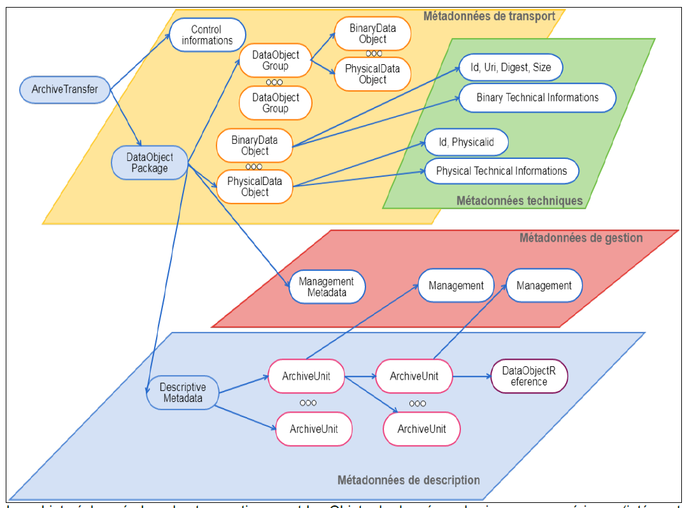

Selon cette formalisation :

-   les BinaryDataObject correspondent aux fichiers numériques représentant les archives ;
-   les PhysicalDataObject correspondent aux objets physiques représentant les archives ;
-   les DataObjectGroup rassemblent les BinaryDataObject et les PhysicalDataObject représentant une même archives (ex. une photographie représentée par un tirage analogique et un fichier numérique) ;
-   les ArchiveUnits correspondent à la description des archives elles-mêmes, qu’il s’agisse de :
    -   la description intellectuelle de ces archives, décrites dans un bloc intitulé Content pour chaque ArchiveUnit ;
    -   la description des règles de gestion applicables à ces archives, décrites soit dans le bloc ManagementMetadata si elles s’appliquent à toutes les archives, soit dans le bloc Management de chaque ArchiveUnit si chacune doit être gérée selon des règles propres.

**La documentation accompagnant le standard SEDA 2.1. est accessible sur le site internet du Service interministériel des Archives de France et est consultable à l’adresse suivante : https://francearchives.fr/seda/** [^2].

### Installation de la moulinette ReSIP

La moulinette ReSIP est téléchargeable sur le site internet du programme Vitam à l’adresse suivante : <http://www.programmevitam.fr/pages/ressources/resip/>.

Le répertoire correspondant à chacune des versions contient (cf. copie d’écran ci-dessous) :

-   un répertoire contenant des fichiers de configuration ;
-   un script Resip.bat ;
-   un fichier exécutable portable Resip.exe.

Pour une utilisation sous Linux, des fichiers .jar sont disponibles pour lancer la moulinette ReSIP en ligne de commande.

Un répertoire destiné à contenir des fichiers de journalisation (logs) peut compléter ce dossier après plusieurs utilisations.

### Lancement de la moulinette ReSIP

Une fois dézippée, la moulinette ReSIP peut être lancée de 3 manières différentes :

-   en effectuant un « glisser/déposer » (*drag and drop*) d’un répertoire de fichiers sur le script ReSip.bat pour créer directement un SIP ;
-   en lançant directement les opérations en ligne de commande ;
-   en lançant une interface graphique via un double-clic sur le fichier exécutable portable Resip.exe pour importer directement une arborescence et la retravailler dans l’interface.

    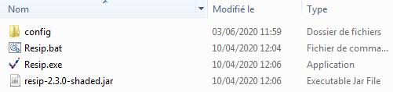

#### Glisser/déposer (*drag and drop*)

Comme avec le générateur SEDA, il est possible de générer automatiquement un SIP à partir d’une structure arborescente d’archives en faisant glisser un répertoire sur le fichier Resip.bat du répertoire
Resip (cf. copie d’écran ci-dessous).

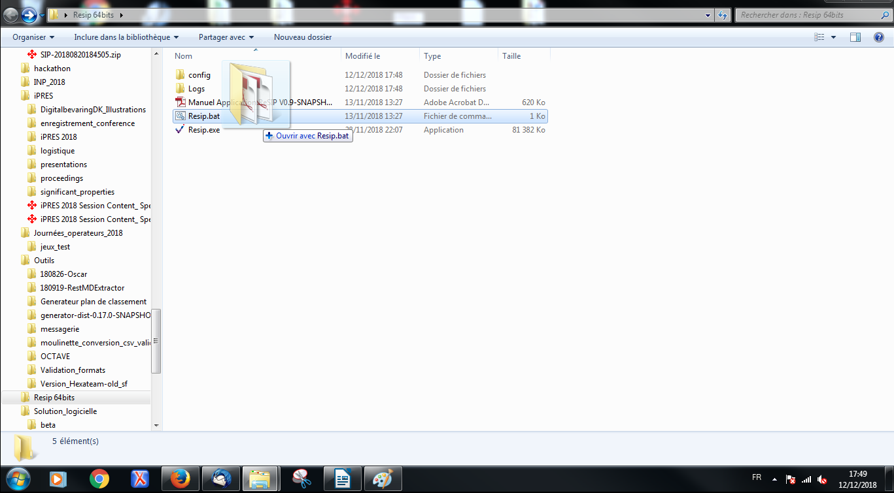

Une fois, le répertoire racine glissé vers le fichier Resip.bat, une fenêtre de dialogue s’ouvre (cf. copie d’écranci-dessous).

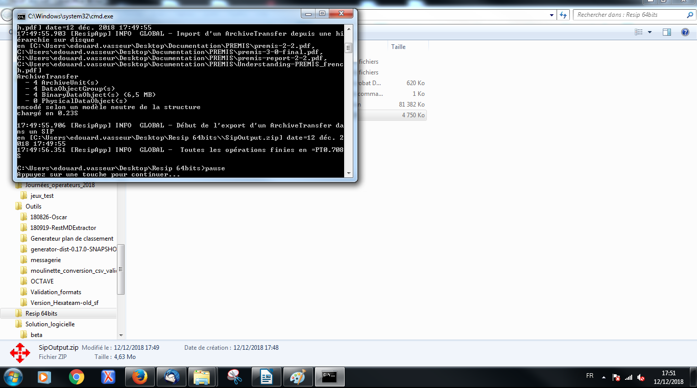
Une fois l’opération de génération du SIP terminée, la fenêtre de dialogue invite l’utilisateur à appuyer sur la touche « Entrée » pour la fermer. Le SIP généré est enregistré dans le répertoire Resip, sous la forme d’un fichier dont l’extension est .zip (cf. copie d’écran ci-dessous).

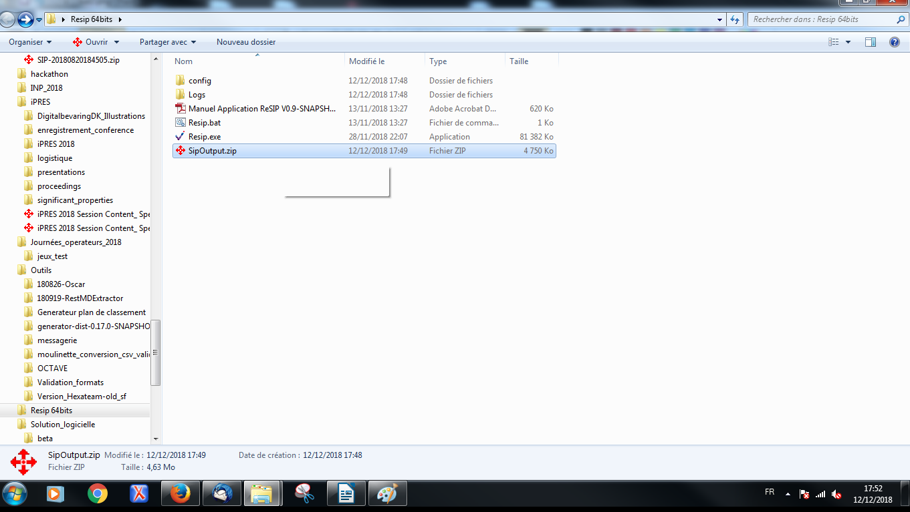

**Attention** :

-   l’opération ne pourra pas s’exécuter si le fichier nommé « ExportContext.config » est absent du répertoire nommé « config » ;
-   l’en-tête du manifeste reprend les options et métadonnées déclarées dans le fichier nommé « ExportContext.config ». Les valeurs des champs de l’en-tête peuvent être directement modifiées dans ce fichier.

#### Exécution en ligne de commande

En ligne de commande, la moulinette ReSIP permet d’effectuer les mêmes
traitements qu’au moyen de l’interface graphique.

Les commandes disponibles sont les suivantes :

| Argument            | Description |
|---|---|
| --context XXX     | Définition des informations globales utiles à la génération du SIP (MessageIdentifier, etc.) dans le fichier nommé « ExportContext.config »|
| --diskimport XXX  | Import d’une structure arborescente d’archives depuis un répertoire de fichiers avec, comme argument, le répertoire racine « XXX »|
| --exclude XXX     | Exclusion des fichiers dont le nom est conforme aux expressions régulières définies dans les lignes du fichier nommé « XXX » lors de l’import d’une structure arborescente d’archives depuis un répertoire de fichiers|
| --generatesip XXX | Génération d’un SIP à partir d’une structure arborescente d’archives sous la forme du fichier nommé « XXX »|
| --help            | Description des arguments utilisables|
| --hierarchical    | Génération des ArchiveUnits du manifeste SEDA sous forme hiérarchique|
| --indented        | Génération du manifeste SEDA sous forme de fichier XML indenté|
| --manifest XXX    | Génération du manifeste XML SEDA correspondant à une structure arborescente d’archives sous la forme d’un fichier nommé « XXX »|
| --sipimport XXX   | Import d’une structure arborescente d’archives depuis un SIP SEDA avec, comme argument, le nom du fichier « XXX »|
| --verbatim XXX    | Indication du niveau de journalisation (OFF / ERROR / GLOBAL / STEP / OBJECTS\_GROUP / OBJECTS / OBJECTS\_WARNING)|
| --workdir XXX     | Désignation du répertoire de travail utilisé pour enregistrer les logs et les répertoires d’extraction temporaire (par défaut%User %/Documents/ReSip ou celui défini dans les préférences de l’interface graphique)|
| --xcommand        | Exécution sans lancement de l’interface graphique|

#### Lancement de l’interface graphique

L’interface graphique de la moulinette ReSIP peut être ouverte en double-cliquant sur le fichier exécutable portable Resip.exe (cf. copie
d’écran ci-dessous) :


Cette interface permet d’effectuer l’ensemble des opérations possibles (import, traitement, export) sur une structure arborescente d’archives.

### Paramétrage du référentiel des formats utilisé

La moulinette ReSIP procède à une identification du format des fichiers traités en utilisant l’application DROID ainsi que les fichiers de signatures DROID publiés par The National Archives (UK).

Les fichiers de signature DROID faisant l’objet de mises à jour régulières par The National Archives (UK), ils doivent être mis à jour pour utiliser de manière optimale la moulinette ReSIP.

Pour mettre à jour des fichiers, il suffit de :

-   télécharger ces fichiers sur le site de The National Archives (UK), à l’adresse suivante :
    <https://www.nationalarchives.gov.uk/aboutapps/pronom/droid-signature-files.htm>[^3];
-   substituer, dans le répertoire config du répertoire ReSIP, les fichiers existants par les fichiers plus récents précédemment téléchargés (cf. copie d’écran ci-dessous).

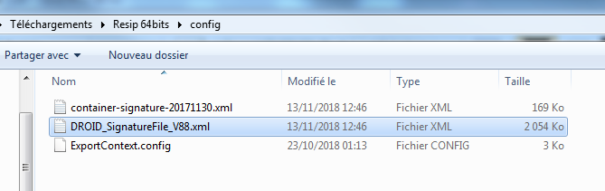

Au terme de la version 6.RC (octobre 2022), la version 2.7 de ReSIP supporte la version 97 des fichiers de signature.

Présentation de l’interface graphique de la moulinette ReSIP
------------------------------------------------------------

### Interface « XML-expert »[^4]

#### Fenêtre principale

L’interface graphique de la moulinette ReSIP, paramétrée comme
« XML-expert » et lancée après double-clic sur le fichier Resip.exe se
présente de la manière suivante (cf. copie d’écran ci-dessous) :

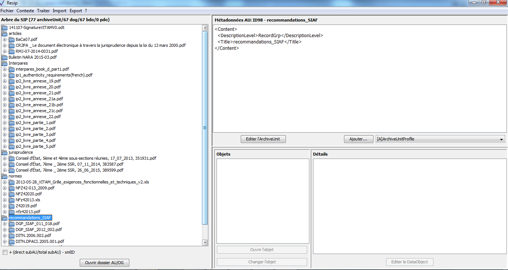

La fenêtre principale de la moulinette est composée comme suit :

-   tout en haut, un menu permettant de déclencher des traitements sur
    une structure arborescente d’archives (et indiquant les raccourcis
    clavier existants pouvant être lancés directement sans passer par le
    menu). Seules les actions exécutables dans l’état du système et des
    données chargées dans la session en cours peuvent être lancées, les
    autres étant grisées et non activables ;
-   à gauche, un panneau de visualisation et de modification de la
    structure arborescente d’archives, qui permet aussi de sélectionner
    une unité d’archives précise ;
-   en haut à droite, un panneau de visualisation et de modification des
    métadonnées de l’unité archivistique sélectionnée ;
-   en bas à droite (fenêtre de gauche), un panneau de visualisation de
    la liste des objets binaires représentant l’unité archivistique
    sélectionnée, permettant également de sélectionner un de ces
    objets ;
-   en bas à droite (fenêtre de droite), un panneau de visualisation et
    de modification des métadonnées de l’objet binaire sélectionné.

#### Le panneau de visualisation et de modification de la structure arborescente d’archives

Ce panneau permet de visualiser et de modifier la structure arborescente
des archives.

Il comporte les éléments suivants :

-   un bandeau indiquant la dénomination de la structure arborescente
    traitée, ainsi que sa composition : nombre d’unités archivistiques
    (ArchiveUnits), nombre de groupes d’objets (dataObjectGroups ou
    dog), nombre d’objets binaires (BinaryObjects ou bdo) et nombre
    d’objets physiques (PhysicalObjects ou pdo) (cf. copie d’écran
    ci-dessous) ;
-   dans la zone principale, la structure arborescente des unités
    archivistiques (symbolisées par des icônes en forme de répertoire
    avec pour intitulé la valeur du champ « Titre »), ainsi que les
    groupes d’objets les représentant le cas échéant (symbolisés par des
    icônes en forme de document) (cf. copie d’écran ci-dessous) ;
   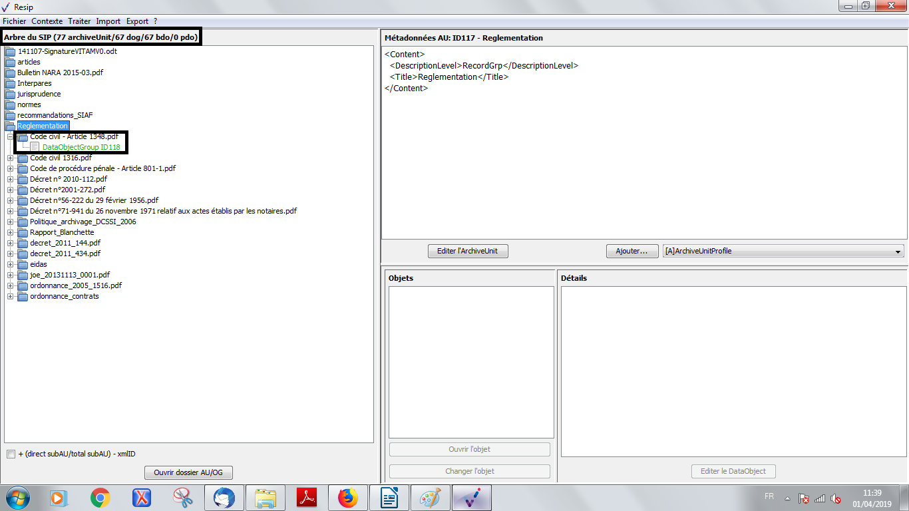

- sous la zone principale :
    -   une case à cocher permettant d’afficher, pour chaque unité
        archivistique, le nombre des unités archivistiques de niveau
        immédiatement inférieur, le nombre d’unités archivistiques
        dépendantes de cette unité archivistique, ainsi que son
        identifiant XML (cf. copie d’écran ci-dessous) ;

        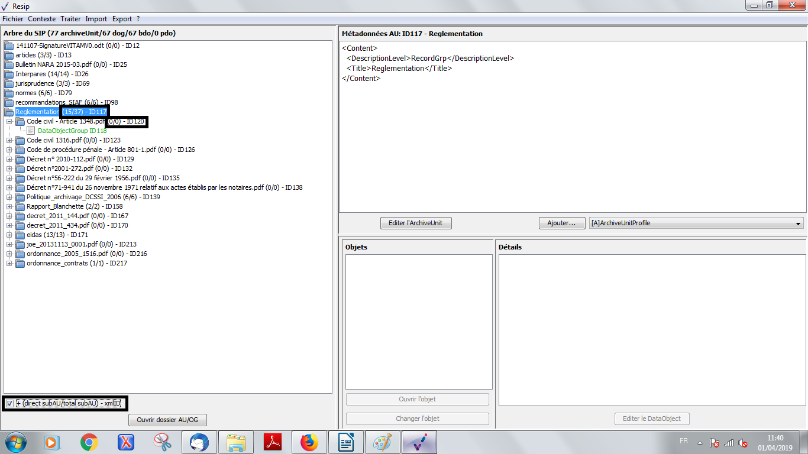

    -   un bouton d’action permettant d’ouvrir, s’il
        existe, le répertoire ou l’objet numérique représentant l’unité
        archivistique. Cette fonction est utilisable en cas d’import
        d’une arborescence de fichiers ou d’import d’une messagerie (cf.
        copie d’écran ci-dessous).

        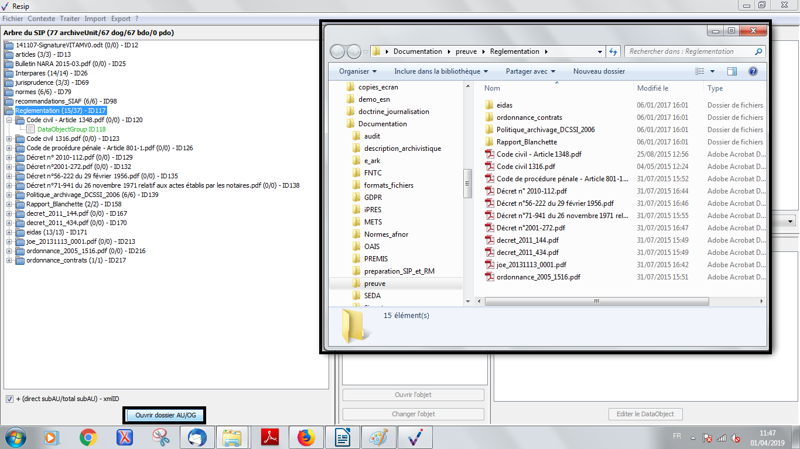

Les unités archivistiques ont par défaut un titre de
couleur noire. Cependant, quand une unité archivistique a plusieurs
unités archivistiques parentes, son titre est de couleur bleue. C’est le
cas, dans l’exemple ci-dessous, pour l’unité archivistique nommée
« DGP_SIAF_011_018 » qui a 2 unités archivistiques parentes : les
unités archivistiques nommées « normes » et « recommandations SIAF »
(cf. copie d’écran ci-dessous).

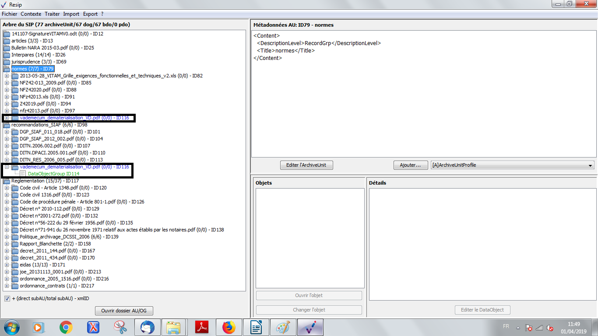

Il est possible d’afficher les unités archivistiques
filles d’une unité archivistique en double-cliquant sur celle-ci. Dans
l’exemple ci-dessous, l’unité archivistique « Réglementation » a des
unités archivistiques filles. Après avoir double-cliqué sur son titre,
ses unités archivistiques filles apparaissent ou disparaissent (cf.
copie d’écran ci-dessous).

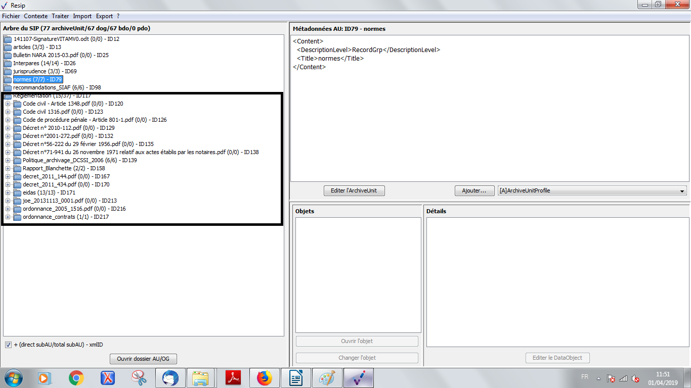

#### Le panneau de visualisation et de modification des métadonnées d’une unité archivistique

Ce panneau permet de visualiser et de modifier les métadonnées de
l’unité archivistique sélectionnée dans le panneau de visualisation et
de modification de la structure arborescente d’archives.

Il comporte les éléments suivants :

-   un bandeau reprenant la valeur du champ « Titre » de l’unité
    archivistique ;
-   une zone principale permettant de visualiser les métadonnées de
    description et de gestion des unités archivistiques sous forme XML
    (cf. copie d’écran ci-dessous) ;
    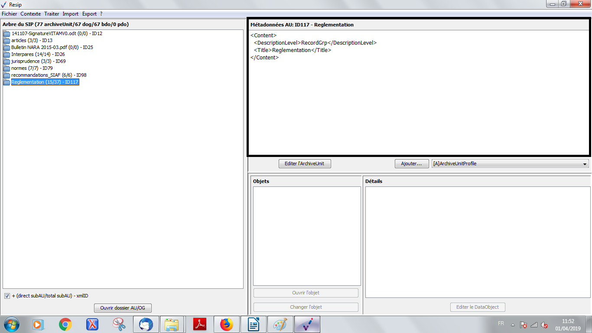
-   sous la zone principale :

    -   un bouton d’action « Editer l’ArchiveUnit » permettant de
        modifier le contenu des métadonnées de description et de gestion
        de l’unité archivistique de manière libre (cf. copie d’écran
        ci-dessous) ;
        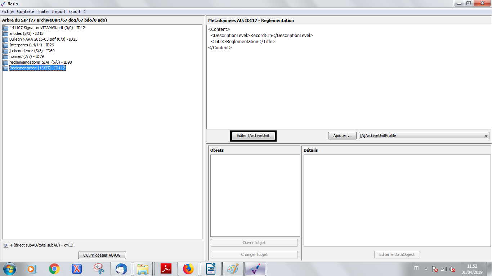
    -   un bouton d’action « Ajouter » associé à un
        menu déroulant, permettant d’ajouter de manière guidée la
        métadonnée supplémentaire sélectionnée dans le menu déroulant
        aux métadonnées déjà présentes. Le champ « Profil d’unité
        archivistique » (ArchiveUnitProfile) est préfixé par un [A],
        les métadonnées de description avec un [C], les métadonnées de
        gestion avec un [M]. **Attention** : les métadonnées
        répétables sont suivies d’un astérisque (cf. copie d’écran
        ci-dessous).

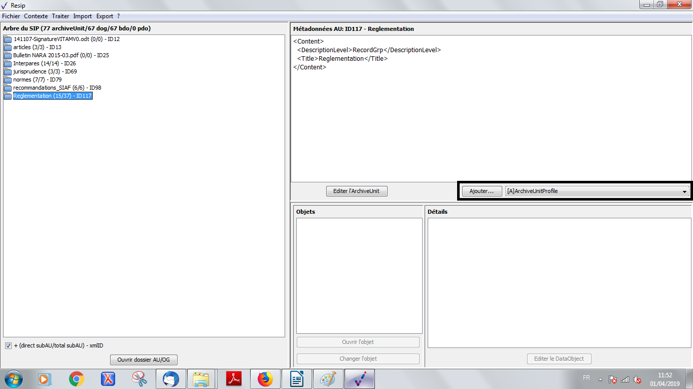

#### Le panneau de visualisation de la liste des objets

Ce panneau permet de visualiser la liste des objets, tant physiques
comme binaires, composant le groupe d’objets techniques représentant
l’unité archivistique sélectionnée dans le panneau de visualisation et
de modification de la structure arborescente d’archives. Il permet
également de sélectionner un de ces objets pour voir ses métadonnées, le
visualiser ou changer le fichier correspondant.

Il comporte les éléments suivants :

-   une zone principale « Objets » permettant de visualiser la liste des
    objets, physiques comme binaires, représentant l’unité archivistique
    sélectionnée. L’intitulé correspond à l’identifiant attribué
    automatiquement par ReSIP à l’objet (sous la forme ID + numéro), la
    nature de l’objet (bin pour les objets binaires, phy pour les objets
    physiques), l’usage – [l’usage par défaut d’un objet binaire généré
    par ReSIP est BinaryMaster, l’usage par défaut d’un objet physique
    est PhysicalMaster, les autres valeurs possibles étant Dissemination
    (pour les objets binaires comme physiques), Thumbnail ou TextContent
    pour les objets binaires] – et la version de cet objet – par
    défaut, le numéro 1 est généré par ReSIP (cf. copie d’écran
    ci-dessous) ;
    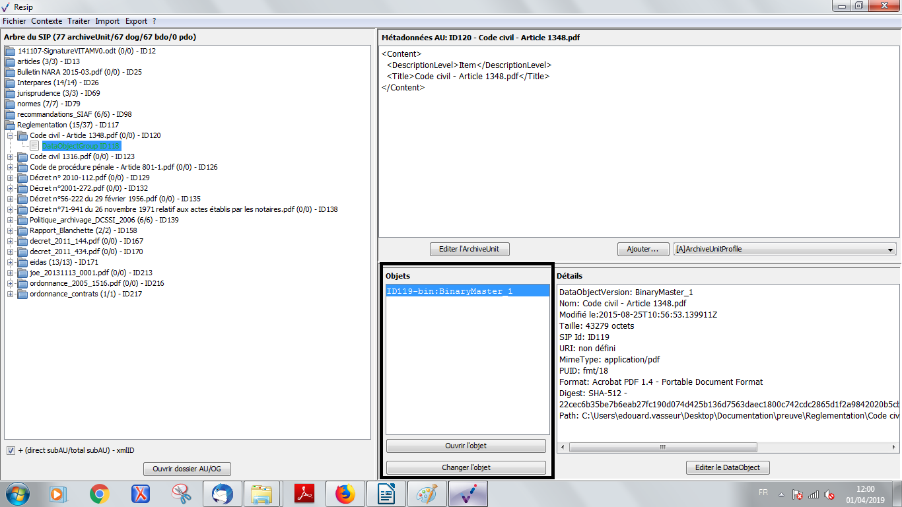

-   un bouton d’action « Ouvrir l’objet » permettant
    d’ouvrir le fichier correspondant à l’objet sélectionné dans la
    liste, en utilisant les applicatifs proposés par défaut par le
    système d’exploitation de l’environnement utilisé (cf. copie d’écran
    ci-dessous) ;
    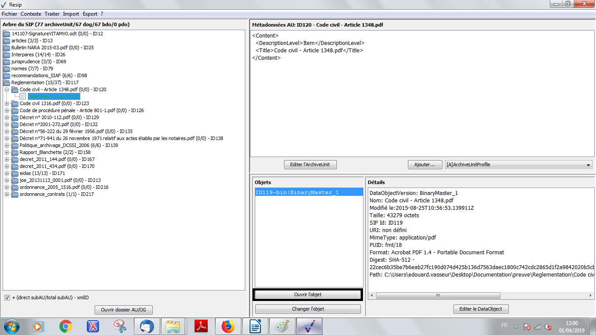

-   un bouton d’action « Changer l’objet » qui permet
    de sélectionner, depuis l’explorateur Windows de l’utilisateur, un
    fichier à substituer au fichier existant (cf. copie d’écran
    ci-dessous).
    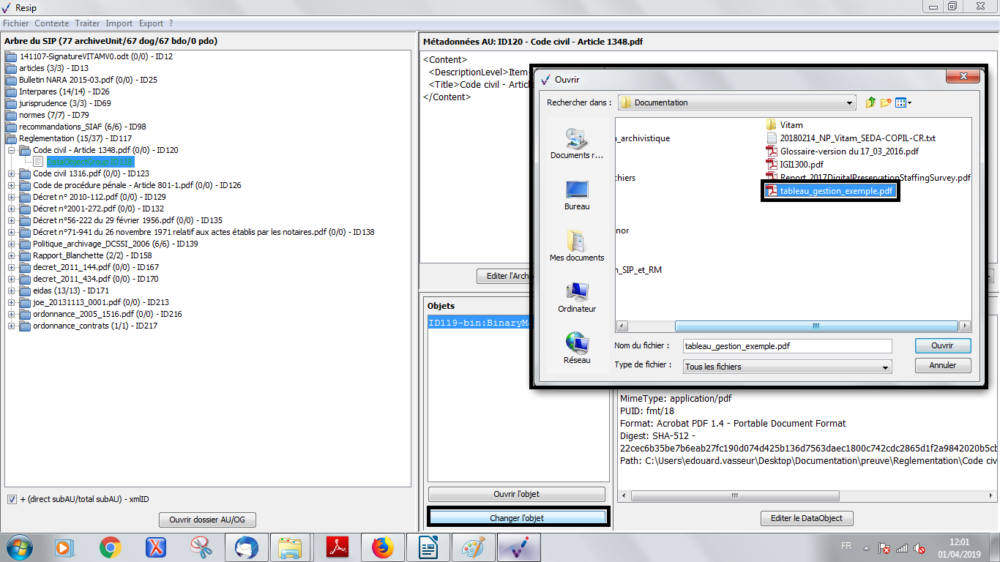

#### Le panneau de visualisation et de modification des métadonnées d’un objet

Ce panneau permet de visualiser et de modifier les métadonnées de
l’objet, binaire comme physique, sélectionné dans le panneau de
visualisation de la liste des objets.

Il comporte les éléments suivants :

-   une zone principale « Détails » permettant de visualiser les
    métadonnées techniques de l’objet (cf. copie d’écran ci-dessous).

    **Attention** : les métadonnées d’un objet physique sont présentées
    sous une forme XML, tandis que les métadonnées d’un objet binaire le
    sont dans une forme explicite, précisant le chemin permettant
    d’accéder à l’objet concerné sur l’environnement de travail de
    l’utilisateur (champ « Path ») ;

-   un bouton d’action « Editer le DataObject »
    permettant de modifier le contenu des métadonnées technique de
    l’objet (cf. copie d’écran ci-dessous) ;
    
    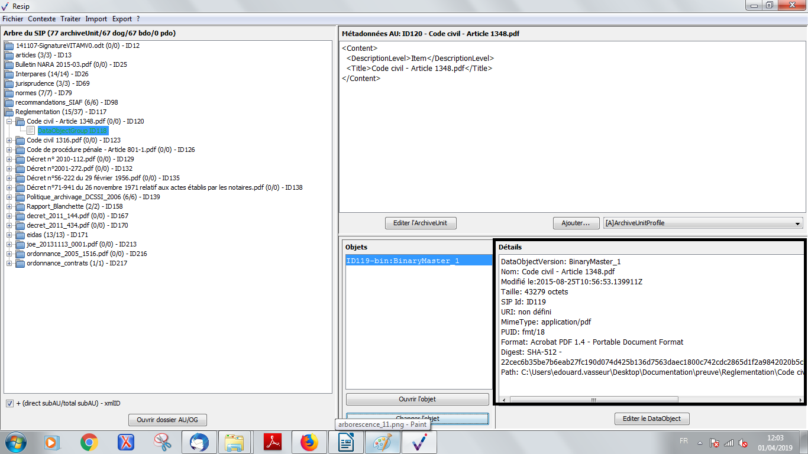

### Interface « structurée »

#### Fenêtre principale

L’interface graphique de la moulinette ReSIP, paramétrée par défaut
comme « structurée » et lancée après double-clic sur le fichier
Resip.exe se présente de la manière suivante (cf. copie d’écran
ci-dessous) :

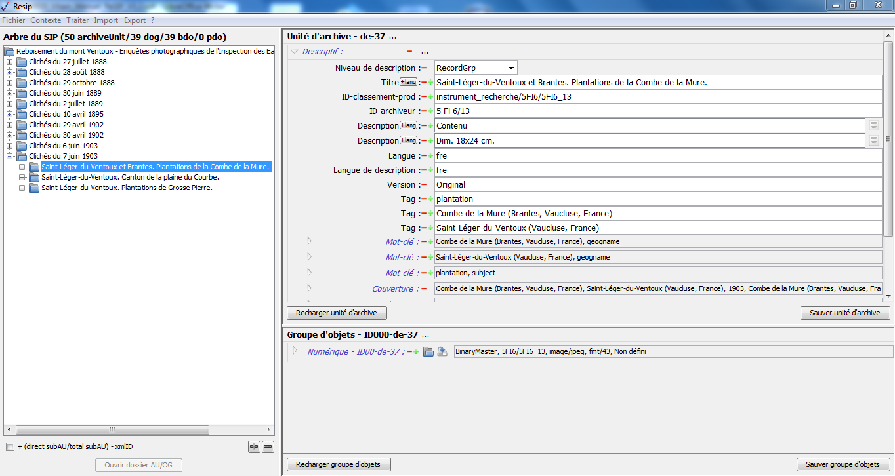

La fenêtre principale de la moulinette est composée comme suit :

-   tout en haut, un menu permettant de déclencher des traitements sur
    une structure arborescente d’archives (et indiquant les raccourcis
    clavier existants pouvant être lancés directement sans passer par le
    menu). Seules les actions exécutables dans l’état du système et des
    données chargées dans la session en cours peuvent être lancées, les
    autres étant grisées et non activables ;
-   à gauche, un panneau de visualisation et de modification de la
    structure arborescente d’archives, qui permet aussi de sélectionner
    une unité d’archives précise ;
-   en haut à droite, un panneau de visualisation et de modification des
    métadonnées de l’unité archivistique sélectionnée ;
-   en bas à droite, un panneau de visualisation et de modification des
    métadonnées du groupe d’objets techniques représentant l’unité
    archivistique sélectionnée, permettant également de télécharger
    l’(les) objet(s) binaire(s) associé(s).

#### Le panneau de visualisation et de modification de la structure arborescente d’archives

Ce panneau permet de visualiser et de modifier la structure arborescente des archives.

Il comporte les éléments suivants :

-   un bandeau indiquant la dénomination de la structure arborescente
    traitée, ainsi que sa composition : nombre d’unités archivistiques
    (ArchiveUnits), nombre de groupes d’objets (dataObjectGroups ou
    dog), nombre d’objets binaires (BinaryObjects ou bdo) et nombre
    d’objets physiques (PhysicalObjects ou pdo) (cf. copie d’écran
    ci-dessous) ;
-   dans la zone principale, la structure arborescente des unités
    archivistiques (symbolisées par des icônes en forme de répertoire
    avec pour intitulé la valeur du champ « Titre »), ainsi que les
    groupes d’objets les représentant le cas échéant (symbolisés par des
    icônes en forme de document) (cf. copie d’écran ci-dessous) ;
   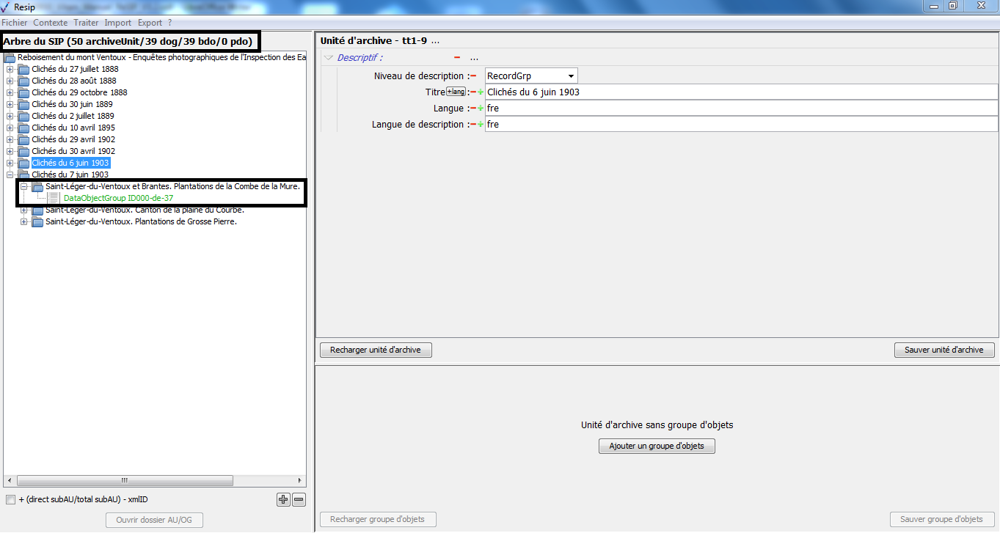
-   sous la zone principale :

    -   une case à cocher permettant d’afficher, pour chaque unité
        archivistique, le nombre des unités archivistiques de niveau
        immédiatement inférieur, le nombre d’unités archivistiques
        dépendantes de cette unité archivistique, ainsi que son
        identifiant XML (cf. copie d’écran ci-dessous) ;
        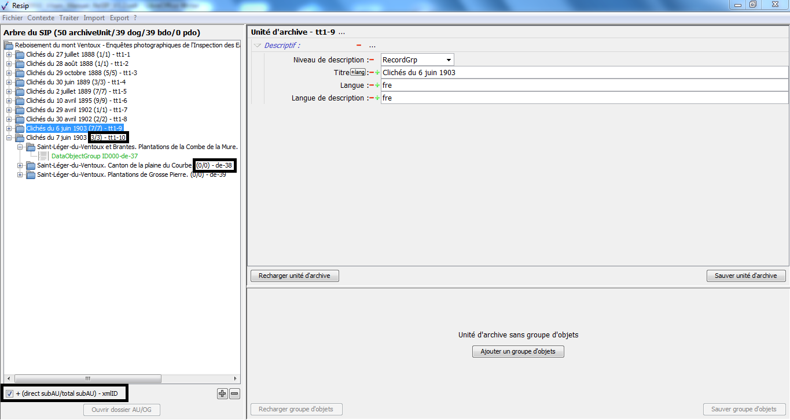

    -   un bouton d’action permettant d’ouvrir, s’il
        existe le répertoire ou l’objet numérique représentant l’unité
        archivistique s’il existe. Cette fonction est utilisable en cas
        d’import d’une arborescence de fichiers ou d’import d’une
        messagerie (cf. copie d’écran ci-dessous).
	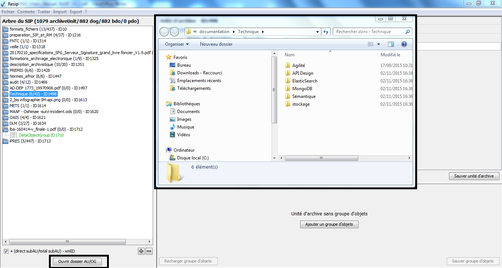

Les unités archivistiques ont par défaut un titre de
couleur noire. Cependant, quand une unité archivistique a plusieurs
unités archivistiques parentes, son titre est de couleur bleue. C’est le
cas, dans l’exemple ci-dessous, pour l’unité archivistique nommée
« DGP_SIAF_011_018 » qui a 2 unités archivistiques parentes : les
unités archivistiques nommées « normes » et « recommandations SIAF »
(cf. copie d’écran ci-dessous).


Il est possible d’afficher les unités archivistiques
filles d’une unité archivistique en double-cliquant sur celle-ci. Dans
l’exemple ci-dessous, l’unité archivistique « Clichés du 6 juin 1903 » a
des unités archivistiques filles. Après avoir double-cliqué sur son
titre, ses unités archivistiques filles apparaissent ou disparaissent
(cf. copie d’écran ci-dessous).

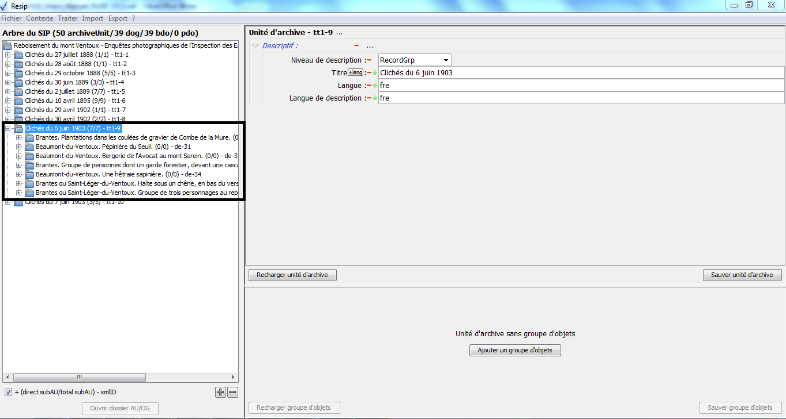

#### Le panneau de visualisation et de modification des métadonnées d’une unité archivistique

Ce panneau permet de visualiser et de modifier les métadonnées de
l’unité archivistique sélectionnée dans le panneau de visualisation et
de modification de la structure arborescente d’archives.

Il comporte les éléments suivants :

-   un bandeau reprenant la valeur de l’identifiant de l’unité
    archivistique.

    Dans cette zone, un bouton caractérisé par trois points permet
    d’ajouter des métadonnées descriptives et de gestion en proposant
    une liste de métadonnées quand on clique dessus (cf. copie d’écran
    ci-dessous) ;

-   une zone principale permettant de visualiser les métadonnées de
    description et de gestion des unités archivistiques sous forme de
    formulaire structuré (cf. copie d’écran ci-dessous).

    Dans cette zone :

    -   pour chaque métadonnée :

        -   un bouton caractérisé par un moins permet de supprimer la
            métadonnée,
        -   un bouton caractérisé par un plus permet d’ajouter une
            nouvelle métadonnée, quand la métadonnée est répétable ;

    -   pour les métadonnées disposant de sous-ensembles de métadonnées
        (ex. « Descriptif », « Rédacteur »), un bouton caractérisé par
        trois points permet d’ajouter des métadonnées en proposant une
        liste de métadonnées quand on clique dessus (cf. copie d’écran
        ci-dessous) ;

   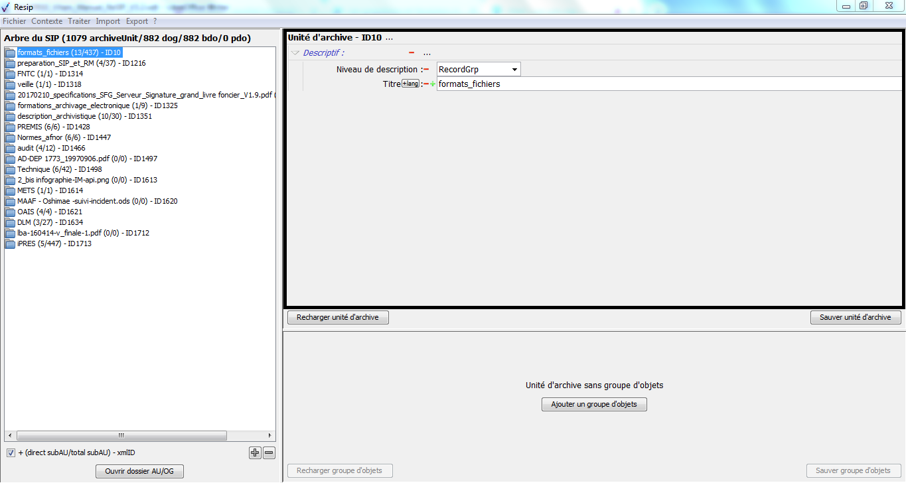
- sous la zone principale :

    -   un bouton d’action « Recharger unité d’archive » permettant de
        restaurer les métadonnées de description et de gestion de
        l’unité archivistique chargées initialement ou sauvegardées
        dernièrement (cf. copie d’écran ci-dessous) ;
       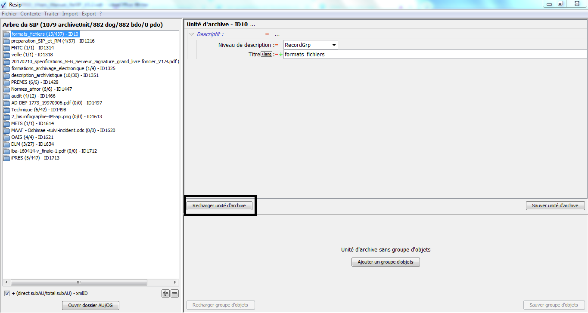
    -   un bouton d’action « Sauver unité d’archives »,
        permettant d’enregistrer les modifications apportées aux
        métadonnées de description et de gestion de l’unité
        archivistique (cf. copie d’écran ci-dessous).

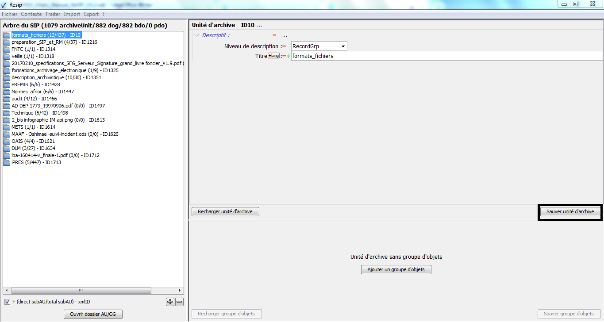

#### Le panneau de visualisation et de modification des métadonnées d’un groupe d’objets techniques

Ce panneau permet de :

-   visualiser et de modifier les métadonnées d’un groupe d’objets,
    binaires comme physiques ;
-   ajouter des objets, binaires comme physiques, au groupe d’objets
    techniques.

Il comporte les éléments suivants :

-   un bandeau reprenant la valeur de l’identifiant du groupe d’objets
    techniques.

    Dans cette zone, un bouton caractérisé par trois points permet
    d’ajouter un objet, binaire ou physique, ou un journal au groupe
    d’objets techniques existant en proposant ces trois items quand on
    clique dessus (cf. copie d’écran ci-dessous) ;

-   une zone principale permettant de visualiser les métadonnées du
    groupe d’objets techniques sous forme de formulaire structuré (cf.
    copie d’écran ci-dessous) ;

    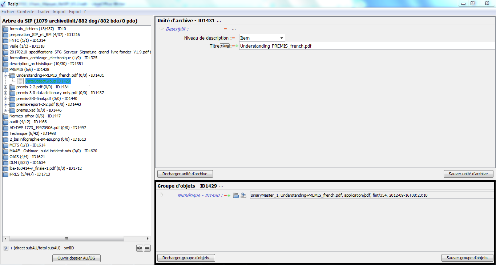
  
    Dans cette zone, pour chaque métadonnée :

    -   un bouton caractérisé par un moins permet de supprimer la
        métadonnée,
    -   un bouton caractérisé par un plus permet d’ajouter une nouvelle
        métadonnée, quand la métadonnée est répétable,
    -   un bouton symbolisé par un dossier, disposé au niveau de la
        métadonnée « Numérique » permettant de télécharger l’objet
        binaire ;
    -   un bouton représentant une flèche se dirigeant vers un serveur
        disposé au niveau de la métadonnée « Numérique » permettant de
        changer l’objet binaire ;

-   sous la zone principale :

    -   un bouton d’action « Recharger groupe d’objets » permettant de
        restaurer les métadonnées du groupe d’objets techniques chargées
        initialement ou sauvegardées dernièrement (cf. copie d’écran
        ci-dessous) ;

        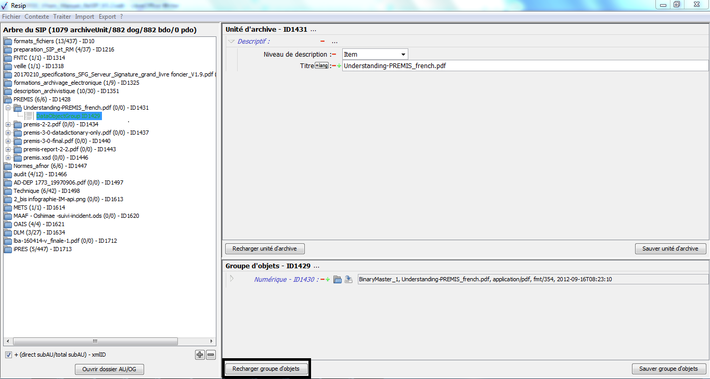

    -   un bouton d’action « Sauver groupe d’objets », permettant
        d’enregistrer les modifications apportées aux métadonnées du
        groupe d’objets techniques (cf. copie d’écran ci-dessous).

        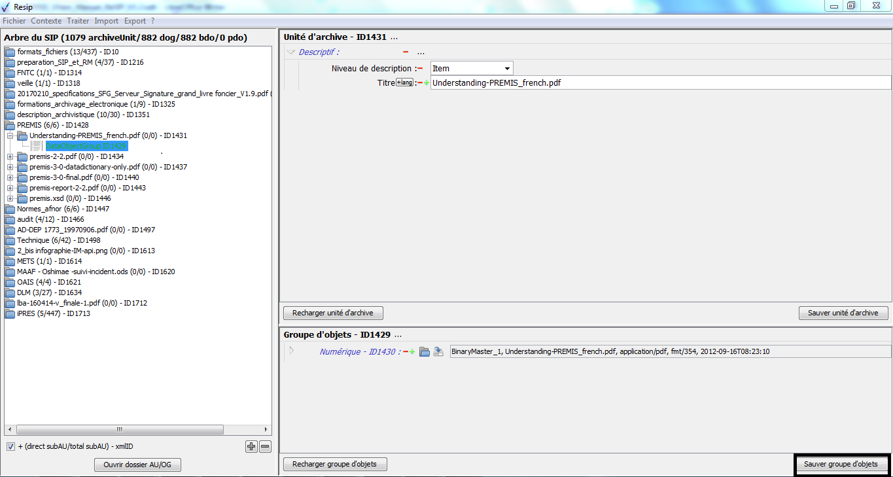

### Connaître la version de la moulinette ReSIP utilisée

Afin de connaître la version de la moulinette ReSIP utilisée, il
convient, dans le menu de la moulinette ReSIP, de cliquer sur l’action
« ? », puis sur « À propos de Resip » qui fait apparaître une fenêtre de
dialogue fournissant l’information demandée (cf. copie d’écran
ci-dessous).

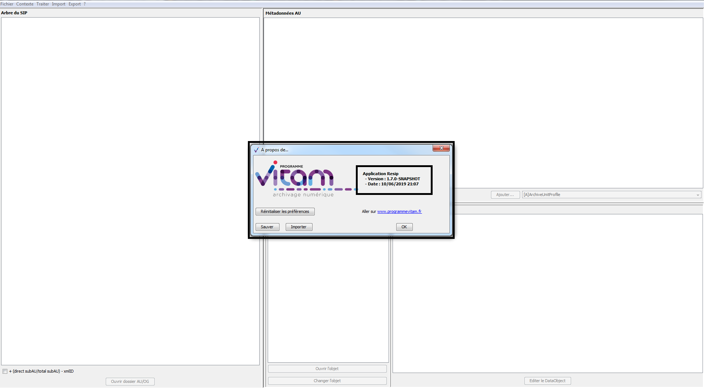

### Paramétrer la moulinette ReSIP

La moulinette ReSIP est fournie avec un paramétrage par défaut de son
interface et de ses fonctionnalités d’import, d’export et de traitement
de structures arborescentes d’archives. Il est possible :

-   de choisir le mode d’affichage de l’interface ;
-   de choisir la version du SEDA sur laquelle travailler ;
-   d’exporter le fichier de paramétrage par défaut ;
-   de modifier le fichier de paramétrage par défaut ;
-   d’importer un fichier de paramétrage différent du fichier de
    paramétrage par défaut ;
-   de réinitialiser le paramétrage par défaut ;
-   d’activer le service de compaction (mode expérimental).

#### Choisir le mode d’affichage de l’interface

La moulinette ReSIP peut être utilisée avec deux interfaces
différentes :

-   une interface dite « structurée », utilisée par défaut lorsqu’on
    lance ReSIP ;
-   une interface dite « XML-expert », permettant de manipuler les
    données au moyen d’une édition XML.

Afin de connaître l’interface utilisée, il convient, dans le menu de la
moulinette ReSIP, de cliquer sur l’action « ? ».

-   Si « Editeur structuré » est précédé d’une coche, l’interface dite
    « structurée » est utilisée,
-   Si « Editeur structuré » n’est pas précédé d’une coche, l’interface
    dite « XML-expert » est utilisée.

Pour modifier l’interface par défaut afin d’obtenir l’interface dite
« XML-expert », il suffit de cliquer sur « Editeur structuré ».

#### Choisir la version du SEDA supportée

La moulinette ReSIP peut être utilisée avec :
-   soit la version 2.1. du SEDA ;
-   soit la version 2.2. du SEDA.
Pour modifier la version du SEDA sur laquelle travailler, il convient, dans le menu de la moulinette ReSIP, de cliquer sur l’action « Fichier » puis sur la sous-action « Préférences » 
Le paramétrage de l’import est disponible dans l’onglet « Traitement/Interface » (cf. copie d’écran ci-dessous). Il suffit de cliquer sur la version du SEDA souhaitée.

    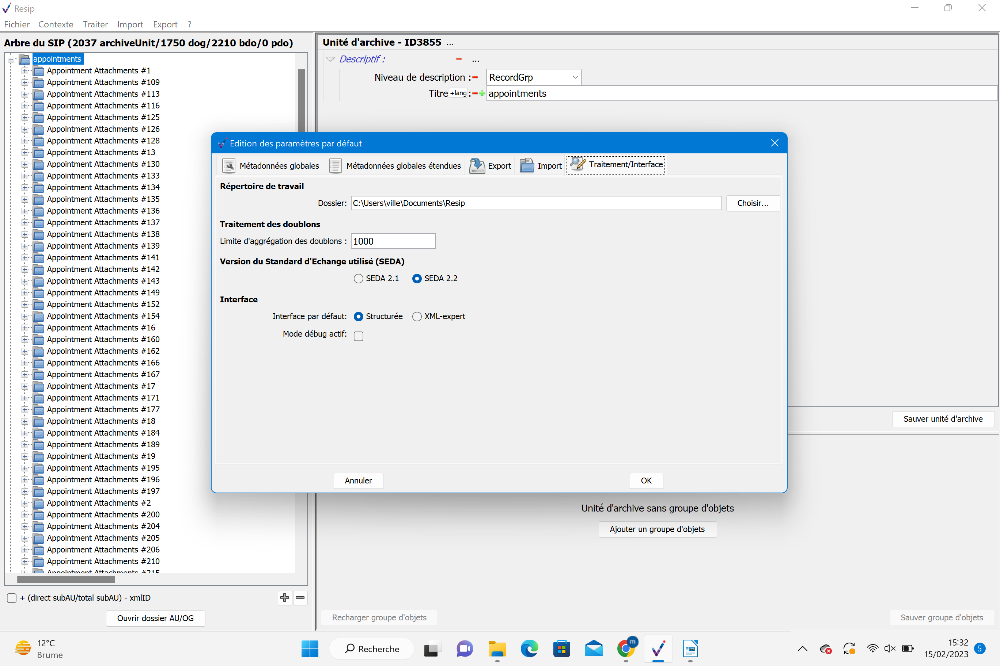

***Point d’attention :*** Il est recommandé d’effectuer ce paramétrage avant d’importer quoique ce soit dans la moulinette ReSIP.

#### Activer le mode « debug »

Afin d’activer le mode « debug », il convient, dans le menu de la
moulinette ReSIP, de cliquer sur l’action « ? ».

-   Si « Mode débug » est précédé d’une coche, le mode « debug » est
    activé,
-   Si « Mode débug » n’est pas précédé d’une coche, le mode « debug »
    n’est pas activé.

Pour modifier le mode par défaut afin d’activer le mode « debug », il
suffit de cliquer sur « Mode débug ».

####   Activer le service de compaction

Afin d’activer le service de compaction, disponible en expérimentation, il convient, dans le menu de la moulinette ReSIP, de cliquer sur l’action « ? ».

-   Si « Mode expérimental » est précédé d’une coche, le service de compaction est activé,
-   Si « Mode expérimental » n’est pas précédé d’une coche, le service de compaction n’est pas activé.

Pour modifier le mode par défaut afin d’activer le service expérimental de compaction, il suffit de cliquer sur « Mode expérimental ».

#### Exporter le fichier de paramétrage par défaut

Afin d’exporter le fichier de paramétrage par défaut, il convient :

-   dans le menu de la moulinette ReSIP, de cliquer sur l’action « ? »,
    puis sur « À propos de Resip » qui fait apparaître une fenêtre de
    dialogue (cf. copie d’écran ci-dessous) ;

    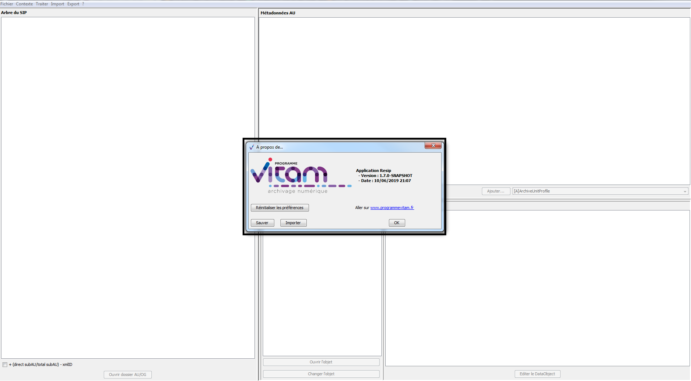

-   de cliquer sur le bouton d’action « Sauver » (cf. copie d’écran
    ci-dessous) ;

    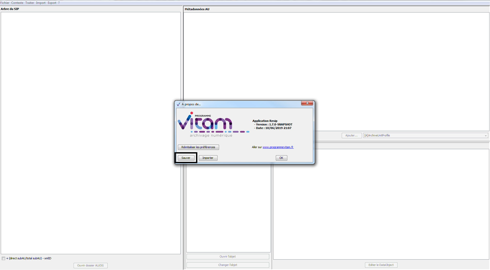
Le clic sur la sous-action « Sauver » ouvre
l’explorateur Windows de l’utilisateur et permet à celui-ci de
sélectionner un répertoire et d’enregistrer le fichier de paramétrage
par défaut en le nommant « ResipPreferences.properties » (cf. copie
d’écran ci-dessous).

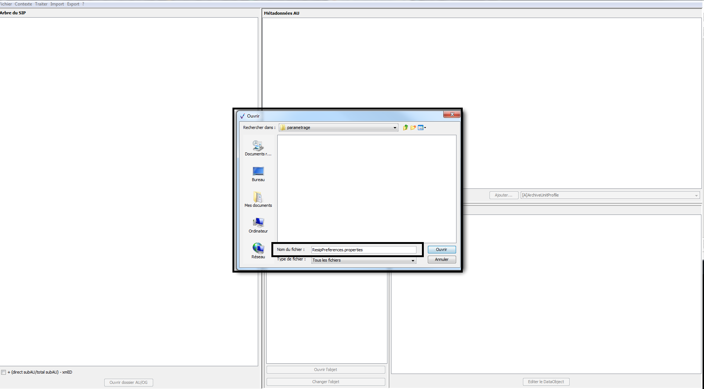

Le clic sur le bouton d’action « Ouvrir » de
l’explorateur lance l’opération d’enregistrement du fichier de
paramétrage par défaut. La fenêtre de dialogue se ferme automatiquement
dès l’enregistrement réalisé.

#### Modifier le fichier de paramétrage par défaut

Afin de modifier le fichier de paramétrage par défaut, il convient
d’ouvrir le fichier ResipPreferences.properties avec un éditeur de texte
de type Bloc-notes ou Notepad ++.

Le fichier de paramétrage par défaut se présente comme suit et liste
dans l’ordre :

-   les paramètres d’export des structures arborescentes d’archives
    (lignes commençant par « exportContext ») ;
-   l’emplacement par défaut où les SIP seront exportés (lignes
    commençant par « global ») ;
-   les paramètres d’import des structures arborescentes d’archives
    (lignes commençant par « importContext ») ;
-   les paramètres de traitement des fichiers, à savoir la
    catégorisation des formats de fichiers et le seuil de dédoublonnage
    des fichiers (lignes commençant par « treatmentParameters »).

Fichier de paramétrage par défaut avec, en gras, les paramètres qu’un
service d’archives peut vouloir modifier

---

<pre>
#Resip preferences
#Thu Jun 27 14:02:34 CEST 2019
exportContext.csvExport.maxNameSize=32
exportContext.csvExport.usageVersionSelectionMode=2
exportContext.general.hierarchicalArchiveUnits=true
exportContext.general.indented=true
exportContext.general.keptMetadataList=DescriptionLevel\nTitle\nFilePlanPosition\nSystemId\nOriginatingSystemId\nArchivalAgencyArchiveUnitIdentifier\nOriginatingAgencyArchiveUnitIdentifier\nTransferringAgencyArchiveUnitIdentifier\nDescription\nCustodialHistory\nType\nDocumentType\nLanguage\nDescriptionLanguage\nStatus\nVersion\nTag\nKeyword\nCoverage\nOriginatingAgency\nSubmissionAgency\nAuthorizedAgent\nWriter\nAddressee\nRecipient\nTransmitter\nSender\nSource\nRelatedObjectReference\nCreatedDate\nTransactedDate\nAcquiredDate\nSentDate\nReceivedDate\nRegisteredDate\nStartDate\nEndDate\nEvent\nSignature\nGps
exportContext.general.managementMetadataXmlData=\
&lt;ManagementMetadata&gt;\n &lt;AcquisitionInformation&gt;Acquisition
Information&lt;/AcquisitionInformation&gt;\n &lt;LegalStatus&gt;Public
Archive&lt;/LegalStatus&gt;\n
&lt;OriginatingAgencyIdentifier&gt;Service_producteur&lt;/OriginatingAgencyIdentifier&gt;\n
&lt;SubmissionAgencyIdentifier&gt;Mission_Culture&lt;/SubmissionAgencyIdentifier&gt;\n
&lt;/ManagementMetadata&gt;

exportContext.general.metadataFilterFlag=false

exportContext.general.reindex=false

<b>exportContext.globalMetadata.archivalAgencyIdentifier=AN</b>

exportContext.globalMetadata.archivalAgencyOrganizationDescriptiveMetadataXmlData=

<b>exportContext.globalMetadata.archivalAgreement=IC-000001</b>

exportContext.globalMetadata.codeListVersionsXmlData=\
&lt;CodeListVersions&gt;\n
&lt;ReplyCodeListVersion&gt;ReplyCodeListVersion0&lt;/ReplyCodeListVersion&gt;\n
&lt;MessageDigestAlgorithmCodeListVersion&gt;MessageDigestAlgorithmCodeListVersion0&lt;/MessageDigestAlgorithmCodeListVersion&gt;\n
&lt;MimeTypeCodeListVersion&gt;MimeTypeCodeListVersion0&lt;/MimeTypeCodeListVersion&gt;\n
&lt;EncodingCodeListVersion&gt;EncodingCodeListVersion0&lt;/EncodingCodeListVersion&gt;\n
&lt;FileFormatCodeListVersion&gt;FileFormatCodeListVersion0&lt;/FileFormatCodeListVersion&gt;\n
&lt;CompressionAlgorithmCodeListVersion&gt;CompressionAlgorithmCodeListVersion0&lt;/CompressionAlgorithmCodeListVersion&gt;\n
&lt;DataObjectVersionCodeListVersion&gt;DataObjectVersionCodeListVersion0&lt;/DataObjectVersionCodeListVersion&gt;\n
&lt;StorageRuleCodeListVersion&gt;StorageRuleCodeListVersion0&lt;/StorageRuleCodeListVersion&gt;\n
&lt;AppraisalRuleCodeListVersion&gt;AppraisalRuleCodeListVersion0&lt;/AppraisalRuleCodeListVersion&gt;\n
&lt;AccessRuleCodeListVersion&gt;AccessRuleCodeListVersion0&lt;/AccessRuleCodeListVersion&gt;\n
&lt;DisseminationRuleCodeListVersion&gt;DisseminationRuleCodeListVersion0&lt;/DisseminationRuleCodeListVersion&gt;\n
&lt;ReuseRuleCodeListVersion&gt;ReuseRuleCodeListVersion0&lt;/ReuseRuleCodeListVersion&gt;\n
&lt;ClassificationRuleCodeListVersion&gt;ClassificationRuleCodeListVersion0&lt;/ClassificationRuleCodeListVersion&gt;\n
&lt;AuthorizationReasonCodeListVersion&gt;AuthorizationReasonCodeListVersion0&lt;/AuthorizationReasonCodeListVersion&gt;\n
&lt;RelationshipCodeListVersion&gt;RelationshipCodeListVersion0&lt;/RelationshipCodeListVersion&gt;\n
&lt;/CodeListVersions&gt;

exportContext.globalMetadata.comment=Avec valeurs utilisables sur
environnement de d\u00E9mo Vitam

exportContext.globalMetadata.date=

<b>exportContext.globalMetadata.messageIdentifier=SIP SEDA de test</b>

exportContext.globalMetadata.nowFlag=true

exportContext.globalMetadata.transferRequestReplyIdentifier=Identifier3

<b>exportContext.globalMetadata.transferringAgencyIdentifier=Identifier5</b>

exportContext.globalMetadata.transferringAgencyOrganizationDescriptiveMetadataXmlData=

global.exportDir=C\:\\Users\\edouard.vasseur\\Desktop

global.importDir=C\:\\Users\\edouard.vasseur\\Desktop\\Documentation

importContext.csv.charsetName=windows-1252

importContext.csv.delimiter=;

importContext.disk.ignorePatternList=Thumbs.db\npagefile.sys\n.\*\\.pdf

importContext.disk.noLinkFlag=false

importContext.mail.defaultCharsetName=windows-1252

importContext.mail.extractAttachmentTextFile=true

importContext.mail.extractAttachmentTextMetadata=false

importContext.mail.extractMessageTextFile=false

importContext.mail.extractMessageTextMetadata=true

importContext.mail.protocol=thunderbird

importContext.workDir=C\:\\Users\\edouard.vasseur\\Documents\\Resip

treatmentParameters.categories.Autres=Other

treatmentParameters.categories.Basededonneesaccessfilemaker=fmt/161|fmt/194|fmt/275|fmt/995|fmt/1196|x-fmt/1|x-fmt/8|x-fmt/9|x-fmt/10|x-fmt/66|x-fmt/238|x-fmt/239|x-fmt/240|x-fmt/241|x-fmt/318|x-fmt/319

treatmentParameters.categories.Chiffre=fmt/494|fmt/754|fmt/755

treatmentParameters.categories.Compresseziptar=fmt/484|x-fmt/263|x-fmt/265|x-fmt/266|x-fmt/268

treatmentParameters.categories.Dessinsvgodgautocad=fmt/21|fmt/22|fmt/23|fmt/24|fmt/25|fmt/26|fmt/27|fmt/28|fmt/29|fmt/30|fmt/31|fmt/32|fmt/33|fmt/34|fmt/35|fmt/36

treatmentParameters.categories.Executable=fmt/688|fmt/689|fmt-899|fmt/900|x-fmt/409|x-fmt/410|x-fmt/411

treatmentParameters.categories.HTML=fmt/96|fmt/97|fmt/98|fmt/99|fmt/100|fmt/101|fmt/102|fmt/103|fmt/471

treatmentParameters.categories.Imagejpgjpg2000tiff=fmt/3|fmt/4|fmt/11|fmt/12|fmt/13|fmt/41|fmt/42|fmt/43|fmt/44|fmt/150|fmt/156|fmt/353|fmt/463|fmt/529|fmt/645|x-fmt/387|x-fmt/390|x-fmt/391|x-fmt/392|x-fmt/398

treatmentParameters.categories.Messageriemboxpsteml=fmt/278|fmt/720|fmt/950|x-fmt/248|x-fmt/249|x-fmt/430

treatmentParameters.categories.Nonconnu=UNKNOWN

treatmentParameters.categories.Pdf=fmt/14|fmt/15|fmt/16|fmt/17|fmt/18|fmt/19|fmt/20|fmt/95|fmt/144|fmt/145|fmt/146|fmt/147|fmt/148|fmt/157|fmt/158|fmt/276|fmt/354|fmt/476|fmt/477|fmt/478|fmt/479|fmt/480|fmt/481|fmt/488|fmt/489|fmt/490|fmt/491|fmt/492|fmt/493|fmt/1129

treatmentParameters.categories.Presentationpptpptxodp=fmt/125|fmt/126|fmt/138|fmt/179|fmt/181|fmt/215|fmt/292|fmt/293|x-fmt/88

treatmentParameters.categories.Sonwavemp3=fmt/1|fmt/2|fmt/6|fmt/132|fmt/134|fmt/141|fmt/142|fmt/527|fmt/703|fmt/704|fmt/705|fmt/706|fmt/707|fmt/708|fmt/709|fmt/710|fmt/711

treatmentParameters.categories.StructureXMLjson=fmt/101|fmt/817|fmt/880

treatmentParameters.categories.Tableurcsvxlsxlsxods=fmt/55|fmt/56|fmt/57|fmt/59|fmt/61|fmt/62|fmt/137|fmt/175|fmt/176|fmt/177|fmt/214|fmt/294|fmt/295|fmt/445|x-fmt/18

treatmentParameters.categories.Textebrut=x-fmt/111

treatmentParameters.categories.Textedocdocxodt=fmt/37|fmt/38|fmt/39|fmt/40|fmt/45|fmt/50|fmt/51|fmt/52|fmt/53|fmt/136|fmt/258|fmt/290|fmt/291|fmt/412|fmt/609|fmt/754|x-fmt/42|x-fmt/43|x-fmt/44|x-fmt/64|x-fmt/65|x-fmt/273|x-fmt/274|x-fmt/275|x-fmt/276|x-fmt/393|x-fmt/394

treatmentParameters.categories.Videoavimovmpegmp4=fmt/5|fmt/199|fmt/569|fmt/640|fmt/649|fmt/797|x-fmt/384|x-fmt/385|x-fmt/386

treatmentParameters.categoriesList=Base de donn\u00E9es
(access,filemaker...)|Chiffr\u00E9|Compress\u00E9 (zip,tar...)|Dessin
(svg,odg,autocad...)|Ex\u00E9cutable|HTML|Image
(jpg,jpg2000,tiff...)|Messagerie
(mbox,pst,eml...)|Pdf|Pr\u00E9sentation (ppt,pptx,odp...)|Son
(wave,mp3...)|Structur\u00E9 (XML,json)|Tableur
(csv,xls,xlsx,ods...)|Texte (doc,docx,odt...)|Texte brut|Video
(avi,mov,mpeg,mp4...)|Non connu|Autres...

treatmentParameters.dupMax=1000
</pre>
---

Une fois le fichier ouvert, il est possible de modifier l’ensemble des
paramètres et de sauvegarder les modifications apportées.

**Attention **: il convient de bien conserver la syntaxe et la
sémantique utilisées dans le fichier afin d’éviter les problèmes
d’import.

#### Importer un fichier de paramétrage différent du fichier de paramétrage par défaut

Afin d’importer un fichier de paramétrage différent du fichier de
paramétrage par défaut, il convient :

-   dans le menu de la moulinette ReSIP, de cliquer sur l’action « ? »,
    puis sur « À propos de Resip » qui fait apparaître une fenêtre de
    dialogue (cf. copie d’écran ci-dessous) ;
    
-   cliquer sur le bouton d’action « Importer » (cf. copie d’écran ci-dessous) ;

    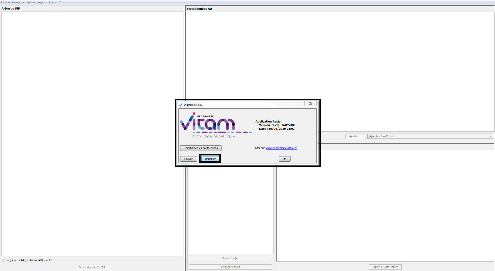
Le clic sur la sous-action « Importer » ouvre
l’explorateur Windows de l’utilisateur et permet à celui-ci de
sélectionner le fichier de paramétrage (cf. copie d’écran ci-dessous).

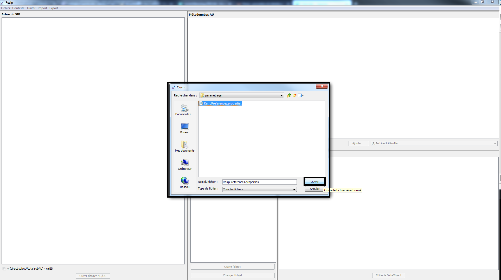

Le clic sur le bouton d’action « Ouvrir » de
l’explorateur lance la mise à jour des paramètres de la moulinette
ReSIP. Pour consulter les paramètres définis, il convient, dans le menu
de la moulinette ReSIP, de cliquer sur l’action « Fichier » puis sur la
sous-action « Préférences » (voir [section ci-dessous](#import-depuis-un-fichier-csv-décrivant-une-structure-arborescente-darchives-etou-de-fichiers)).

#### Réinitialiser le paramétrage par défaut

Afin de réinitialiser le paramétrage par défaut, il convient :

-   dans le menu de la moulinette ReSIP, de cliquer sur l’action « ? »,
    puis sur « À propos de Resip » qui fait apparaître une fenêtre de
    dialogue (cf. copie d’écran ci-dessous) ;
    
-   cliquer sur le bouton d’action « Réinitialiser les
    préférences » (cf. copie d’écran ci-dessous).

    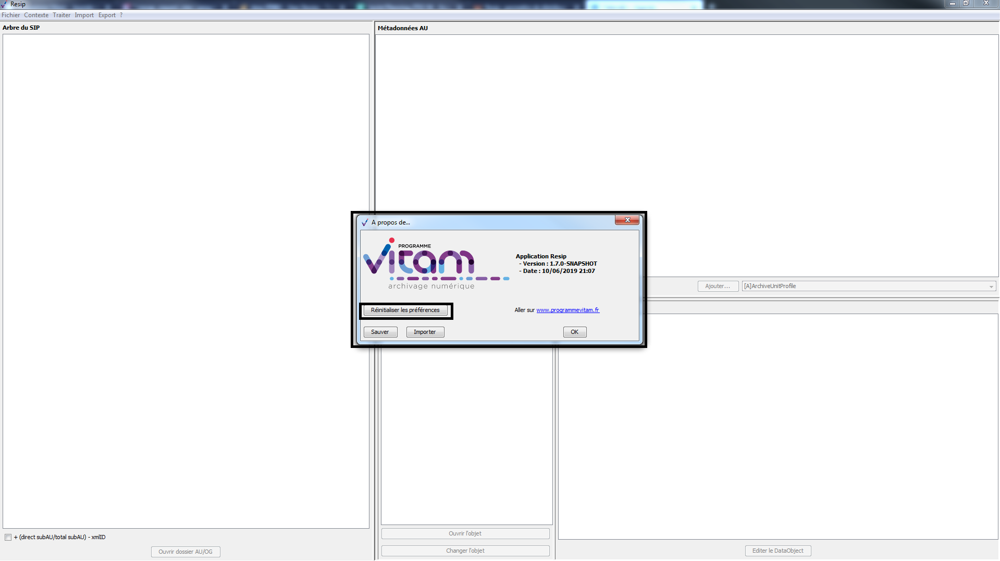

Le clic sur le bouton d’action « Réinitialiser les
préférences » de la fenêtre de dialogue lance la mise à jour des
paramètres de la moulinette ReSIP. Pour consulter les paramètres
réinitialisés, il convient, dans le menu de la moulinette ReSIP, de
cliquer sur l’action « Fichier » puis sur la sous-action « Préférences »
(voir [section ci-dessous](#import-depuis-un-fichier-csv-décrivant-une-structure-arborescente-darchives-etou-de-fichiers)).

Import de structures arborescentes d’archives dans la moulinette ReSIP
----------------------------------------------------------------------

Il est possible d’importer dans la moulinette ReSIP plusieurs types de
structures arborescentes d’archives enregistrées sur l’environnement de
travail de l’utilisateur :

-   [import d’une arborescence de fichiers](#import-dune-arborescence-de-fichiers) ;
-   [import d’un SIP existant](#import-dun-sip-déjà-constitué) ;
-   [import d’un DIP existant](#import-dun-dip-déjà-constitué) ;
-   [import de fichiers encapsulés dans un ZIP](#import-dune-arborescence-de-fichiers-sous-forme-de-fichier-zip) ;
-   [import depuis un fichier .csv correspondant à un arbre de positionnement ou à un plan de classement](#import-dun-arbre-de-positionnement-ou-dun-plan-de-classement-sous-forme-de-fichier-csv) ;
-   [import depuis un fichier .csv décrivant une structure arborescente d’archives et/ou de fichiers](#import-depuis-un-fichier-csv-décrivant-une-structure-arborescente-darchives-etou-de-fichiers) ;
-   [import d’un conteneur de messages électroniques](#import-dune-structure-arborescente-darchives-correspondant-à-une-messagerie-électronique) ;
-   [réouverture d’une structure arborescente de fichiers dont le traitement a déjà été commencé et sauvegardé via la moulinette ReSIP (réouverture de session)](#réouverture-dune-structure-arborescente-darchives-en-cours-de-traitement).

### Import d’une arborescence de fichiers

L’import d’une structure arborescente d’archives représentée par une
arborescence de fichiers est réalisable sous deux formes :

-   une manière simple : [import d’une arborescence sans fichier supplémentaire de métadonnées](#import-dune-arborescence-de-fichiers-sans-fichier-supplémentaire-de-métadonnées) ;
-   une manière avancée : [import d’une arborescence avec fichiers supplémentaires de métadonnées](#import-dune-arborescence-de-fichiers-avec-fichier-supplémentaire-de-métadonnées).

L’[import est paramétrable](#paramétrage-de-limport).

#### Paramétrage de l’import

Afin de paramétrer l’import d’une structure arborescente d’archives
représentée par une arborescence de fichiers pour traitement, il
convient, dans le menu de la moulinette ReSIP, de cliquer sur l’action
« Fichier » puis sur la sous-action « Préférences » (cf. copie d’écran
ci-dessous).

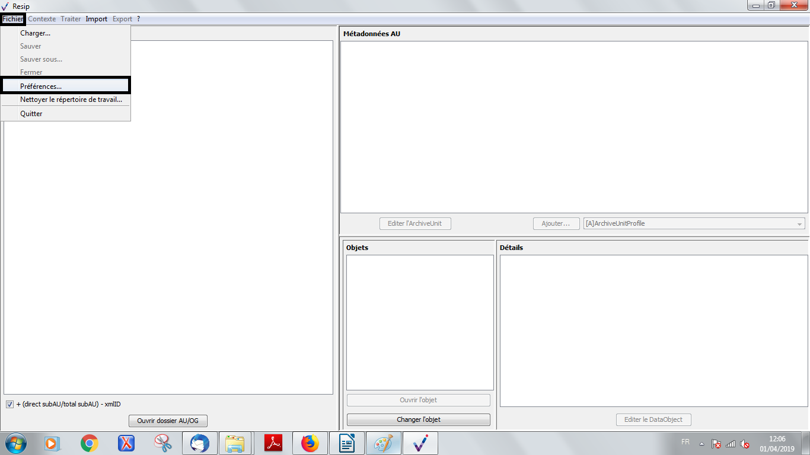

Le clic sur la sous-action « Préférences » ouvre une
fenêtre de dialogue composée de 5 onglets. Le paramétrage de l’import
est disponible dans l’onglet « import » (cf. copie d’écran ci-dessous).
Il permet de :

-   définir les [paramètres d’import des messageries](#import-dune-structure-arborescente-darchives-correspondant-à-une-messagerie-électronique) ;
-   définir les fichiers susceptibles d’être présents dans la structure
    arborescente de fichiers et qui devront être exclus du processus
    d’import. Cette exclusion peut être réalisée de deux manières
    différentes :

    -   en déclarant le nom des fichiers qui doivent être exclus de
        l’import (ex. Thumbs.db) ;
    -   en déclarant les catégories de fichiers à exclure sur la base
        d’expressions régulières, par exemple de la manière suivante :

        -   pour exclure tous les fichiers dont l’extension est
            « .odg », il convient d’indiquer « .*\.odg » (sans les
            guillemets) ;
        -   pour exclure tous les fichiers commençant par « manifest »,
            il convient d’indiquer « manifest.* » (sans les
            guillemets) ;
        -   pour exclure tous les fichiers commençant par « manifest »
            et dont l’extension est « .xml », il convient d’indiquer
            « manifest.*xml » (sans les guillemets) ;
        -   pour exclure tous les fichiers ayant un chiffre dans le
            titre, il convient d’indiquer « .*[0-9].* » (sans les
            guillemets) ;

-   définir, pour les imports depuis un fichier .csv décrivant une
    structure arborescente d’archives et/ou de fichiers, le séparateur
    ainsi que l’encodage des caractères retenus, au moyen de sélecteurs
    ([voir section](#import-dun-arbre-de-positionnement-ou-dun-plan-de-classement-sous-forme-de-fichier-csv)).

    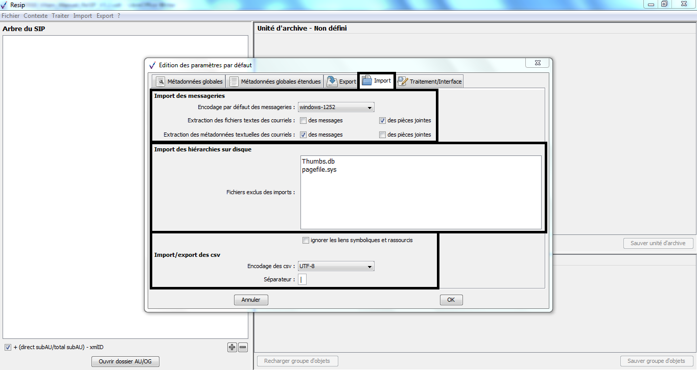

#### Import d’une arborescence de fichiers sans fichier supplémentaire de métadonnées

Afin d’importer une structure arborescente d’archives représentée par
une arborescence de fichiers pour traitement, il convient, dans le menu
de la moulinette ReSIP, de cliquer sur l’action « Import » puis sur la
sous-action « Importer depuis un répertoire » (cf. copie d’écran
ci-dessous).

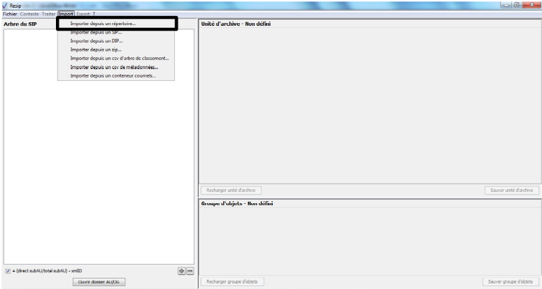

Le clic sur la sous-action « Importer depuis un
répertoire » ouvre l’explorateur Windows de l’utilisateur et permet à
celui-ci de sélectionner un répertoire et de l’importer dans la
moulinette ReSIP en cliquant sur le bouton d’action « Ouvrir » (cf.
copie d’écran ci-dessous).

**Attention** : il n’est possible de sélectionner qu’un seul répertoire.

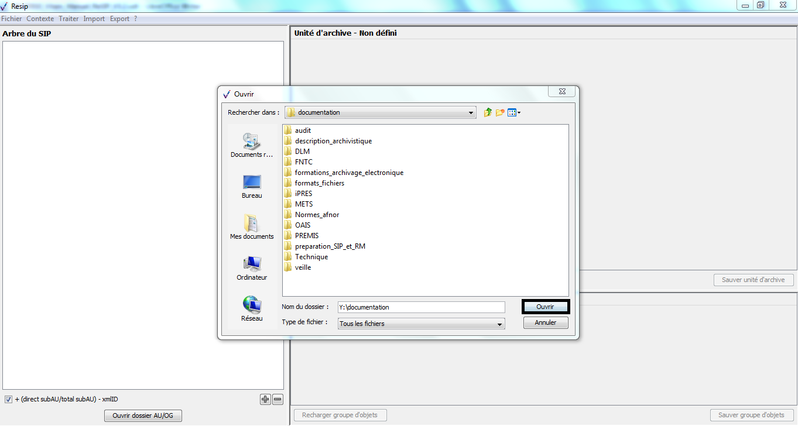

Le clic sur le bouton d’action « Ouvrir » de
l’explorateur lance une fenêtre de dialogue « Import » indiquant que
l’opération d’import est lancée et permettant de suivre sa progression.
Cette opération peut être annulée en cliquant sur le bouton d’action
« Annuler » de la fenêtre de dialogue (cf. copie d’écran ci-dessous).
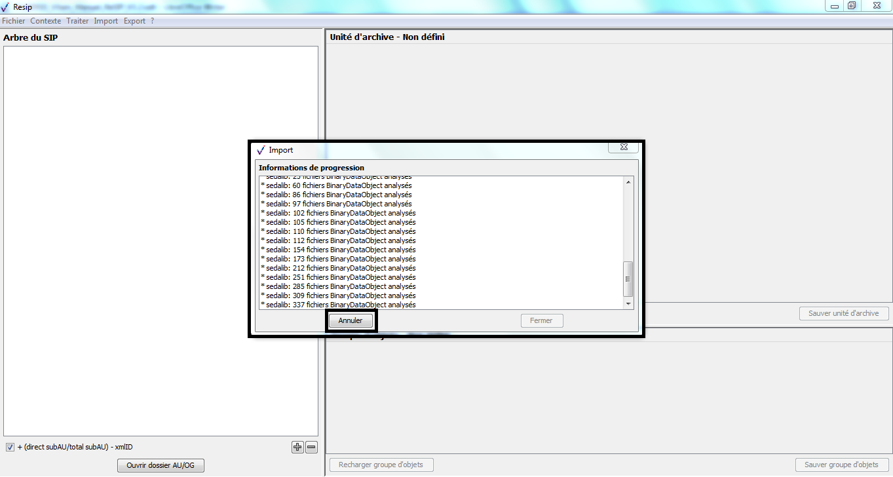

Une fois l’opération d’import achevée, la fenêtre de
dialogue indique le nombre d’éléments importés (unités archivistiques,
groupes d’objets, objets binaires, objets physiques) ainsi que le temps
qui a été nécessaire pour réaliser l’opération d’import. La structure
arborescente d’archives est désormais consultable et traitable depuis le
panneau de visualisation et de modification de la structure arborescente
d’archives. La fenêtre de dialogue peut être fermée en cliquant sur le
bouton d’action « Fermer » (cf. copie d’écran ci-dessous).
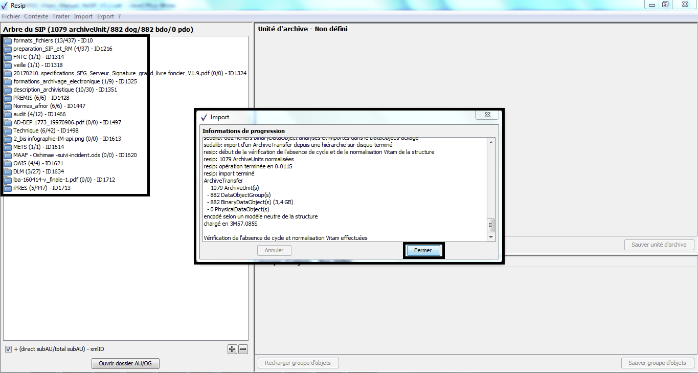

Les statistiques de l’import sont également
consultables en cliquant, dans le menu de la moulinette ReSIP, sur
l’action « Contexte » puis sur la sous-action « Voir les informations
d’import » (cf. copie d’écran ci-dessous).
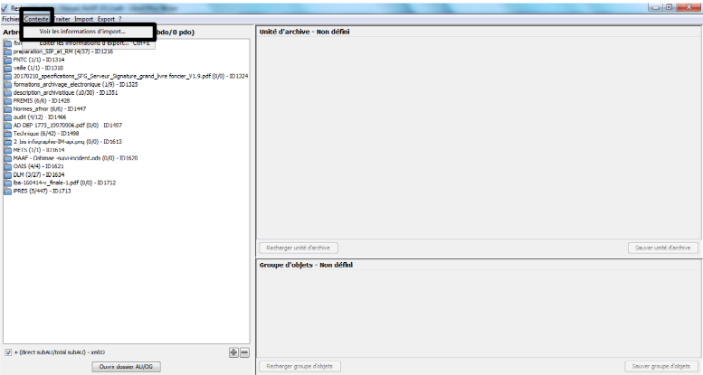

Une fenêtre de dialogue s’ouvre et permet de consulter
les informations relatives à l’import (cf. copie d’écran ci-dessous).
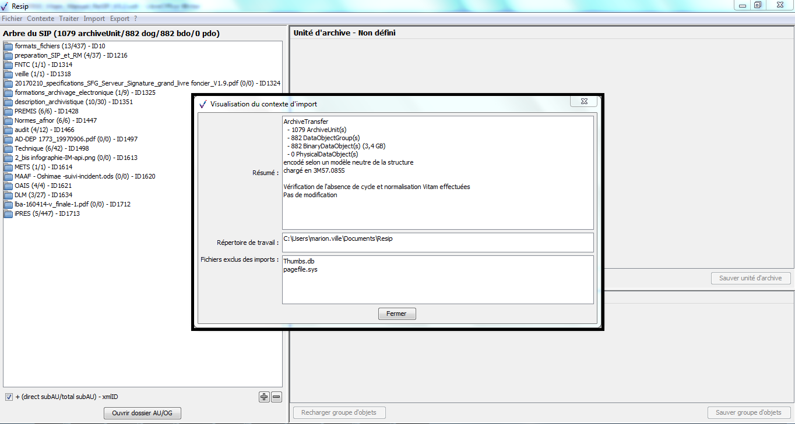

**Attention** : seuls les répertoires et fichiers
enregistrés dans le répertoire sélectionné via l’explorateur sont
importés dans la moulinette ReSIP. **Le répertoire sélectionné dans
l’explorateur n’est pas importé dans ReSIP.**

Dès l’import terminé, la moulinette ReSIP crée un « contexte de
travail » sous forme d’un fichier JSON zippé qui porte la structure
arborescente d’archives, les métadonnées des unités archivistiques, des
groupes d’objets techniques et des objets binaires comme physiques,
ainsi que la localisation des fichiers sur l’environnement de travail de
l’utilisateur. Ce contexte de travail nécessite d’être sauvegardé si le
traitement de la structure arborescente de fichiers doit être interrompu
et repris ultérieurement ([cf. section](#traiter-les-unités-archivistiques)).

**Attention** : pour des raisons de taille, les fichiers représentant
les archives ne sont pas sauvegardés dans le contexte de travail. Seul
leur chemin sur le disque est sauvegardé. **En conséquence, les fichiers
ne doivent pas changer d’emplacement sur le disque pendant tout le temps
de leur traitement avec la moulinette ReSIP**.

#### Import d’une arborescence de fichiers avec fichier supplémentaire de métadonnées

L’[import simple d’une arborescence de fichiers](#import-dune-arborescence-de-fichiers) avec la
moulinette ReSIP crée un contexte de travail reprenant les métadonnées
par défaut disponibles dans l’arborescence de fichiers :

-   pour les fichiers, le format identifié avec l’outil DROID, le nom du
    fichier, sa taille, son empreinte avec l’algorithme SHA-512 ;
-   pour les unités archivistiques correspondant aux fichiers, le nom du
    fichier comme titre (champ Title du standard SEDA), la date de
    dernière modification du fichier comme date (champ TransactedDate du
    standard SEDA). Le niveau de description (champ DescriptionLevel du
    standard SEDA) est incrémenté avec la valeur « Item » ;
-   pour les unités archivistiques correspondant à des répertoires,
    l’intitulé de ceux-ci comme titre (champ Title du standard SEDA), la
    date de la plus ancienne et de la plus récente unité archivistique
    contenue dans le répertoire (champs StartDate et EndDate du standard
    SEDA). Le niveau de description (champ DescriptionLevel du standard
    SEDA) est incrémenté avec la valeur « RecordGrp ».

***Point d’attention :*** Le processus retenu pour l’identification dans RESIP est le suivant[^5] :
-   S’il y a des formats conteneurs, on ne garde qu’eux dans une liste de choix, s’il n’y en a pas ou s’il y a une erreur on passe à la suite ;
-   S’il y a des formats signatures, on ne garde qu’eux dans une liste de choix ; s’il n’y en a pas ou s’il y a une erreur ,on passe à la suite ;
-   Sinon, on garde les formats possibles d’après l’extension dans une liste de choix.
-   Sur la liste de choix restante :
	-   on trie et ne garde que ceux qui ont la plus haute priorité dans le fichier de signatures ;
	-   s’il en reste un seul, on le prend,
	-   s’il en reste plusieurs, on regarde si l’un d’eux correspond à l’extension et on prend le premier ;
	-   sinon on prend arbitrairement le premier de la liste.

Il est cependant possible d’effectuer des imports avancés pour disposer
d’une structure arborescente d’archives enrichie avec :

-   les métadonnées qui permettent de décrire de manière globale la
    structure arborescente d’archives et d’alimenter l’en-tête du
    manifeste du SIP ;
-   les métadonnées qui permettent de décrire les métadonnées de gestion
    associées à la structure arborescente d’archives et d’alimenter le
    bloc ManagementMetadata du manifeste du SIP ;
-   des métadonnées supplémentaires pour une unité archivistique ;
-   des métadonnées supplémentaires pour un objet binaire ;
-   des métadonnées supplémentaires pour un objet physique;
-   une unité archivistique représentée par un groupe d’objets contenant
    plusieurs objets, par exemple un objet physique et un objet binaire,
    ou un objet binaire de type BinaryMaster et un objet binaire de type
    Thumbnail.

**À noter** : pour comprendre au mieux cette façon de structurer
l’arborescence de fichiers avec tous les fichiers spéciaux, il est
recommandé d’exporter des exemples de SIP déjà constitués en utilisant
la fonction « Exporter la hiérarchie sur disque » pour visualiser les
différents fichiers spéciaux associés ([cf. section](#export-de-la-structure-arborescente-darchives-sous-la-forme-dun-manifeste-xml)).

##### Métadonnées de l’en-tête du manifeste

Les métadonnées de l’en-tête du manifeste (intitulé et identifiant du
SIP, contrat d’entrées, versions des référentiels utilisés, identifiant
du service d’archives et identifiant du service de transfert) peuvent
être renseignées dans un fichier nommé \_\_GlobalMetadata.xml qui se
présente comme suit :

```xml
<Comment>SIP complexe pour ReSIP</Comment>
<MessageIdentifier>MessageIdentifier0</MessageIdentifier>
<ArchivalAgreement>IC-000001</ArchivalAgreement>
<CodeListVersions>
  <ReplyCodeListVersion>ReplyCodeListVersion0</ReplyCodeListVersion>
  <MessageDigestAlgorithmCodeListVersion>MessageDigestAlgorithmCodeListVersion0</MessageDigestAlgorithmCodeListVersion>
  <MimeTypeCodeListVersion>MimeTypeCodeListVersion0</MimeTypeCodeListVersion>
  <EncodingCodeListVersion>EncodingCodeListVersion0</EncodingCodeListVersion>
  <FileFormatCodeListVersion>FileFormatCodeListVersion0</FileFormatCodeListVersion>
  <CompressionAlgorithmCodeListVersion>CompressionAlgorithmCodeListVersion0</CompressionAlgorithmCodeListVersion>
  <DataObjectVersionCodeListVersion>DataObjectVersionCodeListVersion0</DataObjectVersionCodeListVersion>
  <StorageRuleCodeListVersion>StorageRuleCodeListVersion0</StorageRuleCodeListVersion>
  <AppraisalRuleCodeListVersion>AppraisalRuleCodeListVersion0</AppraisalRuleCodeListVersion>
  <AccessRuleCodeListVersion>AccessRuleCodeListVersion0</AccessRuleCodeListVersion>
  <DisseminationRuleCodeListVersion>DisseminationRuleCodeListVersion0</DisseminationRuleCodeListVersion>
  <ReuseRuleCodeListVersion>ReuseRuleCodeListVersion0</ReuseRuleCodeListVersion>
  <ClassificationRuleCodeListVersion>ClassificationRuleCodeListVersion0</ClassificationRuleCodeListVersion>
  <AuthorizationReasonCodeListVersion>AuthorizationReasonCodeListVersion0</AuthorizationReasonCodeListVersion>
  <RelationshipCodeListVersion>RelationshipCodeListVersion0</RelationshipCodeListVersion>
</CodeListVersions>
<ArchivalAgency>
  <Identifier>Identifier4</Identifier>
</ArchivalAgency>
<TransferringAgency>
  <Identifier>Identifier5</Identifier>
</TransferringAgency>
```

Ce fichier doit être enregistré dans le répertoire racine destiné à être
importé dans la moulinette ReSIP (cf. copie d’écran ci-dessous).
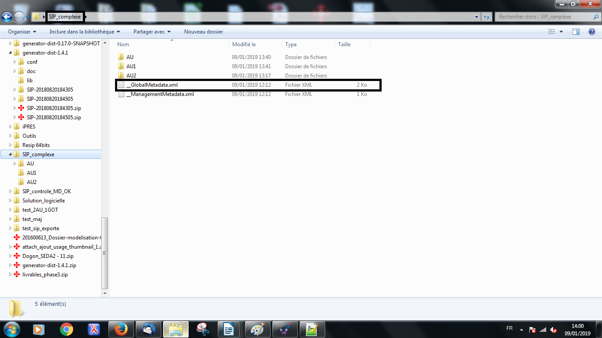

Dans l’exemple ci-dessus, c’est le répertoire
SIP_complexe qui est destiné à être importé dans la moulinette ReSIP.
Le fichier __GlobalMetadata.xml est donc enregistré directement dans
le répertoire destiné à être importé à la racine.

**Attention** : la structure du fichier XML doit être conforme à son
équivalent dans le schéma associé au standard SEDA 2.1.

##### Métadonnées de gestion du bloc ManagementMetadata

Les métadonnées du bloc ManagementMetadata du manifeste (profil
d’archivage, niveau de service, mode d’entrée, statut juridique, règles
de gestion applicables à l’ensemble du SIP, service producteur de
l’entrée, service versant de l’entrée) peuvent être renseignées dans un
fichier nommé __ManagementMetadata.xml qui se présente comme suit :

```xml
<ManagementMetadata>
  <ArchivalProfile>PR-000001</ArchivalProfile>
  <ServiceLevel></ServiceLevel>
  <AcquisitionInformation>Versement</AcquisitionInformation>
  <LegalStatus>Public Archive</LegalStatus>
  <OriginatingAgencyIdentifier>ABCDEFG</OriginatingAgencyIdentifier>
  <SubmissionAgencyIdentifier>ABCDEFG</SubmissionAgencyIdentifier>
  <AccessRule>
	<Rule>ACC-00001</Rule>
	<StartDate>2017-01-01</StartDate>
  </AccessRule>
</ManagementMetadata>
```
Ce fichier doit être enregistré dans le répertoire racine destiné à être
importé dans la moulinette ReSIP (cf. copie d’écran ci-dessous).
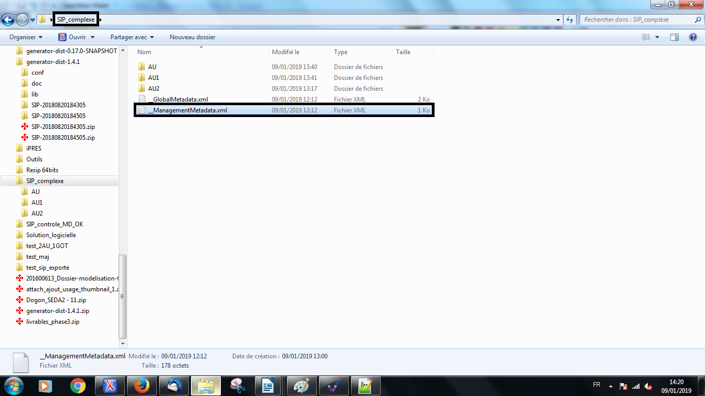

Dans l’exemple ci-dessus, c’est le répertoire
SIP_complexe qui est destiné à être importé dans la moulinette ReSIP.
Le fichier __ManagementMetadata.xml est donc enregistré directement
dans le répertoire destiné à être importé à la racine.

**Attention** : la structure du fichier XML doit être conforme à son
équivalent dans le schéma associé au standard SEDA 2.1.

##### Métadonnées d’une unité archivistique

Les métadonnées d’une unité archivistique (métadonnées de gestion comme
de description) peuvent être renseignées dans un fichier nommé
__ArchiveUnitMetadata.xml qui se présente comme suit :

```xml
<ArchiveUnitProfile>AUP-000001</ArchiveUnitProfile>
<Management>
	<AppraisalRule>
		<Rule>APP-00001</Rule>
		<StartDate>1960-01-01</StartDate>
		<FinalAction>Keep</FinalAction>
	</AppraisalRule>
	<AccessRule>
		<Rule>ACC-00001</Rule>
		<Rule>ACC-00002</Rule>
		<StartDate>2010-05-14</StartDate>
	</AccessRule>
</Management>
<Content>
  <DescriptionLevel>File</DescriptionLevel>
  <Title>Titre de mon dossier</Title>
  <StartDate>1988-01-01</StartDate>
  <EndDate>2018-12-31</EndDate>
</Content>
```

Ce fichier doit être enregistré dans un répertoire correspondant à
l’unité archivistique (cf. copie d’écran ci-dessous).
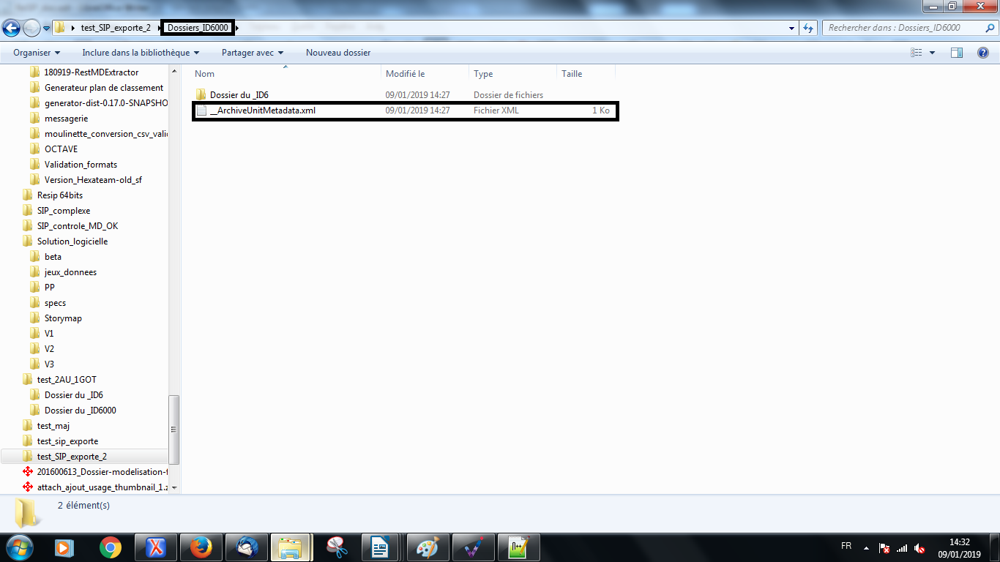

Dans l’exemple ci-dessus, le répertoire
« Dossiers_ID6000 » correspond à l’unité archivistique de niveau
dossier décrite. Le fichier __ArchiveUnitMetadata.xml est donc
enregistré directement dans le répertoire correspondant à celle-ci.

Si l’unité archivistique est de niveau pièce et correspond à un fichier,
le répertoire correspondant à l’unité archivistique contiendra à la fois
le fichier __ArchiveUnitMetadata.xml et le fichier concerné.

**Attention** : la structure du fichier XML doit être conforme à son
équivalent dans le schéma associé au standard SEDA 2.1.

##### Métadonnées d’un objet binaire

Les métadonnées d’un objet binaire (métadonnées techniques) peuvent être
renseignées dans un fichier nommé __« usage » [BinaryMaster,
Dissemination, Thumbnail,
TextContent]_« version »_BinaryDataObjectMetadata.xml qui se présente
comme suit :

```xml
<DataObjectVersion>BinaryMaster_1</DataObjectVersion>
  <Uri>content/ID8.txt</Uri>
  <MessageDigest algorithm="SHA-512">8e393c3a82ce28f40235d0870ca5b574ed2c90d831a73cc6bf2fb653c060c7f094fae941dfade786c826f8b124f09f989c670592bf7a404825346f9b15d155af</MessageDigest>
  <Size>30</Size>
  <FormatIdentification>
    <FormatLitteral>Plain Text File</FormatLitteral>
    <MimeType>text/plain</MimeType>
    <FormatId>x-fmt/111</FormatId>
  </FormatIdentification>
  <FileInfo>
    <Filename>BinaryMaster.txt</Filename>
    <LastModified>2016-10-18T19:03:30Z</LastModified>
  </FileInfo>
```

Ce fichier doit :

-   être enregistré dans un répertoire correspondant à l’unité
    archivistique, au même niveau que l’objet binaire qu’il décrit ;
-   avoir le même préfixe (usage_version_) que celui de l’objet décrit
    (cf. copie d’écran ci-dessous).
    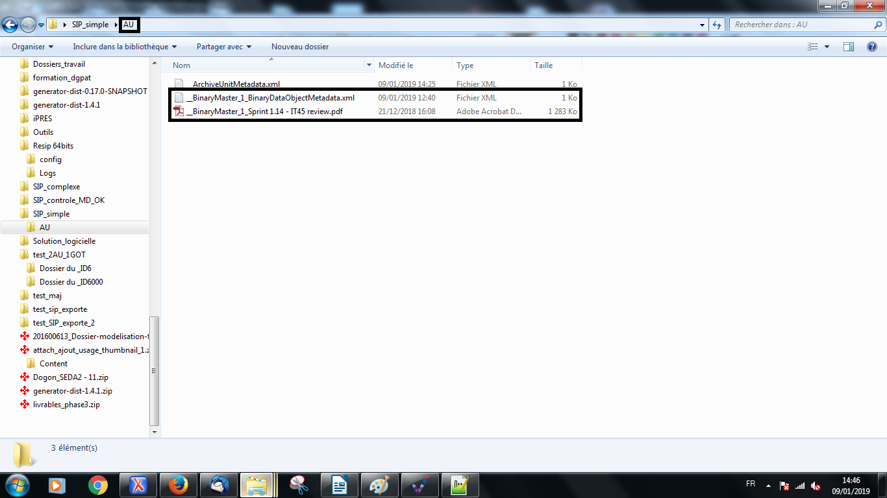

Dans l’exemple ci-dessus, le répertoire « AU »
correspond à l’unité archivistique décrite. Le fichier
__BinaryMaster_1_BinaryDataObjectMetadata.xml est donc enregistré
directement dans le répertoire correspondant à celle-ci et décrit le
fichier __BinaryMaster_1_Sprint 1.14 - IT45 review.pdf qui
représente l’unité archivistique.

**Attention** :

-   la structure du fichier XML doit être conforme à son équivalent dans
    le schéma associé au standard SEDA 2.1.
-   la solution logicielle Vitam n’accepte en entrée qu’une version
    d’objet, et plus précisément la première version.

##### Métadonnées d’un objet physique

Les métadonnées d’un objet physique (métadonnées techniques) peuvent
être renseignées dans un fichier nommé __« usage » [PhysicalMaster,
Dissemination]_« version »_PhysicalDataObjectMetadata.xml et qui se
présente comme suit :

```xml
DataObjectVersion>PhysicalMaster_1</DataObjectVersion>
<PhysicalId>12345</PhysicalId>
<PhysicalDimensions>
    <Height unit="centimetre">21</Height>
    <Length unit="centimetre">29.7</Length>
    <Weight unit="kilogram">1</Weight>
</PhysicalDimensions>
```

Ce fichier doit être enregistré dans un répertoire correspondant à
l’unité archivistique.

**Attention** :

-   la structure du fichier XML doit être conforme à son équivalent dans
    le schéma associé au standard SEDA 2.1.
-   la solution logicielle Vitam n’accepte en entrée qu’une version
    d’objet, et plus précisément la première version.

##### Groupe d’objets techniques contenant plusieurs objets

Il est possible d’importer plusieurs objets, qu’ils soient physiques ou
binaires, représentant une même unité archivistique et constituant
ensemble un groupe d’objets.

Pour créer un groupe d’objets, il suffit de :

-   créer un répertoire correspondant à l’unité archivistique ;
-   enregistrer tous les objets, qu’ils soient physiques ou binaires,
    représentant l’unité archivistique, en les préfixant comme suit :
    __ « usage » _ « version » _ nom du fichier. 
    **Attention **:
    tout objet dont le nommage ne respectera pas cette forme sera
    considéré comme un objet indépendant et une unité archivistique
    spécifique à celui-ci sera créée ;
-   éventuellement, ajouter les fichiers de métadonnées correspondants à
    l’unité archivistique et aux objets.

Dans l’exemple ci-dessous, l’unité archivistique intitulée « AU2 » est
représentée par deux objets :

-   un objet binaire de type BinaryMaster au format .pptx ;
-   un objet binaire de type Dissemination au format .pdf.
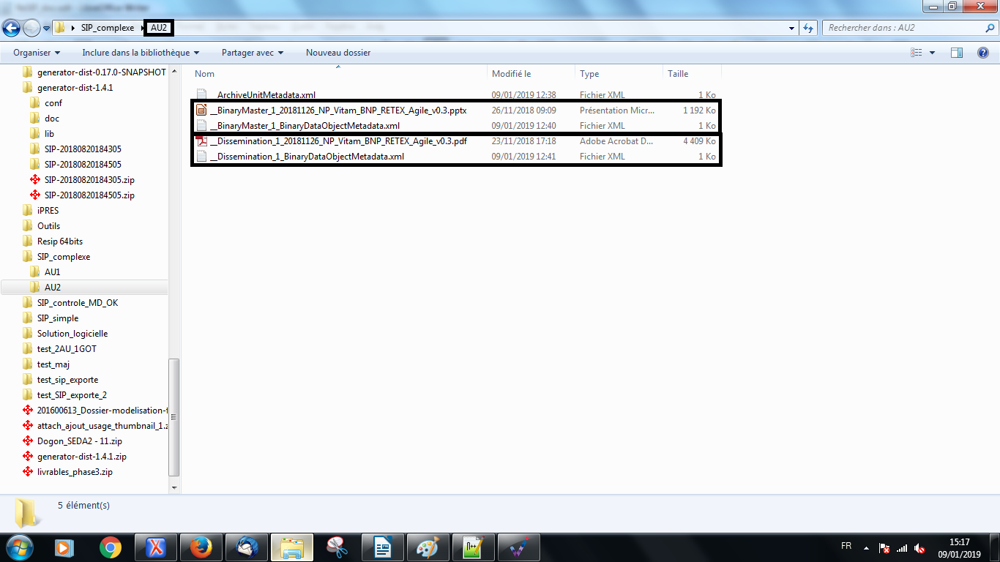

**Attention** : il ne peut y avoir dans le groupe
d’objets deux objets déclarant le même usage et la même version. La
solution logicielle Vitam n’accepte en effet en entrée qu’une version
par usage d’objets faisant partie intégrante d’un même groupe d’objets
techniques, et plus précisément la première version.

### Import d'un SIP déjà constitué

Afin d’importer pour traitement une structure arborescente d’archives
représentée par un SIP déjà constitué, il convient, dans le menu de la
moulinette ReSIP, de cliquer sur l’action « Import » puis sur la
sous-action « Importer depuis un SIP » (cf. copie d’écran ci-dessous).
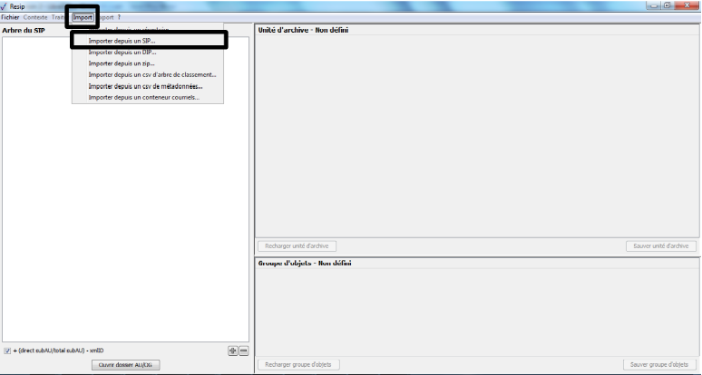

Le clic sur la sous-action « Importer depuis un SIP »
ouvre l’explorateur Windows de l’utilisateur et permet à celui-ci de
sélectionner le SIP et de l’importer dans la moulinette ReSIP en
cliquant sur le bouton d’action « Ouvrir » (cf. copie d’écran
ci-dessous).
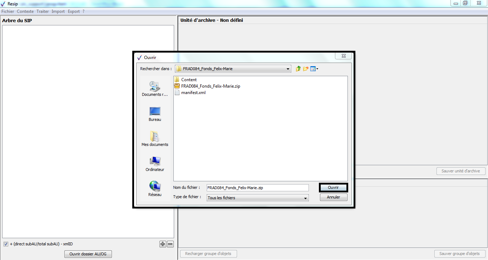

L’opération d’import se déroule ensuite [comme décrit dans la section](#import-dune-arborescence-de-fichiers). La moulinette ReSIP ouvre le SIP, décompresse les
fichiers dans un répertoire nommé « nom du SIP »-tmpdir créé dans le
répertoire de travail et exploite le manifeste pour restituer la
structure arborescente d’archives dans le panneau de visualisation et de
modification de la structure arborescente d’archives.

### Import d'un DIP déjà constitué

Afin d’importer pour traitement une structure arborescente d’archives
représentée par un DIP déjà constitué, il convient, dans le menu de la
moulinette ReSIP, de cliquer sur l’action « Import » puis sur la
sous-action « Importer depuis un DIP » (cf. copie d’écran ci-dessous).

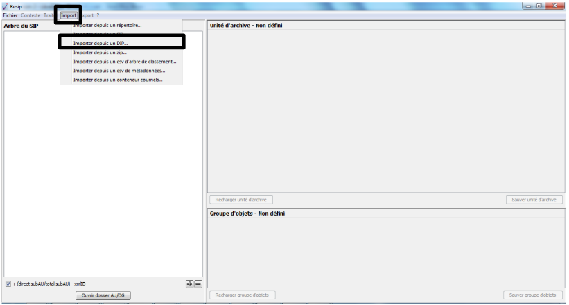

Le clic sur la sous-action « Importer depuis un DIP » ouvre
l’explorateur Windows de l’utilisateur et permet à celui-ci de
sélectionner le DIP et de l’importer dans la moulinette ReSIP en
cliquant sur le bouton d’action « Ouvrir » (cf. copie d’écran
ci-dessous).

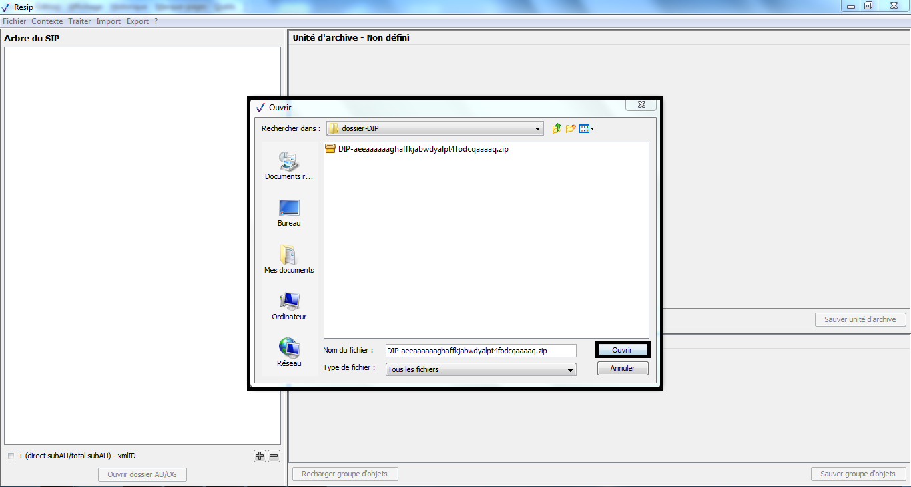

L’opération d’import se déroule ensuite [comme décrit dans la section](#import-dune-arborescence-de-fichiers). La moulinette ReSIP ouvre le DIP, décompresse les fichiers dans un
répertoire nommé « nom du DIP »-tmpdir créé dans le répertoire de
travail et exploite le manifeste pour restituer la structure
arborescente d’archives dans le panneau de visualisation et de
modification de la structure arborescente d’archives (cf. copie d’écran
ci-dessous).

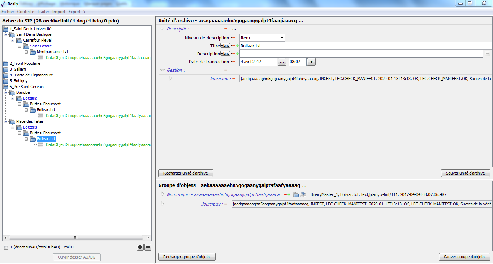

***Point d’attention :*** ReSIP permet d'importer :
-   un DIP constitué uniquement du DataObjectPackage,
-	un DIP correspondant au message ArchiveDeliveryRequestReply. Pour ce dernier, Il charge uniquement les métadonnées incluses dans le bloc DataObjectPackage. Les métadonnées d'en-tête (MessageRequestIdentifier, UnitIdentifier, ArchivalAgency, Requester) sont uniquement visibles dans la fenêtre d'import.

### Import d’une arborescence de fichiers sous forme de fichier .zip

Afin d’importer pour traitement une structure arborescente d’archives
représentée par un fichier .zip pour traitement, il convient, dans le
menu de la moulinette ReSIP, de cliquer sur l’action « Import » puis sur
la sous-action « Importer depuis un zip » (cf. copie d’écran
ci-dessous).
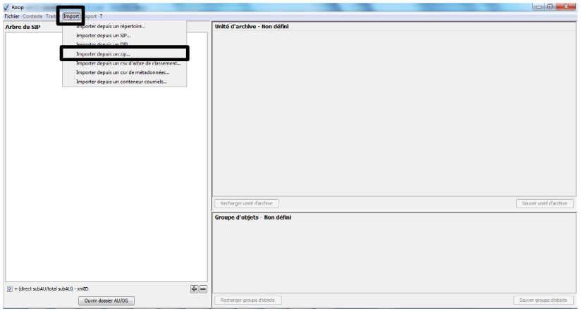

Le clic sur la sous-action « Importer depuis un zip »
ouvre l’explorateur Windows de l’utilisateur et permet à celui-ci de
sélectionner le fichier .zip et de l’importer dans la moulinette ReSIP
en cliquant sur le bouton d’action « Ouvrir » (cf. copie d’écran
ci-dessous).
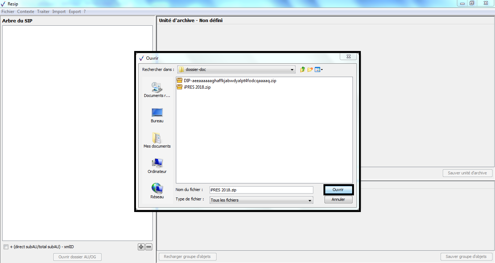

L’opération d’import se déroule ensuite [comme décrit dans la section](#import-dune-arborescence-de-fichiers). La moulinette ReSIP ouvre le fichier .zip,
décompresse les fichiers dans un répertoire nommé « nom du ZIP »-tmpdir
créé dans le répertoire de travail et exploite le manifeste pour
restituer la structure arborescente d’archives dans le panneau de
visualisation et de modification de la structure arborescente d’archives
(cf. copie d’écran ci-dessous).
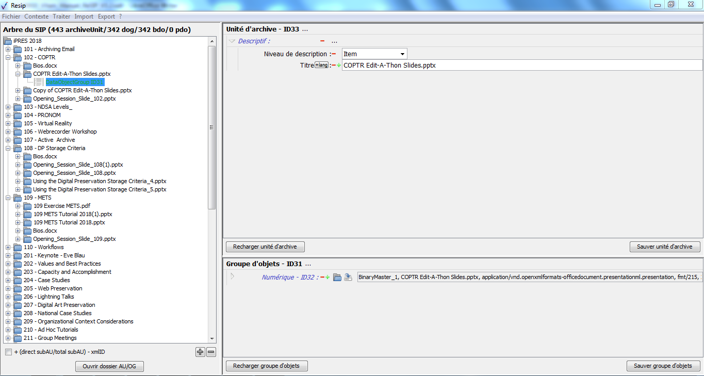

### Import d’un arbre de positionnement ou d’un plan de classement sous forme de fichier .csv

La moulinette ReSIP permet d’importer une structure arborescente
d’archives correspondant à un arbre de positionnement ou à un plan de
classement au sens de la solution logicielle Vitam sous la forme d’un
fichier csv.

#### Présentation du fichier d’import

Le fichier d’import prend la forme d’un fichier au format .csv composé
de cinq colonnes :

-   Id : identifiant unique attribué à l’unité archivistique par
    l’utilisateur ;
-   nom : intitulé de l’unité archivistique ;
-   observ : champ libre ;
-   cote : identifiant métier propre à l’unité parente (suffixe) ;
-   série : identifiant métier de l’unité archivistique « parente »
    (préfixe).

**Attention** :

-   l’ordre des colonnes ne doit pas être modifié ;
-   une première ligne d’en-tête donnant le nom des colonnes doit être
    présente, chaque ligne décrivant ensuite une unité archivistique ;
-   le séparateur entre les colonnes doit être le « ; » ou le séparateur
    défini dans les Préférences ([voir section](#paramétrage-de-limport)). Ce caractère ne
    doit donc pas être utilisé dans les différents champs ;
-   Les colonnes « série » et « cote » sont complémentaires et
    permettent de définir l’identifiant de l’unité archivistique (champ
    OriginatingAgencyArchiveUnitIdentifier dans le standard SEDA). Seule
    la colonne « cote » doit obligatoirement être renseignée. A titre
    d’exemple, aux Archives nationales :

    -   Série F/ : dans le fichier, F/ sera la cote ;
    -   Sous-série F/1 : dans le fichier, F/ sera la série et 1 la
        cote ;
    -   Sous-série F/1c : dans le fichier, F/1 sera la série et c la
        cote ;
    -   Sous-série F/1cVII : dans le fichier , F/1c sera la série et VII
        la cote.

Le fichier d’import utilisé pour la rédaction du présent manuel se
présente comme suit :

```csv
Id;nom;observ;cote;serie
1;Archives antérieures à 1789;;AR.;
2;Archives postérieures à 1789;;REP.;
3;Assemblées parlementaires;;1.;REP.
4;Souverains, chefs de l'état et de gouvernement, pouvoir exécutif;;2.;REP.
5;Révolution et Premier Empire;;1.;REP.2.
6;Restauration et Monarchie de Juillet;;2.;REP.2.
7;Seconde République;;3.;REP.2.
8;Ministère de la maison de l'empereur (Second Empire);;4.;REP.2.
9;Ministère d'état (Second Empire);;5.;REP.2.
10;Troisième République;;6.;REP.2.
11;état français;;7.;REP.2.
12;France libre et gouvernement provisoire de la France;;8.;REP.2.
13;Quatrième République;;9.;REP.2.
14;Cinquième République;;10.;REP.2.
15;Charles de Gaulle;;1.;REP.2.10.
16;Georges Pompidou;;2.;REP.2.10.
17;Valéry Giscard d’Estaing;;3.;REP.2.10.
18;François Mitterrand;;4.;REP.2.10.
19;Jacques Chirac;;5.;REP.2.10.
20;Nicolas Sarkozy;;6.;REP.2.10.
21;François Hollande;;7.;REP.2.10.
22;Coordination gouvernementale et interministérielle;;3.;REP.
23;Fonctionnement de l'Etat;;4.;REP.
24;Administrations et organismes liés aux périodes de guerre;;5.;REP.
25;Intérieur;;6.;REP.
26;Justice;;7.;REP.
27;Cabinet du ministre;;1.;REP.7.
28;Lois, décrets, ordonnances et arrêtés (originaux ou authentiques) provenant du ministère de la Justice;;2.;REP.7.
29;Instances de contrôle et de conseil;;3.;REP.7.
30;Organismes et services rattachés;;4.;REP.7.
31;Ministères et secrétariats d'Etat délégués;;5.;REP.7.
32;Administration générale;;6.;REP.7.
33;Relations internationales;;7.;REP.7.
34;Services judiciaires;;8.;REP.7.
35;Affaires civiles et sceau;;9.;REP.7.
36;Affaires criminelles et grâces;;10.;REP.7.
37;Administration pénitentiaire depuis le XXe s.;;11.;REP.7.
38;Direction de la protection judiciaire de la jeunesse;;12.;REP.7.
39;Service de l'accès au droit et à la justice et de la politique de la ville;;13.;REP.7.
40;Droit des victimes, aide aux victimes;;14.;REP.7.
41;Colonies, Outre-mer, Coopération;;8.;REP.
42;Beaux-Arts, Culture et Communication;;9.;REP.
43;Education, enseignement supérieur et recherche;;10.;REP.
44;Jeunesse et sports;;11.;REP.
45;Travail, Santé, Affaires sociales;;12.;REP.
46;Migrations;;13.;REP.
47;économie et finances;;14.;REP.
48;Travaux publics, équipement, urbanisme, transports, aménagement du territoire, écologie, environnement;;15.;REP.
49;Agriculture;;16.;REP.
50;Postes, Télégraphes, Télécommunications;;17.;REP.
51;Archives privées;;AP.;
```

L’annexe « Préparer un fichier .csv » apporte quelques conseils pour
effectuer cette opération.

**Attention :** ce type d’import ne permet pas d’importer des objets
numériques au côté du fichier .csv[^6].

#### Présentation du processus d’import

Afin d’importer une structure arborescente d’archives correspondant à un
arbre de positionnement ou à un plan de classement décrite sous la forme
d’un fichier .csv, il convient, dans le menu de la moulinette ReSIP, de
cliquer sur l’action « Import » puis sur la sous-action « Importer
depuis un csv d’arbre de classement » (cf. copie d’écran ci-dessous).

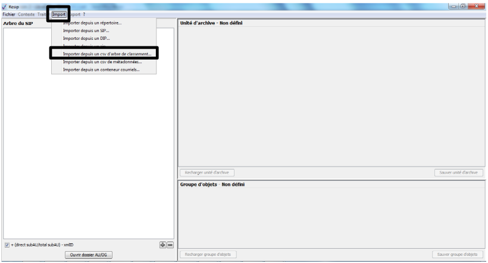
Le clic sur la sous-action « Importer depuis un csv
d’arbre de classement » ouvre l’explorateur Windows de l’utilisateur et
permet à celui-ci de sélectionner le fichier correspondant et de
l’importer dans la moulinette ReSIP en cliquant sur le bouton d’action
« Ouvrir ».

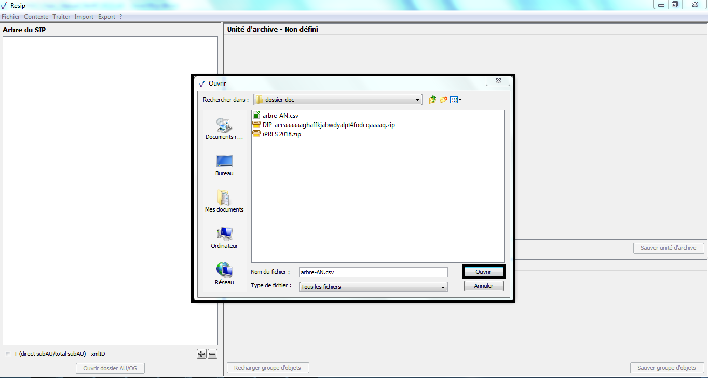

L’opération d’import se déroule ensuite [comme décrit dans la section](#import-dune-arborescence-de-fichiers).

Au terme du processus d’import, la structure arborescente d’archives est
restituée dans le panneau de visualisation et de modification de la
structure arborescente d’archives (cf. copie d’écran ci-dessous) :

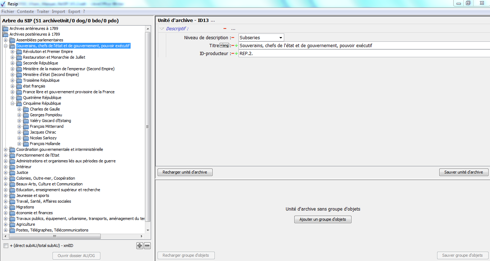
Chaque unité archivistique dispose des métadonnées suivantes :

-   niveau de description (champ DescriptionLevel du standard SEDA) : la
    valeur est « series » pour les nœuds racines (lignes ayant une
    valeur vide dans le champ « série » du fichier d’import) et
    « subseries » pour les autres nœuds ;
-   titre (champ Title du standard SEDA) : valeur du champ « nom » du
    fichier d’import ;
-   description (champ Description du standard SEDA) : valeur du champ
    « observ » du fichier d’import ;
-   cote (champ OriginatingAgencyArchiveUnitIdentifier du standard SEDA,
    traduit par ID-producteur dans ReSIP) : valeur des champs « série »
    et « cote » du fichier d’import.

**Attention **: en cas de problème d’encodage de caractères à
l’affichage dans le panneau de visualisation et de modification de la
structure arborescente d’archives, il convient de renouveler l’import en
changeant le type d’encodage sélectionné dans les Préférences ([voir section](#paramétrage-de-limport)).

### Import depuis un fichier .csv décrivant une structure arborescente d’archives et/ou de fichiers

La moulinette ReSIP permet d’importer une structure arborescente
d’archives et/ou de fichiers sous la forme d’un fichier .csv.

#### Paramétrage de l’import

Afin de paramétrer pour traitement l’import d’une structure arborescente
d’archives accompagnée d'un fichier .csv, il convient,
dans le menu de la moulinette ReSIP, de cliquer sur l’action « Fichier »
puis sur la sous-action « Préférences » (cf. copie d’écran ci-dessous).


Le clic sur la sous-action « Préférences » ouvre une

fenêtre de dialogue composée de cinq onglets. Le paramétrage de l’import
est disponible dans l’onglet « Import » (cf. copie d’écran ci-dessous).
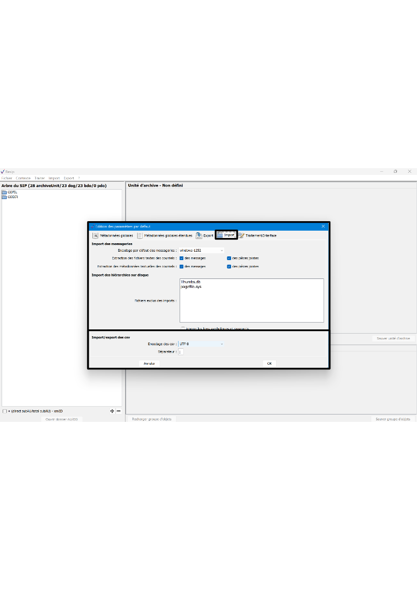

Il permet de :

-   sélectionner via un menu déroulant l’encodage utilisé dans le
    fichier .csv. Par défaut, l’encodage proposé est
    « windows-1252 » ;
-   préciser le séparateur utilisé dans le fichier .csv. Par défaut, le séparateur est un point-virgule.

#### Présentation du fichier d’import

Le fichier d’import prend la forme d’un fichier au format .csv composé de x colonnes :

-   ID : identifiant unique de l’unité archivistique, définie par l’utilisateur (colonne facultative) ;
-   ParentID : identifiant unique de l’unité archivistique parente, définie par l’utilisateur (colonne facultative) ;
-   File : chemin relatif à partir de l’emplacement où est enregistré le fichier .csv (colonne obligatoire) ;
-	ObjectFiles : nom du fichier numérique ou chemin relatif à partir de l’emplacement où est enregistré le fichier (colonne facultative) ;
-   DescriptionLevel : niveau de description de l’unité archivistique (colonne obligatoire) ;
-   Title : intitulé de l’unité archivistique (colonne obligatoire) ;
-   toute colonne correspondant à un champ du standard SEDA (colonnes facultatives).

La colonne File, obligatoire, peut seule être présente
dans le fichier .csv d’import, sans que les colonnes Id et ParentId le
soient (cf. copie d’écran ci-dessous) :

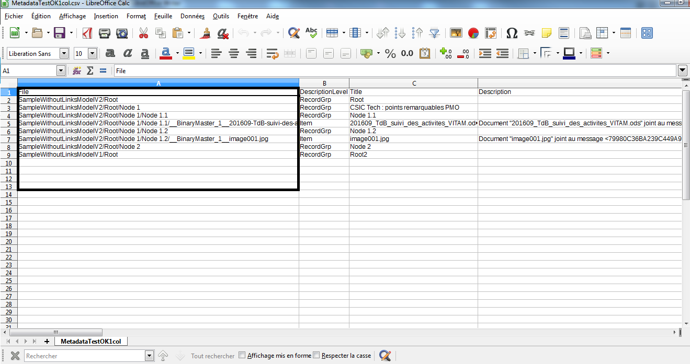

Si les colonnes Id et ParentId sont présentes, le fichier d’import se présentera comme suit (cf. copie d’écran
ci-dessous) :

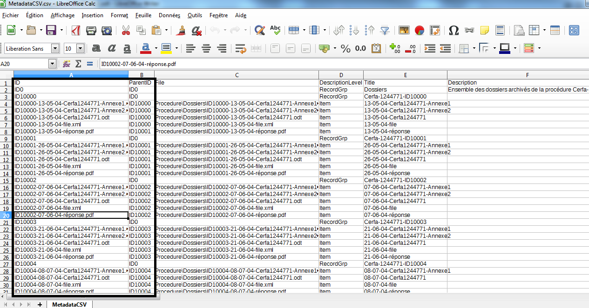

**Attention** :

-   l’ordre des premières colonnes ne doit pas être modifié ;
-   une première ligne d’en-tête donnant le nom des colonnes doit être
    présente, chaque ligne décrivant ensuite une unité archivistique ;
-   Si les colonnes Id et ParentId sont présentes :

	- 	l’identification devra nécessairement commencer par un identifiant portant le chiffre
    1 (ex. « ID01 »). Il est par ailleurs recommandé de :

		-   respecter une identification par ordre croissant, sans rupture
        numéraire ;
		-   employer des identifiants ne comportant ni caractère accentué,
        ni virgule, ni apostrophe, ni parenthèse, ni espace, ni slash,
        ni élément de ponctuation, ou tout autre caractère spécial. Ne
        sont recommandés que l’underscore et le tiret comme
        séparateurs ;
	- la colonne File, obligatoire, peut être non renseignée.

-   le séparateur entre les colonnes est par défaut le « ; » et
    l’encodage par défaut est « windows-1252 ». Ces paramètres peuvent
    être modifiées dans l’écran de gestion des préférences, onglet
    import ([voir section](#paramétrage-de-limport)) ;
-   pour les colonnes correspondant à des champs du standard SEDA,
    l’intitulé de la colonne doit correspondre à celui du champ dans le
    standard SEDA, précédé de « Management. » s’il s’agit d’une
    métadonnée de gestion (ex. « Management.AccessRule.Rule » pour une
    règle de communicabilité) ou de « Content » s’il s’agit d’une
    métadonnée descriptive (ex. « Content.DocumentType »). Toutefois, si
    le fichier d’import ne décrit que des métadonnées descriptives, la
    présence du préfixe « Content » est facultative ;
-   quand le schéma XML du standard SEDA propose une structure complexe
    de balises (par exemple pour décrire un auteur via l’objet XML
    <Writer> qui contient plusieurs balises XML comme FullName ou
    BirthName), il convient d’intituler la colonne de la manière
    suivante : Content.Writer.FullName ou Content.Writer.BirthName ;
-   quand un champ ou un objet XML est multivalué dans le standard SEDA
    (et qu’il est possible d’en décrire plusieurs dans le bordereau
    comme c’est le cas pour l’objet Writer par exemple), il convient de
    numéroter la colonne de la manière suivante :
    Content.Writer.0.FullName, Content.Writer.1.FullName ;
-   la colonne File :

    -   ne doit pas comprendre d’espace avant ou après les « \ » ;
    -   doit correspondre à un chemin tel que décrit par l’explorateur
        de fichiers (avec des « \ » et non des « / ») ;

-   la colonne DescriptionLevel ne doit comprendre que les valeurs
    autorisées par le standard SEDA : Collection, Fonds, Series,
    SubSeries, RecordGrp, File, Item ;
-   les colonnes correspondant à des champs Date dans le standard SEDA
    doivent être formatées conformément à la norme ISO 8601
    (AAAA-MM-JJ).

Le fichier d’import utilisé pour la rédaction du présent manuel se
présente comme suit[^7] :
```csv
ID;ParentID;File;Content.DescriptionLevel;Content.Title;Content.ArchivalAgencyArchiveUnitIdentifier;Content.TransactedDate
1;;documentation;RecordGrp;documentation;;
2;1;documentation\preuve;RecordGrp;preuve;;
51;2;documentation\preuve\141107-SignatureVITAMV0.odt;Item;141107-SignatureVITAMV0.odt;20191000/006;2015-05-04
10;2;documentation\preuve\Bulletin NARA 2015-03.pdf;Item;Bulletin NARA 2015-03.pdf;20191000/007;2015-08-24
4;2;documentation\preuve\Interpares;File;Interpares;20191000/001;
6;4;documentation\preuve\Interpares\interpares_book_d_part1.pdf;Item;Interpares 1 - Authenticity Task Force Report;;2015-08-25
5;4;documentation\preuve\Interpares\ip1_authenticity_requirements(french).pdf;Item;Interpares 1 - Conditions requises pour évaluer et maintenir l'authenticité des documents d'archives électroniques;;2015-08-25
11;4;documentation\preuve\Interpares\ip2_livre_annexe_19.pdf;Item;ip2_livre_annexe_19.pdf;;2015-08-25
12;4;documentation\preuve\Interpares\ip2_livre_annexe_20.pdf;Item;ip2_livre_annexe_20.pdf;;2015-08-25
14;4;documentation\preuve\Interpares\ip2_livre_annexe_21.pdf;Item;ip2_livre_annexe_21.pdf;;2015-08-25
13;4;documentation\preuve\Interpares\ip2_livre_annexe_21a.pdf;Item;ip2_livre_annexe_21a.pdf;;2015-08-25
17;4;documentation\preuve\Interpares\ip2_livre_annexe_21b.pdf;Item;ip2_livre_annexe_21b.pdf;;2015-08-25
15;4;documentation\preuve\Interpares\ip2_livre_annexe_21c.pdf;Item;ip2_livre_annexe_21c.pdf;;2015-08-25
16;4;documentation\preuve\Interpares\ip2_livre_annexe_22.pdf;Item;ip2_livre_annexe_22.pdf;;2015-08-25
18;4;documentation\preuve\Interpares\ip2_livre_partie_1.pdf;Item;ip2_livre_partie_1.pdf;;2015-08-25
21;4;documentation\preuve\Interpares\ip2_livre_partie_2.pdf;Item;ip2_livre_partie_2.pdf;;2015-08-25
24;4;documentation\preuve\Interpares\ip2_livre_partie_3.pdf;Item;ip2_livre_partie_3.pdf;;2015-08-25
25;4;documentation\preuve\Interpares\ip2_livre_partie_4.pdf;Item;ip2_livre_partie_4.pdf;;2015-08-25
23;4;documentation\preuve\Interpares\ip2_livre_partie_5.pdf;Item;ip2_livre_partie_5.pdf;;2015-08-25
32;2;documentation\preuve\Reglementation;File;Reglementation;20191000/002;
33;32;documentation\preuve\Reglementation\Code civil - Article 1348.pdf;Item;Code civil - Article 1348.pdf;;2015-08-25
37;32;documentation\preuve\Reglementation\Code civil 1316.pdf;Item;Code civil 1316.pdf;;2015-05-04
41;32;documentation\preuve\Reglementation\Code de procédure pénale - Article 801-1.pdf;Item;Code de procédure pénale - Article 801-1.pdf;;2015-07-31
43;32;documentation\preuve\Reglementation\Décret n° 2010-112.pdf;Item;Décret n° 2010-112.pdf;;2015-07-31
44;32;documentation\preuve\Reglementation\Décret n°2001-272.pdf;Item;Décret n°2001-272.pdf;;2015-07-31
45;32;documentation\preuve\Reglementation\Décret n°56-222 du 29 février 1956.pdf;Item;Décret n°56-222 du 29 février 1956.pdf;;2015-07-31
47;32;documentation\preuve\Reglementation\Décret n°71-941 du 26 novembre 1971 relatif aux actes établis par les notaires.pdf;Item;Décret n°71-941 du 26 novembre 1971 relatif aux actes établis par les notaires.pdf;;2015-07-31
65;32;documentation\preuve\Reglementation\Politique_archivage_DCSSI_2006;File;Politique_archivage_DCSSI_2006;;
69;65;documentation\preuve\Reglementation\Politique_archivage_DCSSI_2006\ArchivageSecurise-CahierDesCharges-2006-05-16.pdf;Item;ArchivageSecurise-CahierDesCharges-2006-05-16.pdf;;2015-05-04
77;65;documentation\preuve\Reglementation\Politique_archivage_DCSSI_2006\ArchivageSecurise-EnjeuxJuridiques-2006-05-16.pdf;Item;ArchivageSecurise-EnjeuxJuridiques-2006-05-16.pdf;;2015-05-04
72;65;documentation\preuve\Reglementation\Politique_archivage_DCSSI_2006\ArchivageSecurise-EtatDeLArt-2006-11-29.pdf;Item;ArchivageSecurise-EtatDeLArt-2006-11-29.pdf;;2015-05-04
74;65;documentation\preuve\Reglementation\Politique_archivage_DCSSI_2006\ArchivageSecurise-Memento-2006-05-16.pdf;Item;ArchivageSecurise-Memento-2006-05-16.pdf;;2015-05-04
73;65;documentation\preuve\Reglementation\Politique_archivage_DCSSI_2006\ArchivageSecurise-P2A-2006-07-24.pdf;Item;ArchivageSecurise-P2A-2006-07-24.pdf;;2015-05-04
76;65;documentation\preuve\Reglementation\Politique_archivage_DCSSI_2006\ArchivageSecurise-Plaquette-2006-08-18.pdf;Item;ArchivageSecurise-Plaquette-2006-08-18.pdf;;2015-05-04
71;32;documentation\preuve\Reglementation\Rapport_Blanchette;File;Rapport_Blanchette;;
78;71;documentation\preuve\Reglementation\Rapport_Blanchette\DITN.2004.004.pdf;Item;DITN.2004.004.pdf;;2015-05-04
75;71;documentation\preuve\Reglementation\Rapport_Blanchette\ip2_dissemination_rep_blanchette_2004.pdf;Item;ip2_dissemination_rep_blanchette_2004.pdf;;2015-05-04
39;32;documentation\preuve\Reglementation\decret_2011_144.pdf;Item;decret_2011_144.pdf;;2015-07-31
42;32;documentation\preuve\Reglementation\decret_2011_434.pdf;Item;decret_2011_434.pdf;;2015-07-31
48;32;documentation\preuve\Reglementation\eidas;File;eidas;;
53;48;documentation\preuve\Reglementation\eidas\20150407_NP_MCC-SIAF_eIDAS-position-art-34.doc;Item;20150407_NP_MCC-SIAF_eIDAS-position-art-34.doc;;2015-08-25
66;48;documentation\preuve\Reglementation\eidas\20150619_MCC-SIAF_eIDAS.pdf;Item;20150619_MCC-SIAF_eIDAS.pdf;;2015-08-25
64;48;documentation\preuve\Reglementation\eidas\20150826_NP_MCC-SIAF_eIDAS-demande-avis-reponse-GT.pdf;Item;20150826_NP_MCC-SIAF_eIDAS-demande-avis-reponse-GT.pdf;;2015-08-26
55;48;documentation\preuve\Reglementation\eidas\20150826_NP_Vitam_eIDAS-reponse-demande-avis-SIAF.pdf;Item;20150826_NP_Vitam_eIDAS-reponse-demande-avis-SIAF.pdf;;2015-08-26
68;48;documentation\preuve\Reglementation\eidas\20150827_NP_MCC-SIAF_eIDAS-GT-CR.pdf;Item;20150827_NP_MCC-SIAF_eIDAS-GT-CR.pdf;;2015-08-27
59;48;documentation\preuve\Reglementation\eidas\20150827_NP_MCC-SIAF_eIDAS_commentaire-reponse-vitam-demande-avis.pdf;Item;20150827_NP_MCC-SIAF_eIDAS_commentaire-reponse-vitam-demande-avis.pdf;;2015-08-27
61;48;documentation\preuve\Reglementation\eidas\CELEX_32014R0910_FR_TXT.pdf;Item;CELEX_32014R0910_FR_TXT.pdf;;2015-03-10
63;48;documentation\preuve\Reglementation\eidas\eIDAS_GT_FR_livrable_20150722_partie_ANSSI_revuSIAF.odt;Item;eIDAS_GT_FR_livrable_20150722_partie_ANSSI_revuSIAF.odt;;2015-08-26
62;48;documentation\preuve\Reglementation\eidas\eIDAS_GT_FR_livrable_20150824_partie_MCC_v2.doc;Item;eIDAS_GT_FR_livrable_20150824_partie_MCC_v2.doc;;2015-08-26
60;48;documentation\preuve\Reglementation\eidas\eIDAS_GT_FR_livrable_20150826_partie_MCC_v2.1.doc;Item;eIDAS_GT_FR_livrable_20150826_partie_MCC_v2.1.doc;;2015-08-27
58;48;documentation\preuve\Reglementation\eidas\eIDAS_GT_reunion_20150521_CR_VD.odt;Item;eIDAS_GT_reunion_20150521_CR_VD.odt;;2015-05-29
54;48;documentation\preuve\Reglementation\eidas\ts_10153301v010101p.pdf;Item;ts_10153301v010101p.pdf;;2015-03-10
56;32;documentation\preuve\Reglementation\joe_20131113_0001.pdf;Item;joe_20131113_0001.pdf;;2015-07-31
70;32;documentation\preuve\Reglementation\ordonnance_2005_1516.pdf;Item;ordonnance_2005_1516.pdf;;2015-07-31
57;32;documentation\preuve\Reglementation\ordonnance_contrats;File;ordonnance_contrats;;2019-03-27
67;57;documentation\preuve\Reglementation\ordonnance_contrats\droit_preuve_reforme_2015_ordonnance_20150430_reaction_SIAF_vd.pdf;Item;droit_preuve_reforme_2015_ordonnance_20150430_reaction_SIAF_vd.pdf;;2015-05-29
3;2;documentation\preuve\articles;File;articles;20191000/003;
7;3;documentation\preuve\articles\BaCa07.pdf;Item;BaCa07.pdf;;2015-07-31
8;3;documentation\preuve\articles\CR2PA _ Le document électronique à travers la jurisprudence depuis la loi du 13 mars 2000.pdf;Item;CR2PA _ Le document électronique à travers la jurisprudence depuis la loi du 13 mars 2000.pdf;;2015-07-31
9;3;documentation\preuve\articles\RMJ-07-2014-0031.pdf;Item;RMJ-07-2014-0031.pdf;;2015-07-31
19;2;documentation\preuve\jurisprudence;File;jurisprudence;;
22;19;documentation\preuve\jurisprudence\Conseil d'État, 5ème et 4ème sous-sections réunies, 17_07_2013, 351931.pdf;Item;Conseil d'État, 5ème et 4ème sous-sections réunies, 17_07_2013, 351931.pdf;;2015-07-31
26;19;documentation\preuve\jurisprudence\Conseil d'État, 7ème _ 2ème SSR, 07_11_2014, 383587.pdf;Item;Conseil d'État, 7ème _ 2ème SSR, 07_11_2014, 383587.pdf;;2015-07-31
29;19;documentation\preuve\jurisprudence\Conseil d'État, 7ème _ 2ème SSR, 26_06_2015, 389599.pdf;Item;Conseil d'État, 7ème _ 2ème SSR, 26_06_2015, 389599.pdf;;2015-07-31
20;2;documentation\preuve\normes;File;normes;20191000/004;
52;20;documentation\preuve\normes\2013-05-28_VITAM_Grille_exigences_fonctionnelles_et_techniques_v2.xls;Item;2013-05-28_VITAM_Grille_exigences_fonctionnelles_et_techniques_v2.xls;;2015-07-31
27;20;documentation\preuve\normes\NFZ42-013_2009.pdf;Item;NFZ42-013_2009.pdf;;2015-07-30
36;20;documentation\preuve\normes\NFZ42020.pdf;Item;NFZ42020.pdf;;2015-07-30
30;20;documentation\preuve\normes\NFz42013.xls;Item;NFz42013.xls;;2012-11-26
38;20;documentation\preuve\normes\Z42019.pdf;Item;Z42019.pdf;;2015-07-30
28;20;documentation\preuve\normes\nfz42013.pdf;Item;nfz42013.pdf;;2015-07-30
31;2;documentation\preuve\recommandations_SIAF;File;recommandations_SIAF;20191000/005;
40;31;documentation\preuve\recommandations_SIAF\DGP_SIAF_011_018.pdf;Item;DGP_SIAF_011_018.pdf;;2015-07-31
49;31;documentation\preuve\recommandations_SIAF\DGP_SIAF_2012_002.pdf;Item;DGP_SIAF_2012_002.pdf;;2015-07-31
34;31;documentation\preuve\recommandations_SIAF\DITN.2006.002.pdf;Item;DITN.2006.002.pdf;;2015-07-31
50;31;documentation\preuve\recommandations_SIAF\DITN.DPACI.2005.001.pdf;Item;DITN.DPACI.2005.001.pdf;;2015-07-31
35;31;documentation\preuve\recommandations_SIAF\DITN_RES_2006_005.pdf;Item;DITN_RES_2006_005.pdf;;2015-07-31
46;31;documentation\preuve\recommandations_SIAF\vademecum_dematerialisation_VD.pdf;Item;vademecum_dematerialisation_VD.pdf;;2015-07-31
```

**Attention :**

-   le fichier .csv ne référence que des métadonnées propres aux unités
    archivistiques (métadonnées descriptives et de gestion).
-   seul un objet peut être associé à un enregistrement. Ce format
    d’import ne permet pas de facto de gérer l’import de groupe d’objets
    techniques disposant de plusieurs objets aux usages différents
    devant être référencé par la même unité archivistique.

#### Présentation du processus d’import

Afin d’importer une structure arborescente d’archives et/ou de fichiers
sous la forme d’un fichier csv, il convient, dans le menu de la
moulinette ReSIP, de cliquer sur l’action « Import » puis sur la
sous-action « Importer depuis un csv de métadonnées » (cf. copie d’écran
ci-dessous).
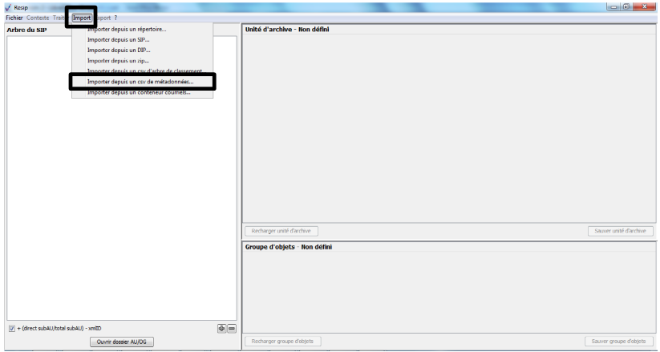

Le clic sur la sous-action « Importer depuis un csv de
métadonnées » ouvre l’explorateur Windows de l’utilisateur et permet à
celui-ci de sélectionner le fichier .csv et de l’importer dans la
moulinette ReSIP en cliquant sur le bouton d’action « Ouvrir » (cf.
copie d’écran ci-dessous).
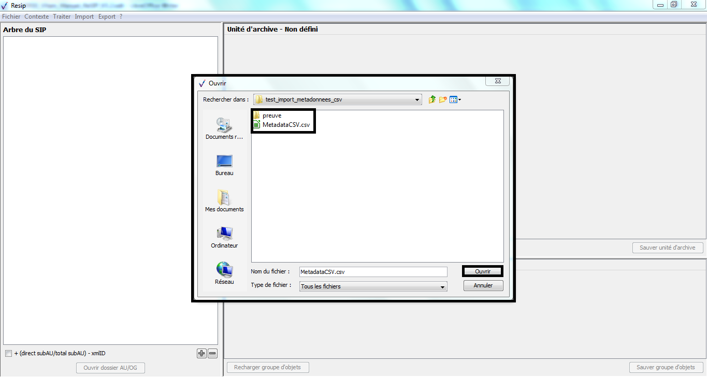

**Attention** : le fichier .csv à importer doit se
trouver dans le même répertoire que le répertoire correspondant à la
racine de la structure arborescente de fichiers à importer. Dans le cas
ci-dessus, le fichier MetadataCSV.csv décrit la structure arborescente
de fichier dont le répertoire racine a pour intitulé « preuve ».

L’opération d’import se déroule ensuite [comme décrit dans la section](#import-dune-arborescence-de-fichiers).

Au terme du processus d’import, la structure arborescente d’archives est
restituée dans le panneau de visualisation et de modification de la
structure arborescente d’archives (cf. copie d’écran ci-dessous) :
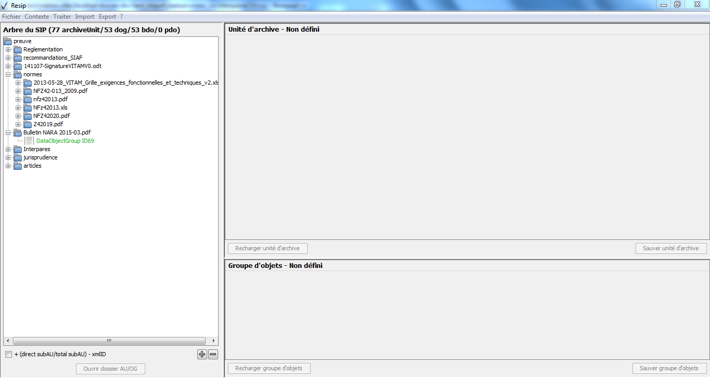

### Import d’une structure arborescente d’archives correspondant à une messagerie électronique

La moulinette ReSIP permet d’importer une structure arborescente
d’archives correspondant à une messagerie électronique se présentant
sous la forme :

-   d’un conteneur Microsoft Outlook au format .pst ;
-   de message Microsoft Outlook au format .msg ;
-   d’un conteneur Thunderbird ;
-   d’un conteneur au format .mbox.

L’import est paramétrable.

#### Paramétrage de l’import

Afin de paramétrer pour traitement l’import d’une structure arborescente
d’archives correspondant à une messagerie électronique, il convient,
dans le menu de la moulinette ReSIP, de cliquer sur l’action « Fichier »
puis sur la sous-action « Préférences » (cf. copie d’écran ci-dessous).


Le clic sur la sous-action « Préférences » ouvre une
fenêtre de dialogue composée de cinq onglets. Le paramétrage de l’import
est disponible dans l’onglet « Import » (cf. copie d’écran ci-dessous).
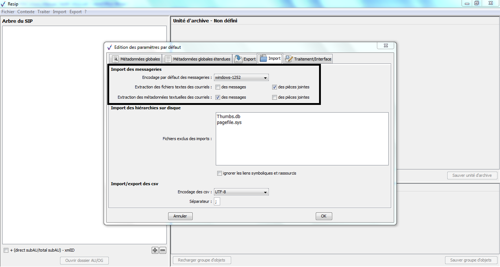

Il permet de :

-   sélectionner via un menu déroulant l’encodage utilisé dans le
    conteneur de messagerie. Par défaut, l’encodage proposé est
    « windows-1252 », utilisé dans les conteneurs de type .pst ;
-   activer ou désactiver, via des cases à cocher, les fonctionnalités
    de génération de fichiers textuels correspondant au contenu textuel
    des messages électroniques et de leurs pièces jointes. Cette
    extraction génère des objets spécifiques dont l’usage est
    TextContent ;
-   activer ou désactiver, via des cases à cocher, les fonctionnalités
    d’extraction sous forme d’une métadonnée du contenu textuel des
    messages électroniques et de leurs pièces jointes.

#### Présentation du processus d’import

Afin d’importer une structure arborescente d’archives correspondant à un
conteneur de messagerie ou à un message électronique, il convient, dans
le menu de la moulinette ReSIP, de cliquer sur l’action « Import » puis
sur la sous-action « Importer depuis un conteneur courriels » (cf. copie
d’écran ci-dessous).


Le clic sur la sous-action « Importer depuis un
conteneur courriels » ouvre l’explorateur Windows de l’utilisateur et
permet à celui-ci de sélectionner :

-   pour les messageries Thunderbird :

    -   soit le répertoire ImapMail ;
    -   soit le répertoire LocalFolders.
        Ces répertoires sont accessibles sur le poste d’un utilisateur du ministère de la Culture à l’adresse suivante :
        C:\Users\PRENOM.NOM\AppData\Roaming\Thunderbird\Profiles\XXXXXXXXX.default\ ;
    -   soit un fichier au format .mbox ;

-   pour les messageries Outlook un fichier au format .pst ;
-   des messages au format .eml ou .msg.

L’import dans la moulinette ReSIP se fait en cliquant sur le bouton
d’action « Ouvrir » (cf. copie d’écran ci-dessous).

**Attention** : il n’est possible de sélectionner qu’un seul fichier ou
répertoire.

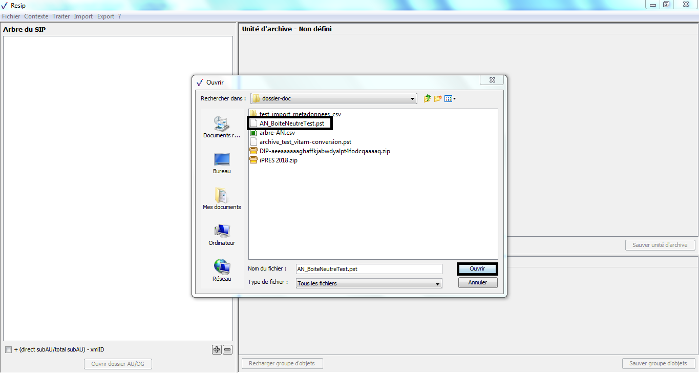

Le clic sur le bouton « Ouvrir » ouvre une fenêtre de
dialogue affichant les paramètres d’import [comme décrit dans la section](#import-depuis-un-fichier-csv-décrivant-une-structure-arborescente-darchives-etou-de-fichiers) (cf. copie d’écran ci-dessous) et permettant de les modifier :

-   protocole d’extraction des messageries : la moulinette ReSIP
    identifie par défaut le protocole à employer en fonction du type de
    fichier importé ;
-   encodage des messages : l’encodage défini par défaut est
    windows-1252 ;
-   modalités d’extraction du contenu des messages et de leurs pièces
    jointes, sous forme de case à cocher. Seules les options retenues
    seront mises en œuvre lors de l’extraction ;
-   modalités d’extraction des propriétés des messages et de leurs
    pièces jointes, sous forme de case à cocher. Seules les options
    retenues seront mises en œuvre lors de l’extraction.

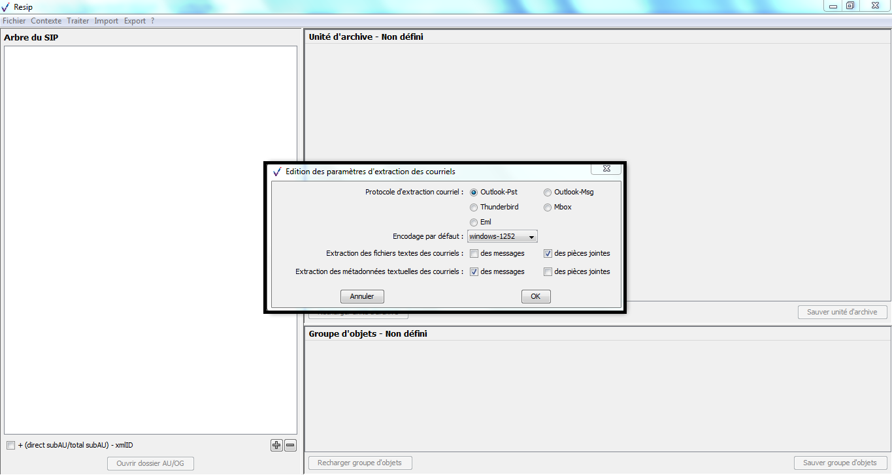

Le clic sur le bouton d’action « OK » de la fenêtre de
dialogue lance une nouvelle fenêtre de dialogue « Import » indiquant que
l’opération d’import est lancée. Cette opération peut être annulée en
cliquant sur le bouton d’action « Annuler » de la fenêtre de dialogue
(cf. copie d’écran ci-dessous).

**Attention **: la durée de cette opération d’import peut être longue,
notamment si le nombre de répertoires et de messages à importer est
important.

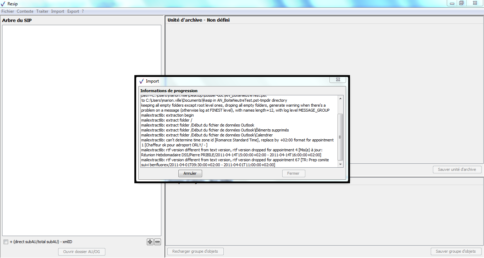

L’opération d’import se déroule ensuite [comme décrit dans la section](#import-dune-arborescence-de-fichiers). Une fois celle-ci terminée, il est possible de naviguer
dans la structure arborescente d’archives correspondant à la messagerie
importée dans le panneau de visualisation et de modification de la
structure arborescente d’archives (cf. copie d’écran ci-dessous).


#### Présentation de la structure arborescente d’archives créée

La structure arborescente créée lors du processus d’import comprend :

-   l’arborescence des messages électroniques ;
-   la liste des contacts enregistrés dans le compte de messagerie sous
    la forme d’un tableur .csv ;
-   la liste des rendez-vous enregistrés dans le compte de messagerie
    sous la forme d’un tableur .csv ;
-   l’ensemble des métadonnées décrivant les messages électroniques sous
    la forme d’un tableur.csv.

Les métadonnées extraites à ce jour des messageries électroniques
sont les suivantes :

-   pour les unités archivistiques correspondant au répertoire racine :

    -   niveau de description (champ DescriptionLevel dans le SEDA) =
        RecordGrp ;
    -   titre (champ Title dans le SEDA) = « Ensemble des messages
        électroniques du container C:\\\[...\].pst à la date du
        AAAA-MM-JJTHH:MM:SS.DD7Z » ;
    -   date du document le plus ancien (champ StartDate du SEDA) = date
        du message le plus ancien ;
    -   date du document le plus récent (champ EndDate du SEDA) = date
        du message le plus récent ;

-   pour les unités archivistiques correspondant à chaque répertoire :

    -   niveau de description (champ DescriptionLevel dans le SEDA) =
        RecordGrp ;
    -   titre (champ Title dans le SEDA) = Titre du répertoire ;
    -   date du document le plus ancien (champ StartDate du SEDA) = date
        du message le plus ancien ;
    -   date du document le plus récent (champ EndDate du SEDA) = date
        du message le plus récent ;

-   pour les unités archivistiques correspondant à chaque message :

    -   niveau de description (champ DescriptionLevel dans le SEDA) =
        Item ;
    -   titre (champ Title dans le SEDA) = Titre du message. Quand le
        titre du message était vide, la valeur par défaut « Vide » a été
        portée ;
    -   identifiant d’origine (champ OriginatingSystemId du SEDA) =
        identifiant du message ;
    -   rédacteur, destinataires (champs Writer, Addressee et Recipient
        du SEDA) = expéditeur, destinataires ;
    -   date d’envoi (champ SentDate du SEDA) = date d’expédition ;
    -   date de réception (champ ReceivedDate du SEDA) = date de
        réception ;
    -   référence à un autre message (champ OriginatingSystemIdReplyTo
        équivalent du champ ReplyTo de la messagerie d’origine et
        correspondant à une extension du SEDA) ;
    -   corps du message (champ TextContent correspondant à une
        extension du SEDA) ;

-   pour les unités archivistiques correspondant à chaque pièce jointe,
    hors message :

    -   niveau de description (champ DescriptionLevel dans le SEDA) =
        Item ;
    -   titre (champ Title dans le SEDA) = Titre du fichier ;
    -   description (champ Description du SEDA) = Document &lt;Titre du
        document&gt; joint au message &lt;identifiant du message&gt;.

### Réouverture d’une structure arborescente d’archives en cours de traitement

Afin de rouvrir une structure arborescente d’archives déjà en cours de
traitement et sauvegardée par l’utilisateur, il convient, dans le menu
de la moulinette ReSIP, de cliquer sur l’action « Fichier » puis sur la
sous-action « Charger » (cf. copie d’écran ci-dessous).
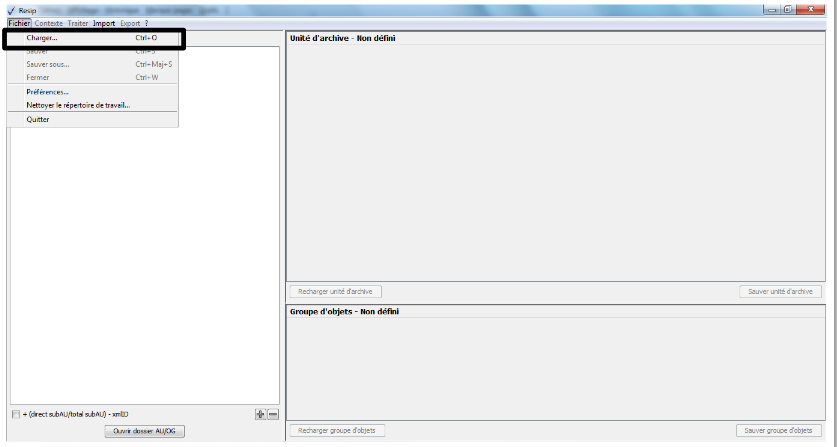

Le clic sur la sous-action « Charger » ouvre
l’explorateur Windows de l’utilisateur et permet à celui-ci de
sélectionner un fichier correspondant à un contexte sauvegardé et de
l’importer dans la moulinette ReSIP en cliquant sur le bouton d’action
« Ouvrir » (cf. copie d’écran ci-dessous).

**Attention** : il n’est possible de sélectionner qu’un seul fichier.

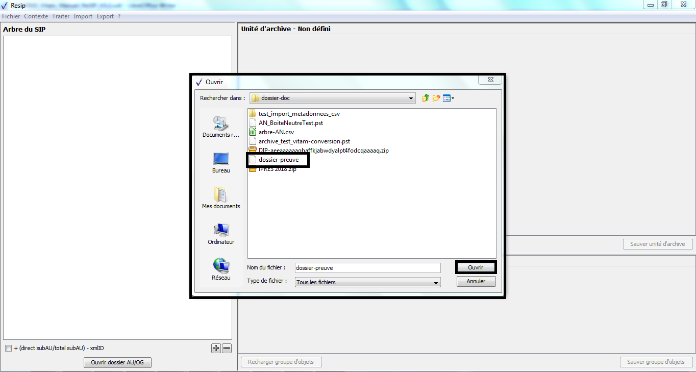

La structure arborescente d’archives est alors restituée
dans le panneau de visualisation et de modification de la structure
arborescente d’archives (cf. copie d’écran ci-dessous).
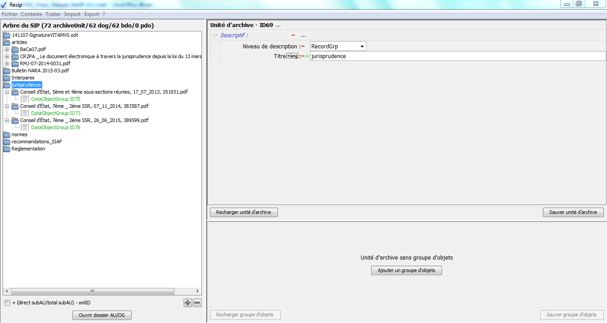

Traitement des structures arborescentes d’archives importées dans la moulinette ReSIP
-------------------------------------------------------------------------------------

Une fois une structure arborescente d’archives importée dans la
moulinette ReSIP, il est possible d’effectuer les traitements suivants :

-   [tri alphabétique des différents niveaux de la structure arborescente d’archives](#trier-alphabétiquement-les-différents-niveaux-de-la-structure-arborescente-darchives) ;
-   [recherche d’unités archivistiques et d’objets dans la structure arborescente d’archives](#rechercher-des-unités-archivistiques-et-des-objets-dans-la-structure-arborescente-darchives) ;
-   [détection de doublons](#détection-et-traitement-de-doublons) ;
-   [récupération de statistiques sur les objets](#récupération-de-statistiques-sur-les-objets) ;
-   [réorganisation de l’arborescence](#réorganiser-larborescence) ;
-   [traitement des métadonnées des unités archivistiques](#traiter-les-unités-archivistiques)
   ;
-   [traitement des objets, tant physiques que binaires, et de leurs métadonnées](#traiter-les-objets-et-leurs-métadonnées) ;
-   [vérification de la conformité de la structure arborescente d’archives par rapport au SEDA 2.1. et 2.2.](#vérification-de-la-conformité-de-la-structure-arborescente-darchives-par-rapport-au-seda-21-et-22) ;
-   [sauvegarde du contexte de travail en cours de traitement](#sauvegarder-le-contexte-de-travail-en-cours-de-traitement) ;
-   [nettoyage de l’espace de travail](#nettoyer-lespace-de-travail).

### Trier alphabétiquement les différents niveaux de la structure arborescente d’archives

Afin de trier alphabétiquement la structure arborescente d’archives il
convient, dans le menu de la moulinette ReSIP, de cliquer sur l’action
« Traiter » puis sur la sous-action « Trier l’arbre de visualisation »
(cf. copie d’écran ci-dessous).
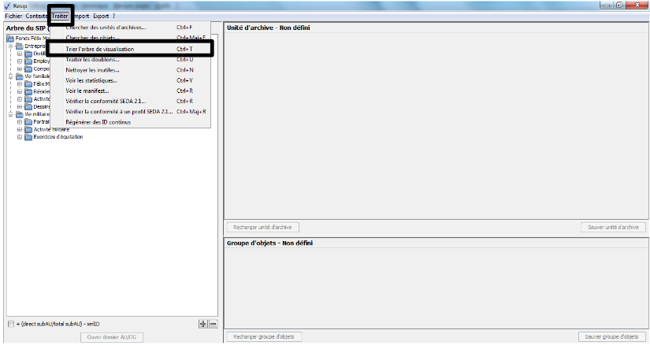

Cette action déclenche le tri alphabétique de
l’ensemble des éléments composant la structure arborescente d’archives
(cf. copie d’écran ci-dessous).
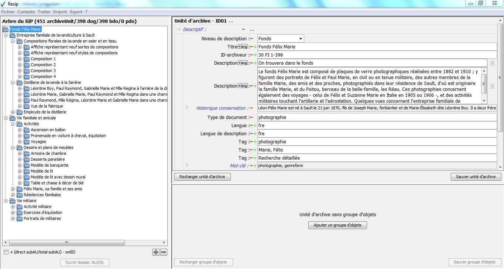

### Rechercher des unités archivistiques et des objets dans la structure arborescente d’archives

Il est possible de rechercher, dans la structure arborescente d’archives
importée dans la moulinette ReSIP :

-   [des unités archivistiques, en fonction de la valeur de leurs métadonnées de description ou de gestion](#recherche-dunités-archivistiques) ;
-   [des objets, particulier, en fonction de leur format et de leur taille](#recherche-dobjets).

#### Recherche d’unités archivistiques

Afin d’effectuer des recherches d’unités archivistiques dans une
structure arborescente d’archives importée, il convient, dans le menu de
la moulinette ReSIP, de :

-   cliquer sur l’action « Traiter » puis sur la sous-action « Chercher
    des unités d’archives » (cf. copie d’écran ci-dessous) ;
    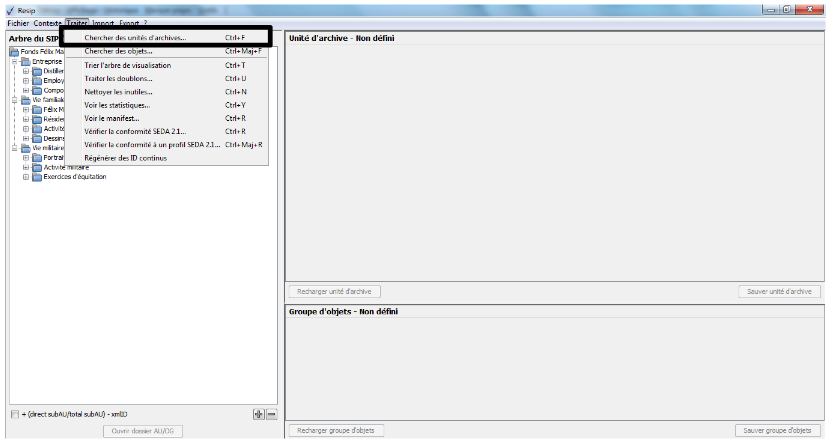
-   choisir, dans la fenêtre de dialogue qui s’est
    ouverte, le type de recherche souhaité, en cochant la case
    correspondante. Quatre types de recherches sont possibles (cf. copie
    d’écran ci-dessous) :

    -   une recherche par identifiant XML (ex. ID15) ;
    -   une recherche par défaut sur le seul titre (champ Title) ;
    -   une recherche dans toutes les métadonnées de l’unité
        archivistique, en cochant la case « Métadonnées » ;
    -   une recherche par expression régulière, en cochant la case
        « Regexp » ;

        Par défaut, la recherche n’est pas sensible à la casse des caractères.
        Pour effectuer une recherche respectant celle-ci, il suffit de cocher la
        case « Respecter la casse.

        Il est également possible de ne rechercher que :

    -   les unités archivistiques sans niveaux de description inférieurs
        ou descendance en cochant la case « Unité d’archive » ;
    -   les unités archivistiques sans groupe d’objets techniques
        associés en cochant sur « Objet numérique ou physique » ;
    -   les unités archivistiques sans descendance et sans objet associé
        en cochant les cases « Unité d’archive » et « Objet numérique ou
        physique » ;

    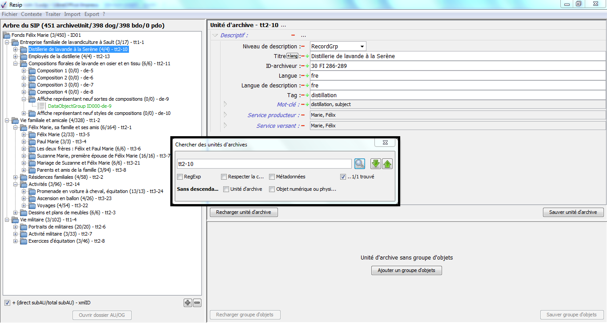

-   cliquer, dans la fenêtre de dialogue, sur l’icône correspondant à
    une loupe pour obtenir le nombre de résultats trouvés dans la
    structure arborescente d’archives. Le nombre de résultats s’affiche
    en bas et à droite de la fenêtre de dialogue (cf. copie d’écran
    ci-dessous) ;
    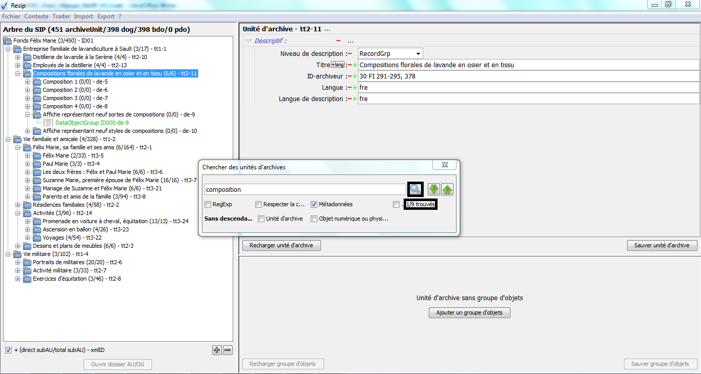
-   naviguer dans les résultats obtenus au moyen des
    flèches présentes dans la fenêtre de dialogue. Les unités
    archivistiques correspondant à la recherche sont surlignées en bleu
    dans le panneau de visualisation et de modification de la structure
    arborescente d’archives (cf. copie d’écran ci-dessous).

    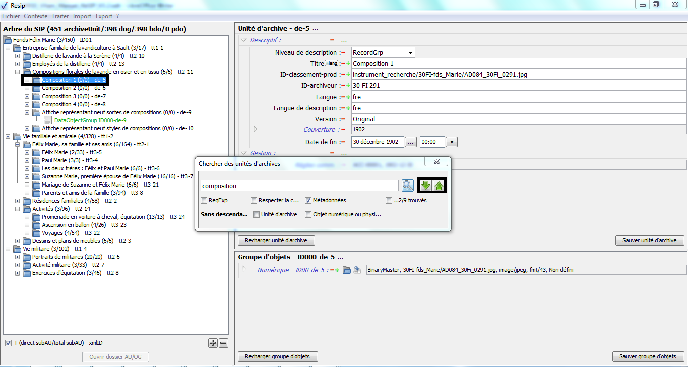

#### Recherche d’objets

Afin d’effectuer des recherches d’objets dans une structure arborescente
d’archives importée, il convient, dans le menu de la moulinette ReSIP,
de :

-   cliquer sur l’action « Traiter » puis sur la sous-action « Chercher
    des objets » (cf. copie d’écran ci-dessous).
    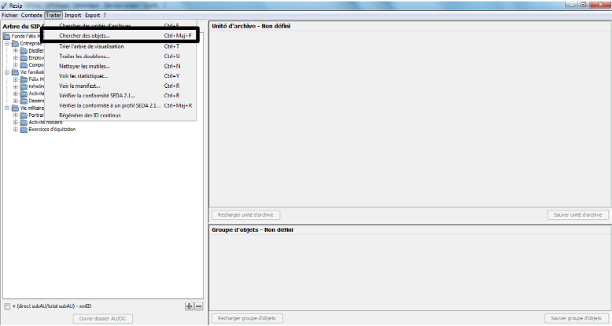

-   choisir, dans la fenêtre de dialogue qui s’est
    ouverte, le type de recherche souhaité, en cochant la case
    correspondante. Trois types de recherches sont possibles (cf. copie
    d’écran ci-dessous) :

    -   une recherche par catégorie de formats, via un menu déroulant ;
    -   une recherche par liste de formats, en saisissant les différents
        formats souhaités sous la forme de PUID du registre des formats
        PRONOM mis à disposition par The National Archives (UK) ;
    -   une recherche sur la taille des objets, sur la base d’un
        intervalle défini par l’utilisateur.

    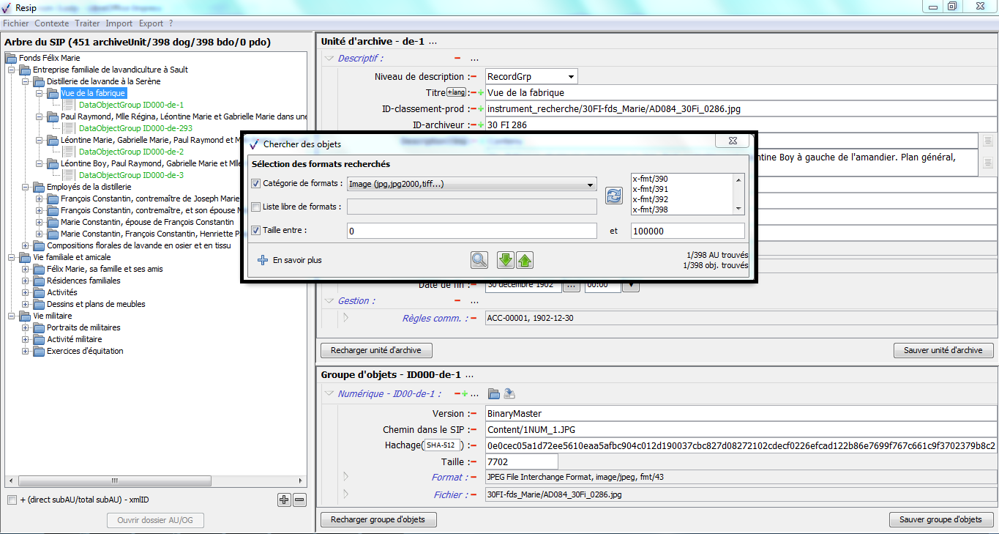

-   cliquer, dans la fenêtre de dialogue, sur l’icône
    correspondant à une loupe pour obtenir le nombre de résultats
    trouvés dans la structure arborescente d’archives. Le nombre de
    résultats s’affiche en bas et à droite de la fenêtre de dialogue
    (cf. copie d’écran ci-dessous) ;
    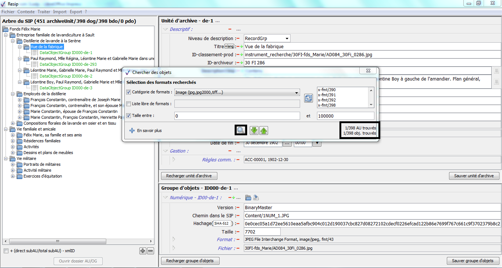

-   naviguer dans les résultats obtenus au moyen des
    flèches présentes dans la fenêtre de dialogue. Les unités
    archivistiques représentées par des objets correspondant à la
    recherche sont surlignées en bleu dans le panneau de visualisation
    et de modification de la structure arborescente d’archives (cf.
    copie d’écran ci-dessous).
    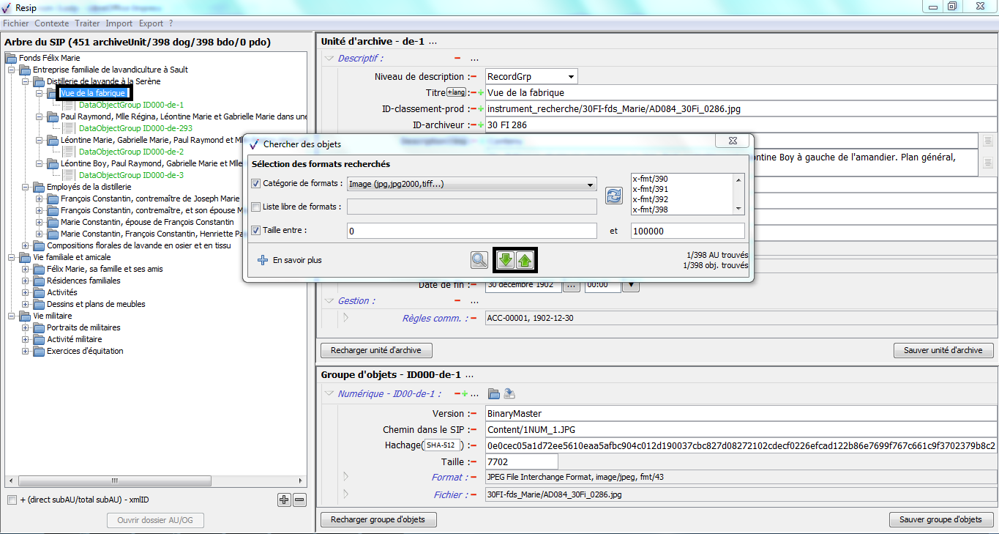

-   disposer d’une aide contextualisée pour la
    réalisation des opérations de recherche en cliquant sur l’icône « +
    En savoir plus » (cf. copie d’écran ci-dessous).
    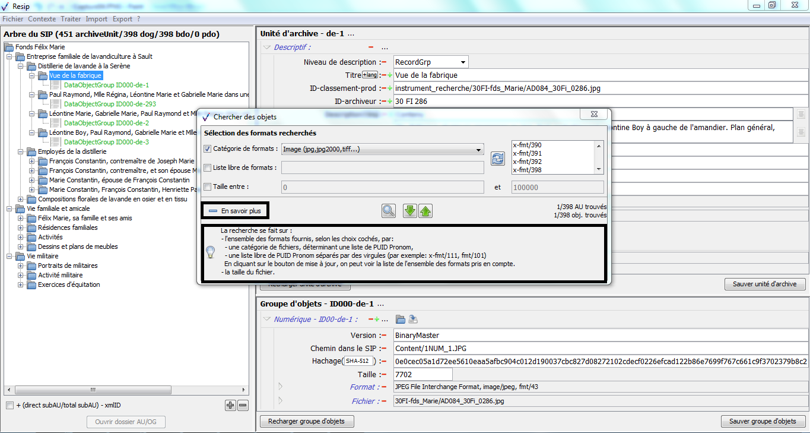

**Attention** : pour rechercher un groupe d’objets par
son identifiant XML, il convient d’utiliser la recherche d’unité
archivistique (voir section 5.2.1.).

### Détection et traitement de doublons

#### Paramétrage du traitement des doublons

Afin de paramétrer le traitement des doublons dans une structure
arborescente d’archives, il convient, dans le menu de la moulinette
ReSIP, de cliquer sur l’action « Fichier » puis sur la sous-action
« Préférences » ([cf. section](#import-dune-structure-arborescente-darchives-correspondant-à-une-messagerie-électronique)).

Le clic sur la sous-action « Préférences » ouvre une fenêtre de dialogue
composée de cinq onglets. Le paramétrage du traitement des doublons est
disponible dans l’onglet « Traitement » (cf. copie d’écran ci-dessous).
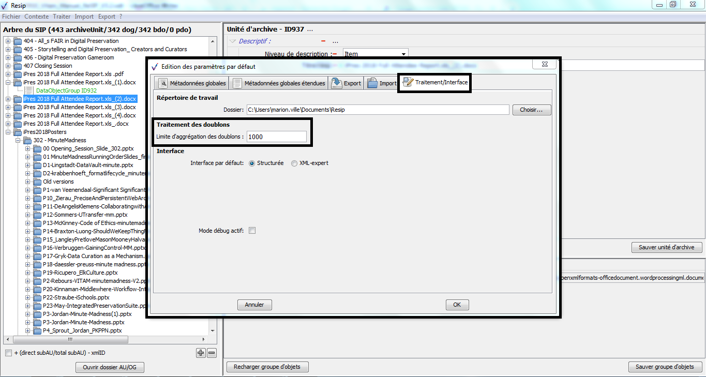

Il permet de définir un nombre maximal de doublons
traitable dans une opération de dédoublonnage.

#### Identification et traitement des doublons

Afin d’identifier et de traiter les doublons présents dans une structure
arborescente d’archives importée, il convient, dans le menu de la
moulinette ReSIP, de :

-   cliquer sur l’action « Traiter » puis sur la sous-action « Traiter
    les doublons » (cf. copie d’écran ci-dessous).
    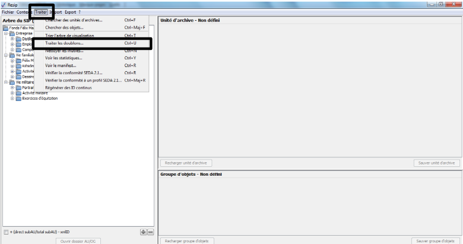

-   paramétrer, dans la fenêtre de dialogue qui s’est
    ouverte, le type de recherche souhaité, en cochant la ou les case(s)
    correspondante(s). Trois types de recherches sont possibles :

    -   pour les objets binaires :

        -   recherches de doublons sur la base de l’empreinte du fichier
            (algorithme utilisé par défaut : SHA-512) ;
        -   recherche de doublons sur la base du nom du fichier ;

    -   pour les objets physiques, recherche de doublons sur la base des
        métadonnées du fichier.

-   cliquer, dans la fenêtre de dialogue, sur l’icône correspondant à
    une loupe pour obtenir le nombre de résultats trouvés dans la
    structure arborescente d’archives (cf. copie d’écran ci-dessous).
    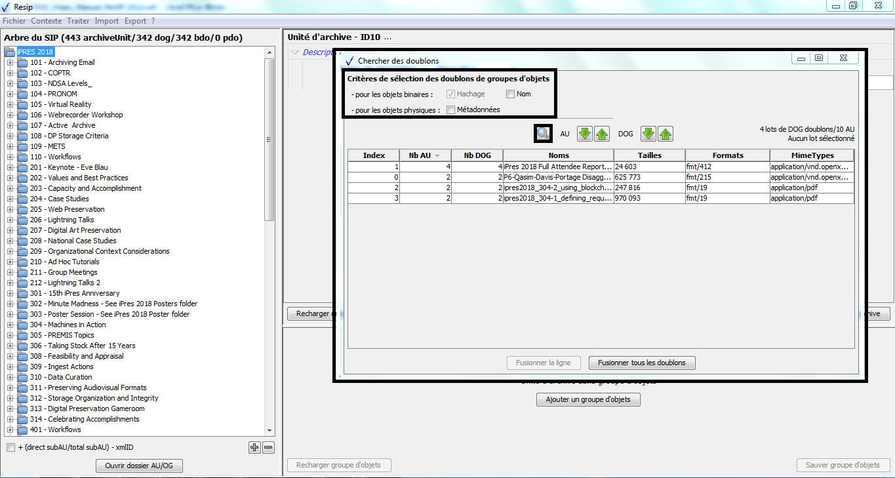

Une fois l’opération terminée, s’affichent :

-   la liste des doublons détectés, avec les informations suivantes :

    -   un numéro d’ordre du doublon ;
    -   le nombre d’unités archivistiques concernées ;
    -   le nombre de groupes d’objets concernés ;
    -   le nom de la 1^ère^ occurrence identifiée du fichier concerné ;
    -   la taille du fichier concerné ;
    -   le format du fichier concerné (identifiant PRONOM) ;
    -   le type Mime du fichier concerné ;

-   au-dessus de la liste, à droite de la fenêtre de dialogue, le nombre
    de doublons détectés (nombre de lots) et le nombre d’unités
    archivistiques concernées, (cf. copie d’écran ci-dessous
    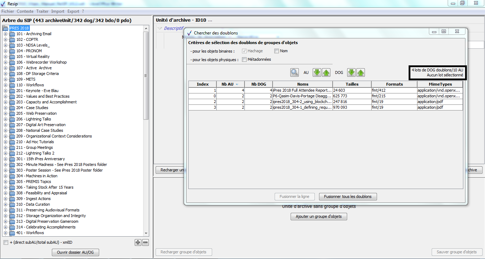

-   cliquer, dans le tableau des résultats retourné dans la fenêtre de
    dialogue, sur une ligne afin de repérer, dans la structure
    arborescente d’archives, l’emplacement des fichiers en doublons. Les
    unités archivistiques représentées par des objets correspondant à la
    recherche sont surlignées en bleu dans le panneau de visualisation
    et de modification de la structure arborescente d’archives (cf.
    copie d’écran ci-dessous) ;
    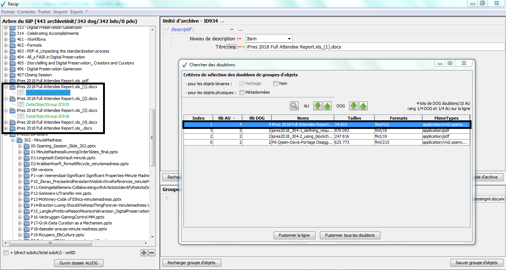

-   naviguer dans les résultats obtenus (unités
    archivistiques –- AU – ou groupes d’objets techniques – DOG) au
    moyen des flèches présentes dans la fenêtre de dialogue (cf. copie
    d’écran ci-dessous). Au-dessus de la liste, à droite de la fenêtre
    de dialogue, est indiquée, parmi le nombre de résultats, la position
    de l’unité archivistique et du groupe d’objets techniques concernés
    dans l’arborescence (ex. 1/4 indique qu’il est la 1^ere^ occurrence
    sur les 4 existantes) ;
    

-   lancer l’action de dédoublonnage qui peut être effectuée :

    -   soit sur une ligne sélectionnée (cf. copie d’écran ci-dessous) ;
        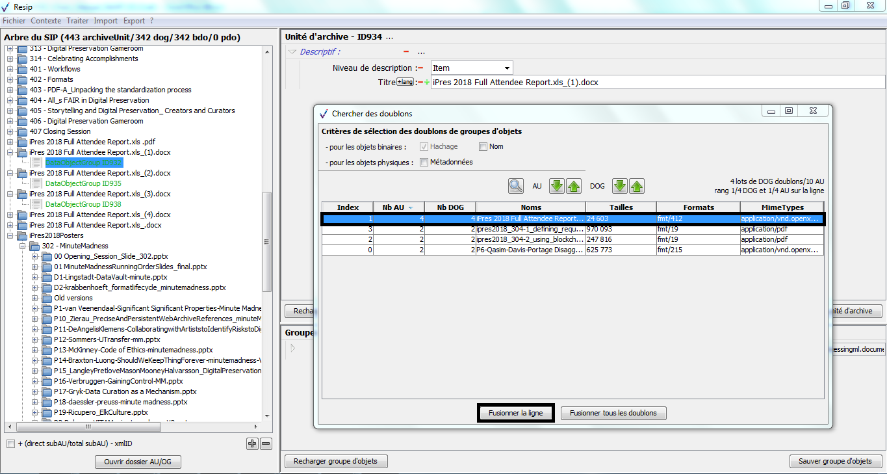

    -   soit sur la ligne sélectionnée, soit sur
        l’ensemble des doublons identifiés (cf. copie d’écran
        ci-dessous) ;

        

Un clic sur l’un des deux boutons d’action lance
l’opération de dédoublonnage. Celui-ci concerne les groupes d’objets et
non les unités archivistiques. Une fois l’opération terminée :

-   dans la structure arborescente d’archives, les groupes d’objets sont
    mis à jour ;
-   dans le tableau présent dans la fenêtre de dialogue : le nombre de
    groupes d’objets pour chaque doublon identifié est mis à jour (cf.
    copie d’écran ci-dessous).
    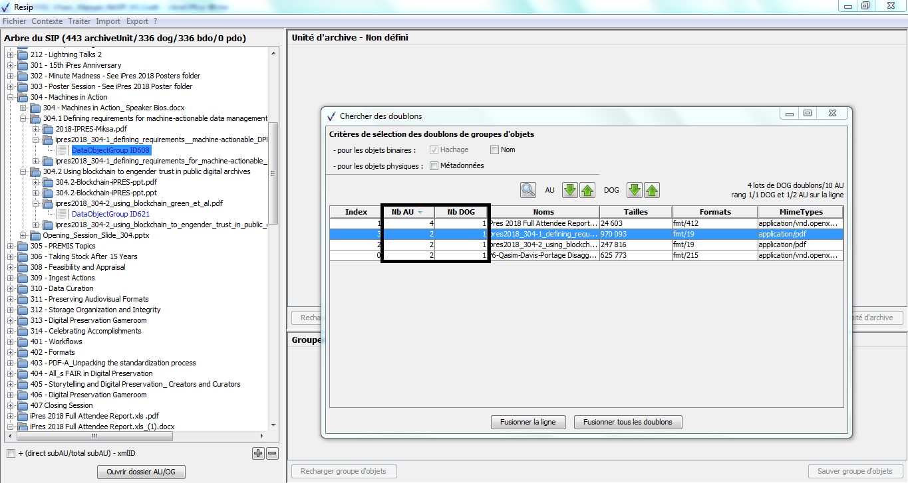

    

### Détection et traitement d’éléments inutiles

Afin d’identifier et de traiter les éléments inutiles, que ce soient des
unités archivistiques isolées sans descendance ou des fichiers vides
(taille : 0 Ko), dans une structure arborescente d’archives importée, il
convient, dans le menu de la moulinette ReSIP, de :

-   cliquer sur l’action « Traiter » puis sur la sous-action « Nettoyer
    les inutiles » (cf. copie d’écran ci-dessous).
    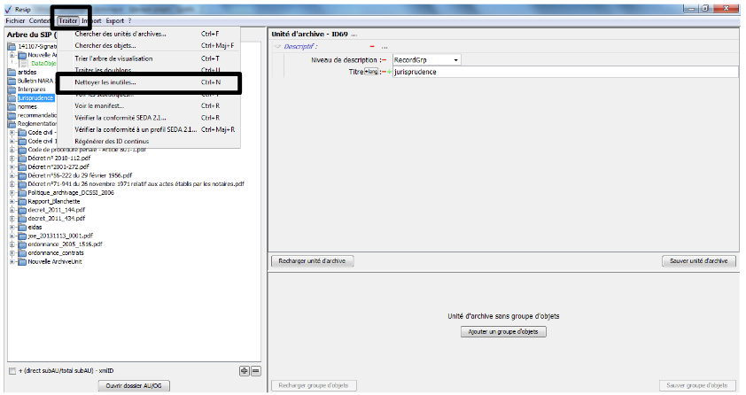

-   paramétrer, dans la fenêtre de dialogue qui s’est
    ouverte, le type de recherche souhaité, en cochant la case
    correspondante. Deux types de recherches sont possibles :

    -   pour les objets binaires : recherche de fichiers vides (taille :
        0 Ko) ;
    -   pour les unités archivistiques : rechercher les unités
        archivistiques sans descendance.

-   cliquer, dans la fenêtre de dialogue, sur l’icône correspondant à
    une loupe pour obtenir le nombre de résultats trouvés dans la
    structure arborescente d’archives (cf. copie d’écran ci-dessous).
    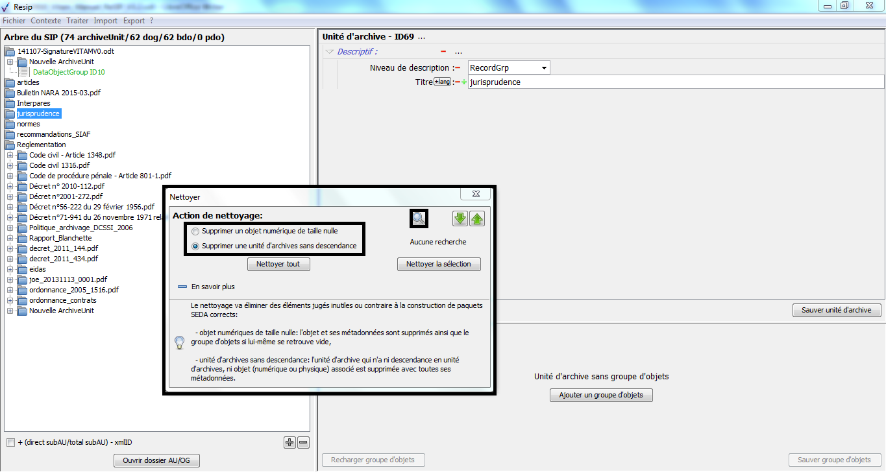
    
    Une fois l’opération terminée, s’affiche le nombre d’éléments détectés (cf. copie d’écran ci-dessous).

    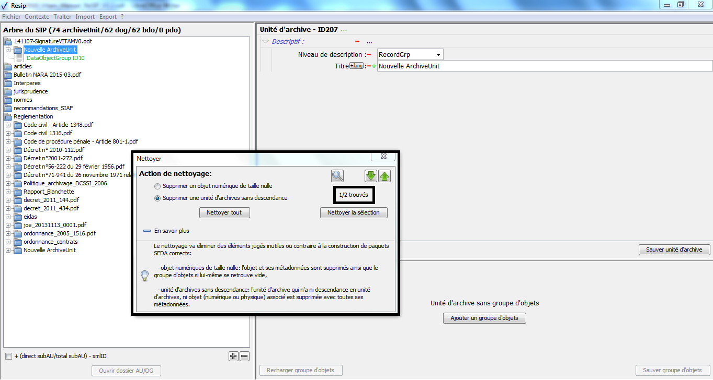

-   naviguer dans les résultats obtenus au moyen des flèches présentes
    dans la fenêtre de dialogue (cf. copie d’écran ci-dessous). À droite
    de la fenêtre de dialogue, est indiquée, parmi le nombre de
    résultats, la position de l’unité archivistique ou du groupe
    d’objets techniques concernés dans l’arborescence (ex. 2/2 indique
    qu’il est la 2^e^ occurrence sur les 2 existantes) ;
    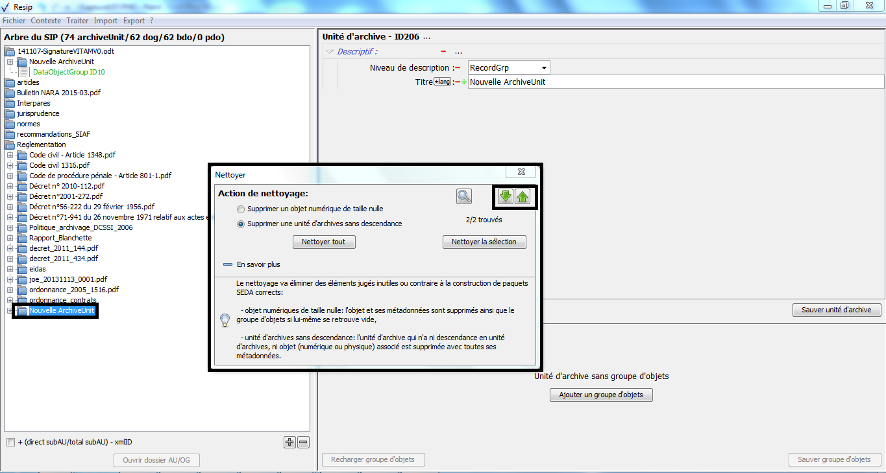

-   lancer l’action de nettoyage qui peut être
    effectuée :

    -   soit sur une sélection (cf. copie d’écran ci-dessous) ;
        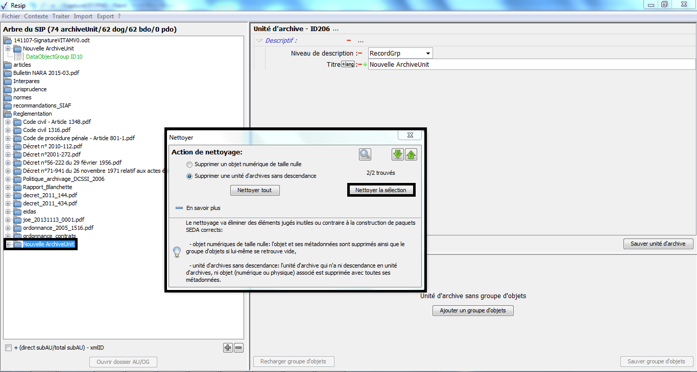
    
    -   soit sur l’ensemble des éléments inutiles
        identifiés (cf. copie d’écran ci-dessous) ;

        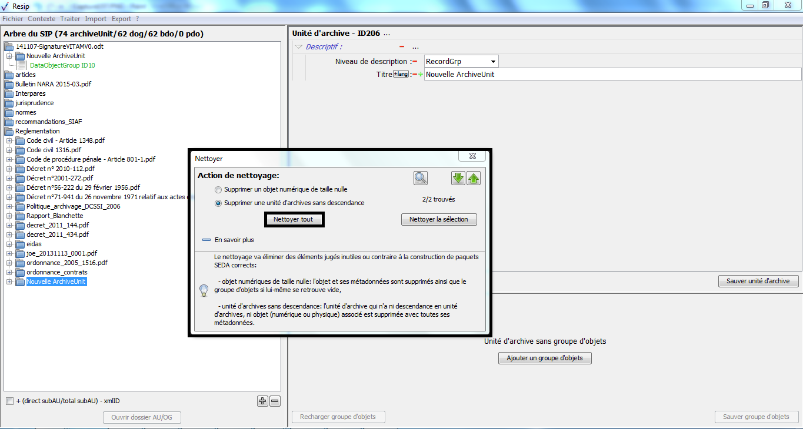

Un clic sur l’un des deux boutons d’action lance l’opération de nettoyage. Une fois l’opération terminée,

-   dans la structure arborescente d’archives, les unités archivistiques
    sans descendance sont supprimées ;
-   les groupes d’objets sont mis à jour, voire supprimés s’ils ne
    contenaient qu’un seul fichier vide.


### Régénérer des identifiants continus

Afin de régénérer des identifiants continus, il convient, dans le menu
de la moulinette ReSIP, de cliquer sur l’action « Traiter » puis sur la
sous-action « Régénérer des ID continus » (cf. copie d’écran
ci-dessous).

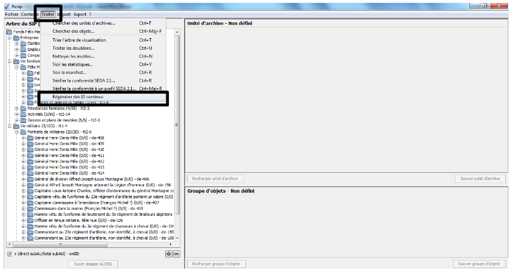

Une fois l’opération terminée, les nouveaux identifiants sont générés
(cf. copie d’écran ci-dessous).

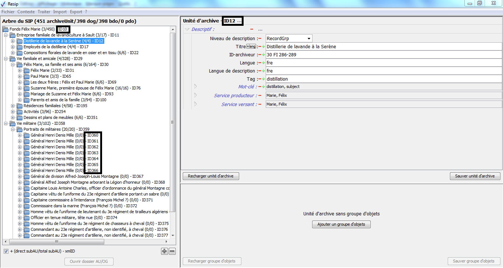

### Récupération de statistiques sur les objets

La moulinette ReSIP permet de générer des statistiques sur les objets
présents dans une structure arborescente d’archives. Ces statistiques
indiquent, pour chaque catégorie de formats [telle que définie dans la section](#recherche-dobjets) :

-   le nombre d’objets présents dans la structure arborescente
    d’archives ;
-   la taille minimale des objets présents dans la structure
    arborescente d’archives, en octets ;
-   la taille moyenne des objets présents dans la structure arborescente
    d’archives, en octets ;
-   la taille maximale des objets présents dans la structure
    arborescente d’archives, en octets ;
-   la taille totale des objets présents dans la structure arborescente
    d’archives, en octets.

Afin de générer et consulter les statistiques concernant les objets
présents dans une structure arborescente d’archives importée, il
convient, dans le menu de la moulinette ReSIP, de :

-   cliquer sur l’action « Traiter » puis sur la sous-action « Voir les
    statistiques » (cf. copie d’écran ci-dessous) ;
    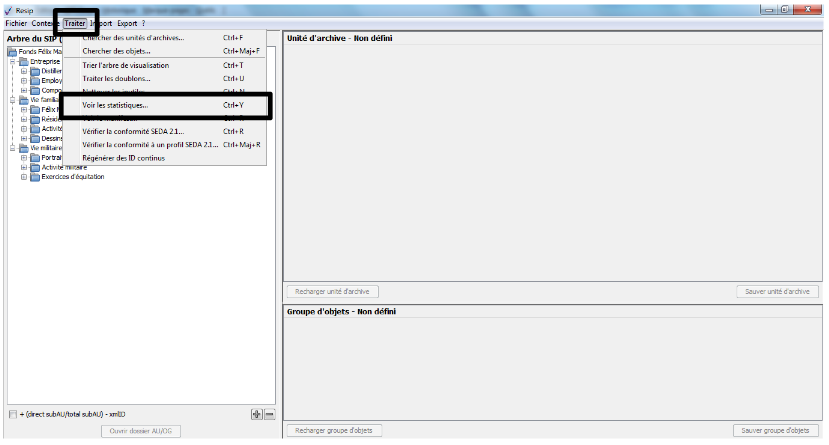
    
-   consulter, dans la fenêtre de dialogue qui s’ouvre,
    le tableau de résultats généré, dont les colonnes sont cliquables
    (cf. copie d’écran ci-dessous) :

    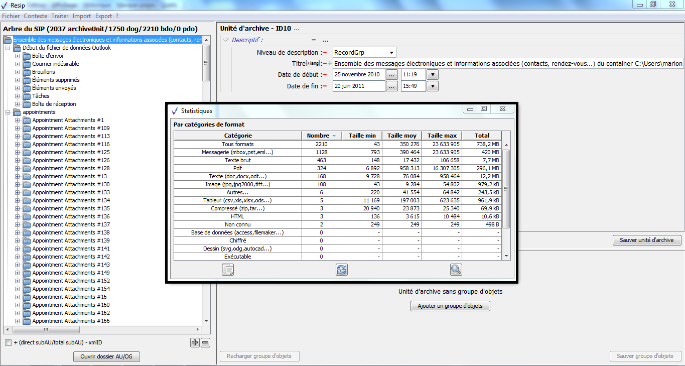

-   exploiter ces statistiques en dehors de la
    moulinette ReSIP, dans un fichier de type tableur :

    -   en cliquant sur le bouton de gauche pour exporter le tableau de
        résultat (cf. copies d’écran ci-dessous)
        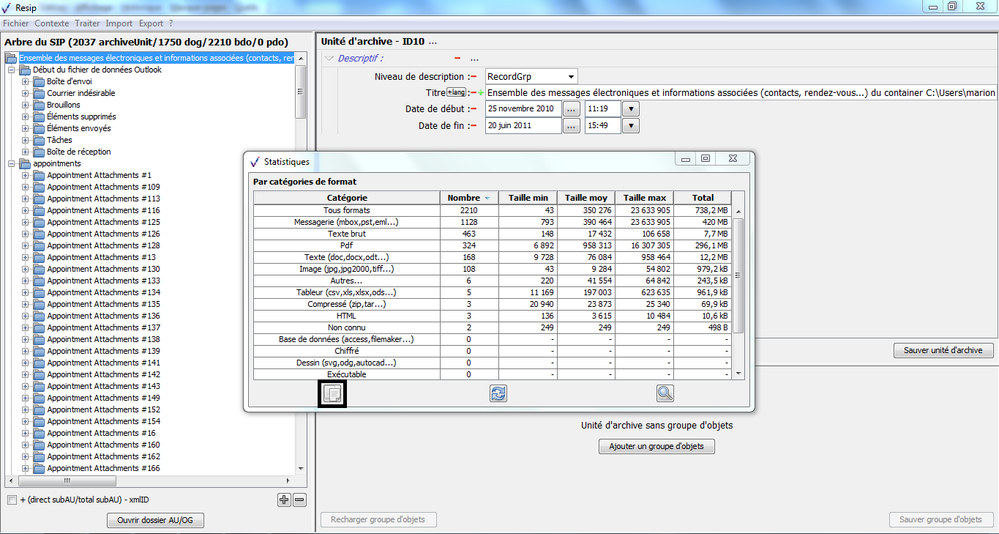

    -   puis en ouvrant un tableur et en copiant les
        statistiques par l’utilisation du raccourci clavier « CTRL +
        V ». Une fenêtre de dialogue s’ouvre alors pour valider
        l’opération d’import, comme dans le cas de l’ouverture d’un
        fichier enregistré au format .csv (cf copie d’écran
        ci-dessous) :

        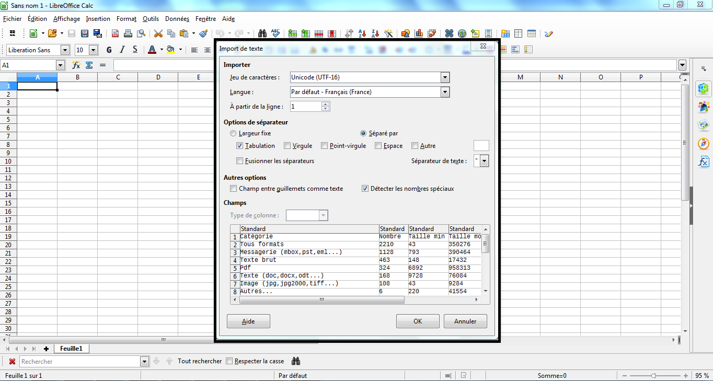

-   recalculer les statistiques, lors d’une même
    session, en cas de modifications apportées à la structure
    arborescente d’archives, en cliquant sur le bouton du milieu (cf.
    copie d’écran ci-dessous).

**Attention** : cette fonctionnalité n’est utile qu’au cours d’une même
session de travail. En cas de réinitialisation de la session et de
réouverture du contexte, le recalcul est automatique.

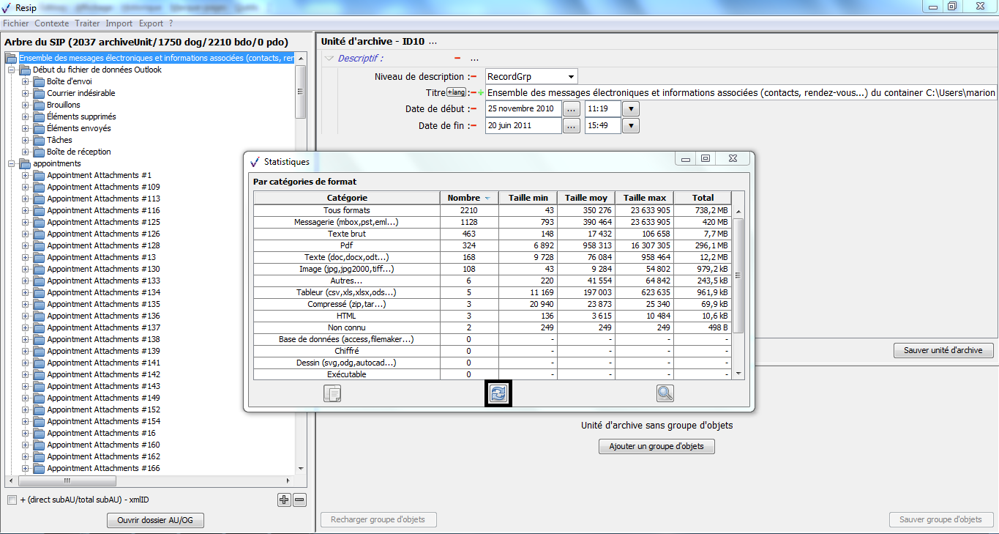

-   basculer, en double-cliquant sur une ligne du tableau (cf. copie
    d’écran ci-dessous), sur la fenêtre de dialogue permettant de rechercher des objets ([cf. section](#recherche-dobjets)) ;
    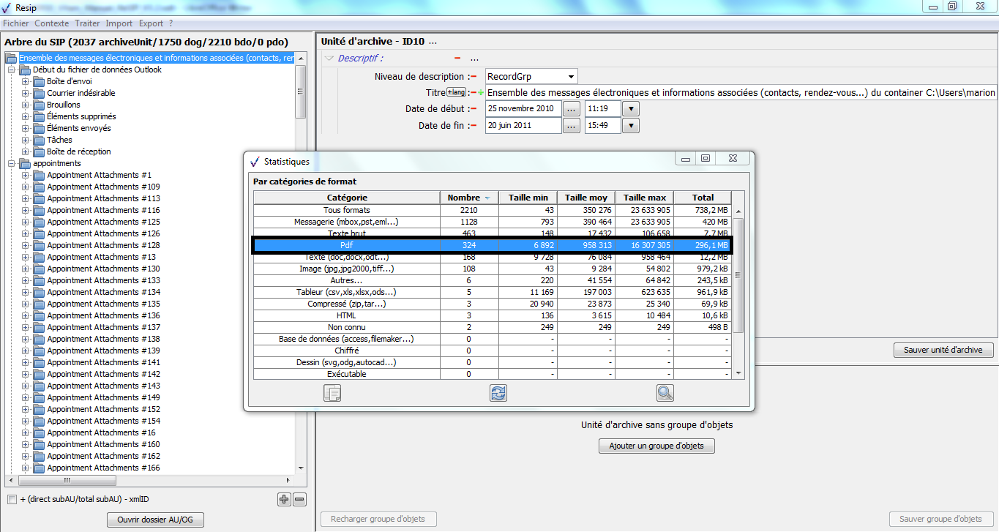

-   identifier les fichiers dont la taille est égale à
    0 (fichiers vides) qui ne sont pas acceptés dans le SIP. En cas de
    présence de ce type de fichiers dans la structure arborescente
    d’archives, un message d’avertissement apparaît en bas de la fenêtre
    de dialogue, ainsi qu’un bouton « chercher vide » (cf. copie d’écran
    ci-dessous).

    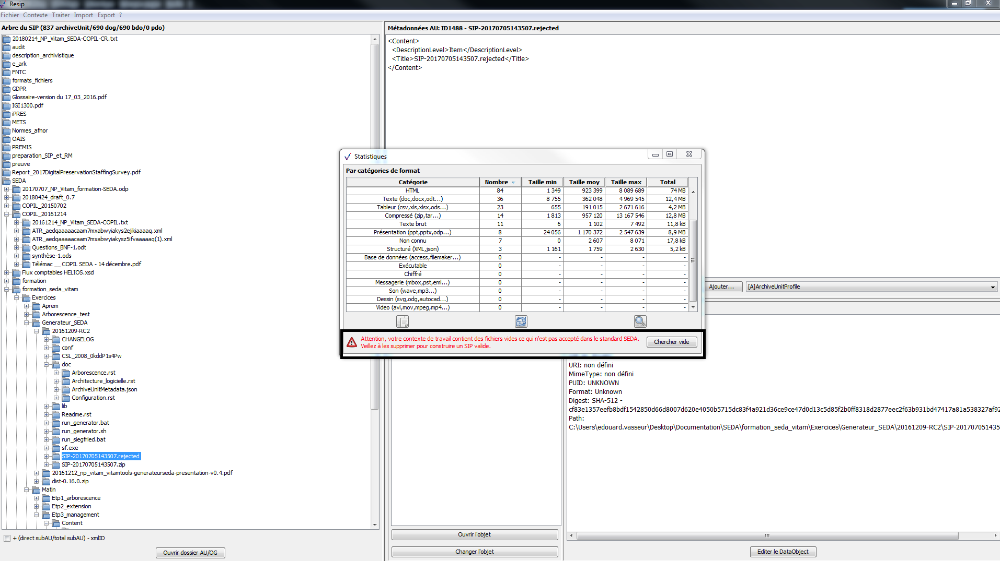

### Réorganiser l’arborescence

La réorganisation de l’arborescence d’une structure arborescente
d’archives importée dans la moulinette ReSIP est réalisable, dans le
panneau de visualisation et de modification de la structure arborescente
d’archives sous quatre formes :

-   [la création et l’ajout de nouvelles unités archivistiques](#création-et-rajout-dunités-archivistiques) ;
-   [le déplacement d’unités archivistiques](#déplacement-dunités-archivistiques) ;
-   [la suppression d’unités archivistiques](#suppression-dunités-archivistiques) ;
-   [le rattachement d’une unité archivistique à une deuxième unité archivistique parente](#rattachement-dune-unité-archivistique-à-une-deuxième-unité-archivistique-parente).

#### Création et rajout d’unités archivistiques

La moulinette ReSIP permet de :

-   créer une nouvelle unité archivistique à la racine ou à n’importe
    quel endroit de la structure arborescente d’archives ;
-   rajouter une structure arborescente de fichiers par simple
    glisser/déposer depuis l’explorateur Windows de l’utilisateur.

##### Créer une nouvelle unité archivistique à la racine ou à n’importe quel endroit de la structure arborescente d’archives

Afin de créer une nouvelle unité archivistique dans la structure
arborescente d’archives, il convient, dans le panneau de visualisation
et de modification de la structure arborescente d’archives, de :

-   positionner le curseur à n’importe quel endroit du panneau de
    visualisation et de modification (si on veut créer une unité
    archivistique racine) ou sélectionner l’unité archivistique
    directement parente de l’unité archivistique à créer ;
-   effectuer un clic-droit ;
-   cliquer sur :

    -   le bouton d’action « Ajouter une ArchiveUnit racine » pour créer
        une unité archivistique à la racine de la structure arborescente
        d’archives ;
    -   ou le bouton « Ajouter une sous-ArchiveUnit » (pour créer une
        unité archivistique à quelque endroit existant de la structure
        arborescente d’archives).

    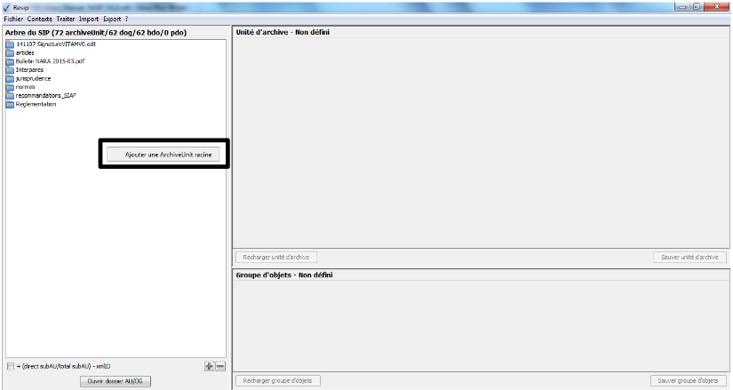

Une nouvelle unité archivistique est alors créée avec
pour titre « Nouvelle ArchiveUnit » et le nombre d’unités archivistiques
(ArchiveUnits) est mis à jour dans le bandeau (cf. copie d’écran
ci-dessous). Les métadonnées de description et de gestion de cette unité
archivistique peuvent être modifiées en utilisant la fonction
correspondante ([cf. section](#traiter-les-objets-et-leurs-métadonnées)).

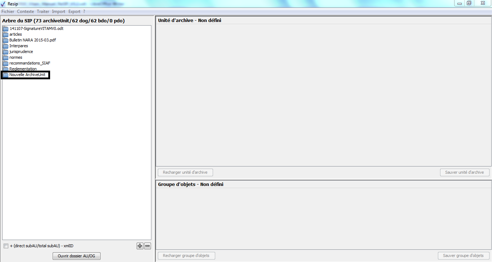

**Attention** : il est également possible d’ajouter à
la racine de la structure arborescente d’archives, par glisser/déposer,
un fichier enregistré dans l’explorateur de l’utilisateur. La moulinette
ReSIP crée alors une unité archivistique correspondant à ce fichier.

##### Rajouter une structure arborescente de fichiers par simple glisser/déposer depuis l’explorateur Windows de l’utilisateur

Afin de rajouter une structure arborescente de fichiers ou un fichier à
la structure arborescente d’archives existante, il convient, dans le
panneau de visualisation et de modification de la structure arborescente
d’archives, de :

-   ouvrir l’explorateur Windows et sélectionner le répertoire racine ou
    le fichier à rajouter à la structure arborescente (cf. copie d’écran
    ci-dessous) ;
    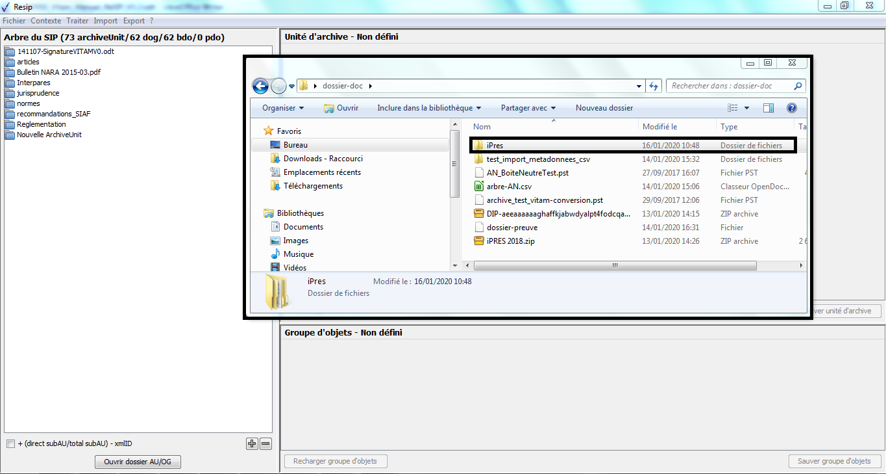

-   glisser le répertoire ou le fichier sélectionnés
    vers l’unité archivistique parente (cf. copie d’écran ci-dessous).

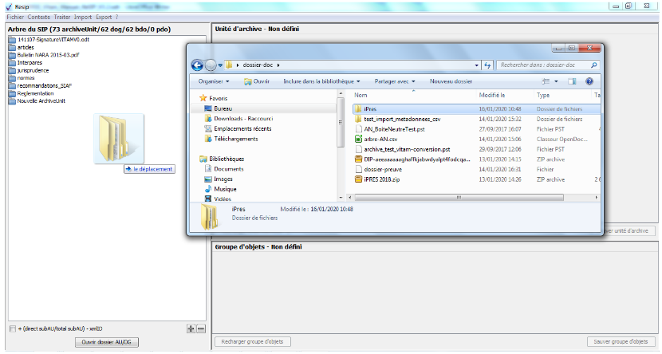

Cette action déclenche le processus d’import [tel que décrit dans la section](#import-dune-arborescence-de-fichiers) à son terme, la structure arborescente de
fichiers ou le fichier déposés sont rajoutés à la structure arborescente
d’archives en cours de traitement (cf. copie d’écran ci-dessous).

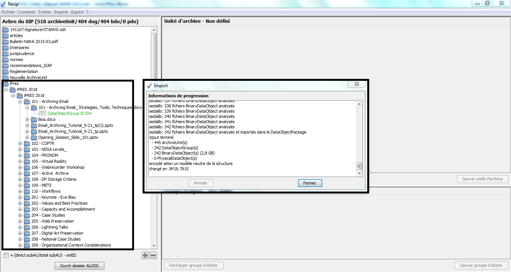

Les métadonnées de description et de gestion de cette
unité archivistique peuvent être modifiées en utilisant la fonction
correspondante ([cf. section](#traiter-les-objets-et-leurs-métadonnées)).

#### Déplacement d’unités archivistiques

Afin de déplacer tout ou partie de la structure arborescente d’archives,
il convient, dans le panneau de visualisation et de modification de la
structure arborescente d’archives, de :

-   cliquer sur l’unité archivistique racine de la structure à déplacer
    (cf. copie d’écran ci-dessous) ;
    

-   glisser cette unité archivistique racine vers
    l’unité archivistique à laquelle on souhaite que la structure à
    déplacer soit rattachée de la structure à déplacer (cf. copie
    d’écran ci-dessous).

    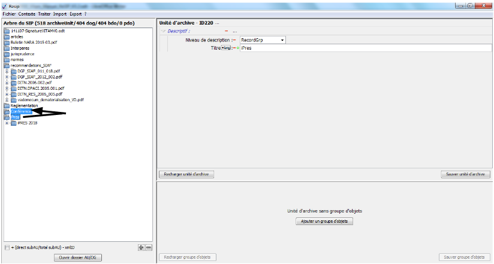

Cette action déclenche le processus de déplacement de
la structure arborescente à déplacer. À son terme, la structure
arborescente à déplacer a été rattachée à l’unité archivistique parente
définie (cf. copie d’écran ci-dessous).


#### Extraction des éléments contenus dans un fichier conteneur au format .zip, .tar, .tarbz2 ou .targz2

Afin d’extraire les éléments contenus dans un fichier conteneur au
format .zip, .tar, .tarbz2 ou .targz2, il convient, dans le panneau de
visualisation et de modification de la structure arborescente
d’archives, de :

-   positionner le curseur sur le groupe d’objets correspondant au
    fichier conteneur au format .zip, .tar, .tarbz2 ou .targz2 dont les
    contenus doivent être extraits ;
-   effectuer un clic-droit ;
-   cliquer sur le bouton d’action « Remplacer par le décompressé » pour
    extraire le contenu du fichier conteneur et le transformer en
    structure arborescente d’archives (cf. copie d’écran ci-dessous).

    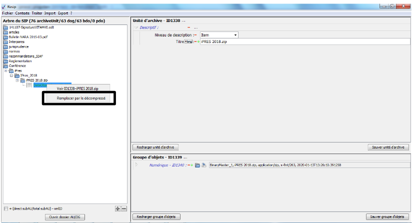

Le clic sur le bouton d’action « Remplacer par le décompressé » lance
une fenêtre de dialogue « Import » indiquant que l’opération
d’extraction est lancée et permettant de suivre sa progression. Cette
opération peut être annulée en cliquant sur le bouton d’action
« Annuler » de la fenêtre de dialogue (cf. copie d’écran ci-dessous).

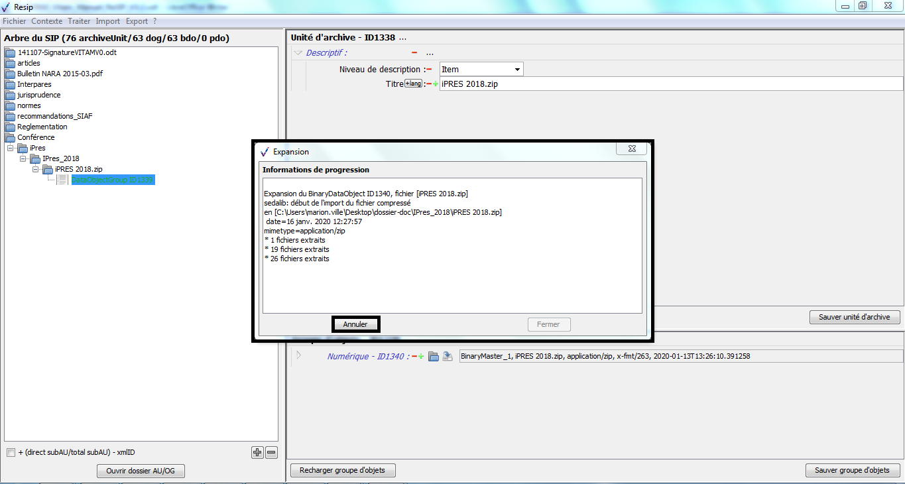

Une fois l’opération d’extraction achevée, la fenêtre de dialogue
indique le nombre d’éléments extraits (unités archivistiques, groupes
d’objets, objets binaires, objets physiques) ainsi que le temps qui a
été nécessaire pour réaliser l’opération d’import. La structure
arborescente d’archives est désormais consultable et traitable depuis le
panneau de visualisation et de modification de la structure arborescente
d’archives. La fenêtre de dialogue peut être fermée en cliquant sur le
bouton d’action « Fermer » (cf. copie d’écran ci-dessous).

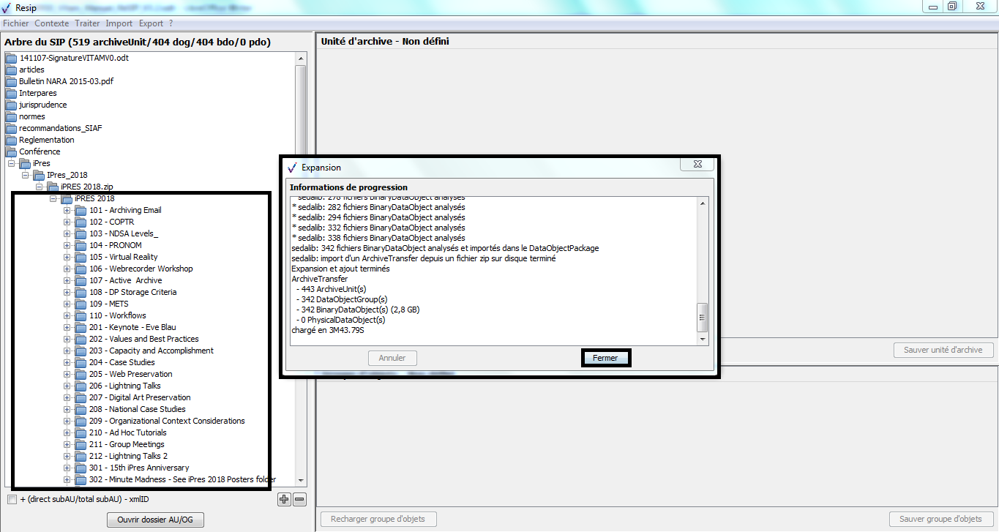

***Nota bene***** :** le fichier conteneur au format
.zip, .tar, .tarbz2 ou .targz2 est supprimé de la structure
d’arborescente d’archives.

#### Extraction des éléments contenus dans un fichier conteneur au format .pst, .eml, .msg, .mbox

Afin d’extraire les éléments contenus dans un fichier conteneur au format .pst, .eml, .msg, .mbox, il convient, dans le panneau de visualisation et de modification de la structure arborescente d’archives, de :

-   positionner le curseur sur le groupe d’objets correspondant au fichier conteneur au format .pst, .eml, .msg, .mbox dont les contenus doivent être extraits ;
-   effectuer un clic-droit ;
-   cliquer sur le bouton d’action « Remplacer par l'extraction des messages » pour extraire le contenu du fichier conteneur et le transformer en structure arborescente d’archives (cf. copie d’écran ci-dessous).

    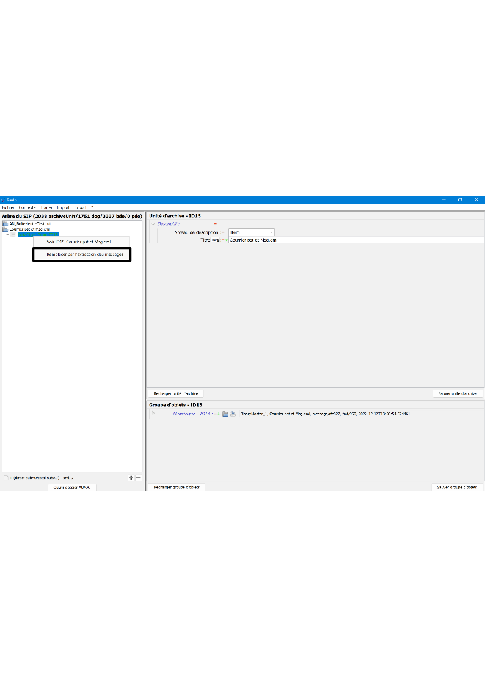

Le clic sur le bouton d’action « Remplacer par l'extraction des messages » lance une fenêtre de dialogue « Import » indiquant que l’opération d’extraction est lancée et permettant de suivre sa progression. Cette opération peut être annulée en cliquant sur le bouton d’action « Annuler » de la fenêtre de dialogue.

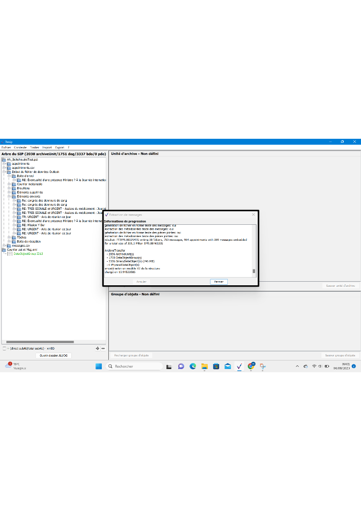

Une fois l’opération d’extraction achevée, la fenêtre de dialogue indique le nombre d’éléments extraits (unités archivistiques, groupes d’objets, objets binaires, objets physiques) ainsi que le temps qui a
été nécessaire pour réaliser l’opération d’import. La structure arborescente d’archives est désormais consultable et traitable depuis le panneau de visualisation et de modification de la structure arborescente d’archives. La fenêtre de dialogue peut être fermée en cliquant sur le bouton d’action « Fermer » (cf. copie d’écran ci-dessous).

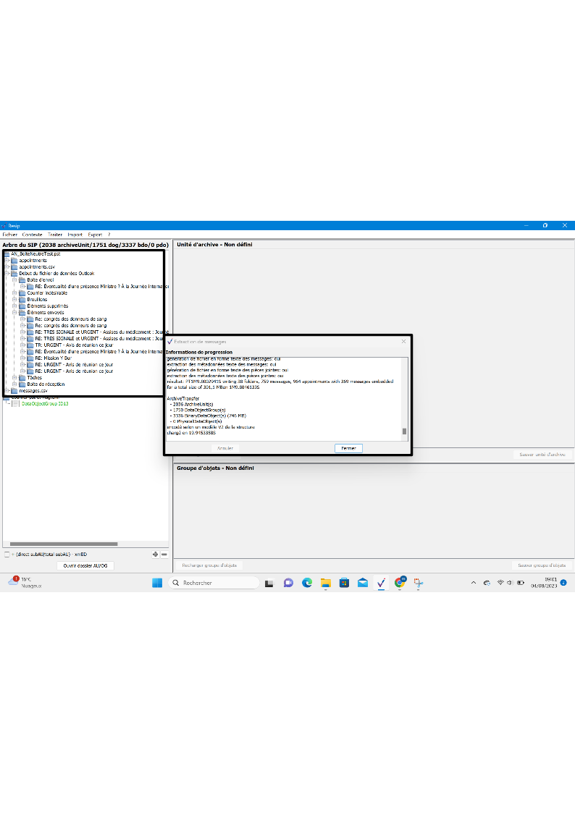

***Nota bene***** :** le fichier conteneur  au format .pst, .eml, .msg, .mbox est supprimé de la structure d’arborescente d’archives.

#### Suppression d’unités archivistiques

Afin de déplacer tout ou partie de la structure arborescente d’archives,
il convient, dans le panneau de visualisation et de modification de la
structure arborescente d’archives, de :

-   cliquer sur l’unité archivistique racine de la structure à supprimer
    (cf. copie d’écran ci-dessous) ;
-   appuyer sur la touche « SUPPR » ou sur la touche « Retour chariot »
    du clavier ;
-   confirmer ou annuler la suppression via la fenêtre de dialogue en
    cliquant sur le bouton « OK » ou sur le bouton « Annuler » (cf.
    copie d’écran ci-dessous).

    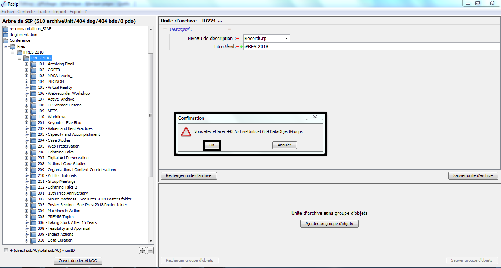

Cette action déclenche le processus de suppression de la structure arborescente à supprimer.

#### Rattachement d’une unité archivistique à une deuxième unité archivistique parente

Afin de rattacher une unité archivistique ayant déjà une unité
archivistique parente à une deuxième unité archivistique parente, il
convient, dans le panneau de visualisation et de modification de la
structure arborescente d’archives, de :

-   sélectionner l’unité archivistique à rattacher ;
-   appuyer sur la touche « CTRL » du clavier ;
-   glisser cette unité archivistique vers la deuxième archivistique
    parente **en maintenant appuyée **la touche « CTRL » du clavier (cf.
    copie d’écran ci-dessous).

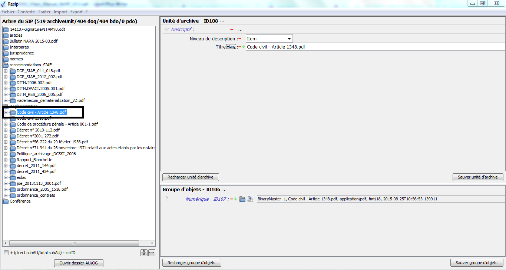

Cette action déclenche le processus de rattachement de
l’unité archivistique à une deuxième unité archivistique parente. À son
terme, l’unité archivistique dispose de deux unités archivistiques
parentes, est désormais doté d’un intitulé en bleu et apparaît deux fois
dans l’arborescence (cf. copie d’écran ci-dessous).

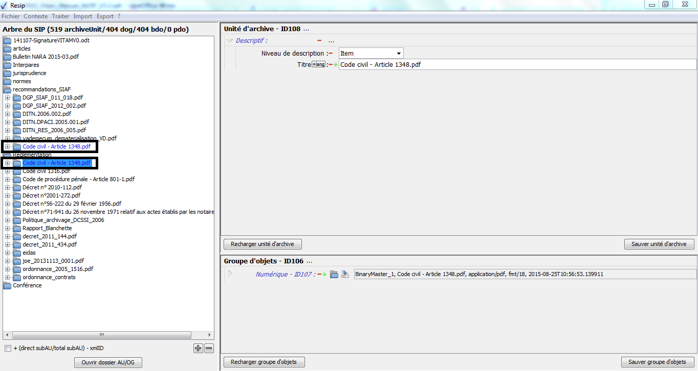

### Traiter les unités archivistiques

#### Dans l’interface « XML-expert »

Le traitement des unités archivistiques importées dans la moulinette
ReSIP est réalisable, dans le panneau de visualisation et d’édition des
métadonnées de l’unité d’archives, sous deux formes :

-   [la modification libre et complète des métadonnées de l’unité archivistique](#dans-linterface-«-xml-expert-») ;
-   [l’ajout guidé d’une métadonnée clairement identifiée](#dans-linterface-«-structurée-»).

##### Modification libre et complète des métadonnées de l’unité archivistique

Afin de modifier toutes les métadonnées de description et de gestion
d’une unité archivistique sélectionnée dans le panneau de visualisation
et de modification de la structure arborescente d’archives, il convient,
dans le panneau de visualisation et d’édition des métadonnées de l’unité
d’archives, de :

-   cliquer sur le bouton d’action « Editer » (cf. copie d’écran
    ci-dessous) ;

    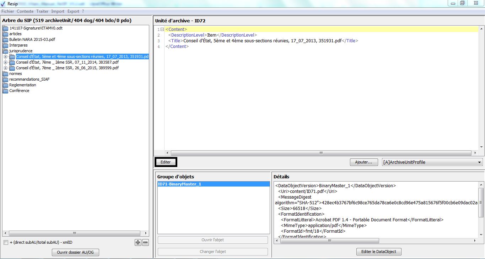

-   saisir librement, dans la fenêtre de dialogue qui
    s’est ouverte, les métadonnées à modifier, en veillant à respecter
    la structure et la sémantique imposée par la norme XML (cf. copie
    d’écran ci-dessous) ;

    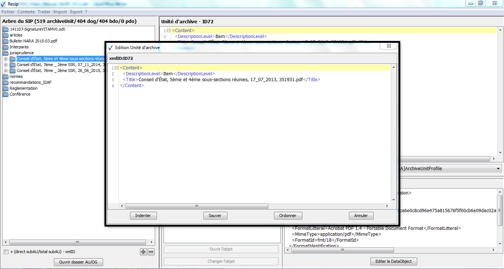

-   éventuellement, indenter la structure XML saisie pour faciliter sa
    relecture en cliquant sur le bouton d’action « Indenter » ;
-   ordonner la structure XML saisie pour réordonner les balises saisies
    dans l’ordre prévu par le SEDA 2.1. en cliquant sur le bouton
    « Ordonner » ;
-   cliquer sur le bouton d’action « Sauver » pour sauvegarder les
    métadonnées saisies. Deux actions sont alors possibles :

    -   si la structure XML saisie n’est pas conforme à la norme XML, un
        message d’erreur écrit en rouge apparaît au-dessus des boutons
        d’action situés en bas de la fenêtre de dialogue (cf. copie
        d’écran ci-dessous) ;

        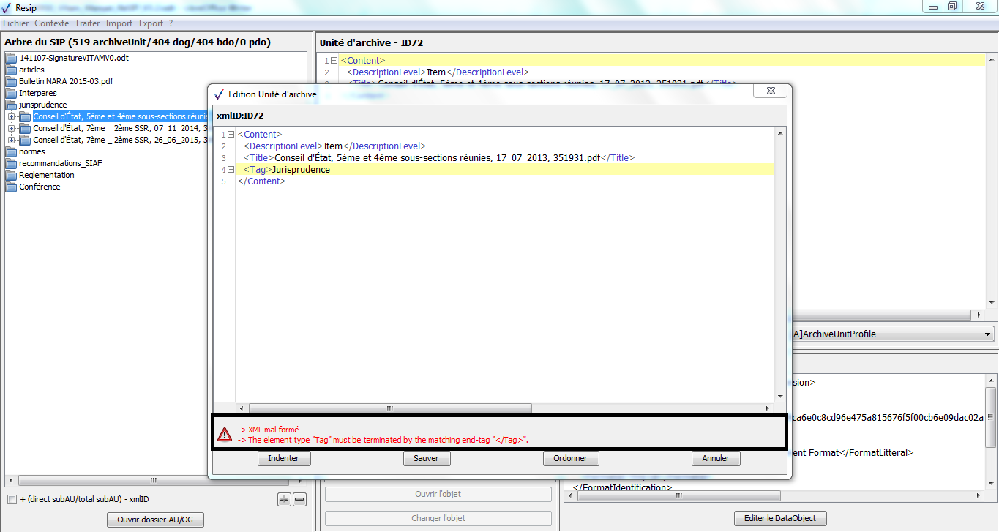

    -   si la structure XML saisie est conforme à la
        norme XML, la fenêtre de dialogue se ferme et le panneau de
        visualisation et d’édition des métadonnées de l’unité d’archives
        affiche les métadonnées de l’unité archivistique sélectionnée
        telles que modifiées (cf. copie d’écran ci-dessous).

        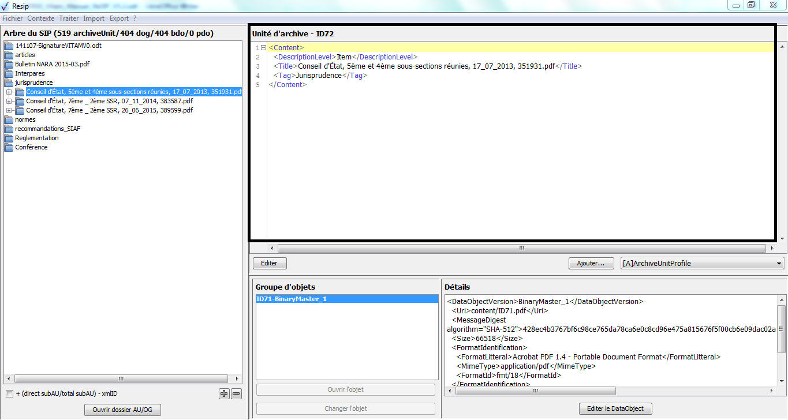

**Attention** : aucun contrôle de conformité au schéma
XML défini par le SEDA 2.1. n’est réalisé.

##### Ajout guidé d’une métadonnée clairement identifiée

Afin de rajouter de manière guidée une métadonnée de description ou de
gestion à une unité archivistique sélectionnée dans le panneau de
visualisation et de modification de la structure arborescente
d’archives, il convient, dans le panneau de visualisation et d’édition
des métadonnées de l’unité d’archives, de :

-   sélectionner dans le menu déroulant la métadonnée concernée et
    cliquer sur le bouton d’action « Ajouter » (cf. copie d’écran
    ci-dessous) ;

    

-   modifier les éléments (liste de champs et valeurs par défaut)
    proposés par défaut dans la fenêtre de dialogue (cf. copie d’écran
    ci-dessous) :

    -   suppression des champs inutiles.

        **Attention** :

        -   les champs rendus obligatoires par le schéma XML défini par
            le SEDA 2.1. ne doivent pas être supprimés ;
        -   les champs multivalués sont signalés par un « \* » dans le
            menu déroulant ;

    -   remplacer les valeurs par défaut par les valeurs souhaitées dans
        les champs conservés ;

    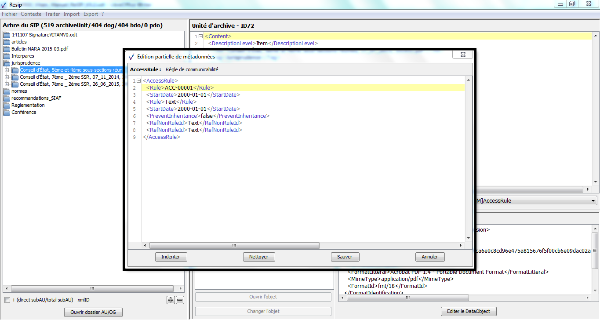

-   supprimer automatiquement les balises dont les
    valeurs par défaut n’ont pas été modifiées en cliquant sur le bouton
    d’action « Nettoyer » (cf. copie d’écran ci-dessous).

    

La modification de métadonnées se poursuit ensuite selon le processus
[décrit dans la section](#dans-linterface-«-xml-expert-»).

**Attention** : aucun contrôle de conformité par rapport à la structure
et à la sémantique du schéma XML défini par le SEDA 2.1. n’est réalisé.

#### Dans l’interface « structurée »

Le traitement des unités archivistiques importées dans la moulinette
ReSIP est réalisable, dans le panneau de visualisation et d’édition des
métadonnées de l’unité d’archives, sous plusieurs formes :

-   [la modification de métadonnées présentes dans un champ de saisie textuelle](#modification-de-métadonnées-textuelles) ;
-   [la modification de métadonnées présentes sous forme de liste de valeurs](#modification-de-métadonnées-présentes-dans-une-liste) ;
-   [la modification de métadonnées présentes sous forme de date](#modification-de-date) ;
-   [l’ajout et la suppression d’attribut](#ajout-et-suppression-dattribut) ;
-   [l’ajout et la suppression de métadonnées](#ajout-et-suppression-de-métadonnées-existantes) ;
-   [l’ajout guidé de métadonnées](#ajout-guidé-de-métadonnées) ;
-   [la navigation dans les métadonnées](#navigation-dans-les-métadonnées)

##### Modification de métadonnées textuelles

Afin de modifier des métadonnées d’une unité archivistique sélectionnée
dans le panneau de visualisation et de modification de la structure
arborescente d’archives, il convient de :

-   saisir directement la modification dans le champ de saisie
    correspondant à la métadonnée à modifier. Cette métadonnée peut être
    textuelle ou numéraire ;
-   enregistrer la modification en cliquant sur le bouton d’action
    « Sauver unité d’archives » pour sauvegarder les métadonnées saisies
    (cf. copie d’écran ci-dessous).

    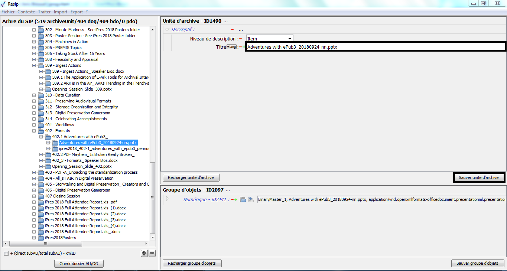

En cas d’erreur, il suffit de cliquer sur le bouton d’action « Recharger
unité d’archive » pour restaurer les métadonnées de description et de
gestion de l’unité archivistique chargées initialement ou sauvegardées
dernièrement (cf. copie d’écran ci-dessous).

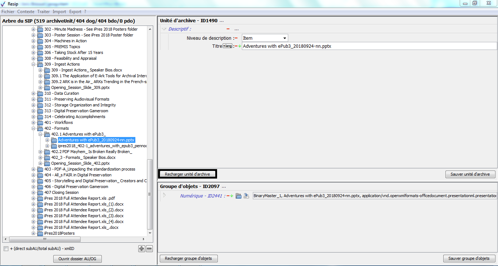

Il est possible de modifier certaines métadonnées, qui
peuvent être caractérisées par un texte assez important, par le moyen
suivant :

-   cliquer sur le bouton d’action « Ouvrir pour édition », présent à
    droite du champ de saisie (cf. copie d’écran ci-dessous) ;

    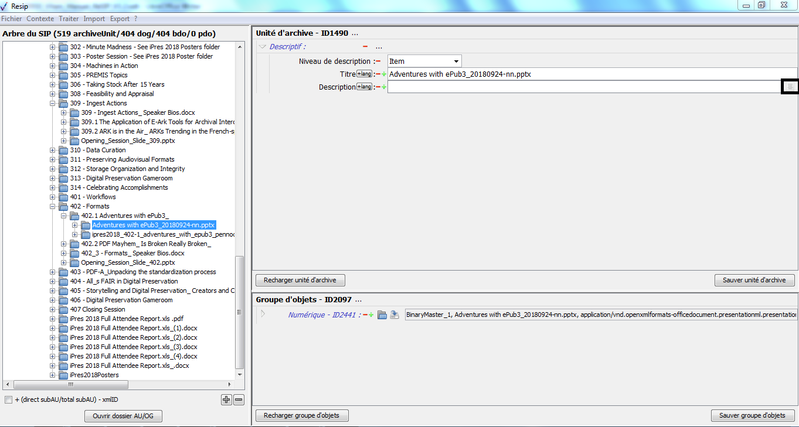

-   saisir librement, dans la fenêtre de dialogue qui s’est ouverte, le
    texte à modifier (cf. copie d’écran ci-dessous) ;

    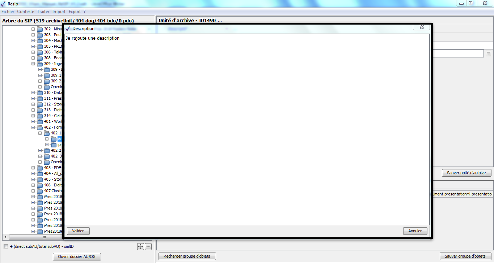

-   cliquer sur le bouton d’action « Valider » pour sauvegarder les
    métadonnées saisies.

    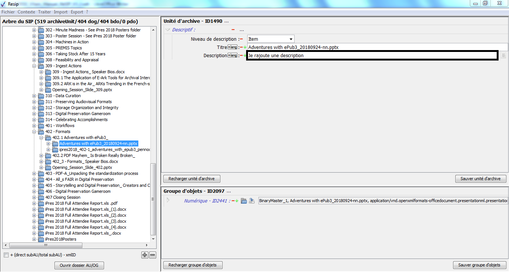

##### Modification de métadonnées présentes dans une liste

Afin de modifier des métadonnées d’une unité archivistique sélectionnée
dans le panneau de visualisation et de modification de la structure
arborescente d’archives, il convient de :

-   cliquer sur la liste déroulante correspondant à la métadonnée à
    modifier ;
-   sélectionner une nouvelle valeur et cliquer sur cette dernière (cf.
    copie d’écran ci-dessous) ;

    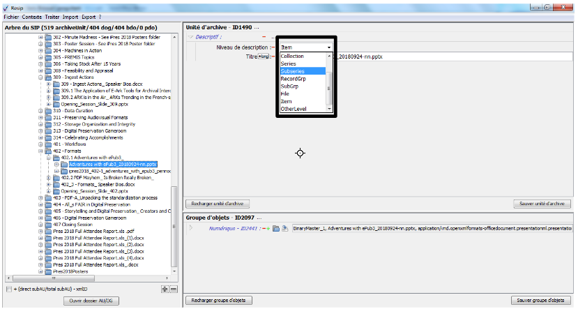

-   enregistrer la modification en cliquant sur le bouton d’action
    « Sauver unité d’archives » pour sauvegarder les métadonnées saisies
    (cf. copie d’écran ci-dessous).

    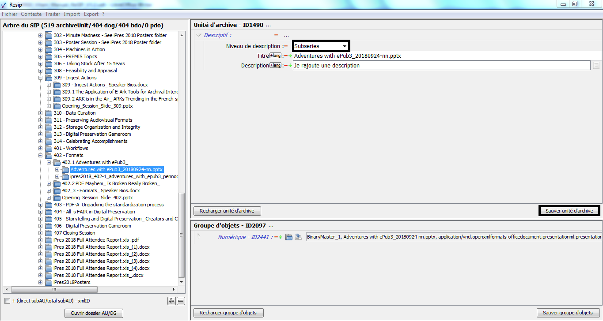

En cas d’erreur, il suffit de cliquer sur le bouton d’action « Recharger
unité d’archive » pour restaurer les métadonnées de description et de
gestion de l’unité archivistique chargées initialement ou sauvegardées
dernièrement ([cf. section](#modification-de-métadonnées-textuelles)).

##### Modification de date

Afin de modifier des métadonnées d’une unité archivistique sélectionnée
dans le panneau de visualisation et de modification de la structure
arborescente d’archives, il convient de :

-   cliquer sur le bouton d’action présent à droite du premier champ
    correspondant à la date à modifier (cf. copie d’écran ci-dessous) ;

    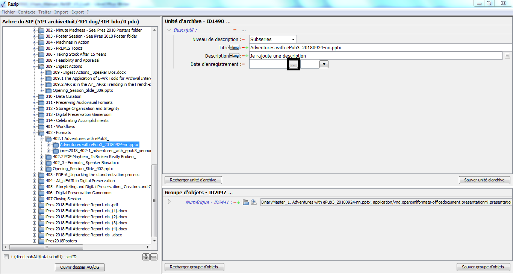

-   choisir la date dans le calendrier qui s’est ouvert et cliquer sur
    cette dernière (cf. copie d’écran ci-dessous) ;

    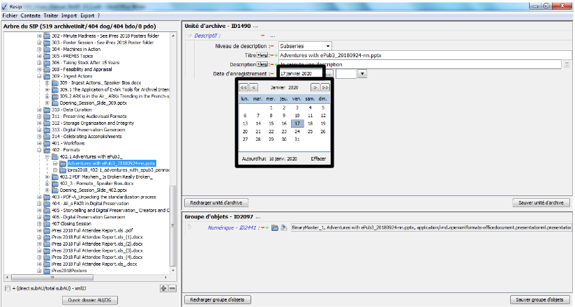

-   cliquer sur le bouton d’action présent à droite du second champ
    correspondant à la date à modifier (cf. copie d’écran ci-dessous) ;

    

-   sélectionner une nouvelle valeur et cliquer sur cette dernière (cf.
    copie d’écran ci-dessous) ;

    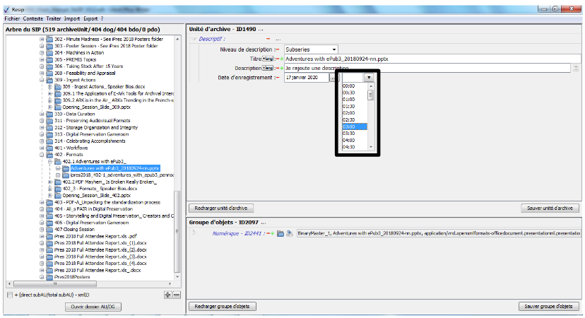

-   enregistrer la modification en cliquant sur le bouton d’action
    « Sauver unité d’archives » pour sauvegarder les métadonnées saisies
    (cf. copie d’écran ci-dessous).

    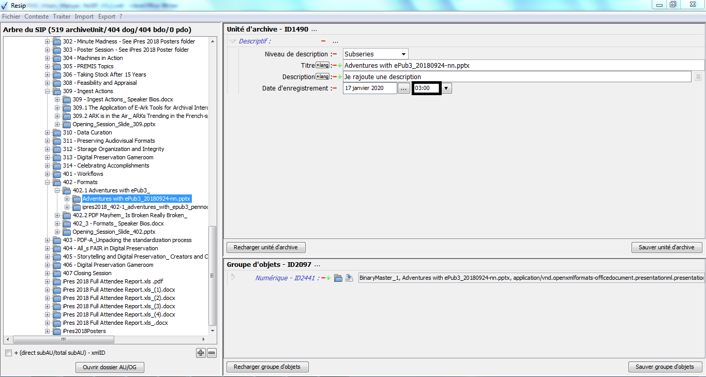

En cas d’erreur, il suffit de cliquer sur le bouton d’action « Recharger
unité d’archive » pour restaurer les métadonnées de description et de
gestion de l’unité archivistique chargées initialement ou sauvegardées
dernièrement ([cf. section](#modification-de-métadonnées-textuelles)).

##### Ajout et suppression d’attribut

Afin d’ajouter un attribut à des métadonnées d’une unité archivistique
sélectionnée dans le panneau de visualisation et de modification de la
structure arborescente d’archives, il convient de :

-   cliquer sur le bouton d’action présent à droite de la métadonnée
    pour laquelle on souhaite ajouter un attribut (ex. Pour le champ
    Titre, il s’agit du bouton d’action « + lang ») (cf. copie d’écran
    ci-dessous) ;

    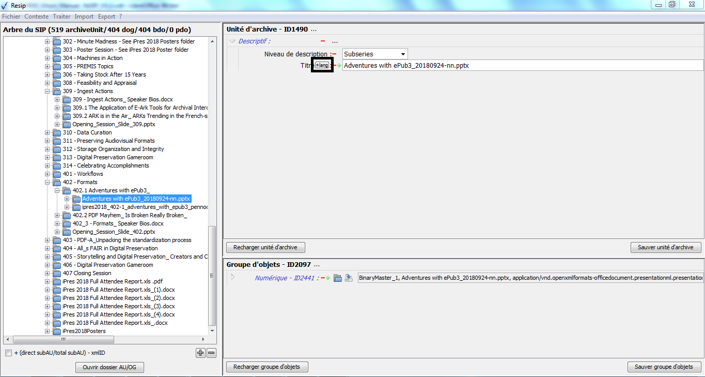

-   saisir la valeur de l’attribut dans le champ de saisie ;
-   enregistrer la modification en cliquant sur le bouton d’action
    « Sauver unité d’archives » pour sauvegarder les métadonnées saisies
    (cf. copie d’écran ci-dessous).

    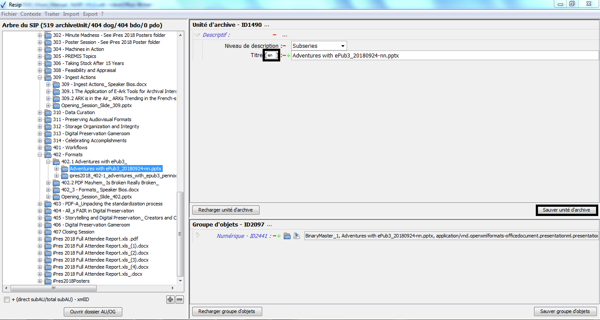

En cas d’erreur, il suffit de cliquer sur le bouton d’action « Recharger
unité d’archive » pour restaurer les métadonnées de description et de
gestion de l’unité archivistique chargées initialement ou sauvegardées
dernièrement ([cf. section](#modification-de-métadonnées-textuelles)).

##### Ajout et suppression de métadonnées existantes

Afin d’ajouter des métadonnées existantes dans une unité archivistique
sélectionnée dans le panneau de visualisation et de modification de la
structure arborescente d’archives, il convient de :

-   cliquer sur le bouton d’action « + » présent à droite de la
    métadonnée pour laquelle on souhaite ajouter une métadonnée
    supplémentaire (cf. copie d’écran ci-dessous) ;

    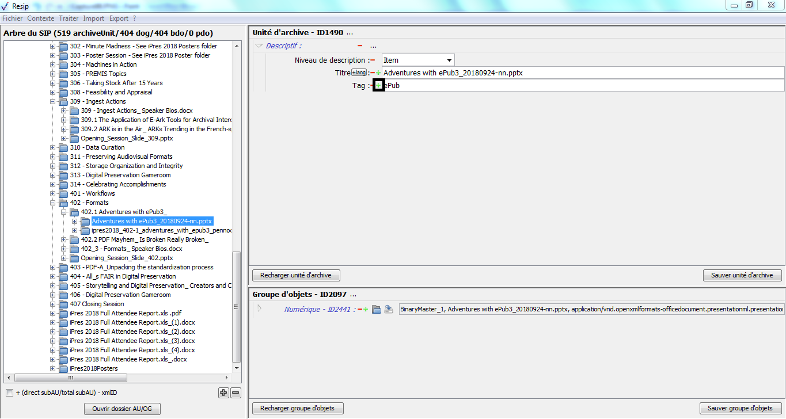

-   saisir la valeur de la nouvelle métadonnée dans lechamp de saisie ;
-   enregistrer la modification en cliquant sur le bouton d’action
    « Sauver unité d’archives » pour sauvegarder les métadonnées saisies
    (cf. copie d’écran ci-dessous).

    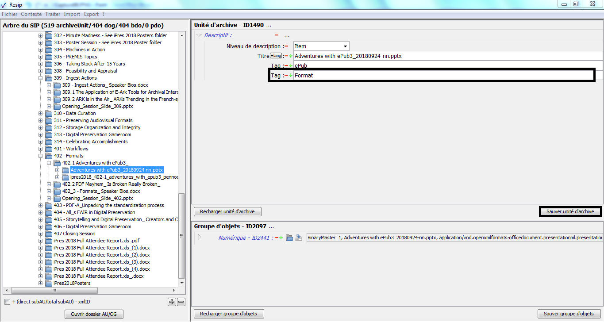

**Attention :** Seules les métadonnées pouvant être dupliquées ou
multiples disposent d’un bouton d’action « + ». Une métadonnée unique ne
peut être répétée.

Afin de supprimer des métadonnées existantes dans une unité
archivistique sélectionnée dans le panneau de visualisation et de
modification de la structure arborescente d’archives, il convient de :

-   cliquer sur le bouton d’action « - » présent à droite de la
    métadonnée pour laquelle on souhaite supprimer une métadonnée (cf.
    copie d’écran ci-dessous) ;
    

-   enregistrer la modification en cliquant sur le
    bouton d’action « Sauver unité d’archives » pour sauvegarder les
    métadonnées saisies (cf. copie d’écran ci-dessous).

    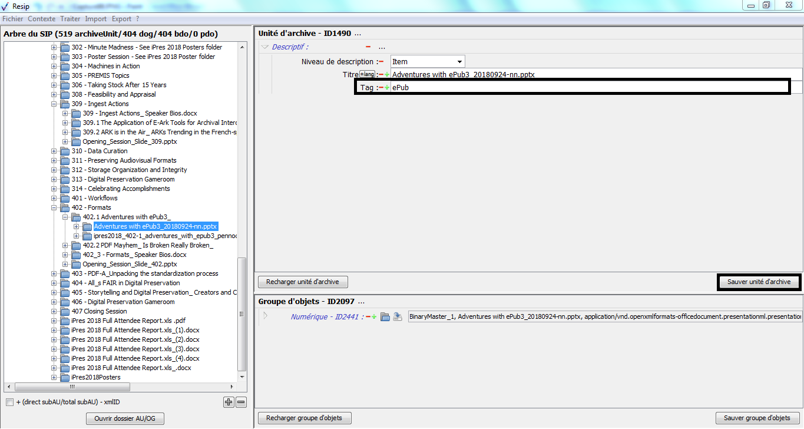

**Attention :** Seules les métadonnées facultatives ou
étant utilisées plusieurs fois dans une unité archivistique disposent
d’un bouton d’action « - ». Une métadonnée obligatoire ne peut être
supprimée.

En cas d’erreur, il suffit de cliquer sur le bouton d’action « Recharger
unité d’archive » pour restaurer les métadonnées de description et de
gestion de l’unité archivistique chargées initialement ou sauvegardées
dernièrement ([cf. section](#modification-de-métadonnées-textuelles)).

##### Ajout guidé de métadonnées

Afin d’ajouter des métadonnées dans une unité archivistique sélectionnée
dans le panneau de visualisation et de modification de la structure
arborescente d’archives, il convient de :

-   cliquer sur le bouton d’action « ... » présent à droite du bloc de
    métadonnées pour lequel on souhaite ajouter une métadonnée
    supplémentaire (cf. copie d’écran ci-dessous) ;

    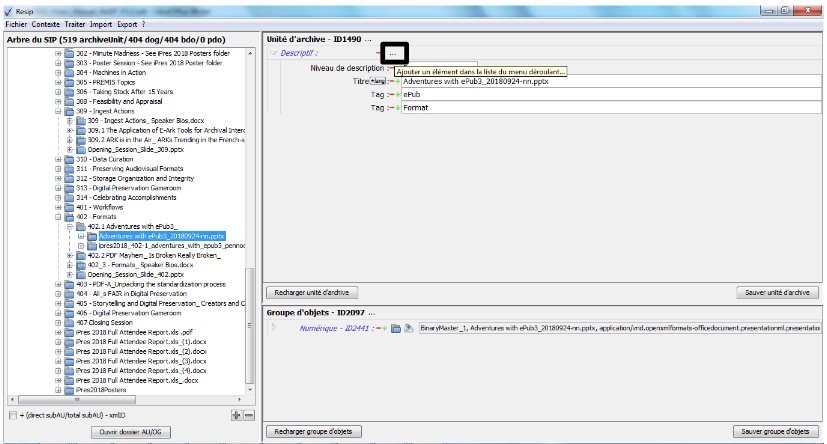

-   sélectionner la métadonnée à ajouter parmi la liste
    des métadonnées qui apparaît et cliquer sur cette dernière (cf.
    copie d’écran ci-dessous) ;

    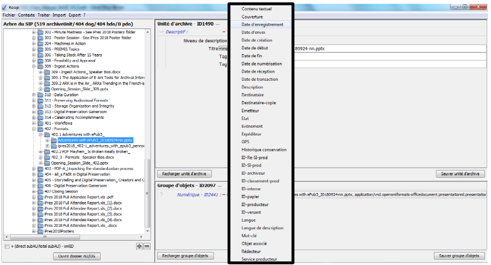

-   saisir une valeur pour cette nouvelle métadonnée
    qui apparaît dans le panneau de visualisation et d’édition des
    métadonnées de l’unité d’archives ;
-   enregistrer la modification en cliquant sur le bouton d’action
    « Sauver unité d’archives » pour sauvegarder les métadonnées saisies
    (cf. copie d’écran ci-dessous).

    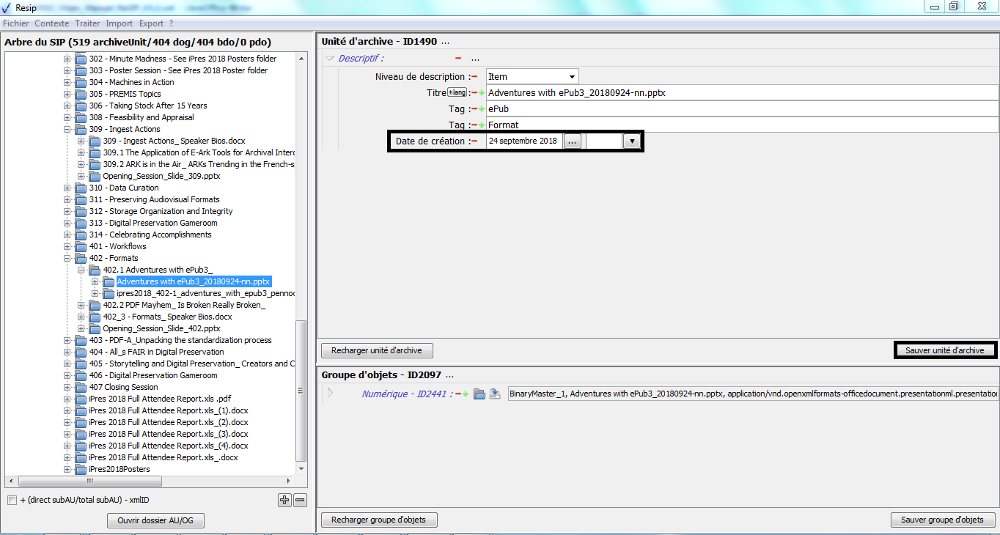

**Attention :** Le bouton d’action « ... » est présent
à plusieurs endroits, à droite d’une métadonnée englobant plusieurs
métadonnées et correspondant à des blocs de métadonnées (ex. Contenu,
Rédacteur, GPS, etc.). Cette métadonnée englobante apparaît en italique
bleu (cf. copie d’écran ci-dessous).

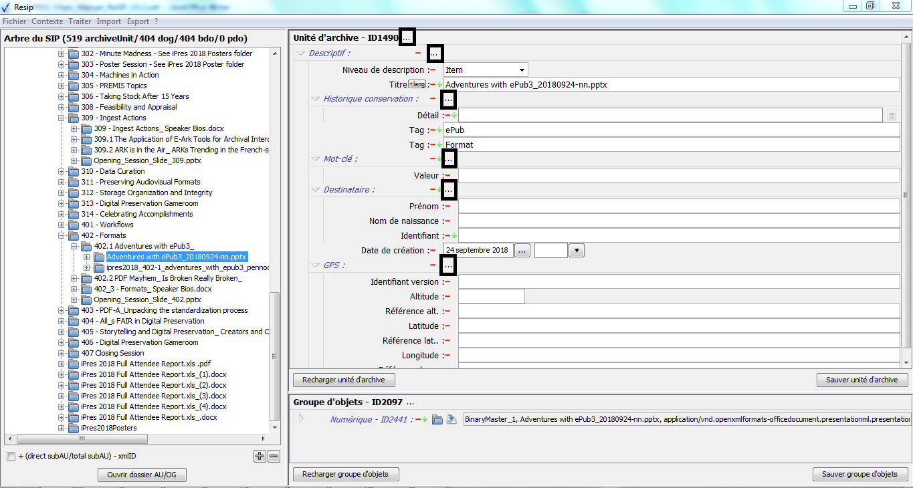

En cas d’erreur, il suffit de cliquer sur le bouton
d’action « Recharger unité d’archive » pour restaurer les métadonnées de
description et de gestion de l’unité archivistique chargées initialement
ou sauvegardées dernièrement ([cf. section](#modification-de-métadonnées-textuelles)).

##### Navigation dans les métadonnées

Afin de mieux comprendre les informations présentes dans le panneau de
visualisation et d’édition d’une unité archivistique, des explications
sont données au moyen du survol de la souris sur un chacun des boutons
d’action, mais également sur chacune des métadonnées (cf. copie d’écran
ci-dessous).

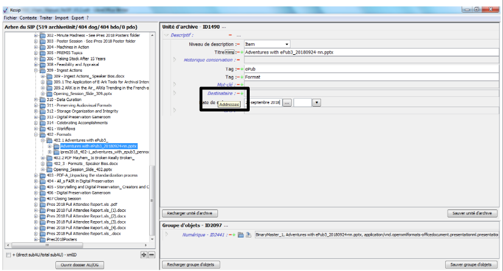

Afin d’améliorer la navigation dans le panneau de
visualisation et d’édition d’une unité archivistique, il est possible de
plier et replier les blocs de métadonnées. Pour ce faire, il convient
de :

-   cliquer sur le chevron dirigé vers le bas et présent à gauche du
    bloc de métadonnées pour lequel on souhaite replier le bloc de
    métadonnées (cf. copie d’écran ci-dessous) ;
    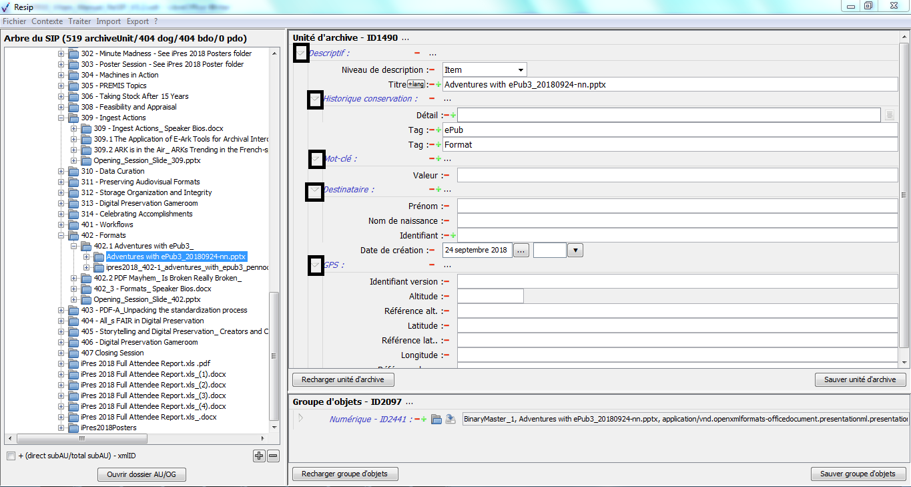

-   le chevron est alors dirigé vers la droite et le
    panneau de visualisation est plus lisible (cf. copie d’écran
    ci-dessous).

    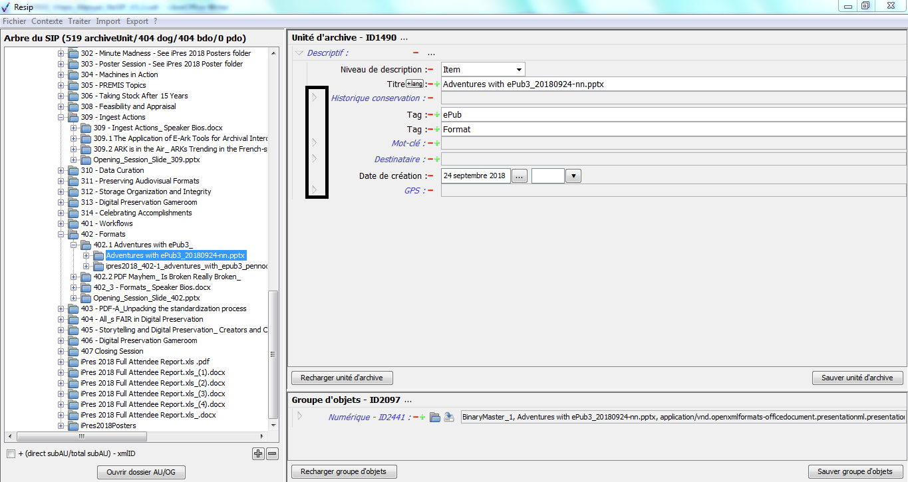

### Traiter les objets et leurs métadonnées

#### Dans l’interface « XML-expert »

Le traitement des objets, tant binaires que physiques, importés dans la
moulinette ReSIP est réalisable, dans le panneau de visualisation de la
liste des objets et dans le panneau de visualisation et d’édition des
métadonnées des objets, sous trois formes :

-   [le remplacement d’un fichier correspondant à un objet binaire par un autre fichier](#remplacement-du-fichier-correspondant-à-un-objet-binaire) ;
-   [la modification complète des métadonnées de l’objet](#modification-complète-des-métadonnées-de-lobjet) ;
-   [l’ajout d’un fichier au groupe d’objets techniques](#ajout-dun-objet).

##### Remplacement du fichier correspondant à un objet binaire

Afin de remplacer le fichier correspondant à un objet binaire par un
autre fichier, il convient, dans le panneau de visualisation de la liste
des objets, de :

-   sélectionner l’objet à remplacer ;
-   cliquer sur le bouton d’action « Changer l’objet » qui provoque
    l’ouverture de l’explorateur Windows ;
-   sélectionner, dans l’explorateur Windows de l’utilisateur ouvert
    suite à l’action précédente, le fichier destiné à remplacer le
    fichier correspondant à l’objet binaire et cliquer sur le bouton
    d’action « Ouvrir » (cf. copie d’écran ci-dessous).

    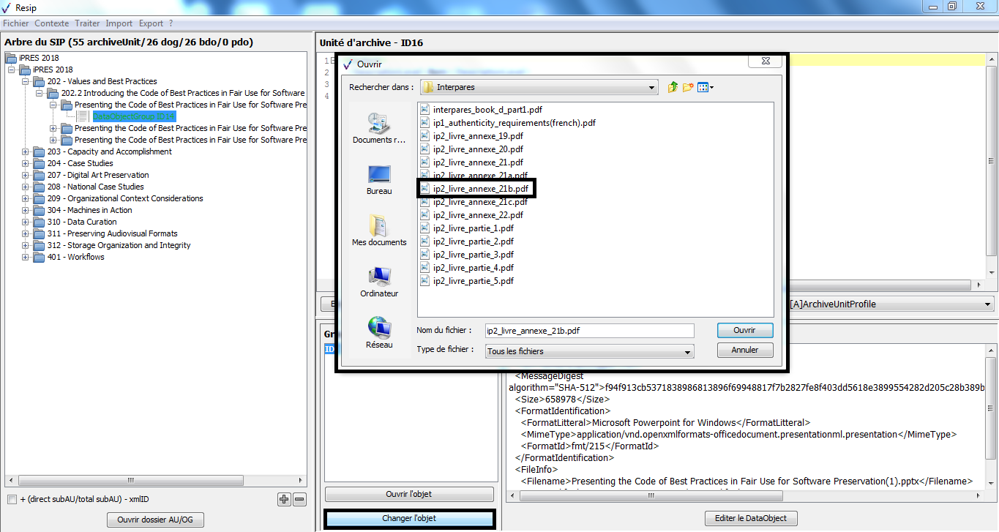

Cette action déclenche le processus de remplacement du fichier
correspondant à l’objet binaire par le fichier sélectionné dans
l’environnement de l’utilisateur. À son terme, les métadonnées de
l’objet binaire sont mises à jour dans le panneau de visualisation et
d’édition des métadonnées de l’objet sélectionné.

##### Modification complète des métadonnées de l’objet

Afin de modifier toutes les métadonnées de l’objet sélectionné dans le
panneau de visualisation de la liste des objets, il convient, dans le
panneau de visualisation et d’édition des métadonnées de l’objet
sélectionné, de cliquer sur le bouton d’action « Editer le DataObject »
(cf. copie d’écran ci-dessous).

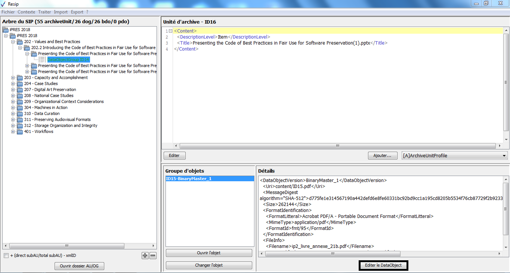

La modification de métadonnées se poursuit ensuite selon le processus
[décrit dans la section](#modification-de-métadonnées-textuelles).

**Attention** : aucun contrôle de conformité par rapport à la structure
et à la sémantique du schéma XML défini par le SEDA 2.1. n’est réalisé.

##### Ajout d’un objet

Afin de rajouter un fichier au groupe d’objets techniques existant ou de
créer un groupe d’objets techniques par l’ajout d’un fichier, il
convient, dans le panneau de visualisation et d’édition des métadonnées
de l’objet sélectionné, de :

-   ouvrir l’explorateur Windows et sélectionner le répertoire racine ou
    le fichier à rajouter au groupe d’objets techniques ;
-   glisser le répertoire ou le fichier sélectionnés vers le groupe
    d’objets sélectionné (cf. copie d’écran ci-dessous).

    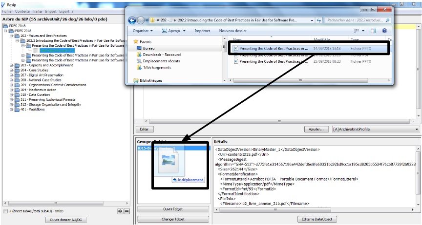

Cette action déclenche le processus d’import (cf. copie d’écran ci-dessous).

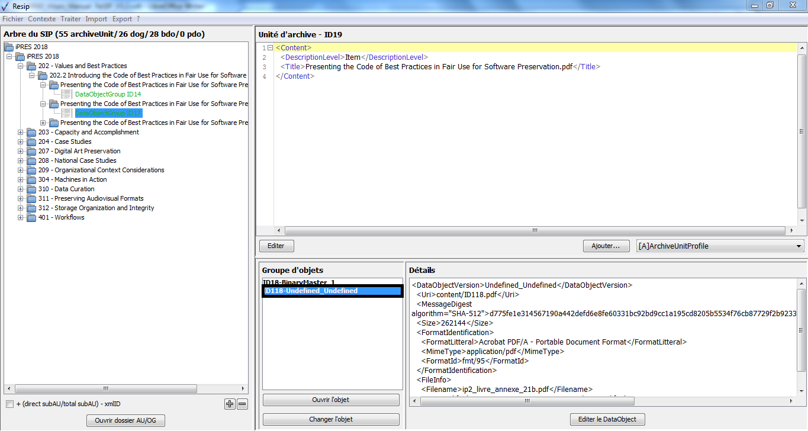
Les métadonnées de cet objet peuvent être modifiées en
utilisant la fonction correspondante ([cf. section](#dans-linterface-«-xml-expert-»)).

#### Dans l’interface « structurée »

Le traitement des objets, tant binaires que physiques, importés dans la
moulinette ReSIP est réalisable, dans le panneau de visualisation de la
liste des objets et dans le panneau de visualisation et d’édition des
métadonnées des objets, sous trois formes :

-   [le remplacement d’un fichier correspondant à un objet binaire par un autre fichier](#remplacement-du-fichier-correspondant-c3a0-un-objet-binaire-1)  ;
-   [la modification des métadonnées de l’objet](#modification-des-métadonnées-de-lobjet) ;
-   [l’ajout d’un fichier au groupe d’objets techniques](#ajout-dun-objet-1).

##### Remplacement du fichier correspondant à un objet binaire

Afin de remplacer le fichier correspondant à un objet binaire par un
autre fichier, il convient, dans le panneau de visualisation des
métadonnées des objets, de :

-   sélectionner l’objet à remplacer ;
-   cliquer sur le bouton d’action « Changer le fichier associé » qui
    provoque l’ouverture de l’explorateur Windows ;
    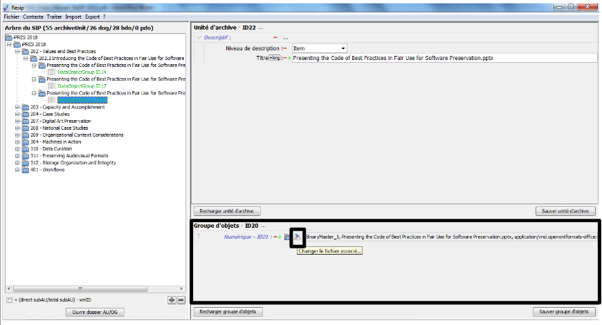

-   sélectionner, dans l’explorateur Windows de
    l’utilisateur ouvert suite à l’action précédente, le fichier destiné
    à remplacer le fichier correspondant à l’objet binaire et cliquer
    sur le bouton d’action « Ouvrir » (cf. copie d’écran ci-dessous) ;
    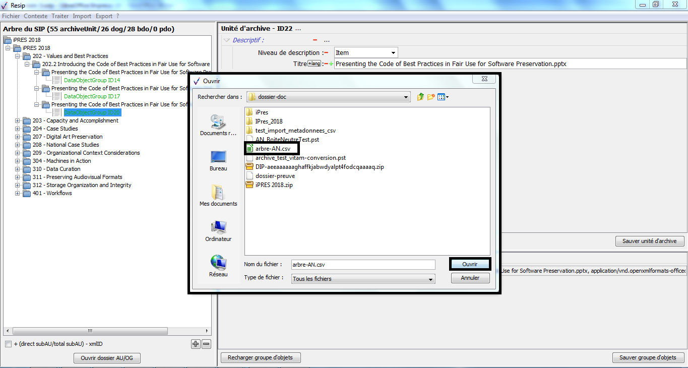
-   confirmer le remplacement de l’objet en cliquant
    sur le bouton d’action « OK » (cf. copie d’écran ci-dessous).

Cette action déclenche le processus de remplacement du fichier
correspondant à l’objet binaire par le fichier sélectionné dans
l’environnement de l’utilisateur. À son terme, les métadonnées de
l’objet binaire sont mises à jour dans le panneau de visualisation et
d’édition des métadonnées de l’objet sélectionné (cf. copie d’écran
ci-dessous).


##### Modification des métadonnées de l’objet

Afin modifier toutes les métadonnées de l’objet sélectionné dans le
panneau de visualisation et d’édition des métadonnées de l’objet, il
convient de cliquer sur le chevron dirigé vers la droite et présent à
gauche du bloc de métadonnées de l’objet (cf. copie d’écran ci-dessous).

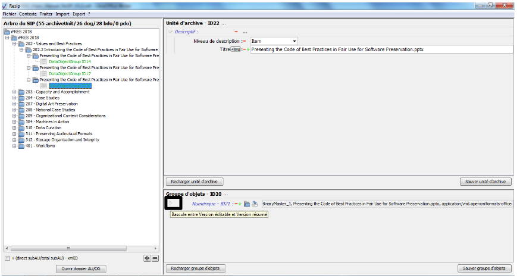

-   le chevron est alors dirigé vers le bas et l’ensemble des
    métadonnées apparaissent sous forme de champs modifiables (cf. copie
    d’écran ci-dessous).

    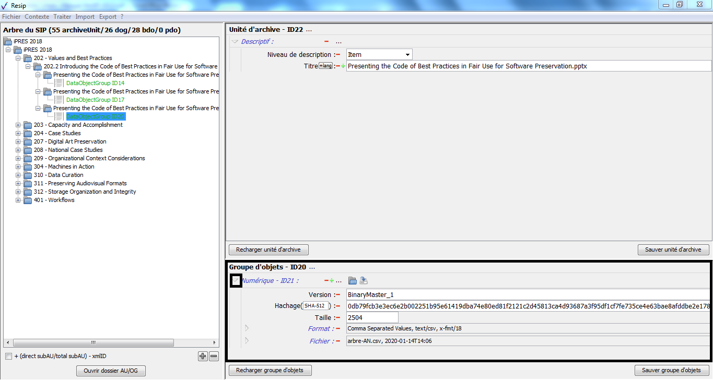

La modification de métadonnées se poursuit ensuite selon le processus
[décrit dans la section](#traiter-les-objets-et-leurs-métadonnées).

##### Ajout d’un objet

Afin d’ajouter un groupe d’objets techniques à une unité archivistique
sans objet associé, il convient, dans le panneau de visualisation et
d’édition des métadonnées de l’objet, de cliquer sur le bouton d’action
« Ajouter un groupe d’objets » (cf. copie d’écran ci-dessous).

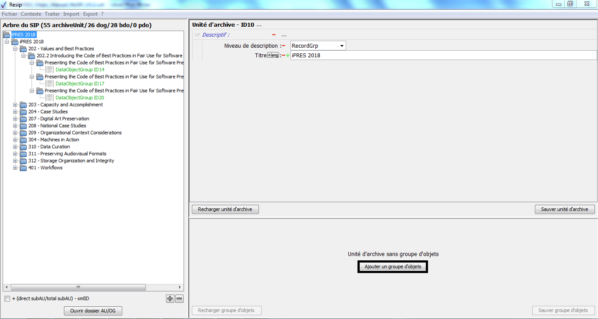

Cette action déclenche la création d’un groupe d’objets
(cf. copie d’écran ci-dessous).

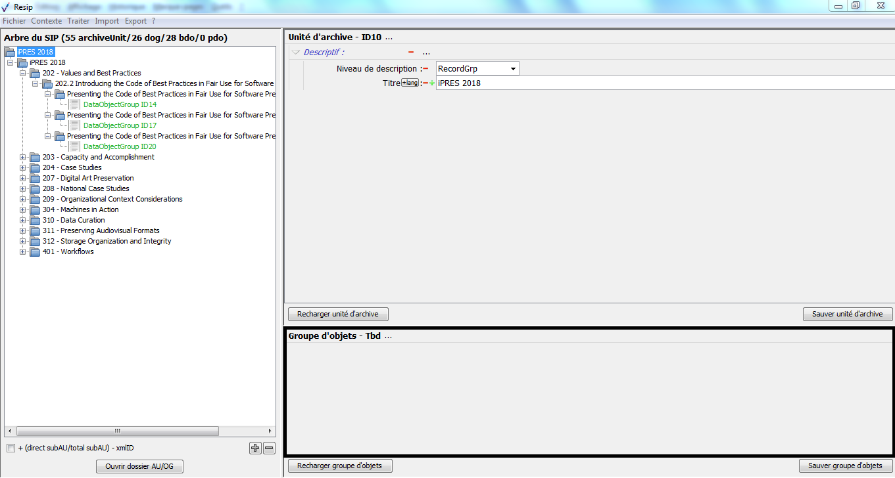

Afin d’ajouter un objet dans ce groupe d’objets
sélectionné dans le panneau de visualisation et de modification des
métadonnées du groupe d’objets, il convient de :

-   cliquer sur le bouton d’action « ... » présent à droite du groupe
    d’objets (cf. copie d’écran ci-dessous) ;
   
    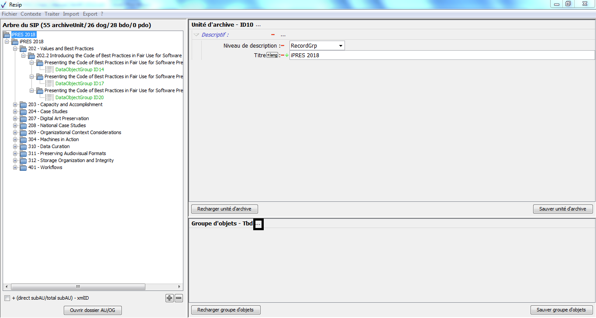

-   sélectionner le type d’objet (numérique ou
    physique) ou de métadonnée à ajouter parmi la liste qui apparaît et
    cliquer sur cette dernière (cf. copie d’écran ci-dessous) ;
    
    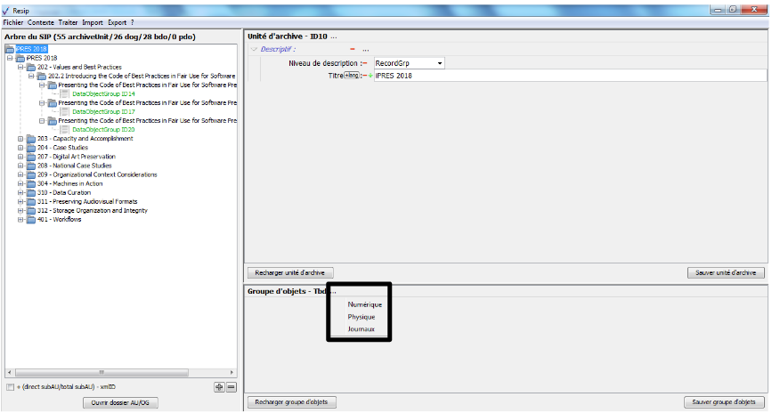

Cette action déclenche la création d’un bloc de
métadonnées vides (cf. copie d’écran ci-dessous).

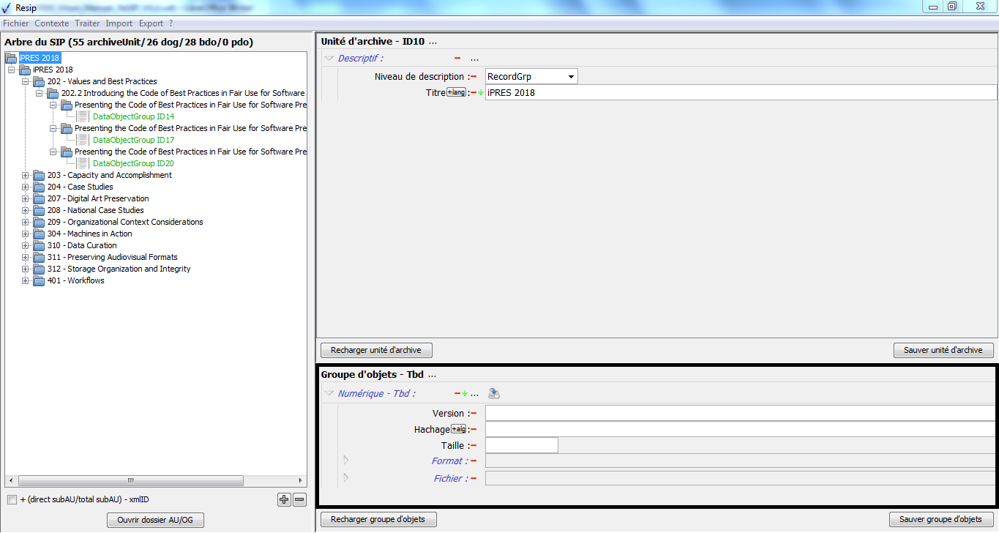

Afin d’associer un fichier à ce bloc de métadonnées vides, il convient,
dans le panneau de visualisation des métadonnées des objets, de :

-   cliquer sur le bouton d’action « Changer le fichier associé » qui
    provoque l’ouverture de l’explorateur Windows (cf. copie d’écran
    ci-dessous) ;

    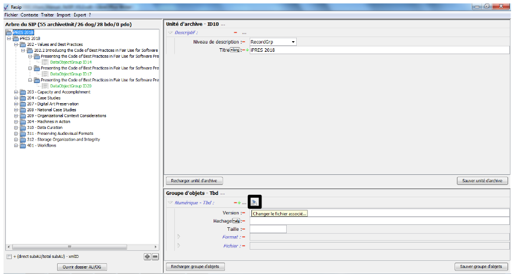

-   sélectionner, dans l’explorateur Windows de
    l’utilisateur ouvert suite à l’action précédente, le fichier destiné
    à remplacer le fichier correspondant à l’objet binaire et cliquer
    sur le bouton d’action « Ouvrir » (cf. copie d’écran ci-dessous) ;

    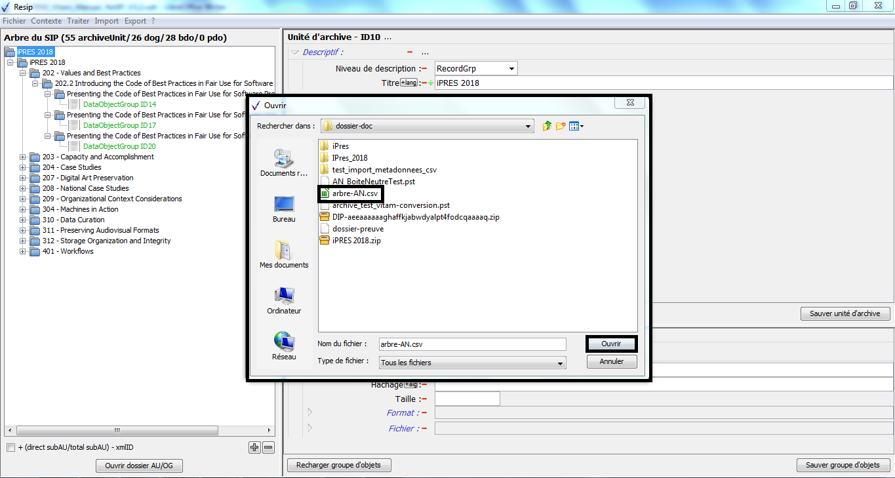

Cette action déclenche l’ajout du fichier sélectionné
dans l’environnement de l’utilisateur. À son terme, les métadonnées de
l’objet binaire sont mises à jour dans le panneau de visualisation et
d’édition des métadonnées de l’objet sélectionné (cf. copie d’écran
ci-dessous).

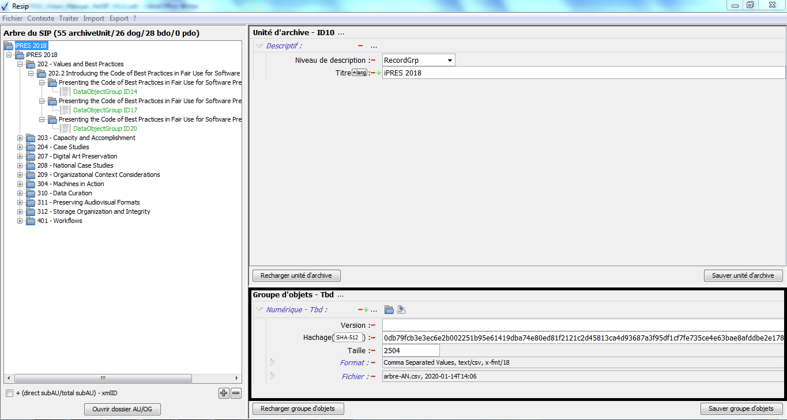

Pour enregistrer la modification, il convient de cliquer sur le bouton
d’action « Sauver groupe d’objets » pour sauvegarder les métadonnées
saisies (cf. copie d’écran ci-dessous).

En cas d’erreur, il suffit de cliquer sur le bouton d’action « Recharger
groupe d’objets » pour restaurer les métadonnées du groupe d’objets
chargées initialement ou sauvegardées dernièrement ([cf. section](#modification-de-métadonnées-textuelles)).

Les métadonnées de cet objet peuvent être modifiées en utilisant la
fonction correspondante ([cf. section](#modification-des-métadonnées-de-lobjet)).

### Vérification de la conformité de la structure arborescente d’archives par rapport au SEDA 2.1. et 2.2.

#### Vérification par rapport au schéma par défaut

Afin de vérifier la conformité d’une structure arborescente d’archives
et de sa description par rapport au schéma par défaut proposé par le
SEDA 2.1., il convient, dans la moulinette ReSIP, de cliquer sur
l’action « Traiter » puis sur la sous-action « Vérifier la conformité
SEDA 2.1 » (cf. copie d’écran ci-dessous) ou « Vérifier la conformité SEDA 2.2 » selon que ReSIP a été paramétré pour gérer du SEDA 2.1. ou du SEDA 2.2..

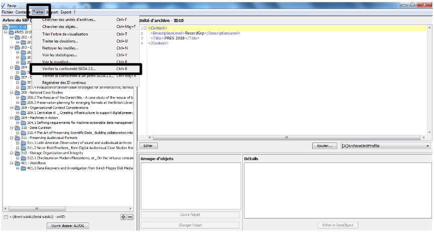

Le clic sur le bouton d’action « Vérifier la conformité
au SEDA 2.X » lance une fenêtre de dialogue « Vérification SEDA 2.X. »
indiquant que l’opération de vérification est lancée. Cette opération
peut être annulée en cliquant sur le bouton d’action « Annuler » de la
fenêtre de dialogue. Une fois l’opération de vérification terminée, la
fenêtre de dialogue indique son résultat et la première non conformité
identifiée, ainsi que l’identifiant XML de l’unité archivistique
concernée.

Attention : pour identifier dans la structure arborescente d’archives
l’unité archivistique concernée par la non-conformité, il convient de
cocher la case placée sous le panneau de visualisation et de
modification de la structure arborescente d’archives, ce qui permettra
d’afficher l’identifiant XML de toutes les unités archivistiques ([voir section](#présentation-de-linterface-graphique-de-la-moulinette-resip)).

La fenêtre de dialogue peut être fermée en cliquant sur le bouton
d’action « Fermer » (cf. copie d’écran ci-dessous).

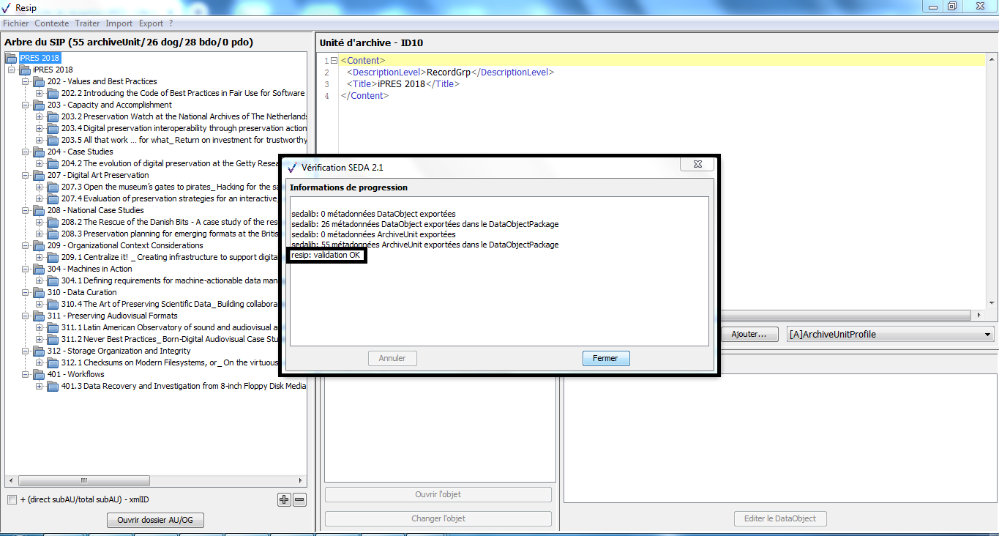

#### Vérification par rapport à un profil d’archivage spécifique

Afin de vérifier la conformité d’une structure arborescente d’archives
et de sa description par rapport à un profil d’archivage conforme au
SEDA 2.1. ou au SEDA 2.2., selon que ReSIP a été paramétré pour gérer du SEDA 2.1. ou du SEDA 2.2., il convient, dans la moulinette ReSIP, de cliquer sur
l’action « Traiter » puis sur la sous-action « Vérifier la conformité à
un profil SEDA 2.X » (cf. copie d’écran ci-dessous).

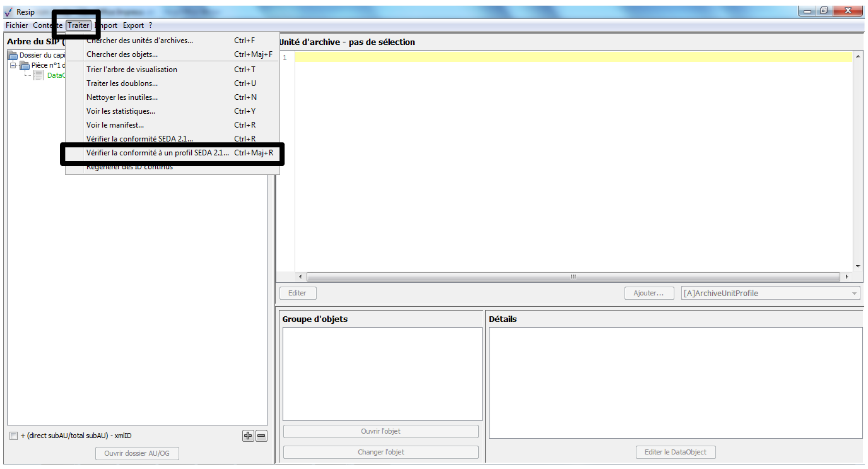

Le clic sur la sous-action « Vérifier la conformité à
un profil SEDA 2.X », ouvre l’explorateur Windows de l’utilisateur et
permet à celui-ci de sélectionner un fichier correspondant à un profil
d’archivage – au format XSD ou RNG – et de l’importer dans la moulinette
ReSIP en cliquant sur le bouton d’action « Ouvrir » (cf. copie d’écran
ci-dessous).

**Attention** : il n’est possible de sélectionner qu’un seul fichier.

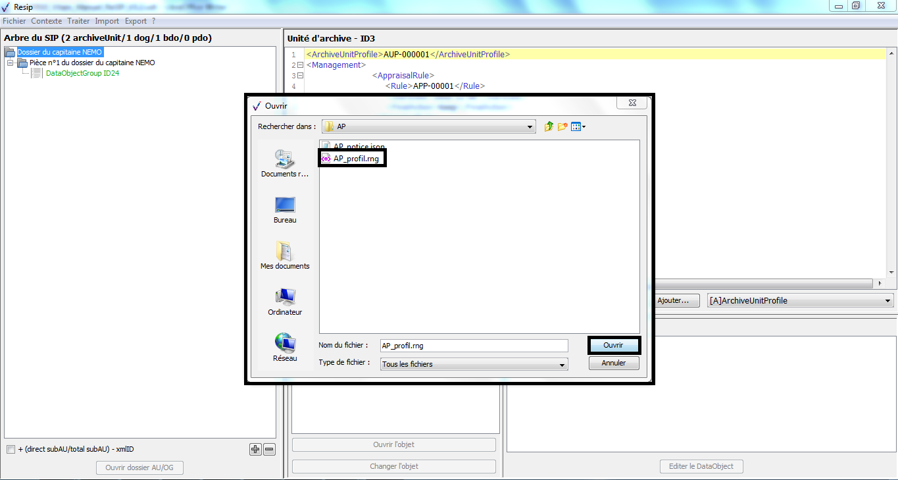

Le clic sur le bouton d’action « Ouvrir » lance une
fenêtre de dialogue « Vérification profil SEDA 2.X », indiquant que
l’opération de vérification est lancée. Cette opération peut être
annulée en cliquant sur le bouton d’action « Annuler » de la fenêtre de
dialogue. Une fois l’opération de vérification, la fenêtre de dialogue
indique son résultat et les éventuelles non conformités identifiées[^8].
La fenêtre de dialogue peut être fermée en cliquant sur le bouton
d’action « Fermer » (cf. copie d’écran ci-dessous).

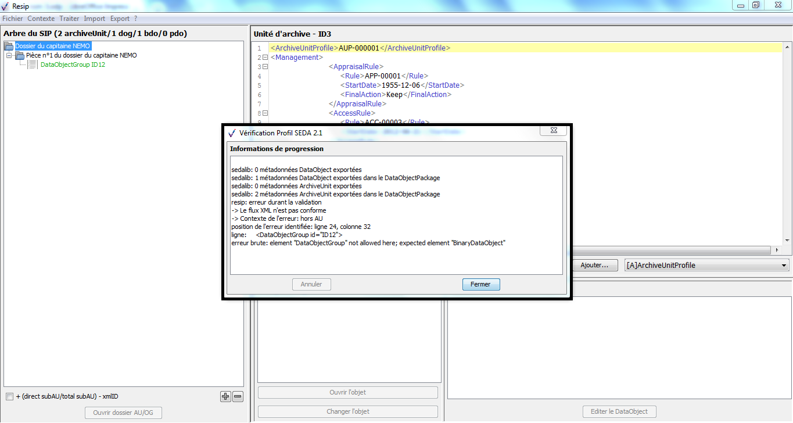

**Attention **:

-   La moulinette ReSIP génère systématiquement des groupes d’objets. Le
    profil d’archivage doit prendre en compte cette structuration.
-   Par ailleurs, il est recommandé de structurer le manifeste dans la
    moulinette ReSIP en mode arborescent et de disposer d’un profil
    d’archivage arborescent également. La vérification par rapport à un
    profil d’archivage en mode râteau ne fonctionne pas avec la
    moulinette ReSIP.

### Consulter le manifeste

Afin de consulter le manifeste au format .xml correspondant à la
structure arborescente d’archives en cours de traitement dans la
moulinette ReSIP, il convient, dans le menu de la moulinette ReSIP, de
cliquer sur l’action « Traiter » puis sur la sous-action « Voir le
manifest » (cf. copie d’écran ci-dessous).

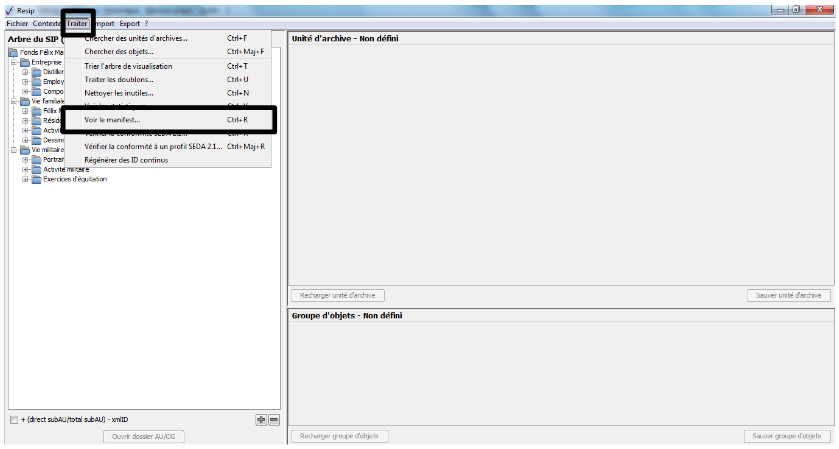

Le clic sur la sous-action « Voir le manifest », ouvre
un éditeur permettant de visualiser le contenu du manifeste sous forme
XML et d’y faire des recherches (cf. copie d’écran ci-dessous).

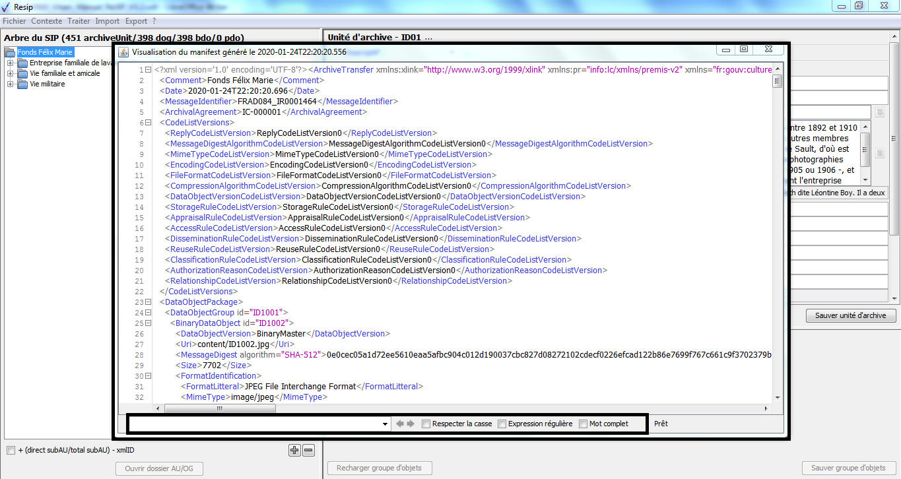

### Sauvegarder le contexte de travail en cours de traitement

Afin de sauvegarder un contexte de travail en cours sur une structure
arborescente d’archives pour reprendre le traitement ultérieurement, il
convient, dans le menu de la moulinette ReSIP, de cliquer sur l’action
« Fichier » puis sur la sous-action « Sauver sous » (cf. copie d’écran
ci-dessous).

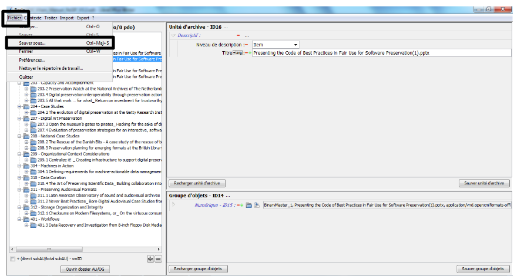

Le clic sur la sous-action « Sauver sous » ouvre
l’explorateur Windows de l’utilisateur et permet à celui-ci de
sélectionner le répertoire cible d’enregistrement du contexte de travail
et de nommer celui-ci en cliquant sur le bouton d’action « Enregistrer »
(cf. copie d’écran ci-dessous).

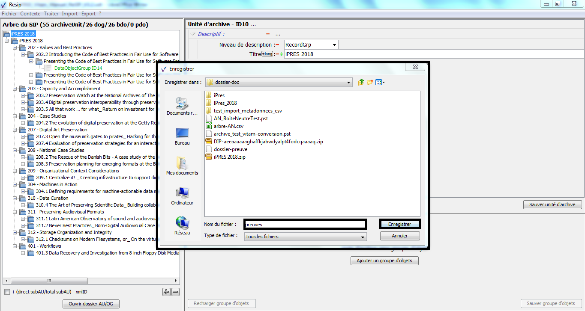

**Attention** : les fichiers correspondant aux objets
binaires ne sont pas sauvegardés dans le répertoire temporaire créé. Ils
doivent rester à leur emplacement d’origine sur l’environnement de
travail de l’utilisateur. S’ils sont déplacés avant de reprendre le
traitement du contexte de travail sauvegardé, la moulinette ReSIP sera
incapable de recharger ce dernier.

### Compacter les arborescences [mode expérimental]

#### Paramétrages du compactage

Peuvent être paramétrés depuis l’interface d’édition des paramètres par défaut ouverts par un clic sur la sous-action « Préférences » dans l’onglet « Compact » (cf. copie d’écran ci-dessous) :
-   les limites des paquets de documents, à savoir :
    -	la taille maximale des métadonnées (valeur par défaut : 1 million),
    -   le nombre maximal de documents (valeur par défaut : 1 000),
-   le filtrage des versions d’objet :
    -   pour les documents (par défaut : BinaryMaster et TextContent),
    -   les sous-documents (par défaut : BinaryMaster),
-   le mode de construction des paquets de documents :
	-   compressé ou non compressé (compressé par défaut),
-   le filtrage des métadonnées (compaction par défaut de toutes les métadonnées).

    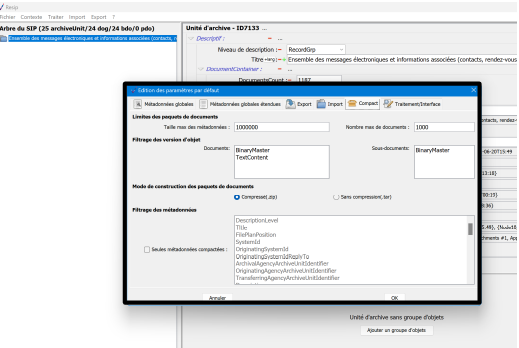

#### Compacter des éléments

Afin de compacter les éléments contenus dans une arborescence, il convient, dans le panneau de visualisation et de modification de la structure arborescente d’archives, de :
-   positionner le curseur sur l’unité archivistique dont les sous-niveaux doivent être compactés ;
-   effectuer un clic-droit ;
-   cliquer sur le bouton d’action « Compacter l’ArchiveUnit » pour compacter les sous-niveaux de l’arborescence et réduire la structure arborescente d’archives (cf. copie d’écran ci-dessous).
Le clic sur le bouton d’action « Compacter l’ArchiveUnit » lance une fenêtre de dialogue « Compactage » indiquant que l’opération de compactage est lancée et permettant de suivre sa progression. Cette opération peut être annulée en cliquant sur le bouton d’action « Annuler » de la fenêtre de dialogue.

    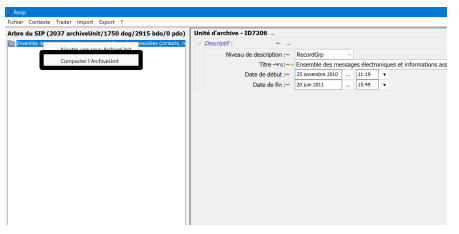

Une fois l’opération de compaction achevée, la fenêtre de dialogue indique le nombre d’éléments compactés (nœuds, unités archivistiques, groupes d’objets) ainsi que le temps qui a été nécessaire pour réaliser l’opération et le nombre d’éléments éliminés (unités archivistiques, groupes d’objets) suite à cette opération. La structure arborescente d’archives compactée est désormais consultable et traitable depuis le panneau de visualisation et de modification de la structure arborescente d’archives. La fenêtre de dialogue peut être fermée en cliquant sur le bouton d’action « Fermer ».

    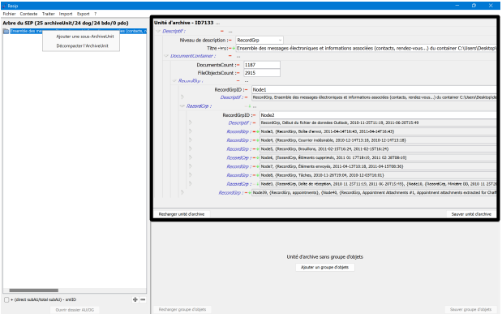

Les métadonnées compactées  par défaut à ce jour sont les suivantes :
-   pour les unités archivistiques correspondant au répertoire racine ayant fait l’objet de la compaction :
    -   niveau de description (champ DescriptionLevel dans le SEDA), restant identique ;
    -   titre (champ Title dans le SEDA), restant identique ;
    -   un container (champ DocumentContainer) référençant le nombre d’unités archivistiques (DocumentsCount) et d’objets (FileObjectsCount) compactés ;
    -   la restitution de l’arborescence initiale matérialisée par des groupes de documents (champ RecordGrp), qui disposent chacun :
        -   d’un identifiant (RecordGrpID),
        -   de métadonnées descriptives et de gestion que les unités archivistiques contenaient précédemment ;
-   pour les unités archivistiques compactées en paquets :
    -   niveau de description (champ DescriptionLevel dans le SEDA) = Item ;
    -   titre (champ Title dans le SEDA), incrémenté « DocumentPack » suivi du numéro du paquet généré ;
    -   la description du paquet (champ DocumentPack) référençant le nombre d’unités archivistiques (DocumentsCount) et d’objets (FileObjectsCount) contenus dans le paquet ;
    -   pour les unités archivistiques correspondant précédemment à un répertoire (champ RecordGrp), également référencées dans l’unité archivistique racine :
        -   un identifiant (RecordGrpID),
        -   les métadonnées descriptives et de gestion qu’elles contenaient précédemment ;
    -   pour les unités archivistiques précédemment associées à un objet (champ Document) :
        -   un identifiant (RecordGrpID),
        -   les métadonnées descriptives et de gestion qu’elles contenaient précédemment ;
    -   pour les objets associés (champ FileObject) :
        -   les métadonnées techniques préalablement incrémentées
A un paquet donné, est associé un groupe d’objets techniques décrivant un fichier zippé qui contient l’ensemble des objets associés aux unités archivistiques décrites en tant que « Document ».

***Nota bene :*** les arborescences et fichiers préalablement disposés sous l’unité archivistique compacté sont supprimés de la structure d’arborescente d’archives et sont désormais :
-   restitués en tant que métadonnées dans l’unité archivistique racine compacté ou dans les unités archivistiques de type « DocumentPack » ;
-   encapsulés dans le fichier zippé associé à un « DocumePack » pour les fichiers.

### Nettoyer l’espace de travail

La moulinette ReSIP opère ses traitements en sauvegardant un certain
nombre d’informations dans un espace de travail par défaut intitulé
« Resip », localisé dans le répertoire « Documents » de l’utilisateur.

Afin de nettoyer cet espace de travail pour éviter les conflits entre
structures arborescentes de fichiers traitées, il convient, dans le menu
de la moulinette ReSIP, de :

-   cliquer sur l’action « Fichier » puis sur la sous-action « Nettoyer
    le répertoire de travail » (cf. copie d’écran ci-dessous) ;

    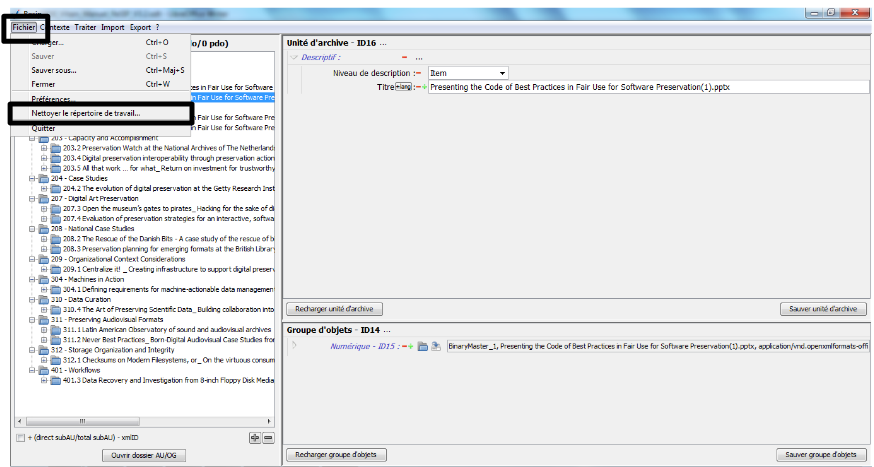

-   disposer d’une aide contextualisée pour la réalisation des
    opérations de recherche en cliquant sur l’icône « + » (cf. copie
    d’écran ci-dessous) ;

    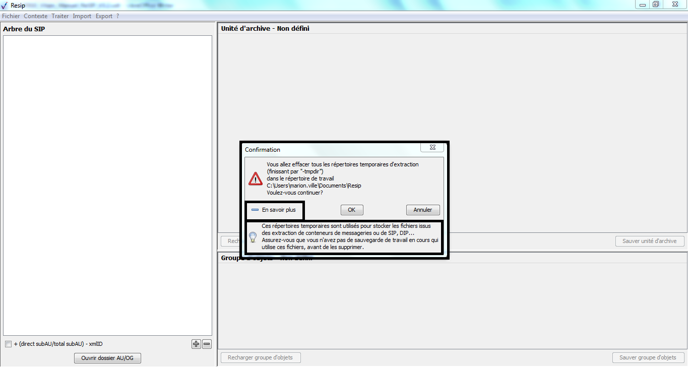

-   confirmer l’opération de nettoyage, dans la fenêtre de dialogue qui
    s’est ouverte, en cliquant sur le bouton d’action « OK » (cf. copie
    d’écran ci-dessous).

    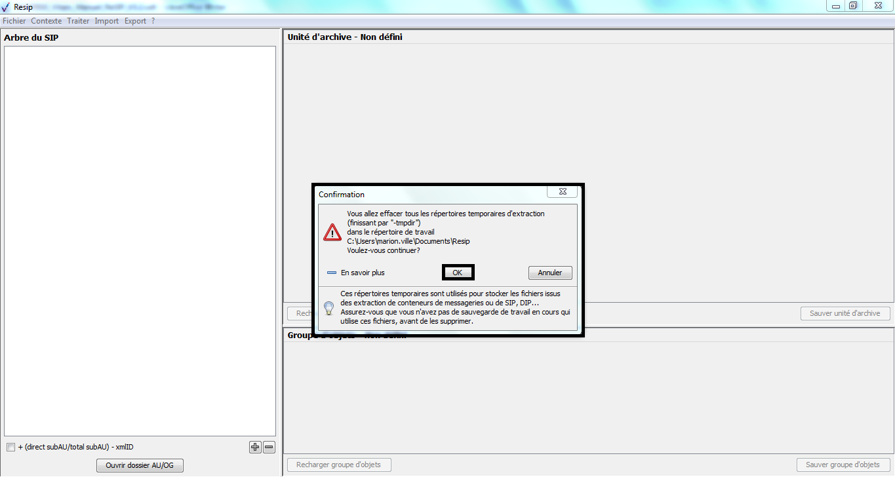

Le clic sur le bouton d’action « OK » de la fenêtre de
dialogue lance une nouvelle fenêtre de dialogue « Nettoyage » indiquant
que l’opération de nettoyage est lancée. Cette opération peut être
annulée en cliquant sur le bouton d’action « Annuler » de la fenêtre de
dialogue (cf. copie d’écran ci-dessous).

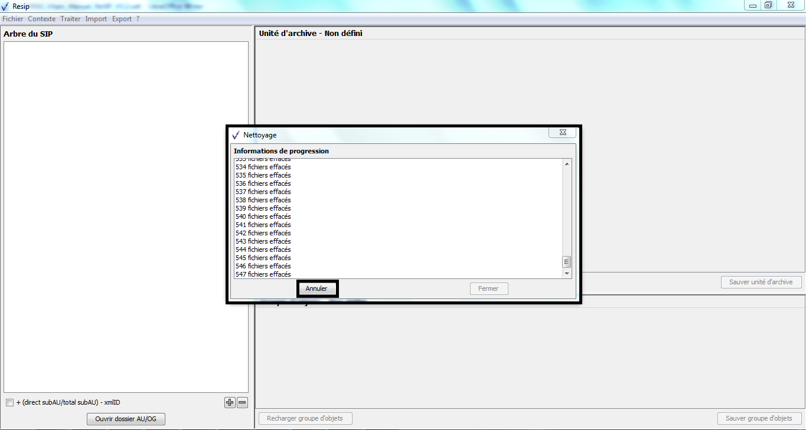

**Attention** : la durée de cette opération peut être
longue, notamment si le nombre de répertoires et de messages à nettoyer
est important.

La fenêtre de dialogue peut être fermée en cliquant sur le bouton
d’action « Fermer » (cf. copie d’écran ci-dessous).

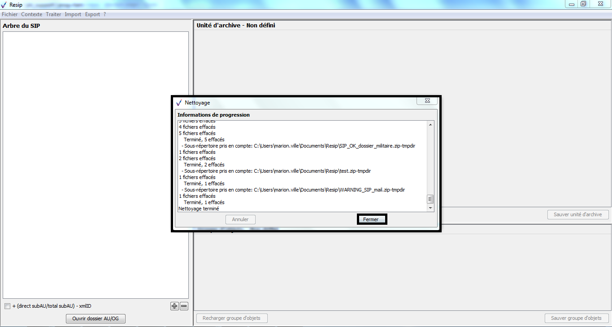

Export des données
------------------

Il est possible d’exporter, depuis la moulinette ReSIP, une structure
arborescente d’archives sous plusieurs formes différentes :

-   [un SIP conforme au SEDA 2.1. ou au SEDA 2.2. et aux spécifications particulières de la solution logicielle Vitam](#export-de-la-structure-arborescente-darchives-sous-la-forme-dun-sip) ;
-   [un manifeste conforme au SEDA 2.1. ou au SEDA 2.2. et aux spécifications particulières de la solution logicielle Vitam](#export-de-la-structure-arborescente-darchives-sous-la-forme-dun-manifeste-xml) ;
-   [une structure arborescente de fichiers](#export-sous-forme-darborescence-de-fichiers) ;
-   [une structure arborescente de fichiers accompagnée d’un fichier de métadonnées au format .csv, zippée ou non](#export-sous-forme-darborescence-de-fichiers-accompagnée-dun-fichier-csv-décrivant-une-structure-arborescente-darchives-etou-de-fichiers) ;
-   [un fichier de métadonnées au format .csv](#export-sous-forme-dun-fichier-csv-décrivant-une-structure-arborescente-darchives-etou-de-fichiers).

L’[export est paramétrable](#paramétrage-des-exports).

### Paramétrage des exports

Les modalités d’export des structures arborescentes d’archives peuvent
être paramétrées :

-   soit via le menu « Fichier », en cliquant sur la sous-action
    « Préférences » ;
-   soit via le menu « Contexte », en cliquant sur la sous-action
    « Éditer les informations d’export ».

Peuvent être paramétrées :

-   les métadonnées de l’en-tête (intitulé et identifiant du SIP,
    contrat d’entrée, versions des référentiels utilisés, identifiant du
    service d’archives et identifiant du service de transfert) ainsi que
    celles du bloc ManagementMetadata du manifeste (profil d’archivage,
    niveau de service, mode d’entrée, statut juridique, règles de
    gestion applicables à l’ensemble du SIP, service producteur de
    l’entrée, service versant de l’entrée) (onglets « Métadonnées
    globales » et « Métadonnées globales étendues ») ([section](#paramétrage-des-métadonnées-de-len-tête-et-du-bloc-managementmetadata-du-manifeste)) ;
-   les modalités de structuration du fichier XML correspondant au
    manifeste (onglet « import/export ») ([section](#paramétrage-des-modalités-de-structuration-du-fichier-xml-correspondant-au-manifeste) 6.1.2.);
-   les modalités de structuration du fichier CSV décrivant les archives (onglet « import/export »)([section](#paramétrage-des-modalités-de-structuration-du-fichier-csv-exporté)).

#### Paramétrage des métadonnées de l’en-tête et du bloc ManagementMetadata du manifeste

Peuvent être paramétrés depuis l’interface d’édition des paramètres par
défaut ouverts par un clic sur la sous-action « Préférences » :

-   dans l’onglet « Métadonnées globales » (cf. copie d’écran
    ci-dessous) :

    -   l’identifiant du SIP (champ MessageIdentifier du SEDA 2.1. et 2.2.) ;
    -   la date de transfert du SIP (champ Date du SEDA 2.1. et 2.2.) ;
    -   la description du SIP (champ Comment du SEDA 2.1. et 2.2.) ;
    -   l’identifiant du contrat d’entrée utilisé pour transférer le SIP
        dans la solution logicielle Vitam (champ ArchivalAgreement du
        SEDA 2.1.) ;
    -   l’identifiant du service d’archives (champ
        ArchivalAgency.Identifier du SEDA 2.1. et 2.2.) ;
    -   l’identifiant du service de transfert (champ
        TransferringAgency.Identifier du SEDA 2.1. et 2.2.) ;

        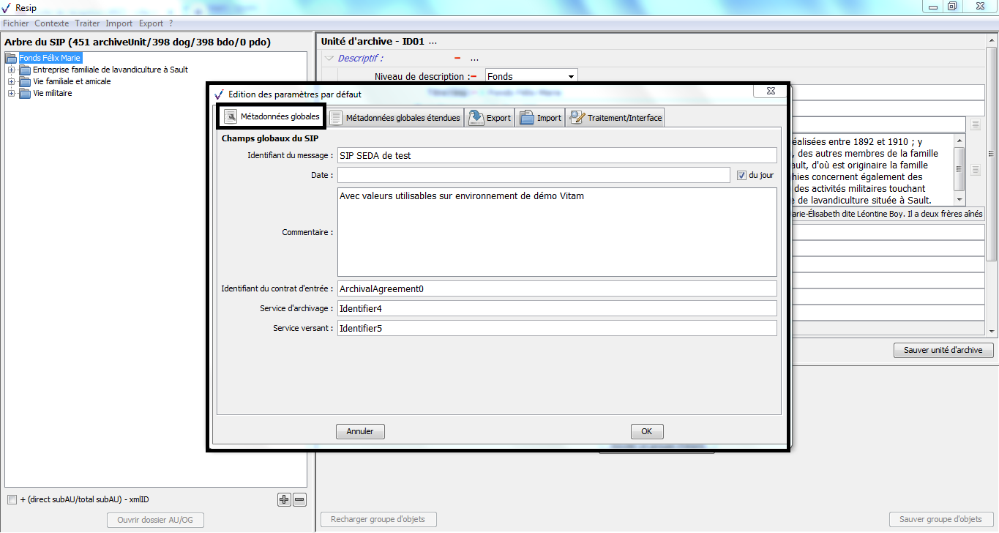
-   dans l’onglet « Métadonnées globales étendues »
    (cf. copie d’écran ci-dessous) :

    -   la liste des référentiels et listes d’autorité utilisés dans le
        SIP, sous une forme XML (bloc CodeListVersions » du SEDA 2.1. et 2.2.) ;
    -   les métadonnées de gestion applicables à l’ensemble du SIP, sous
        une forme XML (bloc ManagementMetadata du SEDA 2.1. et 2.2.) ;
    -   l’identifiant de la réponse transmise suite à une demande
        d’entrée (champ TransferRequestReplyIdentifier du SEDA 2.1. et 2.2.) ;
    -   la description détaillée du service d’archives (champ
        ArchivalAgency.OrganizationDescriptiveMetadata du SEDA 2.1. et 2.2.) ;
    -   la description détaillée du service de transfert (champ
        TransferringAgency.OrganizationDescriptiveMetadata du SEDA
        2.1. et 2.2.).

        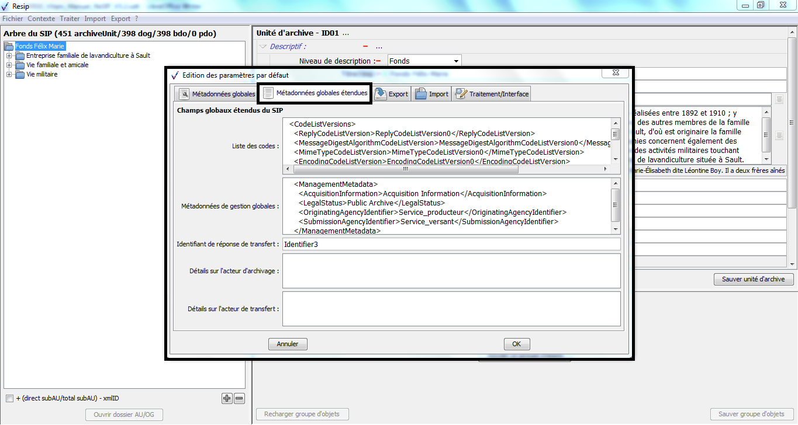

Les paramètres saisis seront utilisés pour la
réalisation de l’export de la structure arborescente d’archives en cours
de traitement.

**Attention** :

-   aucun contrôle de conformité par rapport à la structure et à la
    sémantique du schéma XML défini par le SEDA 2.1. et 2.2. n’est réalisé ;
-   en cas d’import d’un SIP ou d’un DIP disposant de paramètres
    différents de ceux définis par défaut, ce sont les paramètres
    spécifiques à ce SIP ou à ce DIP qui s’affichent dans les différents
    onglets de la fenêtre de dialogue.

#### Paramétrage des modalités de structuration du fichier XML correspondant au manifeste

Peuvent être paramétrées depuis l’interface d’édition des paramètres par
défaut ouverte par un clic sur la sous-action « Préférences », depuis
l’onglet « Export » (cf. copie d’écran ci-dessous) :

-   la manière dont va être restituée la structure arborescente
    d’archives dans le fichier XML correspondant au manifeste. Les
    unités archivistiques peuvent être exportées soit de manière
    imbriquée (les unités archivistiques sont exportées de manière
    « arborescente » et sont imbriquées les unes dans les autres, en
    utilisant le champ ArchiveUnit du SEDA 2.1. et 2.2.), soit « à plat »
    (toutes les unités archivistiques sont exportées au même niveau et
    la structure arborescente est restituée par l’utilisation du champ
    ArchiveUnitRefId du SEDA 2.1. et 2.2.) ;
-   la manière dont va être présenté le fichier XML correspondant au
    manifeste, avec ou sans indentation des éléments ;
-   la renumérotation ou non des éléments composant le fichier XML
    correspondant au manifeste ;
-   les métadonnées descriptives à exporter pour chaque unité
    archivistique.

    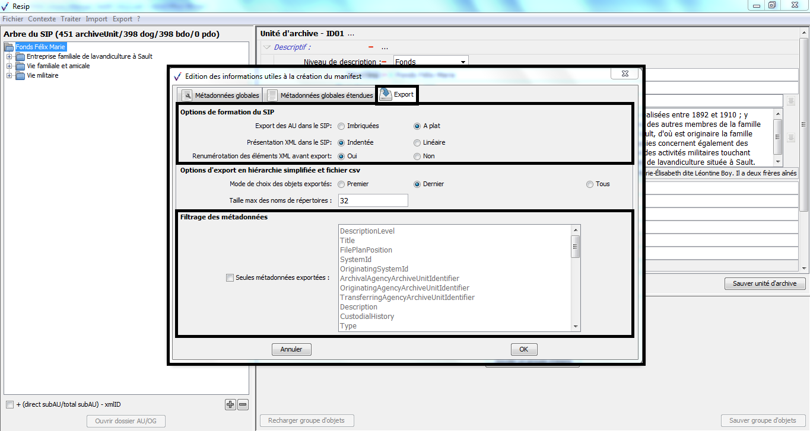

Les paramètres saisis seront utilisés pour la réalisation de l’export de
la structure arborescente d’archives en cours de traitement.

#### Paramétrage des modalités de structuration du fichier CSV exporté

Peuvent être paramétrées depuis l’interface d’édition des paramètres par
défaut ouverte par un clic sur la sous-action « Préférences », depuis
l’onglet « Export » (cf. copie d’écran ci-dessous) :

-   le mode de choix des objets exportés (premier, dernier, tous). Par
    défaut, l’option « Dernier » est sélectionnée ;
-   la taille maximale de la chaîne de caractères correspondant aux
    répertoires, par défaut limitée à 32 caractères ;
- 	la possibilité d'exporter des informations complémentaires relatives à la hiérarchie des archives et au nom des fichiers numériques (ID, ParentID, ObjectFiles);
-   les métadonnées descriptives à exporter pour chaque unité
    archivistique.

    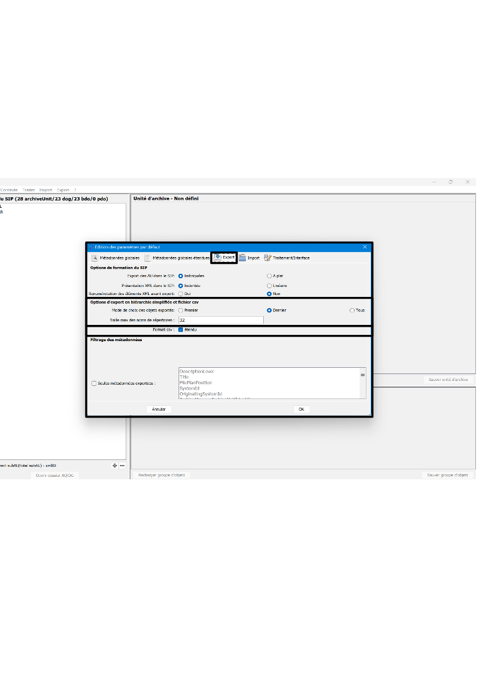

Les paramètres saisis seront utilisés pour la réalisation de l’export de
la structure arborescente d’archives en cours de traitement et du CSV.

### Export de la structure arborescente d’archives sous la forme d’un SIP

La moulinette ReSIP permet d’exporter une structure arborescente
d’archives en cours de traitement sous la forme d’un SIP conforme au
SEDA 2.1. et aux spécifications particulières de la solution logicielle
Vitam.

Pour ce faire, il convient de cliquer, dans le menu de la moulinette
ReSIP, sur l’action « Export » puis sur la sous-action « Exporter le SIP
SEDA » (cf. copie d’écran ci-dessous).


Le clic sur la sous-action « Exporter le SIP SEDA » ouvre l’explorateur
Windows de l’utilisateur et permet à celui-ci de sélectionner un
répertoire où enregistrer le SIP, de renommer si besoin le fichier à
créer sous la forme « nomdufichier.zip » – sachant que le nommage par
défaut est « SIP.zip » – et de l’exporter depuis la moulinette ReSIP en
cliquant sur le bouton d’action « Enregistrer » (cf. copie d’écran
ci-dessous).

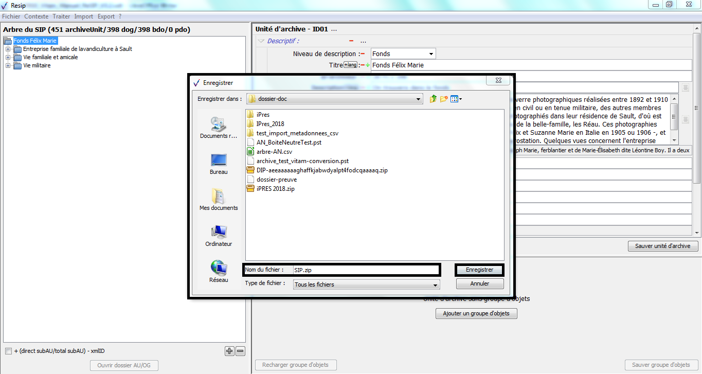

Le clic sur le bouton d’action « Enregistrer » de
l’explorateur lance une fenêtre de dialogue « Export » indiquant que
l’opération d’export est lancée. Cette opération peut être annulée en
cliquant sur le bouton d’action « Annuler » de la fenêtre de dialogue.
Une fois l’opération d’export achevée, la fenêtre de dialogue indique le
nombre d’éléments exportés (unités archivistiques, groupes d’objets,
objets binaires, objets physique) ainsi que le temps qui a été
nécessaire pour réaliser l’opération d’export. La fenêtre de dialogue
peut être fermée en cliquant sur le bouton d’action « Fermer » (cf.
copie d’écran ci-dessous).

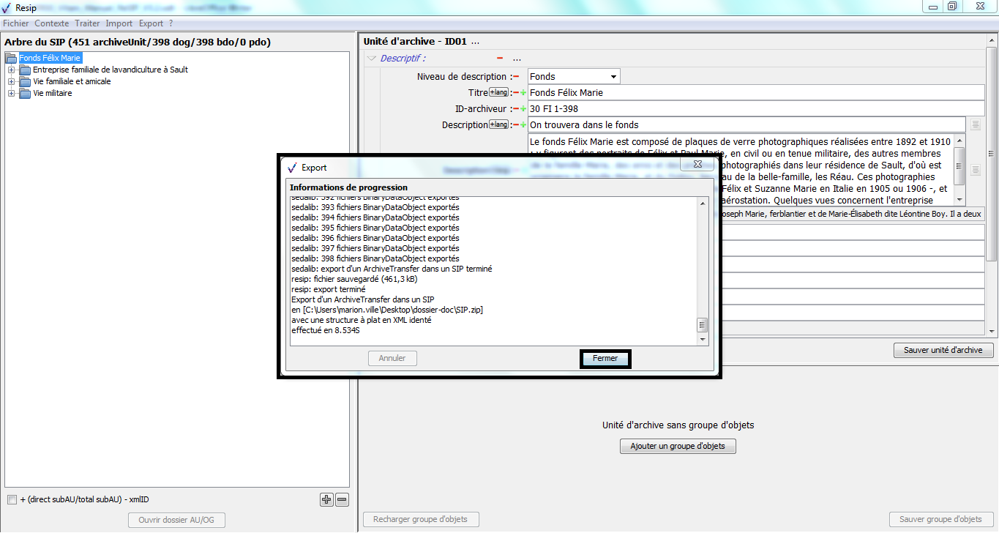

Le SIP est désormais consultable dans le répertoire cible.

**Attention: ** 
il est recommandé de renseigner dans les paramètres la
valeur des champs ArchivalAgreement et OriginatingAgencyIdentifier. À
défaut, il conviendra de les modifier dans un éditeur XML ou dans un
éditeur de texte avant de procéder à l’entrée dans la solution
logicielle Vitam.

### Export de la structure arborescente d’archives sous la forme d’un manifeste XML

La moulinette ReSIP permet d’exporter une structure arborescente
d’archives en cours de traitement sous la forme d’un manifeste de SIP
conforme au SEDA 2.1. et aux spécifications particulières de la solution
logicielle Vitam.

Pour ce faire, il convient de cliquer, dans le menu de la moulinette
ReSIP, sur l’action « Export » puis sur la sous-action « Exporter le
manifest Xml SEDA » (cf. copie d’écran ci-dessous).

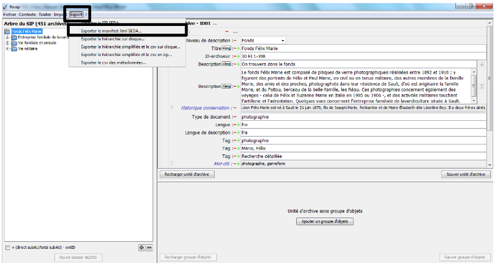

Le clic sur la sous-action « Exporter le manifest Xml SEDA » ouvre
l’explorateur Windows de l’utilisateur et permet à celui-ci de
sélectionner un répertoire où enregistrer le fichier correspondant au
manifeste, de renommer le fichier à créer sous la forme
« nomdufichier.xml » – sachant que le nommage par défaut est
« manifest.xml » – et de l’exporter depuis la moulinette ReSIP en
cliquant sur le bouton d’action « Enregistrer ».

L’export se poursuit ensuite selon le processus [décrit dans la section](#paramétrage-des-exports). Au terme de ce processus, le fichier correspond au manifeste est
consultable dans le répertoire défini.

### Export sous forme d’arborescence de fichiers

La moulinette ReSIP permet d’exporter une structure arborescente
d’archives en cours de traitement, qu’elle ait été importée sous forme
d’arborescence de fichiers, de SIP ou de DIP, sous la forme d’une
arborescence de fichiers.

Pour ce faire, il convient de cliquer, dans le menu de la moulinette
ReSIP, sur l’action « Export » puis sur la sous-action « Exporter la
hiérarchie sur disque » (cf. copie d’écran ci-dessous).

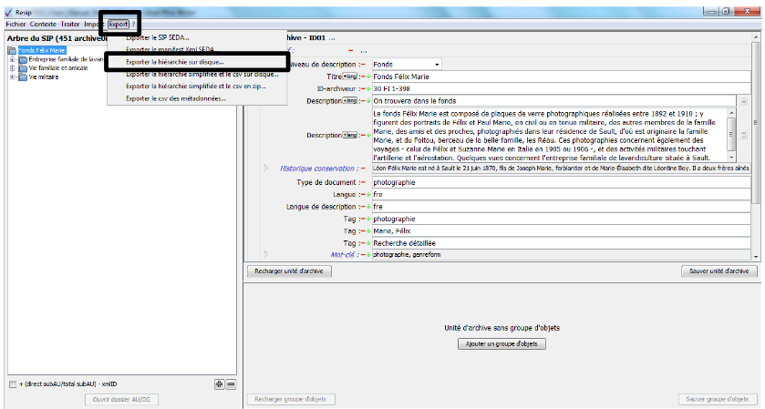

Le clic sur la sous-action « Exporter la hiérarchie sur
disque » ouvre l’explorateur Windows de l’utilisateur et permet à
celui-ci de sélectionner un répertoire où enregistrer la structure de
fichier à exporter, de nommer le répertoire à créer et de l’exporter
depuis la moulinette ReSIP en cliquant sur le bouton d’action
« Enregistrer » (cf. copie d’écran ci-dessous).

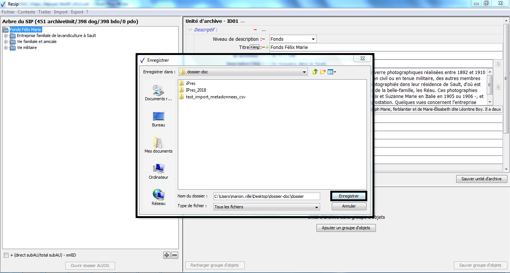

L’export se poursuit ensuite selon le processus [décrit dans la section](#paramétrage-des-exports).

La structure arborescente d’archives exportée est désormais consultable
dans le répertoire cible défini par l’utilisateur, sous la forme d’une
arborescence de fichiers construite comme suit :

-   à la racine du répertoire, les unités archivistiques correspondant à
    la racine de la structure arborescence d’archives, ainsi qu’un
    fichier __GlobalMetadata.xml reprenant les métadonnées de
    l’en-tête de la structure arborescente d’archives et un fichier
    __ManagementMetadata.xml reprenant les métadonnées de gestion
    applicables à l’ensemble de la structure arborescente de fichiers
    (cf. copie d’écran ci-dessous) ;

    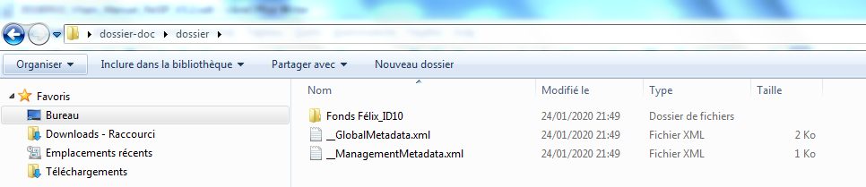

-   dans les répertoires correspondant à des unités archivistiques non
    représentées par des objets, tant binaires que physiques, un fichier
    __ArchiveUnitMetadata.xml reprenant les métadonnées de description
    et de gestion de cette unité archivistique, ainsi que les
    répertoires correspondant aux unités archivistiques filles de cette
    unité archivistique ;
-   dans les répertoires correspondant à des unités archivistiques
    représentées par des objets, tant binaires que physiques : un
    fichier __ArchiveUnitMetadata.xml reprenant les métadonnées de
    description et de gestion de cette unité archivistique ; les
    fichiers binaires correspondant aux différents usages et versions
    représentant l’unité archivistique ; les fichiers suffixés
    _BinaryDataObjectMetadata.xml correspondant aux métadonnées
    techniques des objets binaires représentant l’unité archivistique ;
    les fichiers suffixés _PhysicalDataObjectMetadata.xml correspondant
    aux métadonnées techniques des objets physiques représentant l’unité
    archivistique (cf. copie d’écran ci-dessous).

    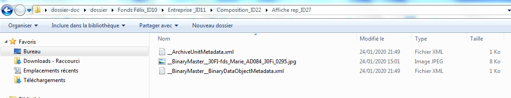

Attention : pour éviter d’atteindre la limite autorisée en termes de
longueur des chemins de fichier, il est recommandé de renommer les
unités archivistiques avant export. Si l’export est réalisé à partir
d’un DIP exporté depuis la solution logicielle Vitam, il est possible
d’utiliser la fonction de régénération des identifiants XML. Pour ce
faire, il convient de cliquer, dans le menu de la moulinette ReSIP, sur
l’action « Traiter » puis sur la sous-action « Régénérer des ID
continus ».

### Export sous forme d’arborescence de fichiers accompagnée d’un fichier .csv décrivant une structure arborescente d’archives et/ou de fichiers

La moulinette ReSIP permet d’exporter une structure arborescente
d’archives en cours de traitement, qu’elle ait été importée sous forme
d’arborescence de fichiers, de SIP ou de DIP, sous la forme d’une
arborescence de fichiers accompagnée d’un fichier .csv décrivant une
structure arborescente d’archives et/ou de fichiers, équivalent à celui
utilisé à l’import ([section](#import-dun-arbre-de-positionnement-ou-dun-plan-de-classement-sous-forme-de-fichier-csv)).

Pour ce faire, il convient de cliquer, dans le menu de la moulinette
ReSIP, sur l’action « Export » puis sur la sous-action « Exporter la
hiérarchie simplifiée et le csv sur disque » ou « Exporter la hiérarchie
simplifiée et le csv en .zip » (cf. copie d’écran ci-dessous).

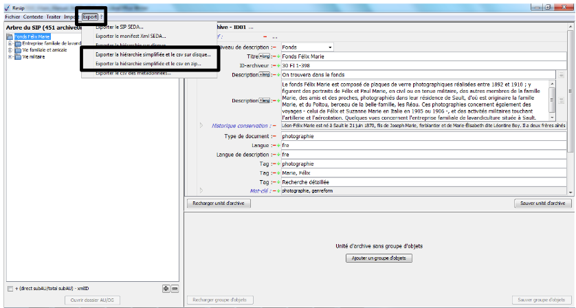

L’export se poursuit ensuite selon le processus [décrit dans la section](#paramétrage-des-exports).

La structure arborescente d’archives exportée est désormais consultable
dans le répertoire cible défini par l’utilisateur, sous la forme de :

-   une arborescence de fichiers accompagnée, à la racine de
    l’arborescence, d’un fichier au format .csv nommé « metadata.csv »
    et comportant l’ensemble des métadonnées descriptives et de gestion
    des unités archivistiques, dans le cas d’un export de la hiérarchie
    simplifiée et du CSV sur disque (cf. copie d’écran ci-dessous) ;
    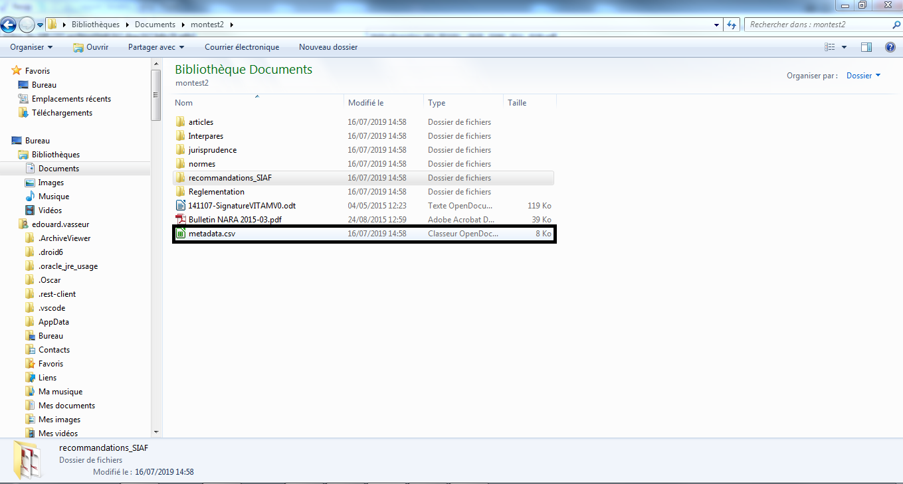

-   un fichier au format .zip, nommé par défaut
    « FilesCsv.zip », contenant une arborescence de fichiers
    accompagnée, à la racine de l’arborescence, d’un fichier au format
    .csv nommé « metadata.csv » et comportant l’ensemble des métadonnées
    descriptives et de gestion des unités archivistiques, dans le cas
    d’un export de la hiérarchie simplifiée et du CSV au format ZIP.

**Attention :**

-   le fichier .csv ne référence que des métadonnées propres aux unités
    archivistiques (métadonnées descriptives et de gestion).
-   seul un objet ou un répertoire peut être associé à un
    enregistrement.

    -   Si on choisit d’exporter la première ou dernière version d’un
        objet, l’enregistrement référencera un objet ;
    -   Si on choisit d’exporter toutes les versions contenues dans un
        groupe d’objets techniques, ReSIP créera un répertoire contenant
        tous les objets. La colonne « File » présente dans le fichier
        .csv référence alors le nom du répertoire et non pas le nom de
        chacun des objets.

### Export sous forme d’un fichier .csv décrivant une structure arborescente d’archives et/ou de fichiers

La moulinette ReSIP permet d’exporter une structure arborescente
d’archives en cours de traitement, qu’elle ait été importée sous forme
d’arborescence de fichiers, de SIP ou de DIP, sous la forme d’un fichier
.csv nommé « metadata.csv » la décrivant, équivalent à celui utilisé à
l’import ([section](#import-dun-arbre-de-positionnement-ou-dun-plan-de-classement-sous-forme-de-fichier-csv)).

Pour ce faire, il convient de cliquer, dans le menu de la moulinette
ReSIP, sur l’action « Export » puis sur la sous-action « Exporter le csv
des métadonnées » (cf. copie d’écran ci-dessous).

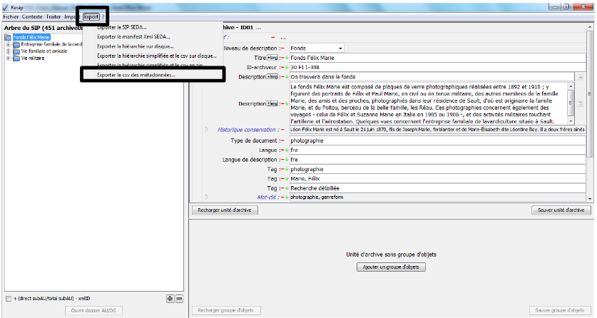

L’export se poursuit ensuite selon le processus [décrit dans la section](#paramétrage-des-exports).

Annexe. Préparer un fichier CSV
-------------------------------

La solution logicielle Vitam permet d’importer deux référentiels
correspondant à des fichiers CSV :

-   le référentiel des règles de gestion,
-   le référentiel des services agents.

Ces fichiers au format CSV (Comma Separated Values) correspondent à des
fichiers texte devant se conformer à des règles d’écriture particulière
afin qu’ils puissent être importés avec succès dans la solution
logicielle Vitam.

Le présent document a vocation à :

-   expliciter la manière d’écrire et de mettre à jour ces fichiers CSV,
-   émettre des recommandations sur les règles à respecter.

### Caractéristiques d’un fichier CSV

Un fichier CSV représente des données tabulaires sous forme de valeurs
séparées par :

-   un séparateur de champ : la virgule,
-   un séparateur de texte : guillemets simples ou doubles, espace vide.

Il existe d’autres séparateurs de champ (point virgule, deux points,
tabulation, espace, etc.), mais la solution logicielle Vitam ne les
supporte pas. Il est interdit de les utiliser.

Exemple de fichier CSV :
```csv  
  "Identifier","Name","Description"
  "FRAN_NP_009913","Présidence de la République sous Valéry Giscard d’Estaing","Successeur de la Présidence de George Pompidou [...]"
  "FRAN_NP_009941","Veil Simone (1927-2017)","Née à Nice en 1927, [...] milieu des années 1970."
  "FRAN_NP_050500","Galliffet (famille de)","La famille de Galliffet était originaire du Dauphiné. Les principaux représentants de la branche aînée sont : Alexandre […] y exercèrent le commerce du sucre."
```   
  
Équivalent sous forme de tableau :
| Identifier | Name | Description |
| --- | --- | --- |
| FRAN_NP_009913 | Présidence de la République sous Valéry Giscard d’Estaing | Successeur de la Présidence de George Pompidou [...] |
| FRAN_NP_009941 | Veil Simone (1927-2017) | Née à Nice en 1927, \[...\] milieu des années 1970. |
| FRAN_NP_050500 | Galliffet (famille de) | La famille de Galliffet était originaire du Dauphiné. Les principaux représentants de la branche aînée sont : Alexandre […] y exercèrent le commerce du sucre. |
 

Un référentiel au format CSV doit contenir :

-   une ligne contenant les titres des champs acceptés. Dans la solution
    logicielle Vitam, les titres sont imposés :

    -   « Identifier », « Name » et « Description » pour le référentiel
        des services agents,
    -   « RuleId », « RuleType », « RuleValue », « RuleDescription »,
        « RuleDuration » et « RuleMeasurement » pour le référentiel des
        règles de gestion ;

-   une à plusieurs lignes contenant les valeurs correspondant aux
    attendus du titre de colonne.

### Recommandations

La rédaction d’un fichier CSV obéit à un certain nombre de règles à
suivre :

-   afin de se conformer au format CSV et à l’encodage UTF-8 ;
-   afin de respecter le formalisme du référentiel tel qu’il est défini
    par la solution logicielle Vitam ;
-   afin, finalement, de pouvoir être parsé et importé sans erreur dans
    la solution logicielle Vitam.


| Intitulé | Description | Niveau de recommandation |
| --- | --- | --- |
| | <font color="navy"> **Généralités** </font> | |
| Import d’un référentiel contenant une ligne de titre | Un fichier CSV requiert une ligne de titres, devant correspondre aux titres attendus par la solution logicielle Vitam. <br>Sans cette ligne de titres, l’import du référentiel sera en échec. | Obligatoire |
|Import d’un référentiel contenant des lignes de valeurs | Chaque ligne contient le même nombre de valeurs (champs) qu’il y a de titres dans la première ligne. | Obligatoire |
| Import d’un référentiel au format CSV dont le séparateur de champ est la virgule | La solution logicielle Vitam accepte les fichiers CSV séparés par des virgules et encodés en UTF-8. | Obligatoire |
| Import d’un référentiel au format CSV avec séparateurs de texte | La solution logicielle Vitam accepte les séparateurs de texte suivants : guillemets simples ou doubles, espaces.i<br>Il est recommandé d’utiliser un séparateur de texte afin de marquer une séparation plus forte entre les valeurs contenues dans deux champs différents. | Recommandé |
| | Il est obligatoire d’utiliser un séparateur de texte quand la valeur textuelle contient une virgule, qui correspond à un séparateur de champ. <br>Sans séparateur de texte, le champ contenant une virgule sera interprété non pas comme un champ unique, mais sera interprété comme correspondant à deux champs distincts lors de l’import d’un référentiel. | Obligatoire |   
| | Il est recommandé d’utiliser uniformément le même séparateur de texte, en utilisant celui qu’on est le moins susceptible d’utiliser dans une chaîne de caractères du référentiel. | Recommandé |
| | Si une chaîne de caractères contient le même séparateur de texte que celui utilisé, avant le premier caractère et après le dernier, il est recommandé de doubler l’utilisation de ce séparateur. | Recommandé |
| Import d’un référentiel contenant des champs vides | Certains champs sont facultatifs et ne contiennent pas nécessairement de données. Ce champ devra obligatoirement être représenté vide, séparé par deux virgules. <br>Si les valeurs contenues dans les autres champs sont séparées par un séparateur de texte (guillemets simples ou doubles), le champ vide devra lui aussi figurer entre guillemets. | Obligatoire |
| Import d’un référentiel contenant des lignes blanches / vides | Il est interdit de laisser une ligne blanche ou vide dans un référentiel que l’on souhaite importer dans la solution logicielle Vitam. | Interdit |
| Import d’un référentiel contenant des espaces vides en début ou en fin de ligne | Il n’est pas recommandé d’importer un référentiel dont certaines lignes contiennent, en début ou fin, des espaces vides. Ces espaces vides peuvent en effet ne pas être interprété ou mal interprété par l’outil d’import de fichier CSV utilisé par la solution logicielle Vitam.<br>Avant l’import d’un référentiel, il est recommandé de retirer tout espace vide du fichier CSV que l’on souhaite importer dans la solution logicielle Vitam.| Non recommandé |
| Import d’un référentiel contenant des sauts de ligne dans certaines cellules | Il n’est pas recommandé d’importer un référentiel dont certaines lignes contiennent des sauts de ligne, hérités d’un formatage antérieur.<br> Ces sauts de ligne peuvent en effet être interprété par l’outil d’import de fichier CSV utilisé par la solution logicielle Vitam comme un véritable saut de ligne dans le fichier CSV et entraîner des erreurs et décalages dans la liste des règles de gestion<br> et/ou des services agents en en créant plus que nécessaires,<br> avec des données ne correspondant pas à leur titre de colonne.<br><br>Avant l’import d’un référentiel, il est recommandé d’ôter tout formatage présent dans le fichier. | Non recommandé |
| Import d’un référentiel contenant des sauts de ligne dans certaines cellules |Il n’est pas recommandé d’importer un référentiel dont certaines lignes contiennent des lignes fusionnées, héritées d’un formatage antérieur. Ces lignes fusionnées sont interprétées par l’outil d’import de fichier CSV utilisé par la solution logicielle Vitam comme une seule et même valeur, ce qui entraîne des décalages dans la liste des règles de gestion et/ou des services agents, avec un nombre de données ne correspondant pas au nombre de colonnes attendues.<br>Avant l’import d’un référentiel, il est recommandé d’ôter tout formatage présent dans le fichier.| Interdit |
| | <font color="navy"> **Import et ré-import du référentiel des services agents** </font> | |
| Ligne de titres | La ligne de titres doit obligatoirement contenir les intitulés suivants : « Identifier », « Name » et « Description » | Obligatoire |
| Lignes de valeurs | Les champs correspondant à « Identifier » et « Name » doivent être obligatoirement renseignés. | Obligatoire |
| | Le champ correspondant à « Description » est facultatif. Il peut ne contenir aucune valeur.<br>En revanche, il doit être matérialisé dans le fichier CSV par un espace vide séparé de deux virgules. | Facultatif |
| | Le champ correspondant à « Identifier » ne doit pas comprendre d’espace ou de caractère accentué. | Recommandé |
| | <font color="navy"> **Import et ré-import du référentiel des règles de gestion** </font> | |
| Ligne de titres | La ligne de titres doit obligatoirement contenir les intitulés suivants : « RuleId », « RuleType », « RuleValue », « RuleDescription », « RuleDuration » et « RuleMeasurement » | Obligatoire |
| Lignes de valeurs | Les champs correspondant à « RuleId », « RuleType », « RuleValue », « RuleDuration » et « RuleMeasurement » doivent être obligatoirement renseignés. | Obligatoire |
| | Le champ correspondant à « RuleDescription » est facultatif. Il peut ne contenir aucune valeur. <br>En revanche, il doit être matérialisé dans le fichier CSV par un espace vide séparé de deux virgules. | Facultatif |                                                                                                         
| | Le champ correspondant à « RuleId » ne doit pas comprendre d’espace ou de caractère accentué. | Recommandé | 
| | Le champ correspondant à « RuleType » doit contenir une des valeurs suivantes : AccessRule, AppraisalRule, ClassificationRule, DisseminationRule, ReuseRule, StorageRule.<br>Il est recommandé de ne pas laisser d’espaces vides avant et après la valeur sélectionnée.| Obligatoire |  | | Le champ correspondant à « RuleDuration » doit avoir pour valeur un entier positif compris entre 0 et 999 | Obligatoire |

### Gestion d’un fichier au format CSV

#### Conversion d’un fichier au format CSV

Les référentiels des règles de gestion et des services agents doivent
être au format CSV et encodés en UTF 8.

Si le fichier d’origine n’est pas au format CSV, il faut suivre la
procédure suivante :

-   dans un tableur appartenant à une suite bureautique libre (par
    exemple, LibreOffice ou OpenOffice) :

    -   ouvrir le fichier XLS ou ODT ;
    -   sélectionner **« Enregistrer sous »**, puis le format CSV et le
        séparateur de champs correspondant à une virgule (« , ») ;
    -   le cas échéant, choisir un séparateur de texte ;
    -   si cela est proposé, sélection l’encodage en UTF-8 ;
    -   enregistrer le fichier ;

-   si l’encodage n’a pas été enregistré à l’étape précédente, dans un
    logiciel de traitement de textes (par exemple, Bloc-notes, WordPad
    ou Notepad++) :

    -   ouvrir le fichier ;
    -   modifier l’encodage :

        -   dans un autre outil, en sélectionnant « Enregistrer sous »,
            puis l’encodage en UTF-8, avant d’enregistrer les
            modifications ;
        -   dans Notepad++, en sélectionnant « Encodage », puis
            « Encoder en UTF-8 » et en enregistrant les modifications.

#### Modification d’un fichier au format CSV

Les référentiels des règles de gestion et des services agents doivent
être au format CSV et encodés en UTF 8.

Pour modifier un fichier de ce format, il faut suivre la procédure
suivante :

-   dans un tableur appartenant à une suite bureautique libre (par
    exemple, LibreOffice ou OpenOffice) :

    -   ouvrir le fichier CSV ;
    -   modifier le fichier, en veillant à respecter les règles définies
        ci-dessus, notamment :

        -   ne pas supprimer une valeur obligatoire,
        -   ne pas laisser des espaces vides avant ou après une chaîne
            de caractères,
        -   ne pas faire de sauts de ligne ;

    -   sélectionner **« Enregistrer sous »**, puis le format CSV et le
        séparateur de champs correspondant à une virgule (« , ») ;
    -   le cas échéant, choisir un séparateur de texte ;
    -   si cela est proposé, sélection l’encodage en UTF-8 ;
    -   enregistrer le fichier.

***Point d’attention :*** Si le fichier est « enregistré », au lieu
d’être « enregistré sous », ce nouvel enregistrement n’est plus au
format CSV et l’encodage peut avoir également été modifié.

-   Il est recommandé, avant toute modification, de faire une sauvegarde
    du fichier CSV ;
-   Il ne faut pas enregistrer le fichier CSV dans le tableur dans
    lequel il est ouvert à des fins de visualisation.

Exemples de fichier CSV et messages retournés par la solution logicielle
Vitam

**Import initial d’un référentiel des services agents** 

(**Attention**, le tableau ci-dessous dispose d'une colonne "Commentaire" à droite)

| | Résultat | Message retourné par<br>la solution logicielle Vitam | Commentaires |
|---|---|---|---|
| Tous les services agents comprennent un identifiant, un intitulé et une description<br>"Identifier","Name","Description"<br>"FRAN_NP_009913","Présidence sous Valéry Giscard d’Estaing","Successeur de Pompidou [...]"<br>"FRAN_NP_009941","Veil Simone (1927-2017)","Née à Nice en 1927,  [...]"| OK | *« Succès du processus d'import du référentiel des services agents. »* ||
| Au moins un identifiant de service agent n’est pas renseigné<br>"Identifier","Name","Description"<br>"FRAN_NP_009913","Présidence sous Valéry Giscard d’Estaing","Successeur de Pompidou [...]"<br>**""**,"Veil Simone (1927-2017)","Née à Nice en 1927,  [...]"| KO |*« Échec du processus d'import du référentiel des services agents ».*<br><br>Détail : { "agencyCheck" : "Import agency error > Invalid CSV File" }<br>Rapport : « Au moins une valeur obligatoire est manquante. Valeurs obligatoires : Identifier, Name, Description ».<br>Informations additionnelles : Identifier.<br>(STP_IMPORT_AGENCIES_MISSING_INFORMATIONS.KO) | |
| Au moins un intitulé de service agent n’est pas renseigné<br>"Identifier","Name","Description"<br>"FRAN_NP_009913",**""**,"Successeur de Pompidou [...]"<br>"FRAN_NP_009941","Veil Simone (1927-2017)","Née à Nice en 1927,  [...]"| KO |*« Échec du processus d'import du référentiel des services agents ».*<br>Détail : { "agencyCheck" : "Import agency error > Invalid CSV File" }<br>Rapport : « Au moins une valeur obligatoire est manquante. Valeurs obligatoires : Identifier, Name, Description ».<br>Informations additionnelles : Name.<br>(STP_IMPORT_AGENCIES_MISSING_INFORMATIONS.KO)| |
| Au moins une description de service agent n’est pas renseignée<br>"Identifier","Name","Description"<br>"FRAN_NP_009913","Présidence sous Valéry Giscard d’Estaing"*,""*<br>"FRAN_NP_009941","Veil Simone (1927-2017)","Née à Nice en 1927,  [...]"| OK |*« Succès du processus d'import du référentiel des services agents. »*<br>Détail : nom du fichier CSV|Associer une description à un service agent est facultatif à l’import du référentiel.<br>Point d’attention : même si aucune description n’est précisée pour un service agent, les séparateurs de champs et de texte doivent être obligatoirement être présent.|
| La ligne de titre déclare « Identifier » suivi d’un espace blanc / vide <br>**"Identifier "**,"Name","Description"<br>"FRAN_NP_009913","Présidence sous Valéry Giscard d’Estaing","Successeur de Pompidou [...]"<br>"FRAN_NP_009941","Veil Simone (1927-2017)","Née à Nice en 1927,  [...]"| OK |*« Succès du processus d'import du référentiel des services agents. »*<br>Détail : nom du fichier CSV|Même si l’import est en succès, il n’est pas recommandé de laisser des espaces blancs / vides avant ou après une chaîne de caractères dans un fichier CSV.|
| La ligne de titre déclare « Identifier » précédé d’un espace blanc / vide <br>**" Identifier"**,"Name","Description"<br>"FRAN_NP_009913","Présidence sous Valéry Giscard d’Estaing","Successeur de Pompidou [...]"<br>"FRAN_NP_009941","Veil Simone (1927-2017)","Née à Nice en 1927,  [...]"| OK |*« Succès du processus d'import du référentiel des services agents. »*<br>Détail : nom du fichier CSV |Même si l’import est en succès, il n’est pas recommandé de laisser des espaces blancs / vides avant ou après une chaîne de caractères dans un fichier CSV.<br>Laisser un espace vide avant « Identifier » peut entraîner une erreur lors de l’export du référentiel préalablement importé dans la solution logicielle Vitam.<br>|
| La ligne de titre déclare « Name » suivi d’un espace blanc / vide<br>"Identifier",**"Name "**,"Description"<br>"FRAN_NP_009913","Présidence sous Valéry Giscard d’Estaing","Successeur de Pompidou [...]"<br>"FRAN_NP_009941","Veil Simone (1927-2017)","Née à Nice en 1927,  [...]"| OK |*« Succès du processus d'import du référentiel des services agents. »*<br>Détail : nom du fichier CSV|Même si l’import est en succès, il n’est pas recommandé de laisser des espaces blancs / vides avant ou après une chaîne de caractères dans un fichier CSV.|
| La ligne de titre déclare « Name » précédé d’un espace blanc / vide<br>"Identifier",**" Name"**,"Description"<br>"FRAN_NP_009913","Présidence sous Valéry Giscard d’Estaing","Successeur de Pompidou [...]"<br>"FRAN_NP_009941","Veil Simone (1927-2017)","Née à Nice en 1927,  [...]"| OK |*« Succès du processus d'import du référentiel des services agents. »*<br>Détail : nom du fichier CSV|Même si l’import est en succès, il n’est pas recommandé de laisser des espaces blancs / vides avant ou après une chaîne de caractères dans un fichier CSV.|
| La ligne de titre déclare « Description » suivie d’un espace blanc / vide<br>"Identifier"," Name",**"Description      "**<br>"FRAN_NP_009913","Présidence sous Valéry Giscard d’Estaing","Successeur de Pompidou [...]"<br>"FRAN_NP_009941","Veil Simone (1927-2017)","Née à Nice en 1927,  [...]"| OK |*« Succès du processus d'import du référentiel des services agents. »*<br>Détail : nom du fichier CSV|Même si l’import est en succès, il n’est pas recommandé de laisser des espaces blancs / vides avant ou après une chaîne de caractères dans un fichier CSV.|
| La ligne de titre déclare « Description » précédée d’un espace blanc / vide<br>"Identifier"," Name",**"  Description"**<br>"FRAN_NP_009913","Présidence sous Valéry Giscard d’Estaing","Successeur de Pompidou [...]"<br>"FRAN_NP_009941","Veil Simone (1927-2017)","Née à Nice en 1927,  [...]"| OK | *« Succès du processus d'import du référentiel des services agents. »*<br>Détail : nom du fichier CSV|Même si l’import est en succès, il n’est pas recommandé de laisser des espaces blancs / vides avant ou après une chaîne de caractères dans un fichier CSV.|

Annexe. Contrôle de conformité à un profil d’archivage
------------------------------------------------------

ReSIP permet de contrôler le manifeste chargé sur l’interface par
rapport à un profil d’archivage au format XSD ou RNG.

### Recommandations

#### Dans la rédaction du profil d’archivage

Il est recommandé de créer un profil d’archivage à l’aide du Service
hébergé pour la rédaction de profils d’archivage (SHERPA)[^9], mis à
disposition par le Service interministériel des Archives de France, ou
depuis un éditeur XML, puis de procéder à des modifications manuelles
sur le profil d’archivage extrait de SHERPA, à l’aide d’un éditeur
XML[^10].

Pour utiliser le profil d’archivage dans ReSIP, il faut prendre en
compte deux spécificités :

##### La déclaration des groupes d’objets techniques

Le SEDA permet de déclarer les **objets techniques** de deux manières :

-   soit une liste d’objets techniques qui déclarent chacun leur
    appartenance à un groupe d’objets techniques (au moyen de l’élément
    DataObjectGroupId)
-   soit une liste de groupes d’objets techniques qui englobent un à
    plusieurs objets techniques.

La moulinette ReSIP ne supporte que cette dernière méthode. Il est
nécessaire que le profil d’archivage déclare des objets techniques
inclus dans des groupes d’objets techniques, sans quoi ReSIP constatera
une non conformité entre le manifeste chargé et le profil d’archivage.

Mention d’un groupe d’objets techniques dans le profil d’archivage : 

```xml
<rng:group>
          <!-- DataObjectGroup -->
          <rng:element name="DataObjectGroup">
            <rng:attribute name="id" seda:profid="id2940711">
              <rng:data type="ID"/>
            </rng:attribute>
          <!-- BinaryDataObject inclus dans le groupe d’objets techniques-->
          <rng:element name="BinaryDataObject">
            <xsd:annotation>
              <xsd:documentation>cad_2005_010_BATI</xsd:documentation>
            </xsd:annotation>
            <rng:attribute name="id" seda:profid="id294071">
              <rng:data type="ID"/>
            </rng:attribute>
            <rng:optional>
              <rng:element name="DataObjectVersion">
                <rng:data type="token"/>
              </rng:element>
            </rng:optional>
            <rng:choice>
              <rng:element name="Uri">
                <rng:data type="anyURI"/>
              </rng:element>
            </rng:choice>
            <rng:element name="MessageDigest">
              <rng:choice>
                <rng:data type="base64Binary"/>
                <rng:data type="hexBinary"/>
              </rng:choice>
              <rng:attribute name="algorithm">
                <rng:data type="token"/>
              </rng:attribute>
            </rng:element>
            <rng:element name="Size">
              <rng:data type="positiveInteger"/>
            </rng:element>
            <rng:element name="FormatIdentification">
              <rng:optional>
                <rng:element name="FormatLitteral">
                  <rng:data type="string"/>
                </rng:element>
              </rng:optional>
              <rng:optional>
                <rng:element name="MimeType">
                  <rng:data type="token"/>
                </rng:element>
              </rng:optional>
              <rng:optional>
                <rng:element name="FormatId">
                  <rng:data type="token"/>
                </rng:element>
              </rng:optional>
              <rng:optional>
                <rng:element name="Encoding">
                  <rng:data type="token"/>
                </rng:element>
              </rng:optional>
            </rng:element>
            <rng:element name="FileInfo">
              <rng:element name="Filename">
                <rng:value type="string">cad_2005_010.pdf</rng:value>
              </rng:element>
              <rng:element name="CreatingApplicationName">
                <rng:value type="string">Majic 3</rng:value>
              </rng:element>
            </rng:element>
          </rng:element>
          </rng:element>
```

##### La hiérarchisation des unités archivistiques

Le SEDA permet également de reproduire la **hiérarchie entre les unités
archivistiques** de deux manières :

-   soit cette hiérarchie est matérialisée par une arborescence d’unités
    archivistiques, les unes s’emboîtant directement aux unités
    archivistiques de niveau supérieur,
-   soit cette arborescence est exprimée par des liens entre unités
    archivistiques, déclarés au moyen de l’élément ArchiveUnitRefId.

Le contrôle de conformité par rapport à un profil d’archivage ne
fonctionnera dans ReSIP qu’à la condition que le profil d’archivage ne
déclare les liens entre unités archivistiques sous forme arborescente,
c’est-à-dire emboîtées les unes à la suite des autres.

#### Dans ReSIP

Dans ReSIP, il faut veiller à paramétrer le mode d’enregistrement des
unités archivistiques avant leur import dans l’outil.

Pour ce faire, depuis l’interface d’édition des paramètres, ouverte par
un clic sur la sous-action « Préférences », depuis l’onglet « Export »
(cf. copie d’écran ci-dessous) :

-   les unités archivistiques doivent être exportées de manière
    **imbriquée** (les unités archivistiques sont exportées de manière
    « arborescente » et sont imbriquées les unes dans les autres, en
    utilisant le champ ArchiveUnit du SEDA 2.1.), et non pas « à plat »
    (toutes les unités archivistiques sont exportées au même niveau et
    la structure arborescente est restituée par l’utilisation du champ
    ArchiveUnitRefId du SEDA 2.1.) ;
-   dans le SIP, les unités archivistiques doivent se présenter sous
    forme **linéaire** et non pas indentée.
    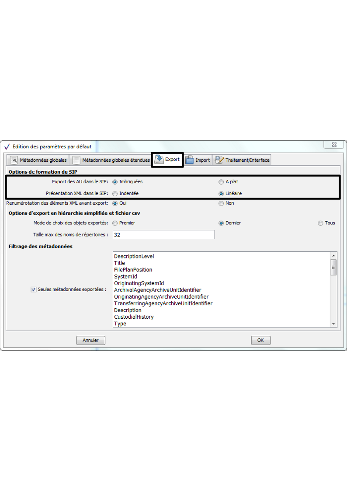

### Messages d’erreur rencontrés

Lors d’un contrôle de conformité à un profil d’archivage, les erreurs
retournées par ReSIP peuvent provenir :

-   du manifeste chargé dans ReSIP : au moins un élément n’est pas
    conforme au profil d’archivage ;
-   du profil d’archivage : celui-ci n’est pas conforme à la manière
    attendue par ReSIP et/ou à la manière de cet outil d’enregistrer les
    métadonnées importées.

C’est pourquoi, en cas d’erreur de conformité, il est recommandé de
vérifier le contenu du manifeste et celui du profil d’archivage.

**Nota bene** : Cette liste n’est pas forcément exhaustive.


#### Erreur 1

**Message retourné par ReSIP:**
```
position de l'erreur identifiée: ligne 1, colonne 334
ligne: <?xml version='1.0' encoding='UTF-8'?><ArchiveTransfer xmlns:xlink="http://www.w3.org/1999/xlink" xmlns:pr="info:lc/xmlns/premis-v2" xmlns="fr:gouv:culture:archivesdefrance:seda:v2.1" xmlns:xsi="http://www.w3.org/2001/XMLSchema-instance" xsi:schemaLocation="fr:gouv:culture:archivesdefrance:seda:v2.1 seda-2.1-main.xsd" xml:id="ID1">
erreur brute: attribute "xsi:schemaLocation" not allowed here; expected attribute "id"
```

**Explication:**
L’erreur semble pointer l’attribut xml:id présent dans l’élément ArchiveTransfer du manifeste.xml.
En réalité, dans le profil d’archivage, à l’emplacement de l’élément rng:grammar, on a déclaré un namespace. Ce namespace doit être déclaré comme attribut de l’élément ArchiveTransfer.
En réalité, l’élément ArchiveTransfer présent dans le manifeste déclare un attribut correspondant à un namespace qui n’est pas déclaré dans le profil d’archivage. C’est pourquoi, le message précise qu’un attribut id est attendu dans le manifeste et non pas xsi:schemaLocation.

**Résolution:**
Dans le profil d’archivage, rajouter un attribut correspondant au namespace :
```xml
<rng:zeroOrMore>
        <rng:attribute>
          <rng:anyName>
            <rng:except>
              <rng:nsName/>
              <rng:nsName ns=""/>
            </rng:except>
          </rng:anyName>
        </rng:attribute>
      </rng:zeroOrMore>
```

#### Erreur 2

**Message retourné par ReSIP:**
```
position de l'erreur identifiée: ligne 24, colonne 32
ligne:     <DataObjectGroup id="ID15">
erreur brute: element "DataObjectGroup" not allowed anywhere; expected element "BinaryDataObject"
```

**Explication:**
Le profil d’archivage attend un élément BinaryDataObject en lieu et place d’un élément DataObjectGroup à l’emplacement de l’élément <DataObjectGroup id="ID15"> dans le manifeste.

**Résolution:**
Avec ce cas d’erreur-là, on peut se demander si le profil d’archivage n’est pas erroné.
Pour rappel, ReSIP génère des objets binaires encapsulés dans un groupe d’objets techniques. Le message retourné par ReSIP suggère que le profil d’archivage attend un objet binaire en lieu et place du groupe d’objets.
Il est recommandé d’ouvrir le manifeste pour vérifier comment sont déclarés les groupes d’objets techniques, puis de faire de même dans le profil d’archivage et de corriger l’erreur.

#### Erreur 3

**Message retourné par ReSIP:**
```
position de l'erreur identifiée: ligne 7, colonne 27
ligne:     <ReplyCodeListVersion>ReplyCodeListVersion0</ReplyCodeListVersion>
erreur brute: element "ReplyCodeListVersion" not allowed anywhere; expected the element end-tag
```

**Explication:**

Le profil d’archivage attend un élément BinaryDataObject en lieu et place d’un élément DataObjectGroup à l’emplacement de l’élément <DataObjectGroup id="ID15"> dans le manifeste.

**Résolution:**

vec ce cas d’erreur-là, on peut se demander si le profil d’archivage n’est pas erroné.
Pour rappel, ReSIP génère des objets binaires encapsulés dans un groupe d’objets techniques. Le message retourné par ReSIP suggère que le profil d’archivage attend un objet binaire en lieu et place du groupe d’objets.
Il est recommandé d’ouvrir le manifeste pour vérifier comment sont déclarés les groupes d’objets techniques, puis de faire de même dans le profil d’archivage et de corriger l’erreur.


#### Erreur 4

**Message retourné par ReSIP:**

```
position de l'erreur identifiée: ligne 7, colonne 27
ligne:     <ReplyCodeListVersion>ReplyCodeListVersion0</ReplyCodeListVersion>
erreur brute: element "ReplyCodeListVersion" not allowed anywhere; expected the element end-tag
```

**Explication:**
L’élément ReplyCodeListVersion n’est pas autorisé par le profil d’archivage, alors qu’il est présent dans le manifeste généré par ReSIP.

**Résolution:**
Il faut vérifier si ReplyCodeListVersion n’est pas un champ obligatoire du SEDA (option « Vérifier la conformité SEDA 2.1 »).
S’il n’est pas obligatoire, ce qui est le cas pour cet élément-là, retirer le champ de la liste des champs contextuels générés par ReSIP, en cliquant sur Contexte > Editer les informations d’export > Métadonnées globales étendues.

#### Erreur 5

**Message retourné par ReSIP:**
```
position de l'erreur identifiée: ligne 6, colonne 22
ligne:   <DataObjectPackage>
erreur brute: element "DataObjectPackage" not allowed yet; missing required element "CodeListVersions"
```

**Explication:**
L’élément CodeListVersions, obligatoire dans le SEDA, est absent.

**Résolution:**
- Il faut rajouter l’élément CodeListVersions, obligatoire dans le SEDA, en cliquant sur Contexte > Editer les informations d’export > Métadonnées globales étendues.
- Si l’erreur persiste, il faut également vérifier que le profil d’archivage intègre bien un élément CodeListVersions.

#### Erreur 6

**Message retourné par ReSIP:**
```
position de l'erreur identifiée: ligne 2, colonne 78
ligne:   <Comment>Matrice</Comment>
erreur brute: character content of element "Comment" invalid; must be equal to "Matrice cadastrale numérique."
```

**Explication:**
La valeur de l’élément Comment présent dans le manifeste ne correspond pas à la valeur définie dans le profil d’archivage.

**Résolution:**
Dans le manifeste, il faut corriger la valeur de l’élément Comment par la valeur attendue dans le profil d’archivage pour cette balise-là.


### Exemple de profil d’archivage

**Nota bene**: le cas présenté ci-dessous est un exemple fictif, ne comportant pas de référence à un groupe d’objets techniques.

```xml
<?xml version='1.0' encoding='utf-8' standalone='no'?>
<rng:grammar xmlns:a="http://relaxng.org/ns/compatibility/annotations/1.0" xmlns:rng="http://relaxng.org/ns/structure/1.0" xmlns:seda="fr:gouv:culture:archivesdefrance:seda:v2.1" xmlns:xlink="http://www.w3.org/1999/xlink" xmlns:xsd="http://www.w3.org/2001/XMLSchema" xmlns="fr:gouv:culture:archivesdefrance:seda:v2.1" datatypeLibrary="http://www.w3.org/2001/XMLSchema-datatypes" ns="fr:gouv:culture:archivesdefrance:seda:v2.1">
  <rng:start>
    <rng:element name="ArchiveTransfer">
      <xsd:annotation>
        <xsd:documentation>Matrice cadastrale numérique.</xsd:documentation>
      </xsd:annotation>
      <rng:zeroOrMore>
        <rng:attribute>
          <rng:anyName>
            <rng:except>
              <rng:nsName/>
              <rng:nsName ns=""/>
            </rng:except>
          </rng:anyName>
        </rng:attribute>
      </rng:zeroOrMore>
      <rng:optional>
        <rng:attribute name="id">
          <rng:data type="ID"/>
        </rng:attribute>
      </rng:optional>
      <rng:element name="Comment">
        <rng:value type="string">Matrice cadastrale numérique.</rng:value>
      </rng:element>
      <rng:element name="Date">
        <rng:data type="dateTime"/>
      </rng:element>
      <rng:element name="MessageIdentifier">
        <rng:optional>
          <rng:attribute name="schemeDataURI">
            <rng:data type="anyURI"/>
          </rng:attribute>
        </rng:optional>
        <rng:optional>
          <rng:attribute name="schemeID">
            <rng:data type="token"/>
          </rng:attribute>
        </rng:optional>
        <rng:optional>
          <rng:attribute name="schemeAgencyName">
            <rng:data type="string"/>
          </rng:attribute>
        </rng:optional>
        <rng:optional>
          <rng:attribute name="schemeAgencyID">
            <rng:data type="token"/>
          </rng:attribute>
        </rng:optional>
        <rng:optional>
          <rng:attribute name="schemeName">
            <rng:data type="string"/>
          </rng:attribute>
        </rng:optional>
        <rng:optional>
          <rng:attribute name="schemeVersionID">
            <rng:data type="token"/>
          </rng:attribute>
        </rng:optional>
        <rng:optional>
          <rng:attribute name="schemeURI">
            <rng:data type="anyURI"/>
          </rng:attribute>
        </rng:optional>
        <rng:data type="token"/>
      </rng:element>
      <rng:element name="ArchivalAgreement">
        <rng:optional>
          <rng:attribute name="schemeDataURI">
            <rng:data type="anyURI"/>
          </rng:attribute>
        </rng:optional>
        <rng:optional>
          <rng:attribute name="schemeID">
            <rng:data type="token"/>
          </rng:attribute>
        </rng:optional>
        <rng:optional>
          <rng:attribute name="schemeAgencyName">
            <rng:data type="string"/>
          </rng:attribute>
        </rng:optional>
        <rng:optional>
          <rng:attribute name="schemeAgencyID">
            <rng:data type="token"/>
          </rng:attribute>
        </rng:optional>
        <rng:optional>
          <rng:attribute name="schemeName">
            <rng:data type="string"/>
          </rng:attribute>
        </rng:optional>
        <rng:optional>
          <rng:attribute name="schemeVersionID">
            <rng:data type="token"/>
          </rng:attribute>
        </rng:optional>
        <rng:optional>
          <rng:attribute name="schemeURI">
            <rng:data type="anyURI"/>
          </rng:attribute>
        </rng:optional>
        <rng:data type="token"></rng:data>
      </rng:element>
      
      <!-- ArchiveTransfer / CodeListVersions -->
      <rng:element name="CodeListVersions">
        <rng:optional>
          <rng:attribute name="id">
            <rng:data type="ID"/>
          </rng:attribute>
        </rng:optional>
        <rng:optional>
          <rng:element name="ReplyCodeListVersion">
            <rng:optional>
              <rng:attribute name="listName">
                <rng:data type="string"/>
              </rng:attribute>
            </rng:optional>
            <rng:optional>
              <rng:attribute name="listAgencyID">
                <rng:data type="token"/>
              </rng:attribute>
            </rng:optional>
            <rng:optional>
              <rng:attribute name="listSchemeURI">
                <rng:data type="anyURI"/>
              </rng:attribute>
            </rng:optional>
            <rng:optional>
              <rng:attribute name="listID">
                <rng:data type="token"/>
              </rng:attribute>
            </rng:optional>
            <rng:optional>
              <rng:attribute name="listAgencyName">
                <rng:data type="string"/>
              </rng:attribute>
            </rng:optional>
            <rng:optional>
              <rng:attribute name="listURI">
                <rng:data type="anyURI"/>
              </rng:attribute>
            </rng:optional>
            <rng:optional>
              <rng:attribute name="listVersionID">
                <rng:data type="token"/>
              </rng:attribute>
            </rng:optional>
            <rng:value type="token">ReplyCodeListVersion0</rng:value>
          </rng:element>
        </rng:optional>
        <rng:optional>
          <rng:element name="MessageDigestAlgorithmCodeListVersion">
            <rng:optional>
              <rng:attribute name="listName">
                <rng:data type="string"/>
              </rng:attribute>
            </rng:optional>
            <rng:optional>
              <rng:attribute name="listAgencyID">
                <rng:data type="token"/>
              </rng:attribute>
            </rng:optional>
            <rng:optional>
              <rng:attribute name="listSchemeURI">
                <rng:data type="anyURI"/>
              </rng:attribute>
            </rng:optional>
            <rng:optional>
              <rng:attribute name="listID">
                <rng:data type="token"/>
              </rng:attribute>
            </rng:optional>
            <rng:optional>
              <rng:attribute name="listAgencyName">
                <rng:data type="string"/>
              </rng:attribute>
            </rng:optional>
            <rng:optional>
              <rng:attribute name="listURI">
                <rng:data type="anyURI"/>
              </rng:attribute>
            </rng:optional>
            <rng:optional>
              <rng:attribute name="listVersionID">
                <rng:data type="token"/>
              </rng:attribute>
            </rng:optional>
            <rng:value type="token">MessageDigestAlgorithmCodeListVersion0</rng:value>
          </rng:element>
        </rng:optional>
        <rng:optional>
          <rng:element name="MimeTypeCodeListVersion">
            <rng:optional>
              <rng:attribute name="listName">
                <rng:data type="string"/>
              </rng:attribute>
            </rng:optional>
            <rng:optional>
              <rng:attribute name="listAgencyID">
                <rng:data type="token"/>
              </rng:attribute>
            </rng:optional>
            <rng:optional>
              <rng:attribute name="listSchemeURI">
                <rng:data type="anyURI"/>
              </rng:attribute>
            </rng:optional>
            <rng:optional>
              <rng:attribute name="listID">
                <rng:data type="token"/>
              </rng:attribute>
            </rng:optional>
            <rng:optional>
              <rng:attribute name="listAgencyName">
                <rng:data type="string"/>
              </rng:attribute>
            </rng:optional>
            <rng:optional>
              <rng:attribute name="listURI">
                <rng:data type="anyURI"/>
              </rng:attribute>
            </rng:optional>
            <rng:optional>
              <rng:attribute name="listVersionID">
                <rng:data type="token"/>
              </rng:attribute>
            </rng:optional>
            <rng:value type="token">MimeTypeCodeListVersion0</rng:value>
          </rng:element>
        </rng:optional>
        <rng:optional>
          <rng:element name="EncodingCodeListVersion">
            <rng:optional>
              <rng:attribute name="listName">
                <rng:data type="string"/>
              </rng:attribute>
            </rng:optional>
            <rng:optional>
              <rng:attribute name="listAgencyID">
                <rng:data type="token"/>
              </rng:attribute>
            </rng:optional>
            <rng:optional>
              <rng:attribute name="listSchemeURI">
                <rng:data type="anyURI"/>
              </rng:attribute>
            </rng:optional>
            <rng:optional>
              <rng:attribute name="listID">
                <rng:data type="token"/>
              </rng:attribute>
            </rng:optional>
            <rng:optional>
              <rng:attribute name="listAgencyName">
                <rng:data type="string"/>
              </rng:attribute>
            </rng:optional>
            <rng:optional>
              <rng:attribute name="listURI">
                <rng:data type="anyURI"/>
              </rng:attribute>
            </rng:optional>
            <rng:optional>
              <rng:attribute name="listVersionID">
                <rng:data type="token"/>
              </rng:attribute>
            </rng:optional>
            <rng:value type="token">EncodingCodeListVersion0</rng:value>
          </rng:element>
        </rng:optional>
        <rng:optional>
          <rng:element name="FileFormatCodeListVersion">
            <rng:optional>
              <rng:attribute name="listName">
                <rng:data type="string"/>
              </rng:attribute>
            </rng:optional>
            <rng:optional>
              <rng:attribute name="listAgencyID">
                <rng:data type="token"/>
              </rng:attribute>
            </rng:optional>
            <rng:optional>
              <rng:attribute name="listSchemeURI">
                <rng:data type="anyURI"/>
              </rng:attribute>
            </rng:optional>
            <rng:optional>
              <rng:attribute name="listID">
                <rng:data type="token"/>
              </rng:attribute>
            </rng:optional>
            <rng:optional>
              <rng:attribute name="listAgencyName">
                <rng:data type="string"/>
              </rng:attribute>
            </rng:optional>
            <rng:optional>
              <rng:attribute name="listURI">
                <rng:data type="anyURI"/>
              </rng:attribute>
            </rng:optional>
            <rng:optional>
              <rng:attribute name="listVersionID">
                <rng:data type="token"/>
              </rng:attribute>
            </rng:optional>
            <rng:value type="token">FileFormatCodeListVersion0</rng:value>
          </rng:element>
        </rng:optional>
        <rng:optional>
          <rng:element name="CompressionAlgorithmCodeListVersion">
            <rng:optional>
              <rng:attribute name="listName">
                <rng:data type="string"/>
              </rng:attribute>
            </rng:optional>
            <rng:optional>
              <rng:attribute name="listAgencyID">
                <rng:data type="token"/>
              </rng:attribute>
            </rng:optional>
            <rng:optional>
              <rng:attribute name="listSchemeURI">
                <rng:data type="anyURI"/>
              </rng:attribute>
            </rng:optional>
            <rng:optional>
              <rng:attribute name="listID">
                <rng:data type="token"/>
              </rng:attribute>
            </rng:optional>
            <rng:optional>
              <rng:attribute name="listAgencyName">
                <rng:data type="string"/>
              </rng:attribute>
            </rng:optional>
            <rng:optional>
              <rng:attribute name="listURI">
                <rng:data type="anyURI"/>
              </rng:attribute>
            </rng:optional>
            <rng:optional>
              <rng:attribute name="listVersionID">
                <rng:data type="token"/>
              </rng:attribute>
            </rng:optional>
            <rng:value type="token">CompressionAlgorithmCodeListVersion0</rng:value>
          </rng:element>
        </rng:optional>
        <rng:optional>
          <rng:element name="DataObjectVersionCodeListVersion">
            <rng:optional>
              <rng:attribute name="listName">
                <rng:data type="string"/>
              </rng:attribute>
            </rng:optional>
            <rng:optional>
              <rng:attribute name="listAgencyID">
                <rng:data type="token"/>
              </rng:attribute>
            </rng:optional>
            <rng:optional>
              <rng:attribute name="listSchemeURI">
                <rng:data type="anyURI"/>
              </rng:attribute>
            </rng:optional>
            <rng:optional>
              <rng:attribute name="listID">
                <rng:data type="token"/>
              </rng:attribute>
            </rng:optional>
            <rng:optional>
              <rng:attribute name="listAgencyName">
                <rng:data type="string"/>
              </rng:attribute>
            </rng:optional>
            <rng:optional>
              <rng:attribute name="listURI">
                <rng:data type="anyURI"/>
              </rng:attribute>
            </rng:optional>
            <rng:optional>
              <rng:attribute name="listVersionID">
                <rng:data type="token"/>
              </rng:attribute>
            </rng:optional>
            <rng:value type="token">DataObjectVersionCodeListVersion0</rng:value>
          </rng:element>
        </rng:optional>
        <rng:optional>
          <rng:element name="StorageRuleCodeListVersion">
            <rng:optional>
              <rng:attribute name="listName">
                <rng:data type="string"/>
              </rng:attribute>
            </rng:optional>
            <rng:optional>
              <rng:attribute name="listAgencyID">
                <rng:data type="token"/>
              </rng:attribute>
            </rng:optional>
            <rng:optional>
              <rng:attribute name="listSchemeURI">
                <rng:data type="anyURI"/>
              </rng:attribute>
            </rng:optional>
            <rng:optional>
              <rng:attribute name="listID">
                <rng:data type="token"/>
              </rng:attribute>
            </rng:optional>
            <rng:optional>
              <rng:attribute name="listAgencyName">
                <rng:data type="string"/>
              </rng:attribute>
            </rng:optional>
            <rng:optional>
              <rng:attribute name="listURI">
                <rng:data type="anyURI"/>
              </rng:attribute>
            </rng:optional>
            <rng:optional>
              <rng:attribute name="listVersionID">
                <rng:data type="token"/>
              </rng:attribute>
            </rng:optional>
            <rng:value type="token">StorageRuleCodeListVersion0</rng:value>
          </rng:element>
        </rng:optional>
        <rng:optional>
          <rng:element name="AppraisalRuleCodeListVersion">
            <rng:optional>
              <rng:attribute name="listName">
                <rng:data type="string"/>
              </rng:attribute>
            </rng:optional>
            <rng:optional>
              <rng:attribute name="listAgencyID">
                <rng:data type="token"/>
              </rng:attribute>
            </rng:optional>
            <rng:optional>
              <rng:attribute name="listSchemeURI">
                <rng:data type="anyURI"/>
              </rng:attribute>
            </rng:optional>
            <rng:optional>
              <rng:attribute name="listID">
                <rng:data type="token"/>
              </rng:attribute>
            </rng:optional>
            <rng:optional>
              <rng:attribute name="listAgencyName">
                <rng:data type="string"/>
              </rng:attribute>
            </rng:optional>
            <rng:optional>
              <rng:attribute name="listURI">
                <rng:data type="anyURI"/>
              </rng:attribute>
            </rng:optional>
            <rng:optional>
              <rng:attribute name="listVersionID">
                <rng:data type="token"/>
              </rng:attribute>
            </rng:optional>
            <rng:value type="token">AppraisalRuleCodeListVersion0</rng:value>
          </rng:element>
        </rng:optional>
        <rng:optional>
          <rng:element name="AccessRuleCodeListVersion">
            <rng:optional>
              <rng:attribute name="listName">
                <rng:data type="string"/>
              </rng:attribute>
            </rng:optional>
            <rng:optional>
              <rng:attribute name="listAgencyID">
                <rng:data type="token"/>
              </rng:attribute>
            </rng:optional>
            <rng:optional>
              <rng:attribute name="listSchemeURI">
                <rng:data type="anyURI"/>
              </rng:attribute>
            </rng:optional>
            <rng:optional>
              <rng:attribute name="listID">
                <rng:data type="token"/>
              </rng:attribute>
            </rng:optional>
            <rng:optional>
              <rng:attribute name="listAgencyName">
                <rng:data type="string"/>
              </rng:attribute>
            </rng:optional>
            <rng:optional>
              <rng:attribute name="listURI">
                <rng:data type="anyURI"/>
              </rng:attribute>
            </rng:optional>
            <rng:optional>
              <rng:attribute name="listVersionID">
                <rng:data type="token"/>
              </rng:attribute>
            </rng:optional>
            <rng:value type="token">AccessRuleCodeListVersion0</rng:value>
          </rng:element>
        </rng:optional>
        <rng:optional>
          <rng:element name="DisseminationRuleCodeListVersion">
            <rng:optional>
              <rng:attribute name="listName">
                <rng:data type="string"/>
              </rng:attribute>
            </rng:optional>
            <rng:optional>
              <rng:attribute name="listAgencyID">
                <rng:data type="token"/>
              </rng:attribute>
            </rng:optional>
            <rng:optional>
              <rng:attribute name="listSchemeURI">
                <rng:data type="anyURI"/>
              </rng:attribute>
            </rng:optional>
            <rng:optional>
              <rng:attribute name="listID">
                <rng:data type="token"/>
              </rng:attribute>
            </rng:optional>
            <rng:optional>
              <rng:attribute name="listAgencyName">
                <rng:data type="string"/>
              </rng:attribute>
            </rng:optional>
            <rng:optional>
              <rng:attribute name="listURI">
                <rng:data type="anyURI"/>
              </rng:attribute>
            </rng:optional>
            <rng:optional>
              <rng:attribute name="listVersionID">
                <rng:data type="token"/>
              </rng:attribute>
            </rng:optional>
            <rng:value type="token">DisseminationRuleCodeListVersion0</rng:value>
          </rng:element>
        </rng:optional>
        <rng:optional>
          <rng:element name="ReuseRuleCodeListVersion">
            <rng:optional>
              <rng:attribute name="listName">
                <rng:data type="string"/>
              </rng:attribute>
            </rng:optional>
            <rng:optional>
              <rng:attribute name="listAgencyID">
                <rng:data type="token"/>
              </rng:attribute>
            </rng:optional>
            <rng:optional>
              <rng:attribute name="listSchemeURI">
                <rng:data type="anyURI"/>
              </rng:attribute>
            </rng:optional>
            <rng:optional>
              <rng:attribute name="listID">
                <rng:data type="token"/>
              </rng:attribute>
            </rng:optional>
            <rng:optional>
              <rng:attribute name="listAgencyName">
                <rng:data type="string"/>
              </rng:attribute>
            </rng:optional>
            <rng:optional>
              <rng:attribute name="listURI">
                <rng:data type="anyURI"/>
              </rng:attribute>
            </rng:optional>
            <rng:optional>
              <rng:attribute name="listVersionID">
                <rng:data type="token"/>
              </rng:attribute>
            </rng:optional>
            <rng:value type="token">ReuseRuleCodeListVersion0</rng:value>
          </rng:element>
        </rng:optional>
        <rng:optional>
          <rng:element name="ClassificationRuleCodeListVersion">
            <rng:optional>
              <rng:attribute name="listName">
                <rng:data type="string"/>
              </rng:attribute>
            </rng:optional>
            <rng:optional>
              <rng:attribute name="listAgencyID">
                <rng:data type="token"/>
              </rng:attribute>
            </rng:optional>
            <rng:optional>
              <rng:attribute name="listSchemeURI">
                <rng:data type="anyURI"/>
              </rng:attribute>
            </rng:optional>
            <rng:optional>
              <rng:attribute name="listID">
                <rng:data type="token"/>
              </rng:attribute>
            </rng:optional>
            <rng:optional>
              <rng:attribute name="listAgencyName">
                <rng:data type="string"/>
              </rng:attribute>
            </rng:optional>
            <rng:optional>
              <rng:attribute name="listURI">
                <rng:data type="anyURI"/>
              </rng:attribute>
            </rng:optional>
            <rng:optional>
              <rng:attribute name="listVersionID">
                <rng:data type="token"/>
              </rng:attribute>
            </rng:optional>
            <rng:value type="token">ClassificationRuleCodeListVersion0</rng:value>
          </rng:element>
        </rng:optional>
        <rng:optional>
          <rng:element name="AuthorizationReasonCodeListVersion">
            <rng:optional>
              <rng:attribute name="listName">
                <rng:data type="string"/>
              </rng:attribute>
            </rng:optional>
            <rng:optional>
              <rng:attribute name="listAgencyID">
                <rng:data type="token"/>
              </rng:attribute>
            </rng:optional>
            <rng:optional>
              <rng:attribute name="listSchemeURI">
                <rng:data type="anyURI"/>
              </rng:attribute>
            </rng:optional>
            <rng:optional>
              <rng:attribute name="listID">
                <rng:data type="token"/>
              </rng:attribute>
            </rng:optional>
            <rng:optional>
              <rng:attribute name="listAgencyName">
                <rng:data type="string"/>
              </rng:attribute>
            </rng:optional>
            <rng:optional>
              <rng:attribute name="listURI">
                <rng:data type="anyURI"/>
              </rng:attribute>
            </rng:optional>
            <rng:optional>
              <rng:attribute name="listVersionID">
                <rng:data type="token"/>
              </rng:attribute>
            </rng:optional>
            <rng:value type="token">AuthorizationReasonCodeListVersion0</rng:value>
          </rng:element>
        </rng:optional>
        <rng:optional>
          <rng:element name="RelationshipCodeListVersion">
            <rng:optional>
              <rng:attribute name="listName">
                <rng:data type="string"/>
              </rng:attribute>
            </rng:optional>
            <rng:optional>
              <rng:attribute name="listAgencyID">
                <rng:data type="token"/>
              </rng:attribute>
            </rng:optional>
            <rng:optional>
              <rng:attribute name="listSchemeURI">
                <rng:data type="anyURI"/>
              </rng:attribute>
            </rng:optional>
            <rng:optional>
              <rng:attribute name="listID">
                <rng:data type="token"/>
              </rng:attribute>
            </rng:optional>
            <rng:optional>
              <rng:attribute name="listAgencyName">
                <rng:data type="string"/>
              </rng:attribute>
            </rng:optional>
            <rng:optional>
              <rng:attribute name="listURI">
                <rng:data type="anyURI"/>
              </rng:attribute>
            </rng:optional>
            <rng:optional>
              <rng:attribute name="listVersionID">
                <rng:data type="token"/>
              </rng:attribute>
            </rng:optional>
            <rng:value type="token">RelationshipCodeListVersion0</rng:value>
          </rng:element>
        </rng:optional>
      </rng:element><!-- fin de CodeListVersions -->
      
      <!-- ArchiveTransfer / DataObjectPackage -->
      <rng:element name="DataObjectPackage">
        <rng:optional>
          <rng:attribute name="id">
            <rng:data type="ID"/>
          </rng:attribute>
        </rng:optional>
        
        <!-- ArchiveTransfer / DataObjectPackage / BinaryDataObject -->

        
        <!-- ArchiveTransfer / DescriptiveMetadata -->
        <rng:element name="DescriptiveMetadata">
          <rng:zeroOrMore>
            <rng:element name="ArchiveUnit">
              <xsd:annotation>
                <xsd:documentation>Versement de la matrice cadastrale numérique</xsd:documentation>
              </xsd:annotation>
              <rng:attribute name="id" seda:profid="id292849">
                <rng:data type="ID"/>
              </rng:attribute>
              <rng:optional>
                <rng:element name="ArchiveUnitProfile">
                  <rng:value type="token"></rng:value>
                </rng:element>
              </rng:optional>
              <rng:choice>
                <rng:group>
                  <rng:element name="Content">
                    <rng:element name="DescriptionLevel">
                      <rng:value type="token">RecordGrp</rng:value>
                    </rng:element>
                    <rng:element name="Title">
                      <rng:value type="string">Versement de la matrice cadastrale numérique</rng:value>
                    </rng:element>
                    <rng:element name="Description">
                      <rng:value type="string">Matrice cadastrale des communes du département.</rng:value>
                    </rng:element>
                    <rng:optional>
                      <rng:element name="CustodialHistory">
                        <rng:element name="CustodialHistoryItem">
                          <rng:value type="string">Les données ont été récupérées par le SIAF à la DGFIP en 2010, retravaillées et documentées par le SIAF pour versement aux Archives départementales avec les applications de conversion et de visualisation.</rng:value>
                        </rng:element>
                      </rng:element>
                    </rng:optional>
                    <rng:optional>
                      <rng:element name="Type">
                        <rng:data type="string"/>
                      </rng:element>
                    </rng:optional>
                    <rng:optional>
                      <rng:element name="DocumentType">
                        <rng:data type="string"/>
                      </rng:element>
                    </rng:optional>
                    <rng:optional>
                      <rng:element name="Language">
                        <rng:data type="language"/>
                      </rng:element>
                    </rng:optional>
                    <rng:optional>
                      <rng:element name="DescriptionLanguage">
                        <rng:data type="language"/>
                      </rng:element>
                    </rng:optional>
                    <rng:optional>
                      <rng:element name="Status">
                        <rng:data type="token"/>
                      </rng:element>
                    </rng:optional>
                    <rng:optional>
                      <rng:element name="Version">
                        <rng:data type="string"/>
                      </rng:element>
                    </rng:optional>
                    <rng:optional>
                    <rng:element name="Keyword">
                      <rng:optional>
                        <rng:attribute name="id">
                          <rng:data type="ID"/>
                        </rng:attribute>
                      </rng:optional>
                      <rng:optional>
                      <rng:element name="KeywordContent">
                        <rng:value type="string">matrice cadastrale</rng:value>
                      </rng:element>
                      </rng:optional>
                      <rng:optional>
                      <rng:element name="KeywordType">
                        <rng:optional>
                          <rng:attribute name="listVersionID">
                            <rng:value type="token">SEDA : Types de mot-clé</rng:value>
                          </rng:attribute>
                        </rng:optional>
                        <rng:value type="token">subject</rng:value>
                      </rng:element>
                      </rng:optional>
                    </rng:element></rng:optional>
                    <rng:element name="OriginatingAgency">
                      <rng:element name="Identifier">
                        <rng:value>DGFIP</rng:value>
                      </rng:element>
                    </rng:element>
                    <!-- ObjectGroupExtenstionAbstract -->
                    <rng:optional>
                      <rng:element name="Otherfindaid">
                        <rng:element name="p">
                          <rng:value>Matrices cadastrales napoléoniennes et rénovées, liste dactylographiée des documents classés par commune et par date.</rng:value>
                        </rng:element>
                      </rng:element>
                    </rng:optional>
                    <!-- fin de ObjectGroupExtenstionAbstract -->
                  </rng:element>
                  <rng:element name="ArchiveUnit">
                    <xsd:annotation>
                      <xsd:documentation>Fichiers sources</xsd:documentation>
                    </xsd:annotation>
                    <rng:attribute name="id" seda:profid="id293004">
                      <rng:data type="ID"/>
                    </rng:attribute>
                    <rng:choice>
                      <rng:group>
                        <rng:element name="Content">
                          <rng:element name="DescriptionLevel">
                            <rng:value type="token">Series</rng:value>
                          </rng:element>
                          <rng:element name="Title">
                            <rng:value type="string">Fichiers sources</rng:value>
                          </rng:element>
                          <rng:element name="Description">
                            <rng:value type="string">La matrice cadastrale numérique est composée de six fichiers encodés en ASCII : - BAT : contient les informations sur les propriétés bâties - PROP : contient les informations sur les propriétaires - NBAT : contient les informations sur les propriétés non-bâties - FANTOIR : contient l'annuaire topographique initialisé réduit - LLL : contient les informations sur les lots/locaux. - PDL : contient les informations sur les parties d'évaluation. Chaque fichier est accompagné d'un fichier de documentation au format odt. Enfin, la matrice cadastrale changeant de structure chaque année, un fichier au format liste les modifications de la structuration.</rng:value>
                          </rng:element>
                        </rng:element>
                        <rng:element name="ArchiveUnit">
                          <xsd:annotation>
                            <xsd:documentation>Propriétés bâties</xsd:documentation>
                          </xsd:annotation>
                          <rng:attribute name="id" seda:profid="id293016">
                            <rng:data type="ID"/>
                          </rng:attribute>
                          <rng:choice>
                            <rng:group>
                              <rng:element name="Content">
                                <rng:element name="DescriptionLevel">
                                  <rng:value type="token">File</rng:value>
                                </rng:element>
                                <rng:element name="Title">
                                  <rng:value type="string">Propriétés bâties</rng:value>
                                </rng:element>
                              </rng:element>
                              <rng:element name="ArchiveUnit">
                                <xsd:annotation>
                                  <xsd:documentation>Fichier ASCII des propriétés bâties</xsd:documentation>
                                </xsd:annotation>
                                <rng:attribute name="id" seda:profid="id293028">
                                  <rng:data type="ID"/>
                                </rng:attribute>
                                <rng:choice>
                                  <rng:group>
                                    <rng:element name="Content">
                                      <rng:element name="DescriptionLevel">
                                        <rng:value type="token">Item</rng:value>
                                      </rng:element>
                                      <rng:element name="Title">
                                        <rng:value type="string">Fichier ASCII des propriétés bâties</rng:value>
                                      </rng:element>
                                      <rng:zeroOrMore>
                                        <rng:element name="Description">
                                          <rng:data type="string"/>
                                        </rng:element>
                                        
                                      </rng:zeroOrMore>
                                    </rng:element>
                                    
                                  </rng:group>
                                </rng:choice>
                              </rng:element>
                              <rng:element name="ArchiveUnit">
                                <xsd:annotation>
                                  <xsd:documentation>Fichier ASCII des propriétés bâties</xsd:documentation>
                                </xsd:annotation>
                                <rng:attribute name="id" seda:profid="id293033">
                                  <rng:data type="ID"/>
                                </rng:attribute>
                                <rng:choice>
                                  <rng:group>
                                    <rng:element name="Content">
                                      <rng:element name="DescriptionLevel">
                                        <rng:value type="token">Item</rng:value>
                                      </rng:element>
                                      <rng:element name="Title">
                                        <rng:value type="string">Fichier ASCII des propriétés bâties</rng:value>
                                      </rng:element>
                                      <rng:element name="Description">
                                        <rng:value type="string">Documentation</rng:value>
                                      </rng:element>
                                    </rng:element>
                                    
                                  </rng:group>
                                </rng:choice>
                              </rng:element>
                            </rng:group>
                          </rng:choice>
                        </rng:element>
                      </rng:group>
                    </rng:choice>
                  </rng:element>
                </rng:group>
              </rng:choice>
            </rng:element>
          </rng:zeroOrMore>
        </rng:element>
        
        <!-- ArchiveTransfer / ManagementMetadata -->
        <rng:element name="ManagementMetadata">
          <rng:optional>
            <rng:attribute name="id">
              <rng:data type="ID"/>
            </rng:attribute>
          </rng:optional>
		      <rng:optional>
              <rng:element name="ArchivalProfile">
                <rng:data type="token"></rng:data>
              </rng:element>
            </rng:optional>
          
            <rng:element name="OriginatingAgencyIdentifier">
              <rng:value>DGFIP</rng:value>
            </rng:element>
          <rng:optional>
            <!-- StorageRule -->
            <rng:element name="StorageRule">
              <rng:optional>
                <rng:group>
                  <rng:element name="Rule">
                    <rng:optional>
                      <rng:attribute name="id">
                        <rng:data type="ID"/>
                      </rng:attribute>
                    </rng:optional>
                    <rng:data type="token"/>
                  </rng:element>
                  <rng:optional>
                    <rng:element name="StartDate">
                      <rng:data type="date"/>
                    </rng:element>
                  </rng:optional>
                </rng:group>
              </rng:optional>
              <rng:element name="FinalAction">
                <rng:value type="token">Transfer</rng:value>
              </rng:element>
            </rng:element><!-- fin de StorageRule -->
          </rng:optional>
          
          <!-- AppraisalRule -->
          <rng:element name="AppraisalRule">
            <rng:group>
              <rng:element name="Rule">
                <rng:value type="token">APP-00001</rng:value>
              </rng:element>
              <rng:element name="StartDate">
                <rng:data type="date"/>
              </rng:element>
            </rng:group>
            <rng:element name="FinalAction">
              <rng:value type="token">Keep</rng:value>
            </rng:element>
          </rng:element><!-- fin de AppraisalRule -->
          
          
        </rng:element>
      </rng:element>
      
      <!-- ArchiveTransfer / ArchivalAgency -->
      <rng:element name="ArchivalAgency">
        <rng:element name="Identifier">
          <rng:value>FRAD01</rng:value>
        </rng:element>
      </rng:element>
      <!-- ArchiveTransfer /TransferringAgency -->
      <rng:element name="TransferringAgency">
        <rng:element name="Identifier">
          <rng:value>DGFIP</rng:value>
        </rng:element>
      </rng:element>
    </rng:element>
  </rng:start>
  
  <rng:define name="OpenType">
    <rng:zeroOrMore>
      <rng:element>
        <rng:anyName/>
        <rng:zeroOrMore>
          <rng:attribute>
            <rng:anyName/>
          </rng:attribute>
        </rng:zeroOrMore>
      </rng:element>
    </rng:zeroOrMore>
  </rng:define>
</rng:grammar>
```

[^1]:  Lien vérifié le 02/03/2022.

[^2]:  Lien vérifié le 09/08/2021.

[^3]:  Lien vérifié le 09/08/2021

[^4]:  Voir également partie 5.1 du présent document.

[^5]:  Fonction getIdentificationResult dans sedalib/src/main/java/fr/gouv/vitam/tools/sedalib/droid/DroidIdentifier.java.

[^6]:  Si on souhaite importer un fichier .csv avec des objets
    numériques associés, se référer au chapitre 4.6 « Import depuis un
    fichier .csv décrivant une structure arborescente d’archives et/ou
    de fichiers » du présent document.

[^7]:  L’annexe « Préparer un fichier .csv » apporte quelques conseils
    pour effectuer cette opération.

[^8]:  Pour plus de précisions sur les contrôles de conformité,
    consulter l’annexe « Contrôle de conformité à un profil
    d’archivage » du présent document.

[^9]:  Le service et sa documentation sont disponibles à l’adresse
    suivante : <https://www.francearchives.fr/sherpa/> (Lien consulté le
    24 novembre 2019).

[^10]:  Se référer à la documentation *Profils d’archivage* et, plus
    particulièrement, au chapitre 5.2 « Structuration des données à
    verser » de ce document.
