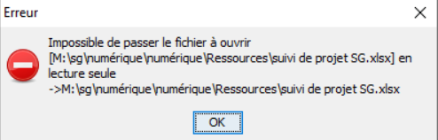

RESIP :foire aux questions
=====

Résumé
------

### Documents de référence

|**Document**|**Date de la version**|**Remarques**|
|:---------------:|:-----:|:-----:|
|NF Z 44022 – MEDONA – Modélisation des données pour l’archivage       |18/01/2014| |         
|Standard d’échange de données pour l’archivage – SEDA – v. 2.1| 06/2018| |
|Standard d’échange de données pour l’archivage – SEDA – v. 2.2        | 02/2022| Cette nouvelle version du SEDA est intégrée à la solution logicielle Vitam à partir de la V6.RC. |
|[Vitam – ReSIP](./resip.md)| | |       

### Présentation du document

Le présent document a pour vocation de compléter le manuel ReSIP en proposant une liste de réponses aux questions fréquemment posées autour de l’utilisation de la moulinette ReSIP construite autour d’une bibliothèque JAVA appelée Sedalib et fédérant les moulinettes précédemment développées et mises à disposition par l’équipe Vitam :
- générateur SEDA ;
- générateur SEDA pour des plans de classement ;
- extracteur de messageries.

Ce document s’articule autour des axes suivants :
- présentation, installation, lancement et paramétrage de la moulinette ReSIP ;
- présentation de l’interface graphique de la moulinette ReSIP ;
- import de données dans la moulinette ReSIP ;
- traitement de données dans la moulinette ReSIP ;
-  export de données depuis la moulinette ReSIP.

Il a vocation à être amendé, complété et enrichi au fur et à mesure de la réalisation de la solution logicielle Vitam et des retours et commentaires formulés par les ministères porteurs et les partenaires du programme.

**Attention :** la consultation du présent document, en cours de construction au terme de la version 7.0 (octobres 2023) doit s’accompagner de la consultation du manuel ReSIP, qui décrit l’ensemble des fonctionnalités de la moulinette ReSIP.

Présentation, installation, lancement et paramétrage de la moulinette ReSIP
----

### Paramétrage du référentiel des formats utilisé et de DROID

**CAS :**  
Comment fonctionne l’identification de format dans ReSIP ?

**RÉPONSE :**  
La moulinette ReSIP procède à une identification du format des fichiers traités en utilisant l’application DROID ainsi que les fichiers de signatures DROID publiés par The National Archives (UK).  
Le processus retenu pour l’identification dans RESIP est le suivant[^1] :
-  S’il y a des formats conteneurs, on ne garde qu’eux dans une liste de choix, s’il n’y en a pas ou s’il y a une erreur on passe à la suite ;
-  S’il y a des formats signatures, on ne garde qu’eux dans une liste de choix ; s’il n’y en a pas ou s’il y a une erreur ,on passe à la suite ;
-  Sinon, on garde les formats possibles d’après l’extension dans une liste de choix.
-  Sur la liste de choix restante :
    - on trie et ne garde que ceux qui ont la plus haute priorité dans le fichier de signatures ;
    - s’il en reste un seul, on le prend,
    - s’il en reste plusieurs, on regarde si l’un d’eux correspond à l’extension et on prend le premier ;
    - sinon on prend arbitrairement le premier de la liste.

En cas de besoin, il est possible de substituer, dans le répertoire config du répertoire ReSIP, les fichiers existants par les fichiers plus récents précédemment téléchargés. Si on change les deux fichiers DROID-signature et container_signature dans le répertoire config de RESIP, ce dernier prendra en compte les nouvelles définitions avec le moteur 6.5.2 de Droid.

À noter que, si vous réalisez des tests d’identification entre plusieurs outils, il faudra bien veiller à utiliser les mêmes versions d'outils et les mêmes versions de référentiel PRONOM, qui pourraient expliquer certains écarts d'identification de formats.

Présentation de l’interface graphique de la moulinette ReSIP
----

[Sans objet]

Import de données dans la moulinette ReSIP
---

### Récupération de métadonnées techniques propres à des objets physiques ou étendues

**CAS :**  
 Je souhaite récupérer des métadonnées propres à des objets physiques et, le cas échéant, des métadonnées techniques étendues dans l’interface ReSIP, en vue de générer a posteriori un SIP contenant l’ensemble de ces informations. Quel type d’import dois-je privilégier ?

**RÉPONSE :**  
Tous les imports proposés par ReSIP ne permettent pas de récupérer des métadonnées propres à des objets physiques ainsi que des métadonnées techniques étendues. En effet, l’import via un fichier .csv ne peut être utilisé dans ce cas-là, car il ne permet pas de décrire les métadonnées techniques.

Il est recommandé d’utiliser :
-  soit l’import depuis un SIP ou depuis un DIP,
-  soit l’import depuis un répertoire ou depuis un ZIP, dans lequel on aura décrit les métadonnées techniques dans des fichiers .xml dédiés à la description des objets physiques ou à la description des objets numériques. Le [Manuel ReSIP](./resip.md) détaille le mode opératoire dans le chapitre 4.1.3. « Import d’une arborescence de fichiers avec fichier supplémentaire de métadonnées ».

### Liste des métadonnées extraites par défaut par ReSIP lors d’import depuis un répertoire ou depuis un .zip

**CAS :**   
Je souhaite connaître le comportement de ReSIP, ainsi que la liste des métadonnées extraites par la moulinette quand je réalise un import d’arborescence bureautique, zippée ou non.

**RÉPONSE :**  
ReSIP scanne les dossiers et fichiers contenus dans l’arborescence, qu’elle soit zippée ou non. Par défaut, il extrait les informations suivantes :
-  pour les unités archivistiques correspondant à des répertoires, sans objet associé :
    - l’intitulé de ceux-ci comme titre (champ Title du standard SEDA),
    - le niveau de description (champ DescriptionLevel du standard SEDA), incrémenté avec la valeur « RecordGrp » ;
-  pour les unités archivistiques correspondant aux fichiers, associée à un groupe d’objets techniques :
    - le nom du fichier comme titre (champ Title du standard SEDA), 
    - le niveau de description (champ DescriptionLevel du standard SEDA), incrémenté avec la valeur « Item » ;
-  pour les fichiers, dont les informations sont enregistrées dans le groupe d’objets techniques en tant que métadonnées techniques :
    - le format identifié avec l’outil Siegfried (champ FormatLitteral, FormatId et MimeType du standard SEDA), 
    - le nom du fichier (champ Filename du standard SEDA), 
    - sa taille (champ Size du standard SEDA),
    - son empreinte, calculée avec l’algorithme SHA-512 (champ MessageDigest du standard SEDA), 
    - sa date de dernière modification (champ LastModified du standard SEDA),
    - sa version, incrémentée avec la valeur « BinaryMaster_1 » (champ DataObjectVersion du standard SEDA).

**Attention :**
-  ce procédé fonctionne si l’arborescence de fichiers ne contient pas des fichiers XML décrivant plus spécifiquement les répertoires ou les fichiers[^2].
-  il s’agit d’une extraction par défaut. Rien n’empêche de modifier a posteriori les valeurs extraites (ex. titre ou niveau de description).

### Import d’un fichier .csv extrait d’Archifiltre, puis enrichi

**CAS :**  
Depuis Archifiltre, je génère directement un fichier CSV formaté correctement pour ReSIP. Lorsque j’intègre ce fichier dans ReSIP, il l’accepte.  
Je souhaite désormais ajouter dans ce fichier CSV une colonne correspondant à une balise précise du SEDA qui ne ressort pas depuis Archifiltre, et en y renseignant des données récupérées d’un fichier d’export Excel.   
Cependant, lorsque je modifie le fichier CSV depuis LibreOffice, tout en indiquant le bon libellé en intitulé de colonnes (et ayant testé en plaçant la colonne supplémentaire à différents emplacements du fichier CSV – à la fin, après la colonne Title…), j’enregistre le fichier et lorsque je souhaite le réintégrer dans ReSIP, il est systématiquement rejeté.

**RÉPONSE :**  
En enregistrant le nouveau fichier .csv, le jeu de caractères et/ou le séparateur ont changé et ne sont plus ceux produits ou attendus par ReSIP à l'import. Pour ce faire, il faut :
-  ouvrir le nouveau fichier .csv dans un éditeur de type Notepad++ et vérifier quels sont les séparateurs et l’encodage du fichier ;
-  dans ReSIP, vérifier les paramètres attendus lors de l’import de fichiers .csv dans Fichier > Préférences > Import, et, le cas échéant, les modifier.

### Import d’une arborescence bureautique en erreur

**CAS :**  
Lors de l’import d’un répertoire dans ReSIP, le message d’erreur suivant apparaît : « resip : erreur durant l'import, les données n'ont pas été modifiées » et l’import n’est pas réalisé.

**RÉPONSE :**  
ReSIP rencontre un problème avec un fichier contenu dans l’arborescence. En vue d’identifier ce fichier, il est conseillé de :
-  consulter les logs, en vue d’identifier le fichier en erreur. Ces logs sont disponibles dans un répertoire « Logs » inclut dans le dossier « ReSIP » qui est installé en local sur votre ordinateur ;
-  subdiviser l’arborescence à importer en plusieurs sous-dossiers, et de procéder à des imports de chacun de ces sous-dossiers, un par un. Ce travail aide à identifier la ou les partie(s) de l’arborescence posant problème.

Après identification du fichier en erreur, il vous faut le réparer hors de ReSIP ou le supprimer de l’arborescence à importer, avant de procéder à un nouveau chargement de l’arborescence dans ReSIP.

**À noter :** En cas de demande d’assistance auprès des équipes Vitam, il est fortement recommandé de fournir d’emblée les logs et, si possible, l’arborescence bureautique en erreur.

### Import en échec pour cause de répertoire déjà utilisé

**CAS :**  
Lors d’une première séance de travail, j’ai chargé une arborescence / une messagerie / un SIP / un DIP / un ZIP. Lors d’une nouvelle séance de travail, j’ai procédé à un nouvel import de mon archives dans ReSIP, mais l’import est en échec. Le message d’erreur suivant apparaît : « le répertoire est déjà utilisé ».  et l’import n’est pas réalisé.

**RÉPONSE :**  
ReSIP a enregistré la précédente séance et refuse d’importer une nouvelle fois l’archives dont il dispose déjà. Si vous souhaitez importer en succès l’archives, quelle que soit sa forme (arborescence, messagerie, SIP, DIP, ZIP, etc.), il est conseillé d’effacer le répertoire de travail, où sont enregistrées les différentes arborescences ou messageries sur lesquelles vous avez précédemment travaillé. Pour ce faire, dans ReSIP, il vous faut cliquer sur le bouton « Nettoyer le répertoire de travail... » présent dans l’onglet Fichier. Vous pouvez ensuite réaliser l’import de votre arborescence ou de votre messagerie.

**À noter :** Cette erreur peut se rencontrer sur tous les types d’import proposés par l’outil ReSIP.

### Exclusion/suppression de formats de fichiers lors de l’import dans ReSIP

**CAS :**  
Je souhaite que ReSIP supprime automatiquement des formats de fichiers (ex. les cartes de visite .vcf), jugés non pérennes ou non acceptés par la politique d’archivage à laquelle je suis soumis.

**RÉPONSE :**  
ReSIP permet d’écarter un à plusieurs formats de fichiers dès l’import au moye d’un paramétrage disponible en cliquant sur en cliquant sur Préférences, puis sur Import.
Le [Manuel ReSIP](./resip.md), sous-section 4.1.1.  « Paramétrage de l’import » définit la manière d’exclure automatiquement des fichiers en fonction de leur extension et/ou de leur nommage.

Traitement de données dans la moulinette ReSIP
----

### Vérification de la structure arborescente par rapport à un profil d’archivage

**CAS :**  
Je souhaite contrôler une arborescence préalablement importée dans ReSIP par rapport à un profil d’archivage et ce contrôle me renvoie des erreurs.

**RÉPONSE :**  
L’erreur peut être causée par différents motifs :
-  soit l’erreur provient des métadonnées présentes dans l’arborescence chargée dans ReSIP (ex. une métadonnée obligatoire dans le profil est absente dans l’interface),
-  soit elle provient des paramétrages d’enregistrement de cette arborescence (ex. les unités sont enregistrées sous forme « rateau » au lieu de l’être sous forme arborescente),
-  soit le profil d’archivage n’est pas conforme aux prérequis de ReSIP (ex. le profil ne déclare pas de groupe d’objets techniques).

Le Manuel ReSIP, dans son annexe 8 « Contrôle de conformité par rapport à un profil d’archivage », énumère les cas d’erreur possibles, ainsi que les prérequis attendus par ReSIP pour que l’arborescence soit conforme au profil. Nous vous recommandons sa consultation.

Export de données la moulinette ReSIP
---

### Absence de fichiers lors de l’export sur disque de la hiérarchie

**CAS :**  
J’ai importé dans ReSIP une arborescence bureautique issue des serveurs de mon organisation. Après l’avoir retravaillée, j’ai réalisé un export de la hiérarchie sur disque, mais me suis rendu compte qu’au lieu d’obtenir la structure arborescente complète (dossiers + fichiers), ReSIP exporte correctement la hiérarchie, mais n’arrive pas à exporter certains des fichiers numériques. Ces derniers sont vides.

**RÉPONSE :**  
Deux motifs pourraient expliquer ce problème :
-  Il peut s’agir d’un problème de taille des noms des répertoires et des fichiers de l’arborescence bureautiques, qui sont limités par défaut à 32 caractères dans le contexte de ReSIP, et de la limitation des chemins de fichiers sous Windows.
      Il est possible de modifier cette limitation, en la passant au besoin à 64 caractères dans les préférences de ReSIP.  
      Pour vérifier la prise en compte de la complétude de l’arborescence par ReSIP, on peut réaliser un export du CSV des métadonnées qui indique les chemins des fichiers dans le champ "File" et vérifier si ReSIP ne les a pas tronqués. Le cas échéant, il faut modifier l’intitulé des unités archivistiques en vue d’en réduire la taille, puis réaliser un export de la hiérarchie avec le fichier .csv de métadonnées après renommage ;
-  Il peut également s’agir d’une stratégie de droits associés aux fichiers, instaurée dans le serveur de l’organisation. Comment peut-on la constater ?
    - Lors du premier chargement de l’arborescence dans ReSIP, effectué directement après avoir récupéré les fichiers du serveur, on constate qu’on a accès aux fichiers et qu’il est possible de les télécharger et de les lire.
    - Puis, on exporte l’arborescence, on ferme ReSIP, éventuellement sa session d’ordinateur,
    - Ensuite, on ouvre à nouveau ReSIP pour y recharger l’arborescence dans la forme préalablement exportée et on constate qu’on ne peut plus télécharger certains fichiers. Le message d’erreur suivant apparaît :
    

      Pour résoudre ce problème, il est conseillé de vérifier si on le rencontre également en récupérant son travail directement depuis ReSIP, dans la mesure où on l’a sauvegardé, en cliquant sur Fichiers, puis sur Charger.  
      Si le problème se vérifie, il est recommandé de prendre contact avec son service informatique en vue de se voir octroyer des droits plus élargis sur les fichiers et répertoire de l’arborescence bureautique à récupérer sur les serveurs de son organisation.

[^1]: Fonction getIdentificationResult dans sedalib/src/main/java/fr/gouv/vitam/tools/sedalib/droid/DroidIdentifier.java.

[^2]:  Tel que décrit dans le [Manuel ReSIP](./resip.md), chapitre 4.1.3. « Import d’une arborescence de fichiers avec fichier supplémentaire de métadonnées ».