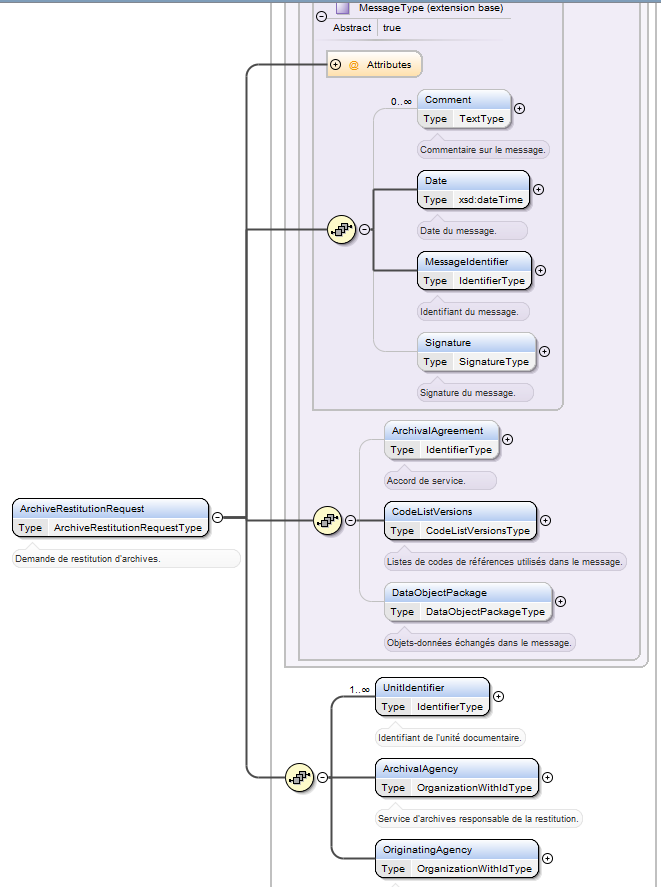
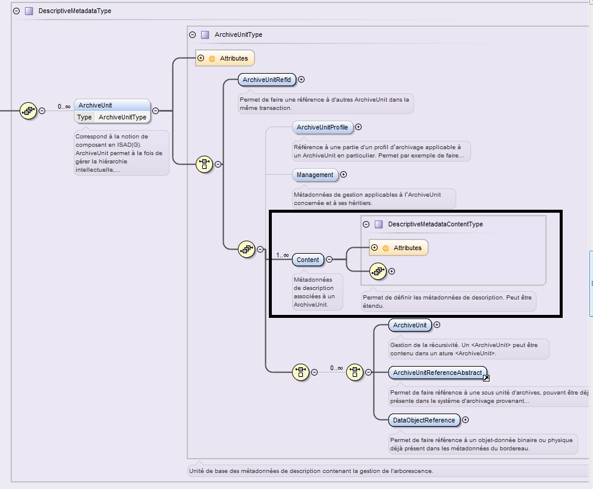

Services producteurs
====

Introduction
----

### Documents de référence

|Document |Date de la version|Remarques|
|:---------------:|:-----:|:-----:|
|NF Z 44022 – MEDONA – Modélisation des données pour l’archivage|18/01/2014||
|Standard d’échange de données pour l’archivage – SEDA – v. 2.1|06/2018||
|Standard d’échange de données pour l’archivage – SEDA – v. 2.2|02/2022|Cette nouvelle version du SEDA est intégrée à la solution logicielle Vitam à partir de la V6.RC.|
|Standard d’échange de données pour l’archivage – SEDA – v. 2.3|06/2024||
|ISAAR (CPF) – v. 2.0|2004||

### Présentation du document
Le présent document présente les fonctionnalités associées à la prise en compte de la notion de service producteur dans la solution logicielle Vitam.
Il s’articule autour des axes suivants :
- une présentation de la notion de service producteur et de la manière dont le Standard d’échanges de données pour l’archivage (SEDA) la formalise ;
- une présentation des mécanismes mis en œuvre dans la solution logicielle Vitam pour prendre en compte cette notion, en application du SEDA ;
- des recommandations aux ministères porteurs, partenaires et utilisateurs de la solution logicielle Vitam sur la manière d’utiliser les fonctionnalités associées aux services producteurs. 

Le présent document décrit les fonctionnalités qui sont offertes par la solution logicielle Vitam au terme de la version 8.0 (octobre 2024). Il a vocation à être amendé, complété et enrichi au fur et à mesure de la réalisation de la solution logicielle Vitam et des retours et commentaires formulés par les ministères porteurs et les partenaires du programme.

Présentation de la notion de service producteur
---

### Description de la notion de service producteur
Le code du patrimoine, dans son article L211-1, définit les archives comme « l’ensemble des documents, y compris les données, quels que soient leur date, leur lieu de conservation, leur forme et leur support, produits ou reçus par toute personne physique ou morale et par tout service ou organisme public ou privé dans l’exercice de leur activité ».  
La notion de service producteur correspond à la personne physique ou morale ayant produit ou reçu des documents et des données dans l’exercice de son activité.  
Quand l’activité exercée par le service producteur correspond à une mission de service public, ce dernier a, en application de la réglementation en vigueur, un certain nombre de droits et de devoirs sur ses archives, entendues comme les documents et données qu’il a produits ou reçus dans le cadre de son activité :
- il définit, avec l’administration des archives, les documents à conserver à l’expiration de leur période d’utilité courante (article L212-2) ;
- tant que la sélection prévue à l’article L212-2 n’a pas été effectuée, il conserve ses archives sous le contrôle scientifique et technique de l’administration des archives, soit dans ses locaux, soit chez un tiers agréé par l’administration des archives (article L212-4) ;
- s’il est mis fin à son existence, et à défaut d’affectation déterminée par l’acte de suppression, il doit remettre ses archives à un service public d’archives (article L212-5) ;
- il donne son accord, conjointement avec l’administration des archives, aux demandes de consultation par dérogation d’archives publiques non librement communicables par des tiers (article L213-3).  

Au moment de la demande de transfert à un service d’archives, en cas de suppression du service producteur ou de transfert de tout ou partie de ses activités à une autre entité, c’est l’entité détentrice des archives ou responsable des activités transférées qui exerce les droits et devoirs assignés au service producteur par le code du patrimoine. Cette entité est désignée sous l’expression de service versant.

### Formalisation de la notion de service producteur dans le SEDA
La manière de déclarer les services producteurs est définie dans la norme NF Z 44-022 et dans sa déclinaison pour les acteurs du service public, le Standard d’échanges de données pour l’archivage (SEDA).
La norme NF Z 44-022 définit cinq acteurs intervenant dans les transactions occasionnées par les échanges de données pour l’archivage :
- le service d’archives ;
- le service versant ;
- le service producteur ;
- le service de contrôle ;
- le demandeur d’archives.
Le service producteur est défini comme « l’entité qui a produit les informations, c’est-à-dire qui les a créées ou reçues dans le cadre de son activité ». En application de la norme, il intervient dans les transactions suivantes :
- demande de communication d’archives :
    - le service producteur peut être à l’origine de la demande, ayant accès à toutes les informations qu’il a produites et qui ont fait l’objet d’un transfert (message ArchiveDeliveryRequest) ;
    - le service producteur peut être amené à autoriser une demande de communication d’archives si les dispositions légales, réglementaires ou contractuelles le nécessitent (message AuthorizationOriginatingAgencyRequest) ;
- demande de modification d’archives : le service producteur peut être amené à autoriser une demande de modification d’archives, si l’accord de service le prévoit (message AuthorizationOriginatingAgencyRequest) ;
- demande d’élimination d’archives : le service producteur doit donner son accord à toute demande d’élimination proposée par le service d’archives (message AuthorizationOriginatingAgencyRequest) ;
- demande de restitution d’archives (message ArchiveRestitutionRequest) :
    - au terme de l’accord de service passé entre le service producteur et le service d’archives, le service producteur est destinataire des archives jusque-là conservées par le service d’archives (notamment en cas de restitution par un tiers archiveur) ;
    - le service producteur peut demander à tout moment la réactivation d’un dossier archivé.  

Le service producteur est représenté par le bloc <OriginatingAgency>.
La figure ci-dessous présente à titre d’exemple le schéma correspondant au message ArchiveRestitutionRequest :

Le SEDA, dans ses versions 2.1.,2.2. et 2.3., précise les transactions définies dans la norme NF Z 44‑022 pour les services publics d’archives et spécifie dans le détail les messages échangés entre acteurs du processus d’archivage.
Il décrit notamment le schéma de métadonnées qui doit être utilisé pour la description des archives (bloc DescriptiveMetadata du message ArchiveTransfer).  
En application du SEDA version 2.1., 2.2. et 2.3., la notion de service producteur constitue une métadonnée descriptive de chaque unité archivistique (ArchiveUnit, bloc Content), dans la logique héritée de la norme de description ISAD(G) et de sa déclinaison en format d’encodage EAD (Encoded Archival Description).  
Le schéma ci-dessous figure l’emplacement de ce bloc « Content » dans le schéma XSD publié dans le SEDA 2.1., 2.2. et 2.3. :

### Extension du schéma SEDA pour prendre en compte la notion de service producteur
Ni la norme NF Z 44-022 ni le SEDA dans ses versions 2.1., 2.2. ou 2.3. ne prévoient à ce jour que le service producteur constitue un acteur de la transaction de transfert d’archives à un service d’archives. Or, comme il a été indiqué précédemment, le service producteur joue un rôle important dans les autres transactions concernant les archives.  
Le message ArchiveTransfer défini par la norme NF Z 44-022 et précisé par le SEDA 2.1., 2.2. et 2.3., dans son état actuel, offre cependant deux possibilités pour déclarer un service producteur responsable de l’ensemble des archives transférées dans ce cadre :
- créer, à la racine du bloc <DescriptiveMetadata> une unité archivistique « racine » qui déclare le service producteur de référence ;
- utiliser les possibilités d’extension du schéma pour déclarer ces notions au niveau de l’en-tête du message.

L’équipe projet Vitam a opté pour la seconde solution pour les raisons suivantes :
- le bloc DescriptiveMetadata du message ArchiveTransfer ayant une cardinalité 0-n, imposer une unité archivistique « racine » aurait entraîné la création d’un niveau de description de peu d’utilité dans certains cas de figure, notamment pour les transferts d’archives sérielles ;
- au sein d’une même arborescence d’unités archivistiques, chaque unité archivistique pouvant avoir un service producteur différent, une recherche dans les unités archivistiques basées sur les métadonnées descriptives pouvait induire un biais dans les résultats, en ne remontant que les pièces produites par le service producteur dans un dossier et non le dossier lui-même :
    - exemple 1 : le dossier de préparation d’un texte législatif ou réglementaire peut être alimenté avec des pièces produites par l’administration à l’origine du texte, par les Services du Premier ministre, par le Conseil d’État ou par les deux Assemblées ;
    - exemple 2 : un dossier de passation de marché peut être alimenté avec des pièces produites par l’entité qui a exprimé le besoin, par l’acheteur ou par le service juridique ;
- la notion de service producteur étant destinée à être utilisée pour des besoins de gestion (alimentation du registre des fonds, mise en œuvre des opérations prévues au contrat de service) et d’accès, en lien avec des contrats de service et les contrats d’accès, il a paru préférable de la positionner comme une information de gestion applicable à l’ensemble des unités archivistiques transférées dans le cadre d’un ArchiveTransfer.  

Le document de *Structuration des Submission Information Packages* présente l’extension retenue pour la réalisation et l’utilisation de la solution logicielle Vitam. **Il rend obligatoire la déclaration d’un, et d’un seul, service producteur pour chaque transfert d’archives effectué dans la solution logicielle Vitam.**

Mécanismes mis en œuvre dans la solution logicielle Vitam
---

La solution logicielle Vitam offre à un service d’archives plusieurs fonctionnalités lui permettant de prendre en compte la notion de service producteur :
- en administration, l’existence d’un référentiel des services agents ;
- en entrée, le contrôle du service producteur et du service versant par rapport au référentiel des services agents, l’enregistrement de la prise en charge d’un transfert pour un service producteur donné et l’enrichissement du registre des fonds des services producteurs ;
- en gestion des archives, la formalisation d’un état des archives produites par un même producteur et conservées par une plate-forme utilisant la solution logicielle Vitam sous la forme d’un registre des fonds ;
- en accès, le contrôle des droits sur les archives via un filtre par service producteur.

### Import d’un référentiel des services agents
La solution logicielle Vitam intègre un référentiel des services agents (qu’ils agissent comme services producteurs ou services versants) administrable (import initial ou mise à jour) par un utilisateur doté des droits adéquats (**administrateur fonctionnel**). 
Ce référentiel interne à la solution logicielle Vitam a pour vocation :
- soit d’être une copie locale d’un référentiel administré dans le front office des plate-formes d’archivage implémentant cette dernière. Il n’a pas vocation à gérer la hiérarchie et l’historique des services producteurs, contrairement à la version administrée dans un front office et structurée conformément à la norme ISAAR (CPF).
- soit de gérer l'historique des services producteurs, conformément à la norme ISAAR (CPF). Au terme de la version 8.0, la hiérarchie n'est pas gérée.

Ce référentiel a pour vocation d’être utilisé par la solution logicielle Vitam pour effectuer localement les contrôles des services déclarés par les administrateurs et les utilisateurs en entrée et en accès. Il est propre à chaque tenant de la plate-forme.

Il est importé dans la solution logicielle Vitam sous la forme d’un fichier CSV comprenant les colonnes suivantes :

- dans sa forme la plus simple :

|Nom de la colonne|Description de la colonne|Valeurs possibles|Observations|
| :--------------- |:---------------:|:-----:|:-----------:|
|Identifier|Identifiant du service||Cet identifiant ne doit pas comprendre d’espace, de caractère accentué, de virgule, d’apostrophe, de parenthèse, de slash, d’élément de ponctuation, ou tout autre caractère spécial. Ne sont recommandés que l’underscore et le tiret comme séparateurs.|
|Name|Nom du service|||
|Description|Description du service|||

- dans sa forme étendue :

|Nom de la colonne|Description de la colonne|Valeurs possibles|Observations|
| :--------------- |:---------------:|:-----:|:-----------:|
|Identifier|Identifiant du service||Cet identifiant ne doit pas comprendre d’espace, de caractère accentué, de virgule, d’apostrophe, de parenthèse, de slash, d’élément de ponctuation, ou tout autre caractère spécial. Ne sont recommandés que l’underscore et le tiret comme séparateurs.|
|Name|Nom du service|||
|Description|Description du service|||
|EntityType|Type d’entité|Colonne facultative.||
|NameEntryParallel|Formes parallèles du nom|Colonne facultative. Il est possible de saisir plusieurs valeurs, séparées par des pipes.||
|AuthorizedForm|Formes du nom normalisées selon d’autres conventions|Colonne facultative. Il est possible de saisir plusieurs valeurs, séparées par des pipes.||
|AlternativeForm|Autres formes du nom|Colonne facultative. Il est possible de saisir plusieurs valeurs, séparées par des pipes.||
|EntityId|Numéro d’immatriculation des collectivités|Colonne facultative.||
|FromDate|Date de début d’existence|Colonne facultative. Les formats de date acceptés sont AAAA-MM-JJ et JJ/MM/AAAA.||
|ToDate|Date de fin d’existence|Colonne facultative. Les formats de date acceptés sont AAAA-MM-JJ et JJ/MM/AAAA.||
|Functions|Fonctions et activités|Colonne facultative. Il est possible de saisir plusieurs valeurs, séparées par des pipes.||
|BiogHist|Histoire|Colonne facultative.||
|Places|Lieux|Colonne facultative.Il est possible de saisir plusieurs valeurs, séparées par des pipes.||
|LegalStatuses|Statut juridique|Colonne facultative. Il est possible de saisir plusieurs valeurs, séparées par des pipes.||
|Mandates|Textes de référence|Colonne facultative. Il est possible de saisir plusieurs valeurs, séparées par des pipes.||
|StructureOrGenealogy|Organisation interne/généalogie|Colonne facultative.||
|GeneralContext|Contexte général|Colonne facultative.||
|MaintenanceStatus|Niveau d’élaboration|Colonne facultative.||
|LocalStatus|Niveau de détail|Colonne facultative.||
|Sources|Sources|Colonne facultative. Il est possible de saisir plusieurs valeurs, séparées par des pipes.||
|EventDescription|Notes relatives à la mise à jour de la notice|Colonne facultative.||

Le fichier CSV à importer doit avoir les caractéristiques suivantes :
- encodage des caractères : UTF-8 ;
- séparateur de champ : virgule ;
- séparateur de texte : guillemets simples ou doubles, espace vide ;
- les noms de colonnes facultatifs peuvent être absents, s'ils ne sont pas utilisés ;
- si un champ doit contenir plusieurs valeurs, elles doivent être séparées par un pipe ;
Pour plus de précisions sur l’élaboration des fichiers CSV, consulter l’annexe à la fin de ce document.

Lors d’une mise à jour du référentiel sont appliquées les règles suivantes :
- échec de la mise à jour si :
    - celle-ci a demandé la suppression d’un service déjà utilisé dans la solution logicielle Vitam ;
    - une opération d’import ou de mise à jour est déjà en cours ;
	- le format de date ne correspond pas au format attendu ;
	- un intitulé de colonne ne correspond pas aux intitulés attendus (ex. "toto").
- succès avec avertissement lors de la mise à jour si celle-ci a demandé la modification d’un service déjà utilisé (uniquement son intitulé et sa description).

Il est également possible d’ajouter un service agent, de modifier ses informations ou de le supprimer depuis l’APP VitamUI « Services agents » sous forme unitaire ou par un (ré)import complet du référentiel sous la forme d’un fichier CSV. Cette APP permet aussi d’effectuer une recherche dans le référentiel et d’en exporter son contenu sous la forme d’un fichier CSV.
Les différentes versions du référentiel font l’objet d’une sauvegarde sur les offres de stockage gérées par la solution logicielle Vitam et peuvent être récupérées depuis le front-office via un service particulier (cf. RAML).

### Entrées
Dans le cadre du processus d’entrée d’un ensemble d’archives, suite à la réception d’un message ArchiveTransfer du SEDA, la solution logicielle Vitam effectue les tâches et traitements suivants pour les archives :
- vérification de la déclaration d’un service producteur dans le message ArchiveTransfer ;
- contrôle de l’existence du service producteur et éventuellement du service versant par rapport au référentiel des services agents ;
- propagation dans les métadonnées des unités archivistiques et des groupes d’objets, en tant que métadonnée de gestion, du service producteur déclaré dans le message ArchiveTransfer (champ _sp) ;
- identification du/des service(s) producteur(s) responsable(s) des unités archivistiques déjà transférées auxquelles sont rattachées les unités archivistiques faisant l’objet du transfert :
    - prise en compte et propagation de cette information dans les métadonnées des unités archivistiques et des groupes d’objets, en tant que métadonnée de gestion (champ _sps) ; 
    - cette fonctionnalité permet de traiter le problème du rattachement du transfert effectué par un service producteur à un plan de classement maintenu par un autre service producteur (par exemple un service producteur plus « global » comme un ministère ou une collectivité si le transfert est effectué par une direction de ceux-ci ou comme un établissement public si le transfert est effectué par un service de celui-ci) et de garantir l’accès aux unités archivistiques transférées par le service producteur plus « global » (le ministère ou la collectivité auront alors accès aux unités archivistiques versées par la direction) ;
- indexation en base des métadonnées des unités archivistiques où la notion de service producteur est donc représentée sous plusieurs formes :
    - métadonnées descriptives : service producteur de l’unité archivistique concernée (bloc <OriginatingAgency>) ;
    - métadonnées de gestion :
        - sp : service producteur de l’ensemble des unités archivistiques transférées dans le cadre d’un ArchiveTransfer et ayant des droits sur l’ensemble de ces unités archivistiques. Il s’agit du service qui sera utilisé pour la gestion de cet ensemble dans la solution logicielle Vitam ;
        - sps : ensemble des services producteurs ayant des droits en accès sur l’unité archivistique. Cet ensemble comprend le service producteur responsable de l’ArchiveTransfer, mais aussi les services producteurs des plans de classements auxquels a été rattachée l’unité archivistique concernée ;
- indexation en base des métadonnées des groupes d’objets où la notion de service producteur correspond à une métadonnée de gestion (champs _sp et _sps) ;
- enregistrement du transfert dans le registre des fonds, dans le fonds correspondant au service producteur.

### Registre des fonds
Afin de permettre aux services d’archives de disposer d’une vue globale sur les fonds d’archives qu’ils ont en charge, la solution logicielle Vitam propose un état récapitulatif correspondant à un registre des fonds.
Le registre des fonds enregistre les archives prises en charge par tout service producteur :
- indépendamment du type d’archives transféré par celui-ci (dossiers de principe, dossiers sériels) ;
- indépendamment de la catégorie technique des objets qui représentent ces archives (documents textuels, documents iconographiques, documents sonores ou audiovisuels, etc.) ;
- indépendamment de la source qui a permis la production de ces archives (application métier ou système de fichiers) ;
- indépendamment de la source qui a permis de transférer les archives dans la solution logicielle Vitam et des droits et habilitations qu’elle a utilisés pour le faire.

Il intègre également les traitements effectués sur ces archives (opération de préservation).

Celui-ci est composé comme suit :
- chaque service producteur fait l’objet d’un enregistrement distinct dans le registre des fonds. Sont indiqués dans cet enregistrement :
    - l’identifiant du service producteur,
    - la date du premier transfert effectué par ce service,
    - pour les « entités » (unités archivistiques, groupes d’objets, objets) transférées directement par le service producteur, leur nombre et la taille globale des objets pour ce service – avec indication du nombre ou de la taille initiale :
        - des entités prises en charge,
        - des entités sorties de la responsabilité de la solution logicielle Vitam depuis leur prise en charge (suite à élimination ou réversibilité),
        - des entités actuellement sous la responsabilité de la solution logicielle Vitam ;
- chaque entrée effectuée dans la solution logicielle Vitam par un service producteur fait l’objet d’un enregistrement distinct dans le registre des fonds. Sont indiqués dans cet enregistrement :
    - la date du premier transfert, la date du dernier transfert, la date de dernière modification de l’entrée ;
    - les identifiants :
        - du service producteur (OriginatingAgencyIdentifier du bordereau de transfert),
        - du service versant (SubmissionAgencyIdentifier du bordereau de transfert) ;
    - l’identifiant du message (MessageIdentifier du bordereau de transfert) ;
    - des commentaires (Comment du bordereau de transfert) ;
    - le statut juridique des archives et les modalités juridiques du transfert ;
    - l’identifiant du contrat d’entrée et du profil d’archivage associés ;
    - le nombre d’« entités » (unités archivistiques, groupes d’objets, objets) et la taille globale des objets pour cette entrée – avec indication du nombre ou de la taille initiale :
        - des entités prises en charge lors du transfert,
        - des entités de ce transfert sorties de la responsabilité de la solution logicielle depuis leur prise en charge (suite à élimination ou réversibilité),
        - des entités de ce transfert actuellement sous la responsabilité de la solution logicielle ;
    - le statut :
        - en stock et complète,
        - en stock et mise à jour,
        - sortie du stock ;
    - les identifiants des opérations ayant eu un impact sur l’entrée :
        - identifiants des opérations de transfert,
        - identifiant et nature de la dernière opération ayant eu un impact sur l’entrée ;
    - le détail de chaque opération, quelle que soit sa nature (élimination, transfert), ayant eu un impact sur l’entrée, avec la volumétrie associée ;
- des états périodiques des unités archivistiques, groupes d’objets, objets et de leur volumétrie qui lui sont rattachés.
    - des champs d’identification :
        - identifiant interne de l’état,
        - identifiant du service producteur ;
    - un champ permettant d’associer le producteur à un tenant ;
    - la date de création de l’état ;
    - le nombre d’unités archivistiques, de groupes d’objets et d’objets rattachés à ce service producteur au moment de la constitution de l’état ;
    - la volumétrie des objets associés rattachés à ce service producteur au moment de la constitution de l’état ;
- chaque traitement lié à la préservation effectuée dans la solution logicielle Vitam fait l’objet d’un enregistrement distinct dans le registre des fonds. Sont indiqués dans cet enregistrement :
    - la date de la première opération, la date de la dernière opération, la date de dernière modification de l’enregistrement ;
    - l’identifiant du service producteur (correspondant au champ OriginatingAgencyIdentifier du bordereau de transfert),
    - le nombre d’« entités » (unités archivistiques, groupes d’objets, objets) et la taille globale des objets pour cet enregistrement – avec indication du nombre ou de la taille initiale :
        - des entités traitées lors de cette opération de préservation,
        - des entités de cet enregistrement sorties de la responsabilité de la solution logicielle depuis leur prise en charge (suite à élimination, suppression de versions d’objets ou réversibilité),
        - des entités de ce traitement actuellement sous la responsabilité de la solution logicielle ;
    - le statut :
        - en stock et complète,
        - en stock et mise à jour,
        - sortie du stock ;
    - les identifiants des opérations ayant eu un impact sur cet enregistrement :
        - identifiants des opérations de transfert,
        - identifiant et nature de la dernière opération ayant eu un impact sur l’enregistrement ;
    - le détail de chaque opération, quelle que soit sa nature, ayant eu un impact sur l’enregistrement, avec la volumétrie associée.

Ces fonctionnalités permettent de disposer d’un état actualisé des flux et stocks d’archives sous la responsabilité de la solution logicielle, par service producteur.  

**Nota bene :**  
Lorsqu’un transfert effectué par un service producteur demande le rattachement de tout ou partie de ses unités archivistiques à des unités archivistiques déjà présentes dans la solution logicielle Vitam mais transférées par un autre service producteur, l’identifiant du service producteur des unités archivistiques de rattachement est propagé dans les unités archivistiques et les groupes d’objets rattachées, afin de permettre l’accès à celles-ci par le service producteur de rattachement.  
Ainsi, en cas de transfert, par une direction, d’unités archivistiques qui doivent être rattachées au plan de classement d’une organisation plus « globale » (ministère, collectivité, établissement public), seront mis à jour dans le registre des fonds à la fois le fonds de la direction et celui de l’organisation plus « globale » (ministère, collectivité, établissement public). La direction ayant effectué le transfert sera cependant considérée comme le seul service producteur responsable des archives transférées.  
Depuis l’APP VitamUI « Registre des fonds », il est possible d’accéder à la liste des entrées effectuées et d’en isoler un certain nombre au moyen d’une recherche à partir de :
- l’identifiant du versement,
- la date du versement ou un intervalle de dates,
- l’identifiant ou de l’intitulé du service producteur référencé dans le référentiel des services agents,
- l’identifiant du contrat d’entrée,
- l’identifiant du profil d’archivage,
- les modalités d’entrée (toutes, versement, protocole, achat, copie, dation, don, dépôt, dévolution, legs, réintégration, autres, non renseigné).
 
L’APP permet également de rechercher les entrées ayant subi des opérations d’élimination et/ou de transfert.  
Elle autorise également :
- l’export des résultats de recherche sous la forme d’un fichier .csv dont la forme reprend partiellement la modélisation attendue par le standard national des registres d’entrée d’archives[^1] ;
- la consultation du détail de chaque entrée effectuée dans la solution logicielle Vitam par un service producteur, avec  le détail de chaque opération, quelle que soit sa nature (élimination, transfert), ayant eu un impact sur l’entrée, avec la volumétrie associée.

**Nota bene :**  
 Au terme de la version 5, l’APP VitamUI « Registre des fonds » fait appel uniquement aux traitements ayant trait aux opérations d’entrée et ne prend pas en compte les traitements relatifs aux opérations de préservation et de suppression de versions d’objets.

### Accès

#### Recherche

Une application connectée et authentifiée à la solution logicielle Vitam peut effectuer des recherches sur les services producteurs déclarés dans les unités archivistiques, dans la limite des droits et des filtres qui lui sont définis, en utilisant les différentes notions existantes :
- services producteurs déclarés par chaque unité archivistique dans ses métadonnées descriptives (bloc <OriginatingAgency>) ;
- service producteur ayant transféré l’unité archivistique (information correspondant au champ OriginatingAgencyIdentifier du bloc ManagementMetadata propagé dans les unités archivistiques lors du traitement du transfert) ;
- services producteurs ayant des droits d’accès sur l’unité archivistique en vertu de rattachements à des unités archivistiques existantes, suite à propagation dans les unités archivistiques rattachées lors du traitement du transfert.

Depuis l’APP VitamUI « Recherche et consultation des archives », il est possible de rechercher les unités archivistiques à partir de l’identifiant ou de l’intitulé du service producteur référencé dans le référentiel des services agents, correspondant, dans l’unité archivistique, à la métadonnée propre au service producteur ayant transféré l’unité archivistique (information correspondant au champ OriginatingAgencyIdentifier du bloc ManagementMetadata).

#### Filtrage des résultats au moyen des contrats d’accès

Une application connectée et authentifiée à la solution logicielle Vitam, si elle dispose des droits de recherche et de consultation d’archives, peut voir le périmètre de ses droits restreint à un nombre précis de services producteurs en vertu de son contrat d’accès.  
Dans ce cas, lorsque cette application effectue une recherche d’archives dans la solution logicielle Vitam, lui sont seulement retournées en résultat les unités archivistiques transférées par l’un des services producteurs autorisés dans son contrat d’accès, ou qui sont rattachées symboliquement à ce service. Les unités archivistiques transférées par d’autres services producteurs que ceux autorisés dans le contrat d’accès ne lui seront pas retournées en réponse à sa requête.    
Deux options sont possibles dans le contrat d’accès :
- déclarer un ou plusieurs services producteurs ;
- demander l’accès à tous les services producteurs.
Il est possible d'affiner ces options en :
- excluant du filtre choisi les unités archivistiques de type "plan de classement" ,
- élargir l'accès à des archives produites par d'autres services producteurs dont la règle de gestion serait échue.

À défaut de déclaration d’un service producteur, l’application connectée et authentifiée ne pourra effectuer aucune recherche.  
Ce filtrage s’applique également à l’accès au registre des fonds. Ne seront retournés lors d’une requête de recherche et de consultation du registre des fonds que les fonds correspondant aux services producteurs autorisés dans le contrat d’accès. Les autres fonds existants sur le tenant de la solution logicielle Vitam ne seront pas retournés.

**Nota bene :**
- les services producteurs déclarés dans les contrats d’accès font l’objet d’un contrôle d’existence dans le référentiel des services agents. Si un contrat est crée ou modifié avec l’identifiant d’un service inconnu du référentiel, la création ou la modification est refusée ;
- le filtrage des droits de recherche et de consultation d’archives par service producteur est nécessaire mais non suffisant. D’autres filtres sont mis à disposition par la solution logicielle Vitam, par exemple un filtre définissant une ou plusieurs unité(s) archivistique(s) – qu’elle soit de type arbre de positionnement, plan de classement ou standard – à partir de laquelle les accès sont autorisés.

L’IHM VitamUI utilise :
- l’ensemble des filtres disponibles dans les contrats d’accès pour :
    - l’APP « Recherche, consultation et gestion des archives »,
    - l’APP « Relevé de valeur probante »,
    - l’APP « Audits »,
    - l’APP « Requêtes DSL » ;
- le filtre sur les services producteurs pour :
    - l’APP « Dépôt et suivi des versements » ;
    - l’APP « Registre des fonds » ;
	- l'APP « Collecte et préparation des versements »
- le filtre sur les arborescences pour :
    - l’APP « Collecte et préparation des versements »,
    - l’APP « Contrats d’accès »,
    - l’APP « Contrats d’entrée ».

Conseils de mise en œuvre
---

L’équipe projet Vitam recommande les modalités de mise en œuvre ci-dessous.

### Comment découper ses SIP ?

|Intitulé|Description|Niveau de recommandation|
| :---------------|:---------------:|:-----:|
|Bordereau|
|Transferts préparés manuellement|Il est recommandé de constituer des transferts pour des archives homogènes en termes de services producteurs|Recommandation|
|Transferts effectués par des applications métiers faisant intervenir plusieurs producteurs (cas où les archives produites par chaque producteur sont bien isolées)|Si les archives produites et reçues par chaque service producteur (unités archivistiques comme objets) sont bien identifiées et isolées, il est recommandé de procéder à un transfert par service producteur.|Recommandation|
|Transferts effectués par des applications métiers faisant intervenir plusieurs producteurs (cas où les objets sont partagés entre plusieurs producteurs, mais bien identifiés)|Si tout ou partie des archives produites ou reçues par chaque producteur sont partagées avec d’autres services producteurs (ex. : objets partagés entre plusieurs services producteurs, avec des métadonnées de description et/ou de gestion propres à chacun), il est recommandé de procéder à un transfert par service producteur, les objets n’étant transférés qu’une seule fois, sous la responsabilité d’un des deux producteurs.|Recommandation|
|Transferts effectués par des applications métiers faisant intervenir plusieurs producteurs (cas où il est impossible d’isoler les archives de chaque producteur)|S’il est impossible d’isoler les archives de chaque producteur, il est recommandé de déclarer comme service producteur : - soit le responsable du traitement au sens de la loi sur l’informatique, les fichiers et la liberté, - soit le service responsable de la définition de la fonction associée (« la tête de chaîne »), - soit l’application versante elle-même.|Recommandation|

### Comment gérer les droits d’accès à la solution logicielle Vitam ?

|Intitulé|Description|Niveau de recommandation|
| :--------------- |:---------------:|:-----:|
|Contrat d’accès|||
|Cas d’une application correspondant à un système d’information archivistique|Un système d’information archivistique ayant vocation à administrer les archives de tous les services producteurs confiant des archives au service d’archives, il est recommandé d’indiquer dans le contrat d’accès que l’application concernée a accès par défaut à tous les services producteurs (dans la collection AccessContract, le champ EveryOriginatingAgency doit avoir pour valeur « true »).  Point d’attention : le système d’information archivistique devra ensuite filtrer lui-même les droits de ses différents utilisateurs, service producteur par service producteur.|Recommandation|
|Cas d’une application métier donnant accès aux archives d’un seul producteur d’archives|Il est recommandé de déclarer dans le contrat d’accès le service producteur concerné dans le champ « OriginatingAgencies ».  Point d’attention : si l’application ne peut accéder qu’à une partie des archives de ce service producteur (ex. Archives dont la DUC est échue), il conviendra de rajouter d’autres filtres, soit dans l’application métier, soit dans la solution logicielle Vitam (contrat d’accès excluant une partie de l’arborescence des archives du service producteur).|Recommandation|
|Cas d’une application métier donnant accès aux archives de plusieurs producteurs (cas d’une application dont les utilisateurs peuvent avoir accès à toutes les archives)|Il est recommandé d’indiquer dans le contrat d’accès que l’application concernée a accès par défaut à tous les services producteurs (dans la collection AccessContract, le champ EveryOriginatingAgency doit avoir pour valeur « true »).|Recommandation|
|Cas d’une application métier donnant accès aux archives de plusieurs producteurs (cas d’une application souhaitant filtrer les droits d’accès en fonction des différents producteurs)|Il est recommandé : - d’indiquer dans le contrat d’accès que l’application concernée a accès par défaut à tous les services producteurs (dans la collection AccessContract, le champ EveryOriginatingAgency doit avoir pour valeur « true »), - de filtrer dans l’application elle-même les droits, service producteur par service producteur. Point d’attention : l’application devra ensuite filtrer elle-même les droits de ses différents utilisateurs, service producteur par service producteur.|Recommandation|
||Il est envisageable de créer autant de contrats d’accès que de services producteurs, en déclarant au niveau de chaque contrat d’accès le (ou les) service(s) producteur(s) concerné(s) dans le champ « OriginatingAgencies ».|Envisageable|

### Comment gérer les droits d’accès au référentiel des services agents ?

|Intitulé|Description|Niveau de recommandation|
| :--------------- |:---------------:|:-----:|
|Référentiel des services agents|||
|Cas d’une application correspondant à un système d’information archivistique|Un système d’information archivistique ayant vocation à administrer les archives doit nécessairement disposer d’un référentiel des services agents. Ce référentiel doit contenir au moins une référence, sans quoi aucun transfert d’archives ne sera possible.|Obligatoire|
|Cas d’une application métier|Une application métier devant transférer des archives ou y accéder n’a pas forcément vocation à accéder au référentiel des services agents. Il est recommandé de veiller à lui attribuer les droits nécessaires dans le profil de sécurité qui lui est associé.|Recommandé|
|Cas d’un groupe « administrateurs » du système d’information archivistique|Il est recommandé d’attribuer des droits de consultation et de modification du référentiel à un groupe d’utilisateurs ayant vocation à agir sur le référentiel des services agents, si ce référentiel a vocation à être ponctuellement révisé.   Par exemple, VitamUI permet d’autoriser l’accès à l’APP « Services agent » avec des droits de consultation, de modification, d’import et d’export du référentiel.|Recommandé|
|Cas d’un groupe « archivistes » du système d’information archivistique|Tous les utilisateurs du système d’information archivistique n’ont pas vocation à modifier le référentiel des services  agents.   Le système d’information archivistique doit pouvoir leur interdire tout accès,  toute modification ou leur donner un simple accès au référentiel. Par exemple, VitamUI permet de : - interdire l’accès à l’APP « Services Agent » ; - autoriser l’accès à cette l’APP en simple consultation.|Recommandé|

Annexes
---

### Annexe : préparer un fichier CSV

La solution logicielle Vitam permet d’importer deux référentiels correspondant à des fichiers CSV :
- le référentiel des règles de gestion,
- le référentiel des services agents.

Ces fichiers au format CSV (Comma Separated Values) correspondent à des fichiers texte devant se conformer à des règles d’écriture particulières afin qu’ils puissent être importés avec succès dans la solution logicielle Vitam.
La présente annexe a vocation à :
- expliciter la manière d’écrire et de mettre à jour ces fichiers CSV,
- émettre des recommandations sur les règles à respecter.

#### Caractéristiques d’un fichier CSV
Un fichier CSV représente des données tabulaires sous forme de valeurs séparées par :
- un séparateur de champ : virgule,
- un séparateur de texte : guillemets simples ou doubles, espace vide.
Il existe d’autres séparateurs de champ (point virgule, deux points, tabulation, espace, etc.), mais la solution logicielle Vitam ne les supporte pas. Il est interdit de les utiliser.

Exemple de fichier CSV dans sa forme simple : 

"Identifier","Name","Description"
"FRAN_NP_009913","Présidence de la République sous Valéry Giscard d’Estaing","Successeur de la Présidence de George Pompidou [...]"
"FRAN_NP_009941","Veil Simone (1927-2017)","Née à Nice en 1927,  [...] milieu des années 1970."
"FRAN_NP_050500","Galliffet (famille de)","La famille de Galliffet était originaire du Dauphiné. Les principaux représentants de la branche aînée sont : Alexandre […] y exercèrent le commerce du sucre." 

Équivalent sous forme de tableau : 

|Identifier|Name|Description|
| :--------------- |:---------------:|:-----:|
|FRAN_NP_009913|Présidence de la République sous Valéry Giscard d’Estaing|Successeur de la Présidence de George Pompidou [...]|
|FRAN_NP_009941|Veil Simone (1927-2017)|Née à Nice en 1927,  [...] milieu des années 1970.|
|FRAN_NP_050500|Galliffet (famille de)|La famille de Galliffet était originaire du Dauphiné. Les principaux représentants de la branche aînée sont : Alexandre […] y exercèrent le commerce du sucre.|

Exemple de fichier CSV dans sa forme étendue : 

"Identifier","Name","Description","EntityType","NameEntryParallel","AuthorizedForm","AlternativeForm","EntityId","FromDate","ToDate","Functions","BiogHist","Places","LegalStatuses","Mandates","StructureOrGenealogy","GeneralContext","MaintenanceStatus","LocalStatus","Sources","EventDescription"
"Identifier0","Service Identifier0","Service Identifier0","EntityType example1","NameEntryParallel1","Form1","Forme1","Id1","14/02/2024","11/08/2022","Functions","BiogHist","Places","LegalStatuses","Mandates","StructureOrGenealogy","GeneralContext","MaintenanceStatus","LocalStatus","Sources","EventDescription"
"Identifier1","Service Identifier1",,,,,,,,,,,,,,,,,,,
"Identifier2","Service Identifier2","Service Identifier2","EntityType example1","NameEntryParallel1|NameEntryParallel2","Form1|Form1","Forme1|Forme2","Id1","2024-02-02","11/08/2022","Functions1|Functions2","BiogHist","Places1|Places2","LegalStatuses1|LegalStatuses2","Mandates1|Mandates2","StructureOrGenealogy","GeneralContext","MaintenanceStatus","LocalStatus","Sources1|Sources2","EventDescription" 

Un référentiel au format CSV doit contenir :
- une ligne contenant les titres des champs acceptés. Dans la solution logicielle Vitam, les titres sont imposés :
    - « Identifier », « Name » et « Description » pour le référentiel des services agents dans sa forme simple,
    - « RuleId », « RuleType », « RuleValue », « RuleDescription », « RuleDuration » et « RuleMeasurement » pour le référentiel des règles de gestion ;
- une à plusieurs lignes contenant les valeurs correspondant aux attendus du titre de colonne.

#### Recommandations
La rédaction d’un fichier CSV obéit à un certain nombre de règles à suivre :
- afin de se conformer au format CSV et à l’encodage UTF-8 ;
- afin de respecter le formalisme du référentiel tel qu’il est défini par la solution logicielle Vitam ;
- afin, finalement, de pouvoir être parsé et importé sans erreur dans la solution logicielle Vitam.

|Intitulé|Description|Niveau de recommandation|
| :--------------- |:---------------:|:-----:|
|Généralités|||
|Import d’un référentiel contenant une ligne de titre|Un fichier CSV requiert une ligne de titres, devant correspondre aux titres attendus par la solution logicielle Vitam. Sans cette ligne de titres, l’import du référentiel sera en échec.|Obligatoire|
|Import d’un référentiel contenant des lignes de valeurs|Chaque ligne contient le même nombre de valeurs (champs) qu’il y a de titres dans la première ligne.|Obligatoire|
|Import d’un référentiel au format CSV dont le séparateur de champ est la virgule|La solution logicielle Vitam accepte les fichiers CSV séparés par des virgules et encodés en UTF-8.|Obligatoire|
|Import d’un référentiel au format CSV avec séparateurs de texte|La solution logicielle Vitam accepte les séparateurs de texte suivants : guillemets simples ou doubles, espaces. Il est recommandé d’utiliser un séparateur de texte afin de marquer une séparation plus forte entre les valeurs contenues dans deux champs différents.|Recommandé|
||Il est obligatoire d’utiliser un séparateur de texte quand la valeur textuelle contient une virgule, qui correspond à un séparateur de champ. Sans séparateur de texte, le champ contenant une virgule sera interprété non pas comme un champ unique, mais sera interprété comme correspondant à deux champs distincts lors de l’import d’un référentiel.|Obligatoire|
||Il est recommandé d’utiliser uniformément le même séparateur de texte, en utilisant celui qu’on est le moins susceptible d’utiliser dans une chaîne de caractères du référentiel.|Recommandé|
||Si une chaîne de caractères contient le même séparateur de texte que celui utilisé, avant le premier caractère et après le dernier, il est recommandé de doubler l’utilisation de ce séparateur.|Recommandé|
|Import d’un référentiel contenant des champs vides|Certains champs sont facultatifs et ne contiennent pas nécessairement de données. Ce champ devra obligatoirement être représenté vide, séparé par deux virgules. Si les valeurs contenues dans les autres champs sont séparées par un séparateur de texte (guillemets simples ou doubles), le champ vide devra lui aussi figurer entre guillemets.|Obligatoire|
|Import d’un référentiel contenant des lignes blanches / vides|Il est interdit de laisser une ligne blanche ou vide dans un référentiel que l’on souhaite importer dans la solution logicielle Vitam.|Interdit|
|Import d’un référentiel contenant des espaces vides en début ou en fin de ligne|Il n’est pas recommandé d’importer un référentiel dont certaines lignes contiennent, en début ou fin, des espaces vides. Ces espaces vides peuvent en effet ne pas être interprétés ou mal interprétés par l’outil d’import de fichier CSV utilisé par la solution logicielle Vitam. Avant l’import d’un référentiel, il est recommandé de retirer tout espace vide du fichier CSV que l’on souhaite importer dans la solution logicielle Vitam.|Non recommandé|
|Import d’un référentiel contenant des sauts de ligne dans certaines cellules|Il n’est pas recommandé d’importer un référentiel dont certaines lignes contiennent des sauts de ligne, hérités d’un formatage antérieur. Ces sauts de ligne peuvent en effet être interprété par l’outil d’import de fichier CSV utilisé par la solution logicielle Vitam comme un véritable saut de ligne dans le fichier CSV et entraîner des erreurs et décalages dans la liste des règles de gestion et/ou des services agents en en créant plus que nécessaires, avec des données ne correspondant pas à leur titre de colonne.  Avant l’import d’un référentiel, il est recommandé d’ôter tout formatage présent dans le fichier.|Non recommandé|
|Import d’un référentiel contenant des sauts de ligne dans certaines cellules|Il n’est pas recommandé d’importer un référentiel dont certaines lignes contiennent des lignes fusionnées, héritées d’un formatage antérieur. Ces lignes fusionnées sont interprétées par l’outil d’import de fichier CSV utilisé par la solution logicielle Vitam comme une seule et même valeur, ce qui entraîne des décalages dans la liste des règles de gestion et/ou des services agents, avec un nombre de données ne correspondant pas au nombre de colonnes attendues. Avant l’import d’un référentiel, il est recommandé d’ôter tout formatage présent dans le fichier.|Interdit|
|Import et ré-import du référentiel des services agents|||
|Ligne de titres|La ligne de titres doit obligatoirement contenir les intitulés suivants : « Identifier », « Name » et « Description »|Obligatoire|
|Ligne de titres|La ligne de titres peut contenir les intitulés suivants : « EntityType », « NameEntryParallel », « AuthorizedForm », « AlternativeForm », « EntityId », « FromDate », « ToDate », « Functions », « BiogHist », « Places », « LegalStatuses », « Mandates », « StructureOrGenealogy », « GeneralContext », « MaintenanceStatus », « LocalStatus », « Sources », « EventDescription »|Facultatif||
|Lignes de valeurs|Les champs correspondant à « Identifier » et « Name » doivent être obligatoirement renseignés.|Obligatoire|
||L’identifiant ne doit comprendre ni caractère accentué, ni virgule, ni apostrophe, ni parenthèse, ni espace, ni slash, ni élément de ponctuation, ou tout autre caractère spécial. Ne sont autorisés que l’underscore et le tiret comme séparateurs.|Obligatoire|
||Le champ correspondant à « Description » est facultatif. Il peut ne contenir aucune valeur. En revanche, il doit être matérialisé dans le fichier CSV par un espace vide séparé de deux virgules.|Facultatif|
||Le champ correspondant à « Identifier » ne doit pas comprendre d’espace ou de caractère accentué.|Recommandé|
||Les dates saisies dans les champs « FromDate » et « ToDate » doivent prendre les formes AAAA-MM-JJ ou JJ/MM/AAAA.|Obligatoire|
||Les valeurs répétées saisies dans les champs « NameEntryParallel », « AuthorizedForm », « AlternativeForm », « Functions », « Places », « LegalStatuses », « Mandates », « Sources » doivent être séparées par des pipes.|Obligatoire|

#### Gestion d’un fichier au format CSV

##### Conversion d’un fichier au format CSV
Les référentiels des règles de gestion et des services agents doivent être au format CSV et encodés en UTF 8.
Si le fichier d’origine n’est pas au format CSV, il faut suivre la procédure suivante :
- dans un tableur appartenant à une suite bureautique libre (par exemple, LibreOffice ou OpenOffice) :
    - ouvrir le fichier XLS ou ODT ;
    - sélectionner « Enregistrer sous », puis le format CSV et le séparateur de champs correspondant à une virgule (« , ») ;
    - le cas échéant, choisir un séparateur de texte ;
    - si cela est proposé, sélection l’encodage en UTF-8 ;
    - enregistrer le fichier ;
- si l’encodage n’a pas été enregistré à l’étape précédente, dans un logiciel de traitement de textes (par exemple, Bloc-notes, WordPad ou Notepad++) :
    - ouvrir le fichier ;
    - modifier l’encodage :
        - dans un autre outil, en sélectionnant « Enregistrer sous », puis l’encodage en UTF-8, avant d’enregistrer les modifications ;
        - dans Notepad++, en sélectionnant « Encodage », puis « Encoder en UTF-8 » et en enregistrant les modifications.

##### Modification d’un fichier au format CSV
Les référentiels des règles de gestion et des services agents doivent être au format CSV et encodés en UTF 8.
Pour modifier un fichier de ce format, il faut suivre la procédure suivante :
- dans un tableur appartenant à une suite bureautique libre (par exemple, LibreOffice ou OpenOffice) :
    - ouvrir le fichier CSV ;
    - modifier le fichier, en veillant à respecter les règles définies ci-dessus, notamment :
        - ne pas supprimer une valeur obligatoire,
        - ne pas laisser des espaces vides avant ou après une chaîne de caractères,
        - ne pas faire de sauts de ligne ;
    - sélectionner « Enregistrer sous », puis le format CSV et le séparateur de champs correspondant à une virgule (« , ») ;
    - le cas échéant, choisir un séparateur de texte ;
    - si cela est proposé, sélection l’encodage en UTF-8 ;
    - enregistrer le fichier.

**Attention :**
Si le fichier est « enregistré », au lieu d’être « enregistré sous », ce nouvel enregistrement n’est plus au format CSV et l’encodage peut avoir également été modifié.
- Il est recommandé, avant toute modification, de faire une sauvegarde du fichier CSV ;
- Il ne faut pas enregistrer le fichier CSV dans le tableur dans lequel il est ouvert à des fins de visualisation.

##### Exemples de fichier CSV et messages retournés par la solution logicielle Vitam

**Import initial d’un référentiel des services agents**

- Tous les services agents comprennent un identifiant, un intitulé et une description
"Identifier","Name","Description" "FRAN_NP_009913","Présidence sous Valéry Giscard d’Estaing","Successeur de Pompidou [...]" "FRAN_NP_009941","Veil Simone (1927-2017)","Née à Nice en 1927,  [...]"

|Résultat|Message retourné par la solution logicielle Vitam|Commentaires|
|:---------------:|:-----:|:-----:|
|OK|« Succès du processus d’import du référentiel des services agents. » Détail : nom du fichier CSV||

- Au moins un identifiant de service agent n’est pas renseigné  
"Identifier","Name","Description" "FRAN_NP_009913","Présidence sous Valéry Giscard d’Estaing","Successeur de Pompidou [...]" "","Veil Simone (1927-2017)","Née à Nice en 1927, […]"

|Résultat|Message retourné par la solution logicielle Vitam|Commentaires|
|:---------------:|:-----:|:-----:|
|KO|« Échec du processus d’import du référentiel des services agents ». Détail : { "agencyCheck" : "Import agency error > Invalid CSV File" } Rapport : « Au moins une valeur obligatoire est manquante. Valeurs obligatoires : Identifier, Name, Description ». Informations additionnelles : Identifier. (STP_IMPORT_AGENCIES_MISSING_INFORMATIONS.KO)|

- Au moins un intitulé de service agent n’est pas renseigné  
"Identifier","Name","Description" 
"FRAN_NP_009913","","Successeur de Pompidou [...]" 
"FRAN_NP_009941","Veil Simone (1927-2017)","Née à Nice en 1927, […]"

|Résultat|Message retourné par la solution logicielle Vitam|Commentaires|
|:---------------:|:-----:|:-----:|
|KO|« Échec du processus d’import du référentiel des services agents ». Détail : { "agencyCheck" : "Import agency error > Invalid CSV File" } Rapport : « Au moins une valeur obligatoire est manquante. Valeurs obligatoires : Identifier, Name, Description ». Informations additionnelles : Name. (STP_IMPORT_AGENCIES_MISSING_INFORMATIONS.KO)||

- Au moins une date est mal saisie
"Identifier","Name","Description","FromDate" 
"FRAN_NP_009913","","Successeur de Pompidou [...]","20-12-2023" 
"FRAN_NP_009941","Veil Simone (1927-2017)","Née à Nice en 1927, […]",""

|Résultat|Message retourné par la solution logicielle Vitam|Commentaires|
|:---------------:|:-----:|:-----:|
|KO|« Échec du processus d’import du référentiel des services agents ». Détail : { "agencyCheck" : "Import agency error > The field FromDate contains bad date format value" } (IMPORT_AGENCIES.KO)|Vérifier le format des dates dans le fichier CSV et corriger les erreurs.|

- Au moins un nom de colonne est inconnu
"Identifier","Name","Description","Toto" 
"FRAN_NP_009913","","Successeur de Pompidou [...]","toto" 
"FRAN_NP_009941","Veil Simone (1927-2017)","Née à Nice en 1927, […]",""

|Résultat|Message retourné par la solution logicielle Vitam|Commentaires|
|:---------------:|:-----:|:-----:|
|KO|« Échec du processus d’import du référentiel des services agents ». Détail : { "agencyCheck" : "Import agency error > Unknown fields found: Toto" } (IMPORT_AGENCIES.KO)|Supprimer la colonne ou corriger l'intitulé afin qu'il corresponde à un nom de colonne attendu.|

- Au moins une description de service agent n’est pas renseignée  
"Identifier","Name","Description"  
"FRAN_NP_009913","Présidence sous Valéry Giscard d’Estaing",""  
"FRAN_NP_009941","Veil Simone (1927-2017)","Née à Nice en 1927, […]"  

|Résultat|Message retourné par la solution logicielle Vitam|Commentaires|
|:---------------:|:-----:|:-----:|
|OK|« Succès du processus d’import du référentiel des services agents. »
Détail : nom du fichier CSV|Associer une description à un service agent est facultatif à l’import du référentiel. Point d’attention : même si aucune description n’est précisée pour un service agent, les séparateurs de champs et de texte doivent être obligatoirement être présents.|

- La ligne de titre déclare « Identifier » suivi d’un espace blanc / vide  
"Identifier ","Name","Description"  
"FRAN_NP_009913","Présidence sous Valéry Giscard d’Estaing","Successeur de Pompidou [...]"  
"FRAN_NP_009941","Veil Simone (1927-2017)","Née à Nice en 1927, […]"  

|Résultat|Message retourné par la solution logicielle Vitam|Commentaires|
|:---------------:|:-----:|:-----:|
|OK|« Succès du processus d’import du référentiel des services agents. » Détail : nom du fichier CSV|Même si l’import est en succès, il n’est pas recommandé de laisser des espaces blancs / vides avant ou après une chaîne de caractères dans un fichier CSV.|

- La ligne de titre déclare « Identifier » précédé d’un espace blanc / vide  
" Identifier","Name","Description"  
"FRAN_NP_009913","Présidence sous Valéry Giscard d’Estaing","Successeur de Pompidou [...]"  
"FRAN_NP_009941","Veil Simone (1927-2017)","Née à Nice en 1927, […]"  

|Résultat|Message retourné par la solution logicielle Vitam|Commentaires|
|:---------------:|:-----:|:-----:|
|OK|« Succès du processus d’import du référentiel des services agents. » Détail : nom du fichier CSV|Même si l’import est en succès, il n’est pas recommandé de laisser des espaces blancs / vides avant ou après une chaîne de caractères dans un fichier CSV. Laisser un espace vide avant « Identifier » peut entraîner une erreur lors de l’export du référentiel préalablement importé dans la solution logicielle Vitam.|

- La ligne de titre déclare « Name » suivi d’un espace blanc / vide  
"Identifier","Name ","Description"  
"FRAN_NP_009913","Présidence sous Valéry Giscard d’Estaing","Successeur de Pompidou […]"  
"FRAN_NP_009941","Veil Simone (1927-2017)","Née à Nice en 1927, […]"

|Résultat|Message retourné par la solution logicielle Vitam|Commentaires|
|:---------------:|:-----:|:-----:|
|OK|« Succès du processus d’import du référentiel des services agents. » Détail : nom du fichier CSV|Même si l’import est en succès, il n’est pas recommandé de laisser des espaces blancs / vides avant ou après une chaîne de caractères dans un fichier CSV.|

-  La ligne de titre déclare « Name » précédé d’un espace blanc / vide  
"Identifier"," Name","Description"  
"FRAN_NP_009913","Présidence sous Valéry Giscard d’Estaing","Successeur de Pompidou […]"  
"FRAN_NP_009941","Veil Simone (1927-2017)","Née à Nice en 1927, [...]"  

|Résultat|Message retourné par la solution logicielle Vitam|Commentaires|
|:---------------:|:-----:|:-----:|
|OK|« Succès du processus d’import du référentiel des services agents. » Détail : nom du fichier CSV|Même si l’import est en succès, il n’est pas recommandé de laisser des espaces blancs / vides avant ou après une chaîne de caractères dans un fichier CSV.|

- La ligne de titre déclare « Description » suivie d’un espace blanc / vide  
"Identifier"," Name","Description"  
"FRAN_NP_009913","Présidence sous Valéry Giscard d’Estaing","Successeur de Pompidou [...]"  
"FRAN_NP_009941","Veil Simone (1927-2017)","Née à Nice en 1927, [...]"  

|Résultat|Message retourné par la solution logicielle Vitam|Commentaires|
|:---------------:|:-----:|:-----:|
|OK|« Succès du processus d’import du référentiel des services agents. » Détail : nom du fichier CSV|Même si l’import est en succès, il n’est pas recommandé de laisser des espaces blancs / vides avant ou après une chaîne de caractères dans un fichier CSV.|

- La ligne de titre déclare « Description » précédée d’un espace blanc / vide  
"Identifier"," Name","  Description"  
"FRAN_NP_009913","Présidence sous Valéry Giscard d’Estaing","Successeur de Pompidou [...]"  
"FRAN_NP_009941","Veil Simone (1927-2017)","Née à Nice en 1927, [...]"  

|Résultat|Message retourné par la solution logicielle Vitam|Commentaires|
|:---------------:|:-----:|:-----:|
|OK|« Succès du processus d’import du référentiel des services agents. » Détail : nom du fichier CSV|Même si l’import est en succès, il n’est pas recommandé de laisser des espaces blancs / vides avant ou après une chaîne de caractères dans un fichier CSV.|

[^1]: La documentation du standard est accessible à l’[adresse suivante](https://schema.data.gouv.fr/Archivistes75/registre_entrees/latest/documentation.html) (lien consulté le 27 février 2023).
