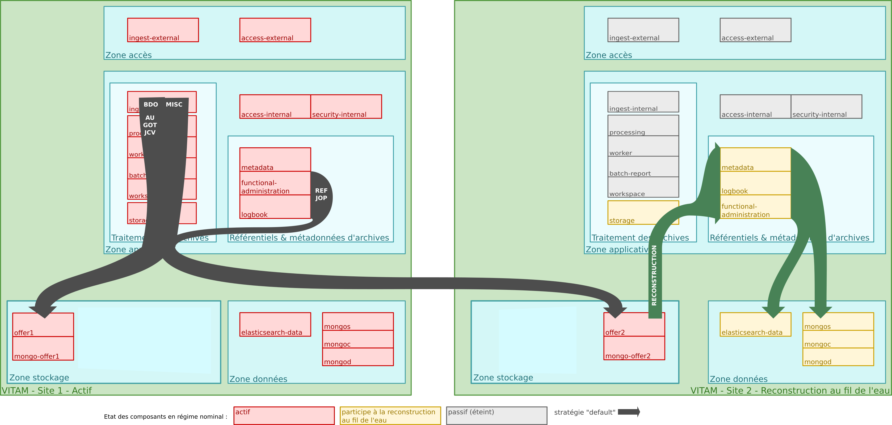
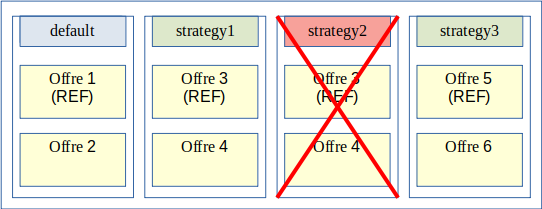
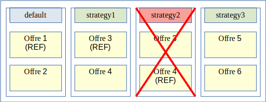
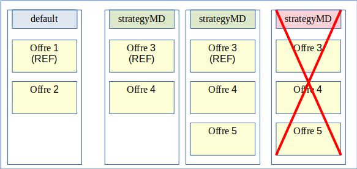
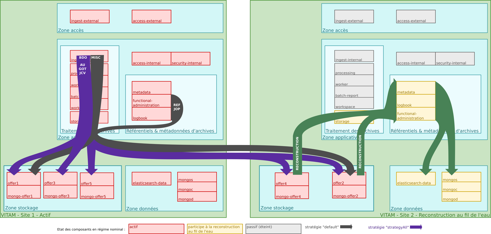
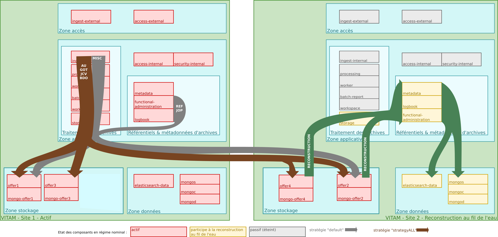

Gestion de multiples stratégies de stockage
=====

Introduction
------------

### Documents de référence


|**Document**|**Date de la version**|**Remarques**|
|:---------------:|:-----:|:-----:|
|[Vitam – Documentation d’installation](https://www.programmevitam.fr/ressources/DocCourante/html/installation)|||
|[Vitam – Documentation d’exploitation](https://www.programmevitam.fr/ressources/DocCourante/html/exploitation)|||
|[Vitam – Gestion des habilitations](./gestion_habilitations.md)|||


### Présentation du document

Le document présente les fonctionnalités associées à la gestion et à la réalisation d’opérations de préservation numérique dans la solution logicielle Vitam.
Il s’articule autour des axes suivants :
- une présentation de la gestion et de la conservation des données au sein de la solution logicielle Vitam ;
- une présentation des mécanismes mis en œuvre dans la solution logicielle Vitam pour utiliser :
    - une stratégie de stockage unique ;
    - plus d’une stratégie de stockage, gérée au moyen des contrats de gestion.
Le présent document décrit les fonctionnalités qui sont offertes par la troisième version de production de la solution logicielle Vitam au terme de la version 7.0 (octobre 2023). Il a vocation à être amendé, complété et enrichi au fur et à mesure de la réalisation de la solution logicielle Vitam et des retours et commentaires formulés par les ministères porteurs et les partenaires du programme.

Gestion des données sur Vitam
-----

Le moteur de stockage de la solution logicielle Vitam est en charge du stockage des archives (métadonnées et objets binaires) mais également des données nécessaires au bon fonctionnement d’une plate-forme Vitam dans le cadre du respect des normes définies par la solution logicielle Vitam.

### Mécanismes mis en place pour le stockage

Le stockage se base sur plusieurs notions :
- moteur de stockage : module en charge de la gestion des offres de stockage à l’aide des éléments suivants :
    - stratégie de stockage : configuration définissant le nombre de copies et les offres de stockage sur lesquelles ces copies seront faites,
    - configuration de l’offre de stockage : configuration définissant les caractéristiques de l’offre (référente ou non, asynchrone ou non) et les informations de connexion,
    - driver : interface de connexion aux offres et son implémentation pour l’offre fournie par Vitam ;
- offre de stockage : module (fourni par Vitam ou externe) en charge de la gestion de toutes données enregistrées (archives et données nécessaires au fonctionnement de la plate-forme Vitam)

La solution logicielle Vitam est déployée par défaut avec une seule stratégie de stockage et au moins deux offres de stockage pour un support de toutes les fonctions de PCA/PRA. C’est le mode de déploiement conseillé.

Il est également possible de déployer la solution logicielle Vitam avec plusieurs stratégies de stockage sous certaines conditions à partir de la release 12 (novembre 2019). La fonctionnalité est modifiée de manière importante pour la release 13 (mars 2020).

Le support du stockage sur bandes magnétiques (offres froides) a été étendu pour la release v5 (mars 2022).

### Les données stockées

L’objectif de la solution logicielle Vitam est le stockage et la conservation des archives. Dans l’atteinte de cet objectif, d’autres données vont être également stockées pour répondre aux besoins de robustesse de la solution logicielle Vitam.

Les données stockées dans les offres par Vitam sont donc diverses et se séparent en plusieurs types :
- les objets binaires,
- les métadonnées des unités archivistiques et des groupes d’objets techniques (associées à leur journal de cycle de vie),
- les bordereaux de transfert,
- les journaux d’opérations,
- les sauvegardes des données relatives aux référentiels,
- les rapports d’opérations diverses,
- les journaux d’écriture et d’accès,
- les journaux sécurisés.

### Utilisation des données stockées

Les données stockées sur les offres sont à la source de certaines procédures de résilience et de robustesse de la solution logicielle Vitam.

Ces procédures sont les suivantes :
- reconstruction au fil de l’eau en multi-site ou totale en cas de perte de site,
- resynchronisation d’une offre de stockage suite à la désynchronisation d’une offre causée par un incident.
(cf DAT §4.2)
Ces procédures induisent des limites qui doivent être respectées dans le cas d’un déploiement avec plusieurs stratégies.

#### Reconstruction

La procédure de reconstruction utilise la notion d’offre dite « référente ». Il s’agit d’un groupe d’offres qui doivent contenir TOUTES les données nécessaires à la reconstruction d’un site Vitam à partir des données des offres.

Les données nécessaires à la reconstruction des bases de données sont :
- les métadonnées des unités archivistiques et groupes d’objets techniques ainsi que leur journal de cycle de vie,
- les données relatives aux référentiels,
- les journaux d’opérations.

Il est donc obligatoire d’avoir un groupe d’offres de stockage dites « référente » par site, servant de source pour ces données, en vue de garantir la reconstruction. De plus pour des raisons de performance de la reconstruction les données contenues dans ces offres doivent être disjointes entre les offres.

Une offre dite « référente » peut être offre synchrone (offre « chaude »), ou bien, une offre asynchrone (offre « froide »).

#### Resynchronisation d’une offre

La procédure de resynchronisation d’une offre permet de remettre en cohérence le contenu d’une offre à partir d’une autre offre. Pour que ce mécanisme marche il est nécessaire que les offres source et cible de la resynchronisation soient configurées pour être des copies : elles doivent être configurées pour contenir les mêmes données.

Il est donc obligatoire de garder une plate-forme Vitam proposant des stratégies permettant d’avoir pour chaque offre une copie effective pour garantir la resynchronisation.

### Métadonnées des unités archivistiques et des groupes d’objets techniques

Les métadonnées des unités archivistiques et les métadonnées des groupes d’objets techniques contiennent une référence à la manière dont elles sont stockées. De plus les métadonnées des groupes d’objets techniques contiennent également une référence pour chaque objet technique qu’ils définissent.

Les stratégies définies dans les métadonnées sont immuables : un processus d’exploitation ne pourra pas changer l’identifiant de ces stratégies, définies dans le champ « storage.strategyId ». Les autres données présentes dans l’objet JSON « _storage » sont obsolètes et ne seront plus renseignées. Les audits mis à disposition par la solution logicielle Vitam utilisent la définition de la stratégie déployée sur la plate-forme.

Exemple de métadonnées d’unité archivistique
```json
{
    "_id": "aeaqaaaaaahnh5o2abfoyalnzvkwfzyaaaaq",
    "_og": "aebaaaaaaahnh5o2abfoyalnzvkwfdqaaaba",
    "_mgt": {},
    "DescriptionLevel": "Item",
    "Title": "Fichier.txt",
    "Description": "Description fichier",
     …
    "_storage": {
        "strategyId": "default"
    },
    …
}
```

Exemple de métadonnées d’un groupe d’objets techniques
```json
{
    "_id": "aebaaaaaaahnh5o2abfoyalnzvkwfdqaaaba",
    …
    "FileInfo": {
        "Filename": "Fichier.txt",
        "LastModified": "2017-04-04T08:07:27.825+02:00"
    },
    "_qualifiers": [
        {
            "qualifier": "BinaryMaster",
            "_nbc": 1,
            "versions": [
                {
                    "_id": "aeaaaaaaaahnh5o2abfoyalnzvkwfdqaaaaq",
                    "DataObjectGroupId": "aebaaaaaaahnh5o2abfoyalnzvkwfdqaaaba",
                    "DataObjectVersion": "BinaryMaster_1",
                    "FormatIdentification": {
                        "FormatLitteral": "Plain Text File",
                        "MimeType": "text/plain",
                        "FormatId": "x-fmt/111"
                    },
                    "FileInfo": {
                        "Filename": "Fichier .txt",
                        "LastModified": "2017-04-04T08:07:27.825+02:00"
                    },
                    "_opi": "aeeaaaaaachemhquaa5s4alnzvkvi6qaaaaq",
                    "Size": 6,
                    "Uri": "Content/ID35.txt",
                    "MessageDigest": "664ac614a819df2a97d2a5df57dcad91d6ec38b0fffc793e80c56b4553a14ac7a5f0bce3bb71af419b0bb8f151ad3d512867454eeb818e01818a31989c13319b",
                    "Algorithm": "SHA-512",
                    "_storage": {
                        "strategyId": "default"
                    }
                }
            ]
        }
    ],
    ...
    "_storage": {
        "strategyId": "default"
    }
}
```


Mécanismes pour l’utilisation de Vitam avec une seule stratégie de stockage
-----

La solution logicielle Vitam a été mise en place dès la version Bêta avec une unique stratégie dite de « plate-forme », utilisée pour stocker toutes les données.

### Déploiement de la stratégie par défaut

La solution logicielle Vitam déployée avec une seule stratégie configure la stratégie dite « de plate-forme » ou encore « default ». Celle-ci définit plusieurs offres sur lesquelles seront stockées des données. Dans un déploiement avec une seule stratégie, les offres contiennent donc les même données et sont donc des copies les unes des autres.

La définition de cette stratégie est un acte d’exploitation de la plate-forme Vitam :
- elle est configurée dans l’inventaire ;
- elle contient le listing des identifiants des offres de stockages utilisées ;
- elle définit l’offre dite « référente ».

La stratégie « default » doit définir une offre dite « référente » et contenir les offres dites « référentes » des autres sites.

Toute modification de cette stratégie est un acte d’exploitation dont il convient de suivre les processus et limites décrites dans le DEX.

### Scénario : stratégie de plate-forme en dual-site

Il s’agit du mode par défaut de la solution logicielle Vitam. Dans ce cas nous avons uniquement la stratégie dite « default », déclarant deux offres de stockage avec deux sites.

*Configuration des stratégies déployée sur le site primaire*


*Configuration des stratégies déployée sur le site secondaire*


Le système respecte bien les caractéristiques nécessaires au bon fonctionnement des procédures de la plate-forme Vitam :
- les offres de stockage « offer1 » et « offer2 » contiennent les mêmes données,
- les offres référentes de chaque site permettent bien la reconstruction de celui-ci.



Mécanismes pour l’utilisation de Vitam avec plusieurs stratégies
----

La solution logicielle Vitam permet, à partir de la release 12, l’utilisation de plusieurs stratégies pour répondre à des besoins spécifiques tels que :
- stocker des objets binaires uniquement en offres dites « objets »,
- proposer des qualités de service différentes en cas de plate-forme mutualisée.

L’utilisation du mode multi-stratégies de la solution logicielle Vitam se base sur :
- le déploiement de stratégies additionnelles sur la plate-forme Vitam,
- un référentiel de contrats de gestion déclarant les nouvelles stratégies à utiliser,
- la déclaration d’un contrat de gestion dans un contrat d’entrée.

Il s’agit d’une extension du mode standard de Vitam avec une stratégie unique « default » : celle-ci reste obligatoire et unique sur la plate-forme.

### Déploiement des stratégies

En mode multi-stratégies, un acte d’exploitation permet d’ajouter des stratégies supplémentaires à une plate-forme Vitam. Les offres de ces stratégies prennent aussi en compte la notion d’offre dite « référente » et leur identifiant doit être différent de « default ».

L’identifiant d’une stratégie étant présent dans les métadonnées des unités archivistiques, les métadonnées des groupes d’objets techniques (un identifiant pour le groupe d’objets techniques et pour chaque objet technique défini), il est nécessaire de pouvoir trouver ces stratégies sur les deux sites, et ce même si leurs offres déclarées ne sont pas les mêmes.

Dans le cas du mode multi-stratégies la reconstruction au fil de l’eau des métadonnées se fera à partir de toutes les offres référentes définies par les stratégies déployées sur la plate-forme. Pour rester performant sur cette reconstruction il est faut être vigilant sur la configuration de plate-forme pour éviter de reconstruire plusieurs fois les mêmes métadonnées. De ce fait il est nécessaire de s’assurer de respecter les règles suivantes :

- une offre « référente » ne doit pas être déclarée dans deux stratégies différentes utilisées pour stocker des métadonnées  
  
*Exemples de configuration de stratégies de plate-forme invalide : Offre 3 « référente » déclarée dans deux stratégies différentes*

- une offre « référente » ne doit pas contenir des métadonnées présentes dans une autre offre « référente »  
  
*Exemples de configuration de stratégies de plate-forme invalide : Offre 4 « référente » contient les données de Offre 3 « référente »*

### Le référentiel des contrats de gestion

Le contrat de gestion est un référentiel permettant la définition de stratégies autres que « default » pour :
- les métadonnées décrivant des « unités archivistiques », constituant une archive numérique, et leur journal de cycle de vie,
- les métadonnées décrivant des « groupes d’objets techniques », constituant une archive numérique, et leur journal de cycle de vie,
- les objets binaires (ou fichiers numériques).

Un contrôle a été ajouté pour assurer la cohérence des données de la plate-forme Vitam : les stratégies utilisées pour le stockage des métadonnées doivent déclarer une offre dite « référente ».

Il n’y a pas de contrôle précis pour les stratégies utilisées pour le stockage des objets binaires.

  
*Exemple de déclarations pour une stratégie de stockage des métadonnées (strategyMD)*

  
*Exemple de déclarations pour une stratégie de stockage des objets numériques (strategyBDO)*

Il est recommandé, dans un contrat de gestion, de déclarer les mêmes stratégies pour les métadonnées des unités archivistiques et des métadonnées groupes d’objets techniques. À ce jour, aucun contrôle ne rend obligatoire cette règle. Néanmoins déclarer deux stratégies distinctes rompt la cohérence des données, il est donc fortement déconseillé de le faire.

Il est également recommandé de toujours stocker les métadonnées des unités archivistiques et des groupes d’objets techniques avec les objets binaires (fichiers numériques) pour garder une complétude des données liées aux archives sur une offre. À ce jour aucun contrôle ne rend obligatoire cette règle.

*Exemple de contrat de gestion*
```json
{
    "_id": "aefqaaaaaahlsgflabckyalnvfix7laaaaaq",
    "Name": "Contrat de gestion 1",
    "Identifier": "MC-0000001",
    "Description": "Contrat de gestion valide déclarant pas de surcharge pour le stockage avec la stratégie par défaut",
    "Status": "ACTIVE",
    "CreationDate": "2016-01-01T00:00:00.000",
    "LastUpdate": "2016-01-01T03:02:33.643",
    "ActivationDate": "2016-01-01T03:02:33.643",
    "DeactivationDate": "2016-01-01T00:00:00.000",
    "Storage": {
        "UnitStrategy": "strategyMD",
        "ObjectGroupStrategy": "strategyMD",
        "ObjectStrategy": "strategyBDO"
    },
    "_tenant": 0,
    "_v": 0
}
```

Avec les stratégies possibles suivantes :

*Exemple de stratégies*
```json
[
{
    "_id": "default",
    "offers": [
      { "id": "offer1", "referent": true },
      { "id": "offer2" }
    ]
},
{
    "_id": "strategyMD",
    "offers": [
      { "id": "offer3", "referent": true },
      { "id": "offer4" }
    ]
},
{
    "_id": "strategyBDO",
    "offers": [
      { "id": "offer3" },
      { "id": "offer4" }
    ]
}
]
```

### L’utilisation du contrat de gestion

Un contrat de gestion peut être défini dans un contrat d’entrée pour être utilisé lors de l’exécution d’un processus de transfert d’un SIP dans la solution logicielle Vitam.

Si les stratégies spécifiques définies dans le contrat de gestion sont valides, alors ces stratégies spécifiques seront utilisées lors de l’exécution d’un processus de transfert (opération d’INGEST), et plus exactement lors du stockage des métadonnées (des unités archivistiques et des groupes d’objets techniques, avec leur journal de cycle de vie) et des objets binaires.

Les stratégies, ainsi que le contrat de gestion, seront également indiquées dans les métadonnées associées au stockage. Elles seront ensuite utilisées pour l’accès aux fichiers stockés lors des différentes opérations réalisables dans la solution logicielle Vitam (accès aux archives, élimination, préservation, etc.) et nécessitant l’accès aux métadonnées ou aux objets binaires.

### Scénario : qualité de service

Le but d’un déploiement orienté « Qualité de service » de la solution logicielle Vitam est de fournir la possibilité de proposer un nombre de copies stockées différemment en fonction des applications utilisatrices de la plate-forme Vitam.


Dans le cas présenté ci-dessous, deux nouvelles offres et une stratégie contenant 3 offres permettant de monter le nombre de copies à 3 sont ajoutées.
La stratégie est ensuite déclarée dans un contrat de gestion avec la surcharge aussi des métadonnées et des archives numériques.

Contrat de gestion :
```json
{
    "_id": "aefqaaaaaahlsgflabckyalnvfix7laaaaaq",
    "Name": "Contrat de gestion Qualité de Service",
    "Identifier": "MC-0000001",
    "Description": "Contrat de gestion pour le Use Case : Qualité de Service",
    "Status": "ACTIVE",
    "CreationDate": "2016-01-01T00:00:00.000",
    "LastUpdate": "2016-01-01T03:02:33.643",
    "ActivationDate": "2016-01-01T03:02:33.643",
    "DeactivationDate": "2016-01-01T00:00:00.000",
    "Storage": {
        "UnitStrategy": "strategyAll",
        "ObjectGroupStrategy": "strategyAll",
        "ObjectStrategy": "strategyAll"
    },
    "_tenant": 0,
    "_v": 0
}
```
Le contrat de gestion est ensuite lié à un contrat d’entrée qui sera utilisé pour les transferts de SIP.

Contrat d’entrée :
```json
{
    "_id": "aefqaaaaaahlsgflabckyalnvfbojxyaaaaq",
    "Name": "Contrat d’entrée Qualité de Service",
    "Identifier": "IC-0000001",
    "Description": "Contrat Vitam pour les entrées en Qualité de Service",
    "Status": "ACTIVE",
    "CreationDate": "2016-01-01T00:00:00.000",
    "LastUpdate": "2016-01-01T03:02:33.643",
    "ActivationDate": "2016-01-01T03:02:33.643",
    "DeactivationDate": "2016-01-01T00:00:00.000",
    "CheckParentLink": "AUTHORIZED",
    "MasterMandatory": false,
    "EveryDataObjectVersion": true,
    "FormatUnidentifiedAuthorized": false,
    "ManagementContractId": "MC-0000001",
    "ComputeInheritedRulesAtIngest": false,
    "EveryFormatType": true,
    "_tenant": 0,
    "_v": 0
}
```

Le système respecte bien les caractéristiques nécessaires au bon fonctionnement des procédures de la plate-forme Vitam tout en permettant de proposer un nombre de copies d’archives supérieur à certains utilisateurs :
- les offres de stockage « offer1 » et « offer2 » contiennent les même données,
- les offres de stockage « offer3 », « offer4 » et « offer5 » contiennent les même données,
- les offres référentes de chaque site permettent bien la reconstruction de celui-ci,
- les offres référentes de chaque site ne contiennent aucune métadonnée communes,
- les stratégies permettent la lecture sur le site secondaire si celui-ci doit être activé,
- les utilisateurs utilisant le contrat d’entrée déclarant le contrat de gestion auront 3 copies de leurs archives dans le système.



### Scénario : offres objets

Le but d’un déploiement orienté « Offres objets » de la solution logicielle Vitam est de fournir la possibilité de stocker les objets numériques uniquement sur des offres séparées dites « objets » pour certaines ou toutes les applications utilisatrices de la plate-forme Vitam. 

Ce type de déploiement offre également la possibilité de stocker les objets binaires uniquement sur des offres dites « froides » (sur bande par exemple), mais il est fortement conseillé d’y stocker également les métadonnées associées aux objets.

Dans le cas présenté ci-dessous, deux nouvelles offres dites « objets » (offre 3 et offre 4) et une stratégie supplémentaire permettant de stocker les objets binaires et leurs métadonnées associées est ajoutée. Il n’y a pas d’offre dite « froide » représenté dans ce cas d’exemple.


La stratégie est ensuite déclarée dans un contrat de gestion avec la surcharge aussi des métadonnées et des archives numériques.

Contrat de gestion :
```json
{
    "_id": "aefqaaaaaahlsgflabckyalnvfix7laaaaaq",
    "Name": "Contrat de gestion Offres Froides",
    "Identifier": "MC-0000001",
    "Description": "Contrat de gestion pour le Use Case : Offres Froides",
    "Status": "ACTIVE",
    "CreationDate": "2016-01-01T00:00:00.000",
    "LastUpdate": "2016-01-01T03:02:33.643",
    "ActivationDate": "2016-01-01T03:02:33.643",
    "DeactivationDate": "2016-01-01T00:00:00.000",
    "Storage": {
        "UnitStrategy": "strategyALL",
        "ObjectGroupStrategy": "strategyALL",
        "ObjectStrategy": "strategyALL"
    },
    "_tenant": 0,
    "_v": 0
}
```

Le contrat de gestion est ensuite lié à un contrat d’entrée qui sera utilisé pour les transferts de SIP dans la solution logicielle Vitam.

Contrat d’entrée :
```json
{
    "_id": "aefqaaaaaahlsgflabckyalnvfbojxyaaaaq",
    "Name": "Contrat d’entrée Offres Froides",
    "Identifier": "IC-0000001",
    "Description": "Contrat Vitam pour les entrées en Offres Froides",
    "Status": "ACTIVE",
    "CreationDate": "2016-01-01T00:00:00.000",
    "LastUpdate": "2016-01-01T03:02:33.643",
    "ActivationDate": "2016-01-01T03:02:33.643",
    "DeactivationDate": "2016-01-01T00:00:00.000",
    "CheckParentLink": "AUTHORIZED",
    "MasterMandatory": false,
    "EveryDataObjectVersion": true,
    "FormatUnidentifiedAuthorized": false,
    "ManagementContractId": "MC-0000001",
    "ComputeInheritedRulesAtIngest": false,
    "EveryFormatType": true,
    "_tenant": 0,
    "_v": 0
}
```

Le système respecte bien les caractéristiques nécessaires au bon fonctionnement des procédures de la plate-forme Vitam tout en permettant de proposer un nombre de copies d’archives supérieur à certains utilisateurs :
- les offres de stockage « offer1 » et « offer2 » contiennent les même données,
- les offres de stockage « offer3 » et « offer4 » contiennent les même données,
- les stratégies permettent la lecture sur le site secondaire si celui-ci doit être activé,
- les offres référentes de chaque site permettent bien la reconstruction de celui-ci,
- les offres référentes de chaque site ne contiennent aucune métadonnée communes,
- les utilisateurs utilisant le contrat d’entrée déclarant le contrat de gestion auront leurs archives numériques uniquement sur des offres dites « froides » dans le système

