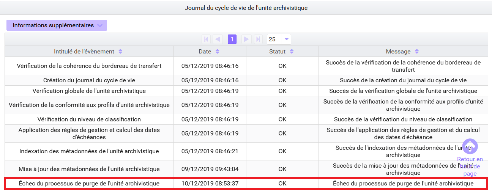

Le transfert avec la solution logicielle Vitam
====

Introduction
----

### Documents de référence

|Document |Date de la version|Remarques|
|:---------------:|:-----:|:-----:|
|  NF Z 44022 – MEDONA – Modélisation des données pour l’archivage|18/01/2014||
|Standard d’échange de données pour l’archivage – SEDA – v. 2.1|06/2018||
|Standard d’échange de données pour l’archivage – SEDA – v. 2.2|02/2022|Cette nouvelle version du SEDA est intégrée à la solution logicielle Vitam à partir de la V6.RC.|
|[Vitam – Modèle de workflow](./modele_de_workflow.md)||

### Présentation du document

Le transfert et la restitution des archives font partie des processus archivistiques mis en œuvre dans la solution logicielle Vitam.  
Ce document s’articule autour des axes suivants :
- détermination du caractère transférable des unités archivistiques,
- modalités d’une demande de transfert,
- modalités de mise en œuvre d’un transfert.
Le présent document décrit les fonctionnalités qui sont offertes par la solution logicielle Vitam au terme de la version 6 (mars 2023). Il a vocation à être amendé, complété et enrichi au fur et à mesure de la réalisation de la solution logicielle Vitam et des retours et commentaires formulés par les ministères porteurs et les partenaires du programme.

Définitions
----

Le transfert d’archives consiste en la restitution définitive d’archives par le service en charge de leur conservation vers le service qui les a produites ou un tiers.  
Il peut intervenir à plusieurs occasions :
- Un service producteur demande à ré-activer un dossier archivé. La restitution peut alors être partielle et ne pas porter sur l’ensemble des archives composant le transfert d’origine.  
- Le transfert peut être à l’initiative d’un service producteur ou d’un service d’archives, notamment lors de la fin d’un contrat liant un service producteur et un tiers-archiveur.
- Des règles de gestion associées à des archives arrivent à échéance et impliquent un transfert de responsabilité en termes de conservation de ces dernières, et, de fait, un transfert vers un autre système d’archivage électronique.  
La manière de procéder à une restitution d’archives est définie dans la norme NF Z 44‑022 et dans sa déclinaison pour les acteurs du service public, le Standard d’échanges de données pour l’archivage (SEDA).  
La transaction s’effectue en deux temps :
- un transfert des archives, après une éventuelle demande, vers une plate-forme de destination ;
- après confirmation du transfert, suppression des archives de la plate-forme d’origine.

Modélisation des échanges :  


Détermination du caractère transférable d’une unité archivistique avec la solution logicielle Vitam
----

### Une durée d’utilité arrivée à échéance

Pour être transférable, une unité archivistique peut ou doit définir ou hériter des règles suivantes :
- une règle de durée d’utilité courante dont la date d’échéance est dans le passé par rapport à une date donnée et un sort final « transfer ».
- une règle de durée d’utilité administrative dont la date d’échéance est dans le passé par rapport à une date donnée et un sort final « keep ».  

Si l’unité archivistique n’a qu’un sort final « transfer » ou « keep » sans règle associée permettant de calculer une date d’échéance, elle pourra être considérée comme transférable. En revanche, il sera nécessaire d’effectuer des contrôles supplémentaires en vue de vérifier qu’elle est transférable en l’état.  

**Point d’attention :**
Que ce soit dans le premier ou dans le second cas, la solution logicielle Vitam n’effectue aucun contrôle sur les archives identifiées comme transférables. En d’autres termes, il n’existe pas actuellement de service d’analyse tel qu’il existe pour les opérations d’élimination, qui ne retient que les archives à éliminer en raison de l’arrivée à échéance de leur règle de gestion. Il revient à l’utilisateur de faire les contrôles nécessaires en vue de transférer uniquement les archives dont la durée de conservation dans le système d’archivage électronique d’origine est arrivée à échéance, sans inclure dans le lot d’archives à transférer des archives qui ne doivent pas l’être.  

### Un fonds à restituer dans sa complétude

Une unité archivistique ou un lot d’archives peuvent être transférables sans tenir compte des règles de gestion qui leur sont associées dans les cas suivants :
- le service producteur demande une restitution complète de tout ou partie de ses fonds conservés dans le système d’archivage électronique, même si les règles de gestion associées à ses archives ne sont pas échues ;
- le service d’archivage électronique prend fin. L’opérateur d’archivage doit alors assurer la réversibilité des données en :
    - les restituant à leur producteur d’origine,
    - les transférant au service d’archives ayant compétence pour les conserver,
    - les migrant vers un nouveau système d’archivage électronique.

**Point d’attention :** 

Après confirmation de la réception de ces archives par le système d’archivage électronique de destination, il faudra veiller à procéder à leur purge dans le système d’archivage électronique d’origine, afin que ne subsiste pas deux copies de ces archives dans deux systèmes différents. Cette purge est automatisable.  
3.3.  Cas où l’utilisation de la fonctionnalité de transfert est déconseillée
La constitution d’un lot d’archives à transférer et la fonctionnalité de transfert doivent être utilisées lorsque l’on veut transmettre à la fois des archives et la responsabilité de leur conservation avec une traçabilité des événements ayant concerné ces archives dans le système d’archivage d’origine. Après acquittement du transfert, le lot d’archives est supprimé du système d’origine.  
De fait, pour un transfert d’archives sans transfert de responsabilité, il est conseillé de recourir à la fonctionnalité de constitution d’un Dissemination Information Package (DIP) minimal ou complet qui permet de transmettre des archives (métadonnées et objets techniques) sans les supprimer ensuite du système d’origine.  
Pour une simple transmission d’objet technique, il est conseillé d’utiliser la fonctionnalité de téléchargement d’un objet.  

Réalisation d’une opération de transfert avec la solution logicielle Vitam
---

La solution logicielle Vitam permet de constituer des DIP de transfert destinés à être pris en charge par une plate-forme utilisant la solution logicielle Vitam (autre tenant ou autre instance). Le transfert génère un accusé de prise en charge dans le système d’archivage de destination et un effacement des données dans le système d’origine.

Modélisation des opérations et des objets échangés :


### Lancement d’une campagne de transfert d’archives (ARCHIVE_TRANSFER)

#### Constitution d’un lot d’archives à transférer

La solution logicielle permet de préparer un lot d’archives à transférer.
- Par l’IHM de démonstration, cette opération se fait via le détail d’une unité archivistique et peut porter sur l’unité archivistique en question, l’unité archivistique et sa descendance ou sur l’ensemble de l’entrée par laquelle cette unité archivistique a été transférée dans la solution logicielle Vitam.
- Depuis l’APP « Recherche et consultation des archives » de VitamUI, cette opération se fait après sélection d’un lot d’archives.
- Par API, plusieurs critères de constitution d’un lot d’archives à transférer sont utilisables : identifiant d’une opération d’entrée, unité(s) archivistique(s) précise(s), ensemble des unités archivistiques dépendant d’une unité archivistique précise, etc.
- Des filtres supplémentaires peuvent être demandés sur :
    - les usages. Ce filtre sera contrôlé par rapport aux droits octroyés par le contrat accès, pour ne transférer par exemple que les originaux numériques (BinaryMaster) sans les versions de diffusion ou les vignettes ;
    - la version du SEDA. Ce filtre fonctionne de la manière suivante :
        - S’il n’est pas utilisé, le DIP de transfert généré sera déclaré en SEDA 2.2 ;
        - Un contrôle de compatibilité est effectué entre la version du SEDA demandée dans le DIP et celle des unités archivistiques devant intégrer ce dernier.
    - Les journaux de cycle de vie peuvent être intégrés dans le lot d’archives à transférer. Il est conseillé d’activer cette option lorsque les unités archivistiques et les groupes d’objets techniques transférés doivent pouvoir faire l’objet d’une traçabilité forte.

L’utilisateur autorisé doit renseigner un certain nombre de paramètres qui permettront d’alimenter le manifeste référençant les archives à transférer :
- informations obligatoires :
    - contrat d’entrée à utiliser pour la prise en charge dans la plate-forme de destination (ArchivalAgreement),
    - identifiant du service producteur (OriginatingAgencyIdentifier),
    - identifiant du service d’archives (sous-bloc Identifier du bloc ArchivalAgency),
    - identifiant du service de transfert (sous-bloc Identifier du bloc  TransferringAgency). Si ce bloc n’est pas renseigné, la solution logicielle Vitam auto-incrémentera la valeur « VITAM » comme service en charge du transfert ;
- informations facultatives :
    - intitulé (Comment),
    - identifiant du service versant (SubmissionAgencyIdentifier),
    - identifiant d’un transfert associé (RelatedTransferReference),
    - identifiant de la réponse à une demande de transfert (TransferRequestReplyIdentifier).

**Point d’attention :**
- Ces paramètres doivent être conformes aux valeurs attendues par le SAE de destination. Ils ne font pas l’objet d’un contrôle par rapport aux référentiels du SAE d’origine. Il est ainsi possible d’indiquer un identifiant de contrat d’entrée qui n’existe pas dans le référentiel des contrats d’entrée du SAE d’origine.
- Il est obligatoire d’indiquer le service producteur, pour deux raisons. D’une part, l’identifiant de ce service pour le SAE de destination n’est pas forcément identique à celui du SAE d’origine. D’autre part, la solution logicielle Vitam impose de ne déclarer dans le manifeste/bordereau de transfert qu’un seul service producteur pour l’ensemble des archives transférées. En cas de transfert d’archives provenant de plusieurs services producteurs, c’est à l’utilisateur qu’il revient de choisir le service producteur le plus « générique » à indiquer.  
      Par exemple, dans le cas d’un transfert regroupant les divers versements faits par les bureaux d’une sous-direction, c’est cette sous-direction qui pourra être désignée comme producteur des archives transférées. Les services producteurs d’origine pourront figurer dans les descriptions des unités archivistiques.

#### Consultation des résultats de la demande de transfert

Le résultat de l’opération de demande de transfert (ARCHIVE_TRANSFER / Transfert des unités archivistiques et des groupes d'objets) peut être consulté :
- en allant dans le menu « Opérations », sur l’IHM de démonstration ;
- depuis l’APP « Journal des opérations » de l’IHM VitamUI ;
- via les API.
L’opération peut aboutir aux résultats suivants :
- L’opération de demande de transfert est en succès ;
- L’opération de demande de transfert de transfert est en avertissement :
    - s’il n’y a pas d’objet technique concerné (statut « OBJECTS_LIST_EMPTY ») ;
    - si une unité archivistique a déjà fait l’objet d’une demande de transfert (message : {\"Reason\":\"unit [identifiant de l’unité archivistique] already in transfer\"} à la tâche « CREATE_MANIFEST ») ;
- L’opération de demande de transfert de transfert sera en erreur si aucun des paramètres obligatoires n’est renseigné (message : {"Reason":"ArchivalAgreement parameter is required, OriginatingAgencyIdentifier parameter is required, ArchivalAgency parameter is required."} à la tâche « CREATE_MANIFEST »).  

Sont également disponibles :
- Un rapport en JSONL qui récapitule la requête ciblant les unités archivistiques et liste les unités archivistiques effectivement prises en compte pour la constitution du paquet de transfert. Le statut de ces dernières peut être :
    - OK : l’unité archivistique est transférable et fait partie du lot à transférer,
    - ALREADY_IN_TRANSFER : l’unité archivistique fait déjà l’objet d’une demande de transfert et ne fait pas partie du lot à transférer ;

Exemple de rapport au format JSONL :

``````
{"DslQuery":{"$roots":[],"$query":[{"$eq":{"#id":"aeaqaaaabahftfesaab6yalqlwe54laaaaba"},"$depth":1000}],"$filter":{"$limit":10000},"$projection":{},"$facets":[]}}
{"id":"aeaqaaaabahftfesaab6yalqlwe54laaaaba","status":"OK"}
``````
Un DIP dit de « transfert » dont l’intitulé correspond au préfixe « TRANSFER- », suivi de l’identifiant de l’opération, et qui prend la forme d’un fichier ZIP. Ce DIP contient :
- un fichier « manifest.xml » correspondant à un message « ArchiveTransfer » du SEDA et dont l’identifiant du message correspond à l’identifiant de l’opération (MessageIdentifier) ;
- un répertoire Content contenant l’ensemble des objets binaires (fichiers numériques) associés au bordereau, dans le cas où des objets sont transférés.
- l’empreinte du DIP de transfert disponible à la tâche de Création de l’archive et de son déplacement vers l’espace de stockage .

**Point d’attention :**
- Dans le fichier « manifest.xml », la distinction entre unités archivistiques d’arbre, de plan ou standard n’est pas conservée.
- Dans ce même fichier, la distinction entre archives gelée avec ou sans durée définie dans le référentiel des règles de gestion n’est pas conservée, à moins de déterminer une  date de fin de gel (« HoldEndDate ») dans le cas d’une règle déclarée sans durée.
- Si le groupe d’objets techniques d’origine comprend plusieurs versions pour un même usage, c’est par défaut la dernière version qui sera exportée. Il n’est actuellement pas possible d’exporter plusieurs versions pour un même usage.
- À ce stade-là, la solution logicielle Vitam ne vérifie pas si l’unité archivistique à transférer contient des unités archivistiques enfants. Il revient à l’utilisateur de préparer son paquet d’archives à transférer avec précaution, en veillant à ne pas transférer une unité archivistique sans ses enfants, de manière à ne pas obtenir par la suite des refus de transfert pour cause d’unité non supprimable au risque de créer des incohérences dans le graphe.

### Consultation des résultats de la demande de transfert en base de données

L’appartenance d’une unité archivistique à une opération de transfert est enregistrée dans les métadonnées de celle-ci.  
En effet, l’identifiant de l’opération de transfert est indexé dans les métadonnées des unités archivistiques concernées (champ « _opts). Cela permet de rechercher les unités archivistiques faisant l’objet d’une demande de transfert en général ou en particulier.  

Exemple d’unité archivistique ayant fait l’objet d’une demande de transfert :  

```json
{
    "_id": "aeaqaaaabahftfesaab6yalqlwe54laaaaba",
    "DescriptionLevel": "RecordGrp",
    "Title": "Ambassade de France en Ruritanie",
    "Description": "C:\\Users\\mehdi.afnai\\Desktop\\Test Keep implicite\\Test Keep\n                        implicite\\Ambassade_de_France_en_Ruritanie",
    "StartDate": "2018-10-04T16:39:43",
    "EndDate": "2018-10-04T16:39:43",
    "_mgt": {},
    "_sedaVersion": "2.1",
    "_implementationVersion": "3.1.0-SNAPSHOT",
    "_unitType": "INGEST",
    "_opi": "aeeaaaaabchhfmwoaaxhialqlwe5nqqaaaaq",
    "_ops": [
        "aeeaaaaabchhfmwoaaxhialqlwe5nqqaaaaq"
    ],
    "_storage": {
        "strategyId": "default"
    },
    "_sps": [
        "Service_producteur"
    ],
    "_sp": "Service_producteur",
    "_up": [],
    "_us": [],
    "_graph": [],
    "_us_sp": {},
    "_uds": {},
    "_min": 1,
    "_max": 1,
    "_glpd": "2020-02-19T13:01:26.537",
    "_v": 1,
    "_av": 1,
    "_tenant": 8,
    "_opts": [
        "aeeaaaaabchhfmwoaanoualqlwr54ayaaaaq"
    ]
}
```

### Transfert d’archives vers un autre système (INGEST)

Le DIP dit « de transfert » peut être alors transféré :
- soit sur un autre tenant de la même plate-forme d’archivage utilisant la solution logicielle Vitam ;
- soit sur une autre plate-forme utilisant la solution logicielle Vitam ;
- soit dans un autre système d’archivage électronique.

**Points d’attention :**  
- les paramètres obligatoires saisis doivent être référencés dans la plate-forme de destination, sans quoi le transfert sera en échec ;
- il en va de même pour les règles de gestion. Celles-ci doivent être référencées dans la plate-forme de destination. Les règles de gel, en particulier, doivent être déclarées à l’identique (avec ou sans mesure), afin que le transfert n’échoue pas ;
- dans le cas d’un transfert vers un autre système, ce dernier doit être en mesure d’accepter un message « ArchiveTransfer » et renvoyer un message « ArchiveTransferReply » tous deux conformes au SEDA 2.1 ou au SEDA 2.2 et aux attendus de la solution logicielle Vitam. Si ce n’est pas le cas, il faudra veiller à prévoir une interopérabilité des données entre la solution logicielle Vitam et le système destinataire des données.

### Finalisation du transfert dans la solution logicielle Vitam (TRANSFER_REPLY)

La solution logicielle ne permet pas de confirmer et d’acquitter un transfert depuis l’IHM de démonstration. Cette opération est réalisable :
- au moyen des API ;
- depuis l’APP « Recherche, consultation et gestion des archives » de l’IHM VitamUI.

Le processus d’acquittement du transfert débute avec la réception de l’accusé de réception en provenance du système d’archivage électronique de destination. Il est en effet lancé par rapport à la réception du message « ArchiveTransferReply » faisant état de la bonne réception du lot d’archives à transférer par le système d’archivage destinataire.  
Pour des raisons liées aux problématiques de calcul de graphe, il n’est pas possible de lancer cette action si une autre action de constitution d’un lot d’archives à transférer est en cours (ou en pause) ou en parallèle d’une action telle que la modification d’arborescence ou l’élimination. Pour ce faire, la solution logicielle vérifie si des processus concurrents ne sont pas en cours au lancement du processus d’acquittement du transfert.  
L’opération de transfert implique en outre que la mise en œuvre de l’acquittement du transfert proprement dite (TRANSFER_REPLY) soit précédée dans la solution logicielle d’une phase de constitution d’un lot d’archives à transférer dans le cadre d’une opération de demande de transfert (ARCHIVE_TRANSFER). Cette dernière, visant à constituer un lot permet en effet d’indiquer dans les métadonnées que des unités archivistiques sont en cours de transfert, et de fait purgeables suite à la confirmation du transfert par le message « ArchiveTransferReply ».  
Lors de cette opération d’acquittement du transfert ou de purge, le système d’archivage électronique d’origine procède à la vérification du statut du message « ArchiveTransferReply » (statut OK, WARNING ou KO) et à la vérification de l’identifiant d’opération qu’il renvoie (bloc MessageRequestIdentifier). En d’autres termes, il vérifie que les unités archivistiques qui sont référencées dans le message « ArchiveTransferReply » comme prises en charge par le système d’archivage électronique de destination sont bien comprises dans l’opération de transfert préalablement lancée et pas une autre. Ainsi, il évite de déclencher une purge d’unité archivistique qui n’ont pas fait l’objet de la demande de transfert.  
Si le message « ArchiveTransferReply » a un statut OK ou WARNING et si l’identifiant d’opération est connu du système d’archivage électronique d’origine (bloc MessageRequestIdentifier), le message « ArchiveTransferReply » récupéré du système destinataire du lot à transférer est stocké par le système d’archivage électronique d’origine.  
Le système d’archivage électronique d’origine déclenche alors la purge des unités archivistiques, des groupes d’objets techniques et des objets binaires (fichiers numériques) concernés par l’opération de transfert acquittée et référencés dans le message « ArchiveTransferReply ». Cette purge obéit à des règles similaires à celles mises en place dans l’opération d’élimination[^1] :
- conservation des unités archivistiques qui ont des unités archivistiques filles (orphelinage),
- détachement des groupes d’objets techniques rattachés à plusieurs unités archivistiques si une unité archivistique seule est purgée,
- conservation des unités archivistiques, des groupes d’objets techniques et/ou des objets binaires qui ne sont pas référencés dans le message « ArchiveTransferReply »,
- purge des unités archivistiques, des groupes d’objets techniques et/ou des objets binaires qui étaient identifiés comme étant déjà en cours de transfert,
- purge des unités archivistiques si aucun des cas précédents ne s’applique. 

Le statut de l’opération à l’issue de la mise en œuvre de la purge pourra être :
- succès : toutes les unités archivistiques soumises ont été supprimées du système d’origine ;
- avertissement : parmi les unités archivistiques soumises par le message « ArchiveTransferReply », la phase d’acquittement a permis de déterminer que certaines ne devaient pas être supprimées ou ne pouvaient pas l’être, en raison des motifs suivants :
    - les unités archivistiques, les groupes d’objets techniques et/ou les objets binaires ont déjà fait l’objet d’une purge (message : {"Event":"File not found"} à la tâche TRANSFER_REPLY_DELETE_SIP) ;
    - des unités archivistiques ne peuvent être purgées car leur suppression entraînerait des incohérences du graphe (message : {"Event":"Unit cannot be deleted because it has child units attached to it."}) ;
    - des groupes d’objets techniques rattachés à plusieurs unités archivistiques ont été détachées si une unité archivistique seule est purgée ;
- fatal : une erreur technique s’est produite lors du processus de mise en œuvre de l’acquittement du transfert.  
Si l’opération s’effectue avec succès, les unités archivistiques, des groupes d’objets techniques et des objets binaires (fichiers numériques) sont purgés du système.  
L’opération d’acquittement du transfert produit un rapport au format JSONL qui récapitule le contexte de l’opération et liste les unités archivistiques, les groupes d’objets techniques et les objets binaires (fichiers numériques) ayant fait l’objet de l’opération.  

Exemple de rapport au format JSONL :

```json
{"tenant":8,"evId":"aeeaaaaabchhfmwoaanoualqlx7lbiyaaaaq","evType":"","outcome":"","outDetail":"","outMsg":"","rightsStatementIdentifier":{},"evDetData":{}}
{"evEndDateTime":"2020-02-19T15:09:03.566","reportType":"TRANSFER_REPLY","vitamResults":{},"extendedInfo":{}}
{}
{"id":"aeaqaaaabahi7u6oaabzialqlwgjp3aaaaba","params":{"id":"aeaqaaaabahi7u6oaabzialqlwgjp3aaaaba","type":"Unit","status":"DELETED","opi":"aeeaaaaabchhfmwoaaxhialqlwgg66qaaaaq","originatingAgency":"RATP","objectGroupId":"aebaaaaabahi7u6oaabzialqlwgjppyaaaba"}}
{"id":"aeaqaaaabahi7u6oaabzialqlwgjp2yaaabq","params":{"id":"aeaqaaaabahi7u6oaabzialqlwgjp2yaaabq","type":"Unit","status":"DELETED","opi":"aeeaaaaabchhfmwoaaxhialqlwgg66qaaaaq","originatingAgency":"RATP"}}
{"id":"aebaaaaabahi7u6oaabzialqlwgjppyaaaba","params":{"id":"aebaaaaabahi7u6oaabzialqlwgjppyaaaba","type":"ObjectGroup","status":"PARTIAL_DETACHMENT","opi":"aeeaaaaabchhfmwoaaxhialqlwgg66qaaaaq","originatingAgency":"RATP","deletedParentUnitIds":["aeaqaaaabahi7u6oaabzialqlwgjp3aaaaba"]}}
```

Pour chaque unité archivistique et groupe d’objets techniques, l’opération de purge peut aboutir aux statuts suivants :
- DELETED : l’unité et/ou le groupe d’objets techniques a été supprimé ;
- NON_DESTROYABLE_HAS_CHILD_UNITS : l’unité archivistique ne peut être supprimée, car elle comporte des enfants et sa suppression entraînerait des incohérences dans le graphe du système d’archivage électronique d’origine ;
- DETACHED : le groupe d’objets techniques a été détaché d’au moins une unité archivistique ;
- ALREADY_DELETED : l’unité archivistique et/ou le groupe d’objets techniques a déjà été transféré et purgé du système.

Si une unité archivistique ne peut pas être purgée, un événement est enregistré dans son journal de cycle de vie.  
Exemple d’événement enregistré dans le journal du cycle de vie d’une unité archivistique :


### Mise à jour du registre des fonds

Le transfert d’unités archivistiques a des conséquences sur le registre des fonds propres et symboliques.  
Pour les fonds propres, les totaux d’unités archivistiques (AU), groupes d’objets techniques (GOT), objets techniques (OT) et la volumétrie sont mis à jour immédiatement. Le détail de l’opération d’entrée concernée est également mis à jour.   
- Dans l’IHM de démonstration, en cliquant sur la ligne de cette opération, l’utilisateur peut connaître toutes les opérations qui ont affecté cette entrée et le nombre d’unités archivistiques (AU), groupes d’objets techniques (GOT), objets techniques (OT) ainsi que la volumétrie concernée pour chacune des opérations, celle de l’entrée initiale comme celles de l’acquittement du transfert qui ont ensuite affecté cette entrée.
- Dans l’IHM VitamUI, ces opérations de transfert sont visibles en cliquant sur la ligne de cette opération au terme de la version 6.RC.

Pour les fonds symboliques, au moment du calcul périodique des fonds symboliques de la base, les unités archivistiques (AU), groupes d’objets techniques (GOT), objets techniques (OT) transférés et éliminés du système d’origine seront décomptés et la volumétrie sera mise à jour. Depuis la notice du service agent, l’utilisateur peut accéder à l’historique des rattachements et consulter sur une période donnée les variations à la hausse ou à la baisse des fonds symboliques pour ce producteur.  

Exemple d’entrée impactée par un transfert d’archives dans le registre des fonds :

```json
{
    "_id": "aehaaaaabahi7u6oaabzialqlwhptjiaaaaq",
    "ObjectSize": {
        "ingested": 24,
        "deleted": 0,
        "remained": 24
    },
    "AcquisitionInformation": "Versement",
    "LegalStatus": "Public Archive",
    "OriginatingAgency": "RATP",
    "SubmissionAgency": "RATP",
    "ArchivalAgreement": "IC-000001",
    "EndDate": "2020-02-19T13:06:56.037",
    "StartDate": "2020-02-19T13:06:56.037",
    "LastUpdate": "2020-02-19T15:09:02.743",
    "Status": "STORED_AND_COMPLETED",
    "TotalObjectGroups": {
        "ingested": 4,
        "deleted": 0,
        "remained": 4
    },
    "TotalUnits": {
        "ingested": 29,
        "deleted": 2,
        "remained": 27
    },
    "TotalObjects": {
        "ingested": 5,
        "deleted": 0,
        "remained": 5
    },
    "Opc": "aeeaaaaabchhfmwoaaxhialqlwgg66qaaaaq",
    "Opi": "aeeaaaaabchhfmwoaaxhialqlwgg66qaaaaq",
    "OpType": "INGEST",
    "Events": [
        {
            "Opc": "aeeaaaaabchhfmwoaaxhialqlwgg66qaaaaq",
            "OpType": "INGEST",
            "Gots": 4,
            "Units": 29,
            "Objects": 5,
            "ObjSize": 24,
            "CreationDate": "2020-02-19T13:06:56.037"
        },
        {
            "Opc": "aeeaaaaabchhfmwoaanoualqlx7lbiyaaaaq",
            "OpType": "TRANSFER_REPLY",
            "Gots": 0,
            "Units": -2,
            "Objects": 0,
            "ObjSize": 0,
            "CreationDate": "2020-02-19T15:09:02.743"
        }
    ],
    "OperationIds": [
        "aeeaaaaabchhfmwoaaxhialqlwgg66qaaaaq"
    ],
    "_tenant": 8,
    "_v": 1
}
```

**Point d’attention :** 

Le calcul des unités archivistiques (AU), groupes d’objets techniques (GOT), objets techniques (OT) rattachés à un producteur au titre de son fonds symbolique n’est effectué qu’une fois par vingt-quatre heures (sauf paramétrage différent de la plate-forme). Dans ces conditions, si sur la même période de vingt-quatre heures l’archiviste effectue une entrée pour 3 unités archivistiques et un transfert acquitté pour 3 unités archivistiques, le total des symboliques entre deux calculs n’aura pas évolué.

[^1] Pour plus d’informations sur le processus d’élimination, consulter le document [Les éliminations avec la solution logicielle Vitam](./eliminations.md).
