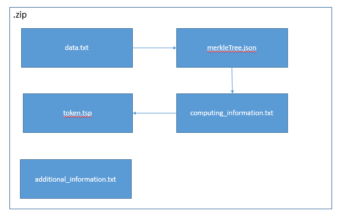
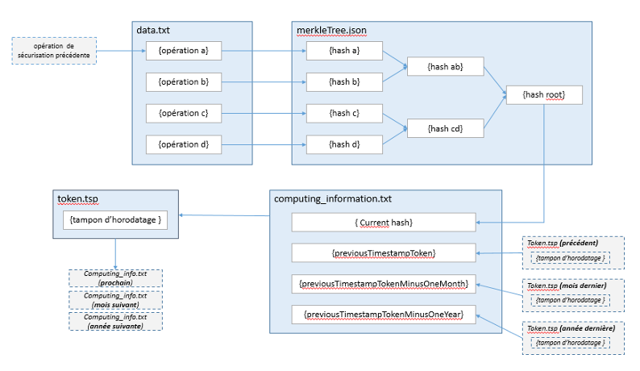

Conservation de la valeur probante
====
Introduction
----
### Documents de référence


  |Document |Date de la version|Remarques|
  |:---------------:|:-----:|:-----:|
  |NF Z 42‑013 – Archivage électronique – recommandations et exigences|30/09/2020||
  |NF Z 42‑020 – Spécifications fonctionnelles d’un composant Coffre-Fort Numérique destiné à la conservation d’informations numériques dans des conditions de nature à en garantir leur intégrité dans le temps|07/2012||
  |GA Z42-019 – Guide d’application de la NF Z 42‑013 (Archivage électronique – Spécifications relatives à la conception et à l'exploitation de systèmes informatiques en vue d’assurer la conservation et l’intégrité des documents stockés dans ces systèmes)|06/2010|Cette nouvelle version du SEDA est intégrée à la solution logicielle Vitam à partir de la V6.RC.|
  |Vitam – Gestion de la préservation|31/03/2023|Le document apporte des précisions sur le comportement de l’opération permettant de générer un relevé de valeur probante.|
  

### Présentation du document

La conservation de la valeur probante est un sujet central d’un système d’archivage électronique. L’objectif est de rendre prouvable toute opération effectuée sur toute unité archivistique ou tout objet qui lui est associé. Toutefois, vu les volumétries envisagées dans les implémentations de la solution logicielle Vitam, il est illusoire de gérer ceci objet par objet, en mettant en œuvre des principes cryptographiques (signatures des objets, des actions unitaires, etc.) ; cela induirait une gestion lourde et porterait même des risques d’écroulement de confiance en cas de corruption de quelques clés. La sécurité d’un SAE doit être systémique, c’est-à-dire reposer sur un faisceau d’éléments redondants dont la modification simultanée et cohérente est impossible, ou plus exactement non réalisable en pratique. Les journaux constituent un élément central de cette sécurité systémique.
Le cadre fourni pour la conservation de la valeur probante par les normes NF Z 42‑013, NF Z 42‑020 mais aussi le guide d’application GA Z42-019, a été pris en compte et complété dans la solution logicielle Vitam.
Ce document présente rapidement, d’un point de vue fonctionnel, le mécanisme de journalisation métier et de sécurisation de ces journaux qui est une brique essentielle de la conservation de la valeur probante dans la solution logicielle Vitam . Il décrit aussi le « relevé de valeur probante », attestation au sens de la NF Z 42‑013 de la conservation de la valeur probante qui peut être obtenue via une API. Ce document devra être enrichi au fur et à mesure de l’avancement des travaux sur la gestion de la preuve.


Journaux
-----

La solution logicielle Vitam enregistre les événements signifiants contribuant à la conservation de la valeur probante dans trois journaux métier :
- Le journal des opérations, qui a pour objectif d’enregistrer toutes les opérations effectuées par la solution logicielle et ayant un impact significatif dans le système ou sur les unités archivistiques, groupes d’objets et objets pris en charge par celle-ci ;
- Les journaux du cycle de vie, qui ont pour objectif d’enregistrer toutes les actions significatives effectuées par la solution logicielle sur chacune des unités archivistiques et sur chacun des groupes d’objets techniques et des objets qui les composent. Est considérée comme une action significative, toute action modifiant l’entité concernée ou apportant une information significative sur son cycle de vie (ex. : modification d’une règle de gestion pour une unité archivistique, ajout d’un nouvel objet ou réidentification du format des objets pour les groupes d’objets techniques). Ces journaux sont créés lors de la prise en charge des unités archivistiques et des groupes d’objets ;
- Le journal des écritures, qui a pour objectif de tracer les opérations d’écriture effectuées par la solution logicielle sur les offres de stockage. Il garantit de fait l’horodatage et l’intégrité de tout élément dans le système.

**Nota bene :**
Il y a un décalage dans les appellations des journaux par rapport à la norme NF Z 42‑013. Alors que la 42-013 parle de journal de cycle de vie des archives sans distinction de type d’évènements, la solution logicielle Vitam a fait le choix d’avoir des informations journalisées de type micro, pour chaque élément d’archives, et d’autres de type macro, pour les actions du système comme les entrées de SIP, les éliminations, les transferts…  Il a été décidé que le niveau de journal le plus fin devait garder l’appellation de « journal du cycle de vie des archives ». Par contre, les événements de niveau plus macro du système sont enregistrés dans le « journal des opérations »[^1].

Preuve systémique
-----

Comme dit en introduction la sécurité d’un SAE doit être systémique, c’est-à-dire reposer sur un faisceau d’éléments redondants dont la modification simultanée et cohérente est impossible, ou plus exactement non réalisable en pratique. La preuve systémique de la bonne conservation de la valeur probante vient de la sécurisation de ces trois journaux (opérations, cycle de vie, écriture) dont les informations croisées permettent d’assurer la traçabilité de tout événement, et d’en apporter la preuve, parfois par plusieurs voies.

À titre d’exemple, l’entrée d’un objet, avec les éléments métiers utiles, peut être prouvée via :
- le journal du cycle de vie du groupe d’objets qui fournit la date de création du journal, l’identifiant de l’opération qui a occasionné la prise en charge de l’objet dans la solution logicielle Vitam, ainsi que l’empreinte de l’objet ;
- le journal des opérations qui contient l’identifiant de l’opération qui a occasionné la prise en charge de l’objet dans la solution logicielle Vitam, la date de cette opération et l’identité du service responsable de l’entrée (s’il s’agit d’une entrée et non d’une opération de préservation).

Cette prise en charge d’un objet peut aussi être prouvée via le journal des écritures qui assure l’écriture de cet objet (via son empreinte) sur les offres de stockage, même si ce journal est de nature intermédiaire entre le log technique et le journal métier.

Cette réflexion initiale devra être précisée au fur et à mesure des travaux sur les relevés de preuve à apporter et avec la détermination des événements précis que l’on voudra pouvoir prouver. Les éléments figurant actuellement dans les journaux doivent permettre par composition de prouver tous les types d’événements et l’état du système.

Sécurisation des journaux
-----

### Contexte de sécurisation
La sécurisation des journaux consiste à apporter de la sécurité cryptographique sur l’objet journal en tant que tel et permet de renforcer l’enregistrement des événements.

Voici quelques éléments pris en compte dans la conception de cette sécurisation :
1. Le guide GA Z 42-019 demande explicitement (cf 2.2.8.1.b) un chaînage des journaux, celui-ci est mis en œuvre.
2. La norme NF Z 42‑013 demande aussi un horodatage au moins toutes les 24 heures. Un fichier spécifique est généré avec toutes les lignes présentes dans le journal depuis la dernière sécurisation. Ce fichier est horodaté sûrement avec un tampon RFC 3161. Cette opération dont le délai est paramétrable doit être faite pour être conforme à la norme au moins une fois par 24 heures.
3. La sécurité d’un tampon d’horodatage même ancien (plus que sa durée de validité cryptographique) peut être assurée par le chaînage et la vérification de la chaîne jusqu’à un tampon valide. Pour raccourcir ce parcours, le chaînage est fait avec des journaux du mois et de l’année précédents.
4. Il est utile de pouvoir prouver une ligne d’un journal sans devoir montrer les autres, non seulement pour des raisons de poids de données à transmettre pour une vérification de l’ensemble des pièces, mais aussi pour des raisons de confidentialité. Un mécanisme d’arbre de Merkle[^2] est mis en œuvre pour rendre prouvable chaque ligne indépendamment des autres.
De fait, la conjonction du chaînage et de l’arbre de Merkle constituent des principes des blockchains dont l’usage grandissant permet de garantir l’efficacité.  

### Procédure de sécurisation  
La sécurisation des journaux est opérée, tenant par tenant, par la génération puis la sauvegarde sur l’offre de stockage d’un fichier selon la procédure suivante :
- extraction de l’ensemble des éléments du journal à raison d’une ligne par élément et en partant de la ligne la plus ancienne non sécurisée ;
→ écriture dans un fichier nommé « data.txt »;
- construction et calcul de la racine de l’arbre de Merkle :
→ écriture de l’arbre de Merkle sous forme d’un arbre binaire json (root, Left, Rigth) dans un fichier « merkleTree.json » ;
- prise en compte des données qui vont faire l’objet d’un tampon d’horodatage : (racine de l’arbre de Merkle | TSP (Journal (précédent)) | TSP (Journal (J-1 mois)) | TSP (Journal (J-1 an)) :
→ écriture des quatre éléments utilisés pour le calcul du tampon d’horodatage à savoir dans l’ordre « currentHash » (racine de l’arbre de Merkle), « previousTimestampToken »,   « previousTimestampTokenMinusOneMonth » et « previousTimestampTokenMinusOneYear » dans un fichier « computing_information.txt » ;
- génération du tampon d’horodatage :
→ écriture dans un fichier « token.tsp » ;
- ajout des informations générales :
→ écriture des informations de nombre de lignes de journal sécurisées (« numberOfElements »), de date de début (« startDate ») et de date de fin (« endDate ») des événements des lignes de journal prises en compte, et de la version du format de sécurisation (« securisationVersion ») dans le fichier « additional_information .txt » ;
- clôture de l’opération :
→ agrégation de l’ensemble des fichiers dans un conteneur .zip sans compression, sauvegardé dans l’offre de stockage.





Cette procédure est lancée régulièrement sur les différents journaux, tenant par tenant. La périodicité de cette sécurisation est définie lors de l’installation de la plateforme et doit être définie pour lisser la charge de sécurisation. Elle doit, pour être conforme à la NF Z 42‑013, rester inférieure à 24 heures.  

À noter, le format de sécurisation mis dans le fichier « additional_information.txt » est mis à titre conservatoire pour permettre la mise en place de nouveaux formats qui seront pris en compte dans les traitements ultérieurs d’audit ou de génération de relevé de valeur probante. À ce jour seul le format « V1 » est utilisé.

### Mise en œuvre sur le journal des opérations
Le journal des opérations recense l’ensemble des opérations possibles dans le système : entrée, mise à jour unitaire ou en masse des métadonnées descriptives et des métadonnées de gestion,  élimination (des métadonnées ou des objets) et audit.
Le journal des opérations correspond à une table dans laquelle chaque enregistrement est une opération :
- chaque opération est composée d’une série d’événements (le premier étant un événement parmi les autres, sauf que c’est le premier, appelé ici bloc maître) ;
- chaque événement dispose de sa date d’événement ;
- la dernière date d’événement est donc celle du dernier événement dans le tableau des  événements ;
- de plus, à chaque écriture effective en base d’un nouvel événement, une date technique de persistance est utilisée pour tracer l’écriture des événements en base.

Lors de la sécurisation du journal des opérations, les éléments pris en compte pour la construction du fichier « data.txt » sont sélectionnés en fonction du moment de dernière modification en base des journaux à sécuriser, en partant du moment de dernière sécurisation jusqu’au moment présent, moins une période de temps paramétrable[^3] (par défaut 5 minutes).

La question s’est posée de prendre comme élément à sécuriser soit les événements unitaires des opérations, soit les opérations elles-mêmes. Il a été choisi de prendre l’ensemble des opérations ayant fait l’objet d’un événement dans la période qui doit être sécurisée (date technique de persistance), et de reprendre tous les événements de ces opérations y compris les antérieurs à la période de sécurisation. Cela permet, pour les opérations réalisées sur une longue période, d’avoir un enregistrement complet de l’opération jusqu’à sa finalisation.

Le fichier correspondant à l’extraction du journal des opérations est construit, de ce fait, avec tous les éléments du journal des opérations de la période de sécurisation (à savoir toutes les opérations dont l’un des événements a eu lieu dans la période temps de sécurisation), triés par date du dernier événement. Chaque élément du journal des opérations est enregistré au format JSON, mais à plat sur une ligne avec les sauts de ligne encodés.

**Nota bene :** comme la sécurisation est aussi une opération, en général[^4], le fichier de sécurisation du journal des opérations se finit par une opération de sécurisation non finalisée (celle en cours).

### Mise en œuvre sur les journaux du cycle de vie
Chaque unité archivistique et chaque groupe d’objets techniques dispose de son propre journal du cycle de vie qui trace tous les événements qui les concernent. Cette masse très importante de fichiers est stockée, comme les objets et les métadonnées, sur les offres de stockage pour en garantir la conservation optimale. Ces fichiers contiennent de nombreuses informations qui peuvent être signifiantes (par exemple la mention des changements de métadonnées et le différentiel des métadonnées lors d’une opération de mise à jour). Il faut donc être sélectif dans ce qui sera sécurisé, non seulement pour assurer suffisamment de traces sûres, mais aussi pour ne pas avoir dans les fichiers de sécurisation des journaux des informations qui devraient être effacées lors de l’élimination ou qui seraient couvertes par la protection du secret de la Défense nationale.

Pour la sécurisation, il a donc été choisi de faire une ligne par journal du cycle de vie ayant été affecté par une opération (une ligne est donc un couple cycle de vie/opération) pendant la période de sécurisation. Cette ligne portera des informations sur l’opération ayant généré l’événement de cycle de vie, des informations issues du journal du cycle de vie, le hachage des métadonnées et du journal du cycle de vie en base, le hachage du fichier contenant le couple métadonnées/journal du cycle de vie stocké sur disque et enfin, dans le cas des groupes d’objets techniques, la liste des objets et de leur hachage (voir le détail ci-dessous).

Pour les journaux du cycle de vie comme pour les journaux d’opérations, les éléments pris en compte pour la construction du fichier « data.txt » sont sélectionnés en fonction du moment de dernière modification en base des journaux à sécuriser, en partant du moment de dernière sécurisation jusqu’au moment présent moins une période de temps paramétrable5 (par défaut 5 minutes). Si le nombre d’éléments est supérieur à une limite paramétrable (par défaut 100 000), l’extraction est limitée à ce nombre d’éléments et une nouvelle sécurisation est lancée pour prendre en compte le reste, et ceci jusqu’à épuisement.
À ce jour, les opérations laissant une trace dans le journal du cycle de vie des unités archivistiques et des groupes d’objets sont : entrée, mise à jour unitaire ou en masse des métadonnées descriptives et des métadonnées de gestion, reclassement, préservation, élimination (des métadonnées ou des objets), transfert et audit (en cas d’erreur détectée).
Par exemple, on aura pour une ligne de journal du cycle de vie d’un DataObjectGroup la structure suivante (mise à plat sans retour chariot) :

````
{
	"hGlobalDetails":{
		"offerIds":["offer-fs-1.service.itrec.consul"],
		"strategyId":"default"
	},
	"hGlobalFStorage": "b1217c6339486e1d5b77aa496fa9b8805f4270ad59d1fbc754940641aea4656df56f122a15038234909b3b4192a027e68249b58ac6d81f44d571e43b516ea423",
	"hLFC": "ewN6aTW5T+m7RzuvJmBM4vLfKWdh33qly5JF1Bd3ooKZF/Xctp98ism9h2bl0O2Pmcfzwpih0u5Q3vQrGdHYkA==",
	"hLFCEvts": "d6gmO+wjZLye3L38Hu4geVjrYw9DaJ5+ScPthAyFRd8+CT2W88MCd9LNc2mEh2tlVoWryO50nCjVtc24JI4ZyQ==",
	"hMetadata": "OsYUJhP1AxvpnuToMhq9JFYua2j9c3Jz4tdjoO7v5UxMJC/au450Zmvek3QirUjMrbDX6EtfKOiunrVWkgY/Dg==",
	"hOGDocsStorage": [{
			"hDetails":{
				"offerIds":["offer-fs-1.service.itrec.consul"],
				"strategyId":"default"
			},
			"hObject": "46126752c92661048f734a9df8ddbcbab717e60400a3da9ea81c49d6018deb0587b841ac9f767701cb1b4b67818bb6c8344af13592f2b8b71ca7d7abf03ba992",
			"id": "aeaaaaaaaahdpurfabzhsald2t3xohqaaaaq"
		}
	],
	"lEvDTime": "2018-06-06T12:04:18.388",
	"lEvTypeProc": "INGEST",
	"lEvtIdProc": "aeeaaaaaachotoh2abksaald2t3ww5qaaaaq",
	"lfcId": "aebaaaaaaahdpurfabzhsald2t3xohyaaaaq",
	"ltEvtOutcome": "OK",
	"mdType": "OBJECTGROUP",
	"up": ["aeaqaaaaaahdpurfabzhsald2t4c4paaaaaq", "aeaqaaaaaahdpurfabzhsald2t3xoiiaaaba"],
	"version": 9
}
``````

Par exemple, on aura pour une ligne de journal du cycle de vie d’une unité archivistique la structure suivante (mise à plat sans retour chariot) :

````
{
	"hGlobalDetails":{
		"offerIds":["offer-fs-1.service.itrec.consul"],
		"strategyId":"default"
	},
	"hGlobalFStorage": "42c7c6ca6e089878d8b1d7b5fe07d149a1cb413973bbba04e09e8aeb05e368137814eed5eb043d1e754d2df86395e30c63728712030f6fc63ec41a78911a2500",
	"hLFC": "JsFAf/OekcIa74djhzh8zePPWbU9ErygsbQylrUpTrXvu1cuEahuMf1HzwXV9KU25FHesBU4LY0mNTesjhSDvg==",
	"hLFCEvts": "GSKYDzjbZuHzyB8T82mIkawOB41BXSgDGgLjwRRPYJE1KqGUsF/aCW3CmoRB3bV21j+w2d1lMvilNNwr1DfJhA==",
	"hMetadata": "VYYbdOT+LYEaynutm5GZjK00QJgGma3Ny8eE8fvCSEAzYwq2lwFn2lG+acuN8TqAnwGEArYDG5qUNzMHvEN3WQ==",
	"idOG": "aebaaaaaaahdpurfabzhsald2tjahyyaaaba",
	"lEvDTime": "2018-06-06T11:18:54.056",
	"lEvTypeProc": "INGEST",
	"lEvtIdProc": "aeeaaaaaachotoh2abksaald2ti7s4qaaaaq",
	"lfcId": "aeaqaaaaaahdpurfabzhsald2tjah2yaaaaq",
	"ltEvtOutcome": "OK",
	"mdType": "UNIT",
	"up": ["aeaqaaaaaahdpurfabzhsald2tjah3iaaaba"],
	"version": 5
}
``````

Pour reprendre en détail chaque champ, on a :
- hGlobalDetails : définit la stratégie de stockage mise en œuvre pour les éléments hors objets
- hDetails : définit la stratégie de stockage utilisée pour un objet
- offerIds : indique la liste des offres utilisées
- strategyID : identifie la stratégie de stockage
- hGlobalFStorage: hachage du fichier stocké réunissant métadonnées et journal du cycle de vie et dans le cas des groupes d’objets techniques
- hLFC : hachage du journal du cycle de vie dans sa forme en base
- hLFCEvts : hachage des lignes d’événement du journal du cycle de vie, sans les informations annexes techniques en base (pour mémoire, ce hachage permet de garantir, en cas d’investigation ciblée, une capacité de vérification d’un journal du cycle de vie après reconstitution sans connaître des informations techniques liées seulement à la gestion de la persistance et de la base dans la solution logicielle)
- hMetadata : hachage des métadonnées dans leur forme en base
- hOGDocsStorage : liste des objets stockés attachés au groupe d’objets techniques
    - id : identifiant unique de l’objet stocké
    - hObject : hachage de l’objet stocké
- idOG : identifiant unique du groupe d’objets techniques attaché le cas échéant à l’unité archivistique
- lEvDTime : date et heure de l’événement généré dans le journal du cycle de vie
- lEvTypeProc : nature de l’opération
- lEvtIdProc : identifiant unique de l’opération
- lfcId : identifiant unique du journal du cycle de vie, qui est aussi l’identifiant unique de l’unité archivistique ou du groupe d’objets techniques correspondant
- ltEvtOutcome : résultat de l’événement dans le journal du cycle de vie
- mdType : type UNIT pour les unités archivistiques ou OBJECTGROUP pour les groupes d’objets techniques
- up : liste des identifiants uniques des unités archivistiques parentes de cette unité archivistique ou de ce groupe d’objets techniques
- version : numéro de version, incrémenté à chaque modification de l’unité archivistique ou du groupe d’objets techniques, présent dans les métadonnées.

Les journaux sécurisés comportent toutes les informations nécessaires à la construction automatique des relevés de valeur probante. Par ailleurs, pour des raisons de gestion des volumétries, la sécurisation des journaux du cycle de vie des unités archivistiques et des groupes d’objets techniques a été séparée en opérations distinctes, et donc dans des fichiers séparés et chaînés sur deux files distinctes.

### Mise en œuvre sur le journal des écritures
Chaque écriture sur les offres de stockage donne lieu à une ligne dans un journal des écritures. Cette ligne comporte :
- la date de l’écriture
- le tenant concerné
- le type d’action (CREATE, DELETE)
- le nom du fichier
- le hachage du fichier récupéré lors de la vérification d’écriture
- la taille du fichier
- les modules des offres sur lesquels l’écriture a eu lieu
- le résultat de l’écriture

Pour des raisons techniques et des raisons de séparation des mécanismes de sécurité, il a été choisi de ne pas s’appuyer sur une persistance en base (MongoDB, ElasticSearch...) pour ce journal, mais simplement sur des mécanismes de logs locaux propres à chaque serveur d’offre de stockage.

La sécurisation se fait en 2 étapes :
- Sauvegarde des journaux locaux dans les offres. Cette opération est réalisée sur chacun des serveurs de stockage.
- Sécurisation globale de tous les journaux sauvegardés dans les offres.
Le fait de ne pas s’appuyer sur une persistance en base et la volumétrie de ces journaux a amené deux différences avec les autres types de journaux sécurisés :
- la sécurisation ne reprend pas comme ligne à protéger par l’arbre de Merkle les lignes des journaux d’écriture, mais construit une seule et unique ligne par fichier de journal d’écriture sur chaque serveur d’offre de stockage. Cette ligne contient le hachage du fichier de journal d’écriture à sécuriser. Le journal sécurisé des écritures prend ainsi en compte l’ensemble des journaux d’écritures, et fait référence aux journaux des écritures eux-mêmes stockés par ailleurs.
- Le chaînage n’est fait qu’avec le précédent journal sécurisé.
Hors ces différences, la structure est respectée et vérifiable de la même façon que les autres fichiers de sécurisation de journaux. Par exemple sur une ligne du fichier « data.txt » pour un fichier de journal d’écriture d’un serveur d’offre de stockage, on aura :
``````
{
  "FileName": "0_storage_logbook_20180306132033436_20180306132514628_aecaaaaaacfdgbvvaamrealb7n6msayaaaaq.log",
  "Hash": "kPvTdzVoWKk7QE4U+1y03qjzICz6HynE3Febm5OE0hY2eThlLyqJ5\/GaEesFqHb\/hSGA+fJRjrqOAFanklBfUQ=="
}
``````
Pour reprendre en détail chaque champ, on a :
- FileName : nom du fichier contenant le journal des écritures,
- Hash : hachage du fichier.
Ce journal est une sécurité supplémentaire par rapport aux journaux métiers standards (journal des opérations et journal du cycle de vie). Il peut servir d’ultime recours pour s’assurer de la présence d’un fichier dans le système à un moment donné.


Relevé de valeur probante
----

### Principe
Le relevé de valeur probante vise à apporter la preuve de la bonne existence d’un fichier dans le système à la date supposée de son apparition dans celui-ci. L’objet peut provenir de l’extérieur du SAE dans le cadre d’une opération d’entrée ou avoir été généré par le SAE dans le cadre d’une opération de préservation.

Partons de l’hypothèse que nous établissons le relevé de valeur probante pour un objet binaire. Nous disposons :
- du journal du cycle de vie du groupe d’objets techniques qui le contient en base,
- de l’enregistrement dans le journal des opérations de son opération de création en base,
- de n versions du fichier de l’objet binaire sur les offres.

Nous pouvons tirer de la base la date supposée de son apparition dans le système. L’objectif du relevé de valeur probante va être d’attester qu’à cette date supposée, l’objet binaire avait bien été créé dans le système et que les informations courantes, en base et sur les offres de stockage, sont bien cohérentes avec les informations dans les fichiers de sécurisation des journaux d’opération et du cycle de vie au moment de la création.

En fait le relevé de valeur probante est d’une nature proche de l’audit de cohérence, sauf qu’il s’applique à la date de la création de l’objet dans le système, et qu’il donne le détail de toutes les vérifications dans le rapport.
Sur chaque objet sont faites les vérifications de cohérences suivantes :
- la racine de l’arbre de Merkle de la sécurisation de l’opération de création en base, dans le fichier de sécurisation et celle recalculée sont les mêmes ;
- les tampons d’horodatage de la précédente sécurisation des journaux d’opération en base et dans le fichier de sécurisation sont les mêmes et sont bien des tampons valides ;
- les tampons d’horodatage de la sécurisation de l’opération de création en base et dans le fichier de sécurisation sont les mêmes et sont bien des tampons valides ;
- le tampon d’horodatage de la sécurisation de l’opération de création est bien issu du calcul avec, entre autres, les éléments vérifiés de la racine de l’arbre de Merkle et le tampon d’horodatage précédent.

**Cette suite, ci-dessus, de vérifications atteste que la sécurisation du journal de l’opération de création de l’objet est bien faite et chaînée.**


- les tampons d’horodatage de la sécurisation du journal du cycle de vie de l’objet au moment supposé de sa création en base et dans le fichier de sécurisation sont les mêmes et sont bien des tampons valides ;
- la racine de l’arbre de Merkle de la sécurisation du journal du cycle de vie de l’objet au moment supposé de la création en base, dans le fichier de sécurisation et celle recalculée sont les mêmes ;
- le tampon d’horodatage de la précédente sécurisation des journaux du cycle de vie en base et dans le fichier de sécurisation sont les mêmes et sont bien des tampons valides ;
- le tampon d’horodatage de la sécurisation du journal du cycle de vie de l’objet au moment de la création est bien issu du calcul avec, entre autres, les éléments vérifiés de la racine de l’arbre de Merkle et le tampon d’horodatage précédent.

**Cette suite, ci-dessus, de vérifications atteste que la sécurisation du journal du cycle de vie de l’objet au moment supposé de la création de l’objet est bien faite et chaînée.**
      
- les hachages de l’objet dans la base, dans le journal du cycle de vie sécurisé au moment de la création supposée, dans le journal du cycle de vie actuel en cours et sur les offres sont les mêmes.

**Cette vérification, ci-dessus, atteste que l’objet actuellement en base est bien l’objet du journal du cycle de vie au moment supposé de la création supposée. Donc l’objet en base existait bien au moment supposé de la création.**
      
- le hachage des événements du journal du cycle de vie de l’objet pris en base arrêté à la date de sécurisation et le hachage des évènements dans la sécurisation du journal du cycle de vie au moment supposé de la création de l’objet sont les mêmes.

**Cette vérification atteste que la part du journal du cycle de vie de l’objet (en fait celui du groupe d’objets) actuellement en base, avant le moment supposé de création est bien l’objet du journal du cycle de vie au moment supposé de la création. Donc le journal du cycle de vie de l’objet au moment de sa création peut être lu dans le journal du cycle de vie actuellement en base.
Le relevé de valeur probante va en fait un cran plus loin que la simple preuve de l’existence de l’objet au moment, car outre la garantie de la date de création de l’objet dans le système, c’est tout le journal du cycle de vie du groupe d’objets au moment de la création de l’objet dans le système qui peut être attesté.**
      
### Forme du relevé

Le relevé de valeur probante, émis sous la forme d’un fichier JSON, réunit les éléments permettant de fournir à un auditeur externe une présomption de confiance sur la valeur probante des objets qui lui sont communiqués (par exemple un magistrat dans le cadre d’une commission rogatoire).

Le relevé est construit sur le modèle des rapports utilisés pour les opérations de traitement de masse (élimination, modification en masse de métadonnées…). Outre la mention du format du rapport, « ReportVersion », il contient les éléments suivants :
- informations essentielles sur l’opération de génération d’un relevé de valeur probante (« operationSummary »),
- résumé du rapport (« reportSummary »),
- éléments de requête qui permettent de savoir ce qui a était recherché (« context »),
- détail du rapport, objet par objet, décrivant les vérifications faites sur chacun (« reportEntries »).

La première partie du rapport « operationSummary » fait état des informations essentielles sur l’opération :
- « tenant » : le tenant sur lequel a été lancé la génération de relevé de valeur probante ;
- « evId » : l’identifiant unique (GUID ) de l’opération ;
- « evType » : le type de l’opération, ici EXPORT_PROBATIVE_VALUE ;
- « outcome » : le code de résultat global de l’opération (OK, KO ou WARNING) ;
- « outDetail » : le code de résultat propre à l’opération ;
- « outMsg » : le message explicite de résultat ;
- « rightsStatementIdentifier.AccessContract » : le contrat d’accès utilisé pour lancer l’opération.

La deuxième partie « reportSummary » est constituée du résumé du rapport :
- « evStartDateTime » : la date de création du rapport détaillé ;
- « evEndDateTime »: la date de la dernière écriture dans le rapport détaillé, postérieure à la date de création du rapport ;
- « reportType »: le type de rapport, ici PROBATIVE_VALUE ;
- « vitamResults » : la liste des valeurs de statut de valeur probante sur chaque objet (suite à extraction et vérification), ici OK, KO et WARNING, ainsi que le total.

La troisième partie « context » est constituée des éléments de requête qui permettent de connaître les critères de recherche et sélection des objets :
- « dslQuery » : la requête DSL de définition des unités archivistiques cibles ;
- « usage » : le type d’objets ciblés – via leur usage au sens de la solution logicielle Vitam, la plupart du temps BinaryMaster ;
- « version » : la version des objets ciblés, la plupart du temps cela sera la version 1, mais dans le cas d’objets générés à l’occasion d’opérations de préservation, le numéro de version pourra être différent ;
- « includeDetachedSigningInformation » : l'inclusion des documents associés à un contexte de signature détachée.

La quatrième et dernière partie « reportEntries » rend compte des vérifications faites sur chaque objet binaire concerné, avec, pour chacun, un objet json contenant :
- « unitIds » : le tableau des unités archivistiques sélectionnées par la requête et contenant cet objet binaire (dans le cas général un seul) ;
- « objectGroupId » : l’identifiant unique du groupe d’objets techniques contenant cet objet binaire (GUID du GOT) ;
- « objectId » : l’identifiant unique de l’objet binaire concerné (GUID d’objet) ;
- « usageVersion » : le couple « usage_version » de l’objet concerné (ex. BinaryMaster_1) ;
- « operations » : un tableau contenant les opérations à vérifier sur l’objet binaire concerné, à savoir :
    - l’opération (entrée/INGEST ou préservation/PRESERVATION) qui a conduit à la prise en charge de cet objet binaire dans le système ;
    - l’opération de sécurisation de cette opération de création ;
    - l’opération de sécurisation du journal du cycle de vie au moment de la création.
    - Pour chacune de ces opérations sont fournies le type de l’opération, la date de fin de l’opération, ainsi que des éléments de contexte spécifiques aux opérations d’entrée/INGEST, à savoir :
        - le contrat d’entrée « rightsStatementIdentifier »,
        - le contexte applicatif d’entrée « agIdApp »,
        - le jeton fourni par l’applicatif d’entrée « evIdAppSession ».
- « checks » : le tableau de toutes les vérifications faites sur l’objet binaire concerné. Ces vérifications sont toutes décrites selon le même modèle qui permet de comparer les deux valeurs provenant de sources différentes :
        - « name » : le code de la vérification ;
        - « details » : le libellé explicite de la vérification ;
        - « type » : le type de la vérification à savoir « TIMESTAMP_CHECKING », « MERKLE_INTEGRITY », « CHAIN » ou « LOCAL_INTEGRITY » ;
        - « source » : l’origine de l’information à croiser avec la « destination » pour vérification, à savoir « DATABASE » (base de données Mongo), « TRACEABILITY_FILE » (fichier de sécurisation) ou « OFFER » (fichier sur une offre de stockage) ;
        - « destination » : l’origine de l’information à croiser avec l’« origine » pour vérification, à savoir « DATABASE », « TRACEABILITY_FILE » ou « OFFER » ;
        - « sourceComparable » : la valeur à comparer venant de la source ;
        - « destinationComparable » : la valeur à comparer venant de la destination ;
        - « action » : l’action faite lors de la vérification, en général « COMPARAISON » mais peut être aussi « VALIDATION » si, outre la comparaison, il est possible de vérifier le contenu de la valeur, ce qui est le cas pour un tampon d’horodatage ;
        - « item » : l’élément d’information sur l’objet qui est vérifié ;
        - « status » : le résultat de la vérification ;
    - « evStartDateTime » : la date de l’enregistrement du premier résultat de check pour cet objet ;
    - « evEndDateTime »: la date de l’enregistrement du dernier résultat de check pour cet objet, postérieure à la date de l’enregistrement du premier résultat ;
    - « status » : finalement le statut final de la vérification de l’objet.

Cette structure très riche et détaillée n’est pas faite pour être lue directement, mais pour apporter tous les éléments utiles à la construction d’un document lisible selon la forme souhaitée par le demandeur, au niveau du front-office.

### Génération du relevé

La solution logicielle Vitam permet de lancer des opérations de génération de relevé de valeur probante :
- depuis le panier de l’IHM démo sur un lot d’archives ;
- depuis l’APP Relevé de valeur probante de VitamUI, à partir de l’identifiant technique d’un objet technique ;
- par l’API, au moyen d’une requête DSL.

Il s’agit d’une opération d’audit, tracée dans le journal des opérations (« EXPORT_PROBATIVE_VALUE »). Le relevé de valeur probante est associé à cette opération sous la forme d’un fichier :
- disponible au format JSON depuis l’IHM démo ou l’API,
- formaté en PDF depuis l’APP Relevé de valeur probante de VitamUI.


Annexes
----


### Annexe 1 : Exemple de relevé de valeur probante

En avertissement
``````
{
  "operationSummary" : {
    "tenant" : 1,
    "evId" : "aeeaaaaaaghc5bmkaamhmal65a6hbrqaaaaq",
    "evType" : "EXPORT_PROBATIVE_VALUE",
    "outcome" : "WARNING",
    "outDetail" : "EXPORT_PROBATIVE_VALUE.WARNING",
    "outMsg" : "!Avertissement lors du processus de cr\u00E9ation du relev\u00E9 de valeur probante!",
    "rightsStatementIdentifier" : {
      "AccessContract" : "ContratTNR"
    }
  },
  "reportSummary" : {
    "evStartDateTime" : "2022-02-11T10:03:03.991",
    "evEndDateTime" : "2022-02-11T10:03:04.793",
    "reportType" : "PROBATIVE_VALUE",
    "vitamResults" : {
      "OK" : 0,
      "KO" : 0,
      "WARNING" : 2,
      "total" : 2
    }
  },
  "context" : {
    "dslQuery" : {
      "$query" : [ {
        "$or" : [ {
          "$in" : {
            "#id" : [ "aeaqaaaaaehc5bmkab5f4al64yvz4jiaaaaq", "aeaqaaaaaehc5bmkab5f4al64yvz4nyaaaba", "aeaqaaaaaehc5bmkab5f4al64yvz4syaaaba", "aeaqaaaaaehc5bmkab5f4al64yvz4syaaaca", "aeaqaaaaaehc5bmkab5f4al64yvz4sqaaaaq" ]
          }
        }, {
          "$in" : {
            "#allunitups" : [ ]
          }
        } ]
      } ],
      "$filter" : { },
      "$projection" : { }
    },
    "usage" : "BinaryMaster",
    "version" : "1"
  },
  "reportEntries" : [ {
    "unitIds" : [ "aeaqaaaaaehc5bmkab5f4al64yvz4jiaaaaq" ],
    "objectGroupId" : "aebaaaaaaehc5bmkab5f4al64yvz4iaaaaaq",
    "objectId" : "aeaaaaaaaahc5bmkab5f4al64yvz4haaaaaq",
    "usageVersion" : "BinaryMaster_1",
    "operations" : [ {
      "id" : "aecaaaaaaghf7grmaadocal64zidj2iaaaba",
      "evTypeProc" : "STP_OP_SECURISATION",
      "evDateTime" : "2022-02-11T01:05:23.405"
    }, {
      "id" : "aecaaaaaaghf7grmaadocal64zmuagqaaaaq",
      "evTypeProc" : "LOGBOOK_OBJECTGROUP_LFC_TRACEABILITY",
      "evDateTime" : "2022-02-11T01:15:16.758"
    }, {
      "id" : "aeeaaaaaaghc5bmkaa4z4al64yvzjfaaaaaq",
      "evTypeProc" : "PROCESS_SIP_UNITARY",
      "rightsStatementIdentifier" : "{\"ArchivalAgreement\":\"ArchivalAgreement0\"}",
      "agIdApp" : "CT-000001",
      "evDateTime" : "2022-02-11T00:25:22.910"
    } ],
    "checks" : [ {
      "name" : "TIMESTAMP_OPERATION_DATABASE_TRACEABILITY_VALIDATION",
      "details" : "Validating timestamp operation found in database 'AND' timestamp operation found in traceability secured file.",
      "type" : "TIMESTAMP_CHECKING",
      "source" : "DATABASE",
      "destination" : "TRACEABILITY_FILE",
      "sourceComparable" : "MIILGDAVAgEAMBAMDk9wZXJhdGlvbiBPa2F5MIIK/QYJKoZIhvcNAQcCoIIK7jCCCuoCAQMxDTALBglghkgBZQMEAgMwfgYLKoZIhvcNAQkQAQSgbwRtMGsCAQEGASkwTzALBglghkgBZQMEAgMEQJPrUVIPN+AvAStqZ2uV+DC3gAjMt7JnT/6UyEzIoH7aCcrWK4vTL0hELODY3hg0f8IexTLrVuqXV/wDo6ojM8O+M7uoZK/TP4ZCbRhvof1niCViQKyU9lVcZveBC",
      "destinationComparable" : "MIILGDAVAgEAMBAMDk9wZXJhdGlvbiBPa2F5MIIK/QYJKoZIhvcNAQcCoIIK7jCCCuoCAQMxDTALBglghkgBZQMEAgMwfgYLKoZIhvcNAQkQAQSgbwRtMGsCAQEGASkwTzALBglghkgBZQMEAgMEQJPrUVIPN+AvAStqZ2uV+DC3gAjMt7JnT/",
      "action" : "VALIDATION",
      "item" : "TIMESTAMP_OPERATION",
      "status" : "OK"
    }, {
      "name" : "TIMESTAMP_OPERATION_DATABASE_TRACEABILITY_COMPARISON",
      "details" : "Comparing timestamp operation found in database with timestamp operation found in traceability secured file.",
      "type" : "TIMESTAMP_CHECKING",
      "source" : "DATABASE",
      "destination" : "TRACEABILITY_FILE",
      "sourceComparable" : "MIILGDAVAgEAMBAMDk9wZXJhdGlvbiBPa2F5MIIK/QYJKoZIhvcNAQcCoIIK7jCCCuoCAQMxDTALBglghkgBZQMEAgMwfgYLKoZIhvcNAQkQAQSgbwRtMGsCAQEGASkwTzALBglghkgBZQMEAgMEQJPrUVIPN+AvAStqZ2uV+DC3gAjMt7JnT/",
      "destinationComparable" : "MIILGDAVAgEAMBAMDk9wZXJhdGlvbiBPa2F5MIIK/QYJKoZIhvcNAQcCoIIK7jCCCuoCAQMxDTALBglghkgBZQMEAgMwfgYLKoZIhvcNAQkQAQSgbwRtMGsCAQEGASkwTzALBglghkgBZQMEAgMEQJPrUVIPN+AvAStqZ2uV+DC3gAjMt7JnT/",
      "action" : "COMPARISON",
      "item" : "TIMESTAMP_OPERATION",
      "status" : "OK"
    }, {
      "name" : "MERKLE_OPERATION_DIGEST_DATABASE_TRACEABILITY_COMPARISON",
      "details" : "Comparing operation merkle digest found in database with operation merkle digest found in traceability secured file.",
      "type" : "MERKLE_INTEGRITY",
      "source" : "DATABASE",
      "destination" : "TRACEABILITY_FILE",
      "sourceComparable" : "eVQC2Pq/+E5KdCMNeCbuwfNvYrKe37LborZTUzBKmufYLRra+2S2SEt2BLjrFjMr81FQyBb15Ub/O47OHYv20g==",
      "destinationComparable" : "eVQC2Pq/+E5KdCMNeCbuwfNvYrKe37LborZTUzBKmufYLRra+2S2SEt2BLjrFjMr81FQyBb15Ub/O47OHYv20g==",
      "action" : "COMPARISON",
      "item" : "MERKLE_TREE_ROOT_OPERATION_DIGEST",
      "status" : "OK"
    }, {
      "name" : "MERKLE_OPERATION_DIGEST_COMPUTATION_TRACEABILITY_COMPARISON",
      "details" : "Comparing operation merkle digest computed from secured data with operation merkle digest found in traceability secured file.",
      "type" : "MERKLE_INTEGRITY",
      "source" : "COMPUTATION",
      "destination" : "TRACEABILITY_FILE",
      "sourceComparable" : "eVQC2Pq/+E5KdCMNeCbuwfNvYrKe37LborZTUzBKmufYLRra+2S2SEt2BLjrFjMr81FQyBb15Ub/O47OHYv20g==",
      "destinationComparable" : "eVQC2Pq/+E5KdCMNeCbuwfNvYrKe37LborZTUzBKmufYLRra+2S2SEt2BLjrFjMr81FQyBb15Ub/O47OHYv20g==",
      "action" : "COMPARISON",
      "item" : "MERKLE_TREE_ROOT_OPERATION_DIGEST",
      "status" : "OK"
    }, {
      "name" : "MERKLE_OPERATION_DIGEST_COMPUTATION_ADDITIONAL_TRACEABILITY_COMPARISON",
      "details" : "Comparing operation merkle digest computed from secured data with operation merkle digest found in additional traceability secured file.",
      "type" : "MERKLE_INTEGRITY",
      "source" : "COMPUTATION",
      "destination" : "ADDITIONAL_TRACEABILITY",
      "sourceComparable" : "eVQC2Pq/+E5KdCMNeCbuwfNvYrKe37LborZTUzBKmufYLRra+2S2SEt2BLjrFjMr81FQyBb15Ub/O47OHYv20g==",
      "destinationComparable" : "eVQC2Pq/+E5KdCMNeCbuwfNvYrKe37LborZTUzBKmufYLRra+2S2SEt2BLjrFjMr81FQyBb15Ub/O47OHYv20g==",
      "action" : "COMPARISON",
      "item" : "MERKLE_TREE_ROOT_OPERATION_DIGEST",
      "status" : "OK"
    }, {
      "name" : "TIMESTAMP_OPERATION_COMPUTATION_TRACEABILITY_COMPARISON",
      "details" : "Comparing timestamp operation computed from computing information traceability file with timestamp operation found in traceability secured file.",
      "type" : "TIMESTAMP_CHECKING",
      "source" : "COMPUTATION",
      "destination" : "TRACEABILITY_FILE",
      "sourceComparable" : "k+tRUg834C8BK2pna5X4MLeACMy3smdP8cuA4YnK1W7gekxMQP24BSuOlMmyhBCN8X3QUZEoVwUd97G5VfTNQA==",
      "destinationComparable" : "k+tRUg834C8BK2pna5X4MLeACMy3smdP8cuA4YnK1W7gekxMQP24BSuOlMmyhBCN8X3QUZEoVwUd97G5VfTNQA==",
      "action" : "COMPARISON",
      "item" : "TIMESTAMP_OPERATION",
      "status" : "OK"
    }, {
      "name" : "PREVIOUS_TIMESTAMP_OPERATION_DATABASE_TRACEABILITY_VALIDATION",
      "details" : "Validating previous timestamp operation found in database 'AND' previous timestamp operation found in traceability secured file.",
      "type" : "CHAIN",
      "source" : "DATABASE",
      "destination" : "TRACEABILITY_FILE",
      "sourceComparable" : "No previous secured file.",
      "destinationComparable" : "No previous secured file.",
      "action" : "VALIDATION",
      "item" : "PREVIOUS_TIMESTAMP_OPERATION",
      "status" : "WARNING"
    }, {
      "name" : "PREVIOUS_TIMESTAMP_OPERATION_DATABASE_TRACEABILITY_COMPARISON",
      "details" : "Comparing previous timestamp operation found in database with previous timestamp operation found in traceability secured file.",
      "type" : "CHAIN",
      "source" : "DATABASE",
      "destination" : "TRACEABILITY_FILE",
      "sourceComparable" : "No previous secured file.",
      "destinationComparable" : "No previous secured file.",
      "action" : "COMPARISON",
      "item" : "PREVIOUS_TIMESTAMP_OPERATION",
      "status" : "WARNING"
    }, {
      "name" : "EVENTS_OPERATION_DATABASE_TRACEABILITY_COMPARISON",
      "details" : "Comparing operation ID found in database with operation ID found in traceability secured file.",
      "type" : "LOCAL_INTEGRITY",
      "source" : "DATABASE",
      "destination" : "TRACEABILITY_FILE",
      "sourceComparable" : "aeeaaaaaaghc5bmkaa4z4al64yvzjfaaaaaq",
      "destinationComparable" : "aeeaaaaaaghc5bmkaa4z4al64yvzjfaaaaaq",
      "action" : "COMPARISON",
      "item" : "EVENT_OPERATION",
      "status" : "OK"
    }, {
      "name" : "TIMESTAMP_OBJECT_GROUP_DATABASE_TRACEABILITY_VALIDATION",
      "details" : "Validating timestamp object group found in database 'AND' timestamp object group found in traceability secured file.",
      "type" : "TIMESTAMP_CHECKING",
      "source" : "DATABASE",
      "destination" : "TRACEABILITY_FILE",
      "sourceComparable" : "MIILGDAVAgEAMBAMDk9wZXJhdGlvbiBPa2F5MIIK/QYJKoZIhvcNAQcCoIIK7jCCCuoCAQMxDTALBglghkgBZQMEAgMwfgYLKoZIhvcNAQkQAQSgbwRtMGsCAQEGASkwTzALBglghkgBZQMEAgMEQOdsQ6ST4Bt3EX6VpILove3WNIKa5Ig1zf+PkDd/gVaLEP/",
      "destinationComparable" : "MIILGDAVAgEAMBAMDk9wZXJhdGlvbiBPa2F5MIIK/QYJKoZIhvcNAQcCoIIK7jCCCuoCAQMxDTALBglghkgBZQMEAgMwfgYLKoZIhvcNAQkQAQSgbwRtMGsCAQEGASkwTzALBglghkgBZQMEAgMEQOdsQ6ST4Bt3EX6VpILove3WNIKa5Ig1zf+PkDd/gVaLEP/",
      "action" : "VALIDATION",
      "item" : "TIMESTAMP_OBJECT_GROUP",
      "status" : "OK"
    }, {
      "name" : "TIMESTAMP_OBJECT_GROUP_DATABASE_TRACEABILITY_COMPARISON",
      "details" : "Comparing timestamp object group found in database with timestamp object group found in secured file.",
      "type" : "TIMESTAMP_CHECKING",
      "source" : "DATABASE",
      "destination" : "TRACEABILITY_FILE",
      "sourceComparable" : "MIILGDAVAgEAMBAMDk9wZXJhdGlvbiBPa2F5MIIK/QYJKoZIhvcNAQcCoIIK7jCCCuoCAQMxDTALBglghkgBZQMEAgMwfgYLKoZIhvcNAQkQAQSgbwRtMGsCAQEGASkwTzALBglghkgBZQMEAgMEQOdsQ6ST4Bt3EX6VpILove3WNIKa5Ig1zf+PkDd/gVaLEP/",
      "destinationComparable" : "MIILGDAVAgEAMBAMDk9wZXJhdGlvbiBPa2F5MIIK/QYJKoZIhvcNAQcCoIIK7jCCCuoCAQMxDTALBglghkgBZQMEAgMwfgYLKoZIhvcNAQkQAQSgbwRtMGsCAQEGASkwTzALBglghkgBZQMEAgMEQOdsQ6ST4Bt3EX6VpILove3WNIKa5Ig1zf+PkDd/gVaLEP/",
      "action" : "COMPARISON",
      "item" : "TIMESTAMP_OBJECT_GROUP",
      "status" : "OK"
    }, {
      "name" : "MERKLE_OBJECT_GROUP_DIGEST_DATABASE_TRACEABILITY_COMPARISON",
      "details" : "Comparing object group merkle digest found in database with object group merkle digest found in traceability secured file.",
      "type" : "MERKLE_INTEGRITY",
      "source" : "DATABASE",
      "destination" : "TRACEABILITY_FILE",
      "sourceComparable" : "4JLwKGF0ZEli4r6MGi8NWlKVpKKEZRI/lz+4Fl3Aj3/UAhddKydUyBRvIgDULWONg1axGxA7BCzqQO4ktKY6Bw==",
      "destinationComparable" : "4JLwKGF0ZEli4r6MGi8NWlKVpKKEZRI/lz+4Fl3Aj3/UAhddKydUyBRvIgDULWONg1axGxA7BCzqQO4ktKY6Bw==",
      "action" : "COMPARISON",
      "item" : "MERKLE_TREE_ROOT_OBJECT_GROUP_DIGEST",
      "status" : "OK"
    }, {
      "name" : "MERKLE_OBJECT_GROUP_DIGEST_COMPUTATION_TRACEABILITY_COMPARISON",
      "details" : "Comparing object group merkle digest computed from secured data with object group merkle digest found in traceability secured file.",
      "type" : "MERKLE_INTEGRITY",
      "source" : "COMPUTATION",
      "destination" : "TRACEABILITY_FILE",
      "sourceComparable" : "4JLwKGF0ZEli4r6MGi8NWlKVpKKEZRI/lz+4Fl3Aj3/UAhddKydUyBRvIgDULWONg1axGxA7BCzqQO4ktKY6Bw==",
      "destinationComparable" : "4JLwKGF0ZEli4r6MGi8NWlKVpKKEZRI/lz+4Fl3Aj3/UAhddKydUyBRvIgDULWONg1axGxA7BCzqQO4ktKY6Bw==",
      "action" : "COMPARISON",
      "item" : "MERKLE_TREE_ROOT_OBJECT_GROUP_DIGEST",
      "status" : "OK"
    }, {
      "name" : "MERKLE_OBJECT_GROUP_DIGEST_COMPUTATION_ADDITIONAL_TRACEABILITY_COMPARISON",
      "details" : "Comparing object group merkle digest computed from secured data with object group merkle digest found in additional traceability secured file.",
      "type" : "MERKLE_INTEGRITY",
      "source" : "COMPUTATION",
      "destination" : "ADDITIONAL_TRACEABILITY",
      "sourceComparable" : "4JLwKGF0ZEli4r6MGi8NWlKVpKKEZRI/lz+4Fl3Aj3/UAhddKydUyBRvIgDULWONg1axGxA7BCzqQO4ktKY6Bw==",
      "destinationComparable" : "4JLwKGF0ZEli4r6MGi8NWlKVpKKEZRI/lz+4Fl3Aj3/UAhddKydUyBRvIgDULWONg1axGxA7BCzqQO4ktKY6Bw==",
      "action" : "COMPARISON",
      "item" : "MERKLE_TREE_ROOT_OBJECT_GROUP_DIGEST",
      "status" : "OK"
    }, {
      "name" : "TIMESTAMP_OBJECT_GROUP_COMPUTATION_TRACEABILITY_COMPARISON",
      "details" : "Comparing timestamp object group computed from computing information traceability file with timestamp object group found in secured file.",
      "type" : "TIMESTAMP_CHECKING",
      "source" : "COMPUTATION",
      "destination" : "TRACEABILITY_FILE",
      "sourceComparable" : "52xDpJPgG3cRfpWkgui97dY0gprkiDXN/4+QN3+BVosQ/8Z6Z76gyo6iDiTyamiQOqGdCl9jnthXnuXasIuPSA==",
      "destinationComparable" : "52xDpJPgG3cRfpWkgui97dY0gprkiDXN/4+QN3+BVosQ/8Z6Z76gyo6iDiTyamiQOqGdCl9jnthXnuXasIuPSA==",
      "action" : "COMPARISON",
      "item" : "TIMESTAMP_OBJECT_GROUP",
      "status" : "OK"
    }, {
      "name" : "PREVIOUS_TIMESTAMP_OBJECT_GROUP_DATABASE_TRACEABILITY_VALIDATION",
      "details" : "Validating previous timestamp object group found in database 'AND' previous timestamp object group found in traceability secured file.",
      "type" : "CHAIN",
      "source" : "DATABASE",
      "destination" : "TRACEABILITY_FILE",
      "sourceComparable" : "No previous secured file.",
      "destinationComparable" : "No previous secured file.",
      "action" : "VALIDATION",
      "item" : "PREVIOUS_TIMESTAMP_OBJECT_GROUP",
      "status" : "WARNING"
    }, {
      "name" : "PREVIOUS_TIMESTAMP_OBJECT_GROUP_DATABASE_TRACEABILITY_COMPARISON",
      "details" : "Comparing previous timestamp object group found in database with previous timestamp object group found in traceability secured file.",
      "type" : "CHAIN",
      "source" : "DATABASE",
      "destination" : "TRACEABILITY_FILE",
      "sourceComparable" : "No previous secured file.",
      "destinationComparable" : "No previous secured file.",
      "action" : "COMPARISON",
      "item" : "PREVIOUS_TIMESTAMP_OBJECT_GROUP",
      "status" : "WARNING"
    }, {
      "name" : "FILE_DIGEST_DATABASE_TRACEABILITY_COMPARISON",
      "details" : "Comparing binary file digest found in object group database with binary file digest found in traceability secured file.",
      "type" : "LOCAL_INTEGRITY",
      "source" : "DATABASE",
      "destination" : "TRACEABILITY_FILE",
      "sourceComparable" : "dea90c836f3ac732b4dce1085b674150464cb18841e11af8729eca1990808193705ca7e94697c099dc8c5bfc83085b542f68a25577c0e652cce9a57a314ccd4b",
      "destinationComparable" : "dea90c836f3ac732b4dce1085b674150464cb18841e11af8729eca1990808193705ca7e94697c099dc8c5bfc83085b542f68a25577c0e652cce9a57a314ccd4b",
      "action" : "COMPARISON",
      "item" : "FILE_DIGEST",
      "status" : "OK"
    }, {
      "name" : "EVENTS_OBJECT_GROUP_DIGEST_DATABASE_TRACEABILITY_COMPARISON",
      "details" : "Comparing object group lfc digest computed from logbook lifecycle object group database with object group lfc digest found in traceability secured file.",
      "type" : "LOCAL_INTEGRITY",
      "source" : "DATABASE",
      "destination" : "TRACEABILITY_FILE",
      "sourceComparable" : "1Frcedzc+nEVizlwRUx3boR5eR4L3pcTrt5wa+/GDnrwr7qAdOFtRjL72Mjv5aYHTZJMDjilv6OfFAP9pP+SMA==",
      "destinationComparable" : "1Frcedzc+nEVizlwRUx3boR5eR4L3pcTrt5wa+/GDnrwr7qAdOFtRjL72Mjv5aYHTZJMDjilv6OfFAP9pP+SMA==",
      "action" : "COMPARISON",
      "item" : "EVENT_OBJECT_GROUP",
      "status" : "OK"
    }, {
      "name" : "FILE_DIGEST_OFFER_DATABASE_COMPARISON",
      "details" : "Comparing binary file digest stored in offers with binary file digest found in object group database.",
      "type" : "LOCAL_INTEGRITY",
      "source" : "OFFER",
      "destination" : "DATABASE",
      "sourceComparable" : "dea90c836f3ac732b4dce1085b674150464cb18841e11af8729eca1990808193705ca7e94697c099dc8c5bfc83085b542f68a25577c0e652cce9a57a314ccd4b",
      "destinationComparable" : "dea90c836f3ac732b4dce1085b674150464cb18841e11af8729eca1990808193705ca7e94697c099dc8c5bfc83085b542f68a25577c0e652cce9a57a314ccd4b",
      "action" : "COMPARISON",
      "item" : "FILE_DIGEST",
      "status" : "OK"
    }, {
      "name" : "FILE_DIGEST_LFC_DATABASE_COMPARISON",
      "details" : "Comparing binary file digest found in object group database with binary file digest found in logbook lifecycle object group database.",
      "type" : "LOCAL_INTEGRITY",
      "source" : "DATABASE",
      "destination" : "DATABASE",
      "sourceComparable" : "dea90c836f3ac732b4dce1085b674150464cb18841e11af8729eca1990808193705ca7e94697c099dc8c5bfc83085b542f68a25577c0e652cce9a57a314ccd4b",
      "destinationComparable" : "dea90c836f3ac732b4dce1085b674150464cb18841e11af8729eca1990808193705ca7e94697c099dc8c5bfc83085b542f68a25577c0e652cce9a57a314ccd4b",
      "action" : "COMPARISON",
      "item" : "FILE_DIGEST",
      "status" : "OK"
    } ],
    "evStartDateTime" : "2022-02-11T10:03:03.991",
    "evEndDateTime" : "2022-02-11T10:03:04.507",
    "status" : "WARNING"
  }, {
    "unitIds" : [ "aeaqaaaaaehc5bmkab5f4al64yvz4sqaaaaq" ],
    "objectGroupId" : "aebaaaaaaehc5bmkab5f4al64yvz4iiaaaaq",
    "objectId" : "aeaaaaaaaahc5bmkab5f4al64yvz4iaaaaba",
    "usageVersion" : "BinaryMaster_1",
    "operations" : [ {
      "id" : "aecaaaaaaghf7grmaadocal64zidj2iaaaba",
      "evTypeProc" : "STP_OP_SECURISATION",
      "evDateTime" : "2022-02-11T01:05:23.405"
    }, {
      "id" : "aecaaaaaaghf7grmaadocal64zmuagqaaaaq",
      "evTypeProc" : "LOGBOOK_OBJECTGROUP_LFC_TRACEABILITY",
      "evDateTime" : "2022-02-11T01:15:16.758"
    }, {
      "id" : "aeeaaaaaaghc5bmkaa4z4al64yvzjfaaaaaq",
      "evTypeProc" : "PROCESS_SIP_UNITARY",
      "rightsStatementIdentifier" : "{\"ArchivalAgreement\":\"ArchivalAgreement0\"}",
      "agIdApp" : "CT-000001",
      "evDateTime" : "2022-02-11T00:25:22.910"
    } ],
    "checks" : [ {
      "name" : "TIMESTAMP_OPERATION_DATABASE_TRACEABILITY_VALIDATION",
      "details" : "Validating timestamp operation found in database 'AND' timestamp operation found in traceability secured file.",
      "type" : "TIMESTAMP_CHECKING",
      "source" : "DATABASE",
      "destination" : "TRACEABILITY_FILE",
      "sourceComparable" : "MIILGDAVAgEAMBAMDk9wZXJhdGlvbiBPa2F5MIIK/QYJKoZIhvcNAQcCoIIK7jCCCuoCAQMxDTALBglghkgBZQMEAgMwfgYLKoZIhvcNAQkQAQSgbwRtMGsCAQEGASkwTzALBglghkgBZQMEAgMEQJPrUVIPN+AvAStqZ2uV+DC3gAjMt7JnT/",
      "destinationComparable" : "MIILGDAVAgEAMBAMDk9wZXJhdGlvbiBPa2F5MIIK/QYJKoZIhvcNAQcCoIIK7jCCCuoCAQMxDTALBglghkgBZQMEAgMwfgYLKoZIhvcNAQkQAQSgbwRtMGsCAQEGASkwTzALBglghkgBZQMEAgMEQJPrUVIPN+AvAStqZ2uV+DC3gAjMt7JnT/",
      "action" : "VALIDATION",
      "item" : "TIMESTAMP_OPERATION",
      "status" : "OK"
    }, {
      "name" : "TIMESTAMP_OPERATION_DATABASE_TRACEABILITY_COMPARISON",
      "details" : "Comparing timestamp operation found in database with timestamp operation found in traceability secured file.",
      "type" : "TIMESTAMP_CHECKING",
      "source" : "DATABASE",
      "destination" : "TRACEABILITY_FILE",
      "sourceComparable" : "MIILGDAVAgEAMBAMDk9wZXJhdGlvbiBPa2F5MIIK/QYJKoZIhvcNAQcCoIIK7jCCCuoCAQMxDTALBglghkgBZQMEAgMwfgYLKoZIhvcNAQkQAQSgbwRtMGsCAQEGASkwTzALBglghkgBZQMEAgMEQJPrUVIPN+AvAStqZ2uV+DC3gAjMt7JnT/AUiKgS/",
      "destinationComparable" : "MIILGDAVAgEAMBAMDk9wZXJhdGlvbiBPa2F5MIIK/QYJKoZIhvcNAQcCoIIK7jCCCuoCAQMxDTALBglghkgBZQMEAgMwfgYLKoZIhvcNAQkQAQSgbwRtMGsCAQEGASkwTzALBglghkgBZQMEAgMEQJPrUVIPN+AvAStqZ2uV+DC3gAjMt7JnT/",
      "action" : "COMPARISON",
      "item" : "TIMESTAMP_OPERATION",
      "status" : "OK"
    }, {
      "name" : "MERKLE_OPERATION_DIGEST_DATABASE_TRACEABILITY_COMPARISON",
      "details" : "Comparing operation merkle digest found in database with operation merkle digest found in traceability secured file.",
      "type" : "MERKLE_INTEGRITY",
      "source" : "DATABASE",
      "destination" : "TRACEABILITY_FILE",
      "sourceComparable" : "eVQC2Pq/+E5KdCMNeCbuwfNvYrKe37LborZTUzBKmufYLRra+2S2SEt2BLjrFjMr81FQyBb15Ub/O47OHYv20g==",
      "destinationComparable" : "eVQC2Pq/+E5KdCMNeCbuwfNvYrKe37LborZTUzBKmufYLRra+2S2SEt2BLjrFjMr81FQyBb15Ub/O47OHYv20g==",
      "action" : "COMPARISON",
      "item" : "MERKLE_TREE_ROOT_OPERATION_DIGEST",
      "status" : "OK"
    }, {
      "name" : "MERKLE_OPERATION_DIGEST_COMPUTATION_TRACEABILITY_COMPARISON",
      "details" : "Comparing operation merkle digest computed from secured data with operation merkle digest found in traceability secured file.",
      "type" : "MERKLE_INTEGRITY",
      "source" : "COMPUTATION",
      "destination" : "TRACEABILITY_FILE",
      "sourceComparable" : "eVQC2Pq/+E5KdCMNeCbuwfNvYrKe37LborZTUzBKmufYLRra+2S2SEt2BLjrFjMr81FQyBb15Ub/O47OHYv20g==",
      "destinationComparable" : "eVQC2Pq/+E5KdCMNeCbuwfNvYrKe37LborZTUzBKmufYLRra+2S2SEt2BLjrFjMr81FQyBb15Ub/O47OHYv20g==",
      "action" : "COMPARISON",
      "item" : "MERKLE_TREE_ROOT_OPERATION_DIGEST",
      "status" : "OK"
    }, {
      "name" : "MERKLE_OPERATION_DIGEST_COMPUTATION_ADDITIONAL_TRACEABILITY_COMPARISON",
      "details" : "Comparing operation merkle digest computed from secured data with operation merkle digest found in additional traceability secured file.",
      "type" : "MERKLE_INTEGRITY",
      "source" : "COMPUTATION",
      "destination" : "ADDITIONAL_TRACEABILITY",
      "sourceComparable" : "eVQC2Pq/+E5KdCMNeCbuwfNvYrKe37LborZTUzBKmufYLRra+2S2SEt2BLjrFjMr81FQyBb15Ub/O47OHYv20g==",
      "destinationComparable" : "eVQC2Pq/+E5KdCMNeCbuwfNvYrKe37LborZTUzBKmufYLRra+2S2SEt2BLjrFjMr81FQyBb15Ub/O47OHYv20g==",
      "action" : "COMPARISON",
      "item" : "MERKLE_TREE_ROOT_OPERATION_DIGEST",
      "status" : "OK"
    }, {
      "name" : "TIMESTAMP_OPERATION_COMPUTATION_TRACEABILITY_COMPARISON",
      "details" : "Comparing timestamp operation computed from computing information traceability file with timestamp operation found in traceability secured file.",
      "type" : "TIMESTAMP_CHECKING",
      "source" : "COMPUTATION",
      "destination" : "TRACEABILITY_FILE",
      "sourceComparable" : "k+tRUg834C8BK2pna5X4MLeACMy3smdP8cuA4YnK1W7gekxMQP24BSuOlMmyhBCN8X3QUZEoVwUd97G5VfTNQA==",
      "destinationComparable" : "k+tRUg834C8BK2pna5X4MLeACMy3smdP8cuA4YnK1W7gekxMQP24BSuOlMmyhBCN8X3QUZEoVwUd97G5VfTNQA==",
      "action" : "COMPARISON",
      "item" : "TIMESTAMP_OPERATION",
      "status" : "OK"
    }, {
      "name" : "PREVIOUS_TIMESTAMP_OPERATION_DATABASE_TRACEABILITY_VALIDATION",
      "details" : "Validating previous timestamp operation found in database 'AND' previous timestamp operation found in traceability secured file.",
      "type" : "CHAIN",
      "source" : "DATABASE",
      "destination" : "TRACEABILITY_FILE",
      "sourceComparable" : "No previous secured file.",
      "destinationComparable" : "No previous secured file.",
      "action" : "VALIDATION",
      "item" : "PREVIOUS_TIMESTAMP_OPERATION",
      "status" : "WARNING"
    }, {
      "name" : "PREVIOUS_TIMESTAMP_OPERATION_DATABASE_TRACEABILITY_COMPARISON",
      "details" : "Comparing previous timestamp operation found in database with previous timestamp operation found in traceability secured file.",
      "type" : "CHAIN",
      "source" : "DATABASE",
      "destination" : "TRACEABILITY_FILE",
      "sourceComparable" : "No previous secured file.",
      "destinationComparable" : "No previous secured file.",
      "action" : "COMPARISON",
      "item" : "PREVIOUS_TIMESTAMP_OPERATION",
      "status" : "WARNING"
    }, {
      "name" : "EVENTS_OPERATION_DATABASE_TRACEABILITY_COMPARISON",
      "details" : "Comparing operation ID found in database with operation ID found in traceability secured file.",
      "type" : "LOCAL_INTEGRITY",
      "source" : "DATABASE",
      "destination" : "TRACEABILITY_FILE",
      "sourceComparable" : "aeeaaaaaaghc5bmkaa4z4al64yvzjfaaaaaq",
      "destinationComparable" : "aeeaaaaaaghc5bmkaa4z4al64yvzjfaaaaaq",
      "action" : "COMPARISON",
      "item" : "EVENT_OPERATION",
      "status" : "OK"
    }, {
      "name" : "TIMESTAMP_OBJECT_GROUP_DATABASE_TRACEABILITY_VALIDATION",
      "details" : "Validating timestamp object group found in database 'AND' timestamp object group found in traceability secured file.",
      "type" : "TIMESTAMP_CHECKING",
      "source" : "DATABASE",
      "destination" : "TRACEABILITY_FILE",
      "sourceComparable" : "MIILGDAVAgEAMBAMDk9wZXJhdGlvbiBPa2F5MIIK/QYJKoZIhvcNAQcCoIIK7jCCCuoCAQMxDTALBglghkgBZQMEAgMwfgYLKoZIhvcNAQkQAQSgbwRtMGsCAQEGASkwTzALBglghkgBZQMEAgMEQOdsQ6ST4Bt3EX6VpILove3WNIKa5Ig1zf+PkDd/gVaLEP/",
      "destinationComparable" : "MIILGDAVAgEAMBAMDk9wZXJhdGlvbiBPa2F5MIIK/QYJKoZIhvcNAQcCoIIK7jCCCuoCAQMxDTALBglghkgBZQMEAgMwfgYLKoZIhvcNAQkQAQSgbwRtMGsCAQEGASkwTzALBglghkgBZQMEAgMEQOdsQ6ST4Bt3EX6VpILove3WNIKa5Ig1zf+PkDd/gVaLEP/",
      "action" : "VALIDATION",
      "item" : "TIMESTAMP_OBJECT_GROUP",
      "status" : "OK"
    }, {
      "name" : "TIMESTAMP_OBJECT_GROUP_DATABASE_TRACEABILITY_COMPARISON",
      "details" : "Comparing timestamp object group found in database with timestamp object group found in secured file.",
      "type" : "TIMESTAMP_CHECKING",
      "source" : "DATABASE",
      "destination" : "TRACEABILITY_FILE",
      "sourceComparable" : "MIILGDAVAgEAMBAMDk9wZXJhdGlvbiBPa2F5MIIK/QYJKoZIhvcNAQcCoIIK7jCCCuoCAQMxDTALBglghkgBZQMEAgMwfgYLKoZIhvcNAQkQAQSgbwRtMGsCAQEGASkwTzALBglghkgBZQMEAgMEQOdsQ6ST4Bt3EX6VpILove3WNIKa5Ig1zf+PkDd/gVaLEP/t",
      "destinationComparable" : "MIILGDAVAgEAMBAMDk9wZXJhdGlvbiBPa2F5MIIK/QYJKoZIhvcNAQcCoIIK7jCCCuoCAQMxDTALBglghkgBZQMEAgMwfgYLKoZIhvcNAQkQAQSgbwRtMGsCAQEGASkwTzALBglghkgBZQMEAgMEQOdsQ6ST4Bt3EX6VpILove3WNIKa5Ig1zf+PkDd/gVaLEP/",
      "action" : "COMPARISON",
      "item" : "TIMESTAMP_OBJECT_GROUP",
      "status" : "OK"
    }, {
      "name" : "MERKLE_OBJECT_GROUP_DIGEST_DATABASE_TRACEABILITY_COMPARISON",
      "details" : "Comparing object group merkle digest found in database with object group merkle digest found in traceability secured file.",
      "type" : "MERKLE_INTEGRITY",
      "source" : "DATABASE",
      "destination" : "TRACEABILITY_FILE",
      "sourceComparable" : "4JLwKGF0ZEli4r6MGi8NWlKVpKKEZRI/lz+4Fl3Aj3/UAhddKydUyBRvIgDULWONg1axGxA7BCzqQO4ktKY6Bw==",
      "destinationComparable" : "4JLwKGF0ZEli4r6MGi8NWlKVpKKEZRI/lz+4Fl3Aj3/UAhddKydUyBRvIgDULWONg1axGxA7BCzqQO4ktKY6Bw==",
      "action" : "COMPARISON",
      "item" : "MERKLE_TREE_ROOT_OBJECT_GROUP_DIGEST",
      "status" : "OK"
    }, {
      "name" : "MERKLE_OBJECT_GROUP_DIGEST_COMPUTATION_TRACEABILITY_COMPARISON",
      "details" : "Comparing object group merkle digest computed from secured data with object group merkle digest found in traceability secured file.",
      "type" : "MERKLE_INTEGRITY",
      "source" : "COMPUTATION",
      "destination" : "TRACEABILITY_FILE",
      "sourceComparable" : "4JLwKGF0ZEli4r6MGi8NWlKVpKKEZRI/lz+4Fl3Aj3/UAhddKydUyBRvIgDULWONg1axGxA7BCzqQO4ktKY6Bw==",
      "destinationComparable" : "4JLwKGF0ZEli4r6MGi8NWlKVpKKEZRI/lz+4Fl3Aj3/UAhddKydUyBRvIgDULWONg1axGxA7BCzqQO4ktKY6Bw==",
      "action" : "COMPARISON",
      "item" : "MERKLE_TREE_ROOT_OBJECT_GROUP_DIGEST",
      "status" : "OK"
    }, {
      "name" : "MERKLE_OBJECT_GROUP_DIGEST_COMPUTATION_ADDITIONAL_TRACEABILITY_COMPARISON",
      "details" : "Comparing object group merkle digest computed from secured data with object group merkle digest found in additional traceability secured file.",
      "type" : "MERKLE_INTEGRITY",
      "source" : "COMPUTATION",
      "destination" : "ADDITIONAL_TRACEABILITY",
      "sourceComparable" : "4JLwKGF0ZEli4r6MGi8NWlKVpKKEZRI/lz+4Fl3Aj3/UAhddKydUyBRvIgDULWONg1axGxA7BCzqQO4ktKY6Bw==",
      "destinationComparable" : "4JLwKGF0ZEli4r6MGi8NWlKVpKKEZRI/lz+4Fl3Aj3/UAhddKydUyBRvIgDULWONg1axGxA7BCzqQO4ktKY6Bw==",
      "action" : "COMPARISON",
      "item" : "MERKLE_TREE_ROOT_OBJECT_GROUP_DIGEST",
      "status" : "OK"
    }, {
      "name" : "TIMESTAMP_OBJECT_GROUP_COMPUTATION_TRACEABILITY_COMPARISON",
      "details" : "Comparing timestamp object group computed from computing information traceability file with timestamp object group found in secured file.",
      "type" : "TIMESTAMP_CHECKING",
      "source" : "COMPUTATION",
      "destination" : "TRACEABILITY_FILE",
      "sourceComparable" : "52xDpJPgG3cRfpWkgui97dY0gprkiDXN/4+QN3+BVosQ/8Z6Z76gyo6iDiTyamiQOqGdCl9jnthXnuXasIuPSA==",
      "destinationComparable" : "52xDpJPgG3cRfpWkgui97dY0gprkiDXN/4+QN3+BVosQ/8Z6Z76gyo6iDiTyamiQOqGdCl9jnthXnuXasIuPSA==",
      "action" : "COMPARISON",
      "item" : "TIMESTAMP_OBJECT_GROUP",
      "status" : "OK"
    }, {
      "name" : "PREVIOUS_TIMESTAMP_OBJECT_GROUP_DATABASE_TRACEABILITY_VALIDATION",
      "details" : "Validating previous timestamp object group found in database 'AND' previous timestamp object group found in traceability secured file.",
      "type" : "CHAIN",
      "source" : "DATABASE",
      "destination" : "TRACEABILITY_FILE",
      "sourceComparable" : "No previous secured file.",
      "destinationComparable" : "No previous secured file.",
      "action" : "VALIDATION",
      "item" : "PREVIOUS_TIMESTAMP_OBJECT_GROUP",
      "status" : "WARNING"
    }, {
      "name" : "PREVIOUS_TIMESTAMP_OBJECT_GROUP_DATABASE_TRACEABILITY_COMPARISON",
      "details" : "Comparing previous timestamp object group found in database with previous timestamp object group found in traceability secured file.",
      "type" : "CHAIN",
      "source" : "DATABASE",
      "destination" : "TRACEABILITY_FILE",
      "sourceComparable" : "No previous secured file.",
      "destinationComparable" : "No previous secured file.",
      "action" : "COMPARISON",
      "item" : "PREVIOUS_TIMESTAMP_OBJECT_GROUP",
      "status" : "WARNING"
    }, {
      "name" : "FILE_DIGEST_DATABASE_TRACEABILITY_COMPARISON",
      "details" : "Comparing binary file digest found in object group database with binary file digest found in traceability secured file.",
      "type" : "LOCAL_INTEGRITY",
      "source" : "DATABASE",
      "destination" : "TRACEABILITY_FILE",
      "sourceComparable" : "df3c1f0fe7bf3ef61bdc5fb6148efa1e3638ee4e933a3fab26203d95634caf6c1b7393cdf908d797088da07554e523571803462b07c807744f25d78aa7038a16",
      "destinationComparable" : "df3c1f0fe7bf3ef61bdc5fb6148efa1e3638ee4e933a3fab26203d95634caf6c1b7393cdf908d797088da07554e523571803462b07c807744f25d78aa7038a16",
      "action" : "COMPARISON",
      "item" : "FILE_DIGEST",
      "status" : "OK"
    }, {
      "name" : "EVENTS_OBJECT_GROUP_DIGEST_DATABASE_TRACEABILITY_COMPARISON",
      "details" : "Comparing object group lfc digest computed from logbook lifecycle object group database with object group lfc digest found in traceability secured file.",
      "type" : "LOCAL_INTEGRITY",
      "source" : "DATABASE",
      "destination" : "TRACEABILITY_FILE",
      "sourceComparable" : "aupsn++fRt8HC1L4osVRhfI0icX+ngMw5xlXwQApKSmmdYxMUNmkTqbaEm5avbgszwYzCVMUvzapEoUgXY0Zzw==",
      "destinationComparable" : "aupsn++fRt8HC1L4osVRhfI0icX+ngMw5xlXwQApKSmmdYxMUNmkTqbaEm5avbgszwYzCVMUvzapEoUgXY0Zzw==",
      "action" : "COMPARISON",
      "item" : "EVENT_OBJECT_GROUP",
      "status" : "OK"
    }, {
      "name" : "FILE_DIGEST_OFFER_DATABASE_COMPARISON",
      "details" : "Comparing binary file digest stored in offers with binary file digest found in object group database.",
      "type" : "LOCAL_INTEGRITY",
      "source" : "OFFER",
      "destination" : "DATABASE",
      "sourceComparable" : "df3c1f0fe7bf3ef61bdc5fb6148efa1e3638ee4e933a3fab26203d95634caf6c1b7393cdf908d797088da07554e523571803462b07c807744f25d78aa7038a16",
      "destinationComparable" : "df3c1f0fe7bf3ef61bdc5fb6148efa1e3638ee4e933a3fab26203d95634caf6c1b7393cdf908d797088da07554e523571803462b07c807744f25d78aa7038a16",
      "action" : "COMPARISON",
      "item" : "FILE_DIGEST",
      "status" : "OK"
    }, {
      "name" : "FILE_DIGEST_LFC_DATABASE_COMPARISON",
      "details" : "Comparing binary file digest found in object group database with binary file digest found in logbook lifecycle object group database.",
      "type" : "LOCAL_INTEGRITY",
      "source" : "DATABASE",
      "destination" : "DATABASE",
      "sourceComparable" : "df3c1f0fe7bf3ef61bdc5fb6148efa1e3638ee4e933a3fab26203d95634caf6c1b7393cdf908d797088da07554e523571803462b07c807744f25d78aa7038a16",
      "destinationComparable" : "df3c1f0fe7bf3ef61bdc5fb6148efa1e3638ee4e933a3fab26203d95634caf6c1b7393cdf908d797088da07554e523571803462b07c807744f25d78aa7038a16",
      "action" : "COMPARISON",
      "item" : "FILE_DIGEST",
      "status" : "OK"
    } ],
    "evStartDateTime" : "2022-02-11T10:03:04.523",
    "evEndDateTime" : "2022-02-11T10:03:04.793",
    "status" : "WARNING"
  } ],
  "ReportVersion" : 2
}
``````


### Annexe 2 : Liste des vérifications présentes dans le relevé de valeur probante

[Liste des vérifications présentes dans le relevé de valeur probante](./medias/valeur_probante/annexe2.ods)

[^1] Pour une description fine des journaux, voir le document VITAM. Organisation de l’information.

[^2] Pour une explication de l’arbre de Merkle et de son utilisation pour la preuve d’une partie des éléments voir https://www.certificate-transparency.org/log-proofs-work

[^3] Ce délai est nécessaire pour tenir compte de la latence de la base NoSQL au cœur de Vitam.

[^4] Si d’autres opérations ont été journalisées après le déclenchement de la journalisation mais avant sa fin, il peut y avoir des événements concurrents qui s’intercalent, et la période prise en compte assure un léger recouvrement pour éviter toute perte dans un environnement fortement distribué et donc non strictement synchrone.